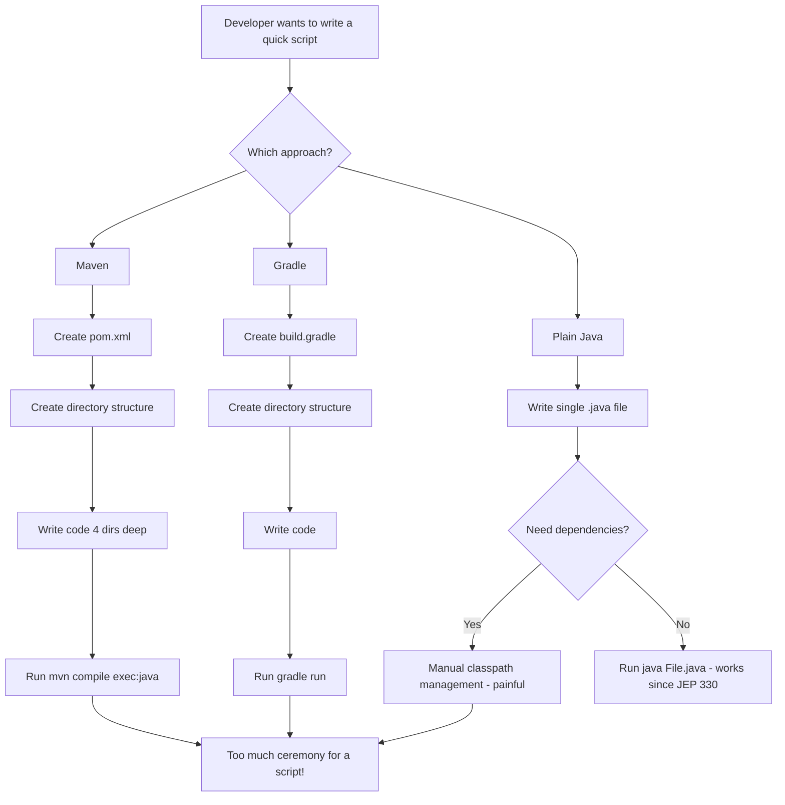
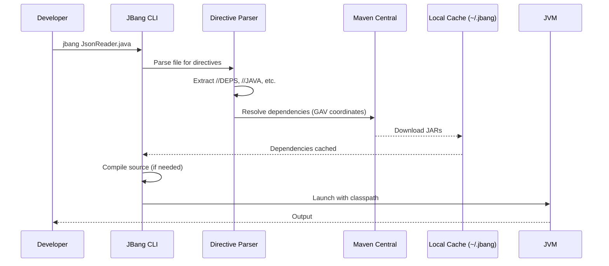
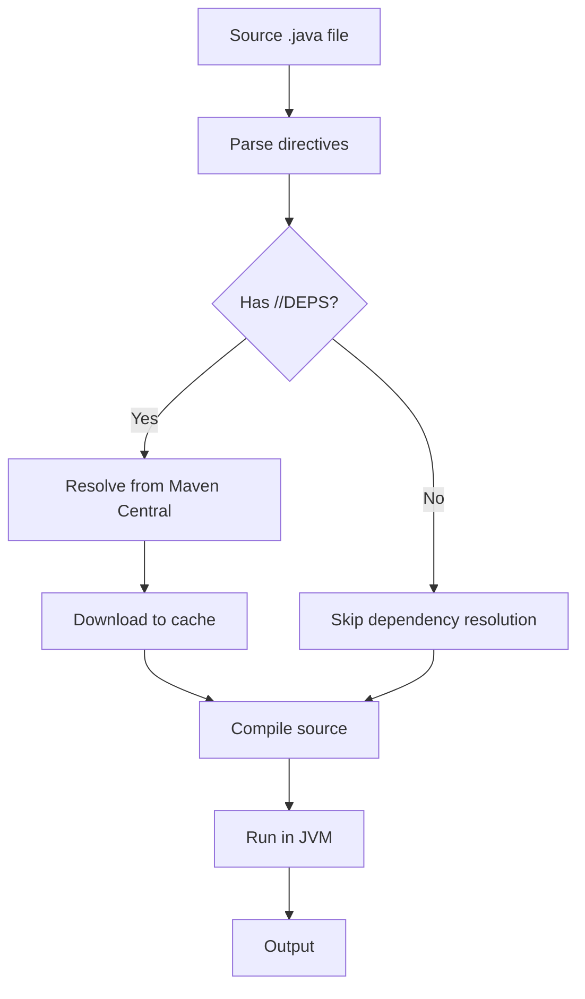
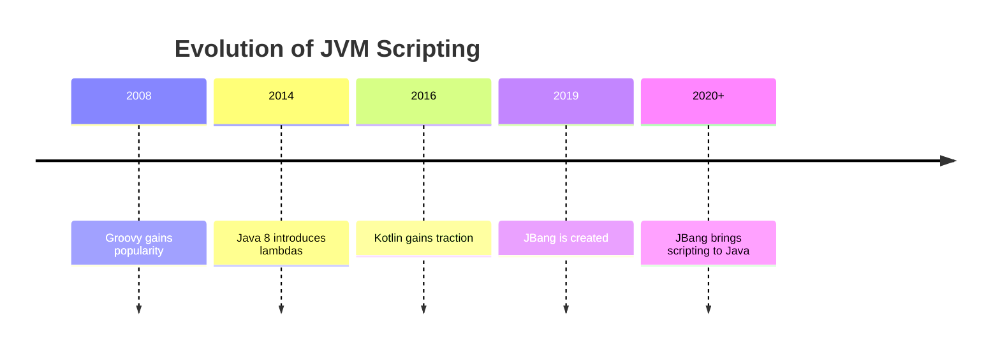
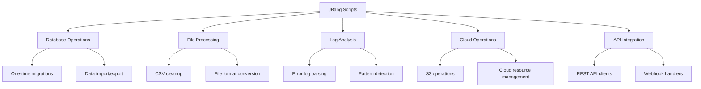
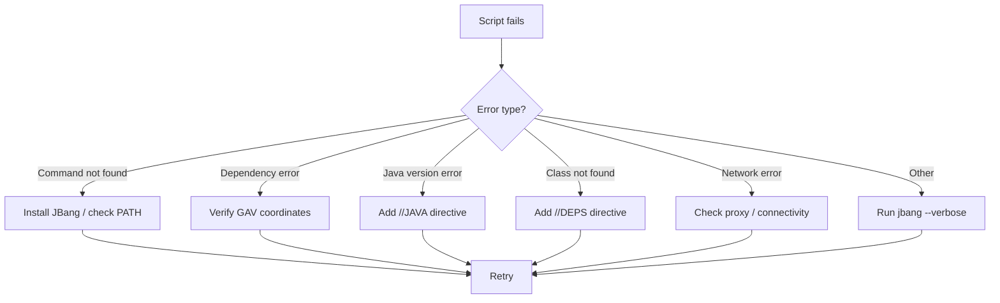

# JBang: Finally, Java Gets the Scripting Experience It Deserves — Complete Tutorial

> **Difficulty Level:** Intermediate  
> **Estimated Reading Time:** 25 minutes  
> **Last Updated:** 2026-08-16  
> **Target Audience:** Java developers, DevOps engineers, and polyglot programmers who want to write scripts without Maven/Gradle ceremony.

---

## Table of Contents

1. [Introduction / Overview](#1-introduction--overview)
2. [Prerequisites](#2-prerequisites)
3. [Learning Objectives](#3-learning-objectives)
4. [The Problem: Java's Scaffolding Obsession](#4-the-problem-javas-scaffolding-obsession)
5. [Enter JBang: One File to Rule Them All](#5-enter-jbang-one-file-to-rule-them-all)
6. [How JBang Works Under the Hood](#6-how-jbang-works-under-the-hood)
7. [Installation & Setup](#7-installation--setup)
8. [JBang Directives Deep Dive](#8-jbang-directives-deep-dive)
9. [JBang vs Groovy Scripts: A Historical Comparison](#9-jbang-vs-groovy-scripts-a-historical-comparison)
10. [Multi-Language Support: Kotlin & Groovy](#10-multi-language-support-kotlin--groovy)
11. [JBang Templates & CLI Tools](#11-jbang-templates--cli-tools)
12. [Real-World Use Cases](#12-real-world-use-cases)
13. [Testing Strategies with JBang](#13-testing-strategies-with-jbang)
14. [Performance Considerations](#14-performance-considerations)
15. [Security Considerations](#15-security-considerations)
16. [Best Practices](#16-best-practices)
17. [Anti-Patterns](#17-anti-patterns)
18. [Common Pitfalls & Troubleshooting](#18-common-pitfalls--troubleshooting)
19. [Migration Guide: From Maven/Gradle to JBang](#19-migration-guide-from-mavengradle-to-jbang)
20. [Summary / Key Takeaways](#20-summary--key-takeaways)
21. [Practice Exercises with Solutions](#21-practice-exercises-with-solutions)
22. [Test Your Understanding](#22-test-your-understanding)
23. [Common Interview Questions](#23-common-interview-questions)
24. [Question Bank (50 Questions)](#24-question-bank-50-questions)
25. [Self-Assessment Checklist](#25-self-assessment-checklist)
26. [Further Reading / Resources](#26-further-reading--resources)

---

## 1. Introduction / Overview

There are many times when you need to create scripts. From Bash scripts for dealing with terminal environments, to creating one-time environment setups, to importing/exporting from databases, S3, and so on.

For these needs, most developers resort to programming languages they are most comfortable with. If you are a Python or JavaScript developer, you're in luck. When a Python developer wants to make an HTTP request and parse JSON, they open a file and type 4 lines of code:

```python
import urllib.request
import json

with urllib.request.urlopen("https://api.example.com/data") as response:
    data = json.load(response)
```

Even when you require dependencies, scripting languages support native package managers where you can install dependencies easily. `pip` or `uv` for Python. `npm` for JavaScript projects.

Compare this to Java.

Since Java 11, under **JEP 330**, you CAN run a single `.java` file directly using `java HelloWorld.java` without needing to compile to a `.class` file. However, the situation changes dramatically when you require dependencies.

**JBang** changes this narrative. It brings the scripting experience to Java—removing the ceremony, the scaffolding, and the build-tool overhead—while keeping the full power of the Java ecosystem.

> 💡 **Key Insight:** JBang doesn't change the Java language. It removes the ceremony around it. Same Java, same libraries, zero scaffolding.

---

## 2. Prerequisites

Before diving into this tutorial, you should have:

| Prerequisite | Details |
|---|---|
| **Basic Java Knowledge** | Familiarity with Java syntax, classes, and `main` methods |
| **JDK 11+** | JBang works with Java 11 and above (JBang can auto-download JDKs too) |
| **Command Line Comfort** | Ability to run commands in a terminal |
| **Text Editor / IDE** | VS Code, IntelliJ IDEA, or any text editor |
| **Internet Connection** | Required for downloading dependencies from Maven Central |

> 💡 **Pro Tip:** JBang can automatically download and manage JDKs for you, so even if you don't have Java installed, JBang can bootstrap itself.

---

## 3. Learning Objectives

By the end of this comprehensive tutorial, you will be able to:

1. **Understand** why JBang exists and the problems it solves in the Java ecosystem
2. **Install** JBang on any major operating system
3. **Create and run** single-file Java scripts with zero build configuration
4. **Use the `//DEPS` directive** to manage dependencies from Maven Central
5. **Leverage JBang directives** like `//JAVA`, `//RUNTIME_OPTIONS`, and shebang lines
6. **Write scripts in multiple JVM languages** including Java, Kotlin, and Groovy
7. **Build CLI tools** using JBang templates and Picocli
8. **Apply best practices** and avoid common anti-patterns
9. **Troubleshoot** common JBang issues
10. **Migrate** existing Maven/Gradle projects to JBang where appropriate

---

## 4. The Problem: Java's Scaffolding Obsession

Let's say you want to write a quick script that reads a JSON file using Jackson. Here's what you traditionally need:

### 4.1 The Maven Way

First, you create the project structure:

```text
my-script/
├── pom.xml
└── src/
    └── main/
        └── java/
            └── com/
                └── example/
                    └── JsonReader.java
```

**pom.xml:**

```xml
<?xml version="1.0" encoding="UTF-8"?>
<project xmlns="http://maven.apache.org/POM/4.0.0"
         xmlns:xsi="http://www.w3.org/2001/XMLSchema-instance"
         xsi:schemaLocation="http://maven.apache.org/POM/4.0.0
         http://maven.apache.org/xsd/maven-4.0.0.xsd">
    <modelVersion>4.0.0</modelVersion>
    <groupId>com.example</groupId>
    <artifactId>json-reader</artifactId>
    <version>1.0-SNAPSHOT</version>
    <dependencies>
        <dependency>
            <groupId>com.fasterxml.jackson.core</groupId>
            <artifactId>jackson-databind</artifactId>
            <version>2.17.0</version>
        </dependency>
    </dependencies>
</project>
```

And **then** the actual code buried four directories deep:

```java
package com.example;

import com.fasterxml.jackson.databind.ObjectMapper;
import java.io.File;
import java.util.Map;

public class JsonReader {
    public static void main(String[] args) throws Exception {
        ObjectMapper mapper = new ObjectMapper();
        Map data = mapper.readValue(new File("data.json"), Map.class);
        System.out.println(data);
    }
}
```

Running it?

```bash
mvn compile exec:java -Dexec.mainClass="com.example.JsonReader"
```

Lovely.

### 4.2 The Gradle Way

Slightly better, but still a multi-file affair:

```groovy
// build.gradle
plugins {
    id 'application'
}

repositories {
    mavenCentral()
}

dependencies {
    implementation 'com.fasterxml.jackson.core:jackson-databind:2.17.0'
}

application {
    mainClass = 'JsonReader'
}
```

Plus the same directory structure, the same class file. You run it with `gradle run`. Gradle will spend a few seconds thinking about its own existence before actually running your six lines of meaningful code.

### 4.3 The Problem Summarized



> ⚠️ **The Core Problem:** Java's build tooling is designed for large, long-lived projects—not for quick scripts. The overhead of project scaffolding, build files, and directory structures makes Java impractical for scripting tasks.

---

## 5. Enter JBang: One File to Rule Them All

JBang solves this problem elegantly. Here's the same JSON reader as a JBang script:

```java
//DEPS com.fasterxml.jackson.core:jackson-databind:2.17.0

import com.fasterxml.jackson.databind.ObjectMapper;
import java.io.File;
import java.util.Map;

public class JsonReader {
    public static void main(String[] args) throws Exception {
        ObjectMapper mapper = new ObjectMapper();
        Map data = mapper.readValue(new File("data.json"), Map.class);
        System.out.println(data);
    }
}
```

That's it. One file. Run it with:

```bash
jbang JsonReader.java
```

The `//DEPS` directive automatically:
1. Installs the dependencies
2. Adds them to the classpath
3. Compiles and runs your code

**Magic.**

### 5.1 The JBang Value Proposition

```mermaid
flowchart LR
    subgraph "Traditional Java"
        A1[pom.xml] --> A2[Directory Structure]
        A2 --> A3[Source Code]
        A3 --> A4[mvn compile]
        A4 --> A5[mvn exec:java]
    end
    
    subgraph "JBang"
        B1[Single .java file] --> B2[//DEPS directive]
        B2 --> B3[jbang run]
    end
    
    A5 --> C[Result]
    B3 --> C
```

| Aspect | Traditional Java | JBang |
|---|---|---|
| **Project structure** | Multi-level directories | Single file |
| **Build file** | pom.xml / build.gradle | None (directives in comments) |
| **Dependency management** | XML/Groovy config | `//DEPS` comment |
| **Compile step** | Explicit (`mvn compile`) | Automatic |
| **Run command** | `mvn exec:java` / `gradle run` | `jbang File.java` |
| **Time to first run** | Minutes | Seconds |

---

## 6. How JBang Works Under the Hood

Understanding JBang's architecture helps you use it effectively.



### 6.1 The JBang Execution Pipeline



### 6.2 Key Components

| Component | Role |
|---|---|
| **Directive Parser** | Reads special comments (`//DEPS`, `//JAVA`, etc.) at the top of the file |
| **Dependency Resolver** | Uses Maven coordinates (GAV) to fetch dependencies |
| **Local Cache** | Stores downloaded JARs in `~/.jbang` for reuse |
| **Compiler** | Compiles the source file on-the-fly |
| **JVM Launcher** | Runs the compiled code with the correct classpath |

> 💡 **Pro Tip:** JBang caches compiled artifacts, so subsequent runs are much faster than the first run.

---

## 7. Installation & Setup

### 7.1 Cross-Platform Installation

| Platform | Command |
|---|---|
| **macOS (Homebrew)** | `brew install jbangdev/tap/jbang` |
| **Linux/macOS (SDKMAN)** | `sdk install jbang` |
| **Windows (Scoop)** | `scoop install jbang` |
| **Windows (Chocolatey)** | `choco install jbang` |
| **Any (curl script)** | `curl -Ls https://sh.jbang.dev | bash` |
| **Docker** | `docker pull jbangdev/jbang-action` |

### 7.2 Verify Installation

```bash
jbang --version
```

Expected output (version may vary):

```text
jbang version 0.117.1
```

### 7.3 IDE Integration

JBang integrates with popular IDEs:

| IDE | Integration Method |
|---|---|
| **VS Code** | Install the JBang extension from the marketplace |
| **IntelliJ IDEA** | JBang auto-detects scripts; use `jbang edit` to open in IDE |
| **Eclipse** | Use the JBang CLI to generate project files |

```bash
# Open a script in your IDE
jbang edit JsonReader.java
```

---

## 8. JBang Directives Deep Dive

JBang has many features, most of them exposed through **directives**—special comments at the start of the Java file. We've already covered `//DEPS` for installing dependencies. Let's cover the most important ones.

### 8.1 `//DEPS` — Dependency Management

```java
//DEPS com.fasterxml.jackson.core:jackson-databind:2.17.0
```

- Uses standard Maven GAV coordinates: `groupId:artifactId:version`
- Multiple dependencies can be declared on separate lines
- Dependencies are resolved from Maven Central (or custom repositories)

```java
//DEPS com.fasterxml.jackson.core:jackson-databind:2.17.0
//DEPS org.slf4j:slf4j-api:2.0.9
//DEPS info.picocli:picocli:4.7.5
```

### 8.2 SheBang — Direct Execution

If you start your file with the following directive:

```java
///usr/bin/env jbang "$0" "$@" ; exit $?
```

Then you can execute the file without prefixing it with the `jbang` CLI command. Simply call `./JsonReader.java` as long as you make the file executable with `chmod`.

```bash
chmod +x JsonReader.java
./JsonReader.java
```

```java
///usr/bin/env jbang "$0" "$@" ; exit $?
//DEPS com.fasterxml.jackson.core:jackson-databind:2.17.0

import com.fasterxml.jackson.databind.ObjectMapper;
import java.io.File;
import java.util.Map;

public class JsonReader {
    public static void main(String[] args) throws Exception {
        ObjectMapper mapper = new ObjectMapper();
        Map data = mapper.readValue(new File("data.json"), Map.class);
        System.out.println(data);
    }
}
```

> 💡 **Pro Tip:** The shebang line makes your Java script behave like a native executable—perfect for Unix-like environments and CI pipelines.

### 8.3 `//JAVA` — Setting Java Version

```java
// Exact version
//JAVA 17

// Minimum version
//JAVA 11+

// For preview features
//JAVA 25+
//PREVIEW
```

| Directive | Meaning |
|---|---|
| `//JAVA 17` | Use exactly Java 17 |
| `//JAVA 11+` | Use Java 11 or newer |
| `//JAVA 25+` + `//PREVIEW` | Use Java 25+ with preview features enabled |

### 8.4 `//RUNTIME_OPTIONS` — JVM Memory/GC Settings

```java
//RUNTIME_OPTIONS -Xmx4g -Xms1g -XX:+UseG1GC
```

This is equivalent to passing these flags to the JVM at runtime.

### 8.5 Complete Directive Reference

| Directive | Purpose | Example |
|---|---|---|
| `//DEPS` | Declare Maven dependencies | `//DEPS com.google.gson:gson:2.10.1` |
| `//JAVA` | Specify Java version | `//JAVA 17` |
| `//RUNTIME_OPTIONS` | JVM runtime flags | `//RUNTIME_OPTIONS -Xmx4g` |
| `//PREVIEW` | Enable preview features | `//PREVIEW` |
| `//KOTLIN` | Set Kotlin version | `//KOTLIN 2.0.21` |
| `//GROOVY` | Set Groovy version | `//GROOVY 3.0.19` |
| `//SOURCES` | Include additional source files | `//SOURCES util/Helper.java` |
| `//FILES` | Include resource files | `//FILES config.json` |
| `//REPOS` | Add custom repositories | `//REPOS myrepo=https://repo.example.com` |
| `//DESCRIPTION` | Human-readable description | `//DESCRIPTION Sends metrics to Datadog` |
| `//GAV` | Set group:artifact:version for packaging | `//GAV com.example:my-app` |

---

## 9. JBang vs Groovy Scripts: A Historical Comparison

The JDK did have a lesser-known feature that supported scripting in Groovy.

### 9.1 Groovy Scripts

Apache Groovy has long been Java's scripting escape valve. It offers a more concise syntax and genuine scripting capabilities with `@Grab` for dependency management:

```groovy
@Grab('com.fasterxml.jackson.core:jackson-databind:2.17.0')
import com.fasterxml.jackson.databind.ObjectMapper

def mapper = new ObjectMapper()
def data = mapper.readValue(new File("data.json"), Map)
println data
```

Run with `groovy script.groovy`. No project structure needed.

### 9.2 The Trade-offs

Groovy is excellent for scripting, and its `@Grab` annotation was a genuine innovation. But there are trade-offs compared to JBang:

| Aspect | Groovy | JBang |
|---|---|---|
| **Language popularity** | Declining | Uses mainstream Java |
| **Syntax** | Dynamic, concise | Standard Java syntax |
| **Dependency management** | `@Grab` annotation | `//DEPS` directive |
| **IDE support** | Moderate | Excellent (standard Java) |
| **Performance** | Dynamic dispatch overhead | Native JVM performance |
| **Learning curve** | New language to learn | No new language needed |

### 9.3 Why Groovy Declined

Groovy started to get popular around 2008, which predates even Java 8. Much of its strength became native Java features, most notably with Java 8 and lambdas. Kotlin also took on many of its strengths, and there weren't many use cases for Groovy anymore—**except for scripting**, until now with JBang.



---

## 10. Multi-Language Support: Kotlin & Groovy

You can even use other JVM languages with JBang—not just Java.

### 10.1 Using Kotlin

```kotlin
///usr/bin/env jbang "$0" "$@" ; exit $?
//KOTLIN 2.0.21
//DEPS org.jetbrains.kotlin:kotlin-stdlib:2.0.21

fun main(args: Array<String>) {
    println("Hello from Kotlin ${args.firstOrNull() ?: "World"}")
}
```

Run it:

```bash
jbang HelloKotlin.kt
```

### 10.2 Using Groovy

```groovy
///usr/bin/env jbang "$0" "$@" ; exit $?
//GROOVY 3.0.19
//DEPS org.codehaus.groovy:groovy:3.0.19

def name = args.length > 0 ? args[0] : "World"
println "Hello from Groovy $name"
```

Run it:

```bash
jbang HelloGroovy.groovy
```

### 10.3 Language Support Comparison

```mermaid
flowchart TD
    A[JBang] --> B[Java]
    A --> C[Kotlin]
    A --> D[Groovy]
    A --> E[Other JVM Languages]
    
    B --> B1[//DEPS + standard Java]
    C --> C1[//KOTLIN directive]
    D --> D1[//GROOVY directive]
    E --> E1[Scala, Clojure, etc.]
```

---

## 11. JBang Templates & CLI Tools

JBang ships with built-in templates. Want a proper CLI with argument parsing?

```bash
jbang init --template=cli mycli.java
```

This generates a file pre-wired with **Picocli**. But you can write one from scratch too:

```java
///usr/bin/env jbang "$0" "$@" ; exit $?
//DEPS info.picocli:picocli:4.7.5

import picocli.CommandLine;
import picocli.CommandLine.Command;
import picocli.CommandLine.Option;
import picocli.CommandLine.Parameters;
import java.io.File;
import java.nio.file.Files;

@Command(name = "linecount", mixinStandardHelpOptions = true,
         description = "Counts lines in files")
public class linecount implements Runnable {

    @Parameters(description = "Files to count lines in")
    File[] files;

    @Option(names = {"-v", "--verbose"}, description = "Show per-file counts")
    boolean verbose;

    @Override
    public void run() {
        long total = 0;
        for (File f : files) {
            try {
                long count = Files.lines(f.toPath()).count();
                total += count;
                if (verbose) {
                    System.out.printf("%6d %s%n", count, f.getName());
                }
            } catch (Exception e) {
                System.err.println("Error reading " + f + ": " + e.getMessage());
            }
        }
        System.out.printf("%6d total%n", total);
    }

    public static void main(String[] args) {
        int exitCode = new CommandLine(new linecount()).execute(args);
        System.exit(exitCode);
    }
}
```

### 11.1 Available Templates

| Template | Description |
|---|---|
| `hello` | Basic hello world script |
| `cli` | CLI tool with Picocli argument parsing |
| `quarkus` | Quarkus-based application |
| `picocli` | Picocli-based CLI |
| `kotlin` | Kotlin script |
| `groovy` | Groovy script |

```bash
# List all available templates
jbang template list

# Create a script from a template
jbang init --template=cli mycli.java
```

---

## 12. Real-World Use Cases

### 12.1 One-Time Database Migration

```java
//DEPS org.postgresql:postgresql:42.7.3
//DEPS org.slf4j:slf4j-simple:2.0.9

import java.sql.*;

public class DbMigration {
    public static void main(String[] args) throws Exception {
        String url = "jdbc:postgresql://localhost:5432/mydb";
        try (Connection conn = DriverManager.getConnection(url, "user", "pass")) {
            try (Statement stmt = conn.createStatement()) {
                stmt.execute("CREATE TABLE IF NOT EXISTS users (id SERIAL PRIMARY KEY, name TEXT)");
                System.out.println("Migration completed successfully!");
            }
        }
    }
}
```

### 12.2 CSV Cleanup Script

```java
//DEPS com.opencsv:opencsv:5.9

import com.opencsv.CSVReader;
import com.opencsv.CSVWriter;
import java.io.FileReader;
import java.io.FileWriter;
import java.util.List;

public class CsvCleanup {
    public static void main(String[] args) throws Exception {
        try (CSVReader reader = new CSVReader(new FileReader("input.csv"));
             CSVWriter writer = new CSVWriter(new FileWriter("output.csv"))) {
            List<String[]> rows = reader.readAll();
            for (String[] row : rows) {
                // Remove empty rows
                if (row.length > 0 && !row[0].isEmpty()) {
                    writer.writeNext(row);
                }
            }
            System.out.println("Cleaned " + rows.size() + " rows");
        }
    }
}
```

### 12.3 Log Parser at 2 AM

```java
//DEPS com.fasterxml.jackson.core:jackson-databind:2.17.0

import com.fasterxml.jackson.databind.JsonNode;
import com.fasterxml.jackson.databind.ObjectMapper;
import java.nio.file.*;
import java.util.stream.Stream;

public class LogParser {
    public static void main(String[] args) throws Exception {
        ObjectMapper mapper = new ObjectMapper();
        Path logFile = Paths.get("app.log");
        
        try (Stream<String> lines = Files.lines(logFile)) {
            lines.filter(line -> line.contains("ERROR"))
                 .forEach(line -> {
                     try {
                         JsonNode node = mapper.readTree(line.substring(line.indexOf('{')));
                         System.out.println(node.get("message").asText());
                     } catch (Exception e) {
                         System.out.println("Raw: " + line);
                     }
                 });
        }
    }
}
```

### 12.4 S3 Import/Export Script

```java
//DEPS software.amazon.awssdk:s3:2.25.0

import software.amazon.awssdk.services.s3.S3Client;
import software.amazon.awssdk.services.s3.model.*;

public class S3Export {
    public static void main(String[] args) {
        S3Client s3 = S3Client.create();
        ListObjectsV2Response response = s3.listObjectsV2(
            ListObjectsV2Request.builder().bucket("my-bucket").build()
        );
        response.contents().forEach(obj -> 
            System.out.println(obj.key() + " (" + obj.size() + " bytes)")
        );
    }
}
```

### 12.5 Real-World Use Case Summary



---

## 13. Testing Strategies with JBang

JBang can be used for testing scripts and even running JUnit tests.

### 13.1 Simple Script Testing

```java
//DEPS org.junit.jupiter:junit-jupiter:5.10.2

import org.junit.jupiter.api.Test;
import static org.junit.jupiter.api.Assertions.*;

public class Calculator {
    public static int add(int a, int b) {
        return a + b;
    }
}

class CalculatorTest {
    @Test
    void testAdd() {
        assertEquals(5, Calculator.add(2, 3));
    }
}
```

### 13.2 Running Tests

```bash
# Run tests in a script
jbang test Calculator.java
```

### 13.3 Testing Strategy Best Practices

| Practice | Description |
|---|---|
| **Test scripts in CI** | Run JBang scripts in CI pipelines to catch regressions |
| **Use JUnit for logic** | Extract complex logic into testable methods |
| **Test with real dependencies** | JBang resolves real dependencies, so tests are realistic |
| **Keep scripts small** | Small scripts are easier to test and maintain |

---

## 14. Performance Considerations

### 14.1 Startup Time Comparison

| Approach | First Run (Cold) | Subsequent Runs (Warm) |
|---|---|---|
| **Maven** | 5-10 seconds | 2-4 seconds |
| **Gradle** | 8-15 seconds | 3-5 seconds |
| **JBang** | 2-5 seconds | 0.5-1 second |
| **Plain Java (JEP 330)** | 0.5-1 second | 0.3-0.5 second |

### 14.2 Performance Optimization Tips

1. **Use the cache**: JBang caches dependencies and compiled classes. Subsequent runs are much faster.
2. **Pin Java versions**: Use `//JAVA 17` to avoid version resolution overhead.
3. **Minimize dependencies**: Fewer dependencies = faster resolution and startup.
4. **Use `--offline` mode**: For repeated runs without network access.

```bash
# Run in offline mode (uses cached dependencies)
jbang --offline JsonReader.java
```

### 14.3 Memory Considerations

```java
//RUNTIME_OPTIONS -Xmx4g -Xms1g -XX:+UseG1GC
```

- Use `-Xmx` to limit maximum heap size
- Use `-Xms` to set initial heap size
- Use `-XX:+UseG1GC` for modern garbage collection

---

## 15. Security Considerations

### 15.1 Dependency Supply Chain

| Risk | Mitigation |
|---|---|
| **Malicious dependencies** | Only use well-known, verified libraries from Maven Central |
| **Version pinning** | Always pin exact versions (avoid SNAPSHOT builds) |
| **Transitive dependencies** | Review what your dependencies pull in |
| **Cache poisoning** | Verify the integrity of cached artifacts |

### 15.2 Script Security

| Risk | Mitigation |
|---|---|
| **Running untrusted scripts** | Only run scripts from trusted sources |
| **Code injection** | Review scripts before executing them |
| **Secret leakage** | Never hardcode credentials in scripts; use environment variables |

```java
// Use environment variables for secrets
String dbPassword = System.getenv("DB_PASSWORD");
```

### 15.3 Security Best Practices

1. **Pin exact dependency versions** — avoid version ranges
2. **Use environment variables** for secrets, never hardcode
3. **Review scripts** before running them, especially from external sources
4. **Use `jbang trust`** to manage which repositories are trusted
5. **Run with least privilege** — don't run scripts as root unless necessary

---

## 16. Best Practices

### 16.1 Script Organization

```text
scripts/
├── db/
│   ├── migrate.java
│   └── export.java
├── data/
│   ├── csv-cleanup.java
│   └── json-transform.java
└── ops/
    ├── health-check.java
    └── log-parser.java
```

### 16.2 Best Practices Checklist

| Practice | Description |
|---|---|
| **Use shebang lines** | Make scripts executable directly |
| **Pin Java versions** | Use `//JAVA 17` for reproducibility |
| **Pin dependency versions** | Avoid SNAPSHOT and version ranges |
| **Add descriptions** | Use `//DESCRIPTION` for documentation |
| **Keep scripts focused** | One script = one task |
| **Use environment variables** | For configuration and secrets |
| **Add error handling** | Handle exceptions gracefully |
| **Test your scripts** | Use JUnit for complex logic |

### 16.3 Example: A Well-Structured Script

```java
///usr/bin/env jbang "$0" "$@" ; exit $?
//DESCRIPTION Exports user data to CSV
//JAVA 17
//DEPS com.opencsv:opencsv:5.9
//DEPS org.postgresql:postgresql:42.7.3

import com.opencsv.CSVWriter;
import java.sql.*;
import java.io.FileWriter;

public class ExportUsers {
    public static void main(String[] args) throws Exception {
        String url = System.getenv("DB_URL");
        String user = System.getenv("DB_USER");
        String pass = System.getenv("DB_PASSWORD");
        
        try (Connection conn = DriverManager.getConnection(url, user, pass);
             Statement stmt = conn.createStatement();
             ResultSet rs = stmt.executeQuery("SELECT id, name, email FROM users");
             CSVWriter writer = new CSVWriter(new FileWriter("users.csv"))) {
            
            writer.writeNext(new String[]{"ID", "Name", "Email"});
            while (rs.next()) {
                writer.writeNext(new String[]{
                    rs.getString("id"),
                    rs.getString("name"),
                    rs.getString("email")
                });
            }
            System.out.println("Export completed!");
        }
    }
}
```

---

## 17. Anti-Patterns

### 17.1 Anti-Patterns to Avoid

| Anti-Pattern | Why It's Bad | Better Approach |
|---|---|---|
| **Hardcoding credentials** | Security risk | Use environment variables |
| **Using SNAPSHOT versions** | Unreproducible builds | Pin exact versions |
| **Giant monolithic scripts** | Hard to maintain | Split into focused scripts |
| **Ignoring error handling** | Silent failures | Add try-catch and logging |
| **Not pinning Java version** | Inconsistent behavior | Use `//JAVA 17` |
| **Using JBang for large projects** | Wrong tool for the job | Use Maven/Gradle for big apps |
| **Copy-pasting scripts** | Duplication | Use JBang catalogs/aliases |

### 17.2 Example: Anti-Pattern vs Best Practice

**❌ Anti-Pattern: Hardcoded credentials**

```java
//DEPS org.postgresql:postgresql:42.7.3

public class BadScript {
    public static void main(String[] args) throws Exception {
        // BAD: Hardcoded credentials
        String url = "jdbc:postgresql://localhost:5432/mydb";
        String user = "admin";
        String pass = "password123";
        // ... connection code
    }
}
```

**✅ Best Practice: Environment variables**

```java
//DEPS org.postgresql:postgresql:42.7.3

public class GoodScript {
    public static void main(String[] args) throws Exception {
        // GOOD: Use environment variables
        String url = System.getenv("DB_URL");
        String user = System.getenv("DB_USER");
        String pass = System.getenv("DB_PASSWORD");
        // ... connection code
    }
}
```

---

## 18. Common Pitfalls & Troubleshooting

### 18.1 Common Errors and Solutions

| Error | Cause | Solution |
|---|---|---|
| `jbang: command not found` | JBang not installed or not in PATH | Install JBang and add to PATH |
| `Unable to resolve dependency` | Wrong GAV coordinates or network issue | Verify coordinates; check network |
| `Unsupported class file major version` | Java version mismatch | Add `//JAVA 17` to script |
| `Class not found` | Dependency not declared | Add `//DEPS` directive |
| `Slow first run` | Downloading dependencies | Normal; subsequent runs are cached |
| `Proxy issues` | Corporate network | Configure proxy settings |
| `Script doesn't terminate` | Server code keeps JVM alive | Use `System.exit(0)` |

### 18.2 Troubleshooting Commands

```bash
# Check JBang health
jbang doctor

# Clear cache (fixes stuck dependencies)
jbang cache clear

# Verbose output for debugging
jbang --verbose JsonReader.java

# List all dependencies
jbang deps JsonReader.java

# Force fresh download
jbang --fresh JsonReader.java
```

### 18.3 Troubleshooting Flowchart



---

## 19. Migration Guide: From Maven/Gradle to JBang

### 19.1 When to Migrate

**Migrate to JBang when:**
- You have small, self-contained scripts
- You need quick prototyping
- You want to share scripts easily
- You're doing one-off tasks

**Don't migrate when:**
- You have large, multi-module projects
- You need complex build configurations
- You have many developers on a large codebase
- You need advanced packaging and deployment

### 19.2 Migration Steps

**Step 1: Identify the dependencies**

From `pom.xml`:
```xml
<dependencies>
    <dependency>
        <groupId>com.fasterxml.jackson.core</groupId>
        <artifactId>jackson-databind</artifactId>
        <version>2.17.0</version>
    </dependency>
</dependencies>
```

**Step 2: Convert to JBang directives**

```java
//DEPS com.fasterxml.jackson.core:jackson-databind:2.17.0
```

**Step 3: Remove package declarations** (for simple scripts)

**Step 4: Add shebang and Java version**

```java
///usr/bin/env jbang "$0" "$@" ; exit $?
//JAVA 17
//DEPS com.fasterxml.jackson.core:jackson-databind:2.17.0
```

**Step 5: Run with JBang**

```bash
jbang JsonReader.java
```

### 19.3 Migration Comparison

| Aspect | Maven Project | JBang Script |
|---|---|---|
| **Files** | pom.xml + directory structure | Single .java file |
| **Dependencies** | XML configuration | `//DEPS` comments |
| **Build** | `mvn compile` | Automatic |
| **Run** | `mvn exec:java` | `jbang File.java` |
| **Test** | `mvn test` | `jbang test File.java` |

---

## 20. Summary / Key Takeaways

### 20.1 Key Takeaways

1. **JBang removes Java's scripting barrier** — no more Maven/Gradle ceremony for quick scripts
2. **`//DEPS` is the magic** — declare dependencies in comments, JBang handles the rest
3. **One file, one script** — no project structure needed
4. **Multi-language support** — Java, Kotlin, Groovy, and more
5. **Shebang support** — scripts can be executed directly like native executables
6. **JBang won't replace Python or your build tool** — but it's perfect for scripts that are too complex for bash and too throwaway for Maven

### 20.2 The JBang Philosophy

> "For years, the unspoken rule was: if you need a quick script, don't use Java. JBang changes that. It doesn't change the language — it removes the ceremony around it. Same Java, same libraries, zero scaffolding."

Think about all the throwaway scripts in your career — the one-time database migration, the CSV cleanup, the log parser at 2 AM. They lived in bash or Python because Java's startup cost was too high for something you'll run three times and delete. With JBang, that cost is zero.

---

## 21. Practice Exercises with Solutions

### Exercise 1: Hello World with Dependencies

**Task:** Create a JBang script that uses the Gson library to parse a JSON string and print the result.

**Solution:**

```java
//DEPS com.google.code.gson:gson:2.10.1

import com.google.gson.Gson;
import com.google.gson.JsonObject;

public class JsonDemo {
    public static void main(String[] args) {
        Gson gson = new Gson();
        String json = "{\"name\":\"JBang\",\"type\":\"script\"}";
        JsonObject obj = gson.fromJson(json, JsonObject.class);
        System.out.println("Name: " + obj.get("name").getAsString());
        System.out.println("Type: " + obj.get("type").getAsString());
    }
}
```

**Run:**
```bash
jbang JsonDemo.java
```

**Expected Output:**
```text
Name: JBang
Type: script
```

---

### Exercise 2: Build a CLI Tool

**Task:** Create a JBang script that accepts a filename as an argument and prints the number of lines in the file.

**Solution:**

```java
///usr/bin/env jbang "$0" "$@" ; exit $?
//JAVA 17
//DEPS info.picocli:picocli:4.7.5

import picocli.CommandLine;
import picocli.CommandLine.Command;
import picocli.CommandLine.Parameters;
import java.io.File;
import java.nio.file.Files;
import java.util.concurrent.Callable;

@Command(name = "linecount", description = "Counts lines in a file")
public class LineCount implements Callable<Integer> {

    @Parameters(index = "0", description = "The file to count")
    private File file;

    @Override
    public Integer call() throws Exception {
        if (!file.exists()) {
            System.err.println("File not found: " + file);
            return 1;
        }
        long count = Files.lines(file.toPath()).count();
        System.out.println(file.getName() + ": " + count + " lines");
        return 0;
    }

    public static void main(String[] args) {
        System.exit(new CommandLine(new LineCount()).execute(args));
    }
}
```

**Run:**
```bash
jbang LineCount.java myfile.txt
```

---

### Exercise 3: Multi-Language Script

**Task:** Create a Kotlin script using JBang that prints "Hello from Kotlin" and accepts an optional name argument.

**Solution:**

```kotlin
///usr/bin/env jbang "$0" "$@" ; exit $?
//KOTLIN 2.0.21
//DEPS org.jetbrains.kotlin:kotlin-stdlib:2.0.21

fun main(args: Array<String>) {
    val name = args.firstOrNull() ?: "World"
    println("Hello from Kotlin, $name!")
}
```

**Run:**
```bash
jbang HelloKotlin.kt JBang
```

**Expected Output:**
```text
Hello from Kotlin, JBang!
```

---

### Exercise 4: Database Script

**Task:** Create a JBang script that connects to a PostgreSQL database and prints the current time from the database.

**Solution:**

```java
//DEPS org.postgresql:postgresql:42.7.3

import java.sql.*;

public class DbTime {
    public static void main(String[] args) throws Exception {
        String url = System.getenv("DB_URL");
        String user = System.getenv("DB_USER");
        String pass = System.getenv("DB_PASSWORD");
        
        try (Connection conn = DriverManager.getConnection(url, user, pass);
             Statement stmt = conn.createStatement();
             ResultSet rs = stmt.executeQuery("SELECT NOW()")) {
            if (rs.next()) {
                System.out.println("Database time: " + rs.getTimestamp(1));
            }
        }
    }
}
```

**Run:**
```bash
export DB_URL="jdbc:postgresql://localhost:5432/mydb"
export DB_USER="postgres"
export DB_PASSWORD="secret"
jbang DbTime.java
```

---

### Exercise 5: File Processing Script

**Task:** Create a JBang script that reads a CSV file and prints the total number of rows and the sum of a numeric column.

**Solution:**

```java
//DEPS com.opencsv:opencsv:5.9

import com.opencsv.CSVReader;
import java.io.FileReader;

public class CsvStats {
    public static void main(String[] args) throws Exception {
        if (args.length < 2) {
            System.err.println("Usage: jbang CsvStats.java <file.csv> <columnIndex>");
            System.exit(1);
        }
        
        String file = args[0];
        int columnIndex = Integer.parseInt(args[1]);
        int rowCount = 0;
        double sum = 0;
        
        try (CSVReader reader = new CSVReader(new FileReader(file))) {
            String[] row;
            while ((row = reader.readNext()) != null) {
                if (row.length > columnIndex) {
                    try {
                        sum += Double.parseDouble(row[columnIndex]);
                        rowCount++;
                    } catch (NumberFormatException e) {
                        // Skip non-numeric values
                    }
                }
            }
        }
        
        System.out.println("Rows: " + rowCount);
        System.out.println("Sum of column " + columnIndex + ": " + sum);
    }
}
```

**Run:**
```bash
jbang CsvStats.java data.csv 2
```

---

## 22. Test Your Understanding

Answer the following questions to test your understanding of JBang:

1. What does the `//DEPS` directive do in a JBang script?
2. How do you make a JBang script directly executable on Unix systems?
3. What is the difference between `//JAVA 17` and `//JAVA 11+`?
4. How do you set JVM memory options in a JBang script?
5. Can JBang run Kotlin scripts? If so, how?
6. What is the purpose of the `//PREVIEW` directive?
7. How does JBang differ from Groovy's `@Grab` annotation?
8. What is the JBang cache and why is it important?
9. How do you run a JBang script in offline mode?
10. What are the security considerations when using JBang dependencies?

---

## 23. Common Interview Questions

1. **What is JBang and what problem does it solve?**
   - JBang is a tool that allows running Java (and other JVM languages) scripts directly from source files without build configuration. It solves the problem of Java's high setup overhead for scripting tasks.

2. **How does JBang manage dependencies?**
   - JBang uses the `//DEPS` directive with Maven GAV coordinates (groupId:artifactId:version) to declare dependencies, which are resolved from Maven Central and cached locally.

3. **What is the difference between JBang and JEP 330 (single-file source-code execution)?**
   - JEP 330 allows running single `.java` files with `java File.java`, but doesn't support external dependencies. JBang extends this with dependency management, version pinning, and multi-language support.

4. **Can JBang be used for production applications?**
   - Yes, for small to medium applications and scripts. For large, complex applications, traditional build tools like Maven or Gradle are more appropriate.

5. **How does JBang handle Java version management?**
   - JBang can auto-download and manage JDKs. The `//JAVA` directive specifies the required version, and JBang ensures the correct JDK is used.

6. **What JVM languages does JBang support?**
   - JBang supports Java, Kotlin, Groovy, and other JVM languages through directives like `//KOTLIN` and `//GROOVY`.

7. **How do you test JBang scripts?**
   - JBang supports JUnit testing. You can write test classes and run them with `jbang test`.

8. **What is the JBang cache and how do you manage it?**
   - The JBang cache stores downloaded dependencies and compiled classes in `~/.jbang`. You can clear it with `jbang cache clear`.

9. **How does JBang compare to Groovy for scripting?**
   - JBang uses standard Java syntax (no new language to learn), has better IDE support, and better performance. Groovy offers more concise syntax but is less popular now.

10. **What are the security considerations when using JBang?**
    - Pin exact dependency versions, use environment variables for secrets, review scripts from untrusted sources, and use `jbang trust` to manage trusted repositories.

---

## 24. Question Bank (50 Questions)

### Beginner Level (Questions 1-15)

1. What command installs JBang on macOS via Homebrew?
   - `brew install jbangdev/tap/jbang`

2. What is the primary directive for declaring dependencies in JBang?
   - `//DEPS`

3. What does GAV stand for in Maven coordinates?
   - GroupId:ArtifactId:Version

4. How do you run a JBang script?
   - `jbang ScriptName.java`

5. What is the shebang line used for in JBang scripts?
   - To make the script directly executable on Unix systems

6. What Java version does JBang require as a minimum?
   - Java 11

7. What is the JBang cache directory?
   - `~/.jbang`

8. How do you check the JBang version?
   - `jbang --version`

9. What directive sets the Java version in a JBang script?
   - `//JAVA`

10. Can JBang run Kotlin scripts?
    - Yes, using the `//KOTLIN` directive

11. What is the command to create a new JBang script from a template?
    - `jbang init --template=cli mycli.java`

12. What does the `//PREVIEW` directive do?
    - Enables Java preview features

13. How do you make a JBang script executable directly?
    - Add shebang line and run `chmod +x script.java`

14. What is the default repository JBang uses for dependencies?
    - Maven Central

15. What command clears the JBang cache?
    - `jbang cache clear`

### Intermediate Level (Questions 16-35)

16. How do you declare multiple dependencies in a JBang script?
    - Use multiple `//DEPS` lines

17. What is the purpose of the `//RUNTIME_OPTIONS` directive?
    - To set JVM runtime flags like memory settings

18. How do you set the maximum heap size in a JBang script?
    - `//RUNTIME_OPTIONS -Xmx4g`

19. What is the difference between `//JAVA 17` and `//JAVA 11+`?
    - `//JAVA 17` requires exactly Java 17; `//JAVA 11+` requires Java 11 or newer

20. How do you run a JBang script in offline mode?
    - `jbang --offline script.java`

21. What is the `//SOURCES` directive used for?
    - To include additional source files

22. How do you add a custom Maven repository in JBang?
    - Use the `//REPOS` directive

23. What is the `//DESCRIPTION` directive used for?
    - To provide a human-readable description of the script

24. How do you open a JBang script in an IDE?
    - `jbang edit script.java`

25. What is the `//GAV` directive used for?
    - To set the group:artifact:version for packaging

26. How do you run tests in a JBang script?
    - `jbang test script.java`

27. What is the purpose of the `//FILES` directive?
    - To include resource files in the script

28. How do you pass arguments to a JBang script?
    - `jbang script.java arg1 arg2`

29. What is the `jbang doctor` command used for?
    - To check JBang's health and configuration

30. How do you list all dependencies of a JBang script?
    - `jbang deps script.java`

31. What does the `--fresh` flag do?
    - Forces JBang to re-download dependencies

32. How do you create a JBang script from a URL?
    - `jbang https://example.com/script.java`

33. What is the `jbang alias` command used for?
    - To create shell aliases for JBang scripts

34. How do you export a JBang script as a JAR?
    - `jbang export portable script.java`

35. What is the `jbang template list` command used for?
    - To list all available JBang templates

### Advanced Level (Questions 36-50)

36. How does JBang handle transitive dependencies?
    - JBang resolves transitive dependencies automatically through Maven's dependency resolution

37. What is the difference between JBang and JShell?
    - JShell is an interactive REPL; JBang runs complete scripts with dependency management

38. How do you use environment variables in JBang scripts?
    - `System.getenv("VAR_NAME")`

39. What is the `jbang trust` command used for?
    - To manage which repositories are trusted for running scripts

40. How do you pin a specific JDK vendor in JBang?
    - Use `//JAVA 17@Liberica` or similar vendor-specific syntax

41. What is the purpose of the `//JAVAC_OPTIONS` directive?
    - To pass options to the Java compiler

42. How do you create a custom JBang template?
    - Create a template directory and register it with JBang

43. What is the `jbang export native` command used for?
    - To export a script as a native executable (requires GraalVM)

44. How does JBang handle version ranges in dependencies?
    - JBang supports Maven version ranges like `[2.0,3.0)`

45. What is the `jbang build` command used for?
    - To compile a script without running it

46. How do you debug a JBang script?
    - Use `jbang --verbose script.java` or attach a debugger via IDE

47. What is the `jbang java` command used for?
    - To run a JVM with the same environment as JBang

48. How do you manage multiple JDK versions with JBang?
    - Use `jbang jdk list` and `jbang jdk install <version>`

49. What is the `jbang app` command used for?
    - To install JBang-based applications as system commands

50. How does JBang integrate with CI/CD pipelines?
    - JBang can be installed in CI environments and used to run scripts, tests, and build tools

---

## 25. Self-Assessment Checklist

Use this checklist to assess your JBang proficiency:

### Installation & Setup
- [ ] I can install JBang on my operating system
- [ ] I can verify the JBang installation
- [ ] I can integrate JBang with my IDE

### Basic Scripting
- [ ] I can create and run a basic JBang script
- [ ] I can use the `//DEPS` directive to add dependencies
- [ ] I can pass arguments to JBang scripts
- [ ] I can use the shebang line for direct execution

### Directives
- [ ] I can use `//JAVA` to pin Java versions
- [ ] I can use `//RUNTIME_OPTIONS` for JVM settings
- [ ] I can use `//PREVIEW` for preview features
- [ ] I can use `//KOTLIN` and `//GROOVY` for other languages

### Advanced Features
- [ ] I can create CLI tools with Picocli
- [ ] I can use JBang templates
- [ ] I can run tests with JBang
- [ ] I can manage the JBang cache
- [ ] I can troubleshoot common JBang issues

### Best Practices
- [ ] I use environment variables for secrets
- [ ] I pin exact dependency versions
- [ ] I add descriptions to my scripts
- [ ] I handle errors gracefully in my scripts

---

## 26. Further Reading / Resources

### Official Documentation
- [JBang Official Website](https://www.jbang.dev/)
- [JBang Documentation](https://www.jbang.dev/documentation/)
- [JBang Templates](https://www.jbang.dev/documentation/jbang/latest/templates.html)
- [JBang GitHub Repository](https://github.com/jbangdev/jbang)

### Related Topics
- [JEP 330: Launch Single-File Source-Code Programs](https://openjdk.org/jeps/330)
- [Apache Groovy](https://groovy-lang.org/)
- [Kotlin](https://kotlinlang.org/)
- [Picocli](https://picocli.info/)
- [Maven Central](https://search.maven.org/)

### Community Resources
- [JBang on Twitter/X](https://twitter.com/jbangdev)
- [JBang Blog](https://www.jbang.dev/blog/)

---

## Conclusion

JBang represents a significant shift in how Java developers can approach scripting. It doesn't replace Python or your build tool, but for the script that's too complex for bash and too throwaway for a Maven project—it's exactly right.

**Remember:** JBang won't replace Python or your build tool. But for the script that's too complex for bash and too throwaway for a Maven project — it's exactly right.

Happy scripting! 🚀