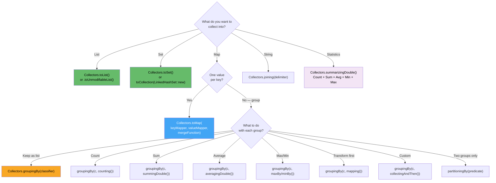

# Java Stream API Mastery: 35 Real-World Scenarios With Production-Grade Solutions

> *Interview questions about streams are never really about streams. They're about how you think about data pipelines, which collectors compose cleanly, where performance matters, and whether you understand the difference between code that works and code that belongs in production.*

---

## How Senior Engineers Think About Stream Problems

Before diving into solutions, establish the mental model. Every stream problem reduces to asking four questions in sequence:

1. **What is the source?** (collection, file, range, generator)
2. **What transformations are needed?** (filter, map, flatMap, sorted)
3. **How should results be grouped or aggregated?** (collect, reduce, groupingBy)
4. **What is the output shape?** (List, Map, Optional, primitive)

The collector is usually where the real design decision lives. Most developers know `filter()` and `map()`. What separates senior engineers is knowing which collector to reach for — and when *not* to use streams at all.

---

## Domain Models Used Throughout

All examples use these models:

```java
// Employee domain
record Employee(
   String id,
   String name,
   String department,
   double salary,
   LocalDate joinDate,
   EmployeeLevel level
) {}

enum EmployeeLevel { JUNIOR, MID, SENIOR, PRINCIPAL }

// Transaction domain
record Transaction(
   String id,
   String userId,
   double amount,
   TransactionStatus status,
   LocalDateTime timestamp,
   String category
) {}

enum TransactionStatus { SUCCESS, FAILED, PENDING, REVERSED }

// Order domain
record Order(
   String orderId,
   String customerId,
   String productId,
   String category,
   double price,
   int quantity,
   LocalDate orderDate
) {}
```

---

## Section 1: Employee Analytics

### Q1: Top 3 Highest-Paid Employees Per Department

```java
// Naive approach — works but materializes all lists before sorting
Map<String, List<Employee>> topThreePerDept =
   employees.stream()
       .collect(Collectors.groupingBy(
           Employee::department,
           Collectors.collectingAndThen(
               Collectors.toList(),
               list -> list.stream()
                   .sorted(Comparator.comparingDouble(Employee::salary).reversed())
                   .limit(3)
                   .toList()
           )
       ));

// Production approach — use TreeSet with bounded size to avoid sorting full lists
// Especially valuable when departments have thousands of employees
Map<String, List<Employee>> topThreePerDeptEfficient =
   employees.stream()
       .collect(Collectors.groupingBy(
           Employee::department,
           Collectors.collectingAndThen(
               Collectors.toCollection(() ->
                   new TreeSet<>(Comparator.comparingDouble(Employee::salary).reversed())
               ),
               set -> set.stream().limit(3).toList()
           )
       ));

// Interview follow-up: "What if there are ties at position 3?"
// Use a ranked approach that includes all employees at the boundary salary
Map<String, List<Employee>> topThreeWithTies =
   employees.stream()
       .collect(Collectors.groupingBy(Employee::department))
       .entrySet().stream()
       .collect(Collectors.toMap(
           Map.Entry::getKey,
           entry -> {
               List<Employee> sorted = entry.getValue().stream()
                   .sorted(Comparator.comparingDouble(Employee::salary).reversed())
                   .toList();

               if (sorted.size() <= 3) return sorted;

               // Find the salary at position 3 (index 2)
               double thresholdSalary = sorted.get(2).salary();

               // Include all employees at or above that salary
               return sorted.stream()
                   .filter(e -> e.salary() >= thresholdSalary)
                   .toList();
           }
       ));
```

**Why it matters in interviews:** the follow-up about ties reveals whether you've actually handled this in production. Salary ranking with exact equals at a boundary is a real edge case in HR systems.

---

### Q2: Highest-Paid Employee Per Department

```java
// Returns Optional<Employee> — correct but awkward to work with downstream
Map<String, Optional<Employee>> withOptionals =
   employees.stream()
       .collect(Collectors.groupingBy(
           Employee::department,
           Collectors.maxBy(Comparator.comparingDouble(Employee::salary))
       ));

// Production-grade: unwrap Optionals, handle empty departments
Map<String, Employee> topPerDept =
   employees.stream()
       .collect(Collectors.groupingBy(
           Employee::department,
           Collectors.collectingAndThen(
               Collectors.maxBy(Comparator.comparingDouble(Employee::salary)),
               opt -> opt.orElseThrow(() ->
                   new IllegalStateException("Empty department group — shouldn't happen"))
           )
       ));

// Alternative with toMap — cleaner for non-grouped scenarios
Map<String, Employee> topPerDeptAlt =
   employees.stream()
       .collect(Collectors.toMap(
           Employee::department,
           e -> e,
           (existing, challenger) ->
               challenger.salary() > existing.salary() ? challenger : existing
       ));
```

**The `toMap` with merge function** is often cleaner than `groupingBy + maxBy` when you only need one value per key. It reads as: "if there's a conflict, keep the one with higher salary."

---

### Q3 & Q4: Salary Statistics Per Department

```java
// Average salary per department
Map<String, Double> avgSalaryByDept =
   employees.stream()
       .collect(Collectors.groupingBy(
           Employee::department,
           Collectors.averagingDouble(Employee::salary)
       ));

// Count per department
Map<String, Long> countByDept =
   employees.stream()
       .collect(Collectors.groupingBy(
           Employee::department,
           Collectors.counting()
       ));

// BETTER: Get both in a single pass using summarizingDouble
Map<String, DoubleSummaryStatistics> statsPerDept =
   employees.stream()
       .collect(Collectors.groupingBy(
           Employee::department,
           Collectors.summarizingDouble(Employee::salary)
       ));

// Now you have count, sum, min, max, average from ONE traversal
statsPerDept.forEach((dept, stats) -> {
   System.out.printf("%-15s count=%-5d avg=%,.2f min=%,.2f max=%,.2f%n",
       dept,
       stats.getCount(),
       stats.getAverage(),
       stats.getMin(),
       stats.getMax()
   );
});
```

**Interview insight:** whenever you find yourself running two groupingBy operations over the same data, ask whether `summarizingDouble` or a custom collector can do both in one pass. For large datasets, this halves the traversal cost.

---

### Q5: Department With Highest Total Salary Budget

```java
// Find the max entry after summing
Optional<Map.Entry<String, Double>> highestBudgetDept =
   employees.stream()
       .collect(Collectors.groupingBy(
           Employee::department,
           Collectors.summingDouble(Employee::salary)
       ))
       .entrySet().stream()
       .max(Map.Entry.comparingByValue());

highestBudgetDept.ifPresent(e ->
   System.out.printf("Highest budget: %s ($%.2f)%n", e.getKey(), e.getValue())
);

// Production variant: return all departments ranked by budget
List<Map.Entry<String, Double>> rankedByBudget =
   employees.stream()
       .collect(Collectors.groupingBy(
           Employee::department,
           Collectors.summingDouble(Employee::salary)
       ))
       .entrySet().stream()
       .sorted(Map.Entry.<String, Double>comparingByValue().reversed())
       .toList();
```

---

### Q6: Multi-Level Sorting

```java
// Sort by salary desc, then name asc for ties
List<Employee> sorted = employees.stream()
   .sorted(
       Comparator.comparingDouble(Employee::salary).reversed()
           .thenComparing(Employee::name)                  // asc for ties
           .thenComparing(Employee::id)                    // stable tie-break
   )
   .toList();

// More complex: sort by level hierarchy, then salary within level
Map<EmployeeLevel, Integer> levelOrder = Map.of(
   EmployeeLevel.PRINCIPAL, 0,
   EmployeeLevel.SENIOR, 1,
   EmployeeLevel.MID, 2,
   EmployeeLevel.JUNIOR, 3
);

List<Employee> sortedByLevelThenSalary = employees.stream()
   .sorted(
       Comparator.comparingInt((Employee e) -> levelOrder.get(e.level()))
           .thenComparingDouble(Employee::salary).reversed()
   )
   .toList();
```

**Common mistake:** calling `.reversed()` on `thenComparingDouble(...)` reverses the entire comparator chain up to that point, not just the last key. Build complex comparators carefully or use explicit comparison with `Comparator.comparing`.

---

### Q7: Partitioning Employees

```java
// Simple partition: above/below salary threshold
Map<Boolean, List<Employee>> partitioned =
   employees.stream()
       .collect(Collectors.partitioningBy(e -> e.salary() > 50_000));

List<Employee> highEarners = partitioned.get(true);
List<Employee> others      = partitioned.get(false);

// Partition with downstream collector — count each group
Map<Boolean, Long> partitionCounts =
   employees.stream()
       .collect(Collectors.partitioningBy(
           e -> e.salary() > 50_000,
           Collectors.counting()
       ));

// Multi-category grouping when you need more than two buckets
Map<String, List<Employee>> salaryBands =
   employees.stream()
       .collect(Collectors.groupingBy(e -> {
           if (e.salary() > 100_000) return "EXECUTIVE";
           if (e.salary() > 75_000)  return "SENIOR";
           if (e.salary() > 50_000)  return "MID";
           return "JUNIOR";
       }));
```

**`partitioningBy` vs `groupingBy`:** use `partitioningBy` only for binary splits. It always produces exactly two keys (`true`/`false`). For three or more categories, use `groupingBy` with a classification function.

---

### Q8: Multi-Level Grouping

```java
// Group by department, then by level within each department
Map<String, Map<EmployeeLevel, List<Employee>>> nestedGrouping =
   employees.stream()
       .collect(Collectors.groupingBy(
           Employee::department,
           Collectors.groupingBy(Employee::level)
       ));

// Flatten to headcount matrix: department → level → count
Map<String, Map<EmployeeLevel, Long>> headcountMatrix =
   employees.stream()
       .collect(Collectors.groupingBy(
           Employee::department,
           Collectors.groupingBy(
               Employee::level,
               Collectors.counting()
           )
       ));

// Access: how many seniors in Engineering?
long seniorsInEng = headcountMatrix
   .getOrDefault("Engineering", Map.of())
   .getOrDefault(EmployeeLevel.SENIOR, 0L);
```

---

## Section 2: Transaction Processing

### Q9–Q11: Transaction Aggregation and Filtering

```java
// Total spend per user
Map<String, Double> totalSpendPerUser =
   transactions.stream()
       .filter(tx -> tx.status() == TransactionStatus.SUCCESS) // Only successful transactions
       .collect(Collectors.groupingBy(
           Transaction::userId,
           Collectors.summingDouble(Transaction::amount)
       ));

// Top spender
Optional<Map.Entry<String, Double>> topSpender =
   totalSpendPerUser.entrySet().stream()
       .max(Map.Entry.comparingByValue());

// Detect potential duplicate transactions
// Definition: same user, same amount, within 60 seconds
Map<String, List<Transaction>> suspiciousDuplicates =
   transactions.stream()
       .collect(Collectors.groupingBy(
           tx -> tx.userId() + ":" + tx.amount()  // Composite key
       ))
       .entrySet().stream()
       .filter(entry -> entry.getValue().size() > 1)
       .filter(entry -> {
           // Check if any two transactions are within 60 seconds
           List<Transaction> txList = entry.getValue().stream()
               .sorted(Comparator.comparing(Transaction::timestamp))
               .toList();

           for (int i = 0; i < txList.size() - 1; i++) {
               long secondsBetween = ChronoUnit.SECONDS.between(
                   txList.get(i).timestamp(),
                   txList.get(i + 1).timestamp()
               );
               if (secondsBetween <= 60) return true;
           }
           return false;
       })
       .collect(Collectors.toMap(Map.Entry::getKey, Map.Entry::getValue));

// Failed transactions for retry
List<Transaction> failedTransactions =
   transactions.stream()
       .filter(tx -> tx.status() == TransactionStatus.FAILED)
       .sorted(Comparator.comparing(Transaction::timestamp))  // Oldest first for retry
       .toList();
```

---

### Q12–Q14: Time-Based Transaction Analytics

```java
// Transactions in last 7 days
LocalDateTime cutoff = LocalDateTime.now().minusDays(7);
List<Transaction> recentTransactions =
   transactions.stream()
       .filter(tx -> tx.timestamp().isAfter(cutoff))
       .toList();

// Group by date for daily report
Map<LocalDate, List<Transaction>> byDate =
   transactions.stream()
       .collect(Collectors.groupingBy(
           tx -> tx.timestamp().toLocalDate()
       ));

// Daily revenue summary — date → {count, total}
record DailySummary(long count, double total) {}

Map<LocalDate, DailySummary> dailySummary =
   transactions.stream()
       .filter(tx -> tx.status() == TransactionStatus.SUCCESS)
       .collect(Collectors.groupingBy(
           tx -> tx.timestamp().toLocalDate(),
           Collectors.collectingAndThen(
               Collectors.summarizingDouble(Transaction::amount),
               stats -> new DailySummary(stats.getCount(), stats.getSum())
           )
       ));

// Average transaction value (successful only)
OptionalDouble avgTransactionValue =
   transactions.stream()
       .filter(tx -> tx.status() == TransactionStatus.SUCCESS)
       .mapToDouble(Transaction::amount)
       .average();

// Category breakdown with percentage
double totalRevenue = transactions.stream()
   .filter(tx -> tx.status() == TransactionStatus.SUCCESS)
   .mapToDouble(Transaction::amount)
   .sum();

Map<String, String> categoryBreakdown =
   transactions.stream()
       .filter(tx -> tx.status() == TransactionStatus.SUCCESS)
       .collect(Collectors.groupingBy(
           Transaction::category,
           Collectors.summingDouble(Transaction::amount)
       ))
       .entrySet().stream()
       .sorted(Map.Entry.<String, Double>comparingByValue().reversed())
       .collect(Collectors.toMap(
           Map.Entry::getKey,
           e -> String.format("$%.2f (%.1f%%)", e.getValue(),
                              (e.getValue() / totalRevenue) * 100),
           (a, b) -> a,
           LinkedHashMap::new  // Preserve insertion order (sorted by value)
       ));
```

---

## Section 3: Order and Product Analytics

### Q15–Q20: Product and Order Analysis

```java
// Top 5 selling products by volume
List<Map.Entry<String, Long>> top5Products =
   orders.stream()
       .collect(Collectors.groupingBy(
           Order::productId,
           Collectors.summingLong(Order::quantity)
       ))
       .entrySet().stream()
       .sorted(Map.Entry.<String, Long>comparingByValue().reversed())
       .limit(5)
       .toList();

// Group orders by customer with full order history
Map<String, List<Order>> ordersByCustomer =
   orders.stream()
       .collect(Collectors.groupingBy(Order::customerId));

// Most popular category (by order count)
Optional<Map.Entry<String, Long>> mostPopularCategory =
   orders.stream()
       .collect(Collectors.groupingBy(
           Order::category,
           Collectors.counting()
       ))
       .entrySet().stream()
       .max(Map.Entry.comparingByValue());

// Total revenue per product (price × quantity)
Map<String, Double> revenuePerProduct =
   orders.stream()
       .collect(Collectors.groupingBy(
           Order::productId,
           Collectors.summingDouble(o -> o.price() * o.quantity())
       ));

// High-value orders above threshold
double threshold = 500.0;
List<Order> highValueOrders =
   orders.stream()
       .filter(o -> o.price() * o.quantity() > threshold)
       .sorted(Comparator.comparingDouble((Order o) -> o.price() * o.quantity()).reversed())
       .toList();

// Distinct products (no duplicates)
List<String> distinctProducts =
   orders.stream()
       .map(Order::productId)
       .distinct()
       .sorted()
       .toList();

// Customer lifetime value: total spend per customer across all orders
Map<String, Double> customerLifetimeValue =
   orders.stream()
       .collect(Collectors.groupingBy(
           Order::customerId,
           Collectors.summingDouble(o -> o.price() * o.quantity())
       ));

// Customers who ordered from every category (cross-sell analysis)
Set<String> allCategories = orders.stream()
   .map(Order::category)
   .collect(Collectors.toSet());

Set<String> omnipresentCustomers =
   orders.stream()
       .collect(Collectors.groupingBy(
           Order::customerId,
           Collectors.mapping(Order::category, Collectors.toSet())
       ))
       .entrySet().stream()
       .filter(entry -> entry.getValue().containsAll(allCategories))
       .map(Map.Entry::getKey)
       .collect(Collectors.toSet());
```

---

## Section 4: String and Text Processing

### Q21–Q25: String Stream Operations

```java
String paragraph = """
   the quick brown fox jumps over the lazy dog
   the fox was very quick and the dog was very lazy
   """;

// Word frequency count
Map<String, Long> wordFrequency =
   Arrays.stream(paragraph.split("\\s+"))
       .map(String::toLowerCase)
       .filter(w -> !w.isBlank())
       .collect(Collectors.groupingBy(
           w -> w,
           Collectors.counting()
       ));

// Most frequent word
Optional<Map.Entry<String, Long>> mostFrequent =
   wordFrequency.entrySet().stream()
       .max(Map.Entry.comparingByValue());

// Top N most frequent words
int n = 5;
List<Map.Entry<String, Long>> topNWords =
   wordFrequency.entrySet().stream()
       .sorted(Map.Entry.<String, Long>comparingByValue().reversed())
       .limit(n)
       .toList();

// Find duplicate characters in a string
String input = "programming";
Map<Character, Long> charFrequency =
   input.chars()
       .mapToObj(c -> (char) c)
       .collect(Collectors.groupingBy(c -> c, Collectors.counting()));

List<Character> duplicateChars =
   charFrequency.entrySet().stream()
       .filter(e -> e.getValue() > 1)
       .map(Map.Entry::getKey)
       .sorted()
       .toList();

// First non-repeating character — order matters, must use LinkedHashMap
Optional<Character> firstNonRepeating =
   input.chars()
       .mapToObj(c -> (char) c)
       .collect(Collectors.groupingBy(
           c -> c,
           LinkedHashMap::new,  // Preserve insertion order
           Collectors.counting()
       ))
       .entrySet().stream()
       .filter(e -> e.getValue() == 1)
       .map(Map.Entry::getKey)
       .findFirst();

// Convert list of strings to map of string → length
List<String> words = List.of("apple", "banana", "cherry", "date");

Map<String, Integer> wordLengths =
   words.stream()
       .collect(Collectors.toMap(
           s -> s,
           String::length
       ));

// Handle duplicate keys — last write wins
Map<String, Integer> withDuplicateHandling =
   words.stream()
       .collect(Collectors.toMap(
           s -> s.substring(0, 1),   // Key: first letter (creates duplicates!)
           String::length,
           (existing, replacement) -> Math.max(existing, replacement) // Keep longer
       ));
```

---

## Section 5: Collection Transformations

### Q26–Q30: Flattening, Merging, and Restructuring

```java
// Flatten nested lists
List<List<String>> nested = List.of(
   List.of("a", "b", "c"),
   List.of("d", "e"),
   List.of("f", "g", "h", "i")
);

List<String> flattened =
   nested.stream()
       .flatMap(Collection::stream)
       .toList();

// Flatten and deduplicate
Set<String> flattenedDistinct =
   nested.stream()
       .flatMap(Collection::stream)
       .collect(Collectors.toSet());

// Custom summary in one pass using summarizingDouble
DoubleSummaryStatistics stats =
   employees.stream()
       .collect(Collectors.summarizingDouble(Employee::salary));

System.out.printf("""
   Count:   %d
   Sum:     $%,.2f
   Average: $%,.2f
   Min:     $%,.2f
   Max:     $%,.2f
   """,
   stats.getCount(), stats.getSum(),
   stats.getAverage(), stats.getMin(), stats.getMax()
);

// Sort a map by value (returns ordered entries)
Map<String, Integer> unsortedScores = Map.of(
   "Alice", 95, "Bob", 87, "Charlie", 92, "Diana", 98
);

// Sorted map (must use LinkedHashMap to preserve order)
Map<String, Integer> sortedByScore =
   unsortedScores.entrySet().stream()
       .sorted(Map.Entry.<String, Integer>comparingByValue().reversed())
       .collect(Collectors.toMap(
           Map.Entry::getKey,
           Map.Entry::getValue,
           (a, b) -> a,
           LinkedHashMap::new
       ));

// Merge multiple maps — last write wins for conflicts
Map<String, Integer> map1 = Map.of("a", 1, "b", 2);
Map<String, Integer> map2 = Map.of("b", 20, "c", 3);
Map<String, Integer> map3 = Map.of("c", 30, "d", 4);

Map<String, Integer> merged =
   Stream.of(map1, map2, map3)
       .flatMap(m -> m.entrySet().stream())
       .collect(Collectors.toMap(
           Map.Entry::getKey,
           Map.Entry::getValue,
           (existing, replacement) -> existing  // First write wins
       ));

// Partition numbers into even/odd
List<Integer> numbers = List.of(1, 2, 3, 4, 5, 6, 7, 8, 9, 10);
Map<Boolean, List<Integer>> evenOdd =
   numbers.stream()
       .collect(Collectors.partitioningBy(n -> n % 2 == 0));

System.out.println("Even: " + evenOdd.get(true));  // [2, 4, 6, 8, 10]
System.out.println("Odd:  " + evenOdd.get(false)); // [1, 3, 5, 7, 9]
```

---

## Section 6: Advanced Scenarios

### Q31: Top N Elements From Large Dataset — Without Loading Everything

```java
// WRONG for very large streams: sorted().limit(n) materializes the entire sorted stream
// For millions of records, this is expensive

// RIGHT: Use a fixed-size priority queue (min-heap) for O(N log k) instead of O(N log N)
public static <T> List<T> topN(Stream<T> stream, int n, Comparator<T> comparator) {
   // Min-heap of size n — maintains the n largest elements seen so far
   PriorityQueue<T> minHeap = new PriorityQueue<>(n, comparator);

   stream.forEach(element -> {
       if (minHeap.size() < n) {
           minHeap.offer(element);
       } else if (comparator.compare(element, minHeap.peek()) > 0) {
           // Current element is larger than the smallest in our heap
           minHeap.poll();    // Remove smallest
           minHeap.offer(element);  // Add current
       }
   });

   // Drain heap in descending order
   List<T> result = new ArrayList<>(minHeap);
   result.sort(comparator.reversed());
   return result;
}

// Usage: top 5 employees by salary without sorting 1 million records
List<Employee> top5 = topN(
   employees.stream(),
   5,
   Comparator.comparingDouble(Employee::salary)
);

// For smaller datasets, the concise version is fine
List<Employee> top5Simple = employees.stream()
   .sorted(Comparator.comparingDouble(Employee::salary).reversed())
   .limit(5)
   .toList();
```

---

### Q32: Detect Anomalies — Transactions Deviating From User Average

```java
// Find transactions where amount is > 3 standard deviations from user's mean
// Step 1: Compute stats per user
Map<String, DoubleSummaryStatistics> userStats =
   transactions.stream()
       .filter(tx -> tx.status() == TransactionStatus.SUCCESS)
       .collect(Collectors.groupingBy(
           Transaction::userId,
           Collectors.summarizingDouble(Transaction::amount)
       ));

// Step 2: Compute standard deviation per user
Map<String, Double> userStdDev =
   transactions.stream()
       .filter(tx -> tx.status() == TransactionStatus.SUCCESS)
       .collect(Collectors.groupingBy(Transaction::userId))
       .entrySet().stream()
       .collect(Collectors.toMap(
           Map.Entry::getKey,
           entry -> {
               double mean = userStats.get(entry.getKey()).getAverage();
               double variance = entry.getValue().stream()
                   .mapToDouble(tx -> Math.pow(tx.amount() - mean, 2))
                   .average()
                   .orElse(0.0);
               return Math.sqrt(variance);
           }
       ));

// Step 3: Flag anomalous transactions
List<Transaction> anomalies =
   transactions.stream()
       .filter(tx -> tx.status() == TransactionStatus.SUCCESS)
       .filter(tx -> {
           DoubleSummaryStatistics stats = userStats.get(tx.userId());
           Double stdDev = userStdDev.get(tx.userId());
           if (stats == null || stdDev == null || stdDev == 0) return false;

           double zScore = Math.abs(tx.amount() - stats.getAverage()) / stdDev;
           return zScore > 3.0;  // More than 3 standard deviations from mean
       })
       .sorted(Comparator.comparing(Transaction::timestamp).reversed())
       .toList();
```

---

### Q33: Batch Processing — Split Stream Into Fixed-Size Chunks

```java
// Streams don't have native batching — need to implement it
public static <T> List<List<T>> partition(List<T> list, int batchSize) {
   int size = list.size();
   return IntStream.range(0, (size + batchSize - 1) / batchSize)
       .mapToObj(i -> list.subList(
           i * batchSize,
           Math.min((i + 1) * batchSize, size)
       ))
       .toList();
}

// Usage: process transactions in batches of 100
List<List<Transaction>> batches = partition(transactions, 100);
batches.stream()
   .forEach(batch -> {
       log.info("Processing batch of {} transactions", batch.size());
       batchProcessor.processBatch(batch);
   });

// Alternative using Collectors.groupingBy with index counter
AtomicInteger counter = new AtomicInteger(0);
Collection<List<Transaction>> chunked =
   transactions.stream()
       .collect(Collectors.groupingBy(tx -> counter.getAndIncrement() / 100))
       .values();
```

---

### Q34: Remove Duplicates While Preserving Insertion Order

```java
List<String> withDuplicates = List.of("banana", "apple", "cherry", "apple", "banana", "date");

// distinct() preserves encounter order but depends on stream's characteristics
List<String> distinctOrdered =
   withDuplicates.stream()
       .distinct()
       .toList();  // [banana, apple, cherry, date]

// Explicit order preservation via LinkedHashSet (for when you need the guarantee)
List<String> distinctViaSet =
   withDuplicates.stream()
       .collect(Collectors.toCollection(LinkedHashSet::new))
       .stream()
       .toList();

// Deduplicate complex objects by a specific field
List<Employee> deduplicatedByName =
   employees.stream()
       .collect(Collectors.toMap(
           Employee::name,
           e -> e,
           (existing, duplicate) -> existing,  // Keep first occurrence
           LinkedHashMap::new
       ))
       .values().stream()
       .toList();
```

---

### Q35: Log Analysis — Group Errors by Type and Severity

```java
record LogEntry(
   Instant timestamp,
   LogLevel level,
   String errorType,
   String message,
   String serviceId
) {}

enum LogLevel { DEBUG, INFO, WARN, ERROR, FATAL }

// Group errors by type with count and latest occurrence
record ErrorSummary(long count, Instant latestOccurrence, String sampleMessage) {}

Map<String, ErrorSummary> errorSummary =
   logEntries.stream()
       .filter(log -> log.level() == LogLevel.ERROR || log.level() == LogLevel.FATAL)
       .collect(Collectors.groupingBy(
           LogEntry::errorType,
           Collectors.collectingAndThen(
               Collectors.toList(),
               entries -> new ErrorSummary(
                   entries.size(),
                   entries.stream()
                       .map(LogEntry::timestamp)
                       .max(Comparator.naturalOrder())
                       .orElseThrow(),
                   entries.get(0).message()  // Sample message
               )
           )
       ));

// Error frequency per service in last hour
Instant oneHourAgo = Instant.now().minusSeconds(3600);

Map<String, Map<LogLevel, Long>> errorsByServiceAndLevel =
   logEntries.stream()
       .filter(log -> log.timestamp().isAfter(oneHourAgo))
       .filter(log -> log.level().ordinal() >= LogLevel.WARN.ordinal())
       .collect(Collectors.groupingBy(
           LogEntry::serviceId,
           Collectors.groupingBy(
               LogEntry::level,
               Collectors.counting()
           )
       ));

// Services with more than threshold errors — circuit breaker candidates
int errorThreshold = 50;
List<String> problematicServices =
   logEntries.stream()
       .filter(log -> log.level() == LogLevel.ERROR || log.level() == LogLevel.FATAL)
       .filter(log -> log.timestamp().isAfter(oneHourAgo))
       .collect(Collectors.groupingBy(
           LogEntry::serviceId,
           Collectors.counting()
       ))
       .entrySet().stream()
       .filter(e -> e.getValue() > errorThreshold)
       .sorted(Map.Entry.<String, Long>comparingByValue().reversed())
       .map(Map.Entry::getKey)
       .toList();
```

---

## Performance Patterns: When Streams Hurt and When They Help

### Parallel Streams: Rarely the Answer You Think It Is

```java
// Parallel streams have overhead — wrong use makes things slower
// WRONG: Parallel stream on small collection
List<Employee> result = employees.stream()  // 50 elements
   .parallel()                              // Fork/join overhead > work savings
   .filter(e -> e.salary() > 50_000)
   .toList();

// Parallel streams also have ordering issues with stateful collectors
// This is INCORRECT — groupingBy is not thread-safe without ConcurrentHashMap
Map<String, List<Employee>> BROKEN =
   employees.parallelStream()
       .collect(Collectors.groupingBy(Employee::department)); // Actually safe — Collectors handle this

// CORRECT use: CPU-bound operations on large datasets
// Calculating a complex score for millions of records
List<Employee> rankedEmployees = millionEmployees.parallelStream()
   .filter(e -> e.salary() > 0)
   .sorted(Comparator.comparingDouble(
       e -> computeComplexRankingScore(e)  // CPU-intensive calculation
   ))
   .limit(100)
   .toList();

// Rule of thumb for parallel streams:
// 1. Data set must be large (> 10,000+ elements)
// 2. Work per element must be CPU-intensive
// 3. Data source must be splittable (ArrayList yes, LinkedList no)
// 4. No shared mutable state in the pipeline
```

### Avoiding Common Stream Anti-Patterns

```java
// ANTI-PATTERN 1: Using streams for side effects only
// Streams are for data transformation, not iteration-with-side-effects
employees.stream()
   .forEach(e -> database.update(e)); // BAD — use a for loop

// for (Employee e : employees) { database.update(e); } // BETTER

// ANTI-PATTERN 2: Creating streams inside collectors
// This is technically fine but often hides a simpler solution
Map<String, String> VERBOSE =
   employees.stream()
       .collect(Collectors.groupingBy(
           Employee::department,
           Collectors.collectingAndThen(
               Collectors.toList(),
               list -> list.stream()    // Nested stream — smell
                   .map(Employee::name)
                   .collect(Collectors.joining(", "))
           )
       ));

// CLEANER: Use mapping() collector
Map<String, String> CLEAN =
   employees.stream()
       .collect(Collectors.groupingBy(
           Employee::department,
           Collectors.mapping(
               Employee::name,
               Collectors.joining(", ")
           )
       ));

// ANTI-PATTERN 3: Materializing streams you never needed
long count = employees.stream()
   .filter(e -> e.salary() > 50_000)
   .collect(Collectors.toList())   // BAD — allocates list just to count it
   .size();

long countBetter = employees.stream()
   .filter(e -> e.salary() > 50_000)
   .count();                        // Doesn't materialize — much better

// ANTI-PATTERN 4: Calling stream() on a stream result
// (happens when mixing Optional and Stream)
employees.stream()
   .filter(e -> e.department().equals("Engineering"))
   .findFirst()
   .map(Employee::name)         // This is Optional.map, not Stream.map
   .orElse("None");
```

---

## The Collector Reference: Quick Decision Guide



---

## What Interviewers Are Really Testing

When you're given a stream problem in an interview, the solution is rarely what matters most. What matters is the reasoning process:

**Show that you know the performance implications.** For `topN` queries, explain why `sorted().limit(n)` materializes the full sort and why a min-heap is better for large datasets. For statistics, explain why a single `summarizingDouble` pass is better than separate `average()`, `min()`, `max()` calls.

**Show that you know the semantic differences.** `toMap` vs `groupingBy`. `partitioningBy` vs `groupingBy`. `mapping` vs `collectingAndThen`. `findFirst` vs `findAny`. These aren't interchangeable, and knowing when each is appropriate demonstrates real-world experience.

**Show that you know when not to use streams.** A simple `for` loop with a mutable counter, a recursive algorithm, a stateful multi-pass computation — these are often cleaner and faster than forcing them into a stream pipeline. The ability to recognize when streams don't fit is as valuable as knowing how to use them when they do.

**Produce production-grade code.** Handle edge cases explicitly. Use `orElseThrow()` with a meaningful message instead of `get()`. Use `LinkedHashMap::new` when insertion order matters. Add `// Oldest first for retry` comments that explain the *why* behind a sort direction. These details are what separate a correct solution from a professional one.