# 🚀 Kubernetes Ingress Explained: From a Spring Boot Service to Production Traffic Routing

> **Difficulty:** Intermediate | **Reading Time:** 25-30 minutes | **Last Updated:** 2026-08-14

---

## 📋 Table of Contents

1. [Introduction: The Load Balancer Problem](#1-introduction-the-load-balancer-problem)
2. [Prerequisites](#2-prerequisites)
3. [Learning Objectives](#3-learning-objectives)
4. [What Exactly Is Kubernetes Ingress?](#4-what-exactly-is-kubernetes-ingress)
5. [Kubernetes Service vs Ingress: Who Does What?](#5-kubernetes-service-vs-ingress-who-does-what)
6. [The Ingress Controller: NGINX and Friends](#6-the-ingress-controller-nginx-and-friends)
7. [Complete Hands-On Example: Two Spring Boot Services](#7-complete-hands-on-example-two-spring-boot-services)
8. [YAML Field Deep Dive](#8-yaml-field-deep-dive)
9. [Host-Based Routing](#9-host-based-routing)
10. [TLS/HTTPS with Ingress](#10-tlshttps-with-ingress)
11. [Spring Boot Behind Ingress: Forwarded Headers](#11-spring-boot-behind-ingress-forwarded-headers)
12. [Practical NGINX Ingress Annotations](#12-practical-nginx-ingress-annotations)
13. [URL Rewriting: Why It Bites Everyone](#13-url-rewriting-why-it-bites-everyone)
14. [Rate Limiting at the Ingress Layer](#14-rate-limiting-at-the-ingress-layer)
15. [JWT Authentication: Where Does It Go?](#15-jwt-authentication-where-does-it-go)
16. [CORS: Ingress or Application?](#16-cors-ingress-or-application)
17. [Health Checks and Readiness Probes](#17-health-checks-and-readiness-probes)
18. [Load Balancing Within the Service](#18-load-balancing-within-the-service)
19. [Ingress vs API Gateway: The Big Decision](#19-ingress-vs-api-gateway-the-big-decision)
20. [Ingress vs LoadBalancer Service](#20-ingress-vs-loadbalancer-service)
21. [Ingress in AWS (EKS)](#21-ingress-in-aws-eks)
22. [Common Pitfalls and Troubleshooting](#22-common-pitfalls-and-troubleshooting)
23. [Best Practices](#23-best-practices)
24. [Anti-Patterns](#24-anti-patterns)
25. [Performance Considerations](#25-performance-considerations)
26. [Security Considerations](#26-security-considerations)
27. [Testing Strategies](#27-testing-strategies)
28. [Migration Guide: From LoadBalancer to Ingress](#28-migration-guide-from-loadbalancer-to-ingress)
29. [Real-World Use Cases](#29-real-world-use-cases)
30. [Practice Exercises](#30-practice-exercises)
31. [Question Bank](#31-question-bank)
32. [Test Your Understanding](#32-test-your-understanding)
33. [Common Interview Questions](#33-common-interview-questions)
34. [Self-Assessment Checklist](#34-self-assessment-checklist)
35. [Hands-On Lab Project](#35-hands-on-lab-project)
36. [Summary and Key Takeaways](#36-summary-and-key-takeaways)
37. [Further Reading and Resources](#37-further-reading-and-resources)
38. [Learning Path Recommendations](#38-learning-path-recommendations)

---

## 1. Introduction: The Load Balancer Problem

When you first start running Spring Boot services in Kubernetes, exposing them to the outside world seems straightforward:

1. Spin up a **Deployment**
2. Put a **Service** in front of it
3. Assign a **LoadBalancer** type
4. Done! 🎉

That works for one service, maybe two. But when you have **ten, fifteen, or fifty microservices**, that pattern collapses in cost, complexity, and security.

> 💡 **The Core Insight:** This tutorial takes you from a simple Spring Boot "hello world" all the way to a production-ready routing layer that you'd feel comfortable shipping.

### The Naive Approach: One Load Balancer Per Service

Imagine you have four Spring Boot microservices:

- `user-service`
- `order-service`
- `payment-service`
- `inventory-service`

Each one is a separate deployment inside Kubernetes, with its own Service. The naive way to expose them to the internet is to set the Service type to `LoadBalancer`. That spins up a **cloud load balancer per service**.

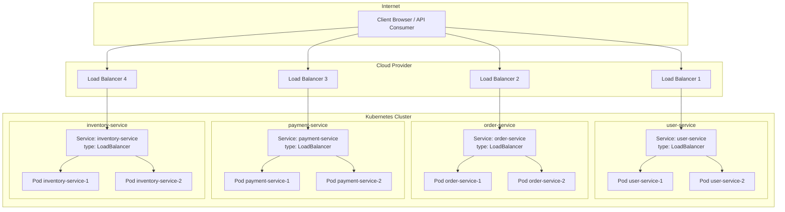

### Why This Pattern Is Painful

| Problem | Impact |
|---------|--------|
| 💰 **Cost** | Cloud load balancers cost money. Four services = four load balancers. Fifty services = a massive monthly bill. |
| 📋 **Management** | Every new service means provisioning a new public endpoint, DNS record, and TLS certificate. |
| 🔒 **Security** | You're opening multiple entry points into your cluster, each needing its own firewall rules and security hardening. |
| 🔀 **Inflexibility** | You can't easily route based on URL path or hostname. Want `/api/users` to go to `user-service` and `/api/orders` to `order-service`? Not happening with separate load balancers. |

### The Solution: A Single Entry Point

What you really want is a **single entry point** that can inspect the HTTP request — host header, path, headers — and route traffic to the correct backend Service. That's exactly what **Kubernetes Ingress** gives you.

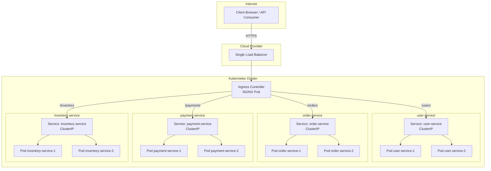

**One public endpoint, one TLS certificate to manage, and routing rules defined in a Kubernetes resource.** That's the promise — but to make it work, you need to understand the pieces.

---

## 2. Prerequisites

Before diving into this tutorial, you should have:

### Technical Knowledge
- ✅ Basic understanding of **Docker** and containerization
- ✅ Familiarity with **Kubernetes concepts**: Pods, Deployments, Services, Namespaces
- ✅ Basic **Spring Boot** development experience (creating REST controllers)
- ✅ Comfort with **YAML** syntax
- ✅ Basic understanding of **HTTP** (methods, headers, status codes)

### Tools and Environment
| Tool | Purpose | Installation |
|------|---------|--------------|
| `kubectl` | Kubernetes CLI | [Install kubectl](https://kubernetes.io/docs/tasks/tools/) |
| Minikube / kind | Local Kubernetes cluster | [Minikube](https://minikube.sigs.k8s.io/docs/start/) or [kind](https://kind.sigs.k8s.io/docs/user/quick-start/) |
| Docker | Container runtime | [Install Docker](https://docs.docker.com/get-docker/) |
| Java 17+ | Spring Boot development | [Install JDK](https://adoptium.net/) |
| Maven or Gradle | Spring Boot build | [Maven](https://maven.apache.org/) or [Gradle](https://gradle.org/) |
| `curl` | Testing HTTP endpoints | Pre-installed on most systems |
| `helm` (optional) | Installing Ingress Controller | [Install Helm](https://helm.sh/docs/intro/install/) |

### Optional but Helpful
- A cloud account (AWS, GCP, or Azure) for production scenarios
- `k9s` or Lens for Kubernetes cluster visualization
- `jq` for JSON parsing in terminal

---

## 3. Learning Objectives

By the end of this tutorial, you will be able to:

1. 🎯 **Explain** the difference between an Ingress resource and an Ingress Controller
2. 🎯 **Architect** a single-entry-point routing layer for multiple Spring Boot microservices
3. 🎯 **Write** complete Kubernetes manifests (Deployment, Service, Ingress) for production
4. 🎯 **Configure** host-based and path-based routing rules
5. 🎯 **Implement** TLS/HTTPS termination at the Ingress layer
6. 🎯 **Troubleshoot** common Ingress issues (404s, 502s, path mismatches)
7. 🎯 **Apply** NGINX Ingress annotations for rewriting, rate limiting, and CORS
8. 🎯 **Decide** when to use Ingress vs API Gateway vs LoadBalancer Service
9. 🎯 **Trace** a complete request flow from `https://api.example.com/users/1` to a Spring Boot Pod
10. 🎯 **Deploy** the NGINX Ingress Controller in local and cloud environments

---

## 4. What Exactly Is Kubernetes Ingress?

An **Ingress** is a Kubernetes resource that defines HTTP/HTTPS routing rules. You write a YAML file that says: *"For requests with host `api.example.com` and path `/users`, send traffic to the Service called `user-service` on port 80."*

That's it. **The Ingress object itself doesn't process a single packet.**

### The Crucial Distinction Every Beginner Misses

> ⚠️ **Critical Concept:**
> - **Ingress** = the routing rules (a Kubernetes object, like a Deployment or Service)
> - **Ingress Controller** = the actual software that reads those rules and implements them (a running Pod, like NGINX, Traefik, HAProxy, or a cloud-specific controller)

If you create an Ingress resource **without an Ingress Controller** running in your cluster, **nothing happens**. Your rules just sit there with no effect. That's the first thing most people get wrong when starting out.

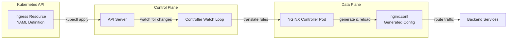

### How the Ingress Controller Works

The Ingress Controller typically runs as a **Deployment** with one or more replicas, often exposed via a Service of type `LoadBalancer` or `NodePort`. It:

1. **Watches** the Kubernetes API for Ingress resources
2. **Translates** them into its own configuration (e.g., `nginx.conf`)
3. **Reloads** when things change
4. **Routes** incoming traffic based on the rules

### Layer 7 vs Layer 4

Because Ingress works at **layer 7 (HTTP/HTTPS)**, it's ideal for path-based and host-based routing. It's **not** meant for TCP/UDP services directly — that's what a different resource like Gateway (or older LoadBalancer Service) handles.

| Feature | Layer 4 (LoadBalancer) | Layer 7 (Ingress) |
|---------|------------------------|-------------------|
| Routing basis | IP + Port | Host + Path + Headers |
| TLS termination | Per load balancer | Centralized |
| Path-based routing | ❌ | ✅ |
| Host-based routing | ❌ | ✅ |
| Header manipulation | ❌ | ✅ |
| URL rewriting | ❌ | ✅ |
| Rate limiting | ❌ | ✅ (via annotations) |

---

## 5. Kubernetes Service vs Ingress: Who Does What?

A common source of confusion is the relationship between a **Service** and an **Ingress**. Let's trace a typical request flow:

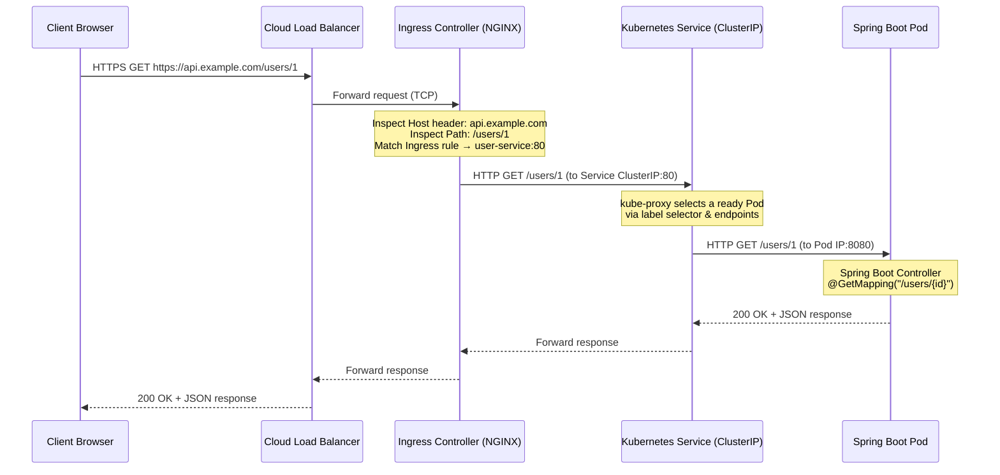

### Key Insight

> 💡 **An Ingress doesn't bypass the Service.** It routes traffic to the Service, which then load-balances to Pods. The Service still provides the stable abstraction and the Pod selection via labels.

### Responsibility Breakdown

| Component | Responsibility |
|-----------|---------------|
| **Ingress** | Defines routing rules (host, path → Service) |
| **Ingress Controller** | Implements the rules, terminates TLS, handles L7 routing |
| **Service** | Stable network abstraction, load balancing to Pods |
| **kube-proxy** | Implements Service load balancing at the node level |
| **Pod** | Runs the actual application (Spring Boot) |

---

## 6. The Ingress Controller: NGINX and Friends

To make Ingress work, you **must** deploy an Ingress Controller.

### The Most Common Controllers

| Controller | Best For | Key Features | Cloud Lock-in |
|------------|----------|--------------|---------------|
| **NGINX Ingress Controller** (community) | Generic Kubernetes, bare metal, any cloud | Portable, battle-tested, rich annotations | ❌ No |
| **NGINX Ingress Controller** (NGINX Inc.) | Enterprise needs | More features, commercial support | ❌ No |
| **AWS Load Balancer Controller** | AWS EKS | ALB provisioning, WAF, Cognito integration | ✅ Yes |
| **Traefik** | Modern cloud-native | Automatic HTTPS, dashboard UI, dynamic config | ❌ No |
| **HAProxy** | High-performance routing | Excellent performance, advanced ACLs | ❌ No |
| **Contour / Envoy** | Service mesh integration | Envoy-based, advanced traffic management | ❌ No |

> 💡 **Recommendation:** For this tutorial, we'll use the **community NGINX Ingress Controller** because it's the most portable and teaches the core concepts without cloud lock-in.

### Installing the NGINX Ingress Controller

**Option 1: Single Manifest (Quick Start)**

```bash
kubectl apply -f https://raw.githubusercontent.com/kubernetes/ingress-nginx/controller-v1.10.0/deploy/static/provider/cloud/deploy.yaml
```

**Option 2: Helm (Recommended for Production)**

```bash
# Add the ingress-nginx Helm repository
helm repo add ingress-nginx https://kubernetes.github.io/ingress-nginx
helm repo update

# Install the controller
helm install ingress-nginx ingress-nginx/ingress-nginx \
  --namespace ingress-nginx \
  --create-namespace \
  --set controller.replicaCount=2
```

**Option 3: Minikube (Local Development)**

```bash
# Enable the built-in ingress addon
minikube addons enable ingress

# Or use minikube tunnel for LoadBalancer services
minikube tunnel
```

### Verifying Installation

```bash
# Check the ingress-nginx namespace
kubectl get pods -n ingress-nginx

# Expected output:
# NAME                                        READY   STATUS    RESTARTS   AGE
# ingress-nginx-controller-7c8b6c8d9f-abc12   1/1     Running   0          2m

# Check the Service
kubectl get svc -n ingress-nginx

# Expected output:
# NAME                                 TYPE           CLUSTER-IP      EXTERNAL-IP   PORT(S)
# ingress-nginx-controller             LoadBalancer   10.96.0.10      192.168.1.5   80:30080/TCP,443:30443/TCP
```

After installation, you'll see an `ingress-nginx` namespace with a running controller Pod and a Service of type `LoadBalancer`. In a cloud environment, that Service will provision an external load balancer.

---

## 7. Complete Hands-On Example: Two Spring Boot Services

We'll build two Spring Boot services: `user-service` and `order-service`. Both expose a simple REST API.

- The `user-service` responds to `GET /users/{id}`
- The `order-service` responds to `GET /orders/{id}`

### Project Structure

```
kubernetes/
├── namespace.yaml
├── user-service/
│   ├── deployment.yaml
│   └── service.yaml
├── order-service/
│   ├── deployment.yaml
│   └── service.yaml
└── ingress/
    ├── ingress.yaml
    └── tls-secret.yaml
```

> 💡 **Note:** In a real project, you'd probably have these in separate Git repos (each service owns its own manifests), but for a monorepo, this structure works well.

### Step 1: Create the Namespace

**`namespace.yaml`**

```yaml
apiVersion: v1
kind: Namespace
metadata:
  name: microservices-demo
```

```bash
kubectl apply -f namespace.yaml
```

### Step 2: Deploy user-service

**`user-service/deployment.yaml`**

```yaml
apiVersion: apps/v1
kind: Deployment
metadata:
  name: user-service
  namespace: microservices-demo
spec:
  replicas: 2
  selector:
    matchLabels:
      app: user-service
  template:
    metadata:
      labels:
        app: user-service
    spec:
      containers:
      - name: user-service
        image: your-registry/user-service:1.0
        ports:
        - containerPort: 8080
        readinessProbe:
          httpGet:
            path: /actuator/health
            port: 8080
          initialDelaySeconds: 10
          periodSeconds: 5
        livenessProbe:
          httpGet:
            path: /actuator/health
            port: 8080
          initialDelaySeconds: 15
          periodSeconds: 20
```

**`user-service/service.yaml`**

```yaml
apiVersion: v1
kind: Service
metadata:
  name: user-service
  namespace: microservices-demo
spec:
  selector:
    app: user-service
  ports:
  - name: http
    port: 80
    targetPort: 8080
```

### Step 3: Deploy order-service

**`order-service/deployment.yaml`**

```yaml
apiVersion: apps/v1
kind: Deployment
metadata:
  name: order-service
  namespace: microservices-demo
spec:
  replicas: 2
  selector:
    matchLabels:
      app: order-service
  template:
    metadata:
      labels:
        app: order-service
    spec:
      containers:
      - name: order-service
        image: your-registry/order-service:1.0
        ports:
        - containerPort: 8080
        readinessProbe:
          httpGet:
            path: /actuator/health
            port: 8080
          initialDelaySeconds: 10
          periodSeconds: 5
        livenessProbe:
          httpGet:
            path: /actuator/health
            port: 8080
          initialDelaySeconds: 15
          periodSeconds: 20
```

**`order-service/service.yaml`**

```yaml
apiVersion: v1
kind: Service
metadata:
  name: order-service
  namespace: microservices-demo
spec:
  selector:
    app: order-service
  ports:
  - name: http
    port: 80
    targetPort: 8080
```

### Step 4: Create the Ingress Resource

**`ingress/ingress.yaml`**

```yaml
apiVersion: networking.k8s.io/v1
kind: Ingress
metadata:
  name: api-ingress
  namespace: microservices-demo
spec:
  ingressClassName: nginx   # tells Kubernetes which controller handles this
  rules:
  - host: api.example.com
    http:
      paths:
      - path: /users
        pathType: Prefix
        backend:
          service:
            name: user-service
            port:
              number: 80
      - path: /orders
        pathType: Prefix
        backend:
          service:
            name: order-service
            port:
              number: 80
```

### Step 5: Apply Everything

```bash
# Apply all manifests
kubectl apply -f namespace.yaml
kubectl apply -f user-service/deployment.yaml
kubectl apply -f user-service/service.yaml
kubectl apply -f order-service/deployment.yaml
kubectl apply -f order-service/service.yaml
kubectl apply -f ingress/ingress.yaml

# Verify deployments
kubectl get deployments -n microservices-demo

# Verify services
kubectl get svc -n microservices-demo

# Verify ingress
kubectl get ingress -n microservices-demo
```

### Step 6: Test the Routing

```bash
# Test user-service routing
curl -H "Host: api.example.com" http://<INGRESS_IP>/users/1

# Test order-service routing
curl -H "Host: api.example.com" http://<INGRESS_IP>/orders/100

# Test a non-matching path (should return 404)
curl -H "Host: api.example.com" http://<INGRESS_IP>/unknown
```

### Important Notes About the Example

1. **`ingressClassName: nginx`** ensures that only the NGINX Ingress Controller processes this Ingress. If you don't set it and you have multiple controllers installed, the default one (or none) will pick it up.
2. **`host: api.example.com`** means these rules apply only when the HTTP Host header matches `api.example.com`. You can have multiple hosts in a single Ingress.
3. **`pathType: Prefix`** means the path `/users` will match any request starting with `/users`, e.g., `/users`, `/users/`, `/users/1`. Other options are `Exact` and `ImplementationSpecific`.
4. **The Service ports here are 80**, which map to `targetPort: 8080` on the container. The Ingress routes to the Service's port, not directly to the container port.

---

## 8. YAML Field Deep Dive

Let's walk through the important fields to demystify the YAML.

### Deployment Fields

| Field | Purpose | Notes |
|-------|---------|-------|
| `spec.replicas` | Number of Pod replicas | Scale for high availability |
| `spec.selector.matchLabels` | Labels the Deployment uses to identify its Pods | Must match `template.metadata.labels` exactly |
| `spec.template.metadata.labels` | Labels applied to created Pods | Used by Service selector |
| `spec.template.spec.containers[].ports.containerPort` | Port your app listens on inside the container | Informational; doesn't expose anything externally |
| `spec.template.spec.containers[].readinessProbe` | When Pod is ready to receive traffic | Failed probe → Pod removed from Service endpoints |
| `spec.template.spec.containers[].livenessProbe` | Whether container is still alive | Failed probe → container restarted |

### Service Fields

| Field | Purpose | Notes |
|-------|---------|-------|
| `spec.selector` | Labels that must match Pods' labels | All matching Pods become endpoints |
| `spec.ports[].port` | Service port (80) | What other components use to reach the Service |
| `spec.ports[].targetPort` | Container port (8080) | Where traffic is forwarded |

### Ingress Fields

| Field | Purpose | Notes |
|-------|---------|-------|
| `spec.ingressClassName` | Which controller handles this Ingress | Must match installed controller class |
| `spec.rules[].host` | Hostname for which the rule applies | Omitted = applies to any traffic |
| `spec.rules[].http.paths[].path` | URL path to match | `/users`, `/orders`, etc. |
| `spec.rules[].http.paths[].pathType` | `Prefix`, `Exact`, or `ImplementationSpecific` | `Prefix` is most common for REST APIs |
| `spec.rules[].http.paths[].backend.service.name` | Name of the Kubernetes Service | Must exist in same namespace as Ingress |
| `spec.rules[].http.paths[].backend.service.port.number` | Service's port (not targetPort) | Number defined under `spec.ports.port` |

### Path Matching Visualization

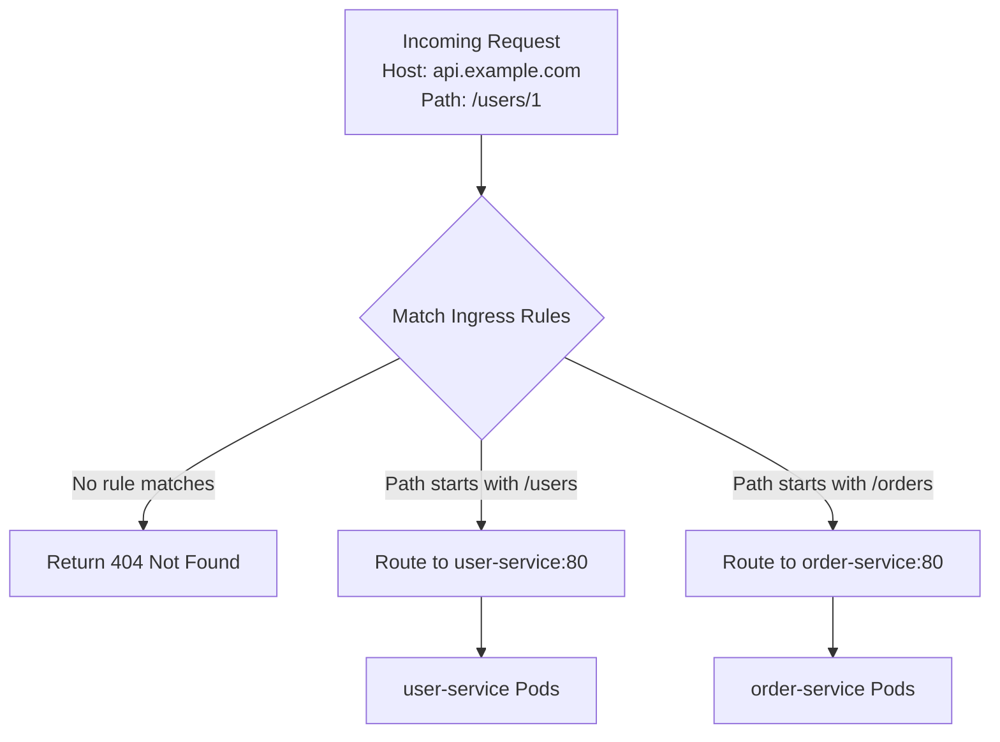

### Path Matching Examples

| Request Path | Rule Path | pathType | Match? |
|--------------|-----------|----------|--------|
| `/users` | `/users` | `Prefix` | ✅ Yes |
| `/users/` | `/users` | `Prefix` | ✅ Yes |
| `/users/1` | `/users` | `Prefix` | ✅ Yes |
| `/users/profile` | `/users` | `Prefix` | ✅ Yes |
| `/orders` | `/orders` | `Prefix` | ✅ Yes |
| `/orders/100` | `/orders` | `Prefix` | ✅ Yes |
| `/unknown` | `/users` or `/orders` | `Prefix` | ❌ No (404) |
| `/users` | `/users` | `Exact` | ✅ Yes |
| `/users/1` | `/users` | `Exact` | ❌ No |

> ⚠️ **Common Trap:** Path matching depends on the controller. The NGINX Ingress Controller's `Prefix` behavior may differ slightly from other controllers. Always check your controller's documentation if you see unexpected 404s.

---

## 9. Host-Based Routing

When you have different subdomains for different groups of services, **host-based routing** is cleaner. For example:

- `api.example.com` → API services (user, order, payment)
- `admin.example.com` → an admin dashboard service

### Multi-Host Ingress Example

```yaml
apiVersion: networking.k8s.io/v1
kind: Ingress
metadata:
  name: multi-host-ingress
  namespace: microservices-demo
spec:
  ingressClassName: nginx
  rules:
  - host: api.example.com
    http:
      paths:
      - path: /users
        pathType: Prefix
        backend:
          service:
            name: user-service
            port:
              number: 80
      - path: /orders
        pathType: Prefix
        backend:
          service:
            name: order-service
            port:
              number: 80
  - host: admin.example.com
    http:
      paths:
      - path: /
        pathType: Prefix
        backend:
          service:
            name: admin-service
            port:
              number: 80
```

### Path-Based vs Host-Based Routing

| Approach | Best For | Pros | Cons |
|----------|----------|------|------|
| **Path-based** | Single unified API domain | One domain, one TLS cert, simple DNS | Services must share domain |
| **Host-based** | Teams owning whole subdomains | Clear separation, independent TLS | More DNS records, more certs |

> 💡 **Which to use?** That's an organisational decision, not a technical one. Both patterns are used in production.

### ⚠️ Critical Warning

> ⚠️ **The most important thing:** Don't accidentally create conflicting rules — for example, two paths that both claim `Prefix: /`. This can cause unpredictable routing behavior.

---

## 10. TLS/HTTPS with Ingress

In a production environment, you absolutely want **HTTPS** between the client and your Ingress.

Kubernetes Ingress supports **TLS termination at the Ingress layer**. The Ingress Controller handles the SSL handshake and forwards unencrypted HTTP to the backend Services.

### Step 1: Create a TLS Secret

First, you need a TLS certificate and private key. Create a Kubernetes Secret of type `kubernetes.io/tls`:

```bash
kubectl create secret tls api-example-tls \
  --cert=path/to/tls.crt \
  --key=path/to/tls.key \
  -n microservices-demo
```

Or declaratively with YAML:

**`ingress/tls-secret.yaml`**

```yaml
apiVersion: v1
kind: Secret
metadata:
  name: api-example-tls
  namespace: microservices-demo
type: kubernetes.io/tls
data:
  tls.crt: <base64-encoded-certificate>
  tls.key: <base64-encoded-private-key>
```

### Step 2: Reference the Secret in Your Ingress

```yaml
apiVersion: networking.k8s.io/v1
kind: Ingress
metadata:
  name: api-ingress
  namespace: microservices-demo
spec:
  ingressClassName: nginx
  tls:
  - hosts:
    - api.example.com
    secretName: api-example-tls
  rules:
  - host: api.example.com
    http:
      paths:
      - path: /users
        pathType: Prefix
        backend:
          service:
            name: user-service
            port:
              number: 80
      - path: /orders
        pathType: Prefix
        backend:
          service:
            name: order-service
            port:
              number: 80
```

### Step 3: Force HTTPS Redirect (Optional)

```yaml
apiVersion: networking.k8s.io/v1
kind: Ingress
metadata:
  name: api-ingress
  namespace: microservices-demo
  annotations:
    nginx.ingress.kubernetes.io/ssl-redirect: "true"
spec:
  ingressClassName: nginx
  tls:
  - hosts:
    - api.example.com
    secretName: api-example-tls
  rules:
  - host: api.example.com
    http:
      paths:
      - path: /users
        pathType: Prefix
        backend:
          service:
            name: user-service
            port:
              number: 80
```

> ⚠️ **Note:** The `ssl-redirect` annotation is **controller-specific**. The stock Ingress spec doesn't have an `ssl-redirect` field. In AWS ALB, for example, you'd configure redirect differently.

### TLS Termination Flow

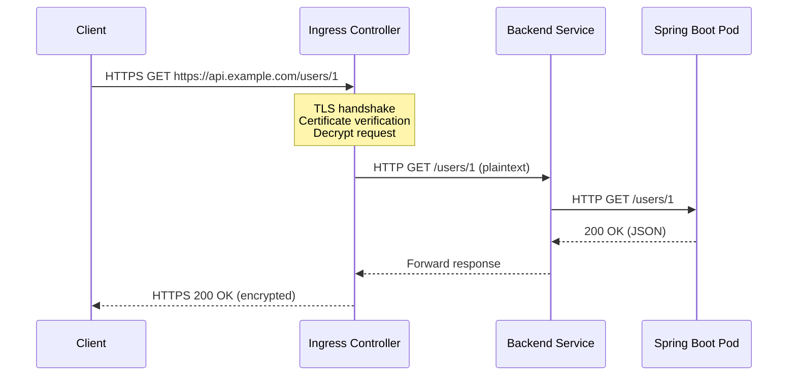

### Using cert-manager for Automatic Certificates

For production, consider using **cert-manager** with Let's Encrypt for automatic certificate provisioning:

```yaml
apiVersion: cert-manager.io/v1
kind: Certificate
metadata:
  name: api-example-tls
  namespace: microservices-demo
spec:
  secretName: api-example-tls
  issuerRef:
    name: letsencrypt-prod
    kind: ClusterIssuer
  dnsNames:
  - api.example.com
```

---

## 11. Spring Boot Behind Ingress: Forwarded Headers

When you put a reverse proxy (the Ingress Controller) in front of your Spring Boot app, the app sees a request coming from the **Ingress Pod's IP**, not the original client. Also, the scheme might be `http` even though the client used HTTPS. This can break things like generated links and security constraints.

### The Problem

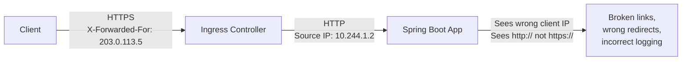

### The Solution: Forwarded Headers

The NGINX Ingress Controller automatically sets:
- `X-Forwarded-For`
- `X-Forwarded-Proto`
- `X-Forwarded-Host`
- `X-Forwarded-Port`

You need to tell Spring Boot to **trust** those headers.

### Configuration for Spring Boot 2.2+

**`application.yml`**

```yaml
server:
  forward-headers-strategy: native
```

### Alternative: More Control

```yaml
server:
  tomcat:
    remoteip:
      remote-ip-header: x-forwarded-for
      protocol-header: x-forwarded-proto
```

### Deprecated Approach (Older Spring Boot)

```yaml
# Deprecated in Spring Boot 2.2+
server:
  use-forward-headers: true
```

> ⚠️ **Warning:** `server.use-forward-headers=true` is deprecated. Use `server.forward-headers-strategy: native` instead.

### Why This Matters

Without this configuration, your app might:
- ❌ Generate `http://` links in emails
- ❌ Redirect to the wrong host
- ❌ Log the wrong client IP
- ❌ Fail security constraints that check the scheme

> 💡 **For Spring Cloud Gateway users:** The same principle applies — ensure forwarded headers are trusted when behind an Ingress.

---

## 12. Practical NGINX Ingress Annotations

Annotations are how you configure NGINX-specific behavior that isn't part of the generic Ingress spec.

### Essential Annotations Reference

| Annotation | Purpose | Example Value |
|------------|---------|---------------|
| `nginx.ingress.kubernetes.io/rewrite-target` | Rewrite URL path before forwarding | `/$2` |
| `nginx.ingress.kubernetes.io/proxy-body-size` | Max request body size | `"50m"` |
| `nginx.ingress.kubernetes.io/proxy-read-timeout` | Read timeout for backend | `"120"` |
| `nginx.ingress.kubernetes.io/proxy-connect-timeout` | Connect timeout | `"30"` |
| `nginx.ingress.kubernetes.io/limit-rps` | Requests per second limit | `"10"` |
| `nginx.ingress.kubernetes.io/limit-connections` | Concurrent connections limit | `"5"` |
| `nginx.ingress.kubernetes.io/enable-cors` | Enable CORS headers | `"true"` |
| `nginx.ingress.kubernetes.io/cors-allow-origin` | Allowed CORS origin | `"https://app.example.com"` |
| `nginx.ingress.kubernetes.io/ssl-redirect` | Force HTTPS redirect | `"true"` |
| `nginx.ingress.kubernetes.io/auth-url` | External auth service URL | `"https://auth.internal/validate"` |
| `nginx.ingress.kubernetes.io/auth-signin` | Login redirect URL | `"https://auth.internal/login"` |

### Complete Example with Annotations

```yaml
apiVersion: networking.k8s.io/v1
kind: Ingress
metadata:
  name: api-ingress
  namespace: microservices-demo
  annotations:
    nginx.ingress.kubernetes.io/proxy-body-size: "50m"
    nginx.ingress.kubernetes.io/proxy-read-timeout: "120"
    nginx.ingress.kubernetes.io/proxy-connect-timeout: "30"
    nginx.ingress.kubernetes.io/limit-rps: "10"
    nginx.ingress.kubernetes.io/limit-connections: "5"
spec:
  ingressClassName: nginx
  rules:
  - host: api.example.com
    http:
      paths:
      - path: /users
        pathType: Prefix
        backend:
          service:
            name: user-service
            port:
              number: 80
```

> ⚠️ **Important:** These annotations are **specific to the NGINX Ingress Controller**. If you switch to Traefik or AWS ALB, you'll need different annotations.

---

## 13. URL Rewriting: Why It Bites Everyone

A classic scenario: you want `https://api.example.com/api/users` to reach the `user-service`, but the Spring Boot app expects the path to be just `/users`.

### The Problem

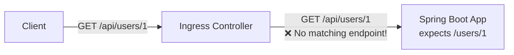

### The Solution: rewrite-target with Capture Groups

With the NGINX Ingress Controller, you use the `rewrite-target` annotation with capture groups:

```yaml
apiVersion: networking.k8s.io/v1
kind: Ingress
metadata:
  name: api-ingress
  namespace: microservices-demo
  annotations:
    nginx.ingress.kubernetes.io/rewrite-target: /$2
spec:
  ingressClassName: nginx
  rules:
  - host: api.example.com
    http:
      paths:
      - path: /api/users(/|$)(.*)
        pathType: Prefix
        backend:
          service:
            name: user-service
            port:
              number: 80
      - path: /api/orders(/|$)(.*)
        pathType: Prefix
        backend:
          service:
            name: order-service
            port:
              number: 80
```

### How the Regex Works

| Pattern Part | Captures | Example |
|--------------|----------|---------|
| `/api/users` | Literal match | `/api/users` |
| `(/|$)` | Group 1: slash or end | `/` |
| `(.*)` | Group 2: everything after | `1` |

- `rewrite-target: /$2` replaces the matched path with `/` plus whatever `$2` captured
- `/api/users/1` becomes `/1` after the rewrite
- The `user-service` sees `GET /1`

### Rewrite Examples

| Incoming Path | Captured $2 | Rewritten Path |
|---------------|-------------|----------------|
| `/api/users/1` | `1` | `/1` |
| `/api/users/` | `` (empty) | `/` |
| `/api/users` | `` (empty) | `/` |
| `/api/users/profile` | `profile` | `/profile` |

> ⚠️ **Warning:** This is powerful but also a frequent source of bugs. If your regex is slightly off, you'll get 404s inside the service because the path doesn't match any endpoint.

### The Simpler Alternative

> 💡 **Pro Tip:** A simpler approach is to have your Spring Boot services configured with the full path (`/api/users`). Then you don't need rewriting at all. This reduces moving parts and is generally preferred when possible.

---

## 14. Rate Limiting at the Ingress Layer

Rate limiting can be implemented either in the application (using Resilience4j, Bucket4j, or Spring Cloud Gateway) or at the infrastructure layer.

### Ingress-Level Rate Limiting

Ingress-level rate limiting is handy for protecting against DDoS or brute force attacks **without touching application code**.

```yaml
apiVersion: networking.k8s.io/v1
kind: Ingress
metadata:
  name: api-ingress
  namespace: microservices-demo
  annotations:
    nginx.ingress.kubernetes.io/limit-rps: "10"
    nginx.ingress.kubernetes.io/limit-connections: "5"
spec:
  ingressClassName: nginx
  rules:
  - host: api.example.com
    http:
      paths:
      - path: /users
        pathType: Prefix
        backend:
          service:
            name: user-service
            port:
              number: 80
```

This limits the whole Ingress to **10 requests per second** and **5 concurrent connections**. You can also limit per IP or use more advanced burst settings.

### The Catch

> ⚠️ **Important Limitation:** Ingress-level rate limiting doesn't know about your business logic. It can't differentiate between a harmless health check and an expensive search request.

### Layered Rate Limiting Strategy

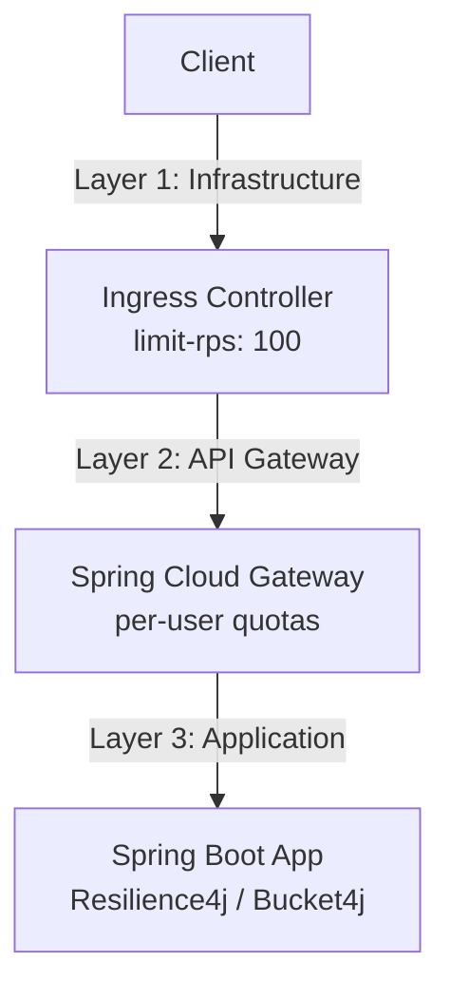

### Why Layered Rate Limiting Matters

| Layer | Protects Against | Granularity |
|-------|-----------------|-------------|
| **Ingress** | DDoS, brute force, noise | IP-based, global |
| **API Gateway** | Per-user/API-key abuse | User-based |
| **Application** | Business logic abuse | Endpoint-specific |

> 💡 **Real-World Lesson:** I've been in situations where only Ingress rate limiting was in place, and a misconfigured internal batch job was throttled without anyone realizing it was hitting the same limit as external clients. Not fun to debug.

---

## 15. JWT Authentication: Where Does It Go?

One of the biggest misconceptions: *"I'll just put JWT validation in the Ingress."*

### The Truth

> ⚠️ **The standard Kubernetes Ingress is NOT an API gateway.** It doesn't inspect JWT tokens; it routes requests based on host and path.

**Authentication is the responsibility of your application** (Spring Security, a sidecar proxy, or an API gateway).

### External Authentication with NGINX

However, the NGINX Ingress Controller does support **external authentication**. You can configure it to forward every request to an authentication service (e.g., OAuth2 Proxy) before routing to the backend:

```yaml
apiVersion: networking.k8s.io/v1
kind: Ingress
metadata:
  name: api-ingress
  namespace: microservices-demo
  annotations:
    nginx.ingress.kubernetes.io/auth-url: "https://auth.internal/validate"
    nginx.ingress.kubernetes.io/auth-signin: "https://auth.internal/login"
spec:
  ingressClassName: nginx
  rules:
  - host: api.example.com
    http:
      paths:
      - path: /users
        pathType: Prefix
        backend:
          service:
            name: user-service
            port:
              number: 80
```

### Authentication Architecture Options

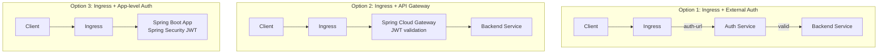

### Recommendation

> 💡 **Pro Tip:** For most Spring Boot microservices, it's simpler to keep authentication inside the application (or a dedicated Spring Cloud Gateway) and let the Ingress focus on routing and TLS. Mixing the two can create a fragile architecture where a change in the authentication service takes down the entire routing layer.

---

## 16. CORS: Ingress or Application?

CORS (Cross-Origin Resource Sharing) headaches often surface when a frontend hosted on `https://app.example.com` tries to hit `https://api.example.com` via the browser.

### The Problem

The browser sends a **preflight OPTIONS request**. If the Ingress doesn't respond with the right headers, the browser blocks the request.

### Option 1: Ingress-Level CORS

```yaml
apiVersion: networking.k8s.io/v1
kind: Ingress
metadata:
  name: api-ingress
  namespace: microservices-demo
  annotations:
    nginx.ingress.kubernetes.io/enable-cors: "true"
    nginx.ingress.kubernetes.io/cors-allow-origin: "https://app.example.com"
spec:
  ingressClassName: nginx
  rules:
  - host: api.example.com
    http:
      paths:
      - path: /users
        pathType: Prefix
        backend:
          service:
            name: user-service
            port:
              number: 80
```

### Option 2: Application-Level CORS (Recommended)

```java
// Spring Boot configuration
@Configuration
public class CorsConfig implements WebMvcConfigurer {

    @Override
    public void addCorsMappings(CorsRegistry registry) {
        registry.addMapping("/api/**")
            .allowedOrigins("https://app.example.com")
            .allowedMethods("GET", "POST", "PUT", "DELETE", "OPTIONS")
            .allowedHeaders("*")
            .allowCredentials(true)
            .maxAge(3600);
    }
}
```

### Comparison

| Aspect | Ingress-Level CORS | Application-Level CORS |
|--------|-------------------|----------------------|
| **Setup** | Quick, annotation-based | Requires code changes |
| **Granularity** | Per-Ingress (coarse) | Per-endpoint (fine) |
| **Versioning** | Not versioned with app | Versioned with app code |
| **Multi-team** | Maintenance headache | Each service owns its config |
| **Best for** | Simple monorepo frontend | Multi-team, complex policies |

> 💡 **Recommendation:** I usually prefer to handle CORS in the Spring Boot service using Spring Security or a `WebMvcConfigurer`. CORS policies often differ per endpoint (e.g., `/public` vs `/admin`), and you'll want them versioned alongside the application code.

---

## 17. Health Checks and Readiness Probes

All our Deployments include a readiness probe hitting `/actuator/health`. This is **critical** when you're behind Ingress.

### How Probes Work

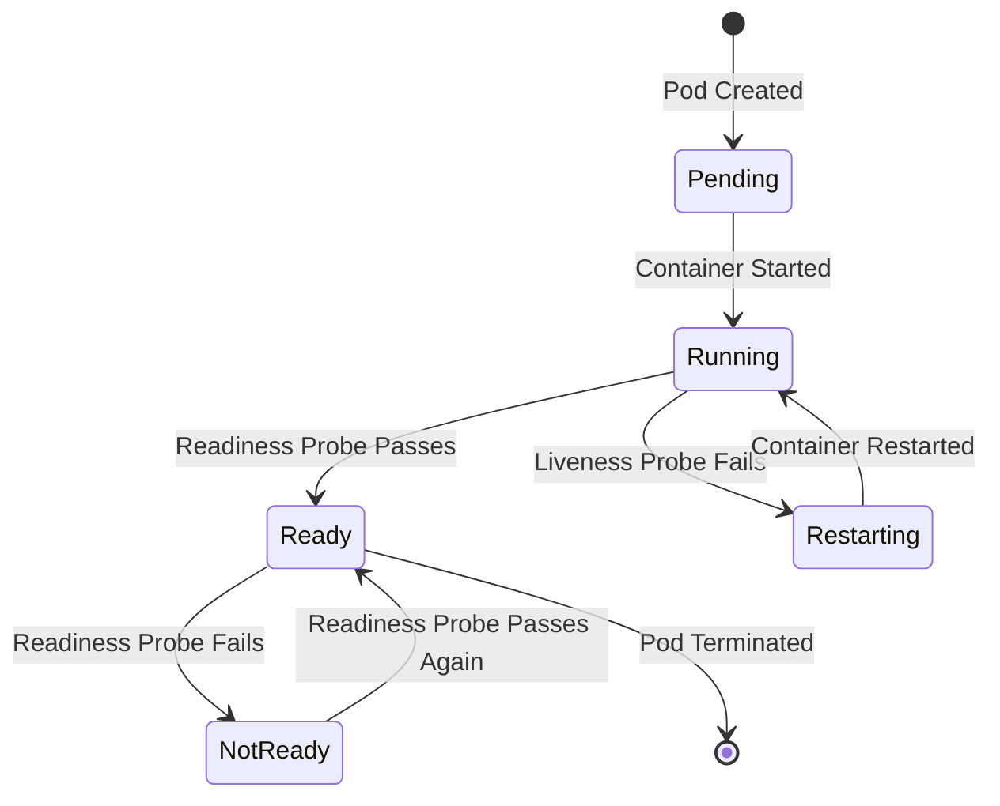

### Why Readiness Probes Matter Behind Ingress

- The Kubernetes Service only sends traffic to Pods that **pass their readiness check**
- If a Pod fails readiness, the Service **removes its endpoint**
- The Ingress Controller **no longer sends requests** to it
- This enables **zero-downtime deployments**: new Pods become ready before old Pods are terminated

### The Failure Scenario

> ⚠️ **If readiness checks are missing or too permissive**, you'll get 502/503 errors because the Ingress will forward requests to Pods that haven't started yet.

### Spring Boot Actuator Configuration

```yaml
# application.yml
management:
  endpoints:
    web:
      exposure:
        include: health,info
  endpoint:
    health:
      show-details: always
```

> 🔒 **Security Note:** Make sure your Spring Boot Actuator health endpoint is secured appropriately — you don't want to expose it publicly. In our setup, it's only accessible internally, which is fine.

---

## 18. Load Balancing Within the Service

The Ingress Controller sends traffic to the Service's **ClusterIP**. The Service then balances across all ready Pods. This is **kube-proxy in action**, not the Ingress Controller.

### The Traffic Flow

```
Ingress → Service (10.96.0.10:80) → Pod (10.244.1.5:8080)
                                    Pod (10.244.2.3:8080)
```

### Key Insight

> 💡 **The Ingress doesn't care about individual Pods; it cares about the Service endpoint.**

This separation is powerful:
- You can scale Pods up and down
- The Ingress config stays the same
- The Service's endpoint list updates automatically as Pods come and go

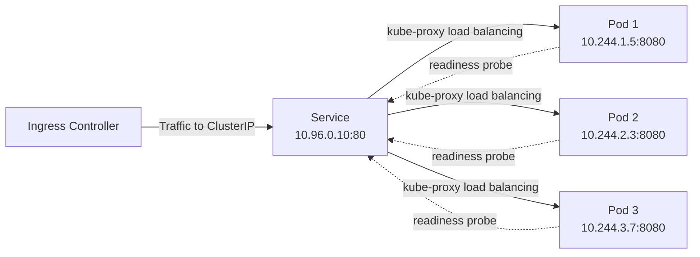

---

## 19. Ingress vs API Gateway: The Big Decision

As a Spring Boot developer, you've probably heard about **Spring Cloud Gateway** or Zuul. How does Kubernetes Ingress fit in?

### They're Complementary Layers

| Capability | Kubernetes Ingress | API Gateway (Spring Cloud Gateway) |
|------------|-------------------|-----------------------------------|
| Host/path routing | ✅ | ✅ |
| TLS termination | ✅ | ❌ (usually behind Ingress) |
| Rate limiting | ✅ (basic) | ✅ (per-user, per-API-key) |
| Authentication | ❌ (basic external auth) | ✅ (JWT, OAuth2) |
| Request transformation | ✅ (rewrites) | ✅ (full transformation) |
| Service discovery | ❌ | ✅ |
| Response aggregation | ❌ | ✅ |
| Business-level policies | ❌ | ✅ |
| Level | Infrastructure | Application |

### The Production Pattern

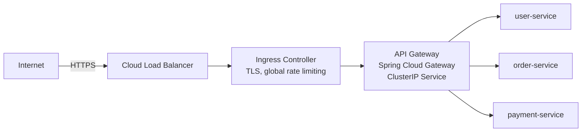

### When to Use What

| Scenario | Recommendation |
|----------|---------------|
| Few services, simple routing | Ingress alone is sufficient |
| Need to combine responses from multiple services | Add API Gateway |
| Complex routing based on headers/query params | Add API Gateway |
| Per-user quotas and API keys | Add API Gateway |
| Large-scale Spring Boot deployments | Both: Ingress at edge + API Gateway internally |

> 💡 **Pro Tip:** In many production architectures, you'll see both: an Ingress at the edge handling TLS and global rate limiting, forwarding to an API Gateway that then routes to backend services.

---

## 20. Ingress vs LoadBalancer Service

Let's directly compare the two approaches for exposing services:

| Aspect | Service type LoadBalancer | ClusterIP + Ingress |
|--------|--------------------------|---------------------|
| **External IPs** | One per Service | One (for the Ingress Controller) |
| **Cloud load balancers** | One per Service | One total |
| **TLS** | Per load balancer | Centralized in Ingress |
| **Routing** | Network-level (IP + port) | Layer 7 (host/path) |
| **Cost** | High with many services | Low (single LB) |
| **Management** | Complex | Centralized |
| **Path-based routing** | ❌ | ✅ |
| **Host-based routing** | ❌ | ✅ |

### The Verdict

> 💡 **A production architecture with many microservices almost always uses the Ingress pattern** for cost and manageability. The external load balancer is typically the one created by the Ingress Controller's LoadBalancer Service, not one per app.

---

## 21. Ingress in AWS (EKS)

If you're on EKS, you have a choice between two popular controllers:

### Option 1: NGINX Ingress Controller (Portable)

- Installed via Helm
- Runs behind a Network Load Balancer (NLB)
- Works the same in dev (Minikube) and prod
- No cloud lock-in

### Option 2: AWS Load Balancer Controller (Deep Integration)

- Creates an Application Load Balancer (ALB) directly from an Ingress resource
- Routes directly to Pod IPs via VPC CNI
- Supports advanced routing rules, WAF integration, and Cognito authentication natively
- Tightly coupled to AWS

### AWS Architecture

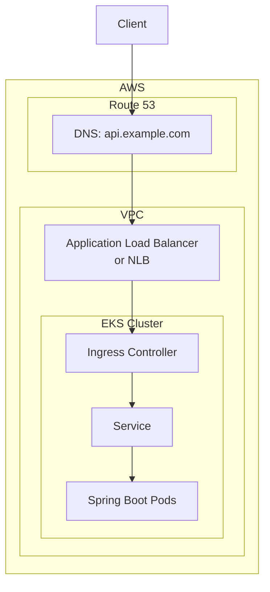

### Decision Guide

| Factor | NGINX Ingress | AWS Load Balancer Controller |
|--------|---------------|------------------------------|
| **Portability** | ✅ Works anywhere | ❌ AWS only |
| **WAF integration** | Manual | ✅ Native |
| **Cognito auth** | Manual | ✅ Native |
| **Access logs to S3** | Manual | ✅ Native |
| **Dev/prod consistency** | ✅ Same everywhere | ⚠️ Different in dev |
| **Learning curve** | Moderate | Moderate |

> 💡 **My Take:** If you're all-in on AWS and want deep integration (WAF, Cognito, access logs to S3), use the AWS Load Balancer Controller. If you want a portable solution that works the same in dev (Minikube) and prod, stick with NGINX Ingress. **Just don't mix the two; pick one and apply it consistently.**

---

## 22. Common Pitfalls and Troubleshooting

### Pitfall 1: Ingress Created But No Controller Running

**Symptom:** Ingress resource exists, but no traffic is routed.

**Diagnosis:**
```bash
# Check if any Ingress Controller is running
kubectl get pods -n ingress-nginx

# Check Ingress status
kubectl describe ingress api-ingress -n microservices-demo
```

**Fix:** Install the NGINX Ingress Controller:
```bash
kubectl apply -f https://raw.githubusercontent.com/kubernetes/ingress-nginx/controller-v1.10.0/deploy/static/provider/cloud/deploy.yaml
```

### Pitfall 2: 404 Not Found

**Symptom:** Requests return 404.

**Possible Causes:**
1. Path doesn't match any Ingress rule
2. Wrong `pathType` (e.g., `Exact` when you need `Prefix`)
3. Host header doesn't match `spec.rules[].host`
4. Service name or port is wrong in the Ingress backend

**Diagnosis:**
```bash
# Check Ingress rules
kubectl describe ingress api-ingress -n microservices-demo

# Test with explicit Host header
curl -H "Host: api.example.com" http://<INGRESS_IP>/users/1
```

### Pitfall 3: 502 Bad Gateway

**Symptom:** Ingress forwards traffic, but backend returns 502.

**Possible Causes:**
1. Pods not ready (readiness probe failing)
2. Service selector doesn't match Pod labels
3. Service port/targetPort mismatch
4. Pods crashed (liveness probe failing)

**Diagnosis:**
```bash
# Check Pod status
kubectl get pods -n microservices-demo

# Check Service endpoints
kubectl get endpoints user-service -n microservices-demo

# Check Pod logs
kubectl logs deployment/user-service -n microservices-demo
```

### Pitfall 4: 503 Service Unavailable

**Symptom:** Ingress returns 503.

**Possible Causes:**
1. No ready Pods for the backend Service
2. All Pods failing readiness probes
3. Service has no endpoints

**Diagnosis:**
```bash
# Check endpoints
kubectl get endpoints -n microservices-demo

# Check Pod readiness
kubectl get pods -n microservices-demo -o wide
```

### Pitfall 5: TLS Certificate Not Working

**Symptom:** HTTPS requests fail or show certificate errors.

**Possible Causes:**
1. Secret not created or wrong name
2. Secret in wrong namespace
3. Certificate expired
4. Host in `tls.hosts` doesn't match `rules[].host`

**Diagnosis:**
```bash
# Check Secret exists
kubectl get secret api-example-tls -n microservices-demo

# Check Secret contents
kubectl get secret api-example-tls -n microservices-demo -o yaml
```

### Pitfall 6: Path Rewriting Not Working

**Symptom:** Requests reach the Ingress but return 404 from the backend.

**Possible Causes:**
1. Regex pattern incorrect
2. `rewrite-target` annotation missing
3. Capture group numbering wrong

**Diagnosis:**
```bash
# Check Ingress annotations
kubectl describe ingress api-ingress -n microservices-demo

# Check NGINX config
kubectl exec -it <nginx-controller-pod> -n ingress-nginx -- cat /etc/nginx/nginx.conf
```

### Pitfall 7: Client IP Shows as Ingress Pod IP

**Symptom:** Spring Boot logs show the Ingress Pod IP instead of the real client IP.

**Fix:** Configure forwarded headers in Spring Boot:
```yaml
server:
  forward-headers-strategy: native
```

### Quick Troubleshooting Checklist

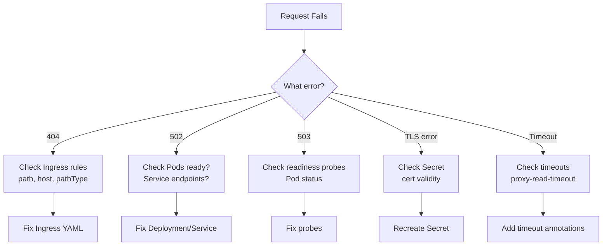

---

## 23. Best Practices

### Architecture Best Practices

1. ✅ **Use a single Ingress Controller** for the entire cluster (or per environment)
2. ✅ **Set `ingressClassName` explicitly** on every Ingress resource
3. ✅ **Use namespaces** to isolate environments and teams
4. ✅ **Centralize TLS** at the Ingress layer with cert-manager for automation
5. ✅ **Use path-based routing** for unified API domains, host-based for team ownership

### Configuration Best Practices

6. ✅ **Always define readiness and liveness probes** for Spring Boot services
7. ✅ **Configure forwarded headers** in Spring Boot (`forward-headers-strategy: native`)
8. ✅ **Set appropriate timeouts** (`proxy-read-timeout`, `proxy-connect-timeout`)
9. ✅ **Use `pathType: Prefix`** for REST APIs unless you need exact matching
10. ✅ **Keep Service ports consistent** (80 → 8080 pattern) across services

### Security Best Practices

11. ✅ **Always use TLS** in production with HTTPS redirect
12. ✅ **Implement layered rate limiting** (Ingress + application)
13. ✅ **Keep authentication in the application layer**, not the Ingress
14. ✅ **Secure Actuator endpoints** — don't expose health details publicly
15. ✅ **Use NetworkPolicies** to restrict traffic between namespaces

### Operational Best Practices

16. ✅ **Monitor Ingress Controller metrics** (request rates, error rates, latency)
17. ✅ **Set up alerts** for 5xx error spikes
18. ✅ **Version your Ingress manifests** alongside your application code
19. ✅ **Test routing changes** in a staging environment first
20. ✅ **Document your routing rules** — especially regex rewrites

---

## 24. Anti-Patterns

### ❌ Anti-Pattern 1: LoadBalancer for Every Service

**What:** Setting `type: LoadBalancer` on every Service.

**Why it's bad:** Cost explosion, management nightmare, security risk, no path-based routing.

**Instead:** Use ClusterIP Services + a single Ingress.

### ❌ Anti-Pattern 2: Creating Ingress Without a Controller

**What:** Writing Ingress YAML but never installing an Ingress Controller.

**Why it's bad:** Rules silently do nothing. Traffic isn't routed.

**Instead:** Install the controller first, then create Ingress resources.

### ❌ Anti-Pattern 3: JWT Validation in the Ingress

**What:** Expecting the Ingress to validate JWT tokens.

**Why it's bad:** Standard Ingress doesn't inspect tokens. You'll get a false sense of security.

**Instead:** Validate in the application (Spring Security) or a dedicated API Gateway.

### ❌ Anti-Pattern 4: Conflicting Path Rules

**What:** Two paths both claiming `Prefix: /` or overlapping prefixes.

**Why it's bad:** Unpredictable routing behavior. Requests may go to the wrong service.

**Instead:** Use specific, non-overlapping paths.

### ❌ Anti-Pattern 5: Ignoring Forwarded Headers

**What:** Not configuring `forward-headers-strategy` in Spring Boot.

**Why it's bad:** Wrong client IPs, broken links, incorrect redirects, security issues.

**Instead:** Always configure forwarded headers when behind a reverse proxy.

### ❌ Anti-Pattern 6: Complex Regex Rewrites Without Testing

**What:** Using complex `rewrite-target` regex patterns without thorough testing.

**Why it's bad:** Subtle regex bugs cause 404s that are hard to debug.

**Instead:** Prefer full-path configuration in Spring Boot. If rewriting is needed, test thoroughly.

### ❌ Anti-Pattern 7: Mixing Multiple Ingress Controllers

**What:** Running NGINX and AWS ALB controllers simultaneously without clear ownership.

**Why it's bad:** Confusion about which controller handles which Ingress. Inconsistent behavior.

**Instead:** Pick one controller and apply it consistently.

### ❌ Anti-Pattern 8: No Readiness Probes

**What:** Deploying services without readiness probes.

**Why it's bad:** Traffic sent to Pods that aren't ready → 502/503 errors during deployments.

**Instead:** Always define readiness probes hitting a health endpoint.

### ❌ Anti-Pattern 9: Exposing Actuator Endpoints Publicly

**What:** Making `/actuator/health` (or worse, `/actuator/env`) publicly accessible.

**Why it's bad:** Information disclosure, potential security vulnerabilities.

**Instead:** Keep Actuator endpoints internal-only.

### ❌ Anti-Pattern 10: Only Ingress-Level Rate Limiting

**What:** Relying solely on Ingress rate limiting for all protection.

**Why it's bad:** Can't differentiate between legitimate and abusive traffic. Internal batch jobs get throttled.

**Instead:** Use layered rate limiting (Ingress + application).

---

## 25. Performance Considerations

### Ingress Controller Performance

| Factor | Impact | Recommendation |
|--------|--------|----------------|
| **Replica count** | Throughput and HA | Run 2+ replicas in production |
| **Worker processes** | CPU utilization | Tune `worker-processes` for node CPU |
| **Keep-alive connections** | Connection reuse | Enable keep-alive to backends |
| **Proxy buffer sizes** | Large responses | Increase for large payloads |
| **Timeouts** | Slow backends | Set appropriate read/connect timeouts |

### Scaling the Ingress Controller

```bash
# Scale NGINX Ingress Controller replicas
kubectl scale deployment ingress-nginx-controller \
  --replicas=3 \
  -n ingress-nginx
```

### Performance Tuning Annotations

```yaml
apiVersion: networking.k8s.io/v1
kind: Ingress
metadata:
  name: api-ingress
  namespace: microservices-demo
  annotations:
    nginx.ingress.kubernetes.io/proxy-body-size: "50m"
    nginx.ingress.kubernetes.io/proxy-read-timeout: "120"
    nginx.ingress.kubernetes.io/proxy-connect-timeout: "30"
    nginx.ingress.kubernetes.io/proxy-buffering: "on"
    nginx.ingress.kubernetes.io/proxy-buffer-size: "8k"
spec:
  ingressClassName: nginx
  rules:
  - host: api.example.com
    http:
      paths:
      - path: /users
        pathType: Prefix
        backend:
          service:
            name: user-service
            port:
              number: 80
```

### Spring Boot Performance Behind Ingress

1. **Enable HTTP/2** for multiplexing
2. **Use connection pooling** in HTTP clients
3. **Configure Tomcat threads** appropriately for expected load
4. **Enable response compression** (gzip) at the Ingress or application level
5. **Cache static responses** where appropriate

### Monitoring Performance

```bash
# Check Ingress Controller metrics
kubectl get --raw /apis/metrics.k8s.io/v1beta1/namespaces/ingress-nginx/pods

# View NGINX access logs
kubectl logs -f deployment/ingress-nginx-controller -n ingress-nginx
```

---

## 26. Security Considerations

### Security Layers

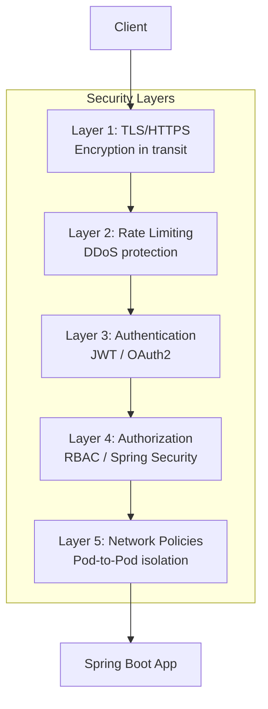

### Security Checklist

| Security Concern | Implementation |
|------------------|----------------|
| **TLS everywhere** | HTTPS redirect, valid certificates via cert-manager |
| **Secret management** | Kubernetes Secrets, external secret stores (Vault) |
| **Rate limiting** | Ingress annotations + application-level limits |
| **Authentication** | Spring Security, OAuth2, JWT validation in app |
| **Network isolation** | NetworkPolicies to restrict cross-namespace traffic |
| **Actuator protection** | Don't expose health/env endpoints publicly |
| **Image security** | Scan images, use minimal base images, non-root users |
| **RBAC** | Least-privilege service accounts for Pods |
| **Audit logging** | Enable Kubernetes audit logs, NGINX access logs |
| **Dependency scanning** | Regular CVE scanning of Spring Boot dependencies |

### Example NetworkPolicy

```yaml
apiVersion: networking.k8s.io/v1
kind: NetworkPolicy
metadata:
  name: allow-ingress-only
  namespace: microservices-demo
spec:
  podSelector:
    matchLabels:
      app: user-service
  policyTypes:
  - Ingress
  ingress:
  - from:
    - namespaceSelector:
        matchLabels:
          name: ingress-nginx
    ports:
    - protocol: TCP
      port: 8080
```

### Security Anti-Patterns

- ❌ Exposing Actuator endpoints publicly
- ❌ Using default passwords or hardcoded secrets
- ❌ Running containers as root
- ❌ Allowing all namespaces to communicate
- ❌ Skipping TLS in production
- ❌ Trusting forwarded headers without configuration

---

## 27. Testing Strategies

### Local Testing with Minikube

```bash
# Start Minikube
minikube start

# Enable ingress addon
minikube addons enable ingress

# Get the ingress IP
minikube ip

# Test with Host header
curl -H "Host: api.example.com" http://$(minikube ip)/users/1
```

### Testing with kind

```bash
# Create kind cluster
kind create cluster --name ingress-test

# Install NGINX Ingress Controller
kubectl apply -f https://raw.githubusercontent.com/kubernetes/ingress-nginx/controller-v1.10.0/deploy/static/provider/kind/deploy.yaml

# Wait for controller
kubectl wait --namespace ingress-nginx \
  --for=condition=ready pod \
  --selector=app.kubernetes.io/component=controller \
  --timeout=90s
```

### Test Matrix

| Test Case | Expected Result | Command |
|-----------|----------------|---------|
| Valid path + host | 200 OK | `curl -H "Host: api.example.com" http://IP/users/1` |
| Valid path, wrong host | 404 | `curl -H "Host: wrong.com" http://IP/users/1` |
| Invalid path | 404 | `curl -H "Host: api.example.com" http://IP/unknown` |
| HTTPS with valid cert | 200 OK | `curl https://api.example.com/users/1` |
| HTTPS without cert | TLS error | `curl https://api.example.com/users/1` (no cert) |
| Rate limit exceeded | 429/503 | Send >10 req/sec |
| Backend down | 502/503 | Scale deployment to 0 |

### Integration Testing with Spring Boot

```java
@SpringBootTest
@AutoConfigureMockMvc
class UserControllerTest {

    @Autowired
    private MockMvc mockMvc;

    @Test
    void shouldReturnUser() throws Exception {
        mockMvc.perform(get("/users/1")
                .header("X-Forwarded-For", "203.0.113.5")
                .header("X-Forwarded-Proto", "https"))
            .andExpect(status().isOk())
            .andExpect(jsonPath("$.id").value(1));
    }
}
```

### End-to-End Testing

```bash
# Test the full flow through Ingress
curl -s -H "Host: api.example.com" http://<INGRESS_IP>/users/1 | jq

# Verify forwarded headers reach the app
kubectl logs deployment/user-service -n microservices-demo | grep "X-Forwarded"
```

---

## 28. Migration Guide: From LoadBalancer to Ingress

### Migration Scenario

You have 5 Spring Boot services, each with `type: LoadBalancer`. You want to consolidate to a single Ingress.

### Step 1: Inventory Current State

```bash
# List all Services with LoadBalancer type
kubectl get svc --all-namespaces | grep LoadBalancer
```

### Step 2: Install the Ingress Controller

```bash
kubectl apply -f https://raw.githubusercontent.com/kubernetes/ingress-nginx/controller-v1.10.0/deploy/static/provider/cloud/deploy.yaml
```

### Step 3: Change Services to ClusterIP

For each service, change `type: LoadBalancer` to `type: ClusterIP` (or remove the type field):

```yaml
apiVersion: v1
kind: Service
metadata:
  name: user-service
  namespace: microservices-demo
spec:
  type: ClusterIP  # Changed from LoadBalancer
  selector:
    app: user-service
  ports:
  - name: http
    port: 80
    targetPort: 8080
```

### Step 4: Create the Ingress Resource

```yaml
apiVersion: networking.k8s.io/v1
kind: Ingress
metadata:
  name: api-ingress
  namespace: microservices-demo
spec:
  ingressClassName: nginx
  rules:
  - host: api.example.com
    http:
      paths:
      - path: /users
        pathType: Prefix
        backend:
          service:
            name: user-service
            port:
              number: 80
      - path: /orders
        pathType: Prefix
        backend:
          service:
            name: order-service
            port:
              number: 80
      # ... add all other services
```

### Step 5: Update DNS

Point your DNS records to the Ingress Controller's LoadBalancer IP instead of individual Service IPs.

### Step 6: Configure TLS

Create TLS secrets and reference them in the Ingress.

### Step 7: Test and Roll Out

1. Test each path with `curl`
2. Monitor error rates
3. Gradually cut over traffic
4. Delete old LoadBalancer Services

### Migration Timeline

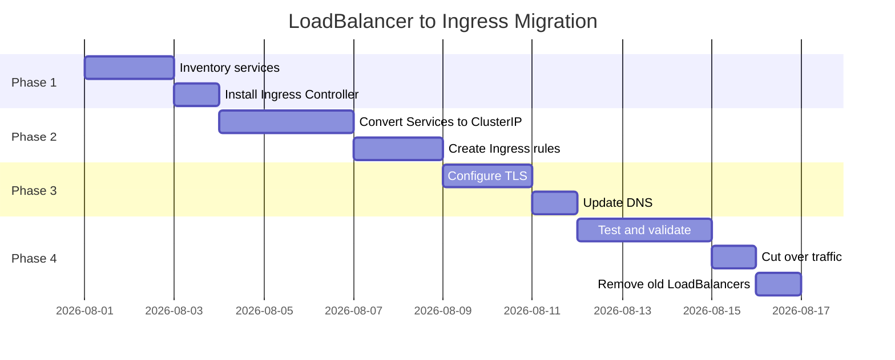

---

## 29. Real-World Use Cases

### Use Case 1: E-Commerce Platform

**Scenario:** An e-commerce platform with 20+ microservices (catalog, cart, checkout, payment, inventory, user, order, shipping, reviews, recommendations).

**Architecture:**
- Single Ingress at the edge with TLS
- Path-based routing: `/api/catalog`, `/api/cart`, `/api/checkout`
- API Gateway (Spring Cloud Gateway) for authentication and aggregation
- Layered rate limiting: Ingress (global) + Gateway (per-user)

**Benefits:** One entry point, centralized TLS, easy to add new services.

### Use Case 2: SaaS Multi-Tenant Platform

**Scenario:** A SaaS platform serving multiple customers, each with their own subdomain.

**Architecture:**
- Host-based routing: `customer1.example.com`, `customer2.example.com`
- Each customer's traffic routed to their namespace
- Wildcard TLS certificate for `*.example.com`
- Per-customer rate limiting

```yaml
apiVersion: networking.k8s.io/v1
kind: Ingress
metadata:
  name: saas-ingress
  namespace: saas
  annotations:
    nginx.ingress.kubernetes.io/limit-rps: "50"
spec:
  ingressClassName: nginx
  tls:
  - hosts:
    - "*.example.com"
    secretName: wildcard-example-tls
  rules:
  - host: customer1.example.com
    http:
      paths:
      - path: /
        pathType: Prefix
        backend:
          service:
            name: customer1-service
            port:
              number: 80
  - host: customer2.example.com
    http:
      paths:
      - path: /
        pathType: Prefix
        backend:
          service:
            name: customer2-service
            port:
              number: 80
```

### Use Case 3: Microservices with API Versioning

**Scenario:** A company with API versioning requirements.

**Architecture:**
- Path-based routing with version prefixes: `/v1/users`, `/v2/users`
- URL rewriting to strip version prefixes
- Canary deployments by routing a percentage of traffic

```yaml
apiVersion: networking.k8s.io/v1
kind: Ingress
metadata:
  name: api-ingress
  namespace: microservices-demo
  annotations:
    nginx.ingress.kubernetes.io/rewrite-target: /$2
spec:
  ingressClassName: nginx
  rules:
  - host: api.example.com
    http:
      paths:
      - path: /v1/users(/|$)(.*)
        pathType: Prefix
        backend:
          service:
            name: user-service-v1
            port:
              number: 80
      - path: /v2/users(/|$)(.*)
        pathType: Prefix
        backend:
          service:
            name: user-service-v2
            port:
              number: 80
```

### Use Case 4: Internal vs External Services

**Scenario:** A company with both public APIs and internal admin tools.

**Architecture:**
- Public Ingress for `api.example.com` (external)
- Internal Ingress for `admin.internal` (ClusterIP only, no external exposure)
- NetworkPolicies to restrict internal access

---

## 30. Practice Exercises

### Exercise 1: Basic Ingress Setup

**Task:** Create a complete Kubernetes setup for a single Spring Boot service called `product-service` with:
- A Deployment with 3 replicas
- A ClusterIP Service on port 80 → 8080
- An Ingress rule routing `api.example.com/products` to the service
- A readiness probe hitting `/actuator/health`

**Solution:**

```yaml
# product-service/deployment.yaml
apiVersion: apps/v1
kind: Deployment
metadata:
  name: product-service
  namespace: microservices-demo
spec:
  replicas: 3
  selector:
    matchLabels:
      app: product-service
  template:
    metadata:
      labels:
        app: product-service
    spec:
      containers:
      - name: product-service
        image: your-registry/product-service:1.0
        ports:
        - containerPort: 8080
        readinessProbe:
          httpGet:
            path: /actuator/health
            port: 8080
          initialDelaySeconds: 10
          periodSeconds: 5
```

```yaml
# product-service/service.yaml
apiVersion: v1
kind: Service
metadata:
  name: product-service
  namespace: microservices-demo
spec:
  selector:
    app: product-service
  ports:
  - name: http
    port: 80
    targetPort: 8080
```

```yaml
# ingress/ingress.yaml
apiVersion: networking.k8s.io/v1
kind: Ingress
metadata:
  name: product-ingress
  namespace: microservices-demo
spec:
  ingressClassName: nginx
  rules:
  - host: api.example.com
    http:
      paths:
      - path: /products
        pathType: Prefix
        backend:
          service:
            name: product-service
            port:
              number: 80
```

**Verification:**
```bash
kubectl apply -f product-service/deployment.yaml
kubectl apply -f product-service/service.yaml
kubectl apply -f ingress/ingress.yaml
curl -H "Host: api.example.com" http://<INGRESS_IP>/products
```

---

### Exercise 2: URL Rewriting with Path Prefix

**Task:** Configure an Ingress so that requests to `https://api.example.com/api/users/1` are rewritten to `/users/1` before reaching the `user-service` Spring Boot app (which expects `/users/{id}`).

**Solution:**

```yaml
apiVersion: networking.k8s.io/v1
kind: Ingress
metadata:
  name: api-ingress
  namespace: microservices-demo
  annotations:
    nginx.ingress.kubernetes.io/rewrite-target: /$2
spec:
  ingressClassName: nginx
  rules:
  - host: api.example.com
    http:
      paths:
      - path: /api/users(/|$)(.*)
        pathType: Prefix
        backend:
          service:
            name: user-service
            port:
              number: 80
```

**Explanation:**
- The regex `/api/users(/|$)(.*)` captures:
  - Group 1 (`(/|$)`) = the slash or end of string
  - Group 2 (`(.*)`) = everything after `/api/users`
- `rewrite-target: /$2` produces `/1` for `/api/users/1`

**Verification:**
```bash
# This should return the user data (not a 404)
curl -H "Host: api.example.com" http://<INGRESS_IP>/api/users/1

# Check the app logs to confirm the path was rewritten
kubectl logs deployment/user-service -n microservices-demo
```

---

### Exercise 3: TLS with HTTPS Redirect

**Task:** Configure an Ingress with:
1. TLS using a secret named `api-tls`
2. HTTPS redirect (HTTP → HTTPS)
3. Two hosts: `api.example.com` and `admin.example.com`

**Solution:**

```yaml
apiVersion: networking.k8s.io/v1
kind: Ingress
metadata:
  name: secure-ingress
  namespace: microservices-demo
  annotations:
    nginx.ingress.kubernetes.io/ssl-redirect: "true"
spec:
  ingressClassName: nginx
  tls:
  - hosts:
    - api.example.com
    - admin.example.com
    secretName: api-tls
  rules:
  - host: api.example.com
    http:
      paths:
      - path: /users
        pathType: Prefix
        backend:
          service:
            name: user-service
            port:
              number: 80
      - path: /orders
        pathType: Prefix
        backend:
          service:
            name: order-service
            port:
              number: 80
  - host: admin.example.com
    http:
      paths:
      - path: /
        pathType: Prefix
        backend:
          service:
            name: admin-service
            port:
              number: 80
```

**Create the TLS Secret:**
```bash
kubectl create secret tls api-tls \
  --cert=path/to/tls.crt \
  --key=path/to/tls.key \
  -n microservices-demo
```

**Verification:**
```bash
# HTTP should redirect to HTTPS
curl -v http://api.example.com/users/1  # Expect 301/308 redirect

# HTTPS should work
curl https://api.example.com/users/1
```

---

### Exercise 4: Rate Limiting and CORS

**Task:** Configure an Ingress with:
1. Rate limiting: 20 requests per second, 10 concurrent connections
2. CORS enabled for `https://app.example.com`
3. Request body size limit of 10MB

**Solution:**

```yaml
apiVersion: networking.k8s.io/v1
kind: Ingress
metadata:
  name: protected-ingress
  namespace: microservices-demo
  annotations:
    nginx.ingress.kubernetes.io/limit-rps: "20"
    nginx.ingress.kubernetes.io/limit-connections: "10"
    nginx.ingress.kubernetes.io/enable-cors: "true"
    nginx.ingress.kubernetes.io/cors-allow-origin: "https://app.example.com"
    nginx.ingress.kubernetes.io/proxy-body-size: "10m"
spec:
  ingressClassName: nginx
  rules:
  - host: api.example.com
    http:
      paths:
      - path: /users
        pathType: Prefix
        backend:
          service:
            name: user-service
            port:
              number: 80
```

**Verification:**
```bash
# Test CORS preflight
curl -X OPTIONS -H "Origin: https://app.example.com" \
  -H "Access-Control-Request-Method: GET" \
  http://<INGRESS_IP>/users/1

# Test rate limiting (send 25 requests quickly)
for i in $(seq 1 25); do
  curl -s -o /dev/null -w "%{http_code}\n" \
    -H "Host: api.example.com" http://<INGRESS_IP>/users/1
done
# Expect some 429/503 responses after the limit
```

---

### Exercise 5: Multi-Service Ingress with Health Checks

**Task:** Create a complete setup for 3 services (`auth-service`, `billing-service`, `notification-service`) with:
- All services in namespace `production`
- Path-based routing: `/auth`, `/billing`, `/notifications`
- All services have readiness and liveness probes
- TLS enabled with a wildcard certificate

**Solution:**

```yaml
# namespace.yaml
apiVersion: v1
kind: Namespace
metadata:
  name: production
```

```yaml
# auth-service/deployment.yaml
apiVersion: apps/v1
kind: Deployment
metadata:
  name: auth-service
  namespace: production
spec:
  replicas: 2
  selector:
    matchLabels:
      app: auth-service
  template:
    metadata:
      labels:
        app: auth-service
    spec:
      containers:
      - name: auth-service
        image: your-registry/auth-service:1.0
        ports:
        - containerPort: 8080
        readinessProbe:
          httpGet:
            path: /actuator/health
            port: 8080
          initialDelaySeconds: 10
          periodSeconds: 5
        livenessProbe:
          httpGet:
            path: /actuator/health
            port: 8080
          initialDelaySeconds: 15
          periodSeconds: 20
```

```yaml
# auth-service/service.yaml
apiVersion: v1
kind: Service
metadata:
  name: auth-service
  namespace: production
spec:
  selector:
    app: auth-service
  ports:
  - name: http
    port: 80
    targetPort: 8080
```

*(Repeat similar manifests for billing-service and notification-service)*

```yaml
# ingress/ingress.yaml
apiVersion: networking.k8s.io/v1
kind: Ingress
metadata:
  name: production-ingress
  namespace: production
spec:
  ingressClassName: nginx
  tls:
  - hosts:
    - "*.example.com"
    secretName: wildcard-example-tls
  rules:
  - host: api.example.com
    http:
      paths:
      - path: /auth
        pathType: Prefix
        backend:
          service:
            name: auth-service
            port:
              number: 80
      - path: /billing
        pathType: Prefix
        backend:
          service:
            name: billing-service
            port:
              number: 80
      - path: /notifications
        pathType: Prefix
        backend:
          service:
            name: notification-service
            port:
              number: 80
```

---

## 31. Question Bank

### Beginner Level (Questions 1-17)

**Q1. What is a Kubernetes Ingress?**
<details>
<summary>Answer</summary>
An Ingress is a Kubernetes resource that defines HTTP/HTTPS routing rules. It specifies how external traffic should be routed to Services based on hostnames and URL paths.
</details>

**Q2. What is the difference between an Ingress and an Ingress Controller?**
<details>
<summary>Answer</summary>
An Ingress is the routing rules (a Kubernetes object/YAML definition). An Ingress Controller is the actual software (like NGINX, Traefik) that reads those rules and implements them by routing traffic.
</details>

**Q3. What happens if you create an Ingress without an Ingress Controller?**
<details>
<summary>Answer</summary>
Nothing happens. The Ingress rules sit there with no effect because no controller is watching and implementing them.
</details>

**Q4. What layer of the OSI model does Ingress operate at?**
<details>
<summary>Answer</summary>
Layer 7 (HTTP/HTTPS), which enables host-based and path-based routing.
</details>

**Q5. What is the purpose of `ingressClassName` in an Ingress spec?**
<details>
<summary>Answer</summary>
It tells Kubernetes which Ingress Controller should handle this Ingress resource. This is important when multiple controllers are installed.
</details>

**Q6. What does `pathType: Prefix` mean?**
<details>
<summary>Answer</summary>
It means the path will match any request that starts with the specified prefix. For example, `/users` matches `/users`, `/users/`, and `/users/1`.
</details>

**Q7. What are the three valid values for `pathType`?**
<details>
<summary>Answer</summary>
`Prefix`, `Exact`, and `ImplementationSpecific`.
</details>

**Q8. What port does the Ingress route to — the Service port or the container port?**
<details>
<summary>Answer</summary>
The Service port (e.g., port 80), which then forwards to the container port (targetPort, e.g., 8080).
</details>

**Q9. What is the default behavior when no Ingress rule matches a request?**
<details>
<summary>Answer</summary>
The NGINX Ingress Controller typically returns a 404 Not Found.
</details>

**Q10. What type of Secret is used for TLS certificates in Kubernetes?**
<details>
<summary>Answer</summary>
A Secret of type `kubernetes.io/tls`, which contains `tls.crt` and `tls.key` data.
</details>

**Q11. What is the purpose of a readiness probe?**
<details>
<summary>Answer</summary>
It tells Kubernetes when a Pod is ready to receive traffic. If the probe fails, the Pod is removed from the Service's endpoints.
</details>

**Q12. What is the purpose of a liveness probe?**
<details>
<summary>Answer</summary>
It tells Kubernetes whether the container is still alive. If it fails, the container is restarted.
</details>

**Q13. What is the default request body size limit in NGINX Ingress?**
<details>
<summary>Answer</summary>
1MB (1m). This can be increased with the `proxy-body-size` annotation.
</details>

**Q14. What does the `rewrite-target` annotation do?**
<details>
<summary>Answer</summary>
It rewrites the URL path before forwarding the request to the backend service. It's commonly used with capture groups to strip path prefixes.
</details>

**Q15. What is the Service's `targetPort`?**
<details>
<summary>Answer</summary>
The container port where traffic is forwarded. For example, if the Service port is 80 and targetPort is 8080, traffic goes from port 80 to container port 8080.
</details>

**Q16. What is kube-proxy's role in Ingress traffic flow?**
<details>
<summary>Answer</summary>
kube-proxy implements Service load balancing at the node level, distributing traffic from the Service ClusterIP to the ready Pods.
</details>

**Q17. Can Ingress route TCP/UDP traffic?**
<details>
<summary>Answer</summary>
No, standard Ingress is for HTTP/HTTPS (Layer 7). TCP/UDP requires a different resource like Gateway or a LoadBalancer Service.
</details>

### Intermediate Level (Questions 18-34)

**Q18. What headers does the NGINX Ingress Controller automatically set?**
<details>
<summary>Answer</summary>
`X-Forwarded-For`, `X-Forwarded-Proto`, `X-Forwarded-Host`, and `X-Forwarded-Port`.
</details>

**Q19. Why do you need to configure `forward-headers-strategy: native` in Spring Boot?**
<details>
<summary>Answer</summary>
So Spring Boot trusts the forwarded headers from the Ingress Controller. Without this, the app sees the Ingress Pod's IP instead of the real client IP, and may generate wrong `http://` links instead of `https://`.
</details>

**Q20. What is the deprecated Spring Boot property for forwarded headers?**
<details>
<summary>Answer</summary>
`server.use-forward-headers=true` (deprecated in Spring Boot 2.2+).
</details>

**Q21. What is the difference between path-based and host-based routing?**
<details>
<summary>Answer</summary>
Path-based routing uses URL paths (e.g., `/users` → user-service) under a single host. Host-based routing uses different hostnames (e.g., `api.example.com` vs `admin.example.com`) to route to different services.
</details>

**Q22. How do you force HTTPS redirect with NGINX Ingress?**
<details>
<summary>Answer</summary>
Use the annotation `nginx.ingress.kubernetes.io/ssl-redirect: "true"`.
</details>

**Q23. What is the `limit-rps` annotation used for?**
<details>
<summary>Answer</summary>
It limits the number of requests per second that the Ingress will accept (e.g., `"10"` = 10 requests per second).
</details>

**Q24. What is the `limit-connections` annotation used for?**
<details>
<summary>Answer</summary>
It limits the number of concurrent connections to the Ingress (e.g., `"5"` = 5 concurrent connections).
</details>

**Q25. Can the standard Kubernetes Ingress validate JWT tokens?**
<details>
<summary>Answer</summary>
No. The standard Ingress is not an API gateway and doesn't inspect JWT tokens. Authentication should be handled by the application or an API gateway.
</details>

**Q26. What annotations enable external authentication with NGINX Ingress?**
<details>
<summary>Answer</summary>
`nginx.ingress.kubernetes.io/auth-url` (the auth service URL) and `nginx.ingress.kubernetes.io/auth-signin` (the login redirect URL).
</details>

**Q27. What is the difference between Ingress-level and application-level CORS?**
<details>
<summary>Answer</summary>
Ingress-level CORS uses annotations (`enable-cors`, `cors-allow-origin`) and applies to the whole Ingress. Application-level CORS is configured in the Spring Boot app (e.g., `WebMvcConfigurer`) and allows per-endpoint policies.
</details>

**Q28. What happens during a rolling update when new Pods aren't ready?**
<details>
<summary>Answer</summary>
The Service won't route traffic to unready Pods. If readiness probes are missing or too permissive, you'll get 502/503 errors because the Ingress forwards requests to Pods that haven't started.
</details>

**Q29. What is the relationship between Ingress, Service, and Pods?**
<details>
<summary>Answer</summary>
Ingress routes to the Service (ClusterIP), which then load-balances to ready Pods via kube-proxy. The Ingress doesn't route directly to Pods.
</details>

**Q30. What is the difference between an Ingress and an API Gateway?**
<details>
<summary>Answer</summary>
Ingress provides basic host/path routing, TLS termination, and some cross-cutting annotations. An API Gateway (like Spring Cloud Gateway) adds authentication, request transformation, service discovery, aggregation, and business-level policies.
</details>

**Q31. What is the production pattern for large-scale Spring Boot deployments?**
<details>
<summary>Answer</summary>
Internet → Cloud LB → Ingress Controller → API Gateway (ClusterIP) → backend services. The Ingress handles TLS and global rate limiting; the API Gateway handles authentication and business routing.
</details>

**Q32. What are the two main Ingress Controller options on AWS EKS?**
<details>
<summary>Answer</summary>
1) NGINX Ingress Controller (portable, behind NLB), and 2) AWS Load Balancer Controller (creates ALB directly, deep AWS integration).
</details>

**Q33. What does the regex `(/|$)(.*)` capture in a rewrite-target pattern?**
<details>
<summary>Answer</summary>
Group 1 captures a slash or the end of the string. Group 2 captures everything after the matched prefix. `rewrite-target: /$2` uses Group 2.
</details>

**Q34. What is the recommended approach when your Spring Boot app expects the full path?**
<details>
<summary>Answer</summary>
Configure the Spring Boot services with the full path (e.g., `/api/users`) so you don't need URL rewriting at all. This reduces moving parts and potential bugs.
</details>

### Advanced Level (Questions 35-50)

**Q35. How does the NGINX Ingress Controller translate Ingress resources into configuration?**
<details>
<summary>Answer</summary>
It watches the Kubernetes API for Ingress resources, translates them into `nginx.conf` configuration, and reloads NGINX when changes are detected.
</details>

**Q36. What is the purpose of `ImplementationSpecific` pathType?**
<details>
<summary>Answer</summary>
It delegates path matching behavior to the specific Ingress Controller implementation. Different controllers may interpret it differently.
</details>

**Q37. How do you implement canary deployments with Ingress?**
<details>
<summary>Answer</summary>
Using NGINX Ingress annotations like `nginx.ingress.kubernetes.io/canary: "true"` and `nginx.ingress.kubernetes.io/canary-weight: "10"` to route a percentage of traffic to a canary version.
</details>

**Q38. What is the `proxy-buffering` annotation and when would you disable it?**
<details>
<summary>Answer</summary>
It controls whether NGINX buffers responses from the backend. You might disable it for streaming responses or Server-Sent Events (SSE).
</details>

**Q39. How do you handle WebSocket connections through NGINX Ingress?**
<details>
<summary>Answer</summary>
NGINX Ingress supports WebSockets by default, but you may need to adjust timeouts (`proxy-read-timeout`, `proxy-send-timeout`) for long-lived connections.
</details>

**Q40. What is the difference between `limit-rps` and `limit-connections`?**
<details>
<summary>Answer</summary>
`limit-rps` limits requests per second (throughput), while `limit-connections` limits concurrent active connections (parallelism).
</details>

**Q41. How do you configure sticky sessions (session affinity) with NGINX Ingress?**
<details>
<summary>Answer</summary>
Use the annotation `nginx.ingress.kubernetes.io/affinity: "cookie"` to enable cookie-based session affinity.
</details>

**Q42. What is the `auth-url` annotation's role in the request flow?**
<details>
<summary>Answer</summary>
The Ingress forwards every request to the specified auth service before routing to the backend. If the auth service returns success, the request proceeds; otherwise it's rejected or redirected.
</details>

**Q43. How do you configure a default backend for unmatched requests?**
<details>
<summary>Answer</summary>
You can configure a default backend using the `--default-backend-service` flag on the controller, or create a catch-all Ingress rule with `path: /` and `pathType: Prefix`.
</details>

**Q44. What happens to the request flow when a Pod fails its readiness probe?**
<details>
<summary>Answer</summary>
The Service removes the Pod from its endpoints. The Ingress Controller stops sending requests to that Pod and routes to remaining ready Pods.
</details>

**Q45. How does the AWS Load Balancer Controller differ from NGINX Ingress in routing?**
<details>
<summary>Answer</summary>
The AWS Load Balancer Controller creates an ALB and routes directly to Pod IPs via VPC CNI, whereas NGINX Ingress routes through a Service (ClusterIP) to Pods.
</details>

**Q46. What is the purpose of `proxy-connect-timeout`?**
<details>
<summary>Answer</summary>
It sets the timeout for establishing a connection to the backend service. If the backend doesn't accept the connection within this time, NGINX returns an error.
</details>

**Q47. How do you handle large file uploads through Ingress?**
<details>
<summary>Answer</summary>
Increase the `proxy-body-size` annotation (e.g., `"50m"` for 50MB) and ensure the Spring Boot app's `spring.servlet.multipart.max-file-size` is also configured appropriately.
</details>

**Q48. What is the `X-Forwarded-Proto` header used for?**
<details>
<summary>Answer</summary>
It tells the backend whether the original client request was HTTP or HTTPS. Spring Boot uses this to generate correct links and enforce security constraints.
</details>

**Q49. How do you monitor the NGINX Ingress Controller?**
<details>
<summary>Answer</summary>
Enable Prometheus metrics (`controller.metrics.enabled=true` in Helm), view access logs, and set up dashboards for request rates, error rates, and latency.
</details>

**Q50. What is the recommended approach for handling both Ingress and API Gateway in a large microservices architecture?**
<details>
<summary>Answer</summary>
Use Ingress at the edge for TLS termination and global rate limiting, then forward to an API Gateway (Spring Cloud Gateway) as a ClusterIP Service for authentication, request transformation, and business-level routing to backend services.
</details>

---

## 32. Test Your Understanding

Answer these questions to check your understanding of the material:

**Q1.** What is the fundamental difference between an Ingress resource and an Ingress Controller?

<details>
<summary>Answer</summary>
An Ingress is just routing rules (YAML). An Ingress Controller is the running software (Pod) that implements those rules.
</details>

**Q2.** Why is the naive "LoadBalancer per Service" approach problematic for many microservices?

<details>
<summary>Answer</summary>
Cost (many cloud LBs), management overhead (DNS, TLS per service), security (multiple entry points), and inflexibility (no path/host-based routing).
</details>

**Q3.** What does `pathType: Prefix` mean for the path `/users`?

<details>
<summary>Answer</summary>
It matches any request starting with `/users`: `/users`, `/users/`, `/users/1`, `/users/profile`, etc.
</details>

**Q4.** What port does the Ingress route to — Service port or container port?

<details>
<summary>Answer</summary>
The Service port (e.g., 80), which then forwards to the container port (targetPort, e.g., 8080).
</details>

**Q5.** Why must Spring Boot configure `forward-headers-strategy: native` behind an Ingress?

<details>
<summary>Answer</summary>
So the app trusts `X-Forwarded-*` headers from the Ingress, allowing it to see the real client IP and correct protocol (https).
</details>

**Q6.** What is the purpose of the `rewrite-target` annotation?

<details>
<summary>Answer</summary>
It rewrites the URL path before forwarding to the backend, commonly used to strip prefixes like `/api`.
</details>

**Q7.** Can the standard Ingress validate JWT tokens?

<details>
<summary>Answer</summary>
No. JWT validation belongs in the application (Spring Security) or an API Gateway.
</details>

**Q8.** What is the difference between Ingress-level and application-level rate limiting?

<details>
<summary>Answer</summary>
Ingress-level is infrastructure-based (IP/global, no business logic awareness). Application-level is per-user/per-API-key and understands business logic.
</details>

**Q9.** What happens if a Pod fails its readiness probe?

<details>
<summary>Answer</summary>
The Service removes it from endpoints, and the Ingress stops routing traffic to it.
</details>

**Q10.** What is the recommended production architecture for large Spring Boot deployments?

<details>
<summary>Answer</summary>
Internet → Cloud LB → Ingress Controller (TLS, global rate limiting) → API Gateway (auth, aggregation) → backend Services.
</details>

---

## 33. Common Interview Questions

**Q1. Explain the difference between Ingress and Ingress Controller.**
<details>
<summary>Answer</summary>
Ingress is a Kubernetes API object defining routing rules (host/path → Service). Ingress Controller is the actual software (NGINX, Traefik, etc.) that watches for Ingress resources, translates them into its own config, and routes traffic accordingly. Without a controller, Ingress rules have no effect.
</details>

**Q2. How does a request flow from the internet to a Spring Boot Pod?**
<details>
<summary>Answer</summary>
Client → Cloud Load Balancer → Ingress Controller (matches host/path rules) → Service (ClusterIP) → kube-proxy load balances to ready Pods → Spring Boot app on port 8080.
</details>

**Q3. What is the difference between path-based and host-based routing? When would you use each?**
<details>
<summary>Answer</summary>
Path-based routes by URL path under a single host (e.g., `/users` → user-service). Host-based routes by hostname (e.g., `api.example.com` vs `admin.example.com`). Path-based is good for unified API domains; host-based for team-owned subdomains.
</details>

**Q4. How do you configure TLS/HTTPS with Kubernetes Ingress?**
<details>
<summary>Answer</summary>
Create a Secret of type `kubernetes.io/tls` with the certificate and key, then reference it in the Ingress `spec.tls` section with the host and `secretName`. The Ingress Controller terminates TLS.
</details>

**Q5. Why do you need `forward-headers-strategy: native` in Spring Boot behind an Ingress?**
<details>
<summary>Answer</summary>
The Ingress Controller sets `X-Forwarded-For`, `X-Forwarded-Proto`, etc. Spring Boot needs to trust these headers to see the real client IP and protocol. Without it, the app sees the Ingress Pod's IP and `http://` scheme, breaking links and security.
</details>

**Q6. How does URL rewriting work with NGINX Ingress?**
<details>
<summary>Answer</summary>
Using the `rewrite-target` annotation with regex capture groups. For example, `path: /api/users(/|$)(.*)` with `rewrite-target: /$2` rewrites `/api/users/1` to `/1` before forwarding to the backend.
</details>

**Q7. What is the difference between Ingress and an API Gateway?**
<details>
<summary>Answer</summary>
Ingress is infrastructure-level: basic host/path routing, TLS termination, some annotations. API Gateway is application-level: authentication, request transformation, service discovery, aggregation, business policies. They're complementary — often used together.
</details>

**Q8. How do you implement rate limiting at the Ingress layer?**
<details>
<summary>Answer</summary>
Using NGINX annotations: `nginx.ingress.kubernetes.io/limit-rps` (requests per second) and `nginx.ingress.kubernetes.io/limit-connections` (concurrent connections). Note this is infrastructure-level and doesn't understand business logic.
</details>

**Q9. What happens during a rolling update if readiness probes are missing?**
<details>
<summary>Answer</summary>
The Ingress may forward requests to Pods that haven't started, causing 502/503 errors. Readiness probes ensure only ready Pods receive traffic, enabling zero-downtime deployments.
</details>

**Q10. How would you handle authentication for microservices behind an Ingress?**
<details>
<summary>Answer</summary>
Options: 1) Application-level with Spring Security (recommended for most cases), 2) API Gateway (Spring Cloud Gateway) for centralized auth, 3) External auth via NGINX `auth-url` annotation. The standard Ingress doesn't validate JWT tokens.
</details>

---

## 34. Self-Assessment Checklist

Rate your confidence (1-5) on each topic:

| Topic | 1 (Weak) | 2 | 3 | 4 | 5 (Strong) |
|-------|----------|---|---|---|------------|
| Understanding Ingress vs Ingress Controller | ☐ | ☐ | ☐ | ☐ | ☐ |
| Writing Deployment manifests with probes | ☐ | ☐ | ☐ | ☐ | ☐ |
| Writing Service manifests (selector, ports) | ☐ | ☐ | ☐ | ☐ | ☐ |
| Writing Ingress rules (host, path, pathType) | ☐ | ☐ | ☐ | ☐ | ☐ |
| Configuring TLS/HTTPS with Secrets | ☐ | ☐ | ☐ | ☐ | ☐ |
| Configuring forwarded headers in Spring Boot | ☐ | ☐ | ☐ | ☐ | ☐ |
| Using NGINX annotations (rewrite, rate limit, CORS) | ☐ | ☐ | ☐ | ☐ | ☐ |
| Troubleshooting 404/502/503 errors | ☐ | ☐ | ☐ | ☐ | ☐ |
| Understanding the request flow (Ingress → Service → Pod) | ☐ | ☐ | ☐ | ☐ | ☐ |
| Deciding between Ingress, API Gateway, LoadBalancer | ☐ | ☐ | ☐ | ☐ | ☐ |
| Deploying NGINX Ingress Controller | ☐ | ☐ | ☐ | ☐ | ☐ |
| Implementing rate limiting strategies | ☐ | ☐ | ☐ | ☐ | ☐ |
| Securing services behind Ingress | ☐ | ☐ | ☐ | ☐ | ☐ |
| Testing Ingress routing locally (Minikube/kind) | ☐ | ☐ | ☐ | ☐ | ☐ |

**If you scored below 3 on any topic, review the corresponding section before proceeding.**

---

## 35. Hands-On Lab Project

### Project: Build a Production-Ready API Gateway with Ingress

**Objective:** Build a complete microservices setup with 3 Spring Boot services, an NGINX Ingress Controller, TLS, rate limiting, and URL rewriting.

### Lab Setup

**Step 1: Create the Spring Boot Services**

Create three simple Spring Boot services:

```java
// UserServiceApplication.java
@SpringBootApplication
public class UserServiceApplication {
    public static void main(String[] args) {
        SpringApplication.run(UserServiceApplication.class, args);
    }
}

@RestController
@RequestMapping("/users")
public class UserController {

    @GetMapping("/{id}")
    public Map<String, String> getUser(@PathVariable String id) {
        return Map.of("id", id, "name", "User " + id, "service", "user-service");
    }
}
```

```java
// OrderServiceApplication.java
@SpringBootApplication
public class OrderServiceApplication {
    public static void main(String[] args) {
        SpringApplication.run(OrderServiceApplication.class, args);
    }
}

@RestController
@RequestMapping("/orders")
public class OrderController {

    @GetMapping("/{id}")
    public Map<String, String> getOrder(@PathVariable String id) {
        return Map.of("id", id, "total", "$99.99", "service", "order-service");
    }
}
```

```java
// PaymentServiceApplication.java
@SpringBootApplication
public class PaymentServiceApplication {
    public static void main(String[] args) {
        SpringApplication.run(PaymentServiceApplication.class, args);
    }
}

@RestController
@RequestMapping("/payments")
public class PaymentController {

    @GetMapping("/{id}")
    public Map<String, String> getPayment(@PathVariable String id) {
        return Map.of("id", id, "status", "COMPLETED", "service", "payment-service");
    }
}
```

**Step 2: Build Docker Images**

```dockerfile
# Dockerfile
FROM eclipse-temurin:17-jre-alpine
WORKDIR /app
COPY target/*.jar app.jar
EXPOSE 8080
ENTRYPOINT ["java", "-jar", "app.jar"]
```

```bash
# Build and push images
docker build -t your-registry/user-service:1.0 .
docker build -t your-registry/order-service:1.0 .
docker build -t your-registry/payment-service:1.0 .
docker push your-registry/user-service:1.0
docker push your-registry/order-service:1.0
docker push your-registry/payment-service:1.0
```

**Step 3: Create Kubernetes Manifests**

Create all the manifests from the tutorial for the three services.

**Step 4: Install NGINX Ingress Controller**

```bash
kubectl apply -f https://raw.githubusercontent.com/kubernetes/ingress-nginx/controller-v1.10.0/deploy/static/provider/cloud/deploy.yaml
```

**Step 5: Create the Ingress with Advanced Features**

```yaml
apiVersion: networking.k8s.io/v1
kind: Ingress
metadata:
  name: api-ingress
  namespace: microservices-demo
  annotations:
    nginx.ingress.kubernetes.io/rewrite-target: /$2
    nginx.ingress.kubernetes.io/limit-rps: "50"
    nginx.ingress.kubernetes.io/limit-connections: "20"
    nginx.ingress.kubernetes.io/proxy-body-size: "10m"
    nginx.ingress.kubernetes.io/ssl-redirect: "true"
spec:
  ingressClassName: nginx
  tls:
  - hosts:
    - api.example.com
    secretName: api-example-tls
  rules:
  - host: api.example.com
    http:
      paths:
      - path: /api/users(/|$)(.*)
        pathType: Prefix
        backend:
          service:
            name: user-service
            port:
              number: 80
      - path: /api/orders(/|$)(.*)
        pathType: Prefix
        backend:
          service:
            name: order-service
            port:
              number: 80
      - path: /api/payments(/|$)(.*)
        pathType: Prefix
        backend:
          service:
            name: payment-service
            port:
              number: 80
```

**Step 6: Test Everything**

```bash
# Test path rewriting
curl -H "Host: api.example.com" http://<INGRESS_IP>/api/users/1
# Expect: {"id":"1","name":"User 1","service":"user-service"}

curl -H "Host: api.example.com" http://<INGRESS_IP>/api/orders/100
# Expect: {"id":"100","total":"$99.99","service":"order-service"}

curl -H "Host: api.example.com" http://<INGRESS_IP>/api/payments/5
# Expect: {"id":"5","status":"COMPLETED","service":"payment-service"}

# Test rate limiting
for i in $(seq 1 60); do
  curl -s -o /dev/null -w "%{http_code}\n" \
    -H "Host: api.example.com" http://<INGRESS_IP>/api/users/1
done
# Expect some 429/503 after the limit

# Test 404 for unknown path
curl -H "Host: api.example.com" http://<INGRESS_IP>/api/unknown
# Expect: 404
```

**Step 7: Verify Forwarded Headers**

```bash
# Check Spring Boot logs to verify client IP
kubectl logs deployment/user-service -n microservices-demo
```

---

## 36. Summary and Key Takeaways

### The Core Concepts

| Concept | Key Takeaway |
|---------|--------------|
| **Ingress** | Routing rules (YAML), not the actual traffic processor |
| **Ingress Controller** | The software (NGINX, Traefik) that implements the rules |
| **Service** | Stable abstraction that load-balances to Pods |
| **Ingress + Service** | Ingress routes to Service, Service routes to Pods |
| **TLS** | Terminated at the Ingress layer, centralized |
| **Forwarded Headers** | Critical for Spring Boot to see real client info |
| **Annotations** | Controller-specific configuration (rewrite, rate limit, CORS) |
| **API Gateway** | Application-level complement to Ingress |

### The Mental Model

> 💡 **When a request hits `https://api.example.com/users/1`:**
> 1. DNS resolves to the cloud load balancer
> 2. Load balancer forwards to the NGINX Ingress Controller
> 3. Controller matches host `api.example.com` and path `/users`
> 4. Controller forwards to `user-service` Service (port 80)
> 5. kube-proxy selects a ready Pod
> 6. Pod's Spring Boot app handles `GET /users/1` on port 8080
> 7. Response flows back through the same path

### Key Decisions Framework

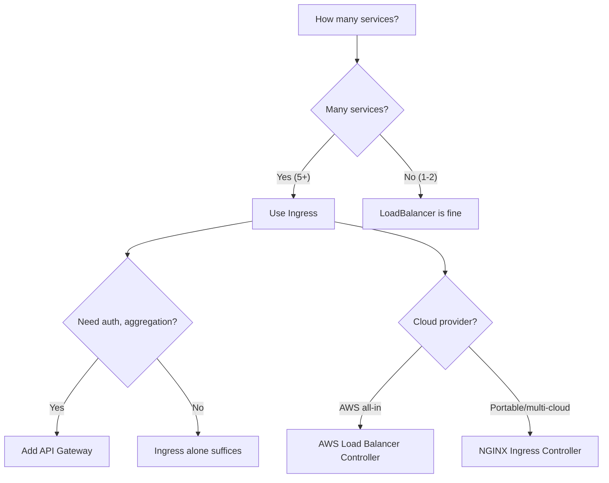

---

## 37. Further Reading and Resources

### Official Documentation
- [Kubernetes Ingress Documentation](https://kubernetes.io/docs/concepts/services-networking/ingress/)
- [NGINX Ingress Controller Documentation](https://kubernetes.github.io/ingress-nginx/)
- [Kubernetes Services Documentation](https://kubernetes.io/docs/concepts/services-networking/service/)
- [Spring Boot Reference: Forwarded Headers](https://docs.spring.io/spring-boot/docs/current/reference/html/web.html#web.servlet.embedded.container)
- [AWS Load Balancer Controller](https://kubernetes-sigs.github.io/aws-load-balancer-controller/)

### Community Resources
- [Kubernetes Official Blog](https://kubernetes.io/blog/)
- [NGINX Ingress GitHub Repository](https://github.com/kubernetes/ingress-nginx)
- [Kubernetes The Hard Way](https://github.com/kelseyhightower/kubernetes-the-hard-way)
- [Awesome Kubernetes](https://github.com/ramitsurana/awesome-kubernetes)

### Recommended Books
- *Kubernetes in Action* by Marko Lukša
- *Kubernetes: Up and Running* by Brendan Burns, Joe Beda, and Kelsey Hightower
- *Cloud Native Spring in Action* by Thomas Vitale

### Tools to Explore
- **cert-manager** — Automatic TLS certificates
- **ExternalDNS** — Automatic DNS record management
- **Prometheus + Grafana** — Ingress monitoring
- **Kiali** — Service mesh visualization (with Istio)
- **k9s** — Terminal UI for Kubernetes

---

## 38. Learning Path Recommendations

### Next Steps After This Tutorial

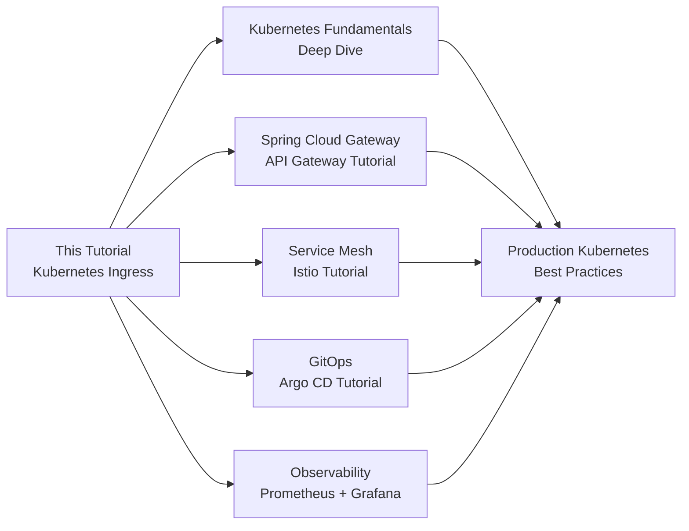

### Suggested Learning Path

| Level | Topic | Resources |
|-------|-------|-----------|
| **Foundation** | Kubernetes fundamentals (Pods, Deployments, Services) | Kubernetes docs, this tutorial |
| **Intermediate** | Ingress, TLS, annotations, troubleshooting | This tutorial + NGINX docs |
| **Advanced** | API Gateway, Service Mesh, GitOps | Spring Cloud Gateway, Istio, Argo CD |
| **Expert** | Multi-cluster, multi-region, platform engineering | CNCF resources, platform engineering guides |

### Pro Tips for Continued Learning

> 💡 **Pro Tip 1:** Practice on a local cluster (Minikube/kind) before touching production. The debugging skills you build locally transfer directly.

> 💡 **Pro Tip 2:** Set up a monitoring stack (Prometheus + Grafana) early. You'll thank yourself when troubleshooting Ingress issues in production.

> 💡 **Pro Tip 3:** Automate TLS with cert-manager. Manual certificate management doesn't scale.

> 💡 **Pro Tip 4:** Version your Ingress manifests in Git. Routing rules are as important as application code.

> 💡 **Pro Tip 5:** When in doubt, trace the request flow: Client → LB → Ingress Controller → Service → Pod. The answer is always in the flow.

---

## Quick Recap: The Complete Request Flow

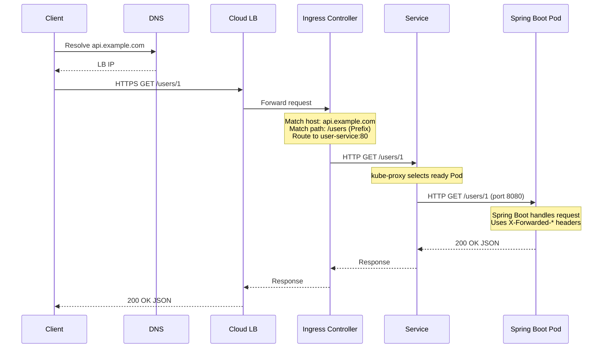

---

*This tutorial was created as a comprehensive deep-dive based on the article "Everyone Talks About Kubernetes Ingress. Few Explain What Actually Happens." by Gaddam.Naveen, augmented with additional research, best practices, and practical examples.*

**Last Updated:** 2026-08-14