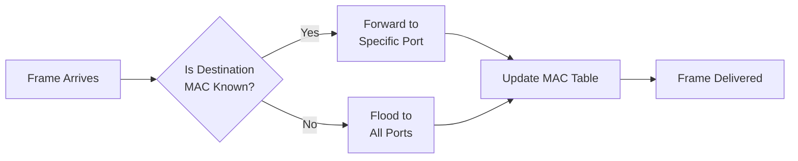
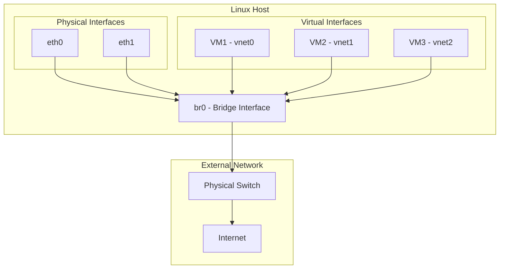
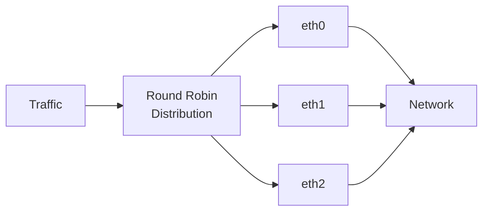
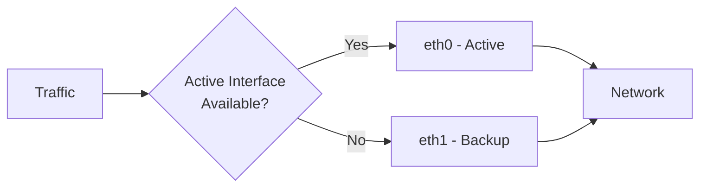
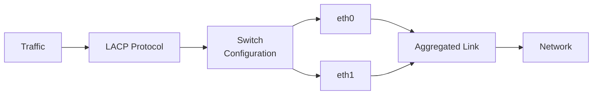
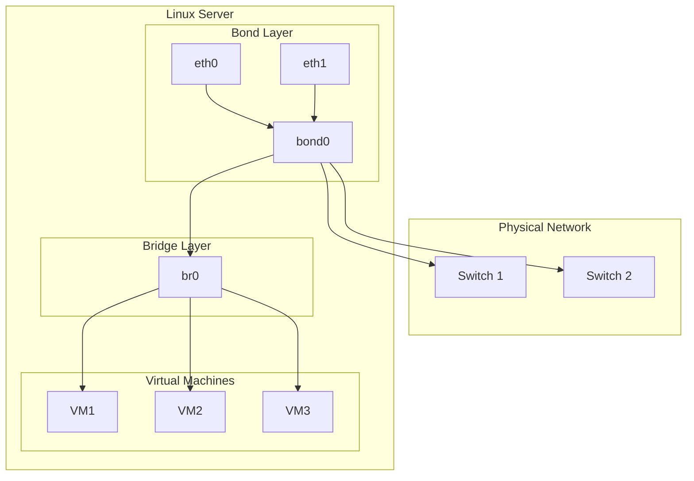

# Bridge vs Bond in Linux: The Complete Networking Guide

**Difficulty Level:** ⭐⭐⭐ Intermediate  
**Estimated Reading Time:** 20 minutes  
**Last Updated:** July 21, 2026  
**Category:** Linux Networking  
**Tags:** #Linux #Networking #Bridge #Bond #NetworkAdministration #DevOps

---

## Table of Contents

1. [Introduction](#introduction)
2. [Prerequisites](#prerequisites)
3. [Learning Objectives](#learning-objectives)
4. [Understanding Network Bridges](#understanding-network-bridges)
5. [Understanding Network Bonding](#understanding-network-bonding)
6. [Bridge vs Bond: Detailed Comparison](#bridge-vs-bond-detailed-comparison)
7. [Advanced: Using Bridge + Bond Together](#advanced-using-bridge--bond-together)
8. [Step-by-Step Implementation Guide](#step-by-step-implementation-guide)
9. [Common Pitfalls & Troubleshooting](#common-pitfalls--troubleshooting)
10. [Performance Considerations](#performance-considerations)
11. [Security Considerations](#security-considerations)
12. [Best Practices](#best-practices)
13. [Anti-Patterns](#anti-patterns)
14. [Practice Exercises](#practice-exercises)
15. [Test Your Understanding](#test-your-understanding)
16. [Common Interview Questions](#common-interview-questions)
17. [Question Bank](#question-bank)
18. [Summary & Key Takeaways](#summary--key-takeaways)
19. [Further Reading & Resources](#further-reading--resources)

---

## Introduction

If you're learning Linux networking, you'll eventually encounter two terms that sound almost identical: **Bridge** and **Bond**. Many beginners assume they're different names for the same thing. They're not.

> **💡 Key Insight:** A bridge connects different network devices together, while a bond combines multiple network cables into one logical connection. One is about connecting, the other is about combining.

This small difference changes everything. Understanding when to use each technology can save you hours of confusion and prevent critical network failures in production environments.

### Real-World Problem Statement

Imagine you're a Linux system administrator managing a virtualization server. You face two distinct challenges:

**Problem 1:** You have several virtual machines that need to communicate with each other and access the physical network. How do you connect them efficiently?

**Problem 2:** Your production server has only one network cable. If that cable fails, the entire server loses network access. How do you prevent catastrophic downtime?

These are two different problems requiring two different solutions. **Bridge solves the first problem. Bond solves the second.**

---

## Prerequisites

Before diving into this tutorial, ensure you have:

- ✅ Basic understanding of Linux operating system
- ✅ Familiarity with command-line interface (CLI)
- ✅ Understanding of basic networking concepts (IP addresses, MAC addresses, subnets)
- ✅ Root or sudo access to a Linux system
- ✅ Familiarity with network interface naming (eth0, ens33, etc.)
- ✅ Basic understanding of virtualization concepts (helpful but not required)

**Recommended Environment:**
- Linux distribution (Ubuntu 20.04+, CentOS 8+, RHEL 8+, or Debian 11+)
- Minimum 2 network interfaces (for bonding examples)
- Virtualization software (KVM, VirtualBox, or VMware) for bridge examples

---

## Learning Objectives

By the end of this tutorial, you will be able to:

- ✅ Explain the fundamental difference between bridges and bonds
- ✅ Describe how Linux bridges work (MAC learning, forwarding)
- ✅ Configure network bonding with different modes (active-backup, round-robin, LACP)
- ✅ Choose the right technology for specific use cases
- ✅ Implement both bridge and bond configurations
- ✅ Combine bridges and bonds for production environments
- ✅ Troubleshoot common bridge and bond issues
- ✅ Apply best practices for network redundancy and performance

---

## Understanding Network Bridges

### What Is a Bridge?

A **network bridge** is a virtual network device that connects multiple network interfaces into a single network segment. Think of it as a software-based network switch running inside your Linux kernel.

> **🔍 Technical Definition:** A Linux bridge operates at Layer 2 (Data Link Layer) of the OSI model. It forwards Ethernet frames between connected interfaces based on MAC addresses, making all connected devices appear as if they're on the same physical network.

### How Bridges Work

Bridges use a process called **MAC address learning** to efficiently forward traffic:

1. **Learning Phase:** The bridge learns which MAC addresses are reachable through which ports
2. **Forwarding Phase:** When a frame arrives, the bridge checks its MAC address table
3. **Broadcast Handling:** If the destination MAC is unknown, the bridge floods the frame to all ports (except the source)



**Figure 1:** Bridge packet forwarding logic

### Bridge Architecture



**Figure 2:** Linux bridge connecting VMs to physical network

### Real-World Bridge Example

Consider a virtualization server running KVM with three virtual machines:

**Without Bridge:**
```
VM1 (vnet0) - Isolated
VM2 (vnet1) - Isolated
VM3 (vnet2) - Isolated
eth0 (Physical) - Connected to network
```

Each VM is isolated and cannot communicate with the physical network or each other.

**With Bridge (br0):**
```
         br0
       /  |  \
   VM1  VM2  VM3
         |
       eth0
```

Now all VMs and the physical interface are part of the same broadcast domain. They can all communicate as if connected to a physical switch.

### Common Bridge Use Cases

| Use Case | Description | Example |
|----------|-------------|---------|
| **Virtual Machine Networking** | VMs need direct network access | KVM, VMware, VirtualBox |
| **Container Networking** | Containers on same network | Docker bridge networks |
| **Network Segmentation** | Isolate network segments | Lab environments |
| **Virtual Network Testing** | Create test networks | Network simulation |
| **Multi-homing** | Connect multiple interfaces | Redundancy scenarios |

### Bridge Configuration Example

**Creating a Bridge on Ubuntu/Debian:**

```bash
# Install required packages
sudo apt update
sudo apt install bridge-utils -y

# Create bridge interface
sudo brctl addbr br0

# Add physical interface to bridge
sudo brctl addif br0 eth0

# Configure bridge IP address
sudo ip addr add 192.168.1.100/24 dev br0

# Bring up the bridge
sudo ip link set br0 up

# Verify bridge status
sudo brctl show
```

**Netplan Configuration (Ubuntu 18.04+):**

```yaml
# /etc/netplan/01-bridge.yaml
network:
  version: 2
  renderer: networkd
  bridges:
    br0:
      interfaces: [eth0]
      addresses:
        - 192.168.1.100/24
      routes:
        - to: default
          via: 192.168.1.1
      nameservers:
        addresses:
          - 8.8.8.8
          - 8.8.4.4
      parameters:
        stp: true
        forward-delay: 15
```

**NetworkManager Configuration (RHEL/CentOS):**

```bash
# Create bridge connection
sudo nmcli con add type bridge ifname br0 con-name br0

# Configure bridge IP
sudo nmcli con mod br0 ipv4.addresses 192.168.1.100/24
sudo nmcli con mod br0 ipv4.method manual

# Add slave interface
sudo nmcli con add type bridge-slave ifname eth0 master br0

# Activate connection
sudo nmcli con up br0
```

### Bridge Advantages

✅ **Simple Configuration:** Easy to set up and manage  
✅ **Transparent:** Devices see it as a regular switch  
✅ **Flexible:** Can add/remove interfaces dynamically  
✅ **VLAN Support:** Can integrate with VLAN tagging  
✅ **No IP Needed:** Can operate without IP address on bridge itself

### Bridge Limitations

❌ **No Built-in Redundancy:** Single point of failure  
❌ **No Bandwidth Aggregation:** Doesn't combine multiple links  
❌ **Broadcast Traffic:** All broadcast traffic goes to all ports  
❌ **Performance Overhead:** Software-based switching adds latency  

---

## Understanding Network Bonding

### What Is Bonding?

**Network bonding** (also called NIC teaming or link aggregation) combines two or more physical network interfaces into a single logical interface. Linux treats the bonded interface as one network card, providing redundancy and/or increased bandwidth.

> **🔍 Technical Definition:** Linux bonding operates at Layer 2 (Data Link Layer) and aggregates multiple network interfaces to provide link redundancy, load balancing, or both. The bonded interface appears as a single network interface to the kernel and applications.

### How Bonding Works

The bonding kernel module creates a virtual interface that aggregates physical interfaces. Depending on the bonding mode, it can:

- Provide failover (active-backup)
- Distribute traffic across multiple links (round-robin, LACP)
- Balance load based on various algorithms

### Bonding Modes Explained

Linux supports seven bonding modes. Here are the most important ones:

#### 1. Mode 0: Round Robin (balance-rr)



**Figure 3:** Round-robin bonding distributes traffic sequentially

**Characteristics:**
- Traffic is sent across interfaces in sequential order
- Provides load balancing and fault tolerance
- Requires switch support for proper operation
- May cause packet reordering issues

**Use Case:** High-throughput applications where packet ordering isn't critical

#### 2. Mode 1: Active Backup (active-backup)



**Figure 4:** Active-backup mode provides failover capability

**Characteristics:**
- Only one interface is active at a time
- Automatic failover if active interface fails
- Simple configuration, no switch configuration needed
- No bandwidth aggregation

**Use Case:** High availability scenarios, simple failover requirements

#### 3. Mode 4: LACP (802.3ad)



**Figure 5:** LACP mode requires switch-side configuration

**Characteristics:**
- IEEE standard (802.3ad)
- Requires switch support and configuration
- Dynamic aggregation of links
- Provides both redundancy and increased bandwidth
- Most common in enterprise environments

**Use Case:** Production servers, data centers, enterprise networks

### Bonding Mode Comparison

| Mode | Name | Redundancy | Bandwidth | Switch Config Required | Use Case |
|------|------|------------|-----------|------------------------|----------|
| 0 | Round Robin | ✅ Yes | ✅ Aggregated | ⚠️ Sometimes | High throughput |
| 1 | Active Backup | ✅ Yes | ❌ No | ❌ No | High availability |
| 4 | LACP | ✅ Yes | ✅ Aggregated | ✅ Yes | Enterprise/production |
| 5 | Balance TLB | ✅ Yes | ✅ Aggregated | ❌ No | Adaptive load balancing |
| 6 | Balance ALB | ✅ Yes | ✅ Aggregated | ❌ No | Adaptive load balancing + receive |

### Real-World Bonding Example

Consider a database server with two network cards:

**Without Bonding:**
```
eth0 - Primary connection
eth1 - Unused (backup)
```

If eth0 fails, the server loses network connectivity until manual intervention.

**With Bonding (bond0):**
```
      bond0
      /   \
   eth0  eth1
```

Now both interfaces work together. If eth0 fails, eth1 automatically takes over (in active-backup mode) or traffic continues on both interfaces (in LACP mode).

### Bond Configuration Example

**Creating a Bond on Ubuntu/Debian:**

```bash
# Install required packages
sudo apt update
sudo apt install ifenslave -y

# Load bonding module
sudo modprobe bonding
echo "bonding" | sudo tee -a /etc/modules

# Create bond interface
sudo ip link add bond0 type bond mode active-backup

# Add slave interfaces
sudo ip link set eth0 master bond0
sudo ip link set eth1 master bond0

# Configure bond IP
sudo ip addr add 192.168.1.100/24 dev bond0

# Bring up bond
sudo ip link set bond0 up

# Verify bond status
cat /proc/net/bonding/bond0
```

**Netplan Configuration (Active-Backup Mode):**

```yaml
# /etc/netplan/02-bond.yaml
network:
  version: 2
  renderer: networkd
  bonds:
    bond0:
      interfaces:
        - eth0
        - eth1
      addresses:
        - 192.168.1.100/24
      routes:
        - to: default
          via: 192.168.1.1
      nameservers:
        addresses:
          - 8.8.8.8
          - 8.8.4.4
      parameters:
        mode: active-backup
        primary: eth0
        fail_over_mac: none
        miimon: 100
        updelay: 200
        downdelay: 200
```

**NetworkManager Configuration (LACP Mode):**

```bash
# Create bond connection
sudo nmcli con add type bond ifname bond0 con-name bond0 bond.options "mode=802.3ad"

# Configure bond IP
sudo nmcli con mod bond0 ipv4.addresses 192.168.1.100/24
sudo nmcli con mod bond0 ipv4.method manual

# Add slave interfaces
sudo nmcli con add type bond-slave ifname eth0 master bond0
sudo nmcli con add type bond-slave ifname eth1 master bond0

# Activate connections
sudo nmcli con up bond0
sudo nmcli con up bond-slave-eth0
sudo nmcli con up bond-slave-eth1
```

### Monitoring Bond Status

```bash
# Check bond status
cat /proc/net/bonding/bond0

# Example output:
# Ethernet Channel Bonding: 802.3ad Mode
# 
# Bond Mode: IEEE 802.3ad Dynamic link aggregation
# Transmit Hash Policy: layer3+4 (1)
# MII Status: up
# MII Polling Interval (ms): 100
# Up Delay (ms): 200
# Down Delay (ms): 200
#
# Slave Interface: eth0
# MII Status: up
# Speed: 1000 Mbps
# Duplex: Full
#
# Slave Interface: eth1
# MII Status: up
# Speed: 1000 Mbps
# Duplex: Full
```

### Bond Advantages

✅ **High Availability:** Automatic failover on cable/interface failure  
✅ **Increased Bandwidth:** Aggregate multiple links (in some modes)  
✅ **Load Balancing:** Distribute traffic across interfaces  
✅ **No Application Changes:** Transparent to applications  
✅ **Flexible Modes:** Choose based on requirements  

### Bond Limitations

❌ **Requires Multiple NICs:** Need physical interfaces to bond  
❌ **Switch Configuration:** Some modes require switch setup (LACP)  
❌ **Complexity:** More configuration than single interface  
❌ **Not for VMs:** Doesn't solve VM networking directly  

---

## Bridge vs Bond: Detailed Comparison

### Side-by-Side Comparison

| Aspect | Bridge | Bond |
|--------|--------|------|
| **Primary Purpose** | Connect multiple network segments | Combine multiple physical interfaces |
| **OSI Layer** | Layer 2 (Data Link) | Layer 2 (Data Link) |
| **Functionality** | Software switch | Link aggregation |
| **Traffic Handling** | Forwards based on MAC addresses | Aggregates/load-balances traffic |
| **Redundancy** | ❌ No built-in redundancy | ✅ Yes (in most modes) |
| **Bandwidth** | ❌ No aggregation | ✅ Yes (in some modes) |
| **Use Case** | VMs, containers, network segmentation | Server redundancy, bandwidth aggregation |
| **Configuration Complexity** | Low | Medium to High |
| **Switch Configuration** | ❌ Not required | ✅ Required for LACP |
| **IP Address** | Optional (can be assigned) | Required (on bond interface) |
| **MAC Address** | Own MAC address | Uses active slave's MAC |
| **Performance Impact** | Minimal | Minimal to Moderate |

### When to Use Bridge

✅ **Use Bridge When:**
- Running virtual machines that need network access
- Connecting containers to the same network
- Creating virtual network labs
- Need devices to appear on the same LAN
- Network virtualization is required
- Simple connectivity between interfaces is needed

❌ **Don't Use Bridge When:**
- You need link redundancy (use bond instead)
- You need to aggregate bandwidth (use bond instead)
- You have only one interface to configure

### When to Use Bond

✅ **Use Bond When:**
- Server cannot afford network downtime
- Need to combine multiple network links
- High availability is critical
- Database or production servers
- Data center environments
- Need failover capability

❌ **Don't Use Bond When:**
- You need to connect VMs/containers (use bridge instead)
- You have only one network interface
- Simple network connectivity is sufficient

### Decision Flowchart

```mermaid
flowchart TD
    A[Start: Network Requirement] --> B{What is the<br/>primary goal?}
    
    B -->|Connect VMs/<br/>Containers| C[Use BRIDGE]
    B -->|Prevent network<br/>downtime| D[Use BOND]
    B -->|Increase<br/>bandwidth| E[Use BOND]
    B -->|Network<br/>segmentation| C
    
    C --> F{Need redundancy<br/>too?}
    F -->|Yes| G[Combine BRIDGE + BOND]
    F -->|No| H[Configure Bridge Only]
    
    D --> I{Which mode?}
    E --> I
    I -->|Simple failover| J[Active-Backup Mode]
    I -->|Enterprise/switch| K[LACP Mode]
    I -->|Max bandwidth| L[Round-Robin Mode]
    
    G --> M[Production Setup]
    H --> M
    J --> M
    K --> M
    L --> M
    
    M --> N[Deploy and Monitor]
```



**Figure 6:** Decision flowchart for choosing between bridge and bond

---

## Advanced: Using Bridge + Bond Together

### Production Architecture Pattern

In production environments, you often need both redundancy AND VM/container connectivity. The solution? **Combine bridge and bond.**



**Figure 7:** Combined bridge + bond production architecture

### How It Works

1. **Bond Layer (bond0):** Combines eth0 and eth1 for redundancy and bandwidth
2. **Bridge Layer (br0):** Connects VMs to the bonded interface
3. **Result:** VMs get reliable, high-bandwidth network access

### Real-World Enterprise Example

**Scenario:** A company runs 20 VMs on a Linux server for development and testing. The server must never lose network connectivity.

**Solution:**
```bash
# Step 1: Create bond for redundancy
sudo ip link add bond0 type bond mode active-backup
sudo ip link set eth0 master bond0
sudo ip link set eth1 master bond0
sudo ip addr add 10.0.1.50/24 dev bond0
sudo ip link set bond0 up

# Step 2: Create bridge for VMs
sudo brctl addbr br0
sudo brctl addif br0 bond0
sudo ip link set br0 up

# Step 3: Connect VMs to bridge
# (Done in VM configuration - set network interface to br0)
```

**Result:**
- ✅ VMs have network access through br0
- ✅ Server has redundancy through bond0
- ✅ If one cable fails, VMs stay connected
- ✅ Professional, production-ready setup

### Configuration Example: Combined Setup

**Netplan Configuration:**

```yaml
# /etc/netplan/03-bridge-bond.yaml
network:
  version: 2
  renderer: networkd
  
  bonds:
    bond0:
      interfaces:
        - eth0
        - eth1
      parameters:
        mode: active-backup
        primary: eth0
        miimon: 100
        updelay: 200
        downdelay: 200
  
  bridges:
    br0:
      interfaces: [bond0]
      addresses:
        - 192.168.1.100/24
      routes:
        - to: default
          via: 192.168.1.1
      nameservers:
        addresses:
          - 8.8.8.8
          - 8.8.4.4
      parameters:
        stp: true
        forward-delay: 15
```

---

## Step-by-Step Implementation Guide

### Exercise 1: Basic Bridge Setup

**Objective:** Create a bridge and connect multiple interfaces

**Steps:**

```bash
# 1. Install bridge utilities
sudo apt update && sudo apt install bridge-utils -y

# 2. Create the bridge
sudo brctl addbr br0

# 3. Add interfaces to bridge
sudo brctl addif br0 eth0

# 4. Configure bridge IP (optional - for management)
sudo ip addr add 192.168.1.100/24 dev br0

# 5. Bring up the bridge
sudo ip link set br0 up

# 6. Bring up the slave interface
sudo ip link set eth0 up

# 7. Verify configuration
sudo brctl show

# Expected output:
# bridge name	bridge id		STP enabled	interfaces
# br0		8000.000000000000	no		eth0
```

**Verification:**
```bash
# Check bridge details
ip addr show br0

# Test connectivity
ping -c 4 192.168.1.100

# Monitor traffic
sudo tcpdump -i br0 -n
```

### Exercise 2: Active-Backup Bond Configuration

**Objective:** Create a bond with failover capability

**Steps:**

```bash
# 1. Load bonding module
sudo modprobe bonding
echo "bonding" | sudo tee -a /etc/modules

# 2. Create bond interface
sudo ip link add bond0 type bond mode active-backup

# 3. Configure bond parameters
echo "active-backup" | sudo tee /sys/class/net/bond0/bonding/mode
echo "eth0" | sudo tee /sys/class/net/bond0/bonding/primary
echo "100" | sudo tee /sys/class/net/bond0/bonding/miimon
echo "200" | sudo tee /sys/class/net/bond0/bonding/updelay
echo "200" | sudo tee /sys/class/net/bond0/bonding/downdelay

# 4. Add slave interfaces
sudo ip link set eth0 master bond0
sudo ip link set eth1 master bond0

# 5. Configure IP on bond
sudo ip addr add 192.168.1.100/24 dev bond0

# 6. Bring up interfaces
sudo ip link set eth0 up
sudo ip link set eth1 up
sudo ip link set bond0 up

# 7. Add default route
sudo ip route add default via 192.168.1.1 dev bond0

# 8. Verify bond status
cat /proc/net/bonding/bond0
```

**Testing Failover:**
```bash
# Simulate cable pull (disconnect eth0)
sudo ip link set eth0 down

# Check bond status - should show eth1 as active
cat /proc/net/bonding/bond0

# Restore eth0
sudo ip link set eth0 up

# Verify eth0 becomes active again
cat /proc/net/bonding/bond0
```

### Exercise 3: LACP Bond with Switch Configuration

**Objective:** Configure LACP bonding (requires switch configuration)

**Linux Configuration:**

```bash
# 1. Create LACP bond
sudo ip link add bond0 type bond mode 802.3ad

# 2. Configure LACP parameters
echo "802.3ad" | sudo tee /sys/class/net/bond0/bonding/mode
echo "layer3+4" | sudo tee /sys/class/net/bond0/bonding/xmit_hash_policy
echo "100" | sudo tee /sys/class/net/bond0/bonding/miimon
echo "slow" | sudo tee /sys/class/net/bond0/bonding/lacp_rate

# 3. Add slave interfaces
sudo ip link set eth0 master bond0
sudo ip link set eth1 master bond0

# 4. Configure IP
sudo ip addr add 192.168.1.100/24 dev bond0

# 5. Bring up interfaces
sudo ip link set eth0 up
sudo ip link set eth1 up
sudo ip link set bond0 up

# 6. Verify LACP status
cat /proc/net/bonding/bond0
```

**Switch Configuration (Cisco Example):**

```cisco
! Configure port-channel on Cisco switch
interface range GigabitEthernet0/1-2
  channel-group 1 mode active
  description Link to Linux Server

interface Port-channel1
  description Linux Server LACP Bond
  switchport mode access
  switchport access vlan 10
```

### Persistence Across Reboots

**For Ubuntu/Debian (Netplan):**

```yaml
# /etc/netplan/01-netcfg.yaml
network:
  version: 2
  renderer: networkd
  ethernets:
    eth0:
      dhcp4: no
    eth1:
      dhcp4: no
  bonds:
    bond0:
      interfaces: [eth0, eth1]
      addresses:
        - 192.168.1.100/24
      routes:
        - to: default
          via: 192.168.1.1
      parameters:
        mode: active-backup
        primary: eth0
  bridges:
    br0:
      interfaces: [bond0]
      addresses:
        - 192.168.1.200/24
```

Apply configuration:
```bash
sudo netplan apply
```

**For RHEL/CentOS (NetworkManager):**

```bash
# Create bond connection
sudo nmcli con add type bond ifname bond0 con-name bond0 bond.options "mode=active-backup"

# Configure bond
sudo nmcli con mod bond0 ipv4.addresses 192.168.1.100/24
sudo nmcli con mod bond0 ipv4.method manual
sudo nmcli con mod bond0 connection.autoconnect yes

# Add slaves
sudo nmcli con add type bond-slave ifname eth0 master bond0
sudo nmcli con add type bond-slave ifname eth1 master bond0

# Create bridge
sudo nmcli con add type bridge ifname br0 con-name br0
sudo nmcli con mod br0 ipv4.addresses 192.168.1.200/24
sudo nmcli con mod br0 ipv4.method manual
sudo nmcli con mod br0 bridge.stp yes

# Add bond to bridge
sudo nmcli con add type bridge-slave ifname bond0 master br0

# Activate all connections
sudo nmcli con up bond0
sudo nmcli con up bond-slave-eth0
sudo nmcli con up bond-slave-eth1
sudo nmcli con up br0
```

---

## Common Pitfalls & Troubleshooting

### Common Bridge Issues

#### Issue 1: Bridge Not Forwarding Traffic

**Symptoms:** Devices connected to bridge cannot communicate

**Diagnosis:**
```bash
# Check if STP is enabled and causing delays
sudo brctl show

# Check bridge status
ip link show br0

# Check if interfaces are up
ip link show
```

**Solution:**
```bash
# Disable STP if not needed
sudo brctl stp br0 off

# Or wait 30 seconds for STP convergence
# Ensure all interfaces are up
sudo ip link set eth0 up
sudo ip link set br0 up
```

#### Issue 2: Cannot Access Bridge IP

**Symptoms:** Cannot ping or SSH to bridge IP address

**Diagnosis:**
```bash
# Check IP configuration
ip addr show br0

# Check if IP is assigned
ip route show
```

**Solution:**
```bash
# Assign IP to bridge
sudo ip addr add 192.168.1.100/24 dev br0

# Or configure via netplan/NetworkManager
```

#### Issue 3: VM Cannot Access Network Through Bridge

**Symptoms:** VM has no network connectivity

**Diagnosis:**
```bash
# Check bridge configuration
sudo brctl show

# Check if VM interface is added to bridge
sudo brctl showmacs br0

# Check firewall rules
sudo iptables -L -n
```

**Solution:**
```bash
# Ensure VM interface is in PROMISC mode
sudo ip link set vnet0 promisc on

# Add VM interface to bridge
sudo brctl addif br0 vnet0

# Check firewall
sudo ufw disable  # For testing only
```

### Common Bond Issues

#### Issue 1: Bond Interface Not Coming Up

**Symptoms:** bond0 interface shows as DOWN

**Diagnosis:**
```bash
# Check if bonding module is loaded
lsmod | grep bonding

# Check bond status
cat /proc/net/bonding/bond0

# Check slave interfaces
ip link show
```

**Solution:**
```bash
# Load bonding module
sudo modprobe bonding

# Verify slaves are up
sudo ip link set eth0 up
sudo ip link set eth1 up

# Check dmesg for errors
dmesg | grep bonding
```

#### Issue 2: Failover Not Working

**Symptoms:** Bond doesn't failover when cable is pulled

**Diagnosis:**
```bash
# Check MII monitoring status
cat /sys/class/net/bond0/bonding/miimon

# Check slave status
cat /proc/net/bonding/bond0

# Verify both interfaces are configured as slaves
sudo brctl show  # For bridge
```

**Solution:**
```bash
# Enable MII monitoring
echo "100" | sudo tee /sys/class/net/bond0/bonding/miimon

# Set appropriate delays
echo "200" | sudo tee /sys/class/net/bond0/bonding/updelay
echo "200" | sudo tee /sys/class/net/bond0/bonding/downdelay

# Verify configuration
cat /sys/class/net/bond0/bonding/*
```

#### Issue 3: LACP Bond Not Aggregating

**Symptoms:** LACP bond shows but bandwidth isn't aggregated

**Diagnosis:**
```bash
# Check LACP status
cat /proc/net/bonding/bond0

# Look for "LACP Aggregator" in output
# Check if both interfaces are in the same aggregator
```

**Solution:**
```bash
# Ensure switch is configured for LACP
# On Cisco: channel-group X mode active
# On Linux: Verify both interfaces show "LACP Aggregator"

# Check switch configuration
# Ensure ports are in the same port-channel

# Verify on Linux
ethtool eth0  # Check speed/duplex
ethtool eth1
```

### General Troubleshooting Commands

```bash
# Network interface status
ip addr show
ip link show

# Routing table
ip route show

# ARP table
ip neigh show

# Network statistics
netstat -i
cat /proc/net/dev

# Bond-specific
cat /proc/net/bonding/bond0
cat /sys/class/net/bond0/bonding/*

# Bridge-specific
sudo brctl show
sudo brctl showmacs br0
sudo brctl showstp br0

# Packet capture for debugging
sudo tcpdump -i br0 -n
sudo tcpdump -i bond0 -n

# Check kernel messages
dmesg | grep -i "bond\|bridge\|network"
journalctl -u systemd-networkd
```

---

## Performance Considerations

### Bridge Performance

**Characteristics:**
- **Latency:** Minimal (software switching adds ~1-5 microseconds)
- **Throughput:** Limited by individual interface speeds
- **CPU Usage:** Low to moderate (depends on traffic volume)
- **Scalability:** Can handle hundreds of VMs/containers

**Optimization Tips:**

```bash
# Enable hardware offloading if available
sudo ethtool -K eth0 tso on gso on gro on

# Disable unnecessary features
sudo brctl setfd br0 0  # Set forward delay to 0

# Use multiple bridges for high traffic
# Instead of one bridge with 50 VMs, use 5 bridges with 10 VMs each
```

### Bond Performance

**Performance by Mode:**

| Mode | Bandwidth | Latency | CPU Usage | Best For |
|------|-----------|---------|-----------|----------|
| **Active-Backup** | Single link | Lowest | Minimal | High availability |
| **Round-Robin** | Aggregated | Low | Low | High throughput |
| **LACP** | Aggregated | Low | Low | Enterprise/production |
| **Balance TLB** | Aggregated (outbound) | Low | Moderate | Adaptive load balancing |
| **Balance ALB** | Aggregated (bidirectional) | Moderate | Higher | Advanced load balancing |

**Benchmarking:**

```bash
# Install iperf3
sudo apt install iperf3 -y

# On server
iperf3 -s

# On client (test single interface)
iperf3 -c 192.168.1.100 -t 30

# Test bond bandwidth (should show aggregated speed)
iperf3 -c 192.168.1.100 -t 30 -P 4  # Parallel streams
```

**Performance Tuning:**

```bash
# Adjust transmit hash policy for LACP
echo "layer3+4" | sudo tee /sys/class/net/bond0/bonding/xmit_hash_policy

# Options: layer2, layer2+3, layer3+4, encap2+3, encap3+4

# Enable jumbo frames (if supported)
sudo ip link set mtu 9000 dev bond0

# Tune interrupt coalescing
sudo ethtool -C eth0 rx-usecs 100
sudo ethtool -C eth1 rx-usecs 100
```

### Performance Monitoring

```bash
# Monitor bond traffic
watch -n 1 'cat /proc/net/bonding/bond0'

# Check interface statistics
ip -s link show bond0

# Monitor per-slave traffic
ip -s link show eth0
ip -s link show eth1

# Use iftop for real-time monitoring
sudo apt install iftop -y
sudo iftop -i bond0
```

---

## Security Considerations

### Bridge Security

#### 1. Network Isolation

**Risk:** Bridge connects all devices to the same network segment

**Mitigation:**
```bash
# Use ebtables for Layer 2 filtering
sudo apt install ebtables -y

# Block traffic between specific VMs
sudo ebtables -A FORWARD -s VM1_MAC -d VM2_MAC -j DROP

# Enable port security
sudo ebtables -A FORWARD -p 0x0806 --arp-op Request --arp-mac-src ! ALLOWED_MAC -j DROP
```

#### 2. MAC Flooding Protection

**Risk:** Attackers can flood bridge with fake MAC addresses

**Mitigation:**
```bash
# Enable MAC learning limits (if supported)
sudo brctl setageing br0 300  # Set ageing time

# Monitor MAC table
sudo brctl showmacs br0

# Limit MAC addresses per port
# (Requires switch-level configuration)
```

#### 3. VLAN Segmentation

**Best Practice:** Use VLANs with bridges for better isolation

```bash
# Create VLAN-aware bridge
sudo brctl addbr br0
sudo brctl setvlan_filtering br0 on

# Add VLAN interfaces
sudo ip link add link eth0 name eth0.10 type vlan id 10
sudo brctl addif br0 eth0.10
```

### Bond Security

#### 1. Physical Security

**Risk:** Unauthorized physical access to network cables

**Mitigation:**
- Use secure data centers
- Implement cable locks
- Monitor physical access logs

#### 2. LACP Security

**Risk:** LACP negotiation can be spoofed

**Mitigation:**
```bash
# Use LACP with authentication (if switch supports)
# On Cisco:
interface GigabitEthernet0/1
  channel-group 1 mode active
  lacp port-priority 100
  lacp port-number 1

# Monitor LACP status
watch -n 1 'cat /proc/net/bonding/bond0'
```

#### 3. Monitoring and Logging

**Best Practice:** Monitor bond/bridge status for anomalies

```bash
# Create monitoring script
#!/bin/bash
# /usr/local/bin/check-bond.sh

BOND_STATUS=$(cat /proc/net/bonding/bond0 | grep "MII Status")
if echo "$BOND_STATUS" | grep -q "down"; then
    echo "ALERT: Bond interface down!" | mail -s "Network Alert" admin@example.com
    logger "Bond interface failure detected"
fi

# Add to cron
# */5 * * * * /usr/local/bin/check-bond.sh
```

### General Security Best Practices

✅ **Do:**
- Use encrypted management interfaces (SSH, not Telnet)
- Monitor network interface status
- Implement logging and alerting
- Use VLANs for network segmentation
- Regularly audit network configurations
- Keep system updated

❌ **Don't:**
- Expose bridge/bond management to public networks
- Disable security features for convenience
- Ignore security warnings from tools
- Use default configurations in production
- Forget to document network topology

---

## Best Practices

### Bridge Best Practices

1. **Naming Conventions**
   ```bash
   # Use descriptive names
   br0, br-vmnet, br-containers  # ✅ Good
   bridge1, br0, tmp-bridge      # ❌ Bad
   ```

2. **STP Configuration**
   ```bash
   # Enable STP to prevent loops
   sudo brctl setfd br0 15
   sudo brctl stp br0 on
   ```

3. **Documentation**
   ```bash
   # Document bridge configuration
   cat << EOF > /etc/network/bridges/br0.conf
   Bridge: br0
   Purpose: VM networking
   Interfaces: eth0, vnet0, vnet1
   Network: 192.168.1.0/24
   Created: 2026-07-21
   EOF
   ```

4. **Monitoring**
   ```bash
   # Monitor bridge traffic
   sudo tcpdump -i br0 -w bridge-traffic.pcap
   
   # Check MAC table regularly
   sudo brctl showmacs br0
   ```

### Bond Best Practices

1. **Mode Selection**
   ```bash
   # Production servers: Use LACP or Active-Backup
   # Avoid round-robin unless specifically needed
   
   # LACP for: Data centers, enterprise
   # Active-Backup for: Simple failover, no switch config
   ```

2. **MII Monitoring**
   ```bash
   # Always enable MII monitoring
   echo "100" > /sys/class/net/bond0/bonding/miimon
   
   # Set appropriate delays
   echo "200" > /sys/class/net/bond0/bonding/updelay
   echo "200" > /sys/class/net/bond0/bonding/downdelay
   ```

3. **Switch Configuration**
   ```bash
   # For LACP: Configure switch ports
   # For Active-Backup: No switch config needed
   # Document switch configuration
   ```

4. **Testing**
   ```bash
   # Test failover regularly
   # Simulate cable pull
   sudo ip link set eth0 down
   # Verify failover
   cat /proc/net/bonding/bond0
   # Restore
   sudo ip link set eth0 up
   ```

### General Best Practices

✅ **Always:**
- Test configurations in lab environment first
- Document all network configurations
- Monitor network interfaces
- Have rollback plan
- Use version control for configuration files
- Test failover scenarios
- Keep backups of working configurations

✅ **Production Environments:**
- Use LACP or Active-Backup (avoid round-robin)
- Implement monitoring and alerting
- Document network topology
- Regular audits and reviews
- Change management process

---

## Anti-Patterns

### Anti-Pattern 1: Using Bridge for Redundancy

❌ **Wrong Approach:**
```bash
# Creating multiple bridges thinking it provides redundancy
sudo brctl addbr br0
sudo brctl addbr br1
# This does NOT provide failover!
```

✅ **Correct Approach:**
```bash
# Use bonding for redundancy
sudo ip link add bond0 type bond mode active-backup
sudo ip link set eth0 master bond0
sudo ip link set eth1 master bond0
# Then add bond to bridge if needed
sudo brctl addbr br0
sudo brctl addif br0 bond0
```

### Anti-Pattern 2: Mixing Bond Modes

❌ **Wrong Approach:**
```bash
# Using different modes on same server without clear purpose
bond0: mode=active-backup
bond1: mode=round-robin
bond2: mode=802.3ad
# This creates confusion and maintenance issues
```

✅ **Correct Approach:**
```bash
# Use consistent, documented modes
# Production: LACP or Active-Backup
# Testing: Round-robin if needed
# Document the reason for each mode
```

### Anti-Pattern 3: No Monitoring

❌ **Wrong Approach:**
```bash
# Configure bond/bridge and forget about it
# No monitoring, no alerts
# Discover failures from user complaints
```

✅ **Correct Approach:**
```bash
# Implement comprehensive monitoring
# - Monitor interface status
# - Alert on failures
# - Log all changes
# - Regular health checks
```

### Anti-Pattern 4: Ignoring Switch Configuration

❌ **Wrong Approach:**
```bash
# Configure LACP on Linux without configuring switch
# Result: Bond doesn't work as expected
sudo ip link add bond0 type bond mode 802.3ad
# Forgetting to configure switch port-channel
```

✅ **Correct Approach:**
```bash
# Always configure both sides
# Linux: sudo ip link add bond0 type bond mode 802.3ad
# Switch: interface GigabitEthernet0/1
#         channel-group 1 mode active
```

### Anti-Pattern 5: Single Point of Failure

❌ **Wrong Approach:**
```bash
# Using single NIC for critical server
# No bond, no redundancy
sudo ip addr add 192.168.1.100/24 dev eth0
# If eth0 fails, server is unreachable
```

✅ **Correct Approach:**
```bash
# Always use bonding for critical servers
sudo ip link add bond0 type bond mode active-backup
sudo ip link set eth0 master bond0
sudo ip link set eth1 master bond0
sudo ip addr add 192.168.1.100/24 dev bond0
```

---

## Practice Exercises

### Exercise 1: Basic Bridge Configuration

**Difficulty:** ⭐ Beginner  
**Time:** 10 minutes

**Task:** Create a bridge named `br-lan` that connects `eth1` and assigns IP `192.168.10.1/24`.

**Solution:**

```bash
# Step 1: Install bridge utilities
sudo apt update && sudo apt install bridge-utils -y

# Step 2: Create bridge
sudo brctl addbr br-lan

# Step 3: Add interface to bridge
sudo brctl addif br-lan eth1

# Step 4: Configure IP address
sudo ip addr add 192.168.10.1/24 dev br-lan

# Step 5: Bring up interfaces
sudo ip link set eth1 up
sudo ip link set br-lan up

# Step 6: Verify configuration
sudo brctl show

# Expected output should show:
# bridge name	bridge id		STP enabled	interfaces
# br-lan		8000.000000000000	no		eth1

# Step 7: Test connectivity
ping -c 3 192.168.10.1

# Step 8: Make persistent (Ubuntu example)
sudo tee /etc/netplan/01-br-lan.yaml << EOF
network:
  version: 2
  renderer: networkd
  bridges:
    br-lan:
      interfaces: [eth1]
      addresses:
        - 192.168.10.1/24
      parameters:
        stp: false
        forward-delay: 0
EOF

sudo netplan apply
```

**Verification:**
```bash
# Check bridge is up
ip link show br-lan

# Verify IP assignment
ip addr show br-lan

# Test from another device on same network
ping 192.168.10.1
```

---

### Exercise 2: Active-Backup Bond with Failover Testing

**Difficulty:** ⭐⭐ Intermediate  
**Time:** 15 minutes

**Task:** Create an active-backup bond using `eth2` and `eth3`, configure IP `192.168.20.100/24`, and test failover.

**Solution:**

```bash
# Step 1: Load bonding module
sudo modprobe bonding
echo "bonding" | sudo tee -a /etc/modules

# Step 2: Create bond interface
sudo ip link add bond0 type bond mode active-backup

# Step 3: Configure bond parameters
echo "active-backup" | sudo tee /sys/class/net/bond0/bonding/mode
echo "eth2" | sudo tee /sys/class/net/bond0/bonding/primary
echo "100" | sudo tee /sys/class/net/bond0/bonding/miimon
echo "200" | sudo tee /sys/class/net/bond0/bonding/updelay
echo "200" | sudo tee /sys/class/net/bond0/bonding/downdelay

# Step 4: Add slave interfaces
sudo ip link set eth2 master bond0
sudo ip link set eth3 master bond0

# Step 5: Configure IP address
sudo ip addr add 192.168.20.100/24 dev bond0

# Step 6: Configure default route
sudo ip route add default via 192.168.20.1 dev bond0

# Step 7: Bring up all interfaces
sudo ip link set eth2 up
sudo ip link set eth3 up
sudo ip link set bond0 up

# Step 8: Verify bond status
cat /proc/net/bonding/bond0

# Expected output should show:
# - Bonding Mode: active-backup
# - eth2 as Primary Slave (active)
# - eth3 as Slave (backup)
```

**Failover Testing:**

```bash
# Step 9: Test connectivity
ping -c 3 8.8.8.8

# Step 10: Simulate failure (disconnect eth2)
sudo ip link set eth2 down

# Step 11: Check bond status - should show eth3 as active
cat /proc/net/bonding/bond0

# Step 12: Verify connectivity still works
ping -c 3 8.8.8.8

# Step 13: Restore eth2
sudo ip link set eth2 up

# Step 14: Verify eth2 becomes active again
sleep 5
cat /proc/net/bonding/bond0

# Step 15: Make persistent
sudo tee /etc/netplan/02-bond.yaml << EOF
network:
  version: 2
  renderer: networkd
  bonds:
    bond0:
      interfaces: [eth2, eth3]
      addresses:
        - 192.168.20.100/24
      routes:
        - to: default
          via: 192.168.20.1
      parameters:
        mode: active-backup
        primary: eth2
        miimon: 100
        updelay: 200
        downdelay: 200
EOF

sudo netplan apply
```

**Expected Results:**
- ✅ Bond created with eth2 as primary
- ✅ Failover to eth3 when eth2 disconnected
- ✅ Automatic recovery when eth2 restored
- ✅ Configuration persists after reboot

---

### Exercise 3: Production Setup - Bridge + Bond Combined

**Difficulty:** ⭐⭐⭐ Advanced  
**Time:** 20 minutes

**Task:** Create a production-ready setup with LACP bond (`bond0`) using `eth4` and `eth5`, connected to a bridge (`br-vms`) for VM networking with IP `192.168.30.100/24`.

**Solution:**

```bash
# Step 1: Load bonding module
sudo modprobe bonding
echo "bonding" | sudo tee -a /etc/modules

# Step 2: Create LACP bond
sudo ip link add bond0 type bond mode 802.3ad

# Step 3: Configure LACP parameters
echo "802.3ad" | sudo tee /sys/class/net/bond0/bonding/mode
echo "layer3+4" | sudo tee /sys/class/net/bond0/bonding/xmit_hash_policy
echo "slow" | sudo tee /sys/class/net/bond0/bonding/lacp_rate
echo "100" | sudo tee /sys/class/net/bond0/bonding/miimon

# Step 4: Add slave interfaces
sudo ip link set eth4 master bond0
sudo ip link set eth5 master bond0

# Step 5: Create bridge
sudo brctl addbr br-vms

# Step 6: Add bond to bridge
sudo brctl addif br-vms bond0

# Step 7: Configure bridge IP
sudo ip addr add 192.168.30.100/24 dev br-vms

# Step 8: Configure default route
sudo ip route add default via 192.168.30.1 dev br-vms

# Step 9: Bring up all interfaces
sudo ip link set eth4 up
sudo ip link set eth5 up
sudo ip link set bond0 up
sudo ip link set br-vms up

# Step 10: Verify bond (should show LACP Aggregator)
cat /proc/net/bonding/bond0

# Step 11: Verify bridge
sudo brctl show

# Step 12: Test connectivity
ping -c 3 8.8.8.8

# Step 13: Test from VM (if available)
# Configure VM network interface to use br-vms
# VM should get IP in 192.168.30.0/24 network
```

**Switch Configuration (Cisco Example):**

```cisco
! Configure switch ports for LACP
interface range GigabitEthernet1/0/1-2
  description Link to Linux Server - LACP Bond
  channel-group 10 mode active
  switchport mode access
  switchport access vlan 30

interface Port-channel10
  description Linux Server bond0
  switchport mode access
  switchport access vlan 30
```

**Persistent Configuration (Netplan):**

```yaml
# /etc/netplan/04-prod-setup.yaml
network:
  version: 2
  renderer: networkd
  
  bonds:
    bond0:
      interfaces:
        - eth4
        - eth5
      parameters:
        mode: 802.3ad
        lacp_rate: slow
        transmit_hash_policy: layer3+4
        miimon: 100
  
  bridges:
    br-vms:
      interfaces: [bond0]
      addresses:
        - 192.168.30.100/24
      routes:
        - to: default
          via: 192.168.30.1
      nameservers:
        addresses:
          - 8.8.8.8
          - 8.8.4.4
      parameters:
        stp: true
        forward-delay: 15
```

**Verification Checklist:**

```bash
# ✅ Bond configuration
cat /proc/net/bonding/bond0
# Should show: LACP Aggregator, both interfaces up

# ✅ Bridge configuration
sudo brctl show
# Should show: br-vms with bond0 as interface

# ✅ IP configuration
ip addr show br-vms
# Should show: 192.168.30.100/24

# ✅ Routing
ip route show
# Should show: default via 192.168.30.1

# ✅ Connectivity
ping -c 3 8.8.8.8
# Should succeed

# ✅ Persistence
sudo netplan apply
sudo reboot
# After reboot, verify all configurations still work
```

**Expected Results:**
- ✅ LACP bond with aggregated bandwidth
- ✅ Bridge providing VM networking
- ✅ Automatic failover on cable failure
- ✅ Configuration survives reboots
- ✅ Production-ready setup

---

## Test Your Understanding

Test your knowledge with these questions. Answers are provided at the end.

### Questions

1. **What is the primary difference between a bridge and a bond?**
   - A) Bridge is hardware, bond is software
   - B) Bridge connects networks, bond combines interfaces
   - C) Bridge is faster than bond
   - D) Bridge requires IP, bond doesn't

2. **At which OSI layer do bridges and bonds operate?**
   - A) Layer 1 (Physical)
   - B) Layer 2 (Data Link)
   - C) Layer 3 (Network)
   - D) Layer 4 (Transport)

3. **Which bonding mode provides automatic failover without switch configuration?**
   - A) Round-robin
   - B) LACP
   - C) Active-backup
   - D) Balance TLB

4. **What protocol does LACP use?**
   - A) IEEE 802.1Q
   - B) IEEE 802.1D
   - C) IEEE 802.3ad
   - D) IEEE 802.11

5. **Can a bridge increase network bandwidth?**
   - A) Yes, always
   - B) No, it only connects interfaces
   - C) Yes, in LACP mode
   - D) Only with multiple VLANs

6. **What is the purpose of MAC learning in a bridge?**
   - A) To increase speed
   - B) To learn which MAC addresses are on which ports
   - C) To encrypt traffic
   - D) To assign IP addresses

7. **Which command shows bond status in Linux?**
   - A) `ip link show bond0`
   - B) `cat /proc/net/bonding/bond0`
   - C) `brctl show`
   - D) `ifconfig bond0`

8. **What happens when a bridge receives a frame with unknown destination MAC?**
   - A) Drops the frame
   - B) Forwards to all ports except source
   - C) Sends to default gateway
   - D) Queues the frame

9. **Which bonding mode is most common in enterprise environments?**
   - A) Round-robin
   - B) Active-backup
   - C) LACP
   - D) Balance ALB

10. **Can you use both bridge and bond on the same server?**
    - A) No, they're mutually exclusive
    - B) Yes, and it's common in production
    - C) Only on RHEL systems
    - D) Only with special kernel patches

11. **What is the default forwarding delay for a Linux bridge?**
    - A) 0 seconds
    - B) 15 seconds
    - C) 30 seconds
    - D) 60 seconds

12. **Which parameter controls how often bond checks link status?**
    - A) updelay
    - B) downdelay
    - C) miimon
    - D) primary

13. **What does STP stand for?**
    - A) Standard Transfer Protocol
    - B) Spanning Tree Protocol
    - C) System Transfer Protocol
    - D) Switch Transfer Protocol

14. **In active-backup mode, how many interfaces are active simultaneously?**
    - A) All interfaces
    - B) One interface
    - C) Two interfaces
    - D) Depends on traffic

15. **Which tool is used to manage bridges in Linux?**
    - A) bondctl
    - B) brctl
    - C) bridgeadm
    - D) ifconfig

16. **What is the purpose of the 'primary' parameter in bonding?**
    - A) Sets the main interface in active-backup mode
    - B) Configures the default gateway
    - C) Sets the bond speed
    - D) Defines VLAN ID

17. **Can a bond interface have an IP address?**
    - A) No, only physical interfaces can have IPs
    - B) Yes, the bond interface has the IP
    - C) Only in LACP mode
    - D) Only if STP is enabled

18. **What is the main advantage of LACP over active-backup?**
    - A) Simpler configuration
    - B) Bandwidth aggregation
    - C) Lower latency
    - D) No switch configuration needed

19. **Which command adds an interface to a bridge?**
    - A) `brctl add br0 eth0`
    - B) `brctl addif br0 eth0`
    - C) `bridge add eth0 to br0`
    - D) `ip link set eth0 master br0`

20. **What is a common use case for bridges in virtualization?**
    - A) Increasing VM CPU speed
    - B) Providing VMs network access
    - C) Encrypting VM disk images
    - D) Managing VM memory

21. **In which scenario would you use a bond instead of a bridge?**
    - A) Connecting VMs to the network
    - B) Preventing server network downtime
    - C) Creating virtual networks
    - D) Isolating network traffic

22. **What does 'miimon' parameter control?**
    - A) Minimum interface speed
    - B) MII link monitoring interval
    - C) Maximum number of slaves
    - D) Bond mode selection

23. **Which bonding mode provides load balancing for both inbound and outbound traffic?**
    - A) Active-backup
    - B) Round-robin
    - C) Balance ALB
    - D) LACP

24. **What is the maximum number of interfaces that can be bonded?**
    - A) 2
    - B) 4
    - C) 8
    - D) 64 (theoretical, practically 8-16)

25. **Can bridges operate without an IP address?**
    - A) No, IP is required
    - B) Yes, for pure Layer 2 switching
    - C) Only in LACP mode
    - D) Only on RHEL systems

26. **What is the purpose of 'updelay' in bonding?**
    - A) Time before interface is declared up
    - B) Time before bond declares interface up after link detection
    - C) Upload speed limit
    - D) Update interval for MAC table

27. **Which file contains bond status information?**
    - A) /proc/net/bond
    - B) /proc/net/bonding/bond0
    - C) /sys/class/net/bond0/status
    - D) /var/log/bond.log

28. **What is the default bonding mode in Linux?**
    - A) active-backup
    - B) round-robin
    - C) balance-rr
    - D) 802.3ad

29. **Which of the following is NOT a valid bonding mode?**
    - A) broadcast
    - B) round-robin
    - C) active-backup
    - D) LACP

30. **What happens to broadcast traffic in a bridge?**
    - A) It's blocked by default
    - B) It's forwarded to all ports
    - C) It's only sent to the default gateway
    - D) It's encrypted

31. **In a production environment, which combination is most common?**
    - A) Bridge only
    - B) Bond only
    - C) Bridge + Bond
    - D) Neither

32. **What is the purpose of STP in bridging?**
    - A) Increase speed
    - B) Prevent network loops
    - C) Encrypt traffic
    - D) Assign IP addresses

33. **Which command creates a bond interface?**
    - A) `brctl add bond0`
    - B) `ip link add bond0 type bond`
    - C) `bondctl create bond0`
    - D) `ifconfig bond0 up`

34. **What is the main security concern with bridges?**
    - A) They're always unencrypted
    - B) MAC flooding attacks
    - C) They use too much CPU
    - D) They require root access

35. **Which parameter in bonding controls failover speed?**
    - A) mode
    - B) miimon
    - C) updelay/downdelay
    - D) primary

36. **Can you bond interfaces with different speeds?**
    - A) Yes, always recommended
    - B) No, all interfaces must have same speed
    - C) Only in active-backup mode
    - D) Only with special drivers

37. **What is the purpose of 'xmit_hash_policy' in LACP?**
    - A) Encrypts transmitted data
    - B) Determines how traffic is distributed across slaves
    - C) Sets transmission speed
    - D) Configures VLAN tagging

38. **Which tool is deprecated in favor of 'ip' commands?**
    - A) brctl
    - B) ifconfig
    - C) ip link
    - D) ethtool

39. **What is a common symptom of bridge misconfiguration?**
    - A) High CPU usage
    - B) VMs cannot access network
    - C) Slow boot time
    - D) Disk errors

40. **In which file is the bonding kernel module loaded?**
    - A) /etc/modules
    - B) /etc/network/interfaces
    - C) /proc/net/bonding
    - D) /sys/class/net/bond0

41. **What does 'fail_over_mac' parameter do?**
    - A) Sets failover timeout
    - B) Controls MAC address behavior during failover
    - C) Configures MAC filtering
    - D) Sets bond MAC address

42. **Which bonding mode is also known as 'balance-tlb'?**
    - A) Mode 0
    - B) Mode 1
    - C) Mode 5
    - D) Mode 6

43. **What is the benefit of using 'layer3+4' hash policy?**
    - A) Better security
    - B) More even traffic distribution
    - C) Lower latency
    - D) Higher bandwidth

44. **Can you create a bond with a single interface?**
    - A) Yes, for future expansion
    - B) No, minimum 2 interfaces required
    - C) Yes, but it's called a pseudo-bond
    - D) Only in active-backup mode

45. **What command displays bridge MAC addresses?**
    - A) `ip neigh show`
    - B) `brctl showmacs br0`
    - C) `cat /proc/net/bridge`
    - D) `ifconfig -a`

46. **Which is more CPU intensive: bridge or bond?**
    - A) Bridge
    - B) Bond
    - C) Both equally
    - D) Depends on mode

47. **What is the purpose of 'forward-delay' in bridge?**
    - A) Time before forwarding traffic (STP)
    - B) Packet forwarding speed
    - C) Interface speed
    - D) MAC address learning time

48. **In which scenario would you choose round-robin bonding?**
    - A) Maximum redundancy needed
    - B) Maximum bandwidth aggregation
    - C) Simple failover
    - D) Switch doesn't support LACP

49. **What is the maximum number of VLANs on a bridge?**
    - A) 1
    - B) 10
    - C) 4094
    - D) Unlimited

50. **Which file shows real-time bond slave status?**
    - A) /proc/net/bonding/bond0
    - B) /var/log/syslog
    - C) /etc/network/interfaces
    - D) /sys/class/net/bond0/operstate

---

## Summary & Key Takeaways

### Key Differences

| Aspect | Bridge | Bond |
|--------|--------|------|
| **Purpose** | Connect network segments | Combine interfaces |
| **Analogy** | Network switch | Multiple roads to destination |
| **Primary Use** | VMs, containers | Server redundancy |
| **Redundancy** | ❌ No | ✅ Yes |
| **Bandwidth** | ❌ No aggregation | ✅ Yes (in some modes) |

### When to Use Each

**Use Bridge When:**
- ✅ Running virtual machines
- ✅ Connecting containers
- ✅ Creating virtual networks
- ✅ Network segmentation

**Use Bond When:**
- ✅ Preventing network downtime
- ✅ Aggregating bandwidth
- ✅ High availability requirements
- ✅ Production servers

**Use Both When:**
- ✅ Production virtualization servers
- ✅ Need both redundancy AND VM networking
- ✅ Enterprise environments

### Quick Decision Guide

```
Need to connect VMs/containers? → Use BRIDGE
Need redundancy/bandwidth? → Use BOND
Need both? → Use BRIDGE + BOND
```

### Essential Commands Reference

```bash
# Bridge commands
sudo brctl addbr br0                    # Create bridge
sudo brctl addif br0 eth0               # Add interface
sudo brctl show                         # Show bridges
sudo brctl showmacs br0                 # Show MAC table

# Bond commands
sudo ip link add bond0 type bond mode active-backup  # Create bond
echo "eth0" > /sys/class/net/bond0/bonding/primary   # Set primary
cat /proc/net/bonding/bond0          # Check status

# General
ip addr show                          # Show IP addresses
ip link show                          # Show interfaces
ethtool eth0                          # Check interface details
```

### Final Thoughts

Understanding the difference between bridges and bonds is crucial for Linux network administration. Remember:

- **Bridge = Connect** (like a switch)
- **Bond = Combine** (like multiple roads)

Both technologies solve different problems and are often used together in production environments. Master both, and you'll be well-equipped to handle any Linux networking scenario.

---

## Further Reading & Resources

### Official Documentation

- **Linux Kernel Bonding Documentation:** https://www.kernel.org/doc/Documentation/networking/bonding.txt
- **Linux Bridge Documentation:** https://wiki.linuxfoundation.org/networking/bridge
- **IEEE 802.3ad Standard:** https://standards.ieee.org/standard/802_3ad-2000.html

### Man Pages

```bash
man brctl
man ip-link
man bonding
man netplan
man nmcli
```

### Community Resources

- **Linux Networking Wiki:** https://wiki.linuxfoundation.org/networking
- **Ubuntu Network Configuration:** https://ubuntu.com/server/docs/network-configuration
- **RHEL Networking Guide:** https://access.redhat.com/documentation/en-us/red_hat_enterprise_linux/8/html/configuring_and_managing_networking/index

### Related Technologies

- **VLAN (Virtual LAN):** Network segmentation
- **VXLAN:** Scalable network virtualization
- **Open vSwitch:** Advanced switching for virtualization
- **NetworkManager:** Network configuration management
- **systemd-networkd:** Systemd network management

### Books and Courses

- "Linux Networking Cookbook" by Carla Schroder
- "UNIX and Linux System Administration Handbook" by Evi Nemeth
- "The Linux Command Line" by William Shotts

### Tools for Practice

- **VirtualBox/VMware:** Create test environments
- **GNS3/EVE-NG:** Network simulation
- **Docker:** Container networking practice
- **KVM:** Virtualization with bridges

### Community and Support

- **Stack Overflow:** https://stackoverflow.com/questions/tagged/linux-networking
- **Server Fault:** https://serverfault.com/questions/tagged/linux-networking
- **Reddit r/linuxadmin:** https://reddit.com/r/linuxadmin
- **Linux Foundation:** https://linuxfoundation.org

---

## Answers to "Test Your Understanding"

1. **B** - Bridge connects networks, bond combines interfaces
2. **B** - Both operate at Layer 2 (Data Link Layer)
3. **C** - Active-backup provides failover without switch config
4. **C** - LACP uses IEEE 802.3ad standard
5. **B** - Bridge only connects, doesn't aggregate bandwidth
6. **B** - To learn which MAC addresses are on which ports
7. **B** - `cat /proc/net/bonding/bond0` shows detailed bond status
8. **B** - Floods to all ports except source (broadcast behavior)
9. **C** - LACP is most common in enterprise environments
10. **B** - Yes, commonly used together in production
11. **B** - Default forward delay is 15 seconds
12. **C** - miimon controls MII monitoring interval
13. **B** - Spanning Tree Protocol
14. **B** - Only one interface is active at a time
15. **B** - brctl is used to manage bridges
16. **A** - Sets the main/preferred interface in active-backup mode
17. **B** - The bond interface itself has the IP address
18. **B** - LACP provides bandwidth aggregation
19. **B** - `brctl addif br0 eth0` adds interface to bridge
20. **B** - Providing VMs direct network access
21. **B** - Bond prevents network downtime through redundancy
22. **B** - MII link monitoring interval in milliseconds
23. **C** - Balance ALB provides bidirectional load balancing
24. **D** - Theoretically 64, practically 8-16
25. **B** - Yes, for pure Layer 2 switching
26. **B** - Time before declaring interface up after link detection
27. **B** - /proc/net/bonding/bond0 contains bond status
28. **C** - balance-rr (round-robin) is the default mode
29. **A** - broadcast is not a valid bonding mode
30. **B** - Forwarded to all ports (like a physical switch)
31. **C** - Bridge + Bond is common in production
32. **B** - Prevents network loops
33. **B** - `ip link add bond0 type bond` creates bond
34. **B** - Vulnerable to MAC flooding attacks
35. **C** - updelay/downdelay control failover timing
36. **B** - All bonded interfaces should have same speed
37. **B** - Determines traffic distribution algorithm
38. **B** - ifconfig is deprecated in favor of ip commands
39. **B** - VMs cannot access network through bridge
40. **A** - /etc/modules lists modules to load at boot
41. **B** - Controls MAC address behavior during failover
42. **C** - Mode 5 is balance-tlb
43. **B** - Provides more even traffic distribution
44. **B** - Minimum 2 interfaces required for bonding
45. **B** - `brctl showmacs br0` displays MAC addresses
46. **A** - Bridge is generally more CPU intensive
47. **A** - Time before forwarding (used by STP)
48. **B** - When maximum bandwidth aggregation is needed
49. **C** - 4094 VLANs (1-4094, 0 and 4095 reserved)
50. **A** - /proc/net/bonding/bond0 shows real-time status

---

**Congratulations!** You've completed the comprehensive guide to Linux Network Bridges and Bonds. You now have the knowledge to design, implement, and troubleshoot production-grade network configurations.

**Next Steps:**
1. Practice the exercises in a lab environment
2. Experiment with different bonding modes
3. Implement monitoring for your production systems
4. Explore advanced topics like VLANs, VXLAN, and network namespaces

**Happy Learning! 🚀**

---

*This tutorial is part of the Linux Networking series. For more tutorials, visit the knowledge base.*