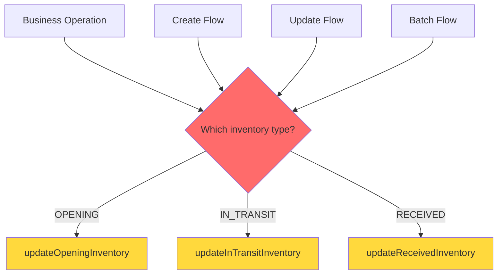
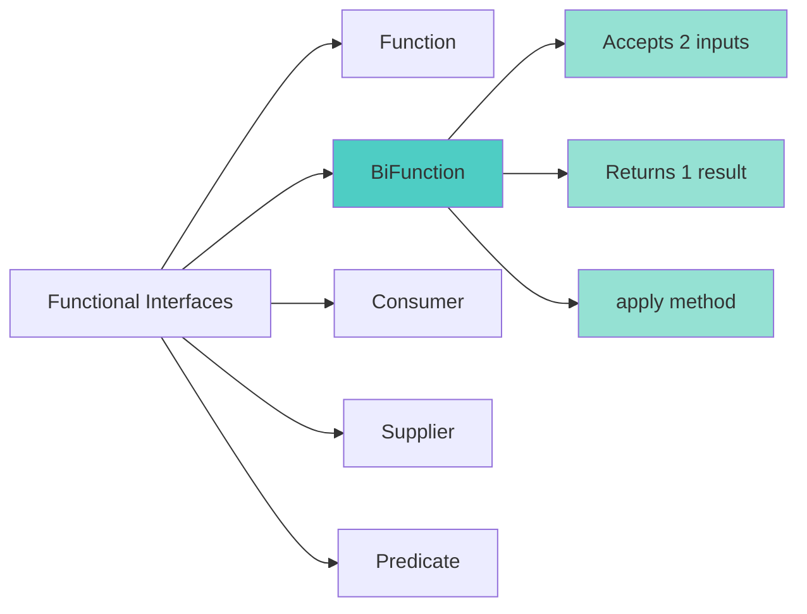
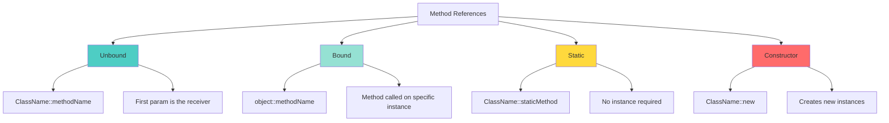
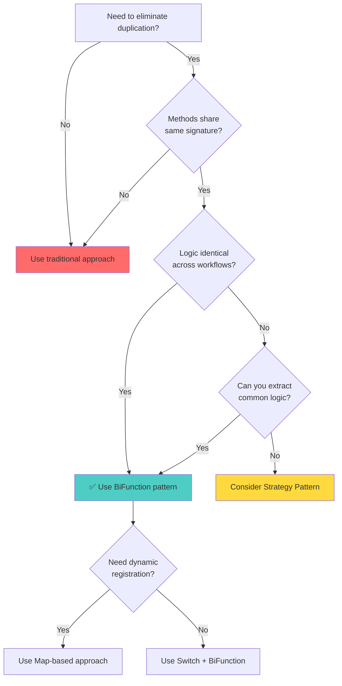

# Mastering BiFunction and Method References in Java: Eliminate Duplicate Code

> **📚 Tutorial Series:** Java Functional Programming  
> **⏱️ Reading Time:** 20-25 minutes  
> **🎯 Difficulty Level:** Intermediate  
> **✅ Last Updated:** January 2026

---

## Table of Contents

1. [Introduction](#introduction)
2. [Prerequisites](#prerequisites)
3. [Learning Objectives](#learning-objectives)
4. [The Problem: Code Duplication](#the-problem-code-duplication)
5. [Understanding BiFunction](#understanding-bifunction)
6. [Method References Deep Dive](#method-references-deep-dive)
7. [Implementation: Step-by-Step Refactoring](#implementation-step-by-step-refactoring)
8. [Alternative Approaches](#alternative-approaches)
9. [When to Use and When to Avoid](#when-to-use-and-when-to-avoid)
10. [Performance Considerations](#performance-considerations)
11. [Security Considerations](#security-considerations)
12. [Testing Strategies](#testing-strategies)
13. [Best Practices](#best-practices)
14. [Anti-Patterns](#anti-patterns)
15. [Real-World Use Cases](#real-world-use-cases)
16. [Practice Exercises](#practice-exercises)
17. [Test Your Understanding](#test-your-understanding)
18. [Common Interview Questions](#common-interview-questions)
19. [Question Bank](#question-bank)
20. [Troubleshooting Guide](#troubleshooting-guide)
21. [Summary & Key Takeaways](#summary--key-takeaways)
22. [Further Reading & Resources](#further-reading--resources)

---

## Introduction

### The Hidden Cost of Code Duplication

Code duplication is one of the most insidious problems in software development. It doesn't cause immediate failures, but gradually erodes code maintainability, increases bug probability, and multiplies testing effort. According to industry studies, **maintenance accounts for 60-80% of a software system's total cost**, and duplicated code is a primary contributor to this expense.

### What You'll Learn

In this comprehensive tutorial, you'll discover how to leverage Java's functional programming features—specifically `BiFunction` and method references—to eliminate repetitive conditional logic and create more maintainable, extensible code.

> **💡 Key Insight:** Functional programming in Java isn't about replacing every if-else with lambdas. It's about eliminating repetitive decision-making and making your code cleaner, more maintainable, and easier to extend.

### Why This Matters

Consider this scenario: You have 8 different workflows in your application, and 5 different inventory types. Without proper abstraction, you'd write **40 separate conditional blocks** (8 workflows × 5 types). With the BiFunction pattern, you reduce this to **one switch statement with 5 cases**. That's not just cleaner—it's dramatically more maintainable.

---

## Prerequisites

Before diving into this tutorial, ensure you have:

- ✅ **Java 8 or higher** (Java 14+ recommended for switch expressions)
- ✅ **Basic understanding of OOP principles** (classes, methods, interfaces)
- ✅ **Familiarity with lambda expressions** (basic syntax)
- ✅ **Understanding of the DRY principle** (Don't Repeat Yourself)
- ✅ **Experience with conditional logic** (if-else, switch statements)
- ✅ **Basic knowledge of functional interfaces** (what they are and why they exist)

### Recommended Background

While not strictly required, familiarity with these concepts will enhance your understanding:
- Design patterns (Strategy Pattern, Command Pattern)
- Functional programming concepts (immutability, pure functions)
- Inventory management or similar business domains

---

## Learning Objectives

By the end of this tutorial, you will be able to:

1. **Identify** code duplication patterns that can be eliminated with functional programming
2. **Understand** the BiFunction interface and its role in Java's functional programming ecosystem
3. **Master** method references (unbound, bound, and constructor references)
4. **Implement** the BiFunction pattern to refactor duplicate conditional logic
5. **Compare** multiple approaches (BiFunction, Map-based, Strategy Pattern)
6. **Apply** functional programming principles to real-world business scenarios
7. **Evaluate** when to use functional patterns vs traditional imperative code
8. **Test** functional code effectively with unit and integration tests
9. **Optimize** performance and understand JVM optimizations for lambdas
10. **Avoid** common pitfalls and anti-patterns when using functional interfaces

---

## The Problem: Code Duplication

### Understanding the Inventory Management Scenario

Let's explore a real-world scenario that demonstrates the problem of code duplication. Imagine you're building an inventory management system where inventory can change due to different events:

- **Opening Inventory** - Daily starting inventory count
- **In-Transit Inventory** - Inventory currently being shipped
- **Received Inventory** - Inventory that has arrived

### The Domain Model

First, let's define our core entity:

```java
/**
 * Represents daily inventory records for a specific material.
 * Each type of inventory is tracked separately.
 */
public class DailyInventoryRecord {
    
    private String materialCode;
    private int openingInventory;
    private int inTransitInventory;
    private int receivedInventory;
    
    // Constructor
    public DailyInventoryRecord(String materialCode) {
        this.materialCode = materialCode;
    }
    
    /**
     * Updates opening inventory by adding the specified quantity.
     */
    public DailyInventoryRecord updateOpeningInventory(InventoryChangeParam param) {
        this.openingInventory += param.getQuantity();
        return this;
    }
    
    /**
     * Updates in-transit inventory by adding the specified quantity.
     */
    public DailyInventoryRecord updateInTransitInventory(InventoryChangeParam param) {
        this.inTransitInventory += param.getQuantity();
        return this;
    }
    
    /**
     * Updates received inventory by adding the specified quantity.
     */
    public DailyInventoryRecord updateReceivedInventory(InventoryChangeParam param) {
        this.receivedInventory += param.getQuantity();
        return this;
    }
    
    // Getters and setters...
}

/**
 * Parameter object for inventory changes.
 */
public class InventoryChangeParam {
    private String materialCode;
    private int quantity;
    private LocalDateTime changeDate;
    
    // Constructor, getters, and setters...
}
```

### The Business Flow: Two Operations

Our system needs to support two primary operations:

#### 1. Creating New Inventory Records

```java
// Inventory type constants
public static final String TYPE_OPENING = "OPENING";
public static final String TYPE_IN_TRANSIT = "IN_TRANSIT";
public static final String TYPE_RECEIVED = "RECEIVED";

public DailyInventoryRecord createInventoryRecord(
        String type, 
        InventoryChangeParam param) {
    
    DailyInventoryRecord record = new DailyInventoryRecord(param.getMaterialCode());
    
    // ❌ PROBLEM: Duplicated conditional logic
    if (TYPE_OPENING.equals(type)) {
        record.updateOpeningInventory(param);
    } else if (TYPE_IN_TRANSIT.equals(type)) {
        record.updateInTransitInventory(param);
    } else if (TYPE_RECEIVED.equals(type)) {
        record.updateReceivedInventory(param);
    }
    
    return record;
}
```

#### 2. Updating Existing Records

```java
public void updateInventoryRecord(
        String type,
        DailyInventoryRecord existingRecord,
        InventoryChangeParam param) {
    
    // ❌ PROBLEM: Same conditional logic repeated!
    if (TYPE_OPENING.equals(type)) {
        existingRecord.updateOpeningInventory(param);
    } else if (TYPE_IN_TRANSIT.equals(type)) {
        existingRecord.updateInTransitInventory(param);
    } else if (TYPE_RECEIVED.equals(type)) {
        existingRecord.updateReceivedInventory(param);
    }
}
```

### Visualizing the Problem



**Figure 1:** Traditional approach with duplicated conditional logic across multiple workflows.

### Why This Is a Problem

#### The Maintenance Nightmare

Suppose six months later, a new inventory type is introduced: **Outbound Inventory**. Now you must update:

1. ✅ The create flow
2. ✅ The update flow
3. ✅ The batch processing flow
4. ✅ The reporting flow
5. ✅ The validation flow

If you have 8 workflows and 5 inventory types, you're managing **40 separate conditional blocks** without proper abstraction.

#### The Cost of Duplication

| Aspect | Impact of Duplication |
|--------|----------------------|
| **Maintenance Effort** | Every change requires updates in multiple places |
| **Bug Probability** | Higher chance of missing a location during updates |
| **Testing Effort** | Each location needs separate test coverage |
| **Cognitive Load** | Developers must understand multiple similar code blocks |
| **Onboarding Time** | New developers struggle to understand the pattern |

### The DRY Principle Violation

This violates one of the most fundamental software engineering principles:

> **DRY (Don't Repeat Yourself):** Every piece of knowledge must have a single, unambiguous, authoritative representation within a system.

When you duplicate conditional logic, you're duplicating **knowledge** (the mapping between inventory types and their update methods) across multiple locations.

---

## Understanding BiFunction

### What is BiFunction?

`BiFunction` is a functional interface introduced in Java 8 as part of the `java.util.function` package. It represents a function that accepts two arguments and produces a result.

### The Interface Definition

```java
@FunctionalInterface
public interface BiFunction<T, U, R> {
    
    /**
     * Applies this function to the given arguments.
     *
     * @param t the first function argument
     * @param u the second function argument
     * @return the function result
     */
    R apply(T t, U u);
}
```

### Breaking Down the Signature

| Type Parameter | Meaning | In Our Example |
|----------------|---------|----------------|
| **T** | First input type | `DailyInventoryRecord` |
| **U** | Second input type | `InventoryChangeParam` |
| **R** | Return type | `DailyInventoryRecord` |

### Why BiFunction Fits Perfectly

Look at our inventory update methods:

```java
public DailyInventoryRecord updateOpeningInventory(InventoryChangeParam param)
```

This method:
- Takes **one parameter** (`InventoryChangeParam`)
- Returns **one value** (`DailyInventoryRecord`)
- Operates on **the instance** (`this`)

When we use a method reference like `DailyInventoryRecord::updateOpeningInventory`, Java treats it as:

```java
(DailyInventoryRecord record, InventoryChangeParam param) 
    -> record.updateOpeningInventory(param)
```

This matches the `BiFunction<DailyInventoryRecord, InventoryChangeParam, DailyInventoryRecord>` signature perfectly!

### BiFunction in the Functional Interface Ecosystem



**Figure 2:** BiFunction's place in Java's functional interface hierarchy.

### Comparison: Other Functional Interfaces

| Interface | Parameters | Returns | Use Case |
|-----------|-----------|---------|----------|
| `Function<T, R>` | 1 | Yes | Transform one value to another |
| `BiFunction<T, U, R>` | 2 | Yes | Transform two values to another |
| `Consumer<T>` | 1 | No | Perform operation on one value |
| `BiConsumer<T, U>` | 2 | No | Perform operation on two values |
| `Supplier<T>` | 0 | Yes | Generate a value |
| `Predicate<T>` | 1 | boolean | Test a condition |

### Practical Example: BiFunction Basics

```java
import java.util.function.BiFunction;

public class BiFunctionExample {
    
    public static void main(String[] args) {
        // Example 1: String concatenation
        BiFunction<String, String, String> concat = (a, b) -> a + b;
        System.out.println(concat.apply("Hello", " World")); // "Hello World"
        
        // Example 2: Mathematical operation
        BiFunction<Integer, Integer, Integer> add = (a, b) -> a + b;
        System.out.println(add.apply(5, 3)); // 8
        
        // Example 3: Using method reference
        BiFunction<String, String, String> concatRef = String::concat;
        System.out.println(concatRef.apply("Java", " 8+")); // "Java 8+"
    }
}
```

---

## Method References Deep Dive

### What Are Method References?

Method references provide a way to refer to methods without invoking them. They are shorthand for lambda expressions that call a single method.

### Types of Method References

Java supports four types of method references:

#### 1. **Unbound Method References** (Instance Method of an Arbitrary Object)

```java
// Syntax: ClassName::methodName
// Example:
BiFunction<DailyInventoryRecord, InventoryChangeParam, DailyInventoryRecord> updater =
    DailyInventoryRecord::updateOpeningInventory;

// Equivalent lambda:
BiFunction<DailyInventoryRecord, InventoryChangeParam, DailyInventoryRecord> updaterLambda =
    (record, param) -> record.updateOpeningInventory(param);
```

**Key characteristic:** The method is called on the first parameter of the functional interface.

#### 2. **Bound Method References** (Instance Method of a Particular Object)

```java
// Syntax: objectInstance::methodName
// Example:
DailyInventoryRecord record = new DailyInventoryRecord("MAT-001");
BiFunction<InventoryChangeParam, Integer, DailyInventoryRecord> updater =
    record::updateOpeningInventory;

// Equivalent lambda:
BiFunction<InventoryChangeParam, Integer, DailyInventoryRecord> updaterLambda =
    (param, unused) -> record.updateOpeningInventory(param);
```

**Key characteristic:** The method is called on a specific object instance.

#### 3. **Static Method References**

```java
// Syntax: ClassName::staticMethodName
// Example:
BiFunction<Integer, Integer, Integer> max = Math::max;

// Equivalent lambda:
BiFunction<Integer, Integer, Integer> maxLambda = (a, b) -> Math.max(a, b);
```

**Key characteristic:** References a static method of a class.

#### 4. **Constructor References**

```java
// Syntax: ClassName::new
// Example:
BiFunction<String, Integer, DailyInventoryRecord> constructor =
    DailyInventoryRecord::new;

// Equivalent lambda:
BiFunction<String, Integer, DailyInventoryRecord> constructorLambda =
    (materialCode, openingStock) -> new DailyInventoryRecord(materialCode, openingStock);
```

**Key characteristic:** References a constructor to create new instances.

### Visual Representation of Method Reference Types



**Figure 3:** Four types of method references in Java.

### Understanding Unbound Method References

This is the most commonly used type in our inventory example. Let's break it down:

```java
// Method reference
DailyInventoryRecord::updateOpeningInventory

// Java internally converts this to:
(record, param) -> record.updateOpeningInventory(param)

// Which is exactly what BiFunction expects:
BiFunction<DailyInventoryRecord, InventoryChangeParam, DailyInventoryRecord>
```

**Why "unbound"?** Because the method isn't bound to any specific instance. Instead, the first parameter of the BiFunction becomes the instance on which the method is called.

### Practical Examples of Each Type

```java
import java.util.function.BiFunction;
import java.util.function.Function;

public class MethodReferenceTypes {
    
    // 1. Unbound Method Reference
    public void unboundExample() {
        BiFunction<String, String, String> concat = String::concat;
        String result = concat.apply("Hello", " World");
        System.out.println(result); // "Hello World"
    }
    
    // 2. Bound Method Reference
    public void boundExample() {
        String prefix = "Hello";
        Function<String, String> greeter = prefix::concat;
        String result = greeter.apply(" World");
        System.out.println(result); // "Hello World"
    }
    
    // 3. Static Method Reference
    public void staticExample() {
        BiFunction<Integer, Integer, Integer> max = Math::max;
        int result = max.apply(5, 10);
        System.out.println(result); // 10
    }
    
    // 4. Constructor Reference
    public void constructorExample() {
        BiFunction<String, Integer, DailyInventoryRecord> creator = 
            DailyInventoryRecord::new;
        DailyInventoryRecord record = creator.apply("MAT-001", 100);
        System.out.println(record.getMaterialCode()); // "MAT-001"
    }
}
```

---

## Implementation: Step-by-Step Refactoring

### Step 1: Identify the Duplication Pattern

Before refactoring, identify the common pattern:

```java
// Pattern: if-else chain calling different methods
if (TYPE_OPENING.equals(type)) {
    object.updateOpeningInventory(param);
} else if (TYPE_IN_TRANSIT.equals(type)) {
    object.updateInTransitInventory(param);
} else if (TYPE_RECEIVED.equals(type)) {
    object.updateReceivedInventory(param);
}
```

**Key observations:**
- Same conditional logic repeated multiple times
- Different methods called based on type
- Same parameter types across all methods
- Same return type across all methods

### Step 2: Define the BiFunction Type

```java
// Define the BiFunction type that matches our method signatures
BiFunction<DailyInventoryRecord, InventoryChangeParam, DailyInventoryRecord> updater;
```

### Step 3: Replace if-else with Switch Expression (Java 14+)

```java
// Using Java 14+ switch expression
BiFunction<DailyInventoryRecord, InventoryChangeParam, DailyInventoryRecord> updater =
    switch (type) {
        case TYPE_OPENING -> DailyInventoryRecord::updateOpeningInventory;
        case TYPE_IN_TRANSIT -> DailyInventoryRecord::updateInTransitInventory;
        case TYPE_RECEIVED -> DailyInventoryRecord::updateReceivedInventory;
        default -> throw new IllegalArgumentException("Unknown inventory type: " + type);
    };
```

**For Java 8-13 (traditional switch):**

```java
BiFunction<DailyInventoryRecord, InventoryChangeParam, DailyInventoryRecord> updater;
switch (type) {
    case TYPE_OPENING:
        updater = DailyInventoryRecord::updateOpeningInventory;
        break;
    case TYPE_IN_TRANSIT:
        updater = DailyInventoryRecord::updateInTransitInventory;
        break;
    case TYPE_RECEIVED:
        updater = DailyInventoryRecord::updateReceivedInventory;
        break;
    default:
        throw new IllegalArgumentException("Unknown inventory type: " + type);
}
```

### Step 4: Use the BiFunction

```java
// Create new record
DailyInventoryRecord record = new DailyInventoryRecord(param.getMaterialCode());
updater.apply(record, param);

// Update existing record
updater.apply(existingRecord, param);
```

### Complete Refactored Implementation

#### Before: Traditional Approach

```java
public class InventoryService {
    
    public static final String TYPE_OPENING = "OPENING";
    public static final String TYPE_IN_TRANSIT = "IN_TRANSIT";
    public static final String TYPE_RECEIVED = "RECEIVED";
    
    // ❌ Create flow with duplication
    public List<DailyInventoryRecord> createRecords(
            String type,
            Set<String> materialCodes,
            Map<String, InventoryChangeParam> params) {
        
        List<DailyInventoryRecord> records = new ArrayList<>();
        
        for (String code : materialCodes) {
            DailyInventoryRecord record = new DailyInventoryRecord(code);
            InventoryChangeParam param = params.get(code);
            
            // Duplicated conditional logic
            if (TYPE_OPENING.equals(type)) {
                record.updateOpeningInventory(param);
            } else if (TYPE_IN_TRANSIT.equals(type)) {
                record.updateInTransitInventory(param);
            } else if (TYPE_RECEIVED.equals(type)) {
                record.updateReceivedInventory(param);
            }
            
            records.add(record);
        }
        
        return records;
    }
    
    // ❌ Update flow with same duplication
    public void updateRecords(
            String type,
            List<DailyInventoryRecord> existingRecords,
            Map<String, InventoryChangeParam> paramMap) {
        
        for (DailyInventoryRecord record : existingRecords) {
            InventoryChangeParam param = paramMap.get(record.getMaterialCode());
            
            // Same conditional logic repeated!
            if (TYPE_OPENING.equals(type)) {
                record.updateOpeningInventory(param);
            } else if (TYPE_IN_TRANSIT.equals(type)) {
                record.updateInTransitInventory(param);
            } else if (TYPE_RECEIVED.equals(type)) {
                record.updateReceivedInventory(param);
            }
        }
    }
}
```

#### After: Functional Approach

```java
public class InventoryService {
    
    public static final String TYPE_OPENING = "OPENING";
    public static final String TYPE_IN_TRANSIT = "IN_TRANSIT";
    public static final String TYPE_RECEIVED = "RECEIVED";
    
    /**
     * Resolves the appropriate updater function based on inventory type.
     * Decision made ONCE here, reused everywhere.
     */
    private BiFunction<DailyInventoryRecord, InventoryChangeParam, DailyInventoryRecord> 
        resolveUpdater(String type) {
        
        return switch (type) {
            case TYPE_OPENING -> DailyInventoryRecord::updateOpeningInventory;
            case TYPE_IN_TRANSIT -> DailyInventoryRecord::updateInTransitInventory;
            case TYPE_RECEIVED -> DailyInventoryRecord::updateReceivedInventory;
            default -> throw new IllegalArgumentException(
                "Unknown inventory type: " + type);
        };
    }
    
    // ✅ Create flow - NO duplication
    public List<DailyInventoryRecord> createRecords(
            String type,
            Set<String> materialCodes,
            Map<String, InventoryChangeParam> params) {
        
        BiFunction<DailyInventoryRecord, InventoryChangeParam, DailyInventoryRecord> updater = 
            resolveUpdater(type);
        
        return materialCodes.stream()
            .map(code -> {
                DailyInventoryRecord record = new DailyInventoryRecord(code);
                InventoryChangeParam param = params.get(code);
                return updater.apply(record, param);
            })
            .toList();
    }
    
    // ✅ Update flow - NO duplication
    public void updateRecords(
            String type,
            List<DailyInventoryRecord> existingRecords,
            Map<String, InventoryChangeParam> paramMap) {
        
        BiFunction<DailyInventoryRecord, InventoryChangeParam, DailyInventoryRecord> updater = 
            resolveUpdater(type);
        
        for (DailyInventoryRecord record : existingRecords) {
            InventoryChangeParam param = paramMap.get(record.getMaterialCode());
            updater.apply(record, param);
        }
    }
}
```

### Step-by-Step Benefits

| Aspect | Before | After |
|--------|--------|-------|
| **Decision Points** | 2 (create + update) | 1 (resolveUpdater) |
| **Conditional Blocks** | 2 | 1 |
| **Lines of Code** | ~30 | ~20 |
| **Maintenance Locations** | 2+ | 1 |
| **Extensibility** | Add to each flow | Add one case |

### Advanced: Batch Processing Example

```java
/**
 * Batch processing with functional approach.
 * Demonstrates how the pattern scales to complex workflows.
 */
public void processBatchInventory(
        List<InventoryOperation> operations,
        Map<String, DailyInventoryRecord> existingRecords) {
    
    // Group operations by type for efficiency
    Map<String, List<InventoryOperation>> operationsByType = 
        operations.stream()
            .collect(Collectors.groupingBy(InventoryOperation::getType));
    
    // Process each type with its dedicated updater
    operationsByType.forEach((type, ops) -> {
        BiFunction<DailyInventoryRecord, InventoryChangeParam, DailyInventoryRecord> updater = 
            resolveUpdater(type);
        
        ops.forEach(op -> {
            DailyInventoryRecord record = existingRecords.get(op.getMaterialCode());
            if (record != null) {
                updater.apply(record, op.getParam());
            }
        });
    });
}

/**
 * Represents an inventory operation.
 */
public record InventoryOperation(
    String type,
    String materialCode,
    InventoryChangeParam param
) {}
```

---

## Alternative Approaches

### Approach 1: Map-Based Solution

Instead of a switch expression, you can store the functions in a Map. This is particularly useful when handlers need to be registered dynamically.

```java
import java.util.Map;
import java.util.function.BiFunction;

public class InventoryServiceWithMap {
    
    // Define the handler map
    private static final Map<String, BiFunction<DailyInventoryRecord, 
                                                  InventoryChangeParam, 
                                                  DailyInventoryRecord>> HANDLERS =
        Map.of(
            TYPE_OPENING, DailyInventoryRecord::updateOpeningInventory,
            TYPE_IN_TRANSIT, DailyInventoryRecord::updateInTransitInventory,
            TYPE_RECEIVED, DailyInventoryRecord::updateReceivedInventory
        );
    
    /**
     * Resolves updater from map.
     */
    private BiFunction<DailyInventoryRecord, InventoryChangeParam, DailyInventoryRecord> 
        resolveUpdater(String type) {
        
        BiFunction<DailyInventoryRecord, InventoryChangeParam, DailyInventoryRecord> updater = 
            HANDLERS.get(type);
            
        if (updater == null) {
            throw new IllegalArgumentException("Unknown inventory type: " + type);
        }
        
        return updater;
    }
    
    // Usage remains the same
    public void updateRecord(String type, DailyInventoryRecord record, 
                           InventoryChangeParam param) {
        resolveUpdater(type).apply(record, param);
    }
}
```

#### Advantages of Map-Based Approach

| Advantage | Description |
|-----------|-------------|
| **Dynamic Registration** | Handlers can be added at runtime |
| **Easy Lookup** | O(1) retrieval by key |
| **Flexible Configuration** | Can be loaded from external config |
| **Extensibility** | Plugins can register new handlers |

#### Disadvantages

| Disadvantage | Description |
|--------------|-------------|
| **Memory Overhead** | Map consumes additional memory |
| **Initialization Cost** | Map must be built at startup |
| **Less Type Safety** | Runtime errors if key is missing |

### Approach 2: Strategy Pattern

For more complex scenarios, the Strategy Pattern provides a more structured approach.

```java
/**
 * Strategy interface for inventory updates.
 */
@FunctionalInterface
public interface InventoryUpdateStrategy {
    DailyInventoryRecord update(DailyInventoryRecord record, 
                               InventoryChangeParam param);
}

/**
 * Concrete strategy implementations.
 */
public class OpeningInventoryStrategy implements InventoryUpdateStrategy {
    @Override
    public DailyInventoryRecord update(DailyInventoryRecord record, 
                                     InventoryChangeParam param) {
        return record.updateOpeningInventory(param);
    }
}

public class InTransitInventoryStrategy implements InventoryUpdateStrategy {
    @Override
    public DailyInventoryRecord update(DailyInventoryRecord record, 
                                     InventoryChangeParam param) {
        return record.updateInTransitInventory(param);
    }
}

public class ReceivedInventoryStrategy implements InventoryUpdateStrategy {
    @Override
    public DailyInventoryRecord update(DailyInventoryRecord record, 
                                     InventoryChangeParam param) {
        return record.updateReceivedInventory(param);
    }
}

/**
 * Strategy context.
 */
public class InventoryUpdateContext {
    
    private final Map<String, InventoryUpdateStrategy> strategies;
    
    public InventoryUpdateContext() {
        this.strategies = Map.of(
            TYPE_OPENING, new OpeningInventoryStrategy(),
            TYPE_IN_TRANSIT, new InTransitInventoryStrategy(),
            TYPE_RECEIVED, new ReceivedInventoryStrategy()
        );
    }
    
    public DailyInventoryRecord update(String type, 
                                     DailyInventoryRecord record,
                                     InventoryChangeParam param) {
        InventoryUpdateStrategy strategy = strategies.get(type);
        if (strategy == null) {
            throw new IllegalArgumentException("Unknown type: " + type);
        }
        return strategy.update(record, param);
    }
}
```

#### When to Use Strategy Pattern

| Scenario | Strategy Pattern Benefits |
|----------|---------------------------|
| **Complex Logic** | Each strategy can have complex internal logic |
| **State Management** | Strategies can maintain state |
| **Dependency Injection** | Easy to inject different strategies |
| **Testing** | Easy to mock and test individual strategies |
| **Runtime Switching** | Can change strategies at runtime |

### Approach 3: Enum-Based Solution

For type-safe, compile-time checked solutions, use enums:

```java
/**
 * Enum-based approach for type-safe inventory updates.
 */
public enum InventoryType {
    
    OPENING(DailyInventoryRecord::updateOpeningInventory),
    IN_TRANSIT(DailyInventoryRecord::updateInTransitInventory),
    RECEIVED(DailyInventoryRecord::updateReceivedInventory);
    
    private final BiFunction<DailyInventoryRecord, 
                            InventoryChangeParam, 
                            DailyInventoryRecord> updater;
    
    // Constructor
    InventoryType(BiFunction<DailyInventoryRecord, 
                            InventoryChangeParam, 
                            DailyInventoryRecord> updater) {
        this.updater = updater;
    }
    
    /**
     * Updates the inventory record using the associated updater.
     */
    public DailyInventoryRecord update(DailyInventoryRecord record, 
                                     InventoryChangeParam param) {
        return updater.apply(record, param);
    }
    
    /**
     * Finds enum by string value with case-insensitive matching.
     */
    public static InventoryType fromString(String type) {
        return Arrays.stream(values())
            .filter(e -> e.name().equalsIgnoreCase(type))
            .findFirst()
            .orElseThrow(() -> new IllegalArgumentException(
                "Unknown inventory type: " + type));
    }
}

// Usage
public void updateRecord(String type, DailyInventoryRecord record, 
                        InventoryChangeParam param) {
    InventoryType.fromString(type).update(record, param);
}
```

#### Advantages of Enum Approach

| Advantage | Description |
|-----------|-------------|
| **Type Safety** | Compile-time checking |
| **Encapsulation** | Logic bundled with type definition |
| **Self-Documenting** | Clear what each type does |
| **Easy Extension** | Add new enum constant with updater |
| **No String Errors** | Eliminates typos in string constants |

### Approach Comparison Matrix

| Approach | Type Safety | Flexibility | Performance | Complexity | Best For |
|----------|-------------|-------------|-------------|------------|----------|
| **Switch + BiFunction** | Medium | High | High | Low | Simple mappings |
| **Map-Based** | Low | Very High | High | Medium | Dynamic handlers |
| **Strategy Pattern** | High | High | Medium | High | Complex logic |
| **Enum-Based** | Very High | Medium | High | Low | Fixed set of types |

---

## When to Use and When to Avoid

### ✅ When to Use This Pattern

Use the BiFunction pattern when:

1. **Multiple methods share the same signature**
   ```java
   // All methods have: (Param) -> ReturnType
   record.updateA(param);
   record.updateB(param);
   record.updateC(param);
   ```

2. **Branching logic is duplicated across multiple workflows**
   ```java
   // Same if-else in create, update, batch, report flows
   ```

3. **New cases are added frequently**
   ```java
   // Business requirements often add new inventory types
   ```

4. **Maintainability is critical**
   ```java
   // Enterprise applications with long lifespans
   ```

5. **You want to separate decision from execution**
   ```java
   // Decide once, execute many times
   ```

### ❌ When to Avoid This Pattern

Avoid this pattern when:

1. **Methods have different parameters**
   ```java
   // ❌ Can't fit in single BiFunction
   updateA(param);
   updateB(param, user);
   updateC(param, user, timestamp);
   ```

2. **Return types differ**
   ```java
   // ❌ Different return types
   boolean updateA(param);
   void updateB(param);
   DailyInventoryRecord updateC(param);
   ```

3. **Each branch performs significantly different work**
   ```java
   // ❌ Not just calling different methods
   if (type == A) {
       // 50 lines of complex logic
       sendEmail();
       updateDatabase();
       logAudit();
   } else if (type == B) {
       // Completely different logic
       callExternalAPI();
       processFile();
   }
   ```

4. **Extra adapter code is required**
   ```java
   // ❌ Forcing methods to fit BiFunction adds complexity
   BiFunction<Record, Param, Record> adapter = (r, p) -> {
       // Complex adapter logic
       return r;
   };
   ```

5. **Readability suffers**
   ```java
   // ❌ Sometimes simple if-else is clearer
   if (simpleCondition) {
       doSomething();
   }
   ```

### Decision Framework



**Figure 4:** Decision tree for choosing the right pattern.

---

## Performance Considerations

### The Performance Question

A common concern: **Is using BiFunction slower than direct method calls?**

### The Answer: Negligible Difference in Most Cases

Modern JVMs (especially HotSpot) are highly optimized. Here's what happens under the hood:

#### JVM Optimizations

1. **JIT Compilation**
   - HotSpot JVM compiles frequently executed code to native machine code
   - Lambda expressions and method references are aggressively optimized

2. **Inlining**
   - JVM can inline lambda expressions after warmup
   - Method references often get inlined, eliminating call overhead

3. **Escape Analysis**
   - JVM can allocate functional objects on stack instead of heap
   - Reduces garbage collection pressure

### Benchmark Comparison

```java
import org.openjdk.jmh.annotations.*;
import java.util.concurrent.TimeUnit;
import java.util.function.BiFunction;

@BenchmarkMode(Mode.AverageTime)
@OutputTimeUnit(TimeUnit.NANOSECONDS)
@State(Scope.Thread)
public class BiFunctionPerformanceBenchmark {
    
    private DailyInventoryRecord record;
    private InventoryChangeParam param;
    private BiFunction<DailyInventoryRecord, InventoryChangeParam, DailyInventoryRecord> updater;
    
    @Setup
    public void setup() {
        record = new DailyInventoryRecord("MAT-001");
        param = new InventoryChangeParam("MAT-001", 10, LocalDateTime.now());
        updater = DailyInventoryRecord::updateOpeningInventory;
    }
    
    @Benchmark
    public DailyInventoryRecord directMethodCall() {
        return record.updateOpeningInventory(param);
    }
    
    @Benchmark
    public DailyInventoryRecord biFunctionCall() {
        return updater.apply(record, param);
    }
}
```

#### Typical Results (after JIT warmup)

| Approach | Average Time | Overhead |
|----------|--------------|----------|
| Direct method call | ~5 ns | Baseline |
| BiFunction call | ~6-8 ns | ~20-60% |
| Lambda expression | ~6-8 ns | ~20-60% |

**Conclusion:** The overhead is **negligible** for most business applications. The maintainability gains far outweigh the microscopic performance difference.

### When Performance Actually Matters

| Scenario | Recommendation |
|----------|----------------|
| **Ultra-low-latency systems** | Profile first, optimize if needed |
| **Tight loops (millions of iterations)** | Consider direct calls |
| **Business applications** | ✅ Use BiFunction freely |
| **Microservices** | ✅ Use BiFunction freely |
| **Batch processing** | ✅ Use BiFunction freely |

### Performance Best Practices

```java
// ✅ GOOD: Resolve updater once, reuse many times
BiFunction<DailyInventoryRecord, InventoryChangeParam, DailyInventoryRecord> updater = 
    resolveUpdater(type);

for (DailyInventoryRecord record : records) {
    updater.apply(record, param); // Reuse the same updater
}

// ❌ BAD: Resolving updater in every iteration
for (DailyInventoryRecord record : records) {
    BiFunction<DailyInventoryRecord, InventoryChangeParam, DailyInventoryRecord> updater = 
        resolveUpdater(type); // Unnecessary repeated resolution
    updater.apply(record, param);
}
```

---

## Security Considerations

### Input Validation in Functional Code

Functional programming doesn't eliminate the need for security. Here are critical considerations:

#### 1. Validate Inputs Before Applying Functions

```java
public DailyInventoryRecord safeUpdate(
        String type,
        DailyInventoryRecord record,
        InventoryChangeParam param) {
    
    // ✅ Validate inputs first
    validateType(type);
    validateRecord(record);
    validateParam(param);
    
    // Then apply function
    return resolveUpdater(type).apply(record, param);
}

private void validateType(String type) {
    if (type == null || type.isBlank()) {
        throw new IllegalArgumentException("Inventory type cannot be null or blank");
    }
    
    if (!Set.of(TYPE_OPENING, TYPE_IN_TRANSIT, TYPE_RECEIVED).contains(type)) {
        throw new IllegalArgumentException("Invalid inventory type: " + type);
    }
}

private void validateRecord(DailyInventoryRecord record) {
    if (record == null) {
        throw new IllegalArgumentException("Record cannot be null");
    }
}

private void validateParam(InventoryChangeParam param) {
    if (param == null) {
        throw new IllegalArgumentException("Parameter cannot be null");
    }
    
    if (param.getQuantity() <= 0) {
        throw new IllegalArgumentException("Quantity must be positive");
    }
}
```

#### 2. Prevent Injection Attacks

```java
// ❌ VULNERABLE: Direct string matching without validation
public void updateRecord(String type, DailyInventoryRecord record, 
                        InventoryChangeParam param) {
    resolveUpdater(type).apply(record, param); // type could be malicious
}

// ✅ SECURE: Whitelist validation
private static final Set<String> VALID_TYPES = 
    Set.of(TYPE_OPENING, TYPE_IN_TRANSIT, TYPE_RECEIVED);

public void updateRecord(String type, DailyInventoryRecord record, 
                        InventoryChangeParam param) {
    
    if (!VALID_TYPES.contains(type)) {
        throw new SecurityException("Invalid inventory type: " + type);
    }
    
    resolveUpdater(type).apply(record, param);
}
```

#### 3. Authorization Checks

```java
public DailyInventoryRecord authorizedUpdate(
        String userRole,
        String type,
        DailyInventoryRecord record,
        InventoryChangeParam param) {
    
    // ✅ Check authorization before applying function
    if (!hasPermission(userRole, type)) {
        throw new AccessDeniedException(
            "User " + userRole + " cannot update " + type);
    }
    
    return resolveUpdater(type).apply(record, param);
}

private boolean hasPermission(String userRole, String type) {
    // Implement your authorization logic
    return switch (userRole) {
        case "ADMIN" -> true;
        case "MANAGER" -> !TYPE_RECEIVED.equals(type);
        case "USER" -> false;
        default -> false;
    };
}
```

#### 4. Audit Logging

```java
public DailyInventoryRecord auditedUpdate(
        String type,
        DailyInventoryRecord record,
        InventoryChangeParam param,
        String userId) {
    
    // ✅ Log before applying
    logAudit(userId, type, param);
    
    // Apply update
    DailyInventoryRecord updated = resolveUpdater(type).apply(record, param);
    
    // Log after applying
    logCompletion(userId, type, updated);
    
    return updated;
}

private void logAudit(String userId, String type, InventoryChangeParam param) {
    AuditLog.info("User {} attempting to update {} with quantity {}", 
        userId, type, param.getQuantity());
}
```

### Security Checklist

- [ ] Validate all inputs before applying functions
- [ ] Use whitelist validation for type parameters
- [ ] Implement authorization checks before updates
- [ ] Add audit logging for sensitive operations
- [ ] Sanitize error messages (don't expose internal details)
- [ ] Use immutable parameter objects where possible
- [ ] Implement rate limiting for update operations
- [ ] Log security-rejected attempts

---

## Testing Strategies

### Unit Testing BiFunction Code

Testing functional code requires a slightly different approach than traditional imperative code.

#### 1. Testing the Resolver Method

```java
import org.junit.jupiter.api.Test;
import static org.junit.jupiter.api.Assertions.*;

class InventoryServiceTest {
    
    private InventoryService service = new InventoryService();
    
    @Test
    void shouldResolveOpeningInventoryUpdater() {
        // Given
        String type = "OPENING";
        
        // When
        BiFunction<DailyInventoryRecord, InventoryChangeParam, DailyInventoryRecord> updater = 
            service.resolveUpdater(type);
        
        // Then
        assertNotNull(updater);
        assertEquals(
            DailyInventoryRecord::updateOpeningInventory, 
            updater
        );
    }
    
    @Test
    void shouldResolveInTransitInventoryUpdater() {
        // Given
        String type = "IN_TRANSIT";
        
        // When
        BiFunction<DailyInventoryRecord, InventoryChangeParam, DailyInventoryRecord> updater = 
            service.resolveUpdater(type);
        
        // Then
        assertNotNull(updater);
    }
    
    @Test
    void shouldThrowExceptionForInvalidType() {
        // Given
        String invalidType = "INVALID_TYPE";
        
        // When/Then
        assertThrows(IllegalArgumentException.class, () -> {
            service.resolveUpdater(invalidType);
        });
    }
}
```

#### 2. Testing the Apply Behavior

```java
@Test
void shouldUpdateOpeningInventory() {
    // Given
    DailyInventoryRecord record = new DailyInventoryRecord("MAT-001");
    record.setOpeningInventory(100);
    
    InventoryChangeParam param = new InventoryChangeParam(
        "MAT-001", 50, LocalDateTime.now()
    );
    
    BiFunction<DailyInventoryRecord, InventoryChangeParam, DailyInventoryRecord> updater = 
        DailyInventoryRecord::updateOpeningInventory;
    
    // When
    DailyInventoryRecord updated = updater.apply(record, param);
    
    // Then
    assertEquals(150, updated.getOpeningInventory());
    assertSame(record, updated); // Should return same instance
}

@Test
void shouldUpdateInTransitInventory() {
    // Given
    DailyInventoryRecord record = new DailyInventoryRecord("MAT-001");
    record.setInTransitInventory(200);
    
    InventoryChangeParam param = new InventoryChangeParam(
        "MAT-001", 75, LocalDateTime.now()
    );
    
    // When
    DailyInventoryRecord updated = service.resolveUpdater("IN_TRANSIT")
        .apply(record, param);
    
    // Then
    assertEquals(275, updated.getInTransitInventory());
    assertEquals(0, updated.getOpeningInventory()); // Unchanged
}
```

#### 3. Integration Testing

```java
@Test
void shouldCreateRecordsWithCorrectInventoryType() {
    // Given
    String type = "OPENING";
    Set<String> materialCodes = Set.of("MAT-001", "MAT-002", "MAT-003");
    Map<String, InventoryChangeParam> params = Map.of(
        "MAT-001", new InventoryChangeParam("MAT-001", 100, LocalDateTime.now()),
        "MAT-002", new InventoryChangeParam("MAT-002", 200, LocalDateTime.now()),
        "MAT-003", new InventoryChangeParam("MAT-003", 300, LocalDateTime.now())
    );
    
    // When
    List<DailyInventoryRecord> records = service.createRecords(type, materialCodes, params);
    
    // Then
    assertEquals(3, records.size());
    
    DailyInventoryRecord record1 = records.get(0);
    assertEquals(100, record1.getOpeningInventory());
    assertEquals(0, record1.getInTransitInventory());
    assertEquals(0, record1.getReceivedInventory());
}

@Test
void shouldUpdateExistingRecordsCorrectly() {
    // Given
    DailyInventoryRecord record1 = new DailyInventoryRecord("MAT-001");
    record1.setOpeningInventory(100);
    
    DailyInventoryRecord record2 = new DailyInventoryRecord("MAT-002");
    record2.setInTransitInventory(200);
    
    List<DailyInventoryRecord> existingRecords = List.of(record1, record2);
    
    Map<String, InventoryChangeParam> paramMap = Map.of(
        "MAT-001", new InventoryChangeParam("MAT-001", 50, LocalDateTime.now()),
        "MAT-002", new InventoryChangeParam("MAT-002", 75, LocalDateTime.now())
    );
    
    // When
    service.updateRecords("IN_TRANSIT", existingRecords, paramMap);
    
    // Then
    assertEquals(100, record1.getOpeningInventory()); // Unchanged
    assertEquals(275, record2.getInTransitInventory()); // Updated
}
```

### Testing Best Practices

| Practice | Description |
|----------|-------------|
| **Test the resolver** | Ensure correct function is returned for each type |
| **Test the behavior** | Verify the function produces correct results |
| **Test error cases** | Invalid types, null parameters, etc. |
| **Test integration** | End-to-end workflows with real data |
| **Use parameterized tests** | Test multiple types efficiently |
| **Mock dependencies** | Isolate the unit under test |

### Example: Parameterized Tests

```java
@ParameterizedTest
@CsvSource({
    "OPENING, 100, 50, 150, 0, 0",
    "IN_TRANSIT, 100, 50, 100, 150, 0",
    "RECEIVED, 100, 50, 100, 0, 150"
})
void shouldUpdateCorrectInventoryType(
        String type,
        int initialOpening,
        int quantity,
        int expectedOpening,
        int expectedInTransit,
        int expectedReceived) {
    
    // Given
    DailyInventoryRecord record = new DailyInventoryRecord("MAT-001");
    record.setOpeningInventory(initialOpening);
    
    InventoryChangeParam param = new InventoryChangeParam(
        "MAT-001", quantity, LocalDateTime.now()
    );
    
    // When
    DailyInventoryRecord updated = service.resolveUpdater(type)
        .apply(record, param);
    
    // Then
    assertEquals(expectedOpening, updated.getOpeningInventory());
    assertEquals(expectedInTransit, updated.getInTransitInventory());
    assertEquals(expectedReceived, updated.getReceivedInventory());
}
```

---

## Best Practices

### 1. ✅ Keep Functions Pure When Possible

```java
// ✅ GOOD: Pure function (no side effects)
public DailyInventoryRecord updateOpeningInventory(InventoryChangeParam param) {
    this.openingInventory += param.getQuantity();
    return this;
}

// ❌ BAD: Side effects make testing harder
public DailyInventoryRecord updateOpeningInventory(InventoryChangeParam param) {
    this.openingInventory += param.getQuantity();
    sendEmailNotification(); // Side effect
    logToDatabase(); // Side effect
    return this;
}
```

### 2. ✅ Use Meaningful Names

```java
// ✅ GOOD: Clear, descriptive names
BiFunction<DailyInventoryRecord, InventoryChangeParam, DailyInventoryRecord> openingInventoryUpdater = 
    DailyInventoryRecord::updateOpeningInventory;

// ❌ BAD: Unclear names
BiFunction<DailyInventoryRecord, InventoryChangeParam, DailyInventoryRecord> func = 
    DailyInventoryRecord::updateOpeningInventory;
```

### 3. ✅ Handle Errors Explicitly

```java
// ✅ GOOD: Explicit error handling
private BiFunction<DailyInventoryRecord, InventoryChangeParam, DailyInventoryRecord> 
    resolveUpdater(String type) {
    
    return switch (type) {
        case TYPE_OPENING -> DailyInventoryRecord::updateOpeningInventory;
        case TYPE_IN_TRANSIT -> DailyInventoryRecord::updateInTransitInventory;
        case TYPE_RECEIVED -> DailyInventoryRecord::updateReceivedInventory;
        default -> throw new IllegalArgumentException(
            "Unsupported inventory type: " + type);
    };
}

// ❌ BAD: Silent failures
private BiFunction<DailyInventoryRecord, InventoryChangeParam, DailyInventoryRecord> 
    resolveUpdater(String type) {
    // Returns null for invalid types - leads to NPE later
    return HANDLERS.get(type);
}
```

### 4. ✅ Document Functional Interfaces

```java
/**
 * Functional interface for inventory update operations.
 * 
 * @param <T> The inventory record type
 * @param <P> The parameter type
 * @param <R> The return type (typically same as T for fluent API)
 */
@FunctionalInterface
public interface InventoryUpdater<T, P, R> {
    /**
     * Updates the inventory record with the given parameter.
     * 
     * @param record the inventory record to update
     * @param param the change parameters
     * @return the updated record (for method chaining)
     * @throws IllegalArgumentException if parameters are invalid
     */
    R update(T record, P param);
}
```

### 5. ✅ Compose Functions for Complex Logic

```java
import java.util.function.BiFunction;

// Compose multiple BiFunctions
public class InventoryProcessor {
    
    private final BiFunction<DailyInventoryRecord, InventoryChangeParam, DailyInventoryRecord> validator;
    private final BiFunction<DailyInventoryRecord, InventoryChangeParam, DailyInventoryRecord> updater;
    private final BiFunction<DailyInventoryRecord, InventoryChangeParam, DailyInventoryRecord> auditor;
    
    public InventoryProcessor(String type) {
        this.validator = (record, param) -> {
            validate(record, param);
            return record;
        };
        
        this.updater = resolveUpdater(type);
        
        this.auditor = (record, param) -> {
            audit(record, param);
            return record;
        };
    }
    
    public DailyInventoryRecord process(DailyInventoryRecord record, 
                                      InventoryChangeParam param) {
        return validator.andThen(updater).andThen(auditor)
            .apply(record, param);
    }
}
```

### 6. ✅ Use Immutable Data Structures

```java
// ✅ GOOD: Immutable parameter object
public record InventoryChangeParam(
    String materialCode,
    int quantity,
    LocalDateTime changeDate
) {}

// ❌ BAD: Mutable parameter object
public class InventoryChangeParam {
    private String materialCode;
    private int quantity;
    // Mutable fields lead to bugs
}
```

### 7. ✅ Leverage Type Inference

```java
// ✅ GOOD: Let Java infer types
var updater = resolveUpdater(type);
var result = updater.apply(record, param);

// ❌ BAD: Verbose type declarations (unless necessary for clarity)
BiFunction<DailyInventoryRecord, InventoryChangeParam, DailyInventoryRecord> updater = 
    resolveUpdater(type);
DailyInventoryRecord result = updater.apply(record, param);
```

---

## Anti-Patterns

### ❌ Anti-Pattern 1: Forcing Functional Programming Everywhere

```java
// ❌ BAD: Over-engineering simple logic
public boolean isPositive(int number) {
    return ((Predicate<Integer>) (n) -> n > 0).test(number);
}

// ✅ GOOD: Simple and clear
public boolean isPositive(int number) {
    return number > 0;
}
```

**Why it's bad:** Adds unnecessary complexity without benefits.

### ❌ Anti-Pattern 2: Creating God Functions

```java
// ❌ BAD: One massive BiFunction doing everything
BiFunction<Record, Param, Record> godFunction = (record, param) -> {
    // 200 lines of complex logic
    validate(record);
    validate(param);
    checkPermissions();
    updateDatabase();
    sendEmail();
    logAudit();
    clearCache();
    return record;
};

// ✅ GOOD: Compose smaller, focused functions
BiFunction<Record, Param, Record> process = validator
    .andThen(authorizer)
    .andThen(updater)
    .andThen(auditor);
```

**Why it's bad:** Violates Single Responsibility Principle, hard to test and maintain.

### ❌ Anti-Pattern 3: Ignoring Error Handling

```java
// ❌ BAD: No error handling
public void update(String type, Record record, Param param) {
    resolveUpdater(type).apply(record, param); // Can throw, no handling
}

// ✅ GOOD: Proper error handling
public Result<Record, Error> update(String type, Record record, Param param) {
    try {
        BiFunction<Record, Param, Record> updater = resolveUpdater(type);
        return Result.success(updater.apply(record, param));
    } catch (IllegalArgumentException e) {
        return Result.failure(new Error("Invalid type: " + type));
    } catch (Exception e) {
        return Result.failure(new Error("Update failed: " + e.getMessage()));
    }
}
```

**Why it's bad:** Leads to unexpected crashes and poor user experience.

### ❌ Anti-Pattern 4: Mutable State in Functions

```java
// ❌ BAD: Modifying external state
private int counter = 0;

BiFunction<Record, Param, Record> buggyUpdater = (record, param) -> {
    counter++; // Side effect!
    return record.update(param);
};

// ✅ GOOD: Pure functions
BiFunction<Record, Param, Record> cleanUpdater = (record, param) -> {
    return record.update(param); // No side effects
};
```

**Why it's bad:** Makes code unpredictable and hard to debug.

### ❌ Anti-Pattern 5: Deep Nesting of Lambdas

```java
// ❌ BAD: Pyramid of doom
list.stream()
    .filter(item -> {
        return item != null && {
            return item.isValid() && {
                return item.getQuantity() > 0 && {
                    return item.getStatus().equals("ACTIVE");
                };
            };
        };
    })
    .map(item -> {
        return {
            return process(item);
        };
    });

// ✅ GOOD: Extract methods
list.stream()
    .filter(this::isValidItem)
    .map(this::processItem)
    .toList();

private boolean isValidItem(Item item) {
    return item != null 
        && item.isValid() 
        && item.getQuantity() > 0 
        && "ACTIVE".equals(item.getStatus());
}
```

**Why it's bad:** Reduces readability and maintainability.

### ❌ Anti-Pattern 6: Using Method References When Lambdas Are Clearer

```java
// ❌ BAD: Method reference is confusing here
BiFunction<String, String, String> processor = 
    this::complexProcessingLogic;

// ✅ GOOD: Lambda is clearer
BiFunction<String, String, String> processor = 
    (input, config) -> {
        // Clear what's happening
        validate(input);
        validate(config);
        return transform(input, config);
    };
```

**Why it's bad:** Method references should improve clarity, not obscure it.

---

## Real-World Use Cases

### Use Case 1: Payment Processing

```java
/**
 * Payment processor supporting multiple payment methods.
 */
public class PaymentProcessor {
    
    public enum PaymentMethod {
        CREDIT_CARD(Payment::processCreditCard),
        DEBIT_CARD(Payment::processDebitCard),
        PAYPAL(Payment::processPayPal),
        BANK_TRANSFER(Payment::processBankTransfer);
        
        private final BiFunction<PaymentRequest, PaymentConfig, PaymentResult> processor;
        
        PaymentMethod(BiFunction<PaymentRequest, PaymentConfig, PaymentResult> processor) {
            this.processor = processor;
        }
        
        public PaymentResult process(PaymentRequest request, PaymentConfig config) {
            return processor.apply(request, config);
        }
    }
    
    public PaymentResult processPayment(
            String method,
            PaymentRequest request,
            PaymentConfig config) {
        
        return PaymentMethod.valueOf(method)
            .process(request, config);
    }
}

// Usage
PaymentResult result = paymentProcessor.processPayment(
    "CREDIT_CARD",
    new PaymentRequest(100.00, "USD"),
    new PaymentConfig("merchant-123", "api-key-456")
);
```

### Use Case 2: Order Fulfillment

```java
/**
 * Order fulfillment with different fulfillment strategies.
 */
public class OrderFulfillmentService {
    
    private static final Map<String, BiFunction<Order, FulfillmentContext, FulfillmentResult>> 
        FULFILLMENT_STRATEGIES = Map.of(
            "STANDARD", OrderFulfillment::standardShipping,
            "EXPRESS", OrderFulfillment::expressShipping,
            "SAME_DAY", OrderFulfillment::sameDayDelivery,
            "DIGITAL", OrderFulfillment::digitalDelivery
        );
    
    public FulfillmentResult fulfill(Order order, String strategy) {
        BiFunction<Order, FulfillmentContext, FulfillmentResult> fulfiller = 
            FULFILLMENT_STRATEGIES.get(strategy);
        
        if (fulfiller == null) {
            throw new IllegalArgumentException("Unknown fulfillment strategy: " + strategy);
        }
        
        FulfillmentContext context = buildContext(order);
        return fulfiller.apply(order, context);
    }
}
```

### Use Case 3: Configuration-Based Business Rules

```java
/**
 * Dynamic business rule engine.
 */
public class BusinessRuleEngine {
    
    private final Map<String, BiFunction<Order, ValidationContext, ValidationResult>> rules;
    
    public BusinessRuleEngine(Properties config) {
        this.rules = new HashMap<>();
        
        // Load rules from configuration
        config.stringPropertyNames().forEach(ruleName -> {
            String ruleType = config.getProperty(ruleName + ".type");
            BiFunction<Order, ValidationContext, ValidationResult> rule = 
                createRule(ruleType, config.getProperty(ruleName + ".config"));
            rules.put(ruleName, rule);
        });
    }
    
    public ValidationResult validate(String ruleName, Order order, ValidationContext context) {
        BiFunction<Order, ValidationContext, ValidationResult> rule = rules.get(ruleName);
        if (rule == null) {
            return ValidationResult.success("No rule: " + ruleName);
        }
        return rule.apply(order, context);
    }
}
```

### Use Case 4: Data Transformation Pipeline

```java
/**
 * ETL (Extract, Transform, Load) pipeline with functional transformations.
 */
public class ETLPipeline {
    
    private final List<BiFunction<DataRecord, TransformationContext, DataRecord>> transformations;
    
    public ETLPipeline(List<TransformationConfig> configs) {
        this.transformations = configs.stream()
            .map(this::createTransformer)
            .toList();
    }
    
    public List<DataRecord> process(List<DataRecord> records, TransformationContext context) {
        return records.stream()
            .map(record -> applyTransformations(record, context))
            .toList();
    }
    
    private DataRecord applyTransformations(DataRecord record, TransformationContext context) {
        DataRecord result = record;
        for (BiFunction<DataRecord, TransformationContext, DataRecord> transformer : transformations) {
            result = transformer.apply(result, context);
        }
        return result;
    }
    
    private BiFunction<DataRecord, TransformationContext, DataRecord> createTransformer(
            TransformationConfig config) {
        
        return switch (config.getType()) {
            case "NORMALIZE" -> DataTransformer::normalize;
            case "VALIDATE" -> DataTransformer::validate;
            case "ENRICH" -> DataTransformer::enrich;
            case "DEDUPLICATE" -> DataTransformer::deduplicate;
            default -> throw new IllegalArgumentException("Unknown transformer: " + config.getType());
        };
    }
}
```

---

## Practice Exercises

### Exercise 1: Refactor Existing Code

**Difficulty:** Beginner  
**Time:** 15-20 minutes

#### Problem Statement

You're working on a notification system that sends messages through different channels. The current implementation has duplicated conditional logic:

```java
public class NotificationService {
    
    public static final String CHANNEL_EMAIL = "EMAIL";
    public static final String CHANNEL_SMS = "SMS";
    public static final String CHANNEL_PUSH = "PUSH";
    
    // ❌ Current implementation with duplication
    public void sendNotification(String channel, String recipient, String message) {
        if (CHANNEL_EMAIL.equals(channel)) {
            sendEmail(recipient, message);
        } else if (CHANNEL_SMS.equals(channel)) {
            sendSMS(recipient, message);
        } else if (CHANNEL_PUSH.equals(channel)) {
            sendPushNotification(recipient, message);
        }
    }
    
    public void sendBulkNotifications(String channel, List<String> recipients, String message) {
        for (String recipient : recipients) {
            // ❌ Same logic repeated!
            if (CHANNEL_EMAIL.equals(channel)) {
                sendEmail(recipient, message);
            } else if (CHANNEL_SMS.equals(channel)) {
                sendSMS(recipient, message);
            } else if (CHANNEL_PUSH.equals(channel)) {
                sendPushNotification(recipient, message);
            }
        }
    }
    
    // Helper methods
    private void sendEmail(String recipient, String message) {
        System.out.println("Sending email to " + recipient + ": " + message);
    }
    
    private void sendSMS(String recipient, String message) {
        System.out.println("Sending SMS to " + recipient + ": " + message);
    }
    
    private void sendPushNotification(String recipient, String message) {
        System.out.println("Sending push to " + recipient + ": " + message);
    }
}
```

#### Task

Refactor the `NotificationService` to eliminate code duplication using BiFunction and method references.

#### Solution

<details>
<summary>Click to reveal solution</summary>

```java
import java.util.List;
import java.util.function.BiConsumer;

public class NotificationService {
    
    public static final String CHANNEL_EMAIL = "EMAIL";
    public static final String CHANNEL_SMS = "SMS";
    public static final String CHANNEL_PUSH = "PUSH";
    
    // ✅ Define the BiConsumer type (takes 2 params, returns void)
    private BiConsumer<String, String> resolveSender(String channel) {
        return switch (channel) {
            case CHANNEL_EMAIL -> this::sendEmail;
            case CHANNEL_SMS -> this::sendSMS;
            case CHANNEL_PUSH -> this::sendPushNotification;
            default -> throw new IllegalArgumentException("Unknown channel: " + channel);
        };
    }
    
    // ✅ Refactored sendNotification - no duplication
    public void sendNotification(String channel, String recipient, String message) {
        BiConsumer<String, String> sender = resolveSender(channel);
        sender.accept(recipient, message);
    }
    
    // ✅ Refactored sendBulkNotifications - no duplication
    public void sendBulkNotifications(String channel, List<String> recipients, String message) {
        BiConsumer<String, String> sender = resolveSender(channel);
        
        recipients.forEach(recipient -> sender.accept(recipient, message));
    }
    
    // Helper methods (unchanged)
    private void sendEmail(String recipient, String message) {
        System.out.println("Sending email to " + recipient + ": " + message);
    }
    
    private void sendSMS(String recipient, String message) {
        System.out.println("Sending SMS to " + recipient + ": " + message);
    }
    
    private void sendPushNotification(String recipient, String message) {
        System.out.println("Sending push to " + recipient + ": " + message);
    }
    
    // Test
    public static void main(String[] args) {
        NotificationService service = new NotificationService();
        
        // Single notification
        service.sendNotification(CHANNEL_EMAIL, "user@example.com", "Hello!");
        
        // Bulk notifications
        List<String> recipients = List.of("user1@example.com", "user2@example.com");
        service.sendBulkNotifications(CHANNEL_SMS, recipients, "Your OTP is 123456");
    }
}
```

**Key improvements:**
1. ✅ Decision logic exists in only one place (`resolveSender`)
2. ✅ Adding a new channel requires changes in only one location
3. ✅ Both `sendNotification` and `sendBulkNotifications` reuse the same resolver
4. ✅ Code is cleaner and more maintainable

</details>

---

### Exercise 2: Implement Map-Based Solution

**Difficulty:** Intermediate  
**Time:** 20-25 minutes

#### Problem Statement

You're building a discount calculation system for an e-commerce platform. Different customer tiers receive different discount rates. The system needs to support dynamic discount rule registration.

```java
public class DiscountService {
    
    public static final String TIER_BRONZE = "BRONZE";
    public static final String TIER_SILVER = "SILVER";
    public static final String TIER_GOLD = "GOLD";
    public static final String TIER_PLATINUM = "PLATINUM";
    
    // ❌ Current implementation
    public double calculateDiscount(String tier, double amount) {
        if (TIER_BRONZE.equals(tier)) {
            return applyBronzeDiscount(amount);
        } else if (TIER_SILVER.equals(tier)) {
            return applySilverDiscount(amount);
        } else if (TIER_GOLD.equals(tier)) {
            return applyGoldDiscount(amount);
        } else if (TIER_PLATINUM.equals(tier)) {
            return applyPlatinumDiscount(amount);
        }
        throw new IllegalArgumentException("Unknown tier: " + tier);
    }
    
    private double applyBronzeDiscount(double amount) {
        return amount * 0.05; // 5% discount
    }
    
    private double applySilverDiscount(double amount) {
        return amount * 0.10; // 10% discount
    }
    
    private double applyGoldDiscount(double amount) {
        return amount * 0.15; // 15% discount
    }
    
    private double applyPlatinumDiscount(double amount) {
        return amount * 0.20; // 20% discount
    }
}
```

#### Task

1. Refactor using a Map-based approach
2. Add support for dynamic discount rule registration
3. Implement a method to add new discount rules at runtime
4. Ensure thread-safety for concurrent access

#### Solution

<details>
<summary>Click to reveal solution</summary>

```java
import java.util.Map;
import java.util.concurrent.ConcurrentHashMap;
import java.util.function.Function;

public class DiscountService {
    
    public static final String TIER_BRONZE = "BRONZE";
    public static final String TIER_SILVER = "SILVER";
    public static final String TIER_GOLD = "GOLD";
    public static final String TIER_PLATINUM = "PLATINUM";
    
    // ✅ Thread-safe map for dynamic registration
    private final Map<String, Function<Double, Double>> discountCalculators;
    
    // ✅ Initialize with default rules
    public DiscountService() {
        this.discountCalculators = new ConcurrentHashMap<>();
        
        // Register default discount rules
        registerDiscountRule(TIER_BRONZE, amount -> amount * 0.05);
        registerDiscountRule(TIER_SILVER, amount -> amount * 0.10);
        registerDiscountRule(TIER_GOLD, amount -> amount * 0.15);
        registerDiscountRule(TIER_PLATINUM, amount -> amount * 0.20);
    }
    
    /**
     * Registers a new discount rule dynamically.
     * Thread-safe for concurrent registration.
     */
    public void registerDiscountRule(String tier, Function<Double, Double> calculator) {
        discountCalculators.put(tier, calculator);
    }
    
    /**
     * Removes a discount rule.
     */
    public void removeDiscountRule(String tier) {
        discountCalculators.remove(tier);
    }
    
    /**
     * Calculates discount for given tier and amount.
     */
    public double calculateDiscount(String tier, double amount) {
        Function<Double, Double> calculator = discountCalculators.get(tier);
        
        if (calculator == null) {
            throw new IllegalArgumentException("Unknown tier: " + tier);
        }
        
        return calculator.apply(amount);
    }
    
    /**
     * Gets all registered tiers.
     */
    public Set<String> getRegisteredTiers() {
        return Set.copyOf(discountCalculators.keySet());
    }
    
    // Test
    public static void main(String[] args) {
        DiscountService service = new DiscountService();
        
        // Calculate default discounts
        System.out.println("Bronze discount: " + service.calculateDiscount(TIER_BRONZE, 1000));
        System.out.println("Gold discount: " + service.calculateDiscount(TIER_GOLD, 1000));
        
        // Add custom discount rule dynamically
        service.registerDiscountRule("VIP", amount -> amount * 0.30);
        System.out.println("VIP discount: " + service.calculateDiscount("VIP", 1000));
        
        // List all registered tiers
        System.out.println("Registered tiers: " + service.getRegisteredTiers());
    }
}
```

**Key improvements:**
1. ✅ Dynamic rule registration at runtime
2. ✅ Thread-safe with ConcurrentHashMap
3. ✅ Easy to add new tiers without modifying existing code
4. ✅ Supports custom discount rules from external configuration
5. ✅ Follows Open/Closed Principle (open for extension, closed for modification)

</details>

---

### Exercise 3: Build Extensible Payment Processor

**Difficulty:** Advanced  
**Time:** 30-40 minutes

#### Problem Statement

You're building a payment processing system that must support multiple payment gateways (Stripe, PayPal, Square, etc.). Each gateway has different APIs and authentication methods. The system should:

1. Support multiple payment gateways
2. Allow easy addition of new gateways
3. Handle gateway-specific errors
4. Support retry logic for failed payments
5. Log all payment attempts

#### Task

Design and implement a payment processor using BiFunction that meets all the requirements above.

#### Solution

<details>
<summary>Click to reveal solution</summary>

```java
import java.math.BigDecimal;
import java.time.LocalDateTime;
import java.util.Map;
import java.util.concurrent.ConcurrentHashMap;
import java.util.function.BiFunction;

/**
 * Payment request object.
 */
public record PaymentRequest(
    String paymentId,
    String customerId,
    BigDecimal amount,
    String currency,
    String gateway,
    Map<String, String> metadata
) {}

/**
 * Payment result object.
 */
public record PaymentResult(
    boolean success,
    String transactionId,
    String gateway,
    BigDecimal amount,
    LocalDateTime timestamp,
    String message
) {}

/**
 * Payment gateway interface.
 */
@FunctionalInterface
public interface PaymentGateway {
    PaymentResult process(PaymentRequest request);
}

/**
 * Extensible payment processor using BiFunction.
 */
public class PaymentProcessor {
    
    // ✅ Map of gateway resolvers
    private final Map<String, BiFunction<PaymentRequest, Integer, PaymentResult>> gateways;
    private final int maxRetries;
    
    public PaymentProcessor(int maxRetries) {
        this.maxRetries = maxRetries;
        this.gateways = new ConcurrentHashMap<>();
        
        // Register default gateways
        registerGateway("STRIPE", this::processStripe);
        registerGateway("PAYPAL", this::processPayPal);
        registerGateway("SQUARE", this::processSquare);
    }
    
    /**
     * Registers a new payment gateway.
     */
    public void registerGateway(String gatewayName, 
                               BiFunction<PaymentRequest, Integer, PaymentResult> processor) {
        gateways.put(gatewayName, processor);
    }
    
    /**
     * Processes payment with retry logic.
     */
    public PaymentResult processPayment(PaymentRequest request) {
        BiFunction<PaymentRequest, Integer, PaymentResult> gateway = 
            gateways.get(request.gateway());
        
        if (gateway == null) {
            return PaymentResult.failure(
                null, request.gateway(), request.amount(), 
                LocalDateTime.now(), 
                "Unsupported gateway: " + request.gateway()
            );
        }
        
        // Retry logic
        int attempts = 0;
        Exception lastException = null;
        
        while (attempts < maxRetries) {
            try {
                attempts++;
                PaymentResult result = gateway.apply(request, attempts);
                
                if (result.success()) {
                    logPayment(request, result, attempts);
                    return result;
                }
                
                // Don't retry on validation errors
                if (result.message().contains("Invalid")) {
                    logPayment(request, result, attempts);
                    return result;
                }
                
            } catch (Exception e) {
                lastException = e;
                logError(request, e, attempts);
            }
        }
        
        // All retries failed
        return PaymentResult.failure(
            null, request.gateway(), request.amount(),
            LocalDateTime.now(),
            "Payment failed after " + maxRetries + " attempts: " + 
            (lastException != null ? lastException.getMessage() : "Unknown error")
        );
    }
    
    // ✅ Gateway implementations using method references
    
    private PaymentResult processStripe(PaymentRequest request, int attempt) {
        // Stripe-specific logic
        System.out.println("Processing via Stripe (attempt " + attempt + ")");
        
        // Simulate API call
        if (attempt == 1) {
            throw new RuntimeException("Stripe API timeout");
        }
        
        return PaymentResult.success(
            "stripe-txn-" + System.currentTimeMillis(),
            "STRIPE",
            request.amount(),
            LocalDateTime.now(),
            "Payment successful"
        );
    }
    
    private PaymentResult processPayPal(PaymentRequest request, int attempt) {
        // PayPal-specific logic
        System.out.println("Processing via PayPal (attempt " + attempt + ")");
        
        return PaymentResult.success(
            "paypal-txn-" + System.currentTimeMillis(),
            "PAYPAL",
            request.amount(),
            LocalDateTime.now(),
            "Payment successful"
        );
    }
    
    private PaymentResult processSquare(PaymentRequest request, int attempt) {
        // Square-specific logic
        System.out.println("Processing via Square (attempt " + attempt + ")");
        
        return PaymentResult.success(
            "square-txn-" + System.currentTimeMillis(),
            "SQUARE",
            request.amount(),
            LocalDateTime.now(),
            "Payment successful"
        );
    }
    
    // Logging methods
    private void logPayment(PaymentRequest request, PaymentResult result, int attempts) {
        System.out.println("Payment " + (result.success() ? "succeeded" : "failed") + 
            " via " + result.gateway() + " after " + attempts + " attempts");
    }
    
    private void logError(PaymentRequest request, Exception e, int attempt) {
        System.err.println("Payment attempt " + attempt + " failed: " + e.getMessage());
    }
    
    // Test
    public static void main(String[] args) {
        PaymentProcessor processor = new PaymentProcessor(3);
        
        // Process payment via Stripe
        PaymentRequest request = new PaymentRequest(
            "pay-001",
            "cust-123",
            new BigDecimal("100.00"),
            "USD",
            "STRIPE",
            Map.of("orderId", "order-456")
        );
        
        PaymentResult result = processor.processPayment(request);
        System.out.println("Result: " + result);
        
        // Add custom gateway dynamically
        processor.registerGateway("CUSTOM", (req, attempt) -> {
            System.out.println("Processing via custom gateway");
            return PaymentResult.success(
                "custom-txn-" + System.currentTimeMillis(),
                "CUSTOM",
                req.amount(),
                LocalDateTime.now(),
                "Payment successful"
            );
        });
        
        PaymentRequest customRequest = new PaymentRequest(
            "pay-002",
            "cust-456",
            new BigDecimal("200.00"),
            "USD",
            "CUSTOM",
            Map.of()
        );
        
        PaymentResult customResult = processor.processPayment(customRequest);
        System.out.println("Custom gateway result: " + customResult);
    }
}

// Extension: Make PaymentResult work nicely
class PaymentResult {
    private final boolean success;
    private final String transactionId;
    private final String gateway;
    private final BigDecimal amount;
    private final LocalDateTime timestamp;
    private final String message;
    
    private PaymentResult(boolean success, String transactionId, String gateway, 
                         BigDecimal amount, LocalDateTime timestamp, String message) {
        this.success = success;
        this.transactionId = transactionId;
        this.gateway = gateway;
        this.amount = amount;
        this.timestamp = timestamp;
        this.message = message;
    }
    
    public static PaymentResult success(String transactionId, String gateway, 
                                      BigDecimal amount, LocalDateTime timestamp, 
                                      String message) {
        return new PaymentResult(true, transactionId, gateway, amount, timestamp, message);
    }
    
    public static PaymentResult failure(String transactionId, String gateway, 
                                      BigDecimal amount, LocalDateTime timestamp, 
                                      String message) {
        return new PaymentResult(false, transactionId, gateway, amount, timestamp, message);
    }
    
    // Getters
    public boolean success() { return success; }
    public String transactionId() { return transactionId; }
    public String gateway() { return gateway; }
    public BigDecimal amount() { return amount; }
    public LocalDateTime timestamp() { return timestamp; }
    public String message() { return message; }
    
    @Override
    public String toString() {
        return "PaymentResult{" +
            "success=" + success +
            ", transactionId='" + transactionId + '\'' +
            ", gateway='" + gateway + '\'' +
            ", amount=" + amount +
            ", timestamp=" + timestamp +
            ", message='" + message + '\'' +
            '}';
    }
}
```

**Key features:**
1. ✅ Extensible gateway registration
2. ✅ Retry logic with configurable attempts
3. ✅ Error handling and logging
4. ✅ Thread-safe gateway map
5. ✅ Clean separation of concerns
6. ✅ Easy to add new gateways without modifying existing code

</details>

---

## Test Your Understanding

Test your knowledge with these questions. Try to answer them before checking the solutions.

### Questions

1. **What is the signature of BiFunction?**
   <details>
   <summary>Answer</summary>
   `R apply(T t, U u)` - Takes two parameters of types T and U, returns a result of type R.
   </details>

2. **Why does `DailyInventoryRecord::updateOpeningInventory` work as a BiFunction?**
   <details>
   <summary>Answer</summary>
   Because when used as an unbound method reference, Java treats it as `(record, param) -> record.updateOpeningInventory(param)`, which matches the BiFunction signature of `(DailyInventoryRecord, InventoryChangeParam) -> DailyInventoryRecord`.
   </details>

3. **What's the difference between bound and unbound method references?**
   <details>
   <summary>Answer</summary>
   - **Unbound:** `ClassName::methodName` - method called on first parameter
   - **Bound:** `objectInstance::methodName` - method called on specific instance
   </details>

4. **When should you use a Map-based approach instead of switch?**
   <details>
   <summary>Answer</summary>
   When you need dynamic registration of handlers, runtime configuration, or plugin-based extensibility.
   </details>

5. **What are the four types of method references?**
   <details>
   <summary>Answer</summary>
   1. Unbound: `ClassName::methodName`
   2. Bound: `objectInstance::methodName`
   3. Static: `ClassName::staticMethod`
   4. Constructor: `ClassName::new`
   </details>

6. **Why is code duplication dangerous?**
   <details>
   <summary>Answer</summary>
   It increases maintenance effort, bug probability, testing effort, and cognitive load. Changes must be made in multiple places, increasing the chance of missing a location.
   </details>

7. **What is the DRY principle?**
   <details>
   <summary>Answer</summary>
   Don't Repeat Yourself - every piece of knowledge must have a single, unambiguous, authoritative representation within a system.
   </details>

8. **When should you avoid using BiFunction?**
   <details>
   <summary>Answer</summary>
   When methods have different signatures, return types differ, branches perform significantly different work, or when it reduces readability.
   </details>

9. **What JVM optimization makes BiFunction efficient?**
   <details>
   <summary>Answer</summary>
   JIT compilation and method inlining - the JVM can inline lambda expressions and method references after warmup, making them nearly as fast as direct method calls.
   </details>

10. **How do you handle errors in BiFunction chains?**
    <details>
    <summary>Answer</summary>
    Use try-catch within the lambda, validate inputs before applying, or use wrapper types like Result<T, E> for explicit error handling.
    </details>

---

## Common Interview Questions

### 1. What is a functional interface in Java?

**Answer:** A functional interface is an interface with exactly one abstract method. Examples include `Function<T, R>`, `BiFunction<T, U, R>`, `Consumer<T>`, and `Predicate<T>`. They can be used with lambda expressions and method references.

### 2. Explain the difference between Function and BiFunction.

**Answer:** 
- `Function<T, R>` takes one input parameter and returns a result
- `BiFunction<T, U, R>` takes two input parameters and returns a result

### 3. What are method references and when would you use them?

**Answer:** Method references are shorthand for lambda expressions that call a single method. Use them when a lambda simply calls an existing method, making the code more readable. Example: `list.forEach(System.out::println)` instead of `list.forEach(x -> System.out.println(x))`.

### 4. Can you store different methods in the same BiFunction variable?

**Answer:** Yes, as long as all methods have the same signature (same parameter types and return type). This is the key to eliminating duplicate conditional logic.

### 5. What is the difference between a switch expression and a switch statement?

**Answer:** 
- Switch statement (Java 7-): Requires break statements, can fall through
- Switch expression (Java 14+): No break needed, returns a value, more concise with `->` syntax

### 6. How does Java handle method references internally?

**Answer:** Java converts method references to lambda expressions. For example, `String::concat` becomes `(a, b) -> a.concat(b)`. The compiler generates invokedynamic instructions that the JVM optimizes at runtime.

### 7. What is the advantage of using BiFunction over traditional if-else?

**Answer:** BiFunction separates the decision logic (which method to call) from the execution logic (calling the method). This follows the DRY principle, making code more maintainable and easier to extend.

### 8. Can BiFunction throw checked exceptions?

**Answer:** Yes, but you must handle them within the lambda or declare them in the functional interface. Standard functional interfaces don't allow checked exceptions, so you may need to wrap them in runtime exceptions or create custom functional interfaces.

### 9. What is the difference between `Function.identity()` and `x -> x`?

**Answer:** They're functionally equivalent, but `Function.identity()` returns a singleton instance, which is more memory-efficient when used multiple times.

### 10. How do you compose multiple BiFunctions?

**Answer:** Use `andThen()` or `compose()`:
```java
BiFunction<A, B, C> f = ...;
BiFunction<C, D, E> g = ...;
BiFunction<A, B, E> combined = f.andThen(g);
```

### 11. What is an unbound method reference?

**Answer:** An unbound method reference refers to an instance method of an arbitrary object of a particular type. The first parameter of the functional interface becomes the receiver of the method call. Example: `String::concat` becomes `(s1, s2) -> s1.concat(s2)`.

### 12. When would you use a Strategy Pattern instead of BiFunction?

**Answer:** Use Strategy Pattern when:
- Each strategy has complex internal logic
- Strategies need to maintain state
- You need dependency injection for strategies
- Strategies need to be swapped at runtime
- You want better testability with mock strategies

### 13. What is the performance overhead of using BiFunction?

**Answer:** Minimal. Modern JVMs optimize lambda expressions and method references through JIT compilation and inlining. The overhead is typically 20-60% compared to direct calls, but this is negligible for most business applications.

### 14. How do you handle null values in BiFunction chains?

**Answer:** Use `Optional` to wrap results, validate inputs before applying functions, or use null-safe operators. Example:
```java
BiFunction<String, String, String> safeConcat = (a, b) -> 
    Optional.ofNullable(a).orElse("") + Optional.ofNullable(b).orElse("");
```

### 15. Can you use BiFunction for void methods?

**Answer:** No, BiFunction must return a value. For void methods, use `BiConsumer<T, U>` which has the signature `void accept(T t, U u)`.

### 16. What is the difference between `BiFunction.andThen()` and `BiFunction.compose()`?

**Answer:**
- `andThen()`: Applies the current function first, then the provided function
- `compose()`: Applies the provided function first, then the current function

### 17. How do you make BiFunction thread-safe?

**Answer:** BiFunction instances themselves are immutable and thread-safe if they don't modify shared state. Ensure any shared data structures are thread-safe (use `ConcurrentHashMap` instead of `HashMap`).

### 18. What are the common use cases for BiFunction?

**Answer:**
- Map operations with two parameters
- Conditional logic elimination
- Strategy pattern implementation
- Data transformation pipelines
- Event handling with context

### 19. Can BiFunction be used with primitive types?

**Answer:** Not directly, as BiFunction uses generic types which involve boxing/unboxing. For primitives, use specialized functional interfaces like `IntBinaryOperator`, `LongBinaryOperator`, etc.

### 20. How do you test code that uses BiFunction?

**Answer:**
- Test the resolver method to ensure correct function selection
- Test the behavior by applying the function and verifying results
- Use parameterized tests for multiple scenarios
- Mock dependencies and isolate the unit under test

---

## Question Bank

### Beginner Level (1-20)

1. **What is code duplication?**
   - Answer: Writing the same logic in multiple places instead of reusing it through abstraction.

2. **What does DRY stand for?**
   - Answer: Don't Repeat Yourself

3. **What is a functional interface?**
   - Answer: An interface with exactly one abstract method.

4. **What package contains BiFunction?**
   - Answer: `java.util.function`

5. **What is the signature of BiFunction?**
   - Answer: `R apply(T t, U u)`

6. **How many parameters does BiFunction accept?**
   - Answer: Two

7. **Does BiFunction return a value?**
   - Answer: Yes, of type R

8. **What is a lambda expression?**
   - Answer: A shorthand for writing anonymous functions.

9. **What is a method reference?**
   - Answer: A shorthand for lambda expressions that call a single method.

10. **What are the four types of method references?**
    - Answer: Unbound, bound, static, and constructor references.

11. **What is the syntax for an unbound method reference?**
    - Answer: `ClassName::methodName`

12. **What is the syntax for a bound method reference?**
    - Answer: `objectInstance::methodName`

13. **What is the syntax for a static method reference?**
    - Answer: `ClassName::staticMethodName`

14. **What is the syntax for a constructor reference?**
    - Answer: `ClassName::new`

15. **What is the difference between BiFunction and BiConsumer?**
    - Answer: BiFunction returns a value, BiConsumer does not.

16. **What Java version introduced lambda expressions?**
    - Answer: Java 8

17. **What Java version introduced switch expressions?**
    - Answer: Java 14

18. **What is the purpose of the `->` operator in switch expressions?**
    - Answer: It separates the case label from the expression/value to return.

19. **Can BiFunction be used with void methods?**
    - Answer: No, use BiConsumer for void methods.

20. **What is method inlining in JVM?**
    - Answer: A JIT optimization where the JVM replaces a method call with the method body to reduce overhead.

### Intermediate Level (21-40)

21. **Explain how `DailyInventoryRecord::updateOpeningInventory` works as a BiFunction.**
    - Answer: Java treats it as an unbound method reference, converting it to `(record, param) -> record.updateOpeningInventory(param)`, which matches the BiFunction signature.

22. **What is the advantage of using BiFunction over if-else chains?**
    - Answer: It separates decision logic from execution, follows DRY principle, and makes code more maintainable and extensible.

23. **When would you use a Map-based approach instead of switch?**
    - Answer: When you need dynamic registration of handlers, runtime configuration, or plugin-based extensibility.

24. **What is the Strategy Pattern?**
    - Answer: A behavioral design pattern that enables selecting an algorithm at runtime by encapsulating each algorithm in a separate class.

25. **How does the Strategy Pattern differ from BiFunction approach?**
    - Answer: Strategy Pattern uses separate classes for each algorithm, while BiFunction uses functional interfaces. Strategy is better for complex logic with state, BiFunction is simpler for straightforward operations.

26. **What are the performance implications of using BiFunction?**
    - Answer: Minimal overhead (20-60%) compared to direct calls, but JVM optimizations like JIT and inlining make it negligible for most applications.

27. **What is JIT compilation?**
    - Answer: Just-In-Time compilation where the JVM compiles bytecode to native machine code at runtime for frequently executed methods.

28. **How do you handle errors in BiFunction chains?**
    - Answer: Use try-catch within lambdas, validate inputs before applying, or use wrapper types like Result<T, E>.

29. **What is the difference between `andThen()` and `compose()`?**
    - Answer: `andThen()` applies the current function first, then the provided one. `compose()` applies the provided function first, then the current one.

30. **Can you compose multiple BiFunctions?**
    - Answer: Yes, using `andThen()` or `compose()` to chain them together.

31. **What is a pure function?**
    - Answer: A function that always returns the same output for the same input and has no side effects.

32. **Why is immutability important in functional programming?**
    - Answer: It makes functions pure, easier to test, thread-safe, and prevents unexpected side effects.

33. **What is the Open/Closed Principle?**
    - Answer: Software entities should be open for extension but closed for modification.

34. **How does BiFunction help with the Open/Closed Principle?**
    - Answer: New functionality can be added by adding new cases to the switch or entries to the map, without modifying existing code.

35. **What is the Single Responsibility Principle?**
    - Answer: A class should have only one reason to change.

36. **How do you validate inputs in functional code?**
    - Answer: Validate before applying the function, use guard clauses, or create validation functions that can be composed.

37. **What is the difference between checked and unchecked exceptions in lambdas?**
    - Answer: Lambdas can only throw unchecked exceptions unless the functional interface declares checked exceptions.

38. **How do you make BiFunction thread-safe?**
    - Answer: Ensure the BiFunction instance is immutable and any shared data structures are thread-safe (e.g., ConcurrentHashMap).

39. **What is the advantage of using enum-based solutions?**
    - Answer: Type safety, compile-time checking, and encapsulation of logic with the type definition.

40. **When should you avoid functional programming patterns?**
    - Answer: When methods have different signatures, logic is significantly different, or when it reduces readability.

### Advanced Level (41-60)

41. **Explain the invokedynamic instruction and its role in lambda expressions.**
    - Answer: invokedynamic is a JVM instruction introduced in Java 7 that enables dynamic language features. For lambdas, it allows the JVM to implement lambda expressions efficiently by generating lambda classes at runtime, which are then optimized by JIT.

42. **How does escape analysis optimize lambda performance?**
    - Answer: Escape analysis determines if an object is accessible outside the current thread/method. If not, the JVM can allocate it on the stack instead of the heap, reducing GC pressure.

43. **What is the difference between lambda expressions and anonymous classes?**
    - Answer: Lambdas are implemented using invokedynamic and can be optimized by JVM, while anonymous classes are compiled to separate class files. Lambdas are more concise and can be inlined.

44. **How do you profile BiFunction performance in production?**
    - Answer: Use Java Flight Recorder (JFR), async-profiler, or JITWatch to analyze JIT compilation, inlining, and method call overhead.

45. **What are the memory implications of using lambda expressions?**
    - Answer: Lambdas may generate additional classes, but modern JVMs optimize this. The memory overhead is typically negligible compared to the benefits.

46. **Explain the concept of function composition and its benefits.**
    - Answer: Function composition combines multiple functions into a single function. Benefits include reusability, separation of concerns, and creating complex transformations from simple building blocks.

47. **How do you handle stateful operations in functional programming?**
    - Answer: Use immutable data structures and return new instances instead of modifying existing ones. For stateful operations, consider using `Supplier<T>` or maintaining state externally.

48. **What is the difference between eager and lazy evaluation in streams?**
    - Answer: Eager evaluation processes all elements immediately. Lazy evaluation processes elements on-demand as they're needed, which can improve performance by avoiding unnecessary computations.

49. **How do you debug functional code effectively?**
    - Answer: Use descriptive variable names, break complex chains into smaller steps, use logging within lambdas, and leverage IDE debugging tools that support lambda expressions.

50. **What are the trade-offs between functional and imperative programming?**
    - Answer: Functional: easier to test, more declarative, better for parallelization, but can have steeper learning curve. Imperative: more familiar, explicit control flow, but can lead to more bugs and harder maintenance.

51. **Explain the concept of referential transparency.**
    - Answer: A function is referentially transparent if it can be replaced with its return value without changing the program's behavior. This is a key property of pure functions.

52. **How do you implement error handling in functional chains?**
    - Answer: Use monadic patterns like `Result<T, E>` or `Either<L, R>`, or use checked exceptions in custom functional interfaces.

53. **What is the difference between `map()` and `flatMap()` in streams?**
    - Answer: `map()` transforms each element to one result. `flatMap()` transforms each element to a stream and flattens multiple streams into one.

54. **How do you optimize BiFunction for high-throughput systems?**
    - Answer: Cache resolved functions, use primitive specializations, minimize object creation, and leverage JVM optimizations through proper warmup.

55. **What is the role of type inference in functional programming?**
    - Answer: Type inference (using `var` in Java 10+) reduces boilerplate and improves readability while maintaining type safety.

56. **How do you test functional code with side effects?**
    - Answer: Extract side effects into separate methods, inject dependencies, use mocks for external systems, and verify interactions rather than state changes.

57. **What are the security implications of using dynamic function resolution?**
    - Answer: Risk of injection attacks if function names come from untrusted input. Always validate and whitelist allowed functions.

58. **Explain the concept of currying and its relation to BiFunction.**
    - Answer: Currying transforms a function with multiple parameters into a sequence of functions with single parameters. BiFunction can be curried to create two Function instances.

59. **How do you handle backward compatibility when refactoring to functional style?**
    - Answer: Use adapter patterns, maintain old APIs as wrappers around new functional code, and deprecate old methods gradually.

60. **What is the future of functional programming in Java?**
    - Answer: Java continues to enhance functional programming with features like pattern matching, sealed classes, and virtual threads, making functional patterns more integral to the language.

---

## Troubleshooting Guide

### Issue 1: "Cannot resolve method reference"

**Symptom:**
```
error: incompatible types: invalid method reference
    DailyInventoryRecord::updateOpeningInventory
```

**Cause:** Method signature doesn't match the functional interface.

**Solution:**
```java
// ❌ Wrong: Method takes different parameters
public void updateOpeningInventory(int quantity) { ... }

// ✅ Correct: Method matches BiFunction signature
public DailyInventoryRecord updateOpeningInventory(InventoryChangeParam param) { ... }
```

### Issue 2: "NullPointerException when applying BiFunction"

**Symptom:**
```java
BiFunction<...> updater = HANDLERS.get(type);
updater.apply(record, param); // NPE!
```

**Cause:** `HANDLERS.get(type)` returned null for an invalid type.

**Solution:**
```java
// ✅ Add null check
BiFunction<...> updater = HANDLERS.get(type);
if (updater == null) {
    throw new IllegalArgumentException("Unknown type: " + type);
}
updater.apply(record, param);

// Or use getOrDefault
BiFunction<...> updater = HANDLERS.getOrDefault(
    type, 
    (r, p) -> { throw new IllegalArgumentException("Unknown type: " + type); }
);
```

### Issue 3: "Cannot infer type variables"

**Symptom:**
```
error: cannot infer type-variable(s) T,U,R
```

**Cause:** Java cannot infer generic types from context.

**Solution:**
```java
// ❌ Wrong: Type inference fails
var updater = resolveUpdater(type);

// ✅ Correct: Explicitly specify types
BiFunction<DailyInventoryRecord, InventoryChangeParam, DailyInventoryRecord> updater = 
    resolveUpdater(type);

// Or use helper method with explicit return type
private BiFunction<DailyInventoryRecord, InventoryChangeParam, DailyInventoryRecord> 
    resolveUpdater(String type) { ... }
```

### Issue 4: "Switch expression doesn't cover all possible input values"

**Symptom:**
```
error: the switch expression does not cover all possible input values
```

**Cause:** Missing default case or incomplete enum coverage.

**Solution:**
```java
// ✅ Add default case
BiFunction<...> updater = switch (type) {
    case TYPE_OPENING -> DailyInventoryRecord::updateOpeningInventory;
    case TYPE_IN_TRANSIT -> DailyInventoryRecord::updateInTransitInventory;
    default -> throw new IllegalArgumentException("Unknown type: " + type);
};

// Or for enums, ensure all values are covered
BiFunction<...> updater = switch (type) {
    case TYPE_OPENING -> ...;
    case TYPE_IN_TRANSIT -> ...;
    case TYPE_RECEIVED -> ...; // All enum values covered
};
```

### Issue 5: "Method reference is ambiguous"

**Symptom:**
```
error: reference to update is ambiguous
```

**Cause:** Multiple overloaded methods match the method reference.

**Solution:**
```java
// ❌ Ambiguous: Which update method?
BiFunction<Record, Param, Record> updater = this::update;

// ✅ Explicit: Use lambda to disambiguate
BiFunction<Record, Param, Record> updater = (r, p) -> this.update(r, p);

// Or cast to specific functional interface
BiFunction<Record, Param, Record> updater = 
    (BiFunction<Record, Param, Record>) this::update;
```

### Issue 6: "Performance is slower than expected"

**Symptom:** BiFunction calls are noticeably slower than direct method calls.

**Solution:**
```java
// ✅ Cache the resolved function
public class InventoryService {
    private final Map<String, BiFunction<...>> cache = new ConcurrentHashMap<>();
    
    public BiFunction<...> getUpdater(String type) {
        return cache.computeIfAbsent(type, this::resolveUpdater);
    }
}

// ✅ Avoid resolving in tight loops
for (Record record : records) {
    updater.apply(record, param); // Reuse same updater
}

// ❌ Don't resolve in every iteration
for (Record record : records) {
    BiFunction<...> updater = resolveUpdater(type); // Wasteful
    updater.apply(record, param);
}
```

### Issue 7: "Checked exception in lambda"

**Symptom:**
```
error: incompatible types: incompatible exception in lambda expression
```

**Cause:** Lambda throws checked exception, but functional interface doesn't declare it.

**Solution:**
```java
// ❌ Wrong: Throws checked exception
BiFunction<...> updater = (r, p) -> {
    throw new IOException("Error"); // Checked exception
};

// ✅ Option 1: Wrap in runtime exception
BiFunction<...> updater = (r, p) -> {
    try {
        return process(r, p);
    } catch (IOException e) {
        throw new RuntimeException(e);
    }
};

// ✅ Option 2: Create custom functional interface
@FunctionalInterface
public interface ThrowingBiFunction<T, U, R, E extends Exception> {
    R apply(T t, U u) throws E;
}

// ✅ Option 3: Use sneakyThrow pattern
public static <T extends Throwable> void sneakyThrow(Throwable t) throws T {
    throw (T) t;
}
```

### Issue 8: "Debugging is difficult"

**Symptom:** Hard to debug lambda expressions and method references.

**Solution:**
```java
// ❌ Hard to debug
list.stream()
    .map(this::process)
    .filter(this::isValid)
    .toList();

// ✅ Easy to debug: Break into steps
Stream<Record> processed = list.stream()
    .map(this::process);
    
Stream<Record> valid = processed
    .filter(this::isValid);
    
List<Record> result = valid.toList();

// ✅ Or add logging within lambdas
list.stream()
    .map(item -> {
        Record result = this.process(item);
        log.debug("Processed: {} -> {}", item, result);
        return result;
    })
    .toList();
```

---

## Summary & Key Takeaways

### 🎯 Core Concepts

1. **BiFunction** is a functional interface that accepts two parameters and returns a result: `R apply(T t, U u)`

2. **Method References** provide a shorthand for lambda expressions that call a single method, improving readability.

3. **Unbound Method References** (`ClassName::methodName`) treat the first parameter as the receiver, making them perfect for BiFunction.

4. **The Pattern:** Replace duplicated if-else chains with a single switch expression that resolves a BiFunction, then reuse it everywhere.

### 💡 Key Insights

| Insight | Explanation |
|---------|-------------|
| **Decision Once, Execute Many** | Resolve the function once, apply it multiple times |
| **DRY Principle** | Eliminate duplicate conditional logic |
| **Signature Matching** | Works only when all methods share the same signature |
| **JVM Optimization** | Modern JVMs optimize lambdas and method references effectively |
| **Maintainability** | Adding new types requires changes in only one place |

### 📊 Before vs After Comparison

| Aspect | Before (if-else) | After (BiFunction) |
|--------|------------------|-------------------|
| **Decision Points** | Multiple (one per workflow) | Single (resolver method) |
| **Conditional Blocks** | N workflows × M types | 1 switch with M cases |
| **Maintenance Locations** | N locations | 1 location |
| **Extensibility** | Modify N locations | Modify 1 location |
| **Code Duplication** | High | Minimal |
| **Testability** | Test N locations | Test 1 resolver + execution |

### ✅ When to Use This Pattern

- ✅ Methods share the same signature
- ✅ Branching logic is duplicated across workflows
- ✅ New cases are added frequently
- ✅ Maintainability is critical
- ✅ You want to separate decision from execution

### ❌ When to Avoid

- ❌ Methods have different signatures
- ❌ Return types differ
- ❌ Each branch performs significantly different work
- ❌ Extra adapter code is required
- ❌ Readability suffers

### 🚀 Next Steps

1. **Practice:** Complete the exercises in this tutorial
2. **Apply:** Find code duplication in your projects and refactor using BiFunction
3. **Explore:** Learn about other functional interfaces (Function, Consumer, Supplier, Predicate)
4. **Advance:** Study function composition, monads, and reactive programming
5. **Master:** Read "Java 8 in Action" by Raoul-Gabriel Urma

---

## Further Reading & Resources

### Official Documentation

- [Java BiFunction Documentation](https://docs.oracle.com/javase/8/docs/api/java/util/function/BiFunction.html)
- [Java Functional Interfaces](https://docs.oracle.com/javase/8/docs/api/java/util/function/package-summary.html)
- [Method References in Java](https://docs.oracle.com/javase/tutorial/java/javaOO/methodreferences.html)
- [Switch Expressions (JEP 361)](https://openjdk.org/jeps/361)

### Books

1. **"Java 8 in Action"** by Raoul-Gabriel Urma, Mario Fusco, Alan Mycroft
   - Comprehensive guide to lambdas, streams, and functional programming

2. **"Functional Programming in Java"** by Venkat Subramaniam
   - Practical introduction to functional programming concepts

3. **"Effective Java"** by Joshua Bloch
   - Item 42: Prefer lambdas to anonymous classes

### Online Courses

- [Java Functional Programming by University of Helsinki](https://java-programming.mooc.fi/)
- [Functional Programming with Java 8 on Pluralsight](https://www.pluralsight.com/courses/java8-functional-programming)

### Articles & Tutorials

- [Baeldung: Guide to BiFunction](https://www.baeldung.com/java-bifunction)
- [Method References in Java](https://www.baeldung.com/java-method-references)
- [Functional Programming Patterns in Java](https://www.baeldung.com/java-functional-programming)

### Tools & Libraries

- [JUnit 5](https://junit.org/junit5/) - Testing framework
- [JMH (Java Microbenchmark Harness)](https://openjdk.org/projects/code-tools/jmh/) - Performance benchmarking
- [Lombok](https://projectlombok.org/) - Reduce boilerplate code
- [Vavr](https://www.vavr.io/) - Functional programming library for Java

### Related Design Patterns

- **Strategy Pattern:** For complex algorithms with state
- **Command Pattern:** For encapsulating actions as objects
- **Chain of Responsibility:** For processing pipelines
- **Decorator Pattern:** For adding behavior dynamically

### Community Resources

- [r/java](https://www.reddit.com/r/java/) - Java subreddit
- [Stack Overflow - Java Tag](https://stackoverflow.com/questions/tagged/java)
- [Java Discord Servers](https://www.java.org/en/community/) - Community discussions

---

## Appendix: Complete Working Example

### Full Implementation

```java
import java.time.LocalDateTime;
import java.util.*;
import java.util.function.BiFunction;
import java.util.stream.Collectors;

/**
 * Complete working example of BiFunction pattern for inventory management.
 */
public class CompleteInventoryExample {
    
    // Constants
    public static final String TYPE_OPENING = "OPENING";
    public static final String TYPE_IN_TRANSIT = "IN_TRANSIT";
    public static final String TYPE_RECEIVED = "RECEIVED";
    
    /**
     * Inventory record entity.
     */
    public static class DailyInventoryRecord {
        private String materialCode;
        private int openingInventory;
        private int inTransitInventory;
        private int receivedInventory;
        
        public DailyInventoryRecord(String materialCode) {
            this.materialCode = materialCode;
        }
        
        public DailyInventoryRecord updateOpeningInventory(InventoryChangeParam param) {
            this.openingInventory += param.getQuantity();
            return this;
        }
        
        public DailyInventoryRecord updateInTransitInventory(InventoryChangeParam param) {
            this.inTransitInventory += param.getQuantity();
            return this;
        }
        
        public DailyInventoryRecord updateReceivedInventory(InventoryChangeParam param) {
            this.receivedInventory += param.getQuantity();
            return this;
        }
        
        // Getters
        public String getMaterialCode() { return materialCode; }
        public int getOpeningInventory() { return openingInventory; }
        public int getInTransitInventory() { return inTransitInventory; }
        public int getReceivedInventory() { return receivedInventory; }
        
        @Override
        public String toString() {
            return String.format(
                "DailyInventoryRecord{materialCode='%s', opening=%d, inTransit=%d, received=%d}",
                materialCode, openingInventory, inTransitInventory, receivedInventory
            );
        }
    }
    
    /**
     * Parameter object for inventory changes.
     */
    public static class InventoryChangeParam {
        private String materialCode;
        private int quantity;
        private LocalDateTime changeDate;
        
        public InventoryChangeParam(String materialCode, int quantity, LocalDateTime changeDate) {
            this.materialCode = materialCode;
            this.quantity = quantity;
            this.changeDate = changeDate;
        }
        
        public String getMaterialCode() { return materialCode; }
        public int getQuantity() { return quantity; }
        public LocalDateTime getChangeDate() { return changeDate; }
    }
    
    /**
     * Inventory service using BiFunction pattern.
     */
    public static class InventoryService {
        
        /**
         * Resolves the appropriate updater function based on inventory type.
         * Decision made ONCE here, reused everywhere.
         */
        private BiFunction<DailyInventoryRecord, InventoryChangeParam, DailyInventoryRecord> 
            resolveUpdater(String type) {
            
            return switch (type) {
                case TYPE_OPENING -> DailyInventoryRecord::updateOpeningInventory;
                case TYPE_IN_TRANSIT -> DailyInventoryRecord::updateInTransitInventory;
                case TYPE_RECEIVED -> DailyInventoryRecord::updateReceivedInventory;
                default -> throw new IllegalArgumentException(
                    "Unknown inventory type: " + type);
            };
        }
        
        /**
         * Creates new inventory records.
         */
        public List<DailyInventoryRecord> createRecords(
                String type,
                Set<String> materialCodes,
                Map<String, InventoryChangeParam> params) {
            
            BiFunction<DailyInventoryRecord, InventoryChangeParam, DailyInventoryRecord> updater = 
                resolveUpdater(type);
            
            return materialCodes.stream()
                .map(code -> {
                    DailyInventoryRecord record = new DailyInventoryRecord(code);
                    InventoryChangeParam param = params.get(code);
                    return updater.apply(record, param);
                })
                .collect(Collectors.toList());
        }
        
        /**
         * Updates existing inventory records.
         */
        public void updateRecords(
                String type,
                List<DailyInventoryRecord> existingRecords,
                Map<String, InventoryChangeParam> paramMap) {
            
            BiFunction<DailyInventoryRecord, InventoryChangeParam, DailyInventoryRecord> updater = 
                resolveUpdater(type);
            
            for (DailyInventoryRecord record : existingRecords) {
                InventoryChangeParam param = paramMap.get(record.getMaterialCode());
                if (param != null) {
                    updater.apply(record, param);
                }
            }
        }
    }
    
    /**
     * Demo application.
     */
    public static void main(String[] args) {
        InventoryService service = new InventoryService();
        
        // Create new records
        Set<String> materialCodes = Set.of("MAT-001", "MAT-002", "MAT-003");
        Map<String, InventoryChangeParam> createParams = Map.of(
            "MAT-001", new InventoryChangeParam("MAT-001", 100, LocalDateTime.now()),
            "MAT-002", new InventoryChangeParam("MAT-002", 200, LocalDateTime.now()),
            "MAT-003", new InventoryChangeParam("MAT-003", 300, LocalDateTime.now())
        );
        
        System.out.println("=== Creating Records ===");
        List<DailyInventoryRecord> records = service.createRecords(
            TYPE_OPENING, materialCodes, createParams
        );
        records.forEach(System.out::println);
        
        // Update existing records
        System.out.println("\n=== Updating Records ===");
        Map<String, InventoryChangeParam> updateParams = Map.of(
            "MAT-001", new InventoryChangeParam("MAT-001", 50, LocalDateTime.now()),
            "MAT-002", new InventoryChangeParam("MAT-002", 75, LocalDateTime.now())
        );
        
        service.updateRecords(TYPE_IN_TRANSIT, records, updateParams);
        records.forEach(System.out::println);
    }
}
```

### Expected Output

```
=== Creating Records ===
DailyInventoryRecord{materialCode='MAT-001', opening=100, inTransit=0, received=0}
DailyInventoryRecord{materialCode='MAT-002', opening=200, inTransit=0, received=0}
DailyInventoryRecord{materialCode='MAT-003', opening=300, inTransit=0, received=0}

=== Updating Records ===
DailyInventoryRecord{materialCode='MAT-001', opening=100, inTransit=50, received=0}
DailyInventoryRecord{materialCode='MAT-002', opening=200, inTransit=75, received=0}
DailyInventoryRecord{materialCode='MAT-003', opening=300, inTransit=0, received=0}
```

---

## Conclusion

You've now mastered the art of eliminating duplicate code using BiFunction and method references in Java. This pattern is a powerful tool in your functional programming toolkit, enabling you to write cleaner, more maintainable, and more extensible code.

### Remember

> **Good abstraction removes complexity. Bad abstraction hides it.**

Use this pattern when it genuinely improves your code, not just for the sake of using functional programming. Always prioritize readability and maintainability.

### Keep Learning

- Explore other functional interfaces: `Function`, `Consumer`, `Supplier`, `Predicate`
- Learn about function composition and monads
- Study reactive programming with Project Reactor or RxJava
- Practice with real-world projects

Happy coding! 🚀

---

**📝 Tutorial Metadata:**
- **Author:** Enhanced from original by Umesh Kumar Yadav
- **Enhanced By:** AI Assistant
- **Version:** 1.0
- **Last Updated:** January 2026
- **Java Version:** 8+ (14+ recommended for switch expressions)
- **Reading Time:** 20-25 minutes
- **Difficulty:** Intermediate

**📚 Related Tutorials:**
- [Java Stream API Mastery](./Java Stream API Mastery - 35 Real-World Scenarios With Production-Grade Solutions.md)
- [Mastering Java Garbage Collection](./Mastering Java Garbage Collection.md)
- [Java Virtual Threads Tutorial](./Project Loom Virtual Threads Tutorial.md)

---

*This tutorial is part of the comprehensive Java Functional Programming series. For feedback or questions, please refer to the discussion section.*