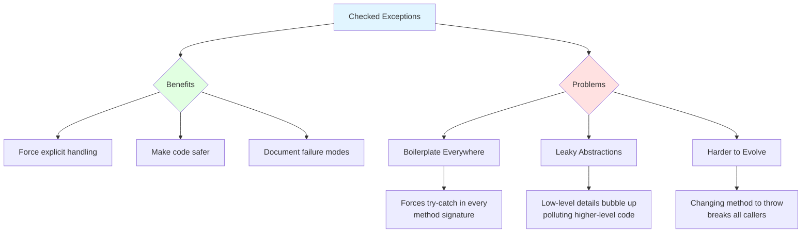
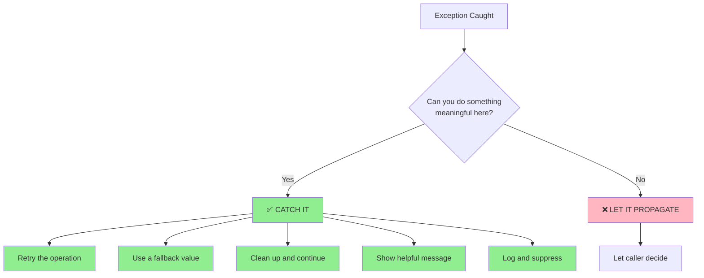
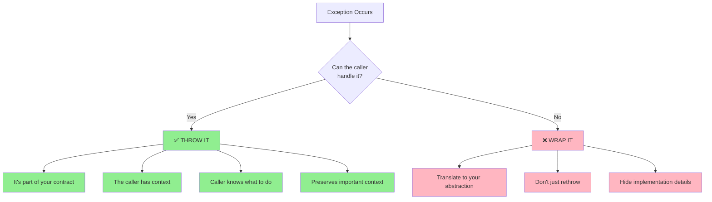
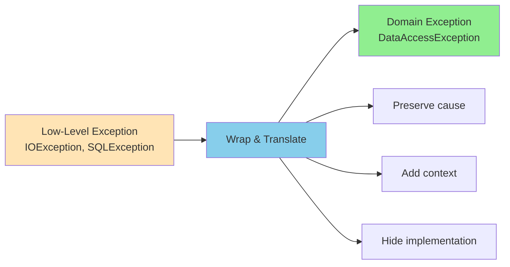
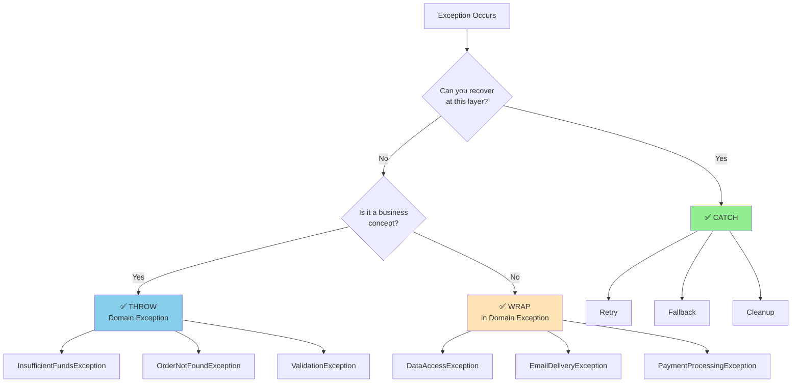
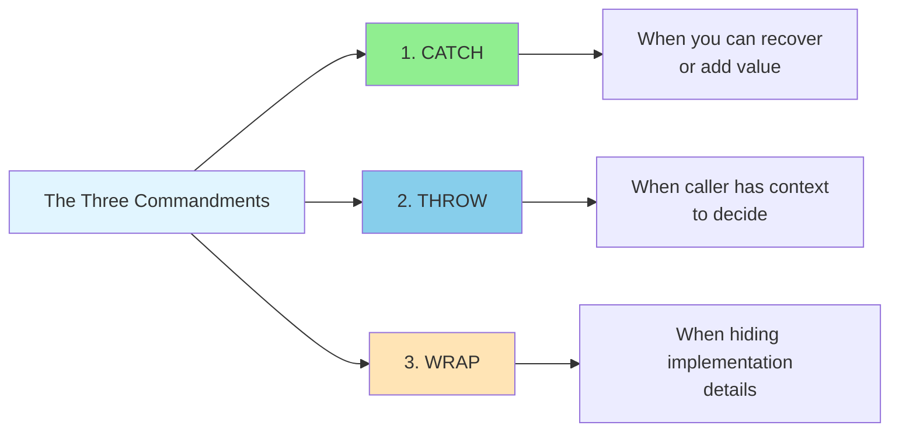

# Mastering Checked Exceptions in Java: When to Catch, Throw, and Wrap

> **Write clean code. Design clean APIs. Respect your future self and your users.**

---

## Table of Contents

1. [Introduction](#introduction)
2. [The Checked Exception Problem](#the-checked-exception-problem)
3. [When to Catch: The Recovery Rule](#when-to-catch-the-recovery-rule)
4. [When to Throw: The Abstraction Leak](#when-to-throw-the-abstraction-leak)
5. [The Middle Ground: Wrapping and Translating](#the-middle-ground-wrapping-and-translating)
6. [Real-World Patterns That Work](#real-world-patterns-that-work)
7. [Quick Reference Cheat Sheet](#quick-reference-cheat-sheet)
8. [Common Pitfalls to Avoid](#common-pitfalls-to-avoid)

---

## Introduction

Checked exceptions were introduced in Java with the best of intentions: to force developers to handle error conditions explicitly, making code safer and more robust. However, decades of real-world usage have revealed that checked exceptions, while powerful, can become a trap when used incorrectly.

**The key insight:** Knowing *where* to handle exceptions—and where not to—is the difference between clean, maintainable code and a tangled mess of boilerplate.

This guide will teach you:
- ✅ When to catch exceptions (and when to let them propagate)
- ✅ When to throw exceptions (and when to wrap them)
- ✅ Real-world patterns that work in production
- ✅ How to design APIs that respect your callers

---

## The Checked Exception Problem



### The Three Core Problems

#### 1. Boilerplate Everywhere

Checked exceptions force you to add `try-catch` or `throws` declarations in method signatures all the way up the call stack.

**Example:**
```java
public void loadUser(String id) throws IOException, SQLException {
    File file = new File(id);
    try {
        // Lots of low-level operations
    } catch (IOException | SQLException e) {
        // What can we really do here?
        throw e;
    }
}
```

**The problem:** Every caller must also declare these exceptions, creating a cascade of `throws` clauses.

#### 2. Leaky Abstractions

Low-level implementation details (like `IOException` or `SQLException`) bubble up through layers of abstraction, polluting high-level business logic.

**Example:**
```java
// High-level business service shouldn't know about SQL exceptions
public class UserService {
    public User getUser(String id) throws SQLException, IOException {  // ❌ Leaky!
        // Implementation details exposed
    }
}
```

#### 3. Harder to Evolve

Adding a new checked exception to a method signature breaks all existing callers, making refactoring painful.

```java
// Before
public void processOrder(Order order) throws ValidationException;

// After - breaks all callers!
public void processOrder(Order order) throws ValidationException, PaymentException;
```

### The Verdict

> 💡 **Checked exceptions are powerful—but defaulting to catch or throw is a trap.**

The solution isn't to avoid checked exceptions entirely, but to use them strategically at the right abstraction level.

---

## When to Catch: The Recovery Rule



### The Golden Rule

> ✅ **Catch a checked exception when you can do something meaningful about it right here.**

### What "Meaningful" Means

| Action | Meaningful? | Example |
|--------|-------------|---------|
| **Retry the operation** | ✅ Yes | Retry network call with exponential backoff |
| **Use a fallback value** | ✅ Yes | Return cached data when database is down |
| **Clean up and continue** | ✅ Yes | Close resources, rollback transaction |
| **Show helpful message** | ✅ Yes | Display user-friendly error in UI |
| **Log and suppress** | ⚠️ Sometimes | Log for debugging, but only if truly recoverable |
| **Just rethrow** | ❌ No | Adds no value, creates boilerplate |
| **Swallow silently** | ❌ Never | Hides bugs, makes debugging impossible |

### Real-World Example: File Reading with Recovery

```java
public class ConfigLoader {
    
    public AppConfig loadConfig(String filePath) {
        try {
            return loadFromFile(filePath);
        } catch (FileNotFoundException e) {
            // ✅ Meaningful: Use default configuration
            log.warn("Config file not found at {}, using defaults", filePath);
            return AppConfig.getDefault();
        } catch (IOException e) {
            // ✅ Meaningful: Try alternative location
            log.warn("Failed to load config from primary location", e);
            return loadFromAlternativeLocation(filePath);
        }
    }
    
    private AppConfig loadFromFile(String path) throws IOException {
        // Actual file reading logic
        Properties props = new Properties();
        try (FileInputStream fis = new FileInputStream(path)) {
            props.load(fis);
        }
        return AppConfig.fromProperties(props);
    }
    
    private AppConfig loadFromAlternativeLocation(String path) throws IOException {
        // Try user home directory
        String altPath = System.getProperty("user.home") + "/.app/" + path;
        return loadFromFile(altPath);
    }
}
```

**Why this works:**
- ✅ We recover from `FileNotFoundException` by using defaults
- ✅ We recover from `IOException` by trying an alternative location
- ✅ The caller gets a valid `AppConfig` regardless of failures
- ✅ No exception propagates to higher layers

### Real-World Example: Network Call with Retry

```java
public class PaymentGatewayClient {
    
    private static final int MAX_RETRIES = 3;
    private static final Duration RETRY_DELAY = Duration.ofSeconds(1);
    
    public PaymentResponse charge(PaymentRequest request) 
            throws PaymentProcessingException {
        
        int attempts = 0;
        while (attempts < MAX_RETRIES) {
            try {
                return executeCharge(request);
            } catch (TransientNetworkException e) {
                attempts++;
                if (attempts >= MAX_RETRIES) {
                    // ✅ Meaningful: Give up after max retries
                    throw new PaymentProcessingException(
                        "Failed to process payment after " + MAX_RETRIES + " attempts", 
                        e
                    );
                }
                // ✅ Meaningful: Wait and retry
                log.warn("Transient error on attempt {}/{}, retrying...", 
                    attempts, MAX_RETRIES, e);
                sleep(RETRY_DELAY.multipliedBy(attempts)); // Exponential backoff
            }
        }
        throw new PaymentProcessingException("Unexpected error in payment processing");
    }
    
    private PaymentResponse executeCharge(PaymentRequest request) 
            throws TransientNetworkException {
        // Actual network call
    }
}
```

**Why this works:**
- ✅ We retry transient failures (network blips)
- ✅ We give up gracefully after max attempts
- ✅ We wrap the final failure in a domain-specific exception
- ✅ The caller knows this is a payment processing failure, not a network issue

---

## When to Throw: The Abstraction Leak



### The Golden Rule

> ✅ **Throw a checked exception when your method can't handle it—and the caller has enough context to decide.**

### When to Throw (Not Wrap)

| Condition | Action | Example |
|-----------|--------|---------|
| **You can't recover** | ✅ Throw | Database connection failed, no fallback |
| **It's part of your contract** | ✅ Throw | `validate()` throws `ValidationException` |
| **Caller has context** | ✅ Throw | Service layer throws `InsufficientFundsException` |
| **Preserves important context** | ✅ Throw | Include business context in exception |

### When NOT to Just Rethrow

```java
// ❌ BAD: Just rethrowing hides implementation details
public void saveReport(Report r) throws IOException {
    try {
        validate(r);
    } catch (ValidationException e) {
        throw e; // Can't handle this here
    }
    Files.write(file(r), r.toBytes());
}
```

**Problem:** The caller now knows you're using `Files.write()` and dealing with `IOException`. This is a leaky abstraction.

### Real-World Example: Service Layer Throwing Domain Exceptions

```java
// ✅ GOOD: Throw domain-specific exceptions
public class OrderService {
    
    private final PaymentGateway paymentGateway;
    private final InventoryService inventoryService;
    private final OrderRepository orderRepository;
    
    /**
     * Places an order for the given customer.
     * 
     * @throws InsufficientFundsException if customer's payment fails
     * @throws OutOfStockException if product is unavailable
     * @throws OrderProcessingException for other processing errors
     */
    public Order placeOrder(PlaceOrderCommand command) 
            throws InsufficientFundsException, 
                   OutOfStockException, 
                   OrderProcessingException {
        
        // Validate business rules
        if (command.getQuantity() <= 0) {
            throw new InvalidOrderException("Quantity must be positive");
        }
        
        // Check inventory
        if (!inventoryService.hasStock(command.getProductId(), command.getQuantity())) {
            throw new OutOfStockException(
                "Product " + command.getProductId() + " is out of stock"
            );
        }
        
        // Process payment
        PaymentResult paymentResult = paymentGateway.charge(
            command.getCustomerId(),
            command.getAmount()
        );
        
        if (!paymentResult.isSuccessful()) {
            throw new InsufficientFundsException(
                "Payment failed: " + paymentResult.getFailureReason()
            );
        }
        
        // Create order
        Order order = Order.create(command, paymentResult.getTransactionId());
        return orderRepository.save(order);
    }
}
```

**Why this works:**
- ✅ We throw **domain-specific exceptions** (`InsufficientFundsException`, `OutOfStockException`)
- ✅ The caller (e.g., REST controller) knows exactly what business rule failed
- ✅ Implementation details (`PaymentGateway`, `InventoryService`) are hidden
- ✅ The exception message includes business context
- ✅ The method signature documents the contract clearly

### Real-World Example: Repository Layer

```java
// ✅ GOOD: Repository throws domain exception, not SQLException
public class JpaOrderRepository implements OrderRepository {
    
    private final EntityManager entityManager;
    
    @Override
    public Order findById(OrderId id) throws OrderNotFoundException {
        Order order = entityManager.find(Order.class, id.getValue());
        if (order == null) {
            throw new OrderNotFoundException(
                "Order not found with ID: " + id.getValue()
            );
        }
        return order;
    }
    
    @Override
    public Order save(Order order) throws OrderPersistenceException {
        try {
            entityManager.persist(order);
            return order;
        } catch (PersistenceException e) {
            // ✅ Wrap low-level exception in domain exception
            throw new OrderPersistenceException(
                "Failed to save order: " + order.getId(), 
                e
            );
        }
    }
}
```

**Why this works:**
- ✅ `OrderNotFoundException` is a clear, domain-specific exception
- ✅ `OrderPersistenceException` wraps `PersistenceException` (implementation detail)
- ✅ The service layer doesn't know we're using JPA
- ✅ Exception messages include business context (order ID)

---

## The Middle Ground: Wrapping and Translating



### The Translation Pattern

Sometimes the caller doesn't care about low-level details. Wrap or translate the exception into something meaningful at your abstraction level.

```java
public void sendEmail(Email email) {
    try {
        smtpClient.send(email);
    } catch (IOException e) {
        // ✅ Wrap low-level exception in domain exception
        throw new EmailDeliveryException(
            "Failed to send email to: " + email.getRecipient(), 
            e
        );
    }
}
```

### Why Wrap?

| Benefit | Explanation |
|---------|-------------|
| **Hide implementation details** | Caller doesn't need to know you're using SMTP |
| **Provide stable API** | Change implementation without breaking callers |
| **Add domain context** | Include business-relevant information |
| **Avoid leaking tech everywhere** | Keep tech exceptions at the boundary |

### Real-World Example: Complete Wrapping Strategy

```java
// Domain exception
public class EmailDeliveryException extends Exception {
    public EmailDeliveryException(String message, Throwable cause) {
        super(message, cause);
    }
}

// Repository implementation
public class SmtpEmailRepository implements EmailRepository {
    
    private final SmtpClient smtpClient;
    
    @Override
    public void send(Email email) throws EmailDeliveryException {
        try {
            smtpClient.send(email);
        } catch (IOException e) {
            // ✅ Wrap with domain context
            throw new EmailDeliveryException(
                String.format("Failed to deliver email to %s with subject '%s'",
                    email.getRecipient(),
                    email.getSubject()
                ),
                e
            );
        } catch (SmtpException e) {
            // ✅ Wrap SMTP-specific exception
            throw new EmailDeliveryException(
                String.format("SMTP error sending to %s: %s",
                    email.getRecipient(),
                    e.getErrorCode()
                ),
                e
            );
        }
    }
}

// Service layer uses domain exception
public class NotificationService {
    
    private final EmailRepository emailRepository;
    
    public void sendWelcomeEmail(User user) throws EmailDeliveryException {
        Email email = Email.builder()
            .to(user.getEmail())
            .subject("Welcome to our platform!")
            .body(buildWelcomeMessage(user))
            .build();
        
        emailRepository.send(email);
        // ✅ No knowledge of SMTP, IOException, etc.
    }
}
```

**Why this works:**
- ✅ `NotificationService` doesn't know about SMTP or `IOException`
- ✅ `EmailDeliveryException` provides business context
- ✅ Original exception is preserved as the cause for debugging
- ✅ You can change email providers without touching `NotificationService`

---

## Real-World Patterns That Work

```mermaid
graph TB
    subgraph "Architecture Layers"
        A[Controller Layer] --> B[Service/Use Case Layer]
        B --> C[Repository Layer]
        C --> D[Database/External APIs]
    end
    
    subgraph "Exception Flow"
        E[Low-Level Exceptions<br/>IOException, SQLException] --> F[Repository Layer]
        F -->|Wrap| G[DataAccessException]
        G --> H[Service Layer]
        H -->|Throw| I[Domain Exceptions<br/>OrderNotFound, InsufficientFunds]
        I --> J[Controller Layer]
        J -->|Translate| K[HTTP Response<br/>404, 422, 500]
    end
    
    style A fill:#E1F5FF
    style B fill:#E1FFE1
    style C fill:#FFE4E1
    style D fill:#FFF4E1
    style E fill:#FFE4E1
    style G fill:#90EE90
    style I fill:#90EE90
    style K fill:#87CEEB
```



### Pattern 1: Repository Pattern

**Goal:** Catch low-level exceptions and translate to `DataAccessException` (or your own domain exception).

```java
public class JpaCustomerRepository implements CustomerRepository {
    
    private final EntityManager entityManager;
    
    @Override
    public Customer findById(CustomerId id) throws CustomerNotFoundException {
        Customer customer = entityManager.find(Customer.class, id.getValue());
        if (customer == null) {
            throw new CustomerNotFoundException(
                "Customer not found: " + id.getValue()
            );
        }
        return customer;
    }
    
    @Override
    public Customer save(Customer customer) throws DataAccessException {
        try {
            entityManager.persist(customer);
            return customer;
        } catch (PersistenceException e) {
            throw new DataAccessException(
                "Failed to save customer: " + customer.getId(), 
                e
            );
        }
    }
}

// Custom domain exception
public class DataAccessException extends Exception {
    public DataAccessException(String message, Throwable cause) {
        super(message, cause);
    }
}
```

**When to use:** Always, at the data access boundary.

---

### Pattern 2: Service/Use Case Pattern

**Goal:** Throw business exceptions that callers can act upon. Keep signatures meaningful.

```java
public class TransferService {
    
    private final AccountRepository accountRepository;
    private final TransactionRepository transactionRepository;
    private final NotificationService notificationService;
    
    /**
     * Transfers funds between accounts.
     * 
     * @throws InsufficientFundsException if source account lacks funds
     * @throws AccountNotFoundException if either account doesn't exist
     * @throws TransferLimitExceededException if transfer exceeds daily limit
     */
    public TransferResult transfer(TransferCommand command) 
            throws InsufficientFundsException,
                   AccountNotFoundException,
                   TransferLimitExceededException {
        
        // Validate accounts exist
        Account source = accountRepository.findById(command.getSourceAccountId())
            .orElseThrow(() -> new AccountNotFoundException(
                "Source account not found: " + command.getSourceAccountId()
            ));
        
        Account destination = accountRepository.findById(command.getDestinationAccountId())
            .orElseThrow(() -> new AccountNotFoundException(
                "Destination account not found: " + command.getDestinationAccountId()
            ));
        
        // Check balance
        if (source.getBalance().compareTo(command.getAmount()) < 0) {
            throw new InsufficientFundsException(
                String.format("Account %s has insufficient funds. Required: %s, Available: %s",
                    source.getId(),
                    command.getAmount(),
                    source.getBalance()
                )
            );
        }
        
        // Check daily limit
        if (transactionRepository.getDailyTotal(source.getId()).add(command.getAmount())
                .compareTo(source.getDailyLimit()) > 0) {
            throw new TransferLimitExceededException(
                String.format("Transfer would exceed daily limit of %s",
                    source.getDailyLimit()
                )
            );
        }
        
        // Execute transfer
        source.debit(command.getAmount());
        destination.credit(command.getAmount());
        
        Transaction transaction = transactionRepository.save(
            new Transaction(source, destination, command.getAmount())
        );
        
        // Notify (don't let notification failure block the transfer)
        try {
            notificationService.sendTransferConfirmation(source, transaction);
        } catch (EmailDeliveryException e) {
            log.warn("Failed to send transfer confirmation", e);
            // Don't fail the transfer if notification fails
        }
        
        return TransferResult.success(transaction);
    }
}
```

**Why this works:**
- ✅ Method signature documents all business rule failures
- ✅ Each exception has clear business meaning
- ✅ Caller (e.g., REST controller) can map to appropriate HTTP status codes
- ✅ Implementation details (JPA, email) are hidden

---

### Pattern 3: Controller/API Pattern

**Goal:** Catch and map to proper HTTP responses. Don't leak internal exceptions to API consumers.

```java
@RestController
@RequestMapping("/api/orders")
public class OrderController {
    
    private final OrderService orderService;
    
    @PostMapping
    public ResponseEntity<OrderResponse> placeOrder(@RequestBody PlaceOrderRequest request) {
        try {
            Order order = orderService.placeOrder(request.toCommand());
            return ResponseEntity.ok(OrderResponse.from(order));
        } catch (InsufficientFundsException e) {
            // ✅ Map to appropriate HTTP status
            return ResponseEntity.status(HttpStatus.PAYMENT_REQUIRED)
                .body(OrderResponse.error("PAYMENT_FAILED", e.getMessage()));
        } catch (OutOfStockException e) {
            return ResponseEntity.status(HttpStatus.UNPROCESSABLE_ENTITY)
                .body(OrderResponse.error("OUT_OF_STOCK", e.getMessage()));
        } catch (OrderProcessingException e) {
            log.error("Order processing failed", e);
            return ResponseEntity.status(HttpStatus.INTERNAL_SERVER_ERROR)
                .body(OrderResponse.error("PROCESSING_ERROR", 
                    "Failed to process order. Please try again."));
        }
    }
    
    @GetMapping("/{id}")
    public ResponseEntity<OrderResponse> getOrder(@PathVariable String id) {
        try {
            Order order = orderService.getOrder(OrderId.of(id));
            return ResponseEntity.ok(OrderResponse.from(order));
        } catch (OrderNotFoundException e) {
            return ResponseEntity.notFound().build();
        }
    }
}
```

**Alternative: Using @ExceptionHandler**

```java
@RestControllerAdvice
public class GlobalExceptionHandler {
    
    @ExceptionHandler(InsufficientFundsException.class)
    public ResponseEntity<ErrorResponse> handleInsufficientFunds(InsufficientFundsException e) {
        return ResponseEntity.status(HttpStatus.PAYMENT_REQUIRED)
            .body(new ErrorResponse("PAYMENT_FAILED", e.getMessage()));
    }
    
    @ExceptionHandler(OutOfStockException.class)
    public ResponseEntity<ErrorResponse> handleOutOfStock(OutOfStockException e) {
        return ResponseEntity.status(HttpStatus.UNPROCESSABLE_ENTITY)
            .body(new ErrorResponse("OUT_OF_STOCK", e.getMessage()));
    }
    
    @ExceptionHandler(OrderNotFoundException.class)
    public ResponseEntity<ErrorResponse> handleOrderNotFound(OrderNotFoundException e) {
        return ResponseEntity.notFound().build();
    }
    
    @ExceptionHandler(Exception.class)
    public ResponseEntity<ErrorResponse> handleGeneric(Exception e) {
        log.error("Unexpected error", e);
        return ResponseEntity.status(HttpStatus.INTERNAL_SERVER_ERROR)
            .body(new ErrorResponse("INTERNAL_ERROR", 
                "An unexpected error occurred. Please try again."));
    }
}
```

**Why this works:**
- ✅ Controllers stay clean, focused on HTTP concerns
- ✅ Exception handling is centralized
- ✅ Internal exceptions never leak to API consumers
- ✅ Consistent error response format

---

### Pattern 4: Async / Tasks Pattern

**Goal:** Wrap exceptions so they don't get lost in async execution. Complete futures exceptionally.

```java
public class ReportGenerator {
    
    private final ReportRepository reportRepository;
    private final AnalyticsService analyticsService;
    
    public CompletableFuture<Report> generateReportAsync(ReportRequest request) {
        return CompletableFuture.supplyAsync(() -> {
            try {
                return generateReport(request);
            } catch (ReportGenerationException e) {
                // ✅ Complete the future exceptionally
                throw new CompletionException(e);
            }
        }, executor)
        .thenApply(report -> {
            // Post-processing
            return enrichWithAnalytics(report);
        })
        .exceptionally(ex -> {
            // ✅ Handle exceptions at the end of the chain
            Throwable cause = ex instanceof CompletionException 
                ? ex.getCause() 
                : ex;
            
            log.error("Report generation failed for request: {}", request, cause);
            
            // Return a failed report or throw
            throw new CompletionException(
                new ReportGenerationException("Failed to generate report", cause)
            );
        });
    }
    
    private Report generateReport(ReportRequest request) throws ReportGenerationException {
        // Complex report generation logic
        Data data = reportRepository.fetchData(request.getQuery());
        return Report.create(data);
    }
}
```

**Using @Async in Spring:**

```java
@Service
public class AsyncReportService {
    
    @Async
    public CompletableFuture<Report> generateReport(ReportRequest request) {
        try {
            Report report = doGenerate(request);
            return CompletableFuture.completedFuture(report);
        } catch (ReportGenerationException e) {
            // ✅ Complete exceptionally
            CompletableFuture<Report> future = new CompletableFuture<>();
            future.completeExceptionally(e);
            return future;
        }
    }
}
```

**Why this works:**
- ✅ Exceptions don't get lost in async execution
- ✅ Caller can handle failures with `.exceptionally()` or `.handle()`
- ✅ Original exception context is preserved

---

### Pattern 5: Domain-Driven Design Pattern

**Goal:** Use domain exceptions, not technical ones, at boundaries. Keep technical exceptions internal.

```java
// ✅ Domain exception - part of the ubiquitous language
public class OrderCannotBeCancelledException extends DomainException {
    public OrderCannotBeCancelledException(Order order, String reason) {
        super(String.format("Order %s cannot be cancelled: %s", 
            order.getId(), reason));
    }
}

// ✅ Domain exception
public class PaymentAlreadyProcessedException extends DomainException {
    public PaymentAlreadyProcessedException(OrderId orderId) {
        super("Payment already processed for order: " + orderId);
    }
}

// Aggregate root enforces business rules
public class Order {
    
    private OrderId id;
    private OrderStatus status;
    private PaymentStatus paymentStatus;
    private List<OrderItem> items;
    
    public void cancel(String reason) {
        // ✅ Enforce business rules with domain exceptions
        if (status == OrderStatus.SHIPPED) {
            throw new OrderCannotBeCancelledException(
                this, "Order has already been shipped"
            );
        }
        
        if (status == OrderStatus.CANCELLED) {
            throw new OrderCannotBeCancelledException(
                this, "Order is already cancelled"
            );
        }
        
        if (paymentStatus == PaymentStatus.PAID) {
            throw new PaymentAlreadyProcessedException(id);
        }
        
        // Business logic to cancel
        this.status = OrderStatus.CANCELLED;
        this.cancellationReason = reason;
        this.cancelledAt = Instant.now();
        
        // Domain event
        DomainEvents.raise(new OrderCancelledEvent(id, reason));
    }
}

// Base domain exception
public abstract class DomainException extends Exception {
    protected DomainException(String message) {
        super(message);
    }
}
```

**Why this works:**
- ✅ Exceptions are part of the **ubiquitous language**
- ✅ Business rules are enforced at the aggregate level
- ✅ Technical exceptions (SQL, IO) never leak to the domain
- ✅ Exception names clearly communicate business meaning

---

## Quick Reference Cheat Sheet



### Decision Matrix

| Scenario | Action | Example |
|----------|--------|---------|
| **Can retry** | ✅ Catch & retry | Network timeout, transient DB error |
| **Can use fallback** | ✅ Catch & fallback | Cache miss, default config |
| **Can cleanup** | ✅ Catch & cleanup | Close resources, rollback transaction |
| **Business rule violation** | ✅ Throw domain exception | `InsufficientFundsException` |
| **Invalid input** | ✅ Throw validation exception | `InvalidOrderException` |
| **Resource not found** | ✅ Throw not found exception | `OrderNotFoundException` |
| **Low-level failure** | ✅ Wrap in domain exception | `IOException` → `DataAccessException` |
| **Just rethrowing** | ❌ Don't do this | Adds boilerplate, no value |
| **Swallowing silently** | ❌ Never do this | Hides bugs |

### Exception Hierarchy Best Practice

```
DomainException (base)
├── BusinessRuleException
│   ├── InsufficientFundsException
│   ├── OrderCannotBeCancelledException
│   └── TransferLimitExceededException
├── ValidationException
│   ├── InvalidOrderException
│   └── InvalidPaymentException
├── NotFoundException
│   ├── OrderNotFoundException
│   └── CustomerNotFoundException
└── TechnicalException (wrapped)
    ├── DataAccessException
    ├── EmailDeliveryException
    └── PaymentProcessingException
```

---

## Common Pitfalls to Avoid

### ❌ Pitfall 1: Catching and Just Rethrowing

```java
// ❌ BAD
public void process(Data data) throws IOException {
    try {
        save(data);
    } catch (IOException e) {
        throw e; // What's the point?
    }
}
```

**Fix:** Either handle it meaningfully or remove the try-catch entirely.

```java
// ✅ GOOD
public void process(Data data) throws IOException {
    save(data);
}
```

---

### ❌ Pitfall 2: Throwing Technical Exceptions from Business Logic

```java
// ❌ BAD
public class OrderService {
    public void placeOrder(Order order) throws SQLException, IOException {
        // Business logic mixed with technical exceptions
    }
}
```

**Fix:** Wrap technical exceptions in domain exceptions.

```java
// ✅ GOOD
public class OrderService {
    public void placeOrder(Order order) 
            throws OrderProcessingException {
        // Implementation details hidden
    }
}
```

---

### ❌ Pitfall 3: Swallowing Exceptions

```java
// ❌ BAD
public void sendEmail(Email email) {
    try {
        smtpClient.send(email);
    } catch (IOException e) {
        // Silent failure - email never sent, nobody knows
    }
}
```

**Fix:** At minimum, log the exception. Better yet, wrap and rethrow.

```java
// ✅ GOOD
public void sendEmail(Email email) throws EmailDeliveryException {
    try {
        smtpClient.send(email);
    } catch (IOException e) {
        throw new EmailDeliveryException(
            "Failed to send email to " + email.getRecipient(), 
            e
        );
    }
}
```

---

### ❌ Pitfall 4: Exception Soup in Method Signatures

```java
// ❌ BAD
public void doSomething() throws IOException, SQLException, 
                               ParseException, ValidationException,
                               NetworkException, TimeoutException {
    // Too many exceptions - unclear what this method does
}
```

**Fix:** Group related exceptions or wrap them.

```java
// ✅ GOOD
public void doSomething() throws BusinessServiceException {
    // Single, clear exception type
}

// Or group related exceptions
public void doSomething() throws DataAccessException, BusinessException {
    // Clear separation of concerns
}
```

---

### ❌ Pitfall 5: Losing Exception Context

```java
// ❌ BAD
public void save(Data data) {
    try {
        repository.save(data);
    } catch (SQLException e) {
        throw new DataAccessException("Save failed"); // Lost cause!
    }
}
```

**Fix:** Always preserve the original exception as the cause.

```java
// ✅ GOOD
public void save(Data data) {
    try {
        repository.save(data);
    } catch (SQLException e) {
        throw new DataAccessException(
            "Failed to save data: " + data.getId(), 
            e  // ✅ Preserve cause for debugging
        );
    }
}
```

---

## Summary: The Three Commandments



### 1. **Catch** when you can recover or add value
- Retry transient failures
- Use fallback values
- Clean up resources
- Log with context

### 2. **Throw** when the caller has context to decide
- Business rule violations
- Validation failures
- Resource not found
- Part of your API contract

### 3. **Wrap** when hiding implementation details
- Translate `IOException` → `DataAccessException`
- Translate `SQLException` → `RepositoryException`
- Add business context
- Preserve original cause

---

## Final Thoughts

Checked exceptions are a tool, not a trap. Used correctly, they make your APIs self-documenting and your code more robust. Used incorrectly, they create boilerplate hell and leaky abstractions.

**Remember:**
- 🎯 **Catch** to add value
- 🎯 **Throw** to delegate decisions
- 🎯 **Wrap** to protect abstractions

> **Write clean code. Design clean APIs. Respect your future self and your users.**

---

## Further Reading

- [Effective Java, 3rd Edition - Item 70: Use checked exceptions for recoverable conditions](https://www.oreilly.com/library/view/effective-java-3rd/9780134686097/)
- [Java Checked Exceptions - A Discussion](https://www.artima.com/intv/handcuffs.html)
- [Clean Code - Exception Handling](https://www.oreilly.com/library/view/clean-code-a/9780136083238/)

---

**Happy coding!** 🚀