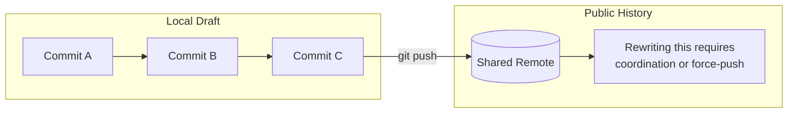
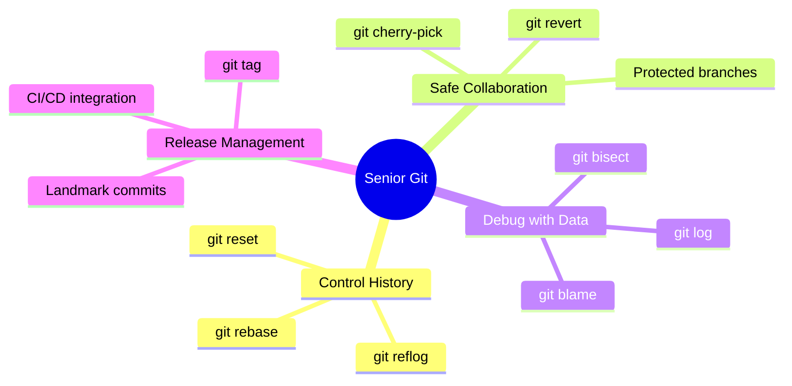
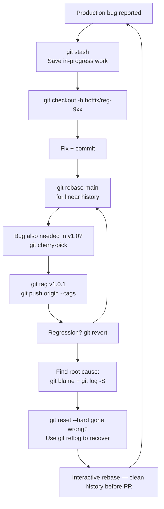
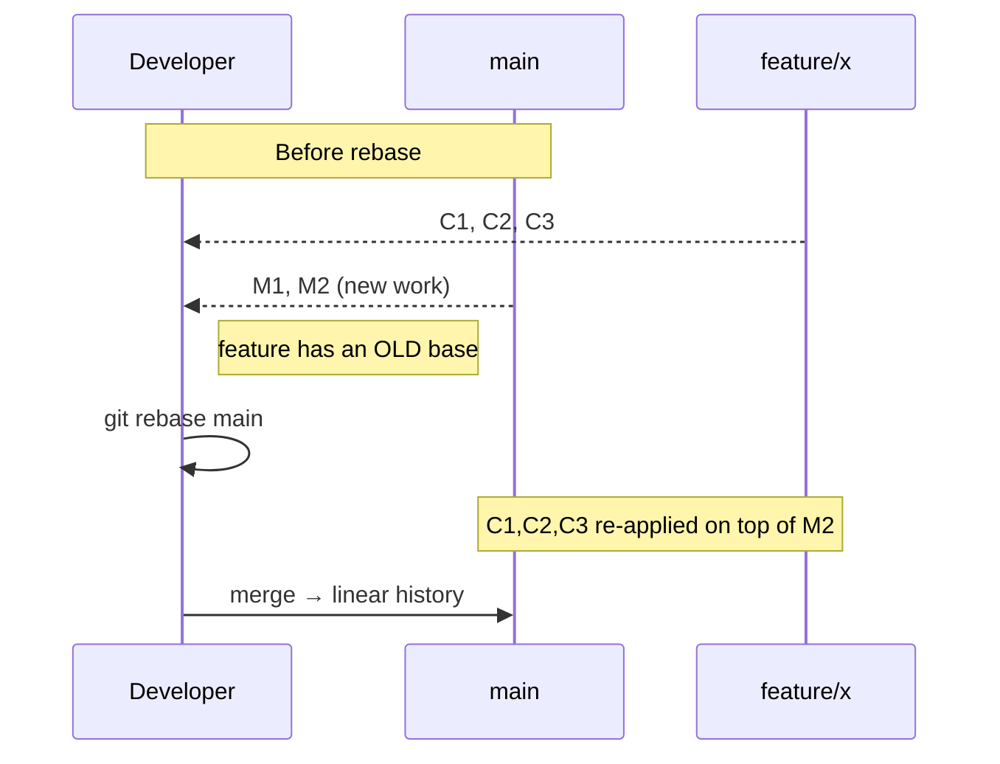
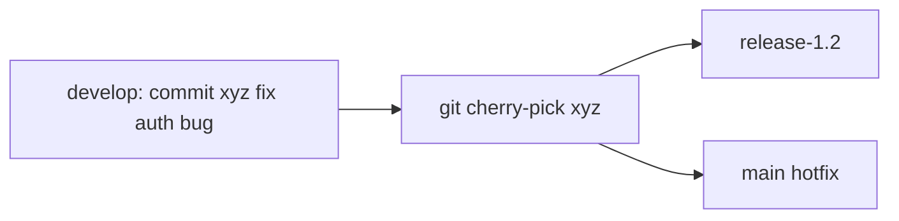
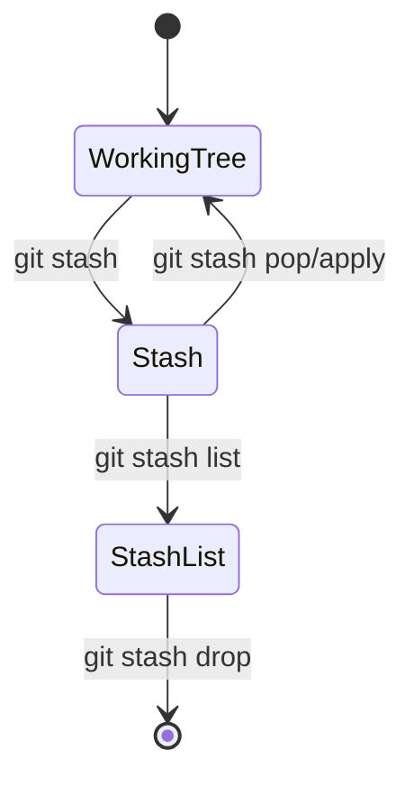
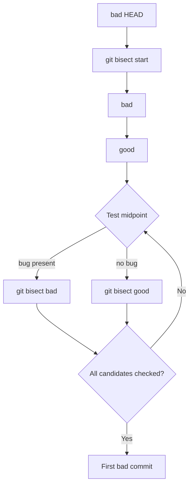
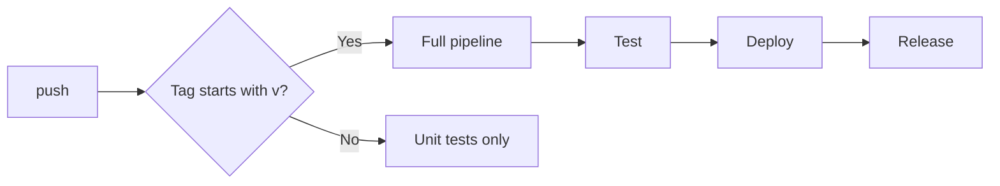
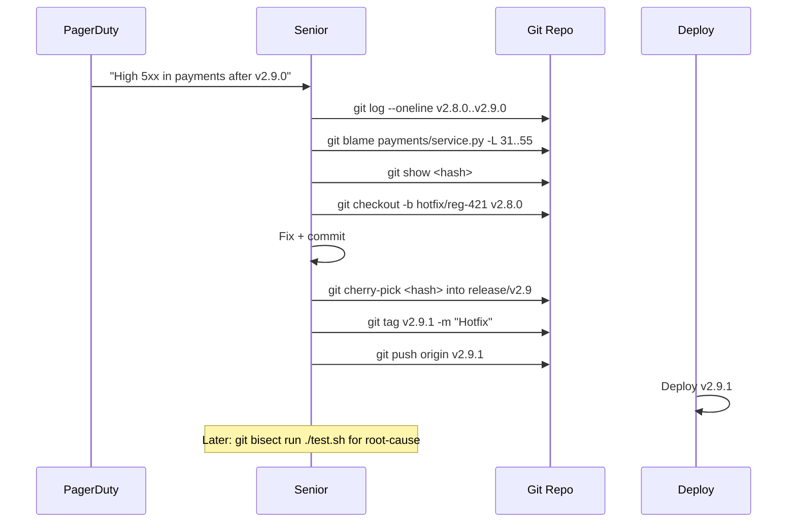

# Mastering the 10 Senior-Level Git Commands — Complete Tutorial

> **Difficulty Level:** 🟡 Intermediate → 🔴 Advanced
> **Estimated Reading Time:** ⏱️ 90–120 minutes
> **Target Audience:** Developers who know Git basics and want to operate at a senior engineering level
> **Last Updated:** 2026-08-16
> **Git Version Referenced:** Git 2.40+ (commands are backward-compatible)

---

## Table of Contents

1. [Introduction: Why Senior Developers Think Differently About Git](#1-introduction)
2. [Prerequisites](#2-prerequisites)
3. [Learning Objectives](#3-learning-objectives)
4. [The Senior Git Mindset: From User to Historian](#4-the-senior-git-mindset-from-user-to-historian)
5. [The 10 Commands at a Glance — A Lifecycle View](#5-the-10-commands-at-a-glance--a-lifecycle-view)
6. [`git rebase` — Clean & Professional History](#6-git-rebase--clean--professional-history)
7. [`git cherry-pick` — Pick the Exact Commits](#7-git-cherry-pick--pick-the-exact-commits)
8. [`git reflog` — The Time Machine for Git](#8-git-reflog--the-time-machine-for-git)
9. [`git reset` — Undo Commits (Smartly)](#9-git-reset--undo-commits-smartly)
10. [`git stash` — Temporary Save with a Safety Net](#10-git-stash--temporary-save-with-a-safety-net)
11. [`git blame` — Who Broke This?](#11-git-blame--who-broke-this)
12. [`git bisect` — Find the Bug-Inducing Commit with Binary Search](#12-git-bisect--find-the-bug-inducing-commit-with-binary-search)
13. [`git log` (Advanced) — Read History Like a Detective](#13-git-log-advanced--read-history-like-a-detective)
14. [`git revert` — Safe Undo for Production](#14-git-revert--safe-undo-for-production)
15. [`git tag` — Release Management at Scale](#15-git-tag--release-management-at-scale)
16. [Comparison Matrices: Choosing the Right Command](#16-comparison-matrices-choosing-the-right-command)
17. [Real-World Production Incident Walkthrough](#17-real-world-production-incident-walkthrough)
18. [Best Practices for Senior-Level Git Usage](#18-best-practices-for-senior-level-git-usage)
19. [Anti-Patterns to Avoid](#19-anti-patterns-to-avoid)
20. [Security Considerations](#20-security-considerations)
21. [Performance Considerations in Large Repositories](#21-performance-considerations-in-large-repositories)
22. [Testing Strategies Around Git Workflows](#22-testing-strategies-around-git-workflows)
23. [Troubleshooting Guide](#23-troubleshooting-guide)
24. [Hands-On Lab: Simulated Production Sprint](#24-hands-on-lab-simulated-production-sprint)
25. [Practice Exercises with Solutions](#25-practice-exercises-with-solutions)
26. [Quick Recap — What a Senior Remembers](#26-quick-recap--what-a-senior-remembers)
27. [Pro Tips Collection](#27-pro-tips-collection)
28. [Test Your Understanding — 10 Questions](#28-test-your-understanding--10-questions)
29. [Common Interview Questions](#29-common-interview-questions)
30. [Question Bank — 50 Questions for Knowledge Reinforcement](#30-question-bank--50-questions-for-knowledge-reinforcement)
31. [Self-Assessment Checklist](#31-self-assessment-checklist)
32. [Suggested Learning Paths](#32-suggested-learning-paths)
33. [Further Reading & Resources](#33-further-reading--resources)
34. [Glossary](#34-glossary)

---

## 1. Introduction: Why Senior Developers Think Differently About Git

Git is not just a version control tool — it is the **backbone of modern software development**.

While junior developers often use Git to push code, senior developers use Git to **control history**, **collaborate safely**, **debug production issues**, and **protect codebases at scale**.

At a senior level, knowing Git means far more than running `git add` and `git commit`. It means:

- ✅ Maintaining a **clean and readable commit history**
- ✅ **Fixing production bugs** without breaking teamwork
- ✅ **Recovering lost commits** and accidental resets
- ✅ **Debugging issues** by tracing exactly when and where a bug was introduced
- ✅ **Managing releases** with confidence and safety

In real-world projects — especially in large teams — poor Git usage can be as dangerous as poor code. A single wrong command can overwrite weeks of work, while the right command can save hours of debugging and prevent outages.

This tutorial focuses on the **Top 10 Git commands** that every senior developer must master — not as definitions, but with real-world use cases, best practices, and production-ready insights. These are the commands that differentiate someone who *uses* Git from someone who truly *understands* Git.

If you want to level up from developer → senior engineer, mastering these commands is non-negotiable.

### The Developer → Senior Engineer Gap

| Aspect | Junior Developer | Senior Engineer |
|--------|------------------|-----------------|
| **Git purpose** | Saving and sharing code | Controlling and shaping history |
| **Undo strategy** | Panics after losing a commit | Uses `git reflog` to recover anything |
| **History style** | Merge commits everywhere | Clean, linear, reviewable history |
| **Debugging** | Manually reads code | Uses `git bisect` + `git blame` for root cause |
| **Production fix** | Fears breaking the team | Safely `cherry-pick`s and `revert`s |
| **Release process** | Relies on CI/CD blindly | Tags, plans, and traces releases with Git |

### The 10 Commands at the Core of Senior Work

| # | Command | Senior Superpower |
|---|---------|-------------------|
| 1 | `git rebase` | Clean linear history |
| 2 | `git cherry-pick` | Selective commit transfer |
| 3 | `git reflog` | Recovery time machine |
| 4 | `git reset` | Controlled undo |
| 5 | `git stash` | Temporary workspace save |
| 6 | `git blame` | Attribution debugging |
| 7 | `git bisect` | Binary-search bug hunting |
| 8 | `git log` | History inspection mastery |
| 9 | `git revert` | Production-safe undo |
| 10 | `git tag` | Release versioning |

> 💡 **Aha moment:** If you master these 10 commands with real-world judgment, you stop *using* Git and start *owning* it. That is a core step on the path from developer → senior engineer.

---

## 2. Prerequisites

Before you dive in, make sure you have:

### 2.1 Tools & Setup

| Requirement | Details | Check |
|-------------|---------|-------|
| **Git installed** | Version 2.0+ (verify with `git --version`) | `___` |
| **Terminal access** | Bash, Zsh, PowerShell, or any similar shell | `___` |
| **A local test repository** | Create one with `git init` to follow along | `___` |
| **(Optional) GitHub/GitLab account** | For PR and remote workflow exercises | `___` |
| **A text editor** | Any editor that highlights merge-conflict markers | `___` |

### 2.2 Verify Your Git Installation

```bash
# Check Git version
git --version

# Set your identity globally (if not already done)
git config --global user.name "Your Name"
git config --global user.email "you@example.com"

# See the current configuration
git config --list
```

> 💡 **Tip:** If you have not configured `user.name` and `user.email`, Git will refuse to create commits. Senior engineers should also set a default branch name:
> ```bash
> git config --global init.defaultBranch main
> ```

### 2.3 Create a Practice Sandbox

We will use a small practice repository throughout this tutorial. Create it now:

```bash
mkdir git-senior-lab && cd git-senior-lab
git init
echo "# Senior Git Lab" > README.md
git add README.md
git commit -m "Initial commit"
```

Now you have a safe sandbox where every destructive or confusing command can be practiced without risk.

---

## 3. Learning Objectives

By the end of this tutorial, you will be able to:

1. **Explain** why senior developers treat Git history as a communication medium, not just a log.
2. **Rebase** feature branches onto `main` and resolve conflicts *once*, cleanly.
3. **Cherry-pick** specific commits from one branch to another for hotfixes — without bringing in unrelated changes.
4. **Recover** "lost" commits after a destructive `reset`, `checkout`, or branch deletion using `git reflog`.
5. **Choose** correctly between `--soft`, `--mixed`, and `--hard` resets.
6. **Stash** and restore uncommitted work safely, including staged and untracked files.
7. **Trace** the origin of a line or a regression with `git blame` and understand its limitations.
8. **Automate** bug hunting with `git bisect`, including fully automated `git bisect run`.
9. **Visualize** repository history like a pro with advanced `git log --graph` and format specifiers.
10. **Revert** changes safely on shared branches vs. using `reset` on private branches.
11. **Tag and ship** production releases with annotated tags, semantic versioning, and CI/CD integration.
12. **Apply** established best practices, avoid common anti-patterns, and follow security and performance considerations.

---

## 4. The Senior Git Mindset: From User to Historian

The single biggest mental shift between junior and senior Git usage is the understanding that **Git history is a first-class product artifact**.

When a junior runs `git commit`, they save work. When a senior runs `git commit`, they write a structured message that explains *why* the change exists, keep each commit as a **single logical unit**, and consciously decide what the history will look like for the next five years.

### The "Message in a Bottle" Analogy ⚓

Think of each commit as a message in a bottle you throw into the sea of time. A junior's bottle says: *"stuff changed."* A senior's bottle says: *"Fix cache invalidation key in payment service; supplier IDs were not normalized, which caused 502s in the EU region for ~4 hours."*

**Annotated commit message example:**

```bash
git commit -m "fix(payments): normalize supplier ID in cache key

The cache invalidation failed because the supplier IDs embedded in the
key retained leading zeros while the canonical ID did not.

- Normalize both sides with a shared utility
- Add a regression test for supplier 007 vs 7
- Closes PAY-4382"
```

### History as Documentation

| History Property | Why Seniors Care |
|------------------|------------------|
| **Readable** | Each commit is a coherent unit |
| **Reviewable** | PRs are small; reviewers trace cause and effect easily |
| **Searchable** | `git log -S` finds when a string was added or removed |
| **Safe to roll back** | A production revert targets precise commits |
| **Authorable** | Seniors rephrase history (rebase) before it goes public |
| **Blamable** | `git blame` reveals the *why*, not just the who/when |

### Before-Push = Draft, After-Push = Public



> ⚠️ **The Golden Rule of Rebasing:** Never `rebase` a branch that other people already share. Once you push, that history is a **shared fact**; rewriting it breaks everyone else's clones.

### The Four Pillars of Senior Git



> 💡 **Key insight:** Your local history is a *draft*. You can edit it freely before you push. Once you push, history is *published*, and editing it costs you (and your team) a lot.

---

## 5. The 10 Commands at a Glance — A Lifecycle View

Before deep-diving into each command, here is how the 10 commands fit into a developer's **real-world lifecycle**:



> The lifecycle loop shows these 10 commands are a **layered safety net**. If you misuse one, another can often rescue you.

### Quick Command Summary Table

| Command | Purpose | Critical Danger | When to Use |
|---------|---------|----------------|-------------|
| `git rebase` | Rewrite history, linearize | ❌ Never on shared remote | Local branch → clean PR |
| `git cherry-pick` | Copy a single commit | Can silently duplicate | Hotfixes, selective fixes |
| `git reflog` | See all local branch moves | Expires after ~90 days | Recovery |
| `git reset` | Move HEAD backward | `--hard` deletes changes | Local-only undo |
| `git stash` | Save WIP locally | Conflicts later | Context switching |
| `git blame` | Map each line to a commit | History can be misleading | Regression root cause |
| `git bisect` | Binary search for a buggy commit | Needs known good/bad commits | Production bug hunting |
| `git log` | Inspect history | Hundreds of options | Archaeology / reviews |
| `git revert` | Invert commit with a new commit | May conflict | Shared branches |
| `git tag` | Name a version | Tag is mutable | Releases / rollbacks |

---

## 6. `git rebase` — Clean & Professional History

### 6.1 What It Is

`git rebase` rewrites (moves) a series of commits onto a new base. The result is a **linear** history with no merge commits.

```bash
# Rebase the current branch onto main
git rebase main

# Interactive mode (edit, reword, squash)
git rebase -i HEAD~3
```

### 6.2 Why Seniors Use It

- ✅ Keeps the commit history **clean**
- ✅ Avoids unnecessary merge commits (versus `git merge`)
- ✅ Makes PR reviews **easier**
- ✅ Allows **squashing** noisy WIP commits into neat units

### 6.3 Real-World Scenario



**Step-by-step walkthrough:**

```bash
# 1. Start on the feature branch
git checkout feature/payment-fix

# 2. Rebase onto latest main
git rebase main
# Git replays each of your commits on top of main

# 3. If conflicts occur, resolve each file
git status
# fix the file, then:
git add file.js
git rebase --continue

# 4. Update your remote branch if you had previously pushed
# Only force-push if you are the only one on this branch:
git push --force-with-lease origin feature/payment-fix
```

> 💡 **Use `--force-with-lease`** instead of `--force`. It refuses if the remote has new commits that others have pushed, protecting you from overwriting a colleague's work.

### 6.4 Interactive Rebase — The Senior's Everyday Tool

```bash
git rebase -i HEAD~5
```

An editor opens listing the last 5 commits:

```
pick 1a2b3c4 fix: typo in README
pick 2b3c4d5 add: caching utility
pick 3c4d5e6 WIP: cache
pick 4d5e6f7 fix cache bug
pick 5e6f7g8 tests...
```

**Interactive keywords:**

| Keyword | Meaning |
|---------|---------|
| `pick` | Keep the commit as is |
| `reword` | Keep commit, edit the message |
| `edit` | Stop at the commit and amend |
| `squash` | Merge the commit into the previous one |
| `fixup` | Like `squash` but discard the message |
| `drop` | Delete the commit |

**Squash example:**

```
reword 1a2b3c4 Implement payment cache
squash 2b3c4d5 WIP cache
squash 3c4d5e6 cache bug fix
squash 4d5e6f7 tests for cache
```

Result: **a single well-written commit**: `feat(payments): implement payment cache with tests`.

### 6.5 Rebase vs Merge

| Criterion | `git rebase` | `git merge` |
|-----------|--------------|-------------|
| History shape | Linear | Branched with merge commits |
| Readability | Easy to follow | More "what actually happened" |
| Safety on shared branch | ❌ Dangerous | ✅ Safe |
| Ideal use | Local feature branches | Integrating stable feature branches |
| Undo complexity | Needs `reflog` / `--abort` | `git merge --abort` simple |

> 💡 **Practice:** Many teams use both: interactively rebase the PR branch, then **merge with `--no-ff`** into `main` for an explicit record.

### 6.6 Common Pitfalls & Solutions

| Pitfall | Symptom | Fix |
|---------|---------|-----|
| Rebasing a shared branch | Colleagues' clones break | Coordinate / reset; avoid completely |
| Unhandled conflicts | Apply failed mid-way | Resolve, then `git rebase --continue` |
| Want to stop the rebase | Rebase in progress | `git rebase --abort` to return to the original state |
| "Lost" commits | Not sure where you are | `git reflog` and reset to old hash |
| Force-push to protected | Rejected / remote rewind | Use `--force-with-lease` + branch settings |

### 6.7 When to Use / When to Avoid

**Use `git rebase` when:**
- You are the only one working on a branch (e.g., PR branch).
- You want a clean linear story for a feature.
- You want to squash WIP into meaningful commits.

**Avoid `git rebase` when:**
- The branch is shared with others.
- You need authentic history for an immutable audit.
- You don't want to handle merge-conflict resolution repeatedly.

---

## 7. `git cherry-pick` — Pick the Exact Commits

### 7.1 What It Is

`git cherry-pick` applies a specific commit (or a range) from one branch to your current branch, without bringing the rest of the source branch.

```bash
# Apply a single commit
git cherry-pick a1b2c3d

# Apply multiple commits (in order)
git cherry-pick a1b2c3d e4f5a6b

# Apply a range (older..newer)
git cherry-pick A..B
```

### 7.2 Why Seniors Use It

- Hotfix production without merging an entire unstable branch
- Backport fixes from `develop` to `release`
- Selectively apply bug fixes
- Fix the same bug across multiple release branches

### 7.3 Real-World Use Case



**Scenario:** Your team fixed a login bug in `develop` as commit `abc123`, and your production branch `release/v1.2` urgently needs that fix.

```bash
git checkout release/v1.2
git cherry-pick abc123
# If any conflicts: resolve them, git add, git cherry-pick --continue
git push origin release/v1.2
```

If the work gets messy, `git cherry-pick --abort` backs you out.

### 7.4 Cherry-Pick Flags

| Flag | Effect |
|------|--------|
| `-n` / `--no-commit` | Apply the change to index/working tree but don't commit — lets you bundle picks into one commit |
| `-x` | Add a line to the commit message: `(cherry-picked from commit <hash>)` |
| `-m` | For merge commits: `git cherry-pick -m 1 <hash>` picks relative to parent 1 or 2 |
| `--allow-empty` | Allow empty commits through without warning |

### 7.5 Cherry-Pick vs Merge vs Rebase

| Case | Best Command |
|------|--------------|
| Single commit to another branch | ✅ `cherry-pick` |
| Entire branches | ✅ `merge` or `rebase` |
| Backport hotfix | ✅ `cherry-pick` |
| Preserve shared history | `merge` |
| Clean local story | `rebase` |

> ⚠️ **Gotcha:** Cherry-picking a commit that the target already contains may cause conflicts or empty updates. Use `-x` and check whether the fix is already there.

### 7.6 Pitfalls

- **Conflicts** after pick: resolve, `git add`, `git cherry-pick --continue`.
- **Duplicate commits:** cherry-picked commits get new hashes, so they are "new" in the target branch. Picking a fix that already landed will fail or be empty.
- **Forgotten `-x`**: lose provenance/traceability.

---

## 8. `git reflog` — The Time Machine for Git

### 8.1 What It Is

`git reflog` (reference-log) records **every movement of HEAD and branches** in your local repo — even when a commit is removed from the graph.

```bash
git reflog
```

The output looks like:

```
abc1234 HEAD@{0}: commit: fix(auth): cache SSO
9f8e7d6 HEAD@{1}: reset: moving to HEAD~1
1a2b3c4 HEAD@{2}: commit: WIP auth
```

### 8.2 Why Seniors Use It

- ✅ **Recover** "lost" commits after `git reset --hard` or branch deletion
- ✅ **Inspect** exactly what happened
- ✅ **Undo** dangerous operations with confidence

### 8.3 The Classic Recovery Workflow

**You did this:**

```bash
git reset --hard HEAD~5   # OOPS!
```

**Your work is gone from the branch — but not from disk:**

```bash
# 1. Find the commit you were on before reset
git reflog
# abc1234 HEAD@{1}: commit: "important work"

# 2. Recover your branch to that point
git reset --hard abc1234
```

### 8.4 Recovering a Deleted Branch

```bash
# Find the commit in reflog, then create a new branch pointing there:
git branch recover/me a1b2c3d4
# or directly checkout and re-create:
git checkout abc1234
git switch -c resurrected
```

### 8.5 Reflog Expiration

- By default, reflog entries expire after **90 days**; unreachable entries after **30 days**.
- `git gc` triggers cleanup. You can tune:
  ```bash
  git config gc.reflogExpire 90.days
  ```

### 8.6 Reflog as an Audit Tool

```bash
git reflog --date=iso          # Show timestamps
git reflog show feature/x      # Branch-specific local log
git log -g --oneline           # Search commits reachable from reflog
```

### 8.7 Pitfall

- Reflog is **local only** — not on the remote.
- It disappears after gc/expiry. Always have a backup policy.
- It cannot restore a force-pushed commit unless someone has a local copy.

---

## 9. `git reset` — Undo Commits (Smartly)

### 9.1 What It Is

`git reset` moves the current branch's HEAD backward in your **local** repo, optionally updating the index/working tree.

```bash
# Move HEAD back 1 commit, keep the changes staged
git reset --soft HEAD~1

# (default) Move HEAD back, unstage the changes
git reset --mixed HEAD~1        # same as plain git reset HEAD~1

# Move HEAD back, delete the changes from working tree
git reset --hard HEAD~1
```

### 9.2 The Three Modes

| Mode | Index (staging) | Working tree | Use case |
|------|-----------------|--------------|----------|
| `--soft` | Unchanged / still staged | Untouched | Change commit message; combine commits |
| `--mixed` (default) | Reset to match HEAD | Untouched | Unstage everything; re-split commits |
| `--hard` | Reset to match HEAD | **Destructively wiped** | Discard changes completely |

> 💡 **Key insight:** `git reset` is a time machine for your staging/commit state, with three dials: soft, mixed, hard.

### 9.3 Bonus: `--keep` and `--merge`

```bash
git reset --keep HEAD~1       # Reset but keep local changes
git reset --merge ORIG_HEAD   # Reset but keep uncommitted changes
```

### 9.4 Real-World Uses

**Fix a bad commit message (not yet pushed):**

```bash
git reset --soft HEAD~1
git commit -m "Fix: correct message"
```

**Split one large commit into multiple logical commits:**

```bash
git reset --mixed HEAD~1       # unstage all, keep files
git add feature.js             # group 1
git commit
git add tests/ && git commit   # group 2
```

**Forget local changes and sync exactly to remote main:**

```bash
git reset --hard origin/main
```

> ⚠️ Destructive! Only do this if you truly want to discard work.

### 9.5 Reset vs Revert — The Golden Rule

> **`git reset` → private branches; `git revert` → shared/production branches.**

Reset rewrites history; revert adds a new commit that reverts the change. Never `reset --hard` a branch others have already pulled.

### 9.6 Pitfalls

- `--hard` wipes work. `git stash` before you reset if you may need it.
- Reset does not clean the reflog, so the work may still be recoverable.
- Resetting a branch that another dev has checked out causes confusing states.

---

## 10. `git stash` — Temporary Save with a Safety Net

### 10.1 What It Is

`git stash` saves uncommitted changes to a temporary stash and cleans your working tree, so you can switch branches instantly.

```bash
git stash
git stash pop
git stash list
git stash show stash@{0}
```

### 10.2 Why Seniors Use It

- ⚡ Switch branches in seconds
- ✅ Handle urgent tasks without half-done commits
- ✅ Keep work flowing during context switching

### 10.3 Real-World Use

> Mid-refactoring on `feature/payment` → P1 production hotfix arrives:

```bash
git stash                          # save WIP
git checkout -b hotfix/pay-923
# fix + commit
git checkout feature/payment-refactor
git stash pop                      # regain WIP
```

### 10.4 Advanced Stashing

```bash
# Stash only already-staged changes
git stash --staged

# Keep the index intact (stash only the diff against it)
git stash --keep-index

# Include untracked files
git stash -u

# Also include ignored files
git stash -a

# Name a stash for context
git stash push -m "WIP payments cache"
```

### Stash Lifecycle



### 10.5 `pop` vs `apply` vs `drop`

| Command | Effect |
|---------|--------|
| `git stash pop` | Apply change + remove the stash |
| `git stash apply` | Apply without removing |
| `git stash drop` | Delete stash without applying |
| `git stash clear` | ⚠️ Delete ALL stashes permanently |
| `git stash branch <name>` | Create a branch from a stash — avoids conflicts |

### 10.6 Pitfalls

- Conflicts when popping are resolved like merge conflicts.
- A stash is **not a backup** — prefer small WIP commits on a personal branch.
- `git stash clear` is irreversible.

---

## 11. `git blame` — Who Broke This?

### 11.1 What It Is

`git blame file.js` shows, line by line, which commit/author/timestamp last modified each line.

```bash
git blame file.js
# Output example:
# abc1234d (Sandeep M 2024-01-15 10:32:11 +0000 1) const x = 1;
```

### 11.2 Why Seniors Use It

- ✅ Debug regressions quickly
- ✅ Understand "why is this line here?" → read the commit message
- ✅ Find the PR discussion / original intent

### 11.3 Advanced Usage

```bash
# Blame only line ranges
git blame -L 40,60 file.js

# Short form (hash only)
git blame -s file.js

# Ignore whitespace changes
git blame -w file.js

# Skip known noise commits, e.g. formatting sweeps
git blame --ignore-revs-file=.git-blame-ignore-revs file.js
```

### Using `.git-blame-ignore-revs`

Create a file listing formatter commits:

```
# Prettier full-project sweep
9f8a3c1d43...
```

Commit that file to the repo, then:

```bash
git blame --ignore-revs-file=.git-blame-ignore-revs src/app.js
```

### 11.4 Pro Tip

> 💡 **"Blame code, not people."** The goal is understanding, not guilt — always combine `git blame` with the commit message and PR history.

### 11.5 Limitations

- Does NOT reveal *why* — read the commit message / PR for that.
- File copies, renames, and refactors can obscure the original author.
- `--ignore-revs-file` requires the file to be committed in the repo for team-wide use.

---

## 12. `git bisect` — Find the Bug-Inducing Commit

### 12.1 What It Is

`git bisect` uses **binary search** between a known-good and a known-bad commit and identifies the first commit that introduced a bug. With 1000 commits, you need ~10 checks (log₂ N).

### 12.2 Basic Workflow

```bash
git bisect start
git bisect bad                # current point is broken
git bisect good <known-good>  # this commit was fine
# Git checks out the midpoint; you test
git bisect good               # midpoint good → bug is in the second half
# or
git bisect bad                # midpoint bad → bug is in the first half
```



### 12.3 Automated Bisection (Senior Superpower)

Write a script that exits `0` on success and non-`0` on failure:

```bash
git bisect start
git bisect bad HEAD
git bisect good v1.0.0
git bisect run ./run-tests.sh       # or npm test, ./test.sh, etc.
```

Git automatically checks out midpoints and runs the script until it finds the culprit:

```
abc1234 is the first bad commit
```

### 12.4 Tips

- Use `git bisect skip` when a commit cannot compile or test.
- Verify that the bug is reproducible before you start with `bad`.
- Always finish with `git bisect reset` to return to your original branch.

### 12.5 Common Pitfalls

| Pitfall | Why | Fix |
|---------|-----|-----|
| Not reproducing the bug first | Bisect marks every commit "good" | Test & confirm |
| Untestable commit | Build issues | `git bisect skip` |
| Reversing good/bad | Finds the opposite commit | `git bisect reset` + start over |
| Forgetting to reset bisect | Leaves the repo mid-bisect | `git bisect reset` |

---

## 13. `git log` (Advanced) — Read History Like a Detective

### 13.1 What It Is

`git log` inspects the commit graph in a highly configurable way.

```bash
git log --oneline --graph --all
```

### 13.2 Why Seniors Use It

- ✅ See a "map" of branch and merge structure at a glance
- ✅ Review how the project evolved
- ✅ Find when a particular change was introduced (`-S`, `-G`)
- ✅ Inspect what changed between releases

### 13.3 Key Options

| Command | Purpose |
|---------|---------|
| `--oneline` | Compact one line per commit |
| `--graph` | ASCII graph of branches/merges |
| `--all` | All branches/tags/refs |
| `--decorate` | Show branch/tag labels |
| `--author="Name"` | Filter by author |
| `--since="2025-01-01"` | Filter by date |
| `--grep="login"` | Filter commit messages |
| `-S "string"` | Find exact string adds/removes |
| `-G "regex"` | Regex over hunks |
| `-- file.js` | Only commits touching a file |
| `HEAD~3..HEAD` | Range of commits |
| `-p` | Full diff patch body |
| `--stat` | File change statistics |

### 13.4 Real Search Examples

```bash
# Whole repo map at a glance
git log --oneline --graph --all --decorate

# Which commits touched the config file?
git log --oneline -- config/app.yml

# When was "old_endpoint" introduced?
git log -S "old_endpoint" --source --oneline --all
```

### 13.5 Custom Format for Scripting

```bash
git log --pretty=format:"%h|%an|%ad|%s" --date=short
```

Produces `hash|author|date|subject` — great for logs and changelog generation.

### 13.6 Debugging Patterns

```bash
git log -p file.js             # full diff history of a file
git log --follow -p file.js    # follow renames too
git show <hash> --stat         # summary of a single commit
git log --merges               # only merges
git log --no-merges            # the opposite
```

### 13.7 Pitfalls

- `--all` produces a lot; use `--oneline` and limits.
- `-S` (exact string) vs `-G` (regex) are very different.
- `--graph` pairs best with `--oneline` / `--pretty`.

---

## 14. `git revert` — Safe Undo for Production

### 14.1 What It Is

`git revert <hash>` creates a **new commit** that un-does a target commit's changes — without rewriting the history.

```bash
git revert a1b2c3d
```

The original commit stays in the log; a new "revert" commit appears on top of it.

### 14.2 Why Seniors Use It

- ✅ Shared-branch safety: no history rewrite for anyone
- ✅ Audit trail: who reverted what, when, and why
- ✅ Reversible: you can later revert the revert to restore the change

### The Shared-vs-Private Rule

> ✅ `revert` for shared/production branches  
> ⚠️ `reset` only for your private local branch

### 14.3 Real Workflow

```bash
git checkout main
git pull
git revert 9f8e7d6
# resolve conflicts if any, then:
git push
```

### 14.4 Reverting Merge Commits

Merge commits have two parents. Use `-m` to pick which side to *keep*:

```bash
git revert -m 1 <merge-commit-hash>
```

`-m 1` = keep the first parent (usually main); discarding the merged feature.

### 14.5 Revert vs Reset

| Need | Command |
|------|---------|
| Undo on shared/production | `git revert` |
| Undo on a private branch | `git reset` |
| Clean up history before push | `git reset` or `rebase -i` |
| Remove a change but preserve history | `git revert` |

---

## 15. `git tag` — Release Management at Scale

### 15.1 What It Is

Tags mark specific points in history — especially release versions.

```bash
# Lightweight (just a reference)
git tag v1.0

# Annotated — recommended for releases
git tag -a v1.0 -m "Release v1.0"

# Push tags
git push origin v1.0
git push origin --tags
```

### 15.2 Lightweight vs Annotated

| Type | Metadata | Best for |
|------|----------|----------|
| Lightweight | Just a ref | Temporary markers |
| Annotated | Author + date + message + optional GPG | Official releases |

### 15.3 Semantic Versioning (SemVer)

```text
MAJOR.MINOR.PATCH   →   v2.3.1
```

```bash
git tag -a v2.3.1 -m "Release v2.3.1"
```

### 15.4 Tags Drive CI/CD



Rollback = `git checkout <tag>` + redeploy. A tag is the **link** between ops/support and "what code is live".

### 15.5 Moving / Deleting Tags

```bash
git tag -a v1.0.1 -f             # force-move a tag
git tag -d v1.0.0               # delete local tag
git push origin --delete v1.0.0 # delete remote tag
```

> ⚠️ Moving public tags can break tools; prefer append-only releases.

### 15.6 Best Practices

- Use **annotated tags** for any public release
- Put release notes inside the tag message
- Sign tags (GPG) when needed: `git tag -s`
- Protect release tags against force-push in repo settings

---

## 16. Comparison Matrices: Choosing the Right Command

### 16.1 Reset vs Revert

| Dimension | `git reset` | `git revert` |
|-----------|-------------|--------------|
| History rewritten | ✅ Yes | ❌ No |
| Safe on shared | ⚠️ No | ✅ Yes |
| Removes the change | From history | Via new commit |
| When to use | Local / personal | Shared / production |
| Makes a commit | No | Yes |

### 16.2 Rebase vs Merge vs Cherry-pick

| Aspect | Rebase | Merge | Cherry-pick |
|--------|--------|-------|-------------|
| Linear history | ✅ | ❌ | ✅ |
| Commits preserved | Re-plays yours | Integrates | Copies one |
| Shared-safe | ❌ | ✅ | ✅ |
| Best for | Personal PR branches | Team stable `main` | Single change transfer |

### 16.3 Blame vs Bisect vs Log

| Task | Command |
|------|---------|
| "Which commit touched this line?" | `git blame` |
| "Which commit introduced the bug?" | `git bisect` |
| "When did a string appear/disappear?" | `git log -S` |
| "What's the full look of the repo?" | `git log --graph --all` |

---

## 17. Real-World Production Incident Walkthrough

You are the **on-call senior developer**. This single story chains all 10 commands.



**Step-by-step:**

1. **Discover** — `git log --oneline v2.8.0..v2.9.0` to see what changed.
2. **Investigate** — `git blame` the file, then `git show <hash>`.
3. **Reproduce** — new branch from the known-good tag.
4. **Fix & commit**.
5. **Revert** the bad commit on `main` so the team is not blocked.
6. **Cherry-pick** the fix into the release branch.
7. **Tag** `v2.9.1`.
8. **Deploy**.
9. **Post-mortem** — `git bisect` confirms the responsible commit for the RCA.

That one incident touches **all 10 commands**: `log`, `blame`, `reset/rebase`, `checkout`, `revert`, `cherry-pick`, `tag`, `bisect`, `stash` (for WIP), and `reflog` (for any recovery drama).

---

## 18. Best Practices for Senior-Level Git Usage

1. **Commit early, commit small** — one logical change per commit.
2. **Write meaningful messages** — imperative mood + "why" body.
3. **Rebase before PR, merge with `--no-ff`** for feature → main.
4. **Never rewrite shared history**; if needed, use `--force-with-lease` + team notice.
5. **`git revert` for production rollbacks** — not `reset --hard`.
6. **Use `-x` on cherry-picks** for traceability.
7. **Keep PR branches short-lived** and updated with `main`.
8. **Annotated tags + SemVer** for every deployable release.
9. **Maintain `.git-blame-ignore-revs`** for noise commits.
10. **Clean regularly**: `git fetch --prune` + `git gc`.
11. **Know your undo strategy** for every command you type.
12. **Never run destructive commands on a shared branch** once others have pulled it.

---

## 19. Anti-Patterns to Avoid

| Anti-pattern | Why it's bad | Better approach |
|--------------|--------------|-----------------|
| `git rebase` on a shared branch | Breaks teammates' clones | Merge/revert, or coordinate heavily |
| `git reset --hard` on shared | Everyone's pull breaks | `git revert` |
| Force-push `--force` (no lease) | Silently clobbers others' commits | `--force-with-lease` + branch protection |
| Squash everything on every PR | Loses valuable context | Keep logical unit commits |
| Pushing directly to `main` | Rewrites shared history | PRs + protected branch |
| `git stash` instead of WIP branch | Work easily lost | `git commit` to a WIP branch |
| `git blame` to punish people | Damages team culture | Blame lines/code, not people |
| Monolith mega-commits | History archaeology impossible | Small atomic commits |
| Not tagging releases | Can't rollback quickly | Tag every production release |
| Trusting reflog on the remote | Reflog is local-only | Backups + no shared-history rewrites |

---

## 20. Security Considerations

### 20.1 Secrets Are Forever in History ⚠️

Once an API key or password is committed, **removing the file later is not enough** — it still exists in history.

```bash
# Search all history for possible secrets
git log -p --all | grep -i "API_KEY="
```

- **Rotate the key immediately**.
- Use **[git-filter-repo](https://github.com/newren/git-filter-repo)** to rewrite it away:
  ```bash
  git filter-repo --path secrets.txt --invert-paths
  ```
- Warn all developers who may have fetched the old history to re-clone.

### 20.2 GPG Signing

```bash
git config --global commit.gpgsign true
git tag -s v2.0 -m "Signed release"
```

GitHub/GitLab show "Verified" when a commit/tag is signed — the industry standard for senior-level assurance.

### 20.3 Signed Tags in CI/CD

```bash
git tag -v v2.0            # verify the tag signature
# if exit 0 → signature is valid
```

Only accept tagged releases whose signature is valid.

### 20.4 Workflow Security

- Protect `main` / `release` from direct pushes — always via PR
- Enforce branch protection at the server level
- Never store credentials or secrets in `.git/config` or repo files

### 20.5 Local Copy Protection

A developer's local reflog can expose historical commits. Protect workstations, share repos carefully, and clean local clones when access is revoked.

---

## 21. Performance Considerations in Large Repos

| Concern | Mitigation |
|---------|-----------|
| Slow clone | Shallow clone `--depth=1`; partial clone `--filter=blob:none` |
| Large binary files in history | Git LFS or separate artifact storage |
| Slow status/index | Regular `git gc`, `git maintenance` |
| Massive monorepo | Sparse checkout: `git sparse-checkout set dir/` |
| Huge history fetches | `git fetch --shallow-since=<date>` |
| Walking long `main` | `git log --first-parent --oneline` |

**Note:** `git maintenance` (Git ≥2.30) automates the upkeep even further.

---

## 22. Testing Strategies Around Git Workflows

### 22.1 Git Hooks as Gates

- `pre-commit`: `git diff --check` (whitespace)
- `pre-push`: run your full test suite

```bash
# .git/hooks/pre-push (example)
#!/bin/sh
echo "Running tests..."
npm test
```

### 22.2 CI / PR Quality

- Require CI to be green on the commit
- Ensure the branch is up-to-date with `main` before merge
- Auto-check: `git diff --exit-code origin/main` after rebasing

### 22.3 Rollback Tests

- Test that `git revert` applies cleanly in staging before production
- Keep deployment pipelines able to revert and redeploy on failure

### 22.4 Bisect In CI

Automate root-cause identification straight after a failed release:

```bash
git bisect run npm test
```

---

## 23. Troubleshooting Guide

| Symptom | Cause | Fix |
|---------|-------|-----|
| `CONFLICT (content)` | Rebase/merge/cherry-pick | Resolve, `git add`, then `--continue` |
| File shows deleted but exists | Index inconsistency | `git restore --staged file` |
| Stuck in `rebase` mode | Rebase in progress | Finish or `git rebase --abort` |
| Push rejected / not allowed to force | Protected branch | PR + `--force-with-lease` |
| Commit "disappeared" after | reset | `git reflog` + `git reset --hard <hash>` |
| Duplicate cherry-pick state | Already present commit | `git cherry-pick --skip` |
| "Detached HEAD" state | Checking out raw hash | `git switch -c new-branch` |

---

## 24. Hands-On Lab: Simulated Production Sprint

Simulate a small sprint using **all 10 commands** locally.

### Steps

```bash
# 1. Setup
mkdir sprint-lab && cd sprint-lab
git init
echo "print('prod')" > app.py
git add . && git commit -m "Initial"

# 2. Feature branch + commit
git switch -c feature/reports
echo "print('reports')" > reports.py && git add .
git commit -m "feat: reports skeleton"

# 3. Simulate an urgent hotfix on main
git switch main
echo "print('ok')" > hotfix.py && git add .
git commit -m "hotfix: critical"

# 4. Cherry-pick the hotfix to a release branch
git switch -c release/v1.0
git cherry-pick main

# 5. Tag the release
git tag -a v1.0 -m "release v1.0"

# 6. Simulated emergency revert + rebase recover
git revert HEAD --no-edit
git switch feature/reports
echo "buggy-feature work" >> reports.py
git stash              # (stash)
git switch release/v1.0
```

### Verify

```bash
git log --oneline --graph --all --decorate
git stash list
git status            # keep clean
git reflog            # audit
```

---

## 25. Practice Exercises with Solutions

### Exercise 1: Rebase, Squash, and Reword

**Task:** Create a repo with 4 commits: `base`, `wip`, `oops`, `final`. Use an interactive rebase to squash `wip` + `oops` into `final` and write a clean message.

<details>
<summary><b>Solution</b></summary>

```bash
mkdir squash-lab && cd squash-lab && git init
echo "1" > f.txt && git add . && git commit -m "feat: base"
echo "2" >> a.txt && git add . && git commit -m "wip: attempt 1"
echo "3" >> a.txt && git add . && git commit -m "oops: fix"
echo "final" >> a.txt && git add . && git commit -m "feat: final"

git rebase -i HEAD~3
# choice in the editor:
# pick   feat:final
# squash wip: attempt 1
# squash oops: fix

git log --oneline    # should show: feat: base, feat: final
```
</details>

### Exercise 2: Recover a `reset --hard`

Simulate a destructive reset, then recover with `reflog`.

<details>
<summary><b>Solution</b></summary>

```bash
mkdir recover-lab && cd recover-lab && git init
echo line1 > f.txt && git add . && git commit -m "c1"
echo line2 >> f.txt && git commit -am "c2"
echo line3 >> f.txt && git commit -am "c3"

git reset --hard HEAD~1     # "lose" c3

git reflog                   # find the hash of c3
git reset --hard <c3-hash>   # restore
git log --oneline            # c1 c2 c3 are back ✓
```
</details>

### Exercise 3: Automated Bisect

Find the commit that introduced a bug using `git bisect run`.

<details>
<summary><b>Solution</b></summary>

```bash
mkdir bug-lab && cd bug-lab && git init
echo 'print("ok")' > app.py && git add . && git commit -m "good1"
echo 'print("ok")' > app.py && git commit -am "good2"
echo 'print("broken")' > app.py && git commit -am "bug"
echo 'print("ok")' > app.py && git commit -am "good3"

# Test script exits 0 if the output is "ok"
printf 'test "$(python app.py)" = "ok"\n' > test.sh
chmod +x test.sh

git bisect start HEAD <first-good-hash>
git bisect run ./test.sh
# reports the "bug" commit as first bad
```
</details>

### Exercise 4: Cherry-pick with `-x` and a Conflict

<details>
<summary><b>Solution</b></summary>

```bash
git init
echo "base" > f.txt && git add . && git commit -m "base"
git switch -c branch-A
echo "change 1" >> f.txt && git add . && git commit -m "change 1"
git switch -c branch-B main
echo "conflict" >> f.txt && git add . && git commit -m "other"

git switch branch-A
git cherry-pick -x <change-1-hash>
# resolve f.txt keeping both lines, then:
git add f.txt
git cherry-pick --continue
```
</details>

---

## 26. Quick Recap — What a Senior Remembers

| Command | 10-second memory |
|---------|------------------|
| `rebase` | Replay your commits onto a new base, clean |
| `cherry-pick` | Copy one commit somewhere else |
| `reflog` | Your local undo-belt |
| `reset` | Move HEAD, choose soft/mixed/hard |
| `stash` | Clean the tree temporarily |
| `blame` | line → commit + author |
| `bisect` | Binary-search the naughty commit |
| `log` | Rich repo inspector |
| `revert` | Inverse commit, keep history |
| `tag` | Bookmark a release version |

---

## 27. Pro Tips Collection

1. Try `git log --oneline --graph --decorate --all` as your go-to alias.
2. **Prefer `--force-with-lease`** — always, never bare `--force`.
3. WIP branch with commits > stash in a team context.
4. `git fetch --prune` frequently.
5. `git diff main...feature` (3-dot) shows only your changes.
6. Modern: use `git switch` / `git restore` instead of overloaded `git checkout`.
7. `git bisect run <script>` is the real debugging key.
8. **Test after any rebase** before pushing.
9. Read `git help` before you type a destruction command.
10. Every destructive command needs an **undo strategy** — these 10 give you that.

---

## 28. Test Your Understanding — 10 Questions

1. **What's the difference between `git reset --soft HEAD~1` and `--hard HEAD~1`?**  
   *soft keeps changes staged, hard discards them.*

2. **Which command undoes on a shared branch without rewriting history?**  
   *`git revert`.*

3. **How do you recover a commit after `git reset --hard`?**  
   *`git reflog` → `git reset --hard <hash>`.*

4. **Why add `-x` in cherry-pick?**  
   *It adds provenance to the new commit message.*

5. **What does `git revert -m 1 <merge>` mean?**  
   *Treats the first parent as mainline when reverting a merge.*

6. **Which command finds the commit that introduced a string?**  
   *`git log -S "string"` (or `-G` for regex).*

7. **`git stash pop` vs `apply`?**  
   *pop removes the stash; apply keeps it.*

8. **What is "The Golden Rule" of rebase?**  
   *Never rebase a shared branch.*

9. **Annotated vs lightweight tags for releases?**  
   *Annotated (metadata) is the production choice.*

10. **What does `.git-blame-ignore-revs` do?**  
   *Tells `git blame` to ignore listed formatting commits.*

---

## 29. Common Interview Questions

1. `git reset` vs `git revert`?
   - Reset rewrites local history; revert adds a new commit. Use reset for private, revert for shared.

2. Fix a wrongly-punctuated local commit?
   - `git commit --amend` if it's the last; `git rebase -i` for deeper.

3. Recover a deleted commit?
   - `git reflog` → reset to the hash, or `git branch recover <hash>`.

4. How does `git bisect` work?
   - Binary search between a good and bad commit, up to ~log N tests.
   - `git bisect run <script>` automates it.

5. Cherry-pick a merge commit?
   - `git cherry-pick -m 1 <merge-hash>`.

6. Diverged same-branch work?
   - Fetch → rebase / merge; use `--force-with-lease` only when safe.

7. Keep a PR up-to-date?
   - Rebase `main` into it for clean history; `--force-with-lease` if pushed.

8. Three Git anti-patterns?
   - Force-pushing to protected branches, resetting shared history, huge monolith commits.

9. Exclude a formatting commit from `git blame`?
   - `.git-blame-ignore-revs` + `git blame --ignore-revs-file=...`.

10. Generate a changelog?
    - `git log <prev-tag>..HEAD --pretty=...` and/or `git describe`.

---

## 30. Question Bank — 50 Questions

### Beginner (Q1–Q15)

1. What is `.git` directory? → stores all repo metadata.
2. Which command stages the file? → `git add <file>`.
3. How do you commit? → `git commit -m "message"`.
4. What does `git status` show? → current index & working tree.
5. How do you see history? → `git log`.
6. What is `git clone`? → copy a repository locally.
7. What is `origin`? → the default remote alias.
8. What is `HEAD`? → the currently checked-out commit.
9. What's `git fetch`? → download remote changes without merging.
10. Create a branch? → `git branch <name>` / `git switch -b`.
11. What's `git merge`? → integrate another branch.
12. What's `git pull`? → fetch + merge.
13. What's `git tag` for? → name a version.
14. `git init` creates ? → a new repo `.git`.
15. Why commit messages matter? — they explain the *why*.

### Intermediate (Q16–Q30)

16. `git reset --mixed HEAD~1`? — HEAD back + old changes now unstaged.
17. `git reset --hard`? — discards working tree & index.
18. Rebase a branch onto main means? — your commits are re-applied on a new base.
19. `-i` in rebase? — interactive keywords (pick/squash/reword…).
20. `squash` vs `fixup`? — both merge a commit; `fixup` discards the message first.
21. How to cancel a rebase? → `git rebase --abort`.
22. `-n` in cherry-pick? → apply, no commit.
23. Stash untracked files? → `git stash -u`.
24. List stashes? → `git stash list`.
25. Continue after conflict? → `git add` + `git rebase/cherry-pick --continue`.
26. `git blame`? — per-line last author + commit.
27. `git log -S "x"`? — commits modifying exact string.
28. Filter by author? → `git log --author=...`.
29. View last 10 commits? → `git log -10 --oneline`.
30. Why `--force-with-lease`? — protects remote-side new commits.

### Advanced (Q31–Q45)

31. Rebase shared branch is dangerous because— everyone's clones break.
32. Cherry-picking an existing commit → empty? → Usually conflict / duplicate.
33. `git bisect skip`? → when a commit cannot be tested.
34. `git reflog` vs `log`? — reflog tracks `HEAD` moves; log walks graph.
35. `git fsck --lost-found`? — list dangling commits.
36. `git reset --merge ORIG_HEAD`? — reset but keep uncommitted.
37. `-S` vs `-G`? — exact string vs regex search.
38. `--first-parent`? — walk history avoiding side merges.
39. `git log --all --diff-filter=D`? — commits where files were deleted.
40. `--fixup`? — create fixup! commit for autosquash.
41. `git notes`? — attach extra metadata to a commit.
42. `git rebase --onto`? — move commits to a new base.
43. `git grep`? — search tracked code, even history.
44. `git worktree`? — multiple working trees from one repo.
45. `branch -d` fails when... — the commits would be lost (`-D` forces).

### Expert (Q46–Q50)

46. Detached HEAD? — pointing directly to a commit, not a branch.
47. `git update-ref`? — lower-level ref manipulation.
48. Delete secrets from history? — `git filter-repo`.
49. `git replace --graft`? — rewire parents without rewriting.
50. Verify tags in CI? — `git tag -v` — and only accept valid signatures.

---

## 31. Self-Assessment Checklist

| Skill |  How you'd demonstrate | Done? |
|-------|------------------------|-------|
| Rebase | Linearize or squash a local feature branch | ___ |
| Cherry-pick | Backport one commit with `-x` to a release | ___ |
| Recovery | Recover after `reset --hard` via reflog | ___ |
| Reset | Explain soft/mixed/hard and choose correctly | ___ |
| Stash | Multi-stash + `branch` without losing work | ___ |
| Blame | Use `-L`, `.git-blame-ignore-revs` | ___ |
| Bisect | Manual + `git bisect run <script>` | ___ |
| Advanced log | `--graph`, `-S`, custom formats | ___ |
| Revert | Revert simplest or merge (`-m`) safely | ___ |
| Tags | Tag with SemVer, push tags, CI integration | ___ |
| Guards | Never push `--force` without `--force-with-lease` or reset a shared branch | ___ |

---

## 32. Suggested Learning Paths

After this tutorial:

- **Practice** the hands-on lab 3–4 times.
- **Extend**: `git worktree`, interactive rebase with conflicts, hooks (`pre-push`), and `git filter-repo`.
- **Compare flows**: GitHub Flow, GitFlow, trunk-based dev.
- **Automate**: release notes from `git log`, CI/CD triggers targeting tags.
- **Contribute** to a real open-source project using rebase + PR workflows.

---

## 33. Further Reading & Resources

- [Official Git documentation](https://git-scm.com/doc)
- [Pro Git (free book)](https://git-scm.com/book/en/v2)
- [git-rebase docs](https://git-scm.com/docs/git-rebase)
- [git-reflog](https://git-scm.com/docs/git-reflog)
- [git-bisect](https://git-scm.com/docs/git-bisect)
- [git-blame ignore (blame reads)](https://git-scm.com/docs/git-blame)
- [Atlassian Git Tutorials](https://www.atlassian.com/git/tutorials)
- [Conventional Commits](https://www.conventionalcommits.org/)
- [git-filter-repo](https://github.com/newren/git-filter-repo)
- [SemVer](https://semver.org/)

---

## 34. Glossary

| Term | Definition |
|------|-----------|
| **Commit** | A snapshot of the repo at a point in time |
| **HEAD** | Pointer to the current commit/branch |
| **Branch** | Movable ref to a commit |
| **Rebase** | Re-apply commits on a new base |
| **Merge** | Combine two histories |
| **Cherry-pick** | Copy one commit to another branch |
| **Index / Staging** | Working → commit intermediate layer |
| **Shallow clone** | Clone with truncated history |
| **Tag** | Named ref (often a version mark) |
| **Annotated tag** | Tag object w/ author/message/sig |
| **Reflog** | Local log of ref moves |
| **Dangling commit** | An unreachable commit object |

---

*This tutorial was built from the content "10 Git Commands That Separate Senior Developers From Everyone Else" and expanded into a production-grade, deeply hands-on guide per your preferences.*

**Now: go practice — rebase, recover, investigate, release — and make the commit history your superpower. 🚀**