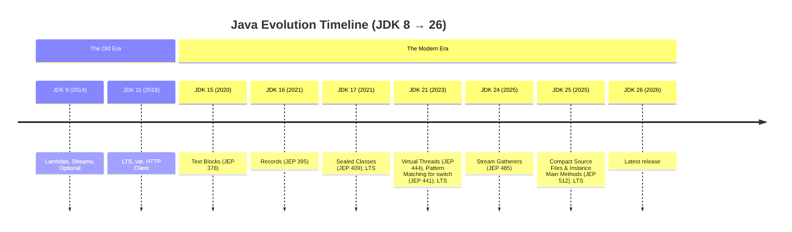
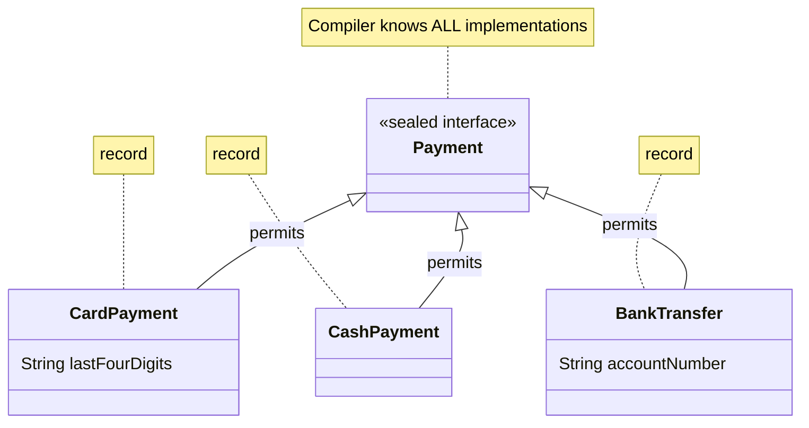
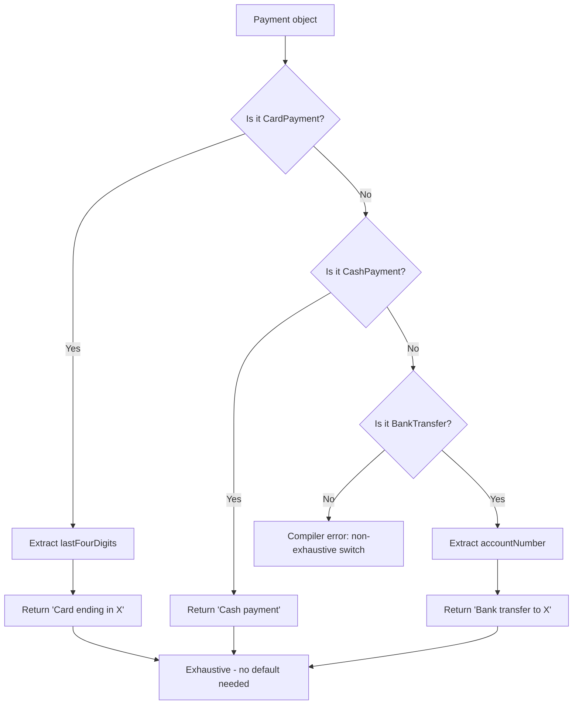
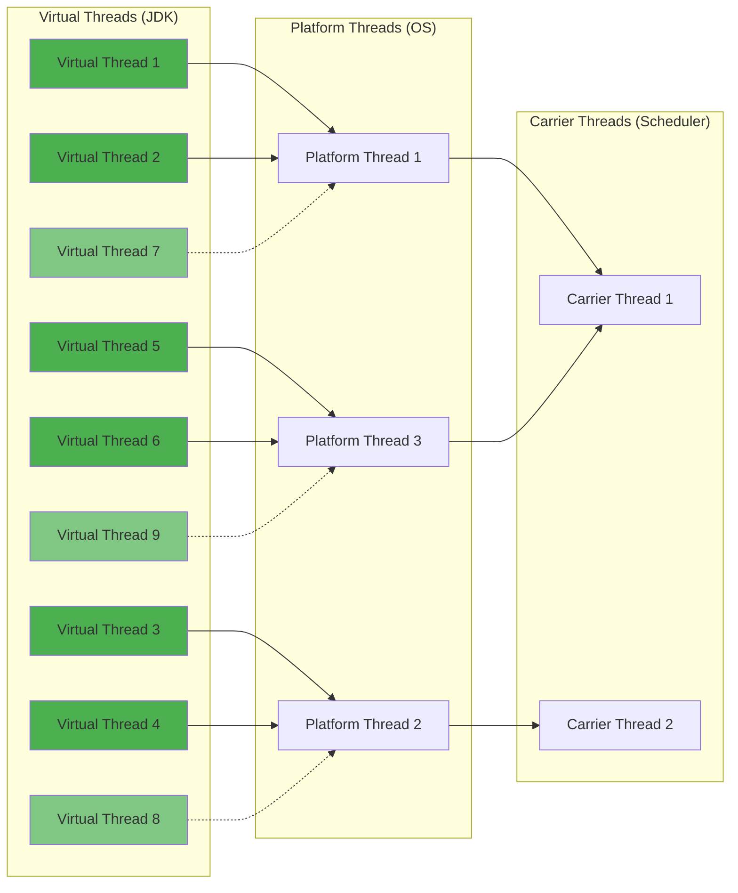
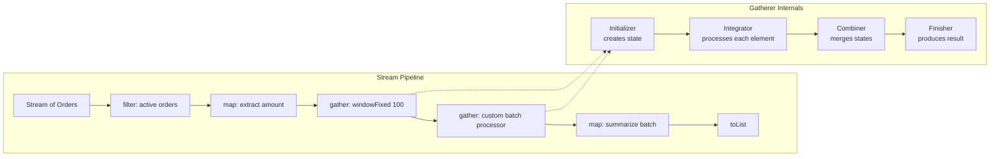

# Modern Java Mastery: 7 Features That Changed Everything (JDK 15–26) — Complete Tutorial

> **Difficulty Level:** 🟡 Intermediate  
> **Estimated Reading Time:** 45–60 minutes  
> **Last Updated:** 2026-08-15  
> **Java Versions Covered:** JDK 15 through JDK 26

---

## Table of Contents

1. [Introduction: The "Old Brain, New JDK" Problem](#1-introduction-the-old-brain-new-jdk-problem)
2. [Prerequisites](#2-prerequisites)
3. [Learning Objectives](#3-learning-objectives)
4. [Feature 1: Records — The 70-Line DTO Killer (JDK 16, JEP 395)](#4-feature-1-records--the-70-line-dto-killer-jdk-16-jep-395)
5. [Feature 2: Sealed Classes — Controlling Inheritance (JDK 17, JEP 409)](#5-feature-2-sealed-classes--controlling-inheritance-jdk-17-jep-409)
6. [Feature 3: Pattern Matching for switch — Types Finally Make Sense (JDK 21, JEP 441)](#6-feature-3-pattern-matching-for-switch--types-finally-make-sense-jdk-21-jep-441)
7. [Feature 4: Virtual Threads — Millions of Threads, Not Hundreds (JDK 21, JEP 444)](#7-feature-4-virtual-threads--millions-of-threads-not-hundreds-jdk-21-jep-444)
8. [Feature 5: Stream Gatherers — Custom Intermediate Operations (JDK 24, JEP 485)](#8-feature-5-stream-gatherers--custom-intermediate-operations-jdk-24-jep-485)
9. [Feature 6: Compact Source Files & Instance Main Methods (JDK 25, JEP 512)](#9-feature-6-compact-source-files--instance-main-methods-jdk-25-jep-512)
10. [Feature 7: Text Blocks — Multiline Strings Without the Madness (JDK 15, JEP 378)](#10-feature-7-text-blocks--multiline-strings-without-the-madness-jdk-15-jep-378)
11. [Side-by-Side Comparison: Old Java vs. Modern Java](#11-side-by-side-comparison-old-java-vs-modern-java)
12. [Real-World Use Cases](#12-real-world-use-cases)
13. [Best Practices](#13-best-practices)
14. [Anti-Patterns](#14-anti-patterns)
15. [Performance Considerations](#15-performance-considerations)
16. [Security Considerations](#16-security-considerations)
17. [Testing Strategies](#17-testing-strategies)
18. [Migration Guide: From Java 8/11 to Java 21/25/26](#18-migration-guide-from-java-811-to-java-212526)
19. [Common Pitfalls & Troubleshooting](#19-common-pitfalls--troubleshooting)
20. [Practice Exercises with Solutions](#20-practice-exercises-with-solutions)
21. [Question Bank (60 Questions)](#21-question-bank-60-questions)
22. [Test Your Understanding (12 Questions)](#22-test-your-understanding-12-questions)
23. [Common Interview Questions (12 Questions)](#23-common-interview-questions-12-questions)
24. [Self-Assessment Checklist](#24-self-assessment-checklist)
25. [Hands-On Lab: Modern Payment Processing System](#25-hands-on-lab-modern-payment-processing-system)
26. [Summary & Key Takeaways](#26-summary--key-takeaways)
27. [Further Reading & Resources](#27-further-reading--resources)

---

## 1. Introduction: The "Old Brain, New JDK" Problem

There's a painfully familiar moment in every Java developer's career.

You open an old project. There's a `User` class with 70 lines of constructors, getters, `equals()`, `hashCode()`, and `toString()`. Then you find an `ExecutorService`, three nested `if` statements checking types, and a JSON string escaped like someone lost a fight with a keyboard.

And somehow, we collectively decided:

> "Yep. That's Java."

**Not anymore.**

As of 2026, Java has reached **JDK 26**, and some of the biggest improvements actually arrived across **Java 15–25**. If your mental model of Java stopped around Java 8 or 11, modern Java is going to look suspiciously like a different language.

Here's the uncomfortable truth: **a developer can upgrade the runtime to Java 21, 25, or 26 and still write code exactly like they did in Java 8.**

New JDK. Old brain.

That's why this tutorial isn't just about *what* changed — it's about *how to think differently* about your Java code. We'll explore seven features that quietly killed a surprising amount of boilerplate, and show you exactly how to put them to work in real projects.



### Why This Matters Now

Java's reputation for being verbose, boilerplate-heavy, and slow-moving was partially deserved. But the language has undergone a quiet revolution. The features covered in this tutorial aren't experimental previews — they're **permanent, production-ready capabilities** that can fundamentally change how you write backend systems, data models, and even simple utilities.

The goal of this tutorial is simple: **help you stop writing 2014 Java on a 2026 JDK.**

---

## 2. Prerequisites

Before diving in, make sure you have:

| Requirement | Details |
|---|---|
| **JDK Version** | JDK 21 or later (JDK 25/26 recommended for full feature coverage) |
| **Build Tool** | Maven 3.9+ or Gradle 8.5+ (with proper toolchain configuration) |
| **IDE** | IntelliJ IDEA 2023.2+, Eclipse 2023-09+, or VS Code with Java extensions |
| **Basic Java Knowledge** | Classes, interfaces, inheritance, generics, streams, lambdas |
| **Familiarity with Java 8/11** | Understanding of pre-modern Java idioms helps appreciate the improvements |

### Verifying Your Java Version

```bash
# Check your current Java version
java -version

# Check your compiler version
javac -version
```

> 💡 **Pro Tip:** If you're on Java 8 or 11, you can still *read* this tutorial and learn the concepts. But to run the code examples, you'll need JDK 21+. Consider using [SDKMAN](https://sdkman.io/) (Linux/macOS) or [Chocolatey](https://chocolatey.org/) (Windows) to manage multiple JDK versions.

### Maven Configuration for Modern Java

```xml
<properties>
    <maven.compiler.release>21</maven.compiler.release>
</properties>
```

### Gradle Configuration for Modern Java

```groovy
java {
    toolchain {
        languageVersion = JavaLanguageVersion.of(21)
    }
}
```

---

## 3. Learning Objectives

By the end of this tutorial, you will be able to:

1. **Replace verbose DTOs** with records and understand when records are *not* the right choice
2. **Design closed inheritance hierarchies** using sealed classes and interfaces
3. **Eliminate instanceof-cast chains** with pattern matching for `switch`
4. **Build high-throughput concurrent applications** with virtual threads
5. **Create custom stream intermediate operations** using Stream Gatherers
6. **Write beginner-friendly Java** with compact source files and instance main methods
7. **Handle multiline strings elegantly** with text blocks
8. **Migrate a legacy Java 8/11 codebase** to modern Java incrementally
9. **Apply best practices** and avoid anti-patterns for each feature
10. **Test and debug** modern Java features effectively

---

## 4. Feature 1: Records — The 70-Line DTO Killer (JDK 16, JEP 395)

### 4.1 The Problem: Boilerplate Overload

Remember this masterpiece?

```java
// ❌ OLD JAVA: The 70-line DTO
public class User {
    private final String name;
    private final String email;

    public User(String name, String email) {
        this.name = name;
        this.email = email;
    }

    public String getName() {
        return name;
    }

    public String getEmail() {
        return email;
    }

    // equals()
    // hashCode()
    // toString()
    // emotional damage()
}
```

Every field requires a constructor parameter, a field assignment, a getter, and participation in `equals()`, `hashCode()`, and `toString()`. Multiply that by every DTO, API response, event, and configuration value in your codebase, and you have thousands of lines of pure ceremony.

### 4.2 The Solution: Records

```java
// ✅ MODERN JAVA: One line
public record User(String name, String email) {}
```

That's it. A record automatically provides:

- **Component accessors** — `user.name()` and `user.email()` (note: no `get` prefix)
- **A canonical constructor** — `new User("Alice", "alice@example.com")`
- **`equals()`** — based on all components
- **`hashCode()`** — based on all components
- **`toString()`** — human-readable representation

### 4.3 Records in Action

```java
// Basic record
record Coordinate(double latitude, double longitude) {}

// Multi-component record
record Product(
    long id,
    String name,
    double price
) {}

// Usage
var coord = new Coordinate(37.7749, -122.4194);
System.out.println(coord.latitude());   // 37.7749
System.out.println(coord);              // Coordinate[latitude=37.7749, longitude=-122.4194]

var product = new Product(1L, "Laptop", 999.99);
var product2 = new Product(1L, "Laptop", 999.99);
System.out.println(product.equals(product2));  // true
```

### 4.4 Compact Constructors: Validation Made Easy

Records support **compact constructors** — a constructor syntax that omits parameters and lets you validate/normalize before implicit field assignment:

```java
record Email(String address) {
    // Compact constructor — no parameter list needed
    Email {
        if (!address.contains("@")) {
            throw new IllegalArgumentException("Invalid email: " + address);
        }
        // Normalize to lowercase
        address = address.toLowerCase();
    }
}

// Usage
var valid = new Email("Alice@Example.com");
System.out.println(valid.address());  // alice@example.com

// Throws IllegalArgumentException
// var invalid = new Email("not-an-email");
```

### 4.5 Custom Methods and Static Members

Records can have additional methods, static fields, and static factory methods:

```java
record Temperature(double celsius) {
    // Static field (records cannot have instance fields beyond components)
    private static final double ABSOLUTE_ZERO = -273.15;

    // Compact constructor with validation
    Temperature {
        if (celsius < ABSOLUTE_ZERO) {
            throw new IllegalArgumentException("Below absolute zero!");
        }
    }

    // Custom instance method
    public double toFahrenheit() {
        return celsius * 9 / 5 + 32;
    }

    // Static factory method
    public static Temperature fromFahrenheit(double fahrenheit) {
        return new Temperature((fahrenheit - 32) * 5 / 9);
    }
}

// Usage
var boiling = new Temperature(100);
System.out.println(boiling.toFahrenheit());          // 212.0
System.out.println(Temperature.fromFahrenheit(32));  // Temperature[celsius=0.0]
```

### 4.6 Records and Interfaces

Records can implement interfaces, making them excellent for sealed hierarchies (which we'll cover next):

```java
interface Shape {
    double area();
}

record Circle(double radius) implements Shape {
    @Override
    public double area() {
        return Math.PI * radius * radius;
    }
}

record Rectangle(double width, double height) implements Shape {
    @Override
    public double area() {
        return width * height;
    }
}
```

### 4.7 Local Records

Records can be declared locally inside methods — perfect for intermediate data:

```java
public List<String> processOrders(List<Order> orders) {
    // Local record for intermediate grouping
    record OrderSummary(String customer, double total) {}

    return orders.stream()
        .map(o -> new OrderSummary(o.customer(), o.amount() * o.quantity()))
        .filter(s -> s.total() > 100)
        .map(OrderSummary::customer)
        .distinct()
        .toList();
}
```

### 4.8 When to Use Records vs. When to Avoid

| ✅ Use Records For | ❌ Don't Use Records For |
|---|---|
| DTOs and API responses | JPA entities (mutable, no-arg constructor needed) |
| Events and messages | Classes with mutable state |
| Coordinates, values, measurements | Classes requiring inheritance (records are implicitly final) |
| Configuration values | Classes with lazy initialization |
| Multi-value return types | Classes with complex invariants across fields |
| Map keys (immutable by design) | Classes needing custom serialization logic |

> ⚠️ **Warning:** Records are **implicitly final** — they cannot be extended. They also cannot have instance fields beyond their components. If you need mutable state or inheritance, records aren't the right tool.

> 💡 **Pro Tip:** Records work beautifully with Jackson for JSON serialization (Jackson 2.12+). Spring Boot 3.x supports records as DTOs out of the box.

---

## 5. Feature 2: Sealed Classes — Controlling Inheritance (JDK 17, JEP 409)

### 5.1 The Problem: All-or-Nothing Inheritance

Old Java basically gave you two common choices:

```java
// ❌ Option 1: Allow anyone to extend
interface Payment {}

// ❌ Option 2: Completely prevent inheritance
final class Payment {}
```

Both extremes are problematic. The first allows *anyone* to create `CrazyRandomPayment implements Payment`, which breaks exhaustiveness checks and makes your architecture's intent unclear. The second prevents legitimate extension entirely.

### 5.2 The Solution: Sealed Classes and Interfaces

Modern Java gives you something in between:

```java
// ✅ MODERN JAVA: Sealed interface with a closed set of implementations
sealed interface Payment
    permits CardPayment, CashPayment {}

record CardPayment(String lastFourDigits)
    implements Payment {}

record CashPayment()
    implements Payment {}
```

Now the compiler knows the **complete family of allowed implementations**. This enables:

1. **Exhaustive pattern matching** (covered in Feature 3)
2. **Clear architectural intent** — the type hierarchy is part of the API contract
3. **Compile-time safety** — no unknown implementations can sneak in

### 5.3 Sealed Class Rules

```java
// Sealed class with three permitted subclasses
sealed class Shape
    permits Circle, Rectangle, Triangle {}

// Permitted subclasses must be: final, sealed, or non-sealed
final class Circle extends Shape {}          // ✅ final — no further extension
sealed class Rectangle extends Shape
    permits Square {}                        // ✅ sealed — continues the hierarchy
non-sealed class Triangle extends Shape {}   // ✅ non-sealed — open for extension
```

**Key rules to remember:**

| Rule | Explanation |
|---|---|
| **Same module/package** | Permitted subclasses must reside in the same module (or same package if unnamed module) |
| **Direct extension only** | Permitted classes must directly extend the sealed class |
| **Final, sealed, or non-sealed** | Each permitted subclass must declare one of these modifiers |
| **Exhaustive permits** | The `permits` clause must list *all* direct subclasses |

### 5.4 Sealed Interfaces with Records

Sealed interfaces + records are a match made in heaven:

```java
sealed interface ApiResult<T>
    permits Success, Failure {}

record Success<T>(T data) implements ApiResult<T> {}

record Failure<T>(String errorCode, String message)
    implements ApiResult<T> {}
```

### 5.5 Why Should You Care?

Because sometimes your business model really does contain a **closed set of possibilities**:

- A payment might be: `Card`, `Cash`, `BankTransfer`
- An API result might be: `Success`, `Failure`, `Pending`
- A UI state might be: `Loading`, `Loaded`, `Error`
- A message type might be: `OrderCreated`, `OrderShipped`, `OrderCancelled`

Why pretend literally anyone should be able to create `CrazyRandomPayment implements Payment`?

Sealed types let your code say **what your architecture actually means**.



### 5.6 Sealed Classes and Reflection

Sealed types expose their permitted subclasses via reflection:

```java
Class<?> paymentClass = Payment.class;
Class<?>[] permitted = paymentClass.getPermittedSubclasses();

for (Class<?> clazz : permitted) {
    System.out.println(clazz.getSimpleName());
}
// Output:
// CardPayment
// CashPayment
```

---

## 6. Feature 3: Pattern Matching for switch — Types Finally Make Sense (JDK 21, JEP 441)

### 6.1 The Problem: instanceof Chains

Old-school Java type handling often looked like this:

```java
// ❌ OLD JAVA: instanceof + cast + nested ifs
String describe(Payment payment) {
    if (payment instanceof CardPayment) {
        CardPayment card = (CardPayment) payment;
        return "Card ending in " + card.lastFourDigits();
    } else if (payment instanceof CashPayment) {
        CashPayment cash = (CashPayment) payment;
        return "Cash payment";
    }
    return "Unknown payment type";
}
```

It works. So does carrying groceries home one item at a time.

### 6.2 The Solution: Pattern Matching for switch

Modern Java can combine **pattern matching**, **records**, and **switch**:

```java
// ✅ MODERN JAVA: Pattern matching for switch
String describe(Payment payment) {
    return switch (payment) {
        case CardPayment(var lastFour) ->
            "Card ending in " + lastFour;
        case CashPayment() ->
            "Cash payment";
    };
}
```

Notice several things:

1. **No casts** — the pattern `CardPayment(var lastFour)` both checks the type *and* destructures the record
2. **No `default` needed** — because `Payment` is sealed, the compiler knows you've handled every case
3. **Arrow syntax** — no fall-through, no `break` statements
4. **Expression switch** — the `switch` returns a value directly

### 6.3 The Compiler as Design Assistant

The most interesting part? **There's no `default`.**

Because `Payment` is sealed, Java can understand whether you handled every permitted case. If you add a new payment type later:

```java
sealed interface Payment
    permits CardPayment, CashPayment, BankTransfer {}  // New type added

record BankTransfer(String accountNumber) implements Payment {}
```

The compiler will **fail to compile** your `describe()` method until you handle `BankTransfer`:

```java
// ❌ COMPILE ERROR: switch expression does not cover all possible input values
String describe(Payment payment) {
    return switch (payment) {
        case CardPayment(var lastFour) -> "Card ending in " + lastFour;
        case CashPayment() -> "Cash payment";
        // Missing: case BankTransfer(...) -> ...
    };
}
```

The compiler becomes a **design assistant** instead of merely the person yelling at you because you forgot a semicolon.

### 6.4 Guarded Patterns

Sometimes you need additional conditions on a pattern:

```java
String describeAmount(Payment payment) {
    return switch (payment) {
        case CardPayment(var lastFour) when lastFour.startsWith("4") ->
            "Visa card ending in " + lastFour;
        case CardPayment(var lastFour) ->
            "Card ending in " + lastFour;
        case CashPayment() ->
            "Cash payment";
    };
}
```

The `when` clause acts as a **guard** — the pattern only matches if the guard evaluates to `true`.

### 6.5 Null Handling

Pattern matching `switch` handles `null` gracefully:

```java
String describe(Payment payment) {
    return switch (payment) {
        case null -> "No payment provided";
        case CardPayment(var lastFour) -> "Card ending in " + lastFour;
        case CashPayment() -> "Cash payment";
    };
}
```

### 6.6 Type Patterns with Primitive Types (JDK 21+)

```java
String describeNumber(Object obj) {
    return switch (obj) {
        case Integer i -> "Integer: " + i;
        case Long l -> "Long: " + l;
        case Double d -> "Double: " + d;
        case String s -> "String: " + s;
        default -> "Unknown: " + obj.getClass().getSimpleName();
    };
}
```

### 6.7 Pattern Matching Flow



---

## 7. Feature 4: Virtual Threads — Millions of Threads, Not Hundreds (JDK 21, JEP 444)

### 7.1 The Problem: Expensive Platform Threads

Traditional Java threads are relatively expensive because they normally correspond closely to **operating-system threads**. Each platform thread consumes:

- ~1 MB of stack memory (default)
- OS kernel resources
- Significant context-switching overhead

This is why developers built elaborate asynchronous systems:

- Callbacks
- Reactive pipelines
- `CompletableFuture` chains that start elegantly and eventually look like ancient runes

```java
// ❌ OLD JAVA: Complex async code for simple I/O
CompletableFuture.supplyAsync(() -> callRemoteApi())
    .thenApply(result -> transform(result))
    .thenAccept(result -> save(result))
    .exceptionally(ex -> {
        log.error("Failed", ex);
        return null;
    });
```

### 7.2 The Solution: Virtual Threads

Virtual threads are **lightweight threads managed by the JDK**, not the OS. They're specifically intended to make high-throughput concurrent applications easier to write and maintain.

```java
// ✅ MODERN JAVA: Simple blocking code on a virtual thread
Thread.startVirtualThread(() -> {
    var result = callRemoteApi();  // Blocking call — but it's cheap!
    save(result);
});
```

Or with an executor:

```java
// ✅ MODERN JAVA: Virtual thread executor
try (var executor = Executors.newVirtualThreadPerTaskExecutor()) {
    executor.submit(() -> callServiceA());
    executor.submit(() -> callServiceB());
    executor.submit(() -> callServiceC());
}  // Auto-closes and waits for all tasks
```

### 7.3 How Virtual Threads Work



**Key insight:** When a virtual thread blocks on I/O (e.g., a database call), the JDK **unmounts** it from the carrier thread and mounts another virtual thread. This means:

- You can create **millions** of virtual threads
- Blocking code becomes cheap
- The OS only sees a handful of platform threads

### 7.4 The Killer Use Case: I/O-Bound Workloads

> ⚠️ **Critical Warning:** Virtual threads do **not** make CPU-heavy calculations magically faster.

```java
// ❌ WRONG: Virtual threads won't help CPU-bound work
try (var executor = Executors.newVirtualThreadPerTaskExecutor()) {
    for (int i = 0; i < 50_000; i++) {
        executor.submit(() -> calculatePiForTheNextSixYears());
    }
}
// Your processor will NOT grow extra cores out of sympathy
```

Virtual threads shine for workloads that spend lots of time **waiting**:

- Database calls
- HTTP requests
- File operations
- Remote services
- Message queue consumption

In other words: **backend applications**.

For many I/O-heavy systems, boring blocking code suddenly becomes attractive again. And "boring" is a compliment.

### 7.5 Real-World Example: High-Throughput API Client

```java
// ✅ MODERN JAVA: Fetch 10,000 URLs concurrently with simple blocking code
public List<String> fetchAllUrls(List<String> urls) {
    try (var executor = Executors.newVirtualThreadPerTaskExecutor()) {
        List<Future<String>> futures = urls.stream()
            .map(url -> executor.submit(() -> fetchUrl(url)))
            .toList();

        return futures.stream()
            .map(future -> {
                try {
                    return future.get();
                } catch (Exception e) {
                    return "ERROR: " + e.getMessage();
                }
            })
            .toList();
    }
}

private String fetchUrl(String url) {
    // Plain blocking HTTP call — no reactive magic needed
    try (var client = HttpClient.newHttpClient()) {
        var request = HttpRequest.newBuilder()
            .uri(URI.create(url))
            .GET()
            .build();
        return client.send(request, HttpResponse.BodyHandlers.ofString())
            .body();
    } catch (Exception e) {
        throw new RuntimeException(e);
    }
}
```

### 7.6 Virtual Threads vs. Platform Threads vs. CompletableFuture

| Aspect | Platform Threads | Virtual Threads | CompletableFuture |
|---|---|---|---|
| **Max practical count** | Hundreds to low thousands | Millions | N/A (no threads) |
| **Memory per thread** | ~1 MB stack | ~few KB | N/A |
| **Code style** | Blocking | Blocking | Chained callbacks |
| **Debugging** | Easy (stack traces) | Easy (stack traces) | Hard (async stack traces) |
| **Learning curve** | Low | Low | High |
| **Best for** | Small concurrency | I/O-bound at scale | Simple async chains |
| **CPU-bound work** | ✅ Good | ❌ Poor | ❌ Poor |

### 7.7 Structured Concurrency (Preview in JDK 21, Finalized in JDK 23)

For even better concurrency management, Java 21 introduced **structured concurrency** as a preview (finalized in JDK 23 via JEP 453):

```java
// ✅ MODERN JAVA: Structured concurrency
try (var scope = new StructuredTaskScope.ShutdownOnFailure()) {
    Future<String> user = scope.fork(() -> fetchUser());
    Future<String> orders = scope.fork(() -> fetchOrders());

    scope.join();           // Wait for all tasks
    scope.throwIfFailed();  // Propagate failures

    return new UserDashboard(user.resultNow(), orders.resultNow());
}
```

---

## 8. Feature 5: Stream Gatherers — Custom Intermediate Operations (JDK 24, JEP 485)

### 8.1 The Problem: Streams Hit a Wall

Streams were great until you needed something streams weren't designed to do.

Suppose you have `Stream<Order>` and you want **batches of 100 orders**. Suddenly your elegant stream pipeline becomes a side quest involving custom collectors, mutable state, external libraries, or an embarrassed `for` loop:

```java
// ❌ OLD JAVA: Batching with a custom collector (painful)
Collector<Order, ?, List<List<Order>>> batchCollector =
    Collector.of(
        ArrayList::new,
        (batch, order) -> {
            if (batch.isEmpty() || batch.get(batch.size() - 1).size() == 100) {
                batch.add(new ArrayList<>());
            }
            batch.get(batch.size() - 1).add(order);
        },
        (left, right) -> {
            // Merging batches is a nightmare
            throw new UnsupportedOperationException("Parallel not supported");
        }
    );

var batches = orders.stream()
    .collect(batchCollector);
```

### 8.2 The Solution: Stream Gatherers

Java 24 introduced **Stream Gatherers** as a permanent API feature through JEP 485.

Now operations such as fixed-size windows fit naturally into pipelines:

```java
// ✅ MODERN JAVA: Fixed-size windows
var batches = orders.stream()
    .gather(Gatherers.windowFixed(100))
    .toList();
```

### 8.3 Built-in Gatherers

| Gatherer | Description | Example |
|---|---|---|
| `Gatherers.windowFixed(n)` | Groups elements into fixed-size windows | `stream.gather(Gatherers.windowFixed(100))` |
| `Gatherers.windowSliding(n)` | Creates sliding windows | `stream.gather(Gatherers.windowSliding(3))` |
| `Gatherers.fold(...)` | Stateful fold operation | `stream.gather(Gatherers.fold(() -> 0, Integer::sum))` |
| `Gatherers.scan(...)` | Cumulative transformation | `stream.gather(Gatherers.scan(() -> 0, (acc, x) -> acc + x))` |
| `Gatherers.mapConcurrent(...)` | Concurrent mapping with limited parallelism | `stream.gather(Gatherers.mapConcurrent(4, fn))` |

### 8.4 Examples of Built-in Gatherers

```java
// Sliding windows — useful for time-series analysis
var sliding = List.of(1, 2, 3, 4, 5).stream()
    .gather(Gatherers.windowSliding(3))
    .toList();
// Result: [[1, 2, 3], [2, 3, 4], [3, 4, 5]]

// Scan — cumulative sums
var cumulative = List.of(1, 2, 3, 4).stream()
    .gather(Gatherers.scan(() -> 0, Integer::sum))
    .toList();
// Result: [1, 3, 6, 10]

// Map concurrent — limited parallelism
var results = urls.stream()
    .gather(Gatherers.mapConcurrent(8, this::fetchUrl))
    .toList();
```

### 8.5 Custom Gatherers

The real power comes from creating your own gatherers. A `Gatherer` has four key components:

1. **Initializer** — creates the mutable state
2. **Integrator** — processes each element
3. **Combiner** — merges states (for parallel streams)
4. **Finisher** — produces the final result

```java
// ✅ MODERN JAVA: Custom gatherer — deduplicate consecutive elements
public static <T> Gatherer<T, ?, T> distinctConsecutive() {
    class State {
        T lastValue;
        boolean hasValue;
    }

    return Gatherer.of(
        // Initializer
        State::new,

        // Integrator
        (state, element, downstream) -> {
            if (!state.hasValue || !state.lastValue.equals(element)) {
                state.lastValue = element;
                state.hasValue = true;
                return downstream.push(element);
            }
            return true;  // Skip duplicate
        },

        // Combiner (for parallel streams)
        (state1, state2) -> state1,

        // Finisher
        (state, downstream) -> true
    );
}

// Usage
var result = List.of("a", "a", "b", "b", "b", "c", "a").stream()
    .gather(distinctConsecutive())
    .toList();
// Result: [a, b, c, a]
```

### 8.6 A More Practical Custom Gatherer: Running Average

```java
// ✅ MODERN JAVA: Custom gatherer — running average
public static Gatherer<Double, ?, Double> runningAverage() {
    class State {
        double sum;
        long count;
    }

    return Gatherer.of(
        State::new,
        (state, element, downstream) -> {
            state.sum += element;
            state.count++;
            return downstream.push(state.sum / state.count);
        },
        (s1, s2) -> {
            // Merge states for parallel processing
            State merged = new State();
            merged.sum = s1.sum + s2.sum;
            merged.count = s1.count + s2.count;
            return merged;
        },
        (state, downstream) -> true
    );
}

// Usage
var averages = List.of(10.0, 20.0, 30.0, 40.0).stream()
    .gather(runningAverage())
    .toList();
// Result: [10.0, 15.0, 20.0, 25.0]
```

### 8.7 Gatherer Pipeline Flow



### 8.8 Why This Matters

Gatherers allow developers to create **custom intermediate stream operations** instead of being restricted to the operations baked into `Stream`.

Think:

```
filter → transform → batch → inspect → map → collect
```

...without abandoning the pipeline halfway through.

If you've ever said *"Streams are nice, except when I need..."* — Gatherers are worth learning.

---

## 9. Feature 6: Compact Source Files & Instance Main Methods (JDK 25, JEP 512)

### 9.1 The Problem: The Hello World Barrier

For decades, Java introduced itself like this:

```java
// ❌ OLD JAVA: The Hello World gauntlet
public class HelloWorld {
    public static void main(String[] args) {
        System.out.println("Hello World");
    }
}
```

A beginner wants to print one sentence. Java responds with:

> "Excellent. First, let's discuss classes, visibility, static methods, arrays, command-line arguments, and existential suffering."

### 9.2 The Solution: Compact Source Files and Instance Main Methods

Modern Java can be much smaller:

```java
// ✅ MODERN JAVA: That's it
void main() {
    System.out.println("Hello World");
}
```

No explicit class declaration. No `public static`. No mysterious `String[] args` you aren't using.

After several preview iterations, this feature was **finalized in JDK 25 through JEP 512**.

### 9.3 How It Works

The compiler automatically:

1. Wraps your code in an implicit class
2. Treats `main()` as an instance method (no `static` needed)
3. Provides an implicit `String[] args` parameter if you don't declare one

```java
// ✅ MODERN JAVA: With arguments
void main(String[] args) {
    System.out.println("Hello, " + args[0]);
}
```

### 9.4 What This Enables

| Use Case | Why It Helps |
|---|---|
| **Learning** | Beginners can focus on logic, not ceremony |
| **Tiny utilities** | Quick scripts without full project structure |
| **Demonstrations** | Concise code samples in docs and talks |
| **Coding exercises** | Students write less boilerplate |
| **Quick experiments** | Prototype an idea in seconds |

```java
// ✅ MODERN JAVA: A useful utility in 5 lines
void main() {
    var lines = new java.io.File("data.txt").toPath();
    try (var reader = java.nio.file.Files.newBufferedReader(lines)) {
        reader.lines()
            .filter(line -> line.contains("ERROR"))
            .forEach(System.out::println);
    } catch (java.io.IOException e) {
        System.err.println("Failed: " + e.getMessage());
    }
}
```

### 9.5 "But Serious Applications Still Use Classes!"

Of course. That's not the point.

This makes Java better for **learning, tiny utilities, demonstrations, coding exercises, and quick experiments**. Java doesn't need to force enterprise architecture onto someone trying to print "Hello".

It took a few decades, but we got there.

> 💡 **Pro Tip:** You can still use `public static void main(String[] args)` in traditional classes — this feature is additive, not a replacement. The JVM detects the instance `main()` method as an alternative entry point.

---

## 10. Feature 7: Text Blocks — Multiline Strings Without the Madness (JDK 15, JEP 378)

### 10.1 The Problem: Escaped Multiline Strings

Anyone who maintained old Java has seen this:

```java
// ❌ OLD JAVA: Escaped JSON
String json =
    "{\n" +
    "  \"name\": \"John\",\n" +
    "  \"role\": \"admin\"\n" +
    "}";

// ❌ OLD JAVA: Escaped SQL
String sql =
    "SELECT id, name, email\n" +
    "FROM users\n" +
    "WHERE active = true\n" +
    "ORDER BY name";
```

Beautiful. Michelangelo would be jealous.

### 10.2 The Solution: Text Blocks

```java
// ✅ MODERN JAVA: Readable JSON
String json = """
    {
      "name": "John",
      "role": "admin"
    }
    """;

// ✅ MODERN JAVA: Readable SQL
String sql = """
    SELECT id, name, email
    FROM users
    WHERE active = true
    ORDER BY name
    """;
```

Text blocks became permanent way back in **JDK 15 through JEP 378**.

### 10.3 Text Block Syntax Rules

```java
// Opening delimiter: three double quotes followed by a line terminator
String example = """
    Line 1
    Line 2
    """;
```

**Key rules:**

1. **Opening delimiter** must be followed by a newline
2. **Closing delimiter** determines incidental indentation
3. **Incidental indentation** is stripped based on the closing delimiter's position
4. **Content can contain** quotes, newlines, and most characters without escaping

### 10.4 Controlling Indentation

```java
// The closing delimiter position determines stripped indentation
String json = """
        {
            "name": "John"
        }
    """;
// Result: "{\n    \"name\": \"John\"\n}\n"
// (4 spaces of incidental indentation stripped)
```

Use `stripIndent()` or `indent()` for programmatic control:

```java
String raw = """
        SELECT *
        FROM users
        """.stripIndent();  // Removes common leading whitespace

String indented = raw.indent(4);  // Adds 4 spaces to each line
```

### 10.5 Escaping in Text Blocks

Text blocks still support escapes when needed:

```java
// Escape sequences still work
String withTab = """
    Column1\tColumn2
    Value1\tValue2
    """;

// Use \s to prevent trailing whitespace stripping
String withTrailing = """
    Line with trailing space\s
    """;

// Use \ to continue a line (no newline)
String singleLine = """
    This is a very long line that \
    continues on the next source line
    """;
// Result: "This is a very long line that continues on the next source line"
```

### 10.6 Real-World Applications

**HTML templates:**

```java
String html = """
    <!DOCTYPE html>
    <html>
      <head>
        <title>%s</title>
      </head>
      <body>
        <h1>%s</h1>
      </body>
    </html>
    """.formatted(title, heading);
```

**GraphQL queries:**

```java
String query = """
    query GetUser($id: ID!) {
      user(id: $id) {
        name
        email
        orders {
          id
          total
        }
      }
    }
    """;
```

**Shell scripts:**

```java
String script = """
    #!/bin/bash
    echo "Deploying application..."
    ./gradlew build
    docker compose up -d
    """;
```

**Regex patterns:**

```java
String emailRegex = """
    ^[a-zA-Z0-9._%+-]+
    @[a-zA-Z0-9.-]+
    \\.[a-zA-Z]{2,}$
    """;
```

> ⚠️ **Warning:** Text blocks are not a security feature. If you're building SQL or HTML with user input, you still need proper parameterization/escaping. Text blocks just make the *static* parts readable.

---

## 11. Side-by-Side Comparison: Old Java vs. Modern Java

### 11.1 DTO Definition

| Aspect | Old Java (8/11) | Modern Java (21+) |
|---|---|---|
| **Lines of code** | 60–80 | 1 |
| **Constructor** | Manual | Auto-generated |
| **Getters** | Manual (`getName()`) | Auto-generated (`name()`) |
| **equals/hashCode** | Manual or Lombok | Auto-generated |
| **toString** | Manual or Lombok | Auto-generated |
| **Immutability** | Requires `final` fields | Guaranteed |

### 11.2 Type Dispatch

| Aspect | Old Java (8/11) | Modern Java (21+) |
|---|---|---|
| **Type checking** | `instanceof` + cast | Pattern matching |
| **Exhaustiveness** | Manual (easy to forget) | Compiler-enforced with sealed types |
| **Null handling** | Manual checks | `case null` |
| **Record destructuring** | Manual getter calls | `CardPayment(var lastFour)` |

### 11.3 Concurrency

| Aspect | Old Java (8/11) | Modern Java (21+) |
|---|---|---|
| **Thread model** | Platform threads (~1 MB each) | Virtual threads (~few KB each) |
| **Max threads** | Hundreds to low thousands | Millions |
| **Code style** | Callbacks/reactive/CompletableFuture | Simple blocking code |
| **Executor** | `Executors.newFixedThreadPool(n)` | `Executors.newVirtualThreadPerTaskExecutor()` |

### 11.4 Stream Processing

| Aspect | Old Java (8/11) | Modern Java (24+) |
|---|---|---|
| **Intermediate ops** | Fixed set (map, filter, etc.) | Extensible via Gatherers |
| **Batching** | Custom collectors (painful) | `Gatherers.windowFixed(n)` |
| **Sliding windows** | Not built-in | `Gatherers.windowSliding(n)` |
| **Concurrent map** | `parallelStream()` (coarse) | `Gatherers.mapConcurrent(n, fn)` |

### 11.5 Program Entry Point

| Aspect | Old Java (8/11) | Modern Java (25+) |
|---|---|---|
| **Class declaration** | Required | Optional |
| **Method signature** | `public static void main(String[] args)` | `void main()` |
| **Boilerplate** | 5+ lines | 1 line |
| **Beginner-friendly** | No | Yes |

### 11.6 Multiline Strings

| Aspect | Old Java (8/11) | Modern Java (15+) |
|---|---|---|
| **JSON** | `"{\n" + "  \"name\": ..."` | `""" { "name": ... } """` |
| **SQL** | Concatenated strings | Text blocks |
| **HTML** | Escaped mess | Readable markup |
| **Indentation** | Manual | Automatic stripping |

---

## 12. Real-World Use Cases

### 12.1 E-Commerce: Payment Processing

```java
// Sealed hierarchy for payment methods
sealed interface Payment permits CardPayment, CashPayment, BankTransfer {}

record CardPayment(String lastFourDigits, String cardType) implements Payment {}
record CashPayment(String currency) implements Payment {}
record BankTransfer(String accountNumber, String bankCode) implements Payment {}

// Pattern matching for processing
public PaymentResult process(Payment payment) {
    return switch (payment) {
        case CardPayment(var lastFour, var type) ->
            processCard(type, lastFour);
        case CashPayment(var currency) ->
            processCash(currency);
        case BankTransfer(var account, var bank) ->
            processTransfer(account, bank);
    };
}
```

### 12.2 Microservices: API Response Wrapper

```java
sealed interface ApiResponse<T> permits Success, Error, Pending {}

record Success<T>(T data, long timestamp) implements ApiResponse<T> {}
record Error<T>(int statusCode, String message) implements ApiResponse<T> {}
record Pending<T>(String requestId) implements ApiResponse<T> {}

// Generic handling in a REST controller
public ResponseEntity<?> handle(ApiResponse<?> response) {
    return switch (response) {
        case Success<?>(var data, var ts) ->
            ResponseEntity.ok(data);
        case Error<?>(var code, var msg) ->
            ResponseEntity.status(code).body(msg);
        case Pending<?>(var requestId) ->
            ResponseEntity.accepted().header("Location", "/status/" + requestId).build();
    };
}
```

### 12.3 High-Throughput Notification Service

```java
// Virtual threads for sending millions of notifications
public class NotificationService {
    private final EmailClient emailClient;
    private final SmsClient smsClient;

    public void sendBulkNotifications(List<Notification> notifications) {
        try (var executor = Executors.newVirtualThreadPerTaskExecutor()) {
            notifications.forEach(notification ->
                executor.submit(() -> sendOne(notification))
            );
        }  // Waits for all notifications to complete
    }

    private void sendOne(Notification notification) {
        // Simple blocking code — virtual threads make this cheap
        switch (notification.channel()) {
            case EMAIL -> emailClient.send(notification.recipient(), notification.body());
            case SMS -> smsClient.send(notification.recipient(), notification.body());
        }
    }
}
```

### 12.4 Data Pipeline: Batch Processing with Gatherers

```java
// Process orders in batches of 1000 with concurrent enrichment
public List<BatchSummary> processOrders(List<Order> orders) {
    return orders.stream()
        .filter(Order::isActive)
        .gather(Gatherers.windowFixed(1000))
        .gather(Gatherers.mapConcurrent(4, this::processBatch))
        .toList();
}

private BatchSummary processBatch(List<Order> batch) {
    double total = batch.stream()
        .mapToDouble(Order::amount)
        .sum();
    return new BatchSummary(batch.size(), total);
}
```

### 12.5 Configuration Management

```java
// Records for typed configuration
public record DatabaseConfig(
    String url,
    String username,
    String password,
    int maxPoolSize,
    Duration connectionTimeout
) {
    public DatabaseConfig {
        if (maxPoolSize < 1) {
            throw new IllegalArgumentException("maxPoolSize must be >= 1");
        }
        if (connectionTimeout.isNegative()) {
            throw new IllegalArgumentException("connectionTimeout cannot be negative");
        }
    }

    public static DatabaseConfig fromProperties(Properties props) {
        return new DatabaseConfig(
            props.getProperty("db.url"),
            props.getProperty("db.username"),
            props.getProperty("db.password"),
            Integer.parseInt(props.getProperty("db.maxPoolSize", "10")),
            Duration.ofSeconds(Long.parseLong(props.getProperty("db.timeout", "30")))
        );
    }
}
```

### 12.6 Log Analysis Utility

```java
// Compact source file for a quick utility
void main(String[] args) {
    var logFile = Path.of(args[0]);
    try (var lines = Files.lines(logFile)) {
        var errorCount = lines
            .filter(line -> line.contains("ERROR"))
            .count();
        System.out.println("Total errors: " + errorCount);
    } catch (IOException e) {
        System.err.println("Failed to read log: " + e.getMessage());
    }
}
```

---

## 13. Best Practices

### 13.1 Records

✅ **DO:**
- Use records for DTOs, API responses, events, coordinates, and configuration values
- Use compact constructors for validation and normalization
- Use static factory methods for complex construction logic
- Use local records for intermediate data in methods
- Implement interfaces when records need polymorphic behavior

❌ **DON'T:**
- Use records for JPA entities (they need mutable state and no-arg constructors)
- Add instance fields to records (not allowed — use components)
- Use records for classes with complex invariants across fields
- Extend records (they're implicitly final)

### 13.2 Sealed Classes

✅ **DO:**
- Use sealed types when your domain has a closed set of possibilities
- Combine sealed interfaces with records for value-based hierarchies
- Use `non-sealed` sparingly — it defeats the purpose
- Leverage compiler exhaustiveness checks in `switch`

❌ **DON'T:**
- Seal types that genuinely need open extension (e.g., plugin architectures)
- Create deep sealed hierarchies (keep them shallow)
- Forget that permitted subclasses must be in the same module/package

### 13.3 Pattern Matching for switch

✅ **DO:**
- Use pattern matching with sealed types for exhaustive dispatch
- Use `when` guards for conditional patterns
- Handle `null` explicitly with `case null`
- Use record patterns to destructure in the same statement

❌ **DON'T:**
- Use `default` when sealed types make it unnecessary (you lose compile-time exhaustiveness)
- Use pattern matching for simple boolean checks (use `if`)
- Nest pattern matching switches (extract methods instead)

### 13.4 Virtual Threads

✅ **DO:**
- Use virtual threads for I/O-bound workloads (HTTP, DB, file, messaging)
- Use `Executors.newVirtualThreadPerTaskExecutor()` for task-per-thread patterns
- Use `try-with-resources` on the executor to wait for completion
- Use structured concurrency for related tasks with error propagation

❌ **DON'T:**
- Use virtual threads for CPU-bound computations
- Use `synchronized` blocks inside virtual threads (pinning — see Troubleshooting)
- Pool virtual threads (they're cheap — create per task)
- Use thread-local variables heavily (they can be expensive with millions of threads)

### 13.5 Stream Gatherers

✅ **DO:**
- Use built-in gatherers (`windowFixed`, `windowSliding`, `scan`, `fold`) first
- Create custom gatherers for reusable stream operations
- Implement the combiner for parallel stream support
- Keep gatherer state minimal and immutable where possible

❌ **DON'T:**
- Use gatherers for simple operations that `map`/`filter` already handle
- Create gatherers with thread-unsafe state for parallel streams
- Forget to handle the `downstream.push()` return value

### 13.6 Text Blocks

✅ **DO:**
- Use text blocks for SQL, JSON, HTML, XML, and other structured formats
- Use `formatted()` for template substitution
- Use `stripIndent()` and `indent()` for programmatic control
- Use `\s` for intentional trailing whitespace

❌ **DON'T:**
- Use text blocks for single-line strings (regular strings are fine)
- Embed user input directly into SQL/HTML built with text blocks
- Rely on text blocks for security (they're just string literals)

---

## 14. Anti-Patterns

### 14.1 The "Everything is a Record" Anti-Pattern

```java
// ❌ ANTI-PATTERN: Using records for everything
record UserAccount(
    String username,
    String password,
    String email,
    boolean active,
    LocalDateTime lastLogin,
    List<String> roles
) {
    // Trying to add mutable state — NOT ALLOWED
    // private int loginCount;  // Compile error!
}
```

**Why it's wrong:** Records are immutable value carriers. Domain objects with lifecycle, mutable state, or complex behavior need regular classes.

**Better approach:**

```java
// ✅ Better: Regular class for mutable domain objects
public class UserAccount {
    private final String username;
    private String email;
    private boolean active;
    private LocalDateTime lastLogin;
    private int loginCount;

    // Regular class with mutable state and behavior
    public void recordLogin() {
        this.lastLogin = LocalDateTime.now();
        this.loginCount++;
    }
}
```

### 14.2 The "Sealed Everything" Anti-Pattern

```java
// ❌ ANTI-PATTERN: Sealing types that need open extension
sealed interface Plugin permits MyPlugin {}
// Now nobody else can write plugins for your system!
```

**Why it's wrong:** Sealed types are for *closed* domains. Plugin architectures, extension points, and frameworks need open hierarchies.

### 14.3 The "Virtual Threads for CPU" Anti-Pattern

```java
// ❌ ANTI-PATTERN: Virtual threads for CPU-bound work
try (var executor = Executors.newVirtualThreadPerTaskExecutor()) {
    for (int i = 0; i < 100_000; i++) {
        executor.submit(() -> heavyComputation());  // Won't help!
    }
}
```

**Why it's wrong:** Virtual threads don't add CPU cores. CPU-bound work should use `parallelStream()` or a fixed thread pool sized to available processors.

### 14.4 The "Synchronized in Virtual Threads" Anti-Pattern

```java
// ❌ ANTI-PATTERN: synchronized blocks can pin virtual threads
public synchronized void process(Order order) {
    // Blocking I/O inside synchronized block
    var result = callRemoteApi();  // PINNING!
    save(result);
}
```

**Why it's wrong:** When a virtual thread enters a `synchronized` block and then blocks on I/O, it can **pin** the carrier thread, defeating the purpose of virtual threads.

**Better approach:**

```java
// ✅ Better: Use ReentrantLock instead
private final ReentrantLock lock = new ReentrantLock();

public void process(Order order) {
    lock.lock();
    try {
        var result = callRemoteApi();
        save(result);
    } finally {
        lock.unlock();
    }
}
```

### 14.5 The "Gatherer for Everything" Anti-Pattern

```java
// ❌ ANTI-PATTERN: Custom gatherer for what map already does
Gatherer<Integer, ?, Integer> doubleIt = Gatherer.of(
    () -> null,
    (state, element, downstream) -> downstream.push(element * 2),
    (s1, s2) -> null
);

var result = numbers.stream().gather(doubleIt).toList();
// Just use: numbers.stream().map(n -> n * 2).toList()
```

**Why it's wrong:** Gatherers add complexity. Use them for operations that *can't* be expressed with existing stream operations.

### 14.6 The "Text Block Injection" Anti-Pattern

```java
// ❌ ANTI-PATTERN: Building SQL with user input in text blocks
String sql = """
    SELECT * FROM users
    WHERE username = '%s'
    """.formatted(userInput);  // SQL INJECTION VULNERABILITY!
```

**Why it's wrong:** Text blocks don't sanitize input. Always use `PreparedStatement` for SQL and proper escaping for HTML/JSON.

---

## 15. Performance Considerations

### 15.1 Records Performance

| Aspect | Impact |
|---|---|
| **Memory** | Records are compact — no extra fields beyond components |
| **equals/hashCode** | Auto-generated implementations are efficient (no reflection) |
| **Serialization** | Records serialize efficiently (Jackson 2.12+) |
| **Comparison** | Records are ideal for map keys due to value-based equality |

**Benchmark note:** Records typically perform on par with hand-written classes. The auto-generated `equals()`/`hashCode()` use `Object.equals()` per component, which is as fast as manual implementations.

### 15.2 Virtual Threads Performance

| Metric | Platform Threads | Virtual Threads |
|---|---|---|
| **Creation cost** | ~10,000–100,000 ns | ~1,000–10,000 ns |
| **Memory per thread** | ~1 MB stack | ~few KB |
| **Context switch** | OS-level (~µs) | JDK-level (~ns) |
| **Max threads (64 GB heap)** | ~10,000–50,000 | Millions |

**Real-world benchmark (simplified):**

```java
// Fetch 10,000 URLs
// Platform threads (100-thread pool): ~30 seconds
// Virtual threads (per-task): ~5 seconds
// (Numbers vary by environment — the point is order-of-magnitude improvement)
```

### 15.3 Stream Gatherers Performance

- **`windowFixed(n)`** — O(n) time, O(n) memory for the window
- **`windowSliding(n)`** — O(n) time, O(n) memory
- **`scan()`** — O(n) time, O(1) memory (stateful)
- **Custom gatherers** — performance depends on your integrator implementation

> 💡 **Pro Tip:** For very large streams, prefer gatherers with O(1) state (like `scan`) over those that accumulate (like `windowFixed` with huge windows).

### 15.4 Text Blocks Performance

Text blocks are **compile-time constants** — they have zero runtime overhead compared to concatenated strings. In fact, they're often *faster* because:

- No runtime string concatenation
- No intermediate `StringBuilder` objects
- Single constant pool entry

### 15.5 Pattern Matching Performance

Pattern matching for `switch` compiles to efficient bytecode — typically a `tableswitch` or `lookupswitch` for type dispatch, similar to or better than manual `instanceof` chains.

---

## 16. Security Considerations

### 16.1 Sealed Classes as Security Boundaries

Sealed types can enforce security-critical type hierarchies:

```java
// Only trusted implementations can exist
sealed interface Permission permits AdminPermission, UserPermission {}

// The compiler guarantees no rogue implementations
record AdminPermission(String role) implements Permission {}
record UserPermission(String scope) implements Permission {}
```

**Security benefit:** If your security model relies on a closed set of permission types, sealed classes prevent unauthorized extension.

### 16.2 Records and Immutability

Records are immutable by design, which provides security benefits:

- **No mutable state** — less risk of data corruption
- **Value-based equality** — safe for use as map keys
- **Thread-safe** — no synchronization needed for reads

### 16.3 Text Blocks and Injection Attacks

> ⚠️ **Critical:** Text blocks are **not** a security mechanism.

```java
// ❌ DANGEROUS: SQL injection via text block
String sql = """
    SELECT * FROM users WHERE username = '%s'
    """.formatted(userInput);

// ✅ SAFE: Use PreparedStatement
String sql = """
    SELECT * FROM users WHERE username = ?
    """;
try (var stmt = connection.prepareStatement(sql)) {
    stmt.setString(1, userInput);
    // ...
}
```

### 16.4 Virtual Threads and Resource Exhaustion

While virtual threads are cheap, **unbounded creation can still exhaust resources**:

```java
// ❌ DANGEROUS: Unbounded virtual thread creation
try (var executor = Executors.newVirtualThreadPerTaskExecutor()) {
    while (true) {
        executor.submit(() -> callExternalService());
        // No backpressure — could overwhelm downstream services
    }
}
```

**Mitigation:** Use semaphores or rate limiters to control concurrency:

```java
// ✅ SAFER: Limit concurrent external calls
Semaphore semaphore = new Semaphore(100);

try (var executor = Executors.newVirtualThreadPerTaskExecutor()) {
    tasks.forEach(task -> executor.submit(() -> {
        semaphore.acquire();
        try {
            callExternalService(task);
        } finally {
            semaphore.release();
        }
    }));
}
```

### 16.5 Pattern Matching and Sensitive Data

Be careful with `toString()` on records containing sensitive data:

```java
// ❌ DANGEROUS: toString exposes sensitive data
record UserCredentials(String username, String password) {}

// Logging this record leaks the password
log.info("User: {}", credentials);
// Output: UserCredentials[username=alice, password=secret123]

// ✅ SAFER: Override toString to mask sensitive fields
record UserCredentials(String username, String password) {
    @Override
    public String toString() {
        return "UserCredentials[username=" + username + ", password=***]";
    }
}
```

---

## 17. Testing Strategies

### 17.1 Testing Records

```java
// Records make testing simpler — value-based equality
@Test
void recordEquality() {
    var user1 = new User("Alice", "alice@example.com");
    var user2 = new User("Alice", "alice@example.com");

    assertEquals(user1, user2);  // ✅ Passes — value equality
    assertEquals(user1.hashCode(), user2.hashCode());  // ✅ Passes
}

@Test
void recordValidation() {
    assertThrows(IllegalArgumentException.class,
        () -> new Email("not-an-email"));
}
```

### 17.2 Testing Sealed Hierarchies

```java
@Test
void sealedHierarchyExhaustiveness() {
    // The compiler enforces exhaustiveness — this test verifies behavior
    List<Payment> payments = List.of(
        new CardPayment("1234"),
        new CashPayment()
    );

    for (Payment payment : payments) {
        String description = describe(payment);
        assertNotNull(description);
        assertFalse(description.isBlank());
    }
}

@Test
void allPermittedSubclassesAreHandled() {
    // Reflection-based check
    Class<?>[] permitted = Payment.class.getPermittedSubclasses();
    assertEquals(2, permitted.length);
    assertTrue(Arrays.asList(permitted).contains(CardPayment.class));
    assertTrue(Arrays.asList(permitted).contains(CashPayment.class));
}
```

### 17.3 Testing Virtual Threads

```java
@Test
void virtualThreadExecutorCompletesAllTasks() {
    List<Integer> results = Collections.synchronizedList(new ArrayList<>());

    try (var executor = Executors.newVirtualThreadPerTaskExecutor()) {
        for (int i = 0; i < 1000; i++) {
            int taskId = i;
            executor.submit(() -> results.add(taskId));
        }
    }  // try-with-resources waits for all tasks

    assertEquals(1000, results.size());
}

@Test
void virtualThreadsHandleBlockingIO() {
    // Simulate blocking I/O
    try (var executor = Executors.newVirtualThreadPerTaskExecutor()) {
        var future = executor.submit(() -> {
            Thread.sleep(100);  // Blocking call
            return "done";
        });
        assertEquals("done", future.get());
    }
}
```

### 17.4 Testing Gatherers

```java
@Test
void windowFixedGatherer() {
    var result = List.of(1, 2, 3, 4, 5).stream()
        .gather(Gatherers.windowFixed(2))
        .toList();

    assertEquals(List.of(
        List.of(1, 2),
        List.of(3, 4),
        List.of(5)  // Last partial window
    ), result);
}

@Test
void customGatherer() {
    var result = List.of("a", "a", "b", "b", "c").stream()
        .gather(distinctConsecutive())
        .toList();

    assertEquals(List.of("a", "b", "c"), result);
}
```

### 17.5 Testing Text Blocks

```java
@Test
void textBlockContent() {
    String json = """
        {
          "name": "John"
        }
        """;

    assertEquals("{\n  \"name\": \"John\"\n}\n", json);
}

@Test
void textBlockFormatted() {
    String message = """
        Hello, %s!
        You have %d new messages.
        """.formatted("Alice", 3);

    assertTrue(message.contains("Hello, Alice!"));
    assertTrue(message.contains("3 new messages"));
}
```

---

## 18. Migration Guide: From Java 8/11 to Java 21/25/26

### 18.1 Migration Roadmap


### 18.2 Step-by-Step Migration

#### Step 1: Upgrade the JDK

```xml
<!-- Before -->
<properties>
    <java.version>8</java.version>
</properties>

<!-- After -->
<properties>
    <java.version>21</java.version>
</properties>
```

```groovy
// Before
sourceCompatibility = '8'

// After
java {
    toolchain {
        languageVersion = JavaLanguageVersion.of(21)
    }
}
```

#### Step 2: Fix Deprecations and Breaking Changes

Common issues when upgrading:

| Issue | Java 8 | Java 21+ |
|---|---|---|
| `finalize()` | Supported | Deprecated (removed in JDK 18) |
| `SecurityManager` | Supported | Deprecated (removed in JDK 24) |
| `Thread.stop()` | Supported | Removed |
| `new URL(...)` equals/hashCode | Network I/O | No longer performs DNS lookup |
| `-XX:+UseConcMarkSweepGC` | Supported | Removed (use G1 or ZGC) |

#### Step 3: Upgrade Build Tools

- **Maven:** 3.9+ (or 4.x)
- **Gradle:** 8.5+ (or 9.x)
- **CI/CD:** Ensure your pipeline uses the new JDK

#### Step 4: Upgrade Dependencies

| Library | Minimum Version for Java 21 |
|---|---|
| Spring Boot | 3.2+ |
| Jackson | 2.15+ |
| Hibernate | 6.4+ |
| Lombok | 1.18.30+ (or remove — records replace most Lombok usage) |
| JUnit | 5.10+ |

#### Step 5: Adopt Records for DTOs

```java
// Before: Lombok or hand-written DTO
@Data
@AllArgsConstructor
public class UserDto {
    private String name;
    private String email;
}

// After: Record
public record UserDto(String name, String email) {}
```

#### Step 6: Adopt Sealed Types

```java
// Before: Open interface
public interface Payment {}

// After: Sealed interface
public sealed interface Payment permits CardPayment, CashPayment {}
```

#### Step 7: Adopt Pattern Matching

```java
// Before
if (payment instanceof CardPayment) {
    CardPayment card = (CardPayment) payment;
    return "Card: " + card.lastFourDigits();
}

// After
return switch (payment) {
    case CardPayment(var lastFour) -> "Card: " + lastFour;
    case CashPayment() -> "Cash";
};
```

#### Step 8: Adopt Virtual Threads

```java
// Before
ExecutorService executor = Executors.newFixedThreadPool(100);

// After
try (var executor = Executors.newVirtualThreadPerTaskExecutor()) {
    // Same code, but scales to millions of tasks
}
```

#### Step 9: Adopt Text Blocks

```java
// Before
String sql = "SELECT * FROM users WHERE active = " + true;

// After
String sql = """
    SELECT * FROM users
    WHERE active = true
    """;
```

#### Step 10: Adopt Gatherers

```java
// Before: Custom collector for batching
// (see Section 8.1 for the painful version)

// After
var batches = orders.stream()
    .gather(Gatherers.windowFixed(100))
    .toList();
```

### 18.3 Migration Priority Matrix

| Priority | Feature | Effort | Impact |
|---|---|---|---|
| 🔴 High | Records | Low | Eliminates massive boilerplate |
| 🔴 High | Text Blocks | Low | Improves readability immediately |
| 🟡 Medium | Pattern Matching | Medium | Simplifies type dispatch |
| 🟡 Medium | Virtual Threads | Medium | Enables high-throughput concurrency |
| 🟢 Low | Sealed Types | Medium | Requires domain modeling changes |
| 🟢 Low | Gatherers | Low | Nice-to-have for stream pipelines |
| 🟢 Low | Compact Main | Low | Only for new utilities/scripts |

---

## 19. Common Pitfalls & Troubleshooting

### 19.1 Records

| Pitfall | Symptom | Solution |
|---|---|---|
| **Adding instance fields** | Compile error: "instance fields are not allowed in records" | Use components or static fields |
| **Extending a record** | Compile error: "cannot inherit from final record" | Records are final by design — use composition |
| **Jackson serialization** | `InvalidDefinitionException` | Use Jackson 2.12+ with parameter names module |
| **JPA with records** | Persistence errors | Records aren't suitable for entities — use regular classes |
| **Lombok conflicts** | Duplicate methods | Remove Lombok `@Data`/`@Value` from record classes |

### 19.2 Sealed Classes

| Pitfall | Symptom | Solution |
|---|---|---|
| **Permitted class in different package** | Compile error: "class is not allowed to extend sealed class" | Move to same package/module |
| **Missing modifier on subclass** | Compile error: "must be final, sealed, or non-sealed" | Add the appropriate modifier |
| **Indirect extension** | Compile error: "must directly extend" | Only list direct subclasses in `permits` |
| **Forgetting to update permits** | Compile error when adding new subclass | Add new class to `permits` clause |

### 19.3 Pattern Matching for switch

| Pitfall | Symptom | Solution |
|---|---|---|
| **Non-exhaustive switch** | Compile error: "switch expression does not cover all possible input values" | Add missing cases or a `default` |
| **Pattern order matters** | Unreachable pattern warning | Order specific patterns before general ones |
| **Null handling** | `NullPointerException` | Add `case null` explicitly |
| **Guarded pattern unreachable** | Compile warning | Ensure guard conditions can be true |

### 19.4 Virtual Threads

| Pitfall | Symptom | Solution |
|---|---|---|
| **Thread pinning** | Performance degradation with `synchronized` | Use `ReentrantLock` instead |
| **Thread-local explosion** | OutOfMemoryError with millions of threads | Avoid thread-locals or use `ScopedValue` (JDK 24+) |
| **Not waiting for completion** | Tasks still running after method returns | Use try-with-resources on executor |
| **CPU-bound work** | No speedup | Use `parallelStream()` or fixed thread pool |
| **Debugging** | Hard to identify virtual threads in profilers | Use `jcmd Thread.dump_to_file` with virtual thread support |

### 19.5 Stream Gatherers

| Pitfall | Symptom | Solution |
|---|---|---|
| **Parallel stream issues** | Incorrect results with custom gatherers | Implement the combiner correctly |
| **State mutation** | Race conditions | Use thread-safe state or avoid parallel streams |
| **Downstream rejection** | Elements lost | Check `downstream.push()` return value |
| **Infinite streams** | Memory exhaustion | Use short-circuiting gatherers or limit |

### 19.6 Text Blocks

| Pitfall | Symptom | Solution |
|---|---|---|
| **Unexpected indentation** | Extra/missing whitespace | Understand incidental indentation rules |
| **Trailing whitespace stripped** | Formatting issues | Use `\s` escape |
| **Opening delimiter on same line** | Compile error | Opening `"""` must be followed by newline |
| **Escaping backslashes** | Wrong regex/Windows paths | Use `\\` for literal backslash |

### 19.7 IDE and Build Tool Issues

| Issue | Solution |
|---|---|
| **IDE doesn't recognize records** | Update to IntelliJ 2023.2+, Eclipse 2023-09+, or VS Code with latest Java extension |
| **Maven uses wrong JDK** | Set `maven.compiler.release` and configure toolchains |
| **Gradle uses wrong JDK** | Use `java.toolchain.languageVersion` |
| **CI pipeline fails** | Update CI image to JDK 21+ |
| **`--release` vs `--source`/`--target`** | Use `--release` to ensure correct API compilation |

---

## 20. Practice Exercises with Solutions

### Exercise 1: Refactor a Legacy DTO to a Record

**Task:** Convert the following legacy class to a modern record with validation:

```java
public class Customer {
    private final String id;
    private final String name;
    private final String email;

    public Customer(String id, String name, String email) {
        if (id == null || id.isBlank()) {
            throw new IllegalArgumentException("id cannot be blank");
        }
        this.id = id;
        this.name = name;
        this.email = email;
    }

    public String getId() { return id; }
    public String getName() { return name; }
    public String getEmail() { return email; }

    @Override
    public boolean equals(Object o) {
        if (this == o) return true;
        if (!(o instanceof Customer)) return false;
        Customer customer = (Customer) o;
        return id.equals(customer.id) &&
               name.equals(customer.name) &&
               email.equals(customer.email);
    }

    @Override
    public int hashCode() {
        return Objects.hash(id, name, email);
    }

    @Override
    public String toString() {
        return "Customer{id='" + id + "', name='" + name + "', email='" + email + "'}";
    }
}
```

**Solution:**

```java
public record Customer(String id, String name, String email) {
    public Customer {
        if (id == null || id.isBlank()) {
            throw new IllegalArgumentException("id cannot be blank");
        }
        // Normalize email to lowercase
        if (email != null) {
            email = email.toLowerCase();
        }
    }
}
```

**Explanation:** The record automatically provides the constructor, accessors (`id()`, `name()`, `email()`), `equals()`, `hashCode()`, and `toString()`. The compact constructor handles validation and normalization. Note that accessor names change from `getId()` to `id()`.

---

### Exercise 2: Design a Sealed Hierarchy for a Document System

**Task:** Design a sealed hierarchy for a document management system with three document types: `TextDocument`, `Spreadsheet`, and `Presentation`. Each should be a record with appropriate fields. Then write a method that returns a human-readable summary of any document using pattern matching for `switch`.

**Solution:**

```java
// Sealed hierarchy
sealed interface Document
    permits TextDocument, Spreadsheet, Presentation {}

record TextDocument(String title, int wordCount, String author)
    implements Document {}

record Spreadsheet(String title, int rowCount, int columnCount)
    implements Document {}

record Presentation(String title, int slideCount, boolean hasAnimations)
    implements Document {}

// Pattern matching summary
public String summarize(Document doc) {
    return switch (doc) {
        case TextDocument(var title, var words, var author) ->
            "Text document '%s' by %s (%d words)".formatted(title, author, words);
        case Spreadsheet(var title, var rows, var cols) ->
            "Spreadsheet '%s' (%d rows x %d columns)".formatted(title, rows, cols);
        case Presentation(var title, var slides, var anim) ->
            "Presentation '%s' (%d slides%s)".formatted(
                title, slides, anim ? ", with animations" : "");
    };
}

// Test
public static void main(String[] args) {
    var docs = List.of(
        new TextDocument("Report", 2500, "Alice"),
        new Spreadsheet("Budget", 50, 12),
        new Presentation("Q3 Review", 30, true)
    );

    docs.forEach(doc -> System.out.println(summarize(doc)));
}
```

**Output:**
```
Text document 'Report' by Alice (2500 words)
Spreadsheet 'Budget' (50 rows x 12 columns)
Presentation 'Q3 Review' (30 slides, with animations)
```

---

### Exercise 3: Virtual Threads — Concurrent URL Fetcher

**Task:** Write a method that fetches the HTTP status codes for a list of URLs using virtual threads. The method should:
1. Use `Executors.newVirtualThreadPerTaskExecutor()`
2. Return a `Map<String, Integer>` mapping URL → status code
3. Handle failures gracefully (map to status code 0)
4. Use `HttpClient` with a timeout

**Solution:**

```java
import java.net.URI;
import java.net.http.*;
import java.time.Duration;
import java.util.*;
import java.util.concurrent.*;

public class UrlStatusFetcher {

    public Map<String, Integer> fetchStatusCodes(List<String> urls) {
        Map<String, Integer> results = new ConcurrentHashMap<>();

        try (var executor = Executors.newVirtualThreadPerTaskExecutor()) {
            List<Future<?>> futures = urls.stream()
                .map(url -> executor.submit(() -> {
                    results.put(url, fetchStatus(url));
                }))
                .toList();

            // Wait for all tasks (try-with-resources also waits, but this is explicit)
            for (Future<?> future : futures) {
                try {
                    future.get();
                } catch (Exception e) {
                    // Task already handled its own errors
                }
            }
        }

        return results;
    }

    private int fetchStatus(String url) {
        try {
            var client = HttpClient.newBuilder()
                .connectTimeout(Duration.ofSeconds(5))
                .build();

            var request = HttpRequest.newBuilder()
                .uri(URI.create(url))
                .timeout(Duration.ofSeconds(10))
                .GET()
                .build();

            var response = client.send(request,
                HttpResponse.BodyHandlers.discarding());

            return response.statusCode();
        } catch (Exception e) {
            System.err.println("Failed to fetch " + url + ": " + e.getMessage());
            return 0;  // Indicate failure
        }
    }

    public static void main(String[] args) {
        var fetcher = new UrlStatusFetcher();
        var urls = List.of(
            "https://example.com",
            "https://google.com",
            "https://nonexistent-domain-12345.com"
        );

        var results = fetcher.fetchStatusCodes(urls);
        results.forEach((url, status) ->
            System.out.println(url + " → " + status));
    }
}
```

**Key points:**
- `ConcurrentHashMap` for thread-safe result collection
- try-with-resources ensures all tasks complete
- Each task handles its own exceptions
- Virtual threads allow all URLs to be fetched concurrently

---

### Exercise 4: Custom Gatherer — Running Maximum

**Task:** Create a custom `Gatherer` that computes the running maximum of a stream of integers. For example, given `[3, 1, 4, 1, 5, 9, 2]`, the output should be `[3, 3, 4, 4, 5, 9, 9]`.

**Solution:**

```java
import java.util.stream.Gatherer;

public class RunningMaxGatherer {

    public static Gatherer<Integer, ?, Integer> runningMax() {
        class State {
            int max = Integer.MIN_VALUE;
            boolean hasValue = false;
        }

        return Gatherer.of(
            // Initializer
            State::new,

            // Integrator
            (state, element, downstream) -> {
                if (!state.hasValue || element > state.max) {
                    state.max = element;
                    state.hasValue = true;
                }
                return downstream.push(state.max);
            },

            // Combiner (for parallel streams)
            (s1, s2) -> {
                State merged = new State();
                merged.max = Math.max(s1.max, s2.max);
                merged.hasValue = s1.hasValue || s2.hasValue;
                return merged;
            },

            // Finisher
            (state, downstream) -> true
        );
    }

    public static void main(String[] args) {
        var result = List.of(3, 1, 4, 1, 5, 9, 2).stream()
            .gather(runningMax())
            .toList();

        System.out.println(result);
        // Output: [3, 3, 4, 4, 5, 9, 9]
    }
}
```

**Explanation:**
- The state tracks the current maximum
- Each element updates the max if larger, then pushes the current max downstream
- The combiner merges two states by taking the larger max
- This is a stateful intermediate operation that can't be done with `map` alone

---

### Exercise 5: Text Blocks — Generate an HTML Report

**Task:** Using text blocks, write a method that generates an HTML report from a list of `Order` records. The report should include:
1. A header with the report title
2. A table with order ID, customer name, and amount
3. A footer with the total amount
4. Proper HTML escaping for customer names

**Solution:**

```java
import java.util.List;

public record Order(long id, String customer, double amount) {}

public class HtmlReportGenerator {

    public String generateReport(String title, List<Order> orders) {
        double total = orders.stream()
            .mapToDouble(Order::amount)
            .sum();

        StringBuilder rows = new StringBuilder();
        for (Order order : orders) {
            rows.append("""
                <tr>
                  <td>%d</td>
                  <td>%s</td>
                  <td>$%.2f</td>
                </tr>
                """.formatted(order.id(), escapeHtml(order.customer()), order.amount()));
        }

        return """
            <!DOCTYPE html>
            <html>
              <head>
                <title>%s</title>
                <style>
                  table { border-collapse: collapse; width: 100%%; }
                  th, td { border: 1px solid #ddd; padding: 8px; }
                  th { background-color: #f2f2f2; }
                </style>
              </head>
              <body>
                <h1>%s</h1>
                <table>
                  <thead>
                    <tr>
                      <th>Order ID</th>
                      <th>Customer</th>
                      <th>Amount</th>
                    </tr>
                  </thead>
                  <tbody>
                %s
                  </tbody>
                </table>
                <p><strong>Total: $%.2f</strong></p>
              </body>
            </html>
            """.formatted(
                escapeHtml(title),
                escapeHtml(title),
                rows.toString().indent(4),
                total
            );
    }

    private String escapeHtml(String input) {
        if (input == null) return "";
        return input
            .replace("&", "&amp;")
            .replace("<", "&lt;")
            .replace(">", "&gt;")
            .replace("\"", "&quot;")
            .replace("'", "&#39;");
    }

    public static void main(String[] args) {
        var generator = new HtmlReportGenerator();
        var orders = List.of(
            new Order(1, "Alice & Bob", 150.50),
            new Order(2, "<script>alert('xss')</script>", 75.25),
            new Order(3, "Charlie", 200.00)
        );

        String html = generator.generateReport("Sales Report", orders);
        System.out.println(html);
    }
}
```

**Key points:**
- Text blocks make the HTML template readable
- `%s` placeholders with `formatted()` for substitution
- `%%` escapes a literal percent sign in `formatted()`
- HTML escaping prevents XSS from customer names
- `.indent(4)` adds proper nesting for the table rows

---

## 21. Question Bank (60 Questions)

### Beginner Level (Questions 1–20)

**Q1.** What is a record in Java?
<details>
<summary>Answer</summary>
A record is a special type of class in Java that provides a compact syntax for declaring data carriers. It automatically generates the constructor, accessors, `equals()`, `hashCode()`, and `toString()` based on its components.
</details>

**Q2.** In which JDK version were records finalized?
<details>
<summary>Answer</summary>
Records were finalized in JDK 16 through JEP 395.
</details>

**Q3.** What is the syntax for declaring a record named `Point` with `x` and `y` coordinates?
<details>
<summary>Answer</summary>
`record Point(int x, int y) {}`
</details>

**Q4.** How do you access a record component `name` on a record instance `user`?
<details>
<summary>Answer</summary>
`user.name()` — records use accessor methods without the `get` prefix.
</details>

**Q5.** What is a sealed class?
<details>
<summary>Answer</summary>
A sealed class restricts which other classes can extend or implement it. The permitted subclasses are explicitly declared using the `permits` clause.
</details>

**Q6.** In which JDK version were sealed classes finalized?
<details>
<summary>Answer</summary>
Sealed classes were finalized in JDK 17 through JEP 409.
</details>

**Q7.** What keyword is used to declare the allowed subclasses of a sealed class?
<details>
<summary>Answer</summary>
The `permits` keyword: `sealed class Shape permits Circle, Rectangle {}`
</details>

**Q8.** What are the three possible modifiers for a permitted subclass of a sealed class?
<details>
<summary>Answer</summary>
`final`, `sealed`, or `non-sealed`.
</details>

**Q9.** What is pattern matching for `switch`?
<details>
<summary>Answer</summary>
Pattern matching for `switch` allows switch statements/expressions to match on type patterns (and record patterns) rather than just constant values, eliminating the need for `instanceof` + cast chains.
</details>

**Q10.** In which JDK version was pattern matching for `switch` finalized?
<details>
<summary>Answer</summary>
JDK 21 through JEP 441.
</details>

**Q11.** What are virtual threads?
<details>
<summary>Answer</summary>
Virtual threads are lightweight threads managed by the JDK rather than the OS. They allow applications to create millions of threads for I/O-bound workloads with minimal memory overhead.
</details>

**Q12.** In which JDK version were virtual threads finalized?
<details>
<summary>Answer</summary>
JDK 21 through JEP 444.
</details>

**Q13.** What is the method to create a virtual thread executor?
<details>
<summary>Answer</summary>
`Executors.newVirtualThreadPerTaskExecutor()`
</details>

**Q14.** What are Stream Gatherers?
<details>
<summary>Answer</summary>
Stream Gatherers are a mechanism for creating custom intermediate stream operations. They allow developers to extend the Stream API with operations like batching, sliding windows, and stateful transformations.
</details>

**Q15.** In which JDK version were Stream Gatherers finalized?
<details>
<summary>Answer</summary>
JDK 24 through JEP 485.
</details>

**Q16.** What is the syntax for a text block?
<details>
<summary>Answer</summary>
Text blocks use three double quotes: `"""` followed by a newline, content, and closing `"""`.
</details>

**Q17.** In which JDK version were text blocks finalized?
<details>
<summary>Answer</summary>
JDK 15 through JEP 378.
</details>

**Q18.** What is the simplified main method syntax introduced in JDK 25?
<details>
<summary>Answer</summary>
`void main() { ... }` — no class declaration, no `public static`, no `String[] args` required.
</details>

**Q19.** What JEP finalized compact source files and instance main methods?
<details>
<summary>Answer</summary>
JEP 512, finalized in JDK 25.
</details>

**Q20.** Can records have instance fields beyond their components?
<details>
<summary>Answer</summary>
No. Records cannot declare instance fields beyond the components listed in the record header. They can have static fields.
</details>

### Intermediate Level (Questions 21–40)

**Q21.** What is a compact constructor in a record?
<details>
<summary>Answer</summary>
A compact constructor is a constructor syntax in records that omits the parameter list. It allows validation and normalization before the implicit field assignment. Example: `record Email(String address) { Email { ... } }`
</details>

**Q22.** Can records implement interfaces?
<details>
<summary>Answer</summary>
Yes, records can implement interfaces. This makes them useful in sealed hierarchies where the sealed interface is implemented by record types.
</details>

**Q23.** Can records be extended by other classes?
<details>
<summary>Answer</summary>
No. Records are implicitly final and cannot be extended.
</details>

**Q24.** What is the purpose of the `non-sealed` modifier?
<details>
<summary>Answer</summary>
The `non-sealed` modifier allows a permitted subclass of a sealed class to be open for further extension by any class. It's used when you want to stop the sealing restriction at a certain level of the hierarchy.
</details>

**Q25.** What happens if you add a new permitted subclass to a sealed interface but don't update a `switch` expression that handles the interface?
<details>
<summary>Answer</summary>
The code will fail to compile with an error like "switch expression does not cover all possible input values." This is the compiler-enforced exhaustiveness check.
</details>

**Q26.** What is a guarded pattern in pattern matching for `switch`?
<details>
<summary>Answer</summary>
A guarded pattern uses a `when` clause to add a boolean condition to a pattern. The pattern only matches if the type matches AND the guard evaluates to `true`. Example: `case CardPayment(var lastFour) when lastFour.startsWith("4") -> ...`
</details>

**Q27.** How does pattern matching for `switch` handle `null` values?
<details>
<summary>Answer</summary>
You can add an explicit `case null -> ...` to handle null values. Without it, a `NullPointerException` is thrown.
</details>

**Q28.** What is thread pinning in the context of virtual threads?
<details>
<summary>Answer</summary>
Thread pinning occurs when a virtual thread enters a `synchronized` block or method and then blocks on I/O. The carrier thread becomes "pinned" and cannot be released to run other virtual threads, reducing the benefits of virtual threads.
</details>

**Q29.** What is the recommended replacement for `synchronized` blocks in virtual thread code?
<details>
<summary>Answer</summary>
`ReentrantLock` (or other `java.util.concurrent` locks) which do not cause thread pinning.
</details>

**Q30.** What is structured concurrency?
<details>
<summary>Answer</summary>
Structured concurrency is a programming model where related concurrent tasks are grouped into a scope. If one task fails, the others are cancelled, and the scope waits for all tasks to complete before returning. It was finalized in JDK 23 via JEP 453.
</details>

**Q31.** What does `Gatherers.windowFixed(3)` do?
<details>
<summary>Answer</summary>
It groups stream elements into fixed-size windows of 3 elements. The last window may be smaller if the stream length isn't a multiple of 3.
</details>

**Q32.** What is the difference between `windowFixed` and `windowSliding`?
<details>
<summary>Answer</summary>
`windowFixed` creates non-overlapping windows (e.g., `[1,2,3], [4,5,6]`), while `windowSliding` creates overlapping windows (e.g., `[1,2,3], [2,3,4], [3,4,5]`).
</details>

**Q33.** What are the four components of a custom `Gatherer`?
<details>
<summary>Answer</summary>
1. **Initializer** — creates the mutable state
2. **Integrator** — processes each element
3. **Combiner** — merges states (for parallel streams)
4. **Finisher** — produces the final result
</details>

**Q34.** What does the `downstream.push()` method return in a Gatherer's integrator?
<details>
<summary>Answer</summary>
It returns a boolean indicating whether the downstream still wants more elements. If it returns `false`, the integrator should stop processing.
</details>

**Q35.** How does text block indentation work?
<details>
<summary>Answer</summary>
The closing delimiter's position determines the incidental indentation that gets stripped from all lines. The compiler removes the minimum common leading whitespace across all lines.
</details>

**Q36.** What is the `\s` escape in text blocks?
<details>
<summary>Answer</summary>
`\s` is an escape sequence that prevents trailing whitespace from being stripped. It's useful when you need intentional trailing spaces in a text block.
</details>

**Q37.** Can text blocks be used as compile-time constants?
<details>
<summary>Answer</summary>
Yes, text blocks are compile-time constants when they contain no `formatted()` calls or other runtime operations.
</details>

**Q38.** What is the `formatted()` method on text blocks?
<details>
<summary>Answer</summary>
`formatted()` is a convenience method equivalent to `String.format()` that allows placeholder substitution in text blocks. Example: `"""Hello %s!""".formatted("World")`
</details>

**Q39.** What is the purpose of the implicit class in compact source files?
<details>
<summary>Answer</summary>
The compiler automatically wraps code in an implicit class when no explicit class declaration is present. This allows `void main()` to work without a class declaration.
</details>

**Q40.** Can you still use `public static void main(String[] args)` in JDK 25+?
<details>
<summary>Answer</summary>
Yes. The traditional main method is still fully supported. The instance main method is an additional option, not a replacement.
</details>

### Advanced Level (Questions 41–60)

**Q41.** What are the restrictions on where permitted subclasses of a sealed class can be declared?
<details>
<summary>Answer</summary>
Permitted subclasses must be in the same module as the sealed class. If the sealed class is in the unnamed module, permitted subclasses must be in the same package.
</details>

**Q42.** How does the compiler enforce exhaustiveness in pattern matching for `switch` with sealed types?
<details>
<summary>Answer</summary>
The compiler uses the `getPermittedSubclasses()` information from the sealed type to determine all possible subtypes. It then checks that every permitted subtype is covered by a case pattern. If any are missing, compilation fails.
</details>

**Q43.** What is the difference between `sealed` and `non-sealed` in a subclass?
<details>
<summary>Answer</summary>
A `sealed` subclass continues the sealing restriction — it must declare its own `permits` clause. A `non-sealed` subclass opens the hierarchy — any class can extend it from that point.
</details>

**Q44.** What is the `ScopedValue` API and how does it relate to virtual threads?
<details>
<summary>Answer</summary>
`ScopedValue` (incubator in JDK 21, finalized in JDK 24) provides a lightweight alternative to `ThreadLocal` that works efficiently with virtual threads. Values are scoped to a specific execution context and are immutable, avoiding the memory overhead of thread-locals with millions of threads.
</details>

**Q45.** How do you implement a custom `Gatherer` that supports parallel streams correctly?
<details>
<summary>Answer</summary>
You must implement the combiner to correctly merge two states. The combiner receives two states from different stream partitions and must produce a merged state that represents the combined processing. The integrator must also be thread-safe or the state must be isolated per partition.
</details>

**Q46.** What is the `Gatherers.mapConcurrent` gatherer and when would you use it?
<details>
<summary>Answer</summary>
`Gatherers.mapConcurrent(maxConcurrency, mapper)` applies a mapping function to stream elements with a limited degree of parallelism. It's useful for I/O-bound operations where you want concurrency but need to limit the number of simultaneous operations (e.g., rate limiting external API calls).
</details>

**Q47.** How does the JVM schedule virtual threads onto platform threads?
<details>
<summary>Answer</summary>
The JDK uses a scheduler (typically `ForkJoinPool`) with carrier threads. When a virtual thread blocks on I/O, the scheduler unmounts it from the carrier thread and mounts another runnable virtual thread. This allows millions of virtual threads to share a small number of platform threads.
</details>

**Q48.** What is the `Thread.startVirtualThread()` method and how does it differ from `new Thread().start()`?
<details>
<summary>Answer</summary>
`Thread.startVirtualThread(Runnable)` creates and starts a virtual thread in one call. `new Thread().start()` creates a platform thread. Virtual threads are lightweight, cheap to create, and managed by the JDK, while platform threads map to OS threads.
</details>

**Q49.** What happens when a virtual thread calls `Thread.sleep()`?
<details>
<summary>Answer</summary>
The virtual thread is unmounted from its carrier thread and the carrier thread is free to run other virtual threads. The sleeping virtual thread is resumed after the sleep duration. This is why blocking calls are cheap with virtual threads.
</details>

**Q50.** How do you handle checked exceptions in a virtual thread's `Runnable`?
<details>
<summary>Answer</summary>
`Runnable.run()` cannot throw checked exceptions. You must catch checked exceptions inside the runnable and handle them (e.g., wrap in `UncheckedIOException` or use a `Callable` with `Future.get()` which throws `ExecutionException`).
</details>

**Q51.** What is the relationship between records and serialization?
<details>
<summary>Answer</summary>
Records have special serialization support. The serialized form is based on the component values, and deserialization uses the canonical constructor (which includes validation). This makes records safer for serialization than regular classes.
</details>

**Q52.** Can a record have a custom `equals()` or `hashCode()` implementation?
<details>
<summary>Answer</summary>
Yes, you can override `equals()`, `hashCode()`, and `toString()` in a record body. However, this is generally discouraged because the auto-generated implementations are correct for value-based equality.
</details>

**Q53.** What is the `getPermittedSubclasses()` reflection method?
<details>
<summary>Answer</summary>
It's a method on `Class` that returns an array of `Class<?>` objects representing the permitted subclasses of a sealed class or interface. It returns `null` for non-sealed classes.
</details>

**Q54.** How does pattern matching for `switch` handle type erasure with generics?
<details>
<summary>Answer</summary>
Type patterns use reifiable types only. You cannot use parameterized types like `List<String>` in a type pattern — you'd use `List<?>` or `List` instead. Record patterns can use type arguments for their components.
</details>

**Q55.** What is the difference between `Gatherers.scan` and `Gatherers.fold`?
<details>
<summary>Answer</summary>
`scan` produces an output for every input element (cumulative results), while `fold` produces a single final result. For example, `scan` on `[1,2,3]` with addition produces `[1,3,6]`, while `fold` produces `6`.
</details>

**Q56.** How do text blocks handle Windows line endings (`\r\n`)?
<details>
<summary>Answer</summary>
Text blocks normalize line endings to `\n` (LF) regardless of the platform. If you need `\r\n`, you must explicitly include it or use `System.lineSeparator()`.
</details>

**Q57.** What is the `indent()` method on `String` and how does it relate to text blocks?
<details>
<summary>Answer</summary>
`String.indent(n)` adds `n` spaces to the beginning of each line (or removes if negative). It's useful for programmatically adjusting text block indentation, especially when embedding text blocks within other text blocks.
</details>

**Q58.** Can you use text blocks in annotations?
<details>
<summary>Answer</summary>
Yes, text blocks can be used as annotation values since they are valid string literals. This is useful for annotations that take SQL, JSON, or other multiline content.
</details>

**Q59.** What is the `--enable-preview` flag and when is it needed?
<details>
<summary>Answer</summary>
The `--enable-preview` flag is needed to use preview features (features that are proposed but not yet finalized). For example, structured concurrency was a preview in JDK 21 and required this flag. Finalized features (like records in JDK 16+) do not require it.
</details>

**Q60.** What are the LTS (Long-Term Support) versions of Java and which modern features do they include?
<details>
<summary>Answer</summary>
- **JDK 17 (LTS):** Records, sealed classes, text blocks, pattern matching for `instanceof`
- **JDK 21 (LTS):** Virtual threads, pattern matching for `switch`, record patterns, sequenced collections
- **JDK 25 (LTS):** Compact source files, instance main methods, `ScopedValue` (finalized)
</details>

---

## 22. Test Your Understanding (12 Questions)

**Q1.** What is the primary benefit of using records for DTOs?

<details>
<summary>Answer</summary>
Records eliminate boilerplate by automatically generating constructors, accessors, `equals()`, `hashCode()`, and `toString()`. They also guarantee immutability, making them safe for use as map keys and in concurrent contexts.
</details>

**Q2.** When should you NOT use a record?

<details>
<summary>Answer</summary>
When you need mutable state, inheritance (records are final), JPA entity behavior (no-arg constructor, lazy loading), or complex invariants that span multiple fields.
</details>

**Q3.** What problem do sealed classes solve?

<details>
<summary>Answer</summary>
They solve the all-or-nothing inheritance problem by allowing a closed set of permitted subclasses. This enables compiler-enforced exhaustiveness checking and expresses architectural intent.
</details>

**Q4.** Why is there no `default` case needed in a `switch` over a sealed type?

<details>
<summary>Answer</summary>
Because the compiler knows all permitted subclasses of the sealed type. If every permitted subclass is covered by a case pattern, the switch is exhaustive and no `default` is needed.
</details>

**Q5.** What is the key difference between platform threads and virtual threads?

<details>
<summary>Answer</summary>
Platform threads map 1:1 to OS threads and consume ~1 MB of stack memory each. Virtual threads are managed by the JDK, consume only a few KB, and can be created in the millions. Virtual threads are unmounted from carrier threads when they block on I/O.
</details>

**Q6.** When are virtual threads NOT the right choice?

<details>
<summary>Answer</summary>
For CPU-bound computations. Virtual threads don't add CPU cores — they only help with I/O-bound workloads where threads spend time waiting.
</details>

**Q7.** What is the difference between `windowFixed` and `windowSliding` gatherers?

<details>
<summary>Answer</summary>
`windowFixed(n)` creates non-overlapping windows of size n. `windowSliding(n)` creates overlapping windows where each window shifts by one element.
</details>

**Q8.** What are the four components of a custom `Gatherer`?

<details>
<summary>Answer</summary>
Initializer (creates state), Integrator (processes elements), Combiner (merges states for parallel streams), and Finisher (produces final result).
</details>

**Q9.** What is the simplified main method syntax in JDK 25?

<details>
<summary>Answer</summary>
`void main() { ... }` — no class declaration, no `public static`, no `String[] args` needed. The compiler wraps it in an implicit class.
</details>

**Q10.** How do text blocks handle indentation?

<details>
<summary>Answer</summary>
The compiler strips the incidental indentation based on the position of the closing delimiter. The minimum common leading whitespace across all lines is removed.
</details>

**Q11.** What is thread pinning and how do you avoid it?

<details>
<summary>Answer</summary>
Thread pinning occurs when a virtual thread enters a `synchronized` block and then blocks on I/O, preventing the carrier thread from being released. Avoid it by using `ReentrantLock` instead of `synchronized`.
</details>

**Q12.** What is the migration path from Java 8 to modern Java?

<details>
<summary>Answer</summary>
1) Upgrade JDK to 17 LTS, 2) Fix deprecations, 3) Upgrade build tools, 4) Upgrade dependencies, 5) Adopt records for DTOs, 6) Adopt sealed types, 7) Adopt pattern matching, 8) Adopt virtual threads, 9) Adopt text blocks, 10) Adopt gatherers.
</details>

---

## 23. Common Interview Questions (12 Questions)

**Q1.** "Explain records in Java. When would you use them and when would you avoid them?"

<details>
<summary>Answer</summary>
Records are immutable data carriers that auto-generate constructors, accessors, `equals()`, `hashCode()`, and `toString()`. Use them for DTOs, API responses, events, and value objects. Avoid them for JPA entities, mutable domain objects, or classes requiring inheritance. Records support compact constructors for validation and can implement interfaces.
</details>

**Q2.** "What are sealed classes and how do they improve type safety?"

<details>
<summary>Answer</summary>
Sealed classes restrict inheritance to a declared set of permitted subclasses. They improve type safety by enabling compiler-enforced exhaustiveness in pattern matching, expressing closed domain models, and preventing unauthorized extension. Permitted subclasses must be `final`, `sealed`, or `non-sealed`.
</details>

**Q3.** "How does pattern matching for switch differ from traditional instanceof chains?"

<details>
<summary>Answer</summary>
Pattern matching combines type checking, casting, and destructuring into a single concise syntax. It eliminates casts, supports record patterns for destructuring, handles null explicitly, and with sealed types provides compiler-enforced exhaustiveness — no `default` needed when all cases are covered.
</details>

**Q4.** "Explain virtual threads. How do they work under the hood?"

<details>
<summary>Answer</summary>
Virtual threads are lightweight threads managed by the JDK. They're scheduled onto a small pool of carrier platform threads. When a virtual thread blocks on I/O, the JDK unmounts it from the carrier and mounts another runnable virtual thread. This enables millions of concurrent threads with minimal memory overhead. They're ideal for I/O-bound workloads but don't help CPU-bound computations.
</details>

**Q5.** "What is thread pinning and how do you prevent it?"

<details>
<summary>Answer</summary>
Thread pinning happens when a virtual thread enters a `synchronized` block and then blocks on I/O. The carrier thread can't be released, reducing concurrency. Prevention: use `ReentrantLock` instead of `synchronized`, avoid blocking I/O inside synchronized blocks, and use `ScopedValue` instead of `ThreadLocal` where possible.
</details>

**Q6.** "What are Stream Gatherers and what problem do they solve?"

<details>
<summary>Answer</summary>
Stream Gatherers (JDK 24, JEP 485) allow custom intermediate stream operations. Before, developers were limited to the built-in operations (map, filter, etc.) or had to use awkward custom collectors. Gatherers enable batching (`windowFixed`), sliding windows, stateful transformations, and concurrent mapping with controlled parallelism.
</details>

**Q7.** "How would you implement a custom Gatherer?"

<details>
<summary>Answer</summary>
Implement the `Gatherer` interface with four components: an initializer that creates mutable state, an integrator that processes each element (checking `downstream.push()` return value), a combiner for parallel stream support, and a finisher for final output. Use `Gatherer.of()` with these four functions.
</details>

**Q8.** "What is the difference between `windowFixed` and `windowSliding`?"

<details>
<summary>Answer</summary>
`windowFixed(n)` produces non-overlapping consecutive windows of size n (last window may be smaller). `windowSliding(n)` produces overlapping windows where each window shifts by one element, producing `streamSize - n + 1` windows.
</details>

**Q9.** "What changed with the main method in JDK 25?"

<details>
<summary>Answer</summary>
JEP 512 finalized compact source files and instance main methods. You can now write `void main() { ... }` without a class declaration, `public static`, or `String[] args`. The compiler wraps code in an implicit class. This lowers the barrier for beginners and simplifies small utilities.
</details>

**Q10.** "How do text blocks work and what are their limitations?"

<details>
<summary>Answer</summary>
Text blocks (JDK 15, JEP 378) use triple quotes for multiline strings. They strip incidental indentation based on the closing delimiter, support `formatted()` for substitution, and handle quotes without escaping. Limitations: they're still just string literals (no security features), line endings normalize to `\n`, and they're not suitable for single-line strings.
</details>

**Q11.** "How would you migrate a large Java 8 codebase to Java 21?"

<details>
<summary>Answer</summary>
Incrementally: 1) Upgrade JDK and build tools, 2) Fix deprecations and breaking changes, 3) Upgrade dependencies (Spring, Jackson, Hibernate), 4) Adopt low-risk features first (text blocks, records for DTOs), 5) Refactor type dispatch to pattern matching, 6) Introduce virtual threads for I/O-bound services, 7) Add sealed types where domain models are closed. Test at each step.
</details>

**Q12.** "What are the performance characteristics of virtual threads vs. platform threads?"

<details>
<summary>Answer</summary>
Virtual threads: ~few KB memory each, ~1,000–10,000 ns creation cost, JDK-level scheduling. Platform threads: ~1 MB stack, ~10,000–100,000 ns creation, OS-level scheduling. Virtual threads enable millions of concurrent I/O-bound tasks on a small number of carrier threads. For CPU-bound work, platform threads (or parallel streams) are still appropriate.
</details>

---

## 24. Self-Assessment Checklist

Use this checklist to evaluate your mastery of modern Java features:

### Records
- [ ] I can declare a record with multiple components
- [ ] I understand compact constructors and can add validation
- [ ] I know when to use records vs. regular classes
- [ ] I can use records with interfaces and sealed hierarchies
- [ ] I understand the accessor naming convention (`name()` not `getName()`)

### Sealed Classes
- [ ] I can declare a sealed class/interface with `permits`
- [ ] I understand the `final`, `sealed`, and `non-sealed` modifiers
- [ ] I know the package/module restrictions for permitted subclasses
- [ ] I can leverage sealed types for compiler-enforced exhaustiveness

### Pattern Matching for switch
- [ ] I can write type patterns in `switch` expressions
- [ ] I can destructure records with record patterns
- [ ] I understand guarded patterns with `when`
- [ ] I can handle `null` in pattern matching switches
- [ ] I understand when `default` is needed vs. when it's not

### Virtual Threads
- [ ] I can create virtual threads with `Thread.startVirtualThread()`
- [ ] I can use `Executors.newVirtualThreadPerTaskExecutor()`
- [ ] I understand when virtual threads help (I/O-bound) and when they don't (CPU-bound)
- [ ] I know about thread pinning and how to avoid it
- [ ] I understand structured concurrency concepts

### Stream Gatherers
- [ ] I can use built-in gatherers (`windowFixed`, `windowSliding`, `scan`, `fold`)
- [ ] I can create custom gatherers with all four components
- [ ] I understand the `downstream.push()` return value
- [ ] I can implement a combiner for parallel stream support

### Compact Source Files
- [ ] I can write `void main()` without a class declaration
- [ ] I understand when to use compact source files vs. traditional classes

### Text Blocks
- [ ] I can write multiline strings with text blocks
- [ ] I understand incidental indentation stripping
- [ ] I can use `formatted()` for template substitution
- [ ] I know the escape sequences (`\s`, `\`, `\\`)

### Migration
- [ ] I can configure Maven/Gradle for modern Java
- [ ] I know the dependency versions needed for Java 21+
- [ ] I can plan an incremental migration from Java 8/11

---

## 25. Hands-On Lab: Modern Payment Processing System

### Lab Overview

Build a complete payment processing system that uses **all seven** modern Java features. This lab simulates a real-world microservice that processes different payment types concurrently.

### Requirements

1. **Records** — Payment types and results
2. **Sealed classes** — Payment hierarchy
3. **Pattern matching for switch** — Payment processing dispatch
4. **Virtual threads** — Concurrent payment processing
5. **Stream Gatherers** — Batch processing of payments
6. **Compact source files** — A utility entry point
7. **Text blocks** — SQL/JSON templates

### Step 1: Define the Payment Hierarchy (Records + Sealed Classes)

```java
// Payment.java
sealed interface Payment permits CardPayment, CashPayment, BankTransfer {}

record CardPayment(String cardNumber, String cardHolder, double amount)
    implements Payment {}

record CashPayment(String currency, double amount)
    implements Payment {}

record BankTransfer(String accountNumber, String bankCode, double amount)
    implements Payment {}
```

### Step 2: Define the Processing Result (Record)

```java
// PaymentResult.java
public record PaymentResult(
    String paymentId,
    String status,       // "SUCCESS", "FAILED", "PENDING"
    String message,
    long processedAt
) {
    public static PaymentResult success(String paymentId, String message) {
        return new PaymentResult(paymentId, "SUCCESS", message,
            System.currentTimeMillis());
    }

    public static PaymentResult failed(String paymentId, String message) {
        return new PaymentResult(paymentId, "FAILED", message,
            System.currentTimeMillis());
    }
}
```

### Step 3: Payment Processor (Pattern Matching for switch)

```java
// PaymentProcessor.java
import java.util.Random;

public class PaymentProcessor {

    private static final Random RANDOM = new Random();

    public PaymentResult process(Payment payment) {
        return switch (payment) {
            case CardPayment(var cardNumber, var holder, var amount) ->
                processCard(cardNumber, holder, amount);
            case CashPayment(var currency, var amount) ->
                processCash(currency, amount);
            case BankTransfer(var account, var bank, var amount) ->
                processTransfer(account, bank, amount);
        };
    }

    private PaymentResult processCard(String cardNumber, String holder, double amount) {
        // Simulate card processing delay
        sleep(50);
        if (cardNumber.length() != 16) {
            return PaymentResult.failed("CARD-" + randomId(),
                "Invalid card number for " + holder);
        }
        return PaymentResult.success("CARD-" + randomId(),
            "Charged $" + amount + " to card ending " + cardNumber.substring(12));
    }

    private PaymentResult processCash(String currency, double amount) {
        sleep(10);
        return PaymentResult.success("CASH-" + randomId(),
            "Accepted " + currency + " " + amount);
    }

    private PaymentResult processTransfer(String account, String bank, double amount) {
        sleep(100);
        if (account.isBlank() || bank.isBlank()) {
            return PaymentResult.failed("TRANSFER-" + randomId(),
                "Invalid bank account details");
        }
        return PaymentResult.success("TRANSFER-" + randomId(),
            "Transferred $" + amount + " to account " + account);
    }

    private void sleep(int millis) {
        try {
            Thread.sleep(millis);
        } catch (InterruptedException e) {
            Thread.currentThread().interrupt();
        }
    }

    private String randomId() {
        return String.format("%06d", RANDOM.nextInt(1_000_000));
    }
}
```

### Step 4: Batch Processing Service (Virtual Threads + Gatherers)

```java
// PaymentBatchService.java
import java.util.List;
import java.util.concurrent.Executors;

public class PaymentBatchService {

    private final PaymentProcessor processor = new PaymentProcessor();

    public List<PaymentResult> processBatch(List<Payment> payments) {
        // Use virtual threads for concurrent processing
        try (var executor = Executors.newVirtualThreadPerTaskExecutor()) {
            return payments.stream()
                // Process in batches of 10
                .gather(java.util.stream.Gatherers.windowFixed(10))
                // Process each batch concurrently
                .gather(java.util.stream.Gatherers.mapConcurrent(4, batch -> {
                    return batch.stream()
                        .map(payment -> {
                            try {
                                return executor.submit(() -> processor.process(payment)).get();
                            } catch (Exception e) {
                                return PaymentResult.failed("ERR", e.getMessage());
                            }
                        })
                        .toList();
                }))
                .flatMap(List::stream)
                .toList();
        }
    }

    public void printSummary(List<PaymentResult> results) {
        long successCount = results.stream()
            .filter(r -> r.status().equals("SUCCESS"))
            .count();
        long failedCount = results.stream()
            .filter(r -> r.status().equals("FAILED"))
            .count();

        System.out.println("""
            ═══════════════════════════════════
            PAYMENT PROCESSING SUMMARY
            ═══════════════════════════════════
            Total processed: %d
            Successful:      %d
            Failed:          %d
            ═══════════════════════════════════
            """.formatted(results.size(), successCount, failedCount));
    }
}
```

### Step 5: Main Application (Compact Source File + Text Blocks)

```java
// Main.java — compact source file
import java.util.List;

void main() {
    // Create test payments
    var payments = List.of(
        new CardPayment("1234567890123456", "Alice", 150.00),
        new CardPayment("1234", "Bob", 75.50),           // Invalid card
        new CashPayment("USD", 50.00),
        new BankTransfer("12345678", "BANK001", 1000.00),
        new BankTransfer("", "", 500.00),                 // Invalid transfer
        new CardPayment("9876543210987654", "Charlie", 250.25),
        new CashPayment("EUR", 30.00),
        new BankTransfer("87654321", "BANK002", 750.00)
    );

    // Process payments
    var service = new PaymentBatchService();
    var results = service.processBatch(payments);

    // Print individual results
    System.out.println("""
        ┌────────────────────────────────────────────────────┐
        │           INDIVIDUAL PAYMENT RESULTS               │
        └────────────────────────────────────────────────────┘
        """);
    results.forEach(result ->
        System.out.println("  [%s] %s — %s".formatted(
            result.status(), result.paymentId(), result.message())));

    // Print summary
    System.out.println();
    service.printSummary(results);
}
```

### Step 6: Run and Verify

```bash
# Compile (JDK 25+ for compact source files)
javac Main.java

# Run
java Main
```

**Expected output (approximately):**

```
┌────────────────────────────────────────────────────┐
│           INDIVIDUAL PAYMENT RESULTS               │
└────────────────────────────────────────────────────┘
  [SUCCESS] CARD-123456 — Charged $150.0 to card ending 3456
  [FAILED] CARD-654321 — Invalid card number for Bob
  [SUCCESS] CASH-789012 — Accepted USD 50.0
  [SUCCESS] TRANSFER-345678 — Transferred $1000.0 to account 12345678
  [FAILED] TRANSFER-901234 — Invalid bank account details
  [SUCCESS] CARD-567890 — Charged $250.25 to card ending 7654
  [SUCCESS] CASH-123789 — Accepted EUR 30.0
  [SUCCESS] TRANSFER-456123 — Transferred $750.0 to account 87654321

═══════════════════════════════════════
PAYMENT PROCESSING SUMMARY
═══════════════════════════════════════
Total processed: 8
Successful:      6
Failed:          2
═══════════════════════════════════════
```

### Lab Extensions

Try these enhancements:

1. **Add a new payment type** (e.g., `CryptoPayment`) — observe the compiler forcing you to update the `switch`
2. **Add validation** to the payment records using compact constructors
3. **Use `Gatherers.windowSliding`** to process overlapping batches
4. **Add a `default` case** to the switch and see how it affects exhaustiveness
5. **Measure performance** with 10,000 payments vs. a fixed thread pool

---

## 26. Summary & Key Takeaways

### The Seven Features at a Glance

| # | Feature | JDK | JEP | What It Eliminates |
|---|---|---|---|---|
| 1 | **Records** | 16 | 395 | DTO boilerplate (constructors, getters, equals, hashCode, toString) |
| 2 | **Sealed Classes** | 17 | 409 | Uncontrolled inheritance hierarchies |
| 3 | **Pattern Matching for switch** | 21 | 441 | instanceof + cast chains |
| 4 | **Virtual Threads** | 21 | 444 | Complex async/reactive code for I/O-bound workloads |
| 5 | **Stream Gatherers** | 24 | 485 | Custom collectors and stream workarounds |
| 6 | **Compact Source Files** | 25 | 512 | Class/static/args ceremony for simple programs |
| 7 | **Text Blocks** | 15 | 378 | Escaped multiline strings |

### Key Insights

1. **Records are not magic** — they're excellent for data carriers but not a replacement for every class. DTOs, API responses, events, coordinates, and configuration values are ideal candidates.

2. **Sealed types express architecture** — when your domain has a closed set of possibilities, sealed types let the compiler enforce what your design already implies.

3. **The compiler is a design assistant** — with sealed types and pattern matching, the compiler catches missing cases at compile time instead of runtime.

4. **Virtual threads change backend Java** — for I/O-heavy systems, boring blocking code is attractive again. But they're not a silver bullet for CPU-bound work.

5. **Gatherers extend streams** — custom intermediate operations fit naturally into pipelines, eliminating awkward workarounds.

6. **Java is becoming less annoying** — not JavaScript, Kotlin, Rust, or Python. Just a less annoying version of Java.

7. **The biggest problem is old habits** — upgrading the JDK version isn't enough. You must upgrade your thinking.

### The "Old Brain, New JDK" Challenge

After finishing this tutorial, ask yourself these questions about your codebase:

- Could that DTO be a record?
- Could this inheritance hierarchy be sealed?
- Could these `instanceof` branches become a pattern switch?
- Could blocking I/O benefit from virtual threads?
- Could this horrible stream workaround become a gatherer?
- Could this small utility be dramatically simpler?
- Could somebody please delete that 14-line escaped SQL string?

### Quick Recap

- ✅ **Records** — one-line immutable data carriers with auto-generated methods
- ✅ **Sealed classes** — closed inheritance hierarchies with compiler-enforced exhaustiveness
- ✅ **Pattern matching for switch** — type-safe dispatch without casts
- ✅ **Virtual threads** — millions of lightweight threads for I/O-bound workloads
- ✅ **Stream Gatherers** — custom intermediate stream operations
- ✅ **Compact source files** — `void main()` without ceremony
- ✅ **Text blocks** — readable multiline strings

---

## 27. Further Reading & Resources

### Official JEPs

| JEP | Title | JDK |
|---|---|---|
| [JEP 378](https://openjdk.org/jeps/378) | Text Blocks | 15 |
| [JEP 395](https://openjdk.org/jeps/395) | Records | 16 |
| [JEP 409](https://openjdk.org/jeps/409) | Sealed Classes | 17 |
| [JEP 441](https://openjdk.org/jeps/441) | Pattern Matching for switch | 21 |
| [JEP 444](https://openjdk.org/jeps/444) | Virtual Threads | 21 |
| [JEP 453](https://openjdk.org/jeps/453) | Structured Concurrency | 23 |
| [JEP 485](https://openjdk.org/jeps/485) | Stream Gatherers | 24 |
| [JEP 512](https://openjdk.org/jeps/512) | Compact Source Files and Instance Main Methods | 25 |

### Official Documentation

- [Java Language Specification](https://docs.oracle.com/javase/specs/) — The authoritative reference
- [Java API Documentation](https://docs.oracle.com/en/java/javase/21/docs/api/) — JDK 21 API docs
- [Oracle Java Tutorials](https://docs.oracle.com/javase/tutorial/) — Official tutorials
- [OpenJDK Project](https://openjdk.org/) — JEP index and project status

### Recommended Books

- **"Modern Java in Action"** by Raoul-Gabriel Urma, Mario Fusco, and Alan Mycroft
- **"Java Concurrency in Practice"** by Brian Goetz (still relevant for fundamentals)
- **"Effective Java, 3rd Edition"** by Joshua Bloch (updated for modern Java)

### Community Resources

- [Inside Java Podcast](https://inside.java/podcast/) — Official Java podcast
- [foojay.io](https://foojay.io/) — Java community platform
- [Baeldung](https://www.baeldung.com/) — Practical Java tutorials
- [Dev.java](https://dev.java/) — Oracle's developer portal

### Learning Path Recommendations

1. **Next steps after this tutorial:**
   - Build the hands-on lab project and extend it
   - Refactor a small module of your existing codebase using these features
   - Read the JEPs for deeper understanding of design decisions

2. **Advanced topics to explore:**
   - Structured concurrency (JEP 453)
   - `ScopedValue` (JEP 487)
   - Foreign Function & Memory API (JEP 454)
   - Vector API (JEP 460)
   - Value Objects (Project Valhalla)

3. **Practice resources:**
   - [Advent of Code](https://adventofcode.com/) — solve puzzles with modern Java
   - [Exercism Java Track](https://exercism.org/tracks/java) — guided exercises
   - [LeetCode](https://leetcode.com/) — algorithm practice with modern syntax

---

> **💡 Final Thought:** Modern Java isn't trying to become JavaScript, Kotlin, Rust, or Python. And that's a good thing. It's becoming a **less annoying version of Java**. For developers maintaining large systems, that might be even more valuable.

---

*This tutorial was created on 2026-08-15. Java evolves rapidly — check the official JEP index for the latest features and updates.*