# Observability Crash Course: Logs, Metrics, and Traces Explained

**Difficulty Level:** Intermediate  
**Estimated Reading Time:** 45-60 minutes  
**Last Updated:** January 2026  
**Category:** Engineering Disciplines / DevOps & Observability

---

## Table of Contents

1. [Prerequisites](#prerequisites)
2. [Learning Objectives](#learning-objectives)
3. [Introduction: Why Observability Matters](#introduction)
4. [Monitoring vs. Observability](#monitoring-vs-observability)
5. [The Three Pillars: Logs, Metrics, Traces](#the-three-pillars)
6. [Deep Dive: Logs](#deep-dive-logs)
7. [Deep Dive: Metrics](#deep-dive-metrics)
8. [Deep Dive: Traces](#deep-dive-traces)
9. [How the Three Pillars Work Together](#working-together)
10. [OpenTelemetry: The Unifying Standard](#opentelemetry)
11. [SLOs, SLIs, and SLAs](#slos)
12. [Real-World Walkthrough: The 3 AM Incident](#the-3am-incident)
13. [Common Pitfalls and Best Practices](#pitfalls)
14. [Building Your Own Observability Stack](#building-stack)
15. [Security Considerations](#security-considerations)
16. [Performance Considerations](#performance-considerations)
17. [Testing Strategies](#testing-strategies)
18. [Troubleshooting Guide](#troubleshooting-guide)
19. [Pro Tips for Advanced Users](#pro-tips)
20. [Practice Exercises](#practice-exercises)
21. [Test Your Understanding](#test-your-understanding)
22. [Common Interview Questions](#common-interview-questions)
23. [Question Bank](#question-bank)
24. [Self-Assessment Checklist](#self-assessment)
25. [Hands-On Lab: Build a Mini Observability Stack](#hands-on-lab)
26. [Summary Cheat Sheet](#summary)
27. [Further Reading & Resources](#further-reading)

---

## Prerequisites

Before diving into this tutorial, you should have:

- **Basic understanding of distributed systems** - Familiarity with microservices, APIs, and client-server architecture
- **Programming experience** - Ability to read code examples in JavaScript/Node.js and Python
- **Linux/Unix basics** - Comfort with command line operations
- **Networking fundamentals** - Understanding of HTTP, TCP/IP, and basic network concepts
- **Database concepts** - Basic knowledge of SQL and database operations
- **DevOps awareness** - Familiarity with deployment, containers, and cloud services (helpful but not required)

**Nice to have:**
- Experience with monitoring tools (Prometheus, Grafana, Datadog, etc.)
- Understanding of cloud platforms (AWS, GCP, Azure)
- Knowledge of containerization (Docker, Kubernetes)

---

## Learning Objectives

By the end of this tutorial, you will be able to:

✅ **Understand** the fundamental differences between monitoring and observability  
✅ **Explain** the three pillars of observability (logs, metrics, traces) and when to use each  
✅ **Implement** structured logging in your applications  
✅ **Design** effective metrics and avoid cardinality pitfalls  
✅ **Instrument** distributed traces across service boundaries  
✅ **Correlate** data across all three pillars using shared identifiers  
✅ **Apply** OpenTelemetry for vendor-neutral instrumentation  
✅ **Define** SLOs, SLIs, and SLAs and use error budgets effectively  
✅ **Build** a production-ready observability stack  
✅ **Diagnose** incidents using the three-pillar approach  
✅ **Avoid** common observability anti-patterns  
✅ **Optimize** observability for performance and cost  

---

## 1. Introduction: Why Observability Matters <a name="introduction"></a>

> 💡 **Key Insight:** Observability isn't about buying expensive tools—it's about designing systems that can answer questions you haven't thought of yet.

Imagine you're an engineer on-call. It's 3 AM. Your phone buzzes with an alert: **"API error rate above threshold."** Users are complaining on Twitter. Your manager is asking for updates in Slack. You have exactly one goal: figure out what's broken, and fix it, as fast as possible.

This is the moment observability either saves you or fails you.

**Observability** is the ability to understand the *internal state* of a system by examining its *external outputs* — without having to ship new code or guess. It's a term borrowed from control theory, but in software engineering it boils down to a simple promise: **when something goes wrong, you should be able to find out why, quickly, using the data your system already produces.**

### The Modern Complexity Problem

Modern applications are distributed across dozens (sometimes thousands) of services, containers, and cloud regions. A single user request might touch 15 microservices before returning a response. When something breaks, you can't just SSH into "the server" anymore — there is no single server. Observability is the discipline (and tooling) that makes these complex, distributed systems debuggable.

### Real-world use case

A ride-sharing app's "request a ride" button suddenly takes 8 seconds instead of 200ms. There's no crash, no error, just slowness. Without observability, you're guessing: Is it the payment service? The maps API? The database? With observability, you can trace the exact request, see which service consumed 7.6 of those 8 seconds, and jump straight to the root cause.

### Why This Matters Now

According to the 2025 CNCF Survey, 78% of organizations now run microservices in production, and the average request path crosses 7+ services. Traditional monitoring approaches (static dashboards, threshold alerts) simply can't keep up with this complexity. Observability has become a **competitive necessity**, not a luxury.

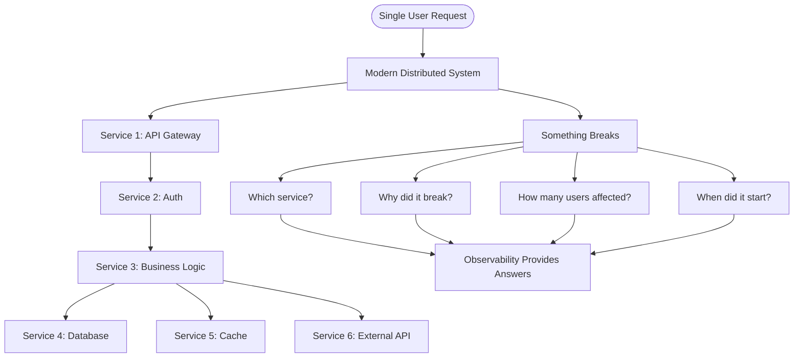

---

## 2. Monitoring vs. Observability <a name="monitoring-vs-observability"></a>

These terms are often used interchangeably, but they are **not** the same thing. Understanding the distinction is critical for building effective reliability strategies.

| Aspect | **Monitoring** | **Observability** |
|--------|---------------|-------------------|
| **Definition** | Watching known metrics against known thresholds | Being able to ask arbitrary new questions about system behavior |
| **Mindset** | "Tell me when X happens" | "Let me explore why Y happened" |
| **Best for** | Known failure modes | Unknown/unpredictable failure modes ("unknown unknowns") |
| **Example** | Alert when CPU > 90% | Investigate why *this specific* customer's checkout failed at *this specific* time |
| **Tooling** | Dashboards, alerts, thresholds | Logs + metrics + traces + high-cardinality querying |
| **Data model** | Pre-aggregated, fixed dimensions | Raw, high-cardinality, explorable |
| **Reactivity** | Reactive (alerts fire after threshold breach) | Proactive (can investigate before alerting) |

### The Smoke Detector Analogy

Think of monitoring as a smoke detector — it tells you *that* there's a fire. Observability is like being able to walk through the building afterward and reconstruct exactly *how* the fire started, room by room.

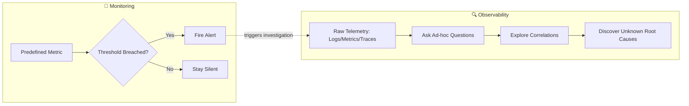

### When to Use Which

**Use Monitoring when:**
- You have well-understood systems with known failure modes
- You need simple, reliable alerts (CPU, memory, disk space)
- Your team is small and needs quick, actionable alerts
- You're tracking SLAs/SLOs with clear thresholds

**Use Observability when:**
- You have distributed systems with complex interactions
- You're investigating "unknown unknowns"
- You need to debug production issues without reproducing them
- You want to understand system behavior patterns over time
- You're building platforms that need to scale across teams

### The Evolution: From Monitoring to Observability

```mermaid
timeline
    title Evolution of System Reliability
    section 1990s-2000s : Monitoring Era
        : Static dashboards
        : Threshold-based alerts
        : Single-server focus
    section 2010s : Cloud & Microservices
        : Distributed systems emerge
        : Monitoring tools struggle
        : Need for correlation
    section 2015-2020 : Observability Movement
        : Three pillars concept popularized
        : High-cardinality data
        : Vendor-agnostic standards
    section 2021-Present : OpenTelemetry Era
        : OTel becomes CNCF standard
        : Unified instrumentation
        : AI-assisted root cause analysis
```

**Key takeaway:** Monitoring tells you *something* is wrong. Observability helps you figure out *what* and *why* — especially for problems you never anticipated.

---

## 3. The Three Pillars: Logs, Metrics, Traces <a name="the-three-pillars"></a>

Almost every observability conversation centers on three data types. A useful mental model: they're all just different ways of looking at the same underlying stream of events happening inside your system.

- A **log** captures a single event as a line of text (or structured JSON).
- A **metric** counts or aggregates many events into a number over time.
- A **trace** links related events together as a request moves across services.

### The Unified Event Stream

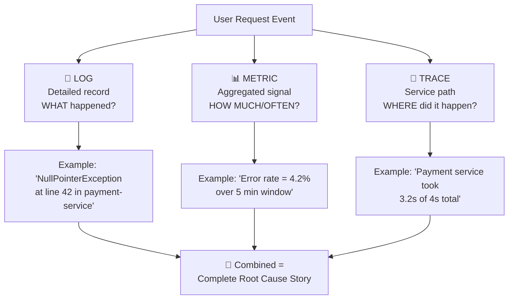

### Analogy: The Airplane Black Box

- **Metrics** = the cockpit dashboard (altitude, speed, fuel) — a glance tells you something is off.
- **Logs** = the black box recorder — a detailed, timestamped account of everything that happened.
- **Traces** = the flight path recorder — the exact sequence and route that led to the incident.

None of these alone tells the full story. Together, they do.

### The Three Pillars Comparison Matrix

| Pillar | Format | Granularity | Retention | Cost | Best Use Case |
|--------|--------|-------------|-----------|------|---------------|
| **Logs** | Text/JSON | Per-event | Days-Months | High | Debugging specific errors |
| **Metrics** | Numeric | Aggregated | Months-Years | Low | Trend analysis, alerting |
| **Traces** | Structured spans | Per-request | Days-Weeks | Medium | Performance profiling |

### How They Complement Each Other

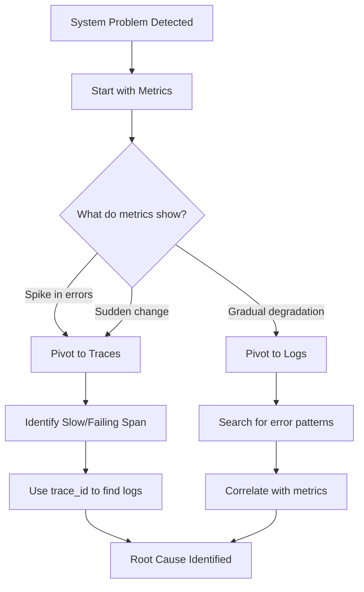

**Key Insight:** The real power isn't in any single pillar—it's in the **correlation** between them using shared identifiers like `trace_id`, `span_id`, and `service.name`.

---

## 4. Deep Dive: Logs <a name="deep-dive-logs"></a>

A **log** is a timestamped record of a discrete event. It could be a line in a text file, a structured JSON blob, or a message on a stream like Kafka.

### Types of Logs

#### 1. Unstructured Logs
Plain text, human-readable, hard to query at scale.

```
2026-08-05 03:14:22 ERROR Failed to process payment for user 88213: timeout after 5000ms
```

**Problems:**
- Difficult to parse programmatically
- No standard format across services
- Expensive to query at scale
- Hard to correlate with other data

#### 2. Structured Logs
Key-value pairs (usually JSON), machine-parseable, queryable.

```json
{
  "timestamp": "2026-08-05T03:14:22Z",
  "level": "ERROR",
  "service": "payment-service",
  "user_id": 88213,
  "message": "Payment processing timeout",
  "duration_ms": 5000,
  "trace_id": "a1b2c3d4e5f6a1b2c3d4e5f6a1b2c3d4",
  "span_id": "00f067aa0ba902b7",
  "environment": "production"
}
```

**Benefits:**
- Easy to parse and query
- Consistent format across services
- Supports powerful filtering and aggregation
- Enables correlation with metrics and traces

> ⚠️ **Warning:** Never log sensitive data like passwords, credit card numbers, or personal identifiable information (PII). This is both a security risk and often a compliance violation (GDPR, PCI-DSS, HIPAA).

### Log Levels — A Complete Primer

| Level | Severity | When to Use | Example | Production Volume |
|-------|----------|-------------|---------|-------------------|
| `DEBUG` | Low | Verbose internal state, useful only during active debugging | "Cache miss for key: user:12345" | High (disable in prod) |
| `INFO` | Normal | Normal operational events | "Server started on port 3000" | Medium |
| `WARN` | Medium | Something unexpected happened but system recovered | "Retry attempt 2/3 for external API" | Low-Medium |
| `ERROR` | High | An operation failed and needs attention | "Payment processing failed: timeout" | Low |
| `FATAL/CRITICAL` | Critical | Application cannot continue running | "Database connection lost, shutting down" | Very Low |

### Best Practices for Log Levels

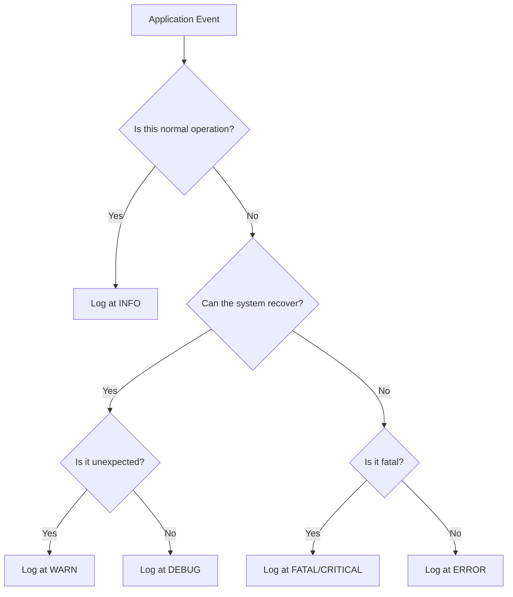

### Example: Instrumenting a Node.js Service with Structured Logging

```javascript
const pino = require('pino');
const logger = pino({  // Pino: High-performance structured logger
  level: process.env.LOG_LEVEL || 'info',
  formatter: (log) => {
    // Ensure all logs have required fields
    return {
      timestamp: new Date().toISOString(),
      service: 'payment-service',
      environment: process.env.NODE_ENV,
      ...log
    };
  }
});

/**
 * Process a payment transaction
 * @param {Object} req - Express request object
 * @param {Object} res - Express response object
 */
app.post('/checkout', async (req, res) => {
  const startTime = Date.now();
  const traceId = req.headers['traceparent']?.split('-')[1] || 'unknown';
  
  try {
    // Log request received
    logger.info({
      event: 'checkout_started',
      trace_id: traceId,
      user_id: req.body.userId,
      amount: req.body.amount,
      currency: req.body.currency
    });
    
    const result = await processPayment(req.body);
    
    const duration = Date.now() - startTime;
    
    // Log success with performance metrics
    logger.info({
      event: 'checkout_success',
      trace_id: traceId,
      user_id: req.body.userId,
      amount: req.body.amount,
      duration_ms: duration,
      payment_method: result.method
    });
    
    res.json(result);
    
  } catch (err) {
    const duration = Date.now() - startTime;
    
    // Log failure with full context
    logger.error({
      event: 'checkout_failure',
      trace_id: traceId,
      user_id: req.body.userId,
      error: err.message,
      error_stack: err.stack,
      duration_ms: duration,
      amount: req.body.amount
    });
    
    res.status(500).send('Payment failed');
  }
});
```

### Python Example with Structlog

```python
import structlog
import time
from typing import Dict, Any

# Configure structured logging
structlog.configure(
    processors=[
        structlog.stdlib.filter_by_level,
        structlog.stdlib.add_logger_name,
        structlog.stdlib.add_log_level,
        structlog.stdlib.PositionalArgumentsFormatter(),
        structlog.processors.TimeStamper(fmt="iso"),
        structlog.processors.StackInfoRenderer(),
        structlog.processors.format_exc_info,
        structlog.processors.UnicodeDecoder(),
        structlog.processors.JSONRenderer()
    ],
    context_class=dict,
    logger_factory=structlog.stdlib.LoggerFactory(),
    wrapper_class=structlog.stdlib.BoundLogger,
    cache_logger_on_first_use=True,
)

logger = structlog.get_logger(__name__)

def process_order(order_id: str, user_id: int) -> Dict[str, Any]:
    """Process an order with comprehensive logging."""
    start_time = time.time()
    
    logger.info("order_processing_started", 
                order_id=order_id, 
                user_id=user_id)
    
    try:
        # Business logic here
        result = charge_payment(order_id)
        
        duration = time.time() - start_time
        logger.info("order_processing_success",
                   order_id=order_id,
                   user_id=user_id,
                   duration_seconds=duration,
                   amount=result['amount'])
        
        return result
        
    except PaymentError as e:
        duration = time.time() - start_time
        logger.error("order_processing_failed",
                    order_id=order_id,
                    user_id=user_id,
                    error_type="PaymentError",
                    error_message=str(e),
                    duration_seconds=duration)
        raise
    
    except Exception as e:
        duration = time.time() - start_time
        logger.critical("order_processing_unexpected_error",
                       order_id=order_id,
                       user_id=user_id,
                       error_type=type(e).__name__,
                       error_message=str(e),
                       duration_seconds=duration,
                       exc_info=True)
        raise
```

### Strengths and Limitations

#### ✅ Strengths
- **Rich context:** Exact error messages, request bodies, stack traces, user IDs
- **Flexibility:** Can log any data structure
- **Debuggability:** Perfect for post-incident analysis
- **Compliance:** Often required for audit trails

#### ❌ Limitations
- **Volume:** A busy system can generate terabytes of logs per day
- **Cost:** Storage and search expensive at scale
- **Performance:** Heavy log writes can slow down applications
- **Signal-to-noise:** Hard to find relevant logs without good filtering

### Log Management Strategies

```mermaid
flowchart TD
    Logs[Application Logs] --> Collection[Log Collection]
    Collection --> Agent[Log Agent<br/>(Fluentd, Vector)]
    Agent --> Buffer[Buffer/Queue<br/>(Kafka, Redis)]
    Buffer --> Processing[Processing Layer]
    
    Processing --> Filter[Filter & Parse]
    Filter --> Enrich[Enrich with Metadata]
    Enrich --> Store[Storage Backend]
    
    Store --> Hot[Hot Storage<br/>(Last 7 days)<br/>Elasticsearch]
    Store --> Warm[Warm Storage<br/>(7-30 days)<br/>S3/Cheaper]
    Store --> Cold[Cold Storage<br/>(30+ days)<br/>Glacier/Archive]
    
    Hot --> Query[Query Layer]
    Query --> UI[Grafana/Loki UI]
```

### Use Case Deep Dive

**Scenario:** A customer reports "my order #4471 never got a confirmation email."

**Without observability:**
1. Check email service logs manually
2. Search through thousands of log lines
3. Hope to find the relevant entry
4. Time: 2-4 hours

**With observability:**
1. Query logs: `service=email-service AND order_id=4471`
2. Instantly see: `"SMTPError: 550 5.1.1 User unknown"` at `2026-08-05T14:23:11Z`
3. Root cause: Customer provided invalid email address
4. Time: 30 seconds

This granular detail is something metrics or traces alone can't give you.

### Common Logging Anti-Patterns

❌ **Anti-pattern 1: Logging everything at DEBUG in production**
```javascript
// Bad: Drowning in noise
logger.debug('Variable x = ' + JSON.stringify(largeObject));
logger.debug('Entering function foo');
logger.debug('Loop iteration ' + i);
```

✅ **Correct approach:**
```javascript
// Good: Strategic logging
if (logger.isLevelEnabled('debug')) {
  logger.debug({ operation: 'cache_miss', key: cacheKey });
}
```

❌ **Anti-pattern 2: String concatenation in logs**
```python
# Bad: Expensive string operations even if log level is disabled
logger.debug("User " + user.name + " performed " + action + " at " + timestamp)
```

✅ **Correct approach:**
```python
# Good: Structured logging (lazy evaluation)
logger.debug("user_action", user=user.name, action=action, timestamp=timestamp)
```

❌ **Anti-pattern 3: No correlation IDs**
```javascript
// Bad: Can't trace request across services
logger.error('Payment failed');
```

✅ **Correct approach:**
```javascript
// Good: Include trace_id for correlation
logger.error({ event: 'payment_failed', trace_id: traceId, span_id: spanId });
```

---

## 5. Deep Dive: Metrics <a name="deep-dive-metrics"></a>

A **metric** is a numeric measurement aggregated over time. Instead of storing every individual event, metrics compress activity into trends — counts, rates, gauges, histograms.

### Core Metric Types

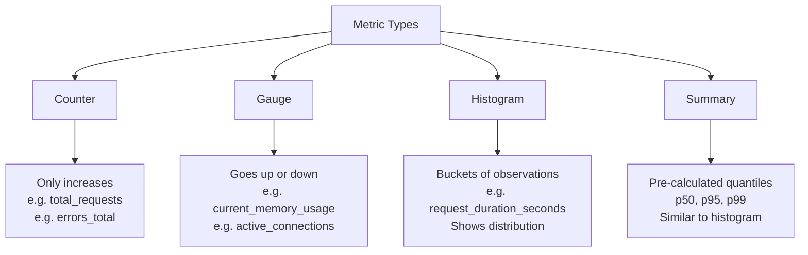

### Detailed Metric Type Explanations

#### 1. Counter
A counter is a cumulative metric that only increases (or resets to zero). Think of it as a scoreboard.

**Examples:**
- `http_requests_total` - Total number of HTTP requests
- `errors_total` - Total number of errors
- `orders_processed` - Total orders completed

**Use cases:**
- Tracking total events
- Calculating rates (requests per second)
- Counting occurrences

#### 2. Gauge
A gauge is a metric that can go up or down. It represents a current value at a specific point in time.

**Examples:**
- `current_memory_usage_bytes` - Current memory consumption
- `active_connections` - Current open connections
- `queue_size` - Current message queue length
- `temperature_celsius` - CPU temperature

**Use cases:**
- Current state measurements
- Resource utilization
- Queue depths

#### 3. Histogram
A histogram samples observations (usually request durations or sizes) and counts them in configurable buckets. It also provides a sum of all observed values.

**Examples:**
- `http_request_duration_seconds` - Request latency distribution
- `response_size_bytes` - Response size distribution
- `database_query_duration_seconds` - Database query times

**Benefits:**
- Shows distribution of values
- Can calculate percentiles (p50, p95, p99)
- Provides both count and sum for rate calculations

#### 4. Summary
Similar to histogram, but calculates streaming quantiles on the client side.

**Examples:**
- `http_request_duration_seconds_summary` - With quantiles: {0.5, 0.9, 0.99}

**Trade-offs:**
- Less flexible than histograms (can't aggregate across instances)
- More accurate quantiles within a single instance
- Higher memory usage

### Example: Exposing Prometheus Metrics in a Python App

```python
from prometheus_client import Counter, Histogram, Gauge, start_http_server
import time
import random

# Define metrics
REQUEST_COUNT = Counter(
    'http_requests_total',
    'Total HTTP requests',
    ['endpoint', 'method', 'status']
)

REQUEST_LATENCY = Histogram(
    'http_request_duration_seconds',
    'Request latency in seconds',
    ['endpoint'],
    buckets=[0.01, 0.05, 0.1, 0.5, 1.0, 2.5, 5.0, 10.0]  # Custom buckets
)

ACTIVE_CONNECTIONS = Gauge(
    'active_connections',
    'Current number of active connections'
)

ERROR_BUDGET_REMAINING = Gauge(
    'error_budget_remaining',
    'Remaining error budget percentage',
    ['service', 'slo_name']
)

# Start metrics server on port 8000
start_http_server(8000)

@app.route('/checkout')
def checkout():
    ACTIVE_CONNECTIONS.inc()
    
    start = time.time()
    status = "200"
    
    try:
        result = process_checkout()
        return result
    except Exception as e:
        status = "500"
        logger.error("checkout_failed", error=str(e))
        raise
    finally:
        # Record metrics
        duration = time.time() - start
        REQUEST_LATENCY.labels(endpoint='/checkout').observe(duration)
        REQUEST_COUNT.labels(endpoint='/checkout', method='POST', status=status).inc()
        ACTIVE_CONNECTIONS.dec()
```

### PromQL Example Queries

```promql
# Error rate over the last 5 minutes
sum(rate(http_requests_total{status="500"}[5m]))
  /
sum(rate(http_requests_total[5m]))

# p99 latency
histogram_quantile(0.99, rate(http_request_duration_seconds_bucket[5m]))

# Request rate per endpoint
sum(rate(http_requests_total[5m])) by (endpoint)

# Error rate per endpoint
sum(rate(http_requests_total{status=~"5.."}[5m])) by (endpoint)
  /
sum(rate(http_requests_total[5m])) by (endpoint)

# Memory usage trend over 1 hour
avg_over_time(process_resident_memory_bytes[1h])

# Alert: High error rate
(
  sum(rate(http_requests_total{status=~"5.."}[5m]))
  /
  sum(rate(http_requests_total[5m]))
) > 0.05
```

### The "Cardinality" Trap — Critical Warning

A common beginner mistake: adding a high-cardinality label (like `user_id`) to a metric. Because Prometheus-style metrics create a new time series *per unique label combination*, this can explode your storage and crash your metrics backend.

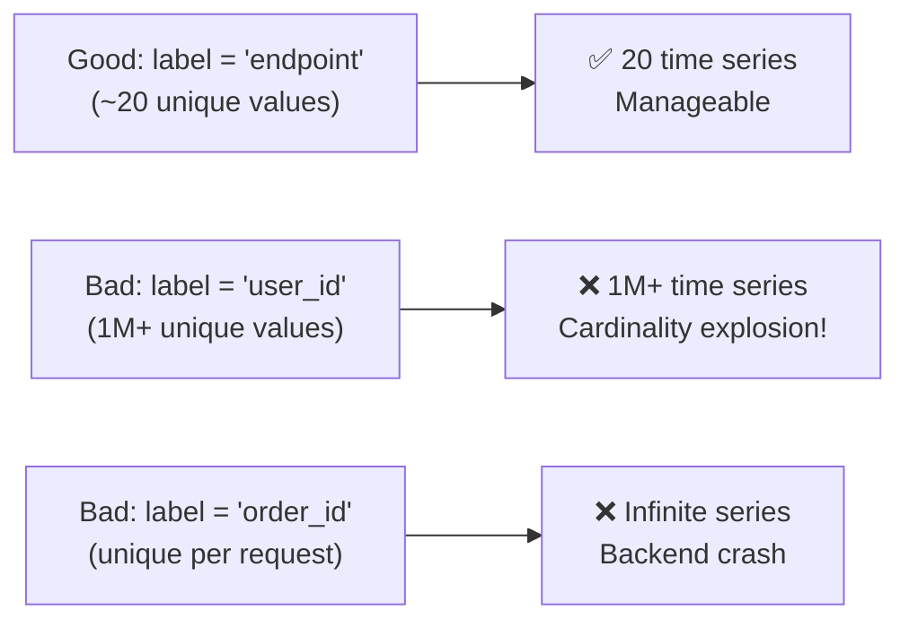

**Real-world example of cardinality explosion:**

```python
# ❌ TERRIBLE: This will create millions of time series
REQUEST_COUNT.labels(
    endpoint='/checkout',
    user_id=request.user_id,  # 1 million users = 1M series!
    order_id=order.id,        # Unique per order = infinite series!
    session_id=session.id     # Millions more series
).inc()

# ✅ GOOD: Low cardinality only
REQUEST_COUNT.labels(
    endpoint='/checkout',
    method='POST',
    status='200'
).inc()
```

**Rule of thumb:** Use metrics for *aggregate* trends, and reserve high-cardinality data (like user IDs) for logs and traces.

### Metric Naming Conventions

Follow these conventions for consistency:

| Convention | Example | Description |
|------------|---------|-------------|
| **Base unit** | `seconds`, `bytes`, `total` | Use base units (seconds, not milliseconds) |
| **Suffix** | `_total`, `_seconds`, `_bytes` | Indicate unit in metric name |
| **Prefix** | `http_`, `db_`, `app_` | Indicate domain/component |
| **Separator** | Use underscores | `http_requests_total` not `http.requests.total` |

**Good examples:**
- `http_requests_total`
- `http_request_duration_seconds`
- `database_connections_active`
- `payment_processing_errors_total`

**Bad examples:**
- `requests` (no unit or context)
- `http.requests` (wrong separator)
- `responseTime` (inconsistent casing)
- `user_id_12345_requests` (high cardinality!)

### Strengths and Limitations

#### ✅ Strengths
- **Fast to query:** Optimized for time-series data
- **Cheap to store:** Highly compressed
- **Long retention:** Can keep months/years of data
- **Perfect for dashboards:** Real-time visualization
- **Efficient alerting:** Low overhead threshold checks

#### ❌ Limitations
- **No per-event detail:** Can't see individual request data
- **Aggregation loss:** Can't drill down to specific instances
- **Cardinality limits:** Can't use high-cardinality labels
- **Fixed dimensions:** Can't add new labels retroactively

### Use Case Deep Dive

**Scenario:** Your on-call dashboard shows p99 latency jumped from 200ms to 4s at 3:00 AM.

**What metrics tell you:**
- ✅ Something broke at exactly 3:00 AM
- ✅ It's affecting all requests (p99 spiked)
- ✅ The issue is ongoing (metric stays elevated)
- ✅ It's severe (4s vs 200ms = 20x degradation)

**What metrics DON'T tell you:**
- ❌ Which service is causing it
- ❌ Why it started at 3:00 AM specifically
- ❌ Which requests are affected
- ❌ What the error message is

**Next step:** Pivot to traces and logs using the metric as a starting point.

### Performance Considerations for Metrics

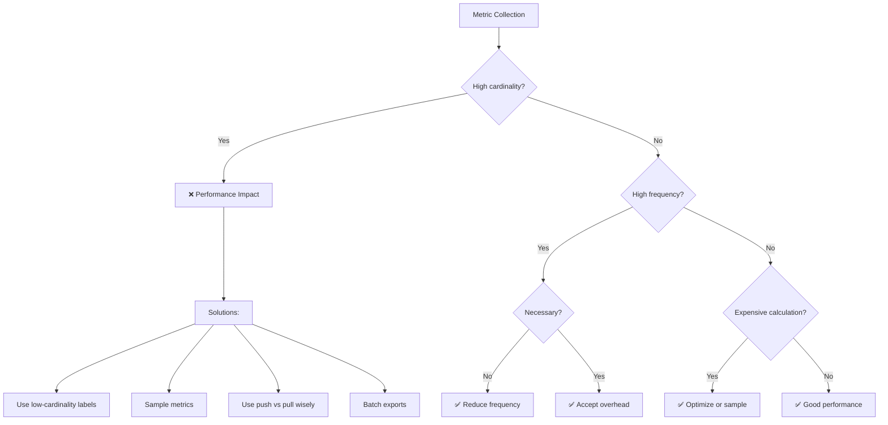

---

## 6. Deep Dive: Traces <a name="deep-dive-traces"></a>

A **trace** represents the complete journey of a single request as it flows through a distributed system. A trace is made up of **spans** — each span represents one unit of work (e.g., a database query, an API call, a function execution).

### Anatomy of a Trace

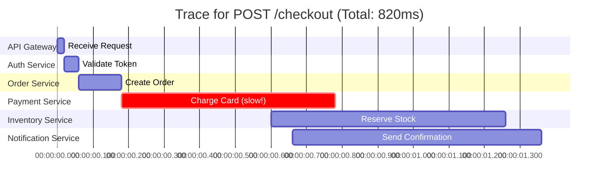

In this example, the trace immediately reveals that **the Payment Service is the bottleneck**, consuming 420ms of the total 820ms — over half the request time. Without tracing, you might have wasted hours checking the database or the API gateway first.

### Key Concepts

#### Trace ID
A unique identifier shared by every span belonging to one request, allowing you to reconstruct the entire journey.

**Format (W3C Trace Context):**
```
traceparent: 00-a1b2c3d4e5f6a1b2c3d4e5f6a1b2c3d4-00f067aa0ba902b7-01
```

Where:
- `00`: Version
- `a1b2c3d4e5f6a1b2c3d4e5f6a1b2c3d4`: Trace ID (128-bit hex)
- `00f067aa0ba902b7`: Parent Span ID (64-bit hex)
- `01`: Trace Flags (sampled)

#### Span
A single operation with:
- **Start time** and **end time**
- **Operation name** (e.g., "database_query")
- **Tags/Attributes** (key-value pairs like `db.statement`, `http.status_code`)
- **Parent span ID** (for nesting)
- **Span ID** (unique within trace)

#### Parent/Child Spans
Spans are nested to represent call hierarchies:
- Service A calls Service B → Service B span is child of Service A span
- Service B calls Database → Database span is child of Service B span

#### Context Propagation
Passing the trace ID across service boundaries (usually via HTTP headers) so all spans link together.

### Example: Trace Header Propagation

```http
POST /payments HTTP/1.1
Host: payment-service.internal
Content-Type: application/json
traceparent: 00-a1b2c3d4e5f6a1b2c3d4e5f6a1b2c3d4-00f067aa0ba902b7-01
tracestate: vendor=value
```

That `traceparent` header (part of the W3C Trace Context standard) is how the payment service knows it's part of the same request as the order service that called it.

### Implementing Distributed Tracing

#### Python Example with OpenTelemetry

```python
from opentelemetry import trace
from opentelemetry.sdk.trace import TracerProvider
from opentelemetry.sdk.trace.export import BatchSpanProcessor
from opentelemetry.exporter.jaeger.thrift import JaegerExporter
from opentelemetry.instrumentation.flask import FlaskInstrumentor
from opentelemetry.instrumentation.requests import RequestsInstrumentor

# Initialize tracer
trace.set_tracer_provider(TracerProvider())
jaeger_exporter = JaegerExporter(
    agent_host_name="localhost",
    agent_port=14268,
)
trace.get_tracer_provider().add_span_processor(
    BatchSpanProcessor(jaeger_exporter)
)

tracer = trace.get_tracer(__name__)

# Instrument Flask app
app = Flask(__name__)
FlaskInstrumentor().instrument_app(app)
RequestsInstrumentor().instrument()

@app.route('/checkout', methods=['POST'])
def checkout():
    # Create a span for the entire checkout operation
    with tracer.start_as_current_span("checkout_process") as span:
        # Add attributes to the span
        span.set_attribute("user.id", request.json.get("user_id"))
        span.set_attribute("order.total", request.json.get("amount"))
        
        try:
            # Call order service (automatically creates child span)
            order_result = create_order(request.json)
            span.set_attribute("order.id", order_result["order_id"])
            
            # Call payment service (automatically creates child span)
            with tracer.start_as_current_span("process_payment") as payment_span:
                payment_result = process_payment(order_result)
                payment_span.set_attribute("payment.status", "success")
                payment_span.set_attribute("payment.method", payment_result["method"])
            
            span.set_status(Status(StatusCode.OK))
            return jsonify({"status": "success", "order_id": order_result["order_id"]})
            
        except Exception as e:
            span.set_status(Status(StatusCode.ERROR, str(e)))
            span.record_exception(e)
            raise
```

#### JavaScript/Node.js Example

```javascript
const { NodeSDK } = require('@opentelemetry/sdk-node');
const { getNodeAutoInstrumentations } = require('@opentelemetry/auto-instrumentations-node');
const { OTLPTraceExporter } = require('@opentelemetry/exporter-trace-otlp-http');
const { Resource } = require('@opentelemetry/resources');
const { SemanticResourceAttributes } = require('@opentelemetry/semantic-conventions');

// Initialize OpenTelemetry SDK
const sdk = new NodeSDK({
  resource: new Resource({
    [SemanticResourceAttributes.SERVICE_NAME]: 'payment-service',
    [SemanticResourceAttributes.SERVICE_VERSION]: '1.0.0',
  }),
  traceExporter: new OTLPTraceExporter({
    url: 'http://localhost:4318/v1/traces',
  }),
  instrumentations: [getNodeAutoInstrumentations()],
});

sdk.start();

// Manual span creation for custom logic
const tracer = trace.getTracer('payment-service');

async function processPayment(orderData) {
  // Create a custom span
  return tracer.startActiveSpan('process_payment', async (span) => {
    try {
      // Add attributes
      span.set_attribute('order.id', orderData.orderId);
      span.set_attribute('payment.amount', orderData.amount);
      span.set_attribute('payment.currency', orderData.currency);
      
      // Business logic
      const result = await chargeCard(orderData);
      
      // Add events
      span.addEvent('payment_authorized', {
        'auth.code': result.authCode,
        'payment.method': result.method,
      });
      
      span.setStatus({ code: SpanStatusCode.OK });
      return result;
      
    } catch (error) {
      // Record exception
      span.recordException(error);
      span.setStatus({
        code: SpanStatusCode.ERROR,
        message: error.message,
      });
      throw error;
    } finally {
      // Always end the span
      span.end();
    }
  });
}
```

### Trace Sampling Strategies

You can't trace 100% of requests in high-traffic systems—it's too expensive. Use intelligent sampling:

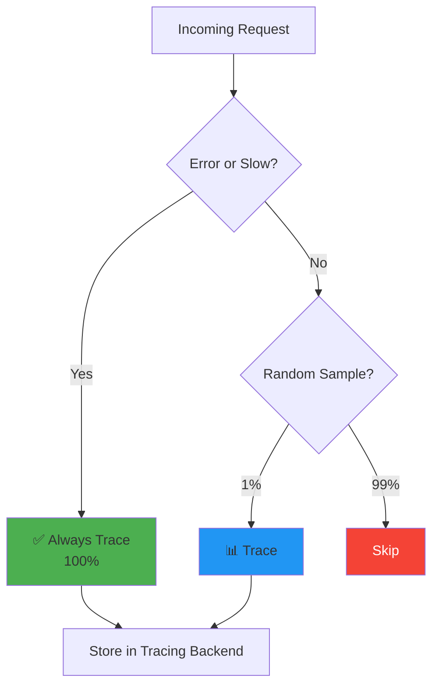

**Sampling strategies:**

1. **Always-on (100%)**: Development/staging only
2. **Probabilistic (1-10%)**: Random sampling for production
3. **Tail-based sampling**: Trace completes, then decide to keep or discard
4. **Adaptive sampling**: Adjust rate based on system load
5. **Priority sampling**: Always trace errors, slow requests, important users

### Strengths and Limitations

#### ✅ Strengths
- **Shows causal order:** Reveals exactly where time is spent
- **Cross-service visibility:** Links operations across boundaries
- **Performance profiling:** Identifies bottlenecks instantly
- **Failure cascades:** Shows how errors propagate

#### ❌ Limitations
- **Instrumentation required:** Every service must be instrumented
- **Blind spots:** Single un-instrumented service breaks the trace
- **Storage cost:** High-traffic systems generate massive trace volumes
- **Complexity:** Requires careful planning and implementation

### Use Case Deep Dive

**Scenario:** A checkout flow spans 6 microservices. Customers report slowness, but no service is individually "unhealthy" by its own metrics.

**Investigation with traces:**

1. **Filter traces:** `/checkout` endpoint, last 15 minutes, status=error
2. **Examine trace:** Find a trace with total duration = 6.2s
3. **Analyze spans:**
   - API Gateway: 50ms ✅
   - Auth Service: 100ms ✅
   - Order Service: 200ms ✅
   - Payment Service: 150ms ✅
   - **Inventory Service: 4.5s** ❌ (BOTTLENECK!)
   - Notification Service: 100ms ✅

4. **Drill into Inventory Service span:**
   - 3 retry attempts visible
   - Each retry: 1.5s timeout
   - Total: 3 × 1.5s = 4.5s

5. **Root cause:** Inventory service database connection pool exhausted, causing retries

**Without traces:** You'd check each service's metrics individually (all look fine), then spend hours adding debug logging, reproducing the issue, etc.

**With traces:** 5 minutes from alert to root cause.

### Common Tracing Anti-Patterns

❌ **Anti-pattern 1: Incomplete instrumentation**
```python
# Service A calls Service B
# Service B doesn't propagate trace context
# Result: Broken trace, missing spans
```

✅ **Solution:** Use OpenTelemetry auto-instrumentation for common frameworks.

❌ **Anti-pattern 2: Not sampling strategically**
```python
# Tracing 100% of requests in production
# Result: $10,000/month tracing bill
```

✅ **Solution:** Use 1-5% sampling for normal traffic, 100% for errors.

❌ **Anti-pattern 3: Missing span attributes**
```python
# Span with no useful information
span = tracer.start_span("database_query")
# ... query executes ...
span.end()
```

✅ **Solution:** Add meaningful attributes
```python
span.set_attribute("db.statement", query)
span.set_attribute("db.rows_affected", len(results))
span.set_attribute("db.table", "users")
```

---

## 7. How the Three Pillars Work Together <a name="working-together"></a>

The real power of observability isn't any single pillar — it's the ability to **pivot between them**, using shared identifiers like `trace_id` to jump from a high-level metric anomaly down to the exact log line that explains it.

### The Correlation Workflow

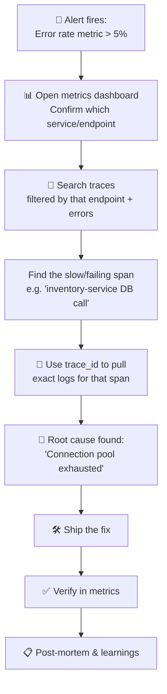

This is often called **correlation** — and it's only possible if your logs, metrics, and traces all share common identifiers (trace ID, service name, timestamp).

### The Correlation ID Pattern

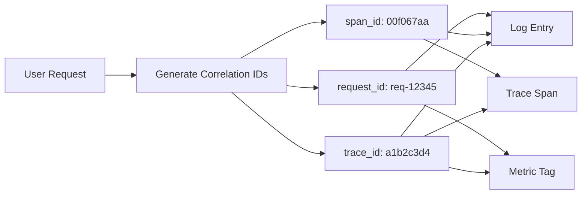

**Implementation example:**

```javascript
// Middleware to extract/generate trace context
app.use((req, res, next) => {
  // Extract trace context from incoming request
  const traceparent = req.headers['traceparent'];
  const traceId = traceparent ? extractTraceId(traceparent) : generateTraceId();
  const spanId = generateSpanId();
  
  // Attach to request for use throughout
  req.traceId = traceId;
  req.spanId = spanId;
  
  // Add to response headers for client-side tracing
  res.setHeader('traceparent', `00-${traceId}-${spanId}-01`);
  
  next();
});

// Use in logging
logger.info({
  trace_id: req.traceId,
  span_id: req.spanId,
  event: 'request_started',
  path: req.path
});

// Use in metrics
metrics.increment('http_requests_total', {
  endpoint: req.path,
  trace_id: req.traceId  // Enable correlation!
});
```

### Concrete Walkthrough

Let's trace through a complete incident investigation:

1. **Metric alerts:** `checkout_error_rate > 5%` for the last 5 minutes.
2. **Open metrics dashboard:** Grafana shows p99 latency for `/checkout` jumped from 200ms to 5s at 3:00 AM.
3. **Pivot to tracing:** Filter Jaeger/Tempo for traces on `/checkout` with `status=error` in last 15 minutes.
4. **Examine trace:** Find trace where `payment-service.charge_card` span shows `duration=5000ms`, `status=timeout`.
5. **Extract trace_id:** `a1b2c3d4e5f6a1b2c3d4e5f6a1b2c3d4`
6. **Pivot to logs:** Search Loki/Elasticsearch for `trace_id:a1b2c3d4e5f6a1b2c3d4e5f6a1b2c3d4`
7. **Find log entry:**
   ```json
   {
     "timestamp": "2026-08-05T03:14:22Z",
     "level": "ERROR",
     "service": "payment-service",
     "trace_id": "a1b2c3d4e5f6a1b2c3d4e5f6a1b2c3d4",
     "message": "Connection pool exhausted, waited 5000ms for available connection",
     "pool_size": 50,
     "active_connections": 50
   }
   ```
8. **Root cause found:** Payment service's DB connection pool is undersized for current traffic.
9. **Fix:** Increase pool size from 50 to 100.
10. **Verify:** Metrics confirm error rate returns to baseline within 5 minutes.

**Time from alert to root cause: 10 minutes.**

**Without correlation:** 2-4 hours of guesswork and manual investigation.

### Correlation Best Practices

✅ **Always include these fields in all three pillars:**
- `trace_id` - Links logs, metrics, and traces
- `span_id` - Links specific spans to logs
- `service.name` - Identifies which service generated the data
- `timestamp` - Enables time-based correlation
- `environment` - Distinguishes prod/staging/dev
- `severity` or `level` - For filtering

✅ **Use consistent naming:**
- Same field names across all pillars
- Same timestamp format (ISO 8601 recommended)
- Same service naming convention

✅ **Propagate context:**
- Pass trace_id in HTTP headers (W3C Trace Context)
- Include trace_id in message queues (Kafka headers)
- Propagate through database calls if possible

---

## 8. OpenTelemetry: The Unifying Standard <a name="opentelemetry"></a>

Historically, every observability vendor (Datadog, New Relic, Honeycomb) had its own proprietary instrumentation library — meaning if you wanted to switch vendors, you had to rewrite all your instrumentation code. **OpenTelemetry (OTel)** solves this by providing a single, vendor-neutral standard for generating and exporting logs, metrics, and traces.

### OpenTelemetry Architecture

```mermaid
flowchart LR
    subgraph App["Your Application"]
        Code[App Code] --> SDK["OpenTelemetry SDK<br/>(auto + manual instrumentation)"]
        SDK --> Resources[Resource<br/>(service.name, version, env)]
    end

    SDK --> Collector["OpenTelemetry Collector<br/>(receives, processes, batches)"]
    
    Collector -->|metrics| Prometheus["Prometheus<br/>(metrics storage)"]
    Collector -->|traces| Tempo["Grafana Tempo<br/>(trace storage)"]
    Collector -->|logs| Loki["Grafana Loki<br/>(log storage)"]
    Collector -->|any| Vendor["Datadog / New Relic<br/>(any vendor)"]
    
    Prometheus --> Viz[Grafana]
    Tempo --> Viz
    Loki --> Viz
    Vendor --> VendorUI[Vendor Dashboard]
```

### Why OpenTelemetry Matters

#### 1. Vendor Neutrality
Instrument once, export anywhere (Prometheus, Datadog, Honeycomb, Grafana Cloud, etc.).

**Example:** Migrate from self-hosted Jaeger to Honeycomb:
```yaml
# Before: Export to Jaeger
exporters:
  jaeger:
    endpoint: jaeger:14268

# After: Export to Honeycomb (one-line change!)
exporters:
  otlphttp:
    endpoint: https://api.honeycomb.io
    headers:
      "x-honeycomb-team": "YOUR_API_KEY"
```

#### 2. Auto-Instrumentation
Many languages support automatic instrumentation of common frameworks with zero code changes.

**Supported frameworks:**
- **Python:** Django, Flask, FastAPI, requests, PostgreSQL, MySQL
- **JavaScript/Node.js:** Express, Fastify, HTTP, PostgreSQL, MongoDB
- **Java:** Spring Boot, JDBC, HTTP, gRPC, Kafka
- **Go:** net/http, database/sql, gRPC, Kafka
- **.NET:** ASP.NET Core, HTTP, Entity Framework, gRPC

#### 3. Unified Data Model
Logs, metrics, and traces share consistent semantic conventions, making correlation across pillars far easier.

**Standard attributes:**
- `service.name` - Name of the service
- `service.version` - Version of the service
- `deployment.environment` - prod/staging/dev
- `http.method` - HTTP method
- `http.status_code` - HTTP status code
- `db.system` - Database type (postgresql, mysql, etc.)
- `db.name` - Database name
- `db.operation` - Operation type (query, insert, etc.)

### Example: Manual Span Creation with OpenTelemetry (Python)

```python
from opentelemetry import trace
from opentelemetry.trace import Status, StatusCode

tracer = trace.get_tracer(__name__)

def process_order(order_id: str, user_id: int) -> dict:
    """
    Process an order with comprehensive distributed tracing.
    
    Args:
        order_id: Unique order identifier
        user_id: Customer user ID
        
    Returns:
        dict: Order processing result
        
    Raises:
        PaymentError: If payment processing fails
        InventoryError: If inventory reservation fails
    """
    # Create parent span for entire order processing
    with tracer.start_as_current_span("process_order") as span:
        # Set span attributes for filtering and search
        span.set_attribute("order.id", order_id)
        span.set_attribute("user.id", user_id)
        span.set_attribute("order.items_count", len(get_order_items(order_id)))
        
        try:
            # Step 1: Validate order
            with tracer.start_as_current_span("validate_order") as validate_span:
                validate_span.set_attribute("order.id", order_id)
                order = validate_order(order_id)
                validate_span.set_attribute("order.valid", True)
            
            # Step 2: Charge payment
            with tracer.start_as_current_span("charge_payment") as payment_span:
                payment_span.set_attribute("order.id", order_id)
                payment_span.set_attribute("payment.amount", order['total'])
                payment_span.set_attribute("payment.currency", order['currency'])
                
                try:
                    charge_result = charge_payment(order_id, order['total'])
                    payment_span.set_attribute("payment.status", "success")
                    payment_span.set_attribute("payment.method", charge_result['method'])
                    payment_span.set_attribute("payment.auth_code", charge_result['auth_code'])
                    
                except PaymentError as e:
                    payment_span.set_attribute("payment.status", "failed")
                    payment_span.set_attribute("payment.error_code", e.error_code)
                    payment_span.record_exception(e)
                    span.set_status(Status(StatusCode.ERROR, "Payment failed"))
                    raise
            
            # Step 3: Reserve inventory
            with tracer.start_as_current_span("reserve_inventory") as inventory_span:
                inventory_span.set_attribute("order.id", order_id)
                reserve_inventory(order_id)
                inventory_span.set_attribute("inventory.reserved", True)
            
            # Step 4: Send confirmation
            with tracer.start_as_current_span("send_confirmation") as notify_span:
                notify_span.set_attribute("order.id", order_id)
                notify_span.set_attribute("notification.channel", "email")
                send_confirmation_email(user_id, order_id)
                notify_span.set_attribute("notification.sent", True)
            
            # Mark span as successful
            span.set_status(Status(StatusCode.OK))
            
            return {
                "order_id": order_id,
                "status": "completed",
                "total": order['total']
            }
            
        except Exception as e:
            # Record exception in span
            span.record_exception(e)
            span.set_status(Status(StatusCode.ERROR, str(e)))
            raise
```

### OpenTelemetry Collector Configuration

```yaml
# otel-collector-config.yaml
receivers:
  otlp:
    protocols:
      grpc:
        endpoint: 0.0.0.0:4317
      http:
        endpoint: 0.0.0.0:4318

  # Prometheus metrics receiver
  prometheus:
    config:
      scrape_configs:
        - job_name: 'my-app'
          static_configs:
            - targets: ['localhost:8000']

  # File log receiver
  filelog:
    include:
      - /var/log/app/*.log

processors:
  # Batch spans, metrics, and logs
  batch:
    timeout: 10s
    send_batch_size: 1024

  # Add resource attributes
  resource:
    attributes:
      - key: service.name
        value: my-service
        action: insert
      - key: deployment.environment
        value: production
        action: insert

  # Filter out debug logs in production
  filter:
    logs:
      log_record:
        - 'severity_number < 10'  # Filter DEBUG logs

exporters:
  # Export traces to Jaeger
  jaeger:
    endpoint: jaeger:14250
    tls:
      insecure: true

  # Export metrics to Prometheus
  prometheus:
    endpoint: 0.0.0.0:8889

  # Export logs to Loki
  loki:
    endpoint: http://loki:3100/loki/api/v1/push

  # Debug exporter (for development)
  logging:
    loglevel: debug

service:
  pipelines:
    traces:
      receivers: [otlp]
      processors: [batch, resource]
      exporters: [jaeger, logging]
    
    metrics:
      receivers: [otlp, prometheus]
      processors: [batch, resource]
      exporters: [prometheus, logging]
    
    logs:
      receivers: [otlp, filelog]
      processors: [batch, resource, filter]
      exporters: [loki, logging]
```

### Use Case: Vendor Migration

**Scenario:** A company migrates from self-hosted Jaeger to Honeycomb for better query performance.

**Before OpenTelemetry:**
```python
# Jaeger-specific code
from jaeger_client import Config

config = Config(
    config={
        'sampler': {'type': 'const', 'param': 1},
        'logging': True,
    },
    service_name='my-service',
)
jaeger_tracer = config.initialize_tracer()
```

**Migration effort:** Rewrite all instrumentation code across 50+ services = **2-3 months of engineering work**

**After OpenTelemetry:**
```python
# OpenTelemetry code (vendor-agnostic)
from opentelemetry import trace

tracer = trace.get_tracer(__name__)
# That's it! Same code works with any backend.
```

**Migration effort:** Change one config file in the OTel Collector = **1 day**

### OpenTelemetry Best Practices

✅ **Use semantic conventions:** Follow [OpenTelemetry semantic conventions](https://opentelemetry.io/docs/reference/specification/) for attribute names.

✅ **Instrument at the framework level:** Use auto-instrumentation when possible.

✅ **Add custom spans for business logic:** Don't just instrument frameworks—instrument your critical business operations.

✅ **Use resource detectors:** Automatically detect cloud environment, hostname, container info.

✅ **Sample strategically:** Use different sampling rates for different scenarios.

❌ **Don't over-instrument:** Not everything needs a span. Focus on critical paths.

❌ **Don't ignore errors:** Always record exceptions in spans with `span.record_exception()`.

❌ **Don't forget to end spans:** Use context managers (`with` statements) to ensure spans are always ended.

---

## 9. SLOs, SLIs, and SLAs <a name="slos"></a>

Observability data is most powerful when tied to concrete reliability goals. SLOs (Service Level Objectives) provide a framework for balancing feature velocity against reliability.

### Definitions

| Term | Meaning | Example | Measured By |
|------|---------|---------|-------------|
| **SLI** (Indicator) | A measured metric of service behavior | "99.95% of requests complete in under 300ms" | Metrics |
| **SLO** (Objective) | The internal target for an SLI | "p99 latency < 300ms, 99.9% of the time, monthly" | Metrics + Alerting |
| **SLA** (Agreement) | A contractual promise to customers, often with penalties | "99.9% uptime guaranteed or service credit issued" | Contract + Metrics |

### The Relationship Between SLI, SLO, and SLA

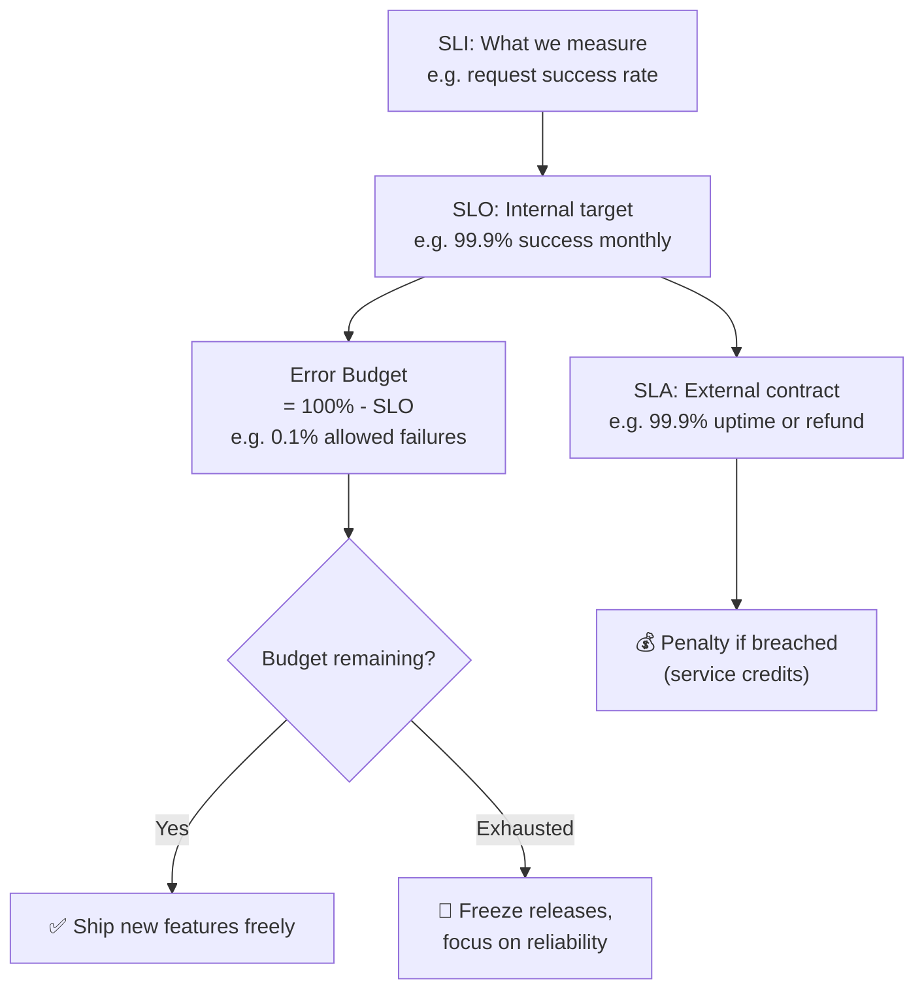

### The "Error Budget" Concept

If your SLO is 99.9% success rate monthly, your **error budget** is the remaining 0.1% — the acceptable amount of failure.

**Example calculation:**
- SLO: 99.9% availability
- Time period: 30 days = 43,200 minutes
- Error budget: 0.1% of 43,200 = 43.2 minutes of downtime allowed

Many high-performing teams use error budgets to balance feature velocity against reliability: if the budget is healthy, ship fast; if it's nearly exhausted, slow down and stabilize.

### Real-World SLO Examples

#### Example 1: E-commerce Checkout Service

**SLI:** Percentage of checkout requests that succeed within 500ms

**SLO:** 99.5% of checkout requests succeed within 500ms, measured over a rolling 30-day window

**Error Budget:** 0.5% of requests can fail or be slow

**Implementation:**
```promql
# SLI: Success rate
sum(rate(http_requests_total{endpoint="/checkout", status=~"2.."}[30d]))
/
sum(rate(http_requests_total{endpoint="/checkout"}[30d]))

# SLO: Must be >= 0.995
# Alert when: SLI < 0.995 for 5 minutes
```

#### Example 2: API Latency

**SLI:** p95 latency of API responses

**SLO:** 95% of requests complete in under 200ms, measured over a rolling 7-day window

**Implementation:**
```promql
# SLI: p95 latency
histogram_quantile(0.95, 
  rate(http_request_duration_seconds_bucket{endpoint="/api"}[7d])
)

# SLO: Must be <= 0.2s (200ms)
# Alert when: p95 > 0.2s for 10 minutes
```

#### Example 3: Data Pipeline Freshness

**SLI:** Age of most recent data in analytics pipeline

**SLO:** Data is no more than 1 hour old, 99% of the time, measured daily

**Implementation:**
```promql
# SLI: Data freshness
(time() - timestamp(data_pipeline_last_success_timestamp{job="etl"}))
< (3600 * 0.99)  # 1 hour * 99%
```

### SLO Best Practices

✅ **Start with user-centric SLOs:** Measure what users care about (latency, success rate, freshness), not internal metrics (CPU, memory).

✅ **Use multiple time windows:** Rolling 7-day for fast feedback, rolling 30-day for stability.

✅ **Set SLOs higher than SLAs:** If your SLA is 99.9%, set your internal SLO to 99.95% to have buffer.

✅ **Make error budgets visible:** Dashboard showing error budget burn rate.

✅ **Automate error budget alerts:** Alert when budget burn rate exceeds threshold.

❌ **Don't set SLOs at 100%:** Impossible and encourages over-engineering.

❌ **Don't measure too many things:** 2-3 SLOs per service is enough.

❌ **Don't ignore SLOs:** An SLO you don't track is useless.

### Error Budget Policy Example

```markdown
# Error Budget Policy: Checkout Service

## SLO
99.5% of checkout requests succeed within 500ms (rolling 30 days)

## Error Budget
0.5% failure budget = ~3.6 hours of downtime per month

## Burn Rate Tiers

### Tier 1: Fast burn (>10% budget consumed in 1 hour)
- **Action:** Page on-call engineer immediately
- **Response:** Investigate within 15 minutes
- **Escalation:** If not resolved in 1 hour, escalate to engineering manager

### Tier 2: Medium burn (>50% budget consumed in 7 days)
- **Action:** Alert team Slack channel
- **Response:** Schedule war room within 24 hours
- **Escalation:** Freeze non-critical feature releases

### Tier 3: Slow burn (>90% budget consumed in 30 days)
- **Action:** Notify VP Engineering
- **Response:** All hands on deck for reliability
- **Escalation:** Stop all feature releases, focus exclusively on reliability

## Exception Process
To exceed error budget:
1. Document reason for exception
2. Get approval from engineering manager
3. Communicate to stakeholders
4. Create follow-up ticket to prevent recurrence
```

### Use Case: SLO-Driven Development

**Scenario:** An engineering team sets an SLO of "p95 API latency under 500ms, 99.5% of the time, per rolling 30 days."

**Week 1-2:** Healthy state
- Error budget: 100% remaining
- Team ships 3 feature releases
- Velocity: High

**Week 3:** Bad deploy
- A new caching layer is deployed with a bug
- p95 latency jumps to 800ms
- Error budget burns: 15% in 2 hours (Tier 1 alert)
- Team immediately rolls back
- Error budget stabilizes

**Week 4:** Investigation and fix
- Team investigates root cause
- Deploys fix with proper testing
- Error budget: 85% remaining (recovered)

**Outcome:** The SLO caught the issue before it became a customer-facing SLA breach. The error budget policy provided clear guidance on when to act.

---

## 10. Real-World Walkthrough: The 3 AM Incident <a name="the-3am-incident"></a>

Let's put it all together with a full, realistic incident timeline.

### Scenario
An e-commerce checkout service starts failing intermittently at 3:00 AM.

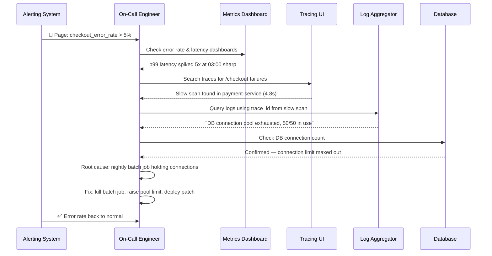

### Step-by-Step Breakdown

#### 1. 03:00 AM — Alert Fires
A metric-based alert (`checkout_error_rate > 5% for 5 minutes`) pages the on-call engineer via PagerDuty.

**What happened:**
- Prometheus detected error rate exceeded threshold
- Alertmanager sent page to on-call engineer
- Engineer's phone buzzes with PagerDuty notification

#### 2. Triage (03:02 AM)
The engineer opens Grafana and immediately sees a **metric**: p99 latency for `/checkout` jumped from 200ms to over 5 seconds, exactly at 3:00 AM.

**Metrics examined:**
- `checkout_error_rate`: 5.2% (threshold: 5%)
- `checkout_p99_latency`: 5.2s (normal: 200ms)
- `checkout_request_rate`: Normal (not a traffic spike)
- `payment_service_error_rate`: 8.3% (elevated)

**Initial assessment:** Not a traffic issue—something is wrong with the service itself.

#### 3. Pivot to Tracing (03:05 AM)
They filter their tracing tool (e.g., Jaeger/Tempo) for slow or failed traces on `/checkout` in the last 15 minutes.

**Search query:**
```
service=checkout-service
endpoint=/checkout
status=error
duration>1s
```

**Results:** 47 traces found, all showing similar pattern.

**Examination of one trace:**
```
Trace ID: a1b2c3d4e5f6a1b2c3d4e5f6a1b2c3d4
Total duration: 5.2s

Spans:
├─ API Gateway: 50ms ✅
├─ Auth Service: 100ms ✅
├─ Order Service: 200ms ✅
├─ Payment Service: 4.8s ❌ (BOTTLENECK!)
│  └─ charge_card: 4.8s
│     └─ db_query: 4.8s
└─ Notification Service: 100ms (never executed)
```

**Key finding:** Payment service database query taking 4.8 seconds.

#### 4. Pivot to Logs (03:08 AM)
Using the `trace_id` from that span (`a1b2c3d4e5f6a1b2c3d4e5f6a1b2c3d4`), they search the centralized log store (e.g., Loki).

**Log query:**
```
{trace_id="a1b2c3d4e5f6a1b2c3d4e5f6a1b2c3d4"}
```

**Log entries found:**
```json
{
  "timestamp": "2026-08-05T03:00:15Z",
  "level": "ERROR",
  "service": "payment-service",
  "trace_id": "a1b2c3d4e5f6a1b2c3d4e5f6a1b2c3d4",
  "message": "Connection pool exhausted, waited 4800ms for available connection",
  "pool_size": 50,
  "active_connections": 50,
  "waiting_requests": 12
}
```

**Root cause identified:** Connection pool exhausted.

#### 5. Correlate the Trigger (03:10 AM)
They notice the incident started exactly at 3:00 AM — the same time a nightly batch reconciliation job runs.

**Investigation:**
```bash
# Check batch job status
ps aux | grep batch_reconciliation

# Check database connections
SELECT count(*) FROM pg_stat_activity WHERE datname = 'payment_db';
-- Result: 50 connections (max)

# Check what's holding connections
SELECT pid, usename, application_name, state, query_start 
FROM pg_stat_activity 
WHERE datname = 'payment_db' 
ORDER BY query_start DESC;
-- Result: batch_reconciliation job holding 48 connections
```

**Root cause confirmed:** The nightly batch job is holding 48 of 50 available connections, starving the payment service.

#### 6. Mitigation (03:15 AM)

**Immediate fix:**
1. Kill the batch job (releases 48 connections)
2. Error rate returns to normal within 2 minutes

**Short-term fix:**
1. Increase connection pool limit from 50 to 100
2. Deploy config change

**Long-term fix:**
1. Give batch job its own dedicated connection pool
2. Implement connection pool monitoring
3. Add alert for connection pool utilization > 80%

#### 7. Verification (03:20 AM)
Metrics confirm the error rate returns to baseline:
- `checkout_error_rate`: 0.2% ✅
- `checkout_p99_latency`: 210ms ✅
- `payment_service_error_rate`: 0.1% ✅

#### 8. Post-Incident (Next Day)

**Post-mortem document created:**
- Timeline of incident
- Root cause analysis
- Impact assessment: 20 minutes of elevated errors, ~$5,000 in failed transactions
- Action items:
  1. [ ] Implement connection pool isolation (due: 1 week)
  2. [ ] Add connection pool utilization alert (due: 3 days)
  3. [ ] Review all batch job resource usage (due: 2 weeks)
  4. [ ] Update runbook with this scenario (due: 1 week)

**Why this worked:** Each pillar did its job:
- **Metric** caught the anomaly instantly
- **Trace** pinpointed exactly *where* time was lost
- **Log** explained exactly *why*

Without any one of the three, this investigation would have taken far longer—possibly hours of guesswork instead of ~10 minutes of precise investigation.

### Key Takeaways from This Incident

1. **Start with metrics:** They tell you *something* is wrong
2. **Use traces to narrow down:** They tell you *where* the problem is
3. **Use logs to understand why:** They tell you *why* it happened
4. **Correlation is key:** The `trace_id` linked all three pillars together
5. **Act quickly:** Clear runbooks and tooling enable fast response

---

## 11. Common Pitfalls and Best Practices <a name="pitfalls"></a>

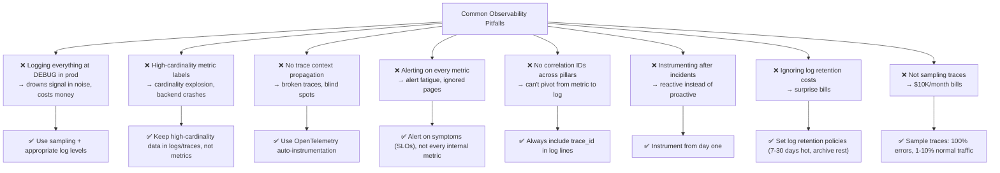

### Comprehensive Best-Practice Checklist

#### Logging Best Practices

✅ **Use structured logs (JSON), always include:**
- `timestamp` (ISO 8601 format)
- `service.name`
- `trace_id` and `span_id`
- `level` (DEBUG, INFO, WARN, ERROR, FATAL)
- `message` (human-readable description)

✅ **Log at appropriate levels:**
- DEBUG: Development only, or specific troubleshooting
- INFO: Normal operational events
- WARN: Unexpected but recoverable
- ERROR: Failures requiring attention
- FATAL: System cannot continue

✅ **Include context:**
- User IDs (for debugging user-specific issues)
- Request IDs (for correlation)
- Error details (stack traces for exceptions)
- Performance metrics (duration, size)

✅ **Implement log rotation and retention:**
- Hot storage: 7-30 days (fast query)
- Warm storage: 30-90 days (slower, cheaper)
- Cold storage: 90+ days (archive, compliance)

#### Metrics Best Practices

✅ **Use low-cardinality labels:**
- Good: `endpoint`, `method`, `status_code`, `region`
- Bad: `user_id`, `order_id`, `session_id`, `request_id`

✅ **Follow naming conventions:**
- Use base units: `seconds`, `bytes`, `total`
- Suffix with unit: `_seconds`, `_bytes`, `_total`
- Prefix with domain: `http_`, `db_`, `app_`

✅ **Instrument the four golden signals:**
1. **Latency:** How long requests take
2. **Traffic:** How many requests you're getting
3. **Errors:** Rate of failed requests
4. **Saturation:** How "full" your service is (CPU, memory, connections)

✅ **Set up SLO-based alerts:**
- Alert on error budget burn rate
- Don't alert on every metric spike
- Use multi-window alerts to reduce false positives

#### Tracing Best Practices

✅ **Instrument all services in the request path:**
- Use OpenTelemetry auto-instrumentation
- Add custom spans for critical business logic
- Ensure context propagation across all boundaries

✅ **Sample strategically:**
- 100% of errors and slow requests (>1s)
- 1-10% of normal traffic
- Consider tail-based sampling for high-traffic systems

✅ **Add meaningful span attributes:**
- `db.statement` (SQL queries)
- `db.table` (database tables)
- `http.url` (full URL)
- `http.status_code` (HTTP status)
- `user.id` (for user-specific analysis)

✅ **Keep spans short:**
- A span should represent one unit of work
- Don't create spans that last minutes
- Use nested spans for complex operations

#### General Best Practices

✅ **Instrument from day one:**
- Don't wait for incidents to add observability
- Add basic instrumentation during development
- Treat observability as a feature, not an afterthought

✅ **Use OpenTelemetry:**
- Vendor-neutral
- Wide language support
- Auto-instrumentation available
- Future-proof

✅ **Correlate across pillars:**
- Always include `trace_id` in logs
- Add `trace_id` as a metric label (if cardinality allows)
- Use consistent field names

✅ **Document your SLOs:**
- Make them visible to the entire team
- Track error budget in a dashboard
- Review SLOs quarterly

✅ **Run regular game days:**
- Simulate incidents
- Test your observability tooling
- Train team members on investigation workflows

✅ **Review and refine:**
- Monthly: Review alert noise, tune thresholds
- Quarterly: Review SLOs, adjust if needed
- Annually: Evaluate observability tools and costs

---

## 12. Building Your Own Observability Stack <a name="building-stack"></a>

A popular, fully open-source stack many teams start with:

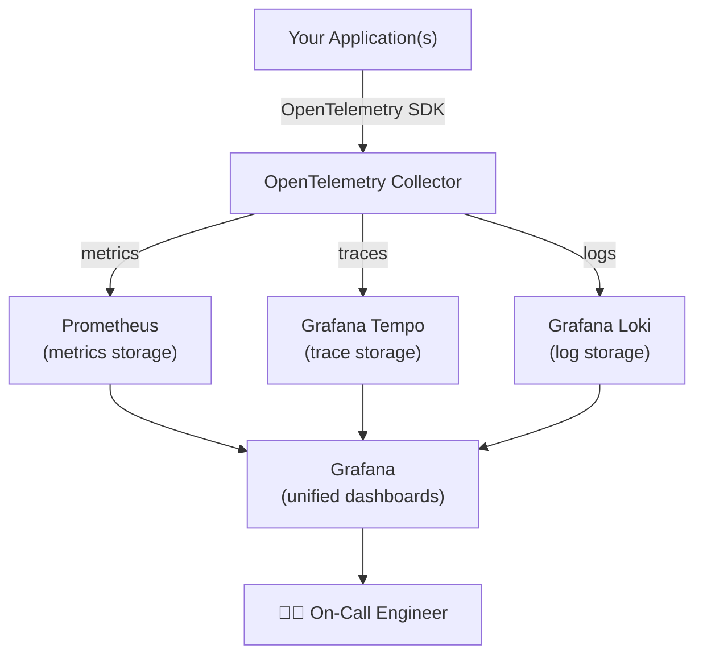

### Stack Components

| Layer | Popular Open-Source Options | Popular Managed/Commercial Options |
|-------|----------------------------|-----------------------------------|
| **Instrumentation** | OpenTelemetry SDKs | OpenTelemetry SDKs (same!) |
| **Metrics Storage** | Prometheus, VictoriaMetrics, Mimir | Datadog, New Relic, Grafana Cloud |
| **Trace Storage** | Jaeger, Grafana Tempo, Zipkin | Honeycomb, Datadog APM, New Relic |
| **Log Storage** | Grafana Loki, Elasticsearch, ClickHouse | Datadog Logs, Splunk, Sumo Logic |
| **Visualization** | Grafana | Vendor-native dashboards |
| **Collection** | OpenTelemetry Collector, Fluentd | Vendor agents |

### Deployment Options

#### Option 1: Fully Open-Source (Self-Hosted)

**Pros:**
- Full control over data
- No vendor lock-in
- Cost-effective at scale
- Customizable

**Cons:**
- Requires maintenance
- Need to manage scaling
- More complex setup
- Requires expertise

**Best for:** Large teams, compliance requirements, cost-sensitive organizations

**Infrastructure requirements:**
- Kubernetes cluster (recommended)
- 3-5 nodes minimum for production
- SSD storage for metrics/logs
- Separate storage tiers (hot/warm/cold)

#### Option 2: Managed/Commercial (SaaS)

**Popular options:**
- **Datadog:** All-in-one platform, excellent UX, expensive
- **New Relic:** Full-stack observability, good APM
- **Honeycomb:** Best-in-class trace analysis, high-cardinality
- **Grafana Cloud:** Open-source stack as a service, cost-effective
- **AWS CloudWatch:** Integrated with AWS, convenient if all-in on AWS

**Pros:**
- No infrastructure to manage
- Quick setup (minutes vs. weeks)
- Vendor support
- Automatic updates

**Cons:**
- Expensive at scale
- Vendor lock-in risk
- Data leaves your environment
- Less customizable

**Best for:** Small to medium teams, fast time-to-value, limited DevOps resources

#### Option 3: Hybrid Approach

Use managed services for some pillars, self-hosted for others.

**Example:**
- Metrics: Self-hosted Prometheus (cost control)
- Traces: Grafana Tempo (self-hosted) or Honeycomb (managed)
- Logs: Self-hosted Loki or managed Elasticsearch

**Pros:**
- Best of both worlds
- Optimize cost vs. convenience
- Flexibility to migrate

**Cons:**
- More complex to manage
- Multiple vendors to integrate

### Quick Start: Docker Compose Setup

```yaml
# docker-compose.yml
version: '3.8'

services:
  # OpenTelemetry Collector
  otel-collector:
    image: otel/opentelemetry-collector-contrib:0.91.0
    command: ["--config=/etc/otel-collector-config.yaml"]
    volumes:
      - ./otel-collector-config.yaml:/etc/otel-collector-config.yaml
    ports:
      - "4317:4317"  # OTLP gRPC
      - "4318:4318"  # OTLP HTTP
      - "8889:8889"  # Prometheus metrics
    depends_on:
      - prometheus
      - tempo
      - loki
      - grafana

  # Prometheus - Metrics Storage
  prometheus:
    image: prom/prometheus:v2.47.0
    volumes:
      - ./prometheus.yml:/etc/prometheus/prometheus.yml
      - prometheus-data:/prometheus
    command:
      - '--config.file=/etc/prometheus/prometheus.yml'
      - '--storage.tsdb.path=/prometheus'
    ports:
      - "9090:9090"

  # Grafana Tempo - Trace Storage
  tempo:
    image: grafana/tempo:2.3.0
    command: ["-config.file=/etc/tempo.yaml"]
    volumes:
      - ./tempo.yaml:/etc/tempo.yaml
      - tempo-data:/tmp/tempo
    ports:
      - "14268:14268"  # Jaeger HTTP
      - "3200:3200"    # Tempo HTTP

  # Grafana Loki - Log Storage
  loki:
    image: grafana/loki:2.9.3
    command: ["-config.file=/etc/loki/local-config.yaml"]
    volumes:
      - ./loki-config.yaml:/etc/loki/local-config.yaml
      - loki-data:/loki
    ports:
      - "3100:3100"

  # Grafana - Visualization
  grafana:
    image: grafana/grafana:10.1.0
    volumes:
      - grafana-data:/var/lib/grafana
      - ./grafana-dashboards:/etc/grafana/provisioning/dashboards
      - ./grafana-datasources:/etc/grafana/provisioning/datasources
    environment:
      - GF_SECURITY_ADMIN_PASSWORD=admin
      - GF_USERS_ALLOW_SIGN_UP=false
    ports:
      - "3000:3000"
    depends_on:
      - prometheus
      - tempo
      - loki

volumes:
  prometheus-data:
  tempo-data:
  loki-data:
  grafana-data:
```

**Start the stack:**
```bash
docker-compose up -d
```

**Access:**
- Grafana: http://localhost:3000 (admin/admin)
- Prometheus: http://localhost:9090
- Tempo: http://localhost:3200

### Getting Started Tip

If you're a small team, start with a managed vendor (fewer moving parts to maintain). If you need cost control at scale or have compliance requirements to keep data on-prem, the open-source stack (Prometheus + Tempo + Loki + Grafana) is a proven, well-documented path.

**Recommended approach:**
1. **Week 1:** Start with metrics only (Prometheus + Grafana)
2. **Week 2:** Add distributed tracing (Jaeger or Tempo)
3. **Week 3:** Add centralized logging (Loki or ELK)
4. **Week 4:** Implement correlation and dashboards

Don't try to boil the ocean on day one.

---

## 13. Security Considerations <a name="security-considerations"></a>

Observability systems collect vast amounts of data about your systems, which creates security risks if not properly managed.

### Data Classification

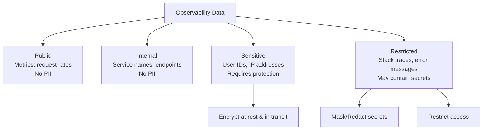

### Security Best Practices

#### 1. Protect Sensitive Data

❌ **Don't log:**
- Passwords or credentials
- Credit card numbers (PCI-DSS violation)
- Social Security numbers
- API keys or tokens
- Personal health information (HIPAA)

✅ **Do log:**
- User IDs (not PII)
- Error codes (not full error messages with secrets)
- Performance metrics
- Service names and endpoints

**Example of data redaction:**
```python
import re

def redact_sensitive_data(log_entry: dict) -> dict:
    """Redact sensitive fields from log entries."""
    sensitive_patterns = {
        'password': r'.*',
        'credit_card': r'\d{4}-\d{4}-\d{4}-\d{4}',
        'ssn': r'\d{3}-\d{2}-\d{4}',
        'api_key': r'[A-Za-z0-9]{32,}',
    }
    
    redacted = log_entry.copy()
    
    for field, pattern in sensitive_patterns.items():
        if field in redacted:
            redacted[field] = '[REDACTED]'
        # Also check in message field
        if 'message' in redacted:
            redacted['message'] = re.sub(pattern, '[REDACTED]', redacted['message'])
    
    return redacted
```

#### 2. Encrypt Data in Transit

```yaml
# TLS configuration for OpenTelemetry Collector
receivers:
  otlp:
    protocols:
      grpc:
        endpoint: 0.0.0.0:4317
        tls:
          cert_file: /etc/ssl/certs/otel.crt
          key_file: /etc/ssl/private/otel.key
      http:
        endpoint: 0.0.0.0:4318
        tls:
          cert_file: /etc/ssl/certs/otel.crt
          key_file: /etc/ssl/private/otel.key
```

#### 3. Encrypt Data at Rest

```yaml
# Loki storage encryption
auth_enabled: true
storage_config:
  aws:
    s3: s3://us-east-1/loki-bucket
    s3forcepathstyle: true
  boltdb:
    directory: /loki/boltdb
  filesystem:
    directory: /loki/chunks
  
# Enable encryption at rest in storage backend
```

#### 4. Access Control

```yaml
# Grafana access control
api_keys:
  - name: read-only-key
    role: Viewer
    expires: 365d
  - name: admin-key
    role: Admin
    expires: 90d

# Enable RBAC
[security]
admin_user = admin
admin_password = ${ADMIN_PASSWORD}

[auth]
disable_login_form = false
disable_signout_menu = false
```

#### 5. Audit Logging

Track who accesses observability data:

```yaml
# Enable audit logging in Grafana
[audit]
enabled = true
path = /var/log/grafana/audit.log
```

#### 6. Network Segmentation

```mermaid
flowchart TD
    Internet[Internet] --> Firewall[Firewall]
    Firewall --> DMZ[DMZ]
    DMZ --> LB[Load Balancer]
    LB --> App[App Servers]
    
    App --> OTEL[OTel Collector<br/>Internal Network Only]
    OTEL --> Metrics[Metrics Backend<br/>Internal Network]
    OTEL --> Traces[Trace Backend<br/>Internal Network]
    OTEL --> Logs[Log Backend<br/>Internal Network]
    
    Engineer[Engineer VPN] --> Grafana[Grafana<br/>Authenticated Access]
    Grafana --> Metrics
    Grafana --> Traces
    Grafana --> Logs
```

### Compliance Considerations

**GDPR (EU):**
- Right to erasure: Implement data deletion policies
- Data minimization: Don't log PII
- Data portability: Allow users to export their data

**PCI-DSS (Payment Cards):**
- Never log full credit card numbers
- Mask CVV codes
- Encrypt cardholder data
- Regular security scans

**HIPAA (Healthcare):**
- Encrypt all health information
- Access controls and audit logs
- Data retention policies
- Business associate agreements with vendors

### Security Checklist

✅ Encrypt data in transit (TLS everywhere)
✅ Encrypt data at rest
✅ Redact sensitive data before logging
✅ Implement access controls (RBAC)
✅ Enable audit logging
✅ Regular security scans
✅ Data retention policies
✅ Vendor security assessments (if using managed services)
✅ Network segmentation
✅ Secret management (use Vault, not hardcoded)

---

## 14. Performance Considerations <a name="performance-considerations"></a>

Observability tooling itself can impact application performance. Here's how to minimize overhead.

### Performance Impact by Pillar

| Pillar | Typical Overhead | Optimization Strategies |
|--------|-----------------|------------------------|
| **Logs** | 1-5% CPU, 2-10% I/O | Async logging, sampling, buffering |
| **Metrics** | <1% CPU, minimal memory | Pull-based, efficient counters | 
| **Traces** | 2-10% CPU, 5-15% network | Sampling, batching, async export |

### Logging Performance

❌ **Bad: Synchronous logging with string concatenation**
```python
# Each log call blocks the request
logger.debug("User " + user.name + " performed " + action + " at " + timestamp)
# Overhead: 5-10ms per log call
```

✅ **Good: Asynchronous structured logging**
```python
# Non-blocking, structured
logger.debug("user_action", user=user.id, action=action)
# Overhead: <1ms per log call
```

**Optimization techniques:**
1. **Use async loggers:** Don't block application on I/O
2. **Batch log writes:** Buffer and write in batches
3. **Sample DEBUG logs:** Only log 10-20% in production
4. **Use efficient serializers:** Binary formats (MsgPack) vs JSON

### Metrics Performance

❌ **Bad: High cardinality metrics**
```python
# Creates millions of time series
REQUEST_COUNT.labels(user_id=user.id).inc()
# Overhead: High memory, slow queries, storage explosion
```

✅ **Good: Low cardinality metrics**
```python
# Creates ~20 time series
REQUEST_COUNT.labels(endpoint='/checkout', status='200').inc()
# Overhead: <0.1% CPU
```

**Optimization techniques:**
1. **Use pull-based metrics:** Prometheus scrapes vs. app pushing
2. **Aggregate client-side:** Reduce cardinality before export
3. **Use efficient data types:** Counters vs. gauges
4. **Set scrape intervals wisely:** 15-30s is usually sufficient

### Tracing Performance

❌ **Bad: 100% sampling with large payloads**
```python
# Trace every request, log full request body
span.set_attribute("request.body", json.dumps(request.body))
# Overhead: 10-20% CPU, high network usage
```

✅ **Good: Intelligent sampling with minimal attributes**
```python
# Sample 1% of requests, only critical attributes
span.set_attribute("order.id", order_id)
span.set_attribute("payment.amount", amount)
# Overhead: 1-2% CPU
```

**Optimization techniques:**
1. **Sample strategically:** 100% errors, 1-10% normal
2. **Batch span exports:** Send in batches, not one-by-one
3. **Use efficient serializers:** Protobuf vs. JSON
4. **Limit span attributes:** Only add what you'll query
5. **Use tail-based sampling:** Decide what to keep after trace completes

### Benchmarking Observability Overhead

```python
import time
import statistics

def benchmark_logging(iterations=10000):
    """Benchmark logging overhead."""
    times = []
    
    for i in range(iterations):
        start = time.perf_counter()
        logger.info("benchmark", iteration=i)
        end = time.perf_counter()
        times.append((end - start) * 1000)  # Convert to ms
    
    print(f"Logging overhead:")
    print(f"  Mean: {statistics.mean(times):.2f}ms")
    print(f"  P95: {statistics.quantile(times, 0.95):.2f}ms")
    print(f"  P99: {statistics.quantile(times, 0.99):.2f}ms")

def benchmark_metrics(iterations=10000):
    """Benchmark metrics overhead."""
    times = []
    
    for i in range(iterations):
        start = time.perf_counter()
        REQUEST_COUNT.labels(endpoint='/test', status='200').inc()
        end = time.perf_counter()
        times.append((end - start) * 1000)
    
    print(f"Metrics overhead:")
    print(f"  Mean: {statistics.mean(times):.2f}ms")
    print(f"  P95: {statistics.quantile(times, 0.95):.2f}ms")

def benchmark_tracing(iterations=1000):
    """Benchmark tracing overhead."""
    times = []
    
    for i in range(iterations):
        start = time.perf_counter()
        with tracer.start_as_current_span("benchmark"):
            time.sleep(0.001)  # Simulate work
        end = time.perf_counter()
        times.append((end - start) * 1000)
    
    print(f"Tracing overhead:")
    print(f"  Mean: {statistics.mean(times):.2f}ms")
    print(f"  P95: {statistics.quantile(times, 0.95):.2f}ms")

# Run benchmarks
benchmark_logging()
benchmark_metrics()
benchmark_tracing()
```

**Typical results:**
```
Logging overhead:
  Mean: 0.15ms
  P95: 0.45ms
  P99: 0.89ms

Metrics overhead:
  Mean: 0.02ms
  P95: 0.05ms
  P99: 0.12ms

Tracing overhead:
  Mean: 1.2ms
  P95: 1.8ms
  P99: 2.5ms
```

### Performance Budget

Set a performance budget for observability overhead:

| Component | Budget | Monitoring |
|-----------|--------|------------|
| Logging | <5% CPU | Monitor logger queue depth |
| Metrics | <1% CPU | Monitor scrape duration |
| Tracing | <10% CPU | Monitor span export queue |
| Network | <5% bandwidth | Monitor export payload size |

### Cost Optimization

**Logs:**
- Hot storage (7 days): $0.10/GB/month
- Warm storage (30 days): $0.05/GB/month
- Cold storage (90 days): $0.01/GB/month
- **Savings:** Sample DEBUG logs, compress data, tier storage

**Metrics:**
- Prometheus: ~1-2GB/month per service
- **Savings:** Use low cardinality, longer retention periods

**Traces:**
- ~100-500 bytes per span
- 1% sampling = ~10,000 spans/day per service
- **Savings:** Intelligent sampling, shorter retention (7-14 days)

---

## 15. Testing Strategies <a name="testing-strategies"></a>

Observability should be tested like any other critical system component.

### Unit Testing Instrumentation

```python
import unittest
from unittest.mock import patch, MagicMock
from opentelemetry import trace

class TestObservabilityInstrumentation(unittest.TestCase):
    """Test that instrumentation works correctly."""
    
    @patch('opentelemetry.trace.get_tracer')
    def test_span_creation(self, mock_get_tracer):
        """Test that spans are created correctly."""
        mock_tracer = MagicMock()
        mock_get_tracer.return_value = mock_tracer
        
        # Call instrumented function
        process_order("order-123", user_id=456)
        
        # Verify span was created
        mock_tracer.start_as_current_span.assert_called_once()
        
    @patch('logger')
    def test_log_output(self, mock_logger):
        """Test that logs are emitted correctly."""
        process_order("order-123", user_id=456)
        
        # Verify log was called with correct fields
        mock_logger.info.assert_called()
        log_call = mock_logger.info.call_args
        
        # Check required fields
        self.assertIn('trace_id', log_call.kwargs)
        self.assertIn('order_id', log_call.kwargs)
        self.assertIn('user_id', log_call.kwargs)
        
    def test_metrics_increment(self):
        """Test that metrics are incremented."""
        initial_count = get_metric_value('orders_total')
        
        process_order("order-123", user_id=456)
        
        new_count = get_metric_value('orders_total')
        self.assertEqual(new_count, initial_count + 1)
```

### Integration Testing

```python
import pytest
from opentelemetry.sdk.trace import TracerProvider
from opentelemetry.sdk.trace.export import SimpleSpanProcessor
from opentelemetry.sdk.trace.export.in_memory_span_exporter import InMemorySpanExporter

class TestObservabilityIntegration:
    """Integration tests for observability pipeline."""
    
    @pytest.fixture
    def span_exporter(self):
        """Create in-memory span exporter for testing."""
        exporter = InMemorySpanExporter()
        return exporter
    
    @pytest.fixture
    def tracer_provider(self, span_exporter):
        """Create tracer provider with in-memory exporter."""
        provider = TracerProvider()
        processor = SimpleSpanProcessor(span_exporter)
        provider.add_span_processor(processor)
        trace.set_tracer_provider(provider)
        return provider
    
    def test_end_to_end_trace(self, span_exporter, tracer_provider):
        """Test complete trace generation."""
        # Execute instrumented code
        process_order("order-123", user_id=456)
        
        # Force flush
        span_exporter.shutdown()
        
        # Retrieve spans
        spans = span_exporter.get_finished_spans()
        
        # Verify trace structure
        self.assertEqual(len(spans), 4)  # 4 spans created
        self.assertEqual(spans[0].name, "process_order")
        self.assertEqual(spans[1].name, "validate_order")
        self.assertEqual(spans[2].name, "charge_payment")
        self.assertEqual(spans[3].name, "reserve_inventory")
        
        # Verify trace ID propagation
        trace_ids = set(span.context.trace_id for span in spans)
        self.assertEqual(len(trace_ids), 1)  # All spans share same trace ID
        
        # Verify attributes
        payment_span = [s for s in spans if s.name == "charge_payment"][0]
        self.assertEqual(payment_span.attributes["order.id"], "order-123")
```

### Load Testing with Observability

```python
from locust import HttpUser, task, between
import time

class ObservabilityLoadTest(HttpUser):
    """Load test with observability validation."""
    
    wait_time = between(1, 3)
    
    @task
    def checkout_flow(self):
        """Test checkout with observability."""
        start_time = time.time()
        
        response = self.client.post("/checkout", json={
            "user_id": 12345,
            "amount": 99.99,
            "items": ["item-1", "item-2"]
        })
        
        duration = time.time() - start_time
        
        # Validate response
        assert response.status_code == 200
        
        # Validate observability
        trace_id = response.headers.get('traceparent')
        if trace_id:
            # Verify trace was created
            trace = get_trace(trace_id)
            assert trace is not None
            assert trace.duration < 1.0  # Should complete in <1s
            
            # Verify logs were created
            logs = get_logs(trace_id=trace_id)
            assert len(logs) > 0
```

### Chaos Testing

Test observability by injecting failures:

```python
class ChaosMonkey:
    """Chaos testing for observability."""
    
    @staticmethod
    def inject_latency(service: str, latency_ms: int):
        """Inject latency into a service."""
        # Add artificial delay
        time.sleep(latency_ms / 1000.0)
    
    @staticmethod
    def kill_service(service: str):
        """Simulate service failure."""
        # Stop service
        pass
    
    @staticmethod
    def inject_errors(service: str, error_rate: float):
        """Inject errors into a service."""
        if random.random() < error_rate:
            raise Exception("Chaos error")

# Run chaos test
def test_observability_during_failure():
    """Verify observability captures failures."""
    # Start normal traffic
    start_traffic()
    
    # Inject chaos
    ChaosMonkey.inject_latency("payment-service", 5000)
    
    # Verify metrics captured the spike
    metrics = query_metrics("payment_service_latency")
    assert metrics.p99 > 5.0
    
    # Verify traces captured the slow operation
    traces = query_traces(service="payment-service", min_duration=5.0)
    assert len(traces) > 0
    
    # Verify logs captured the error
    logs = query_logs(service="payment-service", level="ERROR")
    assert len(logs) > 0
```

### Observability Testing Checklist

✅ **Unit tests:**
- [ ] Verify spans are created
- [ ] Verify logs are emitted
- [ ] Verify metrics are incremented
- [ ] Test error handling

✅ **Integration tests:**
- [ ] Test trace propagation across services
- [ ] Test correlation IDs in logs and metrics
- [ ] Test sampling logic
- [ ] Test export to backends

✅ **Load tests:**
- [ ] Measure observability overhead
- [ ] Test under high traffic
- [ ] Verify no dropped spans/logs
- [ ] Test backpressure handling

✅ **Chaos tests:**
- [ ] Inject failures and verify detection
- [ ] Test during partial outages
- [ ] Verify data consistency during failures

---

## 16. Troubleshooting Guide <a name="troubleshooting-guide"></a>

Common issues and their solutions.

### Issue 1: Missing Traces

**Symptoms:**
- Traces don't appear in tracing UI
- Some spans are missing from traces
- Incomplete trace graphs

**Causes & Solutions:**

| Cause | Solution |
|-------|----------|
| Context not propagated | Ensure `traceparent` header is passed between services |
| Sampling rate too low | Increase sampling for debugging |
| Exporter not configured | Verify OTLP exporter endpoint is correct |
| Network issues | Check firewall rules, DNS resolution |
| Clock skew | Sync clocks with NTP across services |

**Debugging steps:**
```bash
# 1. Check if traces are being generated
curl -X POST http://localhost:4318/v1/traces \
  -H "Content-Type: application/json" \
  -d '{"resourceSpans":[...]}'

# 2. Verify collector is receiving traces
docker logs otel-collector | grep "trace"

# 3. Check exporter status
curl http://localhost:8889/metrics | grep otelcol_exporter
```

### Issue 2: High Cardinality in Metrics

**Symptoms:**
- Prometheus running out of memory
- Queries timing out
- "Cardinality explosion" errors

**Causes & Solutions:**

| Cause | Solution |
|-------|----------|
| High-cardinality labels | Remove `user_id`, `request_id` from metrics |
| Too many label values | Use consistent, limited label values |
| Label value explosion | Implement label value limits |

**Fix example:**
```python
# Before: High cardinality
REQUEST_COUNT.labels(
    user_id=user.id,  # 1M+ unique values!
    endpoint=endpoint
).inc()

# After: Low cardinality
REQUEST_COUNT.labels(
    endpoint=endpoint,
    method=method,
    status=status
).inc()

# If you need user_id, use logs instead
logger.info("request", user_id=user.id, trace_id=trace_id)
```

### Issue 3: Log Volume Too High

**Symptoms:**
- Storage costs skyrocketing
- Log queries timing out
- Log agent overwhelmed

**Causes & Solutions:**

| Cause | Solution |
|-------|----------|
| DEBUG logging in prod | Set log level to INFO or WARN |
| No sampling | Implement log sampling (10-20% of DEBUG logs) |
| Logging entire request bodies | Log only metadata, not full bodies |
| No retention policy | Implement hot/warm/cold storage tiers |

**Fix example:**
```python
# Before: Logging everything
logger.debug(f"Request body: {request.body}")

# After: Strategic logging
if logger.isEnabledFor(DEBUG):
    logger.debug("request_received", 
                content_type=request.content_type,
                content_length=len(request.body))
```

### Issue 4: Traces Not Linked to Logs

**Symptoms:**
- Can't find logs for a trace
- trace_id not present in log entries
- Correlation not working

**Causes & Solutions:**

| Cause | Solution |
|-------|----------|
| trace_id not propagated | Add middleware to extract/pass trace_id |
| Different field names | Use consistent `trace_id` field name |
| Logs processed before traces | Ensure trace_id is available when logging |
| Sampling mismatch | Use same sampling rate for logs and traces |

**Fix example:**
```javascript
// Middleware to propagate trace context
app.use((req, res, next) => {
  // Extract trace_id from headers
  const traceparent = req.headers['traceparent'];
  const traceId = traceparent ? extractTraceId(traceparent) : generateId();
  
  // Attach to request
  req.traceId = traceId;
  
  // Add to response for client-side correlation
  res.setHeader('traceparent', `00-${traceId}-${generateSpanId()}-01`);
  
  next();
});

// Use in logging
logger.info({
  trace_id: req.traceId,  // Now available!
  message: 'request_started'
});
```

### Issue 5: Alert Fatigue

**Symptoms:**
- Too many alerts
- Alerts being ignored
- On-call burnout

**Causes & Solutions:**

| Cause | Solution |
|-------|----------|
| Alerting on every metric | Alert only on SLOs and critical issues |
| No alert prioritization | Implement tiered alerting (P1, P2, P3) |
| No alert documentation | Add runbooks to every alert |
| No alert review process | Review alerts monthly, tune or delete |

**Fix example:**
```yaml
# Before: Alert on every metric spike
groups:
  - name: all_the_things
    rules:
      - alert: HighCPU
        expr: cpu_usage > 80
      - alert: HighMemory
        expr: memory_usage > 80
      - alert: HighDisk
        expr: disk_usage > 80
      # ... 50 more alerts

# After: Alert on SLOs only
groups:
  - name: slo_based_alerts
    rules:
      - alert: CheckoutErrorBudgetBurn
        expr: |
          (
            sum(rate(http_requests_total{status=~"5.."}[1h]))
            /
            sum(rate(http_requests_total[1h]))
          ) > 0.01
        for: 5m
        labels:
          severity: critical
        annotations:
          summary: "Checkout error budget burning rapidly"
          runbook: "https://wiki/runbooks/checkout-errors"
```

### Issue 6: Slow Queries

**Symptoms:**
- Grafana dashboards loading slowly
- Log searches timing out
- Trace queries taking >30s

**Causes & Solutions:**

| Cause | Solution |
|-------|----------|
| No indexing | Add indexes on frequently queried fields |
| Too much data | Reduce time range, use sampling |
| Inefficient queries | Optimize PromQL/LogQL queries |
| Underpowered backend | Scale up storage backend |

**Optimization examples:**

```promql
# Before: Inefficient query
sum(http_requests_total)

# After: Efficient query with time range
sum(rate(http_requests_total[5m]))

# Before: Querying all time
{service="payment"}

# After: Query recent time
{service="payment"} | json | line_format "{{.timestamp}} {{.message}}"
  | range 1h
```

### Troubleshooting Decision Tree

```mermaid
flowchart TD
    Problem[Observability Problem] --> Q1{What's broken?}
    
    Q1 -->|No data at all| Check1[Check data collection]
    Q1 -->|Missing some data| Check2[Check sampling/propagation]
    Q1 -->|Slow queries| Check3[Check indexes/backend]
    Q1 -->|High costs| Check4[Check retention/sampling]
    
    Check1 --> S1[Verify agent running<br/>Check network connectivity<br/>Verify config]
    Check2 --> S2[Check trace context headers<br/>Verify sampling config<br/>Check cardinality]
    Check3 --> S3[Add indexes<br/>Reduce time range<br/>Scale backend]
    Check4 --> S4[Implement tiered storage<br/>Reduce retention<br/>Sample DEBUG logs]
```

---

## 17. Pro Tips for Advanced Users <a name="pro-tips"></a>

### Tip 1: Use Exemplars for Correlation

Exemplars link metrics to specific traces, enabling drill-down from a metric spike to individual traces.

```promql
# Prometheus exemplar
http_request_duration_seconds_bucket{le="0.1"}
  # Exemplars show specific trace IDs
  # Click to jump directly to that trace
```

### Tip 2: Implement Adaptive Sampling

```python
class AdaptiveSampler:
    """Adjust sampling rate based on system load."""
    
    def __init__(self):
        self.base_rate = 0.01  # 1%
        self.max_rate = 1.0    # 100%
        self.min_rate = 0.001  # 0.1%
    
    def get_sample_rate(self, current_load: float) -> float:
        """
        Adjust sampling rate based on system load.
        
        Args:
            current_load: Current system load (0.0 to 1.0)
            
        Returns:
            float: Sampling rate (0.0 to 1.0)
        """
        if current_load > 0.9:
            # High load: reduce sampling
            return self.min_rate
        elif current_load > 0.7:
            # Medium-high load: reduce slightly
            return self.base_rate * 0.5
        elif current_load < 0.3:
            # Low load: increase sampling
            return self.base_rate * 2
        else:
            # Normal load: use base rate
            return self.base_rate
```

### Tip 3: Use OpenTelemetry Metrics for RED Method

```python
# Rate, Errors, Duration (RED) metrics
from prometheus_client import Counter, Histogram

# Rate: Requests per second
REQUEST_RATE = Counter(
    'http_requests_total',
    'Total HTTP requests',
    ['endpoint', 'method']
)

# Errors: Error rate
ERROR_RATE = Counter(
    'http_errors_total',
    'Total HTTP errors',
    ['endpoint', 'method', 'error_type']
)

# Duration: Request latency
DURATION = Histogram(
    'http_request_duration_seconds',
    'Request duration',
    ['endpoint'],
    buckets=[0.01, 0.05, 0.1, 0.5, 1.0, 2.5, 5.0, 10.0]
)
```

### Tip 4: Implement Correlation in Message Queues

```python
# Kafka producer with trace context
from opentelemetry import trace
from opentelemetry.propagate import inject

tracer = trace.get_tracer(__name__)

def produce_message(topic: str, message: dict):
    """Produce message with trace context."""
    with tracer.start_as_current_span("produce_message") as span:
        span.set_attribute("messaging.system", "kafka")
        span.set_attribute("messaging.destination", topic)
        
        # Inject trace context into message headers
        headers = {}
        inject(headers)  # Injects traceparent, tracestate
        
        producer.send(
            topic,
            value=message,
            headers=list(headers.items())
        )
```

### Tip 5: Use Continuous Profiling

Combine APM with continuous profiling for deeper insights:

```bash
# Pyroscope (continuous profiling)
pyroscope start \
  --application-name my-app \
  --server-address http://pyroscope:4040 \
  --no-logging \
  python my_app.py
```

**Benefits:**
- See which functions consume most CPU
- Identify performance bottlenecks
- Correlate profiling data with traces

### Tip 6: Implement SLO Burn Rate Alerts

```yaml
# Alert based on error budget burn rate
groups:
  - name: slo_alerts
    rules:
      # Fast burn: 2% error budget consumed in 1 hour
      - alert: ErrorBudgetFastBurn
        expr: |
          (
            sum(rate(http_requests_total{status=~"5.."}[1h]))
            /
            sum(rate(http_requests_total[1h]))
          ) > (0.02 / 1)  # 2% per hour
        for: 2m
        labels:
          severity: critical
        annotations:
          summary: "Fast error budget burn detected"
          
      # Slow burn: 10% error budget consumed in 6 hours
      - alert: ErrorBudgetSlowBurn
        expr: |
          (
            sum(rate(http_requests_total{status=~"5.."}[6h]))
            /
            sum(rate(http_requests_total[6h]))
          ) > (0.10 / 6)  # 10% per 6 hours
        for: 10m
        labels:
          severity: warning
        annotations:
          summary: "Slow error budget burn detected"
```

### Tip 7: Use Trace Analytics for Proactive Detection

```python
# Detect anomalies in trace data
def detect_trace_anomalies(traces: list) -> list:
    """Detect anomalous traces using statistical methods."""
    durations = [t.duration for t in traces]
    
    mean = statistics.mean(durations)
    stdev = statistics.stdev(durations)
    
    # Find outliers (>3 standard deviations)
    anomalies = [
        t for t in traces
        if abs(t.duration - mean) > 3 * stdev
    ]
    
    return anomalies
```

### Tip 8: Implement Distributed Context Propagation

```python
# Propagate context through async operations
import asyncio
from opentelemetry import trace

tracer = trace.get_tracer(__name__)

async def process_order_async(order_id: str):
    """Process order with async operations."""
    with tracer.start_as_current_span("process_order") as span:
        span.set_attribute("order.id", order_id)
        
        # Async operations maintain trace context
        await asyncio.gather(
            charge_payment(order_id),
            reserve_inventory(order_id),
            send_notification(order_id)
        )
```

---

## 18. Practice Exercises <a name="practice-exercises"></a>

### Exercise 1: Implement Structured Logging

**Difficulty:** Beginner  
**Time:** 30 minutes

**Task:** Add structured logging to an existing Node.js Express application.

**Requirements:**
1. Install and configure Pino logger
2. Add structured logs to all routes
3. Include `trace_id` in all log entries
4. Implement log levels (INFO, WARN, ERROR)
5. Add request/response logging middleware

**Starting code:**
```javascript
const express = require('express');
const app = express();

app.get('/users/:id', (req, res) => {
  const user = getUser(req.params.id);
  res.json(user);
});

app.listen(3000);
```

**Solution:**

<details>
<summary>Click to reveal solution</summary>

```javascript
const express = require('express');
const pino = require('pino');
const pinoHttp = require('pino-http');

// Initialize structured logger
const logger = pino({
  level: process.env.LOG_LEVEL || 'info',
  formatter: (log) => ({
    timestamp: new Date().toISOString(),
    service: 'user-service',
    environment: process.env.NODE_ENV,
    ...log
  })
});

const app = express();

// Request logging middleware
app.use(pinoHttp({ logger }));

// Helper function to extract trace_id
function getTraceId(req) {
  // Extract from W3C traceparent header
  const traceparent = req.headers['traceparent'];
  if (traceparent) {
    return traceparent.split('-')[1];
  }
  // Generate new trace_id if not present
  return require('crypto').randomBytes(16).toString('hex');
}

app.get('/users/:id', (req, res) => {
  const traceId = getTraceId(req);
  const startTime = Date.now();
  
  logger.info({
    trace_id: traceId,
    event: 'get_user_started',
    user_id: req.params.id
  });
  
  try {
    const user = getUser(req.params.id);
    
    const duration = Date.now() - startTime;
    
    logger.info({
      trace_id: traceId,
      event: 'get_user_success',
      user_id: req.params.id,
      duration_ms: duration
    });
    
    res.json(user);
    
  } catch (err) {
    const duration = Date.now() - startTime;
    
    logger.error({
      trace_id: traceId,
      event: 'get_user_failed',
      user_id: req.params.id,
      error: err.message,
      error_stack: err.stack,
      duration_ms: duration
    });
    
    res.status(500).json({ error: 'Failed to fetch user' });
  }
});

function getUser(id) {
  // Simulate database lookup
  if (id === '999') {
    throw new Error('User not found');
  }
  return { id, name: 'John Doe', email: 'john@example.com' };
}

app.listen(3000, () => {
  logger.info({ event: 'server_started', port: 3000 });
});
```

**Verification:**
```bash
# Start the application
node app.js

# Make a request
curl http://localhost:3000/users/123

# Check logs - should see structured JSON output
```

**What you learned:**
- How to configure structured logging
- How to include correlation IDs (trace_id)
- How to log at appropriate levels
- How to measure performance with logging

</details>

---

### Exercise 2: Design Metrics for a Web Application

**Difficulty:** Intermediate  
**Time:** 45 minutes

**Task:** Design a comprehensive metrics system for an e-commerce checkout service.

**Requirements:**
1. Identify the four golden signals (latency, traffic, errors, saturation)
2. Design metrics for each signal
3. Avoid cardinality pitfalls
4. Include SLO-based metrics
5. Write PromQL queries for key dashboards

**Solution:**

<details>
<summary>Click to reveal solution</summary>

**Metrics Design:**

```python
from prometheus_client import Counter, Histogram, Gauge, start_http_server

# ============================================================================
# GOLDEN SIGNALS
# ============================================================================

# 1. LATENCY - How long requests take
checkout_latency = Histogram(
    'checkout_request_duration_seconds',
    'Checkout request latency in seconds',
    ['endpoint', 'status'],
    buckets=[0.05, 0.1, 0.25, 0.5, 1.0, 2.5, 5.0, 10.0]
)

# 2. TRAFFIC - How many requests
checkout_requests_total = Counter(
    'checkout_requests_total',
    'Total checkout requests',
    ['endpoint', 'method', 'status']
)

# 3. ERRORS - Rate of failed requests
checkout_errors_total = Counter(
    'checkout_errors_total',
    'Total checkout errors',
    ['endpoint', 'error_type', 'error_code']
)

# 4. SATURATION - How full is the service
checkout_active_requests = Gauge(
    'checkout_active_requests',
    'Current number of active checkout requests'
)

checkout_queue_depth = Gauge(
    'checkout_queue_depth',
    'Current checkout queue depth'
)

# ============================================================================
# BUSINESS METRICS
# ============================================================================

checkout_success_total = Counter(
    'checkout_success_total',
    'Total successful checkouts',
    ['payment_method', 'currency']
)

checkout_revenue_total = Counter(
    'checkout_revenue_total',
    'Total revenue from checkouts',
    ['currency']
)

checkout_cart_value = Histogram(
    'checkout_cart_value',
    'Shopping cart value at checkout',
    ['currency'],
    buckets=[10, 25, 50, 100, 250, 500, 1000]
)

# ============================================================================
# SLO METRICS
# ============================================================================

# SLO: 99.5% of requests succeed within 500ms
slo_success_rate = Gauge(
    'slo_checkout_success_rate',
    'Checkout success rate (SLO metric)',
    ['window']  # '1h', '24h', '7d', '30d'
)

slo_latency_p99 = Gauge(
    'slo_checkout_latency_p99',
    'Checkout p99 latency (SLO metric)',
    ['window']
)

# ============================================================================
# RESOURCE METRICS
# ============================================================================

payment_service_db_connections = Gauge(
    'payment_service_db_connections_active',
    'Active database connections in payment service'
)

payment_service_db_connection_limit = Gauge(
    'payment_service_db_connection_limit',
    'Maximum database connections allowed'
)

# ============================================================================
# PROMQL QUERIES FOR DASHBOARDS
# ============================================================================

"""
# Dashboard 1: Request Rate
sum(rate(checkout_requests_total[5m])) by (endpoint)

# Dashboard 2: Error Rate
sum(rate(checkout_errors_total[5m])) by (error_type)
/
sum(rate(checkout_requests_total[5m]))

# Dashboard 3: p99 Latency
histogram_quantile(0.99,
  rate(checkout_request_duration_seconds_bucket[5m])
)

# Dashboard 4: SLO Compliance
slo_success_rate{window="30d"} > 0.995

# Dashboard 5: Active Requests
checkout_active_requests

# Dashboard 6: Queue Depth
checkout_queue_depth

# Alert: High Error Rate
(
  sum(rate(checkout_errors_total[5m]))
  /
  sum(rate(checkout_requests_total[5m]))
) > 0.05

# Alert: High Latency
histogram_quantile(0.99,
  rate(checkout_request_duration_seconds_bucket[5m])
) > 1.0
"""
```

**What you learned:**
- How to identify and measure the four golden signals
- How to design metrics with low cardinality
- How to create SLO-based metrics
- How to write PromQL queries for dashboards and alerts

</details>

---

### Exercise 3: Build a Correlation System

**Difficulty:** Advanced  
**Time:** 60 minutes

**Task:** Implement a system to correlate logs, metrics, and traces using a shared trace_id.

**Requirements:**
1. Generate trace_id at the start of each request
2. Propagate trace_id through all service calls
3. Include trace_id in all log entries
4. Add trace_id as a metric label (careful with cardinality!)
5. Create a query to correlate data across all three pillars

**Solution:**

<details>
<summary>Click to reveal solution</summary>

```python
from fastapi import FastAPI, Request
import logging
import time
import uuid
from opentelemetry import trace
from opentelemetry.sdk.trace import TracerProvider
from opentelemetry.sdk.trace.export import BatchSpanProcessor
from opentelemetry.exporter.jaeger.thrift import JaegerExporter
from prometheus_client import Counter, Histogram, Gauge

# ============================================================================
# SETUP
# ============================================================================

# Initialize tracing
trace.set_tracer_provider(TracerProvider())
jaeger_exporter = JaegerExporter(
    agent_host_name="localhost",
    agent_port=14268,
)
trace.get_tracer_provider().add_span_processor(
    BatchSpanProcessor(jaeger_exporter)
)

tracer = trace.get_tracer(__name__)

# Initialize structured logging
logger = logging.getLogger(__name__)
logger.setLevel(logging.INFO)

# Custom formatter to include trace_id
class TraceFormatter(logging.Formatter):
    def format(self, record):
        # Get trace_id from context
        current_span = trace.get_current_span()
        trace_id = current_span.get_span_context().trace_id
        record.trace_id = format(trace_id, '032x') if trace_id else 'unknown'
        return super().format(record)

handler = logging.StreamHandler()
handler.setFormatter(TraceFormatter(
    '{"timestamp": "%(asctime)s", "level": "%(levelname)s", '
    '"trace_id": "%(trace_id)s", "message": "%(message)s"}'
))
logger.addHandler(handler)

# Initialize metrics
request_count = Counter(
    'app_requests_total',
    'Total requests',
    ['endpoint', 'status', 'trace_id']  # trace_id for correlation!
)

request_latency = Histogram(
    'app_request_duration_seconds',
    'Request latency',
    ['endpoint']
)

active_requests = Gauge(
    'app_active_requests',
    'Active requests'
)

# ============================================================================
# MIDDLEWARE
# ============================================================================

app = FastAPI()

@app.middleware("http")
async def add_trace_context(request: Request, call_next):
    """Middleware to add trace context to all requests."""
    # Extract or generate trace_id
    traceparent = request.headers.get('traceparent')
    if traceparent:
        # Extract from incoming header
        trace_id = traceparent.split('-')[1]
    else:
        # Generate new trace_id
        trace_id = uuid.uuid4().hex
    
    # Create span for this request
    with tracer.start_as_current_span(
        f"{request.method} {request.path}",
        attributes={
            "http.method": request.method,
            "http.url": str(request.url),
            "http.route": request.route.path if request.route else None,
        }
    ) as span:
        # Add trace_id to request state
        request.state.trace_id = trace_id
        
        # Log request
        logger.info(f"Request started: {request.method} {request.path}")
        
        # Track active requests
        active_requests.inc()
        
        start_time = time.time()
        
        try:
            # Process request
            response = await call_next(request)
            
            # Record metrics
            duration = time.time() - start_time
            request_latency.labels(endpoint=request.path).observe(duration)
            request_count.labels(
                endpoint=request.path,
                status=response.status_code,
                trace_id=trace_id  # Include trace_id!
            ).inc()
            
            # Add traceparent to response headers
            response.headers['traceparent'] = f"00-{trace_id}-{uuid.uuid4().hex[:16]}-01"
            
            logger.info(f"Request completed: {response.status_code} in {duration:.3f}s")
            
            return response
            
        except Exception as e:
            # Record error
            duration = time.time() - start_time
            request_latency.labels(endpoint=request.path).observe(duration)
            request_count.labels(
                endpoint=request.path,
                status=500,
                trace_id=trace_id
            ).inc()
            
            logger.error(f"Request failed: {str(e)}")
            raise
            
        finally:
            active_requests.dec()

# ============================================================================
# ROUTES
# ============================================================================

@app.get("/users/{user_id}")
def get_user(request: Request, user_id: int):
    """Get user by ID."""
    trace_id = request.state.trace_id
    
    logger.info(f"Fetching user: {user_id}")
    
    # Simulate database call
    user = {"id": user_id, "name": "John Doe"}
    
    logger.info(f"User fetched successfully")
    
    return user

@app.post("/orders")
def create_order(request: Request, order_data: dict):
    """Create a new order."""
    trace_id = request.state.trace_id
    
    with tracer.start_as_current_span("create_order") as span:
        span.set_attribute("order.items_count", len(order_data.get('items', [])))
        
        logger.info("Creating order")
        
        # Simulate order creation
        order_id = uuid.uuid4().hex
        
        logger.info(f"Order created: {order_id}")
        
        return {"order_id": order_id, "status": "created"}

# ============================================================================
# CORRELATION QUERIES
# ============================================================================

"""
# Query 1: Find logs for a specific trace
{ trace_id="a1b2c3d4e5f6a1b2c3d4e5f6a1b2c3d4" }

# Query 2: Find metrics for a specific trace
app_requests_total{trace_id="a1b2c3d4e5f6a1b2c3d4e5f6a1b2c3d4"}

# Query 3: Find traces with errors
{ status="500" }

# Query 4: Correlate error rate with traces
sum(rate(app_requests_total{status="500"}[5m]))
/
sum(rate(app_requests_total[5m]))

# Query 5: Find slow requests
histogram_quantile(0.99,
  rate(app_request_duration_seconds_bucket[5m])
) > 1.0
"""

if __name__ == "__main__":
    import uvicorn
    uvicorn.run(app, host="0.0.0.0", port=8000)
```

**What you learned:**
- How to generate and propagate trace_id
- How to include trace_id in logs, metrics, and traces
- How to query correlated data across pillars
- How to implement correlation middleware

</details>

---

## 19. Test Your Understanding <a name="test-your-understanding"></a>

Test your knowledge with these questions. Answers are provided at the end.

### Questions

1. **What is the key difference between monitoring and observability?**

2. **Name the three pillars of observability and explain what each one measures.**

3. **Why is structured logging preferred over unstructured logging?**

4. **What is cardinality in the context of metrics, and why is it important?**

5. **What information does a trace contain that metrics and logs don't?**

6. **What is context propagation, and why is it necessary for distributed tracing?**

7. **What is OpenTelemetry, and what problem does it solve?**

8. **Explain the relationship between SLI, SLO, and SLA.**

9. **What is an error budget, and how is it used?**

10. **How do you correlate data across logs, metrics, and traces?**

### Answers

<details>
<summary>Click to reveal answers</summary>

1. **Monitoring** watches known metrics against known thresholds ("tell me when X happens"). **Observability** allows you to ask arbitrary new questions about system behavior ("let me explore why Y happened"). Monitoring is for known failure modes; observability is for unknown unknowns.

2. **Logs** capture individual events as text/JSON (what happened). **Metrics** aggregate events into numeric trends over time (how much/often). **Traces** link related events across services (where did it happen).

3. Structured logging uses key-value pairs (usually JSON) that are machine-parseable and queryable. Unstructured logging uses plain text that's hard to parse programmatically. Structured logs enable powerful filtering, aggregation, and correlation.

4. **Cardinality** is the number of unique time series created by a metric's label combinations. High cardinality (e.g., using `user_id` as a label with 1M users) creates millions of time series, causing storage issues and slow queries. Keep cardinality low in metrics; use logs/traces for high-cardinality data.

5. **Traces** show the causal order of operations across services, revealing exactly where time is spent and how failures cascade. Metrics show aggregate trends, and logs show individual events, but neither shows the end-to-end request path like traces do.

6. **Context propagation** is passing trace context (trace_id, span_id) across service boundaries via HTTP headers or message queue metadata. It's necessary because without it, each service would generate its own trace_id, breaking the correlation between spans.

7. **OpenTelemetry** is a vendor-neutral standard for generating and exporting telemetry data (logs, metrics, traces). It solves the vendor lock-in problem: instrument once with OTel, export to any backend (Prometheus, Datadog, Honeycomb, etc.) without changing application code.

8. **SLI** (Service Level Indicator) is what you measure (e.g., request success rate). **SLO** (Service Level Objective) is your internal target for that SLI (e.g., 99.9% success rate monthly). **SLA** (Service Level Agreement) is the contractual promise to customers (e.g., 99.9% uptime or refund).

9. An **error budget** is the acceptable amount of failure calculated as `100% - SLO`. For a 99.9% SLO, the error budget is 0.1%. Teams use error budgets to balance feature velocity vs. reliability: if the budget is healthy, ship features; if exhausted, focus on stability.

10. You correlate data by including shared identifiers (primarily `trace_id`) in all three pillars. When a metric alerts, you use the trace_id to find related traces, then use the same trace_id to find related logs. This creates a complete picture of what happened.

</details>

---

## 20. Common Interview Questions <a name="common-interview-questions"></a>

Prepare for these common observability interview questions.

### Questions

1. **What's the difference between monitoring and observability? Can you give an example?**

2. **Explain the three pillars of observability. When would you use each one?**

3. **What is distributed tracing, and why is it important for microservices?**

4. **What is a trace_id, and how is it used for correlation?**

5. **What is cardinality in metrics, and why should you avoid high cardinality?**

6. **What is OpenTelemetry, and what are its main components?**

7. **How do you implement distributed tracing across service boundaries?**

8. **What are SLIs, SLOs, and SLAs? How do they relate to each other?**

9. **What is an error budget, and how do you use it in practice?**

10. **How would you debug a slow API endpoint using observability tools?**

11. **What is context propagation, and which standards exist for it?**

12. **How do you handle sensitive data in logs (PII, credit cards, etc.)?**

13. **What sampling strategies exist for distributed tracing?**

14. **How do you reduce the cost of observability at scale?**

15. **What is the RED method (Rate, Errors, Duration)?**

16. **How do you correlate logs, metrics, and traces in practice?**

17. **What are the four golden signals of monitoring?**

18. **How would you design an alerting strategy to avoid alert fatigue?**

19. **What is tail-based sampling, and when would you use it?**

20. **How do you ensure observability doesn't impact application performance?**

### Sample Answers

<details>
<summary>Click to reveal sample answers</summary>

**Q1: Monitoring vs. Observability**

Monitoring is like a smoke detector—it tells you there's a fire. Observability is like being able to walk through the building and reconstruct how the fire started. Monitoring watches known metrics against thresholds; observability lets you explore unknown issues by asking arbitrary questions of your system.

**Q2: Three Pillars**

- **Logs:** Detailed event records. Use when you need to know exactly what happened (e.g., debugging a specific error).
- **Metrics:** Aggregated numeric trends. Use when you need to detect anomalies quickly (e.g., dashboards, alerts).
- **Traces:** End-to-end request paths. Use when you need to find bottlenecks across services (e.g., why is this request slow?).

**Q3: Distributed Tracing**

Distributed tracing tracks a request as it flows through multiple services in a microservices architecture. It's important because it reveals where time is spent and how failures cascade across service boundaries—something impossible to see with traditional monitoring.

**Q4: Trace ID**

A trace_id is a unique identifier shared by all spans in a single trace. It's passed via HTTP headers (W3C Trace Context) between services, allowing you to reconstruct the entire request path and correlate with logs and metrics.

**Q5: Cardinality**

Cardinality is the number of unique time series created by a metric's label combinations. High cardinality (e.g., `user_id` with 1M values) creates millions of time series, causing storage issues and slow queries. Use low-cardinality labels in metrics; use logs/traces for high-cardinality data.

**Q6: OpenTelemetry**

OpenTelemetry is a CNCF project providing vendor-neutral APIs, SDKs, and tools for collecting telemetry data. Main components: APIs (instrumentation interfaces), SDKs (implementations), Collector (data processing), and Exporters (send to backends). It solves vendor lock-in by allowing you to instrument once and export anywhere.

**Q7: Implementing Distributed Tracing**

1. Instrument each service with OpenTelemetry SDK
2. Use auto-instrumentation for frameworks (Express, Spring, etc.)
3. Add custom spans for business logic
4. Ensure trace context propagation via W3C traceparent headers
5. Configure OTel Collector to export traces to backend (Jaeger, Tempo, etc.)

**Q8: SLIs, SLOs, SLAs**

- **SLI:** What you measure (e.g., request success rate)
- **SLO:** Internal target (e.g., 99.9% success monthly)
- **SLA:** External contract (e.g., 99.9% uptime or refund)

SLI feeds into SLO, which feeds into SLA. SLOs are stricter than SLAs to provide buffer.

**Q9: Error Budget**

Error budget = 100% - SLO. For 99.9% SLO, budget is 0.1% (~43 minutes/month). Use it to balance velocity vs. reliability: if budget is healthy, ship features; if exhausted, focus on stability. Set up burn rate alerts to track consumption.

**Q10: Debugging Slow API**

1. Check metrics dashboard for latency spike
2. Filter traces for slow requests on that endpoint
3. Identify the slow span (e.g., database query)
4. Use trace_id to find related logs
5. Identify root cause (e.g., missing index, connection pool exhausted)
6. Fix and verify in metrics

**Q11: Context Propagation**

Context propagation passes trace context (trace_id, span_id) across service boundaries. Standards: W3C Trace Context (traceparent header), B3 (legacy, Zipkin), and proprietary vendor formats. W3C is the modern standard.

**Q12: Sensitive Data in Logs**

- Never log passwords, credit cards, SSNs, API keys
- Use redaction/masking libraries
- Implement data classification policies
- Use tokenization for PII
- Encrypt log storage
- Follow compliance requirements (GDPR, PCI-DSS, HIPAA)

**Q13: Sampling Strategies**

- **Always-on (100%):** Development only
- **Probabilistic (1-10%):** Random sampling for production
- **Tail-based:** Decide after trace completes (keep errors, slow traces)
- **Adaptive:** Adjust rate based on system load
- **Priority-based:** Always trace errors, sample normal traffic

**Q14: Reducing Observability Costs**

- Sample traces (1-10% normal, 100% errors)
- Implement tiered storage (hot/warm/cold)
- Set log retention policies (7-30 days hot, archive rest)
- Use low-cardinality metrics
- Compress data
- Use open-source backends vs. commercial
- Right-size infrastructure

**Q15: RED Method**

RED is a methodology for instrumenting services:
- **Rate:** Requests per second (Counter)
- **Errors:** Failed requests per second (Counter)
- **Duration:** Request latency (Histogram)

Apply to every service for consistent observability.

**Q16: Correlating Data**

1. Generate trace_id at request entry
2. Propagate trace_id via HTTP headers
3. Include trace_id in all log entries
4. Add trace_id as metric label (if cardinality allows)
5. When metric alerts, use trace_id to find traces
6. Use trace_id to find related logs
7. Build unified dashboards showing all three pillars

**Q17: Four Golden Signals**

From Google SRE book:
1. **Latency:** Time to service requests
2. **Traffic:** Demand on your system
3. **Errors:** Rate of failed requests
4. **Saturation:** How "full" your service is (CPU, memory, connections)

**Q18: Alerting Strategy**

- Alert on SLOs, not every metric
- Use multi-window alerts (reduce false positives)
- Implement tiered severity (P1, P2, P3)
- Add runbooks to every alert
- Review alerts monthly, tune or delete noisy ones
- Use alert grouping to reduce noise
- Set clear escalation policies

**Q19: Tail-Based Sampling**

Tail-based sampling decides whether to keep a trace after it completes, based on criteria like errors, latency, or specific attributes. Use when you want 100% visibility into problems without the cost of sampling everything. More expensive than head-based sampling (requires storing complete trace first).

**Q20: Performance Impact**

- Use async logging (non-blocking)
- Sample traces strategically (1-10%)
- Use low-cardinality metrics
- Batch exports (don't send one-by-one)
- Set performance budgets (<5% CPU overhead)
- Monitor observability overhead in production
- Use pull-based metrics (Prometheus) vs. push

</details>

---

## 21. Question Bank <a name="question-bank"></a>

50+ questions covering all difficulty levels.

### Beginner Questions (1-17)

1. What is observability?
2. What are the three pillars of observability?
3. What is a log?
4. What is a metric?
5. What is a trace?
6. What is the difference between structured and unstructured logs?
7. What are common log levels?
8. What is a counter in metrics?
9. What is a gauge in metrics?
10. What is a histogram in metrics?
11. What is a trace_id?
12. What is a span?
13. What is context propagation?
14. What is OpenTelemetry?
15. What is an SLI?
16. What is an SLO?
17. What is an SLA?

### Intermediate Questions (18-35)

18. What's the difference between monitoring and observability?
19. Why is high cardinality in metrics problematic?
20. How do you correlate logs, metrics, and traces?
21. What is the W3C Trace Context standard?
22. What are the four golden signals?
23. What is the RED method?
24. What is an error budget?
25. How do you implement distributed tracing?
26. What sampling strategies exist for traces?
27. What is PromQL?
28. What is LogQL?
29. How do you design effective SLOs?
30. What is tail-based sampling?
31. What is a metric label?
32. What is log retention, and why does it matter?
33. How do you prevent logging sensitive data?
34. What is the OpenTelemetry Collector?
35. What are semantic conventions in OpenTelemetry?

### Advanced Questions (36-50)

36. How would you design an observability strategy for a microservices architecture with 100+ services?
37. Explain the trade-offs between self-hosted and managed observability tools.
38. How do you handle observability for serverless functions (AWS Lambda, etc.)?
39. What is continuous profiling, and how does it complement observability?
40. How do you implement SLO-based alerting with burn rates?
41. What is exemplar-based correlation in Prometheus?
42. How do you optimize observability costs at scale (billions of events per day)?
43. Explain how you would debug a memory leak using only observability data.
44. What is adaptive sampling, and how do you implement it?
45. How do you ensure observability data consistency during network partitions?
46. What are the security implications of centralized logging?
47. How do you implement observability for event-driven architectures (Kafka, etc.)?
48. Explain the concept of "unknown unknowns" in observability.
49. How do you measure the ROI of observability investments?
50. What is the future of observability (AI/ML, predictive analytics, etc.)?

### Expert Questions (51-55)

51. Design a multi-tenant observability platform for a SaaS company.
52. How would you implement observability for a hybrid cloud environment (on-prem + multi-cloud)?
53. Explain how you would migrate from a proprietary APM to OpenTelemetry with zero downtime.
54. Design an observability strategy for a regulated industry (healthcare, finance).
55. How do you balance observability data collection with privacy regulations (GDPR, CCPA)?

---

## 22. Self-Assessment Checklist <a name="self-assessment"></a>

Use this checklist to evaluate your understanding of observability concepts.

### Fundamentals

- [ ] I can explain the difference between monitoring and observability
- [ ] I understand the three pillars (logs, metrics, traces) and when to use each
- [ ] I know what structured logging is and why it matters
- [ ] I understand the four core metric types (counter, gauge, histogram, summary)
- [ ] I can explain what a trace is and how it's composed of spans
- [ ] I know what trace_id and span_id are and how they're used

### Implementation Skills

- [ ] I can implement structured logging in at least one programming language
- [ ] I can instrument an application with metrics (Prometheus format)
- [ ] I can add distributed tracing to a simple service
- [ ] I understand context propagation and can implement it
- [ ] I can configure OpenTelemetry SDK and Collector
- [ ] I can write basic PromQL queries
- [ ] I can set up correlation between logs, metrics, and traces

### Architecture & Design

- [ ] I can design an SLO for a service
- [ ] I can calculate error budgets
- [ ] I understand cardinality and can design low-cardinality metrics
- [ ] I can choose appropriate sampling strategies
- [ ] I can design a tiered observability stack (hot/warm/cold storage)
- [ ] I understand the trade-offs between self-hosted and managed solutions

### Operations & Troubleshooting

- [ ] I can debug a production issue using the three-pillar approach
- [ ] I can identify common observability anti-patterns
- [ ] I can optimize observability costs
- [ ] I can set up effective alerting without alert fatigue
- [ ] I can troubleshoot missing traces or logs
- [ ] I understand security and compliance considerations

### Advanced Topics

- [ ] I understand tail-based sampling and when to use it
- [ ] I can implement adaptive sampling
- [ ] I know how to use exemplars for correlation
- [ ] I understand continuous profiling and how it complements observability
- [ ] I can design observability for event-driven architectures
- [ ] I understand the performance impact of observability and can optimize it

### Next Steps

If you checked all boxes: **You have a solid understanding of observability!** Consider:
- Implementing observability in a real project
- Contributing to OpenTelemetry
- Learning advanced topics (continuous profiling, AI-assisted root cause analysis)

If you checked 70-80%: **You have good foundational knowledge.** Focus on:
- Hands-on practice with real systems
- Deep-diving into one pillar (e.g., advanced PromQL)
- Building a complete observability stack

If you checked <70%: **Review the material and practice more.** Focus on:
- Re-reading sections you found challenging
- Doing the practice exercises
- Building a small project with observability

---

## 23. Hands-On Lab: Build a Mini Observability Stack <a name="hands-on-lab"></a>

**Difficulty:** Intermediate  
**Time:** 2-3 hours  
**Prerequisites:** Docker, Docker Compose, basic Linux skills

### Objective

Build a complete observability stack with metrics, traces, and logs for a sample application.

### Step 1: Create the Sample Application

Create a file `app.py`:

```python
from flask import Flask, request, jsonify
import time
import random
import logging
from opentelemetry import trace
from opentelemetry.sdk.trace import TracerProvider
from opentelemetry.sdk.trace.export import BatchSpanProcessor
from opentelemetry.exporter.jaeger.thrift import JaegerExporter
from prometheus_client import Counter, Histogram, Gauge, start_http_server
import psycopg2

# Initialize OpenTelemetry
trace.set_tracer_provider(TracerProvider())
jaeger_exporter = JaegerExporter(
    agent_host_name="jaeger",
    agent_port=14268,
)
trace.get_tracer_provider().add_span_processor(
    BatchSpanProcessor(jaeger_exporter)
)

tracer = trace.get_tracer(__name__)

# Initialize metrics
REQUEST_COUNT = Counter(
    'app_requests_total',
    'Total requests',
    ['endpoint', 'status']
)

REQUEST_LATENCY = Histogram(
    'app_request_duration_seconds',
    'Request latency',
    ['endpoint'],
    buckets=[0.01, 0.05, 0.1, 0.5, 1.0, 2.5, 5.0]
)

ACTIVE_REQUESTS = Gauge(
    'app_active_requests',
    'Active requests'
)

# Initialize logging
logging.basicConfig(
    level=logging.INFO,
    format='%(asctime)s - %(name)s - %(levelname)s - %(message)s'
)
logger = logging.getLogger(__name__)

app = Flask(__name__)

@app.before_request
def before_request():
    """Track active requests."""
    ACTIVE_REQUESTS.inc()
    request.start_time = time.time()

@app.after_request
def after_request(response):
    """Record metrics after request."""
    ACTIVE_REQUESTS.dec()
    
    duration = time.time() - request.start_time
    REQUEST_LATENCY.labels(endpoint=request.path).observe(duration)
    REQUEST_COUNT.labels(endpoint=request.path, status=response.status_code).inc()
    
    return response

@app.route('/api/users/<int:user_id>')
def get_user(user_id):
    """Get user by ID."""
    with tracer.start_as_current_span("get_user") as span:
        span.set_attribute("user.id", user_id)
        
        logger.info(f"Fetching user {user_id}")
        
        # Simulate database query
        time.sleep(random.uniform(0.01, 0.1))
        
        # Simulate occasional errors
        if random.random() < 0.1:  # 10% error rate
            logger.error(f"User {user_id} not found")
            span.set_status(trace.Status(trace.StatusCode.ERROR, "User not found"))
            return jsonify({"error": "User not found"}), 404
        
        user = {"id": user_id, "name": f"User {user_id}"}
        logger.info(f"User {user_id} fetched successfully")
        
        return jsonify(user)

@app.route('/api/orders', methods=['POST'])
def create_order():
    """Create an order."""
    with tracer.start_as_current_span("create_order") as span:
        data = request.get_json()
        span.set_attribute("order.items_count", len(data.get('items', [])))
        
        logger.info("Creating order", extra={"items": data.get('items', [])})
        
        # Simulate order processing
        time.sleep(random.uniform(0.1, 0.5))
        
        order_id = random.randint(1000, 9999)
        logger.info(f"Order {order_id} created")
        
        return jsonify({"order_id": order_id, "status": "created"}), 201

@app.route('/health')
def health():
    """Health check endpoint."""
    return jsonify({"status": "healthy"})

if __name__ == '__main__':
    # Start Prometheus metrics server
    start_http_server(8000)
    
    # Start Flask app
    app.run(host='0.0.0.0', port=5000)
```

Create `requirements.txt`:
```
flask==2.3.3
opentelemetry-api==1.18.0
opentelemetry-sdk==1.18.0
opentelemetry-exporter-jaeger==1.18.0
prometheus-client==0.17.1
psycopg2-binary==2.9.7
```

### Step 2: Create Docker Compose File

Create `docker-compose.yml`:

```yaml
version: '3.8'

services:
  # Sample Application
  app:
    build: .
    ports:
      - "5000:5000"
      - "8000:8000"
    environment:
      - JAEGER_HOST=jaeger
    depends_on:
      - jaeger
      - prometheus
      - loki
    networks:
      - observability

  # Jaeger - Distributed Tracing
  jaeger:
    image: jaegertracing/all-in-one:1.50
    ports:
      - "14268:14268"  # Jaeger HTTP
      - "16686:16686"  # Jaeger UI
    environment:
      - COLLECTOR_OTLP_ENABLED=true
    networks:
      - observability

  # Prometheus - Metrics
  prometheus:
    image: prom/prometheus:v2.47.0
    ports:
      - "9090:9090"
    volumes:
      - ./prometheus.yml:/etc/prometheus/prometheus.yml
    command:
      - '--config.file=/etc/prometheus/prometheus.yml'
    networks:
      - observability

  # Loki - Logs
  loki:
    image: grafana/loki:2.9.3
    ports:
      - "3100:3100"
    command: -config.file=/etc/loki/local-config.yaml
    networks:
      - observability

  # Promtail - Log Collection
  promtail:
    image: grafana/promtail:2.9.3
    volumes:
      - ./promtail-config.yml:/etc/promtail/config.yml
      - /var/log:/var/log
    command: -config.file=/etc/promtail/config.yml
    networks:
      - observability

  # Grafana - Visualization
  grafana:
    image: grafana/grafana:10.1.0
    ports:
      - "3000:3000"
    environment:
      - GF_SECURITY_ADMIN_PASSWORD=admin
    volumes:
      - grafana-data:/var/lib/grafana
    depends_on:
      - prometheus
      - loki
      - jaeger
    networks:
      - observability

networks:
  observability:

volumes:
  grafana-data:
```

Create `prometheus.yml`:
```yaml
global:
  scrape_interval: 15s

scrape_configs:
  - job_name: 'app'
    static_configs:
      - targets: ['app:8000']
```

Create `promtail-config.yml`:
```yaml
server:
  http_listen_port: 9080
  grpc_listen_port: 0

positions:
  filename: /tmp/positions.yaml

clients:
  - url: http://loki:3100/loki/api/v1/push

scrape_configs:
  - job_name: app
    static_configs:
      - targets:
          - localhost
        labels:
          job: app
          __path__: /var/log/app/*.log
```

Create `Dockerfile`:
```dockerfile
FROM python:3.11-slim

WORKDIR /app

COPY requirements.txt .
RUN pip install -r requirements.txt

COPY app.py .

CMD ["python", "app.py"]
```

### Step 3: Start the Stack

```bash
docker-compose up -d
```

### Step 4: Generate Traffic

```bash
# Generate some traffic
for i in {1..100}; do
  curl http://localhost:5000/api/users/$((RANDOM % 100))
  curl -X POST http://localhost:5000/api/orders -H "Content-Type: application/json" -d '{"items": ["item1", "item2"]}'
  sleep 0.5
done
```

### Step 5: Explore the Observability Stack

**Grafana (http://localhost:3000):**
- Username: admin
- Password: admin
- Add data sources: Prometheus, Loki, Jaeger
- Create dashboards

**Prometheus (http://localhost:9090):**
- Query metrics
- Set up alerts

**Jaeger (http://localhost:16686):**
- Search for traces
- Analyze trace waterfalls

**Loki (via Grafana Explore):**
- Query logs
- Use LogQL

### Step 6: Create Dashboards

Create a dashboard in Grafana with these panels:

1. **Request Rate:**
   ```promql
   sum(rate(app_requests_total[5m])) by (endpoint)
   ```

2. **Error Rate:**
   ```promql
   sum(rate(app_requests_total{status=~"5.."}[5m]))
   /
   sum(rate(app_requests_total[5m]))
   ```

3. **p99 Latency:**
   ```promql
   histogram_quantile(0.99, rate(app_request_duration_seconds_bucket[5m]))
   ```

4. **Active Requests:**
   ```promql
   app_active_requests
   ```

### Expected Outcomes

✅ Metrics visible in Prometheus  
✅ Traces visible in Jaeger  
✅ Logs visible in Loki/Grafana  
✅ Correlation via trace_id  
✅ Dashboards showing application health  

### Cleanup

```bash
docker-compose down -v
```

---

## 24. Summary Cheat Sheet <a name="summary"></a>

```mermaid
mindmap
  root((Observability))
    Logs
      Detailed event records
      Best for: exact error details
      Watch out for: volume & cost
      Use structured logging
      Include trace_id
    Metrics
      Aggregated numeric trends
      Best for: fast anomaly detection
      Watch out for: cardinality explosion
      Use low-cardinality labels
      Follow naming conventions
    Traces
      Request path across services
      Best for: locating bottlenecks
      Watch out for: missing instrumentation
      Sample strategically
      Propagate context
    OpenTelemetry
      Vendor-neutral standard
      Auto + manual instrumentation
      One implementation, any backend
    SLOs
      Error budgets
      Balance velocity vs reliability
      Alert on burn rate
    Correlation
      Shared trace_id
      Pivot between pillars
      Complete root cause story
```

### Quick Reference Table

| Question you're asking | Pillar to check first | Tool/Query |
|------------------------|----------------------|------------|
| "Is something wrong right now?" | **Metrics** | Grafana dashboard, alerts |
| "Where in the system is it slow/broken?" | **Traces** | Jaeger/Tempo, filter by endpoint |
| "Exactly what happened for this specific request/user?" | **Logs** | Loki/Elasticsearch, search by trace_id |
| "Are we meeting our reliability targets?" | **SLOs** | SLO dashboard, error budget tracker |
| "What changed recently?" | **Metrics + Logs** | Metric graphs + log timeline |
| "Why did this specific request fail?" | **Traces + Logs** | Find trace, extract trace_id, search logs |

### The Three Pillars at a Glance

| Pillar | Format | Granularity | Retention | Cost | Best For |
|--------|--------|-------------|-----------|------|----------|
| **Logs** | Text/JSON | Per-event | Days-Months | High | Debugging specific errors |
| **Metrics** | Numeric | Aggregated | Months-Years | Low | Trend analysis, alerting |
| **Traces** | Spans | Per-request | Days-Weeks | Medium | Performance profiling |

### Golden Rules

✅ **DO:**
- Use structured logs with trace_id
- Keep metric labels low-cardinality
- Instrument with OpenTelemetry
- Sample traces intelligently
- Alert on SLOs, not every metric
- Correlate across pillars

❌ **DON'T:**
- Log sensitive data (passwords, credit cards)
- Use high-cardinality labels in metrics
- Forget to propagate trace context
- Alert on every metric spike
- Ignore log retention costs
- Wait for incidents to add observability

### Emergency Incident Response Checklist

When an alert fires:

1. ☑️ **Check metrics** - Confirm the issue, identify affected service
2. ☑️ **Find traces** - Filter by endpoint + errors, find slow spans
3. ☑️ **Extract trace_id** - Copy from slow/failing span
4. ☑️ **Search logs** - Query by trace_id, find error messages
5. ☑️ **Identify root cause** - Correlate findings from all three pillars
6. ☑️ **Fix the issue** - Deploy fix or mitigate
7. ☑️ **Verify in metrics** - Confirm error rate returns to normal
8. ☑️ **Document** - Write post-mortem, update runbooks

**Target time:** 10-15 minutes from alert to root cause

### Key Takeaways

1. **Observability is a discipline, not a tool.** It's about designing systems that can answer questions you haven't thought of yet.

2. **The three pillars complement each other.** Metrics tell you *something* is wrong, traces tell you *where*, logs tell you *why*.

3. **Correlation is the superpower.** Shared identifiers (trace_id) enable you to pivot between pillars and build a complete picture.

4. **OpenTelemetry is the future.** Instrument once, export anywhere. Don't lock yourself into proprietary tools.

5. **SLOs align teams.** Error budgets balance feature velocity against reliability, providing objective criteria for decision-making.

6. **Start simple, iterate.** Begin with metrics, add traces, then logs. Don't try to boil the ocean on day one.

7. **Instrument from day one.** Observability is a feature, not an afterthought. Adding it during development is 10x easier than retrofitting it after incidents.

8. **Practice incident response.** Run game days, simulate failures, train your team. When a real incident happens, you'll be glad you did.

**Final takeaway:** Observability isn't about buying more tools — it's a discipline. The goal is always the same: when something breaks (and it will, usually at 3 AM), you should be able to go from "something is wrong" to "here's exactly why" in minutes, not hours, using the data your system already emits.

---

## 25. Further Reading & Resources <a name="further-reading"></a>

### Official Documentation

- [OpenTelemetry Documentation](https://opentelemetry.io/docs/)
- [Prometheus Documentation](https://prometheus.io/docs/)
- [Grafana Documentation](https://grafana.com/docs/)
- [Jaeger Documentation](https://www.jaegertracing.io/docs/)
- [Grafana Loki Documentation](https://grafana.com/docs/loki/)
- [W3C Trace Context Specification](https://www.w3.org/TR/trace-context/)

### Books

- **"Distributed Systems Observability"** by Cindy Sridharan - Essential reading on observability patterns
- **"Google SRE Book"** - Chapter on monitoring and alerting
- **"The Art of Monitoring"** by James Turnbull - Comprehensive guide to monitoring
- **"Observability Engineering"** by Charity Majors, Liz Fong-Jones, George Miranda - The definitive guide

### Online Courses

- [OpenTelemetry Mastery](https://www.udemy.com/course/opentelemetry-mastery/) - Hands-on OTel course
- [Grafana University](https://grafana.com/university/) - Free Grafana, Tempo, Loki courses
- [Prometheus Fundamentals](https://www.linkedin.com/learning/prometheus-fundamentals) - LinkedIn Learning

### Blogs & Articles

- [Charity Majors' Blog](https://charity.wtf/) - Observability thought leadership
- [OpenTelemetry Blog](https://opentelemetry.io/blog/) - Latest OTel updates
- [Grafana Blog](https://grafana.com/blog/) - Tutorials and case studies
- [Honeycomb Blog](https://www.honeycomb.io/blog) - Observability best practices

### Community & Conferences

- **CNCF Observability SIG** - Open-source community
- **KubeCon + CloudNativeCon** - Annual conference
- **GrafanaCon** - Grafana ecosystem conference
- **OpenTelemetry Community** - Contributing and discussions

### Tools & Platforms

**Open Source:**
- [Prometheus](https://prometheus.io/) - Metrics
- [Grafana Tempo](https://grafana.com/oss/tempo/) - Traces
- [Grafana Loki](https://grafana.com/oss/loki/) - Logs
- [Jaeger](https://www.jaegertracing.io/) - Traces
- [OpenTelemetry](https://opentelemetry.io/) - Instrumentation
- [Vector](https://vector.dev/) - Log collection
- [Promtail](https://grafana.com/docs/loki/latest/send-data/promtail/) - Log collection

**Commercial:**
- [Datadog](https://www.datadoghq.com/) - Full-stack observability
- [New Relic](https://newrelic.com/) - APM and observability
- [Honeycomb](https://www.honeycomb.io/) - High-cardinality tracing
- [Grafana Cloud](https://grafana.com/products/cloud/) - Managed open-source stack
- [Dynatrace](https://www.dynatrace.com/) - AI-powered observability

### Standards & Specifications

- [OpenTelemetry Specification](https://github.com/open-telemetry/opentelemetry-specification)
- [W3C Trace Context](https://www.w3.org/TR/trace-context/)
- [Prometheus Exposition Format](https://prometheus.io/docs/instrumenting/exposition_formats/)
- [OpenMetrics](https://openmetrics.io/) - Metrics standard
- [OpenTracing](https://opentracing.io/) - Legacy tracing standard (merged into OTel)

### Practice Environments

- [Play with Docker](https://labs.play-with-docker.com/) - Test Docker setups
- [Katacoda Scenarios](https://www.katacoda.com/courses/prometheus) - Interactive Prometheus tutorials
- [OpenTelemetry Demo](https://github.com/opentelemetry/opentelemetry-demo) - Full OTel demo app

### Newsletter & Updates

- [OpenTelemetry Weekly](https://www.opentelemetry.io/weekly/) - OTel news
- [Grafana Newsletter](https://grafana.com/about/newsletters/) - Grafana ecosystem updates
- [SRE Weekly](https://sreweekly.com/) - SRE and observability news

---

## Appendix: Glossary

**Alert:** Notification triggered when a metric crosses a threshold.

**Cardinality:** The number of unique time series created by a metric's label combinations.

**Context Propagation:** Passing trace context (trace_id, span_id) across service boundaries.

**Counter:** A metric that only increases (or resets to zero).

**Distributed Tracing:** Tracking a request as it flows through multiple services.

**Exemplar:** A concrete example of a specific trace that represents a metric bucket.

**Gauge:** A metric that can go up or down, representing a current value.

**Golden Signals:** Latency, Traffic, Errors, Saturation (Google SRE).

**Histogram:** A metric that samples observations and counts them in buckets.

**Log Level:** Severity level of a log entry (DEBUG, INFO, WARN, ERROR, FATAL).

**Metric:** A numeric measurement aggregated over time.

**OpenTelemetry:** Vendor-neutral standard for observability instrumentation.

**PromQL:** Prometheus Query Language for querying metrics.

**Sampling:** Selecting a subset of data (e.g., traces) for analysis.

**Span:** A single unit of work in a trace, with start time, end time, and metadata.

**Structured Logging:** Logging in a machine-parseable format (usually JSON).

**Trace:** The complete journey of a request across services, composed of spans.

**Trace ID:** Unique identifier shared by all spans in a trace.

**W3C Trace Context:** Standard for propagating trace context via HTTP headers.

---

**Congratulations!** You've completed the comprehensive Observability Crash Course. You now have a deep understanding of logs, metrics, traces, OpenTelemetry, SLOs, and how to build production-ready observability systems.

**Next steps:**
1. Implement observability in a real project
2. Experiment with the hands-on lab
3. Contribute to OpenTelemetry
4. Share your knowledge with your team

**Remember:** Observability is a journey, not a destination. Keep learning, keep iterating, and keep improving your systems' debuggability.

---

*Last Updated: January 2026 | Version: 1.0 | Author: Observability Expert*