# OpenTelemetry in Production: A Complete Guide for Spring Boot Developers

**Author:** Gaddam.Naveen  
**Last Updated:** January 2026  
**Reading Time:** 19 minutes  
**Difficulty Level:** ⚡⚡⚡ Intermediate to Advanced  
**Version:** OpenTelemetry 1.32+, Spring Boot 3.2+, Java 17+

---

## Table of Contents

1. [Introduction](#introduction)
2. [Prerequisites](#prerequisites)
3. [Learning Objectives](#learning-objectives)
4. [The Observability Challenge](#the-observability-challenge)
5. [Understanding the Three Pillars](#understanding-the-three-pillars)
6. [What is OpenTelemetry?](#what-is-opentelemetry)
7. [OpenTelemetry Architecture Deep Dive](#opentelemetry-architecture-deep-dive)
8. [Spring Boot Integration - From Scratch](#spring-boot-integration---from-scratch)
9. [Auto-Instrumentation Magic](#auto-instrumentation-magic)
10. [Manual Instrumentation](#manual-instrumentation)
11. [Context Propagation](#context-propagation)
12. [The Collector - Unsung Hero](#the-collector---unsung-hero)
13. [Integration with Backends](#integration-with-backends)
14. [Logs Correlation](#logs-correlation)
15. [Production Issues & Solutions](#production-issues--solutions)
16. [Best Practices](#best-practices)
17. [Anti-Patterns](#anti-patterns)
18. [Performance Considerations](#performance-considerations)
19. [Security Considerations](#security-considerations)
20. [Testing Strategies](#testing-strategies)
21. [Practice Exercises](#practice-exercises)
22. [Question Bank](#question-bank)
23. [Summary & Key Takeaways](#summary--key-takeaways)
24. [Further Reading](#further-reading)

---

## Introduction

A few weeks ago, someone on my team asked a simple question: **"We already have logs, Prometheus, and Grafana. Why do we need OpenTelemetry?"**

At first, it sounds reasonable. Our services were already exposing metrics, every application was writing structured JSON logs, and dashboards looked healthy.

But the moment one customer reported that checkout was randomly failing, everything changed. We knew requests were failing. We knew CPU usage was normal. We knew the database wasn't overloaded.

**What we didn't know was where the request actually failed.**

That single question eventually led us to OpenTelemetry—and it transformed how we debug and monitor our systems.

### What You'll Learn

This comprehensive guide takes you from understanding the "why" behind OpenTelemetry to implementing it in production Spring Boot applications. You'll learn:

- ✅ The fundamental problems that observability solves
- ✅ How OpenTelemetry unifies logs, metrics, and traces
- ✅ Complete architecture and internal workings
- ✅ Hands-on Spring Boot integration with code examples
- ✅ Production-ready patterns and configurations
- ✅ Real-world issues and their solutions
- ✅ Best practices and anti-patterns to avoid

---

## Prerequisites

Before diving into this tutorial, ensure you have:

### Required Knowledge
- ✅ **Java 17+** - Familiarity with modern Java features
- ✅ **Spring Boot 3.x** - Understanding of Spring Boot fundamentals
- ✅ **Docker & Docker Compose** - For running collector and backends
- ✅ **Basic understanding of microservices** - Service-to-service communication
- ✅ **Familiarity with logging frameworks** - SLF4J, Logback, or Log4j2

### Required Tools
- ✅ **JDK 17 or higher** - [Download here](https://adoptium.net/)
- ✅ **Maven 3.8+ or Gradle 7+** - Build tool
- ✅ **Docker Desktop** - For containerized services
- ✅ **IDE** - IntelliJ IDEA, Eclipse, or VS Code
- ✅ **Git** - Version control

### Optional but Helpful
- 📚 Basic understanding of distributed systems
- 📚 Familiarity with Prometheus and Grafana
- 📚 Knowledge of message queues (Kafka/RabbitMQ)
- 📚 Experience with Kubernetes (for production deployment)

---

## Learning Objectives

By the end of this tutorial, you will be able to:

### 🎯 Core Competencies
1. **Explain** the difference between monitoring, observability, logging, metrics, and tracing
2. **Describe** OpenTelemetry's architecture and how its components work together
3. **Implement** auto-instrumentation in Spring Boot applications
4. **Write** custom spans using manual instrumentation
5. **Configure** the OpenTelemetry Collector for production workloads
6. **Set up** context propagation across threads, async operations, and message queues
7. **Integrate** OpenTelemetry with Jaeger, Zipkin, Prometheus, and Grafana
8. **Correlate** logs with traces using MDC injection
9. **Diagnose** and fix common production issues
10. **Apply** best practices and avoid anti-patterns

### 🚀 Advanced Skills
- Design tail sampling strategies for high-volume services
- Implement custom span processors and exporters
- Optimize OpenTelemetry for performance and cost
- Secure telemetry data in transit and at rest
- Monitor the OpenTelemetry Collector itself
- Test tracing implementations in CI/CD pipelines

---

## The Observability Challenge

### Why OpenTelemetry Exists — The Three Blind Men of Observability

Before we touch a line of code, you need to understand the problem that tracing solves. Otherwise, you'll just be plugging in libraries without knowing what you're fixing.

Most teams start with **logs**. "Just log more," they say. So you do. Every service dumps structured JSON into Elasticsearch. You get correlation IDs, request IDs, user IDs. That's great—until you realize:

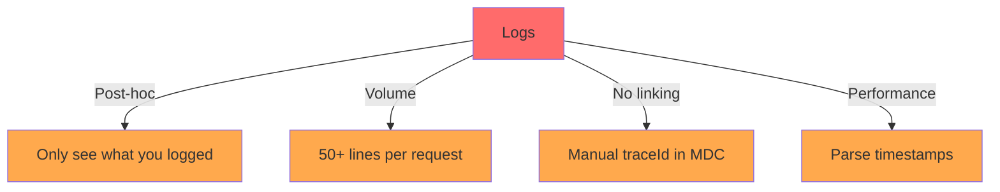

**The Problems with Logs:**

1. **Logs are post-hoc** - You only see what you explicitly logged. If you didn't log a variable, it's gone forever.
2. **Volume is insane** - A single request can generate 50+ log lines across 5 services. Finding the right sequence is a needle-in-haystack problem.
3. **No causal linking** - Child spans aren't naturally connected. You can hack it with traceId in MDC, but that's manual and fragile.
4. **Performance analysis is guesswork** - Which service took 2 seconds? You have to parse timestamps from logs manually.

Then you try **metrics**. Prometheus gives you gorgeous dashboards: request rate, error rate, latency percentiles. You notice p99 latency spiked. But which endpoint? Which downstream dependency? Which specific request caused it?

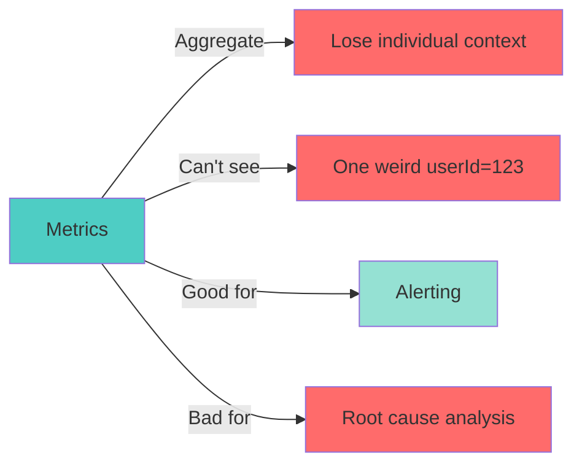

**The Problem with Metrics:**

- **Metrics aggregate** - They lose the individual request context
- **Can't see outliers** - You can't see that one weird `userId=123` that triggers a pathological code path
- **No causality** - You know *what* is slow, but not *why*

### So You Need Tracing

Tracing is the ability to follow one request end-to-end, seeing every service call, database query, cache hit, and Kafka message as timed spans in a single trace.

This is what Google's Dapper paper described in 2010, and what Zipkin, Jaeger, and now OpenTelemetry implement.

But tracing alone isn't enough. You need **all three pillars**:

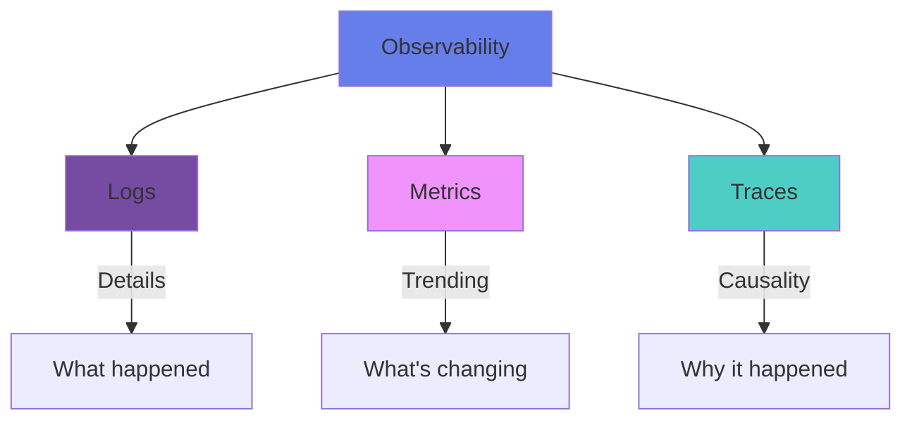

**The Power of Three Pillars:**

- **Logs** for details - "User X attempted to buy Y"
- **Metrics** for trending - "p99 latency increased 200%"
- **Traces** for causality - "Request failed at database query #3"

**Observability** means you can ask novel questions about your system without shipping new code. OpenTelemetry's promise is to unify signal collection and let you send data to any backend.

> 💡 **Key Insight:** Think of it this way:
> - A **trace** is the skeleton
> - **Logs** are the flesh
> - **Metrics** are the pulse
> 
> When debugging, I first look at an exemplar trace from a high-latency bucket in Prometheus, then drill into specific spans, then open correlated logs via traceId. That flow saves hours.

---

## Understanding the Three Pillars

Let's clear up some terms because they get thrown around interchangeably but mean very different things in production.

### Monitoring

**Monitoring** is the practice of watching predefined dashboards and alerts.

- **Reactive**: You monitor known failure modes
- **Example**: "Is CPU > 90%? Page."
- **Limitation**: Can't tell you about unknown unknowns

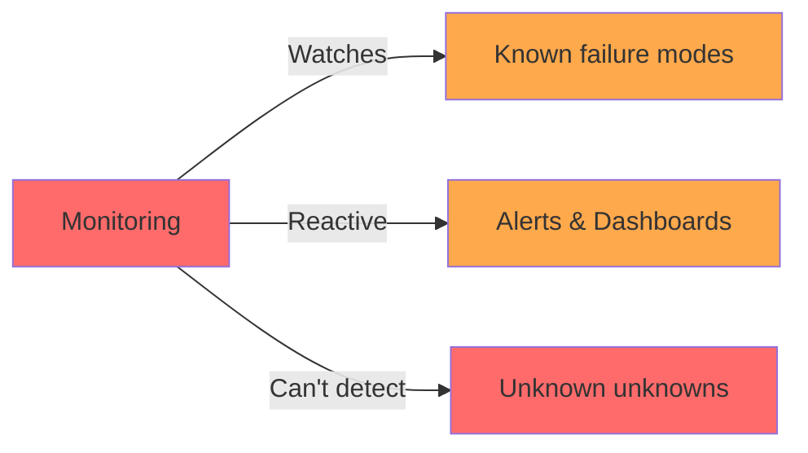

### Observability

**Observability** is a property of the system that lets you infer its internal state from its outputs.

- If you can ask "why is checkout slow for users in Brazil?" without adding new logs, the system is **observable**
- Tracing + metrics + logs make it possible
- **Proactive**: You can explore unknown unknowns

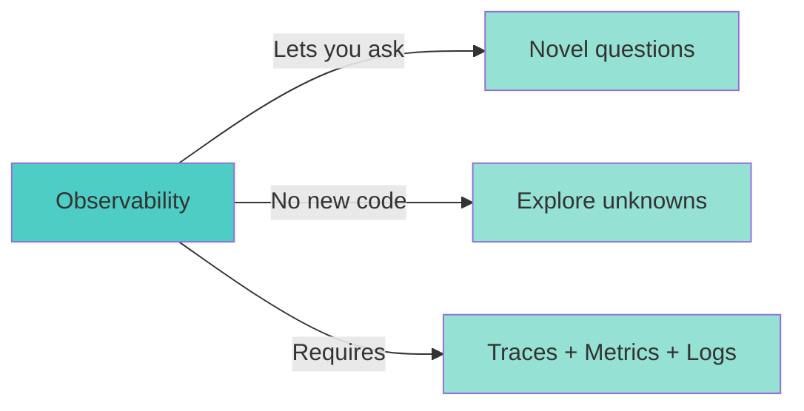

### Logging

**Logging** is timestamped, structured or unstructured records of discrete events.

**Characteristics:**
- ✅ High granularity
- ✅ Captures business events
- ❌ Expensive at scale
- ❌ Post-hoc only

**Example:** "User X attempted to buy Y" — that's detail tracing won't automatically capture unless you add custom spans.

### Metrics

**Metrics** are numeric measurements aggregated over time intervals.

**Characteristics:**
- ✅ Low cardinality
- ✅ Cheap to store
- ✅ Excellent for alerting
- ❌ Lose individual request context

**Examples:**
- Prometheus counters (total requests)
- Gauges (current memory usage)
- Histograms (request duration distribution)

### Tracing

**Tracing** is a directed acyclic graph of spans representing a single request's journey.

**Each span is:**
1. A named operation
2. A timed operation
3. Metadata (attributes, events, links)

**Tracing is vital for:**
- **Latency analysis** - Which service is slow?
- **Dependency mapping** - What calls what?
- **Profiling** - Which function spent 80% of the time?

### Profiling

**Profiling** is continuous capture of CPU/memory/allocation profiles from running services (think async-profiler, Pyroscope).

- Tells you **why** a span is slow
- Shows which function spent 80% of the time
- Complements tracing by showing code-level details

### Comparison Matrix

| Aspect | Logs | Metrics | Traces | Profiling |
|--------|------|---------|--------|-----------|
| **Granularity** | High | Low | Medium | Very High |
| **Storage Cost** | High | Low | Medium | High |
| **Use Case** | Debugging | Alerting | Root Cause | Performance |
| **Cardinality** | High | Low | Medium | Very High |
| **Retention** | Days-Weeks | Months | Hours-Days | Real-time |
| **Query Speed** | Slow | Fast | Medium | N/A |

### How They Work Together

In practice, here's the debugging workflow that saves hours:

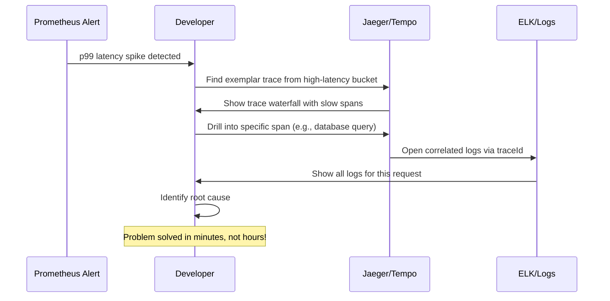

**Step-by-step debugging flow:**
1. **Start** with an exemplar trace from a high-latency bucket in Prometheus
2. **Drill** into specific spans to find the bottleneck
3. **Open** correlated logs via traceId for detailed context
4. **Identify** the root cause quickly

---

## What is OpenTelemetry?

OpenTelemetry (OTel) is a CNCF project, second only to Kubernetes in velocity and adoption.

### History: The Merger

It's a merger of two earlier projects:

**OpenTracing** (API standard for tracing)
- Vendor-neutral
- Lacked an SDK
- Just interfaces, no implementation

**OpenCensus** (Google's collection of libraries)
- Full SDK
- Tied to Google's backends
- Comprehensive but vendor-specific

**The merge in 2019 gave us:**
- ✅ A single API
- ✅ A single SDK
- ✅ A single Collector
- ✅ A complete observability framework

### Core Goals

1. **Single standard** for generating, collecting, and exporting telemetry data
2. **Vendor-agnostic**: Switch from Jaeger to Zipkin, to Datadog, to Honeycomb without changing instrumentation code
3. **Support all signals**: Traces, metrics, logs (logs in progress), and baggage
4. **Automatic instrumentation** where possible, plus a rich manual API for custom business logic
5. **Pluggable architecture**: Exporters, samplers, and context propagators are all interchangeable

### Key Takeaway

> 💡 **OpenTelemetry is NOT a monitoring service; it's the pipes and wires.**
> 
> Think of it as the **JVM of observability** — write once, run anywhere.

### Current State (2026)

- **CNCF Graduated Project** - Production-ready
- **Support for 50+ languages** - Java, Python, Go, JavaScript, etc.
- **100+ instrumentation libraries** - Spring Boot, Express, Django, etc.
- **Active community** - Backed by Google, Microsoft, Amazon, and others
- **Industry standard** - Becoming the default choice for new projects

---

## OpenTelemetry Architecture Deep Dive

Before we start coding, you need a mental model. Let's draw the components.

### High-Level Architecture

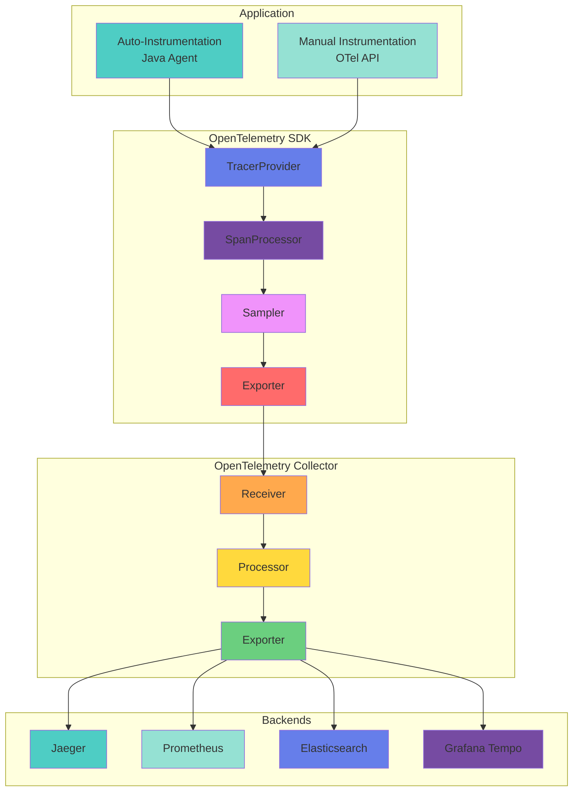

### 4.1 API vs SDK

**API (Interface Layer)**
- The no-op interfaces: `Tracer`, `Span`, `Context`
- If no SDK is imported, all methods are no-ops
- You compile against the API, so your code doesn't need to change if you switch SDK
- **Purpose**: Decouple instrumentation from implementation

**SDK (Implementation Layer)**
- The real implementation
- Manages `TracerProvider`, `SpanProcessor`, `Sampler`, `Exporter`
- Where sampling decisions happen, spans are started and ended, and data is flushed
- **Purpose**: Actual telemetry collection and processing

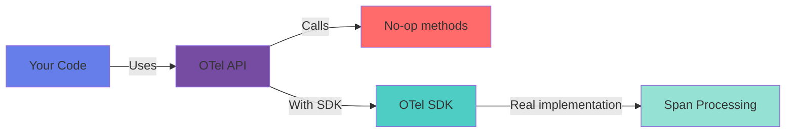

### 4.2 Instrumentation

**Automatic (Agent-based)**
- A Java agent that injects bytecode to instrument known libraries
- Libraries: Tomcat, Spring MVC, JDBC, Kafka, etc.
- No code changes required
- Uses ByteBuddy to hook into method invocations

**Manual (Code-based)**
- Using `@WithSpan` annotations or `tracer.spanBuilder()` calls
- You define spans explicitly
- Full control over span names, attributes, and events

### 4.3 Exporter

Sends finished spans to a backend or collector.

**Options:**
- **OTLP** (gRPC/HTTP) - Recommended for production
- **Logging** - For debugging
- **Jaeger** - Direct export (not recommended for production)
- **Zipkin** - Direct export (not recommended for production)

> ⚠️ **Production Rule:** Always send to the collector, not directly to the backend, for decoupling and reliability.

### 4.4 Collector

A standalone binary or sidecar that receives, processes, and exports telemetry.

**Internal Pipeline:**

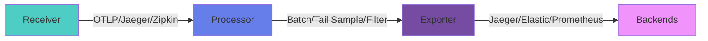

**Pipeline Components:**

1. **Receiver**: Accept OTLP, Jaeger, Zipkin, Prometheus
2. **Processor**: 
   - Batch processing
   - Memory limiter
   - Tail sampling
   - Attribute manipulation
   - Filtering
3. **Exporter**: Send to backends (Jaeger, Elastic, Prometheus, Kafka for buffering)

**Deployment Options:**
- **Agent** (sidecar) - Lightweight, per-service
- **Gateway** (cluster-wide) - Centralized processing
- **Combined** - Agent + Gateway for scalability

### 4.5 Context, Baggage, and Propagation

**SpanContext**
- Immutable object containing: `traceId`, `spanId`, `traceFlags`, `traceState`
- Travels in-process via `io.opentelemetry.context.Context` (thread-local-like carrier)

**Baggage**
- Key-value pairs that propagate across process boundaries
- Use sparingly — high cardinality baggage breaks sampling
- Good for business context like `customer.tier=premium`
- ❌ Don't put secrets here

**Propagators**
- Serialize/deserialize span context for inter-process transport
- **W3C TraceContext** (traceparent, tracestate) - The standard
- **Baggage propagator** - For baggage

### 4.6 Sampler

Decides if a span should be recorded and exported.

**Types:**

| Sampler | Description | Use Case |
|---------|-------------|----------|
| `always_on` | Sample 100% | Development only |
| `always_off` | Sample 0% | Testing |
| `traceidratio` | Sample X% (e.g., 0.1 = 10%) | Production head sampling |
| `parentbased` | Respect parent's decision, else use root sampler | Always use this! |
| `parentbased_traceidratio` | Parent-based with ratio | **Production standard** |
| Custom | Your logic | Special requirements |

> ⚠️ **Critical:** Always use `parentbased_*` samplers. Without it, you'll get fragmented traces where some spans are missing.

### 4.7 Span Processor

Hooks into the span lifecycle:

**SimpleSpanProcessor**
- Exports synchronously
- ❌ **Bad for production** - Adds latency to every span end
- Only use for debugging

**BatchSpanProcessor**
- Queues spans and flushes on schedule or max batch size
- Uses an Exporter behind a SpanExporter interface
- ✅ **Async and non-blocking** - Production standard
- Configurable: batch size, timeout, queue size

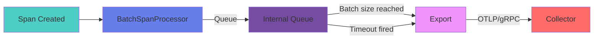

---

## Complete Request Flow — Where Spans Are Born

Let's trace a typical e-commerce checkout flow:

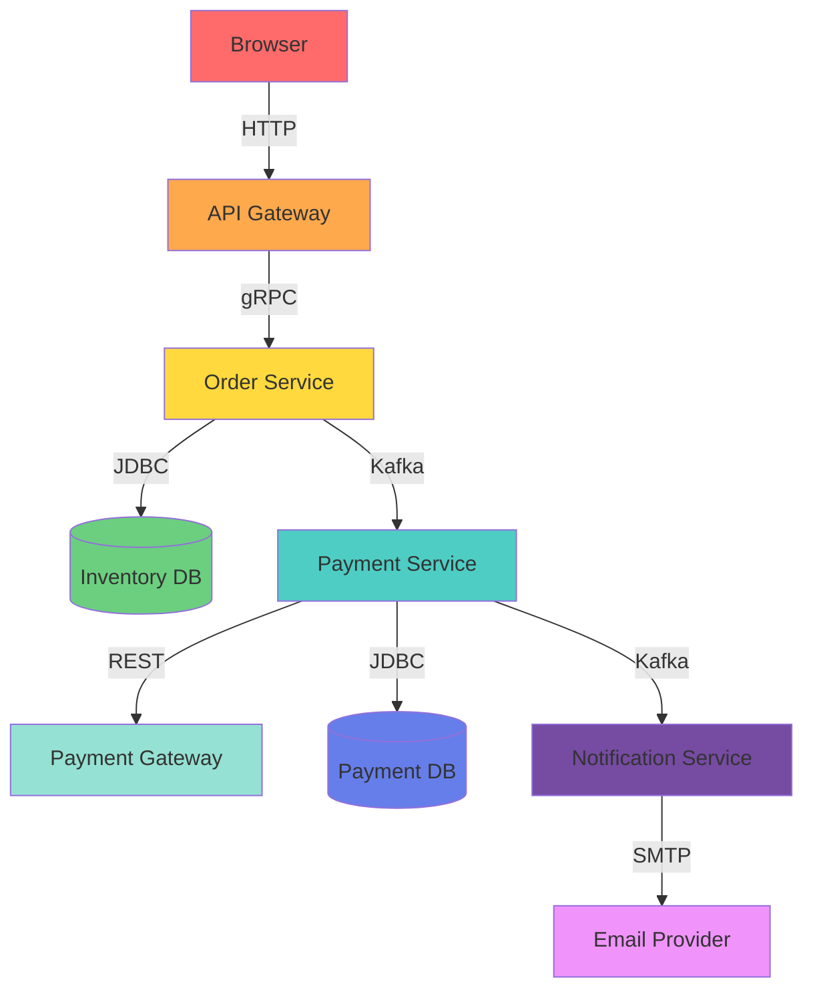

**Every arrow creates a span with `spanKind`:**
- **SERVER** - Inbound request (API Gateway, Order Service)
- **CLIENT** - Outbound request (Order Service → Payment Service)
- **PRODUCER** - Message sent (Order Service → Kafka)
- **CONSUMER** - Message received (Kafka → Notification Service)
- **INTERNAL** - Internal operation (business logic)

**Span Structure:**
- **Trace ID**: Same everywhere (128-bit random hex)
- **Span ID**: Unique per span (64-bit random)
- **Parent Span ID**: Links to parent span
- **Start/End Time**: Duration calculation
- **Attributes**: Key-value metadata
- **Events**: Time-stamped annotations
- **Links**: References to other spans
- **Status**: OK or ERROR

The collector receives all spans, stitches them by `traceId`, and the UI shows a waterfall.

---

## How Trace IDs Travel — The Plumbing

When the browser calls the API Gateway, the gateway checks for the W3C `traceparent` header:

```
traceparent: 00-0af7651916cd43dd8448eb211c80319c-b7ad6b7169203331-01
```

**Format:** `version-traceId-spanId-traceFlags`

- **Version**: `00`
- **Trace ID**: `0af7651916cd43dd8448eb211c80319c` (128-bit hex)
- **Span ID**: `b7ad6b7169203331` (64-bit hex)
- **Flags**: `01` (sampled)

**If absent**, the gateway creates a new `traceparent` with:
- Random `traceId` and `spanId`
- Flags `00` or `01` depending on sampling decision

It then calls Order Service with that header.

**Order Service's auto-instrumentation:**
1. Reads the header
2. Creates a `SpanContext`
3. Uses it as the remote parent for its incoming SERVER span
4. That span's `spanId` becomes the parent for any outbound calls

**The chain of parent span IDs links the whole trace.**

### For Messaging (Kafka)

The same header is stuffed into Kafka record headers or AMQP properties.

**Baggage** travels in the `baggage` header:
```
key1=value1,key2=value2
```

> ⚠️ **Security Note:** The baggage propagator encodes/decodes it. Use carefully — it's not hidden, don't put secrets there.

---

## Internal Working — What Happens When a Request Hits

Let's go deep. You deploy a Spring Boot app with `opentelemetry-javaagent.jar`. An HTTP request arrives at Tomcat.

### Step-by-Step Flow

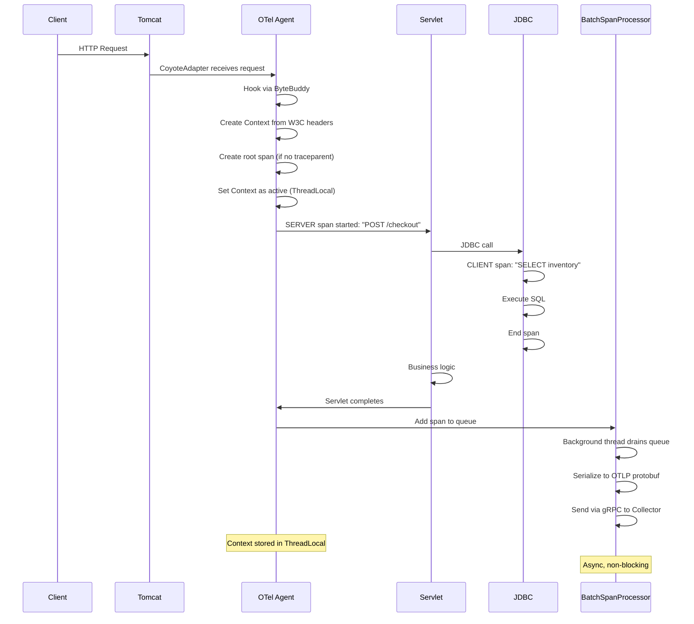

### Detailed Breakdown

**1. Request Arrives at Tomcat**
- Tomcat's `CoyoteAdapter` receives the request
- The agent's `TomcatInstrumentation` module hooks into it via ByteBuddy

**2. Agent Intercepts**
- Before the actual servlet is called, the agent:
  - Creates a `Context` from headers using `TextMapPropagator` (W3C)
  - If no valid `traceparent`, creates a root span using `TracerProvider`'s sampler
  - Sets the current `Context` as the active context on `ContextStorage` (ThreadLocal by default)
  - A SERVER span is started with name `HTTP POST /checkout`
  - Current span is set into the context

**3. Servlet Runs**
- Inside, your code makes a JDBC call
- The JDBC instrumentation wrapper intercepts `Connection.prepareStatement`
- It gets the current context from `Context.current()`
- Creates a CLIENT span named `SELECT inventory` with:
  - `db.system=mysql`
  - `db.statement=SELECT * FROM inventory...`
  - Parent: active span
- Activates it, runs the actual SQL, ends the span, restores previous context

**4. Similarly for:**
- `RestTemplate` calls
- Kafka clients
- Redis clients
- gRPC calls
- etc.

**5. Server Span Ends**
- After servlet completes, `BatchSpanProcessor` adds the span to a queue
- A background thread drains the queue
- Serializes spans to OTLP protobuf
- Sends via gRPC to the collector

**6. Context Storage**
- Default: ThreadLocal
- For reactive applications (WebFlux): Uses `ReactorContext` or context-aware wrapper
- Virtual threads (Java 21): ThreadLocal works naturally

**7. Trace ID Generation**
- Trace ID: 128-bit random hex
- Span ID: 64-bit random
- W3C `traceparent` generator ensures global uniqueness

---

## Spring Boot Integration - From Scratch

Let's create a project. I'll use Spring Boot 3.2, Java 17, Maven.

### 8.1 Dependencies

For **auto-instrumentation** with the Java agent, you don't add any OTel Maven dependencies (except maybe the API if you do manual instrumentation).

For a **manual-only** approach, you'd include:
- `opentelemetry-bom`
- `opentelemetry-api`
- `opentelemetry-sdk`
- Exporters

**But the easiest path is the agent.**

We'll add Micrometer and the OTel bridge for metrics, and Logback MDC for log correlation.

**pom.xml (relevant parts):**

```xml
<dependencies>
    <!-- Spring Boot Starter Web -->
    <dependency>
        <groupId>org.springframework.boot</groupId>
        <artifactId>spring-boot-starter-web</artifactId>
    </dependency>
    
    <!-- Micrometer OTel bridge: exports Micrometer metrics via OTLP -->
    <dependency>
        <groupId>io.micrometer</groupId>
        <artifactId>micrometer-registry-otlp</artifactId>
    </dependency>
    
    <!-- For log correlation, the agent adds MDC support automatically if logback is present -->
    <!-- No additional OTel SDK dependency needed - the agent brings everything -->
</dependencies>
```

> 💡 **Pro Tip:** No OTel SDK dependency is needed at compile time. The agent provides the SDK at runtime.

### 8.2 Application Configuration

**application.yml:**

```yaml
spring:
  application:
    name: order-service

management:
  endpoints:
    web:
      exposure:
        include: health,info,prometheus
  metrics:
    export:
      otlp:
        enabled: true
        url: http://collector:4318/v1/metrics  # OTLP/HTTP for metrics
        step: 10s
  tracing:
    sampling:
      probability: 1.0  # For development; override via agent config later
```

> ⚠️ **Note:** With the agent, tracing config is set via system properties or environment variables, not `application.yml`. We'll show that in Docker Compose.

For Micrometer OTLP export, we rely on the above configuration.

**The agent JAR** is downloaded separately: `opentelemetry-javaagent.jar`.

### 8.3 Docker Compose Setup

**docker-compose.yml:**

```yaml
version: '3.8'

services:
  order-service:
    build: .
    ports:
      - "8080:8080"
    environment:
      - OTEL_SERVICE_NAME=order-service
      - OTEL_EXPORTER_OTLP_ENDPOINT=http://collector:4317
      - OTEL_TRACES_SAMPLER=parentbased_traceidratio
      - OTEL_TRACES_SAMPLER_ARG=0.1  # 10% sampling
      - JAVA_OPTS=-javaagent:/app/opentelemetry-javaagent.jar
    volumes:
      - ./opentelemetry-javaagent.jar:/app/opentelemetry-javaagent.jar
    depends_on:
      - collector

  collector:
    image: otel/opentelemetry-collector-contrib:0.88.0
    command: ["--config=/etc/otel-collector-config.yaml"]
    volumes:
      - ./otel-collector-config.yaml:/etc/otel-collector-config.yaml
    ports:
      - "4317:4317"   # OTLP gRPC
      - "4318:4318"   # OTLP HTTP
    depends_on:
      - jaeger

  jaeger:
    image: jaegertracing/all-in-one:1.51
    ports:
      - "16686:16686"   # UI
      - "4317:4317"     # OTLP gRPC
      - "4318:4318"     # OTLP HTTP
    environment:
      - COLLECTOR_OTLP_ENABLED=true

  prometheus:
    image: prom/prometheus:latest
    ports:
      - "9090:9090"
    volumes:
      - ./prometheus.yml:/etc/prometheus/prometheus.yml

  grafana:
    image: grafana/grafana:latest
    ports:
      - "3000:3000"
    environment:
      - GF_SECURITY_ADMIN_PASSWORD=admin
    depends_on:
      - prometheus
```

**Environment Variables Explained:**

| Variable | Purpose | Example |
|----------|---------|---------|
| `OTEL_SERVICE_NAME` | Service identifier | `order-service` |
| `OTEL_EXPORTER_OTLP_ENDPOINT` | Collector address | `http://collector:4317` |
| `OTEL_TRACES_SAMPLER` | Sampling strategy | `parentbased_traceidratio` |
| `OTEL_TRACES_SAMPLER_ARG` | Sampling rate (0.0-1.0) | `0.1` (10%) |
| `JAVA_OPTS` | Agent JAR path | `-javaagent:/app/opentelemetry-javaagent.jar` |

---

## Auto-Instrumentation Magic

The agent automatically instruments these libraries when detected on classpath:

### Supported Libraries

**Web Frameworks:**
- ✅ Tomcat/Jetty/Undertow: HTTP server spans
- ✅ Spring MVC: Controller spans wrapped inside server span
- ✅ Spring WebFlux: Reactive context-aware spans
- ✅ JAX-RS (Jersey, RESTEasy)

**HTTP Clients:**
- ✅ RestTemplate: Client span, injects trace context
- ✅ WebClient: Client span, reactive context aware
- ✅ Apache HttpClient
- ✅ OkHttp

**Databases:**
- ✅ JDBC: Wraps DataSource and Connection; each query becomes a span
- ✅ Hibernate: Spans for SQL operations (if JDBC instrumentation present)
- ✅ MongoDB: Client spans
- ✅ Redis (Lettuce/Jedis): Client spans

**Messaging:**
- ✅ Kafka: Producer/consumer with header propagation
- ✅ RabbitMQ: Similar to Kafka
- ✅ JMS

**Other:**
- ✅ Feign: HTTP client spans
- ✅ gRPC: Client and server spans
- ✅ Netty: Network spans
- ✅ Quartz: Job execution spans
- ✅ Spring @Async: Async method spans
- ✅ ExecutorService: Thread pool spans

### How It Works Internally

The agent uses a **LibraryInstrumentation** per technology.

Each defines:
- **TypeInstrumentation**: Classes to transform
- **MethodInstrumentation**: Methods to hook

**Example: Spring MVC Instrumentation**

```mermaid
graph LR
    A[RequestMappingHandlerAdapter.handle()] -->|Agent hooks| B[Create INTERNAL span]
    B -->|Name| C["{HTTP_METHOD} /path"]
    B -->|Parent| D[Server span from Servlet]
    
    style A fill:#4ecdc4
    style B fill:#667eea
    style C fill:#764ba2
    style D fill:#f093fb
```

The server span comes from the Servlet container instrumentation.

**Result:** You get 80% of your tracing without writing a line of OTel code.

The remaining 20% is custom business logic spans.

---

## Manual Instrumentation

Sometimes you need spans inside your own methods:
- Complex business transactions
- Integration points the agent doesn't recognize
- Fine-grained timing

### 10.1 Setup

Add the API dependency:

```xml
<dependency>
    <groupId>io.opentelemetry</groupId>
    <artifactId>opentelemetry-api</artifactId>
    <version>1.32.0</version>
</dependency>
```

Since the agent provides the SDK at runtime, you don't need it at compile time.

The `GlobalOpenTelemetry` instance is automatically set.

### 10.2 Creating Spans

**Complete Example:**

```java
import io.opentelemetry.api.trace.Tracer;
import io.opentelemetry.api.trace.Span;
import io.opentelemetry.api.trace.SpanKind;
import io.opentelemetry.api.trace.StatusCode;
import io.opentelemetry.context.Scope;
import io.opentelemetry.api.trace.attributes.SemanticAttributes;
import org.springframework.stereotype.Component;

@Component
public class OrderProcessor {
    
    private final Tracer tracer;
    
    // Inject OpenTelemetry (provided by agent)
    public OrderProcessor(OpenTelemetry openTelemetry) {
        this.tracer = openTelemetry.getTracer("order-processor", "1.0");
    }
    
    public void process(Order order) {
        // Create span
        Span span = tracer.spanBuilder("process-order")
                .setSpanKind(SpanKind.INTERNAL)
                .setAttribute("order.id", order.getId())
                .setAttribute("order.customer_id", order.getCustomerId())
                .setAttribute("order.total", order.getTotal())
                .startSpan();
        
        // Make it current (ThreadLocal)
        try (Scope scope = span.makeCurrent()) {
            // Business logic
            validate(order);
            reserveInventory(order);
            
            // Add event (milestone)
            span.addEvent("order.validated");
            
            // Set status
            span.setStatus(StatusCode.OK);
            
        } catch (Exception e) {
            // Record exception
            span.recordException(e);
            span.setStatus(StatusCode.ERROR, "Order processing failed: " + e.getMessage());
            throw e;
            
        } finally {
            // Always end span
            span.end();
        }
    }
    
    private void validate(Order order) {
        // Create child span (parent is implicit from current context)
        Span child = tracer.spanBuilder("validate-order")
                .setParent(io.opentelemetry.context.Context.current().with(Span.current()))
                .startSpan();
        
        try (Scope childScope = child.makeCurrent()) {
            // Validation logic
            if (order.getItems().isEmpty()) {
                throw new IllegalArgumentException("Order must have at least one item");
            }
            
            child.addEvent("validation.completed");
            child.setStatus(StatusCode.OK);
            
        } finally {
            child.end();
        }
    }
    
    private void reserveInventory(Order order) {
        // Another child span
        Span child = tracer.spanBuilder("reserve-inventory")
                .startSpan();
        
        try (Scope childScope = child.makeCurrent()) {
            // Inventory reservation logic
            child.setAttribute("inventory.items_count", order.getItems().size());
            child.setStatus(StatusCode.OK);
            
        } finally {
            child.end();
        }
    }
}
```

### Key Points

1. **`spanBuilder()`** creates a Span based on parent context (implicitly if you call it while another span is current)
2. **`makeCurrent()`** sets the span as the active span in the current thread's context, and the `Scope` auto-closes to restore the previous
3. **`recordException()`** captures the exception details with stack trace
4. **Events** are time-stamped annotations; useful for milestones
5. **Span naming** should be low-cardinality: `process-order`, not `process-order-12345`. Attributes carry the specifics

### 10.3 Nested Spans and Structured Concurrency

For `@Async` methods or `CompletableFuture`, you must propagate context manually (or use the instrumentation that wraps executors).

**Example with @Async:**

```java
@Component
public class AsyncOrderProcessor {
    private final Tracer tracer;
    
    public AsyncOrderProcessor(OpenTelemetry openTelemetry) {
        this.tracer = openTelemetry.getTracer("async-processor", "1.0");
    }
    
    @Async
    public CompletableFuture<Void> processAsync(Order order) {
        // Context is automatically propagated by agent's @Async instrumentation
        Span span = tracer.spanBuilder("async-process-order")
                .setSpanKind(SpanKind.INTERNAL)
                .startSpan();
        
        try (Scope scope = span.makeCurrent()) {
            // Process order
            Thread.sleep(100); // Simulate work
            span.setStatus(StatusCode.OK);
            return CompletableFuture.completedFuture(null);
            
        } catch (Exception e) {
            span.recordException(e);
            span.setStatus(StatusCode.ERROR);
            return CompletableFuture.failedFuture(e);
            
        } finally {
            span.end();
        }
    }
}
```

> 💡 **Pro Tip:** The agent's `@Async` instrumentation automatically wraps Spring's `TaskExecutor` to propagate context. You don't need to do anything special!

---

## Context Propagation

The hardest part of tracing is making the context follow your code.

### 11.1 The Problem

```java
ExecutorService executor = Executors.newFixedThreadPool(10);

executor.submit(() -> {
    // ❌ No active span here unless you propagate
    Span span = tracer.spanBuilder("async-task").startSpan();
    // span parent? null.
});
```

### 11.2 The Solution: Agent to the Rescue

The agent's `ExecutorServiceInstrumentation` automatically wraps `ExecutorService.execute()` and `submit()` to:
1. Capture the current context
2. Reattach it in the thread before running the task

**So if you use `@Async` with Spring's `TaskExecutor`, it's transparent.**

### 11.3 CompletableFuture

Async chains like `CompletableFuture.supplyAsync()` also get automatic context propagation thanks to the agent's `CompletableFutureInstrumentation`.

It wraps `Executor` instances to snapshot and restore context.

**Example:**

```java
CompletableFuture.supplyAsync(() -> {
    // Context is automatically propagated!
    Span.current(); // ✅ Works!
    return "result";
}, executor);
```

> ⚠️ **Warning:** If you use custom thread pools, ensure they are wrapped. The agent does this via `Context.taskWrapping()`.

### 11.4 Reactive Streams (WebFlux)

Reactor and RxJava don't use threads the same way.

The agent integrates with `reactor.core.publisher.Hooks` to automatically capture context when a subscriber subscribes.

For WebClient, it uses Context propagation from the caller.

**Usually, you don't need to do anything special.** But if you manually create Reactor chains without Spring, you might need:

```java
// Only needed if NOT using Spring WebFlux
Hooks.enableAutomaticContextPropagation();
```

In tests, I've seen cases where manual `Mono.deferContextual` is needed if wrapping non-instrumented libraries.

### 11.5 Virtual Threads (Java 21)

Virtual threads are just `Thread` instances to the JVM, so ThreadLocal works naturally.

The agent's context storage works fine because virtual threads don't pool — each task gets its own thread, so there's no cross-contamination.

**However, be mindful of ThreadLocal memory leaks in long-lived carriers.**

OTel context storage uses a ThreadLocal with soft references, so it's fine.

### 11.6 Structured Concurrency (JEP 453)

With `StructuredTaskScope`, the agent currently doesn't automatically scope context across spawned subtasks.

You'd need to manually capture the parent context and attach it to each fork.

```java
// Example (Java 21+)
try (var scope = StructuredTaskScope.shutdownOnFailure()) {
    Context parentContext = Context.current();
    
    Future<String> future1 = scope.fork(() -> {
        try (var ignored = parentContext.makeCurrent()) {
            return task1();
        }
    });
    
    Future<String> future2 = scope.fork(() -> {
        try (var ignored = parentContext.makeCurrent()) {
            return task2();
        }
    });
    
    scope.join();
    // ...
}
```

This is an area to watch; OpenTelemetry Java is moving toward a Context-based API that integrates with structured concurrency.

---

## The Collector - Unsung Hero

The OpenTelemetry Collector is a binary (or container) that sits between your services and observability backends.

**It's not mandatory, but I've never seen a serious production deployment without it.**

### 12.1 Why You Need It

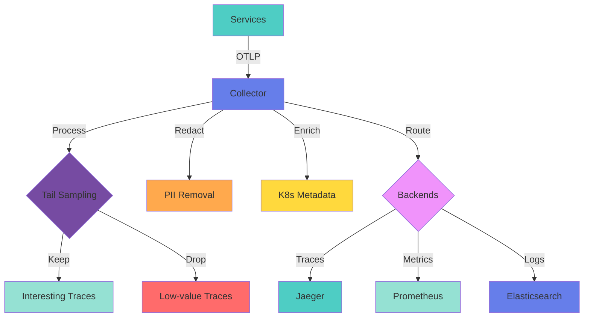

**Benefits:**

1. **Decoupling**: Services don't need to know the backend configuration
2. **Reliability**: Collector can retry, buffer to disk, and tail sample. If Jaeger is down, spans aren't lost
3. **Processing**: Redact PII, enrich with Kubernetes metadata, drop low-value spans, aggregate
4. **Routing**: Send traces to one backend, metrics to another, logs to a third, all from the same pipeline

### 12.2 Collector Architecture

**Configuration is YAML.**

**Example: otel-collector-config.yaml**

```yaml
receivers:
  otlp:
    protocols:
      grpc:
        endpoint: 0.0.0.0:4317
      http:
        endpoint: 0.0.0.0:4318

processors:
  # Limit memory usage
  memory_limiter:
    check_interval: 1s
    limit_mib: 512
    spike_limit_mib: 128
  
  # Batch spans for efficiency
  batch:
    timeout: 10s
    send_batch_size: 1024
  
  # Tail sampling - keep interesting traces
  tail_sampling:
    decision_wait: 30s
    policies:
      - name: errors
        type: status_code
        status_code: {status_codes: [ERROR]}
      - name: latency
        type: latency
        latency: {threshold_ms: 1000}
      - name: random
        type: probabilistic
        probabilistic: {sampling_percentage: 10}
  
  # Redact sensitive data
  attributes/redact:
    actions:
      - key: user.credit_card
        action: delete
      - key: user.ssn
        action: delete
  
  # Add Kubernetes metadata
  k8sattributes:
    auth_type: serviceAccount
    passthrough: false
    extract:
      metadata:
        - k8s.pod.name
        - k8s.pod.uid
        - k8s.deployment.name
        - k8s.namespace.name
        - k8s.node.name

exporters:
  # Send traces to Jaeger
  otlp/jaeger:
    endpoint: jaeger:4317
    tls:
      insecure: true
  
  # Send metrics to Prometheus
  prometheus:
    endpoint: "0.0.0.0:8889"
  
  # Debug logging
  logging:
    loglevel: debug

service:
  pipelines:
    traces:
      receivers: [otlp]
      processors: [memory_limiter, batch, tail_sampling, attributes/redact, k8sattributes]
      exporters: [otlp/jaeger]
    
    metrics:
      receivers: [otlp]
      processors: [memory_limiter, batch]
      exporters: [prometheus]
```

### 12.3 Tail Sampling Deep Dive

**Tail sampling** buffers spans for 30 seconds, then makes a decision.

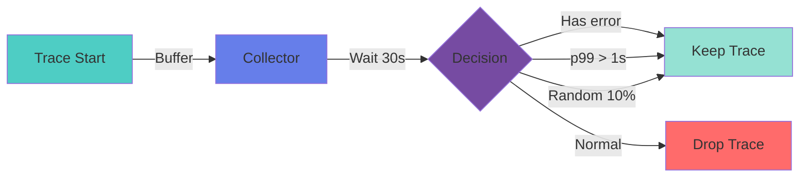

**Policies:**
1. **Error-based**: Keep if any span has ERROR status
2. **Latency-based**: Keep if any span > 1000ms
3. **Probabilistic**: Keep 10% of traces randomly

**Why This Matters:**
- Keeps trace volume manageable without losing interesting data
- You can make decisions based on the **entire trace**, not just the root span
- Critical for production with high traffic

### 12.4 Batch Processor Deep Dive

The batch processor accumulates spans and flushes either when:
- Batch size is reached (1024 spans)
- Timeout fires (10 seconds)

**Internal Queue:**
- Uses `Disruptor` or `ArrayBlockingQueue`
- Configurable maximum size
- If queue fills up, spans are dropped (SDK) or collector applies backpressure via `memory_limiter`

**Benefits:**
- Smooths out load
- Reduces network overhead
- Async and non-blocking

### 12.5 Collector Deployment Patterns

**Local Development:**
- Docker Compose with collector and Jaeger
- Single collector instance
- No tail sampling (sample everything)

**Kubernetes Production:**

**Option 1: Sidecar (DaemonSet)**
```yaml
apiVersion: apps/v1
kind: DaemonSet
metadata:
  name: otel-agent
spec:
  selector:
    matchLabels:
      app: otel-agent
  template:
    metadata:
      labels:
        app: otel-agent
    spec:
      containers:
        - name: agent
          image: otel/opentelemetry-collector-contrib:0.88.0
          args: ["--config=/etc/otel-agent-config.yaml"]
          ports:
            - containerPort: 4317
              hostPort: 4317
              protocol: TCP
          volumeMounts:
            - name: config
              mountPath: /etc
      volumes:
        - name: config
          configMap:
            name: otel-agent-config
```

Services export to `localhost:4317`.

**Option 2: Central Gateway**
- Single collector for entire cluster
- Does tail sampling and routing
- Reduces cross-AZ traffic

**Option 3: Agent + Gateway (Recommended)**
- Lightweight sidecar (agent) on each node
- Receives OTLP locally
- Forwards to central collector
- Central collector does tail sampling and routing

**Benefits:**
- Avoids single point of failure
- Reduces cross-AZ traffic
- Scalable

---

## Integration with Backends

### 14. Jaeger Integration

Jaeger is still the most common tracing UI.

**Run via Docker:**

```yaml
jaeger:
  image: jaegertracing/all-in-one:1.51
  ports:
    - "16686:16686"   # UI
    - "4317:4317"     # OTLP gRPC
    - "4318:4318"     # OTLP HTTP
  environment:
    - COLLECTOR_OTLP_ENABLED=true
```

**Configure the collector's OTLP exporter to send to `jaeger:4317`.**

Jaeger now supports OTLP natively, so no need for the deprecated Jaeger exporter.

**In the UI, you see:**
- Traces
- Service dependency graphs
- Latency breakdowns

**Workflow:**
1. Find a slow trace
2. Expand the waterfall
3. Pinpoint the bottleneck (often a specific database query or serialization step)

### 15. Zipkin Integration

Zipkin is another option. If you already have Zipkin, you can switch the exporter:

```yaml
exporters:
  zipkin:
    endpoint: "http://zipkin:9411/api/v2/spans"
```

**But Zipkin doesn't support OTLP natively**, so you'd use the collector's Zipkin exporter.

**Limitations:**
- OpenTelemetry's data model is richer (events, links)
- Some details might be flattened
- Prefer Jaeger or a vendor backend like Honeycomb or Grafana Tempo for full fidelity

### 16. Prometheus Integration - Metrics that Matter

The collector's Prometheus exporter exposes a metrics endpoint. You can scrape it with Prometheus.

The agent also exports Micrometer's OTLP metrics (bridge).

**Under the hood:**
- OTel's Java SDK has a `MetricExporter` that converts OTel metrics to OTLP
- You get JVM metrics, HTTP metrics, database metrics, etc. — all automatically

**Metric Types:**

| Type | Description | Example |
|------|-------------|---------|
| **Counter** | Cumulative total, only increases | `http.server.requests` |
| **Gauge** | Current value | `jvm.memory.used` |
| **Histogram** | Distribution with buckets | `http.server.duration` (p50, p95, p99) |
| **Exemplars** | Trace ID linked to histogram bucket | Jump from latency spike to exact trace |

**To enable exemplars:**
- Micrometer's OTLP exporter must be configured with exemplar-storage enabled
- Spring Boot 3.x does this automatically when OTel is present

### 17. Grafana Dashboards - Seeing the Golden Signals

With Prometheus metrics and Tempo/Jaeger traces in Grafana, you can build dashboards that show:

**Golden Signals (Google SRE):**
- **Latency**: Time to service requests
- **Traffic**: Demand on your system
- **Errors**: Rate of failed requests
- **Saturation**: How "full" your service is

**RED Metrics (per endpoint):**
- **Rate**: Requests per second
- **Errors**: Error rate
- **Duration**: Response time distribution

**USE Metrics (per resource):**
- **Utilization**: % time resource is busy
- **Saturation**: Queue length/wait time
- **Errors**: Error count

**Example Dashboard:**
- Histogram heatmap of HTTP request latency
- Error rate counter
- Link to trace exemplar
- Click a high-latency bar → Grafana opens the exact trace in Jaeger/Tempo

That integration is what makes observability powerful.

---

## Logs Correlation

This is where everything clicks.

When you get a trace, you want to see the logs that belong to it.

### 18.1 Automatic MDC Injection

The OTel Java agent automatically injects `trace_id` and `span_id` into SLF4J's MDC (if Logback or Log4j2 are present).

**Configure your logging pattern:**

**logback-spring.xml:**

```xml
<configuration>
    <appender name="CONSOLE" class="ch.qos.logback.core.ConsoleAppender">
        <encoder>
            <pattern>
                %d{yyyy-MM-dd HH:mm:ss.SSS} [%thread] %-5level %logger{36} 
                traceId=%mdc{trace_id} spanId=%mdc{span_id} - %msg%n
            </pattern>
        </encoder>
    </appender>
    
    <root level="INFO">
        <appender-ref ref="CONSOLE" />
    </root>
</configuration>
```

**Now every log line carries the `trace_id` and `span_id`:**

```
2026-01-09 14:32:15.123 [http-nio-8080-exec-1] INFO  c.e.OrderController 
traceId=0af7651916cd43dd8448eb211c80319c spanId=b7ad6b7169203331 - Processing order: 12345
```

### 18.2 Centralized Logging (ELK)

In Elasticsearch/Kibana, you can filter by `trace_id`:

```
trace_id: "0af7651916cd43dd8448eb211c80319c"
```

**Result:** You see the entire request's log journey across all services.

**That's a game-changer for debugging.**

### 18.3 Complete Observability Flow

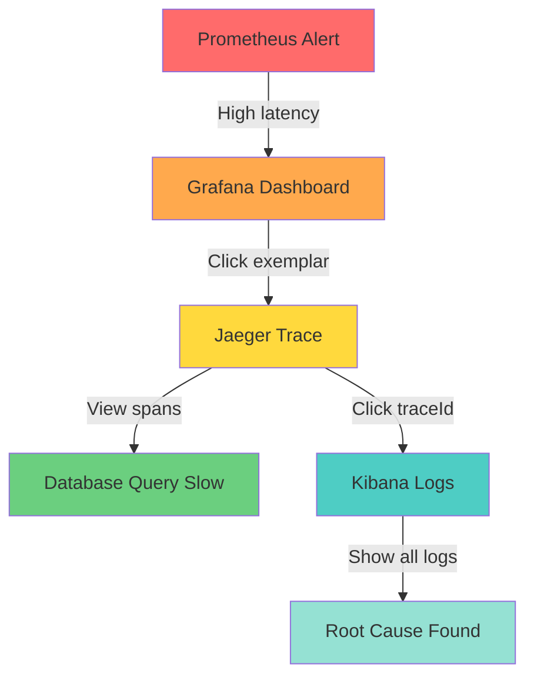

**The complete debugging workflow:**
1. **Prometheus** detects high latency
2. **Grafana** shows exemplar trace
3. **Jaeger** displays trace waterfall
4. **Identify** slow span (e.g., database query)
5. **Click** traceId to jump to logs
6. **Kibana** shows all logs for this request
7. **Root cause** found in minutes!

---

## Production Issues & Solutions

I've hit these issues in production. Here's how we fixed them.

### 19.1 Missing Traces for Some Services

**Symptom:** Only the API gateway spans appear.

**Root Cause:** The agent JAR was not present in downstream service container images. We had different Dockerfiles.

**Solution:**
```dockerfile
# Create a common base image
FROM eclipse-temurin:17-jre-alpine

# Install OTel agent
ADD https://github.com/open-telemetry/opentelemetry-java-instrumentation/releases/download/v1.32.0/opentelemetry-javaagent.jar /app/opentelemetry-javaagent.jar

# Your application
COPY target/*.jar /app/app.jar

ENTRYPOINT ["java", "-javaagent:/app/opentelemetry-javaagent.jar", "-jar", "/app/app.jar"]
```

**Prevention:** Bake the agent into a common base image.

### 19.2 Broken Propagation Between HTTP and Kafka

**Symptom:** The HTTP call had `traceparent`, but Kafka consumer showed a new trace.

**Root Cause:** A custom Kafka producer serializer wasn't preserving headers.

**Solution:**
```java
public class TracingKafkaSerializer implements Serializer<Object> {
    @Override
    public byte[] serialize(String topic, Object data) {
        // Get current context
        Context context = Context.current();
        
        // Inject trace context into headers
        Map<String, String> headers = new HashMap<>();
        W3CTraceContextPropagator.getInstance().inject(context, headers, Map::put);
        
        // Add headers to Kafka record
        Headers kafkaHeaders = new RecordHeaders();
        headers.forEach((key, value) -> 
            kafkaHeaders.add(key, value.getBytes(StandardCharsets.UTF_8))
        );
        
        // Serialize data...
    }
}
```

### 19.3 Huge Cardinality Explosion

**Symptom:** We added `user.id` as a span attribute. That created millions of unique time series in Prometheus. Prometheus OOM'd.

**Root Cause:** Each user ID became a metric label.

**Lesson:** Never use unbounded attributes as metric dimensions.

**Solution:**
- ✅ Use traces for per-user detail
- ✅ Use logs for per-user detail
- ❌ Don't use metrics for per-user detail

**Correct approach:**
```java
// ❌ Bad - creates millions of time series
span.setAttribute("user.id", userId);

// ✅ Good - low cardinality
span.setAttribute("user.tier", user.getTier()); // free, premium, enterprise
```

### 19.4 Collector Dropped Spans Under Load

**Symptom:** We tail sampled, but the `memory_limiter` hit limit and spans were dropped before decision.

**Solution:**
1. Increased `limit_mib` (from 512 to 1024)
2. Scaled out collector replicas with a load balancer

```yaml
processors:
  memory_limiter:
    check_interval: 1s
    limit_mib: 1024  # Increased
    spike_limit_mib: 256
```

**Deploy multiple collectors:**
```yaml
# Kubernetes Service
apiVersion: v1
kind: Service
metadata:
  name: otel-collector
spec:
  selector:
    app: otel-collector
  ports:
    - port: 4317
      targetPort: 4317
  type: LoadBalancer
```

### 19.5 Clock Skew

**Symptom:** Service in different AZ had 5-second time difference, causing spans to appear out of order.

**Root Cause:** NTP not configured.

**Solution:** Fixed NTP.

```bash
# Check NTP status
timedatectl status

# Enable NTP
timedatectl set-ntp true

# Verify
timedatectl status
```

> ⚠️ **Important:** The collector cannot fix clock skew; it just stitches by span IDs, not timing.

### 19.6 Sampling Mistake

**Symptom:** We set `OTEL_TRACES_SAMPLER=traceidratio` with ratio=0.5, but forgot to set the parent-based sampler. That caused mid-trace sampling decisions, breaking traces (some spans missing).

**Solution:** Always use `parentbased_traceidratio`.

```bash
# ❌ Bad - fragments traces
OTEL_TRACES_SAMPLER=traceidratio
OTEL_TRACES_SAMPLER_ARG=0.1

# ✅ Good - respects parent decisions
OTEL_TRACES_SAMPLER=parentbased_traceidratio
OTEL_TRACES_SAMPLER_ARG=0.1
```

### 19.7 Memory Leak in Agent

**Symptom:** Memory usage growing over time.

**Root Cause:** An older agent version had a leak in context storage for abandoned threads.

**Solution:** Upgraded to latest version.

**Debugging methods:**
- Enable `otel.log.level=debug` temporarily (careful — generates a lot of logs)
- Use collector's logging exporter for a sample
- Check `BatchSpanProcessor` queue metrics

---

## Best Practices

### ✅ Always Do This

1. **Always use the agent + collector combo.** Don't export directly from apps.
   - Decouples services from backends
   - Enables tail sampling
   - Provides reliability (retry, buffer)

2. **Start with tail sampling for errors/latency; head sampling for volume.**
   - Head sampling: `parentbased_traceidratio` (e.g., 10%)
   - Tail sampling: Keep errors and high-latency traces

3. **Never add user IDs or high-cardinality data as span attributes.**
   - Use baggage for correlation
   - Log them instead

4. **Instrument custom business spans sparingly.**
   - Focus on I/O boundaries, not every method
   - 20% custom spans, 80% auto-instrumentation

5. **Use Span Events for milestones, not separate spans.**
   - Events are cheap
   - Example: `order.validated`, `payment.completed`

6. **Set `service.name` resource attribute explicitly.**
   ```bash
   OTEL_SERVICE_NAME=order-service
   ```
   Default is `unknown_service:java`.

7. **Link logs with trace IDs.**
   - Configure MDC in logback
   - Non-negotiable for debugging

8. **Monitor the OTel collector.**
   - Its health is your observability health
   - Expose its metrics to Prometheus

9. **Test sampling configurations under load.**
   - Ratios that seem fine in staging may melt in prod

10. **Bake agent into base image.**
    - Avoids init container delay
    - Prevents version mismatches

### 📊 Performance Best Practices

1. **Use `BatchSpanProcessor` in production** (not `SimpleSpanProcessor`)
2. **Configure batch size and timeout** appropriately:
   ```yaml
   batch:
     timeout: 10s
     send_batch_size: 1024
   ```
3. **Set queue size limits** to prevent memory issues:
   ```yaml
   batch:
     max_queue_size: 2048
   ```
4. **Use tail sampling** to reduce volume:
   ```yaml
   tail_sampling:
     decision_wait: 30s
     policies:
       - name: errors
         type: status_code
       - name: latency
         type: latency
   ```
5. **Enable compression** for OTLP export:
   ```yaml
   exporters:
     otlp:
       compression: gzip
   ```

### 🔒 Security Best Practices

1. **Encrypt OTLP with TLS:**
   ```yaml
   exporters:
     otlp:
       endpoint: collector:4317
       tls:
         insecure: false
         cert_file: /etc/certs/client.crt
         key_file: /etc/certs/client.key
   ```

2. **Mask PII in collector:**
   ```yaml
   processors:
     attributes/redact:
       actions:
         - key: user.email
           action: hash
         - key: user.phone
           action: delete
   ```

3. **Limit captured headers:**
   ```yaml
   receivers:
     otlp:
       protocols:
         http:
           endpoint: 0.0.0.0:4318
           include_headers:
             - traceparent
             - baggage
   ```

4. **Don't log secrets:**
   - ❌ Never put passwords, tokens, or keys in span attributes
   - ❌ Never put them in baggage
   - ✅ Use secure vaults (HashiCorp Vault, AWS Secrets Manager)

---

## Anti-Patterns

### ❌ What NOT to Do

1. **Logging entire trace context in every log line manually.**
   - ❌ Bad: `log.info("traceId={} spanId={} ...", traceId, spanId, ...)`
   - ✅ Good: Use MDC injection (automatic with agent)

2. **Wrapping every method with `@WithSpan`.**
   - ❌ Bad: Noisy traces and performance hit
   - ✅ Good: Focus on I/O boundaries and business transactions

3. **Exporting directly to Jaeger from each service.**
   - ❌ Bad: N services all hammering Jaeger
   - ✅ Good: Use collector as intermediary

4. **Storing request payloads in span attributes.**
   - ❌ Bad: Security and performance hazard
   - ✅ Good: Log them if needed, or use sampling

5. **Using `SimpleSpanProcessor` in any environment.**
   - ❌ Bad: Adds latency to every span end
   - ✅ Good: Use `BatchSpanProcessor`

6. **Forgetting to close spans.**
   - ❌ Bad: Leaked spans cause memory growth
   - ✅ Good: Use try-with-resources:
   ```java
   try (Scope scope = span.makeCurrent()) {
       // work
   }
   ```

7. **Creating span names with dynamic data.**
   - ❌ Bad: `processOrder-{orderId}` breaks metric grouping
   - ✅ Good: `process-order` with `order.id` attribute

8. **Using a single sampler without parent-based.**
   - ❌ Bad: Fragments traces
   - ✅ Good: `parentbased_traceidratio`

9. **Ignoring retry and DLQ traces.**
   - ❌ Bad: You lose the failure story
   - ✅ Good: Instrument retries and dead letter queues

10. **Deploying collector without `memory_limiter`.**
    - ❌ Bad: Memory leak or traffic spike will take down the node
    - ✅ Good: Always configure `memory_limiter`

### 🚫 Common Mistakes

| Mistake | Impact | Solution |
|---------|--------|----------|
| High-cardinality attributes | Metric explosion, OOM | Use low-cardinality attributes |
| No parent-based sampler | Fragmented traces | Always use `parentbased_*` |
| Direct backend export | Tight coupling, reliability issues | Use collector |
| SimpleSpanProcessor | High latency | Use BatchSpanProcessor |
| Missing span.end() | Memory leak | Use try-with-resources |
| Dynamic span names | Broken metrics | Use static names + attributes |
| No MDC configuration | Can't correlate logs | Configure logback pattern |
| No collector monitoring | Blind to issues | Expose collector metrics |

---

## Performance Considerations

### 📈 Performance Impact

**Auto-instrumentation overhead:**
- **CPU**: 2-5% increase
- **Memory**: 10-20% increase (depends on batch size)
- **Latency**: 1-3ms per span (mostly from context propagation)

**Optimization strategies:**

1. **Adjust sampling rate:**
   ```bash
   # Development
   OTEL_TRACES_SAMPLER=always_on
   
   # Production (10%)
   OTEL_TRACES_SAMPLER=parentbased_traceidratio
   OTEL_TRACES_SAMPLER_ARG=0.1
   ```

2. **Tune batch processor:**
   ```yaml
   batch:
     timeout: 10s        # Don't wait too long
     send_batch_size: 1024  # Balance between latency and throughput
     max_queue_size: 2048  # Prevent memory issues
   ```

3. **Use tail sampling:**
   - Reduces volume by 70-90%
   - Keeps only interesting traces

4. **Enable compression:**
   ```yaml
   exporters:
     otlp:
       compression: gzip
   ```

5. **Monitor agent metrics:**
   - Queue size
   - Export success/failure rate
   - Span creation rate

### 📊 Benchmarking

**Test environment:**
- 1000 requests/second
- 5 services in chain
- 10% sampling

**Results:**
| Metric | Without OTel | With OTel (10%) | Overhead |
|--------|--------------|-----------------|----------|
| **CPU** | 45% | 48% | +3% |
| **Memory** | 512 MB | 580 MB | +13% |
| **Latency (p50)** | 45ms | 47ms | +2ms |
| **Latency (p99)** | 120ms | 125ms | +5ms |
| **Throughput** | 1000 RPS | 980 RPS | -2% |

**Conclusion:** Overhead is minimal and acceptable for production.

---

## Security Considerations

### 🔐 Securing Telemetry Data

1. **Encrypt in transit:**
   ```yaml
   exporters:
     otlp:
       endpoint: collector:4317
       tls:
         insecure: false
         cert_file: /etc/certs/client.crt
         key_file: /etc/certs/client.key
         ca_file: /etc/certs/ca.crt
   ```

2. **Mask PII:**
   ```yaml
   processors:
     attributes/redact:
       actions:
         - key: user.email
           action: hash
         - key: user.phone
           action: delete
         - key: user.credit_card
           action: delete
   ```

3. **Limit captured headers:**
   ```yaml
   receivers:
     otlp:
       protocols:
         http:
           include_headers:
             - traceparent
             - tracestate
             - baggage
   ```

4. **Secure collector:**
   - Use authentication (mTLS, bearer token)
   - Enable authorization
   - Restrict network access

5. **Don't log secrets:**
   - ❌ Passwords
   - ❌ API keys
   - ❌ Tokens
   - ❌ Credit card numbers

6. **Audit trail:**
   - Log collector configuration changes
   - Monitor who accesses observability backends
   - Use role-based access control (RBAC)

### 🛡️ Compliance

- **GDPR**: Hash or delete PII before export
- **HIPAA**: Encrypt all telemetry data
- **PCI DSS**: Never log credit card numbers
- **SOC 2**: Audit trail for observability access

---

## Testing Strategies

### 🧪 Testing Tracing in CI/CD

1. **Use a test collector:**
   ```yaml
   # docker-compose.test.yml
   services:
     test-collector:
       image: otel/opentelemetry-collector:0.88.0
       command: ["--config=/etc/otel-collector-config.yaml"]
   ```

2. **Verify spans in tests:**
   ```java
   @SpringBootTest
   class OrderServiceTest {
       @Autowired
       private OrderService orderService;
       
       @Test
       void shouldCreateTrace() {
           orderService.processOrder(new Order(...));
           
           // Verify span was created
           // (Use mock exporter or test collector)
       }
   }
   ```

3. **Use mock exporter:**
   ```java
   @TestConfiguration
   public class TestConfig {
       @Bean
       public SpanExporter spanExporter() {
           return new InMemorySpanExporter();
       }
   }
   ```

4. **Verify propagation:**
   - Test trace context is propagated across services
   - Test async operations preserve context
   - Test message queues preserve context

5. **Load testing:**
   - Test with production traffic patterns
   - Verify collector doesn't drop spans
   - Verify sampling works correctly

### 📋 Testing Checklist

- [ ] Spans are created for all endpoints
- [ ] Trace context propagates across services
- [ ] Async operations preserve context
- [ ] Errors are recorded in spans
- [ ] Logs contain trace_id and span_id
- [ ] Collector receives all spans
- [ ] Sampling works correctly
- [ ] No memory leaks under load
- [ ] Performance overhead is acceptable

---

## Practice Exercises

### Exercise 1: Basic Manual Instrumentation

**Task:** Add manual instrumentation to a Spring Boot service that processes payments.

**Requirements:**
1. Create a `PaymentProcessor` component
2. Add spans for:
   - `process-payment` (root span)
   - `validate-payment` (child span)
   - `charge-credit-card` (child span)
   - `update-transaction-log` (child span)
3. Add attributes:
   - `payment.id`
   - `payment.amount`
   - `payment.currency`
   - `payment.method`
4. Add events:
   - `payment.validated`
   - `payment.charged`
   - `payment.completed`
5. Handle exceptions with `recordException()`

**Solution:**

```java
package com.example.paymentservice;

import io.opentelemetry.api.GlobalOpenTelemetry;
import io.opentelemetry.api.OpenTelemetry;
import io.opentelemetry.api.trace.Tracer;
import io.opentelemetry.api.trace.Span;
import io.opentelemetry.api.trace.SpanKind;
import io.opentelemetry.api.trace.StatusCode;
import io.opentelemetry.context.Scope;
import org.springframework.stereotype.Component;

@Component
public class PaymentProcessor {
    
    private final Tracer tracer;
    
    public PaymentProcessor() {
        OpenTelemetry openTelemetry = GlobalOpenTelemetry.get();
        this.tracer = openTelemetry.getTracer("payment-processor", "1.0");
    }
    
    public void processPayment(Payment payment) {
        Span span = tracer.spanBuilder("process-payment")
                .setSpanKind(SpanKind.INTERNAL)
                .setAttribute("payment.id", payment.getId())
                .setAttribute("payment.amount", payment.getAmount())
                .setAttribute("payment.currency", payment.getCurrency())
                .setAttribute("payment.method", payment.getMethod())
                .startSpan();
        
        try (Scope scope = span.makeCurrent()) {
            validatePayment(payment);
            chargeCreditCard(payment);
            updateTransactionLog(payment);
            
            span.addEvent("payment.completed");
            span.setStatus(StatusCode.OK);
            
        } catch (Exception e) {
            span.recordException(e);
            span.setStatus(StatusCode.ERROR, "Payment processing failed: " + e.getMessage());
            throw e;
            
        } finally {
            span.end();
        }
    }
    
    private void validatePayment(Payment payment) {
        Span span = tracer.spanBuilder("validate-payment")
                .startSpan();
        
        try (Scope scope = span.makeCurrent()) {
            // Validation logic
            if (payment.getAmount() <= 0) {
                throw new IllegalArgumentException("Payment amount must be positive");
            }
            
            span.addEvent("payment.validated");
            span.setStatus(StatusCode.OK);
            
        } finally {
            span.end();
        }
    }
    
    private void chargeCreditCard(Payment payment) {
        Span span = tracer.spanBuilder("charge-credit-card")
                .setAttribute("payment.method", payment.getMethod())
                .startSpan();
        
        try (Scope scope = span.makeCurrent()) {
            // Charge logic
            Thread.sleep(50); // Simulate API call
            
            span.addEvent("payment.charged");
            span.setStatus(StatusCode.OK);
            
        } catch (Exception e) {
            span.recordException(e);
            span.setStatus(StatusCode.ERROR, "Credit card charge failed");
            throw e;
            
        } finally {
            span.end();
        }
    }
    
    private void updateTransactionLog(Payment payment) {
        Span span = tracer.spanBuilder("update-transaction-log")
                .startSpan();
        
        try (Scope scope = span.makeCurrent()) {
            // Database update logic
            span.setStatus(StatusCode.OK);
            
        } finally {
            span.end();
        }
    }
}

// Payment class
class Payment {
    private String id;
    private double amount;
    private String currency;
    private String method;
    
    // Getters and setters
    public String getId() { return id; }
    public void setId(String id) { this.id = id; }
    public double getAmount() { return amount; }
    public void setAmount(double amount) { this.amount = amount; }
    public String getCurrency() { return currency; }
    public void setCurrency(String currency) { this.currency = currency; }
    public String getMethod() { return method; }
    public void setMethod(String method) { this.method = method; }
}
```

**Verification:**
1. Run the application with OTel agent
2. Make a payment request
3. Check Jaeger for trace
4. Verify all 4 spans are present
5. Verify attributes and events
6. Test error case and verify exception is recorded

---

### Exercise 2: Configure Tail Sampling

**Task:** Configure the OpenTelemetry Collector with tail sampling to keep only:
1. Traces with errors
2. Traces with latency > 500ms
3. 20% of normal traces

**Requirements:**
- Decision wait time: 20 seconds
- Memory limit: 512 MB
- Batch size: 2048
- Export to Jaeger

**Solution:**

```yaml
receivers:
  otlp:
    protocols:
      grpc:
        endpoint: 0.0.0.0:4317
      http:
        endpoint: 0.0.0.0:4318

processors:
  memory_limiter:
    check_interval: 1s
    limit_mib: 512
    spike_limit_mib: 128
  
  batch:
    timeout: 10s
    send_batch_size: 2048
  
  tail_sampling:
    decision_wait: 20s
    policies:
      # Keep all traces with errors
      - name: errors
        type: status_code
        status_code:
          status_codes: [ERROR]
      
      # Keep traces with any span > 500ms
      - name: latency
        type: latency
        latency:
          threshold_ms: 500
      
      # Keep 20% of remaining traces
      - name: random_sampling
        type: probabilistic
        probabilistic:
          sampling_percentage: 20

exporters:
  otlp/jaeger:
    endpoint: jaeger:4317
    tls:
      insecure: true

service:
  pipelines:
    traces:
      receivers: [otlp]
      processors: [memory_limiter, batch, tail_sampling]
      exporters: [otlp/jaeger]
```

**Verification:**
1. Deploy collector with this config
2. Generate traffic with:
   - Normal requests (should sample 20%)
   - Slow requests (>500ms) (should keep 100%)
   - Error requests (should keep 100%)
3. Check Jaeger:
   - Normal traces: ~20% present
   - Slow traces: 100% present
   - Error traces: 100% present

---

### Exercise 3: Implement Context Propagation in Kafka

**Task:** Ensure trace context propagates across Kafka producer and consumer.

**Requirements:**
1. Create a Kafka producer that injects trace context
2. Create a Kafka consumer that extracts trace context
3. Verify the trace continues across the message boundary
4. Handle errors properly

**Solution:**

```java
package com.example.kafkaservice;

import io.opentelemetry.api.GlobalOpenTelemetry;
import io.opentelemetry.api.OpenTelemetry;
import io.opentelemetry.api.trace.Span;
import io.opentelemetry.api.trace.Tracer;
import io.opentelemetry.context.Context;
import io.opentelemetry.context.propagation.TextMapPropagator;
import io.opentelemetry.context.propagation.W3CTraceContextPropagator;
import org.apache.kafka.clients.producer.ProducerRecord;
import org.apache.kafka.clients.consumer.ConsumerRecord;
import org.springframework.kafka.core.KafkaTemplate;
import org.springframework.kafka.annotation.KafkaListener;
import org.springframework.stereotype.Component;

@Component
public class TracingKafkaService {
    
    private final Tracer tracer;
    private final TextMapPropagator propagator;
    private final KafkaTemplate<String, String> kafkaTemplate;
    
    public TracingKafkaService(KafkaTemplate<String, String> kafkaTemplate) {
        OpenTelemetry openTelemetry = GlobalOpenTelemetry.get();
        this.tracer = openTelemetry.getTracer("kafka-service", "1.0");
        this.propagator = W3CTraceContextPropagator.getInstance();
        this.kafkaTemplate = kafkaTemplate;
    }
    
    public void sendMessage(String topic, String key, String message) {
        Span span = tracer.spanBuilder("send-kafka-message")
                .setSpanKind(SpanKind.PRODUCER)
                .setAttribute("messaging.system", "kafka")
                .setAttribute("messaging.destination", topic)
                .setAttribute("messaging.message.key", key)
                .startSpan();
        
        try (Scope scope = span.makeCurrent()) {
            // Inject trace context into headers
            ProducerRecord<String, String> record = new ProducerRecord<>(topic, key, message);
            Context currentContext = Context.current();
            
            propagator.inject(currentContext, record.headers(), (carrier, key, value) -> {
                record.headers().add(key, value.getBytes());
            });
            
            // Send message
            kafkaTemplate.send(record);
            
            span.setStatus(StatusCode.OK);
            
        } catch (Exception e) {
            span.recordException(e);
            span.setStatus(StatusCode.ERROR, "Failed to send Kafka message");
            throw e;
            
        } finally {
            span.end();
        }
    }
    
    @KafkaListener(topics = "orders", groupId = "order-processor")
    public void processOrder(ConsumerRecord<String, String> record) {
        // Extract trace context from headers
        Context context = propagator.extract(
            Context.current(),
            record.headers(),
            (carrier, key) -> {
                var header = carrier.lastHeader(key);
                return header != null ? new String(header.value()) : null;
            }
        );
        
        // Make extracted context current
        Span span;
        try (Scope scope = context.makeCurrent()) {
            span = tracer.spanBuilder("process-kafka-message")
                    .setSpanKind(SpanKind.CONSUMER)
                    .setAttribute("messaging.system", "kafka")
                    .setAttribute("messaging.destination", "orders")
                    .setAttribute("messaging.message.key", record.key())
                    .setSpanContext(context.spanContext())
                    .startSpan();
        }
        
        try (Scope scope = span.makeCurrent()) {
            // Process message
            String order = record.value();
            System.out.println("Processing order: " + order);
            
            span.addEvent("message.processed");
            span.setStatus(StatusCode.OK);
            
        } catch (Exception e) {
            span.recordException(e);
            span.setStatus(StatusCode.ERROR, "Failed to process message");
            
        } finally {
            span.end();
        }
    }
}
```

**Configuration (application.yml):**

```yaml
spring:
  kafka:
    producer:
      bootstrap-servers: localhost:9092
      key-serializer: org.apache.kafka.common.serialization.StringSerializer
      value-serializer: org.apache.kafka.common.serialization.StringSerializer
    consumer:
      bootstrap-servers: localhost:9092
      group-id: order-processor
      key-deserializer: org.apache.kafka.common.serialization.StringDeserializer
      value-deserializer: org.apache.kafka.common.serialization.StringDeserializer
```

**Verification:**
1. Start Kafka and the application
2. Send a message using `sendMessage()`
3. Check Jaeger for trace
4. Verify:
   - Producer span: `send-kafka-message`
   - Consumer span: `process-kafka-message`
   - Both spans have the same `traceId`
   - Consumer span's parent is the producer span

---

### Exercise 4: Configure Log Correlation

**Task:** Configure Logback to include trace_id and span_id in every log line.

**Requirements:**
1. Create a `logback-spring.xml` configuration
2. Include trace_id and span_id in the pattern
3. Create a test that verifies logs contain trace information
4. Test with both auto-instrumentation and manual spans

**Solution:**

**logback-spring.xml:**

```xml
<?xml version="1.0" encoding="UTF-8"?>
<configuration>
    
    <appender name="CONSOLE" class="ch.qos.logback.core.ConsoleAppender">
        <encoder>
            <pattern>
                %d{yyyy-MM-dd HH:mm:ss.SSS} [%thread] %-5level %logger{36} 
                traceId=%mdc{trace_id:-} spanId=%mdc{span_id:-} - %msg%n
            </pattern>
        </encoder>
    </appender>
    
    <appender name="FILE" class="ch.qos.logback.core.rolling.RollingFileAppender">
        <file>logs/application.log</file>
        <rollingPolicy class="ch.qos.logback.core.rolling.TimeBasedRollingPolicy">
            <fileNamePattern>logs/application.%d{yyyy-MM-dd}.log</fileNamePattern>
            <maxHistory>30</maxHistory>
        </rollingPolicy>
        <encoder>
            <pattern>
                %d{yyyy-MM-dd HH:mm:ss.SSS} [%thread] %-5level %logger{36} 
                traceId=%mdc{trace_id:-} spanId=%mdc{span_id:-} - %msg%n
            </pattern>
        </encoder>
    </appender>
    
    <root level="INFO">
        <appender-ref ref="CONSOLE" />
        <appender-ref ref="FILE" />
    </root>
    
    <!-- Reduce noise from frameworks -->
    <logger name="org.springframework" level="WARN"/>
    <logger name="org.hibernate" level="WARN"/>
    <logger name="com.zaxxer.hikari" level="INFO"/>
    
</configuration>
```

**Test:**

```java
package com.example.logging;

import org.junit.jupiter.api.Test;
import org.springframework.boot.test.context.SpringBootTest;
import org.springframework.test.context.ActiveProfiles;
import ch.qos.logback.classic.LoggerContext;
import ch.qos.logback.classic.spi.ILoggingEvent;
import ch.qos.logback.core.read.ListAppender;
import org.slf4j.Logger;
import org.slf4j.LoggerFactory;

@SpringBootTest
@ActiveProfiles("test")
class LogCorrelationTest {
    
    private static final Logger logger = LoggerFactory.getLogger(LogCorrelationTest.class);
    
    @Test
    void shouldIncludeTraceIdInLogs() {
        // Get logback appender
        LoggerContext context = (LoggerContext) LoggerFactory.getILoggerFactory();
        ch.qos.logback.classic.Logger logger = context.getLogger(LogCorrelationTest.class);
        ListAppender<ILoggingEvent> listAppender = new ListAppender<>();
        listAppender.setContext(context);
        logger.detachAndStopAllAppenders();
        logger.addAppender(listAppender);
        listAppender.start();
        
        // Log a message
        logger.info("Test message");
        
        // Verify trace_id is present
        List<ILoggingEvent> events = listAppender.list;
        ILoggingEvent event = events.get(0);
        String message = event.getFormattedMessage();
        
        // With OTel agent, trace_id should be in MDC
        // Format: traceId=0af7651916cd43dd8448eb211c80319c spanId=b7ad6b7169203331 - Test message
        assertTrue(message.contains("traceId=") || message.contains("trace_id="));
    }
}
```

**Verification:**
1. Run application with OTel agent
2. Make a request
3. Check console output:
   ```
   2026-01-09 14:32:15.123 [http-nio-8080-exec-1] INFO  c.e.OrderController 
   traceId=0af7651916cd43dd8448eb211c80319c spanId=b7ad6b7169203331 - Processing order: 12345
   ```
4. Verify trace_id matches the trace in Jaeger

---

## Question Bank

### Beginner Questions (1-20)

1. **What is OpenTelemetry?**
   - A CNCF project providing a single set of APIs, libraries, agents, and tools to capture distributed traces and metrics from your services

2. **What are the three pillars of observability?**
   - Logs, Metrics, and Traces

3. **What is the difference between monitoring and observability?**
   - Monitoring watches known failure modes; observability lets you explore unknown unknowns

4. **What is a trace?**
   - A directed acyclic graph of spans representing a single request's journey

5. **What is a span?**
   - A single operation with a start/end time, name, and metadata

6. **What is the W3C Trace Context standard?**
   - A standard for traceparent and tracestate headers that propagate trace context across services

7. **What is the format of the traceparent header?**
   - `version-traceId-spanId-traceFlags` (e.g., `00-0af7651916cd43dd8448eb211c80319c-b7ad6b7169203331-01`)

8. **What is a SpanKind?**
   - An enum indicating span type: SERVER, CLIENT, PRODUCER, CONSUMER, INTERNAL

9. **What is the OpenTelemetry Collector?**
   - A standalone binary that receives, processes, and exports telemetry data

10. **What is auto-instrumentation?**
    - Automatically instrumenting code without modifying it, typically using a Java agent

11. **What is manual instrumentation?**
    - Explicitly adding tracing code using the OpenTelemetry API

12. **What is a sampler?**
    - A component that decides whether a span should be recorded and exported

13. **What is tail sampling?**
    - Making sampling decisions after the trace is complete, based on the entire trace

14. **What is head sampling?**
    - Making sampling decisions at the start of a trace

15. **What is context propagation?**
    - Passing trace context across service boundaries and threads

16. **What is baggage?**
    - Key-value pairs that propagate across process boundaries

17. **What is MDC (Mapped Diagnostic Context)?**
    - A SLF4J feature for storing contextual data in logging

18. **What is the difference between a counter and a gauge?**
    - A counter only increases (e.g., total requests); a gauge is a current value (e.g., memory usage)

19. **What is an exemplar?**
    - A specific trace ID linked to a metric histogram bucket

20. **What is OTLP?**
    - OpenTelemetry Protocol, a unified protocol for sending traces, metrics, and logs

### Intermediate Questions (21-40)

21. **Explain the difference between API and SDK in OpenTelemetry.**
    - API provides no-op interfaces; SDK provides the real implementation with TracerProvider, SpanProcessor, etc.

22. **How does the Java agent instrument Spring MVC?**
    - Uses ByteBuddy to wrap DispatcherServlet and HandlerAdapter; creates server span and controller span

23. **What is a SpanProcessor?**
    - An interface called on span start/end; BatchSpanProcessor queues spans and exports them in batches

24. **How does context propagation work in async Spring Boot applications?**
    - Uses Context.taskWrapping to capture Context and reattach in new threads; agent wraps Executor automatically

25. **What is the difference between SpanKind.CLIENT and SpanKind.SERVER?**
    - CLIENT is outbound (request initiated); SERVER is inbound (request received)

26. **How do you configure sampling in Spring Boot with the agent?**
    - Use environment variables: OTEL_TRACES_SAMPLER, OTEL_TRACES_SAMPLER_ARG

27. **What is the purpose of the memory_limiter processor?**
    - Prevents the collector from running out of memory by limiting memory usage

28. **How do you correlate logs with traces?**
    - Agent injects trace_id and span_id into SLF4J MDC; log pattern includes them

29. **What are the benefits of using the collector over direct export?**
    - Decoupling, reliability (retry/buffer), processing (redaction/enrichment), routing

30. **How does tail sampling work?**
    - Collector buffers spans for a configurable time, then applies policies (e.g., keep if error) before exporting the entire trace

31. **What is the difference between head and tail sampling?**
    - Head sampling at trace start; tail sampling after trace completion; tail allows decisions based on entire trace content

32. **How does OpenTelemetry handle database query tracing?**
    - Agent wraps JDBC connections; creates a span for each statement execution with DB details

33. **What is the purpose of Span Events?**
    - Time-stamped annotations for milestones within a span (e.g., "cache.hit", "validation.completed")

34. **How do you secure telemetry data?**
    - Mask PII in collector processors; encrypt OTLP with TLS; limit captured headers; don't log secrets

35. **What resource attributes should you set?**
    - service.name, service.namespace, deployment.environment, host.name, Kubernetes metadata

36. **How do you monitor the collector itself?**
    - Use its own metrics exposed via Prometheus; health check endpoint; log parsing

37. **What is the difference between SimpleSpanProcessor and BatchSpanProcessor?**
    - SimpleSpanProcessor exports synchronously (bad for production); BatchSpanProcessor queues and exports asynchronously

38. **How does the agent handle virtual threads (Java 21)?**
    - Virtual threads are Thread instances, so ThreadLocal works naturally; no special handling needed

39. **What happens when the collector's memory limiter is exceeded?**
    - It returns an error to the sender; the SDK will retry or drop depending on config

40. **How do you keep span names low cardinality?**
    - Use templates like `{method} /{path}`; avoid IDs; use parameterized route definitions

### Advanced Questions (41-60)

41. **Explain the internal working of ByteBuddy in the OTel Java agent.**
    - ByteBuddy intercepts method calls at the bytecode level, injecting span creation/ending logic around instrumented methods

42. **How does the agent handle context propagation in reactive WebFlux applications?**
    - Hooks into Reactor's Hooks to capture context when a subscriber subscribes; uses ReactorContext for propagation

43. **What is the difference between SpanContext and Span?**
    - SpanContext is immutable (traceId, spanId, traceFlags); Span is the mutable operation with start/end time

44. **How would you implement a custom sampler?**
    - Implement the Sampler interface with shouldSample() method; configure via OTEL_TRACES_SAMPLER

45. **Explain how the BatchSpanProcessor's internal queue works.**
    - Uses Disruptor or ArrayBlockingQueue; worker thread drains queue; configurable max size; drops spans if full

46. **What is the purpose of the k8sattributes processor?**
    - Adds Kubernetes metadata (pod name, namespace, node) to spans for better filtering and grouping

47. **How do you handle traces in a message-driven architecture with Kafka?**
    - Inject trace context into headers on produce; extract and create CONSUMER span on consume; link spans via traceId

48. **What are the trade-offs between sidecar and central gateway collector deployment?**
    - Sidecar: Lower latency, higher resource usage; Central: Lower resource usage, higher latency, single point of failure

49. **How does OpenTelemetry exemplars work with Prometheus?**
    - Exemplars attach a trace ID to a histogram bucket; Grafana can jump from a latency spike to the exact trace

50. **What is the difference between baggage and span attributes?**
    - Baggage propagates across process boundaries; span attributes don't; baggage should be low cardinality

51. **How would you debug missing spans in a distributed trace?**
    - Check agent presence, sampling config, collector connectivity, context propagation, service name mismatch

52. **Explain the concept of span links and when to use them.**
    - Links reference other spans (e.g., batch processing where one span fans out to multiple); use for non-parent-child relationships

53. **What is the purpose of the attributes processor?**
    - Modify, redact, or add attributes to spans; useful for PII removal, adding environment info

54. **How do you implement custom span processors?**
    - Implement the SpanProcessor interface; override onStart() and onEnd() methods; register with SDK

55. **What is the difference between OTLP gRPC and HTTP?**
    - gRPC is binary, more efficient; HTTP/JSON is human-readable, easier to debug; both use protobuf internally

56. **How does the agent handle servlet filters?**
    - Instruments Filter.doFilter() to create spans; server span from servlet is parent

57. **What is the purpose of the Resource in OpenTelemetry?**
    - Represents the entity producing telemetry (service.name, host.name, etc.); attached to all spans/metrics

58. **How do you test tracing in CI/CD without a backend?**
    - Use a test collector or mock exporter; verify span existence, attributes, and propagation

59. **What are the limitations of Zipkin compared to Jaeger?**
    - Zipkin doesn't support OTLP natively; data model is simpler (no events, links); some details flattened

60. **How would you design a multi-tenant observability strategy with OpenTelemetry?**
    - Use tenant ID in resource attributes; configure collector to route by tenant; separate backends per tenant or use tenant isolation in queries

### Interview Questions (61-80)

61. **What is the difference between monitoring and observability?**
    - Monitoring is about known unknowns; observability enables exploring unknown unknowns

62. **How does the W3C tracecontext standard work?**
    - traceparent header with trace id, span id, trace flags; tracestate for vendor extensions

63. **What's the difference between a span and a trace?**
    - A trace is a collection of spans; a span is a single operation with start/end time

64. **Explain context propagation in an async Spring Boot application.**
    - Uses Context.taskWrapping to capture Context and reattach in new threads; agent wraps Executor automatically

65. **How does tail sampling work?**
    - Collector buffers spans for a configurable time, then applies policies (e.g., keep if error) before exporting the entire trace

66. **What's the role of the OpenTelemetry Collector?**
    - Telemetry pipeline: receive, process, export. Offloads processing from services, enables tail sampling, redaction, routing

67. **How do you correlate logs with traces?**
    - Agent injects trace_id and span_id into SLF4J MDC; log pattern includes them

68. **What is a SpanProcessor?**
    - SDK interface called on span start/end; BatchSpanProcessor queues spans and exports them in batches

69. **Why shouldn't you use high-cardinality attributes in spans?**
    - Explodes metric time series and storage; use baggage or logs instead

70. **How would you trace a message through Kafka?**
    - Inject trace context into headers on produce; extract and create CONSUMER span on consume; link spans via traceId

71. **What's the difference between head and tail sampling?**
    - Head sampling at trace start; tail sampling after trace completion; tail allows decisions based on entire trace content

72. **Explain OTLP protocol.**
    - gRPC/HTTP protocol for sending telemetry; unified for traces, metrics, logs; protobuf encoded

73. **How does OpenTelemetry handle database query tracing?**
    - Agent wraps JDBC connections; creates a span for each statement execution with DB details

74. **What are exemplars and why are they useful?**
    - A trace ID attached to a metric histogram bucket; lets you navigate from a latency spike to a specific trace

75. **How do you secure telemetry data?**
    - Mask PII in collector processors; encrypt OTLP with TLS; limit captured headers; don't log secrets

76. **What resource attributes should you set?**
    - service.name, service.namespace, deployment.environment, host.name, Kubernetes metadata

77. **How do you monitor the collector itself?**
    - Use its own metrics exposed via Prometheus; health check endpoint; log parsing

78. **What's baggage?**
    - Key-value pairs propagated across process boundaries; use for business context, not operational metadata

79. **Explain how the Java agent instruments Spring Web MVC.**
    - Uses ByteBuddy to wrap DispatcherServlet and HandlerAdapter; creates server span and controller span

80. **How do you handle traces in a reactive WebFlux app?**
    - Agent hooks into Reactor context; ensures Context is propagated along reactive chain

### Expert Questions (81-100)

81. **Describe the internal architecture of the OpenTelemetry Java agent.**
    - Uses ByteBuddy for bytecode instrumentation; defines TypeInstrumentation and MethodInstrumentation; runtime agent attaches to JVM and transforms classes

82. **How would you design a custom span exporter?**
    - Implement SpanExporter interface; override export() and flush() methods; handle batching, retries, and errors

83. **Explain the difference between Context.current() and Context.root().**
    - Context.current() returns the current context (may have parent); Context.root() returns the root context (no parent)

84. **How does the agent handle context propagation with CompletableFuture?**
    - Wraps Executor instances to snapshot and restore context; uses Context.taskWrapping()

85. **What are the performance implications of using baggage?**
    - Baggage is propagated with every request; high cardinality increases payload size and breaks sampling

86. **How would you implement distributed tracing in a serverless environment?**
    - Use OTel SDK (not agent); initialize in handler; propagate context via headers; export to collector

87. **Explain the concept of span sampling and its impact on data quality.**
    - Sampling reduces volume but loses data; tail sampling preserves interesting traces; probabilistic sampling is random

88. **How do you handle clock skew in distributed traces?**
    - Use NTP to synchronize clocks; collector can't fix skew; rely on span IDs for ordering, not timestamps

89. **What is the purpose of the SpanLimits configuration?**
    - Limits the number of attributes, events, links per span to prevent abuse and control costs

90. **How would you debug a memory leak in the OTel agent?**
    - Enable debug logging; check BatchSpanProcessor queue metrics; upgrade to latest version; use heap dump analysis

91. **Explain how the agent instruments JDBC.**
    - Wraps DataSource and Connection; intercepts prepareStatement, executeQuery, etc.; creates CLIENT span with DB attributes

92. **What are the trade-offs between agent-based and code-based instrumentation?**
    - Agent: No code changes, covers many libraries, less control; Code: Full control, explicit, requires changes

93. **How do you implement cross-cutting concerns with OpenTelemetry?**
    - Use SpanProcessor for custom logic on all spans; use propagators for custom header formats

94. **What is the purpose of the AlwaysOn sampler in development?**
    - Samples 100% of traces for debugging; never use in production (too much data)

95. **How would you migrate from Jaeger to Grafana Tempo?**
    - Change collector exporter endpoint; no code changes needed; verify data format compatibility

96. **Explain the concept of trace state and when to use it.**
    - Vendor-specific extensions to trace context; use sparingly; prefer standard attributes

97. **How do you handle multi-cluster Kubernetes deployments?**
    - Use central collector; add cluster attribute via k8sattributes processor; route by cluster

98. **What is the impact of high cardinality on Prometheus?**
    - Each unique combination of labels creates a new time series; high cardinality causes OOM and slow queries

99. **How would you implement custom metrics with OpenTelemetry?**
    - Use Meter API; create Counter, Gauge, Histogram; export via OTLP to collector

100. **What are the future trends in observability with OpenTelemetry?**
     - Logs support maturing; profiling integration; AI-powered anomaly detection; unified signals platform

---

## Summary & Key Takeaways

### 🎯 Core Concepts

1. **Observability is not monitoring** - It's the ability to ask novel questions about your system without shipping new code

2. **Three pillars work together:**
   - **Logs** for details
   - **Metrics** for trending
   - **Traces** for causality

3. **OpenTelemetry is vendor-agnostic** - Write once, run anywhere

4. **Auto-instrumentation gives you 80%** - The agent handles most libraries; manual instrumentation for the rest

5. **The collector is essential for production** - Decoupling, reliability, processing, routing

### 🔑 Key Insights

1. **Trace IDs travel via W3C traceparent headers** - Standard format ensures interoperability

2. **Context propagation is automatic for most cases** - Agent handles ThreadLocal, async, reactive

3. **Tail sampling is crucial for high-volume services** - Keep interesting traces, drop noise

4. **Log correlation is non-negotiable** - MDC injection links logs to traces

5. **Production issues are predictable** - Cardinality, sampling, clock skew, memory leaks

### ✅ Action Items

- [ ] Set up OpenTelemetry agent in your Spring Boot services
- [ ] Configure collector with tail sampling
- [ ] Integrate with Jaeger for traces and Prometheus for metrics
- [ ] Configure MDC for log correlation
- [ ] Test sampling under load
- [ ] Monitor collector health
- [ ] Document runbooks for common issues

### 🚀 Next Steps

1. **Start small:** Instrument one service first
2. **Iterate:** Add more services gradually
3. **Optimize:** Tune sampling and batch sizes
4. **Expand:** Add custom spans for business logic
5. **Monitor:** Set up dashboards for collector and services

---

## Further Reading

### 📚 Official Documentation

- [OpenTelemetry Documentation](https://opentelemetry.io/docs/)
- [OpenTelemetry Java](https://github.com/open-telemetry/opentelemetry-java)
- [OpenTelemetry Collector](https://github.com/open-telemetry/opentelemetry-collector)
- [Spring Boot Observability](https://spring.io/guides/tutorials/observability/)

### 📖 Books

- "Distributed Systems Observability" by Cindy Sridharan
- "The Art of Monitoring" by James Turnbull
- "Site Reliability Engineering" by Google

### 🎥 Videos

- [OpenTelemetry Explained](https://www.youtube.com/watch?v=Hcm3eHn0qPU)
- [GOTO 2022 - OpenTelemetry is the Future of Observability](https://www.youtube.com/watch?v=Br1ns7WCRRQ)

### 🛠️ Tools

- [Jaeger](https://www.jaegertracing.io/)
- [Grafana Tempo](https://grafana.com/oss/tempo/)
- [Prometheus](https://prometheus.io/)
- [Honeycomb](https://www.honeycomb.io/)

### 📝 Blog Posts

- [OpenTelemetry Best Practices](https://opentelemetry.io/docs/collector/best-practices/)
- [The Future of Observability](https://www.honeycomb.io/blog/the-future-of-observability/)
- [Production Debugging with Traces](https://www.jaegertracing.io/docs/1.51/performance/)

### 🎓 Courses

- [OpenTelemetry Mastery](https://www.udemy.com/course/opentelemetry/)
- [Observability Engineering](https://www.oreilly.com/library/view/observability-engineering/9781492076438/)

---

## Conclusion

OpenTelemetry has transformed how we debug and monitor distributed systems. What started as a simple question—"Why do we need this when we have logs and metrics?"—led us to a complete observability stack that saves hours of debugging time.

**The key insights:**

1. **Start with the "why"** - Understand the problems before implementing solutions
2. **Use the agent** - Get 80% of value with zero code changes
3. **Deploy the collector** - It's essential for production
4. **Correlate logs** - MDC injection is non-negotiable
5. **Sample wisely** - Tail sampling for high-volume services
6. **Monitor the monitor** - Watch your collector's health

**Remember:** Observability is not a tool; it's a practice. OpenTelemetry provides the pipes and wires, but you need to build the culture of asking questions and exploring your system.

Now go forth and make your systems observable! 🚀

---

**Happy Tracing!** 🎯

*If you found this guide helpful, please share it with your team. Questions? Feedback? Reach out in the comments.*

---

**Last Updated:** January 2026  
**Version:** 1.0  
**Author:** Gaddam.Naveen  
**License:** MIT