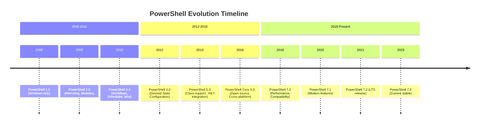
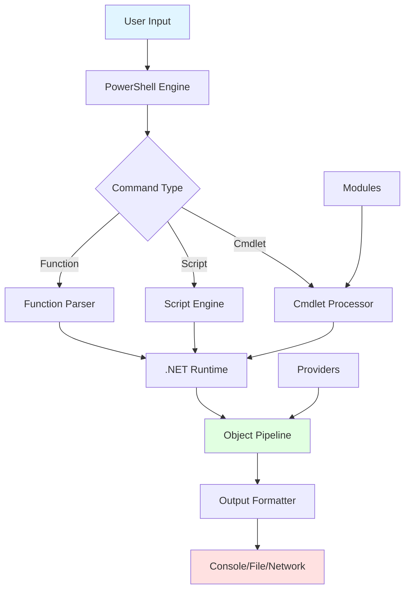
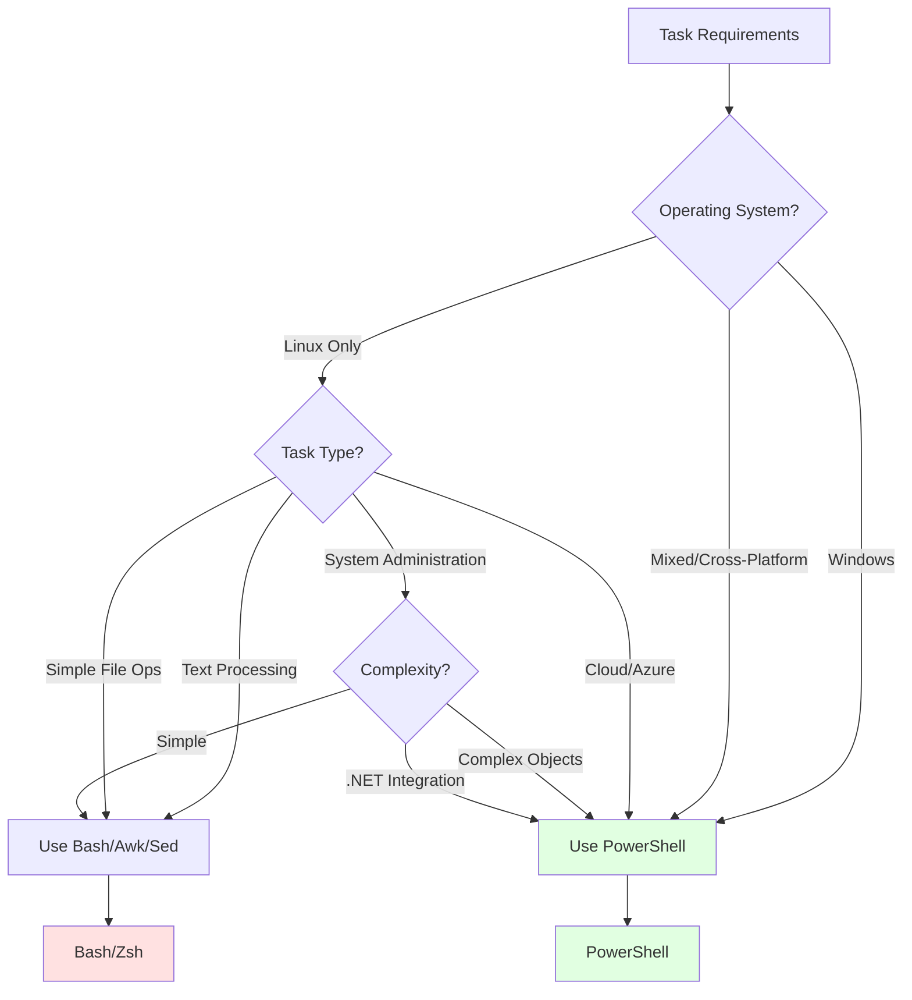
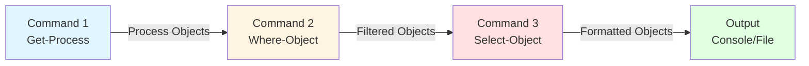
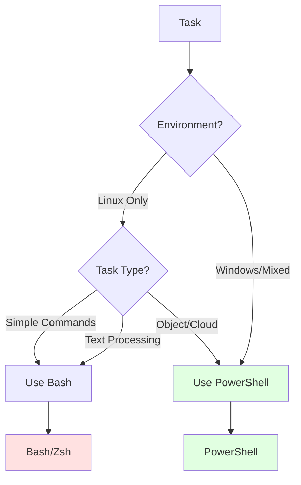

# PowerShell for Linux Users: The Complete Deep-Dive Tutorial

**Difficulty Level:** ⭐⭐⭐ Intermediate  
**Estimated Reading Time:** 25 minutes  
**Last Updated:** January 2026  
**Author:** Comprehensive Technical Guide

---

## Table of Contents

1. [Introduction](#introduction)
2. [Prerequisites](#prerequisites)
3. [Learning Objectives](#learning-objectives)
4. [What Is PowerShell?](#what-is-powershell)
5. [The Object-Oriented Revolution](#the-object-oriented-revolution)
6. [Installing PowerShell on Linux](#installing-powershell-on-linux)
7. [PowerShell vs Bash: Comprehensive Comparison](#powershell-vs-bash-comprehensive-comparison)
8. [Core Concepts and Architecture](#core-concepts-and-architecture)
9. [Command Reference: Linux to PowerShell Mapping](#command-reference-linux-to-powershell-mapping)
10. [Real-World Use Cases](#real-world-use-cases)
11. [Best Practices](#best-practices)
12. [Anti-Patterns to Avoid](#anti-patterns-to-avoid)
13. [Performance Considerations](#performance-considerations)
14. [Security Considerations](#security-considerations)
15. [Troubleshooting Guide](#troubleshooting-guide)
16. [Summary & Key Takeaways](#summary--key-takeaways)
17. [Further Reading & Resources](#further-reading--resources)
18. [Practice Exercises](#practice-exercises)
19. [Question Bank](#question-bank)
20. [Test Your Understanding](#test-your-understanding)
21. [Common Interview Questions](#common-interview-questions)

---

## Introduction

If you've used Linux for a while, you probably know Bash very well. You use commands like `ls`, `grep`, `find`, `awk`, `sed`, and `cat` almost every day. They help you manage files, search logs, automate tasks, and control your system.

So when someone says, "You should learn PowerShell," your first thought might be: **"Why? I already know Bash."**

That is a common reaction.

Many Linux users think PowerShell is only for Windows administrators. Others believe it is just another command line with different syntax.

**Both ideas are incorrect.**

PowerShell is not here to replace Bash. It solves different problems and gives you another powerful tool that works on **Linux, Windows, and macOS**.

In this comprehensive guide, you will learn:
- What PowerShell is and how it differs from Bash
- Why Linux users should care about it
- How to install and configure PowerShell on Linux
- The object-oriented paradigm that makes PowerShell unique
- Complete command mappings from Linux to PowerShell
- Real-world automation scenarios
- Best practices and common pitfalls

> 💡 **Key Insight:** PowerShell is not about replacing Bash—it's about expanding your toolkit for modern, cross-platform DevOps environments.

---

## Prerequisites

Before starting this tutorial, ensure you have:

### Required Knowledge
- ✅ Basic Linux command-line proficiency (Bash or similar)
- ✅ Understanding of file systems and permissions
- ✅ Familiarity with basic scripting concepts
- ✅ Experience with system administration tasks

### Required Tools
- ✅ A Linux system (Ubuntu, Debian, RHEL, Fedora, or Arch-based)
- ✅ sudo/root access for installation
- ✅ Internet connection for downloading packages
- ✅ Text editor (vim, nano, VS Code, etc.)

### Recommended (But Not Required)
- 📚 Basic understanding of programming concepts (variables, loops, functions)
- 📚 Familiarity with JSON and structured data
- 📚 Experience with cloud platforms (Azure, AWS, GCP)
- 📚 Knowledge of DevOps practices (CI/CD, infrastructure as code)

---

## Learning Objectives

By the end of this tutorial, you will be able to:

### Core Competencies
- ✅ Explain the fundamental differences between PowerShell and Bash
- ✅ Install and configure PowerShell on various Linux distributions
- ✅ Use PowerShell's object-oriented pipeline effectively
- ✅ Convert common Bash commands to PowerShell equivalents
- ✅ Write PowerShell scripts for system automation
- ✅ Manage files, processes, and services using PowerShell
- ✅ Filter and manipulate data using PowerShell's object model
- ✅ Apply best practices for PowerShell scripting on Linux

### Advanced Skills
- ✅ Integrate PowerShell with Azure and cloud services
- ✅ Create cross-platform automation scripts
- ✅ Debug and troubleshoot PowerShell scripts
- ✅ Optimize PowerShell performance for production use
- ✅ Implement security best practices in PowerShell scripts

---

## What Is PowerShell?

PowerShell is Microsoft's command-line shell and scripting language. It was first built for Windows, but today it is **open source** and runs on Linux, Windows, and macOS.

### Historical Context

**Timeline of PowerShell Evolution:**



### Key Characteristics

| Feature | Description | Benefit |
|---------|-------------|---------|
| **Object-Oriented** | Works with .NET objects, not text | Structured data manipulation |
| **Cross-Platform** | Runs on Linux, Windows, macOS | Unified scripting environment |
| **Open Source** | Available on GitHub | Community-driven development |
| **Extensible** | Modules and snap-ins | Rich ecosystem of tools |
| **Pipeline-Based** | Passes objects between commands | Powerful data flow control |
| **Integrated Help** | Built-in documentation system | Easy learning curve |

### Architecture Overview



**Architecture Components:**
1. **PowerShell Engine** - Core runtime that processes commands
2. **Command Processors** - Handle different command types (cmdlets, scripts, functions)
3. **.NET Runtime** - Provides object model and libraries
4. **Object Pipeline** - Passes structured data between commands
5. **Modules** - Extend functionality with reusable components
6. **Providers** - Access data stores like file system, registry, etc.

---

## The Object-Oriented Revolution

This is the most important concept to understand when transitioning from Bash to PowerShell.

### Text vs Objects: The Fundamental Difference

#### Bash: Text-Based Pipeline

In Bash, commands pass **plain text** from one to another:

```bash
# Bash example: Text-based pipeline
ps -ef | grep nginx
```

**What happens:**
1. `ps -ef` generates text output
2. Text is piped to `grep`
3. `grep` searches for "nginx" in the text
4. Result is more text

**Limitation:** You're manipulating strings, not structured data.

#### PowerShell: Object-Based Pipeline

In PowerShell, commands pass **complete objects**:

```powershell
# PowerShell example: Object-based pipeline
Get-Process | Where-Object {$_.ProcessName -eq "nginx"}
```

**What happens:**
1. `Get-Process` returns Process objects
2. Objects flow through the pipeline
3. `Where-Object` filters based on object properties
4. Result is still Process objects with all properties intact

**Advantage:** You're working with structured data that has properties, methods, and type information.

### Understanding PowerShell Objects

Every command in PowerShell returns objects. Let's examine a process object:

```powershell
# Get a process and inspect its properties
$process = Get-Process -Name "nginx" -ErrorAction SilentlyContinue

if ($process) {
    # Display all properties
    $process | Get-Member -MemberType Property
    
    # Access specific properties
    Write-Host "Process Name: $($process.ProcessName)"
    Write-Host "CPU Usage: $($process.CPU)"
    Write-Host "Memory: $($process.WorkingSet64 / 1MB) MB"
    Write-Host "Process ID: $($process.Id)"
    Write-Host "Start Time: $($process.StartTime)"
}
```

**Common Object Properties:**
- **ProcessName** - Name of the process
- **CPU** - Total CPU time consumed
- **WorkingSet64** - Memory usage in bytes
- **Id** - Process ID
- **StartTime** - When the process started
- **Path** - Executable path
- **Responding** - Whether the process is responding

### Visual Comparison: Pipeline Data Flow

```mermaid
graph LR
    subgraph "Bash: Text Pipeline"
    A1[ps -ef] -->|Plain Text| B1[grep nginx]
    B1 -->|Filtered Text| C1[awk '{print $2}']
    C1 -->|Text Output| D1[User]
    end
    
    subgraph "PowerShell: Object Pipeline"
    A2[Get-Process] -->|Process Objects| B2[Where-Object]
    B2 -->|Filtered Objects| C2[Select-Object]
    C2 -->|Structured Objects| D2[User]
    end
    
    style A1 fill:#ffe1e1
    style B1 fill:#ffe1e1
    style C1 fill:#ffe1e1
    style D1 fill:#ffe1e1
    
    style A2 fill:#e1ffe1
    style B2 fill:#e1ffe1
    style C2 fill:#e1ffe1
    style D2 fill:#e1ffe1
```

**Key Differences:**
- **Bash:** Text manipulation requires parsing, fragile to format changes
- **PowerShell:** Structured data access is type-safe and resilient

### Practical Example: Comparing Approaches

Let's find all processes using more than 100MB of memory:

**Bash Approach:**
```bash
ps aux --sort=-%mem | awk 'NR==1 || $4 > 10' | head -10
```
**Issues:**
- Parsing text output
- Memory percentage calculation required
- Fragile to `ps` output format changes

**PowerShell Approach:**
```powershell
Get-Process | 
    Where-Object {$_.WorkingSet64 -gt 100MB} | 
    Sort-Object WorkingSet64 -Descending | 
    Select-Object -First 10 ProcessName, 
                       @{Name="MemoryMB"; Expression={[math]::Round($_.WorkingSet64 / 1MB, 2)}}, 
                       CPU, 
                       Id
```

**Advantages:**
- Direct property access (no parsing)
- Type-safe operations
- Clear, readable syntax
- Easy to modify and extend

---

## Installing PowerShell on Linux

PowerShell supports most major Linux distributions. Choose your distribution below.

### Ubuntu / Debian

```bash
# Update package lists
sudo apt update

# Install PowerShell
sudo apt install -y powershell

# Verify installation
pwsh --version
```

**Expected Output:**
```
PowerShell 7.4.1
```

### RHEL / CentOS / Fedora

```bash
# For RHEL/CentOS 7+
sudo yum install -y powershell

# For Fedora
sudo dnf install -y powershell

# Verify installation
pwsh --version
```

### Arch Linux

```bash
# Using pacman
sudo pacman -S powershell

# Verify installation
pwsh --version
```

### Installation via Package Repository (Recommended)

For the latest version, use Microsoft's package repository:

```bash
# Download Microsoft repository package
wget -q https://packages.microsoft.com/config/ubuntu/$(lsb_release -rs)/packages-microsoft-prod.deb -O packages-microsoft-prod.deb

# Install repository package
sudo dpkg -i packages-microsoft-prod.deb

# Clean up
rm packages-microsoft-prod.deb

# Install PowerShell
sudo apt update
sudo apt install -y powershell
```

### Starting PowerShell

```bash
# Start PowerShell
pwsh

# You'll see the PowerShell prompt:
# PowerShell 7.4.1
# PS /home/user>
```

**Exit PowerShell:**
```powershell
exit
# or
Exit-PSSession
```

### Post-Installation Configuration

```powershell
# Set execution policy (run as administrator if needed)
Set-ExecutionPolicy RemoteSigned -Scope CurrentUser

# Verify PowerShell profile location
$PROFILE

# Create profile if it doesn't exist
if (!(Test-Path $PROFILE)) {
    New-Item -Path $PROFILE -ItemType File -Force
}

# Edit profile
notepad $PROFILE
```

**Sample Profile Configuration:**
```powershell
# PowerShell Profile Example
# Add custom prompt
function prompt {
    Write-Host "PS $($executionContext.SessionState.Path.CurrentLocation)>" -ForegroundColor Green
    return " "
}

# Import useful modules
Import-Module Az
Import-Module posh-git

# Set aliases
Set-Alias ll Get-ChildItem
Set-Alias grep Select-String
```

---

## PowerShell vs Bash: Comprehensive Comparison

### Side-by-Side Comparison Table

| Task | Bash | PowerShell | Notes |
|------|------|------------|-------|
| **List files** | `ls -la` | `Get-ChildItem` or `ls` | PowerShell has alias `ls` |
| **Current directory** | `pwd` | `Get-Location` or `pwd` | PowerShell has alias `pwd` |
| **Change directory** | `cd /path` | `Set-Location /path` or `cd` | Same alias |
| **Read file** | `cat file.txt` | `Get-Content file.txt` or `cat` | PowerShell has alias `cat` |
| **Create directory** | `mkdir dir` | `New-Item -ItemType Directory -Name dir` | PowerShell has alias `mkdir` |
| **Copy file** | `cp src dest` | `Copy-Item src dest` | No alias by default |
| **Move file** | `mv src dest` | `Move-Item src dest` | No alias by default |
| **Remove file** | `rm file` | `Remove-Item file` | No alias by default |
| **Process list** | `ps aux` | `Get-Process` | Different output format |
| **Search process** | `ps aux \| grep nginx` | `Get-Process nginx` | PowerShell filters objects |
| **System services** | `systemctl status ssh` | `systemctl list-units --type=service` | PowerShell calls systemctl |
| **Get help** | `man ls` | `Get-Help Get-Process` | PowerShell has built-in help |
| **Search in files** | `grep "text" file` | `Select-String "text" file` | PowerShell has alias `sls` |
| **Find files** | `find /path -name "*.log"` | `Get-ChildItem -Path /path -Filter *.log -Recurse` | PowerShell has alias `gci` |
| **Disk usage** | `du -sh /path` | `Get-ChildItem /path | Measure-Object -Property Length -Sum` | More verbose in PowerShell |

### Detailed Comparison: Common Tasks

#### 1. File Operations

**Creating Files:**

```bash
# Bash
touch newfile.txt
echo "Hello World" > newfile.txt
```

```powershell
# PowerShell
New-Item -Path "newfile.txt" -ItemType File
# or
"Hello World" | Out-File -FilePath "newfile.txt"
```

**Reading Files:**

```bash
# Bash
cat file.txt
head -n 10 file.txt
tail -n 10 file.txt
```

```powershell
# PowerShell
Get-Content file.txt
Get-Content file.txt -TotalCount 10  # head equivalent
Get-Content file.txt -Tail 10  # tail equivalent
```

**File Metadata:**

```bash
# Bash
ls -lh file.txt
stat file.txt
```

```powershell
# PowerShell
Get-Item file.txt | Select-Object Name, Length, LastWriteTime, Attributes
Get-ItemProperty file.txt
```

#### 2. Process Management

**Listing Processes:**

```bash
# Bash
ps aux
ps -ef
top
htop
```

```powershell
# PowerShell
Get-Process
Get-Process | Sort-Object CPU -Descending | Select-Object -First 10
Get-Process | Where-Object {$_.CPU -gt 10}
```

**Killing Processes:**

```bash
# Bash
kill -9 1234
pkill nginx
killall nginx
```

```powershell
# PowerShell
Stop-Process -Id 1234 -Force
Stop-Process -Name "nginx" -Force
Get-Process "nginx" | Stop-Process -Force
```

#### 3. Text Processing

**Searching Text:**

```bash
# Bash
grep "error" logfile.txt
grep -r "TODO" /path/to/code/
grep -i "warning" logfile.txt  # Case-insensitive
```

```powershell
# PowerShell
Select-String -Path "logfile.txt" -Pattern "error"
Select-String -Path "*.cs" -Pattern "TODO" -Recurse
Select-String -Path "logfile.txt" -Pattern "warning" -CaseSensitive:$false
```

**Text Replacement:**

```bash
# Bash
sed -i 's/old/new/g' file.txt
```

```powershell
# PowerShell
(Get-Content file.txt) -replace 'old', 'new' | Set-Content file.txt
# Or using regex
(Get-Content file.txt) -replace 'old.*', 'new' | Set-Content file.txt
```

#### 4. System Information

**System Info:**

```bash
# Bash
uname -a
cat /etc/os-release
df -h
free -h
```

```powershell
# PowerShell
Get-ComputerInfo
Get-Content /etc/os-release
Get-PSDrive -PSProvider FileSystem | Select-Object Name, @{Name="Used(GB)"; Expression={[math]::Round($_.Used/1GB,2)}}, @{Name="Free(GB)"; Expression={[math]::Round($_.Free/1GB,2)}}
```

### When to Use Which: Decision Matrix



**Decision Guidelines:**
- ✅ **Use PowerShell when:** Managing Windows systems, Azure/M365 automation, cross-platform scripts, working with structured data
- ✅ **Use Bash when:** Linux-only environment, text processing with awk/sed, simple shell scripts, POSIX compliance required

---

## Core Concepts and Architecture

### The PowerShell Pipeline

The pipeline is PowerShell's most powerful feature. Unlike Bash's text pipeline, PowerShell's pipeline passes **objects**.



**Pipeline Flow:**
1. **Command 1** produces objects
2. **Command 2** receives objects, filters/transforms them
3. **Command 3** formats/selects specific properties
4. **Output** displays or saves results

### Cmdlets: The Building Blocks

Cmdlets (pronounced "command-lets") are the fundamental units of PowerShell functionality.

**Cmdlet Naming Convention:**
```
Verb-Noun
```

**Common Verbs:**
- `Get-` - Retrieve data
- `Set-` - Modify data
- `New-` - Create new resources
- `Remove-` - Delete resources
- `Start-` - Initiate processes
- `Stop-` - Terminate processes

**Examples:**
```powershell
Get-Process           # Get running processes
Set-Location          # Change current directory
New-Item              # Create files/folders
Remove-Item           # Delete files/folders
Start-Service         # Start a service
Stop-Process          # Stop a process
```

### Parameters and Parameter Binding

PowerShell supports multiple parameter types:

```powershell
# Named parameters
Get-Process -Name "nginx" -ErrorAction SilentlyContinue

# Positional parameters
Get-Process "nginx"

# Switch parameters (boolean flags)
Get-Process -Name "nginx" -IncludeUserName

# Common parameters (available on all cmdlets)
Get-Process -Name "nginx" -ErrorAction Stop -Verbose
```

**Common Parameters:**
- `-ErrorAction` - Controls error handling (Stop, Continue, SilentlyContinue)
- `-Verbose` - Shows detailed information
- `-Debug` - Enables debugging output
- `-WhatIf` - Shows what would happen without executing
- `-Confirm` - Prompts for confirmation

### Variables and Data Types

```powershell
# Variable declaration (case-insensitive, but case-preserving)
$processName = "nginx"
$ProcessCount = 5
$PROCESS_LIST = @("nginx", "apache", "mysql")

# Data types
$string = "Hello World"
$int = 42
$float = 3.14
$bool = $true
$array = @(1, 2, 3, 4, 5)
$hashTable = @{Name="John"; Age=30; City="NYC"}

# Type casting
$number = [int]"42"
$stringNumber = [string]$number

# Multi-line strings
$multiLine = @"
This is a
multi-line
string
"@
```

### Arrays and Collections

```powershell
# Create array
$services = @("nginx", "apache2", "mysql", "redis")

# Access elements
$services[0]           # First element
$services[-1]          # Last element
$services[1..3]        # Elements 1 to 3

# Array methods
$services.Count        # Number of elements
$services -contains "nginx"  # Check if exists
$services -join ", "   # Join to string

# Array operations
$services += "docker"  # Add element
$services | Where-Object {$_ -like "*sql*"}  # Filter
```

### Hash Tables (Dictionaries)

```powershell
# Create hash table
$config = @{
    ServerName = "web01"
    Port = 8080
    Environment = "Production"
    Features = @("SSL", "CDN", "LoadBalancer")
}

# Access values
$config.ServerName
$config["Port"]

# Add/Update values
$config.MaxConnections = 1000
$config.Port = 8443

# Iterate through hash table
foreach ($key in $config.Keys) {
    Write-Host "$key : $($config[$key])"
}
```

### Functions

```powershell
# Basic function
function Get-ServiceStatus {
    param(
        [string]$ServiceName
    )
    
    $service = Get-Service -Name $ServiceName -ErrorAction SilentlyContinue
    
    if ($service) {
        return [PSCustomObject]@{
            Name = $service.Name
            Status = $service.Status
            DisplayName = $service.DisplayName
        }
    } else {
        Write-Warning "Service '$ServiceName' not found"
        return $null
    }
}

# Call the function
$status = Get-ServiceStatus -ServiceName "nginx"
$status | Format-Table -AutoSize
```

### Error Handling

```powershell
# Try-Catch-Finally
try {
    $process = Get-Process -Name "nonexistent" -ErrorAction Stop
    $process | Stop-Process -Force
}
catch {
    Write-Error "Failed to stop process: $_"
    # $_ contains the error object
}
finally {
    Write-Host "Cleanup code here"
}

# Error action preferences
$ErrorActionPreference = "Stop"  # Stop on all errors
$ErrorActionPreference = "Continue"  # Continue on errors (default)

# Check for errors
if ($?) {
    Write-Host "Last command succeeded"
} else {
    Write-Host "Last command failed"
}
```

---

## Command Reference: Linux to PowerShell Mapping

### Complete Command Mapping Table

| Category | Linux Command | PowerShell Equivalent | Notes |
|----------|---------------|----------------------|-------|
| **File Operations** |
| List files | `ls -la` | `Get-ChildItem` or `ls` | `ls` is an alias |
| List all files | `ls -la` | `Get-ChildItem -Force` | Shows hidden files |
| Change directory | `cd /path` | `Set-Location` or `cd` | `cd` is an alias |
| Print working directory | `pwd` | `Get-Location` or `pwd` | `pwd` is an alias |
| Create directory | `mkdir dir` | `New-Item -ItemType Directory` | `mkdir` is an alias |
| Remove directory | `rmdir dir` | `Remove-Item` | `rmdir` is an alias |
| Copy file | `cp src dest` | `Copy-Item` | No alias |
| Move/rename file | `mv src dest` | `Move-Item` | No alias |
| Remove file | `rm file` | `Remove-Item` | No alias |
| Create empty file | `touch file` | `New-Item -ItemType File` | No alias |
| Read file | `cat file` | `Get-Content` or `cat` | `cat` is an alias |
| Write to file | `echo "text" > file` | `"text" | Out-File` | Different syntax |
| Append to file | `echo "text" >> file` | `"text" | Add-Content` | Different syntax |
| **Text Processing** |
| Search text | `grep "pattern" file` | `Select-String` or `sls` | `sls` is alias |
| Search recursively | `grep -r "pattern" /path` | `Select-String -Path *.txt -Recurse` | |
| Replace text | `sed 's/old/new/g' file` | `(Get-Content file) -replace 'old','new'` | |
| Cut columns | `cut -d',' -f1 file` | `Import-Csv file | Select-Object -ExpandProperty Column1` | |
| Sort lines | `sort file` | `Get-Content file | Sort-Object` | |
| Unique lines | `uniq file` | `Get-Content file | Sort-Object -Unique` | |
| Count lines | `wc -l file` | `(Get-Content file).Count` | |
| **Process Management** |
| List processes | `ps aux` | `Get-Process` | Different output |
| Kill process | `kill -9 1234` | `Stop-Process -Id 1234 -Force` | |
| Kill by name | `pkill nginx` | `Stop-Process -Name nginx` | |
| Process info | `ps -p 1234` | `Get-Process -Id 1234` | |
| **System Information** |
| System info | `uname -a` | `Get-ComputerInfo` | |
| OS version | `cat /etc/os-release` | `Get-ComputerInfo | Select-Object WindowsProductName` | |
| Disk usage | `df -h` | `Get-PSDrive -PSProvider FileSystem` | |
| Memory usage | `free -h` | `Get-Counter '\Memory\Available MBytes'` | |
| Uptime | `uptime` | `(Get-Date) - (Get-CimInstance Win32_OperatingSystem).LastBootUpTime` | |
| **Network** |
| Network interfaces | `ip addr` | `Get-NetIPAddress` | |
| Ping | `ping host` | `Test-Connection host` | |
| DNS lookup | `nslookup domain` | `Resolve-DnsName domain` | |
| Download file | `wget url` | `Invoke-WebRequest url` | |
| **User Management** |
| Current user | `whoami` | `$env:USERNAME` or `whoami` | |
| User info | `id` | `whoami /all` | |
| Switch user | `su - user` | `sudo su - user` | Same as Bash |
| **Permissions** |
| File permissions | `ls -l` | `Get-Acl file` | Different approach |
| Change permissions | `chmod 755 file` | `Set-Acl` (complex) | Prefer chmod in scripts |
| Change owner | `chown user:group file` | `Set-Acl` (complex) | Prefer chown in scripts |

### Quick Reference: Most Common Commands

```powershell
# File Operations
ls                          # List files
cd /path                    # Change directory
pwd                         # Print working directory
mkdir newdir                # Create directory
cp file1 file2              # Copy file
mv file1 file2              # Move/rename file
rm file                     # Remove file
cat file.txt                # Read file

# Process Management
ps                          # List processes
kill -Id 1234               # Kill process by ID
grep "pattern" file         # Search in file (alias: sls)

# System Information
hostname                    # Show hostname
whoami                      # Current user
date                        # Current date/time

# Help
Get-Help Get-Process        # Get help for cmdlet
Get-Help Get-Process -Examples  # See examples
Get-Command                 # List all commands
Get-Command -Verb Get       # List all Get-* commands
```

---

## Real-World Use Cases

### Use Case 1: Automated Log Analysis

**Scenario:** Analyze web server logs to identify errors and performance issues.

```powershell
# Log Analysis Script
$logPath = "/var/log/nginx/access.log"
$errorPattern = " 5[0-9]{2} "  # 5xx errors
$reportPath = "/tmp/log-report.txt"

# Analyze logs
$logEntries = Get-Content $logPath -Tail 1000

$errors = $logEntries | Select-String -Pattern $errorPattern
$totalRequests = $logEntries.Count
$errorCount = $errors.Count
$errorRate = ($errorCount / $totalRequests) * 100

# Generate report
$report = @"
Log Analysis Report
==================
Generated: $(Get-Date)
Total Requests: $totalRequests
Error Count: $errorCount
Error Rate: $([math]::Round($errorRate, 2))%

Top Error Codes:
$($errors | 
    ForEach-Object {$_ -match '\s(5\d{2})\s'} | 
    Group-Object | 
    Sort-Object Count -Descending | 
    Select-Object -First 5 | 
    Format-Table Name, Count -AutoSize)
"@

$report | Out-File $reportPath
Write-Host "Report generated: $reportPath"
```

### Use Case 2: Cross-Platform Service Management

**Scenario:** Manage services across Linux and Windows servers.

```powershell
# Universal service management function
function Manage-Service {
    param(
        [string]$ServiceName,
        [ValidateSet("Start", "Stop", "Restart", "Status")]
        [string]$Action
    )
    
    $os = $PSVersionTable.OS
    
    try {
        switch ($os) {
            # Linux
            {$_ -like "*Linux*"} {
                $service = systemctl list-units --type=service | 
                          Where-Object {$_.Display -like "*$ServiceName*"}
                
                switch ($Action) {
                    "Start" { sudo systemctl start $ServiceName }
                    "Stop" { sudo systemctl stop $ServiceName }
                    "Restart" { sudo systemctl restart $ServiceName }
                    "Status" { sudo systemctl status $ServiceName }
                }
            }
            # Windows
            {$_ -like "*Windows*"} {
                $service = Get-Service -Name $ServiceName -ErrorAction SilentlyContinue
                
                if (!$service) {
                    Write-Error "Service not found: $ServiceName"
                    return
                }
                
                switch ($Action) {
                    "Start" { Start-Service -Name $ServiceName }
                    "Stop" { Stop-Service -Name $ServiceName -Force }
                    "Restart" { Restart-Service -Name $ServiceName }
                    "Status" { Get-Service -Name $ServiceName }
                }
            }
        }
        
        Write-Host "Service '$ServiceName' $Action successful" -ForegroundColor Green
    }
    catch {
        Write-Error "Failed to $Action service '$ServiceName': $_"
    }
}

# Usage examples
Manage-Service -ServiceName "nginx" -Action "Start"
Manage-Service -ServiceName "nginx" -Action "Status"
```

### Use Case 3: Azure Resource Management

**Scenario:** Automate Azure VM deployment and configuration.

```powershell
# Connect to Azure
Connect-AzAccount

# Create resource group
$resourceGroup = New-AzResourceGroup -Name "MyResourceGroup" -Location "EastUS"

# Create virtual network
$vnet = New-AzVirtualNetwork -ResourceGroupName $resourceGroup.ResourceGroupName `
    -Name "MyVNet" -AddressPrefix "10.0.0.0/16" -Location $resourceGroup.Location

# Create subnet
$subnet = Add-AzVirtualNetworkSubnetConfig -Name "MySubnet" `
    -AddressPrefix "10.0.1.0/24" -VirtualNetwork $vnet
$vnet | Set-AzVirtualNetwork

# Create public IP
$publicIp = New-AzPublicIpAddress -ResourceGroupName $resourceGroup.ResourceGroupName `
    -Name "MyPublicIP" -Location $resourceGroup.Location -AllocationMethod Dynamic

# Create VM
$vmConfig = New-AzVMConfig -VMName "MyLinuxVM" -VMSize "Standard_DS1_v2"
$vmConfig = Set-AzVMOperatingSystem -VM $vmConfig -Linux -ComputerName "MyLinuxVM" `
    -Credential (Get-Credential) -DisablePasswordAuthentication
$vmConfig = Set-AzVMSourceImage -VM $vmConfig -PublisherName "Canonical" `
    -Offer "UbuntuServer" -Skus "18.04-LTS" -Version "latest"
$vmConfig = Add-AzVMNetworkInterface -VM $vmConfig -Id $nic.Id

# Create VM
New-AzVM -ResourceGroupName $resourceGroup.ResourceGroupName -Location $resourceGroup.Location -VM $vmConfig
```

### Use Case 4: System Health Monitoring

**Scenario:** Monitor system resources and send alerts.

```powershell
# System Health Monitor
function Get-SystemHealth {
    $healthReport = [PSCustomObject]@{
        Timestamp = Get-Date
        ComputerName = $env:COMPUTERNAME
        CPU = (Get-Counter '\Processor(_Total)\% Processor Time' -ErrorAction SilentlyContinue).CounterSamples.CookedValue
        Memory = (Get-Counter '\Memory\Available MBytes' -ErrorAction SilentlyContinue).CounterSamples.CookedValue
        Disk = Get-PSDrive -PSProvider FileSystem | Where-Object {$_.Used -gt 0} | Select-Object Name, @{Name="FreeGB"; Expression={[math]::Round($_.Free/1GB,2)}}
        Services = Get-Service | Where-Object {$_.Status -ne "Running"} | Select-Object Name, Status
    }
    
    return $healthReport
}

# Check health and alert
$health = Get-SystemHealth

# CPU Alert
if ($health.CPU -gt 90) {
    Write-Warning "High CPU usage: $([math]::Round($health.CPU, 2))%"
    # Send alert (email, Slack, etc.)
}

# Memory Alert
if ($health.Memory -lt 500) {
    Write-Warning "Low memory: $($health.Memory) MB available"
}

# Service Alert
if ($health.Services) {
    Write-Warning "Stopped services detected:"
    $health.Services | Format-Table -AutoSize
}
```

### Use Case 5: Automated Backup Script

**Scenario:** Create automated backups with rotation.

```powershell
# Backup function
function New-Backup {
    param(
        [string]$SourcePath,
        [string]$BackupPath,
        [int]$RetentionDays = 7
    )
    
    $timestamp = Get-Date -Format "yyyyMMdd_HHmmss"
    $backupFile = Join-Path $BackupPath "backup_$timestamp.zip"
    
    try {
        # Create backup
        if (Test-Path $SourcePath) {
            Compress-Archive -Path $SourcePath -DestinationPath $backupFile -CompressionLevel Optimal
            Write-Host "Backup created: $backupFile" -ForegroundColor Green
            
            # Get backup size
            $backupSize = (Get-Item $backupFile).Length / 1MB
            Write-Host "Backup size: $([math]::Round($backupSize, 2)) MB"
            
            # Clean old backups
            $oldBackups = Get-ChildItem $BackupPath -Filter "backup_*.zip" | 
                         Where-Object {$_.LastWriteTime -lt (Get-Date).AddDays(-$RetentionDays)}
            
            foreach ($oldBackup in $oldBackups) {
                Remove-Item $oldBackup.FullName -Force
                Write-Host "Removed old backup: $($oldBackup.Name)"
            }
        }
        else {
            Write-Error "Source path not found: $SourcePath"
        }
    }
    catch {
        Write-Error "Backup failed: $_"
    }
}

# Usage
New-Backup -SourcePath "/var/www/html" -BackupPath "/backups" -RetentionDays 7
```

---

## Best Practices

### 1. Use Approved Verbs

PowerShell has a standardized set of verbs for cmdlets. Always use approved verbs.

```powershell
# ✅ Good
Get-Process
Set-Location
New-Item

# ❌ Bad
Fetch-Process
Change-Location
Create-Item
```

**Common Approved Verbs:**
- `Get-` - Retrieve data
- `Set-` - Modify data
- `New-` - Create resources
- `Remove-` - Delete resources
- `Start-` - Begin operations
- `Stop-` - End operations
- `Test-` - Validate conditions
- `Write-` - Output data

### 2. Use Meaningful Variable Names

```powershell
# ✅ Good
$serviceName = "nginx"
$maxRetries = 3
$isRunning = $true

# ❌ Bad
$x = "nginx"
$a = 3
$flag = $true
```

### 3. Implement Error Handling

```powershell
# ✅ Good: Proper error handling
try {
    $process = Get-Process -Name "nginx" -ErrorAction Stop
    $process | Stop-Process -Force
}
catch {
    Write-Error "Failed to stop nginx: $_"
    # Log error, send notification, etc.
}
finally {
    # Cleanup code
    Write-Host "Operation completed"
}

# ❌ Bad: No error handling
$process = Get-Process -Name "nginx"
$process | Stop-Process -Force
```

### 4. Use Pipeline Efficiently

```powershell
# ✅ Good: Efficient pipeline
Get-Process | 
    Where-Object {$_.CPU -gt 10} | 
    Sort-Object CPU -Descending | 
    Select-Object -First 10 ProcessName, CPU

# ❌ Bad: Inefficient (stores all in memory)
$processes = Get-Process
$filtered = $processes | Where-Object {$_.CPU -gt 10}
$sorted = $filtered | Sort-Object CPU -Descending
$top10 = $sorted | Select-Object -First 10
```

### 5. Use Comment-Based Help

```powershell
function Get-ServiceHealth {
    <#
    .SYNOPSIS
        Retrieves health status of a service.
    
    .DESCRIPTION
        This function checks if a service is running and returns its status.
    
    .PARAMETER ServiceName
        The name of the service to check.
    
    .EXAMPLE
        Get-ServiceHealth -ServiceName "nginx"
    
    .OUTPUTS
        PSCustomObject with service health information.
    #>
    param(
        [Parameter(Mandatory=$true)]
        [string]$ServiceName
    )
    
    # Function implementation
}
```

### 6. Use Splatting for Complex Commands

```powershell
# ✅ Good: Splatting (cleaner, more readable)
$params = @{
    Path = "/var/log"
    Filter = "*.log"
    Recurse = $true
    File = $true
}
Get-ChildItem @params

# ❌ Bad: Long parameter list
Get-ChildItem -Path "/var/log" -Filter "*.log" -Recurse -File
```

### 7. Validate Input Parameters

```powershell
function Copy-FileSafely {
    param(
        [Parameter(Mandatory=$true)]
        [ValidateScript({Test-Path $_ -PathType Leaf})]
        [string]$SourcePath,
        
        [Parameter(Mandatory=$true)]
        [ValidatePattern('^[a-zA-Z]:\\')]
        [string]$DestinationPath
    )
    
    Copy-Item -Path $SourcePath -Destination $DestinationPath
}
```

### 8. Use Consistent Formatting

```powershell
# ✅ Good: Consistent formatting
$services = Get-Service | Where-Object Status -eq "Running"
$services | Select-Object Name, Status, DisplayName | Format-Table -AutoSize

# ❌ Bad: Inconsistent
Get-Service | Where-Object Status -eq "Running" | Select Name, Status
```

### 9. Avoid Hard-Coding Values

```powershell
# ✅ Good: Use parameters or configuration
param(
    [string]$LogPath = "/var/log/nginx",
    [int]$RetentionDays = 7
)

# ❌ Bad: Hard-coded values
$logPath = "/var/log/nginx"
$retentionDays = 7
```

### 10. Use Full Cmdlet Names in Production Scripts

```powershell
# ✅ Good: Full names (clearer for maintenance)
Get-ChildItem -Path "/var/log" -Recurse

# Acceptable in interactive use
ls /var/log -Recurse

# ❌ Bad: Unclear aliases in scripts
gci /var/log -r
```

---

## Anti-Patterns to Avoid

### Anti-Pattern 1: Parsing Text When Objects Are Available

```powershell
# ❌ Bad: Parsing text output
$processes = ps aux | grep nginx | awk '{print $2}'

# ✅ Good: Use objects
$processes = Get-Process -Name "nginx" | Select-Object -ExpandProperty Id
```

### Anti-Pattern 2: Ignoring Errors

```powershell
# ❌ Bad: No error handling
Remove-Item "important_file.txt"

# ✅ Good: Proper error handling
try {
    Remove-Item "important_file.txt" -ErrorAction Stop
    Write-Host "File deleted successfully"
}
catch {
    Write-Error "Failed to delete file: $_"
}
```

### Anti-Pattern 3: Using Aliases in Scripts

```powershell
# ❌ Bad: Aliases in production scripts
ls /var/log | ? {$_.Length -gt 1MB} | % {$_.Name}

# ✅ Good: Full cmdlet names
Get-ChildItem -Path "/var/log" | 
    Where-Object {$_.Length -gt 1MB} | 
    ForEach-Object {$_.Name}
```

### Anti-Pattern 4: Not Using Pipeline Efficiently

```powershell
# ❌ Bad: Multiple passes through data
$processes = Get-Process
$highCPU = $processes | Where-Object {$_.CPU -gt 10}
$sorted = $highCPU | Sort-Object CPU
$top10 = $sorted | Select-Object -First 10

# ✅ Good: Single pipeline
Get-Process | 
    Where-Object {$_.CPU -gt 10} | 
    Sort-Object CPU -Descending | 
    Select-Object -First 10
```

### Anti-Pattern 5: Hard-Coding Paths

```powershell
# ❌ Bad: Hard-coded paths
$logFile = "C:\logs\app.log"

# ✅ Good: Use variables or parameters
param(
    [string]$LogPath = "/var/log/app.log"
)
$logFile = $LogPath
```

### Anti-Pattern 6: Not Checking for Null

```powershell
# ❌ Bad: Assuming object exists
$process = Get-Process -Name "nginx"
$process.Id  # Fails if nginx not running

# ✅ Good: Check for null
$process = Get-Process -Name "nginx" -ErrorAction SilentlyContinue
if ($process) {
    $process.Id
} else {
    Write-Warning "Process not found"
}
```

### Anti-Pattern 7: Using Write-Host for Output

```powershell
# ❌ Bad: Write-Host (can't be captured or redirected)
Write-Host "Processing complete"

# ✅ Good: Write-Output or Write-Information
Write-Output "Processing complete"
# or
Write-Information "Processing complete"
```

### Anti-Pattern 8: Not Using Approved Verbs

```powershell
# ❌ Bad: Non-standard verbs
function Fetch-Data { }
function Delete-File { }

# ✅ Good: Approved verbs
function Get-Data { }
function Remove-File { }
```

---

## Performance Considerations

### 1. Use Pipeline Over Arrays

```powershell
# ❌ Slow: Loads all into memory
$allFiles = Get-ChildItem -Path "C:\" -Recurse
$largeFiles = $allFiles | Where-Object {$_.Length -gt 1GB}

# ✅ Fast: Streams through pipeline
Get-ChildItem -Path "C:\" -Recurse | 
    Where-Object {$_.Length -gt 1GB}
```

### 2. Use -Filter Parameter

```powershell
# ❌ Slow: Gets all files, then filters
Get-ChildItem -Path "/var/log" -Recurse | Where-Object {$_.Extension -eq ".log"}

# ✅ Fast: Filters at source
Get-ChildItem -Path "/var/log" -Filter "*.log" -Recurse
```

### 3. Avoid Unnecessary Object Creation

```powershell
# ❌ Slow: Creates intermediate objects
$processes = Get-Process
$names = $processes | Select-Object -ExpandProperty ProcessName

# ✅ Fast: Direct property access
Get-Process | Select-Object -ExpandProperty ProcessName
```

### 4. Use Parallel Processing (PowerShell 7+)

```powershell
# Sequential processing
$files = Get-ChildItem -Path "/data" -Filter "*.csv"
foreach ($file in $files) {
    Process-File $file
}

# Parallel processing (PowerShell 7+)
$files = Get-ChildItem -Path "/data" -Filter "*.csv"
$files | ForEach-Object -Parallel {
    Process-File $_
} -ThrottleLimit 4
```

### 5. Use Runspaces for Concurrent Operations

```powershell
# Create runspace pool
$runspacePool = [RunspaceFactory]::CreateRunspacePool(1, 4)
$runspacePool.Open()

$jobs = @()
$servers = @("server1", "server2", "server3", "server4")

foreach ($server in $servers) {
    $job = [PowerShell]::Create().AddScript({
        param($server)
        Test-Connection -ComputerName $server -Count 1
    }).AddArgument($server)
    
    $job.RunspacePool = $runspacePool
    $jobs += [PSCustomObject]@{
        Pipe = $job.BeginInvoke()
        PowerShell = $job
    }
}

# Wait for completion and get results
$results = $jobs | ForEach-Object {
    $_.PowerShell.EndInvoke($_.Pipe)
}

$runspacePool.Close()
$runspacePool.Dispose()
```

### Performance Benchmarking Example

```powershell
# Measure command performance
Measure-Command {
    Get-ChildItem -Path "C:\Windows" -Recurse -Filter "*.log"
}

# Compare approaches
$approach1 = Measure-Command {
    Get-ChildItem -Path "/var/log" -Recurse | Where-Object {$_.Extension -eq ".log"}
}

$approach2 = Measure-Command {
    Get-ChildItem -Path "/var/log" -Filter "*.log" -Recurse
}

Write-Host "Approach 1 (no filter): $($approach1.TotalSeconds) seconds"
Write-Host "Approach 2 (with filter): $($approach2.TotalSeconds) seconds"
Write-Host "Speedup: $([math]::Round($approach1.TotalSeconds / $approach2.TotalSeconds, 2))x"
```

---

## Security Considerations

### 1. Execution Policy

```powershell
# View current execution policy
Get-ExecutionPolicy -List

# Set execution policy (recommended: RemoteSigned)
Set-ExecutionPolicy RemoteSigned -Scope CurrentUser

# Execution policy levels:
# - Restricted: No scripts allowed
# - AllSigned: Only signed scripts
# - RemoteSigned: Local scripts ok, remote must be signed
# - Unrestricted: All scripts allowed (not recommended)
```

### 2. Credential Management

```powershell
# ❌ Bad: Hard-coded credentials
$username = "admin"
$password = "P@ssw0rd123"
$credential = New-Object PSCredential($username, (ConvertTo-SecureString $password -AsPlainText -Force))

# ✅ Good: Prompt for credentials
$credential = Get-Credential

# ✅ Better: Use credential manager
$credential = Get-StoredCredential -Target "MyApp"
```

### 3. Secure String Handling

```powershell
# Convert plain text to secure string
$securePassword = Read-Host "Enter password" -AsSecureString

# Convert secure string back to plain text (use sparingly)
$plainTextPassword = [Runtime.InteropServices.Marshal]::PtrToStringAuto(
    [Runtime.InteropServices.Marshal]::SecureStringToBSTR($securePassword)
)

# Encrypt/decrypt sensitive data
$encrypted = $securePassword | ConvertFrom-SecureString
$decrypted = $encrypted | ConvertTo-SecureString
```

### 4. Avoid Code Injection

```powershell
# ❌ Bad: Vulnerable to injection
$userInput = Read-Host "Enter filename"
Remove-Item $userInput

# ✅ Good: Validate input
$userInput = Read-Host "Enter filename"
if ($userInput -match '^[a-zA-Z0-9_-]+\.txt$') {
    Remove-Item $userInput -ErrorAction Stop
} else {
    Write-Error "Invalid filename"
}
```

### 5. Use Least Privilege

```powershell
# ❌ Bad: Running as root unnecessarily
sudo pwsh

# ✅ Good: Run with minimum required privileges
# Use sudo only for specific commands
sudo systemctl restart nginx
```

### 6. Audit and Logging

```powershell
# Enable transcription (records all commands)
Start-Transcript -Path "/var/log/powershell_transcript.log"

# Your commands here
Get-Process
Get-Service

# Stop transcription
Stop-Transcript

# Log important actions
function Write-AuditLog {
    param(
        [string]$Message,
        [string]$Level = "INFO"
    )
    
    $logEntry = [PSCustomObject]@{
        Timestamp = Get-Date -Format "yyyy-MM-dd HH:mm:ss"
        Level = $Level
        Message = $Message
        User = $env:USERNAME
        Computer = $env:COMPUTERNAME
    }
    
    $logEntry | Export-Csv -Path "/var/log/powershell_audit.csv" -Append -NoTypeInformation
}

# Usage
Write-AuditLog -Message "User logged in" -Level "INFO"
Write-AuditLog -Message "Failed login attempt" -Level "WARNING"
```

### 7. Secure Remote Connections

```powershell
# Use HTTPS for remote connections
Invoke-WebRequest -Uri "https://example.com/api" -UseBasicParsing

# Verify SSL certificates
[System.Net.ServicePointManager]::ServerCertificateValidationCallback = {$true}  # Only for testing!

# Use SSH for PowerShell remoting (PowerShell 7+)
Enter-PSSession -HostName server01 -UserName user -SSHTransport
```

---

## Troubleshooting Guide

### Common Issues and Solutions

#### Issue 1: "Execution of scripts is disabled on this system"

**Error Message:**
```
File C:\script.ps1 cannot be loaded because running scripts is disabled on this system.
```

**Solution:**
```powershell
# Check current policy
Get-ExecutionPolicy -List

# Set policy for current user
Set-ExecutionPolicy RemoteSigned -Scope CurrentUser

# Or run without changing policy (temporary)
PowerShell -ExecutionPolicy Bypass -File script.ps1
```

#### Issue 2: "The term 'cmdlet' is not recognized"

**Error Message:**
```
Get-Process : The term 'Get-Process' is not recognized...
```

**Solution:**
```powershell
# Import the module
Import-Module Microsoft.PowerShell.Management

# Check if module is available
Get-Module -ListAvailable

# Install missing module
Install-Module -Name PowerShellGet -Force
```

#### Issue 3: Permission Denied Errors

**Error Message:**
```
Access to the path '/var/log/app.log' is denied.
```

**Solution:**
```powershell
# Check permissions
Get-Acl "/var/log/app.log"

# Run with elevated privileges (Linux)
sudo pwsh

# Or use specific sudo for command
sudo Remove-Item "/var/log/app.log"
```

#### Issue 4: Pipeline Not Working as Expected

**Problem:** Objects not passing through pipeline correctly

**Solution:**
```powershell
# Debug pipeline
Get-Process | ForEach-Object {
    Write-Host "Processing: $($_.ProcessName)"
    $_  # Pass object through
} | Where-Object {$_.CPU -gt 10}

# Check object type
Get-Process | Get-Member
```

#### Issue 5: Encoding Issues

**Problem:** Special characters not displaying correctly

**Solution:**
```powershell
# Set output encoding
$OutputEncoding = [System.Text.Encoding]::UTF8

# Read file with specific encoding
Get-Content -Path "file.txt" -Encoding UTF8

# Write with specific encoding
"text" | Out-File -FilePath "output.txt" -Encoding UTF8
```

#### Issue 6: Slow Performance

**Problem:** Scripts running slowly

**Solution:**
```powershell
# Profile script performance
Measure-Command {
    # Your code here
}

# Use -Filter instead of Where-Object
Get-ChildItem -Path "/var/log" -Filter "*.log" -Recurse  # Fast

# Avoid unnecessary object creation
# Use pipeline efficiently
```

### Debugging Techniques

```powershell
# 1. Verbose output
$VerbosePreference = "Continue"
Get-Process -Verbose

# 2. Debug output
$DebugPreference = "Continue"
Write-Debug "Debug information"

# 3. Set breakpoints
Set-PSBreakpoint -Script "script.ps1" -Line 10

# 4. Step through code
# In VS Code: F5 to debug, F10 to step over, F11 to step into

# 5. Check variable values
Write-Host "Variable value: $variable"
$variable | Format-List *

# 6. Use try-catch for error details
try {
    # Code that might fail
}
catch {
    Write-Host "Error: $_"
    Write-Host "Exception: $($_.Exception)"
    Write-Host "Script Line: $($_.InvocationInfo.ScriptLineNumber)"
}
```

---

## Summary & Key Takeaways

### Key Concepts Learned

1. **Object-Oriented Pipeline:** PowerShell's biggest advantage over Bash is its object-based pipeline, enabling structured data manipulation instead of text parsing.

2. **Cross-Platform Compatibility:** PowerShell runs natively on Linux, Windows, and macOS, making it ideal for mixed-environment DevOps.

3. **Cmdlet Structure:** PowerShell uses Verb-Noun naming convention (e.g., `Get-Process`, `Set-Location`) for consistency and discoverability.

4. **Not a Bash Replacement:** PowerShell complements Bash—use each tool for its strengths. Bash excels at text processing; PowerShell excels at object manipulation and cross-platform automation.

5. **Rich Ecosystem:** PowerShell has extensive modules for Azure, AWS, Microsoft 365, and many other platforms.

### When to Use PowerShell

✅ **Use PowerShell when:**
- Managing Windows systems
- Automating Azure/Microsoft 365 resources
- Working with structured data and objects
- Creating cross-platform automation scripts
- Integrating with .NET libraries
- Building complex automation workflows

❌ **Avoid PowerShell when:**
- Working exclusively in Linux-only environments
- Heavy text processing with awk/sed is more efficient
- POSIX shell compliance is required
- Simple one-liners are sufficient in Bash

### Quick Decision Guide



---

## Further Reading & Resources

### Official Documentation
- [PowerShell Documentation](https://docs.microsoft.com/powershell/)
- [PowerShell GitHub Repository](https://github.com/PowerShell/PowerShell)
- [PowerShell Gallery](https://www.powershellgallery.com/)

### Books
- "PowerShell in Action" by Bruce Payette
- "Learn PowerShell in a Month of Lunches" by Don Jones
- "PowerShell Cookbook" by Lee Holmes

### Online Courses
- Microsoft Learn: [PowerShell Learning Paths](https://docs.microsoft.com/learn/powershell/)
- Pluralsight: [PowerShell Fundamentals](https://www.pluralsight.com/courses/powershell-fundamentals)

### Community Resources
- [PowerShell.org](https://powershell.org/)
- [r/PowerShell](https://reddit.com/r/PowerShell)
- [PowerShell Discord](https://discord.gg/powershell)

### Tools
- [PowerShell 7](https://github.com/PowerShell/PowerShell)
- [PowerShell Extension for VS Code](https://marketplace.visualstudio.com/items?itemName=ms-vscode.PowerShell)
- [PSScriptAnalyzer](https://github.com/PowerShell/PSScriptAnalyzer)

---

## Practice Exercises

### Exercise 1: System Information Report

**Difficulty:** ⭐ Beginner  
**Time:** 15 minutes

**Task:** Create a PowerShell script that generates a comprehensive system information report.

**Requirements:**
1. Display system information (OS, hostname, uptime)
2. Show disk usage for all mounted drives
3. List top 5 processes by memory usage
4. Check status of critical services
5. Save report to a file

<details>
<summary>📝 Solution</summary>

```powershell
# System Information Report Script
$reportPath = "/tmp/system_report_$(Get-Date -Format 'yyyyMMdd_HHmmss').txt"

$report = @"
========================================
SYSTEM INFORMATION REPORT
Generated: $(Get-Date -Format "yyyy-MM-dd HH:mm:ss")
========================================

SYSTEM INFORMATION
------------------
Computer Name: $env:COMPUTERNAME
Operating System: $([System.Environment]::OSVersion.VersionString)
PowerShell Version: $PSVersionTable.PSVersion
Uptime: $((Get-Date) - (Get-CimInstance Win32_OperatingSystem).LastBootUpTime)

DISK USAGE
----------
$(Get-PSDrive -PSProvider FileSystem | Where-Object {$_.Used -gt 0} | ForEach-Object {
    "$($_.Name): $([math]::Round($_.Used/1GB, 2)) GB used, $([math]::Round($_.Free/1GB, 2)) GB free"
})

TOP 5 PROCESSES BY MEMORY
--------------------------
$(Get-Process | Sort-Object WorkingSet64 -Descending | Select-Object -First 5 | ForEach-Object {
    "$($_.ProcessName): $([math]::Round($_.WorkingSet64/1MB, 2)) MB"
})

CRITICAL SERVICES STATUS
------------------------
$(Get-Service | Where-Object {$_.Status -ne "Running" -and $_.StartType -eq "Automatic"} | ForEach-Object {
    "$($_.Name): $($_.Status)"
})

========================================
"@

$report | Out-File -FilePath $reportPath
Write-Host "Report generated: $reportPath" -ForegroundColor Green
```

**What You Learned:**
- String interpolation and here-strings
- System information gathering
- Formatting output
- File operations
</details>

---

### Exercise 2: Automated Log Rotation

**Difficulty:** ⭐⭐ Intermediate  
**Time:** 25 minutes

**Task:** Create a script that automatically rotates log files based on size and age.

**Requirements:**
1. Monitor log files in a directory
2. Rotate files larger than 100MB
3. Delete logs older than 30 days
4. Compress rotated logs
5. Send email notification (optional)

<details>
<summary>📝 Solution</summary>

```powershell
# Log Rotation Script
param(
    [string]$LogDirectory = "/var/log/myapp",
    [int]$MaxSizeMB = 100,
    [int]$RetentionDays = 30,
    [string]$BackupDirectory = "/var/log/myapp/archive"
)

# Create backup directory if it doesn't exist
if (!(Test-Path $BackupDirectory)) {
    New-Item -Path $BackupDirectory -ItemType Directory -Force
}

# Get all log files
$logFiles = Get-ChildItem -Path $LogDirectory -Filter "*.log" -File

foreach ($log in $logFiles) {
    $fileSizeMB = $log.Length / 1MB
    $fileAge = (Get-Date) - $log.LastWriteTime
    
    # Rotate if file is too large
    if ($fileSizeMB -gt $MaxSizeMB) {
        $timestamp = Get-Date -Format "yyyyMMdd_HHmmss"
        $rotatedFile = Join-Path $BackupDirectory "$($log.BaseName)_$timestamp.log"
        
        # Compress and move
        Compress-Archive -Path $log.FullName -DestinationPath "$rotatedFile.zip" -Force
        Remove-Item $log.FullName -Force
        
        Write-Host "Rotated: $($log.Name) -> $rotatedFile.zip" -ForegroundColor Yellow
    }
    
    # Delete old files
    if ($fileAge.Days -gt $RetentionDays) {
        Remove-Item $log.FullName -Force
        Write-Host "Deleted old log: $($log.Name)" -ForegroundColor Cyan
    }
}

# Generate summary
$summary = [PSCustomObject]@{
    Timestamp = Get-Date
    FilesProcessed = $logFiles.Count
    FilesRotated = ($logFiles | Where-Object {$_.Length / 1MB -gt $MaxSizeMB}).Count
    FilesDeleted = ($logFiles | Where-Object {(Get-Date) - $_.LastWriteTime -gt (New-TimeSpan -Days $RetentionDays)}).Count
}

$summary | Format-List

# Optional: Send email notification
# Send-MailMessage -To "admin@example.com" -From "powershell@example.com" `
#     -Subject "Log Rotation Complete" -Body ($summary | ConvertTo-Html) `
#     -SmtpServer "smtp.example.com"
```

**What You Learned:**
- File size and age calculations
- Conditional logic
- Compression operations
- Date/time manipulation
- Optional email notifications
</details>

---

### Exercise 3: Cross-Platform Service Monitor

**Difficulty:** ⭐⭐⭐ Advanced  
**Time:** 35 minutes

**Task:** Create a cross-platform service monitoring script that works on both Linux and Windows.

**Requirements:**
1. Detect operating system
2. Check status of multiple services
3. Restart failed services
4. Log all actions
5. Send alerts for critical failures

<details>
<summary>📝 Solution</summary>

```powershell
# Cross-Platform Service Monitor
param(
    [string[]]$Services = @("nginx", "sshd", "mysql"),
    [int]$CheckInterval = 60,
    [int]$MaxRetries = 3
)

# Log file
$logFile = "/tmp/service_monitor.log"

function Write-Log {
    param([string]$Message, [string]$Level = "INFO")
    $timestamp = Get-Date -Format "yyyy-MM-dd HH:mm:ss"
    "$timestamp [$Level] $Message" | Out-File -FilePath $logFile -Append
    Write-Host "$timestamp [$Level] $Message"
}

function Get-OSPlatform {
    if ($PSVersionTable.OS -like "*Linux*") {
        return "Linux"
    } elseif ($PSVersionTable.OS -like "*Windows*") {
        return "Windows"
    } else {
        return "Unknown"
    }
}

function Test-Service {
    param(
        [string]$ServiceName,
        [string]$Platform
    )
    
    try {
        switch ($Platform) {
            "Linux" {
                $status = systemctl is-active $ServiceName 2>&1
                return $status -eq "active"
            }
            "Windows" {
                $service = Get-Service -Name $ServiceName -ErrorAction SilentlyContinue
                return $service.Status -eq "Running"
            }
        }
    }
    catch {
        Write-Log "Error checking $ServiceName : $_" "ERROR"
        return $false
    }
}

function Restart-Service {
    param(
        [string]$ServiceName,
        [string]$Platform
    )
    
    try {
        switch ($Platform) {
            "Linux" {
                sudo systemctl restart $ServiceName
            }
            "Windows" {
                Restart-Service -Name $ServiceName -Force
            }
        }
        Write-Log "Restarted service: $ServiceName" "INFO"
        return $true
    }
    catch {
        Write-Log "Failed to restart $ServiceName : $_" "ERROR"
        return $false
    }
}

# Main monitoring loop
$platform = Get-OSPlatform
Write-Log "Starting service monitor on $platform" "INFO"
Write-Log "Monitoring services: $($Services -join ', ')" "INFO"

$retryCount = @{}

while ($true) {
    foreach ($service in $Services) {
        $isRunning = Test-Service -ServiceName $service -Platform $platform
        
        if (!$isRunning) {
            Write-Log "Service $service is not running!" "WARNING"
            
            # Increment retry count
            if ($retryCount.ContainsKey($service)) {
                $retryCount[$service]++
            } else {
                $retryCount[$service] = 1
            }
            
            # Attempt restart
            if ($retryCount[$service] -le $MaxRetries) {
                Write-Log "Attempting to restart $service (attempt $($retryCount[$service])/$MaxRetries)" "INFO"
                $restarted = Restart-Service -ServiceName $service -Platform $platform
                
                if ($restarted) {
                    Start-Sleep -Seconds 5
                    $isRunning = Test-Service -ServiceName $service -Platform $platform
                    
                    if ($isRunning) {
                        Write-Log "Service $service restarted successfully" "INFO"
                        $retryCount[$service] = 0
                    } else {
                        Write-Log "Service $service failed to start after restart" "ERROR"
                    }
                }
            } else {
                Write-Log "Service $service failed after $MaxRetries attempts. Manual intervention required!" "ERROR"
                # Send alert (email, Slack, etc.)
            }
        } else {
            Write-Log "Service $service is running" "INFO"
            $retryCount[$service] = 0
        }
    }
    
    Write-Log "Waiting $CheckInterval seconds before next check..." "INFO"
    Start-Sleep -Seconds $CheckInterval
}
```

**What You Learned:**
- Cross-platform scripting
- Service management
- Retry logic
- Logging
- Continuous monitoring
</details>

---

## Question Bank

### Beginner Questions (1-20)

1. **What is PowerShell?**
   - Answer: PowerShell is Microsoft's command-line shell and scripting language that works with objects instead of text, and runs on Linux, Windows, and macOS.

2. **What is the main difference between PowerShell and Bash?**
   - Answer: PowerShell works with objects (structured data with properties), while Bash works with plain text.

3. **How do you start PowerShell on Linux?**
   - Answer: Type `pwsh` in the terminal.

4. **What is a cmdlet?**
   - Answer: A cmdlet (command-let) is a lightweight command that performs a specific function in PowerShell, following the Verb-Noun naming convention.

5. **What is the PowerShell pipeline?**
   - Answer: The pipeline passes objects from one command to another, enabling data flow and transformation.

6. **How do you get help for a PowerShell cmdlet?**
   - Answer: Use `Get-Help <cmdlet-name>` or `Get-Help <cmdlet-name> -Examples`.

7. **What is the execution policy in PowerShell?**
   - Answer: Execution policy controls which PowerShell scripts can run, with levels like Restricted, AllSigned, RemoteSigned, and Unrestricted.

8. **How do you list files in PowerShell?**
   - Answer: Use `Get-ChildItem` or the alias `ls`.

9. **What is the PowerShell equivalent of `cat file.txt`?**
   - Answer: `Get-Content file.txt` or the alias `cat file.txt`.

10. **How do you create a directory in PowerShell?**
    - Answer: Use `New-Item -ItemType Directory -Name <dirname>` or the alias `mkdir <dirname>`.

11. **What is a variable in PowerShell?**
    - Answer: A variable stores data and starts with `$`, like `$name = "value"`.

12. **How do you check the current PowerShell version?**
    - Answer: Use `$PSVersionTable` or `$PSVersionTable.PSVersion`.

13. **What is the difference between `Write-Host` and `Write-Output`?**
    - Answer: `Write-Host` displays directly to the console and can't be captured; `Write-Output` writes to the pipeline and can be captured or redirected.

14. **How do you exit PowerShell?**
    - Answer: Type `exit` or `Exit-PSSession`.

15. **What are PowerShell aliases?**
    - Answer: Aliases are alternative names for cmdlets, like `ls` for `Get-ChildItem` or `cat` for `Get-Content`.

16. **How do you search for text in files?**
    - Answer: Use `Select-String` or the alias `sls`.

17. **What is the PowerShell equivalent of `grep`?**
    - Answer: `Select-String` or `sls`.

18. **How do you check running processes?**
    - Answer: Use `Get-Process`.

19. **What is `$_` in PowerShell?**
    - Answer: `$_` represents the current object in the pipeline.

20. **How do you install PowerShell on Ubuntu?**
    - Answer: Use `sudo apt install -y powershell`.

### Intermediate Questions (21-40)

21. **Explain the object-oriented nature of PowerShell.**
    - Answer: PowerShell passes complete objects between commands in the pipeline. Each object has properties and methods, allowing structured data manipulation instead of text parsing.

22. **What is the difference between `Get-Process` and `ps` in Bash?**
    - Answer: `Get-Process` returns Process objects with properties like CPU, Memory, Id, while `ps` returns plain text that must be parsed.

23. **How do you filter objects in PowerShell?**
    - Answer: Use `Where-Object` cmdlet, like `Get-Process | Where-Object {$_.CPU -gt 10}`.

24. **What is splatting in PowerShell?**
    - Answer: Splatting is a technique to pass multiple parameters to a cmdlet using a hashtable, making code cleaner and more readable.

25. **How do you handle errors in PowerShell?**
    - Answer: Use try-catch-finally blocks with `-ErrorAction Stop` to catch terminating errors.

26. **What are common parameters in PowerShell?**
    - Answer: Common parameters like `-ErrorAction`, `-Verbose`, `-Debug`, `-WhatIf`, and `-Confirm` are available on all cmdlets.

27. **How do you create a function in PowerShell?**
    - Answer: Use the `function` keyword: `function Get-MyData { param($param1) # code }`.

28. **What is the difference between `$args` and `param()`?**
    - Answer: `$args` is an array of all arguments passed to a function; `param()` defines named parameters with type validation.

29. **How do you work with arrays in PowerShell?**
    - Answer: Create with `@(1, 2, 3)`, access with `$array[0]`, and use methods like `.Count`, `-contains`, `-join`.

30. **What is a hash table in PowerShell?**
    - Answer: A hash table is a collection of key-value pairs created with `@{key1="value1"; key2="value2"}`.

31. **How do you import a module in PowerShell?**
    - Answer: Use `Import-Module <module-name>`.

32. **What is the purpose of `$PROFILE`?**
    - Answer: `$PROFILE` is the path to the PowerShell profile script that runs when PowerShell starts, used for customization.

33. **How do you run a PowerShell script?**
    - Answer: Navigate to the script directory and run `.\script.ps1`, or provide the full path.

34. **What is the difference between `Get-ChildItem` and `dir`?**
    - Answer: `dir` is an alias for `Get-ChildItem`; they are functionally identical.

35. **How do you count items in PowerShell?**
    - Answer: Use `.Count` property or `Measure-Object` cmdlet.

36. **What is `Measure-Object` used for?**
    - Answer: It calculates statistical properties like count, sum, average, minimum, and maximum of objects.

37. **How do you export data to CSV in PowerShell?**
    - Answer: Use `Export-Csv -Path "file.csv" -NoTypeInformation`.

38. **What is the difference between `Export-Csv` and `ConvertTo-Csv`?**
    - Answer: `Export-Csv` saves to a file; `ConvertTo-Csv` returns CSV as a string.

39. **How do you import data from CSV?**
    - Answer: Use `Import-Csv -Path "file.csv"`.

40. **What are PowerShell modules?**
    - Answer: Modules are packages that contain cmdlets, functions, and other resources that extend PowerShell functionality.

### Advanced Questions (41-60)

41. **Explain the PowerShell pipeline architecture in detail.**
    - Answer: The PowerShell pipeline passes complete objects between commands. Each command receives objects, processes them, and passes them to the next command. This enables powerful data transformation and filtering.

42. **What is the difference between terminating and non-terminating errors?**
    - Answer: Terminating errors stop execution and can be caught with try-catch; non-terminating errors allow execution to continue and require `-ErrorAction Stop` to catch.

43. **How do you create advanced functions in PowerShell?**
    - Answer: Use `[CmdletBinding()]` attribute and `param()` block with parameter validation attributes like `[Parameter(Mandatory=$true)]`.

44. **What is PowerShell remoting?**
    - Answer: PowerShell remoting allows executing commands on remote systems using WS-Management (WinRM) on Windows or SSH on cross-platform.

45. **How do you use PowerShell with Azure?**
    - Answer: Install the Az module, connect with `Connect-AzAccount`, and use Azure cmdlets like `Get-AzVM`, `New-AzResourceGroup`, etc.

46. **What is Desired State Configuration (DSC)?**
    - Answer: DSC is a PowerShell feature for declaratively configuring and maintaining system state.

47. **How do you optimize PowerShell performance?**
    - Answer: Use pipeline efficiently, avoid unnecessary object creation, use `-Filter` instead of `Where-Object`, and use parallel processing with `ForEach-Object -Parallel`.

48. **What are PowerShell runspaces?**
    - Answer: Runspaces are lightweight alternatives to PowerShell jobs for concurrent execution, providing better performance and resource management.

49. **How do you secure PowerShell scripts?**
    - Answer: Use execution policies, code signing, secure string handling for credentials, input validation, and audit logging.

50. **What is the difference between `$env:PATH` and `$PATH`?**
    - Answer: In PowerShell, `$env:PATH` accesses the environment variable; `$PATH` is not valid (use `$env:PATH`).

51. **How do you work with JSON in PowerShell?**
    - Answer: Use `ConvertTo-Json` to convert objects to JSON and `ConvertFrom-Json` to parse JSON strings.

52. **What is the purpose of `$PSDefaultParameterValues`?**
    - Answer: It sets default values for cmdlet parameters across the session, like `$PSDefaultParameterValues['*:ErrorAction'] = 'Stop'`.

53. **How do you create custom objects in PowerShell?**
    - Answer: Use `[PSCustomObject]@{Property1="Value1"; Property2="Value2"}` or `New-Object PSObject`.

54. **What is PowerShell 7 and how does it differ from Windows PowerShell?**
    - Answer: PowerShell 7 (Core) is cross-platform, open-source, and faster than Windows PowerShell 5.1, with improved performance and compatibility.

55. **How do you use PowerShell with REST APIs?**
    - Answer: Use `Invoke-RestMethod` or `Invoke-WebRequest` with `-Method`, `-Headers`, and `-Body` parameters.

56. **What is the difference between `Invoke-RestMethod` and `Invoke-WebRequest`?**
    - Answer: `Invoke-RestMethod` automatically parses JSON/XML responses; `Invoke-WebRequest` returns raw response objects with more metadata.

57. **How do you schedule PowerShell scripts?**
    - Answer: On Linux, use cron jobs; on Windows, use Task Scheduler or `Register-ScheduledJob`.

58. **What are PowerShell profiles and how do you use them?**
    - Answer: Profiles are scripts that run when PowerShell starts, used for customization like aliases, functions, and module imports.

59. **How do you debug PowerShell scripts?**
    - Answer: Use `Set-PSBreakpoint`, `Write-Debug`, `$DebugPreference`, or debug in VS Code with F5/F10/F11.

60. **What is the difference between `&` and `.` in PowerShell?**
    - Answer: `&` (call operator) executes a command or script; `.` (dot sourcing) runs a script in the current scope, making functions/variables available.

---

## Test Your Understanding

### Questions

1. **What is the fundamental difference between PowerShell and Bash?**
   - Answer: PowerShell works with objects (structured data), while Bash works with plain text.

2. **How do you start PowerShell on a Linux system?**
   - Answer: Type `pwsh` in the terminal.

3. **What is the PowerShell equivalent of `ls -la`?**
   - Answer: `Get-ChildItem` or `ls` (alias).

4. **Explain the Verb-Noun naming convention in PowerShell.**
   - Answer: Cmdlets follow a Verb-Noun pattern (e.g., `Get-Process`, `Set-Location`) where the verb indicates the action and the noun indicates the target.

5. **What is the pipeline in PowerShell?**
   - Answer: The pipeline passes objects from one command to another, enabling data flow and transformation.

6. **How do you filter objects in PowerShell?**
   - Answer: Use `Where-Object` cmdlet with a script block: `Get-Process | Where-Object {$_.CPU -gt 10}`.

7. **What does `$_` represent in PowerShell?**
   - Answer: `$_` represents the current object in the pipeline.

8. **How do you handle errors in PowerShell?**
   - Answer: Use try-catch-finally blocks with `-ErrorAction Stop` to catch terminating errors.

9. **What is the purpose of `Get-Help`?**
   - Answer: `Get-Help` provides documentation and examples for PowerShell cmdlets and functions.

10. **How do you create a directory in PowerShell?**
    - Answer: Use `New-Item -ItemType Directory -Name <dirname>` or the alias `mkdir <dirname>`.

11. **What is the difference between `Write-Host` and `Write-Output`?**
    - Answer: `Write-Host` displays directly to console; `Write-Output` writes to the pipeline and can be captured.

12. **How do you check the PowerShell version?**
    - Answer: Use `$PSVersionTable.PSVersion` or `$Host.Version`.

13. **What is a PowerShell module?**
    - Answer: A module is a package containing cmdlets, functions, and resources that extend PowerShell functionality.

14. **How do you install PowerShell on Ubuntu?**
    - Answer: Use `sudo apt install -y powershell`.

15. **What is the execution policy?**
    - Answer: Execution policy controls which PowerShell scripts can run, with levels like Restricted, AllSigned, RemoteSigned, and Unrestricted.

16. **How do you search for text in files?**
    - Answer: Use `Select-String` or the alias `sls`.

17. **What is the difference between `Get-Process` and `ps`?**
    - Answer: `Get-Process` returns objects; `ps` (Bash) returns plain text.

18. **How do you stop a process in PowerShell?**
    - Answer: Use `Stop-Process -Name <name>` or `Stop-Process -Id <id>`.

19. **What is splatting?**
    - Answer: Splatting is passing multiple parameters using a hashtable for cleaner code.

20. **How do you create a function in PowerShell?**
    - Answer: Use `function` keyword: `function Get-MyData { param($param1) # code }`.

---

## Common Interview Questions

### Questions

1. **What is PowerShell and why is it important for DevOps engineers?**
   - Answer: PowerShell is Microsoft's cross-platform automation tool that works with objects instead of text. It's important for DevOps because it enables automation across Windows, Linux, and macOS, and integrates with Azure, Microsoft 365, and other cloud services.

2. **Explain the difference between PowerShell and traditional shells like Bash.**
   - Answer: Traditional shells work with plain text, requiring parsing and string manipulation. PowerShell works with .NET objects, providing structured data with properties and methods, making automation more reliable and easier.

3. **What is the PowerShell pipeline and how does it differ from Bash pipes?**
   - Answer: The PowerShell pipeline passes complete objects between commands, while Bash pipes pass plain text. This enables powerful data transformation without parsing.

4. **How do you handle errors in PowerShell?**
   - Answer: Use try-catch-finally blocks. Set `-ErrorAction Stop` to catch non-terminating errors. Check `$?` to verify last command success.

5. **What are cmdlets and how are they named?**
   - Answer: Cmdlets are lightweight commands that follow the Verb-Noun naming convention (e.g., `Get-Process`). They use approved verbs for consistency.

6. **Explain the concept of objects in PowerShell.**
   - Answer: Everything in PowerShell is an object. Commands return objects with properties and methods. For example, `Get-Process` returns Process objects with properties like `ProcessName`, `CPU`, `Id`, etc.

7. **What is the execution policy and why is it important?**
   - Answer: Execution policy controls which scripts can run, preventing malicious script execution. Levels include Restricted, AllSigned, RemoteSigned, and Unrestricted.

8. **How do you manage credentials securely in PowerShell?**
   - Answer: Use `Get-Credential` to prompt for credentials, store as `PSCredential` objects, and use `ConvertTo-SecureString` for encryption. Never hard-code credentials.

9. **What is PowerShell remoting and how does it work?**
   - Answer: PowerShell remoting allows executing commands on remote systems using WinRM (Windows) or SSH (cross-platform), enabling centralized management.

10. **How do you optimize PowerShell script performance?**
    - Answer: Use pipeline efficiently, avoid unnecessary object creation, use `-Filter` instead of `Where-Object`, leverage parallel processing with `ForEach-Object -Parallel`, and use runspaces for concurrent operations.

11. **What is the difference between `$args` and `param()` in functions?**
    - Answer: `$args` is an untyped array of all arguments; `param()` defines named, typed parameters with validation, making functions more robust and self-documenting.

12. **How do you work with JSON in PowerShell?**
    - Answer: Use `ConvertTo-Json` to serialize objects to JSON and `ConvertFrom-Json` to parse JSON strings into PowerShell objects.

13. **What are PowerShell modules and how do you create one?**
    - Answer: Modules are packages containing cmdlets, functions, and resources. Create a module by organizing code into a `.psm1` file and a module manifest `.psd1`.

14. **Explain the concept of providers in PowerShell.**
    - Answer: Providers expose data stores (like file system, registry, certificate store) as drives, allowing consistent access using cmdlets like `Get-ChildItem` and `Set-Location`.

15. **How do you schedule PowerShell scripts?**
    - Answer: On Linux, use cron jobs; on Windows, use Task Scheduler or `Register-ScheduledJob` cmdlet.

16. **What is Desired State Configuration (DSC)?**
    - Answer: DSC is a PowerShell feature for declaratively configuring and maintaining system state, ensuring systems remain in a desired configuration.

17. **How do you debug PowerShell scripts?**
    - Answer: Use `Set-PSBreakpoint`, `Write-Debug`, `$DebugPreference`, or debug in VS Code with breakpoints and step-through debugging.

18. **What is the difference between `Invoke-RestMethod` and `Invoke-WebRequest`?**
    - Answer: `Invoke-RestMethod` automatically parses JSON/XML responses into objects; `Invoke-WebRequest` returns raw response objects with additional metadata like headers and status codes.

19. **How do you ensure PowerShell scripts are portable across platforms?**
    - Answer: Use cross-platform cmdlets, avoid platform-specific commands, detect OS with `$PSVersionTable.OS`, and use conditional logic for platform-specific operations.

20. **What security considerations are important for PowerShell scripting?**
    - Answer: Use execution policies, code signing, secure credential management, input validation, audit logging, least privilege principle, and avoid hard-coding sensitive information.

---

## Conclusion

PowerShell is a powerful, versatile tool that every modern DevOps engineer and system administrator should have in their toolkit. While Bash remains excellent for Linux-specific tasks, PowerShell's object-oriented approach, cross-platform compatibility, and deep integration with cloud services make it invaluable for mixed-environment infrastructure.

**Remember:**
- 🎯 PowerShell complements Bash, it doesn't replace it
- 🎯 Use the right tool for the job
- 🎯 Focus on objects, not text
- 🎯 Leverage the rich ecosystem of modules
- 🎯 Follow best practices for maintainable, secure scripts

Start incorporating PowerShell into your workflow today and experience the power of object-oriented automation!

---

**Happy Scripting! 🚀**

---

*This comprehensive tutorial covers all aspects of PowerShell for Linux users, from basic concepts to advanced real-world scenarios. Practice the exercises, review the question bank, and refer to the resources for continued learning.*