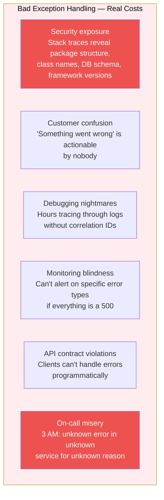
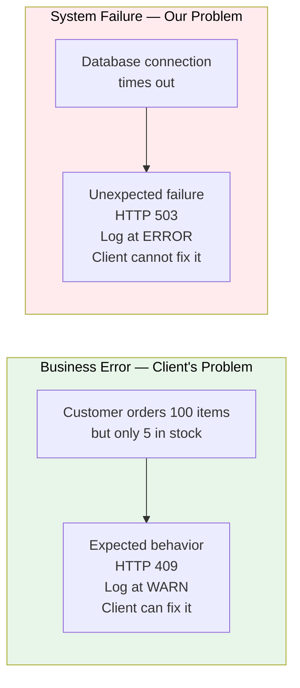
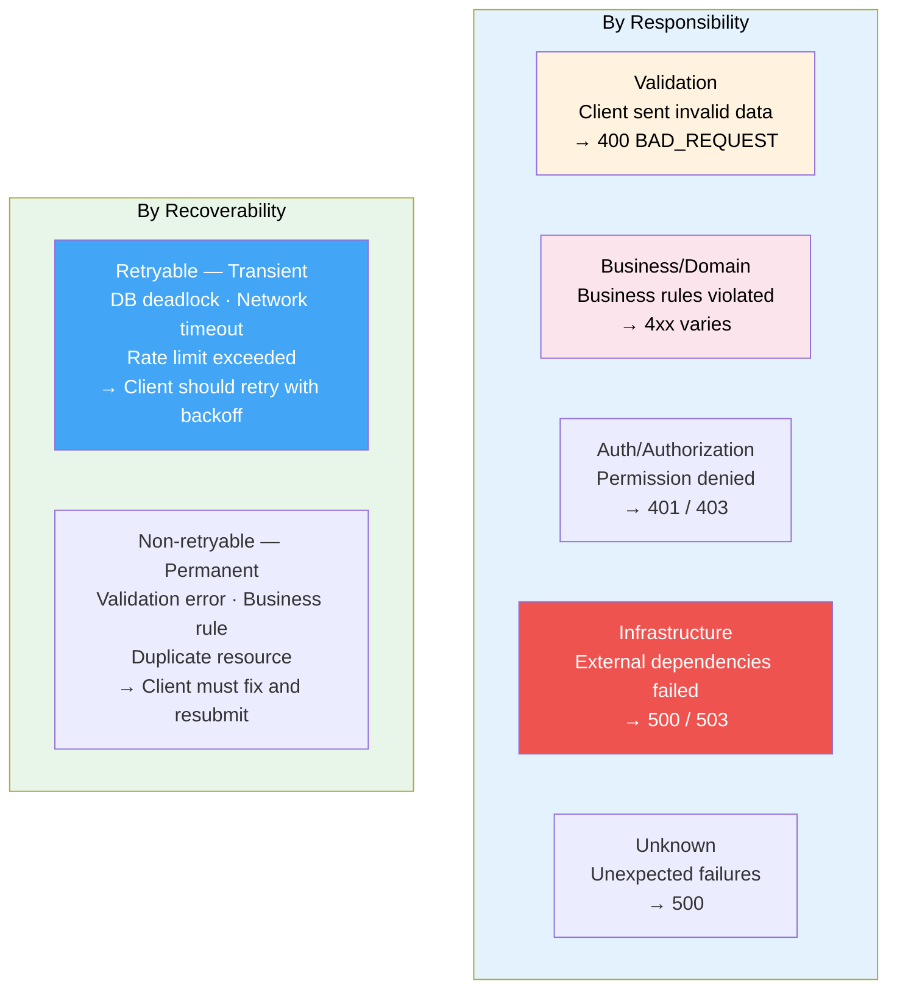
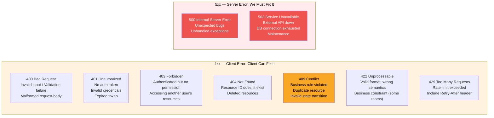
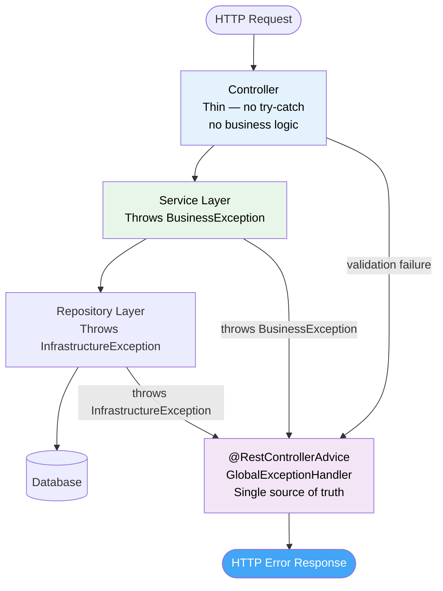
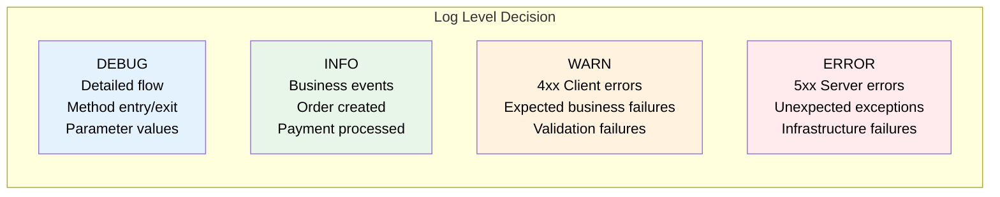
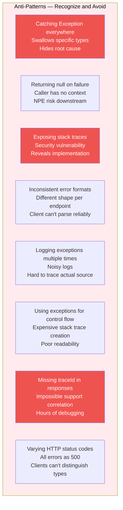
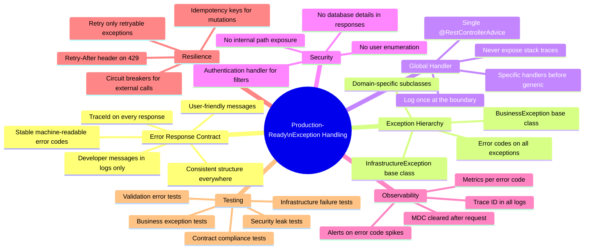

# Production-Grade Exception Handling in Spring Boot: The Complete Engineering Guide

> *When your application breaks at 3 AM, the quality of your exception handling determines whether the incident takes five minutes to resolve or five hours. This isn't just about writing try-catch blocks — it's about designing a system that communicates failures clearly, protects sensitive information, supports monitoring, and makes on-call engineers' lives manageable.*

---

## Why Exception Handling Is an Architectural Concern

Most developers treat exception handling as an afterthought — something to add after the feature works. This is the wrong mental model. Exception handling is part of your API contract. Your error responses are as much a part of your interface as your success responses, and they deserve the same design attention.

Consider what bad exception handling actually costs:



Good exception handling provides the inverse: security by default, user-actionable messages, instant incident correlation, type-specific alerting, machine-parseable error contracts, and runbooks that work.

---

## The Six Core Principles

Before writing any code, internalize these principles. They explain every design decision that follows.

**Principle 1: Exceptions are part of system design, not an afterthought.**
When designing a feature, design its failures at the same time. For every happy path, enumerate: what can go wrong, who is responsible for fixing it, what information does the client need, and what should be logged?

**Principle 2: Business errors and system failures are fundamentally different.**



**Principle 3: Client messages and developer messages are different audiences.**

```java
// Wrong: Same message for both audiences
throw new RuntimeException("FK_CONSTRAINT_VIOLATION: orders_customer_id_fkey");

// Right: Different information for different audiences
throw new ResourceNotFoundException(
   "Customer not found",                           // Client sees this
   "FK violation on orders.customer_id = " + id   // Developer sees this in logs
);
```

**Principle 4: Never expose internal details to clients.** Stack traces, SQL queries, database column names, internal service names, file paths, framework versions — none of these should reach API consumers.

**Principle 5: Errors must be consistent, predictable, and machine-readable.** Every error response across every endpoint must follow the same structure. Clients should be able to parse errors programmatically and implement retry logic based on error codes.

**Principle 6: Centralize exception handling.** All exception-to-response translation lives in one place. Controllers stay thin. Services throw business exceptions. Repositories throw infrastructure exceptions. Everything else is handled globally.

---

## Exception Classification: A Taxonomy for Production Systems



Understanding recoverability determines your retry guidance, your HTTP headers, and how clients should respond to each error type.

---

## The Standard Error Response Contract

This is the centerpiece of your entire exception handling system. Every error response must follow the same structure — not just for consistency, but because clients will write code that depends on this contract and you must never break it.

```java
@Data
@Builder
@JsonInclude(JsonInclude.Include.NON_NULL)
public class ErrorResponse {

   private Instant timestamp;           // When the error occurred
   private int status;                  // HTTP status code (400, 404, 500...)
   private String error;                // HTTP reason phrase ("BAD_REQUEST", "NOT_FOUND")
   private String errorCode;            // Machine-readable, stable — NEVER change these
   private String message;              // User-friendly, can be displayed to users
   private String developerMessage;     // Technical details — logged but not shown to users
   private String path;                 // Request URI
   private String traceId;              // Correlation ID — links all logs for this request
   private List<FieldValidationError> errors; // Field-level errors for validation failures

   @Data
   @AllArgsConstructor
   @NoArgsConstructor
   public static class FieldValidationError {
       private String field;
       private Object rejectedValue;
       private String message;
       private String code;             // Constraint code e.g. "NotBlank", "Min"
   }
}
```

### Why errorCode Is Your Most Important Field

```java
// Mobile app handling errors — fragile approach using message
if (errorResponse.getMessage().contains("out of stock")) {
   showRestockNotification(); // Breaks when you reword the message
}

// Correct approach using errorCode — stable contract
if ("INSUFFICIENT_INVENTORY".equals(errorResponse.getErrorCode())) {
   showRestockNotification(); // Never breaks regardless of message rewording
}
```

Error codes are a versioned contract. Once published, they are **permanent**. You can add new codes but never rename, remove, or change the semantics of existing ones without a major version bump and a deprecation cycle.

### Example Error Responses

**Validation failure (400):**
```json
{
 "timestamp": "2026-05-17T14:32:01.847Z",
 "status": 400,
 "error": "BAD_REQUEST",
 "errorCode": "VALIDATION_FAILED",
 "message": "Validation failed for one or more fields",
 "path": "/api/orders",
 "traceId": "6794d2e1b3f4a9c2",
 "errors": [
   {
     "field": "items[0].quantity",
     "rejectedValue": 0,
     "message": "Quantity must be at least 1",
     "code": "Min"
   },
   {
     "field": "shippingAddress.pinCode",
     "rejectedValue": "ABC123",
     "message": "PIN code must be 6 digits",
     "code": "Pattern"
   }
 ]
}
```

**Business rule violation (409):**
```json
{
 "timestamp": "2026-05-17T14:32:01.847Z",
 "status": 409,
 "error": "CONFLICT",
 "errorCode": "INSUFFICIENT_INVENTORY",
 "message": "Product 'Laptop Pro' has only 5 units in stock. You requested 10.",
 "path": "/api/orders",
 "traceId": "abc123xyz789"
}
```

**Infrastructure failure (503):**
```json
{
 "timestamp": "2026-05-17T14:32:01.847Z",
 "status": 503,
 "error": "SERVICE_UNAVAILABLE",
 "errorCode": "PAYMENT_GATEWAY_TIMEOUT",
 "message": "Payment service is temporarily unavailable. Please try again in a few minutes.",
 "path": "/api/orders",
 "traceId": "def456uvw123",
 "retryAfter": 300
}
```

---

## Error Code Design: Your API's Error Contract

```java
/**
* Centralized error code registry — the stable contract.
*
* NEVER rename or remove existing codes. Clients depend on these.
* Adding new codes is always backward-compatible.
* Use pattern: MODULE_ENTITY_REASON
*/
public final class ErrorCodes {

   private ErrorCodes() {}

   // ─── Order Domain ─────────────────────────────────────────────
   public static final String ORDER_NOT_FOUND          = "ORDER_NOT_FOUND";
   public static final String ORDER_ALREADY_CANCELLED  = "ORDER_ALREADY_CANCELLED";
   public static final String ORDER_CANNOT_CANCEL      = "ORDER_CANNOT_CANCEL";
   public static final String ORDER_CREATION_FAILED    = "ORDER_CREATION_FAILED";
   public static final String ORDER_DUPLICATE          = "ORDER_DUPLICATE";

   // ─── Inventory Domain ──────────────────────────────────────────
   public static final String INSUFFICIENT_INVENTORY   = "INSUFFICIENT_INVENTORY";
   public static final String PRODUCT_NOT_FOUND        = "PRODUCT_NOT_FOUND";
   public static final String PRODUCT_NOT_AVAILABLE    = "PRODUCT_NOT_AVAILABLE";

   // ─── Payment Domain ───────────────────────────────────────────
   public static final String PAYMENT_FAILED           = "PAYMENT_FAILED";
   public static final String PAYMENT_GATEWAY_TIMEOUT  = "PAYMENT_GATEWAY_TIMEOUT";
   public static final String INSUFFICIENT_BALANCE     = "INSUFFICIENT_BALANCE";
   public static final String PAYMENT_METHOD_INVALID   = "PAYMENT_METHOD_INVALID";

   // ─── Customer Domain ──────────────────────────────────────────
   public static final String CUSTOMER_NOT_FOUND       = "CUSTOMER_NOT_FOUND";
   public static final String CUSTOMER_INACTIVE        = "CUSTOMER_INACTIVE";

   // ─── Validation & Input ───────────────────────────────────────
   public static final String VALIDATION_FAILED        = "VALIDATION_FAILED";
   public static final String INVALID_INPUT            = "INVALID_INPUT";
   public static final String MISSING_REQUIRED_FIELD   = "MISSING_REQUIRED_FIELD";

   // ─── Authentication & Authorization ───────────────────────────
   public static final String UNAUTHORIZED             = "UNAUTHORIZED";
   public static final String ACCESS_DENIED            = "ACCESS_DENIED";
   public static final String TOKEN_EXPIRED            = "TOKEN_EXPIRED";
   public static final String TOKEN_INVALID            = "TOKEN_INVALID";

   // ─── Rate Limiting ────────────────────────────────────────────
   public static final String RATE_LIMIT_EXCEEDED      = "RATE_LIMIT_EXCEEDED";

   // ─── Infrastructure ───────────────────────────────────────────
   public static final String DATABASE_ERROR           = "DATABASE_ERROR";
   public static final String EXTERNAL_SERVICE_ERROR   = "EXTERNAL_SERVICE_ERROR";
   public static final String INTERNAL_SERVER_ERROR    = "INTERNAL_SERVER_ERROR";
}
```

---

## HTTP Status Code Mapping Strategy



**The critical distinction:** when inventory runs out, return 409 — not 500. A business rule violation is a client error (they asked for something we can't provide), not a server error (our code crashed).

---

## Exception Hierarchy: Designing for Clarity

```java
// ─── Base Exception Classes ────────────────────────────────────────────────

/**
* Base for all business/domain exceptions.
* Always carries an error code for programmatic handling.
*/
public abstract class BusinessException extends RuntimeException {

   private final String errorCode;
   private final String developerMessage;

   protected BusinessException(String message, String errorCode) {
       super(message);
       this.errorCode = errorCode;
       this.developerMessage = message;
   }

   protected BusinessException(String message, String errorCode, String developerMessage) {
       super(message);
       this.errorCode = errorCode;
       this.developerMessage = developerMessage;
   }

   protected BusinessException(String message, String errorCode,
                                String developerMessage, Throwable cause) {
       super(message, cause);
       this.errorCode = errorCode;
       this.developerMessage = developerMessage;
   }

   public String getErrorCode() { return errorCode; }
   public String getDeveloperMessage() { return developerMessage; }
}

/**
* Base for all infrastructure/integration exceptions.
* Indicates system-level failures, not client errors.
*/
public abstract class InfrastructureException extends RuntimeException {

   protected InfrastructureException(String message) {
       super(message);
   }

   protected InfrastructureException(String message, Throwable cause) {
       super(message, cause);
   }
}

// ─── Domain Exceptions ────────────────────────────────────────────────────

public class OrderNotFoundException extends BusinessException {

   public OrderNotFoundException(Long orderId) {
       super(
           "Order #" + orderId + " not found",
           ErrorCodes.ORDER_NOT_FOUND,
           "Order ID " + orderId + " does not exist in database"
       );
   }
}

public class InsufficientInventoryException extends BusinessException {

   private final Long productId;
   private final int requested;
   private final int available;

   public InsufficientInventoryException(String productName, Long productId,
                                         int requested, int available) {
       super(
           String.format("Product '%s' has only %d unit(s) in stock. You requested %d.",
               productName, available, requested),
           ErrorCodes.INSUFFICIENT_INVENTORY,
           String.format("productId=%d, requested=%d, available=%d",
               productId, requested, available)
       );
       this.productId = productId;
       this.requested = requested;
       this.available = available;
   }

   // Getters for structured logging
   public Long getProductId() { return productId; }
   public int getRequested() { return requested; }
   public int getAvailable() { return available; }
}

public class PaymentFailedException extends BusinessException {

   private final String gatewayCode;

   public PaymentFailedException(String message, String gatewayCode) {
       super(
           message,
           ErrorCodes.PAYMENT_FAILED,
           "Payment gateway returned code: " + gatewayCode
       );
       this.gatewayCode = gatewayCode;
   }

   public String getGatewayCode() { return gatewayCode; }
}

public class InvalidOrderStateTransitionException extends BusinessException {

   public InvalidOrderStateTransitionException(OrderStatus current, OrderStatus target) {
       super(
           String.format("Cannot transition order from %s to %s",
               current.name(), target.name()),
           ErrorCodes.ORDER_CANNOT_CANCEL,
           String.format("Invalid state transition: %s -> %s", current, target)
       );
   }
}

// ─── Infrastructure Exceptions ────────────────────────────────────────────

public class PaymentGatewayException extends InfrastructureException {

   public PaymentGatewayException(String message, Throwable cause) {
       super("Payment gateway integration failed: " + message, cause);
   }
}

public class ShippingServiceException extends InfrastructureException {

   public ShippingServiceException(String message, Throwable cause) {
       super("Shipping service unavailable: " + message, cause);
   }
}
```

---

## The Exception Flow Architecture



---

## The Global Exception Handler: Complete Implementation

```java
@RestControllerAdvice
@Slf4j
public class GlobalExceptionHandler {

   private final HttpServletRequest httpRequest;

   public GlobalExceptionHandler(HttpServletRequest httpRequest) {
       this.httpRequest = httpRequest;
   }

   // ─── Validation Exceptions ────────────────────────────────────────────

   @ExceptionHandler(MethodArgumentNotValidException.class)
   public ResponseEntity<ErrorResponse> handleValidation(
           MethodArgumentNotValidException ex) {

       log.warn("Validation failed: path={}, fieldErrors={}",
           httpRequest.getRequestURI(),
           ex.getBindingResult().getErrorCount());

       List<ErrorResponse.FieldValidationError> fieldErrors =
           ex.getBindingResult().getFieldErrors().stream()
               .map(fe -> new ErrorResponse.FieldValidationError(
                   fe.getField(),
                   fe.getRejectedValue(),
                   fe.getDefaultMessage(),
                   fe.getCode()
               ))
               .toList();

       return buildResponse(HttpStatus.BAD_REQUEST,
           ErrorCodes.VALIDATION_FAILED,
           "Validation failed for " + fieldErrors.size() + " field(s)",
           "Request validation failed",
           fieldErrors);
   }

   @ExceptionHandler(ConstraintViolationException.class)
   public ResponseEntity<ErrorResponse> handleConstraintViolation(
           ConstraintViolationException ex) {

       List<ErrorResponse.FieldValidationError> fieldErrors =
           ex.getConstraintViolations().stream()
               .map(cv -> new ErrorResponse.FieldValidationError(
                   cv.getPropertyPath().toString(),
                   cv.getInvalidValue(),
                   cv.getMessage(),
                   null
               ))
               .toList();

       return buildResponse(HttpStatus.BAD_REQUEST,
           ErrorCodes.VALIDATION_FAILED,
           "Constraint validation failed",
           ex.getMessage(),
           fieldErrors);
   }

   @ExceptionHandler(HttpMessageNotReadableException.class)
   public ResponseEntity<ErrorResponse> handleMalformedJson(
           HttpMessageNotReadableException ex) {

       log.warn("Malformed JSON request: {}", ex.getMessage());

       return buildResponse(HttpStatus.BAD_REQUEST,
           ErrorCodes.INVALID_INPUT,
           "Request body is malformed or cannot be parsed",
           "JSON parsing failed: " + ex.getMessage());
   }

   @ExceptionHandler(MethodArgumentTypeMismatchException.class)
   public ResponseEntity<ErrorResponse> handleTypeMismatch(
           MethodArgumentTypeMismatchException ex) {

       String message = String.format("Parameter '%s' should be of type %s",
           ex.getName(),
           ex.getRequiredType() != null ? ex.getRequiredType().getSimpleName() : "unknown");

       return buildResponse(HttpStatus.BAD_REQUEST,
           ErrorCodes.INVALID_INPUT,
           message,
           ex.getMessage());
   }

   // ─── Business Exceptions ─────────────────────────────────────────────

   @ExceptionHandler(OrderNotFoundException.class)
   public ResponseEntity<ErrorResponse> handleOrderNotFound(OrderNotFoundException ex) {
       log.warn("Order not found: {}", ex.getDeveloperMessage());
       return buildResponse(HttpStatus.NOT_FOUND, ex);
   }

   @ExceptionHandler(InsufficientInventoryException.class)
   public ResponseEntity<ErrorResponse> handleInsufficientInventory(
           InsufficientInventoryException ex) {

       log.warn("Insufficient inventory: productId={}, requested={}, available={}",
           ex.getProductId(), ex.getRequested(), ex.getAvailable());

       return buildResponse(HttpStatus.CONFLICT, ex);
   }

   @ExceptionHandler(PaymentFailedException.class)
   public ResponseEntity<ErrorResponse> handlePaymentFailed(PaymentFailedException ex) {
       log.warn("Payment failed: errorCode={}, gatewayCode={}",
           ex.getErrorCode(), ex.getGatewayCode());
       return buildResponse(HttpStatus.PAYMENT_REQUIRED, ex);
   }

   @ExceptionHandler(InvalidOrderStateTransitionException.class)
   public ResponseEntity<ErrorResponse> handleInvalidStateTransition(
           InvalidOrderStateTransitionException ex) {
       log.warn("Invalid order state transition: {}", ex.getDeveloperMessage());
       return buildResponse(HttpStatus.CONFLICT, ex);
   }

   // Generic BusinessException fallback — for any unregistered business exception
   @ExceptionHandler(BusinessException.class)
   public ResponseEntity<ErrorResponse> handleBusinessException(BusinessException ex) {
       log.warn("Business exception: errorCode={}, message={}", ex.getErrorCode(), ex.getMessage());
       return buildResponse(HttpStatus.UNPROCESSABLE_ENTITY, ex);
   }

   // ─── Authorization Exceptions ─────────────────────────────────────────

   @ExceptionHandler(AccessDeniedException.class)
   public ResponseEntity<ErrorResponse> handleAccessDenied(AccessDeniedException ex) {
       // Don't log the internal message — it might expose permission details
       log.warn("Access denied: path={}", httpRequest.getRequestURI());

       return buildResponse(HttpStatus.FORBIDDEN,
           ErrorCodes.ACCESS_DENIED,
           "You don't have permission to perform this action",
           ex.getMessage());
   }

   // ─── Rate Limiting ────────────────────────────────────────────────────

   @ExceptionHandler(RateLimitExceededException.class)
   public ResponseEntity<ErrorResponse> handleRateLimit(RateLimitExceededException ex) {
       log.warn("Rate limit exceeded: path={}, clientId={}",
           httpRequest.getRequestURI(), ex.getClientId());

       ErrorResponse response = ErrorResponse.builder()
           .timestamp(Instant.now())
           .status(HttpStatus.TOO_MANY_REQUESTS.value())
           .error(HttpStatus.TOO_MANY_REQUESTS.getReasonPhrase())
           .errorCode(ErrorCodes.RATE_LIMIT_EXCEEDED)
           .message("Too many requests. Please try again in " + ex.getRetryAfterSeconds() + " seconds.")
           .path(httpRequest.getRequestURI())
           .traceId(getCurrentTraceId())
           .build();

       return ResponseEntity
           .status(HttpStatus.TOO_MANY_REQUESTS)
           .header("Retry-After", String.valueOf(ex.getRetryAfterSeconds()))
           .body(response);
   }

   // ─── Infrastructure Exceptions ────────────────────────────────────────

   @ExceptionHandler({PaymentGatewayException.class, ShippingServiceException.class})
   public ResponseEntity<ErrorResponse> handleExternalServiceFailure(
           InfrastructureException ex) {

       // Log the cause — this is our problem to fix
       log.error("External service failure: {}", ex.getMessage(), ex);

       return buildResponse(HttpStatus.SERVICE_UNAVAILABLE,
           ErrorCodes.EXTERNAL_SERVICE_ERROR,
           "A dependent service is temporarily unavailable. Please try again later.",
           "External integration failed: " + ex.getClass().getSimpleName());
   }

   @ExceptionHandler(DataAccessException.class)
   public ResponseEntity<ErrorResponse> handleDatabaseException(DataAccessException ex) {
       log.error("Database error: {}", ex.getClass().getSimpleName(), ex);

       // Translate specific DB exceptions
       if (ex instanceof DataIntegrityViolationException) {
           return buildResponse(HttpStatus.CONFLICT,
               ErrorCodes.ORDER_DUPLICATE,
               "A resource with this identifier already exists",
               "Data integrity violation: " + ex.getMessage());
       }

       return buildResponse(HttpStatus.INTERNAL_SERVER_ERROR,
           ErrorCodes.DATABASE_ERROR,
           "Unable to process your request. Please try again later.",
           "Database operation failed: " + ex.getClass().getSimpleName());
   }

   // ─── Fallback — Safety Net ────────────────────────────────────────────

   @ExceptionHandler(Exception.class)
   public ResponseEntity<ErrorResponse> handleUnexpected(Exception ex) {
       // Always log with full stack trace for unexpected exceptions
       log.error("Unexpected error: path={}, type={}",
           httpRequest.getRequestURI(),
           ex.getClass().getName(),
           ex);

       return buildResponse(HttpStatus.INTERNAL_SERVER_ERROR,
           ErrorCodes.INTERNAL_SERVER_ERROR,
           "An unexpected error occurred. We're working to fix it. Use traceId for support.",
           ex.getClass().getSimpleName() + ": " + ex.getMessage());
   }

   // ─── Builder Helpers ─────────────────────────────────────────────────

   private ResponseEntity<ErrorResponse> buildResponse(HttpStatus status,
                                                        BusinessException ex) {
       return buildResponse(status, ex.getErrorCode(), ex.getMessage(),
           ex.getDeveloperMessage());
   }

   private ResponseEntity<ErrorResponse> buildResponse(HttpStatus status,
                                                        String errorCode,
                                                        String message,
                                                        String developerMessage) {
       return buildResponse(status, errorCode, message, developerMessage, null);
   }

   private ResponseEntity<ErrorResponse> buildResponse(
           HttpStatus status,
           String errorCode,
           String message,
           String developerMessage,
           List<ErrorResponse.FieldValidationError> fieldErrors) {

       ErrorResponse body = ErrorResponse.builder()
           .timestamp(Instant.now())
           .status(status.value())
           .error(status.getReasonPhrase())
           .errorCode(errorCode)
           .message(message)
           .developerMessage(developerMessage)  // Logged but not shown to users
           .path(httpRequest.getRequestURI())
           .traceId(getCurrentTraceId())
           .errors(fieldErrors)
           .build();

       return ResponseEntity.status(status).body(body);
   }

   private String getCurrentTraceId() {
       String traceId = MDC.get("traceId");
       return traceId != null ? traceId : UUID.randomUUID().toString().replace("-", "");
   }
}
```

---

## Service Layer: Where Business Exceptions Live

```java
@Service
@Transactional
@RequiredArgsConstructor
@Slf4j
public class OrderService {

   private final OrderRepository orderRepository;
   private final InventoryService inventoryService;
   private final PaymentService paymentService;
   private final CustomerRepository customerRepository;

   public OrderResponse createOrder(CreateOrderRequest request) {
       // 1. Customer validation
       Customer customer = customerRepository.findById(request.getCustomerId())
           .orElseThrow(() -> new CustomerNotFoundException(request.getCustomerId()));

       if (!customer.isActive()) {
           throw new BusinessException(
               "Your account is inactive. Please contact support.",
               ErrorCodes.CUSTOMER_INACTIVE,
               "Customer ID " + customer.getId() + " has inactive status"
           ) {};
       }

       // 2. Inventory validation — check ALL items before processing ANY
       // Fail fast: don't charge payment if any item is unavailable
       for (OrderItemRequest item : request.getItems()) {
           inventoryService.validateAvailability(item.getProductId(), item.getQuantity());
       }

       // 3. Payment processing
       BigDecimal total = calculateTotal(request.getItems());
       paymentService.charge(customer.getId(), total);

       // 4. Persist — repository exceptions propagate to global handler
       Order order = Order.from(request, customer, total);
       order = orderRepository.save(order);

       // 5. Reserve inventory after successful order creation
       inventoryService.reserve(order.getId(), request.getItems());

       log.info("Order created successfully: orderId={}, customerId={}, total={}",
           order.getId(), customer.getId(), total);

       return OrderResponse.from(order);
   }

   public void cancelOrder(Long orderId, Long requestingCustomerId) {
       Order order = orderRepository.findById(orderId)
           .orElseThrow(() -> new OrderNotFoundException(orderId));

       // Authorization: customers can only cancel their own orders
       if (!order.getCustomerId().equals(requestingCustomerId)) {
           throw new AccessDeniedException("Cannot cancel another customer's order");
       }

       // Business rule: only PENDING and CONFIRMED orders can be cancelled
       if (!order.getStatus().isCancellable()) {
           throw new InvalidOrderStateTransitionException(
               order.getStatus(), OrderStatus.CANCELLED
           );
       }

       // If payment was made, process refund first
       if (order.getPaymentStatus() == PaymentStatus.PAID) {
           paymentService.refund(order.getId(), order.getTotal());
       }

       order.cancel();
       orderRepository.save(order);

       log.info("Order cancelled: orderId={}, previousStatus={}",
           orderId, order.getStatus());
   }
}
```

---

## Infrastructure Exception Translation

Infrastructure exceptions must be translated at service boundaries. Never let database-specific or HTTP-client-specific exceptions escape into business code or reach clients.

```java
@Service
@RequiredArgsConstructor
@Slf4j
public class PaymentService {

   private final PaymentGatewayClient gatewayClient;

   public void charge(Long customerId, BigDecimal amount) {
       try {
           PaymentGatewayResponse response = gatewayClient.charge(
               new ChargeRequest(customerId, amount)
           );

           if (!response.isSuccess()) {
               // Gateway responded with a business-level decline
               throw new PaymentFailedException(
                   "Payment declined: " + response.getUserMessage(),
                   response.getDeclineCode()
               );
           }

       } catch (HttpClientErrorException ex) {
           // 4xx from payment gateway — usually a bad request on our side
           log.error("Payment gateway client error: status={}, body={}",
               ex.getStatusCode(), ex.getResponseBodyAsString());
           throw new PaymentFailedException(
               "Payment could not be processed. Please verify your payment details.",
               ex.getStatusCode().toString()
           );

       } catch (HttpServerErrorException ex) {
           // 5xx from payment gateway — their problem
           log.error("Payment gateway server error: status={}", ex.getStatusCode(), ex);
           throw new PaymentGatewayException("Payment gateway server error", ex);

       } catch (ResourceAccessException ex) {
           // Network timeout or connection refused
           log.error("Payment gateway network error", ex);
           throw new PaymentGatewayException("Payment gateway connection failed", ex);
       }
   }

   public void refund(Long orderId, BigDecimal amount) {
       try {
           gatewayClient.refund(new RefundRequest(orderId, amount));
       } catch (Exception ex) {
           // Refund failure should not prevent order cancellation
           // Log and schedule for manual processing
           log.error("Refund failed for orderId={}: {}", orderId, ex.getMessage(), ex);
           refundRetryQueue.schedule(orderId, amount);
           // Don't re-throw — the business operation can still complete
       }
   }
}
```

---

## Security: Protecting Sensitive Information

This is where many implementations fail catastrophically.

```java
// NEVER return this to clients
{
 "error": "Cannot invoke 'com.example.Customer.getBalance()' because 'customer' is null",
 "stackTrace": [
   "com.example.service.PaymentService.charge(PaymentService.java:45)",
   "com.example.controller.OrderController.create(OrderController.java:32)"
 ]
}
// This exposes: package structure, class names, method names, line numbers
// Attackers use this to identify vulnerable libraries and plan attacks
```

**Security filter handling:** Spring Security filters run before `@RestControllerAdvice`. They need their own error handlers:

```java
@Component
public class SecurityExceptionHandler
       implements AuthenticationEntryPoint, AccessDeniedHandler {

   private final ObjectMapper objectMapper;

   public SecurityExceptionHandler(ObjectMapper objectMapper) {
       this.objectMapper = objectMapper;
   }

   @Override
   public void commence(HttpServletRequest request, HttpServletResponse response,
                        AuthenticationException ex) throws IOException {
       // Don't leak whether the token is invalid or missing
       writeErrorResponse(response, HttpStatus.UNAUTHORIZED,
           ErrorCodes.UNAUTHORIZED,
           "Authentication required. Please provide a valid token.");
   }

   @Override
   public void handle(HttpServletRequest request, HttpServletResponse response,
                      AccessDeniedException ex) throws IOException {
       // Don't reveal what permission is missing or what role is required
       writeErrorResponse(response, HttpStatus.FORBIDDEN,
           ErrorCodes.ACCESS_DENIED,
           "You don't have permission to access this resource.");
   }

   private void writeErrorResponse(HttpServletResponse response, HttpStatus status,
                                   String errorCode, String message) throws IOException {
       ErrorResponse body = ErrorResponse.builder()
           .timestamp(Instant.now())
           .status(status.value())
           .error(status.getReasonPhrase())
           .errorCode(errorCode)
           .message(message)
           .build();

       response.setStatus(status.value());
       response.setContentType(MediaType.APPLICATION_JSON_VALUE);
       response.getWriter().write(objectMapper.writeValueAsString(body));
   }
}

// Register in security configuration
@Bean
public SecurityFilterChain filterChain(HttpSecurity http) throws Exception {
   http.exceptionHandling(ex -> ex
       .authenticationEntryPoint(securityExceptionHandler)
       .accessDeniedHandler(securityExceptionHandler)
   );
   return http.build();
}
```

**Never enumerate users:**
```java
// WRONG: Reveals which emails are registered
throw new NotFoundException("User with email alice@example.com not found");

// CORRECT: Same message for both "user not found" and "wrong password"
throw new BusinessException(
   "Invalid email or password",
   ErrorCodes.UNAUTHORIZED,
   "Authentication failed: user=" + email  // Only in logs
) {};
```

---

## Logging Strategy: One Log Per Exception, At the Right Level



**Never log the same exception twice.** The rule: log at the boundary (global exception handler), not in business logic or repositories.

```java
// WRONG: Duplicate logging
@Service
public class OrderService {
   public void createOrder(OrderRequest request) {
       try {
           processPayment(request);
       } catch (PaymentFailedException e) {
           log.error("Payment failed", e); // Logged here
           throw e; // AND propagated to global handler where it's logged again
       }
   }
}

// CORRECT: Let exceptions propagate, log once at the boundary
@Service
public class OrderService {
   public void createOrder(OrderRequest request) {
       processPayment(request); // Just throw — no try-catch needed
   }
}

// GlobalExceptionHandler logs once:
@ExceptionHandler(PaymentFailedException.class)
public ResponseEntity<ErrorResponse> handlePaymentFailed(PaymentFailedException ex) {
   log.warn("Payment failed: errorCode={}, gatewayCode={}",
       ex.getErrorCode(), ex.getGatewayCode()); // One log, at the boundary
   return buildResponse(HttpStatus.PAYMENT_REQUIRED, ex);
}
```

**What to never log:**
```java
// PII and sensitive data — never in logs
log.error("Payment failed for card: {}", request.getCardNumber());  // NO
log.error("Login failed for password: {}", password);               // NO
log.error("Token: {}", jwtToken);                                   // NO
log.error("SSN: {}", customer.getSocialSecurityNumber());           // NO

// Safe to log
log.error("Payment failed for customerId={}, orderId={}", customerId, orderId);
log.error("Login failed for email={}", email);       // Email is debatable by jurisdiction
log.error("Token validation failed for userId={}", userId);
log.error("Verification failed for customerId={}", customerId);
```

---

## Correlation IDs: The Thread That Connects All Logs

```java
@Component
@Order(Ordered.HIGHEST_PRECEDENCE)
public class TraceIdFilter extends OncePerRequestFilter {

   private static final String TRACE_ID_HEADER = "X-Trace-Id";
   private static final String TRACE_ID_MDC_KEY = "traceId";

   @Override
   protected void doFilterInternal(HttpServletRequest request,
                                   HttpServletResponse response,
                                   FilterChain chain)
           throws ServletException, IOException {

       // Propagate from upstream service or generate new
       String traceId = Optional.ofNullable(request.getHeader(TRACE_ID_HEADER))
           .filter(id -> !id.isBlank())
           .orElse(UUID.randomUUID().toString().replace("-", "").substring(0, 32));

       MDC.put(TRACE_ID_MDC_KEY, traceId);
       response.setHeader(TRACE_ID_HEADER, traceId); // Echo back to client

       try {
           chain.doFilter(request, response);
       } finally {
           MDC.clear(); // Essential: prevents thread pool context leakage
       }
   }
}
```

```xml
<!-- logback-spring.xml: traceId appears in every log line automatically -->
<configuration>
   <appender name="CONSOLE" class="ch.qos.logback.core.ConsoleAppender">
       <encoder class="net.logstash.logback.encoder.LogstashEncoder">
           <!-- Structured JSON logging — searchable in ELK/Grafana -->
       </encoder>
   </appender>

   <!-- Or plain text with traceId -->
   <pattern>%d{ISO8601} [%thread] %-5level [%X{traceId:-NO_TRACE}] %logger{36} - %msg%n</pattern>
</configuration>
```

**The operational value:**
```bash
# Find all logs for a failing request — instant, regardless of service count
grep "6794d2e1b3f4a9c2" /var/log/*.log

# Or in ELK/Grafana Loki
{app="orders-service"} | json | traceId = "6794d2e1b3f4a9c2"
```

---

## Metrics and Monitoring Integration

```java
@RestControllerAdvice
@Slf4j
public class GlobalExceptionHandler {

   private final MeterRegistry meterRegistry;
   private final HttpServletRequest httpRequest;

   private ResponseEntity<ErrorResponse> buildResponse(HttpStatus status,
                                                        String errorCode,
                                                        String message,
                                                        String developerMessage,
                                                        List<ErrorResponse.FieldValidationError> errors) {
       // Record metric for every exception
       meterRegistry.counter("api.errors",
           "status",    String.valueOf(status.value()),
           "errorCode", errorCode,
           "path",      sanitizePath(httpRequest.getRequestURI()),
           "method",    httpRequest.getMethod()
       ).increment();

       // ...build and return ErrorResponse
   }

   // Sanitize path parameters so metrics don't explode in cardinality
   // /api/orders/12345 → /api/orders/{id}
   private String sanitizePath(String path) {
       return path.replaceAll("/\\d+", "/{id}")
                  .replaceAll("/[0-9a-f-]{36}", "/{uuid}");
   }
}
```

**Prometheus alert rules:**
```yaml
groups:
 - name: api_exceptions
   rules:
     - alert: High5xxErrorRate
       expr: |
         rate(api_errors_total{status=~"5.."}[5m]) /
         rate(api_requests_total[5m]) > 0.01
       for: 5m
       annotations:
         summary: "5xx error rate exceeds 1% — investigate immediately"

     - alert: PaymentGatewayDegraded
       expr: rate(api_errors_total{errorCode="PAYMENT_GATEWAY_TIMEOUT"}[5m]) > 0.1
       for: 2m
       annotations:
         summary: "Payment gateway timeout rate elevated — check payment provider status"

     - alert: InventoryErrorSpike
       expr: increase(api_errors_total{errorCode="INSUFFICIENT_INVENTORY"}[10m]) > 100
       for: 1m
       annotations:
         summary: "High out-of-stock rate — possible inventory sync issue"
```

---

## Resilience Patterns: Retry, Circuit Breaker, Idempotency

### Idempotent APIs: Preventing Duplicate Side Effects on Retry

```java
@PostMapping("/orders")
public ResponseEntity<OrderResponse> createOrder(
       @RequestHeader(value = "Idempotency-Key", required = true) String idempotencyKey,
       @Valid @RequestBody CreateOrderRequest request) {

   // Check if we've already processed this request
   return idempotencyStore.get(idempotencyKey)
       .map(cachedResponse -> ResponseEntity.ok(cachedResponse))  // Return cached result
       .orElseGet(() -> {
           OrderResponse response = orderService.createOrder(request);

           // Cache the result for future retries (TTL: 24 hours)
           idempotencyStore.put(idempotencyKey, response, Duration.ofHours(24));

           return ResponseEntity.status(HttpStatus.CREATED).body(response);
       });
}
```

### Circuit Breaker: Protecting Against Cascading Failures

```java
@Service
public class PaymentService {

   @CircuitBreaker(name = "paymentGateway", fallbackMethod = "handlePaymentUnavailable")
   @Retry(name = "paymentGateway")  // Retry before circuit opens
   public PaymentResponse charge(ChargeRequest request) {
       return gatewayClient.charge(request);
   }

   // Called when circuit is open or all retries exhausted
   public PaymentResponse handlePaymentUnavailable(ChargeRequest request, Exception ex) {
       log.error("Payment gateway circuit open or retries exhausted", ex);

       // Option 1: Fail the request immediately
       throw new PaymentGatewayException("Payment service is unavailable", ex);

       // Option 2: Queue for async processing (better UX for some scenarios)
       // asyncPaymentQueue.enqueue(request);
       // throw new PaymentPendingException("Payment queued for processing");
   }
}
```

```yaml
resilience4j:
 circuitbreaker:
   instances:
     paymentGateway:
       sliding-window-size: 20
       failure-rate-threshold: 50       # Open circuit when 50% of calls fail
       wait-duration-in-open-state: 30s # Stay open for 30 seconds
       permitted-number-of-calls-in-half-open-state: 5

 retry:
   instances:
     paymentGateway:
       max-attempts: 3
       wait-duration: 1s
       exponential-backoff-multiplier: 2  # 1s, 2s, 4s
       retry-exceptions:
         - org.springframework.web.client.ResourceAccessException
       ignore-exceptions:
         - com.example.exception.PaymentFailedException  # Don't retry business failures
```

---

## Testing Exception Handling Comprehensively

```java
@WebMvcTest(OrderController.class)
class OrderControllerExceptionTest {

   @Autowired
   private MockMvc mockMvc;

   @MockBean
   private OrderService orderService;

   // ─── Validation Tests ─────────────────────────────────────────────────

   @Test
   void createOrder_nullCustomerId_returns400WithFieldErrors() throws Exception {
       String request = """
           { "customerId": null, "items": [{"productId": 1, "quantity": 2}] }
           """;

       mockMvc.perform(post("/api/orders")
               .contentType(MediaType.APPLICATION_JSON)
               .content(request))
           .andExpect(status().isBadRequest())
           .andExpect(jsonPath("$.errorCode").value("VALIDATION_FAILED"))
           .andExpect(jsonPath("$.errors[*].field").value(hasItem("customerId")))
           .andExpect(jsonPath("$.traceId").exists())
           .andExpect(jsonPath("$.timestamp").exists());
   }

   // ─── Business Exception Tests ─────────────────────────────────────────

   @Test
   void createOrder_insufficientInventory_returns409() throws Exception {
       given(orderService.createOrder(any()))
           .willThrow(new InsufficientInventoryException(
               "Laptop Pro", 1L, 10, 5
           ));

       mockMvc.perform(post("/api/orders")
               .contentType(MediaType.APPLICATION_JSON)
               .content(validOrderRequest()))
           .andExpect(status().isConflict())
           .andExpect(jsonPath("$.status").value(409))
           .andExpect(jsonPath("$.errorCode").value("INSUFFICIENT_INVENTORY"))
           .andExpect(jsonPath("$.message").value(containsString("5 unit(s)")))
           // Verify internal details are NOT exposed
           .andExpect(jsonPath("$.developerMessage").doesNotExist())
           .andExpect(jsonPath("$.stackTrace").doesNotExist());
   }

   @Test
   void getOrder_notFound_returns404() throws Exception {
       given(orderService.getOrder(999L))
           .willThrow(new OrderNotFoundException(999L));

       mockMvc.perform(get("/api/orders/999"))
           .andExpect(status().isNotFound())
           .andExpect(jsonPath("$.errorCode").value("ORDER_NOT_FOUND"))
           .andExpect(jsonPath("$.path").value("/api/orders/999"));
   }

   // ─── Infrastructure Exception Tests ──────────────────────────────────

   @Test
   void createOrder_paymentGatewayDown_returns503() throws Exception {
       given(orderService.createOrder(any()))
           .willThrow(new PaymentGatewayException("Connection timeout",
               new ResourceAccessException("timeout")));

       mockMvc.perform(post("/api/orders")
               .contentType(MediaType.APPLICATION_JSON)
               .content(validOrderRequest()))
           .andExpect(status().isServiceUnavailable())
           .andExpect(jsonPath("$.errorCode").value("EXTERNAL_SERVICE_ERROR"))
           // User-friendly message, no internal details
           .andExpect(jsonPath("$.message").value(containsString("temporarily unavailable")));
   }

   // ─── Error Response Contract Tests ────────────────────────────────────

   @Test
   void anyError_alwaysHasRequiredFields() throws Exception {
       given(orderService.getOrder(anyLong()))
           .willThrow(new OrderNotFoundException(1L));

       MvcResult result = mockMvc.perform(get("/api/orders/1"))
           .andExpect(status().isNotFound())
           .andReturn();

       // Verify the contract — these fields must always be present
       String body = result.getResponse().getContentAsString();
       assertThat(body).satisfies(json -> {
           DocumentContext ctx = JsonPath.parse(json);
           assertThat((String) ctx.read("$.errorCode")).isNotBlank();
           assertThat((String) ctx.read("$.message")).isNotBlank();
           assertThat((String) ctx.read("$.traceId")).isNotBlank();
           assertThat((String) ctx.read("$.timestamp")).isNotBlank();
           assertThat((Integer) ctx.read("$.status")).isGreaterThan(0);
       });
   }

   @Test
   void unexpectedException_neverExposesInternalDetails() throws Exception {
       given(orderService.getOrder(anyLong()))
           .willThrow(new NullPointerException("customer is null at PaymentService.java:45"));

       MvcResult result = mockMvc.perform(get("/api/orders/1"))
           .andExpect(status().isInternalServerError())
           .andReturn();

       String body = result.getResponse().getContentAsString();
       // Must NOT contain internal details
       assertThat(body).doesNotContain("PaymentService");
       assertThat(body).doesNotContain(".java:");
       assertThat(body).doesNotContain("NullPointerException");
       assertThat(body).doesNotContain("customer is null");
       // Must contain a safe, generic message
       assertThat(body).contains("unexpected error");
   }
}
```

---

## The On-Call Engineer Runbook Pattern

Good exception handling enables this workflow. Build runbooks that map directly to your error codes:

```yaml
# runbook/PAYMENT_GATEWAY_TIMEOUT.md

## PAYMENT_GATEWAY_TIMEOUT

Severity: High — Users cannot complete purchases
Grafana: dashboard/payment-errors → filter errorCode=PAYMENT_GATEWAY_TIMEOUT

### Investigation Steps
1. Check payment gateway status page: https://status.paymentgateway.com
2. Check internal network connectivity: `ping payments.internal.example.com`
3. Review recent deployments: did we change the gateway client?
4. Check connection pool metrics: are we exhausting connections?

### Immediate Actions
If gateway issue:
 1. Enable fallback payment processor: feature.flag.payments.fallback=true
 2. Post status update: https://status.ourapp.com
 3. Contact gateway support: support@paymentgateway.com

If our issue:
 1. Roll back recent changes to payment service
 2. Increase connection timeout if network latency increased

### Resolution Criteria
Error rate for PAYMENT_GATEWAY_TIMEOUT < 0.1/min for 10 minutes
```

The difference between good and bad exception handling becomes most visible at 3 AM. Bad exception handling: hours of log archaeology, unknown errors, frustrated customers, multiple engineers woken up. Good exception handling: one error code, one runbook, five minutes to resolution.

---

## Common Mistakes Reference



Each of these anti-patterns has the same root cause: treating exception handling as an afterthought rather than as a design concern on equal footing with the feature itself.

---

## Summary: The Production-Ready Checklist



The shift from "error handling code" to "exception handling as architecture" is what separates applications that are a pleasure to operate from those that generate 3 AM incident calls. Design the failures with the same care you design the features. Your future on-call self will be grateful.