# Java Project Loom & Virtual Threads: The Complete Guide

> **"Write simple, blocking code — and get the scalability of reactive, without the complexity."**
> This is the promise of Project Loom. This tutorial explains *exactly* how it delivers.

---

## 📖 Table of Contents

1. [The Problem: Why Threading Was Broken](#the-problem)
2. [What Is Project Loom?](#what-is-project-loom)
3. [Virtual Threads — Deep Dive](#virtual-threads-deep-dive)
4. [How the JVM Pulls It Off: Continuations](#continuations)
5. [The ForkJoinPool Scheduler](#forkjoinpool)
6. [Full Virtual Thread Lifecycle](#lifecycle)
7. [Writing Code with Virtual Threads](#writing-code)
8. [The Critical Gotcha: Thread Pinning](#pinning)
9. [Real-World Use Cases](#use-cases)
10. [Virtual Threads vs Platform Threads](#comparison)
11. [Best Practices & Anti-Patterns](#best-practices)
12. [Interview Cheat Sheet](#cheat-sheet)

---

## 1. The Problem: Why Threading Was Broken {#the-problem}

### 1.1 Platform Threads: A 1:1 Mapping to OS Threads

Before Java 21, every Java thread you created was a **platform thread** — a direct wrapper around an Operating System (OS) thread. This 1:1 mapping has a fundamental cost.

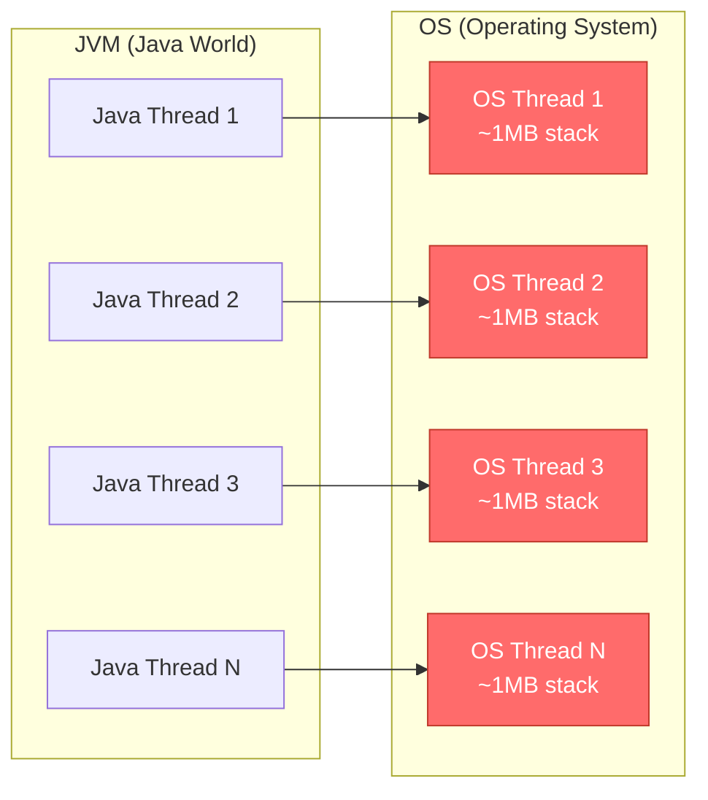

**What this costs:**
- Each OS thread reserves **~1MB of RAM** for its stack.
- OS threads are tracked by the **kernel scheduler** — context-switching between them is expensive.
- Creating an OS thread takes **~1 millisecond** and significant system calls.
- Typical JVM apps cap thread pools at **200–500 threads** before stability degrades.

---

### 1.2 The Blocking Problem: The Hidden Cost of I/O

Here is what actually happens when a Spring Boot controller handles a database request:

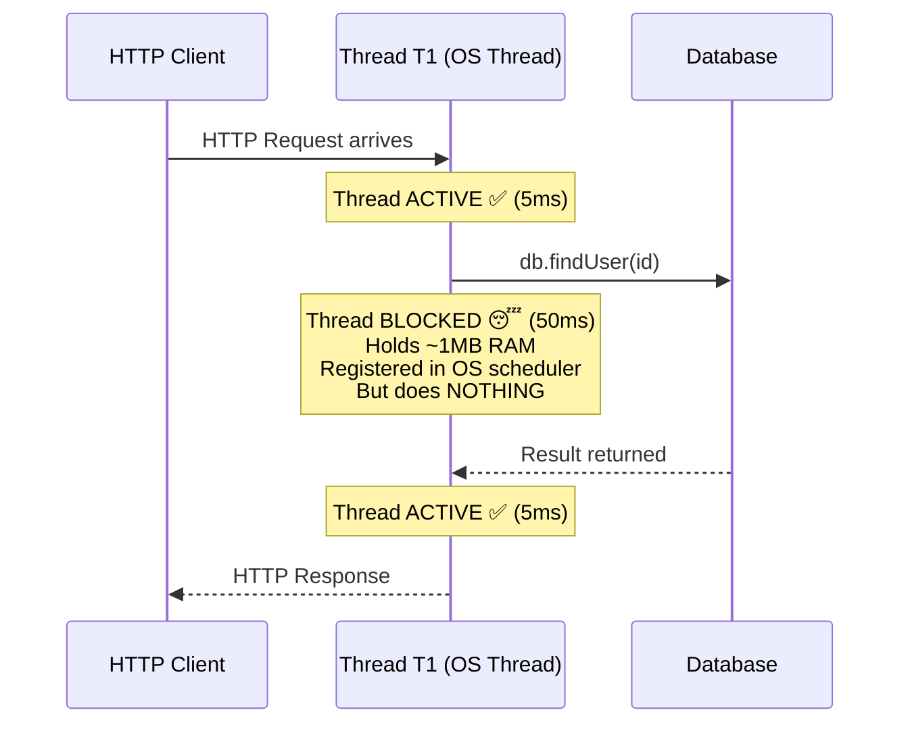

**The brutal math:**
- Thread was active for **~10ms**
- Thread was sleeping for **~50ms**
- That's **83% idle time** — you're paying full OS-thread cost for nothing

---

### 1.3 The Scalability Wall

With a thread pool of 200 threads, here's what happens under load:

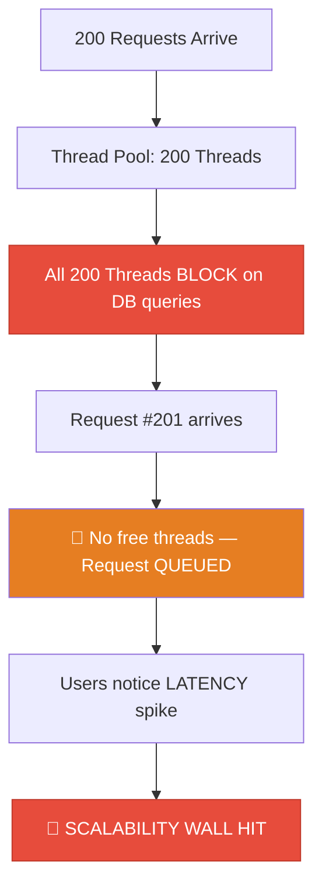

**Throughput formula:**
```
Max RPS = Thread Pool Size / Average Request Duration (in seconds)
       = 200 / 0.1  (100ms avg response)
       = 2,000 req/s
```
At 2,001 req/s, requests start queuing. By 3,000 req/s, latency explodes.

---

### 1.4 The "Solution" That Made Things Worse: Reactive Programming

The ecosystem's answer to the scalability wall was **reactive programming** — WebFlux, Reactor, RxJava. Don't block; instead, write callbacks.

```java
// ❌ Reactive: technically non-blocking, practically unreadable
return userRepository.findById(id)
    .flatMap(user -> orderRepository.findByUser(user.getId())
        .collectList()
        .zipWith(cartRepository.findByUser(user.getId()).collectList())
        .flatMap(tuple -> {
            List<Order> orders = tuple.getT1();
            List<CartItem> cart = tuple.getT2();
            return inventoryService.checkStock(cart)
                .filter(Boolean::booleanValue)
                .switchIfEmpty(Mono.error(new OutOfStockException()))
                .map(available -> new UserPage(user, orders, cart));
        }))
    .onErrorResume(OutOfStockException.class, e ->
        Mono.error(new ServiceException("Items unavailable", e)))
    .onErrorResume(e -> Mono.error(new ServiceException(e)));
```

**The problems with reactive code:**
- Stack traces are **useless** — no line numbers, just scheduler frames
- **Impossible to debug** at 2am in production
- Steep learning curve for new team members
- Cognitive overhead on every pull request

**Project Loom was built to eliminate this trade-off.**

---

## 2. What Is Project Loom? {#what-is-project-loom}

Project Loom is an OpenJDK project that introduced **Virtual Threads** in **Java 21** (as a stable, production-ready feature). It fundamentally changes how Java handles concurrency.

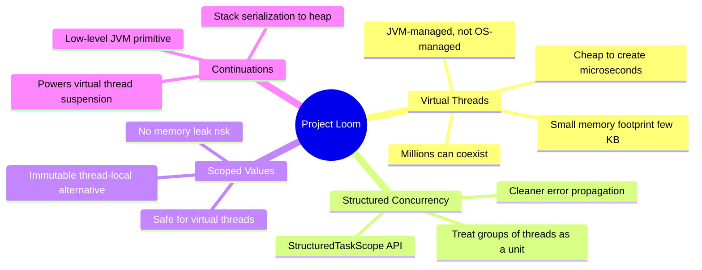

### Key Design Philosophy

> **"Virtual Threads are not faster threads — they are *cheaper* threads that let you have *more* of them."**

The goal was never raw speed. The goal was **concurrency at scale without complexity**.

---

## 3. Virtual Threads — Deep Dive {#virtual-threads-deep-dive}

### 3.1 The Core Idea: M:N Threading

Virtual threads introduce an **M:N threading model** — many virtual threads mapped to a few OS threads (called **carrier threads**).

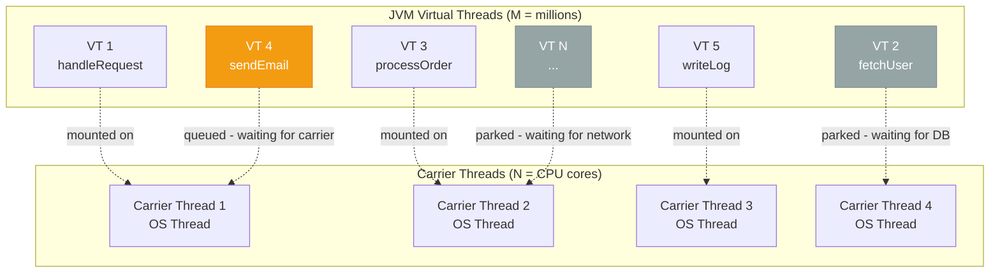

**Legend:**
- 🟢 Running (mounted on a carrier)
- 🟠 Queued (waiting for a carrier to free up)
- ⚫ Parked (blocked on I/O, sleeping — uses no CPU or carrier)

---

### 3.2 The Key Insight: What Happens When a Virtual Thread Blocks

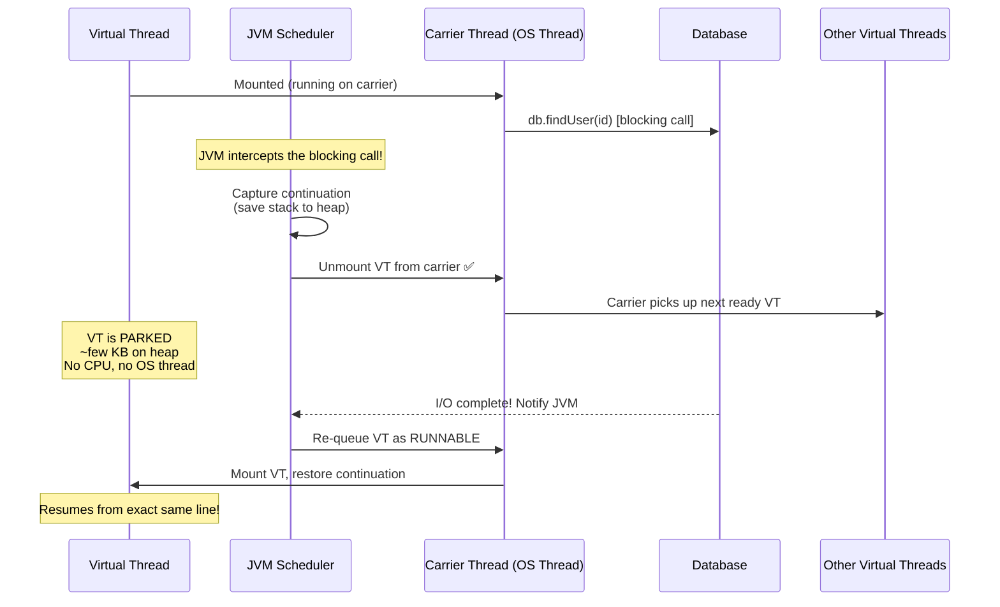

**The magic:** From the code's perspective, `db.findUser(id)` behaved exactly like a normal blocking call. But underneath, the carrier thread was freed and used for other work during those 50ms of waiting.

---

## 4. How the JVM Pulls It Off: Continuations {#continuations}

### 4.1 What Is a Continuation?

A **continuation** is the mechanism that allows a thread's execution to be paused, saved, and resumed later — potentially on a different carrier thread.

Think of it like a **save state in a video game**. Everything about your current position is captured — items, health, location, progress — so you can resume exactly where you left off.

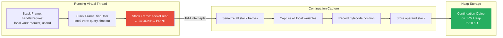

### 4.2 Continuation Lifecycle

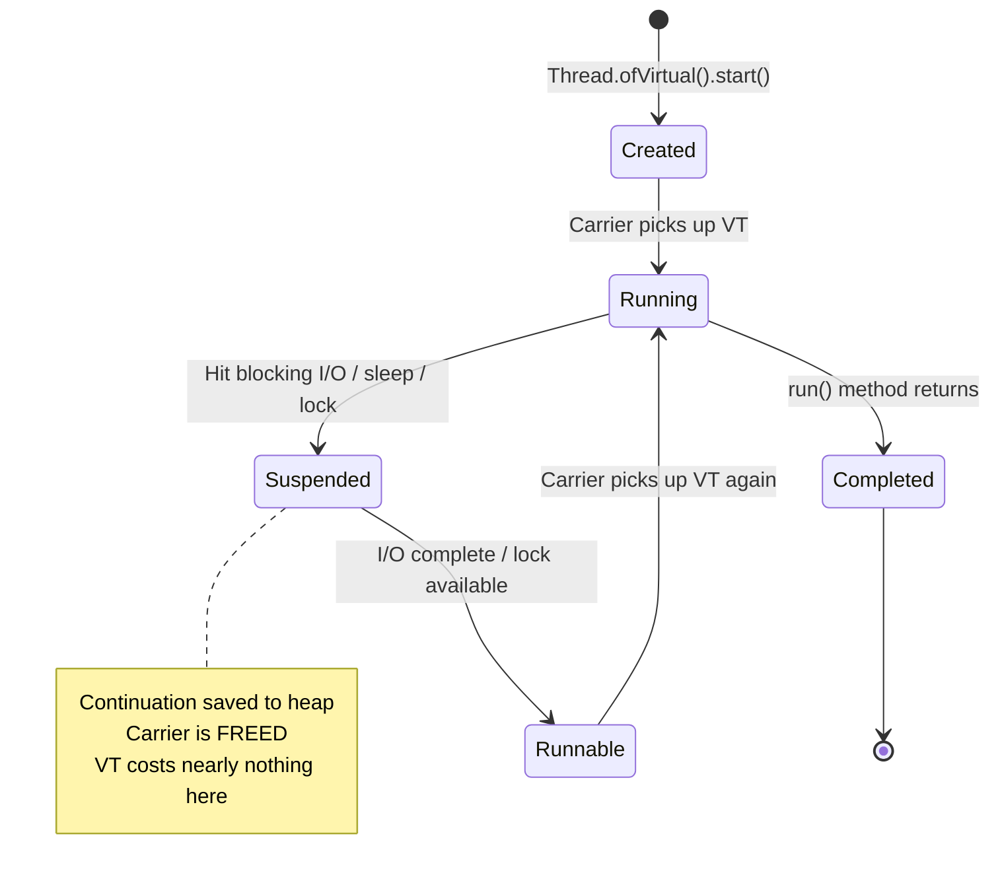

### 4.3 What the JVM Instruments

The JVM has modified specific blocking operations to trigger a continuation yield instead of blocking the OS thread:

```java
// These operations TRIGGER unmounting in Virtual Threads:
Thread.sleep(duration);                    // ✅ VT parks, carrier freed
socket.read(buffer);                       // ✅ VT parks, carrier freed
socket.write(buffer);                      // ✅ VT parks, carrier freed
Files.readAllBytes(path);                  // ✅ VT parks, carrier freed
httpClient.send(request, bodyHandler);     // ✅ VT parks, carrier freed
lock.lock();  // ReentrantLock             // ✅ VT parks if unavailable
queue.take(); // BlockingQueue             // ✅ VT parks if empty
future.get(); // CompletableFuture         // ✅ VT parks if not done
```

---

## 5. The ForkJoinPool Scheduler {#forkjoinpool}

### 5.1 How Carrier Threads Are Managed

The pool of carrier threads is a **ForkJoinPool**. By default, it creates one carrier thread per CPU core.

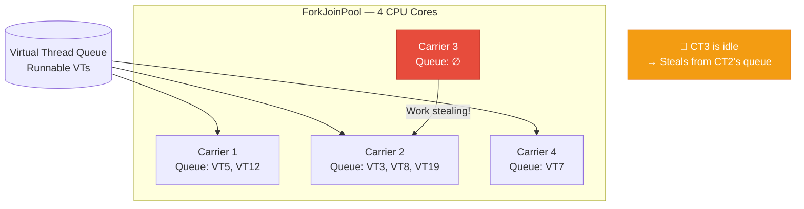

**Work Stealing:** When a carrier's queue is empty, it **steals tasks** from the busiest carrier's queue. This ensures all CPU cores stay busy as long as there's work to do.

### 5.2 Customising the Carrier Pool

```java
// Default: Runtime.getRuntime().availableProcessors() carriers
// For CPU-bound mixed workloads, you can customise:
System.setProperty("jdk.virtualThreadScheduler.parallelism", "8");
System.setProperty("jdk.virtualThreadScheduler.maxPoolSize", "256");
```

---

## 6. Full Virtual Thread Lifecycle {#lifecycle}

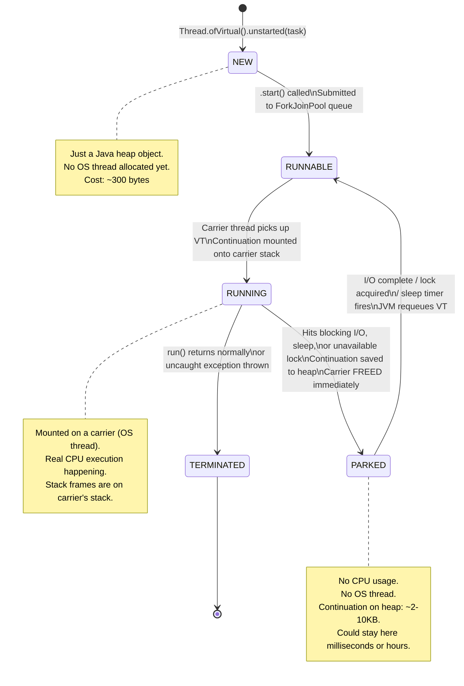

### State Inspection in Code

```java
// Create without starting
Thread vt = Thread.ofVirtual()
    .name("my-vt")
    .unstarted(() -> {
        System.out.println("Running!");
        Thread.sleep(Duration.ofSeconds(1));
    });

System.out.println(vt.getState()); // NEW

vt.start();
Thread.sleep(10); // let it start
System.out.println(vt.getState()); // TIMED_WAITING (parked on sleep)

vt.join();
System.out.println(vt.getState()); // TERMINATED
```

---

## 7. Writing Code with Virtual Threads {#writing-code}

### 7.1 Creation Methods

```java
// ── Method 1: Simple fire-and-forget ──────────────────────────────
Thread vt = Thread.ofVirtual().start(() -> handleRequest(requestId));


// ── Method 2: Named thread (great for debugging & monitoring) ─────
Thread vt = Thread.ofVirtual()
    .name("order-processor-", 0)   // auto-increments: -0, -1, -2...
    .start(() -> processOrder(orderId));


// ── Method 3: Unstarted (for manual lifecycle control) ────────────
Thread vt = Thread.ofVirtual()
    .name("batch-worker")
    .unstarted(() -> runBatch());
// ... set up monitoring, metrics, etc. ...
vt.start();


// ── Method 4: ExecutorService (most common in production) ─────────
try (ExecutorService executor = Executors.newVirtualThreadPerTaskExecutor()) {
    for (String url : urlList) {   // could be 100,000 URLs
        executor.submit(() -> fetchAndProcess(url));
    }
}
// Auto-closes: waits for all tasks to finish, then shuts down


// ── Method 5: ThreadFactory (for frameworks/libraries) ────────────
ThreadFactory factory = Thread.ofVirtual()
    .name("api-handler-", 0)
    .factory();

Thread t = factory.newThread(() -> handleApiCall());
```

### 7.2 A Complete Web Server Example

```java
// A simple virtual-thread-based HTTP server handling 100k concurrent connections
public class VirtualThreadServer {
    
    public static void main(String[] args) throws IOException {
        var serverSocket = new ServerSocket(8080);
        System.out.println("Server started on port 8080");

        try (var executor = Executors.newVirtualThreadPerTaskExecutor()) {
            while (true) {
                Socket clientSocket = serverSocket.accept(); // blocks, but that's fine!
                executor.submit(() -> handleConnection(clientSocket));
                // Each connection gets its OWN virtual thread
                // 100,000 connections = 100,000 virtual threads
                // But only #CPUs carrier threads are active at a time
            }
        }
    }

    static void handleConnection(Socket socket) {
        try (socket;
             var in = new BufferedReader(new InputStreamReader(socket.getInputStream()));
             var out = new PrintWriter(socket.getOutputStream(), true)) {

            String request = in.readLine();  // VT parks here if no data yet
            String response = processRequest(request);  // may call DB, external API
            out.println(response);

        } catch (IOException e) {
            System.err.println("Connection error: " + e.getMessage());
        }
    }

    static String processRequest(String request) throws IOException {
        // This BLOCKS — and that's completely fine with virtual threads!
        return database.query("SELECT * FROM data WHERE key = ?", request);
    }
}
```

### 7.3 Spring Boot Migration: One Line

```properties
# application.properties — that's literally it
spring.threads.virtual.enabled=true
```

This single property makes Tomcat, Spring MVC, and `@Async` all use virtual threads. No code changes needed to your controllers, services, or repositories.

```java
// Your controllers stay exactly the same
@RestController
public class UserController {

    @Autowired
    private UserService userService;

    @GetMapping("/users/{id}")
    public User getUser(@PathVariable Long id) {
        // This blocks — but now it's a VT blocking, not an OS thread!
        return userService.findById(id);
    }
}
```

### 7.4 Structured Concurrency (Java 21+)

Structured Concurrency treats a group of related threads as a single unit of work:

```java
// Fetch user data and order data IN PARALLEL, then combine
public UserDashboard getUserDashboard(long userId) throws Exception {
    try (var scope = new StructuredTaskScope.ShutdownOnFailure()) {
        // Launch both tasks concurrently as virtual threads
        StructuredTaskScope.Subtask<User> userTask =
            scope.fork(() -> userService.findById(userId));

        StructuredTaskScope.Subtask<List<Order>> ordersTask =
            scope.fork(() -> orderService.findByUser(userId));

        scope.join();           // Wait for BOTH to complete
        scope.throwIfFailed();  // Propagate any exception cleanly

        return new UserDashboard(userTask.get(), ordersTask.get());
    }
    // If userTask throws, ordersTask is automatically cancelled
    // Clean, readable, correct — no reactive chains needed
}
```

---

## 8. The Critical Gotcha: Thread Pinning {#pinning}

Thread pinning is the **most dangerous pitfall** of virtual threads. If you deploy to production without understanding this, you will hit the scalability wall again — and it will be harder to diagnose.

### 8.1 What Is Pinning?

**Pinning** occurs when a virtual thread cannot unmount from its carrier thread during a blocking operation. The carrier is stuck — just like a platform thread in the old world.

```mermaid
flowchart TD
    subgraph "WITHOUT Pinning (Healthy)"
        VT1A[VT: handleRequest] -->|hits db.query| JVM1[JVM intercepts]
        JVM1 --> U1[VT UNMOUNTS\nCarrier FREED ✅]
        U1 --> P1[Carrier runs other VTs]
    end

    subgraph "WITH Pinning (Problem!) ❌"
        VT2A[VT: handleRequest] -->|inside synchronized| SYNC[synchronized block]
        SYNC -->|hits db.query| JVM2[JVM CANNOT intercept!]
        JVM2 --> STUCK[Carrier is STUCK\nWaiting for DB]
        STUCK --> WASTE[Other VTs QUEUED\nCannot run]
    end

    style STUCK fill:#e74c3c,color:#fff,stroke:#c0392b
    style WASTE fill:#e74c3c,color:#fff,stroke:#c0392b
    style U1 fill:#27ae60,color:#fff
    style P1 fill:#27ae60,color:#fff
```

### 8.2 What Causes Pinning?

```java
// ❌ CAUSE 1: synchronized block with I/O inside
synchronized (this) {
    result = db.query("SELECT ...");  // PINS the carrier!
}

// ❌ CAUSE 2: synchronized method with I/O inside
public synchronized User getUser(int id) {
    return db.findById(id);  // PINS the carrier!
}

// ❌ CAUSE 3: JNI (native method) calls
public native void processWithC();  // Any blocking here → PINNED

// ❌ CAUSE 4: Older third-party libraries (check before using)
// Libraries using synchronized internally will pin your VTs
// Examples: some versions of Hibernate, older JDBC drivers
```

### 8.3 The Fix: Use ReentrantLock

```java
// ✅ VT-FRIENDLY: ReentrantLock is implemented in pure Java
//    It uses VT-aware parking — properly unmounts the VT
private final ReentrantLock lock = new ReentrantLock();

public User getUser(int id) {
    lock.lock();
    try {
        return db.findById(id);  // VT unmounts here ✅
    } finally {
        lock.unlock();  // ALWAYS in finally!
    }
}

// ✅ Even better with tryLock (non-blocking attempt)
public Optional<User> tryGetUser(int id) {
    if (lock.tryLock()) {
        try {
            return Optional.of(db.findById(id));
        } finally {
            lock.unlock();
        }
    }
    return Optional.empty();  // Don't wait if lock unavailable
}
```

### 8.4 Detecting Pinning in Your Application

```bash
# Method 1: JVM system property — prints stack trace on every pin event
java -Djdk.tracePinnedThreads=full -jar your-app.jar

# Method 2: Less verbose (just the pinned thread info, no full trace)
java -Djdk.tracePinnedThreads=short -jar your-app.jar
```

**Example output when pinning is detected:**
```
Thread[#24,ForkJoinPool-1-worker-1,5,CarrierThreads]
    com.example.UserService.getUser(UserService.java:42) <== monitors:1
    ...
```

The `<== monitors:1` tells you exactly which line has a `synchronized` block causing the pin.

### 8.5 Pinning Cheat Sheet

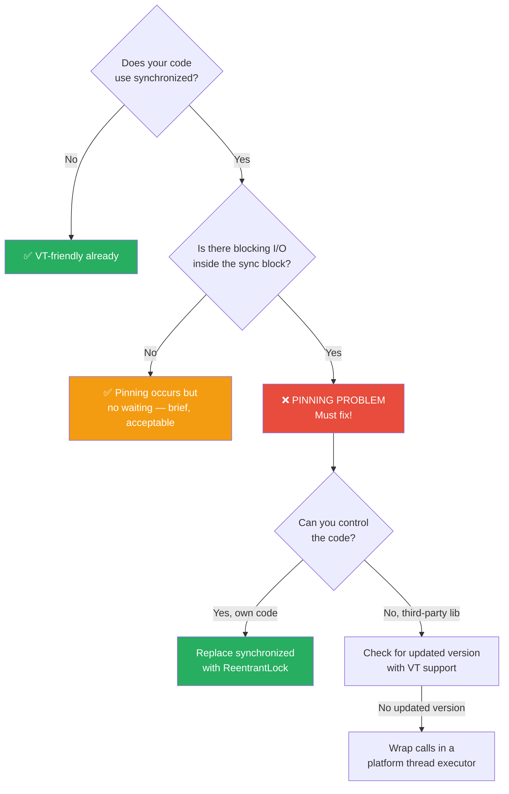

---

## 9. Real-World Use Cases {#use-cases}

### 9.1 Use Case 1: Microservices Fan-Out

A common pattern: one request triggers multiple downstream service calls.

```java
// ✅ Virtual Threads + Structured Concurrency: clean parallel calls
public ProductPage getProductPage(String productId) throws Exception {
    try (var scope = new StructuredTaskScope.ShutdownOnFailure()) {

        var productTask   = scope.fork(() -> productService.fetch(productId));
        var reviewsTask   = scope.fork(() -> reviewService.getTop(productId, 5));
        var inventoryTask = scope.fork(() -> inventoryService.check(productId));
        var relatedTask   = scope.fork(() -> mlService.getRelated(productId, 10));

        scope.join().throwIfFailed();

        return new ProductPage(
            productTask.get(),
            reviewsTask.get(),
            inventoryTask.get(),
            relatedTask.get()
        );
    }
    // Total time ≈ slowest single call (parallelized!)
    // Not: sum of all calls (which sequential blocking would give)
}
```

```mermaid
gantt
    title Parallel Calls with Virtual Threads
    dateFormat x
    axisFormat %Lms

    section Sequential (Old Way)
    productService.fetch      :0, 80
    reviewService.getTop      :80, 150
    inventoryService.check    :230, 100
    mlService.getRelated      :330, 120
    Total: 450ms              :crit, 450, 1

    section Parallel (Virtual Threads)
    productService.fetch      :0, 80
    reviewService.getTop      :0, 150
    inventoryService.check    :0, 100
    mlService.getRelated      :0, 120
    Total: 150ms              :crit, 150, 1
```

### 9.2 Use Case 2: Batch Data Processing

```java
// Process 1 million records with virtual threads
public void processAllRecords(List<Long> recordIds) throws InterruptedException {
    try (var executor = Executors.newVirtualThreadPerTaskExecutor()) {
        for (Long id : recordIds) {  // 1,000,000 IDs
            executor.submit(() -> {
                Record record = db.fetchRecord(id);         // VT parks here
                ProcessedRecord result = transform(record); // CPU work
                db.saveResult(result);                      // VT parks here
            });
        }
    } // Waits for ALL 1 million tasks — executor auto-shuts down
    System.out.println("All records processed!");
}
// With 200 carrier threads (not OS threads), this scales beautifully.
// VTs park during DB calls, carriers stay busy with other VTs.
```

### 9.3 Use Case 3: Web Scraper / Crawler

```java
public class WebCrawler {
    private final HttpClient client = HttpClient.newBuilder()
        .executor(Executors.newVirtualThreadPerTaskExecutor())
        .build();

    public Map<String, String> crawl(List<String> urls) throws Exception {
        var results = new ConcurrentHashMap<String, String>();

        try (var executor = Executors.newVirtualThreadPerTaskExecutor()) {
            var futures = urls.stream()
                .map(url -> executor.submit(() -> {
                    HttpRequest req = HttpRequest.newBuilder()
                        .uri(URI.create(url)).build();
                    HttpResponse<String> resp =
                        client.send(req, HttpResponse.BodyHandlers.ofString());
                    results.put(url, resp.body());
                }))
                .toList();

            // Wait for all fetches
            for (var future : futures) future.get();
        }
        return results;
    }
}
// 10,000 URLs? Fine. VTs park while waiting for network responses.
// Only active network connections use real OS resources.
```

### 9.4 Use Case 4: Scheduled Job Worker

```java
// A job dispatcher that runs tasks concurrently but limits DB connections
public class JobWorker {
    // Semaphore limits concurrent DB connections even with millions of VTs
    private final Semaphore dbConnectionLimit = new Semaphore(50);

    public void runJobs(List<Job> jobs) throws InterruptedException {
        try (var executor = Executors.newVirtualThreadPerTaskExecutor()) {
            for (Job job : jobs) {
                executor.submit(() -> executeJob(job));
            }
        }
    }

    private void executeJob(Job job) {
        try {
            dbConnectionLimit.acquire(); // VT parks if > 50 concurrent DB ops
            try {
                db.execute(job.getSql());
            } finally {
                dbConnectionLimit.release();
            }
        } catch (InterruptedException e) {
            Thread.currentThread().interrupt();
        }
    }
}
```

---

## 10. Virtual Threads vs Platform Threads {#comparison}

```mermaid
quadrantChart
    title Virtual Threads vs Platform Threads
    x-axis Low Scalability --> High Scalability
    y-axis Low Code Complexity --> High Code Complexity

    quadrant-1 Avoid if possible
    quadrant-2 Legacy approach
    quadrant-3 Best of both worlds
    quadrant-4 Not recommended

    Platform Threads (I/O-bound): [0.2, 0.5]
    Reactive WebFlux: [0.85, 0.85]
    Virtual Threads (I/O-bound): [0.88, 0.2]
    Platform Thread Pool (CPU-bound): [0.4, 0.3]
    Virtual Threads (CPU-bound): [0.45, 0.2]
```

### Detailed Comparison Table

| Aspect | Platform Threads | Virtual Threads |
|---|---|---|
| **Managed by** | Operating System | JVM |
| **Creation cost** | ~1ms, syscall | ~microseconds, heap alloc |
| **Memory per thread** | ~1MB (stack) | ~2-10KB (heap, when parked) |
| **Max practical count** | ~2,000–5,000 | Millions |
| **Blocking I/O** | Wastes OS thread | Parks cheaply on heap |
| **CPU-bound work** | ✅ Optimal | Same as platform (no benefit) |
| **Thread pooling** | ✅ Essential | ❌ Anti-pattern |
| **synchronized** | Fine | ⚠️ Risk of pinning |
| **Stack traces** | ✅ Full, readable | ✅ Full, readable |
| **Debugging** | ✅ Easy | ✅ Easy |
| **ThreadLocal** | ✅ Cheap (few threads) | ⚠️ Use ScopedValues instead |
| **Library compatibility** | Universal | Check for pinning risks |

### Decision Flowchart

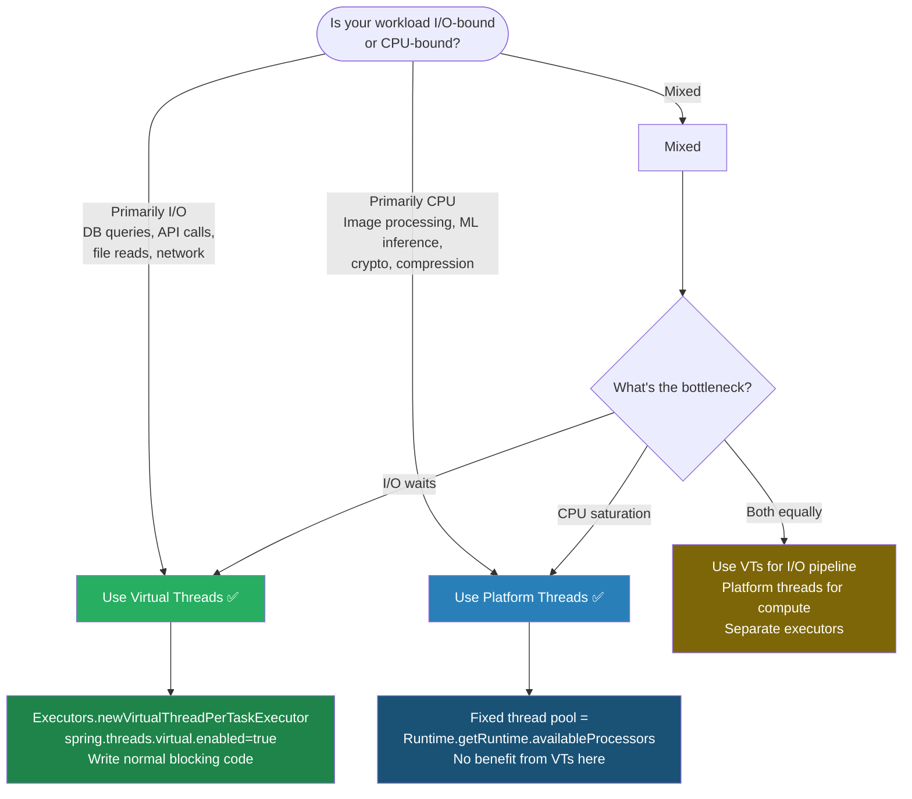

---

## 11. Best Practices & Anti-Patterns {#best-practices}

### ✅ Best Practices

**1. Create a new VT per task — don't pool them**
```java
// ✅ CORRECT: New VT per task (they're cheap!)
Executors.newVirtualThreadPerTaskExecutor()

// ❌ WRONG: Pooling VTs (defeats the purpose)
Executors.newFixedThreadPool(100, Thread.ofVirtual().factory())
```

**2. Replace ThreadLocal with ScopedValue for large objects**
```java
// ❌ ThreadLocal with VTs: if you have 1M VTs, 1M copies of large objects → heap explosion
ThreadLocal<LargeContext> ctx = new ThreadLocal<>();

// ✅ ScopedValue: immutable, lifecycle-bound, no leak risk
ScopedValue<LargeContext> REQUEST_CONTEXT = ScopedValue.newInstance();

ScopedValue.where(REQUEST_CONTEXT, new LargeContext(user))
    .run(() -> handleRequest());
// Context is automatically cleaned up when the scope exits
```

**3. Use Semaphore to limit resource usage (not thread pool size)**
```java
// ❌ WRONG: Limiting VTs to protect DB connections
ExecutorService limited = Executors.newFixedThreadPool(100,
    Thread.ofVirtual().factory()); // Still just 100 VTs!

// ✅ CORRECT: Let VTs be unlimited, limit the DB operations
Semaphore dbSemaphore = new Semaphore(100); // 100 concurrent DB ops max
// VTs park cheaply when waiting for the semaphore
```

**4. Name your virtual threads for observability**
```java
// ✅ Named VTs are visible in thread dumps, JFR, JConsole
Thread.ofVirtual()
    .name("order-proc-", 0)  // order-proc-0, order-proc-1, etc.
    .start(() -> processOrder(id));
```

### ❌ Anti-Patterns

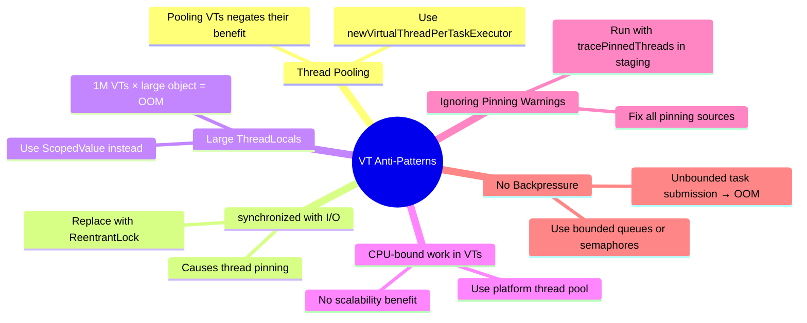

---

## 12. Interview Cheat Sheet {#cheat-sheet}

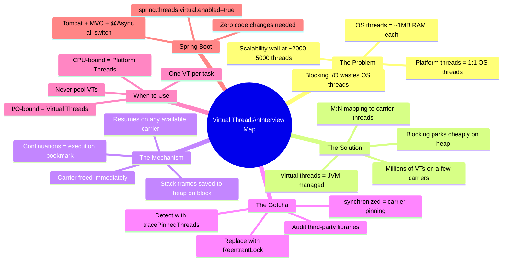

### Quick-Fire Interview Q&A

**Q: What is the difference between a virtual thread and a platform thread?**
> A: A platform thread is a 1:1 wrapper around an OS thread (~1MB stack, kernel-managed). A virtual thread is managed entirely by the JVM, mapped many-to-few onto carrier threads (OS threads). When a VT blocks on I/O, the JVM unmounts it from its carrier (saving its state as a continuation on the heap) and the carrier immediately runs other work. This allows millions of concurrent virtual threads on just a handful of OS threads.

**Q: What is thread pinning and why does it matter?**
> A: Pinning is when a virtual thread cannot unmount from its carrier during a blocking operation. It happens when a VT is inside a `synchronized` block or a native (JNI) method. A pinned carrier is stuck — just like an old platform thread. If all carriers get pinned, you lose all scalability benefits of virtual threads. Fix: replace `synchronized` with `ReentrantLock`.

**Q: Should you pool virtual threads?**
> A: No. Thread pools exist to amortize the high cost of creating OS threads (~1ms, ~1MB). Virtual threads cost microseconds and a few KB. Pooling them is an anti-pattern — use `Executors.newVirtualThreadPerTaskExecutor()` which creates a fresh VT per task.

**Q: Are virtual threads faster for CPU-bound work?**
> A: No. You have N CPU cores — you can execute N things simultaneously regardless of whether they're VTs or platform threads. Virtual threads help with *waiting*, not *computing*. For CPU-bound work, use a fixed platform thread pool sized to your CPU count.

**Q: How do you enable virtual threads in Spring Boot?**
> A: One property: `spring.threads.virtual.enabled=true` in `application.properties`. This makes Tomcat, Spring MVC, and `@Async` all switch to virtual threads with zero code changes.

---

## Summary

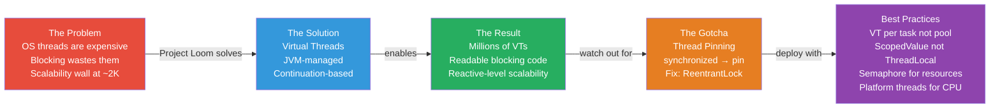

> **Bottom line:** Virtual Threads are not a silver bullet — they're a precision tool. For I/O-bound Java applications (which is most backend services), they are a genuine free lunch: write simple blocking code, get massive scalability, and never touch a reactive library again.

---
