# PromQL Mastery: The Complete Guide to Prometheus Query Language

**Difficulty Level:** Intermediate  
**Estimated Reading Time:** 45-60 minutes  
**Last Updated:** January 2026  
**Tutorial Type:** Comprehensive Deep Dive

---

## Table of Contents

1. [Introduction to PromQL](#introduction-to-promql)
2. [Prerequisites](#prerequisites)
3. [Learning Objectives](#learning-objectives)
4. [Prometheus Setup Basics](#prometheus-setup-basics)
5. [Prometheus Metric Types](#prometheus-metric-types)
6. [Writing Your First Query](#writing-your-first-query)
7. [Filtering and Label Selection](#filtering-and-label-selection)
8. [Understanding Time Series Data](#understanding-time-series-data)
9. [Instant Vectors vs Range Vectors](#instant-vectors-vs-range-vectors)
10. [Core PromQL Functions](#core-promql-functions)
11. [Aggregation Operators](#aggregation-operators)
12. [Aggregation Over Time](#aggregation-over-time)
13. [Histograms and histogram_quantile](#histograms-and-histogram_quantile)
14. [Label Manipulation](#label-manipulation)
15. [Real-World Use Cases](#real-world-use-cases)
16. [Best Practices](#best-practices)
17. [Anti-Patterns](#anti-patterns)
18. [Performance Considerations](#performance-considerations)
19. [Security Considerations](#security-considerations)
20. [Troubleshooting Guide](#troubleshooting-guide)
21. [Testing Strategies](#testing-strategies)
22. [Practice Exercises](#practice-exercises)
23. [Test Your Understanding](#test-your-understanding)
24. [Common Interview Questions](#common-interview-questions)
25. [Question Bank](#question-bank)
26. [Summary Cheat Sheet](#summary-cheat-sheet)
27. [Further Reading & Resources](#further-reading--resources)
28. [Self-Assessment Checklist](#self-assessment-checklist)

---

## Introduction to PromQL

**PromQL** (Prometheus Query Language) is the functional query language built into Prometheus that lets you select and aggregate time series data in real time. If you're running Kubernetes clusters, microservices, or any infrastructure that needs monitoring, PromQL is the tool you'll use to answer questions like:

- "What is the average CPU usage of my servers over the last 5 minutes?"
- "How many HTTP requests are failing per second?"
- "What's the 95th percentile latency of my API?"

This tutorial takes you from zero to confidently writing production-grade PromQL queries, with detailed explanations, multiple examples per concept, and diagrams to visualize how the language actually works under the hood.

### Why PromQL Matters

In modern cloud-native environments, you're dealing with:
- **Hundreds to thousands of microservices** generating metrics
- **Dynamic infrastructure** (Kubernetes pods scaling up/down)
- **Complex dependencies** between services
- **SLOs and SLIs** that require precise quantitative measurements

PromQL is your primary tool for:
- **Debugging** production issues in real-time
- **Building dashboards** that provide operational visibility
- **Creating alerts** that fire before users are affected
- **Capacity planning** based on historical trends
- **SLO tracking** with percentile-based metrics

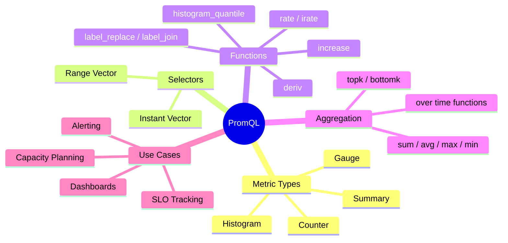

---

## Prerequisites

Before diving into PromQL, ensure you have:

### Required Knowledge
- **Basic understanding of monitoring concepts** (metrics, time series, dashboards)
- **Familiarity with Linux/Unix command line** (for running Prometheus)
- **Basic understanding of HTTP** (Prometheus uses HTTP for scraping)
- **Familiarity with YAML** (for Prometheus configuration)

### Required Tools
- **Prometheus Server** (v2.20+ recommended) - [Installation Guide](https://prometheus.io/docs/prometheus/latest/installation/)
- **Prometheus Web UI** or **Grafana** (for visualizing queries)
- **Sample metrics source** (node_exporter, application metrics, or demo data)
- **Text editor** (VS Code, vim, etc.)

### Optional Tools
- **Grafana** - For creating dashboards with PromQL queries
- **Alertmanager** - For managing alerts generated from PromQL expressions
- **Prometheus CLI** - For testing queries from command line
- **Docker** - For running Prometheus in containers

### Quick Setup Verification

Verify your Prometheus installation is working:

```bash
# Start Prometheus with default config
prometheus --config.file=prometheus.yml

# Check if it's running
curl http://localhost:9090/metrics

# Open Prometheus UI
open http://localhost:9090
```

> 💡 **Tip:** If you don't have a metrics source ready, use the [Prometheus Demo Data](https://github.com/prometheus/prometheus/tree/main/documentation/examples) or install `node_exporter` for system metrics.

---

## Learning Objectives

By the end of this tutorial, you will be able to:

### Core Competencies
- ✅ **Understand** the four Prometheus metric types and when to use each
- ✅ **Write** basic to advanced PromQL queries with confidence
- ✅ **Filter** time series data using label matchers effectively
- ✅ **Distinguish** between instant vectors and range vectors
- ✅ **Apply** core functions (`rate()`, `increase()`, `deriv()`, etc.) correctly
- ✅ **Aggregate** metrics using operators like `sum`, `avg`, `topk`, etc.
- ✅ **Calculate** percentiles using histograms and `histogram_quantile()`
- ✅ **Manipulate** labels using `label_replace()` and `label_join()`

### Advanced Skills
- ✅ **Build** production-ready dashboards with optimized queries
- ✅ **Create** effective alerting rules that minimize false positives
- ✅ **Diagnose** and fix common PromQL performance issues
- ✅ **Avoid** cardinality explosions and other anti-patterns
- ✅ **Optimize** queries for performance in high-scale environments
- ✅ **Implement** SLO monitoring with percentile-based metrics

### Practical Application
- ✅ **Debug** real-world production issues using PromQL
- ✅ **Monitor** infrastructure health (CPU, memory, disk, network)
- ✅ **Track** application performance (latency, error rates, throughput)
- ✅ **Plan** capacity using trend analysis and forecasting
- ✅ **Secure** metrics endpoints and prevent data leakage

---

## Prometheus Setup Basics

Before writing queries, Prometheus needs to be scraping metrics from targets (applications, exporters, or infrastructure). The typical architecture looks like this:

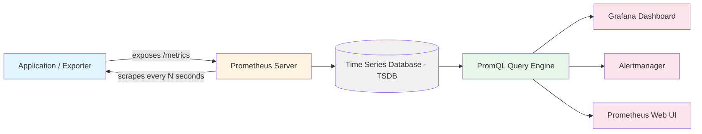

### How it works step-by-step:

1. **Your application** (or an exporter like `node_exporter` for machine metrics) exposes a `/metrics` HTTP endpoint in plain text format.
2. **Prometheus is configured** (via `prometheus.yml`) with a `scrape_config` telling it *what* to scrape and *how often* (the "scrape interval", commonly 15s).
3. **Every scrape**, Prometheus pulls the current metric values and stores them as timestamped data points in its local TSDB.
4. **You then use PromQL** to query, filter, and aggregate that stored data — either directly in the Prometheus UI, via the HTTP API, or through Grafana.

### Example `prometheus.yml` scrape config:

```yaml
global:
  scrape_interval: 15s  # Scrape every 15 seconds
  evaluation_interval: 15s  # Evaluate rules every 15 seconds

scrape_configs:
  - job_name: 'node_exporter'
    scrape_interval: 15s
    static_configs:
      - targets: ['localhost:9100']
        labels:
          environment: 'production'
          region: 'us-east-1'
  
  - job_name: 'my_app'
    scrape_interval: 10s
    static_configs:
      - targets: ['app1.example.com:8080', 'app2.example.com:8080']
```

> 💡 **Tip:** Every metric Prometheus stores automatically gets a `job` and `instance` label based on this configuration — these become essential for filtering later. You can also add custom labels in the config for better organization.

### Understanding Scrape Intervals

The scrape interval is critical for query accuracy:

| Scrape Interval | Minimum Range Window | Use Case |
|----------------|---------------------|----------|
| 10s | 40s (4x interval) | High-frequency metrics, fast-changing systems |
| 15s | 1m (4x interval) | Standard production workloads |
| 30s | 2m (4x interval) | Low-churn systems, resource-constrained |
| 60s | 4m (4x interval) | Batch jobs, infrequently changing metrics |

> ⚠️ **Rule of thumb:** Always use at least **4x your scrape interval** in range vectors. Using `[10s]` with a 15s scrape interval will return no data or inaccurate results.

---

## Prometheus Metric Types

Prometheus has **four core metric types**. Understanding these is the foundation for writing correct PromQL — using the wrong function on the wrong metric type is the #1 mistake beginners make.

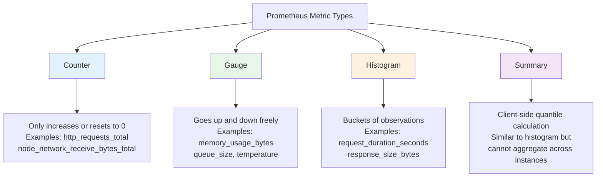

### 1. Counter

A **counter** is a cumulative metric that only increases (it can reset to zero on a restart, but never decreases otherwise).

**Characteristics:**
- Monotonically increasing (or resets to 0)
- Never decreases during normal operation
- Used for counting events, requests, operations
- Must use `rate()`, `irate()`, or `increase()` to get meaningful values

**Examples:**
- `http_requests_total` — total number of HTTP requests served
- `node_network_receive_bytes_total` — total bytes received on a network interface
- `process_cpu_seconds_total` — total CPU time consumed by a process
- `prometheus_http_requests_total` — total requests to Prometheus itself

**Sample metric output:**
```
# HELP http_requests_total The total number of HTTP requests.
# TYPE http_requests_total counter
http_requests_total{method="GET",status="200"} 10293
http_requests_total{method="POST",status="201"} 4521
http_requests_total{method="GET",status="500"} 23
```

> ⚠️ **Critical:** Never query a counter directly without using `rate()` or `increase()`. The raw value is a cumulative total that grows indefinitely and is not meaningful on its own.

### 2. Gauge

A **gauge** represents a value that can go up or down arbitrarily — a snapshot of "current state."

**Characteristics:**
- Can increase or decrease at any time
- Represents current value at measurement time
- Can be set to arbitrary values (including negative)
- Often represents temperatures, memory usage, queue sizes

**Examples:**
- `node_memory_MemAvailable_bytes` — currently available memory
- `up` — whether a target is currently reachable (1 or 0)
- `queue_size` — number of items currently in a queue
- `node_cpu_load1` — 1-minute load average
- `temperature_celsius` — current temperature reading

**Sample metric output:**
```
# HELP node_memory_MemAvailable_bytes Memory available
# TYPE node_memory_MemAvailable_bytes gauge
node_memory_MemAvailable_bytes{device="ram"} 2147483648
```

> 💡 **Tip:** Gauges are the only metric type you can query directly. The raw value is already meaningful (e.g., "current memory available").

### 3. Histogram

A **histogram** samples observations (like request durations or response sizes) and counts them into configurable buckets. It automatically exposes three related metrics:

**Components:**
- `<name>_bucket{le="..."}` — cumulative counts per bucket boundary
- `<name>_sum` — sum of all observed values
- `<name>_count` — count of all observations

**Example:**
```
# HELP http_request_duration_seconds The duration of HTTP requests in seconds.
# TYPE http_request_duration_seconds histogram
http_request_duration_seconds_bucket{le="0.1"} 24054
http_request_duration_seconds_bucket{le="0.5"} 33444
http_request_duration_seconds_bucket{le="1"}   33471
http_request_duration_seconds_bucket{le="+Inf"} 33471
http_request_duration_seconds_sum              8953.2
http_request_duration_seconds_count            33471
```

**How to read this:**
- 24,054 requests took ≤ 0.1 seconds
- 33,471 requests took ≤ 1 second (total requests)
- Average duration = 8953.2 / 33471 ≈ 0.267 seconds

> 💡 **Key insight:** Buckets are cumulative — the `le="1"` bucket includes all requests in `le="0.5"` and `le="0.1"`.

### 4. Summary

Similar to a histogram, but **quantiles are calculated on the client side** before being exposed. This makes summaries cheaper to query but impossible to aggregate across instances.

**Characteristics:**
- Quantiles calculated by the client application
- Cannot be aggregated across multiple instances
- Lower storage overhead than histograms
- Less flexible than histograms

**Example:**
```
# HELP http_request_duration_seconds The duration of HTTP requests in seconds.
# TYPE http_request_duration_seconds summary
http_request_duration_seconds{quantile="0.5"} 0.12
http_request_duration_seconds{quantile="0.95"} 0.45
http_request_duration_seconds{quantile="0.99"} 0.89
http_request_duration_seconds_sum 8953.2
http_request_duration_seconds_count 33471
```

**Rule of thumb:** Prefer histograms over summaries whenever you need to aggregate quantiles across multiple instances (e.g., across a whole Kubernetes deployment).

### Metric Type Decision Matrix

| Scenario | Metric Type | Why |
|----------|-------------|-----|
| Counting requests | Counter | Only increases, perfect for totals |
| Current memory usage | Gauge | Fluctuates up and down |
| Request latency percentiles | Histogram | Can aggregate across instances |
| Single-instance latency | Summary | Client-side calculation, no aggregation needed |
| Active connections | Gauge | Changes with each connection |
| Total bytes transferred | Counter | Only increases over time |

---

## Writing Your First Query

The simplest PromQL query is just a metric name:

```promql
node_cpu_seconds_total
```

This returns **every time series** with that metric name — one per unique combination of labels (e.g., one per CPU core, per mode, per instance). Running this in the Prometheus UI might return dozens of rows like:

```
node_cpu_seconds_total{cpu="0", mode="idle", instance="10.0.0.5:9100"} 152034.2
node_cpu_seconds_total{cpu="0", mode="user", instance="10.0.0.5:9100"} 4021.7
node_cpu_seconds_total{cpu="1", mode="idle", instance="10.0.0.5:9100"} 151982.9
...
```

This is rarely useful on its own — the real power of PromQL comes from **filtering** and **functions**, covered next.

### Understanding Query Results

When you run a query in the Prometheus UI, you'll see:

1. **Console output** - Text representation of current values
2. **Graph view** - Time series visualization (for instant vectors)
3. **Table view** - Tabular format showing labels and values

**Example - Viewing raw metrics:**
```promql
# Returns all time series for this metric
up

# Returns only specific instances
up{job="node_exporter", instance="localhost:9100"}
```

> 💡 **Beginner tip:** Start with simple metric names to see what labels are available, then add filters to narrow down results.

---

## Filtering and Label Selection

Every time series in Prometheus is identified by its metric name **plus** a set of key-value label pairs. Filtering means narrowing down which series you want using **label matchers** inside `{}`.

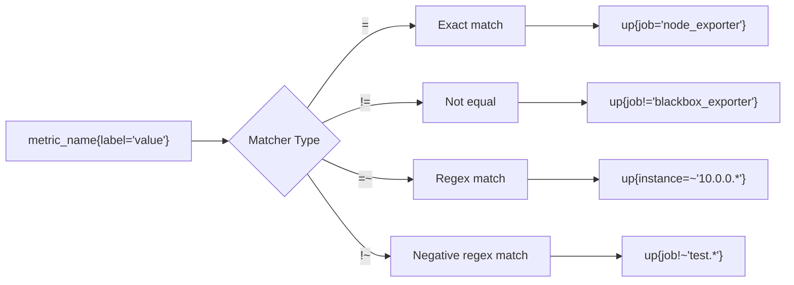

### Matcher Types

| Matcher | Meaning | Example | Use Case |
|---------|---------|---------|----------|
| `=` | Exact match | `up{job="node_exporter"}` | Filter to specific job |
| `!=` | Not equal | `up{job!="node_exporter"}` | Exclude specific job |
| `=~` | Regex match | `up{instance=~"10.0.0.*"}` | Match multiple values |
| `!~` | Negative regex | `up{job!~"test.*"}` | Exclude pattern matches |

### Matcher Examples

**Example 1 — Filter by a single label:**
```promql
http_requests_total{method="GET"}
```
Returns only series where the `method` label equals `GET`.

**Example 2 — Combine multiple labels (AND logic):**
```promql
http_requests_total{method="GET", status_code="500"}
```
Both conditions must match — this returns only failed (500) GET requests.

**Example 3 — Regex to match multiple values:**
```promql
http_requests_total{status_code=~"4..|5.."}
```
Matches any status code in the 4xx or 5xx range — very useful for error-rate dashboards.

**Example 4 — Exclude a job:**
```promql
up{job!="blackbox_exporter"}
```

**Example 5 — Multiple regex patterns:**
```promql
http_requests_total{method=~"GET|POST", status_code!~"3.."}
```
GET or POST requests, excluding 3xx redirects.

**Example 6 — Complex filtering:**
```promql
node_memory_MemAvailable_bytes{instance=~"prod-.*", device="ram"}
```
Memory available on RAM device for production instances only.

> 💡 **Beginner tip:** The metric name itself (e.g., `http_requests_total`) is actually shorthand for an internal `__name__` label. So `http_requests_total{method="GET"}` is technically `{__name__="http_requests_total", method="GET"}`.

### Advanced Filtering Techniques

**Using multiple matchers:**
```promql
# AND logic - all conditions must match
http_requests_total{job="api", method="GET", status="200"}

# Exclude multiple values
http_requests_total{status_code!~"3..|4..|5.."}

# Match specific patterns
node_cpu_seconds_total{cpu=~"0|1|2", mode="idle"}
```

**Filtering with aggregation:**
```promql
# Filter after aggregation
sum(http_requests_total{method="GET"}) by (status_code)

# Filter before aggregation (more efficient)
sum(http_requests_total{status_code=~"2.."}) by (method)
```

---

## Understanding Time Series Data

A **time series** in Prometheus is a stream of `(timestamp, value)` pairs uniquely identified by a metric name and its label set.

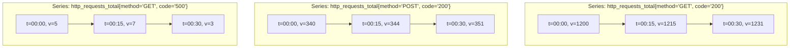

### Key Concepts

**Unique Identification:**
Every unique combination of metric name + labels creates a unique time series:
- `http_requests_total{method="GET", status="200"}` — Series 1
- `http_requests_total{method="POST", status="200"}` — Series 2
- `http_requests_total{method="GET", status="500"}` — Series 3

**Cardinality:**
The number of unique time series for a metric. High cardinality = more series = more resource usage.

**Example cardinality calculation:**
```
Metric: http_requests_total
Labels: method (5 values: GET, POST, PUT, DELETE, PATCH)
        status (3 values: 200, 404, 500)
        instance (10 values: 10 pods)

Total cardinality = 5 × 3 × 10 = 150 time series
```

> ⚠️ **Warning:** Adding high-cardinality labels (like `user_id`, `request_id`) can create millions of series and overwhelm your Prometheus server. Always consider cardinality before adding labels.

### Data Storage Model

Prometheus stores data as chunks:
- **Head block:** Recent data (last 2 hours typically)
- **Persistent blocks:** Historical data on disk
- **Retention:** Default 15 days, configurable

Each data point includes:
- Timestamp (millisecond precision)
- Value (float64)
- Labels (metric identification)

---

## Instant Vectors vs Range Vectors

This is one of the most important concepts to internalize in PromQL.

```mermaid
flowchart TD
    A[PromQL Expression Types] --> B[Instant Vector]
    A --> C[Range Vector]
    
    B --> B1["One value per series<br/>at a single point in time"]
    B --> B2["Example: http_requests_total"]
    B --> B3["Can be graphed directly"]
    
    C --> C1["A range of values per series<br/>over a time window"]
    C --> C2["Example: http_requests_total[5m]"]
    C --> C3["Must be reduced with a function"]
    
    style B fill:#e3f2fd
    style C fill:#fff3e0
```

### Instant Vector

```promql
node_cpu_seconds_total
```

Returns **one value** per time series, representing the most recent sample at query time. This can be graphed directly.

**Characteristics:**
- Single value per time series
- Represents "now" or most recent scrape
- Can be displayed in graphs, tables, or alerts
- Most common return type in PromQL

### Range Vector

```promql
node_cpu_seconds_total[5m]
```

Returns **all samples over the last 5 minutes** for each series — not a single value. Because of this, a range vector **cannot be directly graphed or displayed as a number** — it must be fed into a function like `rate()`, `increase()`, or `avg_over_time()` to reduce it back into a usable instant vector.

**Characteristics:**
- Multiple values per time series (a time window)
- Cannot be graphed directly
- Must be processed by a function
- Used for calculating rates, trends, aggregations over time

**Analogy:** Think of an instant vector as a photograph (one moment in time) and a range vector as a short video clip (a window of time) — you need to process the video clip (e.g., "what's the average brightness") to get something you can display as a single number.

### Visual Comparison

```
Instant Vector (node_cpu_seconds_total):
  Series 1: 152034.2  (one value at query time)
  Series 2: 151982.9  (one value at query time)

Range Vector (node_cpu_seconds_total[5m]):
  Series 1: [152030.1, 152031.5, 152032.8, 152033.9, 152034.2]  (5 minutes of data)
  Series 2: [151978.3, 151980.1, 151981.4, 151982.2, 151982.9]  (5 minutes of data)
```

### Common Mistakes

❌ **Wrong:** Trying to graph a range vector directly
```promql
node_cpu_seconds_total[5m]  # This won't graph properly
```

✅ **Correct:** Use a function to reduce the range vector
```promql
rate(node_cpu_seconds_total[5m])  # Returns instant vector
```

---

## Core PromQL Functions

### `rate()` — Per-Second Average Rate of Increase

`rate()` calculates the **average per-second rate of increase** of a counter over a specified time range. It's the single most commonly used PromQL function.

```promql
rate(http_requests_total[5m])
```

**What it does step-by-step:**
1. Looks at the counter's value at the start and end of the 5-minute window
2. Accounts for counter resets (e.g., app restarts) automatically
3. Divides the total increase by the time range to get a per-second rate
4. Extrapolates slightly to estimate the rate across the full window boundary

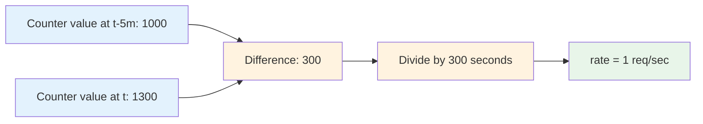

**Example use case:** Requests-per-second dashboard panel:
```promql
sum(rate(http_requests_total[5m])) by (service)
```

**Real-world example:**
```
# Raw counter values over 5 minutes
http_requests_total{service="api"} 
  t=10:00: 1000
  t=10:05: 1300

# rate() calculation
rate = (1300 - 1000) / 300s = 1 req/sec
```

### `irate()` — Instant Rate

`irate()` is similar to `rate()` but only uses the **last two data points** in the range, making it more responsive to sudden spikes but noisier on graphs.

```promql
irate(http_requests_total[5m])
```

| Function | Best For | Behavior | Graph Appearance |
|----------|----------|----------|------------------|
| `rate()` | Dashboards, alerting, smooth trends | Averages across the whole window | Smooth, stable |
| `irate()` | Fast-changing, volatile metrics | Uses only the last 2 points | Spiky, responsive |

> ⚠️ **Rule of thumb:** Use `rate()` for alerting and long-term trend dashboards. Use `irate()` only when you specifically need to see rapid, second-to-second changes (e.g., debugging a live incident).

**Example — CPU usage with `rate()`:**
```promql
100 - (avg by (instance) (rate(node_cpu_seconds_total{mode="idle"}[5m])) * 100)
```
This calculates CPU usage percentage by taking the idle rate, converting it to a percentage, and subtracting from 100.

### `increase()` — Total Increase Over a Window

`increase()` is essentially `rate()` multiplied by the number of seconds in the window — it gives you the **total increase**, not a per-second rate.

```promql
increase(http_requests_total[1h])
```

**Example use case:** "How many total errors occurred in the last hour?"
```promql
increase(http_requests_total{status_code="500"}[1h])
```

**Comparison:**
```promql
# Requests per second
rate(http_requests_total[1h])  # e.g., 5 req/s

# Total requests in last hour
increase(http_requests_total[1h])  # e.g., 18000 requests (5 * 3600)
```

### `deriv()` — Rate of Change for Gauges

While `rate()` and `increase()` work on counters, `deriv()` calculates the **per-second derivative** of a **gauge** using linear regression — useful for spotting trends like memory leaks.

```promql
deriv(node_memory_MemAvailable_bytes[30m])
```

**Example use case:** Detecting a memory leak — if `deriv()` on available memory is consistently negative over a growing window, memory is steadily depleting.

**Example:**
```
# Memory available over 30 minutes
node_memory_MemAvailable_bytes
  t=10:00: 4GB
  t=10:10: 3.8GB
  t=10:20: 3.6GB
  t=10:30: 3.4GB

# deriv() result: -0.0033 GB/s (memory decreasing)
```

> 💡 **When to use:**
> - `rate()` / `increase()`: Counters (requests, bytes sent)
> - `deriv()`: Gauges showing trends (memory, disk space)
> - `delta()`: Gauges for simple difference (not rate)

### Other Useful Functions

**`delta()`** - Simple difference between first and last value:
```promql
delta(node_memory_MemAvailable_bytes[1h])
```

**`idelta()`** - Instant delta (last two points only):
```promql
idelta(node_memory_MemAvailable_bytes[5m])
```

**`predict_linear()`** - Forecast future values:
```promql
predict_linear(node_filesystem_avail_bytes[6h], 4 * 3600) < 0
```
Predicts if disk will run out in 4 hours based on 6-hour trend.

---

## Aggregation Operators

Aggregation operators combine many time series into fewer (or one) series. This is essential because raw queries often return dozens or hundreds of series (one per pod, per instance, per core).

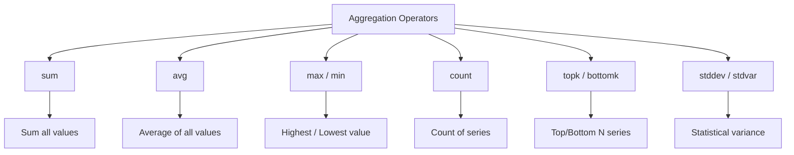

### Syntax

```promql
<aggregation>(<expression>) by (<labels>)
<aggregation>(<expression>) without (<labels>)
```

- `by (labels)` — keep **only** the listed labels, group by them
- `without (labels)` — keep all labels **except** the listed ones

**Key difference:**
- `by (service)` — groups by service, removes other labels
- `without (instance)` — groups across instances, keeps all other labels

### Aggregation Examples

**Example 1 — Total requests per second across all instances:**
```promql
sum(rate(http_requests_total[5m]))
```

**Example 2 — Requests per second, grouped by service:**
```promql
sum(rate(http_requests_total[5m])) by (service)
```

**Example 3 — Average memory usage per node:**
```promql
avg(node_memory_MemAvailable_bytes) by (instance)
```

**Example 4 — Top 5 pods by CPU usage:**
```promql
topk(5, sum(rate(container_cpu_usage_seconds_total[5m])) by (pod))
```

**Example 5 — Bottom 3 nodes by available disk space:**
```promql
bottomk(3, node_filesystem_avail_bytes)
```

**Example 6 — Count how many instances are up:**
```promql
count(up == 1)
```

**Example 7 — Standard deviation of response times:**
```promql
stddev(rate(http_request_duration_seconds_sum[5m])) by (service)
```

### Complete Aggregation Reference

| Operator | Description | Example |
|----------|-------------|---------|
| `sum` | Sum all values | `sum(rate(http_requests_total[5m]))` |
| `avg` | Average of all values | `avg(node_cpu_usage) by (instance)` |
| `min` | Minimum value | `min(node_memory_MemAvailable_bytes) by (instance)` |
| `max` | Maximum value | `max(node_load1) by (instance)` |
| `count` | Count number of series | `count(up == 1)` |
| `count_values` | Count series with same value | `count_values("1", up == 1)` |
| `bottomk` | Bottom N series | `bottomk(3, node_filesystem_avail_bytes)` |
| `topk` | Top N series | `topk(5, rate(http_requests_total[5m]))` |
| `stddev` | Standard deviation | `stddev(request_duration) by (service)` |
| `stdvar` | Standard variance | `stdvar(request_duration) by (service)` |
| `quantile` | Quantile across series | `quantile(0.95, request_duration) by (service)` |

> 💡 **Pro Tip:** `topk` and `bottomk` are incredibly useful for dashboards. They automatically show you the "top offenders" without manual filtering.

---

## Aggregation Over Time

While aggregation operators (`sum`, `avg`, etc.) combine values **across series**, "over time" functions aggregate values **within a single series across a time window** — they operate on range vectors.

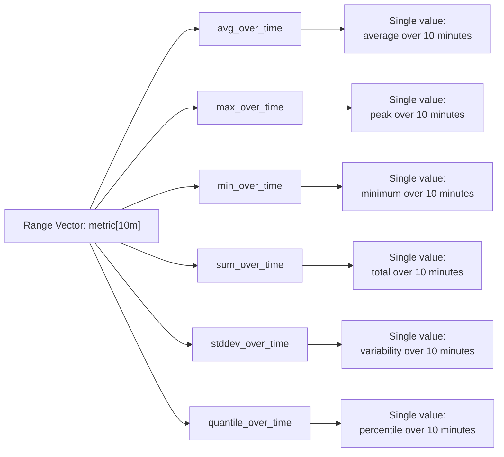

### Over Time Functions

**Example 1 — Average CPU usage over the last 15 minutes:**
```promql
avg_over_time(node_load1[15m])
```

**Example 2 — Peak memory usage in the last hour:**
```promql
max_over_time(node_memory_MemAvailable_bytes[1h])
```

**Example 3 — Smoothing a noisy gauge:**
```promql
avg_over_time(queue_size[5m])
```

**Example 4 — Minimum available disk space in last day:**
```promql
min_over_time(node_filesystem_avail_bytes[24h])
```

**Example 5 — Total requests in last hour:**
```promql
sum_over_time(http_requests_total[1h])
```

**Example 6 — 95th percentile of response times over 5 minutes:**
```promql
quantile_over_time(0.95, http_request_duration_seconds[5m])
```

### Complete Over Time Functions Reference

| Function | Description | Use Case |
|----------|-------------|----------|
| `avg_over_time` | Average value over range | Smoothing noisy metrics |
| `min_over_time` | Minimum value over range | Finding lowest point |
| `max_over_time` | Maximum value over range | Finding peak usage |
| `sum_over_time` | Sum of all values over range | Total over time window |
| `count_over_time` | Count of samples over range | Data availability check |
| `quantile_over_time` | Quantile over range | Percentile over time |
| `stddev_over_time` | Std dev over range | Variability analysis |
| `stdvar_over_time` | Variance over range | Statistical analysis |
| `last_over_time` | Last value in range | Current value from range |
| `present_over_time` | Boolean if any samples exist | Data existence check |

> 💡 **Difference to remember:** `rate()` is for counters and measures *change*. `avg_over_time()`/`max_over_time()` work on **any** metric type and measure the *statistical shape* of raw values over a window — they don't calculate a rate of change.

### When to Use Which

**Use `rate()` when:**
- Working with counters
- Need per-second rate of change
- Building dashboards or alerts

**Use `avg_over_time()` when:**
- Working with gauges
- Need to smooth noisy data
- Want average value over a period

**Example comparison:**
```promql
# Counter: requests per second
rate(http_requests_total[5m])

# Gauge: average queue size
avg_over_time(queue_size[5m])

# Gauge: peak memory usage
max_over_time(node_memory_MemAvailable_bytes[1h])
```

---

## Histograms and histogram_quantile

Histograms let you answer questions like "what's my 95th percentile response time?" — critical for SLOs (Service Level Objectives).

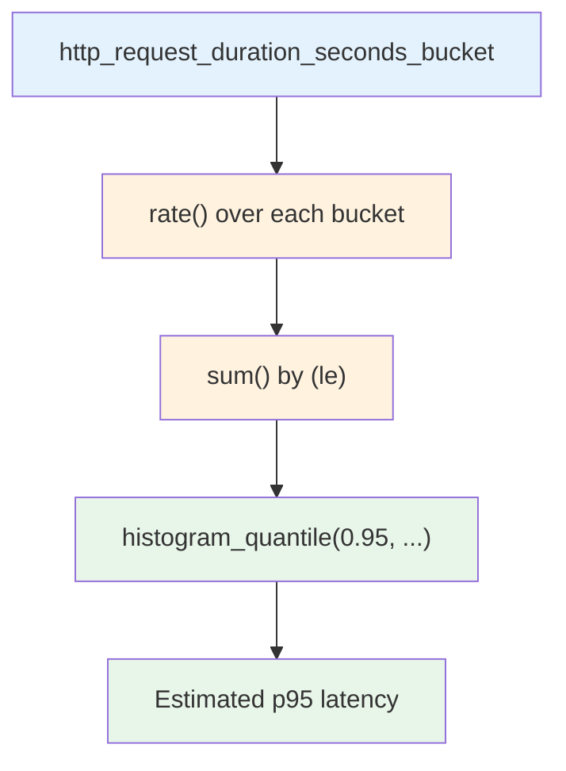

### Step-by-step example — calculating p95 latency:

```promql
histogram_quantile(
  0.95,
  sum(rate(http_request_duration_seconds_bucket[5m])) by (le)
)
```

**Breaking this down:**
1. `rate(..._bucket[5m])` — computes the per-second rate of observations falling into each bucket
2. `sum(...) by (le)` — sums across instances/pods while preserving the `le` (less-than-or-equal) bucket boundary label, which `histogram_quantile` needs
3. `histogram_quantile(0.95, ...)` — interpolates within the bucket boundaries to estimate the value below which 95% of observations fall

### Understanding Bucket Boundaries

```
http_request_duration_seconds_bucket{le="0.1"} 24054  # 24,054 requests ≤ 0.1s
http_request_duration_seconds_bucket{le="0.5"} 33444  # 33,444 requests ≤ 0.5s
http_request_duration_seconds_bucket{le="1"}   33471  # 33,471 requests ≤ 1s
http_request_duration_seconds_bucket{le="+Inf"} 33471 # All requests
```

**To calculate p95:**
- Total requests: 33,471
- 95th percentile: 33,471 × 0.95 = 31,797 requests
- This falls between `le="0.5"` (33,444) and `le="0.1"` (24,054)
- `histogram_quantile` interpolates the exact value

### Common Percentiles

| Percentile | Query | Use Case |
|------------|-------|----------|
| p50 (median) | `histogram_quantile(0.50, ...)` | Typical performance |
| p95 | `histogram_quantile(0.95, ...)` | Tail latency, SLOs |
| p99 | `histogram_quantile(0.99, ...)` | Very slow requests |
| p99.9 | `histogram_quantile(0.999, ...)` | Extreme outliers |

### Advanced Histogram Examples

**Example — p50 (median) and p99 side by side:**
```promql
histogram_quantile(0.50, sum(rate(http_request_duration_seconds_bucket[5m])) by (le))
histogram_quantile(0.99, sum(rate(http_request_duration_seconds_bucket[5m])) by (le))
```

**Example — per-service latency, not just global:**
```promql
histogram_quantile(
  0.95,
  sum(rate(http_request_duration_seconds_bucket[5m])) by (le, service)
)
```

**Example — Multiple percentiles in one query:**
```promql
# Using label_replace to create a percentile label
label_replace(
  histogram_quantile(0.95, sum(rate(http_request_duration_seconds_bucket[5m])) by (le)),
  "percentile", "p95", "", ""
)
```

> ⚠️ **Common mistake:** Forgetting `by (le)` — without preserving the `le` label during aggregation, `histogram_quantile` cannot function correctly and will return incorrect or empty results.

### Histogram Best Practices

✅ **DO:**
- Always use `by (le)` when aggregating histogram buckets
- Use consistent bucket boundaries across your application
- Choose bucket boundaries based on your SLO targets
- Include a `+Inf` bucket (Prometheus does this automatically)

❌ **DON'T:**
- Forget `by (le)` in aggregation
- Use wildly different bucket boundaries per service
- Query histogram data without `rate()` first
- Try to aggregate summaries across instances

---

## Label Manipulation

Sometimes labels need to be transformed, renamed, or combined — often to make series from different sources joinable, or to make dashboards more readable.

### `label_replace()`

Adds or modifies a label using a regex match against an existing label value.

```promql
label_replace(
  up,
  "short_instance",
  "$1",
  "instance",
  "([^:]+):.*"
)
```

**What it does:** Takes the `instance` label (e.g., `"10.0.0.5:9100"`), extracts everything before the colon using the regex capture group `$1`, and stores it in a new label called `short_instance` (e.g., `"10.0.0.5"`).

**Example use case:** Joining metrics from two different exporters that label the same host differently (e.g., `hostname` vs `instance`).

**Syntax:**
```promql
label_replace(<vector>, "<dst_label>", "<replacement>", "<src_label>", "<regex>")
```

**More examples:**

```promql
# Extract pod name from Kubernetes pod label
label_replace(
  kube_pod_info,
  "pod_name",
  "$1",
  "pod",
  "(.+)-[a-z0-9]+-[a-z0-9]+"
)

# Add environment label based on instance name
label_replace(
  up,
  "environment",
  "production",
  "instance",
  "prod-.*"
)
```

### `label_join()`

Concatenates multiple label values into a single new label.

```promql
label_join(
  up,
  "instance_job",
  "-",
  "instance",
  "job"
)
```

**What it does:** Creates a new label `instance_job` by joining the `instance` and `job` label values with a `-` separator (e.g., `"10.0.0.5:9100-node_exporter"`).

**Example use case:** Creating a unique combined identifier for grouping in Grafana table panels.

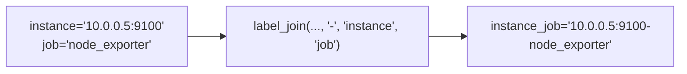

**Syntax:**
```promql
label_join(<vector>, "<dst_label>", "<separator>", "<src_label_1>", "<src_label_2>", ...)
```

**More examples:**

```promql
# Combine namespace and pod for Kubernetes
label_join(
  kube_pod_info,
  "namespace_pod",
  "/",
  "namespace",
  "pod"
)

# Create composite identifier
label_join(
  http_requests_total,
  "service_method",
  "|",
  "service",
  "method"
)
```

### When to Use Label Manipulation

**Use `label_replace()` when:**
- Extracting parts of a label value
- Normalizing label formats across metrics
- Creating new labels for better grouping

**Use `label_join()` when:**
- Combining multiple labels into one
- Creating unique identifiers
- Preparing data for specific dashboard needs

> 💡 **Pro Tip:** Label manipulation is often used to make metrics from different sources compatible for joining in Grafana or for creating more readable dashboard labels.

---

## Real-World Use Cases

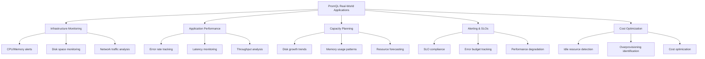

### 1. Infrastructure Monitoring — CPU Usage Alert

```promql
100 - (avg by (instance) (rate(node_cpu_seconds_total{mode="idle"}[5m])) * 100) > 85
```

**What it does:**
- Calculates CPU usage percentage by measuring idle time
- Triggers when average CPU exceeds 85% for any instance
- Classic infrastructure alert

**Breaking it down:**
```promql
# Step 1: Get idle CPU rate
rate(node_cpu_seconds_total{mode="idle"}[5m])

# Step 2: Average across all CPU cores per instance
avg by (instance) (rate(node_cpu_seconds_total{mode="idle"}[5m]))

# Step 3: Convert to percentage and subtract from 100
100 - (avg by (instance) (...) * 100)

# Step 4: Alert if > 85%
... > 85
```

### 2. Application Performance — Error Rate Monitoring

```promql
sum(rate(http_requests_total{status_code=~"5.."}[5m]))
/
sum(rate(http_requests_total[5m]))
* 100
```

**What it does:**
- Calculates the percentage of requests resulting in server errors
- Core SRE "golden signal" (error rate)
- Should be < 1% for healthy services

**Production example:**
```
# Last 5 minutes:
# Total requests: 10,000
# 5xx errors: 50
# Error rate: 0.5%
```

### 3. Capacity Planning — Disk Space Forecasting

```promql
predict_linear(node_filesystem_avail_bytes[6h], 4 * 3600) < 0
```

**What it does:**
- Uses linear regression on the last 6 hours
- Predicts whether disk space will run out in the next 4 hours
- Great for proactive alerts before an outage

**How it works:**
- Analyzes trend of available disk space
- Projects forward 4 hours (4 * 3600 seconds)
- Fires if prediction is below 0 (disk full)

### 4. Alerting & SLOs — Latency Budget

```promql
histogram_quantile(0.99, sum(rate(http_request_duration_seconds_bucket[5m])) by (le)) > 0.5
```

**What it does:**
- Fires if p99 latency exceeds 500ms
- Helps enforce a Service Level Objective
- Critical for user experience monitoring

**SLO context:**
- If your SLO is 99th percentile < 200ms
- Set alert threshold at 300ms (50% buffer)
- Gives you time to investigate before violating SLO

### 5. Cost Optimization — Idle Resource Detection

```promql
avg_over_time(container_cpu_usage_seconds_total[7d]) < 0.05
```

**What it does:**
- Identifies containers almost entirely idle over a full week
- Candidates for downsizing or removal
- Direct cost savings opportunity

**Action items:**
- Review identified containers
- Consider scaling down replicas
- Remove unused services
- Optimize resource allocations

### 6. Kubernetes — Top Memory-Hungry Pods

```promql
topk(10, sum(container_memory_usage_bytes) by (pod))
```

**What it does:**
- Shows top 10 pods by memory usage
- Useful for spotting memory leaks or oversized workloads
- Quick identification of resource hogs

**Production use:**
- Run daily to identify trends
- Set alerts for unexpected spikes
- Use for capacity planning

### 7. Network Monitoring — Bandwidth Usage

```promql
sum(rate(node_network_receive_bytes_total[5m])) by (device)
```

**What it does:**
- Shows network receive rate per interface
- Identify bandwidth bottlenecks
- Plan network capacity

### 8. Service Health — Uptime Monitoring

```promql
avg_over_time(up[24h]) * 100
```

**What it does:**
- Calculates uptime percentage over 24 hours
- Values: 100 = 100% uptime, 95 = 95% uptime
- SLA reporting

---

## Best Practices

### Query Best Practices

**1. Always Use Appropriate Time Ranges**
```promql
# ✅ Good: 4x scrape interval minimum
rate(http_requests_total[5m])  # For 15s scrape interval

# ❌ Bad: Too short
rate(http_requests_total[10s])  # May miss data points
```

**2. Filter Early, Aggregate Late**
```promql
# ✅ Good: Filter before aggregation (more efficient)
sum(rate(http_requests_total{status_code="200"}[5m])) by (service)

# ❌ Less efficient: Aggregate everything, then filter
sum(rate(http_requests_total[5m])) by (service, status_code)
```

**3. Use Meaningful Label Names**
```promql
# ✅ Good: Descriptive labels
http_requests_total{service="payment-api", method="POST", status="201"}

# ❌ Bad: Unclear labels
http_requests_total{s="pay", m="P", st="2"}
```

**4. Preserve Important Labels in Aggregation**
```promql
# ✅ Good: Keep service label for per-service metrics
sum(rate(http_requests_total[5m])) by (service, status_code)

# ❌ Bad: Lost important context
sum(rate(http_requests_total[5m]))
```

**5. Use Consistent Scrape Intervals**
```yaml
# ✅ Good: Consistent across related metrics
scrape_interval: 15s

# ❌ Bad: Different intervals make comparison hard
scrape_interval: 15s  # For one job
scrape_interval: 30s  # For another
```

### Metric Design Best Practices

**1. Choose the Right Metric Type**
- Counters for cumulative values (requests, bytes)
- Gauges for point-in-time values (memory, temperature)
- Histograms for distributions (latency, size)
- Summaries only when you can't use histograms

**2. Design Labels Carefully**
```go
// ✅ Good: Low cardinality, meaningful labels
metrics.WithLabelValues("service", "payment", "endpoint", "/charge")

// ❌ Bad: High cardinality
metrics.WithLabelValues("user_id", "12345", "request_id", "abc-xyz-123")
```

**3. Use Consistent Naming**
```
# ✅ Good: Consistent naming convention
http_requests_total
http_request_duration_seconds
http_request_size_bytes

# ❌ Bad: Inconsistent
http_total
duration_http
size_of_http_request
```

**4. Include Units in Metric Names**
```
# ✅ Good: Units in name
http_request_duration_seconds
node_memory_MemAvailable_bytes
temperature_celsius

# ❌ Bad: No units
http_request_time
memory
temp
```

### Alert Best Practices

**1. Alert on Symptoms, Not Causes**
```promql
# ✅ Good: Alert on user-facing symptom
http_requests_total{status="500"} > 10

# ❌ Bad: Alert on internal detail
container_cpu_usage_seconds_total > 0.8
```

**2. Use Appropriate Time Windows**
```promql
# ✅ Good: 5-10 minutes to avoid flapping
rate(http_requests_total[5m]) > 100

# ❌ Bad: Too short, causes flapping
rate(http_requests_total[1m]) > 100
```

**3. Include For-Duration for Stability**
```yaml
# ✅ Good: Must be true for 5 minutes
expr: rate(http_requests_total[5m]) > 100
for: 5m

# ❌ Bad: Fires immediately
expr: rate(http_requests_total[5m]) > 100
for: 0m
```

**4. Add Meaningful Labels to Alerts**
```yaml
# ✅ Good: Contextual labels
labels:
  severity: warning
  team: platform
  service: payment-api
```

### Dashboard Best Practices

**1. Use Consistent Time Ranges**
- Default: Last 6 hours
- Long-term: Last 7 days
- Real-time: Last 1 hour

**2. Show Rate, Not Raw Counters**
```promql
# ✅ Good: Rate for graphing
rate(http_requests_total[5m])

# ❌ Bad: Raw counter (always increasing)
http_requests_total
```

**3. Use Percentiles for Latency**
```promql
# ✅ Good: p95, p99 for latency
histogram_quantile(0.95, sum(rate(...[5m])) by (le))

# ❌ Bad: Average hides outliers
avg(request_duration_seconds)
```

**4. Group Related Metrics**
- CPU metrics together
- Memory metrics together
- Network metrics together
- Use consistent colors

---

## Anti-Patterns

### Anti-Pattern 1: Using `rate()` on Gauges

❌ **Wrong:**
```promql
rate(node_memory_MemAvailable_bytes[5m])
```

**Why it's wrong:** Gauges can decrease; `rate()` assumes monotonic increase. This will produce meaningless negative rates.

✅ **Correct:**
```promql
# Use deriv() for trend analysis
deriv(node_memory_MemAvailable_bytes[5m])

# Or use delta() for simple difference
delta(node_memory_MemAvailable_bytes[5m])

# Or query directly for current value
node_memory_MemAvailable_bytes
```

### Anti-Pattern 2: Forgetting `by (le)` in `histogram_quantile`

❌ **Wrong:**
```promql
histogram_quantile(0.95, sum(rate(http_request_duration_seconds_bucket[5m])))
```

**Why it's wrong:** Without `by (le)`, the bucket boundaries are lost and `histogram_quantile` cannot calculate percentiles correctly.

✅ **Correct:**
```promql
histogram_quantile(0.95, sum(rate(http_request_duration_seconds_bucket[5m])) by (le))
```

### Anti-Pattern 3: Too Short Range Windows

❌ **Wrong:**
```promql
rate(http_requests_total[10s])  # With 15s scrape interval
```

**Why it's wrong:** May return no data or inaccurate results. Prometheus needs at least 2-4 data points in the range.

✅ **Correct:**
```promql
rate(http_requests_total[1m])  # Minimum for 15s scrape interval
rate(http_requests_total[5m])  # Recommended
```

### Anti-Pattern 4: High-Cardinality Labels

❌ **Wrong:**
```go
// Adding user_id to every request metric
metrics.WithLabel("user_id", userID)
```

**Why it's wrong:** Creates millions of unique series (one per user), overwhelming Prometheus.

✅ **Correct:**
```go
// Aggregate or use sampling
metrics.WithLabel("user_tier", userTier)  // Low cardinality
```

### Anti-Pattern 5: Confusing `sum()` with `sum_over_time()`

❌ **Wrong:**
```promql
# Trying to sum over time with sum()
sum(http_requests_total[1h])  # This won't work as expected
```

**Why it's wrong:** `sum()` aggregates across series, not time.

✅ **Correct:**
```promql
# Use sum_over_time() for time aggregation
sum_over_time(http_requests_total[1h])

# Or use increase() for counters
increase(http_requests_total[1h])
```

### Anti-Pattern 6: Not Handling Counter Resets

❌ **Wrong:**
```promql
# Direct subtraction doesn't handle resets
http_requests_total - http_requests_total offset 1h
```

**Why it's wrong:** If the counter reset during that hour, you'll get negative values.

✅ **Correct:**
```promql
# rate() handles resets automatically
rate(http_requests_total[1h])
```

### Anti-Pattern 7: Over-Aggregation

❌ **Wrong:**
```promql
# Loses important dimension
sum(rate(http_requests_total[5m]))
```

**Why it's wrong:** Can't see which service is having issues.

✅ **Correct:**
```promql
# Keep service dimension
sum(rate(http_requests_total[5m])) by (service)
```

### Anti-Pattern 8: Ignoring Scrape Failures

❌ **Wrong:**
```promql
# Assumes all targets are always up
rate(http_requests_total[5m])
```

**Why it's wrong:** If a target is down, you'll have gaps in data.

✅ **Correct:**
```promql
# Check target health first
up{job="my_app"}

# Or use absent() to detect missing metrics
absent(http_requests_total{job="my_app"})
```

---

## Performance Considerations

### Understanding Cardinality

**Cardinality** is the number of unique time series for a metric. It's the most critical factor in Prometheus performance.

**Formula:**
```
Total Cardinality = Product of all label values
Example: 
  Metric: http_requests_total
  Labels: method (5 values) × status (3 values) × instance (10 values)
  Cardinality: 5 × 3 × 10 = 150 series
```

### Cardinality Impact

```mermaid
flowchart TD
    A[Cardinality Level] --> B[Low: < 10K series]
    A --> C[Medium: 10K-100K series]
    A --> D[High: 100K-1M series]
    A --> E[Critical: > 1M series]
    
    B --> B1["✅ Optimal performance"]
    C --> C1["⚠️ Monitor closely"]
    D --> D1["⚠️ Performance degradation"]
    E --> E1["❌ System instability"]
    
    style B fill:#e8f5e9
    style C fill:#fff3e0
    style D fill:#ffe0b2
    style E fill:#ffcdd2
```

### Performance Best Practices

**1. Monitor Cardinality**
```promql
# Count total series per metric
count by(__name__)({__name__=~".+"})

# Find highest cardinality metrics
topk(10, count by(__name__)({__name__=~".+"}))
```

**2. Avoid High-Cardinality Labels**
```promql
# ❌ Bad: Millions of series
metrics{user_id="12345", request_id="abc-xyz"}

# ✅ Good: Aggregated
metrics{user_tier="premium", region="us-east"}
```

**3. Use Recording Rules for Expensive Queries**
```yaml
# Instead of calculating this every time
groups:
  - name: api_metrics
    interval: 15s
    rules:
      - record: job:http_requests_total:rate5m
        expr: sum(rate(http_requests_total[5m])) by (job)
```

**4. Optimize Range Vector Windows**
```promql
# ✅ Good: Appropriate window
rate(metric[5m])

# ❌ Bad: Excessively large window
rate(metric[24h])  # Unnecessary, slow
```

**5. Limit Label Matchers**
```promql
# ✅ Good: Specific matcher
rate(http_requests_total{job="api"}[5m])

# ❌ Bad: Regex when not needed
rate(http_requests_total{job=~".*"}[5m])
```

### Query Performance Tips

**1. Use Specific Label Matchers**
```promql
# ✅ Fast: Specific match
up{job="node_exporter", instance="localhost:9100"}

# ❌ Slow: Regex match
up{job=~"node.*"}
```

**2. Avoid Large Time Ranges in UI**
```promql
# ❌ Bad: 30 days in UI (very slow)
rate(http_requests_total[30d])

# ✅ Good: Use recording rules for long-term data
http_requests_total:daily_rate
```

**3. Limit Result Sets**
```promql
# ✅ Good: Limit with topk
topk(10, rate(http_requests_total[5m]))

# ❌ Bad: Return everything
rate(http_requests_total[5m])
```

### Performance Monitoring

**Monitor Prometheus itself:**
```promql
# Query performance
prometheus_engine_query_duration_seconds

# Memory usage
prometheus_tsdb_head_chunks
prometheus_tsdb_compaction_chunk_range_seconds

# Series count
prometheus_tsdb_head_series
```

---

## Security Considerations

### 1. Protect Metrics Endpoints

**Risk:** Exposing sensitive metrics publicly

**Mitigation:**
```yaml
# Prometheus config - restrict access
web:
  enable_admin_api: false
  enable_lifecycle: false

# Use reverse proxy with authentication
# nginx example:
location /metrics {
  auth_basic "Metrics";
  auth_basic_user_file /etc/nginx/.htpasswd;
  proxy_pass http://localhost:9090/metrics;
}
```

### 2. Avoid Sensitive Data in Labels

❌ **Wrong:**
```promql
# Exposing PII in labels
http_requests_total{user_email="john@example.com", user_ssn="123-45-6789"}
```

✅ **Correct:**
```promql
# Use aggregated, non-sensitive labels
http_requests_total{user_tier="premium", region="us-east"}
```

### 3. Secure Prometheus Server

**Network Security:**
- Run Prometheus in private network
- Use firewall rules to restrict access
- Enable TLS for remote write/read
- Use VPN for remote access

**Access Control:**
```yaml
# Basic auth
basic_auth:
  username: prometheus
  password: ${PROMETHEUS_PASSWORD}

# TLS configuration
tls_config:
  ca_file: /etc/prometheus/ca.crt
  cert_file: /etc/prometheus/client.crt
  key_file: /etc/prometheus/client.key
```

### 4. Secure Scraped Endpoints

**Application-side security:**
```go
// ✅ Good: Separate metrics endpoint with auth
r.Handle("/metrics", authMiddleware(metricsHandler))
r.Handle("/api", apiHandler)

// Or use different ports
metricsPort := 9090  // Internal only
apiPort := 8080      // Public with auth
```

### 5. Prevent Information Disclosure

**Risk:** Metrics revealing internal architecture

**Example sensitive metrics:**
```
# ❌ Potentially sensitive
git_branch_info{branch="feature/secret-project"}
build_info{commit="abc123def456"}  # Internal commit hash
```

**Mitigation:**
- Filter sensitive metrics in scrape config
- Use relabeling to drop sensitive labels
- Implement metric sanitization

```yaml
# Drop sensitive labels
metric_relabel_configs:
  - source_labels: [branch]
    regex: 'feature/.*'
    action: drop
```

### 6. Audit and Monitoring

**Monitor Prometheus access:**
```promql
# Track who's querying what
prometheus_engine_queries_active
prometheus_engine_queries

# Monitor scrape failures
up{job="sensitive_service"} == 0
```

---

## Troubleshooting Guide

### Common Issues and Solutions

#### Issue 1: "No data" or Empty Results

**Symptoms:**
- Query returns empty result set
- Graph shows no data points

**Possible Causes & Solutions:**

1. **Metric doesn't exist**
   ```promql
   # Check if metric exists
   {__name__=~"http.*"}
   ```

2. **Label mismatch**
   ```promql
   # Verify label values
   label_values(http_requests_total, job)
   ```

3. **Scrape failure**
   ```promql
   # Check if target is up
   up{job="your_job"}
   ```

4. **Time range issue**
   ```promql
   # Try longer range
   rate(http_requests_total[1h])
   ```

#### Issue 2: `rate()` Returns No Data

**Symptoms:**
- `rate()` returns empty result
- Graph shows gaps

**Solutions:**
```promql
# Check scrape interval
# Minimum range = 4x scrape interval

# Try longer window
rate(http_requests_total[5m])  # Instead of [1m]

# Verify counter exists
http_requests_total
```

#### Issue 3: `histogram_quantile()` Returns Empty

**Symptoms:**
- Query returns no results
- Expected percentiles not showing

**Solutions:**
```promql
# ✅ MUST include by (le)
histogram_quantile(0.95, sum(rate(metric_bucket[5m])) by (le))

# Check if buckets exist
metric_bucket{le="0.5"}

# Verify aggregation
sum(rate(metric_bucket[5m])) by (le)
```

#### Issue 4: High Query Latency

**Symptoms:**
- Queries take > 5 seconds
- UI times out

**Solutions:**
1. **Reduce time range**
   ```promql
   # Instead of [30d], use [1h] or [24h]
   ```

2. **Add more filters**
   ```promql
   # Add label matchers
   rate(metric{job="specific_job"}[5m])
   ```

3. **Use recording rules**
   ```yaml
   # Pre-compute expensive queries
   - record: job:metric:rate5m
     expr: sum(rate(metric[5m])) by (job)
   ```

4. **Check cardinality**
   ```promql
   # Find high-cardinality metrics
   topk(10, count by(__name__)({__name__=~".+"}))
   ```

#### Issue 5: Counter Reset Producing Negative Values

**Symptoms:**
- Negative values in graphs
- `increase()` returns negative

**Solutions:**
```promql
# ✅ Use rate() - handles resets automatically
rate(counter[5m])

# ❌ Don't use delta() on counters
delta(counter[5m])  # Doesn't handle resets
```

#### Issue 6: Inconsistent Results

**Symptoms:**
- Same query returns different values
- Flapping alerts

**Solutions:**
1. **Increase range window**
   ```promql
   rate(metric[5m])  # More stable than [1m]
   ```

2. **Add `for` duration in alerts**
   ```yaml
   for: 5m  # Must be true for 5 minutes
   ```

3. **Use `avg_over_time()` for smoothing**
   ```promql
   avg_over_time(rate(metric[5m])[10m:1m])
   ```

### Debugging Checklist

When a query doesn't work:

- [ ] Check if metric exists: `{__name__=~"metric.*"}`
- [ ] Verify labels: `label_values(metric, label_name)`
- [ ] Check target health: `up{job="job_name"}`
- [ ] Verify time range is appropriate (4x scrape interval)
- [ ] Try without filters to see all series
- [ ] Check for typos in metric/label names
- [ ] Verify counter vs gauge usage
- [ ] Check Prometheus logs for errors

---

## Testing Strategies

### 1. Unit Testing PromQL Queries

**Use Prometheus Unit Testing:**
```yaml
# prometheus_unit_test.yml
rule_files:
  - ./alerts.yml

evaluation_interval: 1m

tests:
  - interval: 1m
    input_series:
      - series: 'up{job="api"}'
        values: '1 1 1 0 0 0'
    promql_expr_test:
      - expr: up{job="api"}
        eval_time: 3m
        value: 1
      - expr: up{job="api"}
        eval_time: 5m
        value: 0
```

### 2. Testing Alert Rules

**Validate alert expressions:**
```promql
# Test the condition
100 - (avg by (instance) (rate(node_cpu_seconds_total{mode="idle"}[5m])) * 100)

# Verify it returns expected results
# Should return values > 85 when CPU is high
```

### 3. Query Validation Checklist

Before deploying queries to production:

- [ ] Query returns expected results in test environment
- [ ] Performance is acceptable (< 1s execution time)
- [ ] Handles edge cases (counter resets, missing data)
- [ ] Uses appropriate time ranges
- [ ] Includes necessary label matchers
- [ ] Aggregates correctly with `by` or `without`
- [ ] Tested with realistic data volumes
- [ ] Documented with comments

### 4. Load Testing Queries

**Test query performance:**
```bash
# Use Prometheus HTTP API to test
curl 'http://localhost:9090/api/v1/query?query=rate(http_requests_total[5m])&time=1234567890'

# Check query duration in response
{
  "status": "success",
  "data": {
    "resultType": "vector",
    "result": [...]
  }
}
```

### 5. Continuous Validation

**Automated testing in CI/CD:**
```bash
#!/bin/bash
# test_promql.sh

# Test critical queries
queries=(
  "rate(http_requests_total[5m])"
  "histogram_quantile(0.95, sum(rate(http_request_duration_seconds_bucket[5m])) by (le))"
)

for query in "${queries[@]}"; do
  echo "Testing: $query"
  result=$(curl -s "http://prometheus:9090/api/v1/query?query=$(urlencode "$query")")
  if [ $? -ne 0 ]; then
    echo "FAILED: $query"
    exit 1
  fi
done

echo "All queries validated successfully"
```

---

## Practice Exercises

### Exercise 1: Basic Query Writing

**Task:** Write a PromQL query to calculate the request rate per second for HTTP GET requests with status 200, grouped by service.

**Requirements:**
- Use `rate()` function
- Filter for GET method and 200 status
- Aggregate by service label
- Use 5-minute range window

<details>
<summary>Click to see solution</summary>

**Solution:**
```promql
sum(rate(http_requests_total{method="GET", status_code="200"}[5m])) by (service)
```

**Explanation:**
1. `http_requests_total{method="GET", status_code="200"}` - Filters for GET requests with 200 status
2. `rate(...[5m])` - Calculates per-second rate over 5 minutes
3. `sum(...) by (service)` - Aggregates total across all instances, grouped by service

**Expected output:**
```
http_requests_total{service="api"} 25.5
http_requests_total{service="web"} 12.3
http_requests_total{service="mobile"} 8.7
```
(Values represent requests per second)

</details>

---

### Exercise 2: Error Rate Calculation

**Task:** Create a query that calculates the percentage of 5xx errors out of total requests for the last 15 minutes.

**Requirements:**
- Calculate error rate as percentage
- Include all 5xx status codes (500, 502, 503, etc.)
- Use 15-minute window
- Return single value (not per-service)

<details>
<summary>Click to see solution</summary>

**Solution:**
```promql
(
  sum(rate(http_requests_total{status_code=~"5.."}[15m]))
  /
  sum(rate(http_requests_total[15m]))
) * 100
```

**Alternative (more explicit):**
```promql
(
  sum(rate(http_requests_total{status_code=~"5[0-9]{2}"}[15m]))
  /
  sum(sum(rate(http_requests_total[15m])) by (status_code))
) * 100
```

**Explanation:**
1. Numerator: Sum of all 5xx error rates
2. Denominator: Sum of all request rates
3. Multiply by 100 to get percentage

**Expected output:**
```
{} 0.45  # 0.45% error rate
```

**Alert threshold:** Typically alert if > 1% for 5 minutes

</details>

---

### Exercise 3: Histogram Percentile Calculation

**Task:** Write a query to calculate p95, p50, and p99 latency for the `payment-service` only.

**Requirements:**
- Use `histogram_quantile()`
- Filter for specific service
- Calculate three percentiles
- Use 5-minute window

<details>
<summary>Click to see solution</summary>

**Solution:**
```promql
# p50 (median)
histogram_quantile(
  0.50,
  sum(rate(http_request_duration_seconds_bucket{service="payment-service"}[5m])) by (le)
)

# p95
histogram_quantile(
  0.95,
  sum(rate(http_request_duration_seconds_bucket{service="payment-service"}[5m])) by (le)
)

# p99
histogram_quantile(
  0.99,
  sum(rate(http_request_duration_seconds_bucket{service="payment-service"}[5m])) by (le)
)
```

**Alternative - all in one query using label_replace:**
```promql
label_replace(
  histogram_quantile(0.95, sum(rate(http_request_duration_seconds_bucket{service="payment-service"}[5m])) by (le)),
  "percentile", "p95", "", ""
)
or
label_replace(
  histogram_quantile(0.50, sum(rate(http_request_duration_seconds_bucket{service="payment-service"}[5m])) by (le)),
  "percentile", "p50", "", ""
)
or
label_replace(
  histogram_quantile(0.99, sum(rate(http_request_duration_seconds_bucket{service="payment-service"}[5m])) by (le)),
  "percentile", "p99", "", ""
)
```

**Expected output:**
```
{le="+Inf", percentile="p50"} 0.125  # 125ms median
{le="+Inf", percentile="p95"} 0.450  # 450ms p95
{le="+Inf", percentile="p99"} 0.890  # 890ms p99
```

**Note:** Values in seconds (0.125 = 125ms)

</details>

---

### Exercise 4: Top K Analysis

**Task:** Find the top 3 instances by CPU usage and bottom 3 instances by available memory.

**Requirements:**
- Use `topk()` and `bottomk()`
- Calculate CPU usage percentage
- Show available memory in GB
- Use 5-minute windows

<details>
<summary>Click to see solution</summary>

**Solution:**
```promql
# Top 3 instances by CPU usage
topk(3, 100 - (avg by (instance) (rate(node_cpu_seconds_total{mode="idle"}[5m])) * 100))

# Bottom 3 instances by available memory (in bytes)
bottomk(3, node_memory_MemAvailable_bytes)

# Bottom 3 instances by available memory (in GB)
bottomk(3, node_memory_MemAvailable_bytes / 1024 / 1024 / 1024)
```

**Expected output:**
```
# Top CPU users
{instance="server-3:9100"} 92.5
{instance="server-7:9100"} 89.3
{instance="server-1:9100"} 87.8

# Bottom memory (in GB)
{instance="server-5:9100"} 0.85
{instance="server-2:9100"} 1.2
{instance="server-9:9100"} 1.45
```

**Production use:**
- Set up alerts for top CPU users > 90%
- Monitor memory trends for bottom 3
- Use for capacity planning

</details>

---

### Exercise 5: Complex Aggregation with Label Manipulation

**Task:** Create a query that shows request rate per service-method combination, with instance hostname extracted from the instance label.

**Requirements:**
- Use `label_replace()` to extract hostname
- Aggregate by service and method
- Show rate per second
- Include hostname in results

<details>
<summary>Click to see solution</summary>

**Solution:**
```promql
sum(rate(
  label_replace(
    http_requests_total,
    "hostname",
    "$1",
    "instance",
    "([^:]+):.*"
  )[5m]
)) by (service, method, hostname)
```

**Alternative approach:**
```promql
# First extract hostname, then calculate rate
sum(rate(http_requests_total[5m])) by (service, method, instance)

# Then use label_replace on the result
label_replace(
  sum(rate(http_requests_total[5m])) by (service, method, instance),
  "hostname",
  "$1",
  "instance",
  "([^:]+):.*"
)
```

**Expected output:**
```
{service="api", method="GET", hostname="10.0.0.5"} 25.5
{service="api", method="POST", hostname="10.0.0.5"} 12.3
{service="web", method="GET", hostname="10.0.0.6"} 18.7
```

**Use case:**
- Grafana table showing traffic per host
- Identifying which servers handle which endpoints
- Capacity planning by host

</details>

---

## Test Your Understanding

Test your knowledge with these questions. Try to answer them before checking the solutions.

### Questions

1. **What is the key difference between a counter and a gauge?**

2. **Why can't you graph a range vector directly?**

3. **When should you use `irate()` instead of `rate()`?**

4. **What does the `le` label represent in histogram metrics?**

5. **Why is `by (le)` required in `histogram_quantile()`?**

6. **What's the minimum recommended range window for a 15s scrape interval?**

7. **What's the difference between `sum()` and `sum_over_time()`?**

8. **Why is cardinality important in Prometheus?**

9. **When would you use `deriv()` instead of `rate()`?**

10. **What's the purpose of the `for` field in alert rules?**

<details>
<summary>Click to see answers</summary>

**Answers:**

1. **Counter vs Gauge:** Counters only increase (or reset to 0), used for cumulative metrics like total requests. Gauges can go up or down, used for current state like memory usage.

2. **Range vectors** contain multiple values per series over time. They must be reduced to a single value using functions like `rate()` or `avg_over_time()` before graphing.

3. **Use `irate()`** when you need to see rapid, second-to-second changes (e.g., debugging a spike). Use `rate()` for smooth trends and alerting.

4. **`le` label** means "less than or equal" and represents the upper bound of a histogram bucket (e.g., `le="0.5"` means requests ≤ 0.5 seconds).

5. **`by (le)`** preserves the bucket boundary labels that `histogram_quantile()` needs to calculate percentiles. Without it, the function can't determine which bucket each count belongs to.

6. **Minimum range:** 4x scrape interval. For 15s scrape, minimum is 1m, but 5m is recommended for better accuracy.

7. **`sum()`** aggregates across multiple time series at a single point in time. **`sum_over_time()`** aggregates a single series over a time window.

8. **Cardinality** is the number of unique time series. High cardinality (millions of series) consumes more memory, slows queries, and can crash Prometheus.

9. **Use `deriv()`** for gauges to calculate rate of change (e.g., memory leak detection). Use `rate()` only for counters.

10. **`for` field** ensures an alert condition is true for a specified duration before firing, preventing false positives from transient issues.

</details>

---

## Common Interview Questions

### Questions

1. **What is PromQL and what is it used for?**

2. **Explain the four metric types in Prometheus and when to use each.**

3. **What's the difference between an instant vector and a range vector?**

4. **Why do you need to use `rate()` on counters instead of querying them directly?**

5. **How does `rate()` handle counter resets?**

6. **What is cardinality and why does it matter?**

7. **Explain how histograms work in Prometheus.**

8. **What's the difference between `sum()` and `sum_over_time()`?**

9. **When would you use `topk()` or `bottomk()`?**

10. **What are label matchers and what are the four types?**

11. **How do you calculate error rate percentage in PromQL?**

12. **What is `histogram_quantile()` and when do you use it?**

13. **Why is `by (le)` important in histogram queries?**

14. **What's the difference between `rate()` and `irate()`?**

15. **How do you filter metrics by multiple labels?**

16. **What is the `predict_linear()` function used for?**

17. **How do you handle high-cardinality metrics?**

18. **What are recording rules and when should you use them?**

19. **Explain the `label_replace()` function with an example.**

20. **What security considerations are there for Prometheus?**

<details>
<summary>Click to see answers</summary>

**Answers:**

1. **PromQL** is Prometheus's query language for selecting and aggregating time series data. It's used for ad-hoc queries, dashboards, and alerting rules.

2. **Four metric types:**
   - **Counter:** Cumulative, only increases (requests_total)
   - **Gauge:** Point-in-time value, can go up/down (memory, temperature)
   - **Histogram:** Observations in buckets (latency, size) - supports aggregation
   - **Summary:** Like histogram but client-calculated quantiles - cannot aggregate

3. **Instant vector:** One value per series at a single point in time. **Range vector:** Multiple values per series over a time window (e.g., `[5m]`).

4. Counters are cumulative totals that always increase. `rate()` calculates the per-second rate of change, which is meaningful. Raw counters just grow indefinitely.

5. `rate()` detects counter resets (when value decreases) and treats them as zero, calculating the rate correctly across the reset.

6. **Cardinality** is the number of unique time series (metric + label combinations). High cardinality consumes more memory, slows queries, and can destabilize Prometheus.

7. **Histograms** bucket observations into ranges. They expose `_bucket` (cumulative counts per bucket), `_sum` (total sum), and `_count` (total count) metrics.

8. **`sum()`** aggregates across series at one point in time. **`sum_over_time()`** aggregates a single series over a time window.

9. **`topk()`/`bottomk()`** show the N highest/lowest series by value. Useful for dashboards to identify outliers (top memory users, highest error rates).

10. **Four matchers:**
    - `=` exact match
    - `!=` not equal
    - `=~` regex match
    - `!~` negative regex match

11. **Error rate:**
    ```promql
    sum(rate(http_requests_total{status=~"5.."}[5m]))
    /
    sum(rate(http_requests_total[5m]))
    * 100
    ```

12. **`histogram_quantile()`** calculates percentiles from histogram data. Used for p95, p99 latency calculations.

13. **`by (le)`** preserves bucket boundary labels (`le="0.5"`, etc.) that `histogram_quantile()` needs to calculate the percentile correctly.

14. **`rate()`** averages over the entire window (smooth). **`irate()`** uses only the last two points (spiky but responsive to sudden changes).

15. **Multiple matchers:**
    ```promql
    metric{label1="value1", label2="value2"}
    metric{label1=~"val1|val2", label2!="exclude"}
    ```

16. **`predict_linear()`** uses linear regression to forecast future values. Used for capacity planning (e.g., "will disk be full in 4 hours?").

17. **Handle high cardinality by:**
    - Aggregating before ingestion
    - Using recording rules
    - Dropping unnecessary labels
    - Using labels with low cardinality

18. **Recording rules** pre-compute expensive queries and store results. Use for frequently-accessed, computationally expensive queries.

19. **`label_replace()`** adds/modifies labels using regex:
    ```promql
    label_replace(metric, "new_label", "$1", "old_label", "regex")
    ```

20. **Security considerations:**
    - Protect `/metrics` endpoint with auth
    - Avoid PII in labels
    - Use TLS for remote write/read
    - Restrict Prometheus UI access
    - Monitor for sensitive data exposure

</details>

---

## Question Bank

### Beginner Questions (1-20)

1. What does PromQL stand for?
2. What is a time series in Prometheus?
3. Name the four metric types in Prometheus.
4. What is a counter? Give an example.
5. What is a gauge? Give an example.
6. What is a histogram? Give an example.
7. What is the purpose of the `/metrics` endpoint?
8. What is a label in Prometheus?
9. What is the `__name__` label?
10. What is a scrape interval?
11. What is the default scrape interval in Prometheus?
12. What is an instant vector?
13. What is a range vector?
14. How do you specify a range vector in PromQL?
15. What is the minimum recommended range window?
16. What does the `rate()` function do?
17. What does the `increase()` function do?
18. What is the difference between `rate()` and `increase()`?
19. What is an aggregation operator?
20. Name three aggregation operators.

### Intermediate Questions (21-40)

21. What is cardinality and why is it important?
22. How does `rate()` handle counter resets?
23. What is the difference between `rate()` and `irate()`?
24. When should you use `irate()` instead of `rate()`?
25. What is `deriv()` used for?
26. What is the `le` label in histograms?
27. What does `histogram_quantile()` calculate?
28. Why must you use `by (le)` with `histogram_quantile()`?
29. What is the difference between `sum()` and `sum_over_time()`?
30. What is the difference between `by` and `without` in aggregation?
31. What are label matchers? Name the four types.
32. How do you filter metrics by multiple labels?
33. What is the purpose of `label_replace()`?
34. What is the purpose of `label_join()`?
35. What is a recording rule?
36. When should you use recording rules?
37. What is `predict_linear()` used for?
38. What is an "over time" function?
39. Name five "over time" functions.
40. What is the difference between aggregation operators and "over time" functions?

### Advanced Questions (41-60)

41. How does Prometheus store time series data?
42. What is the TSDB (Time Series Database)?
43. What is a head block in Prometheus?
64. How does Prometheus handle high cardinality?
45. What are the performance implications of 1M+ time series?
46. How do you optimize slow PromQL queries?
47. What is query federation?
48. How does PromQL handle missing data points?
49. What is the difference between `delta()` and `deriv()`?
50. How do you calculate percentage change over time?
51. What is the `absent()` function used for?
52. How do you create alerts in Prometheus?
53. What is the `for` field in alert rules?
54. How do you prevent alert flapping?
55. What are the security considerations for Prometheus?
56. How do you secure the `/metrics` endpoint?
57. What is metric relabeling?
58. How do you drop sensitive labels in Prometheus?
59. What is the difference between histograms and summaries?
60. When should you use summaries instead of histograms?

### Expert Questions (61-70)

61. How does `rate()` extrapolation work internally?
62. What is the difference between native histograms and classic histograms?
63. How do you handle cross-service SLO monitoring?
64. What are the trade-offs between push and pull monitoring?
65. How do you design metrics for multi-tenant systems?
66. What is the impact of scrape interval on query accuracy?
67. How do you implement blue-green deployments with Prometheus?
68. What are the best practices for Kubernetes service monitoring?
69. How do you handle metric schema evolution?
70. What is the future of PromQL (PromQL.next)?

<details>
<summary>Click to see answers</summary>

**Answers:**

**Beginner (1-20):**
1. Prometheus Query Language
2. A stream of timestamped values with the same metric name and label set
3. Counter, Gauge, Histogram, Summary
4. Cumulative metric that only increases (e.g., http_requests_total)
5. Metric that can go up or down (e.g., memory_usage_bytes)
6. Observations bucketed by ranges (e.g., request_duration_seconds)
7. HTTP endpoint where applications expose metrics in text format
8. Key-value pairs that uniquely identify a time series
9. Internal label representing the metric name
10. How often Prometheus scrapes metrics from targets
11. 15 seconds (configurable)
12. One value per time series at a single point in time
13. Multiple values per time series over a time window
14. Using square brackets: `metric[5m]`
15. 4x scrape interval (e.g., 1m for 15s scrape)
16. Calculates per-second average rate of increase for counters
17. Calculates total increase over a time window
18. `rate()` returns per-second rate, `increase()` returns total increase
19. Operators that combine multiple series into fewer series
20. sum, avg, max, min, count, topk, bottomk

**Intermediate (21-40):**
21. Number of unique time series. High cardinality consumes memory and slows queries.
22. Detects when counter decreases and treats it as a reset to zero
23. `rate()` averages over entire window, `irate()` uses only last two points
24. For fast-changing metrics where you need immediate response to spikes
25. Calculates per-second derivative of gauges using linear regression
26. "Less than or equal" - upper bound of histogram bucket
27. Percentiles (e.g., p95, p99) from histogram data
28. Preserves bucket boundaries needed for percentile calculation
29. `sum()` aggregates across series, `sum_over_time()` aggregates over time
30. `by` keeps only listed labels, `without` keeps all except listed
31. Filters for selecting specific time series: =, !=, =~, !~
32. Using comma separation: `metric{label1="v1", label2="v2"}`
33. Adds or modifies labels using regex
34. Concatenates multiple labels into one
35. Pre-computed queries stored for performance
36. For expensive queries run frequently
37. Forecasting future values using linear regression
38. Functions that aggregate a single series over a time window
39. avg_over_time, max_over_time, min_over_time, sum_over_time, quantile_over_time
40. Aggregation combines series, over_time functions aggregate within a series over time

**Advanced (41-70):**
41. As chunks in blocks (head block for recent, persistent blocks for historical)
42. Time Series Database - stores all metrics data
43. In-memory block for recent data (last ~2 hours)
44. Through aggregation, recording rules, and careful label design
45. Slow queries, high memory usage, potential instability
46. Add filters, reduce time range, use recording rules, optimize aggregations
47. Exposing selected metrics from one Prometheus to another
48. Gaps in data, `rate()` requires at least 2 data points
49. `delta()` is simple difference, `deriv()` uses linear regression
50. `(current - old) / old * 100` or use `changes()` function
51. Checks if a metric exists, returns 1 if absent
52. Using `alert:` rules in Prometheus configuration
53. Duration condition must be true before alert fires
54. Using `for` field and appropriate time windows
55. Authentication, authorization, TLS, network security
56. Using reverse proxy, basic auth, or mTLS
57. Modifying labels during scraping
58. Using `metric_relabel_configs` with `action: drop`
59. Histograms can aggregate, summaries cannot
60. When you don't need cross-instance aggregation

**Expert (61-70):**
61. Extrapolates to window boundaries using first/last samples and slope
62. Native histograms use dynamic buckets, classic use fixed buckets
63. Using histogram_quantile with proper aggregation across services
64. Pull (Prometheus) vs Push (StatsD) - trade-offs in reliability and control
65. Use tenant labels, avoid user-level cardinality, implement quotas
66. Smaller intervals = more accurate but more storage and slower queries
67. Use job labels, instance labels, and careful metric naming
68. Use cAdvisor, kube-state-metrics, standardize metric names
69. Use label_replace, maintain backward compatibility, version metrics
70. Better type system, native histograms, improved performance

</details>

---

## Summary Cheat Sheet

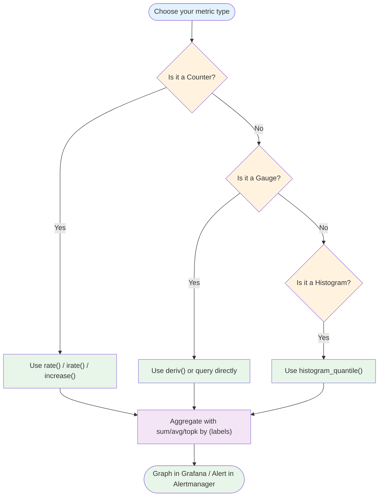

### Quick Reference: Functions by Metric Type

| Function | Metric Type | Purpose | Example |
|----------|-------------|---------|---------|
| `rate()` | Counter | Per-second average rate over window | `rate(http_requests_total[5m])` |
| `irate()` | Counter | Instant rate using last 2 points | `irate(http_requests_total[5m])` |
| `increase()` | Counter | Total increase over window | `increase(http_requests_total[1h])` |
| `deriv()` | Gauge | Per-second rate of change (linear regression) | `deriv(memory_available[30m])` |
| `delta()` | Gauge | Simple difference over window | `delta(temperature[1h])` |
| `avg_over_time()` | Any | Average value over time window | `avg_over_time(cpu_temp[5m])` |
| `max_over_time()` | Any | Maximum value over window | `max_over_time(memory[1h])` |
| `histogram_quantile()` | Histogram | Estimate percentile (p50, p95, p99) | `histogram_quantile(0.95, sum(rate(...[5m])) by (le))` |
| `label_replace()` | Any | Add/modify label via regex | `label_replace(metric, "new", "$1", "old", "regex")` |
| `label_join()` | Any | Concatenate labels into new one | `label_join(metric, "new", "-", "label1", "label2")` |
| `topk()` / `bottomk()` | Any | Top/bottom N series by value | `topk(5, rate(metric[5m]))` |
| `predict_linear()` | Gauge | Forecast future values | `predict_linear(disk_space[6h], 3600) < 0` |

### Quick Reference: Aggregation Operators

| Operator | Description | Example |
|----------|-------------|---------|
| `sum` | Sum all values | `sum(rate(metric[5m]))` |
| `avg` | Average of values | `avg(metric) by (instance)` |
| `min` | Minimum value | `min(metric) by (instance)` |
| `max` | Maximum value | `max(metric) by (instance)` |
| `count` | Count series | `count(up == 1)` |
| `topk` | Top N series | `topk(5, rate(metric[5m]))` |
| `bottomk` | Bottom N series | `bottomk(3, metric)` |
| `stddev` | Standard deviation | `stddev(metric) by (service)` |

### Quick Reference: Label Matchers

| Matcher | Meaning | Example |
|---------|---------|---------|
| `=` | Exact match | `{job="node_exporter"}` |
| `!=` | Not equal | `{job!="test"}` |
| `=~` | Regex match | `{instance=~"10.0.0.*"}` |
| `!~` | Negative regex | `{job!~"test.*"}` |

### Common Patterns

**CPU Usage:**
```promql
100 - (avg by (instance) (rate(node_cpu_seconds_total{mode="idle"}[5m])) * 100)
```

**Error Rate:**
```promql
sum(rate(http_requests_total{status=~"5.."}[5m]))
/
sum(rate(http_requests_total[5m]))
* 100
```

**p95 Latency:**
```promql
histogram_quantile(0.95, sum(rate(http_request_duration_seconds_bucket[5m])) by (le))
```

**Disk Space Alert:**
```promql
predict_linear(node_filesystem_avail_bytes[6h], 4 * 3600) < 0
```

---

## Further Reading & Resources

### Official Documentation
- [Prometheus Documentation](https://prometheus.io/docs/)
- [PromQL Basics](https://prometheus.io/docs/prometheus/latest/querying/basics/)
- [PromQL Functions](https://prometheus.io/docs/prometheus/latest/querying/functions/)
- [Prometheus Best Practices](https://prometheus.io/docs/practices/)

### Books
- "Prometheus: Up & Running" by Brian Brazil
- "Monitoring with Prometheus" by James Turnbull
- "The Art of Monitoring" by James Turnbull

### Online Resources
- [Prometheus Tutorial by PromLabs](https://promlabs.com/prometheus-training/)
- [Grafana Labs Blog](https://grafana.com/blog/)
- [CNCF Prometheus Project](https://www.cncf.io/projects/prometheus/)

### Tools
- [Prometheus](https://prometheus.io/download/)
- [Grafana](https://grafana.com/grafana/download)
- [Alertmanager](https://prometheus.io/docs/alerting/latest/alertmanager/)
- [node_exporter](https://github.com/prometheus/node_exporter)

### Community
- [Prometheus Slack](https://slack.cncf.io/)
- [CNCF Prometheus Working Group](https://www.cncf.io/workinggroups/prometheus/)
- [Stack Overflow - Prometheus Tag](https://stackoverflow.com/questions/tagged/prometheus)

### Video Courses
- "Prometheus Mastery" on Udemy
- "Monitoring and Observability with Prometheus" on Pluralsight
- CNCF Webinars on YouTube

---

## Self-Assessment Checklist

Use this checklist to evaluate your PromQL proficiency:

### Beginner Level
- [ ] I can explain what PromQL is and what it's used for
- [ ] I understand the four metric types (counter, gauge, histogram, summary)
- [ ] I can write basic queries to select metrics
- [ ] I can filter metrics using label matchers
- [ ] I understand the difference between instant vectors and range vectors
- [ ] I can use `rate()` on counters
- [ ] I know when to use `rate()` vs `increase()`
- [ ] I can use basic aggregation operators (`sum`, `avg`, `by`)

### Intermediate Level
- [ ] I can calculate error rates and percentages
- [ ] I understand cardinality and its impact
- [ ] I can use `histogram_quantile()` to calculate percentiles
- [ ] I know when to use `irate()` vs `rate()`
- [ ] I can use `deriv()` for gauge trend analysis
- [ ] I understand `by` vs `without` in aggregation
- [ ] I can use `topk()` and `bottomk()`
- [ ] I can use "over time" functions (`avg_over_time`, etc.)
- [ ] I can use `label_replace()` and `label_join()`
- [ ] I can write basic alert expressions

### Advanced Level
- [ ] I can optimize queries for performance
- [ ] I understand and can avoid anti-patterns
- [ ] I can design metrics with low cardinality
- [ ] I can create recording rules for expensive queries
- [ ] I can build complex multi-step queries
- [ ] I understand histogram bucket boundaries
- [ ] I can troubleshoot common PromQL issues
- [ ] I can implement SLO monitoring with percentiles
- [ ] I understand security considerations
- [ ] I can use `predict_linear()` for capacity planning

### Expert Level
- [ ] I can design comprehensive monitoring strategies
- [ ] I understand Prometheus internals (TSDB, scraping)
- [ ] I can optimize Prometheus for large-scale deployments
- [ ] I can implement multi-dimensional aggregation correctly
- [ ] I understand native histograms and their benefits
- [ ] I can design metrics for microservices architectures
- [ ] I can implement cross-service SLOs
- [ ] I understand query federation and scalability
- [ ] I can mentor others on PromQL best practices
- [ ] I stay current with Prometheus ecosystem developments

### Next Steps

After completing this tutorial:

1. **Practice:** Write queries against your own metrics
2. **Build Dashboards:** Create Grafana dashboards using PromQL
3. **Set Up Alerts:** Implement alerting rules for critical metrics
4. **Join Community:** Engage with Prometheus community on Slack/Forums
5. **Explore Advanced Topics:**
   - Recording rules and alerting
   - Federation and scaling
   - Native histograms
   - OpenMetrics format
6. **Contribute:** Share your dashboards and queries with the community

---

## Final Thoughts

PromQL rewards understanding its two core building blocks — **metric types** and **vector types** — because nearly every function and mistake traces back to one of these two concepts. Once you internalize "counters need `rate()`, gauges are queried directly, histograms need `histogram_quantile()` with `by (le)`," the rest of the language becomes a matter of combining aggregation operators and label manipulation to shape the exact view you need.

### Key Takeaways

1. **Metric types matter:** Use the right function for the right metric type
2. **Cardinality is critical:** Design labels carefully to avoid performance issues
3. **Filter early, aggregate late:** More efficient queries
4. **Test your queries:** Validate before deploying to production
5. **Start simple:** Build complexity gradually

### Practice Progression for Mastery

1. **Start with raw metric queries and filters.**
   ```promql
   http_requests_total{method="GET"}
   ```

2. **Move to `rate()`/`increase()` on counters.**
   ```promql
   rate(http_requests_total[5m])
   ```

3. **Add aggregation (`sum by`, `avg by`, `topk`).**
   ```promql
   sum(rate(http_requests_total[5m])) by (service)
   ```

4. **Layer in histograms and `histogram_quantile()`.**
   ```promql
   histogram_quantile(0.95, sum(rate(...[5m])) by (le))
   ```

5. **Finish with alerting expressions that combine everything above with comparison operators (`>`, `<`).**
   ```promql
   histogram_quantile(0.99, sum(rate(...[5m])) by (le)) > 0.5
   ```

This progression mirrors how real dashboards and alerting rules are actually built in production monitoring stacks.

### Final Wisdom

> "PromQL is simple enough to get started in minutes, but deep enough to take months to master. The key is to practice regularly, learn from your mistakes, and always question whether your queries are returning what you actually need."

**Remember:** Every expert was once a beginner. Start with simple queries, gradually increase complexity, and don't be afraid to experiment. The Prometheus community is here to help!

---

**Happy Querying! 🚀**

*Now go build some amazing dashboards and alerts!*

---

## Appendix: Quick Reference Card

```
┌─────────────────────────────────────────────────────────────┐
│                    PROMQQL QUICK REFERENCE                   │
├─────────────────────────────────────────────────────────────┤
│ COUNTERS:                                                   │
│   rate(metric[5m])      - Per-second rate                   │
│   increase(metric[1h])  - Total increase                    │
│   irate(metric[5m])     - Instant rate (last 2 points)      │
├─────────────────────────────────────────────────────────────┤
│ GAUGES:                                                     │
│   metric                - Query directly                    │
│   deriv(metric[30m])    - Rate of change                    │
│   delta(metric[1h])     - Simple difference                 │
├─────────────────────────────────────────────────────────────┤
│ HISTOGRAMS:                                                 │
│   histogram_quantile(0.95, sum(rate(bucket[5m])) by (le))  │
├─────────────────────────────────────────────────────────────┤
│ AGGREGATION:                                                │
│   sum/avg/max/min/count/topk/bottomk by (labels)            │
├─────────────────────────────────────────────────────────────┤
│ OVER TIME:                                                  │
│   avg/max/min/sum_over_time(metric[window])                 │
├─────────────────────────────────────────────────────────────┤
│ FILTERING:                                                  │
│   metric{label="value", label=~"regex"}                     │
└─────────────────────────────────────────────────────────────┘
```

---

*This comprehensive tutorial covers all aspects of PromQL from basics to advanced topics, with practical examples, best practices, and real-world use cases. Use it as a reference guide while building your monitoring solutions.*

**Tutorial Complete! ✅**