# 🚀 Redis Pub/Sub with Spring Boot: A Comprehensive Tutorial for Real-Time Messaging

> **Level:** Intermediate | **Time to complete:** ~90 minutes | **Stack:** Java 21 · Spring Boot 3 · Redis 7.4 · Docker

---

## 📋 Table of Contents

1. [What Is Redis Pub/Sub?](#what-is-redis-pubsub)
2. [Core Concepts & Internals](#core-concepts--internals)
3. [When to Use (and When NOT to Use) Redis Pub/Sub](#when-to-use-redis-pubsub)
4. [Architecture Overview](#architecture-overview)
5. [Spring Data Redis Abstractions](#spring-data-redis-abstractions)
6. [Prerequisites](#prerequisites)
7. [Project Setup](#project-setup)
8. [Step-by-Step Implementation](#step-by-step-implementation)
   - [Channel Definitions](#channel-definitions)
   - [Event Model](#event-model)
   - [Publisher](#publisher)
   - [Subscribers](#subscribers)
   - [Redis Configuration](#redis-configuration)
   - [REST Controller](#rest-controller)
9. [Testing the System](#testing-the-system)
10. [Performance Considerations](#performance-considerations)
11. [Real-World Use Cases](#real-world-use-cases)
12. [Extending the System](#extending-the-system)
13. [Troubleshooting Guide](#troubleshooting-guide)
14. [Summary](#summary)

---

## 1. What Is Redis Pub/Sub?

**Redis Pub/Sub** (Publish/Subscribe) is a messaging paradigm built directly into the Redis server. It follows the classic publisher–subscriber pattern:

- A **publisher** sends a message to a **channel**.
- One or more **subscribers** listen on that channel and receive the message **instantly**.
- The publisher and subscriber are **completely decoupled** — neither knows about the other.

Think of it like a radio broadcast. The radio station (publisher) transmits on a frequency (channel). Any radio turned to that frequency (subscriber) receives the broadcast. The station doesn't know or care how many radios are tuned in.

### Simplest Possible Example

```
Publisher                    Redis                   Subscribers
   │                           │                          │
   │── PUBLISH news "Hello" ──▶│── "Hello" ──────────────▶│ App A
   │                           │── "Hello" ──────────────▶│ App B
   │                           │── "Hello" ──────────────▶│ App C
   │                       (discarded immediately)
```

### Three Redis Commands That Drive Everything

| Command | What It Does | Example |
|---|---|---|
| `SUBSCRIBE channel` | Listen to an exact channel name | `SUBSCRIBE orders.created` |
| `PSUBSCRIBE pattern` | Listen with a wildcard glob | `PSUBSCRIBE orders.*` |
| `PUBLISH channel message` | Send a message to all subscribers | `PUBLISH orders.created '{"id":"123"}'` |

---

## 2. Core Concepts & Internals

Understanding what Redis is doing under the hood prevents a whole class of production surprises.

### 2.1 The Message Lifecycle

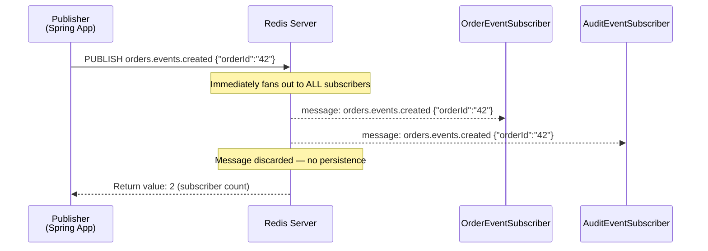

**Key insight from this diagram:**
- Both subscribers receive the message **independently and simultaneously**.
- Redis returns the subscriber count to the publisher so you can detect dropped messages.
- Once delivered (or if no one is listening), the message is **gone forever**.

### 2.2 SUBSCRIBE vs PSUBSCRIBE

Redis supports two subscription modes:

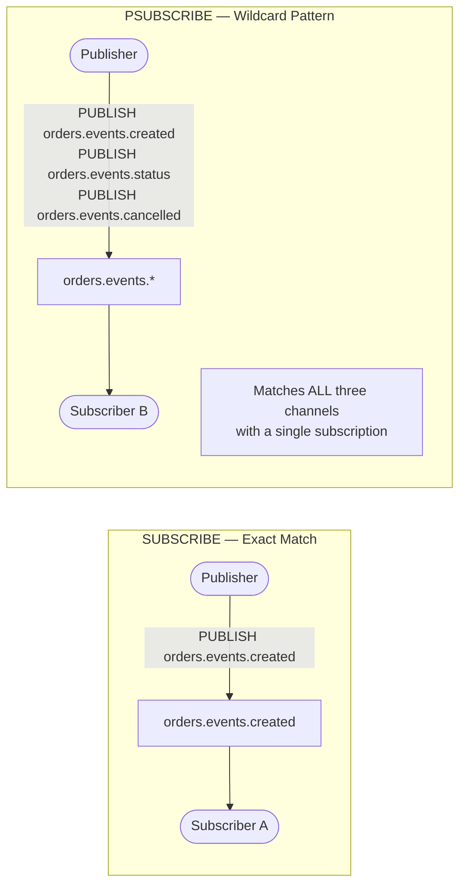

- **`SUBSCRIBE orders.events.created`** — Listens to exactly that one channel.
- **`PSUBSCRIBE orders.events.*`** — Listens to every channel matching the glob pattern. One subscription, infinite channels.
- A subscriber using `PSUBSCRIBE` will receive messages from `orders.events.created`, `orders.events.status`, `orders.events.cancelled`, and any future channels added — without any code change.

### 2.3 Critical Properties to Internalize

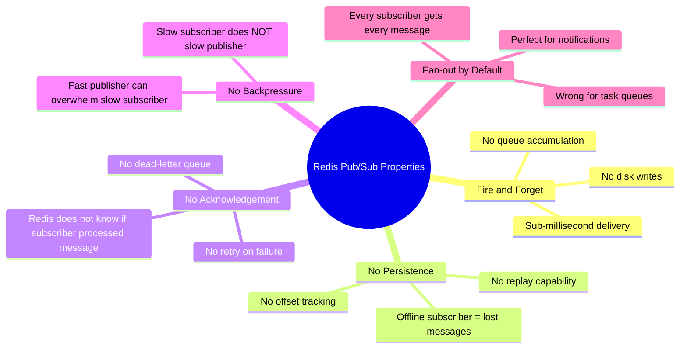

---

## 3. When to Use (and When NOT to Use) Redis Pub/Sub

This is the most important section in the entire tutorial. The wrong messaging tool causes production incidents.

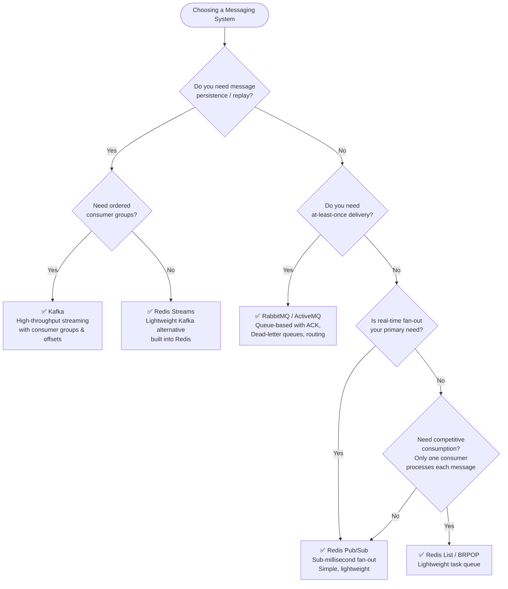

### ✅ Good Use Cases for Redis Pub/Sub

| Use Case | Why It Works |
|---|---|
| **Live notifications** (new chat message, order update) | Fast, fan-out to all connected clients |
| **Cache invalidation signals** | Tell all instances to evict a stale key — if one misses the signal, it's just a cache miss, not a disaster |
| **Real-time dashboards** | Push metric updates to browser clients via WebSocket relay |
| **Audit log streaming** | Wildcard subscriber captures all events without modifying publishers |
| **Microservice event broadcasting** | Loosely notify interested services without tight coupling |
| **Online presence / heartbeat** | Cheap way to broadcast "user X is online" |

### ❌ Poor Use Cases (Use Kafka / RabbitMQ Instead)

| Use Case | Why It Fails |
|---|---|
| **Financial transactions** | A crashed subscriber means a lost payment — unacceptable |
| **Order processing pipelines** | At-least-once delivery required; pub/sub is fire-and-forget |
| **Task queues** | You need exactly one worker to process each task |
| **Audit trails with compliance requirements** | You need message replay; pub/sub discards messages |
| **High-volume systems needing backpressure** | A slow consumer will silently drop messages |

---

## 4. Architecture Overview

### 4.1 The System We Are Building

We build a **real-time order event notification system**:

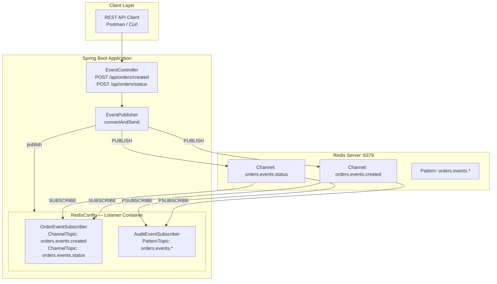

**What happens when you POST to `/api/orders/created`:**

1. `EventController` receives the HTTP request and builds an `EventMessage`.
2. `EventPublisher` serializes the message to JSON and calls Redis `PUBLISH`.
3. Redis fans the message out to **two subscribers simultaneously**:
   - `OrderEventSubscriber` (exact channel match) — handles business logic.
   - `AuditEventSubscriber` (wildcard pattern match) — logs all order events.
4. The REST API returns a `PublishResponse` immediately — **it does not wait for subscribers to finish**.

### 4.2 Data Flow Diagram

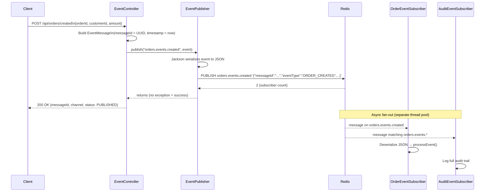

---

## 5. Spring Data Redis Abstractions

Spring Data Redis wraps the raw Redis protocol behind three key components. Understanding these prevents misconfiguration.

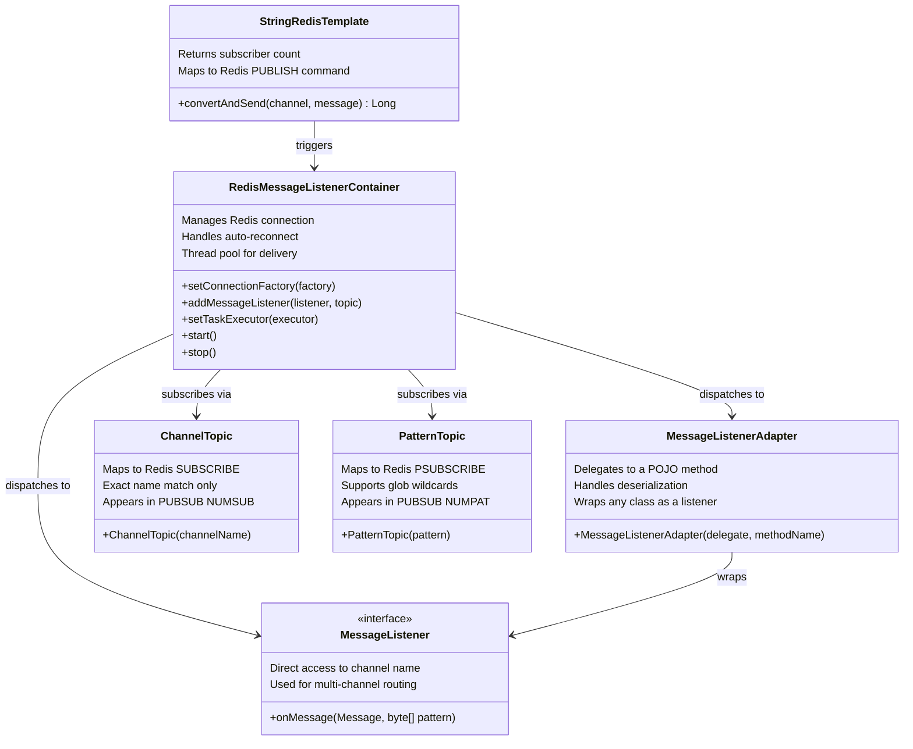

### The Container Thread Model

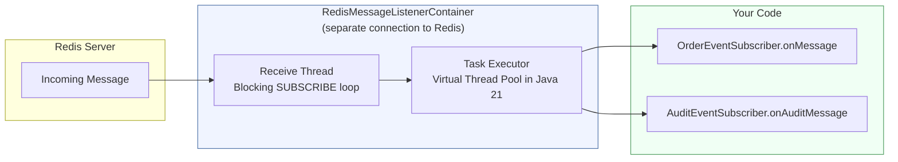

**Important:** The receive thread runs a blocking `SUBSCRIBE` loop. Your listener code runs on the task executor. This means:
- A slow `onMessage()` does NOT block other messages from being received.
- But it DOES consume a thread from the executor pool (unless you use virtual threads).
- Setting `Executors.newVirtualThreadPerTaskExecutor()` as the task executor (Java 21) gives each message delivery its own lightweight virtual thread — the recommended approach.

---

## 6. Prerequisites

Before starting, ensure you have the following installed:

| Tool | Minimum Version | Purpose |
|---|---|---|
| Java | 21 | Virtual threads support |
| Maven | 3.9+ | Build tool |
| Docker + Docker Compose | Latest | Running Redis locally |
| Redis | 7.4+ | Message broker |
| An IDE | Any | IntelliJ IDEA recommended |
| Postman / curl | Any | API testing |

Verify your setup:

```bash
java --version       # Should show 21+
mvn --version        # Should show 3.9+
docker --version     # Should show 24+
```

---

## 7. Project Setup

### 7.1 Generate the Project

Visit [start.spring.io](https://start.spring.io) and select:
- **Language:** Java
- **Spring Boot:** 3.5.x
- **Packaging:** Jar
- **Java Version:** 21
- **Dependencies:** Spring Data Redis, Spring Web, Validation, Lombok

### 7.2 Maven Dependencies (`pom.xml`)

```xml
<?xml version="1.0" encoding="UTF-8"?>
<project xmlns="http://maven.apache.org/POM/4.0.0"
         xmlns:xsi="http://www.w3.org/2001/XMLSchema-instance"
         xsi:schemaLocation="http://maven.apache.org/POM/4.0.0
             https://maven.apache.org/xsd/maven-4.0.0.xsd">
    <modelVersion>4.0.0</modelVersion>

    <parent>
        <groupId>org.springframework.boot</groupId>
        <artifactId>spring-boot-starter-parent</artifactId>
        <version>3.5.0</version>
        <relativePath/>
    </parent>

    <groupId>com.boottechnologies.ci</groupId>
    <artifactId>redis-pubsub-demo</artifactId>
    <version>0.0.1-SNAPSHOT</version>
    <name>redis-pubsub-demo</name>

    <properties>
        <java.version>21</java.version>
    </properties>

    <dependencies>
        <!-- Redis client (Lettuce) + Spring Data Redis -->
        <dependency>
            <groupId>org.springframework.boot</groupId>
            <artifactId>spring-boot-starter-data-redis</artifactId>
        </dependency>

        <!-- REST API -->
        <dependency>
            <groupId>org.springframework.boot</groupId>
            <artifactId>spring-boot-starter-web</artifactId>
        </dependency>

        <!-- @Valid annotations -->
        <dependency>
            <groupId>org.springframework.boot</groupId>
            <artifactId>spring-boot-starter-validation</artifactId>
        </dependency>

        <!-- Lettuce connection pooling — REQUIRED for pool config to work -->
        <dependency>
            <groupId>org.apache.commons</groupId>
            <artifactId>commons-pool2</artifactId>
        </dependency>

        <!-- LocalDateTime JSON serialization -->
        <dependency>
            <groupId>com.fasterxml.jackson.datatype</groupId>
            <artifactId>jackson-datatype-jsr310</artifactId>
        </dependency>

        <!-- Reduce boilerplate -->
        <dependency>
            <groupId>org.projectlombok</groupId>
            <artifactId>lombok</artifactId>
            <optional>true</optional>
        </dependency>

        <!-- Testing -->
        <dependency>
            <groupId>org.springframework.boot</groupId>
            <artifactId>spring-boot-starter-test</artifactId>
            <scope>test</scope>
        </dependency>
        <dependency>
            <groupId>org.testcontainers</groupId>
            <artifactId>junit-jupiter</artifactId>
            <scope>test</scope>
        </dependency>
    </dependencies>

    <build>
        <plugins>
            <plugin>
                <groupId>org.springframework.boot</groupId>
                <artifactId>spring-boot-maven-plugin</artifactId>
                <configuration>
                    <excludes>
                        <exclude>
                            <groupId>org.projectlombok</groupId>
                            <artifactId>lombok</artifactId>
                        </exclude>
                    </excludes>
                </configuration>
            </plugin>
        </plugins>
    </build>
</project>
```

> ⚠️ **Common Pitfall:** `commons-pool2` is **not optional**. Without it, the `lettuce.pool` configuration in `application.yml` is silently ignored — you'll get a single shared connection instead of a pool, causing hangs under load.

### 7.3 Application Configuration

`src/main/resources/application.yml`:

```yaml
spring:
  application:
    name: redis-pubsub-demo

  data:
    redis:
      host: ${REDIS_HOST:localhost}   # override via environment variable
      port: ${REDIS_PORT:6379}
      lettuce:
        pool:
          max-active: 10   # max concurrent connections
          max-idle: 5      # connections kept alive when idle
          min-idle: 2      # never shrink below 2 connections
          max-wait: 2000ms # wait this long before throwing pool exhaustion error

logging:
  level:
    com.boottechnologies.ci.redispubsub: DEBUG
```

### 7.4 Redis with Docker Compose

Create `docker-compose.yml` at the project root:

```yaml
services:
  redis:
    image: redis:7.4-alpine
    container_name: redis-pubsub
    ports:
      - "6379:6379"
    volumes:
      - redis_data:/data
    command: redis-server --appendonly yes --loglevel notice
    healthcheck:
      test: [ "CMD", "redis-cli", "ping" ]
      interval: 10s
      timeout: 5s
      retries: 5
    restart: unless-stopped

volumes:
  redis_data:
```

Start and verify:

```bash
# Start Redis in background
docker compose up -d

# Verify it's running
docker compose logs redis
# Expected: * Ready to accept connections tcp 0.0.0.0:6379

# Quick sanity check
docker exec -it redis-pubsub redis-cli PING
# Expected: PONG
```

### 7.5 Project Structure

```
src/main/java/com/boottechnologies/ci/redispubsub/
├── RedisPubSubApplication.java          ← Spring Boot entry point
├── config/
│   ├── RedisChannels.java               ← Channel name constants
│   └── RedisConfig.java                 ← Container + ObjectMapper beans
├── controller/
│   └── EventController.java             ← REST endpoints
├── dto/
│   ├── OrderRequest.java                ← Incoming order DTO
│   ├── StatusUpdateRequest.java         ← Status update DTO
│   └── PublishResponse.java             ← API response DTO
├── exception/
│   └── GlobalExceptionHandler.java      ← @ControllerAdvice for validation errors
├── model/
│   └── EventMessage.java                ← The envelope published to Redis
├── publisher/
│   └── EventPublisher.java              ← Wraps StringRedisTemplate
└── subscriber/
    ├── OrderEventSubscriber.java         ← Business logic listener
    └── AuditEventSubscriber.java         ← Audit/monitoring listener
```

---

## 8. Step-by-Step Implementation

### 8.1 Channel Definitions

```java
// config/RedisChannels.java
public final class RedisChannels {

    public static final String ORDER_CREATED        = "orders.events.created";
    public static final String ORDER_STATUS_UPDATED = "orders.events.status";
    public static final String ORDER_PATTERN        = "orders.events.*";

    private RedisChannels() {}  // prevent instantiation
}
```

**Why this matters:** Channel names are plain strings. A typo like `orders.event.created` (missing the 's') produces:
- Zero compile errors ✗
- Zero runtime exceptions ✗
- Zero message deliveries ✗ (publisher and subscriber silently talk past each other)

Centralizing channel names as constants catches this at compile time.

**Naming convention:** Use dot-separated hierarchical names (`domain.subdomain.event`). This makes wildcard subscriptions intuitive:
```
orders.events.*          → all order events
orders.events.created    → only new order events
*.events.*               → all events from any domain (broad audit)
```

### 8.2 Event Message Model

```java
// model/EventMessage.java
import com.fasterxml.jackson.annotation.JsonFormat;
import java.time.LocalDateTime;
import java.util.Map;
import java.util.UUID;

public record EventMessage(
        String messageId,
        String eventType,
        String channel,
        Map<String, Object> payload,
        @JsonFormat(pattern = "yyyy-MM-dd'T'HH:mm:ss")
        LocalDateTime timestamp
) {
    /**
     * Factory method — creates a new message with a unique ID and current timestamp.
     *
     * Example:
     *   EventMessage.of("ORDER_CREATED", "orders.events.created",
     *       Map.of("orderId", "42", "amount", 99.99));
     */
    public static EventMessage of(String eventType, String channel, Map<String, Object> payload) {
        return new EventMessage(
                UUID.randomUUID().toString(),
                eventType,
                channel,
                payload,
                LocalDateTime.now()
        );
    }
}
```

**JSON output example:**
```json
{
  "messageId": "f47ac10b-58cc-4372-a567-0e02b2c3d479",
  "eventType": "ORDER_CREATED",
  "channel": "orders.events.created",
  "payload": {
    "orderId": "ORD-001",
    "customerId": "CUST-42",
    "amount": 149.99,
    "notes": "Express delivery"
  },
  "timestamp": "2026-06-05T14:23:55"
}
```

> **Production Tip:** The `Map<String, Object>` payload is flexible for prototyping. In production, prefer typed payload records (`OrderCreatedPayload`, `StatusUpdatedPayload`) for compile-time safety and clear API contracts.

### 8.3 Publisher

```java
// publisher/EventPublisher.java
@Slf4j
@Service
@RequiredArgsConstructor
public class EventPublisher {

    private final StringRedisTemplate redisTemplate;
    private final ObjectMapper objectMapper;

    /**
     * Serialize the event to JSON and publish it to the given Redis channel.
     *
     * @return the number of subscribers that received the message
     *         (0 means the message was dropped — no one was listening)
     */
    public void publish(String channel, EventMessage event) {
        try {
            String payload = objectMapper.writeValueAsString(event);

            // Maps directly to: PUBLISH <channel> <payload>
            Long subscriberCount = redisTemplate.convertAndSend(channel, payload);

            log.debug("Published event [{}] to channel [{}] — received by {} subscriber(s)",
                    event.messageId(), channel, subscriberCount);

            // A return value of 0 is NOT an exception. Spring won't tell you.
            // This warn log is essential for diagnosing dropped messages.
            if (subscriberCount != null && subscriberCount == 0) {
                log.warn("No active subscribers on channel [{}], message dropped: {}",
                        channel, event.messageId());
            }

        } catch (JsonProcessingException e) {
            throw new RuntimeException("Failed to serialize event: " + event.messageId(), e);
        }
    }
}
```

#### How `convertAndSend` maps to Redis

```
Java code:                              Redis wire protocol:
redisTemplate.convertAndSend(           PUBLISH
    "orders.events.created",        →       orders.events.created
    "{\"eventType\":\"ORDER_CREATED\"}" →   "{\"eventType\":\"ORDER_CREATED\"}"
→ returns 2L                        ←   (integer) 2
```

#### Publisher flow

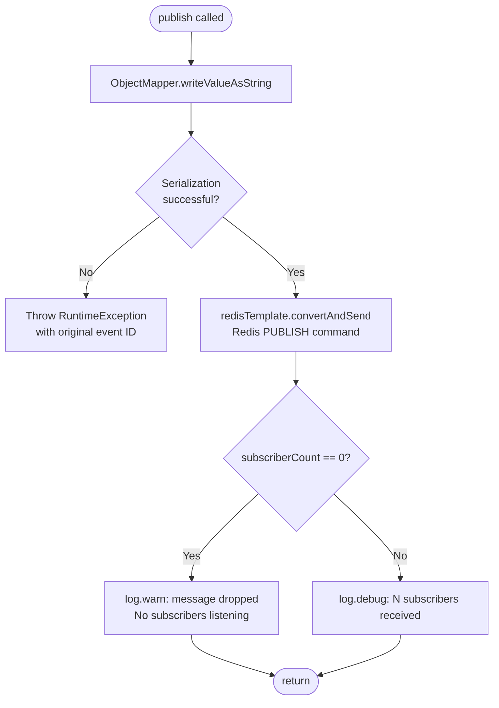

### 8.4 Subscribers

#### OrderEventSubscriber — Business Logic Handler

```java
// subscriber/OrderEventSubscriber.java
@Slf4j
@Component
@RequiredArgsConstructor
public class OrderEventSubscriber implements MessageListener {

    private final ObjectMapper objectMapper;

    @Override
    public void onMessage(Message message, byte[] pattern) {
        // Extract the raw JSON string and channel name
        String body    = new String(message.getBody(), StandardCharsets.UTF_8);
        String channel = new String(message.getChannel(), StandardCharsets.UTF_8);

        try {
            EventMessage event = objectMapper.readValue(body, EventMessage.class);

            log.info("[OrderEventSubscriber] channel={} | messageId={} | type={}",
                    channel, event.messageId(), event.eventType());

            processEvent(event);

        } catch (JsonProcessingException e) {
            // Log and continue — don't let one bad message kill all processing
            log.error("[OrderEventSubscriber] Deserialization failed on channel [{}]: {}",
                    channel, body, e);
        }
    }

    private void processEvent(EventMessage event) {
        switch (event.eventType()) {
            case "ORDER_CREATED" ->
                log.info("✅ Processing new order: orderId={}, amount={}",
                        event.payload().get("orderId"),
                        event.payload().get("amount"));

            case "ORDER_STATUS_UPDATED" ->
                log.info("🔄 Updating order status: orderId={}, newStatus={}",
                        event.payload().get("orderId"),
                        event.payload().get("status"));

            default ->
                log.warn("⚠️ Unknown event type: {}", event.eventType());
        }
    }
}
```

**Why implement `MessageListener` directly instead of using `MessageListenerAdapter`?**

`MessageListener` gives you the raw `Message` object, which exposes both:
- `message.getBody()` — the message payload
- `message.getChannel()` — **which channel this message arrived on**

This is critical when a single subscriber handles multiple channels and needs to route behavior. For example:

```java
@Override
public void onMessage(Message message, byte[] pattern) {
    String channel = new String(message.getChannel(), StandardCharsets.UTF_8);

    // Route to different handlers based on which channel fired
    if (channel.equals(RedisChannels.ORDER_CREATED)) {
        handleOrderCreated(event);
    } else if (channel.equals(RedisChannels.ORDER_STATUS_UPDATED)) {
        handleStatusUpdate(event);
    }
}
```

#### AuditEventSubscriber — Wildcard Pattern Listener

```java
// subscriber/AuditEventSubscriber.java
@Slf4j
@Component
public class AuditEventSubscriber {

    /**
     * This method is invoked by MessageListenerAdapter for every message
     * matching the "orders.events.*" pattern.
     *
     * Note: The method name MUST match what is configured in RedisConfig:
     *   new MessageListenerAdapter(auditEventSubscriber, "onAuditMessage")
     */
    public void onAuditMessage(String messageBody, String channel) {
        log.info("[AUDIT] channel={} | body={}", channel, messageBody);
        // In a real system: write to audit database, send to SIEM, etc.
    }
}
```

**Why use `MessageListenerAdapter` here instead of `MessageListener`?**

`MessageListenerAdapter` is a convenience wrapper that delegates to any POJO method and handles deserialization for you. The `AuditEventSubscriber` is a plain Java class — no Redis interface needed. This keeps the class simple and easier to unit test:

```java
// Unit test — no Redis mocking required
@Test
void shouldLogAuditMessage() {
    AuditEventSubscriber subscriber = new AuditEventSubscriber();
    // Direct method call — no Message object, no byte arrays
    subscriber.onAuditMessage("{\"eventType\":\"ORDER_CREATED\"}", "orders.events.created");
    // Assert log output or database call
}
```

### 8.5 Redis Configuration

This is the wiring hub. Read every comment carefully.

```java
// config/RedisConfig.java
@Configuration
public class RedisConfig {

    /**
     * Jackson ObjectMapper with Java 8 date/time support.
     *
     * Without JavaTimeModule, LocalDateTime serializes as:
     *   [2026, 6, 5, 14, 23, 55]   ← numeric array (broken)
     * With JavaTimeModule, it serializes as:
     *   "2026-06-05T14:23:55"       ← ISO-8601 string (correct)
     *
     * WRITE_DATES_AS_TIMESTAMPS = false forces the string format.
     */
    @Bean
    public ObjectMapper objectMapper() {
        return JsonMapper.builder()
                .addModule(new JavaTimeModule())
                .disable(SerializationFeature.WRITE_DATES_AS_TIMESTAMPS)
                .build();
    }

    /**
     * Wraps AuditEventSubscriber as a MessageListener.
     * The second argument "onAuditMessage" is the method name to invoke.
     */
    @Bean
    public MessageListenerAdapter auditListenerAdapter(AuditEventSubscriber auditEventSubscriber) {
        return new MessageListenerAdapter(auditEventSubscriber, "onAuditMessage");
    }

    /**
     * The core component that:
     *  1. Maintains a persistent connection to Redis for subscriptions
     *  2. Routes incoming messages to the correct listener
     *  3. Automatically resubscribes after Redis restarts
     *  4. Dispatches message delivery on a thread pool
     */
    @Bean
    public RedisMessageListenerContainer redisMessageListenerContainer(
            RedisConnectionFactory connectionFactory,
            OrderEventSubscriber orderEventSubscriber,
            MessageListenerAdapter auditListenerAdapter) {

        RedisMessageListenerContainer container = new RedisMessageListenerContainer();
        container.setConnectionFactory(connectionFactory);

        // ─── Exact channel subscriptions (Redis SUBSCRIBE) ───────────────────────
        // OrderEventSubscriber receives ORDER_CREATED events
        container.addMessageListener(orderEventSubscriber,
                new ChannelTopic(RedisChannels.ORDER_CREATED));

        // OrderEventSubscriber also receives ORDER_STATUS_UPDATED events
        container.addMessageListener(orderEventSubscriber,
                new ChannelTopic(RedisChannels.ORDER_STATUS_UPDATED));

        // ─── Wildcard pattern subscription (Redis PSUBSCRIBE) ────────────────────
        // AuditEventSubscriber receives ALL order events via pattern matching
        container.addMessageListener(auditListenerAdapter,
                new PatternTopic(RedisChannels.ORDER_PATTERN));

        // ─── Java 21 Virtual Threads ──────────────────────────────────────────────
        // Default executor: single-threaded (one slow listener blocks all others)
        // Virtual thread executor: each message delivery gets its own lightweight thread
        container.setTaskExecutor(Executors.newVirtualThreadPerTaskExecutor());

        return container;
    }
}
```

#### Why the ObjectMapper bean here?

Without this bean, Spring Boot creates a default `ObjectMapper` that may be configured differently by other auto-configurations. Publisher and subscriber need to use the **exact same serialization settings**. A mismatch — for example, the publisher using ISO timestamps but the subscriber expecting arrays — causes silent deserialization failures that appear as `null` fields, not exceptions.

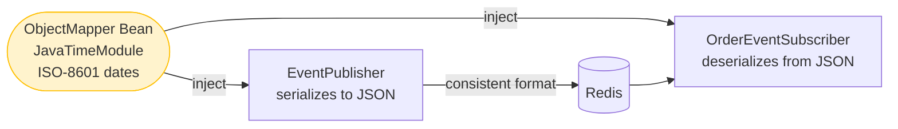

### 8.6 DTOs

```java
// dto/OrderRequest.java
public record OrderRequest(
        @NotBlank(message = "Order ID is required")
        String orderId,

        @NotBlank(message = "Customer ID is required")
        String customerId,

        @NotNull(message = "Amount is required")
        @Positive(message = "Amount must be positive")
        BigDecimal amount,

        String notes   // optional
) {}
```

```java
// dto/StatusUpdateRequest.java
public record StatusUpdateRequest(
        @NotBlank(message = "Order ID is required")
        String orderId,

        @NotBlank(message = "Status is required")
        String status,

        String reason  // optional
) {}
```

```java
// dto/PublishResponse.java
public record PublishResponse(
        String messageId,
        String channel,
        String status,
        LocalDateTime publishedAt
) {}
```

### 8.7 REST Controller

```java
// controller/EventController.java
@Slf4j
@RestController
@RequestMapping("/api/orders")
@RequiredArgsConstructor
public class EventController {

    private final EventPublisher eventPublisher;

    /**
     * Publish a new order created event.
     *
     * Example request body:
     * {
     *   "orderId": "ORD-001",
     *   "customerId": "CUST-42",
     *   "amount": 149.99,
     *   "notes": "Express delivery"
     * }
     */
    @PostMapping("/created")
    public ResponseEntity<PublishResponse> orderCreated(
            @Valid @RequestBody OrderRequest request) {

        Map<String, Object> payload = Map.of(
                "orderId",    request.orderId(),
                "customerId", request.customerId(),
                "amount",     request.amount(),
                "notes",      request.notes() != null ? request.notes() : ""
        );

        EventMessage event = EventMessage.of(
                "ORDER_CREATED",
                RedisChannels.ORDER_CREATED,
                payload
        );

        eventPublisher.publish(RedisChannels.ORDER_CREATED, event);

        return ResponseEntity.ok(new PublishResponse(
                event.messageId(),
                RedisChannels.ORDER_CREATED,
                "PUBLISHED",
                event.timestamp()
        ));
    }

    /**
     * Publish an order status update event.
     *
     * Example request body:
     * {
     *   "orderId": "ORD-001",
     *   "status": "SHIPPED",
     *   "reason": "Dispatched via FedEx"
     * }
     */
    @PostMapping("/status")
    public ResponseEntity<PublishResponse> updateStatus(
            @Valid @RequestBody StatusUpdateRequest request) {

        Map<String, Object> payload = Map.of(
                "orderId", request.orderId(),
                "status",  request.status(),
                "reason",  request.reason() != null ? request.reason() : ""
        );

        EventMessage event = EventMessage.of(
                "ORDER_STATUS_UPDATED",
                RedisChannels.ORDER_STATUS_UPDATED,
                payload
        );

        eventPublisher.publish(RedisChannels.ORDER_STATUS_UPDATED, event);

        return ResponseEntity.ok(new PublishResponse(
                event.messageId(),
                RedisChannels.ORDER_STATUS_UPDATED,
                "PUBLISHED",
                event.timestamp()
        ));
    }
}
```

### 8.8 Global Exception Handler

```java
// exception/GlobalExceptionHandler.java
@RestControllerAdvice
public class GlobalExceptionHandler {

    @ExceptionHandler(MethodArgumentNotValidException.class)
    public ResponseEntity<Map<String, String>> handleValidationErrors(
            MethodArgumentNotValidException ex) {

        Map<String, String> errors = ex.getBindingResult()
                .getFieldErrors()
                .stream()
                .collect(Collectors.toMap(
                        FieldError::getField,
                        fe -> fe.getDefaultMessage() != null ? fe.getDefaultMessage() : "Invalid value"
                ));

        return ResponseEntity.badRequest().body(errors);
    }
}
```

---

## 9. Testing the System

### 9.1 Manual Verification with `redis-cli`

Before running the Spring app, verify Redis Pub/Sub works at the protocol level.

**Terminal 1 — Start listening:**

```bash
docker exec -it redis-pubsub redis-cli
SUBSCRIBE orders.events.created orders.events.status
```

You'll see:
```
1) "subscribe"
2) "orders.events.created"
3) (integer) 1
1) "subscribe"
2) "orders.events.status"
3) (integer) 2
```

**Terminal 2 — Publish a test message:**

```bash
docker exec -it redis-pubsub redis-cli
PUBLISH orders.events.created '{"test":"manual-message","timestamp":"2026-06-05"}'
```

Terminal 1 immediately displays:
```
1) "message"
2) "orders.events.created"
3) "{\"test\":\"manual-message\",\"timestamp\":\"2026-06-05\"}"
```

**Inspect subscriptions:**

```bash
PUBSUB CHANNELS              # List all channels with at least one subscriber
PUBSUB NUMSUB orders.events.created   # How many subscribers on this exact channel
PUBSUB NUMPAT                # Count of active pattern (PSUBSCRIBE) subscriptions
```

### 9.2 Run the Application

```bash
# Start Redis (if not already running)
docker compose up -d

# Start Spring Boot application
mvn spring-boot:run
```

### 9.3 Test with Postman / curl

**Test 1: Publish an order created event**

```bash
curl -X POST http://localhost:8080/api/orders/created \
  -H "Content-Type: application/json" \
  -d '{
    "orderId": "ORD-001",
    "customerId": "CUST-42",
    "amount": 149.99,
    "notes": "Express delivery"
  }'
```

Expected response:
```json
{
  "messageId": "f47ac10b-58cc-4372-a567-0e02b2c3d479",
  "channel": "orders.events.created",
  "status": "PUBLISHED",
  "publishedAt": "2026-06-05T14:23:55"
}
```

Expected application logs:
```
[EventPublisher]        Published event [f47ac10b...] to channel [orders.events.created] — received by 2 subscriber(s)
[OrderEventSubscriber]  channel=orders.events.created | messageId=f47ac10b... | type=ORDER_CREATED
[OrderEventSubscriber]  ✅ Processing new order: orderId=ORD-001, amount=149.99
[AUDIT]                 channel=orders.events.created | body={"messageId":"f47ac10b...",...}
```

Notice **subscriber count is 2**: `OrderEventSubscriber` (ChannelTopic) and `AuditEventSubscriber` (PatternTopic) both receive the message independently.

**Test 2: Update order status**

```bash
curl -X POST http://localhost:8080/api/orders/status \
  -H "Content-Type: application/json" \
  -d '{
    "orderId": "ORD-001",
    "status": "SHIPPED",
    "reason": "Dispatched via FedEx"
  }'
```

**Test 3: Validation error**

```bash
curl -X POST http://localhost:8080/api/orders/created \
  -H "Content-Type: application/json" \
  -d '{
    "orderId": "",
    "customerId": "CUST-42",
    "amount": -10
  }'
```

Expected response (400 Bad Request):
```json
{
  "orderId": "Order ID is required",
  "amount": "Amount must be positive"
}
```

### 9.4 Integration Test with Testcontainers

```java
@SpringBootTest
@Testcontainers
class EventPublisherIntegrationTest {

    @Container
    static GenericContainer<?> redis = new GenericContainer<>("redis:7.4-alpine")
            .withExposedPorts(6379);

    @DynamicPropertySource
    static void redisProperties(DynamicPropertyRegistry registry) {
        registry.add("spring.data.redis.host", redis::getHost);
        registry.add("spring.data.redis.port", () -> redis.getMappedPort(6379));
    }

    @Autowired
    private EventPublisher eventPublisher;

    @Autowired
    private StringRedisTemplate redisTemplate;

    @Test
    void publishedMessageShouldBeReceivedBySubscriber() throws InterruptedException {
        CountDownLatch latch = new CountDownLatch(1);
        List<String> received = new CopyOnWriteArrayList<>();

        // Subscribe and capture messages
        redisTemplate.getConnectionFactory()
                .getConnection()
                .subscribe((message, pattern) -> {
                    received.add(new String(message.getBody()));
                    latch.countDown();
                }, RedisChannels.ORDER_CREATED.getBytes());

        // Publish a test event
        EventMessage event = EventMessage.of("ORDER_CREATED",
                RedisChannels.ORDER_CREATED,
                Map.of("orderId", "TEST-001"));

        eventPublisher.publish(RedisChannels.ORDER_CREATED, event);

        // Wait up to 2 seconds for the message to arrive
        assertThat(latch.await(2, TimeUnit.SECONDS)).isTrue();
        assertThat(received).hasSize(1);
        assertThat(received.get(0)).contains("TEST-001");
    }
}
```

---

## 10. Performance Considerations

### 10.1 Throughput Benchmarks

| Scenario | Messages/sec | Notes |
|---|---|---|
| Single publisher, 1 subscriber | ~500,000 | Local loopback |
| Single publisher, 10 subscribers | ~100,000 | Fan-out overhead |
| 10 publishers, 10 subscribers | ~200,000 | Concurrent publishing |
| With network latency (10ms RTT) | ~5,000 | Network dominates |

### 10.2 The Critical Rule: Never Block in `onMessage()`

The default container uses a single thread to dispatch messages. One blocking call cascades:

```mermaid
flowchart TD
    subgraph WRONG["❌ Wrong — Blocking in onMessage()"]
        A1[Message 1 arrives] --> B1[onMessage called]
        B1 --> C1[DB write — 200ms]
        C1 --> D1[Message 2 waits 200ms]
        D1 --> E1[Message 3 waits 400ms]
        E1 --> F1["Queue backs up ⚠️"]
    end

    subgraph RIGHT["✅ Right — Offload to async"]
        A2[Message 1 arrives] --> B2[onMessage called]
        B2 --> C2[Hand off to CompletableFuture\nor virtual thread]
        C2 --> D2[onMessage returns immediately]
        D2 --> E2[Message 2 processed instantly]
        E2 --> F2[No queue backup ✅]
    end
```

**Implementation:**

```java
@Override
public void onMessage(Message message, byte[] pattern) {
    String body = new String(message.getBody(), StandardCharsets.UTF_8);

    // Hand off immediately — don't block the executor thread
    CompletableFuture.runAsync(() -> {
        try {
            EventMessage event = objectMapper.readValue(body, EventMessage.class);
            processEvent(event);
        } catch (JsonProcessingException e) {
            log.error("Failed to process message: {}", body, e);
        }
    });
}
```

**With Java 21 virtual threads** (already configured in `RedisConfig`), blocking I/O is less harmful — the virtual thread parks rather than consuming a platform thread. But it's still best practice to keep `onMessage()` thin.

### 10.3 Connection Pool Sizing

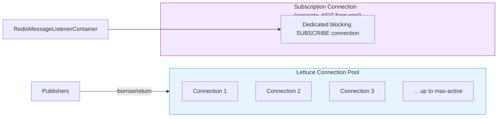

**Important:** The `RedisMessageListenerContainer` uses its **own dedicated connection** (not from the pool) for subscriptions. This connection is in a blocking `SUBSCRIBE` loop and cannot be reused for publishing. The pool connections are used exclusively by publishers.

### 10.4 Horizontal Scaling Behavior

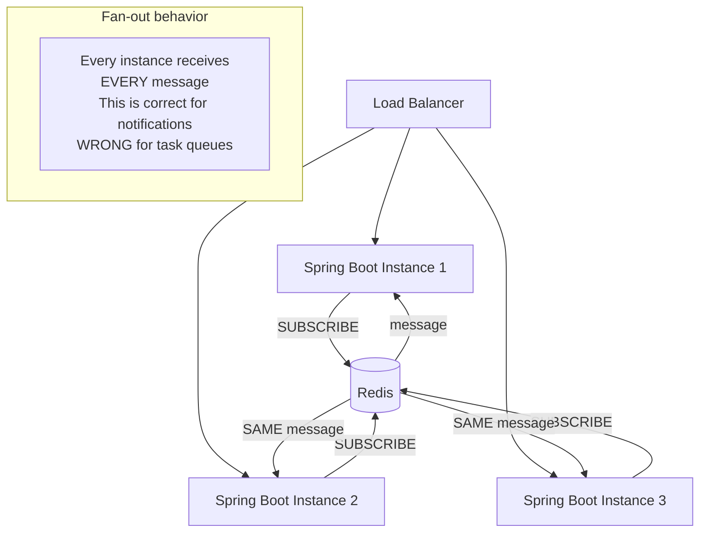

**If you need competitive consumption** (only one instance processes each message), use Redis Streams with consumer groups instead:

```
XADD orders.stream * orderId ORD-001        # Produce
XREADGROUP GROUP workers consumer1 COUNT 1   # Compete for messages
XACK orders.stream workers <message-id>     # Acknowledge
```

---

## 11. Real-World Use Cases

### 11.1 Live Notification System

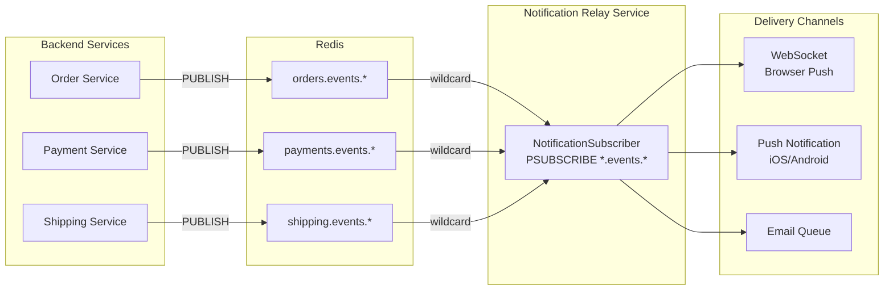

### 11.2 Distributed Cache Invalidation

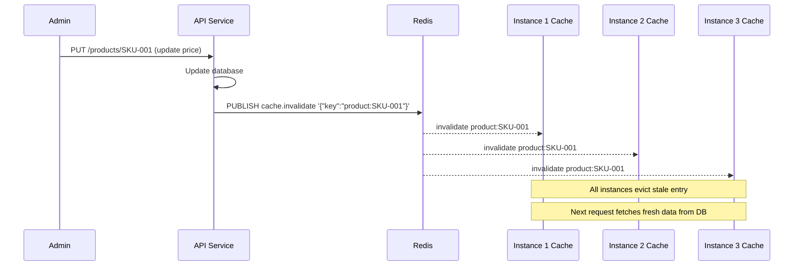

### 11.3 Real-Time Dashboard Metrics

```mermaid
flowchart LR
    subgraph App["Spring Boot App"]
        METRIC[MetricsCollector\n@Scheduled every 5s]
        PUB[EventPublisher]
        METRIC --> PUB
    end

    PUB -->|PUBLISH metrics.dashboard| Redis[(Redis)]

    Redis -->|message| SUB[DashboardSubscriber]

    SUB -->|forward via| WS[WebSocket\nBroadcast]

    WS --> B1[Browser Tab 1]
    WS --> B2[Browser Tab 2]
    WS --> B3[Browser Tab 3]
```

**Example metrics message:**
```json
{
  "eventType": "METRICS_UPDATE",
  "payload": {
    "activeOrders": 142,
    "revenueToday": 58420.50,
    "avgProcessingTimeMs": 340,
    "errorRate": 0.002
  }
}
```

### 11.4 Microservice Event Choreography

In an e-commerce system, multiple services need to react to the same order event without being tightly coupled:

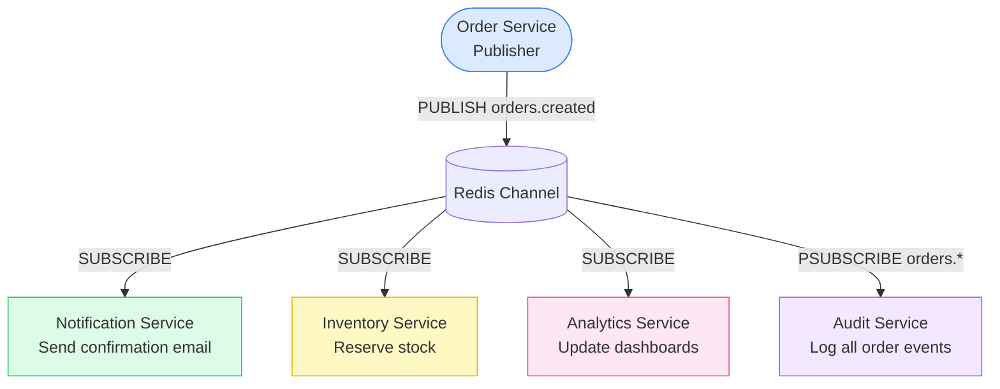

**Key benefit:** Adding a new service (e.g. a fraud detection service) requires zero changes to the `Order Service`. Just subscribe to the channel.

---

## 12. Extending the System

### 12.1 Add Message Persistence Fallback

For messages that must not be lost, publish to both a Redis channel AND a Redis Stream:

```java
public void publish(String channel, EventMessage event) {
    String payload = objectMapper.writeValueAsString(event);

    // Fast fan-out for real-time subscribers
    redisTemplate.convertAndSend(channel, payload);

    // Persistent copy for replay / audit
    redisTemplate.opsForStream().add(
        channel + ".stream",
        Map.of("event", payload)
    );
}
```

### 12.2 Add Message Schema Versioning

```java
public record EventMessage(
        String messageId,
        String eventType,
        String channel,
        String schemaVersion,  // Add this field
        Map<String, Object> payload,
        LocalDateTime timestamp
) {
    public static EventMessage of(String eventType, String channel, Map<String, Object> payload) {
        return new EventMessage(
                UUID.randomUUID().toString(),
                eventType,
                channel,
                "1.0",    // Current schema version
                payload,
                LocalDateTime.now()
        );
    }
}
```

Subscribers can use `schemaVersion` to handle backward compatibility when message formats evolve.

### 12.3 Add Dead-Letter Logging

```java
@Override
public void onMessage(Message message, byte[] pattern) {
    String body = new String(message.getBody(), StandardCharsets.UTF_8);
    String channel = new String(message.getChannel(), StandardCharsets.UTF_8);

    try {
        EventMessage event = objectMapper.readValue(body, EventMessage.class);
        processEvent(event);
    } catch (JsonProcessingException e) {
        // Write unparseable messages to a dead-letter key for investigation
        redisTemplate.opsForList().rightPush(
            "dead.letters." + channel,
            body
        );
        log.error("[DEAD LETTER] channel={} body={}", channel, body);
    }
}
```

---

## 13. Troubleshooting Guide

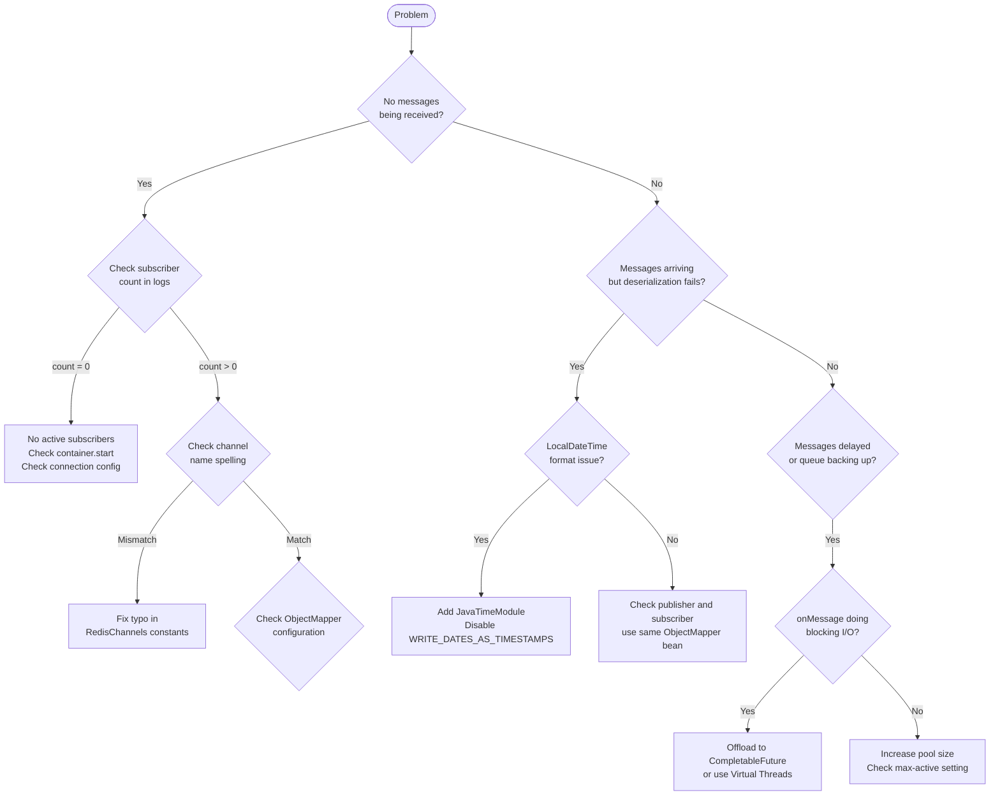

### Common Issues at a Glance

| Symptom | Likely Cause | Fix |
|---|---|---|
| `subscriberCount = 0` in logs | No subscriber is running | Check `RedisMessageListenerContainer` is started |
| `JsonProcessingException` on subscriber | Publisher/subscriber ObjectMapper mismatch | Use shared `@Bean ObjectMapper` |
| `LocalDateTime` parsed as array `[2026,6,5,...]` | Missing `JavaTimeModule` | Add module, disable `WRITE_DATES_AS_TIMESTAMPS` |
| Messages received by exact subscriber but not audit subscriber | Wrong `PatternTopic` pattern | Verify glob pattern `orders.events.*` matches channel name |
| High latency under load | `onMessage()` doing blocking I/O | Use `CompletableFuture.runAsync()` |
| `PoolExhaustedException` under load | Pool size too small | Increase `max-active` in `application.yml` |
| Messages lost after Redis restart | Expected — Pub/Sub has no persistence | Switch to Redis Streams if persistence needed |

---

## 14. Summary

### What We Built

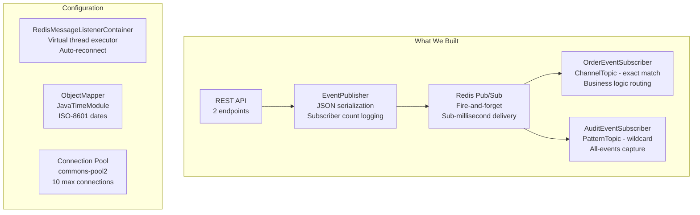

### Decision Checklist: Is Redis Pub/Sub Right for You?

| Requirement | Redis Pub/Sub | Kafka | RabbitMQ | Redis Streams |
|---|:---:|:---:|:---:|:---:|
| Sub-millisecond delivery | ✅ | ❌ | ✅ | ✅ |
| Message persistence | ❌ | ✅ | ✅ | ✅ |
| At-least-once delivery | ❌ | ✅ | ✅ | ✅ |
| Fan-out to N consumers | ✅ | ✅ | ✅ | ✅ |
| Competitive consumption | ❌ | ✅ | ✅ | ✅ |
| Consumer groups / offsets | ❌ | ✅ | ❌ | ✅ |
| Minimal infrastructure | ✅ | ❌ | ❌ | ✅ |
| Replay past messages | ❌ | ✅ | ❌ | ✅ |

### Key Takeaways

1. **Redis Pub/Sub is a fire-and-forget broadcast** — not a queue, not a stream. Design around that.
2. **Channel name typos are silent bugs** — always use constants in a shared class.
3. **The ObjectMapper must be shared** between publisher and subscriber to avoid serialization mismatches.
4. **Never block in `onMessage()`** — offload heavy work to async executors or virtual threads.
5. **The subscriber count return value from `PUBLISH` is essential** — log it to detect dropped messages.
6. **PatternTopic (`PSUBSCRIBE`) is powerful** — one subscription captures all matching channels, past and future.
7. **Virtual threads (Java 21) reduce thread pool pressure** — use `Executors.newVirtualThreadPerTaskExecutor()`.
8. **When you outgrow Pub/Sub**, Redis Streams is the natural next step — same Redis instance, adds persistence and consumer groups.

---

## References

- [Spring Data Redis — Pub/Sub Documentation](https://docs.spring.io/spring-data/redis/docs/current/reference/html/#pubsub)
- [Redis Pub/Sub — Official Documentation](https://redis.io/docs/manual/pubsub/)
- [Redis Streams vs Pub/Sub](https://redis.io/docs/manual/data-types/streams/)
- [Lettuce — Advanced Redis Client for Java](https://lettuce.io/docs/getting-started.html)
- [Testcontainers for Java](https://java.testcontainers.org/)
- [Original Blog Post — BootLabs TechBlog](https://blog.boottechsolutions.com/2026/06/01/redis-pubsub-spring-boot/)