# SQL Made Simple: The Complete Beginner's Tutorial for Data Science

> **Goal:** Take you from SQL zero to data-science ready — every concept explained clearly, with real examples, diagrams, and practical patterns you'll actually use.

---

## 📚 Table of Contents

1. [Why SQL Matters](#1-why-sql-matters)
2. [Database Fundamentals — Tables, Keys & Relationships](#2-database-fundamentals)
3. [SELECT — Choosing Your Data](#3-select)
4. [WHERE — Filtering Rows](#4-where)
5. [ORDER BY & LIMIT — Sorting & Slicing](#5-order-by--limit)
6. [Aggregate Functions — Summarizing Data](#6-aggregate-functions)
7. [GROUP BY — Category-Level Analytics](#7-group-by)
8. [HAVING — Filtering Groups](#8-having)
9. [JOINs — Combining Tables](#9-joins)
10. [Subqueries — SQL Inside SQL](#10-subqueries)
11. [Window Functions — Advanced Analytics Power](#11-window-functions)
12. [SQL Execution Order — The Hidden Rule](#12-sql-execution-order)
13. [Practical Data Science Patterns](#13-practical-data-science-patterns)
14. [SQL Interview Questions](#14-sql-interview-questions)
15. [Quick Reference Cheatsheet](#15-quick-reference-cheatsheet)

---

## 🗺️ Your SQL Learning Roadmap

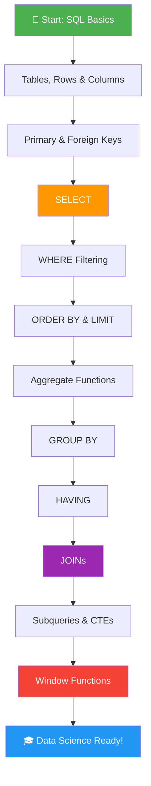

---

## 1. Why SQL Matters

Every modern company stores its data in structured **tables** inside **databases**. Whether it's customer orders, website clicks, medical records, or financial transactions — it all lives in a database, and SQL is how you talk to it.

### 🏢 Real-World Industry Use Cases

| Industry | Example SQL Use Case |
|----------|---------------------|
| **E-commerce** | Find top-selling products, analyse cart abandonment rates |
| **Finance** | Detect fraudulent transactions, calculate portfolio returns |
| **Healthcare** | Track patient outcomes, aggregate clinical trial results |
| **Marketing** | Segment customers, measure campaign ROI |
| **Data Science** | EDA (Exploratory Data Analysis), feature engineering |
| **Product** | Funnel analysis, retention tracking, A/B test results |

### 🗄️ Databases That Use SQL

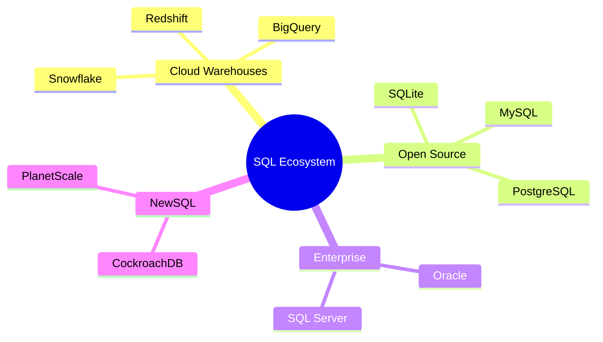

> **Key Insight:** No matter what analytics tools you learn later — Python, R, Power BI, Tableau — SQL remains the universal foundation for retrieving data. It is the one skill that never becomes obsolete.

---

## 2. Database Fundamentals

### 2.1 Tables, Rows & Columns

Think of a database table exactly like a spreadsheet:

| employee_id | name  | age | department | salary | dept_id |
|-------------|-------|-----|------------|--------|---------|
| 1           | Alice | 32  | IT         | 85000  | 101     |
| 2           | Bob   | 28  | Finance    | 72000  | 102     |
| 3           | Carol | 45  | IT         | 92000  | 101     |
| 4           | David | 35  | HR         | 58000  | 103     |
| 5           | Eve   | 30  | Finance    | 78000  | 102     |

- A **row** = one complete record (one employee)
- A **column** = one attribute (name, age, salary, etc.)
- A **table** = a collection of rows sharing the same structure

### 2.2 Primary Keys vs Foreign Keys

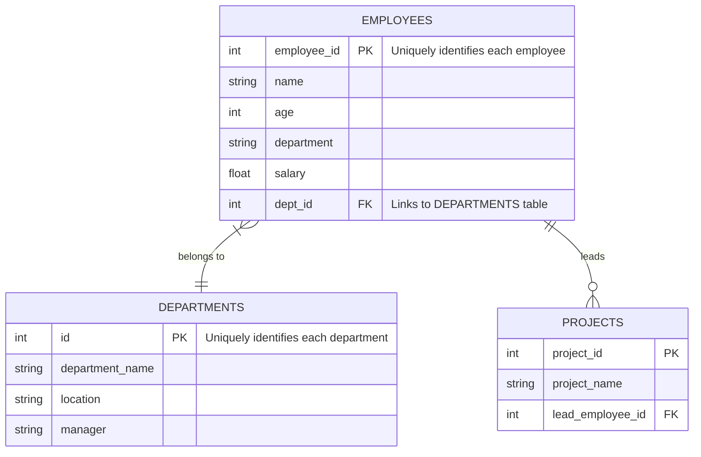

**Primary Key (PK):**
- Uniquely identifies every row in a table
- Can never be NULL or duplicated
- Example: `employee_id = 1` identifies only Alice, no one else

**Foreign Key (FK):**
- A column that references the Primary Key of another table
- Creates a relationship (link) between two tables
- Example: `dept_id = 101` in the `employees` table links to `id = 101` in the `departments` table

### 2.3 Why Relationships Matter

Without relationships, you'd store the full department name in every employee row — "Information Technology" repeated thousands of times. Foreign keys let you store the department once and reference it by ID, reducing redundancy and keeping data consistent.

---

## 3. SELECT — Choosing Your Data

`SELECT` is the most fundamental SQL command. Every single query begins here.

### 3.1 Select Everything

```sql
-- Get all columns from the employees table
SELECT * FROM employees;
```

The `*` means "all columns." Great for quick exploration — but avoid it in production queries since it's slow and returns unnecessary data.

### 3.2 Select Specific Columns

```sql
-- Get only name and salary
SELECT name, salary
FROM employees;
```

**Why this matters:** Selecting only what you need speeds up queries significantly on large datasets — especially in cloud warehouses that charge by data scanned.

### 3.3 Column Aliases — Renaming Output

```sql
SELECT
    name          AS employee_name,
    salary        AS annual_salary,
    salary / 12   AS monthly_salary,
    age           AS employee_age
FROM employees;
```

Output:

| employee_name | annual_salary | monthly_salary | employee_age |
|---------------|--------------|----------------|-------------|
| Alice         | 85000        | 7083.33        | 32          |
| Bob           | 72000        | 6000.00        | 28          |

### 3.4 SELECT DISTINCT — Remove Duplicates

```sql
-- All unique departments (no repeats)
SELECT DISTINCT department FROM employees;

-- Unique department + age combinations
SELECT DISTINCT department, age FROM employees;
```

### 3.5 Computed Columns

SQL can do math and string operations inline:

```sql
SELECT
    name,
    salary,
    salary * 1.10                    AS salary_after_10pct_raise,
    UPPER(name)                      AS name_uppercase,
    LENGTH(name)                     AS name_character_count,
    CONCAT(name, ' (', department, ')') AS name_with_dept
FROM employees;
```

### 3.6 SELECT with CASE WHEN (Conditional Column)

```sql
SELECT
    name,
    salary,
    CASE
        WHEN salary >= 90000 THEN 'Senior'
        WHEN salary >= 70000 THEN 'Mid-Level'
        ELSE 'Junior'
    END AS salary_tier
FROM employees;
```

| name  | salary | salary_tier |
|-------|--------|-------------|
| Alice | 85000  | Mid-Level   |
| Carol | 92000  | Senior      |
| Bob   | 72000  | Mid-Level   |
| David | 58000  | Junior      |

### SELECT — Mental Model

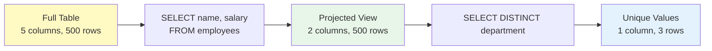

---

## 4. WHERE — Filtering Rows

`WHERE` is how you control which rows appear in your results. It is the most-used clause in real analytics work.

### 4.1 Comparison Operators

```sql
-- Equal to
SELECT * FROM employees WHERE department = 'IT';

-- Not equal to
SELECT * FROM employees WHERE department != 'HR';

-- Numeric comparisons
SELECT * FROM employees WHERE age > 30;
SELECT * FROM employees WHERE salary < 70000;
SELECT * FROM employees WHERE salary >= 75000;
```

### 4.2 Logical Operators: AND, OR, NOT

```sql
-- AND: BOTH conditions must be true
SELECT * FROM employees
WHERE department = 'IT' AND salary > 80000;
-- Returns: Carol (IT, 92K) but not Alice (IT, 85K if threshold is >85K)

-- OR: EITHER condition must be true
SELECT * FROM employees
WHERE department = 'IT' OR department = 'Finance';

-- NOT: negates a condition
SELECT * FROM employees
WHERE NOT department = 'HR';

-- Combining AND with OR (use parentheses to control order!)
SELECT * FROM employees
WHERE (department = 'IT' OR department = 'Finance')
  AND salary > 75000;
```

### 4.3 BETWEEN — Inclusive Range

```sql
-- Salary between 60K and 90K (both endpoints INCLUDED)
SELECT * FROM employees
WHERE salary BETWEEN 60000 AND 90000;

-- Works with dates too!
SELECT * FROM orders
WHERE order_date BETWEEN '2024-01-01' AND '2024-12-31';

-- Works with strings (alphabetical range)
SELECT * FROM employees
WHERE name BETWEEN 'A' AND 'M';
```

### 4.4 IN — Match a List of Values

```sql
-- Instead of chaining multiple ORs...
SELECT * FROM employees
WHERE department = 'IT'
   OR department = 'Finance'
   OR department = 'Marketing';

-- Use IN (much cleaner!)
SELECT * FROM employees
WHERE department IN ('IT', 'Finance', 'Marketing');

-- NOT IN — exclude a list
SELECT * FROM employees
WHERE department NOT IN ('HR', 'Admin');
```

### 4.5 LIKE — Pattern Matching

```sql
-- Names starting with 'A'
SELECT * FROM employees WHERE name LIKE 'A%';

-- Names ending with 'l'
SELECT * FROM employees WHERE name LIKE '%l';

-- Names containing 'ar'
SELECT * FROM employees WHERE name LIKE '%ar%';

-- Name is exactly 3 characters
SELECT * FROM employees WHERE name LIKE '___';

-- Find gmail users (real-world email filtering)
SELECT * FROM users WHERE email LIKE '%@gmail.com';

-- Case-insensitive (PostgreSQL)
SELECT * FROM employees WHERE name ILIKE 'alice';
```

`%` = any number of characters (including zero)
`_` = exactly one character

### 4.6 NULL Handling

```sql
-- Find employees without a department assigned
SELECT * FROM employees WHERE dept_id IS NULL;

-- Find employees with a salary on record
SELECT * FROM employees WHERE salary IS NOT NULL;

-- ⚠️ This will NOT work — NULL comparisons must use IS NULL
SELECT * FROM employees WHERE dept_id = NULL;  -- always returns empty!
```

### 4.7 Complete WHERE Operator Reference

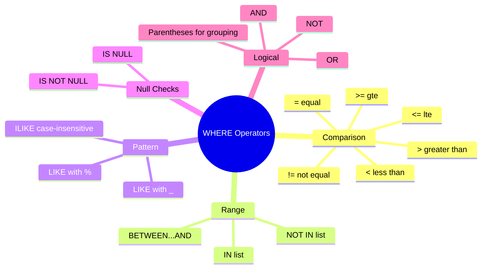

---

## 5. ORDER BY & LIMIT

### 5.1 ORDER BY — Sorting Results

```sql
-- Ascending order (default — lowest to highest)
SELECT name, salary FROM employees ORDER BY salary;

-- Descending order (highest to lowest)
SELECT name, salary FROM employees ORDER BY salary DESC;

-- Sort alphabetically
SELECT name FROM employees ORDER BY name ASC;

-- Sort by multiple columns
-- First by department A→Z, then within each dept by salary high→low
SELECT department, name, salary
FROM employees
ORDER BY department ASC, salary DESC;
```

| department | name  | salary |
|------------|-------|--------|
| Finance    | Eve   | 78000  |
| Finance    | Bob   | 72000  |
| HR         | David | 58000  |
| IT         | Carol | 92000  |
| IT         | Alice | 85000  |

### 5.2 LIMIT — Return Top N Rows

```sql
-- Top 3 highest-paid employees
SELECT name, salary
FROM employees
ORDER BY salary DESC
LIMIT 3;

-- Pagination: skip 10, return next 5
SELECT name, salary
FROM employees
ORDER BY name ASC
LIMIT 5 OFFSET 10;
-- Page 1: LIMIT 5 OFFSET 0
-- Page 2: LIMIT 5 OFFSET 5
-- Page 3: LIMIT 5 OFFSET 10
```

### 5.3 Real-World Use Cases

```sql
-- 🏆 Top 3 products by revenue
SELECT product_name, SUM(revenue) AS total_revenue
FROM sales
GROUP BY product_name
ORDER BY total_revenue DESC
LIMIT 3;

-- 📅 10 most recent orders
SELECT order_id, customer_name, order_date
FROM orders
ORDER BY order_date DESC
LIMIT 10;

-- 🔍 Bottom 5 performers (lowest sales)
SELECT salesperson, SUM(deals_closed) AS total_deals
FROM deals
GROUP BY salesperson
ORDER BY total_deals ASC
LIMIT 5;
```

---

## 6. Aggregate Functions — Summarizing Data

Aggregate functions collapse many rows into a single summary value. They are the core of data analysis.

### 6.1 The Core Five

```sql
-- COUNT: how many rows?
SELECT COUNT(*) AS total_employees FROM employees;         -- counts all rows including NULLs
SELECT COUNT(salary) AS employees_with_salary FROM employees; -- ignores NULLs

-- SUM: total of a numeric column
SELECT SUM(salary) AS total_payroll FROM employees;

-- AVG: arithmetic mean
SELECT AVG(salary) AS average_salary FROM employees;

-- MIN: smallest value
SELECT MIN(salary) AS lowest_salary FROM employees;

-- MAX: largest value
SELECT MAX(salary) AS highest_salary FROM employees;
```

### 6.2 Combining Multiple Aggregates in One Query

```sql
SELECT
    COUNT(*)                              AS headcount,
    SUM(salary)                           AS total_payroll,
    ROUND(AVG(salary), 2)                 AS avg_salary,
    MIN(salary)                           AS min_salary,
    MAX(salary)                           AS max_salary,
    MAX(salary) - MIN(salary)             AS salary_range,
    ROUND(STDDEV(salary), 2)              AS salary_std_dev
FROM employees;
```

### 6.3 COUNT Variations

```sql
-- Count all rows
SELECT COUNT(*) FROM employees;

-- Count non-NULL values in a specific column
SELECT COUNT(dept_id) FROM employees;  -- skips NULLs

-- Count distinct values
SELECT COUNT(DISTINCT department) AS num_departments FROM employees;
```

### 6.4 Aggregating with a WHERE Filter

```sql
-- Average salary only for IT department
SELECT AVG(salary) AS it_avg_salary
FROM employees
WHERE department = 'IT';

-- Total payroll for employees over 30
SELECT SUM(salary) AS senior_payroll
FROM employees
WHERE age > 30;
```

---

## 7. GROUP BY — Category-Level Analytics

`GROUP BY` is where SQL truly becomes a superpower. It lets you calculate metrics **per category** — the foundation of all data analysis.

### 7.1 Basic GROUP BY

```sql
-- Average salary by department
SELECT
    department,
    AVG(salary) AS avg_salary
FROM employees
GROUP BY department;
```

| department | avg_salary |
|------------|-----------|
| IT         | 88500.00  |
| Finance    | 75000.00  |
| HR         | 58000.00  |

### 7.2 Multiple Aggregates with GROUP BY

```sql
SELECT
    department,
    COUNT(*)         AS headcount,
    AVG(salary)      AS avg_salary,
    MIN(salary)      AS min_salary,
    MAX(salary)      AS max_salary,
    SUM(salary)      AS total_payroll
FROM employees
GROUP BY department
ORDER BY avg_salary DESC;
```

### 7.3 GROUP BY Multiple Columns

```sql
-- Headcount and avg salary grouped by department AND age bracket
SELECT
    department,
    CASE
        WHEN age < 30 THEN 'Under 30'
        WHEN age BETWEEN 30 AND 40 THEN '30-40'
        ELSE 'Over 40'
    END AS age_group,
    COUNT(*) AS headcount,
    AVG(salary) AS avg_salary
FROM employees
GROUP BY department, age_group
ORDER BY department, avg_salary DESC;
```

### 7.4 GROUP BY — Mental Model

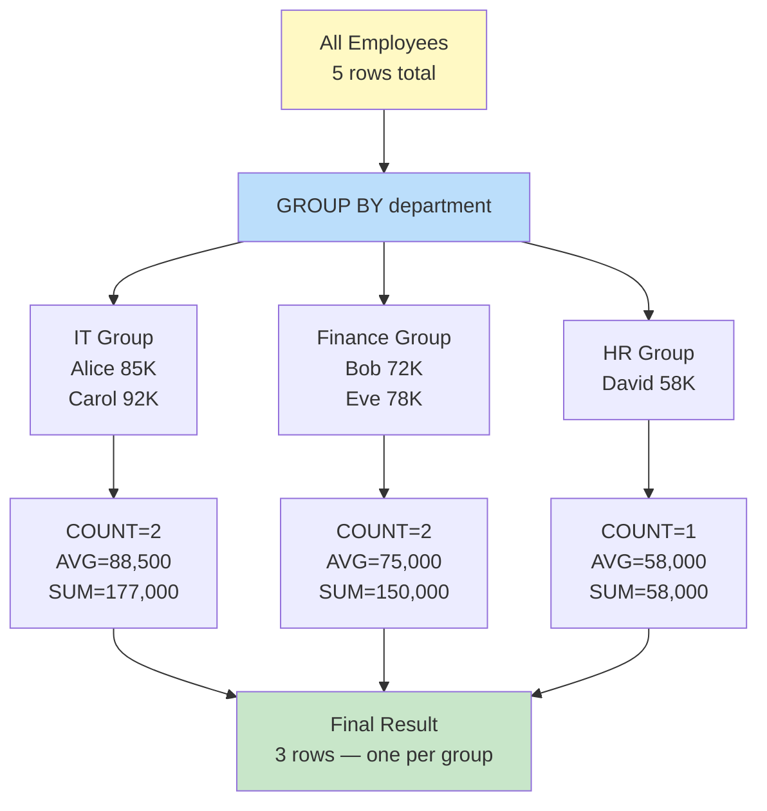

### 7.5 Common GROUP BY Mistakes

```sql
-- ❌ WRONG: selecting a column not in GROUP BY or aggregate
SELECT name, department, AVG(salary)   -- 'name' is neither grouped nor aggregated!
FROM employees
GROUP BY department;

-- ✅ CORRECT: all selected columns must be in GROUP BY or aggregated
SELECT department, AVG(salary)
FROM employees
GROUP BY department;

-- ✅ CORRECT: or wrap the non-aggregated column in an aggregate
SELECT department, MAX(name) AS sample_name, AVG(salary)
FROM employees
GROUP BY department;
```

---

## 8. HAVING — Filtering Groups

`HAVING` is the most misunderstood clause in SQL. Here is the simple, iron-clad rule:

> - **WHERE** filters **rows** (before grouping)
> - **HAVING** filters **groups** (after grouping)

### 8.1 Basic HAVING

```sql
-- Show only departments with average salary above 70K
SELECT department, AVG(salary) AS avg_salary
FROM employees
GROUP BY department
HAVING AVG(salary) > 70000;
```

### 8.2 WHERE vs HAVING — Side by Side

```sql
-- ❌ This FAILS — WHERE cannot use aggregate functions
SELECT department, AVG(salary)
FROM employees
WHERE AVG(salary) > 70000    -- ❌ ERROR!
GROUP BY department;

-- ✅ CORRECT — HAVING filters after aggregation
SELECT department, AVG(salary)
FROM employees
GROUP BY department
HAVING AVG(salary) > 70000;  -- ✅

-- ✅ Using both WHERE and HAVING together
SELECT
    department,
    COUNT(*) AS headcount,
    AVG(salary) AS avg_salary
FROM employees
WHERE age > 25                -- Step 1: filter individual rows (age > 25)
GROUP BY department
HAVING COUNT(*) > 1           -- Step 2: filter groups (dept must have > 1 qualifying employee)
   AND AVG(salary) > 65000;
```

### 8.3 WHERE vs HAVING Execution Flow

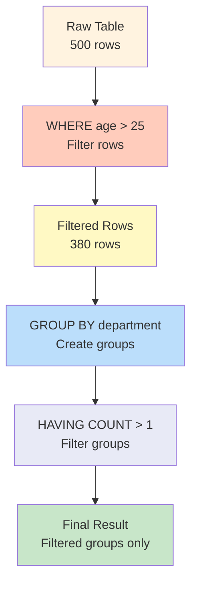

### 8.4 Real-World HAVING Use Cases

```sql
-- Find products with more than 100 total orders
SELECT product_id, COUNT(*) AS order_count
FROM order_items
GROUP BY product_id
HAVING COUNT(*) > 100;

-- Find customers who've spent more than $10,000 total
SELECT customer_id, SUM(order_total) AS lifetime_value
FROM orders
GROUP BY customer_id
HAVING SUM(order_total) > 10000
ORDER BY lifetime_value DESC;

-- Find duplicate entries
SELECT email, COUNT(*) AS occurrences
FROM users
GROUP BY email
HAVING COUNT(*) > 1;
```

---

## 9. JOINs — Combining Tables

JOINs are the most powerful feature in SQL. Real-world data is always spread across multiple tables, and JOINs bring it together.

### Our Sample Tables for This Section

**employees:**
| employee_id | name  | dept_id | salary |
|-------------|-------|---------|--------|
| 1           | Alice | 101     | 85000  |
| 2           | Bob   | 102     | 72000  |
| 3           | Carol | 101     | 92000  |
| 4           | David | 999     | 58000  | ← dept 999 doesn't exist!
| 5           | Eve   | NULL    | 78000  | ← no department assigned

**departments:**
| id  | department_name | location |
|-----|----------------|----------|
| 101 | IT             | New York |
| 102 | Finance        | London   |
| 103 | HR             | Tokyo    |
| 104 | Marketing      | Paris    | ← no employees here!

### 9.1 INNER JOIN — Only Matches

Returns rows that have a **match in both tables**. Non-matching rows from either side are excluded.

```sql
SELECT e.name, d.department_name, d.location, e.salary
FROM employees e
INNER JOIN departments d ON e.dept_id = d.id;
```

| name  | department_name | location | salary |
|-------|----------------|----------|--------|
| Alice | IT             | New York | 85000  |
| Bob   | Finance        | London   | 72000  |
| Carol | IT             | New York | 92000  |

> David (dept 999 — no match) and Eve (NULL dept — no match) are excluded.
> Marketing (no employees) is excluded.

### 9.2 LEFT JOIN — All Left Rows + Matches

Returns **all rows from the left table**, and matching rows from the right. Non-matches from the right become NULL.

```sql
SELECT e.name, d.department_name, e.salary
FROM employees e
LEFT JOIN departments d ON e.dept_id = d.id;
```

| name  | department_name | salary |
|-------|----------------|--------|
| Alice | IT             | 85000  |
| Bob   | Finance        | 72000  |
| Carol | IT             | 92000  |
| David | NULL           | 58000  |
| Eve   | NULL           | 78000  |

> Every employee appears. David and Eve have no matching department → NULL.

**Common LEFT JOIN pattern — find unmatched rows:**
```sql
-- Find employees with no department assigned
SELECT e.name
FROM employees e
LEFT JOIN departments d ON e.dept_id = d.id
WHERE d.id IS NULL;  -- rows that had no match
```

### 9.3 RIGHT JOIN — All Right Rows + Matches

Opposite of LEFT JOIN. Returns all rows from the right table.

```sql
SELECT e.name, d.department_name
FROM employees e
RIGHT JOIN departments d ON e.dept_id = d.id;
```

| name  | department_name |
|-------|----------------|
| Alice | IT             |
| Carol | IT             |
| Bob   | Finance        |
| NULL  | HR             |
| NULL  | Marketing      |

> HR and Marketing appear with NULL employees — they exist in departments but have no employees.

### 9.4 FULL OUTER JOIN — Everything from Both

Returns all rows from both tables, with NULLs where no match exists.

```sql
SELECT e.name, d.department_name
FROM employees e
FULL OUTER JOIN departments d ON e.dept_id = d.id;
```

| name  | department_name |
|-------|----------------|
| Alice | IT             |
| Bob   | Finance        |
| Carol | IT             |
| David | NULL           |
| Eve   | NULL           |
| NULL  | HR             |
| NULL  | Marketing      |

### 9.5 SELF JOIN — A Table Joining Itself

Useful for hierarchical data like org charts.

```sql
-- Find each employee and their manager (both in the same table)
SELECT
    e.name        AS employee,
    m.name        AS manager,
    e.department
FROM employees e
LEFT JOIN employees m ON e.manager_id = m.employee_id;
```

### 9.6 JOIN Types — Visual Reference

```mermaid
flowchart TD
    subgraph INNER["🔵 INNER JOIN"]
        IA["Employees: Alice, Bob,\nCarol, David, Eve"]
        IB["Departments: IT,\nFinance, HR, Marketing"]
        IC["Result: Alice, Bob, Carol\nOnly where dept_id matches"]
        IA --> IC
        IB --> IC
    end

    subgraph LEFT["🟡 LEFT JOIN"]
        LA["Employees: Alice, Bob,\nCarol, David, Eve"]
        LB["Departments: IT,\nFinance, HR, Marketing"]
        LC["Result: All 5 employees\nDavid & Eve get NULL dept"]
        LA --> LC
        LB -. "only matches" .-> LC
    end

    subgraph RIGHT["🟠 RIGHT JOIN"]
        RA["Employees: Alice, Bob,\nCarol, David, Eve"]
        RB["Departments: IT,\nFinance, HR, Marketing"]
        RC["Result: All 4 departments\nHR & Marketing get NULL employee"]
        RA -. "only matches" .-> RC
        RB --> RC
    end

    subgraph FULL["🟣 FULL OUTER JOIN"]
        FA["Employees: Alice, Bob,\nCarol, David, Eve"]
        FB["Departments: IT,\nFinance, HR, Marketing"]
        FC["Result: All 7 rows\nNULLs wherever no match exists"]
        FA --> FC
        FB --> FC
    end
```

### 9.7 Joining Three or More Tables

```sql
-- Three-table join: employees + departments + projects
SELECT
    e.name          AS employee,
    d.department_name,
    d.location,
    p.project_name
FROM employees e
INNER JOIN departments d ON e.dept_id = d.id
LEFT JOIN projects p     ON e.employee_id = p.lead_employee_id
ORDER BY d.department_name, e.name;
```

### 9.8 Common JOIN Mistakes

```sql
-- ❌ Cartesian product — MISSING the ON clause
-- Returns every employee × every department = 5 × 4 = 20 rows!
SELECT * FROM employees, departments;

-- ✅ Always specify the join condition
SELECT * FROM employees e
INNER JOIN departments d ON e.dept_id = d.id;

-- ❌ Joining on the wrong columns
SELECT * FROM employees e
INNER JOIN departments d ON e.employee_id = d.id; -- wrong! employee_id ≠ dept id

-- ✅ Match the right FK to PK
SELECT * FROM employees e
INNER JOIN departments d ON e.dept_id = d.id;
```

---

## 10. Subqueries — SQL Inside SQL

A subquery is a complete SQL query nested inside another query. Think of it as a **temporary table built on the fly**.

### 10.1 Subquery in WHERE

```sql
-- Find employees earning more than the company average
SELECT name, salary
FROM employees
WHERE salary > (SELECT AVG(salary) FROM employees);
```

**How it executes:**
1. Inner query runs first: `SELECT AVG(salary) FROM employees` → returns **77,000**
2. Outer query uses this value: `WHERE salary > 77000`

Result: Alice (85K), Carol (92K), Eve (78K)

### 10.2 Subquery in FROM (Derived Table)

```sql
-- Get department-level stats, then filter those stats
SELECT dept_stats.department, dept_stats.headcount, dept_stats.avg_salary
FROM (
    SELECT
        department,
        COUNT(*)    AS headcount,
        AVG(salary) AS avg_salary
    FROM employees
    GROUP BY department
) AS dept_stats
WHERE dept_stats.headcount > 1
  AND dept_stats.avg_salary > 70000;
```

### 10.3 Correlated Subquery — References the Outer Query

Runs once for **each row** in the outer query (slower, but sometimes necessary).

```sql
-- Find employees earning more than their own department's average
SELECT name, department, salary
FROM employees e
WHERE salary > (
    SELECT AVG(salary)
    FROM employees
    WHERE department = e.department  -- references the outer row!
);
```

### 10.4 EXISTS — Check for Existence

```sql
-- Find departments that have at least one employee
SELECT department_name
FROM departments d
WHERE EXISTS (
    SELECT 1 FROM employees e
    WHERE e.dept_id = d.id
);

-- Find departments with NO employees (anti-join pattern)
SELECT department_name
FROM departments d
WHERE NOT EXISTS (
    SELECT 1 FROM employees e
    WHERE e.dept_id = d.id
);
```

### 10.5 CTEs — The Modern Way (Highly Recommended!)

`WITH` clauses (Common Table Expressions) make complex queries readable and maintainable:

```sql
-- ❌ Hard to read nested subquery
SELECT name, salary
FROM (
    SELECT name, salary,
           AVG(salary) OVER() AS company_avg
    FROM employees
) t
WHERE salary > company_avg;

-- ✅ Clean, readable CTE version
WITH company_avg AS (
    SELECT AVG(salary) AS avg_sal FROM employees
),
high_earners AS (
    SELECT name, salary
    FROM employees, company_avg
    WHERE salary > company_avg.avg_sal
)
SELECT * FROM high_earners ORDER BY salary DESC;
```

**Multiple CTEs — chain them:**
```sql
WITH dept_avgs AS (
    SELECT department, AVG(salary) AS dept_avg
    FROM employees
    GROUP BY department
),
dept_ranks AS (
    SELECT department, dept_avg,
           RANK() OVER (ORDER BY dept_avg DESC) AS dept_rank
    FROM dept_avgs
)
SELECT * FROM dept_ranks WHERE dept_rank <= 2;
```

### Subquery Execution Flow

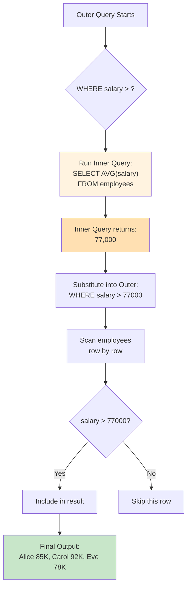

---

## 11. Window Functions — Advanced Analytics Power

Window functions perform calculations across a **set of related rows** without collapsing them (unlike GROUP BY). This is what makes them extraordinarily powerful for data science.

### The Key Difference vs GROUP BY

```sql
-- GROUP BY: collapses rows — you lose individual employee data
SELECT department, AVG(salary)
FROM employees
GROUP BY department;
-- Result: 3 rows (one per department)

-- Window Function: keeps all rows — adds the calculation as a new column
SELECT name, department, salary,
       AVG(salary) OVER (PARTITION BY department) AS dept_avg
FROM employees;
-- Result: 5 rows (all employees preserved), with dept avg alongside each
```

### 11.1 OVER() — The Window Clause

```sql
-- Company-wide statistics alongside each row
SELECT
    name,
    salary,
    AVG(salary) OVER()    AS company_avg,
    MAX(salary) OVER()    AS company_max,
    MIN(salary) OVER()    AS company_min,
    COUNT(*) OVER()       AS total_employees
FROM employees;
```

| name  | salary | company_avg | company_max | company_min |
|-------|--------|-------------|-------------|-------------|
| Alice | 85000  | 77000       | 92000       | 58000       |
| Bob   | 72000  | 77000       | 92000       | 58000       |
| Carol | 92000  | 77000       | 92000       | 58000       |

### 11.2 PARTITION BY — Group-Level Windows

```sql
-- Compare each employee against their department's average
SELECT
    name,
    department,
    salary,
    AVG(salary) OVER (PARTITION BY department)                        AS dept_avg,
    salary - AVG(salary) OVER (PARTITION BY department)              AS diff_from_dept_avg,
    ROUND(salary * 100.0 / SUM(salary) OVER (PARTITION BY department), 1) AS pct_of_dept_payroll
FROM employees;
```

| name  | dept    | salary | dept_avg | diff   | pct   |
|-------|---------|--------|----------|--------|-------|
| Alice | IT      | 85000  | 88500    | -3500  | 48.0% |
| Carol | IT      | 92000  | 88500    | +3500  | 52.0% |
| Bob   | Finance | 72000  | 75000    | -3000  | 48.0% |
| Eve   | Finance | 78000  | 75000    | +3000  | 52.0% |
| David | HR      | 58000  | 58000    | 0      | 100%  |

### 11.3 Ranking Functions

#### RANK() — Ranking with Gaps on Ties

```sql
SELECT name, salary,
       RANK() OVER (ORDER BY salary DESC) AS salary_rank
FROM employees;
```

If two employees tie at the same salary:
`RANK gives: 1, 2, 2, 4, 5` — note the gap at position 3.

#### DENSE_RANK() — Ranking Without Gaps

Same as RANK but no position is skipped on ties:
`DENSE_RANK gives: 1, 2, 2, 3, 4`

#### ROW_NUMBER() — Always Unique

```sql
SELECT name, salary,
       ROW_NUMBER() OVER (ORDER BY salary DESC) AS row_num
FROM employees;
```

Even with ties, ROW_NUMBER gives: `1, 2, 3, 4, 5` — always unique, ties broken arbitrarily.

#### All Three Compared

```sql
-- Given salaries: 92K, 85K, 85K, 78K, 72K
SELECT name, salary,
    RANK()       OVER (ORDER BY salary DESC) AS rnk,        -- 1, 2, 2, 4, 5
    DENSE_RANK() OVER (ORDER BY salary DESC) AS dense_rnk,  -- 1, 2, 2, 3, 4
    ROW_NUMBER() OVER (ORDER BY salary DESC) AS row_num     -- 1, 2, 3, 4, 5
FROM employees;
```

#### Ranking Within Partitions

```sql
-- Rank employees by salary WITHIN each department
SELECT
    name,
    department,
    salary,
    RANK()       OVER (PARTITION BY department ORDER BY salary DESC) AS dept_rank,
    DENSE_RANK() OVER (PARTITION BY department ORDER BY salary DESC) AS dept_dense_rank
FROM employees;
```

| name  | department | salary | dept_rank | dept_dense_rank |
|-------|------------|--------|-----------|-----------------|
| Carol | IT         | 92000  | 1         | 1               |
| Alice | IT         | 85000  | 2         | 2               |
| Eve   | Finance    | 78000  | 1         | 1               |
| Bob   | Finance    | 72000  | 2         | 2               |
| David | HR         | 58000  | 1         | 1               |

### 11.4 Running Totals (Cumulative Sum)

```sql
SELECT
    order_date,
    daily_sales,
    SUM(daily_sales) OVER (ORDER BY order_date)  AS cumulative_sales,
    COUNT(*) OVER (ORDER BY order_date)          AS cumulative_order_count
FROM daily_sales_summary;
```

| order_date | daily_sales | cumulative_sales | cum_orders |
|------------|------------|-----------------|------------|
| 2024-01-01 | 5000       | 5000            | 1          |
| 2024-01-02 | 3000       | 8000            | 2          |
| 2024-01-03 | 7000       | 15000           | 3          |
| 2024-01-04 | 2000       | 17000           | 4          |

### 11.5 Moving / Rolling Averages

```sql
-- 7-day moving average of sales
SELECT
    date,
    sales,
    AVG(sales) OVER (
        ORDER BY date
        ROWS BETWEEN 6 PRECEDING AND CURRENT ROW  -- current row + 6 preceding = 7 rows
    ) AS moving_avg_7day,

    -- 30-day moving average
    AVG(sales) OVER (
        ORDER BY date
        ROWS BETWEEN 29 PRECEDING AND CURRENT ROW
    ) AS moving_avg_30day
FROM daily_sales;
```

### 11.6 LAG() and LEAD() — Look Back & Forward

```sql
-- Compare each day's sales to the previous and next day
SELECT
    date,
    sales,
    LAG(sales, 1)  OVER (ORDER BY date)  AS prev_day_sales,
    LEAD(sales, 1) OVER (ORDER BY date)  AS next_day_sales,
    sales - LAG(sales, 1) OVER (ORDER BY date)  AS day_over_day_change,
    ROUND(
        (sales - LAG(sales, 1) OVER (ORDER BY date)) * 100.0
        / LAG(sales, 1) OVER (ORDER BY date), 1
    ) AS pct_change
FROM daily_sales;
```

| date  | sales | prev_day | next_day | change | pct_change |
|-------|-------|----------|----------|--------|------------|
| Jan 1 | 5000  | NULL     | 3000     | NULL   | NULL       |
| Jan 2 | 3000  | 5000     | 7000     | -2000  | -40.0%     |
| Jan 3 | 7000  | 3000     | 2000     | +4000  | +133.3%    |
| Jan 4 | 2000  | 7000     | NULL     | -5000  | -71.4%     |

### 11.7 NTILE() — Percentile Buckets

```sql
-- Divide employees into 4 salary quartiles
SELECT
    name,
    salary,
    NTILE(4) OVER (ORDER BY salary) AS salary_quartile
    -- Q1=bottom 25%, Q2=25-50%, Q3=50-75%, Q4=top 25%
FROM employees;

-- Divide customers into deciles by spend
SELECT
    customer_id,
    total_spend,
    NTILE(10) OVER (ORDER BY total_spend) AS spend_decile
FROM customer_summary;
```

### 11.8 FIRST_VALUE() and LAST_VALUE()

```sql
-- Show each employee alongside the highest-paid person in their department
SELECT
    name,
    department,
    salary,
    FIRST_VALUE(name) OVER (
        PARTITION BY department
        ORDER BY salary DESC
    ) AS top_earner_in_dept
FROM employees;
```

### 11.9 Window Frame Clause

Controls exactly which rows are included in each calculation:

```sql
-- Frame options:
ROWS BETWEEN UNBOUNDED PRECEDING AND CURRENT ROW   -- all prior rows + current (running total default)
ROWS BETWEEN 2 PRECEDING AND 2 FOLLOWING           -- 5-row centered window
ROWS BETWEEN CURRENT ROW AND UNBOUNDED FOLLOWING   -- current to last row
ROWS BETWEEN 6 PRECEDING AND CURRENT ROW           -- 7-row trailing window (e.g., weekly MA)

-- RANGE vs ROWS:
RANGE -- treats tied values as a group
ROWS  -- treats each physical row individually (usually what you want)
```

### Window Function Architecture

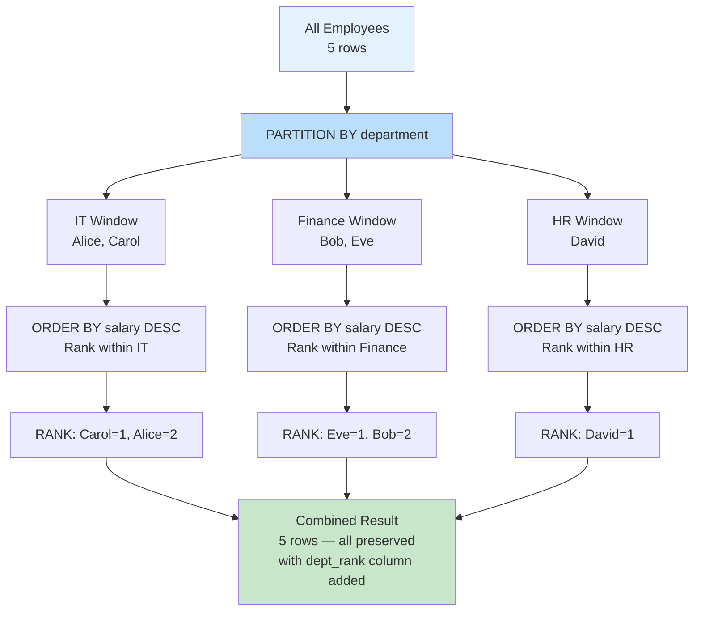

### Window Functions Quick Reference

| Function | Description | Common Use Case |
|----------|-------------|----------------|
| `RANK()` | Rank with gaps on ties | Leaderboards |
| `DENSE_RANK()` | Rank without gaps | Competition results |
| `ROW_NUMBER()` | Always unique sequential number | Pagination, deduplication |
| `SUM() OVER` | Running or windowed sum | Cumulative revenue, totals |
| `AVG() OVER` | Running or windowed average | Moving averages, trends |
| `LAG(n)` | Value from n rows behind | MoM / YoY comparisons |
| `LEAD(n)` | Value from n rows ahead | Forecasting context |
| `NTILE(n)` | Divide into n equal buckets | Percentile / quartile analysis |
| `FIRST_VALUE()` | First value in the window | Baseline comparison |
| `LAST_VALUE()` | Last value in the window | Latest/most recent value |

---

## 12. SQL Execution Order — The Hidden Rule

This is the most critical concept that beginners miss. **SQL is NOT executed in the order you write it.** The database engine processes clauses in a specific logical order.

### The Logical Execution Order

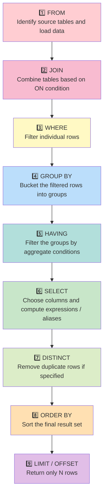

### Why the Execution Order Matters

```sql
-- ❌ FAILS — aliases defined in SELECT can't be used in WHERE
--    (WHERE runs BEFORE SELECT)
SELECT salary * 1.5 AS high_salary
FROM employees
WHERE high_salary > 100000;   -- ERROR: column "high_salary" does not exist

-- ✅ Repeat the expression in WHERE
SELECT salary * 1.5 AS high_salary
FROM employees
WHERE salary * 1.5 > 100000;

-- ✅ Or wrap in a CTE / subquery
WITH augmented AS (
    SELECT name, salary * 1.5 AS high_salary FROM employees
)
SELECT * FROM augmented WHERE high_salary > 100000;
```

```sql
-- ❌ FAILS — aliases defined in SELECT can't be used in HAVING
--    (HAVING runs BEFORE SELECT alias is resolved in some DBs)
SELECT department, AVG(salary) AS avg_sal
FROM employees
GROUP BY department
HAVING avg_sal > 70000;   -- might error in strict SQL

-- ✅ Repeat the aggregate expression
SELECT department, AVG(salary) AS avg_sal
FROM employees
GROUP BY department
HAVING AVG(salary) > 70000;   -- always safe
```

---

## 13. Practical Data Science Patterns

### 13.1 Top N Per Group

```sql
-- Find the top 2 earners in EACH department
WITH ranked_employees AS (
    SELECT
        name,
        department,
        salary,
        ROW_NUMBER() OVER (
            PARTITION BY department
            ORDER BY salary DESC
        ) AS rn
    FROM employees
)
SELECT name, department, salary
FROM ranked_employees
WHERE rn <= 2
ORDER BY department, salary DESC;
```

### 13.2 Find and Remove Duplicates

```sql
-- Step 1: Identify duplicates
SELECT email, COUNT(*) AS occurrences
FROM users
GROUP BY email
HAVING COUNT(*) > 1;

-- Step 2: Keep only the first occurrence (deduplication)
WITH deduplicated AS (
    SELECT *,
           ROW_NUMBER() OVER (
               PARTITION BY email
               ORDER BY created_at ASC   -- keep the oldest entry
           ) AS rn
    FROM users
)
SELECT * FROM deduplicated WHERE rn = 1;
```

### 13.3 Year-over-Year Growth

```sql
WITH yearly_sales AS (
    SELECT
        EXTRACT(YEAR FROM sale_date)  AS year,
        SUM(amount)                   AS total_sales
    FROM sales
    GROUP BY EXTRACT(YEAR FROM sale_date)
)
SELECT
    year,
    total_sales,
    LAG(total_sales) OVER (ORDER BY year)   AS prev_year_sales,
    ROUND(
        (total_sales - LAG(total_sales) OVER (ORDER BY year))
        * 100.0
        / LAG(total_sales) OVER (ORDER BY year),
        2
    )                                       AS yoy_growth_pct
FROM yearly_sales
ORDER BY year;
```

### 13.4 Percentage Contribution

```sql
-- What % of total payroll does each department account for?
SELECT
    department,
    SUM(salary)                                                  AS dept_payroll,
    ROUND(
        SUM(salary) * 100.0 / SUM(SUM(salary)) OVER (),
        1
    )                                                            AS pct_of_total
FROM employees
GROUP BY department
ORDER BY pct_of_total DESC;
```

### 13.5 Cohort Retention Analysis

```sql
-- What % of customers from each signup cohort returned the next month?
WITH first_order AS (
    SELECT
        customer_id,
        DATE_TRUNC('month', MIN(order_date))  AS cohort_month
    FROM orders
    GROUP BY customer_id
),
monthly_activity AS (
    SELECT DISTINCT
        customer_id,
        DATE_TRUNC('month', order_date)  AS active_month
    FROM orders
)
SELECT
    fo.cohort_month,
    ma.active_month,
    COUNT(DISTINCT ma.customer_id)  AS retained_users,
    ROUND(
        COUNT(DISTINCT ma.customer_id) * 100.0
        / FIRST_VALUE(COUNT(DISTINCT ma.customer_id)) OVER (
            PARTITION BY fo.cohort_month ORDER BY ma.active_month
        ),
        1
    )                               AS retention_pct
FROM first_order fo
JOIN monthly_activity ma ON fo.customer_id = ma.customer_id
WHERE ma.active_month >= fo.cohort_month
GROUP BY fo.cohort_month, ma.active_month
ORDER BY fo.cohort_month, ma.active_month;
```

### 13.6 Session Analysis

```sql
-- Identify user sessions (gap > 30 minutes = new session)
WITH session_flags AS (
    SELECT
        user_id,
        event_time,
        CASE
            WHEN event_time - LAG(event_time) OVER (
                     PARTITION BY user_id ORDER BY event_time
                 ) > INTERVAL '30 minutes'
            THEN 1
            ELSE 0
        END AS is_new_session
    FROM user_events
)
SELECT
    user_id,
    event_time,
    SUM(is_new_session) OVER (
        PARTITION BY user_id
        ORDER BY event_time
    ) + 1  AS session_id
FROM session_flags;
```

### 13.7 Complete Analytics Pipeline Example

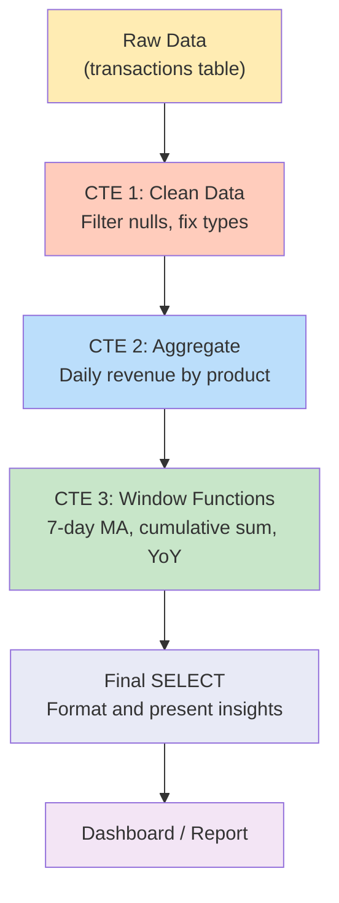

---

## 14. SQL Interview Questions

### Q1: What's the difference between WHERE and HAVING?

| | WHERE | HAVING |
|--|-------|--------|
| **When it runs** | Before GROUP BY | After GROUP BY |
| **Filters** | Individual rows | Aggregated groups |
| **Can use aggregates?** | ❌ No | ✅ Yes |
| **Example** | `WHERE salary > 50000` | `HAVING AVG(salary) > 50000` |

### Q2: UNION vs UNION ALL

```sql
-- UNION: removes duplicate rows (slower — must scan for dupes)
SELECT name FROM employees_us
UNION
SELECT name FROM employees_uk;

-- UNION ALL: keeps everything (faster — no deduplication step)
SELECT name FROM employees_us
UNION ALL
SELECT name FROM employees_uk;
```

> **Rule of thumb:** Use `UNION ALL` by default. Use `UNION` only when you explicitly need deduplication.

### Q3: PRIMARY KEY vs FOREIGN KEY

| | Primary Key | Foreign Key |
|--|-------------|-------------|
| **Purpose** | Uniquely identifies each row | Creates a link to another table |
| **Uniqueness** | Must be unique | Can repeat |
| **NULL allowed?** | No | Sometimes |
| **Table** | Own table | References another table |

### Q4: DELETE vs TRUNCATE vs DROP

| Command | What it removes | Rollback? | Speed |
|---------|----------------|-----------|-------|
| `DELETE` | Specific rows (with WHERE), or all rows | ✅ Yes | Slow |
| `TRUNCATE` | All rows, keeps table structure | ❌ No (usually) | Fast |
| `DROP` | Entire table, including structure | ❌ No | Instant |

### Q5: Find the Second Highest Salary

```sql
-- Method 1: Subquery (works everywhere)
SELECT MAX(salary)
FROM employees
WHERE salary < (SELECT MAX(salary) FROM employees);

-- Method 2: DENSE_RANK window function (most flexible)
SELECT salary
FROM (
    SELECT salary,
           DENSE_RANK() OVER (ORDER BY salary DESC) AS rnk
    FROM employees
) t
WHERE rnk = 2;

-- Method 3: LIMIT + OFFSET (MySQL / PostgreSQL)
SELECT DISTINCT salary
FROM employees
ORDER BY salary DESC
LIMIT 1 OFFSET 1;
```

### Q6: RANK vs DENSE_RANK vs ROW_NUMBER

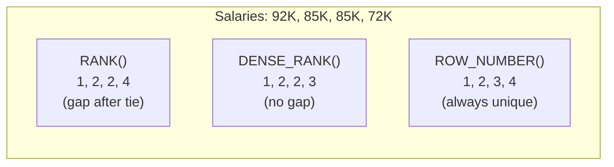

### Q7: What is normalization?

Organizing tables to **reduce data redundancy** and improve integrity.

- **1NF:** Each column has atomic (indivisible) values. No repeating groups.
- **2NF:** No partial dependencies — every non-key column depends on the WHOLE primary key.
- **3NF:** No transitive dependencies — non-key columns depend only on the key, not on other non-key columns.

**Example of denormalized data (bad):**
| order_id | customer_name | customer_email | customer_city | product |
|----------|---------------|----------------|---------------|---------|
| 1        | Alice         | alice@x.com    | NY            | Book    |
| 2        | Alice         | alice@x.com    | NY            | Pen     |

Alice's info is repeated! Change her email once and you have to update every row.

**Normalized (good):**
- `customers(customer_id, name, email, city)`
- `orders(order_id, customer_id FK, product)`

### Q8: Write a query to detect duplicate rows

```sql
-- Find all emails that appear more than once
SELECT email, COUNT(*) AS count
FROM users
GROUP BY email
HAVING COUNT(*) > 1
ORDER BY count DESC;
```

---

## 15. Quick Reference Cheatsheet

```sql
-- ════════════════════════════════════════════════
-- SQL COMPLETE CHEATSHEET
-- ════════════════════════════════════════════════

-- 📌 SELECTING DATA
SELECT col1, col2, expr AS alias FROM table;
SELECT DISTINCT col FROM table;
SELECT * FROM table;

-- 📌 FILTERING ROWS
WHERE col = 'value'
WHERE col != 'value'
WHERE col > 100 AND col < 500
WHERE col BETWEEN 10 AND 20       -- inclusive
WHERE col IN ('a', 'b', 'c')
WHERE col NOT IN ('x', 'y')
WHERE col LIKE 'prefix%'          -- starts with
WHERE col LIKE '%suffix'          -- ends with
WHERE col LIKE '%contains%'       -- contains
WHERE col IS NULL
WHERE col IS NOT NULL

-- 📌 SORTING & LIMITING
ORDER BY col DESC                 -- highest to lowest
ORDER BY col1 ASC, col2 DESC     -- multi-column sort
LIMIT 10                         -- first 10 rows
LIMIT 10 OFFSET 20               -- rows 21-30 (pagination)

-- 📌 AGGREGATE FUNCTIONS
COUNT(*),  COUNT(col)            -- count rows / non-null values
SUM(col),  AVG(col)             -- total / average
MIN(col),  MAX(col)             -- smallest / largest

-- 📌 GROUPING
GROUP BY col1, col2
HAVING COUNT(*) > 5              -- filter on aggregate
HAVING AVG(salary) > 70000

-- 📌 JOINS
FROM t1 INNER JOIN t2 ON t1.id = t2.fk        -- only matches
FROM t1 LEFT  JOIN t2 ON t1.id = t2.fk        -- all left + matches
FROM t1 RIGHT JOIN t2 ON t1.id = t2.fk        -- all right + matches
FROM t1 FULL OUTER JOIN t2 ON t1.id = t2.fk   -- everything

-- 📌 SET OPERATIONS
UNION          -- combine results, remove duplicates
UNION ALL      -- combine results, keep duplicates (faster)
INTERSECT      -- rows in BOTH results
EXCEPT         -- rows in first but NOT second

-- 📌 SUBQUERIES
WHERE col > (SELECT AVG(col) FROM table)       -- scalar subquery
FROM (SELECT ... FROM ...) AS alias            -- derived table
WHERE EXISTS (SELECT 1 FROM t2 WHERE ...)      -- existence check

-- 📌 CTEs (Common Table Expressions)
WITH cte_name AS (
    SELECT ... FROM ... WHERE ...
),
second_cte AS (
    SELECT ... FROM cte_name
)
SELECT * FROM second_cte;

-- 📌 WINDOW FUNCTIONS
RANK()       OVER (PARTITION BY col ORDER BY col2 DESC)
DENSE_RANK() OVER (ORDER BY col DESC)
ROW_NUMBER() OVER (ORDER BY col)
SUM(col)     OVER (ORDER BY date ROWS BETWEEN 6 PRECEDING AND CURRENT ROW)
AVG(col)     OVER (PARTITION BY dept ORDER BY date)
LAG(col, 1)  OVER (ORDER BY date)             -- previous row value
LEAD(col, 1) OVER (ORDER BY date)             -- next row value
NTILE(4)     OVER (ORDER BY salary)           -- quartiles

-- 📌 CONDITIONAL LOGIC
CASE
    WHEN col > 100 THEN 'High'
    WHEN col > 50  THEN 'Medium'
    ELSE 'Low'
END AS category

COALESCE(col, 'default')     -- first non-NULL value
NULLIF(col, 0)               -- returns NULL if col = 0

-- 📌 STRING FUNCTIONS
UPPER(col),  LOWER(col)
LENGTH(col), TRIM(col)
CONCAT(a, b), SUBSTRING(col, start, length)

-- 📌 DATE FUNCTIONS
NOW(),  CURRENT_DATE
DATE_TRUNC('month', date_col)
EXTRACT(YEAR FROM date_col)
DATEDIFF(end_date, start_date)   -- MySQL
date_col + INTERVAL '7 days'     -- PostgreSQL

-- ════════════════════════════════════════════════
-- ⚠️  EXECUTION ORDER (memorise this!)
-- FROM → JOIN → WHERE → GROUP BY →
-- HAVING → SELECT → DISTINCT → ORDER BY → LIMIT
-- ════════════════════════════════════════════════
```

### The SQL Proficiency Ladder

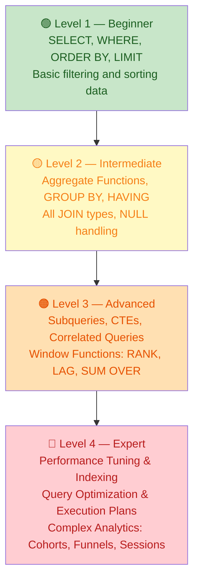

---

> 🎯 **Key Takeaway:** SQL is not about memorizing syntax — it's about **thinking in sets and transformations**. Master `SELECT`, `WHERE`, `GROUP BY`, `JOINs`, and `Window Functions`, and you'll be able to answer 95% of data questions in any organization.

*Happy querying! 🗄️*