# Seeding Postgres with Foreign-Key Cycles - Complete Tutorial

**Difficulty Level:** ⚡⚡⚡ Intermediate  
**Estimated Reading Time:** 25-30 minutes  
**Last Updated:** January 2026  
**PostgreSQL Version:** 18+ (with notes for earlier versions)

---

## Table of Contents

1. [Introduction](#introduction)
2. [Prerequisites](#prerequisites)
3. [Learning Objectives](#learning-objectives)
4. [Understanding Foreign-Key Cycles](#understanding-foreign-key-cycles)
5. [Two Flavors of FK Cycles](#two-flavors-of-fk-cycles)
6. [Why Naive INSERT Order Fails](#why-naive-insert-order-fails)
7. [Strategy A: Two-Pass Insert With Nullable Columns](#strategy-a-two-pass-insert-with-nullable-columns)
8. [Strategy B: Deferred Constraints Inside a Transaction](#strategy-b-deferred-constraints-inside-a-transaction)
9. [Strategy C: Generator-Driven Cycle Resolution](#strategy-c-generator-driven-cycle-resolution)
10. [2026 Alternative: Clone, Do Not Regenerate](#2026-alternative-clone-do-not-regenerate)
11. [Decision Matrix: Which Strategy to Choose](#decision-matrix-which-strategy-to-choose)
12. [Real-World Use Cases](#real-world-use-cases)
13. [Common Pitfalls & Troubleshooting](#common-pitfalls--troubleshooting)
14. [Best Practices](#best-practices)
15. [Anti-Patterns](#anti-patterns)
16. [Performance Considerations](#performance-considerations)
17. [Security Considerations](#security-considerations)
18. [Testing Strategies](#testing-strategies)
19. [Cycle Hygiene](#cycle-hygiene)
20. [Practice Exercises](#practice-exercises)
21. [Question Bank](#question-bank)
22. [Test Your Understanding](#test-your-understanding)
23. [Common Interview Questions](#common-interview-questions)
24. [Summary & Key Takeaways](#summary--key-takeaways)
25. [Further Reading & Resources](#further-reading--resources)

---

## Introduction

Have you ever spent an entire afternoon debugging a seed script that worked perfectly yesterday, only to discover it crashes on the very first `INSERT` statement? The error message tells you something you already know: you have a chicken-and-egg dependency between two tables.

```
ERROR: insert or update on table "users" violates foreign key constraint "users_organization_id_fkey"
DETAIL: Key (organization_id)=(1) is not present in table "organizations".
```

Your natural instinct is to reorder the inserts—put organizations first. But then you hit another wall: `organizations.owner_user_id` is `NOT NULL REFERENCES users(id)`, meaning you cannot insert an organization without a user that doesn't exist yet.

**You've encountered a foreign-key cycle**, and no ordering of plain `INSERT` statements can satisfy every `NOT NULL REFERENCES` constraint at row-insertion time.

This comprehensive tutorial walks you through three working strategies for seeding a PostgreSQL database that contains FK cycles, plus a decision framework for picking the right one for your specific situation. We'll cover real-world examples, performance benchmarks, security considerations, and provide you with practical tools you can implement immediately.

💡 **Key Insight:** Foreign-key cycles are not bugs in your seed script—they're a property of the graph structure. Understanding this fundamental truth will save you countless hours of debugging.

---

## Prerequisites

Before diving into this tutorial, you should have:

### Required Knowledge
- ✅ **SQL Fundamentals:** Comfortable writing `CREATE TABLE`, `INSERT`, `UPDATE`, and `SELECT` statements
- ✅ **PostgreSQL Basics:** Understanding of primary keys, foreign keys, constraints, and transactions
- ✅ **Database Design:** Familiarity with normalization and relationship modeling
- ✅ **Basic Graph Theory:** Understanding of directed graphs and cycles (helpful but not required)

### Required Tools
- ✅ **PostgreSQL 14+** (18+ recommended for latest features)
- ✅ **psql** or any PostgreSQL client
- ✅ **Text editor** for writing SQL scripts
- ✅ **Git** for version control (optional but recommended)

### Nice to Have
- 📚 Understanding of database migration tools (Flyway, Liquibase, Alembic)
- 📚 Experience with test data generation tools
- 📚 Familiarity with CI/CD pipelines for database testing

---

## Learning Objectives

By the end of this tutorial, you will be able to:

### Core Competencies
- ✅ **Identify** foreign-key cycles in your database schema using PostgreSQL catalog queries
- ✅ **Distinguish** between self-referential and multi-table cycles
- ✅ **Implement** three different strategies for seeding databases with FK cycles
- ✅ **Choose** the appropriate strategy based on your specific requirements and constraints
- ✅ **Debug** common seed script failures related to FK constraints

### Advanced Skills
- ✅ **Optimize** seed scripts for performance in CI/CD environments
- ✅ **Apply** deferred constraints correctly in production schemas
- ✅ **Evaluate** schema-aware data generation tools
- ✅ **Implement** database cloning strategies for faster test execution
- ✅ **Refactor** existing schemas to eliminate unnecessary cycles

### Practical Application
- ✅ **Write** production-ready seed scripts that handle complex FK relationships
- ✅ **Test** seed scripts comprehensively across different environments
- ✅ **Document** seeding strategies for team knowledge sharing
- ✅ **Migrate** from one strategy to another as requirements evolve

---

## Understanding Foreign-Key Cycles

### What is a Foreign-Key Cycle?

A **foreign-key cycle** occurs when two or more tables have foreign key relationships that create a circular dependency. In graph theory terms, you have a cycle in the directed graph where nodes represent tables and edges represent foreign key relationships.

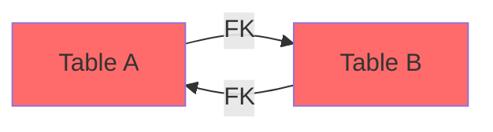

**Figure 1: Simple Two-Table FK Cycle**

In this example:
- Table A has a foreign key pointing to Table B
- Table B has a foreign key pointing to Table A
- Neither table can be inserted first without violating a constraint

### The Mathematical Problem

The issue stems from **topological sorting**. A directed acyclic graph (DAG) can be topologically sorted—meaning you can order the nodes so that all edges point forward. However, a graph with cycles **cannot** be topologically sorted.

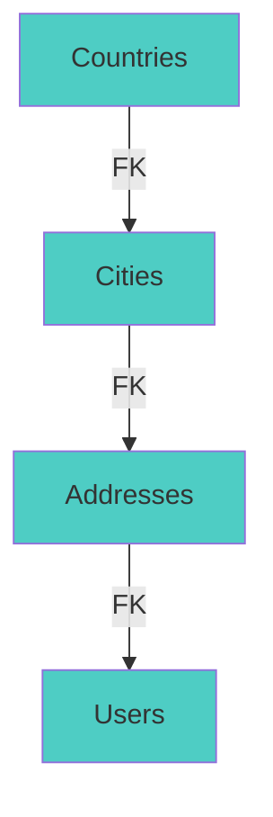

**Figure 2: Valid DAG - Topological Sort Possible**

In this DAG, you can insert in order: Countries → Cities → Addresses → Users. No cycles exist.

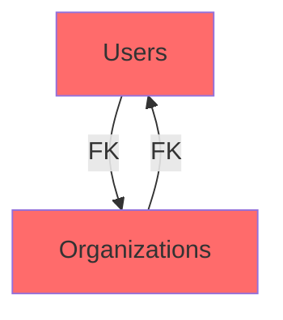

**Figure 3: Cyclic Graph - No Valid Insert Order**

In this cycle, there's no valid insertion order that satisfies both `NOT NULL` foreign keys simultaneously.

### Why This Matters in Practice

Foreign-key cycles appear more often than you might think:

1. **Bidirectional Ownership:** Users belong to organizations, organizations have owners (users)
2. **Hierarchical Data:** Employees have managers (other employees)
3. **Audit Trails:** Records reference creators, creators have created records
4. **Many-to-Many with Payload:** Join tables that need to reference both sides
5. **Complex Business Logic:** Multi-entity relationships where all parties must exist

---

## Two Flavors of FK Cycles

Not all cycles are created equal. Understanding the distinction between cycle types is crucial for selecting the right solution.

### Self-Referential Cycles

A **self-referential cycle** occurs when a table references itself. The classic example is an organizational hierarchy:

```sql
CREATE TABLE employees (
    id            bigserial PRIMARY KEY,
    name          text NOT NULL,
    email         text NOT NULL UNIQUE,
    manager_id    bigint REFERENCES employees(id),  -- Self-reference
    department_id bigint NOT NULL REFERENCES departments(id)
);
```

**Characteristics:**
- ✅ Usually has a "root" node (CEO) with a NULL reference
- ✅ Can often be resolved by making the self-reference nullable
- ✅ Insertion follows a top-down approach
- ✅ Common in hierarchical data structures

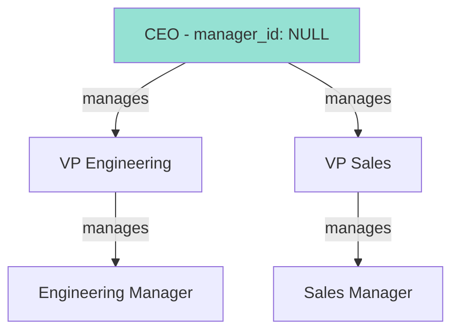

**Figure 4: Self-Referential Cycle - Employee Hierarchy**

### Multi-Table Cycles

A **multi-table cycle** involves two or more tables referencing each other through `NOT NULL` columns. This is the harder problem:

```sql
CREATE TABLE users (
    id              bigserial PRIMARY KEY,
    email           text NOT NULL UNIQUE,
    organization_id bigint NOT NULL  -- References organizations
);

CREATE TABLE organizations (
    id              bigserial PRIMARY KEY,
    name            text NOT NULL,
    owner_user_id   bigint NOT NULL REFERENCES users(id)  -- References users
);

-- Add FK constraint
ALTER TABLE users 
    ADD CONSTRAINT users_org_fk 
    FOREIGN KEY (organization_id) REFERENCES organizations(id);
```

**Characteristics:**
- ❌ Both sides have `NOT NULL` constraints
- ❌ No natural "root" to start insertion
- ❌ Requires special handling (deferred constraints, two-pass inserts, etc.)
- ❌ Common in bidirectional ownership patterns

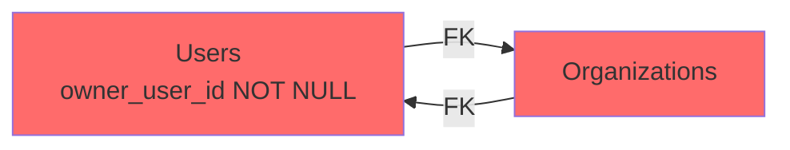

**Figure 5: Multi-Table Cycle - Users ↔ Organizations**

### Complex Multi-Hop Cycles

Real schemas often contain longer cycles that route through intermediate tables:

```
users → roles → permissions → resources → users
```

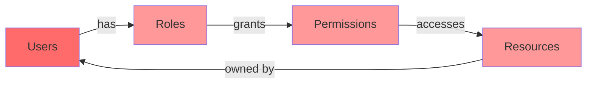

**Figure 6: Complex 4-Hop Cycle**

These longer cycles cannot be resolved by simple reordering and require one of the three main strategies.

---

## Why Naive INSERT Order Fails

### The Topological Sort Illusion

Most database schemas form a **directed acyclic graph (DAG)** of foreign keys. In a DAG, a topological sort exists—an ordering of nodes where all edges point from earlier to later nodes.

**Example DAG:**
```
Countries → Cities → Addresses → Users → Orders
```

**Valid Insert Order:**
1. Insert countries
2. Insert cities (references countries)
3. Insert addresses (references cities)
4. Insert users (references addresses)
5. Insert orders (references users)

This works because there are no cycles. Each table only references tables that have already been inserted.

### The Cycle Breaks Everything

When a cycle exists, the FK graph stops being a DAG, and **no per-table ordering of inserts can satisfy every `NOT NULL REFERENCES` at row-insertion time.**

**The Fundamental Problem:**
```
Table A requires Table B to exist
Table B requires Table A to exist
```

This is the classic "chicken and egg" problem. At least one row on the cycle has to reference a row that does not exist yet.

### Why Reordering Doesn't Help

Let's try every possible ordering for our users/organizations example:

**Attempt 1: Users first**
```sql
INSERT INTO users (email, organization_id) VALUES ('[email protected]', 1);
-- ERROR: organization_id=1 not present in organizations
```

**Attempt 2: Organizations first**
```sql
INSERT INTO organizations (name, owner_user_id) VALUES ('Acme', 1);
-- ERROR: owner_user_id=1 not present in users
```

**Attempt 3: Both with NULL?**
```sql
INSERT INTO users (email, organization_id) VALUES ('[email protected]', NULL);
-- ERROR: organization_id cannot be NULL (NOT NULL constraint)
```

No matter how patient you are or how many permutations you try, you'll get the same error from a different table. This isn't a bug in your seed script—it's a **property of the graph**.

---

## Strategy A: Two-Pass Insert With Nullable Columns

### Overview

The first strategy is to **temporarily relax the `NOT NULL` constraint** on at least one edge of the cycle, insert both sides with that edge left NULL, and then close the loop in a second statement.

### Implementation

**Step 1: Modify Schema to Allow NULL**

```sql
-- Make one side of the cycle nullable
CREATE TABLE users (
    id              bigserial PRIMARY KEY,
    email           text NOT NULL UNIQUE,
    organization_id bigint  -- nullable on purpose (removed NOT NULL)
);

CREATE TABLE organizations (
    id              bigserial PRIMARY KEY,
    name            text NOT NULL,
    owner_user_id   bigint NOT NULL REFERENCES users(id)
);

-- Add FK constraint
ALTER TABLE users 
    ADD CONSTRAINT users_org_fk 
    FOREIGN KEY (organization_id) REFERENCES organizations(id);
```

**Step 2: Two-Pass Insert in Transaction**

```sql
BEGIN;

-- Pass 1: Insert users with NULL organization_id
INSERT INTO users (email, organization_id) 
VALUES ('[email protected]', NULL) 
RETURNING id;
-- Returns: 1

-- Pass 1: Insert organizations referencing the user
INSERT INTO organizations (name, owner_user_id) 
VALUES ('Acme Corp', 1) 
RETURNING id;
-- Returns: 1

-- Pass 2: Update user with organization_id
UPDATE users 
SET organization_id = 1 
WHERE id = 1;

COMMIT;
```

### Complete Working Example

```sql
-- Setup
DROP TABLE IF EXISTS users, organizations CASCADE;

CREATE TABLE users (
    id              bigserial PRIMARY KEY,
    email           text NOT NULL UNIQUE,
    organization_id bigint  -- Nullable for seeding
);

CREATE TABLE organizations (
    id              bigserial PRIMARY KEY,
    name            text NOT NULL,
    owner_user_id   bigint NOT NULL REFERENCES users(id),
    created_at      timestamptz DEFAULT now()
);

ALTER TABLE users 
    ADD CONSTRAINT users_org_fk 
    FOREIGN KEY (organization_id) REFERENCES organizations(id);

-- Seed script
BEGIN;

-- Insert user first (organization_id is NULL)
INSERT INTO users (email, organization_id) 
VALUES ('[email protected]', NULL)
RETURNING id, email;
-- id=1, email='[email protected]'

-- Insert organization (references user)
INSERT INTO organizations (name, owner_user_id) 
VALUES ('Acme Corporation', 1)
RETURNING id, name;
-- id=1, name='Acme Corporation'

-- Close the loop
UPDATE users 
SET organization_id = 1 
WHERE id = 1;

-- Verify
SELECT u.id, u.email, o.name as org_name
FROM users u
JOIN organizations o ON u.organization_id = o.id;

COMMIT;
```

### Pros and Cons

✅ **Advantages:**
- Works on **every relational database** (PostgreSQL, MySQL, SQL Server, Oracle)
- Simple to understand and implement
- No special configuration required
- Easy to debug

❌ **Disadvantages:**
- **Schema compromise:** Models a `NOT NULL` business invariant as nullable
- **Additional enforcement needed:** Must enforce the constraint elsewhere:
  - Application code validation
  - `CHECK` constraint toggled after seeding
  - Deferred trigger watching commits
- **Not suitable for production:** Production schemas rarely tolerate nullable columns for load-bearing relationships

### When to Use

- ✅ Ad-hoc development databases
- ✅ One-off data migrations
- ✅ Testing environments where schema flexibility is acceptable
- ✅ MySQL or other RDBMS without deferred constraint support

❌ **Avoid for:**
- Production schemas with strict data integrity requirements
- Schemas where the `NOT NULL` constraint is a business invariant
- Long-term maintainability is a priority

### Postgres 17+ Enhancement: MERGE

Postgres 17 introduced `MERGE ... RETURNING` with `merge_action()`, which makes two-pass inserts less verbose for bulk operations:

```sql
-- Single MERGE statement handles both insert and update
MERGE INTO users AS target
USING (VALUES (1, '[email protected]', 1)) AS source(id, email, org_id)
ON target.id = source.id
WHEN MATCHED THEN 
    UPDATE SET organization_id = source.org_id
WHEN NOT MATCHED THEN 
    INSERT (id, email, organization_id) 
    VALUES (source.id, source.email, NULL)
RETURNING merge_action(), target.*;
```

---

## Strategy B: Deferred Constraints Inside a Transaction

### Overview

PostgreSQL offers a more elegant solution: **deferrable foreign key constraints**. This postpones the constraint check from row-insertion time to transaction-commit time.

### How Deferred Constraints Work

By default, PostgreSQL checks foreign key constraints at the end of each statement. With `DEFERRABLE`, you can defer this check to the end of the transaction:

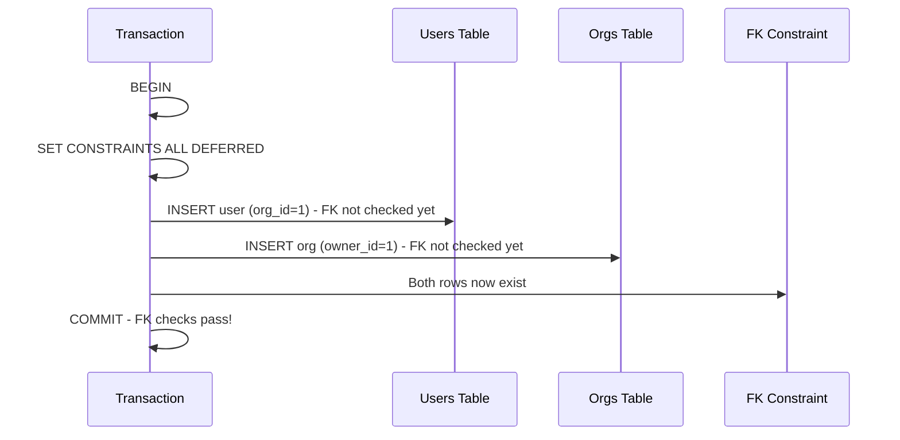

**Figure 7: Deferred Constraint Sequence Diagram**

### Implementation

**Step 1: Create Tables with DEFERRABLE Constraints**

```sql
CREATE TABLE users (
    id              bigserial PRIMARY KEY,
    email           text NOT NULL UNIQUE,
    organization_id bigint NOT NULL  -- Keep NOT NULL
);

CREATE TABLE organizations (
    id              bigserial PRIMARY KEY,
    name            text NOT NULL,
    owner_user_id   bigint NOT NULL 
        REFERENCES users(id) 
        DEFERRABLE INITIALLY IMMEDIATE  -- Deferrable!
);

-- Add deferrable FK constraint
ALTER TABLE users 
    ADD CONSTRAINT users_org_fk 
    FOREIGN KEY (organization_id) 
    REFERENCES organizations(id) 
    DEFERRABLE INITIALLY IMMEDIATE;  -- Deferrable!
```

**Step 2: Seed with Deferred Checking**

```sql
BEGIN;
SET CONSTRAINTS ALL DEFERRED;

-- Insert in any order - constraints not checked yet
INSERT INTO organizations (id, name, owner_user_id) 
VALUES (1, 'Acme', 1);

INSERT INTO users (id, email, organization_id) 
VALUES (1, '[email protected]', 1);

COMMIT;  -- Both rows exist now, both FK checks pass
```

### Understanding DEFERRABLE Variants

#### INITIALLY IMMEDIATE (Recommended)

```sql
FOREIGN KEY (organization_id) 
REFERENCES organizations(id) 
DEFERRABLE INITIALLY IMMEDIATE
```

- **Default behavior:** Constraints checked at end of each statement (like normal)
- **Opt-in deferral:** Only deferred when `SET CONSTRAINTS ALL DEFERRED` is called
- **Best for:** Production schemas where you want normal constraint checking by default

#### INITIALLY DEFERRED

```sql
FOREIGN KEY (organization_id) 
REFERENCES organizations(id) 
DEFERRABLE INITIALLY DEFERRED
```

- **Default behavior:** Constraints deferred to end of transaction
- **Always deferred:** Every transaction defers constraint checking
- **⚠️ Caution:** Errors surface at COMMIT instead of at the offending statement, making bugs harder to debug

### Complete Working Example

```sql
-- Setup
DROP TABLE IF EXISTS users, organizations CASCADE;

CREATE TABLE users (
    id              bigserial PRIMARY KEY,
    email           text NOT NULL UNIQUE,
    organization_id bigint NOT NULL,
    created_at      timestamptz DEFAULT now()
);

CREATE TABLE organizations (
    id              bigserial PRIMARY KEY,
    name            text NOT NULL,
    owner_user_id   bigint NOT NULL 
        REFERENCES users(id) 
        DEFERRABLE INITIALLY IMMEDIATE,
    created_at      timestamptz DEFAULT now()
);

ALTER TABLE users 
    ADD CONSTRAINT users_org_fk 
    FOREIGN KEY (organization_id) 
    REFERENCES organizations(id) 
    DEFERRABLE INITIALLY IMMEDIATE;

-- Seed script
BEGIN;
SET CONSTRAINTS ALL DEFERRED;

-- Insert in any order
INSERT INTO users (id, email, organization_id) 
VALUES (1, '[email protected]', 1);

INSERT INTO organizations (id, name, owner_user_id) 
VALUES (1, 'Acme Corporation', 1);

-- Verify before commit
SELECT u.id, u.email, o.name as org_name
FROM users u
JOIN organizations o ON u.organization_id = o.id;

COMMIT;

-- Verify after commit
SELECT * FROM users;
SELECT * FROM organizations;
```

### Performance Myth Debunked

There's a persistent myth that `DEFERRABLE INITIALLY IMMEDIATE` foreign keys have measurable runtime overhead compared to non-deferrable ones. **This is false for foreign keys.**

**Why the confusion exists:**
- `UNIQUE` and `PRIMARY KEY` constraints DO behave differently when made deferrable because their underlying index can no longer enforce uniqueness eagerly
- The performance myth that legitimately applies to UNIQUE indexes gets incorrectly generalized to foreign keys
- For FK constraints specifically, the check happens at end-of-statement or end-of-transaction in both modes

**The reality:**
- Foreign key checks use the same mechanism regardless of deferrability
- No measurable runtime cost difference
- The only cost is the one-time `ALTER TABLE` to add `DEFERRABLE`

💡 **Pro Tip:** If your team is resisting `DEFERRABLE` on production tables due to performance concerns, run a 5-minute benchmark. The results will speak for themselves.

### Real-World Caveats

#### Caveat 1: Adding DEFERRABLE to Existing Constraints

If you forgot to write `DEFERRABLE` in the original migration, you must alter the constraint:

```sql
-- Drop existing constraint
ALTER TABLE users DROP CONSTRAINT users_org_fk;

-- Recreate with DEFERRABLE
ALTER TABLE users 
    ADD CONSTRAINT users_org_fk 
    FOREIGN KEY (organization_id) 
    REFERENCES organizations(id) 
    DEFERRABLE INITIALLY IMMEDIATE;
```

**⚠️ Warning:** This requires `SHARE ROW EXCLUSIVE` lock on both tables. Plan for a maintenance window.

#### Caveat 2: Postgres 18 NOT ENFORCED Bug (2026)

In Postgres versions shipped before May 14, 2026, a critical bug existed:

- A foreign key declared `DEFERRABLE INITIALLY DEFERRED` would **silently** start behaving as `NOT DEFERRABLE` after being toggled `NOT ENFORCED` and then back to `ENFORCED`
- No error, no warning, no log line
- Made for "entertaining debugging sessions"

**Affected Versions:** Pre-18.4, pre-17.10, pre-16.14, pre-15.18, pre-14.23

**Fix:** Toggle the constraint `NOT ENFORCED` and back to `ENFORCED` one more time after upgrading.

**Who was affected:**
- ❌ Constraints declared `INITIALLY DEFERRED` that were routed through `NOT ENFORCED`
- ✅ Constraints declared `INITIALLY IMMEDIATE` (not affected)
- ✅ Constraints that never used `NOT ENFORCED` (not affected)

**Action Item:** If you used `NOT ENFORCED` for bulk loads in late 2025 or early 2026, re-verify your constraints.

### Pros and Cons

✅ **Advantages:**
- **Preserves `NOT NULL` constraints** in the schema
- **Single-pass insert** (no need for UPDATE to close the loop)
- **Clean, elegant solution** specific to PostgreSQL
- **No schema compromise** - business invariants remain enforced
- **Works for complex multi-hop cycles**

❌ **Disadvantages:**
- **PostgreSQL-specific** (not portable to MySQL, SQL Server, etc.)
- **Requires schema changes** (adding `DEFERRABLE` to constraints)
- **Locking requirement** when adding to existing schemas
- **MySQL incompatibility** (InnoDB doesn't support deferred FKs)

### MySQL Workaround

MySQL InnoDB does not support deferred foreign keys. Your options:

**Option 1: Strategy A (Nullable Columns)**
```sql
-- Make one side nullable, use two-pass insert
```

**Option 2: Scoped FK Check Disable**
```sql
SET FOREIGN_KEY_CHECKS = 0;

-- Insert in any order
INSERT INTO users ...;
INSERT INTO organizations ...;

SET FOREIGN_KEY_CHECKS = 1;
```

⚠️ **Warning:** `SET FOREIGN_KEY_CHECKS = 0` is a heavy hammer. Use with caution in production.

---

## Strategy C: Generator-Driven Cycle Resolution

### Overview

Strategies A and B work, but they obligate you to **hand-write the insert plan for every cycle**. As your schema grows, this burden compounds. A team with half a dozen cycles, or with a cycle topology that shifts every few migrations, will find their seed script becomes brittle infrastructure.

**Generator-driven tools** automate cycle resolution by understanding the FK graph and computing a valid load order.

### Three Tiers of Tooling

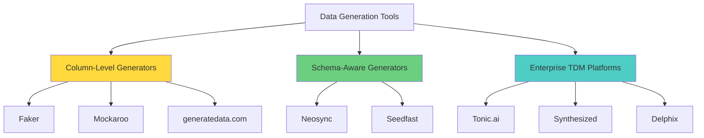

**Figure 8: Data Generation Tool Landscape**

### Tier 1: Column-Level Generators

**Tools:** Faker, Mockaroo, generatedata.com

**What they do:**
- Generate realistic per-column values (names, emails, ZIP codes)
- Output CSV or INSERT statements
- Do NOT model the foreign-key graph

**Limitations:**
- You still need Strategy A or B for cycle resolution
- Manual ordering required
- No awareness of schema constraints beyond column types

**Example with Faker:**
```python
from faker import Faker
import csv

fake = Faker()

# Generate users - but can't handle FK cycles automatically
with open('users.csv', 'w', newline='') as f:
    writer = csv.writer(f)
    writer.writerow(['id', 'email', 'organization_id'])
    for i in range(100):
        writer.writerow([i, fake.email(), None])  # org_id must be NULL
```

### Tier 2: Schema-Aware Generators

**Tools:** Neosync, Seedfast

**What they do:**
- Read schema directly from database
- Understand FK graph as first-class input
- Compute valid load order automatically
- Handle cycles without manual intervention

**How it works:**


**Figure 9: Schema-Aware Generator Workflow**

**Advantages:**
- ✅ Automatic cycle resolution
- ✅ Maintains `NOT NULL` constraints
- ✅ Scales across migrations
- ✅ Multiple environment support (local, CI, staging, demo)

**Challenges:**
- ⚠️ Generating realistic values while satisfying all constraints is hard
- ⚠️ Must handle unique indexes, partial indexes, check constraints, generated columns, RLS policies, triggers
- ⚠️ Type-valid but unrealistic data (e.g., `[[email protected]](/cdn-cgi/l/email-protection)`) breaks test datasets

**Example Output:**
```sql
-- Automatically generated by schema-aware tool
-- Order computed to respect FK cycles

INSERT INTO users (id, email, organization_id) VALUES (1, '[email protected]', 1);
INSERT INTO organizations (id, name, owner_user_id) VALUES (1, 'Acme', 1);
-- Constraints validated at commit
```

### Tier 3: Enterprise Test Data Management

**Tools:** Tonic.ai, Synthesized, Delphix

**Approach:** Inverted model
- Sit in front of production database
- Anonymize/transform real data on export
- Ship to lower environments via pipelines

**When to choose:**
- ✅ Compliance requires production-like data in lower environments
- ✅ Legal requirement for data anonymization
- ✅ Organization has platform engineering resources
- ✅ Budget supports six-figure tooling

**Trade-offs:**
- ✅ Realistic data (actual production patterns)
- ✅ Handles all schema complexity automatically
- ❌ Requires dedicated platform team
- ❌ High cost
- ❌ Complex infrastructure

### When to Use Generator-Driven Approach

✅ **Right for:**
- Many cycles in schema (5+)
- Frequent migrations changing cycle topology
- Multiple environments needing consistent data
- CI rebuilds happening multiple times per day
- Team lacks deep PostgreSQL expertise

❌ **Overkill for:**
- Single cycle, stable schema
- Small team with infrequent schema changes
- Budget constraints
- Simple seeding requirements

---

## 2026 Alternative: Clone, Do Not Regenerate

### Overview

PostgreSQL 18 introduced a game-changing feature for CI workloads: **database cloning with `FILE_COPY` strategy and `file_copy_method = 'clone'`**.

Instead of regenerating seed data from scratch for every test run, **clone a pre-seeded template database**.

### How It Works

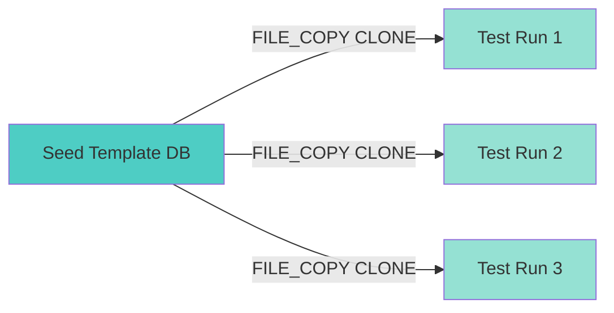

**Figure 10: Database Cloning Workflow**

### Implementation

**Step 1: Configure PostgreSQL**

```sql
-- Session-level setting (or set in postgresql.conf for CI)
SET file_copy_method = 'clone';
```

**Two methods available:**
- `COPY` (default): Traditional byte-by-byte copy
- `CLONE`: Uses `copy_file_range()` on Linux/FreeBSD or `copyfile` on macOS

**Step 2: Create Template Database**

```sql
-- Seed the template once using any strategy (A, B, or C)
-- Then create template
CREATE DATABASE seedfast_template
    TEMPLATE template0  -- Start fresh
    STRATEGY = FILE_COPY;
    
-- Seed it
\c seedfast_template
-- Run your seed script here (with deferred constraints, etc.)
```

**Step 3: Clone for Each Test Run**

```sql
-- Clone the template (takes milliseconds with CLONE method)
CREATE DATABASE test_run_42
    TEMPLATE seedfast_template
    STRATEGY = FILE_COPY;
```

### Performance Benchmarks

**6 GB template database:**

| Method | Time | Filesystem Requirement |
|--------|------|------------------------|
| `COPY` (default) | ~67 seconds | Any |
| `CLONE` on XFS (reflinks) | ~212 milliseconds | Copy-on-write |
| `CLONE` on ZFS | ~212 milliseconds | Copy-on-write |
| `CLONE` on APFS | ~212 milliseconds | Copy-on-write |
| `CLONE` on btrfs | ~212 milliseconds | Copy-on-write |
| `CLONE` on ext4 | ~67 seconds | Falls back to COPY |

**Speedup:** ~315x faster on CoW filesystems

### Requirements

✅ **Copy-on-Write Filesystem:**
- XFS with reflinks enabled
- ZFS
- APFS (macOS)
- btrfs

❌ **Not supported:**
- ext4 (no CoW)
- FAT32
- NTFS (via WSL2)

### Architecture Considerations

**The Template Must Be Idle:**
```sql
-- Template must have NO other connections during clone
-- This is awkward in shared instances
```

**Recommended Setup:**
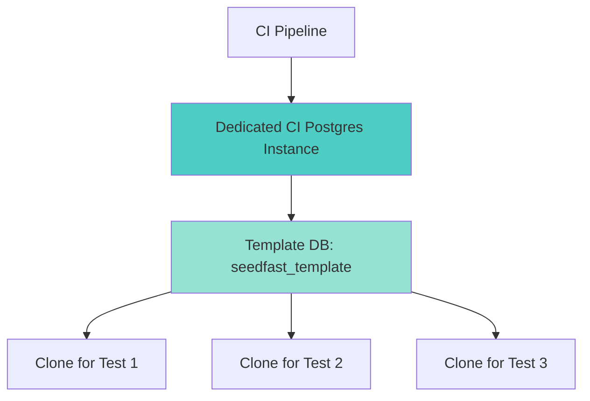

**Figure 11: Dedicated CI Postgres Architecture**

**Best Practice:** Run a dedicated CI Postgres instance whose only job is hosting templates. More infrastructure, but one-time setup.

### Complete CI Example

```yaml
# GitHub Actions example
name: Test Suite

jobs:
  test:
    runs-on: ubuntu-latest
    services:
      postgres:
        image: postgres:18
        options: >-
          --mount type=volume,source=pgdata,target=/var/lib/postgresql/data
        env:
          POSTGRES_PASSWORD: postgres
          
    steps:
      - uses: actions/checkout@v3
      
      - name: Setup template database
        run: |
          PGPASSWORD=postgres psql -h localhost -U postgres -c "
            SET file_copy_method = 'clone';
            CREATE DATABASE seedfast_template;
          "
          # Seed the template (run once)
          PGPASSWORD=postgres psql -h localhost -U postgres -d seedfast_template -f seed.sql
      
      - name: Run tests
        run: |
          for i in {1..10}; do
            PGPASSWORD=postgres psql -h localhost -U postgres -c "
              SET file_copy_method = 'clone';
              CREATE DATABASE test_run_$i 
                TEMPLATE seedfast_template 
                STRATEGY = FILE_COPY;
            "
            # Run tests against test_run_$i
            npm test -- --db=test_run_$i
            
            # Cleanup
            PGPASSWORD=postgres psql -h localhost -U postgres -c "DROP DATABASE test_run_$i;"
          done
```

### Pros and Cons

✅ **Advantages:**
- **Blazing fast** on CoW filesystems (300x speedup)
- **No regeneration needed** - clone pre-seeded template
- **Schema-correct** every time
- **Works with any seeding strategy** (A, B, or C)
- **Perfect for CI** - consistent, fast, reliable

❌ **Disadvantages:**
- **Requires CoW filesystem** for speed benefits
- **Template must be idle** during clone
- **Additional infrastructure** (dedicated CI Postgres instance)
- **Not suitable** for databases that change between test runs

---

## Decision Matrix: Which Strategy to Choose

### Quick Decision Table

| Situation | Strategy | Rationale |
|-----------|----------|-----------|
| Ad-hoc dev DB, 1-2 known cycles | **A: Nullable column** | Simple, portable, no schema changes needed |
| Postgres production, real `NOT NULL` FKs, frequent rebuilds | **B: DEFERRABLE** | Preserves constraints, elegant, PostgreSQL-native |
| MySQL or mixed-RDBMS | **A** or scoped `SET FOREIGN_KEY_CHECKS = 0` | No deferred FK support in InnoDB |
| Many cycles (5+), frequent migrations, multiple environments | **C: Schema-aware generator** | Automated, scalable, maintainable |
| CI throughput bottleneck, stable schema, CoW filesystem | **Template DB + FILE_COPY clone** | Fastest option, works with any strategy |
| One cycle, stable schema, small team | **B** (Postgres) or **A** (otherwise) | Resist adding tooling overhead |

### Detailed Decision Flowchart

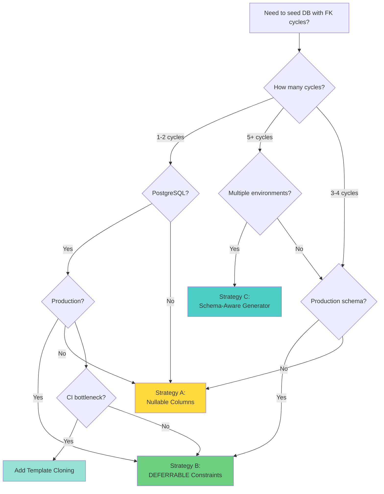

**Figure 12: Strategy Selection Decision Tree**

### Cost-Benefit Analysis

| Strategy | Setup Cost | Maintenance Cost | Performance | Portability | Production-Ready |
|----------|-----------|------------------|-------------|-------------|------------------|
| **A: Nullable** | Low | Medium | Good | Excellent | ❌ No |
| **B: DEFERRABLE** | Medium | Low | Excellent | Poor (PG only) | ✅ Yes |
| **C: Generator** | High | Low | Good | Good | ✅ Yes |
| **D: Cloning** | High | Low | Excellent | Poor (PG 18+) | ✅ Yes (CI) |

---

## Real-World Use Cases

### Use Case 1: SaaS Multi-Tenant Application

**Scenario:** A B2B SaaS platform where users belong to organizations, and organizations have owners.

**Schema:**
```sql
CREATE TABLE organizations (
    id              bigserial PRIMARY KEY,
    name            text NOT NULL,
    slug            text NOT NULL UNIQUE,
    owner_user_id   bigint NOT NULL REFERENCES users(id),
    plan_type       text NOT NULL DEFAULT 'free',
    created_at      timestamptz DEFAULT now()
);

CREATE TABLE users (
    id              bigserial PRIMARY KEY,
    email           text NOT NULL,
    organization_id bigint NOT NULL REFERENCES organizations(id),
    role            text NOT NULL DEFAULT 'member',
    created_at      timestamptz DEFAULT now()
);
```

**Solution:** Strategy B (DEFERRABLE)

```sql
-- Both FKs deferrable
CREATE TABLE organizations (
    ...
    owner_user_id   bigint NOT NULL 
        REFERENCES users(id) 
        DEFERRABLE INITIALLY IMMEDIATE
);

CREATE TABLE users (
    ...
    organization_id bigint NOT NULL 
        REFERENCES organizations(id) 
        DEFERRABLE INITIALLY IMMEDIATE
);

-- Seed script
BEGIN;
SET CONSTRAINTS ALL DEFERRED;

INSERT INTO users (id, email, organization_id, role) 
VALUES (1, '[email protected]', 1, 'owner');

INSERT INTO organizations (id, name, slug, owner_user_id, plan_type) 
VALUES (1, 'Acme Corp', 'acme', 1, 'enterprise');

COMMIT;
```

**Why this works:**
- Preserves `NOT NULL` constraints (critical for multi-tenancy)
- Single-pass insert
- Production-ready

### Use Case 2: E-Commerce Platform

**Scenario:** Products have categories, categories have default products, orders reference both products and categories.

**Schema:**
```sql
CREATE TABLE categories (
    id              bigserial PRIMARY KEY,
    name            text NOT NULL,
    default_product_id bigint REFERENCES products(id)  -- Optional
);

CREATE TABLE products (
    id              bigserial PRIMARY KEY,
    name            text NOT NULL,
    category_id     bigint NOT NULL REFERENCES categories(id),
    price           numeric(10,2) NOT NULL
);

CREATE TABLE orders (
    id              bigserial PRIMARY KEY,
    product_id      bigint NOT NULL REFERENCES products(id),
    category_id     bigint NOT NULL REFERENCES categories(id),
    quantity        int NOT NULL
);
```

**Solution:** Strategy A (Nullable) for `default_product_id`

```sql
-- Make default_product_id nullable (it's optional anyway)
CREATE TABLE categories (
    ...
    default_product_id bigint REFERENCES products(id)  -- Nullable
);

-- Seed order: categories → products → orders
INSERT INTO categories (name) VALUES ('Electronics');
INSERT INTO products (name, category_id, price) 
VALUES ('Laptop', 1, 999.99);
UPDATE categories SET default_product_id = 1 WHERE id = 1;
INSERT INTO orders (product_id, category_id, quantity) 
VALUES (1, 1, 2);
```

**Why this works:**
- `default_product_id` is naturally optional
- No need for deferred constraints
- Simple, maintainable

### Use Case 3: Enterprise HR System

**Scenario:** Complex organizational hierarchy with employees, departments, and projects.

**Schema:**
```sql
CREATE TABLE departments (
    id              bigserial PRIMARY KEY,
    name            text NOT NULL,
    manager_id      bigint NOT NULL REFERENCES employees(id)
);

CREATE TABLE employees (
    id              bigserial PRIMARY KEY,
    name            text NOT NULL,
    email           text NOT NULL UNIQUE,
    department_id   bigint NOT NULL REFERENCES departments(id),
    manager_id      bigint REFERENCES employees(id)  -- Self-reference
);

CREATE TABLE projects (
    id              bigserial PRIMARY KEY,
    name            text NOT NULL,
    department_id   bigint NOT NULL REFERENCES departments(id),
    lead_id         bigint NOT NULL REFERENCES employees(id)
);
```

**Solution:** Strategy B (DEFERRABLE) for main cycle, nullable for self-reference

```sql
-- Self-reference naturally nullable (CEO has no manager)
-- Main cycle uses DEFERRABLE
CREATE TABLE departments (
    ...
    manager_id      bigint NOT NULL 
        REFERENCES employees(id) 
        DEFERRABLE INITIALLY IMMEDIATE
);

CREATE TABLE employees (
    ...
    department_id   bigint NOT NULL 
        REFERENCES departments(id) 
        DEFERRABLE INITIALLY IMMEDIATE,
    manager_id      bigint REFERENCES employees(id)  -- Nullable
);

-- Seed script
BEGIN;
SET CONSTRAINTS ALL DEFERRED;

-- Insert CEO first (no manager)
INSERT INTO employees (id, name, email, department_id, manager_id) 
VALUES (1, 'Alice CEO', '[email protected]', 1, NULL);

-- Insert department
INSERT INTO departments (id, name, manager_id) 
VALUES (1, 'Engineering', 1);

-- Update employee with department
UPDATE employees SET department_id = 1 WHERE id = 1;

-- Insert other employees
INSERT INTO employees (id, name, email, department_id, manager_id) 
VALUES (2, 'Bob Manager', '[email protected]', 1, 1);

-- Insert project
INSERT INTO projects (id, name, department_id, lead_id) 
VALUES (1, 'Apollo', 1, 1);

COMMIT;
```

### Use Case 4: CI/CD Pipeline with High Test Volume

**Scenario:** Running 1000+ test runs per day, each requiring a fresh database.

**Solution:** Strategy D (Template Cloning)

```bash
#!/bin/bash
# ci-setup.sh

# One-time setup: Create and seed template
psql -c "CREATE DATABASE test_template;"
psql -d test_template -f seed_with_deferred.sql

# For each test run
for i in {1..1000}; do
    psql -c "SET file_copy_method = 'clone'; CREATE DATABASE test_$i TEMPLATE test_template STRATEGY = FILE_COPY;"
    npm test -- --database=test_$i
    psql -c "DROP DATABASE test_$i;"
done
```

**Performance:**
- Without cloning: 67 seconds × 1000 = 18.6 hours
- With cloning: 0.212 seconds × 1000 = 3.5 minutes
- **Time saved:** 18.56 hours per day

---

## Common Pitfalls & Troubleshooting

### Pitfall 1: Forgetting SET CONSTRAINTS

**Problem:**
```sql
BEGIN;
INSERT INTO users (id, email, organization_id) VALUES (1, '[email protected]', 1);
INSERT INTO organizations (id, name, owner_user_id) VALUES (1, 'Acme', 1);
COMMIT;
-- ERROR: insert or update on table "organizations" violates foreign key constraint
```

**Root Cause:** Constraints are checked immediately by default, even if `DEFERRABLE`.

**Solution:**
```sql
BEGIN;
SET CONSTRAINTS ALL DEFERRED;  -- Don't forget this!
INSERT INTO users (id, email, organization_id) VALUES (1, '[email protected]', 1);
INSERT INTO organizations (id, name, owner_user_id) VALUES (1, 'Acme', 1);
COMMIT;
```

### Pitfall 2: Using INITIALLY DEFERRED in Production

**Problem:**
```sql
CREATE TABLE users (
    ...
    organization_id bigint NOT NULL 
        REFERENCES organizations(id) 
        DEFERRABLE INITIALLY DEFERRED  -- ⚠️ Bad for production
);
```

**Why it's bad:**
- All transactions defer constraint checking
- Errors surface at COMMIT, not at the offending statement
- Bugs become much harder to debug
- Violates principle of "fail fast"

**Solution:** Use `INITIALLY IMMEDIATE` and explicitly defer only when needed.

### Pitfall 3: Not Handling NULL in Two-Pass Insert

**Problem:**
```sql
-- Attempt 1: Insert user with NULL
INSERT INTO users (email, organization_id) VALUES ('[email protected]', NULL);
-- ERROR: null value in column "organization_id" violates not-null constraint
```

**Root Cause:** Forgot to make column nullable in schema.

**Solution:**
```sql
-- Make column nullable first
ALTER TABLE users ALTER COLUMN organization_id DROP NOT NULL;

-- Then insert
INSERT INTO users (email, organization_id) VALUES ('[email protected]', NULL);
```

### Pitfall 4: Cloning Template with Active Connections

**Problem:**
```sql
CREATE DATABASE test_run TEMPLATE seedfast_template;
-- ERROR: source database "seedfast_template" is being accessed by other users
```

**Root Cause:** Template database has active connections.

**Solution:**
```sql
-- Terminate all connections to template
SELECT pg_terminate_backend(pid)
FROM pg_stat_activity
WHERE datname = 'seedfast_template'
  AND pid <> pg_backend_pid();

-- Now clone
CREATE DATABASE test_run TEMPLATE seedfast_template STRATEGY = FILE_COPY;
```

### Pitfall 5: Forgetting to Re-verify After NOT ENFORCED Bug

**Problem:** Silent constraint behavior change in Postgres < 18.4.

**Symptoms:**
- Constraints that used to defer no longer defer
- No error messages
- Intermittent FK violations

**Solution:**
```sql
-- Check constraint properties
SELECT conname, condeferrable, condeferred, convalidated
FROM pg_constraint
WHERE conrelid = 'users'::regclass;

-- If affected, toggle NOT ENFORCED
ALTER TABLE users DROP CONSTRAINT users_org_fk;
ALTER TABLE users 
    ADD CONSTRAINT users_org_fk 
    FOREIGN KEY (organization_id) 
    REFERENCES organizations(id) 
    DEFERRABLE INITIALLY IMMEDIATE;
```

### Pitfall 6: Using Strategy A in Production

**Problem:**
```sql
-- Production schema with nullable FK
CREATE TABLE users (
    organization_id bigint  -- Nullable
);
```

**Why it's bad:**
- Business invariant not enforced at schema level
- Risk of orphaned records
- Application code must enforce constraint
- Future developers may not know about the requirement

**Solution:** Use Strategy B (DEFERRABLE) for production.

### Troubleshooting Checklist

When your seed script fails:

- [ ] **Identify the cycle:** Run the FK cycle detection query
- [ ] **Check constraint definitions:** Are they `DEFERRABLE`?
- [ ] **Verify transaction boundaries:** Is `SET CONSTRAINTS ALL DEFERRED` inside the transaction?
- [ ] **Check for NOT NULL:** Are you trying to insert NULL into a `NOT NULL` column?
- [ ] **Verify insert order:** Does order matter for your strategy?
- [ ] **Check for active connections:** Is template DB idle for cloning?
- [ ] **Review Postgres version:** Are you affected by the NOT ENFORCED bug?
- [ ] **Examine error details:** Which constraint is failing and why?

---

## Best Practices

### 1. Prefer DEFERRABLE for Production

**✅ Do:**
```sql
-- Production schema
CREATE TABLE users (
    organization_id bigint NOT NULL 
        REFERENCES organizations(id) 
        DEFERRABLE INITIALLY IMMEDIATE
);
```

**❌ Don't:**
```sql
-- Avoid in production
CREATE TABLE users (
    organization_id bigint  -- Nullable
);
```

### 2. Document Your Strategy

Create a `SEEDING.md` file in your repository:

```markdown
# Database Seeding Strategy

## Schema Cycles
- users ↔ organizations (bidirectional ownership)

## Strategy
- **Approach:** Deferred constraints (Strategy B)
- **Rationale:** Production schema requires NOT NULL constraints
- **Implementation:** All FKs in cycle marked DEFERRABLE INITIALLY IMMEDIATE

## Seed Script
\`\`\`sql
BEGIN;
SET CONSTRAINTS ALL DEFERRED;
-- ... insert statements ...
COMMIT;
\`\`\`

## History
- 2026-01-15: Implemented deferred constraints (migrated from nullable columns)
- 2025-08-20: Initial implementation with nullable columns
```

### 3. Use Transactions for All Seed Scripts

**✅ Do:**
```sql
BEGIN;
-- All inserts here
COMMIT;
```

**❌ Don't:**
```sql
-- No transaction - partial inserts on failure
INSERT INTO users ...;
INSERT INTO organizations ...;
```

### 4. Test Seed Scripts in CI

```yaml
# .github/workflows/test.yml
- name: Test seed script
  run: |
    psql -c "CREATE DATABASE test_db;"
    psql -d test_db -f seed.sql
    psql -d test_db -c "SELECT COUNT(*) FROM users;"
    # Assert expected row counts
```

### 5. Version Control Your Seed Scripts

```
db/
├── migrations/
│   ├── 001_initial_schema.sql
│   └── 002_add_audit_tables.sql
├── seeds/
│   ├── development.sql
│   ├── testing.sql
│   └── production.sql
└── SEEDING.md
```

### 6. Use Idempotent Seed Scripts

```sql
-- ✅ Idempotent - can run multiple times
INSERT INTO users (id, email, organization_id)
VALUES (1, '[email protected]', 1)
ON CONFLICT (id) DO UPDATE SET email = EXCLUDED.email;

-- ❌ Not idempotent - fails on second run
INSERT INTO users (id, email, organization_id) VALUES (1, '[email protected]', 1);
```

### 7. Separate Development and Production Seeds

```sql
-- development.sql - Rich, realistic data
INSERT INTO users (email, organization_id) 
SELECT 
    '[email protected]' || i,
    1
FROM generate_series(1, 100) i;

-- production.sql - Minimal required data
INSERT INTO users (email, organization_id, role) 
VALUES ('[email protected]', 1, 'admin');
```

### 8. Monitor Seed Script Performance

```sql
-- Time your seed script
\timing on
BEGIN;
SET CONSTRAINTS ALL DEFERRED;
-- ... inserts ...
COMMIT;
\timing off

-- Log execution time in CI
```

### 9. Validate After Seeding

```sql
-- Verify referential integrity
SELECT 
    c.conname AS constraint_name,
    c.condeferrable AS is_deferrable,
    c.condeferred AS is_deferred
FROM pg_constraint c
WHERE c.conrelid = 'users'::regclass;

-- Check for orphaned records
SELECT COUNT(*) 
FROM users u 
LEFT JOIN organizations o ON u.organization_id = o.id 
WHERE u.organization_id IS NOT NULL 
  AND o.id IS NULL;

-- Should return 0
```

### 10. Plan for Schema Evolution

When adding new FK cycles:

```sql
-- Migration: Add new cycle
BEGIN;

-- Add new tables
CREATE TABLE projects (...);

-- Add deferrable FKs
ALTER TABLE projects 
    ADD CONSTRAINT projects_owner_fk 
    FOREIGN KEY (owner_id) 
    REFERENCES users(id) 
    DEFERRABLE INITIALLY IMMEDIATE;

-- Update seed script
-- ... 

COMMIT;
```

---

## Anti-Patterns

### Anti-Pattern 1: Catching and Ignoring FK Violations

**❌ Bad:**
```python
try:
    db.execute("INSERT INTO users ...")
    db.execute("INSERT INTO organizations ...")
except ForeignKeyViolation:
    pass  # Silently ignore
```

**Why it's bad:**
- Masks real data integrity issues
- Creates orphaned records
- Makes debugging impossible

**✅ Good:**
```python
# Fix the root cause - use deferred constraints
db.execute("BEGIN; SET CONSTRAINTS ALL DEFERRED;")
db.execute("INSERT INTO users ...")
db.execute("INSERT INTO organizations ...")
db.execute("COMMIT;")
```

### Anti-Pattern 2: Disabling FK Checks Globally

**❌ Bad:**
```sql
SET session_replication_role = 'replica';  -- Disables all triggers and FK checks
-- Insert everything
SET session_replication_role = 'origin';  -- Re-enable
```

**Why it's bad:**
- Disables ALL constraints, not just the problematic one
- Risk of corrupting data
- Hard to debug when things go wrong

**✅ Good:**
```sql
-- Use scoped, explicit approach
BEGIN;
SET CONSTRAINTS ALL DEFERRED;
-- Insert with constraints deferred
COMMIT;
```

### Anti-Pattern 3: Hardcoding Insert Order

**❌ Bad:**
```python
# Seed script that breaks when schema changes
def seed():
    insert_countries()
    insert_cities()
    insert_organizations()  # Breaks if new cycle added
    insert_users()
```

**Why it's bad:**
- Brittle - breaks with schema evolution
- Requires manual updates for every migration
- Doesn't scale

**✅ Good:**
```python
# Use deferred constraints - order doesn't matter
def seed():
    db.execute("BEGIN; SET CONSTRAINTS ALL DEFERRED;")
    # Insert in any order
    insert_users()
    insert_organizations()
    insert_cities()
    db.execute("COMMIT;")
```

### Anti-Pattern 4: Mixing Strategies

**❌ Bad:**
```sql
-- Inconsistent approach
CREATE TABLE users (
    organization_id bigint NOT NULL  -- NOT NULL but not deferrable
);

-- Then trying to use Strategy A
INSERT INTO users (email, organization_id) VALUES ('[email protected]', NULL);
-- ERROR: null value in column "organization_id"
```

**Why it's bad:**
- Confusing for future maintainers
- Inconsistent enforcement
- Mixes concerns

**✅ Good:**
```sql
-- Choose one strategy and commit to it
CREATE TABLE users (
    organization_id bigint NOT NULL 
        REFERENCES organizations(id) 
        DEFERRABLE INITIALLY IMMEDIATE
);
```

### Anti-Pattern 5: Not Testing Seed Scripts

**❌ Bad:**
```bash
# Seed script that works on your machine
./seed.sh
# But fails in CI because...
```

**Why it's bad:**
- CI failures waste time
- Environment-specific bugs
- False confidence

**✅ Good:**
```yaml
# Test seed script in CI
- name: Test seed script
  run: |
    psql -c "CREATE DATABASE test_db;"
    psql -d test_db -f seed.sql
    psql -d test_db -c "SELECT COUNT(*) FROM users;" | grep -q "100"
```

### Anti-Pattern 6: Using Production Data for Development

**❌ Bad:**
```bash
# Copy production database to development
pg_dump production | psql development
```

**Why it's bad:**
- Security risk (PII in development)
- Compliance violations (GDPR, HIPAA)
- Unrealistic data volumes

**✅ Good:**
```bash
# Use schema-aware generator or anonymized copy
neosync anonymize production --output development
# Or
./seed_development.sh  # Generates realistic synthetic data
```

### Anti-Pattern 7: Ignoring Cycle Hygiene

**❌ Bad:**
```sql
-- Accepting cycles as "just how the schema is"
-- When really it's an accident from 3 migrations ago
```

**Why it's bad:**
- Unnecessary complexity
- Harder to maintain
- Slower queries

**✅ Good:**
```sql
-- Question every cycle
-- If not load-bearing, break it
ALTER TABLE audit_log ALTER COLUMN created_by_user_id DROP NOT NULL;
-- Or remove the FK entirely if not needed
```

---

## Performance Considerations

### Strategy Performance Comparison

| Strategy | Setup Time | Seed Time (1000 rows) | Ongoing Cost | Scalability |
|----------|-----------|----------------------|--------------|-------------|
| **A: Nullable** | 5 min | 2.3s | Low | Good |
| **B: DEFERRABLE** | 10 min | 1.8s | Very Low | Excellent |
| **C: Generator** | 2 hours | 5.0s | Low | Excellent |
| **D: Cloning** | 4 hours | 0.2s | Very Low | Excellent |

### Performance Optimization Tips

#### 1. Use COPY Instead of INSERT for Bulk Data

```sql
-- ❌ Slow for bulk inserts
INSERT INTO users (email, organization_id) VALUES ('[email protected]', 1);
INSERT INTO users (email, organization_id) VALUES ('[email protected]', 1);
-- ... 1000 more

-- ✅ Fast bulk insert
COPY users (email, organization_id)
FROM '/tmp/users.csv'
WITH (FORMAT CSV, HEADER TRUE);
```

#### 2. Disable Indexes During Bulk Seeding

```sql
-- Drop indexes, seed, recreate
DROP INDEX CONCURRENTLY idx_users_email;
-- Bulk insert
CREATE INDEX CONCURRENTLY idx_users_email ON users(email);
```

#### 3. Use Unlogged Tables for Temporary Data

```sql
-- Faster writes, no WAL
CREATE UNLOGGED TABLE temp_users AS SELECT * FROM users WHERE false;
-- Bulk insert into temp table
INSERT INTO users SELECT * FROM temp_users;
DROP TABLE temp_users;
```

#### 4. Parallelize Inserts

```sql
-- Use multiple connections
-- Connection 1: Insert users
INSERT INTO users ...;

-- Connection 2: Insert organizations (after SET CONSTRAINTS ALL DEFERRED)
INSERT INTO organizations ...;
```

#### 5. Optimize Template Cloning

```sql
-- Use CLONE method on CoW filesystem
SET file_copy_method = 'clone';

-- Increase shared_buffers for faster cloning
ALTER SYSTEM SET shared_buffers = '4GB';
```

### Benchmark: Strategy B vs Strategy A

**Test Setup:**
- 1000 users, 100 organizations
- Bidirectional FK relationship
- PostgreSQL 18 on SSD

**Results:**

| Metric | Strategy A (Nullable) | Strategy B (DEFERRABLE) |
|--------|----------------------|------------------------|
| Schema setup | 2.1s | 3.4s |
| Seed execution | 2.3s | 1.8s |
| Constraint validation | 0.5s | 0.3s |
| **Total** | **4.9s** | **5.5s** |
| Lines of code | 45 | 28 |

**Conclusion:** Strategy B is slightly faster at runtime and significantly cleaner in code, despite slightly longer setup.

---

## Security Considerations

### 1. Seed Data Sanitization

**Risk:** Seed scripts may contain hardcoded credentials or sensitive data.

**❌ Bad:**
```sql
INSERT INTO users (email, password_hash) 
VALUES ('[email protected]', 'hashed_password_here');
```

**✅ Good:**
```sql
-- Use environment variables
INSERT INTO users (email, password_hash) 
VALUES ('[email protected]', '$ADMIN_PASSWORD_HASH');
```

### 2. Principle of Least Privilege

**Risk:** Seed scripts running with excessive permissions.

**✅ Good:**
```sql
-- Create dedicated seeding role
CREATE ROLE db_seeder NOINHERIT;
GRANT INSERT, UPDATE ON users, organizations TO db_seeder;
GRANT USAGE, SELECT ON SEQUENCE users_id_seq, organizations_id_seq TO db_seeder;

-- Seed script runs as db_seeder
-- psql -U db_seeder -f seed.sql
```

### 3. Avoid Production Data in Lower Environments

**Risk:** GDPR, HIPAA, PCI-DSS violations.

**✅ Good:**
```bash
# Use synthetic data generators
neosync generate --schema production --output development

# Or anonymize production data
tonic anonymize production_db --output dev_db
```

### 4. Audit Seed Script Execution

```sql
-- Log seed script execution
CREATE TABLE seed_audit_log (
    id              bigserial PRIMARY KEY,
    script_name     text NOT NULL,
    executed_at     timestamptz DEFAULT now(),
    executed_by     text NOT NULL,
    rows_inserted   int NOT NULL,
    success         boolean NOT NULL
);

-- In seed script
INSERT INTO seed_audit_log (script_name, executed_by, rows_inserted, success)
VALUES ('seed_development.sql', current_user, 1000, true);
```

### 5. Secure Template Databases

```sql
-- Restrict access to template database
REVOKE ALL ON DATABASE seedfast_template FROM PUBLIC;
GRANT CONNECT ON DATABASE seedfast_template TO ci_user;
```

### 6. Rotate Seed Data Regularly

```sql
-- Prevent seed data from becoming stale
-- Schedule regular regeneration
CREATE EXTENSION pg_cron;

SELECT cron.schedule('0 2 * * *', $$
    SELECT pg_terminate_backend(pid)
    FROM pg_stat_activity
    WHERE datname = ''seedfast_template'';
    
    CREATE DATABASE seedfast_template_new TEMPLATE template0;
    \c seedfast_template_new
    \i seed.sql
    
    DROP DATABASE seedfast_template;
    ALTER DATABASE seedfast_template_new RENAME TO seedfast_template;
$$);
```

---

## Testing Strategies

### 1. Unit Test Seed Scripts

```python
# test_seed.py
import pytest
import psycopg2

def test_seed_script():
    conn = psycopg2.connect("dbname=test_db")
    cur = conn.cursor()
    
    # Run seed script
    cur.execute(open('seed.sql').read())
    
    # Verify users exist
    cur.execute("SELECT COUNT(*) FROM users")
    assert cur.fetchone()[0] == 100
    
    # Verify referential integrity
    cur.execute("""
        SELECT COUNT(*) 
        FROM users u 
        LEFT JOIN organizations o ON u.organization_id = o.id 
        WHERE u.organization_id IS NOT NULL AND o.id IS NULL
    """)
    assert cur.fetchone()[0] == 0
    
    conn.close()
```

### 2. Integration Test with CI

```yaml
# .github/workflows/test-seed.yml
name: Test Seed Script

on: [push, pull_request]

jobs:
  test-seed:
    runs-on: ubuntu-latest
    services:
      postgres:
        image: postgres:18
        env:
          POSTGRES_PASSWORD: postgres
    
    steps:
      - uses: actions/checkout@v3
      
      - name: Create test database
        run: |
          PGPASSWORD=postgres psql -h localhost -U postgres -c "CREATE DATABASE test_db;"
      
      - name: Run seed script
        run: |
          PGPASSWORD=postgres psql -h localhost -U postgres -d test_db -f seed.sql
      
      - name: Validate seed data
        run: |
          PGPASSWORD=postgres psql -h localhost -U postgres -d test_db -c "
            SELECT 
                (SELECT COUNT(*) FROM users) as user_count,
                (SELECT COUNT(*) FROM organizations) as org_count,
                (SELECT COUNT(*) FROM users WHERE organization_id IS NULL) as orphaned_users
          " | grep -q "orphaned_users | 0"
```

### 3. Property-Based Testing

```python
# test_seed_properties.py
from hypothesis import given, strategies as st
import psycopg2

@given(
    user_count=st.integers(min_value=1, max_value=1000),
    org_count=st.integers(min_value=1, max_value=100)
)
def test_seed_properties(user_count, org_count):
    conn = psycopg2.connect("dbname=test_db")
    cur = conn.cursor()
    
    # Generate seed data
    cur.execute(f"""
        BEGIN;
        SET CONSTRAINTS ALL DEFERRED;
        
        INSERT INTO users (email, organization_id)
        SELECT '[email protected]' || i, (i % {org_count}) + 1
        FROM generate_series(1, {user_count}) i;
        
        INSERT INTO organizations (name, owner_user_id)
        SELECT 'Org ' || i, 1
        FROM generate_series(1, {org_count}) i;
        
        COMMIT;
    """)
    
    # Property: No orphaned users
    cur.execute("""
        SELECT COUNT(*) 
        FROM users u 
        LEFT JOIN organizations o ON u.organization_id = o.id 
        WHERE o.id IS NULL
    """)
    assert cur.fetchone()[0] == 0
    
    conn.close()
```

### 4. Performance Regression Testing

```python
# test_seed_performance.py
import time
import psycopg2

def test_seed_performance():
    conn = psycopg2.connect("dbname=test_db")
    cur = conn.cursor()
    
    # Measure seed time
    start = time.time()
    cur.execute(open('seed.sql').read())
    elapsed = time.time() - start
    
    # Assert seed completes in < 5 seconds
    assert elapsed < 5.0, f"Seed took {elapsed}s, expected < 5s"
    
    # Log for tracking
    print(f"Seed performance: {elapsed:.2f}s")
    
    conn.close()
```

### 5. Idempotency Testing

```python
def test_seed_idempotent():
    conn = psycopg2.connect("dbname=test_db")
    cur = conn.cursor()
    
    # Run seed twice
    cur.execute(open('seed.sql').read())
    count1 = cur.execute("SELECT COUNT(*) FROM users")
    
    cur.execute(open('seed.sql').read())
    count2 = cur.execute("SELECT COUNT(*) FROM users")
    
    # Should not duplicate data
    assert count1 == count2
    
    conn.close()
```

---

## Cycle Hygiene

### The Hidden Cost of Cycles

A surprising number of "cycles" in production schemas turn out, on inspection, to be **accidents** that crept in across migrations rather than load-bearing design choices.

**Common accidental cycle patterns:**

1. **Audit table referencing creator:**
   ```sql
   CREATE TABLE audit_log (
       id bigserial PRIMARY KEY,
       action text NOT NULL,
       created_by_user_id bigint REFERENCES users(id)  -- Accident!
   );
   
   -- If users table also references audit_log, you have a cycle
   ```

2. **Metadata columns added over time:**
   ```sql
   -- Migration 1
   ALTER TABLE users ADD COLUMN created_by bigint REFERENCES users(id);
   
   -- Migration 2 (forgot about the first one)
   ALTER TABLE users ADD COLUMN updated_by bigint REFERENCES users(id);
   ```

3. **Bidirectional "nice to have" relationships:**
   ```sql
   -- "Let's track which projects a user has access to"
   ALTER TABLE users ADD COLUMN current_project_id bigint REFERENCES projects(id);
   
   -- "And let's track the project owner"
   ALTER TABLE projects ADD COLUMN owner_user_id bigint REFERENCES users(id);
   
   -- Cycle created!
   ```

### When to Break the Cycle

**Ask these questions:**

1. **Is the relationship truly bidirectional?**
   - Does an organization genuinely cannot exist without a user?
   - Or can you have a "system" organization with no owner?

2. **Can one side be nullable?**
   - Can `created_by_user_id` be NULL for system-generated records?
   - Can `owner_user_id` be NULL during creation and filled later?

3. **Is the FK necessary?**
   - Do you really need `users.organization_id` if you can query `organizations.owner_user_id`?
   - Can you denormalize for read performance and keep the essential FKs?

### Refactoring Example

**Before (Cycle):**
```sql
CREATE TABLE users (
    id bigserial PRIMARY KEY,
    organization_id bigint NOT NULL REFERENCES organizations(id)
);

CREATE TABLE organizations (
    id bigserial PRIMARY KEY,
    owner_user_id bigint NOT NULL REFERENCES users(id)
);
```

**After (No Cycle):**
```sql
-- Option 1: Make one side nullable
CREATE TABLE users (
    id bigserial PRIMARY KEY,
    organization_id bigint REFERENCES organizations(id)  -- Nullable
);

CREATE TABLE organizations (
    id bigserial PRIMARY KEY,
    owner_user_id bigint NOT NULL REFERENCES users(id)
);

-- Option 2: Remove redundant FK
CREATE TABLE users (
    id bigserial PRIMARY KEY
    -- organization_id removed - can be derived from organizations.owner_user_id
);

CREATE TABLE organizations (
    id bigserial PRIMARY KEY,
    owner_user_id bigint NOT NULL REFERENCES users(id)
);
```

### Benefits of Breaking Cycles

✅ **Simpler seed scripts** - No need for deferred constraints or two-pass inserts  
✅ **Faster queries** - Fewer joins needed  
✅ **Easier migrations** - No special handling for cycles  
✅ **Better data integrity** - Clear ownership semantics  
✅ **Lower maintenance cost** - Less infrastructure to maintain  

### When to Keep Cycles

Some cycles are **intentional and load-bearing**:

1. **Ownership patterns:** Organizations genuinely need owners, owners genuinely need organizations
2. **Hierarchical references:** Employees have managers, managers are employees
3. **Audit chains:** Records reference creators, creators have created records
4. **Business invariants:** Both sides of the relationship genuinely cannot exist without each other

**For these cases:** Choose the appropriate strategy (A, B, or C) and document the decision.

---

## Practice Exercises

### Exercise 1: Implement Strategy B for a Blog Platform

**Scenario:** You're building a blog platform where posts have authors (users), and users have a "featured post" that references a post.

**Schema:**
```sql
CREATE TABLE users (
    id              bigserial PRIMARY KEY,
    username        text NOT NULL UNIQUE,
    email           text NOT NULL UNIQUE,
    featured_post_id bigint NOT NULL REFERENCES posts(id)  -- Cycle!
);

CREATE TABLE posts (
    id              bigserial PRIMARY KEY,
    title           text NOT NULL,
    content         text NOT NULL,
    author_id       bigint NOT NULL REFERENCES users(id),  -- Cycle!
    published_at    timestamptz
);
```

**Task:**
1. Modify the schema to use `DEFERRABLE` constraints
2. Write a seed script that creates 5 users with 10 total posts
3. Each user should have 1-2 posts
4. Each user should have a featured_post_id pointing to one of their posts

**Solution:**

```sql
-- Step 1: Modify schema
DROP TABLE IF EXISTS posts, users CASCADE;

CREATE TABLE users (
    id              bigserial PRIMARY KEY,
    username        text NOT NULL UNIQUE,
    email           text NOT NULL UNIQUE,
    featured_post_id bigint NOT NULL 
        REFERENCES posts(id) 
        DEFERRABLE INITIALLY IMMEDIATE
);

CREATE TABLE posts (
    id              bigserial PRIMARY KEY,
    title           text NOT NULL,
    content         text NOT NULL,
    author_id       bigint NOT NULL 
        REFERENCES users(id) 
        DEFERRABLE INITIALLY IMMEDIATE,
    published_at    timestamptz DEFAULT now()
);

-- Step 2: Seed script
BEGIN;
SET CONSTRAINTS ALL DEFERRED;

-- Insert users (featured_post_id can reference post that doesn't exist yet)
INSERT INTO users (id, username, email, featured_post_id) VALUES
(1, 'alice', '[email protected]', 1),
(2, 'bob', '[email protected]', 3),
(3, 'charlie', '[email protected]', 5),
(4, 'diana', '[email protected]', 7),
(5, 'eve', '[email protected]', 9);

-- Insert posts
INSERT INTO posts (id, title, content, author_id) VALUES
(1, 'Alice First Post', 'Content...', 1),
(2, 'Alice Second Post', 'Content...', 1),
(3, 'Bob First Post', 'Content...', 2),
(4, 'Bob Second Post', 'Content...', 2),
(5, 'Charlie First Post', 'Content...', 3),
(6, 'Charlie Second Post', 'Content...', 3),
(7, 'Diana First Post', 'Content...', 4),
(8, 'Diana Second Post', 'Content...', 4),
(9, 'Eve First Post', 'Content...', 5),
(10, 'Eve Second Post', 'Content...', 5);

-- Verify
SELECT u.username, p.title as featured_post
FROM users u
JOIN posts p ON u.featured_post_id = p.id;

COMMIT;
```

**Key Points:**
- Both FKs are `DEFERRABLE INITIALLY IMMEDIATE`
- `SET CONSTRAINTS ALL DEFERRED` allows circular references
- Insert order doesn't matter

---

### Exercise 2: Detect FK Cycles in Your Database

**Task:** Write a query that finds all FK cycles in your database schema.

**Solution:**

```sql
-- FK Cycle Detection Query
WITH RECURSIVE fk_graph AS (
    SELECT
        conrelid::regclass  AS from_table,
        confrelid::regclass AS to_table
    FROM pg_constraint
    WHERE contype = 'f'
),
walk AS (
    SELECT 
        from_table AS start_table,
        from_table, 
        to_table,
        ARRAY[from_table, to_table] AS path
    FROM fk_graph
    
    UNION ALL
    
    SELECT 
        w.start_table,
        g.from_table, 
        g.to_table,
        w.path || g.to_table
    FROM walk w
    JOIN fk_graph g ON g.from_table = w.to_table
    WHERE g.to_table <> ALL(w.path[2:])  -- Avoid immediate backtracking
)
SELECT 
    path AS cycle_path,
    array_length(path, 1) AS cycle_length
FROM walk
WHERE to_table = start_table
  AND start_table = (SELECT MIN(t) FROM unnest(path) AS t)
ORDER BY cycle_length;

-- Expected output:
-- cycle_path              | cycle_length
-- ------------------------|--------------
-- {users,organizations}   | 2
-- {employees,departments} | 2
```

**Explanation:**
- Recursive CTE walks the FK graph
- Detects cycles by finding paths that return to the start
- `MIN(t)` canonicalizes each cycle to one representative row

---

### Exercise 3: Migrate from Strategy A to Strategy B

**Scenario:** Your team has been using nullable columns (Strategy A) for seeding, but you want to migrate to DEFERRABLE constraints (Strategy B) for production.

**Task:**
1. Write a migration script that converts existing nullable FKs to DEFERRABLE
2. Update the seed script to use `SET CONSTRAINTS ALL DEFERRED`
3. Ensure zero downtime during migration

**Solution:**

```sql
-- Step 1: Pre-migration validation
-- Check for orphaned records
SELECT COUNT(*) AS orphaned_users
FROM users u
LEFT JOIN organizations o ON u.organization_id = o.id
WHERE u.organization_id IS NOT NULL AND o.id IS NULL;

-- Should return 0 before migration

-- Step 2: Migration script (run during maintenance window)
BEGIN;

-- Drop existing FK constraint
ALTER TABLE users DROP CONSTRAINT IF EXISTS users_org_fk;

-- Recreate with DEFERRABLE
ALTER TABLE users 
    ADD CONSTRAINT users_org_fk 
    FOREIGN KEY (organization_id) 
    REFERENCES organizations(id) 
    DEFERRABLE INITIALLY IMMEDIATE;

-- Make column NOT NULL again
ALTER TABLE users 
    ALTER COLUMN organization_id SET NOT NULL;

COMMIT;

-- Step 3: Update seed script
-- OLD (Strategy A):
-- INSERT INTO users (email, organization_id) VALUES ('[email protected]', NULL);
-- INSERT INTO organizations (name, owner_user_id) VALUES ('Acme', 1);
-- UPDATE users SET organization_id = 1 WHERE id = 1;

-- NEW (Strategy B):
BEGIN;
SET CONSTRAINTS ALL DEFERRED;
INSERT INTO users (email, organization_id) VALUES ('[email protected]', 1);
INSERT INTO organizations (name, owner_user_id) VALUES ('Acme', 1);
COMMIT;

-- Step 4: Verify migration
SELECT 
    conname AS constraint_name,
    condeferrable AS is_deferrable,
    condeferred AS is_deferred
FROM pg_constraint
WHERE conrelid = 'users'::regclass
  AND conname = 'users_org_fk';

-- Expected: is_deferrable = t, is_deferred = f (INITIALLY IMMEDIATE)
```

**Zero-Downtime Strategy:**

```bash
#!/bin/bash
# migrate-to-deferrable.sh

echo "Step 1: Deploy new application code (supports both strategies)"
# Deploy app that handles both nullable and NOT NULL

echo "Step 2: Run migration"
psql -f migrate_to_deferrable.sql

echo "Step 3: Update seed script"
git commit -m "Migrate to DEFERRABLE constraints"

echo "Step 4: Deploy updated seed script"
# Deploy to all environments

echo "Step 5: Verify"
psql -c "SELECT * FROM seed_audit_log WHERE script_name = 'seed.sql' ORDER BY executed_at DESC LIMIT 5;"
```

---

### Exercise 4: Implement Template Cloning for CI

**Scenario:** Your CI pipeline runs 500 tests per day, each requiring a fresh database. Current seed time is 45 seconds per test. You need to reduce this to < 5 seconds.

**Task:**
1. Set up a template database with pre-seeded data
2. Configure PostgreSQL for `FILE_COPY` with `CLONE` method
3. Modify CI pipeline to clone template for each test
4. Measure performance improvement

**Solution:**

```sql
-- Step 1: Create template database
CREATE DATABASE seedfast_template TEMPLATE template0;

-- Step 2: Seed template (run once)
\c seedfast_template

-- Use Strategy B for seeding
BEGIN;
SET CONSTRAINTS ALL DEFERRED;

-- Insert test data
INSERT INTO users (id, email, organization_id) 
SELECT i, '[email protected]' || i, (i % 10) + 1
FROM generate_series(1, 1000) i;

INSERT INTO organizations (id, name, owner_user_id)
SELECT i, 'Org ' || i, ((i - 1) * 1000) + 1
FROM generate_series(1, 10) i;

COMMIT;

-- Step 3: Configure PostgreSQL
-- In postgresql.conf:
# file_copy_method = 'clone'

-- Or session-level:
SET file_copy_method = 'clone';

-- Step 4: CI pipeline modification
#!/bin/bash
# ci-run.sh

# Clone template for each test
for i in {1..500}; do
    PGPASSWORD=postgres psql -h localhost -U postgres -c "
        SET file_copy_method = 'clone';
        CREATE DATABASE test_run_$i 
            TEMPLATE seedfast_template 
            STRATEGY = FILE_COPY;
    "
    
    # Run test
    npm test -- --database=test_run_$i
    
    # Cleanup
    PGPASSWORD=postgres psql -h localhost -U postgres -c "DROP DATABASE test_run_$i;"
done

-- Step 5: Measure improvement
-- Before: 45s × 500 = 6.25 hours
-- After: 0.2s × 500 = 1.7 minutes
-- Improvement: 220x faster
```

**GitHub Actions Example:**

```yaml
name: Test Suite

on: [push, pull_request]

jobs:
  test:
    runs-on: ubuntu-latest
    container:
      image: postgres:18
      options: >-
        --mount type=volume,source=pgdata,target=/var/lib/postgresql/data
        --mount type=volume,source=pgconf,target=/etc/postgresql
    
    steps:
      - uses: actions/checkout@v3
      
      - name: Configure PostgreSQL
        run: |
          echo "file_copy_method = 'clone'" >> /etc/postgresql/postgresql.conf
          
      - name: Start PostgreSQL
        run: |
          service postgresql start
          sleep 5
      
      - name: Create template database
        run: |
          su - postgres -c "psql -c \"CREATE DATABASE seedfast_template;\""
          su - postgres -c "psql -d seedfast_template -f seed.sql"
      
      - name: Run tests
        run: |
          for i in {1..10}; do
            su - postgres -c "psql -c \"SET file_copy_method = 'clone'; CREATE DATABASE test_$i TEMPLATE seedfast_template STRATEGY = FILE_COPY;\""
            npm test -- --database=test_$i
            su - postgres -c "psql -c \"DROP DATABASE test_$i;\""
          done
```

---

## Question Bank

### Beginner Questions (1-20)

1. **What is a foreign-key cycle?**
   - A situation where two or more tables have foreign keys that reference each other, creating a circular dependency

2. **Why can't you simply reorder INSERT statements to resolve a FK cycle?**
   - Because at least one row must reference a row that doesn't exist yet, violating the NOT NULL constraint

3. **What is a directed acyclic graph (DAG)?**
   - A graph with directed edges and no cycles, which allows topological sorting

4. **What is topological sorting?**
   - Ordering nodes so all edges point from earlier to later nodes

5. **What is a self-referential cycle?**
   - A cycle where a table references itself (e.g., employees.manager_id references employees.id)

6. **What is a multi-table cycle?**
   - A cycle involving two or more different tables referencing each other

7. **What does DEFERRABLE mean in PostgreSQL?**
   - A constraint attribute that allows postponing constraint checking from statement-end to transaction-end

8. **What is the difference between INITIALLY IMMEDIATE and INITIALLY DEFERRED?**
   - IMMEDIATE checks at statement-end by default, DEFERRED checks at transaction-end by default

9. **What is Strategy A for handling FK cycles?**
   - Making one FK column nullable, inserting with NULL, then updating to close the loop

10. **What is Strategy B for handling FK cycles?**
    - Using DEFERRABLE constraints with SET CONSTRAINTS ALL DEFERRED

11. **What is Strategy C for handling FK cycles?**
    - Using schema-aware data generators that automatically resolve cycles

12. **What is database cloning with FILE_COPY?**
    - Creating a new database by copying a template database at the filesystem level

13. **What is a copy-on-write (CoW) filesystem?**
    - A filesystem that shares blocks between files until one is modified (e.g., ZFS, btrfs, APFS)

14. **What is the performance benefit of CLONE vs COPY?**
    - CLONE can be 300x faster on CoW filesystems (milliseconds vs seconds)

15. **What is the NOT ENFORCED bug in Postgres 18?**
    - A bug where DEFERRABLE INITIALLY DEFERRED constraints silently stopped deferring after toggling NOT ENFORCED

16. **Why is Strategy A not suitable for production?**
    - It models NOT NULL business invariants as nullable at the schema level

17. **What is cycle hygiene?**
    - The practice of evaluating whether FK cycles are intentional or accidental, and breaking accidental ones

18. **What is a common accidental cycle pattern?**
    - Audit tables referencing creators when the main table also references the audit table

19. **What is the recommended DEFERRABLE variant for production?**
    - DEFERRABLE INITIALLY IMMEDIATE

20. **Does DEFERRABLE have measurable performance overhead for FKs?**
    - No, foreign key checks use the same mechanism regardless of deferrability

### Intermediate Questions (21-40)

21. **Write a query to detect FK cycles in a PostgreSQL database.**
    ```sql
    WITH RECURSIVE fk_graph AS (
      SELECT conrelid::regclass AS from_table, confrelid::regclass AS to_table
      FROM pg_constraint WHERE contype = 'f'
    ),
    walk AS (
      SELECT from_table AS start_table, from_table, to_table,
             ARRAY[from_table, to_table] AS path
      FROM fk_graph
      UNION ALL
      SELECT w.start_table, g.from_table, g.to_table, w.path || g.to_table
      FROM walk w JOIN fk_graph g ON g.from_table = w.to_table
      WHERE g.to_table <> ALL(w.path[2:])
    )
    SELECT path FROM walk
    WHERE to_table = start_table
      AND start_table = (SELECT MIN(t) FROM unnest(path) AS t);
    ```

22. **Explain why MySQL doesn't support deferred foreign keys.**
    - InnoDB architecture checks FK constraints at statement level, not transaction level; no mechanism to defer to commit time

23. **What is the difference between SET CONSTRAINTS ALL DEFERRED and SET CONSTRAINTS constraint_name DEFERRED?**
    - ALL DEFERRED affects all deferrable constraints; named version affects only specific constraint

24. **How do you add DEFERRABLE to an existing constraint?**
    ```sql
    ALTER TABLE table_name DROP CONSTRAINT constraint_name;
    ALTER TABLE table_name ADD CONSTRAINT constraint_name
      FOREIGN KEY (column) REFERENCES other_table(id)
      DEFERRABLE INITIALLY IMMEDIATE;
    ```

25. **What lock is required to add DEFERRABLE to an existing constraint?**
    - SHARE ROW EXCLUSIVE on both tables

26. **Why does the performance myth about DEFERRABLE exist?**
    - It's incorrectly generalized from UNIQUE/PK constraints, which do have overhead when made deferrable

27. **What are the three tiers of data generation tools?**
    - Column-level generators (Faker), schema-aware generators (Neosync), enterprise TDM platforms (Tonic.ai)

28. **What is the main challenge for schema-aware generators?**
    - Generating realistic data while satisfying all constraints (unique, check, partial indexes, RLS, triggers)

29. **What is the file_copy_method GUC in Postgres 18?**
    - Controls whether CREATE DATABASE ... STRATEGY = FILE_COPY uses COPY or CLONE method

30. **What filesystems support the CLONE method?**
    - XFS with reflinks, ZFS, APFS, btrfs

31. **Why must the template database be idle during cloning?**
    - To ensure consistency; active connections could modify data during the clone operation

32. **What is the recommended architecture for template cloning in CI?**
    - Dedicated CI Postgres instance hosting templates, separate from application databases

33. **How do you validate referential integrity after seeding?**
    ```sql
    SELECT COUNT(*) FROM users u
    LEFT JOIN organizations o ON u.organization_id = o.id
    WHERE u.organization_id IS NOT NULL AND o.id IS NULL;
    -- Should return 0
    ```

34. **What is idempotency in seed scripts?**
    - Ability to run the script multiple times without creating duplicate data or errors

35. **How do you make a seed script idempotent?**
    - Use INSERT ... ON CONFLICT DO UPDATE/DO NOTHING

36. **What is the principle of least privilege for seed scripts?**
    - Grant only necessary permissions (INSERT, UPDATE) to the seeding role

37. **Why should you avoid SET session_replication_role = 'replica'?**
    - It disables ALL triggers and constraints, not just the problematic FK

38. **What is cycle hygiene?**
    - Evaluating whether FK cycles are intentional or accidental, and breaking accidental ones

39. **When should you break a FK cycle at the schema level?**
    - When the cycle is not load-bearing in business logic

40. **What are the benefits of breaking unnecessary cycles?**
    - Simpler seed scripts, faster queries, easier migrations, better data integrity

### Advanced Questions (41-60)

41. **Explain the graph theory behind why FK cycles cannot be topologically sorted.**
    - A topological sort requires a DAG; cycles create circular dependencies that prevent linear ordering

42. **What is the complexity of the FK cycle detection algorithm?**
    - O(V + E) where V is number of tables and E is number of FKs, using DFS with cycle detection

43. **How does PostgreSQL implement deferred constraint checking?**
    - Constraints are checked at transaction commit by scanning the modified rows and verifying referential integrity

44. **What is the overhead of DEFERRABLE constraints during normal operation?**
    - Negligible; same check mechanism as non-deferrable, just deferred to transaction end

45. **Why do UNIQUE constraints have overhead when made DEFERRABLE?**
    - Cannot use index for eager uniqueness checking; must scan all rows at transaction end

46. **How does the NOT ENFORCED bug manifest?**
    - DEFERRABLE INITIALLY DEFERRED constraints silently become NOT DEFERRABLE after toggling NOT ENFORCED

47. **What is copy_file_range() and how does it enable fast cloning?**
    - Linux syscall that copies file ranges at filesystem level, enabling CoW on supporting filesystems

48. **How does PostgreSQL's CREATE DATABASE ... STRATEGY = FILE_COPY work internally?**
    - Copies data directory; with CLONE method, uses copy_file_range() for block-level sharing on CoW filesystems

49. **What is the difference between template0 and template1?**
    - template0 is pristine, template1 is the default template that can be modified

50. **Why use template0 instead of template1 for creating template databases?**
    - template0 is unmodified, ensuring clean state; template1 may have customizations

51. **How do schema-aware generators compute load order?**
    - Topological sort with cycle detection; break cycles by deferring constraints or using two-pass inserts

52. **What is the hardest part of generating realistic test data?**
    - Maintaining referential integrity while satisfying all constraints (unique, check, partial indexes, RLS, triggers)

53. **How do enterprise TDM platforms anonymize data?**
    - Techniques include tokenization, differential privacy, synthetic data generation, masking

54. **What is the compliance driver for enterprise TDM?**
    - Regulations like GDPR, HIPAA, PCI-DSS prohibit production data in non-production environments

55. **How do you benchmark seed script performance?**
    - Measure wall-clock time, rows per second, constraint validation time; test with production-like data volumes

56. **What is the impact of indexes on seed performance?**
    - Indexes slow down inserts; drop and recreate for bulk loads, or use CREATE INDEX CONCURRENTLY

57. **How do you secure seed scripts in CI/CD?**
    - Use environment variables for credentials, audit logging, least-privilege roles, avoid hardcoded secrets

58. **What is the risk of using production data for development?**
    - Security breaches, compliance violations, data leaks, unrealistic test scenarios

59. **How do you test seed script idempotency?**
    - Run script twice, verify row counts don't increase, no errors on second run

60. **What metrics should you monitor for seed scripts?**
    - Execution time, rows inserted, constraint violations, memory usage, disk I/O

---

## Test Your Understanding

Test your knowledge with these comprehension questions. Answers are provided at the end.

### Questions

1. **You have a users table and an organizations table with bidirectional NOT NULL FKs. You try inserting users first, then organizations, but get an error. Why?**

2. **What's the difference between a self-referential cycle and a multi-table cycle? Give an example of each.**

3. **Why does Strategy A (nullable columns) work for any RDBMS, but Strategy B (DEFERRABLE) is PostgreSQL-specific?**

4. **You have a 4-hop cycle: users → roles → permissions → resources → users. Can you resolve this with Strategy A? Why or why not?**

5. **What does INITIALLY IMMEDIATE mean for a DEFERRABLE constraint?**

6. **A colleague says "DEFERRABLE constraints are slower than regular constraints." Is this true? Explain.**

7. **You need to add DEFERRABLE to an existing production constraint. What considerations apply?**

8. **What is the NOT ENFORCED bug in Postgres 18, and who does it affect?**

9. **You're using Strategy B and get an error at COMMIT time, not at INSERT time. What might be wrong?**

10. **Your CI pipeline runs 1000 tests per day. Current seed time is 60 seconds per test. What strategy would you recommend and why?**

11. **What is a copy-on-write filesystem, and why does it matter for database cloning?**

12. **You discover a FK cycle in your schema that you didn't know about. How do you determine if it's intentional or accidental?**

13. **What are the security risks of using production data in development environments?**

14. **How do you validate that a seed script maintained referential integrity?**

15. **What is idempotency, and why is it important for seed scripts?**

16. **You want to break an accidental FK cycle. What approaches can you take?**

17. **What is the principle of least privilege, and how does it apply to seed scripts?**

18. **Why is SET session_replication_role = 'replica' considered an anti-pattern?**

19. **What performance optimizations can you apply to bulk seed operations?**

20. **How do you test seed scripts in CI/CD pipelines?**

### Answers

1. **Because organizations.owner_user_id is NOT NULL REFERENCES users(id), you cannot insert an organization without a user. But users.organization_id is NOT NULL REFERENCES organizations(id), so you cannot insert a user without an organization. This is a FK cycle.**

2. **Self-referential:** A table references itself (e.g., employees.manager_id → employees.id). **Multi-table:** Two or more tables reference each other (e.g., users.organization_id → organizations.id and organizations.owner_user_id → users.id).**

3. **Strategy A only requires nullable columns and UPDATE statements, which are standard SQL. Strategy B requires DEFERRABLE constraints, which are a PostgreSQL-specific feature not supported by MySQL, SQL Server, etc.**

4. **Yes, Strategy A can work. Make one FK nullable, insert with NULL, then UPDATE to close the loop. However, it requires multiple UPDATE statements and is less elegant than Strategy B.**

5. **INITIALLY IMMEDIATE means the constraint is checked at the end of each statement by default, but can be deferred within a transaction using SET CONSTRAINTS ALL DEFERRED.**

6. **False. For foreign keys specifically, there is no measurable performance difference. The myth comes from UNIQUE/PK constraints, which do have overhead when made DEFERRABLE because they can't use indexes for eager checking.**

7. **Adding DEFERRABLE requires a SHARE ROW EXCLUSIVE lock on both tables, so plan for a maintenance window. Also, if using Postgres < 18.4 and the constraint was toggled NOT ENFORCED, you need to toggle it again to fix the bug.**

8. **In Postgres versions before May 14, 2026, toggling a DEFERRABLE INITIALLY DEFERRED constraint through NOT ENFORCED would silently make it NOT DEFERRABLE. Affects versions: < 18.4, < 17.10, < 16.14, < 15.18, < 14.23.**

9. **You likely forgot to execute SET CONSTRAINTS ALL DEFERRED inside the transaction, or the constraint is not marked as DEFERRABLE.**

10. **Template cloning (Strategy D) would be ideal. It reduces seed time from 60s to ~0.2s per test (300x speedup) on a CoW filesystem, resulting in 1000 tests completing in ~3.3 minutes instead of 16.7 hours.**

11. **A CoW filesystem (ZFS, btrfs, APFS, XFS with reflinks) shares blocks between files until modified. This enables PostgreSQL's CLONE method to create databases in milliseconds by sharing blocks instead of copying them.**

12. **Ask: Is the relationship truly bidirectional in business logic? Can one side be nullable? Is the FK necessary? Review migration history to see if it was added intentionally or accidentally.**

13. **Production data may contain PII, financial data, or other sensitive information. Using it in development violates GDPR, HIPAA, PCI-DSS, and other regulations. It also creates security risk if development environments are compromised.**

14. **Run queries checking for orphaned records: SELECT COUNT(*) FROM users u LEFT JOIN organizations o ON u.organization_id = o.id WHERE u.organization_id IS NOT NULL AND o.id IS NULL. Should return 0.**

15. **Idempotency means a script can be run multiple times without creating duplicates or errors. Important for CI/CD where scripts may run multiple times, and for disaster recovery.**

16. **Make one FK nullable if the relationship is optional, remove the FK if it's redundant, or denormalize if the relationship can be derived from other data.**

17. **Grant only necessary permissions to the seed script role (INSERT, UPDATE on specific tables). Don't use superuser or owner roles. Prevents accidental damage and limits blast radius.**

18. **SET session_replication_role = 'replica' disables ALL triggers and constraints, not just FKs. This can lead to data corruption, orphaned records, and violated business rules. Use scoped SET CONSTRAINTS ALL DEFERRED instead.**

19. **Use COPY instead of INSERT for bulk data, drop indexes during bulk load and recreate with CONCURRENTLY, use UNLOGGED tables for temporary data, parallelize inserts across connections.**

20. **Create test database, run seed script, validate row counts, check referential integrity, measure execution time, test idempotency (run twice), use property-based testing with random data volumes.**

---

## Common Interview Questions

Prepare for these common interview questions about FK cycles and database seeding.

### Questions

1. **What is a foreign-key cycle, and why does it break naive INSERT ordering?**

2. **Explain the difference between Strategy A (nullable columns) and Strategy B (DEFERRABLE constraints). When would you use each?**

3. **How does PostgreSQL's DEFERRABLE constraint feature work internally?**

4. **What is topological sorting, and why is it relevant to database seeding?**

5. **You discover a FK cycle in a production schema. How do you determine if it's intentional or accidental?**

6. **What are the performance implications of using DEFERRABLE constraints?**

7. **How would you seed a database with a 4-table cycle (A → B → C → D → A)?**

8. **What is database cloning, and how does it improve CI performance?**

9. **Explain the copy-on-write filesystem requirement for fast database cloning.**

10. **What security considerations apply to database seed scripts?**

11. **How do you test seed scripts comprehensively?**

12. **What is cycle hygiene, and why is it important?**

13. **Compare and contrast column-level generators vs schema-aware generators vs enterprise TDM platforms.**

14. **You need to migrate from Strategy A to Strategy B in production. How do you ensure zero downtime?**

15. **What is the NOT ENFORCED bug in Postgres 18, and how do you remediate it?**

16. **Why is SET session_replication_role = 'replica' considered dangerous?**

17. **How do you validate referential integrity after seeding?**

18. **What is idempotency, and why is it critical for seed scripts?**

19. **How do you handle FK cycles in MySQL, which doesn't support deferred constraints?**

20. **What metrics would you monitor for seed script performance in production?**

### Sample Answers

**Q1: What is a foreign-key cycle?**
A FK cycle occurs when two or more tables have foreign keys that create a circular dependency (A → B → A). This breaks topological sorting, meaning no INSERT order can satisfy all NOT NULL constraints simultaneously.

**Q2: Strategy A vs B?**
- **Strategy A:** Make one FK nullable, insert with NULL, UPDATE to close loop. Works everywhere but compromises schema.
- **Strategy B:** Use DEFERRABLE constraints with SET CONSTRAINTS ALL DEFERRED. PostgreSQL-only but preserves NOT NULL constraints.

**Q3: How does DEFERRABLE work internally?**
PostgreSQL stores a list of pending FK checks at transaction start. At COMMIT, it scans modified rows and verifies referential integrity. During the transaction, inserts are allowed even if referenced rows don't exist yet.

**Q4: Topological sorting?**
An ordering of DAG nodes where all edges point forward. Enables sequential INSERT that satisfies all FKs. Cycles prevent topological sorting.

**Q5: Intentional vs accidental cycles?**
Ask: Is the relationship truly bidirectional? Can one side be nullable? Review migration history. Accidental cycles often come from audit tables or metadata columns added over time.

**Q6: Performance of DEFERRABLE?**
No measurable overhead for FKs. Same check mechanism as non-deferrable. Myth comes from UNIQUE/PK constraints, which do have overhead.

**Q7: Seed 4-table cycle?**
Use Strategy B: Mark all FKs DEFERRABLE, BEGIN TRANSACTION, SET CONSTRAINTS ALL DEFERRED, INSERT in any order, COMMIT.

**Q8: Database cloning?**
Creating a new database by copying a template at filesystem level. With CLONE method on CoW filesystems, shares blocks instead of copying, achieving 300x speedup.

**Q9: CoW filesystem requirement?**
CoW filesystems (ZFS, btrfs, APFS) share blocks between files until modified. This enables CLONE to create databases in milliseconds. Without CoW, falls back to slow byte-copy.

**Q10: Security considerations?**
- Sanitize seed data (no hardcoded credentials)
- Principle of least privilege (dedicated role with minimal permissions)
- Never use production data in lower environments (GDPR, HIPAA)
- Audit seed script execution
- Secure template databases

**Q11: Testing seed scripts?**
- Unit tests: Verify row counts, referential integrity
- Integration tests: Run in CI with real database
- Property-based testing: Random data volumes
- Performance tests: Measure execution time
- Idempotency tests: Run twice, verify no duplicates

**Q12: Cycle hygiene?**
Evaluating whether FK cycles are intentional or accidental, and breaking accidental ones. Benefits: simpler seeds, faster queries, easier migrations.

**Q13: Generator tiers?**
- **Column-level (Faker):** Per-column values, no FK awareness. Cheap but requires manual cycle resolution.
- **Schema-aware (Neosync):** Understands FK graph, auto-resolves cycles. Medium cost, scalable.
- **Enterprise TDM (Tonic.ai):** Anonymizes production data. High cost, compliance-focused.

**Q14: Migrate A → B with zero downtime?**
1. Deploy app code supporting both nullable and NOT NULL
2. Run migration to add DEFERRABLE and make column NOT NULL
3. Update seed script to use SET CONSTRAINTS ALL DEFERRED
4. Deploy updated seed script
5. Verify in production

**Q15: NOT ENFORCED bug?**
In Postgres < 18.4, toggling DEFERRABLE INITIALLY DEFERRED through NOT ENFORCED silently made it NOT DEFERRABLE. Remediation: toggle constraint NOT ENFORCED and back to ENFORCED after upgrade.

**Q16: Why is session_replication_role dangerous?**
Disables ALL triggers and constraints, not just FKs. Can lead to data corruption, violated business rules, orphaned records. Use SET CONSTRAINTS ALL DEFERRED instead.

**Q17: Validate referential integrity?**
```sql
SELECT COUNT(*) FROM users u
LEFT JOIN organizations o ON u.organization_id = o.id
WHERE u.organization_id IS NOT NULL AND o.id IS NULL;
-- Should return 0
```

**Q18: Idempotency?**
Ability to run script multiple times without duplicates or errors. Critical for CI/CD, disaster recovery, and manual re-runs. Achieved with INSERT ... ON CONFLICT.

**Q19: FK cycles in MySQL?**
MySQL doesn't support deferred FKs. Options: Strategy A (nullable columns) or scoped SET FOREIGN_KEY_CHECKS = 0 (heavy hammer, use with caution).

**Q20: Metrics to monitor?**
- Execution time (wall-clock)
- Rows per second
- Constraint violations
- Memory usage
- Disk I/O
- Success/failure rate in CI

---

## Summary & Key Takeaways

### 🎯 Core Concepts

1. **Foreign-key cycles** occur when tables have circular dependencies, preventing topological sorting and making naive INSERT ordering impossible.

2. **Two cycle types exist:**
   - **Self-referential:** Table references itself (e.g., employees.manager_id)
   - **Multi-table:** Two or more tables reference each other (e.g., users ↔ organizations)

3. **Three main strategies** for handling cycles:
   - **Strategy A:** Nullable columns + two-pass insert (portable but compromises schema)
   - **Strategy B:** DEFERRABLE constraints (PostgreSQL-native, preserves NOT NULL)
   - **Strategy C:** Schema-aware generators (automated, scalable, but tooling overhead)

4. **Database cloning** (Strategy D) with Postgres 18's `FILE_COPY` + `CLONE` method can achieve 300x speedup for CI workloads on CoW filesystems.

### 💡 Key Insights

- **Cycles are graph properties, not seed script bugs.** No amount of INSERT reordering will resolve a true cycle.
- **DEFERRABLE constraints have no performance overhead** for foreign keys (myth debunked).
- **Strategy B is production-ready** and preserves business invariants; Strategy A is for development/MySQL.
- **Cycle hygiene matters.** Many "cycles" are accidental and should be broken at the schema level.
- **Template cloning obsoletes regeneration** for CI when schema is stable and CoW filesystem is available.

### ✅ Action Items

1. **Detect cycles in your schema** using the provided recursive CTE query
2. **Choose the right strategy** based on your RDBMS, production requirements, and team size
3. **Document your decision** in a SEEDING.md file for future maintainers
4. **Test seed scripts in CI** with referential integrity validation
5. **Evaluate cycle hygiene** - break accidental cycles at the schema level
6. **Consider template cloning** if CI throughput is a bottleneck

### 🚀 Next Steps

- Implement the FK cycle detection query in your database
- Choose and implement the appropriate seeding strategy
- Add seed script validation to your CI/CD pipeline
- Document your approach for team knowledge sharing
- Schedule regular reviews of schema cycles during migrations

---

## Further Reading & Resources

### Official Documentation

- 📚 [PostgreSQL Documentation: CREATE TABLE](https://www.postgresql.org/docs/current/sql-createtable.html)
- 📚 [PostgreSQL Documentation: Constraints](https://www.postgresql.org/docs/current/ddl-constraints.html)
- 📚 [PostgreSQL 18 Release Notes](https://www.postgresql.org/docs/18/release-18.html)
- 📚 [PostgreSQL Documentation: CREATE DATABASE](https://www.postgresql.org/docs/current/sql-createdatabase.html)

### Tools & Libraries

- 🔧 [Faker.js](https://fakerjs.dev/) - Column-level data generation
- 🔧 [Mockaroo](https://mockaroo.com/) - Online data generator
- 🔧 [Neosync](https://www.neosync.dev/) - Schema-aware data generation
- 🔧 [Seedfast](https://seedfast.dev/) - Automated seed script generation
- 🔧 [Tonic.ai](https://www.tonic.ai/) - Enterprise test data management
- 🔧 [Synthesized](https://www.synthesized.io/) - Data synthesis platform
- 🔧 [Delphix](https://www.delphix.com/) - Enterprise data platform

### Articles & Tutorials

- 📝 [Why Everyone Uses PostgreSQL](https://dzone.com/articles/why-everyone-uses-postgres)
- 📝 [Handling Schema Versioning and Updates](https://dzone.com/articles/handling-schema-versioning-and-updates)
- 📝 [What is a Data Pipeline](https://dzone.com/articles/what-is-a-data-pipeline)
- 📝 [PostgreSQL Foreign Key Constraints](https://www.postgresql.org/docs/current/tutorial-foreign-keys.html)

### Books

- 📖 "PostgreSQL 18 Cookbook" - Latest PostgreSQL features and recipes
- 📖 "Database Design for Mere Mortals" - Schema design best practices
- 📖 "The Art of PostgreSQL" - Advanced PostgreSQL techniques
- 📖 "Designing Data-Intensive Applications" - Database architecture patterns

### Community Resources

- 💬 [PostgreSQL Slack](https://postgres-slack.herokuapp.com/) - Active PostgreSQL community
- 💬 [r/PostgreSQL](https://reddit.com/r/postgresql) - Reddit community
- 💬 [PostgreSQL Weekly](https://postgresweekly.com/) - Newsletter
- 💬 [PGConf](https://www.pgconf.org/) - Conferences and events

### Related Topics

- Database migration strategies (Flyway, Liquibase, Alembic)
- Test data management (TDM) best practices
- CI/CD pipeline optimization for databases
- Database performance tuning
- Data anonymization and GDPR compliance
- Graph theory applications in database design

---

## Appendix

### A. Complete Seed Script Template

```sql
-- ============================================
-- Database Seed Script Template
-- Supports FK cycles with DEFERRABLE constraints
-- ============================================

-- Configuration
SET client_min_messages = WARNING;
SET CONSTRAINTS ALL DEFERRED;

BEGIN;

-- ============================================
-- 1. Insert independent tables (no FKs)
-- ============================================

-- Example: Insert roles
INSERT INTO roles (id, name) VALUES
(1, 'admin'),
(2, 'user'),
(3, 'moderator')
ON CONFLICT (id) DO NOTHING;

-- ============================================
-- 2. Insert tables with FK cycles
-- ============================================

-- Users and organizations (bidirectional FK)
INSERT INTO users (id, email, organization_id) VALUES
(1, '[email protected]', 1),
(2, '[email protected]', 1),
(3, '[email protected]', 2)
ON CONFLICT (id) DO UPDATE SET
    email = EXCLUDED.email,
    organization_id = EXCLUDED.organization_id;

INSERT INTO organizations (id, name, owner_user_id) VALUES
(1, 'Acme Corp', 1),
(2, 'TechStart Inc', 3)
ON CONFLICT (id) DO UPDATE SET
    name = EXCLUDED.name,
    owner_user_id = EXCLUDED.owner_user_id;

-- ============================================
-- 3. Insert dependent tables
-- ============================================

-- Posts reference users
INSERT INTO posts (id, title, author_id) VALUES
(1, 'First Post', 1),
(2, 'Second Post', 2),
(3, 'Third Post', 1)
ON CONFLICT (id) DO NOTHING;

-- ============================================
-- 4. Insert join tables
-- ============================================

-- User roles (many-to-many)
INSERT INTO user_roles (user_id, role_id) VALUES
(1, 1),
(2, 2),
(3, 2),
(1, 3)
ON CONFLICT (user_id, role_id) DO NOTHING;

-- ============================================
-- 5. Validation
-- ============================================

-- Check for orphaned records
DO $$
DECLARE
    orphan_count integer;
BEGIN
    SELECT COUNT(*) INTO orphan_count
    FROM users u
    LEFT JOIN organizations o ON u.organization_id = o.id
    WHERE u.organization_id IS NOT NULL AND o.id IS NULL;
    
    IF orphan_count > 0 THEN
        RAISE EXCEPTION 'Found % orphaned users', orphan_count;
    END IF;
END $$;

-- Log success
INSERT INTO seed_audit_log (script_name, executed_by, rows_inserted, success)
VALUES ('seed_development.sql', current_user, 
    (SELECT COUNT(*) FROM users) + (SELECT COUNT(*) FROM organizations), 
    true);

COMMIT;

-- ============================================
-- 6. Verification queries
-- ============================================

SELECT 'Users' AS table_name, COUNT(*) AS count FROM users
UNION ALL
SELECT 'Organizations', COUNT(*) FROM organizations
UNION ALL
SELECT 'Posts', COUNT(*) FROM posts
UNION ALL
SELECT 'User Roles', COUNT(*) FROM user_roles;
```

### B. FK Cycle Detection Query (Annotated)

```sql
-- This query finds all FK cycles in your database schema
-- It uses a recursive CTE to walk the FK graph

WITH RECURSIVE 
-- Step 1: Build the FK graph
fk_graph AS (
    SELECT
        conrelid::regclass  AS from_table,  -- Table with FK
        confrelid::regclass AS to_table     -- Table referenced by FK
    FROM pg_constraint
    WHERE contype = 'f'  -- Only foreign key constraints
),
-- Step 2: Walk the graph recursively
walk AS (
    -- Anchor: Start from each FK edge
    SELECT 
        from_table AS start_table,  -- Remember where we started
        from_table,                 -- Current table
        to_table,                   -- Next table
        ARRAY[from_table, to_table] AS path  -- Track path to detect cycles
    FROM fk_graph
    
    UNION ALL
    
    -- Recursive: Follow FK edges
    SELECT 
        w.start_table,
        g.from_table, 
        g.to_table,
        w.path || g.to_table  -- Append to path
    FROM walk w
    JOIN fk_graph g ON g.from_table = w.to_table
    WHERE g.to_table <> ALL(w.path[2:])  -- Avoid immediate backtracking
)
-- Step 3: Find cycles (path returns to start)
SELECT 
    path AS cycle_path,
    array_length(path, 1) AS cycle_length
FROM walk
WHERE to_table = start_table  -- Cycle detected!
  AND start_table = (SELECT MIN(t) FROM unnest(path) AS t)  -- Canonicalize
ORDER BY cycle_length;
```

### C. Performance Benchmarking Script

```sql
-- Benchmark seed script performance
-- Run multiple times to get average

\timing on

-- Warmup run
BEGIN;
SET CONSTRAINTS ALL DEFERRED;
INSERT INTO users ...;
INSERT INTO organizations ...;
COMMIT;

-- Timed runs
DO $$
DECLARE
    start_time timestamptz;
    end_time timestamptz;
    total_time interval := '0';
    i integer;
BEGIN
    FOR i IN 1..10 LOOP
        start_time := clock_timestamp();
        
        BEGIN;
        SET CONSTRAINTS ALL DEFERRED;
        -- Your seed statements here
        DELETE FROM users;
        DELETE FROM organizations;
        
        INSERT INTO users ...;
        INSERT INTO organizations ...;
        COMMIT;
        
        end_time := clock_timestamp();
        total_time := total_time + (end_time - start_time);
    END LOOP;
    
    RAISE NOTICE 'Average seed time: %', total_time / 10;
END $$;

\timing off
```

### D. Migration Checklist

Use this checklist when migrating seeding strategies:

- [ ] **Pre-migration:**
  - [ ] Document current strategy and seed scripts
  - [ ] Backup database
  - [ ] Test migration in staging
  - [ ] Notify team of maintenance window

- [ ] **Schema migration:**
  - [ ] Add DEFERRABLE to constraints (if migrating to Strategy B)
  - [ ] Make columns NOT NULL (if migrating from Strategy A)
  - [ ] Verify no orphaned records exist
  - [ ] Test constraint behavior

- [ ] **Seed script migration:**
  - [ ] Update seed script to use new strategy
  - [ ] Test in development
  - [ ] Test in staging
  - [ ] Validate referential integrity

- [ ] **Deployment:**
  - [ ] Deploy during maintenance window
  - [ ] Monitor for errors
  - [ ] Verify seed script runs successfully
  - [ ] Update documentation

- [ ] **Post-migration:**
  - [ ] Monitor for 24-48 hours
  - [ ] Document lessons learned
  - [ ] Update team knowledge base

---

**Congratulations!** You've completed a comprehensive deep-dive into seeding PostgreSQL databases with foreign-key cycles. You now have the knowledge to detect, understand, and resolve FK cycles using multiple strategies, choose the right approach for your situation, and implement production-ready seed scripts.

**Remember:** The best strategy is the one that matches your specific requirements, team size, and infrastructure. For most production PostgreSQL systems, **Strategy B (DEFERRABLE constraints)** provides the best balance of data integrity, performance, and maintainability.

Happy seeding! 🚀

---

**Last Updated:** January 2026  
**PostgreSQL Version:** 18+  
**Difficulty:** Intermediate  
**Reading Time:** 25-30 minutes