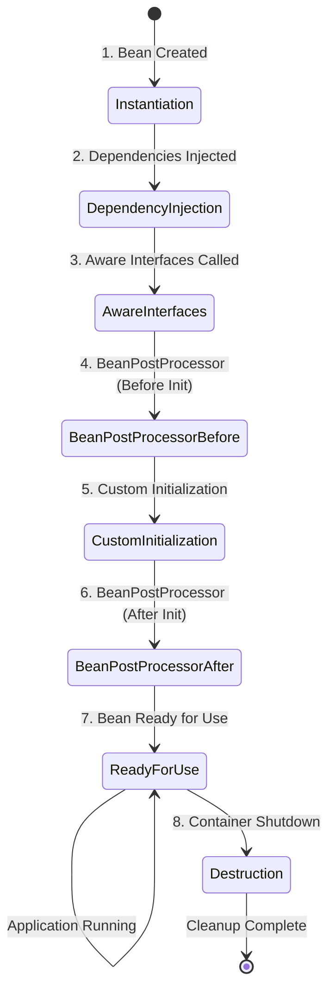
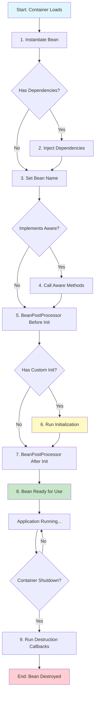
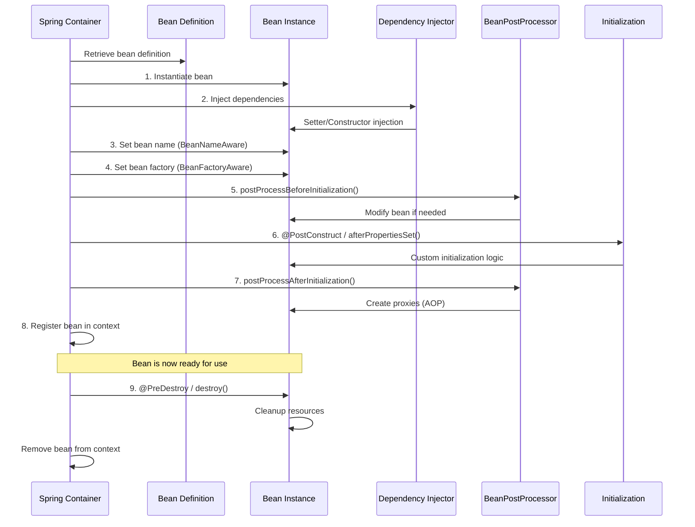

# Spring Bean Lifecycle - Complete Tutorial

**Author:** Ram  
**Reading Time:** 15 min read  
**Last Updated:** March 19, 2026  
**Difficulty Level:** ⭐⭐⭐ Intermediate  
**Category:** Spring Boot / Java Backend

---

## Table of Contents

1. [Introduction](#introduction)
2. [Prerequisites](#prerequisites)
3. [Learning Objectives](#learning-objectives)
4. [What is a Spring Bean?](#what-is-a-spring-bean)
5. [Complete Bean Lifecycle Flow](#complete-bean-lifecycle-flow)
6. [Each Lifecycle Phase Explained](#each-lifecycle-phase-explained)
7. [Real-World Use Cases](#real-world-use-cases)
8. [Common Pitfalls & Troubleshooting](#common-pitfalls--troubleshooting)
9. [Best Practices](#best-practices)
10. [Anti-Patterns](#anti-patterns)
11. [Performance Considerations](#performance-considerations)
12. [Security Considerations](#security-considerations)
13. [Testing Strategies](#testing-strategies)
14. [Complete Working Example](#complete-working-example)
15. [Practice Exercises](#practice-exercises)
16. [Test Your Understanding](#test-your-understanding)
17. [Common Interview Questions](#common-interview-questions)
18. [Comprehensive Question Bank](#comprehensive-question-bank)
19. [Summary & Key Takeaways](#summary--key-takeaways)
20. [Further Reading & Resources](#further-reading--resources)

---

## Introduction

If you've worked with Spring Boot, you've likely written code like this:

```java
@Service
public class UserService {
    // Your business logic here
}
```

And magically, Spring creates, manages, injects, and destroys this bean for you. But have you ever wondered: **What actually happens behind the scenes?**

Understanding the Spring Bean Lifecycle is not just academic—it directly impacts your ability to:

✅ **Debug startup issues faster** - Know where to look when beans fail to initialize  
✅ **Customize initialization logic** - Run code at the right time in the lifecycle  
✅ **Avoid hidden bugs** - Understand proxy creation and AOP behavior  
✅ **Write production-grade applications** - Proper resource management and cleanup  
✅ **Optimize performance** - Reduce startup time and memory usage  

> 💡 **Key Insight:** The more you understand the lifecycle, the less "magic" Spring feels—and the more control you gain over your application.

---

## Prerequisites

Before diving into this tutorial, ensure you have:

### Required Knowledge
- ✅ Basic understanding of Spring Boot framework
- ✅ Familiarity with dependency injection concepts
- ✅ Java 8+ features (lambda expressions, annotations)
- ✅ Understanding of OOP principles (constructors, interfaces)
- ✅ Basic Maven/Gradle knowledge

### Required Tools
- ☑️ JDK 17 or higher
- ☑️ Spring Boot 3.x or 2.7+
- ☑️ IDE (IntelliJ IDEA, Eclipse, or VS Code)
- ☑️ Maven 3.6+ or Gradle 7+

### Recommended (But Not Required)
- Basic understanding of AOP (Aspect-Oriented Programming)
- Familiarity with design patterns (Factory, Proxy)
- Experience with Spring Boot testing

---

## Learning Objectives

By the end of this tutorial, you will be able to:

### Core Objectives
1. **Explain** each phase of the Spring Bean Lifecycle in detail
2. **Implement** custom initialization and destruction logic using multiple approaches
3. **Differentiate** between `@PostConstruct`, `InitializingBean`, and `initMethod`
4. **Use** `BeanPostProcessor` to modify beans before/after initialization
5. **Apply** Aware interfaces to access Spring container information
6. **Identify** and avoid common lifecycle-related anti-patterns
7. **Debug** bean creation and initialization issues effectively
8. **Optimize** bean initialization for better performance
9. **Write** comprehensive tests for bean lifecycle behavior
10. **Implement** proper resource cleanup in production applications

### Advanced Objectives
- Understand how AOP proxies are created during lifecycle
- Implement custom BeanPostProcessors for cross-cutting concerns
- Handle circular dependencies correctly
- Optimize startup time in large applications
- Implement lazy loading strategies

---

## What is a Spring Bean?

### Definition

A **Spring Bean** is simply:

> An object that is instantiated, assembled, and managed by the Spring IoC (Inversion of Control) Container.

### Key Characteristics

| Characteristic | Description |
|----------------|-------------|
| **Managed by Spring** | Spring controls the entire lifecycle |
| **Singleton by Default** | One instance per Spring container (can be changed) |
| **POJO-based** | No requirement to extend framework classes |
| **Configured via Metadata** | XML, annotations, or Java configuration |
| **Wired Together** | Dependencies automatically injected |

### Simple Example

```java
@Component
public class PaymentService {
    // This class is now a Spring Bean
    // Spring will create, manage, and inject it
}
```

### How Beans Are Created

Spring creates beans using three primary mechanisms:

```java
// 1. Constructor-based (Recommended)
@Component
public class OrderService {
    private final PaymentService paymentService;
    
    public OrderService(PaymentService paymentService) {
        this.paymentService = paymentService;
    }
}

// 2. Factory method in @Configuration class
@Configuration
public class AppConfig {
    @Bean
    public UserService userService() {
        return new UserService();
    }
}

// 3. Using @Bean annotation with parameters
@Bean
public EmailService emailService(Properties properties) {
    return new EmailService(properties);
}
```

> ⚠️ **Important:** Beans defined with `@Bean` in configuration classes follow the same lifecycle as `@Component` beans.

---

## Complete Bean Lifecycle Flow

### High-Level Overview

Here's the complete lifecycle in simple terms:



### Detailed Flow Diagram



### Sequence Diagram: Bean Creation Process



---

## Each Lifecycle Phase Explained

### Phase 1: Bean Instantiation

**What Happens:** Spring creates the bean instance using:
- Constructor reflection
- Factory method invocation
- Default constructor

**Code Example:**

```java
@Component
public class OrderService {
    
    // Constructor is called during instantiation
    public OrderService() {
        System.out.println("Phase 1: Bean instantiated - Constructor called");
    }
}
```

**Key Points:**
- ✅ Object is created
- ❌ Dependencies are NOT injected yet
- ⚠️ Keep constructors lightweight (no heavy logic here!)

---

### Phase 2: Dependency Injection

**What Happens:** Spring injects all required dependencies.

**Code Example:**

```java
@Component
public class OrderService {
    private final PaymentService paymentService;
    private final InventoryService inventoryService;
    
    // Constructor injection (RECOMMENDED)
    public OrderService(PaymentService paymentService, 
                       InventoryService inventoryService) {
        this.paymentService = paymentService;
        this.inventoryService = inventoryService;
        System.out.println("Phase 2: Dependencies injected");
    }
}
```

**Injection Methods Comparison:**

| Method | Pros | Cons | Recommendation |
|--------|------|------|----------------|
| **Constructor Injection** | ✅ Immutable, testable, clear dependencies | ❌ More boilerplate | ⭐ **Best Practice** |
| **Setter Injection** | ✅ Optional dependencies, flexible | ❌ Mutable, harder to test | Use for optional deps |
| **Field Injection** | ✅ Minimal code | ❌ Hard to test, hidden deps | ❌ Avoid in production |

> 💡 **Pro Tip:** Always use constructor injection for required dependencies. It makes your code more testable and ensures the bean is always in a valid state.

---

### Phase 3: Aware Interfaces

**What Happens:** If the bean implements special Aware interfaces, Spring calls the corresponding methods to provide internal context.

**Available Aware Interfaces:**

```java
@Component
public class MyBean implements 
    BeanNameAware,
    BeanFactoryAware,
    ApplicationContextAware,
    EnvironmentAware {
    
    @Override
    public void setBeanName(String name) {
        System.out.println("Bean name: " + name);
    }
    
    @Override
    public void setBeanFactory(BeanFactory beanFactory) {
        System.out.println("Bean factory: " + beanFactory);
    }
    
    @Override
    public void setApplicationContext(ApplicationContext context) {
        System.out.println("Application context: " + context);
    }
    
    @Override
    public void setEnvironment(Environment environment) {
        System.out.println("Environment: " + environment);
    }
}
```

**Common Aware Interfaces:**

| Interface | Method | Use Case |
|-----------|--------|----------|
| `BeanNameAware` | `setBeanName(String)` | Get the bean's name in the container |
| `BeanFactoryAware` | `setBeanFactory(BeanFactory)` | Access the BeanFactory |
| `ApplicationContextAware` | `setApplicationContext(ApplicationContext)` | Access the full context |
| `EnvironmentAware` | `setEnvironment(Environment)` | Access environment properties |
| `ResourceLoaderAware` | `setResourceLoader(ResourceLoader)` | Load resources |

> ⚠️ **Warning:** Use Aware interfaces sparingly. They create tight coupling with Spring framework. Only use when absolutely necessary.

---

### Phase 4: BeanPostProcessor - Before Initialization

**What Happens:** Spring calls `BeanPostProcessor.postProcessBeforeInitialization()` before any custom initialization.

**Code Example:**

```java
@Component
public class CustomBeanPostProcessor implements BeanPostProcessor {
    
    @Override
    public Object postProcessBeforeInitialization(
            Object bean, String beanName) throws BeansException {
        
        System.out.println("Before Init: " + beanName);
        
        // You can modify the bean instance here
        // Return the modified bean or the original bean
        return bean;
    }
}
```

**Real-World Use Cases:**

```java
@Component
public class ValidationBeanPostProcessor implements BeanPostProcessor {
    
    @Override
    public Object postProcessBeforeInitialization(
            Object bean, String beanName) throws BeansException {
        
        // Validate beans before initialization
        if (bean instanceof ConfigurableBean) {
            validateConfiguration((ConfigurableBean) bean);
        }
        
        return bean;
    }
    
    private void validateConfiguration(ConfigurableBean bean) {
        // Custom validation logic
        if (bean.getConfig() == null) {
            throw new BeanInitializationException(
                "Configuration cannot be null for bean: " + beanName
            );
        }
    }
}
```

**What Spring Uses This For:**
- AOP proxy creation
- Security annotations processing
- Transaction management setup
- Caching infrastructure

---

### Phase 5: Custom Initialization

**What Happens:** Your custom initialization logic runs. There are **three ways** to implement this:

#### Option 1: @PostConstruct (Most Common) ⭐

```java
@Component
public class UserService {
    private final UserRepository userRepository;
    
    public UserService(UserRepository userRepository) {
        this.userRepository = userRepository;
    }
    
    @PostConstruct
    public void init() {
        System.out.println("Bean initialized with @PostConstruct");
        
        // Load cache data
        loadCache();
        
        // Validate configuration
        validateConfiguration();
        
        // Initialize connections
        initializeConnections();
    }
    
    private void loadCache() {
        // Cache initialization logic
    }
    
    private void validateConfiguration() {
        // Validation logic
    }
    
    private void initializeConnections() {
        // Connection setup
    }
}
```

**Pros:**
- ✅ Simple and clean
- ✅ Standard JSR-250 annotation
- ✅ Works with any DI framework

**Cons:**
- ❌ Requires `javax.annotation` dependency (included in Spring Boot)
- ❌ Cannot throw checked exceptions

#### Option 2: InitializingBean Interface

```java
@Component
public class PaymentService implements InitializingBean {
    
    @Override
    public void afterPropertiesSet() throws Exception {
        System.out.println("Bean initialized with InitializingBean");
        
        // Initialization logic
        initializePaymentGateway();
    }
    
    private void initializePaymentGateway() {
        // Setup payment processing
    }
}
```

**Pros:**
- ✅ Can throw checked exceptions
- ✅ Spring-native approach

**Cons:**
- ❌ Creates tight coupling with Spring
- ❌ Less flexible than @PostConstruct

#### Option 3: initMethod in @Bean Configuration

```java
@Configuration
public class AppConfig {
    
    @Bean(initMethod = "init")
    public EmailService emailService() {
        return new EmailService();
    }
}

// In the bean class
public class EmailService {
    public void init() {
        System.out.println("Bean initialized with initMethod");
        // Initialization logic
    }
}
```

**Comparison Table:**

| Approach | Flexibility | Spring Coupling | Exception Handling | Recommendation |
|----------|------------|-----------------|-------------------|----------------|
| `@PostConstruct` | ⭐⭐⭐ High | ⭐ Low | ⚠️ No checked exceptions | ⭐ **Best Practice** |
| `InitializingBean` | ⭐⭐ Medium | ⚠️ High | ✅ Yes | Use when needed |
| `initMethod` | ⭐⭐⭐ High | ⭐ Low | ✅ Yes | Good for @Bean configs |

> 💡 **Best Practice:** Use `@PostConstruct` for most cases. Use `InitializingBean` only when you need to throw checked exceptions. Use `initMethod` when configuring beans via `@Bean` annotations.

---

### Phase 6: BeanPostProcessor - After Initialization

**What Happens:** Spring calls `BeanPostProcessor.postProcessAfterInitialization()` after custom initialization. **This is where Spring creates AOP proxies!**

**Code Example:**

```java
@Component
public class CustomBeanPostProcessor implements BeanPostProcessor {
    
    @Override
    public Object postProcessAfterInitialization(
            Object bean, String beanName) throws BeansException {
        
        System.out.println("After Init: " + beanName);
        
        // This is where Spring wraps beans with proxies
        // for @Transactional, @Async, @Cacheable, etc.
        
        return bean;
    }
}
```

**Real-World Example - Logging Proxy:**

```java
@Component
public class LoggingBeanPostProcessor implements BeanPostProcessor {
    
    private static final Logger logger = 
        LoggerFactory.getLogger(LoggingBeanPostProcessor.class);
    
    @Override
    public Object postProcessAfterInitialization(
            Object bean, String beanName) throws BeansException {
        
        // Create a proxy for all Service beans
        if (beanName.endsWith("Service")) {
            return Proxy.newProxyInstance(
                bean.getClass().getClassLoader(),
                bean.getClass().getInterfaces(),
                (proxy, method, args) -> {
                    logger.info("Calling {}.{}()", beanName, method.getName());
                    Object result = method.invoke(bean, args);
                    logger.info("Completed {}.{}()", beanName, method.getName());
                    return result;
                }
            );
        }
        
        return bean;
    }
}
```

**What Happens Here:**
- Spring wraps your bean in a proxy
- The proxy adds behavior (transactions, caching, security)
- Your original bean is still there, but accessed through the proxy

---

### Phase 7: Bean Ready for Use

**What Happens:** The bean is fully initialized and registered in the ApplicationContext.

```java
@Component
public class UserService {
    // Bean is now ready to be injected anywhere
    
    public void processUser(Long userId) {
        // Business logic
    }
}

// Usage in another bean
@Service
public class OrderService {
    private final UserService userService; // Same instance injected
    
    public OrderService(UserService userService) {
        this.userService = userService;
    }
}
```

**Key Points:**
- ✅ Bean is stored in ApplicationContext
- ✅ Same instance is injected everywhere (Singleton scope)
- ✅ All AOP proxies are active
- ✅ Bean is fully functional

---

### Phase 8: Bean Destruction

**What Happens:** When the application shuts down, Spring calls destruction callbacks.

**Code Example:**

```java
@Component
public class UserService {
    
    @PreDestroy
    public void cleanup() {
        System.out.println("Bean destroyed - cleaning up resources");
        
        // Close database connections
        closeConnections();
        
        // Stop background threads
        stopBackgroundTasks();
        
        // Release resources
        releaseResources();
    }
    
    private void closeConnections() {
        // Cleanup logic
    }
    
    private void stopBackgroundTasks() {
        // Cleanup logic
    }
    
    private void releaseResources() {
        // Cleanup logic
    }
}
```

**Alternative Approaches:**

```java
// Option 1: @PreDestroy annotation (RECOMMENDED)
@Component
public class CacheService {
    @PreDestroy
    public void destroy() {
        cacheManager.close();
    }
}

// Option 2: DisposableBean interface
@Component
public class ConnectionPool implements DisposableBean {
    @Override
    public void destroy() {
        pool.close();
    }
}

// Option 3: destroyMethod in @Bean
@Configuration
public class AppConfig {
    @Bean(destroyMethod = "close")
    public DataSource dataSource() {
        return new HikariDataSource();
    }
}
```

**Real-World Use Cases:**
- Close database connections
- Stop scheduled tasks
- Flush caches to disk
- Close file handles
- Shutdown thread pools
- Send shutdown notifications

> ⚠️ **Critical:** Always implement destruction callbacks for beans that hold resources (connections, threads, file handles). Failure to do so leads to resource leaks.

---

## Real-World Use Cases

### Use Case 1: Cache Initialization

```java
@Component
public class CacheManager {
    
    private final LoadingCache<Long, User> userCache;
    
    public CacheManager(UserRepository userRepository) {
        this.userCache = Caffeine.newBuilder()
            .maximumSize(10_000)
            .build(userRepository::findById);
    }
    
    @PostConstruct
    public void init() {
        // Preload frequently accessed data
        System.out.println("Preloading cache...");
        userCache.asMap().putAll(loadFrequentlyAccessedData());
    }
    
    private Map<Long, User> loadFrequentlyAccessedData() {
        // Load top 1000 most accessed users
        return userRepository.findTopAccessed(1000)
            .stream()
            .collect(Collectors.toMap(User::getId, Function.identity()));
    }
    
    @PreDestroy
    public void cleanup() {
        // Persist cache statistics
        persistCacheStatistics();
    }
}
```

### Use Case 2: Database Connection Pool Warmup

```java
@Component
public class ConnectionPoolManager {
    
    private final HikariDataSource dataSource;
    
    public ConnectionPoolManager(HikariDataSource dataSource) {
        this.dataSource = dataSource;
    }
    
    @PostConstruct
    public void warmupConnections() {
        System.out.println("Warming up connection pool...");
        
        // Create initial connections
        try (Connection conn = dataSource.getConnection()) {
            // Validate connection
            conn.createStatement().execute("SELECT 1");
        } catch (SQLException e) {
            throw new BeanInitializationException(
                "Failed to warmup connection pool", e
            );
        }
    }
    
    @PreDestroy
    public void shutdownPool() {
        System.out.println("Shutting down connection pool...");
        dataSource.close();
    }
}
```

### Use Case 3: Background Task Scheduler

```java
@Component
public class ScheduledTaskManager {
    
    private final TaskScheduler taskScheduler;
    private ScheduledFuture<?> scheduledTask;
    
    public ScheduledTaskManager(TaskScheduler taskScheduler) {
        this.taskScheduler = taskScheduler;
    }
    
    @PostConstruct
    public void startScheduledTasks() {
        System.out.println("Starting scheduled tasks...");
        
        // Schedule a task to run every 5 minutes
        scheduledTask = taskScheduler.scheduleAtFixedRate(
            this::cleanupExpiredSessions,
            Instant.now().plusSeconds(10),
            Duration.ofMinutes(5)
        );
    }
    
    private void cleanupExpiredSessions() {
        // Cleanup logic
    }
    
    @PreDestroy
    public void stopScheduledTasks() {
        System.out.println("Stopping scheduled tasks...");
        
        if (scheduledTask != null && !scheduledTask.isCancelled()) {
            scheduledTask.cancel(true);
        }
    }
}
```

### Use Case 4: Feature Flag Initialization

```java
@Component
public class FeatureFlagService {
    
    private final Map<String, Boolean> featureFlags;
    
    public FeatureFlagService(Environment environment) {
        this.featureFlags = new HashMap<>();
    }
    
    @PostConstruct
    public void loadFeatureFlags() {
        System.out.println("Loading feature flags...");
        
        // Load from configuration
        featureFlags.put("NEW_UI", true);
        featureFlags.put("BETA_FEATURES", false);
        featureFlags.put("MAINTENANCE_MODE", false);
        
        // Validate flags
        validateFeatureFlags();
    }
    
    private void validateFeatureFlags() {
        // Ensure conflicting flags are not both enabled
        if (featureFlags.get("NEW_UI") && featureFlags.get("MAINTENANCE_MODE")) {
            throw new IllegalStateException(
                "Cannot enable NEW_UI during MAINTENANCE_MODE"
            );
        }
    }
    
    public boolean isEnabled(String feature) {
        return featureFlags.getOrDefault(feature, false);
    }
}
```

---

## Common Pitfalls & Troubleshooting

### Pitfall 1: Heavy Logic in Constructor ❌

**Problem:**
```java
@Component
public class UserService {
    private final UserRepository userRepository;
    
    public UserService(UserRepository userRepository) {
        this.userRepository = userRepository;
        
        // ❌ BAD: Heavy operation in constructor
        List<User> allUsers = userRepository.findAll();
        processUsers(allUsers); // Takes 5 seconds!
    }
}
```

**Why It's Bad:**
- Slows down application startup
- May cause circular dependency issues
- Constructor should only assign dependencies

**Solution:**
```java
@Component
public class UserService {
    private final UserRepository userRepository;
    
    public UserService(UserRepository userRepository) {
        this.userRepository = userRepository;
    }
    
    @PostConstruct
    public void init() {
        // ✅ GOOD: Heavy logic in @PostConstruct
        List<User> allUsers = userRepository.findAll();
        processUsers(allUsers);
    }
}
```

### Pitfall 2: Forgetting @PreDestroy for Resource Cleanup ❌

**Problem:**
```java
@Component
public class FileProcessor {
    private FileChannel fileChannel;
    
    public void openFile(String path) throws IOException {
        fileChannel = FileChannel.open(Paths.get(path), READ);
    }
    
    // ❌ BAD: No cleanup - file handle leak!
}
```

**Solution:**
```java
@Component
public class FileProcessor {
    private FileChannel fileChannel;
    
    public void openFile(String path) throws IOException {
        fileChannel = FileChannel.open(Paths.get(path), READ);
    }
    
    @PreDestroy
    public void cleanup() {
        // ✅ GOOD: Proper cleanup
        if (fileChannel != null && fileChannel.isOpen()) {
            try {
                fileChannel.close();
            } catch (IOException e) {
                log.error("Failed to close file channel", e);
            }
        }
    }
}
```

### Pitfall 3: Circular Dependencies

**Problem:**
```java
@Component
public class ServiceA {
    private final ServiceB serviceB;
    
    public ServiceA(ServiceB serviceB) {
        this.serviceB = serviceB;
    }
}

@Component
public class ServiceB {
    private final ServiceA serviceA;
    
    public ServiceB(ServiceA serviceA) {
        this.serviceA = serviceA;
    }
}
// ❌ BAD: Circular dependency!
```

**Solutions:**

**Option 1: Use @Lazy**
```java
@Component
public class ServiceA {
    private final ServiceB serviceB;
    
    public ServiceA(@Lazy ServiceB serviceB) {
        this.serviceB = serviceB;
    }
}
```

**Option 2: Use Setter Injection**
```java
@Component
public class ServiceA {
    private ServiceB serviceB;
    
    @Autowired
    public void setServiceB(ServiceB serviceB) {
        this.serviceB = serviceB;
    }
}
```

**Option 3: Refactor to Remove Circular Dependency** (Best)
```java
// Extract common logic to a third bean
@Component
public class CommonService {
    // Shared logic
}

@Component
public class ServiceA {
    private final CommonService commonService;
    // ...
}
```

### Troubleshooting Guide

| Issue | Symptom | Solution |
|-------|---------|----------|
| **BeanCreationException** | Application fails to start | Check constructor dependencies, ensure all beans are defined |
| **Circular Dependency** | BeanCurrentlyInCreationException | Use @Lazy or refactor code |
| **NullPointerException in @PostConstruct** | Bean not fully initialized | Ensure all dependencies are injected before use |
| **Bean not initialized** | @PostConstruct not called | Check if bean is in correct scope, verify component scanning |
| **Resource leak** | File handles not released | Implement @PreDestroy cleanup |
| **Slow startup** | Long initialization time | Move heavy logic to lazy loading or background initialization |

---

## Best Practices

### ✅ Do's

1. **Use Constructor Injection for Required Dependencies**
   ```java
   @Service
   public class OrderService {
       private final PaymentService paymentService;
       
       // ✅ Constructor injection
       public OrderService(PaymentService paymentService) {
           this.paymentService = paymentService;
       }
   }
   ```

2. **Keep Constructors Lightweight**
   ```java
   @Service
   public class UserService {
       private final UserRepository userRepository;
       
       public UserService(UserRepository userRepository) {
           // ✅ Only assign dependencies
           this.userRepository = userRepository;
       }
       
       @PostConstruct
       public void init() {
           // ✅ Heavy logic here
           warmupCache();
       }
   }
   ```

3. **Always Clean Up Resources**
   ```java
   @Component
   public class ConnectionManager {
       @PreDestroy
       public void cleanup() {
           // ✅ Always release resources
           closeConnections();
       }
   }
   ```

4. **Use @PostConstruct for Initialization**
   ```java
   @Component
   public class CacheService {
       @PostConstruct
       public void init() {
           // ✅ Standard approach
           loadCache();
       }
   }
   ```

5. **Validate Configuration Early**
   ```java
   @Component
   public class EmailService {
       @Value("${email.smtp.host}")
       private String smtpHost;
       
       @PostConstruct
       public void validate() {
           // ✅ Fail fast if configuration is invalid
           if (smtpHost == null || smtpHost.isEmpty()) {
               throw new IllegalStateException("SMTP host not configured");
           }
       }
   }
   ```

### ❌ Don'ts

1. **Don't Perform Heavy Operations in Constructors**
   ```java
   // ❌ BAD
   public UserService(UserRepository repo) {
       this.repo = repo;
       List<User> users = repo.findAll(); // Heavy operation!
   }
   ```

2. **Don't Use Field Injection in Production**
   ```java
   // ❌ BAD
   @Autowired
   private UserService userService;
   ```

3. **Don't Ignore Cleanup Callbacks**
   ```java
   // ❌ BAD - Resource leak!
   @Component
   public class FileProcessor {
       private FileChannel channel;
   }
   ```

4. **Don't Create Circular Dependencies**
   ```java
   // ❌ BAD
   @Component
   public class A {
       public A(B b) {} // Circular!
   }
   ```

5. **Don't Use Aware Interfaces Unnecessarily**
   ```java
   // ❌ BAD - Unnecessary coupling
   @Component
   public class MyBean implements ApplicationContextAware {
       // Only use if absolutely necessary
   }
   ```

---

## Anti-Patterns

### Anti-Pattern 1: God Bean

**Problem:**
```java
@Component
public class GodService {
    // Does everything: email, logging, caching, validation...
    // 5000 lines of code
}
```

**Why It's Bad:**
- Violates Single Responsibility Principle
- Hard to test
- Difficult to maintain
- Lifecycle becomes complex

**Solution:**
```java
@Component
public class EmailService { /* Email logic */ }
@Component
public class LoggingService { /* Logging logic */ }
@Component
public class CacheService { /* Cache logic */ }
```

### Anti-Pattern 2: Lifecycle Hell

**Problem:**
```java
@Component
public class ComplexBean {
    @Autowired
    private ServiceA a;
    
    @Autowired
    private ServiceB b;
    
    @PostConstruct
    public void init1() { /* ... */ }
    
    @PostConstruct
    public void init2() { /* ... */ }
    
    @PostConstruct
    public void init3() { /* ... */ }
    // Multiple initialization methods scattered everywhere
}
```

**Solution:**
```java
@Component
public class ComplexBean {
    private final ServiceA a;
    private final ServiceB b;
    
    public ComplexBean(ServiceA a, ServiceB b) {
        this.a = a;
        this.b = b;
    }
    
    @PostConstruct
    public void init() {
        // Single, well-organized initialization
        initializeA();
        initializeB();
        loadConfiguration();
    }
}
```

### Anti-Pattern 3: Bean Scope Abuse

**Problem:**
```java
@Component
@Scope("prototype")
public class UserService {
    // ❌ BAD: Should be singleton
    // Creates new instance every time
}
```

**Solution:**
```java
@Service // Default singleton scope
public class UserService {
    // ✅ Correct: Stateless services should be singleton
}
```

### Anti-Pattern 4: Ignoring Lazy Initialization

**Problem:**
```java
@Component
public class HeavyService {
    @PostConstruct
    public void init() {
        // ❌ BAD: Loads 100MB of data at startup
        loadAllData();
    }
}
```

**Solution:**
```java
@Component
@Lazy
public class HeavyService {
    @PostConstruct
    public void init() {
        // ✅ GOOD: Only loads when first used
        loadAllData();
    }
}
```

---

## Performance Considerations

### Startup Time Optimization

**Problem:** Application takes 30 seconds to start due to heavy bean initialization.

**Solution 1: Lazy Loading**
```java
@Service
@Lazy
public class HeavyService {
    @PostConstruct
    public void init() {
        // Only initialized when first used
        loadHeavyResources();
    }
}
```

**Solution 2: Parallel Initialization**
```java
@Configuration
public class AsyncInitConfig {
    
    @Bean
    public ApplicationRunner asyncInitializer(
            CacheService cacheService,
            EmailService emailService) {
        return args -> {
            // Initialize beans in parallel
            CompletableFuture.allOf(
                CompletableFuture.runAsync(cacheService::init),
                CompletableFuture.runAsync(emailService::init)
            ).join();
        };
    }
}
```

**Solution 3: Deferred Initialization**
```java
@Component
public class DeferredInitService {
    
    @PostConstruct
    public void init() {
        // Schedule initialization after application is ready
        ScheduledExecutorService executor = Executors.newSingleThreadScheduledExecutor();
        executor.schedule(this::initialize, 5, TimeUnit.SECONDS);
    }
    
    private void initialize() {
        // Heavy initialization
    }
}
```

### Memory Optimization

```java
@Component
public class OptimizedCacheService {
    
    // ✅ Use weak references for caches
    private final LoadingCache<Long, User> cache = Caffeine.newBuilder()
        .maximumSize(10_000)
        .weakValues()
        .build(userId -> loadUser(userId));
    
    @PostConstruct
    public void init() {
        // Preload only essential data
        cache.put(1L, getAdminUser());
    }
}
```

### Performance Comparison Table

| Approach | Startup Time | Memory Usage | Complexity | Recommendation |
|----------|--------------|--------------|------------|----------------|
| **Eager Initialization** | ⚠️ Slower | ⚠️ Higher | ⭐ Low | Use for critical beans |
| **Lazy Initialization** | ✅ Faster | ✅ Lower | ⭐⭐ Medium | Use for heavy beans |
| **Async Initialization** | ✅ Fastest | ⚠️ Variable | ⭐⭐⭐ High | Use for parallelizable beans |

---

## Security Considerations

### 1. Avoid Sensitive Data in Bean Names

```java
// ❌ BAD: Sensitive data in bean name
@Bean(name = "dbPassword_${DB_PASSWORD}")
public DataSource dataSource() {
    return new DataSource();
}

// ✅ GOOD: Use property placeholders
@Bean
public DataSource dataSource(@Value("${db.password}") String password) {
    // Password is injected, not exposed in bean name
}
```

### 2. Secure Bean Initialization

```java
@Component
public class SecureService {
    
    @Value("${api.key}")
    private String apiKey;
    
    @PostConstruct
    public void init() {
        // ✅ Validate security configuration
        if (apiKey == null || apiKey.isEmpty()) {
            throw new SecurityException("API key not configured");
        }
        
        // ✅ Validate API key format
        if (!isValidApiKey(apiKey)) {
            throw new SecurityException("Invalid API key format");
        }
    }
}
```

### 3. Prevent Bean Injection Attacks

```java
@Component
public class SafeBeanFactory {
    
    public Object createBean(String beanName) {
        // ✅ Validate bean name to prevent injection
        if (!isValidBeanName(beanName)) {
            throw new IllegalArgumentException("Invalid bean name: " + beanName);
        }
        return applicationContext.getBean(beanName);
    }
    
    private boolean isValidBeanName(String beanName) {
        return beanName.matches("[a-zA-Z0-9_]+");
    }
}
```

### 4. Secure Resource Cleanup

```java
@Component
public class SecureConnectionManager {
    private Connection connection;
    
    @PreDestroy
    public void cleanup() {
        // ✅ Securely close connections
        if (connection != null) {
            try {
                // Clear sensitive data
                clearSensitiveData();
                connection.close();
            } catch (SQLException e) {
                log.error("Failed to close connection securely", e);
            }
        }
    }
}
```

---

## Testing Strategies

### Test 1: Verify Bean Initialization

```java
@SpringBootTest
class UserServiceTest {
    
    @Autowired
    private UserService userService;
    
    @Test
    void testBeanInitialized() {
        // ✅ Verify bean is created and initialized
        assertThat(userService).isNotNull();
        assertThat(userService.isInitialized()).isTrue();
    }
}
```

### Test 2: Verify @PostConstruct Execution

```java
@Test
void testPostConstructExecuted() {
    // Given
    CacheService cacheService = new CacheService();
    
    // When - Initialize bean
    cacheService.init();
    
    // Then
    assertThat(cacheService.getCache()).isNotNull();
    assertThat(cacheService.getCacheSize()).isGreaterThan(0);
}
```

### Test 3: Verify @PreDestroy Execution

```java
@Test
void testPreDestroyExecuted() throws Exception {
    // Given
    ConfigurableApplicationContext context = 
        new AnnotationConfigApplicationContext(AppConfig.class);
    ResourceService resourceService = context.getBean(ResourceService.class);
    
    // When - Close context
    context.close();
    
    // Then - Verify cleanup was called
    assertThat(resourceService.isClosed()).isTrue();
}
```

### Test 4: Test BeanPostProcessor

```java
@Component
public class TestBeanPostProcessor implements BeanPostProcessor {
    private List<String> initializedBeans = new ArrayList<>();
    
    @Override
    public Object postProcessAfterInitialization(
            Object bean, String beanName) {
        initializedBeans.add(beanName);
        return bean;
    }
    
    public List<String> getInitializedBeans() {
        return initializedBeans;
    }
}

@Test
void testBeanPostProcessor() {
    // Given
    TestBeanPostProcessor processor = context.getBean(TestBeanPostProcessor.class);
    
    // When
    context.getBean(UserService.class);
    
    // Then
    assertThat(processor.getInitializedBeans())
        .contains("userService");
}
```

---

## Complete Working Example

### Full Lifecycle Demo

```java
package com.example.demo.lifecycle;

import org.springframework.beans.factory.BeanNameAware;
import org.springframework.beans.factory.DisposableBean;
import org.springframework.beans.factory.InitializingBean;
import org.springframework.stereotype.Component;

import javax.annotation.PostConstruct;
import javax.annotation.PreDestroy;

@Component
public class CompleteLifecycleBean 
    implements BeanNameAware, InitializingBean, DisposableBean {
    
    private String beanName;
    
    // Phase 1: Instantiation
    public CompleteLifecycleBean() {
        System.out.println("1. Constructor - Bean instantiated");
    }
    
    // Phase 3: Aware interface
    @Override
    public void setBeanName(String name) {
        this.beanName = name;
        System.out.println("3. BeanNameAware - Bean name: " + name);
    }
    
    // Phase 5: Custom initialization - @PostConstruct
    @PostConstruct
    public void postConstruct() {
        System.out.println("5a. @PostConstruct - Custom initialization");
    }
    
    // Phase 5: Custom initialization - InitializingBean
    @Override
    public void afterPropertiesSet() throws Exception {
        System.out.println("5b. InitializingBean.afterPropertiesSet()");
    }
    
    // Phase 8: Destruction - @PreDestroy
    @PreDestroy
    public void preDestroy() {
        System.out.println("8a. @PreDestroy - Cleanup before destruction");
    }
    
    // Phase 8: Destruction - DisposableBean
    @Override
    public void destroy() throws Exception {
        System.out.println("8b. DisposableBean.destroy()");
    }
}
```

**Expected Output:**
```
1. Constructor - Bean instantiated
3. BeanNameAware - Bean name: completeLifecycleBean
5a. @PostConstruct - Custom initialization
5b. InitializingBean.afterPropertiesSet()
[Application running...]
8a. @PreDestroy - Cleanup before destruction
8b. DisposableBean.destroy()
```

### Complete Application Example

```java
package com.example.demo;

import org.springframework.boot.CommandLineRunner;
import org.springframework.boot.SpringApplication;
import org.springframework.boot.autoconfigure.SpringBootApplication;
import org.springframework.context.annotation.Bean;
import org.springframework.stereotype.Component;

import javax.annotation.PostConstruct;
import javax.annotation.PreDestroy;

@SpringBootApplication
public class LifecycleDemoApplication {
    
    public static void main(String[] args) {
        SpringApplication.run(LifecycleDemoApplication.class, args);
    }
    
    @Bean
    public CommandLineRunner demo(PaymentService paymentService) {
        return args -> {
            System.out.println("Application is running...");
            paymentService.processPayment(100.0);
        };
    }
}

@Component
class PaymentService {
    
    public PaymentService() {
        System.out.println("PaymentService: Constructor called");
    }
    
    @PostConstruct
    public void init() {
        System.out.println("PaymentService: Initialized");
        initializePaymentGateway();
    }
    
    public void processPayment(double amount) {
        System.out.println("Processing payment: $" + amount);
    }
    
    @PreDestroy
    public void cleanup() {
        System.out.println("PaymentService: Cleanup");
        closeConnections();
    }
    
    private void initializePaymentGateway() {
        // Setup logic
    }
    
    private void closeConnections() {
        // Cleanup logic
    }
}

@Component
class BeanPostProcessorDemo implements org.springframework.beans.factory.config.BeanPostProcessor {
    
    @Override
    public Object postProcessBeforeInitialization(Object bean, String beanName) {
        System.out.println("Before Init: " + beanName);
        return bean;
    }
    
    @Override
    public Object postProcessAfterInitialization(Object bean, String beanName) {
        System.out.println("After Init: " + beanName);
        return bean;
    }
}
```

---

## Practice Exercises

### Exercise 1: Implement a Cache Service with Lifecycle Management

**Difficulty:** ⭐ Intermediate  
**Time:** 20 minutes

**Task:** Create a `CacheService` that:
1. Initializes a cache in `@PostConstruct`
2. Preloads frequently accessed data
3. Persists cache statistics in `@PreDestroy`
4. Implements proper error handling

**Solution:**

```java
package com.example.demo.cache;

import org.springframework.stereotype.Component;
import org.springframework.beans.factory.InitializingBean;
import org.springframework.beans.factory.DisposableBean;

import javax.annotation.PostConstruct;
import javax.annotation.PreDestroy;
import java.util.Map;
import java.util.concurrent.ConcurrentHashMap;
import java.util.concurrent.atomic.AtomicLong;

@Component
public class CacheService {
    
    private final Map<String, Object> cache;
    private final AtomicLong hitCount;
    private final AtomicLong missCount;
    
    public CacheService() {
        this.cache = new ConcurrentHashMap<>();
        this.hitCount = new AtomicLong(0);
        this.missCount = new AtomicLong(0);
    }
    
    @PostConstruct
    public void init() {
        System.out.println("Initializing cache service...");
        
        // Preload frequently accessed data
        preloadCache();
        
        // Validate cache configuration
        validateConfiguration();
    }
    
    private void preloadCache() {
        // Simulate loading data
        cache.put("config", loadConfiguration());
        cache.put("users", loadUsers());
        cache.put("settings", loadSettings());
        
        System.out.println("Cache preloaded with " + cache.size() + " items");
    }
    
    private void validateConfiguration() {
        if (cache.isEmpty()) {
            throw new IllegalStateException("Cache initialization failed");
        }
    }
    
    private Object loadConfiguration() {
        return "app.config";
    }
    
    private Object loadUsers() {
        return new Object(); // Simulated user data
    }
    
    private Object loadSettings() {
        return new Object(); // Simulated settings
    }
    
    public Object get(String key) {
        Object value = cache.get(key);
        if (value != null) {
            hitCount.incrementAndGet();
        } else {
            missCount.incrementAndGet();
        }
        return value;
    }
    
    public void put(String key, Object value) {
        cache.put(key, value);
    }
    
    public long getHitCount() {
        return hitCount.get();
    }
    
    public long getMissCount() {
        return missCount.get();
    }
    
    @PreDestroy
    public void cleanup() {
        System.out.println("Cleaning up cache service...");
        
        // Persist cache statistics
        persistStatistics();
        
        // Clear cache
        cache.clear();
        
        System.out.println("Cache service cleaned up");
    }
    
    private void persistStatistics() {
        long hits = hitCount.get();
        long misses = missCount.get();
        long total = hits + misses;
        double hitRate = total > 0 ? (double) hits / total * 100 : 0;
        
        System.out.printf("Cache Statistics - Hits: %d, Misses: %d, Hit Rate: %.2f%%%n",
            hits, misses, hitRate);
        
        // In real application, persist to database or file
    }
}
```

**Test the Solution:**

```java
@Test
void testCacheServiceLifecycle() {
    // Given
    CacheService cacheService = new CacheService();
    
    // When - Initialize
    cacheService.init();
    
    // Then - Verify initialization
    assertThat(cacheService.get("config")).isNotNull();
    
    // When - Use cache
    cacheService.get("users");
    cacheService.get("nonexistent");
    
    // Then - Verify statistics
    assertThat(cacheService.getHitCount()).isEqualTo(1);
    assertThat(cacheService.getMissCount()).isEqualTo(1);
    
    // When - Cleanup
    cacheService.cleanup();
    
    // Then - Verify cleanup
    assertThat(cacheService.get("config")).isNull();
}
```

---

### Exercise 2: Create a Custom BeanPostProcessor for Validation

**Difficulty:** ⭐⭐⭐ Advanced  
**Time:** 30 minutes

**Task:** Create a `ValidationBeanPostProcessor` that:
1. Validates all beans implementing `Validatable` interface
2. Throws `BeanValidationException` if validation fails
3. Logs validation results
4. Works with any Spring bean

**Solution:**

```java
package com.example.demo.validation;

import org.springframework.beans.BeansException;
import org.springframework.beans.factory.config.BeanPostProcessor;
import org.springframework.stereotype.Component;
import org.springframework.util.ReflectionUtils;

import java.lang.reflect.Method;
import java.util.ArrayList;
import java.util.List;

// Marker interface for validatable beans
interface Validatable {
    void validate() throws ValidationException;
}

class ValidationException extends Exception {
    public ValidationException(String message) {
        super(message);
    }
}

class BeanValidationException extends RuntimeException {
    public BeanValidationException(String message) {
        super(message);
    }
}

@Component
public class ValidationBeanPostProcessor implements BeanPostProcessor {
    
    private static final org.slf4j.Logger log = 
        org.slf4j.LoggerFactory.getLogger(ValidationBeanPostProcessor.class);
    
    private final List<String> validationErrors;
    
    public ValidationBeanPostProcessor() {
        this.validationErrors = new ArrayList<>();
    }
    
    @Override
    public Object postProcessBeforeInitialization(Object bean, String beanName) 
            throws BeansException {
        
        // Check if bean implements Validatable
        if (bean instanceof Validatable) {
            log.info("Validating bean: {}", beanName);
            
            try {
                ((Validatable) bean).validate();
                log.info("Bean {} validated successfully", beanName);
            } catch (ValidationException e) {
                String error = String.format(
                    "Validation failed for bean %s: %s", beanName, e.getMessage()
                );
                validationErrors.add(error);
                log.error(error);
                throw new BeanValidationException(error);
            }
        }
        
        return bean;
    }
    
    public List<String> getValidationErrors() {
        return new ArrayList<>(validationErrors);
    }
}

// Example validatable bean
@Component
public class EmailService implements Validatable {
    
    private String smtpHost;
    private int smtpPort;
    private String username;
    
    public void setSmtpHost(String smtpHost) {
        this.smtpHost = smtpHost;
    }
    
    public void setSmtpPort(int smtpPort) {
        this.smtpPort = smtpPort;
    }
    
    public void setUsername(String username) {
        this.username = username;
    }
    
    @Override
    public void validate() throws ValidationException {
        List<String> errors = new ArrayList<>();
        
        if (smtpHost == null || smtpHost.isEmpty()) {
            errors.add("SMTP host is required");
        }
        
        if (smtpPort <= 0 || smtpPort > 65535) {
            errors.add("SMTP port must be between 1 and 65535");
        }
        
        if (username == null || username.isEmpty()) {
            errors.add("Username is required");
        }
        
        if (!errors.isEmpty()) {
            throw new ValidationException(String.join(", ", errors));
        }
    }
}

// Configuration
@Configuration
public class AppConfig {
    
    @Bean
    public EmailService emailService() {
        EmailService service = new EmailService();
        service.setSmtpHost("smtp.example.com");
        service.setSmtpPort(587);
        service.setUsername("admin@example.com");
        return service;
    }
}
```

**Test the Solution:**

```java
@Test
void testValidBean() {
    // Given - Valid configuration
    EmailService emailService = new EmailService();
    emailService.setSmtpHost("smtp.example.com");
    emailService.setSmtpPort(587);
    emailService.setUsername("admin@example.com");
    
    // When - Validate
    emailService.validate();
    
    // Then - No exception thrown
}

@Test
void testInvalidBean() {
    // Given - Invalid configuration
    EmailService emailService = new EmailService();
    emailService.setSmtpHost(null); // Missing required field
    emailService.setSmtpPort(99999); // Invalid port
    
    // When/Then - Should throw exception
    assertThatThrownBy(() -> emailService.validate())
        .isInstanceOf(ValidationException.class);
}
```

---

### Exercise 3: Implement a Connection Pool with Lifecycle Management

**Difficulty:** ⭐⭐⭐⭐ Advanced  
**Time:** 45 minutes

**Task:** Create a `ConnectionPool` that:
1. Initializes a pool of connections in `@PostConstruct`
2. Validates connections before use
3. Implements proper cleanup in `@PreDestroy`
4. Handles connection timeouts
5. Implements health check mechanism

**Solution:**

```java
package com.example.demo.pool;

import org.springframework.stereotype.Component;

import javax.annotation.PostConstruct;
import javax.annotation.PreDestroy;
import java.sql.Connection;
import java.sql.DriverManager;
import java.sql.SQLException;
import java.util.concurrent.ArrayBlockingQueue;
import java.util.concurrent.BlockingQueue;
import java.util.concurrent.TimeUnit;
import java.util.concurrent.atomic.AtomicInteger;

@Component
public class ConnectionPool {
    
    private final String jdbcUrl;
    private final String username;
    private final String password;
    private final int poolSize;
    private final int timeoutSeconds;
    
    private BlockingQueue<Connection> connectionPool;
    private AtomicInteger connectionCount;
    private volatile boolean isShutdown;
    
    public ConnectionPool(
            @Value("${db.url}") String jdbcUrl,
            @Value("${db.username}") String username,
            @Value("${db.password}") String password,
            @Value("${pool.size:10}") int poolSize,
            @Value("${pool.timeout:30}") int timeoutSeconds) {
        
        this.jdbcUrl = jdbcUrl;
        this.username = username;
        this.password = password;
        this.poolSize = poolSize;
        this.timeoutSeconds = timeoutSeconds;
        this.connectionCount = new AtomicInteger(0);
        this.isShutdown = false;
    }
    
    @PostConstruct
    public void init() {
        System.out.println("Initializing connection pool...");
        
        connectionPool = new ArrayBlockingQueue<>(poolSize);
        
        // Create initial connections
        for (int i = 0; i < poolSize; i++) {
            try {
                Connection connection = createConnection();
                connectionPool.offer(connection);
                connectionCount.incrementAndGet();
            } catch (SQLException e) {
                throw new ConnectionPoolException(
                    "Failed to initialize connection pool", e
                );
            }
        }
        
        System.out.printf("Connection pool initialized with %d connections%n", 
            connectionCount.get());
    }
    
    public Connection getConnection() throws SQLException {
        if (isShutdown) {
            throw new IllegalStateException("Connection pool is shutdown");
        }
        
        try {
            // Try to get connection with timeout
            Connection connection = connectionPool.poll(
                timeoutSeconds, TimeUnit.SECONDS
            );
            
            if (connection == null) {
                throw new SQLException(
                    "Timeout waiting for connection from pool"
                );
            }
            
            // Validate connection
            if (!isValid(connection)) {
                // Create new connection if invalid
                connection = createConnection();
            }
            
            return connection;
            
        } catch (InterruptedException e) {
            Thread.currentThread().interrupt();
            throw new SQLException("Interrupted while waiting for connection", e);
        }
    }
    
    public void releaseConnection(Connection connection) {
        if (connection != null && !isShutdown) {
            try {
                if (connection.isValid(5)) {
                    connectionPool.offer(connection);
                } else {
                    // Connection is invalid, close it
                    connection.close();
                    connectionCount.decrementAndGet();
                }
            } catch (SQLException e) {
                log.error("Error validating connection", e);
            }
        }
    }
    
    private Connection createConnection() throws SQLException {
        Connection connection = DriverManager.getConnection(
            jdbcUrl, username, password
        );
        connection.setAutoCommit(false);
        return connection;
    }
    
    private boolean isValid(Connection connection) {
        try {
            return connection != null && 
                   !connection.isClosed() && 
                   connection.isValid(5);
        } catch (SQLException e) {
            return false;
        }
    }
    
    public int getAvailableConnections() {
        return connectionPool.size();
    }
    
    public int getTotalConnections() {
        return connectionCount.get();
    }
    
    public boolean isHealthy() {
        return !isShutdown && connectionCount.get() > 0;
    }
    
    @PreDestroy
    public void cleanup() {
        System.out.println("Shutting down connection pool...");
        isShutdown = true;
        
        // Close all connections
        Connection connection;
        while ((connection = connectionPool.poll()) != null) {
            try {
                connection.close();
                connectionCount.decrementAndGet();
            } catch (SQLException e) {
                log.error("Error closing connection", e);
            }
        }
        
        System.out.printf("Connection pool shutdown. Closed %d connections%n",
            poolSize - connectionCount.get());
    }
    
    // Custom exception
    public static class ConnectionPoolException extends RuntimeException {
        public ConnectionPoolException(String message, Throwable cause) {
            super(message, cause);
        }
    }
    
    private static final org.slf4j.Logger log = 
        org.slf4j.LoggerFactory.getLogger(ConnectionPool.class);
}
```

**Usage Example:**

```java
@Service
public class UserService {
    
    private final ConnectionPool connectionPool;
    
    public UserService(ConnectionPool connectionPool) {
        this.connectionPool = connectionPool;
    }
    
    public User getUser(Long userId) throws SQLException {
        Connection connection = null;
        try {
            connection = connectionPool.getConnection();
            
            // Use connection
            PreparedStatement stmt = connection.prepareStatement(
                "SELECT * FROM users WHERE id = ?"
            );
            stmt.setLong(1, userId);
            
            ResultSet rs = stmt.executeQuery();
            if (rs.next()) {
                return mapResultSetToUser(rs);
            }
            
            return null;
            
        } finally {
            if (connection != null) {
                connectionPool.releaseConnection(connection);
            }
        }
    }
    
    private User mapResultSetToUser(ResultSet rs) throws SQLException {
        // Mapping logic
        return new User();
    }
}
```

**Test the Solution:**

```java
@Test
void testConnectionPoolLifecycle() throws Exception {
    // Given
    ConnectionPool pool = new ConnectionPool(
        "jdbc:h2:mem:test",
        "sa",
        "",
        5,
        30
    );
    
    // When - Initialize
    pool.init();
    
    // Then - Verify initialization
    assertThat(pool.getTotalConnections()).isEqualTo(5);
    assertThat(pool.isHealthy()).isTrue();
    
    // When - Get connection
    Connection conn = pool.getConnection();
    
    // Then - Verify connection
    assertThat(conn).isNotNull();
    assertThat(pool.getAvailableConnections()).isEqualTo(4);
    
    // When - Release connection
    pool.releaseConnection(conn);
    
    // Then - Verify release
    assertThat(pool.getAvailableConnections()).isEqualTo(5);
    
    // When - Shutdown
    pool.cleanup();
    
    // Then - Verify shutdown
    assertThat(pool.isHealthy()).isFalse();
}
```

---

## Test Your Understanding

### Questions

1. **What is the first phase of the Spring Bean Lifecycle?**
   - A) Dependency Injection
   - B) Bean Instantiation
   - C) Initialization
   - D) Destruction

2. **Which annotation is recommended for custom initialization logic?**
   - A) @Autowired
   - B) @PostConstruct
   - C) @Bean
   - D) @Component

3. **What happens during the BeanPostProcessor phase?**
   - A) Dependencies are injected
   - B) AOP proxies are created
   - C) Bean is destroyed
   - D) Bean name is set

4. **Which approach creates tight coupling with Spring?**
   - A) @PostConstruct
   - B) InitializingBean interface
   - C) initMethod
   - D) Constructor

5. **When should you use @PreDestroy?**
   - A) Before bean creation
   - B) After bean initialization
   - C) During bean destruction
   - D) During dependency injection

6. **What is the default scope of a Spring bean?**
   - A) Prototype
   - B) Request
   - C) Singleton
   - D) Session

7. **Which injection method is recommended for required dependencies?**
   - A) Field injection
   - B) Setter injection
   - C) Constructor injection
   - D) Method injection

8. **What causes BeanCurrentlyInCreationException?**
   - A) Missing @Component annotation
   - B) Circular dependency
   - C) Invalid configuration
   - D) Missing constructor

9. **When are Aware interfaces called?**
   - A) Before instantiation
   - B) After dependency injection
   - C) During destruction
   - D) After initialization

10. **What should you avoid in constructors?**
    - A) Dependency assignment
    - A) Heavy logic
    - C) Simple validation
    - D) Null checks

**Answers:** 1-B, 2-B, 3-B, 4-B, 5-C, 6-C, 7-C, 8-B, 9-B, 10-B

---

## Common Interview Questions

### Questions

1. **Explain the complete Spring Bean Lifecycle.**
   
   **Answer:** The Spring Bean Lifecycle consists of 8 main phases:
   1. **Instantiation** - Bean is created using constructor or factory method
   2. **Dependency Injection** - Dependencies are injected
   3. **Aware Interfaces** - BeanNameAware, BeanFactoryAware, etc. are called
   4. **BeanPostProcessor Before Init** - preProcessBeforeInitialization() is called
   5. **Custom Initialization** - @PostConstruct, afterPropertiesSet(), or initMethod
   6. **BeanPostProcessor After Init** - postProcessAfterInitialization() creates AOP proxies
   7. **Bean Ready for Use** - Bean is registered in ApplicationContext
   8. **Destruction** - @PreDestroy, destroy(), or destroyMethod is called

2. **What is the difference between @PostConstruct and InitializingBean.afterPropertiesSet()?**
   
   **Answer:** 
   - `@PostConstruct` is a JSR-250 standard annotation, works with any DI framework
   - `InitializingBean` is Spring-specific, creates tight coupling
   - Both are called after dependency injection
   - `@PostConstruct` cannot throw checked exceptions, `afterPropertiesSet()` can
   - Best practice: Use `@PostConstruct` for most cases

3. **What is BeanPostProcessor and when is it used?**
   
   **Answer:** BeanPostProcessor is an interface that allows modification of beans before and after initialization. It's used by Spring internally for:
   - Creating AOP proxies (@Transactional, @Async, @Cacheable)
   - Security annotation processing
   - Custom bean validation
   - Logging and monitoring
   - Bean decoration

4. **How do you handle circular dependencies in Spring?**
   
   **Answer:** Three approaches:
   1. **@Lazy** - Delay initialization of one dependency
   2. **Setter Injection** - Use setter instead of constructor
   3. **Refactoring** - Extract common logic to third bean (best practice)

5. **What happens if a bean fails during initialization?**
   
   **Answer:** Spring throws BeanCreationException and the application fails to start. The bean is not registered in the ApplicationContext. You should:
   - Check logs for root cause
   - Validate configuration in @PostConstruct
   - Implement proper error handling

6. **Why should you avoid heavy logic in constructors?**
   
   **Answer:**
   - Slows down application startup
   - May cause circular dependency issues
   - Constructor should only assign dependencies
   - Use @PostConstruct for initialization logic

7. **What is the purpose of Aware interfaces?**
   
   **Answer:** Aware interfaces allow beans to access Spring container internals:
   - BeanNameAware - Get bean name
   - BeanFactoryAware - Access BeanFactory
   - ApplicationContextAware - Access full context
   - EnvironmentAware - Access environment properties
   - Use sparingly to avoid tight coupling

8. **When are AOP proxies created in the lifecycle?**
   
   **Answer:** Proxies are created in the postProcessAfterInitialization() method of BeanPostProcessor, after custom initialization but before the bean is ready for use.

9. **What is the difference between eager and lazy initialization?**
   
   **Answer:**
   - **Eager (default):** Bean is created at application startup
   - **Lazy:** Bean is created only when first requested
   - Use @Lazy annotation for lazy initialization
   - Lazy improves startup time but may cause first-request delay

10. **How do you test bean lifecycle methods?**
    
    **Answer:**
    - Use @SpringBootTest for integration tests
    - Manually call @PostConstruct methods for unit tests
    - Verify @PreDestroy is called by closing ApplicationContext
    - Use Mockito to verify initialization logic

---

## Comprehensive Question Bank

### Beginner Level (1-20)

1. **What is a Spring Bean?**
   - An object managed by the Spring IoC Container

2. **What is the default scope of a Spring bean?**
   - Singleton

3. **Which annotation marks a class as a Spring bean?**
   - @Component, @Service, @Repository, @Controller, @Bean

4. **What is dependency injection?**
   - A design pattern where dependencies are provided to a class rather than created internally

5. **What are the three types of dependency injection in Spring?**
   - Constructor injection, Setter injection, Field injection

6. **What is the Spring IoC Container?**
   - The container that creates, manages, and injects beans

7. **What is ApplicationContext?**
   - The central interface for providing configuration information to the application

8. **What is BeanFactory?**
   - The root interface for accessing the Spring bean container

9. **What is the difference between ApplicationContext and BeanFactory?**
   - ApplicationContext is more feature-rich (internationalization, event propagation, etc.)

10. **What is @PostConstruct used for?**
    - Custom initialization logic after dependency injection

11. **What is @PreDestroy used for?**
    - Cleanup logic before bean destruction

12. **What is the purpose of @Autowired?**
    - Automatic dependency injection

13. **What is constructor injection?**
    - Dependencies provided through the constructor

14. **What is setter injection?**
    - Dependencies provided through setter methods

15. **What is field injection?**
    - Dependencies injected directly into fields

16. **Which injection method is recommended?**
    - Constructor injection

17. **What is a BeanPostProcessor?**
    - An interface for modifying beans before/after initialization

18. **What is an Aware interface?**
    - An interface that allows beans to access Spring container information

19. **What is BeanNameAware?**
    - An Aware interface that provides the bean's name

20. **What is the purpose of @Lazy?**
    - To delay bean initialization until first use

### Intermediate Level (21-40)

21. **What are the 8 phases of the Spring Bean Lifecycle?**
    - Instantiation, DI, Aware, BeanPostProcessor Before, Custom Init, BeanPostProcessor After, Ready, Destruction

22. **When is @PostConstruct called?**
    - After dependency injection, before BeanPostProcessor After Init

23. **When is @PreDestroy called?**
    - During container shutdown, before bean removal

24. **What is InitializingBean interface?**
    - Spring interface with afterPropertiesSet() method for initialization

25. **What is DisposableBean interface?**
    - Spring interface with destroy() method for cleanup

26. **What is initMethod in @Bean?**
    - Specifies a custom initialization method name

27. **What is destroyMethod in @Bean?**
    - Specifies a custom destruction method name

28. **What is the difference between @PostConstruct and InitializingBean?**
    - @PostConstruct is standard JSR-250, InitializingBean is Spring-specific

29. **What is circular dependency?**
    - When two beans depend on each other

30. **How do you resolve circular dependencies?**
    - Use @Lazy, setter injection, or refactor code

31. **What is BeanCurrentlyInCreationException?**
    - Exception thrown when circular dependency is detected

32. **What is AOP proxy?**
    - A wrapper around the actual bean that adds behavior

33. **When are AOP proxies created?**
    - In postProcessAfterInitialization() method

34. **What is the purpose of BeanPostProcessor?**
    - To modify beans before/after initialization, create proxies

35. **What is ApplicationContextAware?**
    - Aware interface that provides access to ApplicationContext

36. **What is EnvironmentAware?**
    - Aware interface that provides access to environment properties

37. **What is BeanFactoryAware?**
    - Aware interface that provides access to BeanFactory

38. **What is ResourceLoaderAware?**
    - Aware interface that provides access to resource loading

39. **What is the difference between eager and lazy initialization?**
    - Eager: created at startup, Lazy: created on first use

40. **What is the default initialization behavior?**
    - Eager (all singleton beans created at startup)

### Advanced Level (41-60)

41. **What is the order of lifecycle callbacks?**
    - Constructor → DI → Aware → BeanPostProcessor Before → @PostConstruct → InitializingBean → BeanPostProcessor After → Ready → @PreDestroy → DisposableBean

42. **Can you have multiple @PostConstruct methods?**
    - Yes, but order is not guaranteed

43. **What happens if @PostConstruct throws an exception?**
    - Bean creation fails, BeanCreationException is thrown

44. **Can @PostConstruct access other beans?**
    - Yes, all dependencies are injected before @PostConstruct

45. **What is the purpose of postProcessBeforeInitialization()?**
    - To modify bean before custom initialization, return wrapped bean

46. **What is the purpose of postProcessAfterInitialization()?**
    - To modify bean after initialization, typically for creating proxies

47. **Can BeanPostProcessor modify the bean class?**
    - Yes, can return a different instance or proxy

48. **What is the difference between singleton and prototype scope?**
    - Singleton: one instance per container, Prototype: new instance each time

49. **What is request scope?**
    - One instance per HTTP request (web applications only)

50. **What is session scope?**
    - One instance per HTTP session (web applications only)

51. **What is application scope?**
    - One instance per ServletContext (web applications only)

52. **What is the bean lifecycle for prototype scope?**
    - Same as singleton, but no destruction callbacks by default

53. **What is the bean lifecycle for request scope?**
    - Created at request start, destroyed at request end

54. **What is lazy initialization trade-off?**
    - Faster startup but slower first request

55. **How does Spring handle bean destruction for prototype beans?**
    - Spring does not manage destruction for prototype beans

56. **What is the purpose of SmartLifecycle?**
    - For beans that need to start/stop with the application context

57. **What is the difference between @Bean and @Component?**
    - @Bean is used in @Configuration classes, @Component is class-level annotation

58. **Can you use @PostConstruct on private methods?**
    - No, must be public, void, no parameters

59. **What is the maximum number of @PostConstruct methods allowed?**
    - No limit, but order is not guaranteed

60. **What happens if both @PostConstruct and InitializingBean are present?**
    - Both are called, @PostConstruct first, then InitializingBean

### Expert Level (61-80)

61. **How does Spring resolve circular dependencies?**
    - Uses三级缓存 (three-level cache) with early reference exposure

62. **What is the三级缓存 in Spring?**
    - singletonObjects, earlySingletonObjects, singletonFactories

63. **What is early reference exposure?**
    - Exposing bean instance before full initialization to resolve circular dependencies

64. **What is the AOP proxy creation mechanism?**
    - CGLIB for classes, JDK Dynamic Proxy for interfaces

65. **What is the difference between CGLIB and JDK Proxy?**
    - CGLIB creates subclass, JDK Proxy creates interface implementation

66. **What is proxyTargetClass in @EnableAspectJAutoProxy?**
    - Forces CGLIB proxy even when interfaces are present

67. **What is the bean overriding behavior in Spring Boot 2.1+?**
    - Disabled by default, throws exception if multiple beans with same name

68. **What is @Primary annotation?**
    - Marks a bean as primary when multiple beans of same type exist

69. **What is @Qualifier annotation?**
    - Specifies which bean to inject when multiple candidates exist

70. **What is the difference between @Primary and @Qualifier?**
    - @Primary is global default, @Qualifier is specific selection

71. **What is bean definition inheritance?**
    - Child bean definitions inherit from parent bean definition

72. **What is bean definition profile?**
    - Conditional bean registration based on active profiles

73. **What is @Profile annotation?**
    - Marks beans to be active only in specific profiles

74. **What is conditional bean registration?**
    - Registering beans based on conditions using @Conditional

75. **What is the purpose of BeanFactoryPostProcessor?**
    - Modify bean definitions before instantiation

76. **What is the difference between BeanFactoryPostProcessor and BeanPostProcessor?**
    - BeanFactoryPostProcessor modifies definitions, BeanPostProcessor modifies instances

77. **What is PropertySourcesPlaceholderConfigurer?**
    - Resolves ${...} placeholders in bean definitions

78. **What is the purpose of ImportSelector?**
    - Programmatically select @Configuration classes to import

79. **What is the purpose of ImportBeanDefinitionRegistrar?**
    - Programmatically register bean definitions

80. **What is the bean scope proxy mode?**
    - ScopedProxyMode creates proxy for request/session scoped beans

### Additional Questions (81-100)

81. **What is the difference between @Component and @Service?**
    - @Service is specialized @Component for service layer

82. **What is the difference between @Repository and @Component?**
    - @Repository is specialized @Component for data access layer, enables exception translation

83. **What is stereotype annotation?**
    - @Component and its specializations (@Service, @Repository, @Controller)

84. **What is component scanning?**
    - Automatic detection and registration of stereotype annotations

85. **What is the default component scan base package?**
    - The package of the class with @SpringBootApplication

86. **What is @ComponentScan?**
    - Configures component scanning with base packages

87. **What is the purpose of @Configuration?**
    - Marks class as source of bean definitions

88. **What is the difference between @Configuration and @Component?**
    - @Configuration is @Component with additional CGLIB proxy for @Bean methods

89. **What is full vs Lite @Bean mode?**
    - Full: @Configuration class, Lite: @Component class with @Bean methods

90. **What is the purpose of @Value?**
    - Injects values from properties files or environment

91. **What is SpEL (Spring Expression Language)?**
    - Expression language for querying and manipulating objects

92. **What is the purpose of @PropertySource?**
    - Loads properties files into Environment

93. **What is Environment abstraction?**
    - Abstraction for accessing properties and profiles

94. **What is the difference between @Value and @ConfigurationProperties?**
    - @Value injects single value, @ConfigurationProperties binds entire object

95. **What is the purpose of @EnableAutoConfiguration?**
    - Enables automatic configuration based on classpath

96. **What is spring.factories?**
    - File that lists auto-configuration classes

97. **What is the purpose of @ConditionalOnClass?**
    - Conditional bean registration based on class presence

98. **What is the purpose of @ConditionalOnProperty?**
    - Conditional bean registration based on property value

99. **What is the purpose of @ConditionalOnMissingBean?**
    - Register bean only if no other bean of same type exists

100. **What is the bean definition registry?**
    - Interface for registering bean definitions programmatically

---

## Summary & Key Takeaways

### 🎯 Core Concepts

1. **Bean Lifecycle has 8 main phases:**
   - Instantiation → Dependency Injection → Aware Interfaces → BeanPostProcessor Before → Custom Initialization → BeanPostProcessor After → Ready for Use → Destruction

2. **Three ways to initialize beans:**
   - `@PostConstruct` (recommended), `InitializingBean` interface, `initMethod` in @Bean

3. **Three ways to destroy beans:**
   - `@PreDestroy` (recommended), `DisposableBean` interface, `destroyMethod` in @Bean

4. **BeanPostProcessor is crucial for:**
   - AOP proxy creation
   - Custom bean modification
   - Validation and logging

5. **Best practices:**
   - Use constructor injection
   - Keep constructors lightweight
   - Use @PostConstruct for initialization
   - Always implement cleanup with @PreDestroy
   - Avoid circular dependencies

### 📊 Quick Reference

| Phase | Purpose | Common Implementation |
|-------|---------|----------------------|
| 1. Instantiation | Create bean instance | Constructor |
| 2. DI | Inject dependencies | Constructor/Setter/Field |
| 3. Aware | Access container info | BeanNameAware, etc. |
| 4. BeanPostProcessor Before | Modify before init | Custom BeanPostProcessor |
| 5. Custom Init | Run initialization | @PostConstruct |
| 6. BeanPostProcessor After | Create proxies | Spring AOP |
| 7. Ready | Bean available | - |
| 8. Destruction | Cleanup resources | @PreDestroy |

### 💡 Key Insights

- **Understanding lifecycle helps debug startup issues**
- **BeanPostProcessor is where Spring "magic" happens (AOP)**
- **Always clean up resources to prevent memory leaks**
- **Use @PostConstruct for initialization, not constructors**
- **Lazy loading can improve startup time**

### 🚀 Next Steps

1. Practice implementing custom BeanPostProcessors
2. Experiment with different initialization approaches
3. Profile your application's bean initialization
4. Learn about advanced topics: scoped proxies, bean definition inheritance
5. Study Spring Boot auto-configuration mechanism

---

## Further Reading & Resources

### Official Documentation
- [Spring Framework Documentation - Bean Lifecycle](https://docs.spring.io/spring-framework/docs/current/reference/html/core.html#beans-factory-lifecycle)
- [Spring Boot Reference Guide](https://docs.spring.io/spring-boot/docs/current/reference/htmlsingle/)
- [JSR-250 Annotations](https://docs.oracle.com/javaee/6/api/javax/annotation/package-summary.html)

### Books
- "Spring in Action" by Craig Walls
- "Pro Spring 6" by Iuliana Cosmina
- "Spring Boot in Practice" by Somnath Musib

### Online Resources
- [Baeldung - Spring Bean Lifecycle](https://www.baeldung.com/spring-bean-lifecycle)
- [Spring.io Guides](https://spring.io/guides)
- [Spring Boot Tutorial - Java Brains](https://www.youtube.com/playlist?list=PLqq-6Pq4lTTZSKAFG6aCDVDP86Qx4lNas)

### Tools
- [Spring Boot Actuator](https://docs.spring.io/spring-boot/docs/current/actuator-reference/html/) - Monitor bean lifecycle
- [Spring Boot Developer Tools](https://docs.spring.io/spring-boot/docs/current/reference/htmlsingle/#using.devtools) - Hot reloading
- [JProfiler](https://www.ej-technologies.com/products/jprofiler/overview.html) - Profile bean initialization

### Related Topics
- Spring AOP and Proxy Creation
- Spring Boot Auto-Configuration
- Dependency Injection Patterns
- Design Patterns in Spring
- Microservices with Spring Boot

---

## Appendix: Complete Code Examples

### A.1 Minimal Bean Lifecycle Example

```java
@Component
public class MinimalBean {
    public MinimalBean() {
        System.out.println("1. Constructor");
    }
    
    @PostConstruct
    public void init() {
        System.out.println("2. @PostConstruct");
    }
    
    @PreDestroy
    public void destroy() {
        System.out.println("3. @PreDestroy");
    }
}
```

### A.2 Complete Lifecycle with All Interfaces

```java
@Component
public class CompleteLifecycleBean 
    implements BeanNameAware, 
               BeanFactoryAware,
               ApplicationContextAware,
               InitializingBean,
               DisposableBean {
    
    public CompleteLifecycleBean() {
        System.out.println("1. Constructor");
    }
    
    @Override
    public void setBeanName(String name) {
        System.out.println("2. BeanNameAware: " + name);
    }
    
    @Override
    public void setBeanFactory(BeanFactory beanFactory) {
        System.out.println("3. BeanFactoryAware");
    }
    
    @Override
    public void setApplicationContext(ApplicationContext context) {
        System.out.println("4. ApplicationContextAware");
    }
    
    @PostConstruct
    public void postConstruct() {
        System.out.println("5. @PostConstruct");
    }
    
    @Override
    public void afterPropertiesSet() {
        System.out.println("6. InitializingBean.afterPropertiesSet()");
    }
    
    @PreDestroy
    public void preDestroy() {
        System.out.println("7. @PreDestroy");
    }
    
    @Override
    public void destroy() {
        System.out.println("8. DisposableBean.destroy()");
    }
}
```

### A.3 Custom BeanPostProcessor

```java
@Component
public class LoggingBeanPostProcessor implements BeanPostProcessor {
    
    @Override
    public Object postProcessBeforeInitialization(
            Object bean, String beanName) {
        System.out.println("Before Init: " + beanName);
        return bean;
    }
    
    @Override
    public Object postProcessAfterInitialization(
            Object bean, String beanName) {
        System.out.println("After Init: " + beanName);
        return bean;
    }
}
```

---

**Congratulations!** 🎉 You've completed the comprehensive tutorial on Spring Bean Lifecycle. You now have a deep understanding of how Spring creates, manages, and destroys beans, along with practical knowledge to apply in real-world applications.

**Remember:** The more you understand the lifecycle, the more control you have over your Spring applications. Happy coding! 🚀

---

*Last Updated: March 19, 2026*  
*Version: 1.0*  
*Author: Ram*