# Spring Boot Annotations — The Complete Developer Tutorial

> *"Everything in Spring Boot revolves around annotations."*
> This tutorial covers every major annotation category with deep explanations, examples, diagrams, and real-world use cases — structured for both interview revision and production reference.

---

## Table of Contents

1. [What Are Spring Annotations?](#1-what-are-spring-annotations)
2. [Application Bootstrapping](#2-application-bootstrapping)
3. [Component & Layer Annotations](#3-component--layer-annotations)
4. [Dependency Injection](#4-dependency-injection)
5. [Web & REST API Annotations](#5-web--rest-api-annotations)
6. [Configuration & Bean Management](#6-configuration--bean-management)
7. [Database & JPA Annotations](#7-database--jpa-annotations)
8. [Validation Annotations](#8-validation-annotations)
9. [Exception Handling](#9-exception-handling)
10. [Security Annotations](#10-security-annotations)
11. [Scheduling, Async & Caching](#11-scheduling-async--caching)
12. [Full Application Flow Diagram](#12-full-application-flow-diagram)
13. [Interview Quick-Fire Reference](#13-interview-quick-fire-reference)

---

## 1. What Are Spring Annotations?

Spring annotations are **metadata markers** placed on classes, methods, or fields that instruct the Spring container how to manage, wire, and configure your application — with zero XML configuration.

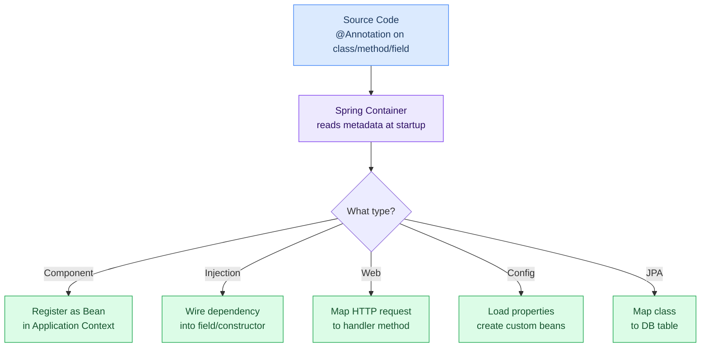

### The Big Picture — Annotation Categories

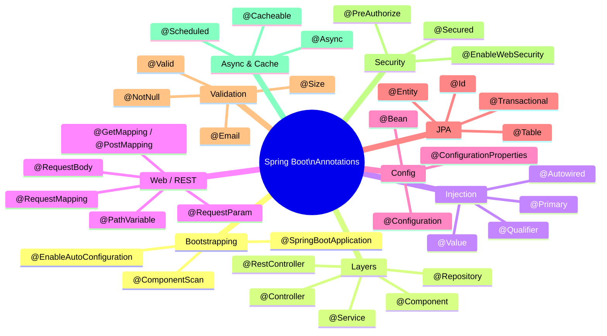

---

## 2. Application Bootstrapping

These annotations kick off the entire Spring Boot lifecycle.

### `@SpringBootApplication`

The **single most important annotation** in any Spring Boot project. It is a meta-annotation that bundles three annotations into one:

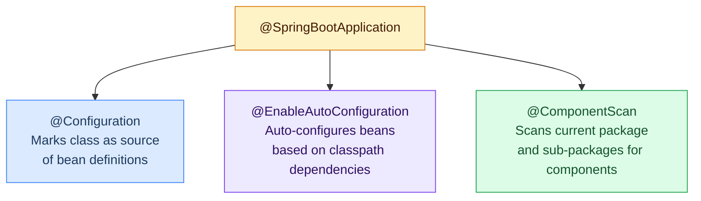

```java
@SpringBootApplication
public class Application {
    public static void main(String[] args) {
        SpringApplication.run(Application.class, args);
    }
}
```

**What happens at startup:**

1. Spring reads `@SpringBootApplication` on the main class.
2. `@ComponentScan` scans the package tree for `@Component`, `@Service`, `@Repository`, `@Controller`.
3. `@EnableAutoConfiguration` checks the classpath — finds `spring-boot-starter-web` → auto-configures Tomcat + DispatcherServlet; finds `spring-boot-starter-data-jpa` → auto-configures DataSource + EntityManager.
4. `@Configuration` allows you to define extra `@Bean` methods in the same class.

### Customising Component Scan

```java
// Scan only specific packages (useful in modular monorepos)
@SpringBootApplication(scanBasePackages = {"com.myapp.api", "com.myapp.core"})
public class Application { ... }

// Exclude a specific auto-configuration
@SpringBootApplication(exclude = {DataSourceAutoConfiguration.class})
public class Application { ... }
```

---

## 3. Component & Layer Annotations

Spring uses **stereotype annotations** to identify the architectural role of each class. All of them are specialisations of `@Component`.

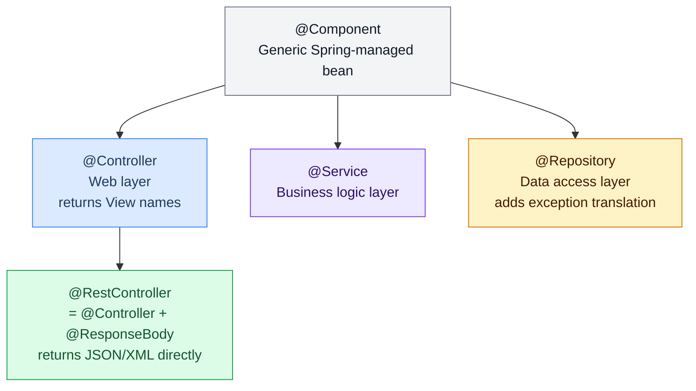

### Layer-by-Layer Breakdown

| Annotation | Layer | Registers Bean? | Extra Behaviour |
|---|---|---|---|
| `@Component` | Any | ✅ | None — generic |
| `@Controller` | Presentation | ✅ | Enables MVC view resolution |
| `@RestController` | Presentation | ✅ | Adds `@ResponseBody` to all methods |
| `@Service` | Business | ✅ | Semantic clarity; no extra magic |
| `@Repository` | Data Access | ✅ | Translates DB exceptions to Spring exceptions |

### Example — Three-Layer Application

```java
// Presentation layer
@RestController
@RequestMapping("/api/orders")
public class OrderController {
    @Autowired
    private OrderService orderService;

    @GetMapping("/{id}")
    public Order getOrder(@PathVariable Long id) {
        return orderService.findById(id);
    }
}

// Business layer
@Service
public class OrderService {
    @Autowired
    private OrderRepository orderRepository;

    public Order findById(Long id) {
        return orderRepository.findById(id)
            .orElseThrow(() -> new OrderNotFoundException(id));
    }
}

// Data layer
@Repository
public interface OrderRepository extends JpaRepository<Order, Long> {
    List<Order> findByCustomerId(Long customerId);
}
```

---

## 4. Dependency Injection

Spring's DI container removes the need to call `new`. Annotations tell it how to wire beans together.

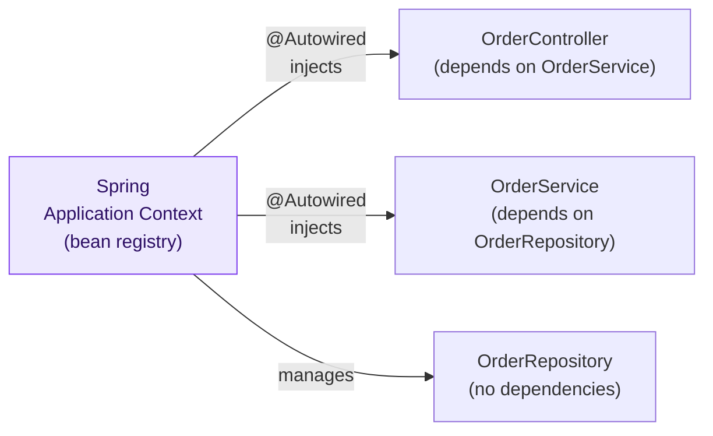

### `@Autowired`

Injects a matching bean by **type**. Can go on:

- **Fields** (simplest, but harder to test)
- **Constructor** (preferred — makes dependencies explicit and testable)
- **Setter** (for optional dependencies)

```java
// Field injection (common but not recommended for production)
@Service
public class PaymentService {
    @Autowired
    private PaymentGateway paymentGateway;
}

// Constructor injection (RECOMMENDED — works without Spring in unit tests)
@Service
public class PaymentService {
    private final PaymentGateway paymentGateway;

    public PaymentService(PaymentGateway paymentGateway) {
        this.paymentGateway = paymentGateway;
    }
}

// Setter injection (for optional dependencies)
@Service
public class NotificationService {
    private EmailClient emailClient;

    @Autowired(required = false)
    public void setEmailClient(EmailClient emailClient) {
        this.emailClient = emailClient;
    }
}
```

### `@Qualifier` — Resolving Ambiguity

When two beans implement the same interface, Spring doesn't know which to inject. `@Qualifier` names the one you want:

```java
public interface PaymentGateway {
    void charge(BigDecimal amount);
}

@Component("stripeGateway")
public class StripeGateway implements PaymentGateway { ... }

@Component("paypalGateway")
public class PayPalGateway implements PaymentGateway { ... }

@Service
public class CheckoutService {
    @Autowired
    @Qualifier("stripeGateway")   // explicitly pick Stripe
    private PaymentGateway paymentGateway;
}
```

### `@Primary` — Default Bean

Marks the default implementation when no `@Qualifier` is specified:

```java
@Component
@Primary   // used unless @Qualifier overrides
public class StripeGateway implements PaymentGateway { ... }

@Component
public class PayPalGateway implements PaymentGateway { ... }

// This will receive StripeGateway automatically
@Autowired
private PaymentGateway paymentGateway;
```

### `@Qualifier` vs `@Primary` — Decision Flow

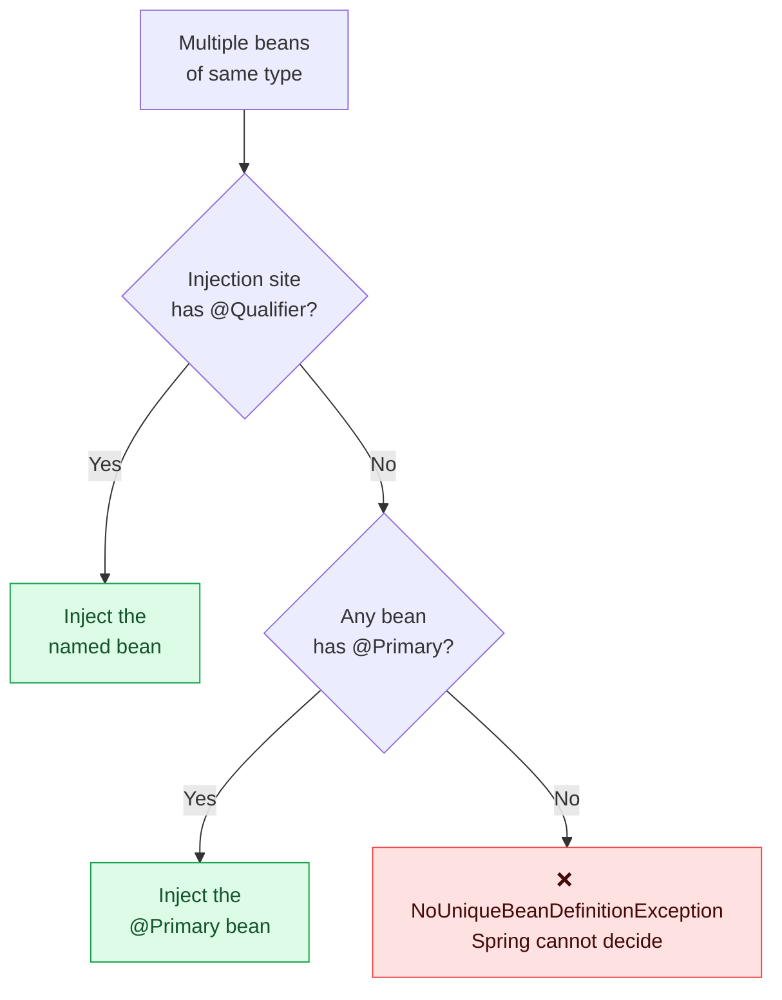

### `@Value` — Injecting Properties

```java
@Service
public class EmailService {
    @Value("${email.sender.address}")
    private String senderAddress;

    @Value("${email.max-retries:3}")   // default value = 3
    private int maxRetries;
}
```

`application.properties`:
```
email.sender.address=no-reply@myapp.com
email.max-retries=5
```

---

## 5. Web & REST API Annotations

### Request Mapping Hierarchy

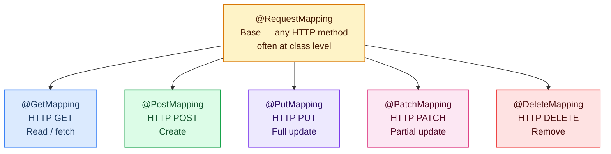

### Complete REST Controller Example

```java
@RestController
@RequestMapping("/api/users")
public class UserController {

    @Autowired
    private UserService userService;

    // GET /api/users
    @GetMapping
    public List<User> getAllUsers() {
        return userService.findAll();
    }

    // GET /api/users/42
    @GetMapping("/{id}")
    public ResponseEntity<User> getUserById(@PathVariable Long id) {
        return ResponseEntity.ok(userService.findById(id));
    }

    // GET /api/users?role=ADMIN&page=0
    @GetMapping("/search")
    public List<User> searchUsers(
            @RequestParam String role,
            @RequestParam(defaultValue = "0") int page) {
        return userService.findByRole(role, page);
    }

    // POST /api/users
    @PostMapping
    @ResponseStatus(HttpStatus.CREATED)
    public User createUser(@RequestBody @Valid UserRequest request) {
        return userService.create(request);
    }

    // PUT /api/users/42
    @PutMapping("/{id}")
    public User updateUser(@PathVariable Long id,
                           @RequestBody @Valid UserRequest request) {
        return userService.update(id, request);
    }

    // PATCH /api/users/42/status
    @PatchMapping("/{id}/status")
    public User updateStatus(@PathVariable Long id,
                             @RequestParam String status) {
        return userService.updateStatus(id, status);
    }

    // DELETE /api/users/42
    @DeleteMapping("/{id}")
    @ResponseStatus(HttpStatus.NO_CONTENT)
    public void deleteUser(@PathVariable Long id) {
        userService.delete(id);
    }
}
```

### Request Data Annotations — When to Use Each

| Annotation | Reads From | Example URL / Body | Use Case |
|---|---|---|---|
| `@PathVariable` | URL path segment | `/users/{id}` → `id=42` | Identifying a resource |
| `@RequestParam` | Query string | `/search?role=ADMIN` | Filtering, pagination |
| `@RequestBody` | JSON request body | `{"name":"Alice"}` | Creating or updating |
| `@RequestHeader` | HTTP header | `Authorization: Bearer ...` | Auth tokens, custom headers |
| `@CookieValue` | Cookie | `session=abc123` | Session identifiers |

---

## 6. Configuration & Bean Management

### `@Configuration` and `@Bean`

```java
@Configuration
public class AppConfig {

    // Spring calls this method and stores the return value as a bean
    @Bean
    public PasswordEncoder passwordEncoder() {
        return new BCryptPasswordEncoder(12);
    }

    @Bean
    public RestTemplate restTemplate() {
        RestTemplate template = new RestTemplate();
        template.setConnectTimeout(Duration.ofSeconds(5));
        return template;
    }

    // Bean that depends on another bean — Spring injects automatically
    @Bean
    public UserValidator userValidator(PasswordEncoder encoder) {
        return new UserValidator(encoder);
    }
}
```

### `@ConfigurationProperties` — Type-Safe Config Binding

Instead of scattering `@Value` across the codebase, bind an entire config prefix to a POJO:

```java
@ConfigurationProperties(prefix = "app.mail")
@Component
public class MailProperties {
    private String host;
    private int port;
    private String username;
    private String password;
    private int maxRetries = 3;
    // getters and setters...
}
```

`application.yml`:
```yaml
app:
  mail:
    host: smtp.gmail.com
    port: 587
    username: myapp@gmail.com
    password: secret
    max-retries: 5
```

```java
@Service
public class EmailService {
    @Autowired
    private MailProperties mailProperties;

    public void send(String to, String subject) {
        // mailProperties.getHost(), mailProperties.getPort(), etc.
    }
}
```

### Configuration Flow

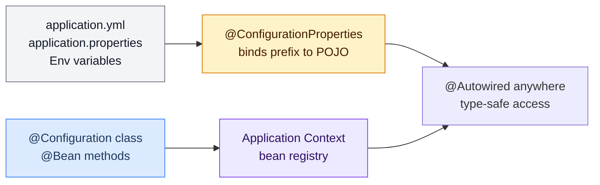

---

## 7. Database & JPA Annotations

### Entity Mapping

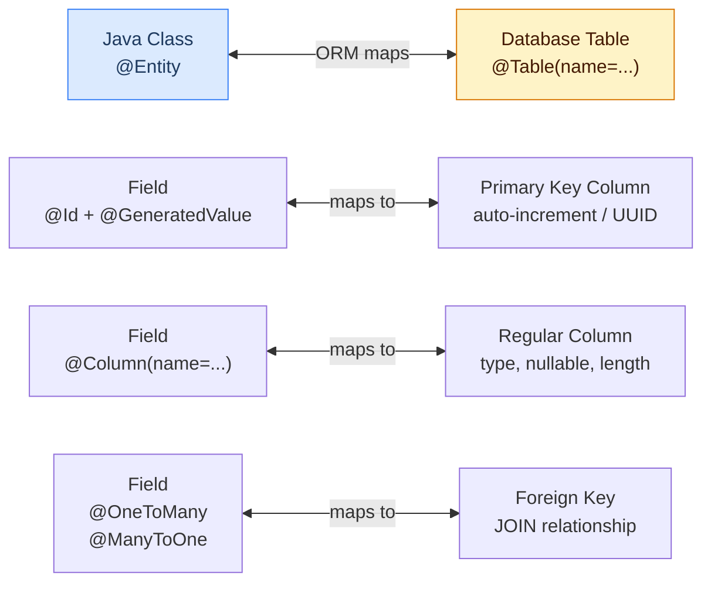

### Full Entity Example

```java
@Entity
@Table(name = "orders",
       indexes = @Index(columnList = "customer_id"),
       uniqueConstraints = @UniqueConstraint(columnNames = "order_number"))
public class Order {

    @Id
    @GeneratedValue(strategy = GenerationType.IDENTITY)
    private Long id;

    @Column(name = "order_number", nullable = false, length = 20)
    private String orderNumber;

    @Column(name = "total_amount", precision = 10, scale = 2)
    private BigDecimal totalAmount;

    @Enumerated(EnumType.STRING)
    @Column(name = "status")
    private OrderStatus status;

    @ManyToOne(fetch = FetchType.LAZY)
    @JoinColumn(name = "customer_id")
    private Customer customer;

    @OneToMany(mappedBy = "order", cascade = CascadeType.ALL, orphanRemoval = true)
    private List<OrderItem> items = new ArrayList<>();

    @CreatedDate
    private LocalDateTime createdAt;
}
```

### `@Transactional` — Deep Dive

`@Transactional` wraps a method (or class) in a database transaction. If the method throws a `RuntimeException`, the transaction is rolled back automatically.

```java
@Service
public class TransferService {

    @Autowired
    private AccountRepository accountRepo;

    @Transactional  // entire method is ONE atomic operation
    public void transfer(Long fromId, Long toId, BigDecimal amount) {
        Account from = accountRepo.findById(fromId).orElseThrow();
        Account to   = accountRepo.findById(toId).orElseThrow();

        from.debit(amount);   // if this throws → entire tx rolls back
        to.credit(amount);    // both operations succeed or both fail

        accountRepo.save(from);
        accountRepo.save(to);
    }
}
```

### Transaction Propagation

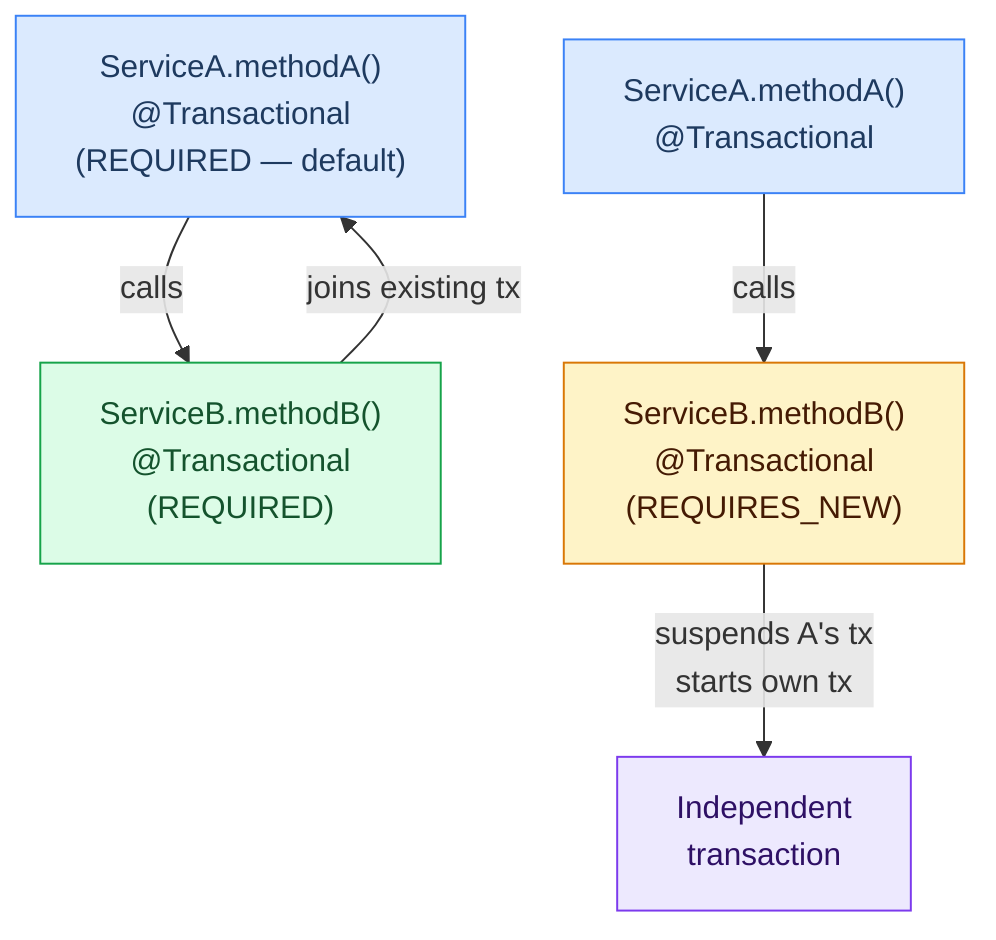

| Propagation | Behaviour |
|---|---|
| `REQUIRED` (default) | Join existing tx; create new one if none exists |
| `REQUIRES_NEW` | Always create a new tx; suspend the current one |
| `NESTED` | Create a savepoint inside the current tx |
| `SUPPORTS` | Use tx if one exists; run without tx otherwise |
| `NOT_SUPPORTED` | Always run without tx; suspend any existing tx |
| `NEVER` | Throw exception if a tx exists |
| `MANDATORY` | Must run inside an existing tx; throw if none |

---

## 8. Validation Annotations

Apply constraints to request DTOs and let Spring validate them automatically via `@Valid`.

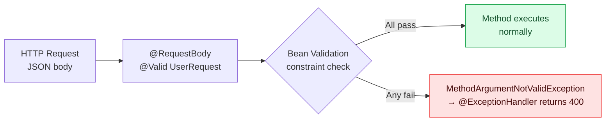

### Constraint Annotations

```java
public class UserRegistrationRequest {

    @NotBlank(message = "Name is required")
    @Size(min = 2, max = 50, message = "Name must be 2–50 characters")
    private String name;

    @NotBlank
    @Email(message = "Must be a valid email address")
    private String email;

    @NotBlank
    @Pattern(regexp = "^(?=.*[A-Z])(?=.*\\d).{8,}$",
             message = "Password must be 8+ chars with a number and uppercase letter")
    private String password;

    @NotNull
    @Min(value = 18, message = "Must be at least 18 years old")
    @Max(value = 120)
    private Integer age;

    @NotNull
    @Past(message = "Date of birth must be in the past")
    private LocalDate dateOfBirth;

    @Valid                    // cascade validation into nested object
    @NotNull
    private AddressRequest address;
}
```

### Common Validation Annotations Cheat Sheet

| Annotation | Validates | Example |
|---|---|---|
| `@NotNull` | Field is not null | Any object |
| `@NotBlank` | String not null and not whitespace | `"hello"` ✅, `""` ❌ |
| `@NotEmpty` | Collection/string not null and not empty | `[1,2]` ✅, `[]` ❌ |
| `@Size(min,max)` | String/collection length in range | `@Size(min=2,max=10)` |
| `@Min(value)` | Number ≥ value | `@Min(0)` rejects negatives |
| `@Max(value)` | Number ≤ value | `@Max(100)` |
| `@Email` | Valid email format | `user@example.com` ✅ |
| `@Pattern(regexp)` | Matches regex | Custom format validation |
| `@Past` / `@Future` | Date is before/after now | `LocalDate` fields |
| `@Positive` | Number > 0 | Quantities, prices |
| `@Valid` | Cascade into nested object | Nested DTOs |

---

## 9. Exception Handling

### Without `@ControllerAdvice` — The Problem

Every controller must handle its own exceptions, leading to massive code duplication.

### With `@ControllerAdvice` — Centralised Handling

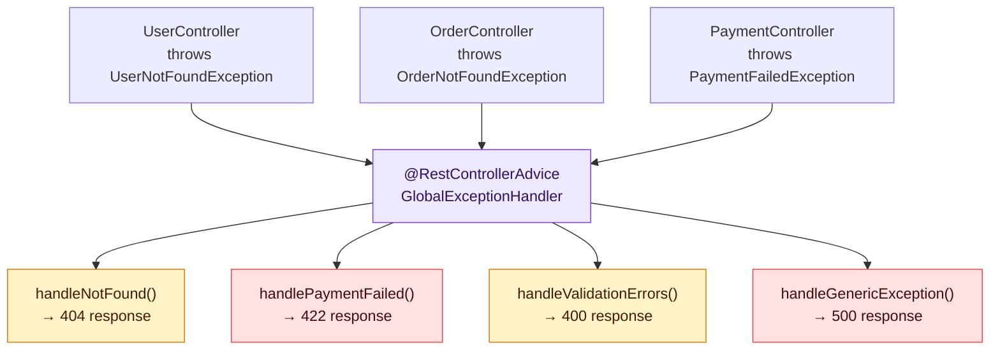

### Full Implementation

```java
@RestControllerAdvice
public class GlobalExceptionHandler {

    // Handles a specific custom exception → 404
    @ExceptionHandler(UserNotFoundException.class)
    @ResponseStatus(HttpStatus.NOT_FOUND)
    public ErrorResponse handleNotFound(UserNotFoundException ex) {
        return new ErrorResponse("NOT_FOUND", ex.getMessage());
    }

    // Handles Bean Validation failures → 400
    @ExceptionHandler(MethodArgumentNotValidException.class)
    @ResponseStatus(HttpStatus.BAD_REQUEST)
    public ErrorResponse handleValidation(MethodArgumentNotValidException ex) {
        List<String> errors = ex.getBindingResult()
            .getFieldErrors()
            .stream()
            .map(e -> e.getField() + ": " + e.getDefaultMessage())
            .collect(Collectors.toList());
        return new ErrorResponse("VALIDATION_FAILED", errors.toString());
    }

    // Catch-all → 500
    @ExceptionHandler(Exception.class)
    @ResponseStatus(HttpStatus.INTERNAL_SERVER_ERROR)
    public ErrorResponse handleGeneric(Exception ex) {
        return new ErrorResponse("INTERNAL_ERROR", "Something went wrong");
    }
}

// Simple error response DTO
public record ErrorResponse(String code, String message) {}
```

---

## 10. Security Annotations

### Security Annotation Flow

```mermaid
flowchart TD
    A["HTTP Request"] --> B["Spring Security\nFilter Chain\n@EnableWebSecurity"]
    B --> C{Authenticated?}
    C -->|No| D["401 Unauthorized"]
    C -->|Yes| E{Authorized?\n@PreAuthorize / @Secured}
    E -->|No| F["403 Forbidden"]
    E -->|Yes| G["Controller Method\nexecutes"]

    style D fill:#fee2e2,stroke:#ef4444,color:#450a0a
    style F fill:#fee2e2,stroke:#ef4444,color:#450a0a
    style G fill:#dcfce7,stroke:#16a34a,color:#14532d
    style B fill:#ede9fe,stroke:#7c3aed,color:#2e1065
```

### `@EnableWebSecurity`

```java
@Configuration
@EnableWebSecurity
public class SecurityConfig {

    @Bean
    public SecurityFilterChain filterChain(HttpSecurity http) throws Exception {
        http
            .authorizeHttpRequests(auth -> auth
                .requestMatchers("/api/public/**").permitAll()
                .requestMatchers("/api/admin/**").hasRole("ADMIN")
                .anyRequest().authenticated()
            )
            .oauth2ResourceServer(oauth2 -> oauth2.jwt(Customizer.withDefaults()));
        return http.build();
    }
}
```

### `@PreAuthorize` — Method-Level Security

Evaluated **before** the method runs using Spring Expression Language (SpEL):

```java
@Service
public class UserService {

    // Only ADMIN can delete any user
    @PreAuthorize("hasRole('ADMIN')")
    public void deleteUser(Long id) { ... }

    // Users can only update their own profile
    @PreAuthorize("hasRole('ADMIN') or #userId == authentication.principal.id")
    public User updateProfile(Long userId, UserRequest req) { ... }

    // Only authenticated users
    @PreAuthorize("isAuthenticated()")
    public List<Order> getMyOrders() { ... }
}
```

### `@PostAuthorize` — Check After Execution

```java
// Run the method, then verify the return value belongs to the caller
@PostAuthorize("returnObject.ownerId == authentication.principal.id")
public Document getDocument(Long id) {
    return documentRepository.findById(id).orElseThrow();
}
```

### `@Secured` vs `@PreAuthorize`

| Feature | `@Secured` | `@PreAuthorize` |
|---|---|---|
| SpEL expressions | ❌ | ✅ |
| Role check | ✅ | ✅ |
| Complex conditions | ❌ | ✅ |
| Check on parameters | ❌ | ✅ (`#param`) |
| Check on return value | ❌ | Use `@PostAuthorize` |
| Recommendation | Legacy | ✅ Prefer this |

---

## 11. Scheduling, Async & Caching

### `@Scheduled` — Background Tasks

```java
@Configuration
@EnableScheduling
public class SchedulingConfig {}

@Component
public class ReportScheduler {

    // Every day at 2 AM
    @Scheduled(cron = "0 0 2 * * *")
    public void generateDailyReport() { ... }

    // Every 30 seconds
    @Scheduled(fixedDelay = 30_000)
    public void syncInventory() { ... }

    // Every 5 minutes, starting 1 minute after app startup
    @Scheduled(fixedRate = 300_000, initialDelay = 60_000)
    public void checkExternalService() { ... }
}
```

### Cron Expression Cheat Sheet

```
Cron: "second  minute  hour  day-of-month  month  day-of-week"

"0 0 2 * * *"       → Every day at 02:00:00
"0 */30 * * * *"    → Every 30 minutes
"0 0 9-17 * * MON-FRI" → Every hour 9am–5pm, weekdays
"0 0 0 1 * *"       → First day of every month at midnight
"0 0 * * * *"       → Every hour
```

### `@Async` — Non-Blocking Method Execution

```java
@Configuration
@EnableAsync
public class AsyncConfig {
    @Bean
    public Executor taskExecutor() {
        ThreadPoolTaskExecutor executor = new ThreadPoolTaskExecutor();
        executor.setCorePoolSize(5);
        executor.setMaxPoolSize(20);
        executor.setQueueCapacity(100);
        executor.setThreadNamePrefix("async-");
        executor.initialize();
        return executor;
    }
}

@Service
public class EmailService {

    // Returns immediately; email sends on a background thread
    @Async
    public CompletableFuture<Void> sendWelcomeEmail(String to) {
        // slow SMTP call
        smtpClient.send(to, "Welcome!", buildBody());
        return CompletableFuture.completedFuture(null);
    }
}

// Caller — does NOT block waiting for email
@Service
public class RegistrationService {
    @Autowired private EmailService emailService;

    public User register(UserRequest req) {
        User saved = userRepository.save(new User(req));
        emailService.sendWelcomeEmail(saved.getEmail()); // fire and forget
        return saved;                                    // returns immediately
    }
}
```

### Async Execution Flow

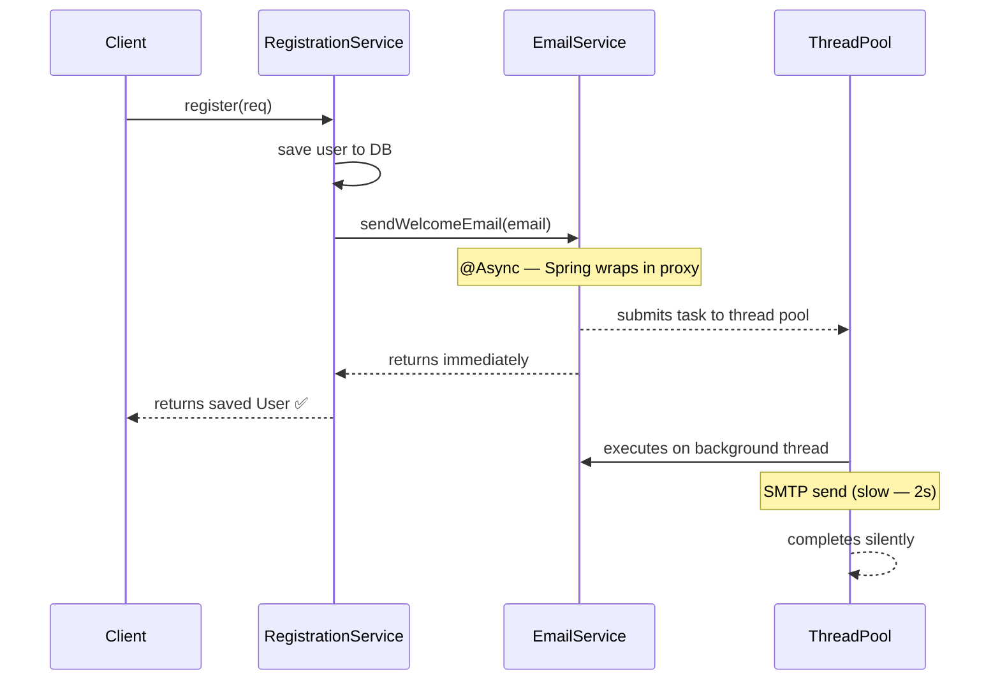

### Caching — `@Cacheable`, `@CacheEvict`, `@CachePut`

```java
@Configuration
@EnableCaching
public class CacheConfig {
    @Bean
    public CacheManager cacheManager() {
        return new ConcurrentMapCacheManager("users", "products");
    }
}

@Service
public class ProductService {

    // On first call: runs method and stores result in "products" cache.
    // On subsequent calls with same id: returns cached value, skips method body.
    @Cacheable(value = "products", key = "#id")
    public Product findById(Long id) {
        return productRepository.findById(id).orElseThrow();
    }

    // Runs the method AND updates the cache — used on write operations
    @CachePut(value = "products", key = "#result.id")
    public Product update(Long id, ProductRequest req) {
        return productRepository.save(new Product(id, req));
    }

    // Removes the entry from cache — call after delete
    @CacheEvict(value = "products", key = "#id")
    public void delete(Long id) {
        productRepository.deleteById(id);
    }

    // Evict entire cache (e.g. after bulk import)
    @CacheEvict(value = "products", allEntries = true)
    public void bulkImport(List<Product> products) {
        productRepository.saveAll(products);
    }
}
```

### Caching Decision Flow

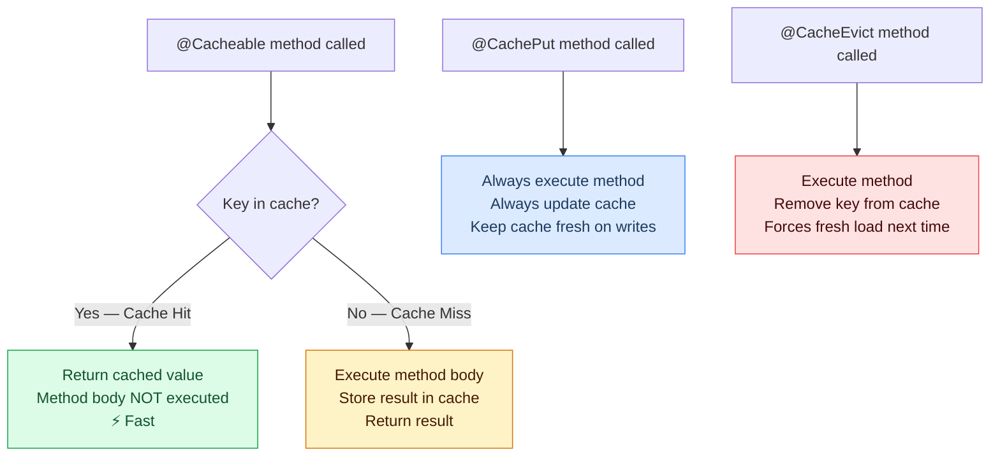

---

## 12. Full Application Flow Diagram

How all annotation categories work together in a real Spring Boot request:

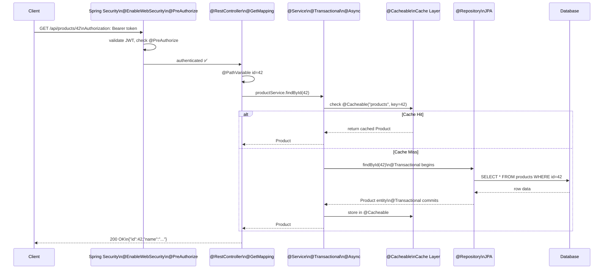

---

## 13. Interview Quick-Fire Reference

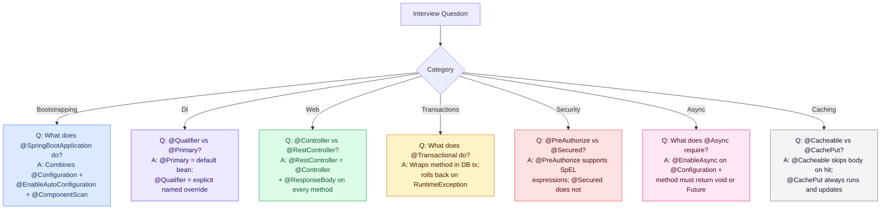

### Master Annotation Summary Table

| Annotation | Category | One-Line Purpose |
|---|---|---|
| `@SpringBootApplication` | Bootstrap | Entry point; combines 3 annotations |
| `@EnableAutoConfiguration` | Bootstrap | Auto-configure beans from classpath |
| `@ComponentScan` | Bootstrap | Discover beans in package tree |
| `@Component` | Layer | Generic Spring-managed bean |
| `@Controller` | Layer | MVC web layer; returns view names |
| `@RestController` | Layer | REST API; returns JSON/XML directly |
| `@Service` | Layer | Business logic layer |
| `@Repository` | Layer | Data access; adds exception translation |
| `@Autowired` | DI | Inject dependency by type |
| `@Qualifier` | DI | Pick a named bean when multiple exist |
| `@Primary` | DI | Default bean when no qualifier given |
| `@Value` | DI | Inject single property value |
| `@GetMapping` | Web | Map HTTP GET to method |
| `@PostMapping` | Web | Map HTTP POST to method |
| `@RequestBody` | Web | Deserialize JSON body into object |
| `@PathVariable` | Web | Bind URL segment to parameter |
| `@RequestParam` | Web | Bind query string to parameter |
| `@ResponseStatus` | Web | Set HTTP status code on response |
| `@Configuration` | Config | Source of `@Bean` definitions |
| `@Bean` | Config | Register method return as bean |
| `@ConfigurationProperties` | Config | Bind config prefix to POJO |
| `@Entity` | JPA | Map class to DB table |
| `@Id` | JPA | Mark primary key field |
| `@GeneratedValue` | JPA | Auto-generate PK (IDENTITY, SEQUENCE) |
| `@Column` | JPA | Customise column mapping |
| `@Transactional` | JPA | Wrap in DB transaction with rollback |
| `@Valid` | Validation | Trigger Bean Validation on parameter |
| `@NotBlank` | Validation | String not null and not empty |
| `@Email` | Validation | Valid email format |
| `@Size` | Validation | String/collection length range |
| `@ExceptionHandler` | Error | Handle specific exception in controller |
| `@ControllerAdvice` | Error | Global exception handler (MVC) |
| `@RestControllerAdvice` | Error | Global exception handler (REST) |
| `@EnableWebSecurity` | Security | Activate Spring Security |
| `@PreAuthorize` | Security | Method access control (SpEL) |
| `@Secured` | Security | Simple role-based method access |
| `@Scheduled` | Scheduling | Run method on cron/fixed schedule |
| `@EnableScheduling` | Scheduling | Activate scheduled tasks |
| `@Async` | Async | Run method on background thread pool |
| `@EnableAsync` | Async | Activate async method execution |
| `@Cacheable` | Cache | Cache method result by key |
| `@CachePut` | Cache | Always run and update cache |
| `@CacheEvict` | Cache | Remove entry from cache |
| `@EnableCaching` | Cache | Activate Spring caching |

---

*From bootstrapping to caching — every Spring Boot annotation has a precise role. Understand not just what each annotation does, but where it belongs in the architecture and why it exists.*