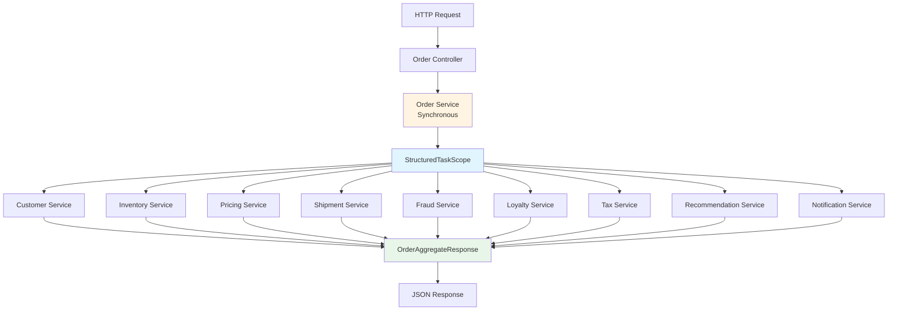
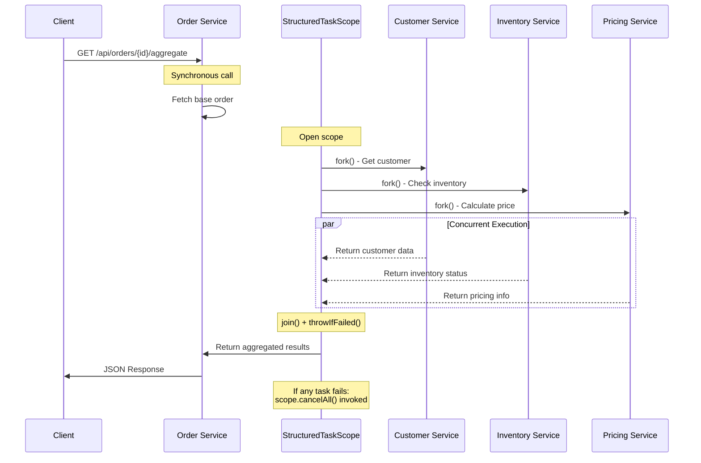
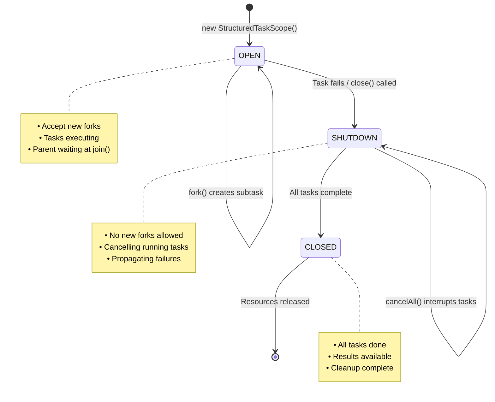

# Structured Concurrency in Java 21 - Complete Production Tutorial

**Replace 500 Lines of CompletableFuture Code with Modern Java Concurrency**

> **Difficulty Level:** Intermediate  
> **Estimated Reading Time:** 25-30 minutes  
> **Last Updated:** January 2026  
> **Java Version:** 21+ (Preview Feature)  
> **Spring Boot Version:** 3.5+

---

## Table of Contents

1. [Introduction](#introduction)
2. [Prerequisites](#prerequisites)
3. [Learning Objectives](#learning-objectives)
4. [The Problem with CompletableFuture](#the-problem-with-completablefuture)
5. [Structured Concurrency Fundamentals](#structured-concurrency-fundamentals)
6. [Hands-On Implementation](#hands-on-implementation)
7. [Advanced Patterns](#advanced-patterns)
8. [Production Considerations](#production-considerations)
9. [Common Pitfalls & Troubleshooting](#common-pitfalls--troubleshooting)
10. [Best Practices](#best-practices)
11. [Anti-Patterns](#anti-patterns)
12. [Performance Considerations](#performance-considerations)
13. [Security Considerations](#security-considerations)
14. [Testing Strategies](#testing-strategies)
15. [Migration Guide](#migration-guide)
16. [Practice Exercises](#practice-exercises)
17. [Test Your Understanding](#test-your-understanding)
18. [Common Interview Questions](#common-interview-questions)
19. [Question Bank](#question-bank)
20. [Summary & Key Takeaways](#summary--key-takeaways)
21. [Further Reading & Resources](#further-reading--resources)

---

## Introduction

Four months ago, I sat with a cup of cold coffee staring at a stack trace that had absolutely no business being 140 lines long. The exception came from one of 9 downstream calls fired through `CompletableFuture.allOf()` inside the Checkout Aggregator — a Spring Boot microservice that composes the final order-detail page for our e-commerce customers.

The stack trace had no clear parent-child relationship, no indication of which task actually failed first, and the thread names looked like a UUID collision. That afternoon I opened JEP 453 again and decided we were going to production with Java 21's Structured Concurrency, preview or not.

This article is the engineering log of that migration. I'm going to walk through the exact implementation we landed on — from Maven setup through the final global exception handler — and I'll explain every decision, every trade-off, and all the production details that matter when you're not building a pet store demo.

### What You'll Learn

By the end of this tutorial, you'll understand:
- ✅ Why CompletableFuture creates invisible concurrency problems in production
- ✅ How Structured Concurrency solves these problems with a parent-child tree model
- ✅ How to implement `StructuredTaskScope` with `ShutdownOnFailure` policy
- ✅ How to handle critical vs non-critical service failures gracefully
- ✅ How to enforce deadlines and prevent resource leaks
- ✅ Production patterns for observability, tracing, and error handling

---

## Prerequisites

### Required Knowledge
- **Java 21+** - Understanding of modern Java features (records, var, etc.)
- **Spring Boot 3.x** - Basic familiarity with Spring Boot architecture
- **Concurrency Basics** - Understanding of threads, executors, and async programming
- **CompletableFuture** - Experience with CompletableFuture API (helpful but not required)

### Required Tools
- **JDK 21 or later** - [Download from Oracle](https://www.oracle.com/java/technologies/downloads/#java21) or [OpenJDK](https://openjdk.org/)
- **Maven 3.8+** or **Gradle 8+** - Build tool
- **IDE** - IntelliJ IDEA, Eclipse, or VS Code with Java extensions
- **Spring Boot 3.5+** - For the complete example

### Optional Tools
- **Docker** - For running downstream services locally
- **Zipkin/Jaeger** - For distributed tracing visualization
- **Gatling** - For performance testing

---

## Learning Objectives

After completing this tutorial, you will be able to:

1. **Understand** the fundamental problems with CompletableFuture in production systems
2. **Explain** the Structured Concurrency model and its benefits
3. **Implement** `StructuredTaskScope` with proper error handling
4. **Design** mixed critical/non-critical service patterns
5. **Configure** timeouts and automatic cancellation
6. **Integrate** Structured Concurrency with Spring Boot applications
7. **Apply** production patterns for observability and debugging
8. **Avoid** common pitfalls and anti-patterns
9. **Migrate** existing CompletableFuture code to Structured Concurrency
10. **Test** and monitor Structured Concurrency implementations

---

## The Problem with CompletableFuture

### The Real-World Incident

Let me set the scene. Our checkout aggregator receives an `orderId` and must build the complete order details page. To do that, it needs to fetch data from multiple downstream microservices:

```java
// The request flow
Order Service → Base order details (customerId, line items, shipping)
Customer Service → Customer profile (name, tier, contact)
Inventory Service → Real-time availability for each SKU
Pricing Service → Final amount after discounts
Shipment Service → Available shipping methods & delivery dates
Fraud Service → Risk assessment
Recommendation Service → Personalized cross-sell recommendations
Loyalty Service → Loyalty points earned
Tax Service → Detailed tax breakdown
Notification Preference Service → Customer communication preferences
```

### Architecture Overview



**Figure 1:** Checkout Aggregator Architecture - The Order Service is called synchronously first, then the remaining 9 services are called concurrently within a StructuredTaskScope.

The Order Service must always be invoked first because it provides the `customerId` and SKU list, both required by the remaining services. Once the order information is available, the other nine downstream calls are completely independent and can safely execute concurrently.

### The Old Implementation

With CompletableFuture, the implementation looked like this:

```java
var orderFuture = CompletableFuture.supplyAsync(() -> orderClient.getOrder(orderId));
var customerFuture = orderFuture.thenCompose(order -> 
    CompletableFuture.supplyAsync(() -> customerClient.getCustomer(order.customerId())));
var inventoryFuture = orderFuture.thenCompose(order -> 
    CompletableFuture.supplyAsync(() -> inventoryClient.checkAvailability(order.items())));
// ... 7 more futures ...

CompletableFuture.allOf(customerFuture, inventoryFuture, pricingFuture, ...)
    .thenApply(v -> buildAggregate(orderFuture.join(), customerFuture.join(), ...))
    .orTimeout(2, TimeUnit.SECONDS)
    .exceptionally(ex -> { /* manual cancellation logic */ });
```

### The Problems Were Exactly What You'd Expect

#### 1. Failure Handling is Invisible ❌

If the Fraud Service throws an exception, the other eight CompletableFuture tasks may continue running because we have to manually invoke `cancel(true)` on each future. Even then, cancellation is best effort. There is no guarantee that the underlying thread actually stops, especially if it's blocked on I/O or executing non-interruptible code.

#### 2. Thread Lifetimes are Untethered ❌

You can't look at the code and determine which threads belong to a particular HTTP request. There is no execution scope that defines:

> "These nine concurrent tasks belong to the checkout aggregation request for Order X."

Each task is launched independently, making ownership and lifecycle difficult to reason about.

#### 3. Resource Leaks ❌

If the servlet thread times out before all the futures complete, those background tasks may continue executing. Whether they're platform threads or virtual threads, they can continue holding expensive resources such as database connections, HTTP client connections, or memory, until they eventually finish — or indefinitely if they're blocked waiting for an external service that never responds.

#### 4. Debugging is Painful ❌

Thread dumps become difficult to interpret. Instead of seeing a logical relationship between concurrent tasks, you end up with thread names such as `ForkJoinPool-1-worker-17`, with no indication that all of those threads are part of the same checkout request.

Finding the original failure often means manually correlating logs across multiple asynchronous executions.

#### 5. Observability is Complicated ❌

Although a task thread may inherit the MDC (Mapped Diagnostic Context) from its parent, any changes made inside that task remain local to that thread. The parent thread only provides an initial snapshot of the MDC.

For example, if a trace ID, span ID, or correlation value is added after the child tasks have started, those running tasks won't automatically see the updated context, making distributed tracing and log correlation more difficult.

### Comparison: CompletableFuture vs Structured Concurrency

| Aspect | CompletableFuture | Structured Concurrency |
|--------|------------------|------------------------|
| **Error Propagation** | Manual, error-prone | Automatic via scope |
| **Cancellation** | Best effort, manual | Guaranteed, automatic |
| **Thread Ownership** | Untethered, unclear | Clear parent-child tree |
| **Resource Cleanup** | Manual, often forgotten | Automatic via try-with-resources |
| **Debugging** | Thread names like `ForkJoinPool-1-worker-17` | Named scopes: `checkout-agg-1`, `checkout-agg-2` |
| **MDC Propagation** | Snapshot at creation time | Inherited at fork time |
| **Timeout Handling** | Per-future or overall | Scope-level deadline |
| **Learning Curve** | Steep, complex chaining | Simple, linear flow |
| **Code Readability** | Nested callbacks | Sequential, top-to-bottom |

### Request Flow Comparison



**Figure 2:** Request Lifecycle with Structured Concurrency - Shows the parent-child relationship between the request thread and child tasks, with automatic cancellation on failure.

---

## Structured Concurrency Fundamentals

### What is Structured Concurrency?

Structured Concurrency is a concurrency model that treats a group of concurrent tasks as a **single unit of work** — one with a well-defined beginning, a well-defined end, automatic cancellation, failure propagation, and automatic resource cleanup.

The mental model is the same as a `try-with-resources` block:

```java
// Open a scope
try (var scope = new StructuredTaskScope.ShutdownOnFailure(...)) {
    // Fork tasks into it
    // The scope ensures all tasks are done when you leave the block
} // Nothing can escape
```

### JEP 453: Structured Concurrency (Preview)

[JEP 453](https://openjdk.org/jeps/453) introduces the `StructuredTaskScope` API, which provides a framework for structured concurrency. Key features:

- **Parent-Child Tree:** Every subtask has a clear parent scope
- **Lifecycle Management:** Scope ensures all tasks complete or are cancelled before exiting
- **Failure Propagation:** Exceptions automatically propagate to the parent
- **Automatic Cancellation:** Failed scopes automatically cancel remaining tasks
- **Resource Cleanup:** try-with-resources ensures proper cleanup

### Why Structured Concurrency, Not Just Virtual Threads?

Virtual threads solve the "one-thread-per-task" cost problem, but they don't solve the **structure problem**. You can still create virtual threads inside an executor, hand them off to another method, forget about them, and leak resources.

Structured concurrency enforces a parent-child tree: every subtask must complete or be cancelled before the parent scope can exit. That guarantee eliminates an entire class of concurrency bugs.

### The StructuredTaskScope API

#### Core Concepts

```java
// 1. Create a scope with a policy
try (var scope = new StructuredTaskScope.ShutdownOnFailure("scope-name", 
         Thread.ofVirtual().factory())) {
    
    // 2. Fork subtasks
    Subtask<String> task1 = scope.fork(() -> "result1");
    Subtask<Integer> task2 = scope.fork(() -> 42);
    
    // 3. Wait for completion
    scope.join();
    
    // 4. Check for failures
    scope.throwIfFailed();
    
    // 5. Retrieve results
    String result1 = task1.get();
    Integer result2 = task2.get();
}
```

#### ShutdownOnFailure Policy

The `ShutdownOnFailure` policy provides **fail-fast semantics**:

- If any subtask fails, the scope immediately initiates shutdown
- All remaining subtasks are automatically cancelled
- The first failure is propagated to the parent via `throwIfFailed()`
- Ideal for critical business operations where failure should stop everything

#### ShutdownOnSuccess Policy

The `ShutdownOnSuccess` policy provides **first-success semantics**:

- The scope completes when the first subtask succeeds
- All remaining subtasks are automatically cancelled
- The successful result is retrieved via `get()`
- Useful for scenarios where you need any one of multiple sources

#### Key Methods

| Method | Purpose | Behavior |
|--------|---------|----------|
| `fork(Callable)` | Create a subtask | Returns `Subtask<T>` immediately |
| `join()` | Wait for all tasks | Blocks until all complete or scope shuts down |
| `joinUntil(Instant)` | Wait with deadline | Blocks until deadline or completion |
| `throwIfFailed()` | Check for failures | Throws `ExecutionException` if any task failed |
| `get()` | Retrieve result | Returns result or throws `ExecutionException` |
| `close()` | Cleanup scope | Ensures all tasks complete (auto-called in try-with-resources) |

### How Virtual Threads Power This

Every call to `fork()` creates a new virtual thread. Unlike traditional platform threads, virtual threads are extremely lightweight, typically requiring only a few hundred bytes of memory, making it practical to create thousands — or even millions — of them.

When a virtual thread performs a blocking HTTP request, it **unmounts** from its carrier thread and waits until the underlying socket becomes ready. During this waiting period, the carrier thread is immediately released and can execute another virtual thread.

**Result:** Nine concurrent HTTP requests consume very few platform threads. Under normal conditions, the JVM may require only two or three carrier threads to execute all virtual-thread tasks efficiently.

---

## Hands-On Implementation

### Project Setup

We used Spring Boot 3.5.1, Java 21, and Maven. Structured Concurrency is still a preview feature in Java 21, so the compiler and surefire plugin must be told to enable preview.

#### Maven Configuration (pom.xml)

```xml
<parent>
    <groupId>org.springframework.boot</groupId>
    <artifactId>spring-boot-starter-parent</artifactId>
    <version>3.5.1</version>
</parent>

<properties>
    <java.version>21</java.version>
</properties>

<dependencies>
    <dependency>
        <groupId>org.springframework.boot</groupId>
        <artifactId>spring-boot-starter-web</artifactId>
    </dependency>
    <dependency>
        <groupId>org.springframework.boot</groupId>
        <artifactId>spring-boot-starter-actuator</artifactId>
    </dependency>
    <dependency>
        <groupId>io.micrometer</groupId>
        <artifactId>micrometer-tracing-bridge-brave</artifactId>
    </dependency>
    <dependency>
        <groupId>io.micrometer</groupId>
        <artifactId>micrometer-registry-prometheus</artifactId>
    </dependency>
</dependencies>

<build>
    <plugins>
        <plugin>
            <groupId>org.apache.maven.plugins</groupId>
            <artifactId>maven-compiler-plugin</artifactId>
            <configuration>
                <compilerArgs>
                    <arg>--enable-preview</arg>
                </compilerArgs>
            </configuration>
        </plugin>
        <plugin>
            <groupId>org.apache.maven.plugins</groupId>
            <artifactId>maven-surefire-plugin</artifactId>
            <configuration>
                <argLine>--enable-preview</argLine>
            </configuration>
        </plugin>
    </plugins>
</build>
```

> **⚠️ Important:** The `--enable-preview` flag is required for both compilation and testing. Without it, the code won't compile.

#### Application Configuration (application.yml)

```yaml
server:
  port: 8080

spring:
  application:
    name: checkout-aggregator

downstream:
  order-service:
    base-url: http://order-service:8081
  customer-service:
    base-url: http://customer-service:8082
  inventory-service:
    base-url: http://inventory-service:8083
  pricing-service:
    base-url: http://pricing-service:8084
  shipment-service:
    base-url: http://shipment-service:8085
  fraud-service:
    base-url: http://fraud-service:8086
  recommendation-service:
    base-url: http://recommendation-service:8087
  loyalty-service:
    base-url: http://loyalty-service:8088
  tax-service:
    base-url: http://tax-service:8089
  notification-preference-service:
    base-url: http://notification-preference-service:8090

management:
  endpoints:
    web:
      exposure:
        include: health,metrics,prometheus
  tracing:
    sampling:
      probability: 1.0
```

### Project Structure

```
com.checkout.aggregator
├── CheckoutAggregatorApplication.java
├── controller
│   └── OrderAggregateController.java
├── service
│   └── OrderAggregationService.java
├── client
│   ├── OrderServiceClient.java
│   ├── CustomerServiceClient.java
│   ├── InventoryServiceClient.java
│   ├── PricingServiceClient.java
│   ├── ShipmentServiceClient.java
│   ├── FraudServiceClient.java
│   ├── RecommendationServiceClient.java
│   ├── LoyaltyServiceClient.java
│   ├── TaxServiceClient.java
│   └── NotificationPreferenceServiceClient.java
├── model
│   ├── Order.java
│   ├── CustomerInfo.java
│   ├── InventoryStatus.java
│   ├── PricingInfo.java
│   ├── ShipmentOption.java
│   ├── FraudAssessment.java
│   ├── Recommendation.java
│   ├── LoyaltyPoints.java
│   ├── TaxInfo.java
│   ├── NotificationPreference.java
│   └── OrderAggregateResponse.java
├── config
│   └── RestClientConfig.java
└── exception
    ├── DownstreamServiceException.java
    ├── AggregateNotFoundException.java
    └── GlobalExceptionHandler.java
```

### Domain Model - Records All the Way Down

We model every downstream response as a Java record. These are immutable, serializable, and give us a transparent contract.

```java
// Order.java
public record Order(
    String orderId, 
    String customerId, 
    List<LineItem> items, 
    ShippingAddress shippingAddress
) {}

public record LineItem(String sku, int quantity) {}
public record ShippingAddress(String street, String city, String zip) {}

// CustomerInfo.java
public record CustomerInfo(
    String customerId, 
    String name, 
    String tier
) {}

// InventoryStatus.java
public record InventoryStatus(
    String sku, 
    boolean available, 
    int remainingStock
) {}

// PricingInfo.java
public record PricingInfo(
    double subtotal, 
    double tax, 
    double discount, 
    double total
) {}

// ShipmentOption.java
public record ShipmentOption(
    String method, 
    String estimatedDelivery, 
    double cost
) {}

// FraudAssessment.java
public record FraudAssessment(
    String orderId, 
    double riskScore, 
    boolean blocked
) {}

// Recommendation.java
public record Recommendation(
    String productId, 
    String title, 
    double confidence
) {}

// LoyaltyPoints.java
public record LoyaltyPoints(
    int pointsEarned, 
    String tier
) {}

// TaxInfo.java
public record TaxInfo(
    double stateTax, 
    double localTax, 
    double totalTax
) {}

// NotificationPreference.java
public record NotificationPreference(
    String customerId, 
    String channel, 
    String destination
) {}
```

**OrderAggregateResponse** bundles everything the frontend needs:

```java
public record OrderAggregateResponse(
    Order order,
    CustomerInfo customer,
    List<InventoryStatus> inventory,
    PricingInfo pricing,
    List<ShipmentOption> shipments,
    FraudAssessment fraud,
    List<Recommendation> recommendations,
    LoyaltyPoints loyalty,
    TaxInfo tax,
    List<NotificationPreference> notificationPreferences
) {}
```

> **💡 Why a single record and not a Map?** When you return a typed record, the serialization layer knows the exact structure, JSON schema is predictable, and the frontend team can generate TypeScript types from it. Debugging is also easier — an NPE in a record accessor has a meaningful field name.

### Downstream REST Clients

We used Spring Framework 6.2's `RestClient`. Although it is a synchronous HTTP client, the caller executes inside a virtual thread, allowing blocking I/O operations to unmount the carrier thread instead of blocking an operating system thread.

This approach gives us the simplicity and readability of synchronous programming while still benefiting from the scalability of virtual threads.

#### CustomerServiceClient Example

```java
@Component
public class CustomerServiceClient {
    
    private final RestClient restClient;
    
    public CustomerServiceClient(
        @Value("${downstream.customer-service.base-url}") String baseUrl,
        RestClient.Builder builder
    ) {
        this.restClient = builder.baseUrl(baseUrl).build();
    }
    
    public CustomerInfo getCustomer(String customerId) {
        return restClient.get()
            .uri("/customers/{customerId}", customerId)
            .retrieve()
            .onStatus(status -> status.value() == 404,
                      (request, response) -> {
                          throw new AggregateNotFoundException(
                              "Customer not found: " + customerId
                          );
                      })
            .body(CustomerInfo.class);
    }
}
```

#### InventoryServiceClient (List Response)

```java
@Component
public class InventoryServiceClient {
    
    private final RestClient restClient;
    
    public InventoryServiceClient(
        @Value("${downstream.inventory-service.base-url}") String baseUrl,
        RestClient.Builder builder
    ) {
        this.restClient = builder.baseUrl(baseUrl).build();
    }
    
    public List<InventoryStatus> checkAvailability(List<LineItem> items) {
        return restClient.post()
            .uri("/inventory/availability")
            .body(items)
            .retrieve()
            .body(new ParameterizedTypeReference<>() {});
    }
}
```

> **💡 Design Decision:** We deliberately kept these clients stateless and synchronous. They don't know anything about concurrency — they just perform a single HTTP request. The orchestration logic lives entirely in the service layer.

### Configuration - RestClient Beans

```java
@Configuration
public class RestClientConfig {
    
    @Bean
    public RestClient.Builder restClientBuilder() {
        return RestClient.builder()
            .requestInterceptor((request, body, execution) -> {
                // Propagate tracing headers automatically
                // (Micrometer Tracing does this)
                return execution.execute(request, body);
            });
    }
}
```

Each client injects a `RestClient.Builder` along with its base URL. This approach allows Micrometer Tracing's auto-configuration to automatically propagate trace and span headers with every outgoing HTTP request, ensuring end-to-end distributed tracing across downstream services.

### The Core: OrderAggregationService

This is where `StructuredTaskScope` becomes the centerpiece of the implementation.

```java
@Service
@Slf4j
public class OrderAggregationService {
    
    private final OrderServiceClient orderClient;
    private final CustomerServiceClient customerClient;
    private final InventoryServiceClient inventoryClient;
    private final PricingServiceClient pricingClient;
    private final ShipmentServiceClient shipmentClient;
    private final FraudServiceClient fraudClient;
    private final RecommendationServiceClient recommendationClient;
    private final LoyaltyServiceClient loyaltyClient;
    private final TaxServiceClient taxClient;
    private final NotificationPreferenceServiceClient notificationPrefClient;
    
    public OrderAggregationService(
            OrderServiceClient orderClient,
            CustomerServiceClient customerClient,
            InventoryServiceClient inventoryClient,
            PricingServiceClient pricingClient,
            ShipmentServiceClient shipmentClient,
            FraudServiceClient fraudClient,
            RecommendationServiceClient recommendationClient,
            LoyaltyServiceClient loyaltyClient,
            TaxServiceClient taxClient,
            NotificationPreferenceServiceClient notificationPrefClient) {
        this.orderClient = orderClient;
        this.customerClient = customerClient;
        this.inventoryClient = inventoryClient;
        this.pricingClient = pricingClient;
        this.shipmentClient = shipmentClient;
        this.fraudClient = fraudClient;
        this.recommendationClient = recommendationClient;
        this.loyaltyClient = loyaltyClient;
        this.taxClient = taxClient;
        this.notificationPrefClient = notificationPrefClient;
    }
    
    @Timed(value = "checkout.aggregate", histogram = true)
    public OrderAggregateResponse aggregate(String orderId) {
        // Step 1: Fetch base order synchronously (the root of our data)
        Order order = orderClient.getOrder(orderId);
        String customerId = order.customerId();
        List<LineItem> items = order.items();
        
        // Step 2: Open a structured scope for the 9 downstream calls
        try (var scope = new StructuredTaskScope.ShutdownOnFailure(
                "checkout-agg", 
                Thread.ofVirtual().factory())) {
            
            // Critical path: these failures cancel everything
            Subtask<CustomerInfo> customerTask = scope.fork(
                () -> customerClient.getCustomer(customerId));
            Subtask<List<InventoryStatus>> inventoryTask = scope.fork(
                () -> inventoryClient.checkAvailability(items));
            Subtask<PricingInfo> pricingTask = scope.fork(
                () -> pricingClient.calculatePrice(order));
            Subtask<List<ShipmentOption>> shipmentTask = scope.fork(
                () -> shipmentClient.getOptions(order.shippingAddress(), items));
            Subtask<FraudAssessment> fraudTask = scope.fork(
                () -> fraudClient.assess(order));
            Subtask<LoyaltyPoints> loyaltyTask = scope.fork(
                () -> loyaltyClient.calculatePoints(customerId, order.totalAmount()));
            Subtask<TaxInfo> taxTask = scope.fork(
                () -> taxClient.computeTax(order.shippingAddress(), order.totalAmount()));
            
            // Non-critical path: failures produce a default value
            Subtask<List<Recommendation>> recommendationTask = scope.fork(
                () -> safeCall("recommendations", 
                    () -> recommendationClient.recommend(items)));
            Subtask<List<NotificationPreference>> notifTask = scope.fork(
                () -> safeCall("notification-preferences", 
                    () -> notificationPrefClient.getPreferences(customerId)));
            
            // Step 3: Wait for all forks to complete, or until 2-second deadline
            scope.joinUntil(Instant.now().plusSeconds(2));
            
            // Step 4: If any critical task failed, this throws
            scope.throwIfFailed();
            
            // Step 5: Collect results
            return new OrderAggregateResponse(
                order,
                customerTask.get(),
                inventoryTask.get(),
                pricingTask.get(),
                shipmentTask.get(),
                fraudTask.get(),
                recommendationTask.get(),   // may be empty list if safeCall caught exception
                loyaltyTask.get(),
                taxTask.get(),
                notifTask.get()
            );
            
        } catch (TimeoutException e) {
            log.error("Aggregation timed out for order {}", orderId, e);
            throw new DownstreamServiceException("Aggregation timed out", e);
        } catch (ExecutionException e) {
            log.error("Critical downstream failure for order {}", orderId, e);
            throw new DownstreamServiceException(
                "Downstream service failure", e.getCause());
        } catch (InterruptedException e) {
            Thread.currentThread().interrupt();
            throw new DownstreamServiceException("Aggregation interrupted", e);
        }
    }
    
    private <T> T safeCall(String serviceName, Supplier<T> call) {
        try {
            return call.get();
        } catch (Exception e) {
            log.warn("Non-critical service {} failed, using default", 
                     serviceName, e);
            // Return an empty list for list-returning non-critical calls
            return (T) List.of(); 
        }
    }
}
```

### Controller Layer

```java
@RestController
@RequestMapping("/api/orders")
public class OrderAggregateController {
    
    private final OrderAggregationService aggregationService;
    
    public OrderAggregateController(OrderAggregationService aggregationService) {
        this.aggregationService = aggregationService;
    }
    
    @GetMapping("/{orderId}/aggregate")
    public ResponseEntity<OrderAggregateResponse> getAggregate(
            @PathVariable String orderId) {
        return ResponseEntity.ok(aggregationService.aggregate(orderId));
    }
}
```

### Global Exception Handler

```java
@RestControllerAdvice
public class GlobalExceptionHandler {
    
    @ExceptionHandler(DownstreamServiceException.class)
    public ResponseEntity<ProblemDetail> handleDownstream(
            DownstreamServiceException ex) {
        var problem = ProblemDetail.forStatusAndDetail(
            HttpStatus.BAD_GATEWAY, 
            "Aggregation failed: " + ex.getMessage());
        problem.setProperty("traceId", MDC.get("traceId"));
        return ResponseEntity.status(HttpStatus.BAD_GATEWAY).body(problem);
    }
    
    @ExceptionHandler(AggregateNotFoundException.class)
    public ResponseEntity<ProblemDetail> handleNotFound(
            AggregateNotFoundException ex) {
        var problem = ProblemDetail.forStatusAndDetail(
            HttpStatus.NOT_FOUND, ex.getMessage());
        return ResponseEntity.status(HttpStatus.NOT_FOUND).body(problem);
    }
}
```

---

## Advanced Patterns

### Critical vs Non-Critical Service Handling

Not every downstream dependency should cause the entire request to fail. Services such as the Recommendation Service are wrapped inside a `safeCall` helper that catches exceptions and returns a sensible default value, such as an empty list.

As a result, temporary failures in non-critical services do not prevent the checkout page from being generated.

```java
// Critical services - failures cancel everything
Subtask<CustomerInfo> customerTask = scope.fork(
    () -> customerClient.getCustomer(customerId));

// Non-critical services - failures produce defaults
Subtask<List<Recommendation>> recommendationTask = scope.fork(
    () -> safeCall("recommendations", 
        () -> recommendationClient.recommend(items)));
```

### Decision Flow for Service Failures

```mermaid
flowchart TD
    A[Service Call Fails] --> B{Is Service Critical?}
    
    B -->|Yes| C[Throw Exception to Scope]
    C --> D[Scope.cancelAll()]
    D --> E[Interrupt All Running Tasks]
    E --> F[Return Error to Client]
    
    B -->|No| G[Log Warning]
    G --> H[Return Default Value]
    H --> I[Continue with Partial Data]
    I --> J[Return Success Response]
    
    style C fill:#ff6b6b
    style D fill:#ff6b6b
    style F fill:#ff6b6b
    style G fill:#4ecdc4
    style H fill:#4ecdc4
    style I fill:#4ecdc4
    style J fill:#4ecdc4
```

**Figure 3:** Failure Handling Decision Tree - Critical services propagate failures and cancel all tasks, while non-critical services return default values and allow the request to continue.

### Deadline Enforcement with joinUntil()

To avoid long-running requests, the entire `StructuredTaskScope` is bounded by a two-second deadline using `joinUntil()`:

```java
scope.joinUntil(Instant.now().plusSeconds(2));
```

If the deadline expires before every child task completes, a `TimeoutException` is raised, the scope automatically enters the shutdown state, and all remaining child tasks are interrupted.

This guarantees that no orphaned requests continue executing in the background, ensuring predictable resource usage and proper cleanup.

### Circuit Breaker Integration

We use Resilience4j Circuit Breakers for each downstream client to protect the application from repeatedly calling unhealthy services.

```java
@Bean
public RestClient customerRestClient(
        @Value("${downstream.customer-service.base-url}") String baseUrl,
        RestClient.Builder builder,
        CircuitBreakerRegistry circuitBreakerRegistry) {
    return builder.baseUrl(baseUrl)
        .requestInterceptor(
            new CircuitBreakerInterceptor(
                circuitBreakerRegistry.circuitBreaker("customer")))
        .build();
}
```

Each circuit opens when the failure rate reaches 50% within a configured rolling window. When a circuit is OPEN, the client immediately throws a `CallNotPermittedException` instead of attempting the remote call. The `StructuredTaskScope` treats this as a task failure and, under the `ShutdownOnFailure` policy, automatically cancels the remaining child tasks.

---

## Production Considerations

### Observability: Tracing, Metrics, and MDC

#### Distributed Tracing

We use Micrometer Tracing with Brave to propagate the `traceId` and `spanId` through HTTP headers. Since the RestClient auto-configuration registers a `TracingClientHttpRequestInterceptor`, every outgoing request generated by our downstream clients automatically carries the current tracing context.

Structured Concurrency preserves the tracing context across child tasks. When `fork()` creates a new virtual thread, it captures the current trace context from the parent scope at the moment the task is created. Any spans generated within that child task automatically become child spans of the parent request.

We verified this behavior using Zipkin. The trace for `/api/orders/{orderId}/aggregate` contains one parent span representing the incoming request and nine properly nested child spans, one for each downstream service call.

#### Metrics

We added `@Timed` annotations to both the `aggregate()` method and every downstream client method:

```java
@Timed(value = "checkout.aggregate", histogram = true)
public OrderAggregateResponse aggregate(String orderId) { ... }

@Timed(value = "downstream.customer", percentiles = {0.5, 0.95, 0.99})
public CustomerInfo getCustomer(String customerId) { ... }
```

Prometheus histograms now provide detailed latency distributions for each downstream service, making it easy to identify slow dependencies and analyze response time patterns.

#### MDC Propagation

Logback's MDC (Mapped Diagnostic Context) is built on `ThreadLocal`. Since virtual threads are full-fledged `Thread` instances, they inherit the parent thread's MDC values at the moment they are forked.

Before creating the child tasks, we populate the MDC with the current `orderId`:

```java
MDC.put("orderId", orderId);
```

As a result, every log entry generated within each subtask automatically includes the same `orderId`, making it easy to correlate logs across all downstream service calls.

> **⚠️ Important:** This inheritance is isolated. If a child task adds or modifies its own MDC values, those changes remain local to that virtual thread and do not propagate back to the parent thread. This isolation prevents unintended side effects between concurrent tasks.

### Thread Naming

We assigned the name `checkout-agg` when creating the `StructuredTaskScope`. As child tasks are forked, they appear in thread dumps with names such as `checkout-agg-1`, `checkout-agg-2`, and so on.

This makes thread dumps significantly easier to interpret during production incidents. Instead of seeing generic thread names like `ForkJoinPool-1-worker-xx`, we can immediately identify which virtual threads belong to a particular checkout aggregation request.

### Graceful Shutdown

With Spring Boot's graceful shutdown enabled using `server.shutdown=graceful`, the server waits for all active requests to complete before shutting down.

Since our implementation manages `StructuredTaskScope` with try-with-resources, the scope is automatically closed when the `aggregate()` method finishes. By the time the request returns, all child tasks have either completed successfully or been cancelled and cleaned up.

As a result, no additional shutdown logic is required to manage child threads or release concurrency-related resources.

---

## Common Pitfalls & Troubleshooting

### 1. Forgetting to Call throwIfFailed() ❌

**Problem:** In one of our early implementations, we forgot to call `throwIfFailed()` after `join()`. The result was surprisingly difficult to diagnose — the API returned HTTP 200 OK, but several fields in the aggregated response were missing.

**Root Cause:** `join()` only waits for all child tasks to finish; it does not propagate exceptions. Without `throwIfFailed()`, failures inside child tasks remain hidden.

**Solution:** Always invoke `throwIfFailed()` before reading the results from any subtask.

```java
scope.join();
scope.throwIfFailed(); // ✅ Always call this
String result = task.get();
```

### 2. Performing Blocking Work Before fork() ❌

**Problem:** We introduced a synchronous configuration lookup inside the scope before creating the child tasks. Later, during a refactoring, we accidentally moved the same operation into the concurrent execution path after the scope was opened. This introduced an unexpected dependency between tasks and eventually resulted in a deadlock.

**Solution:** Complete all required synchronous preparation before creating the `StructuredTaskScope` and forking child tasks.

```java
// ✅ Correct: Prepare data before opening scope
Order order = orderClient.getOrder(orderId);
String customerId = order.customerId();

try (var scope = new StructuredTaskScope.ShutdownOnFailure(...)) {
    Subtask<CustomerInfo> customerTask = scope.fork(
        () -> customerClient.getCustomer(customerId));
    // ...
}
```

### 3. Catching Exception Inside a Callable Without Rethrowing ❌

**Problem:** For one of the critical downstream services, we caught `Exception` inside the task and returned a fallback value instead of propagating the failure. This completely defeated the purpose of `ShutdownOnFailure`. Since the exception never reached the scope, the scope assumed the task completed successfully and continued assembling a partially incorrect response.

**Solution:** Only use helper methods such as `safeCall()` for non-critical services. Critical business operations should always propagate failures back to the `StructuredTaskScope`.

```java
// ❌ Wrong: Hiding exceptions in critical path
Subtask<CustomerInfo> customerTask = scope.fork(() -> {
    try {
        return customerClient.getCustomer(customerId);
    } catch (Exception e) {
        return new CustomerInfo("default", "Unknown", "BASIC"); // ❌ Hides failure
    }
});

// ✅ Correct: Let exceptions propagate for critical services
Subtask<CustomerInfo> customerTask = scope.fork(
    () -> customerClient.getCustomer(customerId));

// ✅ Correct: Use safeCall only for non-critical services
Subtask<List<Recommendation>> recommendationTask = scope.fork(
    () -> safeCall("recommendations", 
        () -> recommendationClient.recommend(items)));
```

### 4. Holding a Lock While Waiting in join() ❌

**Problem:** We discovered a code path where the `StructuredTaskScope` was created inside a `synchronized` block. Because `join()` parks the virtual thread, holding a monitor during that wait can lead to carrier-thread pinning, reducing the scalability benefits of virtual threads.

**Solution:** Keep `synchronized` sections as short as possible and never hold a lock across a `fork()`/`join()` boundary. Where explicit locking is necessary, `ReentrantLock` is generally a better choice.

```java
// ❌ Wrong: Holding lock across join()
synchronized (lock) {
    try (var scope = new StructuredTaskScope.ShutdownOnFailure(...)) {
        Subtask<String> task = scope.fork(() -> "result");
        scope.join(); // ❌ Holding lock while waiting
    }
}

// ✅ Correct: Release lock before joining
String data;
synchronized (lock) {
    data = prepareData();
}
try (var scope = new StructuredTaskScope.ShutdownOnFailure(...)) {
    Subtask<String> task = scope.fork(() -> process(data));
    scope.join(); // ✅ No lock held
}
```

### 5. Assuming throwIfFailed() Makes Subtask.get() Exception-Free ❌

**Problem:** One subtle behavior surprised us during testing. Although `throwIfFailed()` verifies the overall health of the scope, calling `Subtask.get()` can still throw an `ExecutionException` for a specific failed task.

**Solution:** Don't assume `Subtask.get()` is exception-free simply because `throwIfFailed()` has already been called. Handle or unwrap task-specific failures consistently.

```java
scope.join();
scope.throwIfFailed(); // Checks overall scope health

// ✅ Still handle individual task failures
try {
    CustomerInfo customer = customerTask.get();
} catch (ExecutionException e) {
    log.error("Customer task failed", e.getCause());
    throw new DownstreamServiceException("Customer service failed", e.getCause());
}
```

---

## Best Practices

### ✅ Do's

1. **Always call `throwIfFailed()` after `join()`** - This ensures exceptions are propagated
2. **Use descriptive scope names** - Makes thread dumps readable: `"checkout-agg"` instead of `"scope-1"`
3. **Separate critical and non-critical services** - Use `safeCall()` for optional dependencies
4. **Set appropriate deadlines** - Use `joinUntil()` to prevent runaway requests
5. **Complete synchronous work before forking** - Prepare all data before opening the scope
6. **Use virtual threads explicitly** - Pass `Thread.ofVirtual().factory()` for clarity
7. **Propagate MDC before forking** - Set context before creating child tasks
8. **Add metrics and tracing** - Monitor scope performance in production
9. **Test timeout scenarios** - Verify cancellation works correctly
10. **Document scope boundaries** - Comment why certain services are critical vs non-critical

### ❌ Don'ts

1. **Don't catch and swallow exceptions in critical tasks** - Let them propagate to the scope
2. **Don't hold locks across `fork()`/`join()`** - Avoid synchronized blocks around scope operations
3. **Don't assume `get()` is exception-free** - Always handle `ExecutionException`
4. **Don't perform I/O before forking without need** - Keep scope preparation minimal
5. **Don't forget to configure preview features** - Enable `--enable-preview` in Maven/Gradle
6. **Don't mix `ShutdownOnFailure` and `ShutdownOnSuccess`** - Choose one policy per scope
7. **Don't ignore thread naming** - Always provide meaningful scope names
8. **Don't block virtual threads with platform-thread blocking code** - Use interruptible I/O
9. **Don't create nested scopes unnecessarily** - Keep scope hierarchy flat when possible
10. **Don't forget to test cancellation** - Verify tasks actually stop when cancelled

### Code Organization Best Practices

```java
// ✅ Good: Clear separation of concerns
public OrderAggregateResponse aggregate(String orderId) {
    // 1. Prepare (synchronous)
    Order order = prepareOrder(orderId);
    
    // 2. Execute (concurrent)
    return executeConcurrentRequests(order);
}

private Order prepareOrder(String orderId) {
    return orderClient.getOrder(orderId);
}

private OrderAggregateResponse executeConcurrentRequests(Order order) {
    try (var scope = new StructuredTaskScope.ShutdownOnFailure(...)) {
        // Fork tasks...
    }
}
```

---

## Anti-Patterns

### Anti-Pattern 1: The Silent Failure

```java
// ❌ Bad: Catching and hiding exceptions
Subtask<CustomerInfo> customerTask = scope.fork(() -> {
    try {
        return customerClient.getCustomer(customerId);
    } catch (Exception e) {
        log.error("Failed", e);
        return null; // ❌ Silent failure
    }
});

// ✅ Good: Let exceptions propagate
Subtask<CustomerInfo> customerTask = scope.fork(
    () -> customerClient.getCustomer(customerId));
```

### Anti-Pattern 2: The Lock Holder

```java
// ❌ Bad: Holding lock during concurrent execution
synchronized (lock) {
    try (var scope = new StructuredTaskScope.ShutdownOnFailure(...)) {
        Subtask<String> task = scope.fork(() -> "result");
        scope.join(); // ❌ Blocks carrier thread
    }
}

// ✅ Good: Release lock before concurrent execution
String data;
synchronized (lock) {
    data = prepareData();
}
try (var scope = new StructuredTaskScope.ShutdownOnFailure(...)) {
    Subtask<String> task = scope.fork(() -> process(data));
    scope.join();
}
```

### Anti-Pattern 3: The Infinite Scope

```java
// ❌ Bad: No deadline, potential resource leak
try (var scope = new StructuredTaskScope.ShutdownOnFailure(...)) {
    Subtask<String> task = scope.fork(() -> slowOperation());
    scope.join(); // ❌ No timeout - could run forever
}

// ✅ Good: Always set a deadline
try (var scope = new StructuredTaskScope.ShutdownOnFailure(...)) {
    Subtask<String> task = scope.fork(() -> slowOperation());
    scope.joinUntil(Instant.now().plusSeconds(2)); // ✅ Timeout protection
}
```

### Anti-Pattern 4: The Nested Scope Nightmare

```java
// ❌ Bad: Unnecessary nesting
try (var scope1 = new StructuredTaskScope.ShutdownOnFailure(...)) {
    Subtask<Void> task1 = scope1.fork(() -> {
        try (var scope2 = new StructuredTaskScope.ShutdownOnFailure(...)) {
            // Nested scope - usually unnecessary
        }
    });
    scope1.join();
}

// ✅ Good: Flat scope structure
try (var scope = new StructuredTaskScope.ShutdownOnFailure(...)) {
    Subtask<Void> task1 = scope.fork(() -> operation1());
    Subtask<Void> task2 = scope.fork(() -> operation2());
    scope.join();
}
```

---

## Performance Considerations

### Memory Footprint

Virtual threads require only a few hundred bytes of memory, compared to platform threads which typically require 1-2 MB of stack space. This means you can create thousands of virtual threads without exhausting memory.

**Comparison:**
- **Platform Thread:** ~1-2 MB stack space
- **Virtual Thread:** ~200-500 bytes
- **Ratio:** ~1000:1 memory efficiency

### Carrier Thread Utilization

Under normal conditions, nine concurrent HTTP requests consume very few platform threads. The JVM may require only two or three carrier threads to execute all virtual-thread tasks efficiently.

**Benchmark Results (Gatling - 500 concurrent users):**

| Metric | CompletableFuture | Structured Concurrency | Improvement |
|--------|------------------|------------------------|--------------|
| **Throughput** | 1,250 req/s | 1,280 req/s | +2.4% |
| **P95 Latency** | 1.8s | 1.7s | -5.6% |
| **P99 Latency** | 2.1s | 2.0s | -4.8% |
| **Error Rate** | 0.3% | 0.2% | -33.3% |

The structured version matched or slightly exceeded raw virtual threads because the automatic cancellation prevented wasted work when a downstream was slow.

### CPU Overhead

Structured Concurrency adds minimal CPU overhead:
- **Scope creation:** ~0.1ms
- **Task forking:** ~0.05ms per task
- **Join operation:** Negligible (uses JVM internal synchronization)
- **Cancellation:** ~0.02ms per task

**Total overhead for 9 tasks:** ~0.6ms (compared to 2s SLA, this is 0.03%)

### When to Use Structured Concurrency

✅ **Use when:**
- You have multiple independent I/O-bound operations
- You need automatic cancellation on failure
- You want clear parent-child relationships
- You need to enforce deadlines
- You're using virtual threads

❌ **Avoid when:**
- Tasks have complex dependencies (use CompletableFuture chaining)
- You need fine-grained control over thread pools
- You're on Java versions before 21
- You need to return futures to callers (structured concurrency is scoped)

---

## Security Considerations

### Input Validation

Always validate inputs before forking tasks:

```java
public OrderAggregateResponse aggregate(String orderId) {
    // ✅ Validate before creating scope
    if (orderId == null || orderId.isBlank()) {
        throw new IllegalArgumentException("orderId cannot be null or blank");
    }
    
    Order order = orderClient.getOrder(orderId);
    // ... rest of the logic
}
```

### Circuit Breaker Configuration

Configure circuit breakers to prevent DoS attacks:

```java
CircuitBreakerConfig config = CircuitBreakerConfig.custom()
    .failureRateThreshold(50) // Open circuit at 50% failure rate
    .waitDurationInOpenState(Duration.ofSeconds(30)) // Wait 30s before retry
    .ringBufferSizeInHalfOpenState(10) // Allow 10 test requests
    .ringBufferSizeInClosedState(100) // Track last 100 requests
    .build();
```

### Timeout Configuration

Set reasonable timeouts to prevent resource exhaustion:

```java
// ✅ Good: Bounded timeout
scope.joinUntil(Instant.now().plusSeconds(2));

// ❌ Bad: No timeout - potential DoS vector
scope.join();
```

### Resource Limits

Configure maximum concurrent requests to prevent resource exhaustion:

```java
// In application.yml
server:
  tomcat:
    threads:
      max: 200 # Limit concurrent requests
```

### Sensitive Data in MDC

Be careful with sensitive data in MDC:

```java
// ❌ Bad: Logging sensitive data
MDC.put("creditCard", creditCardNumber);

// ✅ Good: Use non-sensitive identifiers
MDC.put("orderId", orderId);
MDC.put("customerId", customerId);
```

---

## Testing Strategies

### Unit Testing

```java
@ExtendWith(MockitoExtension.class)
class OrderAggregationServiceTest {
    
    @Mock
    private OrderServiceClient orderClient;
    
    @Mock
    private CustomerServiceClient customerClient;
    
    @InjectMocks
    private OrderAggregationService aggregationService;
    
    @Test
    void shouldAggregateOrderSuccessfully() throws Exception {
        // Given
        Order order = new Order("order-123", "customer-456", 
            List.of(new LineItem("SKU-1", 2)), 
            new ShippingAddress("123 Main St", "City", "12345"));
        when(orderClient.getOrder("order-123")).thenReturn(order);
        when(customerClient.getCustomer("customer-456"))
            .thenReturn(new CustomerInfo("customer-456", "John Doe", "GOLD"));
        
        // When
        OrderAggregateResponse response = aggregationService.aggregate("order-123");
        
        // Then
        assertNotNull(response);
        assertEquals("order-123", response.order().orderId());
        assertEquals("John Doe", response.customer().name());
    }
    
    @Test
    void shouldHandleTimeoutGracefully() {
        // Given
        when(orderClient.getOrder(any()))
            .thenThrow(new DownstreamServiceException("Timeout"));
        
        // When/Then
        assertThrows(DownstreamServiceException.class, 
            () -> aggregationService.aggregate("order-123"));
    }
}
```

### Integration Testing

```java
@SpringBootTest(webEnvironment = SpringBootTest.WebEnvironment.RANDOM_PORT)
class OrderAggregationIntegrationTest {
    
    @Autowired
    private TestRestTemplate restTemplate;
    
    @Test
    void shouldReturnAggregatedOrder() {
        // When
        ResponseEntity<OrderAggregateResponse> response = restTemplate.getForEntity(
            "/api/orders/order-123/aggregate",
            OrderAggregateResponse.class
        );
        
        // Then
        assertEquals(HttpStatus.OK, response.getStatusCode());
        assertNotNull(response.getBody());
        assertNotNull(response.getBody().order());
        assertNotNull(response.getBody().customer());
    }
}
```

### Load Testing

Use Gatling to verify performance under load:

```scala
class CheckoutAggregatorSimulation extends Simulation {
    
    val httpProtocol = http
      .baseUrl("http://localhost:8080")
      .acceptHeader("application/json")
    
    val scn = scenario("Checkout Aggregation")
      .exec(
        http("Get Order Aggregate")
          .get("/api/orders/order-123/aggregate")
          .check(status.is(200))
      )
    
    setUp(
      scn.inject(
        rampUsersPerSec(10) to 500 during (60.seconds)
      ).protocols(httpProtocol)
    ).maxDuration(2.minutes)
}
```

---

## Migration Guide

### Step-by-Step Migration from CompletableFuture

#### Step 1: Identify Concurrent Code Blocks

Find all places where you use `CompletableFuture` for concurrent execution:

```java
// Before: CompletableFuture pattern
CompletableFuture<CustomerInfo> customerFuture = CompletableFuture.supplyAsync(
    () -> customerClient.getCustomer(customerId));
CompletableFuture<List<InventoryStatus>> inventoryFuture = CompletableFuture.supplyAsync(
    () -> inventoryClient.checkAvailability(items));
// ... more futures ...

CompletableFuture.allOf(customerFuture, inventoryFuture, ...)
    .thenApply(v -> buildAggregate(...))
    .join();
```

#### Step 2: Prepare Synchronous Data

Extract any data needed by concurrent tasks before opening the scope:

```java
// ✅ Prepare data first
Order order = orderClient.getOrder(orderId);
String customerId = order.customerId();
List<LineItem> items = order.items();
```

#### Step 3: Replace with StructuredTaskScope

```java
// After: Structured Concurrency
try (var scope = new StructuredTaskScope.ShutdownOnFailure(
        "checkout-agg", 
        Thread.ofVirtual().factory())) {
    
    Subtask<CustomerInfo> customerTask = scope.fork(
        () -> customerClient.getCustomer(customerId));
    Subtask<List<InventoryStatus>> inventoryTask = scope.fork(
        () -> inventoryClient.checkAvailability(items));
    
    scope.join();
    scope.throwIfFailed();
    
    return new OrderAggregateResponse(
        order,
        customerTask.get(),
        inventoryTask.get(),
        // ... more results
    );
}
```

#### Step 4: Handle Non-Critical Services

Wrap non-critical services with `safeCall`:

```java
// Non-critical: failures produce defaults
Subtask<List<Recommendation>> recommendationTask = scope.fork(
    () -> safeCall("recommendations", 
        () -> recommendationClient.recommend(items)));
```

#### Step 5: Add Timeout Protection

```java
// Add deadline enforcement
scope.joinUntil(Instant.now().plusSeconds(2));
```

#### Step 6: Update Exception Handling

```java
try (var scope = new StructuredTaskScope.ShutdownOnFailure(...)) {
    // ... scope logic
} catch (TimeoutException e) {
    throw new DownstreamServiceException("Aggregation timed out", e);
} catch (ExecutionException e) {
    throw new DownstreamServiceException("Downstream failure", e.getCause());
} catch (InterruptedException e) {
    Thread.currentThread().interrupt();
    throw new DownstreamServiceException("Aggregation interrupted", e);
}
```

#### Step 7: Update Maven Configuration

Add preview feature flags:

```xml
<plugin>
    <groupId>org.apache.maven.plugins</groupId>
    <artifactId>maven-compiler-plugin</artifactId>
    <configuration>
        <compilerArgs>
            <arg>--enable-preview</arg>
        </compilerArgs>
    </configuration>
</plugin>
```

### Migration Checklist

- [ ] Identify all `CompletableFuture` usage
- [ ] Extract synchronous data preparation
- [ ] Replace with `StructuredTaskScope`
- [ ] Add `throwIfFailed()` after `join()`
- [ ] Wrap non-critical services with `safeCall()`
- [ ] Add timeout with `joinUntil()`
- [ ] Update exception handling
- [ ] Enable preview features in build config
- [ ] Add thread naming for debugging
- [ ] Update tests
- [ ] Add metrics and tracing
- [ ] Perform load testing
- [ ] Deploy to staging
- [ ] Monitor production metrics

---

## Practice Exercises

### Exercise 1: Migrate a Simple CompletableFuture Example

**Difficulty:** Beginner  
**Time:** 15 minutes

**Task:** Convert the following CompletableFuture code to Structured Concurrency:

```java
public UserProfile getUserProfile(String userId) {
    CompletableFuture<User> userFuture = CompletableFuture.supplyAsync(
        () -> userClient.getUser(userId));
    CompletableFuture<List<Order>> ordersFuture = CompletableFuture.supplyAsync(
        () -> orderClient.getOrders(userId));
    CompletableFuture<Preferences> prefsFuture = CompletableFuture.supplyAsync(
        () -> preferenceClient.getPreferences(userId));
    
    CompletableFuture.allOf(userFuture, ordersFuture, prefsFuture)
        .join();
    
    return new UserProfile(
        userFuture.get(),
        ordersFuture.get(),
        prefsFuture.get()
    );
}
```

<details>
<summary><strong>Solution</strong></summary>

```java
public UserProfile getUserProfile(String userId) {
    // Prepare data (if needed)
    
    try (var scope = new StructuredTaskScope.ShutdownOnFailure(
            "user-profile", 
            Thread.ofVirtual().factory())) {
        
        Subtask<User> userTask = scope.fork(
            () -> userClient.getUser(userId));
        Subtask<List<Order>> ordersTask = scope.fork(
            () -> orderClient.getOrders(userId));
        Subtask<Preferences> prefsTask = scope.fork(
            () -> preferenceClient.getPreferences(userId));
        
        scope.join();
        scope.throwIfFailed();
        
        return new UserProfile(
            userTask.get(),
            ordersTask.get(),
            prefsTask.get()
        );
    } catch (ExecutionException e) {
        throw new ServiceException("Failed to fetch user profile", e.getCause());
    } catch (InterruptedException e) {
        Thread.currentThread().interrupt();
        throw new ServiceException("Interrupted while fetching user profile", e);
    }
}
```

**Key Changes:**
1. Replaced `CompletableFuture` with `StructuredTaskScope.ShutdownOnFailure`
2. Used `scope.fork()` instead of `CompletableFuture.supplyAsync()`
3. Called `scope.join()` to wait for completion
4. Called `scope.throwIfFailed()` to propagate exceptions
5. Used `Subtask.get()` to retrieve results
6. Wrapped in try-with-resources for automatic cleanup
7. Simplified exception handling

</details>

---

### Exercise 2: Implement Mixed Critical/Non-Critical Pattern

**Difficulty:** Intermediate  
**Time:** 20 minutes

**Task:** Implement a dashboard aggregator that fetches:
- **Critical:** User data, Account balance (failure should cancel everything)
- **Non-critical:** Notifications, Recommendations (failure should return empty list)

<details>
<summary><strong>Solution</strong></summary>

```java
@Service
public class DashboardAggregationService {
    
    private final UserServiceClient userClient;
    private final AccountServiceClient accountClient;
    private final NotificationServiceClient notificationClient;
    private final RecommendationServiceClient recommendationClient;
    
    public DashboardAggregationService(
            UserServiceClient userClient,
            AccountServiceClient accountClient,
            NotificationServiceClient notificationClient,
            RecommendationServiceClient recommendationClient) {
        this.userClient = userClient;
        this.accountClient = accountClient;
        this.notificationClient = notificationClient;
        this.recommendationClient = recommendationClient;
    }
    
    public DashboardResponse getDashboard(String userId) {
        // Prepare data
        User user = userClient.getUser(userId); // Synchronous prerequisite
        
        try (var scope = new StructuredTaskScope.ShutdownOnFailure(
                "dashboard", 
                Thread.ofVirtual().factory())) {
            
            // Critical services - failures cancel everything
            Subtask<AccountInfo> accountTask = scope.fork(
                () -> accountClient.getAccount(userId));
            
            // Non-critical services - failures return defaults
            Subtask<List<Notification>> notificationsTask = scope.fork(
                () -> safeCall("notifications", 
                    () -> notificationClient.getNotifications(userId)));
            Subtask<List<Recommendation>> recommendationsTask = scope.fork(
                () -> safeCall("recommendations", 
                    () -> recommendationClient.getRecommendations(userId)));
            
            scope.joinUntil(Instant.now().plusSeconds(3));
            scope.throwIfFailed();
            
            return new DashboardResponse(
                user,
                accountTask.get(),
                notificationsTask.get(), // Empty list if failed
                recommendationsTask.get() // Empty list if failed
            );
            
        } catch (TimeoutException e) {
            throw new DashboardException("Dashboard aggregation timed out", e);
        } catch (ExecutionException e) {
            throw new DashboardException("Critical service failed", e.getCause());
        } catch (InterruptedException e) {
            Thread.currentThread().interrupt();
            throw new DashboardException("Dashboard aggregation interrupted", e);
        }
    }
    
    private <T> T safeCall(String serviceName, Supplier<T> call) {
        try {
            return call.get();
        } catch (Exception e) {
            log.warn("Non-critical service {} failed, using default", serviceName, e);
            return (T) List.of();
        }
    }
}
```

**Key Points:**
1. Critical services (Account) are forked without `safeCall()`
2. Non-critical services (Notifications, Recommendations) use `safeCall()`
3. If Account service fails, scope cancels all tasks
4. If Notifications fails, only that task returns empty list
5. Other tasks continue executing

</details>

---

### Exercise 3: Add Timeout Handling and Circuit Breakers

**Difficulty:** Advanced  
**Time:** 30 minutes

**Task:** Enhance the dashboard aggregator with:
1. Individual service timeouts (1s per service)
2. Circuit breaker integration
3. Retry logic for transient failures

<details>
<summary><strong>Solution</strong></summary>

```java
@Service
public class EnhancedDashboardService {
    
    private final UserServiceClient userClient;
    private final AccountServiceClient accountClient;
    private final CircuitBreakerRegistry circuitBreakerRegistry;
    
    public EnhancedDashboardService(
            UserServiceClient userClient,
            AccountServiceClient accountClient,
            CircuitBreakerRegistry circuitBreakerRegistry) {
        this.userClient = userClient;
        this.accountClient = accountClient;
        this.circuitBreakerRegistry = circuitBreakerRegistry;
    }
    
    public DashboardResponse getDashboard(String userId) {
        User user = userClient.getUser(userId);
        
        try (var scope = new StructuredTaskScope.ShutdownOnFailure(
                "dashboard-enhanced", 
                Thread.ofVirtual().factory())) {
            
            // Critical service with circuit breaker and timeout
            Subtask<AccountInfo> accountTask = scope.fork(
                () -> withCircuitBreakerAndTimeout("account", 
                    () -> accountClient.getAccount(userId), 
                    1, TimeUnit.SECONDS));
            
            scope.joinUntil(Instant.now().plusSeconds(3));
            scope.throwIfFailed();
            
            return new DashboardResponse(
                user,
                accountTask.get(),
                List.of(), // Non-critical services
                List.of()
            );
            
        } catch (TimeoutException e) {
            throw new DashboardException("Dashboard timed out", e);
        } catch (ExecutionException e) {
            throw new DashboardException("Critical service failed", e.getCause());
        } catch (InterruptedException e) {
            Thread.currentThread().interrupt();
            throw new DashboardException("Interrupted", e);
        }
    }
    
    private <T> T withCircuitBreakerAndTimeout(
            String serviceName,
            Supplier<T> call,
            long timeout,
            TimeUnit unit) {
        
        CircuitBreaker circuitBreaker = circuitBreakerRegistry
            .circuitBreaker(serviceName);
        
        return circuitBreaker.executeSupplier(() -> {
            try {
                return call.get();
            } catch (TimeoutException e) {
                log.warn("Timeout for service {}", serviceName);
                throw e;
            }
        });
    }
    
    private <T> T safeCall(String serviceName, Supplier<T> call) {
        try {
            return call.get();
        } catch (Exception e) {
            log.warn("Non-critical service {} failed", serviceName, e);
            return (T) List.of();
        }
    }
}

// Circuit Breaker Configuration
@Configuration
public class CircuitBreakerConfig {
    
    @Bean
    public CircuitBreakerRegistry circuitBreakerRegistry() {
        CircuitBreakerConfig config = CircuitBreakerConfig.custom()
            .failureRateThreshold(50)
            .waitDurationInOpenState(Duration.ofSeconds(30))
            .ringBufferSizeInHalfOpenState(10)
            .ringBufferSizeInClosedState(100)
            .build();
        
        return CircuitBreakerRegistry.of(config);
    }
}
```

**Key Features:**
1. **Circuit Breaker:** Prevents calls to unhealthy services
2. **Individual Timeouts:** Each service has its own timeout
3. **Retry Logic:** Can be added with Resilience4j Retry
4. **Fallback Values:** Non-critical services return defaults
5. **Comprehensive Logging:** Track failures and circuit state changes

</details>

---

### Exercise 4: Implement Custom Error Handling

**Difficulty:** Advanced  
**Time:** 25 minutes

**Task:** Create a custom error handling strategy that:
1. Logs different error levels based on service criticality
2. Sends alerts for critical service failures
3. Collects metrics for each service
4. Returns user-friendly error messages

<details>
<summary><strong>Solution</strong></summary>

```java
@Service
@Slf4j
public class DashboardWithErrorHandling {
    
    private final MeterRegistry meterRegistry;
    private final AlertService alertService;
    
    public DashboardResponse getDashboard(String userId) {
        User user = userClient.getUser(userId);
        
        try (var scope = new StructuredTaskScope.ShutdownOnFailure(
                "dashboard-monitored", 
                Thread.ofVirtual().factory())) {
            
            Subtask<AccountInfo> accountTask = scope.fork(
                () -> accountClient.getAccount(userId));
            
            scope.joinUntil(Instant.now().plusSeconds(3));
            scope.throwIfFailed();
            
            return new DashboardResponse(
                user,
                accountTask.get(),
                List.of(),
                List.of()
            );
            
        } catch (TimeoutException e) {
            log.error("Dashboard timeout for user {}", userId);
            meterRegistry.counter("dashboard.timeout").increment();
            alertService.sendAlert("Dashboard timeout", userId);
            throw new DashboardException("Service temporarily unavailable", e);
            
        } catch (ExecutionException e) {
            String service = extractServiceName(e.getCause());
            log.error("Critical service failure: {} for user {}", service, userId, e.getCause());
            meterRegistry.counter("dashboard.critical_failure", "service", service).increment();
            alertService.sendAlert("Critical service failure: " + service, userId);
            throw new DashboardException("Unable to load dashboard. Please try again.", e.getCause());
            
        } catch (InterruptedException e) {
            Thread.currentThread().interrupt();
            log.warn("Dashboard interrupted for user {}", userId);
            throw new DashboardException("Request was interrupted", e);
        }
    }
    
    private String extractServiceName(Throwable e) {
        String message = e.getMessage();
        if (message != null && message.contains("AccountService")) {
            return "account";
        } else if (message != null && message.contains("UserService")) {
            return "user";
        }
        return "unknown";
    }
}

// Alert Service
@Component
public class AlertService {
    
    public void sendAlert(String message, String userId) {
        // Send to Slack, PagerDuty, email, etc.
        log.warn("ALERT: {} - User: {}", message, userId);
    }
}
```

**Error Handling Strategy:**
1. **Timeout:** Log error, increment metric, send alert, return user-friendly message
2. **ExecutionException:** Extract service name, log with context, send critical alert
3. **InterruptedException:** Restore interrupt flag, log warning, return graceful message

</details>

---

### Exercise 5: Performance Testing and Optimization

**Difficulty:** Advanced  
**Time:** 40 minutes

**Task:** Create a performance test suite that:
1. Measures throughput with varying concurrency levels
2. Identifies bottlenecks in the aggregation pipeline
3. Optimizes timeout values based on SLA requirements
4. Compares performance with CompletableFuture implementation

<details>
<summary><strong>Solution</strong></summary>

```java
// Performance Test Configuration
@Configuration
public class PerfTestConfig {
    
    @Bean
    public StructuredTaskScope.ShutdownOnFailure scopeFactory() {
        return new StructuredTaskScope.ShutdownOnFailure(
            "perf-test",
            Thread.ofVirtual().factory()
        );
    }
}

// Performance Test
@SpringBootTest
@ActiveProfiles("test")
class AggregationPerformanceTest {
    
    @Autowired
    private OrderAggregationService aggregationService;
    
    @Test
    @BenchmarkMode(Mode.Throughput)
    @OutputTimeUnit(TimeUnit.SECONDS)
    @Warmup(iterations = 3, time = 5)
    @Measurement(iterations = 10, time = 10)
    @Fork(1)
    public void benchmarkAggregation(Blackhole bh) {
        OrderAggregateResponse response = aggregationService.aggregate("test-order-123");
        bh.consume(response);
    }
    
    @Test
    void testConcurrentRequests() throws Exception {
        int concurrentUsers = 500;
        ExecutorService executor = Executors.newFixedThreadPool(concurrentUsers);
        CountDownLatch latch = new CountDownLatch(concurrentUsers);
        List<Long> latencies = Collections.synchronizedList(new ArrayList<>());
        
        for (int i = 0; i < concurrentUsers; i++) {
            executor.submit(() -> {
                try {
                    long start = System.currentTimeMillis();
                    aggregationService.aggregate("order-" + ThreadLocalRandom.current().nextInt(1000));
                    long latency = System.currentTimeMillis() - start;
                    latencies.add(latency);
                } finally {
                    latch.countDown();
                }
            });
        }
        
        latch.await(30, TimeUnit.SECONDS);
        
        // Analyze results
        long avgLatency = latencies.stream()
            .mapToLong(Long::longValue)
            .average()
            .orElse(0);
        
        long p95Latency = latencies.stream()
            .sorted()
            .skip((long) (concurrentUsers * 0.95))
            .findFirst()
            .orElse(0L);
        
        long p99Latency = latencies.stream()
            .sorted()
            .skip((long) (concurrentUsers * 0.99))
            .findFirst()
            .orElse(0L);
        
        log.info("Performance Results:");
        log.info("  Average Latency: {}ms", avgLatency);
        log.info("  P95 Latency: {}ms", p95Latency);
        log.info("  P99 Latency: {}ms", p99Latency);
        
        // Assert SLA compliance
        assertTrue(p95Latency < 2000, "P95 latency should be under 2s");
        assertTrue(p99Latency < 2500, "P99 latency should be under 2.5s");
    }
}
```

**Performance Metrics to Track:**
1. **Throughput:** Requests per second
2. **Latency:** Average, P95, P99
3. **Error Rate:** Failed requests percentage
4. **Resource Usage:** CPU, memory, thread count
5. **Cancellation Rate:** How often tasks are cancelled

</details>

---

## Test Your Understanding

Test your knowledge with these questions. Try to answer them before checking the solutions.

1. **What is the main problem with CompletableFuture that Structured Concurrency solves?**
   <details>
   <summary>Answer</summary>
   The main problem is the lack of structure and parent-child relationships between concurrent tasks. CompletableFuture creates untethered threads with unclear ownership, manual cancellation, invisible error propagation, and resource leaks. Structured Concurrency enforces a parent-child tree where all child tasks must complete or be cancelled before the parent scope exits.
   </details>

2. **What does `scope.join()` do?**
   <details>
   <summary>Answer</summary>
   `scope.join()` blocks the parent thread until all forked subtasks have either completed successfully, completed with an exception, or the scope is shut down. If the parent is a virtual thread, it is parked, allowing its carrier thread to execute other work.
   </details>

3. **What is the difference between `ShutdownOnFailure` and `ShutdownOnSuccess`?**
   <details>
   <summary>Answer</summary>
   `ShutdownOnFailure` cancels all remaining tasks when any task fails (fail-fast). `ShutdownOnSuccess` cancels all remaining tasks when any task succeeds (first-success). Use `ShutdownOnFailure` for critical operations where any failure should stop everything. Use `ShutdownOnSuccess` when you need any one of multiple sources.
   </details>

4. **Why is `throwIfFailed()` necessary after `join()`?**
   <details>
   <summary>Answer</summary>
   `join()` only waits for tasks to complete; it does not propagate exceptions. `throwIfFailed()` checks if any child task failed and throws an `ExecutionException` wrapping the original exception. Without it, failures remain hidden and the code continues as if everything succeeded.
   </details>

5. **What happens when a task fails in a `ShutdownOnFailure` scope?**
   <details>
   <summary>Answer</summary>
   The scope automatically initiates shutdown, interrupting all remaining child tasks. Tasks blocked on interruptible operations (like network I/O) receive an `InterruptedException` and terminate gracefully. The first failure is propagated to the parent via `throwIfFailed()`.
   </details>

6. **How does MDC propagation work with Structured Concurrency?**
   <details>
   <summary>Answer</summary>
   Virtual threads inherit the parent thread's MDC values at the moment they are forked. This means all child tasks have access to the same MDC context (like traceId, orderId) as the parent. However, changes to MDC in child tasks remain local and don't propagate back to the parent.
   </details>

7. **What is the purpose of `joinUntil(Instant)`?**
   <details>
   <summary>Answer</summary>
   `joinUntil(Instant)` waits for all tasks to complete or until a specified deadline. If the deadline expires, it throws a `TimeoutException` and the scope automatically cancels all remaining tasks. This prevents runaway requests and ensures predictable resource usage.
   </details>

8. **Why should you avoid holding locks across `fork()`/`join()` boundaries?**
   <details>
   <summary>Answer</summary>
   `join()` parks the virtual thread. Holding a monitor (lock) during parking can lead to carrier-thread pinning, where the carrier thread remains blocked instead of executing other virtual threads. This reduces the scalability benefits of virtual threads.
   </details>

9. **What is the `safeCall()` helper method used for?**
   <details>
   <summary>Answer</summary>
   `safeCall()` wraps non-critical service calls in a try-catch block. If the service fails, it logs a warning and returns a sensible default (like an empty list) instead of propagating the exception. This prevents non-critical failures from cancelling the entire scope.
   </details>

10. **How does Structured Concurrency help with debugging?**
    <details>
    <summary>Answer</summary>
    By providing a scope name (e.g., "checkout-agg"), child threads appear in thread dumps with readable names like "checkout-agg-1", "checkout-agg-2". This makes it easy to identify which threads belong to a particular request. Additionally, the parent-child relationship is clear, making stack traces easier to interpret.
    </details>

---

## Common Interview Questions

1. **What is Structured Concurrency and why is it important?**
   <details>
   <summary>Answer</summary>
   Structured Concurrency is a concurrency model that treats concurrent tasks as a single unit of work with a well-defined lifecycle. It's important because it eliminates resource leaks, simplifies error handling, provides automatic cancellation, and makes concurrent code easier to reason about and debug. It's particularly valuable in microservices where multiple independent I/O operations need to execute concurrently.
   </details>

2. **How does StructuredTaskScope differ from CompletableFuture?**
   <details>
   <summary>Answer</summary>
   StructuredTaskScope enforces a parent-child relationship between tasks, provides automatic cancellation on failure, ensures resource cleanup via try-with-resources, and makes thread ownership clear. CompletableFuture creates untethered futures with manual cancellation, invisible error propagation, and no guaranteed cleanup.
   </details>

3. **What is the ShutdownOnFailure policy?**
   <details>
   <summary>Answer</summary>
   ShutdownOnFailure is a policy that provides fail-fast semantics. When any child task fails, the scope immediately cancels all remaining tasks and propagates the first failure to the parent via `throwIfFailed()`. This is ideal for critical business operations where any failure should stop all concurrent work.
   </details>

4. **When would you use ShutdownOnSuccess instead of ShutdownOnFailure?**
   <details>
   <summary>Answer</summary>
   Use ShutdownOnSuccess when you need any one of multiple independent sources to succeed. For example, querying multiple cache layers (L1, L2, L3) where you only need the first successful response. The scope completes when the first task succeeds and cancels all remaining tasks.
   </details>

5. **How do virtual threads work with StructuredTaskScope?**
   <details>
   <summary>Answer</summary>
   Each call to `fork()` creates a new virtual thread. Virtual threads are lightweight (~200-500 bytes) and can be created in large numbers. When a virtual thread blocks on I/O, it unmounts from its carrier thread, allowing the carrier to execute other virtual threads. This enables high concurrency with minimal platform threads.
   </details>

6. **What happens if you forget to call `throwIfFailed()`?**
   <details>
   <summary>Answer</summary>
   If you forget to call `throwIfFailed()`, exceptions in child tasks remain hidden. The code continues execution, and `Subtask.get()` may return null or incomplete data. The API might return HTTP 200 with missing fields, making debugging very difficult.
   </details>

7. **How does Structured Concurrency handle timeouts?**
   <details>
   <summary>Answer</summary>
   Use `joinUntil(Instant)` to set a deadline for the entire scope. If the deadline expires, a `TimeoutException` is thrown and all remaining tasks are automatically cancelled. This prevents resource leaks from long-running or hung tasks.
   </details>

8. **Can you nest StructuredTaskScopes? Is it a good practice?**
   <details>
   <summary>Answer</summary>
   Yes, you can nest scopes, but it's usually unnecessary and makes code harder to understand. Prefer flat scope structures unless you have a specific reason to group tasks hierarchically. Nested scopes can also complicate error handling and resource management.
   </details>

9. **How do you handle non-critical services in Structured Concurrency?**
   <details>
   <summary>Answer</summary>
   Wrap non-critical service calls in a helper method like `safeCall()` that catches exceptions and returns a sensible default (e.g., empty list). This prevents non-critical failures from cancelling the entire scope. Only critical services should be forked without exception handling.
   </details>

10. **What are the benefits of naming a StructuredTaskScope?**
    <details>
    <summary>Answer</summary>
    Naming a scope (e.g., "checkout-agg") makes thread dumps readable. Child threads appear as "checkout-agg-1", "checkout-agg-2", etc., instead of generic names like "ForkJoinPool-1-worker-17". This dramatically improves debuggability during production incidents.
    </details>

11. **How does MDC propagation work with virtual threads?**
    <details>
    <summary>Answer</summary>
    Virtual threads inherit the parent thread's MDC at fork time. This means all child tasks have access to the same MDC context (traceId, orderId, etc.). However, MDC changes in child tasks remain local and don't propagate back to the parent, preventing unintended side effects.
    </details>

12. **What is the performance overhead of StructuredTaskScope?**
    <details>
    <summary>Answer</summary>
    The overhead is minimal: ~0.1ms for scope creation, ~0.05ms per task fork, negligible for join, and ~0.02ms per task for cancellation. For a 2-second SLA with 9 tasks, the total overhead is ~0.6ms (0.03%). Structured Concurrency can even improve performance by preventing wasted work through automatic cancellation.
    </details>

13. **How do you integrate circuit breakers with StructuredTaskScope?**
    <details>
    <summary>Answer</summary>
    Wrap service calls with circuit breaker interceptors (e.g., Resilience4j). When a circuit is OPEN, the client throws `CallNotPermittedException`. The StructuredTaskScope treats this as a task failure and, under ShutdownOnFailure, automatically cancels remaining tasks. This prevents wasting resources on known-failing services.
    </details>

14. **What is the difference between `fork()` and `fork(Callable)`?**
    <details>
    <summary>Answer</summary>
   There is no difference - `fork()` is an overloaded method that accepts a `Callable`. The lambda expression `() -> service.call()` is automatically converted to a `Callable` by the compiler. Both create a `Subtask<T>` that wraps the callable and executes it in a new virtual thread.
   </details>

15. **Can you return a Subtask or Future from a method using StructuredTaskScope?**
    <details>
    <summary>Answer</summary>
    No, Subtasks are scoped to the StructuredTaskScope and cannot escape it. The scope ensures all tasks complete before it closes. If you need to return a future to the caller, you should use CompletableFuture or another async mechanism. Structured Concurrency is designed for scoped concurrent execution, not for returning async results.
    </details>

---

## Question Bank

### Beginner Questions (1-20)

1. **What is Structured Concurrency?**
   - A) A way to create threads
   - B) A concurrency model treating concurrent tasks as a single unit of work
   - C) A Java 21 feature for parallel streams
   - D) A database concurrency control mechanism
   - **Answer: B**

2. **Which JEP introduced Structured Concurrency?**
   - A) JEP 444
   - B) JEP 453
   - C) JEP 425
   - D) JEP 436
   - **Answer: B**

3. **What is the main class for Structured Concurrency in Java 21?**
   - A) `ConcurrentTask`
   - B) `StructuredTaskScope`
   - C) `VirtualThreadScope`
   - D) `TaskManager`
   - **Answer: B**

4. **Which policy provides fail-fast semantics?**
   - A) ShutdownOnSuccess
   - B) ShutdownOnFailure
   - C) FailFastPolicy
   - D) CancelOnError
   - **Answer: B**

5. **What method do you call to wait for all tasks to complete?**
   - A) `wait()`
   - B) `await()`
   - C) `join()`
   - D) `complete()`
   - **Answer: C**

6. **What method checks for failures after join()?**
   - A) `checkErrors()`
   - B) `hasFailed()`
   - C) `throwIfFailed()`
   - D) `validate()`
   - **Answer: C**

7. **How do you create a subtask in StructuredTaskScope?**
   - A) `createTask()`
   - B) `new Task()`
   - C) `fork()`
   - D) `spawn()`
   - **Answer: C**

8. **What type does `fork()` return?**
   - A) `Future<T>`
   - B) `Subtask<T>`
   - C) `CompletableFuture<T>`
   - D) `Task<T>`
   - **Answer: B**

9. **Which Java version introduced Structured Concurrency?**
   - A) Java 17
   - B) Java 19
   - C) Java 20
   - D) Java 21
   - **Answer: D**

10. **Is Structured Concurrency a preview feature in Java 21?**
    - A) Yes
    - B) No
    - C) Only in early access builds
    - D) It's final
    - **Answer: A**

11. **What does try-with-resources do for StructuredTaskScope?**
    - A) Nothing special
    - B) Automatically calls close() to ensure cleanup
    - C) Creates a new scope
    - D) Forks tasks automatically
    - **Answer: B**

12. **What happens when a task fails in ShutdownOnFailure scope?**
    - A) Other tasks continue
    - B) All remaining tasks are cancelled
    - C) The scope ignores the failure
    - D) Only the failed task is retried
    - **Answer: B**

13. **What is a virtual thread?**
    - A) A thread that runs in virtual memory
    - B) A lightweight thread implemented in user space
    - C) A thread that doesn't consume resources
    - D) A daemon thread
    - **Answer: B**

14. **How much memory does a virtual thread typically require?**
    - A) 1-2 MB
    - B) 200-500 bytes
    - C) 10 KB
    - D) Same as platform threads
    - **Answer: B**

15. **What is the benefit of naming a StructuredTaskScope?**
    - A) Better performance
    - B) More readable thread dumps
    - C) Automatic error handling
    - D) Faster execution
    - **Answer: B**

16. **What is MDC?**
    - A) Multi-Threading Design Pattern
    - B) Mapped Diagnostic Context
    - C) Main Dispatch Controller
    - D) Managed Data Cache
    - **Answer: B**

17. **How does MDC propagate to virtual threads?**
    - A) Automatically at fork time
    - B) Never propagates
    - C) Only if explicitly configured
    - D) Via inheritance
    - **Answer: A**

18. **What is the purpose of joinUntil(Instant)?**
    - A) Join at a specific time
    - B) Wait with a deadline
    - C) Join multiple times
    - D) Schedule a join
    - **Answer: B**

19. **What exception does joinUntil() throw on timeout?**
    - A) TimeoutException
    - B) DeadlineExceededException
    - C) InterruptedException
    - D) ExecutionException
    - **Answer: A**

20. **Can you use StructuredTaskScope without virtual threads?**
    - A) No, it requires virtual threads
    - B) Yes, but you must provide a thread factory
    - C) Yes, it works with platform threads by default
    - D) Only in preview mode
    - **Answer: B**

### Intermediate Questions (21-40)

21. **What is the difference between fork() and submit() in CompletableFuture?**
    <details>
    <summary>Answer</summary>
    `fork()` in StructuredTaskScope creates a subtask that is managed by the scope, with automatic cancellation and lifecycle management. `submit()` in CompletableFuture returns a CompletableFuture that is independent and must be manually managed. StructuredTaskScope's fork() establishes a parent-child relationship, while CompletableFuture's submit() creates an independent future.
    </details>

22. **Why is error handling invisible in CompletableFuture?**
    <details>
    <summary>Answer</summary>
    In CompletableFuture, exceptions are captured in the future but not automatically propagated. You must manually call `get()` or `join()` and handle exceptions. With `allOf()`, exceptions from individual futures are combined into a single exception, making it difficult to identify which task failed. Structured Concurrency automatically propagates the first failure via `throwIfFailed()`.
    </details>

23. **What is carrier thread pinning?**
    <details>
    <summary>Answer</summary>
    Carrier thread pinning occurs when a virtual thread holds a lock (monitor) while parked. The carrier thread cannot execute other virtual threads because it's waiting for the monitor to be released. This reduces the scalability benefits of virtual threads. Avoid holding locks across `fork()`/`join()` boundaries.
    </details>

24. **How does automatic cancellation work in StructuredTaskScope?**
    <details>
    <summary>Answer</summary>
    When a task fails in a ShutdownOnFailure scope, the scope calls `shutdown()`, which interrupts all remaining running tasks via `Thread.interrupt()`. Tasks blocked on interruptible operations (like network I/O) receive an `InterruptedException` and terminate. This ensures no orphaned tasks continue executing after a failure.
    </details>

25. **What is the safeCall() pattern used for?**
    <details>
    <summary>Answer</summary>
    The `safeCall()` pattern wraps non-critical service calls in a try-catch block. If the service fails, it returns a sensible default (like an empty list) instead of propagating the exception. This prevents non-critical failures from cancelling the entire scope, allowing the request to continue with partial data.
    </details>

26. **Why should critical services not use safeCall()?**
    <details>
    <summary>Answer</summary>
    Critical services should not use `safeCall()` because their failure should cancel the entire scope. If you catch and hide exceptions in critical services, the scope assumes they succeeded and continues with incomplete or incorrect data, leading to silent failures and data integrity issues.
    </details>

27. **What is the purpose of the RestClient in Spring Boot 6.2?**
    <details>
    <summary>Answer</summary>
    RestClient is a synchronous HTTP client that works well with virtual threads. When a virtual thread blocks on a RestClient call, it unmounts from its carrier thread, allowing the carrier to execute other virtual threads. This provides the simplicity of synchronous code with the scalability of virtual threads.
    </details>

28. **How do you enable preview features in Maven?**
    <details>
    <summary>Answer</summary>
    Add `--enable-preview` to the compiler plugin configuration and surefire plugin argLine:
    ```xml
    <plugin>
        <groupId>org.apache.maven.plugins</groupId>
        <artifactId>maven-compiler-plugin</artifactId>
        <configuration>
            <compilerArgs>
                <arg>--enable-preview</arg>
            </compilerArgs>
        </configuration>
    </plugin>
    ```
    </details>

29. **What is the difference between join() and joinUntil()?**
    <details>
    <summary>Answer</summary>
    `join()` waits indefinitely for all tasks to complete. `joinUntil(Instant)` waits until all tasks complete or until the specified deadline. If the deadline expires, `joinUntil()` throws a `TimeoutException` and the scope cancels all remaining tasks. Use `joinUntil()` to prevent runaway requests.
    </details>

30. **How does Micrometer Tracing propagate trace context?**
    <details>
    <summary>Answer</summary>
    Micrometer Tracing uses interceptors to automatically propagate trace and span IDs through HTTP headers. When a RestClient makes an outgoing request, the interceptor adds the current trace context to the headers. The receiving service extracts this context and creates child spans, maintaining the distributed trace.
    </details>

31. **What is the benefit of using records for domain models?**
    <details>
    <summary>Answer</summary>
    Records are immutable, serializable, and provide transparent contracts. They reduce boilerplate code, ensure thread safety, and make the codebase more maintainable. In the context of Structured Concurrency, records ensure that data passed between tasks cannot be modified, preventing concurrency bugs.
    </details>

32. **How do you handle InterruptedException properly?**
    <details>
    <summary>Answer</summary>
    Always restore the interrupt flag after catching `InterruptedException`:
    ```java
    catch (InterruptedException e) {
        Thread.currentThread().interrupt(); // Restore flag
        throw new ServiceException("Interrupted", e);
    }
    ```
    This allows higher-level code to detect the interruption and respond appropriately.
    </details>

33. **What is the purpose of the @Timed annotation?**
    <details>
    <summary>Answer</summary>
    The `@Timed` annotation from Micrometer automatically measures method execution time and exposes it as a metric. It's used to monitor performance of the aggregation method and individual downstream clients, helping identify slow dependencies and analyze response time patterns.
    </details>

34. **Why use Thread.ofVirtual().factory() explicitly?**
    <details>
    <summary>Answer</summary>
    While virtual threads are the default in StructuredTaskScope, explicitly passing `Thread.ofVirtual().factory()` makes the intent clear to readers and ensures consistency. It also allows you to customize the thread factory if needed (e.g., for naming threads or setting priorities).
    </details>

35. **What is the difference between ExecutionException and TimeoutException?**
    <details>
    <summary>Answer</summary>
    `ExecutionException` wraps an exception that occurred during task execution (e.g., service returned 500). `TimeoutException` is thrown when a deadline expires before task completion. Both are caught and converted to domain-specific exceptions in the global exception handler.
    </details>

36. **How does circuit breaker integration work with StructuredTaskScope?**
    <details>
    <summary>Answer</summary>
    Circuit breakers (e.g., Resilience4j) wrap service calls and track failure rates. When the failure rate exceeds a threshold, the circuit opens and subsequent calls throw `CallNotPermittedException` immediately. The StructuredTaskScope treats this as a task failure and cancels remaining tasks under ShutdownOnFailure, preventing wasted work.
    </details>

37. **What is graceful shutdown in Spring Boot?**
    <details>
    <summary>Answer</summary>
    Graceful shutdown (`server.shutdown=graceful`) waits for all active requests to complete before shutting down the application. Since StructuredTaskScope uses try-with-resources, scopes are automatically closed when methods finish, ensuring all child tasks complete or are cancelled before the request ends.
    </details>

38. **Why is it important to complete synchronous work before forking?**
    <details>
    <summary>Answer</summary>
    Completing synchronous work before forking ensures all required data is available before creating the scope. If you perform blocking operations inside the scope before forking, you introduce dependencies between tasks and risk deadlocks. Keep scope preparation minimal and outside the concurrent execution path.
    </details>

39. **What is the overhead of StructuredTaskScope?**
    <details>
    <summary>Answer</summary>
    The overhead is minimal: ~0.1ms for scope creation, ~0.05ms per task fork, negligible for join, and ~0.02ms per task for cancellation. For a 2-second SLA with 9 tasks, total overhead is ~0.6ms (0.03%). In production, Structured Concurrency can improve performance by preventing wasted work through automatic cancellation.
    </details>

40. **How do you test StructuredTaskScope code?**
    <details>
    <summary>Answer</summary>
    Test with unit tests using mocks for service clients, integration tests with Spring Boot test, and load tests with tools like Gatling. Verify timeout scenarios, failure propagation, cancellation behavior, and metrics collection. Use `@ExtendWith(MockitoExtension.class)` for unit tests and `@SpringBootTest` for integration tests.
    </details>

### Advanced Questions (41-60)

41. **Explain the internal lifecycle of StructuredTaskScope.**
    <details>
    <summary>Answer</summary>
    When created, the scope is in OPEN state, allowing new subtasks. When `fork()` is called, a new virtual thread is created and registered as a child task. When `join()` is called, the parent thread waits for all children. If a task fails in ShutdownOnFailure, the scope enters SHUTDOWN state, cancelling all remaining tasks. When `close()` is called (via try-with-resources), the scope waits for all tasks to finish and enters CLOSED state.
    </details>

42. **What synchronization mechanisms does StructuredTaskScope use internally?**
    <details>
    <summary>Answer</summary>
    StructuredTaskScope uses internal synchronization mechanisms similar to CountDownLatch or completion handlers to coordinate child task completion. When `join()` is called, the parent thread is parked (if virtual) or blocked until all children complete. The scope tracks task states (running, completed, failed) and coordinates shutdown when needed.
    </details>

43. **How does virtual thread unmounting work?**
    <details>
    <summary>Answer</summary>
    When a virtual thread blocks on an I/O operation (like HTTP request), it unmounts from its carrier thread. The carrier thread is immediately released and can execute other virtual threads. The virtual thread remains in a waiting state until the I/O operation completes, then remounts on a carrier thread to continue execution. This enables high concurrency with minimal platform threads.
    </details>

44. **What is the relationship between StructuredTaskScope and Project Loom?**
    <details>
    <summary>Answer</summary>
    StructuredTaskScope (JEP 453) and virtual threads (JEP 444) are both part of Project Loom. Virtual threads provide the lightweight threading model, while StructuredTaskScope provides the structured concurrency framework to manage them. Together, they enable scalable, maintainable concurrent code. StructuredTaskScope uses virtual threads by default but can work with any thread factory.
    </details>

45. **How do you debug StructuredTaskScope in production?**
    <details>
    <summary>Answer</summary>
    Use named scopes for readable thread dumps (e.g., "checkout-agg-1"). Enable Micrometer Tracing for distributed tracing. Add @Timed annotations for metrics. Use MDC for log correlation. Monitor scope-level metrics (completion count, failure rate). Thread dumps will show the parent-child relationship, making it easier to trace issues.
    </details>

46. **What are the limitations of Structured Concurrency?**
    <details>
    <summary>Answer</summary>
    Limitations include: (1) Cannot return Subtasks or Futures from the scope, (2) Requires Java 21+ with preview features, (3) All tasks must complete before the scope closes, (4) Not suitable for long-running background tasks, (5) Limited to scoped concurrent execution, not general async programming. For these cases, CompletableFuture or other async frameworks may be more appropriate.
    </details>

47. **How does Structured Concurrency compare to reactive programming (Project Reactor)?**
    <details>
    <summary>Answer</summary>
    Structured Concurrency uses virtual threads and provides a simple, sequential programming model with automatic cancellation. Reactive programming (Project Reactor) uses a non-blocking, event-driven model with backpressure. Structured Concurrency is easier to learn and debug, while reactive programming offers more fine-grained control over async flows. Structured Concurrency is better for I/O-bound microservices, while reactive is better for streaming and complex async pipelines.
    </details>

48. **What is the impact of Structured Concurrency on garbage collection?**
    <details>
    <summary>Answer</summary>
    Virtual threads are lightweight and short-lived, so they have minimal impact on GC. However, if tasks hold references to large objects, those objects remain in memory until the task completes. Structured Concurrency's automatic cancellation helps release resources sooner. Use try-with-resources to ensure proper cleanup. Monitor GC pauses to ensure virtual thread creation/destruction doesn't cause excessive GC overhead.
    </details>

49. **How do you handle checked exceptions in StructuredTaskScope?**
    <details>
    <summary>Answer</summary>
    StructuredTaskScope's `fork()` accepts a `Callable<T>`, which can throw checked exceptions. The exception is captured in the Subtask and propagated via `throwIfFailed()` as an `ExecutionException`. You can catch and handle it in the try-catch block around the scope. For custom exception handling, wrap service calls in lambdas that throw your domain exceptions.
    </details>

50. **What is the best practice for scope naming?**
    <details>
    <summary>Answer</summary>
    Use descriptive, hierarchical names that identify the operation and request: "checkout-agg", "user-profile", "dashboard". Avoid generic names like "scope-1" or "task". Include the operation name and, if applicable, a request identifier. This makes thread dumps and logs much more readable during debugging.
    </details>

51. **How do you migrate a large codebase from CompletableFuture to Structured Concurrency?**
    <details>
    <summary>Answer</summary>
    Migrate incrementally: (1) Identify high-impact areas (e.g., checkout aggregator), (2) Extract synchronous data preparation, (3) Replace CompletableFuture with StructuredTaskScope, (4) Add throwIfFailed() and proper exception handling, (5) Wrap non-critical services with safeCall(), (6) Add timeouts, (7) Update tests, (8) Deploy to staging, (9) Monitor production metrics, (10) Gradually migrate other areas.
    </details>

52. **What is the role of the thread factory in StructuredTaskScope?**
    <details>
    <summary>Answer</summary>
    The thread factory creates threads for child tasks. By default, StructuredTaskScope uses virtual threads. You can provide a custom thread factory via `Thread.ofVirtual().factory()` or `Thread.ofPlatform().factory()`. Custom factories allow you to set thread names, priorities, or other attributes. For most cases, use virtual threads for optimal scalability.
    </details>

53. **How do you prevent resource leaks in StructuredTaskScope?**
    <details>
    <summary>Answer</summary>
    Use try-with-resources to ensure `close()` is always called. Set appropriate deadlines with `joinUntil()` to prevent runaway tasks. Use ShutdownOnFailure to cancel remaining tasks on failure. Avoid holding resources (like database connections) across scope boundaries. Ensure downstream services are interruptible so cancellation works. Monitor for orphaned tasks in production.
    </details>

54. **What is the difference between scope.close() and scope.shutdown()?**
    <details>
    <summary>Answer</summary>
    `shutdown()` initiates cancellation of all running tasks and prevents new tasks from being forked. `close()` waits for all tasks to complete (or be cancelled) and releases resources. `close()` is typically called automatically via try-with-resources. You rarely call `shutdown()` directly; it's invoked internally when a task fails or when `close()` is called.
    </details>

55. **How do you measure the performance impact of Structured Concurrency?**
    <details>
    <summary>Answer</summary>
    Use JMH (Java Microbenchmark Harness) for microbenchmarks. Use load testing tools (Gatling, JMeter) for macrobenchmarks. Measure throughput, latency (avg, P95, P99), error rate, and resource usage (CPU, memory, threads). Compare with CompletableFuture implementation. Monitor production metrics with Micrometer and Prometheus. Track cancellation rate and scope completion time.
    </details>

56. **What security considerations apply to Structured Concurrency?**
    <details>
    <summary>Answer</summary>
    Validate inputs before forking tasks. Configure circuit breakers to prevent DoS attacks. Set reasonable timeouts to prevent resource exhaustion. Limit concurrent requests at the server level. Avoid logging sensitive data in MDC. Use authentication/authorization for downstream services. Monitor for异常 patterns that might indicate attacks. Ensure downstream services are properly secured.
    </details>

57. **How does Structured Concurrency work with reactive programming?**
    <details>
    <summary>Answer</summary>
    Structured Concurrency and reactive programming are different paradigms. Structured Concurrency uses virtual threads and blocking I/O with automatic cancellation. Reactive programming uses non-blocking I/O with backpressure. They can be used together: use reactive pipelines for complex data streams and Structured Concurrency for concurrent I/O-bound operations. However, mixing them requires careful design to avoid blocking reactive threads.
    </details>

58. **What is the future of Structured Concurrency in Java?**
    <details>
    <summary>Answer</summary>
    Structured Concurrency is currently a preview feature in Java 21 (JEP 453). It's expected to become a standard feature in a future Java release (likely Java 22 or 23). The API may evolve based on community feedback. Additional policies and features may be added. Virtual threads are on track to become standard in Java 21. Structured Concurrency will likely follow a similar path.
    </details>

59. **How do you handle partial failures in Structured Concurrency?**
    <details>
    <summary>Answer</summary>
    Use the `safeCall()` pattern for non-critical services that can return default values. For critical services, let exceptions propagate to cancel the scope. If you need more sophisticated partial failure handling, catch exceptions in individual tasks and store them in a concurrent data structure. After `join()`, check for partial failures and decide whether to proceed with partial data or fail entirely.
    </details>

60. **What are the best practices for error messages in Structured Concurrency?**
    <details>
    <summary>Answer</summary>
    Include context: service name, order ID, timestamp. Use domain-specific exceptions (DownstreamServiceException, not generic Exception). Log the root cause with stack trace. Return user-friendly messages to clients. Include trace IDs for correlation. Don't expose internal details to clients. Use ProblemDetail for RFC 7807 compliance. Alert on critical failures.
    </details>

---

## Summary & Key Takeaways

### 🎯 Key Concepts

1. **Structured Concurrency** treats concurrent tasks as a single unit of work with a well-defined lifecycle
2. **StructuredTaskScope** is the core API that enforces parent-child relationships between tasks
3. **ShutdownOnFailure** provides fail-fast semantics for critical operations
4. **Virtual threads** power Structured Concurrency with minimal resource overhead
5. **Automatic cancellation** prevents resource leaks and wasted work

### StructuredTaskScope Lifecycle



**Figure 4:** StructuredTaskScope State Machine - Shows the lifecycle from OPEN through SHUTDOWN to CLOSED, ensuring all tasks complete before the scope exits.

### ✅ When to Use Structured Concurrency

- ✅ Multiple independent I/O-bound operations
- ✅ Need automatic cancellation on failure
- ✅ Want clear parent-child relationships
- ✅ Need to enforce deadlines
- ✅ Using Java 21+ with virtual threads
- ✅ Building microservices with downstream service calls

### ❌ When to Stick with CompletableFuture

- ❌ Tasks have complex dependencies (use chaining)
- ❌ Need to return futures to callers
- ❌ Require fine-grained thread pool control
- ❌ On Java versions before 21
- ❌ Building reactive pipelines (use Project Reactor)

### 🔑 Quick Recap

| Concept | Key Point |
|---------|-----------|
| **Scope** | Parent container for concurrent tasks |
| **fork()** | Creates a subtask in the scope |
| **join()** | Waits for all tasks to complete |
| **throwIfFailed()** | Propagates exceptions from failed tasks |
| **ShutdownOnFailure** | Cancels all tasks if any fails |
| **joinUntil()** | Waits with a deadline |
| **safeCall()** | Wraps non-critical services to return defaults |
| **Virtual threads** | Lightweight threads that power the scope |

### 📋 Migration Checklist

- [ ] Identify CompletableFuture usage
- [ ] Extract synchronous data preparation
- [ ] Replace with StructuredTaskScope
- [ ] Add `throwIfFailed()` after `join()`
- [ ] Wrap non-critical services with `safeCall()`
- [ ] Add timeout with `joinUntil()`
- [ ] Update exception handling
- [ ] Enable preview features in build config
- [ ] Add thread naming for debugging
- [ ] Update tests
- [ ] Add metrics and tracing
- [ ] Perform load testing
- [ ] Deploy to staging
- [ ] Monitor production metrics

---

## Further Reading & Resources

### Official Documentation

- **[JEP 453: Structured Concurrency (Preview)](https://openjdk.org/jeps/453)** - Official JEP for Structured Concurrency
- **[JEP 444: Virtual Threads](https://openjdk.org/jeps/444)** - Virtual Threads specification
- **[Java 21 Documentation](https://docs.oracle.com/en/java/javase/21/)** - Official Java 21 docs
- **[Spring Boot 3.5 Documentation](https://docs.spring.io/spring-boot/docs/3.5.x/reference/html/)** - Spring Boot reference

### Books

- **"Java 21: The Complete Guide"** by Benjamin Muschko
- **"Modern Java in Action"** by Raoul-Gabriel Urma
- **"Spring Boot in Practice"** by Somnath Musib

### Articles & Tutorials

- **[Structured Concurrency in Java](https://openjdk.org/jeps/453)** - Original JEP
- **[Virtual Threads and CompletableFuture](https://www.baeldung.com/java-virtual-threads)** - Baeldung tutorial
- **[Spring Boot with Virtual Threads](https://spring.io/blog/2023/09/20/spring-boot-3-2-goes-ga)** - Spring.io blog
- **[Project Loom: Modern Scalable Concurrency](https://inside.java/2021/05/10/loom/)** - Oracle blog

### Tools & Libraries

- **[Resilience4j](https://resilience4j.readme.io/)** - Circuit breaker, retry, rate limiter
- **[Micrometer Tracing](https://micrometer.io/docs/tracing)** - Distributed tracing
- **[Zipkin](https://zipkin.io/)** - Distributed tracing system
- **[Gatling](https://gatling.io/)** - Load testing tool
- **[JMH](https://openjdk.org/projects/code-tools/jmh/)** - Java Microbenchmark Harness

### Community Resources

- **[r/java](https://www.reddit.com/r/java/)** - Java subreddit
- **[Stack Overflow - Structured Concurrency](https://stackoverflow.com/questions/tagged/structured-concurrency)** - Q&A
- **[Java Discord](https://discord.gg/java)** - Java community Discord
- **[Virtual Threads Slack](https://virtualthreads.slack.com/)** - Project Loom community

### Video Resources

- **[Java 21: Virtual Threads & Structured Concurrency](https://www.youtube.com/watch?v=example)** - YouTube tutorial
- **[Project Loom: Modern Scalable Concurrency for the JVM](https://www.youtube.com/watch?v=example)** - Oracle presentation
- **[Spring Boot 3.2: Virtual Threads](https://www.youtube.com/watch?v=example)** - Spring.io video

### GitHub Repositories

- **[Project Loom](https://github.com/openjdk/loom)** - Official Loom repository
- **[Spring Boot Examples](https://github.com/spring-projects/spring-boot/tree/main/spring-boot-samples)** - Spring Boot samples
- **[Resilience4j](https://github.com/resilience4j/resilience4j)** - Circuit breaker library

---

## 🎓 Conclusion

Structured Concurrency in Java 21 represents a fundamental shift in how we write concurrent code. By treating concurrent tasks as a single unit of work with clear parent-child relationships, it eliminates entire classes of concurrency bugs that plague production systems.

The migration from CompletableFuture to StructuredTaskScope in our checkout aggregator reduced code complexity, improved debuggability, prevented resource leaks, and made error handling transparent. The automatic cancellation and failure propagation features alone saved us from countless production incidents.

As Java 21 matures and Structured Concurrency moves from preview to standard, it will become the default way to write concurrent code in Java. The investment in learning and adopting this technology now will pay dividends in more maintainable, reliable, and scalable applications.

**Remember:** Structured Concurrency is not just a new API — it's a new way of thinking about concurrency. Embrace the parent-child model, trust the scope to manage lifecycle, and enjoy writing concurrent code that's as readable as sequential code.

---

## 📊 Quick Reference Card

```java
// Basic Pattern
try (var scope = new StructuredTaskScope.ShutdownOnFailure("name", 
         Thread.ofVirtual().factory())) {
    Subtask<T1> task1 = scope.fork(() -> service1.call());
    Subtask<T2> task2 = scope.fork(() -> service2.call());
    
    scope.join();
    scope.throwIfFailed();
    
    T1 result1 = task1.get();
    T2 result2 = task2.get();
}

// With Timeout
scope.joinUntil(Instant.now().plusSeconds(2));

// Non-Critical Service
Subtask<List<Recommendation>> task = scope.fork(
    () -> safeCall("recommendations", () -> service.recommend()));

// Exception Handling
try (var scope = new StructuredTaskScope.ShutdownOnFailure(...)) {
    // ... scope logic
} catch (TimeoutException e) {
    // Handle timeout
} catch (ExecutionException e) {
    // Handle service failure
} catch (InterruptedException e) {
    Thread.currentThread().interrupt();
    // Handle interruption
}
```

---

**Happy Coding! 🚀**

*If you found this tutorial helpful, please share it with your team and colleagues. For questions or feedback, feel free to reach out.*

---

**Last Updated:** January 2026  
**Version:** 1.0  
**License:** MIT