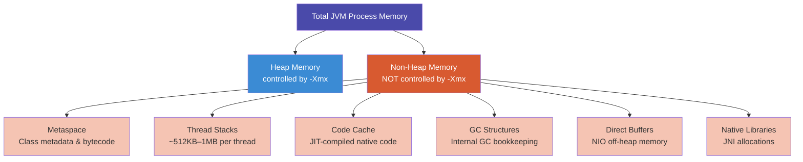
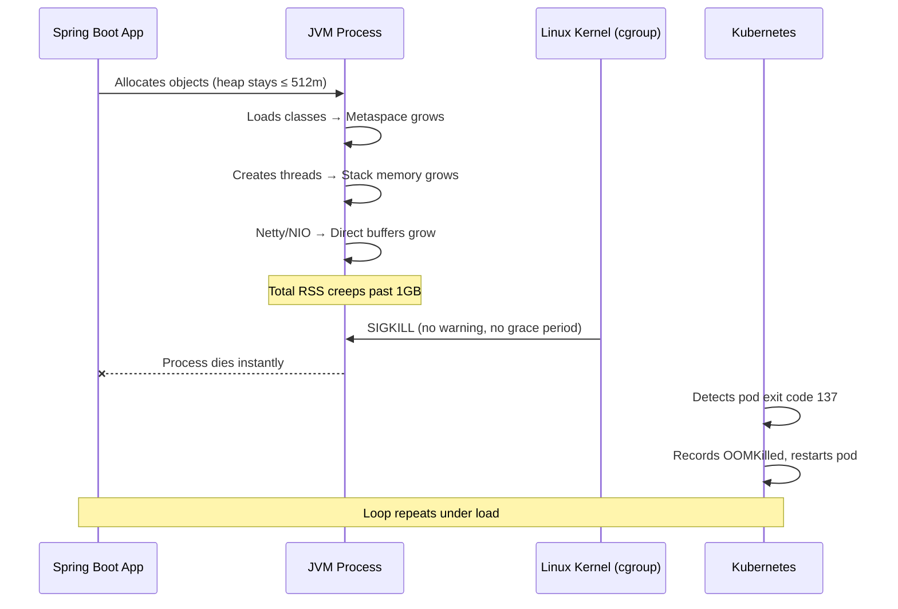
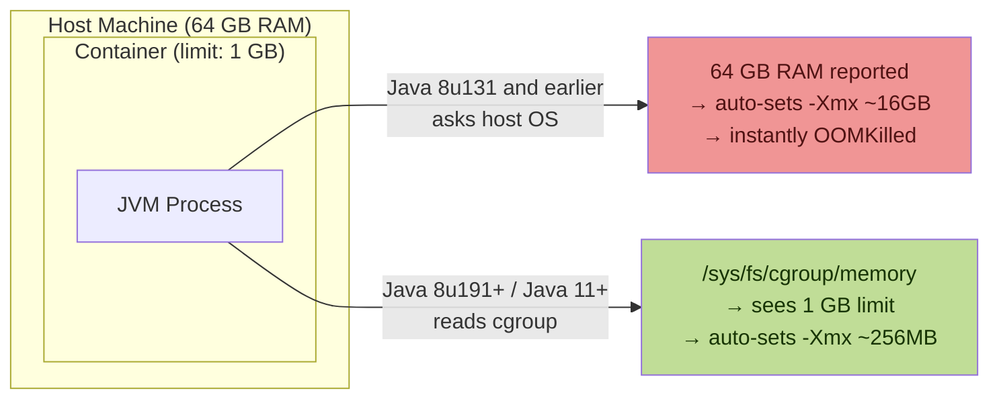
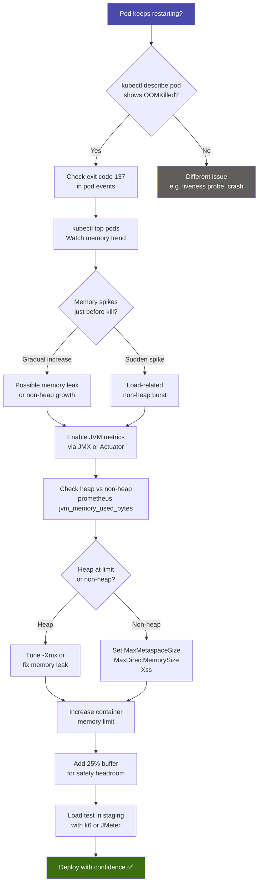
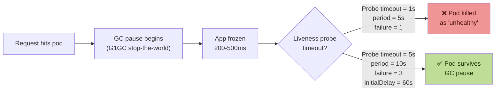
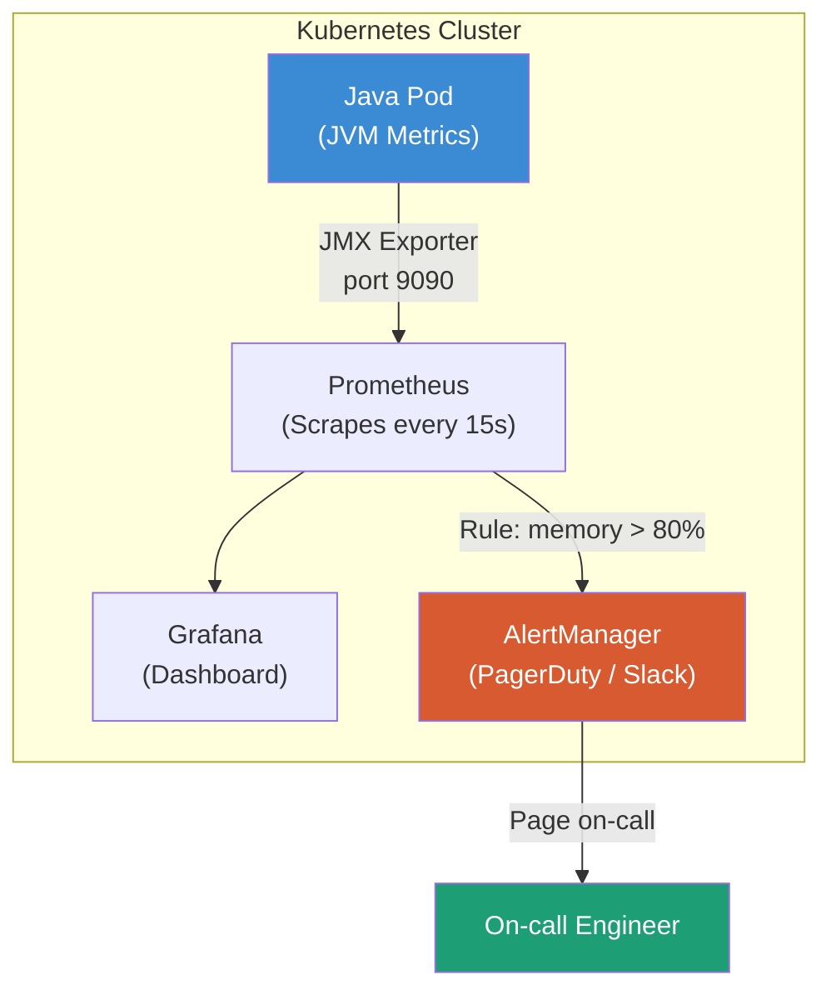
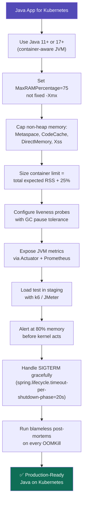
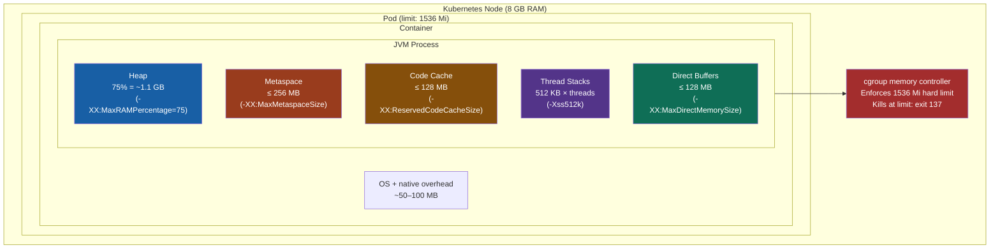

# The Invisible OOMKill: A Complete Tutorial on Java + Kubernetes Memory Management

## Introduction

Imagine deploying a Spring Boot microservice that passes every integration test locally — only to watch it crash-loop endlessly in Kubernetes production. No Java exceptions. No stack traces. Just a cryptic message: `OOMKilled`. This tutorial walks you through exactly what happened, why it's so easy to miss, and how to fix it permanently.

---

## The Incident: What Went Wrong

A payment service was deployed to a Kubernetes cluster. Within minutes:

- All pod replicas began restarting every few minutes
- The ingress controller returned `503 Service Unavailable`
- App logs showed nothing — they simply stopped mid-stream
- `kubectl describe pod` revealed: `Reason: OOMKilled`

**The apparent setup looked fine:**
```yaml
resources:
  requests:
    memory: "512Mi"
  limits:
    memory: "1Gi"
```
```bash
# JVM flag set in Dockerfile
-Xmx512m
```

On paper: 512 MB heap + 1 GB limit = 512 MB headroom. Should be plenty. Right?

**Wrong.** Read on.

---

## Understanding JVM Memory: It's More Than Just the Heap

This is the most critical concept to internalize. The `-Xmx` flag only controls one part of JVM memory.



### Memory Component Breakdown

| Memory Region | What It Holds | Typical Size |
|---|---|---|
| **Heap** | Objects, arrays, application data | Controlled by `-Xmx` |
| **Metaspace** | Class definitions, bytecode | 100–500 MB under load |
| **Thread stacks** | Each thread's call stack | 512 KB–1 MB × thread count |
| **Code cache** | JIT-compiled machine code | 100–240 MB |
| **Direct buffers** | NIO off-heap, Netty buffers | Unbounded without limits |
| **GC overhead** | G1GC, ZGC bookkeeping structures | 50–200 MB |

### The Fatal Arithmetic

In the incident:

```
Heap (under load):          ~512 MB   ← controlled, configured
Metaspace:                  ~200 MB   ← not configured
Thread stacks (200 threads): ~200 MB  ← not configured
Code cache:                 ~100 MB   ← not configured
Direct buffers (Netty):     ~100 MB   ← not configured
─────────────────────────────────────
Total process footprint:  ~1,112 MB

Kubernetes memory limit:   1,024 MB
                         ──────────
RESULT:                  OOMKilled 💥
```

---

## Why the JVM Didn't Warn You

Unlike a Java `OutOfMemoryError` (which lets the JVM log and respond), an OOMKill is a **Linux kernel action**. The cgroup memory controller sees the process exceed its memory limit and sends `SIGKILL` — instantly. No warning. No JVM hook. No log message. Just silence.



Exit code `137` is the tell: it means `128 + 9` (128 + SIGKILL). If you see it in `kubectl describe pod`, you were OOMKilled.

---

## Container Awareness: Old vs New Java

Older Java versions didn't know they were in a container — they asked the host OS for total RAM and used that to auto-size the heap.



### Minimum Recommended Java Versions for Kubernetes

| Java Version | Container Awareness | Recommendation |
|---|---|---|
| Java 8 < u131 | ❌ None | Upgrade immediately |
| Java 8 u131–u190 | ⚠️ Experimental flag needed | Use `-XX:+UnlockExperimentalVMOptions -XX:+UseCGroupMemoryLimitForHeap` |
| Java 8 ≥ u191 | ✅ Default on | Minimum acceptable |
| Java 11 | ✅ Full support | Good |
| Java 17 / 21 | ✅ Best support + modern GC | **Recommended** |

---

## The Broken Configuration (Before Fix)

```yaml
# deployment.yaml — THE BROKEN VERSION
apiVersion: apps/v1
kind: Deployment
metadata:
  name: payment-service
spec:
  replicas: 3
  template:
    spec:
      containers:
        - name: payment-service
          image: payment-service:1.0.0
          env:
            - name: JAVA_OPTS
              value: "-Xms256m -Xmx512m"  # ❌ Fixed heap, ignores container limit
          resources:
            requests:
              memory: "512Mi"
              cpu: "250m"
            limits:
              memory: "1Gi"              # ❌ No room for non-heap memory
              cpu: "1000m"
```

**Problems:**
1. `-Xmx512m` is a hard-coded assumption — it doesn't adapt when limits change
2. The 1Gi limit assumes all memory is heap — ignores ~400–600 MB of non-heap overhead
3. No metaspace limit, no direct buffer limit, no GC tuning

---

## The Fixed Configuration

### Option 1: Percentage-Based Heap (Recommended)

```yaml
# deployment.yaml — THE FIXED VERSION
apiVersion: apps/v1
kind: Deployment
metadata:
  name: payment-service
spec:
  replicas: 3
  template:
    spec:
      containers:
        - name: payment-service
          image: payment-service:1.0.0
          env:
            - name: JAVA_OPTS
              value: >-
                -XX:InitialRAMPercentage=50.0
                -XX:MaxRAMPercentage=75.0
                -XX:+UseContainerSupport
                -XX:MaxMetaspaceSize=256m
                -XX:ReservedCodeCacheSize=128m
                -Xss512k
                -XX:+UseG1GC
                -XX:+ExitOnOutOfMemoryError
          resources:
            requests:
              memory: "768Mi"
              cpu: "500m"
            limits:
              memory: "1536Mi"           # ✅ Sized for total footprint
              cpu: "1500m"
```

### Memory Budget Math (1536 Mi limit)

```
Heap (75% of 1536 MB):     1,152 MB  ← MaxRAMPercentage=75.0
Metaspace:                   256 MB  ← MaxMetaspaceSize=256m
Code Cache:                  128 MB  ← ReservedCodeCacheSize=128m
Thread stacks (200 × 512k):  100 MB  ← Xss512k
GC overhead + misc:          ~50 MB
────────────────────────────────────
Budgeted total:            1,686 MB
Safety buffer:               ~150 MB
Container limit:           1,536 MB  ← Set limit higher or reduce heap %
```

> **Rule of thumb:** Set your heap to no more than 75% of the container limit. Leave 25% for non-heap overhead.

### Option 2: Explicit Flags (Predictable but less adaptive)

```bash
JAVA_OPTS="-Xms512m -Xmx1024m \
           -XX:MaxMetaspaceSize=256m \
           -XX:ReservedCodeCacheSize=128m \
           -Xss512k \
           -XX:MaxDirectMemorySize=128m"
# Container limit should be at least 1024 + 256 + 128 + 256 + overhead ≈ 2Gi
```

---

## Practical Use Cases

### Use Case 1: High-Concurrency REST API (Spring Boot + Tomcat)

Tomcat creates one thread per request. For 200 concurrent users:

```
200 threads × 512 KB stack = 100 MB thread stack memory
+ 128 MB Tomcat connection pool buffers
+ standard non-heap overhead
= Plan for ~600 MB non-heap
```

**Config:**
```yaml
limits:
  memory: "1.5Gi"
JAVA_OPTS: "-XX:MaxRAMPercentage=60.0 -XX:MaxMetaspaceSize=256m -Xss512k"
```

### Use Case 2: Reactive Microservice (Spring WebFlux + Netty)

Netty uses a small thread pool but heavy off-heap direct buffers:

```
~16 event loop threads × 1 MB = 16 MB thread stacks
+ Netty direct buffer pool: 512 MB (default, often uncapped!)
= Critical to set -XX:MaxDirectMemorySize
```

**Config:**
```yaml
JAVA_OPTS: "-XX:MaxRAMPercentage=70.0 -XX:MaxDirectMemorySize=256m -XX:MaxMetaspaceSize=200m"
limits:
  memory: "1Gi"
```

### Use Case 3: Batch Processing Job (Short-lived pod)

Short-lived pods that process data in bulk need burst memory but can tolerate tight limits:

```yaml
JAVA_OPTS: "-XX:MaxRAMPercentage=80.0 -XX:MaxMetaspaceSize=128m"
limits:
  memory: "512Mi"
requests:
  memory: "256Mi"   # Low request = better scheduling
```

### Use Case 4: Multiple Microservices on a Node

When you have 20+ pods per node, memory stacks up fast. Use `requests` vs `limits` strategically:

```yaml
resources:
  requests:
    memory: "384Mi"   # What Kubernetes uses for scheduling
  limits:
    memory: "768Mi"   # What the pod can burst to
```

---

## Diagnosing an OOMKill: Step-by-Step



### Key Diagnostic Commands

```bash
# Check pod events and exit reason
kubectl describe pod <pod-name> -n <namespace>

# Watch live memory usage
kubectl top pods -n <namespace> --watch

# Get container memory from metrics-server
kubectl get --raw /apis/metrics.k8s.io/v1beta1/namespaces/<ns>/pods/<pod>

# Check cgroup memory limit from inside the container
cat /sys/fs/cgroup/memory/memory.limit_in_bytes

# View JVM memory breakdown (with Spring Actuator)
curl http://localhost:8080/actuator/metrics/jvm.memory.used
curl http://localhost:8080/actuator/metrics/jvm.memory.max
```

### Reading JVM Memory with Prometheus

Add to your Kubernetes manifest to expose JVM metrics:

```yaml
# Add JMX Prometheus agent to JAVA_OPTS
- name: JAVA_OPTS
  value: >-
    -javaagent:/opt/jmx-exporter/jmx_prometheus_javaagent.jar=9090:/opt/jmx-exporter/config.yaml
    -XX:MaxRAMPercentage=75.0
```

Key Prometheus queries:

```promql
# Total JVM heap used
jvm_memory_used_bytes{area="heap"}

# Metaspace used
jvm_memory_used_bytes{area="nonheap", id="Metaspace"}

# Container memory vs limit (alerts at 80%)
container_memory_usage_bytes / container_spec_memory_limit_bytes > 0.8
```

---

## Liveness Probes: The Hidden Killer

Even with correct memory settings, aggressive liveness probes can kill a healthy pod during GC pause.



**Correct probe configuration:**

```yaml
livenessProbe:
  httpGet:
    path: /actuator/health/liveness
    port: 8080
  initialDelaySeconds: 60    # Allow JVM warmup + class loading
  periodSeconds: 10
  timeoutSeconds: 5          # Allow for GC pauses
  failureThreshold: 3        # 3 consecutive failures before kill
  successThreshold: 1

readinessProbe:
  httpGet:
    path: /actuator/health/readiness
    port: 8080
  initialDelaySeconds: 30
  periodSeconds: 5
  timeoutSeconds: 3
  failureThreshold: 3
```

---

## Monitoring and Alerting Setup



### Recommended Grafana Alerts

| Alert | Threshold | Urgency |
|---|---|---|
| Container memory approaching limit | > 80% of limit | Warning |
| Container OOMKilled | Event count > 0 | Critical |
| JVM heap saturation | > 90% of max heap | Warning |
| Metaspace growth rate | > 10 MB/min sustained | Warning |
| GC pause time | P99 > 500ms | Warning |

---

## Best Practices Checklist



### Graceful Shutdown (Spring Boot)

```yaml
# application.yaml
spring:
  lifecycle:
    timeout-per-shutdown-phase: 20s

server:
  shutdown: graceful  # Drain in-flight requests before exiting
```

```yaml
# Kubernetes gives pods this long to shut down
terminationGracePeriodSeconds: 30
```

When Kubernetes sends `SIGTERM`, Spring Boot will stop accepting new requests and finish in-flight ones — up to 20 seconds. After that, Kubernetes sends `SIGKILL`. Align `timeout-per-shutdown-phase` to always be less than `terminationGracePeriodSeconds`.

---

## The Complete Picture: JVM in a Pod



---

## Summary

The "invisible OOMKill" is invisible only because most developers think of JVM memory as just the heap. The real lesson:

1. **The JVM has a large memory footprint beyond the heap** — metaspace, thread stacks, code cache, direct buffers, and GC structures all count against your cgroup limit.
2. **Use `MaxRAMPercentage` instead of fixed `-Xmx`** — it adapts automatically when you resize your Kubernetes limits.
3. **Always cap non-heap regions explicitly** — `MaxMetaspaceSize`, `ReservedCodeCacheSize`, `MaxDirectMemorySize`, and `Xss` prevent unbounded growth.
4. **The Linux kernel kills with no warning** — exit code 137, no Java exception, no log entry. Watch for it in `kubectl describe pod`.
5. **Load test before production** — OOMKills rarely appear under low load. They surface under concurrency.
6. **Monitor both container RSS and JVM internal metrics** — heap utilization alone won't warn you in time.

> The cgroup memory limit is a hard ceiling enforced by the kernel. The JVM does not know it's about to be killed. Your job is to ensure the total JVM process footprint — every byte of it — fits comfortably within that ceiling before peak traffic arrives.

---

*Happy and safe coding.*