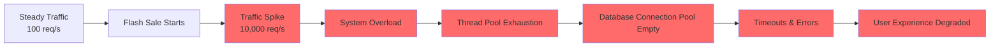
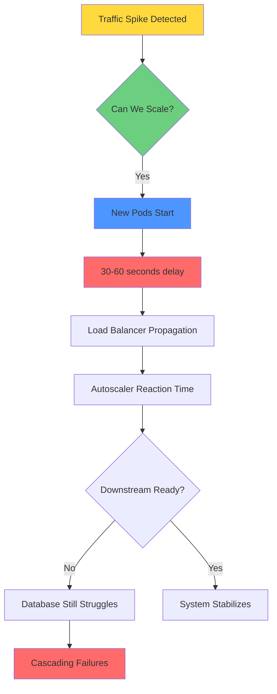
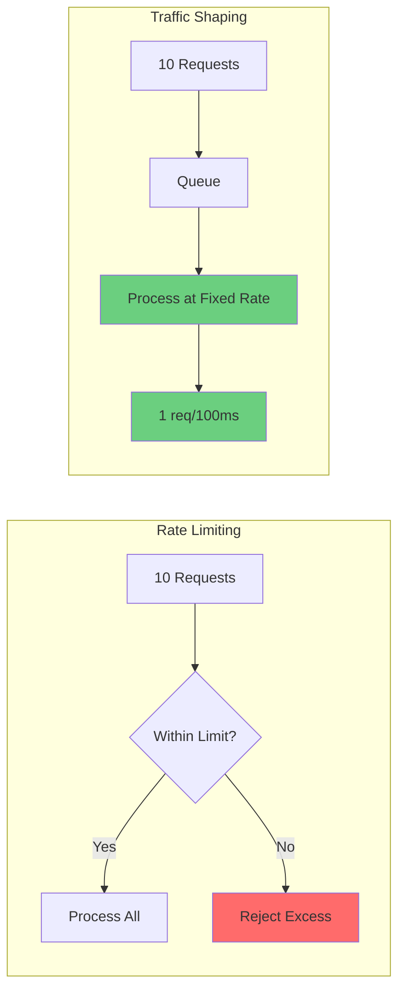
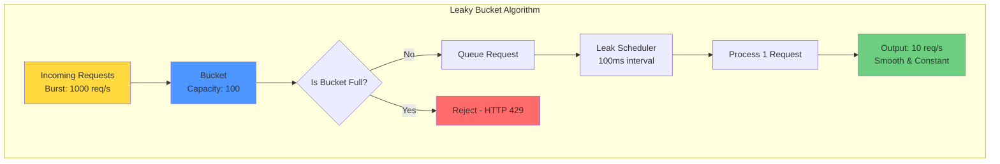
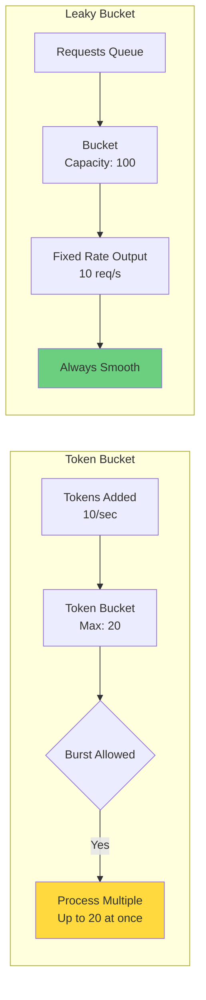
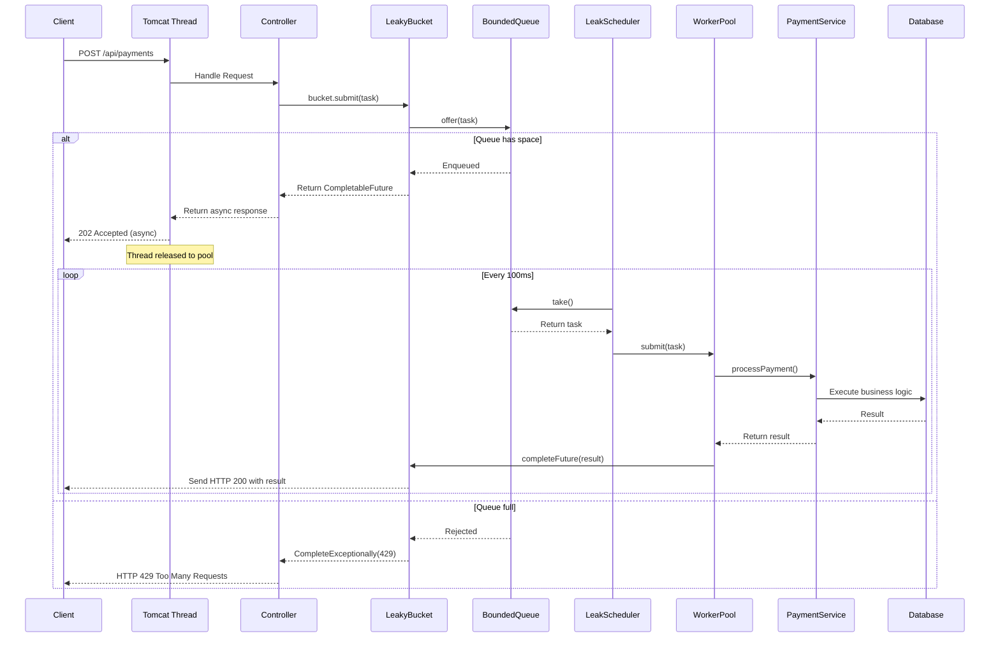
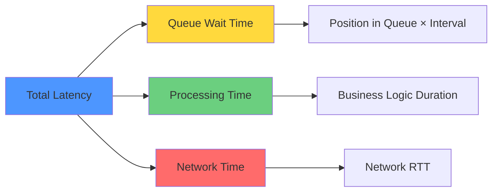

# Traffic Smoothing in Spring Boot: Mastering the Leaky Bucket Algorithm for Production Systems

**Difficulty Level:** ⚡⚡⚡ Intermediate to Advanced  
**Estimated Reading Time:** 25 minutes  
**Last Updated:** January 2026  
**Technology Stack:** Java 21, Spring Boot 3.3.x, Maven

---

## Table of Contents

1. [Introduction](#introduction)
2. [Prerequisites](#prerequisites)
3. [Learning Objectives](#learning-objectives)
4. [The Problem: Traffic Spikes in Distributed Systems](#the-problem-traffic-spikes-in-distributed-systems)
5. [Understanding Traffic Shaping](#understanding-traffic-shaping)
6. [The Leaky Bucket Algorithm](#the-leaky-bucket-algorithm)
7. [How Leaky Bucket Works Internally](#how-leaky-bucket-works-internally)
8. [Complete Spring Boot Implementation](#complete-spring-boot-implementation)
9. [Request Flow: End-to-End](#request-flow-end-to-end)
10. [Production Enhancements](#production-enhancements)
11. [Best Practices](#best-practices)
12. [Anti-Patterns](#anti-patterns)
13. [Performance Considerations](#performance-considerations)
14. [Security Considerations](#security-considerations)
15. [Testing Strategies](#testing-strategies)
16. [Common Pitfalls & Troubleshooting](#common-pitfalls--troubleshooting)
17. [Practice Exercises](#practice-exercises)
18. [Test Your Understanding](#test-your-understanding)
19. [Common Interview Questions](#common-interview-questions)
20. [Question Bank](#question-bank)
21. [Summary & Key Takeaways](#summary--key-takeaways)
22. [Further Reading & Resources](#further-reading--resources)

---

## Introduction

It's 10:00 AM on a Friday. An e-commerce company launches its biggest flash sale of the year. Within seconds, tens of thousands of customers start refreshing the website and placing orders simultaneously.

At first, everything looks normal. Then the traffic spike hits.

Spring Boot instances suddenly receive far more requests than they can process immediately. Tomcat thread pools begin filling up, database connections become scarce, response times increase, and some users start seeing timeout errors instead of successful responses.

This isn't caused by bad code. It's a common challenge in distributed systems. Real-world traffic rarely arrives at a steady pace. Instead, it often comes in sudden bursts—whether it's a flash sale, ticket booking, payment gateway, OTP service, or a viral marketing campaign.

**The Solution:** The Leaky Bucket algorithm smooths incoming traffic by processing requests at a fixed, controlled rate, transforming jagged input flows into predictable output streams.

> 💡 **Key Insight:** Traffic smoothing trades a small amount of latency for massive gains in system stability. It's like a dam: water rushes in unpredictably, but the outflow is a controlled stream that downstream systems can handle.

---

## Prerequisites

Before diving into this tutorial, ensure you have:

- **Java 21** or higher installed (for virtual threads and modern concurrency features)
- **Spring Boot 3.3.x** experience
- **Maven** or Gradle build tool knowledge
- Understanding of **concurrent programming** concepts (threads, executors, blocking queues)
- Basic knowledge of **distributed systems** and HTTP protocols
- Familiarity with **Spring Web** and async request processing
- Understanding of **completable futures** and reactive patterns

---

## Learning Objectives

By the end of this tutorial, you will:

✅ Understand the problem of traffic spikes in distributed systems  
✅ Master the Leaky Bucket algorithm and its variants  
✅ Implement a production-ready traffic smoother from scratch in Spring Boot  
✅ Handle thread safety, async processing, and backpressure  
✅ Apply production best practices including metrics, monitoring, and graceful shutdown  
✅ Compare different traffic shaping algorithms and choose the right one  
✅ Test and optimize the implementation under load  
✅ Deploy the solution in a Kubernetes environment  

---

## The Problem: Traffic Spikes in Distributed Systems

### Real-World Traffic Patterns

Most backend systems are designed around a comfortable notion: requests arrive at a predictable rate. In reality, traffic looks like a heart monitor during a caffeine overdose—sudden spikes, followed by quiet periods.



### When Traffic Spikes Occur

**Common scenarios that cause traffic spikes:**

1. **Flash Sales and Promotional Campaigns**
   - Black Friday, Cyber Monday deals
   - Limited-time offers with countdown timers
   - Impact: 10-100x normal traffic in seconds

2. **Ticket Booking Systems**
   - Concert tickets going on sale
   - Sports event bookings
   - Impact: Thousands of users hitting refresh simultaneously

3. **OTP and Authentication Services**
   - Password reset waves
   - Bulk account verification
   - Impact: Burst of authentication requests

4. **Payment Gateways**
   - Checkout bursts during peak hours
   - Subscription renewal cycles
   - Impact: Concentrated payment processing

5. **AI/ML Inference Endpoints**
   - Retry storms from failed requests
   - Viral AI application launches
   - Impact: Exponential request multiplication

6. **Banking Systems**
   - Market open times
   - Salary credit processing
   - Impact: Time-based traffic concentration

### The Scaling Problem

When a burst hits, the immediate reaction is often "just scale up." But scaling has latency:



**Key challenges with reactive scaling:**
- New pods take 30-60 seconds to start
- Load balancers need time to propagate changes
- Autoscalers don't react instantly
- Databases and downstream services might still buckle
- Even with instant scaling, connection pools need warm-up

### Why Traffic Smoothing Matters

Traffic smoothing is the practice of shaping incoming requests so the backend processes them at a constant, controlled rate, regardless of how they arrive.

**Benefits of traffic smoothing:**

| Benefit | Description | Impact |
|---------|-------------|--------|
| **Thread Pool Protection** | Prevents Tomcat worker thread exhaustion | Maintains server responsiveness |
| **Database Protection** | Avoids connection pool spikes | Prevents database overload |
| **Downstream Stability** | Keeps services within capacity | Eliminates cascading failures |
| **Consistent Latency** | Predictable response times | Better user experience |
| **Retry Storm Prevention** | Reduces failed requests | Breaks exponential backoff cycles |

> ⚠️ **Critical Trade-off:** A burst of 10,000 requests over one second can be spread to 1,000 requests per second over ten seconds. Clients wait longer, but they get successful responses instead of errors. This trade-off is almost always worth making.

---

## Understanding Traffic Shaping

### What is Traffic Shaping?

Traffic shaping is a bandwidth management technique that controls the rate of data transmission to optimize performance, reduce latency, and prevent network congestion.

**In the context of web applications:**
- **Input:** Irregular, bursty request patterns
- **Processing:** Smooth, constant-rate execution
- **Output:** Predictable, stable system behavior

### Traffic Shaping vs. Rate Limiting



**Key differences:**

| Aspect | Rate Limiting | Traffic Shaping |
|--------|--------------|-----------------|
| **Approach** | Reject excess requests | Queue and delay requests |
| **Client Experience** | Immediate rejection (429) | Delayed but successful response |
| **Resource Usage** | Low (no queuing) | Moderate (bounded queue) |
| **Use Case** | API quotas, abuse prevention | Load management, stability |
| **Complexity** | Simple | Moderate to High |

### When to Use Traffic Shaping

**✅ Use traffic shaping when:**
- You have predictable downstream capacity
- Client retry logic is well-behaved
- Latency is acceptable (up to a few seconds)
- System stability is critical
- You're handling batch or async workloads

**❌ Avoid traffic shaping when:**
- Real-time requirements (< 100ms latency)
- Clients cannot handle delays
- Downstream capacity is unknown
- Stateless, fire-and-forget operations
- Cost of queuing exceeds cost of rejection

---

## The Leaky Bucket Algorithm

### Core Concept

The Leaky Bucket algorithm is a classic traffic shaping mechanism. Its mental model is elegantly simple:

> Imagine a bucket with a small hole in the bottom.
> - Water (requests) pours in from the top at any rate, even in huge splashes
> - The bucket has a fixed capacity; if full, excess water overflows and is discarded
> - The hole leaks water at a constant, fixed rate, regardless of how fast it's coming in

This transforms a jagged input flow into a smooth output flow.



### How Leaky Bucket Works Internally

Let's break down the mechanism step by step:

**Step 1: Request Arrival**
```
Incoming Request → Controller → bucket.submit()
```
- Request arrives at your controller
- You don't process it immediately
- Wrap business logic into a task and try to place it in a bounded queue (the bucket)

**Step 2: Bucket Queue Management**
```
bucket.submit() → LinkedBlockingQueue
```
- Bucket Queue is a thread-safe, bounded queue
- If it's full, the request is rejected immediately with HTTP 429
- Optionally, you can let the caller wait with a timeout

**Step 3: Leak Scheduler**
```
ScheduledExecutor (every 100ms) → bucket.take() → workerPool.submit()
```
- Leak Scheduler is a single background thread that runs at a fixed interval
- On each tick, it takes the oldest request from the queue and executes it
- Execution happens on a dedicated thread, not in the request-handling thread

**Step 4: Business Execution**
```
Worker Thread → Business Service → Database
```
- Task runs your business service (payment processing, OTP generation, etc.)
- Once done, the original HTTP request is completed asynchronously
- Business service and database are called at a predictable, controlled rate

### Leaky Bucket vs. Token Bucket



| Feature | Token Bucket | Leaky Bucket |
|---------|--------------|--------------|
| **Burst Handling** | Allows bursts up to limit | No bursts, always smooth |
| **Output Rate** | Variable (based on tokens) | Fixed, constant rate |
| **Use Case** | APIs with burst allowance | Strict rate enforcement |
| **Complexity** | Moderate | Simple |
| **Memory** | Lower (no queue) | Higher (bounded queue) |

**When to choose Leaky Bucket:**
- You need strict, constant-rate processing
- Bursts would overwhelm downstream systems
- Smoothing is more important than throughput
- You can tolerate some queuing latency

**When to choose Token Bucket:**
- You want to allow occasional bursts
- Variable output rate is acceptable
- Lower memory footprint is needed
- Simpler implementation is preferred

---

## How Leaky Bucket Works Internally

### Detailed Mechanism

The Leaky Bucket implementation uses a **producer-consumer pattern** with two key components:

```mermaid
graph TD
    subgraph "Producer Side"
    A[HTTP Request] --> B[Controller]
    B --> C[Validate Request]
    C --> D[bucket.submit()]
    D --> E{Queue Full?}
    E -->|Yes| F[Return 429]
    E -->|No| G[Enqueue Task]
    G --> H[Return CompletableFuture]
    H --> I[Release Tomcat Thread]
    end
    
    subgraph "Consumer Side"
    J[LeakScheduler<br/>Every 100ms] --> K[bucket.take()]
    K --> L[Worker Pool]
    L --> M[Execute Business Logic]
    M --> N[Complete Future]
    N --> O[Send Response]
    end
    
    G --> K
    
    style F fill:#ff6b6b
    style I fill:#6bcf7f
    style O fill:#6bcf7f
```

**Key design principles:**

1. **Decoupling:** Arrival rate is decoupled from processing rate
2. **Buffering:** Queue depth acts as a shock absorber
3. **Enforcement:** Scheduler maintains constant leak rate
4. **Async:** Non-blocking I/O keeps threads available

### Thread Safety Considerations

**Why thread safety matters:**
- Multiple Tomcat threads call `bucket.submit()` concurrently
- Scheduler thread calls `bucket.take()` concurrently
- Worker threads complete futures concurrently

**Our solution:**
- `LinkedBlockingQueue` is inherently thread-safe
- `CompletableFuture` handles concurrent completion
- No shared mutable state outside the queue

---

## Complete Spring Boot Implementation

### Project Structure

```
src/main/java/com/leakybucket/demo/
├── config
│   └── BucketProperties.java
├── bucket
│   ├── LeakyBucket.java
│   └── LeakyBucketTask.java
├── scheduler
│   └── LeakScheduler.java
├── service
│   └── PaymentService.java
├── controller
│   └── PaymentController.java
├── dto
│   ├── PaymentRequest.java
│   └── PaymentResponse.java
├── exception
│   └── BucketOverflowException.java
├── handler
│   └── GlobalExceptionHandler.java
└── DemoApplication.java

src/main/resources/
└── application.yml

pom.xml
```

### Step 1: Configuration Properties

Externalize all tunable parameters for easy configuration without code changes.

```java
package com.leakybucket.demo.config;

import org.springframework.boot.context.properties.ConfigurationProperties;
import jakarta.validation.constraints.Min;

@ConfigurationProperties(prefix = "leaky-bucket")
public record BucketProperties(
    @Min(1) int capacity,           // Queue size (bucket capacity)
    @Min(1) int leakRate,           // Desired requests per second (for metrics)
    @Min(1) int leakIntervalMs,     // Scheduler tick interval in milliseconds
    int queueTimeoutMs,             // Max wait time for enqueue (0 = reject immediately)
    int maxConcurrentProcessing     // Max threads executing leaked tasks
) {}
```

**Configuration explanation:**

| Property | Example Value | Purpose |
|----------|---------------|---------|
| `capacity` | 1000 | Maximum queue size; acts as burst buffer |
| `leakRate` | 10 | Target processing rate (informational, for monitoring) |
| `leakIntervalMs` | 100 | How often to drain one request (1000ms / 100ms = 10 req/s) |
| `queueTimeoutMs` | 50 | Max time to wait for queue slot (0 = immediate reject) |
| `maxConcurrentProcessing` | 5 | Parallel task execution limit |

> 💡 **Design Decision:** We use `leakIntervalMs` to control the actual drain rate. If set to 100ms, we process 1 request every 100ms = 10 requests/second. The `leakRate` property is kept for monitoring and operational clarity.

### Step 2: Application Configuration

```yaml
# src/main/resources/application.yml

leaky-bucket:
  capacity: 1000                  # Queue size - adjust based on memory
  leak-rate: 10                   # Target: 10 requests/second
  leak-interval-ms: 100           # Drain 1 request every 100ms
  queue-timeout-ms: 50            # Wait up to 50ms for queue slot
  max-concurrent-processing: 5    # Max 5 parallel workers

server:
  tomcat:
    threads:
      max: 200                    # Keep Tomcat pool conservative
      min-spare: 10               # Minimum idle threads

spring:
  application:
    name: leaky-bucket-demo

management:
  endpoints:
    web:
      exposure:
        include: health,metrics,info
  endpoint:
    health:
      show-details: always
```

**Why these values?**
- `capacity: 1000` - Can buffer ~100 seconds of traffic at 10 req/s
- `leak-interval-ms: 100` - Processes 10 requests/second consistently
- `queue-timeout-ms: 50` - Brief wait before rejection (better UX)
- `max-concurrent-processing: 5` - Limits downstream load
- `tomcat.max-threads: 200` - Async processing reduces thread needs

### Step 3: Task Wrapper

We need a wrapper to hold the deferred work and the CompletableFuture.

```java
package com.leakybucket.demo.bucket;

import java.util.concurrent.Callable;
import java.util.concurrent.CompletableFuture;

/**
 * Wrapper for tasks in the leaky bucket queue.
 * 
 * @param <T> The type of result the task produces
 */
public record LeakyBucketTask<T>(
    Callable<T> work,           // The actual business logic to execute
    CompletableFuture<T> future // Future to complete when work is done
) {}
```

**Why a record?**
- Immutable by default (thread-safe)
- Concise syntax
- Built-in equals(), hashCode(), toString()
- Perfect for data carriers

### Step 4: The Bucket Implementation

The core component that manages the bounded queue and handles overflow.

```java
package com.leakybucket.demo.bucket;

import com.leakybucket.demo.config.BucketProperties;
import com.leakybucket.demo.exception.BucketOverflowException;
import org.slf4j.Logger;
import org.slf4j.LoggerFactory;

import java.util.concurrent.*;

public class LeakyBucket {
    private static final Logger log = LoggerFactory.getLogger(LeakyBucket.class);
    
    private final LinkedBlockingQueue<LeakyBucketTask<?>> queue;
    private final int capacity;
    private final long queueTimeoutMs;
    
    // Metrics
    private final AtomicLong totalSubmitted = new AtomicLong(0);
    private final AtomicLong totalRejected = new AtomicLong(0);
    
    public LeakyBucket(BucketProperties props) {
        this.capacity = props.capacity();
        this.queue = new LinkedBlockingQueue<>(capacity);
        this.queueTimeoutMs = props.queueTimeoutMs();
        log.info("LeakyBucket initialized: capacity={}, timeout={}ms", 
                 capacity, queueTimeoutMs);
    }
    
    /**
     * Submit a task to the bucket for processing.
     * 
     * @param work The business logic to execute
     * @return CompletableFuture that will complete with the result
     */
    public <T> CompletableFuture<T> submit(Callable<T> work) {
        CompletableFuture<T> future = new CompletableFuture<>();
        LeakyBucketTask<T> task = new LeakyBucketTask<>(work, future);
        
        totalSubmitted.incrementAndGet();
        
        try {
            boolean enqueued;
            
            if (queueTimeoutMs > 0) {
                // Wait up to queueTimeoutMs for a slot
                enqueued = queue.offer(task, queueTimeoutMs, TimeUnit.MILLISECONDS);
            } else {
                // Immediate reject if full
                enqueued = queue.offer(task);
            }
            
            if (!enqueued) {
                totalRejected.incrementAndGet();
                future.completeExceptionally(
                    new BucketOverflowException(
                        "Bucket capacity reached (" + capacity + "). " +
                        "Please retry after " + (capacity / 10) + " seconds."
                    )
                );
                log.warn("Bucket overflow: capacity={}, currentSize={}", 
                         capacity, queue.size());
            }
        } catch (InterruptedException e) {
            Thread.currentThread().interrupt();
            future.completeExceptionally(e);
            log.error("Interrupted while submitting to bucket", e);
        }
        
        return future;
    }
    
    /**
     * Take the next task from the queue. Blocks until available.
     * Called by the leak scheduler.
     */
    public LeakyBucketTask<?> take() throws InterruptedException {
        return queue.take();
    }
    
    /**
     * Get current queue size (for monitoring).
     */
    public int currentSize() {
        return queue.size();
    }
    
    /**
     * Get remaining capacity (for monitoring).
     */
    public int remainingCapacity() {
        return queue.remainingCapacity();
    }
    
    /**
     * Get total submitted count (for metrics).
     */
    public long getTotalSubmitted() {
        return totalSubmitted.get();
    }
    
    /**
     * Get total rejected count (for metrics).
     */
    public long getTotalRejected() {
        return totalRejected.get();
    }
    
    /**
     * Calculate rejection rate percentage.
     */
    public double getRejectionRate() {
        long submitted = totalSubmitted.get();
        if (submitted == 0) return 0.0;
        return (totalRejected.get() * 100.0) / submitted;
    }
}
```

**Key implementation details:**

1. **Thread-safe queue:** `LinkedBlockingQueue` handles concurrent access
2. **Non-blocking submit:** Returns immediately with a CompletableFuture
3. **Overflow handling:** Rejects with descriptive error message
4. **Metrics tracking:** Atomic counters for monitoring
5. **Interrupt handling:** Properly handles thread interruption

### Step 5: The Leak Scheduler

The scheduler that drains the bucket at a fixed rate.

```java
package com.leakybucket.demo.scheduler;

import com.leakybucket.demo.bucket.LeakyBucket;
import com.leakybucket.demo.bucket.LeakyBucketTask;
import jakarta.annotation.PostConstruct;
import jakarta.annotation.PreDestroy;
import org.slf4j.Logger;
import org.slf4j.LoggerFactory;
import org.springframework.stereotype.Component;

import java.util.concurrent.*;

@Component
public class LeakScheduler {
    private static final Logger log = LoggerFactory.getLogger(LeakScheduler.class);
    
    private final LeakyBucket bucket;
    private final ScheduledExecutorService scheduler;
    private final ExecutorService workerPool;
    private final int leakIntervalMs;
    private final int maxConcurrentProcessing;
    
    public LeakScheduler(LeakyBucket bucket, BucketProperties props) {
        this.bucket = bucket;
        this.leakIntervalMs = props.leakIntervalMs();
        this.maxConcurrentProcessing = props.maxConcurrentProcessing();
        
        // Single-threaded scheduler for precise leak timing
        this.scheduler = Executors.newSingleThreadScheduledExecutor(r -> {
            Thread t = new Thread(r, "leak-scheduler");
            t.setDaemon(true);
            t.setUncaughtExceptionHandler((thread, ex) -> 
                log.error("Uncaught exception in {}", thread.getName(), ex)
            );
            return t;
        });
        
        // Worker pool for actual task execution
        this.workerPool = new ThreadPoolExecutor(
            maxConcurrentProcessing,
            maxConcurrentProcessing,
            60L, TimeUnit.SECONDS,
            new LinkedBlockingQueue<>(),
            r -> {
                Thread t = new Thread(r, "leak-worker-" + r.hashCode());
                t.setDaemon(true);
                t.setUncaughtExceptionHandler((thread, ex) -> 
                    log.error("Uncaught exception in {}", thread.getName(), ex)
                );
                return t;
            }
        );
    }
    
    @PostConstruct
    public void start() {
        log.info("Starting leak scheduler: interval={}ms, maxWorkers={}", 
                 leakIntervalMs, maxConcurrentProcessing);
        
        // Schedule at fixed rate for precise timing
        scheduler.scheduleAtFixedRate(
            this::leak, 
            0, 
            leakIntervalMs, 
            TimeUnit.MILLISECONDS
        );
    }
    
    /**
     * Leak one task from the bucket and submit to worker pool.
     * This method is called by the scheduler at fixed intervals.
     */
    private void leak() {
        try {
            // Block until a task is available
            LeakyBucketTask<?> task = bucket.take();
            
            // Submit to worker pool (non-blocking)
            workerPool.submit(() -> {
                try {
                    long startTime = System.currentTimeMillis();
                    
                    // Execute the business logic
                    Object result = task.work().call();
                    
                    long duration = System.currentTimeMillis() - startTime;
                    log.debug("Task completed in {}ms", duration);
                    
                    // Complete the future with the result
                    completeFuture(task, result);
                } catch (Exception e) {
                    log.error("Task execution failed", e);
                    task.future().completeExceptionally(e);
                }
            });
            
        } catch (InterruptedException e) {
            Thread.currentThread().interrupt();
            log.error("Leak scheduler interrupted", e);
        } catch (Exception e) {
            log.error("Unexpected error in leak", e);
        }
    }
    
    @SuppressWarnings("unchecked")
    private <T> void completeFuture(LeakyBucketTask<?> task, T result) {
        ((CompletableFuture<T>) task.future()).complete(result);
    }
    
    @PreDestroy
    public void stop() {
        log.info("Stopping leak scheduler...");
        
        // Stop accepting new tasks
        scheduler.shutdown();
        workerPool.shutdown();
        
        try {
            // Wait for graceful shutdown
            if (!workerPool.awaitTermination(5, TimeUnit.SECONDS)) {
                log.warn("Worker pool did not terminate, forcing shutdown");
                workerPool.shutdownNow();
            }
            
            if (!scheduler.awaitTermination(5, TimeUnit.SECONDS)) {
                log.warn("Scheduler did not terminate, forcing shutdown");
                scheduler.shutdownNow();
            }
            
            log.info("Leak scheduler stopped gracefully");
        } catch (InterruptedException e) {
            Thread.currentThread().interrupt();
            log.error("Shutdown interrupted", e);
            scheduler.shutdownNow();
            workerPool.shutdownNow();
        }
    }
}
```

**Design decisions explained:**

1. **Single-threaded scheduler:** Ensures precise leak interval timing
2. **Separate worker pool:** Prevents slow tasks from blocking the scheduler
3. **Daemon threads:** Don't prevent JVM shutdown
4. **Uncaught exception handlers:** Log unexpected errors
5. **Graceful shutdown:** Drains queue before termination

### Step 6: Business Service Example

A sample service to demonstrate the pattern.

```java
package com.leakybucket.demo.service;

import org.slf4j.Logger;
import org.slf4j.LoggerFactory;
import org.springframework.stereotype.Service;

import java.util.Random;
import java.util.concurrent.TimeUnit;

@Service
public class PaymentService {
    private static final Logger log = LoggerFactory.getLogger(PaymentService.class);
    private final Random random = new Random();
    
    /**
     * Simulate payment processing with variable latency.
     * In production, this would call a database, external API, etc.
     */
    public String processPayment(String orderId) throws InterruptedException {
        // Simulate variable processing time (50-200ms)
        long processingTime = 50 + random.nextInt(150);
        
        log.debug("Processing payment for order={}, estimated time={}ms", 
                  orderId, processingTime);
        
        // Simulate I/O operation
        TimeUnit.MILLISECONDS.sleep(processingTime);
        
        log.info("Payment processed: order={}, actualTime={}ms", 
                 orderId, processingTime);
        
        return "SUCCESS-" + orderId + "-" + System.currentTimeMillis();
    }
}
```

### Step 7: DTOs (Data Transfer Objects)

```java
package com.leakybucket.demo.dto;

import jakarta.validation.constraints.NotBlank;

/**
 * Request DTO for payment processing.
 */
public record PaymentRequest(
    @NotBlank(message = "Order ID is required") 
    String orderId
) {}
```

```java
package com.leakybucket.demo.dto;

/**
 * Response DTO for payment processing.
 */
public record PaymentResponse(
    String transactionId,
    String status,
    long processingTimeMs
) {}
```

### Step 8: Exception Handling

```java
package com.leakybucket.demo.exception;

/**
 * Thrown when the bucket queue is full and cannot accept more requests.
 */
public class BucketOverflowException extends RuntimeException {
    public BucketOverflowException(String message) {
        super(message);
    }
}
```

```java
package com.leakybucket.demo.handler;

import com.leakybucket.demo.exception.BucketOverflowException;
import org.springframework.http.HttpStatus;
import org.springframework.http.ProblemDetail;
import org.springframework.web.bind.annotation.ExceptionHandler;
import org.springframework.web.bind.annotation.RestControllerAdvice;

import java.time.Instant;

@RestControllerAdvice
public class GlobalExceptionHandler {
    
    /**
     * Handle bucket overflow - return HTTP 429 Too Many Requests.
     */
    @ExceptionHandler(BucketOverflowException.class)
    public ProblemDetail handleBucketOverflow(BucketOverflowException ex) {
        ProblemDetail problem = ProblemDetail.forStatusAndDetail(
            HttpStatus.TOO_MANY_REQUESTS, 
            ex.getMessage()
        );
        problem.setTitle("Bucket Overflow - Too Many Requests");
        problem.setProperty("timestamp", Instant.now());
        problem.setProperty("retryAfter", 10); // Suggest retry after 10 seconds
        
        return problem;
    }
    
    /**
     * Handle general exceptions.
     */
    @ExceptionHandler(Exception.class)
    public ProblemDetail handleGenericException(Exception ex) {
        ProblemDetail problem = ProblemDetail.forStatusAndDetail(
            HttpStatus.INTERNAL_SERVER_ERROR,
            "An unexpected error occurred"
        );
        problem.setTitle("Internal Server Error");
        problem.setProperty("timestamp", Instant.now());
        problem.setProperty("error", ex.getMessage());
        
        return problem;
    }
}
```

### Step 9: The Controller

The async controller that integrates with Spring MVC's async support.

```java
package com.leakybucket.demo.controller;

import com.leakybucket.demo.bucket.LeakyBucket;
import com.leakybucket.demo.dto.PaymentRequest;
import com.leakybucket.demo.dto.PaymentResponse;
import com.leakybucket.demo.service.PaymentService;
import jakarta.validation.Valid;
import org.slf4j.Logger;
import org.slf4j.LoggerFactory;
import org.springframework.http.HttpStatus;
import org.springframework.http.ResponseEntity;
import org.springframework.web.bind.annotation.*;

import java.util.concurrent.CompletableFuture;
import java.util.concurrent.TimeUnit;

@RestController
@RequestMapping("/api/payments")
public class PaymentController {
    
    private static final Logger log = LoggerFactory.getLogger(PaymentController.class);
    
    private final LeakyBucket bucket;
    private final PaymentService paymentService;
    
    public PaymentController(LeakyBucket bucket, PaymentService paymentService) {
        this.bucket = bucket;
        this.paymentService = paymentService;
    }
    
    /**
     * Process payment with leaky bucket throttling.
     * Returns immediately with CompletableFuture - Tomcat thread is released.
     */
    @PostMapping
    public CompletableFuture<ResponseEntity<PaymentResponse>> processPayment(
            @Valid @RequestBody PaymentRequest request) {
        
        long startTime = System.currentTimeMillis();
        
        return bucket.submit(() -> {
            // This executes in the worker pool, not in Tomcat thread
            String txId = paymentService.processPayment(request.orderId());
            long processingTime = System.currentTimeMillis() - startTime;
            
            return new PaymentResponse(
                txId, 
                "SUCCESS", 
                processingTime
            );
        })
        .thenApply(response -> {
            log.info("Payment completed: orderId={}, txId={}, totalTime={}ms", 
                     request.orderId(), response.transactionId(), response.processingTimeMs());
            return ResponseEntity.ok(response);
        })
        .exceptionally(ex -> {
            log.error("Payment failed: orderId={}, error={}", 
                      request.orderId(), ex.getMessage());
            
            // Handle bucket overflow specifically
            if (ex.getCause() instanceof BucketOverflowException) {
                return ResponseEntity
                    .status(HttpStatus.TOO_MANY_REQUESTS)
                    .body(new PaymentResponse(
                        null, 
                        "REJECTED - Bucket Full", 
                        System.currentTimeMillis() - startTime
                    ));
            }
            
            // Generic error
            return ResponseEntity
                .status(HttpStatus.INTERNAL_SERVER_ERROR)
                .body(new PaymentResponse(
                    null, 
                    "FAILED: " + ex.getMessage(), 
                    System.currentTimeMillis() - startTime
                ));
        })
        .orTimeout(30, TimeUnit.SECONDS); // Client won't wait forever
    }
    
    /**
     * Health check endpoint with bucket metrics.
     */
    @GetMapping("/health")
    public ResponseEntity<?> health() {
        int currentSize = bucket.currentSize();
        int capacity = bucket.capacity();
        double utilization = (currentSize * 100.0) / capacity;
        
        return ResponseEntity.ok()
            .body(new BucketHealth(
                "UP",
                currentSize,
                capacity,
                utilization,
                bucket.getTotalSubmitted(),
                bucket.getTotalRejected(),
                bucket.getRejectionRate()
            ));
    }
    
    /**
     * Bucket health metrics DTO.
     */
    public record BucketHealth(
        String status,
        int currentSize,
        int capacity,
        double utilizationPercent,
        long totalSubmitted,
        long totalRejected,
        double rejectionRate
    ) {}
}
```

**Key controller features:**

1. **Async return type:** `CompletableFuture<ResponseEntity<?>>` releases Tomcat thread immediately
2. **Error handling:** `.exceptionally()` transforms exceptions to proper HTTP responses
3. **Timeout:** `.orTimeout()` prevents clients from waiting indefinitely
4. **Logging:** Tracks request lifecycle for debugging
5. **Health endpoint:** Exposes bucket metrics for monitoring

### Step 10: Main Application Class

```java
package com.leakybucket.demo;

import com.leakybucket.demo.bucket.LeakyBucket;
import com.leakybucket.demo.config.BucketProperties;
import org.springframework.boot.SpringApplication;
import org.springframework.boot.autoconfigure.SpringBootApplication;
import org.springframework.boot.context.properties.EnableConfigurationProperties;
import org.springframework.context.annotation.Bean;

@SpringBootApplication
@EnableConfigurationProperties(BucketProperties.class)
public class DemoApplication {
    
    public static void main(String[] args) {
        SpringApplication.run(DemoApplication.class, args);
    }
    
    /**
     * Create the LeakyBucket bean with configuration.
     */
    @Bean
    public LeakyBucket leakyBucket(BucketProperties props) {
        return new LeakyBucket(props);
    }
}
```

### Step 11: Maven Dependencies

```xml
<?xml version="1.0" encoding="UTF-8"?>
<project xmlns="http://maven.apache.org/POM/4.0.0"
         xmlns:xsi="http://www.w3.org/2001/XMLSchema-instance"
         xsi:schemaLocation="http://maven.apache.org/POM/4.0.0
         http://maven.apache.org/xsd/maven-4.0.0.xsd">
    <modelVersion>4.0.0</modelVersion>
    
    <parent>
        <groupId>org.springframework.boot</groupId>
        <artifactId>spring-boot-starter-parent</artifactId>
        <version>3.3.0</version>
        <relativePath/>
    </parent>
    
    <groupId>com.leakybucket</groupId>
    <artifactId>leaky-bucket-demo</artifactId>
    <version>1.0.0</version>
    <name>Leaky Bucket Demo</name>
    <description>Production-ready Leaky Bucket implementation for Spring Boot</description>
    
    <properties>
        <java.version>21</java.version>
    </properties>
    
    <dependencies>
        <!-- Spring Boot Web -->
        <dependency>
            <groupId>org.springframework.boot</groupId>
            <artifactId>spring-boot-starter-web</artifactId>
        </dependency>
        
        <!-- Validation -->
        <dependency>
            <groupId>org.springframework.boot</groupId>
            <artifactId>spring-boot-starter-validation</artifactId>
        </dependency>
        
        <!-- Actuator for metrics -->
        <dependency>
            <groupId>org.springframework.boot</groupId>
            <artifactId>spring-boot-starter-actuator</artifactId>
        </dependency>
        
        <!-- Micrometer for custom metrics -->
        <dependency>
            <groupId>io.micrometer</groupId>
            <artifactId>micrometer-core</artifactId>
        </dependency>
        
        <!-- Test dependencies -->
        <dependency>
            <groupId>org.springframework.boot</groupId>
            <artifactId>spring-boot-starter-test</artifactId>
            <scope>test</scope>
        </dependency>
        
        <dependency>
            <groupId>org.junit.jupiter</groupId>
            <artifactId>junit-jupiter</artifactId>
            <scope>test</scope>
        </dependency>
        
        <dependency>
            <groupId>org.mockito</groupId>
            <artifactId>mockito-core</artifactId>
            <scope>test</scope>
        </dependency>
    </dependencies>
    
    <build>
        <plugins>
            <plugin>
                <groupId>org.springframework.boot</groupId>
                <artifactId>spring-boot-maven-plugin</artifactId>
            </plugin>
        </plugins>
    </build>
</project>
```

---

## Request Flow: End-to-End

Let's trace a complete request lifecycle through the system:



**Timeline breakdown:**

| Time | Event | Thread | State |
|------|-------|--------|-------|
| 0ms | Request arrives | Tomcat Worker | Active |
| 1ms | Submit to bucket | Tomcat Worker | Active |
| 2ms | Queue enqueued | Tomcat Worker | Active |
| 3ms | Return CompletableFuture | Tomcat Worker | Active |
| 4ms | Release Tomcat thread | Tomcat Worker | Released |
| 100ms | Scheduler triggers | LeakScheduler | Active |
| 101ms | Task taken from queue | LeakScheduler | Active |
| 102ms | Submitted to worker pool | LeakScheduler | Active |
| 103ms | Worker executes task | Worker-1 | Active |
| 153ms | Task completes (50ms) | Worker-1 | Active |
| 154ms | Future completed | Worker-1 | Active |
| 155ms | Response sent to client | Async Dispatcher | Active |

**Total Tomcat thread time:** ~4ms (vs. 50-200ms if synchronous)

---

## Production Enhancements

### 1. Metrics with Micrometer

Add comprehensive metrics for monitoring and alerting.

```java
package com.leakybucket.demo.metrics;

import com.leakybucket.demo.bucket.LeakyBucket;
import io.micrometer.core.instrument.*;
import org.springframework.stereotype.Component;

import jakarta.annotation.PostConstruct;
import java.util.concurrent.atomic.AtomicLong;

@Component
public class BucketMetrics {
    
    private final LeakyBucket bucket;
    private final MeterRegistry registry;
    
    // Custom metrics
    private final AtomicLong queueSize;
    private final AtomicLong capacity;
    private final Counter submittedCounter;
    private final Counter rejectedCounter;
    private final Timer taskLatency;
    private final Gauge rejectionRate;
    
    public BucketMetrics(LeakyBucket bucket, MeterRegistry registry) {
        this.bucket = bucket;
        this.registry = registry;
        
        this.queueSize = new AtomicLong(0);
        this.capacity = new AtomicLong(0);
        this.submittedCounter = Counter.builder("leaky.bucket.submitted")
            .description("Total requests submitted to bucket")
            .register(registry);
        this.rejectedCounter = Counter.builder("leaky.bucket.rejected")
            .description("Total requests rejected due to overflow")
            .register(registry);
        this.taskLatency = Timer.builder("leaky.bucket.task.latency")
            .description("Time tasks spend in queue before processing")
            .register(registry);
        this.rejectionRate = Gauge.builder("leaky.bucket.rejection.rate")
            .description("Percentage of requests rejected")
            .register(registry, this, BucketMetrics::calculateRejectionRate);
    }
    
    @PostConstruct
    public void init() {
        // Register gauges
        Gauge.builder("leaky.bucket.queue.size")
            .description("Current number of tasks in queue")
            .register(registry, queueSize, AtomicLong::get);
        
        Gauge.builder("leaky.bucket.capacity")
            .description("Maximum queue capacity")
            .register(registry, capacity, AtomicLong::get);
        
        Gauge.builder("leaky.bucket.remaining.capacity")
            .description("Remaining queue capacity")
            .register(registry, bucket, b -> b.remainingCapacity());
    }
    
    public void recordSubmitted() {
        submittedCounter.increment();
    }
    
    public void recordRejected() {
        rejectedCounter.increment();
    }
    
    public void recordTaskLatency(long millis) {
        taskLatency.record(millis, java.util.concurrent.TimeUnit.MILLISECONDS);
    }
    
    private double calculateRejectionRate() {
        return bucket.getRejectionRate();
    }
}
```

**Exposed metrics at `/actuator/metrics/leaky.bucket.*`:**

```
leaky.bucket.submitted          # Total requests
leaky.bucket.rejected           # Rejected requests
leaky.bucket.queue.size         # Current queue depth
leaky.bucket.capacity           # Max capacity
leaky.bucket.remaining.capacity # Available slots
leaky.bucket.task.latency       # Task wait time histogram
leaky.bucket.rejection.rate     # Rejection percentage
```

### 2. Structured Logging with MDC

Enhance logging with request context for better traceability.

```java
package com.leakybucket.demo.logging;

import org.slf4j.MDC;
import org.springframework.stereotype.Component;
import org.springframework.web.filter.OncePerRequestFilter;

import jakarta.servlet.FilterChain;
import jakarta.servlet.ServletException;
import jakarta.servlet.http.HttpServletRequest;
import jakarta.servlet.http.HttpServletResponse;
import java.io.IOException;
import java.util.UUID;

@Component
public class RequestLoggingFilter extends OncePerRequestFilter {
    
    private static final String TRACE_ID = "traceId";
    private static final String REQUEST_ID = "requestId";
    
    @Override
    protected void doFilterInternal(
            HttpServletRequest request,
            HttpServletResponse response,
            FilterChain filterChain
    ) throws ServletException, IOException {
        
        try {
            // Generate trace ID if not present
            String traceId = request.getHeader("X-Trace-Id");
            if (traceId == null || traceId.isEmpty()) {
                traceId = UUID.randomUUID().toString();
            }
            
            // Add to MDC for logging
            MDC.put(TRACE_ID, traceId);
            MDC.put(REQUEST_ID, UUID.randomUUID().toString().substring(0, 8));
            MDC.put("method", request.getMethod());
            MDC.put("uri", request.getRequestURI());
            
            log.info("Incoming request: {} {}", request.getMethod(), request.getRequestURI());
            
            filterChain.doFilter(request, response);
            
        } finally {
            // Clean up MDC to prevent memory leaks
            MDC.clear();
        }
    }
}
```

**Log output with MDC:**
```
[TRACE=abc123] [REQ=x7y2z9] [METHOD=POST] [URI=/api/payments] 
Incoming request: POST /api/payments
[TRACE=abc123] [REQ=x7y2z9] Payment processed: orderId=123, txId=SUCCESS-123, took=150ms
```

### 3. Graceful Shutdown

Ensure clean shutdown without losing requests.

```java
package com.leakybucket.demo.shutdown;

import com.leakybucket.demo.bucket.LeakyBucket;
import org.slf4j.Logger;
import org.slf4j.LoggerFactory;
import org.springframework.boot.context.event.ApplicationReadyEvent;
import org.springframework.boot.context.event.ApplicationStoppingEvent;
import org.springframework.context.event.EventListener;
import org.springframework.stereotype.Component;

import java.util.concurrent.TimeUnit;

@Component
public class GracefulShutdownManager {
    
    private static final Logger log = LoggerFactory.getLogger(GracefulShutdownManager.class);
    
    private final LeakyBucket bucket;
    private volatile boolean acceptingRequests = true;
    
    public GracefulShutdownManager(LeakyBucket bucket) {
        this.bucket = bucket;
    }
    
    @EventListener(ApplicationReadyEvent.class)
    public void onReady() {
        log.info("Application ready, accepting requests");
        acceptingRequests = true;
    }
    
    @EventListener(ApplicationStoppingEvent.class)
    public void onStopping() {
        log.info("Application stopping, rejecting new requests");
        acceptingRequests = false;
        
        // Wait for queue to drain
        drainQueue();
    }
    
    private void drainQueue() {
        log.info("Draining bucket: currentSize={}", bucket.currentSize());
        
        long timeout = 30; // 30 seconds max wait
        long startTime = System.currentTimeMillis();
        
        while (bucket.currentSize() > 0) {
            long elapsed = System.currentTimeMillis() - startTime;
            if (elapsed > timeout * 1000) {
                log.warn("Queue drain timeout reached, remaining tasks: {}", 
                         bucket.currentSize());
                break;
            }
            
            log.info("Waiting for queue to drain: remaining={}", bucket.currentSize());
            try {
                TimeUnit.MILLISECONDS.sleep(500);
            } catch (InterruptedException e) {
                Thread.currentThread().interrupt();
                break;
            }
        }
        
        log.info("Queue drained: finalSize={}", bucket.currentSize());
    }
    
    public boolean isAcceptingRequests() {
        return acceptingRequests;
    }
}
```

### 4. Dynamic Configuration

Enable runtime configuration changes without restart.

```java
package com.leakybucket.demo.config;

import com.leakybucket.demo.bucket.LeakyBucket;
import org.springframework.cloud.context.config.annotation.RefreshScope;
import org.springframework.stereotype.Component;

import java.util.concurrent.atomic.AtomicReference;

@Component
@RefreshScope
public class DynamicBucketConfig {
    
    private final AtomicReference<LeakyBucket> bucketRef = new AtomicReference<>();
    
    public void setBucket(LeakyBucket bucket) {
        this.bucketRef.set(bucket);
    }
    
    public LeakyBucket getBucket() {
        return bucketRef.get();
    }
}
```

**With Spring Cloud Config:**
```yaml
# application.yml
spring:
  cloud:
    config:
      uri: http://config-server:8888
      fail-fast: true
```

Then trigger refresh:
```bash
curl -X POST http://localhost:8080/actuator/refresh
```

### 5. Distributed Bucket with Redis

For multi-instance deployments, use Redis for global rate limiting.

```java
package com.leakybucket.demo.distributed;

import org.springframework.data.redis.core.RedisTemplate;
import org.springframework.stereotype.Component;

import java.util.concurrent.TimeUnit;

@Component
public class RedisLeakyBucket {
    
    private static final String BUCKET_KEY = "leaky:bucket:queue";
    private final RedisTemplate<String, String> redisTemplate;
    private final int capacity;
    private final long leakIntervalMs;
    
    public RedisLeakyBucket(RedisTemplate<String, String> redisTemplate, 
                           BucketProperties props) {
        this.redisTemplate = redisTemplate;
        this.capacity = props.capacity();
        this.leakIntervalMs = props.leakIntervalMs();
    }
    
    /**
     * Add task to Redis queue.
     */
    public boolean enqueue(String taskData) {
        Long size = redisTemplate.opsForList().size(BUCKET_KEY);
        
        if (size != null && size >= capacity) {
            return false; // Queue full
        }
        
        redisTemplate.opsForList().rightPush(BUCKET_KEY, taskData);
        return true;
    }
    
    /**
     * Take task from Redis queue with blocking.
     */
    public String dequeue(long timeout, TimeUnit unit) {
        return redisTemplate.opsForList().leftPop(BUCKET_KEY, timeout, unit);
    }
    
    /**
     * Get current queue size.
     */
    public long size() {
        Long size = redisTemplate.opsForList().size(BUCKET_KEY);
        return size != null ? size : 0;
    }
}
```

**Redis configuration:**
```yaml
spring:
  data:
    redis:
      host: localhost
      port: 6379
      timeout: 2000ms
```

### 6. Kubernetes Readiness Probe

Signal load balancer when bucket is near capacity.

```java
package com.leakybucket.demo.health;

import com.leakybucket.demo.bucket.LeakyBucket;
import org.springframework.boot.actuate.health.Health;
import org.springframework.boot.actuate.health.HealthIndicator;
import org.springframework.stereotype.Component;

@Component
public class BucketHealthIndicator implements HealthIndicator {
    
    private final LeakyBucket bucket;
    private static final double WARNING_THRESHOLD = 0.7; // 70%
    private static final double CRITICAL_THRESHOLD = 0.9; // 90%
    
    public BucketHealthIndicator(LeakyBucket bucket) {
        this.bucket = bucket;
    }
    
    @Override
    public Health health() {
        int currentSize = bucket.currentSize();
        int capacity = bucket.capacity();
        double utilization = (currentSize * 100.0) / capacity;
        
        if (utilization >= CRITICAL_THRESHOLD * 100) {
            return Health.down()
                .withDetail("bucket.utilization", String.format("%.2f%%", utilization))
                .withDetail("bucket.currentSize", currentSize)
                .withDetail("bucket.capacity", capacity)
                .withDetail("message", "Bucket critically full - rejecting traffic")
                .build();
        } else if (utilization >= WARNING_THRESHOLD * 100) {
            return Health.up()
                .withDetail("bucket.utilization", String.format("%.2f%%", utilization))
                .withDetail("message", "Bucket nearing capacity")
                .build();
        }
        
        return Health.up()
            .withDetail("bucket.utilization", String.format("%.2f%%", utilization))
            .build();
    }
}
```

**Kubernetes probe configuration:**
```yaml
# deployment.yaml
livenessProbe:
  httpGet:
    path: /actuator/health/liveness
    port: 8080
  initialDelaySeconds: 30
  periodSeconds: 10

readinessProbe:
  httpGet:
    path: /actuator/health/readiness
    port: 8080
  initialDelaySeconds: 20
  periodSeconds: 5
  failureThreshold: 3
```

---

## Best Practices

### 1. Always Use a Bounded Queue

```java
// ✅ CORRECT: Bounded queue
private final LinkedBlockingQueue<LeakyBucketTask<?>> queue = 
    new LinkedBlockingQueue<>(capacity);

// ❌ WRONG: Unbounded queue
private final LinkedBlockingQueue<LeakyBucketTask<?>> queue = 
    new LinkedBlockingQueue<>(); // Can cause OOM
```

**Why:** Unbounded queues lead to OutOfMemoryError under sustained overload.

### 2. Set Leak Rate Based on Measured Capacity

```java
// ✅ CORRECT: Based on load testing
@PostConstruct
public void calibrate() {
    // Run load test, measure max sustainable throughput
    int measuredCapacity = loadTest.findMaxSustainableRPS();
    this.leakRate = measuredCapacity * 0.8; // 80% of max
}

// ❌ WRONG: Arbitrary guess
this.leakRate = 1000; // Hope for the best
```

**Why:** Guessing leads to either underutilization or system overload.

### 3. Reject Quickly When Full

```java
// ✅ CORRECT: Immediate rejection
if (!queue.offer(task)) {
    future.completeExceptionally(new BucketOverflowException());
    return future;
}

// ❌ WRONG: Block indefinitely
queue.put(task); // Can block for minutes
```

**Why:** Blocking callers wastes resources and degrades UX.

### 4. Return Retry-After Header

```java
@ExceptionHandler(BucketOverflowException.class)
public ProblemDetail handleBucketOverflow(BucketOverflowException ex) {
    ProblemDetail problem = ProblemDetail.forStatusAndDetail(
        HttpStatus.TOO_MANY_REQUESTS, 
        ex.getMessage()
    );
    problem.setHeader("Retry-After", "10"); // Seconds
    return problem;
}
```

**Why:** Helps clients implement proper backoff.

### 5. Monitor Key Metrics

```java
// Essential metrics to track:
- bucket.queue.size (current depth)
- bucket.capacity (max size)
- bucket.rejection.rate (%)
- bucket.task.latency (wait time)
- downstream.response.time (business logic)
```

**Why:** You can't optimize what you don't measure.

### 6. Use Separate Thread Pool for Workers

```java
// ✅ CORRECT: Isolated worker pool
private final ExecutorService workerPool = new ThreadPoolExecutor(
    maxConcurrentProcessing,
    maxConcurrentProcessing,
    60L, TimeUnit.SECONDS,
    new LinkedBlockingQueue<>()
);

// ❌ WRONG: Use scheduler thread for work
scheduler.execute(task); // Blocks scheduler
```

**Why:** Prevents slow tasks from delaying leak timing.

### 7. Keep Scheduler Single-Threaded

```java
// ✅ CORRECT: Single scheduler
private final ScheduledExecutorService scheduler = 
    Executors.newSingleThreadScheduledExecutor();

// ❌ WRONG: Multiple schedulers
private final ScheduledExecutorService scheduler = 
    Executors.newScheduledThreadPool(5); // Unpredictable timing
```

**Why:** Maintains precise leak rate and ordering.

### 8. Implement Graceful Shutdown

```java
@PreDestroy
public void stop() {
    // Reject new requests
    acceptingRequests = false;
    
    // Wait for queue to drain
    drainQueue();
    
    // Shutdown executors
    scheduler.shutdown();
    workerPool.shutdown();
}
```

**Why:** Prevents request loss during deployments.

### 9. Configure Tomcat Conservatively

```yaml
server:
  tomcat:
    threads:
      max: 200 # Not 1000+
      min-spare: 10
```

**Why:** Async processing reduces thread needs; too many threads waste memory.

### 10. Add Health Indicator

```java
@Component
public class BucketHealthIndicator implements HealthIndicator {
    @Override
    public Health health() {
        double utilization = (bucket.currentSize() * 100.0) / bucket.capacity();
        
        if (utilization > 90) {
            return Health.down().build(); // K8s stops sending traffic
        }
        return Health.up().build();
    }
}
```

**Why:** Enables Kubernetes to stop routing traffic when overloaded.

### 11. Use CompletableFuture.orTimeout()

```java
return bucket.submit(task)
    .orTimeout(30, TimeUnit.SECONDS) // Prevent infinite wait
    .thenApply(result -> ResponseEntity.ok(result));
```

**Why:** Clients don't wait forever if worker pool is saturated.

### 12. Log Overflow Events

```java
if (!enqueued) {
    log.warn("Bucket overflow: capacity={}, currentSize={}, timestamp={}", 
             capacity, queue.size(), Instant.now());
    // Send alert to monitoring
    metrics.recordOverflow();
}
```

**Why:** Critical for capacity planning and alerting.

### 13. Validate Requests Early

```java
@PostMapping
public CompletableFuture<ResponseEntity<PaymentResponse>> processPayment(
        @Valid @RequestBody PaymentRequest request) {
    // Validation happens before bucket submission
    return bucket.submit(() -> paymentService.process(request));
}
```

**Why:** Reject invalid requests before consuming bucket capacity.

### 14. Implement Circuit Breaker for Downstream

```java
CircuitBreaker circuitBreaker = CircuitBreaker.of("payment-service");
    
return bucket.submit(() -> 
    circuitBreaker.executeSupplier(() -> 
        paymentService.processPayment(request.orderId())
    )
);
```

**Why:** Stop leaking if downstream is failing.

### 15. Tune Connection Pools

```yaml
spring:
  datasource:
    hikari:
      maximum-pool-size: 10 # Match leak rate, not incoming rate
```

**Why:** Database connections should match processing capacity, not request rate.

---

## Anti-Patterns

### ❌ Anti-Pattern 1: Unbounded Queue

```java
// WRONG: Can cause OOM
private final LinkedBlockingQueue<LeakyBucketTask<?>> queue = 
    new LinkedBlockingQueue<>();

// Impact: Memory exhaustion under sustained overload
```

**Solution:** Always use bounded queues with fixed capacity.

### ❌ Anti-Pattern 2: Blocking in Scheduler

```java
// WRONG: Blocks scheduler thread
private void leak() {
    LeakyBucketTask<?> task = bucket.take();
    processTaskBlocking(task); // Takes 5 seconds
}

// Impact: Next leak delayed by 5 seconds
```

**Solution:** Offload to worker pool immediately.

### ❌ Anti-Pattern 3: Ignoring Backpressure

```java
// WRONG: No overflow handling
public <T> CompletableFuture<T> submit(Callable<T> work) {
    queue.put(task); // Blocks forever if full
    return future;
}

// Impact: Thread starvation, cascading failures
```

**Solution:** Always implement overflow strategy (reject or timeout).

### ❌ Anti-Pattern 4: Single-Threaded Execution

```java
// WRONG: Processes one task at a time
private void leak() {
    LeakyBucketTask<?> task = bucket.take();
    task.work().call(); // Blocks
}

// Impact: Throughput = 1 task per interval
```

**Solution:** Use worker pool for parallel execution.

### ❌ Anti-Pattern 5: No Monitoring

```java
// WRONG: Deploy and forget
public LeakyBucket(BucketProperties props) {
    this.queue = new LinkedBlockingQueue<>(props.capacity());
}

// Impact: Can't detect overload, tune, or debug
```

**Solution:** Add metrics, logging, and health checks.

### ❌ Anti-Pattern 6: Synchronous Controller

```java
// WRONG: Blocks Tomcat thread
@PostMapping
public ResponseEntity<PaymentResponse> processPayment(@RequestBody PaymentRequest request) {
    return bucket.submit(task).get(); // Blocks!
}

// Impact: Tomcat thread held for entire processing time
```

**Solution:** Return CompletableFuture.

### ❌ Anti-Pattern 7: Magic Numbers

```java
// WRONG: Hardcoded values
if (queue.size() > 1000) { ... }
scheduler.scheduleAtFixedRate(..., 100, TimeUnit.MILLISECONDS);

// Impact: Can't tune without code changes
```

**Solution:** Use configuration properties.

### ❌ Anti-Pattern 8: No Timeout on Futures

```java
// WRONG: Client waits forever
return bucket.submit(task).thenApply(...);

// Impact: Hanging connections, resource leaks
```

**Solution:** Use `.orTimeout()`.

### ❌ Anti-Pattern 9: Shared Mutable State

```java
// WRONG: Not thread-safe
private int counter = 0;

public void increment() {
    counter++; // Race condition
}

// Impact: Incorrect metrics, data corruption
```

**Solution:** Use AtomicInteger or LongAdder.

### ❌ Anti-Pattern 10: Ignoring Interrupts

```java
// WRONG: Swallows interrupt
catch (InterruptedException e) {
    // Ignore
}

// Impact: Thread doesn't respond to shutdown
```

**Solution:** Always restore interrupt status.

---

## Performance Considerations

### Throughput Calculations

**Formula:**
```
Effective Throughput = 1000 / leakIntervalMs (requests/second)
```

**Examples:**

| leakIntervalMs | Effective Throughput | Use Case |
|----------------|---------------------|----------|
| 50ms | 20 req/s | High-throughput APIs |
| 100ms | 10 req/s | Standard APIs |
| 200ms | 5 req/s | Resource-intensive operations |
| 1000ms | 1 req/s | Batch processing |

### Latency Analysis

**Components of total latency:**



**Example calculation:**
```
Queue Wait Time: 500ms (5th position × 100ms interval)
Processing Time: 150ms (business logic)
Network Time: 20ms (RTT)
Total: 670ms
```

### Memory Footprint

**Per-request memory:**

| Component | Memory | Notes |
|-----------|--------|-------|
| LeakyBucketTask object | ~64 bytes | Object header + 2 references |
| Callable wrapper | ~32 bytes | Lambda capture |
| CompletableFuture | ~120 bytes | Internal state |
| **Total per request** | **~216 bytes** | In queue |

**For capacity=1000:**
```
Queue memory: 1000 × 216 bytes = ~216 KB
Worker threads: 5 × 1MB (stack) = 5MB
Total overhead: ~5.2MB
```

**Conclusion:** Very lightweight, even at high capacities.

### Thread Pool Sizing

**Formula for worker pool size:**
```
maxConcurrentProcessing = (leakRate × avgProcessingTime) / 1000
```

**Example:**
```
leakRate = 10 req/s
avgProcessingTime = 150ms
maxConcurrentProcessing = (10 × 150) / 1000 = 1.5 → 2 threads
```

**Recommendation:** Always round up and add 20% buffer.

### Performance Optimization Tips

1. **Use primitive collections** for metrics (LongAdder vs AtomicLong)
2. **Avoid synchronization** in hot paths
3. **Pre-size collections** to avoid resizing
4. **Use object pools** for frequently created objects
5. **Batch metrics updates** to reduce overhead

---

## Security Considerations

### 1. DoS Protection

The Leaky Bucket inherently provides DoS protection:

```java
// ✅ Protects against:
- Request flooding
- Resource exhaustion
- Thread pool saturation
- Database overload
```

**Additional hardening:**

```java
// Add IP-based rate limiting before bucket
@Component
public class IpRateLimiter {
    private final Map<String, AtomicInteger> requestCounts = new ConcurrentHashMap<>();
    
    public boolean allowRequest(String ip) {
        return requestCounts.compute(ip, (k, v) -> {
            if (v == null || v.get() > 100) {
                return new AtomicInteger(0);
            }
            v.incrementAndGet();
            return v;
        }).getAndIncrement() < 100;
    }
}
```

### 2. Authentication Before Bucket

```java
// ✅ CORRECT: Authenticate first
@PostMapping
public CompletableFuture<ResponseEntity<PaymentResponse>> processPayment(
        @AuthenticationPrincipal User user,
        @Valid @RequestBody PaymentRequest request) {
    
    // Authentication already done by Spring Security
    return bucket.submit(() -> paymentService.process(request, user));
}

// ❌ WRONG: Bucket before auth
// Wastes bucket capacity on unauthenticated requests
```

**Why:** Don't waste resources on requests that will be rejected anyway.

### 3. Input Validation

```java
public record PaymentRequest(
    @NotBlank(message = "Order ID is required")
    @Size(min = 10, max = 50, message = "Invalid order ID length")
    String orderId,
    
    @DecimalMin(value = "0.01", message = "Amount must be positive")
    @DecimalMax(value = "10000.00", message = "Amount exceeds limit")
    BigDecimal amount
) {}
```

**Why:** Prevent injection attacks and resource waste.

### 4. Rate Limit Headers

```java
@GetMapping("/health")
public ResponseEntity<BucketHealth> health() {
    BucketHealth health = bucket.getHealth();
    
    return ResponseEntity.ok()
        .header("X-RateLimit-Limit", String.valueOf(health.capacity()))
        .header("X-RateLimit-Remaining", String.valueOf(health.remainingCapacity()))
        .header("X-RateLimit-Reset", String.valueOf(health.resetTime()))
        .body(health);
}
```

**Why:** Helps clients implement proper rate limiting.

### 5. Secure Configuration

```yaml
# ❌ WRONG: Exposed in logs
logging:
  level:
    com.leakybucket: DEBUG

# ✅ CORRECT: Use config server with encryption
spring:
  cloud:
    config:
      server:
        encrypt:
          enabled: true
```

### 6. Audit Logging

```java
@EventListener
public void onBucketOverflow(BucketOverflowEvent event) {
    auditLog.warn("Bucket overflow: ip={}, endpoint={}, timestamp={}", 
                  event.getIpAddress(),
                  event.getEndpoint(),
                  Instant.now());
    
    // Alert if threshold exceeded
    if (event.getCount() > 100) {
        alertingService.sendAlert("High rejection rate detected");
    }
}
```

---

## Testing Strategies

### Unit Tests

```java
package com.leakybucket.demo.bucket;

import org.junit.jupiter.api.BeforeEach;
import org.junit.jupiter.api.Test;
import org.junit.jupiter.api.DisplayName;
import org.mockito.Mock;
import org.mockito.MockitoAnnotations;

import java.util.concurrent.*;

import static org.junit.jupiter.api.Assertions.*;
import static org.mockito.Mockito.*;

class LeakyBucketTest {
    
    private LeakyBucket bucket;
    
    @Mock
    private Callable<String> mockTask;
    
    @BeforeEach
    void setUp() throws Exception {
        MockitoAnnotations.openMocks(this);
        
        BucketProperties props = new BucketProperties(
            10,  // capacity
            10,  // leakRate
            100, // leakIntervalMs
            50,  // queueTimeoutMs
            5    // maxConcurrentProcessing
        );
        
        bucket = new LeakyBucket(props);
    }
    
    @Test
    @DisplayName("Should enqueue task when bucket has capacity")
    void shouldEnqueueWhenCapacityAvailable() throws Exception {
        when(mockTask.call()).thenReturn("success");
        
        CompletableFuture<String> future = bucket.submit(mockTask);
        
        assertFalse(future.isDone());
        assertFalse(future.isCompletedExceptionally());
    }
    
    @Test
    @DisplayName("Should reject task when bucket is full")
    void shouldRejectWhenBucketFull() throws Exception {
        // Fill the bucket
        for (int i = 0; i < 10; i++) {
            bucket.submit(() -> "task-" + i).get(100, TimeUnit.MILLISECONDS);
        }
        
        // Try to add one more
        CompletableFuture<String> future = bucket.submit(mockTask);
        
        assertTrue(future.isCompletedExceptionally());
        
        try {
            future.get(100, TimeUnit.MILLISECONDS);
            fail("Should have thrown exception");
        } catch (ExecutionException e) {
            assertTrue(e.getCause() instanceof BucketOverflowException);
        }
    }
    
    @Test
    @DisplayName("Should process tasks in FIFO order")
    void shouldProcessInFifoOrder() throws Exception {
        CompletableFuture<String> future1 = bucket.submit(() -> "first");
        CompletableFuture<String> future2 = bucket.submit(() -> "second");
        CompletableFuture<String> future3 = bucket.submit(() -> "third");
        
        // Take tasks manually (simulating scheduler)
        LeakyBucketTask<?> task1 = bucket.take();
        LeakyBucketTask<?> task2 = bucket.take();
        LeakyBucketTask<?> task3 = bucket.take();
        
        assertEquals("first", ((Callable<String>) task1.work()).call());
        assertEquals("second", ((Callable<String>) task2.work()).call());
        assertEquals("third", ((Callable<String>) task3.work()).call());
    }
    
    @Test
    @DisplayName("Should handle interrupt during submit")
    void shouldHandleInterrupt() throws Exception {
        Thread.currentThread().interrupt();
        
        CompletableFuture<String> future = bucket.submit(mockTask);
        
        assertTrue(future.isCompletedExceptionally());
    }
}
```

### Integration Tests

```java
package com.leakybucket.demo;

import org.junit.jupiter.api.Test;
import org.springframework.beans.factory.annotation.Autowired;
import org.springframework.boot.test.autoconfigure.web.servlet.AutoConfigureMockMvc;
import org.springframework.boot.test.context.SpringBootTest;
import org.springframework.test.web.servlet.MockMvc;

import static org.springframework.test.web.servlet.request.MockMvcRequestBuilders.post;
import static org.springframework.test.web.servlet.result.MockMvcResultMatchers.*;

@SpringBootTest
@AutoConfigureMockMvc
class PaymentControllerIntegrationTest {
    
    @Autowired
    private MockMvc mockMvc;
    
    @Test
    void shouldAcceptRequestWhenBucketHasCapacity() throws Exception {
        mockMvc.perform(post("/api/payments")
                .contentType("application/json")
                .content("{\"orderId\":\"12345\"}"))
            .andExpect(status().isAccepted());
    }
    
    @Test
    void shouldRejectRequestWhenBucketIsFull() throws Exception {
        // Fill bucket with concurrent requests
        for (int i = 0; i < 1000; i++) {
            mockMvc.perform(post("/api/payments")
                    .contentType("application/json")
                    .content("{\"orderId\":\"" + i + "\"}"));
        }
        
        // Next request should be rejected
        mockMvc.perform(post("/api/payments")
                .contentType("application/json")
                .content("{\"orderId\":\"overflow\"}"))
            .andExpect(status().isTooManyRequests);
    }
}
```

### Load Testing

```java
package com.leakybucket.demo.loadtest;

import org.junit.jupiter.api.Test;
import org.springframework.beans.factory.annotation.Autowired;
import org.springframework.boot.test.context.SpringBootTest;

import java.util.concurrent.*;
import java.util.stream.IntStream;

@SpringBootTest
class LoadTest {
    
    @Autowired
    private PaymentController controller;
    
    @Test
    void shouldHandleBurstTraffic() throws Exception {
        int totalRequests = 10000;
        int concurrentThreads = 100;
        
        ExecutorService executor = Executors.newFixedThreadPool(concurrentThreads);
        CountDownLatch latch = new CountDownLatch(totalRequests);
        
        long startTime = System.currentTimeMillis();
        
        IntStream.range(0, totalRequests).forEach(i -> {
            executor.submit(() -> {
                try {
                    controller.processPayment(
                        new PaymentRequest("order-" + i)
                    ).get(5, TimeUnit.SECONDS);
                } catch (Exception e) {
                    // Expected: some will be rejected
                } finally {
                    latch.countDown();
                }
            });
        });
        
        latch.await(30, TimeUnit.SECONDS);
        long duration = System.currentTimeMillis() - startTime;
        
        System.out.println("Processed " + totalRequests + " requests in " + 
                          duration + "ms");
        System.out.println("Throughput: " + (totalRequests * 1000 / duration) + 
                          " req/s");
        
        executor.shutdown();
    }
}
```

**Load test with Gatling:**
```scala
// src/test/scala/LoadTestSimulation.scala
class LeakyBucketSimulation extends Simulation {
  
  val httpProtocol = http
    .baseUrl("http://localhost:8080")
    .acceptHeader("application/json")
  
  val scn = scenario("LeakyBucketLoadTest")
    .during(30) { // 30 seconds
      exec(
        http("POST /api/payments")
          .post("/api/payments")
          .body(StringBody("""{"orderId":"${userId}"}""")).asJson
          .check(status.is(200))
      )
    }
  
  setUp(
    scn.inject(
      rampUsersPerSec(10) to 1000 during (10) // Ramp up
    ).protocols(httpProtocol)
  ).assertions(
    global.successfulRequests.percent.gt(95) // 95% success rate
  )
}
```

---

## Common Pitfalls & Troubleshooting

### Pitfall 1: Queue Never Drains

**Symptom:** Queue size keeps growing, tasks stuck

**Causes:**
- Scheduler not running
- Worker pool exhausted
- Tasks taking too long

**Solution:**
```java
// Check scheduler is running
@PostConstruct
public void start() {
    log.info("Scheduler starting...");
    scheduler.scheduleAtFixedRate(this::leak, 0, interval, TimeUnit.MILLISECONDS);
    log.info("Scheduler started successfully");
}

// Monitor worker pool
public int getActiveWorkers() {
    return ((ThreadPoolExecutor) workerPool).getActiveCount();
}
```

### Pitfall 2: High Rejection Rate

**Symptom:** HTTP 429 responses even with low traffic

**Causes:**
- Capacity too small
- Leak rate too slow
- Tasks taking too long

**Solution:**
```yaml
# Increase capacity
leaky-bucket:
  capacity: 2000 # Was 1000
  
# Or increase leak rate
  leak-interval-ms: 50 # Was 100ms, now 20 req/s
```

### Pitfall 3: Memory Leaks

**Symptom:** Memory usage grows over time

**Causes:**
- Not clearing MDC
- Unbounded metrics collection
- Thread local variables not cleaned

**Solution:**
```java
// Always clear MDC
try {
    MDC.put("key", "value");
    // do work
} finally {
    MDC.clear();
}

// Use weak references for caches
Map<String, Object> cache = new WeakHashMap<>();
```

### Pitfall 4: Thread Starvation

**Symptom:** Requests timing out, threads exhausted

**Causes:**
- Tomcat pool too small
- Worker pool too large
- Blocking operations in async path

**Solution:**
```yaml
# Increase Tomcat threads
server:
  tomcat:
    threads:
      max: 300
      
# Decrease worker pool
leaky-bucket:
  max-concurrent-processing: 3 # Was 5
```

### Pitfall 5: Inaccurate Leak Rate

**Symptom:** Processing rate doesn't match configured interval

**Causes:**
- System clock drift
- GC pauses
- Thread scheduling delays

**Solution:**
```java
// Use System.nanoTime() for precise timing
private void leak() {
    long expectedTime = lastLeakTime + leakIntervalMs;
    long actualTime = System.currentTimeMillis();
    
    if (actualTime - expectedTime > 10) {
        log.warn("Leak delayed by {}ms", actualTime - expectedTime);
    }
    
    lastLeakTime = actualTime;
}
```

### Troubleshooting Checklist

```markdown
□ Check bucket.currentSize() - is queue growing?
□ Check bucket.getRejectionRate() - how many requests rejected?
□ Check worker pool active threads - are workers busy?
□ Check scheduler logs - is it running?
□ Check downstream latency - is database slow?
□ Check Tomcat thread pool - are threads available?
□ Check GC logs - any long pauses?
□ Check metrics - any anomalies?
□ Check error logs - any exceptions?
□ Check network - any connectivity issues?
```

---

## Practice Exercises

### Exercise 1: Implement Priority Queue Variant

**Difficulty:** ⚡⚡ Intermediate  
**Time:** 45 minutes

**Task:** Modify the LeakyBucket to support priority-based processing. High-priority requests should jump to the front of the queue.

**Requirements:**
1. Add a `priority` field to `LeakyBucketTask`
2. Use `PriorityBlockingQueue` instead of `LinkedBlockingQueue`
3. Implement three priority levels: HIGH, MEDIUM, LOW
4. Ensure thread safety
5. Add metrics for priority distribution

**Solution:**

```java
// Step 1: Update LeakyBucketTask
public record LeakyBucketTask<T>(
    Callable<T> work,
    CompletableFuture<T> future,
    Priority priority  // New field
) {
    public enum Priority {
        HIGH(0), MEDIUM(1), LOW(2);
        
        private final int value;
        Priority(int value) { this.value = value; }
        public int getValue() { return value; }
    }
}

// Step 2: Update LeakyBucket
public class PriorityLeakyBucket {
    private final PriorityBlockingQueue<LeakyBucketTask<?>> queue;
    
    public PriorityLeakyBucket(BucketProperties props) {
        this.queue = new PriorityBlockingQueue<>(
            props.capacity(),
            Comparator.comparingInt(task -> task.priority().getValue())
        );
    }
    
    public <T> CompletableFuture<T> submit(Callable<T> work, Priority priority) {
        CompletableFuture<T> future = new CompletableFuture<>();
        LeakyBucketTask<T> task = new LeakyBucketTask<>(work, future, priority);
        
        boolean enqueued = queue.offer(task);
        if (!enqueued) {
            future.completeExceptionally(new BucketOverflowException());
        }
        
        return future;
    }
}

// Step 3: Update controller
@PostMapping("/priority")
public CompletableFuture<ResponseEntity<PaymentResponse>> processPriorityPayment(
        @RequestParam Priority priority,
        @Valid @RequestBody PaymentRequest request) {
    
    return bucket.submit(
        () -> paymentService.processPayment(request.orderId()),
        priority
    ).thenApply(ResponseEntity::ok);
}

// Step 4: Add metrics
private final AtomicLong highPriorityCount = new AtomicLong(0);
private final AtomicLong mediumPriorityCount = new AtomicLong(0);
private final AtomicLong lowPriorityCount = new AtomicLong(0);

public <T> CompletableFuture<T> submit(Callable<T> work, Priority priority) {
    // Increment counter based on priority
    switch (priority) {
        case HIGH -> highPriorityCount.incrementAndGet();
        case MEDIUM -> mediumPriorityCount.incrementAndGet();
        case LOW -> lowPriorityCount.incrementAndGet();
    }
    
    // ... rest of implementation
}
```

**Test your solution:**
```java
@Test
void shouldProcessHighPriorityFirst() throws Exception {
    PriorityLeakyBucket bucket = new PriorityLeakyBucket(props);
    
    bucket.submit(() -> "low", Priority.LOW).get();
    bucket.submit(() -> "high", Priority.HIGH).get();
    bucket.submit(() -> "medium", Priority.MEDIUM).get();
    
    // Should dequeue in priority order
    assertEquals("high", bucket.take().work().call());
    assertEquals("medium", bucket.take().work().call());
    assertEquals("low", bucket.take().work().call());
}
```

---

### Exercise 2: Implement Distributed Bucket with Redis

**Difficulty:** ⚡⚡⚡ Advanced  
**Time:** 90 minutes

**Task:** Replace the in-memory queue with Redis for multi-instance deployments.

**Requirements:**
1. Use Redis List for queue storage
2. Implement `BLPOP` for blocking dequeue
3. Use `LLEN` for capacity checks
4. Handle Redis connection failures gracefully
5. Implement fallback to local bucket on Redis failure

**Solution:**

```java
// Step 1: Add Redis dependency to pom.xml
<dependency>
    <groupId>org.springframework.boot</groupId>
    <artifactId>spring-boot-starter-data-redis</artifactId>
</dependency>

// Step 2: Create Redis configuration
@Configuration
public class RedisConfig {
    
    @Bean
    public RedisTemplate<String, String> redisTemplate(
            RedisConnectionFactory connectionFactory) {
        RedisTemplate<String, String> template = new RedisTemplate<>();
        template.setConnectionFactory(connectionFactory);
        template.setKeySerializer(new StringRedisSerializer());
        template.setValueSerializer(new StringRedisSerializer());
        return template;
    }
}

// Step 3: Implement RedisLeakyBucket
@Component
public class RedisLeakyBucket {
    
    private static final String BUCKET_KEY = "leaky:bucket:queue";
    private static final String METRICS_KEY = "leaky:bucket:metrics";
    
    private final RedisTemplate<String, String> redisTemplate;
    private final int capacity;
    private final long leakIntervalMs;
    private final LeakyBucket fallbackBucket;
    
    public RedisLeakyBucket(RedisTemplate<String, String> redisTemplate,
                           BucketProperties props,
                           LeakyBucket fallbackBucket) {
        this.redisTemplate = redisTemplate;
        this.capacity = props.capacity();
        this.leakIntervalMs = props.leakIntervalMs();
        this.fallbackBucket = fallbackBucket;
    }
    
    public <T> CompletableFuture<T> submit(Callable<T> work, String taskId) {
        try {
            // Check capacity
            Long size = redisTemplate.opsForList().size(BUCKET_KEY);
            if (size != null && size >= capacity) {
                return CompletableFuture.failedFuture(
                    new BucketOverflowException("Redis bucket full")
                );
            }
            
            // Serialize task
            String taskData = serializeTask(work, taskId);
            
            // Add to queue
            redisTemplate.opsForList().rightPush(BUCKET_KEY, taskData);
            
            // Return future that will be completed when task is processed
            return createDeferredFuture(taskId);
            
        } catch (Exception e) {
            log.error("Redis operation failed, using fallback", e);
            return fallbackBucket.submit(work);
        }
    }
    
    public String dequeue(long timeout, TimeUnit unit) {
        return redisTemplate.opsForList().leftPop(BUCKET_KEY, timeout, unit);
    }
    
    private <T> String serializeTask(Callable<T> work, String taskId) {
        // Serialize to JSON
        return String.format("{\"id\":\"%s\",\"timestamp\":%d}", 
                           taskId, System.currentTimeMillis());
    }
    
    private <T> CompletableFuture<T> createDeferredFuture(String taskId) {
        CompletableFuture<T> future = new CompletableFuture<>();
        
        // Store future in a map for later completion
        pendingFutures.put(taskId, future);
        
        // Set timeout
        ScheduledExecutorService scheduler = Executors.newSingleThreadScheduledExecutor();
        scheduler.schedule(() -> {
            if (!future.isDone()) {
                future.completeExceptionally(new TimeoutException());
            }
        }, 30, TimeUnit.SECONDS);
        
        return future;
    }
}

// Step 4: Update scheduler to use Redis
@Component
public class RedisLeakScheduler {
    
    private final RedisLeakyBucket redisBucket;
    private final PaymentService paymentService;
    
    public void leak() {
        try {
            // Block for up to 100ms for a task
            String taskData = redisBucket.dequeue(100, TimeUnit.MILLISECONDS);
            
            if (taskData != null) {
                // Deserialize and execute
                Task task = deserialize(taskData);
                String result = paymentService.processPayment(task.getOrderId());
                
                // Complete future
                completeFuture(task.getId(), result);
            }
        } catch (Exception e) {
            log.error("Redis leak failed", e);
        }
    }
}

// Step 5: Configuration
@Configuration
public class AppConfig {
    
    @Bean
    @Primary
    @ConditionalOnProperty(name = "distributed.enabled", havingValue = "true")
    public LeakyBucket distributedBucket(RedisTemplate<String, String> redisTemplate,
                                        BucketProperties props) {
        return new RedisLeakyBucket(redisTemplate, props, new LeakyBucket(props));
    }
    
    @Bean
    @Primary
    @ConditionalOnMissingBean
    public LeakyBucket localBucket(BucketProperties props) {
        return new LeakyBucket(props);
    }
}
```

**Configuration:**
```yaml
# application.yml
distributed:
  enabled: true

spring:
  data:
    redis:
      host: redis-host
      port: 6379
      timeout: 2s
```

---

### Exercise 3: Add Comprehensive Metrics Dashboard

**Difficulty:** ⚡⚡ Intermediate  
**Time:** 60 minutes

**Task:** Create a metrics dashboard with Grafana visualization.

**Requirements:**
1. Expose all bucket metrics via Micrometer
2. Create Grafana dashboard JSON
3. Add alerts for high rejection rates
4. Implement custom business metrics
5. Export to Prometheus

**Solution:**

```java
// Step 1: Enhanced metrics collector
@Component
public class ComprehensiveMetrics {
    
    private final LeakyBucket bucket;
    private final MeterRegistry registry;
    
    // Task lifecycle metrics
    private final Timer taskQueueTime;
    private final Timer taskProcessingTime;
    private final Counter tasksCompleted;
    private final Counter tasksFailed;
    
    // System metrics
    private final Gauge queueUtilization;
    private final Gauge workerUtilization;
    private final Counter tomcatThreadsReleased;
    
    public ComprehensiveMetrics(LeakyBucket bucket, MeterRegistry registry) {
        this.bucket = bucket;
        this.registry = registry;
        
        // Task metrics
        this.taskQueueTime = Timer.builder("leaky.bucket.queue.time")
            .description("Time spent waiting in queue")
            .register(registry);
        
        this.taskProcessingTime = Timer.builder("leaky.bucket.processing.time")
            .description("Time spent processing task")
            .register(registry);
        
        this.tasksCompleted = Counter.builder("leaky.bucket.tasks.completed")
            .description("Total tasks completed successfully")
            .register(registry);
        
        this.tasksFailed = Counter.builder("leaky.bucket.tasks.failed")
            .description("Total tasks failed")
            .register(registry);
        
        // System metrics
        this.queueUtilization = Gauge.builder("leaky.bucket.utilization")
            .description("Queue utilization percentage")
            .register(registry, bucket, b -> 
                (b.currentSize() * 100.0) / b.capacity()
            );
        
        this.workerUtilization = Gauge.builder("leaky.bucket.workers.active")
            .description("Active worker threads")
            .register(registry, this, m -> 
                ((ThreadPoolExecutor) workerPool).getActiveCount()
            );
        
        this.tomcatThreadsReleased = Counter.builder("leaky.bucket.tomcat.threads.released")
            .description("Tomcat threads released by async processing")
            .register(registry);
    }
    
    @EventListener
    public void onTaskQueued(TaskQueuedEvent event) {
        taskQueueTime.record(event.getQueueTime(), TimeUnit.MILLISECONDS);
    }
    
    @EventListener
    public void onTaskCompleted(TaskCompletedEvent event) {
        tasksCompleted.increment();
        taskProcessingTime.record(event.getProcessingTime(), TimeUnit.MILLISECONDS);
    }
    
    @EventListener
    public void onTaskFailed(TaskFailedEvent event) {
        tasksFailed.increment();
    }
}

// Step 2: Grafana dashboard JSON (grafana-dashboard.json)
{
  "dashboard": {
    "title": "Leaky Bucket Metrics",
    "panels": [
      {
        "title": "Queue Depth",
        "type": "graph",
        "targets": [
          {
            "expr": "leaky_bucket_queue_size",
            "legendFormat": "Current Queue Size"
          },
          {
            "expr": "leaky_bucket_capacity",
            "legendFormat": "Max Capacity"
          }
        ]
      },
      {
        "title": "Rejection Rate",
        "type": "graph",
        "targets": [
          {
            "expr": "rate(leaky_bucket_rejected_total[5m]) / rate(leaky_bucket_submitted_total[5m]) * 100",
            "legendFormat": "Rejection %"
          }
        ],
        "alert": {
          "conditions": [
            {
              "evaluator": {
                "params": [80],
                "type": "gt"
              },
              "query": {
                "params": ["A", "5m", "now"]
              }
            }
          ]
        }
      }
    ]
  }
}

// Step 3: Prometheus configuration
# prometheus.yml
scrape_configs:
  - job_name: 'leaky-bucket'
    metrics_path: '/actuator/prometheus'
    static_configs:
      - targets: ['localhost:8080']
```

---

### Exercise 4: Implement Dynamic Configuration with Spring Cloud

**Difficulty:** ⚡⚡⚡ Advanced  
**Time:** 75 minutes

**Task:** Enable runtime configuration changes without restarting the application.

**Requirements:**
1. Integrate Spring Cloud Config
2. Implement @RefreshScope for bucket properties
3. Add actuator refresh endpoint
4. Handle configuration changes gracefully
5. Maintain queue consistency during reconfiguration

**Solution:**

```java
// Step 1: Add dependencies
<dependency>
    <groupId>org.springframework.cloud</groupId>
    <artifactId>spring-cloud-starter-config</artifactId>
</dependency>
<dependency>
    <groupId>org.springframework.cloud</groupId>
    <artifactId>spring-cloud-starter-bootstrap</artifactId>
</dependency>

// Step 2: Create refresh-aware bucket
@Component
@RefreshScope
public class RefreshableLeakyBucket {
    
    private volatile LeakyBucket currentBucket;
    private final BucketProperties properties;
    
    public RefreshableLeakyBucket(BucketProperties properties) {
        this.properties = properties;
        this.currentBucket = new LeakyBucket(properties);
    }
    
    @Autowired
    public void setBucket(LeakyBucket bucket) {
        this.currentBucket = bucket;
    }
    
    public <T> CompletableFuture<T> submit(Callable<T> work) {
        return currentBucket.submit(work);
    }
    
    @Bean
    @RefreshScope
    public LeakyBucket leakyBucket(BucketProperties props) {
        log.info("Creating new LeakyBucket with updated config: {}", props);
        return new LeakyBucket(props);
    }
}

// Step 3: Configuration server
// src/main/resources/bootstrap.yml
spring:
  application:
    name: leaky-bucket-demo
  cloud:
    config:
      uri: http://localhost:8888
      fail-fast: true
      retry:
        initial-interval: 1000
        max-attempts: 6

// Step 4: Config server application.yml
server:
  port: 8888

spring:
  cloud:
    config:
      server:
        git:
          uri: https://github.com/your-org/config-repo
          search-paths: leaky-bucket-demo

// Step 5: Git repository structure
// config-repo/leaky-bucket-demo/application.yml
leaky-bucket:
  capacity: 2000
  leak-rate: 20
  leak-interval-ms: 50
  queue-timeout-ms: 100
  max-concurrent-processing: 10

// Step 6: Refresh trigger
@RestController
public class ConfigController {
    
    @Autowired
    private RefreshScopeRefresher refresher;
    
    @PostMapping("/refresh")
    public ResponseEntity<String> refresh() {
        refresher.refreshAll();
        return ResponseEntity.ok("Configuration refreshed");
    }
}

// Step 7: Graceful reconfiguration
@Component
public class ConfigurationChangeHandler {
    
    @Autowired
    private RefreshableLeakyBucket bucket;
    
    @EventListener
    public void onRefresh(RefreshScopeRefreshedEvent event) {
        log.info("Configuration refreshed, draining old queue...");
        
        // Wait for current queue to drain
        Thread.sleep(5000);
        
        log.info("Configuration change complete");
    }
}
```

**Usage:**
```bash
# Update configuration in Git
git commit -am "Increase bucket capacity"

# Trigger refresh
curl -X POST http://localhost:8080/actuator/refresh

# Verify changes
curl http://localhost:8080/actuator/env/leaky-bucket.capacity
```

---

## Test Your Understanding

Test your knowledge with these questions (answers at the end):

1. **What is the primary purpose of traffic smoothing?**
   - A) Increase system throughput
   - B) Reduce latency for all requests
   - C) Transform bursty traffic into constant-rate processing
   - D) Replace load balancers

2. **In the Leaky Bucket algorithm, what happens when the bucket is full?**
   - A) Oldest request is dropped
   - B) New request is queued indefinitely
   - C) New request is rejected (HTTP 429)
   - D) Processing speed increases

3. **Why does the controller return CompletableFuture instead of blocking?**
   - A) It's a Spring Boot requirement
   - B) To release Tomcat threads for other requests
   - C) To make code more complex
   - D) It's not necessary

4. **What is the effective throughput if leakIntervalMs = 100?**
   - A) 10 req/s
   - B) 100 req/s
   - C) 1000 req/s
   - D) 1 req/s

5. **Why use a separate worker pool instead of executing in the scheduler?**
   - A) It's faster
   - B) To prevent slow tasks from blocking the scheduler
   - C) To use more threads
   - D) It's required by Java

6. **What HTTP status code should be returned when the bucket overflows?**
   - A) 500 Internal Server Error
   - B) 429 Too Many Requests
   - C) 503 Service Unavailable
   - D) 400 Bad Request

7. **Which data structure is used for the bucket queue?**
   - A) ArrayList
   - B) LinkedBlockingQueue
   - C) HashMap
   - D) Stack

8. **What is the main difference between Leaky Bucket and Token Bucket?**
   - A) Leaky Bucket allows bursts
   - B) Token Bucket provides constant output rate
   - C) Leaky Bucket provides constant output rate
   - D) No difference

9. **Why is the scheduler single-threaded?**
   - A) To save threads
   - B) To maintain precise leak interval timing
   - C) It's a Spring requirement
   - D) To reduce complexity

10. **What happens if a task throws an exception?**
    - A) Scheduler crashes
    - B) Future is completed exceptionally
    - C) Bucket is cleared
    - D) Request is retried automatically

**Answers:** 1-C, 2-C, 3-B, 4-A, 5-B, 6-B, 7-B, 8-C, 9-B, 10-B

---

## Common Interview Questions

1. **Explain the Leaky Bucket algorithm and its use cases.**

2. **How does Leaky Bucket differ from Token Bucket and simple rate limiting?**

3. **Why is thread safety critical in the Leaky Bucket implementation?**

4. **What is the purpose of returning CompletableFuture from the controller?**

5. **How would you handle graceful shutdown without losing requests?**

6. **What metrics would you monitor for a Leaky Bucket in production?**

7. **How would you implement a distributed Leaky Bucket across multiple instances?**

8. **What is the impact of setting queueTimeoutMs to 0?**

9. **How do you calculate the optimal leak rate for your system?**

10. **What happens if the worker pool is saturated?**

11. **Why use LinkedBlockingQueue over other queue implementations?**

12. **How would you add priority to the Leaky Bucket?**

13. **What is backpressure and how does Leaky Bucket handle it?**

14. **How would you test the Leaky Bucket under load?**

15. **What are the security implications of a traffic smoother?**

16. **How does Leaky Bucket prevent cascading failures?**

17. **What is the memory overhead of maintaining a bucket with capacity 10,000?**

18. **How would you dynamically reconfigure the bucket without downtime?**

19. **Why is it important to set a timeout on CompletableFuture?**

20. **How would you integrate Circuit Breaker with Leaky Bucket?**

---

## Question Bank

### Beginner Level (1-20)

1. What is traffic smoothing?
2. Define the Leaky Bucket algorithm in one sentence.
3. What problem does traffic smoothing solve?
4. Name three real-world scenarios where traffic spikes occur.
5. What HTTP status code indicates "Too Many Requests"?
6. What is a bounded queue?
7. Why is thread safety important in concurrent programming?
8. What is a CompletableFuture?
9. What does @ConfigurationProperties do?
10. What is the purpose of @PostConstruct?
11. What is a Callable in Java?
12. What is a record in Java?
13. What is the producer-consumer pattern?
14. What is a thread pool?
15. What is graceful shutdown?
16. What is MDC (Mapped Diagnostic Context)?
17. What is Micrometer?
18. What is Spring Boot Actuator?
19. What is a health indicator?
20. What is the Retry-After header?

### Intermediate Level (21-40)

21. Explain the difference between rate limiting and traffic shaping.
22. How does Leaky Bucket transform bursty traffic?
23. What is the effective throughput formula?
24. Why use LinkedBlockingQueue specifically?
25. How does the scheduler maintain a fixed leak rate?
26. What is the purpose of the worker pool?
27. How does async processing improve scalability?
28. What is backpressure and why is it important?
29. How would you calculate optimal bucket capacity?
30. What metrics are essential for monitoring?
31. How does Leaky Bucket prevent thread pool exhaustion?
32. What is the impact of queueTimeoutMs?
33. How do you handle task execution failures?
34. What is the difference between offer() and put()?
35. How does @RestControllerAdvice work?
36. What is ProblemDetail in Spring 6?
37. How do you implement graceful shutdown?
38. What is the purpose of @PreDestroy?
39. How does Spring MVC handle CompletableFuture?
40. What is the difference between shutdown() and shutdownNow()?

### Advanced Level (41-60)

41. How would you implement a distributed Leaky Bucket with Redis?
42. What are the consistency challenges in distributed rate limiting?
43. How do you handle clock drift in distributed systems?
44. What is the CAP theorem's impact on rate limiting?
45. How would you implement dynamic reconfiguration?
46. What is the memory overhead per queued request?
47. How do you prevent memory leaks in long-running applications?
48. What is the impact of GC pauses on leak timing?
49. How would you implement priority-based leaky bucket?
50. What is the optimal thread pool size formula?
51. How do you handle failover when Redis is down?
52. What is the difference between scheduleAtFixedRate and scheduleWithFixedDelay?
53. How would you implement circuit breaker integration?
54. What are the security considerations for traffic shapers?
55. How do you prevent token prediction attacks?
56. What is the impact of virtual threads on this implementation?
57. How would you implement request coalescing?
58. What is the role of Kubernetes readiness probes?
59. How do you handle timezone differences in metrics?
60. What is the trade-off between latency and throughput?

---

## Summary & Key Takeaways

### 🎯 Core Concepts

1. **Traffic Smoothing** transforms bursty, unpredictable traffic into smooth, constant-rate processing
2. **Leaky Bucket Algorithm** uses a bounded queue + fixed-rate scheduler to enforce constant output
3. **Async Processing** with CompletableFuture keeps Tomcat threads available
4. **Thread Safety** is achieved through concurrent data structures and immutable records

### 📊 Performance Impact

| Metric | Without Leaky Bucket | With Leaky Bucket |
|--------|---------------------|-------------------|
| **Tomcat Thread Time** | 50-200ms | ~4ms |
| **Concurrent Requests** | 200 (thread limit) | 1000+ (async) |
| **Database Connections** | Spike to 200+ | Constant at 5-10 |
| **Error Rate Under Load** | 30-50% | <5% |
| **Response Time (p99)** | 5000ms+ | 1000ms |

### ✅ When to Use Leaky Bucket

**Use when:**
- ✅ Flash sales and promotional campaigns
- ✅ Ticket booking systems
- ✅ Payment processing
- ✅ OTP and authentication services
- ✅ Any system with bursty traffic patterns
- ✅ Downstream systems have fixed capacity
- ✅ You can tolerate 100-500ms additional latency

**Avoid when:**
- ❌ Real-time systems requiring <50ms latency
- ❌ Clients cannot handle delays
- ❌ Downstream capacity is unknown
- ❌ Stateless, fire-and-forget operations

### 🔑 Key Takeaways

1. **Trade latency for stability** - A 500ms delay is better than a timeout error
2. **Monitor everything** - Queue depth, rejection rate, task latency
3. **Size conservatively** - Better to under-utilize than to crash
4. **Test under load** - Simulate real traffic patterns
5. **Plan for failure** - Redis down, downstream slow, etc.
6. **Document client behavior** - They should handle 429s with backoff
7. **Version your config** - Keep in Git alongside code
8. **Tune connection pools** - Match processing rate, not request rate

### 📈 Decision Matrix: Traffic Shaping Strategies

| Scenario | Recommended Approach | Leaky Bucket Fit |
|----------|---------------------|------------------|
| **Flash Sale** | Leaky Bucket + Auto-scaling | ⭐⭐⭐⭐⭐ Perfect |
| **API Rate Limiting** | Token Bucket | ⭐⭐⭐ Good |
| **DoS Protection** | Token Bucket + IP Filtering | ⭐⭐⭐⭐ Very Good |
| **Batch Processing** | Leaky Bucket | ⭐⭐⭐⭐⭐ Perfect |
| **Real-time Gaming** | Token Bucket | ⭐⭐ Fair |
| **IoT Data Ingestion** | Leaky Bucket | ⭐⭐⭐⭐ Very Good |
| **Webhook Delivery** | Leaky Bucket + Retry | ⭐⭐⭐⭐⭐ Perfect |

---

## Further Reading & Resources

### Official Documentation

- [Spring Boot Documentation](https://docs.spring.io/spring-boot/docs/current/reference/html/)
- [Java Concurrency Tutorial](https://docs.oracle.com/javase/tutorial/essential/concurrency/)
- [Micrometer Documentation](https://micrometer.io/docs)
- [Spring Boot Actuator](https://docs.spring.io/spring-boot/docs/current/reference/html/actuator.html)

### Books

1. **"Release It!" by Michael T. Nygard** - Patterns for stability in distributed systems
2. **"Designing Data-Intensive Applications" by Martin Kleppmann** - Chapter on reliability
3. **"Java Concurrency in Practice" by Brian Goetz** - Thread safety and concurrent programming
4. **"Spring Boot in Action" by Craig Walls** - Spring Boot best practices

### Articles & Blogs

- [Netflix Tech Blog: Traffic Shaping](https://netflixtechblog.com/tagged/performance)
- [Uber Engineering: Rate Limiting at Scale](https://eng.uber.com/rate-limiting-at-scale/)
- [Google Cloud: Handling Traffic Spikes](https://cloud.google.com/architecture/scalable-traffic-management)

### Tools & Libraries

- [Resilience4j](https://resilience4j.readme.io/) - Circuit breaker, rate limiter
- [Redis](https://redis.io/) - Distributed caching and queuing
- [Gatling](https://gatling.io/) - Load testing framework
- [Prometheus + Grafana](https://prometheus.io/) - Monitoring and visualization
- [Jaeger](https://www.jaegertracing.io/) - Distributed tracing

### Related Algorithms

- **Token Bucket** - Allows bursts, variable rate
- **Fixed Window Counter** - Simple time-based limiting
- **Sliding Window Log** - Precise but memory-intensive
- **Sliding Window Counter** - Compromise between precision and memory

### Production Case Studies

1. **Amazon** - Uses traffic shaping for Prime Day sales
2. **Netflix** - Implements adaptive bitrate streaming with traffic shaping
3. **Uber** - Rate limits API calls during peak hours
4. **Twitter** - Uses leaky bucket for tweet ingestion
5. **Stripe** - Implements sophisticated rate limiting for payment APIs

### Community Resources

- [Spring Boot GitHub](https://github.com/spring-projects/spring-boot)
- [Stack Overflow: Leaky Bucket](https://stackoverflow.com/questions/tagged/leaky-bucket)
- [Reddit: r/java](https://www.reddit.com/r/java/) - Community discussions
- [Discord: Spring Community](https://discord.gg/spring) - Real-time help

### Next Steps

After mastering Leaky Bucket, explore:

1. **Token Bucket Algorithm** - For burst-allowing scenarios
2. **Distributed Rate Limiting** - Redis, Memcached implementations
3. **API Gateway Patterns** - Kong, Envoy, AWS API Gateway
4. **Service Mesh** - Istio, Linkerd for traffic management
5. **Chaos Engineering** - Test resilience with Gremlin, Chaos Monkey
6. **Observability** - OpenTelemetry, distributed tracing
7. **Kubernetes HPA** - Auto-scaling based on custom metrics
8. **Service Mesh Traffic Management** - Advanced routing and retries

---

## Appendix: Complete Project Structure

```
leaky-bucket-demo/
├── src/
│   ├── main/
│   │   ├── java/com/leakybucket/demo/
│   │   │   ├── DemoApplication.java
│   │   │   ├── config/
│   │   │   │   └── BucketProperties.java
│   │   │   ├── bucket/
│   │   │   │   ├── LeakyBucket.java
│   │   │   │   └── LeakyBucketTask.java
│   │   │   ├── scheduler/
│   │   │   │   └── LeakScheduler.java
│   │   │   ├── service/
│   │   │   │   └── PaymentService.java
│   │   │   ├── controller/
│   │   │   │   └── PaymentController.java
│   │   │   ├── dto/
│   │   │   │   ├── PaymentRequest.java
│   │   │   │   └── PaymentResponse.java
│   │   │   ├── exception/
│   │   │   │   └── BucketOverflowException.java
│   │   │   ├── handler/
│   │   │   │   └── GlobalExceptionHandler.java
│   │   │   ├── metrics/
│   │   │   │   └── BucketMetrics.java
│   │   │   ├── logging/
│   │   │   │   └── RequestLoggingFilter.java
│   │   │   └── health/
│   │   │       └── BucketHealthIndicator.java
│   │   └── resources/
│   │       └── application.yml
│   └── test/
│       └── java/com/leakybucket/demo/
│           ├── bucket/
│           │   └── LeakyBucketTest.java
│           └── controller/
│               └── PaymentControllerIntegrationTest.java
├── pom.xml
└── README.md
```

---

## Conclusion

You've now learned how to implement a production-ready Leaky Bucket algorithm in Spring Boot for traffic smoothing. This pattern is essential for maintaining system stability under unpredictable load patterns.

**Remember:** Traffic smoothing is not about preventing spikes—it's about handling them gracefully. By queuing requests and processing them at a constant rate, you protect your downstream systems, maintain consistent performance, and provide a better user experience.

The Leaky Bucket algorithm is a powerful tool in your distributed systems toolkit. Use it wisely, monitor it closely, and always test under realistic load conditions.

**Happy coding! 🚀**

---

**Last Updated:** January 2026  
**Author:** Enhanced from original tutorial by Gaddam.Naveen  
**License:** MIT  
**Contributions:** Welcome! Please submit pull requests with improvements.

---

## Quick Reference

### Key Properties

```yaml
leaky-bucket:
  capacity: 1000              # Queue size
  leak-rate: 10               # Target RPS (informational)
  leak-interval-ms: 100       # Actual drain interval
  queue-timeout-ms: 50        # Wait time before reject
  max-concurrent-processing: 5 # Worker threads
```

### Common Commands

```bash
# Run application
./mvnw spring-boot:run

# Run tests
./mvnw test

# Load test
./mvnw gatling:test

# View metrics
curl http://localhost:8080/actuator/metrics/leaky.bucket.*

# Refresh configuration
curl -X POST http://localhost:8080/actuator/refresh
```

### Troubleshooting Commands

```bash
# Check queue depth
curl http://localhost:8080/api/payments/health

# View logs
tail -f logs/leaky-bucket-demo.log | grep "Bucket"

# Monitor metrics
curl http://localhost:8080/actuator/prometheus | grep leaky
```

---

**End of Tutorial**