# 🚀 Eclipse Vert.x Core: The Complete Tutorial

> **"Build reactive, event-driven applications on the JVM — without the complexity."**

---

## 📋 Table of Contents

1. [What is Vert.x?](#what-is-vertx)
2. [Architecture Overview](#architecture-overview)
3. [Setting Up Your Project](#setting-up)
4. [The Vertx Object — The Control Centre](#the-vertx-object)
5. [Event-Driven Programming](#event-driven-programming)
6. [The Reactor & Multi-Reactor Pattern](#reactor-pattern)
7. [The Golden Rule: Don't Block the Event Loop](#golden-rule)
8. [Futures & Asynchronous Results](#futures)
9. [Future Composition & Coordination](#future-composition)
10. [Verticles — The Unit of Deployment](#verticles)
11. [The Event Bus — The Nervous System](#event-bus)
12. [HTTP Server & Client](#http-server-client)
13. [Timers & Periodic Actions](#timers)
14. [Blocking Code & Worker Verticles](#blocking-code)
15. [Virtual Threads (Java 21+)](#virtual-threads)
16. [Real-World Use Cases](#use-cases)
17. [Best Practices & Common Pitfalls](#best-practices)

---

## 1. What is Vert.x? {#what-is-vertx}

**Eclipse Vert.x** is a **toolkit** (not a framework) for building reactive, event-driven applications on the Java Virtual Machine (JVM). It is:

- ✅ **Lightweight** — tiny core footprint, add only what you need
- ✅ **Polyglot** — works with Java, Kotlin, Groovy, JavaScript, Ruby, and Scala
- ✅ **Non-blocking** — handles massive concurrency with very few threads
- ✅ **Embeddable** — integrates into your existing applications
- ✅ **Highly concurrent** — Multi-Reactor pattern scales across all CPU cores

### Why Vert.x over traditional Java frameworks?

| Feature | Traditional (Spring MVC) | Vert.x |
|---|---|---|
| Threading Model | One thread per request | Event loop (non-blocking) |
| Scalability | Vertical (more threads) | Horizontal (event loop) |
| Memory Usage | High (thread stacks) | Low |
| I/O Model | Blocking | Non-blocking (async) |
| Concurrency | Requires sync/volatile | Single-threaded per handler |

---

## 2. Architecture Overview {#architecture-overview}

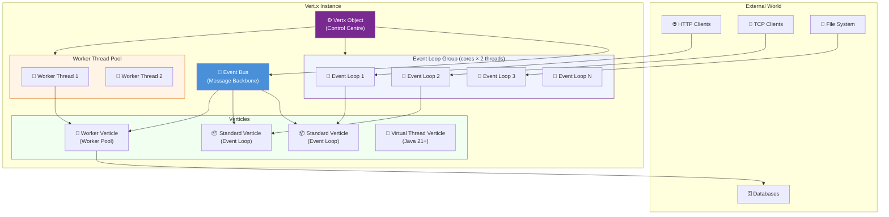

### Core Concepts at a Glance

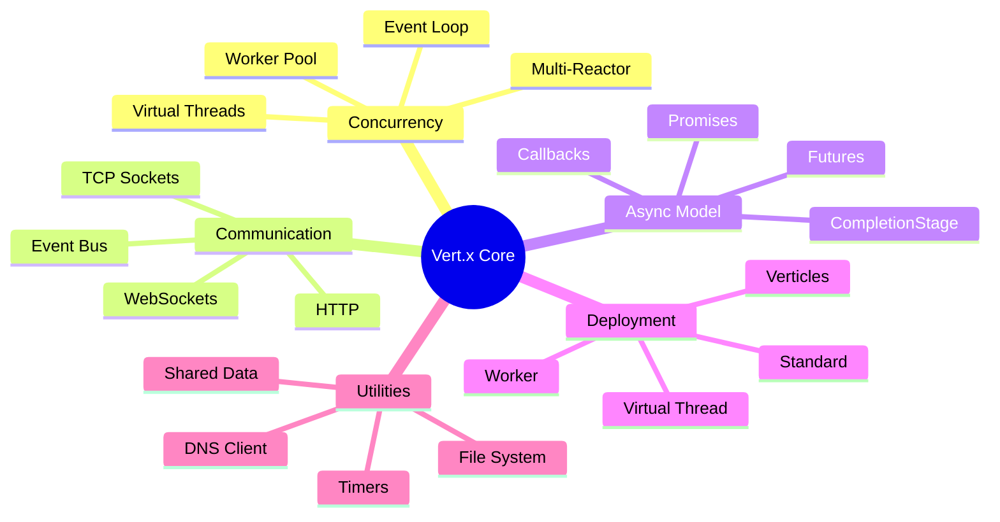

---

## 3. Setting Up Your Project {#setting-up}

### Maven

Add to your `pom.xml`:

```xml
<dependencies>
  <dependency>
    <groupId>io.vertx</groupId>
    <artifactId>vertx-core</artifactId>
    <version>5.1.1</version>
  </dependency>
</dependencies>
```

### Gradle

Add to `build.gradle`:

```groovy
dependencies {
  implementation 'io.vertx:vertx-core:5.1.1'
}
```

### Using the Project Generator

Visit **[start.vertx.io](https://start.vertx.io)** to generate a ready-to-run project with your chosen dependencies, build tool, and language.

### Minimal "Hello World" Application

```java
import io.vertx.core.Vertx;

public class HelloWorld {
    public static void main(String[] args) {
        // 1. Create the Vert.x instance
        Vertx vertx = Vertx.vertx();

        // 2. Create an HTTP server
        vertx.createHttpServer()
            .requestHandler(req -> {
                // 3. Handle every incoming request
                req.response()
                   .putHeader("content-type", "text/plain")
                   .end("Hello, Vert.x World! 🚀");
            })
            .listen(8080)
            .onSuccess(server -> System.out.println("Server started on port 8080"))
            .onFailure(err -> System.err.println("Server failed: " + err.getMessage()));
    }
}
```

---

## 4. The Vertx Object — The Control Centre {#the-vertx-object}

The `Vertx` object is the **entry point** for everything in Vert.x. Think of it as the engine of your application.

### Creating a Vertx Instance

```java
// Option 1: Default (sensible defaults for most applications)
Vertx vertx = Vertx.vertx();

// Option 2: With custom options
VertxOptions options = new VertxOptions()
    .setWorkerPoolSize(40)              // Max worker threads
    .setEventLoopPoolSize(8)            // Number of event loop threads
    .setMaxEventLoopExecuteTime(2000)   // Warn after 2s of event loop block
    .setBlockedThreadCheckInterval(1000); // Check every 1 second

Vertx vertx = Vertx.vertx(options);

// Option 3: Clustered Vert.x (for distributed apps)
// This is asynchronous because clustering takes time to set up
Vertx.clusteredVertx(new VertxOptions())
    .onSuccess(clusteredVertx -> {
        System.out.println("Clustered Vert.x ready!");
        // Use clusteredVertx here
    })
    .onFailure(err -> System.err.println("Clustering failed: " + err));
```

### What Can the Vertx Object Do?

```java
Vertx vertx = Vertx.vertx();

// 🌐 Create an HTTP server
HttpServer httpServer = vertx.createHttpServer();

// 🔌 Create a TCP server
NetServer netServer = vertx.createNetServer();

// 📡 Access the Event Bus
EventBus eventBus = vertx.eventBus();

// ⏱️ Set a timer (fires once after 5 seconds)
vertx.setTimer(5000, id -> System.out.println("5 seconds passed!"));

// 🔁 Set a periodic timer (fires every second)
long timerId = vertx.setPeriodic(1000, id -> System.out.println("Tick!"));

// 💾 Access the file system
FileSystem fs = vertx.fileSystem();

// 🌍 Create a DNS client
DnsClient dns = vertx.createDnsClient();

// 🚀 Deploy a verticle
vertx.deployVerticle(new MyVerticle());

// 🛑 Gracefully shut down
vertx.close().onComplete(ar -> System.out.println("Vert.x shut down."));
```

### Fluent API — Method Chaining

Vert.x uses a fluent API style allowing you to chain method calls:

```java
// Fluent style (concise and readable)
request.response()
       .putHeader("Content-Type", "application/json")
       .putHeader("X-Custom-Header", "value")
       .setStatusCode(200)
       .end("{\"status\": \"ok\"}");

// Equivalent non-fluent style
HttpServerResponse response = request.response();
response.putHeader("Content-Type", "application/json");
response.putHeader("X-Custom-Header", "value");
response.setStatusCode(200);
response.end("{\"status\": \"ok\"}");
```

Both are valid — use whichever is more readable to you.

---

## 5. Event-Driven Programming {#event-driven-programming}

Vert.x is fundamentally **event-driven**. Instead of your code calling libraries and waiting for results, you *register handlers* and Vert.x calls them when events occur.

### The "Hollywood Principle": "Don't call us, we'll call you"

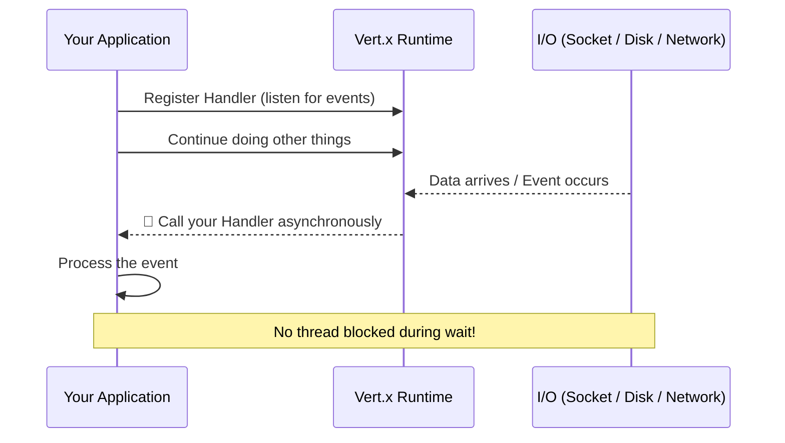

### Types of Events in Vert.x

```java
// ⏰ Timer events
vertx.setTimer(1000, id -> {
    System.out.println("Timer fired with ID: " + id);
});

// 🔁 Periodic events
vertx.setPeriodic(500, id -> {
    System.out.println("Periodic tick!");
    // Cancel after some condition
    if (someCondition) vertx.cancelTimer(id);
});

// 🌐 HTTP request events
HttpServer server = vertx.createHttpServer();
server.requestHandler(request -> {
    String path = request.path();
    System.out.println("HTTP " + request.method() + " " + path);
    request.response().end("Handled: " + path);
});
server.listen(8080);

// 🔌 TCP connection events
NetServer netServer = vertx.createNetServer();
netServer.connectHandler(socket -> {
    System.out.println("New TCP connection from: " + socket.remoteAddress());
    socket.handler(buffer -> {
        System.out.println("Received: " + buffer.toString());
        socket.write("Echo: " + buffer);
    });
    socket.closeHandler(v -> System.out.println("Connection closed"));
});
netServer.listen(1234);

// 💾 File system events
vertx.fileSystem().readFile("/etc/hostname", ar -> {
    if (ar.succeeded()) {
        System.out.println("Hostname: " + ar.result().toString().trim());
    }
});
```

---

## 6. The Reactor & Multi-Reactor Pattern {#reactor-pattern}

### Traditional Blocking Server (Thread-per-Request)

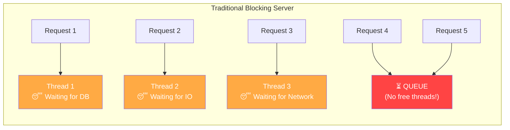

### Vert.x Multi-Reactor Pattern

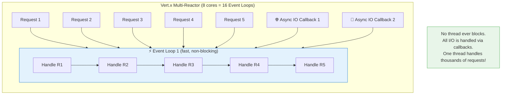

### Node.js vs Vert.x Scaling

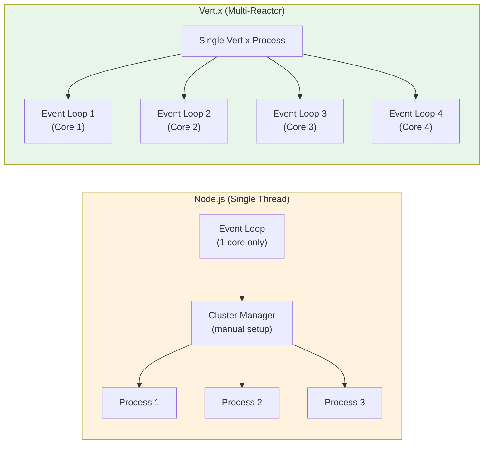

**Key insight**: Vert.x automatically uses **all available CPU cores** without requiring you to manage multiple processes.

---

## 7. The Golden Rule: Don't Block the Event Loop {#golden-rule}

This is the single most important rule in Vert.x development.

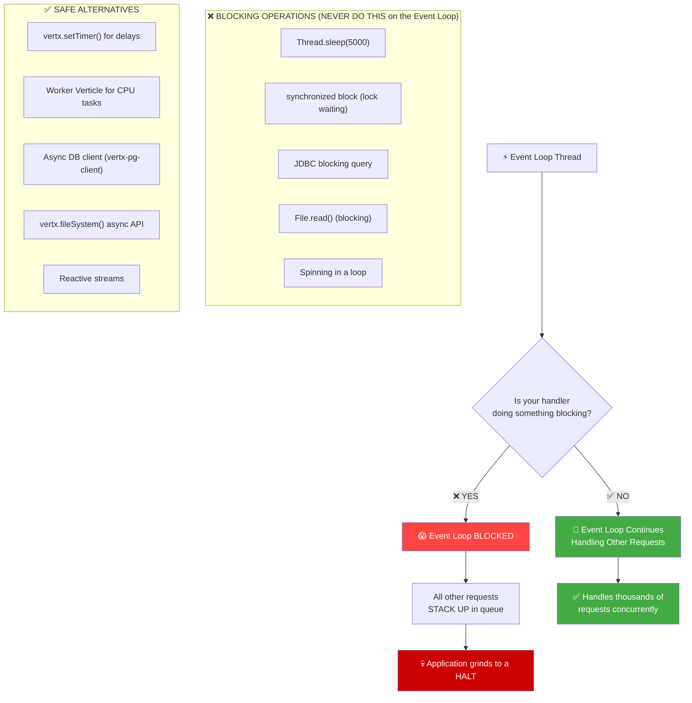

### ❌ What NOT to Do (Blocking the Event Loop)

```java
// ❌ WRONG: Blocking the event loop with sleep
vertx.setPeriodic(1000, id -> {
    Thread.sleep(5000); // ← BLOCKS the event loop for 5 seconds!
    System.out.println("Done sleeping");
});

// ❌ WRONG: Blocking database call on event loop
vertx.createHttpServer().requestHandler(req -> {
    // This blocks the event loop while waiting for DB!
    ResultSet rs = jdbcStatement.executeQuery("SELECT * FROM users");
    req.response().end(rs.toString());
});

// ❌ WRONG: Synchronized lock on event loop
vertx.createHttpServer().requestHandler(req -> {
    synchronized (someLock) { // ← May block if another thread holds the lock
        doSomething();
    }
});
```

### ✅ What TO Do Instead

```java
// ✅ CORRECT: Use async timer instead of sleep
vertx.setTimer(5000, id -> {
    System.out.println("5 seconds passed — event loop was free the whole time!");
});

// ✅ CORRECT: Use async DB client
vertx.createHttpServer().requestHandler(req -> {
    // Non-blocking async DB query
    pgPool.query("SELECT * FROM users")
          .execute()
          .onSuccess(rows -> req.response().end(rows.toString()))
          .onFailure(err -> req.response().setStatusCode(500).end(err.getMessage()));
});

// ✅ CORRECT: Offload blocking work to a worker thread
vertx.executeBlocking(() -> {
    // This code runs in a worker thread, not the event loop
    return heavyBlockingComputation();
}).onSuccess(result -> {
    // Back on the event loop
    System.out.println("Blocking result: " + result);
});
```

### Detecting Blocked Event Loops

Vert.x automatically logs warnings when an event loop is blocked:

```
Thread vertx-eventloop-thread-3 has been blocked for 20458 ms
io.vertx.core.VertxException: Thread blocked
    at com.myapp.MyHandler.handle(MyHandler.java:42)
    ...
```

Configure the threshold:

```java
VertxOptions options = new VertxOptions()
    .setMaxEventLoopExecuteTime(500)           // Warn if blocked > 500ms
    .setMaxEventLoopExecuteTimeUnit(TimeUnit.MILLISECONDS)
    .setBlockedThreadCheckInterval(200);       // Check every 200ms

Vertx vertx = Vertx.vertx(options);
```

---

## 8. Futures & Asynchronous Results {#futures}

Vert.x uses `Future<T>` to represent asynchronous results — the promise of a value that will be available later.

### How Futures Work

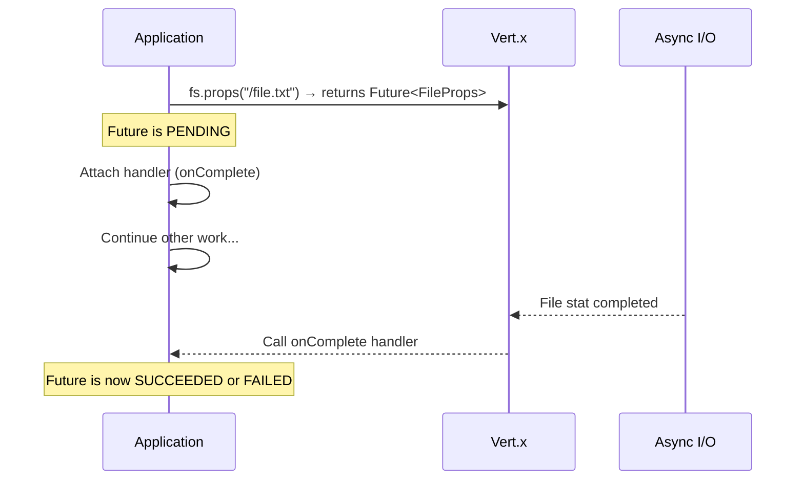

### Future Basics

```java
FileSystem fs = vertx.fileSystem();

// Asynchronous file stat
Future<FileProps> future = fs.props("/my_file.txt");

// Attach success handler
future.onSuccess(props -> {
    System.out.println("File size: " + props.size() + " bytes");
    System.out.println("Is directory: " + props.isDirectory());
});

// Attach failure handler
future.onFailure(err -> {
    System.err.println("Error: " + err.getMessage());
});

// Or handle both in one callback
future.onComplete(ar -> {
    if (ar.succeeded()) {
        System.out.println("Size: " + ar.result().size());
    } else {
        System.err.println("Failed: " + ar.cause().getMessage());
    }
});
```

### Transforming Futures with map()

```java
// Transform the result type
Future<String> sizeAsString = fs.props("/my_file.txt")
    .map(props -> "File size is: " + props.size() + " bytes");

sizeAsString.onSuccess(System.out::println);

// Example 2: Transform HTTP response to JSON
Future<JsonObject> jsonFuture = httpClient.request(HttpMethod.GET, "/api/user")
    .compose(req -> req.send())
    .compose(resp -> resp.body())
    .map(body -> new JsonObject(body));
```

### Recovering from Failures

```java
// Recover: if the operation fails, provide a fallback value
Future<FileProps> resilientFuture = fs.props("/primary_file.txt")
    .recover(err -> {
        System.out.println("Primary file not found, trying backup...");
        return fs.props("/backup_file.txt");
    });

// otherwise: replace failure with a default value
Future<FileProps> withDefault = fs.props("/my_file.txt")
    .otherwise(err -> defaultFileProps);
```

### Futures vs Promises

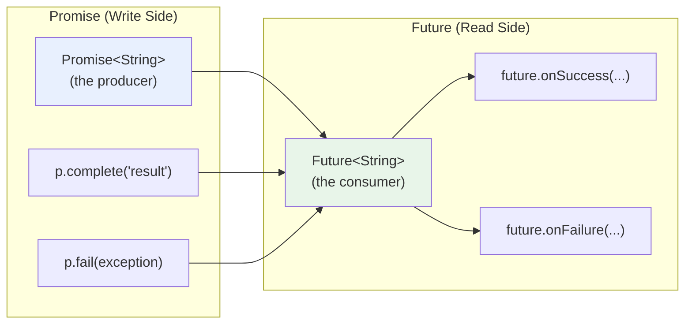

```java
// Creating a Promise manually (when you're the producer)
Promise<String> promise = Promise.promise();

// The future consumers can listen to
Future<String> future = promise.future();
future.onSuccess(result -> System.out.println("Got: " + result));

// Later, complete the promise
vertx.setTimer(2000, id -> {
    promise.complete("Hello from the future!");
    // or: promise.fail(new RuntimeException("Something went wrong"));
});
```

---

## 9. Future Composition & Coordination {#future-composition}

### Sequential Composition with compose()

`compose()` chains futures sequentially — the next step starts only when the previous one succeeds.

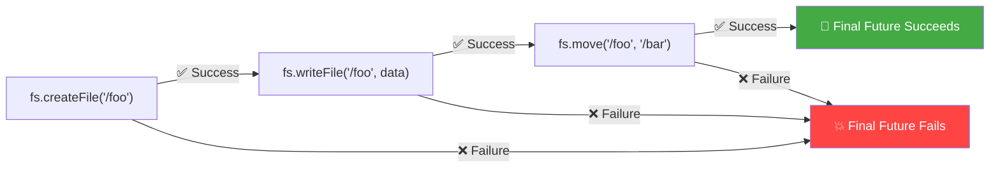

```java
FileSystem fs = vertx.fileSystem();

// Chain 3 file operations sequentially
Future<Void> pipeline = fs
    .createFile("/foo")
    .compose(v -> {
        System.out.println("Step 1 done: File created");
        return fs.writeFile("/foo", Buffer.buffer("Hello Vert.x!"));
    })
    .compose(v -> {
        System.out.println("Step 2 done: File written");
        return fs.move("/foo", "/bar");
    });

pipeline
    .onSuccess(v -> System.out.println("All 3 steps completed!"))
    .onFailure(err -> System.err.println("Pipeline failed at: " + err.getMessage()));
```

### Parallel Coordination

```mermaid
graph TB
    subgraph "Future.all() — Wait for ALL"
        A1["Future 1\nHTTP Server"] & A2["Future 2\nTCP Server"] & A3["Future 3\nDB Connect"] --> ALL{"all()"}
        ALL -->|All succeed| AOS["✅ All ready"]
        ALL -->|Any fails| AOF["❌ Failed"]
    end

    subgraph "Future.any() — Wait for FIRST"
        B1["Cache Lookup"] & B2["DB Lookup"] & B3["Remote API"] --> ANY{"any()"}
        ANY -->|First succeeds| BANY["✅ Got result (fastest source)"]
        ANY -->|All fail| BFAIL["❌ All sources failed"]
    end

    subgraph "Future.join() — Wait for ALL to COMPLETE"
        C1["Task 1"] & C2["Task 2"] & C3["Task 3"] --> JOIN{"join()"}
        JOIN -->|All complete (even if some failed)| JRES["Inspect each result individually"]
    end

    style AOS fill:#44aa44,color:white
    style BANY fill:#44aa44,color:white
    style AOF fill:#ff4444,color:white
    style BFAIL fill:#ff4444,color:white
```

#### Future.all() — All Must Succeed

```java
// Start HTTP and TCP servers concurrently
Future<HttpServer> httpFuture = vertx.createHttpServer()
    .requestHandler(req -> req.response().end("OK"))
    .listen(8080);

Future<NetServer> tcpFuture = vertx.createNetServer()
    .connectHandler(sock -> sock.handler(sock::write))
    .listen(1234);

// Wait for both to be ready
Future.all(httpFuture, tcpFuture).onComplete(ar -> {
    if (ar.succeeded()) {
        System.out.println("Both servers started successfully!");
        HttpServer http = ar.resultAt(0);   // HTTP server result
        NetServer tcp = ar.resultAt(1);     // TCP server result
    } else {
        System.err.println("At least one server failed to start!");
    }
});
```

#### Future.any() — Fastest Source Wins (Cache-Aside Pattern)

```java
// Try cache first, DB as fallback — use whichever responds first
Future<String> fromCache = cacheClient.get("user:123");
Future<String> fromDatabase = dbClient.query("SELECT * FROM users WHERE id=123");

Future.any(fromCache, fromDatabase).onSuccess(composite -> {
    // Use whichever succeeded first
    System.out.println("Got user data");
});
```

#### Future.join() — Run All, Collect All Results

```java
// Run 3 independent tasks in parallel, collect all outcomes
Future<Void> task1 = sendEmailNotification(user);
Future<Void> task2 = updateAnalytics(event);
Future<Void> task3 = invalidateCache(userId);

Future.join(task1, task2, task3).onComplete(ar -> {
    // ALL have completed (even if some failed)
    if (task1.failed()) System.err.println("Email failed: " + task1.cause());
    if (task2.failed()) System.err.println("Analytics failed: " + task2.cause());
    if (task3.failed()) System.err.println("Cache clear failed: " + task3.cause());
    System.out.println("All background tasks finished.");
});
```

### CompletionStage Interoperability

```java
// Vert.x Future → CompletionStage (for Java ecosystem integration)
Future<String> vertxFuture = vertx.createDnsClient().lookup("vertx.io");
CompletionStage<String> cs = vertxFuture.toCompletionStage();
cs.thenAccept(ip -> System.out.println("vertx.io → " + ip));

// CompletionStage → Vert.x Future (respects Vert.x threading model)
CompletionStage<String> externalStage = someExternalLibrary.doAsyncWork();
Future.fromCompletionStage(externalStage, vertx.getOrCreateContext())
    .flatMap(result -> storeInDatabase(result))
    .onSuccess(stored -> System.out.println("Stored: " + stored))
    .onFailure(Throwable::printStackTrace);
```

---

## 10. Verticles — The Unit of Deployment {#verticles}

Verticles are the **building blocks** of a Vert.x application. Think of each verticle as an independent actor that processes messages and events.

### Verticle Lifecycle

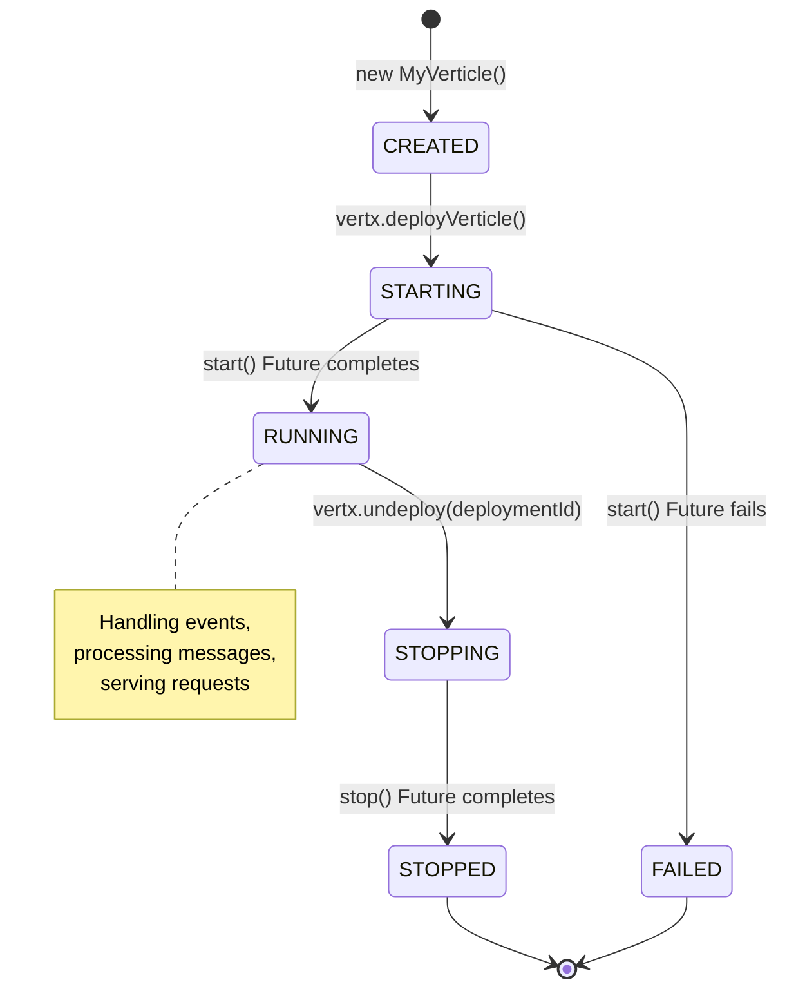

### Writing a Verticle

```java
import io.vertx.core.Future;
import io.vertx.core.VerticleBase;
import io.vertx.core.http.HttpServer;

public class MyHttpVerticle extends VerticleBase {

    private HttpServer server;

    @Override
    public Future<?> start() {
        // Create and configure the server
        server = vertx.createHttpServer()
            .requestHandler(req -> {
                String path = req.path();

                switch (path) {
                    case "/health":
                        req.response()
                           .putHeader("content-type", "application/json")
                           .end("{\"status\": \"UP\"}");
                        break;
                    case "/hello":
                        req.response()
                           .putHeader("content-type", "text/plain")
                           .end("Hello from Vert.x Verticle!");
                        break;
                    default:
                        req.response()
                           .setStatusCode(404)
                           .end("Not Found");
                }
            });

        // Return the Future from server.listen()
        // Vert.x considers the verticle "started" when this future completes
        return server.listen(8080)
            .onSuccess(s -> System.out.println("HTTP Verticle started on port " + s.actualPort()));
    }

    @Override
    public Future<?> stop() {
        // Cleanup logic (optional — Vert.x auto-stops servers on undeploy)
        System.out.println("HTTP Verticle stopping...");
        return super.stop();
    }
}
```

### Deploying Verticles

```java
Vertx vertx = Vertx.vertx();

// 1. Deploy an instance you created
vertx.deployVerticle(new MyHttpVerticle())
    .onSuccess(deploymentId -> {
        System.out.println("Deployed with ID: " + deploymentId);
        // Save the ID for later undeployment
    })
    .onFailure(err -> System.err.println("Deployment failed: " + err));

// 2. Deploy by class name (Vert.x instantiates it via reflection)
vertx.deployVerticle("com.myapp.MyHttpVerticle");

// 3. Deploy multiple instances (for load distribution across event loops)
DeploymentOptions opts = new DeploymentOptions().setInstances(4);
vertx.deployVerticle("com.myapp.MyHttpVerticle", opts);

// 4. Undeploy
vertx.undeploy(deploymentId)
    .onSuccess(v -> System.out.println("Undeployed successfully"))
    .onFailure(err -> System.err.println("Undeploy failed: " + err));
```

### Verticle Types Compared

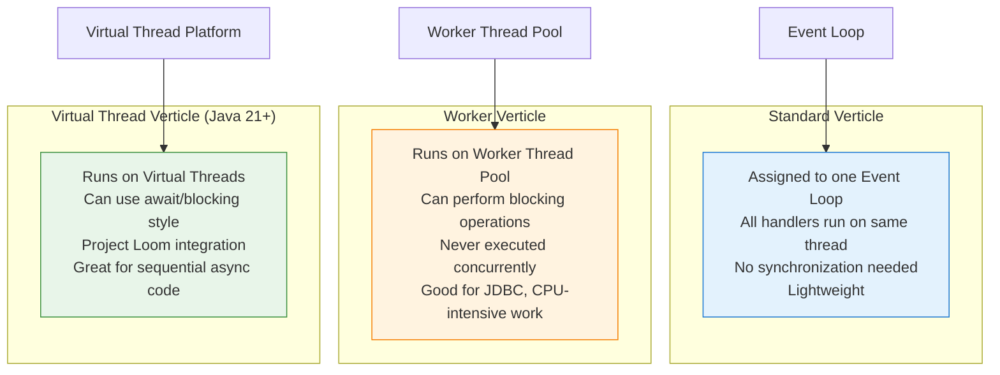

```java
// Standard Verticle (default)
vertx.deployVerticle(new MyVerticle());

// Worker Verticle (for blocking operations)
DeploymentOptions workerOpts = new DeploymentOptions()
    .setThreadingModel(ThreadingModel.WORKER);
vertx.deployVerticle(new MyBlockingVerticle(), workerOpts);

// Virtual Thread Verticle (Java 21+ only)
DeploymentOptions vtOpts = new DeploymentOptions()
    .setThreadingModel(ThreadingModel.VIRTUAL_THREAD);
vertx.deployVerticle(new MyVirtualThreadVerticle(), vtOpts);
```

---

## 11. The Event Bus — The Nervous System {#event-bus}

The Event Bus is Vert.x's **message-passing backbone**. It allows different verticles (and even different Vert.x instances in a cluster) to communicate without tight coupling.

### Event Bus Communication Patterns

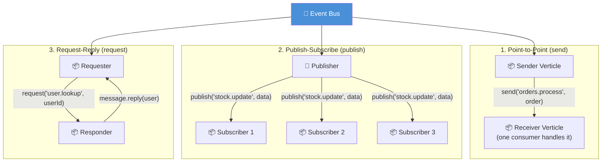

### Working with the Event Bus

```java
EventBus eb = vertx.eventBus();

// ─────────────────────────────────────────
// 1. PUBLISH-SUBSCRIBE: Broadcast to all subscribers
// ─────────────────────────────────────────

// Register multiple consumers on the same address
eb.consumer("news.feed", message -> {
    System.out.println("[Consumer A] Got news: " + message.body());
});

eb.consumer("news.feed", message -> {
    System.out.println("[Consumer B] Archiving: " + message.body());
});

// Publish sends to ALL consumers
eb.publish("news.feed", "Breaking: Vert.x 5.0 is released!");

// ─────────────────────────────────────────
// 2. POINT-TO-POINT: Send to exactly ONE consumer
// ─────────────────────────────────────────

// Register a consumer
eb.consumer("order.process", message -> {
    String orderId = (String) message.body();
    System.out.println("Processing order: " + orderId);
    // process...
});

// Send goes to only one consumer (load-balanced if multiple exist)
eb.send("order.process", "ORDER-12345");

// ─────────────────────────────────────────
// 3. REQUEST-REPLY: Two-way communication
// ─────────────────────────────────────────

// Responder verticle
eb.consumer("user.lookup", message -> {
    String userId = (String) message.body();
    // Fetch user...
    JsonObject user = new JsonObject()
        .put("id", userId)
        .put("name", "Alice")
        .put("email", "alice@example.com");
    message.reply(user); // Send response back
});

// Requester
eb.request("user.lookup", "user-42")
  .onSuccess(reply -> {
      JsonObject user = (JsonObject) reply.body();
      System.out.println("Found user: " + user.getString("name"));
  })
  .onFailure(err -> System.err.println("Lookup failed: " + err));
```

### Clustered Event Bus

When Vert.x nodes are clustered, the Event Bus spans the entire cluster:

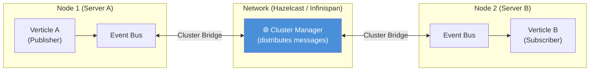

```java
// On Node 1: publish to event bus
eb.publish("temperature.sensor", new JsonObject().put("temp", 23.5).put("unit", "C"));

// On Node 2 (different JVM, different server): automatically receives it!
eb.consumer("temperature.sensor", message -> {
    JsonObject reading = (JsonObject) message.body();
    System.out.println("Sensor reading received on Node 2: " + reading.getDouble("temp") + "°C");
});
```

---

## 12. HTTP Server & Client {#http-server-client}

### Building a REST-like HTTP Server

```java
public class RestApiVerticle extends VerticleBase {

    @Override
    public Future<?> start() {
        HttpServer server = vertx.createHttpServer();

        server.requestHandler(req -> {
            String path = req.path();
            HttpMethod method = req.method();

            // Simple routing logic
            if (method == HttpMethod.GET && path.startsWith("/api/users/")) {
                handleGetUser(req);
            } else if (method == HttpMethod.POST && path.equals("/api/users")) {
                handleCreateUser(req);
            } else if (method == HttpMethod.GET && path.equals("/api/health")) {
                req.response()
                   .putHeader("content-type", "application/json")
                   .end(new JsonObject().put("status", "UP").encode());
            } else {
                req.response()
                   .setStatusCode(404)
                   .end("Not Found");
            }
        });

        return server.listen(8080);
    }

    private void handleGetUser(HttpServerRequest req) {
        // Extract ID from path: /api/users/{id}
        String userId = req.path().substring("/api/users/".length());

        // Simulate async DB lookup
        vertx.setTimer(10, id -> {
            JsonObject user = new JsonObject()
                .put("id", userId)
                .put("name", "Alice")
                .put("email", "alice@example.com");

            req.response()
               .putHeader("content-type", "application/json")
               .end(user.encode());
        });
    }

    private void handleCreateUser(HttpServerRequest req) {
        // Read request body asynchronously
        req.body().onSuccess(body -> {
            JsonObject newUser = body.toJsonObject();
            System.out.println("Creating user: " + newUser.getString("name"));

            JsonObject created = newUser.put("id", java.util.UUID.randomUUID().toString());

            req.response()
               .setStatusCode(201)
               .putHeader("content-type", "application/json")
               .end(created.encode());
        });
    }
}
```

### HTTP Client

```java
// Create HTTP client
HttpClient client = vertx.createHttpClient();

// GET request
client.request(HttpMethod.GET, 8080, "localhost", "/api/users/42")
    .compose(req -> req.send())
    .compose(resp -> {
        System.out.println("Status: " + resp.statusCode());
        return resp.body();
    })
    .onSuccess(body -> System.out.println("Response: " + body.toString()))
    .onFailure(err -> System.err.println("Request failed: " + err));

// POST request with body
client.request(HttpMethod.POST, 8080, "localhost", "/api/users")
    .compose(req -> {
        JsonObject payload = new JsonObject()
            .put("name", "Bob")
            .put("email", "bob@example.com");
        return req
            .putHeader("content-type", "application/json")
            .send(payload.encode());
    })
    .compose(resp -> resp.body())
    .onSuccess(body -> System.out.println("Created: " + body))
    .onFailure(Throwable::printStackTrace);
```

---

## 13. Timers & Periodic Actions {#timers}

```java
Vertx vertx = Vertx.vertx();

// ⏱️ One-shot timer (fires once after delay)
long oneShot = vertx.setTimer(3000, id -> {
    System.out.println("Fires once after 3 seconds. Timer ID was: " + id);
});

// 🔁 Periodic timer (fires repeatedly)
long periodic = vertx.setPeriodic(1000, id -> {
    System.out.println("Fires every second. Tick!");
});

// ❌ Cancel a timer
vertx.setTimer(10_000, id -> {
    vertx.cancelTimer(periodic); // Stop the periodic timer after 10s
    System.out.println("Periodic timer cancelled.");
});

// 📊 Real use case: Health check scheduler
long healthCheck = vertx.setPeriodic(30_000, id -> {
    vertx.createHttpClient()
         .request(HttpMethod.GET, 9090, "localhost", "/health")
         .compose(req -> req.send())
         .onSuccess(resp -> {
             if (resp.statusCode() != 200) {
                 System.err.println("⚠️ Health check failed! Status: " + resp.statusCode());
                 // Alert or restart logic here
             }
         })
         .onFailure(err -> System.err.println("⚠️ Health check unreachable: " + err));
});
```

---

## 14. Blocking Code & Worker Verticles {#blocking-code}

When you *must* run blocking code (e.g., legacy JDBC, CPU-bound computation), use one of these approaches:

### Approach 1: executeBlocking()

```java
// Inline blocking execution from an event loop context
vertx.executeBlocking(() -> {
    // This runs in a worker thread
    System.out.println("Running on: " + Thread.currentThread().getName());

    // Safe to block here!
    Thread.sleep(2000);
    return computeHeavyResult();  // Returns the result

}).onSuccess(result -> {
    // Back on the event loop
    System.out.println("Got blocking result: " + result);
}).onFailure(err -> {
    System.err.println("Blocking call failed: " + err);
});
```

### Approach 2: Worker Verticle

```java
public class DatabaseWorkerVerticle extends VerticleBase {

    private Connection jdbcConnection;

    @Override
    public Future<?> start() throws Exception {
        // Safe to do blocking setup in a worker verticle
        jdbcConnection = DriverManager.getConnection(
            "jdbc:postgresql://localhost/mydb", "user", "pass"
        );

        // Listen for work items on the event bus
        vertx.eventBus().consumer("db.query", message -> {
            String sql = (String) message.body();
            try {
                ResultSet rs = jdbcConnection.createStatement().executeQuery(sql);
                // Process results...
                message.reply("Query completed");
            } catch (SQLException e) {
                message.fail(500, e.getMessage());
            }
        });

        return Future.succeededFuture();
    }

    @Override
    public Future<?> stop() throws Exception {
        if (jdbcConnection != null) jdbcConnection.close();
        return super.stop();
    }
}

// Deploy as worker
DeploymentOptions opts = new DeploymentOptions()
    .setThreadingModel(ThreadingModel.WORKER);
vertx.deployVerticle(new DatabaseWorkerVerticle(), opts);
```

---

## 15. Virtual Threads (Java 21+) {#virtual-threads}

Virtual Thread Verticles let you write **synchronous-looking async code** using Java's Project Loom virtual threads.

```java
public class VirtualThreadVerticle extends VerticleBase {

    @Override
    public Future<?> start() {
        vertx.eventBus().consumer("process.order", message -> {
            String orderId = (String) message.body();

            // With virtual threads, you can "await" futures using Future.await()
            // This looks synchronous but doesn't block the carrier thread!
            try {
                // Step 1: Look up user (blocks virtual thread, not OS thread)
                JsonObject user = Future.await(lookupUser(orderId));

                // Step 2: Check inventory
                boolean inStock = Future.await(checkInventory(orderId));

                if (!inStock) {
                    message.fail(400, "Out of stock");
                    return;
                }

                // Step 3: Charge payment
                String chargeId = Future.await(chargePayment(user, orderId));

                // Step 4: Send confirmation
                Future.await(sendConfirmationEmail(user.getString("email"), chargeId));

                message.reply("Order " + orderId + " processed successfully!");

            } catch (Exception e) {
                message.fail(500, e.getMessage());
            }
        });

        return Future.succeededFuture();
    }

    private Future<JsonObject> lookupUser(String orderId) { /* ... */ return Future.succeededFuture(new JsonObject()); }
    private Future<Boolean> checkInventory(String orderId) { /* ... */ return Future.succeededFuture(true); }
    private Future<String> chargePayment(JsonObject user, String orderId) { /* ... */ return Future.succeededFuture("ch_123"); }
    private Future<Void> sendConfirmationEmail(String email, String chargeId) { /* ... */ return Future.succeededFuture(); }
}

// Deploy as virtual thread verticle (requires Java 21+)
DeploymentOptions vtOpts = new DeploymentOptions()
    .setThreadingModel(ThreadingModel.VIRTUAL_THREAD);
vertx.deployVerticle(new VirtualThreadVerticle(), vtOpts);
```

---

## 16. Real-World Use Cases {#use-cases}

### Use Case 1: Microservices Order Processing System

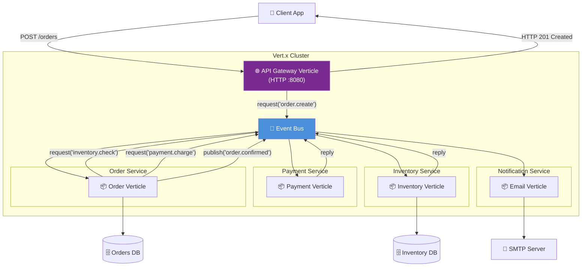

### Use Case 2: Real-Time Stock Price Dashboard

```java
public class StockTickerVerticle extends VerticleBase {

    @Override
    public Future<?> start() {
        EventBus eb = vertx.eventBus();

        // Simulate stock price updates every 500ms
        vertx.setPeriodic(500, id -> {
            JsonObject priceUpdate = new JsonObject()
                .put("symbol", "VTXR")
                .put("price", 150.0 + Math.random() * 10)
                .put("timestamp", System.currentTimeMillis());

            // Broadcast to all connected WebSocket clients via event bus
            eb.publish("stock.prices", priceUpdate.encode());
        });

        // WebSocket server for browser clients
        HttpServer httpServer = vertx.createHttpServer();

        httpServer.webSocketHandler(ws -> {
            System.out.println("WebSocket client connected: " + ws.remoteAddress());

            // Subscribe to stock prices and forward to this WebSocket
            MessageConsumer<String> consumer = eb.consumer("stock.prices", msg -> {
                if (!ws.isClosed()) {
                    ws.writeTextMessage(msg.body());
                }
            });

            // Unsubscribe when client disconnects
            ws.closeHandler(v -> {
                consumer.unregister();
                System.out.println("Client disconnected");
            });
        });

        return httpServer.listen(8080);
    }
}
```

### Use Case 3: API Gateway with Circuit Breaker Pattern

```java
public class ApiGatewayVerticle extends VerticleBase {

    private HttpClient httpClient;
    private int failureCount = 0;
    private boolean circuitOpen = false;

    @Override
    public Future<?> start() {
        httpClient = vertx.createHttpClient();

        vertx.createHttpServer()
            .requestHandler(req -> {
                if (circuitOpen) {
                    // Circuit is open — fail fast
                    req.response()
                       .setStatusCode(503)
                       .end("{\"error\": \"Service temporarily unavailable\"}");
                    return;
                }

                // Forward request to backend
                httpClient.request(HttpMethod.GET, 9090, "backend-service", req.path())
                    .compose(backReq -> backReq.send())
                    .compose(backResp -> {
                        failureCount = 0; // Reset on success
                        return backResp.body().map(body -> {
                            req.response()
                               .setStatusCode(backResp.statusCode())
                               .end(body);
                            return (Void) null;
                        });
                    })
                    .onFailure(err -> {
                        failureCount++;
                        if (failureCount >= 5) {
                            circuitOpen = true;
                            // Auto-reset after 30 seconds
                            vertx.setTimer(30_000, id -> {
                                circuitOpen = false;
                                failureCount = 0;
                                System.out.println("Circuit reset — half-open");
                            });
                        }
                        req.response().setStatusCode(502).end("Bad Gateway");
                    });
            })
            .listen(8080);

        return Future.succeededFuture();
    }
}
```

### Use Case 4: IoT Data Ingestion Pipeline

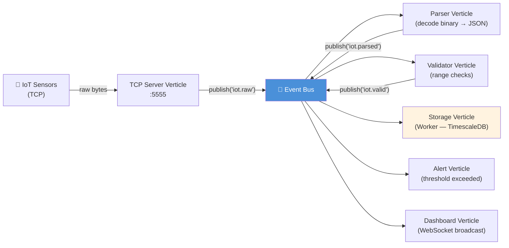

---

## 17. Best Practices & Common Pitfalls {#best-practices}

### ✅ Best Practices

```mermaid
graph TD
    BP["Vert.x Best Practices"]

    BP --> B1["✅ Never block the Event Loop\n→ Use async APIs or worker threads"]
    BP --> B2["✅ Use Future composition\n→ Avoid deeply nested callbacks"]
    BP --> B3["✅ One Verticle = One concern\n→ Follow Single Responsibility"]
    BP --> B4["✅ Use the Event Bus\n→ Decouple verticles for testability"]
    BP --> B5["✅ Scale with multiple instances\n→ setInstances() for hot paths"]
    BP --> B6["✅ Handle failures explicitly\n→ onFailure() on every Future"]
    BP --> B7["✅ Use DeploymentOptions\n→ Configure threads and instances"]
    BP --> B8["✅ Monitor event loop lag\n→ Tune MaxEventLoopExecuteTime"]

    style B1 fill:#e8f5e9,stroke:#388e3c
    style B2 fill:#e8f5e9,stroke:#388e3c
    style B3 fill:#e8f5e9,stroke:#388e3c
    style B4 fill:#e8f5e9,stroke:#388e3c
    style B5 fill:#e8f5e9,stroke:#388e3c
    style B6 fill:#e8f5e9,stroke:#388e3c
    style B7 fill:#e8f5e9,stroke:#388e3c
    style B8 fill:#e8f5e9,stroke:#388e3c
```

### Common Pitfalls and How to Avoid Them

| ❌ Pitfall | ✅ Solution |
|---|---|
| `Thread.sleep()` on event loop | Use `vertx.setTimer(delay, handler)` |
| JDBC blocking query on event loop | Use `vertx-pg-client` or Worker Verticle |
| Sharing mutable state between verticles | Use the Event Bus for communication |
| Forgetting to handle `onFailure()` | Always chain `.onFailure()` on futures |
| One verticle instance for high-traffic routes | Use `setInstances(n)` to scale |
| Creating Vert.x inside a handler | Create one global Vertx instance |
| Using `synchronized` blocks | Leverage single-threaded event loop guarantee |

### Quick Reference Card

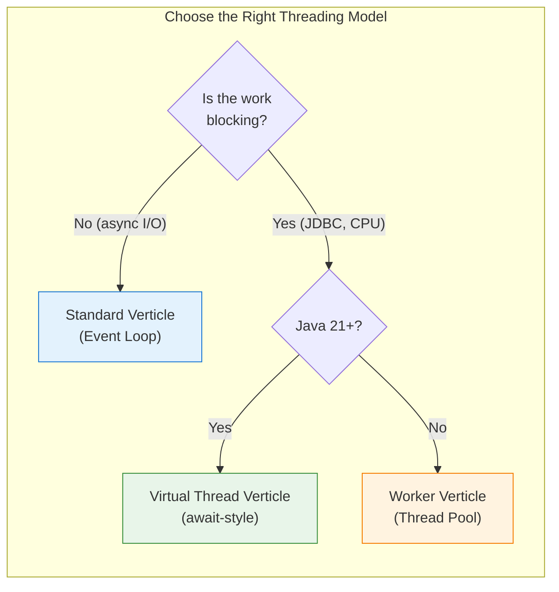

---

## 📚 Further Reading

| Resource | Link |
|---|---|
| Official Vert.x Docs | https://vertx.io/docs/vertx-core/java/ |
| Vert.x Examples (GitHub) | https://github.com/vert-x3/vertx-examples |
| Vert.x Web (routing) | https://vertx.io/docs/vertx-web/java/ |
| Vert.x PG Client | https://vertx.io/docs/vertx-pg-client/java/ |
| Vert.x Circuit Breaker | https://vertx.io/docs/vertx-circuit-breaker/java/ |
| API Reference (Javadoc) | https://vertx.io/docs/apidocs/ |
| Community Discord | https://discord.gg/6ry7aqPWXy |

---

> 💡 **Summary**: Vert.x Core gives you a powerful, lightweight foundation for building reactive applications on the JVM. Master the event loop, embrace non-blocking APIs, compose futures for async pipelines, organize code into verticles, and communicate via the event bus — and you'll be building high-performance, scalable systems with ease.