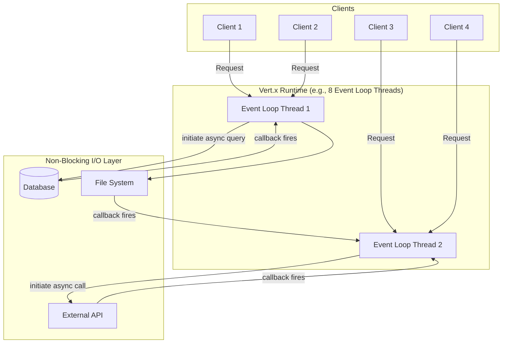
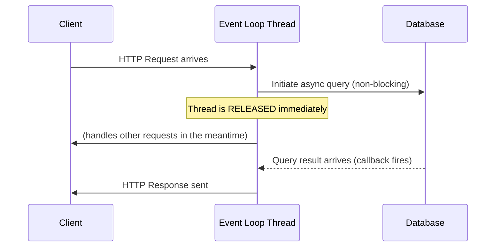
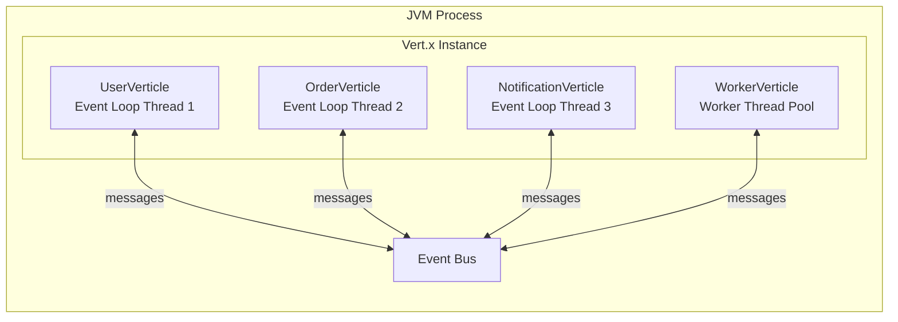
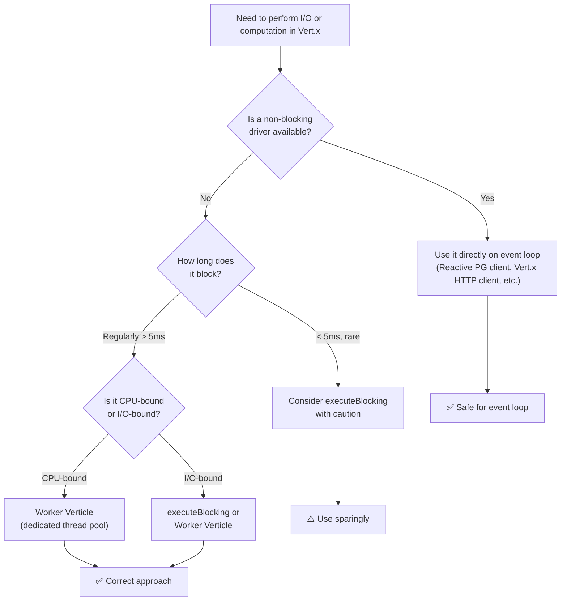
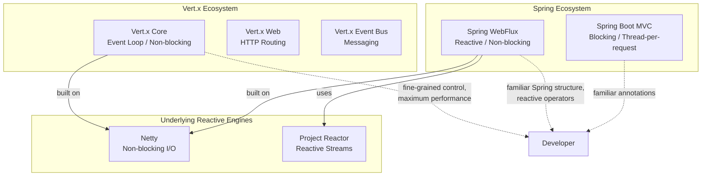
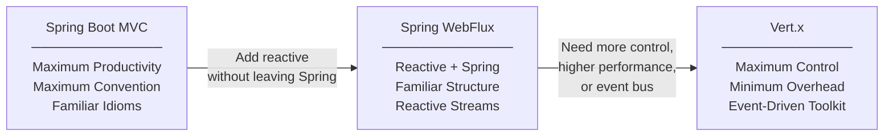
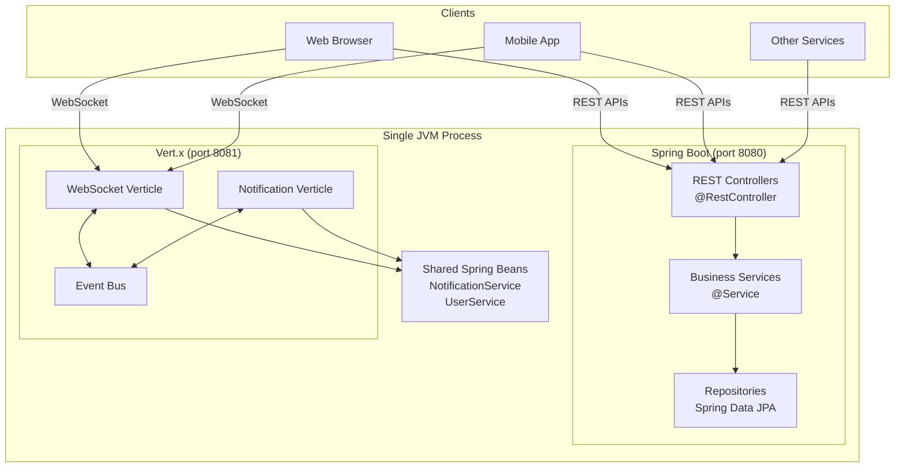
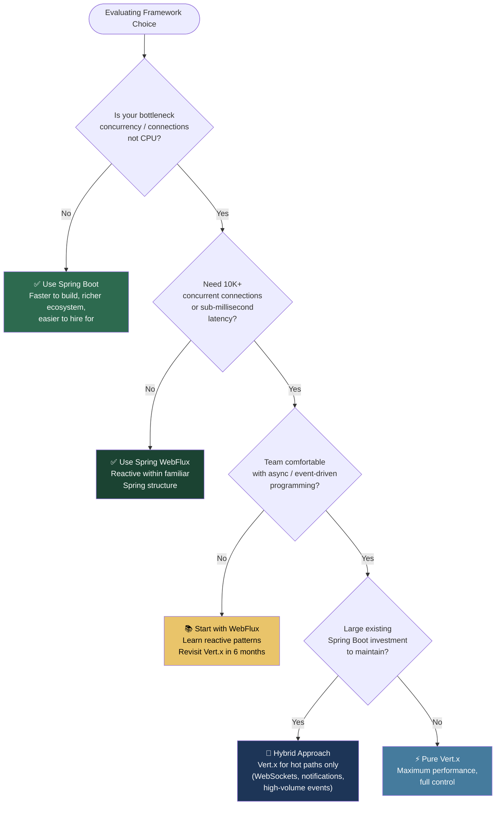
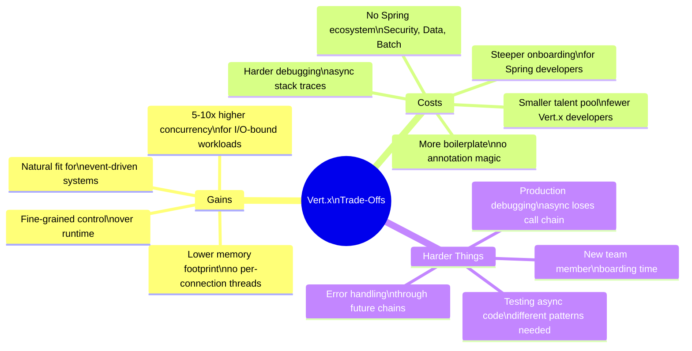

# Vert.x Through the Eyes of a Spring Boot Developer
## A Comprehensive Tutorial on Reactive, Event-Driven Java

> *"Spring Boot and Vert.x aren't competitors. They solve fundamentally different problems. Understanding the difference — and when each is the right choice — is what separates reactive architecture knowledge from reactive architecture cargo-culting."*

---

## 📋 Table of Contents

1. [Prerequisites & Learning Goals](#prerequisites)
2. [The Thread-Per-Request Mental Model (Spring Boot)](#thread-per-request)
3. [The Event Loop Model (Vert.x)](#event-loop)
4. [Core Vert.x Concepts: Verticles, Event Bus & Futures](#core-concepts)
5. [The Cardinal Sin: Blocking the Event Loop](#cardinal-sin)
6. [Side-by-Side Code Comparison](#comparison)
7. [Vert.x vs Spring WebFlux: Picking the Right Reactive Stack](#webflux-vs-vertx)
8. [Real-World Use Cases](#use-cases)
9. [Hybrid Architecture: Vert.x Inside Spring Boot](#hybrid)
10. [Decision Framework](#decision-framework)
11. [Trade-Off Ledger](#tradeoffs)
12. [Exercises & Next Steps](#exercises)

---

## 1. Prerequisites & Learning Goals {#prerequisites}

### Who This Tutorial Is For

This tutorial is written for **Java backend developers** who:

- Have working experience with **Spring Boot** (controllers, services, repositories)
- Understand the basics of HTTP and REST APIs
- Have heard of "reactive programming" but want a concrete, grounded explanation

### What You'll Learn

By the end of this tutorial, you will be able to:

- Explain the fundamental difference between **blocking (thread-per-request)** and **non-blocking (event-loop)** I/O
- Write a basic Vert.x HTTP server and WebSocket handler
- Know when to choose Spring Boot, Spring WebFlux, or Vert.x
- Design a **hybrid architecture** that uses both Spring Boot and Vert.x
- Avoid the most common Vert.x mistakes (especially blocking the event loop)

---

## 2. The Thread-Per-Request Mental Model {#thread-per-request}

### How Spring Boot Handles Concurrency

In a standard Spring Boot (Spring MVC) application, the Servlet container assigns **one thread per incoming HTTP request**. This thread lives for the lifetime of the request — from the moment it arrives to the moment the response is sent.

```
┌────────────────────────────────────────────────────────────┐
│                   Tomcat Thread Pool                       │
│                                                            │
│  Request 1 ──► Thread-1: [Controller → Service → DB wait] │
│  Request 2 ──► Thread-2: [Controller → Service → DB wait] │
│  Request 3 ──► Thread-3: [Controller → Service → DB wait] │
│  Request 4 ──► Thread-4: [Controller → Service → DB wait] │
│                                                            │
│  Thread-5 ... Thread-N: IDLE (waiting for requests)        │
└────────────────────────────────────────────────────────────┘
```

### Why This Works Well

For most enterprise applications, this model is **perfectly productive**:

- Code is **synchronous and easy to read**
- Stack traces are **easy to follow**
- Spring handles thread management invisibly
- Typical concurrent connections are in the hundreds

### When It Breaks Down

The problem is **memory**: each thread stack consumes roughly **256KB–1MB of RAM**, regardless of whether the thread is doing actual work or just waiting on a database response.

| Concurrent Connections | Threads Needed | Approximate RAM (thread stacks only) |
|---|---|---|
| 100 | 100 | ~100MB |
| 1,000 | 1,000 | ~1GB |
| 10,000 | 10,000 | ~10GB |
| 100,000 | 100,000 | ~100GB ❌ |

At 10,000+ connections — think chat applications, live dashboards, IoT device hubs — the thread-per-request model becomes **structurally unworkable**.

### Visualizing Thread Waste

Consider a thread waiting on a 20ms database query:

```
Thread lifecycle during one request:
│
│ [0ms]    Receive request, start executing controller
│ [1ms]    Begin DB query
│ [1ms]    ████████████ IDLE: waiting for DB ████████████
│ [21ms]   Receive DB result
│ [22ms]   Send HTTP response
│ [22ms]   Return thread to pool
│
└── Thread was PRODUCTIVE for 2ms, IDLE for 20ms (90% waste)
```

Now multiply that across 500 concurrent threads.

---

## 3. The Event Loop Model {#event-loop}

### The Core Idea: Never Wait, Always Callback

Vert.x borrows the **event loop model** from Node.js. Instead of assigning one thread per request, a small, fixed pool of event loop threads (typically one per CPU core) handles **all** I/O asynchronously.



### The Event Loop Lifecycle

Here's what happens when a request triggers a database call in Vert.x:



The thread **never blocks**. It initiates I/O, releases itself to handle other work, and comes back when the result is ready.

### A Minimal Vert.x HTTP Server

```java
import io.vertx.core.Vertx;

public class HelloWorldServer {
    public static void main(String[] args) {
        Vertx vertx = Vertx.vertx();

        vertx.createHttpServer()
            .requestHandler(req -> {
                req.response()
                   .putHeader("Content-Type", "application/json")
                   .end("{\"message\": \"Hello from Vert.x!\"}");
            })
            .listen(8080, result -> {
                if (result.succeeded()) {
                    System.out.println("Server running on port 8080");
                } else {
                    System.err.println("Failed to start: " + result.cause());
                }
            });
    }
}
```

Notice what's **absent**: no `@SpringBootApplication`, no embedded Tomcat, no `@RestController`, no component scanning. Vert.x is a **toolkit**, not a framework — it provides the engine; you decide the structure.

---

## 4. Core Vert.x Concepts {#core-concepts}

### 4.1 Verticles: Vert.x's Deployment Unit

A **Verticle** is the basic unit of deployment in Vert.x — similar to a Spring `@Component`, but explicitly tied to the event loop.



```java
public class OrderVerticle extends AbstractVerticle {

    @Override
    public void start() {
        // Called when verticle is deployed
        vertx.createHttpServer()
             .requestHandler(this::handleOrderRequest)
             .listen(8080);

        System.out.println("OrderVerticle started on event loop: "
            + Thread.currentThread().getName());
    }

    @Override
    public void stop() {
        // Called when verticle is undeployed — cleanup here
        System.out.println("OrderVerticle stopped");
    }

    private void handleOrderRequest(HttpServerRequest req) {
        // Business logic here
    }
}

// Deploying a verticle:
vertx.deployVerticle(new OrderVerticle(), res -> {
    if (res.succeeded()) {
        System.out.println("Deployed with ID: " + res.result());
    }
});

// Scale out: deploy 4 instances (one per CPU core)
vertx.deployVerticle(OrderVerticle.class.getName(),
    new DeploymentOptions().setInstances(4));
```

### 4.2 The Event Bus: Loose Coupling Between Verticles

The **Event Bus** is Vert.x's messaging backbone. Verticles communicate by publishing and subscribing to named addresses, enabling loose coupling and even clustering across JVM instances.

```java
// Publisher Verticle
public class OrderPlacedVerticle extends AbstractVerticle {
    @Override
    public void start() {
        // Publish an event whenever an order is placed
        vertx.eventBus().publish("order.placed", Json.encode(new Order("ORD-001", "user-42")));
    }
}

// Subscriber Verticle
public class NotificationVerticle extends AbstractVerticle {
    @Override
    public void start() {
        // Subscribe to order events
        vertx.eventBus().consumer("order.placed", message -> {
            Order order = Json.decodeValue((String) message.body(), Order.class);
            sendEmailNotification(order);
        });
    }
}

// Request-Reply pattern
vertx.eventBus().request("user.lookup", userId, reply -> {
    if (reply.succeeded()) {
        User user = Json.decodeValue((String) reply.result().body(), User.class);
        // do something with user
    }
});
```

### 4.3 Futures and Promises: Handling Async Results

Since Vert.x is non-blocking, results don't return directly — they arrive through **Futures** and **Promises**.

```java
// A Promise is something you complete
// A Future is the read-only view of a Promise's result

// Creating and completing a Promise
Promise<String> promise = Promise.promise();
// ... later, on success:
promise.complete("result value");
// ... or on failure:
promise.fail(new RuntimeException("Something went wrong"));

// Getting the Future from the Promise
Future<String> future = promise.future();

// Reacting to a Future
future
    .onSuccess(result -> System.out.println("Got: " + result))
    .onFailure(err -> System.err.println("Failed: " + err.getMessage()));

// Transforming a Future (like map/flatMap in streams)
Future<Integer> lengthFuture = future.map(String::length);

// Chaining async operations (flatMap for futures)
fetchUser(userId)
    .compose(user -> fetchOrders(user.getId()))      // runs after fetchUser succeeds
    .compose(orders -> enrichWithProducts(orders))   // runs after fetchOrders succeeds
    .onSuccess(enrichedOrders -> sendResponse(enrichedOrders))
    .onFailure(err -> handleError(err));
```

---

## 5. The Cardinal Sin: Blocking the Event Loop {#cardinal-sin}

### Why Blocking Is Catastrophic in Vert.x

In Spring Boot, blocking is the default. In Vert.x, **blocking the event loop is the worst mistake you can make** — it freezes *all* requests sharing that thread, not just one.

```
Spring Boot (blocking is fine):
Thread-1: [request 1 handling... DB wait 20ms... response]
Thread-2: [request 2 handling... DB wait 20ms... response]
→ Each blocked thread only affects itself

Vert.x (blocking is catastrophic):
Event Loop Thread 1 handles: request 1, request 2, request 3, ..., request 5000
If blocked for 20ms:
→ ALL 5000 requests are frozen for 20ms
```

### What Blocking Looks Like

```java
// ❌ NEVER do this in a Vert.x handler
vertx.createHttpServer()
    .requestHandler(req -> {
        // This blocks the event loop thread for 50ms
        // During those 50ms, NO other request on this thread can be processed
        String result = jdbcTemplate.queryForObject(
            "SELECT * FROM users WHERE id = ?", String.class, 42L
        );
        req.response().end(result);
    })
    .listen(8080);
```

Vert.x will even **warn you** in logs if you block too long:

```
WARNING: Thread vertx-eventloop-thread-0 has been blocked for 2166 ms,
time limit is 2000 MILLISECONDS
```

### The Right Way: executeBlocking

For inherently blocking operations (legacy JDBC, file I/O, CPU-heavy tasks), use **executeBlocking** to run work on a dedicated worker thread pool:

```java
vertx.createHttpServer()
    .requestHandler(req -> {
        vertx.executeBlocking(
            // This lambda runs on a WORKER thread (safe to block)
            promise -> {
                String result = legacyJdbcCall(); // blocking is OK here
                promise.complete(result);
            },
            // This lambda runs back on the EVENT LOOP when worker finishes
            asyncResult -> {
                if (asyncResult.succeeded()) {
                    req.response().end(asyncResult.result());
                } else {
                    req.response().setStatusCode(500).end("Error");
                }
            }
        );
    })
    .listen(8080);
```

### Worker Verticles

For long-running or CPU-intensive tasks, deploy a **Worker Verticle** — it runs entirely on the worker thread pool:

```java
public class PdfGenerationVerticle extends AbstractVerticle {

    @Override
    public void start() {
        // This verticle runs on a worker thread, not the event loop
        // Blocking is allowed here
        vertx.eventBus().consumer("pdf.generate", message -> {
            byte[] pdfBytes = generatePdfBlocking(message.body().toString());
            message.reply(Buffer.buffer(pdfBytes));
        });
    }
}

// Deploy as a worker verticle
vertx.deployVerticle(new PdfGenerationVerticle(),
    new DeploymentOptions().setWorker(true));
```

### The Blocking Decision Tree



---

## 6. Side-by-Side Code Comparison {#comparison}

### Use Case: Fetch a User Profile with Recent Orders

This is the most instructive comparison — both implementations are correct, but they make completely different resource trade-offs.

#### Spring Boot (Blocking)

```java
@RestController
@RequestMapping("/users")
public class UserController {

    private final UserRepository userRepository;
    private final OrderRepository orderRepository;

    // Constructor injection
    public UserController(UserRepository userRepository,
                          OrderRepository orderRepository) {
        this.userRepository = userRepository;
        this.orderRepository = orderRepository;
    }

    @GetMapping("/{id}/profile")
    public ResponseEntity<UserProfileDto> getProfile(@PathVariable Long id) {
        // Thread blocks here until DB responds (~10ms)
        User user = userRepository.findById(id)
            .orElseThrow(() -> new ResponseStatusException(HttpStatus.NOT_FOUND));

        // Thread blocks again (~10ms)
        List<Order> recentOrders =
            orderRepository.findTop5ByUserIdOrderByCreatedAtDesc(id);

        return ResponseEntity.ok(UserProfileDto.from(user, recentOrders));
    }
}
```

**Timeline:**
```
0ms   ──►  Start
10ms  ──►  fetchUser complete (thread was blocked)
20ms  ──►  fetchOrders complete (thread was blocked)
20ms  ──►  Response sent
Total: ~20ms, thread occupied entire time
```

#### Vert.x (Non-Blocking, Sequential)

```java
public class UserVerticle extends AbstractVerticle {

    private PgPool pgClient;

    @Override
    public void start() {
        pgClient = PgPool.pool(vertx,
            new PgConnectOptions()
                .setHost("localhost")
                .setPort(5432)
                .setDatabase("mydb")
                .setUser("appuser")
                .setPassword("secret"),
            new PoolOptions().setMaxSize(10)
        );

        vertx.createHttpServer()
             .requestHandler(this::handleRequest)
             .listen(8080);
    }

    private void handleRequest(HttpServerRequest req) {
        Long userId = Long.parseLong(req.getParam("id"));

        // fetchUser returns immediately (Future), no blocking
        fetchUser(userId)
            .compose(user ->
                // compose = flatMap: runs when fetchUser succeeds
                fetchRecentOrders(userId)
                    .map(orders -> UserProfileDto.from(user, orders))
            )
            .onSuccess(profile ->
                req.response()
                   .putHeader("Content-Type", "application/json")
                   .end(Json.encode(profile))
            )
            .onFailure(err -> {
                if (err instanceof UserNotFoundException) {
                    req.response().setStatusCode(404).end("User not found");
                } else {
                    req.response().setStatusCode(500).end(err.getMessage());
                }
            });
    }

    private Future<User> fetchUser(Long userId) {
        return pgClient
            .preparedQuery("SELECT * FROM users WHERE id = $1")
            .execute(Tuple.of(userId))
            .map(rows -> {
                if (rows.size() == 0) throw new UserNotFoundException(userId);
                return User.fromRow(rows.iterator().next());
            });
    }

    private Future<List<Order>> fetchRecentOrders(Long userId) {
        return pgClient
            .preparedQuery(
                "SELECT * FROM orders WHERE user_id = $1 " +
                "ORDER BY created_at DESC LIMIT 5"
            )
            .execute(Tuple.of(userId))
            .map(rows ->
                StreamSupport.stream(rows.spliterator(), false)
                             .map(Order::fromRow)
                             .collect(Collectors.toList())
            );
    }
}
```

#### Vert.x (Non-Blocking, Parallel — Even Better)

Since the two database calls are independent, we can run them **concurrently**:

```java
private void handleRequest(HttpServerRequest req) {
    Long userId = Long.parseLong(req.getParam("id"));

    // Both queries fire simultaneously!
    Future<User> userFuture = fetchUser(userId);
    Future<List<Order>> ordersFuture = fetchRecentOrders(userId);

    // Wait for both to complete
    Future.all(userFuture, ordersFuture)
        .map(cf -> UserProfileDto.from(
            cf.resultAt(0),   // User
            cf.resultAt(1)    // List<Order>
        ))
        .onSuccess(profile ->
            req.response()
               .putHeader("Content-Type", "application/json")
               .end(Json.encode(profile))
        )
        .onFailure(err -> handleError(req, err));
}
```

**Timeline (parallel):**
```
0ms   ──►  Fire both queries simultaneously
10ms  ──►  Both complete (max of the two, not sum)
10ms  ──►  Response sent
Total: ~10ms vs ~20ms sequential — 2x faster!
```

In Spring Boot, achieving the same parallelism requires `CompletableFuture.allOf()` or reactive extensions — not the natural default.

---

## 7. Vert.x vs. Spring WebFlux {#webflux-vs-vertx}

Many developers ask: *"Spring already has WebFlux — why consider Vert.x at all?"* This is a fair question.

### The Architecture Map



### Feature Comparison

| Dimension | Spring Boot MVC | Spring WebFlux | Vert.x |
|---|---|---|---|
| **Programming model** | Synchronous/blocking | Reactive (Flux/Mono) | Async (Futures/callbacks) |
| **Annotation support** | `@RestController` etc | `@RestController` etc | Manual routing |
| **Learning curve for Spring devs** | None | Moderate | Steep |
| **Performance ceiling** | Good | Excellent | Excellent–Better |
| **Memory per connection** | High (thread stack) | Very low | Very low |
| **Spring ecosystem** | ✅ Full | ✅ Full | ❌ None |
| **Auto-configuration** | ✅ Yes | ✅ Yes | ❌ DIY |
| **Polyglot support** | ❌ JVM only | ❌ JVM only | ✅ JVM, JS, Groovy |
| **Event bus / clustering** | ❌ Not built-in | ❌ Not built-in | ✅ Built-in |
| **Best for** | CRUD APIs, business logic | Reactive streaming, backpressure | WebSockets, event-driven, gateways |

### The Mental Model Summary



> **Rule of thumb:** WebFlux is *Spring with reactive plumbing*. Vert.x is a *high-performance engine you build on*.

---

## 8. Real-World Use Cases {#use-cases}

### Use Case 1: WebSocket Chat Server

In a thread-per-request model, each open WebSocket connection holds a thread. With 50,000 users in a chat room, that's 50,000 threads — 50GB of RAM in stacks alone.

In Vert.x, open connections are **data structures in memory**, not threads.

```java
public class ChatVerticle extends AbstractVerticle {

    // Room name → set of connected WebSocket clients
    private final Map<String, Set<ServerWebSocket>> rooms = new ConcurrentHashMap<>();

    @Override
    public void start() {
        vertx.createHttpServer()
            .webSocketHandler(ws -> {
                String roomId = extractRoomId(ws.path()); // e.g., /chat/room-42

                // Register connection
                rooms.computeIfAbsent(roomId, k -> ConcurrentHashMap.newKeySet()).add(ws);

                // Broadcast incoming messages to all room members
                ws.textMessageHandler(message -> {
                    String payload = buildChatMessage(ws, message);
                    rooms.getOrDefault(roomId, Set.of())
                         .stream()
                         .filter(client -> client != ws && !client.isClosed())
                         .forEach(client -> client.writeTextMessage(payload));
                });

                // Clean up on disconnect
                ws.closeHandler(v -> {
                    Set<ServerWebSocket> room = rooms.get(roomId);
                    if (room != null) {
                        room.remove(ws);
                        if (room.isEmpty()) rooms.remove(roomId);
                    }
                });
            })
            .listen(8080);
    }
}
```

**Capacity comparison for a chat server at 100,000 concurrent users:**

| Framework | Threads | RAM (stacks) | RAM (Vert.x connections) |
|---|---|---|---|
| Spring Boot MVC | 100,000 | ~100GB | N/A |
| Vert.x | 8 (event loops) | ~8MB | ~2–5GB (connection state) |

### Use Case 2: High-Throughput Kafka Consumer

```java
public class OrderEventConsumer extends AbstractVerticle {

    @Override
    public void start() {
        Map<String, String> kafkaConfig = new HashMap<>();
        kafkaConfig.put("bootstrap.servers", "kafka:9092");
        kafkaConfig.put("group.id", "order-processor");
        kafkaConfig.put("key.deserializer", "org.apache.kafka.common.serialization.StringDeserializer");
        kafkaConfig.put("value.deserializer", "org.apache.kafka.common.serialization.StringDeserializer");
        kafkaConfig.put("auto.offset.reset", "earliest");

        KafkaConsumer<String, String> consumer = KafkaConsumer.create(vertx, kafkaConfig);

        consumer.handler(record -> {
            // Non-blocking processing: hand off to async pipeline
            processOrder(record.value())
                .compose(this::updateInventory)
                .compose(this::sendConfirmationEmail)
                .onSuccess(v -> consumer.commit())  // Only commit on full success
                .onFailure(err -> {
                    log.error("Failed to process order {}: {}", record.key(), err.getMessage());
                    // Dead-letter queue, retry logic, etc.
                });
        });

        consumer.subscribe("order-events", res -> {
            if (res.succeeded()) {
                log.info("Subscribed to order-events");
            }
        });
    }
}
```

### Use Case 3: API Gateway / Reverse Proxy

An API gateway sits between clients and dozens of downstream services, spending nearly all its time **waiting on HTTP responses**. This is exactly the workload where blocking threads waste the most resources.

```java
public class GatewayVerticle extends AbstractVerticle {

    private WebClient httpClient;

    @Override
    public void start() {
        httpClient = WebClient.create(vertx);
        Router router = Router.router(vertx);

        // Route /api/users/* to the user service
        router.route("/api/users/*").handler(ctx -> proxy(ctx, "user-service", 8081));

        // Route /api/orders/* to the order service
        router.route("/api/orders/*").handler(ctx -> proxy(ctx, "order-service", 8082));

        vertx.createHttpServer()
             .requestHandler(router)
             .listen(8080);
    }

    private void proxy(RoutingContext ctx, String host, int port) {
        String path = ctx.request().uri();

        httpClient.request(ctx.request().method(), port, host, path)
            .compose(req -> req.send())
            .onSuccess(resp -> {
                ctx.response().setStatusCode(resp.statusCode());
                resp.headers().forEach(h -> ctx.response().putHeader(h.getKey(), h.getValue()));
                resp.body().onSuccess(body -> ctx.response().end(body));
            })
            .onFailure(err -> {
                ctx.response().setStatusCode(502).end("Bad Gateway: " + err.getMessage());
            });
    }
}
```

### Use Case 4: Real-Time Notification System (Server-Sent Events)

```java
router.get("/notifications/stream").handler(ctx -> {
    HttpServerResponse response = ctx.response();
    response.putHeader("Content-Type", "text/event-stream");
    response.putHeader("Cache-Control", "no-cache");
    response.setChunked(true);

    String userId = ctx.queryParam("userId").get(0);
    long timerId = vertx.setPeriodic(5000, id -> {
        // Push notification every 5 seconds (or on event)
        String event = "data: " + fetchLatestNotification(userId) + "\n\n";
        response.write(event);
    });

    // Clean up when client disconnects
    response.closeHandler(v -> vertx.cancelTimer(timerId));
});
```

---

## 9. Hybrid Architecture: Vert.x Inside Spring Boot {#hybrid}

For teams with existing Spring Boot investments, the most pragmatic path is **targeted insertion** — not a wholesale rewrite.



### Implementation

**Step 1: Spring Configuration for Vert.x**

```java
@Configuration
public class VertxConfiguration {

    @Bean
    public Vertx vertx() {
        VertxOptions options = new VertxOptions()
            .setEventLoopPoolSize(Runtime.getRuntime().availableProcessors())
            .setWorkerPoolSize(20);
        return Vertx.vertx(options);
    }

    @Bean
    public WebSocketVerticle webSocketVerticle(NotificationService notificationService) {
        return new WebSocketVerticle(notificationService);
    }
}
```

**Step 2: Start Vert.x When Spring Boot Starts**

```java
@Component
public class VertxStarter implements ApplicationRunner {

    private final Vertx vertx;
    private final WebSocketVerticle webSocketVerticle;

    public VertxStarter(Vertx vertx, WebSocketVerticle webSocketVerticle) {
        this.vertx = vertx;
        this.webSocketVerticle = webSocketVerticle;
    }

    @Override
    public void run(ApplicationArguments args) throws Exception {
        // Spring Boot: REST APIs on 8080
        // Vert.x: WebSockets on 8081
        vertx.deployVerticle(webSocketVerticle, res -> {
            if (res.succeeded()) {
                System.out.println("✅ Vert.x WebSocket server started on port 8081");
            } else {
                System.err.println("❌ Vert.x deployment failed: " + res.cause());
            }
        });
    }
}
```

**Step 3: The Verticle Uses Spring-Managed Services**

```java
public class WebSocketVerticle extends AbstractVerticle {

    // Injected by Spring at construction time
    private final NotificationService notificationService;

    public WebSocketVerticle(NotificationService notificationService) {
        this.notificationService = notificationService;
    }

    @Override
    public void start() {
        vertx.createHttpServer()
            .webSocketHandler(ws -> {
                String userId = extractUserIdFromJwt(ws.headers().get("Authorization"));

                // Register for push notifications (Spring bean does the work)
                notificationService.subscribe(userId, notification -> {
                    if (!ws.isClosed()) {
                        ws.writeTextMessage(Json.encode(notification));
                    }
                });

                ws.closeHandler(v -> notificationService.unsubscribe(userId));

                ws.exceptionHandler(err -> {
                    log.warn("WebSocket error for user {}: {}", userId, err.getMessage());
                    notificationService.unsubscribe(userId);
                });
            })
            .listen(8081);
    }
}
```

This pattern gives you the **best of both worlds**: Spring Boot's rich ecosystem and developer productivity for business logic, Vert.x's event loop for connection-intensive paths.

---

## 10. Decision Framework {#decision-framework}



### Quick Reference Summary

| Your Situation | Recommendation |
|---|---|
| Standard CRUD microservice | Spring Boot MVC |
| Streaming responses, backpressure, reactive DB | Spring WebFlux |
| WebSocket server at scale | Vert.x |
| High-throughput Kafka consumer | Vert.x |
| API gateway / reverse proxy | Vert.x |
| Real-time notifications / SSE | Vert.x |
| Spring app with one high-load path | Hybrid (Spring Boot + Vert.x) |
| Team new to async programming | Spring WebFlux first |

---

## 11. Trade-Off Ledger {#tradeoffs}

Choosing Vert.x is not free. Be honest about the costs before committing.



### The Right vs. Wrong Reasons to Choose Vert.x

| ✅ Right Reasons | ❌ Wrong Reasons |
|---|---|
| You have >10K concurrent WebSocket connections | "The benchmarks look impressive" |
| Load testing proves thread-per-request is the bottleneck | "Reactive sounds modern" |
| You're building an API gateway handling thousands of in-flight proxies | "I want to learn something new" |
| Your Kafka consumer is falling behind due to I/O stalls | "My colleague recommended it" |
| You've measured and proven the need | It solves a problem you haven't validated yet |

---

## 12. Exercises & Next Steps {#exercises}

### Exercise 1: Hello World Server (Beginner)

Build a Vert.x HTTP server that:
1. Responds to `GET /` with `{"status": "ok"}`
2. Responds to `GET /health` with `{"uptime": <seconds since start>}`
3. Returns 404 for all other paths

### Exercise 2: Blocking vs. Non-Blocking (Intermediate)

1. Create a Vert.x handler that calls `Thread.sleep(100)` — observe the warning logs
2. Refactor it to use `vertx.executeBlocking()` — observe the difference
3. Measure throughput with `wrk` or Apache Bench under both approaches

### Exercise 3: Parallel Database Queries (Intermediate)

Rewrite the sequential user profile handler to fetch user and orders **concurrently** using `Future.all()`. Measure the latency improvement with a mock 50ms query delay.

### Exercise 4: Event Bus Chat (Advanced)

Build a chat application using:
- Vert.x WebSocket handler for client connections
- Vert.x Event Bus for message routing between verticles
- A `RoomManagerVerticle` that tracks which users are in which rooms

### Exercise 5: Hybrid Integration (Advanced)

Take an existing Spring Boot application and add a Vert.x WebSocket verticle as a sidecar. Wire it to a Spring `@Service` to push real-time updates to connected clients when data changes.

---

## Summary

```mermaid
flowchart LR
    subgraph SpringBoot["Spring Boot"]
        direction TB
        A1[Thread-per-request]
        A2[Synchronous code]
        A3[Rich ecosystem]
        A4[Convention over config]
        A5[Best for CRUD,\nbusiness logic APIs]
    end

    subgraph Vertx["Vert.x"]
        direction TB
        B1[Event loop]
        B2[Non-blocking async]
        B3[Minimal toolkit]
        B4[You build the structure]
        B5[Best for WebSockets,\ngateways, event streams]
    end

    subgraph Hybrid["Hybrid"]
        direction TB
        C1[Spring Boot for\nbusiness logic]
        C2[Vert.x for\nhot paths]
        C3[Shared beans at\nseam points]
    end

    SpringBoot -->|"When Spring is too heavy\nfor connection-intensive work"| Hybrid
    Hybrid -->|"When you need\nfull Vert.x power"| Vertx
```



The engineers who use these tools most effectively aren't ideological about either. They understand the precise boundary where "Spring Boot is good enough" ends and "needs Vert.x" begins — and they've **measured** to know which side of that boundary their workload sits on.

---
