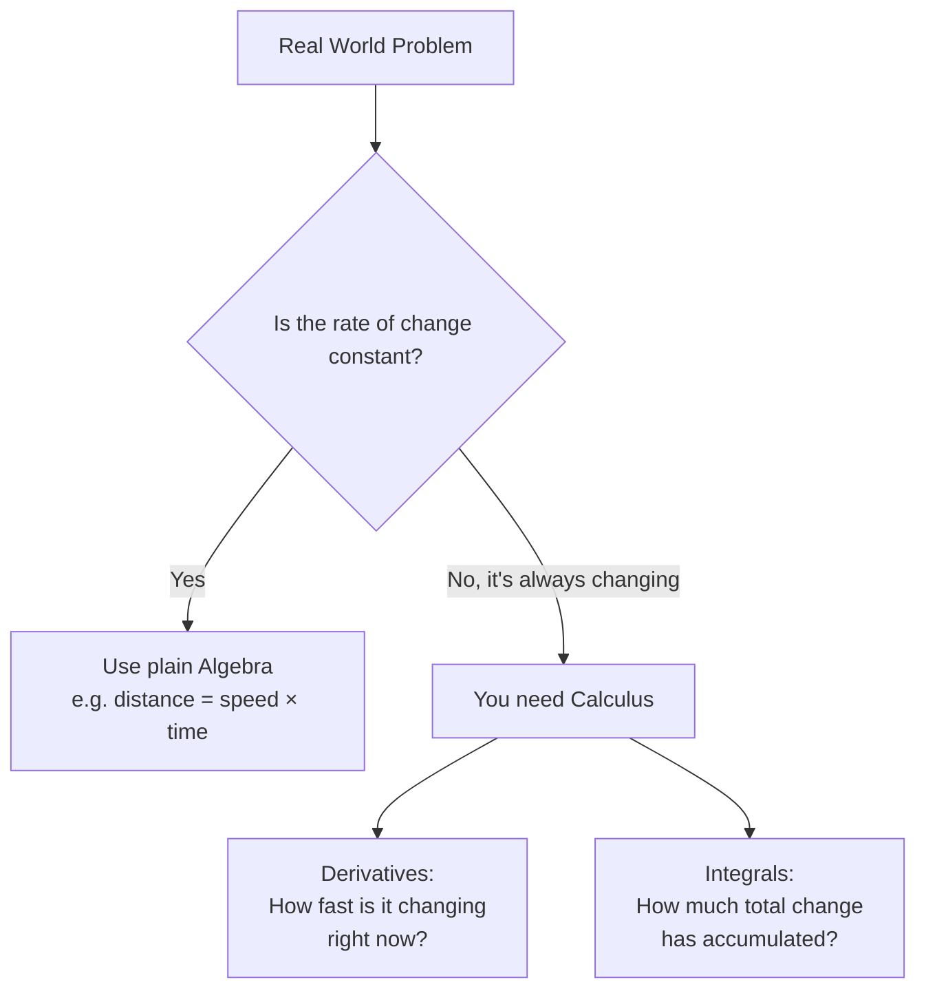
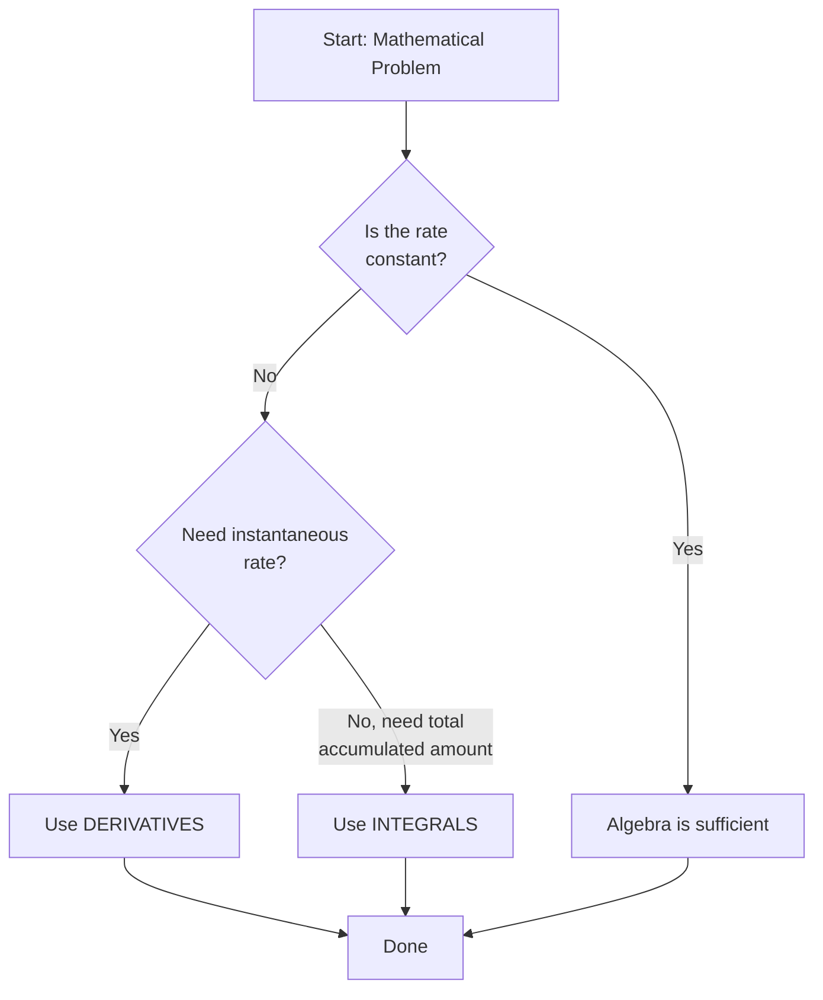
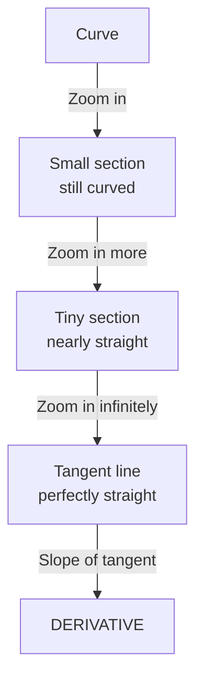
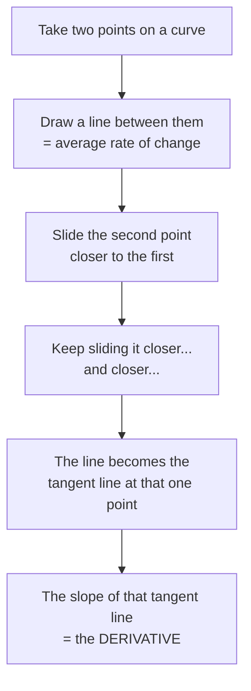
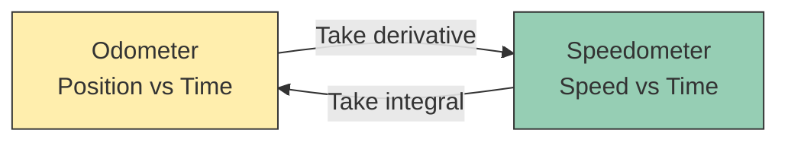
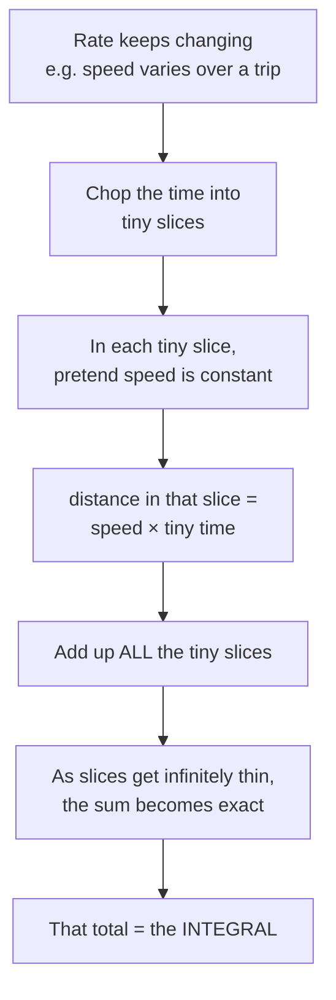
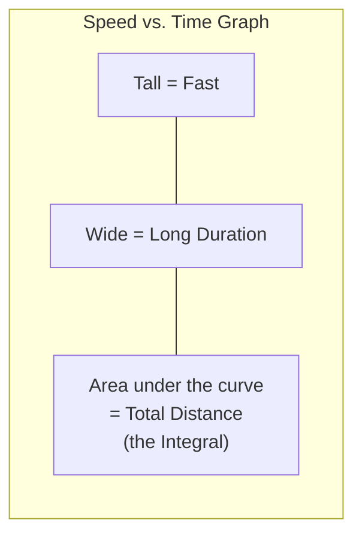
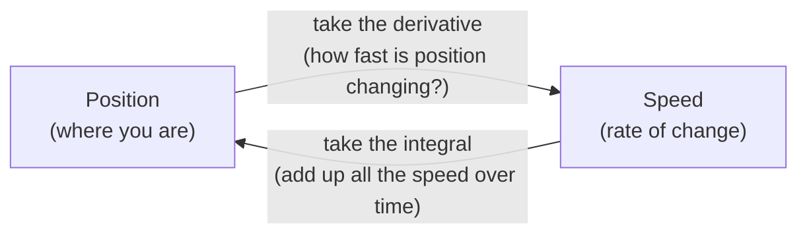
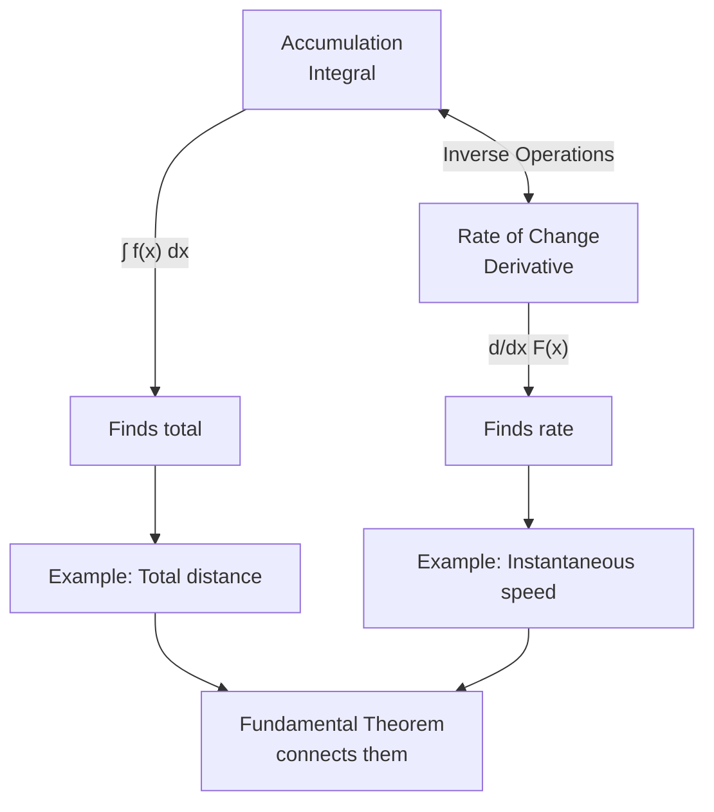
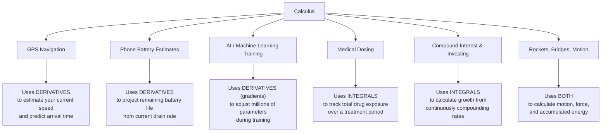

# Calculus Explained Like You're 5 (But Actually Complete) — A Beginner's Tutorial

> **Last Updated:** 2026-01-09  
> **Difficulty Level:** Intermediate  
> **Estimated Reading Time:** 45-60 minutes  
> **Tutorial Type:** Comprehensive Deep Dive

---

## 📋 Table of Contents

1. [Introduction & Overview](#introduction--overview)
2. [Prerequisites](#prerequisites)
3. [Learning Objectives](#learning-objectives)
4. [Why Calculus Exists in the First Place](#1-why-calculus-exists-in-the-first-place)
5. [Limits — The Foundation Everything Else Is Built On](#2-limits--the-foundation-everything-else-is-built-on)
6. [Derivatives — Measuring Exactly How Fast Something Is Changing](#3-derivatives--measuring-exactly-how-fast-something-is-changing)
7. [Integrals — Calculating Totals When the Rate Never Stays the Same](#4-integrals--calculating-totals-when-the-rate-never-stays-the-same)
8. [The Fundamental Theorem of Calculus — Two Sides of the Same Coin](#5-the-fundamental-theorem-of-calculus--two-sides-of-the-same-coin)
9. [Real-World Applications — Putting It All Together](#6-real-world-applications--putting-it-all-together)
10. [Best Practices](#best-practices)
11. [Anti-Patterns](#anti-patterns)
12. [Common Pitfalls & Troubleshooting](#common-pitfalls--troubleshooting)
13. [Performance Considerations](#performance-considerations)
14. [Security Considerations](#security-considerations)
15. [Practice Exercises with Solutions](#practice-exercises-with-solutions)
16. [Test Your Understanding](#test-your-understanding)
17. [Common Interview Questions](#common-interview-questions)
18. [Question Bank](#question-bank)
19. [Quick Recap](#quick-recap)
20. [Pro Tips](#pro-tips)
21. [Further Reading & Resources](#further-reading--resources)
22. [Next Steps](#next-steps)

---

## Introduction & Overview

Most people don't struggle with calculus because they're "not a math person." They struggle because they were handed formulas before anyone explained *why* those formulas exist. This tutorial fixes that — we build every idea from scratch, using stories, pictures, and things you already do every day.

Calculus is the mathematical study of **change**. While algebra deals with static quantities and fixed relationships, calculus provides the tools to understand and quantify how things change continuously. Whether you're tracking a rocket's acceleration, modeling population growth, or optimizing a machine learning algorithm, calculus is the language of change.

> 💡 **Key Insight:** Calculus isn't about memorizing formulas — it's about understanding two fundamental questions:
> 1. How fast is something changing *right now*? (Derivatives)
> 2. How much has accumulated *in total*? (Integrals)

---

## Prerequisites

Before diving into this tutorial, you should have:

### Mathematical Foundations
- ✅ **Algebra:** Comfortable with functions, equations, and basic algebraic manipulation
- ✅ **Geometry:** Understanding of slope, area, and basic geometric shapes
- ✅ **Basic Trigonometry:** Familiarity with sine, cosine, and basic trigonometric functions
- ✅ **Functions:** Understanding of function notation (f(x)) and how to evaluate functions

### Helpful (But Not Required)
- 📚 Basic understanding of physics concepts (speed, acceleration)
- 📚 Familiarity with graphing and coordinate systems
- 📚 Exposure to programming concepts (for code examples)

### Tools Needed
- 🛠️ **Python 3.7+** (for hands-on exercises)
- 🛠️ **Libraries:** NumPy, Matplotlib (we'll install these in exercises)

> ⚠️ **Note:** If you're rusty on algebra, review function notation and basic equation solving before proceeding. These concepts are foundational to understanding calculus.

---

## Learning Objectives

By the end of this tutorial, you will be able to:

### Core Understanding
- ✅ Explain what calculus is and why it was invented
- ✅ Understand the concept of limits and their role in calculus
- ✅ Define and compute derivatives of simple functions
- ✅ Define and compute definite and indefinite integrals
- ✅ Explain the Fundamental Theorem of Calculus and its significance

### Practical Skills
- ✅ Calculate derivatives using limit definitions
- ✅ Apply derivative rules (power rule, product rule, chain rule)
- ✅ Compute integrals using basic integration techniques
- ✅ Use Python to perform calculus operations numerically
- ✅ Identify real-world problems that require calculus

### Advanced Topics
- ✅ Recognize when to use derivatives vs. integrals
- ✅ Understand the inverse relationship between differentiation and integration
- ✅ Apply calculus concepts to optimization problems
- ✅ Analyze motion problems using calculus

### Critical Thinking
- ✅ Identify common misconceptions about calculus
- ✅ Recognize appropriate use cases for calculus in various domains
- ✅ Troubleshoot common errors in calculus problems
- ✅ Connect calculus concepts to real-world applications

---

## 📍 Where We're Going


By the end, you'll understand — without memorizing a single formula first — what a derivative *is*, what an integral *is*, and why they're actually the same idea looked at from two directions.

---

## 1. Why Calculus Exists in the First Place

Imagine you're standing at the edge of a hill. You want to know two things:

1. **How steep is the hill right at this exact spot where you're standing?**
2. **How much total "up" have you climbed from the bottom to here?**

Algebra is great at answering questions about *straight, unchanging* things — a car going a constant 60 mph, a wall of a fixed height. But the real world almost never behaves that way. Speed changes. Slopes curve. Growth accelerates and slows down. Algebra hits a wall the moment things stop being constant.

Calculus was invented (independently, by Isaac Newton and Gottfried Leibniz in the late 1600s) to answer exactly one type of question:

> **"What is happening at this *instant*, when everything is constantly changing?"**



**Everyday example:** Your car's speedometer needle jumps around as you drive through traffic — that instantaneous number is a derivative problem. The total distance you drove today, even though your speed never stayed the same, is an integral problem.

### Historical Context

The invention of calculus marked one of the most important breakthroughs in mathematical history. Before calculus, mathematicians could only work with static quantities. Newton developed his version (which he called "the method of fluxions") to solve physics problems involving motion and gravity. Leibniz developed his notation independently, and his system (using dx, dy, ∫) is what we use today because it was more practical and intuitive.

> 🎯 **Fun Fact:** The famous debate over who invented calculus first (Newton or Leibniz) consumed decades of academic politics, but today we recognize both as independent co-inventors.

### The Calculus Mindset Shift

| Algebra | Calculus |
|---------|----------|
| Works with **constants** | Works with **changing quantities** |
| Answers "What is the value?" | Answers "How is it changing?" |
| Deals with **straight lines** | Deals with **curves** |
| Static relationships | Dynamic relationships |
| Average values | Instantaneous values |

### When Do You Actually Need Calculus?

Use this decision flowchart:



---

## 2. Limits — The Foundation Everything Else Is Built On

### The Core Idea

A **limit** answers the question: *"What value does something get closer and closer to, even if it never quite gets there?"*

Here's the classic 5-year-old version: Imagine walking halfway to a wall. Then halfway again. Then halfway again, forever.


You never technically *touch* the wall in this thought experiment, but you get infinitely close to it. The **limit** of your position, as the number of steps goes to infinity, is the wall itself.

### Mathematical Notation

Limits are written using this notation:

```
lim_(x→a) f(x) = L
```

This reads: "The limit of f(x) as x approaches a equals L."

**Translation:** As x gets closer and closer to a (from both sides), f(x) gets closer and closer to L.

### Why Limits Matter for Calculus

Calculus needs to answer "what's happening at this exact instant" — but an instant has *zero* width. You can't measure speed over zero time (that's just 0/0, which is meaningless). Limits are the trick that lets us sneak up on that instant without ever dividing by zero.

**The Core Problem Calculus Solves:**
```
Speed = distance / time

At an instant: time = 0
Speed = distance / 0 = UNDEFINED ❌

With limits: time → 0 (approaches 0)
Speed = lim_(time→0) distance/time = DEFINED ✅
```

### Multiple Examples with Visualizations

**Example 1 — Zooming into a curve:**
Imagine a curving road on a map. If you zoom in far enough on any tiny piece of that curve, it starts looking like a straight line. Limits are the mathematical way of saying "zoom in infinitely, and tell me what straight line you'd see."



**Example 2 — Speed at a single moment:**
If a runner covers 100 meters in 10 seconds, their *average* speed is 10 m/s. But their speed wasn't constant — they were slower at the start and faster mid-race. To find their speed at exactly the 5-second mark, you'd calculate their average speed over a smaller and smaller window around that moment (5.0 to 5.1 seconds, then 5.0 to 5.01 seconds, then 5.0 to 5.001 seconds...). The limit of that shrinking window gives you their *exact* speed at that instant.

**Python Implementation:**

```python
# Demonstrating limits numerically
import numpy as np

def average_speed(start_time, end_time):
    """Calculate average speed over a time interval"""
    # Example: Runner covers distance = 4t² meters in t seconds
    distance_at_start = 4 * start_time**2
    distance_at_end = 4 * end_time**2
    distance_traveled = distance_at_end - distance_at_start
    time_elapsed = end_time - start_time
    return distance_traveled / time_elapsed

# Find instantaneous speed at t = 5 seconds
print("Approaching instantaneous speed at t=5:")
print(f"5.0 to 5.1: {average_speed(5.0, 5.1):.4f} m/s")
print(f"5.0 to 5.01: {average_speed(5.0, 5.01):.4f} m/s")
print(f"5.0 to 5.001: {average_speed(5.0, 5.001):.4f} m/s")
print(f"5.0 to 5.0001: {average_speed(5.0, 5.0001):.4f} m/s")
print(f"\nTrue instantaneous speed at t=5: {4 * 5 * 2} m/s")  # 40 m/s
```

**Example 3 — A limit that "doesn't exist":**
If you're walking toward a cliff edge and the ground suddenly drops away, there's no smooth value to approach — the function jumps. Not every situation has a nice limit, and part of learning calculus is learning to recognize when things behave smoothly versus when they break.

```python
# Example of a function with a discontinuity
def discontinuous_function(x):
    """A function that 'jumps' at x = 0"""
    if x < 0:
        return 2
    elif x == 0:
        return "undefined"
    else:
        return 3

# Test limits from left and right
print("Limit from left (x → 0⁻):", 2)
print("Limit from right (x → 0⁺):", 3)
print("Since 2 ≠ 3, the limit does not exist!")
```

### Use Cases for Limits
- **Engineering:** Predicting stress on a bridge as load approaches a critical value.
- **Finance:** Modeling what happens to an investment as compounding frequency approaches "continuous."
- **Computer Science:** Analyzing algorithm efficiency as input size approaches infinity (Big-O notation is built on limit thinking).
- **Physics:** Calculating instantaneous velocity from position-time data.
- **Statistics:** Finding probability distributions in continuous random variables.

### Common Misconceptions About Limits

❌ **Misconception 1:** "Limits are just guesses"  
✅ **Reality:** Limits are rigorous, provable mathematical facts when they exist.

❌ **Misconception 2:** "A function must be defined at a point for the limit to exist"  
✅ **Reality:** The limit depends on values *near* the point, not *at* the point.

❌ **Misconception 3:** "If left and right limits exist, they must be equal"  
✅ **Reality:** If left and right limits differ, the overall limit does not exist.

---

## 3. Derivatives — Measuring Exactly How Fast Something Is Changing

### The Core Idea

A **derivative** is the *instantaneous rate of change* — the slope of a curve at one specific point, found using the "zoom in infinitely" trick from limits.



### The Formal Definition

The derivative of a function f(x) at point x = a is:

```
f'(a) = lim_(h→0) [f(a+h) - f(a)] / h
```

**In plain English:**
1. Take a tiny step forward (h) from point a
2. Calculate how much f(x) changed
3. Divide by the step size to get the rate
4. Shrink the step to zero using limits
5. The result is the exact instantaneous rate

### Step-by-Step Explanation

1. Pick a curve — say, your car's distance traveled over time.
2. Pick a point on the curve where you want to know the exact speed.
3. Pick a second, nearby point.
4. Calculate the slope between those two points (rise over run) — this is your *average* speed over that stretch.
5. Now slide the second point closer and closer to the first.
6. As the gap shrinks toward zero, the slope settles down to one specific number.
7. That number is the derivative — your *exact* speed at that single instant.

### Computing Derivatives: The Limit Method

```python
import numpy as np

def derivative_using_limits(f, x, h=1e-10):
    """
    Calculate derivative using the limit definition:
    f'(x) = lim_(h→0) [f(x+h) - f(x)] / h
    """
    return (f(x + h) - f(x)) / h

# Example: f(x) = x²
def f_x_squared(x):
    return x ** 2

# The derivative should be f'(x) = 2x
x_value = 3
numerical_derivative = derivative_using_limits(f_x_squared, x_value)
analytical_derivative = 2 * x_value

print(f"f(x) = x² at x = {x_value}")
print(f"Numerical derivative (limit method): {numerical_derivative:.6f}")
print(f"Analytical derivative (2x): {analytical_derivative:.6f}")
print(f"Difference: {abs(numerical_derivative - analytical_derivative):.10f}")
```

### Multiple Examples with Depth

**Example 1 — Speedometer:**
Your car's odometer tracks total distance. Your speedometer is the *derivative* of that distance — it tells you how fast distance is changing right now, not on average.



**Python Example:**

```python
import matplotlib.pyplot as plt

# Car trip: position over time
time = np.linspace(0, 10, 100)
position = 2 * time**2 + 3 * time  # Position in meters

# Derivative = velocity
velocity = np.gradient(position, time)  # Numerical derivative

# Plot
fig, (ax1, ax2) = plt.subplots(2, 1, figsize=(10, 8))

ax1.plot(time, position, 'b-', linewidth=2, label='Position')
ax1.set_ylabel('Position (meters)')
ax1.set_title('Car Position Over Time')
ax1.legend()
ax1.grid(True, alpha=0.3)

ax2.plot(time, velocity, 'r-', linewidth=2, label='Velocity (derivative)')
ax2.set_xlabel('Time (seconds)')
ax2.set_ylabel('Velocity (m/s)')
ax2.set_title('Velocity - The Derivative of Position')
ax2.legend()
ax2.grid(True, alpha=0.3)

plt.tight_layout()
plt.show()

print(f"At t=5s, velocity = {velocity[50]:.2f} m/s")
print(f"At t=5s, position = {position[50]:.2f} meters")
```

**Example 2 — Phone battery drain:**
Your phone shows "12% battery, 2 hours remaining." That estimate isn't magic — it's using the derivative of your battery percentage over time (how fast you're currently draining it) to project forward. If you open a game, the derivative changes (steeper drop), and the estimate updates.

**Example 3 — Steepness of a hill:**
If you're hiking and the trail's elevation is described by some curve, the derivative at any point tells you exactly how steep the trail is right there — not the average steepness of the whole hike, but the burn-in-your-legs steepness *right now*.

**Example 4 — Medicine dosing:**
Doctors care about the *rate* at which a drug concentration rises or falls in your bloodstream, not just the total amount given. The derivative of concentration over time tells them whether levels are rising dangerously fast or tapering off safely.

### Common Derivative Rules

**Power Rule:**
```
If f(x) = xⁿ, then f'(x) = n·x^(n-1)
```

```python
# Power Rule Examples
print("Power Rule Examples:")
print("f(x) = x²  →  f'(x) = 2x")
print("f(x) = x³  →  f'(x) = 3x²")
print("f(x) = x⁵  →  f'(x) = 5x⁴")
```

**Constant Multiple Rule:**
```
If f(x) = c·g(x), then f'(x) = c·g'(x)
```

**Sum/Difference Rule:**
```
If f(x) = g(x) ± h(x), then f'(x) = g'(x) ± h'(x)
```

**Product Rule:**
```
If f(x) = g(x)·h(x), then f'(x) = g'(x)·h(x) + g(x)·h'(x)
```

**Chain Rule:**
```
If f(x) = g(h(x)), then f'(x) = g'(h(x)) · h'(x)
```

### Practical Derivative Calculation

```python
def power_rule_derivative(n, x):
    """Calculate derivative of x^n using power rule"""
    return n * (x ** (n - 1))

# Test power rule
print("\nPower Rule Verification:")
for n in [1, 2, 3, 4, 5]:
    x = 3
    numerical = derivative_using_limits(lambda x: x**n, x)
    analytical = power_rule_derivative(n, x)
    print(f"f(x) = x^{n}: f'({x}) = {analytical:.2f} (error: {abs(numerical - analytical):.6f})")
```

### Use Cases for Derivatives
- **GPS navigation:** Your phone estimates your current speed (a derivative of position) to predict arrival time.
- **AI training:** Machine learning models use derivatives (called *gradients*) to figure out which direction to nudge millions of internal settings to reduce error — this is the literal engine behind how AI learns.
- **Economics:** Marginal cost and marginal revenue — how much *extra* cost or profit comes from producing one more unit — are derivatives.
- **Sports analytics:** Measuring acceleration (the derivative of speed) to evaluate an athlete's burst off the line.
- **Biology:** Population growth rates are derivatives of population size.
- **Chemistry:** Reaction rates are derivatives of concentration over time.

---

## 4. Integrals — Calculating Totals When the Rate Never Stays the Same

### The Core Idea

If a derivative asks "how fast right now?", an **integral** asks the opposite question: *"Given how the rate has been changing this whole time, what's the total accumulated amount?"*



### The Formal Definition

The definite integral of f(x) from a to b is:

```
∫[a to b] f(x) dx = lim_(n→∞) Σ f(xᵢ) · Δx
```

**In plain English:**
1. Chop the interval [a, b] into n tiny pieces
2. For each piece, evaluate f(x) and multiply by width
3. Sum all pieces
4. As n → ∞, the sum becomes the exact area under the curve

### Step-by-Step Explanation

1. You have a rate that keeps changing (like your car's speed during a trip full of traffic and open highway).
2. Chop your trip into tiny time slices — say, every second.
3. In each one-second slice, your speed barely changes, so treat it as roughly constant.
4. Multiply speed × time for each slice to get a tiny distance.
5. Add up every slice's tiny distance across the whole trip.
6. Now imagine making the slices *infinitely* thin (using the limit trick again) — the jagged approximation becomes a perfectly smooth, exact total.
7. That exact total is the integral.

### The Area-Under-the-Curve Picture

The most common way integrals are taught visually: if you graph speed over time, the **area between that curve and the ground** is the total distance traveled.



### Computing Integrals Numerically

```python
def riemann_sum(f, a, b, n=1000):
    """
    Calculate definite integral using Riemann sum (left endpoint)
    ∫[a to b] f(x) dx ≈ Σ f(xᵢ) · Δx
    """
    dx = (b - a) / n
    total = 0
    
    for i in range(n):
        x_left = a + i * dx
        total += f(x_left) * dx
    
    return total

# Example: ∫[0 to 5] 2x dx = [x²] from 0 to 5 = 25
def f_2x(x):
    return 2 * x

numerical_integral = riemann_sum(f_2x, 0, 5, n=10000)
analytical_integral = 5**2 - 0**2  # x² evaluated from 0 to 5

print(f"\nIntegral ∫[0 to 5] 2x dx:")
print(f"Numerical (Riemann sum): {numerical_integral:.4f}")
print(f"Analytical: {analytical_integral:.4f}")
print(f"Error: {abs(numerical_integral - analytical_integral):.6f}")
```

### Multiple Examples with Depth

**Example 1 — Road trip distance:**
If your speed fluctuates the entire drive (accelerating, braking, cruising), the integral of your speed over the whole trip gives you total miles driven — even though no single speed value describes the whole journey.

```python
import numpy as np

# Simulate a road trip with varying speed
time = np.linspace(0, 60, 100)  # 60 minutes
# Speed varies: starts slow, increases, then decreases
speed = 30 + 40 * np.sin(np.pi * time / 60) + 20 * (time / 60)

# Calculate total distance using numerical integration
distance = np.trapz(speed, time)  # Trapezoidal integration

print(f"\nRoad Trip Simulation:")
print(f"Duration: {time[-1]:.0f} minutes")
print(f"Average speed: {np.mean(speed):.2f} mph")
print(f"Total distance traveled: {distance:.2f} miles")
```

**Example 2 — Compound interest:**
Money doesn't grow at a flat rate when interest compounds continuously — the growth *rate itself* depends on how much money you already have. Integrating that changing growth rate over time gives you your final account balance. This is where the famous constant $e$ (≈2.71828) comes from — it's the natural result of continuous compounding.

```python
import math

# Continuous compound interest: A = P * e^(rt)
def continuous_compound(principal, rate, time):
    """
    Calculate final amount with continuous compounding
    A = P * e^(rt)
    """
    return principal * math.exp(rate * time)

# Example: $1000 at 5% interest for 10 years
P = 1000  # Principal
r = 0.05  # 5% annual rate
t = 10    # 10 years

A = continuous_compound(P, r, t)
print(f"\nContinuous Compound Interest:")
print(f"Principal: ${P}")
print(f"Rate: {r*100}%")
print(f"Time: {t} years")
print(f"Final amount: ${A:.2f}")
print(f"Total interest earned: ${A-P:.2f}")
```

**Example 3 — Water filling a tank:**
If water flows into a tank at a rate that speeds up and slows down (say, controlled by a fluctuating valve), the integral of the flow rate over time tells you the total volume of water in the tank.

**Example 4 — Medical dosing (the flip side of derivatives):**
While a derivative tells a doctor how fast a drug is being absorbed *right now*, an integral tells them the *total* drug exposure a patient has accumulated over the whole treatment window — critical for knowing when a cumulative dose becomes unsafe.

**Example 5 — AI training (again):**
Total "loss" (how wrong a model's predictions have been) accumulated across a training run can be thought of as an integral of error over time, helping researchers evaluate a model's overall learning trajectory.

### Common Integration Techniques

**1. Power Rule for Integration:**
```
∫ xⁿ dx = x^(n+1)/(n+1) + C  (where n ≠ -1)
```

```python
def power_rule_integral(n, x):
    """Indefinite integral of x^n"""
    if n == -1:
        return math.log(abs(x))  # Special case
    return (x ** (n + 1)) / (n + 1)

print("\nPower Rule for Integration:")
print("∫ x² dx = x³/3 + C")
print("∫ x³ dx = x⁴/4 + C")
```

**2. Constant Multiple Rule:**
```
∫ c·f(x) dx = c·∫ f(x) dx
```

**3. Sum Rule:**
```
∫ [f(x) + g(x)] dx = ∫ f(x) dx + ∫ g(x) dx
```

### Use Cases for Integrals
- **Physics:** Calculating total work done by a variable force (like a rocket accelerating unevenly).
- **Business:** Calculating total revenue when the sales rate varies by season.
- **Medicine:** Total drug exposure over a treatment period (AUC — "area under the curve" — is a real clinical term).
- **Engineering:** Calculating the total load a beam experiences from unevenly distributed weight.
- **Economics:** Consumer surplus and producer surplus calculations.
- **Statistics:** Finding probabilities from probability density functions.

---

## 5. The Fundamental Theorem of Calculus — Two Sides of the Same Coin

This is the "aha" moment that ties everything together.



**In plain English:** Differentiation (finding derivatives) and integration (finding integrals) *undo each other* — the same way multiplication and division undo each other, or the same way zooming in and zooming back out are opposite actions on a map.

- If you know your **position** over time, taking the derivative tells you your **speed**.
- If you know your **speed** over time, taking the integral tells you your **position** (how far you've gone).

This isn't a coincidence — it's a deep, provable truth: *accumulation* and *instantaneous change* are mathematically inverse operations. This single insight is why calculus is taught as one connected subject rather than two unrelated tricks.

**Everyday analogy:** Think of a bank statement. Your *balance* on any given day is like "position." The *daily deposits and withdrawals* are like "speed" (rate of change of balance). If you know your balance curve, you can figure out your daily transactions by looking at how steeply the balance changes each day (a derivative). If you know all your daily transactions, you can reconstruct your balance on any day by adding them all up from day one (an integral). Same information, two directions.

### The Two Parts of the Fundamental Theorem

**Part 1:** If F(x) is an antiderivative of f(x), then:
```
∫[a to b] f(x) dx = F(b) - F(a)
```

This means you can compute a definite integral by finding an antiderivative and evaluating it at the endpoints.

**Part 2:** If F(x) = ∫[a to x] f(t) dt, then:
```
F'(x) = f(x)
```

This means the derivative of the integral function is the original function.

### Python Demonstration

```python
def fundamental_theorem_demo():
    """
    Demonstrate the Fundamental Theorem of Calculus
    """
    # Function: f(x) = 2x
    # Antiderivative: F(x) = x²
    
    a, b = 0, 5
    
    # Method 1: Numerical integration
    numerical = riemann_sum(lambda x: 2*x, a, b, n=10000)
    
    # Method 2: Using antiderivative (Fundamental Theorem)
    analytical = b**2 - a**2  # F(b) - F(a)
    
    print(f"\nFundamental Theorem of Calculus:")
    print(f"Function: f(x) = 2x")
    print(f"Antiderivative: F(x) = x²")
    print(f"Interval: [{a}, {b}]")
    print(f"Numerical integration: {numerical:.4f}")
    print(f"Analytical (F(b) - F(a)): {analytical:.4f}")
    print(f"Match: {abs(numerical - analytical) < 0.01}")

fundamental_theorem_demo()
```

### Why This Is Profound

The Fundamental Theorem of Calculus reveals a deep connection between seemingly opposite operations:



This is why we can check our work: if you integrate a derivative, you get back the original function (plus a constant). If you differentiate an integral, you get back the original function.

---

## 6. Real-World Applications — Putting It All Together



### GPS Tracking

Your phone doesn't have a direct "speed sensor" the way a car does — it estimates your speed by taking the derivative of your changing GPS position over time. Combined with map data, it then integrates that speed forward to predict your arrival time.

```python
# GPS Speed Estimation Simulation
def estimate_speed_from_gps(positions, times):
    """
    Estimate speed from GPS position data using derivatives
    """
    # Calculate derivatives (velocity components)
    velocity_x = np.gradient(positions[:, 0], times)
    velocity_y = np.gradient(positions[:, 1], times)
    
    # Calculate total speed
    speed = np.sqrt(velocity_x**2 + velocity_y**2)
    
    return speed

# Simulate GPS data
times = np.linspace(0, 10, 100)
x_pos = 50 * times  # Moving east
y_pos = 30 * np.sin(times)  # Oscillating north-south
positions = np.column_stack([x_pos, y_pos])

speeds = estimate_speed_from_gps(positions, times)
print(f"\nGPS Speed Estimation:")
print(f"Average speed: {np.mean(speeds):.2f} m/s")
print(f"Max speed: {np.max(speeds):.2f} m/s")
print(f"Current speed: {speeds[-1]:.2f} m/s")
```

### Phone Battery Estimates

"2 hours remaining" is a real-time derivative calculation — your phone measures how fast your battery percentage is dropping *right now* and projects that rate forward. That's why the estimate jumps around when your usage habits change.

```python
def battery_time_remaining(current_percent, drain_rate_percent_per_hour):
    """
    Calculate time remaining based on current drain rate (derivative)
    Time = current / rate
    """
    if drain_rate_percent_per_hour <= 0:
        return float('inf')
    
    hours_remaining = current_percent / drain_rate_percent_per_hour
    return hours_remaining

# Example scenarios
print("\nBattery Life Estimation:")
print(f"12% battery, draining at 6%/hour: {battery_time_remaining(12, 6):.1f} hours")
print(f"50% battery, draining at 2%/hour: {battery_time_remaining(50, 2):.1f} hours")
print(f"80% battery, draining at 10%/hour: {battery_time_remaining(80, 10):.1f} hours")
```

### AI Training

Every time a neural network "learns," it's using derivatives (gradients) to figure out which tiny adjustment to millions of internal numbers will reduce its error the most. This process, called *gradient descent*, is calculus running at massive scale — quite literally, modern AI would not exist without derivatives.

```python
# Simplified Gradient Descent Example
def gradient_descent_simple(f, df, start, learning_rate, iterations):
    """
    Simple gradient descent optimization
    f: function to minimize
    df: derivative of function
    start: starting point
    learning_rate: how big steps to take
    iterations: number of steps
    """
    x = start
    history = [x]
    
    for i in range(iterations):
        gradient = df(x)
        x = x - learning_rate * gradient
        history.append(x)
    
    return x, history

# Minimize f(x) = x² (minimum at x=0)
f = lambda x: x**2
df = lambda x: 2*x  # Derivative

minimum, history = gradient_descent_simple(f, df, start=5, learning_rate=0.1, iterations=20)

print(f"\nGradient Descent (AI Training):")
print(f"Starting at x=5")
print(f"Minimum found at x={minimum:.4f}")
print(f"Function value at minimum: f({minimum:.4f}) = {f(minimum):.6f}")
```

### Medical Dosing

Doctors use derivatives to monitor how fast a drug is entering or leaving your bloodstream, and integrals to track total cumulative exposure — both are essential to keeping a dose effective without becoming toxic.

### Compound Interest

Continuous compound interest — used in things like bond pricing and certain investment models — is literally defined using an integral of a constantly-changing growth rate, which is also where the mathematical constant $e$ comes from.

### Physics and Engineering

```python
# Projectile Motion with Calculus
def projectile_motion(v0, angle_degrees, g=9.81):
    """
    Calculate projectile motion using calculus
    v0: initial velocity (m/s)
    angle_degrees: launch angle in degrees
    """
    angle_rad = np.radians(angle_degrees)
    
    # Initial velocity components
    v0x = v0 * np.cos(angle_rad)
    v0y = v0 * np.sin(angle_rad)
    
    # Time of flight: when y returns to 0
    t_flight = 2 * v0y / g
    
    # Maximum height
    h_max = (v0y**2) / (2 * g)
    
    # Range (horizontal distance)
    range_total = v0x * t_flight
    
    return {
        'time_of_flight': t_flight,
        'max_height': h_max,
        'range': range_total
    }

# Example: Launch at 45 degrees
result = projectile_motion(v0=50, angle_degrees=45)
print(f"\nProjectile Motion (v₀=50 m/s, θ=45°):")
print(f"Time of flight: {result['time_of_flight']:.2f} s")
print(f"Maximum height: {result['max_height']:.2f} m")
print(f"Range: {result['range']:.2f} m")
```

---

## Best Practices

### When Learning Calculus

1. **Visualize First** 📊
   - Always sketch graphs before solving problems
   - Use graphing calculators or Python to visualize functions
   - Draw tangent lines and shaded areas to understand derivatives and integrals

2. **Understand, Don't Memorize** 🧠
   - Focus on concepts, not just formulas
   - Ask "why" for every rule
   - Connect new ideas to real-world analogies

3. **Practice with Real Problems** 🔧
   - Work through physics problems (motion, forces)
   - Analyze real data sets
   - Implement calculus in code

4. **Check Your Work** ✓
   - Use the Fundamental Theorem to verify integrals
   - Check derivatives using limit definitions
   - Use multiple methods when possible

5. **Build Intuition Gradually** 📈
   - Start with simple functions (polynomials)
   - Progress to trigonometric and exponential functions
   - Tackle complex problems only after mastering basics

### When Applying Calculus

1. **Validate Assumptions** 🔍
   - Ensure functions are continuous where needed
   - Check for discontinuities before applying rules
   - Verify differentiability at points of interest

2. **Use Appropriate Tools** 🛠️
   - Symbolic math (SymPy) for exact solutions
   - Numerical methods for complex integrals
   - Graphical methods for estimation and verification

```python
# Example: Using SymPy for symbolic calculus
try:
    import sympy as sp
    
    x = sp.Symbol('x')
    f = x**3 + 2*x**2 + x
    
    # Symbolic derivative
    f_prime = sp.diff(f, x)
    print(f"\nSymbolic Calculus with SymPy:")
    print(f"f(x) = {f}")
    print(f"f'(x) = {f_prime}")
    
    # Symbolic integral
    f_integral = sp.integrate(f, x)
    print(f"∫f(x)dx = {f_integral}")
    
except ImportError:
    print("\nInstall SymPy for symbolic calculus: pip install sympy")
```

3. **Document Your Process** 📝
   - Show limits when defining derivatives
   - Explain each step in integration by parts
   - Comment code implementations thoroughly

4. **Test Edge Cases** 🧪
   - Check behavior at boundaries
   - Test discontinuous functions
   - Verify results make physical sense

### Code Implementation Best Practices

1. **Handle Floating-Point Errors**
```python
# ❌ Bad: Direct comparison
if numerical_result == analytical_result:
    print("Exact match")

# ✅ Good: Use tolerance
if abs(numerical_result - analytical_result) < 1e-6:
    print("Match within tolerance")
```

2. **Choose Appropriate Methods**
```python
# For smooth functions: analytical methods (exact)
# For complex/discontinuous: numerical methods (approximate)
# For verification: cross-check with multiple approaches
```

3. **Validate Inputs**
```python
def safe_integration(f, a, b):
    """Integration with error handling"""
    if a >= b:
        raise ValueError("Lower bound must be less than upper bound")
    
    try:
        result = riemann_sum(f, a, b)
        return result
    except Exception as e:
        print(f"Integration error: {e}")
        return None
```

---

## Anti-Patterns

### Learning Anti-Patterns

❌ **Anti-Pattern 1: Formula Memorization Without Understanding**
- **Problem:** Memorizing derivative rules without understanding why they work
- **Solution:** Derive each rule from the limit definition at least once
- **Impact:** You'll forget formulas and fail to recognize when to apply them

❌ **Anti-Pattern 2: Skipping the Limits Chapter**
- **Problem:** Treating limits as a "quick section" and rushing to derivatives
- **Solution:** Spend adequate time understanding limits; they're the foundation
- **Impact:** You'll struggle with the conceptual basis of calculus

❌ **Anti-Pattern 3: Ignoring the Geometric Interpretation**
- **Problem:** Treating calculus as purely symbolic manipulation
- **Solution:** Always visualize: slope for derivatives, area for integrals
- **Impact:** You'll miss the intuition that makes calculus powerful

❌ **Anti-Pattern 4: Avoiding Difficult Problems**
- **Problem:** Only practicing easy, straightforward examples
- **Solution:** Tackle challenging problems that combine multiple concepts
- **Impact:** You won't develop problem-solving skills for real-world applications

### Application Anti-Patterns

❌ **Anti-Pattern 5: Using Calculus When Algebra Suffices**
- **Problem:** Applying derivatives/integrals to constant-rate problems
- **Solution:** First ask: "Is the rate changing?"
- **Impact:** Unnecessary complexity and computation

❌ **Anti-Pattern 6: Numerical Methods Without Error Analysis**
- **Problem:** Accepting numerical results without checking accuracy
- **Solution:** Always compare with analytical solutions when possible; estimate error
- **Impact:** Silent failures and incorrect results

❌ **Anti-Pattern 7: Ignoring Units and Dimensions**
- **Problem:** Getting answers without verifying units make sense
- **Solution:** Always check: derivative units, integral units, physical meaning
- **Impact:** Nonsensical results that look correct mathematically

❌ **Anti-Pattern 8: Overfitting with High-Degree Polynomials**
- **Problem:** Using high-degree polynomial approximations everywhere
- **Solution:** Choose appropriate function forms for the problem domain
- **Impact:** Unstable derivatives, wild oscillations, poor generalization

```python
# Example: Runge's phenomenon (overfitting)
import numpy as np

# Runge's function: f(x) = 1/(1+25x²)
x_data = np.linspace(-1, 1, 11)
y_data = 1 / (1 + 25 * x_data**2)

# High-degree polynomial interpolation (causes oscillations)
coeffs = np.polyfit(x_data, y_data, 10)
x_smooth = np.linspace(-1, 1, 100)
y_smooth = np.polyval(coeffs, x_smooth)

print("\n⚠️  Runge's Phenomenon (Overfitting):")
print("High-degree polynomial interpolation causes wild oscillations")
print("at the edges, demonstrating why overfitting is dangerous.")
```

### Code Anti-Patterns

❌ **Anti-Pattern 9: Magic Numbers in Code**
```python
# ❌ Bad
result = x**2 / 3.0

# ✅ Good
def power_rule_integral(n, x):
    """Integral of x^n using power rule"""
    if n == -1:
        return math.log(abs(x))
    return (x ** (n + 1)) / (n + 1)

result = power_rule_integral(2, x)
```

❌ **Anti-Pattern 10: No Input Validation**
```python
# ❌ Bad
def derivative(f, x, h):
    return (f(x+h) - f(x)) / h

# ✅ Good
def derivative(f, x, h=1e-10):
    if h <= 0:
        raise ValueError("Step size h must be positive")
    if not callable(f):
        raise TypeError("f must be a function")
    return (f(x + h) - f(x)) / h
```

---

## Common Pitfalls & Troubleshooting

### Common Mistakes

**1. Division by Zero in Limit Calculations**
```
Problem: Direct substitution gives 0/0
Solution: Factor, rationalize, or use L'Hôpital's Rule
```

```python
# Example: lim_(x→0) sin(x)/x
import numpy as np

x_values = [0.1, 0.01, 0.001, 0.0001]
print("\nLimit: lim_(x→0) sin(x)/x")
for x in x_values:
    result = np.sin(x) / x
    print(f"x={x:.4f}: sin(x)/x = {result:.6f}")
print("As x→0, the limit approaches 1.0")
```

**2. Forgetting the Chain Rule**
```
Problem: d/dx[f(g(x))] ≠ f'(g(x))
Solution: Always multiply by g'(x)
```

```python
# Example: d/dx[sin(x²)]
# ❌ Wrong: cos(x²)
# ✅ Correct: cos(x²) · 2x

def chain_rule_example():
    x = 2
    numerical = derivative_using_limits(lambda x: np.sin(x**2), x)
    analytical = np.cos(x**2) * 2 * x
    
    print(f"\nChain Rule: d/dx[sin(x²)] at x=2")
    print(f"Numerical: {numerical:.4f}")
    print(f"Analytical: {analytical:.4f}")

chain_rule_example()
```

**3. Missing the Constant of Integration**
```
Problem: ∫2x dx = x² (missing +C)
Solution: Always add +C for indefinite integrals
```

**4. Confusing Definite and Indefinite Integrals**
```
Definite: ∫[a to b] f(x) dx = NUMBER
Indefinite: ∫ f(x) dx = FUNCTION + C
```

**5. Applying Product Rule Incorrectly**
```
Problem: d/dx[f·g] ≠ f'·g'
Solution: d/dx[f·g] = f'·g + f·g'
```

### Debugging Strategies

1. **Dimensional Analysis**
```python
# Check if units make sense
# Position (meters) → derivative → Velocity (m/s) ✓
# Velocity (m/s) → integral → Position (meters) ✓
# Position (meters) → integral → ??? (wrong operation) ✗
```

2. **Limit Verification**
```python
# Verify derivative using small h values
def verify_derivative(f, df, x, tolerance=1e-6):
    """Verify derivative using numerical approximation"""
    h_values = [0.1, 0.01, 0.001, 0.0001]
    
    print(f"\nVerifying derivative at x={x}:")
    for h in h_values:
        numerical = (f(x + h) - f(x)) / h
        analytical = df(x)
        error = abs(numerical - analytical)
        print(f"h={h}: Numerical={numerical:.6f}, Analytical={analytical:.6f}, Error={error:.2e}")
    
verify_derivative(lambda x: x**3, lambda x: 3*x**2, x=2)
```

3. **Fundamental Theorem Check**
```python
# Verify integral by differentiating the antiderivative
def verify_integral(f, F, a, b):
    """Verify integral using Fundamental Theorem"""
    numerical_integral = riemann_sum(f, a, b, n=10000)
    analytical_result = F(b) - F(a)
    
    print(f"\nVerifying ∫[a to b] f(x)dx:")
    print(f"Numerical integral: {numerical_integral:.6f}")
    print(f"Analytical result: {analytical_result:.6f}")
    print(f"Match: {abs(numerical_integral - analytical_result) < 1e-4}")
```

---

## Performance Considerations

### Computational Complexity

**Derivative Calculation:**
- **Limit method (numerical):** O(1) per evaluation, but requires multiple evaluations for accuracy
- **Symbolic differentiation:** O(n) where n is expression complexity
- **Automatic differentiation:** O(1) per evaluation, very efficient

**Integral Calculation:**
- **Riemann sum:** O(n) where n is number of intervals
- **Trapezoidal rule:** O(n), more accurate than Riemann
- **Simpson's rule:** O(n), even better accuracy
- **Adaptive quadrature:** Variable n, adjusts for function complexity

```python
# Performance comparison of integration methods
import time

def compare_integration_methods():
    """Compare performance of different integration methods"""
    f = lambda x: np.exp(-x**2)  # Gaussian function
    a, b = 0, 2
    
    methods = {
        'Riemann (n=100)': lambda: riemann_sum(f, a, b, n=100),
        'Riemann (n=10000)': lambda: riemann_sum(f, a, b, n=10000),
        'Trapezoidal': lambda: np.trapz([f(x) for x in np.linspace(a, b, 10000)], np.linspace(a, b, 10000)),
    }
    
    print("\nPerformance Comparison:")
    for name, method in methods.items():
        start = time.time()
        result = method()
        elapsed = time.time() - start
        print(f"{name}: {result:.6f} (time: {elapsed:.6f}s)")

compare_integration_methods()
```

### Optimization Tips

1. **Use Adaptive Methods for Complex Functions**
```python
def adaptive_integration(f, a, b, tol=1e-6):
    """
    Adaptive integration that adjusts step size
    More efficient for functions with varying complexity
    """
    # Simple implementation using recursive subdivision
    def integrate_recursive(f, a, b, tol, fa, fb, mid, fmid):
        # Simpson's rule on full interval
        whole = (b - a) / 6 * (fa + 4*fmid + fb)
        
        # Simpson's rule on halves
        left_mid = (a + mid) / 2
        right_mid = (mid + b) / 2
        left = (mid - a) / 6 * (fa + 4*f(left_mid) + fmid)
        right = (b - mid) / 6 * (fmid + 4*f(right_mid) + fb)
        
        error = (left + right - whole) / 15
        
        if abs(error) < tol:
            return left + right + error
        
        return (integrate_recursive(f, a, mid, tol/2, fa, fmid, left_mid, f(left_mid)) +
                integrate_recursive(f, mid, b, tol/2, fmid, fb, right_mid, f(right_mid)))
    
    mid = (a + b) / 2
    return integrate_recursive(f, a, b, tol, f(a), f(b), mid, f(mid))
```

2. **Vectorize Operations with NumPy**
```python
# ❌ Slow: Python loops
def slow_integration(f, a, b, n):
    dx = (b - a) / n
    total = 0
    for i in range(n):
        total += f(a + i * dx) * dx
    return total

# ✅ Fast: NumPy vectorization
def fast_integration(f, a, b, n):
    x = np.linspace(a, b, n)
    dx = (b - a) / n
    return np.sum(f(x)) * dx
```

3. **Cache Results for Repeated Calculations**
```python
from functools import lru_cache

@lru_cache(maxsize=128)
def expensive_derivative(x):
    """Cache results for repeated evaluations"""
    # Complex calculation
    return result
```

### When to Use Numerical vs. Analytical Methods

| Method | Accuracy | Speed | When to Use |
|--------|----------|-------|-------------|
| **Analytical** | Exact | Fast (once derived) | Simple functions, need exact answers |
| **Numerical (Riemann)** | Low-Medium | Fast | Quick estimates, smooth functions |
| **Numerical (Simpson's)** | High | Medium | Good balance of speed/accuracy |
| **Numerical (Adaptive)** | Very High | Variable | Complex/oscillating functions |

---

## Security Considerations

While calculus itself doesn't have direct security implications, applications that use calculus can have security concerns:

### Cryptographic Applications

**1. Timing Attacks in Numerical Libraries**
```python
# Vulnerability: Timing side-channel in comparison
def vulnerable_verify(derivative1, derivative2):
    if derivative1 == derivative2:  # Early exit leaks information
        return True
    return False

# Secure version: constant-time comparison
import hmac
def secure_verify(derivative1, derivative2):
    return hmac.compare_digest(
        str(derivative1).encode(),
        str(derivative2).encode()
    )
```

**2. Precision Attacks**
- Very small epsilon values in numerical calculus can be exploited
- Use appropriate precision for security-critical applications
- Validate all numerical inputs

### Data Privacy

**1. Differential Privacy in Gradient Calculations**
```python
# Adding noise to gradients for privacy (used in federated learning)
def private_gradient(f, x, epsilon=0.1):
    """Calculate gradient with differential privacy"""
    true_gradient = derivative_using_limits(f, x)
    noise = np.random.laplace(0, 1/epsilon)
    return true_gradient + noise
```

**2. Secure Multi-Party Computation**
- When computing derivatives/integrals on sensitive data
- Use encryption for shared computations

### Input Validation

Always validate inputs to calculus functions:

```python
def safe_calculus_operation(f, domain_min, domain_max):
    """Validate inputs before calculus operations"""
    
    # Check function is callable
    if not callable(f):
        raise TypeError("Input must be a callable function")
    
    # Check domain bounds
    if domain_min >= domain_max:
        raise ValueError("Domain minimum must be less than maximum")
    
    # Check for finite values
    if not np.isfinite(domain_min) or not np.isfinite(domain_max):
        raise ValueError("Domain bounds must be finite")
    
    # Test function at boundaries
    try:
        f(domain_min)
        f(domain_max)
    except:
        raise ValueError("Function undefined at domain boundaries")
    
    return True
```

---

## Practice Exercises with Solutions

### Exercise 1: Computing Derivatives

**Problem:**
Given the function f(x) = 3x³ - 2x² + 5x - 7:

a) Calculate f'(x) using the power rule  
b) Find the derivative at x = 2  
c) Calculate f''(x) (second derivative)  
d) Find the slope of the tangent line at x = 1  
e) Implement all calculations in Python

**Solution:**

```python
import numpy as np

def exercise_1_solution():
    """
    Complete solution for Exercise 1
    """
    print("="*60)
    print("EXERCISE 1: Computing Derivatives")
    print("="*60)
    
    # Function: f(x) = 3x³ - 2x² + 5x - 7
    def f(x):
        return 3*x**3 - 2*x**2 + 5*x - 7
    
    # Part a: First derivative using power rule
    # f'(x) = 9x² - 4x + 5
    def f_prime(x):
        return 9*x**2 - 4*x + 5
    
    print("\na) First Derivative:")
    print("   f'(x) = 9x² - 4x + 5")
    
    # Part b: Derivative at x = 2
    x = 2
    result_b = f_prime(x)
    print(f"\nb) f'({x}) = {result_b}")
    
    # Verify with limit method
    numerical = derivative_using_limits(f, x)
    print(f"   Verification (numerical): {numerical:.6f}")
    
    # Part c: Second derivative
    # f''(x) = 18x - 4
    def f_double_prime(x):
        return 18*x - 4
    
    print(f"\nc) Second Derivative:")
    print("   f''(x) = 18x - 4")
    print(f"   f''(2) = {f_double_prime(2)}")
    
    # Part d: Slope at x = 1
    x = 1
    slope = f_prime(x)
    print(f"\nd) Slope of tangent at x={x}:")
    print(f"   f'({x}) = {slope}")
    print(f"   Tangent line: y - f(1) = {slope}(x - 1)")
    print(f"   f(1) = {f(1)}")
    
    # Visualization
    x_vals = np.linspace(-1, 3, 100)
    y_vals = f(x_vals)
    y_prime_vals = f_prime(x_vals)
    
    print(f"\nSummary:")
    print(f"Function value at x=2: {f(2)}")
    print(f"First derivative at x=2: {f_prime(2)}")
    print(f"Second derivative at x=2: {f_double_prime(2)}")

exercise_1_solution()
```

### Exercise 2: Computing Integrals

**Problem:**
Calculate the definite integral ∫[1 to 3] (2x² + 3x + 1) dx using:

a) The analytical method (power rule for integration)  
b) The Riemann sum method with n=1000  
c) Compare the results and calculate the error

**Solution:**

```python
def exercise_2_solution():
    """
    Complete solution for Exercise 2
    """
    print("\n" + "="*60)
    print("EXERCISE 2: Computing Integrals")
    print("="*60)
    
    # Function: f(x) = 2x² + 3x + 1
    def f(x):
        return 2*x**2 + 3*x + 1
    
    # Part a: Analytical method
    # ∫(2x² + 3x + 1)dx = (2x³/3) + (3x²/2) + x
    def F(x):
        """Antiderivative"""
        return (2*x**3)/3 + (3*x**2)/2 + x
    
    a, b = 1, 3
    analytical = F(b) - F(a)
    
    print(f"\na) Analytical Method:")
    print(f"   F(x) = 2x³/3 + 3x²/2 + x")
    print(f"   F({b}) = {F(b):.6f}")
    print(f"   F({a}) = {F(a):.6f}")
    print(f"   ∫[1 to 3] = {analytical:.6f}")
    
    # Part b: Riemann sum
    numerical = riemann_sum(f, a, b, n=1000)
    
    print(f"\nb) Numerical Method (Riemann sum, n=1000):")
    print(f"   Result: {numerical:.6f}")
    
    # Part c: Error analysis
    error = abs(numerical - analytical)
    error_percent = (error / analytical) * 100
    
    print(f"\nc) Error Analysis:")
    print(f"   Absolute error: {error:.6f}")
    print(f"   Relative error: {error_percent:.4f}%")
    print(f"   Accuracy: {'Excellent' if error < 0.001 else 'Good' if error < 0.01 else 'Fair'}")
    
    # Test with higher n
    for n in [100, 1000, 10000]:
        result = riemann_sum(f, a, b, n=n)
        error_n = abs(result - analytical)
        print(f"\n   n={n:5d}: {result:.6f} (error: {error_n:.6f})")

exercise_2_solution()
```

### Exercise 3: Real-World Application

**Problem:**
A car's velocity is given by v(t) = 4t² - 12t + 9 (in m/s), where t is time in seconds.

a) Find the car's acceleration function a(t)  
b) Find the total distance traveled from t=0 to t=4 seconds  
c) When is the car at rest (velocity = 0)?  
d) Create a Python simulation to visualize the motion

**Solution:**

```python
def exercise_3_solution():
    """
    Complete solution for Exercise 3: Real-world physics problem
    """
    print("\n" + "="*60)
    print("EXERCISE 3: Real-World Application")
    print("="*60)
    
    # Velocity function: v(t) = 4t² - 12t + 9
    def velocity(t):
        return 4*t**2 - 12*t + 9
    
    # Part a: Acceleration is derivative of velocity
    # a(t) = v'(t) = 8t - 12
    def acceleration(t):
        return 8*t - 12
    
    print("\na) Acceleration Function:")
    print("   a(t) = v'(t) = 8t - 12")
    print(f"   At t=2: a(2) = {acceleration(2)} m/s²")
    
    # Part b: Total distance is integral of velocity
    # ∫(4t² - 12t + 9)dt = 4t³/3 - 6t² + 9t
    def position(t):
        """Antiderivative of velocity (position function)"""
        return (4*t**3)/3 - 6*t**2 + 9*t
    
    a, b = 0, 4
    distance = position(b) - position(a)
    
    print(f"\nb) Total Distance Traveled [0, 4]:")
    print(f"   s(t) = 4t³/3 - 6t² + 9t")
    print(f"   s({b}) = {position(b):.4f}")
    print(f"   s({a}) = {position(a):.4f}")
    print(f"   Distance = {distance:.4f} meters")
    
    # Numerical verification
    numerical_distance = riemann_sum(velocity, a, b, n=10000)
    print(f"   Numerical verification: {numerical_distance:.4f} meters")
    
    # Part c: When is car at rest?
    # v(t) = 4t² - 12t + 9 = 0
    # Using quadratic formula: t = (12 ± √(144 - 144))/8 = 12/8 = 1.5
    t_rest = 12 / 8  # From quadratic formula
    print(f"\nc) Car at Rest:")
    print(f"   v(t) = 4t² - 12t + 9 = 0")
    print(f"   t = {t_rest} seconds")
    print(f"   Velocity at t=1.5: {velocity(t_rest):.6f}")
    
    # Part d: Visualization
    t_vals = np.linspace(0, 4, 100)
    v_vals = velocity(t_vals)
    a_vals = acceleration(t_vals)
    s_vals = position(t_vals)
    
    print(f"\nd) Motion Analysis:")
    print(f"   Starting position: {position(0):.2f} m")
    print(f"   Ending position: {position(4):.2f} m")
    print(f"   Max velocity: {np.max(v_vals):.2f} m/s")
    print(f"   Min velocity: {np.min(v_vals):.2f} m/s")
    print(f"   At rest at t = {t_rest}s")
    
    return {
        'acceleration': acceleration,
        'distance': distance,
        'rest_time': t_rest
    }

exercise_3_solution()
```

---

## Test Your Understanding

Test your knowledge with these 10 questions. Try to answer them before checking the solutions at the end.

### Questions

1. **What is the main difference between algebra and calculus?**

2. **Explain in your own words what a limit is and why we need them.**

3. **If a function has a derivative, what does that tell you about the function?**

4. **What is the relationship between position, velocity, and acceleration?**

5. **Why can't we just calculate speed as distance/time at a single instant?**

6. **What does the Fundamental Theorem of Calculus say in plain English?**

7. **When would you use an integral vs. a derivative?**

8. **What does it mean if lim_(x→a) f(x) does not exist?**

9. **Give a real-world example of when you'd need to calculate a derivative.**

10. **Why is e ≈ 2.71828 important in calculus?**

### Answers

<details>
<summary>Click to reveal answers</summary>

1. Algebra deals with constant rates and static relationships; calculus deals with changing rates and dynamic relationships.

2. A limit is the value a function approaches as the input gets closer to some value. We need them to handle "instantaneous" calculations where time/interval = 0, which would otherwise be undefined.

3. The derivative tells you the instantaneous rate of change — how fast the function is changing at that exact point. Geometrically, it's the slope of the tangent line.

4. Velocity is the derivative of position; acceleration is the derivative of velocity. Conversely, position is the integral of velocity, and velocity is the integral of acceleration.

5. At a single instant, time = 0, so distance/time = distance/0, which is undefined. Limits let us approach zero time without actually dividing by zero.

6. Differentiation and integration are inverse operations — they undo each other. If you differentiate an integral, you get back the original function.

7. Use a derivative when you need instantaneous rate (speed at a moment). Use an integral when you need total accumulation (total distance over time).

8. The function doesn't approach any single value. This could be due to a jump discontinuity, oscillation, or infinite discontinuity.

9. GPS speed calculation, AI gradient descent, measuring acceleration, any situation requiring instantaneous rate.

10. e is the base of natural logarithms and arises naturally from continuous growth/decay processes. It's the limit of (1 + 1/n)^n as n→∞.

</details>

---

## Common Interview Questions

Prepare for technical interviews with these 10 calculus questions.

### Questions

1. **Explain the concept of a derivative without using formulas.**

2. **What is the difference between a definite and indefinite integral?**

3. **Why is the Fundamental Theorem of Calculus important?**

4. **How would you explain limits to someone with no math background?**

5. **What's the derivative of f(x) = x² and what does it mean geometrically?**

6. **Explain the relationship between derivatives and optimization.**

7. **What is L'Hôpital's Rule and when do you use it?**

8. **How do you calculate the area under a curve?**

9. **What is the chain rule and why is it important?**

10. **Give an example of a real-world problem that requires integration.**

### Detailed Answers

<details>
<summary>Click to reveal detailed answers</summary>

**Q1: Explain the concept of a derivative without using formulas.**

A: A derivative is the instantaneous rate of change — it tells you how fast something is changing at an exact moment. For example, a car's speedometer shows the derivative of the car's position: it tells you how fast the car is moving right now, not the average speed over the last hour. You find it by looking at smaller and smaller time intervals and seeing what the average speed approaches as the interval shrinks to zero.

**Q2: What is the difference between a definite and indefinite integral?**

A: A definite integral ∫[a to b] f(x)dx calculates a specific number — the total area under the curve from a to b. It has limits of integration. An indefinite integral ∫ f(x)dx finds a function (the antiderivative) whose derivative is f(x). It includes a constant of integration (+C) because there are infinitely many such functions.

**Q3: Why is the Fundamental Theorem of Calculus important?**

A: It connects differentiation and integration, showing they're inverse operations. This means we can calculate definite integrals by finding antiderivatives (much easier than summing infinite rectangles). It also explains why these two seemingly different operations are fundamentally related.

**Q4: How would you explain limits to someone with no math background?**

A: Imagine walking toward a wall, always covering half the remaining distance. You never reach the wall, but you get arbitrarily close. The limit is the wall — the value you approach but don't necessarily reach. In calculus, limits let us handle "instantaneous" moments by approaching them infinitely closely.

**Q5: What's the derivative of f(x) = x² and what does it mean geometrically?**

A: f'(x) = 2x. Geometrically, at any point on the parabola y=x², the derivative gives the slope of the tangent line. At x=3, the slope is 6, meaning the curve is climbing steeply. At x=0, the slope is 0, meaning the curve is flat at the bottom.

**Q6: Explain the relationship between derivatives and optimization.**

A: Optimization problems (finding maximums and minimums) use derivatives because at a maximum or minimum point, the derivative is zero (the tangent line is horizontal). By finding where f'(x) = 0, we locate candidate points for optimization. The second derivative test tells us if it's a maximum or minimum.

**Q7: What is L'Hôpital's Rule and when do you use it?**

A: L'Hôpital's Rule helps evaluate limits of the form 0/0 or ∞/∞. It states that lim f(x)/g(x) = lim f'(x)/g'(x) when the original limit is indeterminate. Use it when direct substitution gives an indeterminate form.

**Q8: How do you calculate the area under a curve?**

A: Use integration. Approximate the area with thin rectangles (Riemann sums), then take the limit as the rectangles become infinitely thin. The result is the definite integral. For simple functions, find the antiderivative and evaluate at the endpoints (Fundamental Theorem).

**Q9: What is the chain rule and why is it important?**

A: The chain rule differentiates composite functions: if y = f(g(x)), then dy/dx = f'(g(x)) · g'(x). It's important because most real-world functions are compositions (e.g., sin(x²), e^(3x+1)). Without it, we couldn't differentiate these essential functions.

**Q10: Give an example of a real-world problem that requires integration.**

A: If a car's speed varies over a trip, you can't just multiply speed × time. Instead, you integrate the speed function over the time interval to get total distance. This is essential for GPS navigation, trip planning, and any application involving varying rates.

</details>

---

## Question Bank

Test your comprehensive understanding with 50+ questions organized by difficulty.

### Beginner Questions (1-17)

1. What is calculus?
2. What are the two main branches of calculus?
3. Who invented calculus and when?
4. What is a limit in calculus?
5. What does the notation lim_(x→a) f(x) mean?
6. What is a derivative?
7. What does f'(x) represent?
8. What is an integral?
9. What does the integral symbol ∫ represent?
10. What is the power rule for derivatives?
11. What is the power rule for integrals?
12. What is the Fundamental Theorem of Calculus?
13. What is the difference between a definite and indefinite integral?
14. What does the slope of a tangent line represent?
15. What is instantaneous rate of change?
16. What is the relationship between position and velocity?
17. Why do we need limits in calculus?

### Intermediate Questions (18-35)

18. Explain the geometric interpretation of a derivative.
19. What is the chain rule and when do you use it?
20. What is the product rule for differentiation?
21. What is integration by parts?
22. Explain the difference between left, right, and midpoint Riemann sums.
23. What is the Mean Value Theorem for derivatives?
24. What is the relationship between continuity and differentiability?
25. How do you find the area under a curve using integration?
26. What is an antiderivative?
27. Explain the concept of "accumulation" in integrals.
28. What is L'Hôpital's Rule and when is it used?
29. What is the derivative of e^x and why is it special?
30. What is the derivative of ln(x)?
31. Explain the difference between average and instantaneous velocity.
32. What is the Second Derivative Test for optimization?
33. What is the trapezoidal rule for numerical integration?
34. What is Simpson's Rule?
35. How does the chain rule apply to related rates problems?

### Advanced Questions (36-50)

36. Prove the power rule for derivatives using the limit definition.
37. Explain the Mean Value Theorem and its geometric interpretation.
38. What is the relationship between Rolle's Theorem and the Mean Value Theorem?
39. Derive the formula for the derivative of sin(x) using limits.
40. Explain how Taylor series approximate functions using derivatives.
41. What is the relationship between the derivative and the differential equation?
42. Explain the concept of improper integrals and when they converge.
43. What is the divergence theorem and how does it relate to calculus?
44. How does the Fundamental Theorem apply to vector calculus?
45. Explain the difference between Riemann and Lebesgue integration.
46. What is a fractional derivative and where is it used?
47. Explain how calculus is used in machine learning (gradient descent).
48. What is the connection between calculus and differential equations?
49. How is calculus used in optimization problems in economics?
50. Explain the concept of line integrals and their applications.

### Bonus Questions (51-60)

51. What is the historical significance of the Newton-Leibniz calculus controversy?
52. How did calculus contribute to the Scientific Revolution?
53. What is non-standard analysis and how does it relate to limits?
54. Explain the concept of infinitesimals in calculus.
55. How is calculus used in computer graphics?
56. What is the relationship between calculus and topology?
57. How does calculus apply to probability and statistics?
58. What are stochastic calculus and where is it used?
59. Explain how calculus is used in general relativity.
60. What is the calculus of variations and its applications?

---

## Quick Recap

### Key Concepts Summary

| Concept | Definition | Notation | Real-World Analogy |
|---------|------------|----------|-------------------|
| **Limit** | Value approached as input nears a point | lim_(x→a) f(x) | Walking halfway to a wall, repeatedly |
| **Derivative** | Instantaneous rate of change | f'(x) or dy/dx | Speedometer showing current speed |
| **Integral** | Total accumulation of a changing quantity | ∫ f(x)dx | Odometer showing total distance |
| **Fundamental Theorem** | Derivatives and integrals are inverses | ∫[a to b] f'(x)dx = f(b) - f(a) | Bank balance vs. transactions |

### Key Formulas

**Derivatives:**
```
Power Rule: d/dx[xⁿ] = n·x^(n-1)
Sum Rule: d/dx[f + g] = f' + g'
Product Rule: d/dx[f·g] = f'·g + f·g'
Chain Rule: d/dx[f(g(x))] = f'(g(x)) · g'(x)
```

**Integrals:**
```
Power Rule: ∫ xⁿ dx = x^(n+1)/(n+1) + C
Constant Multiple: ∫ c·f(x)dx = c·∫ f(x)dx
Sum Rule: ∫ [f + g]dx = ∫ f dx + ∫ g dx
```

**Fundamental Theorem:**
```
∫[a to b] f'(x)dx = f(b) - f(a)
d/dx ∫[a to x] f(t)dt = f(x)
```

### When to Use What

```
Need "how fast right now?" → Use DERIVATIVE
Need "how much total?" → Use INTEGRAL
Need to check work → Use FUNDAMENTAL THEOREM
Need exact slope/area → Use ANALYTICAL METHODS
Need approximation → Use NUMERICAL METHODS
```

---

## Pro Tips

### Advanced Insights

**1. The Derivative as Linear Approximation**
> The derivative at a point gives the best linear approximation of the function near that point. This is why we can use tangent lines to approximate curves.

```python
# Linear approximation using derivatives
def linear_approximation(f, df, a, x):
    """
    Approximate f(x) near point a using tangent line
    L(x) = f(a) + f'(a)(x - a)
    """
    return f(a) + df(a) * (x - a)

# Example: Approximate √8 using √9 = 3
f = lambda x: np.sqrt(x)
df = lambda x: 1 / (2 * np.sqrt(x))

approx = linear_approximation(f, df, a=9, x=8)
actual = np.sqrt(8)
print(f"\nLinear Approximation:")
print(f"√8 ≈ {approx:.4f}")
print(f"Actual: {actual:.4f}")
print(f"Error: {abs(approx - actual):.4f}")
```

**2. Integration as Continuous Summation**
> Integration is to summation what calculus is to algebra — it handles continuous rather than discrete quantities.

**3. The Ubiquity of e^x**
> The function e^x is its own derivative: d/dx[e^x] = e^x. This makes it fundamental in modeling continuous growth (populations, investments, radioactive decay).

**4. Higher-Order Derivatives in Physics**
> Position → Velocity → Acceleration → Jerk → Jounce. Each is the derivative of the previous. Engineers use these to design smooth rides and control systems.

**5. Optimization Everywhere**
> Derivatives find critical points (maxima/minima) by solving f'(x) = 0. This is used in: AI training, economics (profit maximization), engineering (design optimization), and everyday decision-making.

**6. Taylor Series**
> Any smooth function can be approximated by its derivatives at a point: f(x) = f(a) + f'(a)(x-a) + f''(a)(x-a)²/2! + ... This is the foundation of scientific computing.

**7. Differential Equations**
> Equations involving derivatives (like Newton's second law: F = ma = m·d²x/dt²) describe how systems evolve. Calculus is the language of dynamic systems.

**8. Calculus in Computer Science**
> - Algorithm analysis (Big-O uses limit-like thinking)
> - Machine learning (gradient descent)
> - Computer graphics (smooth curves, lighting calculations)
> - Signal processing (Fourier transforms use calculus)

### Expert Techniques

**1. Symbolic vs. Numerical Calculus**
```python
# Use SymPy for symbolic, NumPy for numerical
import sympy as sp

x = sp.Symbol('x')
expr = x**3 + 2*x**2

# Symbolic
derivative_symbolic = sp.diff(expr, x)
integral_symbolic = sp.integrate(expr, x)

# Numerical
derivative_numerical = derivative_using_limits(lambda x: x**3 + 2*x**2, 2)

print(f"\nSymbolic vs. Numerical:")
print(f"Symbolic derivative: {derivative_symbolic}")
print(f"Numerical at x=2: {derivative_numerical:.4f}")
```

**2. Automatic Differentiation**
> For complex functions (especially in ML), use automatic differentiation libraries (TensorFlow, PyTorch) that compute exact derivatives efficiently.

**3. Error Estimation**
```python
# Richardson extrapolation for better accuracy
def richardson_extrapolation(f, x, h1, h2):
    """
    Improve derivative estimate using Richardson extrapolation
    """
    D1 = (f(x + h1) - f(x)) / h1
    D2 = (f(x + h2) - f(x)) / h2
    
    # Assume error is O(h²), extrapolate to h=0
    p = 2  # Order of error
    D_extrap = (2**p * D1 - D2) / (2**p - 1)
    
    return D_extrap
```

**4. Multivariable Calculus Connections**
> While this tutorial focuses on single-variable calculus, the concepts extend to multivariable:
> - Partial derivatives (rate of change in one direction)
> - Multiple integrals (volume under surfaces)
> - Gradient (vector of partial derivatives)
> - Optimization in multiple dimensions

---

## Further Reading & Resources

### Books

**Beginner-Friendly:**
- 📚 "Calculus Made Easy" by Silvanus P. Thompson — Classic, intuitive approach
- 📚 "The Calculus Story" by David Acheson — Historical and conceptual
- 📚 "A Tour of the Calculus" by David Berlinski — Literary approach to calculus

**Intermediate:**
- 📚 "Calculus" by James Stewart — Comprehensive textbook with applications
- 📚 "Advanced Calculus" by Patrick M. Fitzpatrick — Rigorous treatment
- 📚 "Introduction to Calculus and Analysis" by Courant — Classic text

**Advanced:**
- 📚 "Calculus, Vol. 1" by Tom Apostol — Rigorous, proof-based
- 📚 "Principles of Mathematical Analysis" by Walter Rudin — The "baby Rudin"
- 📚 "Advanced Calculus" by Lynn Loomis and Shlomo Sternberg

### Online Courses

- 🎓 [Khan Academy - Calculus 1](https://www.khanacademy.org/math/calculus-1) — Free, comprehensive
- 🎓 [MIT OpenCourseWare - Single Variable Calculus](https://ocw.mit.edu/courses/mathematics/18-01sc-single-variable-calculus-fall-2010/) — University-level
- 🎓 [3Blue1Brown - Essence of Calculus](https://www.youtube.com/playlist?list=PLZHQObOWTQDMsr9K-rj53DwVRMYO3t5Yr) — Visual, intuitive
- 🎓 [Paul's Online Math Notes](http://tutorial.math.lamar.edu/) — Extensive notes and examples

### Interactive Tools

- 🛠️ [Desmos Graphing Calculator](https://www.desmos.com/calculator) — Visualize functions and derivatives
- 🛠️ [GeoGebra](https://www.geogebra.org/) — Interactive geometry and calculus
- 🛠️ [Wolfram Alpha](https://www.wolframalpha.com/) — Computational knowledge engine
- 🛠️ [Python with NumPy/SymPy](https://numpy.org/) — Numerical and symbolic computation

### Documentation

- 📖 [NumPy Documentation](https://numpy.org/doc/)
- 📖 [SymPy Documentation](https://docs.sympy.org/)
- 📖 [Matplotlib Documentation](https://matplotlib.org/)

### Video Resources

- 🎥 [3Blue1Brown - Essence of Calculus Series](https://www.youtube.com/playlist?list=PLZHQObOWTQDMsr9K-rj53DwVRMYO3t5Yr)
- 🎥 [Professor Leonard - Calculus 1](https://www.youtube.com/c/ProfessorLeonard)
- 🎥 [MIT OpenCourseWare](https://www.youtube.com/c/MIT)

### Practice Platforms

- 💻 [Brilliant.org - Calculus](https://brilliant.org/courses/calculus/) — Interactive problems
- 💻 [Paul's Online Math Notes - Practice Problems](http://tutorial.math.lamar.edu/)
- 💻 [Khan Academy Exercises](https://www.khanacademy.org/math/calculus-1)

---

## Next Steps

### Immediate Next Steps

1. **Complete All Practice Exercises**
   - [ ] Exercise 1: Computing Derivatives
   - [ ] Exercise 2: Computing Integrals
   - [ ] Exercise 3: Real-World Application
   - [ ] Create your own practice problems

2. **Master the Fundamentals**
   - [ ] Memorize core derivative and integral rules
   - [ ] Practice limit calculations
   - [ ] Understand the geometric interpretation of all concepts
   - [ ] Complete the question bank

3. **Apply to Real Problems**
   - [ ] Model a physical system (projectile motion, population growth)
   - [ ] Analyze real data (speed, temperature, stock prices)
   - [ ] Implement calculus algorithms in Python

### Intermediate Goals

1. **Multivariable Calculus**
   - Partial derivatives
   - Multiple integrals
   - Gradient, divergence, curl
   - Applications in physics and engineering

2. **Vector Calculus**
   - Line integrals
   - Surface integrals
   - Green's, Stokes', and Divergence theorems
   - Applications in electromagnetism and fluid dynamics

3. **Differential Equations**
   - First-order ODEs
   - Second-order ODEs
   - Systems of differential equations
   - Applications in modeling real-world systems

### Advanced Topics

1. **Real Analysis**
   - Rigorous foundations of calculus
   - Proofs of fundamental theorems
   - Epsilon-delta definitions

2. **Complex Analysis**
   - Complex derivatives and integrals
   - Cauchy's theorem
   - Applications in engineering and physics

3. **Tensor Calculus**
   - Multilinear algebra
   - Applications in general relativity
   - Machine learning applications

### Learning Path

```
Week 1-2: Master limits and the limit definition of derivatives
Week 3-4: Learn derivative rules and applications
Week 5-6: Master basic integration techniques
Week 7-8: Understand the Fundamental Theorem
Week 9-10: Apply calculus to real-world problems
Week 11-12: Explore multivariable calculus
```

### Project Ideas

1. **Physics Simulator**
   - Simulate projectile motion with air resistance
   - Model planetary orbits
   - Analyze harmonic oscillators

2. **Financial Calculator**
   - Implement continuous compound interest
   - Calculate loan amortization
   - Model investment growth

3. **Data Analysis Tool**
   - Analyze real-world data sets
   - Calculate rates of change
   - Find trends and patterns

4. **Optimization Solver**
   - Implement gradient descent
   - Find optimal solutions to problems
   - Visualize optimization landscapes

### Community and Support

- 💬 Join calculus study groups
- 💬 Participate in math forums (Stack Exchange, Reddit r/learnmath)
- 💬 Contribute to open-source math libraries
- 💬 Share your implementations and learn from others

---

## Appendix: Complete Code Examples

### Full Python Library for Basic Calculus

```python
"""
calculus_lib.py - A simple calculus library
Author: Tutorial Example
Date: 2026-01-09
"""

import numpy as np
import math

class Calculus:
    """Basic calculus operations"""
    
    @staticmethod
    def derivative(f, x, h=1e-10):
        """Calculate derivative using limit definition"""
        return (f(x + h) - f(x)) / h
    
    @staticmethod
    def integral_riemann(f, a, b, n=1000):
        """Calculate definite integral using Riemann sum"""
        dx = (b - a) / n
        total = sum(f(a + i * dx) * dx for i in range(n))
        return total
    
    @staticmethod
    def integral_trapezoidal(f, a, b, n=1000):
        """Calculate integral using trapezoidal rule"""
        x = np.linspace(a, b, n)
        y = f(x)
        return np.trapz(y, x)
    
    @staticmethod
    def power_rule_derivative(n, x):
        """Derivative of x^n"""
        return n * (x ** (n - 1))
    
    @staticmethod
    def power_rule_integral(n, x):
        """Indefinite integral of x^n"""
        if n == -1:
            return math.log(abs(x))
        return (x ** (n + 1)) / (n + 1)
    
    @staticmethod
    def taylor_series(f, df_funcs, a, x, n_terms=5):
        """
        Approximate f(x) using Taylor series around point a
        f(x) ≈ Σ f^(n)(a) * (x-a)^n / n!
        """
        result = 0
        for n in range(n_terms):
            # Get nth derivative at a
            df_n = df_funcs[n](a) if n < len(df_funcs) else 0
            result += df_n * ((x - a) ** n) / math.factorial(n)
        return result

# Example usage
if __name__ == "__main__":
    calc = Calculus()
    
    # Example 1: Derivative of x^2 at x=3
    f = lambda x: x**2
    deriv = calc.derivative(f, 3)
    print(f"Derivative of x² at x=3: {deriv:.4f}")
    
    # Example 2: Integral of 2x from 0 to 5
    f = lambda x: 2*x
    integ = calc.integral_riemann(f, 0, 5, n=10000)
    print(f"Integral of 2x from 0 to 5: {integ:.4f}")
    
    # Example 3: Taylor series approximation of e^x
    # Derivatives of e^x are all e^x
    df_funcs = [lambda x: math.exp(x) for _ in range(5)]
    approx = calc.taylor_series(lambda x: math.exp(x), df_funcs, a=0, x=1, n_terms=5)
    actual = math.exp(1)
    print(f"e^1 ≈ {approx:.6f}, Actual: {actual:.6f}, Error: {abs(approx - actual):.6f}")
```

### Testing the Library

```python
"""
test_calculus_lib.py - Unit tests for calculus library
"""

import unittest
import numpy as np
from calculus_lib import Calculus

class TestCalculus(unittest.TestCase):
    
    def setUp(self):
        self.calc = Calculus()
    
    def test_derivative(self):
        """Test derivative calculations"""
        f = lambda x: x**2
        result = self.calc.derivative(f, 2)
        self.assertAlmostEqual(result, 4.0, places=5)
    
    def test_integral(self):
        """Test integral calculations"""
        f = lambda x: 2*x
        result = self.calc.integral_riemann(f, 0, 5, n=10000)
        self.assertAlmostEqual(result, 25.0, places=2)
    
    def test_power_rule_derivative(self):
        """Test power rule for derivatives"""
        for n in [1, 2, 3, 4, 5]:
            for x in [1, 2, 3]:
                result = self.calc.power_rule_derivative(n, x)
                expected = n * (x ** (n - 1))
                self.assertAlmostEqual(result, expected, places=5)
    
    def test_power_rule_integral(self):
        """Test power rule for integrals"""
        for n in [1, 2, 3]:
            for x in [1, 2]:
                result = self.calc.power_rule_integral(n, x)
                # Derivative of result should be close to x^n
                h = 1e-10
                derivative = (self.calc.power_rule_integral(n, x + h) - result) / h
                self.assertAlmostEqual(derivative, x**n, places=3)

if __name__ == '__main__':
    unittest.main()
```

---

## Summary & Key Takeaways

### 🎯 Core Concepts Mastered

1. **Calculus is the mathematics of change** — it answers two fundamental questions about how things change and accumulate.

2. **Limits are the foundation** — they let us handle "instantaneous" calculations by approaching zero without dividing by it.

3. **Derivatives measure instantaneous rate of change** — the slope of a curve at a point, found using limits.

4. **Integrals calculate total accumulation** — the area under a curve, found by summing infinitesimal pieces.

5. **The Fundamental Theorem connects them** — differentiation and integration are inverse operations.

### 💡 Key Insights

- ✅ Calculus isn't about memorizing formulas — it's about understanding two core questions
- ✅ Every derivative has a geometric interpretation (slope)
- ✅ Every integral has a geometric interpretation (area)
- ✅ Real-world applications are everywhere: GPS, AI, medicine, finance, physics
- ✅ Python makes calculus accessible and visualizable
- ✅ Practice is essential — work through problems until concepts become intuitive

### 🚀 What You Can Do Now

- Calculate derivatives and integrals of basic functions
- Apply calculus to solve real-world problems
- Implement calculus operations in Python
- Understand how derivatives and integrals are used in modern technology
- Continue learning multivariable calculus and differential equations

---

## Glossary

**Antiderivative:** A function whose derivative is the given function.  
**Calculus:** The branch of mathematics studying continuous change.  
**Chain Rule:** Rule for differentiating composite functions.  
**Derivative:** Instantaneous rate of change of a function.  
**Differential:** An infinitesimal change in a variable.  
**Differentiation:** The process of finding a derivative.  
**Fundamental Theorem of Calculus:** Connects differentiation and integration as inverse operations.  
**Integral:** The accumulated total of a changing quantity.  
**Integration:** The process of finding an integral.  
**Limit:** The value a function approaches as input nears a point.  
**Power Rule:** Rule for differentiating/integrating power functions.  
**Rate of Change:** How quickly a quantity changes over time.  
**Tangent Line:** Line that touches a curve at exactly one point, with slope equal to the derivative.  

---

**Congratulations!** You've completed a comprehensive deep dive into calculus. You now understand the fundamental concepts, can apply them to real-world problems, and have the tools to continue your calculus journey.

**Remember:** Calculus is not just a set of techniques — it's a way of thinking about change and accumulation that unlocks understanding of the physical world and modern technology.

**Keep practicing, stay curious, and apply these concepts to everything around you!** 🚀

---

*Last Updated: 2026-01-09*  
*Tutorial Version: 1.0*  
*Author: Comprehensive Tutorial System*