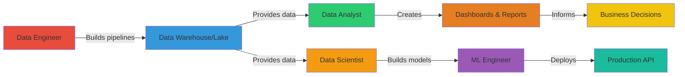
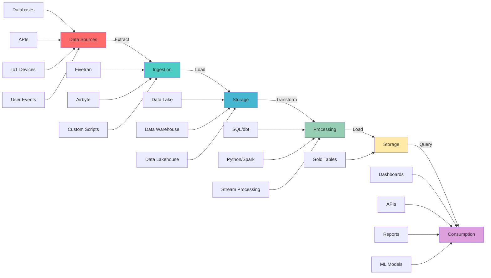
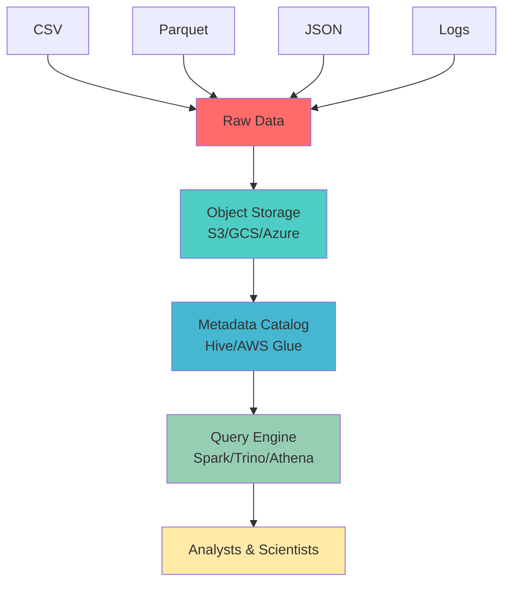
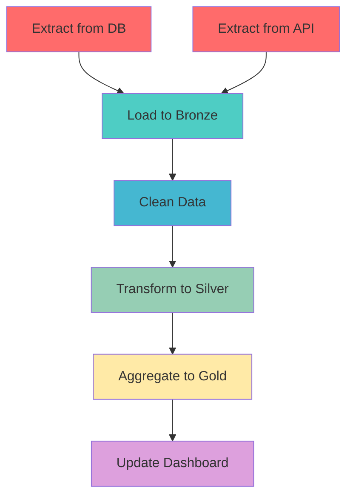

# Data Tools Landscape for Developers - Comprehensive Guide

**📚 Tutorial Series | Intermediate Level**  
**⏱️ Estimated Reading Time: 45-60 minutes**  
**📅 Last Updated: July 2026**

---

## Table of Contents

1. [Introduction](#introduction)
2. [Prerequisites](#prerequisites)
3. [Learning Objectives](#learning-objectives)
4. [Data Professions Explained](#data-professions-explained)
5. [The Data Lifecycle](#the-data-lifecycle)
6. [Data Storage Systems](#data-storage-systems)
7. [Data Ingestion](#data-ingestion)
8. [Data Processing](#data-processing)
9. [Data Observability](#data-observability)
10. [Data Consumption](#data-consumption)
11. [Data Governance](#data-governance)
12. [Practice Exercises](#practice-exercises)
13. [Test Your Understanding](#test-your-understanding)
14. [Common Interview Questions](#common-interview-questions)
15. [Question Bank](#question-bank)
16. [Best Practices](#best-practices)
17. [Anti-Patterns](#anti-patterns)
18. [Troubleshooting Guide](#troubleshooting-guide)
19. [Performance Considerations](#performance-considerations)
20. [Security Considerations](#security-considerations)
21. [Summary & Key Takeaways](#summary--key-takeaways)
22. [Further Reading](#further-reading)

---

## Introduction

Found yourself on a data project and have no idea what the data team is talking about? Feel excluded from discussions about ETL, data lakes, warehouses, and Spark? This comprehensive guide will bridge the gap between software engineering and data engineering, helping you understand the complete data landscape.

**💡 Why This Matters:** As a developer working with or around data teams, understanding the data ecosystem is crucial. Whether you're building features for a data product, integrating with data pipelines, or simply communicating with data engineers, this guide will give you the vocabulary and mental models you need.

**🎯 Real-World Scenario:** Imagine you're a backend developer at an e-commerce company. Your team needs to implement a new feature showing customers their purchase history analytics. To build this effectively, you need to understand:
- Where the data lives (warehouse vs. lake)
- How it's processed (batch vs. real-time)
- What tools to integrate with (BI tools, APIs)
- How to serve it efficiently (OLAP databases)

This guide will equip you with that knowledge.

---

## Prerequisites

Before diving into this guide, you should have:

- ✅ Basic understanding of databases (SQL, tables, queries)
- ✅ Familiarity with programming concepts (APIs, data structures)
- ✅ General knowledge of cloud computing (storage, compute)
- ✅ Understanding of basic data concepts (CSV, JSON, databases)
- ✅ Familiarity with software development workflows

**Nice to Have:**
- Experience with Python or similar scripting languages
- Basic understanding of ETL concepts
- Exposure to cloud platforms (AWS, GCP, Azure)

---

## Learning Objectives

By the end of this comprehensive guide, you will be able to:

- [ ] **Identify** different data professions and their roles
- [ ] **Explain** the complete data lifecycle from ingestion to consumption
- [ ] **Compare** data storage solutions (warehouses, lakes, lakehouses)
- [ ] **Understand** data processing approaches (batch, streaming, SQL)
- [ ] **Recognize** key tools in the data ecosystem
- [ ] **Describe** how data is consumed (dashboards, APIs, analytics)
- [ ] **Apply** best practices for data governance
- [ ] **Choose** appropriate tools for specific use cases
- [ ] **Communicate** effectively with data teams
- [ ] **Design** simple data pipelines

---

## Data Professions Explained

The data world has evolved specialized roles, each with distinct responsibilities and tool preferences.

### The Four Main Data Professions

**1. Analytical Type (Data Analyst / BI Analyst)**
- **Focus:** Interpreting data, deriving insights, creating visualizations
- **Skills:** SQL, spreadsheets, BI tools (Tableau, Power BI, Looker, Metabase)
- **Tasks:** Building dashboards, calculating metrics, presenting findings
- **Example:** Analyzing customer churn by region and creating retention dashboards

**2. Scientific Type (Data Scientist)**
- **Focus:** Statistics, modeling, experiments, predictions
- **Skills:** Python (pandas, scikit-learn), R, statistics, experimental design
- **Tasks:** Building predictive models, A/B testing, exploratory analysis
- **Example:** Building a churn prediction model and analyzing retention campaign effectiveness

**3. Engineering Type (Data Engineer)**
- **Focus:** Infrastructure, pipelines, data reliability
- **Skills:** Python/Scala/Java, Spark, Airflow, databases, cloud platforms
- **Tasks:** Building ETL pipelines, maintaining warehouses/lakes, optimizing queries
- **Example:** Maintaining data pipelines that ingest transactions and load them into BigQuery

**4. Machine Learning Type (ML Engineer)**
- **Focus:** Building and deploying AI/ML models
- **Skills:** Python, TensorFlow/PyTorch, ML algorithms, deployment
- **Tasks:** Training models, deploying to production, monitoring performance
- **Example:** Building a product recommendation system and deploying it as an API

### How Roles Collaborate



**Key Insight:** In smaller companies, one person may wear multiple hats. In larger organizations, these roles are more specialized but must collaborate closely.

---

## The Data Lifecycle

Data follows a journey from source to consumption. The two main patterns are ETL and ELT.

### ETL vs. ELT

**ETL (Extract-Transform-Load):**
```
Source → Extract → Transform → Load → Destination
```
- Transform happens before loading
- Traditional approach
- Less storage needed
- Less flexible

**ELT (Extract-Load-Transform):**
```
Source → Extract → Load → Transform → Destination
```
- Raw data loaded first, transformed later
- Modern cloud data standard
- Keeps raw data for reprocessing
- More storage but more flexible

**Comparison Table:**

| Aspect | ETL | ELT |
|--------|-----|-----|
| **Transformation timing** | Before load | After load |
| **Storage** | Minimal | More (raw + transformed) |
| **Flexibility** | Lower | Higher |
| **Modern usage** | Legacy | Cloud data stacks |
| **Cost** | Lower storage | Higher storage/compute |

**💡 Pro Tip:** ELT is preferred in modern stacks because cloud storage is cheap, and keeping raw data allows you to reprocess it differently when requirements change.

### The Complete Data Journey



---

## Data Storage Systems

Data needs a home. Different storage solutions optimize for different use cases.

### File Formats

**CSV:**
- **Best for:** Small datasets, human-readable, office software
- **Pros:** Universal support, easy to edit
- **Cons:** No schema, inefficient storage
- **Use case:** Sharing with non-technical users

**Apache Parquet:**
- **Best for:** Large-scale analytics
- **Pros:** Excellent compression, columnar storage, widely supported
- **Cons:** Not human-readable
- **Use case:** Data lake storage, data warehouse tables

**Apache ORC:**
- Similar to Parquet, optimized for Hive ecosystem
- High compression, efficient for Hive queries

**Apache Avro:**
- Row-oriented binary format
- Good for streaming and schema evolution
- Used in Kafka

**Comparison Table:**

| Format | Type | Storage | Compression | Best Use Case |
|--------|------|---------|-------------|---------------|
| CSV | Text | Row | None | Small data, human-readable |
| Parquet | Binary | Column | Excellent | Analytics, data lakes |
| ORC | Binary | Column | Excellent | Hive/Hadoop |
| Avro | Binary | Row | Good | Streaming, Kafka |

### Memory Formats

**Apache Arrow:**
- In-memory columnar format
- Zero-copy data transfers between tools
- Optimized for processing (CPU/GPU)
- De-facto standard for in-memory data exchange

**Parquet vs. Arrow:**

| Aspect | Parquet | Arrow |
|--------|---------|-------|
| **Location** | Disk/File | Memory |
| **Optimized for** | Storage & scanning | Processing |
| **Compression** | Excellent | None |
| **Use case** | Long-term storage | Active processing |

### Data Warehouse

**Definition:** Centralized repository optimized for analytical queries (OLAP)

**Key Characteristics:**
- Columnar storage (fast aggregations)
- Proprietary query engines
- Tightly coupled storage and compute
- Optimized for structured, cleaned data
- Excellent query performance

**When to Use:**
- ✅ Structured data with known schema
- ✅ Need fast query performance
- ✅ Business intelligence and reporting
- ✅ Historical data analysis
- ✅ Multiple concurrent users

**When NOT to Use:**
- ❌ Raw, unstructured data
- ❌ Very large datasets (cost prohibitive)
- ❌ Need schema flexibility
- ❌ Real-time streaming ingestion

**Popular Data Warehouses:**

| Warehouse | Type | Best For | Cost |
|-----------|------|----------|------|
| **Snowflake** | Cloud | Enterprise, multi-cloud | $$$ |
| **BigQuery** | Cloud | Serverless, petabyte-scale | $$$ |
| **Redshift** | Cloud | AWS ecosystem | $$$ |
| **ClickHouse** | Open-source | Real-time analytics | $ |
| **Apache Doris** | Open-source | Real-time OLAP | $ |
| **StarRocks** | Open-source | High performance | $ |

**Real-World Example:**
> An e-commerce company uses Snowflake with medallion architecture:
> - **Bronze:** Raw transaction data from PostgreSQL
> - **Silver:** Cleaned, standardized orders
> - **Gold:** Aggregated metrics (daily revenue, customer LTV)
> - Analysts query gold tables to build dashboards in Tableau

### Data Lake

**Definition:** Centralized repository storing raw data in native format

**Key Characteristics:**
- Stores structured, semi-structured, and unstructured data
- Built on cheap object storage (S3, GCS, Azure Blob)
- Schema-on-read
- Requires metadata catalog and query engine
- Risk of becoming a "data swamp"

**Architecture Components:**



**When to Use:**
- ✅ Store raw data for future processing
- ✅ Need to store diverse data types
- ✅ Cost-effective long-term storage
- ✅ Data science and exploration
- ✅ ML training data

**When NOT to Use:**
- ❌ Need fast, consistent query performance
- ❌ Require ACID transactions
- ❌ Strict schema enforcement needed
- ❌ Production applications

**Popular Solutions:**

| Component | Options |
|-----------|---------|
| **Storage** | Amazon S3, GCS, Azure Blob |
| **Metadata Catalog** | Hive Metastore, AWS Glue, Unity Catalog |
| **Query Engine** | Spark, Trino, Athena, Presto |
| **Managed** | Azure Data Lake, Snowflake Data Lake |

**⚠️ Warning: Data Swamp**
A data lake without governance becomes a swamp:
- No metadata or documentation
- Unknown data quality
- No access controls
- Inconsistent naming
- Impossible to find data

**Prevention:**
- Implement metadata catalog
- Enforce naming conventions
- Set up access controls
- Document data sources
- Regular quality checks

### Data Lakehouse

**Definition:** Combines best of data lakes and warehouses

**Key Features:**
- Built on data lake storage
- Adds table format for structure and ACID
- Schema evolution and versioning
- Time travel (query historical snapshots)
- Decouples storage from compute
- Multiple query engines supported

**Table Formats:**

| Format | Maintained By | Key Features |
|--------|---------------|--------------|
| **Apache Iceberg** | Apache | Open standard, time travel |
| **Delta Lake** | Databricks | ACID, time travel, unified batch/streaming |
| **Apache Hudi** | Apache | Incremental processing, record-level ops |

**When to Use:**
- ✅ Need flexibility of data lake
- ✅ Want ACID transactions
- ✅ Multiple query engines
- ✅ Cost-effective (cheaper than warehouse)
- ✅ Schema evolution required
- ✅ Both batch and streaming workloads

**When NOT to Use:**
- ❌ Need maximum query performance (use warehouse)
- ❌ Simple, structured data only (warehouse simpler)
- ❌ Strictly regulated environments needing mature tooling

**Real-World Example:**
> A startup uses Databricks (Delta Lake):
> - Store raw clickstream in S3
> - Transform with Spark
> - ACID guarantees for concurrent writes
> - Query with Spark, Trino, Redshift
> - Time travel for debugging
> - Cost: 60% less than Snowflake

**Cost Comparison:**

| Solution | Storage | Compute | Total | Best For |
|----------|---------|---------|-------|----------|
| Warehouse | High | High | $$$$ | Performance-critical |
| Lakehouse | Low | Separate | $$ | Balance cost/flexibility |
| Lake | Lowest | Separate | $ | Maximum flexibility |

---

## Data Ingestion

Getting data from sources into your storage system.

### Data Sources

**Databases:** PostgreSQL, MySQL, MongoDB - Extract transaction data, user records

**Third-Party APIs:** Stripe (payments), Salesforce (CRM), Google Analytics

**User Events:** Website analytics, mobile app events, real-time behavior

**IoT Devices:** Sensors, logs, metrics, high-volume data

### Ingestion Tools

**Why Use Them?**
Instead of custom scripts for each source:
- Pre-built connectors (100+ sources)
- Handle auth, pagination, errors
- Incremental sync
- Schema detection
- Monitoring and alerting

**Popular Tools:**

| Tool | Type | Best For | Open Source |
|------|------|----------|-------------|
| **Fivetran** | Managed | Enterprise, reliability | ❌ |
| **Airbyte** | Open-source + Cloud | Flexibility, cost | ✅ |
| **dlt** | Open-source | Python-native, extensible | ✅ |

### Change Data Capture (CDC)

**Definition:** Capturing database changes in real-time by reading transaction logs

**How It Works:**
1. Database writes to transaction log (WAL)
2. CDC tool reads the log
3. Captures inserts, updates, deletes
4. Streams to destination

**Benefits:**
- Real-time capture
- Efficient (no polling)
- Complete (captures deletes)
- Low impact on source

**Popular CDC Tools:**
- **Debezium:** Open-source, widely used
- **AWS DMS:** Managed service
- **Fivetran/Airbyte:** Built-in CDC

**Real-World Example:**
> E-commerce company uses Debezium:
> 1. Customer places order → PostgreSQL WAL
> 2. Debezium captures insert
> 3. Streams to Kafka topic `orders.created`
> 4. Downstream: warehouse (analytics), inventory (stock), notifications (email)

---

## Data Processing

Transforming raw data into useful information.

### Languages

**Python: The King of Data**
- Rich ecosystem (pandas, numpy, scikit-learn)
- Easy to learn
- Great for prototyping and production
- Bindings for almost every tool

**Essential Libraries:**

| Library | Purpose | Use Case |
|---------|---------|----------|
| **pandas** | DataFrames, manipulation | Analysis, transformation |
| **numpy** | Numerical computing | Math operations |
| **scikit-learn** | Machine learning | Model training |
| **polars** | Fast DataFrames | Large datasets |
| **pyspark** | Distributed processing | Big data |

**Other Languages:**

| Language | Best For | Ecosystem |
|----------|----------|-----------|
| **R** | Statistics, academia | CRAN packages |
| **Java/Scala** | Big data (Spark) | JVM ecosystem |
| **Julia** | High-performance computing | Scientific computing |
| **Rust** | Performance-critical | Growing ecosystem |

**SQL: Universal Query Language**
- Query warehouses (BigQuery, Snowflake)
- Transform data (dbt, SQLMesh)
- Query data lakes (Trino, Athena)
- Process DataFrames (DuckDB)

**⚠️ Important:** SQL dialects vary! BigQuery SQL ≠ PostgreSQL SQL ≠ Snowflake SQL

### Batch vs. Real-Time Processing

**Batch Processing:**
- Large chunks at regular intervals
- Scheduled (hourly, daily)
- Not time-sensitive
- Examples: Daily reports, monthly aggregations

**Real-Time Processing:**
- Immediate or small batches
- Continuous operation
- Time-sensitive
- Examples: Fraud detection, monitoring

**Comparison:**

| Aspect | Batch | Real-Time |
|--------|-------|-----------|
| **Latency** | Hours/days | Milliseconds |
| **Volume** | Large | Small/continuous |
| **Complexity** | Lower | Higher |
| **Cost** | Lower | Higher |
| **Use case** | Reports | Monitoring |

### SQL-Based Transformations

**Tools: dbt and SQLMesh**

Write SQL transformations that are:
- Version controlled
- Testable
- Documented
- Dependencies managed

**Example dbt Model:**
```sql
{{ 
  config(
    materialized='table',
    partition_by={'field': 'order_month', 'data_type': 'date'}
  )
}}

select
    date_trunc('month', o.order_date) as order_month,
    c.region,
    count(distinct o.order_id) as orders,
    sum(o.amount) as revenue,
    avg(o.amount) as avg_order_value
from {{ ref('stg_orders') }} as o
join {{ ref('stg_customers') }} as c
    on o.customer_id = c.customer_id
where o.status = 'completed'
group by 1, 2
```

**Benefits:**
- **Modularity:** Break complex transformations
- **Dependencies:** Automatic DAG creation
- **Testing:** Built-in data quality tests
- **Documentation:** Auto-generate docs
- **Version control:** Git-based workflow

### Local DataFrames

**DataFrames:** 2D data structures (like spreadsheets in code)

**pandas Example:**
```python
import pandas as pd

sales = pd.read_csv('sales.csv')

summary = (
    sales
    .assign(order_date=lambda df: pd.to_datetime(df['order_date']))
    .query("status == 'completed'")
    .groupby([pd.Grouper(key='order_date', freq='ME'), 'region'])
    .agg(
        orders=('order_id', 'nunique'),
        revenue=('revenue', 'sum'),
        avg_order_value=('revenue', 'mean')
    )
    .sort_values('revenue', ascending=False)
)

print(summary.head(10))
```

**Eager vs. Lazy:**

| Library | Evaluation | When to Use |
|---------|-----------|-------------|
| **pandas** | Eager (immediate) | Small data, interactive |
| **Polars** | Lazy (optimized) | Large data, performance |
| **DataFusion** | Lazy (optimized) | Distributed processing |

**DuckDB: SQLite for Analytics**
```python
import duckdb

result = duckdb.sql("""
    SELECT 
        region,
        COUNT(*) as orders,
        SUM(revenue) as total_revenue
    FROM 'sales.parquet'
    WHERE status = 'completed'
    GROUP BY region
    ORDER BY total_revenue DESC
""")
```

**When to Use:**
- ✅ Exploratory data analysis
- ✅ Small to medium datasets (< 10GB)
- ✅ Quick prototyping
- ✅ Interactive notebooks

**Limitations:**
- ❌ Limited by local RAM/CPU
- ❌ Not for very large datasets
- ❌ No distributed processing

### Large-Scale Distributed Processing

**When Data Outgrows a Single Machine**

**Apache Spark:**
```python
from pyspark.sql import SparkSession
import pyspark.sql.functions as F

spark = SparkSession.builder \
    .appName("monthly-revenue") \
    .getOrCreate()

orders = spark.read.parquet("s3://my-lake/silver/orders/")
customers = spark.read.parquet("s3://my-lake/silver/customers/")

summary = (
    orders
    .filter(F.col("status") == "completed")
    .join(customers, "customer_id")
    .groupBy(
        F.date_trunc("month", "order_date").alias("order_month"),
        "region"
    )
    .agg(
        F.countDistinct("order_id").alias("orders"),
        F.sum("amount").alias("revenue")
    )
)

summary.write \
    .mode("overwrite") \
    .parquet("s3://my-lake/gold/monthly_revenue/")
```

**Other Tools:**

| Tool | Best For | Language |
|------|----------|----------|
| **Apache Spark** | General-purpose, large-scale | Python, Scala, Java, R |
| **Dask** | Python-native, pandas-like | Python |
| **Ray** | ML workloads | Python |
| **Apache Flink** | Stream processing | Java, Scala, Python |

**When to Use:**
- ✅ Dataset > 100GB
- ✅ Need horizontal scaling
- ✅ Complex parallel transformations
- ✅ Production data pipelines

### Stream Processing

**Processing Data in Real-Time**

**Apache Kafka:**
- Distributed event streaming platform
- Events remain in log (not discarded)
- Highly scalable and fault-tolerant
- Multiple consumers can read same event

**Kafka Ecosystem:**
- **Kafka:** Event streaming platform
- **Kafka Connect:** Integration with external systems
- **Kafka Streams:** Stream processing library (Java/Scala)
- **ksqlDB:** SQL-like stream processing

**Stream Processing Tools:**

| Tool | Best For | Language |
|------|----------|----------|
| **Apache Flink** | Advanced stream processing | Java, Scala, Python |
| **Spark Structured Streaming** | Unified batch/streaming | Python, Scala |
| **Google Cloud Dataflow** | Managed service | Java, Python |
| **Azure Stream Analytics** | Azure ecosystem | SQL-like |

**Use Cases:**
- ✅ Fraud detection
- ✅ Real-time monitoring
- ✅ Live dashboards
- ✅ IoT data processing
- ✅ Real-time personalization

### Orchestration

**Managing Complex Data Pipelines**

**What It Does:**
- Coordinate multiple data tasks
- Manage dependencies
- Schedule execution
- Handle failures and retries
- Monitor pipeline health

**Directed Acyclic Graph (DAG):**


**Popular Orchestrators:**

| Tool | Best For | Language | Cloud Native |
|------|----------|----------|--------------|
| **Apache Airflow** | Most popular, vast ecosystem | Python | ❌ |
| **Dagster** | Modern, data-aware | Python | ✅ |
| **Prefect** | Modern, Pythonic | Python | ✅ |
| **Luigi** | Legacy, simple | Python | ❌ |

**Example Airflow DAG:**
```python
from airflow import DAG
from airflow.operators.python import PythonOperator
from datetime import datetime

def extract_data():
    # Extract from source
    pass

def transform_data():
    # Transform with dbt
    pass

def load_to_warehouse():
    # Load to BigQuery
    pass

with DAG(
    'etl_pipeline',
    start_date=datetime(2024, 1, 1),
    schedule_interval='@daily',
    catchup=False
) as dag:
    
    extract = PythonOperator(task_id='extract', python_callable=extract_data)
    transform = PythonOperator(task_id='transform', python_callable=transform_data)
    load = PythonOperator(task_id='load', python_callable=load_to_warehouse)
    
    extract >> transform >> load
```

---

## Data Observability

Monitoring and ensuring data quality.

### Pipeline Monitoring

**What to Monitor:**
- Did the job run successfully?
- How long did it take?
- Did it fail? Why?
- Resource usage (CPU, memory)
- Data freshness

**Tools:**
- **Prometheus + Grafana:** Metrics and dashboards
- **ELK Stack:** Logging and analysis
- **Airflow UI:** Built-in monitoring
- **PagerDuty/OpsGenie:** Alerting

### Data Quality Monitoring

**Manual Approaches:**

**Great Expectations:**
```python
import great_expectations as gx

validator.expect_column_values_to_not_be_null("user_id")
validator.expect_column_values_to_be_unique("order_id")
validator.expect_column_values_to_be_between("amount", 0, 10000)

results = validator.validate()
```

**dbt Tests:**
```sql
-- tests/unique_order_id.sql
select order_id, count(*) as cnt
from {{ ref('orders') }}
group by order_id
having count(*) > 1
```

**Automated Approaches:**

| Tool | Approach | Best For |
|------|----------|----------|
| **Monte Carlo** | ML-based anomaly detection | Enterprise |
| **Bigeye** | Automated data observability | Mid-market |
| **Metaplane** | Modern data observability | Startups to mid-market |

**What They Monitor:**
- **Freshness:** Is data up-to-date?
- **Volume:** Unexpected changes in row counts
- **Schema:** Unexpected schema changes
- **Distribution:** Anomalies in data patterns
- **Lineage:** Impact analysis

---

## Data Consumption

Finally, using the data!

### Dashboards and Reports

**Business Intelligence (BI) Tools:**

| Tool | Best For | Learning Curve | Cost |
|------|----------|----------------|------|
| **Tableau** | Powerful visualizations, enterprise | Medium | $$$ |
| **Power BI** | Microsoft ecosystem | Low | $$ |
| **Looker** | Technical teams, semantic layer | High | $$$ |
| **Metabase** | Quick setup, self-hosted | Low | Free-$ |

**Key Features:**
- Self-service analytics
- Wide variety of chart types
- Scheduled reports (email/Slack)
- Alerting on thresholds
- Interactive dashboards

**Real-World Example:**
> Marketing team uses Metabase to track campaign performance, monitor conversion rates, analyze customer segments, schedule weekly reports to Slack, and set alerts when conversion drops.

### Operational Analytics

**Definition:** Bringing data into operational tools for day-to-day work

**Examples:**
- **Sales:** Customer LTV synced to HubSpot for upselling
- **Support:** Customer order history in Zendesk
- **Success:** Product adoption metrics in internal tools

**Implementation:**
```python
# Reverse ETL: Warehouse → Operational Tool
# Using Hightouch

source:
  connector: bigquery
  query: |
    select 
      customer_id,
      lifetime_value,
      last_purchase_date
    from analytics.customer_metrics

destination:
  connector: hubspot
  object: contacts
  mappings:
    - source: customer_id
      destination: customer_id
    - source: lifetime_value
      destination: ltv_custom_field
```

### Ad-Hoc and Exploratory Analysis

**When You Need Answers, Not Dashboards**

**Tools:**
- **Jupyter Notebooks:** Interactive code + markdown
- **Google Colab:** Cloud-based Jupyter
- **Deepnote:** Collaborative notebooks
- **IDE + Scripts:** VS Code, PyCharm

**Notebook Example:**
```python
# Cell 1: Import
import pandas as pd
import matplotlib.pyplot as plt

# Cell 2: Load
df = pd.read_parquet('s3://lake/silver/events/')

# Cell 3: Explore
print(df.head())
print(df.describe())

# Cell 4: Analyze
conversion_by_source = df.groupby('traffic_source')['converted'].mean()

# Cell 5: Visualize
conversion_by_source.plot(kind='bar')
plt.title('Conversion Rate by Traffic Source')
plt.ylabel('Conversion Rate')
plt.show()
```

### ML-Related Use Cases

**Feature Stores:**
- Centralized repository for ML features
- Ensures consistency between training and serving
- Examples: Tecton, Feast, Databricks Feature Store

**ML Pipeline:**
```python
# 1. Extract features from warehouse
# 2. Train model
# 3. Deploy as API
# 4. Monitor predictions
# 5. Retrain periodically
```

### Embedded Analytics

**Definition:** Integrating analytics directly into your application

**Use Case:**
> A marketplace platform lets sellers view:
> - Best-selling products
> - Customer demographics
> - Search query performance

**Tools:**
- **BI tools:** Metabase, Looker, Tableau (can be embedded)
- **Embed-first:** Sisense, Luzmo

**Implementation:**
- Your app handles auth
- Embedded analytics handles querying and rendering
- Various UI customization levels

### Data as a Product

**Definition:** Data itself is the product you sell

**Examples:**
- Bloomberg Terminal (financial data)
- Crypto blockchain analytics
- SEO data (search results scraping)
- Market intelligence platforms

**Requirements:**
- Robust ingestion pipelines
- Performant querying
- High reliability
- Timely updates

---

## Data Governance

Managing data access, quality, and compliance.

**What It Covers:**
- Who can access what data
- Tracking data access
- Data ownership
- Privacy concerns (right-to-be-forgotten)
- Physical data location
- Data retention policies

**Technical Enablers:**
- **Access controls:** Warehouse-level RBAC
- **Data catalog:** Ownership info, documentation
- **Lineage:** Track PII usage
- **Audit logs:** Who accessed what when

**Key Insight:** Data governance is more about people and processes than technology. It sits close to legal/compliance/security teams.

---

## Practice Exercises

### Exercise 1: Design a Data Pipeline

**Scenario:** You're building an analytics system for a SaaS company. Design a complete data pipeline from ingestion to consumption.

**Requirements:**
- Ingest data from: PostgreSQL (transactions), Stripe (payments), Mixpanel (product analytics)
- Store raw data for 2 years
- Build daily active users (DAU) metric
- Create a dashboard for the product team
- Alert when DAU drops by > 20%

**Solution:**

```python
# 1. Ingestion Layer
# Use Airbyte to ingest:
# - PostgreSQL → Bronze.transactions (CDC)
# - Stripe → Bronze.payments (hourly sync)
# - Mixpanel → Bronze.events (real-time streaming)

# 2. Storage: Data Lakehouse (Delta Lake on S3)
# Bronze layer: Raw data
# Silver layer: Cleaned, standardized
# Gold layer: Aggregated metrics

# 3. Transformations (dbt)
# models/silver/clean_events.sql
select
    user_id,
    event_name,
    timestamp,
    properties
from {{ ref('bronze_events') }}
where timestamp is not null

# models/gold/dau.sql
{{ 
  config(
    materialized='table',
    partition_by={'field': 'date', 'data_type': 'date'}
  )
}}

select
    date(timestamp) as date,
    count(distinct user_id) as dau
from {{ ref('silver_events') }}
where event_name = 'app_open'
group by 1

# 4. Orchestration (Airflow)
with DAG('saas_analytics', schedule_interval='@daily') as dag:
    ingest = AirbyteTriggerOperator(task_id='ingest')
    transform = DbtOperator(task_id='transform', select='gold/dau')
    alert = PythonOperator(task_id='alert', python_callable=check_dau)
    
    ingest >> transform >> alert

# 5. Consumption
# - Metabase dashboard showing DAU trend
# - Alert: if dau < (prev_dau * 0.8), send Slack alert

# 6. Monitoring
# - Monitor Airflow task success/failure
# - Monitor data freshness (should update daily)
# - Monitor DAU distribution for anomalies
```

**Key Decisions:**
- **Lakehouse chosen** for cost-effectiveness and flexibility
- **CDC for PostgreSQL** to capture all transaction changes
- **dbt for transformations** for version control and testing
- **Airflow for orchestration** to manage dependencies
- **Metabase** for self-service analytics

### Exercise 2: Choose the Right Storage

**Scenario:** For each use case, recommend the best storage solution (Warehouse, Lake, or Lakehouse) and justify your choice.

**Use Cases:**

**A. E-commerce company storing 5 years of transaction history for regulatory compliance**
- **Recommendation:** Data Warehouse
- **Justification:** Structured data, need fast queries for audits, ACID guarantees, mature tooling for compliance
- **Alternative:** Lakehouse if cost is concern and can accept slightly slower queries

**B. Media company storing user video watch history (100TB+) for recommendation algorithm**
- **Recommendation:** Data Lakehouse
- **Justification:** Large volume (cost-effective), need both batch (training) and streaming (real-time recommendations), schema evolution as tracking changes
- **Alternative:** Data Lake if budget constrained, but lose ACID and query performance

**C. Startup with 10GB of user data needing quick analytics**
- **Recommendation:** Data Warehouse (BigQuery/Snowflake)
- **Justification:** Small data, simplicity prioritized, fast setup, pay-per-query means low cost at this scale
- **Alternative:** Could use DuckDB locally for prototyping

**D. IoT platform ingesting sensor data from 1M devices**
- **Recommendation:** Data Lake + Stream Processing
- **Justification:** High-volume streaming data, raw data retention, cost-effective storage, process with Flink/Kafka
- **Alternative:** Lakehouse if need to query processed data frequently

**E. Healthcare company storing patient records (PHI)**
- **Recommendation:** Data Warehouse with strict governance
- **Justification:** Structured data, need ACID, strict access controls, audit trails, compliance (HIPAA)
- **Alternative:** Lakehouse if need to store unstructured data (images, PDFs) alongside structured

### Exercise 3: Optimize a Slow Query

**Scenario:** An analyst complains that this query takes 30 minutes to run on a 100M row table:

```sql
select 
    user_id,
    count(*) as event_count,
    sum(case when event_type = 'purchase' then 1 else 0 end) as purchases
from events
where date >= '2024-01-01'
group by user_id
having count(*) > 100
```

**Current Table Structure:**
- Table: `events` (100M rows)
- Columns: `id`, `user_id`, `event_type`, `date`, `timestamp`, `properties`
- No indexes
- Data stored in data warehouse (Snowflake)

**Optimized Solution:**

```sql
-- Solution 1: Partitioning (if not already done)
-- Create table with partition on date
create or replace table events_optimized as
select * from events
where date >= '2023-01-01'  -- Keep 2 years

-- Solution 2: Clustering (Snowflake-specific)
create or replace table events_clustered
cluster by (user_id, date)
as select * from events_optimized

-- Solution 3: Materialized view for common query
create or replace materialized view mv_user_activity as
select
    user_id,
    date,
    count(*) as event_count,
    count_if(event_type = 'purchase') as purchases
from events
group by 1, 2

-- Now query the materialized view (much faster)
select 
    user_id,
    sum(event_count) as total_events,
    sum(purchases) as total_purchases
from mv_user_activity
where date >= '2024-01-01'
group by user_id
having sum(event_count) > 100

-- Solution 4: If using dbt, create aggregated table
{{ 
  config(
    materialized='table',
    cluster_by=['user_id', 'date']
  )
}}

select
    user_id,
    date,
    count(*) as event_count,
    count_if(event_type = 'purchase') as purchases
from {{ ref('events') }}
group by 1, 2
```

**Performance Improvements:**
- **Partitioning:** Reduces data scanned (only 2024+)
- **Clustering:** Physically orders data by user_id and date
- **Materialized view:** Pre-aggregates common queries
- **Result:** Query time from 30 minutes → < 1 minute

**Additional Optimizations:**
- Add `user_id` and `date` as clustering keys
- Use approximate aggregation if exact counts not needed
- Consider using a summary table for high-cardinality dimensions

---

## Test Your Understanding

Test your knowledge with these questions!

### Questions

1. **What are the four main data professions and their primary focuses?**

2. **Explain the difference between ETL and ELT. When would you use each?**

3. **What is a data lake and how does it differ from a data warehouse?**

4. **What is Change Data Capture (CDC) and why is it useful?**

5. **Compare batch processing vs. stream processing. Give examples of each.**

6. **What is the medallion architecture (bronze, silver, gold)?**

7. **Explain the difference between Parquet and Arrow formats.**

8. **What is a data lakehouse and what problem does it solve?**

9. **What is the purpose of an orchestrator in data pipelines?**

10. **What is data observability and why does it matter?**

11. **Compare pandas (eager) vs. Polars (lazy) evaluation.**

12. **What is operational analytics and how does reverse ETL enable it?**

13. **Explain the concept of data lineage and its uses.**

14. **What is a semantic layer and why is it important?**

15. **Compare data catalog vs. metadata catalog.**

16. **When would you use Apache Spark vs. pandas?**

17. **What is Apache Kafka and how does it differ from traditional message queues?**

18. **Explain the concept of schema evolution in data lakes/lakehouses.**

19. **What are fact tables and dimension tables in dimensional modeling?**

20. **What is data governance and who should be involved?**

---

## Common Interview Questions

Prepare for data engineering interviews with these common questions.

### Questions

1. **Design a data pipeline for a real-time analytics dashboard**

2. **How would you handle late-arriving data in a streaming pipeline?**

3. **What's the difference between a data lake and a data warehouse?**

4. **How do you ensure data quality in a data pipeline?**

5. **Explain the CAP theorem in the context of distributed data systems**

6. **What is idempotency and why is it important in data pipelines?**

7. **How would you debug a failing Airflow DAG?**

8. **What is the difference between inner join, left join, and full outer join?**

9. **Explain ACID properties in databases**

10. **What is data partitioning and why does it matter?**

11. **How do you handle schema changes in production data pipelines?**

12. **What is the difference between OLTP and OLAP systems?**

13. **Explain the concept of data modeling and why it's important**

14. **What are indexes and how do they improve query performance?**

15. **How would you design a system to track user behavior across a website?**

16. **What is the medallion architecture and when would you use it?**

17. **Explain the difference between batch processing and stream processing**

18. **What is a star schema vs. a snowflake schema?**

19. **How do you handle PII (Personally Identifiable Information) in data pipelines?**

20. **What is data lineage and how do you implement it?**

---

## Question Bank

Test your comprehensive understanding with these 50+ questions.

### Beginner Questions (1-20)

1. What does ETL stand for?
2. What is a data warehouse?
3. What is SQL used for?
4. What is a DataFrame?
5. What is Apache Parquet?
6. What is a dashboard in the context of data?
7. What is a data pipeline?
8. What is batch processing?
9. What is a metadata catalog?
10. What is data governance?
11. What is an OLTP database?
12. What is an OLAP database?
13. What is CSV?
14. What is Apache Kafka used for?
15. What is dbt?
16. What is data ingestion?
17. What is a fact table?
18. What is a dimension table?
19. What is data lineage?
20. What is a data swamp?

### Intermediate Questions (21-40)

21. Explain the difference between ETL and ELT
22. What is a data lakehouse and how does it differ from a data lake?
23. What is Change Data Capture (CDC)?
24. Compare and contrast batch vs. stream processing
25. What is the medallion architecture?
26. Explain the difference between Parquet and Arrow
27. What is a semantic layer?
28. What is operational analytics?
29. Explain eager vs. lazy evaluation in DataFrames
30. What is data observability?
31. What is Apache Spark and when would you use it?
32. What is the difference between a data catalog and a metadata catalog?
33. Explain the concept of schema evolution
34. What is reverse ETL?
35. What are the four main data professions?
36. What is dimensional modeling?
37. What is a star schema?
38. What is data quality monitoring?
39. What is an orchestrator in data pipelines?
40. What is time travel in data lakehouses?

### Advanced Questions (41-50+)

41. Design a real-time fraud detection system using stream processing
42. How would you architect a data platform for a 1TB/day e-commerce company?
43. Explain the trade-offs between Snowflake, BigQuery, and Redshift
44. How do you ensure exactly-once processing in distributed streaming?
45. What is the Lambda architecture and when would you use it?
46. How do you handle backfill in a data pipeline?
47. Explain the concept of data mesh and how it relates to data lakes
48. What are the ACID properties and why are they important in data lakehouses?
49. How would you optimize a slow-running data transformation?
50. What is the difference between table-level and column-level lineage?
51. Explain the concept of data as a product
52. How do you implement data governance in a large organization?
53. What is the Kappa architecture and how does it differ from Lambda?
54. How do you handle data skew in distributed processing?
55. What is feature store and why is it important for ML?

---

## Best Practices

### Data Storage

✅ **DO:**
- Use columnar formats (Parquet) for analytics
- Partition data by date or commonly filtered columns
- Implement lifecycle policies (archive/delete old data)
- Use appropriate storage for use case (warehouse vs. lake)
- Enforce schema validation
- Version your schemas

❌ **DON'T:**
- Store raw data in warehouses (use lake/lakehouse)
- Use CSV for large-scale analytics
- Ignore data compression
- Mix different data domains in same tables
- Skip data quality checks

### Data Processing

✅ **DO:**
- Use version control for all transformations
- Write idempotent transformations
- Test data quality (dbt tests, Great Expectations)
- Document transformations
- Monitor pipeline performance
- Implement error handling and retries

❌ **DON'T:**
- Write one-off scripts without version control
- Skip data validation
- Hardcode table names
- Ignore data lineage
- Process data without monitoring

### Data Governance

✅ **DO:**
- Implement access controls
- Document data sources and ownership
- Track data lineage
- Classify sensitive data (PII)
- Regular audits
- Train team on data policies

❌ **DON'T:**
- Give everyone admin access
- Store credentials in code
- Ignore compliance requirements
- Skip data retention policies
- Forget about data deletion (right-to-be-forgotten)

### Pipeline Design

✅ **DO:**
- Make pipelines idempotent
- Implement monitoring and alerting
- Use orchestration tools
- Design for failure (retries, fallbacks)
- Keep transformations modular
- Test pipelines before deploying

❌ **DON'T:**
- Create circular dependencies
- Skip error handling
- Hardcode schedules
- Ignore backfills
- Deploy without testing

---

## Anti-Patterns

### 1. Data Swamp

**Problem:** Data lake without governance becomes unmanageable

**Symptoms:**
- Can't find relevant data
- Unknown data quality
- No documentation
- Inconsistent naming

**Solution:**
- Implement metadata catalog
- Enforce naming conventions
- Set up access controls
- Regular data quality checks

### 2. God Pipeline

**Problem:** One massive pipeline doing everything

**Symptoms:**
- 10,000 line transformation script
- Multiple responsibilities
- Impossible to debug
- Takes hours to run

**Solution:**
- Break into smaller, focused pipelines
- Use medallion architecture
- Implement orchestration
- Single responsibility principle

### 3. Hardcoded Everything

**Problem:** Hardcoding table names, dates, credentials

**Symptoms:**
- `select * from prod_table_2024`
- Credentials in code
- Can't reuse across environments

**Solution:**
- Use configuration management
- Environment variables for secrets
- Parameterize transformations
- Use ref() functions (dbt)

### 4. No Data Validation

**Problem:** Assuming data is always correct

**Symptoms:**
- Dashboards showing wrong numbers
- Production incidents from bad data
- No alerts on data issues

**Solution:**
- Implement data quality tests
- Monitor data freshness
- Alert on anomalies
- Validate at every stage

### 5. Premature Optimization

**Problem:** Over-engineering before understanding requirements

**Symptoms:**
- Building complex streaming for simple batch needs
- Using Spark for 1GB of data
- Micro-optimizing before measuring

**Solution:**
- Start simple (batch, pandas)
- Measure before optimizing
- Scale when needed
- Right tool for the job

---

## Troubleshooting Guide

### Common Issues and Solutions

**Issue 1: Slow Queries**

**Symptoms:** Queries taking minutes instead of seconds

**Solutions:**
- ✅ Add partitioning on date columns
- ✅ Cluster on frequently filtered columns
- ✅ Use materialized views for common aggregations
- ✅ Check for missing indexes
- ✅ Optimize JOINs (filter early)
- ✅ Use approximate aggregation if exact counts not needed

**Issue 2: Pipeline Failures**

**Symptoms:** Airflow tasks failing, data not updating

**Solutions:**
- ✅ Check logs for error messages
- ✅ Verify source system availability
- ✅ Check for schema changes
- ✅ Validate credentials
- ✅ Monitor resource usage (memory, CPU)
- ✅ Implement retries with backoff

**Issue 3: Data Quality Issues**

**Symptoms:** Wrong numbers in dashboards, missing data

**Solutions:**
- ✅ Run data quality tests
- ✅ Check for null values in required fields
- ✅ Validate data types
- ✅ Check for duplicates
- ✅ Verify source data quality
- ✅ Implement data validation at ingestion

**Issue 4: Out of Memory Errors**

**Symptoms:** Pandas/Spark jobs crashing with OOM

**Solutions:**
- ✅ Process data in chunks
- ✅ Use lazy evaluation (Polars, Spark)
- ✅ Increase executor memory (Spark)
- ✅ Filter data early
- ✅ Use disk-based processing
- ✅ Consider distributed processing

**Issue 5: Schema Evolution Issues**

**Symptoms:** Pipelines breaking when schema changes

**Solutions:**
- ✅ Use schema-on-read (Parquet, Avro)
- ✅ Implement schema validation
- ✅ Handle missing columns gracefully
- ✅ Version schemas
- ✅ Test schema changes before deploying

---

## Performance Considerations

### Query Optimization

**1. Partitioning:**
```sql
-- Partition by date for time-series data
create table events (
    user_id int,
    event_type string,
    timestamp timestamp
)
partition by date(timestamp)
```

**2. Clustering:**
```sql
-- Cluster by frequently filtered columns
cluster by (user_id, event_type)
```

**3. Materialized Views:**
```sql
-- Pre-compute common aggregations
create materialized view daily_metrics as
select
    date(timestamp) as date,
    count(*) as events,
    count(distinct user_id) as users
from events
group by 1
```

### Processing Optimization

**1. Filter Early:**
```python
# ❌ Bad: Process all data, then filter
df = spark.read.parquet("s3://data/")
filtered = df.filter(df.date >= '2024-01-01')
result = filtered.groupBy("user_id").count()

# ✅ Good: Filter during read
df = spark.read.parquet("s3://data/").filter("date >= '2024-01-01'")
result = df.groupBy("user_id").count()
```

**2. Use Appropriate Data Formats:**
- Parquet for analytics (columnar, compressed)
- Avoid CSV for large datasets
- Use compression (snappy, gzip)

**3. Lazy Evaluation:**
```python
# Polars (lazy) - optimizes before execution
import polars as pl

q = (
    pl.scan_parquet("s3://data/")
    .filter(pl.col("date") >= "2024-01-01")
    .group_by("user_id")
    .agg(pl.count())
)

# Only executes when you call .collect()
result = q.collect()
```

### Cost Optimization

**1. Storage Tiering:**
- Hot storage (SSD): Recent data (last 30 days)
- Warm storage (HDD): Last 6 months
- Cold storage (S3 Glacier): Older data

**2. Compute Separation:**
- Use lakehouse to separate storage and compute
- Scale compute independently
- Shut down when not in use

**3. Query Optimization:**
- Use materialized views
- Cache frequently accessed data
- Avoid SELECT *
- Use approximate functions when exact counts not needed

---

## Security Considerations

### Data Protection

**1. Encryption:**
- ✅ Encrypt data at rest (AES-256)
- ✅ Encrypt data in transit (TLS/SSL)
- ✅ Use cloud provider encryption
- ✅ Manage encryption keys properly

**2. Access Control:**
- ✅ Implement least privilege principle
- ✅ Use role-based access control (RBAC)
- ✅ Audit access logs
- ✅ Rotate credentials regularly
- ✅ Use service accounts (not personal accounts)

**3. PII Protection:**
- ✅ Identify PII data (names, emails, SSNs)
- ✅ Mask or tokenize PII
- ✅ Implement data retention policies
- ✅ Support right-to-be-forgotten
- ✅ Track PII lineage

### Compliance

**1. Regulations:**
- **GDPR:** EU data protection
- **CCPA:** California privacy
- **HIPAA:** Healthcare data
- **SOC 2:** Security controls

**2. Implementation:**
- ✅ Data classification
- ✅ Access auditing
- ✅ Data retention policies
- ✅ Incident response plan
- ✅ Regular security assessments

### Secure Pipeline Design

**1. Secrets Management:**
```python
# ❌ Bad: Hardcoded credentials
password = "my_password"

# ✅ Good: Environment variables
import os
password = os.getenv("DB_PASSWORD")

# ✅ Better: Secrets manager
import boto3
ssm = boto3.client('ssm')
password = ssm.get_parameter(Name='/db/password', WithDecryption=True)
```

**2. Network Security:**
- ✅ Use private networks (VPCs)
- ✅ Implement firewall rules
- ✅ Use VPN for remote access
- ✅ Enable audit logging

---

## Summary & Key Takeaways

### 🎯 Core Concepts

1. **Data Professions:** Four main roles (Analytical, Scientific, Engineering, ML) with distinct focuses and tools

2. **Data Lifecycle:** ETL/ELT patterns - Extract from sources, Transform, Load to storage

3. **Storage Systems:**
   - **Warehouse:** Structured data, fast queries, expensive
   - **Lake:** Raw data, flexible, cheap, needs governance
   - **Lakehouse:** Best of both, ACID, cost-effective

4. **Processing:**
   - **Batch:** Scheduled, large volumes, not time-sensitive
   - **Streaming:** Real-time, continuous, time-sensitive
   - **SQL:** dbt/SQLMesh for transformations
   - **DataFrames:** pandas/Polars for local processing
   - **Distributed:** Spark for large-scale

5. **Consumption:** Dashboards, APIs, operational analytics, ML

6. **Governance:** Access control, lineage, quality, compliance

### 💡 Key Insights

- **ELT > ETL** for modern cloud data stacks
- **Lakehouse** is the sweet spot for most use cases
- **Orchestration** is essential for complex pipelines
- **Data quality** must be monitored continuously
- **Governance** is people + process + technology
- **Right tool for the job** - don't over-engineer

### 🚀 Next Steps

1. **Pick a tool to explore deeper** (dbt, Spark, or a warehouse)
2. **Build a small project** - ingest, transform, visualize
3. **Learn SQL thoroughly** - it's universal
4. **Understand your company's data stack**
5. **Practice with public datasets**

---

## Further Reading

### Official Documentation

- **dbt:** https://docs.getdbt.com/
- **Apache Spark:** https://spark.apache.org/docs/latest/
- **Apache Kafka:** https://kafka.apache.org/documentation/
- **Apache Airflow:** https://airflow.apache.org/docs/
- **Snowflake:** https://docs.snowflake.com/
- **BigQuery:** https://cloud.google.com/bigquery/docs
- **Databricks:** https://docs.databricks.com/

### Books

- "The Data Warehouse Toolkit" by Ralph Kimball
- "Designing Data-Intensive Applications" by Martin Kleppmann
- "Fundamentals of Data Engineering" by Joe Reis & Matt Housley
- "Data Mesh" by Zhamak Dehghani

### Online Resources

- **Blogs:** OlegWock (sinja.io), Data Engineering Weekly
- **Courses:** DataCamp, Coursera (Data Engineering)
- **Communities:** r/dataengineering, Data Engineering Slack
- **Conferences:** Data Council, DataEngConf

### Tools to Explore

- **Ingestion:** Fivetran, Airbyte, dlt
- **Processing:** dbt, Spark, Flink, Pandas, Polars
- **Storage:** Snowflake, BigQuery, Redshift, ClickHouse, Iceberg, Delta Lake
- **Orchestration:** Airflow, Dagster, Prefect
- **Monitoring:** Monte Carlo, Great Expectations, dbt tests
- **BI:** Tableau, Power BI, Looker, Metabase

---

## Conclusion

You now have a comprehensive understanding of the data tools landscape! You can:
- Communicate effectively with data teams
- Understand where tools fit in the data lifecycle
- Make informed decisions about data architecture
- Design simple data pipelines
- Continue learning with direction

**Remember:** The data ecosystem is vast and constantly evolving. Focus on fundamentals, stay curious, and build projects to reinforce your learning.

**🎉 Congratulations on completing this comprehensive guide!**

---

**📝 Feedback:** Found this helpful? Have suggestions? Reach out at oleh@sinja.io

**🔄 Stay Updated:** Subscribe to RSS feed for new articles on data engineering and software development.

**⭐ Pro Tip:** The best way to learn is by doing. Start with a small project using public data (Kaggle, data.gov) and build a complete pipeline from ingestion to visualization.

---

*Last Updated: July 2026 | Version 1.0*