# Java Concurrency Mastery: A Complete Tutorial from Fundamentals to Production Patterns

> **Difficulty:** Intermediate | **Estimated Reading Time:** 45–60 minutes | **Last Updated:** 2026-08-15
>
> **Prerequisites:** Basic Java syntax, familiarity with classes and methods, JDK 11+ (JDK 17+ recommended for modern features)

---

## Table of Contents

1. [Introduction: Why Concurrency Bugs Are So Dangerous](#introduction)
2. [Prerequisites](#prerequisites)
3. [Learning Objectives](#learning-objectives)
4. [Concurrency](#1-concurrency)
5. [Concurrency vs Parallelism](#2-concurrency-vs-parallelism)
6. [Processes vs Threads](#3-processes-vs-threads)
7. [Thread Lifecycle](#4-thread-lifecycle)
8. [Race Conditions](#5-race-condition)
9. [Mutex](#6-mutex)
10. [Semaphore](#7-semaphore)
11. [Condition Variables](#8-condition-variables)
12. [Lock Granularity: Coarse vs Fine-Grained](#9-coarse-grained-lock-vs-fine-grained-lock)
13. [Reentrant Locks](#10-reentrant-lock)
14. [Production Patterns & Real-World Systems](#production-patterns)
15. [Best Practices](#best-practices)
16. [Anti-Patterns](#anti-patterns)
17. [Performance Considerations](#performance-considerations)
18. [Security Considerations](#security-considerations)
19. [Testing Strategies](#testing-strategies)
20. [Troubleshooting Guide](#troubleshooting-guide)
21. [Common Pitfalls Cheat Sheet](#pitfalls-cheat-sheet)
22. [Practice Exercises](#practice-exercises)
23. [Question Bank](#question-bank)
24. [Test Your Understanding](#test-your-understanding)
25. [Common Interview Questions](#common-interview-questions)
26. [Self-Assessment Checklist](#self-assessment-checklist)
27. [Hands-On Lab: Thread-Safe Order Processing System](#hands-on-lab)
28. [Pro Tips](#pro-tips)
29. [Summary / Key Takeaways](#summary)
30. [Further Reading / Resources](#further-reading)

---

<a name="introduction"></a>
## Introduction: Why Concurrency Bugs Are So Dangerous

Your application works perfectly with one user. Then traffic increases. Two requests hit the same code path at the same instant. One customer sees the last item in stock and clicks **Buy**. Another customer does the same. Somehow, the system sells the same item twice.

Later, a payment service processes two deposits into the same account. The balance should increase by both amounts — but it only increases by one, because both threads read the same starting balance before either wrote back the result.

**Concurrency bugs are uniquely dangerous** because:

- They are **non-deterministic** — the same code can pass a thousand test runs and fail once in production.
- They are **environment-sensitive** — a bug that never appears on your laptop (2 cores) can appear constantly on a production server (32 cores).
- They **corrupt data silently** — there's often no crash, no stack trace, just a wrong number sitting in a database.

> **Core principle of this tutorial:** Concurrency is not about making your app faster. It is about keeping your data correct when multiple things happen at once. Speed is a side benefit of parallelism; correctness is the whole point of concurrency control.

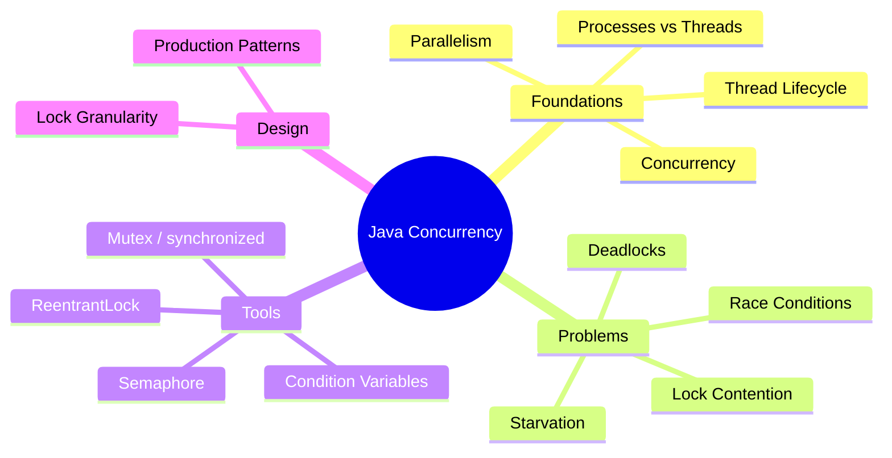

By the end of this tutorial, you will be able to recognize *why* a piece of multithreaded code is unsafe, name the correct tool to fix it, and understand the trade-offs of each fix.

---

<a name="prerequisites"></a>
## Prerequisites

Before diving in, ensure you have:

| Requirement | Details |
|---|---|
| **Java JDK** | JDK 11+ (JDK 17+ recommended). Download from [Adoptium](https://adoptium.net/) or Oracle. |
| **IDE** | IntelliJ IDEA, Eclipse, or VS Code with Java extension pack |
| **Build tool** | Maven or Gradle (optional but recommended for larger projects) |
| **Basic Java knowledge** | Classes, methods, interfaces, lambdas, streams |
| **JVM fundamentals** | Heap vs stack memory, garbage collection basics |

> 💡 **Tip:** You can verify your Java version with `java -version`. Modern JDKs (17+) include useful features like `Thread.ofVirtual()` (JDK 21+) that we'll touch on in the Pro Tips section.

---

<a name="learning-objectives"></a>
## Learning Objectives

By the end of this tutorial, you will be able to:

1. **Explain** the difference between concurrency and parallelism, and between processes and threads.
2. **Describe** the six states of a Java thread lifecycle and what triggers each transition.
3. **Identify** race conditions in existing code and explain why `counter++` is not atomic.
4. **Apply** the correct synchronization tool (`synchronized`, `ReentrantLock`, `AtomicInteger`, `Semaphore`, `Condition`) for a given problem.
5. **Design** thread-safe systems using appropriate lock granularity while avoiding deadlocks.
6. **Diagnose** common concurrency problems (deadlock, starvation, contention) from symptoms and thread dumps.
7. **Implement** production patterns like bounded buffers, rate limiters, and connection pools.
8. **Test** concurrent code effectively and recognize the limits of testing concurrency.

---

<a name="1-concurrency"></a>
## 1. Concurrency

### 🍳 Analogy: The One-Chef Kitchen

Picture a small restaurant with **one chef** who has four orders:

1. Cook pasta
2. Grill a steak
3. Chop vegetables
4. Plate a dessert

The chef cannot literally do all four at the same moment. But the chef can start boiling water, drop the pasta in, and *while the pasta cooks*, start grilling the steak. While the steak rests, chop vegetables. Then plate dessert.

From the customer's point of view, **all four dishes are progressing**. That is concurrency.

> **Concurrency** means multiple tasks are making progress, even if they are not all executing at the exact same instant.

```mermaid
gantt
    title One Chef Handling Four Dishes (Concurrency)
    dateFormat X
    axisFormat %s
    section Chef
    Boil water          :a1, 0, 2
    Grill steak (start)  :a2, 2, 4
    Chop vegetables       :a3, 6, 3
    Check pasta           :a4, 9, 1
    Plate dessert          :a5, 10, 2
```

### Technical Definition

Concurrency is the ability of a system to handle multiple tasks by **interleaving** their execution. A single CPU core can run many threads by rapidly switching between them. At any given instant, only one instruction from one thread may be executing, but the scheduler gives each thread a slice of time — a **time quantum**, typically a few milliseconds.

The OS or JVM scheduler decides which thread runs next. A thread can be **preempted** (paused mid-execution) and resumed later. This creates the illusion of simultaneous progress.

### Why Concurrency Exists

| Reason | Explanation |
|---|---|
| **I/O waiting** | CPUs are often idle while waiting for disk, network, or database responses. Concurrency lets another thread use that idle time. |
| **Responsiveness** | A GUI or server must keep responding to new input even while processing an old request. |
| **Scalability** | Servers need to handle thousands of simultaneous client connections. |
| **Resource utilization** | Blocked tasks free the CPU for tasks that *can* make progress. |

### Step-by-Step Example

```java
public class ConcurrencyDemo {

    public static void main(String[] args) {
        System.out.println("Main thread: " + Thread.currentThread().getName());

        Runnable workerTask = () -> {
            for (int i = 1; i <= 3; i++) {
                System.out.println("Worker thread says " + i
                        + " from " + Thread.currentThread().getName());
            }
        };

        Thread worker = new Thread(workerTask, "worker-thread");
        worker.start();

        for (int i = 1; i <= 3; i++) {
            System.out.println("Main thread says " + i
                    + " from " + Thread.currentThread().getName());
        }
    }
}
```

Run this and the output is **not deterministic**:

```
Main thread says 1 from main
Worker thread says 1 from worker-thread
Main thread says 2 from main
Worker thread says 2 from worker-thread
Main thread says 3 from main
Worker thread says 3 from worker-thread
```

Another run might interleave completely differently. We did not create two processes — we created **two threads inside one JVM process**. They share memory and interleave freely, which is exactly why later sections (race conditions, mutexes) matter.

### Example 2: A More Realistic I/O-Bound Case

```java
import java.util.concurrent.ExecutorService;
import java.util.concurrent.Executors;

public class WebScraperConcurrency {
    public static void main(String[] args) throws InterruptedException {
        ExecutorService pool = Executors.newFixedThreadPool(5);
        String[] urls = {"siteA.com", "siteB.com", "siteC.com", "siteD.com", "siteE.com"};

        for (String url : urls) {
            pool.submit(() -> {
                System.out.println("Fetching " + url + " on " + Thread.currentThread().getName());
                simulateNetworkCall(); // blocks, e.g. 500ms
                System.out.println("Done: " + url);
            });
        }
        pool.shutdown();
    }

    private static void simulateNetworkCall() {
        try { Thread.sleep(500); } catch (InterruptedException ignored) {}
    }
}
```

While one thread waits on a network response, four others can be actively fetching. This is concurrency's core value: **overlapping wait time**, not necessarily overlapping compute time.

### 🎯 Use Cases for Concurrency

- **Web servers** handling thousands of simultaneous HTTP requests, most of which spend time waiting on a database.
- **Chat applications** that must send messages, receive messages, and update the UI all "at once."
- **Background job processors** (e.g., sending emails) that shouldn't block the main request thread.
- **File download managers** that show progress bars for multiple downloads simultaneously.

### Quick Recap

- Concurrency = multiple tasks **making progress** via interleaving.
- Works even on a **single core**.
- Core value: **overlapping wait time** (I/O), responsiveness, scalability.

---

<a name="2-concurrency-vs-parallelism"></a>
## 2. Concurrency vs Parallelism

### 👨‍🍳 Analogy: One Chef vs Four Chefs

- **Concurrency** = one chef switching between pasta, steak, vegetables, and dessert. Only one dish is *actively* being worked on at any instant, but all four progress.
- **Parallelism** = hiring four chefs. Each chef works on a separate dish **at the exact same time**.

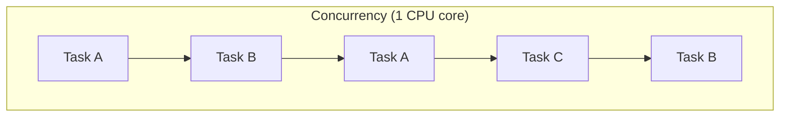

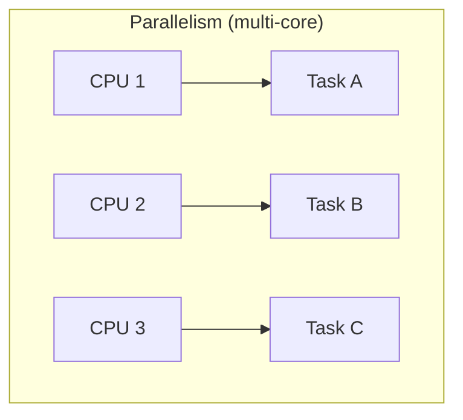

### Technical Difference

| | Concurrency | Parallelism |
|---|---|---|
| **Definition** | Dealing with multiple tasks by interleaving execution | Executing multiple tasks literally at the same instant |
| **Hardware requirement** | Works on a single core | Requires multiple cores |
| **Goal** | Structure / responsiveness | Raw speed / throughput |
| **Example** | Async I/O, event loops | Matrix multiplication split across cores |

On a **single-core machine**, you can have concurrency but never true parallelism — the core just switches fast enough to *look* simultaneous. On a **multi-core machine**, you can have both.

### Step-by-Step Example: Parallel Streams

```java
import java.util.List;
import java.util.concurrent.TimeUnit;
import java.util.stream.IntStream;

public class ParallelismDemo {

    public static void main(String[] args) {
        int cores = Runtime.getRuntime().availableProcessors();
        System.out.println("Available processors: " + cores);

        List<Integer> numbers = IntStream.rangeClosed(1, 1_000_000)
                .boxed()
                .toList();

        long start = System.nanoTime();
        long sum = numbers.parallelStream()
                .mapToLong(Integer::longValue)
                .sum();
        long end = System.nanoTime();

        System.out.println("Sum = " + sum);
        System.out.println("Time ms = " + TimeUnit.NANOSECONDS.toMillis(end - start));
    }
}
```

`parallelStream()` internally uses the common `ForkJoinPool`, which splits the array into chunks and processes chunks on different cores simultaneously — this **is** parallelism.

⚠️ **Caveat**: On a single-core machine, or for tiny datasets, the parallel version can be *slower* than the sequential version because of thread coordination overhead (splitting, merging, context switching).

### Example 2: CPU-Bound Image Processing (Parallelism)

```java
import java.util.stream.IntStream;

public class ImageBlurParallel {
    public static void blurRows(int[][] pixels) {
        IntStream.range(0, pixels.length)
                 .parallel()
                 .forEach(row -> applyBlur(pixels[row]));
    }

    private static void applyBlur(int[] row) {
        // CPU-intensive pixel math — benefits from real parallel cores
        for (int i = 1; i < row.length - 1; i++) {
            row[i] = (row[i - 1] + row[i] + row[i + 1]) / 3;
        }
    }
}
```

Each row's blur computation is independent, CPU-heavy, and has no I/O wait — an ideal candidate for parallelism, not just concurrency.

### When to Use Which

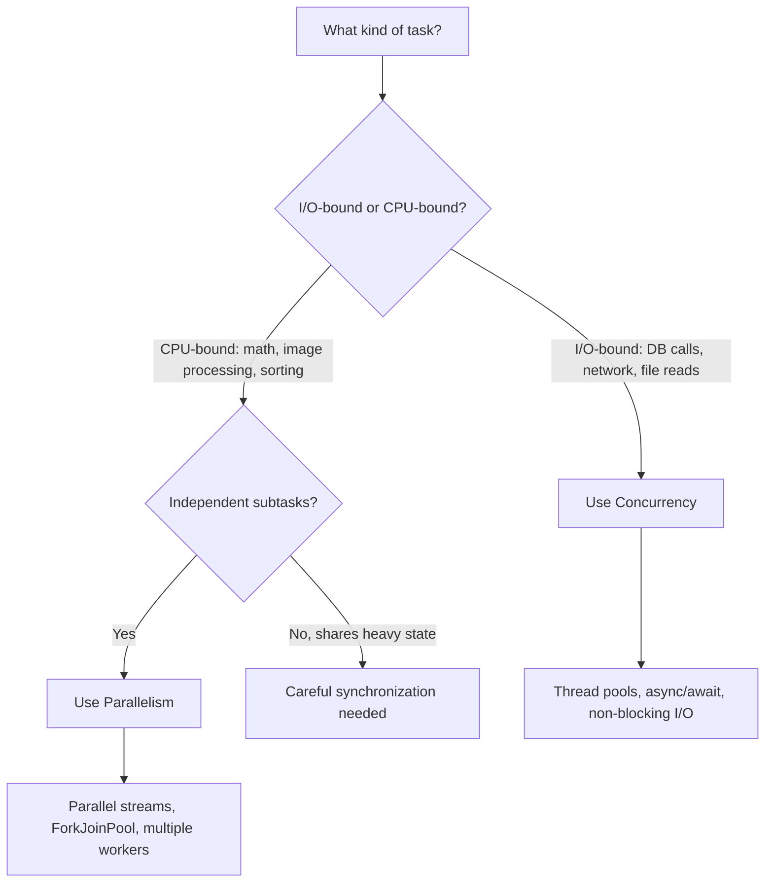

### 🎯 Use Cases

| Use Case | Concurrency or Parallelism? | Why |
|---|---|---|
| Handling 10,000 HTTP requests/sec | Concurrency | Requests mostly wait on I/O |
| Rendering a 4K video frame-by-frame | Parallelism | CPU-bound, independent frames |
| Chat server broadcasting messages | Concurrency | Many idle connections, few active at once |
| Machine learning matrix operations | Parallelism | Heavy CPU math, splits cleanly across cores |
| Microservice calling 5 downstream APIs | Concurrency | Overlap network wait time |

### Quick Recap

- **Concurrency** = structure/responsiveness, works on 1 core.
- **Parallelism** = raw speed, needs multiple cores.
- I/O-bound → concurrency; CPU-bound independent tasks → parallelism.

---

<a name="3-processes-vs-threads"></a>
## 3. Processes vs Threads

### 🚚 Analogy: Food Trucks vs Cooks in One Kitchen

Two **food trucks** each have their own kitchen, ingredients, staff, and cash register. If one truck catches fire, the other is unaffected — but they can't easily share ingredients; someone must physically carry a written order between them.

One **restaurant kitchen** has several cooks sharing the same pots, refrigerator, ingredients, and order tickets. They communicate instantly by shouting across the kitchen — but if one cook knocks over a pot, it can affect everyone.

> **Processes are like food trucks. Threads are like cooks in the same kitchen.**

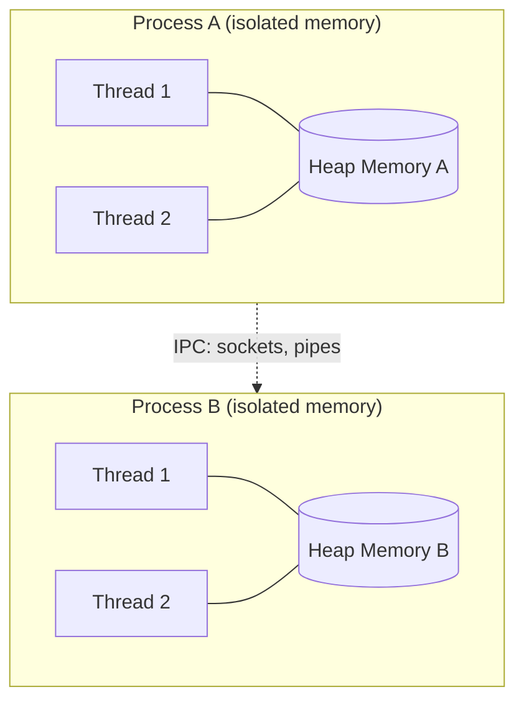

### What a Process Is

A **process** is an independent running program. The OS gives each process:

- Its own memory address space
- Its own file descriptors
- Its own environment variables
- Its own resources

Processes are **isolated**. One process cannot read another's memory without explicit inter-process communication (IPC) — sockets, pipes, or shared memory segments.

### What a Thread Is

A **thread** is a lightweight execution unit inside a process. All threads in the same process **share**:

- Heap memory
- Static variables
- Open files
- Network connections

Each thread has its own:

- Program counter
- Stack
- Local variables
- Thread-local storage

Because threads share memory, they communicate cheaply by reading/writing shared variables — powerful, but the direct cause of race conditions.

### Comparison Table

| Aspect | Process | Thread |
|---|---|---|
| Memory | Isolated address space | Shared heap within the process |
| Creation cost | Expensive (new address space, page tables) | Cheap (stack allocation, registration) |
| Context switch cost | High (memory map + cache flush) | Low (registers only) |
| Communication | IPC (sockets, pipes, shared memory) | Direct shared variables |
| Failure isolation | One crash doesn't affect others | One uncaught error can crash the whole JVM |
| Example | Chrome tab process, a JVM instance | Worker threads inside a JVM |

### Step-by-Step Example: Threads Sharing Memory (Unsafe by Design)

```java
public class SharedMemoryDemo {

    private static int sharedCounter = 0;

    public static void main(String[] args) throws InterruptedException {
        Thread t1 = new Thread(() -> {
            for (int i = 0; i < 1_000; i++) {
                sharedCounter++;
            }
        }, "thread-1");

        Thread t2 = new Thread(() -> {
            for (int i = 0; i < 1_000; i++) {
                sharedCounter++;
            }
        }, "thread-2");

        t1.start();
        t2.start();
        t1.join();
        t2.join();

        System.out.println("Shared counter: " + sharedCounter);
    }
}
```

This code is **intentionally unsafe**. Both threads increment the *same* static variable because they share the same JVM process memory. If these were separate processes, each would have its own independent copy of `sharedCounter` — safer, but also unable to share results without explicit IPC.

### Example 2: Simulating IPC Between Processes (Conceptual)

```java
// Process A writes to a shared file (a crude IPC mechanism)
import java.io.FileWriter;

public class ProcessAWriter {
    public static void main(String[] args) throws Exception {
        try (FileWriter fw = new FileWriter("shared.txt")) {
            fw.write("Order: 2x Pasta");
        }
        System.out.println("Process A wrote the order.");
    }
}
```

```java
// Process B (a separate JVM invocation) reads it
import java.nio.file.Files;
import java.nio.file.Paths;

public class ProcessBReader {
    public static void main(String[] args) throws Exception {
        String content = Files.readString(Paths.get("shared.txt"));
        System.out.println("Process B read: " + content);
    }
}
```

Notice how much more effort is required for two **processes** to "talk," compared to two **threads** simply reading a shared variable.

### 🎯 Use Cases

- **Microservices** run as separate **processes** for fault isolation — one service crashing shouldn't take down another.
- **Web browsers** run each tab as a separate **process** (or sandboxed process group) so one crashed tab doesn't crash the whole browser.
- **Thread pools inside a web server** use **threads** to handle many requests cheaply, sharing caches and connection pools.
- **Batch data pipelines** often split heavy work across **processes** (e.g., Spark executors) for isolation, and within each process use **threads** for I/O overlap.

### Quick Recap

- Processes = isolated, expensive, crash-isolated.
- Threads = shared memory, cheap, fast communication, but race-prone.
- Choose processes for isolation; threads for cheap shared-state concurrency.

---

<a name="4-thread-lifecycle"></a>
## 4. Thread Lifecycle

Java threads move through six states defined in `java.lang.Thread.State`.

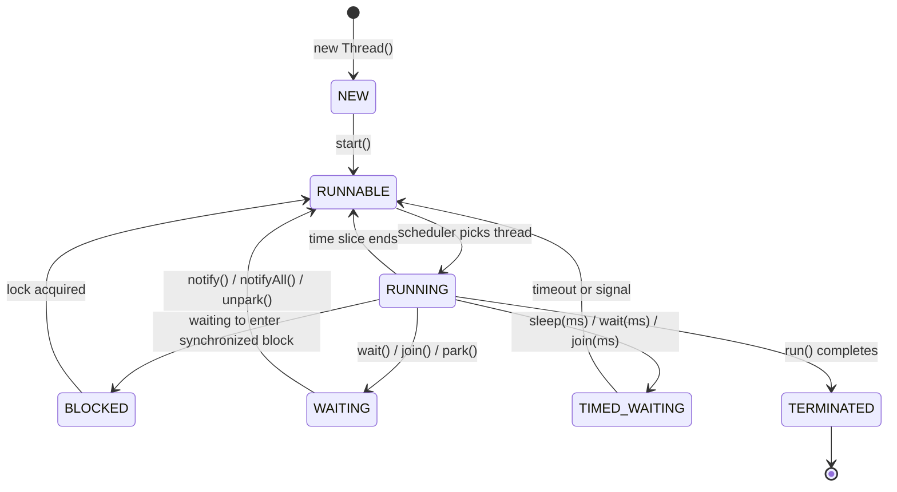

> Note: Java's `Thread.State` enum does not have a separate `RUNNING` value — `RUNNABLE` covers both "actively executing" and "ready and waiting for a CPU time slice." The diagram above shows `RUNNING` as a conceptual sub-state for clarity.

### The States Explained

#### NEW
A thread is `NEW` after the `Thread` object is created but before `start()` is called.

```java
Thread t = new Thread(() -> System.out.println("hello"));
System.out.println(t.getState()); // NEW
```
No OS-level thread exists yet — it's just a Java object.

#### RUNNABLE
After `start()`, the thread becomes `RUNNABLE` — eligible to run, whether it's currently executing or waiting for a CPU slice.

```java
t.start();
System.out.println(t.getState()); // RUNNABLE
```

#### BLOCKED
A thread enters `BLOCKED` when it tries to enter a `synchronized` block/method but another thread already holds the monitor lock.

```java
public class BlockedStateDemo {
    public static void main(String[] args) throws InterruptedException {
        Object lock = new Object();

        Thread holder = new Thread(() -> {
            synchronized (lock) {
                try { Thread.sleep(2_000); }
                catch (InterruptedException e) { Thread.currentThread().interrupt(); }
            }
        }, "lock-holder");

        Thread blocked = new Thread(() -> {
            synchronized (lock) {
                System.out.println("Blocked thread got the lock");
            }
        }, "blocked-thread");

        holder.start();
        Thread.sleep(100);
        blocked.start();
        Thread.sleep(200);

        System.out.println("Holder state: " + holder.getState());   // TIMED_WAITING
        System.out.println("Blocked state: " + blocked.getState()); // BLOCKED
    }
}
```

#### WAITING
Entered via `Object.wait()`, `Thread.join()`, or `LockSupport.park()`. A waiting thread needs *another thread* to act (e.g., call `notify()`) before it can continue. Importantly, calling `wait()` **releases** the lock it was holding — unlike `BLOCKED`, which means "still trying to acquire a lock it never got."

```java
public class WaitingStateDemo {
    public static void main(String[] args) throws InterruptedException {
        Object lock = new Object();

        Thread waitingThread = new Thread(() -> {
            synchronized (lock) {
                try { lock.wait(); }
                catch (InterruptedException e) { Thread.currentThread().interrupt(); }
            }
        }, "waiting-thread");

        waitingThread.start();
        Thread.sleep(200);
        System.out.println(waitingThread.getState()); // WAITING
    }
}
```

#### TIMED_WAITING
Same as `WAITING`, but with a timeout: `Thread.sleep(ms)`, `Object.wait(ms)`, `Thread.join(ms)`, `LockSupport.parkNanos()`. The thread wakes on its own after the timeout elapses even without a signal.

#### TERMINATED
Reached when `run()` completes, normally or via an uncaught exception. A terminated thread **cannot be restarted** — you must create a new `Thread` object.

### `start()` vs `run()` — The #1 Beginner Mistake

```java
Thread t = new Thread(() -> System.out.println(Thread.currentThread().getName()));
t.run();   // prints "main" — runs in the CURRENT thread, no new thread created!
t.start(); // prints "Thread-0" — actually spawns a new OS thread
```

### `sleep()` vs `wait()` vs `join()`

| Method | Releases lock? | Wakes up when |
|---|---|---|
| `Thread.sleep(ms)` | ❌ No | Timeout elapses |
| `Object.wait()` | ✅ Yes | `notify()`/`notifyAll()` called |
| `Object.wait(ms)` | ✅ Yes | Signal OR timeout |
| `Thread.join()` | N/A (waits on another thread, not a lock) | Target thread terminates |

### Example 2: Full Lifecycle Walkthrough

```java
public class FullLifecycleDemo {
    public static void main(String[] args) throws InterruptedException {
        Thread worker = new Thread(() -> {
            try {
                Thread.sleep(500); // TIMED_WAITING
            } catch (InterruptedException ignored) {}
        });

        System.out.println("Before start: " + worker.getState()); // NEW
        worker.start();
        Thread.sleep(50);
        System.out.println("After start:  " + worker.getState()); // TIMED_WAITING
        worker.join();
        System.out.println("After join:   " + worker.getState()); // TERMINATED
    }
}
```

### 🎯 Use Cases

- **Debugging thread dumps**: recognizing `BLOCKED` threads in a thread dump often points directly at a lock contention bottleneck.
- **Health checks**: monitoring tools flag threads stuck in `WAITING` for too long as a possible deadlock or stuck consumer.
- **Graceful shutdown**: calling `join()` ensures your main thread waits for worker threads to reach `TERMINATED` before the application exits.

### Quick Recap

- Six states: NEW → RUNNABLE → (BLOCKED/WAITING/TIMED_WAITING) → TERMINATED.
- `start()` spawns a thread; `run()` does not.
- `wait()` releases the lock; `sleep()` does not.

---

<a name="5-race-condition"></a>
## 5. Race Condition

### 📊 Analogy: The Shared Spreadsheet

Two people edit the same spreadsheet cell.

1. Person A opens the file. Cell = 100.
2. Person B opens the file. Cell = 100.
3. Person A adds 20 and saves. Cell = 120.
4. Person B, still holding the *old* value of 100, adds 10 and saves. Cell = **110**.

The correct result should be 130, but the final value is 110 — Person B's save overwrote Person A's update because both read the stale value before either wrote back.

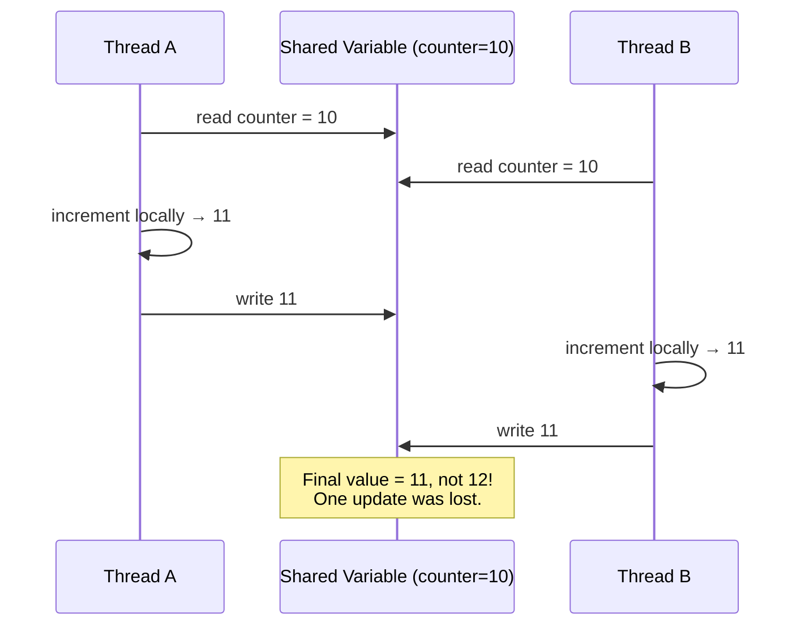

### Technical Definition

A race condition happens when:

1. Multiple threads access **shared mutable state**.
2. At least one thread **modifies** the state.
3. The final result **depends on execution order** (timing).

`counter++` is a classic race condition because it is **not atomic** — it is actually three steps:

```
1. Read current value of counter
2. Increment the value locally
3. Write the new value back
```

### Broken Example

```java
import java.util.concurrent.ExecutorService;
import java.util.concurrent.Executors;
import java.util.concurrent.TimeUnit;

public class RaceConditionDemo {

    private int counter = 0;

    public void increment() {
        counter++; // read-modify-write, NOT atomic
    }

    public static void main(String[] args) throws InterruptedException {
        RaceConditionDemo demo = new RaceConditionDemo();
        ExecutorService pool = Executors.newFixedThreadPool(4);

        for (int i = 0; i < 20_000; i++) {
            pool.submit(demo::increment);
        }

        pool.shutdown();
        pool.awaitTermination(1, TimeUnit.MINUTES);

        System.out.println("Final counter: " + demo.counter); // expected 20000, often less
    }
}
```

### Three Fixes, Compared

**Fix 1 — `synchronized`:**
```java
public class SafeCounterSync {
    private int counter = 0;
    public synchronized void increment() { counter++; }
    public synchronized int getCounter() { return counter; }
}
```

**Fix 2 — `AtomicInteger`:**
```java
import java.util.concurrent.atomic.AtomicInteger;

public class SafeCounterAtomic {
    private final AtomicInteger counter = new AtomicInteger(0);
    public void increment() { counter.incrementAndGet(); }
    public int getCounter() { return counter.get(); }
}
```

**Fix 3 — `ReentrantLock`:**
```java
import java.util.concurrent.locks.ReentrantLock;

public class SafeCounterLock {
    private int counter = 0;
    private final ReentrantLock lock = new ReentrantLock();

    public void increment() {
        lock.lock();
        try { counter++; } finally { lock.unlock(); }
    }
}
```

| Fix | Mechanism | Best for |
|---|---|---|
| `synchronized` | Intrinsic monitor lock | Simple, single critical sections |
| `AtomicInteger` | CPU compare-and-swap (lock-free) | Single-variable counters under high contention |
| `ReentrantLock` | Explicit lock object | Needing timeouts, fairness, multiple conditions |

### Example 2: Race Condition in an Inventory System

```java
public class InventoryRace {
    private int stock = 1; // last item!

    public void purchase(String customer) {
        if (stock > 0) {                     // both threads pass this check
            System.out.println(customer + " is buying the last item...");
            stock--;                          // both threads decrement — oversold!
            System.out.println(customer + " purchase confirmed. Stock now: " + stock);
        } else {
            System.out.println(customer + " sees SOLD OUT.");
        }
    }
}
```

Two customers both see `stock > 0` before either decrements — the store just **sold the same item twice**. The fix: make the check-and-decrement atomic (`synchronized`, a DB row lock, or an optimistic version column).

### 🎯 Use Cases Where Race Conditions Commonly Bite

- **E-commerce flash sales** — overselling limited stock.
- **Banking transfers** — lost updates to account balances.
- **Ticket booking systems** — double-booking the same seat.
- **Distributed counters/analytics** — undercounted page views or clicks.
- **Session/token generation** — two requests generating the same "unique" ID.

### Quick Recap

- Race = shared mutable state + modification + order-dependent result.
- `counter++` is read-modify-write, not atomic.
- Fixes: `synchronized`, `AtomicInteger`, `ReentrantLock`.

---

<a name="6-mutex"></a>
## 6. Mutex

### 🚻 Analogy: The Single Restroom Key

A restaurant has one restroom with one key on a hook. A customer takes the key, enters, locks the door, leaves, and returns the key. Only **one person** can be inside because there is only **one key**. Anyone else must wait for the key to come back.

> The key is a **mutex**.

### Technical Definition

A **mutex** (mutual exclusion lock) ensures only one thread at a time can access a critical section. Critically, a mutex has an **owner** — the thread that acquired it is the only thread allowed to release it. This ownership model is what distinguishes a mutex from a semaphore.

Java doesn't have a class literally named `Mutex`. Instead:
- `synchronized` blocks/methods use the intrinsic monitor lock
- `ReentrantLock` is an explicit mutex implementation

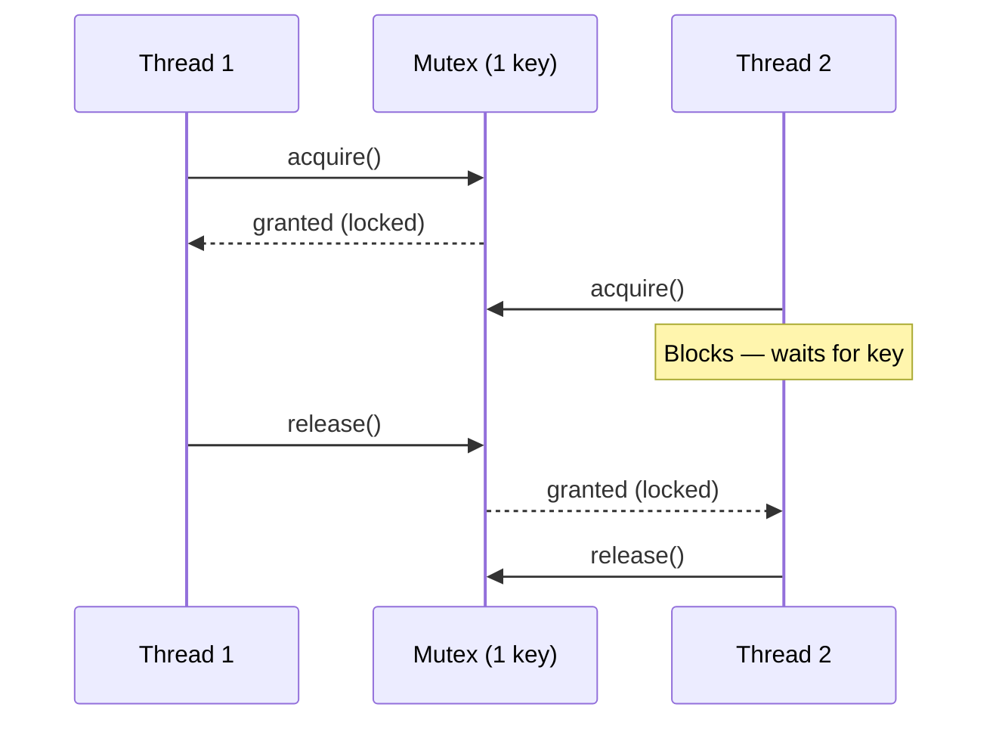

### Example: `synchronized` as a Mutex

```java
public class BankAccountSync {
    private int balance = 100;

    public void deposit(int amount) {
        synchronized (this) {
            balance += amount;
        }
    }

    public void withdraw(int amount) {
        synchronized (this) {
            if (balance >= amount) {
                balance -= amount;
            }
        }
    }

    public synchronized int getBalance() {
        return balance;
    }
}
```

### Example 2: `ReentrantLock` as an Explicit Mutex

```java
import java.util.concurrent.locks.ReentrantLock;

public class BankAccountLock {
    private int balance = 100;
    private final ReentrantLock lock = new ReentrantLock();

    public void deposit(int amount) {
        lock.lock();
        try { balance += amount; }
        finally { lock.unlock(); }
    }

    public int getBalance() {
        lock.lock();
        try { return balance; }
        finally { lock.unlock(); }
    }
}
```

### Example 3: Protecting a Shared Log File

```java
import java.io.FileWriter;
import java.io.IOException;

public class SafeLogger {
    private final Object mutex = new Object();
    private final String path;

    public SafeLogger(String path) { this.path = path; }

    public void log(String message) {
        synchronized (mutex) {
            try (FileWriter fw = new FileWriter(path, true)) {
                fw.write(message + "\n");
            } catch (IOException e) {
                e.printStackTrace();
            }
        }
    }
}
```

Without the mutex, two threads writing to the same file simultaneously can interleave partial lines, corrupting the log.

### 🎯 Use Cases

- **Protecting a shared cache map's compound updates** (`get`-then-`put`).
- **Guarding a single file or database connection** used across threads.
- **Serializing access to a hardware resource** like a printer queue.
- **Coordinating access to an in-memory session store**.

### Quick Recap

- Mutex = mutual exclusion, has an **owner**.
- Java: `synchronized` or `ReentrantLock`.
- Only the owning thread can release.

---

<a name="7-semaphore"></a>
## 7. Semaphore

### 🅿️ Analogy: The Parking Lot

A parking lot has **3 spaces**. Ten cars want to park. If a space is free, a car parks. If all 3 are full, arriving cars wait outside. When a car leaves, one waiting car can enter.

> The parking lot capacity is a **counting semaphore with 3 permits**.

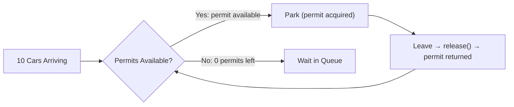

### Technical Definition

A **semaphore** maintains a set of permits:
- `acquire()` — takes a permit, blocking if none are available.
- `release()` — returns a permit, waking a waiting thread.

A semaphore with 3 permits allows up to 3 threads to access a resource simultaneously. A **binary semaphore** has only 1 permit — superficially similar to a mutex, but the semantics differ (explained below).

### Example: Parking Lot Simulation

```java
import java.util.concurrent.ExecutorService;
import java.util.concurrent.Executors;
import java.util.concurrent.Semaphore;

public class ParkingLot {

    private final Semaphore spaces = new Semaphore(3, true); // fair

    public void park(String car) {
        try {
            System.out.println(car + " is waiting to park.");
            spaces.acquire();
            System.out.println(car + " parked. Available permits: " + spaces.availablePermits());
            Thread.sleep(2_000); // simulate parking duration
        } catch (InterruptedException e) {
            Thread.currentThread().interrupt();
        } finally {
            spaces.release();
            System.out.println(car + " left the parking lot.");
        }
    }

    public static void main(String[] args) {
        ParkingLot lot = new ParkingLot();
        ExecutorService pool = Executors.newFixedThreadPool(10);

        for (int i = 1; i <= 10; i++) {
            String car = "Car-" + i;
            pool.submit(() -> lot.park(car));
        }
        pool.shutdown();
    }
}
```

At most 3 cars are parked simultaneously; the other 7 block inside `acquire()`.

### Example 2: Limiting Concurrent API Calls (Real-World Pattern)

```java
import java.util.concurrent.Semaphore;

public class RateLimitedApiClient {
    private final Semaphore concurrencyLimiter = new Semaphore(5); // max 5 concurrent calls

    public String callExternalApi(String request) throws InterruptedException {
        concurrencyLimiter.acquire();
        try {
            return performHttpCall(request); // slow, external
        } finally {
            concurrencyLimiter.release();
        }
    }

    private String performHttpCall(String request) {
        // simulate a network call
        return "response for " + request;
    }
}
```

This prevents your service from overwhelming a downstream API with more than 5 simultaneous requests, regardless of how many threads call `callExternalApi()`.

### Binary Semaphore vs Mutex

| Aspect | Mutex | Binary Semaphore |
|---|---|---|
| Ownership | Owned by the acquiring thread; only it can release | No ownership — any thread can call `release()` |
| Purpose | Mutual exclusion for a critical section | Signaling / resource availability |
| Misuse risk | Low — enforced ownership prevents accidental release | Higher — a different thread can wrongly `release()`, breaking exclusivity |

⚠️ If you use a semaphore as a mutex, another thread could call `release()` without ever calling `acquire()`, breaking your mutual exclusion guarantee. Semaphores are better suited for **resource pools, rate limiters, and connection limits** — not exclusive locking.

### 🎯 Use Cases

- **Database connection pools** (e.g., HikariCP) — limiting concurrent DB connections.
- **API rate limiting / throttling** — capping concurrent outbound calls.
- **Bounded worker pools** — limiting how many threads process a resource-intensive task simultaneously.
- **Limiting concurrent file uploads/downloads** in a service.

### Quick Recap

- Semaphore = N permits, `acquire()`/`release()`.
- No ownership — any thread can release.
- Best for resource pools, rate limiters, connection limits.

---

<a name="8-condition-variables"></a>
## 8. Condition Variables

### 🍽️ Analogy: Cook and Waiter Coordination

The cook prepares dishes and places them on a counter. The waiter picks dishes up and serves them.

- If the counter is **empty**, the waiter must wait until the cook adds a dish.
- If the counter is **full**, the cook must wait until the waiter removes a dish.

Rather than checking the counter every 50ms (**busy-waiting**, wasteful), they wait for a **signal**: "Dishes are available" or "Space is available."

> Those signals are **condition variables**.

### Technical Definition

A **condition variable** lets threads wait until a specific condition becomes true. In Java, a `Condition` is created from a `ReentrantLock`:

```java
private final ReentrantLock lock = new ReentrantLock();
private final Condition condition = lock.newCondition();
```

- `condition.await()` — releases the lock and blocks until signaled.
- `condition.signal()` — wakes **one** waiting thread.
- `condition.signalAll()` — wakes **all** waiting threads.

The waking thread must **reacquire the lock** before `await()` returns.

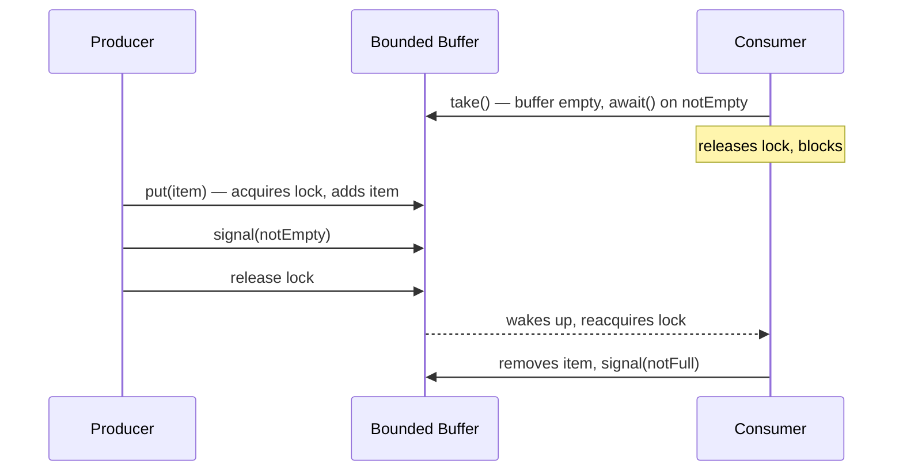

### Full Example: Producer-Consumer Bounded Buffer

```java
import java.util.concurrent.ExecutorService;
import java.util.concurrent.Executors;
import java.util.concurrent.locks.Condition;
import java.util.concurrent.locks.ReentrantLock;

public class BoundedBuffer<T> {

    private final Object[] items;
    private int putIndex, takeIndex, count;

    private final ReentrantLock lock = new ReentrantLock();
    private final Condition notFull = lock.newCondition();
    private final Condition notEmpty = lock.newCondition();

    public BoundedBuffer(int capacity) {
        items = new Object[capacity];
    }

    public void put(T item) throws InterruptedException {
        lock.lock();
        try {
            while (count == items.length) {
                notFull.await();
            }
            items[putIndex] = item;
            putIndex = (putIndex + 1) % items.length;
            count++;
            notEmpty.signal();
        } finally {
            lock.unlock();
        }
    }

    @SuppressWarnings("unchecked")
    public T take() throws InterruptedException {
        lock.lock();
        try {
            while (count == 0) {
                notEmpty.await();
            }
            T item = (T) items[takeIndex];
            items[takeIndex] = null;
            takeIndex = (takeIndex + 1) % items.length;
            count--;
            notFull.signal();
            return item;
        } finally {
            lock.unlock();
        }
    }
}
```

### Why `while`, Not `if`

```java
while (count == items.length) {
    notFull.await();
}
```

A thread can wake from `await()` for **three** reasons: (1) a real signal, (2) a **spurious wakeup** (the JVM is allowed to do this), or (3) an interrupt. Between waking and reacquiring the lock, another thread might have already changed the condition.

**Concrete failure scenario with `if`:** Two producers are waiting because the buffer is full. A consumer removes one item and calls `signal()`. Both producers wake (in some JVM implementations, or if `signalAll()` is used). The first producer grabs the lock, fills the buffer, releases the lock. The second producer now grabs the lock — but the buffer is full **again**. If it used `if` instead of `while`, it would blindly add an item and **overflow the buffer**.

### Example 2: A Simple "Event Ready" Gate

```java
import java.util.concurrent.locks.Condition;
import java.util.concurrent.locks.ReentrantLock;

public class ReadyGate {
    private final ReentrantLock lock = new ReentrantLock();
    private final Condition ready = lock.newCondition();
    private boolean dataReady = false;

    public void awaitData() throws InterruptedException {
        lock.lock();
        try {
            while (!dataReady) {
                ready.await();
            }
            System.out.println("Data is ready, proceeding!");
        } finally {
            lock.unlock();
        }
    }

    public void markReady() {
        lock.lock();
        try {
            dataReady = true;
            ready.signalAll();
        } finally {
            lock.unlock();
        }
    }
}
```

### 🎯 Use Cases

- **Producer-consumer queues** (e.g., a task queue feeding worker threads).
- **Connection pool waiting** — threads block until a connection becomes available, signaled when one is released.
- **Batch job coordination** — worker threads wait for a "batch ready" signal before processing.
- **Graceful startup sequencing** — threads wait until initialization completes.

### Quick Recap

- Condition = wait for a condition to become true.
- Always use `while`, not `if`, around `await()`.
- `signal()` wakes one; `signalAll()` wakes all.

---

<a name="9-coarse-grained-lock-vs-fine-grained-lock"></a>
## 9. Coarse-Grained Lock vs Fine-Grained Lock

### 🏦 Analogy: Bank Vault vs Safe Deposit Boxes

A single massive **vault** protects everyone's valuables. Only one customer can be inside at a time, even if they just want their own item — that's **coarse-grained locking**.

Individual **safe deposit boxes** each have their own lock. Many customers can open their own boxes simultaneously — that's **fine-grained locking**.

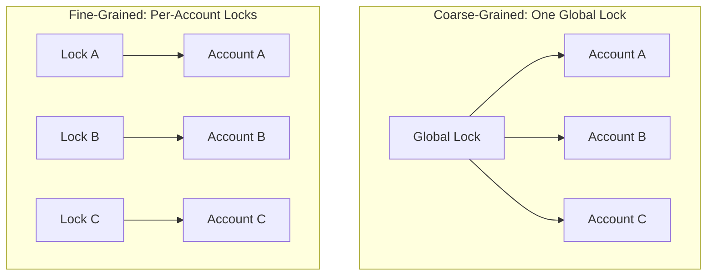

### Coarse-Grained Locking

```java
import java.util.HashMap;
import java.util.Map;

public class BankCoarseGrained {

    private static final Object globalLock = new Object();
    private final Map<String, Integer> accounts = new HashMap<>();

    public BankCoarseGrained() {
        accounts.put("A", 1000);
        accounts.put("B", 1000);
    }

    public void transfer(String from, String to, int amount) {
        synchronized (globalLock) {
            int fromBalance = accounts.get(from);
            int toBalance = accounts.get(to);
            if (fromBalance < amount) return;
            accounts.put(from, fromBalance - amount);
            accounts.put(to, toBalance + amount);
        }
    }
}
```

Simple and correct — but **any two transfers block each other**, even ones involving completely unrelated accounts. This is a throughput bottleneck at scale.

### Fine-Grained Locking

```java
import java.util.concurrent.locks.ReentrantLock;

public class Account {
    private final ReentrantLock lock = new ReentrantLock();
    private int balance;

    public Account(int initialBalance) { this.balance = initialBalance; }
    public void debit(int amount) { balance -= amount; }
    public void credit(int amount) { balance += amount; }
    public int getBalance() { return balance; }
    public ReentrantLock lock() { return lock; }
}
```

```java
public class BankFineGrained {
    public void transfer(Account from, Account to, int amount) {
        from.lock().lock();
        try {
            to.lock().lock();
            try {
                if (from.getBalance() < amount) return;
                from.debit(amount);
                to.credit(amount);
            } finally {
                to.lock().unlock();
            }
        } finally {
            from.lock().unlock();
        }
    }
}
```

This allows unrelated transfers to run truly concurrently. **But it introduces deadlock risk**:

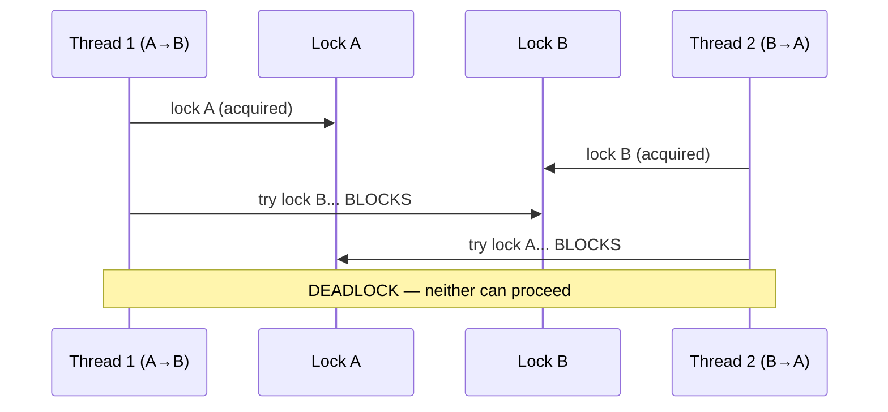

Thread-1 holds A, waits for B. Thread-2 holds B, waits for A. Neither can proceed — **classic deadlock**.

### The Fix: Consistent Lock Ordering

```java
public class BankFineGrainedSafe {
    public void transfer(Account from, Account to, int amount) {
        Account first = from.hashCode() < to.hashCode() ? from : to;
        Account second = first == from ? to : from;

        first.lock().lock();
        try {
            second.lock().lock();
            try {
                if (from.getBalance() < amount) return;
                from.debit(amount);
                to.credit(amount);
            } finally {
                second.lock().unlock();
            }
        } finally {
            first.lock().unlock();
        }
    }
}
```

By **always** acquiring locks in a globally consistent order (e.g., by a unique account ID, not just `hashCode()` which can collide), no cyclic wait can ever form.

### Example 2: Fine-Grained Locking in a `ConcurrentHashMap`-style Cache

```java
import java.util.concurrent.ConcurrentHashMap;

public class ThreadSafeCache<K, V> {
    private final ConcurrentHashMap<K, V> map = new ConcurrentHashMap<>();

    // Atomic compound operation — avoids the get-then-put race
    public V incrementCount(K key) {
        return map.merge(key, (V) Integer.valueOf(1), (oldVal, one) ->
                (V) Integer.valueOf((Integer) oldVal + (Integer) one));
    }
}
```

`ConcurrentHashMap` internally uses fine-grained (segment/bucket-level) locking so different keys can be updated by different threads simultaneously without a single global lock.

### Trade-off Summary

| | Coarse-Grained | Fine-Grained |
|---|---|---|
| Simplicity | ✅ Easy to reason about | ⚠️ More complex |
| Throughput under contention | ❌ Bottleneck | ✅ Higher concurrency |
| Deadlock risk | ✅ Low (usually one lock) | ⚠️ Higher — needs lock ordering |
| Best for | Low-contention systems, simplicity-first code | High-throughput systems with many independent resources |

### 🎯 Use Cases

- **Banking/ledger systems** — per-account locks (fine-grained) for high transfer throughput.
- **Prototype/MVP systems** — a single global lock (coarse-grained) is fine when correctness matters more than throughput.
- **Sharded caches** — `ConcurrentHashMap`-style structures use fine-grained internal locking.
- **Game servers** — per-entity locks so unrelated game objects don't block each other's updates.

### Quick Recap

- Coarse = one global lock, simple but bottleneck.
- Fine = per-resource locks, higher throughput but deadlock risk.
- Fix deadlock with **consistent lock ordering**.

---

<a name="10-reentrant-lock"></a>
## 10. Reentrant Lock

### 🔑 Analogy: The Master Key

A person has a master key to a building. They unlock the front door and walk in, then unlock an office door with the *same* key, then unlock a filing cabinet inside — **without ever returning the key in between**.

> That is **reentrancy**.

### Technical Definition

A **reentrant lock** allows the thread that already holds the lock to acquire it again **without deadlocking itself**. The lock tracks:

- The current **owner thread**
- A **hold count**

Each `lock()` call increments the hold count; each `unlock()` decrements it. The lock is only truly released when the count reaches zero.

If a lock were **not** reentrant, a thread already inside a locked method that calls another locked method on the same object would **deadlock against itself**.

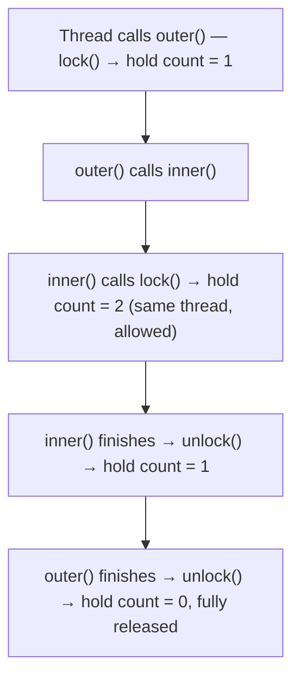

### Example: `synchronized` Is Reentrant

```java
public class ReentrantSyncDemo {
    public synchronized void outer() {
        System.out.println("outer");
        inner();
    }

    public synchronized void inner() {
        System.out.println("inner");
    }

    public static void main(String[] args) {
        new ReentrantSyncDemo().outer();
    }
}
```

`outer()` acquires the lock on `this`; calling `inner()` from inside `outer()` reacquires the *same* lock on the *same* thread — allowed because `synchronized` is reentrant.

### Example: `ReentrantLock` with Explicit Hold Count

```java
import java.util.concurrent.locks.ReentrantLock;

public class ReentrantLockDemo {
    private final ReentrantLock lock = new ReentrantLock();

    public void outer() {
        lock.lock();
        try {
            System.out.println("outer hold count: " + lock.getHoldCount());
            inner();
        } finally {
            lock.unlock();
        }
    }

    public void inner() {
        lock.lock();
        try {
            System.out.println("inner hold count: " + lock.getHoldCount());
        } finally {
            lock.unlock();
        }
    }

    public static void main(String[] args) {
        new ReentrantLockDemo().outer();
    }
}
```

Output:
```
outer hold count: 1
inner hold count: 2
```

### Advanced `ReentrantLock` Features

**`tryLock()` — don't wait forever:**
```java
if (lock.tryLock(200, TimeUnit.MILLISECONDS)) {
    try {
        // critical section
    } finally {
        lock.unlock();
    }
} else {
    // fall back — e.g., return a "system busy" error instead of hanging
}
```

**`lockInterruptibly()` — cancellable waiting:**
```java
try {
    lock.lockInterruptibly();
    try {
        // critical section
    } finally {
        lock.unlock();
    }
} catch (InterruptedException e) {
    Thread.currentThread().interrupt();
}
```

**Fairness:**
```java
private final ReentrantLock fairLock = new ReentrantLock(true);
```
A fair lock grants the lock to the **longest-waiting** thread first, reducing starvation — at some cost to raw throughput.

### Example 2: Recursive Function Protected by a Reentrant Lock

```java
import java.util.concurrent.locks.ReentrantLock;

public class RecursiveFactorial {
    private final ReentrantLock lock = new ReentrantLock();
    private long callCount = 0;

    public long factorial(int n) {
        lock.lock();
        try {
            callCount++; // tracked safely even across recursive calls
            if (n <= 1) return 1;
            return n * factorial(n - 1); // reacquires the SAME lock, same thread
        } finally {
            lock.unlock();
        }
    }
}
```

Without reentrancy, this recursive call pattern would deadlock the thread against its own held lock.

### 🎯 Use Cases

- **Recursive algorithms** that need to protect shared state at every recursion level.
- **Layered APIs** where a public synchronized method calls a private synchronized helper on the same object.
- **Timeout-sensitive systems** (`tryLock`) — e.g., avoiding a thread pool from hanging indefinitely on a stuck lock.
- **Cancellable operations** (`lockInterruptibly`) — e.g., a user cancels a long-running UI action waiting on a lock.

### Quick Recap

- Reentrant = same thread can re-acquire the lock.
- Tracks owner + hold count.
- `synchronized` and `ReentrantLock` are both reentrant.

---

<a name="production-patterns"></a>
## What This Looks Like in a Real Production System

Concurrency concepts rarely exist in isolation. In a typical Java/Spring backend, you'll see them woven together constantly.

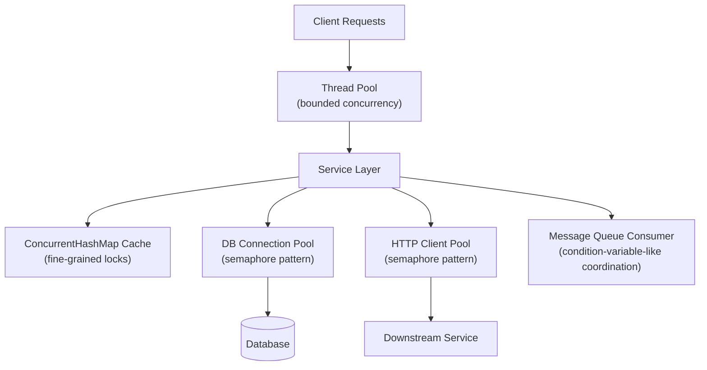

| System Component | Concurrency Concept It Uses |
|---|---|
| **Thread pools** (`ExecutorService`, Spring's `ThreadPoolTaskExecutor`) | Bounded concurrency, reused threads instead of per-request thread creation |
| **Database connection pools** (HikariCP) | Semaphore pattern — `acquireConnection()` blocks if pool exhausted |
| **HTTP client connection pools** | Same semaphore pattern, applied to outbound network connections |
| **Shared caches** (`ConcurrentHashMap`) | Fine-grained internal locking, but compound ops like `cache.put(key, cache.get(key)+1)` are still races — use `compute()`/`merge()` |
| **Message consumers** | Multiple consumers reading a queue concurrently need synchronized writes to shared downstream state |
| **Inventory systems** | Classic race condition source — `if (stock > 0) stock--;` needs atomic check-and-decrement (row locks, optimistic versioning) |
| **Payment processing** | Fine-grained per-account locking with **strict lock ordering** to avoid deadlock; in practice often delegated to DB row-level locks/transactions |
| **Order processing pipelines** | Multi-step workflows running in parallel across different orders, synchronized only where they touch shared inventory |
| **Rate limiters** | Semaphore for concurrency caps; token bucket algorithms for time-based limits |

### Real-World Case Studies

**Case Study 1: The Overselling Incident (E-commerce)**
A flash-sale platform used `if (stock > 0) stock--;` without synchronization. During a 60-second sale, the system sold 1,200 units of a product with only 1,000 in stock. The fix involved moving the check-and-decrement into a database transaction with a row lock, plus an optimistic version column. The lesson: **never trust in-memory counters for authoritative inventory**.

**Case Study 2: The Lost Deposit (Banking)**
A payment service incremented account balances with `balance += amount` across multiple threads. Under load, deposits were silently lost because two threads read the same stale balance. The fix used per-account locks with strict ordering, and ultimately delegated balance mutations to the database's atomic `UPDATE ... SET balance = balance + ?` statement. The lesson: **atomic database operations are often safer than application-level locks**.

**Case Study 3: The Connection Pool Exhaustion (Microservices)**
A service configured an unbounded thread pool and no connection pool limit. Under a traffic spike, thousands of threads each grabbed a DB connection, exhausting the database's connection limit and causing cascading failures. The fix introduced a bounded thread pool and a semaphore-based connection pool (HikariCP). The lesson: **always bound your concurrency**.

### Common Production Problems — Recognize Them Fast

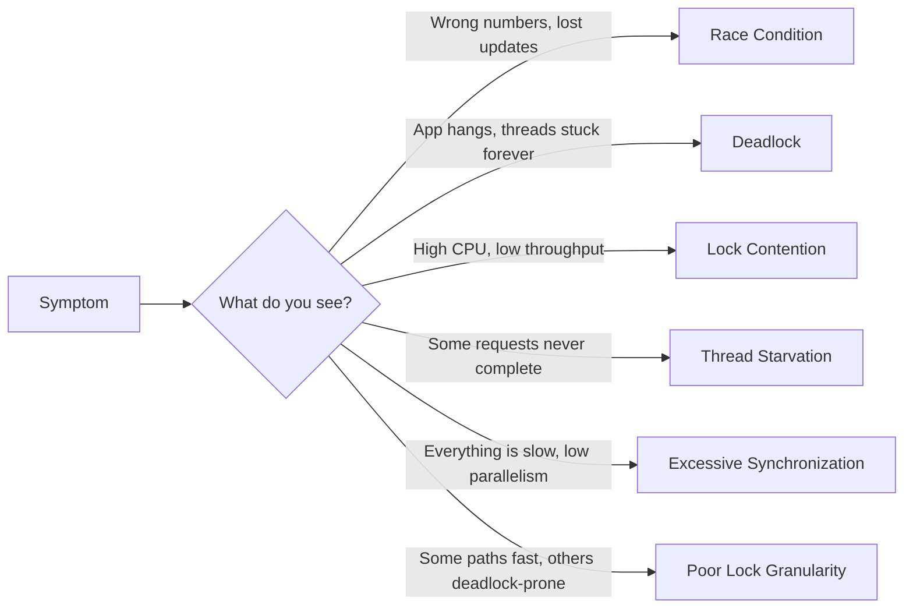

| Problem | Root Cause | Typical Fix |
|---|---|---|
| **Race conditions** | Unsynchronized read-modify-write on shared state | `synchronized`, `AtomicX`, `ReentrantLock` |
| **Deadlocks** | Circular lock-acquisition order between threads | Consistent lock ordering, `tryLock()` with timeout |
| **Lock contention** | Too many threads competing for one lock | Finer-grained locks, lock-free structures |
| **Thread starvation** | Some threads never get scheduled/acquire the lock | Fair locks, priority tuning |
| **Excessive synchronization** | Locking code that doesn't need it | Narrow the critical section, use immutable data |
| **Poor lock granularity** | One giant lock (bottleneck) or too many small locks (deadlock risk) | Balance — profile first, then adjust |

---

<a name="best-practices"></a>
## Best Practices

✅ **Adopt these practices to write safe, performant concurrent code:**

1. **Prefer immutable objects.** If state never changes, no synchronization is needed. Use `final` fields, records, and defensive copies.
2. **Use the highest-level abstraction that works.** Prefer `ConcurrentHashMap`, `AtomicInteger`, and `ExecutorService` over hand-rolled locks.
3. **Always pair `lock()` with `unlock()` in a `finally` block.** Never let an exception skip the unlock.
4. **Use `while` loops around `await()`.** Always re-check the condition after waking (spurious wakeups).
5. **Keep critical sections small.** Lock only what you must, for as short as possible.
6. **Acquire multiple locks in a consistent global order.** This is the #1 deadlock prevention technique.
7. **Prefer `tryLock()` with a timeout** over indefinite blocking where possible.
8. **Use thread pools instead of creating threads manually.** `Executors.newFixedThreadPool()` etc.
9. **Name your threads.** `new Thread(task, "order-worker-1")` makes thread dumps readable.
10. **Document your locking strategy.** A comment explaining "locks acquired in account-ID order" saves future debugging.
11. **Use `volatile` for simple visibility flags** (not compound operations).
12. **Prefer `ConcurrentHashMap.compute()`/`merge()`** over get-then-put for compound operations.
13. **Bound your concurrency.** Always cap thread pools, connection pools, and semaphore permits.
14. **Handle `InterruptedException` properly.** Restore the interrupt flag: `Thread.currentThread().interrupt()`.
15. **Test under load.** A race condition may only appear with many threads and real contention.

---

<a name="anti-patterns"></a>
## Anti-Patterns

❌ **Avoid these common mistakes:**

1. **Calling `t.run()` instead of `t.start()`.** No new thread is created; the task runs on the caller's thread.
2. **Using `if` instead of `while` around `await()`.** Leads to buffer overflows and missed signals.
3. **Treating `counter++` as atomic.** It's a read-modify-write; always synchronize or use atomics.
4. **Acquiring locks in inconsistent order.** The classic deadlock recipe.
5. **Using a semaphore as a mutex.** Any thread can `release()`, breaking exclusivity.
6. **Forgetting `finally { lock.unlock(); }`.** An exception leaves the lock held forever.
7. **One giant global lock on a high-throughput system.** Serializes everything.
8. **Assuming thread-safe collections make compound ops safe.** `cache.get()` then `cache.put()` is still a race.
9. **Creating a new thread per request.** Unbounded thread creation exhausts resources.
10. **Busy-waiting with `while (!ready) {}`.** Wastes CPU; use condition variables or `wait()`/`notify()`.
11. **Ignoring `InterruptedException`.** Swallowing it can leave threads in a broken state.
12. **Synchronizing on a mutable object.** If the lock object changes, synchronization breaks.
13. **Holding a lock while doing slow I/O.** Blocks all other threads waiting on that lock.
14. **Using `double-checked locking` without `volatile`.** The classic broken singleton pattern (fixed by `volatile` or an enum).

---

<a name="performance-considerations"></a>
## Performance Considerations

### The Cost of Synchronization

Every lock acquisition has overhead: acquiring, releasing, and potential context switching. Under low contention, `synchronized` is cheap (biased locking in older JVMs, thin locks in modern ones). Under high contention, it becomes expensive.

### Choosing the Right Tool by Scenario

| Scenario | Recommended Tool | Why |
|---|---|---|
| Single counter, high contention | `AtomicInteger` | Lock-free CAS, no context switching |
| Simple critical section | `synchronized` | Lowest overhead, simplest |
| Need timeouts/fairness/conditions | `ReentrantLock` | More features, slightly more overhead |
| Read-heavy shared data | `ReadWriteLock` / `StampedLock` | Multiple readers don't block each other |
| Key-value cache | `ConcurrentHashMap` | Fine-grained internal locking |
| Bounded resource | `Semaphore` | Permit-based limiting |

### Benchmark Insight

A rough rule of thumb (measure on your own hardware):
- `AtomicInteger.incrementAndGet()` — nanoseconds, lock-free.
- `synchronized` increment — tens of nanoseconds under low contention.
- `ReentrantLock` increment — similar to `synchronized`, slightly more overhead.
- Context switching — microseconds (thousands of nanoseconds). Avoid excessive switching.

### Tuning Tips

1. **Profile before optimizing.** Use JFR (Java Flight Recorder), JMC, or a profiler to find the actual contention point.
2. **Narrow critical sections.** Move I/O and slow operations outside the lock.
3. **Consider lock-free structures** (`ConcurrentHashMap`, `AtomicReference`, `LongAdder`) for hot paths.
4. **Use `LongAdder` for high-contention counters** that are read infrequently — it shards the counter internally.
5. **Right-size thread pools.** For CPU-bound work, ~`cores` threads. For I/O-bound, more (e.g., `cores * (1 + wait/compute)`).
6. **Avoid `parallelStream()` on small datasets** — coordination overhead exceeds the benefit.
7. **Consider virtual threads (JDK 21+)** for I/O-bound workloads — millions of lightweight threads with minimal overhead.

---

<a name="security-considerations"></a>
## Security Considerations

Concurrency bugs are not just correctness bugs — they can be **security vulnerabilities**:

### 1. Data Integrity & Financial Fraud
- **Lost updates** in banking can cause incorrect balances — a direct financial impact.
- **Overselling** in e-commerce can cause legal and reputational damage.
- **Fix:** atomic operations, database transactions, row locks.

### 2. Denial of Service (DoS) via Thread Exhaustion
- An attacker can flood a service with requests. If each request spawns a thread or grabs a connection, the pool exhausts and the service hangs.
- **Fix:** bound thread pools, connection pools, and semaphore permits. Reject excess requests gracefully.

### 3. Race Conditions in Authentication/Authorization
- A race in session/token generation could allow two users to receive the same token, or a token to be validated before it's fully initialized.
- **Fix:** use `AtomicLong`/`UUID` for unique IDs, synchronize token issuance.

### 4. TOCTOU (Time-of-Check to Time-of-Use) Attacks
- `if (canAccess(resource)) { use(resource); }` — between the check and the use, another thread may change permissions.
- **Fix:** make check-and-use atomic, or use immutable permission snapshots.

### 5. Information Leakage via Shared State
- A shared cache or buffer that isn't properly synchronized could expose partial data to another thread.
- **Fix:** use thread-safe collections, publish objects safely (via `volatile`, `final`, or `ConcurrentHashMap`).

### 6. Deadlock as a DoS Vector
- An attacker who can influence lock acquisition order could deliberately trigger deadlocks, freezing the service.
- **Fix:** consistent lock ordering, `tryLock()` with timeouts, watchdog threads.

### Security Checklist
- [ ] All shared mutable state is properly synchronized or immutable.
- [ ] Thread pools and connection pools are bounded.
- [ ] Unique ID generation is thread-safe.
- [ ] Check-and-use operations are atomic.
- [ ] Objects are safely published (no partially-constructed objects visible to other threads).
- [ ] `InterruptedException` is handled without swallowing the interrupt flag.

---

<a name="testing-strategies"></a>
## Testing Strategies

Testing concurrent code is hard because bugs are non-deterministic. Here's a layered strategy:

### 1. Unit Tests with Deterministic Interleaving
Use `CountDownLatch` and `CyclicBarrier` to force threads to collide at a specific point:

```java
import java.util.concurrent.CountDownLatch;
import java.util.concurrent.ExecutorService;
import java.util.concurrent.Executors;
import java.util.concurrent.TimeUnit;

public class RaceTest {
    @Test
    public void counterShouldBeThreadSafe() throws InterruptedException {
        SafeCounterAtomic counter = new SafeCounterAtomic();
        int threads = 8;
        int incrementsPerThread = 10_000;
        CountDownLatch ready = new CountDownLatch(threads);
        CountDownLatch start = new CountDownLatch(1);
        ExecutorService pool = Executors.newFixedThreadPool(threads);

        for (int i = 0; i < threads; i++) {
            pool.submit(() -> {
                ready.countDown();
                try { start.await(); } catch (InterruptedException e) { Thread.currentThread().interrupt(); }
                for (int j = 0; j < incrementsPerThread; j++) {
                    counter.increment();
                }
            });
        }

        ready.await();
        start.countDown(); // release all threads simultaneously
        pool.shutdown();
        pool.awaitTermination(1, TimeUnit.MINUTES);

        assertEquals(threads * incrementsPerThread, counter.getCounter());
    }
}
```

### 2. Stress / Load Testing
Run the same operation with many threads and iterations, repeatedly, to surface rare races. Tools: JMH (microbenchmarks), Gatling, JMeter.

### 3. Thread Dump Analysis
Deliberately create contention, take a `jstack` dump, and verify no deadlock. Use `jstack <pid>` or `jcmd <pid> Thread.print`.

### 4. Static Analysis
Tools like **SpotBugs**, **Error Prone**, and **SonarQube** flag common concurrency bugs (e.g., `run()` instead of `start()`, missing `finally` unlock).

### 5. Race Detectors
- **ThreadSanitizer** (for native code) — not directly for Java.
- **JCStress** — a harness for concurrency stress testing from the OpenJDK team.

### 6. Property-Based Testing
Libraries like **jqwik** or **QuickTheories** can generate many interleavings.

### Testing Checklist
- [ ] Test with 1, 2, 4, 8, 16 threads.
- [ ] Test with high iteration counts.
- [ ] Test on multi-core machines (races rarely appear on single-core).
- [ ] Use `CountDownLatch` to force collisions.
- [ ] Run tests repeatedly (e.g., 100x) to catch flaky races.
- [ ] Verify no deadlock via thread dumps.

---

<a name="troubleshooting-guide"></a>
## Troubleshooting Guide

### Symptom: Wrong numbers / lost updates
**Likely cause:** Race condition on shared mutable state.
**Diagnosis:** Look for unsynchronized read-modify-write (`counter++`, `balance += x`).
**Fix:** `synchronized`, `AtomicInteger`, or a lock. For DB, use atomic SQL updates.

### Symptom: Application hangs / threads stuck forever
**Likely cause:** Deadlock.
**Diagnosis:** Take a thread dump (`jstack <pid>`). Look for threads in `BLOCKED` state waiting on each other's locks in a cycle.
**Fix:** Consistent lock ordering, `tryLock()` with timeout.

### Symptom: High CPU, low throughput
**Likely cause:** Lock contention or busy-waiting.
**Diagnosis:** Profile. Look for many threads in `BLOCKED` state, or `while (!ready) {}` loops.
**Fix:** Finer-grained locks, lock-free structures, condition variables instead of busy-wait.

### Symptom: Some requests never complete
**Likely cause:** Thread starvation or pool exhaustion.
**Diagnosis:** Check thread pool sizes, semaphore permits, connection pool limits.
**Fix:** Bound and right-size pools; use fair locks; reject excess gracefully.

### Symptom: Everything slow, low parallelism
**Likely cause:** Excessive synchronization / one giant lock.
**Diagnosis:** Profile lock hold times. Look for a single `synchronized` on a hot path.
**Fix:** Narrow critical sections, fine-grained locks, immutable data.

### Symptom: Intermittent failures only in production
**Likely cause:** Environment-sensitive race condition.
**Diagnosis:** Reproduce with more threads/cores. Add logging around shared state. Use stress tests.
**Fix:** Proper synchronization; verify with stress testing.

### How to Take a Thread Dump
```bash
# Find the PID
jps -l

# Take a thread dump
jstack <pid>

# Or via jcmd
jcmd <pid> Thread.print
```

Look for:
- `"main" ... BLOCKED` — waiting on a lock.
- `Found one Java-level deadlock` — the JVM detects deadlocks in dumps.
- `"pool-1-thread-1" ... WAITING` — waiting on a condition.

---

<a name="pitfalls-cheat-sheet"></a>
## Common Pitfalls Cheat Sheet

| ❌ Pitfall | ✅ Fix |
|---|---|
| Calling `t.run()` instead of `t.start()` | Always call `start()` to spawn a real thread |
| Using `if` instead of `while` around `await()` | Always re-check the condition in a loop |
| Treating `counter++` as atomic | Use `synchronized`, `AtomicInteger`, or a lock |
| Acquiring multiple locks in inconsistent order | Always acquire in a fixed, agreed-upon order |
| Using a semaphore where you need exclusive ownership | Use a mutex (`synchronized`/`ReentrantLock`) instead |
| Forgetting `finally { lock.unlock(); }` | Always pair `lock()`/`unlock()` inside try/finally |
| One giant global lock on a high-throughput system | Consider fine-grained locking, but watch for deadlock |
| Assuming thread-safe collections make compound ops safe | `cache.get()` then `cache.put()` is still a race — use atomic compound methods |
| Creating a thread per request | Use a bounded thread pool |
| Busy-waiting with `while (!ready) {}` | Use condition variables / `wait()`/`notify()` |
| Swallowing `InterruptedException` | Restore the interrupt flag: `Thread.currentThread().interrupt()` |
| Synchronizing on a mutable object | Use a dedicated `final` lock object |

---

<a name="practice-exercises"></a>
## 🧪 Practice Exercises

### Exercise 1: Fix the Race Condition
Take the `InventoryRace` example and rewrite `purchase()` to be safe using `synchronized`, then again using `ReentrantLock`. Compare the code.

**Solution (synchronized):**
```java
public class InventorySafeSync {
    private int stock = 1;

    public synchronized void purchase(String customer) {
        if (stock > 0) {
            System.out.println(customer + " is buying the last item...");
            stock--;
            System.out.println(customer + " purchase confirmed. Stock now: " + stock);
        } else {
            System.out.println(customer + " sees SOLD OUT.");
        }
    }
}
```

**Solution (ReentrantLock):**
```java
import java.util.concurrent.locks.ReentrantLock;

public class InventorySafeLock {
    private int stock = 1;
    private final ReentrantLock lock = new ReentrantLock();

    public void purchase(String customer) {
        lock.lock();
        try {
            if (stock > 0) {
                System.out.println(customer + " is buying the last item...");
                stock--;
                System.out.println(customer + " purchase confirmed. Stock now: " + stock);
            } else {
                System.out.println(customer + " sees SOLD OUT.");
            }
        } finally {
            lock.unlock();
        }
    }
}
```

**Comparison:** `synchronized` is simpler and auto-releases on exception. `ReentrantLock` offers `tryLock()`, fairness, and conditions, but requires manual `finally { unlock(); }`.

---

### Exercise 2: Cause and Fix a Deadlock
Implement `BankFineGrained.transfer()` and write a test that reliably triggers a deadlock by running `A→B` and `B→A` transfers concurrently. Then apply the lock-ordering fix and confirm it resolves.

**Solution — deadlock trigger:**
```java
import java.util.concurrent.ExecutorService;
import java.util.concurrent.Executors;
import java.util.concurrent.TimeUnit;

public class DeadlockTest {
    public static void main(String[] args) throws InterruptedException {
        Account a = new Account(1000);
        Account b = new Account(1000);
        BankFineGrained bank = new BankFineGrained(); // unsafe version

        ExecutorService pool = Executors.newFixedThreadPool(2);
        pool.submit(() -> bank.transfer(a, b, 100)); // A→B
        pool.submit(() -> bank.transfer(b, a, 100)); // B→A
        pool.shutdown();
        pool.awaitTermination(5, TimeUnit.SECONDS);

        System.out.println("A balance: " + a.getBalance());
        System.out.println("B balance: " + b.getBalance());
        // If deadlocked, this never prints — the program hangs.
    }
}
```

**Solution — lock-ordering fix:**
```java
public class BankFineGrainedSafe {
    public void transfer(Account from, Account to, int amount) {
        // Always acquire locks in a consistent order (by identity hash)
        Account first = System.identityHashCode(from) < System.identityHashCode(to) ? from : to;
        Account second = (first == from) ? to : from;

        first.lock().lock();
        try {
            second.lock().lock();
            try {
                if (from.getBalance() < amount) return;
                from.debit(amount);
                to.credit(amount);
            } finally {
                second.lock().unlock();
            }
        } finally {
            first.lock().unlock();
        }
    }
}
```

**Note:** For production, use a stable unique ID (e.g., account number) rather than `identityHashCode`, which can collide.

---

### Exercise 3: Build a Rate Limiter
Use a `Semaphore` to cap concurrent calls to a mock "external API" method to 3 at a time, and prove it with a thread pool of 10 callers.

**Solution:**
```java
import java.util.concurrent.ExecutorService;
import java.util.concurrent.Executors;
import java.util.concurrent.Semaphore;
import java.util.concurrent.atomic.AtomicInteger;

public class RateLimiterDemo {
    private final Semaphore limiter = new Semaphore(3);
    private final AtomicInteger active = new AtomicInteger(0);
    private final AtomicInteger maxActive = new AtomicInteger(0);

    public void callApi(String request) {
        try {
            limiter.acquire();
            int nowActive = active.incrementAndGet();
            maxActive.accumulateAndGet(nowActive, Math::max);
            System.out.println("Calling API for " + request + " (active: " + nowActive + ")");
            Thread.sleep(200); // simulate API call
        } catch (InterruptedException e) {
            Thread.currentThread().interrupt();
        } finally {
            active.decrementAndGet();
            limiter.release();
        }
    }

    public static void main(String[] args) throws InterruptedException {
        RateLimiterDemo demo = new RateLimiterDemo();
        ExecutorService pool = Executors.newFixedThreadPool(10);

        for (int i = 1; i <= 10; i++) {
            String req = "req-" + i;
            pool.submit(() -> demo.callApi(req));
        }

        pool.shutdown();
        pool.awaitTermination(10, java.util.concurrent.TimeUnit.SECONDS);
        System.out.println("Max concurrent calls observed: " + demo.maxActive.get()); // should be 3
    }
}
```

**Verification:** `maxActive` should never exceed 3, proving the semaphore caps concurrency.

---

### Exercise 4: Producer-Consumer with Multiple Consumers
Extend `BoundedBuffer` to support multiple producer and consumer threads at once, and verify no items are lost or duplicated.

**Solution:**
```java
import java.util.concurrent.ExecutorService;
import java.util.concurrent.Executors;
import java.util.concurrent.TimeUnit;
import java.util.concurrent.atomic.AtomicInteger;

public class MultiProducerConsumer {
    public static void main(String[] args) throws InterruptedException {
        BoundedBuffer<Integer> buffer = new BoundedBuffer<>(5);
        AtomicInteger produced = new AtomicInteger(0);
        AtomicInteger consumed = new AtomicInteger(0);

        ExecutorService producers = Executors.newFixedThreadPool(3);
        ExecutorService consumers = Executors.newFixedThreadPool(3);

        // 3 producers, each producing 100 items
        for (int p = 0; p < 3; p++) {
            producers.submit(() -> {
                for (int i = 0; i < 100; i++) {
                    try {
                        buffer.put(1);
                        produced.incrementAndGet();
                    } catch (InterruptedException e) {
                        Thread.currentThread().interrupt();
                    }
                }
            });
        }

        // 3 consumers, each consuming 100 items
        for (int c = 0; c < 3; c++) {
            consumers.submit(() -> {
                for (int i = 0; i < 100; i++) {
                    try {
                        buffer.take();
                        consumed.incrementAndGet();
                    } catch (InterruptedException e) {
                        Thread.currentThread().interrupt();
                    }
                }
            });
        }

        producers.shutdown();
        consumers.shutdown();
        producers.awaitTermination(10, TimeUnit.SECONDS);
        consumers.awaitTermination(10, TimeUnit.SECONDS);

        System.out.println("Produced: " + produced.get()); // 300
        System.out.println("Consumed: " + consumed.get()); // 300
        // If both are 300, no items were lost or duplicated.
    }
}
```

**Verification:** `produced` and `consumed` must both equal 300. The `while` loops in `BoundedBuffer` ensure correctness even with multiple producers/consumers.

---

### Exercise 5: Thread Dump Analysis
Deliberately create a `BLOCKED` thread scenario, take a thread dump (`jstack`), and identify the blocking thread from the dump output.

**Solution:**
```java
public class BlockedScenario {
    public static void main(String[] args) throws InterruptedException {
        Object lock = new Object();

        Thread holder = new Thread(() -> {
            synchronized (lock) {
                try { Thread.sleep(60_000); } // hold lock for 60s
                catch (InterruptedException e) { Thread.currentThread().interrupt(); }
            }
        }, "lock-holder");

        Thread blocked = new Thread(() -> {
            synchronized (lock) {
                System.out.println("Got the lock");
            }
        }, "blocked-thread");

        holder.start();
        Thread.sleep(100);
        blocked.start();

        // While this runs, take a thread dump:
        // 1. Find PID: jps -l
        // 2. jstack <pid>
        // Look for "blocked-thread" in BLOCKED state, waiting on the lock held by "lock-holder".
        Thread.sleep(60_000);
    }
}
```

**Expected dump snippet:**
```
"blocked-thread" #13 prio=5 os_prio=0 cpu=0.00ms elapsed=... tid=... nid=... waiting for monitor entry [0x...]
   java.lang.Thread.State: BLOCKED (on object monitor)
        at BlockedScenario.lambda$main$1(BlockedScenario.java:15)
        - waiting to lock <0x...> (a java.lang.Object)
        at BlockedScenario.main(BlockedScenario.java:24)

"lock-holder" #12 prio=5 os_prio=0 cpu=... tid=... nid=... waiting on condition [0x...]
   java.lang.Thread.State: TIMED_WAITING (sleeping)
        at java.lang.Thread.sleep(Native Method)
        - locked <0x...> (a java.lang.Object)
```

The dump clearly shows `blocked-thread` in `BLOCKED` state, waiting on the monitor held by `lock-holder`.

---

### Exercise 6 (Capstone): Thread-Safe Order Processing System
Build a small system that:
1. Accepts orders from multiple threads.
2. Deducts inventory atomically (no overselling).
3. Processes orders through a bounded queue.
4. Logs each order safely.

**Solution outline:**
```java
import java.util.concurrent.*;
import java.util.concurrent.atomic.AtomicInteger;

public class OrderSystem {
    private final AtomicInteger stock = new AtomicInteger(100);
    private final BlockingQueue<String> orderQueue = new ArrayBlockingQueue<>(50);
    private final Object logLock = new Object();

    public boolean placeOrder(String customer) {
        // Atomic check-and-decrement — no overselling
        int remaining = stock.decrementAndGet();
        if (remaining < 0) {
            stock.incrementAndGet(); // roll back
            log("REJECTED: " + customer + " — out of stock");
            return false;
        }
        try {
            orderQueue.put(customer + " (stock left: " + remaining + ")");
            log("ACCEPTED: " + customer);
            return true;
        } catch (InterruptedException e) {
            Thread.currentThread().interrupt();
            stock.incrementAndGet(); // roll back
            return false;
        }
    }

    public void processOrders() {
        while (true) {
            try {
                String order = orderQueue.take();
                log("PROCESSING: " + order);
                Thread.sleep(50); // simulate work
            } catch (InterruptedException e) {
                Thread.currentThread().interrupt();
                break;
            }
        }
    }

    private void log(String message) {
        synchronized (logLock) {
            System.out.println(Thread.currentThread().getName() + ": " + message);
        }
    }

    public static void main(String[] args) throws InterruptedException {
        OrderSystem system = new OrderSystem();
        ExecutorService customers = Executors.newFixedThreadPool(20);
        Thread processor = new Thread(system::processOrders, "order-processor");
        processor.start();

        for (int i = 1; i <= 150; i++) {
            String customer = "customer-" + i;
            customers.submit(() -> system.placeOrder(customer));
        }

        customers.shutdown();
        customers.awaitTermination(10, TimeUnit.SECONDS);
        processor.interrupt();
        System.out.println("Done. Stock remaining: " + system.stock.get()); // should be 0
    }
}
```

**Verification:** Exactly 100 orders are accepted (stock never goes negative), and all accepted orders are processed through the bounded queue.

---

<a name="question-bank"></a>
## 📚 Question Bank

### Beginner Level (Q1–Q20)

**Q1.** What is concurrency?
**A1.** The ability of a system to handle multiple tasks by interleaving their execution, so multiple tasks make progress even if not executing simultaneously.

**Q2.** What is parallelism?
**A2.** Executing multiple tasks literally at the same instant, requiring multiple CPU cores.

**Q3.** Can you have concurrency on a single-core machine?
**A3.** Yes. A single core can interleave threads via time-slicing, creating the illusion of simultaneous progress.

**Q4.** What is the difference between a process and a thread?
**A4.** A process is an isolated running program with its own memory. A thread is a lightweight execution unit inside a process, sharing the process's heap memory.

**Q5.** What are the six states of a Java thread?
**A5.** NEW, RUNNABLE, BLOCKED, WAITING, TIMED_WAITING, TERMINATED.

**Q6.** What is the difference between `start()` and `run()`?
**A6.** `start()` spawns a new OS thread and runs the task on it. `run()` executes the task on the current thread without creating a new thread.

**Q7.** What is a race condition?
**A7.** A situation where multiple threads access shared mutable state, at least one modifies it, and the result depends on execution order.

**Q8.** Why is `counter++` not atomic?
**A8.** It's a read-modify-write: read the value, increment locally, write back. Between the read and write, another thread can interfere.

**Q9.** What is a mutex?
**A9.** A mutual exclusion lock ensuring only one thread at a time accesses a critical section. It has an owner — only the acquiring thread can release it.

**Q10.** What is a semaphore?
**A10.** A synchronization primitive with a set of permits. `acquire()` takes a permit (blocking if none), `release()` returns one.

**Q11.** What is a condition variable used for?
**A11.** Letting threads wait until a specific condition becomes true, signaled by other threads, avoiding busy-waiting.

**Q12.** What is a reentrant lock?
**A12.** A lock that allows the thread already holding it to acquire it again without deadlocking, tracking a hold count.

**Q13.** What does `synchronized` do?
**A13.** It acquires the intrinsic monitor lock of an object, ensuring only one thread executes the synchronized block/method at a time.

**Q14.** What is `AtomicInteger`?
**A14.** A thread-safe integer wrapper using compare-and-swap (CAS) for lock-free atomic operations like `incrementAndGet()`.

**Q15.** What is a thread pool?
**A15.** A pool of reusable worker threads that execute submitted tasks, avoiding the cost of creating a new thread per task.

**Q16.** What does `Thread.sleep(ms)` do?
**A16.** Puts the current thread into TIMED_WAITING for the specified milliseconds. It does NOT release any held locks.

**Q17.** What does `Object.wait()` do?
**A17.** Releases the monitor lock and puts the thread into WAITING until `notify()`/`notifyAll()` is called.

**Q18.** What is a deadlock?
**A18.** A situation where two or more threads each hold a lock and wait for a lock held by another, so none can proceed.

**Q19.** What is `volatile` used for?
**A19.** Ensuring visibility of a variable's value across threads. It prevents caching the value in a thread's local memory but does NOT make compound operations atomic.

**Q20.** What is the `ExecutorService`?
**A20.** A higher-level API for managing thread pools and submitting tasks, replacing manual thread creation.

### Intermediate Level (Q21–Q40)

**Q21.** What is the difference between `sleep()` and `wait()` regarding locks?
**A21.** `sleep()` does NOT release the lock. `wait()` DOES release the lock and reacquires it when awakened.

**Q22.** Why should you use `while` instead of `if` around `await()`?
**A22.** Because of spurious wakeups and the possibility that another thread changed the condition between waking and reacquiring the lock. Re-checking in a loop prevents buffer overflow/underflow.

**Q23.** What is a spurious wakeup?
**A23.** A thread waking from `wait()`/`await()` without a signal, which the JVM is permitted to do. Always re-check the condition in a loop.

**Q24.** What is the difference between a mutex and a binary semaphore?
**A24.** A mutex has ownership (only the acquiring thread can release). A binary semaphore has no ownership — any thread can call `release()`.

**Q25.** What is lock contention?
**A25.** When many threads compete for the same lock, causing them to block and reducing throughput.

**Q26.** What is thread starvation?
**A26.** When some threads never get scheduled or never acquire a lock because others keep getting it first. Fair locks help.

**Q27.** What is coarse-grained vs fine-grained locking?
**A27.** Coarse-grained uses one global lock (simple but bottleneck). Fine-grained uses per-resource locks (higher throughput but deadlock risk).

**Q28.** How do you prevent deadlock with multiple locks?
**A28.** Always acquire locks in a consistent global order, or use `tryLock()` with timeouts.

**Q29.** What is the hold count in a `ReentrantLock`?
**A29.** The number of times the owning thread has acquired the lock without releasing. The lock is released when the count reaches zero.

**Q30.** What does `tryLock()` do?
**A30.** Attempts to acquire the lock without blocking (or with a timeout). Returns `true` if acquired, `false` otherwise.

**Q31.** What is a fair lock?
**A31.** A lock that grants access to the longest-waiting thread first, reducing starvation at some throughput cost.

**Q32.** What is `ConcurrentHashMap` and why is it thread-safe?
**A32.** A thread-safe map using fine-grained internal locking (bucket-level) so different keys can be updated concurrently.

**Q33.** Why is `cache.get(key)` then `cache.put(key, ...)` still a race even with `ConcurrentHashMap`?
**A33.** Because the get and put are separate operations. Another thread can modify the key between them. Use `compute()`/`merge()` for atomic compound operations.

**Q34.** What is the producer-consumer pattern?
**A34.** Producers add items to a shared buffer; consumers remove them. Condition variables or blocking queues coordinate the two.

**Q35.** What is `BlockingQueue`?
**A35.** A thread-safe queue where `put()` blocks when full and `take()` blocks when empty — a ready-made producer-consumer solution.

**Q36.** What is the difference between `signal()` and `signalAll()`?
**A36.** `signal()` wakes one waiting thread; `signalAll()` wakes all. Use `signalAll()` when multiple threads may be waiting on the same condition.

**Q37.** What is a `CountDownLatch`?
**A37.** A synchronization aid that lets one or more threads wait until a set of operations completes (count reaches zero).

**Q38.** What is a `CyclicBarrier`?
**A38.** A synchronization aid where a set of threads wait for each other to reach a common barrier point, then proceed together. It's reusable.

**Q39.** What is the difference between `CountDownLatch` and `CyclicBarrier`?
**A39.** `CountDownLatch` is one-shot (count goes to zero and stays). `CyclicBarrier` is reusable and all threads wait for each other.

**Q40.** What is `LongAdder` and when should you use it?
**A40.** A high-contention counter that shards the count internally, reducing contention. Best when the counter is updated frequently but read infrequently.

### Advanced Level (Q41–Q60)

**Q41.** What is the Java Memory Model (JMM)?
**A41.** The formal specification defining how threads interact through memory, including visibility, ordering, and atomicity guarantees. It defines when writes by one thread are visible to others.

**Q42.** What is the `happens-before` relationship?
**A42.** A JMM rule: if action A happens-before action B, then A's effects are visible to B. Examples: unlock happens-before subsequent lock; `volatile` write happens-before subsequent read; thread start happens-before its actions.

**Q43.** What is the double-checked locking pattern and why is it problematic?
**A43.** A lazy-initialization pattern checking a field twice to avoid synchronization cost. It's broken without `volatile` because of reordering — a partially-constructed object can be visible. Fix: use `volatile` or an enum singleton.

**Q44.** What is a `ReadWriteLock`?
**A44.** A lock allowing multiple readers or one writer. Readers don't block each other; writers get exclusive access. Improves throughput for read-heavy workloads.

**Q45.** What is `StampedLock`?
**A45.** A JDK 8 lock offering optimistic reads, improving read performance further than `ReadWriteLock` for read-heavy, low-write scenarios.

**Q46.** What is the ForkJoinPool?
**A46.** A specialized thread pool for divide-and-conquer tasks, used by `parallelStream()`. It uses work-stealing to balance load.

**Q47.** What is work-stealing?
**A47.** A scheduling strategy where idle threads steal tasks from busy threads' queues, improving load balance in ForkJoinPool.

**Q48.** What is a `CompletableFuture`?
**A48.** A JDK 8 class for asynchronous programming, composing async operations with callbacks, combining results, and handling errors.

**Q49.** What are virtual threads (JDK 21+)?
**A49.** Lightweight threads managed by the JVM, allowing millions of concurrent threads with minimal overhead, ideal for I/O-bound workloads.

**Q50.** What is structured concurrency?
**A50.** A programming model where concurrent tasks are scoped to a block, ensuring they complete or are cancelled together, improving error handling and cancellation.

**Q51.** What is the difference between `synchronized` and `ReentrantLock`?
**A51.** `synchronized` is simpler, auto-releases on exception, but offers no timeout/fairness/conditions. `ReentrantLock` offers `tryLock()`, fairness, `lockInterruptibly()`, and `Condition`s, but requires manual unlock in `finally`.

**Q52.** What is a `ThreadLocal`?
**A52.** A variable that gives each thread its own copy, avoiding shared-state races. Useful for per-thread context (e.g., request IDs) but must be cleaned up to avoid memory leaks.

**Q53.** What is the `ExecutorService.shutdown()` vs `shutdownNow()` difference?
**A53.** `shutdown()` stops accepting new tasks and lets running tasks finish. `shutdownNow()` attempts to stop running tasks (via interrupt) and returns queued tasks.

**Q54.** What is a `ScheduledExecutorService`?
**A54.** An executor that can schedule tasks to run after a delay or periodically, replacing `Timer`.

**Q55.** What is the `ForkJoinPool.commonPool()`?
**A55.** The shared ForkJoinPool used by `parallelStream()`. Its parallelism defaults to `cores - 1`.

**Q56.** What is a `Phaser`?
**A56.** A reusable synchronization barrier, more flexible than `CyclicBarrier`, supporting dynamic numbers of parties and phase-based coordination.

**Q57.** What is the `Exchanger`?
**A57.** A synchronization point where two threads exchange objects. Useful for pipeline patterns.

**Q58.** What is the `Semaphore` fairness parameter?
**A58.** `new Semaphore(3, true)` creates a fair semaphore granting permits to the longest-waiting thread first, reducing starvation.

**Q59.** What is the `AtomicReference`?
**A59.** A thread-safe reference wrapper using CAS, allowing atomic updates to object references.

**Q60.** What is the `Unsafe` class and why is it dangerous?
**A60.** A low-level class providing direct memory access and CAS operations. It's internal, unstable, and dangerous — avoid it; use `java.util.concurrent.atomic` instead.

---

<a name="test-your-understanding"></a>
## ✅ Test Your Understanding

Answer these 10 questions to check your grasp of the material:

**1.** Explain the difference between concurrency and parallelism in one sentence each.
<details><summary>Answer</summary>Concurrency is interleaving tasks so they make progress; parallelism is executing tasks simultaneously on multiple cores.</details>

**2.** Why does `counter++` in two threads sometimes produce a value less than expected?
<details><summary>Answer</summary>Because `counter++` is a read-modify-write. Both threads can read the same value before either writes back, losing one increment.</details>

**3.** What is the key difference between `sleep()` and `wait()` regarding locks?
<details><summary>Answer</summary>`sleep()` does not release the lock; `wait()` releases it and reacquires on wake.</details>

**4.** Why must you use `while` instead of `if` around `await()`?
<details><summary>Answer</summary>Because of spurious wakeups and the possibility another thread changed the condition before the lock was reacquired.</details>

**5.** What distinguishes a mutex from a binary semaphore?
<details><summary>Answer</summary>A mutex has ownership (only the acquiring thread releases); a binary semaphore has no ownership.</details>

**6.** How do you prevent deadlock when acquiring multiple locks?
<details><summary>Answer</summary>Acquire locks in a consistent global order, or use `tryLock()` with timeouts.</details>

**7.** What does a reentrant lock's hold count represent?
<details><summary>Answer</summary>The number of times the owning thread has acquired the lock without releasing. The lock releases when the count reaches zero.</details>

**8.** Why is `cache.get(key)` then `cache.put(key, ...)` still a race with `ConcurrentHashMap`?
<details><summary>Answer</summary>Because get and put are separate operations; another thread can modify the key between them. Use `compute()`/`merge()`.</details>

**9.** What is the difference between `signal()` and `signalAll()`?
<details><summary>Answer</summary>`signal()` wakes one waiting thread; `signalAll()` wakes all. Use `signalAll()` when multiple threads wait on the same condition.</details>

**10.** What is the `happens-before` relationship in the Java Memory Model?
<details><summary>Answer</summary>A JMM rule ensuring that if action A happens-before action B, A's effects are visible to B (e.g., unlock before subsequent lock, volatile write before read).</details>

---

<a name="common-interview-questions"></a>
## 💼 Common Interview Questions

**Q1.** "What is the difference between concurrency and parallelism?" 
**Answer:** Concurrency is about dealing with multiple tasks by interleaving (structure/responsiveness, works on one core). Parallelism is executing tasks simultaneously (raw speed, needs multiple cores).

**Q2.** "Explain the Java thread lifecycle."
**Answer:** NEW → RUNNABLE → (BLOCKED/WAITING/TIMED_WAITING) → TERMINATED. NEW after creation, RUNNABLE after `start()`, BLOCKED waiting for a monitor, WAITING via `wait()`/`join()`, TIMED_WAITING with a timeout, TERMINATED when `run()` completes.

**Q3.** "What is a race condition and how do you fix it?"
**Answer:** Multiple threads accessing shared mutable state with order-dependent results. Fix with `synchronized`, `AtomicInteger`, `ReentrantLock`, or atomic DB operations.

**Q4.** "What is the difference between `synchronized` and `ReentrantLock`?"
**Answer:** `synchronized` is simpler, auto-releases, but no timeout/fairness/conditions. `ReentrantLock` offers `tryLock()`, fairness, `lockInterruptibly()`, and `Condition`s, but needs manual unlock in `finally`.

**Q5.** "How do you prevent deadlocks?"
**Answer:** Consistent lock ordering, `tryLock()` with timeouts, avoiding holding multiple locks when possible, and using higher-level abstractions.

**Q6.** "What is the difference between `sleep()`, `wait()`, and `join()`?"
**Answer:** `sleep()` pauses without releasing locks. `wait()` releases the lock and waits for a signal. `join()` waits for another thread to terminate.

**Q7.** "What is a semaphore and when would you use it?"
**Answer:** A permit-based limiter. Use for resource pools, rate limiting, connection limits — capping concurrent access to a resource.

**Q8.** "What is the Java Memory Model and why does it matter?"
**Answer:** The formal spec for thread-memory interaction (visibility, ordering, atomicity). It defines `happens-before` rules, ensuring correct synchronization and preventing subtle visibility bugs.

**Q9.** "What is the difference between `CountDownLatch` and `CyclicBarrier`?"
**Answer:** `CountDownLatch` is one-shot, waiting for a count to reach zero. `CyclicBarrier` is reusable, where all threads wait for each other at a barrier.

**Q10.** "What are virtual threads and when should you use them?"
**Answer:** JDK 21+ lightweight threads managed by the JVM, enabling millions of concurrent threads. Ideal for I/O-bound workloads where platform threads would be blocked waiting.

**Q11.** "What is the double-checked locking pattern and how do you fix it?"
**Answer:** A lazy-init pattern that's broken without `volatile` due to reordering. Fix with `volatile` field or an enum singleton.

**Q12.** "How would you test a race condition?"
**Answer:** Use `CountDownLatch`/`CyclicBarrier` to force collisions, stress tests with many threads/iterations, thread dump analysis, static analysis tools, and JCStress.

---

<a name="self-assessment-checklist"></a>
## 📋 Self-Assessment Checklist

Rate yourself on each item (✅ confident / 🔶 learning / ❌ need review):

- [ ] I can explain concurrency vs parallelism with examples.
- [ ] I can describe the six thread states and what triggers each transition.
- [ ] I can identify a race condition in code and explain why `counter++` is unsafe.
- [ ] I can fix a race condition with `synchronized`, `AtomicInteger`, and `ReentrantLock`.
- [ ] I can explain the difference between a mutex and a semaphore.
- [ ] I can implement a producer-consumer pattern with condition variables.
- [ ] I can explain why `while` (not `if`) is required around `await()`.
- [ ] I can explain coarse vs fine-grained locking and their trade-offs.
- [ ] I can prevent deadlocks with consistent lock ordering.
- [ ] I can explain reentrancy and the hold count.
- [ ] I can diagnose a deadlock from a thread dump.
- [ ] I can build a rate limiter with a semaphore.
- [ ] I can explain the Java Memory Model and `happens-before`.
- [ ] I can test concurrent code with latches and stress tests.
- [ ] I can identify and avoid common concurrency anti-patterns.

**If you checked ❌ on any item, revisit the corresponding section before moving on.**

---

<a name="hands-on-lab"></a>
## 🛠️ Hands-On Lab: Thread-Safe Order Processing System

This capstone project ties together everything you've learned.

### Requirements
Build a thread-safe order processing system that:
1. Accepts orders from multiple concurrent customers.
2. Deducts inventory **atomically** (never oversells).
3. Processes orders through a **bounded queue** (producer-consumer).
4. Logs each order **safely** (no interleaved/corrupted log lines).
5. Handles out-of-stock gracefully.

### Starter Code

```java
import java.util.concurrent.*;
import java.util.concurrent.atomic.AtomicInteger;

public class OrderSystem {
    private final AtomicInteger stock = new AtomicInteger(100);
    private final BlockingQueue<String> orderQueue = new ArrayBlockingQueue<>(50);
    private final Object logLock = new Object();

    public boolean placeOrder(String customer) {
        // TODO: Implement atomic check-and-decrement (no overselling)
        return false;
    }

    public void processOrders() {
        // TODO: Implement consumer that takes from orderQueue and logs
    }

    private void log(String message) {
        // TODO: Implement thread-safe logging
    }

    public static void main(String[] args) throws InterruptedException {
        // TODO: Set up thread pool, submit 150 customers, start processor
    }
}
```

### Steps
1. Implement `placeOrder()` using `AtomicInteger.decrementAndGet()` with rollback on negative.
2. Implement `processOrders()` using `orderQueue.take()`.
3. Implement `log()` with `synchronized`.
4. In `main()`, create a thread pool of 20 customers submitting 150 orders, and a processor thread.
5. Verify: exactly 100 orders accepted, stock never negative, all accepted orders processed.

### Expected Output (partial)
```
pool-1-thread-1: ACCEPTED: customer-1
order-processor: PROCESSING: customer-1 (stock left: 99)
...
pool-1-thread-20: REJECTED: customer-150 — out of stock
Done. Stock remaining: 0
```

### Extension Challenges
- Add a `ReentrantLock`-based inventory instead of `AtomicInteger`.
- Add a `Semaphore` to limit concurrent order placement.
- Add a `CountDownLatch` to wait for all orders before shutdown.
- Add graceful shutdown of the processor thread.

---

<a name="pro-tips"></a>
## 💡 Pro Tips

1. **Use `LongAdder` for hot counters.** If a counter is incremented millions of times but read rarely (e.g., metrics), `LongAdder` shards internally and beats `AtomicInteger` under contention.

2. **Prefer `ConcurrentHashMap.compute()` over get-then-put.** It's atomic and avoids the classic compound-operation race.

3. **Name your threads and thread pools.** `new Thread(task, "order-worker-1")` and `Executors.newFixedThreadPool(4, namedFactory)` make thread dumps instantly readable.

4. **Use `ThreadLocal` carefully.** It can leak memory in thread pools (threads are reused). Always `remove()` in a `finally` block.

5. **Consider virtual threads (JDK 21+) for I/O-bound work.** Millions of lightweight threads with minimal overhead can replace complex async code. But they don't help CPU-bound work.

6. **Use `StampedLock` for read-heavy, low-write scenarios.** Its optimistic reads can outperform `ReadWriteLock`.

7. **Profile before optimizing.** Use JFR (`jcmd <pid> JFR.start`) to find real contention points — don't guess.

8. **Prefer `BlockingQueue` over hand-rolled condition variables.** `ArrayBlockingQueue`, `LinkedBlockingQueue` are battle-tested producer-consumer solutions.

9. **Use `CompletableFuture` for async composition.** It's more readable than raw threads for dependent async operations.

10. **Always restore the interrupt flag.** When catching `InterruptedException`, call `Thread.currentThread().interrupt()` so higher layers know the thread was interrupted.

11. **Document your locking order.** A one-line comment ("locks acquired in account-ID order") prevents future deadlock bugs.

12. **Test on multi-core machines.** Races rarely appear on single-core dev machines. Use CI runners with multiple cores.

---

<a name="summary"></a>
## Summary / Key Takeaways

Every concurrency bug in production traces back to one of the ten concepts above: a misunderstanding of what's shared, what's atomic, what's ordered, and what's signaled. The mental models — the kitchen, the parking lot, the vault, the master key — aren't just teaching aids; they're the same models experienced engineers use to reason about a stack trace at 2 a.m.

### Key Takeaways

| Concept | Core Idea | Key Tool |
|---|---|---|
| **Concurrency** | Interleaving tasks for progress | Threads, thread pools |
| **Parallelism** | Simultaneous execution on cores | Parallel streams, ForkJoinPool |
| **Processes vs Threads** | Isolation vs shared memory | IPC vs shared variables |
| **Thread Lifecycle** | Six states, transitions | `Thread.State` |
| **Race Conditions** | Order-dependent shared state | `synchronized`, `AtomicInteger` |
| **Mutex** | Exclusive access, ownership | `synchronized`, `ReentrantLock` |
| **Semaphore** | N permits, no ownership | `Semaphore` |
| **Condition Variables** | Wait for a condition | `Condition` |
| **Lock Granularity** | One lock vs many | Coarse vs fine-grained |
| **Reentrant Locks** | Same thread re-acquires | `ReentrantLock` |

### The Golden Rules
1. **Correctness first** — concurrency is about keeping data correct, not speed.
2. **Use the highest-level abstraction** that works.
3. **Always pair lock/unlock in try/finally.**
4. **Use `while` around `await()`.**
5. **Acquire locks in consistent order.**
6. **Bound your concurrency** — pools, semaphores, limits.
7. **Test under load** — races hide until production.

The next time you write `counter++` inside a multithreaded method, picture two chefs reaching for the same pot at the same time — and reach for the right tool instead.

---

<a name="further-reading"></a>
## 📖 Further Reading / Resources

### Official Documentation
- [Oracle Java Concurrency Tutorial](https://docs.oracle.com/javase/tutorial/essential/concurrency/) — The official guide.
- [java.util.concurrent Package Summary](https://docs.oracle.com/en/java/javase/17/docs/api/java.base/java/util/concurrent/package-summary.html) — API reference.
- [Java Memory Model (JSR 133)](https://jcp.org/en/jsr/detail?id=133) — The formal specification.
- [JEP 444: Virtual Threads](https://openjdk.org/jeps/444) — Virtual threads proposal (JDK 21).
- [JEP 428: Structured Concurrency](https://openjdk.org/jeps/428) — Structured concurrency (incubator).

### Books
- **Java Concurrency in Practice** by Brian Goetz — *The* definitive book on Java concurrency.
- **Effective Java** by Joshua Bloch — Item 78–84 cover concurrency best practices.
- **Concurrent Programming in Java** by Doug Lea — The foundational text.

### Tools
- **JCStress** — OpenJDK concurrency stress-testing harness.
- **JMH** — Java Microbenchmark Harness for performance testing.
- **JFR / JMC** — Java Flight Recorder and Mission Control for profiling.
- **SpotBugs / Error Prone** — Static analysis for concurrency bugs.

### Community & Articles
- [Baeldung Java Concurrency](https://www.baeldung.com/java-concurrency) — Practical tutorials.
- [InfoQ Java Concurrency](https://www.infoq.com/java-concurrency/) — Articles and talks.
- [Inside Java (Oracle blog)](https://inside.java/) — Official Java blog with concurrency updates.

### Learning Path Recommendation
1. Master the fundamentals (this tutorial).
2. Read **Java Concurrency in Practice** chapters 1–5.
3. Build the hands-on lab and exercises.
4. Explore virtual threads and structured concurrency (JDK 21+).
5. Study real production patterns (connection pools, rate limiters, event-driven systems).
6. Practice with JCStress and JMH to validate your understanding.

---

*This tutorial was created following the knowledge-base tutorial preferences. All code examples are designed to be runnable with JDK 11+ (JDK 17+ recommended).*