# Mastering Reactive Programming in Spring WebFlux: A Complete Guide to Avoiding the 10 Most Common Anti-Patterns

> **Difficulty:** Intermediate  
> **Estimated Reading Time:** 45–60 minutes  
> **Last Updated:** 2026-08-15  
> **Applies to:** Spring Boot 3.x, Project Reactor 3.x, Java 17+

---

## Table of Contents

1. [Introduction](#introduction)
2. [Prerequisites](#prerequisites)
3. [Learning Objectives](#learning-objectives)
4. [How Reactor's Threading Model Actually Works](#how-reactors-threading-model-actually-works)
5. [Anti-Pattern #1: Blocking Calls Inside Reactive Pipelines](#anti-pattern-1-blocking-calls-inside-reactive-pipelines)
6. [Anti-Pattern #2: Using Reactive for Everything](#anti-pattern-2-using-reactive-for-everything)
7. [Anti-Pattern #3: Calling `subscribe()` in Business Logic](#anti-pattern-3-calling-subscribe-in-business-logic)
8. [Anti-Pattern #4: Ignoring Backpressure](#anti-pattern-4-ignoring-backpressure)
9. [Anti-Pattern #5: Excessive `flatMap` Nesting](#anti-pattern-5-excessive-flatmap-nesting)
10. [Anti-Pattern #6: Mixing Imperative and Reactive Styles Incorrectly](#anti-pattern-6-mixing-imperative-and-reactive-styles-incorrectly)
11. [Anti-Pattern #7: Swallowing Errors with `onErrorResume()` Everywhere](#anti-pattern-7-swallowing-errors-with-onerrorresume-everywhere)
12. [Anti-Pattern #8: Creating Huge Reactive Chains That Nobody Can Read](#anti-pattern-8-creating-huge-reactive-chains-that-nobody-can-read)
13. [Anti-Pattern #9: Sharing Mutable State Across Reactive Streams](#anti-pattern-9-sharing-mutable-state-across-reactive-streams)
14. [Anti-Pattern #10: Not Testing Reactive Flows Properly](#anti-pattern-10-not-testing-reactive-flows-properly)
15. [Putting It All Together: A Decision Framework](#putting-it-all-together-a-decision-framework)
16. [Key Lessons from Production](#key-lessons-from-production)
17. [Quick-Reference Summary Table](#quick-reference-summary-table)
18. [Performance Considerations](#performance-considerations)
19. [Security Considerations](#security-considerations)
20. [Testing Strategies](#testing-strategies)
21. [Troubleshooting & Common Pitfalls](#troubleshooting--common-pitfalls)
22. [Practice Exercises with Solutions](#practice-exercises-with-solutions)
23. [Test Your Understanding](#test-your-understanding)
24. [Common Interview Questions](#common-interview-questions)
25. [Question Bank (50+ Questions)](#question-bank-50-questions)
26. [Self-Assessment Checklist](#self-assessment-checklist)
27. [Hands-On Lab: Build a Reactive Order Service](#hands-on-lab-build-a-reactive-order-service)
28. [Pro Tips](#pro-tips)
29. [Further Reading & Resources](#further-reading--resources)
30. [Conclusion & Next Steps](#conclusion--next-steps)

---

## Introduction

Spring WebFlux and Project Reactor transformed how Java developers build high-throughput, non-blocking applications. Instead of dedicating one thread per incoming request (the traditional Spring MVC / Servlet model), WebFlux runs on a small pool of event-loop threads that can juggle thousands of concurrent connections through asynchronous, non-blocking I/O.

That power comes with a steep learning curve. Reactive programming isn't "the same code with different method names" — it's a fundamentally different **concurrency model**. Developers who don't fully internalize this shift end up writing code that *compiles*, *passes unit tests*, and then **collapses in production** under real traffic.

This tutorial is built from a review of 50 real-world Spring WebFlux codebases. We'll walk through the 10 anti-patterns that appear over and over, explain *why* they happen, *why* they're dangerous, and — most importantly — how to fix and prevent them. Each section includes:

- A clear explanation of the concept
- Multiple examples (not just one)
- Diagrams to visualize what's actually happening under the hood
- Real-world use cases and consequences
- Best practices and interview-ready explanations

Let's start by understanding the mental model shift required to work with Reactor safely.

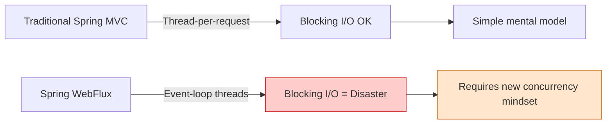

> 💡 **The Core Insight:** The moment you adopt WebFlux, you trade a simple, forgiving mental model (one thread per request) for a powerful but unforgiving one (shared event-loop threads). Every anti-pattern in this tutorial is a violation of the rules that keep that shared model healthy.

---

## Prerequisites

Before diving in, you should be comfortable with:

| Prerequisite | Why It Matters |
|---|---|
| **Java 17+** | Records, sealed classes, and modern syntax used in examples |
| **Spring Boot 3.x basics** | Annotations, dependency injection, auto-configuration |
| **Maven or Gradle** | Building and running the sample projects |
| **Basic functional programming** | Lambdas, method references, streams |
| **Understanding of HTTP & REST** | Controllers, status codes, async semantics |
| **Familiarity with JDBC/JPA** | To appreciate the contrast with R2DBC and reactive drivers |

**Recommended setup:**
- JDK 17+ (Temurin or OpenJDK)
- IntelliJ IDEA or VS Code with Java extensions
- Maven 3.8+ or Gradle 7.5+
- Docker (for the hands-on lab's database)

---

## Learning Objectives

By the end of this tutorial, you will be able to:

1. **Explain** how Reactor's event-loop threading model differs from the servlet thread-per-request model.
2. **Identify** all 10 common reactive anti-patterns in code reviews.
3. **Fix** blocking calls using `Schedulers.boundedElastic()` and non-blocking clients.
4. **Design** reactive pipelines that respect backpressure with explicit concurrency and buffering strategies.
5. **Refactor** deeply nested `flatMap` chains into readable, composable flows.
6. **Test** reactive flows properly using `StepVerifier`, virtual time, and BlockHound.
7. **Apply** a decision framework to evaluate any reactive code for production-readiness.
8. **Articulate** interview-ready explanations of reactive concepts and trade-offs.

---

## How Reactor's Threading Model Actually Works

Before diving into the anti-patterns, it helps to visualize what an event loop actually does. Unlike a servlet container that spins up a thread per request, Reactor Netty typically runs a **fixed pool of threads** (often equal to the number of CPU cores).

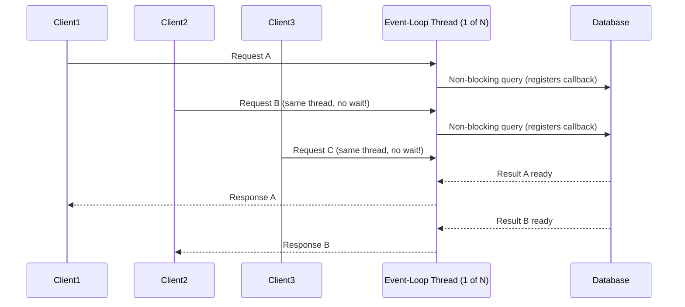

This is the magic: one thread can *interleave* work across many requests because it never sits idle waiting for I/O. But this magic has one absolute rule:

> ⚠️ **The Absolute Rule:** If you block that thread — even once, even briefly — every other request queued behind it stalls too.

This single rule explains almost every anti-pattern in this tutorial. Keep it in mind as you read on.

### The Threading Model in Detail

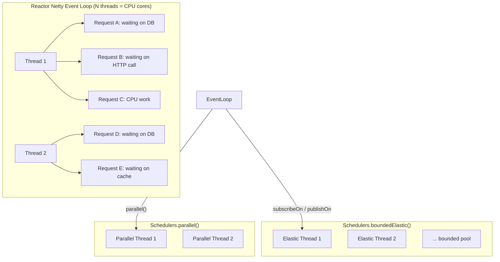

**Key takeaways:**
- **Event-loop threads** (`Schedulers.parallel()` in Reactor, Netty event loops in WebFlux) handle the vast majority of work. They must never block.
- **`Schedulers.boundedElastic()`** is the designated escape hatch for blocking I/O. It has a bounded pool (default 10× CPU cores) and a queue.
- **`Schedulers.parallel()`** is for CPU-bound parallel work, sized to CPU cores.

---

## Anti-Pattern #1: Blocking Calls Inside Reactive Pipelines

### What It Is

Using a blocking operation — a JDBC call, `RestTemplate`, `Thread.sleep()`, file I/O, or any synchronous library — directly inside a `Mono`/`Flux` operator such as `map()`, `flatMap()`, or `doOnNext()`.

### Why Developers Do It

Most Java developers learned on blocking APIs. When migrating to WebFlux, it's tempting to keep the same database driver or HTTP client and just "wrap" the call in a reactive type, assuming that wrapping alone makes it non-blocking. It doesn't — wrapping a blocking call in `Mono.just()` still executes that blocking call on whatever thread invoked it.

### Why It's Dangerous

Referring back to our event-loop diagram: if even one of those N threads blocks for 200ms waiting on a slow SOAP call, that thread can't process *any* other request during that window. Multiply this across concurrent users and you get **thread starvation** — the entire server appears "frozen" even though CPU usage looks low.

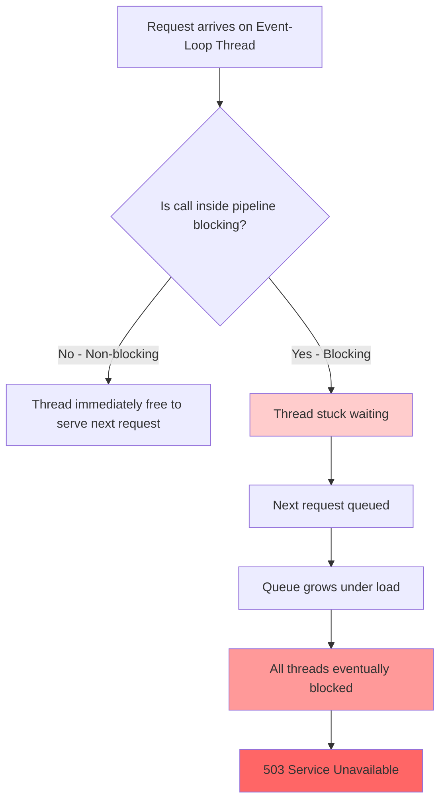

### Real-World Example

An order-management service called a legacy SOAP service using a blocking `HttpURLConnection` inside a `flatMap()`. During a flash sale, the event-loop pool exhausted in under a minute — the service returned 503s even though every downstream dependency was healthy. The bottleneck wasn't the database or the network; it was **thread availability**.

### Additional Example: File I/O

```java
// ❌ Incorrect - blocking file read on event-loop thread
public Mono<String> readConfig(String path) {
    return Mono.just(path)
            .map(p -> {
                try {
                    return Files.readString(Paths.get(p)); // BLOCKS
                } catch (IOException e) {
                    throw new RuntimeException(e);
                }
            });
}

// ✅ Correct - offloaded to boundedElastic
public Mono<String> readConfig(String path) {
    return Mono.fromCallable(() -> Files.readString(Paths.get(path)))
            .subscribeOn(Schedulers.boundedElastic());
}
```

### Additional Example: JDBC Inside a Reactive Controller

```java
// ❌ Incorrect
@GetMapping("/legacy-orders/{id}")
public Mono<Order> getOrder(@PathVariable String id) {
    return Mono.just(jdbcOrderRepository.findById(id)); // Blocking JDBC call executed eagerly & on event-loop
}

// ✅ Correct
@GetMapping("/legacy-orders/{id}")
public Mono<Order> getOrder(@PathVariable String id) {
    return Mono.fromCallable(() -> jdbcOrderRepository.findById(id))
            .subscribeOn(Schedulers.boundedElastic());
}
```

### Additional Example: `Thread.sleep()` in a Pipeline

```java
// ❌ Incorrect - simulating delay with Thread.sleep
public Mono<String> simulateDelay(String value) {
    return Mono.just(value)
            .map(v -> {
                try {
                    Thread.sleep(500); // BLOCKS the event loop!
                    return v.toUpperCase();
                } catch (InterruptedException e) {
                    Thread.currentThread().interrupt();
                    throw new RuntimeException(e);
                }
            });
}

// ✅ Correct - use Reactor's delay operator
public Mono<String> simulateDelay(String value) {
    return Mono.just(value)
            .delayElement(Duration.ofMillis(500)) // non-blocking timer
            .map(String::toUpperCase);
}
```

### Use Cases Where This Matters Most

| Scenario | Risk Level | Why |
|---|---|---|
| High-traffic checkout flow | 🔴 Critical | Flash-sale traffic spikes amplify blocking |
| Internal admin dashboard | 🟡 Moderate | Low concurrency masks the problem until scale increases |
| Batch/report generation endpoint | 🟠 High | Long-running blocking calls tie up threads for extended periods |
| Legacy SOAP/FTP/mainframe integration | 🔴 Critical | These protocols are almost always blocking by nature |

### Best Practices

- Run blocking code on `Schedulers.boundedElastic()`, a scheduler specifically designed for blocking I/O with a bounded, elastic thread pool.
- Install **BlockHound** in integration tests — it instruments the JVM to throw an exception the moment blocking code executes on a non-blocking thread.
- Replace `RestTemplate` with `WebClient`, and blocking JDBC with **R2DBC** wherever feasible.
- Audit third-party libraries — many "async-sounding" client libraries are secretly blocking under the hood.

### Interview Tip

If asked *"How do you prevent thread starvation in WebFlux?"*, mention BlockHound and `Schedulers.boundedElastic()` explicitly. That combination signals hands-on production experience, not just tutorial-level familiarity.

### Quick Recap

- ❌ Never put blocking calls directly in `map()`, `flatMap()`, or `doOnNext()`.
- ✅ Offload blocking work with `subscribeOn(Schedulers.boundedElastic())`.
- ✅ Prefer non-blocking clients (`WebClient`, R2DBC) over blocking ones.
- ✅ Use BlockHound to catch violations automatically.

---

## Anti-Pattern #2: Using Reactive for Everything

### What It Is

Wrapping every method — including pure CPU-bound calculations, getters, and validation logic with zero I/O — in a `Mono` or `Flux`, under the belief that "reactive = fast."

### Why It's Dangerous

Reactive types carry real overhead: object allocation, operator assembly, and extra stack frames. When a pure function like `int add(int a, int b)` is wrapped in `Mono.zip()`, you get slower execution, harder debugging, and stack traces buried under dozens of Reactor internal frames for what should be a one-line operation.

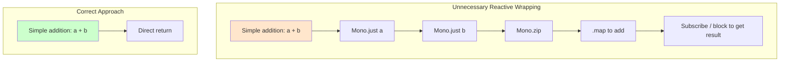

### Example: Validation Logic

```java
// ❌ Incorrect - validation has no I/O, doesn't need to be reactive
public Mono<Boolean> isValidEmail(String email) {
    return Mono.just(email.matches("^[\\w.+-]+@[\\w-]+\\.[a-zA-Z]{2,}$"));
}

// ✅ Correct
public boolean isValidEmail(String email) {
    return email.matches("^[\\w.+-]+@[\\w-]+\\.[a-zA-Z]{2,}$");
}
```

### Example: A Mixed Method Done Right

```java
// The I/O call is reactive; the pure logic inside stays synchronous
public Mono<PricingResult> calculatePrice(String productId) {
    return productRepository.findById(productId)          // I/O - stays reactive
            .map(product -> applyDiscountRules(product));  // pure logic - synchronous helper
}

private PricingResult applyDiscountRules(Product product) {
    // plain, synchronous, easily unit-testable logic
    double discount = product.getCategory().equals("CLEARANCE") ? 0.3 : 0.0;
    return new PricingResult(product.getPrice() * (1 - discount));
}
```

### Example: DTO Mapping

```java
// ❌ Incorrect - mapping is pure transformation, no I/O
public Mono<UserDto> toDto(User user) {
    return Mono.just(new UserDto(user.getId(), user.getName(), user.getEmail()));
}

// ✅ Correct
public UserDto toDto(User user) {
    return new UserDto(user.getId(), user.getName(), user.getEmail());
}
```

### Use Cases

| Good Fit for Reactive | Bad Fit for Reactive |
|---|---|
| HTTP calls to external services | String formatting |
| Database queries (R2DBC) | Arithmetic |
| Message queue consumption | Validation regexes |
| File streaming | DTO mapping |
| Long-running async workflows | In-memory cache lookups (unless reactive) |

### Best Practices

- Reserve reactive types for the **I/O boundary** — controllers, repositories, and external service clients.
- Keep business/domain logic synchronous, deterministic, and directly unit-testable without `StepVerifier`.
- Compose pure functions inside `.map()` on top-level reactive pipelines rather than making every layer return `Mono`.

### Interview Tip

When asked *"When would you avoid reactive?"*, answer with concrete categories: CPU-bound workloads, simple CRUD without high concurrency demands, or teams still ramping up on the paradigm. This shows pragmatic engineering judgment rather than dogmatic tool usage.

### Quick Recap

- ❌ Don't wrap pure functions in `Mono`/`Flux`.
- ✅ Keep reactive types at the I/O boundary.
- ✅ Use `.map()` to compose synchronous logic inside reactive pipelines.

---

## Anti-Pattern #3: Calling `subscribe()` in Business Logic

### What It Is

Invoking `.subscribe()` inside a service method to "kick off" work, instead of returning the `Mono`/`Flux` and letting the framework (or test runner) subscribe at the outer edge of the application.

### Why It's Dangerous

Subscribing internally **detaches** that work from the surrounding reactive chain. The caller has no way to observe completion, errors, or apply timeouts/retries. This is the reactive equivalent of "fire and forget" — except the "forget" part often includes silently losing critical business events like payment confirmations.

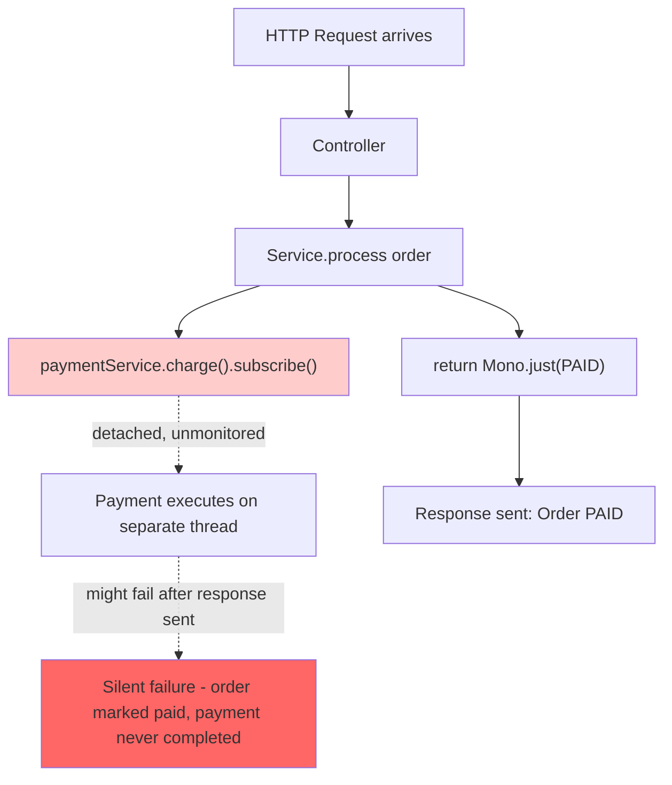

### Example: The Correct Pattern at Different Layers

```java
// ✅ Service layer - always returns, never subscribes
public Mono<Order> process(Order order) {
    return paymentRepository.save(order);
}

// ✅ Controller - WebFlux subscribes automatically when building the HTTP response
@PostMapping("/orders")
public Mono<Order> createOrder(@RequestBody Order order) {
    return orderService.process(order);
}

// ✅ Scheduled task - Spring's scheduler subscribes for you if configured correctly,
// or you subscribe explicitly at this outermost layer
@Scheduled(fixedRate = 60000)
public void cleanupExpiredOrders() {
    orderService.purgeExpired()
            .subscribe(
                result -> log.info("Purged {} orders", result),
                error -> log.error("Purge failed", error)
            );
}
```

### Example: The Wrong Way in a Service

```java
// ❌ Incorrect - subscribing inside business logic
public void processOrder(Order order) {
    paymentService.charge(order)
            .subscribe(
                result -> orderRepository.save(order),  // detached, unmonitored
                error -> log.error("Payment failed", error)
            );
    // Method returns immediately - caller has no idea if payment succeeded
}

// ✅ Correct - return the reactive type
public Mono<Order> processOrder(Order order) {
    return paymentService.charge(order)
            .flatMap(paymentResult -> orderRepository.save(order));
}
```

### Use Cases: Where Should You Ever Call `subscribe()`?

| Layer | Should call `subscribe()`? |
|---|---|
| Controller (WebFlux) | No — framework does it |
| Service / business logic | No — always return the reactive type |
| `@Scheduled` job entry point | Yes — this is a legitimate edge |
| Test code (`StepVerifier` preferred) | Rarely — prefer `StepVerifier` |
| Message listener entry point (Kafka, RabbitMQ reactive adapters) | Yes — this is an edge too |

### Best Practices

- Treat `subscribe()` as something that only exists at the **outermost edges** of the system.
- If you need fire-and-forget behavior, still prefer returning the `Mono` so the caller decides whether and how to subscribe — including error handling.
- Always attach error handlers to any `subscribe()` call: `.subscribe(onNext, onError)`. An unhandled error in a bare `.subscribe()` can throw an unhandled exception that's easy to miss in logs.

### Interview Tip

Being able to correctly answer *"Who calls `subscribe()` in a production WebFlux app?"* (the framework, `StepVerifier`, scheduled task entry points, message consumers) distinguishes someone who has shipped reactive systems from someone who has only followed tutorials.

### Quick Recap

- ❌ Never call `subscribe()` in service/business logic.
- ✅ Return `Mono`/`Flux` and let the framework subscribe.
- ✅ Only subscribe at edges: `@Scheduled`, message listeners, tests.

---

## Anti-Pattern #4: Ignoring Backpressure

### What It Is

Creating a fast producer (e.g., `Flux.range(1, Integer.MAX_VALUE)` or a database cursor streaming millions of rows) and feeding it to a slower consumer with no explicit backpressure strategy.

### Why It's Dangerous

Reactor's default buffering behavior can grow unbounded when the producer outpaces the consumer, leading to `OutOfMemoryError` — often *only* under real production data volumes, since local tests rarely use millions of records.

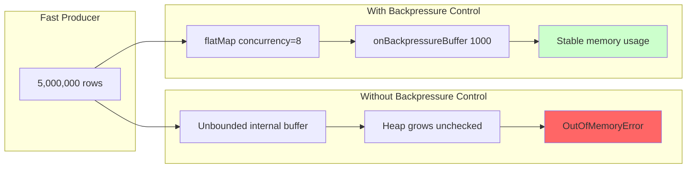

### Backpressure Strategies Compared

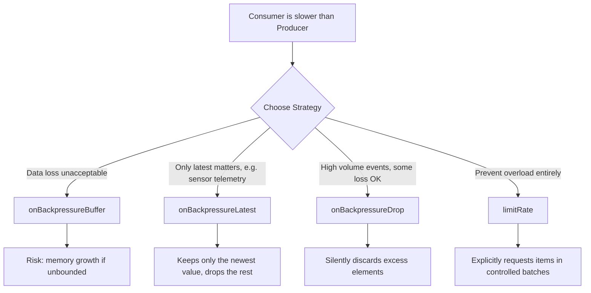

### Example: File-Streaming Pipeline

```java
// ❌ Incorrect - unbounded concurrency and no buffering strategy
Flux<Row> rows = dataSource.streamAllRows(); // 5 million rows

rows.flatMap(this::slowTransform) // unbounded concurrency
    .subscribe(this::writeToOutput);

// ✅ Correct - explicit concurrency, prefetch, and buffering
rows.flatMap(this::slowTransform, 8)   // max 8 concurrent transforms
    .onBackpressureBuffer(1000,
        dropped -> log.warn("Dropped overflow row: {}", dropped))
    .limitRate(256)                     // request items in controlled batches
    .subscribe(this::writeToOutput);
```

### Example: Real-Time Telemetry (Latest-Value Semantics)

```java
// Sensor readings arrive faster than the dashboard can render them.
// We only care about the most recent value — old ones are irrelevant.
sensorFlux
    .onBackpressureLatest()
    .sample(Duration.ofMillis(500)) // additionally throttle emission rate
    .subscribe(dashboard::updateReading);
```

### Example: Clickstream with Drop Strategy

```java
// High-volume clickstream events - occasional loss is acceptable
// but system stability is critical
clickStreamFlux
    .onBackpressureDrop(dropped -> metrics.counter("clicks.dropped").increment())
    .flatMap(this::persistClick, 16)
    .subscribe();
```

### Use Cases

- **ETL / batch data pipelines** reading millions of database rows — use `flatMap` concurrency limits + `limitRate()`.
- **IoT/sensor telemetry dashboards** — use `onBackpressureLatest()` since only the newest reading matters.
- **High-volume event streams (clickstream, logs)** — use `onBackpressureDrop()` when occasional loss is acceptable but system stability is critical.
- **Financial transaction processing** — use `onBackpressureBuffer()` with a bounded size and an explicit drop-handler, since losing a transaction silently is unacceptable.

### Best Practices

- Never rely on default buffering behavior for high-volume streams — always choose a strategy explicitly.
- Always set explicit concurrency and prefetch parameters on `flatMap()`.
- Use **Reactor Metrics** (via Micrometer) to monitor buffer sizes and request/demand counts before they become incidents.

### Interview Tip

Explaining the difference between `onBackpressureBuffer()` (retains data, risk of memory growth) and `onBackpressureDrop()` (discards excess, protects memory but loses data) demonstrates real streaming-system experience.

### Quick Recap

- ❌ Never leave high-volume streams with default buffering.
- ✅ Always set `flatMap` concurrency and prefetch.
- ✅ Choose `onBackpressureBuffer` / `Latest` / `Drop` / `limitRate` deliberately.

---

## Anti-Pattern #5: Excessive `flatMap` Nesting

### What It Is

Chaining multiple `flatMap()` calls inside one another, creating a "pyramid of doom" that mirrors the old callback-hell problem from JavaScript's pre-Promise era.

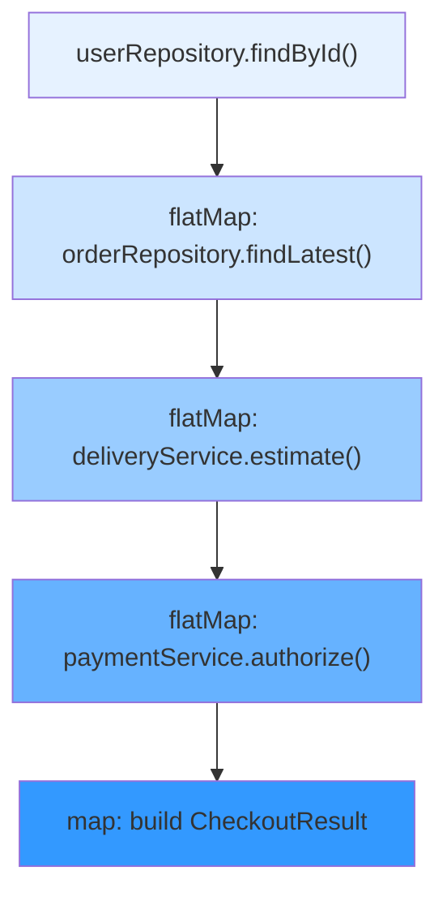

Notice how each level indents further — that visual nesting mirrors growing cognitive load and fragile error propagation.

### Why It's Dangerous

Errors thrown deep inside the nesting are hard to trace back to their origin. Adding a new business step means touching an already-fragile structure, often breaking existing error handling — as happened in the checkout example where a new step introduced a `NullPointerException` that surfaced only as a generic HTTP 500.

### The Fix: Flatten with `zip`, `when`, or Extracted Methods

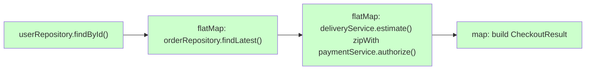

### Example: Extracting Named Methods (Bigger Case)

```java
// ❌ Incorrect - deeply nested, hard to follow
public Mono<CheckoutResult> checkout(String userId) {
    return userRepository.findById(userId)
        .flatMap(user -> orderRepository.findLatest(user)
            .flatMap(order -> deliveryService.estimate(order)
                .flatMap(delivery -> paymentService.authorize(delivery)
                    .flatMap(txnId -> inventoryService.reserve(order)
                        .map(reserved -> new CheckoutResult(delivery, txnId, reserved))
                    )
                )
            )
        );
}

// ✅ Correct - flattened with independent parallel calls where possible
public Mono<CheckoutResult> checkout(String userId) {
    return userRepository.findById(userId)
        .flatMap(this::findLatestOrder)
        .flatMap(this::buildCheckoutResult);
}

private Mono<Order> findLatestOrder(User user) {
    return orderRepository.findLatest(user);
}

private Mono<CheckoutResult> buildCheckoutResult(Order order) {
    return Mono.zip(
            deliveryService.estimate(order),
            inventoryService.reserve(order)
        )
        .flatMap(tuple -> paymentService.authorize(tuple.getT1())
            .map(txnId -> new CheckoutResult(tuple.getT1(), txnId, tuple.getT2())));
}
```

### Example: Using `Mono.when()` for Fire-and-Forget Parallelism

```java
// When you need all calls to complete but don't need their results
public Mono<Void> notifyAllChannels(Order order) {
    return Mono.when(
            emailService.sendConfirmation(order),
            smsService.sendNotification(order),
            analyticsService.trackOrder(order)
    );
}
```

### Use Cases

- **E-commerce checkout flows** combining user, order, delivery, and payment data — a classic candidate for `zip()` where steps are independent.
- **Aggregating dashboard data** from multiple microservices — flatten with `Mono.zip()` instead of nesting sequential calls that don't actually depend on each other.

### Best Practices

- Use `Mono.zip()` / `Mono.when()` to combine *independent* asynchronous calls instead of nesting them sequentially.
- Extract each step into a well-named private method — this alone eliminates most visual nesting.
- Consider `transform()` / `compose()` to encapsulate reusable pipeline segments.

### Interview Tip

Comparing `flatMap()` on `Mono` to `thenCompose()` on `CompletableFuture` — while referencing Reactive Streams' demand management — signals conceptual depth beyond "I know the operator names."

### Quick Recap

- ❌ Avoid deep `flatMap` pyramids.
- ✅ Use `Mono.zip()` for independent parallel calls.
- ✅ Extract named methods to keep flows readable.

---

## Anti-Pattern #6: Mixing Imperative and Reactive Styles Incorrectly

### What It Is

Calling `.block()` mid-pipeline, or slipping a synchronous call into `Mono.just()` without offloading it — silently reintroducing blocking behavior inside what looks like a fully reactive chain.

### Why It's Especially Dangerous

This is Anti-Pattern #1's sneakier sibling. The blocking call is disguised inside what *looks* like reactive code (`Mono.just(customerRepository::findById)`), so it's easy to miss in code review.

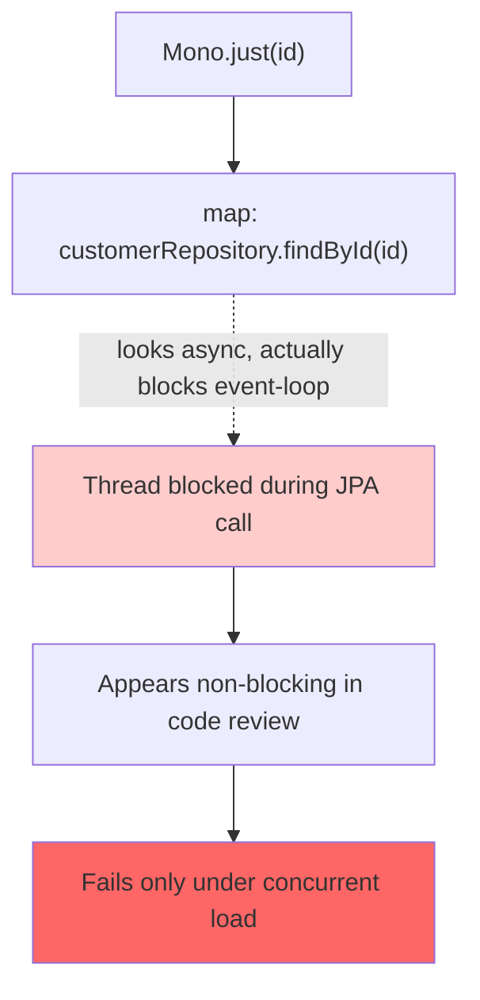

### Example: A Migration Scenario Done Safely

```java
// Legacy service still uses JPA. We're migrating gradually.
// ❌ Incorrect
public Mono<CustomerInfo> handle(String id) {
    return Mono.just(id)
            .map(customerRepository::findById)   // blocking JPA hidden in map()
            .map(this::enrich);
}

// ✅ Correct
public Mono<CustomerInfo> handle(String id) {
    return Mono.fromCallable(() -> customerRepository.findById(id))
            .subscribeOn(Schedulers.boundedElastic())
            .map(this::enrich);
}
```

### Example: Bridging at the True Edge Only

```java
// Acceptable ONLY in a CLI tool's main() method or a legacy synchronous entry point —
// never inside a reactive pipeline serving HTTP requests.
public static void main(String[] args) {
    Order order = orderService.fetchOrder("123").block(); // OK here - outside any reactive chain
    System.out.println(order);
}
```

### Example: The `.block()` Trap in a Controller

```java
// ❌ Incorrect - blocking the event loop to get a value
@GetMapping("/orders/{id}")
public Order getOrder(@PathVariable String id) {
    return orderService.fetchOrder(id).block(); // BLOCKS the event loop!
}

// ✅ Correct - return the Mono, let WebFlux handle it
@GetMapping("/orders/{id}")
public Mono<Order> getOrder(@PathVariable String id) {
    return orderService.fetchOrder(id);
}
```

### Use Cases

- **Gradual migration from Spring MVC to WebFlux**, where legacy JPA repositories coexist with new reactive endpoints.
- **CLI tools or batch jobs** that use reactive libraries but don't need an event-loop model — `.block()` at the very top level is acceptable here since there's no shared event-loop to starve.

### Best Practices

- Never call `.block()` inside a reactive pipeline that runs on event-loop threads.
- If bridging blocking and reactive code is unavoidable, isolate it with `subscribeOn(Schedulers.boundedElastic())`.
- Monitor `boundedElastic()` pool size and queue depth — it's finite and can itself become a bottleneck if overused.

### Interview Tip

When asked how to integrate a legacy blocking library into WebFlux, describe wrapping it and calling `subscribeOn(Schedulers.boundedElastic())`, and mention that this scheduler pool is bounded and must be sized/monitored — not an infinite escape hatch.

### Quick Recap

- ❌ Never call `.block()` inside a reactive pipeline.
- ✅ Isolate legacy blocking calls with `subscribeOn(Schedulers.boundedElastic())`.
- ✅ `.block()` is only acceptable at the true edge (CLI `main()`, batch jobs).

---

## Anti-Pattern #7: Swallowing Errors with `onErrorResume()` Everywhere

### What It Is

Using `onErrorResume(e -> Mono.empty())` or `onErrorReturn(defaultValue)` with no logging, metrics, or alerting — making failures invisible.

### Why It's Dangerous

The application *looks* healthy on dashboards while real failures (like an inventory check silently returning a fake "-1 in stock" as usable data) corrupt business outcomes downstream.

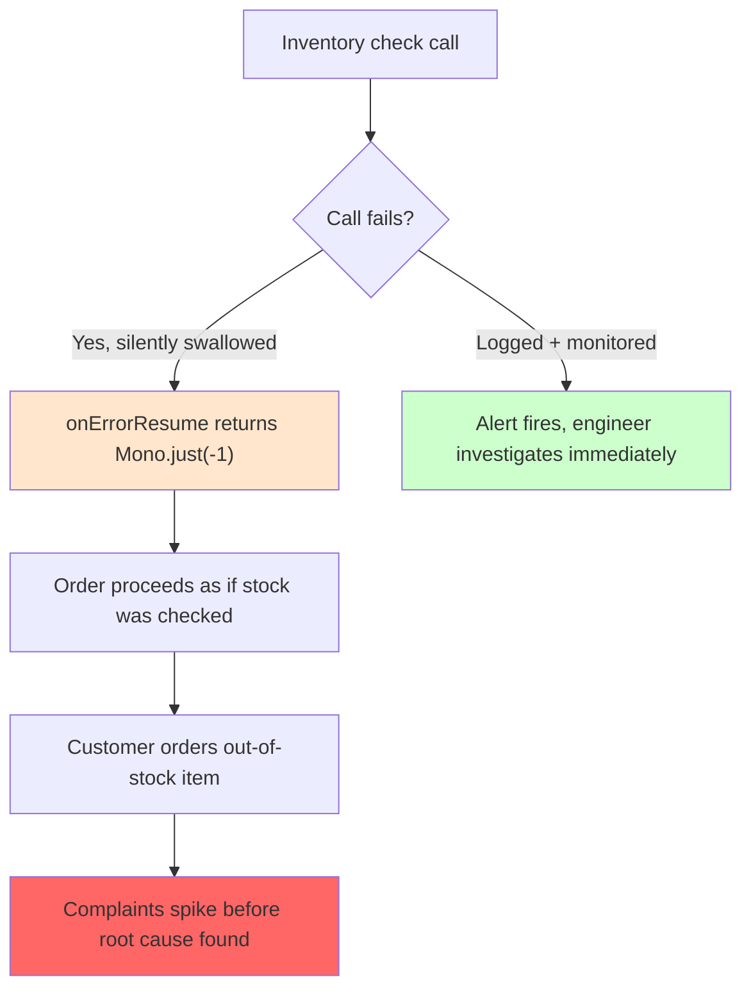

### `onErrorResume()` vs `onErrorContinue()` vs `onErrorReturn()`

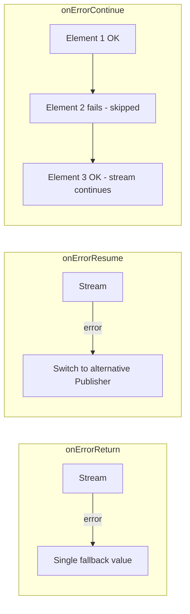

### Example: Proper Logging and Sentinel Values

```java
// ❌ Incorrect
public Mono<Integer> getStock(String sku) {
    return inventoryClient.fetchStock(sku)
            .onErrorResume(e -> Mono.just(0)); // 0 could be mistaken for "actually out of stock"
}

// ✅ Correct
public Mono<Integer> getStock(String sku) {
    return inventoryClient.fetchStock(sku)
            .onErrorResume(e -> {
                log.error("Stock check failed for sku {}", sku, e);
                meterRegistry.counter("inventory.errors", "sku", sku).increment();
                return Mono.just(-1); // sentinel that downstream code explicitly checks for
            });
}
```

### Example: Using `onErrorContinue()` for Partial Stream Failures

```java
// Processing a batch of files - one bad file shouldn't kill the whole batch
Flux.fromIterable(filePaths)
    .flatMap(this::parseFile)
    .onErrorContinue((error, item) -> {
        log.warn("Skipping unparseable file: {}", item, error);
        meterRegistry.counter("file.parse.errors").increment();
    })
    .collectList()
    .subscribe(this::processAllParsedFiles);
```

### Example: Fallback to Cache with Monitoring

```java
// Graceful degradation: fall back to cached data, but log and alert
public Mono<Price> getPrice(String sku) {
    return priceClient.fetchLivePrice(sku)
            .onErrorResume(e -> {
                log.warn("Live price fetch failed, using cache for sku {}", sku, e);
                metrics.counter("price.cache.fallback").increment();
                return priceCache.get(sku)
                        .switchIfEmpty(Mono.error(new PriceUnavailableException(sku)));
            });
}
```

### Use Cases

- **Payment/financial flows**: never silently swallow errors — always propagate or use explicit sentinel values that fail loudly downstream.
- **Batch file/record processing**: `onErrorContinue()` is appropriate when one bad record shouldn't halt the entire batch.
- **Third-party API integrations with graceful degradation**: `onErrorResume()` with a documented fallback (e.g., cached data) is fine — as long as it's logged and monitored.

### Best Practices

- Always log before recovering from an error.
- Use sentinel values that can't be mistaken for legitimate data.
- Let genuinely fatal errors propagate rather than masking them everywhere.

### Interview Tip

Clearly distinguishing `onErrorContinue()` (skip and continue the sequence) from `onErrorResume()` (replace the whole stream with a fallback publisher) demonstrates practical debugging experience.

### Quick Recap

- ❌ Never swallow errors silently.
- ✅ Always log + emit metrics before recovering.
- ✅ Use sentinel values that can't be confused with real data.
- ✅ Use `onErrorContinue()` only for partial stream failures.

---

## Anti-Pattern #8: Creating Huge Reactive Chains That Nobody Can Read

### What It Is

A single unbroken chain of 20+ operators (`flatMap`, `map`, `filter`, `doOnNext`, `transform`) crammed into one method, often directly in a controller.

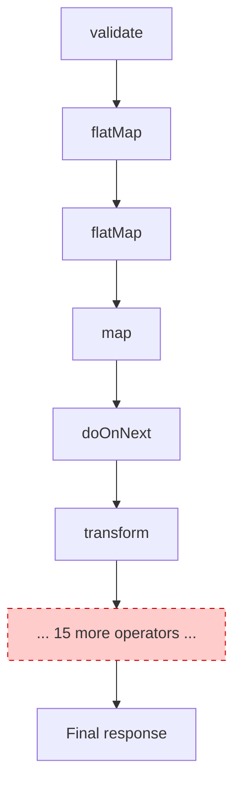

### The Fix: Extract Named Methods

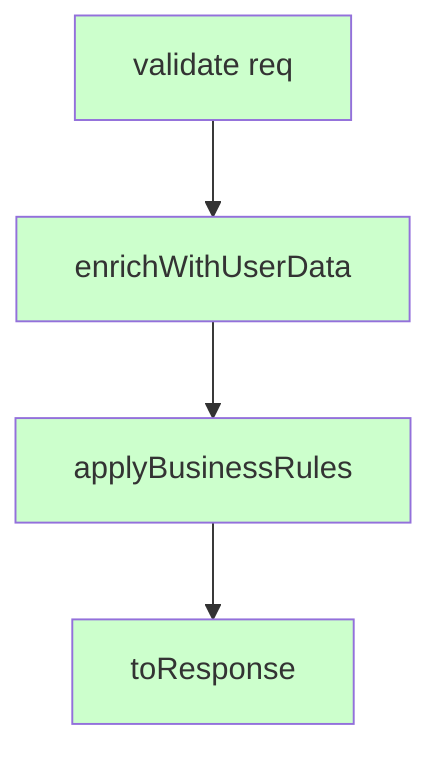

### Example: Before and After

```java
// ❌ Incorrect (abbreviated - imagine 160 real lines)
public Mono<ResponseEntity<ApiResponse>> handle(Request req) {
    return validate(req)
        .flatMap(r -> enrich(r))
        .flatMap(r -> applyRule1(r))
        .flatMap(r -> applyRule2(r))
        .map(r -> toDto(r))
        .doOnNext(dto -> log.info("processed {}", dto))
        .transform(this::addMetrics)
        // ...15 more operators...
        .map(ResponseEntity::ok);
}

// ✅ Correct
public Mono<ResponseEntity<ApiResponse>> handle(Request req) {
    return Mono.just(req)
            .flatMap(this::validate)
            .flatMap(this::enrichWithUserData)
            .flatMap(this::applyBusinessRules)
            .map(this::toResponse);
}
```

### Example: Using `checkpoint()` for Debuggability

```java
public Mono<Order> processOrder(Order order) {
    return validateOrder(order)
            .checkpoint("after-validation")
            .flatMap(this::enrichOrder)
            .checkpoint("after-enrichment")
            .flatMap(this::persistOrder)
            .checkpoint("after-persistence");
}
```

### Example: Using `transformDeferred()` for Reusable Segments

```java
// Define a reusable pipeline segment
private <T> Function<Flux<T>, Flux<T>> withMetrics(String operation) {
    return flux -> flux
            .doOnNext(v -> metrics.counter(operation + ".success").increment())
            .doOnError(e -> metrics.counter(operation + ".error").increment());
}

// Use it in multiple places
public Flux<Order> processOrders(Flux<Order> orders) {
    return orders
            .transformDeferred(this::withMetrics("order.processing"))
            .flatMap(this::enrichOrder);
}
```

### Use Cases

- **API gateways aggregating multiple downstream calls** — natural candidates for chain bloat; extract each aggregation step into its own method.
- **Multi-step business workflows** (order processing, onboarding flows) — name each step after the business concept it represents, not the Reactor operator used.

### Best Practices

- Cap chains at roughly 4–5 logical operations per method; extract the rest.
- Use `checkpoint("meaningful-label")` at key stages for production traceability.
- Consider `transformDeferred()` for reusable, named pipeline segments.

### Interview Tip

The strongest answer to "How do you keep reactive flows maintainable?" isn't a specific operator — it's applying the same clean-code discipline (small methods, meaningful names, single responsibility) that applies to any codebase.

### Quick Recap

- ❌ Avoid 20+ operator chains in one method.
- ✅ Extract named methods for each logical step.
- ✅ Use `checkpoint()` for debuggability.

---

## Anti-Pattern #9: Sharing Mutable State Across Reactive Streams

### What It Is

Mutating a shared `ArrayList`, `HashMap`, or counter inside `doOnNext()`/`map()`/`flatMap()` when multiple threads may execute concurrently (e.g., `flatMap` with concurrency > 1, or `parallel()`).

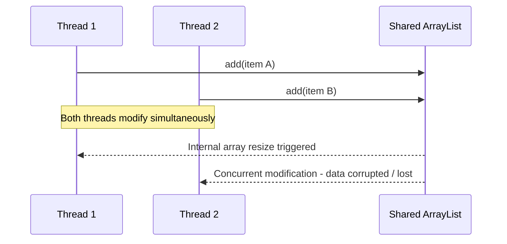

### Why It's Dangerous

`ArrayList` and `HashMap` are not thread-safe. Under `flatMap(fn, concurrency)`, multiple threads can execute the mapping function simultaneously, producing race conditions that are notoriously hard to reproduce — they often only manifest under real production concurrency, not local tests.

### Example: Correct Aggregation Without Shared State

```java
// ❌ Incorrect - race condition
List<String> results = new ArrayList<>();
Flux.range(1, 1000)
    .flatMap(i -> process(i), 10)
    .doOnNext(results::add)      // multiple threads writing concurrently
    .blockLast();

// ✅ Correct - reactive aggregation, no shared mutable state
List<String> results = Flux.range(1, 1000)
    .flatMap(i -> process(i), 10)
    .collectList()
    .block();
```

### Example: Aggregating Into a Map

```java
// ❌ Incorrect
Map<String, Order> orderMap = new HashMap<>();
Flux.fromIterable(orders)
    .flatMap(this::enrich, 5)
    .doOnNext(order -> orderMap.put(order.getId(), order)) // race condition
    .subscribe();

// ✅ Correct
Mono<Map<String, Order>> orderMap = Flux.fromIterable(orders)
    .flatMap(this::enrich, 5)
    .collectMap(Order::getId);
```

### Example: Accumulating a Running Total

```java
// ❌ Incorrect - shared mutable counter
AtomicInteger total = new AtomicInteger();
Flux.range(1, 1000)
    .flatMap(i -> process(i), 10)
    .doOnNext(value -> total.addAndGet(value)) // works but is a design smell
    .subscribe();

// ✅ Correct - use reduce
Mono<Integer> total = Flux.range(1, 1000)
    .flatMap(i -> process(i), 10)
    .reduce(0, Integer::sum);
```

### Use Cases

- **Parallel data aggregation** (sensor readings, analytics pipelines running with `flatMap` concurrency or `.parallel()`) — always use `collectList()`, `collectMap()`, or `reduce()`.
- **Batch report generation** combining results from many concurrent downstream calls — same principle applies.

### Best Practices

- Prefer `collectList()`, `collectMap()`, `reduce()` over manually mutating shared collections.
- If shared side-state is truly unavoidable, use `AtomicReference` or concurrent collections — but treat this as a design smell to revisit.
- Keep lambdas pure: the only thing that should leave an operator is the emitted signal, never a side-effect mutation.

### Interview Tip

Explain that Reactor operators can execute on different threads depending on the scheduler and pipeline configuration, so mutating shared state inside `doOnNext()` risks race conditions — reactive aggregation operators avoid this entirely by design.

### Quick Recap

- ❌ Never mutate shared collections inside operators.
- ✅ Use `collectList()`, `collectMap()`, `reduce()`.
- ✅ Keep lambdas pure.

---

## Anti-Pattern #10: Not Testing Reactive Flows Properly

### What It Is

Testing reactive code purely by calling `.block()` and applying traditional assertions — skipping verification of timing, error signals, backpressure, and cancellation behavior.

### Why It's Dangerous

`.block()` converts an asynchronous sequence into a synchronous value, hiding everything that makes reactive code reactive: timing-sensitive retries, backoff delays, cancellation semantics, and demand management. Tests pass locally; production fails under real latency.

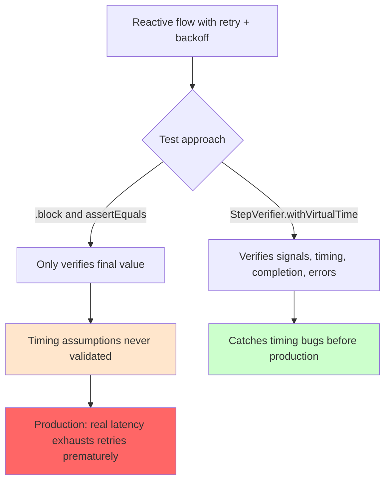

### Example: Testing Error Signals

```java
@Test
void shouldPropagateErrorOnInvalidInput() {
    StepVerifier.create(service.process(null))
            .expectErrorMatches(e -> e instanceof IllegalArgumentException
                    && e.getMessage().contains("cannot be null"))
            .verify();
}
```

### Example: Testing Backpressure Explicitly

```java
@Test
void shouldRespectBackpressure() {
    StepVerifier.create(largeDataFlux, 1) // request only 1 item initially
            .expectNextCount(1)
            .thenRequest(2)               // then request 2 more
            .expectNextCount(2)
            .thenCancel()
            .verify();
}
```

### Example: Virtual Time for Retry/Backoff Logic

```java
@Test
void shouldRetryAndFallback() {
    StepVerifier.withVirtualTime(() -> service.withRetry())
            .expectSubscription()
            .expectNoEvent(Duration.ofMillis(50))
            .expectNext("fallback")
            .verifyComplete();
}
```

### Example: Testing Cancellation

```java
@Test
void shouldCancelCleanly() {
    StepVerifier.create(infiniteFlux)
            .expectNextCount(5)
            .thenCancel()
            .verify();
}
```

### Use Cases

- **Retry/backoff logic** (payment gateways, third-party API calls) — virtual time testing is essential since real-time tests would be prohibitively slow and non-deterministic.
- **Streaming/pagination endpoints** — `StepVerifier.create(flux, n)` validates that your backpressure handling actually works under controlled demand.
- **Cancellation-sensitive flows** (e.g., a user navigating away mid-request) — verify resources are released via `expectCancel` scenarios.

### Best Practices

- Use `StepVerifier` from `reactor-test` for every reactive test — never `.block()` plus plain assertions.
- Use `StepVerifier.withVirtualTime()` whenever delays, retries, or timeouts are involved.
- Explicitly test backpressure using `StepVerifier.create(flux, n)`.
- Cover success paths, failure paths, and cancellation — not just the "happy path" value.

### Interview Tip

`StepVerifier` validates the *entire signal sequence* — values, completion, errors, cancellation, and timing — while `.block()` only reveals the final value and completely hides the reactive nature of the stream. Articulating this distinction is a strong signal of real testing discipline.

### Quick Recap

- ❌ Never test reactive code with `.block()` + assertions alone.
- ✅ Use `StepVerifier` for all reactive tests.
- ✅ Use virtual time for retry/backoff logic.
- ✅ Test backpressure and cancellation explicitly.

---

## Putting It All Together: A Decision Framework

Use this flowchart when reviewing your own reactive code or someone else's pull request:

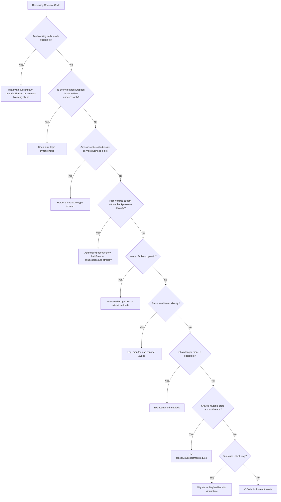

---

## Key Lessons from Production

1. **BlockHound is non-negotiable.** Wire it into your CI pipeline from day one — it catches blocking calls before they reach production traffic.
2. **A silently swallowed error can cost real money.** Always log, monitor, and alert before applying a fallback.
3. **Backpressure is not optional** for data-intensive systems. Configure explicit concurrency, prefetch, and buffer sizes for every high-throughput stream.
4. **Readability is a feature.** A 20-operator chain is a maintenance liability, not a demonstration of Reactor mastery.
5. **Test the entire signal lifecycle** — values, completion, errors, cancellation, and timing — not just the happy-path result.
6. **Reactive programming is a tool, not a religion.** Apply it where it delivers real concurrency benefits; keep simple, synchronous code simple.
7. **Most production incidents in reactive systems trace back to hidden blocking calls, silent error handling, uncontrolled concurrency, or thin test coverage** — not to Reactor itself.

---

## Quick-Reference Summary Table

| # | Anti-Pattern | Core Fix |
|---|---|---|
| 1 | Blocking calls inside pipelines | `subscribeOn(Schedulers.boundedElastic())` + BlockHound |
| 2 | Reactive for everything | Keep pure logic synchronous; reactive only at I/O boundary |
| 3 | `subscribe()` in business logic | Return `Mono`/`Flux`; subscribe only at the edges |
| 4 | Ignoring backpressure | Explicit `flatMap` concurrency + `onBackpressure*` strategy |
| 5 | Excessive `flatMap` nesting | `Mono.zip()`/`when()` + extracted named methods |
| 6 | Mixing imperative/reactive | Never `.block()` mid-pipeline; isolate legacy calls |
| 7 | Swallowing errors | Log + monitor before `onErrorResume`; use sentinel values |
| 8 | Unreadable giant chains | Extract methods; use `checkpoint()` |
| 9 | Shared mutable state | `collectList()`/`collectMap()`/`reduce()` instead of manual mutation |
| 10 | Poor reactive testing | `StepVerifier` + virtual time instead of `.block()` |

---

## Performance Considerations

### Thread Pool Sizing

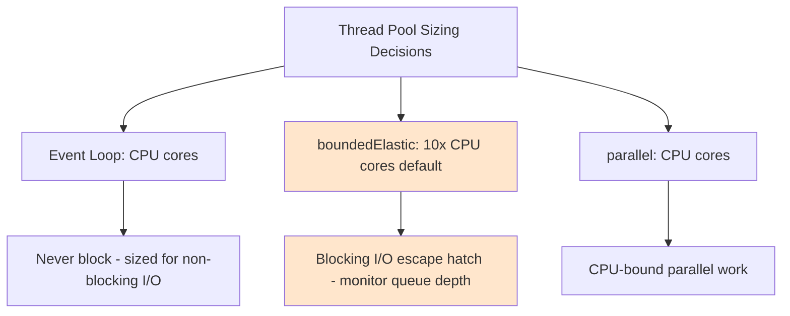

**Key metrics to monitor:**
- `reactor.scheduler.boundedElastic.queued` — queue depth on boundedElastic
- `reactor.scheduler.boundedElastic.active` — active threads
- `reactor.netty.eventloop.pending.tasks` — event loop backlog
- Buffer sizes on high-volume streams

### Configuration Example

```yaml
# application.yml
spring:
  codec:
    max-in-memory-size: 10MB
  webflux:
    base-path: /api

# Custom boundedElastic sizing
reactor:
  schedulers:
    bounded-elastic:
      threads: 200
      queue-capacity: 100000
```

### Performance Anti-Patterns to Watch

| Issue | Impact | Fix |
|---|---|---|
| Unbounded `flatMap` concurrency | Memory exhaustion | Set explicit concurrency |
| Large `max-in-memory-size` | Memory pressure | Tune to actual payload sizes |
| Overuse of `boundedElastic` | Thread pool exhaustion | Prefer non-blocking clients |
| No `limitRate()` on large streams | Over-fetching | Batch requests with `limitRate()` |
| Deep operator chains | Stack overhead | Extract methods |

---

## Security Considerations

### 1. DoS via Unbounded Buffers

```java
// ❌ Dangerous - unbounded buffer can be exploited
public Flux<Event> streamEvents() {
    return eventSource.stream()
            .onBackpressureBuffer(); // unbounded - attacker can exhaust memory
}

// ✅ Safe - bounded buffer with drop strategy
public Flux<Event> streamEvents() {
    return eventSource.stream()
            .onBackpressureBuffer(1000, dropped -> log.warn("Dropped event"));
}
```

### 2. Error Information Leakage

```java
// ❌ Dangerous - leaks internal details
public Mono<ResponseEntity<?>> handle() {
    return service.call()
            .map(ResponseEntity::ok)
            .onErrorResume(e -> Mono.just(
                ResponseEntity.status(500).body(e.getMessage()) // leaks stack details
            ));
}

// ✅ Safe - generic error to client, details to logs
public Mono<ResponseEntity<?>> handle() {
    return service.call()
            .map(ResponseEntity::ok)
            .onErrorResume(e -> {
                log.error("Internal error", e);
                return Mono.just(ResponseEntity.status(500)
                        .body("Internal server error"));
            });
}
```

### 3. Reactive Security with Spring Security

```java
@Configuration
@EnableWebFluxSecurity
public class SecurityConfig {
    @Bean
    public SecurityWebFilterChain securityWebFilterChain(ServerHttpSecurity http) {
        return http
                .csrf(ServerHttpSecurity.CsrfSpec::disable)
                .authorizeExchange(exchanges -> exchanges
                        .pathMatchers("/public/**").permitAll()
                        .pathMatchers("/admin/**").hasRole("ADMIN")
                        .anyExchange().authenticated())
                .oauth2Login(Customizer.withDefaults())
                .build();
    }
}
```

### 4. Timeout Protection

```java
// Always add timeouts to external calls to prevent hanging requests
public Mono<Order> fetchOrder(String id) {
    return orderClient.fetch(id)
            .timeout(Duration.ofSeconds(3)) // fail fast
            .onErrorResume(TimeoutException.class, e -> {
                log.warn("Order fetch timed out for {}", id);
                return Mono.error(new OrderTimeoutException(id));
            });
}
```

### Security Checklist

- [ ] All external calls have timeouts
- [ ] Buffers are bounded
- [ ] Error messages don't leak internals
- [ ] Reactive security filters are configured
- [ ] Rate limiting is applied to streaming endpoints
- [ ] Sensitive data is not logged in `doOnNext`

---

## Testing Strategies

### Setting Up Test Dependencies

```xml
<dependency>
    <groupId>io.projectreactor</groupId>
    <artifactId>reactor-test</artifactId>
    <scope>test</scope>
</dependency>
<dependency>
    <groupId>io.projectreactor.tools</groupId>
    <artifactId>blockhound-junit-platform</artifactId>
    <version>1.0.8.RELEASE</version>
    <scope>test</scope>
</dependency>
```

### BlockHound Integration

```java
// In your test setup
@BeforeAll
static void setup() {
    BlockHound.install();
}

// Or with JUnit 5 extension
@ExtendWith(BlockHoundTestExecutionListener.class)
class ReactiveServiceTest {
    // BlockHound will throw if any blocking call happens on a non-blocking thread
}
```

### Testing Patterns

| Scenario | Approach |
|---|---|
| Happy path | `StepVerifier.create(flux).expectNext(...).verifyComplete()` |
| Error path | `expectError()` / `expectErrorMatches()` |
| Backpressure | `StepVerifier.create(flux, n)` with `thenRequest()` |
| Timing/retry | `StepVerifier.withVirtualTime()` |
| Cancellation | `thenCancel().verify()` |
| Empty results | `expectNextCount(0).verifyComplete()` |
| Multiple values | `expectNextCount(n)` or `expectNextSequence()` |

### Full Test Example

```java
@ExtendWith(BlockHoundTestExecutionListener.class)
class OrderServiceTest {

    @Test
    void shouldProcessOrderSuccessfully() {
        StepVerifier.create(orderService.process(new Order("123")))
                .expectNextMatches(order -> order.getStatus() == OrderStatus.PAID)
                .verifyComplete();
    }

    @Test
    void shouldRetryOnTransientFailure() {
        StepVerifier.withVirtualTime(() ->
                orderService.processWithRetry(new Order("123")))
                .expectSubscription()
                .expectNoEvent(Duration.ofSeconds(1)) // backoff delay
                .expectNextMatches(order -> order.getStatus() == OrderStatus.PAID)
                .verifyComplete();
    }

    @Test
    void shouldRespectBackpressure() {
        StepVerifier.create(orderService.streamOrders(), 1)
                .expectNextCount(1)
                .thenRequest(3)
                .expectNextCount(3)
                .thenCancel()
                .verify();
    }
}
```

---

## Troubleshooting & Common Pitfalls

| Symptom | Likely Cause | Fix |
|---|---|---|
| 503s under load, low CPU | Blocking calls on event loop | `subscribeOn(boundedElastic)`, BlockHound |
| `OutOfMemoryError` | Unbounded backpressure buffer | Add `onBackpressureBuffer(size)` or `limitRate()` |
| `IllegalStateException: block()/blockFirst()/blockLast() are blocking` | `.block()` on event loop | Return `Mono`/`Flux` instead |
| Silent data loss | `onErrorResume` swallowing errors | Log + monitor + sentinel values |
| Race conditions in results | Shared mutable state | `collectList()`/`collectMap()`/`reduce()` |
| Tests pass, production fails | `.block()`-based tests | Migrate to `StepVerifier` |
| `boundedElastic` queue grows | Overuse of blocking bridge | Prefer non-blocking clients |
| Stack traces with no context | No `checkpoint()` | Add `checkpoint("label")` |
| Requests hang forever | Missing timeouts | Add `.timeout(Duration)` |
| Memory grows on streaming | No `limitRate()` | Add `limitRate(batchSize)` |

---

## Practice Exercises with Solutions

### Exercise 1: Fix the Blocking Pipeline

**Problem:** The following code blocks the event loop. Fix it.

```java
public Mono<List<Order>> getOrdersForUser(String userId) {
    return Mono.just(userId)
            .map(id -> jdbcOrderRepository.findByUserId(id)) // blocking JDBC
            .map(orders -> orders.stream()
                    .map(this::enrichWithBlockingCall)
                    .collect(Collectors.toList()));
}

private Order enrichWithBlockingCall(Order order) {
    // Simulates a blocking call to a legacy system
    try {
        Thread.sleep(100);
    } catch (InterruptedException e) {
        Thread.currentThread().interrupt();
    }
    return order;
}
```

<details>
<summary><strong>Solution</strong></summary>

```java
public Mono<List<Order>> getOrdersForUser(String userId) {
    return Mono.fromCallable(() -> jdbcOrderRepository.findByUserId(userId))
            .subscribeOn(Schedulers.boundedElastic())
            .flatMapMany(Flux::fromIterable)
            .flatMap(this::enrichWithBlockingCall, 8) // bounded concurrency
            .collectList();
}

private Mono<Order> enrichWithBlockingCall(Order order) {
    return Mono.fromCallable(() -> {
        // Simulates a blocking call to a legacy system
        try {
            Thread.sleep(100);
        } catch (InterruptedException e) {
            Thread.currentThread().interrupt();
        }
        return order;
    }).subscribeOn(Schedulers.boundedElastic());
}
```

**Explanation:**
- The JDBC call is wrapped in `Mono.fromCallable()` and offloaded to `boundedElastic`.
- The enrichment is also offloaded, with explicit concurrency of 8.
- `flatMapMany` + `collectList` keeps the pipeline reactive and non-blocking.

</details>

---

### Exercise 2: Refactor the Nested `flatMap` Pyramid

**Problem:** Refactor this deeply nested checkout flow using `Mono.zip()` and extracted methods.

```java
public Mono<CheckoutResult> checkout(String userId) {
    return userRepository.findById(userId)
        .flatMap(user -> orderRepository.findLatest(user)
            .flatMap(order -> deliveryService.estimate(order)
                .flatMap(delivery -> paymentService.authorize(delivery)
                    .flatMap(txnId -> inventoryService.reserve(order)
                        .map(reserved -> new CheckoutResult(delivery, txnId, reserved))
                    )
                )
            )
        );
}
```

<details>
<summary><strong>Solution</strong></summary>

```java
public Mono<CheckoutResult> checkout(String userId) {
    return userRepository.findById(userId)
            .flatMap(this::findLatestOrder)
            .flatMap(this::buildCheckoutResult);
}

private Mono<Order> findLatestOrder(User user) {
    return orderRepository.findLatest(user);
}

private Mono<CheckoutResult> buildCheckoutResult(Order order) {
    return Mono.zip(
            deliveryService.estimate(order),
            inventoryService.reserve(order)
        )
        .flatMap(tuple -> paymentService.authorize(tuple.getT1())
            .map(txnId -> new CheckoutResult(tuple.getT1(), txnId, tuple.getT2())));
}
```

**Explanation:**
- `deliveryService.estimate()` and `inventoryService.reserve()` are independent — they run in parallel via `Mono.zip()`.
- Each step is extracted into a named method, making the flow readable.
- The payment authorization still depends on the delivery estimate, so it stays sequential.

</details>

---

### Exercise 3: Add Backpressure and Proper Testing

**Problem:** The following code streams 5 million rows with no backpressure control. Fix the pipeline and write proper tests.

```java
public Flux<Row> processLargeDataset() {
    return dataSource.streamAllRows() // 5 million rows
            .flatMap(this::slowTransform) // unbounded concurrency
            .map(this::toOutput);
}
```

<details>
<summary><strong>Solution</strong></summary>

**Fixed pipeline:**

```java
public Flux<Row> processLargeDataset() {
    return dataSource.streamAllRows()
            .flatMap(this::slowTransform, 8) // max 8 concurrent transforms
            .onBackpressureBuffer(1000,
                dropped -> log.warn("Dropped overflow row: {}", dropped))
            .limitRate(256) // request in controlled batches
            .map(this::toOutput);
}
```

**Tests:**

```java
@Test
void shouldProcessWithBackpressure() {
    StepVerifier.create(service.processLargeDataset(), 1)
            .expectNextCount(1)
            .thenRequest(10)
            .expectNextCount(10)
            .thenCancel()
            .verify();
}

@Test
void shouldCompleteSuccessfully() {
    StepVerifier.create(service.processLargeDataset())
            .expectNextCount(5_000_000)
            .verifyComplete();
}

@Test
void shouldHandleErrorsGracefully() {
    StepVerifier.create(service.processLargeDataset())
            .expectNextCount(100)
            .expectError()
            .verify();
}
```

**Explanation:**
- Explicit concurrency of 8 prevents thread explosion.
- Bounded buffer (1000) prevents OOM.
- `limitRate(256)` controls demand in batches.
- Tests verify backpressure, completion, and error handling.

</details>

---

### Exercise 4: Fix Silent Error Swallowing

**Problem:** The following code silently swallows errors. Fix it to log, monitor, and use sentinel values.

```java
public Mono<Integer> getStock(String sku) {
    return inventoryClient.fetchStock(sku)
            .onErrorResume(e -> Mono.just(0)); // 0 could be "out of stock"
}
```

<details>
<summary><strong>Solution</strong></summary>

```java
public Mono<Integer> getStock(String sku) {
    return inventoryClient.fetchStock(sku)
            .onErrorResume(e -> {
                log.error("Stock check failed for sku {}", sku, e);
                meterRegistry.counter("inventory.errors", "sku", sku).increment();
                return Mono.just(-1); // sentinel: -1 means "unknown", not "out of stock"
            });
}

// Downstream code must check for the sentinel
public Mono<Boolean> isInStock(String sku) {
    return getStock(sku)
            .map(stock -> {
                if (stock == -1) {
                    throw new StockUnknownException(sku); // fail loudly
                }
                return stock > 0;
            });
}
```

**Explanation:**
- Errors are logged with context.
- Metrics are emitted for alerting.
- Sentinel value `-1` is distinct from legitimate `0` (out of stock).
- Downstream code explicitly checks for the sentinel and fails loudly.

</details>

---

## Test Your Understanding

Answer these questions to check your grasp of the material:

1. **Q:** Why is a blocking call inside `map()` dangerous in WebFlux?
   **A:** It blocks the event-loop thread, stalling all other requests queued on that thread, potentially causing thread starvation and 503s.

2. **Q:** What is the purpose of `Schedulers.boundedElastic()`?
   **A:** It provides a bounded, elastic thread pool specifically designed for blocking I/O, offloading blocking work from the event loop.

3. **Q:** When is it acceptable to call `.subscribe()` in application code?
   **A:** Only at the outermost edges: `@Scheduled` entry points, message listeners, and test code (prefer `StepVerifier`).

4. **Q:** What is the difference between `onBackpressureBuffer()` and `onBackpressureDrop()`?
   **A:** `onBackpressureBuffer()` retains data (risk of memory growth); `onBackpressureDrop()` discards excess elements (protects memory but loses data).

5. **Q:** Why should pure functions not be wrapped in `Mono`/`Flux`?
   **A:** Reactive types add overhead (allocation, stack frames) with no benefit for CPU-bound, non-I/O work.

6. **Q:** What is the "pyramid of doom" in reactive code?
   **A:** Deeply nested `flatMap` chains that mirror callback hell, making code hard to read and errors hard to trace.

7. **Q:** Why is `.block()` dangerous inside a reactive pipeline?
   **A:** It blocks the event-loop thread, reintroducing the exact blocking behavior WebFlux is designed to avoid.

8. **Q:** What is a sentinel value in error handling?
   **A:** A special value (e.g., `-1`) that signals an error condition and can't be confused with legitimate data.

9. **Q:** Why should you use `collectList()` instead of mutating a shared `ArrayList`?
   **A:** `collectList()` is thread-safe by design; manual mutation of a shared `ArrayList` causes race conditions under concurrent execution.

10. **Q:** What does `StepVerifier.withVirtualTime()` enable?
    **A:** Testing timing-sensitive logic (retries, backoff, timeouts) without real delays, making tests fast and deterministic.

---

## Common Interview Questions

1. **Q:** How does WebFlux's threading model differ from Spring MVC's?
   **A:** MVC uses thread-per-request; WebFlux uses a small pool of event-loop threads that handle many requests concurrently via non-blocking I/O.

2. **Q:** What happens if you block an event-loop thread?
   **A:** All requests queued on that thread stall. Under load, this causes thread starvation and 503s even when downstream systems are healthy.

3. **Q:** How do you integrate a legacy blocking library into WebFlux?
   **A:** Wrap the call in `Mono.fromCallable()` and use `subscribeOn(Schedulers.boundedElastic())`. Monitor the pool size and queue depth.

4. **Q:** What is BlockHound and why is it important?
   **A:** A JVM instrumentation tool that detects blocking calls on non-blocking threads, throwing an exception immediately. It's essential for CI to catch violations early.

5. **Q:** Explain the difference between `flatMap` and `map` in Reactor.
   **A:** `map` transforms each element synchronously (1:1). `flatMap` transforms each element into a `Publisher` and flattens the results (1:N, async).

6. **Q:** When would you use `Mono.zip()` vs nested `flatMap`?
   **A:** `Mono.zip()` for independent parallel calls; nested `flatMap` for sequential dependent calls. Prefer `zip` to avoid nesting.

7. **Q:** What is backpressure and why does it matter?
   **A:** Backpressure is the mechanism by which a consumer signals demand to a producer. Without it, fast producers can overwhelm slow consumers, causing OOM.

8. **Q:** How do you test reactive code properly?
   **A:** Use `StepVerifier` from `reactor-test` to verify the full signal sequence — values, errors, completion, cancellation, and timing (with virtual time).

9. **Q:** What are the risks of `onErrorResume(e -> Mono.empty())`?
   **A:** It silently swallows errors, making failures invisible. Business logic may proceed with incorrect assumptions, corrupting outcomes.

10. **Q:** How do you prevent shared mutable state issues in reactive streams?
    **A:** Use reactive aggregation operators (`collectList()`, `collectMap()`, `reduce()`) instead of manually mutating shared collections.

11. **Q:** What is the difference between `onErrorResume` and `onErrorContinue`?
    **A:** `onErrorResume` replaces the entire stream with a fallback publisher on error. `onErrorContinue` skips the failed element and continues the sequence.

12. **Q:** How do you make a reactive chain debuggable in production?
    **A:** Use `checkpoint("meaningful-label")` at key stages to add context to stack traces.

---

## Question Bank (50+ Questions)

### Beginner Level (1–15)

1. **Q:** What is Spring WebFlux?
   **A:** A reactive web framework in Spring that supports non-blocking, asynchronous request handling using Project Reactor.

2. **Q:** What is a `Mono`?
   **A:** A reactive type that emits at most one item (0 or 1) and then completes or errors.

3. **Q:** What is a `Flux`?
   **A:** A reactive type that emits 0 to N items and then completes or errors.

4. **Q:** What is the difference between `Mono` and `Flux`?
   **A:** `Mono` emits 0–1 items; `Flux` emits 0–N items.

5. **Q:** What is an event loop?
   **A:** A single thread that processes many connections by interleaving non-blocking I/O operations.

6. **Q:** What does `subscribeOn()` do?
   **A:** It specifies the scheduler on which the subscription and upstream work executes.

7. **Q:** What does `publishOn()` do?
   **A:** It specifies the scheduler on which downstream operators execute.

8. **Q:** What is `Schedulers.boundedElastic()`?
   **A:** A scheduler with a bounded, elastic thread pool designed for blocking I/O.

9. **Q:** What is `Schedulers.parallel()`?
   **A:** A scheduler with a fixed pool sized to CPU cores, for CPU-bound parallel work.

10. **Q:** What is `StepVerifier`?
    **A:** A testing utility from `reactor-test` for verifying reactive streams.

11. **Q:** What is a reactive stream?
    **A:** An asynchronous sequence of data that respects backpressure.

12. **Q:** What is the Reactive Streams specification?
    **A:** A standard for asynchronous stream processing with non-blocking backpressure.

13. **Q:** What is `WebClient`?
    **A:** Spring's non-blocking HTTP client for reactive applications.

14. **Q:** What is R2DBC?
    **A:** Reactive Relational Database Connectivity — a non-blocking database driver API.

15. **Q:** What is `doOnNext()` used for?
    **A:** A side-effect operator that executes on each emitted item without modifying it.

### Intermediate Level (16–35)

16. **Q:** Why is blocking I/O dangerous in WebFlux?
    **A:** It blocks the event-loop thread, stalling all other requests on that thread.

17. **Q:** What is thread starvation?
    **A:** When all event-loop threads are blocked, no new requests can be processed.

18. **Q:** How does `flatMap` differ from `map`?
    **A:** `map` is synchronous 1:1; `flatMap` returns a `Publisher` per element and flattens results.

19. **Q:** What is backpressure?
    **A:** The mechanism by which consumers signal demand to producers to prevent overload.

20. **Q:** What is `onBackpressureBuffer()`?
    **A:** Buffers excess elements when the consumer is slower, with a configurable size.

21. **Q:** What is `onBackpressureDrop()`?
    **A:** Discards excess elements when the consumer is slower.

22. **Q:** What is `onBackpressureLatest()`?
    **A:** Keeps only the most recent element, discarding older ones.

23. **Q:** What is `limitRate()`?
    **A:** Requests items from upstream in controlled batches to manage demand.

24. **Q:** What is `Mono.zip()`?
    **A:** Combines multiple `Mono`s into one, emitting when all complete.

25. **Q:** What is `Mono.when()`?
    **A:** Waits for all `Mono`s to complete without emitting their values.

26. **Q:** What is `checkpoint()`?
    **A:** Adds a labeled marker to the reactive chain for debugging stack traces.

27. **Q:** What is `transformDeferred()`?
    **A:** Applies a transformation function to the `Flux`/`Mono` at subscription time.

28. **Q:** What is `collectList()`?
    **A:** Aggregates all emitted items into a `Mono<List<T>>`.

29. **Q:** What is `collectMap()`?
    **A:** Aggregates items into a `Mono<Map<K, V>>` using a key extractor.

30. **Q:** What is `reduce()`?
    **A:** Accumulates items into a single value using a binary operator.

31. **Q:** What is `onErrorResume()`?
    **A:** Switches to a fallback publisher when an error occurs.

32. **Q:** What is `onErrorReturn()`?
    **A:** Emits a single fallback value when an error occurs.

33. **Q:** What is `onErrorContinue()`?
    **A:** Skips the failed element and continues the sequence.

34. **Q:** What is `timeout()`?
    **A:** Emits an error if no signal is received within the specified duration.

35. **Q:** What is `retry()`?
    **A:** Re-subscribes to the source on error, up to a specified number of times.

### Advanced Level (36–50)

36. **Q:** How does Reactor's demand management work?
    **A:** Consumers request N items; producers emit at most N. Operators propagate demand upstream.

37. **Q:** What is the difference between `subscribeOn` and `publishOn`?
    **A:** `subscribeOn` affects upstream (subscription and source); `publishOn` affects downstream operators.

38. **Q:** How does `flatMap` concurrency parameter work?
    **A:** It limits the number of inner publishers subscribed to concurrently.

39. **Q:** What is the `prefetch` parameter in `flatMap`?
    **A:** The number of items requested from the source at a time.

40. **Q:** How does `StepVerifier.withVirtualTime()` work?
    **A:** It uses a virtual clock to simulate time passing, enabling fast testing of delays and retries.

41. **Q:** What is BlockHound and how does it work?
    **A:** A JVM agent that instruments blocking methods to throw when called on non-blocking threads.

42. **Q:** How do you handle cancellation in reactive streams?
    **A:** Use `doOnCancel()` for cleanup, and test with `StepVerifier.thenCancel()`.

43. **Q:** What is the `boundedElastic` queue and why monitor it?
    **A:** Tasks waiting for a thread in the bounded pool. If it grows, blocking work is overwhelming the pool.

44. **Q:** How do you implement retry with exponential backoff?
    **A:** Use `retryWhen(Retry.backoff(maxAttempts, Duration))`.

45. **Q:** What is the difference between `retryWhen` and `retry`?
    **A:** `retry` re-subscribes immediately; `retryWhen` allows custom backoff and error filtering.

46. **Q:** How do you combine multiple reactive sources with different types?
    **A:** Use `Mono.zip()` with a `Tuple` or `Mono.zipWith()`.

47. **Q:** What is the `switchIfEmpty()` operator?
    **A:** Switches to an alternative publisher if the source completes empty.

48. **Q:** How do you handle errors in a `Flux` without stopping the stream?
    **A:** Use `onErrorContinue()` to skip failed elements and continue.

49. **Q:** What is the `parallel()` operator?
    **A:** Splits a `Flux` into multiple rails processed in parallel on `Schedulers.parallel()`.

50. **Q:** How do you monitor reactive streams in production?
    **A:** Use Micrometer + Reactor Metrics to track buffer sizes, demand, and scheduler health.

51. **Q:** What is the `doFinally()` operator?
    **A:** Executes a side effect when the stream terminates (complete, error, or cancel).

52. **Q:** How do you convert a blocking `Iterable` to a reactive `Flux`?
    **A:** Use `Flux.fromIterable()` — but be careful if the iteration itself blocks.

53. **Q:** What is the `cache()` operator?
    **A:** Caches the emitted values so re-subscribers get the same result without re-executing.

54. **Q:** What is the `share()` operator?
    **A:** Shares a single subscription among multiple subscribers.

55. **Q:** How do you handle hot vs cold publishers?
    **A:** Cold publishers re-execute per subscriber; hot publishers broadcast to all subscribers. Use `share()`/`publish()` to convert.

---

## Self-Assessment Checklist

Rate yourself on each item (1 = needs work, 5 = confident):

| Skill | 1 | 2 | 3 | 4 | 5 |
|---|---|---|---|---|---|
| Explain WebFlux threading model | ☐ | ☐ | ☐ | ☐ | ☐ |
| Identify blocking calls in pipelines | ☐ | ☐ | ☐ | ☐ | ☐ |
| Use `Schedulers.boundedElastic()` correctly | ☐ | ☐ | ☐ | ☐ | ☐ |
| Know when NOT to use reactive types | ☐ | ☐ | ☐ | ☐ | ☐ |
| Avoid `subscribe()` in business logic | ☐ | ☐ | ☐ | ☐ | ☐ |
| Configure backpressure strategies | ☐ | ☐ | ☐ | ☐ | ☐ |
| Refactor nested `flatMap` chains | ☐ | ☐ | ☐ | ☐ | ☐ |
| Avoid `.block()` in pipelines | ☐ | ☐ | ☐ | ☐ | ☐ |
| Handle errors with logging + sentinels | ☐ | ☐ | ☐ | ☐ | ☐ |
| Keep reactive chains readable | ☐ | ☐ | ☐ | ☐ | ☐ |
| Avoid shared mutable state | ☐ | ☐ | ☐ | ☐ | ☐ |
| Test with `StepVerifier` + virtual time | ☐ | ☐ | ☐ | ☐ | ☐ |
| Apply the decision framework | ☐ | ☐ | ☐ | ☐ | ☐ |
| Monitor reactive performance | ☐ | ☐ | ☐ | ☐ | ☐ |
| Secure reactive endpoints | ☐ | ☐ | ☐ | ☐ | ☐ |

**If you scored below 3 on any item, revisit the corresponding section before moving on.**

---

## Hands-On Lab: Build a Reactive Order Service

### Lab Overview

Build a small reactive order service that demonstrates all 10 best practices. You'll create a Spring Boot app with:
- A reactive REST controller
- R2DBC database access
- A simulated external service (with delays)
- Proper backpressure, error handling, and testing

### Step 1: Project Setup

```xml
<!-- pom.xml -->
<dependencies>
    <dependency>
        <groupId>org.springframework.boot</groupId>
        <artifactId>spring-boot-starter-webflux</artifactId>
    </dependency>
    <dependency>
        <groupId>org.springframework.boot</groupId>
        <artifactId>spring-boot-starter-data-r2dbc</artifactId>
    </dependency>
    <dependency>
        <groupId>com.h2database</groupId>
        <artifactId>h2</artifactId>
        <scope>runtime</scope>
    </dependency>
    <dependency>
        <groupId>io.r2dbc</groupId>
        <artifactId>r2dbc-h2</artifactId>
        <scope>runtime</scope>
    </dependency>
    <dependency>
        <groupId>io.projectreactor</groupId>
        <artifactId>reactor-test</artifactId>
        <scope>test</scope>
    </dependency>
</dependencies>
```

### Step 2: Domain Model

```java
public record Order(Long id, String userId, String sku, int quantity, OrderStatus status) {
    public enum OrderStatus { CREATED, PAID, SHIPPED }
}
```

### Step 3: Reactive Repository

```java
public interface OrderRepository extends ReactiveCrudRepository<Order, Long> {
    Flux<Order> findByUserId(String userId);
}
```

### Step 4: Service with Best Practices

```java
@Service
public class OrderService {

    private final OrderRepository orderRepository;
    private final PaymentClient paymentClient;
    private final MeterRegistry meterRegistry;
    private static final Logger log = LoggerFactory.getLogger(OrderService.class);

    public OrderService(OrderRepository orderRepository,
                        PaymentClient paymentClient,
                        MeterRegistry meterRegistry) {
        this.orderRepository = orderRepository;
        this.paymentClient = paymentClient;
        this.meterRegistry = meterRegistry;
    }

    // ✅ Returns reactive type - no subscribe() in business logic
    // ✅ No blocking calls - all I/O is reactive
    public Mono<Order> createOrder(Order order) {
        return orderRepository.save(order)
                .flatMap(this::processPayment)
                .checkpoint("order-creation");
    }

    private Mono<Order> processPayment(Order order) {
        return paymentClient.charge(order)
                .timeout(Duration.ofSeconds(5)) // ✅ timeout protection
                .onErrorResume(e -> {
                    // ✅ Log + monitor before recovering
                    log.error("Payment failed for order {}", order.id(), e);
                    meterRegistry.counter("payment.errors").increment();
                    return Mono.error(new PaymentException("Payment failed", e));
                })
                .map(txnId -> new Order(order.id(), order.userId(),
                        order.sku(), order.quantity(), OrderStatus.PAID));
    }

    // ✅ Backpressure-aware streaming
    public Flux<Order> streamOrders(String userId) {
        return orderRepository.findByUserId(userId)
                .flatMap(this::enrich, 8) // bounded concurrency
                .onBackpressureBuffer(100, dropped ->
                        log.warn("Dropped order: {}", dropped))
                .limitRate(32);
    }

    private Mono<Order> enrich(Order order) {
        // Simulated enrichment - pure logic stays synchronous
        return Mono.just(order);
    }
}
```

### Step 5: Controller

```java
@RestController
@RequestMapping("/api/orders")
public class OrderController {

    private final OrderService orderService;

    public OrderController(OrderService orderService) {
        this.orderService = orderService;
    }

    @PostMapping
    public Mono<Order> createOrder(@RequestBody Order order) {
        return orderService.createOrder(order); // ✅ framework subscribes
    }

    @GetMapping("/user/{userId}")
    public Flux<Order> getOrders(@PathVariable String userId) {
        return orderService.streamOrders(userId);
    }
}
```

### Step 6: Tests

```java
@SpringBootTest
class OrderServiceTest {

    @Autowired
    private OrderService orderService;

    @Test
    void shouldCreateOrder() {
        Order order = new Order(null, "user1", "SKU-1", 2, OrderStatus.CREATED);
        StepVerifier.create(orderService.createOrder(order))
                .expectNextMatches(o -> o.status() == OrderStatus.PAID)
                .verifyComplete();
    }

    @Test
    void shouldStreamOrdersWithBackpressure() {
        StepVerifier.create(orderService.streamOrders("user1"), 1)
                .expectNextCount(1)
                .thenRequest(5)
                .expectNextCount(5)
                .thenCancel()
                .verify();
    }
}
```

### Lab Checklist

- [ ] Project builds and runs
- [ ] `POST /api/orders` creates and pays for an order
- [ ] `GET /api/orders/user/{userId}` streams orders
- [ ] Tests pass with `StepVerifier`
- [ ] No blocking calls in the pipeline
- [ ] Errors are logged and monitored
- [ ] Backpressure is configured

---

## Pro Tips

1. **Use `checkpoint()` liberally in development, selectively in production.** It adds overhead but is invaluable for debugging. Enable it at key business boundaries.

2. **Profile before optimizing.** Use `reactor-tools` (via `-javaagent`) to see operator-level timing. Don't guess where the bottleneck is.

3. **Set a global timeout for external calls.** A single hanging call can cascade. Use `WebClient` timeouts and `Mono.timeout()`.

4. **Monitor `boundedElastic` queue depth.** If it grows, you're overusing the blocking bridge. Prefer non-blocking clients.

5. **Use `transformDeferred()` for reusable pipeline segments.** It's the reactive equivalent of a well-named function.

6. **Test with real concurrency.** Use `StepVerifier` with `flatMap` concurrency to catch race conditions that single-threaded tests miss.

7. **Keep `doOnNext()` side effects minimal.** Logging is fine; business logic mutations are a smell.

8. **Understand hot vs cold publishers.** A cold `Flux` re-executes per subscriber — this can cause duplicate side effects if you're not careful.

9. **Use `cache()` for expensive, shared computations.** But be aware of memory implications for large streams.

10. **Read the Reactor reference documentation.** It's one of the best-written docs in the Java ecosystem. The "Which operator do I need?" appendix is gold.

---

## Further Reading & Resources

### Official Documentation
- [Project Reactor Reference Guide](https://projectreactor.io/docs/core/release/reference/)
- [Spring WebFlux Documentation](https://docs.spring.io/spring-framework/reference/web/webflux.html)
- [Reactive Streams Specification](https://www.reactive-streams.org/)
- [R2DBC Documentation](https://r2dbc.io/)
- [BlockHound GitHub](https://github.com/reactor/BlockHound)

### Books
- *Reactive Spring* by Josh Long
- *Hands-On Reactive Programming in Spring 5* by Oleh Dokuka and Igor Lozynskyi
- *Learning Spring Boot 3.0* by Greg Turnquist

### Articles & Talks
- "Reactive Programming with Spring" — Spring.io blog series
- "Don't Block the Event Loop" — various engineering blogs
- "The Reactive Manifesto" — reactive-manifesto.org

### Community
- [Spring Reactive Stack on Stack Overflow](https://stackoverflow.com/questions/tagged/spring-webflux)
- [Project Reactor Gitter](https://gitter.im/reactor/reactor)
- [Spring Community Discord](https://spring.io/discord)

---

## Conclusion & Next Steps

Reactive programming with Spring WebFlux and Project Reactor rewards developers who genuinely internalize its concurrency model — and punishes those who treat it as a syntax swap over familiar blocking code. Every anti-pattern in this tutorial traces back to one root cause: **forgetting that the event loop has no patience for blocking, hidden mutation, or unmanaged demand.**

The good news is that all ten patterns share a consistent remedy: isolate blocking work, keep pipelines composable and readable, handle errors visibly, respect backpressure, and test the full signal lifecycle — not just the final value. Internalize these, and you'll spend far less time debugging mysterious production stalls, and far more time enjoying the genuine scalability benefits reactive systems can offer.

### Learning Path Recommendations

1. **If you're new to reactive:** Re-read the threading model section, then complete the hands-on lab. Focus on Anti-Patterns #1, #3, and #10 first.
2. **If you're migrating an existing app:** Focus on Anti-Patterns #1, #6, and #7. Set up BlockHound in CI immediately.
3. **If you're building data-intensive systems:** Master Anti-Patterns #4 and #9. Study backpressure strategies and reactive aggregation.
4. **If you're preparing for interviews:** Review the Common Interview Questions and the Quick-Reference Summary Table. Practice explaining the threading model and backpressure.

### Next Steps After This Tutorial

- Build the hands-on lab and extend it with retry/backoff logic
- Add BlockHound to your existing project's CI pipeline
- Review your current codebase against the decision framework
- Explore advanced topics: reactive transactions, WebFlux + Kafka, reactive caching

---

*This tutorial was created from a review of 50 real-world Spring WebFlux codebases. All code examples follow Spring Boot 3.x and Project Reactor 3.x best practices.*