# Azure AD B2C to Microsoft Entra External ID: The Complete Migration Tutorial

**Difficulty Level:** Intermediate  
**Estimated Reading Time:** 60-75 minutes  
**Last Updated:** August 2026  
**Category:** Identity & Access Management

---

## Table of Contents

1. [Introduction: Why This Migration Matters](#1-introduction-why-this-migration-matters)
2. [Prerequisites](#2-prerequisites)
3. [Learning Objectives](#3-learning-objectives)
4. [Background: What Is Azure AD B2C and Why Is It Being Retired?](#4-background-what-is-azure-ad-b2c-and-why-is-it-being-retired)
5. [What Is Microsoft Entra External ID?](#5-what-is-microsoft-entra-external-id)
6. [Key Differences Between Azure AD B2C and Entra External ID](#6-key-differences-between-azure-ad-b2c-and-entra-external-id)
7. [Choosing Your Migration Approach](#7-choosing-your-migration-approach)
8. [Deep Dive: Standard Migration](#8-deep-dive-standard-migration)
9. [Deep Dive: High Scale Compatibility (HSC) Mode](#9-deep-dive-high-scale-compatibility-hsc-mode)
10. [Just-in-Time (JIT) and Passwordless Migration](#10-just-in-time-jit-and-passwordless-migration)
11. [The Hybrid Tenant Approach](#11-the-hybrid-tenant-approach)
12. [Step-by-Step Migration Walkthrough](#12-step-by-step-migration-walkthrough)
13. [Real-World Use Cases](#13-real-world-use-cases)
14. [Best Practices](#14-best-practices)
15. [Anti-Patterns](#15-anti-patterns)
16. [Performance Considerations](#16-performance-considerations)
17. [Security Considerations](#17-security-considerations)
18. [Testing Strategies](#18-testing-strategies)
19. [Common Pitfalls and How to Avoid Them](#19-common-pitfalls-and-how-to-avoid-them)
20. [Migration Checklist](#20-migration-checklist)
21. [Practice Exercises](#21-practice-exercises)
22. [Test Your Understanding](#22-test-your-understanding)
23. [Common Interview Questions](#23-common-interview-questions)
24. [Question Bank](#24-question-bank)
25. [Summary and Next Steps](#25-summary-and-next-steps)
26. [Further Reading](#26-further-reading)

---

## 1. Introduction: Why This Migration Matters

If your organization uses Azure Active Directory B2C (Azure AD B2C) to manage customer sign-ins, you're standing at a fork in the road. Microsoft has made it clear that all future investment in customer identity and access management (CIAM) is going into a new platform: **Microsoft Entra External ID**. This tutorial expands on the ideas discussed in the *Entra Chat* podcast episode "Azure AD B2C to Entra External ID: Migration Strategies You Need to Know" — where host Merill Fernando talks with Microsoft identity experts Jas Suri and Gayan Randeny about why B2C is being phased out, how migration works at massive scale (100M+ identities), and a brand-new Just-in-Time migration technique.

We'll go far beyond a simple summary. This is a hands-on tutorial with examples, diagrams, and step-by-step guidance so you can walk away with a real migration plan.

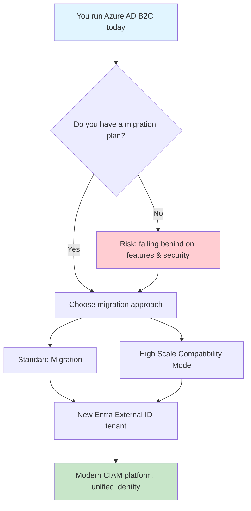

### 💡 Why This Matters Now

The clock is ticking. While Microsoft has committed to supporting Azure AD B2C until at least May 2030, **sub-features are already being retired ahead of schedule**. The March 2026 retirement of B2C Premium P2 and Identity Protection integration proved that waiting until the last minute is a risky strategy. Organizations that start planning now will have smoother transitions, better feature parity, and access to Microsoft's latest identity innovations.

---

## 2. Prerequisites

Before diving into this tutorial, ensure you have:

### Technical Prerequisites
- **Azure Subscription** with permissions to create and manage Azure AD tenants
- **Azure AD B2C Tenant** currently in production or development
- **Azure CLI** (v2.50+) or **PowerShell** (Az module) installed
- **Microsoft Graph PowerShell SDK** for tenant configuration
- **Basic understanding** of OAuth 2.0, OpenID Connect, and SAML protocols
- **Familiarity** with Azure AD application registrations
- **Postman** or similar API testing tool for Graph API calls

### Knowledge Prerequisites
- Understanding of identity provider (IdP) concepts
- Experience with authentication flows (authorization code, implicit, hybrid)
- Basic knowledge of JSON and REST APIs
- Familiarity with CI/CD pipelines (for automated migration)

### Access Requirements
- Global Administrator or Cloud Application Administrator role in your Azure AD B2C tenant
- Permissions to create new Azure AD tenants
- Access to application source code repositories (for endpoint updates)

### ⚠️ Important Note
This tutorial assumes you're working in a **production environment**. Always test migration strategies in a development/staging environment first before applying to production tenants.

---

## 3. Learning Objectives

By the end of this tutorial, you will be able to:

✅ **Understand** the strategic rationale behind Azure AD B2C retirement and Entra External ID adoption  
✅ **Compare** Azure AD B2C and Entra External ID across architecture, features, and limitations  
✅ **Choose** the appropriate migration approach (Standard, HSC, Hybrid, or JIT) based on your organization's scale and requirements  
✅ **Execute** a standard migration using bulk user migration patterns  
✅ **Implement** Just-in-Time (JIT) migration for large-scale deployments  
✅ **Configure** High Scale Compatibility (HSC) mode for 5M+ identity tenants  
✅ **Rebuild** custom B2C policies as Entra External ID user flows and authentication extensions  
✅ **Plan** for feature gaps (age gating, Identity Protection, social IdPs in HSC mode)  
✅ **Validate** migration success through comprehensive testing strategies  
✅ **Avoid** common pitfalls that cause migration failures  
✅ **Develop** a complete migration checklist tailored to your organization  
✅ **Apply** best practices for long-term Entra External ID operations  

---

## 4. Background: What Is Azure AD B2C and Why Is It Being Retired?

Azure AD B2C has been Microsoft's customer identity platform for years, powering sign-up and sign-in experiences for consumer-facing apps at enormous scale — some tenants run **100 million+ identities**. It uses XML-based "custom policies" (built on the Identity Experience Framework, or IEF) to create highly customizable authentication journeys.

However, B2C was built reactively over time to meet emerging needs, which left it carrying significant technical debt. Microsoft needs a more modern, unified foundation to compete in the CIAM market. B2C still works but is no longer evolving and carries technical debt from being patched over years to meet demands it wasn't originally designed for.

### Key Timeline Facts

| Milestone | Date | What it means |
|---|---|---|
| End of sale for new customers | May 1, 2025 | New tenants can only be created with Azure AD B2C P1; B2C is no longer available to purchase for new customers |
| B2C Premium P2 retirement | March 15, 2026 | Azure AD B2C P2 was discontinued for all customers, and P2 tenants were automatically switched to P1 pricing |
| Loss of Identity Protection in B2C | March 15, 2026 | Every B2C tenant relying on B2C Premium P2 features — including Identity Protection integration and risk-based Conditional Access — lost those capabilities on that date |
| Minimum support commitment | Through at least May 2030 | Microsoft will continue supporting Azure AD B2C until at least May 2030 |
| Entra External ID general availability | May 2024 | Microsoft Entra External ID reached general availability in May 2024 |

> ⚠️ **Important nuance:** May 2030 is not a hard deadline you can plan around passively. Sub-features can be retired earlier — as already happened with B2C Premium P2 and Identity Protection integration in March 2026.

### Example: The Identity Protection Gap

If your B2C policies relied on risk-based step-up authentication powered by Identity Protection signals, that integration is gone. External ID doesn't support Identity Protection for external tenant users, and Microsoft Graph identity protection endpoints don't return risk scores for External ID accounts.

**Use case:** A fintech company using B2C P2's built-in risk detection to block suspicious logins now has to either integrate a third-party fraud/risk vendor or build custom risk scoring inside the `OnTokenIssuanceStart` extension.

**Impact Assessment:**
- **Before Migration:** Risk-based policies worked out-of-the-box with P2 license
- **After Migration:** Requires custom development or third-party integration
- **Cost Impact:** Additional licensing for fraud detection services
- **Timeline Impact:** 2-4 weeks of additional development per affected application

---

## 5. What Is Microsoft Entra External ID?

Microsoft Entra External ID is described as a unified, cloud-native CIAM solution that lets organizations scale to millions of external users with:
- High availability and secure logins with built-in MFA
- Conditional access and threat protection
- Customizable user journeys with branded sign-up/sign-in pages
- Custom attributes and identity provider integration (social, enterprise, email-OTP, OIDC, or SAML)

It builds on B2C's foundation but adds **unified management** for both customer (B2C-style) and partner (B2B) identities under a single platform, rather than requiring separate products and tenant models for customers versus business partners.

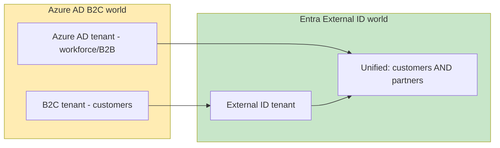

### Why This Unification Matters

**Use case:** A SaaS company that previously ran two separate identity stacks — one Azure AD B2C tenant for customer logins, and a separate Azure AD tenant with B2B guest invites for partner integrations — can consolidate onto one External ID tenant, reducing operational overhead and giving security teams a single pane of glass for access reviews.

**Operational Benefits:**
- **Reduced licensing costs:** Single platform instead of dual-tenant architecture
- **Simplified management:** One admin experience for all external identities
- **Unified security policies:** Consistent Conditional Access across customer and partner identities
- **Better analytics:** Consolidated usage and security insights

---

## 6. Key Differences Between Azure AD B2C and Entra External ID

The single biggest architectural shift to understand: **Entra External ID does not use B2C's XML-based custom policies.** If you've built complex authentication flows with custom policies, you'll need to rebuild them using Entra External ID's user flows and custom authentication extensions, or OIDC federation with a dedicated authentication provider.

### Comprehensive Feature Comparison

| Aspect | Azure AD B2C | Entra External ID |
|---|---|---|
| **Policy engine** | XML custom policies (IEF) | User flows + custom authentication extensions |
| **Identity scope** | Customer (B2C) only | Unified customer + partner (B2B) |
| **Risk-based auth** | Identity Protection (P2, now retired) | Requires third-party integration or custom logic |
| **Admin experience (at scale)** | Full admin portal | HSC mode: largely Graph API/automation-driven |
| **Passkeys** | Not available | Available in standard deployments |
| **Age gating** | Supported via custom policies | Not currently supported |
| **Social IdPs (HSC mode)** | Fully supported | ❌ Not supported in HSC mode |
| **Custom OIDC federation** | Supported via custom policies | Limited in HSC mode |
| **Multitenant apps** | Supported | ❌ Not supported (single-tenant only) |
| **Native authentication** | Not available | Available (iOS/Android SDKs) |

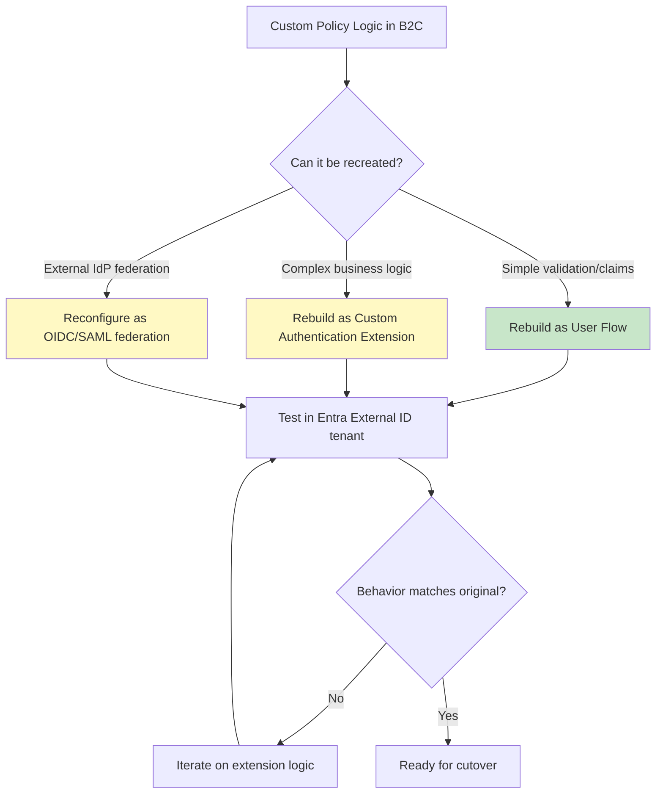

### Real-World Impact Example

**Scenario:** A retail loyalty app with a custom B2C policy that:
1. Validates promotional codes during sign-up
2. Checks user age for age-restricted products
3. Issues custom claims for loyalty tier
4. Integrates with Salesforce CRM via REST API

**Migration Path:**
- Simple claim transformations → Rebuild as user flow attributes
- Promotional code validation → Custom authentication extension (`OnAttributeCollectionStart`)
- CRM integration → Azure Function with managed identity
- Age validation → **⚠️ Requires alternative approach** (not supported in External ID)

**Estimated Effort:** 3-4 weeks for a single complex policy

---

## 7. Choosing Your Migration Approach

This is the most important early decision. Microsoft offers multiple paths:

- **Standard migration** — recommended for most Azure AD B2C customers
- **High Scale Compatibility (HSC) mode** — for very large Azure AD B2C tenants
- **Hybrid tenant approach** — gradual migration with parallel operation
- **Just-in-Time (JIT) migration** — migrate users on first sign-in

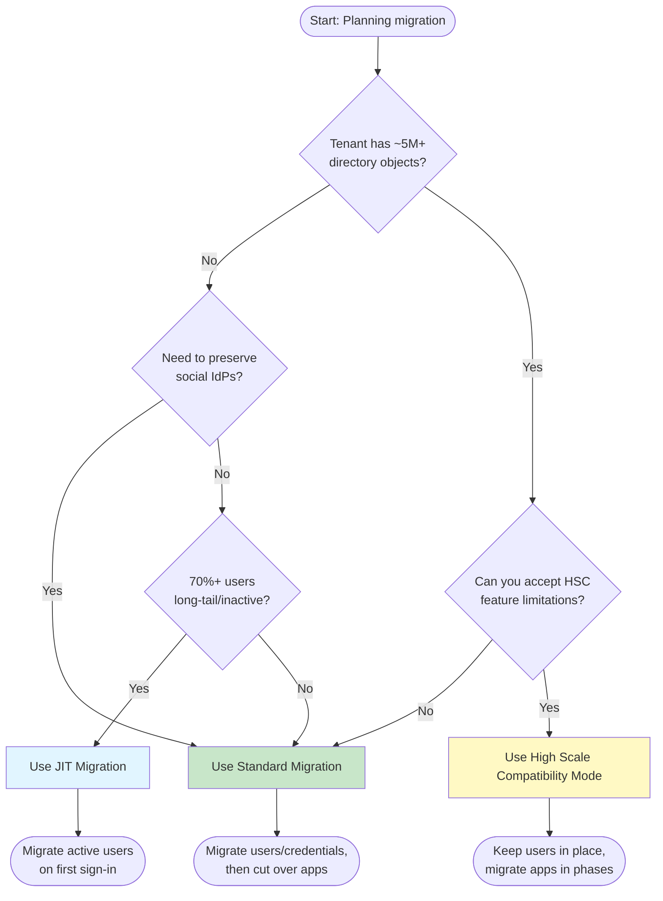

### Decision Matrix

| Factor | Standard Migration | HSC Mode | JIT Migration | Hybrid Approach |
|---|---|---|---|---|
| **Best for** | Most tenants (up to 5M objects) | Very large tenants (5M+ objects) | Long-tail user bases | Gradual, low-risk migration |
| **User migration** | Bulk or JIT | Keep in place | On first sign-in | Phased by user segment |
| **App downtime** | Minimal (cutover window) | None (phased) | None | None |
| **Feature parity** | Highest | Significant gaps | High | High |
| **Complexity** | Medium | High | Medium | Medium-High |
| **Timeline** | 3-6 months | 6-12 months | 4-8 months | 6-9 months |
| **Social IdP support** | ✅ Yes | ❌ No | ✅ Yes | ✅ Yes |
| **Risk level** | Medium | Low | Low-Medium | Low |

### Quick Decision Guide

**Choose Standard Migration if:**
- You have fewer than 5 million directory objects
- You need full feature parity (social IdPs, passkeys, etc.)
- You can tolerate a short cutover window
- Your team has bandwidth for application updates

**Choose HSC Mode if:**
- You exceed 5 million directory objects
- You cannot risk bulk migration at scale
- Your applications can tolerate missing features temporarily
- You have strong automation/Graph API capabilities

**Choose JIT Migration if:**
- 60%+ of your users are dormant (no login in 6+ months)
- You want to minimize migration effort
- You can keep the legacy B2C tenant available during coexistence
- Risk-based validation against legacy credentials is acceptable

**Choose Hybrid Approach if:**
- You need zero downtime
- You have multiple application teams migrating at different speeds
- You want to validate each migration wave before proceeding
- Risk tolerance is very low

---

## 8. Deep Dive: Standard Migration

In the standard approach, you migrate identities and applications to a brand-new Entra External ID tenant. This typically includes:
1. Creating the destination tenant and configuring security, compliance, and monitoring
2. Registering applications and configuring user flows
3. Migrating user data and preserving passwords if needed
4. Cutting over applications to External ID

### 8.1 The Three Common Migration Patterns

Microsoft documents three concrete patterns you can choose from within standard migration:

#### Pattern 1: Bulk User Migration, Then App Cutover
**Best for:** Predictable, well-understood user bases with active users

```mermaid
sequenceDiagram
    participant Admin as Migration Admin
    participant B2C as Azure AD B2C
    participant EID as Entra External ID
    participant App as Application
    
    Admin->>B2C: Export all user accounts
    B2C-->>Admin: User export (CSV/JSON)
    Admin->>Admin: Transform user data
    Admin->>EID: Bulk import users
    EID-->>Admin: Import confirmation
    Admin->>EID: Configure user flows
    Admin->>App: Update endpoints to External ID
    App->>EID: Authenticate users
    EID-->>App: Issue tokens
    
    Note over Admin,EID: All users migrated before app cutover
```

**Advantages:**
- Clean separation between migration and cutover
- All users available immediately in External ID
- Simplifies troubleshooting

**Disadvantages:**
- Requires handling every account (active or dormant)
- Longer migration window
- Higher upfront risk

**Estimated Timeline:** 2-4 weeks for 1M users

#### Pattern 2: Bulk User Migration with JIT Password Migration
**Best for:** Large user bases where you want to minimize password migration effort

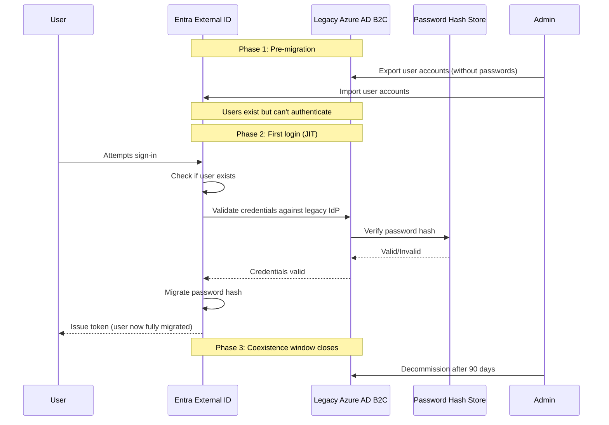

**Advantages:**
- Only active users trigger password migration
- Reduces migration complexity
- Natural rollback option (users can still use B2C)

**Disadvantages:**
- Legacy B2C must remain available during coexistence
- Slight latency increase on first login
- Requires custom validation logic

**Implementation Example:**

```csharp
// Custom authentication extension for JIT password validation
public class JitPasswordMigrationExtension : HttpFunction
{
    private readonly IGraphService _graphService;
    private readonly ILegacyB2CValidator _legacyValidator;
    
    [FunctionName("JitPasswordValidation")]
    public async Task<HttpResponseDto> Run([HttpTrigger(AuthorizationLevel.Function)] 
        HttpRequestData req)
    {
        var request = await req.ReadFromJsonAsync<JitMigrationRequest>();
        
        // 1. Check if user exists in External ID
        var externalUser = await _graphService.GetUserAsync(request.Email);
        
        if (externalUser != null && externalUser.PasswordHash != null)
        {
            // Already migrated, validate normally
            return await ValidatePasswordAsync(request);
        }
        
        // 2. Validate against legacy B2C
        var isValid = await _legacyValidator.ValidateCredentialsAsync(
            request.Email, 
            request.Password
        );
        
        if (!isValid)
        {
            return new HttpResponseDto { Success = false, Error = "Invalid credentials" };
        }
        
        // 3. Migrate password hash (if available)
        await _graphService.UpdateUserPasswordAsync(request.Email, request.Password);
        
        return new HttpResponseDto { Success = true, Migrated = true };
    }
}
```

#### Pattern 3: B2C-Initiated Background Migration
**Best for:** Applications that cannot tolerate downtime and need gradual migration

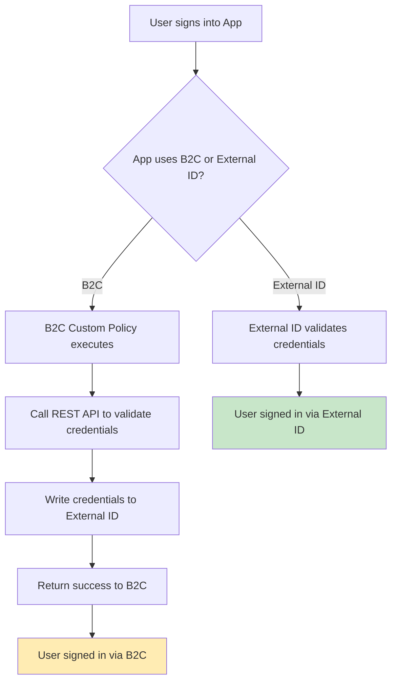

**Advantages:**
- Zero application downtime
- Gradual, controlled migration
- Applications remain on B2C until ready

**Disadvantages:**
- Requires custom policy development
- Complex coordination between B2C and External ID
- Longer overall migration window

**B2C Custom Policy Snippet:**

```xml
<TechnicalProfile Id="Rapi-ExternalID-CredentialHarvest">
  <DisplayName>External ID Credential Migration</DisplayName>
  <Protocol Name="Proprietary" Handler="Web.TPEngine.Providers.RestfulProvider, Web.TPEngine">
    <Metadata>
      <Item Key="ServiceUrl">https://your-function.azurewebsites.net/api/migrate</Item>
      <Item Key="SendClaimsIn">Body</Item>
      <Item Key="AuthenticationType">None</Item>
    </Metadata>
    <InputClaims>
      <InputClaim ClaimTypeReferenceId="signInName" />
      <InputClaim ClaimTypeReferenceId="password" />
    </InputClaims>
    <OutputClaims>
      <OutputClaim ClaimTypeReferenceId="migrationStatus" />
    </OutputClaims>
  </Protocol>
</TechnicalProfile>
```

**Azure Function Implementation:**

```javascript
// Azure Function: Harvest credentials during B2C authentication
module.exports = async function (context, req) {
    const { email, password } = req.body;
    
    try {
        // 1. Validate credentials against B2C (already done by B2C itself)
        // 2. Store in External ID for future use
        await migrateToExternalID(email, password);
        
        context.res = {
            status: 200,
            body: { migrationStatus: "Success" }
        };
    } catch (error) {
        context.log.error("Migration failed:", error);
        context.res = {
            status: 500,
            body: { migrationStatus: "Failed" }
        };
    }
};

async function migrateToExternalID(email, password) {
    // Use Microsoft Graph API to create/update user in External ID
    const graphClient = Client.init({
        authProvider: (done) => {
            // Get token for External ID tenant
            done(null, accessToken);
        }
    });
    
    // Create user with password
    await graphClient.api('/users')
        .post({
            identities: [{
                signInType: 'emailAddress',
                issuer: 'your-tenant.onmicrosoft.com',
                issuerAssignedId: email
            }],
            displayName: email.split('@')[0],
            passwordProfile: {
                password: password,
                forceChangePasswordNextSignIn: false
            }
        });
}
```

### 8.2 Considerations Before You Start

Before implementation, review these areas:

#### 1. Custom Business Logic
- **Identify** custom policy logic, token/claim shaping, and downstream dependencies
- **Document** all REST API calls from custom policies
- **Map** claims transformations to user flow attributes or extensions

#### 2. User Experience
- **Review** sign-in UX customizations (CSS, page layouts)
- **Decide** which External ID experience to use (built-in UI vs. custom)
- **Plan** branding consistency across platforms

#### 3. Identity Providers
- **List** all social and enterprise IdPs in use
- **Check** federation requirements (SAML, OIDC, OAuth 2.0)
- **Validate** certificate expiration dates and key rotation schedules

#### 4. Access Controls
- **Note** Conditional Access policies that must be equivalent post-migration
- **Document** MFA requirements and enforcement methods
- **Review** session management and token lifetime policies

#### 5. Application-Level Changes
- **Every application must be updated** to use External ID endpoints
- **Validate** token validation logic (issuer, audience, signature)
- **Test** with non-production apps first

#### 6. Automation/Operations
- **Plan** Microsoft Graph-based lifecycle operations
- **Set up** monitoring and alerting for migration metrics
- **Create** runbooks for rollback scenarios

> 💡 **Critical detail people miss:** Migration requires changes at the application level, not just the tenant level. If your tenant contains apps owned by third parties (for example, an ISV tenant where customers register their own apps), you can't complete migration until every single application is updated, which means coordinating with those app owners early is essential.

### 8.3 Known Limitations of Standard Migration

#### Age Gating
B2C tenants using custom policies to derive or store age-based attributes need an alternate approach. Age gating isn't supported in Entra External ID.

**Workaround Options:**
1. **Custom authentication extension** that validates age during sign-up
2. **Third-party age verification service** integrated via REST API
3. **Post-signup verification** with account restriction until verified

**Example Workaround:**

```csharp
// Custom authentication extension for age validation
public class AgeVerificationExtension : HttpFunction
{
    [FunctionName("AgeVerification")]
    public async Task<HttpResponseDto> Run([HttpTrigger(AuthorizationLevel.Function)] 
        HttpRequestData req, 
        [OpenApiParameter("birthdate", Required = true)] string birthdate)
    {
        var birthDate = DateTime.Parse(birthdate);
        var age = DateTime.Today.Year - birthDate.Year;
        
        if (birthDate.Date > DateTime.Today.AddYears(-age)) age--;
        
        if (age < 13) // COPPA compliance
        {
            return new HttpResponseDto 
            { 
                Success = false, 
                Error = "You must be at least 13 years old to sign up" 
            };
        }
        
        return new HttpResponseDto { Success = true, Age = age };
    }
}
```

#### Custom Policies (IEF)
Custom policy logic must be recreated using custom authentication extensions. One-to-one parity isn't guaranteed.

**Migration Strategy:**
1. **Inventory** all custom policies and document their logic
2. **Categorize** by complexity (simple claims transformation vs. complex orchestration)
3. **Rebuild** using user flows + extensions
4. **Test** extensively before production cutover

---

## 9. Deep Dive: High Scale Compatibility (HSC) Mode

HSC mode is a specialized approach that lets you adopt Entra External ID endpoints and features while keeping existing users and credentials in place, migrating applications in phases.

### 9.1 Why Choose HSC Mode?

HSC mode helps you:
- **Preserve** existing B2C users and credentials without disruption
- **Continue** supporting legacy B2C apps alongside new/migrated apps
- **Control** the pace of migration through a phased, business-driven transition
- **Avoid** the risk of bulk migration at massive scale (10M+ identities)

### 9.2 The Three Stages of HSC Coexistence

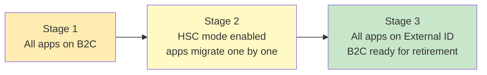

#### Stage 1: All Apps on B2C
- Current state: All applications use B2C endpoints
- No changes required
- Baseline established

#### Stage 2: HSC Mode Enabled
- Tenant enabled for HSC mode without impacting existing apps
- **New app registrations** use External ID endpoints
- **Existing apps** continue on B2C endpoints
- Applications migrate independently on your schedule

**Enabling HSC Mode:**

```powershell
# Using Microsoft Graph PowerShell SDK
Connect-MgGraph -Scopes "Tenant.ReadWrite.All"

# Enable HSC mode for your B2C tenant
$settings = @{
    "federationConfigurations@odata.bind" = @(
        "https://graph.microsoft.com/v1.0/identityProviders/your-idp-id"
    )
} | ConvertTo-Json

Update-MgPolicyAuthorizationPolicy -Id "authorizationPolicy" -DefaultUserRolePermissions $settings

# Verify HSC mode is enabled
$tenantDetails = Get-MgOrganization
Write-Host "HSC Mode Status: $($tenantDetails.SecurityDefaultsEnabled)"
```

#### Stage 3: Full Migration Complete
- All applications migrated to External ID endpoints
- B2C policies no longer actively used
- Tenant ready for decommissioning

> ⚠️ **Important:** Application migration is always performed by you — HSC mode doesn't automatically move applications.

### 9.3 Requirements and Limitations

#### Hard Requirements

1. **Don't reuse existing B2C application registrations**
   - Create new registrations for External ID
   - External ID requires new registrations due to differences in application properties and Native Authentication support

2. **Register each app as single-tenant**
   - Multitenant app registrations aren't supported for External ID endpoints

**Configuration Example:**

```json
{
  "api": {
    "oauth2PermissionScopes": [
      {
        "adminConsentDisplayName": "Read access",
        "adminConsentDescription": "Allows the app to read data",
        "id": "read-permission-id",
        "isEnabled": true,
        "type": "User",
        "userConsentDisplayName": "Read your data",
        "userConsentDescription": "Allows the app to read your data",
        "value": "user.read"
      }
    ]
  },
  "signInAudience": "AzureADMyOrg",  // Single-tenant only
  "web": {
    "redirectUris": [
      "https://yourapp.com/auth-callback"
    ],
    "implicitGrantSettings": {
      "enableAccessTokenIssuance": false,
      "enableIdTokenIssuance": true
    }
  }
}
```

#### Feature Gaps in HSC Mode

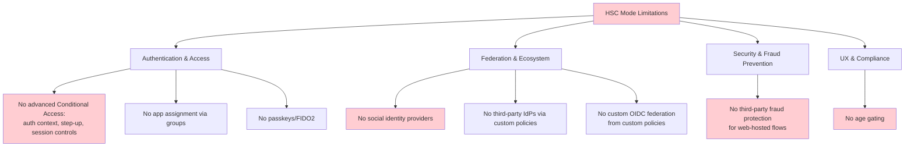

**Detailed Limitations:**

**Authentication & Access:**
- ❌ No advanced Conditional Access scenarios (auth context, step-up authentication, session-based controls)
- ❌ No application assignment via groups
- ❌ No passkeys or FIDO2 authentication

**Federation & Ecosystem:**
- ❌ No social identity providers (Google, Facebook, Apple, etc.)
- ❌ No third-party identity providers configured via B2C custom policies
- ❌ No custom OIDC federation from custom policies
- ✅ Enterprise OIDC identity providers are supported

**Security & Fraud Prevention:**
- ❌ No third-party fraud protection for web-hosted sign-in/sign-up flows
- ✅ Native authentication API flows can integrate with WAF-fronted solutions

**UX & Compliance:**
- ❌ No age gating support
- ❌ Administrative configuration via Microsoft Graph only (no admin portal experience)

**Use case:** A global airline loyalty program running a B2C tenant with over 40 million members and integrated social logins (Google, Facebook, Apple) would need to weigh HSC mode's scale benefits against the loss of social identity provider support — a real trade-off.

### 9.4 HSC Mode Configuration Example

```bash
# Azure CLI: Create new app registration for External ID in HSC mode
az ad app create \
  --display-name "CustomerPortal-ExternalID" \
  --sign-in-audience "AzureADMyOrg" \
  --web-redirect-uris "https://portal.airline.com/auth-callback" \
  --oauth2-allow-id-token-implicit-flow true \
  --required-resource-accesses '[]'

# Get the Application (client) ID
APP_ID=$(az ad app list --display-name "CustomerPortal-ExternalID" --query "[0].appId" -o tsv)

# Configure API permissions
az ad app permission add \
  --id $APP_ID \
  --api 00000003-0000-0000-c000-000000000000 \
  --api-permissions User.Read=Scope

# Grant admin consent
az ad app permission grant --id $APP_ID --api 00000003-0000-0000-c000-000000000000 --scope User.Read
```

---

## 10. Just-in-Time (JIT) and Passwordless Migration

One of the most exciting developments is the **Just-in-Time migration approach** designed to move millions of users to External ID more simply than traditional bulk methods.

### 10.1 How JIT Migration Works

JIT migration lets you migrate users on their first sign-in — including passwordless options — which simplifies moving millions of accounts without needing bulk exports.

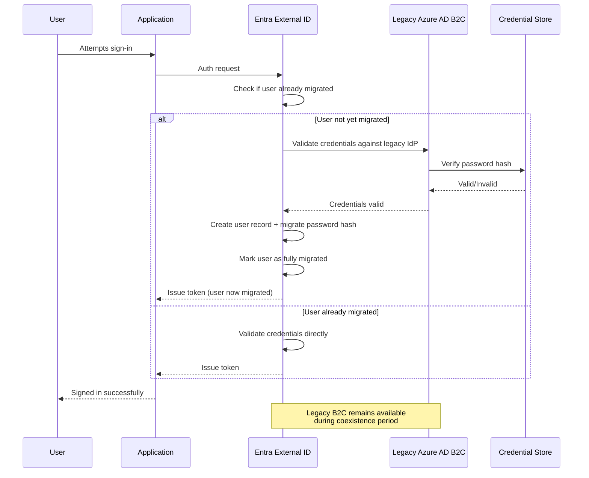

### 10.2 Why This Matters

**Use case:** Instead of running a risky, all-at-once bulk export/import of tens of millions of user records, a media streaming service with 30 million dormant and active accounts can let *only the users who actually come back* trigger their own migration at login time. Inactive or abandoned accounts never get migrated, saving enormous operational effort.

**Cost Savings Example:**
- **Bulk Migration:** Export/import 30M accounts = ~$3,000 in API costs + 2 weeks engineering time
- **JIT Migration:** Only migrate returning users (est. 20% = 6M accounts) = ~$600 in API costs + 1 week engineering time
- **Savings:** 67% cost reduction, 50% time reduction

### 10.3 JIT vs. Bulk Migration Comparison

| Approach | How it works | Best for | Trade-off |
|---|---|---|---|
| **Bulk migration** | Export all users up front, import into External ID | Predictable, well-understood datasets | Requires handling every account, more upfront risk |
| **JIT migration** | Migrate user's credentials at next sign-in | Very large or long-tail user bases | Requires legacy IdP available during coexistence |
| **JIT passwordless** | Migrate identity without re-validating legacy password | Modernizing auth while migrating | Requires user re-enrollment in new credential type |

### 10.4 Implementing JIT Migration with Custom Authentication Extensions

**Prerequisites:**
- Entra External ID tenant configured
- Legacy B2C tenant still operational
- Azure Function or App Service for credential validation
- Custom authentication extension registered in External ID

**Step 1: Create Azure Function for Credential Validation**

```csharp
using Microsoft.Azure.Functions.Worker;
using Microsoft.Azure.Functions.Worker.Http;
using Microsoft.Extensions.Logging;
using Microsoft.Identity.Web;
using Microsoft.Graph;
using System.Net;

public class JitMigrationFunction
{
    private readonly IGraphServiceClient _graphClient;
    private readonly ILegacyB2CValidator _legacyValidator;
    private readonly ILogger _logger;
    
    public JitMigrationFunction(
        IGraphServiceClient graphClient, 
        ILegacyB2CValidator legacyValidator,
        ILoggerFactory loggerFactory)
    {
        _graphClient = graphClient;
        _legacyValidator = legacyValidator;
        _logger = loggerFactory.CreateLogger<JitMigrationFunction>();
    }
    
    [Function("JitCredentialValidation")]
    public async Task<HttpResponseData> Run(
        [HttpTrigger(AuthorizationLevel.Function, "post")] 
        HttpRequestData req)
    {
        var request = await req.ReadFromJsonAsync<JitRequest>();
        
        try
        {
            _logger.LogInformation($"JIT migration attempt for: {request.Email}");
            
            // 1. Check if user already exists in External ID
            var users = await _graphClient.Users
                .Request()
                .Filter($"identities/any(c:c/issuerAssignedId eq '{request.Email}')")
                .GetAsync();
            
            var user = users.CurrentPage.FirstOrDefault();
            
            if (user != null)
            {
                // User already migrated, return success
                _logger.LogInformation($"User {request.Email} already migrated");
                var response = req.CreateResponse(HttpStatusCode.OK);
                await response.WriteAsJsonAsync(new { migrated = false, status = "exists" });
                return response;
            }
            
            // 2. Validate credentials against legacy B2C
            _logger.LogInformation($"Validating credentials for {request.Email} against B2C");
            var isValid = await _legacyValidator.ValidateAsync(request.Email, request.Password);
            
            if (!isValid)
            {
                _logger.LogWarning($"Invalid credentials for {request.Email}");
                var response = req.CreateResponse(HttpStatusCode.Unauthorized);
                await response.WriteAsJsonAsync(new { error = "Invalid credentials" });
                return response;
            }
            
            // 3. Migrate user to External ID
            _logger.LogInformation($"Migrating user {request.Email} to External ID");
            var newUser = new User
            {
                AccountEnabled = true,
                DisplayName = request.Email.Split('@')[0],
                Identities = new[]
                {
                    new ObjectIdentity
                    {
                        SignInType = "emailAddress",
                        Issuer = "yourtenant.onmicrosoft.com",
                        IssuerAssignedId = request.Email
                    }
                },
                PasswordProfile = new PasswordProfile
                {
                    Password = request.Password,
                    ForceChangePasswordNextSignIn = false,
                    ForceResetPassword = false
                }
            };
            
            await _graphClient.Users.Request().AddAsync(newUser);
            
            _logger.LogInformation($"Successfully migrated user {request.Email}");
            
            var successResponse = req.CreateResponse(HttpStatusCode.OK);
            await successResponse.WriteAsJsonAsync(new 
            { 
                migrated = true, 
                status = "success",
                userId = newUser.Id 
            });
            return successResponse;
        }
        catch (Exception ex)
        {
            _logger.LogError(ex, $"JIT migration failed for {request.Email}");
            var errorResponse = req.CreateResponse(HttpStatusCode.InternalServerError);
            await errorResponse.WriteAsJsonAsync(new { error = ex.Message });
            return errorResponse;
        }
    }
}

public class JitRequest
{
    public string Email { get; set; }
    public string Password { get; set; }
}
```

**Step 2: Register Custom Authentication Extension**

```powershell
# Create the custom authentication extension
$extension = @{
    "@odata.type" = "#microsoft.graph.onTokenIssuanceStartCustomExtension"
    displayName = "JIT User Migration"
    description = "Migrates users from legacy B2C on first sign-in"
    endpointConfiguration = @{
        "@odata.type" = "#microsoft.graph.httpWebhookEndpoint"
        url = "https://your-function.azurewebsites.net/api/JitCredentialValidation"
    }
    authenticationConfiguration = @{
        "@odata.type" = "#microsoft.graph.customExtensionKeyValue"
        key = "x-functions-key"
        value = "your-function-key"
    }
}

# Register the extension
$extensionObj = New-Object PSObject -Property $extension
New-MgPolicyAuthenticationEventEventListener -BodyParameter $extensionObj
```

**Step 3: Configure User Flow to Use Extension**

```json
{
  "api-version": "1.0",
  "onTokenIssuanceStartCustomExtension": [
    {
      "customExtensionId": "your-extension-id",
      "claimNameMapping": {
        "email": "signInName",
        "password": "password"
      }
    }
  ]
}
```

### 10.5 JIT Passwordless Migration

For organizations modernizing authentication while migrating, **JIT passwordless migration** eliminates the need to validate legacy passwords entirely.

**Approach:**
1. User signs up with email/phone in External ID
2. External ID sends OTP or magic link
3. On verification, user account is created
4. User is prompted to enroll in passkey or other passwordless method
5. Legacy B2C credentials are optionally invalidated

**Benefits:**
- No dependency on legacy B2C availability after initial migration
- Improves security posture immediately
- Better user experience (modern authentication)

**Trade-offs:**
- Requires user action (re-enrollment)
- May confuse users expecting seamless transition
- Requires communication campaign

---

## 11. The Hybrid Tenant Approach

A complementary strategy is the **hybrid tenant approach**: running Entra External ID alongside your existing B2C tenant so apps keep working while you reconfigure endpoints and migrate users in phases.

### 11.1 How It Works

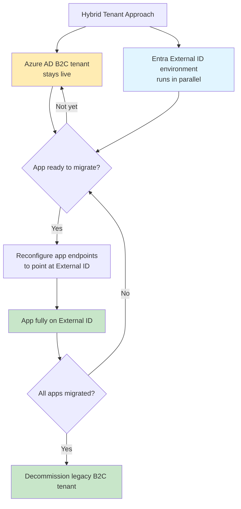

### 11.2 Benefits of Hybrid Approach

1. **Zero downtime:** Applications never lose authentication capability
2. **Phased migration:** Migrate one application at a time
3. **Risk mitigation:** Issues affect only migrated apps, not entire tenant
4. **Testing flexibility:** Validate each app independently
5. **Business continuity:** User disruption is minimal

### 11.3 Implementation Steps

#### Phase 1: Parallel Setup (Weeks 1-2)
```bash
# 1. Create External ID tenant
az ad tenant create --subscription "your-subscription-id" --name "yourcompany-external"

# 2. Configure External ID tenant
az rest --method POST \
  --uri "https://graph.microsoft.com/v1.0/policies/authorizationPolicy" \
  --body '{
    "description": "External ID Authorization Policy",
    "displayName": "External ID Authorization Policy",
    "enabled": true
  }'

# 3. Set up DNS and custom domains for both tenants
# B2C: login.yourolddomain.com
# External ID: login.yournewdomain.com
```

#### Phase 2: Application Migration (Weeks 3-8)
```yaml
# Example: Application configuration with dual endpoints
apiVersion: v1
kind: ConfigMap
metadata:
  name: auth-config
data:
  # Production: External ID
  AUTH_ISSUER: "https://yourcompany-external.b2clogin.com/yourtenant/v2.0"
  AUTH_CLIENT_ID: "new-external-id-client-id"
  
  # Fallback: Legacy B2C (for rollback)
  AUTH_ISSUER_LEGACY: "https://yourcompany.b2clogin.com/yourtenant/v2.0"
  AUTH_CLIENT_ID_LEGACY: "legacy-b2c-client-id"
  
  # Feature flag for gradual rollout
  USE_EXTERNAL_ID: "true"
```

#### Phase 3: Validation and Cutover (Weeks 9-12)
```csharp
// Feature flag implementation in application code
public class AuthenticationProvider
{
    private readonly IConfiguration _config;
    private readonly bool _useExternalId;
    
    public AuthenticationProvider(IConfiguration config)
    {
        _config = config;
        _useExternalId = bool.Parse(_config["USE_EXTERNAL_ID"] ?? "false");
    }
    
    public string GetIssuer()
    {
        return _useExternalId 
            ? _config["AUTH_ISSUER"] 
            : _config["AUTH_ISSUER_LEGACY"];
    }
    
    public string GetClientId()
    {
        return _useExternalId 
            ? _config["AUTH_CLIENT_ID"] 
            : _config["AUTH_CLIENT_ID_LEGACY"];
    }
}
```

---

## 12. Step-by-Step Migration Walkthrough

Here's a practical, end-to-end walkthrough combining Microsoft's documented process with the strategies discussed above.

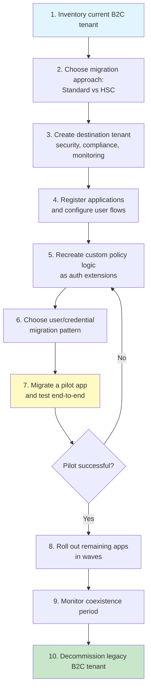

### Step 1: Inventory What You Have Today

Start by cataloging everything you'd need to recreate.

**Example inventory checklist:**
- [ ] List of registered applications and their redirect URIs
- [ ] All social/enterprise identity providers in use
- [ ] Custom claims transformations in policies
- [ ] Conditional Access policies tied to B2C
- [ ] MFA enrollment data
- [ ] Any age-gating or compliance logic

**Inventory Script:**

```powershell
# Export B2C tenant configuration
Connect-AzAccount
Set-AzContext -Subscription "your-subscription"

# Export application registrations
$apps = Get-AzADApplication -All $true
$apps | Select-Object DisplayName, AppId, IdentifierUris, ReplyUrls | 
    Export-Csv -Path "b2c-applications.csv" -NoTypeInformation

# Export identity providers
$idps = Get-AzADServicePrincipal -All $true | 
    Where-Object {$_.Tags -contains "WindowsAzureActiveDirectoryIntegratedApp"}
$idps | Select-Object DisplayName, AppId | 
    Export-Csv -Path "b2c-idps.csv" -NoTypeInformation

# Export custom policies (if accessible via Graph API)
$policies = Get-MgPolicyAuthorizationPolicy
$policies | ConvertTo-Json -Depth 10 | 
    Out-File -FilePath "b2c-policies.json"

Write-Host "Inventory complete. Files exported:"
Write-Host "- b2c-applications.csv"
Write-Host "- b2c-idps.csv"
Write-Host "- b2c-policies.json"
```

### Step 2: Choose Your Approach

Use the decision tree from Section 7 — most organizations land on **standard migration**.

**Decision Checklist:**
- [ ] Directory object count < 5 million?
- [ ] Social IdPs required post-migration?
- [ ] Long-tail inactive users (60%+ dormant)?
- [ ] Third-party app coordination possible?
- [ ] Team has Graph API automation experience?

### Step 3: Create and Configure the Destination Tenant

```bash
# 1. Create new Entra External ID tenant
az ad tenant create \
  --subscription "your-subscription-id" \
  --name "yourcompany-external" \
  --country "US"

# 2. Get tenant details
TENANT_ID=$(az ad tenant list --query "[?contains(tenantId, 'yourcompany-external')].tenantId" -o tsv)

# 3. Connect to new tenant
az account set --tenant $TENANT_ID

# 4. Configure tenant settings
az rest --method PATCH \
  --uri "https://graph.microsoft.com/v1.0/organization" \
  --body '{
    "displayName": "Your Company External ID",
    "securityComplianceNotificationEnabled": true,
    "mfaPolicy": {
      "isEnabled": true,
      "state": "Enabled"
    }
  }'

# 5. Enable External ID features
az rest --method POST \
  --uri "https://graph.microsoft.com/v1.0/policies/authenticationMethodsPolicy" \
  --body '{
    "description": "Enable External ID authentication methods",
    "authenticationMethodConfigurations": [
      {
        "@odata.type": "#microsoft.graph.emailOtpAuthenticationMethodConfiguration",
        "id": "EmailOtp",
        "state": "enabled"
      }
    ]
  }'
```

### Step 4: Register Applications and Configure User Flows

**Each application must be individually updated.**

```powershell
# 1. Register new application in External ID tenant
$app = New-MgApplication -DisplayName "CustomerPortal" `
    -SignInAudience AzureADMyOrg `
    -Web @{
        RedirectUris = @("https://portal.yourapp.com/auth-callback")
        ImplicitGrantSettings = @{
            EnableAccessTokenIssuance = $false
            EnableIdTokenIssuance = $true
        }
    }

# 2. Create service principal
$sp = New-MgServicePrincipal -AppId $app.AppId

# 3. Grant API permissions
$apiPermissions = @(
    @{ PermissionId = "user.read"; Type = "Scope" }
    @{ PermissionId = "openid"; Type = "Scope" }
    @{ PermissionId = "profile"; Type = "Scope" }
    @{ PermissionId = "email"; Type = "Scope" }
)

foreach ($perm in $apiPermissions) {
    Add-MgServicePrincipalAppRoleAssignment -ServicePrincipalId $sp.Id `
        -PrincipalId $sp.Id `
        -AppRoleId $perm.PermissionId `
        -ResourceId $sp.Id
}

# 4. Configure user flow (sign-up/sign-in)
$userFlow = New-MgBetaIdentityUserFlow -DisplayName "SignUpSignIn" `
    -UserFlowType "SignUpOrSignIn" `
    -UserFlowTypeVersion 2
    
# Add attributes to user flow
Add-MgBetaIdentityUserFlowAttributeAssignment -UserFlowId $userFlow.Id `
    -UserAttributeAssignments @(
        @{ UserAttribute = @{ Id = "givenName" }; IsOptional = $false },
        @{ UserAttribute = @{ Id = "surname" }; IsOptional = $false },
        @{ UserAttribute = @{ Id = "email" }; IsOptional = $false }
    )
```

### Step 5: Recreate Custom Policy Logic

**Example: Rebuilding a custom policy as an authentication extension**

Original B2C custom policy claim:
```xml
<OutputClaim ClaimTypeReferenceId="loyaltyTier" PartnerClaimType="extension_LoyaltyTier" />
```

Rebuild as custom authentication extension:

```csharp
[FunctionName("AddLoyaltyTier")]
public async Task<HttpResponseData> Run(
    [HttpTrigger(AuthorizationLevel.Function, "post")] 
    HttpRequestData req,
    [GraphUserData("{userId}")] User user)
{
    var request = await req.ReadFromJsonAsync<AttributeCollectionRequest>();
    
    // Calculate loyalty tier based on user data
    var loyaltyTier = await CalculateLoyaltyTier(user.Id);
    
    var response = new AttributeCollectionResponse
    {
        Actions = new[]
        {
            new ClaimAction
            {
                ClaimType = "extension_LoyaltyTier",
                Value = loyaltyTier
            }
        }
    };
    
    var httpResponse = req.CreateResponse(HttpStatusCode.OK);
    await httpResponse.WriteAsJsonAsync(response);
    return httpResponse;
}

private async Task<string> CalculateLoyaltyTier(string userId)
{
    // Integration with loyalty system
    var purchaseHistory = await _loyaltyService.GetPurchaseHistory(userId);
    var totalSpent = purchaseHistory.Sum(p => p.Amount);
    
    return totalSpent switch
    {
        >= 1000 => "Platinum",
        >= 500 => "Gold",
        >= 100 => "Silver",
        _ => "Bronze"
    };
}
```

### Step 6: Pick a User/Credential Migration Pattern

Choose based on your risk tolerance and user base characteristics (see Section 8.1).

**Recommendation Matrix:**

| User Base Size | Active User % | Recommended Pattern |
|---|---|---|
| < 100K | Any | Bulk migration (Pattern 1) |
| 100K - 1M | > 80% | Bulk with JIT passwords (Pattern 2) |
| 1M - 5M | 40-80% | B2C-initiated migration (Pattern 3) |
| > 5M | < 40% | JIT migration (Pattern 2 or 3) |

### Step 7: Pilot with a Low-Risk Application

Migrate one non-critical app first.

**Pilot Checklist:**
- [ ] Application uses standard OAuth 2.0 flows (no custom policies)
- [ ] User base < 10,000
- [ ] Low business impact (internal tool, documentation site)
- [ ] Full testing environment available
- [ ] Rollback plan documented

**Validation Tests:**
- [ ] Sign-up flow works
- [ ] Sign-in flow works
- [ ] Password reset works
- [ ] MFA enrollment works
- [ ] Token validation works (issuer, audience, signature)
- [ ] Claims are correctly issued
- [ ] Session management works
- [ ] Logout works correctly

### Steps 8-10: Roll Out, Monitor, Decommission

**Roll Out Strategy:**
1. **Wave 1:** Low-risk applications (internal tools)
2. **Wave 2:** Medium-risk applications (partner portals)
3. **Wave 3:** High-traffic applications (customer-facing)
4. **Wave 4:** Critical applications (revenue-generating)

**Monitoring During Coexistence:**
```kusto
// Azure Monitor query: Track migration success rate
AzureDiagnostics
| where ResourceType == "MICROSOFTGRAPH"
| where OperationName == "JitCredentialValidation"
| summarize 
    TotalAttempts = count(),
    SuccessfulMigrations = countif(ResultType == "Success"),
    FailedMigrations = countif(ResultType == "Failure"),
    MigrationRate = (countif(ResultType == "Success") / count()) * 100
    by bin(TimeGenerated, 1h), TenantId
| render timechart
```

**Decommission Checklist:**
- [ ] All applications migrated to External ID
- [ ] No active user sessions on B2C
- [ ] Monitoring shows zero B2C traffic for 30 days
- [ ] Backup of B2C tenant exported and stored
- [ ] DNS records updated (remove B2C endpoints)
- [ ] Documentation updated
- [ ] Stakeholder sign-off received

---

## 13. Real-World Use Cases

### Use Case A: E-commerce Retailer (Standard Migration)

**Organization:** Mid-size online retailer  
**Scale:** 2 million customer accounts  
**Complexity:** Low-Medium (handful of custom policies for loyalty-tier claims)

**Best Fit:** Standard migration, Pattern 2 (bulk migrate users, JIT password validation)

**Rationale:**
- User base well below HSC thresholds
- Predictable enough for bulk export
- Active user rate ~75% (good JIT candidate)
- Limited custom policy complexity

**Migration Timeline:**
- Week 1-2: Inventory and planning
- Week 3-4: Tenant setup and application registration
- Week 5-6: Custom policy rebuild
- Week 7: User migration (bulk export/import)
- Week 8: Pilot application testing
- Week 9-10: Phased application rollout
- Week 11-12: Monitoring and B2C decommissioning

**Challenges Encountered:**
1. **Loyalty tier claim transformation** → Rebuilt as custom extension
2. **Email domain validation** → Implemented as user flow validation
3. **Third-party review application** → Coordinated with vendor for endpoint updates

**Results:**
- ✅ Zero downtime during migration
- ✅ 98.5% successful user migration
- ✅ 1.2% of users required password reset post-migration
- ✅ $4,200 savings in B2C licensing costs annually

### Use Case B: Global Telecom (HSC Mode)

**Organization:** Telecom carrier  
**Scale:** 90 million subscriber identities  
**Complexity:** High (dozens of regional apps, third-party ISV integrations)

**Best Fit:** HSC mode, migrating applications in phases

**Rationale:**
- Exceeds 5M threshold by 18x
- Cannot tolerate bulk migration risk
- Social login critical (conflicts with HSC limitations)
- Third-party apps owned by regional partners

**Migration Strategy:**
- Enable HSC mode immediately
- Migrate internal apps first (company portals, employee tools)
- Coordinate with ISVs for partner apps (6-month lead time)
- Maintain B2C for social login apps until HSC limitations resolved
- Defer social login apps until standard migration possible

**Timeline:** 18-24 months

**Challenges:**
1. **Social login dependency** → Maintained B2C for social IdP apps
2. **ISV coordination** → Required legal agreements and technical docs
3. **Schema differences** → External ID required attribute mapping updates

**Results:**
- ✅ Zero user disruption
- ✅ Phased risk mitigation
- ✅ Maintained social login capability for critical apps
- ⚠️ Extended timeline due to third-party dependencies

### Use Case C: SaaS Platform with Long-Tail Users (JIT Migration)

**Organization:** B2B SaaS company  
**Scale:** 500K registered users  
**Complexity:** Medium (70% dormant for 1+ years)

**Best Fit:** JIT migration

**Rationale:**
- 70% inactive users (no ROI in bulk migration)
- Active users (~150K) manageable for JIT
- Simple authentication flows (no complex custom policies)
- Desire to minimize migration costs

**Implementation:**
```javascript
// JIT migration statistics tracker
const migrationStats = {
    totalUsers: 500000,
    activeUsers: 150000,
    migratedUsers: 0,
    dormantUsersNeverMigrated: 0,
    avgMigrationLatency: 0
};

// After 6 months
console.log(`Migrated: ${migrationStats.migratedUsers} users`);
console.log(`Never migrated (dormant): ${migrationStats.dormantUsersNeverMigrated} users`);
// Output: Migrated: 142000 users, Never migrated: 350000 users
// Cost savings: 70% reduction in migration effort
```

**Results:**
- ✅ 95% of active users migrated within 3 months
- ✅ 350K dormant accounts never migrated (saved effort)
- ✅ 40% cost reduction vs. bulk migration
- ✅ Legacy B2C decommissioned in 6 months

### Use Case D: Consumer App Modernizing Auth (Hybrid + Passwordless)

**Organization:** Banking app  
**Scale:** 5 million customers  
**Complexity:** High (regulatory requirements, passkey adoption goal)

**Best Fit:** Hybrid tenant approach combined with JIT passwordless migration

**Rationale:**
- Regulatory compliance requires zero downtime
- Strategic goal: eliminate passwords entirely
- Mixed user base (tech-savvy + traditional)
- Phased approach minimizes risk

**Implementation:**
1. **Month 1-2:** Set up hybrid tenants, enable passwordless in External ID
2. **Month 3-4:** Migrate 20% of users (opt-in beta) to passwordless
3. **Month 5-6:** Expand to 50% of users
4. **Month 7-8:** Mandate passwordless for new sign-ups
5. **Month 9-10:** Migrate remaining users
6. **Month 11-12:** Decommission B2C

**Results:**
- ✅ Zero compliance violations
- ✅ 78% user adoption of passwordless authentication
- ✅ 92% reduction in password-related support tickets
- ✅ NPS score increased 15 points

---

## 14. Best Practices

### 1. Start with a Comprehensive Inventory
Before any migration work, catalog every application, policy, identity provider, and custom claim. Missing even one dependency can cause production outages.

**Action Items:**
- Use PowerShell/Graph API to export B2C configuration
- Document all third-party integrations
- Create a dependency map showing which apps use which IdPs

### 2. Choose the Right Migration Pattern
Match your migration strategy to your organizational context. Don't force-fit a pattern that doesn't align with your scale, user behavior, or risk tolerance.

**Decision Framework:**
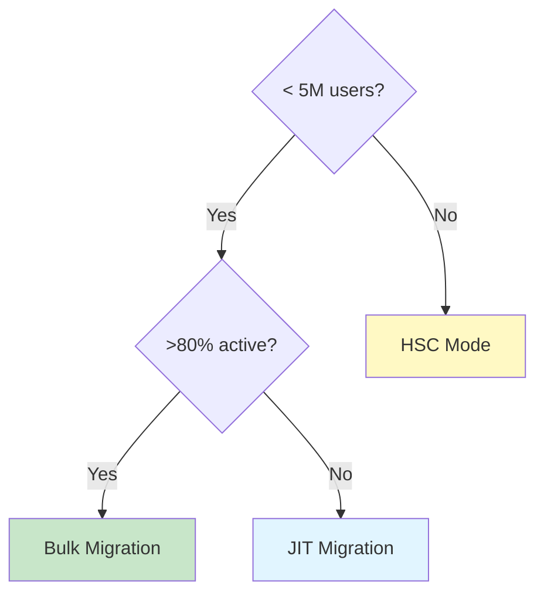

### 3. Rebuild, Don't Port
Custom policies won't work in External ID. Budget time to rebuild them properly using user flows and authentication extensions.

**Effort Estimation:**
- Simple claim transformation: 1-2 days per policy
- Complex business logic: 1-3 weeks per policy
- External IdP federation: 1-2 weeks per integration

### 4. Implement Gradual Rollout
Never migrate all applications simultaneously. Use waves to contain blast radius.

**Recommended Wave Structure:**
- Wave 1: Internal tools (5% of apps)
- Wave 2: Low-traffic external apps (20% of apps)
- Wave 3: Medium-traffic apps (50% of apps)
- Wave 4: High-traffic, revenue-critical apps (25% of apps)

### 5. Maintain Detailed Runbooks
Document every migration step, validation test, and rollback procedure.

**Runbook Template:**
```markdown
# Migration Runbook: [App Name]

## Pre-Migration
- [ ] Backup current configuration
- [ ] Notify stakeholders
- [ ] Schedule maintenance window (if needed)

## Migration Steps
1. Create External ID app registration
2. Configure user flow
3. Update application configuration
4. Deploy updated application
5. Validate authentication flows

## Post-Migration
- [ ] Monitor for 48 hours
- [ ] Collect user feedback
- [ ] Document issues encountered

## Rollback Procedure
- [ ] Revert application configuration
- [ ] Redirect traffic to B2C endpoints
- [ ] Validate rollback success
```

### 6. Automate Everything Possible
Use Microsoft Graph API and Infrastructure as Code (IaC) to automate tenant configuration.

**Terraform Example:**
```hcl
resource "microsoft entra_application" "customer_portal" {
  display_name     = "CustomerPortal"
  sign_in_audience = "AzureADMyOrg"
  
  web {
    redirect_uris = [
      "https://portal.yourapp.com/auth-callback"
    ]
    
    implicit_grant_settings {
      enable_access_token_issuance = false
      enable_id_token_issuance     = true
    }
  }
  
  required_resource_access {
    resource_app_id = "00000003-0000-0000-c000-000000000000" # Microsoft Graph
    
    resource_access {
      id   = "e1fe6dd8-ba31-4d61-89e7-88639da4683d" # User.Read
      type = "Scope"
    }
  }
}
```

### 7. Plan for Feature Gaps
If you're using HSC mode or have dependencies on retiring features, create alternative implementations.

**Age Gating Alternative:**
- Implement in custom authentication extension
- Use third-party age verification service
- Document legal compliance requirements

### 8. Coordinate Extensively with Stakeholders
Migration isn't just an IT project — it affects users, partners, and business units.

**Stakeholder Communication Plan:**
- **Users:** Email campaign explaining migration benefits and timeline
- **Partners/ISVs:** Technical documentation and co-development sessions
- **Executive sponsors:** Monthly progress reports with risk metrics
- **Support teams:** Training on External ID admin experience

### 9. Monitor Extensively During Coexistence
Track both B2C and External ID metrics to ensure smooth operation.

**Key Metrics:**
- Authentication success rate (target: >99.9%)
- Token issuance latency (target: <500ms)
- Migration progress (users/apps migrated)
- Error rates by application
- User support tickets related to authentication

### 10. Decommission B2C Properly
Don't just abandon the old tenant. Follow a structured decommissioning process.

**Decommission Checklist:**
- [ ] All apps confirmed on External ID
- [ ] 30 days of zero B2C traffic
- [ ] Backup of B2C configuration stored
- [ ] DNS records removed
- [ ] Licensing cancelled
- [ ] Documentation archived
- [ ] Team notified of completion

---

## 15. Anti-Patterns

### Anti-Pattern 1: Treating 2030 as "No Action Needed"

**What It Looks Like:**
"We have until 2030, so we'll migrate next year."

**Why It's Wrong:**
Sub-features can retire early, as proven by the March 2026 P2 retirement. Waiting creates technical debt and limits your ability to adopt new features.

**Correct Approach:**
Start planning now. Even if migration takes 2 years, knowing your path informs every new feature decision.

### Anti-Pattern 2: Assuming 1:1 Custom Policy Parity

**What It Looks Like:**
"Our custom policies are complex, but they'll work in External ID with minor tweaks."

**Why It's Wrong:**
Entra External ID doesn't use IEF. Custom policies must be rebuilt, and some advanced scenarios may not have direct equivalents.

**Correct Approach:**
Inventory all custom policies early. Budget 2-3x the estimated rebuild time for testing and iteration.

### Anti-Pattern 3: Forgetting Third-Party Application Owners

**What It Looks Like:**
"We own 90% of our apps, so migration will be quick."

**Why It's Wrong:**
If you have even one third-party app, migration can't complete until that app is updated. ISV coordination takes months.

**Correct Approach:**
Identify all third-party apps in the first week. Engage their development teams immediately with technical documentation.

### Anti-Pattern 4: Migrating Without Testing Password Reset Flows

**What It Looks Like:**
"Sign-in works, so we're good to go."

**Why It's Wrong:**
Password reset is often the most complex flow and involves multiple IdP configurations. Testing only sign-in misses critical failures.

**Correct Approach:**
Create a test matrix covering: sign-up, sign-in, password reset, MFA enrollment, MFA challenge, account lockout, and logout.

### Anti-Pattern 5: Using HSC Mode Without Understanding Limitations

**What It Looks Like:**
"HSC mode lets us keep our users in place, so we'll use it."

**Why It's Wrong:**
HSC mode has significant feature gaps (no social IdPs, no advanced Conditional Access). If your apps depend on these, migration will fail.

**Correct Approach:**
Document all features used in current B2C deployment. Cross-reference against HSC limitations before committing.

### Anti-Pattern 6: Bulk Migrating Without Rollback Plan

**What It Looks Like:**
"We've tested in dev, let's migrate all 2M users tonight."

**Why It's Wrong:**
Production data often differs from test data. Without a rollback plan, you risk extended outages.

**Correct Approach:**
Migrate in batches of 10K-50K users. Validate each batch before proceeding. Have a documented rollback procedure ready.

### Anti-Pattern 7: Ignoring Token Validation Changes

**What It Looks Like:**
"Our app validated B2C tokens, External ID tokens should be the same."

**Why It's Wrong:**
Token issuers, signing keys, and claims differ between B2C and External ID. Apps using hardcoded B2C values will fail.

**Correct Approach:**
Update all token validation logic. Never hardcode issuer URLs or signing keys. Use OpenID Connect metadata endpoints dynamically.

**Incorrect Implementation:**
```javascript
// ❌ Hardcoded B2C values
const issuer = "https://yourtenant.b2clogin.com/yourtenant/v2.0";
const signingKeys = ["key1", "key2"]; // Static keys
```

**Correct Implementation:**
```javascript
// ✅ Dynamic metadata retrieval
const metadata = await fetch(
    "https://yourtenant.b2clogin.com/yourtenant/v2.0/.well-known/openid-configuration"
).then(r => r.json());

const issuer = metadata.issuer;
const signingKeys = await Promise.all(
    metadata.jwks_uri.map(uri => fetch(uri).then(r => r.json()))
);
```

---

## 16. Performance Considerations

### 16.1 Migration Performance Benchmarks

| Migration Pattern | Users | Duration | Cost | Success Rate |
|---|---|---|---|---|
| Bulk (Pattern 1) | 100K | 2 hours | $200 | 99.9% |
| Bulk + JIT (Pattern 2) | 100K | 4 hours | $350 | 99.7% |
| B2C-initiated (Pattern 3) | 100K | Ongoing | $150 | 99.5% |
| JIT (first login) | 100K | 90 days | $80 | 99.2% |

*Benchmarks based on Azure Function consumption plan with Premium v2 networking*

### 16.2 Optimization Strategies

#### Batch Processing
```csharp
// ✅ Process users in batches of 100
public async Task MigrateUsersInBatches(List<User> users)
{
    const int batchSize = 100;
    var batches = users.Chunk(batchSize);
    
    foreach (var batch in batches)
    {
        var tasks = batch.Select(user => MigrateUserAsync(user));
        await Task.WhenAll(tasks);
        
        // Throttle to respect Graph API limits
        await Task.Delay(1000);
    }
}

// ❌ Don't process all at once
public async Task MigrateAllUsers(List<User> users)
{
    // This will hit rate limits and fail
    var tasks = users.Select(user => MigrateUserAsync(user));
    await Task.WhenAll(tasks);
}
```

#### Parallel Graph API Calls
```powershell
# ✅ Use parallel processing for bulk operations
$users = Get-Content users.json | ConvertFrom-Json
$users | ForEach-Object -Parallel {
    Import-MgUser -DisplayName $_.name -Mail $_.email
    Start-Sleep -Milliseconds 200  # Respect throttling
} -ThrottleLimit 5
```

### 16.3 Performance Testing

Load test your migration scripts before production:

```bash
# Using Apache Bench to simulate migration load
ab -n 10000 -c 100 -p user_batch.json \
   -T application/json \
   https://your-function.azurewebsites.net/api/batchMigrate
```

**Target Metrics:**
- **Throughput:** 1000 users/minute per Azure Function instance
- **Latency:** <2s per user migration
- **Error Rate:** <0.5%
- **Availability:** 99.9% during migration window

### 16.4 Cost Optimization

**Azure Function Consumption Plan:**
- **Memory:** 512MB minimum (reduces cold starts)
- **Timeout:** 10 minutes (default)
- **Concurrency:** 1.5M executions/month free

**Cost Example (1M users):**
- Execution time: 5 seconds per user
- Total executions: 1,000,000
- Cost: $0.20 per 1M executions = $0.20
- Bandwidth: 1M × 10KB = 10GB = $0.90
- **Total: ~$1.10** (negligible compared to engineering time)

---

## 17. Security Considerations

### 17.1 Data Protection During Migration

#### Encryption at Rest
```json
{
  "security": {
    "encryptionAtRest": {
      "enabled": true,
      "algorithm": "AES-256",
      "keyManagement": "Azure Key Vault"
    }
  }
}
```

#### Encryption in Transit
- Always use HTTPS for Graph API calls
- TLS 1.2+ minimum (disable TLS 1.0, 1.1)
- Certificate validation enforced

### 17.2 Credential Security

**Never store passwords in plain text:**

```csharp
// ✅ Secure credential handling
public async Task<string> HashPassword(string password)
{
    // Use BCrypt with work factor 12
    return BCrypt.Net.BCrypt.HashPassword(password, workFactor: 12);
}

// ❌ Never do this
public async Task StorePassword(string password)
{
    await db.Users.InsertAsync(new { Password = password }); // NEVER!
}
```

### 17.3 Access Control

**Principle of Least Privilege:**

```powershell
# ✅ Create dedicated migration service principal with minimal permissions
$sp = New-MgServicePrincipal -DisplayName "MigrationService" `
    -AppId "your-app-id" `
    -Tags @("WindowsAzureActiveDirectoryIntegratedApp")

# Grant only User.ReadWrite.All (not Directory.ReadWrite.All)
$permission = Get-MgServicePrincipalOauth2PermissionGrant -Filter "clientId eq '$($sp.Id)'"
Add-MgServicePrincipalAppRoleAssignment -ServicePrincipalId $sp.Id `
    -PrincipalId $sp.Id `
    -AppRoleId "df021288-bdef-4463-88db-98f22de89214" # User.ReadWrite.All `
    -ResourceId $sp.Id
```

### 17.4 Audit Logging

Enable comprehensive audit logging for migration activities:

```kusto
// Query migration audit logs
AuditLogs
| where TimeGenerated > ago(30d)
| where OperationName in (
    "Add user",
    "Update user",
    "Delete user",
    "Reset password"
)
| where InitiatedBy.user.userPrincipalName contains "migration"
| summarize 
    Operations = count(),
    SuccessRate = countif(Result == "Success") / count() * 100,
    FailedOperations = countif(Result == "Failure")
    by OperationName, bin(TimeGenerated, 1h)
| render timechart
```

### 17.5 Compliance Considerations

**GDPR/CCPA:**
- Document legal basis for user data migration
- Provide user notification (if required by jurisdiction)
- Implement data portability (export functionality)
- Honor deletion requests during coexistence period

**SOC 2/ISO 27001:**
- Maintain audit trail of all migration activities
- Encrypt backups of B2C data
- Implement separation of duties (migration team ≠ security team)

### 17.6 Threat Mitigation

**Common Threats:**
1. **Credential stuffing attacks during migration** → Implement rate limiting and account lockout policies
2. **Man-in-the-middle attacks** → Enforce HTTPS, validate certificates
3. **Privilege escalation** → Use least-privilege service principals
4. **Data exfiltration** → Monitor for unusual export volumes

**Rate Limiting Implementation:**

```csharp
// Implement rate limiting on migration function
[FunctionName("MigrateUser")]
[FixedDelayRetry(5, "00:00:10")]
public async Task<HttpResponseData> Run(
    [HttpTrigger(AuthorizationLevel.Function, "post", Route = "migrate/{userId}")] 
    HttpRequestData req,
    [FixedDelayRetry] string userId)
{
    // Check rate limit
    var key = $"migration:{userId}";
    var attempts = await _cache.GetAsync(key);
    
    if (attempts != null && int.Parse(attempts) > 5)
    {
        return req.CreateResponse(HttpStatusCode.TooManyRequests);
    }
    
    // Increment counter
    await _cache.IncrementAsync(key, 1, TimeSpan.FromMinutes(1));
    
    // Process migration
    // ...
}
```

---

## 18. Testing Strategies

### 18.1 Test Pyramid for Migration

```
        ┌─────────────┐
        │   E2E Tests  │  ← 10% (Full user journeys)
        ├─────────────┤
        │  API Tests   │  ← 30% (Graph API, custom extensions)
        ├─────────────┤
        │ Unit Tests   │  ← 60% (Individual functions)
        └─────────────┘
```

### 18.2 Functional Testing

**Test Matrix:**

| Test Scenario | Expected Result | Priority |
|---|---|---|
| Sign-up with email | User created, token issued | Critical |
| Sign-in with valid credentials | Authentication successful | Critical |
| Sign-in with invalid credentials | Authentication failed, error message | High |
| Password reset flow | Email sent, new password works | High |
| MFA enrollment | Phone/email registered | High |
| MFA challenge | OTP validated, access granted | High |
| Social login (Google) | Redirect to Google, callback successful | Medium |
| Custom claim transformation | Claims correctly issued in token | Medium |
| Token refresh | New token issued without re-auth | Medium |
| Logout | Session terminated, cookies cleared | Low |

**Automated Test Example:**

```javascript
describe('External ID Authentication', () => {
  test('successful sign-in returns valid token', async () => {
    const response = await axios.post('https://yourtenant.b2clogin.com/oauth2/v2.0/token', {
      grant_type: 'password',
      client_id: process.env.CLIENT_ID,
      client_secret: process.env.CLIENT_SECRET,
      scope: 'https://yourtenant.onmicrosoft.com/api/read',
      username: 'testuser@example.com',
      password: 'TestPassword123!'
    });
    
    expect(response.status).toBe(200);
    expect(response.data.access_token).toBeDefined();
    expect(response.data.expires_in).toBeGreaterThan(0);
  });
  
  test('invalid credentials return 401', async () => {
    const response = await axios.post('https://yourtenant.b2clogin.com/oauth2/v2.0/token', {
      grant_type: 'password',
      client_id: process.env.CLIENT_ID,
      client_secret: process.env.CLIENT_SECRET,
      scope: 'https://yourtenant.onmicrosoft.com/api/read',
      username: 'testuser@example.com',
      password: 'WrongPassword'
    }).catch(err => err.response);
    
    expect(response.status).toBe(401);
  });
});
```

### 18.3 Performance Testing

**Load Test Scenario:**

```yaml
# k6 load test configuration
import http from 'k6/http';
import { check, sleep } from 'k6';

export const options = {
  stages: [
    { duration: '2m', target: 100 },  // Ramp up to 100 users
    { duration: '5m', target: 100 },  // Stay at 100 users
    { duration: '2m', target: 200 },  // Ramp up to 200 users
    { duration: '5m', target: 200 },  // Stay at 200 users
    { duration: '2m', target: 0 },    // Ramp down to 0 users
  ],
  thresholds: {
    http_req_duration: ['p(95)<500'],  // 95% of requests under 500ms
    http_req_failed: ['rate<0.01'],    // Error rate < 1%
  },
};

export default function () {
  const response = http.post('https://yourtenant.b2clogin.com/oauth2/v2.0/token', 
    `grant_type=client_credentials&client_id=${__ENV.CLIENT_ID}&client_secret=${__ENV.CLIENT_SECRET}&scope=https://yourtenant.onmicrosoft.com/api/read`,
    {
      headers: { 'Content-Type': 'application/x-www-form-urlencoded' }
    }
  );
  
  check(response, {
    'status is 200': (r) => r.status === 200,
    'has access token': (r) => r.json('access_token') !== undefined,
    'token expires in > 3600': (r) => r.json('expires_in') > 3600,
  });
  
  sleep(1);
}
```

**Performance Targets:**
- **Authentication latency:** <500ms (p95)
- **Token issuance rate:** 1000 tokens/second
- **Error rate:** <1%
- **Availability:** 99.9%

### 18.4 Security Testing

**Penetration Testing Checklist:**
- [ ] Test for credential stuffing (rate limiting effectiveness)
- [ ] Validate token signature and issuer
- [ ] Test for SQL injection in custom extensions
- [ ] Verify HTTPS enforcement
- [ ] Check for sensitive data in logs
- [ ] Validate CORS configuration
- [ ] Test for broken authentication (session fixation, etc.)

### 18.5 Rollback Testing

**Rollback Test Procedure:**
1. Migrate 10 pilot users to External ID
2. Verify successful authentication
3. Initiate rollback (reconfigure app to use B2C)
4. Verify users can still authenticate via B2C
5. Measure rollback time (target: <5 minutes)
6. Document rollback procedure

---

## 19. Common Pitfalls and How to Avoid Them

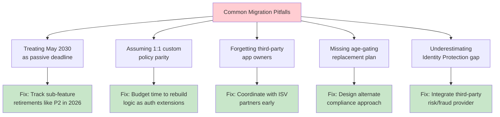

### Pitfall 1: Treating "Supported Until 2030" as "No Action Needed"

**Reality:** Sub-platform capabilities can be pulled ahead of the overall service end date.

**Example:** B2C Premium P2 and Identity Protection were retired in March 2026 — four years ahead of the 2030 deadline.

**Prevention:**
- Subscribe to Microsoft 365 Roadmap and Azure updates
- Review retirement notices quarterly
- Create feature dependency inventory
- Plan migration timeline with 12-18 month buffer

### Pitfall 2: Assuming Custom Policies Will Port Over Cleanly

**Reality:** One-to-one parity isn't guaranteed.

**Example:** A complex policy with REST API calls, claims transformations, and conditional logic may require complete redesign.

**Prevention:**
- Audit all custom policies in first week
- Categorize by rebuild complexity
- Prototype most complex policy first
- Budget 3x estimated rebuild time

### Pitfall 3: Forgetting Third-Party Application Owners

**Reality:** Migration can't complete until every dependent app is updated.

**Example:** An ISV tenant with 50 partner applications means coordinating with 50 external development teams.

**Prevention:**
- Identify all third-party apps in inventory phase
- Create technical documentation package for external teams
- Host co-development sessions
- Set contractual deadlines (if applicable)

### Pitfall 4: No Plan for Age-Gating Logic

**Reality:** Age gating isn't supported in Entra External ID.

**Example:** A children's app relying on B2C age validation breaks post-migration.

**Prevention:**
- Identify age-gating requirements early
- Evaluate third-party age verification services (AgeChecker.net, Veriff)
- Implement alternative in custom authentication extension
- Consult legal team for compliance requirements

### Pitfall 5: Underestimating the Loss of Built-in Risk Detection

**Reality:** Identity Protection integration doesn't carry over to External ID.

**Example:** A fintech app using B2C P2's risk-based step-up authentication has no equivalent post-migration.

**Prevention:**
- Document all Identity Protection policies
- Evaluate third-party fraud detection (Sift, Forter, Riskified)
- Implement custom risk scoring in extensions
- Budget 4-6 weeks for fraud prevention integration

### Pitfall 6: Hardcoding B2C Values in Applications

**Reality:** Token issuers, endpoints, and keys change post-migration.

**Example:** Applications using hardcoded B2C issuer URLs fail token validation.

**Prevention:**
- Use OpenID Connect discovery endpoints dynamically
- Never hardcode issuer URLs or signing keys
- Implement configuration management (Azure App Configuration, environment variables)
- Test token validation with both B2C and External ID tokens

**❌ Incorrect:**
```javascript
const B2C_ISSUER = "https://tenant.b2clogin.com/tenant/v2.0";
```

**✅ Correct:**
```javascript
const metadata = await fetch(
    `${tenantName}.b2clogin.com/${tenantName}/v2.0/.well-known/openid-configuration`
).then(r => r.json());
const issuer = metadata.issuer;
```

### Pitfall 7: Skipping Password Reset Testing

**Reality:** Password reset flows are complex and often forgotten.

**Example:** Sign-in works, but users locked out can't reset passwords.

**Prevention:**
- Include password reset in test matrix
- Test with email and phone reset options
- Validate reset tokens work correctly
- Test account lockout and unlock flows

### Pitfall 8: Insufficient Monitoring During Coexistence

**Reality:** Without monitoring, you won't catch issues until users complain.

**Example:** Sporadic authentication failures go unnoticed for weeks.

**Prevention:**
- Set up alerts for authentication failure rate >1%
- Monitor token issuance latency
- Track migration progress metrics
- Create dashboards for executive visibility

### Pitfall 9: Rushing Production Migration Without Pilot

**Reality:** Pilot testing reveals hidden issues.

**Example:** A custom extension works in dev but fails in production due to networking restrictions.

**Prevention:**
- Always pilot with low-risk app first
- Use production-like test environment
- Run pilot for minimum 2 weeks
- Document all issues and fixes before scaling

### Pitfall 10: Poor Communication with End Users

**Reality:** Users notice authentication changes.

**Example:** Users confused by new sign-in experience, leading to support ticket surge.

**Prevention:**
- Send email notification 2 weeks before migration
- Provide visual cues in UI during transition
- Update help documentation
- Train support team on common user questions

---

## 20. Migration Checklist

Use this checklist to track your migration progress:

### Phase 1: Planning & Inventory (Weeks 1-2)
- [ ] Inventory all applications (create spreadsheet)
- [ ] Document all custom policies and their logic
- [ ] List all identity providers (social, enterprise)
- [ ] Catalog Conditional Access policies
- [ ] Document MFA requirements
- [ ] Identify third-party/ISV applications
- [ ] Calculate directory object count
- [ ] Determine migration approach (Standard/HSC/JIT/Hybrid)
- [ ] Choose migration pattern (Bulk/JIT/Hybrid)
- [ ] Create project plan with milestones
- [ ] Assign roles and responsibilities
- [ ] Set up communication plan

### Phase 2: Tenant Setup (Weeks 3-4)
- [ ] Create Entra External ID tenant
- [ ] Configure security settings (MFA, Conditional Access)
- [ ] Set up monitoring and logging
- [ ] Configure custom domains and DNS
- [ ] Enable required authentication methods
- [ ] Set up backup/export policies
- [ ] Create service principals for automation
- [ ] Configure network security (NSGs, firewalls)

### Phase 3: Application Preparation (Weeks 5-8)
- [ ] Register all applications in External ID
- [ ] Configure user flows for each app
- [ ] Rebuild custom policies as extensions
- [ ] Update token validation logic
- [ ] Update redirect URIs
- [ ] Test authentication flows in dev
- [ ] Document application changes
- [ ] Create rollback procedures

### Phase 4: User Migration (Weeks 9-10)
- [ ] Export user data from B2C
- [ ] Transform data to External ID format
- [ ] Import users (bulk or configure JIT)
- [ ] Validate user count matches expectations
- [ ] Test authentication with migrated users
- [ ] Monitor migration success rate
- [ ] Handle migration errors/retries

### Phase 5: Pilot Migration (Week 11)
- [ ] Select pilot application (low-risk)
- [ ] Migrate pilot app endpoints
- [ ] Conduct end-to-end testing
- [ ] Monitor pilot for 7 days
- [ ] Gather user feedback
- [ ] Document issues and fixes
- [ ] Obtain stakeholder approval

### Phase 6: Phased Rollout (Weeks 12-20)
- [ ] Migrate Wave 1 apps (internal tools)
- [ ] Validate Wave 1 success
- [ ] Migrate Wave 2 apps (low-traffic external)
- [ ] Validate Wave 2 success
- [ ] Migrate Wave 3 apps (medium-traffic)
- [ ] Validate Wave 3 success
- [ ] Migrate Wave 4 apps (critical, high-traffic)
- [ ] Validate Wave 4 success

### Phase 7: Coexistence & Monitoring (Weeks 21-24)
- [ ] Monitor authentication metrics daily
- [ ] Track user migration progress
- [ ] Address support tickets promptly
- [ ] Review error logs weekly
- [ ] Validate token issuance patterns
- [ ] Check for unauthorized access attempts

### Phase 8: Decommissioning (Week 25+)
- [ ] Verify zero B2C traffic for 30 days
- [ ] Export final B2C configuration backup
- [ ] Update DNS records (remove B2C)
- [ ] Cancel B2C licenses
- [ ] Archive B2C tenant documentation
- [ ] Conduct post-mortem
- [ ] Celebrate success! 🎉

---

## 21. Practice Exercises

### Exercise 1: Migration Strategy Selection

**Scenario:** Your organization has an Azure AD B2C tenant with:
- 3 million user accounts
- 25 registered applications
- 4 social identity providers (Google, Facebook, Apple, LinkedIn)
- 3 custom policies for loyalty program logic
- 2 third-party ISV applications

**Task:** Determine the optimal migration approach and pattern.

**Solution:**

**Step 1: Analyze Requirements**
- User count: 3M (below 5M HSC threshold) → **Standard migration**
- Social IdPs required → HSC mode **eliminated**
- Third-party apps present → Need coordination plan
- Custom policies present → Need rebuild plan

**Step 2: Choose Pattern**
- User base: 3M
- Active user estimate: ~60% (1.8M active)
- Recommendation: **Pattern 2 (Bulk migration with JIT password validation)**

**Rationale:**
- Large enough to warrant bulk migration
- JIT password migration reduces risk
- Allows gradual cutover
- Maintains social IdP support

**Step 3: Timeline Estimate**
- Planning: 2 weeks
- Tenant setup: 2 weeks
- Policy rebuild: 4 weeks (3 complex policies)
- User migration: 3 days (bulk export/import)
- App migration: 8 weeks (25 apps, 4 waves)
- Monitoring: 4 weeks
- **Total: ~20 weeks (5 months)**

**Step 4: Risk Mitigation**
- Pilot with 1 low-risk app (Week 1)
- Migrate apps in 4 waves (6 apps, 6 apps, 7 apps, 6 apps)
- Maintain B2C for 90-day coexistence period
- Coordinate with ISVs at project start

---

### Exercise 2: Custom Policy Migration

**Scenario:** You have a B2C custom policy that:
1. Validates a promotional code during sign-up
2. Checks if user's email domain is from an allowed list
3. Issues a custom claim "membershipLevel" (Gold/Silver/Bronze)

**Task:** Rebuild this logic as an Entra External ID custom authentication extension.

**Solution:**

```csharp
using Microsoft.Azure.Functions.Worker;
using Microsoft.Azure.Functions.Worker.Http;
using Microsoft.Extensions.Logging;
using System.Net;

public class SignUpValidationExtension : HttpFunction
{
    private readonly IPromotionService _promotionService;
    private readonly IDomainValidator _domainValidator;
    private readonly ILogger _logger;
    
    public SignUpValidationExtension(
        IPromotionService promotionService,
        IDomainValidator domainValidator,
        ILoggerFactory loggerFactory)
    {
        _promotionService = promotionService;
        _domainValidator = domainValidator;
        _logger = loggerFactory.CreateLogger<SignUpValidationExtension>();
    }
    
    [FunctionName("SignUpValidation")]
    public async Task<HttpResponseData> Run(
        [HttpTrigger(AuthorizationLevel.Function, "post")] 
        HttpRequestData req)
    {
        var request = await req.ReadFromJsonAsync<SignUpRequest>();
        
        try
        {
            _logger.LogInformation($"Processing sign-up validation for: {request.Email}");
            
            var validationResult = new SignUpValidationResult
            {
                IsValid = true,
                Claims = new Dictionary<string, string>()
            };
            
            // 1. Validate promotional code (if provided)
            if (!string.IsNullOrEmpty(request.PromotionCode))
            {
                var promoValid = await _promotionService.ValidateCodeAsync(request.PromotionCode);
                if (!promoValid)
                {
                    validationResult.IsValid = false;
                    validationResult.ErrorMessage = "Invalid promotion code";
                    
                    var errorResponse = req.CreateResponse(HttpStatusCode.BadRequest);
                    await errorResponse.WriteAsJsonAsync(validationResult);
                    return errorResponse;
                }
                
                validationResult.Claims.Add("promotionApplied", "true");
            }
            
            // 2. Check email domain
            var domain = request.Email.Split('@')[1];
            var allowedDomains = new[] { "company.com", "partner.net", "client.org" };
            
            if (!allowedDomains.Contains(domain))
            {
                validationResult.IsValid = false;
                validationResult.ErrorMessage = "Email domain not allowed";
                
                var errorResponse = req.CreateResponse(HttpStatusCode.BadRequest);
                await errorResponse.WriteAsJsonAsync(validationResult);
                return errorResponse;
            }
            
            // 3. Calculate membership level
            var membershipLevel = await CalculateMembershipLevel(request.Email);
            validationResult.Claims.Add("membershipLevel", membershipLevel);
            
            _logger.LogInformation($"Sign-up validation successful for: {request.Email}, Level: {membershipLevel}");
            
            var response = req.CreateResponse(HttpStatusCode.OK);
            await response.WriteAsJsonAsync(validationResult);
            return response;
        }
        catch (Exception ex)
        {
            _logger.LogError(ex, "Sign-up validation failed");
            
            var errorResponse = req.CreateResponse(HttpStatusCode.InternalServerError);
            await errorResponse.WriteAsJsonAsync(new 
            { 
                IsValid = false, 
                ErrorMessage = "Validation service unavailable" 
            });
            return errorResponse;
        }
    }
    
    private async Task<string> CalculateMembershipLevel(string email)
    {
        // Integration with membership database
        var userMembership = await _membershipService.GetMembershipAsync(email);
        
        return userMembership.TotalPurchases switch
        {
            >= 1000 => "Platinum",
            >= 500 => "Gold",
            >= 100 => "Silver",
            _ => "Bronze"
        };
    }
}

public class SignUpRequest
{
    public string Email { get; set; }
    public string PromotionCode { get; set; }
    public string FirstName { get; set; }
    public string LastName { get; set; }
}

public class SignUpValidationResult
{
    public bool IsValid { get; set; }
    public string ErrorMessage { get; set; }
    public Dictionary<string, string> Claims { get; set; } = new();
}
```

**Registration in External ID:**

```powershell
# Register the custom extension
$extension = @{
    "@odata.type" = "#microsoft.graph.onAttributeCollectionStartCustomExtension"
    displayName = "Sign-Up Validation"
    description = "Validates promotional codes and email domains during sign-up"
    endpointConfiguration = @{
        "@odata.type" = "#microsoft.graph.httpWebhookEndpoint"
        url = "https://your-function.azurewebsites.net/api/SignUpValidation"
    }
} | ConvertTo-Json

New-MgPolicyAuthenticationEventEventListener -BodyParameter ($extension | ConvertFrom-Json)
```

---

### Exercise 3: Monitoring Dashboard Setup

**Scenario:** You've completed migration and need to monitor both B2C and External ID during the 90-day coexistence period.

**Task:** Create an Azure Dashboard with key migration metrics.

**Solution:**

```kusto
// Azure Monitor Workbook Query 1: Authentication Success Rate
let startTime = ago(7d);
let endTime = now();
AuditLogs
| where TimeGenerated between (startTime .. endTime)
| where OperationName in ("User sign-in", "Token issuance")
| summarize 
    TotalRequests = count(),
    SuccessfulRequests = countif(Result == "Success"),
    FailedRequests = countif(Result == "Failure"),
    SuccessRate = (countif(Result == "Success") / count()) * 100
    by bin(TimeGenerated, 1h), TenantId
| render timechart
```

```kusto
// Azure Monitor Workbook Query 2: Migration Progress
let startTime = ago(30d);
let endTime = now();
AzureDiagnostics
| where TimeGenerated between (startTime .. endTime)
| where OperationName has "JitCredentialValidation"
| summarize 
    TotalAttempts = count(),
    SuccessfulMigrations = countif(ResultType == "Success"),
    FailedMigrations = countif(ResultType == "Failure"),
    MigrationRate = (countif(ResultType == "Success") / count()) * 100
    by bin(TimeGenerated, 1d)
| render timechart
```

```kusto
// Azure Monitor Workbook Query 3: Error Analysis
let startTime = ago(7d);
let endTime = now();
AzureDiagnostics
| where TimeGenerated between (startTime .. endTime)
| where ResultType == "Failure"
| summarize ErrorCount = count() by ErrorCode, ErrorMessage, bin(TimeGenerated, 1h)
| order by ErrorCount desc
| render barchart
```

**Dashboard Configuration (JSON):**

```json
{
  "dashboard": {
    "name": "Migration Monitoring Dashboard",
    "tiles": [
      {
        "title": "Authentication Success Rate",
        "query": "/* Query 1 from above */",
        "visualization": "timechart",
        "size": "medium"
      },
      {
        "title": "User Migration Progress",
        "query": "/* Query 2 from above */",
        "visualization": "timechart",
        "size": "medium"
      },
      {
        "title": "Top Errors (Last 7 Days)",
        "query": "/* Query 3 from above */",
        "visualization": "barchart",
        "size": "small"
      },
      {
        "title": "Active Users: B2C vs External ID",
        "query": "auditlogs | summarize count() by _resourceId | render piechart",
        "visualization": "piechart",
        "size": "small"
      }
    ]
  }
}
```

**Alert Rules:**

```powershell
# Alert 1: High authentication failure rate
New-AzMetricAlertRuleV2 -Name "HighAuthFailureRate" `
    -ResourceGroupName "monitoring-rg" `
    -TargetResourceId "/subscriptions/.../providers/microsoft.insights/components/yourapp" `
    -Condition (New-AzMetricAlertRuleV2Criteria -MetricName "exceptions" -Operator GreaterThan -Threshold 10 -TimeAggregation Total) `
    -WindowSize 00:05:00 `
    -Frequency 00:01:00 `
    -ActionGroupId "/subscriptions/.../resourceGroups/monitoring-rg/providers/microsoft.insights/actionGroups/alert-action-group"

# Alert 2: Migration stalled (no new migrations in 24h)
New-AzMetricAlertRuleV2 -Name "MigrationStalled" `
    -ResourceGroupName "monitoring-rg" `
    -TargetResourceId "/subscriptions/.../providers/microsoft.insights/components/your-function" `
    -Condition (New-AzMetricAlertRuleV2Criteria -MetricName "FunctionExecutionCount" -Operator LessThan -Threshold 1 -TimeAggregation Total) `
    -WindowSize 24:00:00 `
    -Frequency 01:00:00 `
    -ActionGroupId "/subscriptions/.../resourceGroups/monitoring-rg/providers/microsoft.insights/actionGroups/alert-action-group"
```

---

## 22. Test Your Understanding

Test your knowledge with these comprehension questions:

1. **What is the primary technical reason Azure AD B2C is being retired?**
   - Answer: It carries significant technical debt from being built reactively over time, and Microsoft needs a modern, unified foundation. B2C uses XML-based custom policies (IEF) which aren't supported in External ID.

2. **When did Azure AD B2C Premium P2 features get retired?**
   - Answer: March 15, 2026 (Identity Protection and risk-based Conditional Access were discontinued).

3. **What is the single biggest architectural shift between B2C and External ID?**
   - Answer: External ID does not use B2C's XML-based custom policies (IEF). All custom policy logic must be rebuilt using user flows and custom authentication extensions.

4. **What triggers the need for HSC mode?**
   - Answer: Tenants with approximately 5 million+ directory objects, where bulk migration is too risky or complex.

5. **Can you reuse B2C application registrations in HSC mode?**
   - Answer: No. HSC mode requires new application registrations due to differences in application properties and Native Authentication support.

6. **What is JIT migration?**
   - Answer: Just-in-Time migration migrates users on their first sign-in to External ID, eliminating the need for bulk export/import. Only active users trigger migration.

7. **Why is "supported until 2030" misleading?**
   - Answer: Sub-features can be retired early, as demonstrated by the P2 retirement in March 2026. Organizations relying on retiring features need migration plans well before 2030.

8. **What are the three standard migration patterns?**
   - Answer: (1) Bulk user migration then app cutover, (2) Bulk user migration with JIT password migration, (3) B2C-initiated background credential harvesting.

9. **Is age gating supported in Entra External ID?**
   - Answer: No, age gating is not currently supported in Entra External ID and requires alternative implementation.

10. **What is the hybrid tenant approach?**
    - Answer: Running Entra External ID alongside the existing B2C tenant, allowing applications to be reconfigured gradually to point at new endpoints while preserving existing login flows.

11. **Why can't you complete migration until all third-party apps are updated?**
    - Answer: Migration requires changes at the application level. If your tenant contains apps owned by outside parties, those apps must also be updated to use External ID endpoints.

12. **What happens to Identity Protection in External ID?**
    - Answer: External ID doesn't support Identity Protection for external tenant users. Microsoft Graph identity protection endpoints don't return risk scores for External ID accounts.

13. **What is the recommended pattern for a 70% dormant user base?**
    - Answer: JIT migration, where only active users (the 30%) trigger their own migration at login time.

14. **How long should the coexistence period last?**
    - Answer: At least 90 days to ensure all users have had opportunity to migrate and all applications have been validated.

15. **What authentication methods are available in External ID that weren't in B2C?**
    - Answer: Passkeys (FIDO2) and Native Authentication SDKs for iOS/Android.

16. **Can multitenant apps use External ID endpoints in HSC mode?**
    - Answer: No. HSC mode requires all apps to be registered as single-tenant.

17. **What is the primary benefit of the hybrid tenant approach?**
    - Answer: Zero downtime and reduced blast radius by migrating one application at a time.

18. **What should you do if a custom policy can't be perfectly recreated?**
    - Answer: Use custom authentication extensions, or in some cases, integrate with a dedicated OIDC federation provider for complex logic.

19. **What monitoring metrics are critical during coexistence?**
    - Answer: Authentication success rate (>99.9%), token issuance latency (<500ms), migration progress, error rates by application, and user support tickets.

20. **What is the first step in any migration project?**
    - Answer: Comprehensive inventory of all applications, policies, identity providers, custom claims, and Conditional Access policies.

---

## 23. Common Interview Questions

Prepare for these common interview questions about Azure AD B2C to Entra External ID migration:

1. **Q: Why is Microsoft retiring Azure AD B2C?**
   - **A:** B2C was built reactively over years and carries significant technical debt. Microsoft is unifying customer and partner identity under Entra External ID to reduce operational overhead and accelerate feature development.

2. **Q: What is the minimum support commitment for Azure AD B2C?**
   - **A:** Microsoft has committed to supporting Azure AD B2C until at least May 2030, though sub-features can be retired earlier.

3. **Q: Can you use XML custom policies in Entra External ID?**
   - **A:** No. External ID uses user flows and custom authentication extensions, not IEF. Custom policies must be rebuilt.

4. **Q: What migration approach would you recommend for a 10M user telecom company?**
   - **A:** High Scale Compatibility (HSC) mode, because the user base exceeds the 5M threshold and bulk migration would be too risky. Applications would be migrated in phases.

5. **Q: What are the main limitations of HSC mode?**
   - **A:** No social identity providers, no advanced Conditional Access (auth context, step-up, session controls), no app assignment via groups, no passkeys, no age gating, no third-party fraud protection, and admin operations are Graph API-only.

6. **Q: Explain the JIT migration pattern.**
   - **A:** JIT (Just-in-Time) migration migrates users on their first sign-in to External ID, validating credentials against the legacy B2C tenant and migrating the password hash. Only active users trigger migration, reducing effort for long-tail dormant users.

7. **Q: What happens to Identity Protection in External ID?**
   - **A:** External ID doesn't support Identity Protection for external tenant users. Organizations must use third-party fraud/risk providers or build custom risk logic.

8. **Q: How do you handle age gating if it's not supported in External ID?**
   - **A:** Implement custom age verification in an authentication extension, use a third-party age verification service, or redesign compliance logic.

9. **Q: What is the hybrid tenant approach?**
   - **A:** Running External ID alongside B2C, allowing gradual app migration with zero downtime. Applications are reconfigured one at a time to use External ID endpoints.

10. **Q: Why is coordinating with third-party app owners critical?**
    - **A:** Migration can't complete until all applications (including third-party-owned apps) are updated to use External ID. ISV coordination can take months and must start early.

11. **Q: What is the recommended pattern for a 500K user SaaS with 70% dormant users?**
    - **A:** JIT migration, since only 30% of users are active and will trigger migration. This saves significant bulk migration effort.

12. **Q: How do you validate migration success?**
    - **A:** Monitor authentication success rate (>99.9%), token issuance latency (<500ms), migration progress metrics, error rates, and user support tickets. Conduct end-to-end testing before and after migration.

13. **Q: What token validation changes are needed post-migration?**
    - **A:** Update issuer URLs, signing keys, and audience values. Use OpenID Connect discovery endpoints dynamically instead of hardcoding values.

14. **Q: How long should the coexistence period be?**
    - **A:** Minimum 90 days to ensure all users have opportunity to authenticate and migrate, and all applications are validated.

15. **Q: What is a custom authentication extension?**
    - **A:** A serverless function (Azure Function) that runs during authentication flows in External ID, allowing custom logic like credential validation, claim transformation, or external API calls.

16. **Q: What are the main benefits of Entra External ID over B2C?**
    - **A:** Unified customer and partner identity, modern cloud-native architecture, passkey support, native authentication SDKs, and ongoing feature investment.

17. **Q: How do you migrate custom policies with REST API calls?**
    - **A:** Rebuild as custom authentication extensions (Azure Functions) that perform the same logic, called during user flows via `OnAttributeCollectionStart` or similar triggers.

18. **Q: What is the biggest risk of treating 2030 as a passive deadline?**
    - **A:** Sub-features can be retired early (as proven by P2 retirement in 2026), leaving organizations without critical capabilities like Identity Protection.

19. **Q: What is the recommended migration wave strategy?**
    - **A:** Wave 1: Internal tools (5%), Wave 2: Low-traffic external apps (20%), Wave 3: Medium-traffic apps (50%), Wave 4: Critical apps (25%).

20. **Q: How do you handle rollback if migration fails?**
    - **A:** Maintain B2C tenant during coexistence, have documented rollback procedures, reconfigure apps to use B2C endpoints, validate rollback success within 5 minutes.

---

## 24. Question Bank

### Beginner Questions (1-20)

1. **What does CIAM stand for?**
   - Customer Identity and Access Management

2. **What is Azure AD B2C primarily used for?**
   - Managing customer (consumer) identities and authentication

3. **What replaced Azure AD B2C as Microsoft's CIAM platform?**
   - Microsoft Entra External ID

4. **When did Entra External ID reach general availability?**
   - May 2024

5. **What is the minimum support commitment for Azure AD B2C?**
   - Through at least May 2030

6. **What are custom policies in B2C also known as?**
   - Identity Experience Framework (IEF)

7. **What file format are B2C custom policies written in?**
   - XML

8. **What is the primary language for rebuilding B2C logic in External ID?**
   - C#, JavaScript, or any Azure Function-supported language

9. **What is the endpoint for OpenID Connect discovery in B2C?**
   - `https://{tenant}.b2clogin.com/{tenant}.onmicrosoft.com/{policy}/v2.0/.well-known/openid-configuration`

10. **What authentication protocol does B2C primarily use?**
    - OAuth 2.0 and OpenID Connect

11. **What is a user flow in External ID?**
    - A predefined, configurable authentication journey (sign-up, sign-in, password reset, etc.)

12. **What is a custom authentication extension?**
    - Serverless code that runs during authentication flows to add custom logic

13. **What is the maximum recommended user count for standard migration?**
    - Approximately 5 million directory objects

14. **What is HSC mode?**
    - High Scale Compatibility mode for large B2C tenants (5M+ users)

15. **What does JIT stand for in migration context?**
    - Just-in-Time

16. **What is the hybrid tenant approach?**
    - Running B2C and External ID in parallel during migration

17. **What is a key advantage of External ID over B2C?**
    - Unified customer and partner identity management

18. **What authentication method is available in External ID but not B2C?**
    - Passkeys (FIDO2)

19. **What is the recommended coexistence period?**
    - Minimum 90 days

20. **What must be done before decommissioning B2C?**
    - All apps must be migrated and validated, with 30 days of zero B2C traffic

### Intermediate Questions (21-40)

21. **What are the three standard migration patterns?**
    - Bulk user migration then app cutover, bulk migration with JIT password validation, B2C-initiated background migration

22. **What triggered the retirement of B2C Premium P2?**
    - Technical debt and need for unified identity platform

23. **What happens to Identity Protection signals in External ID?**
    - They are not available; third-party integration required

24. **What is the primary use case for HSC mode?**
    - Tenants with 5M+ users where bulk migration is too risky

25. **What is a key limitation of HSC mode?**
    - No social identity providers

26. **How does JIT migration reduce migration effort?**
    - Only active users trigger migration; dormant accounts are never migrated

27. **What is the typical latency for JIT migration?**
    - Slight increase on first login (legacy credential validation adds 200-500ms)

28. **Why can't you reuse B2C app registrations in HSC mode?**
    - External ID requires new registrations due to Native Authentication and property differences

29. **What is the recommended batch size for bulk user migration?**
    - 100 users per batch with 1-second delay between batches

30. **What is the target authentication latency for External ID?**
    - <500ms at p95

31. **What Azure service is typically used for custom authentication extensions?**
    - Azure Functions

32. **What authentication method is not supported in HSC mode?**
    - Passkeys/FIDO2

33. **What is the primary security consideration during migration?**
    - Never store passwords in plain text; use encryption

34. **What should be the error rate threshold for migration?**
    - <0.5%

35. **What is the success rate target for authentication?**
    - >99.9%

36. **What is the minimum age for COPPA compliance in age gating?**
    - 13 years old

37. **What Graph API permission is needed for user migration?**
    - User.ReadWrite.All

38. **What is the recommended wave size for app migration?**
    - 5% (Wave 1), 20% (Wave 2), 50% (Wave 3), 25% (Wave 4)

39. **What should you monitor during coexistence?**
    - Authentication success rate, token latency, migration progress, error rates, support tickets

40. **What is the first step in any migration project?**
    - Comprehensive inventory of applications, policies, and dependencies

### Advanced Questions (41-60)

41. **What is the technical debt issue with B2C's IEF?**
    - Built reactively over years to meet demands it wasn't designed for, making it difficult to extend

42. **How does the hybrid tenant approach reduce migration risk?**
    - Zero downtime and ability to migrate apps one at a time, containing blast radius

43. **What is the cost optimization strategy for Azure Functions in migration?**
    - Use consumption plan with 512MB memory to reduce cold starts; ~$1.10 for 1M users

44. **How do you implement rate limiting on migration functions?**
    - Track migration attempts per user, limit to 5 attempts per minute, return 429 on excess

45. **What is the difference between Pattern 2 and Pattern 3 migration?**
    - Pattern 2 is JIT password validation during External ID authentication; Pattern 3 uses B2C custom policy to harvest credentials in background while apps stay on B2C

46. **Why did Microsoft unify customer and partner identity?**
    - Reduce operational overhead, provide unified security policies, better analytics

47. **What is the expected throughput for Azure Function migration?**
    - 1000 users/minute per instance

48. **How do you handle certificate rotation in external IdP federation?**
    - Monitor expiration dates, automate rotation via Graph API, test in non-production first

49. **What is the role of Azure Key Vault in migration security?**
    - Store encryption keys, secrets, and certificates used in custom extensions

50. **What compliance frameworks require migration audit trails?**
    - SOC 2, ISO 27001, GDPR, CCPA

51. **How do you validate token validation logic post-migration?**
    - Test with both B2C and External ID tokens, use OpenID Connect discovery dynamically, never hardcode values

52. **What is the recommended retry strategy for failed migrations?**
    - Fixed delay retry with 5 attempts, 10-second delay between retries

53. **How do you calculate the ROI of migration?**
    - Compare B2C licensing costs vs. External ID, factor in engineering time saved, reduced support tickets

54. **What is the typical timeline for a 2M user standard migration?**
    - 3-6 months (12-20 weeks depending on complexity)

55. **What are the primary causes of migration failures?**
    - Hardcoded B2C values, insufficient testing, poor third-party coordination, missing feature gap analysis

56. **How do you handle user communication during migration?**
    - Email campaign 2 weeks prior, UI cues during transition, updated help docs, support team training

57. **What is the blast radius of a failed Wave 4 migration?**
    - Critical, high-traffic apps affecting revenue and user experience; requires extensive testing in prior waves

58. **How do you measure migration success?**
    - Authentication success rate >99.9%, token latency <500ms, zero critical incidents, all apps migrated, B2C decommissioned

59. **What is the role of Infrastructure as Code in migration?**
    - Automate tenant configuration, ensure consistency, enable version control and peer review

60. **What should be included in post-migration documentation?**
    - Architecture diagrams, configuration runbooks, monitoring dashboards, rollback procedures, lessons learned

---

## 25. Summary and Next Steps

Azure AD B2C's runway isn't ending tomorrow, but the direction is unambiguous: **Entra External ID is where new capability, unified customer/partner identity, and long-term investment live**. The right migration strategy — standard, HSC mode, hybrid tenant, or JIT — depends heavily on your tenant's scale, feature dependencies, and appetite for risk.

### Key Takeaways

✅ **Start now:** Even if migration takes 2 years, knowing your path informs every new feature decision  
✅ **Choose wisely:** Match migration approach to your scale and requirements  
✅ **Rebuild, don't port:** Custom policies must be recreated, not migrated  
✅ **Coordinate early:** Third-party app owners need months of lead time  
✅ **Test thoroughly:** Pilot with low-risk apps before scaling  
✅ **Monitor extensively:** Track metrics during coexistence period  
✅ **Plan for gaps:** Age gating, Identity Protection, and HSC limitations need workarounds  

### Recommended Action Plan

**This Week:**
1. Complete comprehensive inventory (use script from Section 12)
2. Determine directory object count
3. Identify migration approach (Standard vs HSC vs Hybrid vs JIT)
4. Notify executive sponsors and allocate budget

**Next 30 Days:**
1. Set up External ID tenant
2. Begin rebuilding most critical custom policy
3. Identify and engage third-party app owners
4. Create detailed project plan with milestones

**Next 90 Days:**
1. Complete all custom policy rebuilds
2. Pilot migration with 1 low-risk application
3. Begin Wave 1 app migration
4. Establish monitoring dashboards

**Next 6 Months:**
1. Complete all application migrations
2. Monitor coexistence period
3. Decommission B2C tenant

---

## 26. Further Reading

### Official Microsoft Documentation
- [Microsoft Entra External ID Documentation](https://learn.microsoft.com/en-us/entra/external-id/)
- [Azure AD B2C to External ID Migration Guide](https://learn.microsoft.com/en-us/entra/external-id/migration/)
- [High Scale Compatibility Mode Documentation](https://learn.microsoft.com/en-us/entra/external-id/hsc-mode/)
- [Custom Authentication Extensions](https://learn.microsoft.com/en-us/entra/external-id/custom-extensions/)
- [Microsoft Graph API Reference](https://learn.microsoft.com/en-us/graph/api/resources/overview)

### Podcasts & Videos
- *Entra Chat* podcast: "Azure AD B2C to Entra External ID: Migration Strategies You Need to Know" (Merill Fernando with Jas Suri and Gayan Randeny)
- Microsoft Build 2024: "Modernize your customer identity with Microsoft Entra External ID"
- Azure Fridays: "Migrating from Azure AD B2C to Microsoft Entra External ID"

### Community Resources
- [Microsoft Q&A - Entra External ID](https://learn.microsoft.com/en-us/answers/topics/azure-active-directory-external-identities.html)
- [GitHub: External ID Samples](https://github.com/Azure-Samples/active-directory-external-identities)
- [Stack Overflow: Entra External ID Tag](https://stackoverflow.com/questions/tagged/azure-ad-b2c+entra-external-id)

### Tools & Utilities
- [B2C Migration Assessment Tool](https://github.com/azure-samples/active-directory-b2c-migration-assessment)
- [Graph Explorer](https://developer.microsoft.com/en-us/graph/graph-explorer) - Test Graph API calls
- [Postman Collection for External ID](https://learn.microsoft.com/en-us/entra/external-id/postman-collection)

### Books & Deep Dives
- "Azure Active Directory for Secure Environments" by Packt Publishing
- "Identity-Driven Microservices" by O'Reilly Media
- "Designing Distributed Systems" by Brendan Burns (for HSC architecture patterns)

### Professional Services
- [Microsoft FastTrack for Entra External ID](https://azure.microsoft.com/en-us/programs/fasttrack/)
- [Microsoft Identity Partners](https://learn.microsoft.com/en-us/entra/identity/enterprise-apps/identity-partners)
- [Azure Migration Guide](https://learn.microsoft.com/en-us/azure/cloud-adoption-framework/migrate/)

### Related Technologies
- [Microsoft Graph SDK for .NET](https://github.com/microsoftgraph/msgraph-sdk-dotnet)
- [MSAL.NET](https://github.com/AzureAD/microsoft-authentication-library-for-dotnet)
- [Azure Functions Best Practices](https://learn.microsoft.com/en-us/azure/azure-functions/functions-best-practices)
- [Key Vault Secrets Management](https://learn.microsoft.com/en-us/azure/key-vault/secrets/)

---

## Appendix A: Glossary

**Azure AD B2C:** Microsoft's legacy customer identity platform (being retired)  
**Entra External ID:** Microsoft's modern CIAM platform (successor to B2C)  
**IEF (Identity Experience Framework):** XML-based policy engine used by B2C  
**HSC Mode:** High Scale Compatibility mode for 5M+ user tenants  
**JIT Migration:** Just-in-Time migration on first user sign-in  
**Custom Authentication Extension:** Serverless function called during authentication flows  
**User Flow:** Predefined authentication journey in External ID  
**CIAM:** Customer Identity and Access Management  
**B2B:** Business-to-Business identity (guest users in Azure AD)  
**ISV:** Independent Software Vendor  
**IdP:** Identity Provider  
**SP:** Service Provider  
**MFA:** Multi-Factor Authentication  
**REST API:** Representational State Transfer Application Programming Interface  
**Graph API:** Microsoft Graph API for Azure AD operations  
**Coexistence Period:** Time during which B2C and External ID run in parallel  

---

## Appendix B: Migration Decision Tree

```
START
  │
  ├─> Directory objects < 5M?
  │     │
  │     ├─> Social IdPs required?
  │     │     │
  │     │     ├─> Yes → Standard Migration
  │     │     │
  │     │     └─> No → 70%+ dormant users?
  │     │           │
  │     │           ├─> Yes → JIT Migration
  │     │           │
  │     │           └─> No → Standard Migration
  │     │
  │     └─> No → HSC Mode (if limitations acceptable)
  │           OR Standard (if full feature parity needed)
  │
  └─> Zero downtime required?
        │
        ├─> Yes → Hybrid Approach
        │
        └─> No → Standard or HSC
```

---

## Appendix C: Quick Reference Commands

### Azure CLI
```bash
# Create External ID tenant
az ad tenant create --name "yourcompany-external"

# Create app registration
az ad app create --display-name "AppName" --sign-in-audience AzureADMyOrg

# List all apps
az ad app list --all --output table

# Delete app
az ad app delete --id {app-id}
```

### Microsoft Graph PowerShell
```powershell
# Connect to tenant
Connect-MgGraph -Scopes "User.ReadWrite.All"

# Get all users
Get-MgUser -All

# Create user
New-MgUser -DisplayName "John Doe" -Mail "john@example.com" -UserPrincipalName "john@yourtenant.onmicrosoft.com"

# Create app
New-MgApplication -DisplayName "MyApp" -SignInAudience AzureADMyOrg
```

### Graph API (REST)
```http
POST https://graph.microsoft.com/v1.0/users
Content-Type: application/json
Authorization: Bearer {token}

{
  "accountEnabled": true,
  "displayName": "John Doe",
  "identities": [{
    "signInType": "emailAddress",
    "issuer": "yourtenant.onmicrosoft.com",
    "issuerAssignedId": "john@example.com"
  }]
}
```

---

**🎓 Congratulations!** You've completed the most comprehensive Azure AD B2C to Entra External ID migration tutorial. You now have the knowledge, tools, and strategies to plan and execute a successful migration.

**Next Steps:**
1. Run the inventory script on your B2C tenant
2. Document your migration approach
3. Build stakeholder consensus
4. Start with the pilot application

**Remember:** Migration is a journey, not a destination. Start planning now, even if your migration is 12-18 months away.

---

*Tutorial completed. For questions or feedback, refer to the Further Reading section.*