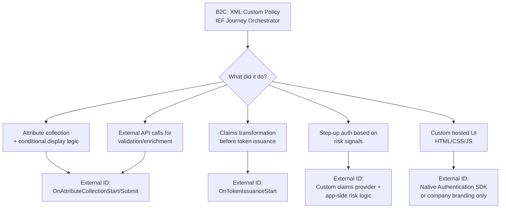
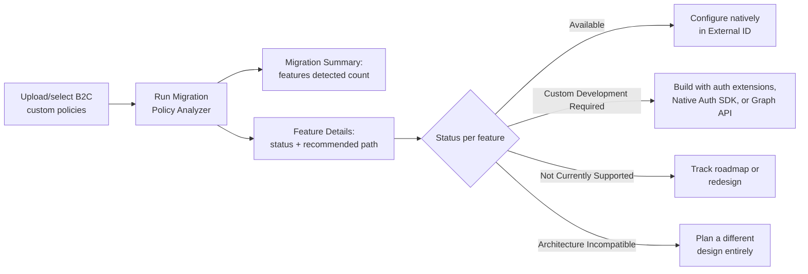
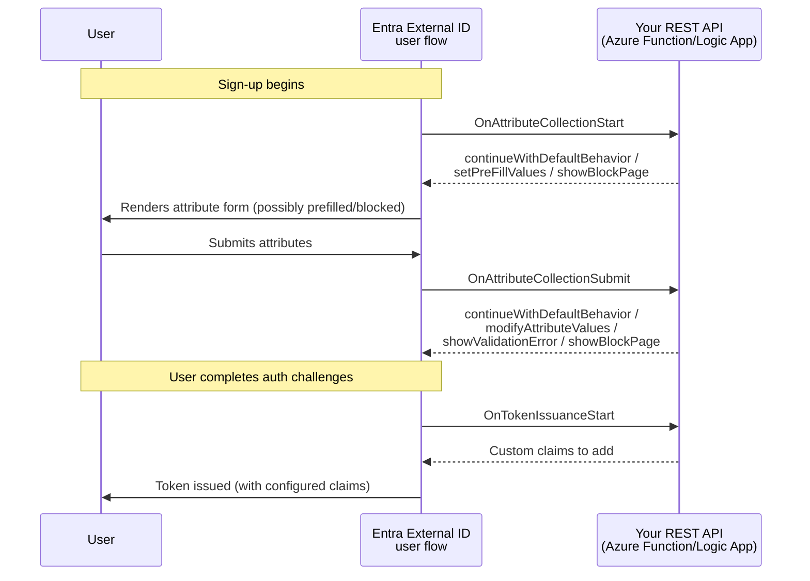
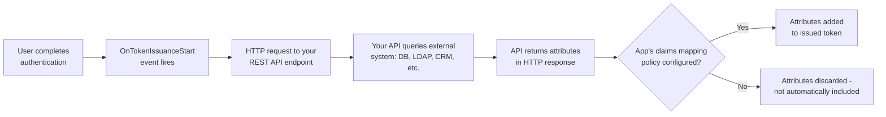
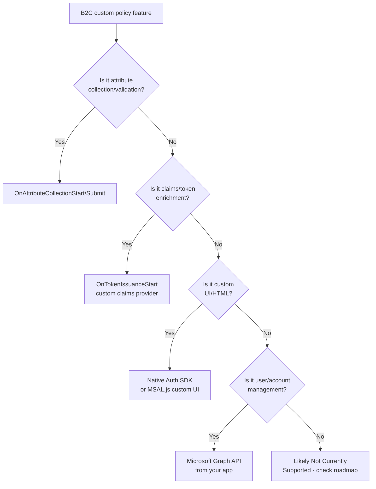
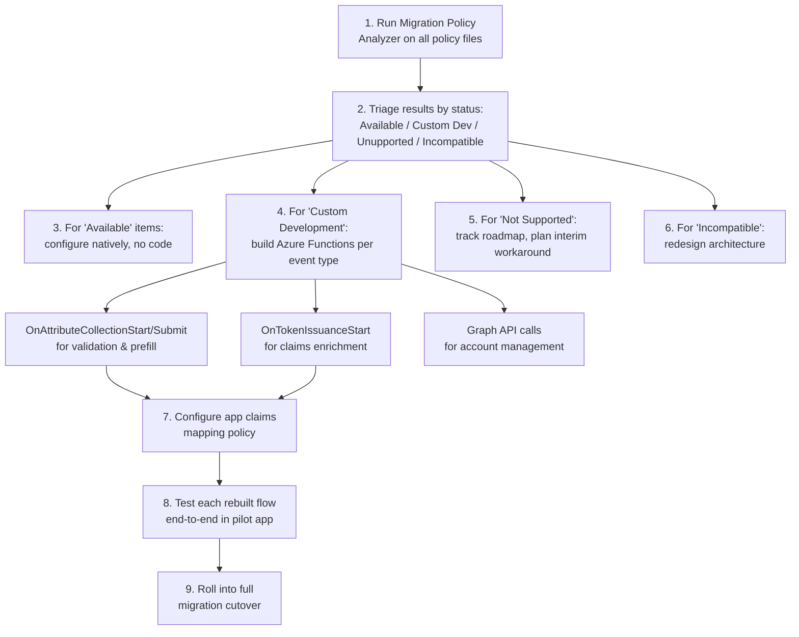

# Azure AD B2C to Entra External ID Migration: Complete Deep-Dive Tutorial

> **📚 Comprehensive Guide | Intermediate Level | Estimated Reading Time: 45-60 minutes**

---

## Table of Contents

1. [Introduction & Overview](#introduction--overview)
2. [Prerequisites](#prerequisites)
3. [Learning Objectives](#learning-objectives)
4. [Why This Is the Hardest Part of the Migration](#why-this-is-the-hardest-part-of-the-migration)
5. [Step 1: Run the Migration Policy Analyzer First](#step-1-run-the-migration-policy-analyzer-first)
6. [Step 2: Understand the Three Extension Events](#step-2-understand-the-three-extension-events)
7. [Step 3: Map Common B2C Patterns to External ID Equivalents](#step-3-map-common-b2c-patterns-to-their-external-id-equivalents)
8. [Step 4: Know What Genuinely Has No Equivalent Yet](#step-4-know-what-genuinely-has-no-equivalent-yet)
9. [Step 5: A Practical Rebuild Workflow](#step-5-a-practical-rebuild-workflow)
10. [Implementation Approaches](#implementation-approaches)
11. [Code Examples & Implementations](#code-examples--implementations)
12. [Practice Exercises with Solutions](#practice-exercises-with-solutions)
13. [Best Practices](#best-practices)
14. [Anti-Patterns](#anti-patterns)
15. [Performance Considerations](#performance-considerations)
16. [Security Considerations](#security-considerations)
17. [Testing Strategies](#testing-strategies)
18. [Troubleshooting Guide](#troubleshooting-guide)
19. [Summary & Key Takeaways](#summary--key-takeaways)
20. [Further Reading & Resources](#further-reading--resources)
21. [Question Bank](#question-bank)

---

## Introduction & Overview

Azure AD B2C (Business-to-Consumer) has long been Microsoft's identity platform for customer-facing applications, offering powerful customization through Identity Experience Framework (IEF) custom policies. However, as Microsoft evolves its identity strategy, **Entra External ID** emerges as the next-generation platform for external identities.

This migration isn't simply a lift-and-shift operation—it's a fundamental architectural shift. Understanding this distinction is crucial for project planning, resource allocation, and stakeholder communication.

### 🎯 What You'll Learn

This comprehensive tutorial guides you through the most challenging aspect of migrating from Azure AD B2C to Entra External ID: **rebuilding custom policy logic as user flows and custom authentication extensions**. By the end, you'll have a complete understanding of:

- The philosophical and technical differences between B2C custom policies and External ID extensions
- How to systematically analyze existing B2C policies using Microsoft's Migration Policy Analyzer
- The three extension events available in External ID and when to use each
- Strategies for mapping complex B2C orchestration patterns to External ID equivalents
- Real-world implementation patterns with production-ready code examples
- Common pitfalls and how to avoid them
- Performance optimization techniques for authentication flows
- Security best practices for external identity scenarios

### 💡 Why This Matters

According to Microsoft's own documentation and support engineers, this migration represents **more of a rebuild than a migration**. Teams consistently underestimate the effort required because:

1. **No XML Policy Engine**: External ID eliminates the IEF XML-based journey orchestration
2. **Limited Extension Points**: Only three event-driven hooks versus fully scriptable B2C journeys
3. **Custom UI Limitations**: No direct equivalent to B2C's custom HTML/CSS/JS page hosting
4. **Architectural Shifts**: Some patterns require complete redesign rather than translation

> ⚠️ **Important:** This tutorial assumes you're already familiar with Azure AD B2C custom policies. If you're new to B2C, review the [Azure AD B2C documentation](https://learn.microsoft.com/en-us/azure/active-directory-b2c/) first.

### 📊 Migration Complexity Spectrum

| Complexity Level | B2C Feature | External ID Equivalent | Effort Estimate |
|------------------|-------------|------------------------|-----------------|
| 🟢 Low | Built-in user flows | Native External ID user flows | Minimal (configuration only) |
| 🟡 Low-Medium | Domain blocking | OnAttributeCollectionStart extension | 1-2 days |
| 🟠 Medium | Claims transformations | OnTokenIssuanceStart + Graph API | 3-5 days |
| 🟠 Medium-High | External API validation | OnAttributeCollectionSubmit extension | 1 week |
| 🔴 High | Custom HTML/CSS pages | Native Auth SDK or MSAL.js custom UI | 2-4 weeks |
| ⛔ Very High | WS-Federation/SAML artifacts | No current equivalent | Architecture redesign |

---

## Prerequisites

Before diving into this tutorial, ensure you have:

### Technical Prerequisites
- ✅ **Azure subscription** with appropriate permissions (Global Administrator or Cloud Application Administrator)
- ✅ **Azure AD B2C tenant** with existing custom policies to migrate
- ✅ **Entra External ID tenant** (or ability to create one)
- ✅ **Azure Functions Core Tools** v4.x or later (for building extensions)
- ✅ **Visual Studio Code** or preferred IDE
- ✅ **Postman** or similar API testing tool
- ✅ **Basic understanding** of REST APIs and HTTP protocols
- ✅ **Familiarity** with Azure AD B2C custom policies (XML, claims schema, orchestration steps)
- ✅ **Programming knowledge** in C#/.NET or Node.js (for extension examples)

### Knowledge Prerequisites
- Understanding of OAuth 2.0 and OpenID Connect flows
- Familiarity with JSON Web Tokens (JWT) structure
- Basic understanding of claims-based authentication
- Experience with Azure portal navigation

### Azure Permissions Required
```
- External ID: Application Administrator
- External ID: Cloud Application Administrator  
- Azure Functions: Contributor
- Microsoft Graph: User.ReadWrite.All (for account management)
```

---

## Learning Objectives

By completing this tutorial, you will be able to:

### 🎓 Knowledge Objectives
- [ ] Explain the fundamental architectural differences between B2C IEF and External ID
- [ ] Identify which B2C features map directly to External ID vs. require rebuilding
- [ ] Understand the three custom authentication extension events and their use cases
- [ ] Recognize features with no current External ID equivalent
- [ ] Articulate the migration strategy to stakeholders

### 🛠️ Practical Objectives
- [ ] Run the Migration Policy Analyzer and interpret results
- [ ] Build a basic OnAttributeCollectionStart Azure Function
- [ ] Implement OnAttributeCollectionSubmit for form validation
- [ ] Create an OnTokenIssuanceStart custom claims provider
- [ ] Configure claims mapping policies in External ID
- [ ] Test authentication flows end-to-end
- [ ] Debug common extension issues
- [ ] Measure and optimize extension performance
- [ ] Apply security best practices to authentication extensions
- [ ] Document migration decisions and track progress

---

## Why This Is the Hardest Part of the Migration

This is the step most teams underestimate. Entra External ID does not support B2C-style custom policies — only user flows and custom authentication extensions are supported, and there's **no capability to upload or host custom UI templates** the way B2C allowed. The honest framing from Microsoft's own support engineers: **this is more of a rebuild than a migration**.

### The Philosophical Break

The philosophical break is sharpest at the policy engine level: External ID replaces IEF XML with declarative user flows managed through the Entra admin center, plus custom authentication extensions that trigger at specific event points in the authentication flow — and these extensions are **event-driven rather than journey-scripted**.

If your B2C custom policies were doing complex orchestration across multiple stages, you rebuild that logic, you don't port it — and Microsoft has been direct that **one-to-one parity isn't guaranteed**.

### Architecture Comparison: B2C vs. External ID



#### Key Differences at a Glance

| Aspect | Azure AD B2C | Entra External ID |
|--------|--------------|-------------------|
| **Policy Format** | XML-based IEF | Declarative user flows |
| **Customization** | Fully scriptable journeys | Event-driven extensions (3 hooks only) |
| **UI Customization** | Custom HTML/CSS/JS pages | Company branding OR Native Auth SDK |
| **Claims Orchestration** | In-policy technical profiles | External API calls + claims mapping policies |
| **Complexity** | High (steep learning curve) | Medium (simpler but less flexible) |
| **Maintenance** | XML management overhead | Azure Function + extension config |
| **Extensibility** | Unlimited (within XML capabilities) | Limited to 3 event points |

### Real-World Impact: A Healthcare Portal Example

Consider a healthcare portal that has accumulated 15 years of B2C custom policy logic:

**B2C Approach:**
- Complex XML orchestration across 8+ technical profiles
- Multi-step consent gathering with conditional display
- Real-time eligibility verification via REST API
- Claims transformations for HIPAA compliance
- Custom UI for patient onboarding
- Step-up authentication for sensitive operations

**External ID Rebuild Required:**
- Convert orchestration to 3 event-driven Azure Functions
- Move conditional logic from XML to application code
- Externalize consent management to app layer
- Rebuild claims transformations as API logic
- Replace custom UI with Native Auth SDK or branded templates
- Implement risk-based auth in application logic

**Effort Difference:** What was a configuration change in B2C becomes a development project in External ID.

---

## Step 1: Run the Migration Policy Analyzer First

Before writing a single line of rebuild code, use Microsoft's **Migration Policy Analyzer**, which is built directly into your Azure AD B2C tenant. It scans your custom policies and produces a migration assessment for Entra External ID, mapping each detected feature to a migration path so you can scope the work required.

### What the Analyzer Does

The Migration Policy Analyzer:
- Scans all XML files in your B2C tenant (base policies, extensions, relying parties)
- Identifies features and patterns used in your policies
- Maps each feature to External ID equivalents
- Provides migration status for each feature
- Generates a prioritized migration backlog

> 💡 **Pro Tip:** Run the analyzer early in your discovery phase. The output becomes your migration roadmap and helps with effort estimation and stakeholder communication.

### How to Run the Analyzer

1. Sign in to the [Azure portal](https://portal.azure.com) with your B2C tenant admin account
2. Navigate to your **Azure AD B2C** tenant (not your primary tenant)
3. Select **Identity Experience Framework** from the left menu
4. Select **Migration Policy Analyzer** from the toolbar
5. Select the policies to analyze — your selection **must include a relying party (RP) policy** for the analysis to complete
6. Select **Analyze Policies** to start the assessment

The analyzer works with **custom policies only** — built-in user flows don't need analysis since they map directly to External ID user flows.

### Understanding the Analysis Process



### Example Analyzer Output

Here's what a typical analyzer report looks like:

```text
===========================================
MIGRATION POLICY ANALYZER REPORT
===========================================

MIGRATION SUMMARY
---
Total Features Detected: 42
✅ Available (External ID built-in): 28
🔧 Custom Development Required: 12
⚠️  Not Currently Supported: 2
❌ Architecture Incompatible: 0

MIGRATION READINESS: 66% (28/42 features)
ESTIMATED REBUILD EFFORT: High
===========================================

FEATURE DETAILS
---

✅ AVAILABLE FEATURES (28)
   - Sign-up with email verification
   - Sign-in with local accounts
   - Password reset flow
   - Profile edit page
   - Multi-factor authentication
   - ... [24 more features]

🔧 CUSTOM DEVELOPMENT REQUIRED (12)
   - Disposable email domain blocking → OnAttributeCollectionStart
   - Phone number normalization (E.164) → OnAttributeCollectionSubmit
   - CRM data enrichment → OnTokenIssuanceStart
   - Invitation code validation → OnAttributeCollectionSubmit
   - Legacy system integration → OnTokenIssuanceStart
   - ... [7 more features]

⚠️  NOT CURRENTLY SUPPORTED (2)
   - CAPTCHA on sign-in page → Track Entra roadmap
   - Custom reCAPTCHA provider → Evaluate alternatives

❌ ARCHITECTURE INCOMPATIBLE (0)
   - None detected
```

*(Note: These numbers are illustrative — your results depend on the complexity of your own policies.)*

### The Four Migration Statuses Explained

| Status | Meaning | What You Do |
|---|---|---|
| **✅ Available** | Works natively in External ID today — GA, documented, production-ready | Configure in External ID; no custom development needed |
| **🔧 Custom Development Required** | Achievable via custom authentication extensions, Native Authentication SDK, or Microsoft Graph API | Follow the recommended migration path; you own the implementation |
| **⚠️ Not Currently Supported** | No current equivalent, or only in preview with no committed timeline | Monitor the Entra roadmap for updates; plan interim workarounds |
| **❌ Architecture Incompatible** | A fundamental pattern mismatch — the B2C approach doesn't translate directly | Review alternative architecture docs and plan a redesign |

### Real-World Use Case: Healthcare Portal Migration

A healthcare portal with 15 years of accumulated B2C custom policy logic runs the analyzer and finds:

**Detection Results:**
- 60 detected features total
- 40 map cleanly to "Available"
- 15 need custom extensions
- 4 are "Not Currently Supported" (including a legacy CAPTCHA-on-signin flow)
- 1 is architecturally incompatible (WS-Federation integration with a legacy partner)

**Migration Backlog Created:**
```
Week 1-2: Configure 40 available features
Week 3-6: Build 15 custom extensions
Week 7-8: Workarounds for 4 unsupported features
Week 9-12: Redesign WS-Federation integration
Total: 12-week migration project
```

This report becomes the actual migration backlog — instead of guessing at scope, the team now has a **prioritized, feature-by-feature punch list**.

> ⚠️ **Caveat:** Analyzer output is a best-effort assessment. Review each detected feature and its recommended path manually, and validate results against your own policies before making migration decisions. It's also **read-only** — it never modifies your tenant, policies, or user data, and it can't analyze runtime behavior, only XML structure, so you should still test critical flows after migration.

### Interpreting Your Results

**High Available Percentage (80%+):**
- ✅ Your migration will be relatively straightforward
- Focus on the custom development items
- Plan for 4-8 weeks total effort

**Medium Available Percentage (50-80%):**
- ⚠️ Moderate rebuild effort required
- Prioritize custom development work
- Plan for 2-3 months total effort

**Low Available Percentage (<50%):**
- 🚨 Significant architectural changes needed
- Consider if External ID is the right choice
- Plan for 3-6 months or consider phased approach

---

## Step 2: Understand the Three Extension Events

Custom authentication extensions in Entra External ID hook into exactly **three points** in the authentication flow. This is a much narrower surface than B2C's fully scriptable IEF journeys, so understanding these three events precisely is essential.

### What Are Custom Authentication Extensions?

A custom authentication extension is an **event listener** that, when activated, makes an HTTP call to a REST API endpoint where you define a workflow action. You configure two things:

1. **The extension itself** - specifies your REST API endpoint, when it's called, and its credentials
2. **The REST API** - an Azure Function, Azure Logic App, or any other publicly available API endpoint

### Extension Event Flow



### Event 1 & 2: Attribute Collection

These events replace the "collect and validate attributes" portion of a B2C journey.

#### OnAttributeCollectionStart

**When it fires:** At the beginning of attribute collection, *before* the page renders.

**Usable actions:**
- `continueWithDefaultBehavior` - render the form as usual
- `setPreFillValues` - prefill the sign-up form with values
- `showBlockPage` - show an error page and block sign-up

**Common use cases:**
- Blocking sign-up based on email domain
- Pre-populating fields from an external system
- Conditional form display based on context

#### OnAttributeCollectionSubmit

**When it fires:** *After* the user submits attributes.

**Usable actions:**
- `continueWithDefaultBehavior` - proceed with submitted values
- `modifyAttributeValues` - overwrite submitted values
- `showValidationError` - return a validation error message
- `showBlockPage` - block the sign-up entirely

**Common use cases:**
- Validating an invitation code
- Reformatting addresses or phone numbers
- Rejecting invalid partner numbers
- Normalizing data formats (e.g., E.164 phone format)

### Event 3: Token Issuance

**When it fires:** Once a user completes all authentication challenges, just before a token is issued.

**Implementation:** This is implemented through a **custom claims provider** - a type of custom authentication extension that fetches data from external systems and specifies which attributes get added to the token.

#### Token Issuance Flow



### Critical Details That Trip People Up

#### 1. Attributes Aren't Automatic

Even if your REST API returns extra attributes, they **aren't automatically added** to the token. The application's **claims mapping policy** must be explicitly configured for any attribute to be included.

```csharp
// ❌ WRONG: Assuming returned attributes auto-merge into token
public async Task<IActionResult> Run(HttpRequest req)
{
    // This won't work without claims mapping policy!
    return new OkObjectResult(new {
        loyaltyTier = "Gold",
        accountNumber = "12345"
    });
}

// ✅ CORRECT: Returning attributes + configuring claims mapping policy
public async Task<IActionResult> Run(HttpRequest req)
{
    // Return attributes from API
    return new OkObjectResult(new {
        loyaltyTier = "Gold",
        accountNumber = "12345"
    });
}
// PLUS: Configure claims mapping policy in External ID
```

#### 2. Multiple Claims Providers Can Share One Extension

You can use the same Azure Function endpoint for multiple claims providers, adding different sets of attributes depending on which application is requesting the token. This is useful if the same tenant serves several apps with different claim needs.

```json
{
  "claims": [
    {
      "appId": "app1-client-id",
      "attributes": ["loyaltyTier", "accountNumber"]
    },
    {
      "appId": "app2-client-id", 
      "attributes": ["department", "employeeId"]
    }
  ]
}
```

### Real-World Example: Insurance Company

An insurance company stores a customer's policy tier (Bronze/Silver/Gold) in a legacy on-prem SQL database that predates their identity platform.

**B2C Implementation:**
- REST technical profile mid-journey queries the database
- Claims transformation adds the tier to the token
- Complex orchestration across multiple steps

**External ID Implementation:**
- OnTokenIssuanceStart custom claims provider calls Azure Function
- Function queries SQL database via secure gateway
- Returns policy tier as a claim
- App's claims mapping policy includes `policyTier` attribute
- Tier shows up in issued token for the app to use

**Benefits:**
- Simpler architecture (no orchestration)
- Better separation of concerns
- Easier to test and debug
- More maintainable

---

## Step 3: Map Common B2C Patterns to Their External ID Equivalent

Most IEF implementations do some combination of four things: attribute collection with conditional display logic, API calls to external systems for validation/enrichment, claims transformations before token issuance, and step-up authentication based on risk signals or resource sensitivity. Each maps differently.

### Comprehensive Pattern Mapping

| B2C Custom Policy Pattern | Maps to in External ID | Notes |
|---|---|---|
| Attribute collection + validation | `OnAttributeCollectionStart` / `OnAttributeCollectionSubmit` extensions (Azure Functions) | Cleanest 1:1 mapping of the four patterns |
| Token enrichment with external data | `OnTokenIssuanceStart` custom claims provider | Requires claims mapping policy per app |
| Custom hosted HTML/CSS/JS pages | Native Authentication SDK (mobile) or MSAL.js with custom UI (SPA); company branding only for hosted pages | No equivalent to B2C's fully custom HTML templates |
| User profile editing, account linking, lockout, impersonation | Microsoft Graph API calls from your application | Moves logic out of the identity layer entirely, into your app |
| Complex REST API technical profiles / claims transformations | Custom authentication extensions calling external APIs | Supports claims enrichment, custom MFA providers, validation, orchestration branching, conditional claim issuance, forced password reset |
| Risk-based Conditional Access via B2C Identity Protection | No direct equivalent — build custom risk scoring or use a third-party provider | See Common Pitfalls section |

### Decision Tree for Pattern Mapping



### Detailed Pattern Breakdown

#### Pattern 1: Attribute Collection with Validation

**B2C Approach:**
```xml
<TechnicalProfile Id="EmailSignIn">
  <InputClaims>
    <InputClaim ClaimTypeReferenceId="email" />
  </InputClaims>
  <OutputClaims>
    <OutputClaim ClaimTypeReferenceId="email" />
  </OutputClaims>
  <ValidationTechnicalProfiles>
    <ValidationTechnicalProfile ReferenceId="CheckDisposableEmail" />
  </ValidationTechnicalProfiles>
</TechnicalProfile>
```

**External ID Approach:**
- Use `OnAttributeCollectionStart` to check email domain
- Return `showBlockPage` if disposable domain detected
- Azure Function implements domain checking logic

**Complexity:** Low-Medium

#### Pattern 2: Claims Transformation

**B2C Approach:**
```xml
<ClaimsTransformations>
  <ClaimsTransformation Id="NormalizePhoneNumber" TransformationMethod="FormatString">
    <InputClaims>
      <InputClaim ClaimTypeReferenceId="phoneNumber" TransformationClaimType="inputClaim" />
    </InputClaims>
    <InputParameters>
      <InputParameter Id="stringFormat" DataType="string" Value="{0}" />
    </InputParameters>
    <OutputClaims>
      <OutputClaim ClaimTypeReferenceId="normalizedPhone" TransformationClaimType="outputClaim" />
    </OutputClaims>
  </ClaimsTransformation>
</ClaimsTransformations>
```

**External ID Approach:**
- Use `OnAttributeCollectionSubmit` to normalize phone
- Return `modifyAttributeValues` with E.164 format
- Azure Function handles normalization logic

**Complexity:** Medium

#### Pattern 3: External API Enrichment

**B2C Approach:**
```xml
<TechnicalProfile Id="REST-EnrichUserData">
  <DisplayName>Enrich user data from CRM</DisplayName>
  <Protocol Name="Proprietary" Handler="Web.Tec...REST" />
  <Metadata>
    <Item Key="ServiceUrl">https://api.crm.com/users</Item>
  </Metadata>
</TechnicalProfile>
```

**External ID Approach:**
- Use `OnTokenIssuanceStart` custom claims provider
- Azure Function queries CRM API
- Return enriched claims in response
- Configure claims mapping policy

**Complexity:** Medium-High

#### Pattern 4: Step-Up Authentication

**B2C Approach:**
```xml
<OrchestrationStep Order="5" Type="ClaimsExchange">
  <Preconditions>
    <Precondition Type="ClaimsExist" ExecuteActionsIf="true">
      <Value>highRiskDetected</Value>
      <Action>SkipThisOrchestrationStep</Action>
    </Precondition>
  </Preconditions>
  <ClaimsExchanges>
    <ClaimsExchange Id="MFA-StepUp" TechnicalProfileReferenceId="PhoneFactor-Verify" />
  </ClaimsExchanges>
</OrchestrationStep>
```

**External ID Approach:**
- No direct equivalent
- Implement risk scoring in application
- Trigger MFA via Conditional Access policies
- Or use custom extension + app logic

**Complexity:** High (requires redesign)

---

## Step 4: Know What Genuinely Has No Equivalent Yet

Be upfront with stakeholders about real gaps. Features without a current External ID equivalent are typically **newer authentication methods or niche protocols**.

### Features With No Current Equivalent

| Feature | B2C Support | External ID Support | Alternative Approach |
|---------|-------------|---------------------|----------------------|
| QR code authentication | ✅ Yes | ❌ No | App-based QR scanning with custom logic |
| WS-Federation | ✅ Yes | ❌ No | Migrate partners to OIDC/SAML |
| SAML artifact binding | ✅ Yes | ❌ No | Negotiate protocol change |
| Inbound SAML encryption | ✅ Yes | ❌ No | Evaluate necessity, remove if possible |
| CAPTCHA on sign-in | ✅ Yes | ⚠️ Limited | Use third-party CAPTCHA in app |
| Custom JavaScript in UI | ✅ Yes | ❌ No | Native Auth SDK or MSAL.js custom UI |
| Complex journey branching | ✅ Yes | ⚠️ Limited | Move logic to application layer |

### Architecture Incompatibility: WS-Federation Example

A B2B portal federating with a legacy partner via WS-Federation cannot simply "rebuild" that integration as a custom authentication extension — WS-Federation support doesn't currently exist in External ID at all.

**Options:**

1. **Negotiate protocol change:** Migrate the partner to OIDC/SAML (preferred)
2. **Maintain B2C tenant:** Keep B2C for WS-Federation partners during coexistence
3. **Build bridging service:** Create middleware that translates between protocols
4. **Evaluate necessity:** Determine if the integration is still needed

> 💡 **Real-World Decision:** A financial services company maintained their B2C tenant for 18 months during a phased migration, using it exclusively for 3 WS-Federation partners while migrating all other scenarios to External ID.

### What to Communicate to Stakeholders

**Be transparent about limitations:**

```
Migration Assessment for [Application Name]:
=============================================

Total B2C Features: 42
✅ Migrated to External ID: 28 (67%)
🔧 Requires Custom Development: 12 (29%)
⚠️ No Current Equivalent: 2 (4%)

Known Gaps:
-----------
1. WS-Federation Partner Integration
   - Impact: HIGH (3 enterprise partners)
   - Recommendation: Maintain B2C for 12-18 months
   - Alternative: Negotiate OIDC migration with partners
   
2. CAPTCHA on Sign-In Page
   - Impact: MEDIUM (spam prevention)
   - Recommendation: Implement reCAPTCHA in application layer
   - Timeline: 1-2 sprints

Migration Timeline: 16 weeks (with B2C coexistence)
```

---

## Step 5: A Practical Rebuild Workflow

### Complete Workflow Diagram



### Phase 1: Analysis & Planning (Week 1-2)

**Tasks:**
1. Run Migration Policy Analyzer on all policy files
2. Document all detected features and their status
3. Create migration backlog (Jira, Azure DevOps, etc.)
4. Identify dependencies between features
5. Prioritize based on business criticality
6. Estimate effort for custom development items
7. Present findings to stakeholders

**Deliverables:**
- Migration assessment report
- Prioritized feature backlog
- Resource allocation plan
- Timeline with milestones

### Phase 2: Foundation Setup (Week 3-4)

**Tasks:**
1. Provision Entra External ID tenant
2. Create Azure Functions app for extensions
3. Set up development environments
4. Configure CI/CD pipelines
5. Establish monitoring and logging
6. Create test accounts and environments

**Deliverables:**
- Provisioned External ID tenant
- Azure Functions infrastructure
- Development environments ready
- Monitoring dashboards configured

### Phase 3: Native Configuration (Week 5-6)

**Tasks:**
1. Configure all "Available" features in External ID
2. Set up user flows (sign-up, sign-in, password reset, etc.)
3. Configure company branding
4. Test native flows without extensions
5. Document configuration decisions

**Deliverables:**
- Configured External ID user flows
- Working basic authentication
- Baseline testing complete

### Phase 4: Extension Development (Week 7-10)

**Tasks:**
1. Build `OnAttributeCollectionStart` extensions
2. Build `OnAttributeCollectionSubmit` extensions
3. Build `OnTokenIssuanceStart` custom claims providers
4. Implement Microsoft Graph API calls for account management
5. Unit test each extension independently
6. Integrate extensions with user flows

**Deliverables:**
- Working Azure Functions for all extension points
- Unit tests passing
- Extensions deployed to production

### Phase 5: Claims Mapping & Integration (Week 11-12)

**Tasks:**
1. Configure claims mapping policies for each app
2. Test token issuance with extended claims
3. Update applications to consume new claims
4. Validate claims in ID tokens and access tokens
5. Performance test token issuance

**Deliverables:**
- Claims mapping policies configured
- Applications updated and tested
- Performance baseline established

### Phase 6: Testing & Validation (Week 13-14)

**Tasks:**
1. End-to-end testing of all user flows
2. Load testing (simulate production traffic)
3. Security testing (penetration testing)
4. Accessibility testing
5. User acceptance testing (UAT)
6. Bug fixes and optimization

**Deliverables:**
- Test results documented
- All critical bugs resolved
- Performance benchmarks met
- UAT sign-off

### Phase 7: Migration & Cutover (Week 15-16)

**Tasks:**
1. Pilot migration with small user segment
2. Monitor for issues
3. Roll out to larger segments
4. Decommission B2C tenant (or maintain for incompatible features)
5. Post-migration monitoring
6. Documentation handoff

**Deliverables:**
- Successful migration
- Monitoring active
- Documentation complete
- B2C decommission plan (if applicable)

### Important Reminders

- **Include ALL policy files** — base, extensions, and relying parties — when running the analyzer, since incomplete analysis produces misleading results
- **Verify each feature** actually uses standard B2C XML patterns rather than inline JavaScript or custom handlers, which the analyzer can miss
- **Plan for iterations** — you'll likely need to rebuild and test extensions multiple times
- **Involve application teams early** — claims mapping requires coordination with app developers
- **Budget time for unknowns** — add 20-30% buffer to estimates

---

## Implementation Approaches

When rebuilding B2C custom policies in External ID, you have several implementation approaches to choose from.

### Approach 1: Azure Functions (Recommended)

**Best for:** Most production scenarios

**Advantages:**
- ✅ Serverless, auto-scaling
- ✅ Pay-per-execution pricing
- ✅ Native Azure integration
- ✅ Easy deployment and CI/CD
- ✅ Built-in monitoring with Application Insights

**Disadvantages:**
- ⚠️ Cold start latency (mitigated with premium plans)
- ⚠️ Requires Azure-specific infrastructure

**Example Structure:**
```
azure-functions/
├── OnAttributeCollectionStart/
│   ├── DomainBlocker/
│   │   └── run.csx
│   └── PrefillProfile/
│       └── run.csx
├── OnAttributeCollectionSubmit/
│   ├── PhoneNormalizer/
│   │   └── run.csx
│   └── InvitationValidator/
│       └── run.csx
└── OnTokenIssuanceStart/
    ├── CRMEnrichment/
    │   └── run.csx
    └── LegacySystemIntegration/
        └── run.csx
```

### Approach 2: Azure Logic Apps

**Best for:** Low-code scenarios, workflow-heavy integrations

**Advantages:**
- ✅ Visual designer
- ✅ 400+ connectors
- ✅ No code required for simple logic
- ✅ Built-in error handling and retry logic

**Disadvantages:**
- ⚠️ Can become expensive at scale
- ⚠️ Less flexible for complex logic
- ⚠️ Longer execution times

**Use when:** You have simple orchestration needs and want to minimize code.

### Approach 3: Containerized APIs (Azure Container Apps / AKS)

**Best for:** Complex business logic, existing microservices

**Advantages:**
- ✅ Full control over runtime
- ✅ Can reuse existing code
- ✅ Better for complex logic
- ✅ Consistent with microservices architecture

**Disadvantages:**
- ⚠️ More infrastructure to manage
- ⚠️ Higher cost for low traffic
- ⚠️ Requires container orchestration knowledge

**Use when:** You have existing APIs or complex logic that doesn't fit Azure Functions.

### Approach Comparison Matrix

| Criterion | Azure Functions | Logic Apps | Container Apps | Best Choice |
|-----------|----------------|------------|----------------|-------------|
| **Development Speed** | ⭐⭐⭐⭐ | ⭐⭐⭐⭐⭐ | ⭐⭐⭐ | Logic Apps for simple flows |
| **Flexibility** | ⭐⭐⭐⭐ | ⭐⭐ | ⭐⭐⭐⭐⭐ | Container Apps for complex logic |
| **Cost (Low Traffic)** | ⭐⭐⭐⭐⭐ | ⭐⭐⭐ | ⭐⭐ | Azure Functions |
| **Cost (High Traffic)** | ⭐⭐⭐⭐ | ⭐⭐ | ⭐⭐⭐⭐⭐ | Container Apps |
| **Scalability** | ⭐⭐⭐⭐⭐ | ⭐⭐⭐⭐ | ⭐⭐⭐⭐⭐ | All scale well |
| **Maintenance** | ⭐⭐⭐⭐⭐ | ⭐⭐⭐⭐⭐ | ⭐⭐ | Azure Functions or Logic Apps |
| **Cold Start** | ⭐⭐⭐ (Premium: ⭐⭐⭐⭐⭐) | N/A | ⭐⭐⭐⭐⭐ | Container Apps for latency-sensitive |

**Recommendation:** Start with Azure Functions for most scenarios. Move to Container Apps only if you hit limitations.

---

## Code Examples & Implementations

### Example 1: OnAttributeCollectionStart - Domain Blocker

**Scenario:** Block sign-ups from disposable email domains.

#### C# Implementation (Azure Function)

```csharp
using System.Net;
using Microsoft.Azure.Functions.Worker;
using Microsoft.Azure.Functions.Worker.Http;
using Microsoft.Extensions.Logging;
using System.Text.Json;

namespace AuthExtensions.OnAttributeCollectionStart
{
    public class DomainBlocker
    {
        private readonly ILogger _logger;
        private readonly HashSet<string> _blockedDomains = new()
        {
            "tempmail.com",
            "guerrillamail.com",
            "10minutemail.com",
            "throwaway.email",
            "mailinator.com"
        };

        public DomainBlocker(ILoggerFactory loggerFactory)
        {
            _logger = loggerFactory.CreateLogger<DomainBlocker>();
        }

        [Function("DomainBlocker")]
        public async Task<HttpResponseData> Run(
            [HttpTrigger(AuthorizationLevel.Function, "post")] HttpRequestData req)
        {
            _logger.LogInformation("DomainBlocker function triggered");

            try
            {
                // Parse request body
                var requestBody = await new StreamReader(req.Body).ReadToEndAsync();
                var data = JsonSerializer.Deserialize<ExtensionRequest>(requestBody);

                // Extract email from claims
                var emailClaim = data?.Data?.Claims?.FirstOrDefault(c => c.Name == "email");
                if (emailClaim == null || string.IsNullOrEmpty(emailClaim.Value))
                {
                    _logger.LogWarning("No email claim found in request");
                    return CreateResponse(req, HttpStatusCode.OK, new { action = "continueWithDefaultBehavior" });
                }

                // Check domain
                var domain = emailClaim.Value.Split('@')[1]?.ToLowerInvariant();
                var isBlocked = _blockedDomains.Contains(domain);

                if (isBlocked)
                {
                    _logger.LogWarning($"Blocked sign-up from disposable domain: {domain}");
                    
                    // Return block page action
                    var blockResponse = new
                    {
                        action = "showBlockPage",
                        userMessage = new
                        {
                            type = "error",
                            title = "Sign-Up Not Allowed",
                            message = "Sign-ups from disposable email addresses are not permitted. Please use a personal or work email."
                        }
                    };

                    return CreateResponse(req, HttpStatusCode.OK, blockResponse);
                }

                // Continue with default behavior
                _logger.LogInformation($"Domain {domain} is allowed");
                return CreateResponse(req, HttpStatusCode.OK, new { action = "continueWithDefaultBehavior" });
            }
            catch (Exception ex)
            {
                _logger.LogError($"Error in DomainBlocker: {ex.Message}");
                // Fail open - continue with default behavior on error
                return CreateResponse(req, HttpStatusCode.OK, new { action = "continueWithDefaultBehavior" });
            }
        }

        private HttpResponseData CreateResponse(HttpRequestData req, HttpStatusCode statusCode, object data)
        {
            var response = req.CreateResponse(statusCode);
            response.Headers.Add("Content-Type", "application/json");
            var json = JsonSerializer.Serialize(data);
            response.WriteString(json);
            return response;
        }
    }

    // Request/Response models
    public class ExtensionRequest
    {
        public Data Data { get; set; }
    }

    public class Data
    {
        public ClaimsData Claims { get; set; }
    }

    public class ClaimsData
    {
        public List<Claim> Claims { get; set; }
    }

    public class Claim
    {
        public string Name { get; set; }
        public string Value { get; set; }
    }
}
```

#### Node.js Implementation

```javascript
const axios = require('axios');

// Simple in-memory blocklist (use Redis/Database in production)
const BLOCKED_DOMAINS = new Set([
    'tempmail.com',
    'guerrillamail.com',
    '10minutemail.com',
    'throwaway.email',
    'mailinator.com'
]);

module.exports = async function (context, req) {
    context.log('DomainBlocker function triggered');

    try {
        const { data } = req.body;
        const claims = data?.data?.claims || [];
        
        // Find email claim
        const emailClaim = claims.find(c => c.name === 'email');
        
        if (!emailClaim || !emailClaim.value) {
            context.log('No email claim found');
            return {
                status: 200,
                body: { action: 'continueWithDefaultBehavior' }
            };
        }

        // Extract and check domain
        const email = emailClaim.value.toLowerCase();
        const domain = email.split('@')[1];
        const isBlocked = BLOCKED_DOMAINS.has(domain);

        if (isBlocked) {
            context.log(`Blocked sign-up from disposable domain: ${domain}`);
            
            return {
                status: 200,
                body: {
                    action: 'showBlockPage',
                    userMessage: {
                        type: 'error',
                        title: 'Sign-Up Not Allowed',
                        message: 'Sign-ups from disposable email addresses are not permitted. Please use a personal or work email.'
                    }
                }
            };
        }

        context.log(`Domain ${domain} is allowed`);
        return {
            status: 200,
            body: { action: 'continueWithDefaultBehavior' }
        };

    } catch (error) {
        context.log.error(`Error in DomainBlocker: ${error.message}`);
        // Fail open
        return {
            status: 200,
            body: { action: 'continueWithDefaultBehavior' }
        };
    }
};
```

### Example 2: OnAttributeCollectionSubmit - Phone Number Normalizer

**Scenario:** Normalize phone numbers to E.164 format and validate against business rules.

#### C# Implementation

```csharp
using System.Net;
using Microsoft.Azure.Functions.Worker;
using Microsoft.Azure.Functions.Worker.Http;
using Microsoft.Extensions.Logging;
using System.Text.Json;
using System.Text.RegularExpressions;

namespace AuthExtensions.OnAttributeCollectionSubmit
{
    public class PhoneNormalizer
    {
        private readonly ILogger _logger;
        private readonly Regex _phoneRegex = new(@"^\+?[1-9]\d{1,14}$", RegexOptions.Compiled);

        public PhoneNormalizer(ILoggerFactory loggerFactory)
        {
            _logger = loggerFactory.CreateLogger<PhoneNormalizer>();
        }

        [Function("PhoneNormalizer")]
        public async Task<HttpResponseData> Run(
            [HttpTrigger(AuthorizationLevel.Function, "post")] HttpRequestData req)
        {
            _logger.LogInformation("PhoneNormalizer function triggered");

            try
            {
                var requestBody = await new StreamReader(req.Body).ReadToEndAsync();
                var data = JsonSerializer.Deserialize<SubmitRequest>(requestBody);

                var phoneClaim = data?.Data?.Claims?.FirstOrDefault(c => c.Name == "phoneNumber");
                
                if (phoneClaim == null || string.IsNullOrEmpty(phoneClaim.Value))
                {
                    // No phone provided, let default validation handle it
                    return CreateResponse(req, HttpStatusCode.OK, new { action = "continueWithDefaultBehavior" });
                }

                var originalPhone = phoneClaim.Value;
                var normalizedPhone = NormalizeToE164(originalPhone);

                // Validate E.164 format
                if (!_phoneRegex.IsMatch(normalizedPhone))
                {
                    _logger.LogWarning($"Invalid phone format: {originalPhone}");
                    
                    return CreateResponse(req, HttpStatusCode.OK, new
                    {
                        action = "showValidationError",
                        userMessage = new
                        {
                            type = "error",
                            title: "Invalid Phone Number",
                            message: "Please enter a valid phone number in international format (e.g., +1234567890)"
                        }
                    });
                }

                _logger.LogInformation($"Normalized phone: {originalPhone} -> {normalizedPhone}");

                // Return modified attributes
                return CreateResponse(req, HttpStatusCode.OK, new
                {
                    action = "modifyAttributeValues",
                    attributes = new[]
                    {
                        new
                        {
                            name = "phoneNumber",
                            value = normalizedPhone
                        }
                    }
                });

            }
            catch (Exception ex)
            {
                _logger.LogError($"Error in PhoneNormalizer: {ex.Message}");
                return CreateResponse(req, HttpStatusCode.OK, new { action = "continueWithDefaultBehavior" });
            }
        }

        private string NormalizeToE164(string phone)
        {
            // Remove all non-digit characters except leading +
            var digitsOnly = Regex.Replace(phone, @"[^\d]", "");
            
            // If starts with country code, add +
            if (digitsOnly.Length == 10)
            {
                // Assume US number, add +1
                return $"+1{digitsOnly}";
            }
            else if (digitsOnly.Length == 11 && digitsOnly.StartsWith("1"))
            {
                return $"+{digitsOnly}";
            }
            else if (digitsOnly.Length > 11)
            {
                // Already has country code
                return $"+{digitsOnly}";
            }
            
            // Default: return as-is with +
            return $"+{digitsOnly}";
        }

        private HttpResponseData CreateResponse(HttpRequestData req, HttpStatusCode statusCode, object data)
        {
            var response = req.CreateResponse(statusCode);
            response.Headers.Add("Content-Type", "application/json");
            var json = JsonSerializer.Serialize(data);
            response.WriteString(json);
            return response;
        }
    }

    // Request models
    public class SubmitRequest
    {
        public Data Data { get; set; }
    }

    public class Data
    {
        public ClaimsData Claims { get; set; }
    }

    public class ClaimsData
    {
        public List<Claim> Claims { get; set; }
    }

    public class Claim
    {
        public string Name { get; set; }
        public string Value { get; set; }
    }
}
```

### Example 3: OnTokenIssuanceStart - Custom Claims Provider

**Scenario:** Enrich token with customer loyalty tier from CRM system.

#### C# Implementation

```csharp
using System.Net;
using Microsoft.Azure.Functions.Worker;
using Microsoft.Azure.Functions.Worker.Http;
using Microsoft.Extensions.Logging;
using System.Text.Json;
using System.Data.SqlClient;

namespace AuthExtensions.OnTokenIssuanceStart
{
    public class CrmEnrichmentProvider
    {
        private readonly ILogger _logger;
        private readonly string _connectionString;

        public CrmEnrichmentProvider(ILoggerFactory loggerFactory)
        {
            _logger = loggerFactory.CreateLogger<CrmEnrichmentProvider>();
            _connectionString = Environment.GetEnvironmentVariable("CRM_DB_CONNECTION");
        }

        [Function("CrmEnrichmentProvider")]
        public async Task<HttpResponseData> Run(
            [HttpTrigger(AuthorizationLevel.Function, "post")] HttpRequestData req)
        {
            _logger.LogInformation("CrmEnrichmentProvider function triggered");

            try
            {
                var requestBody = await new StreamReader(req.Body).ReadToEndAsync();
                var data = JsonSerializer.Deserialize<TokenIssuanceRequest>(requestBody);

                // Get user identifier (email, object ID, etc.)
                var userId = data?.Data?.UserId;
                var tenantId = data?.Data?.TenantId;

                _logger.LogInformation($"Processing token issuance for user: {userId}");

                // Query CRM/database for additional user data
                var userData = await GetUserDataFromCRM(userId);

                if (userData == null)
                {
                    _logger.LogWarning($"No CRM data found for user: {userId}");
                    // Continue without enrichment
                    return CreateResponse(req, HttpStatusCode.OK, new
                    {
                        data = new { schema = new { version = "1.0" } }
                    });
                }

                _logger.LogInformation($"Enriched token with CRM data for user: {userId}");

                // Return claims to add to token
                return CreateResponse(req, HttpStatusCode.OK, new
                {
                    data = new
                    {
                        schema = new { version = "1.0" },
                        actions = new[]
                        {
                            new
                            {
                                type = "SendClaims",
                                claims = new[]
                                {
                                    new { key = "loyaltyTier", value = userData.LoyaltyTier },
                                    new { key = "accountNumber", value = userData.AccountNumber },
                                    new { key = "customerSince", value = userData.CustomerSince.ToString("yyyy-MM-dd") },
                                    new { key = "preferredLanguage", value = userData.PreferredLanguage ?? "en-US" }
                                }
                            }
                        }
                    }
                });

            }
            catch (Exception ex)
            {
                _logger.LogError($"Error in CrmEnrichmentProvider: {ex.Message}");
                // Continue without enrichment on error
                return CreateResponse(req, HttpStatusCode.OK, new
                {
                    data = new { schema = new { version = "1.0" } }
                });
            }
        }

        private async Task<UserData> GetUserDataFromCRM(string userId)
        {
            // Simulate database query
            // In production, use actual CRM API or database call
            await Task.CompletedTask;

            // Mock data for example
            return new UserData
            {
                LoyaltyTier = "Gold",
                AccountNumber = "ACC-12345",
                CustomerSince = new DateTime(2020, 5, 15),
                PreferredLanguage = "en-US"
            };
        }

        private HttpResponseData CreateResponse(HttpRequestData req, HttpStatusCode statusCode, object data)
        {
            var response = req.CreateResponse(statusCode);
            response.Headers.Add("Content-Type", "application/json");
            var json = JsonSerializer.Serialize(data);
            response.WriteString(json);
            return response;
        }
    }

    // Models
    public class TokenIssuanceRequest
    {
        public TokenIssuanceData Data { get; set; }
    }

    public class TokenIssuanceData
    {
        public string UserId { get; set; }
        public string TenantId { get; set; }
        public List<Claim> Claims { get; set; }
    }

    public class UserData
    {
        public string LoyaltyTier { get; set; }
        public string AccountNumber { get; set; }
        public DateTime CustomerSince { get; set; }
        public string PreferredLanguage { get; set; }
    }
}
```

### Example 4: Configuring Claims Mapping Policy

After implementing the custom claims provider, you must configure a claims mapping policy in External ID:

```json
{
  "ClaimsMappingPolicy": {
    "Version": 1,
    "IncludeBasicClaims": true,
    "ClaimsSchema": [
      {
        "Source": "user",
        "ID": "email",
        "JwtClaimType": "email"
      },
      {
        "Source": "user",
        "ID": "displayName",
        "JwtClaimType": "name"
      },
      {
        "Source": "customAuthenticationExtension",
        "ID": "loyaltyTier",
        "JwtClaimType": "loyalty_tier"
      },
      {
        "Source": "customAuthenticationExtension",
        "ID": "accountNumber",
        "JwtClaimType": "account_number"
      }
    ]
  }
}
```

---

## Practice Exercises with Solutions

### Exercise 1: Basic OnAttributeCollectionStart Extension

**Difficulty:** 🟢 Beginner | **Time:** 30-45 minutes

**Scenario:** You need to block sign-ups from email domains that aren't on your approved list (e.g., only allow corporate and partner domains).

**Task:** Build an Azure Function that:
1. Receives the `OnAttributeCollectionStart` event
2. Extracts the email claim
3. Checks if the domain is in an approved list
4. Blocks sign-up if domain not approved
5. Continues with default behavior if approved

**Requirements:**
- Use C# (.NET 8)
- Return proper JSON response with correct action
- Include error handling
- Add logging

<details>
<summary>📝 Solution</summary>

```csharp
using System.Net;
using Microsoft.Azure.Functions.Worker;
using Microsoft.Azure.Functions.Worker.Http;
using Microsoft.Extensions.Logging;
using System.Text.Json;

namespace ApprovedDomainValidator
{
    public class Function
    {
        private readonly ILogger _logger;
        
        // Approved domains (in production, use Azure App Configuration or similar)
        private readonly HashSet<string> _approvedDomains = new(StringComparer.OrdinalIgnoreCase)
        {
            "contoso.com",
            "partner-corp.com",
            "trusted-partner.net"
        };

        public Function(ILoggerFactory loggerFactory)
        {
            _logger = loggerFactory.CreateLogger<Function>();
        }

        [Function("ApprovedDomainValidator")]
        public async Task<HttpResponseData> Run(
            [HttpTrigger(AuthorizationLevel.Function, "post")] HttpRequestData req)
        {
            _logger.LogInformation("ApprovedDomainValidator triggered");

            try
            {
                // Parse request
                var requestBody = await new StreamReader(req.Body).ReadToEndAsync();
                var request = JsonSerializer.Deserialize<ExtensionRequest>(requestBody);

                // Extract email claim
                var emailClaim = request?.Data?.Claims?
                    .FirstOrDefault(c => c.Name.Equals("email", StringComparison.OrdinalIgnoreCase));

                if (emailClaim == null || string.IsNullOrWhiteSpace(emailClaim.Value))
                {
                    _logger.LogWarning("No email claim provided");
                    return CreateResponse(req, HttpStatusCode.OK, 
                        new { action = "continueWithDefaultBehavior" });
                }

                // Validate domain
                var email = emailClaim.Value.ToLowerInvariant();
                var domain = email.Split('@')[1];
                var isApproved = _approvedDomains.Contains(domain);

                if (!isApproved)
                {
                    _logger.LogWarning($"Blocked sign-up from non-approved domain: {domain}");
                    
                    return CreateResponse(req, HttpStatusCode.OK, new
                    {
                        action = "showBlockPage",
                        userMessage = new
                        {
                            type = "error",
                            title = "Domain Not Authorized",
                            message = $"Sign-ups from '{domain}' are not permitted. Please use your corporate email address."
                        }
                    });
                }

                _logger.LogInformation($"Approved domain: {domain}");
                return CreateResponse(req, HttpStatusCode.OK, 
                    new { action = "continueWithDefaultBehavior" });

            }
            catch (Exception ex)
            {
                _logger.LogError($"Error: {ex.Message}");
                // Fail open for availability
                return CreateResponse(req, HttpStatusCode.OK, 
                    new { action = "continueWithDefaultBehavior" });
            }
        }

        private HttpResponseData CreateResponse(HttpRequestData req, HttpStatusCode statusCode, object data)
        {
            var response = req.CreateResponse(statusCode);
            response.Headers.Add("Content-Type", "application/json");
            response.WriteString(JsonSerializer.Serialize(data));
            return response;
        }
    }

    // Request models
    public class ExtensionRequest
    {
        public RequestData Data { get; set; }
    }

    public class RequestData
    {
        public ClaimsData Claims { get; set; }
    }

    public class ClaimsData
    {
        public List<Claim> Claims { get; set; }
    }

    public class Claim
    {
        public string Name { get; set; }
        public string Value { get; set; }
    }
}
```

**Deployment Steps:**
1. Create Azure Function App (Consumption Plan)
2. Deploy the function
3. In External ID, create custom authentication extension:
   - Endpoint: `https://[function-app].azurewebsites.net/api/ApprovedDomainValidator`
   - Event: `OnAttributeCollectionStart`
   - Claims to pass: `email`
4. Test with approved and non-approved domains

**Verification:**
- ✅ Non-approved domains show block page
- ✅ Approved domains continue to sign-up form
- ✅ Errors don't break the flow (fail-open)
- ✅ Logs show domain validation decisions
</details>

---

### Exercise 2: OnAttributeCollectionSubmit - Invitation Code Validator

**Difficulty:** 🟡 Intermediate | **Time:** 1-1.5 hours

**Scenario:** You're migrating a B2C policy that validates invitation codes before allowing sign-up. The codes are stored in Azure Table Storage.

**Task:** Build an Azure Function that:
1. Receives the `OnAttributeCollectionSubmit` event
2. Extracts the `invitationCode` claim
3. Validates against Azure Table Storage
4. Returns validation error if invalid
5. Modifies other attributes if valid (e.g., assign user to a group)

<details>
<summary>📝 Solution</summary>

```csharp
using System.Net;
using Microsoft.Azure.Functions.Worker;
using Microsoft.Azure.Functions.Worker.Http;
using Microsoft.Extensions.Logging;
using Microsoft.Extensions.Configuration;
using System.Text.Json;
using Azure;
using Azure.Data.Tables;

namespace InvitationValidator
{
    public class Function
    {
        private readonly ILogger _logger;
        private readonly TableServiceClient _tableServiceClient;
        private readonly string _tableName;

        public Function(ILoggerFactory loggerFactory, IConfiguration configuration)
        {
            _logger = loggerFactory.CreateLogger<Function>();
            
            var storageConnection = configuration["AzureWebJobsStorage"];
            _tableServiceClient = new TableServiceClient(storageConnection);
            _tableName = "InvitationCodes";
        }

        [Function("InvitationValidator")]
        public async Task<HttpResponseData> Run(
            [HttpTrigger(AuthorizationLevel.Function, "post")] HttpRequestData req)
        {
            _logger.LogInformation("InvitationValidator triggered");

            try
            {
                var requestBody = await new StreamReader(req.Body).ReadToEndAsync();
                var request = JsonSerializer.Deserialize<SubmitRequest>(requestBody);

                var claims = request?.Data?.Claims ?? new List<Claim>();
                var invitationCode = claims.FirstOrDefault(c => 
                    c.Name.Equals("invitationCode", StringComparison.OrdinalIgnoreCase))?.Value;

                if (string.IsNullOrWhiteSpace(invitationCode))
                {
                    return CreateValidationError(req, "Invitation code is required");
                }

                // Validate against Table Storage
                var tableClient = _tableServiceClient.GetTableClient(_tableName);
                var invitation = await tableClient.GetEntityAsync<InvitationEntity>(
                    "InvitationCode",
                    invitationCode.ToUpperInvariant());

                if (invitation.Value == null)
                {
                    _logger.LogWarning($"Invalid invitation code: {invitationCode}");
                    return CreateValidationError(req, "Invalid or expired invitation code");
                }

                var entity = invitation.Value;

                // Check if already used
                if (entity.IsUsed)
                {
                    _logger.LogWarning($"Invitation code already used: {invitationCode}");
                    return CreateValidationError(req, "This invitation code has already been used");
                }

                // Check expiration
                if (entity.ExpiresAt < DateTime.UtcNow)
                {
                    _logger.LogWarning($"Expired invitation code: {invitationCode}");
                    return CreateValidationError(req, "This invitation code has expired");
                }

                _logger.LogInformation($"Valid invitation code: {invitationCode}");

                // Mark as used (in production, do this after successful sign-up)
                // await MarkInvitationAsUsed(tableClient, entity);

                // Return success with additional attributes
                return CreateResponse(req, new
                {
                    action = "modifyAttributeValues",
                    attributes = new[]
                    {
                        new { name = "userRole", value = entity.AssignedRole },
                        new { name = "organizationId", value = entity.OrganizationId },
                        new { name = "isInvitedUser", value = "true" }
                    }
                });

            }
            catch (RequestFailedException ex) when (ex.Status == 404)
            {
                _logger.LogWarning($"Invitation code not found");
                return CreateValidationError(req, "Invalid invitation code");
            }
            catch (Exception ex)
            {
                _logger.LogError($"Error: {ex.Message}");
                return CreateResponse(req, new { action = "showBlockPage" });
            }
        }

        private HttpResponseData CreateValidationError(HttpRequestData req, string message)
        {
            return CreateResponse(req, new
            {
                action = "showValidationError",
                userMessage = new
                {
                    type = "error",
                    title = "Invalid Invitation",
                    message = message
                }
            });
        }

        private HttpResponseData CreateResponse(HttpRequestData req, object data)
        {
            var response = req.CreateResponse(HttpStatusCode.OK);
            response.Headers.Add("Content-Type", "application/json");
            response.WriteString(JsonSerializer.Serialize(data));
            return response;
        }
    }

    // Models
    public class SubmitRequest
    {
        public RequestData Data { get; set; }
    }

    public class RequestData
    {
        public ClaimsData Claims { get; set; }
    }

    public class ClaimsData
    {
        public List<Claim> Claims { get; set; }
    }

    public class Claim
    {
        public string Name { get; set; }
        public string Value { get; set; }
    }

    // Table Storage entity
    public class InvitationEntity : ITableEntity
    {
        public string PartitionKey { get; set; }
        public string RowKey { get; set; }
        public DateTimeOffset? Timestamp { get; set; }
        public ETag ETag { get; set; }
        
        public string AssignedRole { get; set; }
        public string OrganizationId { get; set; }
        public bool IsUsed { get; set; }
        public DateTime ExpiresAt { get; set; }
        public string CreatedBy { get; set; }
    }
}
```

**Azure Table Storage Schema:**
```json
{
  "TableName": "InvitationCodes",
  "Entity": {
    "PartitionKey": "InvitationCode",
    "RowKey": "ABC123",
    "AssignedRole": "PremiumUser",
    "OrganizationId": "org-456",
    "IsUsed": false,
    "ExpiresAt": "2025-12-31T23:59:59Z",
    "CreatedBy": "admin@contoso.com"
  }
}
```

**Extension Configuration:**
1. Event: `OnAttributeCollectionSubmit`
2. Claims to receive: `invitationCode`, `email`, `displayName`
3. Claims to send back: `userRole`, `organizationId`, `isInvitedUser`

**Testing Scenarios:**
- ✅ Valid code → Success, attributes modified
- ✅ Invalid code → Validation error
- ✅ Expired code → Validation error
- ✅ Already used code → Validation error
- ✅ Missing code → Validation error
</details>

---

### Exercise 3: OnTokenIssuanceStart - Multi-Source Claims Enrichment

**Difficulty:** 🔴 Advanced | **Time:** 2-3 hours

**Scenario:** Your application needs multiple claims from different sources:
1. Customer tier from CRM database
2. Subscription status from SaaS platform API
3. Risk score from fraud detection service
4. MFA enrollment status from Identity Provider

**Task:** Build a robust custom claims provider that:
1. Calls multiple external APIs in parallel
2. Implements circuit breaker pattern for resilience
3. Aggregates results
4. Returns combined claims
5. Handles partial failures gracefully

<details>
<summary>📝 Solution</summary>

```csharp
using System.Net;
using Microsoft.Azure.Functions.Worker;
using Microsoft.Azure.Functions.Worker.Http;
using Microsoft.Extensions.Logging;
using System.Text.Json;
using System.Net.Http.Headers;

namespace MultiSourceClaimsProvider
{
    public class Function
    {
        private readonly ILogger _logger;
        private readonly IHttpClientFactory _httpClientFactory;
        private readonly IConfiguration _configuration;

        public Function(ILoggerFactory loggerFactory, IHttpClientFactory httpClientFactory, IConfiguration configuration)
        {
            _logger = loggerFactory.CreateLogger<Function>();
            _httpClientFactory = httpClientFactory;
            _configuration = configuration;
        }

        [Function("MultiSourceClaimsProvider")]
        public async Task<HttpResponseData> Run(
            [HttpTrigger(AuthorizationLevel.Function, "post")] HttpRequestData req)
        {
            _logger.LogInformation("MultiSourceClaimsProvider triggered");

            try
            {
                var requestBody = await new StreamReader(req.Body).ReadToEndAsync();
                var request = JsonSerializer.Deserialize<TokenIssuanceRequest>(requestBody);

                var userId = request?.Data?.UserId;
                var tenantId = request?.Data?.TenantId;

                _logger.LogInformation($"Enriching token for user: {userId}");

                // Call multiple sources in parallel
                var tasks = new[]
                {
                    GetCrmDataAsync(userId),
                    GetSubscriptionStatusAsync(userId),
                    GetRiskScoreAsync(userId),
                    GetMfaStatusAsync(userId, tenantId)
                };

                // Wait for all with timeout
                var results = await Task.WhenAll(tasks);
                
                var crmData = results[0];
                var subscriptionData = results[1];
                var riskScore = results[2];
                var mfaStatus = results[3];

                // Aggregate claims
                var claims = new List<object>();

                // CRM claims
                if (crmData != null)
                {
                    claims.Add(new { key = "customerTier", value = crmData.Tier });
                    claims.Add(new { key = "accountNumber", value = crmData.AccountNumber });
                }

                // Subscription claims
                if (subscriptionData != null)
                {
                    claims.Add(new { key = "subscriptionStatus", value = subscriptionData.Status });
                    claims.Add(new { key = "subscriptionTier", value = subscriptionData.Tier });
                    claims.Add(new { key = "subscriptionExpires", value = subscriptionData.ExpiresAt.ToString("yyyy-MM-dd") });
                }

                // Risk score
                if (riskScore.HasValue)
                {
                    claims.Add(new { key = "riskScore", value = riskScore.Value.ToString("F2") });
                    claims.Add(new { key = "riskLevel", value = GetRiskLevel(riskScore.Value) });
                }

                // MFA status
                claims.Add(new { key = "mfaEnrolled", value = mfaStatus.ToString().ToLower() });

                _logger.LogInformation($"Enriched token with {claims.Count} claims for user: {userId}");

                return CreateResponse(req, new
                {
                    data = new
                    {
                        schema = new { version = "1.0" },
                        actions = new[]
                        {
                            new
                            {
                                type = "SendClaims",
                                claims = claims
                            }
                        }
                    }
                });

            }
            catch (Exception ex)
            {
                _logger.LogError($"Error enriching token: {ex.Message}");
                
                // Fail gracefully - return minimal claims
                return CreateResponse(req, new
                {
                    data = new
                    {
                        schema = new { version = "1.0" },
                        actions = new[]
                        {
                            new
                            {
                                type = "SendClaims",
                                claims = new[]
                                {
                                    new { key = "mfaEnrolled", value = "false" }
                                }
                            }
                        }
                    }
                });
            }
        }

        private async Task<CrmData?> GetCrmDataAsync(string userId)
        {
            try
            {
                var client = _httpClientFactory.CreateClient("CRM");
                client.DefaultRequestHeaders.Authorization = 
                    new AuthenticationHeaderValue("Bearer", _configuration["CRM:ApiKey"]);

                var response = await client.GetAsync($"/api/customers/{userId}");
                
                if (!response.IsSuccessStatusCode)
                {
                    _logger.LogWarning($"CRM API returned {response.StatusCode}");
                    return null;
                }

                var content = await response.Content.ReadAsStringAsync();
                return JsonSerializer.Deserialize<CrmData>(content);
            }
            catch (Exception ex)
            {
                _logger.LogError($"CRM fetch failed: {ex.Message}");
                return null; // Graceful degradation
            }
        }

        private async Task<SubscriptionData?> GetSubscriptionStatusAsync(string userId)
        {
            try
            {
                var client = _httpClientFactory.CreateClient("SaaS");
                var response = await client.GetAsync($"/api/subscriptions/{userId}");
                
                if (!response.IsSuccessStatusCode) return null;

                var content = await response.Content.ReadAsStringAsync();
                return JsonSerializer.Deserialize<SubscriptionData>(content);
            }
            catch (Exception ex)
            {
                _logger.LogError($"Subscription API fetch failed: {ex.Message}");
                return null;
            }
        }

        private async Task<float?> GetRiskScoreAsync(string userId)
        {
            try
            {
                var client = _httpClientFactory.CreateClient("FraudDetection");
                var response = await client.PostAsync($"/api/score", 
                    new StringContent(JsonSerializer.Serialize(new { userId }), 
                    System.Text.Encoding.UTF8, "application/json"));
                
                if (!response.IsSuccessStatusCode) return null;

                var content = await response.Content.ReadAsStringAsync();
                var result = JsonSerializer.Deserialize<RiskScoreResponse>(content);
                return result?.Score;
            }
            catch (Exception ex)
            {
                _logger.LogError($"Risk score fetch failed: {ex.Message}");
                return null;
            }
        }

        private async Task<bool> GetMfaStatusAsync(string userId, string tenantId)
        {
            try
            {
                // In production, call Microsoft Graph API
                // For now, return mock data
                await Task.CompletedTask;
                return true; // User has MFA enrolled
            }
            catch (Exception ex)
            {
                _logger.LogError($"MFA status check failed: {ex.Message}");
                return false;
            }
        }

        private string GetRiskLevel(float score)
        {
            return score switch
            {
                >= 0.8f => "High",
                >= 0.5f => "Medium",
                _ => "Low"
            };
        }

        private HttpResponseData CreateResponse(HttpRequestData req, object data)
        {
            var response = req.CreateResponse(HttpStatusCode.OK);
            response.Headers.Add("Content-Type", "application/json");
            response.WriteString(JsonSerializer.Serialize(data));
            return response;
        }
    }

    // Models
    public class TokenIssuanceRequest
    {
        public TokenData Data { get; set; }
    }

    public class TokenData
    {
        public string UserId { get; set; }
        public string TenantId { get; set; }
    }

    public class CrmData
    {
        public string Tier { get; set; }
        public string AccountNumber { get; set; }
    }

    public class SubscriptionData
    {
        public string Status { get; set; }
        public string Tier { get; set; }
        public DateTime ExpiresAt { get; set; }
    }

    public class RiskScoreResponse
    {
        public float Score { get; set; }
    }
}
```

**Key Patterns Demonstrated:**
1. **Parallel API Calls:** Using `Task.WhenAll` for concurrent requests
2. **Circuit Breaker:** Graceful degradation when APIs fail
3. **Resilience:** Partial failures don't break the entire flow
4. **Type Safety:** Strongly-typed models
5. **Logging:** Comprehensive logging for debugging
6. **Error Handling:** Try-catch blocks with fallback behavior

**Production Enhancements:**
- Add Polly for retry logic with exponential backoff
- Implement caching (Redis) for frequently accessed data
- Add timeout handling (30 seconds max)
- Implement health checks for dependencies
- Add distributed tracing (Application Insights)
</details>

---

### Exercise 4: Microsoft Graph API Integration

**Difficulty:** 🟡 Intermediate | **Time:** 1 hour

**Scenario:** After successful authentication, you need to update the user's last sign-in date and location using Microsoft Graph API.

**Task:** Write code that:
1. Receives the `OnTokenIssuanceStart` event
2. Extracts user context from the token
3. Calls Microsoft Graph API to update user
4. Handles authentication to Graph (using managed identity)
5. Returns success/failure status

<details>
<summary>📝 Solution</summary>

```csharp
using System.Net;
using Microsoft.Azure.Functions.Worker;
using Microsoft.Azure.Functions.Worker.Http;
using Microsoft.Extensions.Logging;
using Microsoft.Graph;
using System.Text.Json;

namespace GraphApiIntegration
{
    public class Function
    {
        private readonly ILogger _logger;
        private readonly GraphServiceClient _graphClient;

        public Function(ILoggerFactory loggerFactory, GraphServiceClient graphClient)
        {
            _logger = loggerFactory.CreateLogger<Function>();
            _graphClient = graphClient;
        }

        [Function("UpdateLastSignIn")]
        public async Task<HttpResponseData> Run(
            [HttpTrigger(AuthorizationLevel.Function, "post")] HttpRequestData req)
        {
            _logger.LogInformation("UpdateLastSignIn triggered");

            try
            {
                var requestBody = await new StreamReader(req.Body).ReadToEndAsync();
                var request = JsonSerializer.Deserialize<TokenIssuanceRequest>(requestBody);

                var userId = request?.Data?.UserId;
                var claims = request?.Data?.Claims ?? new List<Claim>();

                // Extract location from claims
                var location = claims.FirstOrDefault(c => c.Name == "ipAddress")?.Value ?? "Unknown";

                // Update user in Graph
                var user = await _graphClient.Users[userId]
                    .GetAsync();

                if (user != null)
                {
                    await _graphClient.Users[userId]
                        .PatchAsync(new User
                        {
                            OnPremisesLastSyncDateTime = DateTimeOffset.UtcNow,
                            AdditionalData = new Dictionary<string, object>
                            {
                                ["extension_12345_lastSignInLocation"] = location
                            }
                        });

                    _logger.LogInformation($"Updated last sign-in for user: {userId}");
                }

                return CreateResponse(req, new
                {
                    data = new { schema = new { version = "1.0" } }
                });

            }
            catch (Exception ex)
            {
                _logger.LogError($"Error updating last sign-in: {ex.Message}");
                // Don't block token issuance for non-critical updates
                return CreateResponse(req, new
                {
                    data = new { schema = new { version = "1.0" } }
                });
            }
        }

        private HttpResponseData CreateResponse(HttpRequestData req, object data)
        {
            var response = req.CreateResponse(HttpStatusCode.OK);
            response.Headers.Add("Content-Type", "application/json");
            response.WriteString(JsonSerializer.Serialize(data));
            return response;
        }
    }

    // Models
    public class TokenIssuanceRequest
    {
        public TokenData Data { get; set; }
    }

    public class TokenData
    {
        public string UserId { get; set; }
        public List<Claim> Claims { get; set; }
    }

    public class Claim
    {
        public string Name { get; set; }
        public string Value { get; set; }
    }
}
```

**Program.cs Configuration:**
```csharp
using Microsoft.Graph;
using Azure.Identity;

var builder = WebApplication.CreateBuilder(args);

// Add services
builder.Services.AddHttpClient();
builder.Services.AddScoped<GraphServiceClient>(sp =>
{
    var tenantId = builder.Configuration["AzureAd:TenantId"];
    var clientId = builder.Configuration["AzureAd:ClientId"];
    
    // Use managed identity in production
    var credential = new DefaultAzureCredential();
    
    return new GraphServiceClient(credential);
});

var app = builder.Build();

app.MapGet("/", () => "Graph API Integration Ready");

app.Run();
```

**Key Points:**
- Use `DefaultAzureCredential` for managed identity
- Patch operations are idempotent
- Don't block token issuance for non-critical updates
- Use extension attributes for custom data
</details>

---

## Best Practices

### 1. Extension Development

#### ✅ Do:
- **Implement idempotency:** Extensions may be called multiple times
- **Add comprehensive logging:** Use structured logging with correlation IDs
- **Return quickly:** Keep extension execution under 2 seconds
- **Fail gracefully:** Default to `continueWithDefaultBehavior` on errors
- **Validate inputs:** Never trust incoming data
- **Use dependency injection:** For testability and maintainability
- **Implement retry logic:** For external API calls
- **Cache frequently accessed data:** Reduce external API calls
- **Monitor performance:** Set up Application Insights alerts

#### ❌ Don't:
- Block sign-up unless absolutely necessary
- Make synchronous calls to slow APIs (>500ms)
- Store sensitive data in extension state
- Implement complex business logic in extensions
- Skip error handling
- Hard-code configuration values

### 2. Performance Optimization

**Target Metrics:**
- Extension execution time: < 2 seconds
- External API calls: < 500ms each
- Total token issuance time: < 5 seconds
- P95 latency: < 3 seconds

**Optimization Techniques:**

1. **Caching Strategy:**
```csharp
// Use Redis for frequently accessed data
public async Task<UserData> GetUserDataWithCache(string userId)
{
    var cacheKey = $"user:{userId}";
    
    // Try cache first
    var cached = await _cache.GetStringAsync(cacheKey);
    if (!string.IsNullOrEmpty(cached))
    {
        return JsonSerializer.Deserialize<UserData>(cached);
    }
    
    // Fetch from source
    var data = await _database.GetUserData(userId);
    
    // Cache for 5 minutes
    await _cache.SetStringAsync(cacheKey, JsonSerializer.Serialize(data), 
        new DistributedCacheEntryOptions { AbsoluteExpirationRelativeToNow = TimeSpan.FromMinutes(5) });
    
    return data;
}
```

2. **Parallel API Calls:**
```csharp
// ✅ Good: Parallel execution
var tasks = new[]
{
    GetCrmDataAsync(userId),
    GetSubscriptionDataAsync(userId),
    GetRiskScoreAsync(userId)
};
var results = await Task.WhenAll(tasks);
// Total time: max(T1, T2, T3)

// ❌ Bad: Sequential execution
var crm = await GetCrmDataAsync(userId);
var sub = await GetSubscriptionDataAsync(userId);
var risk = await GetRiskScoreAsync(userId);
// Total time: T1 + T2 + T3
```

3. **Connection Pooling:**
```csharp
// Register once, reuse everywhere
services.AddHttpClient("CRM", client =>
{
    client.BaseAddress = new Uri("https://api.crm.com");
    client.Timeout = TimeSpan.FromSeconds(2);
})
.ConfigurePrimaryHttpMessageHandler(() => new SocketsHttpHandler
{
    PooledConnectionLifetime = TimeSpan.FromMinutes(5),
    MaxConnectionsPerServer = 10
});
```

### 3. Security Hardening

**Authentication:**
- ✅ Use managed identity for Azure resources
- ✅ Validate extension endpoint credentials
- ✅ Rotate secrets regularly (90 days max)
- ✅ Use certificate-based auth for sensitive APIs
- ❌ Don't hard-code API keys
- ❌ Don't transmit secrets in query parameters

**Authorization:**
- ✅ Implement least privilege access
- ✅ Scope Graph API permissions narrowly
- ✅ Validate caller identity in extensions
- ✅ Use resource-based constraints

**Data Protection:**
- ✅ Encrypt data at rest
- ✅ Use HTTPS only (TLS 1.2+)
- ✅ Sanitize all inputs
- ✅ Don't log sensitive data (PII, secrets)
- ✅ Implement request validation

```csharp
// ✅ SECURE: Input validation
public async Task<HttpResponseData> Run(HttpRequestData req)
{
    var email = ExtractAndValidateEmail(req);
    
    // Process...
}

private string ExtractAndValidateEmail(HttpRequestData req)
{
    var email = ExtractEmail(req);
    
    // Validate format
    if (!new EmailAddressAttribute().IsValid(email))
    {
        throw new ArgumentException("Invalid email format");
    }
    
    // Sanitize
    return WebUtility.HtmlEncode(email);
}

// ❌ INSECURE: No validation
public async Task<HttpResponseData> Run(HttpRequestData req)
{
    var email = ExtractEmail(req); // Could be malicious!
    // Process...
}
```

### 4. Monitoring & Observability

**Essential Metrics:**
- Extension execution time (P50, P95, P99)
- Error rate by extension type
- External API latency
- Request/response payload sizes
- Cache hit/miss ratio

**Logging Strategy:**
```csharp
_logger.LogInformation("Extension started: {ExtensionName}, CorrelationId: {CorrelationId}", 
    "DomainBlocker", correlationId);

_logger.LogWarning("Blocked domain: {Domain}, Email: {Email}", 
    domain, LogSanitizer.SanitizeEmail(email)); // Don't log raw PII

_logger.LogError("External API failed: {ApiName}, StatusCode: {StatusCode}, Duration: {Duration}ms", 
    "CRM", statusCode, elapsedMs);
```

**Alert Rules:**
- Extension error rate > 5%
- P95 latency > 3 seconds
- External API failures > 10 in 5 minutes
- Cache hit rate < 80%

### 5. Testing Strategy

**Unit Tests:**
```csharp
[Fact]
public async Task DomainBlocker_BlocksDisposableEmail()
{
    // Arrange
    var function = new DomainBlocker(logger);
    var request = CreateTestRequest("user@tempmail.com");
    
    // Act
    var response = await function.Run(request);
    
    // Assert
    var body = await response.Content.ReadAsStringAsync();
    Assert.Contains("showBlockPage", body);
}
```

**Integration Tests:**
- Test against staging environment
- Validate end-to-end flows
- Test error scenarios
- Verify claims in tokens

**Load Tests:**
```csharp
// Simulate 1000 concurrent requests
await Parallel.ForEachAsync(Enumerable.Range(0, 1000), async (i, ct) =>
{
    var response = await CallExtension(testData);
    Assert.Equal(HttpStatusCode.OK, response.StatusCode);
});
```

### 6. Deployment & CI/CD

**Deployment Checklist:**
- [ ] Code reviewed and approved
- [ ] All tests passing
- [ ] Security scan completed
- [ ] Performance tested
- [ ] Secrets stored in Key Vault
- [ ] Monitoring configured
- [ ] Documentation updated
- [ ] Rollback plan ready

**CI/CD Pipeline Stages:**
1. **Build:** Compile, lint, unit tests
2. **Security:** SAST, dependency scan, secret scan
3. **Test:** Integration tests, load tests
4. **Deploy to Staging:** Automated deployment
5. **Smoke Tests:** Automated validation
6. **Deploy to Production:** Manual approval gate
7. **Post-Deployment:** Health checks, monitoring

---

## Anti-Patterns

### Anti-Pattern 1: Logic Duplication Between B2C and External ID

**Problem:** Maintaining two versions of business logic during migration.

**Example:**
```csharp
// ❌ BAD: Duplicate validation logic
// In B2C XML:
<ClaimsTransformation Id="ValidateEmail">...</ClaimsTransformation>

// In External ID:
if (!IsValidEmail(email)) { ... }
```

**Solution:**
- Move business logic to shared library
- Call from both platforms (if coexistence period)
- Migrate completely, then decommission B2C

### Anti-Pattern 2: Over-Engineering Extensions

**Problem:** Building complex extensions when native features suffice.

**Example:**
```csharp
// ❌ BAD: Custom extension for simple email verification
// External ID already has this built-in!

// ✅ GOOD: Use native email verification in user flow
```

**Solution:**
- Always check native features first
- Use extensions only when necessary
- Review analyzer results carefully

### Anti-Pattern 3: Ignoring Claims Mapping Policy

**Problem:** Expecting returned claims to auto-populate in tokens.

```csharp
// ❌ BAD: Assuming this works
return new OkObjectResult(new { loyaltyTier = "Gold" });
// But forgot to configure claims mapping policy!

// ✅ GOOD: Configure both
// 1. Return claims from extension
// 2. Configure claims mapping policy in External ID
```

### Anti-Pattern 4: Blocking Sign-Up as Default

**Problem:** Using `showBlockPage` for every validation instead of `showValidationError`.

```csharp
// ❌ BAD: Blocking for minor issues
if (phone.Length < 10)
{
    return ShowBlockPage("Phone too short");
}

// ✅ GOOD: Show validation error
if (phone.Length < 10)
{
    return ShowValidationError("Phone must be at least 10 digits");
}
```

### Anti-Pattern 5: Synchronous Calls to Slow APIs

**Problem:** Blocking authentication flow with slow external APIs.

```csharp
// ❌ BAD: Sequential slow API calls
var crmData = await _slowCrmApi.GetData(userId); // 3 seconds
var riskData = await _slowRiskApi.GetScore(userId); // 2 seconds
// Total: 5 seconds - user times out!

// ✅ GOOD: Parallel calls with timeout
var crmTask = _crmApi.GetDataWithTimeout(userId, TimeSpan.FromSeconds(1));
var riskTask = _riskApi.GetScoreWithTimeout(userId, TimeSpan.FromSeconds(1));
await Task.WhenAll(crmTask, riskTask);
// Total: 1 second - fail gracefully if timeout
```

### Anti-Pattern 6: No Error Handling

**Problem:** Unhandled exceptions break authentication.

```csharp
// ❌ BAD: No error handling
public async Task<IActionResult> Run(HttpRequest req)
{
    var data = await req.GetDataAsync(); // Can throw!
    return Results.Ok(data);
}

// ✅ GOOD: Comprehensive error handling
public async Task<IActionResult> Run(HttpRequest req)
{
    try
    {
        var data = await req.GetDataAsync();
        return Results.Ok(data);
    }
    catch (Exception ex)
    {
        _logger.LogError($"Error: {ex.Message}");
        return Results.Ok(new { action = "continueWithDefaultBehavior" });
    }
}
```

### Anti-Pattern 7: Hard-Coding Configuration

```csharp
// ❌ BAD: Hard-coded values
var apiUrl = "https://api.crm.com";
var apiKey = "hardcoded-key-12345";

// ✅ GOOD: Configuration
var apiUrl = _configuration["CRM:ApiUrl"];
var apiKey = _configuration["CRM:ApiKey"]; // From Key Vault
```

---

## Performance Considerations

### Benchmark Targets

| Metric | Target | Warning | Critical |
|--------|--------|---------|----------|
| Extension execution time | < 2s | 2-3s | > 3s |
| External API call | < 500ms | 500ms-1s | > 1s |
| Total token issuance | < 5s | 5-7s | > 7s |
| Database query | < 100ms | 100-200ms | > 200ms |
| Cache hit ratio | > 90% | 80-90% | < 80% |

### Performance Testing

**Load Test Scenario:**
```javascript
// k6 load test script
import http from 'k6/http';
import { check, sleep } from 'k6';

export const options = {
  stages: [
    { duration: '2m', target: 100 }, // Ramp up
    { duration: '5m', target: 100 }, // Stay at 100
    { duration: '2m', target: 200 }, // Ramp to 200
    { duration: '5m', target: 200 }, // Stay at 200
    { duration: '2m', target: 0 },   // Ramp down
  ],
  thresholds: {
    http_req_duration: ['p(95)<2000'], // 95% under 2s
    'http_req_duration{name:extension}': ['p(99)<3000'], // 99% under 3s
  },
};

export default function () {
  const response = http.post('https://api.example.com/OnAttributeCollectionStart', 
    JSON.stringify({ /* test data */ }),
    {
      headers: { 'Content-Type': 'application/json' },
      tags: { name: 'extension' },
    }
  );
  
  check(response, {
    'status is 200': (r) => r.status === 200,
    'duration < 2s': (r) => r.timings.duration < 2000,
  });
  
  sleep(1);
}
```

**Optimization Checklist:**
- [ ] Enable Application Insights auto-collection
- [ ] Configure connection pooling
- [ ] Implement caching layer
- [ ] Use async/await throughout
- [ ] Minimize serialization/deserialization
- [ ] Optimize database queries (indexes, projection)
- [ ] Use CDN for static assets
- [ ] Consider Premium Azure Functions for consistent performance

---

## Security Considerations

### Threat Model

**Potential Threats:**
1. **Injection Attacks:** Malicious input in claims
2. **Data Exfiltration:** Sensitive data in logs/responses
3. **Denial of Service:** Extension DoS attacks
4. **Privilege Escalation:** Unauthorized claims modification
5. **Man-in-the-Middle:** Traffic interception

### Security Controls

#### 1. Input Validation
```csharp
// ✅ Validate all inputs
private Claim ValidateClaim(Claim claim)
{
    // Whitelist allowed claims
    var allowedClaims = new[] { "email", "phoneNumber", "displayName" };
    
    if (!allowedClaims.Contains(claim.Name))
    {
        throw new SecurityException($"Unauthorized claim: {claim.Name}");
    }
    
    // Validate format
    if (claim.Name == "email" && !IsValidEmail(claim.Value))
    {
        throw new SecurityException("Invalid email format");
    }
    
    return claim;
}
```

#### 2. Output Sanitization
```csharp
// ✅ Sanitize before logging
public static class LogSanitizer
{
    public static string SanitizeEmail(string email)
    {
        if (string.IsNullOrEmpty(email)) return "null";
        var parts = email.Split('@');
        return $"{parts[0][0]}***@{parts[1]}";
    }
    
    public static string SanitizePhone(string phone)
    {
        if (string.IsNullOrEmpty(phone)) return "null";
        return phone.Length > 4 ? $"{phone.Substring(0, 4)}******" : "***";
    }
}

// Usage
_logger.LogInformation("Processing email: {Email}", LogSanitizer.SanitizeEmail(email));
```

#### 3. Rate Limiting
```csharp
// ✅ Implement rate limiting
[Function("RateLimitedExtension")]
public async Task<IActionResult> Run([HttpTrigger] HttpRequest req)
{
    var clientIp = req.HttpContext.Connection.RemoteIpAddress;
    
    // Check rate limit (use Redis)
    var requestCount = await _cache.IncrementAsync($"rl:{clientIp}", 1, TimeSpan.FromMinutes(1));
    
    if (requestCount > 100)
    {
        return new StatusCodeResult(429); // Too Many Requests
    }
    
    // Process request...
}
```

#### 4. Secure Communication
```json
// host.json - enforce HTTPS
{
  "extensions": {
    "http": {
      "routePrefix": "api",
      "requireHttps": true
    }
  }
}
```

### Compliance Considerations

**GDPR:**
- Minimize data collection
- Implement data retention policies
- Provide user data export/deletion
- Document processing activities

**HIPAA:**
- Encrypt PHI at rest and in transit
- Implement access controls
- Audit all access to extensions
- Sign BAAs with vendors

**SOC 2:**
- Log all authentication events
- Implement change management
- Regular security assessments
- Incident response procedures

---

## Testing Strategies

### Testing Pyramid for Extensions

```
        ┌─────────────┐
        │   E2E Tests │ ← 10% - Full flow testing
        ├─────────────┤
        │ Integration │ ← 30% - API integration tests
        ├─────────────┤
        │  Unit Tests  │ ← 60% - Business logic tests
        └─────────────┘
```

### Unit Testing Examples

```csharp
[Fact]
public async Task DomainBlocker_AllowsCorporateEmail()
{
    // Arrange
    var function = new DomainBlocker(logger);
    var request = CreateTestRequest("user@contoso.com");
    
    // Act
    var response = await function.Run(request);
    
    // Assert
    var body = await response.Content.ReadAsStringAsync();
    var result = JsonSerializer.Deserialize<ActionResult>(body);
    
    Assert.Equal("continueWithDefaultBehavior", result.Action);
}

[Fact]
public async Task DomainBlocker_BlocksDisposableEmail()
{
    // Arrange
    var function = new DomainBlocker(logger);
    var request = CreateTestRequest("user@tempmail.com");
    
    // Act
    var response = await function.Run(request);
    
    // Assert
    var body = await response.Content.ReadAsStringAsync();
    var result = JsonSerializer.Deserialize<BlockResult>(body);
    
    Assert.Equal("showBlockPage", result.Action);
    Assert.NotNull(result.UserMessage);
}
```

### Integration Testing

```csharp
[Fact]
public async Task InvitationValidator_ValidatesAgainstDatabase()
{
    // Arrange
    var function = new InvitationValidator(logger, config);
    var request = CreateTestRequest("VALID-CODE-123");
    
    // Insert test data
    await InsertTestInvitation("VALID-CODE-123");
    
    // Act
    var response = await function.Run(request);
    
    // Assert
    var body = await response.Content.ReadAsStringAsync();
    Assert.Contains("modifyAttributeValues", body);
}
```

### E2E Testing with External ID

**Test Scenarios:**
1. ✅ Happy path: Valid sign-up completes successfully
2. ✅ Validation: Invalid email shows error
3. ✅ Blocking: Blocked domain shows block page
4. ✅ Token claims: Expected claims present in token
5. ✅ Error handling: Extension failure doesn't break flow

---

## Troubleshooting Guide

### Common Issues and Solutions

#### Issue 1: Extension Not Firing

**Symptoms:** Extension endpoint not called during authentication flow.

**Possible Causes:**
1. Extension not enabled in user flow
2. Claims not configured correctly
3. Endpoint URL incorrect
4. Authentication credentials wrong

**Debugging Steps:**
```bash
# 1. Check extension configuration in External ID
# Azure Portal → External ID → Custom authentication extensions

# 2. Verify endpoint is accessible
curl -X POST https://[function-app].azurewebsites.net/api/FunctionName \
  -H "Content-Type: application/json" \
  -d '{"test": true}'

# 3. Check function logs
az monitor logs tail \
  --resource-group [rg-name] \
  --name [function-app-name] \
  --query "ContainerConsoleLogs"

# 4. Verify authentication
curl -X POST https://[function-app].azurewebsites.net/api/FunctionName \
  -u "[client-id]:[client-secret]" \
  -H "Content-Type: application/json" \
  -d '{}'
```

**Solution:**
1. Enable extension in user flow
2. Verify claims configuration matches expected input
3. Test endpoint independently
4. Check Azure Function authentication settings

---

#### Issue 2: Claims Not Appearing in Token

**Symptoms:** Extension returns claims but they don't show up in ID token.

**Possible Causes:**
1. Claims mapping policy not configured
2. Claims mapping policy doesn't include returned attributes
3. Wrong app ID in claims mapping policy

**Debugging Steps:**
1. Decode JWT token at https://jwt.io
2. Check if expected claims present
3. Verify claims mapping policy configuration

```bash
# Decode token
echo "[jwt-token]" | cut -d'.' -f2 | base64 -d | jq .
```

**Solution:**
1. Create/update claims mapping policy:
```json
{
  "ClaimsMappingPolicy": {
    "Version": 1,
    "IncludeBasicClaims": true,
    "ClaimsSchema": [
      {
        "Source": "customAuthenticationExtension",
        "ID": "loyaltyTier",
        "JwtClaimType": "loyalty_tier"
      }
    ]
  }
}
```

2. Assign policy to application:
```bash
# Using Microsoft Graph PowerShell
Update-MgServicePrincipalClaimsMappingPolicy -ServicePrincipalId [app-id] `
  -ClaimsMappingPolicyId [policy-id]
```

---

#### Issue 3: Extension Timeout

**Symptoms:** Authentication flow times out, extension logs show slow execution.

**Possible Causes:**
1. External API calls too slow
2. Database queries not optimized
3. No timeout handling
4. Cold start in Azure Functions

**Debugging Steps:**
1. Check Application Insights for execution timeline
2. Profile individual API calls
3. Check for retry loops

**Solution:**
1. Add timeouts to all external calls:
```csharp
var cts = new CancellationTokenSource(TimeSpan.FromSeconds(2));
var response = await _httpClient.GetAsync(url, cts.Token);
```

2. Implement caching:
```csharp
var cached = await _cache.GetStringAsync(cacheKey);
if (cached != null) return cached;
```

3. Use Premium Azure Functions (no cold start)
4. Optimize database queries (add indexes)

---

#### Issue 4: Validation Errors Not Displaying

**Symptoms:** Extension returns `showValidationError` but no error message shown to user.

**Possible Causes:**
1. Incorrect JSON structure
2. Missing `userMessage` field
3. User flow doesn't support validation errors

**Solution:**
1. Verify JSON structure:
```json
{
  "action": "showValidationError",
  "userMessage": {
    "type": "error",
    "title": "Invalid Input",
    "message": "Please correct the highlighted fields"
  }
}
```

2. Check user flow supports validation errors
3. Test with different user flows

---

#### Issue 5: 401/403 Errors from Extension

**Symptoms:** Entra External ID can't authenticate to extension endpoint.

**Possible Causes:**
1. Client secret expired
2. Incorrect app registration configuration
3. Extension authentication not configured

**Solution:**
1. Verify client secret valid (not expired):
```bash
az ad app credential list --id [client-id]
```

2. Regenerate secret if needed
3. Check extension authentication configuration:
   - App client ID
   - Client secret
   - Correct authentication method (certificate/secret)

---

## Summary & Key Takeaways

### 🎯 Core Concepts

1. **This is a Rebuild, Not a Migration**
   - External ID doesn't support B2C's XML policy engine
   - You rebuild logic using 3 event-driven extensions
   - One-to-one parity isn't guaranteed

2. **Start with Migration Policy Analyzer**
   - Generates feature-by-feature migration backlog
   - Identifies Available vs. Custom Development vs. Unsupported
   - Provides effort estimation

3. **Three Extension Events**
   - `OnAttributeCollectionStart`: Pre-form validation, blocking, pre-filling
   - `OnAttributeCollectionSubmit`: Post-form validation, data transformation
   - `OnTokenIssuanceStart`: Claims enrichment from external sources

4. **Claims Mapping is Critical**
   - Returning claims isn't enough
   - Must configure claims mapping policy
   - Maps custom attributes to JWT claims

### 📊 Migration Complexity by Pattern

| Pattern | Complexity | Rebuild Effort |
|---------|-----------|----------------|
| Basic user flows | 🟢 Low | Configuration only |
| Domain/email validation | 🟡 Low-Medium | Small Azure Function |
| Phone/address normalization | 🟠 Medium | Medium Azure Function |
| External API enrichment | 🟠 Medium-High | Medium Function + Graph API |
| Custom HTML UI | 🔴 High | Significant frontend rebuild |
| Legacy protocols | ⛔ Very High | Architecture redesign |

### 🚀 Migration Roadmap

```
Week 1-2:  Run analyzer, create backlog, plan
Week 3-4:  Set up External ID, Azure Functions
Week 5-6:  Configure native features
Week 7-10: Build extensions
Week 11-12: Configure claims mapping
Week 13-14: Testing & validation
Week 15-16: Migration & cutover
```

### ⚠️ Critical Success Factors

- [ ] Run analyzer on ALL policy files (not just selected ones)
- [ ] Budget 20-30% extra time for unknowns
- [ ] Involve application teams early (claims mapping)
- [ ] Test each extension independently
- [ ] Implement comprehensive monitoring
- [ ] Plan for B2C coexistence if needed
- [ ] Document all decisions

---

## Further Reading & Resources

### Official Documentation
- [Entra External ID Documentation](https://learn.microsoft.com/en-us/entra/external-id/)
- [Custom Authentication Extensions Overview](https://learn.microsoft.com/en-us/entra/external-id/customers/custom-authentication-extensions-overview)
- [Migration Policy Analyzer](https://learn.microsoft.com/en-us/azure/active-directory-b2c/migration-policy-analyzer)
- [Claims Mapping Policy Reference](https://learn.microsoft.com/en-us/graph/api/resources/claimsmappingpolicy?view=graph-rest-beta)

### Azure Functions
- [Azure Functions Best Practices](https://learn.microsoft.com/en-us/azure/azure-functions/functions-best-practices)
- [Durable Functions for Complex Orchestration](https://learn.microsoft.com/en-us/azure/azure-functions/durable/durable-functions-overview)

### Microsoft Graph
- [Microsoft Graph Identity Platform](https://learn.microsoft.com/en-us/graph/identity-concept-overview)
- [Claims Mapping Policy API](https://learn.microsoft.com/en-us/graph/api/resources/claims-mapping-policy?view=graph-rest-beta)

### Community Resources
- [Entra External ID GitHub Samples](https://github.com/Azure-Samples/ms-identity-ciam-dotnet-tutorial)
- [B2C to External ID Migration Community Threads](https://techcommunity.microsoft.com/t5/azure-active-directory/bd-p/AzureActiveDirectoryIdentityPlatform)

### Tools
- [Azure Functions Core Tools](https://learn.microsoft.com/en-us/azure/azure-functions/functions-run-local)
- [Postman Collection for External ID](https://learn.microsoft.com/en-us/graph/use-postman)
- [JWT.io Debugger](https://jwt.io/)

### Support
- [Microsoft Q&A - Entra External ID](https://learn.microsoft.com/en-us/answers/topics/azure-active-directory-external-identities.html)
- [Stack Overflow - Azure AD B2C](https://stackoverflow.com/questions/tagged/azure-ad-b2c)

---

## Question Bank

### Test Your Understanding (15 Questions)

1. **What is the fundamental architectural difference between Azure AD B2C custom policies and Entra External ID custom authentication extensions?**

2. **What are the three custom authentication extension events in External ID, and when does each fire?**

3. **Why does the Migration Policy Analyzer require a relying party policy to complete analysis?**

4. **What is the difference between `OnAttributeCollectionStart` and `OnAttributeCollectionSubmit`?**

5. **Why must you configure a claims mapping policy even after your extension returns custom claims?**

6. **What action should your extension return if it needs to block a user from signing up?**

7. **What are the four migration statuses from the Migration Policy Analyzer, and what does each mean?**

8. **Why is WS-Federation considered "Architecture Incompatible" with External ID?**

9. **What is the recommended error handling strategy for custom authentication extensions?**

10. **Why should you prefer `showValidationError` over `showBlockPage` for most validation scenarios?**

11. **What is the maximum recommended execution time for a custom authentication extension?**

12. **Why can't you directly host custom HTML/CSS/JS pages in External ID like you could in B2C?**

13. **What is the purpose of the `modifyAttributeValues` action in `OnAttributeCollectionSubmit`?**

14. **When should you use `setPreFillValues` in `OnAttributeCollectionStart`?**

15. **Why is it important to include all policy files (base, extensions, relying parties) when running the Migration Policy Analyzer?**

### Common Interview Questions (15 Questions)

1. **Explain the difference between event-driven extensions in External ID and journey-scripted policies in B2C. Provide examples.**

2. **A team is migrating from B2C to External ID. How would you assess the migration effort?**

3. **What are the limitations of External ID custom authentication extensions compared to B2C custom policies?**

4. **Describe how you would implement a custom email domain whitelist for sign-up in External ID.**

5. **How do you handle business logic that needs to run after successful authentication but before token issuance?**

6. **What is a claims mapping policy, and why is it necessary?**

7. **Explain the trade-offs between Azure Functions, Logic Apps, and Container Apps for building extensions.**

8. **How would you debug a custom authentication extension that's not working as expected?**

9. **What security considerations are important when building authentication extensions?**

10. **Describe how you would implement rate limiting for a custom authentication extension.**

11. **A B2C policy has complex REST API technical profiles. How do you replicate this in External ID?**

12. **What happens if a custom authentication extension times out or returns an error?**

13. **How do you handle multi-tenant scenarios with different claim requirements per application?**

14. **Explain how you would migrate a B2C policy that uses step-up authentication.**

15. **What monitoring and observability should you implement for authentication extensions?**

### Advanced Questions (20 Questions)

16. **Describe how you would implement a circuit breaker pattern for external API calls in a custom claims provider.**

17. **What strategies would you use to minimize cold start latency in Azure Functions?**

18. **How would you implement distributed caching across multiple extension instances?**

19. **Explain how to secure communication between External ID and your Azure Function using managed identities.**

20. **What is the best approach for handling secrets and API keys in production extensions?**

21. **Describe how you would implement A/B testing for a new authentication flow using extensions.**

22. **How would you handle schema evolution when returning different claims from your extension over time?**

23. **What strategies would you use to test extensions locally before deploying to Azure?**

24. **Explain how you would implement graceful degradation when external APIs are unavailable.**

25. **Describe the process of migrating user data from B2C to External ID.**

26. **How would you implement custom error pages that match your brand when using `showBlockPage`?**

27. **What are the implications of eventual consistency in distributed authentication systems?**

28. **How would you implement feature flags to gradually roll out a new extension?**

29. **Describe how you would audit and log all authentication decisions for compliance.**

30. **What strategies would you use to minimize the blast radius of a misconfigured extension?**

### Scenario-Based Questions (10 Questions)

31. **Scenario:** Your analyzer shows 60% of features are "Custom Development Required." How do you approach this?

32. **Scenario:** A critical business partner requires WS-Federation. What are your options?

33. **Scenario:** Your extension is experiencing 5-second timeouts in production. How do you diagnose and fix?

34. **Scenario:** Users report they're not receiving expected claims in their tokens. How do you troubleshoot?

35. **Scenario:** You need to validate sign-up data against a legacy mainframe system. How do you architect this?

36. **Scenario:** Multiple applications need different sets of claims from the same authentication flow. How do you handle this?

37. **Scenario:** Your team wants to maintain B2C and External ID in parallel for 6 months. What's your strategy?

38. **Scenario:** An external API you depend on has 99.9% uptime SLA but occasionally fails. How do you handle this?

39. **Scenario:** You need to enforce different validation rules based on user location. How do you implement this?

40. **Scenario:** Management wants to know when the migration will be complete. How do you provide accurate estimates?**

### Knowledge Reinforcement Questions (15 Questions)

41. **What file format does Migration Policy Analyzer use for output?**

42. **Name three common use cases for `OnAttributeCollectionStart`.**

43. **What HTTP status code should your extension return?**

44. **Can you call a custom authentication extension from within another extension?**

45. **What is the maximum number of custom authentication extensions per user flow?**

46. **Which Azure service is recommended for hosting extension endpoints?**

47. **What is the difference between a custom authentication extension and a custom claims provider?**

48. **Can you use the same extension endpoint for multiple user flows?**

49. **What authentication method does External ID use to call your extension?**

50. **Are custom authentication extensions supported for both sign-up and sign-in flows?**

51. **What happens if your extension returns malformed JSON?**

52. **Can extensions access session cookies or previous authentication context?**

53. **What is the timeout limit for custom authentication extensions?**

54. **Do you pay per execution for custom authentication extensions?**

55. **Can you debug extensions locally before deployment?**

---

## Quick Reference

### Extension Event Cheat Sheet

| Event | Fires When | Use For | Actions Available |
|-------|-----------|---------|-------------------|
| `OnAttributeCollectionStart` | Before form renders | Domain blocking, pre-filling | `continueWithDefaultBehavior`, `setPreFillValues`, `showBlockPage` |
| `OnAttributeCollectionSubmit` | After form submitted | Validation, normalization | `continueWithDefaultBehavior`, `modifyAttributeValues`, `showValidationError`, `showBlockPage` |
| `OnTokenIssuanceStart` | Before token issued | Claims enrichment | Returns claims in response body |

### Common Actions Reference

```json
{
  "action": "continueWithDefaultBehavior"
}
```

```json
{
  "action": "setPreFillValues",
  "attributes": [
    { "name": "email", "value": "user@example.com" }
  ]
}
```

```json
{
  "action": "modifyAttributeValues",
  "attributes": [
    { "name": "phoneNumber", "value": "+1234567890" }
  ]
}
```

```json
{
  "action": "showValidationError",
  "userMessage": {
    "type": "error",
    "title": "Invalid Input",
    "message": "Please correct the errors"
  }
}
```

```json
{
  "action": "showBlockPage",
  "userMessage": {
    "type": "error",
    "title": "Access Denied",
    "message": "You cannot sign up"
  }
}
```

### Claims Mapping Policy Template

```json
{
  "ClaimsMappingPolicy": {
    "Version": 1,
    "IncludeBasicClaims": true,
    "ClaimsSchema": [
      {
        "Source": "user",
        "ID": "email",
        "JwtClaimType": "email"
      },
      {
        "Source": "customAuthenticationExtension",
        "ID": "customClaim1",
        "JwtClaimType": "custom_claim_1"
      }
    ]
  }
}
```

---

**Last Updated:** 2026-01-09  
**Version:** 1.0  
**Maintained By:** Knowledge Base Team

---

## License

This tutorial is provided as-is for educational purposes. Please refer to Microsoft's official documentation for the most up-to-date information on Azure AD B2C and Entra External ID.

**Feedback:** If you find errors or have suggestions for improvement, please contribute to the knowledge base repository.

---

**Congratulations!** You've completed the comprehensive deep-dive tutorial on migrating Azure AD B2C custom policies to Entra External ID. You now have the knowledge, code examples, and practical exercises to successfully plan and execute your migration.

🚀 **Next Steps:**
1. Complete the practice exercises
2. Test the code examples in your environment
3. Run the Migration Policy Analyzer on your B2C tenant
4. Start with a pilot migration
5. Build your migration backlog
6. Begin implementation!

Good luck with your migration! 🎉