# Azure AD B2C to Microsoft Entra External ID Migration: The Complete Guide

**Difficulty Level:** Intermediate to Advanced  
**Estimated Reading Time:** 45-60 minutes  
**Last Updated:** January 2026  
**Tutorial Type:** Comprehensive Deep Dive with Hands-On Examples

---

## Table of Contents

1. [Introduction: Why This Migration Matters](#1-introduction-why-this-migration-matters)
2. [Background: What Is Azure AD B2C and Why Is It Being Retired?](#2-background-what-is-azure-ad-b2c-and-why-is-it-being-retired)
3. [What Is Microsoft Entra External ID?](#3-what-is-microsoft-entra-external-id)
4. [Key Differences Between Azure AD B2C and Entra External ID](#4-key-differences-between-azure-ad-b2c-and-entra-external-id)
5. [Choosing Your Migration Approach](#5-choosing-your-migration-approach)
6. [Deep Dive: Standard Migration](#6-deep-dive-standard-migration)
7. [Deep Dive: High Scale Compatibility (HSC) Mode](#7-deep-dive-high-scale-compatibility-hsc-mode)
8. [Just-in-Time (JIT) and Passwordless Migration](#8-just-in-time-jit-and-passwordless-migration)
9. [The Hybrid Tenant Approach](#9-the-hybrid-tenant-approach)
10. [Deep Dive: Rebuilding Custom Policy Logic](#10-deep-dive-rebuilding-custom-policy-logic-as-user-flows--custom-authentication-extensions)
11. [Complete Worked Example: Retail Sign-In Policy](#11-complete-worked-example-retail-sign-in-policy--entra-external-id-user-flow)
12. [Runtime Authentication Flows](#12-runtime-authentication-flows-local-account-okta-via-oidc-okta-via-saml)
13. [Real-World Use Cases](#13-real-world-use-cases)
14. [Common Pitfalls and How to Avoid Them](#14-common-pitfalls-and-how-to-avoid-them)
15. [Migration Checklist](#15-migration-checklist)
16. [Prerequisites](#16-prerequisites)
17. [Learning Objectives](#17-learning-objectives)
18. [Best Practices](#18-best-practices)
19. [Anti-Patterns to Avoid](#19-anti-patterns-to-avoid)
20. [Performance Considerations](#20-performance-considerations)
21. [Security Considerations](#21-security-considerations)
22. [Testing Strategies](#22-testing-strategies)
23. [Practice Exercises](#23-practice-exercises)
24. [Test Your Understanding](#24-test-your-understanding)
25. [Common Interview Questions](#25-common-interview-questions)
26. [Question Bank](#26-question-bank)
27. [Summary and Next Steps](#27-summary-and-next-steps)

---

## 1. Introduction: Why This Migration Matters

If your organization uses Azure Active Directory B2C (Azure AD B2C) to manage customer sign-ins, you're standing at a fork in the road. Microsoft has made it clear that all future investment in customer identity and access management (CIAM) is going into a new platform: **Microsoft Entra External ID**. This guide goes far beyond a summary — it's a hands-on tutorial with examples, diagrams, and step-by-step guidance covering strategy, architecture, custom-policy rebuilds, and runtime authentication behavior, so you walk away with a real migration plan.

### What You'll Learn

- ✅ Understand the strategic reasons behind the B2C retirement
- ✅ Compare Azure AD B2C vs. Entra External ID capabilities
- ✅ Choose the right migration approach for your organization
- ✅ Rebuild complex B2C custom policies as user flows and extensions
- ✅ Implement OIDC and SAML federation with external IdPs
- ✅ Avoid common pitfalls that derail migrations
- ✅ Test and validate your migration end-to-end

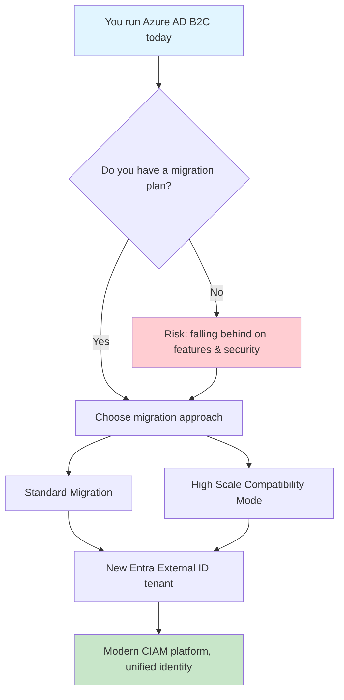

**Key Takeaway:** Migration isn't optional — it's a strategic necessity. The question isn't *if* you should migrate, but *when* and *how*.

---

## 2. Background: What Is Azure AD B2C and Why Is It Being Retired?

Azure AD B2C has been Microsoft's customer identity platform for years, using XML-based "custom policies" (built on the Identity Experience Framework, or IEF) to create highly customizable authentication journeys, at tenants running 100 million+ identities in some cases. B2C was built reactively over time, which left it carrying significant technical debt, and Microsoft needs a more modern, unified foundation to compete in the CIAM market.

### Key Timeline Facts

| Milestone | Date | What It Means | Impact |
|---|---|---|---|
| End of sale for new customers | May 1, 2025 | New tenants can only be created with Azure AD B2C P1; B2C is no longer available to purchase for new customers | No new B2C deployments |
| B2C Premium P2 retirement | March 15, 2026 | Azure AD B2C P2 was discontinued for all customers, and P2 tenants were automatically switched to P1 pricing | Loss of advanced features |
| Loss of Identity Protection in B2C | March 15, 2026 | Every B2C tenant relying on B2C Premium P2 features — including Identity Protection integration and risk-based Conditional Access — lost those capabilities on that date | **Immediate impact on risk-based auth** |
| Minimum support commitment | Through at least May 2030 | Microsoft will continue supporting Azure AD B2C until at least May 2030 | Time to plan migration |
| Entra External ID general availability | May 2024 | Microsoft Entra External ID reached general availability in May 2024 | Production-ready alternative available |

> ⚠️ **Critical Warning:** May 2030 is not a passive deadline. Sub-features can retire earlier — as already happened with B2C Premium P2 and Identity Protection integration in March 2026.

If your B2C policies relied on risk-based step-up authentication powered by Identity Protection signals, that integration is gone, meaning teams that depended on it now need a third-party identity risk provider or custom risk scoring inside `OnTokenIssuanceStart`.

### Why the Technical Debt Matters

B2C's reactive growth created architectural challenges:
- **XML complexity:** Custom policies are verbose and difficult to maintain
- **Limited scalability:** Admin portal becomes unwieldy at 5M+ identities
- **Fragmented security:** Identity Protection was bolted on, not built in
- **No unified identity:** Separate code paths for B2C and B2B scenarios

**Entra External ID solves these** with a cloud-native, unified platform designed from the ground up for massive scale.

---

## 3. What Is Microsoft Entra External ID?

Entra External ID is a unified, cloud-native CIAM solution that lets organizations scale to millions of external users with high availability, built-in MFA, conditional access, threat protection, branded sign-up/sign-in pages, custom attributes, and integration with any identity provider — social, enterprise, email-OTP, OIDC, or SAML. It builds on B2C's foundation but adds unified management for both customer (B2C-style) and partner (B2B) identities under a single platform.

### Core Capabilities

- **Unified Identity Platform:** Manage both customers and partners in one tenant
- **Massive Scale:** Built to handle millions of identities with high availability
- **Modern Authentication:** OIDC, SAML, passkeys, and passwordless options
- **Extensible Architecture:** User flows + custom authentication extensions
- **Enterprise Security:** Conditional Access, MFA, threat protection
- **Branding & UX:** Customizable sign-in/sign-up pages with company branding

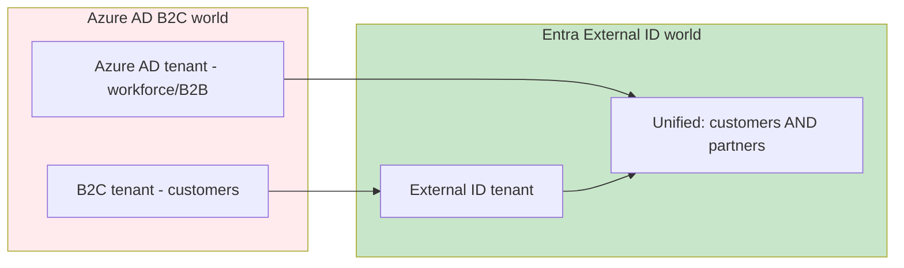

**Architectural Shift:** Instead of managing separate tenants for customer and partner identities, External ID consolidates everything into a single, unified platform.

---

## 4. Key Differences Between Azure AD B2C and Entra External ID

The single biggest architectural shift: **Entra External ID does not use B2C's XML custom policies.** Custom policy logic must be recreated using user flows and custom authentication extensions, or OIDC/SAML federation with a dedicated provider, since one-to-one parity isn't guaranteed.

### Feature Comparison Matrix

| Aspect | Azure AD B2C | Entra External ID | Migration Impact |
|---|---|---|---|
| **Policy engine** | XML custom policies (IEF) | User flows + custom authentication extensions | **High** — requires rebuild |
| **Identity scope** | Customer (B2C) only | Unified customer + partner (B2B) | Low — beneficial |
| **Risk-based auth** | Identity Protection (P2, retired March 2026) | Third-party integration or custom logic | **High** — needs redesign |
| **Admin experience** | Full admin portal (up to ~5M objects) | HSC mode: Graph API/automation-driven | Medium — tooling change |
| **Passkeys** | Not available | Available in standard deployments | Low — upgrade path |
| **Age gating** | Supported via custom policies | Not currently supported | **High** — needs workaround |
| **Custom UI** | Full HTML/CSS/JS control | Native Auth SDK or branding only | **High** — frontend rebuild |
| **Social IdPs** | Built-in support | Supported in standard mode | Low — configuration change |
| **Scale threshold** | ~5M objects (admin portal limit) | HSC mode: 5M+ objects | Medium — choose approach |

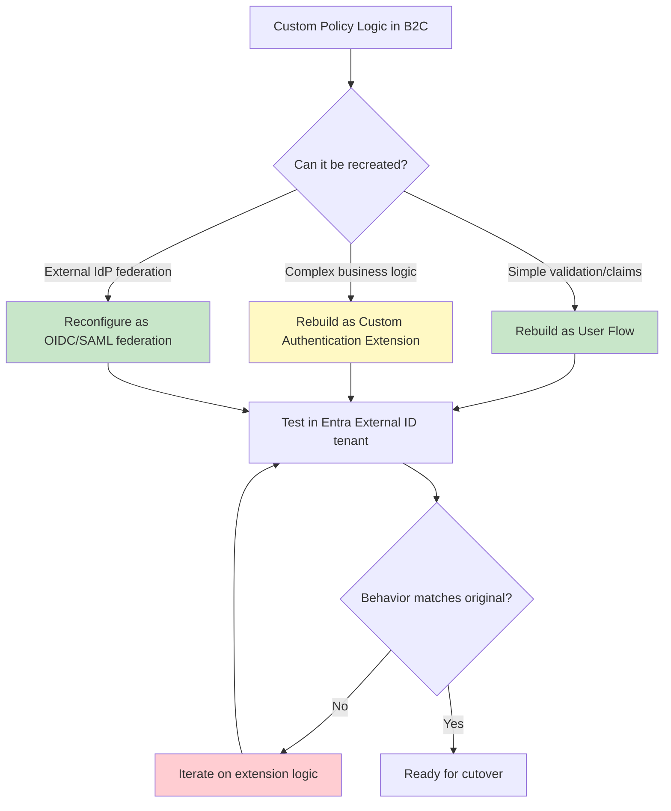

**Decision Tree:** Not all B2C features map directly. Use this flow to determine the right rebuild strategy.

---

## 5. Choosing Your Migration Approach

Selecting the right migration approach depends on your tenant size, feature dependencies, and risk tolerance.

### Three Migration Strategies

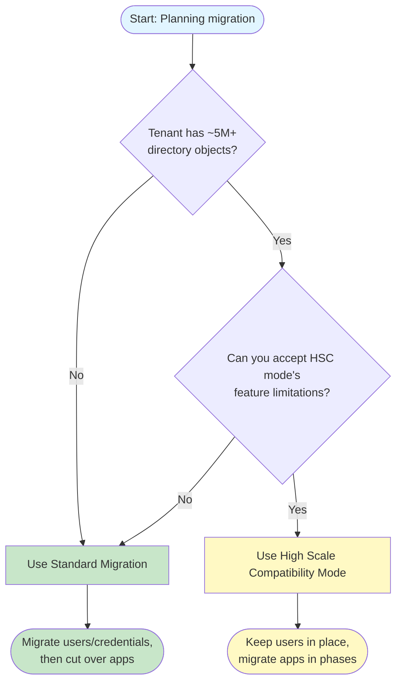

### Comparison: Standard vs. HSC Mode

| Factor | Standard Migration | HSC Mode |
|---|---|---|
| **Best for** | Most tenants (under 5M objects) | Very large Azure AD B2C tenants |
| **Identity approach** | Migrate users/credentials to External ID | Keep existing users in place; migrate apps in phases |
| **Feature coverage** | Broadest compatibility | Significant gaps (see table below) |
| **Migration complexity** | Medium — user migration + app cutover | High — app-by-app migration coordination |
| **Timeline** | 3-6 months typical | 6-18 months depending on app count |
| **Risk** | Medium — user migration issues possible | Low — users stay in place |

### HSC Mode Feature Gaps

| Category | Limitation |
|---|---|
| **Authentication & Access** | No advanced Conditional Access (auth context, step-up, session controls) |
| **Authentication & Access** | No app assignment via groups |
| **Authentication & Access** | No passkeys/FIDO2 |
| **Federation & Ecosystem** | No social identity providers |
| **Federation & Ecosystem** | No third-party IdPs via custom policies |
| **Federation & Ecosystem** | No custom OIDC federation from custom policies |
| **Security & Fraud Prevention** | No third-party fraud protection for web-hosted flows |
| **UX & Compliance** | No age gating |
| **Administration** | No admin portal — Microsoft Graph only |

> 💡 **Pro Tip:** If you need social IdPs (Google, Facebook, Apple), standard migration is your only option. HSC mode simply doesn't support them.

---

## 16. Prerequisites

Before starting your migration, ensure you have:

### Technical Prerequisites

1. **Azure AD B2C Tenant**
   - Active B2C tenant with custom policies or user flows
   - Global Administrator or B2C IEF Administrator role
   - Access to Azure portal and Azure AD PowerShell

2. **Development Environment**
   - Visual Studio Code or similar IDE
   - Postman or similar API testing tool
   - Git for version control
   - Node.js 18+ and npm (for MSAL.js examples)
   - Azure Functions Core Tools (for extension development)

3. **External ID Tenant**
   - New Entra External ID tenant created
   - Global Administrator access
   - Microsoft Graph Explorer or Graph API permissions

4. **Knowledge Prerequisites**
   - Understanding of OAuth 2.0 and OIDC
   - Familiarity with REST APIs and JSON
   - Basic understanding of SAML 2.0 (if using SAML federation)
   - Experience with Azure AD B2C custom policies (for rebuilds)

### Account Requirements

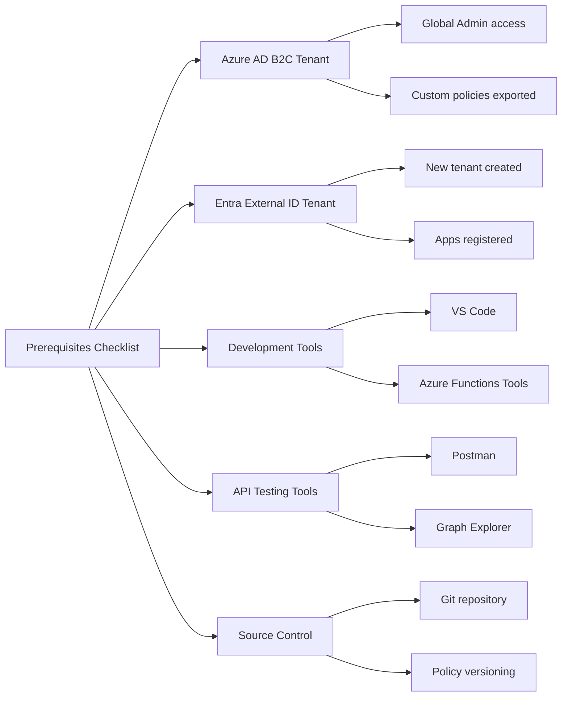

**Estimated Setup Time:** 2-4 hours for accounts, tools, and initial tenant configuration.

---

## 17. Learning Objectives

By the end of this tutorial, you will be able to:

### Knowledge Objectives

- ✅ Explain why Azure AD B2C is being retired and the timeline implications
- ✅ Differentiate between standard migration and HSC mode
- ✅ Identify which B2C features have direct equivalents in External ID
- ✅ Understand the custom authentication extension event model
- ✅ Compare OIDC vs. SAML federation architectures

### Practical Skills

- ✅ Run the Migration Policy Analyzer on B2C custom policies
- ✅ Create user flows in Entra External ID
- ✅ Build custom authentication extensions (Azure Functions)
- ✅ Configure OIDC and SAML identity providers
- ✅ Implement claims mapping policies
- ✅ Test authentication flows end-to-end

### Strategic Planning

- ✅ Choose the right migration approach for your organization
- ✅ Estimate migration effort based on policy complexity
- ✅ Identify and plan for unsupported features
- ✅ Coordinate with third-party application owners
- ✅ Create a phased migration roadmap

---

## 6. Deep Dive: Standard Migration

Standard migration typically includes creating the destination tenant, registering apps and configuring user flows, migrating user data (preserving passwords if needed), and cutting over applications.

### Three Common Migration Patterns

1. **Bulk migration, then app cutover** — users migrated in advance; apps updated afterward.
2. **Bulk migration with JIT password migration** — users migrated first; passwords validated/migrated during sign-in over a time-boxed coexistence period.
3. **B2C-initiated migration** — apps keep authenticating with B2C while credentials are progressively migrated in the background via a REST API call from a B2C custom policy; apps cut over once enough users have migrated.

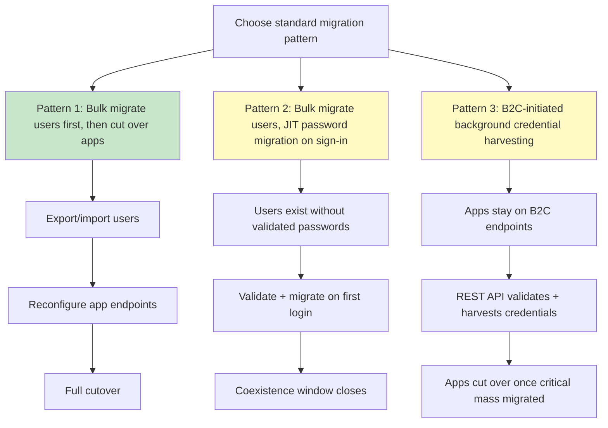

### Pattern 1: Bulk Migration Then Cutover

**Best for:** Smaller tenants (< 500K users) with simple custom policies

**Steps:**
1. Export users from B2C using Microsoft Graph
2. Import users into External ID tenant
3. Hash and migrate passwords (if preserving passwords)
4. Configure user flows and extensions
5. Update application endpoints
6. Cut over all apps simultaneously

**Advantages:**
- Clean break from B2C
- All users migrated before app changes
- Easier to test

**Disadvantages:**
- Requires downtime or dual-run period
- Password migration complexity
- All-or-nothing approach

### Pattern 2: Bulk Migration with JIT Password Validation

**Best for:** Medium tenants (500K - 5M users) needing password preservation

**Steps:**
1. Export users without passwords
2. Import users into External ID
3. Configure JIT validation to check B2C passwords on first login
4. Migrate validated passwords to External ID
5. Close coexistence window after validation period

**Advantages:**
- No bulk password export required
- Users validate themselves
- Gradual migration

**Disadvantages:**
- Requires B2C to remain available
- JIT validation adds latency
- Coexistence period management

### Pattern 3: B2C-Initiated Background Migration

**Best for:** Large tenants with complex custom policies and long-tail user bases

**Steps:**
1. Keep apps on B2C endpoints
2. Add REST API call in B2C custom policy
3. Migrate credentials in background during user authentication
4. Track migration progress
5. Cut over apps once threshold reached

**Advantages:**
- No user impact during migration
- Apps remain on stable B2C
- Background processing

**Disadvantages:**
- Requires modifying B2C policies
- Longer migration timeline
- Complex coordination

### Considerations & Limitations

Review custom business logic, sign-in UX, identity providers, access controls, and application-level changes — every application must be individually updated to use External ID endpoints, including third-party-owned apps in ISV-style tenants. Known gaps: **age gating isn't currently supported**, and custom policy logic must be recreated, not ported, with no parity guarantee.

---

## 7. Deep Dive: High Scale Compatibility (HSC) Mode

HSC mode lets you adopt External ID endpoints/features while keeping existing users and credentials in place, migrating applications in phases. B2C and External ID run side by side in the same tenant.

### Three-Stage Migration

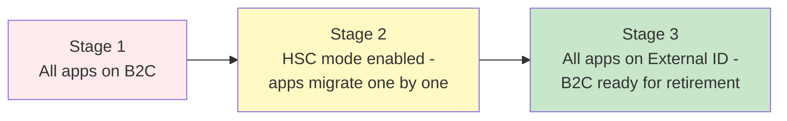

Application migration is always performed by you — HSC mode never moves apps automatically. Requirements: create new app registrations (don't reuse B2C ones), and register single-tenant only.

### Stage 1: Baseline
- All applications use B2C endpoints
- Users and credentials remain in B2C
- No changes to existing apps

### Stage 2: HSC Mode Enabled
- Enable HSC mode in External ID tenant
- Keep B2C endpoints active
- Migrate applications one by one
- New app registrations created in External ID
- Users authenticate against same directory

### Stage 3: Full Cutover
- All apps use External ID endpoints
- B2C endpoints decommissioned
- Users fully transitioned

### HSC Mode Limitations Diagram

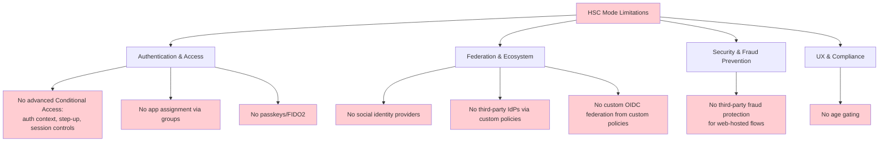

**Critical Decision:** If you need any of the features in red, HSC mode won't work. Choose standard migration instead.

---

## 8. Just-in-Time (JIT) and Passwordless Migration

A groundbreaking JIT approach migrates users on their first sign-in — including passwordless options — simplifying moving millions of accounts without bulk exports.

### JIT Migration Sequence

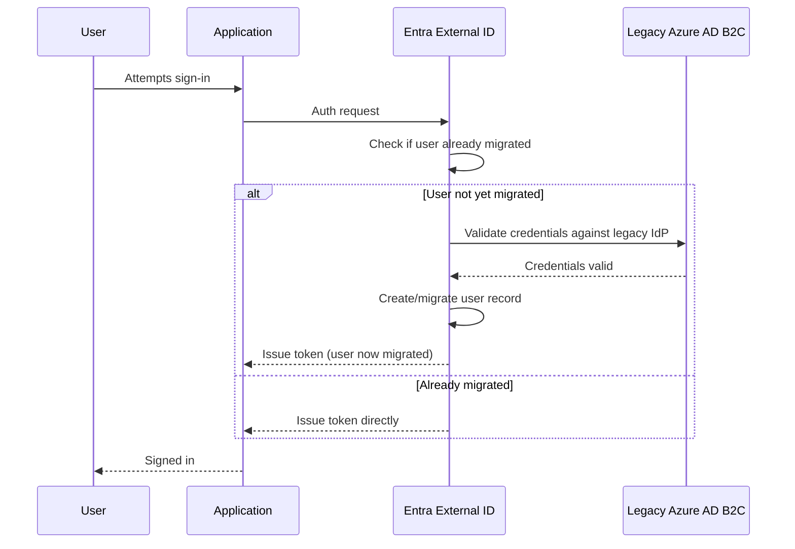

### Migration Approach Comparison

| Approach | How It Works | Best For | Complexity |
|---|---|---|---|
| **Bulk migration** | Export all users, import into External ID | Predictable datasets | Medium |
| **JIT migration** | Migrate credentials at next sign-in | Very large / long-tail user bases | High |
| **JIT passwordless** | Migrate identity without re-validating legacy password | Modernizing auth while migrating | Medium |

**When to Use JIT:**
- ✅ 70%+ of users haven't logged in for 6+ months
- ✅ User base is in the millions
- ✅ You want to avoid bulk export complexity
- ✅ You can maintain B2C during transition

**When to Avoid JIT:**
- ❌ All users are active (bulk is faster)
- ❌ You need immediate B2C decommission
- ❌ B2C can't remain available during transition

---

## 9. The Hybrid Tenant Approach

Running Entra External ID alongside your existing B2C tenant lets apps keep working while you reconfigure endpoints and migrate in phases, reducing the blast radius of any single change.

### Hybrid Architecture

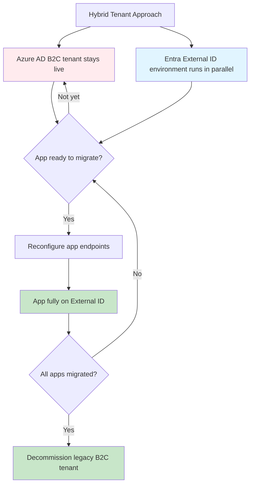

**Benefits:**
- Zero downtime during migration
- Easy rollback if issues arise
- Test each app independently
- Gradual risk reduction

**Challenges:**
- Dual maintenance during transition
- User synchronization complexity
- Cost of running both tenants

---

## 10. Deep Dive: Rebuilding Custom Policy Logic as User Flows / Custom Authentication Extensions

This is the hardest part of any migration. External ID doesn't support B2C's XML custom policies — only user flows and custom authentication extensions — and there's no capability to upload or host custom UI templates. Microsoft's own support engineers are direct: this is more of a rebuild than a migration.

### The Philosophical Break

External ID replaces IEF XML with declarative user flows plus **event-driven** (not journey-scripted) custom authentication extensions. If your policies did complex orchestration, you rebuild that logic, you don't port it.

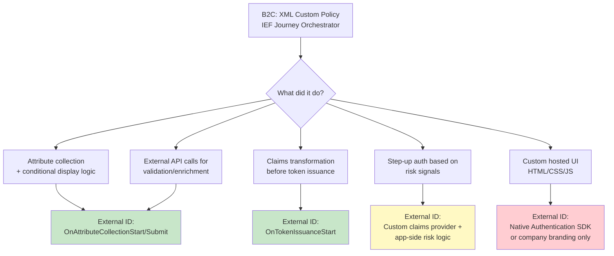

### Step 1: Run the Migration Policy Analyzer First

Built into your Azure AD B2C tenant, this analyzer scans custom policies and produces a migration assessment, mapping each detected feature to a migration path.

**How to Run It:**
1. Azure portal → your B2C tenant → **Identity Experience Framework** → **Migration Policy Analyzer**
2. Select policies to analyze (must include a relying-party policy)
3. Select **Analyze Policies**

Built-in user flows don't need analysis — they map directly.

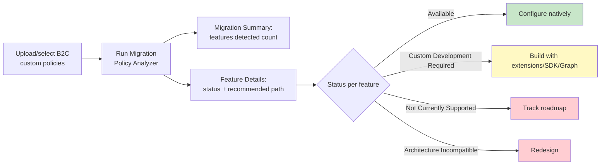

**Example Output:**
```text
Migration Summary
---
Features detected: 42
Available (External ID built-in): 28
Custom Development Required: 12
Not Currently Supported: 2
Architecture Incompatible: 0
```

Numbers are illustrative — results vary based on policy complexity.

| Status | Meaning | Action |
|---|---|---|
| **Available** | Works natively — GA, documented, production-ready | Configure natively |
| **Custom Development Required** | Achievable via extensions, Native Auth SDK, or Graph API | Implement yourself |
| **Not Currently Supported** | No current equivalent, or preview-only | Monitor roadmap |
| **Architecture Incompatible** | Fundamental pattern mismatch | Redesign |

> ⚠️ **Important:** Analyzer output is a best-effort, read-only assessment — it doesn't modify your tenant, and it reads XML structure, not runtime behavior, so test critical flows after migration.

### Step 2: Understand the Three Extension Events

A custom authentication extension is an event listener that makes an HTTP call to your REST API (Azure Function, Logic App, or other endpoint) when triggered.

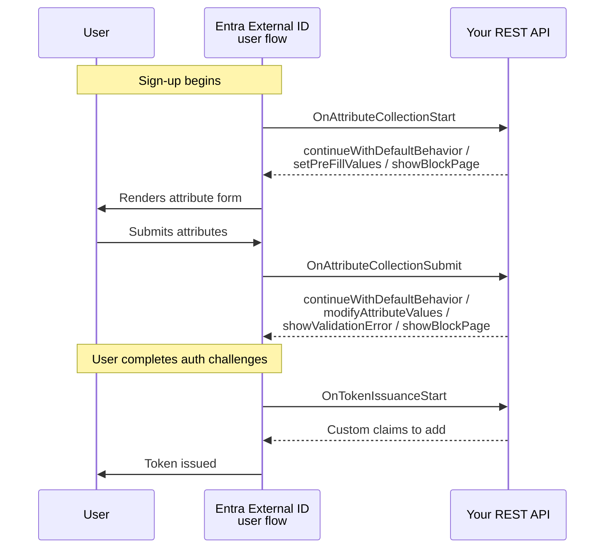

**Event Types:**

1. **`OnAttributeCollectionStart`** — Fires before the attribute page renders
   - Actions: `continueWithDefaultBehavior`, `setPreFillValues`, `showBlockPage`
   - Use case: Pre-populate fields, block users before form renders

2. **`OnAttributeCollectionSubmit`** — Fires after attribute submission
   - Actions: `continueWithDefaultBehavior`, `modifyAttributeValues`, `showValidationError`, `showBlockPage`
   - Use case: Validate domain, transform attributes, enforce business rules

3. **`OnTokenIssuanceStart`** — Fires just before token issuance
   - Requires a custom claims provider configuration
   - Use case: Enrich token with external data (CRM, loyalty systems)

> ⚠️ **Critical:** Attributes returned by `OnTokenIssuanceStart` aren't automatically added to the token. The app's claims mapping policy must explicitly include them. Multiple claims providers can share one extension.

### Step 3: Map Common B2C Patterns to External ID

| B2C Pattern | Maps To | Notes |
|---|---|---|
| Attribute collection + validation | `OnAttributeCollectionStart`/`Submit` | Cleanest mapping |
| Token enrichment with external data | `OnTokenIssuanceStart` custom claims provider | Requires claims mapping policy per app |
| Custom hosted HTML/CSS/JS | Native Authentication SDK or MSAL.js custom UI; branding only for hosted pages | No equivalent to full custom HTML |
| Profile editing, account linking, lockout, impersonation | Microsoft Graph API from your app | Moves logic to the app layer |
| Complex REST technical profiles | Custom authentication extensions | Supports claims enrichment, custom MFA, validation, branching, forced password reset |
| Risk-based Conditional Access (old B2C P2) | No direct equivalent | Third-party risk provider or custom logic |

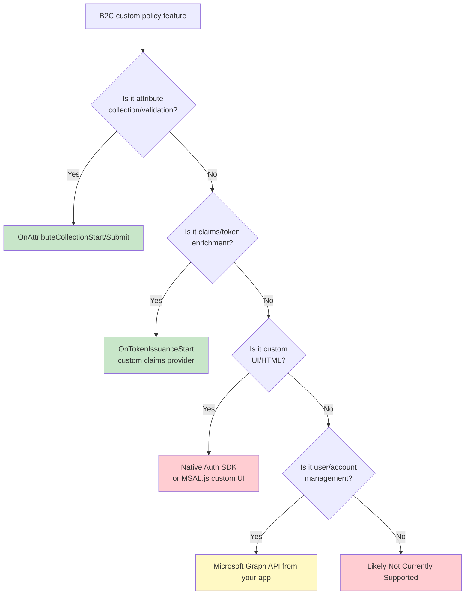

### Step 4: Know What Has No Equivalent Yet

Features typically without a current equivalent:
- QR code authentication
- WS-Federation
- SAML artifact binding
- Inbound SAML encryption
- CAPTCHA on sign-in

> 💡 **Note:** Passkeys/FIDO2, once in this category, are now available in standard deployments.

### Step 5: Practical Rebuild Workflow

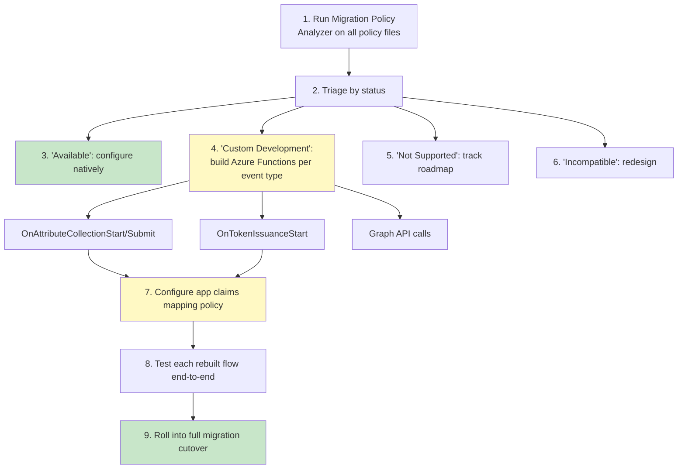

**Include all policy files** (base, extensions, relying parties) when running the analyzer, and verify features use standard XML patterns rather than inline JavaScript, which the analyzer can miss.

### Rebuild Effort by Complexity

| Complexity | Example | Rebuild Path | Relative Effort |
|---|---|---|---|
| **Low** | Email/password sign-up | Native user flow | Configure only |
| **Low-Medium** | Domain-based sign-up blocking | `OnAttributeCollectionStart` | Small Azure Function |
| **Medium** | Address formatting, invitation codes | `OnAttributeCollectionSubmit` | Small-medium Function |
| **Medium-High** | Loyalty tier/billing data into token | `OnTokenIssuanceStart` + claims mapping | Medium Function + app config |
| **High** | Fully custom branded HTML wizard | Native Auth SDK / MSAL.js custom UI | Significant frontend rebuild |
| **Very High** | WS-Federation partner integration | No current equivalent | Architecture redesign |

---

## 11. Complete Worked Example: Retail Sign-In Policy → Entra External ID User Flow

**Scenario:** A retail company's B2C tenant has a sign-in custom policy that:
1. Lets users sign in with **email + password** (local account) or a **third-party enterprise IdP** (Okta)
2. Blocks any email domain on a competitor blocklist during sign-up
3. Fetches the user's loyalty tier from a CRM and injects it into the token as a `loyaltyTier` claim
4. Skips the "create password" step if the user signs up via Okta

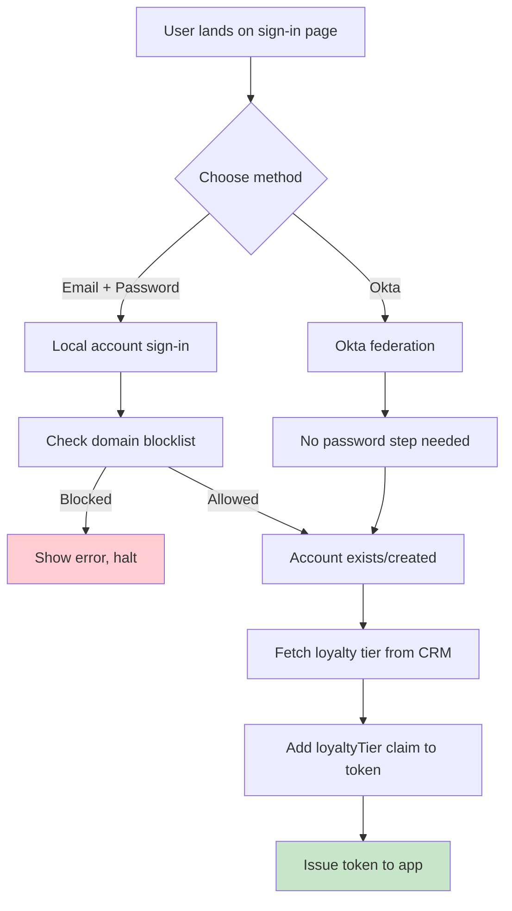

### Step 1: Create the External Tenant and Register Your App

Sign in to the Microsoft Entra admin center, switch to your external tenant, and register your application — this generates the **Application (client) ID** used in authentication requests and establishes the trust relationship. Don't reuse your old B2C app registration; External ID requires a fresh one.

**Steps:**
1. Navigate to Entra admin center
2. Switch to your external tenant (top-right tenant selector)
3. Go to **Applications > App registrations > New registration**
4. Name: `Retail-App`
5. Supported account types: **Accounts in any organizational directory and personal Microsoft accounts**
6. Redirect URI: `https://shop.example.com/auth/callback` (SPA)
7. Click **Register**
8. Copy the **Application (client) ID** for later use

### Step 2: Create the Sign-In / Sign-Up User Flow

Replaces `SignUpOrSignin.xml`.

1. **Entra ID > External Identities > User flows > + New user flow**, name it `RetailSignUpSignIn`
2. Under **Identity providers**, select **Email Accounts**
3. Choose **password** as the email sign-in method
4. Select attributes to collect (Display Name, Email)
5. Okta will be added separately once its federation type (OIDC or SAML) is configured — see Section 12.

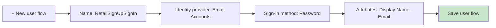

### Step 3: Associate the User Flow With Your Application

Under the user flow, **Applications > Add application** > choose your app > **Select**. One app = one user flow; one user flow can serve many apps.

### Step 4: Rebuild the Domain Blocklist Check

Add an API connector on `OnAttributeCollectionSubmit`, pointing to an Azure Function.

**Implementation - Azure Function (C#):**

```csharp
using System.Net;
using Microsoft.Azure.Functions.Worker;
using Microsoft.Azure.Functions.Worker.Http;
using Microsoft.Extensions.Logging;

public class DomainBlocklistValidator
{
    private readonly ILogger _logger;
    private readonly HashSet<string> _blockedDomains = new()
    {
        "competitor1.com",
        "competitor2.com",
        "competitor3.com"
    };

    public DomainBlocklistValidator(ILoggerFactory loggerFactory)
    {
        _logger = loggerFactory.CreateLogger<DomainBlocklistValidator>();
    }

    [Function("DomainBlocklistValidator")]
    public async Task<HttpResponseData> Run(
        [HttpTrigger(AuthorizationLevel.Function, "post")] HttpRequestData req)
    {
        _logger.LogInformation("Processing domain blocklist validation");

        // Read request body
        var requestBody = await new StreamReader(req.Body).ReadToEndAsync();
        var data = System.Text.Json.JsonSerializer.Deserialize<ExtensionRequest>(requestBody);

        // Extract email from claims
        var email = data?.Data?.Attributes?.Email ?? "";
        var domain = email.Contains("@") ? email.Split("@")[1].ToLower() : "";

        _logger.LogInformation($"Checking domain: {domain}");

        // Check if domain is blocked
        if (_blockedDomains.Contains(domain))
        {
            _logger.LogWarning($"Blocked domain detected: {domain}");

            // Return block action
            var response = req.CreateResponse(HttpStatusCode.OK);
            var blockResponse = new
            {
                data = new
                {
                    "@odata.type" = "microsoft.graph.onAttributeCollectionSubmitResponseData",
                    actions = new[]
                    {
                        new
                        {
                            "@odata.type" = "microsoft.graph.attributeCollectionSubmit.showValidationError",
                            message = "Sign-ups from this email domain aren't permitted."
                        }
                    }
                }
            };

            await response.WriteAsJsonAsync(blockResponse);
            return response;
        }

        // Allow the sign-up to continue
        var allowResponse = req.CreateResponse(HttpStatusCode.OK);
        var continueResponse = new
        {
            data = new
            {
                "@odata.type" = "microsoft.graph.onAttributeCollectionSubmitResponseData",
                actions = new[]
                {
                    new
                    {
                        "@odata.type" = "microsoft.graph.attributeCollectionSubmit.continueWithDefaultBehavior"
                    }
                }
            }
        };

        await allowResponse.WriteAsJsonAsync(continueResponse);
        return allowResponse;
    }
}

public class ExtensionRequest
{
    public ExtensionData Data { get; set; }
}

public class ExtensionData
{
    public AttributeData Attributes { get; set; }
}

public class AttributeData
{
    public string Email { get; set; }
}
```

**Response Schemas:**

**Blocked response:**
```json
{
  "data": {
    "@odata.type": "microsoft.graph.onAttributeCollectionSubmitResponseData",
    "actions": [{
      "@odata.type": "microsoft.graph.attributeCollectionSubmit.showValidationError",
      "message": "Sign-ups from this email domain aren't permitted."
    }]
  }
}
```

**Allowed response:**
```json
{
  "data": {
    "@odata.type": "microsoft.graph.onAttributeCollectionSubmitResponseData",
    "actions": [{
      "@odata.type": "microsoft.graph.attributeCollectionSubmit.continueWithDefaultBehavior"
    }]
  }
}
```

### Step 5: The "Skip Password for Okta" Logic

This isn't configured — it's implicit. Password only applies to "Email Accounts"; picking Okta never renders a password field. One less thing to rebuild.

### Step 6: Rebuild the Loyalty Tier Claim Enrichment

Create a custom authentication extension on `OnTokenIssuanceStart` with a custom claims provider returning `loyaltyTier`, then add `loyaltyTier` to the app's claims mapping policy.

**Implementation - Azure Function (C#):**

```csharp
using System.Net;
using Microsoft.Azure.Functions.Worker;
using Microsoft.Azure.Functions.Worker.Http;
using Microsoft.Extensions.Logging;

public class LoyaltyTierEnricher
{
    private readonly ILogger _logger;

    public LoyaltyTierEnricher(ILoggerFactory loggerFactory)
    {
        _logger = loggerFactory.CreateLogger<LoyaltyTierEnricher>();
    }

    [Function("LoyaltyTierEnricher")]
    public async Task<HttpResponseData> Run(
        [HttpTrigger(AuthorizationLevel.Function, "post")] HttpRequestData req)
    {
        _logger.LogInformation("Processing loyalty tier enrichment");

        var requestBody = await new StreamReader(req.Body).ReadToEndAsync();
        var data = System.Text.Json.JsonSerializer.Deserialize<TokenIssuanceRequest>(requestBody);

        // Extract user identifier from claims
        var userId = data?.Data?.Subject?.UserId ?? "";
        _logger.LogInformation($"Enriching token for user: {userId}");

        // In production, query your CRM here
        // var loyaltyTier = await _crmService.GetLoyaltyTierAsync(userId);
        var loyaltyTier = "Gold"; // Simplified for example

        var response = req.CreateResponse(HttpStatusCode.OK);
        var enrichmentResponse = new
        {
            data = new
            {
                "@odata.type" = "microsoft.graph.onTokenIssuanceStartResponseData",
                actions = new[]
                {
                    new
                    {
                        "@odata.type" = "microsoft.graph.onTokenIssuanceStart.provideClaimsForToken",
                        claims = new Dictionary<string, string>
                        {
                            { "loyaltyTier", loyaltyTier }
                        }
                    }
                }
            }
        };

        await response.WriteAsJsonAsync(enrichmentResponse);
        return response;
    }
}

public class TokenIssuanceRequest
{
    public TokenIssuanceData Data { get; set; }
}

public class TokenIssuanceData
{
    public SubjectData Subject { get; set; }
}

public class SubjectData
{
    public string UserId { get; set; }
}
```

**Configuration in External ID:**
1. Navigate to **External Identities > Custom authentication extensions**
2. Click **+ New extension**
3. Name: `LoyaltyTierEnricher`
4. Event: `OnTokenIssuanceStart`
5. Endpoint: `https://your-function.azurewebsites.net/api/LoyaltyTierEnricher`
6. Save and activate

> ⚠️ **Remember:** You must also configure a claims mapping policy on your app registration to include `loyaltyTier` in the issued token. The extension provides the data; the claims mapping policy controls what's emitted.

---

## 12. Runtime Authentication Flows: Local Account, Okta via OIDC, Okta via SAML

Now let's trace exactly what happens at runtime for each sign-in path. This is where you validate that Steps 4–6 above actually work.

### Foundational Point

Federated identity providers (Google, Facebook, Apple, Entra ID, custom OIDC/SAML) are available **only** with browser-delegated authentication; native authentication supports local accounts only. Since Okta is needed here, the app must use **browser-delegated** authentication. Both diagrams below use OAuth 2.0 Authorization Code Flow with PKCE — Microsoft's recommended flow, with implicit grant and ROPC explicitly unsupported.

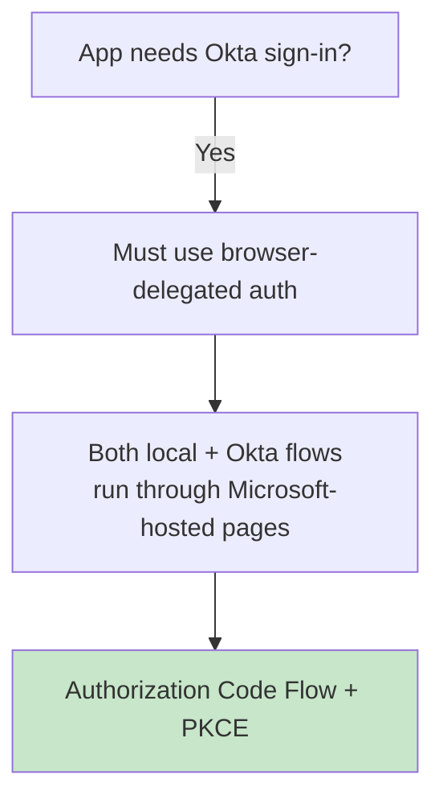

**One rule governs everything below: your app always talks to Entra External ID using OIDC.** What varies is the *second* leg — between External ID and Okta — which can be OIDC or SAML depending on tenant configuration.

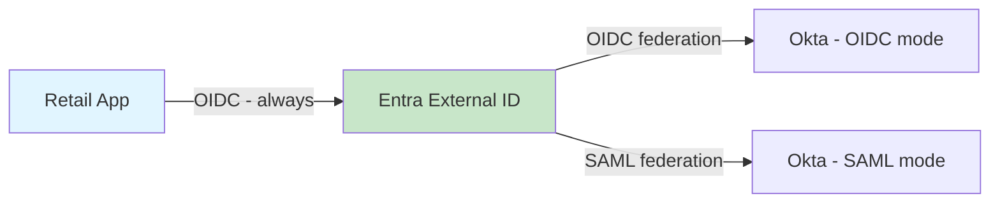

### 12.1 Runtime Flow — Local Account (Email + Password)

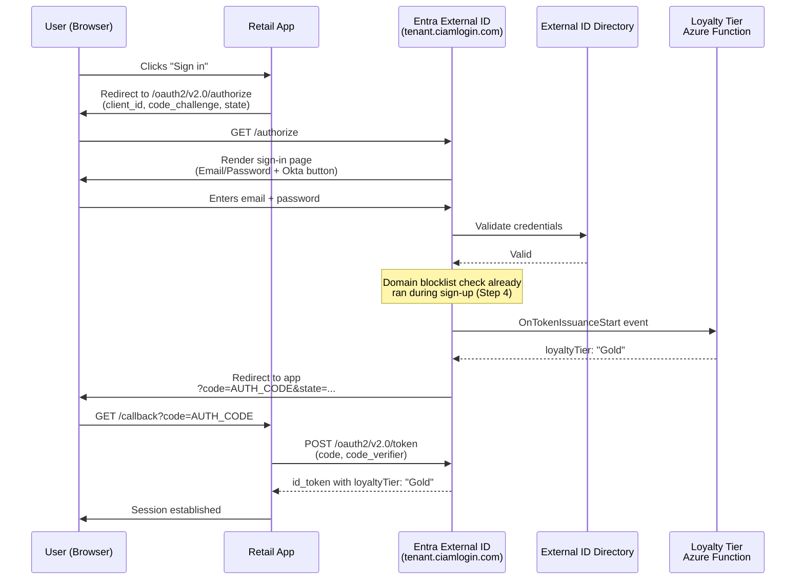

**MSAL Configuration (TypeScript):**

```typescript
import { PublicClientApplication } from "@azure/msal-browser";

const msalConfig = {
  auth: {
    clientId: "<RETAIL_APP_CLIENT_ID>",
    authority: "https://retailtenant.ciamlogin.com/<tenant-id>",
    redirectUri: "https://shop.example.com/callback",
  },
};

const msalInstance = new PublicClientApplication(msalConfig);

// Login with redirect
msalInstance.loginRedirect({
  scopes: ["openid", "profile", "email"],
});

// Handle callback
const handleCallback = async () => {
  const response = await msalInstance.handleRedirectPromise();
  if (response) {
    console.log("Token:", response.idToken);
    console.log("Loyalty Tier:", response.idTokenClaims.loyaltyTier);
  }
};
```

**Resulting ID Token:**
```json
{
  "iss": "https://<tenant-id>.ciamlogin.com/<tenant-id>/v2.0",
  "aud": "<retail-app-client-id>",
  "preferred_username": "shopper@example.com",
  "name": "Jane Doe",
  "loyaltyTier": "Gold",
  "iat": 1709950000,
  "exp": 1709953600
}
```

### 12.2 Build-Time Setup — Okta via OIDC

**In Okta:**
1. Okta Admin Console → **Applications > Create App Integration**
2. Choose **OIDC - Web Application**
3. Name: `Retail App - External ID Federation`
4. Sign-in redirect URIs: 
   ```
   https://<tenant-subdomain>.ciamlogin.com/<tenant-ID>/federation/oauth2
   https://<tenant-subdomain>.ciamlogin.com/<tenant-subdomain>.onmicrosoft.com/federation/oauth2
   ```
5. Assign to **Everyone** group
6. Note the **Client ID** and **Client Secret**

**In External ID:**
1. Navigate to **External Identities > All Identity Providers > OIDC identity provider**
2. Name: `Okta-OIDC`
3. Client ID: `<okta-client-id>`
4. Client secret: `<okta-client-secret>`
5. Metadata document URL: `https://<okta-domain>/.well-known/openid-configuration`
6. Scope: `openid profile email`
7. Save

**Add to User Flow:**
1. Navigate to **User flows > RetailSignUpSignIn > Identity providers**
2. Click **+ Add** → select **Okta-OIDC**
3. Save

```mermaid
flowchart TD
    A[Create OIDC app in Okta] --> B[Register EID federation<br/>redirect URIs in Okta]
    B --> C[Register Okta as OIDC IdP<br/>in External ID tenant]
    C --> D[Add Okta OIDC IdP to<br/>the sign-in user flow]
    D --> E[Test sign-in button appears]
    
    style E fill:#c8e6c9
```

### 12.3 Runtime Flow — Okta via OIDC

```mermaid
sequenceDiagram
    participant U as User (Browser)
    participant App as Retail App
    participant EID as Entra External ID
    participant Okta as Okta (OIDC mode)
    participant Fn as Loyalty Tier<br/>Azure Function

    U->>App: Clicks "Sign in"
    App->>U: Redirect to EID /authorize
    U->>EID: GET /authorize
    EID->>U: Render sign-in page with<br/>"Sign in with Okta" button
    U->>EID: Selects Okta
    EID->>U: Redirect to Okta /authorize<br/>(EID's federation redirect_uri)
    U->>Okta: Authenticates with Okta credentials
    Okta->>U: Redirect to EID federation callback<br/>?code=OKTA_CODE
    U->>EID: GET /federation/oauth2?code=OKTA_CODE
    EID->>Okta: POST /token (OKTA_CODE, client_secret) — server-to-server
    Okta-->>EID: Okta's own ID token
    EID->>EID: Provision/match federated identity
    Note over EID: No password step ever shown (Step 5)
    EID->>Fn: OnTokenIssuanceStart event
    Fn-->>EID: loyaltyTier: "Gold"
    EID->>U: Redirect to app<br/>?code=AUTH_CODE
    U->>App: GET /callback?code=AUTH_CODE
    App->>EID: POST /oauth2/v2.0/token
    EID-->>App: id_token with loyaltyTier: "Gold"<br/>(EID's own token, never Okta's)
    App->>U: Session established
```

### 12.4 Build-Time Setup — Okta via SAML

**In Okta:**
1. Okta Admin Console → **Applications > Create App Integration**
2. Choose **SAML 2.0** → **Next**
3. Name: `Retail App - External ID SAML`
4. Single sign-on URL: `https://<tenant-subdomain>.ciamlogin.com/<tenant-ID>/saml2`
5. Audience URI: `https://<tenant-subdomain>.ciamlogin.com/<tenant-subdomain>.onmicrosoft.com/<app-id>`
6. Name ID format: **Unspecified** (or **EmailAddress** if email-based)
7. Click **Next** → **Finish**

**Retrieve SAML Configuration:**
1. Open the app's **Sign On** tab
2. Click **View SAML Setup Instructions**
3. Note the **Identity Provider Single Sign-On URL**, **Issuer URL**, and **X.509 Certificate**

**In External ID:**
1. Navigate to **External Identities > All Identity Providers > + New > SAML/WS-Fed**
2. Name: `Okta-SAML`
3. Identity provider protocol: **SAML**
4. Upload the X.509 certificate from Okta
5. Issuer URI: `<okta-issuer-url>`
6. Passive authentication endpoint: `<okta-sso-url>`
7. Save

**Add to User Flow:**
1. Navigate to **User flows > RetailSignUpSignIn > Identity providers**
2. Click **+ Add** → select **Okta-SAML**
3. Save

```mermaid
flowchart TD
    A[Create SAML 2.0 app in Okta] --> B[Configure Recipient/Destination/<br/>Audience Restriction]
    B --> C[Retrieve SAML Setup Instructions:<br/>SSO URL, Issuer URL, Certificate]
    C --> D[External Identities > All IdPs ><br/>Custom > SAML/WS-Fed]
    D --> E[Enter Issuer URI, SSO endpoint,<br/>certificate, metadata URL]
    E --> F[Add Okta SAML IdP<br/>to the sign-in user flow]
    
    style F fill:#c8e6c9
```

> ⚠️ **No client secret in SAML** — trust is established via the signed certificate and issuer/endpoint URLs.

### 12.5 Runtime Flow — Okta via SAML

This is where the wire behavior genuinely diverges: no authorization code, no token-endpoint exchange, no client secret — the browser carries a signed XML assertion directly from Okta to External ID's Assertion Consumer Service (ACS) endpoint.

```mermaid
sequenceDiagram
    participant U as User (Browser)
    participant App as Retail App
    participant EID as Entra External ID
    participant Okta as Okta (SAML mode)
    participant Fn as Loyalty Tier<br/>Azure Function

    U->>App: Clicks "Sign in"
    App->>U: Redirect to EID /authorize (OIDC)
    U->>EID: GET /authorize
    EID->>U: Render sign-in page with<br/>"Sign in with Okta" button
    U->>EID: Selects Okta
    EID->>U: Redirect to Okta's SSO URL<br/>with a SAML AuthnRequest
    U->>Okta: Authenticates with Okta credentials
    Okta->>Okta: Generate signed SAML Response<br/>(assertion with NameID + attributes)
    Okta->>U: Auto-submitting HTML form<br/>POSTing SAMLResponse to EID's ACS URL
    U->>EID: POST /saml2 (SAMLResponse, browser-mediated)
    EID->>EID: Validate signature against<br/>stored Okta certificate
    EID->>EID: Extract NameID/attributes,<br/>provision or match user
    Note over EID: No password step ever shown (Step 5)
    EID->>Fn: OnTokenIssuanceStart event
    Fn-->>EID: loyaltyTier: "Gold"
    EID->>U: Redirect to app<br/>?code=AUTH_CODE (this leg is still OIDC)
    U->>App: GET /callback?code=AUTH_CODE
    App->>EID: POST /oauth2/v2.0/token
    EID-->>App: id_token with loyaltyTier: "Gold"<br/>(EID's own OIDC token, never a SAML assertion)
    App->>U: Session established
```

### 12.6 OIDC vs. SAML Federation — What's Different on the Wire

| Step | OIDC Federation | SAML Federation |
|---|---|---|
| **How the assertion travels** | Authorization code, then a **server-to-server** token exchange | A signed XML assertion, POSTed **through the browser** via an auto-submitting form |
| **Trust mechanism** | Client ID + client secret | Signed certificate validation |
| **What EID validates** | Token signature via Okta's JWKS, issuer, audience | SAML assertion signature via stored/parsed certificate, issuer URI |
| **Attributes received** | JSON claims in Okta's ID token | XML attribute statements inside the SAML assertion |
| **Certificate maintenance** | Not applicable (secret rotation instead) | Manual re-entry needed unless metadata URL parsing is used |

**Regardless of which protocol runs between External ID and Okta, your app's MSAL config and the decoded ID token it receives are identical:**

```
iss: https://<tenant-id>.ciamlogin.com/<tenant-id>/v2.0
aud: <retail-app-client-id>
preferred_username: shopper@example.com
name: Jane Doe
loyaltyTier: Gold
```

This is the practical payoff of External ID's broker architecture: app code and token handling are written once against OIDC, and stay correct even if your identity team later moves Okta from SAML federation to OIDC federation (or vice versa) — that change is entirely isolated to the External ID ↔ Okta configuration.

### 12.7 Combined Build + Runtime Summary

```mermaid
flowchart TD
    A[Retail App] -->|Always OIDC| B[Entra External ID]
    B --> C{Okta federation<br/>protocol}
    C -->|OIDC configured| D[Server-to-server code exchange<br/>with client secret]
    C -->|SAML configured| E[Browser-POSTed signed assertion<br/>to ACS endpoint]
    D --> F[EID validates Okta's ID token]
    E --> G[EID validates SAML signature<br/>via certificate]
    F --> H[OnTokenIssuanceStart fires<br/>identically either way]
    G --> H
    H --> I[EID issues its own OIDC token<br/>to the app]
    
    style I fill:#c8e6c9
```

| Layer | Protocol | Fixed or Variable? |
|---|---|---|
| **App ↔ Entra External ID** | OIDC (Authorization Code + PKCE) | **Always fixed** |
| **Entra External ID ↔ Okta** | OIDC **or** SAML | Variable — admin configuration choice |
| **Where `loyaltyTier` enrichment happens** | `OnTokenIssuanceStart` | Fires identically regardless of federation protocol |
| **Where migration bugs are most likely to hide** | Identity provisioning/matching | Test separately for local, OIDC-federated, and SAML-federated sign-in |

### 12.8 Migration Pitfall: Identity Linking

⚠️ **Don't pre-create users with both a password and a federated identity attached to the same account.** If an account is created with both local (email/password) and federated identities, sign-in resolution frequently breaks. The fix: create local-only accounts when users sign in locally, and federated-only accounts when they sign in via Okta, letting the platform link them naturally on subsequent sign-in. This is exactly the kind of subtle behavior difference from B2C worth testing explicitly, since B2C's IEF gave you full manual control over linking logic and External ID does not.

### 12.9 Testing Checklist

```mermaid
flowchart TD
    Start([Test the full rebuild]) --> T1[Path A: Local account,<br/>approved domain]
    Start --> T2[Path B: Local account,<br/>blocked domain]
    Start --> T3[Path C: Okta OIDC federation]
    Start --> T4[Path D: Okta SAML federation]
    T1 --> V1{Token has loyaltyTier?}
    T2 --> V2{Error shown,<br/>no account created?}
    T3 --> V3{No password step,<br/>loyaltyTier present,<br/>identity matched correctly?}
    T4 --> V4{Assertion validated,<br/>NameID mapped correctly,<br/>loyaltyTier present?}
    V1 -->|Fail| D1[Check claims mapping policy]
    V2 -->|Fail| D2[Check API connector response schema]
    V3 -->|Fail| D3[Check federation redirect URIs<br/>+ identity linking logic]
    V4 -->|Fail| D4[Check certificate/metadata sync<br/>+ SAML attribute extraction]
    
    style T1 fill:#e1f5ff
    style T2 fill:#e1f5ff
    style T3 fill:#e1f5ff
    style T4 fill:#e1f5ff
    style V1 fill:#fff9c4
    style V2 fill:#fff9c4
    style V3 fill:#fff9c4
    style V4 fill:#fff9c4
```

**Testing Checklist:**

1. **Path A (Local account, approved domain):** Validate that sign-up succeeds, account is created, and token contains `loyaltyTier` claim.
2. **Path B (Local account, blocked domain):** Confirm error message displays, no account is created, and user can't bypass validation.
3. **Path C (Okta OIDC federation):** Confirm no password field appears, `loyaltyTier` claim is present, and federated identity isn't accidentally linked to a pre-existing local account.
4. **Path D (Okta SAML federation):** Confirm the auto-submitting form completes, signature validation succeeds against the parsed/stored certificate, attribute extraction (NameID, any custom SAML attributes) maps correctly, and `loyaltyTier` still appears.

---

## 13. Real-World Use Cases

### Use Case A: E-commerce Retailer (Standard Migration)

**Scenario:** 2 million customer accounts, a few custom-policy loyalty claims  
**Best Fit:** Standard migration, Pattern 2 (bulk migrate users, JIT password validation)

**Implementation:**
- Export 2M users from B2C
- Import into External ID without passwords
- Enable JIT password validation against B2C
- Rebuild loyalty tier enrichment as `OnTokenIssuanceStart` extension
- Cut over apps after 90-day validation window

**Timeline:** 4-6 months

### Use Case B: Global Telecom (HSC Mode)

**Scenario:** 90 million subscriber identities, dozens of regional apps, some ISV-owned  
**Best Fit:** HSC mode, phased app migration

**Implementation:**
- Enable HSC mode in External ID tenant
- Create new app registrations for each regional app
- Migrate apps one by one (ISV coordination required)
- Maintain B2C until all apps cut over

**Timeline:** 12-18 months

### Use Case C: SaaS Platform with Long-Tail Users (JIT Migration)

**Scenario:** 70% of users haven't logged in for over a year  
**Best Fit:** JIT migration

**Implementation:**
- Set up External ID with JIT validation
- Keep B2C available for dormant users
- Migrate active users on sign-in
- Dormant accounts never touched unless they return

**Timeline:** 6-9 months

### Use Case D: Enterprise B2B Portal (Okta SAML Federation)

**Scenario:** Enterprise customers already use Okta as corporate SAML IdP  
**Best Fit:** SAML federation via Okta

**Implementation:**
- Configure Okta as SAML IdP in External ID
- Extend existing Okta trust relationship
- Avoid asking customers to set up new OIDC clients
- Maintains consistency with other vendor integrations

**Timeline:** 2-3 months

### Use Case E: Consumer Banking App (Hybrid + Passwordless)

**Scenario:** Banking app wanting passkeys while migrating off B2C  
**Best Fit:** Hybrid tenant approach + JIT passwordless migration

**Implementation:**
- Run B2C and External ID in parallel
- Enable passkeys in External ID for new users
- Migrate existing users via JIT
- Encourage passkey adoption during transition

**Timeline:** 8-12 months

---

## 18. Best Practices

### Migration Planning

1. **Run the Migration Policy Analyzer First**
   - Do this before writing any code
   - Use output to scope rebuild effort accurately
   - Identify blockers early

2. **Start with a Pilot Application**
   - Choose a low-risk, simple app
   - Test the full migration process
   - Learn and iterate before tackling complex apps

3. **Coordinate Early with Stakeholders**
   - Involve app owners from day one
   - Set clear timelines and expectations
   - Document dependencies

4. **Maintain B2C Until Fully Validated**
   - Don't decommission until all apps are tested
   - Keep B2C available for rollback
   - Monitor both platforms during transition

### Custom Policy Rebuilds

5. **Use Extension Events Judiciously**
   - `OnAttributeCollectionStart/Submit` for validation
   - `OnTokenIssuanceStart` for enrichment only
   - Keep functions stateless and fast (< 2s response time)

6. **Implement Proper Error Handling**
   ```csharp
   try
   {
       // Extension logic
   }
   catch (Exception ex)
   {
       _logger.LogError(ex, "Extension failed");
       return ShowBlockPage("Service unavailable. Please try again later.");
   }
   ```

7. **Cache External API Calls**
   - Use Azure Functions with caching
   - Reduce CRM/database round trips
   - Implement timeouts (max 2 seconds)

8. **Validate All Inputs**
   - Never trust data from the request
   - Sanitize before passing to downstream systems
   - Log all validation failures

### Security

9. **Use Managed Identities for API Connectors**
   - Avoid hardcoded secrets
   - Leverage Azure AD authentication
   - Rotate secrets regularly

10. **Implement Claims Mapping Policies Carefully**
    - Only include necessary claims
    - Avoid PII in tokens unless required
    - Use token configuration to limit exposure

11. **Enable Conditional Access**
    - Require MFA for admin accounts
    - Implement location-based policies
    - Monitor sign-in logs

### Testing

12. **Test All Federation Paths Separately**
    - Local accounts
    - OIDC federation
    - SAML federation
    - Each path independently

13. **Automate Regression Tests**
    - Use Postman/Newman for API tests
    - Automate UI flows with Selenium or Playwright
    - Run tests on every deployment

14. **Monitor Production Closely**
    - Enable diagnostic logging
    - Set up alerts for failures
    - Track extension latency

---

## 19. Anti-Patterns to Avoid

### Anti-Pattern 1: Direct Port Without Analysis

**Problem:** Attempting to copy-paste B2C XML logic into External ID without understanding the architectural differences.

**Why It Fails:** External ID uses event-driven extensions, not journey orchestration. Direct ports miss this fundamental shift.

**Correct Approach:** Run the Migration Policy Analyzer, triage features, and rebuild using the extension event model.

### Anti-Pattern 2: Ignoring HSC Mode Limitations

**Problem:** Choosing HSC mode because of tenant size, without realizing critical features (social IdPs, passkeys) aren't available.

**Why It Fails:** You'll hit blockers mid-migration and need to restart with standard migration.

**Correct Approach:** Create a feature dependency matrix first. If you need social IdPs, HSC mode won't work regardless of tenant size.

### Anti-Pattern 3: Pre-Linking Local and Federated Identities

**Problem:** Creating accounts with both password and federated identity simultaneously.

**Why It Fails:** External ID's identity resolution doesn't handle this well, leading to sign-in failures.

**Correct Approach:** Create accounts based on sign-in method. Let the platform link naturally on subsequent sign-ins.

### Anti-Pattern 4: Synchronous External Dependencies in Extensions

**Problem:** Making long-running synchronous calls to external APIs in extensions.

**Why It Fails:** Extensions must respond in < 2 seconds. Slow APIs cause timeouts and failed authentications.

**Correct Approach:** Use async patterns, pre-cache data, or move long-running logic to background jobs.

### Anti-Pattern 5: Skipping the Claims Mapping Policy

**Problem:** Assuming `OnTokenIssuanceStart` automatically adds claims to the token.

**Why It Fails:** The extension provides data, but the app's claims mapping policy controls what's emitted.

**Correct Approach:** Always configure claims mapping policies explicitly.

### Anti-Pattern 6: Not Testing Edge Cases

**Problem:** Only testing happy paths (valid credentials, approved domains, etc.).

**Why It Fails:** Edge cases (expired passwords, blocked domains, federation errors) cause production incidents.

**Correct Approach:** Test error scenarios, boundary conditions, and failure modes.

---

## 20. Performance Considerations

### Extension Latency

**Target:** All extensions must respond within **2 seconds**.

**Optimization Strategies:**

1. **Use Azure Functions Premium Plan**
   - Avoid cold starts
   - Pre-warmed instances
   - Predictable performance

2. **Implement Caching**
   ```csharp
   // In-memory cache for frequently accessed data
   private static readonly MemoryCache _cache = new(new MemoryCacheOptions());
   
   public async Task<LoyaltyTier> GetLoyaltyTierAsync(string userId)
   {
       if (_cache.TryGetValue(userId, out LoyaltyTier tier))
           return tier;
       
       tier = await _crmService.GetTierAsync(userId);
       _cache.Set(userId, tier, TimeSpan.FromMinutes(15));
       
       return tier;
   }
   ```

3. **Parallelize External Calls**
   ```csharp
   var crmTask = _crmService.GetDataAsync(userId);
   var fraudTask = _fraudService.CheckAsync(userId);
   
   await Task.WhenAll(crmTask, fraudTask);
   ```

4. **Use Connection Pooling**
   - Reuse HTTP connections
   - Configure `IHttpClientFactory` in Azure Functions
   - Reduce connection overhead

### Token Issuance Time

**Baseline:** External ID typically issues tokens in **200-500ms** without extensions.

**With extensions:** Add extension latency (target < 2s per extension).

**Total target:** < 2.5s for complete authentication flow.

### Database Operations

- Use read replicas for CRM queries
- Implement query timeouts (500ms max)
- Cache frequently accessed data
- Consider Cosmos DB for low-latency reads

---

## 21. Security Considerations

### Authentication Security

1. **Always Use PKCE**
   ```typescript
   // MSAL.js automatically uses PKCE
   const request = {
       scopes: ["openid", "profile", "email"],
       // PKCE is enabled by default in MSAL.js v2+
   };
   msalInstance.loginRedirect(request);
   ```

2. **Never Store Secrets in Client Code**
   - Client secrets belong in Azure Key Vault
   - Use managed identities for server-to-server calls
   - Rotate secrets quarterly

3. **Validate All Tokens**
   ```typescript
   const tokenValidationParams = {
       validIssuer: `https://${tenantId}.ciamlogin.com/${tenantId}/v2.0`,
       validAudience: clientId,
       issuerValidator: (issuer, token, tvp) => {
           return issuer.startsWith(`https://${tenantId}.ciamlogin.com/`);
       }
   };
   ```

### Data Protection

4. **Encrypt Sensitive Data at Rest**
   - Use Azure Key Vault for encryption keys
   - Enable transparent data encryption
   - Never log PII

5. **Implement Least Privilege**
   - App permissions: minimal required scopes
   - Function app access: restrict to known IPs
   - Database access: read-only where possible

### Monitoring & Auditing

6. **Enable Diagnostic Logging**
   - Sign-in logs (retain 30 days minimum)
   - Audit logs for admin actions
   - Extension execution logs

7. **Set Up Alerts**
   - Failed authentication spikes
   - Extension timeout errors
   - Unusual geographic access patterns

---

## 22. Testing Strategies

### Unit Testing Extensions

```csharp
[Test]
public async Task DomainBlocklistValidator_BlocksCompetitorDomain()
{
    // Arrange
    var function = new DomainBlocklistValidator(loggerFactory);
    var request = CreateHttpRequest(new { email = "user@competitor1.com" });

    // Act
    var response = await function.Run(request);

    // Assert
    var content = await response.Content.ReadAsStringAsync();
    Assert.That(content, Does.Contain("Sign-ups from this email domain aren't permitted"));
}

[Test]
public async Task DomainBlocklistValidator_AllowsValidDomain()
{
    // Arrange
    var function = new DomainBlocklistValidator(loggerFactory);
    var request = CreateHttpRequest(new { email = "user@example.com" });

    // Act
    var response = await function.Run(request);

    // Assert
    var content = await response.Content.ReadAsStringAsync();
    Assert.That(content, Does.Contain("continueWithDefaultBehavior"));
}
```

### Integration Testing

**Use Postman Collections:**
1. Import Postman collection with all auth flows
2. Run collection against dev environment
3. Validate token claims, status codes, redirects
4. Automate with Newman in CI/CD

**Example Newman Command:**
```bash
newman run AzureADMigration.postman_collection.json \
  --environment dev.postman_environment.json \
  --iteration-count 10 \
  --delay-request 1000
```

### End-to-End Testing

**Test Matrix:**

| Test Case | Local Account | OIDC Federation | SAML Federation | Expected Result |
|---|---|---|---|---|
| Valid sign-up | ✅ | N/A | N/A | Account created, token issued |
| Valid sign-in | ✅ | ✅ | ✅ | Token with loyaltyTier |
| Blocked domain | ✅ | N/A | N/A | Error, no account created |
| Invalid password | ✅ | N/A | N/A | Auth error |
| Okta sign-in | N/A | ✅ | ✅ | Token issued, no password |
| Token enrichment | ✅ | ✅ | ✅ | loyaltyTier claim present |

### Performance Testing

```bash
# Load test with k6
k6 run --vus 100 --duration 5m auth-flow-test.js
```

**Monitor:**
- P95 latency < 2s
- Error rate < 0.1%
- Extension timeout rate < 0.01%

---

## 14. Common Pitfalls and How to Avoid Them

```mermaid
flowchart TD
    A[Common Migration Pitfalls] --> B[Treating May 2030<br/>as a passive deadline]
    A --> C[Assuming 1:1 custom<br/>policy parity]
    A --> D[Forgetting third-party<br/>app owners]
    A --> E[Missing age-gating<br/>replacement plan]
    A --> F[Underestimating<br/>Identity Protection gap]
    A --> G[Pre-linking local +<br/>federated identity]
    
    B --> B1[Fix: Track sub-feature<br/>retirements like P2 in 2026]
    C --> C1[Fix: Budget time to rebuild<br/>logic as auth extensions]
    D --> D1[Fix: Coordinate with ISV<br/>partners early]
    E --> E1[Fix: Design alternate<br/>compliance approach]
    F --> F1[Fix: Integrate third-party<br/>risk/fraud provider]
    G --> G1[Fix: Let local/federated<br/>accounts link naturally]
    
    style A fill:#ffcdd2
    style B1 fill:#c8e6c9
    style C1 fill:#c8e6c9
    style D1 fill:#c8e6c9
    style E1 fill:#c8e6c9
    style F1 fill:#c8e6c9
    style G1 fill:#c8e6c9
```

### Pitfall 1: Treating "Supported Until 2030" as "No Action Needed"

**Problem:** Assuming Azure AD B2C will work fine until 2030 without changes.

**Reality:** Sub-platform capabilities can retire earlier — proven by the P2 retirement in March 2026.

**Solution:** 
- Track Microsoft announcements for sub-feature retirements
- Start migration planning now
- Set a target completion date 12-18 months before 2030

### Pitfall 2: Assuming Custom Policies Will Port Over Cleanly

**Problem:** Expecting one-to-one parity between B2C XML policies and External ID extensions.

**Reality:** External ID uses an event-driven model, not journey orchestration. Complex policies require redesign.

**Solution:**
- Run the Migration Policy Analyzer
- Budget 2-3x estimated time for "Custom Development Required" features
- Engage senior engineers for complex rebuilds

### Pitfall 3: Forgetting Third-Party Application Owners

**Problem:** Only migrating apps you control, forgetting ISV-owned or partner apps.

**Reality:** Migration can't complete until every app is updated.

**Solution:**
- Inventory all applications early
- Start conversations with third-party owners immediately
- Build buffer time for external dependencies

### Pitfall 4: No Plan for Age-Gating Logic

**Problem:** B2C policies enforce age restrictions via custom policies.

**Reality:** External ID doesn't support age gating yet.

**Solution:**
- Implement age verification at app level
- Use custom attributes + validation in extension
- Monitor External ID roadmap for native support

### Pitfall 5: Underestimating the Loss of Built-In Risk Detection

**Problem:** Relying on B2C Premium P2 Identity Protection for risk-based auth.

**Reality:** This integration doesn't carry over for external tenant users.

**Solution:**
- Integrate third-party risk provider (Microsoft Entra ID Protection, custom ML)
- Implement risk scoring in `OnTokenIssuanceStart`
- Consider step-up auth at application level

### Pitfall 6: Pre-Linking Local and Federated Identities

**Problem:** Creating accounts with both password and federated identity attached.

**Reality:** This causes sign-in resolution failures in production.

**Solution:**
- Create local-only accounts for local sign-ins
- Create federated-only accounts for federated sign-ins
- Let External ID link them naturally on subsequent sign-ins

---

## 15. Migration Checklist

### Phase 1: Planning (Weeks 1-2)

- [ ] Inventory all applications, user flows, identity providers, and custom policy logic
- [ ] Export all B2C custom policy files (base, extensions, relying parties)
- [ ] Run the Migration Policy Analyzer against all policy files
- [ ] Document feature status (Available / Custom Dev / Not Supported / Incompatible)
- [ ] Determine directory object count (standard vs. HSC threshold)
- [ ] Choose migration approach and pattern
- [ ] Identify unsupported features requiring workarounds
- [ ] Create project timeline with milestones

### Phase 2: Environment Setup (Weeks 3-4)

- [ ] Create Entra External ID tenant
- [ ] Configure tenant branding and company settings
- [ ] Register all applications in new tenant
- [ ] Set up development environment (VS Code, Postman, Azure Functions tools)
- [ ] Create Azure Function app for extensions
- [ ] Set up source control for policy/extension code
- [ ] Configure CI/CD pipelines

### Phase 3: Rebuild (Weeks 5-12)

- [ ] Rebuild "Available" features using native user flows
- [ ] Develop Azure Functions for "Custom Development Required" features
- [ ] Configure `OnAttributeCollectionStart/Submit` extensions
- [ ] Implement `OnTokenIssuanceStart` custom claims providers
- [ ] Set up OIDC/SAML federation for third-party IdPs
- [ ] Configure claims mapping policies
- [ ] Implement unsupported feature workarounds

### Phase 4: Testing (Weeks 13-16)

- [ ] Unit test all extensions
- [ ] Integration test with Postman/Newman
- [ ] End-to-end test all authentication paths:
  - [ ] Local account sign-up
  - [ ] Local account sign-in
  - [ ] OIDC federation (Okta, Google, etc.)
  - [ ] SAML federation
  - [ ] Password reset
  - [ ] Profile editing
- [ ] Performance test (P95 latency < 2s)
- [ ] Security test (token validation, input sanitization)
- [ ] Load test (1000 concurrent users)

### Phase 5: Migration (Weeks 17-24)

- [ ] Choose migration pattern (bulk, JIT, B2C-initiated)
- [ ] Execute user migration (if applicable)
- [ ] Enable JIT password validation (if applicable)
- [ ] Pilot migration with low-risk application
- [ ] Monitor coexistence period
- [ ] Migrate applications in phases
- [ ] Validate each app after migration
- [ ] Decommission B2C tenant after full cutover

### Phase 6: Post-Migration (Ongoing)

- [ ] Monitor production logs
- [ ] Set up alerts for failures
- [ ] Document lessons learned
- [ ] Train support team on new platform
- [ ] Plan for future enhancements (passkeys, advanced features)

---

## 23. Practice Exercises

### Exercise 1: Build a Simple Domain Blocklist Extension

**Difficulty:** Beginner  
**Time:** 30 minutes

**Scenario:** Create an `OnAttributeCollectionSubmit` extension that blocks sign-ups from disposable email domains.

**Requirements:**
1. Create an Azure Function (HTTP trigger)
2. Check email domain against a blocklist of 10 disposable email providers
3. Return `showValidationError` for blocked domains
4. Return `continueWithDefaultBehavior` for allowed domains

**Solution:**

```csharp
using System.Net;
using Microsoft.Azure.Functions.Worker;
using Microsoft.Azure.Functions.Worker.Http;
using Microsoft.Extensions.Logging;

public class DisposableEmailBlocker
{
    private static readonly HashSet<string> DisposableDomains = new(StringComparer.OrdinalIgnoreCase)
    {
        "mailinator.com", "trashmail.com", "tempmail.com", 
        "guerrillamail.com", "10minutemail.com"
    };

    [Function("DisposableEmailBlocker")]
    public async Task<HttpResponseData> Run(
        [HttpTrigger(AuthorizationLevel.Function, "post")] HttpRequestData req)
    {
        var logger = req.FunctionContext.InstanceServices.GetService(typeof(ILogger<DisposableEmailBlocker>)) as ILogger<DisposableEmailBlocker>;
        
        var body = await new StreamReader(req.Body).ReadToEndAsync();
        var request = System.Text.Json.JsonSerializer.Deserialize<AttributeCollectionRequest>(body);
        
        var email = request.Data.Attributes.Email;
        var domain = email.Split('@')[1].ToLower();
        
        logger.LogInformation($"Checking domain: {domain}");
        
        var response = req.CreateResponse(HttpStatusCode.OK);
        
        if (DisposableDomains.Contains(domain))
        {
            var blockResponse = new
            {
                data = new
                {
                    "@odata.type" = "microsoft.graph.onAttributeCollectionSubmitResponseData",
                    actions = new[]
                    {
                        new
                        {
                            "@odata.type" = "microsoft.graph.attributeCollectionSubmit.showValidationError",
                            message = "Disposable email addresses are not allowed. Please use a permanent email."
                        }
                    }
                }
            };
            
            await response.WriteAsJsonAsync(blockResponse);
            return response;
        }
        
        var allowResponse = new
        {
            data = new
            {
                "@odata.type" = "microsoft.graph.onAttributeCollectionSubmitResponseData",
                actions = new[]
                {
                    new
                    {
                        "@odata.type" = "microsoft.graph.attributeCollectionSubmit.continueWithDefaultBehavior"
                    }
                }
            }
        };
        
        await response.WriteAsJsonAsync(allowResponse);
        return response;
    }
}

public class AttributeCollectionRequest
{
    public ExtensionData Data { get; set; }
}

public class ExtensionData
{
    public AttributeData Attributes { get; set; }
}

public class AttributeData
{
    public string Email { get; set; }
}
```

**Testing:**
```bash
# Test with blocked domain
curl -X POST https://your-function.azurewebsites.net/api/DisposableEmailBlocker \
  -H "Content-Type: application/json" \
  -d '{"data": {"attributes": {"email": "user@mailinator.com"}}}'

# Test with allowed domain
curl -X POST https://your-function.azurewebsites.net/api/DisposableEmailBlocker \
  -H "Content-Type: application/json" \
  -d '{"data": {"attributes": {"email": "user@example.com"}}}'
```

---

### Exercise 2: Implement Token Enrichment with Caching

**Difficulty:** Intermediate  
**Time:** 45 minutes

**Scenario:** Enhance tokens with user profile data from an external CRM. Implement caching to reduce database calls.

**Requirements:**
1. Create `OnTokenIssuanceStart` extension
2. Query CRM API for user data
3. Implement in-memory caching (15-minute TTL)
4. Add timeout handling (500ms max)
5. Return fallback value if CRM unavailable

**Solution:**

```csharp
using System.Net;
using System.Runtime.Caching;
using Microsoft.Azure.Functions.Worker;
using Microsoft.Azure.Functions.Worker.Http;
using Microsoft.Extensions.Logging;

public class CrmTokenEnricher
{
    private static readonly MemoryCache Cache = new(new MemoryCacheOptions().ToMemoryCacheOptions());
    private const int CacheTtlMinutes = 15;
    private readonly ILogger _logger;
    private readonly HttpClient _httpClient;

    public CrmTokenEnricher(ILoggerFactory loggerFactory, IHttpClientFactory httpClientFactory)
    {
        _logger = loggerFactory.CreateLogger<CrmTokenEnricher>();
        _httpClient = httpClientFactory.CreateClient("CRM");
        _httpClient.Timeout = TimeSpan.FromMilliseconds(500);
    }

    [Function("CrmTokenEnricher")]
    public async Task<HttpResponseData> Run(
        [HttpTrigger(AuthorizationLevel.Function, "post")] HttpRequestData req)
    {
        try
        {
            var body = await new StreamReader(req.Body).ReadToEndAsync();
            var request = System.Text.Json.JsonSerializer.Deserialize<TokenIssuanceRequest>(body);
            
            var userId = request.Data.Subject.UserId;
            _logger.LogInformation($"Enriching token for user: {userId}");
            
            // Try cache first
            if (!Cache.Get(userId) is CrmUserData userData)
            {
                // Cache miss - fetch from CRM
                try
                {
                    userData = await FetchFromCrmAsync(userId);
                    Cache.Set(userId, userData, DateTimeOffset.UtcNow.AddMinutes(CacheTtlMinutes));
                }
                catch (Exception ex)
                {
                    _logger.LogError(ex, "CRM fetch failed, using fallback");
                    userData = new CrmUserData { Tier = "Standard", IsVerified = false };
                }
            }
            
            var response = req.CreateResponse(HttpStatusCode.OK);
            var enrichmentResponse = new
            {
                data = new
                {
                    "@odata.type" = "microsoft.graph.onTokenIssuanceStartResponseData",
                    actions = new[]
                    {
                        new
                        {
                            "@odata.type" = "microsoft.graph.onTokenIssuanceStart.provideClaimsForToken",
                            claims = new Dictionary<string, object>
                            {
                                { "customerTier", userData.Tier },
                                { "isVerifiedCustomer", userData.IsVerified },
                                { "accountAgeDays", userData.AccountAgeDays }
                            }
                        }
                    }
                }
            };
            
            await response.WriteAsJsonAsync(enrichmentResponse);
            return response;
        }
        catch (Exception ex)
        {
            _logger.LogError(ex, "Extension failed");
            
            // Return safe fallback
            var errorResponse = req.CreateResponse(HttpStatusCode.OK);
            var fallback = new
            {
                data = new
                {
                    "@odata.type" = "microsoft.graph.onTokenIssuanceStartResponseData",
                    actions = new[]
                    {
                        new
                        {
                            "@odata.type" = "microsoft.graph.onTokenIssuanceStart.provideClaimsForToken",
                            claims = new Dictionary<string, object>
                            {
                                { "customerTier", "Standard" },
                                { "isVerifiedCustomer", false }
                            }
                        }
                    }
                }
            };
            
            await errorResponse.WriteAsJsonAsync(fallback);
            return errorResponse;
        }
    }

    private async Task<CrmUserData> FetchFromCrmAsync(string userId)
    {
        var response = await _httpClient.GetAsync($"/api/users/{userId}/profile");
        response.EnsureSuccessStatusCode();
        
        var json = await response.Content.ReadAsStringAsync();
        return System.Text.Json.JsonSerializer.Deserialize<CrmUserData>(json);
    }
}

public class TokenIssuanceRequest
{
    public TokenIssuanceData Data { get; set; }
}

public class TokenIssuanceData
{
    public SubjectData Subject { get; set; }
}

public class SubjectData
{
    public string UserId { get; set; }
}

public class CrmUserData
{
    public string Tier { get; set; }
    public bool IsVerified { get; set; }
    public int AccountAgeDays { get; set; }
}
```

**Configure in Program.cs:**
```csharp
var builder = FunctionsApplication.CreateBuilder(args);

// Configure named HTTP client with circuit breaker
builder.Services.AddHttpClient("CRM", client =>
{
    client.BaseAddress = new Uri("https://crm.example.com");
    client.DefaultRequestHeaders.Add("Accept", "application/json");
})
.AddPolicyHandler(Policy<HttpResponseMessage>
    .Handle<HttpRequestException>()
    .OrResult(r => !r.IsSuccessStatusCode)
    .CircuitBreakerAsync(5, TimeSpan.FromSeconds(30)));

builder.Services.AddMemoryCache();
builder.Build().Run();
```

---

### Exercise 3: Implement SAML Federation with Error Handling

**Difficulty:** Advanced  
**Time:** 1 hour

**Scenario:** Configure SAML federation with Okta and handle common error scenarios (expired certificate, invalid signature, missing attributes).

**Requirements:**
1. Configure SAML IdP in External ID
2. Handle certificate expiry warnings
3. Validate required SAML attributes
4. Implement fallback logic for missing attributes
5. Log all SAML validation failures

**Solution:**

```csharp
// SAML validation logic (conceptual - External ID handles most validation)
public class SamlAttributeMapper
{
    private readonly ILogger _logger;
    
    public SamlAttributeMapper(ILogger logger)
    {
        _logger = logger;
    }
    
    public Dictionary<string, string> ExtractAttributes(SamlResponse response)
    {
        var attributes = new Dictionary<string, string>(StringComparer.OrdinalIgnoreCase);
        
        try
        {
            // Validate signature
            if (!ValidateSignature(response))
            {
                _logger.LogError("Invalid SAML signature");
                throw new SecurityException("Invalid SAML signature");
            }
            
            // Extract NameID
            var nameId = response.NameId;
            if (string.IsNullOrEmpty(nameId))
            {
                _logger.LogError("Missing NameID in SAML assertion");
                throw new ArgumentException("NameID is required");
            }
            
            attributes["email"] = nameId;
            
            // Extract optional attributes with fallbacks
            var firstName = GetAttributeValue(response, "FirstName") 
                          ?? GetAttributeValue(response, "givenName") 
                          ?? "User";
            var lastName = GetAttributeValue(response, "LastName") 
                         ?? GetAttributeValue(response, "sn") 
                         ?? "Unknown";
            
            attributes["firstName"] = firstName;
            attributes["lastName"] = lastName;
            attributes["displayName"] = $"{firstName} {lastName}";
            
            // Log successful extraction
            _logger.LogInformation($"Extracted SAML attributes for: {nameId}");
            
            return attributes;
        }
        catch (Exception ex)
        {
            _logger.LogError(ex, "SAML attribute extraction failed");
            throw;
        }
    }
    
    private bool ValidateSignature(SamlResponse response)
    {
        // External ID validates signature automatically
        // This is for additional application-level validation
        return response.IsValid();
    }
    
    private string GetAttributeValue(SamlResponse response, string attributeName)
    {
        return response.Attributes
            .FirstOrDefault(a => a.Name.Equals(attributeName, StringComparison.OrdinalIgnoreCase))
            ?.Value;
    }
}
```

**Testing SAML Flow:**
```bash
# Verify SAML configuration in Okta
okta-cli apps list

# Test SAML assertion (using SAML-tracer browser extension)
# 1. Navigate to app
# 2. Capture SAMLResponse
# 3. Decode and validate attributes

# Verify in External ID logs
az monitor activity-log list \
  --resource-group <rg-name> \
  --namespace Microsoft.Identity \
  --offset 1h
```

---

## 24. Test Your Understanding

Test your knowledge with these questions. Answers are provided at the end.

### Questions

1. **When did Azure AD B2C Premium P2 retire?**
   - A) May 1, 2025
   - B) March 15, 2026
   - C) May 2030
   - D) May 2024

2. **What is the maximum recommended tenant size for standard migration?**
   - A) 1M objects
   - B) 5M objects
   - C) 10M objects
   - D) No limit

3. **Which extension event fires before the attribute form renders?**
   - A) OnAttributeCollectionSubmit
   - B) OnTokenIssuanceStart
   - C) OnAttributeCollectionStart
   - D) OnAuthenticationStart

4. **What protocol does your app always use to communicate with External ID?**
   - A) SAML
   - B) OIDC
   - C) WS-Federation
   - D) LDAP

5. **Which migration pattern is best for 70% dormant users?**
   - A) Bulk migration
   - B) JIT migration
   - C) B2C-initiated migration
   - D) HSC mode

6. **What is the maximum response time for custom authentication extensions?**
   - A) 500ms
   - B) 1 second
   - C) 2 seconds
   - D) 5 seconds

7. **Which feature is NOT supported in HSC mode?**
   - A) Email/password sign-in
   - B) Enterprise OIDC federation
   - C) Social identity providers
   - D) Custom claims enrichment

8. **What action can `OnAttributeCollectionSubmit` take?**
   - A) Issue tokens
   - B) Show validation errors
   - C) Redirect to external URLs
   - D) Modify app registrations

9. **Why shouldn't you pre-link local and federated identities?**
   - A) It violates privacy laws
   - B) External ID's identity resolution breaks
   - C) It requires additional licenses
   - D) It's not supported by Okta

10. **What is the recommended OAuth flow for browser-delegated apps?**
    - A) Implicit Grant
    - B) Authorization Code Flow with PKCE
    - C) Resource Owner Password Credentials
    - D) Client Credentials

11. **Where do you configure SAML federation in External ID?**
    - A) User flows
    - B) All Identity Providers > Custom > SAML/WS-Fed
    - C) App registrations
    - D) Enterprise applications

12. **What does the Migration Policy Analyzer do?**
    - A) Migrates policies automatically
    - B) Scans XML and maps features to migration paths
    - C) Creates user flows
    - D) Deletes old policies

13. **Which claim is NOT automatically added to tokens from `OnTokenIssuanceStart`?**
    - A) Custom claims returned by the extension
    - B) Standard claims (email, name)
    - C) Claims specified in the claims mapping policy
    - D) All of the above

14. **What is the primary limitation of JIT migration?**
    - A) Can't migrate passwords
    - B) Requires B2C to remain available
    - C) Only works for < 1M users
    - D) No extension support

15. **Which authentication method is required for federated IdPs?**
    - A) Native authentication
    - B) Browser-delegated authentication
    - C) Daemon authentication
    - D) ROPC

16. **What certificate mechanism does SAML use?**
    - A) Client secret
    - B) JWKS
    - C) Signed certificate validation
    - D) API key

17. **Which action is NOT available in `OnAttributeCollectionStart`?**
    - A) continueWithDefaultBehavior
    - B) showValidationError
    - C) setPreFillValues
    - D) showBlockPage

18. **What happens to Okta's ID token in OIDC federation?**
    - A) It's passed through to the app
    - B) External ID exchanges it for its own token
    - C) The app validates it directly
    - D) It's discarded

19. **Which approach keeps users in place during migration?**
    - A) Standard migration
    - B) HSC mode
    - C) JIT migration
    - D) Hybrid tenant

20. **What is the minimum support commitment for Azure AD B2C?**
    - A) May 2026
    - B) May 2027
    - C) May 2030
    - D) Indefinite

### Answers

1. B) March 15, 2026
2. B) 5M objects
3. C) OnAttributeCollectionStart
4. B) OIDC
5. B) JIT migration
6. C) 2 seconds
7. C) Social identity providers
8. B) Show validation errors
9. B) External ID's identity resolution breaks
10. B) Authorization Code Flow with PKCE
11. B) All Identity Providers > Custom > SAML/WS-Fed
12. B) Scans XML and maps features to migration paths
13. A) Custom claims returned by the extension (requires claims mapping policy)
14. B) Requires B2C to remain available
15. B) Browser-delegated authentication
16. C) Signed certificate validation
17. B) showValidationError (only in OnAttributeCollectionSubmit)
18. B) External ID exchanges it for its own token
19. B) HSC mode
20. C) May 2030

---

## 25. Common Interview Questions

Prepare for these common interview questions about Azure AD B2C to External ID migration.

### Beginner Questions

1. **What is Microsoft Entra External ID?**
   - A unified CIAM platform replacing Azure AD B2C for external identities
   - Supports both customer (B2C) and partner (B2B) identities
   - Cloud-native, scalable, modern authentication

2. **When did Azure AD B2C Premium P2 retire?**
   - March 15, 2026

3. **What are the three main migration approaches?**
   - Standard migration, HSC mode, Hybrid tenant approach

4. **What protocol do apps use to communicate with External ID?**
   - OIDC (OpenID Connect)

5. **What is the maximum response time for custom authentication extensions?**
   - 2 seconds

### Intermediate Questions

6. **Explain the difference between OIDC and SAML federation in External ID.**
   - OIDC: Server-to-server token exchange, uses client secret
   - SAML: Browser-POSTed signed XML assertion, uses certificates
   - App behavior is identical regardless of federation protocol

7. **What are the three custom authentication extension events?**
   - `OnAttributeCollectionStart`: Before form renders
   - `OnAttributeCollectionSubmit`: After form submission
   - `OnTokenIssuanceStart`: Before token issuance

8. **Why can't you directly port B2C custom policies to External ID?**
   - Different architectural models (journey orchestration vs. event-driven)
   - No XML policy support in External ID
   - Requires rebuild using extensions and user flows

9. **What is JIT migration and when should you use it?**
   - Migrates users on first sign-in
   - Best for long-tail user bases with many dormant accounts
   - Avoids bulk export complexity

10. **What is HSC mode and what are its limitations?**
    - High Scale Compatibility mode for 5M+ object tenants
    - Limitations: No social IdPs, no passkeys, no advanced Conditional Access, Graph API only

### Advanced Questions

11. **Describe the complete runtime flow for an Okta SAML federation sign-in.**
    - App redirects to External ID /authorize
    - External ID redirects to Okta with SAML AuthnRequest
    - User authenticates with Okta
    - Okta returns signed SAMLResponse via browser POST
    - External ID validates signature, provisions user
    - External ID issues OIDC token to app

12. **How do you implement claims enrichment in External ID?**
    - Create `OnTokenIssuanceStart` extension
    - Return custom claims from extension
    - Configure claims mapping policy on app registration
    - Extension provides data; mapping policy controls emission

13. **What is the identity linking pitfall and how do you avoid it?**
    - Pitfall: Pre-creating accounts with both local and federated identities
    - Avoidance: Create accounts based on sign-in method, let platform link naturally

14. **How would you migrate 90M users from B2C to External ID?**
    - Use HSC mode (keeps users in place)
    - Migrate apps one by one
    - Coordinate with ISV partners
    - Timeline: 12-18 months

15. **Explain how you would implement age gating in External ID.**
    - No native support currently
    - Workaround: Custom attribute + validation in `OnAttributeCollectionSubmit`
    - Or implement at application level with date-of-birth field

16. **What is the Migration Policy Analyzer and how do you use it?**
    - Built-in B2C tool that scans custom policies
    - Produces migration assessment (Available / Custom Dev / Not Supported)
    - Run before starting rebuild work
    - Include all policy files (base, extensions, relying parties)

17. **How do you handle risk-based authentication now that Identity Protection is retired?**
    - Integrate third-party risk provider (Microsoft Entra ID Protection)
    - Implement custom risk scoring in extensions
    - Use app-side Conditional Access for step-up auth

18. **What are the performance considerations for custom authentication extensions?**
    - Must respond in < 2 seconds
    - Use caching for external API calls
    - Implement timeouts (500ms max per call)
    - Use Azure Functions Premium plan to avoid cold starts

19. **Describe how you would test a complete migration.**
    - Unit test extensions
    - Integration test with Postman/Newman
    - E2E test all auth paths (local, OIDC, SAML)
    - Performance test (P95 < 2s)
    - Security test (token validation, input sanitization)

20. **What happens to the ID token when using SAML federation with Okta?**
    - External ID exchanges Okta's SAML assertion for its own OIDC token
    - App receives External ID's token, never Okta's SAML assertion
    - Token format is identical regardless of federation protocol

---

## 26. Question Bank

### Beginner Level (1-20)

1. What is Microsoft Entra External ID?
2. When did Azure AD B2C Premium P2 retire?
3. What is the minimum support commitment for Azure AD B2C?
4. What are the three main migration approaches?
5. What protocol do apps use to communicate with External ID?
6. What is a user flow in External ID?
7. What is a custom authentication extension?
8. What is the maximum response time for extensions?
9. Name three identity providers supported by External ID.
10. What is JIT migration?
11. What is HSC mode?
12. When should you use standard migration vs. HSC mode?
13. What is the Migration Policy Analyzer?
14. What is a claims mapping policy?
15. What is PKCE and why is it important?
16. What is the difference between local accounts and federated accounts?
17. What is identity linking?
18. What is a hybrid tenant approach?
19. What is the recommended OAuth flow for browser-delegated apps?
20. What is the federation callback URL pattern in External ID?

### Intermediate Level (21-40)

21. Explain the difference between OIDC and SAML federation.
22. What are the three extension events and when do they fire?
23. Why can't you directly port B2C custom policies to External ID?
24. What actions can `OnAttributeCollectionSubmit` take?
25. How do you enrich tokens with external data?
26. What is the identity linking pitfall?
27. What are HSC mode limitations?
28. How do you configure Okta as a SAML IdP?
29. What is the difference between `OnAttributeCollectionStart` and `OnAttributeCollectionSubmit`?
30. Why is age gating not supported in External ID?
31. What replaced Identity Protection in B2C?
32. How do you handle password migration?
33. What is the difference between standard migration and JIT migration?
34. How do you test SAML federation flows?
35. What is the purpose of a claims mapping policy?
36. How do you prevent pre-linking of local and federated identities?
37. What is the role of Microsoft Graph in HSC mode?
38. How do you configure social identity providers?
39. What are the performance targets for authentication flows?
40. How do you monitor extension execution in production?

### Advanced Level (41-50)

41. Describe the complete runtime flow for SAML federation with Okta.
42. How would you implement a custom risk scoring system?
43. What is the optimal caching strategy for CRM calls in extensions?
44. How do you handle certificate rotation in SAML federation?
45. Describe how to migrate 90M users from B2C to External ID.
46. What architectural patterns ensure extension reliability?
47. How do you implement circuit breakers for external API calls?
48. What is the difference between `provideClaimsForToken` and other actions?
49. How do you validate tokens in your application?
50. Describe a complete disaster recovery plan for the migration.

### Expert Level (51-60)

51. Compare the security models of OIDC vs. SAML federation in depth.
52. How would you design a multi-region extension deployment?
53. What are the GDPR implications of storing user data in extensions?
54. How do you implement zero-trust principles in External ID?
55. Describe how to audit and log all authentication decisions.
56. What is the impact of token lifetime policies on security?
57. How do you handle cross-tenant federation scenarios?
58. What are the scalability limits of custom authentication extensions?
59. How do you implement progressive profiling in External ID?
60. Describe how to integrate with a SIEM system for security monitoring.

---

## 27. Summary and Next Steps

Azure AD B2C's runway isn't ending tomorrow, but the direction is unambiguous: Entra External ID is where new capability, unified customer/partner identity, and long-term investment live. The right migration strategy — standard, HSC mode, hybrid tenant, or JIT — depends on your tenant's scale, feature dependencies, and risk appetite. The hardest engineering work is almost always the custom-policy rebuild: run the Migration Policy Analyzer early, triage every feature by its migration status, and budget the most senior engineering time for the "Custom Development Required" and "Architecture Incompatible" categories.

### Key Takeaways

1. **Start Now:** Don't wait for 2030. Sub-features retire earlier.
2. **Analyze First:** Run the Migration Policy Analyzer before writing code.
3. **Rebuild, Don't Port:** External ID uses a fundamentally different architecture.
4. **Test Everything:** Each federation path must be tested independently.
5. **Coordinate Early:** Involve all stakeholders, especially third-party app owners.

### Next Steps

**Immediate Actions (This Week):**
1. Run the Migration Policy Analyzer on your B2C tenant
2. Inventory all applications and custom policies
3. Determine directory object count
4. Choose migration approach

**Short-Term (Next 30 Days):**
1. Create External ID tenant
2. Set up development environment
3. Build proof-of-concept for one simple app
4. Develop first custom authentication extension

**Medium-Term (Next 90 Days):**
1. Complete pilot migration
2. Develop all required extensions
3. Test all authentication paths
4. Begin phased app migration

**Long-Term (6-12 Months):**
1. Migrate all applications
2. Monitor production closely
3. Decommission B2C tenant
4. Optimize based on learnings

### Further Reading

- **Official Documentation:**
  - [Microsoft Entra External ID Documentation](https://learn.microsoft.com/en-us/entra/external-id/)
  - [Migration Planning Guide](https://learn.microsoft.com/en-us/entra/external-id/migration-overview)
  - [Custom Authentication Extensions](https://learn.microsoft.com/en-us/entra/external-id/customers/how-to-custom-authentication-extensions)

- **API References:**
  - [Microsoft Graph API for External ID](https://learn.microsoft.com/en-us/graph/api/resources/identity-governance-external)
  - [MSAL.js Documentation](https://learn.microsoft.com/en-us/azure/active-directory/develop/msal-js-overview)

- **Community Resources:**
  - [Microsoft Q&A - Entra External ID](https://learn.microsoft.com/answers/topics/entra-external-id.html)
  - [GitHub Samples Repository](https://github.com/Azure-Samples/ms-identity-ciam-dotnet-tutorial)

- **Professional Services:**
  - Microsoft's specialized migration services
  - Certified identity partners for complex migrations
  - Community forums and user groups

> 💡 **Recommended Next Step:** Run the Migration Policy Analyzer against your own B2C tenant this week, and use its output — not guesswork — to scope the custom-policy rebuild effort described in Sections 10-12.

---

## Quick Reference

### Common Endpoints

| Endpoint Type | URL Pattern |
|---|---|
| Authorization | `https://<tenant>.ciamlogin.com/<tenant-id>/oauth2/v2.0/authorize` |
| Token | `https://<tenant>.ciamlogin.com/<tenant-id>/oauth2/v2.0/token` |
| Federation (OIDC) | `https://<tenant>.ciamlogin.com/<tenant-id>/federation/oauth2` |
| Federation (SAML) | `https://<tenant>.ciamlogin.com/<tenant-id>/saml2` |
| Metadata | `https://<tenant>.ciamlogin.com/<tenant-id>/v2.0/.well-known/openid-configuration` |

### Extension Response Actions

**OnAttributeCollectionStart:**
- `continueWithDefaultBehavior`
- `setPreFillValues`
- `showBlockPage`

**OnAttributeCollectionSubmit:**
- `continueWithDefaultBehavior`
- `modifyAttributeValues`
- `showValidationError`
- `showBlockPage`

**OnTokenIssuanceStart:**
- `provideClaimsForToken`

### Common Status Codes

| Code | Meaning | Action |
|---|---|---|
| 200 | Success | Continue |
| 400 | Bad Request | Check request schema |
| 401 | Unauthorized | Verify function key |
| 429 | Rate Limited | Implement backoff |
| 500 | Server Error | Check function logs |

---

**Congratulations!** You've completed the comprehensive guide to Azure AD B2C to Entra External ID migration. You now have the knowledge, tools, and practical examples to plan and execute a successful migration.

**Remember:** Migration is a journey, not a destination. Start small, test thoroughly, and iterate based on real-world learnings.

Good luck with your migration! 🚀