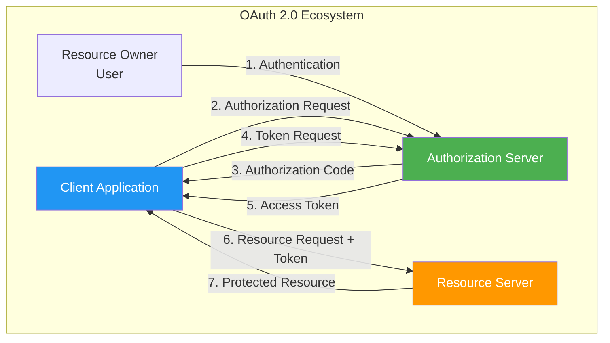
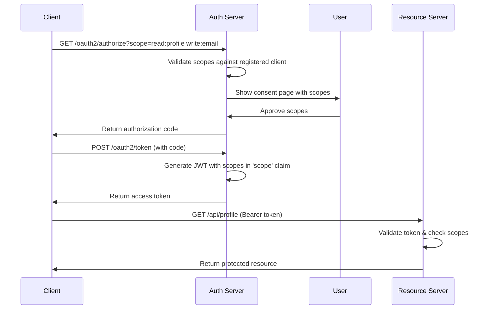
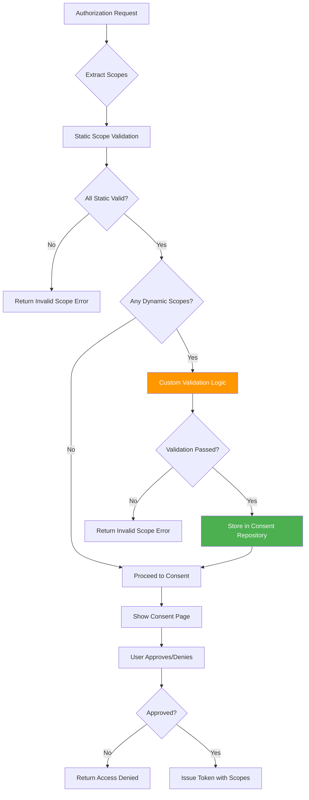
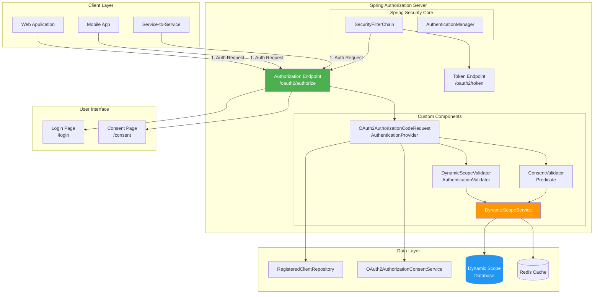
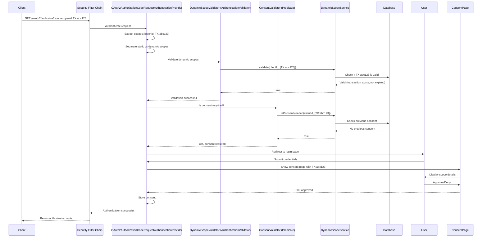
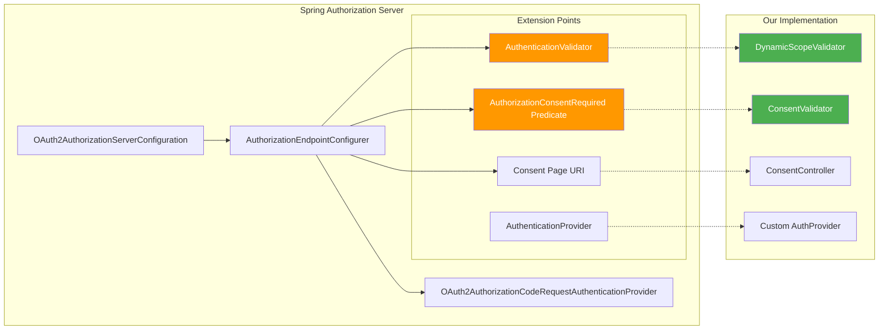
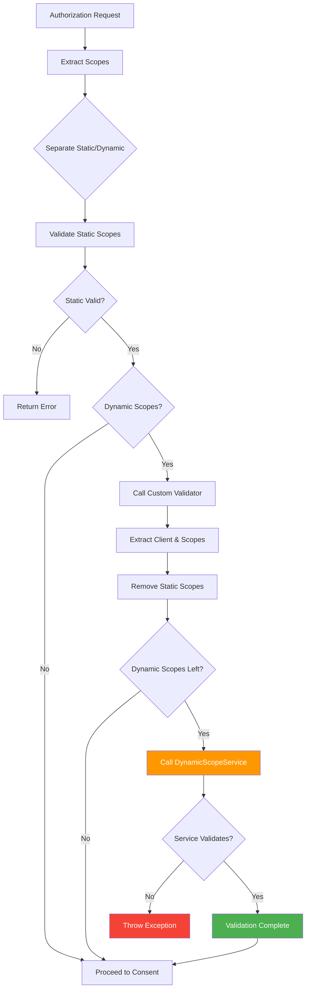
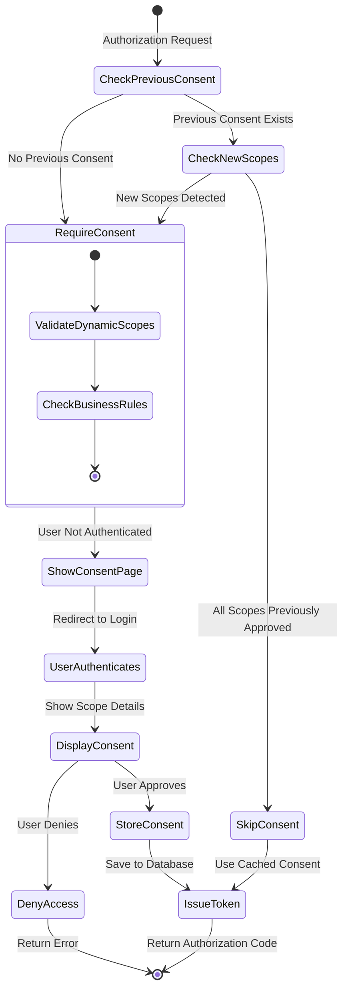
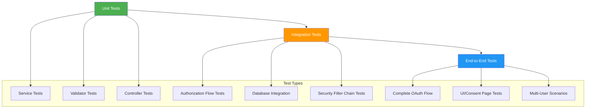

# Dynamic Authorization Scopes in Spring Authorization Server - Complete Deep Dive


> **Last Updated:** June 2026  
> **Version:** Spring Boot 4.1.0 / Spring Authorization Server 4.1.0

---

## 📋 Table of Contents

1. [Introduction](#1-introduction)
2. [Prerequisites](#2-prerequisites)
3. [Learning Objectives](#3-learning-objectives)
4. [OAuth 2.0 & Scopes Deep Dive](#4-oauth-20--scopes-deep-dive)
5. [When to Use Dynamic Scopes?](#5-when-to-use-dynamic-scopes)
6. [Architecture & Design](#6-architecture--design)
7. [Project Setup](#7-project-setup)
8. [Security Configuration](#8-security-configuration)
9. [Scope Validation Implementation](#9-scope-validation-implementation)
10. [Consent Validation](#10-consent-validation)
11. [Consent Page Implementation](#11-consent-page-implementation)
12. [DynamicScopeService - Advanced Implementations](#12-dynamicscopeservice---advanced-implementations)
13. [Testing Strategy](#13-testing-strategy)
14. [Real-World Use Cases](#14-real-world-use-cases)
15. [Performance & Scalability](#15-performance--scalability)
16. [Security Considerations](#16-security-considerations)
17. [Best Practices](#17-best-practices)
18. [Anti-Patterns](#18-anti-patterns)
19. [Troubleshooting Guide](#19-troubleshooting-guide)
20. [Practice Exercises](#20-practice-exercises)
21. [Question Bank](#21-question-bank)
22. [Summary & Key Takeaways](#22-summary--key-takeaways)
23. [Further Reading & Resources](#23-further-reading--resources)

---

## 1. Introduction

### The Evolution of Authorization

In the early days of web applications, authorization was simple: if you could log in, you had access to everything. As systems grew more complex, we introduced **role-based access control (RBAC)**, which improved granularity but still lacked flexibility for modern distributed systems.

OAuth 2.0 revolutionized authorization by introducing **scopes** - a mechanism to request specific permissions rather than blanket access. However, traditional OAuth implementations use **static scopes** that must be predefined, limiting their usefulness in dynamic business scenarios.

### Enter Dynamic Scopes

**Dynamic scopes** represent the next evolution in authorization - scopes that can be generated and validated at runtime based on business context, user permissions, and real-time requirements. This tutorial takes you on a deep dive into implementing dynamic scopes in Spring Authorization Server, exploring not just the "how" but the "why" behind every design decision.

### What Makes This Tutorial Different?

This isn't just another "copy-paste" tutorial. We'll explore:
- 🔍 **Internal workings** of Spring Authorization Server
- 🏗️ **Architecture decisions** and their trade-offs
- 🎯 **Multiple implementation approaches** for different scenarios
- 🛡️ **Security implications** and threat mitigation
- ⚡ **Performance optimization** techniques
- 🧪 **Comprehensive testing** strategies
- 📊 **Real-world case studies** from production systems

---

## 2. Prerequisites

### Required Knowledge

Before diving into this tutorial, ensure you have:

- ✅ **Solid understanding of OAuth 2.0 and OIDC** - Know the authorization code flow, tokens, and grants
- ✅ **Spring Boot 3.x/4.x experience** - Comfortable with auto-configuration and starter dependencies
- ✅ **Spring Security fundamentals** - Understand SecurityFilterChain, AuthenticationProvider, and filters
- ✅ **Java 17+ proficiency** - Familiar with records, streams, and modern Java features
- ✅ **Maven/Gradle basics** - Dependency management and build configuration
- ✅ **HTTP protocol deep understanding** - Headers, status codes, redirects, cookies
- ✅ **Database concepts** - Schema design and basic SQL

### Tools & Environment

```bash
# Required tools
- Java 17 or higher (OpenJDK recommended)
- Maven 3.8+ or Gradle 8+
- IDE: IntelliJ IDEA, Eclipse, or VS Code with Java extensions
- Git for version control
- cURL or Postman for testing
- Optional: Docker for containerized testing
```

### Setup Checklist

- [ ] Java 17+ installed and JAVA_HOME configured
- [ ] Maven/Gradle working correctly
- [ ] IDE configured with Spring Boot support
- [ ] Basic Spring Boot project creation tested
- [ ] Understanding of OAuth 2.0 authorization code flow

---

## 3. Learning Objectives

By the end of this deep dive tutorial, you will be able to:

### Core Competencies
- 🎯 **Understand** the limitations of static OAuth 2.0 scopes and when dynamic scopes are necessary
- 🏗️ **Design** a dynamic scope validation system that integrates with Spring Authorization Server
- 🔧 **Implement** custom AuthenticationValidator and Predicate for scope validation
- 🎨 **Build** a consent page with proper CSRF protection and user experience
- 🧪 **Test** the complete OAuth flow with dynamic scopes using integration tests

### Advanced Skills
- 📊 **Analyze** the internal architecture of Spring Authorization Server
- ⚡ **Optimize** performance with caching and database indexing
- 🛡️ **Identify** and mitigate security vulnerabilities in OAuth implementations
- 🔄 **Implement** multiple DynamicScopeService strategies for different use cases
- 📈 **Scale** the solution for high-traffic production environments

### Expert-Level Knowledge
- 🧠 **Extend** Spring Authorization Server's extension points
- 🔍 **Debug** complex OAuth flow issues
- 📝 **Design** APIs that support dynamic authorization
- 🏢 **Architect** enterprise-grade authorization systems
- 🔮 **Predict** and plan for future authorization requirements

---

## 4. OAuth 2.0 & Scopes Deep Dive

### 4.1 The OAuth 2.0 Ecosystem

OAuth 2.0 is an **authorization framework** that enables applications to obtain limited access to user accounts on HTTP services. Let's visualize the key components:



**Key Insight:** The Authorization Server is the trust boundary - it authenticates users and issues tokens that resource servers accept.

### 4.2 Understanding Scopes

**Scopes** in OAuth 2.0 are **strings that define the specific actions** an access token permits. Think of them as permission tickets:

```java
// Example: Scope representation
"read:profile"           // Read user profile
"write:documents"        // Create/update documents
"delete:resources"       // Delete resources (dangerous!)
"openid"                 // OpenID Connect scope (special)
"TX:abc123xyz"           // Dynamic scope for transaction
```

#### How Scopes Work Internally

When a client requests authorization:

1. **Client sends scopes** in the authorization request
2. **Authorization Server validates** each scope
3. **User consents** to the requested scopes
4. **Access Token is issued** with approved scopes embedded
5. **Resource Server validates** scopes on each request



### 4.3 Static vs Dynamic Scopes

This is where things get interesting. Let's compare:

| Aspect | Static Scopes | Dynamic Scopes |
|--------|--------------|----------------|
| **Definition** | Predefined in client registration | Generated at runtime |
| **Validation** | Simple string matching | Complex business logic |
| **Flexibility** | Limited to predefined set | Unlimited, context-aware |
| **Use Case** | Standard operations (read, write) | Transaction-specific, time-bound, conditional |
| **Examples** | `read:profile`, `write:email` | `TX:abc123`, `ACCESS:room456:2h` |
| **Storage** | Client configuration | Database/external service |
| **Performance** | Fast (in-memory lookup) | Requires validation logic |
| **Security** | Predictable | Requires careful validation |

#### Static Scopes Example

```java
// Client registration with static scopes
@Bean
public RegisteredClientRepository registeredClientRepository() {
    RegisteredClient client = RegisteredClient.withId(UUID.randomUUID().toString())
        .clientId("client-app")
        .clientSecret("{noop}secret")
        .clientAuthenticationMethod(ClientAuthenticationMethod.CLIENT_SECRET_BASIC)
        .authorizationGrantType(AuthorizationGrantType.AUTHORIZATION_CODE)
        .redirectUri("http://localhost:8080/callback")
        .scope("read:profile")      // Static scope
        .scope("write:profile")     // Static scope
        .build();
    
    return new InMemoryRegisteredClientRepository(client);
}
```

**Limitation:** What if you need a scope like `TRANSFER:amount:12345:currency:USD`? You'd need to pre-register every possible transaction!

#### Dynamic Scopes to the Rescue

```java
// Dynamic scope example - generated at runtime
String dynamicScope = "TX:" + generateTransactionId();
// Results in: "TX:tx_abc123xyz"

// This scope doesn't exist in client registration
// It's validated at runtime based on business rules
```

### 4.4 The OAuth 2.0 Scope Processing Pipeline

Understanding how Spring Authorization Server processes scopes is crucial:



**Key Takeaway:** Dynamic scope validation happens **after** static scope validation but **before** consent, giving you a hook to implement custom business logic.

---

## 5. When to Use Dynamic Scopes?

### 5.1 The Problem with Static Scopes

Static scopes work well for common operations, but modern applications often need **fine-grained, context-aware permissions**:

❌ **Scenario 1: Banking Transfers**
```http
# User wants to transfer $5,000 to account XYZ
# Static approach: Need pre-registered scopes for every possible amount
Scope: TRANSFER:1000, TRANSFER:2000, TRANSFER:5000, ... (impractical!)

# Dynamic approach: Generate scope at runtime
Scope: TX:tx_abc123:amount:5000:currency:USD:to:XYZ
```

❌ **Scenario 2: Healthcare Access**
```http
# Doctor needs access to patient record for 2 hours
# Static approach: Can't pre-register every patient/time combination
Scope: READ:PATIENT:123, READ:PATIENT:456, ... (privacy nightmare!)

# Dynamic approach: Time-bound, patient-specific scope
Scope: ACCESS:patient:789:duration:2h:doctor:dr_smith
```

❌ **Scenario 3: IoT Device Control**
```http
# Smart home app needs to unlock door for 30 seconds
# Static approach: Would need scope for every door/duration combination
Scope: UNLOCK:DOOR:1, UNLOCK:DOOR:2, ... (doesn't scale!)

# Dynamic approach: Context-aware scope
Scope: DOOR:front_entrance:unlock:30s:user:john
```

### 5.2 Real-World Use Cases Matrix

| Use Case | Dynamic Scope Pattern | Validation Logic | Example |
|----------|----------------------|------------------|---------|
| **Financial Transactions** | `TX:{id}:{action}:{amount}` | Check user balance, limits, fraud rules | `TX:tx_123:transfer:5000` |
| **Healthcare Access** | `ACCESS:{resource}:{patient}:{duration}` | Verify doctor-patient relationship, consent | `ACCESS:record:patient_456:2h` |
| **Multi-Tenant SaaS** | `TENANT:{id}:{permission}` | Validate tenant membership, subscription | `TENANT:acme_corp:admin` |
| **IoT Control** | `DEVICE:{id}:{action}:{timeout}` | Check device ownership, safety rules | `DEVICE:thermostat:adjust:1h` |
| **Temporary Access** | `GRANT:{resource}:{user}:{expiry}` | Verify approver, check expiry | `GRANT:report:john:2025-12-31` |
| **API Rate Limits** | `QUOTA:{api}:{limit}:{window}` | Check subscription tier, current usage | `QUOTA:api_v2:1000:1h` |
| **Geofenced Access** | `LOCATION:{area}:{action}` | Verify user location via GPS/IP | `LOCATION:building_a:entry` |
| **Time-Bound Permissions** | `TEMPORARY:{perm}:{start}:{end}` | Check time window, user role | `TEMPORARY:admin:09:00-17:00` |

### 5.3 When NOT to Use Dynamic Scopes

⚠️ **Avoid dynamic scopes when:**
- Your authorization needs are simple and static
- Performance is critical and validation adds unacceptable latency
- You don't have infrastructure for scope validation (database, cache, etc.)
- Compliance requires complete audit trails (harder with dynamic scopes)
- Your team lacks experience with OAuth 2.0 (start simple!)

✅ **Use static scopes when:**
- You have a fixed set of permissions
- Performance is critical (< 10ms requirement)
- Simplicity and maintainability are priorities
- You're building a prototype or MVP

---

## 6. Architecture & Design

### 6.1 System Architecture

Let's visualize the complete system architecture:



### 6.2 Component Interaction Flow

Here's how components interact during an authorization request with dynamic scopes:



### 6.3 Design Patterns Used

This implementation leverages several classic design patterns:

#### 1. **Strategy Pattern** - DynamicScopeService
```java
// Different validation strategies
interface DynamicScopeService {
    boolean validate(String clientId, Set<String> scopes);
    boolean isConsentNeeded(String clientId, Set<String> scopes);
}

// Strategy 1: Pattern-based
class PatternBasedDynamicScopeService implements DynamicScopeService { }

// Strategy 2: Database-backed
class DatabaseBackedDynamicScopeService implements DynamicScopeService { }

// Strategy 3: External service
class ExternalServiceDynamicScopeService implements DynamicScopeService { }
```

#### 2. **Adapter Pattern** - AuthenticationValidator
```java
// Adapts Spring Security's Consumer interface to our business logic
private Consumer<OAuth2AuthorizationCodeRequestAuthenticationContext> 
    dynamicScopesAuthenticationValidator() {
    return ctx -> {
        // Extract context
        // Call DynamicScopeService
        // Handle exceptions
    };
}
```

#### 3. **Predicate Pattern** - ConsentValidator
```java
// Functional interface for consent decision
private Predicate<OAuth2AuthorizationCodeRequestAuthenticationContext> 
    dynamicScopesConsentValidator() {
    return ctx -> {
        // Business logic for consent decision
        return dynamicScopeService.isConsentNeeded(...);
    };
}
```

### 6.4 Extension Points in Spring Authorization Server

Spring Authorization Server is designed for extensibility. Here are the key extension points we're using:



**Key Insight:** Spring Authorization Server uses the **Open/Closed Principle** - open for extension, closed for modification. We extend behavior without modifying core code.

---

## 7. Project Setup

### 7.1 Complete pom.xml

```xml
<?xml version="1.0" encoding="UTF-8"?>
<project xmlns="http://maven.apache.org/POM/4.0.0"
         xmlns:xsi="http://www.w3.org/2001/XMLSchema-instance"
         xsi:schemaLocation="http://maven.apache.org/POM/4.0.0 
         http://maven.apache.org/xsd/maven-4.0.0.xsd">
    <modelVersion>4.0.0</modelVersion>

    <parent>
        <groupId>org.springframework.boot</groupId>
        <artifactId>spring-boot-starter-parent</artifactId>
        <version>4.1.0</version>
        <relativePath/>
    </parent>

    <groupId>com.baeldung.auth.server</groupId>
    <artifactId>dynamic-scopes-auth-server</artifactId>
    <version>1.0.0</version>
    <name>Dynamic Scopes Authorization Server</name>
    <description>Spring Authorization Server with Dynamic Scope Support</description>

    <properties>
        <java.version>17</java.version>
        <spring-security.version>6.4.0</spring-security.version>
        <authorization-server.version>4.1.0</authorization-server.version>
    </properties>

    <dependencies>
        <!-- Spring Boot Core -->
        <dependency>
            <groupId>org.springframework.boot</groupId>
            <artifactId>spring-boot-starter-web</artifactId>
        </dependency>

        <!-- Spring Security Core -->
        <dependency>
            <groupId>org.springframework.boot</groupId>
            <artifactId>spring-boot-starter-security</artifactId>
        </dependency>

        <!-- Spring Authorization Server -->
        <dependency>
            <groupId>org.springframework.boot</groupId>
            <artifactId>spring-boot-starter-security-oauth2-authorization-server</artifactId>
            <version>${authorization-server.version}</version>
        </dependency>

        <!-- Thymeleaf for Consent Page -->
        <dependency>
            <groupId>org.springframework.boot</groupId>
            <artifactId>spring-boot-starter-thymeleaf</artifactId>
        </dependency>

        <!-- Spring Data JPA for Consent Storage -->
        <dependency>
            <groupId>org.springframework.boot</groupId>
            <artifactId>spring-boot-starter-data-jpa</artifactId>
        </dependency>

        <!-- H2 Database for Development -->
        <dependency>
            <groupId>com.h2database</groupId>
            <artifactId>h2</artifactId>
            <scope>runtime</scope>
        </dependency>

        <!-- PostgreSQL for Production (optional) -->
        <dependency>
            <groupId>org.postgresql</groupId>
            <artifactId>postgresql</artifactId>
            <scope>runtime</scope>
        </dependency>

        <!-- Spring Boot Test -->
        <dependency>
            <groupId>org.springframework.boot</groupId>
            <artifactId>spring-boot-starter-test</artifactId>
            <scope>test</scope>
        </dependency>

        <!-- Spring Authorization Server Test -->
        <dependency>
            <groupId>org.springframework.boot</groupId>
            <artifactId>spring-boot-starter-security-oauth2-authorization-server-test</artifactId>
            <version>${authorization-server.version}</version>
            <scope>test</scope>
        </dependency>

        <!-- Spring Security Test -->
        <dependency>
            <groupId>org.springframework.security</groupId>
            <artifactId>spring-security-test</artifactId>
            <scope>test</scope>
        </dependency>
    </dependencies>

    <build>
        <plugins>
            <plugin>
                <groupId>org.springframework.boot</groupId>
                <artifactId>spring-boot-maven-plugin</artifactId>
            </plugin>
        </plugins>
    </build>
</project>
```

### 7.2 Application Configuration

```yaml
# src/main/resources/application.yml
server:
  port: 9000

spring:
  application:
    name: dynamic-scopes-auth-server
  
  datasource:
    url: jdbc:h2:mem:authdb
    driver-class-name: org.h2.Driver
    username: sa
    password: password
  
  jpa:
    database-platform: org.hibernate.dialect.H2Dialect
    hibernate:
      ddl-auto: create-drop
    show-sql: true
    properties:
      hibernate:
        format_sql: true
  
  thymeleaf:
    cache: false
    prefix: file:src/main/resources/templates/

# Authorization Server Configuration
authorization-server:
  dynamic-scopes:
    enabled: true
    cache-ttl: 300  # 5 minutes
    validation-timeout: 100  # 100ms max validation time
  
  consent:
    required: true
    cache-ttl: 3600  # 1 hour

# Logging Configuration
logging:
  level:
    com.baeldung.auth.server: DEBUG
    org.springframework.security: DEBUG
    org.springframework.security.oauth2: DEBUG
```

### 7.3 Project Structure

```
src/main/java/com/baeldung/auth/server/
├── DynamicScopesAuthServerApplication.java
├── config/
│   ├── SecurityConfig.java
│   └── AuthorizationServerConfig.java
├── components/
│   ├── DynamicScopeService.java
│   ├── impl/
│   │   ├── PatternBasedDynamicScopeService.java
│   │   ├── DatabaseBackedDynamicScopeService.java
│   │   └── CachedDynamicScopeService.java
│   └── ConsentService.java
├── controller/
│   └── ConsentController.java
├── model/
│   ├── DynamicScope.java
│   ├── TransactionScope.java
│   └── ConsentRecord.java
├── repository/
│   ├── DynamicScopeRepository.java
│   └── ConsentRecordRepository.java
└── dto/
    ├── ScopeValidationRequest.java
    └── ScopeValidationResponse.java

src/main/resources/
├── application.yml
├── templates/
│   └── consent.html
└── static/
    └── css/
        └── consent.css

src/test/java/com/baeldung/auth/server/
├── DynamicScopesAuthServerUnitTest.java
├── integration/
│   └── AuthorizationFlowIntegrationTest.java
└── unit/
    ├── DynamicScopeServiceTest.java
    └── ScopeValidatorTest.java
```

---

## 8. Security Configuration

### 8.1 Understanding SecurityFilterChain

Spring Security 6.x uses a **component-based approach** with `SecurityFilterChain` beans. The order of these chains determines their priority:

```java
@Bean
@Order(Ordered.HIGHEST_PRECEDENCE)  // Highest priority - runs first
SecurityFilterChain authorizationServerSecurityFilterChain(HttpSecurity http) {
    // Authorization server configuration
}

@Bean
@Order(SecurityFilterProperties.BASIC_AUTH_ORDER)  // Lower priority - catch-all
SecurityFilterChain defaultSecurityFilterChain(HttpSecurity http) {
    // Default application security
}
```

**Why Order Matters:**
- Requests are evaluated against filter chains in order
- First matching chain handles the request
- Authorization server needs highest precedence to intercept OAuth endpoints

### 8.2 Authorization Server Chain - Deep Dive

Let's break down the authorization server configuration line by line:

```java
@Bean
@Order(Ordered.HIGHEST_PRECEDENCE)
SecurityFilterChain authorizationServerSecurityFilterChain(HttpSecurity http) {
    
    // STEP 1: Configure OAuth2 Authorization Server
    http.oauth2AuthorizationServer(authorizationServer -> {
        
        // STEP 2: Set security matcher to OAuth endpoints only
        http.securityMatcher(authorizationServer.getEndpointsMatcher());
        
        // STEP 3: Configure OIDC and Authorization Endpoints
        authorizationServer
            .oidc(withDefaults())  // Enable OpenID Connect
            .authorizationEndpoint(ap -> {
                
                // STEP 4: Set custom consent page
                ap.consentPage("/consent");
                
                // STEP 5: Customize authentication providers
                ap.authenticationProviders(providers -> {
                    providers.stream()
                        // Find the OAuth2AuthorizationCodeRequestAuthenticationProvider
                        .filter(OAuth2AuthorizationCodeRequestAuthenticationProvider.class::isInstance)
                        .map(p -> (OAuth2AuthorizationCodeRequestAuthenticationProvider) p)
                        .findFirst()
                        .ifPresent(p -> {
                            // STEP 6: Set custom scope validator
                            p.setAuthenticationValidator(dynamicScopesAuthenticationValidator());
                            
                            // STEP 7: Set custom consent validator
                            p.setAuthorizationConsentRequired(dynamicScopesConsentValidator());
                        });
                });
            });
    });
    
    // STEP 8: Require authentication for all requests
    http.authorizeHttpRequests(authorize -> authorize.anyRequest().authenticated());
    
    // STEP 9: Configure resource server (for JWT validation)
    http.oauth2ResourceServer(resourceServer -> resourceServer.jwt(withDefaults()));
    
    // STEP 10: Custom exception handling
    http.exceptionHandling(exceptions -> exceptions.defaultAuthenticationEntryPointFor(
        new LoginUrlAuthenticationEntryPoint("/login"), 
        createRequestMatcher()
    ));
    
    return http.build();
}
```

#### Detailed Explanation of Each Step:

**STEP 1: `http.oauth2AuthorizationServer()`**
- Configures Spring Authorization Server
- Sets up all OAuth2/OIDC endpoints automatically
- Registers necessary filters and providers

**STEP 2: `http.securityMatcher()`**
- Limits this filter chain to OAuth endpoints only
- Prevents it from handling other requests (like /login, /consent)
- Uses the endpoints matcher from the authorization server configuration

**STEP 3: `.oidc(withDefaults())`**
- Enables OpenID Connect 1.0 support
- Adds OIDC-specific endpoints (.well-known, userinfo, etc.)
- Uses default configuration (can be customized)

**STEP 4: `.consentPage("/consent")`**
- Sets the URI for the consent page
- User will be redirected here after authentication
- Must be accessible without authentication

**STEP 5: `.authenticationProviders()`**
- Provides access to the list of AuthenticationProviders
- We need to find the specific provider for authorization code requests
- Uses Java Streams to filter and find the right provider

**STEP 6: `.setAuthenticationValidator()`**
- Sets a custom validator for the authorization request
- This is where we validate dynamic scopes
- Receives the authentication context with all request details

**STEP 7: `.setAuthorizationConsentRequired()`**
- Sets a Predicate that determines if consent is needed
- Returns true if user should see consent page
- Can use user context for intelligent decisions

**STEP 8: `.authorizeHttpRequests()`**
- Requires authentication for all requests in this chain
- Ensures only authenticated users can access OAuth endpoints

**STEP 9: `.oauth2ResourceServer()`**
- Configures this application as a resource server too
- Enables JWT validation for incoming requests
- Useful if this server also hosts APIs

**STEP 10: Exception Handling**
- Custom entry point for authentication failures
- Redirects to /login instead of returning 401
- Creates a better user experience

### 8.3 The AuthenticationValidator Interface

Understanding the `AuthenticationValidator` interface is crucial:

```java
@FunctionalInterface
public interface AuthenticationValidator {
    void validate(OAuth2AuthorizationCodeRequestAuthenticationContext context) 
        throws OAuth2AuthorizationCodeRequestAuthenticationException;
}
```

**What it does:**
- Receives the full authorization request context
- Validates the request parameters
- Throws exception if validation fails
- Returns void if validation succeeds

**When it's called:**
- After static scope validation
- Before consent check
- Before authentication (user not yet known)

**Important:** At this point, **the user is NOT authenticated yet**, so you cannot use user-specific information in validation.

### 8.4 The Predicate Interface for Consent

```java
@FunctionalInterface
public interface Predicate<T> {
    boolean test(T t);
}
```

**What it does:**
- Receives the authorization request context
- Returns true if consent is required
- Returns false if consent can be skipped

**When it's called:**
- After successful authentication
- After scope validation
- Before showing consent page

**Advantage:** At this point, **the user IS authenticated**, so you can use user-specific information.

### 8.5 "Catch-All" Chain Configuration

```java
@Bean
@Order(SecurityFilterProperties.BASIC_AUTH_ORDER)
SecurityFilterChain defaultSecurityFilterChain(HttpSecurity http) {
    http.authorizeHttpRequests(authorize -> {
        authorize.anyRequest().authenticated();
    })
    .formLogin(withDefaults());
    return http.build();
}
```

**Why this is needed:**
- When you define ANY SecurityFilterChain, Spring Security's auto-configuration is disabled
- This chain handles everything NOT matched by the authorization server chain
- Provides form-based login for /login, /consent, etc.

**Customization opportunities:**
- Custom login page: `.formLogin(form -> form.loginPage("/custom-login"))`
- Two-factor authentication: Add custom filters
- LDAP/AD integration: Configure authentication provider
- Remember-me functionality: `.rememberMe(withDefaults())`

### 8.6 Common Configuration Pitfalls

❌ **Pitfall 1: Missing securityMatcher()**
```java
// WRONG - This will match ALL requests
http.oauth2AuthorizationServer(server -> {
    server.authorizationEndpoint(endpoint -> {
        // This won't work as expected
    });
});

// CORRECT - Explicitly set the matcher
http.oauth2AuthorizationServer(server -> {
    http.securityMatcher(server.getEndpointsMatcher());
    server.authorizationEndpoint(endpoint -> {
        // Now it works correctly
    });
});
```

❌ **Pitfall 2: Wrong Order Value**
```java
// WRONG - Lower precedence than default
@Bean
@Order(Ordered.LOWEST_PRECEDENCE)
SecurityFilterChain authServerChain(HttpSecurity http) { }

// CORRECT - Must be highest precedence
@Bean
@Order(Ordered.HIGHEST_PRECEDENCE)
SecurityFilterChain authServerChain(HttpSecurity http) { }
```

❌ **Pitfall 3: Forgetting the Catch-All Chain**
```java
// WRONG - Only defining auth server chain
// This breaks /login, /consent, etc.

// CORRECT - Always define both chains
@Bean
@Order(Ordered.HIGHEST_PRECEDENCE)
SecurityFilterChain authServerChain(HttpSecurity http) { /* ... */ }

@Bean
@Order(SecurityFilterProperties.BASIC_AUTH_ORDER)
SecurityFilterChain defaultChain(HttpSecurity http) { /* ... */ }
```

---

## 9. Scope Validation Implementation

### 9.1 The Validation Flow

Let's understand the complete validation flow:



### 9.2 Implementing the AuthenticationValidator

Here's the complete implementation with detailed annotations:

```java
@Component
public class DynamicScopeValidator {
    
    private final DynamicScopeService dynamicScopeService;
    
    // Constructor injection for testability
    public DynamicScopeValidator(DynamicScopeService dynamicScopeService) {
        this.dynamicScopeService = dynamicScopeService;
    }
    
    /**
     * Creates an AuthenticationValidator that validates dynamic scopes.
     * 
     * This validator is called by OAuth2AuthorizationCodeRequestAuthenticationProvider
     * after static scope validation but before consent check.
     * 
     * @return Consumer that validates dynamic scopes
     */
    private Consumer<OAuth2AuthorizationCodeRequestAuthenticationContext> 
        dynamicScopesAuthenticationValidator() {
        
        return ctx -> {
            // STEP 1: Extract authentication token from context
            OAuth2AuthorizationCodeRequestAuthenticationToken auth = 
                ctx.getAuthentication();
            
            // STEP 2: Get all requested scopes
            var requestedScopes = new HashSet<>(auth.getScopes());
            
            // STEP 3: Early exit if no scopes requested
            if (requestedScopes.isEmpty()) {
                return;  // Nothing to validate
            }
            
            // STEP 4: Get registered client information
            RegisteredClient registeredClient = ctx.getRegisteredClient();
            
            // STEP 5: Get client's allowed static scopes
            var allowedScopes = registeredClient.getScopes();
            
            // STEP 6: Remove all static scopes from requested scopes
            // After this, requestedScopes contains ONLY dynamic scopes
            requestedScopes.removeIf(allowedScopes::contains);
            
            // STEP 7: Early exit if no dynamic scopes remain
            if (requestedScopes.isEmpty()) {
                return;  // All scopes were static and already validated
            }
            
            // STEP 8: Validate dynamic scopes using our service
            try {
                // Call the business logic layer
                boolean isValid = dynamicScopeService.validate(
                    registeredClient.getId(), 
                    requestedScopes
                );
                
                // STEP 9: Throw exception if validation fails
                if (!isValid) {
                    throw new OAuth2AuthorizationCodeRequestAuthenticationException(
                        new OAuth2Error(
                            OAuth2ErrorCodes.INVALID_SCOPE,
                            "Dynamic scope validation failed: " + requestedScopes,
                            null
                        ),
                        auth
                    );
                }
                
                // STEP 10: Log successful validation (for audit)
                log.debug("Dynamic scopes validated successfully for client {}: {}", 
                    registeredClient.getClientId(), 
                    requestedScopes
                );
                
            } catch (OAuth2AuthorizationCodeRequestAuthenticationException ex) {
                // Re-throw known exceptions
                throw ex;
            } catch (Exception ex) {
                // Wrap unexpected exceptions
                throw new OAuth2AuthorizationCodeRequestAuthenticationException(
                    new OAuth2Error(
                        OAuth2ErrorCodes.SERVER_ERROR,
                        "Error validating dynamic scopes: " + ex.getMessage(),
                        null
                    ),
                    ex,  // Preserve cause for debugging
                    auth
                );
            }
        };
    }
}
```

### 9.3 Key Implementation Details

#### 1. **Scope Separation Logic**

```java
// Before: [openid, profile, TX:abc123, write:email]
// Static scopes: [openid, profile, write:email]
// Dynamic scopes: [TX:abc123]

var requestedScopes = new HashSet<>(auth.getScopes());
var allowedScopes = registeredClient.getScopes();

// Remove all static scopes
requestedScopes.removeIf(allowedScopes::contains);

// Now requestedScopes contains only dynamic scopes
```

**Why HashSet?** O(1) removal vs O(n) for List. Critical for performance with many scopes.

#### 2. **Exception Handling Strategy**

```java
// Three types of errors:
// 1. INVALID_SCOPE - Client requested invalid scope
// 2. INVALID_REQUEST - Malformed request
// 3. SERVER_ERROR - Unexpected error

// Always preserve the cause for debugging
catch (Exception ex) {
    throw new OAuth2AuthorizationCodeRequestAuthenticationException(
        new OAuth2Error(OAuth2ErrorCodes.SERVER_ERROR, message, null),
        ex,  // Important: Include original exception
        auth
    );
}
```

#### 3. **Logging Strategy**

```java
// Log at DEBUG level for normal operations
log.debug("Dynamic scopes validated: {}", scopes);

// Log at WARN level for suspicious activity
log.warn("Multiple dynamic scope validation attempts from client: {}", clientId);

// Log at ERROR level for failures
log.error("Dynamic scope validation failed", ex);
```

### 9.4 Edge Cases & Error Handling

#### Edge Case 1: Empty Scope Set
```java
var requestedScopes = new HashSet<>(auth.getScopes());
if (requestedScopes.isEmpty()) {
    return;  // Nothing to validate
}
```

#### Edge Case 2: Null Scopes
```java
// Defensive programming
var scopes = auth.getScopes();
if (scopes == null || scopes.isEmpty()) {
    return;
}
var requestedScopes = new HashSet<>(scopes);
```

#### Edge Case 3: Very Large Scope Set
```java
// Protect against DoS attacks
if (requestedScopes.size() > 100) {
    throw new OAuth2AuthorizationCodeRequestAuthenticationException(
        new OAuth2Error(OAuth2ErrorCodes.INVALID_SCOPE, 
            "Too many scopes requested", null),
        auth
    );
}
```

#### Edge Case 4: Duplicate Scopes
```java
// HashSet automatically removes duplicates
var requestedScopes = new HashSet<>(auth.getScopes());
// Duplicates are handled automatically
```

### 9.5 Performance Considerations

#### Optimization 1: Early Exit
```java
// Always check for empty set first - O(1) operation
if (requestedScopes.isEmpty()) {
    return;
}
```

#### Optimization 2: Batch Validation
```java
// Validate all dynamic scopes in one call
boolean isValid = dynamicScopeService.validate(clientId, requestedScopes);

// Instead of validating each scope individually
for (String scope : requestedScopes) {
    if (!dynamicScopeService.validate(clientId, Set.of(scope))) {
        return false;
    }
}
```

#### Optimization 3: Caching
```java
// Cache validation results for frequently used scopes
@Cacheable(value = "scopeValidation", key = "#clientId + ':' + #scopes")
public boolean validate(String clientId, Set<String> scopes) {
    // Expensive validation logic
}
```

---

## 10. Consent Validation

### 10.1 Understanding Consent in OAuth 2.0

**Consent** is the user's approval for a client to access their resources. In OAuth 2.0:

1. **First Request:** User sees consent page, approves/denies
2. **Subsequent Requests:** Can skip consent if previously approved
3. **New Scopes:** Always require consent

### 10.2 The Consent Validation Flow



### 10.3 Implementing the Consent Validator

```java
@Component
public class ConsentValidator {
    
    private final DynamicScopeService dynamicScopeService;
    private final OAuth2AuthorizationConsentService consentService;
    
    public ConsentValidator(
        DynamicScopeService dynamicScopeService,
        OAuth2AuthorizationConsentService consentService
    ) {
        this.dynamicScopeService = dynamicScopeService;
        this.consentService = consentService;
    }
    
    /**
     * Creates a Predicate that determines if consent is required.
     * 
     * This is called AFTER authentication, so user context is available.
     * 
     * @return Predicate that returns true if consent is needed
     */
    private Predicate<OAuth2AuthorizationCodeRequestAuthenticationContext> 
        dynamicScopesConsentValidator() {
        
        return ctx -> {
            // STEP 1: Check for previous consent
            OAuth2AuthorizationConsent previousConsent = ctx.getAuthorizationConsent();
            
            // STEP 2: No previous consent = consent required
            if (previousConsent == null) {
                log.debug("No previous consent found, consent required");
                return true;
            }
            
            // STEP 3: Get current authorization request
            OAuth2AuthorizationCodeRequestAuthenticationToken auth = 
                ctx.getAuthentication();
            
            // STEP 4: Get requested scopes
            var requestedScopes = new HashSet<>(auth.getScopes());
            
            // STEP 5: Early exit if no scopes
            if (requestedScopes.isEmpty()) {
                log.debug("No scopes requested, consent not required");
                return false;
            }
            
            // STEP 6: Get previously consented scopes
            var alreadyConsented = new HashSet<>(previousConsent.getScopes());
            
            // STEP 7: Remove already consented scopes
            requestedScopes.removeIf(alreadyConsented::contains);
            
            // STEP 8: If all scopes already consented, skip consent page
            if (requestedScopes.isEmpty()) {
                log.debug("All scopes previously consented, skipping consent page");
                return false;
            }
            
            // STEP 9: Remaining scopes need consent
            // These could be new dynamic scopes or new static scopes
            log.debug("New scopes detected: {}, consent required", requestedScopes);
            
            // STEP 10: Check if dynamic scopes need consent
            // (Some dynamic scopes might not require consent based on business rules)
            return dynamicScopeService.isConsentNeeded(
                ctx.getRegisteredClient().getId(), 
                requestedScopes
            );
        };
    }
}
```

### 10.4 Consent Storage Schema

```sql
-- Spring Authorization Server creates this table automatically
CREATE TABLE oauth2_authorization_consent (
    id VARCHAR(100) NOT NULL,
    registered_client_id VARCHAR(100) NOT NULL,
    principal_name VARCHAR(200) NOT NULL,
    authorities VARCHAR(1000) NOT NULL,
    PRIMARY KEY (id)
);

-- Custom table for dynamic scope metadata
CREATE TABLE dynamic_scope_consent (
    id BIGSERIAL PRIMARY KEY,
    authorization_consent_id VARCHAR(100) NOT NULL,
    scope_name VARCHAR(200) NOT NULL,
    scope_type VARCHAR(50) NOT NULL,  -- 'STATIC' or 'DYNAMIC'
    scope_metadata JSONB,  -- Additional scope-specific data
    created_at TIMESTAMP NOT NULL DEFAULT CURRENT_TIMESTAMP,
    expires_at TIMESTAMP,
    
    FOREIGN KEY (authorization_consent_id) 
        REFERENCES oauth2_authorization_consent(id),
    
    UNIQUE(authorization_consent_id, scope_name)
);

CREATE INDEX idx_consent_principal 
    ON oauth2_authorization_consent(principal_name, registered_client_id);

CREATE INDEX idx_dynamic_scope_expiry 
    ON dynamic_scope_consent(expires_at) 
    WHERE expires_at IS NOT NULL;
```

### 10.5 Caching Strategy for Consent

```java
@Service
public class CachedConsentService {
    
    private final OAuth2AuthorizationConsentService consentService;
    private final CacheManager cacheManager;
    private static final String CONSENT_CACHE = "consentCache";
    
    public Optional<OAuth2AuthorizationConsent> findById(
            String registeredClientId, 
            String principalName) {
        
        // STEP 1: Try cache first
        String cacheKey = generateCacheKey(registeredClientId, principalName);
        var cache = cacheManager.getCache(CONSENT_CACHE);
        
        if (cache != null) {
            OAuth2AuthorizationConsent cached = cache.get(cacheKey, 
                OAuth2AuthorizationConsent.class);
            if (cached != null) {
                log.debug("Consent found in cache for {}:{}", 
                    principalName, registeredClientId);
                return Optional.of(cached);
            }
        }
        
        // STEP 2: Cache miss - load from database
        log.debug("Loading consent from database for {}:{}", 
            principalName, registeredClientId);
        
        OAuth2AuthorizationConsent consent = 
            consentService.findById(registeredClientId, principalName);
        
        // STEP 3: Store in cache if found
        if (consent != null && cache != null) {
            cache.put(cacheKey, consent);
        }
        
        return Optional.ofNullable(consent);
    }
    
    private String generateCacheKey(String clientId, String principalName) {
        return clientId + ":" + principalName;
    }
}
```

**Cache Configuration:**
```java
@Configuration
@EnableCaching
public class CacheConfig {
    
    @Bean
    public CacheManager cacheManager() {
        CaffeineCacheManager cacheManager = new CaffeineCacheManager();
        cacheManager.setCacheNames(List.of("consentCache", "scopeValidation"));
        
        // TTL: 1 hour, Max size: 1000 entries
        cacheManager.setCaffeine(Caffeine.newBuilder()
            .expireAfterWrite(1, TimeUnit.HOURS)
            .maximumSize(1000)
            .recordStats());
        
        return cacheManager;
    }
}
```

---

## 11. Consent Page Implementation

### 11.1 The Consent Controller

```java
@Controller
public class ConsentController {
    
    private static final Logger log = LoggerFactory.getLogger(ConsentController.class);
    
    private final RegisteredClientRepository registeredClientRepository;
    private final OAuth2AuthorizationConsentService authorizationConsentService;
    private final DynamicScopeService dynamicScopeService;
    
    // Constructor injection
    public ConsentController(
            RegisteredClientRepository registeredClientRepository,
            OAuth2AuthorizationConsentService authorizationConsentService,
            DynamicScopeService dynamicScopeService) {
        this.registeredClientRepository = registeredClientRepository;
        this.authorizationConsentService = authorizationConsentService;
        this.dynamicScopeService = dynamicScopeService;
    }
    
    /**
     * Displays the consent page.
     * 
     * This endpoint is accessed after successful authentication but before
     * issuing the authorization code. It shows the user what permissions
     * the client is requesting.
     * 
     * @param principal Authenticated user
     * @param model Spring MVC model for view data
     * @param clientId OAuth2 client ID
     * @param scope Space-separated scopes
     * @param state OAuth2 state parameter
     * @return View name
     */
    @GetMapping("/consent")
    public String consent(
            Principal principal,
            Model model,
            @RequestParam(name = OAuth2ParameterNames.CLIENT_ID) String clientId,
            @RequestParam(name = OAuth2ParameterNames.SCOPE) String scope,
            @RequestParam(name = OAuth2ParameterNames.STATE) String state) {
        
        log.debug("Displaying consent page for user: {}, client: {}, scopes: {}", 
            principal.getName(), clientId, scope);
        
        // STEP 1: Validate client exists
        RegisteredClient client = registeredClientRepository.findByClientId(clientId);
        if (client == null) {
            log.error("Client not found: {}", clientId);
            throw new IllegalArgumentException("Invalid client: " + clientId);
        }
        
        // STEP 2: Get current consent for this user-client pair
        OAuth2AuthorizationConsent currentConsent = 
            authorizationConsentService.findById(client.getId(), principal.getName());
        
        // STEP 3: Extract already authorized scopes
        Set<String> authorizedScopes = currentConsent != null 
            ? currentConsent.getScopes() 
            : Set.of();
        
        // STEP 4: Parse requested scopes
        Set<String> allRequestedScopes = parseScopes(scope);
        
        // STEP 5: Filter out already authorized and openid scope
        Set<String> neededScopes = allRequestedScopes.stream()
            .filter(scope -> !authorizedScopes.contains(scope))
            .filter(scope -> !OidcScopes.OPENID.equals(scope))
            .collect(Collectors.toSet());
        
        // STEP 6: Enrich scope metadata (optional but recommended)
        Map<String, ScopeMetadata> scopeMetadata = enrichScopeMetadata(neededScopes);
        
        // STEP 7: Populate model for view
        model.addAttribute("clientId", clientId);
        model.addAttribute("clientName", 
            client.getClientName() != null ? client.getClientName() : client.getClientId());
        model.addAttribute("scopes", neededScopes);
        model.addAttribute("scopeMetadata", scopeMetadata);
        model.addAttribute("state", state);
        model.addAttribute("authorizedScopes", authorizedScopes);
        model.addAttribute("principalName", principal.getName());
        
        // STEP 8: Add CSRF token (Thymeleaf does this automatically with th:action)
        model.addAttribute("_csrf", 
            ((ServletRequestAttributes) RequestContextHolder.currentRequestAttributes())
                .getRequest().getAttribute("_csrf"));
        
        log.debug("Consent page prepared with {} new scopes", neededScopes.size());
        
        return "consent";  // Thymeleaf template name
    }
    
    /**
     * Handles consent form submission.
     */
    @PostMapping("/consent")
    public String processConsent(
            Principal principal,
            @RequestParam(name = "client_id") String clientId,
            @RequestParam(name = "state") String state,
            @RequestParam(name = "scope", required = false) String scope,
            @RequestParam(name = "authorize", required = false) String authorize,
            @RequestParam(name = "deny", required = false) String deny) {
        
        log.debug("Processing consent for user: {}, client: {}", 
            principal.getName(), clientId);
        
        // STEP 1: Check if user approved or denied
        if (deny != null) {
            log.info("User {} denied consent for client {}", 
                principal.getName(), clientId);
            // Redirect to error page
            return "redirect:/oauth2/authorize?error=access_denied&state=" + state;
        }
        
        if (authorize == null) {
            log.warn("Neither approve nor deny submitted");
            return "redirect:/consent?error=invalid_request&client_id=" + clientId;
        }
        
        // STEP 2: User approved - store consent
        try {
            RegisteredClient client = registeredClientRepository.findByClientId(clientId);
            Set<String> approvedScopes = parseScopes(scope);
            
            // Create or update consent
            OAuth2AuthorizationConsent consent = 
                authorizationConsentService.findById(client.getId(), principal.getName());
            
            if (consent == null) {
                // New consent
                consent = new OAuth2AuthorizationConsent(
                    client.getId(),
                    principal.getName(),
                    approvedScopes
                );
            } else {
                // Update existing consent
                consent.getScopes().addAll(approvedScopes);
            }
            
            authorizationConsentService.save(consent);
            
            log.info("Consent saved for user {} and client {}: {}", 
                principal.getName(), clientId, approvedScopes);
            
            // STEP 3: Redirect back to authorization endpoint
            return "redirect:/oauth2/authorize?client_id=" + clientId + 
                   "&state=" + URLEncoder.encode(state, StandardCharsets.UTF_8);
            
        } catch (Exception ex) {
            log.error("Error saving consent", ex);
            return "redirect:/consent?error=server_error&client_id=" + clientId;
        }
    }
    
    // Helper methods
    private Set<String> parseScopes(String scope) {
        if (scope == null || scope.isBlank()) {
            return Set.of();
        }
        return Arrays.stream(scope.split(" "))
            .filter(s -> !s.isBlank())
            .collect(Collectors.toSet());
    }
    
    private Map<String, ScopeMetadata> enrichScopeMetadata(Set<String> scopes) {
        return scopes.stream()
            .collect(Collectors.toMap(
                scope -> scope,
                scope -> dynamicScopeService.getScopeMetadata(scope)
            ));
    }
}
```

### 11.2 Thymeleaf Consent Template

```html
<!DOCTYPE html>
<html xmlns:th="http://www.thymeleaf.org">
<head>
    <meta charset="UTF-8">
    <meta name="viewport" content="width=device-width, initial-scale=1.0">
    <title>Authorization Consent</title>
    <link rel="stylesheet" th:href="@{/css/consent.css}">
</head>
<body>
    <div class="container">
        <div class="consent-card">
            <header>
                <h1>Authorization Request</h1>
                <p class="subtitle">
                    <span th:text="${clientName}">Client Application</span> 
                    is requesting access to your account
                </p>
            </header>
            
            <main>
                <!-- Client Information -->
                <section class="client-info">
                    <h2>Client Application</h2>
                    <div class="info-box">
                        <p><strong>Client ID:</strong> <span th:text="${clientId}">client-id</span></p>
                        <p><strong>Name:</strong> <span th:text="${clientName}">Client Name</span></p>
                    </div>
                </section>
                
                <!-- Requested Scopes -->
                <section class="scopes-section" th:if="${!#scopes.isEmpty()}">
                    <h2>Requested Permissions</h2>
                    <p class="warning-text">
                        ⚠️ The following permissions have not been previously granted:
                    </p>
                    
                    <div class="scopes-list">
                        <div class="scope-item" th:each="scope : ${scopes}">
                            <div class="scope-header">
                                <span class="scope-name" th:text="${scope}">SCOPE_NAME</span>
                                <span class="scope-badge dynamic" 
                                      th:if="${scopeMetadata[scope].type == 'DYNAMIC'}">
                                    Dynamic
                                </span>
                            </div>
                            <p class="scope-description" 
                               th:text="${scopeMetadata[scope].description}">
                                Scope description
                            </p>
                            <div class="scope-details" 
                                 th:if="${scopeMetadata[scope].details != null}">
                                <p th:each="detail : ${scopeMetadata[scope].details}" 
                                   th:text="${detail}">
                                    Detail
                                </p>
                            </div>
                        </div>
                    </div>
                </section>
                
                <!-- Previously Granted Scopes -->
                <section class="granted-section" th:if="${!#authorizedScopes.isEmpty()}">
                    <h2>Previously Granted Permissions</h2>
                    <p class="info-text">
                        ✅ You have already granted these permissions:
                    </p>
                    <div class="granted-list">
                        <span class="granted-badge" 
                              th:each="scope : ${authorizedScopes}"
                              th:text="${scope}">
                            SCOPE
                        </span>
                    </div>
                </section>
                
                <!-- Security Notice -->
                <div class="security-notice">
                    <h3>🔒 Security Information</h3>
                    <ul>
                        <li>This authorization will be stored securely</li>
                        <li>You can revoke access at any time from your account settings</li>
                        <li>The application will only have access to the permissions listed above</li>
                        <li>Your credentials are not shared with the application</li>
                    </ul>
                </div>
            </main>
            
            <footer>
                <form th:action="@{/consent}" method="post" th:object="${consentForm}">
                    <!-- CSRF Token (automatically included by Thymeleaf) -->
                    <input type="hidden" th:name="${_csrf.parameterName}" 
                           th:value="${_csrf.token}"/>
                    
                    <input type="hidden" name="client_id" th:value="${clientId}"/>
                    <input type="hidden" name="state" th:value="${state}"/>
                    <input type="hidden" name="scope" th:value="${#strings.arrayJoin(scopes, ' ')}"/>
                    
                    <div class="button-group">
                        <button type="submit" name="authorize" value="true" 
                                class="btn btn-approve">
                            ✅ Authorize
                        </button>
                        <button type="submit" name="deny" value="true" 
                                class="btn btn-deny">
                            ❌ Deny
                        </button>
                    </div>
                </form>
            </footer>
        </div>
    </div>
</body>
</html>
```

### 11.3 CSS Styling

```css
/* src/main/resources/static/css/consent.css */

* {
    margin: 0;
    padding: 0;
    box-sizing: border-box;
}

body {
    font-family: -apple-system, BlinkMacSystemFont, 'Segoe UI', Roboto, Oxygen, Ubuntu, sans-serif;
    background: linear-gradient(135deg, #667eea 0%, #764ba2 100%);
    min-height: 100vh;
    display: flex;
    align-items: center;
    justify-content: center;
    padding: 20px;
}

.container {
    width: 100%;
    max-width: 700px;
}

.consent-card {
    background: white;
    border-radius: 12px;
    box-shadow: 0 20px 60px rgba(0, 0, 0, 0.3);
    overflow: hidden;
}

header {
    background: linear-gradient(135deg, #667eea 0%, #764ba2 100%);
    color: white;
    padding: 30px;
    text-align: center;
}

header h1 {
    font-size: 28px;
    margin-bottom: 10px;
}

.subtitle {
    font-size: 16px;
    opacity: 0.9;
}

main {
    padding: 30px;
}

section {
    margin-bottom: 30px;
}

h2 {
    font-size: 20px;
    color: #333;
    margin-bottom: 15px;
    padding-bottom: 10px;
    border-bottom: 2px solid #667eea;
}

.info-box {
    background: #f5f5f5;
    padding: 15px;
    border-radius: 8px;
    border-left: 4px solid #667eea;
}

.info-box p {
    margin: 5px 0;
    color: #555;
}

.warning-text {
    color: #ff9800;
    font-weight: 500;
    margin-bottom: 15px;
}

.scopes-list {
    display: flex;
    flex-direction: column;
    gap: 12px;
}

.scope-item {
    background: #fff3e0;
    border-left: 4px solid #ff9800;
    padding: 15px;
    border-radius: 6px;
}

.scope-header {
    display: flex;
    justify-content: space-between;
    align-items: center;
    margin-bottom: 8px;
}

.scope-name {
    font-family: 'Courier New', monospace;
    font-weight: bold;
    color: #e65100;
    font-size: 14px;
}

.scope-badge {
    padding: 4px 12px;
    border-radius: 12px;
    font-size: 12px;
    font-weight: bold;
    text-transform: uppercase;
}

.scope-badge.dynamic {
    background: #ff9800;
    color: white;
}

.scope-description {
    color: #666;
    font-size: 14px;
    margin-bottom: 8px;
}

.scope-details {
    background: white;
    padding: 10px;
    border-radius: 4px;
    font-size: 13px;
    color: #555;
}

.info-text {
    color: #4caf50;
    font-weight: 500;
    margin-bottom: 15px;
}

.granted-list {
    display: flex;
    flex-wrap: wrap;
    gap: 8px;
}

.granted-badge {
    background: #4caf50;
    color: white;
    padding: 6px 14px;
    border-radius: 16px;
    font-size: 13px;
}

.security-notice {
    background: #e3f2fd;
    border-left: 4px solid #2196f3;
    padding: 15px;
    border-radius: 6px;
}

.security-notice h3 {
    color: #1976d2;
    font-size: 16px;
    margin-bottom: 10px;
}

.security-notice ul {
    list-style: none;
    padding-left: 0;
}

.security-notice li {
    padding: 5px 0;
    color: #555;
    font-size: 14px;
}

.security-notice li:before {
    content: "✓ ";
    color: #4caf50;
    font-weight: bold;
    margin-right: 8px;
}

footer {
    padding: 20px 30px;
    background: #f5f5f5;
    border-top: 1px solid #e0e0e0;
}

.button-group {
    display: flex;
    gap: 15px;
    justify-content: center;
}

.btn {
    padding: 12px 30px;
    border: none;
    border-radius: 6px;
    font-size: 16px;
    font-weight: bold;
    cursor: pointer;
    transition: all 0.3s ease;
    flex: 1;
    max-width: 200px;
}

.btn-approve {
    background: linear-gradient(135deg, #4caf50 0%, #45a049 100%);
    color: white;
}

.btn-approve:hover {
    background: linear-gradient(135deg, #45a049 0%, #3d8b40 100%);
    transform: translateY(-2px);
    box-shadow: 0 4px 12px rgba(76, 175, 80, 0.4);
}

.btn-deny {
    background: linear-gradient(135deg, #f44336 0%, #d32f2f 100%);
    color: white;
}

.btn-deny:hover {
    background: linear-gradient(135deg, #d32f2f 0%, #b71c1c 100%);
    transform: translateY(-2px);
    box-shadow: 0 4px 12px rgba(244, 67, 54, 0.4);
}

/* Responsive Design */
@media (max-width: 600px) {
    .button-group {
        flex-direction: column;
    }
    
    .btn {
        max-width: 100%;
    }
    
    header h1 {
        font-size: 22px;
    }
}
```

### 11.4 CSRF Protection in OAuth Flows

**Critical Security Consideration:** The consent form submits to the OAuth2 authorization endpoint, which requires CSRF protection.

```java
// Thymeleaf automatically includes CSRF token with th:action
<form th:action="@{/consent}" method="post">
    <!-- Automatically adds: -->
    <input type="hidden" th:name="${_csrf.parameterName}" 
           th:value="${_csrf.token}"/>
</form>
```

**Why This Matters:**
- Prevents Cross-Site Request Forgery attacks
- Required by Spring Security by default
- The token is validated on form submission
- Without it, the form submission will fail with 403 Forbidden

---

## 12. DynamicScopeService - Advanced Implementations

### 12.1 Service Interface Design

```java
public interface DynamicScopeService {
    
    /**
     * Validates if the requested dynamic scopes are valid for the client.
     * 
     * @param clientId The client requesting the scopes
     * @param scopes Set of dynamic scopes to validate
     * @return true if all scopes are valid, false otherwise
     * @throws DynamicScopeValidationException if validation fails
     */
    boolean validate(String clientId, Set<String> scopes);
    
    /**
     * Determines if consent is required for the requested scopes.
     * 
     * @param clientId The client requesting the scopes
     * @param scopes Set of scopes to check
     * @return true if consent is required, false otherwise
     */
    boolean isConsentNeeded(String clientId, Set<String> scopes);
    
    /**
     * Retrieves metadata for a scope (description, icon, etc.)
     * Used for displaying information in the consent page.
     * 
     * @param scope The scope name
     * @return Scope metadata
     */
    ScopeMetadata getScopeMetadata(String scope);
    
    /**
     * Generates a dynamic scope based on business rules.
     * 
     * @param clientId The client
     * @param scopeType Type of scope to generate
     * @param parameters Scope parameters
     * @return Generated scope string
     */
    String generateScope(String clientId, String scopeType, Map<String, Object> parameters);
}
```

### 12.2 Implementation 1: Pattern-Based Validation (Basic)

**Use Case:** Simple validation with regex patterns

```java
@Component
@Profile("dev")  // Only active in dev profile
public class PatternBasedDynamicScopeService implements DynamicScopeService {
    
    private static final Logger log = LoggerFactory.getLogger(
        PatternBasedDynamicScopeService.class
    );
    
    // Pattern for transaction scopes: TX: followed by alphanumeric
    private static final Pattern TX_SCOPE_PATTERN = 
        Pattern.compile("^TX:[a-zA-Z0-9_-]+$");
    
    // Pattern for access scopes: ACCESS:resource:user:duration
    private static final Pattern ACCESS_SCOPE_PATTERN = 
        Pattern.compile("^ACCESS:[a-zA-Z0-9_-]+:[a-zA-Z0-9_-]+:[0-9]+[smhd]$");
    
    // Pattern for tenant scopes: TENANT:id:permission
    private static final Pattern TENANT_SCOPE_PATTERN = 
        Pattern.compile("^TENANT:[a-zA-Z0-9_-]+:[a-zA-Z0-9_-]+$");
    
    @Override
    public boolean validate(String clientId, Set<String> scopes) {
        log.debug("Validating dynamic scopes using pattern matching for client: {}", 
            clientId);
        
        // Validate each scope
        for (String scope : scopes) {
            if (!isValidPattern(scope)) {
                log.warn("Invalid dynamic scope pattern: {} for client: {}", 
                    scope, clientId);
                return false;
            }
        }
        
        log.debug("All dynamic scopes validated successfully: {}", scopes);
        return true;
    }
    
    private boolean isValidPattern(String scope) {
        return TX_SCOPE_PATTERN.matcher(scope).matches()
            || ACCESS_SCOPE_PATTERN.matcher(scope).matches()
            || TENANT_SCOPE_PATTERN.matcher(scope).matches();
    }
    
    @Override
    public boolean isConsentNeeded(String clientId, Set<String> scopes) {
        // For pattern-based, always require consent for dynamic scopes
        return !scopes.isEmpty();
    }
    
    @Override
    public ScopeMetadata getScopeMetadata(String scope) {
        if (scope.startsWith("TX:")) {
            return new ScopeMetadata(
                "Transaction Authorization",
                "Authorize a financial transaction",
                "DYNAMIC",
                List.of("Transaction ID: " + scope.substring(3))
            );
        } else if (scope.startsWith("ACCESS:")) {
            return new ScopeMetadata(
                "Resource Access",
                "Access a protected resource",
                "DYNAMIC",
                List.of("Resource access permission")
            );
        }
        
        return new ScopeMetadata("Unknown Scope", "Unknown dynamic scope", "DYNAMIC", List.of());
    }
    
    @Override
    public String generateScope(String clientId, String scopeType, Map<String, Object> parameters) {
        return switch (scopeType) {
            case "TX" -> generateTransactionScope(parameters);
            case "ACCESS" -> generateAccessScope(parameters);
            case "TENANT" -> generateTenantScope(parameters);
            default -> throw new IllegalArgumentException("Unknown scope type: " + scopeType);
        };
    }
    
    private String generateTransactionScope(Map<String, Object> params) {
        String txId = (String) params.get("transactionId");
        return "TX:" + txId;
    }
    
    private String generateAccessScope(Map<String, Object> params) {
        String resource = (String) params.get("resource");
        String user = (String) params.get("user");
        String duration = (String) params.get("duration");
        return "ACCESS:" + resource + ":" + user + ":" + duration;
    }
    
    private String generateTenantScope(Map<String, Object> params) {
        String tenantId = (String) params.get("tenantId");
        String permission = (String) params.get("permission");
        return "TENANT:" + tenantId + ":" + permission;
    }
}
```

**Pros:**
- ✅ Simple to implement
- ✅ Fast validation (no database calls)
- ✅ Good for prototyping

**Cons:**
- ❌ Limited business logic
- ❌ Hard to maintain complex rules
- ❌ No audit trail

### 12.3 Implementation 2: Database-Backed Validation (Intermediate)

**Use Case:** Production applications with audit requirements

```java
@Component
@Profile({"staging", "prod"})
public class DatabaseBackedDynamicScopeService implements DynamicScopeService {
    
    private static final Logger log = LoggerFactory.getLogger(
        DatabaseBackedDynamicScopeService.class
    );
    
    private final DynamicScopeRepository scopeRepository;
    private final ClientRepository clientRepository;
    private final AuditService auditService;
    
    public DatabaseBackedDynamicScopeService(
            DynamicScopeRepository scopeRepository,
            ClientRepository clientRepository,
            AuditService auditService) {
        this.scopeRepository = scopeRepository;
        this.clientRepository = clientRepository;
        this.auditService = auditService;
    }
    
    @Override
    @Transactional(readOnly = true)
    public boolean validate(String clientId, Set<String> scopes) {
        log.debug("Validating dynamic scopes from database for client: {}", clientId);
        
        // STEP 1: Verify client exists and is active
        Client client = clientRepository.findByClientId(clientId)
            .orElseThrow(() -> new DynamicScopeValidationException(
                "Client not found: " + clientId));
        
        if (!client.isActive()) {
            log.warn("Inactive client attempted scope validation: {}", clientId);
            return false;
        }
        
        // STEP 2: Validate each scope
        for (String scope : scopes) {
            if (!validateSingleScope(client, scope)) {
                log.warn("Invalid scope: {} for client: {}", scope, clientId);
                return false;
            }
        }
        
        // STEP 3: Audit successful validation
        auditService.logScopeValidation(clientId, scopes, true);
        
        log.debug("All scopes validated successfully for client: {}", clientId);
        return true;
    }
    
    private boolean validateSingleScope(Client client, String scope) {
        // Parse scope components
        ScopeParser.ScopeComponents components = ScopeParser.parse(scope);
        
        // Query database for scope existence and validity
        Optional<DynamicScope> dynamicScope = 
            scopeRepository.findByScopeNameAndClientId(scope, client.getId());
        
        if (dynamicScope.isEmpty()) {
            log.warn("Scope not found in database: {}", scope);
            return false;
        }
        
        DynamicScope ds = dynamicScope.get();
        
        // Check if scope is expired
        if (ds.getExpiresAt() != null && ds.getExpiresAt().isBefore(Instant.now())) {
            log.warn("Expired scope: {}", scope);
            return false;
        }
        
        // Check if scope is revoked
        if (ds.isRevoked()) {
            log.warn("Revoked scope: {}", scope);
            return false;
        }
        
        // Check if scope is used (single-use scopes)
        if (ds.isSingleUse() && ds.isUsed()) {
            log.warn("Single-use scope already used: {}", scope);
            return false;
        }
        
        // Additional business rules
        return applyBusinessRules(client, ds);
    }
    
    private boolean applyBusinessRules(Client client, DynamicScope scope) {
        // Example: Check client subscription tier
        if (scope.getRequiredTier() != null) {
            if (client.getSubscriptionTier().ordinal() < 
                scope.getRequiredTier().ordinal()) {
                log.warn("Client {} does not have required tier for scope: {}", 
                    client.getClientId(), scope.getScopeName());
                return false;
            }
        }
        
        // Example: Check rate limits
        if (scope.hasRateLimit()) {
            long usageCount = scopeRepository.countUsageInWindow(
                scope.getId(), 
                Duration.ofMinutes(5)
            );
            if (usageCount >= scope.getRateLimit()) {
                log.warn("Rate limit exceeded for scope: {}", scope.getScopeName());
                return false;
            }
        }
        
        // Example: Check IP restrictions
        // (Would need access to request context)
        
        return true;
    }
    
    @Override
    @Transactional(readOnly = true)
    public boolean isConsentNeeded(String clientId, Set<String> scopes) {
        log.debug("Checking if consent needed for client: {}, scopes: {}", 
            clientId, scopes);
        
        // Check if any scope requires consent
        for (String scope : scopes) {
            Optional<DynamicScope> dynamicScope = 
                scopeRepository.findByScopeNameAndClientId(scope, 
                    clientRepository.findByClientId(clientId)
                        .orElseThrow().getId());
            
            if (dynamicScope.isPresent() && dynamicScope.get().isConsentRequired()) {
                return true;
            }
        }
        
        return false;
    }
    
    @Override
    public ScopeMetadata getScopeMetadata(String scope) {
        Optional<DynamicScope> dynamicScope = 
            scopeRepository.findByScopeName(scope);
        
        return dynamicScope.map(ds -> new ScopeMetadata(
            ds.getDisplayName(),
            ds.getDescription(),
            ds.getType().name(),
            ds.getDetails()
        )).orElse(new ScopeMetadata("Unknown", "Unknown scope", "UNKNOWN", List.of()));
    }
    
    @Override
    public String generateScope(String clientId, String scopeType, Map<String, Object> parameters) {
        // Generate and persist scope in database
        String scope = generateScopeString(scopeType, parameters);
        
        DynamicScope dynamicScope = new DynamicScope();
        dynamicScope.setScopeName(scope);
        dynamicScope.setClientId(clientId);
        dynamicScope.setType(DynamicScopeType.valueOf(scopeType));
        dynamicScope.setMetadata(parameters);
        dynamicScope.setCreatedAt(Instant.now());
        dynamicScope.setExpiresAt(calculateExpiry(scopeType, parameters));
        
        scopeRepository.save(dynamicScope);
        
        log.info("Generated dynamic scope: {} for client: {}", scope, clientId);
        
        return scope;
    }
    
    private String generateScopeString(String scopeType, Map<String, Object> params) {
        return switch (scopeType) {
            case "TX" -> "TX:" + params.get("transactionId");
            case "ACCESS" -> "ACCESS:" + params.get("resource") + ":" + 
                           params.get("user") + ":" + params.get("duration");
            default -> throw new IllegalArgumentException("Unknown scope type");
        };
    }
    
    private Instant calculateExpiry(String scopeType, Map<String, Object> params) {
        return switch (scopeType) {
            case "TX" -> Instant.now().plus(Duration.ofHours(1));
            case "ACCESS" -> {
                String duration = (String) params.get("duration");
                yield Instant.now().plus(parseDuration(duration));
            }
            default -> Instant.now().plus(Duration.ofDays(1));
        };
    }
    
    private Duration parseDuration(String duration) {
        // Parse strings like "2h", "30m", "1d"
        char unit = duration.charAt(duration.length() - 1);
        int value = Integer.parseInt(duration.substring(0, duration.length() - 1));
        
        return switch (unit) {
            case 's' -> Duration.ofSeconds(value);
            case 'm' -> Duration.ofMinutes(value);
            case 'h' -> Duration.ofHours(value);
            case 'd' -> Duration.ofDays(value);
            default -> throw new IllegalArgumentException("Unknown duration unit: " + unit);
        };
    }
}
```

**Entity Classes:**

```java
@Entity
@Table(name = "dynamic_scopes")
public class DynamicScope {
    
    @Id
    @GeneratedValue(strategy = GenerationType.IDENTITY)
    private Long id;
    
    @Column(unique = true, nullable = false)
    private String scopeName;
    
    @Column(nullable = false)
    private String clientId;
    
    @Enumerated(EnumType.STRING)
    @Column(nullable = false)
    private DynamicScopeType type;
    
    @Column(columnDefinition = "JSONB")
    private Map<String, Object> metadata;
    
    @Column(nullable = false)
    private Instant createdAt;
    
    private Instant expiresAt;
    
    private boolean revoked = false;
    
    private boolean singleUse = false;
    
    private boolean used = false;
    
    private boolean consentRequired = true;
    
    private String requiredTier;  // Subscription tier requirement
    
    private Integer rateLimit;  // Max uses per time window
    
    @Column(columnDefinition = "JSONB")
    private List<String> details;
    
    // Getters and setters omitted for brevity
    
    // Helper methods
    public boolean isExpired() {
        return expiresAt != null && expiresAt.isBefore(Instant.now());
    }
    
    public boolean hasRateLimit() {
        return rateLimit != null && rateLimit > 0;
    }
}

public enum DynamicScopeType {
    TX,           // Transaction
    ACCESS,       // Resource access
    TENANT,       // Multi-tenant
    TEMPORARY,    // Time-bound
    CUSTOM        // Custom business logic
}
```

**Repository:**

```java
public interface DynamicScopeRepository extends JpaRepository<DynamicScope, Long> {
    
    Optional<DynamicScope> findByScopeName(String scopeName);
    
    Optional<DynamicScope> findByScopeNameAndClientId(String scopeName, String clientId);
    
    @Query("SELECT ds FROM DynamicScope ds WHERE ds.clientId = :clientId AND ds.expiresAt > :now")
    List<DynamicScope> findValidScopesByClientId(@Param("clientId") String clientId, 
                                                   @Param("now") Instant now);
    
    @Query("SELECT COUNT(ds) FROM DynamicScope ds WHERE ds.id = :scopeId AND ds.usedAt > :windowStart")
    long countUsageInWindow(@Param("scopeId") Long scopeId, 
                           @Param("windowStart") Instant windowStart);
    
    @Modifying
    @Transactional
    @Query("UPDATE DynamicScope ds SET ds.used = true, ds.usedAt = :usedAt WHERE ds.id = :id")
    int markAsUsed(@Param("id") Long id, @Param("usedAt") Instant usedAt);
}
```

**Pros:**
- ✅ Full audit trail
- ✅ Complex business rules
- ✅ Persistent state
- ✅ Queryable and reportable

**Cons:**
- ❌ Database dependency
- ❌ Slower validation
- ❌ Requires database scaling

### 12.4 Implementation 3: External Service Validation (Advanced)

**Use Case:** Microservices architecture with centralized authorization

```java
@Component
public class ExternalServiceDynamicScopeService implements DynamicScopeService {
    
    private static final Logger log = LoggerFactory.getLogger(
        ExternalServiceDynamicScopeService.class
    );
    
    private final WebClient webClient;
    private final CacheManager cacheManager;
    private static final String VALIDATION_CACHE = "scopeValidationCache";
    
    private static final Duration TIMEOUT = Duration.ofMillis(100);
    private static final Duration CACHE_TTL = Duration.ofMinutes(5);
    
    public ExternalServiceDynamicScopeService(
            WebClient.Builder webClientBuilder,
            CacheManager cacheManager) {
        this.webClient = webClientBuilder
            .baseUrl("http://authorization-service/api/v1")
            .build();
        this.cacheManager = cacheManager;
    }
    
    @Override
    public boolean validate(String clientId, Set<String> scopes) {
        log.debug("Validating scopes via external service for client: {}", clientId);
        
        // STEP 1: Check cache first
        String cacheKey = generateCacheKey(clientId, scopes);
        var cache = cacheManager.getCache(VALIDATION_CACHE);
        
        if (cache != null) {
            Boolean cachedResult = cache.get(cacheKey, Boolean.class);
            if (cachedResult != null) {
                log.debug("Cache hit for scope validation: {}", cacheKey);
                return cachedResult;
            }
        }
        
        // STEP 2: Call external service
        try {
            ScopeValidationRequest request = new ScopeValidationRequest(
                clientId,
                scopes,
                Instant.now().toString()
            );
            
            log.debug("Calling external validation service for scopes: {}", scopes);
            
            ScopeValidationResponse response = webClient
                .post()
                .uri("/scopes/validate")
                .bodyValue(request)
                .retrieve()
                .bodyToMono(ScopeValidationResponse.class)
                .timeout(TIMEOUT)
                .block();
            
            boolean isValid = response != null && response.isValid();
            
            // STEP 3: Cache the result
            if (cache != null) {
                cache.put(cacheKey, isValid);
            }
            
            // STEP 4: Audit
            log.info("External validation result for client {}: {} - {}", 
                clientId, scopes, isValid);
            
            return isValid;
            
        } catch (WebClientRequestException ex) {
            log.error("Error calling external validation service", ex);
            // Fail open or fail closed? 
            // Fail closed is more secure
            return false;
        } catch (TimeoutException ex) {
            log.error("Timeout calling external validation service", ex);
            return false;
        }
    }
    
    @Override
    public boolean isConsentNeeded(String clientId, Set<String> scopes) {
        // Call external service for consent decision
        try {
            ConsentRequest request = new ConsentRequest(clientId, scopes);
            
            ConsentResponse response = webClient
                .post()
                .uri("/scopes/consent-required")
                .bodyValue(request)
                .retrieve()
                .bodyToMono(ConsentResponse.class)
                .timeout(TIMEOUT)
                .block();
            
            return response != null && response.isConsentRequired();
            
        } catch (Exception ex) {
            log.error("Error checking consent requirement", ex);
            // Fail safe - require consent if service is down
            return true;
        }
    }
    
    @Override
    public ScopeMetadata getScopeMetadata(String scope) {
        try {
            return webClient
                .get()
                .uri("/scopes/{scope}/metadata", scope)
                .retrieve()
                .bodyToMono(ScopeMetadata.class)
                .timeout(TIMEOUT)
                .block();
        } catch (Exception ex) {
            log.error("Error fetching scope metadata", ex);
            return new ScopeMetadata("Unknown", "Unknown scope", "UNKNOWN", List.of());
        }
    }
    
    @Override
    public String generateScope(String clientId, String scopeType, Map<String, Object> parameters) {
        try {
            GenerateScopeRequest request = new GenerateScopeRequest(
                clientId,
                scopeType,
                parameters
            );
            
            GenerateScopeResponse response = webClient
                .post()
                .uri("/scopes/generate")
                .bodyValue(request)
                .retrieve()
                .bodyToMono(GenerateScopeResponse.class)
                .timeout(TIMEOUT)
                .block();
            
            return response != null ? response.getScope() : null;
            
        } catch (Exception ex) {
            log.error("Error generating scope", ex);
            throw new DynamicScopeValidationException("Failed to generate scope", ex);
        }
    }
    
    private String generateCacheKey(String clientId, Set<String> scopes) {
        return clientId + ":" + scopes.stream().sorted().collect(Collectors.joining(","));
    }
}

// DTOs for external service communication
record ScopeValidationRequest(
    String clientId,
    Set<String> scopes,
    String timestamp
) {}

record ScopeValidationResponse(
    boolean valid,
    String message,
    Map<String, Object> details
) {}

record ConsentRequest(
    String clientId,
    Set<String> scopes
) {}

record ConsentResponse(
    boolean consentRequired,
    String reason
) {}

record GenerateScopeRequest(
    String clientId,
    String scopeType,
    Map<String, Object> parameters
) {}

record GenerateScopeResponse(
    String scope,
    Instant expiresAt
) {}
```

**WebClient Configuration:**

```java
@Configuration
public class WebClientConfig {
    
    @Bean
    public WebClient.Builder webClientBuilder() {
        return WebClient.builder()
            .codecs(configurer -> configurer.defaultCodecs().maxInMemorySize(1024 * 1024))  // 1MB
            .filter(LoggingFilter.logRequest())
            .filter(LoggingFilter.logResponse());
    }
}

// Custom logging filter
class LoggingFilter {
    
    static ExchangeFilterFunction logRequest() {
        return ExchangeFilterFunction.ofRequestProcessor(request -> {
            log.debug("Request: {} {}", request.method(), request.url());
            return Mono.just(request);
        });
    }
    
    static ExchangeFilterFunction logResponse() {
        return ExchangeFilterFunction.ofResponseProcessor(response -> {
            log.debug("Response: {}", response.statusCode());
            return Mono.just(response);
        });
    }
}
```

**Pros:**
- ✅ Centralized authorization logic
- ✅ Language-agnostic
- ✅ Scalable independently
- ✅ Can implement complex rules in dedicated service

**Cons:**
- ❌ Network latency
- ❌ Service availability dependency
- ❌ More complex architecture
- ❌ Requires circuit breaker pattern

### 12.5 Implementation 4: Rule Engine Integration (Expert)

**Use Case:** Complex, frequently changing business rules

```java
@Component
public class RuleEngineDynamicScopeService implements DynamicScopeService {
    
    private static final Logger log = LoggerFactory.getLogger(
        RuleEngineDynamicScopeService.class
    );
    
    private final KieContainer kieContainer;
    private final DynamicScopeRepository scopeRepository;
    
    public RuleEngineDynamicScopeService(KieContainer kieContainer,
                                         DynamicScopeRepository scopeRepository) {
        this.kieContainer = kieContainer;
        this.scopeRepository = scopeRepository;
    }
    
    @Override
    public boolean validate(String clientId, Set<String> scopes) {
        log.debug("Validating scopes using rule engine for client: {}", clientId);
        
        // Create KIE session
        KieSession kieSession = kieContainer.newKieSession();
        
        try {
            // Set up facts
            Client client = clientRepository.findByClientId(clientId)
                .orElseThrow(() -> new DynamicScopeValidationException(
                    "Client not found: " + clientId));
            
            ValidationContext context = new ValidationContext();
            context.setClient(client);
            context.setScopes(new ArrayList<>(scopes));
            context.setValid(true);
            
            // Insert facts into rule engine
            kieSession.insert(client);
            kieSession.insert(context);
            
            for (String scope : scopes) {
                Optional<DynamicScope> dynamicScope = 
                    scopeRepository.findByScopeName(scope);
                dynamicScope.ifPresent(kieSession::insert);
            }
            
            // Fire rules
            kieSession.fireAllRules();
            
            // Check result
            boolean isValid = context.isValid();
            
            if (!isValid) {
                log.warn("Rule engine validation failed for client: {}, scopes: {}, reason: {}", 
                    clientId, scopes, context.getValidationFailureReason());
            }
            
            return isValid;
            
        } finally {
            kieSession.dispose();
        }
    }
    
    @Override
    public boolean isConsentNeeded(String clientId, Set<String> scopes) {
        // Similar rule-based approach for consent
        return true;  // Simplified
    }
}

// Facts for rule engine
public class ValidationContext {
    private Client client;
    private List<String> scopes;
    private boolean valid = true;
    private String validationFailureReason;
    
    // Getters and setters
}

// DRL (Drools Rule Language) file: dynamic-scopes-rules.drl
/*
package com.baeldung.auth.server.rules;

import com.baeldung.auth.server.model.Client;
import com.baeldung.auth.server.model.DynamicScope;
import com.baeldung.auth.server.rules.ValidationContext;

rule "Transaction scope requires active client"
    when
        $scope : DynamicScope(type == "TX")
        $client : Client(active == false)
    then
        $scope.setValid(false);
        $scope.setReason("Client is not active");
end

rule "High-value transactions require premium tier"
    when
        $scope : DynamicScope(type == "TX", metadata["amount"] > 10000)
        $client : Client(subscriptionTier != "PREMIUM")
    then
        $scope.setValid(false);
        $scope.setReason("High-value transactions require PREMIUM tier");
end

rule "Single-use scopes cannot be reused"
    when
        $scope : DynamicScope(singleUse == true, used == true)
    then
        $scope.setValid(false);
        $scope.setReason("Single-use scope already used");
end
*/
```

**Pros:**
- ✅ Extremely flexible
- ✅ Business rules can be changed without code deployment
- ✅ Complex rule chains
- ✅ Audit trail of rule execution

**Cons:**
- ❌ Steep learning curve
- ❌ Performance overhead
- ❌ Debugging complexity
- ❌ Overkill for simple scenarios

---

## 13. Testing Strategy

### 13.1 Testing Pyramid for OAuth Systems



### 13.2 Unit Testing the Validator

```java
@ExtendWith(MockitoExtension.class)
class DynamicScopeValidatorTest {
    
    @Mock
    private DynamicScopeService dynamicScopeService;
    
    @InjectMocks
    private DynamicScopeValidator validator;
    
    @Test
    void validate_WithEmptyScopes_ShouldPass() {
        // Arrange
        var context = mock(OAuth2AuthorizationCodeRequestAuthenticationContext.class);
        var auth = mock(OAuth2AuthorizationCodeRequestAuthenticationToken.class);
        
        when(context.getAuthentication()).thenReturn(auth);
        when(auth.getScopes()).thenReturn(Set.of());
        
        // Act
        var consumer = validator.dynamicScopesAuthenticationValidator();
        
        // Assert - should not throw
        assertDoesNotThrow(() -> consumer.accept(context));
    }
    
    @Test
    void validate_WithOnlyStaticScopes_ShouldPass() {
        // Arrange
        var context = mock(OAuth2AuthorizationCodeRequestAuthenticationContext.class);
        var auth = mock(OAuth2AuthorizationCodeRequestAuthenticationToken.class);
        var client = mock(RegisteredClient.class);
        
        when(context.getAuthentication()).thenReturn(auth);
        when(auth.getScopes()).thenReturn(Set.of("openid", "profile", "email"));
        when(context.getRegisteredClient()).thenReturn(client);
        when(client.getScopes()).thenReturn(Set.of("openid", "profile", "email"));
        
        // Act
        var consumer = validator.dynamicScopesAuthenticationValidator();
        
        // Assert - should not throw
        assertDoesNotThrow(() -> consumer.accept(context));
    }
    
    @Test
    void validate_WithValidDynamicScopes_ShouldPass() {
        // Arrange
        var context = mock(OAuth2AuthorizationCodeRequestAuthenticationContext.class);
        var auth = mock(OAuth2AuthorizationCodeRequestAuthenticationToken.class);
        var client = mock(RegisteredClient.class);
        
        when(context.getAuthentication()).thenReturn(auth);
        when(auth.getScopes()).thenReturn(Set.of("openid", "TX:abc123"));
        when(context.getRegisteredClient()).thenReturn(client);
        when(client.getScopes()).thenReturn(Set.of("openid"));
        when(client.getId()).thenReturn("client-123");
        
        when(dynamicScopeService.validate(eq("client-123"), any()))
            .thenReturn(true);
        
        // Act
        var consumer = validator.dynamicScopesAuthenticationValidator();
        
        // Assert - should not throw
        assertDoesNotThrow(() -> consumer.accept(context));
    }
    
    @Test
    void validate_WithInvalidDynamicScopes_ShouldThrowException() {
        // Arrange
        var context = mock(OAuth2AuthorizationCodeRequestAuthenticationContext.class);
        var auth = mock(OAuth2AuthorizationCodeRequestAuthenticationToken.class);
        var client = mock(RegisteredClient.class);
        
        when(context.getAuthentication()).thenReturn(auth);
        when(auth.getScopes()).thenReturn(Set.of("openid", "TX:invalid"));
        when(context.getRegisteredClient()).thenReturn(client);
        when(client.getScopes()).thenReturn(Set.of("openid"));
        when(client.getId()).thenReturn("client-123");
        
        when(dynamicScopeService.validate(eq("client-123"), any()))
            .thenReturn(false);
        
        // Act & Assert
        var consumer = validator.dynamicScopesAuthenticationValidator();
        
        assertThrows(OAuth2AuthorizationCodeRequestAuthenticationException.class, 
            () -> consumer.accept(context));
    }
    
    @Test
    void validate_WithServiceException_ShouldThrowServerError() {
        // Arrange
        var context = mock(OAuth2AuthorizationCodeRequestAuthenticationContext.class);
        var auth = mock(OAuth2AuthorizationCodeRequestAuthenticationToken.class);
        var client = mock(RegisteredClient.class);
        
        when(context.getAuthentication()).thenReturn(auth);
        when(auth.getScopes()).thenReturn(Set.of("openid", "TX:abc123"));
        when(context.getRegisteredClient()).thenReturn(client);
        when(client.getScopes()).thenReturn(Set.of("openid"));
        when(client.getId()).thenReturn("client-123");
        
        when(dynamicScopeService.validate(eq("client-123"), any()))
            .thenThrow(new RuntimeException("Database error"));
        
        // Act & Assert
        var consumer = validator.dynamicScopesAuthenticationValidator();
        
        var exception = assertThrows(
            OAuth2AuthorizationCodeRequestAuthenticationException.class,
            () -> consumer.accept(context)
        );
        
        // Verify error code
        OAuth2Error error = exception.getError();
        assertEquals(OAuth2ErrorCodes.SERVER_ERROR, error.getErrorCode());
    }
}
```

### 13.3 Integration Testing - Complete OAuth Flow

```java
@SpringBootTest(
    webEnvironment = SpringBootTest.WebEnvironment.RANDOM_PORT,
    classes = DynamicScopesAuthServerApplication.class
)
@TestMethodOrder(MethodOrderer.OrderAnnotation.class)
class AuthorizationFlowIntegrationTest {
    
    @LocalPort
    int port;
    
    private RestTestClient restTestClient;
    private RestTestClient noRedirectRestTestClient;
    private CookieManager cookieManager;
    
    @BeforeEach
    void setupRestClient() {
        // Shared cookie manager for session persistence
        cookieManager = new CookieManager();
        
        // Client that follows redirects (for login flow)
        var followRedirectsHttpClient = HttpClient.newBuilder()
            .followRedirects(HttpClient.Redirect.ALWAYS)
            .cookieHandler(cookieManager)
            .connectTimeout(Duration.ofSeconds(10))
            .build();
        
        var followRedirectsRequestFactory = 
            new JdkClientHttpRequestFactory(followRedirectsHttpClient);
        restTestClient = RestTestClient
            .bindToServer(followRedirectsRequestFactory)
            .baseUrl("http://localhost:" + port)
            .build();
        
        // Client that doesn't follow redirects (for inspecting responses)
        var noRedirectsHttpClient = HttpClient.newBuilder()
            .followRedirects(HttpClient.Redirect.NEVER)
            .cookieHandler(cookieManager)
            .connectTimeout(Duration.ofSeconds(10))
            .build();
        
        var noRedirectsRequestFactory = 
            new JdkClientHttpRequestFactory(noRedirectsHttpClient);
        noRedirecRestTestClient = RestTestClient
            .bindToServer(noRedirectsRequestFactory)
            .baseUrl("http://localhost:" + port)
            .build();
    }
    
    @Test
    @Order(1)
    void completeAuthorizationFlow_WithDynamicScope_ShouldSucceed() throws Exception {
        // STEP 1: Discover endpoints
        var discoveryResponse = restTestClient
            .get()
            .uri("/.well-known/oauth-authorization-server")
            .exchange()
            .expectStatus().isOk()
            .expectBody(OAuth2ServerMetadata.class)
            .returnResult()
            .getResponseBody();
        
        assertNotNull(discoveryResponse);
        assertNotNull(discoveryResponse.getAuthorizationEndpoint());
        
        String authorizationEndpoint = discoveryResponse.getAuthorizationEndpoint();
        
        // STEP 2: Build authorization request with dynamic scope
        String clientId = "test-client";
        String redirectUri = "http://localhost:8080/callback";
        String dynamicScope = "TX:test-tx-123";
        
        String authRequestUrl = UriComponentsBuilder.fromUriString(authorizationEndpoint)
            .queryParam("response_type", "code")
            .queryParam("client_id", clientId)
            .queryParam("redirect_uri", redirectUri)
            .queryParam("scope", "openid " + dynamicScope)
            .queryParam("state", generateRandomState())
            .build()
            .toUriString();
        
        // STEP 3: Request authorization (follows redirects to login)
        var authResponse = restTestClient
            .get()
            .uri(authRequestUrl)
            .exchange()
            .expectStatus().isOk()
            .expectBody(String.class)
            .returnResult();
        
        // Should be redirected to login page
        String loginPage = authResponse.getResponseBody();
        assertTrue(loginPage.contains("login"));
        
        // STEP 4: Submit login credentials
        var loginResponse = restTestClient
            .post()
            .uri("/login")
            .contentType(MediaType.APPLICATION_FORM_URLENCODED)
            .body(BodyInserters.fromFormData("username", "user")
                .with("password", "password"))
            .exchange()
            .expectStatus().is3xxRedirection()
            .expectHeader().stringMatches("Location", ".*/consent.*")
            .expectBody(Void.class)
            .returnResult();
        
        // STEP 5: Verify consent page shows dynamic scope
        var consentResponse = noRedirecRestTestClient
            .get()
            .uri(loginResponse.getHeaders().getLocation())
            .exchange()
            .expectStatus().isOk()
            .expectBody(String.class)
            .returnResult();
        
        String consentPage = consentResponse.getResponseBody();
        assertTrue(consentPage.contains(dynamicScope));
        assertTrue(consentPage.contains("Transaction"));
        
        // STEP 6: Submit consent approval
        String consentUri = loginResponse.getHeaders().getLocation().toString();
        var consentFormResponse = restTestClient
            .post()
            .uri(consentUri)
            .contentType(MediaType.APPLICATION_FORM_URLENCODED)
            .body(BodyInserters.fromFormData("client_id", clientId)
                .with("state", "test-state")
                .with("scope", "openid " + dynamicScope)
                .with("authorize", "true"))
            .exchange()
            .expectStatus().is3xxRedirection()
            .expectHeader().stringMatches("Location", ".*code=.*")
            .expectBody(Void.class)
            .returnResult();
        
        // STEP 7: Extract authorization code
        String redirectUri = consentFormResponse.getHeaders().getLocation().toString();
        UriComponents uriComponents = UriComponentsBuilder.fromUriString(redirectUri).build();
        String authorizationCode = uriComponents.getQueryParams().getFirst("code");
        
        assertNotNull(authorizationCode);
        
        // STEP 8: Exchange code for token
        var tokenResponse = restTestClient
            .post()
            .uri("/oauth2/token")
            .basicAuth(clientId, "secret")
            .contentType(MediaType.APPLICATION_FORM_URLENCODED)
            .body(BodyInserters.fromFormData("grant_type", "authorization_code")
                .with("code", authorizationCode)
                .with("redirect_uri", redirectUri))
            .exchange()
            .expectStatus().isOk()
            .expectBody(TokenResponse.class)
            .returnResult()
            .getResponseBody();
        
        assertNotNull(tokenResponse);
        assertNotNull(tokenResponse.getAccessToken());
        assertNotNull(tokenResponse.getRefreshToken());
        
        // STEP 9: Verify token contains dynamic scope
        String[] scopes = tokenResponse.getScope().split(" ");
        assertTrue(Arrays.asList(scopes).contains(dynamicScope));
        
        // STEP 10: Use access token to access resource
        var resourceResponse = restTestClient
            .get()
            .uri("/api/user/profile")
            .header(HttpHeaders.AUTHORIZATION, "Bearer " + tokenResponse.getAccessToken())
            .exchange()
            .expectStatus().isOk()
            .expectBody(String.class)
            .returnResult();
        
        assertEquals(200, resourceResponse.getStatus().value());
    }
    
    @Test
    @Order(2)
    void authorizationFlow_WithInvalidDynamicScope_ShouldFail() {
        // Similar to above but with invalid scope
        // Should return 400 Bad Request
    }
    
    // Helper methods
    private String generateRandomState() {
        return UUID.randomUUID().toString();
    }
}
```

### 13.4 Test Data Builders

```java
public class TestDataBuilder {
    
    public static class DynamicScopeBuilder {
        private String scopeName = "TX:test-" + UUID.randomUUID();
        private String clientId = "test-client";
        private DynamicScopeType type = DynamicScopeType.TX;
        private Instant expiresAt = Instant.now().plus(Duration.ofHours(1));
        private boolean revoked = false;
        
        public DynamicScopeBuilder withScopeName(String scopeName) {
            this.scopeName = scopeName;
            return this;
        }
        
        public DynamicScopeBuilder withClientId(String clientId) {
            this.clientId = clientId;
            return this;
        }
        
        public DynamicScopeBuilder expired() {
            this.expiresAt = Instant.now().minus(Duration.ofHours(1));
            return this;
        }
        
        public DynamicScopeBuilder revoked() {
            this.revoked = true;
            return this;
        }
        
        public DynamicScope build() {
            DynamicScope scope = new DynamicScope();
            scope.setScopeName(scopeName);
            scope.setClientId(clientId);
            scope.setType(type);
            scope.setExpiresAt(expiresAt);
            scope.setRevoked(revoked);
            return scope;
        }
    }
    
    public static DynamicScopeBuilder aDynamicScope() {
        return new DynamicScopeBuilder();
    }
}

// Usage in tests
@Test
void test() {
    DynamicScope validScope = TestDataBuilder.aDynamicScope()
        .withScopeName("TX:valid")
        .build();
    
    DynamicScope expiredScope = TestDataBuilder.aDynamicScope()
        .withScopeName("TX:expired")
        .expired()
        .build();
}
```

---

## 14. Real-World Use Cases

### 14.1 Banking & Financial Services

**Scenario:** One-Time Transaction Authorization

```java
// Use Case: Customer initiates a wire transfer
// Requirements:
// 1. Scope must be specific to the transaction
// 2. Scope must expire after transaction completion or timeout
// 3. Scope must include amount and recipient for audit
// 4. Scope must be single-use

@Service
public class BankingDynamicScopeService implements DynamicScopeService {
    
    @Override
    public String generateScope(String clientId, String scopeType, Map<String, Object> parameters) {
        if (!"TRANSFER".equals(scopeType)) {
            throw new IllegalArgumentException("Unsupported scope type: " + scopeType);
        }
        
        // Extract parameters
        String transactionId = (String) parameters.get("transactionId");
        BigDecimal amount = new BigDecimal(parameters.get("amount").toString());
        String currency = (String) parameters.get("currency");
        String toAccount = (String) parameters.get("toAccount");
        
        // Validate business rules
        validateTransferLimits(clientId, amount);
        checkFraudSuspicion(transactionId);
        
        // Generate scope
        String scope = String.format(
            "TRANSFER:%s:amount:%s:currency:%s:to:%s",
            transactionId, amount, currency, toAccount
        );
        
        // Persist with metadata
        DynamicScope dynamicScope = new DynamicScope();
        dynamicScope.setScopeName(scope);
        dynamicScope.setClientId(clientId);
        dynamicScope.setType(DynamicScopeType.TX);
        dynamicScope.setSingleUse(true);
        dynamicScope.setConsentRequired(true);
        dynamicScope.setExpiresAt(Instant.now().plus(Duration.ofHours(1)));
        dynamicScope.setMetadata(Map.of(
            "transactionId", transactionId,
            "amount", amount,
            "currency", currency,
            "toAccount", toAccount,
            "status", "PENDING"
        ));
        
        scopeRepository.save(dynamicScope);
        
        // Trigger fraud monitoring
        fraudMonitoringService.trackScopeGeneration(clientId, scope);
        
        return scope;
    }
    
    private void validateTransferLimits(String clientId, BigDecimal amount) {
        // Check daily limits
        BigDecimal dailyTotal = transactionRepository.getDailyTotal(clientId);
        BigDecimal dailyLimit = clientRepository.findByClientId(clientId)
            .map(Client::getDailyTransferLimit)
            .orElse(BigDecimal.ZERO);
        
        if (dailyTotal.add(amount).compareTo(dailyLimit) > 0) {
            throw new DynamicScopeValidationException(
                "Daily transfer limit exceeded");
        }
        
        // Check single transaction limit
        BigDecimal singleLimit = BigDecimal.valueOf(10000);
        if (amount.compareTo(singleLimit) > 0) {
            throw new DynamicScopeValidationException(
                "Single transaction limit exceeded");
        }
    }
    
    private void checkFraudSuspicion(String transactionId) {
        if (fraudDetectionService.isSuspicious(transactionId)) {
            throw new DynamicScopeValidationException(
                "Transaction flagged for review");
        }
    }
}
```

**Benefits:**
- ✅ Each transaction has unique, traceable scope
- ✅ Automatic expiration prevents replay attacks
- ✅ Single-use prevents duplicate transactions
- ✅ Full audit trail for compliance
- ✅ Real-time fraud detection integration

### 14.2 Healthcare: Patient Data Access

**Scenario:** Time-Bound Medical Record Access

```java
@Service
public class HealthcareDynamicScopeService implements DynamicScopeService {
    
    @Override
    public String generateScope(String clientId, String scopeType, Map<String, Object> parameters) {
        if (!"MEDICAL_ACCESS".equals(scopeType)) {
            throw new IllegalArgumentException("Unsupported scope type");
        }
        
        String patientId = (String) parameters.get("patientId");
        String doctorId = (String) parameters.get("doctorId");
        String accessType = (String) parameters.get("accessType");  // READ, WRITE
        String duration = (String) parameters.get("duration");  // "2h", "24h"
        
        // HIPAA compliance checks
        validateHIPAACompliance(doctorId, patientId, accessType);
        
        // Verify doctor-patient relationship
        verifyDoctorPatientRelationship(doctorId, patientId);
        
        // Check if patient has consented to this doctor
        checkPatientConsent(patientId, doctorId);
        
        // Generate scope
        String scope = String.format(
            "MEDICAL:%s:doctor:%s:patient:%s:access:%s:duration:%s",
            UUID.randomUUID(), doctorId, patientId, accessType, duration
        );
        
        // Persist with audit trail
        DynamicScope dynamicScope = new DynamicScope();
        dynamicScope.setScopeName(scope);
        dynamicScope.setClientId(clientId);
        dynamicScope.setType(DynamicScopeType.ACCESS);
        dynamicScope.setExpiresAt(Instant.now().plus(parseDuration(duration)));
        dynamicScope.setConsentRequired(true);
        dynamicScope.setMetadata(Map.of(
            "patientId", patientId,
            "doctorId", doctorId,
            "accessType", accessType,
            "hipaaCompliant", true,
            "consentVerified", true
        ));
        
        scopeRepository.save(dynamicScope);
        
        // Log for audit
        auditService.logMedicalAccess(scope, doctorId, patientId, accessType);
        
        return scope;
    }
    
    private void validateHIPAACompliance(String doctorId, String patientId, String accessType) {
        // Verify doctor is licensed
        if (!medicalLicenseService.isValid(doctorId)) {
            throw new DynamicScopeValidationException("Invalid medical license");
        }
        
        // Verify access type is appropriate
        if (!"WRITE".equals(accessType) && !"READ".equals(accessType)) {
            throw new DynamicScopeValidationException("Invalid access type");
        }
        
        // Log access attempt
        auditService.logHIPAAAccessAttempt(doctorId, patientId, accessType);
    }
    
    private void verifyDoctorPatientRelationship(String doctorId, String patientId) {
        boolean hasRelationship = patientService.hasActiveRelationship(doctorId, patientId);
        if (!hasRelationship) {
            throw new DynamicScopeValidationException(
                "No active doctor-patient relationship");
        }
    }
    
    private void checkPatientConsent(String patientId, String doctorId) {
        boolean hasConsent = consentService.hasMedicalAccessConsent(patientId, doctorId);
        if (!hasConsent) {
            throw new DynamicScopeValidationException("Patient consent not found");
        }
    }
}
```

**Compliance Benefits:**
- ✅ HIPAA compliant access logs
- ✅ Time-bound access (automatic expiration)
- ✅ Patient consent verification
- ✅ Doctor authentication
- ✅ Full audit trail for regulators

### 14.3 Multi-Tenant SaaS Applications

**Scenario:** Tenant-Specific Permissions

```java
@Service
public class MultiTenantDynamicScopeService implements DynamicScopeService {
    
    @Override
    public String generateScope(String clientId, String scopeType, Map<String, Object> parameters) {
        if (!"TENANT_ACCESS".equals(scopeType)) {
            throw new IllegalArgumentException("Unsupported scope type");
        }
        
        String tenantId = (String) parameters.get("tenantId");
        String userId = (String) parameters.get("userId");
        String permission = (String) parameters.get("permission");
        
        // Verify user belongs to tenant
        verifyTenantMembership(userId, tenantId);
        
        // Check user's role in tenant
        TenantRole role = tenantService.getUserRole(userId, tenantId);
        
        // Verify permission is allowed for role
        validatePermissionForRole(role, permission);
        
        // Check subscription tier
        SubscriptionTier tier = tenantService.getSubscriptionTier(tenantId);
        validatePermissionForTier(tier, permission);
        
        // Generate scope
        String scope = String.format(
            "TENANT:%s:user:%s:permission:%s",
            tenantId, userId, permission
        );
        
        // Persist
        DynamicScope dynamicScope = new DynamicScope();
        dynamicScope.setScopeName(scope);
        dynamicScope.setClientId(clientId);
        dynamicScope.setType(DynamicScopeType.TENANT);
        dynamicScope.setMetadata(Map.of(
            "tenantId", tenantId,
            "userId", userId,
            "permission", permission,
            "role", role.name(),
            "subscriptionTier", tier.name()
        ));
        
        scopeRepository.save(dynamicScope);
        
        return scope;
    }
    
    private void verify