# 🔐 FIDO & Passkeys: The Complete Tutorial
### From Password Fatigue to Passwordless Freedom — Including Ubuntu 24.04 Setup

---

> **Who is this for?**
> This tutorial is written for developers, IT professionals, and curious users who understand basic public/private key cryptography concepts but may not know how FIDO and passkeys work in practice. By the end, you will understand everything from the underlying cryptographic mechanics to setting up passkey authentication on Ubuntu 24.04.

---

## Table of Contents

1. [The Problem with Passwords](#1-the-problem-with-passwords)
2. [A Brief History of FIDO](#2-a-brief-history-of-fido)
3. [Quick Refresher: Public/Private Key Cryptography](#3-quick-refresher-publicprivate-key-cryptography)
4. [What Is FIDO? The Alliance and the Standard](#4-what-is-fido-the-alliance-and-the-standard)
5. [FIDO Protocol Family: UAF, U2F, and FIDO2](#5-fido-protocol-family-uaf-u2f-and-fido2)
6. [What Are Passkeys?](#6-what-are-passkeys)
7. [How Passkeys Work: Registration Flow](#7-how-passkeys-work-registration-flow)
8. [How Passkeys Work: Authentication (Login) Flow](#8-how-passkeys-work-authentication-login-flow)
9. [Types of Passkeys: Synced vs Device-Bound](#9-types-of-passkeys-synced-vs-device-bound)
10. [Cross-Device Authentication (CDA)](#10-cross-device-authentication-cda)
11. [Security Architecture: Why Passkeys Are Unphishable](#11-security-architecture-why-passkeys-are-unphishable)
12. [Passkeys vs Passwords vs MFA: A Detailed Comparison](#12-passkeys-vs-passwords-vs-mfa-a-detailed-comparison)
13. [Real-World Use Cases](#13-real-world-use-cases)
14. [FIDO2 and Passkeys on Ubuntu 24.04](#14-fido2-and-passkeys-on-ubuntu-2404)
15. [Practical Examples and Demonstrations](#15-practical-examples-and-demonstrations)
16. [Common Questions and Misconceptions](#16-common-questions-and-misconceptions)
17. [The Future of Passkeys](#17-the-future-of-passkeys)
18. [Summary and Key Takeaways](#18-summary-and-key-takeaways)

---

## 1. The Problem with Passwords

Passwords have been the dominant authentication method since the 1960s. But in a modern, hyper-connected world, they have become an enormous security liability. Consider these sobering statistics:

- **77%** of all hacking-related breaches involve stolen or reused credentials.
- **48%** of people have abandoned an online purchase simply because they forgot their password.
- **3,000%** increase in AI-powered phishing attacks specifically targeting corporate credentials.
- **36%** of people have had at least one account compromised due to weak or stolen passwords.
- **47%** success rate from AI-powered spear-phishing attacks — even against trained security professionals.

### Why Passwords Fail

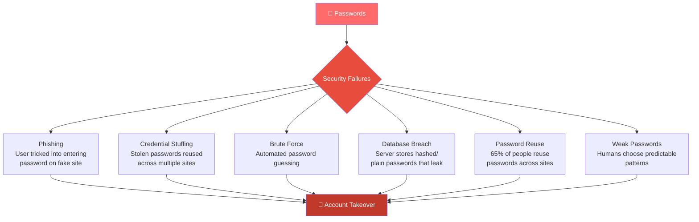

### The Human Problem

Even when users follow best practices, passwords still fail:

- **Strong passwords** are hard to remember — so people write them down or reuse them.
- **Password managers** help, but are themselves targets and require a master password.
- **Two-Factor Authentication (2FA)** with SMS OTPs is still phishable (a fake site can relay both the password and the OTP in real time).
- **Rotating passwords** is burdensome and rarely done.

The fundamental issue: **passwords are a shared secret.** You give your secret to a server, the server stores it (hopefully hashed), and now there are two places where your secret can be compromised.

---

## 2. A Brief History of FIDO

Understanding how FIDO evolved helps you appreciate why passkeys are designed the way they are.

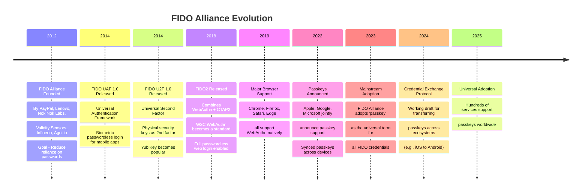

### Key Insight

FIDO started as a security hardware company initiative. Today, it's a cross-platform software standard backed by every major tech company (Apple, Google, Microsoft, Amazon, Meta, and hundreds more). This is why passkeys work on iPhones, Android phones, Windows, macOS, and Linux alike.

---

## 3. Quick Refresher: Public/Private Key Cryptography

Before diving into FIDO mechanics, let's make sure we're aligned on the cryptography that powers passkeys. If you're already comfortable with asymmetric cryptography, you can skim this section.

### The Key Pair Concept

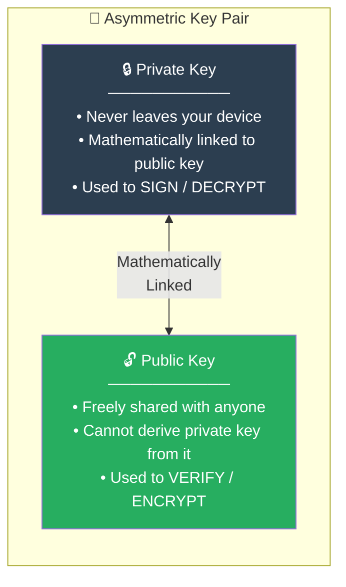

### What Signing Means

Think of signing like a wax seal on an envelope:

1. Only you (the private key holder) can **create** the seal.
2. Anyone with your public key can **verify** the seal is genuine.
3. If even one byte of the message changes, verification fails.

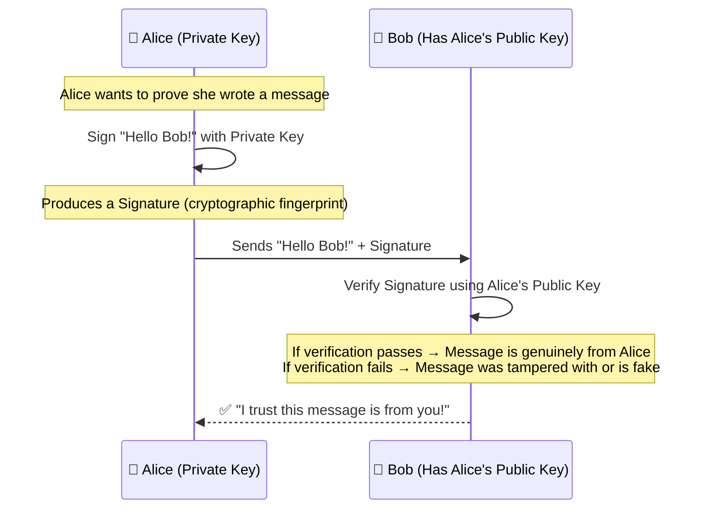

### The Challenge-Response Pattern

This is the core pattern FIDO uses during login:

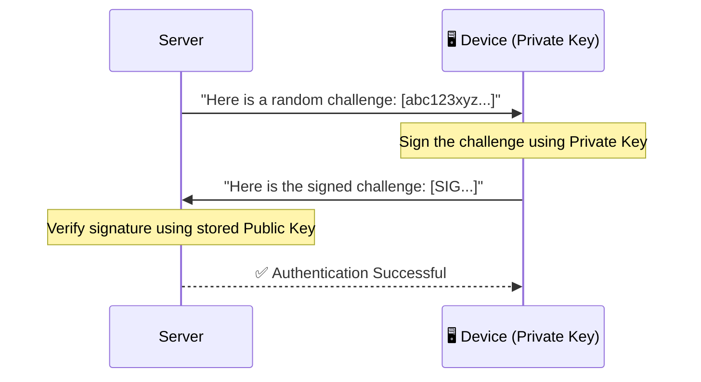

**Why this is brilliant:** The server never sees your private key. It only ever sees signatures. Even if the server is hacked, there's nothing to steal — the public key is useless for authentication (it can't sign, only verify).

---

## 4. What Is FIDO? The Alliance and the Standard

**FIDO** stands for **Fast IDentity Online**. It refers to both:

1. **The FIDO Alliance** — An open industry consortium founded in 2012, consisting of tech giants (Google, Apple, Microsoft, Amazon), hardware makers (Yubico, Infineon), financial institutions, and governments. Their mission: eliminate passwords.

2. **The FIDO Standards** — A family of open authentication specifications built on public-key cryptography.

### Core FIDO Principles

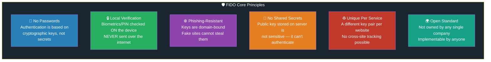

### FIDO Architecture: The Three Parties

Every FIDO authentication involves three parties:

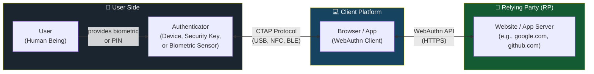

**Relying Party (RP):** The website or app that wants to authenticate you (e.g., GitHub, Google, your bank). They "rely" on FIDO to confirm who you are.

**Authenticator:** The component that holds your private keys and performs cryptographic operations. This can be:
- A hardware security key (e.g., YubiKey)
- Your phone's Secure Enclave or Trusted Execution Environment (TEE)
- Your laptop's TPM (Trusted Platform Module)
- A cloud-synced software keychain (e.g., iCloud Keychain, Google Password Manager)

---

## 5. FIDO Protocol Family: UAF, U2F, and FIDO2

The FIDO Alliance has released three major specifications over the years:

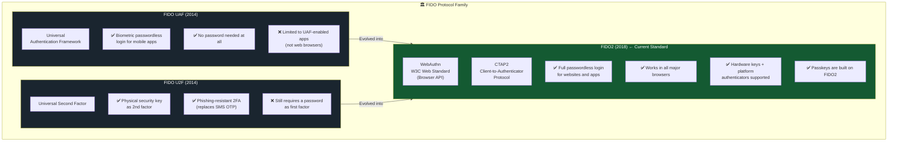

### FIDO2 Deep Dive: WebAuthn + CTAP

**FIDO2** is the umbrella standard consisting of two complementary specs:

| Component | Full Name | Role |
|-----------|-----------|------|
| **WebAuthn** | Web Authentication API | The browser-side JavaScript API that websites use to create and use credentials |
| **CTAP2** | Client-to-Authenticator Protocol | How the browser/OS communicates with external authenticators (USB keys, phones via BLE) |

**Analogy:** Think of WebAuthn as the "order window" at a restaurant (how you place your order with the kitchen), and CTAP2 as the "kitchen communication protocol" (how the front of house talks to the back of house where the cooking happens).

---

## 6. What Are Passkeys?

A **passkey** is a FIDO credential (a specific type of FIDO2 discoverable credential) designed specifically to replace passwords entirely.

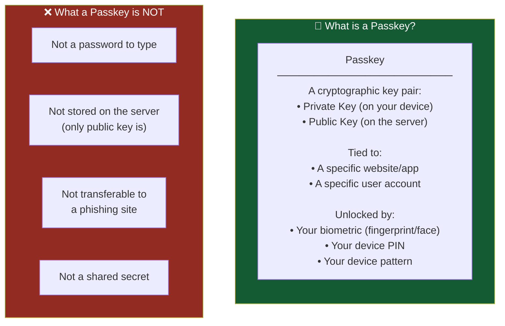

### The "Discoverable Credential" Concept

Traditional passwords: you type your username → then type your password.

With a passkey, the authenticator already knows which key to use based on the website's domain. This is called a **discoverable credential** — the credential can be "discovered" by the authenticator without you specifying it. This is why sign-in can be as simple as tapping your fingerprint.

### Key Terminology

| Term | Meaning |
|------|---------|
| **Passkey** | The FIDO2 credential (public + private key pair) for a specific site |
| **Authenticator** | The hardware/software that holds the private key |
| **Relying Party (RP)** | The website/app asking for authentication |
| **RP ID** | The domain of the relying party (e.g., `github.com`) — passkeys are bound to this |
| **User Verification (UV)** | The biometric/PIN check on your device |
| **User Presence (UP)** | Simply touching the authenticator (e.g., touching a YubiKey) |
| **Attestation** | Proof that the authenticator is a trusted device (used in enterprise scenarios) |
| **Credential ID** | A unique identifier for a specific passkey |

---

## 7. How Passkeys Work: Registration Flow

Registration is the process of creating a passkey for a specific website. This only happens once per site/account.

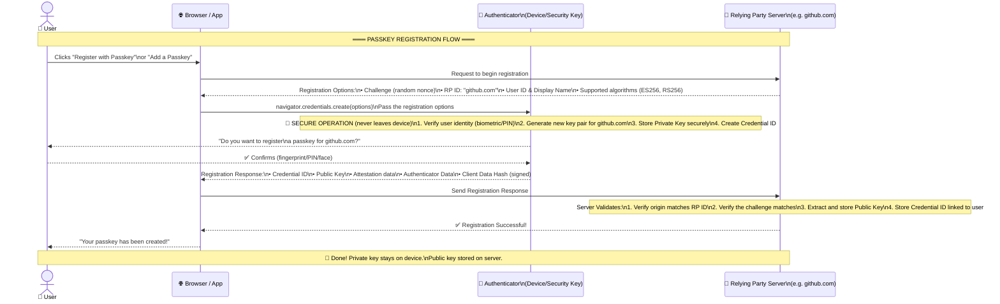

### What Gets Stored Where?

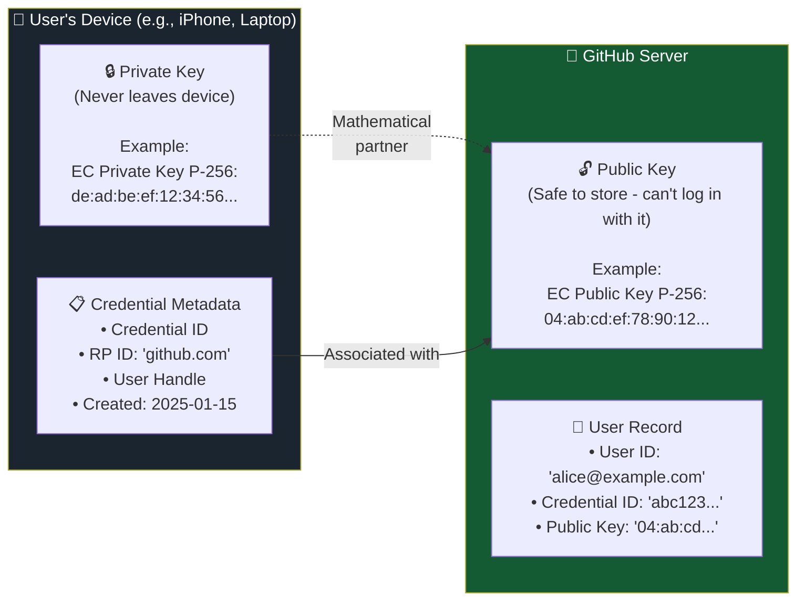

---

## 8. How Passkeys Work: Authentication (Login) Flow

Once a passkey is registered, logging in is fast and simple:

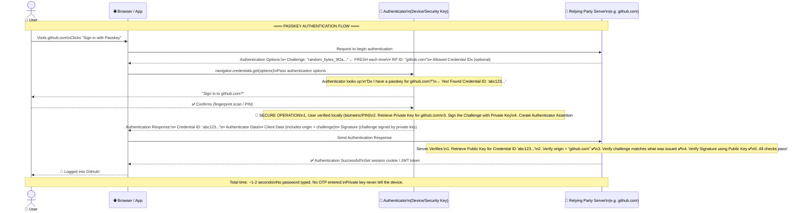

### Step-by-Step Breakdown

**Step 1 — Server issues a Challenge:**
Every login attempt starts with a unique random challenge (a nonce). This prevents **replay attacks** — even if someone captures your authentication response, they can't reuse it because the challenge will be different next time.

**Step 2 — Authenticator finds the right key:**
The authenticator looks up keys by RP ID (the domain). It finds the private key for `github.com`. This happens automatically — no username needed (though some implementations request it for UX clarity).

**Step 3 — User verifies locally:**
The user's biometric or PIN is checked on the device. This biometric data NEVER leaves the device or gets sent to GitHub.

**Step 4 — Signing the challenge:**
The private key signs the challenge + metadata. The signature is essentially mathematical proof: "The holder of the private key corresponding to this public key has approved this specific login attempt at this exact moment in time."

**Step 5 — Server verifies:**
The server verifies the signature using the stored public key. It also confirms the origin (to prevent domain spoofing) and the challenge (to prevent replay attacks).

---

## 9. Types of Passkeys: Synced vs Device-Bound

There are two categories of passkeys, each with different trade-offs:

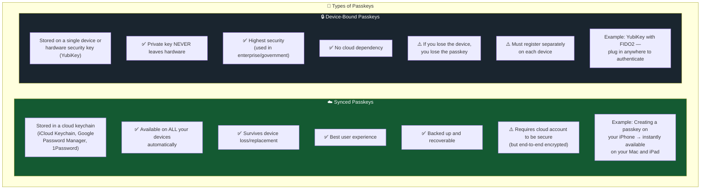

### Passkey Storage by Platform

| Platform | Storage Location | Synced? | Backup? |
|----------|-----------------|---------|---------|
| **iOS/macOS** | iCloud Keychain | ✅ Yes (across Apple devices) | ✅ Yes |
| **Android** | Google Password Manager | ✅ Yes (across Android devices) | ✅ Yes |
| **Windows 11** | Windows Hello (TPM) | ⚠️ Partial (Microsoft Account) | ⚠️ Limited |
| **YubiKey** | Hardware chip (FIDO2) | ❌ No | ❌ No |
| **1Password / Bitwarden** | Encrypted vault | ✅ Yes (cross-platform) | ✅ Yes |
| **Ubuntu 24.04** | GNOME Keyring / TPM / Security Key | Varies | Varies |

---

## 10. Cross-Device Authentication (CDA)

What if you want to log into a website on your laptop, but your passkey is only on your phone?

FIDO solves this with **Cross-Device Authentication (CDA)**:

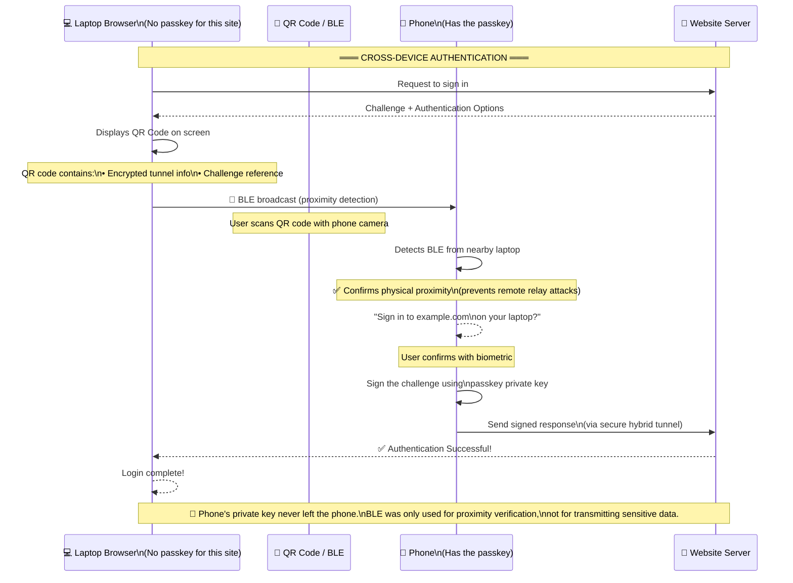

### Why BLE (Bluetooth Low Energy)?

BLE is used to verify **physical proximity**. This is crucial — it ensures the phone is physically near the laptop, preventing an attacker in another country from using your phone's passkey to log into your laptop. The actual cryptographic communication happens over a secure internet tunnel, not Bluetooth.

---

## 11. Security Architecture: Why Passkeys Are Unphishable

This is where passkeys truly shine. Let's examine why each major attack fails:

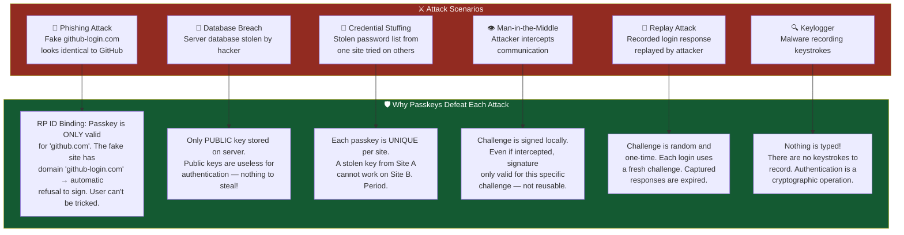

### The Domain Binding: FIDO's Secret Weapon

The most powerful security property of passkeys is **domain binding**. When you create a passkey for `github.com`, the authenticator binds that key to the exact RP ID `github.com`.

```
User goes to: https://github-security.com/login  (Phishing site!)
Browser sends challenge to authenticator
Authenticator checks: "Is 'github-security.com' equal to or a subdomain of 'github.com'?"
Answer: NO ❌
Result: Authenticator REFUSES to sign. Browser shows nothing suspicious.
User is protected without even knowing they were targeted.
```

This protection is **automatic and invisible** — unlike passwords, where even security-savvy users can be tricked by convincing phishing sites.

---

## 12. Passkeys vs Passwords vs MFA: A Detailed Comparison

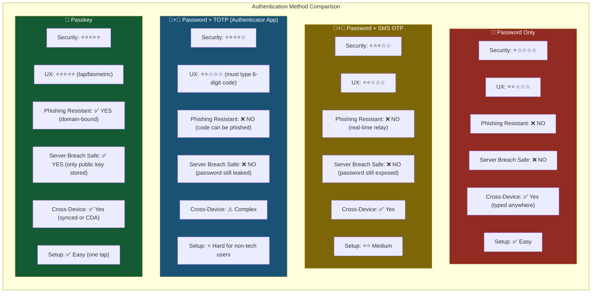

### Speed Comparison (Real-World Data)

| Method | Average Login Time | Success Rate |
|--------|-------------------|--------------|
| Password (remembered) | ~20 seconds | 70% |
| Password + SMS OTP | ~45 seconds | 60% |
| Password (forgotten, reset) | ~5 minutes | 52% |
| Passkey | ~3-4 seconds | 98% |

Amazon reported **6x faster** sign-in times after implementing passkeys. Google saw a **4x improvement** in sign-in success rates.

---

## 13. Real-World Use Cases

### Use Case 1: Consumer Account Login

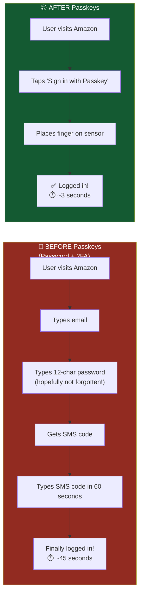

**Real example:** Amazon's passkey rollout achieved 6x faster sign-ins, and Air New Zealand saw a 50% reduction in login abandonment rates.

---

### Use Case 2: Enterprise Employee Login

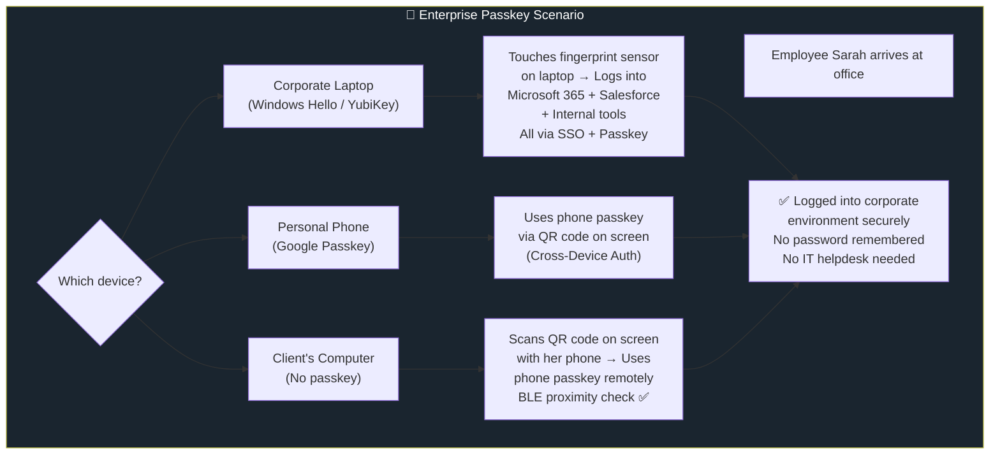

**Real example:** CVS Health achieved 98% reduction in mobile account takeover fraud after deploying passkeys for employees.

---

### Use Case 3: Government and High-Security Applications

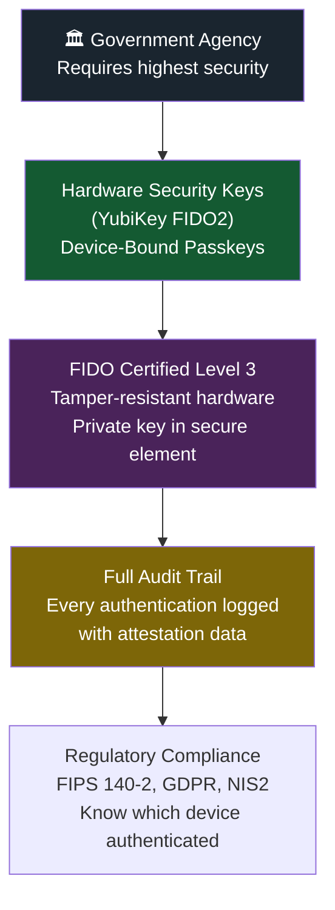

---

### Use Case 4: E-Commerce Payment Authorization

Passkeys are being integrated into payment flows as a secure authorization method. Instead of 3D Secure (entering a code sent by SMS), future payments can be authorized with a biometric tap — both faster and more secure.

---

### Use Case 5: SSH Access to Servers

FIDO2 hardware keys (YubiKeys) can be used for SSH authentication, which we'll cover in detail in the Ubuntu section.

---

## 14. FIDO2 and Passkeys on Ubuntu 24.04

Ubuntu 24.04 LTS (Noble Numbat) has solid support for FIDO2 and passkeys, though it differs from macOS and Windows in some ways. Let's explore the complete ecosystem.

### Ubuntu FIDO2 Ecosystem Overview

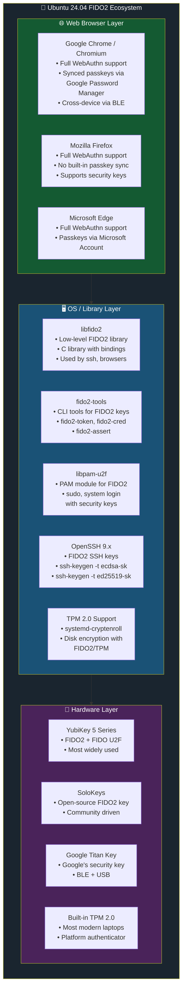

### 14.1 Installing FIDO2 Tools on Ubuntu 24.04

```bash
# Update package list
sudo apt update

# Install the core FIDO2 library
sudo apt install libfido2-1 libfido2-dev

# Install command-line tools for FIDO2 key management
sudo apt install fido2-tools

# Install PAM module for system authentication (sudo/login)
sudo apt install libpam-u2f

# Verify installation
fido2-token -L  # Lists connected FIDO2 devices
```

**Expected output of `fido2-token -L`:**
```
/dev/hidraw0: vendor=0x1050, product=0x0407 (Yubico YubiKey OTP+FIDO+CCID)
```

---

### 14.2 Using Passkeys in Web Browsers on Ubuntu

#### Google Chrome / Chromium

Chrome on Ubuntu 24.04 has full passkey support, including sync via Google Password Manager.

**Step 1: Ensure Chrome is up to date:**
```bash
# For Google Chrome
google-chrome --version
# Should be 108+ for passkey support

# Install via snap if needed
sudo snap install chromium
```

**Step 2: Register a passkey on a website:**
1. Visit any supported site (e.g., `github.com`)
2. Go to Security Settings → Add passkey
3. Chrome will prompt to use:
   - Your Google account (synced passkey) — works on all Chrome devices
   - A security key (device-bound passkey) — USB/NFC key
   - Another device (cross-device via QR code)

**Step 3: Verify passkeys are saved:**
- Visit `chrome://settings/passkeys` to see all stored passkeys

#### Firefox

```bash
# Install Firefox (snap)
sudo snap install firefox

# Or via apt (some versions)
sudo apt install firefox
```

Firefox supports WebAuthn/FIDO2 fully. However, as of Ubuntu 24.04, Firefox doesn't have a built-in synced passkey manager — it relies on hardware security keys for device-bound passkeys or you must use extensions.

**Enabling FIDO2 in Firefox about:config:**
```
# These should already be enabled in Firefox 126+
security.webauthn.enable = true
security.webauthn.ctap2 = true
```

---

### 14.3 FIDO2 Security Key Management with fido2-tools

`fido2-tools` provides command-line utilities to manage FIDO2 hardware security keys:

```bash
# List connected FIDO2 devices
fido2-token -L

# Get information about a specific device
fido2-token -I /dev/hidraw0

# Expected output:
# proto: 0x02
# major: 0x05  minor: 0x04  build: 0x03
# caps: 0x04 (cbor, nmsg)
# version strings: FIDO_2_0, FIDO_2_1, U2F_V2
# aaguid: 2fc0579f-8113-47ea-b116-bb5a8db9202a
# options: rk, up, uv, credMgmt, bioEnroll, ...

# List resident credentials (passkeys) on a security key
fido2-token -L -k /dev/hidraw0

# Delete a credential from a security key
fido2-token -D -i <credential_id> /dev/hidraw0

# Change the PIN on a security key
fido2-token -C /dev/hidraw0

# Set a PIN (first time)
fido2-token -S /dev/hidraw0

# Reset a security key (⚠️ deletes all credentials!)
fido2-token -R /dev/hidraw0
```

---

### 14.4 SSH Authentication with FIDO2 on Ubuntu 24.04

This is one of the most powerful uses of FIDO2 on Ubuntu — using a hardware security key or a passkey for SSH authentication. **No more managing SSH private key files!**

```mermaid
sequenceDiagram
    participant Dev as 👩‍💻 Developer\n(Ubuntu Client)
    participant YK as 🔑 YubiKey\n(FIDO2 Key)
    participant SSH as 🖥️ SSH Server\n(Remote Linux)

    Note over Dev,SSH: ═══ FIDO2 SSH AUTHENTICATION SETUP ═══

    Note over Dev,YK: STEP 1: Generate FIDO2 SSH Key
    Dev->>Dev: ssh-keygen -t ed25519-sk
    Dev->>YK: "Create a key for SSH"
    YK-->>Dev: Touch to confirm (physical presence)
    Dev->>Dev: Key files created:\n• id_ed25519_sk (handle, not private key!)\n• id_ed25519_sk.pub (public key)

    Note over Dev,SSH: STEP 2: Install Public Key on Server
    Dev->>SSH: ssh-copy-id -i ~/.ssh/id_ed25519_sk.pub user@server

    Note over Dev,SSH: STEP 3: Every SSH Login
    Dev->>SSH: ssh user@server
    SSH-->>Dev: "Prove you have the private key"
    Dev->>YK: Touch request sent to YubiKey
    YK-->>YK: User physically touches key\n(user presence verification)
    YK-->>Dev: Signs SSH challenge
    Dev->>SSH: Send signed response
    SSH-->>Dev: ✅ Authenticated! Shell opened.
```

**Step-by-step SSH FIDO2 setup:**

```bash
# ── STEP 1: Generate FIDO2-backed SSH key ──────────────────────────────────

# Option A: ed25519-sk (recommended - ed25519 with security key backing)
ssh-keygen -t ed25519-sk -f ~/.ssh/id_ed25519_sk -C "myname@laptop-fido2"
# You'll be asked to touch your YubiKey to confirm

# Option B: ecdsa-sk (ECDSA with security key backing)
ssh-keygen -t ecdsa-sk -f ~/.ssh/id_ecdsa_sk -C "myname@laptop-fido2"

# Option C: Resident key (stored ON the YubiKey, not on disk)
# This is a true device-bound passkey - works on ANY computer with your YubiKey
ssh-keygen -t ed25519-sk -O resident -O application=ssh:myserver \
    -f ~/.ssh/id_ed25519_sk_resident -C "resident-key"

# ── STEP 2: Examine the generated files ────────────────────────────────────
ls -la ~/.ssh/
# id_ed25519_sk      ← Key handle (references the key in YubiKey)
# id_ed25519_sk.pub  ← Public key (install on servers)

# The "private key" file is actually just a handle that tells OpenSSH
# "go ask the YubiKey to sign this". The actual private key bytes
# never leave the YubiKey hardware!

# ── STEP 3: Copy public key to your server ─────────────────────────────────
ssh-copy-id -i ~/.ssh/id_ed25519_sk.pub your-user@your-server.com

# Or manually:
cat ~/.ssh/id_ed25519_sk.pub
# Copy this to ~/.ssh/authorized_keys on the server

# ── STEP 4: Connect (touch YubiKey when prompted) ──────────────────────────
ssh -i ~/.ssh/id_ed25519_sk your-user@your-server.com
# A blinking light on your YubiKey signals: "touch me!"
# After touching → you're in!

# ── STEP 5: (Optional) Load resident key from YubiKey onto any machine ─────
# This lets you SSH from ANY machine that has your YubiKey:
ssh-keygen -K
# This downloads the key handle from the YubiKey's resident storage
# into your ~/.ssh/ directory on the current machine
```

**Why this is powerful:**
- The actual private key **never exists as a file on disk**. It lives inside the YubiKey's tamper-proof chip.
- Even if your laptop is stolen and fully imaged, the attacker can't use your SSH key.
- The attacker would need both your YubiKey (physical) and your YubiKey PIN.

---

### 14.5 System Login and sudo with FIDO2 (libpam-u2f)

You can require a FIDO2 security key touch for `sudo` commands or even for system login:

```bash
# ── STEP 1: Install PAM FIDO2 module ───────────────────────────────────────
sudo apt install libpam-u2f pamu2fcfg

# ── STEP 2: Register your security key ─────────────────────────────────────
# Create directory for FIDO2 config
mkdir -p ~/.config/Yubico

# Register your YubiKey (touch when prompted)
pamu2fcfg -o pam://hostname > ~/.config/Yubico/u2f_keys
# Touch your YubiKey when the command blinks!

# The file now contains your public key handle:
cat ~/.config/Yubico/u2f_keys
# username:keyHandle:publicKey

# ── STEP 3: Configure PAM for sudo ─────────────────────────────────────────
# ⚠️ IMPORTANT: Keep a root terminal open during testing
# in case something goes wrong!

sudo nano /etc/pam.d/sudo

# Add this line BEFORE the existing auth lines:
# auth    required   pam_u2f.so

# ── STEP 4: Test sudo ───────────────────────────────────────────────────────
sudo ls /root
# You'll be prompted to enter your password AND touch your YubiKey!

# ── STEP 5: (Optional) Configure for login screen ──────────────────────────
# This requires the key for GDM / console login
sudo nano /etc/pam.d/gdm-password
# Add: auth required pam_u2f.so
```

**Configuration options for pam_u2f:**

```bash
# Require FIDO2 key OR password (not both) - 2FA OR 1FA:
auth    sufficient   pam_u2f.so

# Require FIDO2 key AND password (true 2FA):
auth    required     pam_u2f.so

# Custom key file location:
auth    required     pam_u2f.so authfile=/etc/u2f_mappings

# Allow PIN verification on the key itself:
auth    required     pam_u2f.so pinverification=1

# Require user verification (fingerprint on BioYubiKey):
auth    required     pam_u2f.so user_verification=required
```

---

### 14.6 Disk Encryption with FIDO2 (systemd-cryptenroll)

Ubuntu 24.04 with `systemd-cryptenroll` lets you unlock LUKS-encrypted disks with a FIDO2 key:

```bash
# ── Check if your LUKS volume is set up ─────────────────────────────────────
lsblk --fs
# Find your encrypted partition (e.g., /dev/sda3)

# ── Enroll FIDO2 key for disk decryption ────────────────────────────────────
sudo systemd-cryptenroll --fido2-device=auto /dev/sda3
# Touch your YubiKey when prompted!

# ── Update crypttab to use FIDO2 ────────────────────────────────────────────
# Edit /etc/crypttab and add fido2-device=auto:
sudo nano /etc/crypttab
# Change:
# sda3_crypt UUID=xxx none luks
# To:
# sda3_crypt UUID=xxx none luks,fido2-device=auto

# Rebuild initramfs
sudo update-initramfs -u -k all

# On next boot: plug in your YubiKey → disk unlocks automatically!
# (or prompts for touch)
```

---

### 14.7 Working with Passkeys in Web Applications on Ubuntu

If you're **building** a web app that supports passkeys and testing on Ubuntu:

```bash
# Install Node.js for a test server
sudo apt install nodejs npm

# SimpleWebAuthn is an excellent TypeScript library for passkeys
npm install @simplewebauthn/server @simplewebauthn/browser

# For Python developers:
pip install webauthn

# For Go developers:
go get github.com/go-webauthn/webauthn
```

**Minimal passkey registration server example (Node.js):**

```javascript
const { generateRegistrationOptions, verifyRegistrationResponse } = 
    require('@simplewebauthn/server');

// ── Registration Start ───────────────────────────────────────────────────────
app.post('/register/start', async (req, res) => {
    const { username } = req.body;

    const options = await generateRegistrationOptions({
        rpName: 'My Ubuntu App',
        rpID: 'localhost',              // RP ID = domain
        userName: username,
        attestationType: 'none',        // 'direct' for enterprise
        authenticatorSelection: {
            residentKey: 'required',    // Store as discoverable credential (passkey)
            userVerification: 'required', // Require biometric/PIN
        },
        supportedAlgorithmIDs: [-7, -257], // ES256, RS256
    });

    req.session.challenge = options.challenge;
    res.json(options);
});

// ── Registration Completion ──────────────────────────────────────────────────
app.post('/register/complete', async (req, res) => {
    const verification = await verifyRegistrationResponse({
        response: req.body,
        expectedChallenge: req.session.challenge,
        expectedOrigin: 'http://localhost:3000',
        expectedRPID: 'localhost',
    });

    if (verification.verified) {
        // Store verification.registrationInfo.credential.publicKey
        // and verification.registrationInfo.credential.id
        // in your database, linked to the user
        res.json({ success: true });
    }
});
```

---

### 14.8 Ubuntu FIDO2 Troubleshooting

**Problem: YubiKey not detected**
```bash
# Check udev rules (required for non-root access to USB HID devices)
ls /etc/udev/rules.d/ | grep -i yubikey

# If missing, install udev rules:
sudo apt install libu2f-udev

# Or manually add:
sudo tee /etc/udev/rules.d/70-u2f.rules > /dev/null << 'EOF'
KERNEL=="hidraw*", SUBSYSTEM=="hidraw", ATTRS{idVendor}=="1050", \
  ATTRS{idProduct}=="0113|0114|0115|0116|0120|0200|0402|0403|0406|0407", \
  TAG+="uaccess"
EOF
sudo udevadm trigger

# Verify device is visible:
fido2-token -L
```

**Problem: SSH FIDO2 key not working**
```bash
# Check OpenSSH version (needs 8.2+)
ssh -V
# OpenSSH_9.6p1 Ubuntu-3ubuntu13.5, OpenSSL 3.0.13...

# Verbose SSH to see what's happening:
ssh -vvv -i ~/.ssh/id_ed25519_sk user@server

# Check server's sshd_config allows FIDO2:
# PubkeyAcceptedAlgorithms should include sk-ed25519@openssh.com
```

**Problem: Browser passkeys not working**
```bash
# Ensure libsecret is installed (needed by Chrome for credential storage):
sudo apt install libsecret-1-0 libsecret-tools gnome-keyring

# Start GNOME keyring if not running:
/usr/bin/gnome-keyring-daemon --start --components=secrets

# Check if Chrome can see security keys:
# Visit chrome://flags and ensure "Web Authentication API" is enabled
```

---

## 15. Practical Examples and Demonstrations

### Example 1: GitHub with a YubiKey on Ubuntu

```mermaid
flowchart TD
    Start["Open Chrome on Ubuntu 24.04"]
    Nav["Navigate to github.com/settings/security"]
    Add["Click 'Add a security key'"]
    Prompt["Chrome prompts:\n'Insert and touch your security key'"]
    Insert["Insert YubiKey into USB port"]
    Touch["YubiKey blinks → Touch the gold disc"]
    Name["Name the key: 'YubiKey 5 NFC - Work'"]
    Done["✅ Key registered!\n\nNext login: insert YubiKey\n+ touch = instant access"]

    Start --> Nav --> Add --> Prompt --> Insert --> Touch --> Name --> Done

    style Done fill:#145a32,color:#fff
    style Start fill:#1a252f,color:#fff
```

### Example 2: Google Account Passkey on Ubuntu (Synced)

1. Visit `myaccount.google.com/security`
2. Click **Passkeys and security keys** → **Create a passkey**
3. Chrome shows: "Use this device as a passkey"
4. Authenticate with your Ubuntu login / fingerprint reader
5. Passkey created! Now synced to all devices where you're signed into Chrome with the same Google account.

### Example 3: Full SSH Workflow with Resident Key

```bash
# ── Scenario: You have a new machine and your YubiKey ────────────────────────
# Your SSH key is stored INSIDE the YubiKey (resident key)
# No need to copy files! Just plug in the YubiKey.

# Download key handle from YubiKey to this machine:
ssh-keygen -K
# Enter YubiKey PIN:
# ✅ Keys written: id_ed25519_sk_rk and id_ed25519_sk_rk.pub

# SSH to any server where your public key was previously installed:
ssh -i ./id_ed25519_sk_rk your-user@your-server.com
# Touch YubiKey when prompted → 🎉 Connected!

# The brilliance: if this laptop is compromised,
# your SSH keys aren't. The private key is still
# locked in the YubiKey's hardware.
```

### Example 4: Making sudo Require YubiKey Touch

After `libpam-u2f` setup:

```
$ sudo apt update
[sudo] password for alice:            ← Type your password
Please touch the device.              ← Touch YubiKey!
[touch registered]
✅ Authentication successful
```

This is **true 2FA for system administration** — an attacker who steals your password still can't run sudo without the physical key.

---

## 16. Common Questions and Misconceptions

### ❓ "Is my biometric sent to the website?"

**No, never.** Your fingerprint or face scan is processed entirely on your local device (in the Secure Enclave, TPM, or TEE). The website only receives the cryptographic signature. The FIDO Alliance has explicitly designed the protocol so biometrics never leave your device.

### ❓ "What if someone hacks the passkey sync cloud service?"

Passkeys synced in iCloud Keychain, Google Password Manager, etc. are **end-to-end encrypted**. The cloud provider cannot decrypt them — only your trusted devices can. Even if the sync servers are breached, the encrypted blobs are useless without the device-level keys.

### ❓ "What if I lose all my devices?"

This is the primary downside of passkeys. Options:
1. Most services keep a backup authentication method (email recovery, backup codes).
2. Hardware security keys (YubiKey) can serve as a recovery credential.
3. Account recovery through identity verification with the service provider.
4. The FIDO Alliance's Credential Exchange Protocol (in development) will improve cross-ecosystem portability.

### ❓ "Are passkeys multi-factor authentication (MFA)?"

Yes! A passkey technically involves multiple factors:
- **Something you HAVE**: The device or security key (possession)
- **Something you ARE or KNOW**: Biometric OR PIN (verification)

So a single passkey tap replaces both your password AND your OTP code.

### ❓ "Can Ubuntu natively manage synced passkeys like macOS?"

Not yet with the same seamlessness. Ubuntu 24.04 doesn't have a built-in synced passkey keychain with native biometric UI. However:
- **Chrome on Ubuntu** can sync passkeys via Google Password Manager.
- **Hardware security keys** (YubiKey) provide device-bound passkeys.
- **1Password or Bitwarden** (third-party) can manage synced passkeys on Linux.

This is an evolving area — GNOME is working on deeper passkey integration.

### ❓ "Can passkeys be phished if the screen is shared?"

No. Even if an attacker watches your entire screen, they cannot replay your authentication. The challenge is unique per login attempt, so a captured signature is expired immediately. And the private key operation happens inside the authenticator hardware — invisible to any screen-sharing session.

---

## 17. The Future of Passkeys

```mermaid
flowchart TD
    subgraph Present["📍 Present (2025)"]
        P1["✅ Passkeys work on iOS, Android,\nWindows, macOS, Ubuntu"]
        P2["✅ 100+ major services support passkeys\n(Google, Apple, Microsoft, GitHub,\nAmazon, PayPal, LinkedIn...)"]
        P3["✅ Hardware security keys widely available"]
        P4["⚠️ Cross-platform portability still limited\n(iPhone passkeys can't move to Android easily)"]
    end

    subgraph Near["🔮 Near Future (2025-2026)"]
        N1["Credential Exchange Protocol (CXP/CXF)\nTransfer passkeys between ecosystems\n(iOS → Android, 1Password → iCloud)"]
        N2["Deeper OS integration on Linux\nGNOME + KDE native passkey UI"]
        N3["Passkeys in IoT and smart devices"]
        N4["FIDO Device Onboarding for enterprise\nautomated device provisioning"]
    end

    subgraph Far["🌟 Long-Term Vision"]
        F1["Passwords entirely obsolete for\nconsumer and enterprise apps"]
        F2["Passkeys as digital ID\nin government and healthcare"]
        F3["AI agent authentication via FIDO\n(secure agent delegation)"]
        F4["Universal interoperability:\none passkey system across\nall platforms and services"]
    end

    Present --> Near --> Far

    style Present fill:#145a32,color:#fff
    style Near fill:#1a5276,color:#fff
    style Far fill:#4a235a,color:#fff
```

### Key Upcoming Development: Credential Exchange Protocol

The FIDO Alliance has published a working draft of the **Credential Exchange Protocol (CXP)** and **Credential Exchange Format (CXF)**. This will allow users to securely transfer passkeys between password managers and ecosystems — solving the lock-in problem:

```
Before CXP: "I'm switching from iPhone to Android... 
             I have to re-register passkeys on 50 websites"

After CXP: "Export passkeys from iCloud Keychain → 
            Import into Google Password Manager → Done"
```

---

## 18. Summary and Key Takeaways

```mermaid
mindmap
    root((FIDO & Passkeys))
        What is FIDO?
            Open standard for passwordless auth
            Created by FIDO Alliance (2012)
            Backed by Apple, Google, Microsoft, etc.
            Three generations: UAF, U2F, FIDO2
        How Passkeys Work
            Public/Private key pair per website
            Private key NEVER leaves device
            Challenge-response authentication
            Domain-bound: phishing-resistant by design
        Types of Passkeys
            Synced: iCloud, Google, 1Password
            Device-Bound: YubiKey, TPM
            Cross-Device: BLE-based QR code flow
        Ubuntu 24.04 Support
            libfido2: core FIDO2 library
            fido2-tools: CLI management
            OpenSSH: ed25519-sk SSH keys
            libpam-u2f: sudo and system login
            systemd-cryptenroll: disk encryption
            Chrome/Firefox: full WebAuthn support
        Why Passkeys Win
            6x faster than passwords
            4x better sign-in success rate
            100% phishing resistant
            No server-side password to steal
            True MFA in a single tap
```

### 10 Things to Remember

1. **Passkeys are public-key cryptography made effortless** — the math is the same, the user experience is transformed.

2. **Nothing sensitive is ever sent to the server** — only signatures made with a private key that never leaves your device.

3. **Phishing is impossible** — passkeys are cryptographically bound to the exact domain. Fake sites can't trigger them.

4. **Your biometric stays on your device** — the website never sees your fingerprint or face data.

5. **Ubuntu 24.04 supports FIDO2 well** — especially with hardware security keys for SSH, sudo, and disk encryption.

6. **Chrome on Ubuntu can sync passkeys** via Google Password Manager, bringing full passkey UX to Linux.

7. **`libpam-u2f` enables 2FA for sudo and login** — physical key touch required even with root password.

8. **`ssh-keygen -t ed25519-sk`** creates SSH keys backed by your FIDO2 hardware key — the private key lives in the hardware.

9. **Device-bound passkeys (YubiKey) offer maximum security** — even the vendor can't extract the key.

10. **The future is passwordless** — every major platform and hundreds of services are actively migrating. Now is the perfect time to start.

---

## Quick Reference: Ubuntu 24.04 FIDO2 Cheat Sheet

```bash
# ── INSTALL ──────────────────────────────────────────────────────────────────
sudo apt install libfido2-1 fido2-tools libpam-u2f

# ── HARDWARE KEY MANAGEMENT ──────────────────────────────────────────────────
fido2-token -L                        # List devices
fido2-token -I /dev/hidraw0           # Device info
fido2-token -L -k /dev/hidraw0        # List stored passkeys
fido2-token -C /dev/hidraw0           # Change PIN
fido2-token -S /dev/hidraw0           # Set PIN

# ── SSH WITH FIDO2 ────────────────────────────────────────────────────────────
ssh-keygen -t ed25519-sk              # Generate FIDO2-backed SSH key
ssh-keygen -t ed25519-sk -O resident  # Store key ON the hardware device
ssh-keygen -K                         # Load resident keys from device
ssh-copy-id -i ~/.ssh/id_ed25519_sk.pub user@host  # Install public key

# ── PAM (sudo/login) ─────────────────────────────────────────────────────────
pamu2fcfg -o pam://hostname > ~/.config/Yubico/u2f_keys  # Register key
# Add to /etc/pam.d/sudo: auth required pam_u2f.so

# ── DISK ENCRYPTION ──────────────────────────────────────────────────────────
sudo systemd-cryptenroll --fido2-device=auto /dev/sdXY

# ── UDEV RULES (fix "Permission denied") ────────────────────────────────────
sudo apt install libu2f-udev
sudo udevadm trigger
```

---

*Tutorial based on FIDO Alliance specifications, passkeys.com documentation, and official Ubuntu 24.04 package documentation. The FIDO Alliance's open standards are maintained at fidoalliance.org.*