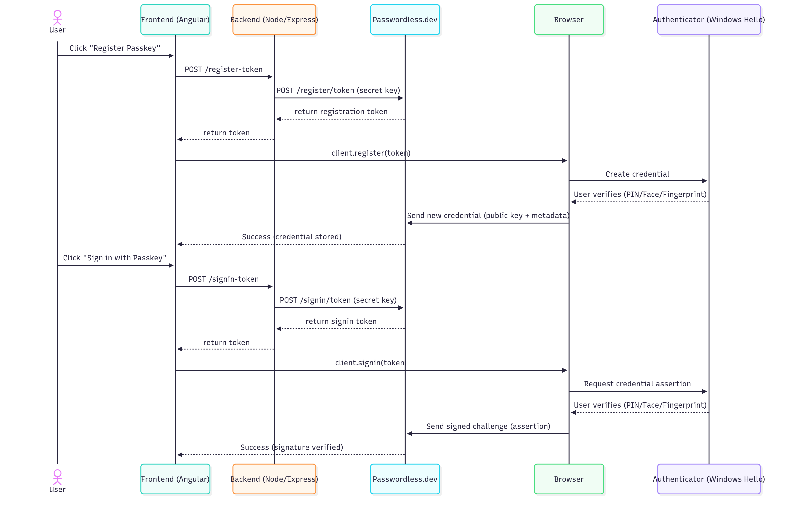

# How Passkey Registration & Sign‑in Work End‑to‑End  

This tutorial dives deeper into the interactions between **frontend, backend, browser, authenticator (Windows Hello), and passwordless.dev** in both **passkey registration** and **login flows**.  

Think of it like a play where each actor has lines — together they perform the whole security handshake.

---

## 1. The Cast (Actors in the Flow)

1. **Browser** (e.g., Chrome on Windows): Talks WebAuthn, triggers authenticator prompts.  
2. **Authenticator** (Windows Hello): The part that proves the user’s identity (PIN, face, fingerprint, etc.) and holds the private key.  
3. **Frontend App (Angular)**: UI with buttons like *Register Passkey* or *Sign in*. Calls backend endpoints.  
4. **Backend (Node/Express)**: Talks securely to passwordless.dev using **secret API key**, generates “tokens” for frontend.  
5. **Passwordless.dev**: Service that manages public keys, generates WebAuthn challenges, and validates responses.

---

## 2. Passkey Registration Flow (Step by Step)

### a. User clicks **Register Passkey**
- Angular frontend calls your backend:  
  `POST /api/register-token { email: "alice@example.com" }`

### b. Backend calls passwordless.dev
- Your Node.js server calls:  
  `POST https://v4.passwordless.dev/register/token`  
  with `{ userId: "alice@example.com", username: "Alice" }` and the **secret API key**.  
- passwordless.dev responds with a **one-time registration token**.

### c. Frontend starts WebAuthn ceremony
- Angular calls:  
  `client.register(token)` using the **public API key SDK**.  
- Browser now interprets this as a **WebAuthn create()** request.  

### d. Browser hands to Windows Hello
- Browser: "Windows Hello, please create a new credential for Alice."  
- Windows Hello: shows UI:  
  - Try face or fingerprint if available.  
  - Otherwise prompt for Windows Hello PIN.  
- If the user consents:
  - **A key pair is generated**:  
    - Private key: stored in device’s secure module (TPM, Secure Enclave).  
    - Public key: prepared for transport.

### e. Browser sends credential to passwordless.dev
- Browser packages credential info (public key, credential id, metadata) + challenge response.  
- This is returned into `client.register()`, and sent directly to passwordless.dev.  

### f. passwordless.dev stores credential
- Public key is stored and associated with `userId` on passwordless.dev’s servers.  
- Your backend doesn’t hold the private key — only metadata about which credentials exist.  

✅ **Done: The user now has a passkey registered!**

---

## 3. Passkey Sign‑in Flow (Step by Step)

### a. User clicks **Sign in with Passkey**
- Angular frontend calls your backend:  
  `POST /api/signin-token { email: "alice@example.com" }`

### b. Backend calls passwordless.dev
- Your Node.js server calls:  
  `POST https://v4.passwordless.dev/signin/token`  
  with `{ userId: "alice@example.com" }` and your secret API key.  
- passwordless.dev looks up Alice’s registered credentials and prepares a **challenge**.  
- passwordless.dev responds with a **signin token** for frontend.

### c. Frontend runs signin ceremony
- Angular calls:  
  `client.signin({ token })`  
  → browser runs `navigator.credentials.get()`.  

### d. Browser hands to Windows Hello
- Browser: “Windows Hello, please prove Alice can use one of her credentials.”  
- Windows Hello:  
  - Shows Face/FP/PIN UI.  
  - If user authorizes: private key locally signs the challenge.  
  - Critically: private key never leaves the machine. Only the challenge signature comes out.

### e. Browser sends signed assertion to passwordless.dev
- Browser sends `{ credentialId, signedChallengeResponse }`.  
- passwordless.dev:
  - Looks up the stored **public key** for Alice.  
  - Verifies that the signature matches.  

### f. passwordless.dev confirms success
- If signature checks out → passwordless.dev tells frontend “Signin successful!”  
- Frontend can forward the result to backend, where you establish a user session (e.g., JWT, cookie).  

✅ **Done: Alice is authenticated!**

---

## 4. Putting It in Sequence (Visual)

---

## 5. Key Points to Remember

1. **Device security**  
   - Private keys never leave the device (stored in TPM/Secure Enclave).  
   - Even if someone hacks passwordless.dev, only public keys are exposed = useless.  

2. **Windows Hello**  
   - Acts as “gatekeeper.” Ensures only the user can unlock the private key (w/ biometrics or PIN).  

3. **Passwordless.dev**  
   - Simplifies the heavy cryptography.  
   - Stores your users’ credentials securely.  
   - Issues tokens so your backend never directly touches raw WebAuthn ceremonies.  

4. **Your Backend**  
   - Orchestrates: requests tokens, starts challenges, sets up user sessions after success.  
   - Crucially, it never holds private keys.  

---

## 6. Lifecycle Summary  

- **Registration**  
  - User consents → keypair created → public key stored at passwordless.dev.  
- **Authentication**  
  - User consents → private key signs challenge → verified with stored public key.  
- **Unregister/Delete**  
  - Backend uses passwordless.dev API to remove credentials.

---

# 🎉 Conclusion  

Passkey flows may feel like a mystery box until you map out each actor’s role:  

- Browser = messenger.  
- Windows Hello (or YubiKey/Touch ID) = actual authenticator.  
- passwordless.dev = token generator, credential vault, verifier.  
- Backend = coordinator.  
- User = still the star (they approve with biometric or PIN).  

With this model in mind, the sequence of **register → signin → verify → session** becomes much easier to reason about and implement.