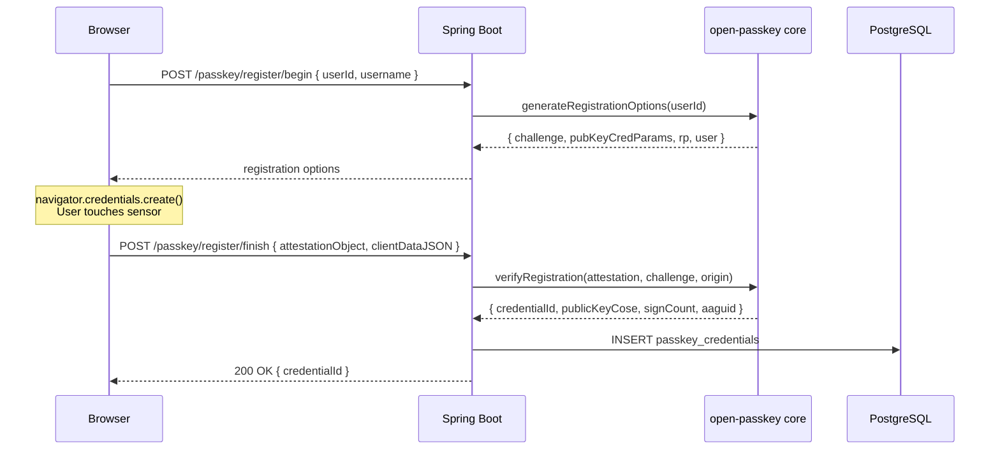
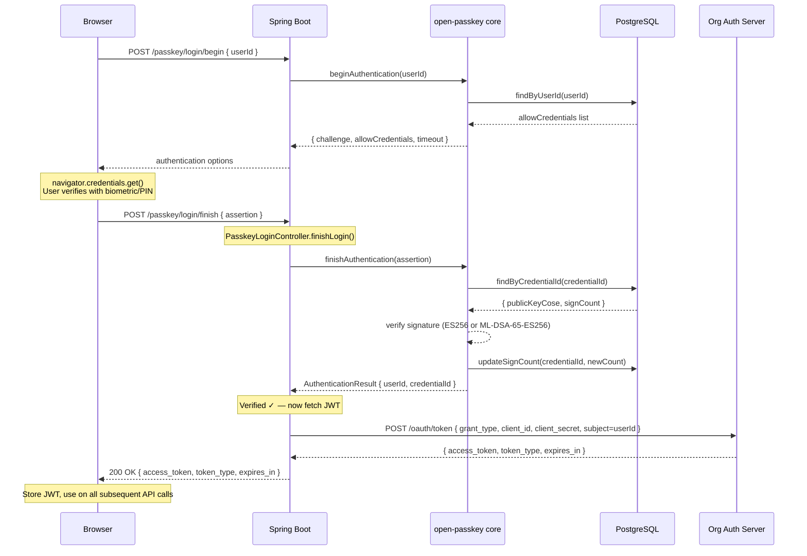
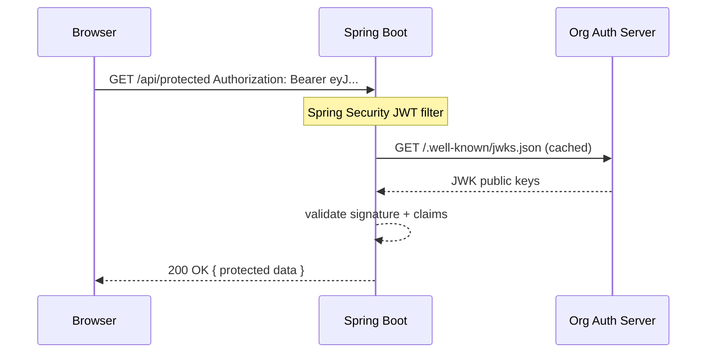

# Integrating open-passkey with Spring Boot + JWT Token Handoff

> **Goal:** Plug `open-passkey`'s Spring binding into a Spring Boot application, override only the `login/finish` endpoint, and on successful WebAuthn verification hand off to your organisation's token endpoint to obtain a JWT — which is then returned to the client.

---

## Table of Contents

1. [Architecture Overview](#1-architecture-overview)
2. [How open-passkey Auto-configures Spring](#2-how-open-passkey-auto-configures-spring)
3. [The Override Strategy](#3-the-override-strategy)
4. [Project Setup](#4-project-setup)
5. [PostgreSQL CredentialStore](#5-postgresql-credentialstore)
6. [TokenService — The Org Token Handoff](#6-tokenservice)
7. [Custom PasskeyLoginController](#7-custom-passkeylogincontroller)
8. [Spring Security Configuration](#8-spring-security-configuration)
9. [Registration Flow (unchanged)](#9-registration-flow)
10. [Sequence Diagrams](#10-sequence-diagrams)
11. [Testing](#11-testing)
12. [Branch Strategy — POC → Cleanup → Main](#12-branch-strategy--poc--cleanup--main)
13. [Production Checklist](#13-production-checklist)

---

## 1. Architecture Overview

The overall system has four participants:

- **Browser** — issues WebAuthn ceremonies (biometric prompt, signed assertion)
- **Spring Boot** — hosts the endpoints; owns the JWT handoff logic
- **open-passkey core** — performs all WebAuthn cryptographic verification
- **Org Auth Server** — issues the JWT once user identity is confirmed

| Endpoint | Ceremony | Customised? |
|---|---|---|
| `POST /passkey/register/begin`  | Registration     | No — use as-is          |
| `POST /passkey/register/finish` | Registration     | No — use as-is          |
| `POST /passkey/login/begin`     | Authentication   | No — use as-is          |
| `POST /passkey/login/finish`    | Authentication   | **Yes — override for JWT** |

---

## 2. How open-passkey Auto-configures Spring

`PasskeyAutoConfiguration` registers:

- A `PasskeyService` bean (wraps the core-java verifier)
- Auto-configured controllers for all four endpoints
- `MemoryChallengeStore` (suitable for single-node production)
- Requires a `CredentialStore` bean — **you implement this**

`PasskeyService` exposes two methods:

```java
AuthenticationOptionsResponse beginAuthentication(String userId);
AuthenticationResult finishAuthentication(AuthenticationFinishRequest request);
```

`AuthenticationResult` carries the verified `userId` you pass to your token endpoint.

---

## 3. The Override Strategy

**Step 1 — Disable** the library's default `login/finish` controller:

```yaml
passkey:
  controllers:
    login-finish:
      enabled: false
```

**Step 2 — Write your own** controller that:
1. Calls `PasskeyService.finishAuthentication()` — library handles all crypto
2. Extracts `userId` from `AuthenticationResult`
3. Calls `TokenService.fetchToken(userId)` — calls your org's endpoint
4. Returns the JWT response body to the client

---

## 4. Project Setup

### 4.1 build.gradle

#### `settings.gradle`

```groovy
rootProject.name = 'my-passkey-app'
```

#### `build.gradle`

```groovy
plugins {
    id 'java'
    id 'org.springframework.boot' version '3.3.0'
    id 'io.spring.dependency-management' version '1.1.5'
}

group = 'com.example'
version = '0.0.1-SNAPSHOT'
sourceCompatibility = '21'

configurations {
    compileOnly {
        extendsFrom annotationProcessor
    }
}

repositories {
    mavenCentral()
}

dependencies {
    // Spring Boot web + security
    implementation 'org.springframework.boot:spring-boot-starter-web'
    implementation 'org.springframework.boot:spring-boot-starter-security'

    // open-passkey Spring binding
    implementation 'com.locke-inc:open-passkey-spring:1.0.0'

    // PostgreSQL + JPA
    implementation 'org.springframework.boot:spring-boot-starter-data-jpa'
    runtimeOnly    'org.postgresql:postgresql'

    // WebClient for calling org token endpoint
    implementation 'org.springframework.boot:spring-boot-starter-webflux'

    // Lombok
    compileOnly    'org.projectlombok:lombok'
    annotationProcessor 'org.projectlombok:lombok'

    // Testing
    testImplementation 'org.springframework.boot:spring-boot-starter-test'
    testImplementation 'org.springframework.security:spring-security-test'
}

tasks.named('test') {
    useJUnitPlatform()
}
```

> **Note on Lombok with Gradle:** Lombok must appear in both `compileOnly` and `annotationProcessor` configurations — unlike Maven where `<optional>true</optional>` covers both compile and annotation processing in one declaration.

### 4.2 application.yaml

```yaml
spring:
  application:
    name: my-passkey-app
  datasource:
    url: jdbc:postgresql://localhost:5432/passkey_db
    username: passkey_user
    password: ${DB_PASSWORD}
  jpa:
    hibernate:
      ddl-auto: update
  data:
    redis:
      host: ${REDIS_HOST}
      port: 6379
      password: ${REDIS_PASSWORD}

passkey:
  rp-id: app.example.com
  rp-display-name: My App
  origin: https://app.example.com
  controllers:
    login-finish:
      enabled: false    # disable default — our controller takes over

org:
  token:
    endpoint: https://auth.example.com/oauth/token
    client-id: my-spring-app
    client-secret: ${ORG_CLIENT_SECRET}
```

---

## 5. PostgreSQL CredentialStore

### 5.1 Schema

```sql
CREATE TABLE passkey_credentials (
    id              BIGSERIAL PRIMARY KEY,
    credential_id   VARCHAR(512)  NOT NULL UNIQUE,
    user_id         VARCHAR(256)  NOT NULL,
    public_key_cose BYTEA         NOT NULL,
    sign_count      BIGINT        NOT NULL DEFAULT 0,
    aaguid          VARCHAR(64),
    be_flag         BOOLEAN       NOT NULL DEFAULT FALSE,
    bs_flag         BOOLEAN       NOT NULL DEFAULT FALSE,
    created_at      TIMESTAMPTZ   NOT NULL DEFAULT NOW(),
    last_used_at    TIMESTAMPTZ
);

CREATE INDEX idx_pk_user_id       ON passkey_credentials(user_id);
CREATE INDEX idx_pk_credential_id ON passkey_credentials(credential_id);
```

### 5.2 JPA Entity

```java
@Entity
@Table(name = "passkey_credentials")
@Data
public class PasskeyCredentialEntity {

    @Id @GeneratedValue(strategy = GenerationType.IDENTITY)
    private Long id;

    @Column(name = "credential_id", nullable = false, unique = true)
    private String credentialId;

    @Column(name = "user_id", nullable = false)
    private String userId;

    @Column(name = "public_key_cose", nullable = false)
    private byte[] publicKeyCose;

    @Column(name = "sign_count", nullable = false)
    private long signCount;

    @Column(name = "aaguid")          private String  aaguid;
    @Column(name = "be_flag")         private boolean backupEligible;
    @Column(name = "bs_flag")         private boolean backupState;
    @Column(name = "created_at")      private Instant createdAt = Instant.now();
    @Column(name = "last_used_at")    private Instant lastUsedAt;
}
```

### 5.3 Repository

```java
public interface PasskeyCredentialRepository
        extends JpaRepository<PasskeyCredentialEntity, Long> {

    Optional<PasskeyCredentialEntity> findByCredentialId(String credentialId);
    List<PasskeyCredentialEntity>     findByUserId(String userId);
}
```

### 5.4 CredentialStore Implementation

```java
@Component
@RequiredArgsConstructor
public class PostgresCredentialStore implements CredentialStore {

    private final PasskeyCredentialRepository repository;

    @Override
    public void save(StoredCredential credential) {
        PasskeyCredentialEntity e = new PasskeyCredentialEntity();
        e.setCredentialId(credential.getCredentialId());
        e.setUserId(credential.getUserId());
        e.setPublicKeyCose(credential.getPublicKeyCose());
        e.setSignCount(credential.getSignCount());
        e.setAaguid(credential.getAaguid());
        e.setBackupEligible(credential.isBackupEligible());
        e.setBackupState(credential.isBackupState());
        repository.save(e);
    }

    @Override
    public Optional<StoredCredential> findByCredentialId(String credentialId) {
        return repository.findByCredentialId(credentialId).map(this::toDto);
    }

    @Override
    public List<StoredCredential> findByUserId(String userId) {
        return repository.findByUserId(userId).stream()
                .map(this::toDto).collect(Collectors.toList());
    }

    @Override
    public void updateSignCount(String credentialId, long newSignCount) {
        repository.findByCredentialId(credentialId).ifPresent(e -> {
            e.setSignCount(newSignCount);
            e.setLastUsedAt(Instant.now());
            repository.save(e);
        });
    }

    private StoredCredential toDto(PasskeyCredentialEntity e) {
        return StoredCredential.builder()
                .credentialId(e.getCredentialId())
                .userId(e.getUserId())
                .publicKeyCose(e.getPublicKeyCose())
                .signCount(e.getSignCount())
                .aaguid(e.getAaguid())
                .backupEligible(e.isBackupEligible())
                .backupState(e.isBackupState())
                .build();
    }
}
```

---

## 6. TokenService

### 6.1 Interface

```java
public interface TokenService {
    TokenResponse fetchToken(String userId);
}
```

### 6.2 Response DTO

```java
@Data
public class TokenResponse {
    @JsonProperty("access_token")  private String accessToken;
    @JsonProperty("token_type")    private String tokenType;
    @JsonProperty("expires_in")    private Long   expiresIn;
    @JsonProperty("refresh_token") private String refreshToken;
}
```

### 6.3 Implementation

```java
@Slf4j
@Service
@RequiredArgsConstructor
public class OrgTokenService implements TokenService {

    private final WebClient webClient;

    @Value("${org.token.endpoint}")      private String tokenEndpoint;
    @Value("${org.token.client-id}")     private String clientId;
    @Value("${org.token.client-secret}") private String clientSecret;

    @Override
    public TokenResponse fetchToken(String userId) {
        log.debug("Fetching org token for userId={}", userId);

        MultiValueMap<String, String> body = new LinkedMultiValueMap<>();
        body.add("grant_type",    "client_credentials");
        body.add("client_id",     clientId);
        body.add("client_secret", clientSecret);
        body.add("subject",       userId);   // adjust param name to match your org

        return webClient.post()
                .uri(tokenEndpoint)
                .contentType(MediaType.APPLICATION_FORM_URLENCODED)
                .body(BodyInserters.fromFormData(body))
                .retrieve()
                .onStatus(HttpStatusCode::isError, response ->
                    response.bodyToMono(String.class)
                        .flatMap(err -> Mono.error(
                            new TokenFetchException("Token endpoint error: " + err))))
                .bodyToMono(TokenResponse.class)
                .block();
    }
}
```

### 6.4 WebClient Bean

```java
@Configuration
public class WebClientConfig {
    @Bean
    public WebClient webClient() {
        return WebClient.builder()
                .defaultHeader(HttpHeaders.ACCEPT, MediaType.APPLICATION_JSON_VALUE)
                .build();
    }
}
```

### 6.5 Custom Exception

```java
public class TokenFetchException extends RuntimeException {
    public TokenFetchException(String message) { super(message); }
}
```

---

## 7. Custom PasskeyLoginController

```java
@Slf4j
@RestController
@RequestMapping("/passkey")
@RequiredArgsConstructor
public class PasskeyLoginController {

    private final PasskeyService passkeyService;
    private final TokenService   tokenService;

    @PostMapping("/login/begin")
    public ResponseEntity<AuthenticationOptionsResponse> beginLogin(
            @RequestBody Map<String, String> body) {
        return ResponseEntity.ok(
            passkeyService.beginAuthentication(body.get("userId")));
    }

    @PostMapping("/login/finish")
    public ResponseEntity<?> finishLogin(
            @RequestBody AuthenticationFinishRequest request) {

        try {
            // 1. Delegate to open-passkey — full WebAuthn assertion verification
            AuthenticationResult result = passkeyService.finishAuthentication(request);

            log.info("WebAuthn verified — userId={} credentialId={}",
                     result.getUserId(), result.getCredentialId());

            // 2. Fetch JWT from org token endpoint using verified userId
            TokenResponse tokenResponse = tokenService.fetchToken(result.getUserId());

            // 3. Return JWT to client
            return ResponseEntity.ok(tokenResponse);

        } catch (PasskeyAuthenticationException ex) {
            log.warn("Passkey auth failed: {}", ex.getMessage());
            return ResponseEntity.status(HttpStatus.UNAUTHORIZED)
                    .body(Map.of("error",   "authentication_failed",
                                 "message", ex.getMessage()));

        } catch (TokenFetchException ex) {
            log.error("Token fetch failed: {}", ex.getMessage());
            return ResponseEntity.status(HttpStatus.BAD_GATEWAY)
                    .body(Map.of("error",   "token_fetch_failed",
                                 "message", "Could not obtain access token"));

        } catch (Exception ex) {
            log.error("Unexpected error in login/finish", ex);
            return ResponseEntity.status(HttpStatus.INTERNAL_SERVER_ERROR)
                    .body(Map.of("error", "server_error",
                                 "message", "Login failed. Please try again."));
        }
    }
}
```

### AuthenticationResult fields

| Field | Description |
|---|---|
| `userId` | Verified user identifier — pass to `fetchToken()` |
| `credentialId` | Which passkey was used |
| `newSignCount` | Updated counter (already persisted by open-passkey) |
| `backupEligible` | BE flag — is credential synced across devices? |
| `backupState` | BS flag — is this a backup copy? |

---

## 8. Spring Security Configuration

```java
@Configuration
@EnableWebSecurity
public class SecurityConfig {

    @Bean
    public SecurityFilterChain filterChain(HttpSecurity http) throws Exception {
        http
            .csrf(csrf -> csrf.ignoringRequestMatchers("/passkey/**"))
            .sessionManagement(sm ->
                sm.sessionCreationPolicy(SessionCreationPolicy.STATELESS))
            .authorizeHttpRequests(auth -> auth
                .requestMatchers("/passkey/register/**").permitAll()
                .requestMatchers("/passkey/login/**").permitAll()
                .anyRequest().authenticated()
            )
            .oauth2ResourceServer(oauth2 -> oauth2
                .jwt(jwt -> jwt
                    .jwkSetUri("https://auth.example.com/.well-known/jwks.json")
                )
            );
        return http.build();
    }
}
```

---

## 9. Registration Flow (unchanged)

Registration uses open-passkey's auto-configured endpoints unchanged.
`PostgresCredentialStore` is wired automatically via `@Component`.

**Client-side login (vanilla JS):**

```javascript
const passkey = new OpenPasskey.PasskeyClient({ baseUrl: "/passkey" });

async function login(userId) {
    const options = await fetch("/passkey/login/begin", {
        method: "POST",
        headers: { "Content-Type": "application/json" },
        body: JSON.stringify({ userId })
    }).then(r => r.json());

    const assertion = await navigator.credentials.get({ publicKey: options });

    const { access_token } = await fetch("/passkey/login/finish", {
        method: "POST",
        headers: { "Content-Type": "application/json" },
        body: JSON.stringify(assertion)
    }).then(r => r.json());

    sessionStorage.setItem("jwt", access_token);
}
```

---

## 10. Sequence Diagrams

### Registration



### Login + JWT Handoff



### Subsequent API Call with JWT



---

## 11. Testing

### Unit Test — PasskeyLoginController

```java
@WebMvcTest(PasskeyLoginController.class)
class PasskeyLoginControllerTest {

    @Autowired MockMvc mockMvc;
    @MockBean  PasskeyService passkeyService;
    @MockBean  TokenService   tokenService;

    @Test
    void finishLogin_successReturnsJwt() throws Exception {
        AuthenticationResult result = AuthenticationResult.builder()
                .userId("alice@example.com").credentialId("cred-abc123").build();

        TokenResponse token = new TokenResponse();
        token.setAccessToken("eyJhbGciOiJSUzI1NiJ9...");
        token.setTokenType("Bearer");
        token.setExpiresIn(3600L);

        when(passkeyService.finishAuthentication(any())).thenReturn(result);
        when(tokenService.fetchToken("alice@example.com")).thenReturn(token);

        mockMvc.perform(post("/passkey/login/finish")
                .contentType(MediaType.APPLICATION_JSON)
                .content("{ \"id\": \"cred-abc123\", \"response\": {} }"))
                .andExpect(status().isOk())
                .andExpect(jsonPath("$.access_token").value("eyJhbGciOiJSUzI1NiJ9..."))
                .andExpect(jsonPath("$.token_type").value("Bearer"));
    }

    @Test
    void finishLogin_badSignatureReturns401() throws Exception {
        when(passkeyService.finishAuthentication(any()))
                .thenThrow(new PasskeyAuthenticationException("Invalid signature"));

        mockMvc.perform(post("/passkey/login/finish")
                .contentType(MediaType.APPLICATION_JSON)
                .content("{ \"id\": \"bad\", \"response\": {} }"))
                .andExpect(status().isUnauthorized())
                .andExpect(jsonPath("$.error").value("authentication_failed"));
    }

    @Test
    void finishLogin_tokenEndpointFailureReturns502() throws Exception {
        AuthenticationResult result = AuthenticationResult.builder()
                .userId("bob@example.com").credentialId("cred-xyz").build();

        when(passkeyService.finishAuthentication(any())).thenReturn(result);
        when(tokenService.fetchToken("bob@example.com"))
                .thenThrow(new TokenFetchException("upstream error"));

        mockMvc.perform(post("/passkey/login/finish")
                .contentType(MediaType.APPLICATION_JSON)
                .content("{ \"id\": \"cred-xyz\", \"response\": {} }"))
                .andExpect(status().isBadGateway())
                .andExpect(jsonPath("$.error").value("token_fetch_failed"));
    }
}
```

### Integration Test — PostgresCredentialStore

```java
@DataJpaTest
@AutoConfigureTestDatabase(replace = Replace.NONE)
class PostgresCredentialStoreTest {

    @Autowired PasskeyCredentialRepository repository;
    PostgresCredentialStore store;

    @BeforeEach void setUp() { store = new PostgresCredentialStore(repository); }

    @Test
    void saveAndRetrieveCredential() {
        StoredCredential cred = StoredCredential.builder()
                .credentialId("test-cred-001").userId("alice@example.com")
                .publicKeyCose(new byte[]{0x01, 0x02}).signCount(0L).build();
        store.save(cred);

        Optional<StoredCredential> found = store.findByCredentialId("test-cred-001");
        assertThat(found).isPresent();
        assertThat(found.get().getUserId()).isEqualTo("alice@example.com");
    }

    @Test
    void updateSignCount_persistsNewValue() {
        StoredCredential cred = StoredCredential.builder()
                .credentialId("test-cred-002").userId("bob@example.com")
                .publicKeyCose(new byte[]{0x03}).signCount(5L).build();
        store.save(cred);

        store.updateSignCount("test-cred-002", 6L);

        assertThat(store.findByCredentialId("test-cred-002")
                .get().getSignCount()).isEqualTo(6L);
    }
}
```

---

## 12. Branch Strategy — POC → Cleanup → Main

This section covers the full lifecycle: how the POC branch provisions everything, how the cleanup branch rolls it all back, and what the K8s manifests look like for each.

---

### The Three-Branch Lifecycle

```
┌─────────────────────────────────────────────────────────────────────┐
│  Branch          Action on deploy            State after deploy      │
│  ─────────────  ──────────────────────────  ──────────────────────  │
│  poc             Creates DB tables,          App running with        │
│                  Redis namespace,            passkey auth active     │
│                  app starts normally                                  │
│                                                                       │
│  cleanup         On startup:                 Infrastructure clean,   │
│                  1. Delete passkey:* Redis   app running without     │
│                  2. Drop passkey tables      passkey (as before POC) │
│                  3. Revoke passkey_user      Ready for main branch   │
│                  Then app continues normally                          │
│                                                                       │
│  main            Regular app, no passkey     Normal production state │
│                  code, no cleanup needed                              │
└─────────────────────────────────────────────────────────────────────┘
```

---

### POC Branch — What it provisions

The POC branch uses `spring.jpa.hibernate.ddl-auto: create` on **first deploy** to auto-create the PostgreSQL table, and the `RedisChallengeStore` creates its `passkey:challenge:*` keys at runtime as challenges are issued. Nothing extra needed beyond what the tutorial already covers.

Change `application-poc.yaml` on the POC branch:

```yaml
spring:
  jpa:
    hibernate:
      ddl-auto: create   # auto-creates passkey_credentials table on startup
      # Switch to 'update' after first deploy so restarts don't wipe data mid-POC
```

> Use `create` on the very first deploy, then switch to `update` for subsequent POC deploys. The cleanup branch handles teardown — don't rely on `create-drop` for that.

---

### Cleanup Branch — Spring Code

#### 13.1 Spring Profile

The cleanup branch activates a dedicated Spring profile `cleanup` that runs teardown logic on startup then lets the app continue normally (without passkey).

`application-cleanup.yaml` (cleanup branch only):

```yaml
spring:
  datasource:
    url: jdbc:postgresql://${POSTGRES_HOST}:5432/passkey_db
    username: ${POSTGRES_SUPERUSER}           # needs DROP + REVOKE privileges
    password: ${POSTGRES_SUPERUSER_PASSWORD}
  jpa:
    hibernate:
      ddl-auto: none                          # we control DDL manually
  data:
    redis:
      host: ${REDIS_HOST}
      port: 6379
      password: ${REDIS_PASSWORD}

poc:
  cleanup:
    enabled: true                             # activates PocCleanupService
```

#### 13.2 `PocCleanupService`

```java
// src/main/java/com/example/cleanup/PocCleanupService.java
package com.example.cleanup;

import jakarta.annotation.PostConstruct;
import lombok.RequiredArgsConstructor;
import lombok.extern.slf4j.Slf4j;
import org.springframework.boot.autoconfigure.condition.ConditionalOnProperty;
import org.springframework.data.redis.core.StringRedisTemplate;
import org.springframework.jdbc.core.JdbcTemplate;
import org.springframework.stereotype.Component;

import java.util.Set;

@Slf4j
@Component
@RequiredArgsConstructor
@ConditionalOnProperty(name = "poc.cleanup.enabled", havingValue = "true")
public class PocCleanupService {

    private final JdbcTemplate      jdbc;
    private final StringRedisTemplate redis;

    @PostConstruct
    public void cleanup() {
        log.warn("╔══════════════════════════════════════════════╗");
        log.warn("║   POC CLEANUP STARTING — rolling back infra  ║");
        log.warn("╚══════════════════════════════════════════════╝");

        cleanupRedis();
        cleanupPostgres();

        log.warn("╔══════════════════════════════════════════════╗");
        log.warn("║   POC CLEANUP COMPLETE — infra restored      ║");
        log.warn("╚══════════════════════════════════════════════╝");
    }

    // ── Redis ──────────────────────────────────────────────────────────────

    private void cleanupRedis() {
        log.info("Redis cleanup: scanning for passkey:* keys...");
        try {
            // Scan in batches — never use KEYS * in production Redis
            Set<String> keys = redis.keys("passkey:*");
            if (keys == null || keys.isEmpty()) {
                log.info("Redis cleanup: no passkey:* keys found — already clean");
                return;
            }
            Long deleted = redis.delete(keys);
            log.info("Redis cleanup: deleted {} passkey:* keys", deleted);
        } catch (Exception ex) {
            log.error("Redis cleanup failed — continuing with Postgres cleanup", ex);
        }
    }

    // ── PostgreSQL ─────────────────────────────────────────────────────────

    private void cleanupPostgres() {
        log.info("Postgres cleanup: dropping passkey tables and user...");
        try {
            // 1. Drop indexes (implicit with DROP TABLE but explicit for clarity)
            executeIgnoringErrors("DROP INDEX IF EXISTS idx_pk_credential_id");
            executeIgnoringErrors("DROP INDEX IF EXISTS idx_pk_user_id");

            // 2. Drop the passkey credentials table
            executeIgnoringErrors("DROP TABLE IF EXISTS passkey_credentials CASCADE");
            log.info("Postgres cleanup: dropped table passkey_credentials");

            // 3. Revoke all privileges from passkey_user on the database
            executeIgnoringErrors(
                "REVOKE ALL PRIVILEGES ON ALL TABLES IN SCHEMA public FROM passkey_user");
            executeIgnoringErrors(
                "REVOKE ALL PRIVILEGES ON ALL SEQUENCES IN SCHEMA public FROM passkey_user");
            executeIgnoringErrors(
                "REVOKE ALL PRIVILEGES ON DATABASE passkey_db FROM passkey_user");
            executeIgnoringErrors(
                "REVOKE CONNECT ON DATABASE passkey_db FROM passkey_user");
            log.info("Postgres cleanup: revoked all privileges from passkey_user");

            // 4. Drop the role (only succeeds if no remaining owned objects)
            executeIgnoringErrors("DROP ROLE IF EXISTS passkey_user");
            log.info("Postgres cleanup: dropped role passkey_user");

        } catch (Exception ex) {
            log.error("Postgres cleanup failed", ex);
        }
    }

    private void executeIgnoringErrors(String sql) {
        try {
            jdbc.execute(sql);
            log.debug("Executed: {}", sql);
        } catch (Exception ex) {
            // Log but don't stop — partial cleanup is better than none
            log.warn("Skipped ({}): {}", ex.getMessage(), sql);
        }
    }
}
```

> **Why `@PostConstruct`?** It runs after all beans are wired but before the app starts serving traffic. The cleanup is complete before any request can arrive — safe for a rolling K8s deploy.

> **Why `@ConditionalOnProperty`?** The class is compiled into the app but only activates when `poc.cleanup.enabled=true`. The main branch never sets this property so the bean never instantiates there.

#### 13.3 Redis Scan Strategy

`redis.keys("passkey:*")` is used above for simplicity in a POC context. For a large shared Redis with millions of keys, replace it with a cursor-based SCAN to avoid blocking:

```java
private void cleanupRedisSafe() {
    log.info("Redis cleanup: cursor-based SCAN for passkey:* keys...");
    ScanOptions options = ScanOptions.scanOptions()
            .match("passkey:*")
            .count(100)
            .build();

    List<String> toDelete = new ArrayList<>();
    try (Cursor<byte[]> cursor = redis
            .getConnectionFactory()
            .getConnection()
            .scan(options)) {

        while (cursor.hasNext()) {
            toDelete.add(new String(cursor.next()));
        }
    }

    if (!toDelete.isEmpty()) {
        redis.delete(toDelete);
        log.info("Redis cleanup: deleted {} passkey:* keys", toDelete.size());
    } else {
        log.info("Redis cleanup: nothing to delete");
    }
}
```

---

### K8s Manifests

#### POC Branch — `k8s/poc/deployment.yaml`

```yaml
apiVersion: apps/v1
kind: Deployment
metadata:
  name: passkey-app-poc
  labels:
    app: passkey-app
    branch: poc
spec:
  replicas: 2
  selector:
    matchLabels:
      app: passkey-app
  template:
    metadata:
      labels:
        app: passkey-app
        branch: poc
    spec:
      containers:
        - name: passkey-app
          image: your-registry/passkey-app:poc-latest
          ports:
            - containerPort: 8080
          env:
            - name: SPRING_PROFILES_ACTIVE
              value: "poc"
            - name: POSTGRES_HOST
              valueFrom:
                secretKeyRef:
                  name: passkey-secrets
                  key: postgres-host
            - name: DB_PASSWORD
              valueFrom:
                secretKeyRef:
                  name: passkey-secrets
                  key: db-password
            - name: REDIS_HOST
              valueFrom:
                secretKeyRef:
                  name: passkey-secrets
                  key: redis-host
            - name: REDIS_PASSWORD
              valueFrom:
                secretKeyRef:
                  name: passkey-secrets
                  key: redis-password
            - name: ORG_CLIENT_SECRET
              valueFrom:
                secretKeyRef:
                  name: passkey-secrets
                  key: org-client-secret
```

#### POC Branch — `k8s/poc/service.yaml` (sticky sessions for multi-pod)

```yaml
apiVersion: v1
kind: Service
metadata:
  name: passkey-app-svc
spec:
  selector:
    app: passkey-app
  sessionAffinity: ClientIP
  sessionAffinityConfig:
    clientIP:
      timeoutSeconds: 300
  ports:
    - port: 80
      targetPort: 8080
```

#### Cleanup Branch — `k8s/cleanup/deployment.yaml`

```yaml
apiVersion: apps/v1
kind: Deployment
metadata:
  name: passkey-app-cleanup
  labels:
    app: passkey-app
    branch: cleanup
spec:
  replicas: 1           # single pod — cleanup must only run once
  selector:
    matchLabels:
      app: passkey-app
  template:
    metadata:
      labels:
        app: passkey-app
        branch: cleanup
    spec:
      containers:
        - name: passkey-app
          image: your-registry/passkey-app:cleanup-latest
          ports:
            - containerPort: 8080
          env:
            - name: SPRING_PROFILES_ACTIVE
              value: "cleanup"                  # activates PocCleanupService
            - name: POSTGRES_HOST
              valueFrom:
                secretKeyRef:
                  name: passkey-secrets
                  key: postgres-host
            - name: POSTGRES_SUPERUSER
              valueFrom:
                secretKeyRef:
                  name: passkey-secrets
                  key: postgres-superuser       # needs DROP + REVOKE privileges
            - name: POSTGRES_SUPERUSER_PASSWORD
              valueFrom:
                secretKeyRef:
                  name: passkey-secrets
                  key: postgres-superuser-password
            - name: REDIS_HOST
              valueFrom:
                secretKeyRef:
                  name: passkey-secrets
                  key: redis-host
            - name: REDIS_PASSWORD
              valueFrom:
                secretKeyRef:
                  name: passkey-secrets
                  key: redis-password
```

#### K8s Secret — `k8s/secrets.yaml`

```yaml
apiVersion: v1
kind: Secret
metadata:
  name: passkey-secrets
type: Opaque
stringData:
  postgres-host:                 "postgres.your-cluster.svc.cluster.local"
  db-password:                   "passkey_user_password"
  postgres-superuser:            "postgres"          # or your DBA role
  postgres-superuser-password:   "superuser_password"
  redis-host:                    "redis.your-cluster.svc.cluster.local"
  redis-password:                "redis_password"
  org-client-secret:             "your_org_secret"
```

> In real K8s deployments use **Sealed Secrets**, **External Secrets Operator**, or a Vault CSI driver — never commit plain `stringData` to source control.

---

### Cleanup Branch — Updated Project Structure

```
src/main/java/com/example/
├── cleanup/
│   └── PocCleanupService.java          # ★ runs on startup when profile=cleanup
├── config/
│   ├── SecurityConfig.java
│   └── WebClientConfig.java
├── controller/
│   └── PasskeyLoginController.java
├── entity/
│   └── PasskeyCredentialEntity.java
├── repository/
│   └── PasskeyCredentialRepository.java
├── store/
│   └── PostgresCredentialStore.java
├── token/
│   ├── TokenService.java
│   ├── TokenResponse.java
│   ├── OrgTokenService.java
│   └── TokenFetchException.java
└── MyPasskeyApplication.java

src/main/resources/
├── application.yaml                    # shared config
├── application-poc.yaml                # POC profile — ddl-auto=create
└── application-cleanup.yaml            # cleanup profile — triggers teardown
```

---

### Deploy Sequence

```
Step 1 — deploy POC branch
  kubectl apply -f k8s/poc/
  # App starts → Hibernate creates passkey_credentials table
  # Redis keys appear as login ceremonies are issued
  # POC testing happens here

Step 2 — deploy cleanup branch
  kubectl apply -f k8s/cleanup/
  # Pod starts → PocCleanupService.cleanup() fires via @PostConstruct
  # Redis: passkey:* keys deleted
  # Postgres: tables dropped, passkey_user revoked and dropped
  # App continues running (without passkey) — ready for main branch

Step 3 — deploy main branch
  kubectl apply -f k8s/main/
  # Regular app, no passkey, no cleanup — clean slate
```

---

## 13. Production Checklist

```
Security
  ☐ ORG_CLIENT_SECRET injected from env / secrets manager — never in source
  ☐ passkey.rp-id matches your production domain exactly
  ☐ passkey.origin is https:// (HTTP is rejected by all browsers for passkeys)
  ☐ Token endpoint called over TLS only
  ☐ JWT validated on every protected endpoint via oauth2ResourceServer

Reliability
  ☐ WebClient timeout configured for token calls (connectTimeout + readTimeout)
  ☐ Retry / circuit-breaker on token endpoint (Resilience4j recommended)
  ☐ Error responses never expose internal exception details to clients

Database
  ☐ updateSignCount runs atomically (prevent race conditions)
  ☐ Indexes on credential_id and user_id (in schema above)
  ☐ DB credentials from env / secrets manager

Observability
  ☐ Structured logging on login/begin, login/finish, token fetch
  ☐ Metrics on passkey auth success/failure rate (Micrometer + Prometheus)
  ☐ Alert on sustained spike in 401 authentication_failed responses
```

---

## Project Structure

```
src/main/java/com/example/passkey/
├── config/
│   ├── SecurityConfig.java             # permit /passkey/**, JWT on rest
│   └── WebClientConfig.java            # WebClient bean
├── controller/
│   └── PasskeyLoginController.java     # ★ override login/finish → JWT
├── entity/
│   └── PasskeyCredentialEntity.java
├── repository/
│   └── PasskeyCredentialRepository.java
├── store/
│   └── PostgresCredentialStore.java    # CredentialStore implementation
├── token/
│   ├── TokenService.java               # interface
│   ├── TokenResponse.java              # DTO
│   ├── OrgTokenService.java            # ★ your org token call goes here
│   └── TokenFetchException.java
└── MyPasskeyApplication.java
```

---

*open-passkey © 2025 Locke Identity Networks Inc. — MIT License*