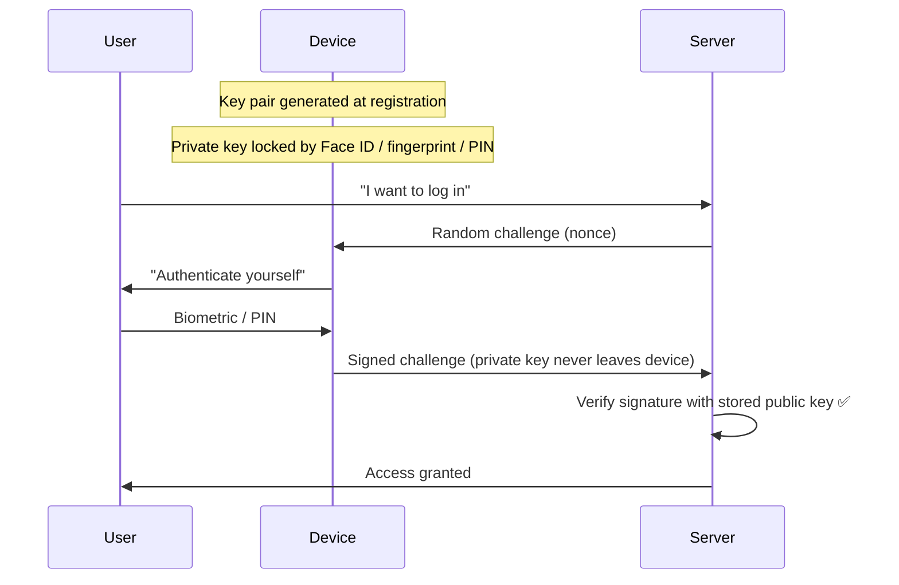
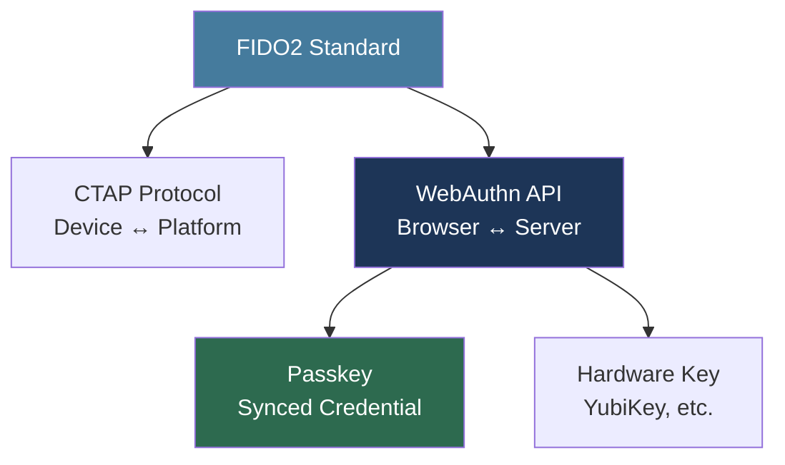
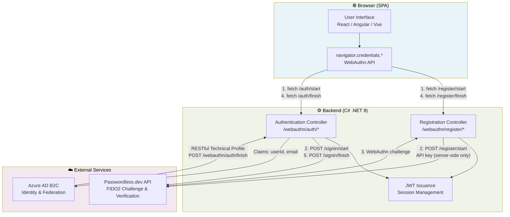
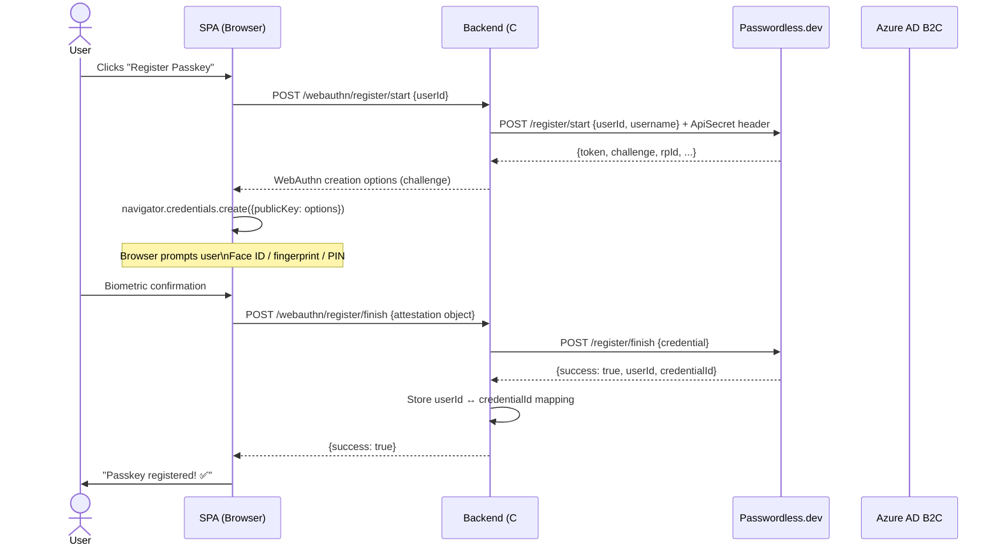
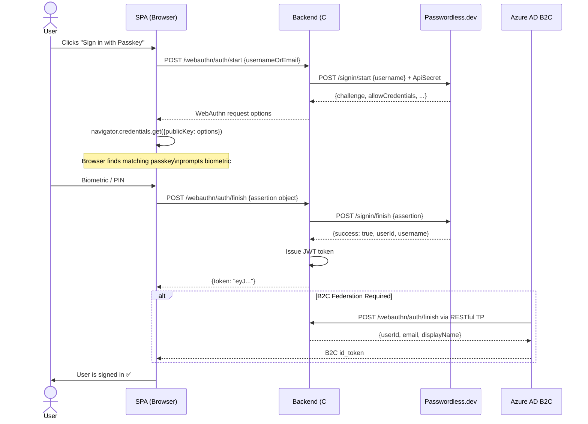
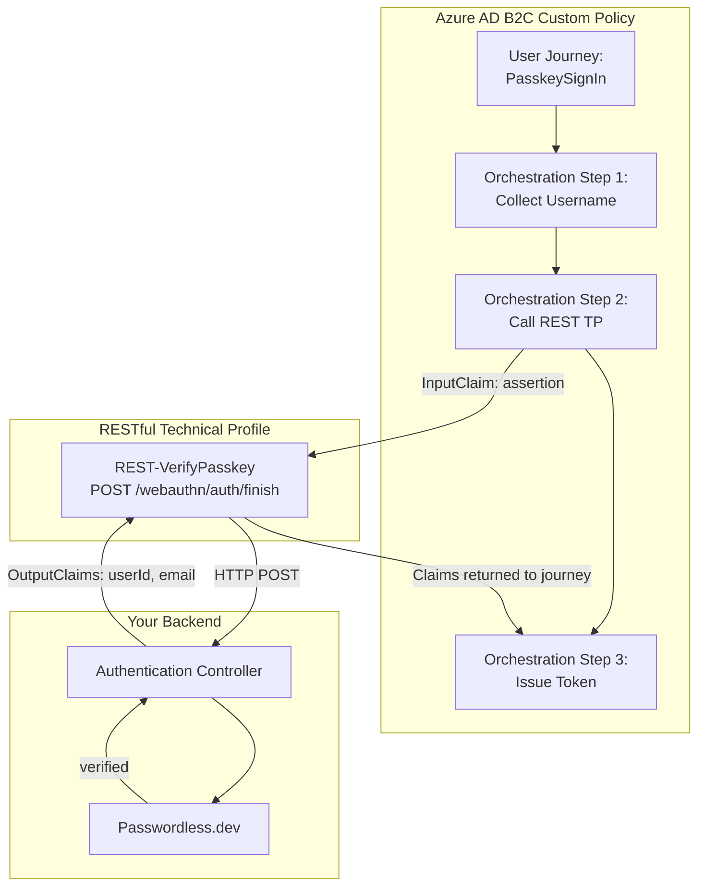
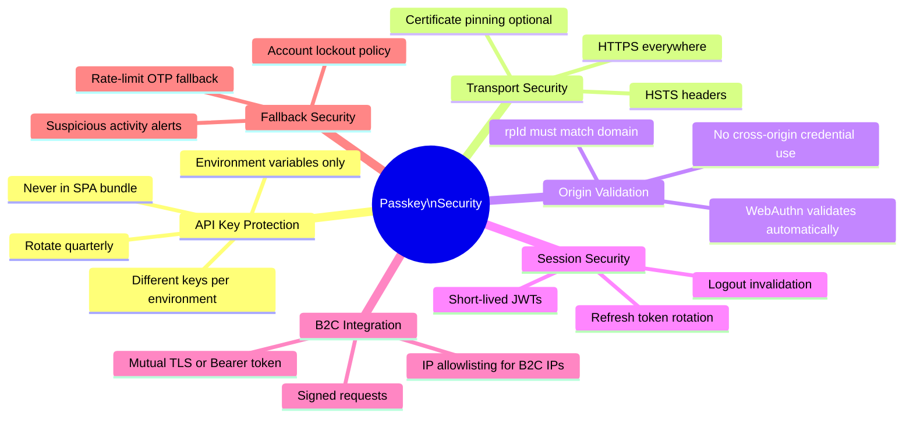
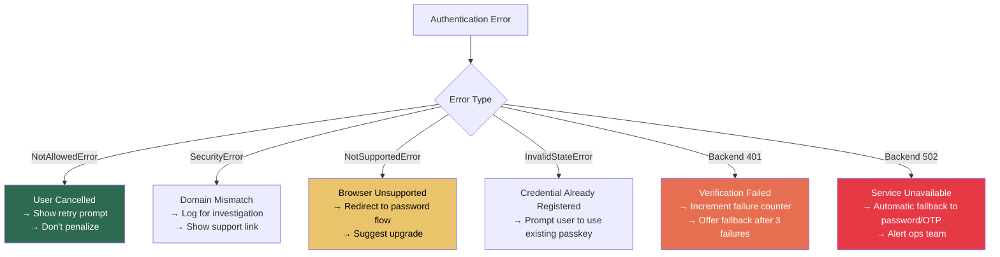
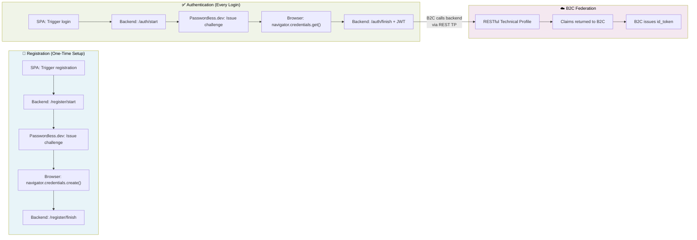

# Passkeys with Azure AD B2C and Passwordless.dev
## A Comprehensive Tutorial for SPA + C# Backend

> *Passwords are dying. Passkeys — built on FIDO2/WebAuthn — offer phishing-resistant, biometric authentication with no shared secrets. This tutorial shows you how to wire them up across an Azure AD B2C identity platform, a browser-based SPA, and a C# .NET backend.*

---

## 📋 Table of Contents

1. [What Are Passkeys? Core Concepts](#concepts)
2. [High-Level Architecture](#architecture)
3. [Prerequisites & Setup](#prerequisites)
4. [Registration Flow — Deep Dive](#registration)
5. [Authentication Flow — Deep Dive](#authentication)
6. [Azure AD B2C Integration](#b2c)
7. [Security Hardening](#security)
8. [Error Handling & Fallback Strategies](#errors)
9. [End-to-End Testing Checklist](#testing)
10. [Decision Framework & Use Cases](#usecases)

---

## 1. What Are Passkeys? Core Concepts {#concepts}

Before writing a single line of code, it's worth understanding the cryptographic model that makes passkeys more secure than passwords.

### The Password Problem

Traditional passwords have three fundamental weaknesses:

| Problem | Description | Attack Vector |
|---|---|---|
| **Shared secrets** | Server stores a hash; if breached, passwords leak | Database breach |
| **Phishable** | Users can be tricked into typing them on fake sites | Phishing sites |
| **Reused** | Most users reuse passwords across services | Credential stuffing |

### How Passkeys Solve This

Passkeys use **public-key cryptography**. The device generates a key pair:

- **Private key** — stays on the device, never leaves, protected by biometrics or PIN
- **Public key** — sent to and stored on the server

Authentication works by the server issuing a **challenge** (random bytes) and the device **signing** it with the private key. The server verifies the signature with the stored public key. No secret is ever transmitted.



### WebAuthn vs FIDO2 vs Passkeys — Clarifying the Terminology



- **FIDO2** — the overarching standard from the FIDO Alliance
- **WebAuthn** — the browser API (`navigator.credentials.*`) that implements FIDO2
- **Passkeys** — synced FIDO2 credentials backed up to iCloud Keychain / Google Password Manager, so they work across devices

---

## 2. High-Level Architecture {#architecture}

### The Three-Layer System

This implementation spans three distinct systems, each with a specific responsibility:



### Responsibility Matrix

| Component | What It Owns | What It Never Touches |
|---|---|---|
| **SPA** | WebAuthn browser API, UX, credential objects | API keys, Passwordless.dev directly |
| **Backend** | API key, challenge issuance, verification, JWT | Private keys (device-held) |
| **Passwordless.dev** | FIDO2 validation, credential storage | Your users' private data |
| **Azure AD B2C** | User identities, federation, token issuance | Passkey credentials directly |

---

## 3. Prerequisites & Setup {#prerequisites}

### Accounts and Services

Before writing code, you need:

1. **Passwordless.dev account** — [passwordless.dev](https://passwordless.dev) — free tier available
  - Copy your **Public API Key** (used in the SPA)
  - Copy your **Private API Secret** (backend only — never expose this)

2. **Azure AD B2C tenant** — requires Azure subscription
  - Custom policies enabled (Identity Experience Framework)
  - Application registration for your SPA

3. **HTTPS in development** — WebAuthn requires a secure context
  - Use `mkcert` for local dev: `mkcert localhost`
  - Or use `ngrok` to tunnel localhost

### Project Setup (.NET 9)

```bash
dotnet new webapi -n PasskeyBackend
cd PasskeyBackend
dotnet add package Microsoft.AspNetCore.Authentication.JwtBearer
dotnet add package System.IdentityModel.Tokens.Jwt
```

**appsettings.Development.json** — never commit secrets:

```json
{
 "Passwordless": {
   "ApiSecret": "YOUR_PRIVATE_SECRET_HERE",
   "ApiUrl": "https://v4.passwordless.dev"
 },
 "Jwt": {
   "Issuer": "https://your-backend.com",
   "Audience": "your-spa",
   "SigningKey": "YOUR_SIGNING_KEY_32_CHARS_MIN"
 }
}
```

**Use environment variables in production:**

```bash
export PASSWORDLESS__APISECRET="your_secret_here"
```

**Program.cs — register HttpClient with DI:**

```csharp
builder.Services.AddHttpClient("Passwordless", client =>
{
   client.BaseAddress = new Uri(builder.Configuration["Passwordless:ApiUrl"]!);
   client.DefaultRequestHeaders.Add(
       "ApiSecret",
       builder.Configuration["Passwordless:ApiSecret"]
   );
});
```

### SPA Setup

Install the Passwordless.dev browser client (optional but convenient):

```bash
npm install @passwordlessdev/passwordless-client
```

---

## 4. Registration Flow — Deep Dive {#registration}

### Full Sequence Diagram



### Backend: Registration Controllers (Production-Grade)

```csharp
// Models/RegistrationModels.cs
public record RegisterStartRequest(string UserId, string Username, string? DisplayName);
public record RegisterFinishRequest(object Credential);

// Services/PasswordlessService.cs
public class PasswordlessService
{
   private readonly HttpClient _http;
   private readonly ILogger<PasswordlessService> _logger;

   public PasswordlessService(
       IHttpClientFactory factory,
       ILogger<PasswordlessService> logger)
   {
       _http = factory.CreateClient("Passwordless");
       _logger = logger;
   }

   public async Task<JsonElement> StartRegistrationAsync(
       string userId, string username, string? displayName = null)
   {
       var payload = new
       {
           userId,
           username,
           displayName = displayName ?? username,
           // Credential options
           authenticatorType = "any",    // "platform" = device only, "cross-platform" = keys
           userVerification = "preferred",
           expiresAt = DateTime.UtcNow.AddMinutes(10)
       };

       var response = await _http.PostAsJsonAsync("/register/start", payload);
       response.EnsureSuccessStatusCode();
       return await response.Content.ReadFromJsonAsync<JsonElement>();
   }

   public async Task<JsonElement> FinishRegistrationAsync(object credential)
   {
       var response = await _http.PostAsJsonAsync("/register/finish", credential);
       response.EnsureSuccessStatusCode();
       return await response.Content.ReadFromJsonAsync<JsonElement>();
   }
}
```

```csharp
// Controllers/RegistrationController.cs
[ApiController]
[Route("webauthn/register")]
public class RegistrationController : ControllerBase
{
   private readonly PasswordlessService _passwordless;
   private readonly IUserCredentialRepository _credentials;
   private readonly ILogger<RegistrationController> _logger;

   public RegistrationController(
       PasswordlessService passwordless,
       IUserCredentialRepository credentials,
       ILogger<RegistrationController> logger)
   {
       _passwordless = passwordless;
       _credentials = credentials;
       _logger = logger;
   }

   /// <summary>
   /// Step 1: Backend calls Passwordless.dev and returns challenge to SPA.
   /// The SPA will pass this to navigator.credentials.create().
   /// </summary>
   [HttpPost("start")]
   [Authorize] // User must be logged into B2C already to register a passkey
   public async Task<IActionResult> Start([FromBody] RegisterStartRequest request)
   {
       // Pull userId from the authenticated B2C token — don't trust the request body
       var userId = User.FindFirst("sub")?.Value
           ?? User.FindFirst(ClaimTypes.NameIdentifier)?.Value;

       if (string.IsNullOrEmpty(userId))
           return Unauthorized("No user identity found in token.");

       try
       {
           var options = await _passwordless.StartRegistrationAsync(
               userId,
               request.Username,
               request.DisplayName
           );

           _logger.LogInformation("Registration started for user {UserId}", userId);
           return Ok(options);
       }
       catch (HttpRequestException ex)
       {
           _logger.LogError(ex, "Passwordless.dev error during registration start");
           return StatusCode(502, "Unable to reach authentication service.");
       }
   }

   /// <summary>
   /// Step 2: SPA sends the credential created by the browser.
   /// Backend verifies it with Passwordless.dev and stores the mapping.
   /// </summary>
   [HttpPost("finish")]
   [Authorize]
   public async Task<IActionResult> Finish([FromBody] JsonElement credential)
   {
       var userId = User.FindFirst("sub")?.Value
           ?? User.FindFirst(ClaimTypes.NameIdentifier)?.Value;

       try
       {
           var result = await _passwordless.FinishRegistrationAsync(credential);

           // Store the mapping for future lookups
           var credentialId = result.GetProperty("credentialId").GetString();
           await _credentials.StoreAsync(userId!, credentialId!);

           _logger.LogInformation(
               "Passkey registered: user {UserId}, credential {CredId}",
               userId, credentialId);

           return Ok(new { success = true, message = "Passkey registered successfully." });
       }
       catch (Exception ex)
       {
           _logger.LogError(ex, "Registration finish failed for user {UserId}", userId);
           return BadRequest(new { success = false, error = ex.Message });
       }
   }
}
```

### SPA: Registration (Production-Grade)

```javascript
// services/passkeyService.js
export class PasskeyService {

 /**
  * Register a new passkey for the currently authenticated user.
  * Prerequisites: user must already be signed into B2C.
  */
 async registerPasskey(userId, username) {
   // Step 1: Get WebAuthn creation options from backend
   const startResponse = await fetch('/webauthn/register/start', {
     method: 'POST',
     headers: {
       'Content-Type': 'application/json',
       'Authorization': `Bearer ${this.getB2CToken()}` // Include B2C access token
     },
     body: JSON.stringify({ userId, username })
   });

   if (!startResponse.ok) {
     throw new Error(`Registration start failed: ${startResponse.status}`);
   }

   const options = await startResponse.json();

   // Step 2: Browser creates credential (prompts user for biometric)
   // Convert base64url strings to ArrayBuffers (required by WebAuthn API)
   options.challenge = this._base64ToArrayBuffer(options.challenge);
   options.user.id = this._base64ToArrayBuffer(options.user.id);

   let credential;
   try {
     credential = await navigator.credentials.create({ publicKey: options });
   } catch (err) {
     if (err.name === 'NotAllowedError') {
       throw new Error('User cancelled or timed out. Please try again.');
     }
     throw err;
   }

   // Step 3: Send attestation to backend for verification
   const finishResponse = await fetch('/webauthn/register/finish', {
     method: 'POST',
     headers: {
       'Content-Type': 'application/json',
       'Authorization': `Bearer ${this.getB2CToken()}`
     },
     body: JSON.stringify(this._credentialToJson(credential))
   });

   if (!finishResponse.ok) {
     throw new Error('Registration verification failed.');
   }

   return await finishResponse.json();
 }

 // Convert ArrayBuffer ↔ base64url for JSON serialization
 _base64ToArrayBuffer(base64url) {
   const base64 = base64url.replace(/-/g, '+').replace(/_/g, '/');
   const binary = atob(base64);
   return Uint8Array.from(binary, c => c.charCodeAt(0)).buffer;
 }

 _arrayBufferToBase64(buffer) {
   return btoa(String.fromCharCode(...new Uint8Array(buffer)))
     .replace(/\+/g, '-').replace(/\//g, '_').replace(/=/g, '');
 }

 _credentialToJson(credential) {
   return {
     id: credential.id,
     rawId: this._arrayBufferToBase64(credential.rawId),
     type: credential.type,
     response: {
       clientDataJSON: this._arrayBufferToBase64(credential.response.clientDataJSON),
       attestationObject: this._arrayBufferToBase64(credential.response.attestationObject)
     }
   };
 }

 getB2CToken() {
   // Pull from MSAL or your session store
   return sessionStorage.getItem('b2c_access_token');
 }
}
```

---

## 5. Authentication Flow — Deep Dive {#authentication}

### Full Sequence Diagram



### Backend: Authentication Controllers (Production-Grade)

```csharp
// Controllers/AuthenticationController.cs
[ApiController]
[Route("webauthn/auth")]
public class AuthenticationController : ControllerBase
{
   private readonly PasswordlessService _passwordless;
   private readonly IJwtService _jwt;
   private readonly ILogger<AuthenticationController> _logger;

   public AuthenticationController(
       PasswordlessService passwordless,
       IJwtService jwt,
       ILogger<AuthenticationController> logger)
   {
       _passwordless = passwordless;
       _jwt = jwt;
       _logger = logger;
   }

   /// <summary>
   /// Step 1: Returns a WebAuthn authentication challenge for the browser.
   /// </summary>
   [HttpPost("start")]
   [AllowAnonymous]
   public async Task<IActionResult> Start([FromBody] AuthStartRequest request)
   {
       try
       {
           var options = await _passwordless.StartAuthenticationAsync(request.UsernameOrEmail);
           return Ok(options);
       }
       catch (HttpRequestException ex)
       {
           _logger.LogError(ex, "Authentication start failed for {User}", request.UsernameOrEmail);
           return StatusCode(502, "Authentication service unavailable.");
       }
   }

   /// <summary>
   /// Step 2: Verifies the signed assertion and issues a JWT.
   /// Also called by Azure AD B2C as a RESTful Technical Profile.
   /// </summary>
   [HttpPost("finish")]
   [AllowAnonymous]
   public async Task<IActionResult> Finish([FromBody] JsonElement assertion)
   {
       try
       {
           var result = await _passwordless.FinishAuthenticationAsync(assertion);

           if (!result.TryGetProperty("success", out var success) || !success.GetBoolean())
           {
               return Unauthorized(new { error = "Passkey verification failed." });
           }

           var userId = result.GetProperty("userId").GetString()!;
           var username = result.GetProperty("username").GetString()!;

           _logger.LogInformation("Successful passkey login: {UserId}", userId);

           // Determine caller: B2C REST TP or direct SPA call
           if (Request.Headers.ContainsKey("X-B2C-Request"))
           {
               // Return claims for B2C to consume
               return Ok(new
               {
                   userId,
                   email = username,
                   displayName = username,
                   passkeyAuthenticated = true
               });
           }

           // Issue JWT for direct SPA login
           var token = _jwt.IssueToken(userId, username);
           return Ok(new { token, userId, username });
       }
       catch (Exception ex)
       {
           _logger.LogError(ex, "Authentication finish failed");
           return StatusCode(500, new { error = "Authentication processing error." });
       }
   }
}
```

```csharp
// Services/JwtService.cs
public class JwtService : IJwtService
{
   private readonly IConfiguration _config;

   public JwtService(IConfiguration config) => _config = config;

   public string IssueToken(string userId, string username)
   {
       var key = new SymmetricSecurityKey(
           Encoding.UTF8.GetBytes(_config["Jwt:SigningKey"]!));

       var claims = new[]
       {
           new Claim(JwtRegisteredClaimNames.Sub, userId),
           new Claim(JwtRegisteredClaimNames.Email, username),
           new Claim("amr", "passkey"),          // Authentication Method Reference
           new Claim(JwtRegisteredClaimNames.Jti, Guid.NewGuid().ToString())
       };

       var token = new JwtSecurityToken(
           issuer: _config["Jwt:Issuer"],
           audience: _config["Jwt:Audience"],
           claims: claims,
           expires: DateTime.UtcNow.AddHours(8),
           signingCredentials: new SigningCredentials(key, SecurityAlgorithms.HmacSha256)
       );

       return new JwtSecurityTokenHandler().WriteToken(token);
   }
}
```

### SPA: Authentication

```javascript
// In PasskeyService class (continued from registration)

async signInWithPasskey(usernameOrEmail) {
 // Step 1: Get challenge from backend
 const startResponse = await fetch('/webauthn/auth/start', {
   method: 'POST',
   headers: { 'Content-Type': 'application/json' },
   body: JSON.stringify({ usernameOrEmail })
 });

 if (!startResponse.ok) {
   throw new Error('Could not initiate passkey login.');
 }

 const options = await startResponse.json();

 // Decode base64url fields
 options.challenge = this._base64ToArrayBuffer(options.challenge);
 if (options.allowCredentials) {
   options.allowCredentials = options.allowCredentials.map(cred => ({
     ...cred,
     id: this._base64ToArrayBuffer(cred.id)
   }));
 }

 // Step 2: Browser retrieves the passkey (prompts biometric)
 let assertion;
 try {
   assertion = await navigator.credentials.get({ publicKey: options });
 } catch (err) {
   if (err.name === 'NotAllowedError') {
     throw new Error('Sign-in cancelled. Please try again.');
   }
   if (err.name === 'SecurityError') {
     throw new Error('Domain mismatch — passkey not valid for this site.');
   }
   throw err;
 }

 // Step 3: Verify with backend
 const finishResponse = await fetch('/webauthn/auth/finish', {
   method: 'POST',
   headers: { 'Content-Type': 'application/json' },
   body: JSON.stringify(this._assertionToJson(assertion))
 });

 if (!finishResponse.ok) {
   throw new Error('Passkey verification failed.');
 }

 const { token, userId, username } = await finishResponse.json();

 // Store token and update app state
 sessionStorage.setItem('access_token', token);
 return { userId, username };
}

_assertionToJson(assertion) {
 return {
   id: assertion.id,
   rawId: this._arrayBufferToBase64(assertion.rawId),
   type: assertion.type,
   response: {
     clientDataJSON: this._arrayBufferToBase64(assertion.response.clientDataJSON),
     authenticatorData: this._arrayBufferToBase64(assertion.response.authenticatorData),
     signature: this._arrayBufferToBase64(assertion.response.signature),
     userHandle: assertion.response.userHandle
       ? this._arrayBufferToBase64(assertion.response.userHandle)
       : null
   }
 };
}
```

---

## 6. Azure AD B2C Integration {#b2c}

### Why B2C Doesn't Store Passkeys Directly

Azure AD B2C manages identity (who the user is) but delegates specific authentication mechanisms to external providers via **Custom Policies**. Passkeys are stored in Passwordless.dev; B2C calls your backend to verify them and receive back trusted claims.

### Custom Policy Architecture



### RESTful Technical Profile (Full Policy XML)

```xml
<!-- TrustFrameworkExtensions.xml -->

<!-- 1. Declare custom claim types -->
<BuildingBlocks>
 <ClaimsSchema>
   <ClaimType Id="passkeyAssertion">
     <DisplayName>Passkey Assertion</DisplayName>
     <DataType>string</DataType>
   </ClaimType>
   <ClaimType Id="passkeyAuthenticated">
     <DisplayName>Passkey Authenticated</DisplayName>
     <DataType>boolean</DataType>
   </ClaimType>
 </ClaimsSchema>
</BuildingBlocks>

<!-- 2. Define the RESTful Technical Profile -->
<ClaimsProviders>
 <ClaimsProvider>
   <DisplayName>Passkey Verification REST API</DisplayName>
   <TechnicalProfiles>

     <TechnicalProfile Id="REST-VerifyPasskey">
       <DisplayName>Verify Passkey via Backend</DisplayName>
       <Protocol
         Name="Proprietary"
         Handler="Web.TPEngine.Providers.RestfulProvider.RestfulProvider, Web.TPEngine" />

       <Metadata>
         <Item Key="ServiceUrl">https://your-backend.com/webauthn/auth/finish</Item>
         <Item Key="AuthenticationType">Bearer</Item>
         <Item Key="SendClaimsIn">Body</Item>
         <Item Key="AllowInsecureAuthInProduction">false</Item>
       </Metadata>

       <!-- Bearer token for B2C → Backend authentication -->
       <CryptographicKeys>
         <Key Id="BearerAuthenticationToken" StorageReferenceId="B2C_1A_PasskeyApiKey" />
       </CryptographicKeys>

       <InputClaims>
         <!-- The raw assertion JSON from the browser, passed through B2C -->
         <InputClaim ClaimTypeReferenceId="passkeyAssertion" PartnerClaimType="assertion" />
       </InputClaims>

       <OutputClaims>
         <!-- Claims your backend returns after successful verification -->
         <OutputClaim ClaimTypeReferenceId="objectId" PartnerClaimType="userId" />
         <OutputClaim ClaimTypeReferenceId="email" PartnerClaimType="email" />
         <OutputClaim ClaimTypeReferenceId="displayName" PartnerClaimType="displayName" />
         <OutputClaim ClaimTypeReferenceId="passkeyAuthenticated" PartnerClaimType="passkeyAuthenticated" />
       </OutputClaims>

       <!-- Retry on transient failures -->
       <UseTechnicalProfileForSessionManagement ReferenceId="SM-Noop" />
     </TechnicalProfile>

   </TechnicalProfiles>
 </ClaimsProvider>
</ClaimsProviders>
```

### Protecting the Backend Endpoint from B2C

Your `/webauthn/auth/finish` endpoint will be called by both the SPA directly **and** by B2C. Distinguish them:

```csharp
// In AuthenticationController.Finish():

// B2C sends a specific header configured in the TP metadata
bool isB2CRequest = Request.Headers.TryGetValue("X-B2C-Request", out _)
   || Request.Headers.TryGetValue("Authorization", out var authHeader)
      && authHeader.ToString().StartsWith("Bearer b2c_");

if (isB2CRequest)
{
   // Validate the B2C bearer token before processing
   // Return claims in the format B2C expects
   return Ok(new { userId, email, displayName, passkeyAuthenticated = true });
}
else
{
   // SPA request — issue JWT
   var token = _jwt.IssueToken(userId, username);
   return Ok(new { token });
}
```

---

## 7. Security Hardening {#security}

### Security Architecture Overview



### HTTPS and Security Headers

```csharp
// Program.cs — production security headers
app.Use(async (context, next) =>
{
   context.Response.Headers.Add("Strict-Transport-Security", "max-age=31536000; includeSubDomains");
   context.Response.Headers.Add("X-Content-Type-Options", "nosniff");
   context.Response.Headers.Add("X-Frame-Options", "DENY");
   context.Response.Headers.Add("Referrer-Policy", "strict-origin-when-cross-origin");
   // Required for WebAuthn
   context.Response.Headers.Add("Cross-Origin-Opener-Policy", "same-origin");
   await next();
});
```

### Rate Limiting Auth Endpoints

```csharp
// Program.cs
builder.Services.AddRateLimiter(options =>
{
   options.AddFixedWindowLimiter("auth", policy =>
   {
       policy.Window = TimeSpan.FromMinutes(1);
       policy.PermitLimit = 10;       // Max 10 auth attempts per minute per IP
       policy.QueueLimit = 0;
       policy.QueueProcessingOrder = QueueProcessingOrder.OldestFirst;
   });
});

// Apply to auth endpoints
[HttpPost("finish")]
[RateLimiter(policyName: "auth")]
public async Task<IActionResult> Finish(...)
```

---

## 8. Error Handling & Fallback Strategies {#errors}

### Error Taxonomy



### Fallback Flow Implementation

```javascript
// components/LoginForm.jsx
async function handleLogin(username) {
 setStatus('loading');
 
 try {
   const result = await passkeyService.signInWithPasskey(username);
   onLoginSuccess(result);
   
 } catch (err) {
   console.warn('Passkey login failed:', err.message);
   
   if (err.name === 'NotAllowedError') {
     // User cancelled — offer retry, not fallback
     setStatus('cancelled');
     setMessage('Sign-in was cancelled. Try again or use a password.');
     
   } else if (err.name === 'NotSupportedError' || err.name === 'SecurityError') {
     // Device/browser can't support passkeys — silently fall back
     setStatus('fallback');
     await initiatePasswordLogin(username);
     
   } else {
     // Unknown error — offer fallback option
     setStatus('error');
     setMessage('Passkey sign-in failed. You can sign in with your password instead.');
     setShowFallback(true);
   }
 }
}

function LoginForm() {
 return (
   <div>
     {status === 'error' && showFallback && (
       <div className="fallback-banner">
         <button onClick={() => initiateOtpLogin(username)}>
           Sign in with Email OTP instead
         </button>
       </div>
     )}
     <button onClick={() => handleLogin(username)} disabled={status === 'loading'}>
       {status === 'loading' ? 'Verifying...' : '🔑 Sign in with Passkey'}
     </button>
   </div>
 );
}
```

---

## 9. End-to-End Testing Checklist {#testing}

### Backend Unit Tests

```csharp
// Tests/RegistrationControllerTests.cs
public class RegistrationControllerTests
{
   [Fact]
   public async Task Start_WithValidUser_ReturnsChallengeOptions()
   {
       // Arrange
       var mockPasswordless = Substitute.For<PasswordlessService>();
       mockPasswordless.StartRegistrationAsync(Arg.Any<string>(), Arg.Any<string>())
           .Returns(Task.FromResult(JsonDocument.Parse("""
               {"challenge":"abc123","rpId":"localhost"}
           """).RootElement));

       var controller = new RegistrationController(mockPasswordless, ...);
       SetUserClaim(controller, "sub", "user-001");

       // Act
       var result = await controller.Start(new RegisterStartRequest("user-001", "alice"));

       // Assert
       var ok = Assert.IsType<OkObjectResult>(result);
       Assert.NotNull(ok.Value);
   }

   [Fact]
   public async Task Start_WithNoAuthenticatedUser_ReturnsUnauthorized()
   {
       var controller = new RegistrationController(...);
       // No claims set

       var result = await controller.Start(new RegisterStartRequest("user-001", "alice"));
       Assert.IsType<UnauthorizedObjectResult>(result);
   }
}
```

### Manual QA Checklist

```
Registration
☐ Register passkey on Chrome (desktop)
☐ Register passkey on Safari (iPhone)
☐ Register passkey on Chrome (Android)
☐ Attempt duplicate registration — should show friendly message
☐ Cancel during biometric prompt — verify graceful handling

Authentication
☐ Sign in immediately after registration
☐ Sign in from a different browser on the same device (synced passkey)
☐ Sign in from a second device (iCloud / Google sync)
☐ Sign in without registering — should fall back cleanly
☐ Invalid assertion tampered — backend must return 401

B2C Integration
☐ B2C custom policy correctly calls REST TP
☐ Claims (userId, email) returned and present in B2C id_token
☐ B2C user journey completes end-to-end

Security
☐ API key not present in browser network tab
☐ HTTPS enforced — HTTP redirects to HTTPS
☐ Challenge is single-use (replaying assertion fails)
☐ Rate limiting triggers after 10 rapid auth attempts
```

---

## 10. Decision Framework & Use Cases {#usecases}

### When to Use This Architecture

```mermaid
flowchart TD
   START([Evaluating Passkey Implementation]) --> Q1{Does your IdP\nnatively support\npasskeys?}
   
   Q1 -->|"Yes (Okta, Auth0 new)"|  NATIVE["Use native passkey support\nLess complexity, vendor managed"]
   Q1 -->|"No (Azure AD B2C,\nlegacy IdPs)"| Q2{Do you need\nB2C to remain the\ncentral IdP?}
   
   Q2 -->|No| STANDALONE["Standalone Passwordless.dev\nSkip B2C integration\nIssue your own tokens"]
   
   Q2 -->|Yes| Q3{Do you have\na backend service\nyou control?}
   
   Q3 -->|No| MANAGED["Use Passwordless.dev\nhosted SDK directly\n(simpler, less control)"]
   
   Q3 -->|Yes| THIS["✅ This Architecture\nB2C + Passwordless.dev\n+ C# Backend"]

   style THIS fill:#2d6a4f,color:#fff
   style NATIVE fill:#457b9d,color:#fff
   style MANAGED fill:#1d3557,color:#fff
   style STANDALONE fill:#e9c46a,color:#000
```

### Real-World Use Cases

| Scenario | Fit | Notes |
|---|---|---|
| Enterprise app with existing B2C users | ✅ Excellent | Users keep B2C identity, gain passkeys |
| Consumer app with millions of users | ✅ Good | Passwordless.dev scales well |
| High-security financial app | ✅ Excellent | Phishing-resistant auth is critical |
| Internal tool (< 100 users) | ⚠️ Overkill | Consider simpler MSAL + MFA |
| App where IdP natively supports passkeys | ❌ Skip | Add unnecessary complexity |
| Public kiosk / shared device | ❌ Skip | Passkeys assume personal device |

---

## Summary: The Complete Picture



### Key Principles to Remember

**🔑 The API secret never leaves the backend.** The SPA only communicates with your backend — never directly with Passwordless.dev.

**🚫 Never block on WebAuthn errors.** User cancellations are common; always offer a graceful fallback path (email OTP, password).

**🌐 HTTPS is not optional.** WebAuthn refuses to operate on non-secure origins. Test with mkcert or ngrok in development.

**🔗 B2C remains the source of truth for identity.** Passkeys verify *authentication*; B2C manages the *user record*. Keep these concerns cleanly separated.

**📱 Sync is the superpower.** Unlike hardware keys, passkeys synced via iCloud or Google are automatically available across a user's devices — design your UX to highlight this.

---