# Migrating Azure AD B2C Custom Policies to Microsoft Entra External Identities
### A Comprehensive, In-Depth Migration Guide

---

## Table of Contents

1. [Introduction & Overview](#1-introduction--overview)
2. [Platform Architecture Deep Dive](#2-platform-architecture-deep-dive)
3. [Key Differences & Feature Mapping](#3-key-differences--feature-mapping)
4. [Migration Strategy & Planning](#4-migration-strategy--planning)
5. [Tenant Setup & Configuration](#5-tenant-setup--configuration)
6. [Core Concept Mapping: IEF → External Identities](#6-core-concept-mapping-ief--external-identities)
7. [User Flow & Custom Policy Migration](#7-user-flow--custom-policy-migration)
8. [Claims Transformation Migration](#8-claims-transformation-migration)
9. [Identity Provider Migration](#9-identity-provider-migration)
10. [Custom UI/UX Migration](#10-custom-uiux-migration)
11. [REST API Connectors & Extensions](#11-rest-api-connectors--extensions)
12. [User Data & Directory Migration](#12-user-data--directory-migration)
13. [Application Registration Migration](#13-application-registration-migration)
14. [Real-World Use Cases](#14-real-world-use-cases)
15. [Testing & Validation Framework](#15-testing--validation-framework)
16. [Cutover Strategy & Rollback Plan](#16-cutover-strategy--rollback-plan)
17. [Troubleshooting & Common Pitfalls](#17-troubleshooting--common-pitfalls)
18. [Post-Migration Checklist](#18-post-migration-checklist)

---

## 1. Introduction & Overview

### What Is This Migration?

Microsoft has been evolving its Customer Identity and Access Management (CIAM) platform significantly. **Azure Active Directory B2C (Azure AD B2C)** has been the go-to platform for building consumer-facing authentication experiences for years. However, Microsoft has introduced **Microsoft Entra External Identities** as its next-generation CIAM platform — offering a more modern, developer-friendly, and feature-rich alternative.

> **Important Timeline Note:** Azure AD B2C will continue to be supported through at least **September 1, 2025**, giving organizations ample migration runway. However, all **new CIAM investment from Microsoft** is going into Entra External Identities.

### Why Migrate?

| Reason | Details |
|---|---|
| **Modern Developer Experience** | Native support for standard OIDC/OAuth 2.0 without XML-based policy files |
| **Native Auth SDK** | First-class React, Angular, iOS, Android, and .NET SDKs |
| **Richer Branding** | Per-application branding with no XML overhead |
| **Integrated Governance** | Shared Entra ID governance, Conditional Access, and Identity Protection |
| **Simplified Configuration** | GUI-based flows replacing XML custom policies |
| **Microsoft Graph** | Full MS Graph API support for user management |

---

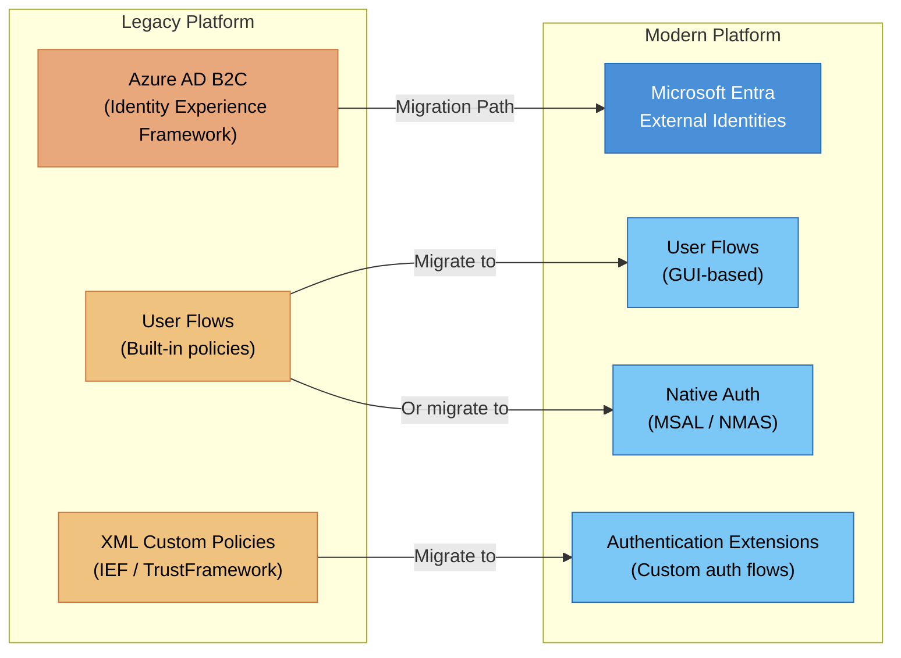
```mermaid
graph LR
    subgraph "Legacy Platform"
        B2C["Azure AD B2C\n(Identity Experience Framework)"]
        B2C_XML["XML Custom Policies\n(IEF / TrustFramework)"]
        B2C_UF["User Flows\n(Built-in policies)"]
    end

    subgraph "Modern Platform"
        EEI["Microsoft Entra\nExternal Identities"]
        EEI_FLOW["User Flows\n(GUI-based)"]
        EEI_NATIVE["Native Auth\n(MSAL / NMAS)"]
        EEI_EXT["Authentication Extensions\n(Custom auth flows)"]
    end

    B2C -->|"Migration Path"| EEI
    B2C_XML -->|"Migrate to"| EEI_EXT
    B2C_UF -->|"Migrate to"| EEI_FLOW
    B2C_UF -->|"Or migrate to"| EEI_NATIVE

    style B2C fill:#e8a87c,stroke:#c97a40,color:#000
    style EEI fill:#4a90d9,stroke:#2a6aaf,color:#fff
    style B2C_XML fill:#f0c27f,stroke:#c97a40,color:#000
    style B2C_UF fill:#f0c27f,stroke:#c97a40,color:#000
    style EEI_FLOW fill:#7bc8f6,stroke:#2a6aaf,color:#000
    style EEI_NATIVE fill:#7bc8f6,stroke:#2a6aaf,color:#000
    style EEI_EXT fill:#7bc8f6,stroke:#2a6aaf,color:#000
```

---

## 2. Platform Architecture Deep Dive

### 2.1 Azure AD B2C Architecture

Azure AD B2C was built on the **Identity Experience Framework (IEF)**, which is a highly extensible policy engine that uses XML-based configuration files called **Trust Framework policies** (or custom policies). These policies define every step of the user journey from start to finish.

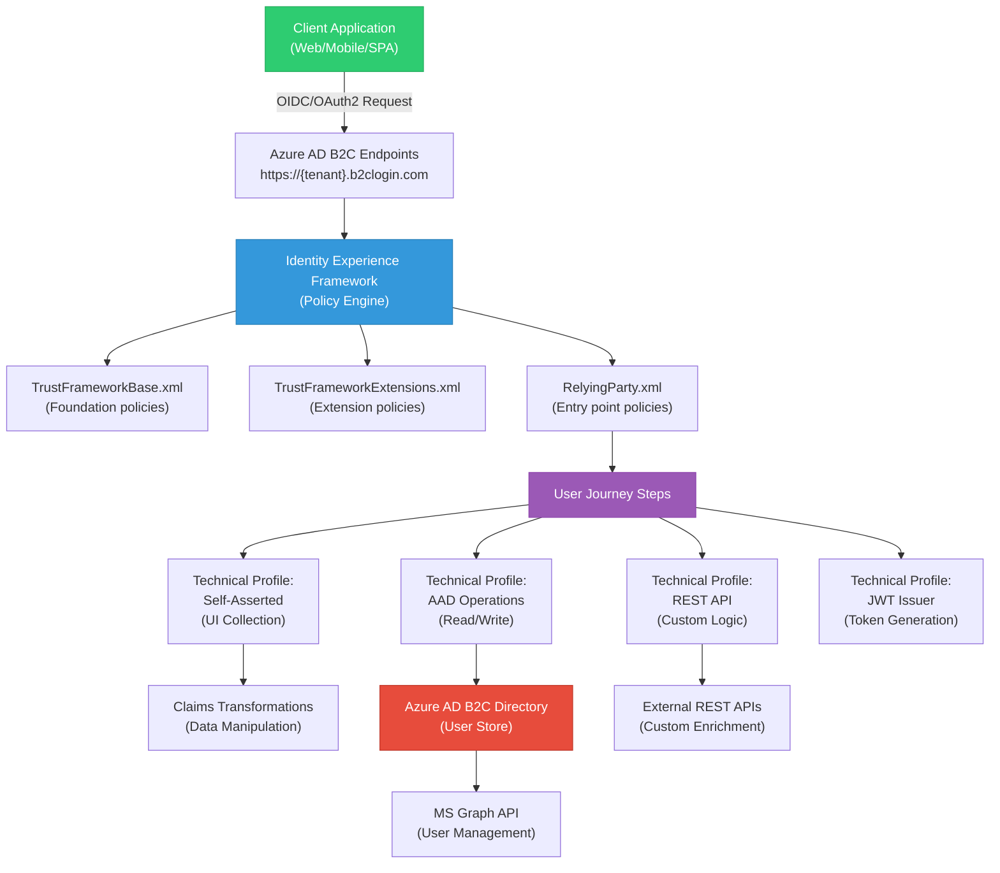
```mermaid
graph TD
    APP["Client Application\n(Web/Mobile/SPA)"] --> |"OIDC/OAuth2 Request"| B2C_EP["Azure AD B2C Endpoints\nhttps://{tenant}.b2clogin.com"]

    B2C_EP --> IEF["Identity Experience Framework\n(Policy Engine)"]

    IEF --> TF_BASE["TrustFrameworkBase.xml\n(Foundation policies)"]
    IEF --> TF_EXT["TrustFrameworkExtensions.xml\n(Extension policies)"]
    IEF --> RP["RelyingParty.xml\n(Entry point policies)"]

    RP --> UJ["User Journey Steps"]
    UJ --> TP1["Technical Profile:\nSelf-Asserted\n(UI Collection)"]
    UJ --> TP2["Technical Profile:\nAAD Operations\n(Read/Write)"]
    UJ --> TP3["Technical Profile:\nREST API\n(Custom Logic)"]
    UJ --> TP4["Technical Profile:\nJWT Issuer\n(Token Generation)"]

    TP1 --> CT["Claims Transformations\n(Data Manipulation)"]
    TP2 --> AAD_DIR["Azure AD B2C Directory\n(User Store)"]
    TP3 --> REST_API["External REST APIs\n(Custom Enrichment)"]

    AAD_DIR --> GRAPH["MS Graph API\n(User Management)"]

    style APP fill:#2ecc71,stroke:#27ae60,color:#fff
    style IEF fill:#3498db,stroke:#2980b9,color:#fff
    style UJ fill:#9b59b6,stroke:#8e44ad,color:#fff
    style AAD_DIR fill:#e74c3c,stroke:#c0392b,color:#fff
```

**Key B2C Concepts:**

- **TrustFrameworkBase.xml**: Contains all foundational claims, technical profiles, and claims transformations
- **TrustFrameworkExtensions.xml**: Overrides and extends the base policy
- **Relying Party (RP) Policy**: The entry-point policy referenced by applications
- **Technical Profiles**: Atomic units that perform a specific function (collect user input, call APIs, issue tokens)
- **User Journeys**: Ordered list of orchestration steps forming a complete flow
- **Claims**: The data payload that flows through the policy (email, name, custom attributes, etc.)

---

### 2.2 Microsoft Entra External Identities Architecture

Microsoft Entra External Identities uses a fundamentally different, more modern architecture. Rather than XML policy files, it uses a **configuration-driven model** with a GUI in the Entra admin portal, combined with **Authentication Extensions** (formerly called Custom Authentication Extensions) for custom logic.

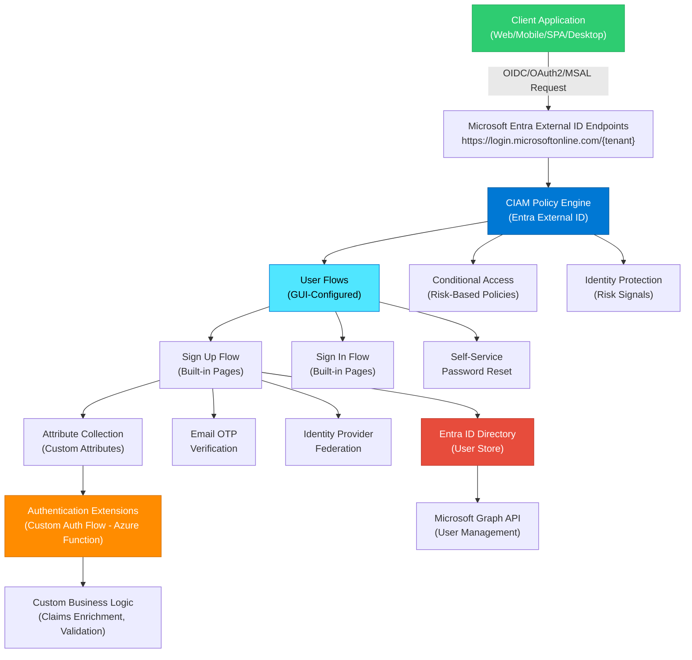
```mermaid
graph TD
    APP["Client Application\n(Web/Mobile/SPA/Desktop)"] --> |"OIDC/OAuth2/MSAL Request"| EEI_EP["Microsoft Entra External ID Endpoints\nhttps://login.microsoftonline.com/{tenant}"]

    EEI_EP --> CIAM["CIAM Policy Engine\n(Entra External ID)"]

    CIAM --> UF["User Flows\n(GUI-Configured)"]
    CIAM --> CA["Conditional Access\n(Risk-Based Policies)"]
    CIAM --> IP["Identity Protection\n(Risk Signals)"]

    UF --> SIGNUP["Sign Up Flow\n(Built-in Pages)"]
    UF --> SIGNIN["Sign In Flow\n(Built-in Pages)"]
    UF --> SSPR["Self-Service\nPassword Reset"]

    SIGNUP --> ATTR_COLLECT["Attribute Collection\n(Custom Attributes)"]
    SIGNUP --> EMAIL_OTP["Email OTP\nVerification"]
    SIGNUP --> IDP_FED["Identity Provider\nFederation"]

    ATTR_COLLECT --> AUTH_EXT["Authentication Extensions\n(Custom Auth Flow - Azure Function)"]
    AUTH_EXT --> CUSTOM_LOGIC["Custom Business Logic\n(Claims Enrichment, Validation)"]

    SIGNUP --> EID_DIR["Entra ID Directory\n(User Store)"]
    EID_DIR --> MS_GRAPH["Microsoft Graph API\n(User Management)"]

    style APP fill:#2ecc71,stroke:#27ae60,color:#fff
    style CIAM fill:#0078d4,stroke:#005a9e,color:#fff
    style UF fill:#50e6ff,stroke:#0078d4,color:#000
    style AUTH_EXT fill:#ff8c00,stroke:#d4730a,color:#fff
    style EID_DIR fill:#e74c3c,stroke:#c0392b,color:#fff
```

**Key Entra External ID Concepts:**

- **User Flows**: GUI-configured authentication journeys (Sign up/Sign in, Password Reset)
- **Authentication Extensions**: Azure Functions that hook into the auth flow at specific extension points
- **Custom Attributes**: Additional user properties beyond the standard schema
- **Identity Providers**: Social (Google, Facebook, Apple) and enterprise (SAML, OIDC) federation
- **Native Auth**: SDK-based auth without browser redirects (for mobile/desktop apps)
- **Branding**: Per-tenant and per-app UI customization

---

## 3. Key Differences & Feature Mapping

### 3.1 Conceptual Comparison

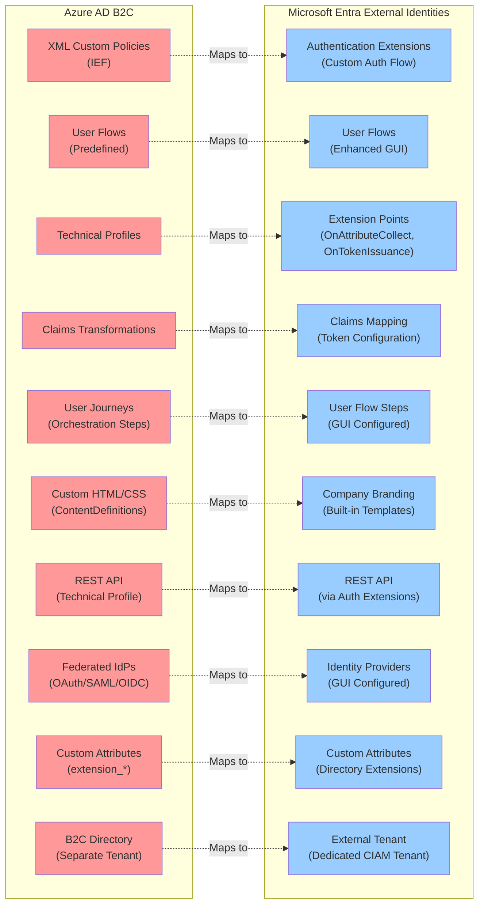
```mermaid
graph LR
    subgraph "Azure AD B2C"
        direction TB
        A1["XML Custom Policies\n(IEF)"]
        A2["User Flows\n(Predefined)"]
        A3["Technical Profiles"]
        A4["Claims Transformations"]
        A5["User Journeys\n(Orchestration Steps)"]
        A6["Custom HTML/CSS\n(ContentDefinitions)"]
        A7["REST API\n(Technical Profile)"]
        A8["Federated IdPs\n(OAuth/SAML/OIDC)"]
        A9["Custom Attributes\n(extension_*)"]
        A10["B2C Directory\n(Separate Tenant)"]
    end

    subgraph "Microsoft Entra External Identities"
        direction TB
        B1["Authentication Extensions\n(Custom Auth Flow)"]
        B2["User Flows\n(Enhanced GUI)"]
        B3["Extension Points\n(OnAttributeCollect, OnTokenIssuance)"]
        B4["Claims Mapping\n(Token Configuration)"]
        B5["User Flow Steps\n(GUI Configured)"]
        B6["Company Branding\n(Built-in Templates)"]
        B7["REST API\n(via Auth Extensions)"]
        B8["Identity Providers\n(GUI Configured)"]
        B9["Custom Attributes\n(Directory Extensions)"]
        B10["External Tenant\n(Dedicated CIAM Tenant)"]
    end

    A1 -.->|Maps to| B1
    A2 -.->|Maps to| B2
    A3 -.->|Maps to| B3
    A4 -.->|Maps to| B4
    A5 -.->|Maps to| B5
    A6 -.->|Maps to| B6
    A7 -.->|Maps to| B7
    A8 -.->|Maps to| B8
    A9 -.->|Maps to| B9
    A10 -.->|Maps to| B10

    style A1 fill:#ff9999
    style A2 fill:#ff9999
    style A3 fill:#ff9999
    style A4 fill:#ff9999
    style A5 fill:#ff9999
    style A6 fill:#ff9999
    style A7 fill:#ff9999
    style A8 fill:#ff9999
    style A9 fill:#ff9999
    style A10 fill:#ff9999
    style B1 fill:#99ccff
    style B2 fill:#99ccff
    style B3 fill:#99ccff
    style B4 fill:#99ccff
    style B5 fill:#99ccff
    style B6 fill:#99ccff
    style B7 fill:#99ccff
    style B8 fill:#99ccff
    style B9 fill:#99ccff
    style B10 fill:#99ccff
```

### 3.2 Detailed Feature Comparison Table

| Feature | Azure AD B2C | Entra External Identities | Migration Effort |
|---|---|---|---|
| **Configuration Method** | XML Policy Files | GUI + JSON (Auth Extensions) | High |
| **Sign Up/Sign In** | User Flow or Custom Policy | User Flow (GUI) | Low |
| **MFA** | Phone, Email OTP via TP | Email OTP, TOTP, Phone (built-in) | Low |
| **Social Identity Providers** | XML Technical Profile | GUI Configuration | Low |
| **Custom Claims** | `extension_*` attributes | Directory Extension Attributes | Medium |
| **Custom Business Logic** | REST API Technical Profile | Authentication Extensions (Azure Fn) | Medium |
| **Custom UI** | ContentDefinitions + HTML Templates | Company Branding + HTML Templates | Medium |
| **Token Customization** | Claims Transformations in XML | Token Configuration + Auth Extensions | Medium |
| **Conditional Access** | Limited (via custom policies) | Native Entra CA Integration | Low (Improved) |
| **SSPR** | User Flow | User Flow (built-in) | Low |
| **Profile Edit** | User Flow / Custom Policy | User Flow (limited) / Graph API | Medium |
| **Resource Owner Password** | Supported (ROPC policy) | Not supported (by design) | High |
| **Custom Domains** | Supported | Supported | Low |
| **SAML SP** | Supported | In Preview/Roadmap | High |
| **Invitation Flow** | Via Custom Policy | Built-in (B2B) | Low |
| **Local Accounts** | Email + Password | Email + Password, Phone | Low |

---

## 4. Migration Strategy & Planning

### 4.1 Migration Assessment Framework

Before writing a single line of configuration, a thorough assessment of your existing B2C implementation is critical.

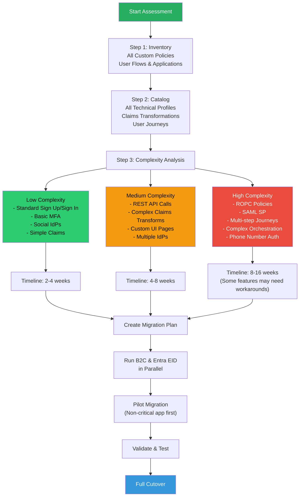
```mermaid
flowchart TD
    START["Start Assessment"] --> INV["Step 1: Inventory\nAll Custom Policies\nUser Flows & Applications"]

    INV --> CATALOG["Step 2: Catalog\nAll Technical Profiles\nClaims Transformations\nUser Journeys"]

    CATALOG --> COMPLEXITY["Step 3: Complexity Analysis"]

    COMPLEXITY --> LOW["Low Complexity\n- Standard Sign Up/Sign In\n- Basic MFA\n- Social IdPs\n- Simple Claims"]
    COMPLEXITY --> MED["Medium Complexity\n- REST API Calls\n- Complex Claims Transforms\n- Custom UI Pages\n- Multiple IdPs"]
    COMPLEXITY --> HIGH["High Complexity\n- ROPC Policies\n- SAML SP\n- Multi-step Journeys\n- Complex Orchestration\n- Phone Number Auth"]

    LOW --> TIMELINE_L["Timeline: 2-4 weeks"]
    MED --> TIMELINE_M["Timeline: 4-8 weeks"]
    HIGH --> TIMELINE_H["Timeline: 8-16 weeks\n(Some features may need workarounds)"]

    TIMELINE_L --> PLAN["Create Migration Plan"]
    TIMELINE_M --> PLAN
    TIMELINE_H --> PLAN

    PLAN --> PARALLEL["Run B2C & Entra EID\nin Parallel"]
    PARALLEL --> PILOT["Pilot Migration\n(Non-critical app first)"]
    PILOT --> VALIDATE["Validate & Test"]
    VALIDATE --> CUTOVER["Full Cutover"]

    style START fill:#27ae60,color:#fff
    style LOW fill:#2ecc71,color:#000
    style MED fill:#f39c12,color:#000
    style HIGH fill:#e74c3c,color:#fff
    style CUTOVER fill:#3498db,color:#fff
```

### 4.2 Pre-Migration Inventory Script

Use this PowerShell script to inventory your B2C tenant:

```powershell
# B2C Migration Assessment Script
# Connect to B2C tenant
Connect-MgGraph -TenantId "your-b2c-tenant.onmicrosoft.com" -Scopes "Policy.Read.All", "Application.Read.All", "User.Read.All"

# 1. List all User Flows
Write-Host "=== User Flows ===" -ForegroundColor Cyan
Get-MgIdentityUserFlow | Select-Object Id, UserFlowType, Version | Format-Table

# 2. List all App Registrations
Write-Host "=== Application Registrations ===" -ForegroundColor Cyan
Get-MgApplication | Select-Object DisplayName, AppId, SignInAudience | Format-Table

# 3. List all Identity Providers
Write-Host "=== Identity Providers ===" -ForegroundColor Cyan
Get-MgIdentityProvider | Select-Object Id, Type, DisplayName | Format-Table

# 4. Custom Attributes
Write-Host "=== Custom Attributes ===" -ForegroundColor Cyan
$b2cExtensionApp = Get-MgApplication -Filter "displayName eq 'b2c-extensions-app'"
Get-MgApplicationExtensionProperty -ApplicationId $b2cExtensionApp.Id | 
    Select-Object Name, DataType, TargetObjects | Format-Table

# 5. Custom Policies (requires B2C specific Graph calls)
Write-Host "=== Custom Policies ===" -ForegroundColor Cyan
$policies = Invoke-MgGraphRequest -Method GET -Uri "https://graph.microsoft.com/beta/trustFramework/policies"
$policies.value | Select-Object id | Format-Table

# Export summary
$summary = @{
    UserFlows = (Get-MgIdentityUserFlow).Count
    Applications = (Get-MgApplication).Count
    IdentityProviders = (Get-MgIdentityProvider).Count
    CustomPolicies = $policies.value.Count
}
Write-Host "=== Migration Summary ===" -ForegroundColor Yellow
$summary | Format-Table
```

### 4.3 Migration Phases

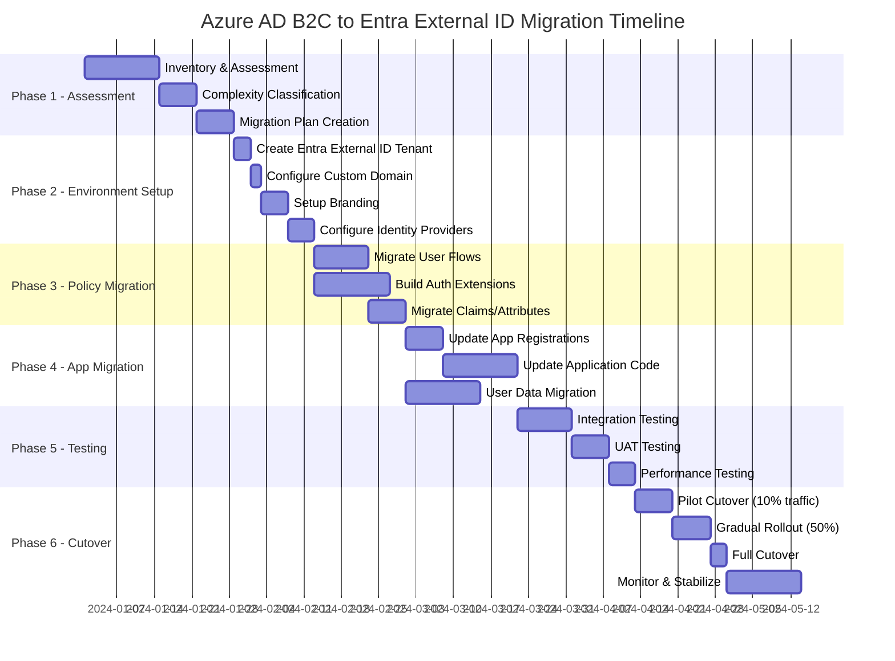
```mermaid
gantt
    title Azure AD B2C to Entra External ID Migration Timeline
    dateFormat  YYYY-MM-DD
    section Phase 1 - Assessment
    Inventory & Assessment           :a1, 2024-01-01, 14d
    Complexity Classification        :a2, after a1, 7d
    Migration Plan Creation          :a3, after a2, 7d

    section Phase 2 - Environment Setup
    Create Entra External ID Tenant  :b1, after a3, 3d
    Configure Custom Domain          :b2, after b1, 2d
    Setup Branding                   :b3, after b2, 5d
    Configure Identity Providers     :b4, after b3, 5d

    section Phase 3 - Policy Migration
    Migrate User Flows               :c1, after b4, 10d
    Build Auth Extensions            :c2, after b4, 14d
    Migrate Claims/Attributes        :c3, after c1, 7d

    section Phase 4 - App Migration
    Update App Registrations         :d1, after c3, 7d
    Update Application Code          :d2, after d1, 14d
    User Data Migration              :d3, after c3, 14d

    section Phase 5 - Testing
    Integration Testing              :e1, after d2, 10d
    UAT Testing                      :e2, after e1, 7d
    Performance Testing              :e3, after e2, 5d

    section Phase 6 - Cutover
    Pilot Cutover (10% traffic)      :f1, after e3, 7d
    Gradual Rollout (50%)            :f2, after f1, 7d
    Full Cutover                     :f3, after f2, 3d
    Monitor & Stabilize              :f4, after f3, 14d
```

---

## 5. Tenant Setup & Configuration

### 5.1 Creating a Microsoft Entra External ID Tenant

Microsoft Entra External Identities uses a dedicated **external tenant** — completely separate from your internal workforce Entra ID tenant.

**Step-by-Step Tenant Creation:**

```
1. Go to: https://entra.microsoft.com
2. Navigate to: Identity > Overview > Manage tenants
3. Click "+ Create"
4. Select "External" tenant type
5. Fill in:
   - Organization name: "Contoso CIAM"
   - Domain name: "contosociam"  (→ contosociam.onmicrosoft.com)
   - Country: United States
6. Review + Create
```

### 5.2 Custom Domain Configuration

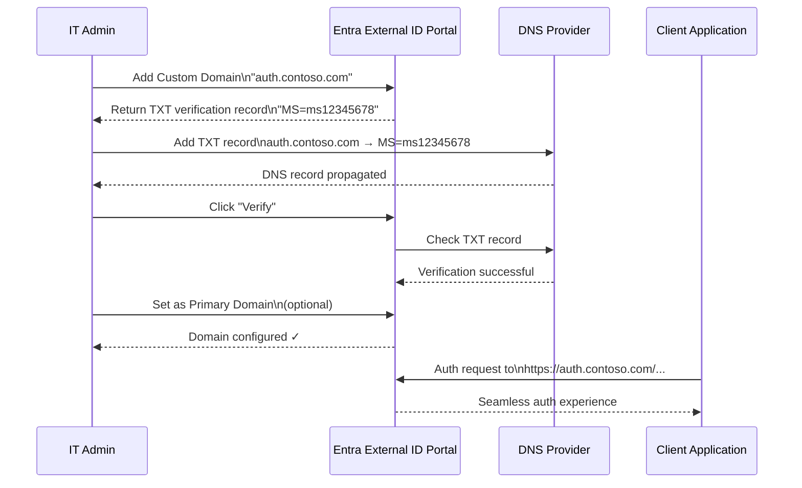
```mermaid
sequenceDiagram
    participant Admin as IT Admin
    participant Entra as Entra External ID Portal
    participant DNS as DNS Provider
    participant App as Client Application

    Admin->>Entra: Add Custom Domain\n"auth.contoso.com"
    Entra-->>Admin: Return TXT verification record\n"MS=ms12345678"

    Admin->>DNS: Add TXT record\nauth.contoso.com → MS=ms12345678
    DNS-->>Admin: DNS record propagated

    Admin->>Entra: Click "Verify"
    Entra->>DNS: Check TXT record
    DNS-->>Entra: Verification successful

    Admin->>Entra: Set as Primary Domain\n(optional)
    Entra-->>Admin: Domain configured ✓

    App->>Entra: Auth request to\nhttps://auth.contoso.com/...
    Entra-->>App: Seamless auth experience
```

**Terraform Configuration for Entra External ID Setup:**

```hcl
# terraform/entra-external-id/main.tf

terraform {
  required_providers {
    azuread = {
      source  = "hashicorp/azuread"
      version = "~> 2.47.0"
    }
  }
}

provider "azuread" {
  tenant_id = var.external_tenant_id
}

# Create the external tenant (done via portal or ARM template)
# Configure Identity Providers via resource blocks

# Google Identity Provider
resource "azuread_identity_provider" "google" {
  display_name = "Google"
  type         = "Google"

  client_id     = var.google_client_id
  client_secret = var.google_client_secret
}

# Facebook Identity Provider
resource "azuread_identity_provider" "facebook" {
  display_name = "Facebook"
  type         = "Facebook"

  client_id     = var.facebook_app_id
  client_secret = var.facebook_app_secret
}

# App Registration for Web Application
resource "azuread_application" "web_app" {
  display_name = "Contoso Web App"
  sign_in_audience = "AzureADandPersonalMicrosoftAccount"

  web {
    redirect_uris = [
      "https://app.contoso.com/auth/callback",
      "https://localhost:3000/auth/callback"
    ]

    implicit_grant {
      access_token_issuance_enabled = false
      id_token_issuance_enabled     = true
    }
  }

  required_resource_access {
    resource_app_id = "00000003-0000-0000-c000-000000000000" # MS Graph

    resource_access {
      id   = "37f7f235-527c-4136-accd-4a02d197296e" # openid
      type = "Scope"
    }
    resource_access {
      id   = "64a6cdd6-aab1-4aaf-94b8-3cc8405e90d0" # email
      type = "Scope"
    }
  }
}
```

---

## 6. Core Concept Mapping: IEF → External Identities

### 6.1 Policy File Structure Comparison

**Azure AD B2C (XML):**

```xml
<!-- TrustFrameworkExtensions.xml (B2C) -->
<TrustFrameworkPolicy
  xmlns:xsi="http://www.w3.org/2001/XMLSchema-instance"
  xmlns:xsd="http://www.w3.org/2001/XMLSchema"
  PolicySchemaVersion="0.3.0.0"
  TenantId="contoso.onmicrosoft.com"
  PolicyId="B2C_1A_TrustFrameworkExtensions"
  PublicPolicyUri="http://www.contoso.com/B2C_1A_TrustFrameworkExtensions">

  <BasePolicy>
    <TenantId>contoso.onmicrosoft.com</TenantId>
    <PolicyId>B2C_1A_TrustFrameworkBase</PolicyId>
  </BasePolicy>

  <BuildingBlocks>
    <!-- Custom Claims Schema -->
    <ClaimsSchema>
      <ClaimType Id="loyaltyTier">
        <DisplayName>Loyalty Tier</DisplayName>
        <DataType>string</DataType>
        <UserHelpText>Customer loyalty tier</UserHelpText>
      </ClaimType>
      <ClaimType Id="customerId">
        <DisplayName>Customer ID</DisplayName>
        <DataType>string</DataType>
      </ClaimType>
    </ClaimsSchema>

    <!-- Claims Transformations -->
    <ClaimsTransformations>
      <ClaimsTransformation Id="GetLoyaltyTierFromAPI"
                             TransformationMethod="SetClaimsIfStringsAreEqual">
        <InputClaims>
          <InputClaim ClaimTypeReferenceId="extension_loyaltyPoints"
                      TransformationClaimType="inputClaim" />
          <InputClaim ClaimTypeReferenceId="loyaltyThreshold"
                      TransformationClaimType="compareTo" />
        </InputClaims>
        <OutputClaims>
          <OutputClaim ClaimTypeReferenceId="loyaltyTier"
                       TransformationClaimType="outputClaim" />
        </OutputClaims>
      </ClaimsTransformation>
    </ClaimsTransformations>
  </BuildingBlocks>

  <ClaimsProviders>
    <!-- REST API Technical Profile -->
    <ClaimsProvider>
      <DisplayName>Loyalty API</DisplayName>
      <TechnicalProfiles>
        <TechnicalProfile Id="REST-GetLoyaltyData">
          <DisplayName>Get Loyalty Data from API</DisplayName>
          <Protocol Name="Proprietary"
                    Handler="Web.TPEngine.Providers.RestfulProvider, ..." />
          <Metadata>
            <Item Key="ServiceUrl">https://api.contoso.com/loyalty</Item>
            <Item Key="SendClaimsIn">Body</Item>
            <Item Key="AuthenticationType">Bearer</Item>
          </Metadata>
          <InputClaims>
            <InputClaim ClaimTypeReferenceId="objectId" PartnerClaimType="userId" />
          </InputClaims>
          <OutputClaims>
            <OutputClaim ClaimTypeReferenceId="loyaltyTier"
                         PartnerClaimType="tier" />
            <OutputClaim ClaimTypeReferenceId="customerId"
                         PartnerClaimType="id" />
          </OutputClaims>
        </TechnicalProfile>
      </TechnicalProfiles>
    </ClaimsProvider>
  </ClaimsProviders>
</TrustFrameworkPolicy>
```

**Entra External ID Equivalent (Authentication Extension - Azure Function):**

```csharp
// AuthenticationExtension/OnTokenIssuanceStart.cs
using Microsoft.Azure.Functions.Worker;
using Microsoft.Azure.Functions.Worker.Http;
using System.Net;
using System.Text.Json;

public class OnTokenIssuanceStart
{
    private readonly ILoyaltyService _loyaltyService;
    private readonly ILogger<OnTokenIssuanceStart> _logger;

    public OnTokenIssuanceStart(
        ILoyaltyService loyaltyService,
        ILogger<OnTokenIssuanceStart> logger)
    {
        _loyaltyService = loyaltyService;
        _logger = logger;
    }

    [Function("OnTokenIssuanceStart")]
    public async Task<HttpResponseData> Run(
        [HttpTrigger(AuthorizationLevel.Function, "post")] HttpRequestData req,
        FunctionContext executionContext)
    {
        _logger.LogInformation("OnTokenIssuanceStart extension called");

        // Parse the incoming request from Entra
        var requestBody = await new StreamReader(req.Body).ReadToEndAsync();
        var tokenRequest = JsonSerializer.Deserialize<TokenIssuanceStartRequest>(requestBody);

        // Extract the user's object ID from the request
        var userId = tokenRequest?.Data?.AuthenticationContext?.User?.Id;

        if (string.IsNullOrEmpty(userId))
        {
            return await CreateErrorResponse(req, "User ID not found");
        }

        // Call your external loyalty API (equivalent to B2C REST API Technical Profile)
        var loyaltyData = await _loyaltyService.GetLoyaltyDataAsync(userId);

        // Build the claims actions (equivalent to B2C output claims)
        var claimsActions = new List<object>
        {
            new
            {
                @"@odata.type" = "#microsoft.graph.tokenIssuanceStart.provideClaimsForToken",
                claims = new Dictionary<string, object>
                {
                    ["loyaltyTier"]  = loyaltyData.Tier,
                    ["customerId"]   = loyaltyData.CustomerId,
                    ["loyaltyPoints"] = loyaltyData.Points
                }
            }
        };

        // Return the response to Entra
        var responseBody = JsonSerializer.Serialize(new
        {
            data = new
            {
                @"@odata.type" = "microsoft.graph.onTokenIssuanceStartResponseData",
                actions = claimsActions
            }
        });

        var response = req.CreateResponse(HttpStatusCode.OK);
        response.Headers.Add("Content-Type", "application/json");
        await response.WriteStringAsync(responseBody);
        return response;
    }

    private async Task<HttpResponseData> CreateErrorResponse(
        HttpRequestData req, string message)
    {
        var response = req.CreateResponse(HttpStatusCode.BadRequest);
        await response.WriteStringAsync(JsonSerializer.Serialize(
            new { error = message }));
        return response;
    }
}
```

### 6.2 Authentication Extension Points

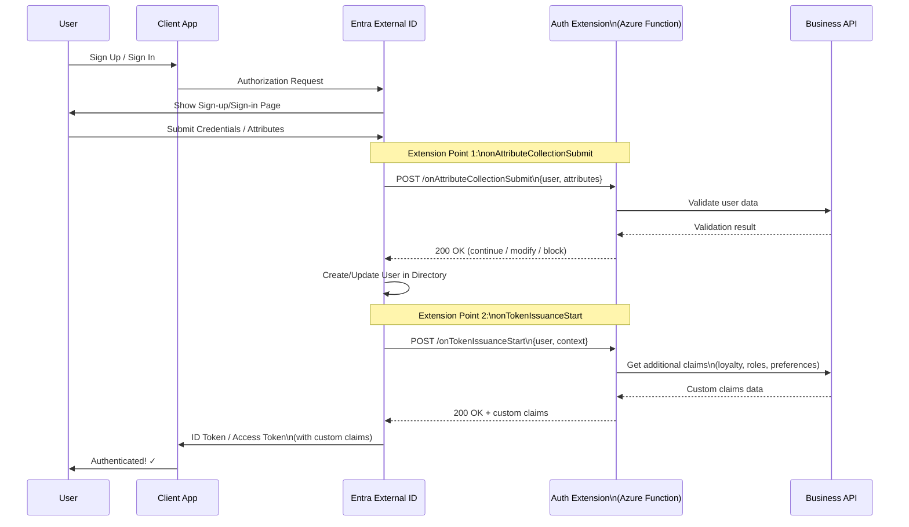
```mermaid
sequenceDiagram
    participant User
    participant App as Client App
    participant Entra as Entra External ID
    participant Ext as Auth Extension\n(Azure Function)
    participant API as Business API

    User->>App: Sign Up / Sign In

    App->>Entra: Authorization Request
    Entra->>User: Show Sign-up/Sign-in Page

    User->>Entra: Submit Credentials / Attributes

    Note over Entra,Ext: Extension Point 1:\nonAttributeCollectionSubmit
    Entra->>Ext: POST /onAttributeCollectionSubmit\n{user, attributes}
    Ext->>API: Validate user data
    API-->>Ext: Validation result
    Ext-->>Entra: 200 OK (continue / modify / block)

    Entra->>Entra: Create/Update User in Directory

    Note over Entra,Ext: Extension Point 2:\nonTokenIssuanceStart
    Entra->>Ext: POST /onTokenIssuanceStart\n{user, context}
    Ext->>API: Get additional claims\n(loyalty, roles, preferences)
    API-->>Ext: Custom claims data
    Ext-->>Entra: 200 OK + custom claims

    Entra->>App: ID Token / Access Token\n(with custom claims)
    App->>User: Authenticated! ✓
```

### 6.3 Extension Point Reference

| B2C Technical Profile Type | Entra Extension Point | When It Fires |
|---|---|---|
| `SelfAsserted` (pre-validation) | `onAttributeCollectionStart` | Before showing attribute collection page |
| `SelfAsserted` (post-submit) | `onAttributeCollectionSubmit` | After user submits attributes |
| `REST API` (before token) | `onTokenIssuanceStart` | Before token is issued |
| `ClaimsTransformation` | `onTokenIssuanceStart` | During token creation |
| `AAD-UserReadUsingObjectId` | Native (MS Graph) | Built-in user read |

---

## 7. User Flow & Custom Policy Migration

### 7.1 Sign Up / Sign In Policy Migration

**B2C Custom Policy (XML Excerpt):**

```xml
<!-- B2C: SignUpOrSignin Relying Party Policy -->
<RelyingParty>
  <DefaultUserJourney ReferenceId="SignUpOrSignIn" />
  <TechnicalProfile Id="PolicyProfile">
    <DisplayName>PolicyProfile</DisplayName>
    <Protocol Name="OpenIdConnect" />
    <OutputClaims>
      <OutputClaim ClaimTypeReferenceId="displayName" />
      <OutputClaim ClaimTypeReferenceId="givenName" />
      <OutputClaim ClaimTypeReferenceId="surname" />
      <OutputClaim ClaimTypeReferenceId="email" />
      <OutputClaim ClaimTypeReferenceId="objectId" PartnerClaimType="sub"/>
      <OutputClaim ClaimTypeReferenceId="identityProvider" />
      <OutputClaim ClaimTypeReferenceId="loyaltyTier" />  <!-- Custom claim -->
      <OutputClaim ClaimTypeReferenceId="tenantId" AlwaysUseDefaultValue="true"
                   DefaultValue="{Policy:TenantObjectId}" />
    </OutputClaims>
    <SubjectNamingInfo ClaimType="sub" />
  </TechnicalProfile>
</RelyingParty>
```

**Entra External ID: User Flow + Token Configuration**

The equivalent in Entra External ID is configured through the portal:

```
1. External Identities > User flows > New user flow
2. Name: "SignUpSignIn"
3. Identity providers: 
   ✓ Email + Password
   ✓ Google (if configured)
   ✓ Facebook (if configured)
4. User attributes to collect:
   ✓ Display name
   ✓ Given name
   ✓ Surname
   ✓ Custom: loyaltyTier (via extension attribute)
5. Token claims to return:
   ✓ Display name (displayName)
   ✓ Given name (given_name)
   ✓ Surname (family_name)
   ✓ Email addresses (email)
   ✓ Object ID (sub)
   ✓ Identity provider (idp)
   ✓ Custom: loyaltyTier
```

**Microsoft Graph API: Programmatic User Flow Configuration**

```python
# Python: Configure User Flow via MS Graph API
import requests
import json

# Authenticate and get token
def get_access_token(tenant_id, client_id, client_secret):
    url = f"https://login.microsoftonline.com/{tenant_id}/oauth2/v2.0/token"
    data = {
        "client_id": client_id,
        "client_secret": client_secret,
        "scope": "https://graph.microsoft.com/.default",
        "grant_type": "client_credentials"
    }
    response = requests.post(url, data=data)
    return response.json()["access_token"]

def create_user_flow(tenant_id, token):
    """Create a Sign Up/Sign In user flow in Entra External ID"""
    
    headers = {
        "Authorization": f"Bearer {token}",
        "Content-Type": "application/json"
    }
    
    user_flow_config = {
        "@odata.type": "#microsoft.graph.externalUsersSelfServiceSignUpEventsFlow",
        "displayName": "Contoso Sign Up Sign In",
        "onInteractiveAuthFlowStart": {
            "@odata.type": "#microsoft.graph.onInteractiveAuthFlowStartExternalUsersSelfServiceSignUp",
            "isSignUpAllowed": True
        },
        "onAuthenticationMethodLoadStart": {
            "@odata.type": "#microsoft.graph.onAuthenticationMethodLoadStartExternalUsersSelfServiceSignUp",
            "identityProviders": [
                { "id": "EmailPassword" }
            ]
        },
        "onAttributeCollection": {
            "@odata.type": "#microsoft.graph.onAttributeCollectionExternalUsersSelfServiceSignUp",
            "attributes": [
                { "id": "email" },
                { "id": "displayName" },
                { "id": "givenName" },
                { "id": "surname" },
                # Custom attribute
                { "id": "extension_loyaltyTier" }
            ],
            "attributeCollectionPage": {
                "customStrings": {},
                "views": [
                    {
                        "title": None,
                        "description": "Create your account",
                        "inputs": [
                            {
                                "attribute": "email",
                                "label": "Email",
                                "inputType": "text",
                                "hidden": False,
                                "editable": False,
                                "writeToDirectoryAs": "email",
                                "validationRegEx": "^[a-zA-Z0-9._%+-]+@[a-zA-Z0-9.-]+\.[a-zA-Z]{2,}$",
                                "required": True
                            },
                            {
                                "attribute": "displayName",
                                "label": "Display Name",
                                "inputType": "text",
                                "hidden": False,
                                "editable": True,
                                "writeToDirectoryAs": "displayName",
                                "required": True
                            }
                        ]
                    }
                ]
            }
        }
    }
    
    url = f"https://graph.microsoft.com/v1.0/identity/authenticationEventsFlows"
    response = requests.post(url, headers=headers, json=user_flow_config)
    
    if response.status_code == 201:
        print(f"✅ User flow created: {response.json()['id']}")
        return response.json()
    else:
        print(f"❌ Error: {response.status_code} - {response.text}")
        return None
```

### 7.2 Password Reset Policy Migration

**B2C Password Reset (Custom Policy):**

```xml
<!-- B2C: PasswordReset User Journey -->
<UserJourney Id="PasswordReset">
  <OrchestrationSteps>
    <!-- Step 1: Verify email -->
    <OrchestrationStep Order="1" Type="ClaimsExchange">
      <ClaimsExchanges>
        <ClaimsExchange Id="PasswordResetUsingEmailAddressExchange"
          TechnicalProfileReferenceId="LocalAccountDiscoveryUsingEmailAddress" />
      </ClaimsExchanges>
    </OrchestrationStep>
    <!-- Step 2: Set new password -->
    <OrchestrationStep Order="2" Type="ClaimsExchange">
      <ClaimsExchanges>
        <ClaimsExchange Id="NewCredentials"
          TechnicalProfileReferenceId="LocalAccountWritePasswordUsingObjectId" />
      </ClaimsExchanges>
    </OrchestrationStep>
    <!-- Step 3: Issue token -->
    <OrchestrationStep Order="3" Type="SendClaims">
      <ClaimsExchanges>
        <ClaimsExchange Id="SignUpWithLogonEmailExchange"
          TechnicalProfileReferenceId="JwtIssuer" />
      </ClaimsExchanges>
    </OrchestrationStep>
  </OrchestrationSteps>
</UserJourney>
```

**Entra External ID: Password Reset is built into the User Flow**

```
Configuration in Entra Admin Portal:
1. External Identities > User flows > [Your Flow] > Properties
2. Self-service password reset: ✓ Enabled
3. Password reset method: Email OTP verification
4. Link placement: Login page (automatic "Forgot password?" link)
```

> **Migration Note:** In Entra External ID, SSPR is natively integrated into the sign-in flow — no separate policy needed. This is a significant simplification.

---

## 8. Claims Transformation Migration

### 8.1 Common Claims Transformation Patterns

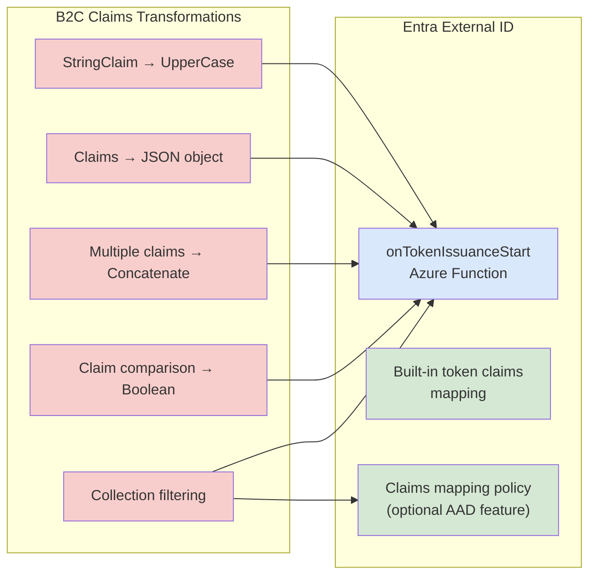
```mermaid
flowchart LR
    subgraph "B2C Claims Transformations"
        CT1["StringClaim → UpperCase"]
        CT2["Claims → JSON object"]
        CT3["Multiple claims → Concatenate"]
        CT4["Claim comparison → Boolean"]
        CT5["Collection filtering"]
    end

    subgraph "Entra External ID"
        ET1["onTokenIssuanceStart\nAzure Function"]
        ET2["Built-in token claims\nmapping"]
        ET3["Claims mapping policy\n(optional AAD feature)"]
    end

    CT1 --> ET1
    CT2 --> ET1
    CT3 --> ET1
    CT4 --> ET1
    CT5 --> ET1
    CT5 --> ET3

    style CT1 fill:#f8cecc
    style CT2 fill:#f8cecc
    style CT3 fill:#f8cecc
    style CT4 fill:#f8cecc
    style CT5 fill:#f8cecc
    style ET1 fill:#dae8fc
    style ET2 fill:#d5e8d4
    style ET3 fill:#d5e8d4
```

### 8.2 Migration Examples

**Example 1: String Manipulation Claims**

```xml
<!-- B2C XML: Convert email to uppercase -->
<ClaimsTransformation Id="CreateEmailInUppercase"
                      TransformationMethod="ConvertStringToUpperCase">
  <InputClaims>
    <InputClaim ClaimTypeReferenceId="email"
                TransformationClaimType="inputClaim" />
  </InputClaims>
  <OutputClaims>
    <OutputClaim ClaimTypeReferenceId="emailUppercase"
                 TransformationClaimType="outputClaim" />
  </OutputClaims>
</ClaimsTransformation>
```

**Entra External ID Equivalent (Authentication Extension):**

```csharp
// In OnTokenIssuanceStart Azure Function
var email = tokenRequest.Data.AuthenticationContext.User.Mail;
var emailUppercase = email?.ToUpperInvariant();

// Add to claims actions
var claims = new Dictionary<string, object>
{
    ["emailUppercase"] = emailUppercase,
};
```

---

**Example 2: Complex Claims Logic (Loyalty Tier Calculation)**

```xml
<!-- B2C XML: Determine loyalty tier based on points -->
<ClaimsTransformation Id="SetLoyaltyTierBronze"
                      TransformationMethod="SetClaimsIfRegexMatch">
  <InputClaims>
    <InputClaim ClaimTypeReferenceId="loyaltyPoints"
                TransformationClaimType="claimToMatch" />
  </InputClaims>
  <InputParameters>
    <InputParameter Id="matchTo" DataType="string" Value="^([0-9]|[1-9][0-9]|[1-4][0-9]{2}|500)$" />
    <InputParameter Id="outputClaimIfMatched" DataType="string" Value="Bronze" />
  </InputParameters>
  <OutputClaims>
    <OutputClaim ClaimTypeReferenceId="loyaltyTier"
                 TransformationClaimType="outputClaim" />
  </OutputClaims>
</ClaimsTransformation>
```

**Entra External ID Equivalent:**

```csharp
// AuthExtensions/Services/LoyaltyTierService.cs
public static class LoyaltyTierCalculator
{
    public static string CalculateTier(int points) => points switch
    {
        <= 500 => "Bronze",
        <= 1500 => "Silver",
        <= 5000 => "Gold",
        _ => "Platinum"
    };
}

// In OnTokenIssuanceStart:
var loyaltyPoints = await _loyaltyService.GetPointsAsync(userId);
var loyaltyTier = LoyaltyTierCalculator.CalculateTier(loyaltyPoints);

claims["loyaltyTier"] = loyaltyTier;
claims["loyaltyPoints"] = loyaltyPoints;
```

---

**Example 3: Claims Transformation - Combine First + Last Name**

```xml
<!-- B2C XML: Combine given name and surname -->
<ClaimsTransformation Id="CreateDisplayNameFromFirstAndLastName"
                      TransformationMethod="FormatStringMultipleClaims">
  <InputClaims>
    <InputClaim ClaimTypeReferenceId="givenName"
                TransformationClaimType="inputClaim1" />
    <InputClaim ClaimTypeReferenceId="surname"
                TransformationClaimType="inputClaim2" />
  </InputClaims>
  <InputParameters>
    <InputParameter Id="stringFormat" DataType="string" Value="{0} {1}" />
  </InputParameters>
  <OutputClaims>
    <OutputClaim ClaimTypeReferenceId="displayName"
                 TransformationClaimType="outputClaim" />
  </OutputClaims>
</ClaimsTransformation>
```

**Entra External ID (Token Configuration - No Code Required!):**

```
In Entra Admin Portal:
1. External Identities > User flows > [Flow] > Token configuration
2. Add claim: displayName (this is already concatenated in Entra ID)
   OR
3. Use Authentication Extension for custom concatenation:

// In Azure Function:
var fullName = $"{user.GivenName} {user.Surname}".Trim();
claims["displayName"] = fullName;
```

---

## 9. Identity Provider Migration

### 9.1 Social Identity Provider Migration

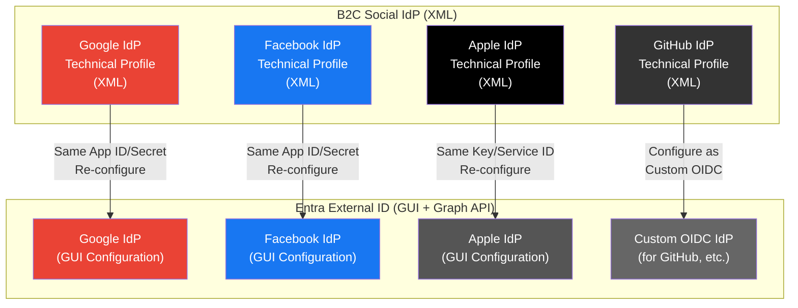
```mermaid
flowchart TD
    subgraph "B2C Social IdP (XML)"
        B_GOOGLE["Google IdP\nTechnical Profile\n(XML)"]
        B_FB["Facebook IdP\nTechnical Profile\n(XML)"]
        B_APPLE["Apple IdP\nTechnical Profile\n(XML)"]
        B_GITHUB["GitHub IdP\nTechnical Profile\n(XML)"]
    end

    subgraph "Entra External ID (GUI + Graph API)"
        E_GOOGLE["Google IdP\n(GUI Configuration)"]
        E_FB["Facebook IdP\n(GUI Configuration)"]
        E_APPLE["Apple IdP\n(GUI Configuration)"]
        E_GENERIC["Custom OIDC IdP\n(for GitHub, etc.)"]
    end

    B_GOOGLE -->|"Same App ID/Secret\nRe-configure"| E_GOOGLE
    B_FB -->|"Same App ID/Secret\nRe-configure"| E_FB
    B_APPLE -->|"Same Key/Service ID\nRe-configure"| E_APPLE
    B_GITHUB -->|"Configure as\nCustom OIDC"| E_GENERIC

    style B_GOOGLE fill:#ea4335,color:#fff
    style B_FB fill:#1877f2,color:#fff
    style B_APPLE fill:#000,color:#fff
    style B_GITHUB fill:#333,color:#fff
    style E_GOOGLE fill:#ea4335,color:#fff
    style E_FB fill:#1877f2,color:#fff
    style E_APPLE fill:#555,color:#fff
    style E_GENERIC fill:#666,color:#fff
```

### 9.2 Google Identity Provider Migration

**B2C (XML Configuration):**

```xml
<!-- B2C: Google Technical Profile -->
<ClaimsProvider>
  <Domain>google.com</Domain>
  <DisplayName>Google</DisplayName>
  <TechnicalProfiles>
    <TechnicalProfile Id="Google-OAUTH">
      <DisplayName>Google</DisplayName>
      <Protocol Name="OAuth2" />
      <Metadata>
        <Item Key="ProviderName">google</Item>
        <Item Key="authorization_endpoint">
          https://accounts.google.com/o/oauth2/auth
        </Item>
        <Item Key="AccessTokenEndpoint">
          https://accounts.google.com/o/oauth2/token
        </Item>
        <Item Key="ClaimsEndpoint">
          https://www.googleapis.com/oauth2/v1/userinfo
        </Item>
        <Item Key="scope">email profile</Item>
        <Item Key="HttpBinding">POST</Item>
        <Item Key="UsePolicyInRedirectUri">false</Item>
        <Item Key="client_id">your-google-client-id</Item>
      </Metadata>
      <CryptographicKeys>
        <Key Id="client_secret" StorageReferenceId="B2C_1A_GoogleSecret" />
      </CryptographicKeys>
      <OutputClaims>
        <OutputClaim ClaimTypeReferenceId="issuerUserId" PartnerClaimType="id" />
        <OutputClaim ClaimTypeReferenceId="email" PartnerClaimType="email" />
        <OutputClaim ClaimTypeReferenceId="givenName" PartnerClaimType="given_name" />
        <OutputClaim ClaimTypeReferenceId="surname" PartnerClaimType="family_name" />
        <OutputClaim ClaimTypeReferenceId="displayName" PartnerClaimType="name" />
        <OutputClaim ClaimTypeReferenceId="identityProvider" DefaultValue="google.com" />
      </OutputClaims>
      <OutputClaimsTransformations>
        <OutputClaimsTransformation ReferenceId="CreateRandomUPNUserName" />
        <OutputClaimsTransformation ReferenceId="CreateUserPrincipalName" />
        <OutputClaimsTransformation ReferenceId="CreateAlternativeSecurityId" />
      </OutputClaimsTransformations>
      <UseTechnicalProfileForSessionManagement ReferenceId="SM-SocialLogin" />
    </TechnicalProfile>
  </TechnicalProfiles>
</ClaimsProvider>
```

**Entra External ID (Portal Steps):**

```
1. Entra Admin Center > External Identities > All identity providers
2. Click "+ Add" > "Google"
3. Enter:
   - Client ID: [Your Google OAuth App Client ID]
   - Client Secret: [Your Google OAuth App Secret]
4. Click "Save"

5. Associate with User Flow:
   External Identities > User flows > [Flow] > Identity providers
   ✓ Enable Google
```

**Entra External ID (Graph API Programmatic):**

```bash
# PowerShell: Add Google IdP to Entra External ID
$headers = @{
    "Authorization" = "Bearer $accessToken"
    "Content-Type" = "application/json"
}

$googleIdP = @{
    "@odata.type" = "#microsoft.graph.socialIdentityProvider"
    "displayName" = "Google"
    "identityProviderType" = "Google"
    "clientId" = "your-google-client-id"
    "clientSecret" = "your-google-client-secret"
} | ConvertTo-Json

Invoke-RestMethod -Uri "https://graph.microsoft.com/v1.0/identity/identityProviders" `
                  -Method POST `
                  -Headers $headers `
                  -Body $googleIdP
```

### 9.3 SAML Identity Provider Migration

For enterprise federations using SAML, Entra External ID supports SAML as an Identity Provider:

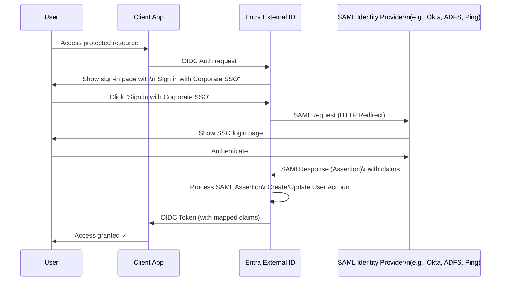
```mermaid
sequenceDiagram
    participant User
    participant App as Client App
    participant Entra as Entra External ID
    participant SAML_IDP as SAML Identity Provider\n(e.g., Okta, ADFS, Ping)

    User->>App: Access protected resource
    App->>Entra: OIDC Auth request
    Entra->>User: Show sign-in page with\n"Sign in with Corporate SSO"

    User->>Entra: Click "Sign in with Corporate SSO"
    Entra->>SAML_IDP: SAMLRequest (HTTP Redirect)
    SAML_IDP->>User: Show SSO login page
    User->>SAML_IDP: Authenticate

    SAML_IDP->>Entra: SAMLResponse (Assertion)\nwith claims
    Entra->>Entra: Process SAML Assertion\nCreate/Update User Account
    Entra->>App: OIDC Token (with mapped claims)
    App->>User: Access granted ✓
```

**Configuring SAML IdP in Entra External ID:**

```json
// Graph API: Create SAML Federation
POST https://graph.microsoft.com/v1.0/identity/identityProviders

{
  "@odata.type": "#microsoft.graph.samlOrWsFedExternalDomainFederation",
  "issuerUri": "https://your-idp.example.com/saml/metadata",
  "metadataExchangeUri": "https://your-idp.example.com/saml/metadata",
  "signingCertificate": "MIIDdTCCAl2gAwIB...",
  "passiveSignInUri": "https://your-idp.example.com/saml/sso",
  "preferredAuthenticationProtocol": "saml",
  "displayName": "Contoso Corporate SSO"
}
```

---

## 10. Custom UI/UX Migration

### 10.1 UI Customization Architecture Comparison

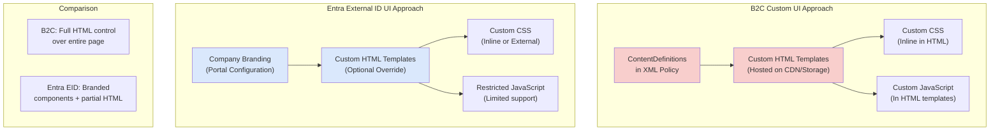
```mermaid
graph TB
    subgraph "B2C Custom UI Approach"
        B_CP["ContentDefinitions\nin XML Policy"]
        B_HTML["Custom HTML Templates\n(Hosted on CDN/Storage)"]
        B_CSS["Custom CSS\n(Inline in HTML)"]
        B_JS["Custom JavaScript\n(In HTML templates)"]

        B_CP --> B_HTML
        B_HTML --> B_CSS
        B_HTML --> B_JS
    end

    subgraph "Entra External ID UI Approach"
        E_BRAND["Company Branding\n(Portal Configuration)"]
        E_HTML["Custom HTML Templates\n(Optional Override)"]
        E_CSS["Custom CSS\n(Inline or External)"]
        E_JS["Restricted JavaScript\n(Limited support)"]

        E_BRAND --> E_HTML
        E_HTML --> E_CSS
        E_HTML --> E_JS
    end

    subgraph "Comparison"
        C1["B2C: Full HTML control\nover entire page"]
        C2["Entra EID: Branded\ncomponents + partial HTML"]
    end

    style B_CP fill:#f8cecc
    style B_HTML fill:#f8cecc
    style E_BRAND fill:#dae8fc
    style E_HTML fill:#dae8fc
```

### 10.2 B2C HTML Template Migration

**B2C Custom HTML Template:**

```html
<!-- B2C Custom Page (unified.html) -->
<!DOCTYPE html>
<html>
<head>
    <title>Contoso - Sign In</title>
    <meta charset="UTF-8" />
    <meta name="viewport" content="width=device-width, initial-scale=1.0">

    <!-- B2C REQUIRED: Page contract script -->
    <script>
        window.addEventListener("DOMContentLoaded", function () {
            // B2C injects the form into this div
        });
    </script>

    <style>
        body { font-family: 'Segoe UI', sans-serif; background: #f0f2f5; }
        .container { max-width: 400px; margin: 80px auto; padding: 30px;
                     background: #fff; border-radius: 8px;
                     box-shadow: 0 2px 10px rgba(0,0,0,0.1); }
        .logo { text-align: center; margin-bottom: 24px; }
        .logo img { height: 60px; }
        /* B2C auto-injects buttons with class 'sendButton' */
        .sendButton { background: #0078d4; color: #fff;
                      border: none; padding: 10px 20px;
                      border-radius: 4px; cursor: pointer; width: 100%; }
    </style>
</head>
<body>
    <div class="container">
        <div class="logo">
            
        </div>
        <h2>Welcome Back</h2>
        <!-- B2C injects the auth form here -->
        <div id="api"></div>
    </div>
</body>
</html>
```

**Entra External ID Company Branding Configuration:**

```json
// Graph API: Configure Company Branding
PATCH https://graph.microsoft.com/v1.0/organization/{tenantId}/branding

{
  "signInPageText": "Welcome to Contoso",
  "usernameHintText": "Enter your email",
  "loginPageLayoutConfiguration": {
    "layoutTemplateType": "default",
    "isHeaderShown": true,
    "isFooterShown": true
  },
  "loginPageTextVisibilitySettings": {
    "hidePrivacyLink": false,
    "hideTermsOfUseLink": false,
    "hideForgotMyPasswordLink": false
  },
  "customAccountResetCredentialsUrl": "https://support.contoso.com/reset"
}

// Upload background image
POST https://graph.microsoft.com/v1.0/organization/{tenantId}/branding/backgrounds/
Content-Type: image/jpeg

[binary image data]
```

**Entra External ID Custom HTML Template:**

```html
<!-- Entra External ID Custom Page Template -->
<!DOCTYPE html>
<html lang="en">
<head>
    <meta charset="UTF-8">
    <meta name="viewport" content="width=device-width, initial-scale=1.0">
    <title>Contoso Authentication</title>
    <!-- Entra External ID: Use the page contract CSS reference -->
    <link rel="stylesheet" href="https://login.microsoftonline.com/templates/loginV2.3/css/login.min.css">

    <style>
        /* Custom overrides */
        :root {
            --brand-primary: #0078d4;
            --brand-secondary: #106ebe;
        }

        .ext-sign-in-box {
            border-radius: 12px;
            box-shadow: 0 4px 20px rgba(0, 0, 0, 0.12);
        }

        .ext-button.primary {
            background-color: var(--brand-primary) !important;
            border-radius: 6px;
            font-weight: 600;
        }

        .ext-button.primary:hover {
            background-color: var(--brand-secondary) !important;
        }

        /* Custom header */
        .custom-header {
            text-align: center;
            padding: 20px 0 10px;
        }

        .custom-header img {
            height: 48px;
            margin-bottom: 12px;
        }
    </style>
</head>
<body>
    <!-- Custom header injected above the Entra form -->
    <div class="custom-header">
        
        <p style="color: #666; font-size: 14px;">Sign in to your account</p>
    </div>

    <!-- Entra External ID injects the authentication UI here -->
    <div id="api"></div>

    <!-- Footer -->
    <div style="text-align: center; padding: 20px; font-size: 12px; color: #888;">
        © 2024 Contoso Corporation |
        <a href="https://contoso.com/privacy">Privacy</a> |
        <a href="https://contoso.com/terms">Terms</a>
    </div>
</body>
</html>
```

---

## 11. REST API Connectors & Extensions

### 11.1 Migration of REST API Technical Profiles

One of the most common B2C customizations is calling external REST APIs during the authentication flow. The migration path is direct: B2C REST API Technical Profiles → Entra External ID Authentication Extensions.

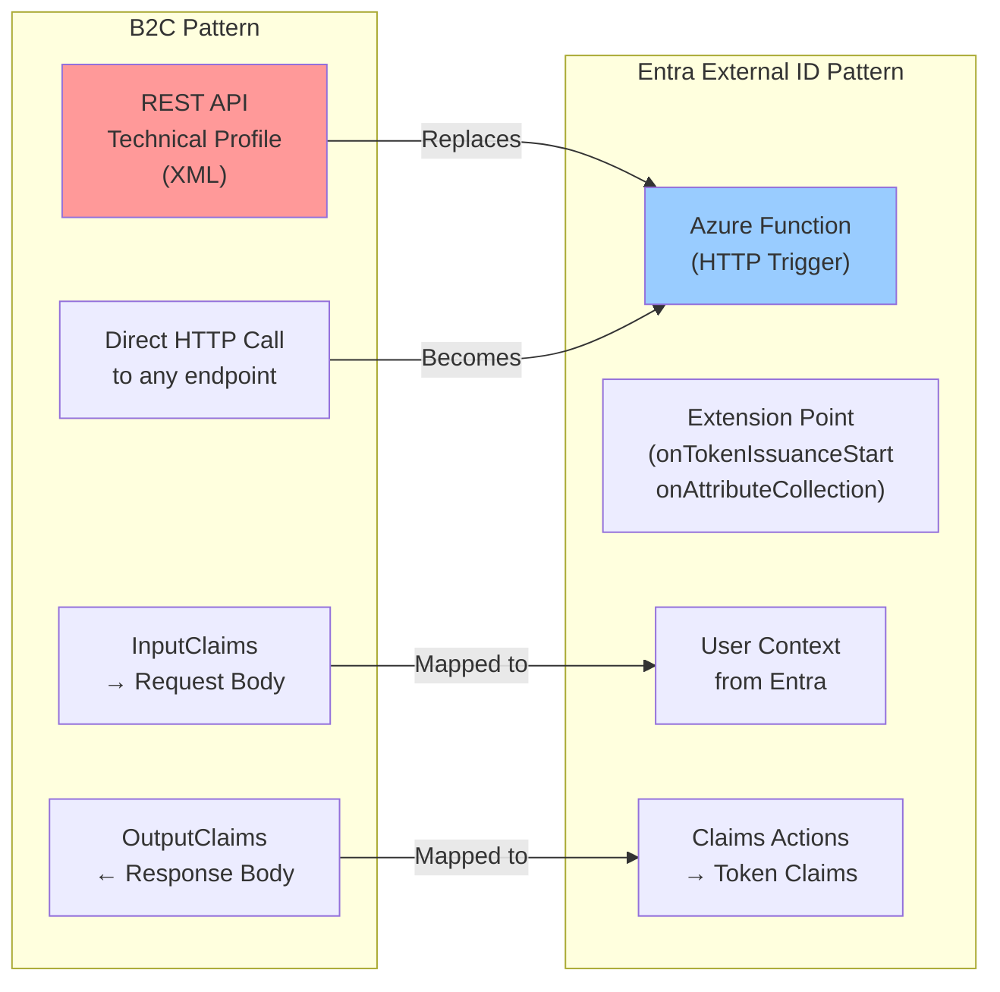
```mermaid
flowchart LR
    subgraph "B2C Pattern"
        B_XML["REST API\nTechnical Profile\n(XML)"]
        B_DIRECT["Direct HTTP Call\nto any endpoint"]
        B_CLAIMS_IN["InputClaims\n→ Request Body"]
        B_CLAIMS_OUT["OutputClaims\n← Response Body"]
    end

    subgraph "Entra External ID Pattern"
        E_FUNC["Azure Function\n(HTTP Trigger)"]
        E_EXT_POINT["Extension Point\n(onTokenIssuanceStart\nonAttributeCollection)"]
        E_CLAIMS_IN["User Context\nfrom Entra"]
        E_CLAIMS_OUT["Claims Actions\n→ Token Claims"]
    end

    B_XML -->|"Replaces"| E_FUNC
    B_DIRECT -->|"Becomes"| E_FUNC
    B_CLAIMS_IN -->|"Mapped to"| E_CLAIMS_IN
    B_CLAIMS_OUT -->|"Mapped to"| E_CLAIMS_OUT

    style B_XML fill:#ff9999
    style E_FUNC fill:#99ccff
```

### 11.2 Complete Authentication Extension Implementation

```csharp
// Complete Azure Function for Entra External ID Authentication Extension
// Handles both onAttributeCollectionSubmit and onTokenIssuanceStart

using Microsoft.Azure.Functions.Worker;
using Microsoft.Azure.Functions.Worker.Http;
using Microsoft.Extensions.Logging;
using System.Net;
using System.Text.Json;
using System.Text.Json.Serialization;

namespace ContosoAuthExtensions
{
    public class AuthenticationExtensions
    {
        private readonly ILogger<AuthenticationExtensions> _logger;
        private readonly ICustomerService _customerService;
        private readonly IFraudDetectionService _fraudService;

        public AuthenticationExtensions(
            ILogger<AuthenticationExtensions> logger,
            ICustomerService customerService,
            IFraudDetectionService fraudService)
        {
            _logger = logger;
            _customerService = customerService;
            _fraudService = fraudService;
        }

        // ============================================================
        // Extension Point 1: onAttributeCollectionSubmit
        // Equivalent to B2C REST API call during sign-up
        // ============================================================
        [Function("OnAttributeCollectionSubmit")]
        public async Task<HttpResponseData> OnAttributeCollectionSubmit(
            [HttpTrigger(AuthorizationLevel.Function, "post",
                         Route = "onAttributeCollectionSubmit")] HttpRequestData req)
        {
            _logger.LogInformation("OnAttributeCollectionSubmit triggered");

            var body = await req.ReadAsStringAsync();
            var request = JsonSerializer.Deserialize<AttributeCollectionRequest>(body,
                new JsonSerializerOptions { PropertyNameCaseInsensitive = true });

            var email = request?.Data?.UserSignUpInfo?.Attributes
                              .GetValueOrDefault("email")?.Value?.ToString();

            // Example: Check if user's email domain is allowed
            if (!string.IsNullOrEmpty(email))
            {
                var domain = email.Split('@').LastOrDefault();

                // Block registration from disposable email domains
                var isDisposable = await _fraudService.IsDisposableEmailAsync(domain);
                if (isDisposable)
                {
                    return await CreateBlockResponse(req,
                        "EMAIL_DOMAIN_NOT_ALLOWED",
                        "Please use a non-disposable email address.");
                }

                // Check if domain is in blocklist
                var isBlocked = await _fraudService.IsBlockedDomainAsync(domain);
                if (isBlocked)
                {
                    return await CreateBlockResponse(req,
                        "BLOCKED_DOMAIN",
                        "Registration from this email domain is not permitted.");
                }
            }

            // Add custom attributes during collection
            var additionalAttributes = new Dictionary<string, object>
            {
                ["registrationSource"] = "web",
                ["registrationTimestamp"] = DateTime.UtcNow.ToString("o"),
                ["termsAcceptedVersion"] = "2024-01"
            };

            return await CreateContinueWithModifiedAttributesResponse(
                req, additionalAttributes);
        }

        // ============================================================
        // Extension Point 2: onTokenIssuanceStart
        // Equivalent to B2C REST API call before token issuance
        // ============================================================
        [Function("OnTokenIssuanceStart")]
        public async Task<HttpResponseData> OnTokenIssuanceStart(
            [HttpTrigger(AuthorizationLevel.Function, "post",
                         Route = "onTokenIssuanceStart")] HttpRequestData req)
        {
            _logger.LogInformation("OnTokenIssuanceStart triggered");

            var body = await req.ReadAsStringAsync();
            var request = JsonSerializer.Deserialize<TokenIssuanceRequest>(body,
                new JsonSerializerOptions { PropertyNameCaseInsensitive = true });

            var userId = request?.Data?.AuthenticationContext?.User?.Id;
            var userEmail = request?.Data?.AuthenticationContext?.User?.Mail;

            if (string.IsNullOrEmpty(userId))
            {
                _logger.LogWarning("User ID not found in token request");
                return await CreateEmptyClaimsResponse(req);
            }

            // Fetch customer profile from your CRM/database
            var customerProfile = await _customerService.GetProfileAsync(userId, userEmail);

            // Build enriched claims (migrated from B2C OutputClaims)
            var claims = new Dictionary<string, object>();

            if (customerProfile != null)
            {
                claims["customerId"] = customerProfile.CustomerId;
                claims["loyaltyTier"] = customerProfile.LoyaltyTier;
                claims["loyaltyPoints"] = customerProfile.LoyaltyPoints;
                claims["preferredLanguage"] = customerProfile.Language;
                claims["accountStatus"] = customerProfile.Status;
                claims["roles"] = customerProfile.Roles;  // Array of roles

                // Computed claims (equivalent to B2C ClaimsTransformations)
                claims["isGoldMember"] = customerProfile.LoyaltyTier == "Gold"
                                         || customerProfile.LoyaltyTier == "Platinum";
                claims["memberSince"] = customerProfile.CreatedAt.ToString("yyyy-MM-dd");
            }
            else
            {
                // Default values for new/unknown users
                claims["loyaltyTier"] = "Bronze";
                claims["loyaltyPoints"] = 0;
                claims["accountStatus"] = "Active";
            }

            return await CreateClaimsResponse(req, claims);
        }

        // ============================================================
        // Helper methods
        // ============================================================
        private async Task<HttpResponseData> CreateClaimsResponse(
            HttpRequestData req, Dictionary<string, object> claims)
        {
            var responseBody = new
            {
                data = new
                {
                    @"@odata.type" = "microsoft.graph.onTokenIssuanceStartResponseData",
                    actions = new[]
                    {
                        new
                        {
                            @"@odata.type" =
                                "#microsoft.graph.tokenIssuanceStart.provideClaimsForToken",
                            claims = claims
                        }
                    }
                }
            };

            return await WriteJsonResponse(req, HttpStatusCode.OK, responseBody);
        }

        private async Task<HttpResponseData> CreateEmptyClaimsResponse(HttpRequestData req)
            => await CreateClaimsResponse(req, new Dictionary<string, object>());

        private async Task<HttpResponseData> CreateBlockResponse(
            HttpRequestData req, string code, string message)
        {
            var responseBody = new
            {
                data = new
                {
                    @"@odata.type" =
                        "microsoft.graph.onAttributeCollectionSubmitResponseData",
                    actions = new[]
                    {
                        new
                        {
                            @"@odata.type" =
                                "#microsoft.graph.attributeCollectionSubmit.showBlockPage",
                            message = message
                        }
                    }
                }
            };

            return await WriteJsonResponse(req, HttpStatusCode.OK, responseBody);
        }

        private async Task<HttpResponseData> CreateContinueWithModifiedAttributesResponse(
            HttpRequestData req, Dictionary<string, object> attributes)
        {
            var responseBody = new
            {
                data = new
                {
                    @"@odata.type" =
                        "microsoft.graph.onAttributeCollectionSubmitResponseData",
                    actions = new[]
                    {
                        new
                        {
                            @"@odata.type" =
                                "#microsoft.graph.attributeCollectionSubmit.continueWithDefaultBehavior"
                        }
                    }
                }
            };

            return await WriteJsonResponse(req, HttpStatusCode.OK, responseBody);
        }

        private async Task<HttpResponseData> WriteJsonResponse(
            HttpRequestData req, HttpStatusCode status, object body)
        {
            var response = req.CreateResponse(status);
            response.Headers.Add("Content-Type", "application/json");
            await response.WriteStringAsync(
                JsonSerializer.Serialize(body,
                    new JsonSerializerOptions { WriteIndented = false }));
            return response;
        }
    }
}
```

### 11.3 Registering the Authentication Extension

```powershell
# PowerShell: Register Authentication Extension in Entra External ID

$tenantId = "your-external-tenant-id"
$headers = @{
    "Authorization" = "Bearer $accessToken"
    "Content-Type" = "application/json"
}

# Step 1: Register the Authentication Event Listener
$extensionConfig = @{
    "@odata.type" = "#microsoft.graph.onTokenIssuanceStartListener"
    "conditions" = @{
        "applications" = @{
            "includeAllApplications" = $false
            "includeApplications" = @(
                @{ "appId" = "your-app-registration-id" }
            )
        }
    }
    "priority" = 500
    "handler" = @{
        "@odata.type" = "#microsoft.graph.onTokenIssuanceStartCustomExtensionHandler"
        "customExtension" = @{
            "@odata.type" = "#microsoft.graph.onTokenIssuanceStartCustomExtension"
            "displayName" = "Contoso Token Enrichment"
            "description" = "Adds loyalty and customer data to tokens"
            "endpointConfiguration" = @{
                "@odata.type" = "#microsoft.graph.httpRequestEndpoint"
                "targetUrl" = "https://contoso-auth-ext.azurewebsites.net/api/onTokenIssuanceStart"
            }
            "authenticationConfiguration" = @{
                "@odata.type" = "#microsoft.graph.azureFunctionAuthenticationConfiguration"
                "functionAppId" = "your-function-app-id"
            }
            "claimsForTokenConfiguration" = @(
                @{ "claimIdInApiResponse" = "customerId" },
                @{ "claimIdInApiResponse" = "loyaltyTier" },
                @{ "claimIdInApiResponse" = "loyaltyPoints" },
                @{ "claimIdInApiResponse" = "roles" }
            )
        }
    }
} | ConvertTo-Json -Depth 10

$result = Invoke-RestMethod `
    -Uri "https://graph.microsoft.com/v1.0/identity/authenticationEventListeners" `
    -Method POST `
    -Headers $headers `
    -Body $extensionConfig

Write-Host "✅ Authentication Extension registered: $($result.id)"
```

---

## 12. User Data & Directory Migration

### 12.1 User Migration Strategy

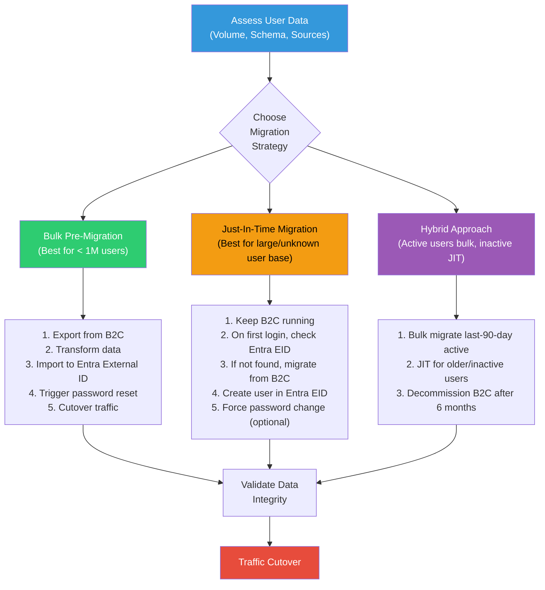
```mermaid
flowchart TD
    ASSESS["Assess User Data\n(Volume, Schema, Sources)"]

    ASSESS --> STRATEGY{Choose\nMigration\nStrategy}

    STRATEGY --> BULK["Bulk Pre-Migration\n(Best for < 1M users)"]
    STRATEGY --> JIT["Just-In-Time Migration\n(Best for large/unknown user base)"]
    STRATEGY --> HYBRID["Hybrid Approach\n(Active users bulk, inactive JIT)"]

    BULK --> BULK_STEPS["1. Export from B2C\n2. Transform data\n3. Import to Entra External ID\n4. Trigger password reset\n5. Cutover traffic"]

    JIT --> JIT_STEPS["1. Keep B2C running\n2. On first login, check Entra EID\n3. If not found, migrate from B2C\n4. Create user in Entra EID\n5. Force password change (optional)"]

    HYBRID --> HYBRID_STEPS["1. Bulk migrate last-90-day active\n2. JIT for older/inactive users\n3. Decommission B2C after 6 months"]

    BULK_STEPS --> VALIDATE["Validate Data\nIntegrity"]
    JIT_STEPS --> VALIDATE
    HYBRID_STEPS --> VALIDATE

    VALIDATE --> CUTOVER["Traffic Cutover"]

    style ASSESS fill:#3498db,color:#fff
    style BULK fill:#2ecc71,color:#fff
    style JIT fill:#f39c12,color:#000
    style HYBRID fill:#9b59b6,color:#fff
    style CUTOVER fill:#e74c3c,color:#fff
```

### 12.2 Bulk User Migration Script

```python
# user_migration.py - Migrate users from B2C to Entra External ID

import requests
import json
import logging
from dataclasses import dataclass
from typing import List, Optional
from datetime import datetime

logging.basicConfig(level=logging.INFO,
                    format='%(asctime)s %(levelname)s %(message)s')
logger = logging.getLogger(__name__)

@dataclass
class B2CUser:
    object_id: str
    email: str
    display_name: str
    given_name: Optional[str]
    surname: Optional[str]
    extension_loyalty_tier: Optional[str]
    extension_customer_id: Optional[str]
    created_at: str

class UserMigrationService:
    def __init__(self,
                 b2c_tenant_id: str,
                 b2c_token: str,
                 entra_tenant_id: str,
                 entra_token: str):
        self.b2c_token = b2c_token
        self.entra_token = entra_token
        self.b2c_graph_url = f"https://graph.microsoft.com/v1.0"
        self.entra_graph_url = f"https://graph.microsoft.com/v1.0"

    def export_b2c_users(self, page_size: int = 100) -> List[B2CUser]:
        """Export all users from Azure AD B2C"""
        users = []
        headers = {"Authorization": f"Bearer {self.b2c_token}"}

        url = (f"{self.b2c_graph_url}/users?"
               f"$select=id,mail,displayName,givenName,surname,"
               f"createdDateTime,"
               f"extension_APPID_loyaltyTier,"   # Replace APPID with your B2C extension app ID
               f"extension_APPID_customerId"
               f"&$top={page_size}")

        while url:
            response = requests.get(url, headers=headers)
            data = response.json()

            for user in data.get("value", []):
                users.append(B2CUser(
                    object_id=user.get("id"),
                    email=user.get("mail") or user.get("userPrincipalName", "").split("#")[0],
                    display_name=user.get("displayName", ""),
                    given_name=user.get("givenName"),
                    surname=user.get("surname"),
                    extension_loyalty_tier=user.get("extension_APPID_loyaltyTier"),
                    extension_customer_id=user.get("extension_APPID_customerId"),
                    created_at=user.get("createdDateTime", "")
                ))

            url = data.get("@odata.nextLink")
            logger.info(f"Exported {len(users)} users so far...")

        logger.info(f"Total B2C users exported: {len(users)}")
        return users

    def create_entra_user(self, b2c_user: B2CUser) -> Optional[dict]:
        """Create user in Entra External ID"""
        headers = {
            "Authorization": f"Bearer {self.entra_token}",
            "Content-Type": "application/json"
        }

        # Map B2C user to Entra External ID user schema
        entra_user = {
            "accountEnabled": True,
            "displayName": b2c_user.display_name,
            "givenName": b2c_user.given_name,
            "surname": b2c_user.surname,
            "mail": b2c_user.email,
            "userPrincipalName": f"{b2c_user.email.replace('@', '_')}@contosociam.onmicrosoft.com",
            "passwordProfile": {
                "forceChangePasswordNextSignIn": True,  # Force password reset
                "password": self._generate_temp_password()
            },
            "identities": [
                {
                    "signInType": "emailAddress",
                    "issuer": "contosociam.onmicrosoft.com",
                    "issuerAssignedId": b2c_user.email
                }
            ],
            # Migrate custom attributes
            "extension_NEWAPPID_loyaltyTier": b2c_user.extension_loyalty_tier or "Bronze",
            "extension_NEWAPPID_customerId": b2c_user.extension_customer_id,
            "extension_NEWAPPID_migratedFromB2C": True,
            "extension_NEWAPPID_migrationDate": datetime.utcnow().isoformat()
        }

        response = requests.post(
            f"{self.entra_graph_url}/users",
            headers=headers,
            json=entra_user
        )

        if response.status_code == 201:
            created_user = response.json()
            logger.info(f"✅ Created user: {b2c_user.email} → {created_user['id']}")
            return created_user
        elif response.status_code == 409:
            logger.warning(f"⚠️  User already exists: {b2c_user.email}")
            return None
        else:
            logger.error(f"❌ Failed to create {b2c_user.email}: "
                         f"{response.status_code} - {response.text}")
            return None

    def migrate_users(self, users: List[B2CUser]) -> dict:
        """Migrate all users with progress tracking"""
        results = {"success": 0, "skipped": 0, "failed": 0, "errors": []}

        for i, user in enumerate(users):
            try:
                created = self.create_entra_user(user)
                if created:
                    results["success"] += 1
                else:
                    results["skipped"] += 1
            except Exception as e:
                results["failed"] += 1
                results["errors"].append({"email": user.email, "error": str(e)})
                logger.error(f"Failed to migrate {user.email}: {e}")

            if (i + 1) % 100 == 0:
                logger.info(f"Progress: {i+1}/{len(users)} | "
                            f"✅ {results['success']} | "
                            f"⚠️  {results['skipped']} | "
                            f"❌ {results['failed']}")

        return results

    def _generate_temp_password(self) -> str:
        import secrets, string
        alphabet = string.ascii_letters + string.digits + "!@#$%"
        return ''.join(secrets.choice(alphabet) for _ in range(16))


# Main execution
if __name__ == "__main__":
    migration = UserMigrationService(
        b2c_tenant_id="your-b2c-tenant-id",
        b2c_token="b2c-access-token",
        entra_tenant_id="your-external-tenant-id",
        entra_token="entra-access-token"
    )

    logger.info("Starting B2C → Entra External ID user migration...")
    users = migration.export_b2c_users()

    logger.info(f"Migrating {len(users)} users...")
    results = migration.migrate_users(users)

    logger.info(f"\n=== Migration Complete ===")
    logger.info(f"✅ Successful: {results['success']}")
    logger.info(f"⚠️  Skipped: {results['skipped']}")
    logger.info(f"❌ Failed: {results['failed']}")

    if results['errors']:
        with open("migration_errors.json", "w") as f:
            json.dump(results['errors'], f, indent=2)
        logger.info(f"Error details saved to migration_errors.json")
```

### 12.3 Just-In-Time (JIT) User Migration

For large tenants with millions of users, JIT migration ensures a smooth transition without forcing mass password resets:

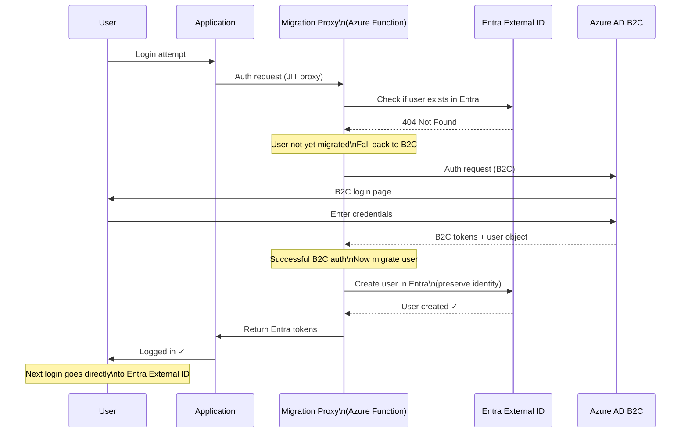
```mermaid
sequenceDiagram
    participant User
    participant App as Application
    participant Proxy as Migration Proxy\n(Azure Function)
    participant Entra as Entra External ID
    participant B2C as Azure AD B2C

    User->>App: Login attempt
    App->>Proxy: Auth request (JIT proxy)

    Proxy->>Entra: Check if user exists in Entra
    Entra-->>Proxy: 404 Not Found

    Note over Proxy: User not yet migrated\nFall back to B2C
    Proxy->>B2C: Auth request (B2C)
    B2C->>User: B2C login page
    User->>B2C: Enter credentials
    B2C-->>Proxy: B2C tokens + user object

    Note over Proxy: Successful B2C auth\nNow migrate user
    Proxy->>Entra: Create user in Entra\n(preserve identity)
    Entra-->>Proxy: User created ✓

    Proxy->>App: Return Entra tokens
    App->>User: Logged in ✓

    Note over User: Next login goes directly\nto Entra External ID
```

---

## 13. Application Registration Migration

### 13.1 Application Configuration Mapping

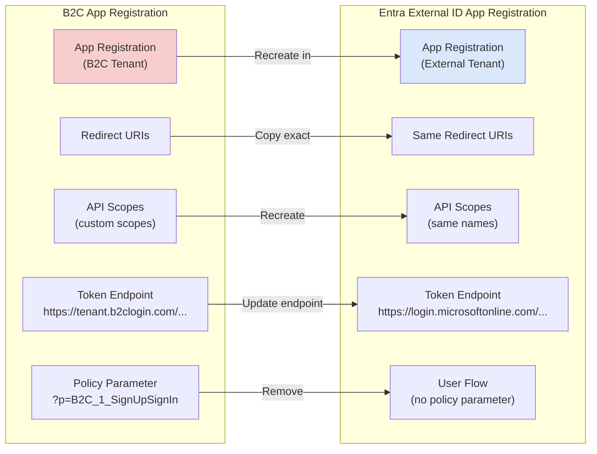
```mermaid
graph LR
    subgraph "B2C App Registration"
        B_APP["App Registration\n(B2C Tenant)"]
        B_REDIR["Redirect URIs"]
        B_SCOPE["API Scopes\n(custom scopes)"]
        B_TOKEN["Token Endpoint\nhttps://tenant.b2clogin.com/..."]
        B_POLICY["Policy Parameter\n?p=B2C_1_SignUpSignIn"]
    end

    subgraph "Entra External ID App Registration"
        E_APP["App Registration\n(External Tenant)"]
        E_REDIR["Same Redirect URIs"]
        E_SCOPE["API Scopes\n(same names)"]
        E_TOKEN["Token Endpoint\nhttps://login.microsoftonline.com/..."]
        E_FLOW["User Flow\n(no policy parameter)"]
    end

    B_APP -->|"Recreate in"| E_APP
    B_REDIR -->|"Copy exact"| E_REDIR
    B_SCOPE -->|"Recreate"| E_SCOPE
    B_TOKEN -->|"Update endpoint"| E_TOKEN
    B_POLICY -->|"Remove"| E_FLOW

    style B_APP fill:#f8cecc
    style E_APP fill:#dae8fc
```

### 13.2 MSAL Configuration Migration

**Before (B2C MSAL Configuration):**

```javascript
// Before: B2C MSAL Configuration (JavaScript)
import { PublicClientApplication, LogLevel } from "@azure/msal-browser";

const msalConfig = {
    auth: {
        clientId: "b2c-app-client-id",
        // B2C uses tenant-specific authority with policy
        authority: "https://contosob2c.b2clogin.com/contosob2c.onmicrosoft.com/" +
                   "B2C_1A_SIGNUP_SIGNIN",
        knownAuthorities: ["contosob2c.b2clogin.com"],
        redirectUri: "https://app.contoso.com/auth/callback",
    },
    cache: {
        cacheLocation: "sessionStorage",
    },
    system: {
        loggerOptions: {
            loggerCallback: (level, message, containsPii) => {
                if (!containsPii) console.log(message);
            },
            logLevel: LogLevel.Warning,
        }
    }
};

const loginRequest = {
    scopes: ["openid", "profile", "email"],
    // B2C requires extraQueryParameters for policy selection
    extraQueryParameters: {
        p: "B2C_1A_SIGNUP_SIGNIN"
    }
};

// Password reset required separate policy
const passwordResetRequest = {
    authority: "https://contosob2c.b2clogin.com/contosob2c.onmicrosoft.com/" +
               "B2C_1_PasswordReset",
    scopes: ["openid"]
};

const msalInstance = new PublicClientApplication(msalConfig);
```

**After (Entra External ID MSAL Configuration):**

```javascript
// After: Entra External ID MSAL Configuration (JavaScript)
import { PublicClientApplication, LogLevel } from "@azure/msal-browser";

const msalConfig = {
    auth: {
        clientId: "entra-ext-app-client-id",
        // Entra External ID uses standard OIDC authority - NO policy parameter
        authority: "https://login.microsoftonline.com/contosociam.onmicrosoft.com/",
        // OR with custom domain:
        // authority: "https://auth.contoso.com/contosociam.onmicrosoft.com/"
        redirectUri: "https://app.contoso.com/auth/callback", // Same as before
    },
    cache: {
        cacheLocation: "sessionStorage",
    },
    system: {
        loggerOptions: {
            loggerCallback: (level, message, containsPii) => {
                if (!containsPii) console.log(message);
            },
            logLevel: LogLevel.Warning,
        }
    }
};

// Simplified login request - no policy parameter needed
const loginRequest = {
    scopes: ["openid", "profile", "email"],
    // No extraQueryParameters for policy - user flow is selected automatically
};

// Password reset is now integrated - SSPR is triggered automatically
// No separate authority/policy needed

const msalInstance = new PublicClientApplication(msalConfig);

// Usage - identical pattern to B2C
async function signIn() {
    try {
        const result = await msalInstance.loginPopup(loginRequest);
        console.log("Signed in:", result.account);
    } catch (error) {
        console.error("Sign-in error:", error);
    }
}
```

**Mobile (React Native) - Before & After:**

```typescript
// React Native: Before (B2C) vs After (Entra External ID)

// ===== BEFORE: Azure AD B2C =====
const b2cConfig = {
    auth: {
        clientId: "b2c-mobile-app-id",
        authority: "https://contosob2c.b2clogin.com/tfp/" +
                   "contosob2c.onmicrosoft.com/B2C_1A_SIGNUP_SIGNIN",
        knownAuthorities: ["contosob2c.b2clogin.com"],
        redirectUri: "msauth.com.contoso.app://auth",
    }
};

// ===== AFTER: Entra External ID =====
const entraConfig = {
    auth: {
        clientId: "entra-mobile-app-id",
        authority: "https://login.microsoftonline.com/contosociam.onmicrosoft.com",
        redirectUri: "msauth.com.contoso.app://auth", // Same redirect URI
    }
};
// Key difference: authority URL format, no policy name in URL
```

---

## 14. Real-World Use Cases

### 14.1 Use Case 1: E-Commerce Platform Migration

**Scenario:** Contoso Shop has 2 million customers using B2C for authentication. They have:
- Email + password and social login (Google, Facebook)
- Loyalty points system integrated via REST API
- Custom sign-up with address collection
- Promotional email opt-in

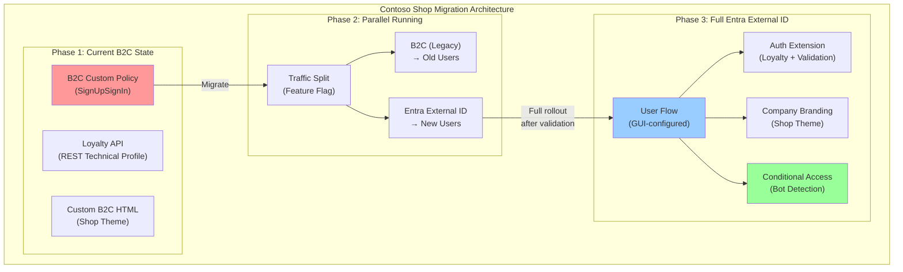
```mermaid
flowchart TD
    subgraph "Contoso Shop Migration Architecture"
        subgraph "Phase 1: Current B2C State"
            B2C_POLICY["B2C Custom Policy\n(SignUpSignIn)"]
            LOYALTY_API["Loyalty API\n(REST Technical Profile)"]
            B2C_UI["Custom B2C HTML\n(Shop Theme)"]
        end

        subgraph "Phase 2: Parallel Running"
            TRAFFIC_SPLIT["Traffic Split\n(Feature Flag)"]
            B2C_LEGACY["B2C (Legacy)\n→ Old Users"]
            ENTRA_NEW["Entra External ID\n→ New Users"]
        end

        subgraph "Phase 3: Full Entra External ID"
            E_FLOW["User Flow\n(GUI-configured)"]
            E_EXT["Auth Extension\n(Loyalty + Validation)"]
            E_BRAND["Company Branding\n(Shop Theme)"]
            E_CA["Conditional Access\n(Bot Detection)"]
        end
    end

    B2C_POLICY -->|"Migrate"| TRAFFIC_SPLIT
    TRAFFIC_SPLIT --> B2C_LEGACY
    TRAFFIC_SPLIT --> ENTRA_NEW
    ENTRA_NEW -->|"Full rollout\nafter validation"| E_FLOW
    E_FLOW --> E_EXT
    E_FLOW --> E_BRAND
    E_FLOW --> E_CA

    style B2C_POLICY fill:#ff9999
    style E_FLOW fill:#99ccff
    style E_CA fill:#99ff99
```

**Authentication Extension for E-Commerce:**

```csharp
// E-Commerce specific claims enrichment
public async Task<HttpResponseData> OnTokenIssuanceStart(
    [HttpTrigger(AuthorizationLevel.Function, "post")] HttpRequestData req)
{
    var request = await ParseRequest<TokenIssuanceRequest>(req);
    var userId = request?.Data?.AuthenticationContext?.User?.Id;

    // Fetch from e-commerce database
    var customerData = await _db.Customers
        .FirstOrDefaultAsync(c => c.EntraObjectId == userId);

    var claims = new Dictionary<string, object>();

    if (customerData != null)
    {
        claims["customerId"]       = customerData.CustomerId;
        claims["loyaltyTier"]      = customerData.LoyaltyTier;      // Bronze/Silver/Gold/Platinum
        claims["loyaltyPoints"]    = customerData.LoyaltyPoints;
        claims["cartItems"]        = customerData.SavedCartCount;
        claims["wishlistCount"]    = customerData.WishlistCount;
        claims["emailOptIn"]       = customerData.MarketingOptIn;
        claims["preferredCurrency"] = customerData.Currency;

        // Compute access-level claims
        claims["canAccessEarlyDeals"] = customerData.LoyaltyPoints >= 1000;
        claims["hasVipAccess"]        = customerData.LoyaltyTier is "Gold" or "Platinum";
    }

    return await CreateClaimsResponse(req, claims);
}
```

---

### 14.2 Use Case 2: Healthcare Patient Portal

**Scenario:** MedCare Patient Portal needs strong authentication with:
- MFA for all users (email OTP)
- Age verification during sign-up
- HIPAA-compliant audit logging
- Integration with EHR system (Epic/Cerner)
- Strict Conditional Access policies

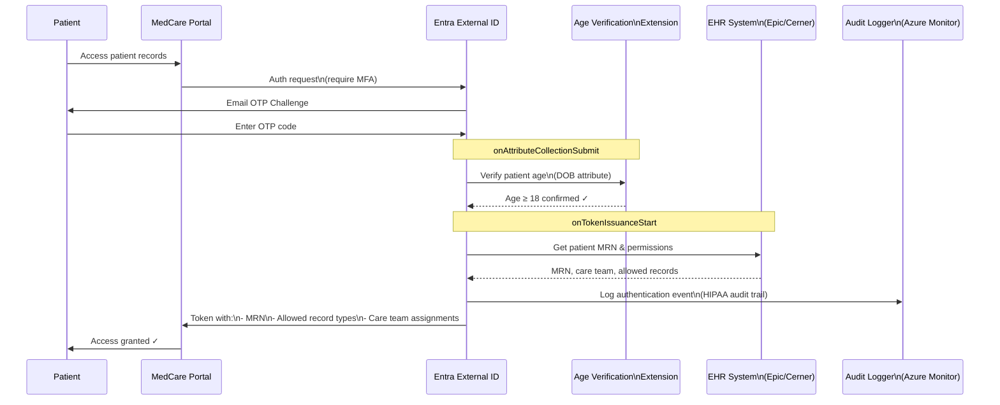
```mermaid
sequenceDiagram
    participant Patient
    participant Portal as MedCare Portal
    participant Entra as Entra External ID
    participant AgeExt as Age Verification\nExtension
    participant EHR as EHR System\n(Epic/Cerner)
    participant Audit as Audit Logger\n(Azure Monitor)

    Patient->>Portal: Access patient records

    Portal->>Entra: Auth request\n(require MFA)

    Entra->>Patient: Email OTP Challenge

    Patient->>Entra: Enter OTP code

    Note over Entra,AgeExt: onAttributeCollectionSubmit
    Entra->>AgeExt: Verify patient age\n(DOB attribute)
    AgeExt-->>Entra: Age ≥ 18 confirmed ✓

    Note over Entra,EHR: onTokenIssuanceStart
    Entra->>EHR: Get patient MRN & permissions
    EHR-->>Entra: MRN, care team, allowed records

    Entra->>Audit: Log authentication event\n(HIPAA audit trail)

    Entra->>Portal: Token with:\n- MRN\n- Allowed record types\n- Care team assignments
    Portal->>Patient: Access granted ✓
```

**Healthcare Authentication Extension:**

```csharp
// Healthcare-specific validation and claims
public async Task<HttpResponseData> OnAttributeCollectionSubmit(
    [HttpTrigger(AuthorizationLevel.Function, "post")] HttpRequestData req)
{
    var request = await ParseRequest<AttributeCollectionRequest>(req);
    var attributes = request.Data.UserSignUpInfo.Attributes;

    // HIPAA: Verify age (must be 18+)
    if (attributes.TryGetValue("dateOfBirth", out var dobValue))
    {
        var dob = DateTime.Parse(dobValue.Value.ToString());
        var age = (DateTime.Now - dob).TotalDays / 365.25;

        if (age < 18)
        {
            // For minors, require parental consent flow
            return await CreateRedirectResponse(req,
                "https://portal.medcare.com/minor-consent");
        }
    }

    // Validate insurance ID format
    if (attributes.TryGetValue("insuranceId", out var insuranceValue))
    {
        var insuranceId = insuranceValue.Value.ToString();
        if (!Regex.IsMatch(insuranceId, @"^[A-Z]{3}\d{9}$"))
        {
            return await CreateValidationErrorResponse(req,
                "insuranceId",
                "Insurance ID must be in format: 3 letters + 9 digits");
        }

        // Verify insurance with provider
        var isValid = await _insuranceService.VerifyAsync(insuranceId);
        if (!isValid)
        {
            return await CreateBlockResponse(req,
                "INSURANCE_NOT_FOUND",
                "Insurance ID could not be verified. Please contact support.");
        }
    }

    return await CreateContinueResponse(req);
}
```

---

### 14.3 Use Case 3: Multi-Brand / Multi-App Migration

**Scenario:** Contoso Group has 5 brands (Contoso Cars, Contoso Finance, Contoso Retail, Contoso Travel, Contoso Insurance) — each with separate B2C policies but needing a unified identity.

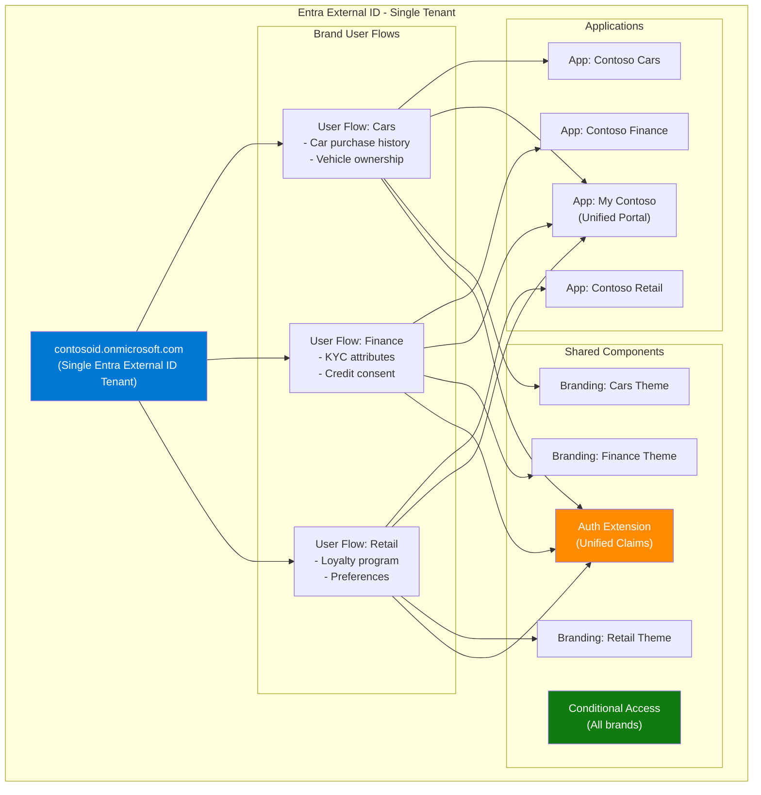
```mermaid
graph TB
    subgraph "Entra External ID - Single Tenant"
        TENANT["contosoid.onmicrosoft.com\n(Single Entra External ID Tenant)"]

        subgraph "Brand User Flows"
            UF_CARS["User Flow: Cars\n- Car purchase history\n- Vehicle ownership"]
            UF_FIN["User Flow: Finance\n- KYC attributes\n- Credit consent"]
            UF_RETAIL["User Flow: Retail\n- Loyalty program\n- Preferences"]
        end

        subgraph "Applications"
            APP_CARS["App: Contoso Cars"]
            APP_FIN["App: Contoso Finance"]
            APP_RETAIL["App: Contoso Retail"]
            APP_PORTAL["App: My Contoso\n(Unified Portal)"]
        end

        subgraph "Shared Components"
            BRAND_CARS["Branding: Cars Theme"]
            BRAND_FIN["Branding: Finance Theme"]
            BRAND_RETAIL["Branding: Retail Theme"]
            AUTH_EXT["Auth Extension\n(Unified Claims)"]
            CA["Conditional Access\n(All brands)"]
        end
    end

    TENANT --> UF_CARS
    TENANT --> UF_FIN
    TENANT --> UF_RETAIL

    UF_CARS --> APP_CARS
    UF_FIN --> APP_FIN
    UF_RETAIL --> APP_RETAIL
    UF_CARS --> APP_PORTAL
    UF_FIN --> APP_PORTAL
    UF_RETAIL --> APP_PORTAL

    UF_CARS --> BRAND_CARS
    UF_FIN --> BRAND_FIN
    UF_RETAIL --> BRAND_RETAIL

    UF_CARS --> AUTH_EXT
    UF_FIN --> AUTH_EXT
    UF_RETAIL --> AUTH_EXT

    style TENANT fill:#0078d4,color:#fff
    style AUTH_EXT fill:#ff8c00,color:#fff
    style CA fill:#107c10,color:#fff
```

**Per-Application Branding (Graph API):**

```powershell
# Configure per-application branding for multi-brand scenarios
$brandingConfigs = @(
    @{
        AppId = "contoso-cars-app-id"
        Theme = @{
            backgroundColor = "#CC0000"  # Contoso Cars red
            foregroundColor = "#FFFFFF"
            logoUrl = "https://cdn.contoso.com/cars/logo.png"
            backgroundImageUrl = "https://cdn.contoso.com/cars/auth-bg.jpg"
            signInPageText = "Sign in to Contoso Cars"
        }
    },
    @{
        AppId = "contoso-finance-app-id"
        Theme = @{
            backgroundColor = "#003087"  # Contoso Finance navy
            foregroundColor = "#FFFFFF"
            logoUrl = "https://cdn.contoso.com/finance/logo.png"
            backgroundImageUrl = "https://cdn.contoso.com/finance/auth-bg.jpg"
            signInPageText = "Sign in to Contoso Finance"
        }
    }
)

foreach ($config in $brandingConfigs) {
    $body = @{
        "loginPageLayoutConfiguration" = @{
            "layoutTemplateType" = "default"
        }
        "customAccountResetCredentialsUrl" = "https://support.contoso.com/reset"
        "signInPageText" = $config.Theme.signInPageText
    } | ConvertTo-Json

    # Update application-specific branding
    Invoke-RestMethod `
        -Uri "https://graph.microsoft.com/v1.0/applications/$($config.AppId)/branding" `
        -Method PATCH `
        -Headers $headers `
        -Body $body

    Write-Host "✅ Branding updated for app: $($config.AppId)"
}
```

---

## 15. Testing & Validation Framework

### 15.1 Testing Strategy

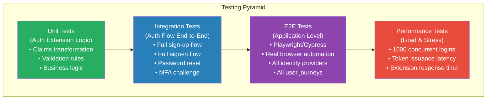
```mermaid
graph TB
    subgraph "Testing Pyramid"
        UNIT["Unit Tests\n(Auth Extension Logic)\n• Claims transformation\n• Validation rules\n• Business logic"]

        INT["Integration Tests\n(Auth Flow End-to-End)\n• Full sign-up flow\n• Full sign-in flow\n• Password reset\n• MFA challenge"]

        E2E["E2E Tests\n(Application Level)\n• Playwright/Cypress\n• Real browser automation\n• All identity providers\n• All user journeys"]

        PERF["Performance Tests\n(Load & Stress)\n• 1000 concurrent logins\n• Token issuance latency\n• Extension response time"]
    end

    UNIT --> INT
    INT --> E2E
    E2E --> PERF

    style UNIT fill:#27ae60,color:#fff
    style INT fill:#2980b9,color:#fff
    style E2E fill:#8e44ad,color:#fff
    style PERF fill:#e74c3c,color:#fff
```

### 15.2 Integration Test Suite

```csharp
// AuthenticationFlowTests.cs
using Microsoft.Playwright;
using Xunit;

public class EntraExternalIdFlowTests : IAsyncLifetime
{
    private IPlaywright _playwright;
    private IBrowser _browser;

    private const string TEST_EMAIL = "testuser@contoso-test.com";
    private const string TEST_PASSWORD = "SecureTestP@ssw0rd!";
    private const string ENTRA_AUTHORITY =
        "https://login.microsoftonline.com/contosociam.onmicrosoft.com";

    public async Task InitializeAsync()
    {
        _playwright = await Playwright.CreateAsync();
        _browser = await _playwright.Chromium.LaunchAsync(new()
        {
            Headless = true
        });
    }

    [Fact]
    public async Task SignUp_WithValidEmail_ShouldCreateAccount()
    {
        var context = await _browser.NewContextAsync();
        var page = await context.NewPageAsync();

        // Navigate to application
        await page.GotoAsync("https://testapp.contoso.com");
        await page.ClickAsync("[data-testid='sign-up-button']");

        // Should redirect to Entra External ID
        await page.WaitForURLAsync("**/login.microsoftonline.com/**");

        // Fill in email
        await page.FillAsync("#email", TEST_EMAIL);
        await page.ClickAsync("#continue-btn");

        // Verify email OTP
        var otp = await GetOtpFromMailbox(TEST_EMAIL);
        await page.FillAsync("#otpCode", otp);
        await page.ClickAsync("#verify-btn");

        // Fill in profile attributes
        await page.FillAsync("#displayName", "Test User");
        await page.FillAsync("#password", TEST_PASSWORD);
        await page.FillAsync("#reenterPassword", TEST_PASSWORD);
        await page.ClickAsync("#create-btn");

        // Should redirect back to app
        await page.WaitForURLAsync("https://testapp.contoso.com/**");

        // Verify user is authenticated
        var userNameElement = await page.WaitForSelectorAsync("[data-testid='user-name']");
        Assert.NotNull(userNameElement);
        Assert.Contains("Test User", await userNameElement.TextContentAsync());
    }

    [Fact]
    public async Task SignIn_WithGoogleIdP_ShouldAuthenticateUser()
    {
        var context = await _browser.NewContextAsync();
        var page = await context.NewPageAsync();

        await page.GotoAsync("https://testapp.contoso.com");
        await page.ClickAsync("[data-testid='sign-in-button']");

        await page.WaitForURLAsync("**/login.microsoftonline.com/**");

        // Click Google sign-in button
        await page.ClickAsync("[data-identity-provider='google']");

        // Should redirect to Google
        await page.WaitForURLAsync("**/accounts.google.com/**");

        // Authenticate with Google test account
        await page.FillAsync("input[type='email']", "testuser@gmail.com");
        await page.ClickAsync("#identifierNext");
        await page.FillAsync("input[type='password']", "GoogleTestP@ss");
        await page.ClickAsync("#passwordNext");

        // Should return to app
        await page.WaitForURLAsync("https://testapp.contoso.com/**");

        var idpLabel = await page.WaitForSelectorAsync("[data-testid='idp-label']");
        Assert.Contains("Google", await idpLabel.TextContentAsync());
    }

    [Fact]
    public async Task Token_ShouldContainCustomClaims()
    {
        // Use MSAL to get token and verify claims
        var app = PublicClientApplicationBuilder
            .Create("entra-test-app-id")
            .WithAuthority($"{ENTRA_AUTHORITY}/")
            .WithRedirectUri("http://localhost:5001")
            .Build();

        var result = await app.AcquireTokenByUsernamePassword(
            new[] { "openid", "profile" },
            TEST_EMAIL,
            TEST_PASSWORD)
            .ExecuteAsync();

        // Decode and verify token claims
        var handler = new JwtSecurityTokenHandler();
        var token = handler.ReadJwtToken(result.AccessToken);

        // Verify custom claims from Authentication Extension
        Assert.True(token.Claims.Any(c => c.Type == "loyaltyTier"));
        Assert.True(token.Claims.Any(c => c.Type == "customerId"));
        Assert.True(token.Claims.Any(c => c.Type == "accountStatus"));

        var loyaltyTier = token.Claims.First(c => c.Type == "loyaltyTier").Value;
        Assert.Contains(loyaltyTier, new[] { "Bronze", "Silver", "Gold", "Platinum" });
    }

    public async Task DisposeAsync()
    {
        await _browser.DisposeAsync();
        _playwright.Dispose();
    }

    private async Task<string> GetOtpFromMailbox(string email)
    {
        // Implement mailbox polling logic here
        // Using a test email service like Mailhog, Mailsac, etc.
        await Task.Delay(3000); // Wait for email delivery
        return "123456"; // Return actual OTP from email
    }
}
```

### 15.3 Claims Validation Checklist

| Claim | Source in B2C | Source in Entra EID | Validation |
|---|---|---|---|
| `sub` | objectId | objectId | Same value after migration |
| `email` | email claim | mail attribute | Same email |
| `name` | displayName | displayName | Same value |
| `given_name` | givenName | givenName | Same value |
| `family_name` | surname | surname | Same value |
| `loyaltyTier` | REST API Technical Profile | onTokenIssuanceStart | Values: Bronze/Silver/Gold/Platinum |
| `customerId` | extension_customerId | extension_APPID_customerId | Non-null for existing users |
| `idp` | identityProvider | idp | google/facebook/local |
| `tid` | tenantId | tid | New tenant ID |
| `aud` | B2C app client ID | Entra app client ID | Updated in app config |

---

## 16. Cutover Strategy & Rollback Plan

### 16.1 Blue-Green Deployment Strategy

```mermaid
flowchart LR
    subgraph "Traffic Management"
        ALB["Azure Front Door\n/ API Management\n(Traffic Router)"]
    end

    subgraph "Blue - B2C (Current Production)"
        B2C_APP["Azure AD B2C\n(Legacy)"]
        B2C_APP_REG["App Registrations\n(B2C)"]
        B2C_USERS["User Directory\n(B2C)"]
    end

    subgraph "Green - Entra External ID (New)"
        ENTRA_APP["Entra External ID\n(New)"]
        ENTRA_APP_REG["App Registrations\n(Entra EID)"]
        ENTRA_USERS["User Directory\n(Entra EID)"]
    end

    subgraph "Migration Percentages"
        P10["Phase 1: 10% → Entra EID\n90% → B2C"]
        P50["Phase 2: 50% → Entra EID\n50% → B2C"]
        P90["Phase 3: 90% → Entra EID\n10% → B2C"]
        P100["Phase 4: 100% → Entra EID\nB2C Retired"]
    end

    ALB --> B2C_APP
    ALB --> ENTRA_APP
    P10 --> ALB
    P50 --> ALB
    P90 --> ALB
    P100 --> ALB

    style B2C_APP fill:#ff9999
    style ENTRA_APP fill:#99ccff
    style P10 fill:#ffe0b2
    style P50 fill:#fff3e0
    style P90 fill:#e8f5e9
    style P100 fill:#99ccff
```

### 16.2 Feature Flag Implementation for Gradual Rollout

```typescript
// Feature flag based auth provider selection
// featureFlags.ts

interface AuthProviderConfig {
    provider: 'b2c' | 'entra-external-id';
    authority: string;
    clientId: string;
    knownAuthorities?: string[];
}

export class AuthProviderSelector {
    private static readonly FEATURE_FLAG_KEY = 'auth_provider_entra';

    static async getConfig(userId?: string): Promise<AuthProviderConfig> {
        const useEntra = await this.shouldUseEntra(userId);

        if (useEntra) {
            return {
                provider: 'entra-external-id',
                authority: 'https://login.microsoftonline.com/contosociam.onmicrosoft.com',
                clientId: process.env.ENTRA_CLIENT_ID!
            };
        } else {
            return {
                provider: 'b2c',
                authority: 'https://contoso.b2clogin.com/contoso.onmicrosoft.com/' +
                           'B2C_1A_SIGNUP_SIGNIN',
                clientId: process.env.B2C_CLIENT_ID!,
                knownAuthorities: ['contoso.b2clogin.com']
            };
        }
    }

    private static async shouldUseEntra(userId?: string): Promise<boolean> {
        // Option 1: Azure App Configuration / LaunchDarkly feature flag
        const rolloutPercentage = await featureFlagClient.getNumber(
            this.FEATURE_FLAG_KEY,
            0  // default: 0% on Entra
        );

        if (rolloutPercentage === 100) return true;
        if (rolloutPercentage === 0) return false;

        // Deterministic bucketing based on user ID or session ID
        const identifier = userId || crypto.randomUUID();
        const hash = await this.hashString(identifier);
        const bucket = hash % 100;

        return bucket < rolloutPercentage;
    }

    private static async hashString(str: string): Promise<number> {
        const encoder = new TextEncoder();
        const data = encoder.encode(str);
        const hashBuffer = await crypto.subtle.digest('SHA-256', data);
        const hashArray = Array.from(new Uint8Array(hashBuffer));
        return hashArray[0]; // Use first byte as bucket number
    }
}

// Usage in application
const config = await AuthProviderSelector.getConfig(currentUser?.id);
const msalInstance = new PublicClientApplication({
    auth: {
        clientId: config.clientId,
        authority: config.authority,
        knownAuthorities: config.knownAuthorities,
        redirectUri: window.location.origin + '/auth/callback'
    }
});
```

### 16.3 Rollback Procedure

```bash
#!/bin/bash
# rollback.sh - Emergency rollback from Entra External ID to B2C

set -e

echo "🚨 INITIATING ROLLBACK: Entra External ID → Azure AD B2C"
echo "Timestamp: $(date -u +"%Y-%m-%dT%H:%M:%SZ")"

# Step 1: Update feature flag to 0% Entra
echo "Step 1: Setting Entra rollout to 0%..."
az appconfig kv set \
    --name "contoso-config" \
    --key "auth_provider_entra" \
    --value "0" \
    --yes

echo "✅ Feature flag updated - all traffic now routing to B2C"

# Step 2: Update Azure Front Door routing weights
echo "Step 2: Updating Front Door routing..."
az afd origin update \
    --profile-name "contoso-fd" \
    --origin-group-name "auth-origins" \
    --origin-name "entra-external-id" \
    --weight 0 \
    --resource-group "contoso-rg"

az afd origin update \
    --profile-name "contoso-fd" \
    --origin-group-name "auth-origins" \
    --origin-name "azure-ad-b2c" \
    --weight 100 \
    --resource-group "contoso-rg"

echo "✅ Traffic routing restored to B2C"

# Step 3: Send alert
echo "Step 3: Sending rollback notification..."
curl -X POST "$TEAMS_WEBHOOK_URL" \
    -H "Content-Type: application/json" \
    -d '{
        "text": "🚨 AUTH ROLLBACK: Entra External ID traffic rolled back to Azure AD B2C at '"$(date -u)"'. Please investigate!"
    }'

echo "✅ Rollback complete. All traffic is now on Azure AD B2C."
echo ""
echo "Next steps:"
echo "  1. Investigate root cause in Application Insights"
echo "  2. Review Entra External ID sign-in logs"
echo "  3. Fix issues before re-enabling Entra External ID"
```

---

## 17. Troubleshooting & Common Pitfalls

### 17.1 Common Migration Issues

```mermaid
mindmap
  root((Migration Issues))
    Token Claims
      Missing custom claims
      Claim name mismatch
      Array vs string type
      Null claims breaking apps
    User Migration
      Duplicate users
      Password hash unavailable
      Custom attribute loss
      objectId change
    Identity Providers
      Redirect URI mismatch
      App ID reuse issues
      Claim mapping differences
      SAML attribute mapping
    Authentication Extension
      Cold start latency
      Auth failure propagation
      Missing permissions
      Async timeout issues
    Applications
      Hardcoded B2C URLs
      Policy parameter in code
      Authority URL change
      Token validation failure
```

### 17.2 Diagnostic Queries

```kusto
// Azure Monitor / Log Analytics Queries for Migration Monitoring

// 1. Authentication failures by error code
SigninLogs
| where TimeGenerated > ago(1h)
| where AppId in ("entra-external-id-app-ids")
| where ResultType != "0"  // 0 = success
| summarize count() by ResultType, ResultDescription
| order by count_ desc

// 2. Auth Extension response times
FunctionAppLogs
| where TimeGenerated > ago(1h)
| where FunctionName in ("OnTokenIssuanceStart", "OnAttributeCollectionSubmit")
| where Message contains "Executed"
| parse Message with * "Duration=" duration:double "ms"
| summarize
    avg_ms = avg(duration),
    p95_ms = percentile(duration, 95),
    p99_ms = percentile(duration, 99),
    max_ms = max(duration)
    by FunctionName

// 3. Compare B2C vs Entra External ID authentication volume
SigninLogs
| where TimeGenerated > ago(24h)
| extend AuthProvider = iff(
    AppId in ("b2c-app-ids"),
    "Azure AD B2C",
    "Entra External ID"
)
| summarize count() by AuthProvider, bin(TimeGenerated, 1h)
| render timechart

// 4. Missing claims errors from applications
AppTraces
| where TimeGenerated > ago(1h)
| where Message contains "claim" and (
    Message contains "missing" or
    Message contains "null" or
    Message contains "not found"
)
| project TimeGenerated, Message, SeverityLevel
| order by TimeGenerated desc
```

### 17.3 Common Error Solutions

| Error | Cause | Solution |
|---|---|---|
| `AADSTS50020: User account from identity provider does not exist` | User not migrated to Entra External ID | Run JIT migration or bulk migration first |
| `AADSTS700016: Application not found` | App registration in wrong tenant | Recreate app registration in external tenant |
| `Claims missing in token` | Auth extension not returning claims | Check extension registration, claim names, and permissions |
| `AADSTS50058: Silent sign-in failed` | Cookie domain changed from B2C to Entra | Clear browser session, force re-authentication |
| `CORS error on redirect` | Redirect URI mismatch | Add exact redirect URI to app registration |
| `Auth extension timeout` | Cold start or slow API | Implement Premium plan, connection pooling, caching |
| `Invalid client_secret` | App secret expired | Regenerate and update app secret |
| `JWT validation failed` | Token audience (aud) changed | Update token validation in application middleware |

---

## 18. Post-Migration Checklist

### 18.1 Go-Live Checklist

```markdown
## Pre-Cutover
- [ ] All B2C custom policies inventoried and mapped
- [ ] Entra External ID tenant created and configured
- [ ] Custom domain configured and verified
- [ ] Company branding applied (logo, background, colors)
- [ ] All identity providers configured (email, social, enterprise)
- [ ] Custom attributes created in Entra External ID
- [ ] Authentication Extensions deployed and tested
- [ ] All App Registrations recreated in external tenant
- [ ] User flows created and tested for all journeys
- [ ] Conditional Access policies configured
- [ ] User migration completed (bulk or JIT configured)
- [ ] Integration tests passing (≥95% pass rate)
- [ ] E2E tests passing for all user journeys
- [ ] Performance tests meeting SLA (< 500ms token issuance)

## Day of Cutover
- [ ] Announce maintenance window to users
- [ ] Enable monitoring dashboards
- [ ] Start at 10% traffic to Entra External ID
- [ ] Monitor error rates for 30 minutes
- [ ] Increase to 25%, 50%, 75% with monitoring
- [ ] Full 100% cutover
- [ ] Validate key user journeys manually

## Post-Cutover (First 48 Hours)
- [ ] Monitor sign-in success rates (target: >99.9%)
- [ ] Monitor Auth Extension latency (target: <200ms p95)
- [ ] Monitor error rates by error code
- [ ] Check user support tickets for auth issues
- [ ] Validate custom claims in production tokens
- [ ] Confirm all identity providers working

## Decommission B2C (30-90 days post-migration)
- [ ] Confirm zero traffic to B2C for 30+ days
- [ ] Export and archive B2C custom policies
- [ ] Export and archive B2C user data
- [ ] Remove B2C app registrations
- [ ] Cancel B2C tenant
- [ ] Update internal documentation
- [ ] Update runbooks and playbooks
```

### 18.2 Monitoring Dashboard Setup

```python
# Setup Azure Monitor Workbook for Migration Monitoring
# This generates the ARM template for a monitoring dashboard

import json

workbook_definition = {
    "version": "Notebook/1.0",
    "items": [
        {
            "type": 1,
            "content": {
                "json": "# Entra External ID - Authentication Health Dashboard\n"
                        "Real-time monitoring for post-migration validation"
            }
        },
        {
            "type": 3,
            "content": {
                "version": "KqlItem/1.0",
                "query": """
                    SigninLogs
                    | where TimeGenerated > ago(1h)
                    | summarize
                        Success = countif(ResultType == "0"),
                        Failed = countif(ResultType != "0"),
                        SuccessRate = round(100.0 * countif(ResultType == "0") / count(), 2)
                    | project
                        ['Total Authentications'] = Success + Failed,
                        ['Successful'] = Success,
                        ['Failed'] = Failed,
                        ['Success Rate %'] = SuccessRate
                """,
                "size": 3,
                "title": "Authentication Summary (Last 1 Hour)"
            }
        },
        {
            "type": 3,
            "content": {
                "version": "KqlItem/1.0",
                "query": """
                    FunctionAppLogs
                    | where FunctionName in ("OnTokenIssuanceStart")
                    | where Message contains "Executed"
                    | parse Message with * "Duration=" duration:double "ms"
                    | summarize
                        P50 = percentile(duration, 50),
                        P95 = percentile(duration, 95),
                        P99 = percentile(duration, 99)
                        by bin(TimeGenerated, 5m)
                    | render timechart
                """,
                "size": 0,
                "title": "Auth Extension Latency (ms)"
            }
        }
    ]
}

print(json.dumps(workbook_definition, indent=2))
```

---

## Summary: Migration Decision Tree

```mermaid
flowchart TD
    START["Are you migrating from Azure AD B2C?"] --> YES

    YES --> POLICY_TYPE{"What type of\nB2C setup?"}

    POLICY_TYPE --> UF["User Flows Only\n(No custom policies)"]
    POLICY_TYPE --> SIMPLE_CP["Simple Custom Policies\n(Basic flows, social IdPs)"]
    POLICY_TYPE --> COMPLEX_CP["Complex Custom Policies\n(Multiple REST APIs,\nSAML, ROPC, Phone)"]

    UF --> UF_MIGRATE["✅ LOW RISK\nDirect 1:1 migration\nto Entra EID User Flows\n\nTimeline: 2-4 weeks"]

    SIMPLE_CP --> SIMPLE_MIGRATE["✅ MEDIUM RISK\nUser Flows + Auth Extensions\nfor REST API logic\n\nTimeline: 4-8 weeks"]

    COMPLEX_CP --> COMPLEX_CHECK{"SAML SP or\nROPC required?"}

    COMPLEX_CHECK --> YES_SAML["Yes - SAML/ROPC\nRequired"]
    COMPLEX_CHECK --> NO_SAML["No - Complex but\nStandard flows"]

    YES_SAML --> BLOCK["⚠️ HIGH RISK\nSAML SP: In Preview\nROPC: Not supported\n\nConsider:\n- Waiting for GA\n- Workarounds\n- Custom middleware"]

    NO_SAML --> COMPLEX_MIGRATE["⚠️ MEDIUM-HIGH RISK\nUser Flows + Multiple\nAuth Extensions\n\nTimeline: 8-16 weeks\nRequires architect review"]

    UF_MIGRATE --> PLAN["Create Migration Plan\n& Start!"]
    SIMPLE_MIGRATE --> PLAN
    COMPLEX_MIGRATE --> PLAN

    style START fill:#3498db,color:#fff
    style UF_MIGRATE fill:#27ae60,color:#fff
    style SIMPLE_MIGRATE fill:#f39c12,color:#000
    style COMPLEX_MIGRATE fill:#e67e22,color:#fff
    style BLOCK fill:#e74c3c,color:#fff
    style PLAN fill:#2ecc71,color:#000
```

---

## Additional Resources

| Resource | URL |
|---|---|
| **Entra External ID Documentation** | https://learn.microsoft.com/en-us/entra/external-id/ |
| **Migration Guide (Official)** | https://learn.microsoft.com/en-us/azure/active-directory-b2c/migrate-to-b2c |
| **Auth Extensions Reference** | https://learn.microsoft.com/en-us/entra/identity-platform/custom-extension-overview |
| **Graph API Reference** | https://learn.microsoft.com/en-us/graph/api/resources/externalidentities-overview |
| **Sample Applications** | https://github.com/Azure-Samples/ms-identity-ciam-javascript-tutorial |
| **MSAL.js for External ID** | https://github.com/AzureAD/microsoft-authentication-library-for-js |
| **B2C vs External ID Comparison** | https://learn.microsoft.com/en-us/entra/external-id/customers/concept-supported-features-customers |

---

*Tutorial authored for Microsoft Entra External Identities Migration*
*Last updated: 2024 | Entra External ID GA Release*