# 🔐 Serverless Security: The Complete Guide to the 5 Most Critical Pitfalls

> **Who this is for:** Developers, DevOps engineers, and security professionals building on AWS Lambda, Google Cloud Functions, Azure Functions, or any FaaS platform.

---

## 🗺️ Overview: The Serverless Security Landscape

Serverless computing is a paradigm shift — you trade infrastructure management for speed and scalability. But this convenience comes with a hidden cost: **the attack surface doesn't disappear, it transforms**.

Traditional security models focus on hardening servers and networks. In serverless, security responsibilities shift toward:
- **Identity & Access Management** (who can do what)
- **Data validation** (what can enter the system)
- **Secrets management** (where credentials live)
- **Defense in depth** (multiple overlapping security layers)
- **Supply chain integrity** (what code runs inside your functions)

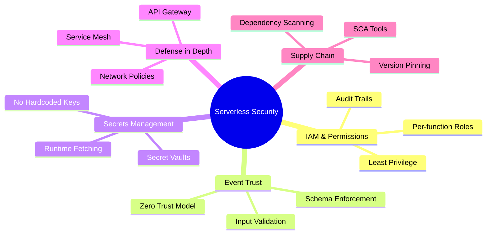

---

## Pitfall #1 — Over-Privileged IAM Roles

### The Problem

In traditional server-based architectures, a server often runs with a single set of permissions. Developers sometimes carry this mental model into serverless — creating one IAM role and attaching it to every function. It's fast, easy, and **dangerously wrong**.

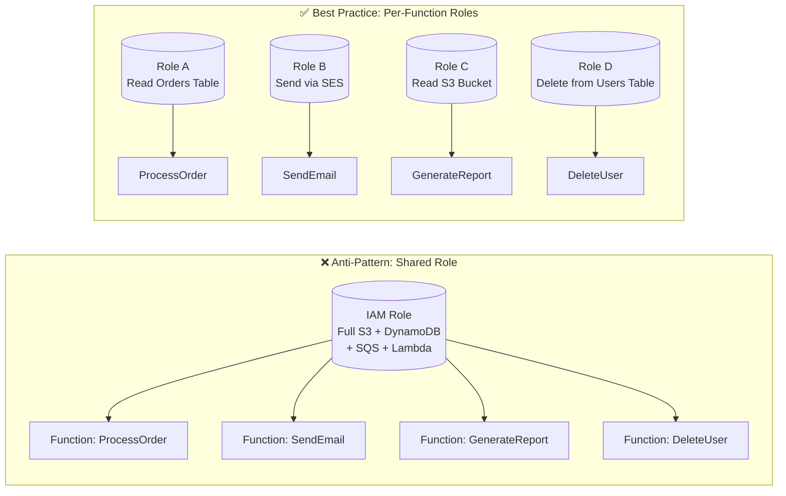

### The Blast Radius Concept

When a function is compromised (via injection, stolen credentials, or vulnerable dependency), the attacker inherits everything that function can do. This is the **blast radius**.

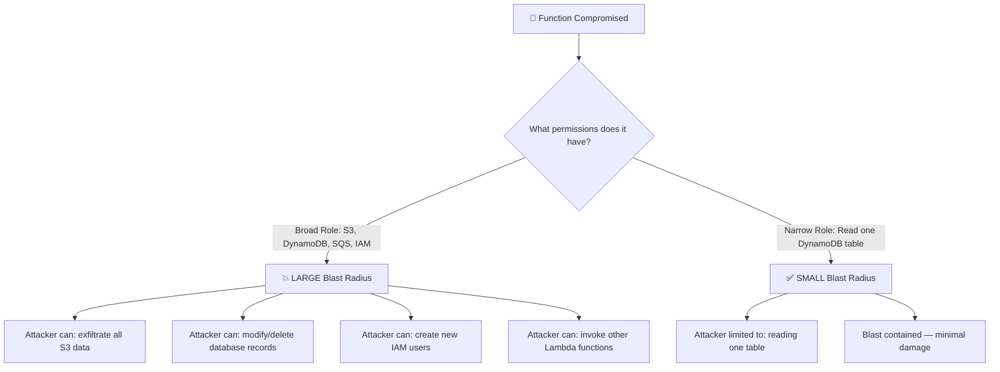

### Real-World Example

**Scenario:** An e-commerce platform with three functions: `processPayment`, `sendReceipt`, and `updateInventory`.

**Bad Implementation:**
```json
// ❌ One role for all three functions
{
  "PolicyName": "LambdaFullAccess",
  "Statement": [{
    "Effect": "Allow",
    "Action": ["s3:*", "dynamodb:*", "ses:*", "sqs:*"],
    "Resource": "*"
  }]
}
```

**Good Implementation:**
```json
// ✅ processPayment only reads/writes the Payments table
{
  "PolicyName": "ProcessPaymentRole",
  "Statement": [{
    "Effect": "Allow",
    "Action": ["dynamodb:PutItem", "dynamodb:GetItem"],
    "Resource": "arn:aws:dynamodb:us-east-1:123456789:table/Payments"
  }]
}

// ✅ sendReceipt only sends email
{
  "PolicyName": "SendReceiptRole",
  "Statement": [{
    "Effect": "Allow",
    "Action": ["ses:SendEmail"],
    "Resource": "arn:aws:ses:us-east-1:123456789:identity/receipts@shop.com"
  }]
}
```

### Practical Checklist ✅
- [ ] Each Lambda function has its **own dedicated IAM role**
- [ ] Roles use specific ARNs, not `"Resource": "*"`
- [ ] Permissions are scoped to the minimum required actions
- [ ] Roles are audited quarterly using AWS IAM Access Analyzer
- [ ] No `iam:*`, `s3:*`, or wildcard actions unless absolutely necessary

---

## Pitfall #2 — Implicit Trust in Internal Triggers

### The Problem

Event-driven architectures connect functions through queues, streams, and storage events. It's tempting to assume that because an event came from *within* your infrastructure, it's inherently safe.

**This assumption is the foundation of many breaches.**

```mermaid
sequenceDiagram
    participant Attacker
    participant S3 as S3 Bucket (Compromised Upload)
    participant Trigger as S3 Event Trigger
    participant Lambda as processFile Lambda
    participant DB as Database

    Attacker->>S3: Upload malicious file with crafted filename
    Note over S3: Filename: "../../../etc/passwd; DROP TABLE users;"
    S3->>Trigger: ObjectCreated event fired
    Trigger->>Lambda: Event payload delivered
    Note over Lambda: ❌ No validation — trusts internal event
    Lambda->>DB: Executes filename in query → SQL Injection!
    DB-->>Attacker: Data exfiltrated
```

### The Zero Trust Approach

**Zero Trust** means: **verify everything, trust nothing** — even internal events.

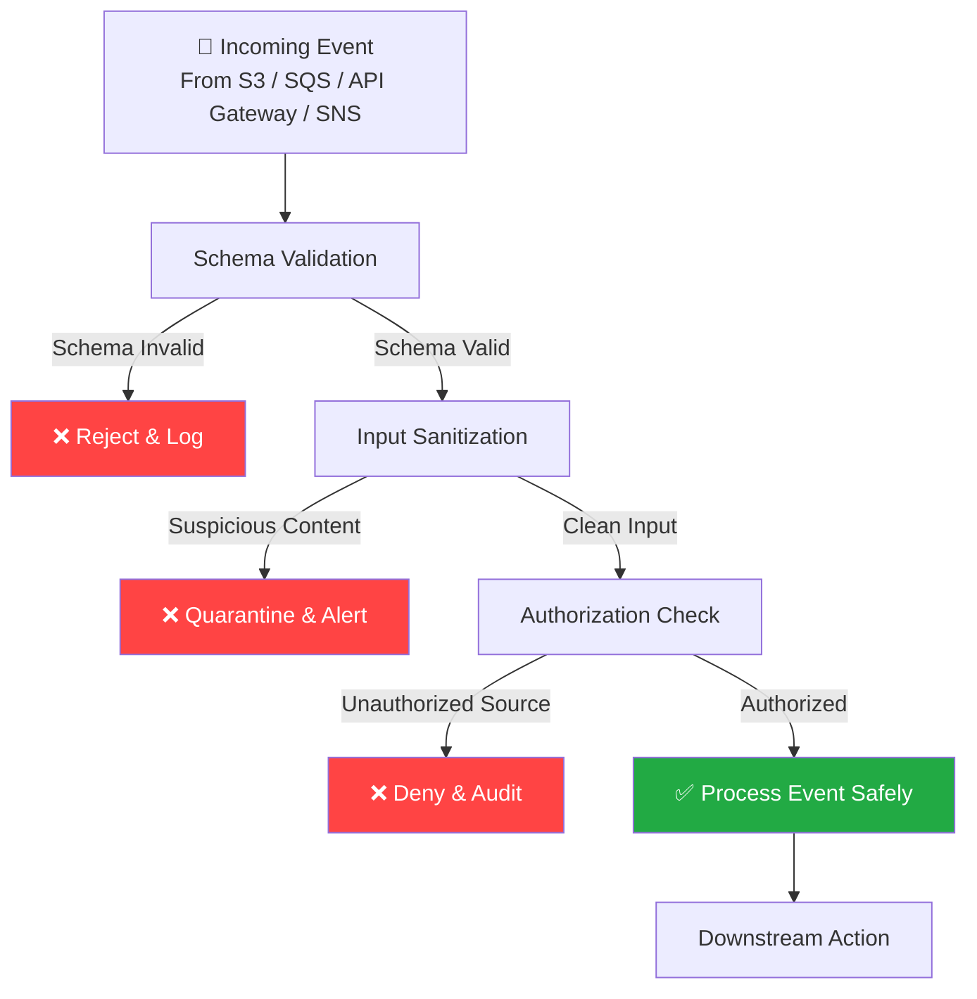

### Real-World Example

**Scenario:** An image processing pipeline triggered by S3 uploads.

**Vulnerable Code:**
```python
# ❌ Implicit trust — dangerous!
def handler(event, context):
    key = event['Records'][0]['s3']['object']['key']
    # Directly uses key in shell command — path traversal risk!
    os.system(f"convert /tmp/{key} /tmp/output.jpg")
```

**Hardened Code:**
```python
import re
import json

# ✅ Validate, sanitize, then process
def handler(event, context):
    try:
        record = event['Records'][0]
        
        # 1. Validate event structure
        assert 's3' in record, "Not an S3 event"
        assert 'object' in record['s3'], "Missing object data"
        
        key = record['s3']['object']['key']
        
        # 2. Sanitize the filename (only allow safe characters)
        if not re.match(r'^[a-zA-Z0-9._-]+\.(jpg|png|gif)$', key):
            raise ValueError(f"Invalid or unsafe key: {key}")
        
        # 3. Validate size constraints
        size = record['s3']['object'].get('size', 0)
        if size > 10 * 1024 * 1024:  # 10MB limit
            raise ValueError("File too large")
        
        # 4. Safe processing
        process_image(key)
        
    except (KeyError, AssertionError, ValueError) as e:
        print(f"SECURITY: Rejected event — {e}")
        # Alert your security team here
        return {"statusCode": 400}
```

### Use Cases Where This Matters Most

| Trigger Source | Common Attack Vector | Defense |
|---|---|---|
| S3 Upload | Path traversal in filenames | Regex validation on keys |
| SQS Message | Injection via message body | JSON schema validation |
| DynamoDB Streams | Poisoned record mutations | Field-level sanitization |
| SNS Notifications | Spoofed source ARN | Verify `TopicArn` against allowlist |
| EventBridge | Malformed event schema | Schema registry enforcement |

---

## Pitfall #3 — Insecure Secrets Handling

### The Problem

Secrets are the keys to your kingdom — database passwords, API tokens, encryption keys. How they're stored and accessed in serverless functions is one of the most critical security concerns.

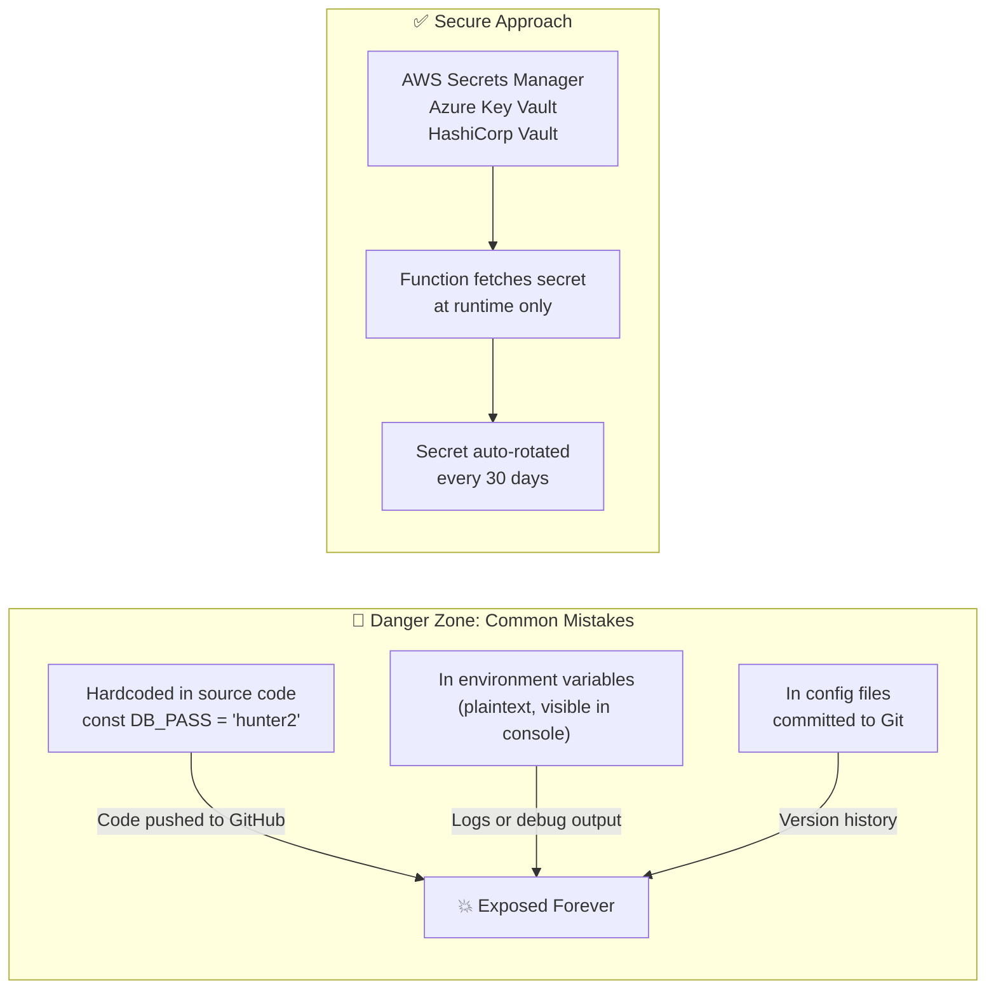

### The Secret Lifecycle

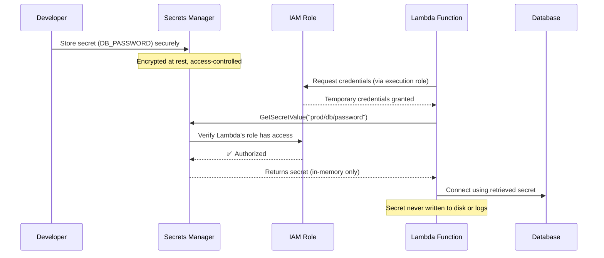

### Real-World Examples

**Terrible (Never Do This):**
```javascript
// ❌ Hardcoded credentials — commit this and it's game over
const mysql = require('mysql');
const conn = mysql.createConnection({
  host: 'prod-db.company.com',
  user: 'admin',
  password: 'Sup3rS3cr3t!',  // Visible to anyone with repo access
  database: 'customers'
});
```

**Better but Still Flawed:**
```javascript
// ⚠️ Environment variable — better, but can leak in logs
const conn = mysql.createConnection({
  password: process.env.DB_PASSWORD  // What if someone logs process.env?
});
```

**The Right Way — AWS Secrets Manager:**
```javascript
// ✅ Fetch at runtime, cache briefly, never log
const { SecretsManagerClient, GetSecretValueCommand } = require("@aws-sdk/client-secrets-manager");

const client = new SecretsManagerClient({ region: "us-east-1" });
let cachedSecret = null;
let cacheExpiry = 0;

async function getDbCredentials() {
  const now = Date.now();
  if (cachedSecret && now < cacheExpiry) return cachedSecret;
  
  const command = new GetSecretValueCommand({ SecretId: "prod/db/credentials" });
  const response = await client.send(command);
  
  cachedSecret = JSON.parse(response.SecretString);
  cacheExpiry = now + (5 * 60 * 1000); // Cache for 5 minutes max
  return cachedSecret;
}

exports.handler = async (event) => {
  const { username, password } = await getDbCredentials();
  // Never log these values!
  const conn = createConnection({ user: username, password });
};
```

### Secret Management Platform Comparison

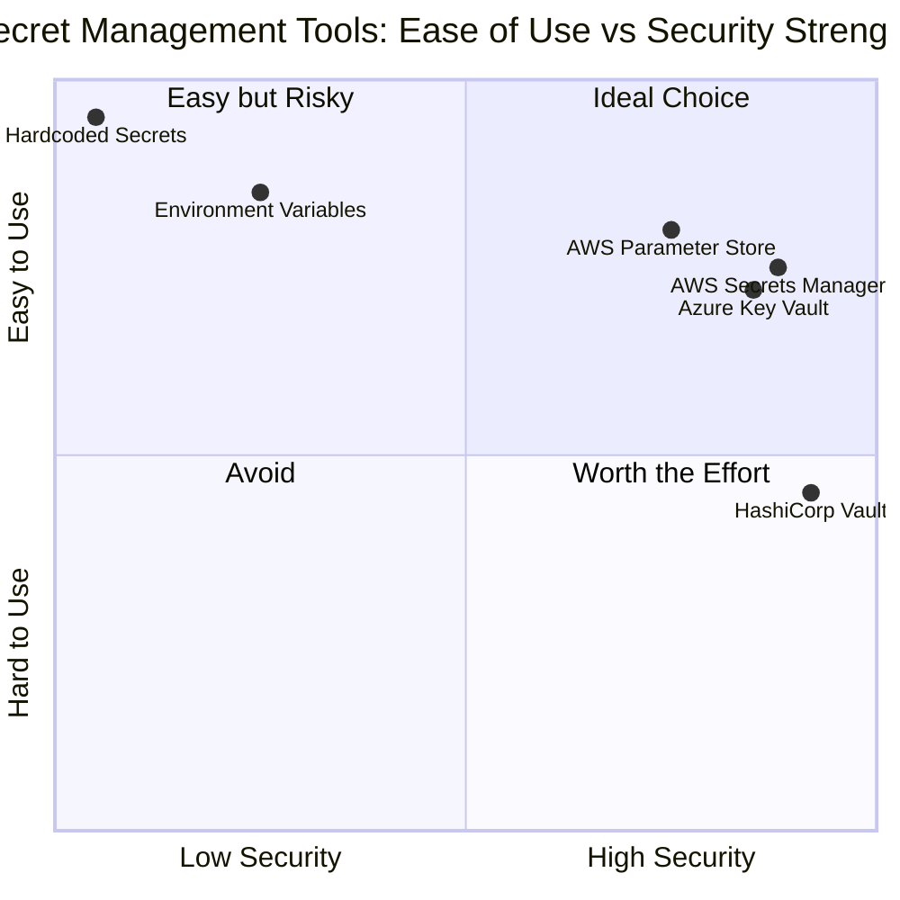

---

## Pitfall #4 — Relying on Perimeter-Only Security

### The Problem

The **castle-and-moat** model: build a wall, and assume everything inside is safe. This mental model was flawed for monoliths; it's catastrophic for serverless.

In serverless, **there is no inside**. Functions run in isolated containers, communicate over networks, and span multiple services. Each hop is a potential entry point.

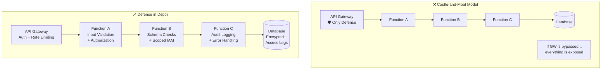

### The Defense-in-Depth Stack

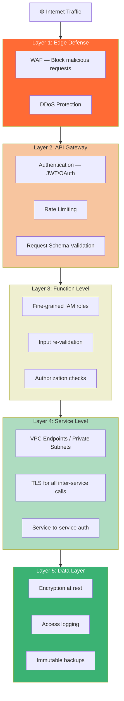

### Real-World Example: Internal Function Calls

Even when Function A calls Function B internally, always enforce authentication:

```python
# ❌ Direct internal invocation without auth
import boto3
lambda_client = boto3.client('lambda')

def handler(event, context):
    # No verification of who called us, no auth on the call
    lambda_client.invoke(
        FunctionName='processPayment',
        Payload=json.dumps(event)
    )
```

```python
# ✅ Sign the request and validate at receiver
import boto3
import jwt
import time

def invoke_with_auth(function_name, payload, secret):
    # Create a signed token for the inter-service call
    token = jwt.encode({
        "caller": "orderService",
        "exp": time.time() + 30,  # 30 second window
        "action": function_name
    }, secret, algorithm="HS256")
    
    signed_payload = {
        "auth_token": token,
        "data": payload
    }
    
    lambda_client.invoke(
        FunctionName=function_name,
        Payload=json.dumps(signed_payload)
    )
```

---

## Pitfall #5 — Supply Chain Vulnerabilities

### The Problem

Modern serverless functions are never just *your* code — they're your code plus dozens (sometimes hundreds) of third-party libraries. Each one is a potential entry point.

The infamous **Log4Shell (CVE-2021-44228)** vulnerability showed how a single flaw in a widely-used open-source library (Apache Log4j) could expose millions of applications globally — many of which had no idea they were even using it.

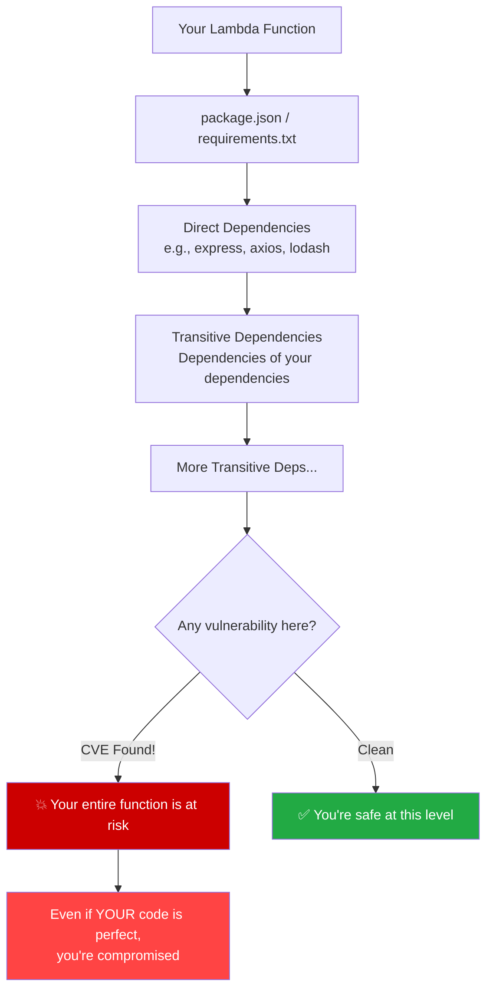

### The Dependency Audit Workflow

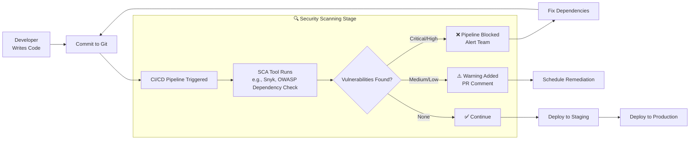

### Real-World Example: Auditing Your Node.js Function

```bash
# Step 1: Audit current dependencies
npm audit

# Output example:
# found 3 vulnerabilities (1 moderate, 2 high)
# Run `npm audit fix` to fix them

# Step 2: Auto-fix safe updates
npm audit fix

# Step 3: Check what's left and why
npm audit fix --dry-run

# Step 4: Use Snyk for deeper analysis
npx snyk test
npx snyk monitor  # Continuously monitor in production
```

**Pinning dependencies to avoid surprise upgrades:**
```json
// package.json — Pin exact versions, not ranges
{
  "dependencies": {
    "axios": "1.6.2",       // ✅ Exact pin
    "lodash": "^4.17.21",   // ⚠️ Accepts minor updates
    "express": "*"           // ❌ Accepts ANY version — dangerous!
  }
}
```

### Popular SCA Tools Comparison

| Tool | Platform | Free Tier | CI/CD Integration | Real-time Monitoring |
|---|---|---|---|---|
| **Snyk** | Node, Python, Java, Go | Yes (limited) | ✅ Excellent | ✅ Yes |
| **npm audit** | Node.js only | Free | ✅ Built-in | ❌ Manual |
| **OWASP Dependency Check** | Multi-language | Free | ✅ Good | ❌ Manual |
| **GitHub Dependabot** | All | Free | ✅ Native | ✅ Auto PRs |
| **AWS Inspector** | AWS-native | Paid | ✅ Native | ✅ Yes |

---

## 🔄 Putting It All Together: The Secure Serverless SDLC

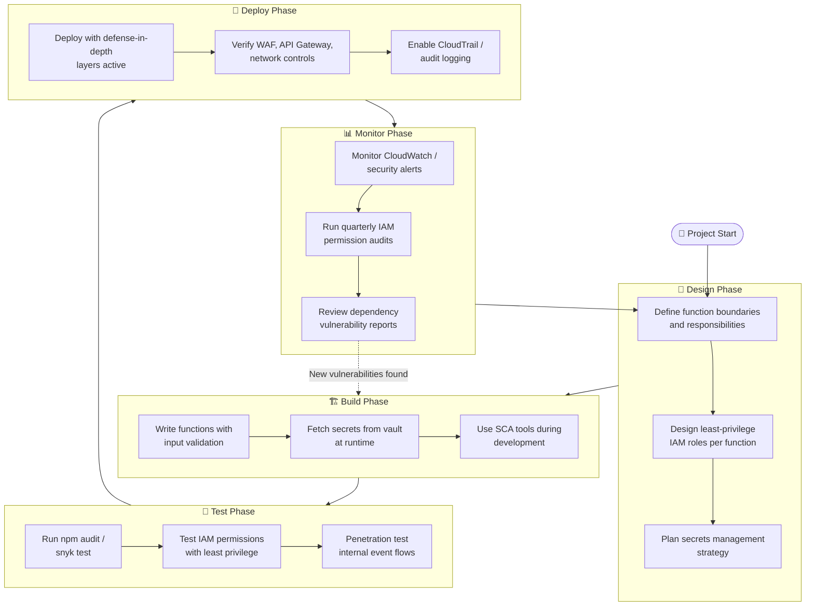

---

## 📋 Master Security Checklist

### IAM & Permissions
- [ ] Every function has its own dedicated IAM role
- [ ] No wildcard (`*`) resources in policies
- [ ] Roles reviewed quarterly with AWS Access Analyzer
- [ ] Cross-account access explicitly documented

### Event Trust & Input Validation
- [ ] All event inputs validated against a schema
- [ ] No shell commands constructed from event data
- [ ] SQL/NoSQL queries use parameterized inputs
- [ ] Zero-trust applied to all internal triggers

### Secrets Management
- [ ] Zero hardcoded credentials anywhere in codebase
- [ ] Secrets fetched from Secrets Manager / Key Vault at runtime
- [ ] Secret rotation configured (≤90 days)
- [ ] Secrets never logged or included in error messages

### Defense in Depth
- [ ] WAF enabled at edge
- [ ] API Gateway enforces auth and rate limiting
- [ ] VPC configured for functions accessing databases
- [ ] All inter-service communication uses TLS + auth tokens
- [ ] Centralized audit logging enabled

### Supply Chain
- [ ] `npm audit` / `pip audit` runs on every CI build
- [ ] Dependencies pinned to exact versions
- [ ] Snyk or Dependabot monitoring enabled
- [ ] SBOM (Software Bill of Materials) generated for each release

---

## 🎯 Key Takeaways

1. **Least Privilege is Non-Negotiable** — One role per function, scoped to the minimum. Your blast radius depends on it.

2. **Never Trust Internal Events** — Treat every event payload as potentially hostile. Validate at every boundary.

3. **Secrets Belong in Vaults** — If it's sensitive, it lives in Secrets Manager. Runtime-only, never in code.

4. **Defense in Depth Over Perimeter Security** — Security at the API Gateway is not security. Add layers at every hop.

5. **Your Dependencies Are Your Code** — A vulnerability in a transitive dependency is *your* vulnerability. Scan everything, always.

> *"Security is not a feature you add at the end — it's a discipline you bake into every function, every role, every deployment."*