# Stateless JWT Authentication Microservice Architecture with Spring Boot 3 & Redis Sentinel
### A Complete Tutorial — From Concepts to Production-Ready Code

---

## 📋 Table of Contents

1. [Introduction & Motivation](#introduction)
2. [Architecture Overview](#architecture-overview)
3. [Core Concepts Explained](#core-concepts)
4. [Cache-First Authentication Pattern](#cache-first)
5. [Implementation Deep Dive](#implementation)
6. [Redis Sentinel for High Availability](#redis-sentinel)
7. [Security Configuration](#security-config)
8. [Testing Strategy](#testing)
9. [Real-World Use Cases](#use-cases)
10. [Summary & Best Practices](#summary)

---

## 1. Introduction & Motivation {#introduction}

Modern microservice ecosystems present a fundamental challenge: **how do you authenticate users consistently across dozens of independent services without duplicating logic or hammering your database?**

This tutorial explores a battle-tested solution: a **centralized, stateless JWT authentication microservice** backed by Redis Sentinel. By the end, you'll understand not just the *what* but the *why* behind every design decision.

### The Problem It Solves

Imagine an e-commerce platform with these microservices:

```
Order Service   →  needs to verify "is user X authenticated?"
Payment Service →  needs to verify "is user X authenticated?"
Cart Service    →  needs to verify "is user X authenticated?"
Profile Service →  needs to verify "is user X authenticated?"
```

**Without a central Auth Service**, each of these services would:
- Duplicate JWT validation logic
- Independently query the database on every request
- Require synchronized secret key management
- Increase attack surface across the system

**With a central Auth Service + API Gateway**, all authentication is handled in one place.

---

## 2. Architecture Overview {#architecture-overview}

### High-Level System Architecture

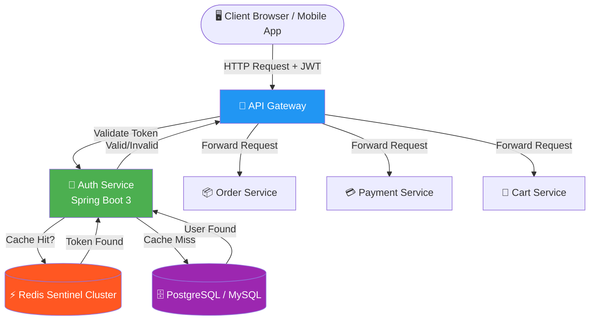

### Request Flow Explained

Every request follows this path:

1. Client sends a request with `Authorization: Bearer <token>` header
2. API Gateway intercepts it and calls the Auth Service
3. Auth Service first checks Redis (lightning fast, ~0.1ms)
4. If found → return "valid" immediately (zero DB queries!)
5. If not found → query DB, verify password via BCrypt, generate JWT, store in Redis
6. API Gateway forwards the request to the appropriate microservice

---

## 3. Core Concepts Explained {#core-concepts}

### 3.1 What is a Stateless JWT?

A **JWT (JSON Web Token)** is a self-contained token with three Base64-encoded parts:

```
Header.Payload.Signature
  ↓        ↓         ↓
eyJhbGc..eyJzdWI..SflKxw...
```

**Header** — algorithm type:
```json
{
  "alg": "HS256",
  "typ": "JWT"
}
```

**Payload** — user claims:
```json
{
  "sub": "user@example.com",
  "iat": 1716900000,
  "exp": 1716901440
}
```

**Signature** — tamper-proof seal:
```
HMACSHA256(base64(header) + "." + base64(payload), secretKey)
```

**Stateless** means the server doesn't store session state — the token itself contains all the information needed to verify the user.

### 3.2 Why HS256?

| Algorithm | Type | Key Requirement | Use Case |
|-----------|------|----------------|----------|
| HS256 | Symmetric | Single shared secret | Internal microservices (same org) |
| RS256 | Asymmetric | Public/Private key pair | External APIs, multi-org |
| ES256 | Asymmetric | Elliptic curve keys | High-security, IoT |

HS256 is ideal here because all services share the same secret key internally — fast and simple.

### 3.3 What is Redis?

Redis is an **in-memory key-value store** — think of it as a blazing-fast dictionary that lives in RAM:

```
Key:   "user@example.com"
Value: "eyJhbGciOiJIUzI1NiJ9..."  (the JWT token)
TTL:   1440 seconds (24 minutes)
```

Lookup speed: **~0.1ms** vs database query: **~50–200ms** — a 500–2000x improvement.

---

## 4. Cache-First Authentication Pattern {#cache-first}

### The Complete Sign-In Flow

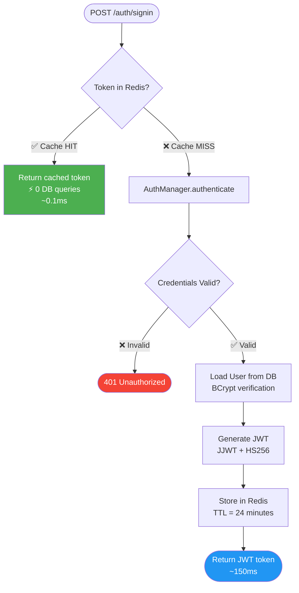

### Why Cache-First Matters Under Load

Consider a flash sale with 10,000 users logging in simultaneously:

**Without cache:** 10,000 DB queries × ~100ms = database overwhelm → timeouts → cascade failures

**With cache-first:**
- First login per user: 1 DB query → store in Redis
- Subsequent logins (same session): 0 DB queries
- Result: ~95% cache hit rate during peak load

### TTL Strategy

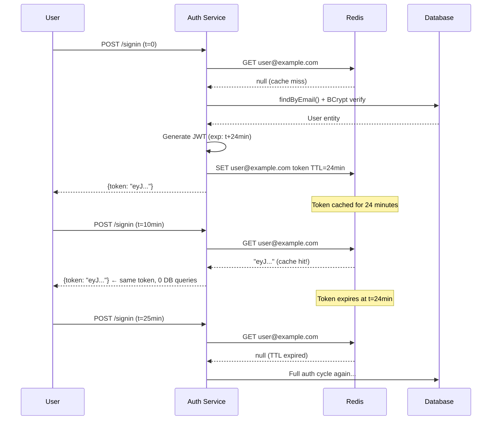

---

## 5. Implementation Deep Dive {#implementation}

### 5.1 Project Structure

```
auth-service/
├── src/main/java/com/example/auth/
│   ├── config/
│   │   ├── SecurityConfiguration.java     ← Spring Security 6 config
│   │   └── RedisConfig.java               ← Redis Sentinel connection
│   ├── controller/
│   │   └── AuthenticationController.java  ← /auth/signup, /auth/signin
│   ├── entity/
│   │   └── User.java                      ← implements UserDetails directly
│   ├── filter/
│   │   └── JwtAuthenticationFilter.java   ← OncePerRequestFilter
│   ├── service/
│   │   ├── JwtService.java / JwtServiceImpl.java
│   │   ├── AuthenticationService.java / AuthenticationServiceImpl.java
│   │   └── TokenCacheServiceImpl.java
│   └── model/
│       ├── SignUpRequest.java
│       ├── SigninRequest.java
│       └── JwtAuthenticationResponse.java
└── src/main/resources/
    └── application.yml
```

### 5.2 User Entity Implementing UserDetails

The elegant trick here is making your `User` entity **directly implement `UserDetails`** — eliminating the typical adapter/mapper layer:

```java
@Data
@Builder
@NoArgsConstructor
@AllArgsConstructor
@Entity
@Table(name = "T_APP_USER")
public class User implements UserDetails {

    @Id
    @GeneratedValue(strategy = GenerationType.SEQUENCE, generator = "seq_user_gen")
    @SequenceGenerator(name = "seq_user_gen", sequenceName = "SEQ_APP_USER", allocationSize = 1)
    @Column(name = "idx")
    private Long idx;

    @Column(name = "firstname")  private String firstName;
    @Column(name = "lastname")   private String lastName;
    @Column(unique = true, name = "email")   private String email;
    @Column(name = "accesskey")  private String accessKey;  // BCrypt-hashed

    @Column(name = "role")
    @Enumerated(EnumType.STRING)
    private Role role;

    // Maps our Role enum to Spring's GrantedAuthority
    @Override
    public Collection<? extends GrantedAuthority> getAuthorities() {
        return List.of(new SimpleGrantedAuthority(role.name()));
    }

    @Override public String getUsername()              { return email; }
    @Override public String getPassword()              { return accessKey; }
    @Override public boolean isAccountNonExpired()     { return true; }
    @Override public boolean isAccountNonLocked()      { return true; }
    @Override public boolean isCredentialsNonExpired() { return true; }
    @Override public boolean isEnabled()               { return true; }
}
```

**Why this is better than a separate UserDetails adapter:**

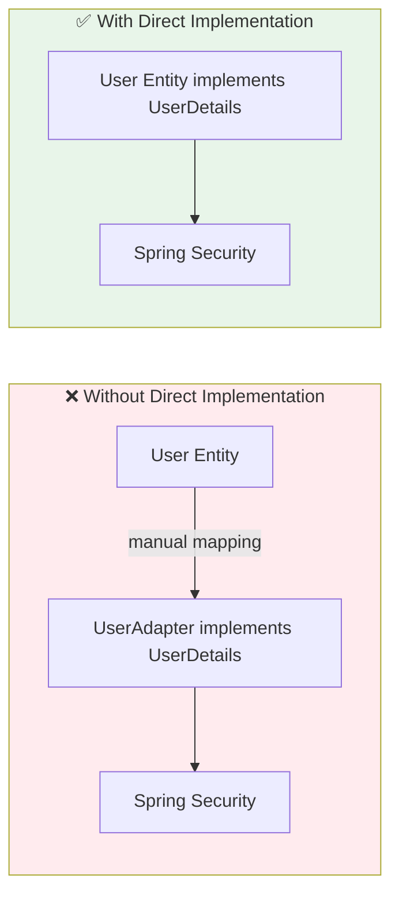

### 5.3 JWT Service Implementation

```java
public interface JwtService {
    String extractUserName(String token);
    String generateToken(UserDetails userDetails);
    boolean isTokenValid(String token, UserDetails userDetails);
}

@Service
public class JwtServiceImpl implements JwtService {

    @Value("${token.signing.key}")
    private String jwtSigningKey;  // Base64-encoded secret, stored in env/secrets manager

    @Override
    public String extractUserName(String token) {
        return extractClaim(token, Claims::getSubject);
    }

    @Override
    public String generateToken(UserDetails userDetails) {
        return Jwts.builder()
            .setClaims(new HashMap<>())
            .setSubject(userDetails.getUsername())          // email as subject
            .setIssuedAt(new Date(System.currentTimeMillis()))
            .setExpiration(new Date(System.currentTimeMillis() + 1000 * 60 * 24))  // 24 min
            .signWith(getSigningKey(), SignatureAlgorithm.HS256)
            .compact();
    }

    @Override
    public boolean isTokenValid(String token, UserDetails userDetails) {
        final String userName = extractUserName(token);
        // Both username must match AND token must not be expired
        return userName.equals(userDetails.getUsername()) && !isTokenExpired(token);
    }

    // Generic claim extractor — reusable for any claim type
    private <T> T extractClaim(String token, Function<Claims, T> claimsResolver) {
        return claimsResolver.apply(
            Jwts.parserBuilder()
                .setSigningKey(getSigningKey())
                .build()
                .parseClaimsJws(token)
                .getBody()
        );
    }

    private boolean isTokenExpired(String token) {
        return extractClaim(token, Claims::getExpiration).before(new Date());
    }

    private Key getSigningKey() {
        // Decode from Base64 → HMAC key for HS256
        return Keys.hmacShaKeyFor(Decoders.BASE64.decode(jwtSigningKey));
    }
}
```

**Token Lifecycle Diagram:**

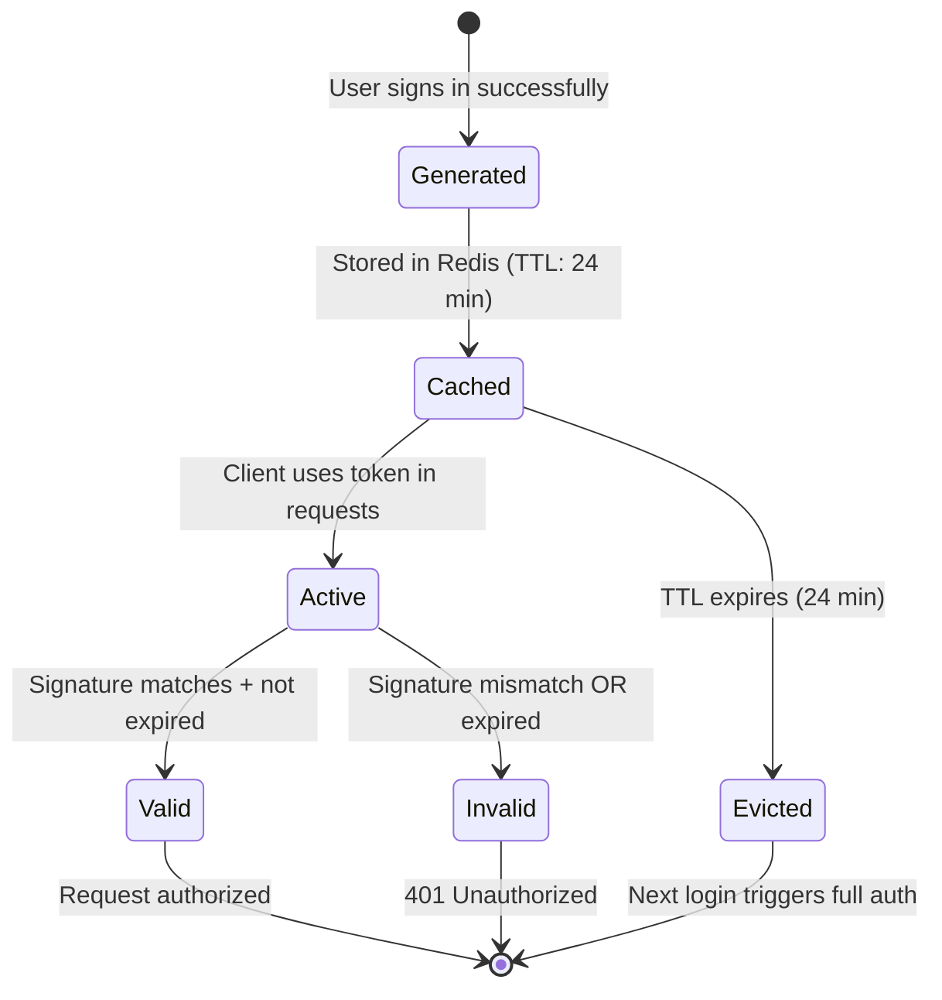

### 5.4 JWT Authentication Filter

The filter runs on **every single request** and is the heart of stateless security:

```java
@Component
@RequiredArgsConstructor
public class JwtAuthenticationFilter extends OncePerRequestFilter {

    private final JwtService jwtService;
    private final UserService userService;

    @Override
    protected void doFilterInternal(
        @NonNull HttpServletRequest request,
        @NonNull HttpServletResponse response,
        @NonNull FilterChain filterChain
    ) throws ServletException, IOException {

        final String authHeader = request.getHeader("Authorization");

        // Step 1: No token → pass through (public endpoints like /auth/**)
        if (StringUtils.isEmpty(authHeader) || !StringUtils.startsWith(authHeader, "Bearer ")) {
            filterChain.doFilter(request, response);
            return;
        }

        // Step 2: Extract the JWT (skip "Bearer " prefix = 7 chars)
        final String jwt = authHeader.substring(7);
        final String userEmail = jwtService.extractUserName(jwt);

        // Step 3: Only authenticate if not already authenticated
        if (StringUtils.isNotEmpty(userEmail)
                && SecurityContextHolder.getContext().getAuthentication() == null) {

            UserDetails userDetails = userService.userDetailsService()
                    .loadUserByUsername(userEmail);

            // Step 4: Validate token
            if (jwtService.isTokenValid(jwt, userDetails)) {
                // Step 5: Set authentication in SecurityContext
                SecurityContext context = SecurityContextHolder.createEmptyContext();
                UsernamePasswordAuthenticationToken authToken =
                    new UsernamePasswordAuthenticationToken(
                        userDetails, null, userDetails.getAuthorities()
                    );
                authToken.setDetails(new WebAuthenticationDetailsSource().buildDetails(request));
                context.setAuthentication(authToken);
                SecurityContextHolder.setContext(context);
            }
        }

        // Step 6: Always continue the filter chain
        filterChain.doFilter(request, response);
    }
}
```

**Filter Decision Flow:**

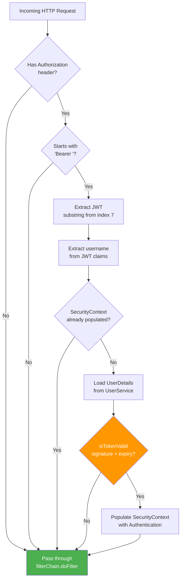

### 5.5 Authentication Service: Signup & Signin

```java
@Service
@RequiredArgsConstructor
public class AuthenticationServiceImpl implements AuthenticationService {

    private final UserRepository userRepository;
    private final PasswordEncoder passwordEncoder;
    private final JwtService jwtService;
    private final AuthenticationManager authenticationManager;
    private final TokenCacheServiceImpl tokenCacheService;

    @Override
    public JwtAuthenticationResponse signup(SignUpRequest request) {
        // Hash password with BCrypt before storing
        var user = User.builder()
            .firstName(request.getFirstName())
            .lastName(request.getLastName())
            .email(request.getEmail())
            .accessKey(passwordEncoder.encode(request.getAccessKey()))  // BCrypt(cost=10)
            .role(Role.USER)
            .build();

        userRepository.save(user);
        
        // Generate JWT immediately after registration
        var jwt = jwtService.generateToken(user);
        return JwtAuthenticationResponse.builder().token(jwt).build();
    }

    @Override
    public JwtAuthenticationResponse signin(SigninRequest request) {
        // ★ Cache-first: check Redis before touching the DB
        String cachedToken = tokenCacheService.getToken(request.getEmail());
        if (cachedToken != null) {
            return JwtAuthenticationResponse.builder().token(cachedToken).build();
        }

        // Cache miss: full authentication cycle
        authenticationManager.authenticate(
            new UsernamePasswordAuthenticationToken(request.getEmail(), request.getAccessKey())
        );

        var user = userRepository.findByEmail(request.getEmail())
            .orElseThrow(() -> new IllegalArgumentException("Invalid credentials."));

        // Generate and cache for future requests
        var jwt = jwtService.generateToken(user);
        tokenCacheService.cacheToken(request.getEmail(), jwt, 24, TimeUnit.MINUTES);
        
        return JwtAuthenticationResponse.builder().token(jwt).build();
    }
}
```

### 5.6 Token Cache Service

```java
@Service
public class TokenCacheServiceImpl {

    private final RedisTemplate<String, String> redisTemplate;

    public TokenCacheServiceImpl(RedisTemplate<String, String> redisTemplate) {
        this.redisTemplate = redisTemplate;
    }

    // Store token with automatic expiry
    public void cacheToken(String username, String token, long duration, TimeUnit unit) {
        redisTemplate.opsForValue().set(username, token, duration, unit);
    }

    // Retrieve token; returns null if not found or expired
    @Cacheable(value = "tokens", key = "#username")
    public String getToken(String username) {
        return redisTemplate.opsForValue().get(username);
    }
    
    // Explicitly revoke a token (e.g., on logout)
    public void revokeToken(String username) {
        redisTemplate.delete(username);
    }
}
```

> 💡 **Bonus**: The `revokeToken` method gives you **JWT logout** — something pure stateless JWTs can't do. Since the token is in Redis, you can delete it, effectively invalidating it even before TTL expires.

---

## 6. Redis Sentinel for High Availability {#redis-sentinel}

### The Single Point of Failure Problem

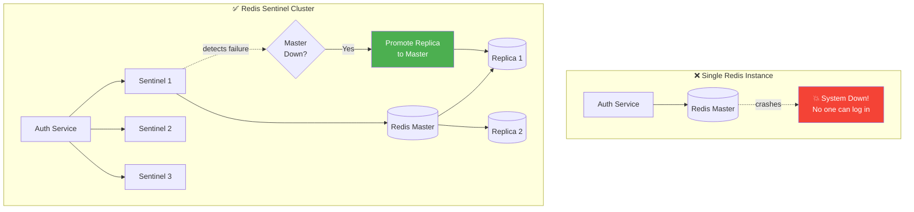

### Sentinel Failover Process

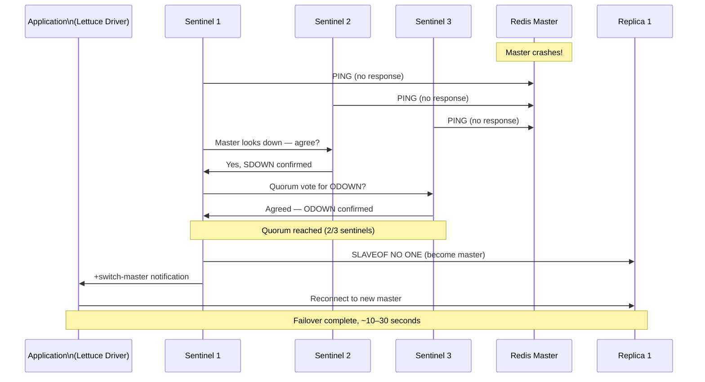

### Redis Sentinel Configuration

```java
@Configuration
public class RedisConfig {

    @Value("${spring.redis.sentinel.master}")
    private String master;

    @Value("${spring.redis.sentinel.nodes}")  // e.g. "sentinel1:26379,sentinel2:26379,sentinel3:26379"
    private String sentinelNodes;

    @Value("${spring.redis.password}")
    private String password;

    @Bean
    public RedisConnectionFactory redisConnectionFactory() {
        RedisSentinelConfiguration sentinelConfig = new RedisSentinelConfiguration()
                .master(master);  // Name matching sentinel.conf "monitor mymaster"

        // Register all sentinel nodes
        for (String node : sentinelNodes.split(",")) {
            String[] hostPort = node.split(":");
            sentinelConfig.sentinel(hostPort[0], Integer.parseInt(hostPort[1]));
        }

        sentinelConfig.setPassword(RedisPassword.of(password));
        
        // Lettuce driver handles automatic failover transparently
        return new LettuceConnectionFactory(sentinelConfig);
    }
}
```

**application.yml configuration:**

```yaml
spring:
  redis:
    sentinel:
      master: mymaster
      nodes: sentinel1:26379,sentinel2:26379,sentinel3:26379
    password: ${REDIS_PASSWORD}  # injected from Kubernetes Secret
```

**Kubernetes Secret injection:**

```yaml
env:
  - name: spring.redis.sentinel.master
    valueFrom:
      secretKeyRef:
        name: redis-user-secret
        key: username
  - name: spring.redis.password
    valueFrom:
      secretKeyRef:
        name: redis-user-secret
        key: password
```

---

## 7. Security Configuration {#security-config}

### Spring Security 6 SecurityFilterChain

```java
@Configuration
@EnableWebSecurity
@RequiredArgsConstructor
public class SecurityConfiguration {

    private final JwtAuthenticationFilter jwtAuthenticationFilter;
    private final UserService userService;

    @Bean
    public SecurityFilterChain securityFilterChain(HttpSecurity http) throws Exception {
        http
            // ✅ Disable CSRF — stateless APIs don't need it (no cookies/session)
            .csrf(AbstractHttpConfigurer::disable)
            
            .authorizeHttpRequests(request -> request
                // Auth endpoints are public — no token needed to sign up/in
                .requestMatchers("/auth/**").permitAll()
                // Everything else requires a valid JWT
                .anyRequest().authenticated()
            )
            
            // ✅ STATELESS — no HttpSession created or used
            .sessionManagement(manager ->
                manager.sessionCreationPolicy(STATELESS)
            )
            
            .authenticationProvider(authenticationProvider())
            
            // JWT filter runs BEFORE Spring's default username/password filter
            .addFilterBefore(jwtAuthenticationFilter,
                UsernamePasswordAuthenticationFilter.class);

        return http.build();
    }

    @Bean
    public PasswordEncoder passwordEncoder() {
        return new BCryptPasswordEncoder();  // default cost factor = 10
    }

    @Bean
    public AuthenticationProvider authenticationProvider() {
        DaoAuthenticationProvider authProvider = new DaoAuthenticationProvider();
        authProvider.setUserDetailsService(userService.userDetailsService());
        authProvider.setPasswordEncoder(passwordEncoder());
        return authProvider;
    }

    @Bean
    public AuthenticationManager authenticationManager(AuthenticationConfiguration config)
            throws Exception {
        return config.getAuthenticationManager();
    }
}
```

### Filter Chain Execution Order

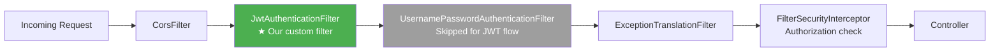

---

## 8. Testing Strategy {#testing}

### Unit Test Examples

```java
@ExtendWith(MockitoExtension.class)
class AuthenticationServiceTest {

    @Mock private TokenCacheServiceImpl tokenCacheService;
    @Mock private AuthenticationManager authenticationManager;
    @Mock private UserRepository userRepository;
    @Mock private JwtService jwtService;
    @InjectMocks private AuthenticationServiceImpl authenticationService;

    private static final String TEST_EMAIL = "user@example.com";
    private static final String TEST_TOKEN = "eyJhbGciOiJIUzI1NiJ9.test.sig";
    private static final String TEST_PASSWORD = "securePassword123";

    @Test
    @DisplayName("Signin: if token is cached, should NOT query the DB")
    void testSignInWithCachedToken() {
        // Given: Redis has a valid cached token
        when(tokenCacheService.getToken(TEST_EMAIL)).thenReturn(TEST_TOKEN);

        // When: user signs in
        JwtAuthenticationResponse response = authenticationService.signin(
            SigninRequest.builder().email(TEST_EMAIL).accessKey(TEST_PASSWORD).build()
        );

        // Then: cached token returned, zero DB interaction
        assertEquals(TEST_TOKEN, response.getToken());
        verifyNoInteractions(authenticationManager);  // No auth manager called
        verifyNoInteractions(userRepository);          // No DB query made
    }

    @Test
    @DisplayName("Signin: cache miss triggers full DB authentication")
    void testSignInWithCacheMiss() {
        // Given: Redis is empty
        when(tokenCacheService.getToken(TEST_EMAIL)).thenReturn(null);
        
        User mockUser = User.builder().email(TEST_EMAIL).role(Role.USER).build();
        when(userRepository.findByEmail(TEST_EMAIL)).thenReturn(Optional.of(mockUser));
        when(jwtService.generateToken(mockUser)).thenReturn(TEST_TOKEN);

        // When: user signs in
        JwtAuthenticationResponse response = authenticationService.signin(
            SigninRequest.builder().email(TEST_EMAIL).accessKey(TEST_PASSWORD).build()
        );

        // Then: full auth cycle executed, token cached
        assertEquals(TEST_TOKEN, response.getToken());
        verify(authenticationManager).authenticate(any());
        verify(tokenCacheService).cacheToken(eq(TEST_EMAIL), eq(TEST_TOKEN), eq(24L), any());
    }
}
```

```java
@ExtendWith(MockitoExtension.class)
class JwtAuthenticationFilterTest {

    @Mock private JwtService jwtService;
    @Mock private UserService userService;
    @Mock private UserDetailsService userDetailsService;
    @Mock private HttpServletRequest request;
    @Mock private HttpServletResponse response;
    @Mock private FilterChain filterChain;
    @Mock private UserDetails userDetails;
    @InjectMocks private JwtAuthenticationFilter jwtAuthenticationFilter;

    private static final String TEST_EMAIL = "user@example.com";
    private static final String INVALID_TOKEN = "invalid.jwt.token";
    private static final String VALID_TOKEN = "valid.jwt.token";

    @Test
    @DisplayName("Invalid token → SecurityContext must remain empty")
    void testDoFilterInternalInvalidToken() throws Exception {
        when(request.getHeader("Authorization")).thenReturn("Bearer " + INVALID_TOKEN);
        when(jwtService.extractUserName(INVALID_TOKEN)).thenReturn(TEST_EMAIL);
        when(userService.userDetailsService()).thenReturn(userDetailsService);
        when(userDetailsService.loadUserByUsername(TEST_EMAIL)).thenReturn(userDetails);
        when(jwtService.isTokenValid(INVALID_TOKEN, userDetails)).thenReturn(false);

        jwtAuthenticationFilter.doFilterInternal(request, response, filterChain);

        verify(filterChain).doFilter(request, response);
        assertNull(SecurityContextHolder.getContext().getAuthentication());
    }

    @Test
    @DisplayName("Valid token → SecurityContext populated with authentication")
    void testDoFilterInternalValidToken() throws Exception {
        when(request.getHeader("Authorization")).thenReturn("Bearer " + VALID_TOKEN);
        when(jwtService.extractUserName(VALID_TOKEN)).thenReturn(TEST_EMAIL);
        when(userService.userDetailsService()).thenReturn(userDetailsService);
        when(userDetailsService.loadUserByUsername(TEST_EMAIL)).thenReturn(userDetails);
        when(jwtService.isTokenValid(VALID_TOKEN, userDetails)).thenReturn(true);
        when(userDetails.getAuthorities()).thenReturn(List.of());

        jwtAuthenticationFilter.doFilterInternal(request, response, filterChain);

        assertNotNull(SecurityContextHolder.getContext().getAuthentication());
    }

    @AfterEach
    void clearSecurityContext() {
        SecurityContextHolder.clearContext();
    }
}
```

### Test Coverage Matrix

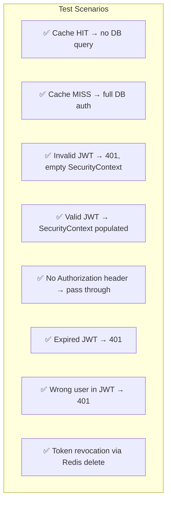

---

## 9. Real-World Use Cases {#use-cases}

### Use Case 1: E-Commerce Platform

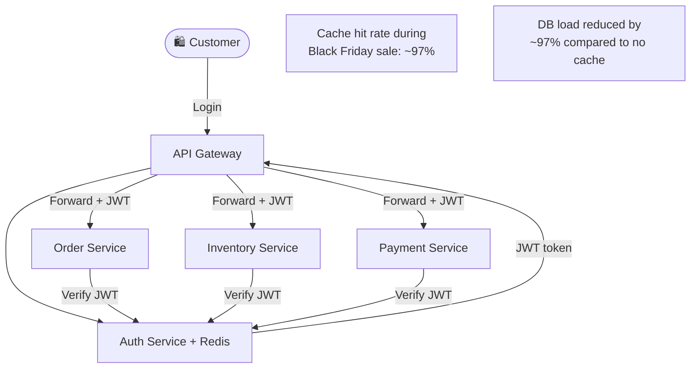

**Business value:** During a Black Friday event with 50,000 concurrent users, Redis handles nearly all token validations, preventing DB overload that could bring down the entire platform.

### Use Case 2: Multi-Tenant SaaS Application

Each tenant (company) has their own Redis namespace:

```java
// Tenant-aware cache key
public void cacheToken(String tenantId, String email, String token) {
    String key = tenantId + ":" + email;  // e.g., "acme-corp:user@acme.com"
    redisTemplate.opsForValue().set(key, token, 24, TimeUnit.MINUTES);
}
```

This allows per-tenant token revocation (e.g., when a company's subscription expires: `redisTemplate.delete(tenantId + ":*")`)

### Use Case 3: Mobile App Backend

Mobile apps frequently re-authenticate after app restarts. With cache-first:

- **App opens** → cached token returned instantly (~0.1ms response)
- **User experience** → "instant" re-login, no loading spinner
- **Server load** → minimal, even with millions of daily active users

### Use Case 4: API Gateway Rate Limiting Integration

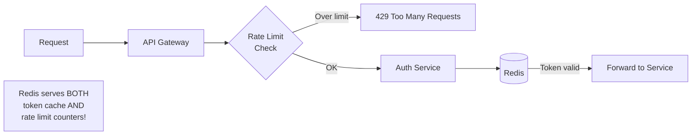

Since Redis is already in the stack, you can use it for rate limiting too — storing request counts per user per minute.

### Use Case 5: Microservice-to-Microservice Authentication

Internal services can also use JWT for inter-service calls:

```java
// Service A calls Service B with its own service JWT
HttpHeaders headers = new HttpHeaders();
headers.setBearerAuth(serviceJwtToken);  // Service A's JWT
restTemplate.exchange(serviceBUrl, HttpMethod.GET, new HttpEntity<>(headers), Response.class);
```

---

## 10. Summary & Best Practices {#summary}

### Architecture Summary

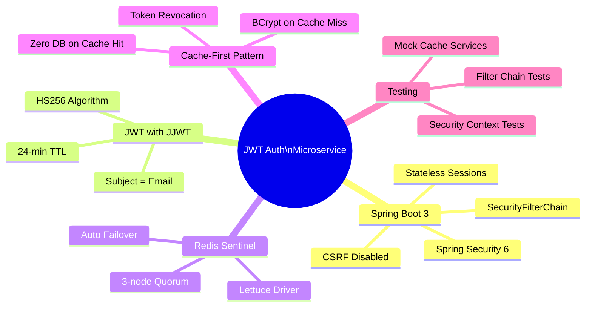

### Best Practices Checklist

| Practice | Why It Matters |
|----------|---------------|
| ✅ User entity implements UserDetails directly | Eliminates mapping boilerplate |
| ✅ Cache-first in signin | Prevents DB overload at scale |
| ✅ Redis Sentinel (3 nodes) | Eliminates Single Point of Failure |
| ✅ BCrypt for password storage | Brute-force resistant hashing |
| ✅ Base64-encoded secret in env var | Never hardcode secrets in source |
| ✅ STATELESS session management | No server-side session = true horizontal scaling |
| ✅ OncePerRequestFilter | Guarantees JWT parsed exactly once per request |
| ✅ TTL matches JWT expiry | Redis and JWT expiry stay in sync |
| ✅ `revokeToken()` for logout | True JWT invalidation despite stateless design |

### Common Pitfalls to Avoid

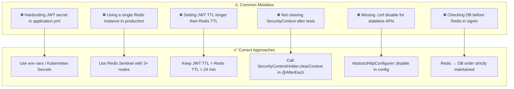

### Technology Stack Summary

| Layer | Technology | Purpose |
|-------|-----------|---------|
| Framework | Spring Boot 3 | Application foundation |
| Security | Spring Security 6 | Filter chain, auth providers |
| Token | JJWT (HS256) | JWT generation & validation |
| Cache | Redis + Sentinel | Token caching + high availability |
| Driver | Lettuce | Redis client with failover support |
| Password | BCrypt | Secure password hashing |
| ORM | Spring Data JPA | User persistence |
| Container | Kubernetes | Secret management, deployment |

---

> 🚀 **Starting a new microservice project?** Design your token management as **stateless** and **cached** from day one. Retrofitting auth into a stateful, DB-heavy system is far more painful than building it right initially. This architecture scales from 100 users to 10 million with minimal changes.