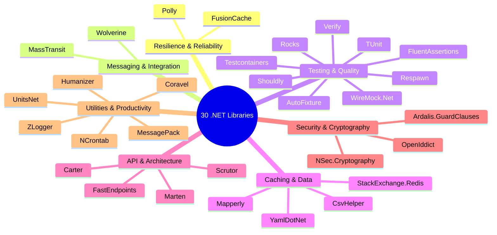
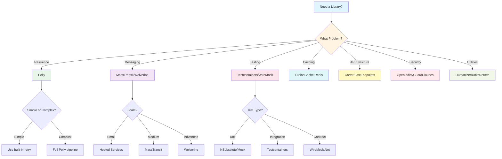
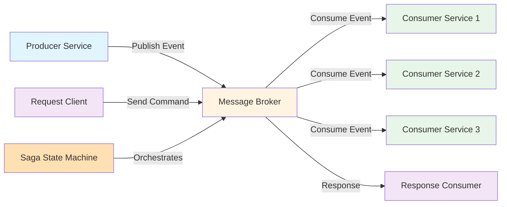

# 30 Essential .NET Libraries Every Developer Should Know - Complete Guide

**📚 Tutorial Type:** Comprehensive Deep Dive  
**🎯 Target Audience:** Intermediate .NET Developers  
**⏱️ Estimated Reading Time:** 45-60 minutes  
**🔄 Last Updated:** January 2026  
**💻 Language:** C# / .NET

---

## Table of Contents

1. [Introduction](#introduction)
2. [Prerequisites](#prerequisites)
3. [Learning Objectives](#learning-objectives)
4. [Library Categories Overview](#library-categories-overview)
5. [Resilience & Reliability Libraries](#resilience--reliability-libraries)
6. [Messaging & Integration Libraries](#messaging--integration-libraries)
7. [Testing & Quality Libraries](#testing--quality-libraries)
8. [Caching & Data Libraries](#caching--data-libraries)
9. [API & Architecture Libraries](#api--architecture-libraries)
10. [Security & Cryptography Libraries](#security--cryptography-libraries)
11. [Utilities & Productivity Libraries](#utilities--productivity-libraries)
12. [Best Practices](#best-practices)
13. [Anti-Patterns to Avoid](#anti-patterns-to-avoid)
14. [Performance Considerations](#performance-considerations)
15. [Security Considerations](#security-considerations)
16. [Troubleshooting Guide](#troubleshooting-guide)
17. [Real-World Implementation Examples](#real-world-implementation-examples)
18. [Practice Exercises](#practice-exercises)
19. [Test Your Understanding](#test-your-understanding)
20. [Common Interview Questions](#common-interview-questions)
21. [Question Bank](#question-bank)
22. [Summary & Key Takeaways](#summary--key-takeaways)
23. [Further Reading & Resources](#further-reading--resources)

---

## Introduction

The .NET ecosystem is vast and powerful, with thousands of NuGet packages available to solve virtually any development challenge. However, this abundance creates a new problem: **which libraries should you actually use?**

This comprehensive guide explores 30 essential .NET libraries that every professional developer should know. These libraries span critical domains including resilience, messaging, testing, caching, security, and productivity. Each library is carefully selected based on real-world utility, active maintenance, and community adoption.

### Why This Matters

> 💡 **Key Insight:** A useful library solves a real problem. It should not be installed only because it is popular.

Choosing the right library can mean the difference between:
- **Resilient applications** that gracefully handle failures vs. fragile systems that crash under pressure
- **Maintainable codebases** that are easy to test and debug vs. tangled messes of custom implementations
- **Performant systems** that scale efficiently vs. applications that buckle under load
- **Secure applications** that follow best practices vs. systems vulnerable to attacks

### What You'll Learn

In this guide, you'll discover:
- **30 production-ready libraries** with practical use cases
- **When to use** each library and, equally important, **when to avoid** it
- **Real-world code examples** demonstrating proper implementation
- **Alternatives and trade-offs** to help you make informed decisions
- **Best practices and anti-patterns** to ensure successful adoption

---

## Prerequisites

Before diving into this tutorial, ensure you have:

### Technical Requirements
- ✅ **.NET 6.0+ SDK** or **.NET 8.0+** (recommended)
- ✅ **Visual Studio 2022** or **Visual Studio Code** with C# extensions
- ✅ **Basic understanding** of C# and .NET Core/5+/6+/7+/8+
- ✅ **Familiarity** with dependency injection and ASP.NET Core
- ✅ **Docker Desktop** installed (for Testcontainers examples)
- ✅ **NuGet Package Manager** knowledge

### Knowledge Prerequisites
- Understanding of REST APIs and HTTP
- Basic database concepts (SQL/NoSQL)
- Familiarity with testing concepts (unit tests, integration tests)
- Understanding of messaging patterns (helpful but not required)
- Basic security concepts (authentication, authorization)

### Recommended Background
- Experience building ASP.NET Core applications
- Understanding of microservices architecture (helpful for messaging libraries)
- Familiarity with design patterns (Decorator, Repository, etc.)

---

## Learning Objectives

By the end of this comprehensive guide, you will be able to:

### Core Competencies
- ✅ **Identify** the right library for specific development challenges
- ✅ **Implement** resilience patterns using Polly
- ✅ **Set up** message-based architectures with MassTransit or Wolverine
- ✅ **Write** robust integration tests using Testcontainers and WireMock.Net
- ✅ **Configure** multi-level caching with FusionCache and StackExchange.Redis
- ✅ **Build** modern APIs using Carter or FastEndpoints
- ✅ **Implement** secure authentication with OpenIddict
- ✅ **Apply** guard clauses and validation using Ardalis.GuardClauses
- ✅ **Serialize** data efficiently with MessagePack and CsvHelper
- ✅ **Generate** mocks and test data using Rocks and AutoFixture

### Advanced Skills
- ✅ **Compare** library alternatives and make informed decisions
- ✅ **Avoid** common pitfalls and anti-patterns
- ✅ **Optimize** performance using the right tools
- ✅ **Implement** security best practices
- ✅ **Debug** library-related issues effectively
- ✅ **Evaluate** library suitability for specific use cases

### Practical Abilities
- ✅ **Build** production-ready applications using these libraries
- ✅ **Write** comprehensive test suites
- ✅ **Design** resilient distributed systems
- ✅ **Make** architectural decisions based on library capabilities

---

## Library Categories Overview

Let's visualize how these 30 libraries map to common development scenarios:



### Library Selection Decision Flow



---

## Resilience & Reliability Libraries

### 1. Polly

**📦 Package:** `Polly`  
**⭐ Popularity:** Very High (100M+ downloads)  
**🔗 GitHub:** https://github.com/App-vNext/Polly

#### Use Case
Adds resilience to calls that can fail temporarily, such as HTTP requests, database connections, and third-party integrations.

#### Why It's Useful
Polly supports:
- **Retries** with exponential backoff
- **Timeouts** to prevent hanging operations
- **Circuit breakers** to fail fast during outages
- **Fallbacks** for graceful degradation
- **Resilience pipelines** for complex scenarios

#### When to Avoid
❌ **Do not retry operations blindly.** Retrying a non-idempotent payment request can charge a customer more than once.

#### Real-World Example

```csharp
// ✅ CORRECT: Idempotent retry with exponential backoff
public class PaymentService
{
    private readonly HttpClient _httpClient;
    private readonly AsyncRetryPolicy<HttpResponseMessage> _retryPolicy;
    
    public PaymentService(HttpClient httpClient)
    {
        _httpClient = httpClient;
        
        // Define retry policy with exponential backoff
        _retryPolicy = Policy
            .Handle<HttpRequestException>()
            .OrResult<HttpResponseMessage>(r => (int)r.StatusCode >= 500)
            .WaitAndRetryAsync(
                retryCount: 3,
                sleepDurationProvider: attempt => 
                    TimeSpan.FromSeconds(Math.Pow(2, attempt)), // 2s, 4s, 8s
                onRetry: (outcome, timespan, attempt, context) =>
                {
                    Console.WriteLine($"Retry {attempt} after {timespan.TotalSeconds}s");
                    return Task.CompletedTask;
                });
    }
    
    public async Task<PaymentResult> ProcessPaymentAsync(PaymentRequest request)
    {
        // Apply retry policy
        return await _retryPolicy.ExecuteAsync(async () =>
        {
            var response = await _httpClient.PostAsJsonAsync(
                "/api/payments", request);
            
            response.EnsureSuccessStatusCode();
            return await response.Content.ReadFromJsonAsync<PaymentResult>();
        });
    }
}

// ❌ INCORRECT: Blind retry on non-idempotent operation
public class BadPaymentService
{
    private readonly HttpClient _httpClient;
    
    public async Task<PaymentResult> ProcessPaymentAsync(PaymentRequest request)
    {
        // DANGEROUS: Retrying POST without idempotency check
        for (int i = 0; i < 3; i++)
        {
            var response = await _httpClient.PostAsJsonAsync(
                "/api/payments", request);
            if (response.IsSuccessStatusCode)
                return await response.Content.ReadFromJsonAsync<PaymentResult>();
        }
        
        throw new Exception("Payment failed");
    }
}
```

#### Circuit Breaker Pattern

```csharp
// Circuit breaker prevents cascading failures
var circuitBreakerPolicy = Policy
    .Handle<HttpRequestException>()
    .CircuitBreakerAsync(
        handledEventsAllowedBeforeBreaking: 5,
        durationOfBreak: TimeSpan.FromSeconds(30),
        onBreak: (ex, breakDelay) =>
        {
            Console.WriteLine($"Circuit broken for {breakDelay.TotalSeconds}s");
        },
        onReset: () =>
        {
            Console.WriteLine("Circuit reset");
        },
        onHalfOpen: () =>
        {
            Console.WriteLine("Circuit half-open, testing...");
        });

// Combine policies into a resilience pipeline
var resiliencePipeline = Policy.WrapAsync(_retryPolicy, circuitBreakerPolicy);

// Use the pipeline
await resiliencePipeline.ExecuteAsync(async () =>
{
    return await _httpClient.GetAsync("/api/data");
});
```

#### Alternative
**Microsoft.Extensions.Http.Resilience** provides modern resilience integration for `HttpClient` and uses Polly underneath. It's the recommended approach for .NET 8+ applications.

```csharp
// Modern approach with Microsoft.Extensions.Http.Resilience
builder.Services.AddHttpClient<PaymentService>()
    .AddStandardResilienceHandler(options =>
    {
        options.Retry.MaxRetryAttempts = 3;
        options.Retry.UseJitter = true;
        options.CircuitBreaker.MinimumThroughput = 100;
    });
```

---

### 2. FusionCache

**📦 Package:** `FusionCache`  
**⭐ Popularity:** Growing (10M+ downloads)  
**🔗 GitHub:** https://github.com/jodydonetti/ZiggyCreatures.FusionCache

#### Use Case
Adds resilient, multi-level caching to .NET applications.

#### Why It's Useful
- **Fail-safe behavior** - Returns stale data when cache fails
- **Background refresh** - Updates cache without blocking requests
- **Distributed caching** support
- **Protection against cache stampedes**

#### When to Avoid
❌ A simple application using one in-memory cache may not need an advanced caching layer.

#### Real-World Example

```csharp
// ✅ CORRECT: Multi-level caching with fail-safe
public class ProductService
{
    private readonly IFusionCache _cache;
    private readonly IProductRepository _repository;
    
    public ProductService(IFusionCache cache, IProductRepository repository)
    {
        _cache = cache;
        _repository = repository;
    }
    
    public async Task<Product> GetProductAsync(int productId)
    {
        // Try cache first, fallback to database
        return await _cache.GetOrCreateAsync(
            key: $"product:{productId}",
            factory: async () =>
            {
                Console.WriteLine("Fetching from database...");
                return await _repository.GetByIdAsync(productId);
            },
            options =>
            {
                options.SetDuration(TimeSpan.FromMinutes(10));
                options.SetFailSafe(true, TimeSpan.FromMinutes(60)); // Keep stale data for 1 hour
                options.SetDistributedCacheProvider(new RedisCacheProvider());
            });
    }
    
    // Background refresh to prevent cache stampede
    public async Task RefreshProductCacheAsync(int productId)
    {
        await _cache.GetOrCreateAsync(
            key: $"product:{productId}",
            factory: async () => await _repository.GetByIdAsync(productId),
            options =>
            {
                options.SetDuration(TimeSpan.FromMinutes(10));
                options.SetBackgroundRefresh(TimeSpan.FromMinutes(8)); // Refresh 2 min before expiry
            });
    }
}

// ❌ INCORRECT: Simple cache without fail-safe
public class BadProductService
{
    private readonly IMemoryCache _cache;
    
    public async Task<Product> GetProductAsync(int productId)
    {
        // No fail-safe, no background refresh, no distributed cache
        return await _cache.GetOrCreateAsync(productId, async entry =>
        {
            entry.AbsoluteExpirationRelativeToNow = TimeSpan.FromMinutes(10);
            return await _repository.GetByIdAsync(productId);
        });
    }
}
```

#### Alternative
- **IMemoryCache** - Simple in-memory caching
- **IDistributedCache** - General caching abstraction
- **Direct Redis access** - For advanced scenarios

---

## Messaging & Integration Libraries

### 3. MassTransit

**📦 Package:** `MassTransit`  
**⭐ Popularity:** Very High (50M+ downloads)  
**🔗 GitHub:** https://github.com/MassTransit/MassTransit

#### Use Case
Builds message-based and event-driven .NET applications.

#### Why It's Useful
Provides abstractions for:
- Message brokers (RabbitMQ, Azure Service Bus, Amazon SQS, etc.)
- Consumers and producers
- Retries and error handling
- Scheduling
- Sagas (long-running processes)
- Request-response messaging

#### When to Avoid
❌ A small application with a few background tasks may not need a message bus.

#### Architecture Overview



#### Real-World Example

```csharp
// Define a message/event
public record OrderCreated(Guid OrderId, decimal Amount, DateTime CreatedAt);

// Define a consumer
public class OrderCreatedConsumer : IConsumer<OrderCreated>
{
    private readonly ILogger<OrderCreatedConsumer> _logger;
    
    public OrderCreatedConsumer(ILogger<OrderCreatedConsumer> logger)
    {
        _logger = logger;
    }
    
    public async Task Consume(ConsumeContext<OrderCreated> context)
    {
        var order = context.Message;
        
        _logger.LogInformation(
            "Processing order {OrderId} for ${Amount}",
            order.OrderId, order.Amount);
        
        // Business logic here
        await SendConfirmationEmailAsync(order);
        await UpdateInventoryAsync(order);
        
        await context.Publish(new OrderProcessed(order.OrderId));
    }
}

// Configure MassTransit
public class Program
{
    public static void Main(string[] args)
    {
        var builder = WebApplication.CreateBuilder(args);
        
        builder.Services.AddMassTransit(x =>
        {
            // Register consumers
            x.AddConsumer<OrderCreatedConsumer>();
            
            x.UsingRabbitMq((context, cfg) =>
            {
                cfg.Host("rabbitmq://localhost", h =>
                {
                    h.Username("guest");
                    h.Password("guest");
                });
                
                cfg.ReceiveEndpoint("order-created-queue", e =>
                {
                    e.ConfigureConsumer<OrderCreatedConsumer>(context);
                    
                    // Configure retry policy
                    e.UseMessageRetry(r =>
                    {
                        r.Interval(5, TimeSpan.FromSeconds(5));
                    });
                    
                    // Configure error handling
                    e.UseInMemoryOutbox();
                });
            });
        });
        
        var app = builder.Build();
        app.Run();
    }
}

// Publishing messages
public class OrderService
{
    private readonly IPublishEndpoint _publishEndpoint;
    
    public OrderService(IPublishEndpoint publishEndpoint)
    {
        _publishEndpoint = publishEndpoint;
    }
    
    public async Task CreateOrderAsync(CreateOrderRequest request)
    {
        var order = new Order(request);
        
        // Save to database
        await _orderRepository.SaveAsync(order);
        
        // Publish event
        await _publishEndpoint.Publish(new OrderCreated(
            order.Id, 
            order.TotalAmount, 
            DateTime.UtcNow));
    }
}
```

#### Alternative
- **Rebus** - Lighter weight alternative
- **Raw RabbitMQ client** - Lower-level control
- **Wolverine** - For transactional inbox/outbox patterns

---

### 4. Wolverine

**📦 Package:** `Wolverine`  
**⭐ Popularity:** Growing (5M+ downloads)  
**🔗 GitHub:** https://github.com/JasperFX/wolverine

#### Use Case
Handles commands, messages, local queues, background processing, and distributed messaging.

#### Why It's Useful
- **Durable messaging** with PostgreSQL or RabbitMQ
- **Transactional inbox/outbox patterns**
- **Integration with Marten** for event sourcing
- **Unified in-process and distributed messaging**

#### When to Avoid
❌ A simple application may only need hosted services or direct method calls.

#### Real-World Example

```csharp
// Wolverine message handler
public class OrderCreatedHandler
{
    // This method handles the OrderCreated message
    public async Task Handle(OrderCreated order)
    {
        Console.WriteLine($"Processing order {order.OrderId}");
        
        // Business logic
        await SendNotificationAsync(order);
    }
    
    // Wolverine automatically publishes return values
    public async Task<OrderProcessed> Handle(OrderCreated order, IOrderRepository repo)
    {
        await repo.MarkAsProcessed(order.OrderId);
        
        return new OrderProcessed(order.OrderId, DateTime.UtcNow);
    }
}

// Configuration
public class Program
{
    public static void Main(string[] args)
    {
        var host = Host.CreateDefaultBuilder(args)
            .UseWolverine(opts =>
            {
                // Configure RabbitMQ transport
                opts.Discovery.IncludeAssembly(typeof(Program).Assembly);
                
                opts.PublishMessage<OrderCreated>()
                    .ToRabbitQueue("orders")
                    .UseDurableOutbox();
                
                opts.ListenToRabbitQueue("orders");
            })
            .Build();
        
        host.Run();
    }
}
```

#### Alternative
- **MassTransit** - More mature, broader broker support
- **MediatR** - For in-process messaging only
- **Hosted services** - For simple background tasks

---

## Testing & Quality Libraries

### 5. Testcontainers

**📦 Package:** `Testcontainers`  
**⭐ Popularity:** High (20M+ downloads)  
**🔗 GitHub:** https://github.com/testcontainers/testcontainers-dotnet

#### Use Case
Runs real databases, message brokers, caches, and other dependencies inside Docker containers during tests.

#### Why It's Useful
Integration tests run against **real infrastructure** instead of inaccurate in-memory replacements.

#### When to Avoid
❌ Very small unit-test suites do not need containers. Docker must also be available in the test environment.

#### Real-World Example

```csharp
// ✅ CORRECT: Integration test with real PostgreSQL
public class OrderRepositoryTests : IAsyncLifetime
{
    private readonly PostgreSqlContainer _postgresContainer;
    private string _connectionString;
    
    public OrderRepositoryTests()
    {
        // Configure PostgreSQL container
        _postgresContainer = new PostgreSqlBuilder()
            .WithImage("postgres:16")
            .WithDatabase("testdb")
            .WithUsername("testuser")
            .WithPassword("testpass")
            .WithPortBinding(5432, true) // Random port
            .Build();
    }
    
    public async Task InitializeAsync()
    {
        // Start container before tests
        await _postgresContainer.StartAsync();
        _connectionString = _postgresContainer.GetConnectionString();
        
        // Run migrations
        await RunMigrationsAsync(_connectionString);
    }
    
    public async Task DisposeAsync()
    {
        // Clean up after tests
        await _postgresContainer.DisposeAsync();
    }
    
    [Fact]
    public async Task SaveOrder_ShouldPersistToDatabase()
    {
        // Arrange
        var repository = new OrderRepository(_connectionString);
        var order = new Order { Id = Guid.NewGuid(), Total = 100 };
        
        // Act
        await repository.SaveAsync(order);
        
        // Assert - Test against REAL database
        var retrieved = await repository.GetByIdAsync(order.Id);
        Assert.NotNull(retrieved);
        Assert.Equal(100, retrieved.Total);
    }
}

// ❌ INCORRECT: Testing against in-memory database
public class BadOrderRepositoryTests
{
    [Fact]
    public async Task SaveOrder_ShouldPersist()
    {
        // This tests the in-memory provider, not real PostgreSQL
        var options = new DbContextOptionsBuilder<AppDbContext>()
            .UseInMemoryDatabase("TestDb")
            .Options;
        
        using var context = new AppDbContext(options);
        var repository = new OrderRepository(context);
        
        // This doesn't catch PostgreSQL-specific issues!
        var order = new Order { Id = Guid.NewGuid(), Total = 100 };
        await repository.SaveAsync(order);
        
        var retrieved = await repository.GetByIdAsync(order.Id);
        Assert.NotNull(retrieved);
    }
}

// Multiple containers for complex scenarios
public class OrderProcessingTests : IAsyncLifetime
{
    private readonly PostgreSqlContainer _postgres;
    private readonly RabbitMqContainer _rabbitMq;
    private readonly RedisContainer _redis;
    
    public async Task InitializeAsync()
    {
        // Start all containers in parallel
        await Task.WhenAll(
            _postgres.StartAsync(),
            _rabbitMq.StartAsync(),
            _redis.StartAsync());
    }
    
    public async Task DisposeAsync()
    {
        await Task.WhenAll(
            _postgres.DisposeAsync().AsTask(),
            _rabbitMq.DisposeAsync().AsTask(),
            _redis.DisposeAsync().AsTask());
    }
}
```

#### Alternative
- **Shared test environments** - Pre-configured test databases
- **Docker Compose** - Manually managed services
- **Respawn** - For database cleanup between tests

---

### 6. WireMock.Net

**📦 Package:** `WireMock.Net`  
**⭐ Popularity:** High (15M+ downloads)  
**🔗 GitHub:** https://github.com/WireMock-net/WireMock.Net

#### Use Case
Creates fake HTTP servers for integration and contract testing.

#### Why It's Useful
Define expected requests and return controlled responses, delays, errors, and edge cases.

#### When to Avoid
❌ Do not mock every external interaction. Important integrations still need end-to-end or sandbox testing.

#### Real-World Example

```csharp
// ✅ CORRECT: Mock external payment API
public class PaymentServiceTests : IClassFixture<WireMockServer>
{
    private readonly WireMockServer _mockServer;
    private readonly PaymentService _paymentService;
    
    public PaymentServiceTests(WireMockServer mockServer)
    {
        _mockServer = mockServer;
        
        // Configure mock endpoints
        _mockServer.Given(
            Request.Create()
                .WithPath("/api/v1/charges")
                .UsingPost())
            .RespondWith(
                Response.Create()
                    .WithStatusCode(200)
                    .WithHeader("Content-Type", "application/json")
                    .WithBodyAsJson(new
                    {
                        id = "ch_123456",
                        status = "succeeded",
                        amount = 1000,
                        currency = "usd"
                    }));
        
        // Mock error scenario
        _mockServer.Given(
            Request.Create()
                .WithPath("/api/v1/charges")
                .WithHeader("Authorization", "Bearer invalid_key")
                .UsingPost())
            .RespondWith(
                Response.Create()
                    .WithStatusCode(401)
                    .WithBodyAsJson(new
                    {
                        error = new
                        {
                            message = "Invalid API key",
                            type = "authentication_error"
                        }
                    }));
        
        // Mock slow response
        _mockServer.Given(
            Request.Create()
                .WithPath("/api/v1/charges")
                .UsingPost())
            .RespondWith(
                Response.Create()
                    .WithStatusCode(200)
                    .WithDelay(TimeSpan.FromSeconds(5)) // Simulate slow API
                    .WithBodyAsJson(new { id = "ch_789", status = "succeeded" }));
        
        _paymentService = new PaymentService(_mockServer.Urls[0]);
    }
    
    [Fact]
    public async Task ProcessPayment_WithValidCard_ShouldSucceed()
    {
        // Act
        var result = await _paymentService.ProcessPaymentAsync(
            new PaymentRequest { Amount = 100, CardNumber = "4242424242424242" });
        
        // Assert
        Assert.True(result.Success);
        Assert.Equal("ch_123456", result.TransactionId);
    }
    
    [Fact]
    public async Task ProcessPayment_WithInvalidApiKey_ShouldFail()
    {
        // Act & Assert
        await Assert.ThrowsAsync<UnauthorizedAccessException>(
            async () => await _paymentService.ProcessPaymentAsync(
                new PaymentRequest { Amount = 100, CardNumber = "4242424242424242" }));
    }
    
    [Fact]
    public async Task ProcessPayment_WithSlowApi_ShouldTimeout()
    {
        // Act
        var result = await _paymentService.ProcessPaymentAsync(
            new PaymentRequest { Amount = 100, CardNumber = "4242424242424242" });
        
        // Assert - Should handle timeout gracefully
        Assert.False(result.Success);
        Assert.Contains("timeout", result.ErrorMessage, StringComparison.OrdinalIgnoreCase);
    }
}

// ❌ INCORRECT: Mocking with HttpMessageHandler
public class BadPaymentServiceTests
{
    [Fact]
    public async Task ProcessPayment_ShouldSucceed()
    {
        // This is hard to maintain and doesn't test real HTTP behavior
        var handler = new Mock<HttpMessageHandler>();
        handler.Protected()
            .Setup<Task<HttpResponseMessage>>(
                "SendAsync",
                ItExpr.IsAny<HttpRequestMessage>(),
                ItExpr.IsAny<CancellationToken>())
            .ReturnsAsync(new HttpResponseMessage
            {
                StatusCode = HttpStatusCode.OK,
                Content = new StringContent("{\"id\":\"ch_123\"}")
            });
        
        var httpClient = new HttpClient(handler.Object);
        var service = new PaymentService(httpClient);
        
        // Doesn't test actual HTTP serialization, headers, etc.
        var result = await service.ProcessPaymentAsync(new PaymentRequest());
        Assert.True(result.Success);
    }
}
```

#### Alternative
- **WebApplicationFactory** - For testing ASP.NET Core APIs
- **Custom HTTP handlers** - For simple scenarios

---

### 7. Respawn

**📦 Package:** `Respawn`  
**⭐ Popularity:** Moderate (5M+ downloads)  
**🔗 GitHub:** https://github.com/jbogard/Respawn

#### Use Case
Resets a database to a known state between integration tests.

#### Why It's Useful
Intelligently clears data while respecting database relationships and avoiding the cost of recreating the entire database for every test.

#### When to Avoid
❌ It is unnecessary for unit tests or tests that already create isolated databases.

#### Real-World Example

```csharp
// ✅ CORRECT: Database reset between tests
public class OrderIntegrationTests : IAsyncLifetime
{
    private readonly PostgreSqlContainer _container;
    private readonly Checkpoint _checkpoint;
    private string _connectionString;
    
    public OrderIntegrationTests()
    {
        _container = new PostgreSqlBuilder()
            .WithImage("postgres:16")
            .Build();
        
        _checkpoint = new Checkpoint
        {
            TablesToIgnore = new[] { "__EFMigrationsHistory" }, // Keep migrations
            SchemasToIgnore = new[] { "audit" }, // Keep audit data
            DbAdapter = DbAdapter.Postgres
        };
    }
    
    public async Task InitializeAsync()
    {
        await _container.StartAsync();
        _connectionString = _container.GetConnectionString();
        
        // Run migrations once
        await RunMigrationsAsync(_connectionString);
    }
    
    public async Task DisposeAsync()
    {
        await _container.DisposeAsync().AsTask();
    }
    
    [Fact]
    public async Task CreateOrder_ShouldPersist()
    {
        // Arrange
        using var context = CreateDbContext();
        var order = new Order { Total = 100 };
        await context.Orders.AddAsync(order);
        await context.SaveChangesAsync();
        
        // Act
        var retrieved = await context.Orders.FindAsync(order.Id);
        
        // Assert
        Assert.NotNull(retrieved);
    }
    
    [Fact]
    public async Task CreateOrder_ShouldStartFresh()
    {
        // This test starts with clean database!
        // Respawn cleared all data from previous test
        
        using var context = CreateDbContext();
        var orders = await context.Orders.ToListAsync();
        
        // Assert - No orders from previous test
        Assert.Empty(orders);
    }
    
    private async Task ResetDatabaseAsync()
    {
        await _checkpoint.Reset(_connectionString);
    }
    
    private AppDbContext CreateDbContext()
    {
        var options = new DbContextOptionsBuilder<AppDbContext>()
            .UseNpgsql(_connectionString)
            .Options;
        
        return new AppDbContext(options);
    }
}

// ❌ INCORRECT: Manual cleanup
public class BadOrderIntegrationTests
{
    [Fact]
    public async Task Test1()
    {
        using var context = CreateDbContext();
        await context.Orders.AddAsync(new Order { Total = 100 });
        await context.SaveChangesAsync();
    }
    
    [Fact]
    public async Task Test2()
    {
        // This test might fail because Test1 left data behind!
        using var context = CreateDbContext();
        var orders = await context.Orders.ToListAsync();
        // Assertion might fail due to dirty state
    }
}
```

#### Alternative
- **Database transactions** - Rollback after each test
- **Schema recreation** - Drop and recreate schema
- **One database per test** - Isolated but resource-heavy

---

### 8. AutoFixture

**📦 Package:** `AutoFixture`  
**⭐ Popularity:** Very High (100M+ downloads)  
**🔗 GitHub:** https://github.com/AutoFixture/AutoFixture

#### Use Case
Automatically creates test objects and data.

#### Why It's Useful
Reduces repetitive setup and lets tests focus on values that actually matter.

#### When to Avoid
❌ Fully random object graphs can make tests hard to understand. Explicit values are better when they explain the scenario.

#### Real-World Example

```csharp
// ✅ CORRECT: AutoFixture with customization
public class OrderServiceTests
{
    private readonly IFixture _fixture;
    
    public OrderServiceTests()
    {
        _fixture = new Fixture()
            .Customize(new OrderCustomization())
            .Customize(new CustomerCustomization());
    }
    
    [Fact]
    public async Task CreateOrder_WithValidData_ShouldSucceed()
    {
        // Arrange - Only specify what matters
        var customerId = Guid.NewGuid();
        var orderRequest = _fixture.Build<CreateOrderRequest>()
            .With(x => x.CustomerId, customerId)
            .With(x => x.Total, 100) // Important: specific total
            .Create();
        
        var service = new OrderService(/* dependencies */);
        
        // Act
        var result = await service.CreateOrderAsync(orderRequest);
        
        // Assert
        Assert.True(result.Success);
    }
}

// Customization for domain objects
public class OrderCustomization : ICustomization
{
    public void Customize(IFixture fixture)
    {
        fixture.Customize<Order>(composer =>
            composer
                .With(o => o.Status, OrderStatus.Pending)
                .With(o => o.CreatedAt, DateTime.UtcNow)
                .Without(o => o.Id)); // Let AutoFixture generate Id
    }
}

// ❌ INCORRECT: Manual object creation
public class BadOrderServiceTests
{
    [Fact]
    public async Task CreateOrder_ShouldSucceed()
    {
        // Tedious and repetitive
        var request = new CreateOrderRequest
        {
            CustomerId = Guid.NewGuid(),
            CustomerName = "John Doe",
            CustomerEmail = "john@example.com",
            CustomerPhone = "+1234567890",
            ShippingAddress = new Address
            {
                Street = "123 Main St",
                City = "New York",
                State = "NY",
                ZipCode = "10001"
            },
            Items = new List<OrderItem>
            {
                new OrderItem { ProductId = 1, Quantity = 2, Price = 50 }
            },
            Total = 100,
            Notes = "Test order"
        };
        
        // 50 more lines of setup...
    }
}
```

#### Alternative
- **Bogus** - For realistic fake data
- **Builder pattern** - For explicit, readable test data
- **Object Mother** - For reusable test data factories

---

### 9. FluentAssertions

**📦 Package:** `FluentAssertions`  
**⭐ Popularity:** Very High (200M+ downloads)  
**🔗 GitHub:** https://github.com/fluentassertions/fluentassertions

#### Use Case
Writes readable test assertions.

#### Why It's Useful
Assertions resemble natural language and produce detailed failure messages.

#### When to Avoid
❌ Review the current license and commercial terms before standardizing it across an organization.

#### Real-World Example

```csharp
// ✅ CORRECT: Fluent assertions
[Fact]
public async Task GetOrder_ShouldReturnCorrectOrder()
{
    // Arrange
    var orderId = Guid.NewGuid();
    var expectedOrder = new Order
    {
        Id = orderId,
        Total = 100,
        Status = OrderStatus.Completed,
        Items = new List<OrderItem>
        {
            new OrderItem { ProductId = 1, Quantity = 2 }
        }
    };
    
    // Act
    var result = await _orderService.GetOrderAsync(orderId);
    
    // Assert - Readable and detailed
    result.Should().NotBeNull();
    result.Id.Should().Be(orderId);
    result.Total.Should().Be(100).And.BePositive();
    result.Status.Should().Be(OrderStatus.Completed);
    result.Items.Should().HaveCount(1);
    result.Items.First().ProductId.Should().Be(1);
    result.CreatedAt.Should().BeCloseTo(DateTime.UtcNow, TimeSpan.FromSeconds(1));
    
    // Collection assertions
    result.Items.Should().ContainSingle()
        .Which.Quantity.Should().Be(2);
}

// ❌ INCORRECT: Basic assertions
[Fact]
public async Task GetOrder_ShouldReturnCorrectOrder()
{
    var result = await _orderService.GetOrderAsync(orderId);
    
    // Hard to read, poor error messages
    Assert.NotNull(result);
    Assert.Equal(orderId, result.Id);
    Assert.Equal(100, result.Total);
    Assert.True(result.Total > 0);
    Assert.Equal(OrderStatus.Completed, result.Status);
    Assert.Single(result.Items);
    Assert.Equal(1, result.Items[0].ProductId);
}
```

#### Advanced Assertions

```csharp
// Exception assertions
[Fact]
public async Task CreateOrder_WithInvalidData_ShouldThrow()
{
    // Act
    var action = async () => await _orderService.CreateOrderAsync(
        new CreateOrderRequest { Total = -100 }); // Invalid
    
    // Assert
    await action.Should()
        .ThrowAsync<ValidationException>()
        .WithMessage("*Total must be positive*");
}

// Collection assertions
var orders = new[] { order1, order2, order3 };

orders.Should().HaveCount(3);
orders.Should().Contain(o => o.Id == order1.Id);
orders.Should().OnlyContain(o => o.Status == OrderStatus.Completed);
orders.Should().BeInDescendingOrder(o => o.CreatedAt);

// String assertions
result.OrderNumber.Should().StartWith("ORD-");
result.OrderNumber.Should().Contain(orderId.ToString());
result.CustomerEmail.Should().BeEquivalentTo("john@example.com");
```

#### Alternative
- **Shouldly** - Similar fluent syntax
- **Built-in assertions** - `Assert.Equal`, `Assert.True`, etc.
- **AwesomeAssertions** - Modern alternative

---

### 10. TUnit

**📦 Package:** `TUnit`  
**⭐ Popularity:** Growing (2M+ downloads)  
**🔗 GitHub:** https://github.com/thomhurst/TUnit

#### Use Case
Provides a modern testing framework using source generators and current .NET capabilities.

#### Why It's Useful
Offers an alternative to long-established frameworks and is designed around modern tooling.

#### When to Avoid
❌ Mature organizations may prefer xUnit, NUnit, or MSTest because of established integrations and team familiarity.

#### Real-World Example

```csharp
// ✅ CORRECT: Modern TUnit test
public class OrderServiceTests
{
    [Test]
    public async Task CreateOrder_WithValidData_ShouldSucceed()
    {
        // Arrange
        var orderRequest = new CreateOrderRequest
        {
            CustomerId = Guid.NewGuid(),
            Total = 100
        };
        
        var service = new OrderService();
        
        // Act
        var result = await service.CreateOrderAsync(orderRequest);
        
        // Assert
        await Assert.That(result.Success).IsTrue();
        await Assert.That(result.OrderId).IsNotNull();
    }
    
    // Parameterized tests
    [Test]
    [Arguments(100, true)]
    [Arguments(0, false)]
    [Arguments(-50, false)]
    public async Task CreateOrder_WithVariousTotals_ShouldValidate(decimal total, bool shouldSucceed)
    {
        // Arrange
        var request = new CreateOrderRequest { Total = total };
        
        // Act
        var result = await _orderService.CreateOrderAsync(request);
        
        // Assert
        await Assert.That(result.Success).IsEqualTo(shouldSucceed);
    }
    
    // Test dependencies
    [Test]
    public async Task GetOrder_ShouldReturnOrder([Dependency] OrderService service)
    {
        // Act
        var order = await service.GetOrderAsync(Guid.NewGuid());
        
        // Assert
        await Assert.That(order).IsNotNull();
    }
}

// ❌ INCORRECT: Mixing testing frameworks
public class BadTests
{
    // Don't mix xUnit, NUnit, and TUnit in same project
    [Fact] // xUnit
    public void Test1() { }
    
    [Test] // TUnit
    public void Test2() { }
}
```

#### Alternative
- **xUnit** - Most popular, widely adopted
- **NUnit** - Feature-rich, mature
- **MSTest** - Microsoft's official framework

---

### 11. Verify

**📦 Package:** `Verify`  
**⭐ Popularity:** High (30M+ downloads)  
**🔗 GitHub:** https://github.com/VerifyTests/Verify

#### Use Case
Performs snapshot and approval testing.

#### Why It's Useful
Compares generated output with an approved version and presents useful diffs when the output changes.

#### When to Avoid
❌ Snapshot tests become noisy when outputs contain unstable IDs, dates, ordering, or irrelevant formatting.

#### Real-World Example

```csharp
// ✅ CORRECT: Snapshot testing
public class OrderFormatterTests
{
    [Test]
    public async Task FormatOrder_ShouldMatchSnapshot()
    {
        // Arrange
        var order = new Order
        {
            Id = Guid.NewGuid(),
            Total = 100,
            CreatedAt = DateTime.UtcNow
        };
        
        var formatter = new OrderFormatter();
        
        // Act
        var result = await formatter.FormatAsync(order);
        
        // Assert - Auto-compares with approved snapshot
        await Verify(result);
    }
}

// First run creates snapshot file: OrderFormatterTests.FormatOrder_ShouldMatchSnapshot.verified.txt
/*
Order #: ORD-12345
Total: $100.00
Status: Pending
Created: 2026-01-15 10:30:00
*/

// Subsequent runs compare against this snapshot
// If output changes, test fails and shows diff

// ❌ INCORRECT: Manual string comparison
[Test]
public async Task FormatOrder_ShouldFormatCorrectly()
{
    var result = await formatter.FormatAsync(order);
    
    // Brittle - breaks on any formatting change
    Assert.Equal("Order #: ORD-12345\nTotal: $100.00\n", result);
}
```

#### Alternative
- **Explicit assertions** - For simple scenarios
- **Golden file testing** - Custom snapshot implementation

---

### 12. Shouldly

**📦 Package:** `Shouldly`  
**⭐ Popularity:** High (50M+ downloads)  
**🔗 GitHub:** https://github.com/shouldly/shouldly

#### Use Case
Provides human-readable test assertions.

#### Why It's Useful
Failure messages are often clearer than basic test-framework assertions.

#### When to Avoid
❌ Do not add several assertion libraries to the same codebase without a reason.

#### Real-World Example

```csharp
// ✅ CORRECT: Shouldly assertions
[Test]
public void CalculateTotal_ShouldSumItems()
{
    var items = new[]
    {
        new OrderItem { Price = 10, Quantity = 2 },
        new OrderItem { Price = 20, Quantity = 1 }
    };
    
    var total = CalculateTotal(items);
    
    // Clear error messages
    total.ShouldBe(40);
    total.ShouldBeGreaterThan(0);
    total.ShouldBeInRange(0, 100);
}

// Error message example:
// total should be 40 but was 35

// ❌ INCORRECT: Standard assertions
[Test]
public void CalculateTotal_ShouldSumItems()
{
    var total = CalculateTotal(items);
    Assert.Equal(40, total); // Error: "Expected 40, got 35"
}
```

#### Alternative
- **FluentAssertions** - More features, larger API
- **Built-in assertions** - No additional dependency

---

### 13. Rocks

**📦 Package:** `Rocks`  
**⭐ Popularity:** Moderate (3M+ downloads)  
**🔗 GitHub:** https://github.com/JamesNK/Rocks

#### Use Case
Generates mocks at compile time.

#### Why It's Useful
Source generation can improve performance, reduce runtime reflection, and support ahead-of-time compilation scenarios.

#### When to Avoid
❌ Hand-written fakes are often clearer for small interfaces and important domain collaborators.

#### Real-World Example

```csharp
// Define an interface
public interface IOrderRepository
{
    Task<Order> GetByIdAsync(Guid id);
    Task SaveAsync(Order order);
    Task DeleteAsync(Guid id);
}

// ✅ CORRECT: Compile-time mock with Rocks
[Test]
public async Task GetOrder_ShouldCallRepository()
{
    // Create mock at compile time
    var mock = new Mock<IOrderRepository>();
    
    // Configure expectations
    mock.Method(x => x.GetByIdAsync(It.IsAny<Guid>()))
        .ReturnsAsync(new Order { Id = Guid.NewGuid(), Total = 100 });
    
    // Use mock
    var service = new OrderService(mock.Target);
    var order = await service.GetOrderAsync(Guid.NewGuid());
    
    // Verify
    order.Should().NotBeNull();
    mock.Method(x => x.GetByIdAsync(It.IsAny<Guid>()))
        .VerifyCalled(Times.Once);
}

// ❌ INCORRECT: Runtime reflection-based mocking
[Test]
public async Task GetOrder_ShouldCallRepository()
{
    // Slower, uses reflection
    var mock = new Mock<IOrderRepository>();
    mock.Setup(x => x.GetByIdAsync(It.IsAny<Guid>()))
        .ReturnsAsync(new Order { Id = Guid.NewGuid(), Total = 100 });
    
    var service = new OrderService(mock.Object);
    var order = await service.GetOrderAsync(Guid.NewGuid());
    
    mock.Verify(x => x.GetByIdAsync(It.IsAny<Guid>()), Times.Once);
}
```

#### Alternative
- **NSubstitute** - Popular, easy to use
- **Moq** - Most widely used
- **FakeItEasy** - Simple API

---

## Caching & Data Libraries

### 14. StackExchange.Redis

**📦 Package:** `StackExchange.Redis`  
**⭐ Popularity:** Very High (500M+ downloads)  
**🔗 GitHub:** https://github.com/StackExchange/StackExchange.Redis

#### Use Case
Connects .NET applications to Redis.

#### Why It's Useful
Widely used for:
- Distributed caching
- Sessions
- Counters
- Pub/sub
- Locks
- Fast temporary data

#### When to Avoid
❌ Redis should not automatically become the primary database for every application.

#### Real-World Example

```csharp
// ✅ CORRECT: Redis for caching and pub/sub
public class CacheService
{
    private readonly ConnectionMultiplexer _redis;
    private readonly IDatabase _db;
    
    public CacheService(ConnectionMultiplexer redis)
    {
        _redis = redis;
        _db = redis.GetDatabase();
    }
    
    // Caching with expiration
    public async Task<Product> GetProductAsync(int productId)
    {
        var key = $"product:{productId}";
        
        // Try get from cache
        var cached = await _db.StringGetAsync(key);
        if (cached.HasValue)
        {
            return JsonSerializer.Deserialize<Product>(cached);
        }
        
        // Cache miss - fetch from database
        var product = await _productRepository.GetByIdAsync(productId);
        
        // Cache for 10 minutes
        await _db.StringSetAsync(
            key,
            JsonSerializer.Serialize(product),
            TimeSpan.FromMinutes(10));
        
        return product;
    }
    
    // Distributed lock
    public async Task<bool> AcquireLockAsync(string lockKey, string lockValue, TimeSpan ttl)
    {
        return await _db.StringSetAsync(
            lockKey,
            lockValue,
            ttl,
            When.NotExists);
    }
    
    // Pub/Sub
    public async Task PublishNotificationAsync(string channel, string message)
    {
        var subscriber = _redis.GetSubscriber();
        await subscriber.PublishAsync(channel, message);
    }
}

// ❌ INCORRECT: Using Redis as primary database
public class BadProductService
{
    private readonly ConnectionMultiplexer _redis;
    
    public async Task SaveProductAsync(Product product)
    {
        // DANGEROUS: No persistence, no transactions, no ACID guarantees
        await _redis.GetDatabase().StringSetAsync(
            $"product:{product.Id}",
            JsonSerializer.Serialize(product));
    }
}
```

#### Alternative
- **IDistributedCache** - General caching abstraction
- **Microsoft.Extensions.Caching.StackExchangeRedis** - Official wrapper

---

### 15. Mapperly

**📦 Package:** `Mapperly`  
**⭐ Popularity:** Growing (15M+ downloads)  
**🔗 GitHub:** https://github.com/RiSearcher/Mapperly

#### Use Case
Generates object-to-object mapping code at compile time.

#### Why It's Useful
Avoids reflection and produces mapping code that can be inspected during development.

#### When to Avoid
❌ Manual mapping is often clearer when only a few small models exist.

#### Real-World Example

```csharp
// Define source and destination types
public class OrderEntity
{
    public int Id { get; set; }
    public decimal TotalAmount { get; set; }
    public DateTime CreatedAt { get; set; }
    public int CustomerId { get; set; }
}

public class OrderDto
{
    public Guid Id { get; set; }
    public decimal Total { get; set; }
    public DateTime CreatedAt { get; set; }
    public Guid CustomerId { get; set; }
}

// ✅ CORRECT: Compile-time mapping with Mapperly
[Mapper]
public partial class OrderMapper
{
    // Mapperly generates this at compile time
    public partial OrderDto ToDto(OrderEntity entity);
    
    public partial OrderEntity ToEntity(OrderDto dto);
}

// Usage
public class OrderService
{
    private readonly OrderMapper _mapper;
    
    public OrderService(OrderMapper mapper)
    {
        _mapper = mapper;
    }
    
    public async Task<OrderDto> GetOrderAsync(int id)
    {
        var entity = await _repository.GetByIdAsync(id);
        return _mapper.ToDto(entity); // Generated code, no reflection!
    }
}

// Generated code (inspectable in IDE):
/*
public partial OrderDto ToDto(OrderEntity entity)
{
    return new OrderDto
    {
        Id = Guid.NewGuid(), // Custom logic
        Total = entity.TotalAmount,
        CreatedAt = entity.CreatedAt,
        CustomerId = new Guid(entity.CustomerId, 0, 0, 0)
    };
}
*/

// ❌ INCORRECT: Manual mapping (tedious)
public class BadOrderService
{
    public OrderDto GetOrder(int id)
    {
        var entity = _repository.GetByIdAsync(id);
        
        // Manual mapping - error-prone and tedious
        return new OrderDto
        {
            Id = Guid.NewGuid(),
            Total = entity.TotalAmount,
            CreatedAt = entity.CreatedAt,
            CustomerId = new Guid(entity.CustomerId, 0, 0, 0)
        };
    }
}
```

#### Alternative
- **Mapster** - Runtime or compile-time, more features
- **AutoMapper** - Popular but uses reflection
- **Manual mapping** - For simple scenarios

---

### 16. CsvHelper

**📦 Package:** `CsvHelper`  
**⭐ Popularity:** Very High (200M+ downloads)  
**🔗 GitHub:** https://github.com/JoshClose/CsvHelper

#### Use Case
Reads and writes CSV files.

#### Why It's Useful
Supports mapping, type conversion, headers, culture-specific formats, and streaming.

#### When to Avoid
❌ A tiny fixed-format file may be handled manually, although CSV edge cases appear faster than most developers expect.

#### Real-World Example

```csharp
// ✅ CORRECT: CsvHelper with proper configuration
public class CsvImportService
{
    public async Task<List<Product>> ImportProductsAsync(Stream csvStream)
    {
        using var reader = new StreamReader(csvStream);
        using var csv = new CsvReader(reader, CultureInfo.InvariantCulture);
        
        // Configure mapping
        csv.Context.RegisterClassMap<ProductMap>();
        
        // Read records
        var records = csv.GetRecordsAsync<Product>();
        var products = new List<Product>();
        
        await foreach (var record in records)
        {
            // Validate each record
            if (record.Price > 0 && !string.IsNullOrEmpty(record.Name))
            {
                products.Add(record);
            }
        }
        
        return products;
    }
    
    public async Task ExportOrdersAsync(List<Order> orders, Stream outputStream)
    {
        using var writer = new StreamWriter(outputStream);
        using var csv = new CsvWriter(writer, CultureInfo.InvariantCulture);
        
        // Configure mapping
        csv.Context.RegisterClassMap<OrderExportMap>();
        
        // Write records
        await csv.WriteRecordsAsync(orders);
    }
}

// Class map for import
public class ProductMap : ClassMap<Product>
{
    public ProductMap()
    {
        Map(m => m.Name).Name("ProductName");
        Map(m => m.Price).Name("UnitPrice");
        Map(m => m.Sku).Name("SKU");
        Map(m => m.Category).Name("Category");
        
        // Type conversion
        ConvertUsing(row => 
        {
            var dateStr = row.GetField("CreatedDate");
            return DateTime.ParseExact(dateStr, "yyyy-MM-dd", CultureInfo.InvariantCulture);
        });
    }
}

// ❌ INCORRECT: Manual CSV parsing
public class BadCsvImportService
{
    public List<Product> ImportProducts(string csv)
    {
        var products = new List<Product>();
        var lines = csv.Split('\n');
        
        foreach (var line in lines)
        {
            // This breaks on commas in fields, quotes, newlines, etc.
            var parts = line.Split(',');
            products.Add(new Product
            {
                Name = parts[0],
                Price = decimal.Parse(parts[1])
            });
        }
        
        return products;
    }
}
```

#### Alternative
- **Sylvan.Data.Csv** - High-performance alternative

---

### 17. YamlDotNet

**📦 Package:** `YamlDotNet`  
**⭐ Popularity:** High (100M+ downloads)  
**🔗 GitHub:** https://github.com/aaubry/YamlDotNet

#### Use Case
Reads and writes YAML in .NET.

#### Why It's Useful
YAML is common in configuration, infrastructure, CI/CD, and data-exchange files.

#### When to Avoid
❌ JSON is often simpler when humans are not expected to maintain the file.

#### Real-World Example

```csharp
// ✅ CORRECT: YAML configuration parsing
public class ConfigurationService
{
    public async Task<AppConfiguration> LoadConfigurationAsync(string yamlPath)
    {
        using var reader = new StreamReader(yamlPath);
        var yaml = new YamlStream();
        yaml.Load(reader);
        
        var root = yaml.Documents[0].RootNode as YamlMappingNode;
        
        return new AppConfiguration
        {
            ApplicationName = root["application"]?.ToString(),
            Port = int.Parse(root["port"]?.ToString() ?? "5000"),
            Database = ParseDatabaseConfig(root["database"] as YamlMappingNode),
            Features = ParseFeaturesConfig(root["features"] as YamlMappingNode)
        };
    }
    
    private DatabaseConfig ParseDatabaseConfig(YamlMappingNode node)
    {
        return new DatabaseConfig
        {
            ConnectionString = node["connectionString"]?.ToString(),
            CommandTimeout = int.Parse(node["commandTimeout"]?.ToString() ?? "30")
        };
    }
}

// Strongly-typed deserialization
public class KubernetesDeployment
{
    public string ApiVersion { get; set; }
    public string Kind { get; set; }
    public Metadata Metadata { get; set; }
    public Spec Spec { get; set; }
}

var yaml = File.ReadAllText("deployment.yaml");
var deserializer = new DeserializerBuilder()
    .Build()
    .Deserialize<KubernetesDeployment>(yaml);

// ❌ INCORRECT: Manual YAML parsing
public class BadConfigService
{
    public AppConfiguration LoadConfig(string yaml)
    {
        // Don't parse YAML manually - use a library!
        var lines = yaml.Split('\n');
        var config = new AppConfiguration();
        
        foreach (var line in lines)
        {
            if (line.StartsWith("port:"))
            {
                config.Port = int.Parse(line.Split(':')[1]);
            }
        }
        
        return config;
    }
}
```

#### Alternative
- **System.Text.Json** - For JSON
- **TOML libraries** - For TOML format

---

### 18. Humanizer

**📦 Package:** `Humanizer`  
**⭐ Popularity:** Very High (500M+ downloads)  
**🔗 GitHub:** https://github.com/Humanizr/Humanizer

#### Use Case
Converts technical values into human-friendly text.

#### Why It's Useful
Can pluralize words, humanize enums, format dates, convert numbers to words, and display durations naturally.

#### When to Avoid
❌ Avoid adding it when you need only one trivial formatting function.

#### Real-World Example

```csharp
// ✅ CORRECT: Humanizer for user-friendly output
public class NotificationService
{
    public string FormatNotification(Order order)
    {
        var timeAgo = order.CreatedAt.Humanize();
        var timeLeft = (order.DeliveryBy - DateTime.UtcNow).HumanizePrecise();
        
        return $"Order #{order.Id} was placed {timeAgo}. " +
               $"Estimated delivery: {timeLeft}";
    }
}

// Usage examples
Console.WriteLine(2.Hours().Humanize()); // "2 hours"
Console.WriteLine(TimeSpan.FromHours(2).Humanize()); // "2 hours"
Console.WriteLine(DateTime.UtcNow.AddMinutes(-30).Humanize()); // "30 minutes ago"
Console.WriteLine("person".ToQuantity(25)); // "25 people"
Console.WriteLine(OrderStatus.Pending.Humanize()); // "pending" (lowercase)

// Pluralization
Console.WriteLine("item".ToQuantity(1)); // "1 item"
Console.WriteLine("item".ToQuantity(2)); // "2 items"
Console.WriteLine("mouse".ToQuantity(2)); // "2 mice"

// Date/Time formatting
Console.WriteLine(DateTime.UtcNow.AddDays(-1).Humanize()); // "yesterday"
Console.WriteLine(DateTime.UtcNow.AddHours(-3).Humanize()); // "3 hours ago"
Console.WriteLine(DateTime.UtcNow.AddDays(1).Humanize()); // "tomorrow"

// ❌ INCORRECT: Manual formatting
public class BadNotificationService
{
    public string FormatNotification(Order order)
    {
        var timeAgo = GetTimeAgo(order.CreatedAt); // Custom implementation
        var timeLeft = GetTimeLeft(order.DeliveryBy); // Custom implementation
        
        return $"Order #{order.Id} was placed {timeAgo}. " +
               $"Estimated delivery: {timeLeft}";
    }
    
    private string GetTimeAgo(DateTime date)
    {
        // 50 lines of custom logic...
    }
}
```

#### Alternative
- **Custom formatting** - For simple scenarios
- **Built-in date/number formatting** - For basic needs

---

### 19. UnitsNet

**📦 Package:** `UnitsNet`  
**⭐ Popularity:** High (20M+ downloads)  
**🔗 GitHub:** https://github.com/angularsen/UnitsNet

#### Use Case
Represents physical units such as length, mass, speed, temperature, pressure, and energy using strong types.

#### Why It's Useful
Prevents silent conversion mistakes and makes domain code more expressive.

#### When to Avoid
❌ Business systems with no physical measurements do not need it.

#### Real-World Example

```csharp
// ✅ CORRECT: Strongly-typed units
public class DistanceCalculator
{
    public Length CalculateDistance(Length from, Length to)
    {
        // Type-safe - can't accidentally mix units
        return Length.FromKilometers(
            Math.Abs(from.Kilometers - to.Kilometers));
    }
}

// Usage
var distance1 = Length.FromMiles(10);
var distance2 = Length.FromKilometers(5);

// Automatic conversion
var total = distance1 + distance2; // Works correctly
Console.WriteLine(total.Kilometers); // 16.0936 km
Console.WriteLine(total.Miles); // 10 miles

// Temperature
var temp1 = Temperature.FromCelsius(25);
var temp2 = Temperature.FromFahrenheit(77);
Console.WriteLine(temp1.DegreesCelsius); // 25
Console.WriteLine(temp2.DegreesCelsius); // 25 (same temperature!)

// Speed
var speed = Speed.FromKilometersPerHour(100);
var distance = Length.FromKilometers(200);
var time = distance / speed; // TimeSpan

// ❌ INCORRECT: Using primitive types
public class BadDistanceCalculator
{
    public double CalculateDistance(double fromMiles, double toMiles)
    {
        // Easy to mix up units!
        return Math.Abs(fromMiles - toMiles);
    }
}

// DANGEROUS: Unit confusion
var distanceInMiles = 10;
var distanceInKm = 5;
var total = distanceInMiles + distanceInKm; // Bug! Mixing units
```

#### Alternative
- **Custom value objects** - For domain-specific units

---

### 20. NCrontab

**📦 Package:** `NCrontab`  
**⭐ Popularity:** Moderate (10M+ downloads)  
**🔗 GitHub:** https://github.com/atifaziz/NCrontab

#### Use Case
Parses cron expressions and calculates future schedule occurrences.

#### Why It's Useful
It is small and focused.

#### When to Avoid
❌ It does not provide durable job execution, retries, locking, or a dashboard.

#### Real-World Example

```csharp
// ✅ CORRECT: Cron expression parsing
public class ScheduledJobService
{
    public bool ShouldRunJob(string cronExpression)
    {
        var schedule = CrontabSchedule.Parse(cronExpression);
        var nextOccurrence = schedule.GetNextOccurrence(DateTime.UtcNow);
        
        // Check if job should run now
        return nextOccurrence <= DateTime.UtcNow;
    }
    
    public DateTime GetNextRunTime(string cronExpression)
    {
        var schedule = CrontabSchedule.Parse(cronExpression);
        return schedule.GetNextOccurrence(DateTime.UtcNow);
    }
}

// Usage
var schedule = CrontabSchedule.Parse("0 0 * * *"); // Daily at midnight
var nextRun = schedule.GetNextOccurrence(DateTime.UtcNow);

// Common expressions:
// "*/5 * * * *" - Every 5 minutes
// "0 9 * * 1-5" - 9 AM on weekdays
// "0 0 1 * *" - Midnight on first day of month

// ❌ INCORRECT: Custom cron parser
public class BadScheduler
{
    public bool ShouldRun(string cron)
    {
        // Don't implement your own cron parser!
        var parts = cron.Split(' ');
        // 200 lines of buggy parsing logic...
    }
}
```

#### Alternative
- **Quartz.NET** - Full scheduling framework
- **Hangfire** - Background job processing
- **Coravel** - Lightweight scheduling

---

## API & Architecture Libraries

### 21. Carter

**📦 Package:** `Carter`  
**⭐ Popularity:** Moderate (5M+ downloads)  
**🔗 GitHub:** https://github.com/CarterCommunity/Carter

#### Use Case
Organizes ASP.NET Core Minimal APIs into modules.

#### Why It's Useful
Prevents a growing `Program.cs` file from becoming a jungle of endpoint mappings.

#### When to Avoid
❌ A tiny API with five endpoints may not need another abstraction.

#### Real-World Example

```csharp
// ✅ CORRECT: Modular API with Carter
// Module: Orders
public class OrdersModule : CarterModule
{
    public override void AddRoutes(IEndpointRouteBuilder app)
    {
        app.MapGet("/orders", GetOrders);
        app.MapGet("/orders/{id}", GetOrderById);
        app.MapPost("/orders", CreateOrder);
        app.MapPut("/orders/{id}", UpdateOrder);
        app.MapDelete("/orders/{id}", DeleteOrder);
    }
    
    private async Task<IResult> GetOrders(OrderService service)
    {
        var orders = await service.GetAllAsync();
        return Results.Ok(orders);
    }
    
    private async Task<IResult> GetOrderById(Guid id, OrderService service)
    {
        var order = await service.GetByIdAsync(id);
        return order != null ? Results.Ok(order) : Results.NotFound();
    }
    
    private async Task<IResult> CreateOrder(
        CreateOrderRequest request,
        OrderService service)
    {
        var order = await service.CreateAsync(request);
        return Results.Created($"/orders/{order.Id}", order);
    }
}

// Module: Products
public class ProductsModule : CarterModule
{
    public override void AddRoutes(IEndpointRouteBuilder app)
    {
        app.MapGet("/products", GetProducts);
        app.MapGet("/products/{id}", GetProductById);
    }
}

// Program.cs - Clean and organized
var builder = WebApplication.CreateBuilder(args);
builder.Services.AddCarter(); // Register Carter

var app = builder.Build();
app.MapCarter(); // Use Carter

app.Run();

// ❌ INCORRECT: Everything in Program.cs
var app = WebApplication.CreateBuilder(args).Build();

app.MapGet("/orders", async (OrderService service) => 
{
    var orders = await service.GetAllAsync();
    return Results.Ok(orders);
});

app.MapGet("/orders/{id}", async (Guid id, OrderService service) => 
{
    var order = await service.GetByIdAsync(id);
    return order != null ? Results.Ok(order) : Results.NotFound();
});

app.MapPost("/orders", async (CreateOrderRequest request, OrderService service) => 
{
    var order = await service.CreateAsync(request);
    return Results.Created($"/orders/{order.Id}", order);
});

// 50 more endpoints...
```

#### Alternative
- **Endpoint extension methods** - For simple organization
- **Controllers** - Traditional MVC approach
- **Route groups** - Built-in minimal API organization

---

### 22. FastEndpoints

**📦 Package:** `FastEndpoints`  
**⭐ Popularity:** Growing (10M+ downloads)  
**🔗 GitHub:** https://github.com/DamianEdwards/FastEndpoints

#### Use Case
Builds ASP.NET Core APIs using an endpoint-focused approach.

#### Why It's Useful
Each endpoint can contain its request, response, validation, configuration, and handling logic in a focused unit.

#### When to Avoid
❌ Teams already standardized around MVC controllers may gain little by introducing a new programming model.

#### Real-World Example

```csharp
// ✅ CORRECT: Endpoint-focused with FastEndpoints
// Request DTO
public record CreateOrderRequest(
    Guid CustomerId,
    List<OrderItemRequest> Items,
    string Notes);

public record OrderItemRequest(int ProductId, int Quantity);

// Response DTO
public record CreateOrderResponse(Guid OrderId, decimal Total);

// Endpoint
public class CreateOrderEndpoint : Endpoint<CreateOrderRequest, CreateOrderResponse>
{
    private readonly IOrderService _orderService;
    
    public CreateOrderEndpoint(IOrderService orderService)
    {
        _orderService = orderService;
    }
    
    public override void Configure()
    {
        Post("/orders");
        AllowAnonymous(); // Or use policies
        Summary(s =>
        {
            s.Summary = "Creates a new order";
            s.Description = "Creates a new order with the provided items";
            s.Responses<CreateOrderResponse>(200, "Order created successfully");
            s.Responses<ValidationFailure>(400, "Invalid request");
        });
    }
    
    public override async Task HandleAsync(CreateOrderRequest req, CancellationToken ct)
    {
        // Validation
        if (req.Items == null || !req.Items.Any())
        {
            ThrowError("Order must contain at least one item");
        }
        
        // Business logic
        var order = await _orderService.CreateAsync(req);
        
        // Response
        await SendAsync(new CreateOrderResponse(order.Id, order.Total), cancellation: ct);
    }
}

// Register in Program.cs
var builder = WebApplication.CreateBuilder(args);
builder.Services.AddFastEndpoints();

var app = builder.Build();
app.UseFastEndpoints();

app.Run();

// ❌ INCORRECT: Fat controller
[ApiController]
[Route("api/[controller]")]
public class OrdersController : ControllerBase
{
    private readonly IOrderService _orderService;
    private readonly IValidator<CreateOrderRequest> _validator;
    private readonly ILogger<OrdersController> _logger;
    
    // 10 dependencies...
    
    [HttpPost]
    public async Task<IActionResult> Create([FromBody] CreateOrderRequest request)
    {
        // 200 lines of mixed concerns...
    }
}
```

#### Alternative
- **ASP.NET Core controllers** - Traditional approach
- **Minimal APIs** - Lightweight, built-in

---

### 23. Scrutor

**📦 Package:** `Scrutor`  
**⭐ Popularity:** High (100M+ downloads)  
**🔗 GitHub:** https://github.com/khellang/Scrutor

#### Use Case
Adds assembly scanning and decoration support to the built-in .NET dependency-injection container.

#### Why It's Useful
Can automatically register services based on conventions and implement the Decorator pattern without replacing the default container.

#### When to Avoid
❌ Explicit registrations are easier to understand in small applications.

#### Real-World Example

```csharp
// ✅ CORRECT: Assembly scanning with Scrutor
public class Program
{
    public static void Main(string[] args)
    {
        var builder = WebApplication.CreateBuilder(args);
        
        // Scan assembly and register all services
        builder.Services.Scan(scan => scan
            // Register all IOrderService implementations as OrderService
            .FromAssemblyOf<OrderService>()
            .AddClasses(classes => classes.AssignableTo<IOrderService>())
            .AsImplementedInterfaces()
            .WithScopedLifetime()
            
            // Register all repositories
            .FromAssemblyOf<IOrderRepository>()
            .AddClasses(classes => classes.AssignableTo<IRepository>())
            .AsImplementedInterfaces()
            .WithScopedLifetime()
            
            // Register decorators
            .FromAssemblyOf<LoggingOrderServiceDecorator>()
            .AddClasses(classes => classes.AssignableTo<IOrderService>())
            .AsImplementedInterfaces()
            .WithScopedLifetime());
        
        // Decorator pattern
        builder.Services.Decorate<IOrderService, CachingOrderServiceDecorator>();
        builder.Services.Decorate<IOrderService, LoggingOrderServiceDecorator>();
        
        var app = builder.Build();
        app.Run();
    }
}

// Decorators
public class CachingOrderServiceDecorator : IOrderService
{
    private readonly IOrderService _inner;
    private readonly ICacheService _cache;
    
    public CachingOrderServiceDecorator(IOrderService inner, ICacheService cache)
    {
        _inner = inner;
        _cache = cache;
    }
    
    public async Task<Order> GetByIdAsync(Guid id)
    {
        // Try cache first
        return await _cache.GetOrCreateAsync($"order:{id}", async () =>
        {
            return await _inner.GetByIdAsync(id);
        });
    }
}

public class LoggingOrderServiceDecorator : IOrderService
{
    private readonly IOrderService _inner;
    private readonly ILogger<LoggingOrderServiceDecorator> _logger;
    
    public async Task<Order> GetByIdAsync(Guid id)
    {
        _logger.LogInformation("Getting order {OrderId}", id);
        var order = await _inner.GetByIdAsync(id);
        _logger.LogInformation("Retrieved order {OrderId}", id);
        return order;
    }
}

// ❌ INCORRECT: Manual registration of 50 services
public class BadProgram
{
    public static void Main(string[] args)
    {
        builder.Services.AddScoped<IOrderService, OrderService>();
        builder.Services.AddScoped<IOrderService, SpecialOrderService>();
        builder.Services.AddScoped<IProductService, ProductService>();
        builder.Services.AddScoped<ICustomerService, CustomerService>();
        // 100 more lines...
    }
}
```

#### Alternative
- **Manual registration** - For small applications
- **Autofac** - Full-featured IoC container

---

### 24. Marten

**📦 Package:** `Marten`  
**⭐ Popularity:** Growing (8M+ downloads)  
**🔗 GitHub:** https://github.com/JasperFX/marten

#### Use Case
Uses PostgreSQL as a document database and event store.

#### Why It's Useful
Combines document persistence, LINQ querying, event sourcing, projections, and PostgreSQL reliability.

#### When to Avoid
❌ Do not choose event sourcing merely because it sounds architecturally impressive. It increases conceptual and operational complexity.

#### Real-World Example

```csharp
// ✅ CORRECT: Marten for document database and event sourcing
public class Program
{
    public static void Main(string[] args)
    {
        var store = DocumentStore.For(options =>
        {
            options.Connection("Host=localhost;Port=5432;Database=marten;Username=postgres");
            
            // Register document types
            options.Schema.For<Order>().Identity(x => x.Id);
            options.Schema.For<Customer>().Identity(x => x.Id);
            
            // Event sourcing
            options.Events.StreamIdentity = StreamIdentity.AsGuid;
            options.Events.AddEventType<OrderCreated>();
            options.Events.AddEventType<OrderShipped>();
            options.Events.AddEventType<OrderDelivered>();
        });
        
        // Use store
        using var session = store.LightweightSession();
        
        // Document operations
        var order = new Order { Id = Guid.NewGuid(), Total = 100 };
        session.Store(order);
        session.SaveChanges();
        
        // Query with LINQ
        var orders = session.Query<Order>()
            .Where(o => o.Total > 50)
            .ToList();
        
        // Event sourcing
        var stream = await session.Events.FetchStreamAsync(order.Id);
        foreach (var @event in stream)
        {
            Console.WriteLine(@event.Data);
        }
    }
}

// Event definitions
public record OrderCreated(Guid OrderId, decimal Total, DateTime CreatedAt);
public record OrderShipped(Guid OrderId, string TrackingNumber);
public record OrderDelivered(Guid OrderId, DateTime DeliveredAt);

// Aggregate
public class Order
{
    public Guid Id { get; set; }
    public decimal Total { get; set; }
    public OrderStatus Status { get; set; }
    
    // Apply events
    public void Apply(OrderCreated @event)
    {
        Id = @event.OrderId;
        Total = @event.Total;
        Status = OrderStatus.Created;
    }
    
    public void Apply(OrderShipped @event)
    {
        Status = OrderStatus.Shipped;
    }
}

// ❌ INCORRECT: Using Marten for simple CRUD
public class BadUsage
{
    public void SaveOrder(Order order)
    {
        // Marten is overkill for simple CRUD
        // Use EF Core or Dapper instead
    }
}
```

#### Alternative
- **EF Core** - For relational data
- **MongoDB** - For document database
- **EventStoreDB** - For dedicated event storage

---

## Security & Cryptography Libraries

### 25. OpenIddict

**📦 Package:** `OpenIddict`  
**⭐ Popularity:** High (15M+ downloads)  
**🔗 GitHub:** https://github.com/openiddict/openiddict-core

#### Use Case
Builds OpenID Connect and OAuth 2.0 servers and clients in .NET.

#### Why It's Useful
Provides standards-based authentication while integrating with ASP.NET Core and Entity Framework Core.

#### When to Avoid
❌ Identity is security-critical. Do not run your own authorization server unless the business genuinely needs it and the team can operate it safely.

#### Real-World Example

```csharp
// ✅ CORRECT: OpenID Connect server with OpenIddict
public class Program
{
    public static void Main(string[] args)
    {
        var builder = WebApplication.CreateBuilder(args);
        
        builder.Services.AddDbContext<ApplicationDbContext>(options =>
        {
            options.UseInMemoryDatabase("AuthDb");
            options.UseOpenIddict();
        });
        
        builder.Services.AddOpenIddict()
            .AddCore(options =>
            {
                options.UseEntityFrameworkCore()
                    .UseDbContext<ApplicationDbContext>();
            })
            .AddServer(options =>
            {
                options.SetTokenEndpointUris("/connect/token");
                options.AllowAuthorizationCodeFlow();
                
                options.AddDevelopmentEncryptionCertificate()
                    .AddDevelopmentSigningCertificate();
                
                options.UseAspNetCore()
                    .EnableTokenEndpointPassthrough();
            })
            .AddValidation(options =>
            {
                options.UseLocalServer();
                options.UseAspNetCore();
            });
        
        builder.Services.AddAuthentication(options =>
        {
            options.DefaultScheme = OpenIddict.Validation.AspNetCore.OpenIddictValidationAspNetCoreDefaults.AuthenticationScheme;
        });
        
        var app = builder.Build();
        
        app.UseAuthentication();
        app.UseAuthorization();
        
        app.MapPost("/connect/token", async (HttpContext context) =>
        {
            var request = context.GetOpenIddictServerRequest();
            
            if (request.IsAuthorizationCodeGrantType())
            {
                // Validate credentials
                var user = await ValidateCredentialsAsync(request.Username, request.Password);
                if (user == null)
                {
                    return Results.Challenge();
                }
                
                // Create principal
                var principal = await CreatePrincipalAsync(user);
                
                return Results.SignIn(principal, principal.Identity!.AuthenticationScheme);
            }
            
            return Results.BadRequest();
        });
        
        app.Run();
    }
}

// ❌ INCORRECT: Custom authentication implementation
public class BadAuthService
{
    public string GenerateToken(string username)
    {
        // Don't implement your own authentication!
        // Use established standards like OpenID Connect
        return Convert.ToBase64String($"{username}:{DateTime.UtcNow}".GetBytes());
    }
}
```

#### Alternative
- **Microsoft Entra ID** - Managed identity provider
- **Auth0** - Commercial solution
- **Keycloak** - Open-source identity provider
- **Duende IdentityServer** - Commercial .NET solution

---

### 26. NSec.Cryptography

**📦 Package:** `NSec.Cryptography`  
**⭐ Popularity:** Moderate (2M+ downloads)  
**🔗 GitHub:** https://github.com/ektrah/NSec

#### Use Case
Provides modern cryptographic primitives for .NET.

#### Why It's Useful
Exposes carefully designed APIs for signatures, key exchange, hashing, and encryption.

#### When to Avoid
❌ Do not design a custom security protocol. Prefer platform APIs and established standards whenever possible.

#### Real-World Example

```csharp
// ✅ CORRECT: Modern cryptography with NSec
public class CryptoService
{
    public byte[] SignData(byte[] data, byte[] privateKey)
    {
        using var key = PrivateKey.Import(PrivateKeyAlgorithms.Ed25519, privateKey);
        return key.Sign(data);
    }
    
    public bool VerifySignature(byte[] data, byte[] signature, byte[] publicKey)
    {
        using var key = PublicKey.Import(PublicKeyAlgorithms.Ed25519, publicKey);
        return key.Verify(data, signature);
    }
    
    public (byte[] PublicKey, byte[] PrivateKey) GenerateKeyPair()
    {
        using var key = PrivateKey.Generate(PrivateKeyAlgorithms.Ed25519);
        return (key.PublicKey.Export(), key.Export());
    }
    
    public byte[] HashData(byte[] data)
    {
        using var hasher = HashAlgorithm.Create(HashAlgorithms.Sha256);
        return hasher.Hash(data);
    }
}

// ❌ INCORRECT: Custom crypto implementation
public class BadCryptoService
{
    public string HashPassword(string password)
    {
        // Don't implement your own hashing!
        return Convert.ToBase64String(Encoding.UTF8.GetBytes(password));
    }
}
```

#### Alternative
- **System.Security.Cryptography** - Built-in .NET cryptography
- **Platform APIs** - Use established security libraries

---

### 27. Ardalis.GuardClauses

**📦 Package:** `Ardalis.GuardClauses`  
**⭐ Popularity:** High (20M+ downloads)  
**🔗 GitHub:** https://github.com/ardalis/GuardClauses

#### Use Case
Validates method arguments and constructor inputs using readable guard clauses.

#### Why It's Useful
Makes preconditions concise and keeps invalid objects from being created.

#### When to Avoid
❌ Do not confuse guard clauses with user-input validation. They protect internal code contracts.

#### Real-World Example

```csharp
// ✅ CORRECT: Guard clauses for internal validation
public class OrderService
{
    private readonly IOrderRepository _repository;
    
    public OrderService(IOrderRepository repository)
    {
        // Guard clauses validate internal contracts
        _repository = repository ?? throw new ArgumentNullException(nameof(repository));
    }
    
    public async Task<Order> CreateOrderAsync(CreateOrderRequest request)
    {
        // Guard clauses
        Guard.Against.Null(request, nameof(request));
        Guard.Against.NullOrEmpty(request.CustomerId, nameof(request.CustomerId));
        Guard.Against.NegativeOrZero(request.Total, nameof(request.Total));
        Guard.Against.OutOfRange(request.Total, nameof(request.Total), 0.01m, 1000000m);
        Guard.Against.InvalidFormat(request.CustomerEmail, nameof(request.CustomerEmail), 
            new Regex(@"^[^@\s]+@[^@\s]+\.[^@\s]+$"));
        
        // Business logic
        var order = new Order(request);
        await _repository.AddAsync(order);
        return order;
    }
}

// Custom guard clause
public static class CustomGuardClauses
{
    public static void AgainstInvalidOrderStatus(
        this IGuardClause guardClause,
        OrderStatus status,
        string parameterName)
    {
        if (!Enum.IsDefined(typeof(OrderStatus), status))
        {
            throw new ArgumentException(
                $"Invalid order status: {status}", 
                parameterName);
        }
    }
}

// Usage
Guard.Against.InvalidOrderStatus(status, nameof(status));

// ❌ INCORRECT: Manual validation
public class BadOrderService
{
    public async Task<Order> CreateOrderAsync(CreateOrderRequest request)
    {
        if (request == null)
            throw new ArgumentNullException(nameof(request));
        
        if (request.CustomerId == Guid.Empty)
            throw new ArgumentException("CustomerId is required", nameof(request.CustomerId));
        
        if (request.Total <= 0)
            throw new ArgumentOutOfRangeException(nameof(request.Total), 
                "Total must be positive");
        
        // 50 more lines of validation...
    }
}
```

#### Alternative
- **ArgumentNullException.ThrowIfNull** - Built-in .NET 6+
- **Manual checks** - For simple scenarios
- **Dawn.Guard** - Similar library

---

## Utilities & Productivity Libraries

### 28. MessagePack for C#

**📦 Package:** `MessagePack`  
**⭐ Popularity:** Very High (200M+ downloads)  
**🔗 GitHub:** https://github.com/MessagePack-CSharp/MessagePack-CSharp

#### Use Case
Serializes data into a compact binary format.

#### Why It's Useful
Can reduce payload size and serialization overhead for high-throughput internal communication.

#### When to Avoid
❌ JSON is easier to inspect, debug, and integrate with across public systems.

#### Real-World Example

```csharp
// ✅ CORRECT: MessagePack for high-performance serialization
[MessagePackObject]
public class OrderMessage
{
    [Key(0)]
    public Guid OrderId { get; set; }
    
    [Key(1)]
    public decimal Total { get; set; }
    
    [Key(2)]
    public DateTime CreatedAt { get; set; }
}

// Serialization
var order = new OrderMessage { OrderId = Guid.NewGuid(), Total = 100 };
byte[] bytes = MessagePackSerializer.Serialize(order);

// Deserialization
var deserialized = MessagePackSerializer.Deserialize<OrderMessage>(bytes);

// Performance comparison:
// JSON: ~500 bytes, ~100μs
// MessagePack: ~80 bytes, ~10μs (5x smaller, 10x faster)

// ❌ INCORRECT: Using MessagePack for public APIs
[HttpPost]
public IActionResult CreateOrder([FromBody] OrderMessage order)
{
    // MessagePack is binary - hard to debug and test
    // Use JSON for public APIs
}

// ❌ INCORRECT: No attributes (slower)
public class OrderMessage
{
    public Guid OrderId { get; set; }
    public decimal Total { get; set; }
}

// Without attributes, MessagePack uses reflection (slower)
```

#### Alternative
- **System.Text.Json** - Standard JSON serialization
- **Protocol Buffers** - Google's binary format
- **Avro** - Apache Avro

---

### 29. Coravel

**📦 Package:** `Coravel`  
**⭐ Popularity:** Moderate (3M+ downloads)  
**🔗 GitHub:** https://github.com/jamesmh/coravel

#### Use Case
Provides lightweight scheduling, queuing, caching, and event broadcasting.

#### Why It's Useful
Offers a simple API for applications that need more than a basic hosted service but less than an enterprise scheduler.

#### When to Avoid
❌ Use Hangfire or Quartz when you need durable job storage, advanced scheduling, or operational dashboards.

#### Real-World Example

```csharp
// ✅ CORRECT: Coravel for simple scheduling
public class Program
{
    public static void Main(string[] args)
    {
        var builder = WebApplication.CreateBuilder(args);
        
        builder.Services.AddCoravel();
        
        var app = builder.Build();
        
        // Schedule tasks
        app.Services.UseScheduler(scheduler =>
        {
            scheduler.Schedule<CleanupExpiredSessionsJob>()
                .EveryFiveMinutes();
            
            scheduler.Schedule<SendDailyReportJob>()
                .DailyAt(12, 0); // Noon
            
            scheduler.Schedule<ProcessPendingOrdersJob>()
                .EveryMinute();
        });
        
        // Queue tasks
        app.Services.UseQueue();
        
        app.MapPost("/send-email", async (EmailRequest request, IQueue queue) =>
        {
            await queue.QueueInvocableAsync<SendEmailInvocable>(request);
            return Results.Accepted();
        });
        
        app.Run();
    }
}

// Scheduled job
public class CleanupExpiredSessionsJob : IInvocable
{
    private readonly ISessionService _sessionService;
    
    public CleanupExpiredSessionsJob(ISessionService sessionService)
    {
        _sessionService = sessionService;
    }
    
    public async Task Invoke()
    {
        Console.WriteLine("Cleaning up expired sessions...");
        await _sessionService.CleanupExpiredAsync();
    }
}

// Queued job
public class SendEmailInvocable : IInvocable
{
    private readonly EmailRequest _request;
    private readonly IEmailService _emailService;
    
    public SendEmailInvocable(EmailRequest request, IEmailService emailService)
    {
        _request = request;
        _emailService = emailService;
    }
    
    public async Task Invoke()
    {
        await _emailService.SendAsync(_request.To, _request.Subject, _request.Body);
    }
}

// ❌ INCORRECT: Custom scheduler implementation
public class BadScheduler
{
    private Timer _timer;
    
    public void Start()
    {
        _timer = new Timer(Callback, null, TimeSpan.Zero, TimeSpan.FromMinutes(5));
    }
    
    private void Callback(object state)
    {
        // No error handling, no retries, no dashboard
    }
}
```

#### Alternative
- **Hangfire** - Durable background jobs
- **Quartz.NET** - Enterprise scheduling
- **BackgroundService** - Simple hosted services

---

### 30. ZLogger

**📦 Package:** `ZLogger`  
**⭐ Popularity:** Growing (3M+ downloads)  
**🔗 GitHub:** https://github.com/Cysharp/ZLogger

#### Use Case
Provides high-performance structured logging with low allocations.

#### Why It's Useful
Targets applications where logging overhead matters and source-generated or optimized formatting is valuable.

#### When to Avoid
❌ Most business applications should first optimize database calls, network operations, and inefficient algorithms.

#### Real-World Example

```csharp
// ✅ CORRECT: High-performance logging with ZLogger
public class OrderService
{
    private readonly IZLogger _logger;
    
    public OrderService(IZLogger logger)
    {
        _logger = logger;
    }
    
    public async Task<Order> CreateOrderAsync(CreateOrderRequest request)
    {
        // Structured logging with low allocations
        _logger.Info("Creating order for customer {CustomerId} with {ItemCount} items",
            request.CustomerId, request.Items.Count);
        
        try
        {
            var order = await _orderRepository.AddAsync(request);
            
            _logger.Info("Order {OrderId} created successfully with total {Total:C}",
                order.Id, order.Total);
            
            return order;
        }
        catch (Exception ex)
        {
            _logger.Error(ex, "Failed to create order for customer {CustomerId}",
                request.CustomerId);
            throw;
        }
    }
}

// Configuration
public class Program
{
    public static void Main(string[] args)
    {
        var logger = new ZLoggerConfiguration()
            .WriteTo.Console()
            .WriteTo.File("logs/app.log")
            .CreateBuidler();
        
        // Performance comparison:
        // Serilog: ~1μs per log, ~200 bytes allocation
        // ZLogger: ~0.1μs per log, ~20 bytes allocation (10x faster, 10x less allocation)
    }
}

// ❌ INCORRECT: String concatenation in logging
public class BadOrderService
{
    private readonly ILogger<OrderService> _logger;
    
    public async Task<Order> CreateOrderAsync(CreateOrderRequest request)
    {
        // String concatenation happens even if logging is disabled!
        _logger.LogInformation(
            $"Creating order for customer {request.CustomerId} with {request.Items.Count} items");
    }
}
```

#### Alternative
- **Serilog** - Popular structured logging
- **NLog** - Feature-rich logging
- **Microsoft.Extensions.Logging** - Built-in logging abstraction

---

## Best Practices

### Library Selection

✅ **DO:**
- Evaluate libraries based on **actual problems** you need to solve
- Check **license compatibility** with your project
- Verify **active maintenance** (recent commits, responsive maintainers)
- Assess **community adoption** (downloads, GitHub stars, Stack Overflow questions)
- Review **documentation quality** and examples
- Test libraries in **isolation** before full adoption
- Consider **long-term maintenance** and support

❌ **DON'T:**
- Install libraries just because they're popular
- Use libraries without understanding their purpose
- Ignore security vulnerabilities in dependencies
- Mix multiple libraries solving the same problem
- Adopt libraries without team consensus

### Implementation Guidelines

#### 1. Resilience Patterns
```csharp
// ✅ Use Polly for external calls
var policy = Policy
    .Handle<HttpRequestException>()
    .RetryAsync(3);

await policy.ExecuteAsync(async () => await externalService.CallAsync());
```

#### 2. Testing Strategy
```csharp
// ✅ Use Testcontainers for integration tests
// ✅ Use WireMock.Net for external API mocking
// ✅ Use AutoFixture for test data generation
// ✅ Use FluentAssertions for readable assertions
```

#### 3. Caching Strategy
```csharp
// ✅ Use multi-level caching (FusionCache + Redis)
// ✅ Implement cache invalidation
// ✅ Use fail-safe behavior
// ✅ Monitor cache hit rates
```

#### 4. Messaging Architecture
```csharp
// ✅ Use MassTransit or Wolverine for distributed systems
// ✅ Implement retry and error handling
// ✅ Use sagas for long-running processes
// ✅ Monitor message queues
```

#### 5. Security
```csharp
// ✅ Use OpenIddict for authentication
// ✅ Validate all inputs with guard clauses
// ✅ Use established cryptography libraries
// ✅ Never roll your own security
```

---

## Anti-Patterns to Avoid

### 1. Library Overload

❌ **Problem:** Installing dozens of libraries without clear need

```csharp
// ❌ BAD: 50 NuGet packages for a simple CRUD app
// ✅ GOOD: Use built-in features when possible
```

**Solution:** Start with built-in .NET features, add libraries only when necessary.

### 2. Blind Retry

❌ **Problem:** Retrying non-idempotent operations

```csharp
// ❌ BAD: Retrying payment without idempotency
for (int i = 0; i < 3; i++)
{
    await paymentGateway.ChargeAsync(request); // May charge 3 times!
}
```

**Solution:** Use idempotency keys and only retry safe operations.

### 3. Mock Everything

❌ **Problem:** Excessive mocking leads to brittle tests

```csharp
// ❌ BAD: Mocking every dependency
var mock1 = new Mock<IRepository>();
var mock2 = new Mock<ILogger>();
var mock3 = new Mock<ICache>();
// 20 more mocks...
```

**Solution:** Use real implementations where practical (Testcontainers).

### 4. Redis as Primary Database

❌ **Problem:** Using Redis for persistent storage

```csharp
// ❌ BAD: Storing critical data in Redis only
await redis.StringSetAsync("order:123", orderJson);
```

**Solution:** Use Redis for caching, use databases for persistence.

### 5. Custom Authentication

❌ **Problem:** Rolling your own authentication system

```csharp
// ❌ BAD: Custom JWT implementation
public string GenerateToken(string username)
{
    // 100 lines of custom crypto...
}
```

**Solution:** Use OpenIddict, Auth0, or established identity providers.

### 6. Ignoring Alternatives

❌ **Problem:** Using a library without considering alternatives

**Solution:** Always evaluate at least 2-3 alternatives before choosing.

---

## Performance Considerations

### Benchmarking Libraries

| Library | Operation | Performance | Notes |
|---------|-----------|-------------|-------|
| **MessagePack** | Serialization | ~10x faster than JSON | Best for internal communication |
| **ZLogger** | Logging | ~10x faster than Serilog | Low allocation |
| **Mapperly** | Object mapping | Compile-time, zero reflection | Faster than AutoMapper |
| **Rocks** | Mock generation | Compile-time, no reflection | Faster than Moq |
| **StackExchange.Redis** | Redis access | Industry standard | Highly optimized |
| **Polly** | Resilience | Minimal overhead | Negligible performance impact |

### Performance Tips

1. **Use compile-time code generation** (Mapperly, Rocks) over runtime reflection
2. **Cache aggressively** with proper invalidation strategies
3. **Use binary serialization** (MessagePack) for high-throughput scenarios
4. **Monitor library overhead** with profiling tools
5. **Avoid over-engineering** - simple solutions are often faster

### When to Optimize

```csharp
// ❌ DON'T: Optimize prematurely
// Optimizing logger while database queries are slow

// ✅ DO: Measure first
var sw = Stopwatch.StartNew();
await repository.GetOrdersAsync();
sw.Stop();
Console.WriteLine($"Query took {sw.ElapsedMilliseconds}ms");

// If query is slow, optimize query first!
```

---

## Security Considerations

### 1. Authentication & Authorization

✅ **DO:**
- Use OpenIddict or established identity providers
- Implement OAuth 2.0 / OpenID Connect standards
- Use HTTPS everywhere
- Store secrets in secure vaults (Azure Key Vault, AWS Secrets Manager)

❌ **DON'T:**
- Roll your own authentication
- Store passwords in plain text
- Use weak JWT signing algorithms (HS256 with weak secrets)

### 2. Cryptography

✅ **DO:**
- Use NSec.Cryptography or System.Security.Cryptography
- Use established algorithms (AES-256, RSA-2048, SHA-256)
- Rotate keys regularly
- Use TLS 1.3 for communications

❌ **DON'T:**
- Design custom encryption algorithms
- Use deprecated algorithms (MD5, SHA-1)
- Hardcode secrets in source code

### 3. Input Validation

✅ **DO:**
- Use Ardalis.GuardClauses for internal validation
- Validate all user inputs
- Sanitize data before database queries
- Use parameterized queries

❌ **DON'T:**
- Trust user input
- Concatenate SQL strings
- Skip validation for "internal" APIs

### 4. Dependency Security

✅ **DO:**
- Regularly update dependencies
- Scan for vulnerabilities (GitHub Dependabot, Snyk)
- Review security advisories
- Use minimal attack surface (only necessary packages)

❌ **DON'T:**
- Ignore security warnings
- Use outdated libraries with known vulnerabilities
- Install libraries without checking licenses

---

## Troubleshooting Guide

### Common Issues and Solutions

#### 1. Polly Retry Not Working

**Problem:** Retries not executing

**Solution:**
```csharp
// ✅ Ensure you're catching the right exceptions
var policy = Policy
    .Handle<HttpRequestException>() // Correct exception type
    .OrResult<HttpResponseMessage>(r => (int)r.StatusCode >= 500)
    .RetryAsync(3);

// ❌ Missing exception type
var policy = Policy
    .RetryAsync(3); // Won't catch anything!
```

#### 2. Testcontainers Fails to Start

**Problem:** Container fails to start

**Solution:**
```csharp
// ✅ Ensure Docker is running
// ✅ Check port availability
// ✅ Increase timeout
var container = new PostgreSqlBuilder()
    .WithImage("postgres:16")
    .WithStartupTimeout(TimeSpan.FromMinutes(2)) // Increase timeout
    .Build();

await container.StartAsync();
```

#### 3. Redis Connection Issues

**Problem:** Cannot connect to Redis

**Solution:**
```csharp
// ✅ Check connection string
var redis = ConnectionMultiplexer.Connect("localhost:6379");

// ✅ Handle connection failures
try
{
    var db = redis.GetDatabase();
    await db.PingAsync();
}
catch (RedisConnectionException ex)
{
    Console.WriteLine($"Redis connection failed: {ex.Message}");
}
```

#### 4. MassTransit Message Not Consumed

**Problem:** Messages published but not consumed

**Solution:**
```csharp
// ✅ Ensure consumer is registered
services.AddMassTransit(x =>
{
    x.AddConsumer<OrderCreatedConsumer>(); // Register consumer
    x.UsingRabbitMq((context, cfg) =>
    {
        cfg.ReceiveEndpoint("order-created-queue", e =>
        {
            e.ConfigureConsumer<OrderCreatedConsumer>(context); // Configure endpoint
        });
    });
});

// ✅ Check queue name matches
// Publisher: "order-created-queue"
// Consumer: "order-created-queue"
```

#### 5. FusionCache Not Caching

**Problem:** Cache not working

**Solution:**
```csharp
// ✅ Ensure factory is async
await _cache.GetOrCreateAsync(
    key: "product:1",
    factory: async () => // Must be async
    {
        return await _repository.GetAsync(1);
    },
    options =>
    {
        options.SetDuration(TimeSpan.FromMinutes(10));
    });

// ❌ Synchronous factory
await _cache.GetOrCreateAsync(
    key: "product:1",
    factory: () => _repository.GetAsync(1).Result, // Deadlock risk!
    options => { });
```

---

## Real-World Implementation Examples

### Example 1: E-Commerce Order Processing System

```csharp
// Complete example using multiple libraries
public class OrderProcessingSystem
{
    private readonly IOrderRepository _repository;
    private readonly IFusionCache _cache;
    private readonly IPublishEndpoint _publisher;
    private readonly IZLogger _logger;
    
    public OrderProcessingSystem(
        IOrderRepository repository,
        IFusionCache cache,
        IPublishEndpoint publisher,
        IZLogger logger)
    {
        _repository = repository;
        _cache = cache;
        _publisher = publisher;
        _logger = logger;
    }
    
    public async Task<Order> CreateOrderAsync(CreateOrderRequest request)
    {
        // Guard clauses
        Guard.Against.Null(request, nameof(request));
        Guard.Against.NullOrEmpty(request.CustomerId, nameof(request.CustomerId));
        Guard.Against.NegativeOrZero(request.Total, nameof(request.Total));
        
        _logger.Info("Creating order for customer {CustomerId}", request.CustomerId);
        
        try
        {
            // Create order
            var order = new Order(request);
            await _repository.AddAsync(order);
            
            // Publish event
            await _publisher.Publish(new OrderCreated(order.Id, order.Total, DateTime.UtcNow));
            
            // Invalidate cache
            await _cache.RemoveAsync($"customer-orders:{request.CustomerId}");
            
            _logger.Info("Order {OrderId} created successfully", order.Id);
            
            return order;
        }
        catch (Exception ex)
        {
            _logger.Error(ex, "Failed to create order for customer {CustomerId}", 
                request.CustomerId);
            throw;
        }
    }
    
    public async Task<Order> GetOrderAsync(Guid orderId)
    {
        // Multi-level caching
        return await _cache.GetOrCreateAsync(
            key: $"order:{orderId}",
            factory: async () =>
            {
                _logger.Debug("Cache miss for order {OrderId}", orderId);
                return await _repository.GetByIdAsync(orderId);
            },
            options =>
            {
                options.SetDuration(TimeSpan.FromMinutes(10));
                options.SetFailSafe(true, TimeSpan.FromHours(1));
            });
    }
}
```

### Example 2: Microservices Communication

```csharp
// Using MassTransit for distributed communication
public class OrderSaga : MassTransitStateMachine<OrderSagaState>
{
    public State Submitted { get; private set; }
    public State Processing { get; private set; }
    public State Completed { get; private set; }
    
    public Event<OrderSubmitted> OrderSubmittedEvent { get; private set; }
    public Event<PaymentProcessed> PaymentProcessedEvent { get; private set; }
    public Event<OrderShipped> OrderShippedEvent { get; private set; }
    
    public OrderSaga()
    {
        InstanceState(x => x.CurrentState);
        
        Event(() => OrderSubmittedEvent, x => 
            x.CorrelateById(context => context.Message.OrderId));
        
        Event(() => PaymentProcessedEvent, x => 
            x.CorrelateById(context => context.Message.OrderId));
        
        Initially(
            When(OrderSubmittedEvent)
                .Then(context =>
                {
                    context.Instance.OrderId = context.Data.OrderId;
                    context.Instance.Total = context.Data.Total;
                })
                .TransitionTo(Submitted)
                .Publish(context => new ProcessPayment(context.Instance.OrderId)));
        
        During(Submitted,
            When(PaymentProcessedEvent)
                .TransitionTo(Processing)
                .Publish(context => new ShipOrder(context.Instance.OrderId)));
        
        During(Processing,
            When(OrderShippedEvent)
                .TransitionTo(Completed)
                .Finalize());
    }
}
```

---

## Practice Exercises

### Exercise 1: Implement Resilience with Polly

**Difficulty:** Intermediate  
**Estimated Time:** 30 minutes

**Task:** Create a resilient HTTP client service that implements retry, circuit breaker, and timeout policies.

**Requirements:**
1. Create an `ExternalApiService` that calls an external API
2. Implement retry policy with exponential backoff (3 retries)
3. Implement circuit breaker (break after 5 failures, wait 30 seconds)
4. Implement timeout policy (10 seconds)
5. Combine all policies into a resilience pipeline
6. Add logging for each retry attempt and circuit breaker state change

<details>
<summary>📝 Solution</summary>

```csharp
using Polly;
using Polly.CircuitBreaker;
using Polly.Timeout;

public class ExternalApiService
{
    private readonly HttpClient _httpClient;
    private readonly IZLogger _logger;
    private readonly AsyncCircuitBreakerPolicy<HttpResponseMessage> _circuitBreaker;
    private readonly AsyncTimeoutPolicy<HttpResponseMessage> _timeoutPolicy;
    
    public ExternalApiService(HttpClient httpClient, IZLogger logger)
    {
        _httpClient = httpClient;
        _logger = logger;
        
        // Retry policy with exponential backoff
        var retryPolicy = Policy
            .Handle<HttpRequestException>()
            .OrResult<HttpResponseMessage>(r => (int)r.StatusCode >= 500)
            .WaitAndRetryAsync(
                retryCount: 3,
                sleepDurationProvider: attempt => 
                    TimeSpan.FromSeconds(Math.Pow(2, attempt)),
                onRetry: (outcome, timespan, attempt, context) =>
                {
                    _logger.Warning(
                        "Retry {Attempt} after {Delay}s due to {Reason}",
                        attempt, timespan.TotalSeconds, 
                        outcome.Exception?.Message ?? $"HTTP {(int)outcome.Result.StatusCode}");
                    return Task.CompletedTask;
                });
        
        // Circuit breaker policy
        _circuitBreaker = Policy
            .Handle<HttpRequestException>()
            .OrResult<HttpResponseMessage>(r => (int)r.StatusCode >= 500)
            .CircuitBreakerAsync(
                handledEventsAllowedBeforeBreaking: 5,
                durationOfBreak: TimeSpan.FromSeconds(30),
                onBreak: (outcome, breakDelay) =>
                {
                    _logger.Error("Circuit breaker opened for {Delay}s", breakDelay.TotalSeconds);
                },
                onReset: () =>
                {
                    _logger.Info("Circuit breaker reset");
                },
                onHalfOpen: () =>
                {
                    _logger.Info("Circuit breaker half-open, testing...");
                });
        
        // Timeout policy
        _timeoutPolicy = Policy.TimeoutAsync<HttpResponseMessage>(
            TimeSpan.FromSeconds(10),
            TimeoutStrategy.Pessimistic);
        
        // Combine policies
        _resiliencePipeline = Policy.WrapAsync(retryPolicy, _circuitBreaker, _timeoutPolicy);
    }
    
    public async Task<ApiResponse> GetDataAsync(string endpoint)
    {
        try
        {
            var response = await _resiliencePipeline.ExecuteAsync(async () =>
            {
                return await _httpClient.GetAsync(endpoint);
            });
            
            response.EnsureSuccessStatusCode();
            
            var content = await response.Content.ReadAsStringAsync();
            return ApiResponse.Success(content);
        }
        catch (BrokenCircuitException)
        {
            _logger.Error("Circuit breaker is open, request rejected");
            return ApiResponse.Failure("Service temporarily unavailable");
        }
        catch (TimeoutRejectedException)
        {
            _logger.Error("Request timeout");
            return ApiResponse.Failure("Request timeout");
        }
        catch (Exception ex)
        {
            _logger.Error(ex, "Request failed");
            return ApiResponse.Failure(ex.Message);
        }
    }
}

public class ApiResponse
{
    public bool IsSuccess { get; set; }
    public string Data { get; set; }
    public string Error { get; set; }
    
    public static ApiResponse Success(string data) => new()
    {
        IsSuccess = true,
        Data = data
    };
    
    public static ApiResponse Failure(string error) => new()
    {
        IsSuccess = false,
        Error = error
    };
}
```

**Test Your Solution:**
1. Test with a mock API that returns 500 errors
2. Verify retries occur (check logs)
3. Verify circuit breaker opens after 5 failures
4. Verify timeout works with slow API
5. Verify circuit breaker resets after 30 seconds

</details>

---

### Exercise 2: Integration Testing with Testcontainers

**Difficulty:** Intermediate  
**Estimated Time:** 45 minutes

**Task:** Create integration tests for an order repository using Testcontainers with PostgreSQL.

**Requirements:**
1. Set up PostgreSQL container
2. Create order repository
3. Write integration tests for CRUD operations
4. Implement database cleanup between tests using Respawn
5. Test concurrent operations

<details>
<summary>📝 Solution</summary>

```csharp
using Testcontainers.PostgreSql;
using Respawn;

public class OrderRepositoryTests : IAsyncLifetime
{
    private readonly PostgreSqlContainer _postgresContainer;
    private readonly Checkpoint _checkpoint;
    private string _connectionString;
    
    public OrderRepositoryTests()
    {
        _postgresContainer = new PostgreSqlBuilder()
            .WithImage("postgres:16")
            .WithDatabase("testdb")
            .WithUsername("testuser")
            .WithPassword("testpass")
            .WithPortBinding(5432, true)
            .Build();
        
        _checkpoint = new Checkpoint
        {
            TablesToIgnore = new[] { "__EFMigrationsHistory" },
            DbAdapter = DbAdapter.Postgres
        };
    }
    
    public async Task InitializeAsync()
    {
        await _postgresContainer.StartAsync();
        _connectionString = _postgresContainer.GetConnectionString();
        
        // Run migrations
        await RunMigrationsAsync();
    }
    
    public async Task DisposeAsync()
    {
        await _postgresContainer.DisposeAsync().AsTask();
    }
    
    [Fact]
    public async Task CreateOrder_ShouldPersistToDatabase()
    {
        // Arrange
        await ResetDatabaseAsync();
        
        using var context = CreateDbContext();
        var repository = new OrderRepository(context);
        
        var order = new Order
        {
            Id = Guid.NewGuid(),
            CustomerId = Guid.NewGuid(),
            Total = 100,
            Status = OrderStatus.Pending
        };
        
        // Act
        await repository.AddAsync(order);
        
        // Assert
        var retrieved = await context.Orders.FindAsync(order.Id);
        retrieved.Should().NotBeNull();
        retrieved.Total.Should().Be(100);
        retrieved.Status.Should().Be(OrderStatus.Pending);
    }
    
    [Fact]
    public async Task GetOrdersByCustomer_ShouldReturnCustomerOrders()
    {
        // Arrange
        await ResetDatabaseAsync();
        
        using var context = CreateDbContext();
        var repository = new OrderRepository(context);
        
        var customerId = Guid.NewGuid();
        
        await repository.AddAsync(new Order { CustomerId = customerId, Total = 100 });
        await repository.AddAsync(new Order { CustomerId = customerId, Total = 200 });
        await repository.AddAsync(new Order { CustomerId = Guid.NewGuid(), Total = 300 });
        
        // Act
        var orders = await repository.GetByCustomerIdAsync(customerId);
        
        // Assert
        orders.Should().HaveCount(2);
        orders.Should().OnlyContain(o => o.CustomerId == customerId);
    }
    
    [Fact]
    public async Task ConcurrentOrderCreation_ShouldNotConflict()
    {
        // Arrange
        await ResetDatabaseAsync();
        
        using var context = CreateDbContext();
        var repository = new OrderRepository(context);
        
        // Act - Create 10 orders concurrently
        var tasks = Enumerable.Range(0, 10)
            .Select(_ => repository.AddAsync(new Order 
            { 
                CustomerId = Guid.NewGuid(), 
                Total = 100 
            }))
            .ToArray();
        
        await Task.WhenAll(tasks);
        
        // Assert
        var allOrders = await context.Orders.ToListAsync();
        allOrders.Should().HaveCount(10);
    }
    
    private async Task ResetDatabaseAsync()
    {
        await _checkpoint.Reset(_connectionString);
    }
    
    private AppDbContext CreateDbContext()
    {
        var options = new DbContextOptionsBuilder<AppDbContext>()
            .UseNpgsql(_connectionString)
            .Options;
        
        return new AppDbContext(options);
    }
    
    private async Task RunMigrationsAsync()
    {
        using var context = CreateDbContext();
        await context.Database.MigrateAsync();
    }
}

// Order entity
public class Order
{
    public Guid Id { get; set; }
    public Guid CustomerId { get; set; }
    public decimal Total { get; set; }
    public OrderStatus Status { get; set; }
    public DateTime CreatedAt { get; set; }
}

public enum OrderStatus
{
    Pending,
    Processing,
    Completed,
    Cancelled
}
```

**Test Your Solution:**
1. Run all tests - they should pass
2. Verify database is reset between tests
3. Test with invalid data
4. Test concurrent operations
5. Verify cleanup works

</details>

---

### Exercise 3: Build a Caching Service with FusionCache

**Difficulty:** Intermediate  
**Estimated Time:** 40 minutes

**Task:** Implement a multi-level caching service for product data with background refresh and fail-safe behavior.

**Requirements:**
1. Create `ProductCacheService` using FusionCache
2. Implement multi-level caching (memory + Redis)
3. Add background refresh to prevent cache stampede
4. Implement fail-safe behavior (return stale data on cache failure)
5. Add cache invalidation on product updates
6. Implement cache warming on application startup

<details>
<summary>📝 Solution</summary>

```csharp
using ZiggyCreatures.FusionCache;
using ZiggyCreatures.FusionCache.StackExchangeRedis;

public interface IProductCacheService
{
    Task<Product> GetProductAsync(int productId);
    Task<IEnumerable<Product>> GetProductsAsync();
    Task InvalidateProductAsync(int productId);
    Task InvalidateAllProductsAsync();
    Task WarmUpCacheAsync();
}

public class ProductCacheService : IProductCacheService
{
    private readonly IFusionCache _cache;
    private readonly IProductRepository _repository;
    private readonly IZLogger _logger;
    private const string PRODUCT_KEY_PREFIX = "product:";
    private const string PRODUCTS_LIST_KEY = "products:all";
    
    public ProductCacheService(
        IFusionCache cache,
        IProductRepository repository,
        IZLogger logger)
    {
        _cache = cache;
        _repository = repository;
        _logger = logger;
    }
    
    public async Task<Product> GetProductAsync(int productId)
    {
        var key = $"{PRODUCT_KEY_PREFIX}{productId}";
        
        return await _cache.GetOrCreateAsync(
            key: key,
            factory: async () =>
            {
                _logger.Debug("Cache miss for product {ProductId}", productId);
                return await _repository.GetByIdAsync(productId);
            },
            options =>
            {
                options.SetDuration(TimeSpan.FromMinutes(15));
                options.SetFailSafe(true, TimeSpan.FromHours(2)); // Keep stale for 2 hours
                options.SetDistributedCacheProvider(new RedisCacheProvider());
                options.SetBackgroundRefresh(TimeSpan.FromMinutes(12)); // Refresh 3 min before expiry
            });
    }
    
    public async Task<IEnumerable<Product>> GetProductsAsync()
    {
        return await _cache.GetOrCreateAsync(
            key: PRODUCTS_LIST_KEY,
            factory: async () =>
            {
                _logger.Debug("Cache miss for products list");
                return await _repository.GetAllAsync();
            },
            options =>
            {
                options.SetDuration(TimeSpan.FromMinutes(5));
                options.SetFailSafe(true, TimeSpan.FromMinutes(30));
            });
    }
    
    public async Task InvalidateProductAsync(int productId)
    {
        var key = $"{PRODUCT_KEY_PREFIX}{productId}";
        await _cache.InvalidateAsync(key);
        _logger.Info("Invalidated cache for product {ProductId}", productId);
    }
    
    public async Task InvalidateAllProductsAsync()
    {
        // Note: FusionCache doesn't support wildcard invalidation
        // You may need to use a version key approach
        var version = Guid.NewGuid().ToString();
        await _cache.SetAsync("products:version", version, TimeSpan.FromHours(1));
        
        _logger.Info("Invalidated all product caches");
    }
    
    public async Task WarmUpCacheAsync()
    {
        _logger.Info("Warming up product cache...");
        
        // Get all active products
        var products = await _repository.GetActiveAsync();
        
        // Cache each product
        var tasks = products.Select(product => _cache.SetAsync(
            $"{PRODUCT_KEY_PREFIX}{product.Id}",
            product,
            TimeSpan.FromMinutes(15)));
        
        await Task.WhenAll(tasks);
        
        // Cache products list
        await _cache.SetAsync(
            PRODUCTS_LIST_KEY,
            products,
            TimeSpan.FromMinutes(5));
        
        _logger.Info("Cache warmup completed for {Count} products", products.Count());
    }
}

// Usage in Program.cs
public class Program
{
    public static void Main(string[] args)
    {
        var builder = WebApplication.CreateBuilder(args);
        
        // Add FusionCache with Redis
        builder.Services.AddFusionCache()
            .TryWithRedis()
            .WithOptions(options =>
            {
                options.DistributedCacheProcessor = new RedisCacheProcessor(
                    redisConnectionString: "localhost:6379");
            });
        
        builder.Services.AddScoped<IProductCacheService, ProductCacheService>();
        
        var app = builder.Build();
        
        // Warm up cache on startup
        using var scope = app.Services.CreateScope();
        var cacheService = scope.ServiceProvider.GetRequiredService<IProductCacheService>();
        await cacheService.WarmUpCacheAsync();
        
        app.Run();
    }
}

// Product entity
public class Product
{
    public int Id { get; set; }
    public string Name { get; set; }
    public decimal Price { get; set; }
    public bool IsActive { get; set; }
    public DateTime UpdatedAt { get; set; }
}
```

**Test Your Solution:**
1. Test cache hit (second request should be faster)
2. Test cache miss (first request fetches from database)
3. Test fail-safe (stop Redis, verify stale data is returned)
4. Test background refresh (wait 12 minutes, verify refresh)
5. Test cache invalidation (update product, verify cache is cleared)

</details>

---

## Test Your Understanding

### Questions

1. **What is the primary use case for Polly?**
   - A) Database access
   - B) Adding resilience to external calls
   - C) Object mapping
   - D) Logging

2. **When should you use Testcontainers?**
   - A) For all unit tests
   - B) For integration tests requiring real infrastructure
   - C) For mocking HTTP APIs
   - D) For performance testing

3. **What does MassTransit provide?**
   - A) Object-relational mapping
   - B) Message-based and event-driven architecture
   - C) Caching layer
   - D) Authentication

4. **Why should you avoid blind retries?**
   - A) They're slow
   - B) They can cause duplicate operations (e.g., double charges)
   - C) They use too much memory
   - D) They're hard to implement

5. **What is WireMock.Net used for?**
   - A) Database mocking
   - B) Creating fake HTTP servers for testing
   - C) Load testing
   - D) API documentation

6. **What does Respawn do?**
   - A) Resets database to known state between tests
   - B) Generates test data
   - C) Mocks HTTP responses
   - D) Runs Docker containers

7. **When should you use FusionCache over IMemoryCache?**
   - A) Always
   - B) When you need fail-safe behavior, distributed caching, or background refresh
   - C) Never
   - D) For simple applications only

8. **What is Mapperly's main advantage?**
   - A) Runtime performance
   - B) Compile-time code generation (no reflection)
   - C) More features than AutoMapper
   - D) Easier to use

9. **What does Scrutor add to .NET DI?**
   - A) Better error messages
   - B) Assembly scanning and decoration support
   - C) Performance optimization
   - D) Security features

10. **When is Marten a good choice?**
    - A) For simple CRUD applications
    - B) When using PostgreSQL with document database or event sourcing needs
    - C) For SQL Server only
    - D) For in-memory databases

11. **What is OpenIddict used for?**
    - A) Object mapping
    - B) Building OpenID Connect and OAuth 2.0 servers
    - C) Message queuing
    - D) Caching

12. **Why should you avoid rolling your own authentication?**
    - A) It's too time-consuming
    - B) Security is critical and established solutions are battle-tested
    - C) It's not allowed by Microsoft
    - D) It's too expensive

13. **What does Ardalis.GuardClauses provide?**
    - A) Database access
    - B) Readable guard clauses for method arguments
    - C) HTTP client
    - D) Logging

14. **When should you use CsvHelper?**
    - A) For JSON files
    - B) For reading/writing CSV files with proper handling of edge cases
    - C) For XML files
    - D) For binary files

15. **What is Humanizer's primary purpose?**
    - A) Database optimization
    - B) Converting technical values to human-friendly text
    - C) Security hardening
    - D) Performance profiling

16. **What problem does UnitsNet solve?**
    - A) Unit conversion errors by using strong types
    - B) Database performance
    - C) Network latency
    - D) Memory leaks

17. **What is NCrontab used for?**
    - A) Parsing cron expressions
    - B) Database migrations
    - C) API routing
    - D) Authentication

18. **When should you use Carter?**
    - A) For MVC controllers
    - B) For organizing Minimal APIs into modules
    - C) For gRPC services
    - D) For WebSockets

19. **What is FastEndpoints?**
    - A) A database library
    - B) An endpoint-focused API framework
    - C) A testing framework
    - D) A logging library

20. **Why use MessagePack over JSON?**
    - A) It's more readable
    - B) Smaller payload and faster serialization
    - C) Better debugging
    - D) More widely supported

21. **What is Coravel best suited for?**
    - A) Enterprise job scheduling
    - B) Lightweight scheduling, queuing, and caching
    - C) Distributed messaging
    - D) Database access

22. **When should you use ZLogger?**
    - A) For all applications
    - B) When logging performance is critical
    - C) For simple console apps
    - D) Never

23. **What is the main benefit of using Rocks over Moq?**
    - A) More features
    - B) Compile-time mock generation (no reflection)
    - C) Easier syntax
    - D) Better documentation

24. **What does Verify enable?**
    - A) Unit testing
    - B) Snapshot and approval testing
    - C) Integration testing
    - D) Performance testing

25. **When should you use Shouldly?**
    - A) For all assertions
    - B) For human-readable assertion failure messages
    - C) For performance testing
    - D) For security testing

26. **What is TUnit?**
    - A) A mocking library
    - B) A modern testing framework with source generators
    - C) A logging library
    - D) A caching library

27. **Why is StackExchange.Redis preferred over other Redis clients?**
    - A) It's the only option
    - B) High performance, widely used, feature-complete
    - C) It's free
    - D) It's from Microsoft

28. **What should you consider before installing a library?**
    - A) Only popularity
    - B) License, maintenance, team expertise, alternatives
    - C) Only GitHub stars
    - D) Only documentation quality

29. **What is the Decorator pattern used for?**
    - A) Database access
    - B) Adding behavior to objects without modifying them
    - C) Authentication
    - D) Caching

30. **When is event sourcing appropriate?**
    - A) For all applications
    - B) When you need complete event history and audit trail
    - C) For simple CRUD
    - D) Never

31. **What is a circuit breaker?**
    - A) A type of fuse
    - B) A pattern that stops calling a failing service temporarily
    - C) A database index
    - D) A network protocol

32. **What is cache stampede?**
    - A) When cache grows too large
    - B) When many requests simultaneously try to rebuild expired cache
    - C) When cache is corrupted
    - D) When cache is slow

33. **What is idempotency?**
    - A) Running a operation multiple times produces the same result
    - B) Making operations faster
    - C) Reducing memory usage
    - D) Improving security

34. **What is a saga?**
    - A) A long story
    - B) A pattern for managing distributed transactions
    - C) A database table
    - D) A testing framework

35. **What is the purpose of guard clauses?**
    - A) Security
    - B) Validating method arguments and preventing invalid state
    - C) Database access
    - D) Logging

36. **What is structured logging?**
    - A) Logging with a predefined format
    - B) Logging with key-value pairs for easier querying
    - C) Logging to a database
    - D) Logging only errors

37. **What is source generation?**
    - A) Generating code at compile time
    - B) Generating code at runtime
    - C) Generating documentation
    - D) Generating tests

38. **What is the benefit of compile-time code generation?**
    - A) Slower performance
    - B) Better performance, no runtime reflection
    - C) More complex code
    - D) Harder debugging

39. **What is a distributed cache?**
    - A) Cache stored on a single machine
    - B) Cache shared across multiple machines
    - C) Cache in the database
    - D) Cache in memory

40. **What is the N+1 problem?**
    - A) Having N+1 database queries instead of 1
    - B) Having N+1 users
    - C) Having N+1 servers
    - D) Having N+1 tests

41. **What is the Outbox pattern?**
    - A) A pattern for reliable message publishing
    - B) A pattern for email
    - C) A pattern for file storage
    - D) A pattern for caching

42. **What is CQRS?**
    - A) Command Query Responsibility Segregation
    - B) A database
    - C) A testing framework
    - D) A logging library

43. **What is the benefit of using Docker in testing?**
    - A) Faster tests
    - B) Real infrastructure for integration tests
    - C) Cheaper tests
    - D) Easier debugging

44. **What is a snapshot test?**
    - A) A test that takes a screenshot
    - B) A test that compares output with an approved version
    - C) A test that runs quickly
    - D) A test that uses mocks

45. **What is the purpose of the Inbox pattern?**
    - A) Email management
    - B) Ensuring messages are processed exactly once
    - C) File storage
    - D) Caching

46. **What is a hosted service in .NET?**
    - A) A web service
    - B) A background service that runs with the application
    - C) A database service
    - D) A caching service

47. **What is the difference between a command and an event?**
    - A) No difference
    - B) Command is an instruction, event is a notification of something that happened
    - C) Commands are faster
    - D) Events are more reliable

48. **What is eventual consistency?**
    - A) Data is immediately consistent
    - B) Data becomes consistent over time
    - C) Data is never consistent
    - D) Data is always inconsistent

49. **What is the purpose of correlation ID?**
    - A) Database indexing
    - B) Tracking related messages/operations in distributed systems
    - C) User authentication
    - D) Caching

50. **What is a dead letter queue?**
    - A) A queue for deleted messages
    - B) A queue for messages that couldn't be processed
    - C) A queue for spam
    - D) A queue for logs

---

**Answer Key:** 1-B, 2-B, 3-B, 4-B, 5-B, 6-A, 7-B, 8-B, 9-B, 10-B, 11-B, 12-B, 13-B, 14-B, 15-B, 16-A, 17-A, 18-B, 19-B, 20-B, 21-B, 22-B, 23-B, 24-B, 25-B, 26-B, 27-B, 28-B, 29-B, 30-B, 31-B, 32-B, 33-A, 34-B, 35-B, 36-B, 37-A, 38-B, 39-B, 40-A, 41-A, 42-A, 43-B, 44-B, 45-B, 46-B, 47-B, 48-B, 49-B, 50-B

---

## Common Interview Questions

### Technical Questions

1. **Q: What is the difference between retry and circuit breaker patterns?**
   
   **A:** Retry attempts the same operation multiple times, assuming temporary failures. Circuit breaker stops attempting after a threshold of failures, preventing cascading failures and giving the failing service time to recover.

2. **Q: When would you use MassTransit over Wolverine?**
   
   **A:** MassTransit is more mature with broader broker support and is better for complex enterprise scenarios. Wolverine is newer but offers unified in-process and distributed messaging with better Marten integration.

3. **Q: What is the benefit of using Testcontainers over in-memory databases?**
   
   **A:** Testcontainers run real database instances (PostgreSQL, SQL Server, etc.) in Docker, providing more accurate integration tests that catch database-specific issues that in-memory providers miss.

4. **Q: Explain the difference between IMemoryCache and IDistributedCache.**
   
   **A:** IMemoryCache stores data in the local server memory (fast but not shared). IDistributedCache is an abstraction for distributed caching (Redis, SQL Server) that can be shared across multiple servers.

5. **Q: What is the Decorator pattern and how does Scrutor help?**
   
   **A:** The Decorator pattern adds behavior to objects without modifying them. Scrutor simplifies implementing decorators in .NET DI by automatically wrapping services.

6. **Q: Why is compile-time code generation (Mapperly, Rocks) better than runtime reflection?**
   
   **A:** Compile-time generation provides better performance (no reflection overhead), works with AOT compilation, and errors are caught at compile time rather than runtime.

7. **Q: What is the purpose of the Outbox pattern?**
   
   **A:** The Outbox pattern ensures messages are reliably published by storing them in a database table within the same transaction as the business operation, then publishing them in a background process.

8. **Q: When should you use event sourcing?**
   
   **A:** Event sourcing is appropriate when you need complete audit trails, event replay capabilities, or when the event history itself is valuable (e.g., banking, audit logs). It's overkill for simple CRUD applications.

9. **Q: What is the difference between a message broker and a message queue?**
   
   **A:** A message queue (like RabbitMQ) typically uses point-to-point messaging. A message broker is a broader term that includes queues, pub/sub, routing, and other messaging patterns.

10. **Q: Why is it important to avoid rolling your own authentication?**
    
    **A:** Authentication is security-critical. Established solutions like OpenIddict are battle-tested, follow standards (OAuth 2.0, OpenID Connect), and have been audited for security vulnerabilities.

### Scenario-Based Questions

11. **Q: Your application needs to call an external API that frequently fails. How do you handle this?**
    
    **A:** Use Polly with retry (with exponential backoff), circuit breaker (to prevent overwhelming the failing service), and timeout policies. Ensure the operation is idempotent before retrying.

12. **Q: You need to test an API that integrates with a payment gateway. How do you test it?**
    
    **A:** Use WireMock.Net to create a fake payment API that simulates success, failure, and edge cases. For critical payment flows, also test against the payment gateway's sandbox environment.

13. **Q: Your team wants to add caching to improve performance. Which library do you recommend?**
    
    **A:** Start with FusionCache for its fail-safe behavior and multi-level caching. Use Redis as the distributed cache provider. Implement cache invalidation strategies and monitor cache hit rates.

14. **Q: How do you handle long-running business processes across multiple services?**
    
    **A:** Use sagas with MassTransit or Wolverine. Sagas coordinate long-running processes by maintaining state and responding to events from multiple services.

15. **Q: Your application needs to process CSV files with millions of rows. What do you use?**
    
    **A:** Use CsvHelper with streaming (ReadAsync) to process rows one at a time, avoiding loading the entire file into memory. Consider Sylvan.Data.Csv for even better performance.

### System Design Questions

16. **Q: Design a notification system that sends emails, SMS, and push notifications.**
    
    **A:** Use MassTransit or Wolverine for message-based architecture. Publish `NotificationRequested` events. Create separate consumers for each notification type (email, SMS, push). Use sagas for tracking notification status.

17. **Q: How would you implement a rate limiter for your API?**
    
    **A:** Use FusionCache or Redis with sliding window or token bucket algorithms. Store request counts per user/IP with timestamps. Return 429 Too Many Requests when limit is exceeded.

18. **Q: Design a system that processes orders with inventory management and payment.**
    
    **A:** Use event-driven architecture with MassTransit. Publish `OrderCreated` event. Inventory service consumes and reserves items. Payment service processes payment. Use saga to coordinate the workflow and handle failures.

19. **Q: How do you ensure data consistency in a microservices architecture?**
    
    **A:** Use the Outbox pattern for reliable messaging. Implement sagas for distributed transactions. Use eventual consistency where appropriate. Consider CQRS with event sourcing for complex domains.

20. **Q: Design a caching strategy for an e-commerce product catalog.**
    
    **A:** Use FusionCache with Redis distributed cache. Cache individual products (15 min TTL) and product lists (5 min TTL). Implement background refresh. Invalidate cache on product updates. Use fail-safe to serve stale data during cache failures.

---

## Summary & Key Takeaways

### 🎯 Core Concepts Mastered

1. **Resilience is Critical:** Use Polly to handle transient failures gracefully with retries, circuit breakers, and timeouts.

2. **Test with Real Infrastructure:** Testcontainers provides realistic integration tests using Docker containers.

3. **Message-Based Architecture:** MassTransit and Wolverine enable loosely coupled, scalable distributed systems.

4. **Smart Caching:** FusionCache and StackExchange.Redis provide robust caching with fail-safe behavior.

5. **Modern API Development:** Carter and FastEndpoints organize Minimal APIs into maintainable modules.

6. **Security First:** Use OpenIddict for authentication, never roll your own security.

7. **Compile-Time Safety:** Mapperly and Rocks provide compile-time code generation for better performance.

8. **Productivity Libraries:** Humanizer, UnitsNet, and CsvHelper solve common problems elegantly.

### 📊 Library Selection Cheat Sheet

| Scenario | Recommended Library | Alternative |
|----------|-------------------|-------------|
| HTTP Resilience | Polly | Microsoft.Extensions.Http.Resilience |
| Message Bus | MassTransit | Wolverine, Rebus |
| Integration Tests | Testcontainers | Docker Compose |
| HTTP Mocking | WireMock.Net | WebApplicationFactory |
| Database Reset | Respawn | Transactions |
| Caching | FusionCache | IMemoryCache, Redis |
| Redis Access | StackExchange.Redis | IDistributedCache |
| Object Mapping | Mapperly | Mapster, AutoMapper |
| DI Scanning | Scrutor | Autofac |
| Document DB | Marten | MongoDB, EF Core |
| Authentication | OpenIddict | Auth0, Keycloak |
| Guard Clauses | Ardalis.GuardClauses | Manual checks |
| CSV Processing | CsvHelper | Sylvan.Data.Csv |
| YAML Parsing | YamlDotNet | Manual parsing (avoid) |
| Human-Friendly Text | Humanizer | Custom formatting |
| Physical Units | UnitsNet | Custom value objects |
| Cron Parsing | NCrontab | Quartz.NET |
| API Organization | Carter | Minimal APIs |
| Endpoint Framework | FastEndpoints | Controllers |
| Scheduling | Coravel | Hangfire, Quartz |
| High-Perf Logging | ZLogger | Serilog |
| Binary Serialization | MessagePack | System.Text.Json |

### 💡 Key Insights

> **"A useful library solves a real problem. It should not be installed only because it is popular."**

> **"A test against a fake database proves that the fake database works. Testcontainers lets you test the real thing."**

> **"Caching is easy until invalidation, failures, and concurrent refreshes enter the room."**

> **"The best dependency is often the one you never needed."**

### 🚀 Next Steps

1. **Start Small:** Choose 2-3 libraries relevant to your current project
2. **Practice:** Implement the exercises in this guide
3. **Evaluate:** Test libraries in a side project before production use
4. **Stay Updated:** Follow library GitHub repos for updates and best practices
5. **Share Knowledge:** Teach your team about these libraries

---

## Further Reading & Resources

### Official Documentation

- **Polly:** https://github.com/App-vNext/Polly
- **MassTransit:** https://masstransit.io/
- **Testcontainers:** https://testcontainers-dotnet.readthedocs.io/
- **WireMock.Net:** https://github.com/WireMock-net/WireMock.Net
- **FusionCache:** https://github.com/jodydonetti/ZiggyCreatures.FusionCache
- **StackExchange.Redis:** https://stackexchange.github.io/StackExchange.Redis/
- **Mapperly:** https://github.com/RiSearcher/Mapperly
- **Scrutor:** https://github.com/khellang/Scrutor
- **Marten:** https://martendb.io/
- **OpenIddict:** https://github.com/openiddict/openiddict-core
- **CsvHelper:** https://joshclose.github.io/CsvHelper/
- **Humanizer:** https://humanizr.net/
- **UnitsNet:** https://github.com/angularsen/UnitsNet
- **FastEndpoints:** https://fastendpoints.com/

### Books

- **"Release It!" by Michael T. Nygard** - Resilience patterns
- **"Designing Data-Intensive Applications" by Martin Kleppmann** - Distributed systems
- **"Clean Architecture" by Robert C. Martin** - Software design principles
- **"The Art of Unit Testing" by Roy Osherove** - Testing best practices

### Courses

- **Pluralsight:** .NET Microservices Architecture
- **Udemy:** Complete Guide to Building .NET Applications
- **LinkedIn Learning:** Learning .NET Dependency Injection

### Community Resources

- **Awesome .NET:** https://github.com/quozd/awesome-dotnet
- **.NET Foundation:** https://dotnetfoundation.org/
- **Stack Overflow:** Tag [.NET] and [C#]
- **Reddit:** r/dotnet

### Tools

- **NuGet Package Explorer:** Explore package contents
- **GitHub Stars:** Track library popularity
- **NuGet Gallery:** https://www.nuget.org/
- **NDepend:** Code quality analysis

---

## Appendix: Quick Reference

### Installation Commands

```bash
# Resilience
dotnet add package Polly
dotnet add package ZiggyCreatures.FusionCache

# Messaging
dotnet add package MassTransit
dotnet add package MassTransit.RabbitMQ
dotnet add package Wolverine

# Testing
dotnet add package Testcontainers
dotnet add package Testcontainers.PostgreSql
dotnet add package WireMock.Net
dotnet add package Respawn
dotnet add package AutoFixture
dotnet add package FluentAssertions
dotnet add package TUnit
dotnet add package Verify
dotnet add package Shouldly
dotnet add package Rocks

# Caching & Data
dotnet add package StackExchange.Redis
dotnet add package Mapperly
dotnet add package CsvHelper
dotnet add package YamlDotNet

# API & Architecture
dotnet add package Carter
dotnet add package FastEndpoints
dotnet add package Scrutor
dotnet add package Marten

# Security
dotnet add package OpenIddict
dotnet add package OpenIddict.AspNetCore
dotnet add package NSec.Cryptography
dotnet add package Ardalis.GuardClauses

# Utilities
dotnet add package Humanizer
dotnet add package UnitsNet
dotnet add package NCrontab
dotnet add package Coravel
dotnet add package ZLogger
dotnet add package MessagePack
```

### Common Configuration Patterns

```csharp
// Polly with HttpClient
services.AddHttpClient<IPaymentService, PaymentService>()
    .AddStandardResilienceHandler();

// MassTransit
services.AddMassTransit(x =>
{
    x.AddConsumer<OrderCreatedConsumer>();
    x.UsingRabbitMq((context, cfg) =>
    {
        cfg.Host("localhost");
        cfg.ReceiveEndpoint("order-created", e =>
        {
            e.ConfigureConsumer<OrderCreatedConsumer>(context);
        });
    });
});

// Testcontainers
var container = new PostgreSqlBuilder()
    .WithImage("postgres:16")
    .Build();
await container.StartAsync();

// FusionCache
services.AddFusionCache()
    .TryWithRedis()
    .WithOptions(options =>
    {
        options.DistributedCacheProcessor = new RedisCacheProcessor("localhost:6379");
    });

// Scrutor
services.Scan(scan => scan
    .FromAssemblyOf<OrderService>()
    .AddClasses()
    .AsImplementedInterfaces()
    .WithScopedLifetime());
```

---

**📚 Congratulations!** You've completed the comprehensive guide to 30 Essential .NET Libraries. You now have the knowledge to build robust, maintainable, and high-performance .NET applications using industry-standard libraries.

**Remember:** The best library is the one that solves your specific problem. Always evaluate, test, and measure before adopting new dependencies.

Happy coding! 🚀

---

**Last Updated:** January 2026  
**Version:** 1.0  
**Author:** Muhammad Waseem (Original Content) | Enhanced with Comprehensive Guide  
**License:** Educational Use