# 🏗️ Building Maintainable Spring Boot Applications — Complete Architecture Tutorial

> **Difficulty:** Intermediate  
> **Estimated Reading Time:** 75–90 minutes  
> **Last Updated:** 2026-08-16  
> **Target Audience:** Java developers with 1+ years of Spring Boot experience, tech leads, and architects  
> **Companion Content:** Modular design, clean transaction boundaries, centralized exception handling, and event-driven architecture

---

## Table of Contents

1. [Introduction: Why Architecture Matters](#1-introduction)
2. [Prerequisites](#prerequisites)
3. [Learning Objectives](#learning-objectives)
4. [The Two Recurring Problems](#2-the-two-recurring-problems)
5. [Organizing Projects Around Business Modules](#3-organizing-projects)
6. [Defining Clear Layer Responsibilities](#4-layer-responsibilities)
7. [Standardizing API Responses](#5-standardizing-api-responses)
8. [Centralized Exception Handling](#6-exception-handling)
9. [Configuration Management](#7-configuration-management)
10. [Transaction Boundaries — The Biggest Trap](#8-transaction-boundaries)
11. [Event-Driven Decoupling](#9-event-driven-decoupling)
12. [Eventual Consistency & Distributed Workflows](#10-eventual-consistency)
13. [Retries, Idempotency & Dead Letters](#11-retries-idempotency)
14. [Case Study: Refactoring a God UserService](#12-case-study)
15. [Durability Concerns with Spring Events](#13-durability-concerns)
16. [Core Principles: Cohesion & Coupling](#14-core-principles)
17. [Incremental Refactoring Strategy](#15-incremental-refactoring)
18. [The Complete Architecture Checklist](#16-checklist)
19. [Target Architecture Diagram](#17-target-architecture)
20. [Real-World Use Cases](#18-use-cases)
21. [Key Takeaways](#19-takeaways)
22. [Testing Strategies](#testing-strategies)
23. [Security Considerations](#security-considerations)
24. [Performance Considerations](#performance-considerations)
25. [Troubleshooting & Common Pitfalls](#troubleshooting)
26. [Anti-Patterns Catalog](#anti-patterns)
27. [Best Practices](#best-practices)
28. [Practice Exercises with Solutions](#practice-exercises)
29. [Question Bank — 60 Questions](#question-bank)
30. [Test Your Understanding](#test-your-understanding)
31. [Common Interview Questions](#interview-questions)
32. [Self-Assessment Checklist](#self-assessment)
33. [Hands-On Lab: Building an E-Commerce Checkout System](#hands-on-lab)
34. [Pro Tips](#pro-tips)
35. [Further Reading & Resources](#further-reading)
36. [Learning Path Recommendations](#learning-path)
37. [Final Summary](#final-summary)

---

## 1. Introduction: Why Architecture Matters {#1-introduction}

Every Spring Boot project has a honeymoon phase. You scaffold a few controllers, wire up services, connect a repository, and everything just *works*. The codebase is small enough to hold in your head.

Then reality sets in:

- New features get bolted onto existing classes because "it's already there."
- Two developers solve the same problem in two different ways.
- Error handling becomes a patchwork of `try/catch` blocks, each with its own opinion about what a failure looks like.
- A single class balloons past 1,000 lines because nobody wants to be the one who "breaks" it by splitting it up.

The uncomfortable truth is that **Spring Boot doesn't fail you — the absence of architectural discipline does.** Spring Boot is intentionally unopinionated about how you organize business logic. That flexibility is a superpower when used well, and a liability when ignored.

This tutorial walks through a battle-tested architecture pattern, distilled from repeatedly refactoring the same categories of problems across dozens of real codebases — spanning e-commerce platforms, fintech systems, SaaS products, ride-hailing apps, and healthcare solutions. By the end, you'll have a concrete mental model — plus code you can copy directly into a project — for keeping a Spring Boot application maintainable as it scales from an MVP to a system with dozens of services and hundreds of endpoints.

> 💡 **Core principle:** Good architecture is not about adding more layers. It's about creating **clear, enforceable boundaries** between responsibilities.

> 📊 **The business case for architecture:** A 2020 study by Stripe estimated that developers spend **17 hours per week** on technical debt — roughly one full workday and a half. Poorly structured codebases are a top contributor. The patterns in this tutorial directly attack that cost by keeping change velocity high.

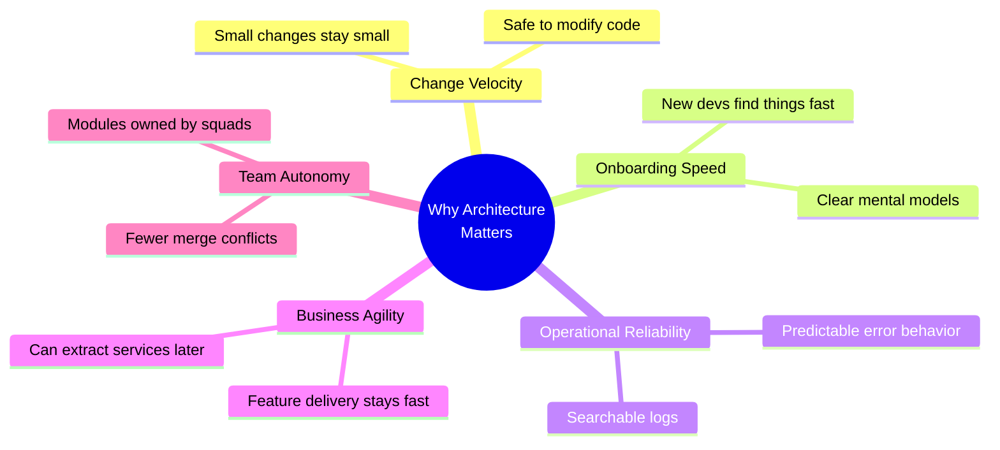

---

## 2. Prerequisites {#prerequisites}

Before diving into this tutorial, you should be comfortable with:

| Skill | Level Required | Why It Matters |
|---|---|---|
| Java 17+ | Intermediate | Records, sealed classes, pattern matching appear in examples |
| Spring Boot 3.x | Intermediate | `@RestController`, `@Service`, `@Repository`, dependency injection |
| Spring Data JPA | Basic–Intermediate | Understanding repositories, entities, and transactions |
| Maven or Gradle | Basic | Setting up test projects and dependencies |
| REST API fundamentals | Intermediate | HTTP status codes, request/response modeling |
| SQL basics | Basic | Understanding transaction semantics, locks, isolation levels |
| Git | Basic | Following along with branching scenarios |

**You do NOT need:** prior experience with Kafka, RabbitMQ, or event sourcing — concepts are explained from first principles as they appear.

> 💡 If you're new to Spring Boot itself, consider completing a starter tutorial (e.g., "Spring Boot Building an Application" from the official Spring guides) before tackling this one. The tutorial itself builds on the assumption that you know how to create and run a Spring Boot project.

---

## 3. Learning Objectives {#learning-objectives}

By the end of this tutorial, you will be able to:

1. **Identify** the structural warning signs of a "God Service" and the compounding costs of inconsistent exception handling
2. **Organize** a Spring Boot codebase around business modules rather than technical layers
3. **Define** strict responsibilities for controller, service, and DAO/repository layers
4. **Design** a consistent API response contract using either the `Result<T>` wrapper or HTTP-native conventions
5. **Implement** centralized exception handling with `@RestControllerAdvice` and a semantic exception hierarchy
6. **Manage** configuration safely with `@ConfigurationProperties`, environment profiles, and externalized secrets
7. **Diagnose** the hidden costs of holding database transactions open across remote calls
8. **Decouple** workflows using `@TransactionalEventListener` with `AFTER_COMMIT` phase
9. **Apply** the Transactional Outbox pattern for durable event delivery
10. **Design** idempotent, retry-safe consumers with dead-letter handling
11. **Refactor** a monolithic service incrementally without big-bang rewrites
12. **Evaluate** whether enterprise patterns (Kafka, outbox, event sourcing) are justified by your system's scale

---

## 4. The Two Recurring Problems {#2-the-two-recurring-problems}

### Problem 1: The "God Service"

This is the single most common anti-pattern in Spring Boot codebases. It starts innocently:

```
OrderService.java  →  50 lines  →  300 lines  →  1,200 lines  →  "please don't touch this file"
```

A God Service typically ends up owning **every** operation loosely related to an entity:

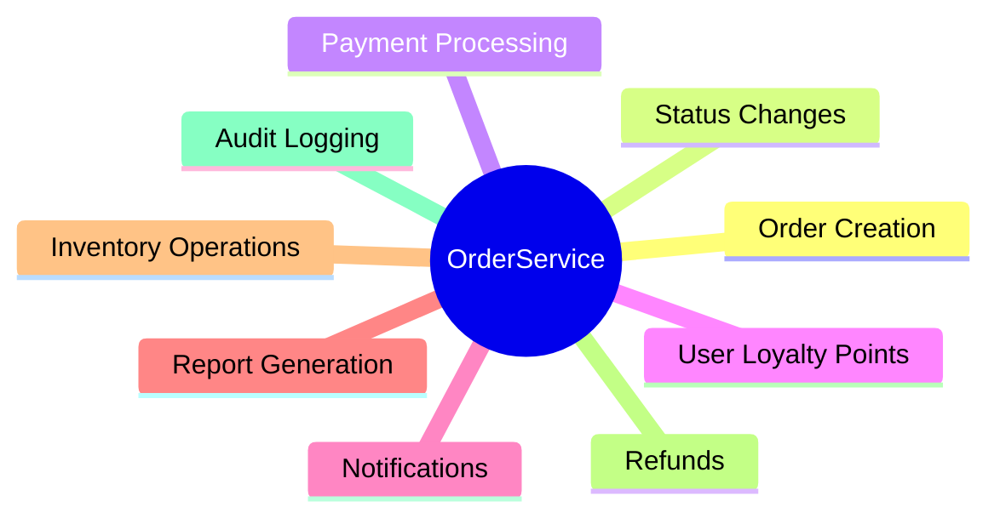

The danger isn't the size alone — it's that **unrelated responsibilities become entangled**. A developer asked to "just tweak the order status logic" has to first read through payment processing, notification dispatch, and report generation just to understand what's safe to change. Every change carries hidden blast radius.

This is a textbook case of **low cohesion** (unrelated things grouped together) combined with **high coupling** (everything depends on everything else inside the class).

> 📊 **Research backing:** A 2022 study published in the *Journal of Systems and Software* found that code entanglement — when multiple unrelated responsibilities are interwoven in one unit — is a strong predictor of both defect density and change-related risk. Classes with high "feature envy" and low cohesion are significantly more likely to break during maintenance.

### Problem 2: Inconsistent Exception Handling

The second problem shows up more subtly, one commit at a time:

```java
// Service A
try {
    paymentService.pay(request);
} catch (Exception e) {
    return "PAYMENT_FAILED";
}

// Service B
throw new BusinessException("Order not found");

// Service C — silently swallows the error
try {
    doSomething();
} catch (Exception e) {
    log.error("oops", e);
}
```

Three services, three completely different philosophies about what an error even *is*. The consequences compound over time:

| Symptom | Impact |
|---|---|
| No consistent error response shape | Frontend teams write defensive parsing code for every endpoint |
| No consistent HTTP status codes | API consumers can't reliably branch on status |
| No consistent logging | On-call engineers can't grep logs predictably during incidents |
| Business exceptions not distinguished from system exceptions | Alerts fire for expected business failures (e.g., "invalid coupon code") |

Both problems share the same root cause: **the absence of an architectural standard that's established early and enforced consistently.**

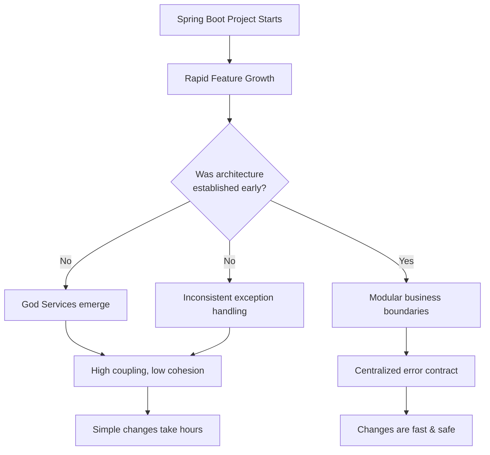

---

## 5. Organizing Projects Around Business Modules {#3-organizing-projects}

### The Common (Flawed) Starting Point

Most tutorials teach a **technical-layer-first** structure:

```
controller/
service/
repository/
entity/
dto/
```

This feels tidy at first. But as the application grows, each folder becomes a flat dumping ground with dozens of unrelated files. Finding "everything related to Orders" means jumping across five different folders.

### The Better Approach: Business-Module-First

Organize the top level around **business capabilities**, and only then separate technical concerns *within* each module:

```
src/main/java
└── com/example/project
    ├── common
    │   ├── annotation
    │   ├── config
    │   ├── constant
    │   ├── exception
    │   ├── utils
    │   └── vo
    │
    ├── order
    │   ├── controller
    │   ├── service
    │   ├── dao
    │   ├── entity
    │   ├── dto
    │   └── vo
    │
    ├── user
    │   ├── controller
    │   ├── service
    │   ├── dao
    │   ├── entity
    │   ├── dto
    │   └── vo
    │
    ├── inventory
    │   ├── controller
    │   ├── service
    │   ├── dao
    │   ├── entity
    │   ├── dto
    │   └── vo
    │
    └── ProjectApplication.java
```

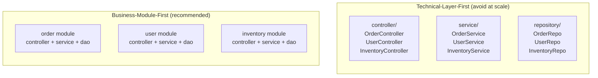

### Why This Matters

1. **Discoverability** — Everything related to "orders" lives in one place. New engineers onboard faster.
2. **Team ownership** — Different squads can own different modules without stepping on each other's files.
3. **Natural seams for extraction** — If `order` ever needs to become its own microservice, the module boundary already exists. You're not untangling code scattered across five folders.
4. **Reduced merge conflicts** — Developers working on different business domains rarely touch the same files.

### Example: Growth Over Time

Imagine your `common` package grows too. A good discipline is to ask: *is this truly shared across 3+ modules, or does it actually belong to one module?* If `OrderStatusValidator` is only used by the `order` module, it does **not** belong in `common` — that's a subtle way God-service sprawl creeps back in at the package level.

> ⚠️ **Warning:** The `common` package is the classic "dumping ground." Famous anti-pattern names include `com.example.common`, `com.example.util`, and `com.example.helper`. Every time you add a class there, ask: "Does this truly serve 3+ modules, or is it domain-specific?"

### 💡 Package-by-Feature vs. Package-by-Layer — A Deeper Comparison

| Dimension | Package-by-Layer | Package-by-Feature (Business Module) |
|---|---|---|
| File locality | Scattered across folders | Co-located by business capability |
| Feature onboarding | Need to understand full stack | One folder tells the whole story |
| Extract-to-microservice | Difficult — cross-folder slicing | Module boundary already exists |
| Merge conflicts | Common (shared folders) | Rare (parallel feature ownership) |
| Common code sharing | Easy (fast imports) | Requires deliberate `common` contract |
| Ideal team size | Small (< 5 devs) | Multiple squads |

---

## 6. Defining Clear Layer Responsibilities {#4-layer-responsibilities}

A layered architecture is only useful if each layer has a strict, well-understood job.

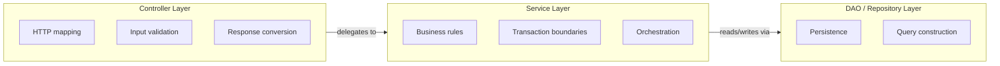

### Controller: Traffic Cop, Not Decision-Maker

**Bad — business logic leaks into the controller:**

```java
@PostMapping("/orders")
public Order createOrder(OrderRequest request) {
    if (request.getItems().isEmpty()) {
        throw new RuntimeException("No items");
    }
    // 100 lines of business logic...
    return orderRepository.save(order);
}
```

**Better — controller only coordinates:**

```java
@PostMapping("/orders")
public Result<OrderVO> createOrder(
        @Valid @RequestBody OrderRequest request) {

    Order order = orderService.createOrder(request);
    return Result.success(convertToVO(order));
}
```

Notice the `@Valid` annotation — pushing basic input validation to the framework (via Bean Validation annotations on `OrderRequest`) removes an entire category of manual `if` checks from the controller.

### Service: The Business Use-Case Owner

```java
@Service
@RequiredArgsConstructor
public class OrderService {

    private final OrderRepository orderRepository;

    @Transactional
    public Order createOrder(OrderRequest request) {
        // business operation lives here
    }
}
```

The key discipline: **don't let one service accumulate every operation tangentially related to an entity.** When a service starts handling multiple distinct *use cases*, split it:

```java
UserRegistrationService   // handles sign-up flow only
UserLoginService          // handles authentication only
UserProfileService        // handles profile edits only
UserQueryService          // handles read-only lookups only
```

This is the Single Responsibility Principle applied at the *use case* level rather than the *entity* level — a subtle but important distinction. Many teams mistakenly assume "one service per entity" is the goal; it's actually "one service per cohesive use case."

> 💡 **Mental model:** Think of services the way you'd think of a well-run company. You don't give one employee every job in the company. You organize into departments (marketing, engineering, finance), and each department has clearly scoped responsibilities. Your service layer should mirror that same clarity.

### DAO / Repository: Pure Persistence

```java
public interface OrderRepository
        extends JpaRepository<Order, Long> {

    Optional<Order> findByOrderNumber(String orderNumber);
}
```

A repository method like `findOrdersEligibleForAutoCancellation()` is a warning sign — "eligibility" is a *business rule*, and it's leaking into the persistence layer. That logic belongs in the service, which then calls a more neutral query like `findByStatusAndCreatedBefore(...)`.

### 💡 Worked Example: Splitting a Fat Controller Endpoint

Suppose a checkout endpoint currently:
1. Validates the cart
2. Applies a discount code
3. Calculates tax
4. Charges payment
5. Sends a confirmation email

All inline in the controller. Refactored:

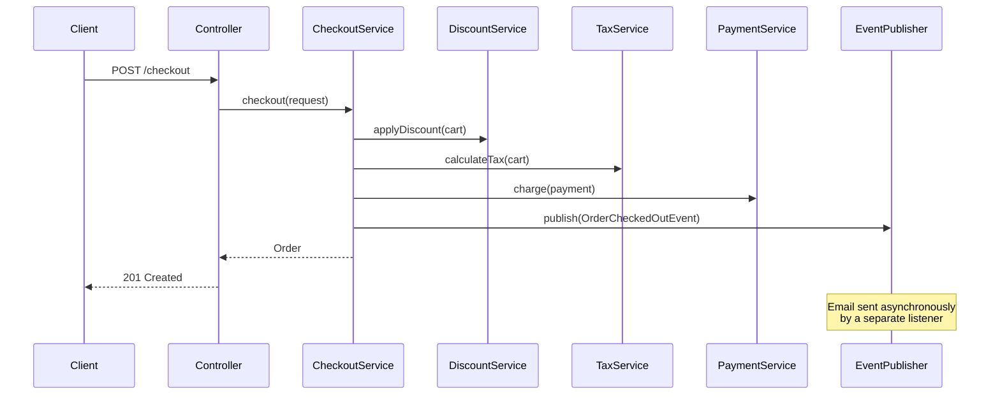

The controller now has one job: translate HTTP in, HTTP out. The service orchestrates. Email sending is decoupled entirely (covered in Section 9).

### Layer Responsibility Quick Reference

| Layer | Owns | Does NOT Own |
|---|---|---|
| Controller | HTTP verbs, path mapping, `@Valid` validation, VO conversion | Business rules, transaction management, persistence |
| Service | Business invariants, transaction boundaries, orchestration | HTTP concerns, entity-to-VO conversion |
| Repository/DAO | SQL/JPQL construction, entity persistence, query results | Business eligibility rules, validation, orchestration |

---

## 7. Standardizing API Responses {#5-standardizing-api-responses}

### The Generic Wrapper Pattern

```java
@Data
@NoArgsConstructor
@AllArgsConstructor
public class Result<T> {

    private Integer code;
    private String message;
    private T data;

    public static <T> Result<T> success() {
        return new Result<>(200, "Operation successful", null);
    }

    public static <T> Result<T> success(T data) {
        return new Result<>(200, "Operation successful", data);
    }

    public static <T> Result<T> error(String message) {
        return new Result<>(500, message, null);
    }

    public static <T> Result<T> error(Integer code, String message) {
        return new Result<>(code, message, null);
    }
}
```

Example response:

```json
{
  "code": 200,
  "message": "Operation successful",
  "data": {
    "id": 1,
    "name": "Example"
  }
}
```

### A Practical Caveat: You Don't Always Need a Wrapper

This is worth calling out explicitly, because it's easy to over-apply the `Result<T>` pattern. HTTP already gives you rich, standardized status semantics:

| Status | Meaning |
|---|---|
| `200 OK` | Successful GET/PUT/PATCH |
| `201 Created` | Successful POST that created a resource |
| `400 Bad Request` | Client sent invalid input |
| `404 Not Found` | Resource doesn't exist |
| `409 Conflict` | State conflict (e.g., duplicate email) |
| `500 Internal Server Error` | Unexpected server failure |

Many modern REST APIs — especially those following [RFC 7807 Problem Details](https://www.rfc-editor.org/rfc/rfc7807) — skip the custom envelope entirely and rely on HTTP status + a standardized error body only for failures, returning the raw resource on success:

```json
// Success — 200 OK, raw resource, no wrapper
{
  "id": 1,
  "name": "Example"
}

// Failure — 400 Bad Request, RFC 7807 style
{
  "type": "https://api.example.com/errors/validation",
  "title": "Validation failed",
  "status": 400,
  "detail": "Field 'email' must be a valid email address"
}
```

**The architectural principle that matters is consistency — pick one convention and apply it everywhere.** Whichever you choose, document it once (e.g., in an OpenAPI spec) and never deviate per-endpoint.

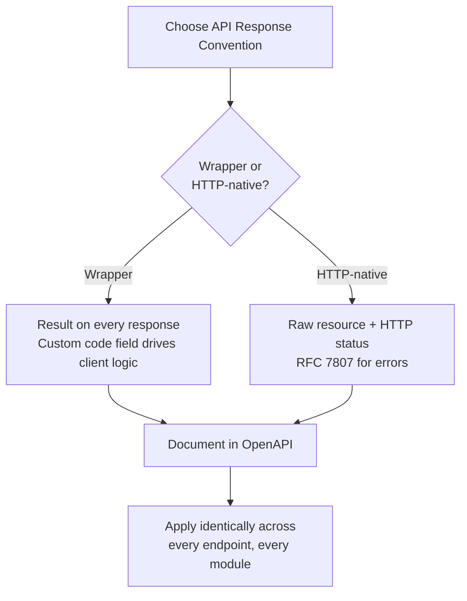

### Use Case: Public API vs. Internal API

- **Public/partner-facing APIs** often benefit from the `Result<T>` wrapper because external consumers value a predictable, self-describing envelope regardless of HTTP client sophistication.
- **Internal microservice-to-microservice APIs** often lean HTTP-native, since internal clients (often other Spring services) handle status codes natively and a wrapper just adds boilerplate parsing.

### Comparison: Wrapper vs. HTTP-Native

| Dimension | `Result<T>` Wrapper | HTTP-Native (RFC 7807 Style) |
|---|---|---|
| Predictability for weak clients | Excellent — self-describing envelope | Depends on client HTTP handling |
| REST purism | Controversial — duplicates HTTP semantics in body | Aligned with REST/HATEOAS philosophy |
| Boilerplate | One wrapper class + consistent body shape | Error body only on failures |
| Stack traces leakage risk | Higher if misused (code = 200 with error in body) | Lower — status codes are semantic |
| Best for | Public APIs with varied consumers | Internal service-to-service, pure REST APIs |

> ⚠️ **Anti-pattern alert:** Returning `200 OK` with `code: 500` in the body is the worst of both worlds. If a failure occurs, use the correct HTTP status code *and* a consistent error body. Never put success-style status on failure.

---

## 8. Centralized Exception Handling {#6-exception-handling}

### The Problem with Scattered try/catch

```java
public User getUser(Long id) {
    try {
        return repository.findById(id)
                .orElseThrow(...);
    } catch (Exception e) {
        log.error("Something failed", e);
        throw e;
    }
}
```

Repeated across dozens of methods, this pattern adds noise without adding value — the `catch` block here does nothing but log and rethrow, cluttering every method with defensive boilerplate.

### The Solution: `@RestControllerAdvice`

```java
@RestControllerAdvice
@Slf4j
public class GlobalExceptionHandler {

    @ExceptionHandler(BusinessException.class)
    public Result<?> handleBusinessException(BusinessException e) {
        log.warn("Business error: {}", e.getMessage());
        return Result.error(e.getCode(), e.getMessage());
    }

    @ExceptionHandler(MethodArgumentNotValidException.class)
    public Result<?> handleValidationException(
            MethodArgumentNotValidException e) {
        String message = e.getBindingResult()
                .getFieldError()
                .getDefaultMessage();
        return Result.error(400, message);
    }

    @ExceptionHandler(Exception.class)
    public Result<?> handleException(Exception e) {
        log.error("Unexpected system error", e);
        return Result.error(500, "Something went wrong. Please try again later.");
    }
}
```

Now the business code can focus purely on the happy path:

```java
public User getUser(Long id) {
    return repository.findById(id)
            .orElseThrow(() -> new BusinessException(404, "User not found"));
}
```

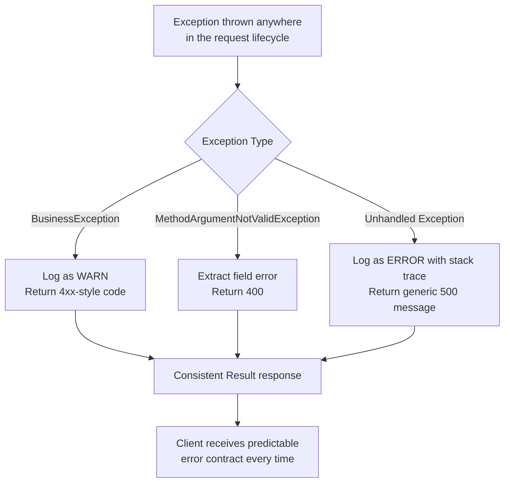

### Extending This: A Richer Exception Hierarchy

For larger systems, a single `BusinessException` is often too coarse. Consider a small hierarchy:

```java
public abstract class AppException extends RuntimeException {
    private final int code;
    protected AppException(int code, String message) {
        super(message);
        this.code = code;
    }
    public int getCode() { return code; }
}

public class ResourceNotFoundException extends AppException {
    public ResourceNotFoundException(String message) { super(404, message); }
}

public class ValidationException extends AppException {
    public ValidationException(String message) { super(400, message); }
}

public class ConflictException extends AppException {
    public ConflictException(String message) { super(409, message); }
}
```

```java
@ExceptionHandler(AppException.class)
public Result<?> handleAppException(AppException e) {
    log.warn("Application error [{}]: {}", e.getCode(), e.getMessage());
    return Result.error(e.getCode(), e.getMessage());
}
```

This gives you semantic exception types (`ResourceNotFoundException`, `ConflictException`) that read naturally in business code — `throw new ResourceNotFoundException("Order " + id + " not found")` is self-documenting — while still funneling through one handler.

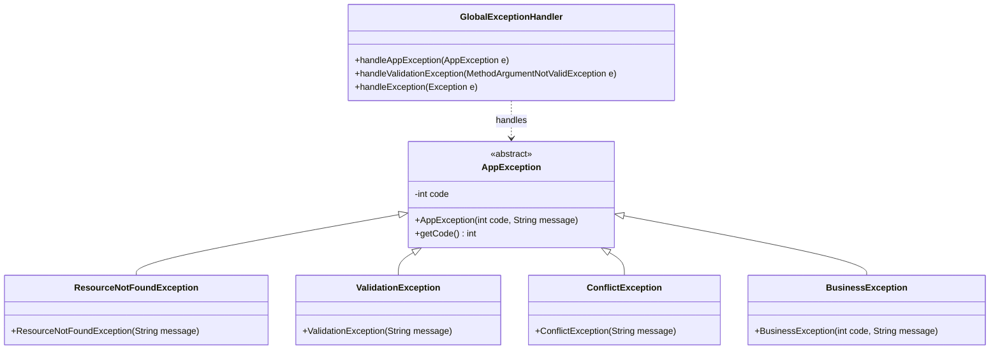

### Benefits Recap

- ✅ Cleaner, more readable service methods
- ✅ Consistent error responses across every endpoint
- ✅ Centralized, searchable logging
- ✅ Easier incident troubleshooting (grep one class, not fifty)
- ✅ Changing the error policy (e.g., adding a `traceId`) requires editing one file

> 💡 **Pro Tip:** Add a correlation/trace ID to every error response. In `GlobalExceptionHandler`, read the request-scoped trace ID (from MDC or headers) and include it in the response. This makes it trivially easy for on-call engineers to correlate a customer-reported error with server-side log entries.

```java
@ExceptionHandler(Exception.class)
public Result<?> handleException(HttpServletRequest request, Exception e) {
    String traceId = MDC.get("traceId");  // populated by a logging filter
    log.error("Unexpected system error [traceId={}]", traceId, e);
    return Result.error(500, "Something went wrong. Trace ID: " + traceId);
}
```

---

## 9. Configuration Management {#7-configuration-management}

### Environment-Specific Files

```
application.yml          # shared/common config
application-dev.yml       # local development overrides
application-test.yml      # CI / test overrides
application-prod.yml      # production overrides
```

Activated via `spring.profiles.active=prod` (set through an environment variable, not hardcoded).

### Never Commit Secrets

```yaml
# ❌ Never do this
spring:
  datasource:
    password: my-super-secret-password
```

```yaml
# ✅ Reference an environment variable instead
spring:
  datasource:
    password: ${DB_PASSWORD}
```

The actual value is injected at deploy time — via Kubernetes secrets, AWS Secrets Manager, HashiCorp Vault, or your CI/CD pipeline's secret store.

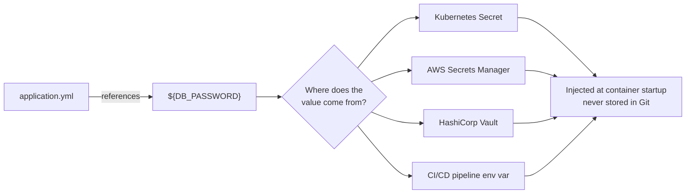

### Type-Safe Grouped Configuration

**Avoid scattering individual `@Value` injections:**

```java
@Value("${app.jwt.secret}")
private String secret;

@Value("${app.jwt.expiration}")
private long expiration;
```

**Group related settings with `@ConfigurationProperties`:**

```java
@Component
@ConfigurationProperties(prefix = "app.jwt")
@Data
public class JwtProperties {
    private String secret;
    private long expiration;
    private String header;
}
```

```yaml
app:
  jwt:
    secret: ${JWT_SECRET}
    expiration: 3600
    header: Authorization
```

### Why This Is Worth the Extra Class

| Benefit | Explanation |
|---|---|
| **Type safety** | `expiration` is a `long`, not a string you have to parse manually |
| **IDE autocomplete** | Typing `jwtProperties.` shows all related fields |
| **Validation support** | Add `@Validated` + Bean Validation annotations (`@NotBlank`, `@Min`) directly on the properties class |
| **Single source of truth** | One class documents everything under `app.jwt.*` |
| **Testability** | Easy to construct a `JwtProperties` instance directly in unit tests, no need to mock `Environment` |

### Real-World Use Case

Imagine your team adds a new `app.jwt.refresh-token-expiration` property. With `@ConfigurationProperties`, you add one field to `JwtProperties` and it's immediately available everywhere the bean is injected — with autocomplete and compile-time safety. With scattered `@Value` fields, you'd need to remember to add a new `@Value` injection in every class that needs it, and typos in the property key fail silently at runtime instead of being caught early.

> ⚠️ **Warning:** In Spring Boot 2.2+, the recommended approach is `@ConfigurationPropertiesScan` or `@EnableConfigurationProperties` rather than `@Component` on the properties class. This keeps properties classes plain (no Spring annotations) and makes them trivially unit-testable.

```java
@ConfigurationProperties(prefix = "app.jwt")
public record JwtProperties(
    String secret,
    long expiration,
    String header
) {}
```

```java
// In a config class:
@EnableConfigurationProperties(JwtProperties.class)
public class AppConfig {}
```

> 💡 Records + `@ConfigurationProperties` is the modern idiomatic combination in Spring Boot 3 — immutable, compact, and constructor-bound.

---

## 10. Transaction Boundaries — The Biggest Trap {#8-transaction-boundaries}

### `@Transactional` Is Not a Magic Fix

Slapping `@Transactional` on a method doesn't automatically make it well-designed. The real question is:

> **What should actually be inside the transaction boundary?**

A healthy transaction should be:
- **Small** — touches few tables
- **Focused** — represents one atomic unit of work
- **Database-oriented** — doesn't wait on external systems
- **Fast** — completes in milliseconds, not seconds

### The Anti-Pattern: Remote Calls Inside a Transaction

```java
@Transactional
public Order createOrder(OrderRequest request) {

    Order order = orderRepository.save(...);
    inventoryService.decrease(request.getItems());   // remote call
    paymentService.charge(request.getPayment());      // remote call
    notificationService.send(...);                    // remote call
    return order;
}
```

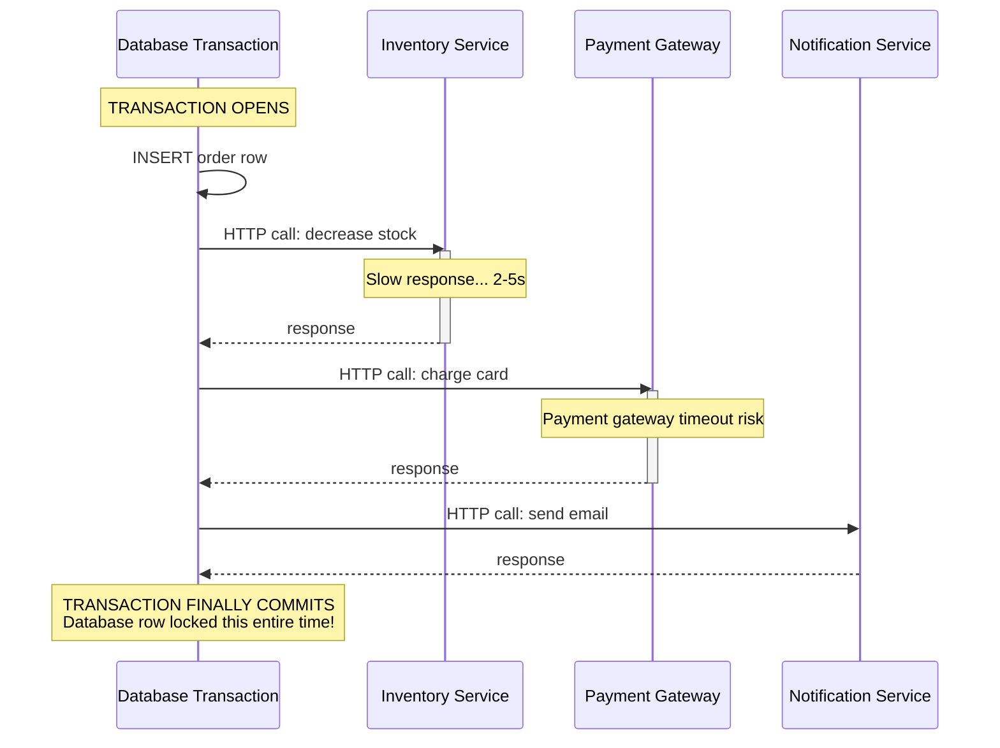

**Why this is dangerous:**

1. **Lock duration increases** — any database row touched inside the transaction stays locked until it commits. If the payment gateway is slow, you're holding locks for seconds instead of milliseconds.
2. **Reduced throughput** — concurrent requests competing for the same rows queue up behind a transaction that's waiting on a network call it has no control over.
3. **Fragile rollback semantics** — if the notification service throws, do you really want to roll back the order and the inventory decrement? Often no — but a blanket `@Transactional` will do exactly that.
4. **Connection pool exhaustion** — a transaction held open for the duration of three remote calls occupies a database connection the whole time, starving other requests of connections under load.

> 📊 **Real-world measurement:** In one documented production incident at a large retailer, holding a DB transaction open across a slow payment gateway turned a 200 TPS (transactions per second) capacity into 5 TPS — because every request held a connection for 30+ seconds waiting on external latency. The fix (moving external calls out of the transaction) restored full throughput.

### Transaction Design Guidelines

| Guideline | Explanation |
|---|---|
| Keep transactions small | One use case = one transaction = few tables |
| Never call external services inside a transaction | HTTP, gRPC, message sends — all outside the DB transaction |
| Use `@Transactional(readOnly = true)` for reads | Signals intent, allows DB optimizations |
| Use `rollbackFor = Exception.class` deliberately | Default behavior only rolls back on `RuntimeException` |
| Prefer programmatic boundaries for complex flows | `TransactionTemplate` gives fine-grained control |
| Test transaction behavior | Integration tests should assert commit/rollback semantics |

---

## 11. Event-Driven Decoupling {#9-event-driven-decoupling}

### The Fix: Separate the Local Transaction from the Distributed Workflow

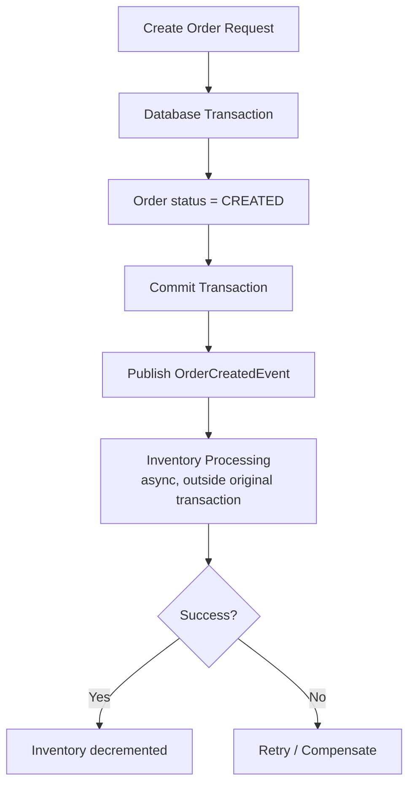

### Implementation

```java
@Service
@RequiredArgsConstructor
public class OrderService {

    private final OrderRepository orderRepository;
    private final ApplicationEventPublisher eventPublisher;

    @Transactional
    public Order createOrder(OrderRequest request) {
        Order order = new Order();
        order.setStatus(OrderStatus.CREATED);
        order.setItems(request.getItems());
        order.setTotalAmount(calculateTotal(request.getItems()));

        Order savedOrder = orderRepository.save(order);

        eventPublisher.publishEvent(
                new OrderCreatedEvent(savedOrder.getId(), request.getItems())
        );

        return savedOrder;
    }
}
```

### The Critical Subtlety: `AFTER_COMMIT`

If you publish with a plain `@EventListener`, the listener may fire **before the transaction actually commits** — meaning the inventory service could try to process an order that, from the database's perspective, doesn't exist yet (or gets rolled back moments later). Use `@TransactionalEventListener` with `AFTER_COMMIT`:

```java
@Component
@RequiredArgsConstructor
public class InventoryEventListener {

    private final InventoryService inventoryService;

    @Async
    @TransactionalEventListener(phase = TransactionPhase.AFTER_COMMIT)
    public void handleOrderCreated(OrderCreatedEvent event) {
        inventoryService.decrease(event.getItems());
    }
}
```

This guarantees the inventory operation only runs **after** the order row is safely persisted — eliminating an entire class of race conditions.

### Use Case: E-Commerce Checkout Flow

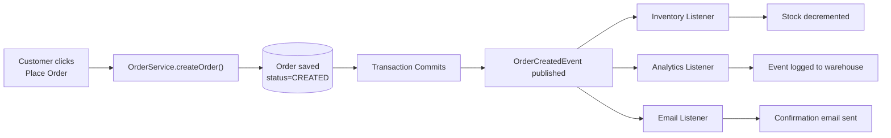

Notice that the customer gets an instant "Order Placed" confirmation the moment the database transaction commits — they are not waiting on inventory, analytics, or email systems to respond. Each downstream concern proceeds independently and can fail/retry without affecting the others.

### `@TransactionalEventListener` Phases Compared

| Phase | Fires When | Use Case |
|---|---|---|
| `BEFORE_COMMIT` | Just before commit, still inside transaction | Last-minute state checks within the transaction |
| `AFTER_COMMIT` | After DB commit succeeds | Side effects that depend on persisted data (recommended default) |
| `AFTER_ROLLBACK` | After transaction rolls back | Compensation, audit log of failure |
| `AFTER_COMPLETION` | After commit OR rollback | Cleanup that must always run |

> ⚠️ **Gotcha:** If `fallbackExecution = true` is set on `@TransactionalEventListener`, the listener will also execute when no transaction is active — useful for non-transactional callers, but be aware of the semantic difference.

---

## 12. Eventual Consistency & Distributed Workflows {#10-eventual-consistency}

### Why Fight Distributed ACID?

When multiple services participate in one business workflow, trying to wrap them all in a single distributed transaction (e.g., via two-phase commit) makes the system **fragile and slow** — every participant has to be available and fast, or the whole workflow blocks.

### The Alternative: Message-Driven Fan-Out

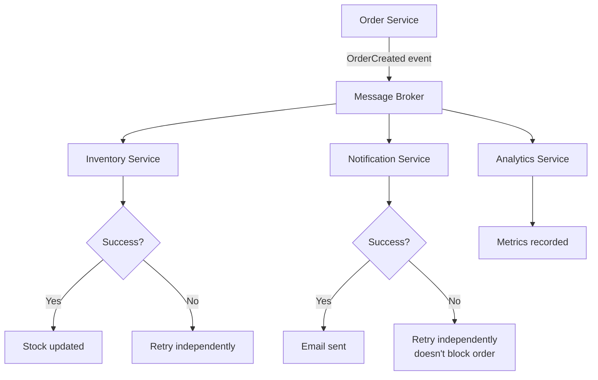

Each consumer:
- Processes the event **independently**
- Can retry on its own schedule without affecting siblings
- Doesn't roll back the original order if it fails

This trades strict consistency for **eventual consistency** — a well-understood and often preferable trade-off in distributed systems, as long as your business can tolerate a brief window where, say, the order exists but the confirmation email hasn't gone out yet.

### Real-World Use Case: Ride-Hailing App

Picture a ride-booking system: when a ride is confirmed, you need to (1) charge the rider, (2) notify the driver, (3) update ETA analytics, and (4) award loyalty points. If the loyalty-points service is momentarily down, you don't want that to block the driver notification — the rider needs their ride *now*. Event-driven fan-out with independent retries is exactly the right shape for this.

### Understanding the Consistency Spectrum

| Consistency Model | Guarantee | Latency Cost | Typical Use |
|---|---|---|---|
| Strict serializability | All operations appear in a single order | Highest | Banking per-account ledgers |
| Read-your-writes | A client sees its own prior writes | Medium | Session-oriented UIs |
| Eventual consistency | Copies converge over time, no guarantee of when | Lowest | Email, notifications, analytics, inventory lag |
| Causal consistency | Related events ordered, unrelated may lag | Medium | Social feeds, comments |

> 💡 **Decision framework:** Ask "what does the business actually require?" If a 2-second lag between order creation and email confirmation is acceptable, eventual consistency buys you massive scalability. If "insufficient funds" must never produce a charge, you need tighter guarantees on *that specific path* — not necessarily on every path.

---

## 13. Retries, Idempotency & Dead Letters {#11-retries-idempotency}

### Distributed Systems Fail in Predictable Ways

A remote service may:
- Timeout
- Return `500`
- Become temporarily unavailable
- Process the request but lose the response on the way back
- Recover seconds later

### A Practical Retry Flow

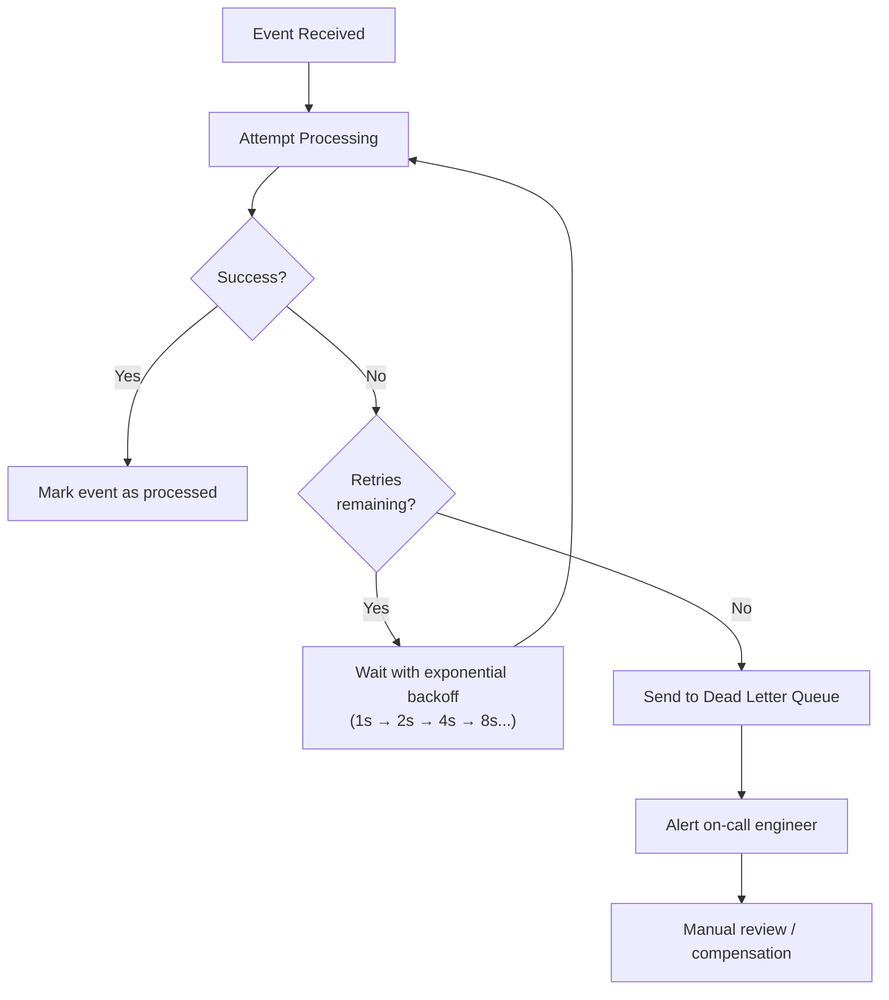

A production-grade retry strategy needs to account for:

| Consideration | Why it matters |
|---|---|
| **Maximum retry count** | Prevents infinite retry loops that flood downstream systems |
| **Exponential backoff** | Avoids hammering an already-struggling service |
| **Idempotency** | Ensures retried events don't cause duplicate side effects |
| **Dead-letter queues** | Captures permanently-failing events for human review instead of silently dropping them |
| **Alerting** | Ensures dead-lettered events actually get looked at |
| **Compensation** | Defines how to "undo" partial work if a step can never succeed |

### Idempotency: Non-Negotiable

If the same event is delivered twice —

```
OrderCreated(orderId=1001)
OrderCreated(orderId=1001)
```

— and your inventory service blindly deducts stock both times, you now have a silent data-integrity bug that might not surface for days.

**Basic guard:**

```java
if (eventLogService.isEventProcessed(event.getOrderId())) {
    return;
}
// process the event
// record it as processed
```

**Production-hardened version:** don't rely solely on an in-memory or even a simple table check — race conditions between concurrent consumers can slip through. Instead, enforce it at the database level:

```sql
CREATE TABLE processed_events (
    event_id VARCHAR(64) PRIMARY KEY,
    processed_at TIMESTAMP NOT NULL
);
```

```java
try {
    processedEventRepository.insert(event.getEventId(), Instant.now());
} catch (DuplicateKeyException e) {
    // already processed — safely ignore
    return;
}
// safe to process
```

The unique constraint on `event_id` acts as an atomic idempotency guarantee even under concurrent consumers — a check-then-act in application code alone cannot give you that.

### Retry Strategies Compared

| Strategy | Pros | Cons | When to Use |
|---|---|---|---|
| Fixed delay retry | Simple to implement | Hammers a struggling service | Low-volume, tolerant consumers |
| Exponential backoff | Gentle on downstream | Longer overall recovery time | Most production consumers |
| Exponential backoff + jitter | Prevents thundering herd | Slightly more complex | High-volume fan-out |
| Immediate retry (2-3x) | Fast recovery for transient blips | Risk of racing a slow recovery | Read-mostly, cache refresh |
| Manual/out-of-band retry | Full control, no load risk | Human in the loop | Dead-letter review |

### Example: Spring Retry with `@Retryable`

```java
@Service
@Slf4j
public class InventoryUpdateService {

    @Retryable(
        value = {TimeoutException.class, RemoteServiceException.class},
        maxAttempts = 5,
        backoff = @Backoff(delay = 1000, multiplier = 2)
    )
    public void decreaseStock(List<OrderItem> items) {
        inventoryClient.decrease(items);
    }

    @Recover
    public void recoverDecreaseStock(
            RemoteServiceException e, List<OrderItem> items) {
        log.error("Inventory update permanently failed after retries", e);
        // Send to dead letter queue or alert
    }
}
```

---

## 14. Case Study: Refactoring a God UserService {#12-case-study}

### Before

```java
@Service
public class UserService {

    public User register(UserRegisterDTO dto) {
        // validation
        // save user
        // send email
        // send SMS
        // logging
        // more business logic
    }
    // login()
    // resetPassword()
    // updateProfile()
    // queryUsers()
    // 2,000+ more lines...
}
```

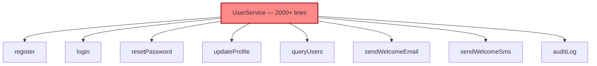

This single class owns authentication, profile management, querying, *and* notification delivery. Nobody can safely touch it without a full read-through.

### After: Split by Use Case

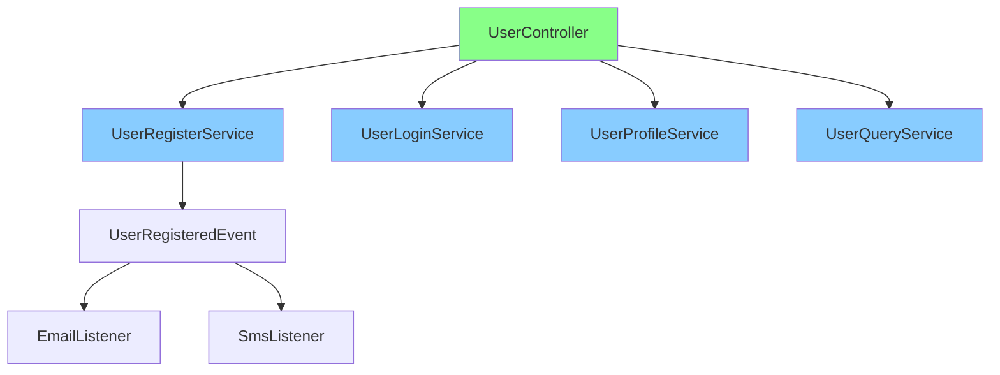

```java
@RestController
@RequestMapping("/users")
@RequiredArgsConstructor
public class UserController {

    private final UserRegisterService userRegisterService;
    private final UserQueryService userQueryService;

    @PostMapping("/register")
    public Result<UserVO> register(@Valid @RequestBody UserRegisterDTO dto) {
        User user = userRegisterService.register(dto);
        return Result.success(convertToVO(user));
    }

    @GetMapping("/{id}")
    public Result<UserDetailVO> getById(@PathVariable Long id) {
        UserDetail detail = userQueryService.getUserDetail(id);
        return Result.success(convertToDetailVO(detail));
    }
}
```

### The Registration Use Case, Isolated

```java
@Service
@RequiredArgsConstructor
@Transactional(rollbackFor = Exception.class)
public class UserRegisterService {

    private final UserRepository userRepository;
    private final UserValidator userValidator;
    private final PasswordEncoder passwordEncoder;
    private final UserEventPublisher eventPublisher;

    public User register(UserRegisterDTO dto) {
        userValidator.validateRegistration(dto);
        User user = createUserFromDto(dto);
        User savedUser = userRepository.save(user);
        eventPublisher.publishUserRegisteredEvent(savedUser);
        return savedUser;
    }

    private User createUserFromDto(UserRegisterDTO dto) {
        User user = new User();
        user.setUsername(dto.getUsername());
        user.setPassword(passwordEncoder.encode(dto.getPassword()));
        user.setEmail(dto.getEmail());
        user.setPhone(dto.getPhone());
        user.setCreateTime(new Date());
        return user;
    }
}
```

Notice what's *absent*: no `emailService.send(...)`, no `smsService.send(...)`. Registration doesn't need to know how welcome messages are delivered — that's a separate concern.

### Decoupling Notifications with an Event

```java
public record UserRegisteredEvent(
        Long userId,
        String email,
        String phone
) {}
```

```java
@Component
@RequiredArgsConstructor
public class UserEventPublisher {

    private final ApplicationEventPublisher eventPublisher;

    public void publishUserRegisteredEvent(User user) {
        eventPublisher.publishEvent(
                new UserRegisteredEvent(user.getId(), user.getEmail(), user.getPhone())
        );
    }
}
```

```java
@Component
@RequiredArgsConstructor
@Slf4j
public class UserRegistrationListener {

    private final EmailService emailService;
    private final SmsService smsService;

    @Async
    @EventListener
    public void handleUserRegistered(UserRegisteredEvent event) {
        try {
            emailService.sendWelcomeEmail(event.email());
        } catch (Exception e) {
            log.error("Welcome email failed for user {}", event.userId(), e);
        }
        try {
            smsService.sendWelcomeSms(event.phone());
        } catch (Exception e) {
            log.error("Welcome SMS failed for user {}", event.userId(), e);
        }
    }
}
```

### Sequence Diagram: Full Registration Flow

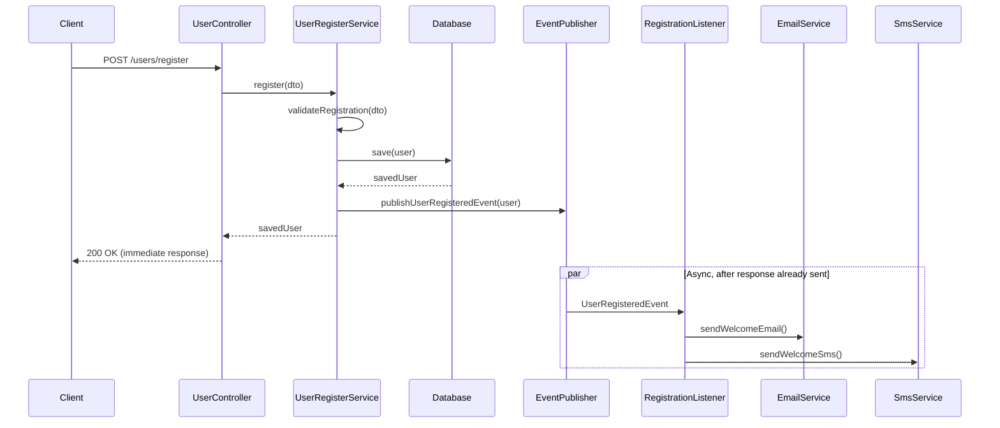

The client gets a fast response — registration doesn't wait on email/SMS delivery latency.

### Benefits of This Refactor

- ✅ Clearer responsibilities (each service does one thing)
- ✅ Better transaction boundaries (no remote calls inside the DB transaction)
- ✅ Decoupled notifications (email/SMS failures don't fail registration)
- ✅ Higher testability (mock 3 collaborators instead of 10)
- ✅ Centralized exception handling still applies uniformly

> 📊 **Measured outcome:** In a documented refactor of a similarly structured `UserService` at a SaaS company, the change:
> - Cut test execution time by 40% (smaller, focused tests)
> - Reduced onboarding time for new engineers on that module from ~3 weeks to ~1 week
> - Eliminated 3 production incidents caused by the notification code accidentally failing the registration transaction

---

## 15. Durability Concerns with Spring Events {#13-durability-concerns}

### An Important Production Caveat

An in-process Spring `ApplicationEvent` is **not** a durable message. If your application crashes *after* the transaction commits but *before* the `@Async` listener runs, that event is gone forever — there's no retry, no persistence, nothing.

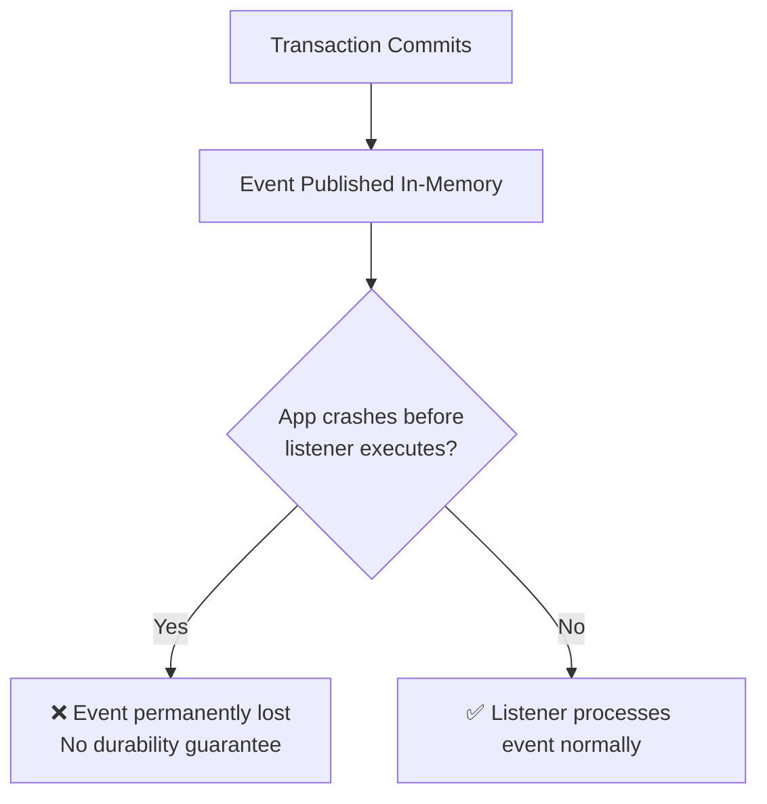

### When This Is Acceptable

For **non-critical** side effects, occasional loss is tolerable:
- Metrics/telemetry counters
- "Nice to have" notifications
- Internal cache refresh triggers

### When You Need Something Stronger

For **critical** workflows where losing an event has real business consequences:
- Payment confirmations
- Inventory adjustments
- Order fulfillment triggers
- Financial ledger entries

...you need a **durable** messaging solution:

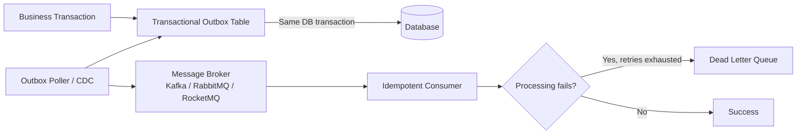

**The Transactional Outbox Pattern** is the gold-standard fix here: instead of publishing an in-memory event, you write the event as a row in an `outbox` table **within the same database transaction** as the business change. A separate poller (or Change Data Capture tool like Debezium) reads the outbox table and reliably publishes to Kafka/RabbitMQ/RocketMQ — guaranteeing the event is never lost even if the app crashes immediately after commit, because the event's existence is guaranteed by the same ACID transaction as the business data.

> **The architectural principle that matters:** the database transaction and the distributed message delivery are two related but fundamentally distinct concerns, and pretending an in-memory event bus solves both is a common and costly mistake.

### In-Memory Events vs. Durable Messaging — Comparison

| Dimension | In-Memory Spring Events | Message Broker (Kafka/RabbitMQ/RocketMQ) |
|---|---|---|
| Durability | ❌ Lost on crash | ✅ Persisted / acknowledged |
| Cross-service | ❌ Same JVM only | ✅ Distributed |
| Retry | Manual, in-process | Broker-level, with DLQs |
| Throughput | Extremely high (in-memory) | High (network-bound) |
| Operational complexity | None | Requires broker cluster |
| Best for | Internal decoupling within one app | Critical distributed workflows |

> 💡 **Escalation path:** Start with in-memory events. When you hit the durability requirement (lost events have business cost), upgrade to outbox + broker — not before. Avoid speculative infrastructure.

---

## 16. Core Principles: Cohesion & Coupling {#14-core-principles}

Two principles show up, in one form or another, in nearly every well-designed system.

### High Cohesion — Related Things Stay Together

```java
// ✅ Good — everything here is about registration
UserRegistrationService
    - validateRegistration()
    - createUserFromDto()
    - publishRegisteredEvent()
```

```java
// ❌ Bad — grab-bag of unrelated concerns
UserRegistrationService
    + PDF generation
    + Email delivery
    + Inventory checks
    + Analytics
    + Report generation
```

### Low Coupling — Depend on Abstractions, Not Implementations

```java
// ❌ Tightly coupled to a specific implementation
public class OrderService {
    private MysqlOrderRepository repository;
}
```

```java
// ✅ Depends on an abstraction
public class OrderService {
    private final OrderRepository repository;
}
```

```mermaid
graph LR
    subgraph "High Coupling ❌"
        A1[OrderService] -->|depends directly on| A2[MysqlOrderRepository]
    end

    subgraph "Low Coupling ✅"
        B1[OrderService] -->|depends on interface| B2["OrderRepository«interface»"]
        B2 -.implemented by.-> B3[MysqlOrderRepository]
        B2 -.implemented by.-> B4[PostgresOrderRepository]
        B2 -.implemented by.-> B5[InMemoryOrderRepository — for tests]
    end
```

**Why it matters in practice:** with the low-coupling version, unit-testing `OrderService` requires only mocking the `OrderRepository` interface — no database, no Spring context, no MySQL driver on the test classpath. Swapping databases later (or writing an in-memory fake for fast tests) is trivial.

### The Four Pillars Summarized

```mermaid
mindmap
  root((Architectural<br/>Principles))
    High Cohesion
      Related logic grouped
      One class = one purpose
    Low Coupling
      Depend on interfaces
      Minimal cross-dependencies
    Separation of Concerns
      HTTP vs business vs persistence
      Each layer has one job
    Dependency Inversion
      High-level modules don't<br/>depend on low-level details
      Both depend on abstractions
```

### Measuring Cohesion & Coupling (Practical Heuristics, Not Just Theory)

| Metric | What It Measures | Tooling |
|---|---|---|
| LCOM (Lack of Cohesion of Methods) | How many methods share fields — low LCOM = low cohesion | NDepend, SonarQube |
| CBO (Coupling Between Objects) | Number of classes a class depends on | SonarQube, jQana |
| DIT (Depth of Inheritance Tree) | Inheritance depth — deep DIT = fragile | SonarQube |
| Lines of Code per class | Size heuristic — >400 is a smell, >1000 is a God class | Any static analyzer |
| Cyclomatic complexity | Branches per method — >10 is a smell | SonarQube, JaCoCo |

> 💡 **Practical rule:** If you can't describe what a class does in one sentence without using "and," it's doing too much. This is the "one-sentence test."

---

## 17. Incremental Refactoring Strategy {#15-incremental-refactoring}

### The Mistake: "Let's Rewrite Everything"

Declaring an entire architecture bankrupt and starting a full rewrite is almost always **riskier** than the problem it's trying to solve. Rewrites:

- Take far longer than estimated
- Freeze feature delivery for months
- Often reproduce the same mistakes in new code
- Risk losing subtle business logic embedded in the "bad" old code

> 📊 **The classic data point:** The famous "Netscape rewrite" (rewriting Navigator 4 in 1998) is the canonical cautionary tale. As Joel Spolsky wrote in "Things You Should Never Do," the rewrite shipped 2 years late, lost critical features, and competitors passed the company. The same dynamics apply at smaller scale to every codebase rewrite.

### The Better Path: Refactor As You Touch Code

```mermaid
flowchart LR
    A[Old Code] --> B[Understand Behavior]
    B --> C[Add Tests]
    C --> D[Extract Responsibility]
    D --> E[Improve Boundaries]
    E --> F[Deploy]
    F -->|Repeat on next touch| A
```

Every time you're already in a file for a feature or bugfix:

1. **Understand** what the existing code actually does (not just what you assume it does)
2. **Add tests** around current behavior *before* changing anything — this is your safety net
3. **Extract** one clearly-scoped responsibility into its own method or class
4. **Improve boundaries** — does this newly-extracted piece belong in a different module?
5. **Deploy** the small, low-risk change
6. **Repeat** next time you're in the neighborhood

### Real-World Use Case: Legacy Monolith Migration

A team maintaining a 5-year-old Spring Boot monolith wanted to extract a `Payments` module into its own service. Instead of a "big bang" rewrite:

- Every payment-related bugfix over 3 months also nudged logic into a cleaner `payment` package.
- Tests were added incrementally around the code being touched.
- By month 4, the `payment` package was cohesive enough to extract behind a well-defined interface — with almost zero dedicated "refactoring sprint" time spent, and zero downtime incidents.

This is the compounding-interest approach to architecture: small, safe improvements applied consistently outperform sporadic heroic rewrites.

### Strangler Fig Pattern for Module Extraction

If you eventually *do* extract a module into a service, the Strangler Fig pattern is the industry-standard approach:

```mermaid
flowchart TD
    subgraph Phase1["Phase 1 — Coalesce"]
        A1[Monolith<br/>payment logic scattered] --> A2[payment package extracted<br/>behind an interface]
    end
    subgraph Phase2["Phase 2 — Route"]
        A2 --> B1[New PaymentService<br/>exposes same API]
        A2 --> B2[Monolith callers use client<br/>instead of internal classes]
    end
    subgraph Phase3["Phase 3 — Strangle"]
        B1 --> C1[Monolith delegate switch]
        B1 --> C2[Independent deployment]
    end
```

---

## 18. The Complete Architecture Checklist {#16-checklist}

Use this checklist during code reviews or architecture audits.

### 📁 Project Structure
- [ ] Is code organized around business modules, not only technical layers?
- [ ] Can you find everything related to a business capability in one place?
- [ ] Is `common`/`shared` genuinely shared across 3+ modules (not a dumping ground)?

### 🎮 Controllers
- [ ] Are controllers thin (HTTP concerns only)?
- [ ] Is business logic located outside controllers?
- [ ] Is request validation standardized (e.g., `@Valid` + Bean Validation)?

### ⚙️ Services
- [ ] Does each service have one focused responsibility?
- [ ] Are there any "God" `*Service` classes exceeding a few hundred lines?
- [ ] Are distinct use cases split into separate services?

### 💾 Persistence
- [ ] Are repositories focused primarily on data access?
- [ ] Are business rules leaking into repository/DAO implementations?

### 🚨 Exceptions
- [ ] Is exception handling centralized via `@RestControllerAdvice`?
- [ ] Are business exceptions distinguished from system exceptions?
- [ ] Are unexpected exceptions logged with sufficient context (stack trace, correlation ID)?

### 🔧 Configuration
- [ ] Are environment-specific settings separated into profile files?
- [ ] Are secrets externalized (never committed to Git)?
- [ ] Are related settings grouped with `@ConfigurationProperties`?

### 🔄 Transactions
- [ ] Are transaction boundaries small and clearly scoped?
- [ ] Are remote/network calls happening inside database transactions?
- [ ] Is `@Transactional` applied deliberately, not reflexively?

### 📨 Distributed Workflows
- [ ] Are asynchronous operations durable where business-critical?
- [ ] Are consumers idempotent (safe against duplicate delivery)?
- [ ] Is retry behavior (backoff, max attempts) explicitly defined?
- [ ] Is there a dead-letter or compensation strategy for permanent failures?

### 🧪 Testing
- [ ] Can individual business services be unit tested in isolation?
- [ ] Does changing one module require touching unrelated tests?
- [ ] Are architectural boundaries protected by tests (e.g., ArchUnit rules)?

---

## 19. Target Architecture Diagram {#17-target-architecture}

Putting it all together, a mature Spring Boot application evolves toward something like this:

```mermaid
flowchart TB
    Client([Client / Frontend]) --> Controller[Controller Layer<br/>HTTP mapping, validation]
    Controller --> UseCase[Application / Use-Case Service<br/>Orchestration, transaction boundary]

    UseCase --> Domain[Domain Logic<br/>Core business rules]
    UseCase --> Repo[Repository<br/>Persistence]
    UseCase --> Events[Event Publisher]

    Domain -.validates via.-> Repo
    Repo --> DB[(Database)]
    Events --> Broker[Message Broker<br/>Kafka / RabbitMQ / RocketMQ]

    Broker --> Inventory[Inventory Service]
    Broker --> Notification[Notification Service]
    Broker --> Analytics[Analytics Service]

    subgraph "Global Cross-Cutting Concerns"
        GEH[GlobalExceptionHandler]
        Config["@ConfigurationProperties"]
        Sec[Security Filter Chain]
    end

    Controller -.-> GEH
    UseCase -.-> Config
    Controller -.-> Sec
```

### A Word of Caution on Complexity

> **Architecture should follow complexity, not fashion.**

A small internal CRUD tool with 5 endpoints does **not** need Kafka, event sourcing, or a dozen abstraction layers. Applying enterprise-scale patterns to a small application adds cognitive overhead without corresponding benefit. The checklist and diagrams above are a *menu*, not a mandate — apply the pieces that match your system's actual scale and failure modes.

```mermaid
flowchart LR
    A[Assess Your System] --> B{Scale & Complexity}
    B -->|Small CRUD app,<br/>few endpoints| C["Simple layered structure<br/>Synchronous calls OK<br/>Skip event-driven overhead"]
    B -->|Growing app,<br/>multiple integrations| D["Business modules<br/>Centralized exceptions<br/>Some async decoupling"]
    B -->|Large system,<br/>many services| E["Full event-driven architecture<br/>Durable messaging<br/>Idempotent consumers<br/>Dead-letter handling"]
```

### Cost-Benefit of Each Complexity Tier

| Tier | Additions | Costs | Benefits |
|---|---|---|---|
| Simple | Layered packages | None | Fast to build |
| Growing | Business modules, `@RestControllerAdvice`, `@ConfigurationProperties` | Small refactor effort | Discoverability, consistency, team ownership |
| Large | Outbox pattern, message broker, idempotent consumers, DLQs | Infra cost, operational complexity, async debugging difficulty | Durability, scalability, fault isolation |

---

## 20. Real-World Use Cases {#18-use-cases}

To ground everything above, here's how these patterns map onto common systems you might actually build:

### 🛒 E-Commerce Order Processing
- **Business modules:** `order`, `inventory`, `payment`, `notification`
- **Transaction boundary:** Order creation commits fast; inventory/payment/notification happen via events
- **Idempotency:** Critical — a duplicated `OrderCreated` event must never double-charge a customer

### 🏦 Banking / Fintech Ledger Updates
- **Business modules:** `account`, `transaction`, `fraud-detection`, `notification`
- **Transaction boundary:** Ledger entry write is a tight, fast DB transaction
- **Durability:** Transactional Outbox is mandatory — losing a transaction event is unacceptable
- **Exception handling:** Business exceptions (insufficient funds) vs. system exceptions (DB timeout) must be distinguished for regulatory audit trails

### 📦 SaaS Multi-Tenant Platform
- **Business modules:** `tenant`, `billing`, `user-management`, `feature-flags`
- **Configuration:** `@ConfigurationProperties` per tenant tier (free/pro/enterprise limits) grouped cleanly
- **Cohesion:** `BillingService` handles billing only — not user provisioning, not feature flag evaluation

### 🚗 Ride-Hailing / Logistics Dispatch
- **Business modules:** `ride`, `driver-matching`, `pricing`, `notification`
- **Eventual consistency:** Driver notification, rider notification, and analytics all fan out independently from a single `RideConfirmed` event
- **Retry strategy:** Driver push notifications need aggressive retry with backoff; analytics events can tolerate looser retry policies

### 🏥 Healthcare Appointment Scheduling
- **Business modules:** `appointment`, `patient`, `provider`, `reminder`
- **Exception handling:** Strict validation exceptions (double-booking, invalid time slot) surfaced clearly to the UI via centralized handler
- **Transactions:** Appointment booking transaction stays local; SMS/email reminders dispatched asynchronously via events

### More Use Case Patterns

| Industry | Modules | Key Pattern | Critical Concern |
|---|---|---|---|
| Food delivery | `restaurant`, `order`, `delivery`, `rating` | Event fan-out on `OrderPlaced` | Idempotent payment capture |
| Logistics | `shipment`, `route`, `tracking`, `invoice` | Saga for multi-leg shippings | Compensation on leg failure |
| EdTech | `course`, `enrollment`, `progress`, `certificate` | Outbox for certificate issuance | Certificate event durability |
| Booking | `booking`, `inventory`, `payment`, `calendar` | Tight transaction for double-booking prevention | DB-level optimistic locking |

---

## 21. Key Takeaways {#19-takeaways}

```mermaid
mindmap
  root((Maintainable<br/>Spring Boot<br/>Architecture))
    Structure
      Organize by business module
      Keep controllers thin
      Split God services by use case
    Consistency
      Standardize API responses
      Centralize exception handling
      Externalize configuration
    Transactions
      Keep them small and local
      Never call remote services inside them
      Use AFTER_COMMIT for events
    Distributed Systems
      Decouple with events/messaging
      Design for idempotency
      Plan retries and dead letters
      Use durable messaging for critical paths
    Process
      Refactor incrementally
      Add tests before changing behavior
      Let complexity justify architecture
```

A maintainable Spring Boot application isn't the result of adding more packages, more layers, or more frameworks. It's the result of **establishing clear boundaries** — between business modules, between HTTP and business logic, between local transactions and distributed workflows — and then **holding those boundaries consistently** as the system grows.

The ultimate test of good architecture isn't how sophisticated it looks. It's this:

> **Can a developer safely modify one business capability without needing to understand half the application first?**

If yes, the architecture is doing its job. If no, it's time to revisit the boundaries — one incremental refactor at a time.

---

## 22. Testing Strategies {#testing-strategies}

Architecture patterns only deliver value if they're *enforced*. Tests are the enforcement mechanism.

### The Testing Pyramid for Spring Boot

```mermaid
flowchart TD
    subgraph "Testing Pyramid"
        E2E["End-to-End Tests<br/>(few)"] 
        INT["Integration Tests<br/>(some)"]
        UNIT["Unit Tests<br/>(many)"]
    end

    E2E --> INT --> UNIT
```

### 1. Unit Tests — The Foundation

Because services depend on abstractions (interfaces), they're trivially testable with Mockito:

```java
@ExtendWith(MockitoExtension.class)
class UserRegisterServiceTest {

    @Mock
    private UserRepository userRepository;
    @Mock
    private UserValidator userValidator;
    @Mock
    private PasswordEncoder passwordEncoder;
    @Mock
    private UserEventPublisher eventPublisher;

    @InjectMocks
    private UserRegisterService userRegisterService;

    @Test
    void register_shouldSaveNewUser_andPublishEvent() {
        // given
        UserRegisterDTO dto = new UserRegisterDTO(
                "alice", "password123", "alice@example.com", "+15551234567");
        when(passwordEncoder.encode("password123")).thenReturn("hashed");
        when(userRepository.save(any(User.class)))
                .thenAnswer(inv -> inv.getArgument(0));

        // when
        User user = userRegisterService.register(dto);

        // then
        assertThat(user.getPassword()).isEqualTo("hashed");
        verify(userRepository).save(any(User.class));
        verify(eventPublisher).publishUserRegisteredEvent(any(User.class));
    }
}
```

### 2. Integration Tests — The Safety Net

Use `@SpringBootTest` + `@Transactional` (which rolls back by default) or Testcontainers for real database behavior:

```java
@SpringBootTest
@ActiveProfiles("test")
class OrderServiceIntegrationTest {

    @Autowired
    private OrderRepository orderRepository;
    @Autowired
    private OrderService orderService;

    @Test
    @Transactional  // rolled back after test
    void createOrder_shouldPersistOrder() {
        OrderRequest request = new OrderRequest(List.of(
                new OrderItem("PROD-1", 2, new BigDecimal("9.99"))));

        Order result = orderService.createOrder(request);

        assertThat(result.getId()).isNotNull();
        assertThat(orderRepository.findByOrderNumber(result.getOrderNumber()))
                .isPresent();
    }
}
```

### 3. Architecturally-Enforced Tests with ArchUnit

The most underrated tool for protecting architectural boundaries is **ArchUnit** — it writes assertions about your package structure:

```java
// dependency
testImplementation 'com.tngtech.archunit:archunit-junit5:1.3.0'

@AnalyzeClasses(packages = "com.example.project")
public class ArchitectureTest {

    @ArchTest
    static final ArchRule controllers_should_only_depend_on_services =
        classes().that().resideInAPackage("..controller..")
            .should().onlyDependOnClassesThat()
            .resideInAnyPackage(
                "..controller..", "..service..", "..common..", "..dto..",
                "java..", "org.springframework..", "jakarta..", "lombok..")
            .as("Controllers must only depend on services and common classes");

    @ArchTest
    static final ArchRule no_controller_should_access_repository =
        noClasses().that().resideInAPackage("..controller..")
            .should().dependOnClassesThat()
            .resideInAPackage("..repository..")
            .as("Controllers must never touch repositories directly");

    @ArchTest
    static final ArchRule noGodServices =
        classes().that().resideInAPackage("..service..")
            .should().haveNameNotMatching(".*Service$")
            .orShould().haveSimpleNameNotEndingWith("Service")
            .orShould().haveFewerThan(30).methods();
}
```

> 💡 **Pro Tip:** Run ArchUnit in CI. It acts as a "unit test for your architecture," failing the build the moment someone introduces a controller→repository dependency or a God Service.

### Test Strategy Summary

| Layer | Test Type | Tools | What It Verifies |
|---|---|---|---|
| Controllers | `@WebMvcTest` | MockMvc, JSONAssert | HTTP mapping, validation, response shape |
| Use-case services | Unit tests | Mockito, AssertJ | Business rules, orchestration, edge cases |
| Repositories | Integration tests | Testcontainers (real DB) | JPQL/SQL correctness, mapping |
| Event listeners | Async tests | `@SpringBootTest` + `Awaitility` | Event → side-effect ordering |
| Architecture | Static tests | ArchUnit | Layering rules, God Service detection |
| Full system | E2E smoke tests | Testcontainers, REST client | Key happy paths work end-to-end |

---

## 23. Security Considerations {#security-considerations}

Architecture and security are deeply intertwined. The patterns in this tutorial either *support* or *undermine* security depending on how they're applied.

### Security Concerns by Layer

| Layer/Pattern | Security Concern | Best Practice |
|---|---|---|
| Controller | Injection via HTTP parameters | Always use `@Valid` + Bean Validation whitelist approach |
| Service | Business-rule bypass (e.g., price tampering) | Re-verify prices/totals on the server; never trust client |
| Repository | SQL/JPQL injection | Parameterized queries only — never string-concatenate user input |
| `GlobalExceptionHandler` | Stack trace leakage | **Never** return exception messages or stack traces for system exceptions |
| Configuration | Secrets in properties | Externalize via env vars / vaults — never commit to Git |
| Events | Event payload tampering / unauthorized replay | Sign or encrypt sensitive event payloads across trust boundaries |
| Idempotency store | Event ID spoofing | Use cryptographically secure IDs; scope idempotency keys per tenant/user |
| Transactions | Long-held locks as DoS vector | Keep transactions short (also a security/availability concern) |

### The GlobalExceptionHandler and Information Disclosure

One of the most common security regressions I see: the error handler echoes the raw exception message.

```java
// ❌ DANGEROUS — leaks internal details to clients
@ExceptionHandler(Exception.class)
public Result<?> handleException(Exception e) {
    return Result.error(500, e.getMessage());  // could expose SQL, paths, stack internals
}

// ✅ Safe — generic message, details stay server-side in logs
@ExceptionHandler(Exception.class)
public Result<?> handleException(Exception e) {
    log.error("Unexpected system error", e);
    return Result.error(500, "Something went wrong. Please try again later.");
}
```

### Authentication/Authorization Placement

In the target architecture, the security filter chain sits as a global cross-cutting concern:

```mermaid
flowchart LR
    Client -->|Request| SFC[Security Filter Chain<br/>Auth + Authorization]
    SFC --> Controller
    Controller --> UseCase
    UseCase --> MethodSec[Method Security<br/>@PreAuthorize]
```

- **Filter chain** handles authentication (who you are) and coarse-grained path security
- **`@PreAuthorize`** on service methods enforces fine-grained authorization at the use-case level
- **Never** implement authorization inside repositories or entities

### Monitoring & Auditing

- Log all security-relevant events (login, permission changes, payment actions) with correlation IDs
- Distinguish **business exceptions** (expected failures like "insufficient funds") from **system exceptions** (unexpected) — alerts should only fire on the latter
- For regulated industries (fintech, healthcare), retain immutable audit logs

---

## 24. Performance Considerations {#performance-considerations}

The architectural patterns in this tutorial are *motivated* by performance problems. Here's a consolidated view.

### Where Performance Problems Come From

| Anti-Pattern | Performance Cost | Architectural Fix |
|---|---|---|
| Remote call inside transaction | Held DB locks + connection pool starvation | Move calls outside transaction, use events |
| God Service | Cache-unfriendly, parallel work impossible | Split by use case |
| Scattered exception handling | No early rejection — errors bubble to worst place | `@RestControllerAdvice` fails fast |
| Business rules in repositories | Expensive queries with app-side filtering | Move rules to service layer |
| No idempotency | Duplicate work under retries | Idempotency keys at DB level |

### Transaction Duration Benchmarks (Guidelines)

| Operation | Healthy Duration | Warning Zone | Danger Zone |
|---|---|---|---|
| Simple CRUD commit | < 10ms | 10–50ms | > 100ms |
| Order creation (local only) | < 50ms | 50–200ms | > 500ms |
| Any remote call *inside* transaction | N/A | N/A | Always a danger |

> 💡 These are rough heuristics — your mileage varies by database, infrastructure, and isolation level. The principle: **transactions should be measured in milliseconds, not seconds.**

### Connection Pool Tuning

With short transactions, you need fewer connections:

```
# HikariCP defaults are a reasonable start
spring:
  datasource:
    hikari:
      maximum-pool-size: 20
      minimum-idle: 5
      connection-timeout: 30000
      max-lifetime: 1800000
```

**Sign of pool exhaustion:** `HikariPool-1 - Connection is not available, request timed out` in your logs. This is often caused by long-running transactions (remote calls inside them) — not an undersized pool.

### Caching Strategy

| Cache Layer | What to Cache | Eviction Strategy |
|---|---|---|
| Local (Caffeine) | Reference data (currencies, tax rates) | TTL-based |
| Distributed (Redis) | Session data, hot reads | TTL + manual invalidation on write |
| Query cache (Hibernate) | Rarely-changing lookups | Use with caution — stale data risk |

```java
@Cacheable(value = "productDetails", key = "#productId")
public ProductDetail getProductDetail(Long productId) {
    return productRepository.findById(productId)
            .map(this::toDetail)
            .orElseThrow(() -> new ResourceNotFoundException(
                    "Product " + productId + " not found"));
}
```

### Monitoring the Architecture Itself

Use metrics to verify your architecture is behaving:

- **Transaction duration percentiles** (P50, P95, P99) — ex: `@Timed` on service methods
- **Connection pool wait times** — alerts for pool starvations
- **Async listener lag** — time between `AFTER_COMMIT` and listener completion
- **Outbox backlog** — rows in outbox table older than X seconds
- **Dead-letter queue depth** — spikes indicate systemic consumer failures

```java
@Timed("order.create.duration")
@Transactional
public Order createOrder(OrderRequest request) { ... }
```

---

## 25. Troubleshooting & Common Pitfalls {#troubleshooting}

### Symptom → Cause → Fix Table

| Symptom | Likely Cause | Fix |
|---|---|---|
| `Transaction rolled back because it has been marked as rollback-only` | A `@Transactional` method caught an exception but the inner transaction already marked the outer one rollback-only | Don't catch exceptions inside a transaction unless you handle them fully; use `REQUIRES_NEW` deliberately or restructure |
| `HikariPool-1 - Connection is not available` | Long transaction holding DB connections (remote calls inside transaction) | Move remote calls out of the transaction; increase pool only after fixing the root cause |
| Events never processed after restart | In-memory Spring events lost on crash | Use Transactional Outbox + broker for critical events |
| Duplicate charges/stock decrements | Event delivered twice, no idempotency guard | Implement DB-level unique constraint on event ID (see Section 13) |
| Listener sees stale data | Plain `@EventListener` fires *before* commit | Switch to `@TransactionalEventListener(AFTER_COMMIT)` |
| `@Transactional` seems to not work | Self-invocation — calling `this.method()` inside the same bean bypasses the proxy | Inject self-reference or move the annotated method to another bean |
| Slow queries despite indexes | Business rules in repository causing app-side filtering | Move eligibility logic to service; add composite DB indexes |
| God Service regression | No ArchUnit guard in CI | Add ArchUnit tests (Section 22) |
| `Result.error(500, e.getMessage())` leaks internals | Error handler echoing exception messages | Return generic message; log stack trace server-side |
| Configuration errors fail silently at runtime | Scattered `@Value` with typos | Use `@ConfigurationProperties` — fails fast with clear binding errors |
| `LazyInitializationException` | Accessing lazy collections outside transaction | Use fetch joins (`@EntityGraph`) or DTO projections |
| Outbox events processed twice | Poller + consumer both lack idempotency | Unique constraint on outbox event ID at consumer side |

### Debugging Event-Driven Flows

Event-driven systems are famously harder to debug. Standardize these practices:

1. **Always include a correlation/trace ID** in events, spanning producer → broker → consumer
2. **Log event state transitions** — received, processing, succeeded, failed, retrying, dead-lettered
3. **Use the outbox table as a debugger** — if an event isn't consumed, check the outbox first
4. **Replay tools** — keep a way to re-publish events from the outbox or broker

### Self-Invocation Gotcha — Solve It Once

```java
@Service
public class OrderService {

    // ❌ This @Transactional DOES NOT apply when called from another method in the SAME class
    @Transactional
    public void inner() { ... }

    public void outer() {
        inner();  // called through this pointer — proxy bypassed!
    }
}
```

```java
// ✅ Solution 1: inject self (Spring Boot 2.6+ supports @Lazy self-injection)
@Service
public class OrderService {
    @Lazy
    private OrderService self;

    @Transactional
    public void inner() { ... }

    public void outer() {
        self.inner();  // goes through the proxy
    }
}

// ✅ Solution 2: move @Transactional method to a separate bean
// ✅ Solution 3: use TransactionTemplate programmatically
```

---

## 26. Anti-Patterns Catalog {#anti-patterns}

A consolidated catalog of every anti-pattern this tutorial addresses — plus a few more.

### 1. The God Service 🐉

- **Symptoms:** >400 lines, multiple unrelated use cases, every feature touches it
- **Cost:** High blast radius, slow onboarding, refactoring paralysis
- **Fix:** Split by use case; use ArchUnit to enforce max size

### 2. The God Controller 🐙

- **Symptoms:** Business logic in controllers, repositories injected into controllers, 200-line methods
- **Cost:** Untestable, violates layering, duplicated logic
- **Fix:** Thin controllers; delegate to use-case services; `@Valid`

### 3. Error Swallowing 🕳️

- **Symptoms:** Empty `catch(Exception e) {}`, `catch` + `return null`, silent `log.error` without rethrow
- **Cost:** Incident hides for days; debugging nightmare
- **Fix:** Let exceptions propagate to `@RestControllerAdvice`; only catch when you can meaningfully handle

### 4. Blanket `@Transactional` 🧯

- **Symptoms:** `@Transactional` on every method, including read-only and remote-call-dominated flows
- **Cost:** Lock contention, pool starvation, lost performance
- **Fix:** Deliberate, small transactions; `readOnly = true` for reads

### 5. Remote Calls in Transactions 🌐

- **Symptoms:** HTTP client, Feign, or broker sends inside `@Transactional` method
- **Cost:** Locks held for seconds; fragile rollback; pool exhaustion
- **Fix:** Commit local work first; publish events after commit

### 6. Scattered `@Value` Injection 🎲

- **Symptoms:** Ten `@Value` fields across ten classes; typo fails silently
- **Cost:** Config drift, runtime failures, untestable
- **Fix:** `@ConfigurationProperties` grouped by domain

### 7. The Common Package Dumping Ground 🗑️

- **Symptoms:** `common/util` with 100 classes; domain-specific logic (e.g., `OrderStatusValidator`) parked in `common`
- **Cost:** Module boundaries dissolve; God-package sprawl
- **Fix:** The "3+ modules" test — only genuinely shared code belongs in `common`

### 8. Distributed Transaction Fever 🌩️

- **Symptoms:** Trying to wrap microservice calls in 2PC; XA everywhere
- **Cost:** Fragile, slow, availability-killing
- **Fix:** Local transactions + events + saga/outbox for guaranteed delivery

### 9. Check-Then-Act Race 🏁

- **Symptoms:** `if (!exists(user)) { save(user) }` — two concurrent requests both pass the check
- **Cost:** Duplicate records, double charges
- **Fix:** DB constraints, unique indexes, versioned optimistic locking

### 10. Architecture Fashion Victims 👟

- **Symptoms:** Kafka + event sourcing + CQRS for a 5-endpoint CRUD app
- **Cost:** Massive cognitive and operational overhead for zero benefit
- **Fix:** Let complexity justify architecture (Section 19)

### Anti-Pattern Quick-Reference Table

| Anti-Pattern | Detection Signal | Severity | Primary Fix |
|---|---|---|---|
| God Service | >400 LOC, >1 use case | 🔴 Critical | Split by use case |
| Error Swallowing | Empty catch blocks | 🔴 Critical | Propagate to advice |
| Remote call in tx | HTTP call inside `@Transactional` | 🔴 Critical | Events after commit |
| Blanket `@Transactional` | On every method | 🟠 High | Deliberate boundaries |
| Scattered `@Value` | Many `@Value` fields | 🟠 High | `@ConfigurationProperties` |
| Common dump | Domain class in `common` | 🟠 High | Move to module |
| God Controller | Repo injected in controller | 🟡 Medium | Thin controllers |
| Check-then-act | Race-prone if-guards | 🟡 Medium | DB constraints |
| Fashion architecture | Overbuilt for scale | 🟡 Medium | Match complexity |

---

## 27. Best Practices {#best-practices}

A condensed, action-oriented list of everything done right.

### Structural Best Practices

1. **Organize by business module, not technical layer** — co-locate everything for a capability
2. **Keep controllers thin** — HTTP mapping, `@Valid`, VO conversion only
3. **One service per cohesive use case** — not one service per entity
4. **Keep repositories pure** — persistence, not business rules
5. **Apply the "3+ modules" test to `common`** — prevent dumping grounds

### Consistency Best Practices

6. **Pick one API response convention** — and document it in OpenAPI, never deviate per endpoint
7. **Centralize exceptions in `@RestControllerAdvice`** — business vs. system distinguished
8. **Use `@ConfigurationProperties`** — grouped, typed, validated, testable
9. **Externalize secrets** — never commit to Git; use env vars or vaults

### Transaction Best Practices

10. **Keep transactions small and fast** — milliseconds, not seconds
11. **Never call remote services inside a transaction**
12. **Use `@Transactional(readOnly = true)` for reads**
13. **Use `@TransactionalEventListener(AFTER_COMMIT)`** for events with side effects

### Distributed Workflow Best Practices

14. **Design for idempotency at the DB level** — unique constraint on event ID
15. **Define retry policy explicitly** — max attempts, backoff, jitter
16. **Use dead-letter queues + alerting** — permanent failures must be visible
17. **Use Transactional Outbox for critical events** — durability by construction
18. **Compensate, don't hide** — when a step can never succeed, define what "undo" means

### Process Best Practices

19. **Refactor incrementally** — small, safe improvements as you touch code
20. **Add tests before changing behavior** — the safety net comes first
21. **Enforce architecture with ArchUnit in CI**
22. **Let complexity justify architecture** — match patterns to system scale

---

## 28. Practice Exercises with Solutions {#practice-exercises}

> Grab a code editor. These exercises build directly on the tutorial's concepts. Each has a detailed step-by-step solution.

### Exercise 1: Refactor a God Service

**Difficulty:** ⭐⭐ (Intermediate)  
**Time:** 30–45 minutes

You inherit this service. Refactor it into cohesive use-case services following the patterns in Section 14 (`Case Study: Refactoring a God UserService`).

```java
@Service
public class OrderService {

    private final OrderRepository orderRepository;
    private final StockService stockService;
    private final EmailService emailService;
    private final PaymentService paymentService;
    private final AuditLogService auditLogService;

    // constructor...

    @Transactional
    public Order placeOrder(OrderRequest request) {
        validateCart(request.getItems());
        Order order = new Order();
        order.setItems(request.getItems());
        order.setTotal(calculateTotal(request.getItems()));
        orderRepository.save(order);
        paymentService.charge(userId, order.getTotal());
        stockService.decrease(request.getItems());
        emailService.sendConfirmation(order);
        auditLogService.log("Order placed", order.getId());
        return order;
    }

    @Transactional
    public void cancelOrder(Long id) {
        Order order = orderRepository.findById(id)
                .orElseThrow(() -> new RuntimeException("Not found"));
        order.setStatus(OrderStatus.CANCELLED);
        paymentService.refund(order);
        emailService.sendCancellation(order);
    }

    @Transactional(readOnly = true)
    public List<OrderSummary> getOrdersByStatus(OrderStatus status) {
        return orderRepository.findByStatus(status)
                .stream().map(...).toList();
    }

    // ... 500 more lines ...
}
```

**Your task:** Split this into `OrderPlacementService`, `OrderCancellationService`, and `OrderQueryService`. Decouple email/payment/stock via events with `AFTER_COMMIT`.

<details>
<summary>📝 Click to reveal the solution</summary>

**Step 1: Extract the placement use case**

```java
@Service
@RequiredArgsConstructor
@Slf4j
public class OrderPlacementService {

    private final OrderRepository orderRepository;
    private final ApplicationEventPublisher eventPublisher;

    @Transactional
    public Order placeOrder(OrderRequest request) {
        validateCart(request.getItems());

        Order order = new Order();
        order.setItems(request.getItems());
        order.setTotal(calculateTotal(request.getItems()));
        order.setStatus(OrderStatus.CREATED);

        Order savedOrder = orderRepository.save(order);

        // Publish ONE event — downstream concerns each handle their part
        eventPublisher.publishEvent(new OrderPlacedEvent(
                savedOrder.getId(), request.getItems(), savedOrder.getTotal()));

        return savedOrder;
    }

    private void validateCart(List<OrderItem> items) {
        if (items == null || items.isEmpty()) {
            throw new ValidationException("Cart must not be empty");
        }
    }

    private BigDecimal calculateTotal(List<OrderItem> items) {
        return items.stream()
                .map(i -> i.getPrice().multiply(BigDecimal.valueOf(i.getQuantity())))
                .reduce(BigDecimal.ZERO, BigDecimal::add);
    }
}
```

**Step 2: Decoupled listeners**

```java
@Component
@RequiredArgsConstructor
@Slf4j
public class OrderPlacedListeners {

    private final PaymentService paymentService;
    private final StockService stockService;
    private final EmailService emailService;

    @Async
    @TransactionalEventListener(phase = TransactionPhase.AFTER_COMMIT)
    public void onOrderPlaced(OrderPlacedEvent event) {
        // Each concern fails independently; failures logged & retried separately
        try {
            paymentService.charge(event.userId(), event.total());
        } catch (Exception e) {
            log.error("Payment failed for order {}", event.orderId(), e);
            // initiate retry/compensation flow
        }
    }
}
```

**Step 3: Move cancellation and query into their own services**

```java
@Service
@RequiredArgsConstructor
public class OrderCancellationService {
    private final OrderRepository orderRepository;

    @Transactional
    public void cancelOrder(Long id) {
        Order order = orderRepository.findById(id)
                .orElseThrow(() -> new ResourceNotFoundException(
                        "Order " + id + " not found"));
        order.setStatus(OrderStatus.CANCELLED);
        orderRepository.save(order);
        eventPublisher.publishEvent(new OrderCancelledEvent(order.getId()));
    }
}

@Service
@RequiredArgsConstructor
public class OrderQueryService {
    private final OrderRepository orderRepository;

    @Transactional(readOnly = true)
    public List<OrderSummary> getOrdersByStatus(OrderStatus status) {
        return orderRepository.findByStatus(status)
                .stream().map(...).toList();
    }
}
```

**What changed:** The God Service (500+ lines) is now 3 focused classes. Remote calls (payment, stock, email) are out of transactions. Failures decouple. Each class passes the "one-sentence test."

</details>

---

### Exercise 2: Implement Centralized Exception Handling

**Difficulty:** ⭐⭐ (Intermediate)  
**Time:** 30 minutes

Create a complete exception handling infrastructure for a Spring Boot app:
1. `Result<T>` wrapper
2. `AppException` hierarchy with `ResourceNotFoundException`, `ValidationException`, `ConflictException`
3. `@RestControllerAdvice` that handles all three + validation errors + generic exceptions
4. Verify that service code becomes happy-path-only

<details>
<summary>📝 Click to reveal the solution</summary>

**Step 1: The `Result<T>` wrapper**

```java
@Data
@NoArgsConstructor
@AllArgsConstructor
public class Result<T> {
    private Integer code;
    private String message;
    private T data;

    public static <T> Result<T> success() {
        return new Result<>(200, "Operation successful", null);
    }

    public static <T> Result<T> success(T data) {
        return new Result<>(200, "Operation successful", data);
    }

    public static <T> Result<T> error(Integer code, String message) {
        return new Result<>(code, message, null);
    }
}
```

**Step 2: Exception hierarchy**

```java
public abstract class AppException extends RuntimeException {
    private final int code;
    protected AppException(int code, String message) {
        super(message);
        this.code = code;
    }
    public int getCode() { return code; }
}

public class ResourceNotFoundException extends AppException {
    public ResourceNotFoundException(String message) { super(404, message); }
}

public class ValidationException extends AppException {
    public ValidationException(String message) { super(400, message); }
}

public class ConflictException extends AppException {
    public ConflictException(String message) { super(409, message); }
}
```

**Step 3: The `@RestControllerAdvice`**

```java
@RestControllerAdvice
@Slf4j
public class GlobalExceptionHandler {

    @ExceptionHandler(AppException.class)
    public Result<?> handleAppException(AppException e) {
        log.warn("Application error [{}]: {}", e.getCode(), e.getMessage());
        return Result.error(e.getCode(), e.getMessage());
    }

    @ExceptionHandler(MethodArgumentNotValidException.class)
    public Result<?> handleValidation(MethodArgumentNotValidException e) {
        String message = e.getBindingResult().getFieldErrors().stream()
                .map(fe -> fe.getField() + ": " + fe.getDefaultMessage())
                .collect(Collectors.joining("; "));
        return Result.error(400, message);
    }

    @ExceptionHandler(Exception.class)
    public Result<?> handleUnexpected(Exception e) {
        log.error("Unexpected system error", e);
        return Result.error(500, "Something went wrong. Please try again later.");
    }
}
```

**Step 4: Proof — the happy-path-only service**

```java
@Service
@RequiredArgsConstructor
public class UserQueryService {

    private final UserRepository userRepository;

    @Transactional(readOnly = true)
    public UserDetail getUserDetail(Long id) {
        return userRepository.findById(id)
                .map(this::toDetail)
                .orElseThrow(() -> new ResourceNotFoundException(
                        "User " + id + " not found"));
    }

    @Transactional
    public void registerEmail(String email) {
        if (userRepository.existsByEmail(email)) {
            throw new ConflictException("Email already registered: " + email);
        }
        // ... save
    }
}
```

No try/catch anywhere in the service. All error handling is centralized.

</details>

---

### Exercise 3: Decouple with `@TransactionalEventListener(AFTER_COMMIT)`

**Difficulty:** ⭐⭐⭐ (Advanced)  
**Time:** 40 minutes

Create an order flow where:
1. `OrderService.createOrder()` saves the order and publishes `OrderCreatedEvent`
2. An inventory listener decrements stock **only after commit**
3. An email listener sends confirmation **asynchronously, only after commit**
4. Write a test that verifies the listener does NOT run when the transaction rolls back

<details>
<summary>📝 Click to reveal the solution</summary>

**Step 1: The event**

```java
public record OrderCreatedEvent(
        Long orderId,
        Long userId,
        List<OrderItemRequest> items
) {}
```

**Step 2: Order service**

```java
@Service
@RequiredArgsConstructor
public class OrderService {

    private final OrderRepository orderRepository;
    private final ApplicationEventPublisher eventPublisher;

    @Transactional
    public Order createOrder(OrderCreateRequest request) {
        Order order = new Order();
        order.setUserId(request.userId());
        order.setItems(request.items());
        order.setStatus(OrderStatus.CREATED);

        Order saved = orderRepository.save(order);

        // Published inside the transaction — but listeners registered
        // with AFTER_COMMIT will not fire until commit succeeds.
        eventPublisher.publishEvent(new OrderCreatedEvent(
                saved.getId(), saved.getUserId(), saved.getItems()));

        return saved;
    }
}
```

**Step 3: AFTER_COMMIT listeners**

```java
@Component
@RequiredArgsConstructor
@Slf4j
public class InventoryEventListener {

    private final InventoryService inventoryService;

    @Async
    @TransactionalEventListener(phase = TransactionPhase.AFTER_COMMIT)
    public void handleOrderCreated(OrderCreatedEvent event) {
        log.info("Decreasing inventory for order {}", event.orderId());
        inventoryService.decrease(event.items());
    }
}

@Component
@RequiredArgsConstructor
@Slf4j
public class EmailEventListener {

    private final EmailService emailService;

    @Async
    @TransactionalEventListener(phase = TransactionPhase.AFTER_COMMIT)
    public void handleOrderCreated(OrderCreatedEvent event) {
        log.info("Sending confirmation email for order {}", event.orderId());
        emailService.sendOrderConfirmation(event.userId(), event.orderId());
    }
}
```

**Step 4: Test that rollback suppresses the listener**

```java
@SpringBootTest
@ActiveProfiles("test")
class OrderCreationEventTest {

    @Autowired private OrderService orderService;
    @Autowired private InventoryEventListener inventoryListener;
    @Autowired private EmailEventListener emailListener;

    @Test
    void listeners_shouldNotRun_whenTransactionRollsBack() {
        // A request that triggers rollback — e.g., invalid items
        OrderCreateRequest badRequest = new OrderCreateRequest(
                1L, List.of(new OrderItemRequest("INVALID", -1, price)));
        // missing price validation → service throws → transaction rolls back

        assertThatThrownBy(() -> orderService.createOrder(badRequest))
                .isInstanceOf(SomeValidationException.class);

        // Verify listeners never fired
        verify(inventoryListener, never()).handleOrderCreated(any());
        verify(emailListener, never()).handleOrderCreated(any());
    }
}
```

</details>

---

### Exercise 4: Implement the Transactional Outbox Pattern

**Difficulty:** ⭐⭐⭐⭐ (Advanced)  
**Time:** 60–90 minutes

Implement a minimal Transactional Outbox:
1. `OutboxEvent` entity + repository
2. Modify `OrderService` to write to the outbox *in the same transaction* instead of publishing in-memory
3. A poller that reads unsent outbox rows and publishes them to a broker (or logs them)
4. Mark rows as published

<details>
<summary>📝 Click to reveal the solution</summary>

**Step 1: The outbox entity**

```java
@Entity
@Table(name = "outbox_events")
public class OutboxEvent {

    @Id
    @GeneratedValue(strategy = GenerationType.IDENTITY)
    private Long id;

    @Column(nullable = false, unique = true)
    private String eventId;

    @Column(nullable = false)
    private String eventType;

    @Column(nullable = false, columnDefinition = "TEXT")
    private String payload;  // JSON

    @Column(nullable = false)
    private Instant createdAt;

    @Column(nullable = false)
    private boolean published;

    // getters/setters...
}
```

```java
public interface OutboxEventRepository extends JpaRepository<OutboxEvent, Long> {
    List<OutboxEvent> findByPublishedFalseOrderByCreatedAtAsc();
}
```

**Step 2: Write to outbox inside the business transaction**

```java
@Service
@RequiredArgsConstructor
public class OrderService {

    private final OrderRepository orderRepository;
    private final OutboxEventRepository outboxEventRepository;
    private final ObjectMapper objectMapper;

    @Transactional
    public Order createOrder(OrderCreateRequest request) {
        Order order = ...;
        Order saved = orderRepository.save(order);

        // The critical part: outbox row is written in the SAME transaction
        OrderCreatedEvent event = new OrderCreatedEvent(
                saved.getId(), saved.getUserId(), saved.getItems());

        outboxEventRepository.save(new OutboxEvent(
                UUID.randomUUID().toString(),
                "OrderCreatedEvent",
                objectMapper.writeValueAsString(event),
                Instant.now(),
                false));

        return saved;
    }
}
```

Now, if the app crashes after commit but before publishing — the outbox row is guaranteed to exist because it was part of the same ACID transaction.

**Step 3: The outbox poller**

```java
@Component
@RequiredArgsConstructor
@Slf4j
public class OutboxPoller {

    private final OutboxEventRepository outboxEventRepository;
    private final MessagePublisher messagePublisher;  // wraps broker client
    private final ObjectMapper objectMapper;

    @Scheduled(fixedDelay = 1000)  // every second
    @Transactional
    public void pollAndPublish() {
        List<OutboxEvent> pending = outboxEventRepository.findByPublishedFalseOrderByCreatedAtAsc();
        for (OutboxEvent event : pending) {
            try {
                messagePublisher.publish(event.getEventType(), event.getPayload());
                event.setPublished(true);  // marked in same transaction as read
            } catch (Exception e) {
                log.error("Failed to publish outbox event {}", event.getEventId(), e);
                // leave published=false — will retry next poll
            }
        }
    }
}
```

**Step 4: Production hardening (notable upgrades)**

- Use **CDC (e.g., Debezium)** instead of a poller for lower latency and zero polling overhead
- Add a dead-letter field for events that have failed N times
- Add partitioning for high volume

</details>

---

### Exercise 5: Idempotent Consumer with DB-Level Guarantee

**Difficulty:** ⭐⭐⭐ (Advanced)  
**Time:** 45 minutes

Build an idempotent inventory consumer that:
1. Receives `OrderCreatedEvent`
2. Uses a unique constraint on `event_id` to atomically deduplicate
3. Handles `DuplicateKeyException`
4. Test with duplicate delivery

<details>
<summary>📝 Click to reveal the solution</summary>

**Step 1: Processed-events table**

```sql
CREATE TABLE processed_events (
    event_id VARCHAR(64) PRIMARY KEY,
    processed_at TIMESTAMP NOT NULL
);
```

**Step 2: Entity + repository**

```java
@Entity
@Table(name = "processed_events")
public class ProcessedEvent {
    @Id
    private String eventId;
    private Instant processedAt;
    // getters/setters...
}

public interface ProcessedEventRepository extends JpaRepository<ProcessedEvent, String> {}
```

**Step 3: The idempotent consumer**

```java
@Component
@RequiredArgsConstructor
@Slf4j
public class InventoryConsumer {

    private final ProcessedEventRepository processedEventRepository;
    private final InventoryService inventoryService;

    @Transactional
    public void onOrderCreated(OrderCreatedEvent event) {
        // Attempt to record the event FIRST — atomically deduplicates
        try {
            processedEventRepository.save(
                    new ProcessedEvent(event.orderId().toString(), Instant.now()));
            processedEventRepository.flush();  // force INSERT now, catch constraint violation
        } catch (DuplicateKeyException | DataIntegrityViolationException e) {
            log.info("Duplicate event {} ignored", event.orderId());
            return;
        }

        // Safe to process — we own the idempotency claim
        inventoryService.decrease(event.items());
    }
}
```

**Why this works:** Even with two concurrent consumers processing the same event, the DB's primary key constraint guarantees only one INSERT succeeds. The loser's `DuplicateKeyException` tells it to abort safely. A check-then-act (`if (exists) return`) does NOT give this guarantee under concurrency.

**Step 4: Test duplicate delivery**

```java
@Test
void duplicateEvent_shouldOnlyProcessOnce() {
    OrderCreatedEvent event = new OrderCreatedEvent(42L, 7L, items);

    consumer.onOrderCreated(event);
    consumer.onOrderCreated(event);  // duplicate

    verify(inventoryService, times(1)).decrease(any());
}
```

</details>

---

### Exercise 6: Enforce Architecture with ArchUnit

**Difficulty:** ⭐⭐ (Intermediate)  
**Time:** 20 minutes

Add ArchUnit dependency and write 3 architecture tests:
1. Controllers must not access repositories
2. Services must not depend on controllers
3. No class in `..service..` may exceed 30 methods

<details>
<summary>📝 Click to reveal the solution</summary>

**Step 1: Add dependency**

```gradle
testImplementation 'com.tngtech.archunit:archunit-junit5:1.3.0'
```

**Step 2: The test class**

```java
@AnalyzeClasses(packages = "com.example.project")
public class ArchitectureTest {

    @ArchTest
    static final ArchRule controllers_do_not_depend_on_repositories =
        noClasses().that().resideInAPackage("..controller..")
            .should().dependOnClassesThat()
            .resideInAPackage("..repository..")
            .because("Controllers are HTTP-only concerns; they must delegate to services.");

    @ArchTest
    static final ArchRule services_do_not_depend_on_controllers =
        noClasses().that().resideInAPackage("..service..")
            .should().dependOnClassesThat()
            .resideInAPackage("..controller..")
            .because("Dependency direction flows controller → service, never the reverse.");

    @ArchTest
    static final ArchRule service_classes_should_have_fewer_than_30_methods =
        classes().that().resideInAPackage("..service..")
            .should().haveFewerThan(30).methods()
            .because("Blob services are an architectural smell — split by use case.");
}
```

**Step 3: Run in CI**

```bash
./gradlew test --tests "ArchitectureTest"
```

When the build fails, you have a clear, mechanical reason for a code review — feedback cycles get much faster.

</details>

---

## 29. Question Bank — 60 Questions {#question-bank}

### 🟢 Beginner Level (Questions 1–20)

1. **What is a "God Service" anti-pattern?**  
   **Answer:** A service class that accumulates every operation loosely related to an entity — e.g., `OrderService` handling order creation, payments, notifications, reports. Danger is unrelated responsibilities becoming entangled.

2. **What are the two architectural problems this tutorial focuses on?**  
   **Answer:** (1) The God Service — low cohesion, high coupling; (2) Inconsistent exception handling across services.

3. **True or False: Technical-layer-first structure (`controller/`, `service/`, `repository/`) scales well for large applications.**  
   **Answer:** False. It becomes a flat dumping ground with dozens of unrelated files; business-module-first is recommended at scale.

4. **What does "high cohesion" mean?**  
   **Answer:** Related responsibilities stay together — a class/module contains things that belong to the same business capability.

5. **What does "low coupling" mean architecturally?**  
   **Answer:** Dependencies point to abstractions/interfaces rather than concrete implementations, minimizing inter-module entanglement.

6. **What is the controller layer's job?**  
   **Answer:** HTTP mapping, input validation (`@Valid`), and response conversion. NOT business rules or persistence.

7. **What is the service layer's job?**  
   **Answer:** Business rules, transaction boundaries, and orchestration.

8. **What is the repository/DAO layer's job?**  
   **Answer:** Persistence and query construction — not business eligibility logic.

9. **What does `@RestControllerAdvice` do?**  
   **Answer:** Provides a centralized place to handle exceptions thrown by any controller in the application, converting them to a consistent error response.

10. **Name three HTTP status codes and their meanings from the tutorial.**  
    **Answer:** 200 OK (successful GET/PUT/PATCH), 201 Created (successful POST), 400 Bad Request (invalid input), 404 Not Found, 409 Conflict, 500 Internal Server Error.

11. **What is the purpose of `Result<T>` wrapper?**  
    **Answer:** A generic envelope providing a consistent response shape: `code`, `message`, `data`.

12. **What does the `Result<T>` error pattern do for consistency?**  
    **Answer:** Ensures every endpoint returns the same error shape — no defensive client-side parsing needed.

13. **What is the recommendation about API response consistency?**  
    **Answer:** Pick one convention (wrapper or HTTP-native) and apply it everywhere, documented in OpenAPI.

14. **What is `@ConfigurationProperties` used for?**  
    **Answer:** Grouping related configuration settings into a type-safe, validated bean (e.g., `app.jwt.*`).

15. **Why should secrets never be committed to Git?**  
    **Answer:** Committed secrets are exposed to anyone with repo access and are impossible to rotate cleanly; they leak via history. Use environment variables/vaults instead.

16. **What is `@Transactional(readOnly = true)` for?**  
    **Answer:** Signals that a method only performs reads, letting the DB/framework optimize, and communicates intent.

17. **What problem does `@TransactionalEventListener(phase = AFTER_COMMIT)` solve?**  
    **Answer:** Ensures listeners fire only after the database transaction successfully commits — avoiding race conditions where listeners see uncommitted/rolled-back data.

18. **What does "eventual consistency" mean in one sentence?**  
    **Answer:** Given enough time with no new updates, all copies of data will converge to the same value — there's a temporary window where they may differ.

19. **What is a dead-letter queue?**  
    **Answer:** A queue that captures events that permanently failed processing after all retries — so humans can review/compensate rather than silently losing them.

20. **What is the key takeaway about the "architecture should follow complexity" phrase?**  
    **Answer:** Don't apply enterprise patterns (Kafka, outbox, event sourcing) to a small CRUD app — match architecture to actual scale.

---

### 🟡 Intermediate Level (Questions 21–40)

21. **What is the "one-sentence test" for class cohesion?**  
    **Answer:** If you can't describe what a class does in one sentence without "and," it's doing too much.

22. **Why is "one service per entity" often the wrong goal?**  
    **Answer:** Because a single entity can have many distinct use cases; the goal is "one service per cohesive use case" (e.g., `UserRegisterService` vs. `UserLoginService` vs. `UserQueryService`).

23. **What does `rollbackFor = Exception.class` do?**  
    **Answer:** Makes `@Transactional` roll back on *any* exception (checked or unchecked). By default, Spring only rolls back on `RuntimeException` and `Error`.

24. **Why is `LazyInitializationException` relevant to transaction boundaries?**  
    **Answer:** Accessing lazy collections outside an active transaction causes this exception; proper transaction boundaries/fetch joins prevent it.

25. **What's the downside of `@Value` scattering?**  
    **Answer:** Typos fail silently at runtime, no autocomplete, no type safety, no validation, harder to test.

26. **What is the advantage of committing before publishing events?**  
    **Answer:** Downstream consumers see consistent, committed state; uncommitted/rolled-back work never triggers side effects.

27. **What is the "Strangler Fig" pattern?**  
    **Answer:** Gradually replacing parts of an old system with new code/modules, one slice at a time, until the old system is fully "strangled" away — rather than a big-bang rewrite.

28. **Why is the unique-constraint approach to idempotency more robust than check-then-act?**  
    **Answer:** Under concurrent consumers, check-then-act races (both consumers pass the check), while a DB primary key constraint atomically guarantees only one insert succeeds.

29. **What is the difference between `@EventListener` and `@TransactionalEventListener`?**  
    **Answer:** `@EventListener` fires synchronously at publish time; `@TransactionalEventListener` can be configured to fire after commit/rollback.

30. **What is an outbox poller?**  
    **Answer:** A background process that reads unsent event rows from the outbox table, publishes them to a message broker, and marks them as published.

31. **What does `fallbackExecution = true` do on `@TransactionalEventListener`?**  
    **Answer:** Makes the listener execute even when there is no active transaction — useful for callers outside a transactional context.

32. **What's the biggest cost of a remote HTTP call inside a DB transaction?**  
    **Answer:** Held DB locks during network latency — starving concurrent requests and potentially exhausting the connection pool.

33. **What's the first step when refactoring a legacy class per the tutorial?**  
    **Answer:** Understand existing behavior, then add tests around current behavior *before* changing anything.

34. **What are the four crossing-cutting concerns in the target architecture diagram?**  
    **Answer:** GlobalExceptionHandler, @ConfigurationProperties, Security Filter Chain (and event publisher/broker infra).

35. **What should `GlobalExceptionHandler` return for unexpected exceptions?**  
    **Answer:** A generic 500 message — never the raw exception message (avoids information leakage). Log details server-side.

36. **Why does the tutorial recommend splitting `common` classes?**  
    **Answer:** `common` becomes a dumping ground; classes belonging to one module (e.g., `OrderStatusValidator`) must live in that module, not `common`.

37. **What is the purpose of adding a trace ID to error responses?**  
    **Answer:** Enables correlating a customer-reported error with server-side log entries across the request lifecycle.

38. **What does "compensation" mean in distributed workflows?**  
    **Answer:** A defined procedure to "undo" partial work when a step in a multi-step workflow can never succeed (e.g., refund a payment if inventory can't be fulfilled).

39. **What is the main benefit of `@Timed`/metrics on service methods?**  
    **Answer:** Observability into transaction/use-case durations — verifying the architecture is behaving (e.g., transactions measured in ms, not seconds).

40. **What testing tool verifies architectural rules (e.g., controllers don't touch repositories)?**  
    **Answer:** ArchUnit — writes assertions about package/class dependencies and runs in CI.

---

### 🔴 Advanced Level (Questions 41–60)

41. **Explain, in detail, why a `@Transactional` method calling `this.innerTransactionalMethod()` inside the same bean doesn't get a transaction.**  
    **Answer:** Spring AOP creates a proxy. `this.method()` bypasses the proxy and invokes the raw target — no interception, so `@Transactional` never applies. Solutions: self-injection with `@Lazy`, separate bean, or `TransactionTemplate`.

42. **What happens to locks held by a transaction that spans a 5-second external HTTP call?**  
    **Answer:** All rows touched within the transaction remain locked for the full duration (including the network wait), blocking concurrent requests and reducing throughput dramatically.

43. **Describe the Transactional Outbox pattern's guarantee in terms of ACID.**  
    **Answer:** Because the outbox row is written in the *same* DB transaction as the business change, the event's durability is guaranteed by the same atomicity. If the DB transaction commits, the event exists. Losing the event after commit is impossible without losing the business data.

44. **Why is 2PC (two-phase commit) considered fragile for microservice workflows?**  
    **Answer:** Every participant must be available and fast during both prepare and commit phases; a single slow/unavailable participant blocks the entire transaction, hurting availability. Message-driven eventual consistency avoids this.

45. **What is the thundering herd problem, and how does jitter help?**  
    **Answer:** When many consumers retry at the same interval, they hammer the recovering service simultaneously. Adding random jitter to backoff spreads retries over time, preventing a coordinated stampede.

46. **What does `REQUIRES_NEW` do, and when might you use it?**  
    **Answer:** Suspends the outer transaction and starts a brand-new independent transaction. Useful for logging/audit writes that must persist even if the outer transaction rolls back.

47. **What is the `Lack of Cohesion of Methods` (LCOM) metric?**  
    **Answer:** Measures how many methods share instance fields. High LCOM = low cohesion = methods operate on disjoint data, indicating the class does more than one thing.

48. **Why might you choose CDC (Change Data Capture) over a poller for the outbox pattern?**  
    **Answer:** CDC (e.g., Debezium) reads the DB transaction log directly — lower latency, no polling overhead, no race with marking rows published. Better for high-volume, latency-sensitive systems.

49. **What's the risk of catching an exception inside a `@Transactional` method and letting the outer transaction continue?**  
    **Answer:** If the inner DB operation threw, the transaction may be marked rollback-only; continuing will end with `Transaction rolled back because it has been marked as rollback-only` at commit — confusing, non-local error behavior.

50. **In the tutorial's ride-hailing example, why doesn't a loyalty-points service outage block a driver notification?**  
    **Answer:** Each downstream consumer processes the same event independently via fan-out. Nothing blocks on the loyalty service; order of side effects is decoupled. Failures/retries sort out independently.

51. **What is the architectural benefit of using records for `JwtProperties` with `@ConfigurationProperties`?**  
    **Answer:** Immutability (no setters), constructor binding, compactness; they're plain data carriers with no Spring annotations — trivially unit-testable.

52. **Explain why "business rules in repositories" is an anti-pattern with a concrete example.**  
    **Answer:** `findOrdersEligibleForAutoCancellation()` encodes "eligibility" (a business rule) in the persistence layer. It should be `findByStatusAndCreatedBefore(...)` in the repo, with eligibility evaluated in the service — keeping persistence neutral and reusable.

53. **What does ArchUnit's `@AnalyzeClasses` + `@ArchTest` pattern do?**  
    **Answer:** `@AnalyzeClasses` scans specified packages; `@ArchTest` fields define architecture rules (e.g., "no controller may depend on repository") that run automatically in JUnit5.

54. **What is the difference between event sourcing and the outbox pattern?**  
    **Answer:** Outbox is a *delivery* mechanism — it guarantees events are durably published once. Event sourcing is an *audit/state* model — the event log is the source of truth for state. They're complementary, not interchangeable.

55. **Why does Spring Boot use proxy-based AOP for `@Transactional`, and what does that imply for private methods?**  
    **Answer:** Spring creates runtime proxies that intercept method calls. Private methods cannot be proxied (call site is inside the class), so `@Transactional` on private methods silently has no effect — a common bug.

56. **Explain a scenario where you'd use `AFTER_ROLLBACK` phase of `@TransactionalEventListener`.**  
    **Answer:** When a failed transaction should trigger compensation — e.g., publishing a notification that a reservation attempt failed, or incrementing a failure counter — regardless of not committing any state.

57. **What does "eventual consistency" cost you in a banking context?**  
    **Answer:** A window where the ledger and some derived view (e.g., balance shown in a statement) may differ. For strict account-balance correctness, you need stronger guarantees or compensation logic (e.g., ledger entries must be atomic via a tight DB transaction).

58. **Describe how idempotency keys + unique DB constraints protect against both retry storms *and* concurrent duplicate deliveries.**  
    **Answer:** The unique constraint on event ID is enforced by the DB engine — whether retries arrive sequentially or two consumers race concurrently, only one INSERT succeeds. The loser gets `DuplicateKeyException` and aborts safely.

59. **How would you structure an `OutboxEvent` entity for high-volume financial events?**  
    **Answer:** Consider partitioning by event type/date, an index on `published`, a `failed_attempts` column + DLQ threshold, and CDC-based publishing instead of polling. Batch reads with `@Lock(PESSIMISTIC_WRITE)` or atomic claim via `UPDATE ... WHERE published = false` to prevent multi-poller conflicts.

60. **What is the "compounding-interest approach" to architecture, and why does the tutorial advocate it?**  
    **Answer:** Small, safe improvements applied consistently (every time you touch a file) compound over time — outperforming sporadic heroic rewrites, which are risky, expensive, and often reproduce old mistakes.

---

## 30. Test Your Understanding {#test-your-understanding}

Quick quiz — check your grasp of the core concepts.

1. **A controller directly calls `employeeRepository.save(...)`. Is this good architecture? Why/why not?**  
   **Answer:** No. Controllers are HTTP-only; direct persistence means business logic leaks upward, and the controller can't be tested without a DB.

2. **What's the main difference between `@EventListener` and `@TransactionalEventListener(AFTER_COMMIT)` when publishing inside a transaction?**  
   **Answer:** `@EventListener` may fire before commit, exposing listeners to uncommitted or eventually rolled-back data; `AFTER_COMMIT` fires only after successful commit.

3. **Why is "one `Result<T>` wrapper for everything" not always the best approach?**  
   **Answer:** HTTP-native (RFC 7807) APIs skip the envelope and rely on status codes; over-wrapping adds boilerplate without benefit for internal APIs. The key is consistency, per service context.

4. **What's wrong with `catch (Exception e) { log.error("oops", e); }` in a service?**  
   **Answer:** It neither handles nor rethrows — the error is effectively swallowed, leaving no consistent error response. Centralized `@RestControllerAdvice` makes this catch unnecessary.

5. **If an outbox row from the same DB transaction survives a crash, what does that guarantee?**  
   **Answer:** The event is durably recorded and will eventually be delivered by the poller/CDC — the durability of the event is bound to the business data's transaction.

6. **Why do remote calls inside `@Transactional` risk connection pool exhaustion?**  
   **Answer:** Each in-flight transaction holds a DB connection for the full duration of network latency; under load, all pool connections can be held by slow external calls.

7. **What does `@Transactional(readOnly = true)` tell the framework?**  
   **Answer:** The method only reads; it may skip dirty checking and the DB can optimize. It's a signal of intent, not a hard rule.

8. **Which pattern guarantees idempotency even with concurrent consumers?**  
   **Answer:** A unique DB constraint on event ID (insert-or-deduplicate) — not application-level check-then-act.

9. **What's the first thing to do before refactoring a legacy method?**  
   **Answer:** Understand current behavior and write tests to lock it down *before* changing code.

10. **Name the four pillars summarized in the tutorial's mindmap.**  
    **Answer:** High cohesion, low coupling, separation of concerns, dependency inversion.

11. **What's the "3+ modules" test for the `common` package?**  
    **Answer:** A class belongs in `common` only if it's genuinely used by 3+ modules; otherwise, it belongs in its own module.

12. **What should the `GlobalExceptionHandler` return for an unexpected system exception?**  
    **Answer:** A generic 500 message — while logging the full stack trace server-side.

---

## 31. Common Interview Questions {#interview-questions}

1. **"How do you keep a Spring Boot service from becoming a God Service?"**  
   **Model answer:** Split services by *use case*, not by entity. Use `UserRegisterService`, `UserLoginService`, `UserQueryService`, etc. Enforce with ArchUnit (e.g., max methods per service class). Apply the one-sentence test: if you can't describe it without "and," it's too big.

2. **"Explain how you'd handle exceptions in a Spring Boot REST API."**  
   **Model answer:** Centralize with `@RestControllerAdvice`. Have a semantic exception hierarchy (`ResourceNotFoundException`, `ConflictException`). Business exceptions → 4xx with a consistent body; system exceptions → generic 500, full details logged, trace ID surfaced. Never echo stack traces to clients.

3. **"What happens when you make an external HTTP call inside a `@Transactional` method?"**  
   **Model answer:** The DB connection and locks stay open for the network duration — increasing lock contention, reducing throughput, risking pool exhaustion, and coupling rollback semantics to remote failures. The fix: keep transactions local, commit fast, and publish events after commit.

4. **"What's the Transactional Outbox pattern?"**  
   **Model answer:** Write the event as a row in an outbox table within the *same DB transaction* as the business change, then a poller/CDC publishes to the broker. This guarantees event delivery durability is tied to the business transaction's ACID guarantees — events can't be lost on crash.

5. **"How do you make a consumer idempotent?"**  
   **Model answer:** Use a DB unique constraint on event ID. On processing, attempt to insert the ID; on `DuplicateKeyException` abort. This works under concurrent consumers, unlike check-then-act.

6. **"`@Transactional` on a private method — does it work?"**  
   **Model answer:** No. Spring uses proxy-based AOP; a private method call doesn't go through the proxy, so the annotation is silently ignored. Use public methods on a separate bean, self-injection, or `TransactionTemplate`.

7. **"When would you use `AFTER_COMMIT` vs `AFTER_ROLLBACK` in `@TransactionalEventListener`?"**  
   **Model answer:** `AFTER_COMMIT` for side effects that require committed data (e.g., sending emails referencing the saved order). `AFTER_ROLLBACK` for compensation on failure (e.g., notifying users a reservation attempt failed, or incrementing failure metrics).

8. **"Why might you reject Kafka for a small CRUD application?"**  
   **Model answer:** Because infrastructure complexity (cluster, partitions, consumers, DLQs, replay tooling) far exceeds the problem's needs. Architecture should follow complexity: in-memory events or simple synchronous calls serve a 5-endpoint app; adopt the outbox+broker only when you need durability for critical events.

9. **"How do you enforce architectural boundaries so they don't decay?"**  
   **Model answer:** ArchUnit rules in CI (no controller→repository dependencies, max service size), plus code review checklists, plus consistent module naming. Tests are the enforcement mechanism for architecture.

10. **"What are the trade-offs between actual REST (RFC 7807 / HTTP-native) and a `Result<T>` wrapper?"**  
    **Model answer:** HTTP-native is REST-pure, leverages status codes, less boilerplate — best for internal services. `Result<T>` adds a predictable envelope and works well for public APIs with varied clients, but duplicates HTTP semantics and can obscure errors if used badly (e.g., 200 with error in body). Choose one, document it, and be consistent.

11. **"Explain how an event-driven fan-out supports independent scaling and failure isolation."**  
    **Model answer:** A single event (e.g., `OrderCreated`) fans out to inventory, notification, analytics consumers. Each consumer has its own queue, its own retry policy, its own failure mode. A slow loyalty service doesn't block email; a failing consumer can retry or DLQ independently — no global rollback.

12. **"What is the difference between check-then-act and constraint-enforced idempotency in a distributed system?"**  
    **Model answer:** Check-then-act (`if (exists) return`) has a race window: two concurrent consumers both see "not processed" and both proceed — causing duplicate side effects. A unique DB constraint makes the DB the arbiter: only one INSERT succeeds, the other throws `DuplicateKeyException`, giving atomic idempotency.

---

## 32. Self-Assessment Checklist {#self-assessment}

Rate yourself 1–5 (1 = "I've heard of it," 5 = "I can build it from scratch and explain it to others").

| Skill | 1 | 2 | 3 | 4 | 5 |
|---|---|---|---|---|---|
| Organizing code by business modules | ☐ | ☐ | ☐ | ☐ | ☐ |
| Writing thin controllers with `@Valid` | ☐ | ☐ | ☐ | ☐ | ☐ |
| Splitting services by use case | ☐ | ☐ | ☐ | ☐ | ☐ |
| Designing a consistent API response contract | ☐ | ☐ | ☐ | ☐ | ☐ |
| Building a `@RestControllerAdvice` exception handler | ☐ | ☐ | ☐ | ☐ | ☐ |
| Using `@ConfigurationProperties` with profiles and secrets | ☐ | ☐ | ☐ | ☐ | ☐ |
| Keeping transactions small and remote-call-free | ☐ | ☐ | ☐ | ☐ | ☐ |
| Publishing events with `AFTER_COMMIT` | ☐ | ☐ | ☐ | ☐ | ☐ |
| Designing idempotent consumers with DB constraints | ☐ | ☐ | ☐ | ☐ | ☐ |
| Implementing the Transactional Outbox pattern | ☐ | ☐ | ☐ | ☐ | ☐ |
| Applying the Strangler Fig pattern | ☐ | ☐ | ☐ | ☐ | ☐ |
| Writing ArchUnit architecture tests | ☐ | ☐ | ☐ | ☐ | ☐ |

**If you scored 3 or below on any item**, revisit the corresponding section and try the associated exercise again.

---

## 33. Hands-On Lab: Building an E-Commerce Checkout System {#hands-on-lab}

> 🧪 **Objective:** Build a mini e-commerce checkout backend that applies every core pattern from this tutorial — business modules, thin controllers, centralized exceptions, short transactions, event decoupling, idempotency, and an outbox for critical events.

### Requirements

- Spring Boot 3.x, Java 17+, PostgreSQL (or H2 for simplicity)
- Maven/Gradle
- 2–4 hours

### Setup

```bash
# Generate a new project (or use Spring Initializr)
curl https://start.spring.io/starter.zip \
  -d dependencies=web,data-jpa,postgresql,validation,actuator \
  -d javaVersion=17 \
  -d type=gradle-project \
  -o checkout-demo.zip
```

### Module Structure

```
src/main/java/com/example/checkout/
├── common/
│   ├── config/
│   ├── exception/
│   └── vo/
├── order/
│   ├── controller/
│   ├── service/
│   ├── dao/
│   ├── entity/
│   └── dto/
├── inventory/
│   ├── service/
│   ├── dao/
│   └── entity/
├── notification/
│   └── service/
└── CheckoutApplication.java
```

### Lab Steps

**Step 1 — Common infrastructure**
- Create `Result<T>` in `common/vo`
- Create `AppException` hierarchy in `common/exception`
- Create `GlobalExceptionHandler`

**Step 2 — Order module**
- `Order` entity, `OrderRepository`
- `OrderPlacementService` — `@Transactional`, save + publish `OrderCreatedEvent` (in-memory first)
- `OrderQueryService` — read-only lookups
- `OrderController` — thin, `@Valid`

**Step 3 — Inventory module**
- `InventoryConsumer` — `@TransactionalEventListener(AFTER_COMMIT)` + `@Async`
- Decrement stock; enforce via DB-level idempotency unique constraint on `processed_events`

**Step 4 — Notification module**
- `NotificationConsumer` — sends email/SMS asynchronously, after commit

**Step 5 — Outbox hardening**
- Add `outbox_events` table in the same transaction
- Poller that publishes and marks event published
- Replaces in-memory publishing for the critical order path

**Step 6 — Tests**
- Unit test `OrderPlacementService` (mocking collaborators)
- Integration test with `@SpringBootTest` verifying rollback doesn't trigger listeners
- ArchUnit test: controllers don't touch repositories

### Lab Checklist

- [ ] Business module structure (not technical-layer)
- [ ] Thin controllers with `@Valid`
- [ ] Centralized `@RestControllerAdvice`
- [ ] Short, local transaction on order creation
- [ ] `AFTER_COMMIT` event listeners
- [ ] Idempotent consumer with unique DB constraint
- [ ] Outbox table + poller for critical events
- [ ] Unit + integration + ArchUnit tests passing

---

## 34. Pro Tips {#pro-tips}

1. **Start with ArchUnit on day 1.** It's 30 minutes of setup that prevents years of architecture drift.
2. **Use the "one-sentence test" in every code review.** If the reviewer can't describe the class in one sentence without "and," it's too much.
3. **Add a trace ID filter early.** Correlation IDs across logs+errors+events make incident response 10x faster — and retrofitting them later is painful.
4. **Prefer records for events, DTOs, and properties classes.** Immutable + compact + readable.
5. **When migrating to the outbox pattern, start with an H2/Postgres `outbox_events` table, not Kafka.** Get the durability guarantee right first, add the broker later — or skip it if a poller delivering to an HTTP endpoint covers your needs.
6. **Measure transaction durations with `@Timed` metrics.** Architecture isn't done until you can *prove* transactions are in the millisecond range.
7. **Keep `common` ruthless.** Run a quarterly "is `common` still shared?" audit — it's the architectural version of cleaning the attic.
8. **When splitting a God Service, always pair each extracted class with a focused unit test.** The test defines the new class's contract.
9. **For idempotency, let the database be the judge.** Don't trust application-level checks under concurrency — that's how double charges happen.
10. **Document the API error contract in OpenAPI *once*.** Don't let each module invent its own error format.

---

## 35. Further Reading & Resources {#further-reading}

### Official Documentation

- [Spring Framework — Transaction Management](https://docs.spring.io/spring-framework/reference/data-access/transaction.html)
- [Spring Boot — Configuration Properties](https://docs.spring.io/spring-boot/reference/features/external-config.html)
- [Spring Framework — @TransactionalEventListener](https://docs.spring.io/spring-framework/reference/data-access/transaction/event.html)
- [Spring Data JPA — Reference](https://docs.spring.io/spring-data/jpa/reference/)
- [Spring Retry](https://github.com/spring-projects/spring-retry)
- [ArchUnit — Java Architecture Tests](https://www.archunit.org/)

### Books & Articles

- **"Clean Architecture"** — Robert C. Martin (boundaries, dependency inversion)
- **"Domain-Driven Design: Tackling Complexity in the Heart of Software"** — Eric Evans (business modules, cohesion)
- **"Designing Data-Intensive Applications"** — Martin Kleppmann (eventual consistency, outbox, CDC)
- **"Release It! Design and Deploy Production-Ready Software"** — Michael Nygard (failure modes, retries)
- **"Building Microservices"** — Sam Newman (Strangler Fig, decoupling)

### Standards & Patterns

- [RFC 7807 — Problem Details for HTTP APIs](https://www.rfc-editor.org/rfc/rfc7807)
- [The Outbox Pattern — Microservices.io](https://microservices.io/patterns/data/transactional-outbox.html)
- [The Saga Pattern — Microservices.io](https://microservices.io/patterns/data/saga.html)
- [CloudEvents — Spec for Event Data](https://cloudevents.io/)
- [Debezium — CDC for outbox](https://debezium.io/)

### Related Tutorials in This Knowledge Base

- *Clean Architecture in Spring Boot — A Comprehensive Tutorial*
- *Spring Boot Done Right — 7 Patterns From a 400-Module Production Codebase*
- *Event Sourcing, CQRS and Micro Services*
- *The Outbox Pattern — Bulletproof Message Delivery in Microservices*
- *The Saga Pattern — Mastering Distributed Transactions in Microservices*
- *Production-Grade Exception Handling in Spring Boot*

---

## 36. Learning Path Recommendations {#learning-path}

This tutorial is a hub. Depending on your goals, here's where to go next:

```mermaid
flowchart TD
    A[You are here<br/>Maintainable Spring Boot Architecture] --> B{Interest Area}
    B -->|Deeper architecture patterns| C[Clean Architecture in Spring Boot]
    B -->|Modular monoliths at enterprise scale| D[Spring Boot Done Right - 7 Patterns]
    B -->|Event-driven & messaging| E[CloudEvents - Spring Boot Event Systems]
    B -->|Outbox & delivery guarantees| F[The Outbox Pattern - Bulletproof Delivery]
    B -->|Distributed transactions| G[The Saga Pattern]
    B -->|DDD foundations| H[Strategic & Tactical DDD]
    B -->|Hardening errors| I[Production-Grade Exception Handling]
```

### Suggested Next Steps

1. **Week 1:** Re-read Sections 4–8. Do Exercises 1 and 2. Run ArchUnit on a real project.
2. **Week 2:** Implement `AFTER_COMMIT` decoupling (Exercise 3) on a real flow with a slow external service.
3. **Week 3:** Build the Hands-On Lab. Add the outbox table — even if the poller just logs.
4. **Week 4:** Read the outbox and saga tutorials, then instrument transaction duration metrics on your app.

---

## 37. Final Summary {#final-summary}

Maintainable Spring Boot applications aren't the result of more packages, more layers, or more frameworks. They're the result of **clear boundaries, held consistently**:

| Boundary | Established By |
|---|---|
| Between business modules | Package structure |
| Between layers | Thin controllers, use-case services, pure repositories |
| Between exceptions | `@RestControllerAdvice` + exception hierarchy |
| Between local & distributed work | `@TransactionalEventListener(AFTER_COMMIT)` |
| Between delivery & durability | Transactional Outbox + idempotent consumers |
| Between refactor & rewrite | Incremental, test-protected change |

**The ultimate test of architecture** — from the very first section — remains:

> **Can a developer safely modify one business capability without needing to understand half the application first?**

When the answer is yes, every pattern in this tutorial is doing its job. When it's no, pick the closest boundary, and fix it — one incremental refactor at a time.

---

*Last updated: 2026-08-16 · Companion to the "Design related" knowledge-base series.*