# Building a Multi-Tenant SaaS Application with Spring Boot

A comprehensive, production-ready guide covering architecture decisions, data isolation strategies, tenant resolution, security, and operational patterns.

---

## Table of Contents

1. [What is Multi-Tenancy?](#1-what-is-multi-tenancy)
2. [Choosing Your Isolation Strategy](#2-choosing-your-isolation-strategy)
3. [High-Level Architecture](#3-high-level-architecture)
4. [Project Setup](#4-project-setup)
5. [Tenant Resolution](#5-tenant-resolution)
6. [Database Configuration](#6-database-configuration)
7. [Schema-Per-Tenant with Hibernate](#7-schema-per-tenant-with-hibernate)
8. [Discriminator Column Approach](#8-discriminator-column-approach)
9. [Security with JWT & Spring Security](#9-security-with-jwt--spring-security)
10. [Tenant Provisioning](#10-tenant-provisioning)
11. [Schema Migrations with Flyway](#11-schema-migrations-with-flyway)
12. [Async and Reactive Considerations](#12-async-and-reactive-considerations)
13. [Testing Multi-Tenant Applications](#13-testing-multi-tenant-applications)
14. [Operational Best Practices](#14-operational-best-practices)
15. [Decision Flowchart](#15-decision-flowchart)

---

## 1. What is Multi-Tenancy?

Multi-tenancy is an architecture where a **single instance** of a software application serves **multiple customers (tenants)**. Each tenant's data is logically (and sometimes physically) isolated from others, while they all share the same application codebase and infrastructure.

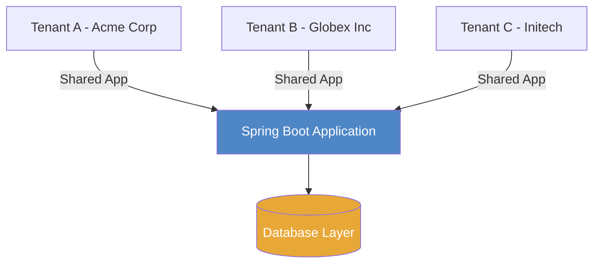

### Why Multi-Tenancy?

| Benefit | Description |
|---|---|
| **Cost Efficiency** | Shared infrastructure reduces per-tenant cost |
| **Simplified Operations** | One codebase, one deployment pipeline |
| **Faster Onboarding** | New tenants are provisioned, not deployed |
| **Scalability** | Resources scale once for all tenants |

---

## 2. Choosing Your Isolation Strategy

Before writing a single line of code, you must choose your isolation model. This is the most impactful architectural decision you will make.

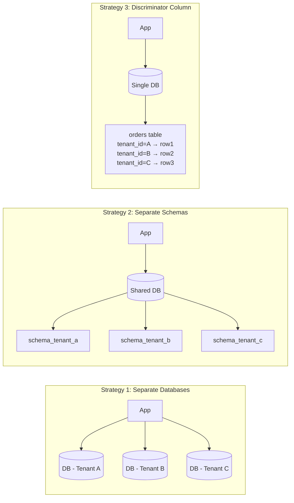

### Comparison Matrix

| Criterion | Separate DB | Separate Schema | Discriminator Column |
|---|---|---|---|
| **Data Isolation** | ⭐⭐⭐ Strongest | ⭐⭐ Good | ⭐ Weakest |
| **Implementation Complexity** | High | Medium | Low |
| **Operational Overhead** | High | Medium | Low |
| **Cost** | Highest | Medium | Lowest |
| **Compliance (GDPR, HIPAA)** | Easiest | Medium | Hardest |
| **Per-Tenant Backup/Restore** | Easy | Easy | Complex |
| **Best For** | Enterprise / Regulated | Mid-market SaaS | Startups / SMB SaaS |

> **Rule of Thumb:** Start with the discriminator column approach. Migrate to schema-per-tenant when you hit compliance requirements or when tenants start demanding dedicated resources.

---

## 3. High-Level Architecture

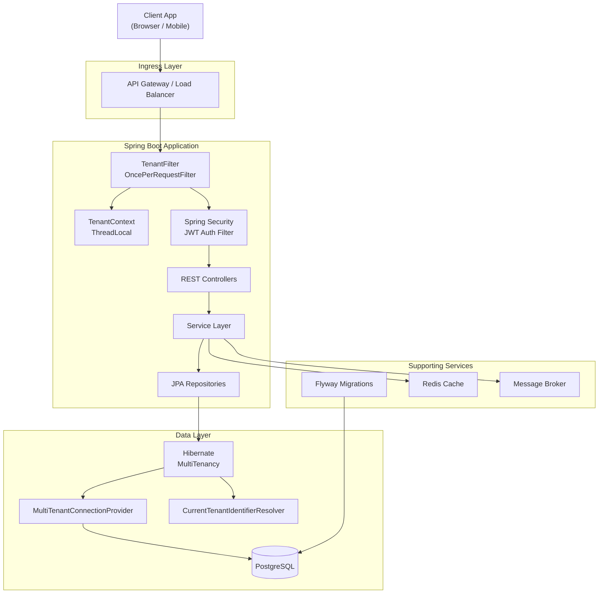

---

## 4. Project Setup

### Gradle Wrapper — Pin to Latest Stable

Bootstrap the wrapper (run once) so every developer and CI agent uses the same Gradle version without a local install:

```bash
# Initialise a new project with Groovy DSL
gradle init --type java-application --dsl groovy

# Or, if upgrading an existing project, just update the wrapper:
./gradlew wrapper --gradle-version=9.5.1 --distribution-type=bin
```

This generates `gradle/wrapper/gradle-wrapper.properties`:

```properties
distributionBase=GRADLE_USER_HOME
distributionPath=wrapper/dists
distributionUrl=https\://services.gradle.org/distributions/gradle-9.5.1-bin.zip
networkTimeout=10000
validateDistributionUrl=true
zipStoreBase=GRADLE_USER_HOME
zipStorePath=wrapper/dists
```

> Always commit `gradlew`, `gradlew.bat`, and the `gradle/wrapper/` directory to version control. Never commit a local Gradle installation path.

---

### `settings.gradle`

```groovy
rootProject.name = 'multitenant-saas'

// Central plugin management — resolves plugins from Gradle Plugin Portal
pluginManagement {
    repositories {
        gradlePluginPortal()
        mavenCentral()
    }
}

// Dependency resolution management — single source of truth for all repos
// FAIL_ON_PROJECT_REPOS forces all repo declarations to live here, not in subproject build files
dependencyResolutionManagement {
    repositoriesMode.set(RepositoriesMode.FAIL_ON_PROJECT_REPOS)
    repositories {
        mavenCentral()
    }
}
```

---

### `build.gradle`

```groovy
// ─── Plugins ─────────────────────────────────────────────────────────────────
plugins {
    id 'java'
    id 'org.springframework.boot' version '3.3.5'
    id 'io.spring.dependency-management' version '1.1.6'
}

// ─── Project Metadata ────────────────────────────────────────────────────────
group   = 'com.example'
version = '0.0.1-SNAPSHOT'

// ─── Java Toolchain ───────────────────────────────────────────────────────────
// Gradle 9 auto-provisions the JDK via toolchains — no manual JAVA_HOME needed.
// Java 25 is the latest LTS (released September 16, 2025).
// Spring Boot 3.x requires Java 17 as a minimum; Java 25 is fully compatible.
java {
    toolchain {
        languageVersion = JavaLanguageVersion.of(25)
    }
}

// ─── Annotation Processors ────────────────────────────────────────────────────
// Makes the annotationProcessor configuration extend compileOnly so Lombok
// is available at compile time without leaking into the runtime classpath.
configurations {
    compileOnly {
        extendsFrom annotationProcessor
    }
}

// ─── Dependency Version Properties ───────────────────────────────────────────
// Versions not managed by the Spring Boot BOM are pinned here in one place.
ext {
    jjwtVersion   = '0.12.3'
    flywayVersion = '10.15.0'   // flyway-core and flyway-database-postgresql must match
    tcVersion     = '1.20.1'    // Testcontainers
}

// ─── Dependencies ─────────────────────────────────────────────────────────────
dependencies {

    // ── Spring Boot Starters ──────────────────────────────────────────────────
    implementation 'org.springframework.boot:spring-boot-starter-web'
    implementation 'org.springframework.boot:spring-boot-starter-data-jpa'
    implementation 'org.springframework.boot:spring-boot-starter-security'
    implementation 'org.springframework.boot:spring-boot-starter-validation'
    implementation 'org.springframework.boot:spring-boot-starter-actuator'
    implementation 'org.springframework.boot:spring-boot-starter-cache'

    // ── JWT (jjwt 0.12.x) ─────────────────────────────────────────────────────
    // jjwt-api on the compile classpath; impl + Jackson serialiser at runtime only
    implementation "io.jsonwebtoken:jjwt-api:${jjwtVersion}"
    runtimeOnly   "io.jsonwebtoken:jjwt-impl:${jjwtVersion}"
    runtimeOnly   "io.jsonwebtoken:jjwt-jackson:${jjwtVersion}"

    // ── Database ──────────────────────────────────────────────────────────────
    runtimeOnly 'org.postgresql:postgresql'

    // ── Flyway migrations ─────────────────────────────────────────────────────
    implementation "org.flywaydb:flyway-core:${flywayVersion}"
    implementation "org.flywaydb:flyway-database-postgresql:${flywayVersion}"

    // ── Lombok ────────────────────────────────────────────────────────────────
    compileOnly         'org.projectlombok:lombok'
    annotationProcessor 'org.projectlombok:lombok'

    // ── Test Dependencies ─────────────────────────────────────────────────────
    testImplementation('org.springframework.boot:spring-boot-starter-test') {
        // Keep classpath clean: JUnit 5 (Jupiter) only, no JUnit 4 Vintage engine
        exclude group: 'org.junit.vintage', module: 'junit-vintage-engine'
    }
    testImplementation 'org.springframework.security:spring-security-test'

    // Testcontainers — real PostgreSQL instance for integration tests
    testImplementation "org.testcontainers:junit-jupiter:${tcVersion}"
    testImplementation "org.testcontainers:postgresql:${tcVersion}"

    // Lombok available in test source sets too
    testCompileOnly         'org.projectlombok:lombok'
    testAnnotationProcessor 'org.projectlombok:lombok'
}

// ─── Test Task Configuration ──────────────────────────────────────────────────
tasks.named('test') {
    useJUnitPlatform()   // JUnit 5 / Jupiter engine

    // Run tests in parallel across available CPU cores (safe for unit tests;
    // integration tests using Testcontainers handle their own isolation)
    maxParallelForks = Math.max(1, Runtime.runtime.availableProcessors().intdiv(2))
}

// ─── Reproducible Builds ──────────────────────────────────────────────────────
// Ensures the JAR produced by bootJar is byte-for-byte identical across machines.
tasks.withType(AbstractArchiveTask).configureEach {
    preserveFileTimestamps = false
    reproducibleFileOrder  = true
}

// ─── Gradle 9 — Configuration Cache ──────────────────────────────────────────
// Configuration cache is enabled by default in Gradle 9.x.
// Spring Boot's bootRun / bootJar / bootBuildImage tasks are already compatible.
// If you add custom tasks, ensure they declare all inputs/outputs properly.
```

> **Groovy DSL vs Kotlin DSL in Gradle 9:** Groovy DSL (`build.gradle`) remains fully supported in Gradle 9.x and is still a valid, idiomatic choice — especially for teams already fluent in Groovy or migrating from older Gradle builds. Kotlin DSL is the new project default, but there is no deprecation plan for Groovy DSL. Gradle 9 is compatible with Groovy 1.5.8 through 5.0.2.

---

### `gradle.properties` — Gradle & JVM Tuning

```properties
# ─── Gradle Daemon ────────────────────────────────────────────────────────────
org.gradle.daemon=true
org.gradle.parallel=true
org.gradle.caching=true

# ─── JVM Heap for the Gradle build process ────────────────────────────────────
org.gradle.jvmargs=-Xmx2g -XX:+UseZGC -XX:+ZGenerational -Dfile.encoding=UTF-8

# ─── Configuration Cache (Gradle 9 default: on) ───────────────────────────────
org.gradle.configuration-cache=true
org.gradle.configuration-cache.problems=warn

# ─── Java 25 — enable preview features for the toolchain (optional) ──────────
# Uncomment only if you want to experiment with Java 25 preview JEPs
# (e.g. JEP 507 Primitive Patterns, JEP 470 PEM API)
# org.gradle.java.home.compile.args=--enable-preview
```

> **ZGC note:** `-XX:+ZGenerational` activates Generational ZGC, which became stable in Java 21 and is the recommended low-latency collector for Java 25 builds. It pairs well with the new Generational Shenandoah GC (JEP 521) available at runtime in Java 25 apps.

### Project Package Structure

```
src/main/java/com/example/saas/
├── config/
│   ├── MultiTenantConfig.java
│   ├── SecurityConfig.java
│   └── FlywayConfig.java
├── tenant/
│   ├── TenantContext.java
│   ├── TenantFilter.java
│   ├── TenantIdentifierResolver.java
│   └── MultiTenantConnectionProvider.java
├── domain/
│   ├── TenantAwareEntity.java        ← base class
│   ├── master/
│   │   └── TenantMaster.java         ← tenant registry
│   └── tenant/
│       └── Product.java              ← tenant-scoped entity
├── repository/
│   ├── master/
│   │   └── TenantMasterRepository.java
│   └── tenant/
│       └── ProductRepository.java
├── service/
│   ├── TenantProvisioningService.java
│   └── ProductService.java
├── controller/
│   ├── TenantController.java
│   └── ProductController.java
└── security/
    ├── JwtUtil.java
    ├── JwtAuthFilter.java
    └── UserDetailsServiceImpl.java
```

---

## 5. Tenant Resolution

Tenant resolution is the mechanism that maps an incoming HTTP request to a specific tenant. This must happen **before** any database interaction.

### Resolution Strategies

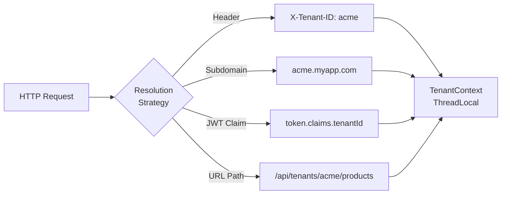

### TenantContext — Thread-Local Storage

```java
// tenant/TenantContext.java
public final class TenantContext {

    private TenantContext() {}

    private static final ThreadLocal<String> CURRENT_TENANT =
        new ThreadLocal<>();

    public static void setTenantId(String tenantId) {
        CURRENT_TENANT.set(tenantId);
    }

    public static String getTenantId() {
        return CURRENT_TENANT.get();
    }

    public static void clear() {
        CURRENT_TENANT.remove();   // ⚠️ CRITICAL: Always call this in finally block
    }
}
```

> ⚠️ **Warning:** Forgetting to call `TenantContext.clear()` after a request causes tenant ID to "leak" into the next request on the same thread in a thread pool. Always clear in a `finally` block.

### TenantFilter — Servlet Filter

```java
// tenant/TenantFilter.java
@Component
@Order(1)   // Run before security filters
public class TenantFilter extends OncePerRequestFilter {

    @Autowired
    private TenantMasterRepository tenantMasterRepository;

    @Override
    protected void doFilterInternal(HttpServletRequest request,
                                    HttpServletResponse response,
                                    FilterChain chain)
            throws ServletException, IOException {

        // Strategy 1: Extract from header
        String tenantId = request.getHeader("X-Tenant-ID");

        // Strategy 2: Extract from subdomain (fallback)
        if (tenantId == null || tenantId.isBlank()) {
            tenantId = extractFromSubdomain(request.getServerName());
        }

        if (tenantId == null || tenantId.isBlank()) {
            response.setStatus(HttpServletResponse.SC_BAD_REQUEST);
            response.getWriter().write("{\"error\": \"Missing tenant identifier\"}");
            return;
        }

        // Optional: validate tenant exists
        if (!tenantMasterRepository.existsByTenantId(tenantId)) {
            response.setStatus(HttpServletResponse.SC_NOT_FOUND);
            response.getWriter().write("{\"error\": \"Unknown tenant\"}");
            return;
        }

        TenantContext.setTenantId(tenantId);
        try {
            chain.doFilter(request, response);
        } finally {
            TenantContext.clear();   // Always clear!
        }
    }

    private String extractFromSubdomain(String host) {
        // acme.myapp.com → "acme"
        if (host != null && host.contains(".")) {
            return host.split("\\.")[0];
        }
        return null;
    }

    @Override
    protected boolean shouldNotFilter(HttpServletRequest request) {
        // Skip tenant filter for public endpoints like /actuator/health
        String path = request.getRequestURI();
        return path.startsWith("/actuator") || path.startsWith("/api/public");
    }
}
```

### Request Lifecycle

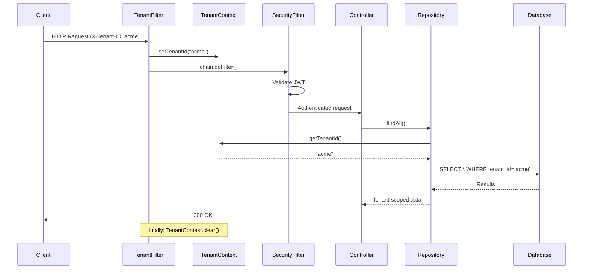

---

## 6. Database Configuration

### application.yml

```yaml
# Master datasource (tenant registry)
spring:
  datasource:
    url: jdbc:postgresql://localhost:5432/saas_master
    username: ${DB_USER}
    password: ${DB_PASSWORD}
    driver-class-name: org.postgresql.Driver
    hikari:
      pool-name: master-pool
      maximum-pool-size: 10

  jpa:
    hibernate:
      ddl-auto: validate
    properties:
      hibernate:
        dialect: org.hibernate.dialect.PostgreSQLDialect
        multiTenancy: SCHEMA       # or DATABASE
        format_sql: true
    show-sql: false

# Tenant datasource defaults (for schema-per-tenant)
tenant:
  datasource:
    url: jdbc:postgresql://localhost:5432/saas_tenants
    username: ${TENANT_DB_USER}
    password: ${TENANT_DB_PASSWORD}
    hikari:
      maximum-pool-size: 50
      connection-timeout: 30000
      idle-timeout: 600000

flyway:
  enabled: false  # We manage Flyway manually per tenant
```

### Master Database Entity

```java
// domain/master/TenantMaster.java
@Entity
@Table(name = "tbl_tenant_master", schema = "public")
@Data
@NoArgsConstructor
public class TenantMaster {

    @Id
    @GeneratedValue(strategy = GenerationType.IDENTITY)
    private Long id;

    @Column(unique = true, nullable = false)
    private String tenantId;        // "acme", "globex"

    @Column(nullable = false)
    private String schemaName;      // "tenant_acme", "tenant_globex"

    @Column(nullable = false)
    private String displayName;

    private String dbUrl;           // Only for database-per-tenant strategy
    private String dbUsername;
    private String dbPassword;

    @Enumerated(EnumType.STRING)
    private TenantStatus status;    // ACTIVE, SUSPENDED, PROVISIONING

    @CreationTimestamp
    private LocalDateTime createdAt;
}
```

---

## 7. Schema-Per-Tenant with Hibernate

This is the recommended middle-ground approach for most production SaaS applications.

### CurrentTenantIdentifierResolver

```java
// tenant/TenantIdentifierResolver.java
@Component
public class TenantIdentifierResolver
        implements CurrentTenantIdentifierResolver<String> {

    private static final String DEFAULT_TENANT = "public";

    @Override
    public String resolveCurrentTenantIdentifier() {
        String tenantId = TenantContext.getTenantId();
        return (tenantId != null) ? "tenant_" + tenantId : DEFAULT_TENANT;
    }

    @Override
    public boolean validateExistingCurrentSessions() {
        return true;
    }
}
```

### MultiTenantConnectionProvider

```java
// tenant/MultiTenantConnectionProvider.java
@Component
public class MultiTenantConnectionProvider
        implements MultiTenantConnectionProviderImpl<String> {

    @Autowired
    private DataSource dataSource;

    @Override
    public Connection getAnyConnection() throws SQLException {
        return dataSource.getConnection();
    }

    @Override
    public void releaseAnyConnection(Connection connection) throws SQLException {
        connection.close();
    }

    @Override
    public Connection getConnection(String tenantIdentifier) throws SQLException {
        Connection connection = getAnyConnection();
        try {
            // Switch schema for this tenant
            connection.setSchema(tenantIdentifier);
        } catch (SQLException e) {
            throw new HibernateException(
                "Cannot alter JDBC connection to schema [" + tenantIdentifier + "]", e);
        }
        return connection;
    }

    @Override
    public void releaseConnection(String tenantIdentifier, Connection connection)
            throws SQLException {
        try {
            // Reset to default schema before returning to pool
            connection.setSchema("public");
        } catch (SQLException e) {
            throw new HibernateException(
                "Cannot reset JDBC connection schema to public", e);
        }
        connection.close();
    }

    @Override
    public boolean supportsAggressiveRelease() {
        return false;
    }
}
```

### Hibernate JPA Configuration

```java
// config/MultiTenantConfig.java
@Configuration
@EnableTransactionManagement
@EnableJpaRepositories(
    basePackages = "com.example.saas.repository.tenant",
    entityManagerFactoryRef = "tenantEntityManagerFactory",
    transactionManagerRef = "tenantTransactionManager"
)
public class MultiTenantConfig {

    @Autowired
    private TenantIdentifierResolver tenantIdentifierResolver;

    @Autowired
    private MultiTenantConnectionProvider multiTenantConnectionProvider;

    @Bean
    public LocalContainerEntityManagerFactoryBean tenantEntityManagerFactory(
            DataSource dataSource,
            JpaProperties jpaProperties) {

        Map<String, Object> props = new HashMap<>(jpaProperties.getProperties());
        props.put(Environment.MULTI_TENANT_CONNECTION_PROVIDER, multiTenantConnectionProvider);
        props.put(Environment.MULTI_TENANT_IDENTIFIER_RESOLVER, tenantIdentifierResolver);
        props.put(Environment.DIALECT, "org.hibernate.dialect.PostgreSQLDialect");

        LocalContainerEntityManagerFactoryBean em = new LocalContainerEntityManagerFactoryBean();
        em.setDataSource(dataSource);
        em.setPackagesToScan("com.example.saas.domain.tenant");
        em.setJpaVendorAdapter(new HibernateJpaVendorAdapter());
        em.setJpaPropertyMap(props);
        return em;
    }

    @Bean
    public PlatformTransactionManager tenantTransactionManager(
            @Qualifier("tenantEntityManagerFactory")
            LocalContainerEntityManagerFactoryBean emf) {
        return new JpaTransactionManager(emf.getObject());
    }
}
```

### Schema-Per-Tenant Flow

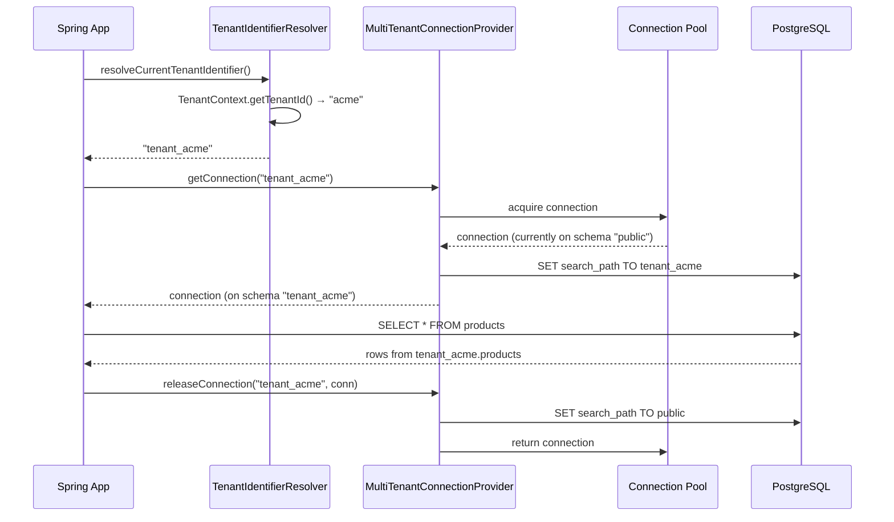

---

## 8. Discriminator Column Approach

Simpler but requires discipline. Every table has a `tenant_id` column and Hibernate filters enforce isolation automatically.

### Base Entity with Hibernate Filter

```java
// domain/TenantAwareEntity.java
@MappedSuperclass
@FilterDef(
    name = "tenantFilter",
    parameters = @ParamDef(name = "tenantId", type = String.class)
)
@Filter(name = "tenantFilter", condition = "tenant_id = :tenantId")
@Data
public abstract class TenantAwareEntity {

    @Column(name = "tenant_id", nullable = false, updatable = false)
    private String tenantId;

    @PrePersist
    protected void prePersist() {
        if (this.tenantId == null) {
            this.tenantId = TenantContext.getTenantId();
        }
    }
}
```

### Tenant-Scoped Entity

```java
// domain/tenant/Product.java
@Entity
@Table(name = "products")
@Data
@NoArgsConstructor
public class Product extends TenantAwareEntity {

    @Id
    @GeneratedValue(strategy = GenerationType.IDENTITY)
    private Long id;

    @Column(nullable = false)
    private String name;

    private BigDecimal price;

    @CreationTimestamp
    private LocalDateTime createdAt;
}
```

### Enabling Filters in EntityManager

```java
// config/HibernateFilterAspect.java
@Aspect
@Component
public class HibernateFilterAspect {

    @PersistenceContext
    private EntityManager entityManager;

    @Before("@within(org.springframework.stereotype.Repository)")
    public void enableTenantFilter() {
        String tenantId = TenantContext.getTenantId();
        if (tenantId != null) {
            Session session = entityManager.unwrap(Session.class);
            session.enableFilter("tenantFilter")
                   .setParameter("tenantId", tenantId);
        }
    }
}
```

### Discriminator Column Flow

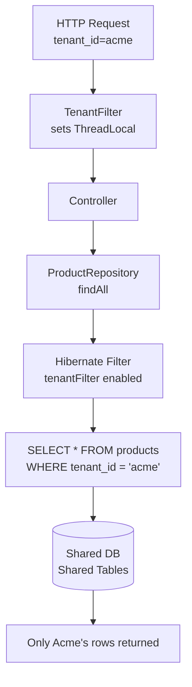

---

## 9. Security with JWT & Spring Security

JWT tokens carry the tenant identity as a claim, providing a cryptographically verified source of truth for tenant resolution.

### JWT Token Structure

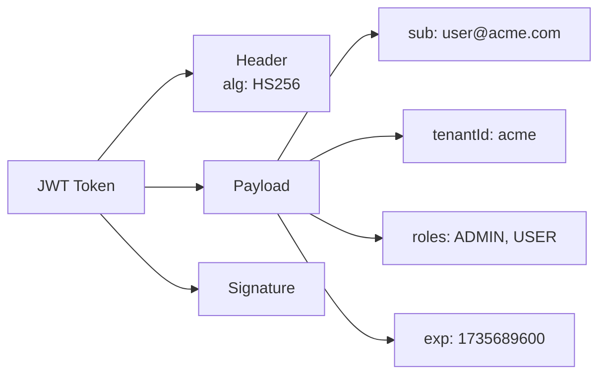

### JwtUtil

```java
// security/JwtUtil.java
@Component
public class JwtUtil {

    @Value("${jwt.secret}")
    private String secret;

    @Value("${jwt.expiration:86400000}")   // 24h default
    private long expirationMs;

    public String generateToken(String username, String tenantId, List<String> roles) {
        return Jwts.builder()
            .subject(username)
            .claim("tenantId", tenantId)
            .claim("roles", roles)
            .issuedAt(new Date())
            .expiration(new Date(System.currentTimeMillis() + expirationMs))
            .signWith(getSigningKey())
            .compact();
    }

    public Claims extractAllClaims(String token) {
        return Jwts.parser()
            .verifyWith(getSigningKey())
            .build()
            .parseSignedClaims(token)
            .getPayload();
    }

    public String extractTenantId(String token) {
        return extractAllClaims(token).get("tenantId", String.class);
    }

    public boolean isTokenValid(String token) {
        try {
            extractAllClaims(token);
            return true;
        } catch (JwtException e) {
            return false;
        }
    }

    private SecretKey getSigningKey() {
        return Keys.hmacShaKeyFor(secret.getBytes(StandardCharsets.UTF_8));
    }
}
```

### JWT Auth Filter

```java
// security/JwtAuthFilter.java
@Component
@RequiredArgsConstructor
public class JwtAuthFilter extends OncePerRequestFilter {

    private final JwtUtil jwtUtil;
    private final UserDetailsService userDetailsService;

    @Override
    protected void doFilterInternal(HttpServletRequest request,
                                    HttpServletResponse response,
                                    FilterChain chain)
            throws ServletException, IOException {

        String authHeader = request.getHeader("Authorization");
        if (authHeader == null || !authHeader.startsWith("Bearer ")) {
            chain.doFilter(request, response);
            return;
        }

        String token = authHeader.substring(7);
        if (!jwtUtil.isTokenValid(token)) {
            chain.doFilter(request, response);
            return;
        }

        Claims claims = jwtUtil.extractAllClaims(token);
        String username = claims.getSubject();
        String tenantId = claims.get("tenantId", String.class);

        // Set tenant from JWT (overrides header-based tenant)
        TenantContext.setTenantId(tenantId);

        UserDetails userDetails = userDetailsService.loadUserByUsername(username);
        UsernamePasswordAuthenticationToken auth =
            new UsernamePasswordAuthenticationToken(
                userDetails, null, userDetails.getAuthorities());
        auth.setDetails(new WebAuthenticationDetailsSource().buildDetails(request));
        SecurityContextHolder.getContext().setAuthentication(auth);

        chain.doFilter(request, response);
    }
}
```

### Security Configuration

```java
// config/SecurityConfig.java
@Configuration
@EnableWebSecurity
@EnableMethodSecurity
@RequiredArgsConstructor
public class SecurityConfig {

    private final JwtAuthFilter jwtAuthFilter;

    @Bean
    public SecurityFilterChain securityFilterChain(HttpSecurity http) throws Exception {
        return http
            .csrf(AbstractHttpConfigurer::disable)
            .sessionManagement(s -> s.sessionCreationPolicy(SessionCreationPolicy.STATELESS))
            .authorizeHttpRequests(auth -> auth
                .requestMatchers("/api/public/**", "/actuator/health").permitAll()
                .requestMatchers("/api/admin/**").hasRole("PLATFORM_ADMIN")
                .anyRequest().authenticated()
            )
            .addFilterBefore(jwtAuthFilter, UsernamePasswordAuthenticationFilter.class)
            .build();
    }

    @Bean
    public PasswordEncoder passwordEncoder() {
        return new BCryptPasswordEncoder();
    }
}
```

### Authentication & Tenant Resolution Flow

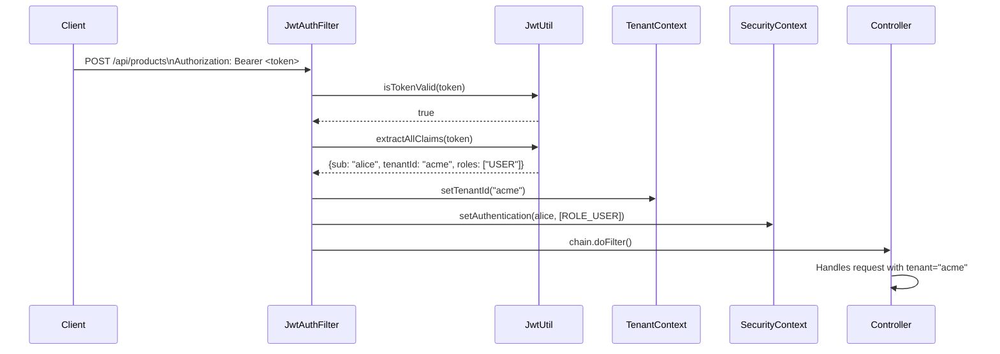

---

## 10. Tenant Provisioning

When a new tenant signs up, you need to automatically create their database schema and run migrations.

### Tenant Provisioning Service

```java
// service/TenantProvisioningService.java
@Service
@Transactional
@RequiredArgsConstructor
@Slf4j
public class TenantProvisioningService {

    private final TenantMasterRepository tenantMasterRepository;
    private final DataSource dataSource;
    private final FlywayConfig flywayConfig;

    public TenantMaster provisionTenant(String tenantId, String displayName) {
        log.info("Provisioning new tenant: {}", tenantId);

        // 1. Validate tenantId format
        if (!tenantId.matches("^[a-z0-9-]+$")) {
            throw new IllegalArgumentException("Invalid tenant ID format");
        }
        if (tenantMasterRepository.existsByTenantId(tenantId)) {
            throw new TenantAlreadyExistsException(tenantId);
        }

        String schemaName = "tenant_" + tenantId;

        // 2. Create schema
        createSchema(schemaName);

        // 3. Run migrations for the new schema
        flywayConfig.runMigrationsForSchema(schemaName);

        // 4. Register tenant in master table
        TenantMaster tenant = new TenantMaster();
        tenant.setTenantId(tenantId);
        tenant.setSchemaName(schemaName);
        tenant.setDisplayName(displayName);
        tenant.setStatus(TenantStatus.ACTIVE);
        TenantMaster saved = tenantMasterRepository.save(tenant);

        log.info("Tenant {} provisioned successfully with schema {}", tenantId, schemaName);
        return saved;
    }

    private void createSchema(String schemaName) {
        try (Connection conn = dataSource.getConnection();
             Statement stmt = conn.createStatement()) {
            // Use parameterized name (validated above) to prevent injection
            stmt.execute("CREATE SCHEMA IF NOT EXISTS " + schemaName);
        } catch (SQLException e) {
            throw new TenantProvisioningException("Failed to create schema: " + schemaName, e);
        }
    }

    public void suspendTenant(String tenantId) {
        TenantMaster tenant = tenantMasterRepository.findByTenantId(tenantId)
            .orElseThrow(() -> new TenantNotFoundException(tenantId));
        tenant.setStatus(TenantStatus.SUSPENDED);
        tenantMasterRepository.save(tenant);
    }

    public void deleteTenant(String tenantId) {
        // Soft delete: mark as deleted, schedule schema drop for later
        TenantMaster tenant = tenantMasterRepository.findByTenantId(tenantId)
            .orElseThrow(() -> new TenantNotFoundException(tenantId));
        tenant.setStatus(TenantStatus.DELETED);
        tenantMasterRepository.save(tenant);
        // Schedule async schema drop after data retention period
    }
}
```

### Tenant Provisioning Lifecycle

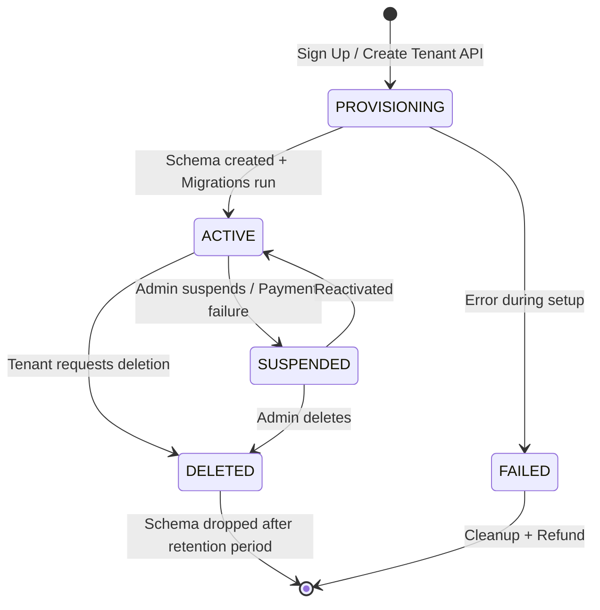

---

## 11. Schema Migrations with Flyway

In a multi-tenant setup, running migrations requires special handling — you need to apply them to every tenant schema, including new ones created after deployment.

### FlywayConfig

```java
// config/FlywayConfig.java
@Configuration
@RequiredArgsConstructor
@Slf4j
public class FlywayConfig {

    private final DataSource dataSource;
    private final TenantMasterRepository tenantMasterRepository;

    // Run on application startup — migrate all existing tenant schemas
    @PostConstruct
    public void migrateAllTenants() {
        log.info("Running Flyway migrations for all tenants...");
        tenantMasterRepository.findAll().stream()
            .filter(t -> t.getStatus() == TenantStatus.ACTIVE)
            .forEach(t -> runMigrationsForSchema(t.getSchemaName()));
        log.info("All tenant migrations complete.");
    }

    // Called during tenant provisioning for new schemas
    public void runMigrationsForSchema(String schemaName) {
        log.info("Migrating schema: {}", schemaName);
        Flyway flyway = Flyway.configure()
            .dataSource(dataSource)
            .schemas(schemaName)
            .locations("classpath:db/migration/tenant")   // Tenant-specific migrations
            .baselineOnMigrate(true)
            .load();
        flyway.migrate();
    }
}
```

### Migration File Structure

```
src/main/resources/db/migration/
├── master/
│   ├── V1__create_tenant_master.sql
│   └── V2__add_tenant_config.sql
└── tenant/
    ├── V1__create_users.sql
    ├── V2__create_products.sql
    └── V3__add_subscription_tables.sql
```

### Sample Migration File

```sql
-- V1__create_users.sql
CREATE TABLE IF NOT EXISTS users (
    id          BIGSERIAL PRIMARY KEY,
    username    VARCHAR(100) UNIQUE NOT NULL,
    email       VARCHAR(255) UNIQUE NOT NULL,
    password    VARCHAR(255) NOT NULL,
    tenant_id   VARCHAR(50) NOT NULL,
    role        VARCHAR(50) DEFAULT 'USER',
    created_at  TIMESTAMP DEFAULT NOW()
);

-- V2__create_products.sql
CREATE TABLE IF NOT EXISTS products (
    id          BIGSERIAL PRIMARY KEY,
    name        VARCHAR(255) NOT NULL,
    description TEXT,
    price       DECIMAL(10, 2),
    tenant_id   VARCHAR(50) NOT NULL,
    created_at  TIMESTAMP DEFAULT NOW(),
    updated_at  TIMESTAMP DEFAULT NOW()
);

CREATE INDEX idx_products_tenant ON products(tenant_id);
```

### Migration Execution Flow

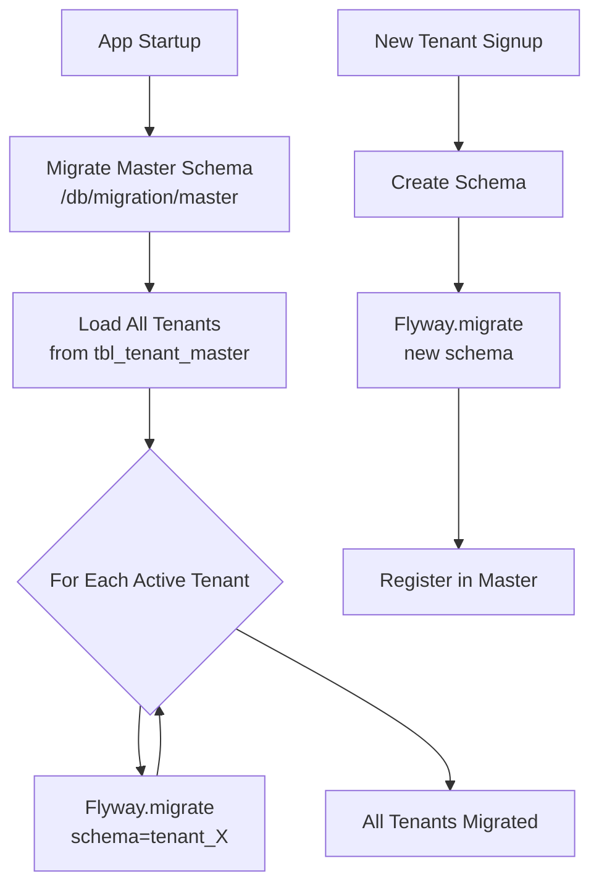

---

## 12. Async and Reactive Considerations

`ThreadLocal` does not survive thread hops in async or reactive code. You must propagate tenant context explicitly.

### Spring `@Async` — Task Decorator

```java
// config/AsyncConfig.java
@Configuration
@EnableAsync
public class AsyncConfig implements AsyncConfigurer {

    @Override
    public Executor getAsyncExecutor() {
        ThreadPoolTaskExecutor executor = new ThreadPoolTaskExecutor();
        executor.setCorePoolSize(10);
        executor.setMaxPoolSize(50);
        executor.setQueueCapacity(100);
        // Propagate TenantContext across async boundaries
        executor.setTaskDecorator(runnable -> {
            String tenantId = TenantContext.getTenantId();   // Capture now
            return () -> {
                TenantContext.setTenantId(tenantId);         // Restore in new thread
                try {
                    runnable.run();
                } finally {
                    TenantContext.clear();
                }
            };
        });
        executor.initialize();
        return executor;
    }
}
```

### Message Queue — Tenant ID in Message Headers

```java
// When publishing to a queue, include tenant ID in message metadata
public void publishEvent(OrderCreatedEvent event) {
    Message<OrderCreatedEvent> message = MessageBuilder
        .withPayload(event)
        .setHeader("tenantId", TenantContext.getTenantId())
        .build();
    kafkaTemplate.send("order-events", message);
}

// When consuming from a queue, restore tenant context
@KafkaListener(topics = "order-events")
public void handleOrderCreated(Message<OrderCreatedEvent> message) {
    String tenantId = (String) message.getHeaders().get("tenantId");
    TenantContext.setTenantId(tenantId);
    try {
        processOrder(message.getPayload());
    } finally {
        TenantContext.clear();
    }
}
```

### Async Tenant Context Propagation

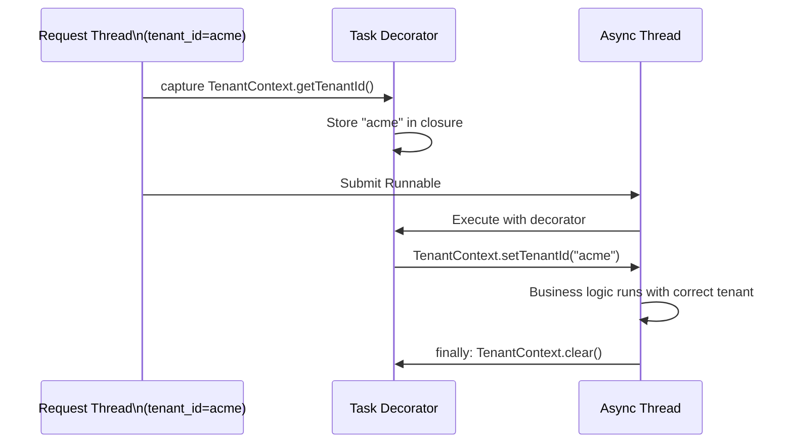

---

## 13. Testing Multi-Tenant Applications

### Unit Test — TenantContext

```java
class TenantContextTest {

    @AfterEach
    void cleanup() {
        TenantContext.clear();
    }

    @Test
    void shouldSetAndGetTenantId() {
        TenantContext.setTenantId("acme");
        assertEquals("acme", TenantContext.getTenantId());
    }

    @Test
    void shouldClearTenantId() {
        TenantContext.setTenantId("acme");
        TenantContext.clear();
        assertNull(TenantContext.getTenantId());
    }
}
```

### Integration Test — Data Isolation

```java
@SpringBootTest
@Transactional
class TenantIsolationTest {

    @Autowired
    private ProductRepository productRepository;

    @Test
    void shouldNotLeakDataBetweenTenants() {
        // Arrange: create product for tenant A
        TenantContext.setTenantId("acme");
        Product acmeProduct = new Product("Acme Widget", new BigDecimal("9.99"));
        productRepository.save(acmeProduct);

        // Arrange: create product for tenant B
        TenantContext.setTenantId("globex");
        Product globexProduct = new Product("Globex Gadget", new BigDecimal("19.99"));
        productRepository.save(globexProduct);

        // Act: query as tenant A
        TenantContext.setTenantId("acme");
        List<Product> acmeProducts = productRepository.findAll();

        // Assert: tenant A only sees their own data
        assertEquals(1, acmeProducts.size());
        assertEquals("Acme Widget", acmeProducts.get(0).getName());

        TenantContext.clear();
    }

    @Test
    void shouldRejectRequestWithoutTenantId() {
        // Act: try to query without setting tenant context
        TenantContext.clear();

        // Assert: should throw or return empty
        assertThrows(HibernateException.class, () -> productRepository.findAll());
    }
}
```

### Integration Test — TenantFilter

```java
@WebMvcTest(ProductController.class)
class TenantFilterTest {

    @Autowired
    private MockMvc mockMvc;

    @Test
    void shouldRejectRequestMissingTenantHeader() throws Exception {
        mockMvc.perform(get("/api/products"))
            .andExpect(status().isBadRequest());
    }

    @Test
    void shouldAcceptRequestWithTenantHeader() throws Exception {
        mockMvc.perform(get("/api/products")
                .header("X-Tenant-ID", "acme")
                .header("Authorization", "Bearer " + validToken))
            .andExpect(status().isOk());
    }
}
```

---

## 14. Operational Best Practices

### Connection Pool Sizing

With many tenants on schema-per-tenant, a single connection pool shared across all schemas is sufficient. Be careful with `maximum-pool-size` — connections are relatively expensive.

```
Total connections = max_pool_size
Each request borrows a connection and switches schema
No need for per-tenant pools (unlike database-per-tenant)
```

### Caching with Tenant Awareness

```java
@Service
public class ProductService {

    @Cacheable(value = "products", key = "#root.target.currentTenantKey()")
    public List<Product> getAllProducts() {
        return productRepository.findAll();
    }

    // Cache key includes tenant ID to prevent cross-tenant cache hits
    public String currentTenantKey() {
        return TenantContext.getTenantId() + ":products";
    }

    @CacheEvict(value = "products", key = "#root.target.currentTenantKey()")
    public Product createProduct(ProductRequest request) {
        // ...
    }
}
```

### Tenant-Aware Logging with MDC

```java
// tenant/TenantFilter.java — add MDC logging
TenantContext.setTenantId(tenantId);
MDC.put("tenantId", tenantId);   // Logback MDC for structured logging
try {
    chain.doFilter(request, response);
} finally {
    TenantContext.clear();
    MDC.remove("tenantId");
}
```

```xml
<!-- logback.xml — include tenantId in log pattern -->
<pattern>%d{HH:mm:ss} [%thread] [tenant:%X{tenantId}] %-5level %logger - %msg%n</pattern>
```

### Production Checklist

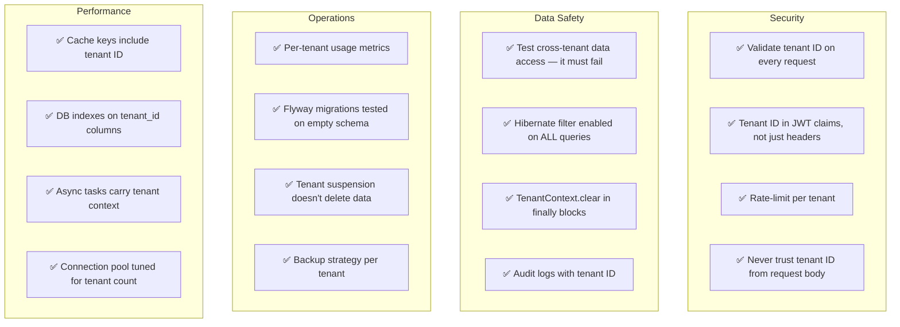

---

## 15. Decision Flowchart

Use this to pick the right isolation strategy for your situation.

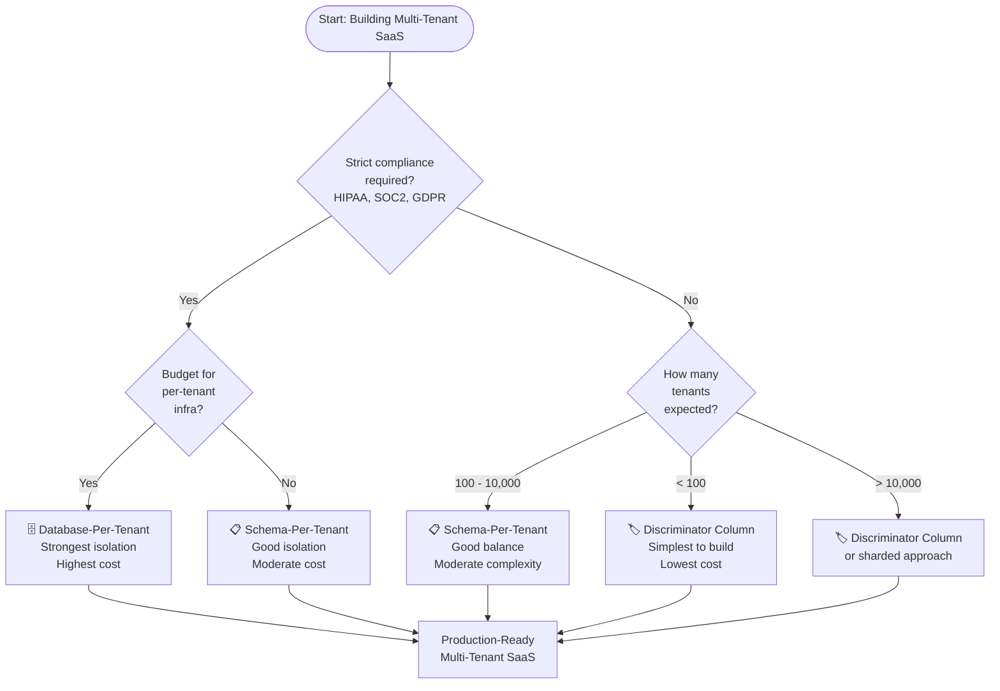

---

## Summary

| Component | Role | Key Class |
|---|---|---|
| **TenantContext** | Thread-scoped storage | `ThreadLocal<String>` |
| **TenantFilter** | Extract & set tenant per request | `OncePerRequestFilter` |
| **TenantIdentifierResolver** | Tell Hibernate which schema | `CurrentTenantIdentifierResolver` |
| **MultiTenantConnectionProvider** | Route connections to schemas | `MultiTenantConnectionProvider` |
| **JwtUtil** | Generate & validate tokens with tenantId | `io.jsonwebtoken` |
| **TenantAwareEntity** | Base class for tenant-scoped data | `@MappedSuperclass` + `@Filter` |
| **TenantProvisioningService** | Create schemas & run migrations | `Flyway.migrate()` |
| **FlywayConfig** | Migrate all tenants on startup | `@PostConstruct` |

Multi-tenancy is not a feature you add later — it's a first-class architectural concern that must be designed in from day one. The patterns above give you a solid foundation to build a production-grade SaaS on Spring Boot that is secure, scalable, and maintainable.