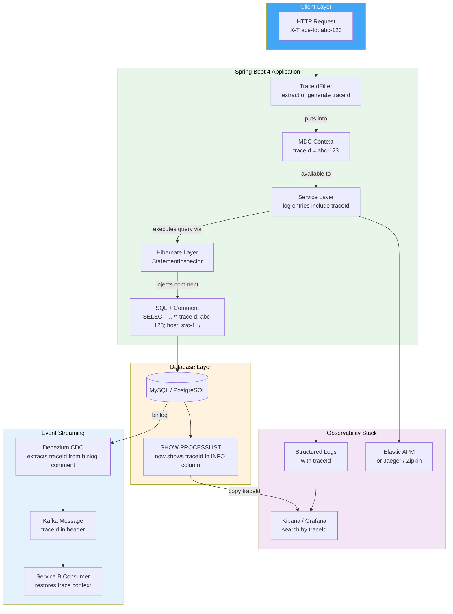
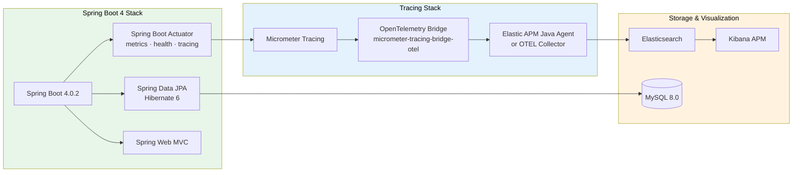
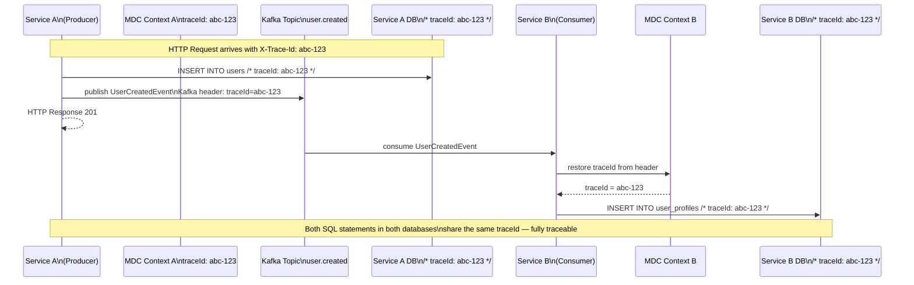
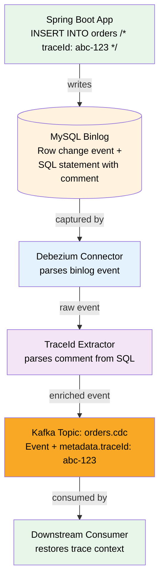
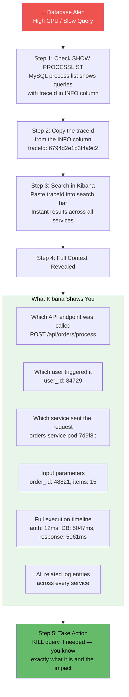
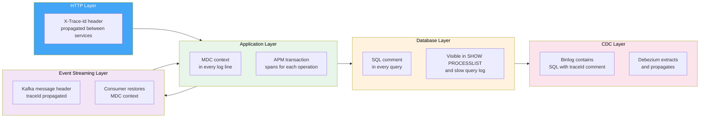
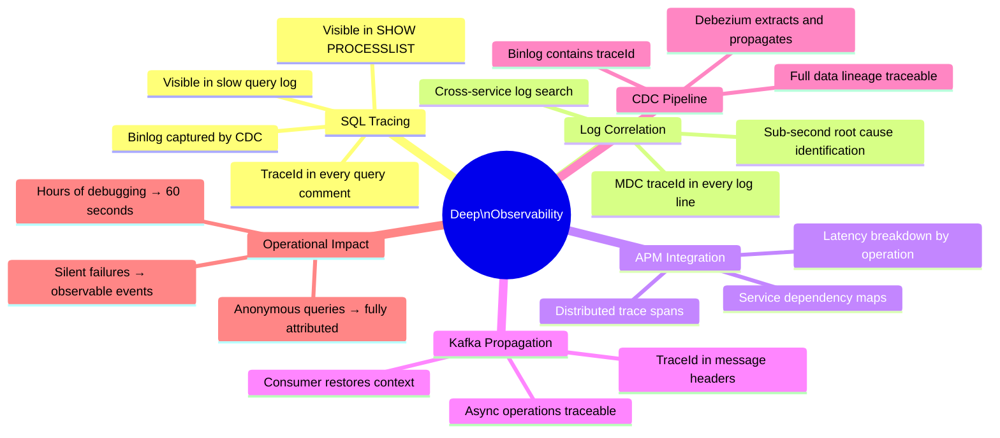

# Deep Observability in Spring Boot 4: Tracing Requests All the Way to SQL and Beyond

> *The hardest production incidents to diagnose aren't the ones that throw errors — they're the ones where a database query is silently hanging and you have no idea which API call, which user, or which service triggered it. Spring Boot 4's observability stack finally closes that gap end to end.*

---

## The Problem That Costs Hours

Here is a scenario every backend engineer has lived through. A monitoring alert fires: database CPU is at 95%, response times are climbing, and some requests are timing out. You connect to MySQL and run the process list:

```sql
SELECT ID, USER, HOST, DB, COMMAND, TIME, STATE, INFO
FROM information_schema.processlist
WHERE COMMAND != 'Sleep' AND INFO IS NOT NULL
ORDER BY TIME DESC;
```

The output shows something like:

```
+----+------+------------------+----------+---------+------+-------+-------------------------------------------+
| ID | USER | HOST             | DB       | COMMAND | TIME | STATE | INFO                                      |
+----+------+------------------+----------+---------+------+-------+-------------------------------------------+
| 42 | app  | 172.18.0.3:51204 | orders   | Query   | 47   | ...   | SELECT * FROM orders WHERE status = 'P... |
| 67 | app  | 172.18.0.3:51891 | orders   | Query   | 31   | ...   | UPDATE order_items SET quantity = ? WHE...|
+----+------+------------------+----------+---------+------+-------+-------------------------------------------+
```

Two long-running queries. You know *what* is running. You have no idea *why*, *who triggered it*, *which API endpoint*, *which service*, or *which user request* is responsible. The investigation begins: grep through logs, correlate timestamps, trace the request path manually — hoping the clocks across services are synchronized closely enough to make temporal correlation meaningful.

This is the "anonymous query" problem, and it's one of the most expensive operational pain points in microservice architectures. A query can live for 47 seconds in the process list with no link back to the application code that created it.

Spring Boot 4 provides a clean, first-class solution: embed trace IDs directly into SQL comments at the Hibernate layer, propagating them from HTTP request through application code to the database query itself — and beyond, into Kafka and CDC pipelines.

---

## The Architecture: What Full Observability Looks Like

Before implementation, establish a clear picture of the full tracing chain and where each component fits.



The trace ID is the golden thread. It starts at the HTTP boundary, flows through the application, embeds itself in every SQL statement, and propagates into every downstream system. Finding the origin of any database query — no matter how deeply buried — becomes a single copy-paste operation.

---

## The Component Stack



---

## Project Setup

### build.gradle

```groovy
plugins {
   id 'java'
   id 'org.springframework.boot' version '4.0.2'
   id 'io.spring.dependency-management' version '1.1.7'
}

group = 'org.example'
version = '0.0.1-SNAPSHOT'
description = 'deep-observability-demo'

java {
   toolchain {
       languageVersion = JavaLanguageVersion.of(17)
   }
}

dependencies {
   // Core web and data
   implementation 'org.springframework.boot:spring-boot-starter-web'
   implementation 'org.springframework.boot:spring-boot-starter-data-jpa'

   // Observability stack
   implementation 'org.springframework.boot:spring-boot-starter-actuator'
   implementation 'io.micrometer:micrometer-tracing-bridge-otel'
   implementation 'io.opentelemetry:opentelemetry-exporter-otlp'

   // Kafka for event streaming observability
   implementation 'org.springframework.kafka:spring-kafka'

   // Database
   implementation 'com.mysql:mysql-connector-j'

   // Utilities
   compileOnly 'org.projectlombok:lombok'
   annotationProcessor 'org.projectlombok:lombok'

   testImplementation 'org.springframework.boot:spring-boot-starter-test'
}
```

---

## Core Implementation: Embedding Trace IDs in SQL

### How StatementInspector Works

```mermaid
sequenceDiagram
   participant SVC as Service Layer
   participant EM as EntityManager
   participant SI as SqlCommentStatementInspector
   participant MDC as MDC Context
   participant JDBC as JDBC Driver
   participant DB as MySQL

   SVC->>EM: repository.findAll()
   EM->>SI: inspect(sql)
   SI->>MDC: get("traceId")
   MDC-->>SI: "abc-123-def-456"
   SI-->>EM: "SELECT * FROM users /* host: svc-1; traceId: abc-123-def-456 */"
   EM->>JDBC: execute annotated SQL
   JDBC->>DB: SELECT * FROM users /* host: svc-1; traceId: abc-123-def-456 */
   DB-->>JDBC: results
   JDBC-->>EM: ResultSet
   EM-->>SVC: List<User>

   Note over DB: Query visible in SHOW PROCESSLIST<br/>with traceId in INFO column
```

### SqlCommentStatementInspector.java

```java
package org.example.observability.infrastructure.tracing;

import lombok.extern.slf4j.Slf4j;
import org.hibernate.resource.jdbc.spi.StatementInspector;
import org.slf4j.MDC;

import java.net.InetAddress;

@Slf4j
public class SqlCommentStatementInspector implements StatementInspector {

   private static final String HOST_NAME;
   private static final String SERVICE_NAME =
       System.getProperty("spring.application.name", "unknown-service");

   static {
       String resolvedHost;
       try {
           resolvedHost = InetAddress.getLocalHost().getHostName();
       } catch (Exception e) {
           log.warn("Could not resolve hostname for SQL comment tracing", e);
           resolvedHost = "unknown-host";
       }
       HOST_NAME = resolvedHost;
   }

   @Override
   public String inspect(String sql) {
       String traceId = MDC.get("traceId");
       String spanId  = MDC.get("spanId");

       if (traceId == null || traceId.isBlank()) {
           // No trace context — mark clearly so it's visible in process list
           traceId = "no-trace";
       }

       // Embed all diagnostic context as a SQL comment
       // Format chosen for easy parsing by log analysis tools
       String comment = String.format(
           " /* service: %s; host: %s; traceId: %s; spanId: %s */",
           SERVICE_NAME,
           HOST_NAME,
           traceId,
           spanId != null ? spanId : "no-span"
       );

       return sql + comment;
   }
}
```

The comment format matters. It should be:
- **Human readable** — visible at a glance in `SHOW PROCESSLIST`
- **Machine parseable** — extractable by log analysis scripts or monitoring tools
- **Compact** — SQL comment overhead is negligible, but it adds up at scale

### Why Not Use `hibernate.use_sql_comments`?

Hibernate has a built-in `use_sql_comments` property that adds comments to queries. It adds structural comments about the query itself (`/* load org.example.User */`), not trace context. The `StatementInspector` approach gives you full control over exactly what goes into the comment, including runtime MDC values that the built-in approach cannot access.

---

## Trace ID Propagation: The Filter Chain

### TraceIdFilter.java

```java
package org.example.observability.infrastructure.tracing;

import jakarta.servlet.*;
import jakarta.servlet.http.HttpServletRequest;
import jakarta.servlet.http.HttpServletResponse;
import lombok.extern.slf4j.Slf4j;
import org.slf4j.MDC;
import org.springframework.core.annotation.Order;
import org.springframework.stereotype.Component;

import java.io.IOException;
import java.util.UUID;

@Slf4j
@Component
@Order(1) // Must run before any other filter that might trigger DB access
public class TraceIdFilter implements Filter {

   private static final String TRACE_ID_HEADER  = "X-Trace-Id";
   private static final String TRACE_ID_MDC_KEY = "traceId";
   private static final String SPAN_ID_MDC_KEY  = "spanId";

   @Override
   public void doFilter(ServletRequest request, ServletResponse response,
                        FilterChain chain) throws IOException, ServletException {

       HttpServletRequest  httpRequest  = (HttpServletRequest)  request;
       HttpServletResponse httpResponse = (HttpServletResponse) response;

       // Respect incoming trace ID from upstream service (distributed tracing)
       // Generate a new one if this is the entry point
       String traceId = httpRequest.getHeader(TRACE_ID_HEADER);
       if (traceId == null || traceId.isBlank()) {
           traceId = UUID.randomUUID().toString().replace("-", "");
       }

       // Generate a span ID for this specific service boundary
       String spanId = UUID.randomUUID().toString().replace("-", "").substring(0, 16);

       MDC.put(TRACE_ID_MDC_KEY, traceId);
       MDC.put(SPAN_ID_MDC_KEY,  spanId);

       // Echo back in response — useful for client-side debugging and log correlation
       httpResponse.setHeader(TRACE_ID_HEADER, traceId);
       httpResponse.setHeader("X-Span-Id", spanId);

       log.debug("Request started: method={}, uri={}, traceId={}",
           httpRequest.getMethod(), httpRequest.getRequestURI(), traceId);

       long startTime = System.currentTimeMillis();
       try {
           chain.doFilter(request, response);
       } finally {
           long duration = System.currentTimeMillis() - startTime;
           log.debug("Request completed: status={}, duration={}ms, traceId={}",
               httpResponse.getStatus(), duration, traceId);

           // Critical: always clean MDC to prevent context leaking between
           // requests on pooled threads
           MDC.remove(TRACE_ID_MDC_KEY);
           MDC.remove(SPAN_ID_MDC_KEY);
       }
   }
}
```

### The MDC Cleanup Problem

Thread pools reuse threads across requests. If MDC is not cleaned up in the `finally` block, the trace ID from request N leaks into request N+1 on the same thread. The `finally` block is non-negotiable — it runs even if the request throws an exception.

This is the same issue as HikariCP connection contamination from session variables: state that should be scoped to a request surviving beyond it because cleanup was skipped.

---

## Application Configuration

### application.yml

```yaml
spring:
 application:
   name: orders-service

 datasource:
   url: jdbc:mysql://mysql:3306/tracing_db?createDatabaseIfNotExist=true&serverTimezone=UTC
   username: ${DB_USER:root}
   password: ${DB_PASSWORD:root}
   hikari:
     pool-name: orders-db-pool
     maximum-pool-size: 20
     minimum-idle: 5

 jpa:
   hibernate:
     ddl-auto: update
   show-sql: true
   properties:
     hibernate:
       format_sql: true
       # Register our custom StatementInspector
       session_factory.statement_inspector: >
         org.example.observability.infrastructure.tracing.SqlCommentStatementInspector
       # Enable Hibernate's own statistics for performance monitoring
       generate_statistics: true

 # Kafka configuration for event streaming observability
 kafka:
   bootstrap-servers: ${KAFKA_BOOTSTRAP:localhost:9092}
   producer:
     key-serializer: org.apache.kafka.common.serialization.StringSerializer
     value-serializer: org.springframework.kafka.support.serializer.JsonSerializer
   consumer:
     group-id: orders-service
     auto-offset-reset: earliest

# Actuator: expose all endpoints for full observability
management:
 endpoints:
   web:
     exposure:
       include: health, metrics, prometheus, info, loggers, httptrace
 tracing:
   sampling:
     probability: 1.0  # 100% in development — tune down in production (0.1 = 10%)
 metrics:
   tags:
     application: ${spring.application.name}
     environment: ${ENVIRONMENT:local}

# Structured log pattern — traceId and spanId in every line
logging:
 pattern:
   level: "%5p [${spring.application.name},%X{traceId:-no-trace},%X{spanId:-no-span}]"
 level:
   org.hibernate.SQL: DEBUG
   org.hibernate.orm.jdbc.bind: TRACE  # Log bind parameters
   org.hibernate.stat: INFO
```

### Configuration Impact on SQL Output

With `show-sql: true` and the `StatementInspector` registered, every Hibernate-executed SQL will appear in logs as:

```sql
SELECT
   u.id,
   u.name,
   u.email
FROM
   users u
WHERE
   u.id = ?
   /* service: orders-service; host: orders-pod-7d9f8b; traceId: 6794d2e1b3f4a9c2; spanId: a1b2c3d4e5f6 */
```

And in MySQL's process list:

```
INFO: SELECT u.id, u.name, u.email FROM users u WHERE u.id = ?
     /* service: orders-service; host: orders-pod-7d9f8b; traceId: 6794d2e1b3f4a9c2; spanId: a1b2c3d4e5f6 */
```

The trace ID is now a first-class citizen in database diagnostics.

---

## Full Application Layer: Entity, Repository, Service, Controller

### User.java

```java
package org.example.observability.domain;

import jakarta.persistence.*;
import lombok.Data;
import lombok.NoArgsConstructor;
import lombok.AllArgsConstructor;

import java.time.LocalDateTime;

@Entity
@Table(name = "users",
      indexes = {
          @Index(name = "idx_users_email", columnList = "email"),
          @Index(name = "idx_users_status", columnList = "status")
      })
@Data
@NoArgsConstructor
@AllArgsConstructor
public class User {

   @Id
   @GeneratedValue(strategy = GenerationType.IDENTITY)
   private Long id;

   @Column(nullable = false, length = 100)
   private String name;

   @Column(nullable = false, unique = true, length = 255)
   private String email;

   @Column(nullable = false)
   @Enumerated(EnumType.STRING)
   private UserStatus status = UserStatus.ACTIVE;

   @Column(name = "created_at", nullable = false, updatable = false)
   private LocalDateTime createdAt = LocalDateTime.now();

   public enum UserStatus { ACTIVE, INACTIVE, SUSPENDED }
}
```

### UserRepository.java

```java
package org.example.observability.domain;

import org.springframework.data.jpa.repository.JpaRepository;
import org.springframework.data.jpa.repository.Query;
import org.springframework.data.repository.query.Param;

import java.util.List;
import java.util.Optional;

public interface UserRepository extends JpaRepository<User, Long> {

   Optional<User> findByEmail(String email);

   List<User> findByStatus(User.UserStatus status);

   // Simulated slow query for observability testing
   // SLEEP(n) simulates a slow operation — use actual slow queries in real testing
   @Query(value = "SELECT u.*, SLEEP(5) FROM users u WHERE u.id = :id",
          nativeQuery = true)
   Optional<User> findUserWithSlowOperation(@Param("id") Long id);

   // This is what you'd see in production — a query needing investigation
   @Query(value = """
       SELECT u.*
       FROM users u
       INNER JOIN orders o ON u.id = o.user_id
       WHERE o.status = 'PENDING'
         AND o.created_at < NOW() - INTERVAL 30 MINUTE
       ORDER BY o.created_at ASC
       """, nativeQuery = true)
   List<User> findUsersWithLongPendingOrders();
}
```

### UserService.java

```java
package org.example.observability.application;

import lombok.RequiredArgsConstructor;
import lombok.extern.slf4j.Slf4j;
import org.example.observability.domain.User;
import org.example.observability.domain.UserRepository;
import org.example.observability.infrastructure.events.UserEventPublisher;
import org.springframework.stereotype.Service;
import org.springframework.transaction.annotation.Transactional;

import java.util.List;

@Slf4j
@Service
@RequiredArgsConstructor
public class UserService {

   private final UserRepository userRepository;
   private final UserEventPublisher eventPublisher;

   @Transactional
   public User createUser(CreateUserRequest request) {
       log.info("Creating user: email={}", request.getEmail());

       User user = new User();
       user.setName(request.getName());
       user.setEmail(request.getEmail());

       User saved = userRepository.save(user);

       // Publish event — trace context propagated to Kafka automatically
       eventPublisher.publishUserCreated(saved);

       log.info("User created successfully: id={}, email={}", saved.getId(), saved.getEmail());
       return saved;
   }

   @Transactional(readOnly = true)
   public List<User> getActiveUsers() {
       log.debug("Fetching active users");
       return userRepository.findByStatus(User.UserStatus.ACTIVE);
   }

   // For observability testing — simulates a slow DB operation
   @Transactional(readOnly = true)
   public User findUserSlowly(Long userId) {
       log.info("Executing intentionally slow query for user: id={}", userId);
       return userRepository.findUserWithSlowOperation(userId)
           .orElseThrow(() -> new UserNotFoundException(userId));
   }
}
```

### UserController.java

```java
package org.example.observability.api;

import lombok.RequiredArgsConstructor;
import lombok.extern.slf4j.Slf4j;
import org.example.observability.application.CreateUserRequest;
import org.example.observability.application.UserService;
import org.example.observability.domain.User;
import org.springframework.http.HttpStatus;
import org.springframework.http.ResponseEntity;
import org.springframework.web.bind.annotation.*;

import java.util.List;

@Slf4j
@RestController
@RequestMapping("/api/users")
@RequiredArgsConstructor
public class UserController {

   private final UserService userService;

   @PostMapping
   public ResponseEntity<User> createUser(@RequestBody CreateUserRequest request) {
       log.info("POST /api/users: email={}", request.getEmail());
       User user = userService.createUser(request);
       return ResponseEntity.status(HttpStatus.CREATED).body(user);
   }

   @GetMapping
   public ResponseEntity<List<User>> getActiveUsers() {
       return ResponseEntity.ok(userService.getActiveUsers());
   }

   // Endpoint specifically for observability demonstration
   // Triggers a slow query — visible with full trace context in DB process list
   @GetMapping("/{id}/slow")
   public ResponseEntity<User> getUserSlowly(@PathVariable Long id) {
       log.warn("Intentionally slow endpoint called: id={}", id);
       return ResponseEntity.ok(userService.findUserSlowly(id));
   }
}
```

---

## Kafka Observability: Trace Context Through Event Streaming

When a service publishes a Kafka message, the trace context must travel with the message through the Kafka header. Otherwise, the trace dies at the service boundary.



### UserEventPublisher.java

```java
package org.example.observability.infrastructure.events;

import lombok.RequiredArgsConstructor;
import lombok.extern.slf4j.Slf4j;
import org.example.observability.domain.User;
import org.slf4j.MDC;
import org.springframework.kafka.core.KafkaTemplate;
import org.springframework.kafka.support.KafkaHeaders;
import org.springframework.messaging.support.MessageBuilder;
import org.springframework.stereotype.Component;

import java.nio.charset.StandardCharsets;

@Slf4j
@Component
@RequiredArgsConstructor
public class UserEventPublisher {

   private final KafkaTemplate<String, UserCreatedEvent> kafkaTemplate;
   private static final String TOPIC = "user.created";

   public void publishUserCreated(User user) {
       String traceId = MDC.get("traceId");
       String spanId  = MDC.get("spanId");

       UserCreatedEvent event = new UserCreatedEvent(
           user.getId(), user.getName(), user.getEmail()
       );

       // Inject trace context into Kafka message headers
       // Service B reads these headers and restores MDC context
       var message = MessageBuilder
           .withPayload(event)
           .setHeader(KafkaHeaders.TOPIC, TOPIC)
           .setHeader(KafkaHeaders.KEY, user.getId().toString())
           .setHeader("X-Trace-Id", traceId)
           .setHeader("X-Span-Id",  spanId)
           .setHeader("X-Service",  "orders-service")
           .build();

       kafkaTemplate.send(message)
           .whenComplete((result, ex) -> {
               if (ex != null) {
                   log.error("Failed to publish UserCreatedEvent: userId={}, traceId={}",
                       user.getId(), traceId, ex);
               } else {
                   log.info("UserCreatedEvent published: userId={}, partition={}, offset={}, traceId={}",
                       user.getId(),
                       result.getRecordMetadata().partition(),
                       result.getRecordMetadata().offset(),
                       traceId);
               }
           });
   }
}
```

### UserCreatedEventConsumer.java (Service B)

```java
package org.example.observability.infrastructure.events;

import lombok.RequiredArgsConstructor;
import lombok.extern.slf4j.Slf4j;
import org.slf4j.MDC;
import org.springframework.kafka.annotation.KafkaListener;
import org.springframework.messaging.handler.annotation.Header;
import org.springframework.messaging.handler.annotation.Payload;
import org.springframework.stereotype.Component;

@Slf4j
@Component
@RequiredArgsConstructor
public class UserCreatedEventConsumer {

   private final UserProfileService userProfileService;

   @KafkaListener(topics = "user.created", groupId = "profile-service")
   public void onUserCreated(
           @Payload UserCreatedEvent event,
           @Header(value = "X-Trace-Id", required = false) String traceId,
           @Header(value = "X-Span-Id",  required = false) String parentSpanId) {

       // Restore trace context from Kafka header
       // This makes downstream SQL in Service B traceable to the original HTTP request
       if (traceId != null && !traceId.isBlank()) {
           MDC.put("traceId", traceId);
           MDC.put("parentSpanId", parentSpanId != null ? parentSpanId : "no-parent");
       } else {
           // No trace context — generate new trace for this async operation
           MDC.put("traceId", "async-" + java.util.UUID.randomUUID().toString().replace("-", ""));
       }

       try {
           log.info("Processing UserCreatedEvent: userId={}", event.getUserId());
           // Any DB calls made here will include the original traceId in SQL comments
           userProfileService.createProfile(event);
           log.info("User profile created: userId={}", event.getUserId());
       } catch (Exception e) {
           log.error("Failed to process UserCreatedEvent: userId={}", event.getUserId(), e);
           throw e; // Re-throw for Kafka retry/DLQ handling
       } finally {
           MDC.remove("traceId");
           MDC.remove("parentSpanId");
       }
   }
}
```

---

## Debezium CDC: Tracing Through the Binlog

When Debezium captures database changes, it reads the SQL from the MySQL binlog — including the comments containing the trace ID. This creates a bridge between database-level change capture and application-level observability.



```java
// Debezium event handler — extracts traceId from SQL comment in CDC event
@Component
public class DebeziumEventHandler {

   private static final Pattern TRACE_ID_PATTERN =
       Pattern.compile("traceId:\\s*([a-f0-9\\-]+)");

   @EventListener
   public void handleCdcEvent(DebeziumEvent event) {
       // The source SQL in the binlog event contains the original comment
       String sourceQuery = event.getSource().get("query");

       String traceId = extractTraceId(sourceQuery);
       if (traceId != null) {
           MDC.put("traceId", traceId);
       }

       try {
           processCdcEvent(event, traceId);
       } finally {
           MDC.remove("traceId");
       }
   }

   private String extractTraceId(String sql) {
       if (sql == null) return null;
       Matcher matcher = TRACE_ID_PATTERN.matcher(sql);
       return matcher.find() ? matcher.group(1) : null;
   }
}
```

The trace ID that started as an HTTP header is now present in the MySQL binlog, extracted by Debezium, and propagated into Kafka events — maintaining an unbroken chain of context across every system boundary.

---

## Infrastructure: Docker Compose

```yaml
# docker-compose.yml
services:
 mysql:
   image: mysql:8.0
   environment:
     MYSQL_ROOT_PASSWORD: root
     MYSQL_DATABASE: tracing_db
   volumes:
     - ./init.sql:/docker-entrypoint-initdb.d/init.sql
     - mysql_data:/var/lib/mysql
   ports:
     - "3306:3306"
   command: >
     --general-log=1
     --general-log-file=/var/log/mysql/general.log
     --slow-query-log=1
     --slow-query-log-file=/var/log/mysql/slow.log
     --long-query-time=1
   healthcheck:
     test: ["CMD", "mysqladmin", "ping", "-h", "localhost", "-u", "root", "-proot"]
     timeout: 20s
     retries: 10
     start_period: 30s

 elasticsearch:
   image: docker.elastic.co/elasticsearch/elasticsearch:8.12.0
   environment:
     - discovery.type=single-node
     - xpack.security.enabled=false
     - "ES_JAVA_OPTS=-Xms512m -Xmx512m"
   ports:
     - "9200:9200"
   healthcheck:
     test: ["CMD", "curl", "-f", "http://localhost:9200/_cluster/health"]
     interval: 30s
     timeout: 10s
     retries: 5

 apm-server:
   image: docker.elastic.co/apm/apm-server:8.12.0
   depends_on:
     elasticsearch:
       condition: service_healthy
   ports:
     - "8200:8200"
   command: >
     apm-server -e
     -E output.elasticsearch.hosts=["elasticsearch:9200"]
     -E apm-server.host="0.0.0.0:8200"
     -E apm-server.rum.enabled=true

 kibana:
   image: docker.elastic.co/kibana/kibana:8.12.0
   depends_on:
     elasticsearch:
       condition: service_healthy
   ports:
     - "5601:5601"
   environment:
     ELASTICSEARCH_HOSTS: '["http://elasticsearch:9200"]'

 kafka:
   image: confluentinc/cp-kafka:7.6.0
   environment:
     KAFKA_ZOOKEEPER_CONNECT: zookeeper:2181
     KAFKA_ADVERTISED_LISTENERS: PLAINTEXT://kafka:9092
     KAFKA_AUTO_CREATE_TOPICS_ENABLE: "true"
   depends_on:
     - zookeeper
   ports:
     - "9092:9092"

 zookeeper:
   image: confluentinc/cp-zookeeper:7.6.0
   environment:
     ZOOKEEPER_CLIENT_PORT: 2181

 app:
   build: .
   depends_on:
     mysql:
       condition: service_healthy
     apm-server:
       condition: service_started
   ports:
     - "8080:8080"
   environment:
     DB_USER: root
     DB_PASSWORD: root
     KAFKA_BOOTSTRAP: kafka:9092
     ENVIRONMENT: docker

volumes:
 mysql_data:
```

### Dockerfile

```dockerfile
# Stage 1: Build
FROM eclipse-temurin:17-jdk-jammy AS builder
WORKDIR /workspace
COPY . .
RUN ./gradlew clean build -x test --no-daemon

# Stage 2: Runtime
FROM eclipse-temurin:17-jre-jammy
WORKDIR /app

COPY --from=builder /workspace/build/libs/deep-observability-demo-*.jar app.jar

# Download Elastic APM agent for distributed tracing
ADD https://repo1.maven.org/maven2/co/elastic/apm/elastic-apm-agent/1.48.0/elastic-apm-agent-1.48.0.jar \
   elastic-apm-agent.jar

ENTRYPOINT ["java", \
   "-javaagent:/app/elastic-apm-agent.jar", \
   "-Delastic.apm.service_name=orders-service", \
   "-Delastic.apm.server_urls=http://apm-server:8200", \
   "-Delastic.apm.application_packages=org.example.observability", \
   "-Delastic.apm.enable_log_correlation=true", \
   "-Delastic.apm.capture_body=all", \
   "-Delastic.apm.transaction_sample_rate=1.0", \
   "-jar", "app.jar"]
```

---

## The Debugging Workflow: From Database Alert to Root Cause in 60 Seconds

This is the operational payoff. Here is the workflow when a database alert fires:



The workflow that previously took hours — grep through logs, correlate timestamps, identify the service, find the specific request — now takes 60 seconds. The trace ID is the single key that unlocks full context across every layer of the system.

---

## Observability Completeness Across System Boundaries



---

## Production Considerations

### Sampling Strategy

Embedding trace IDs in SQL comments adds a small but non-zero overhead to every query. For high-throughput production systems, sampling at 10% or less is usually appropriate:

```yaml
management:
 tracing:
   sampling:
     probability: 0.1  # 10% sampling in production

# For critical services or during active debugging:
# probability: 1.0 (100%) — use temporarily, not permanently
```

The trace ID should always be present in the MDC (for log correlation) even when the trace isn't sampled for APM. Only the APM span creation has overhead — the SQL comment addition is negligible.

### Comment Length and Query Caching

SQL comments affect query plan cache keys in some databases. In MySQL 8.0+, comments are stripped before plan cache lookup, so this is not an issue. In PostgreSQL, comments are included in the query string hash. If PostgreSQL plan cache misses become a concern, consider using a fixed-format comment that includes only the trace ID (not dynamic host names or span IDs that change per request).

### Security: Sensitive Data in SQL Comments

SQL comments are visible in:
- MySQL binary logs
- Slow query logs
- APM traces
- Monitoring dashboards

Never put user PII, passwords, or security-sensitive values in SQL comments. Trace IDs, host names, and service names are safe. User IDs are borderline — consider your data classification policy.

---

## Summary: What Full Observability Enables



The pattern is straightforward in concept: a trace ID generated at the HTTP boundary propagates through MDC into SQL comments, Kafka headers, and CDC events. The implementation in Spring Boot 4 requires minimal code — a `StatementInspector`, a `Filter`, and a few lines of configuration.

The operational impact is significant. Anonymous queries become attributed queries. Silent failures become observable events. Hours-long investigations become 60-second lookups. The database, historically the blind spot of distributed system observability, becomes a fully traceable layer in your system's diagnostic chain.

Build the infrastructure once. Benefit from it on every production incident, forever.