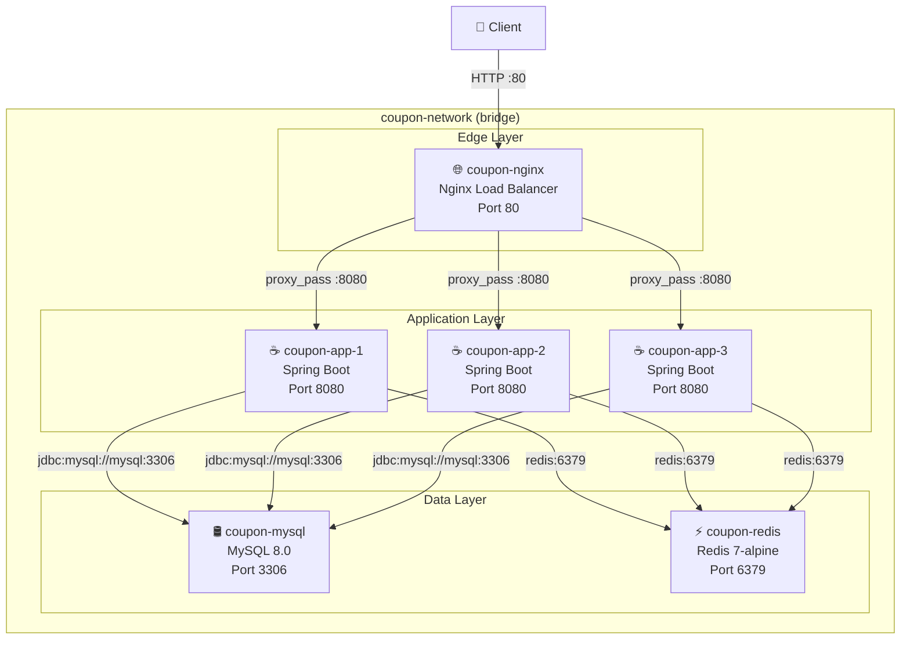
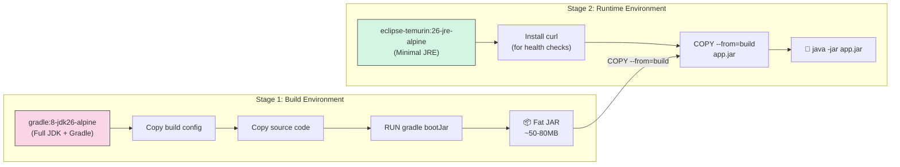
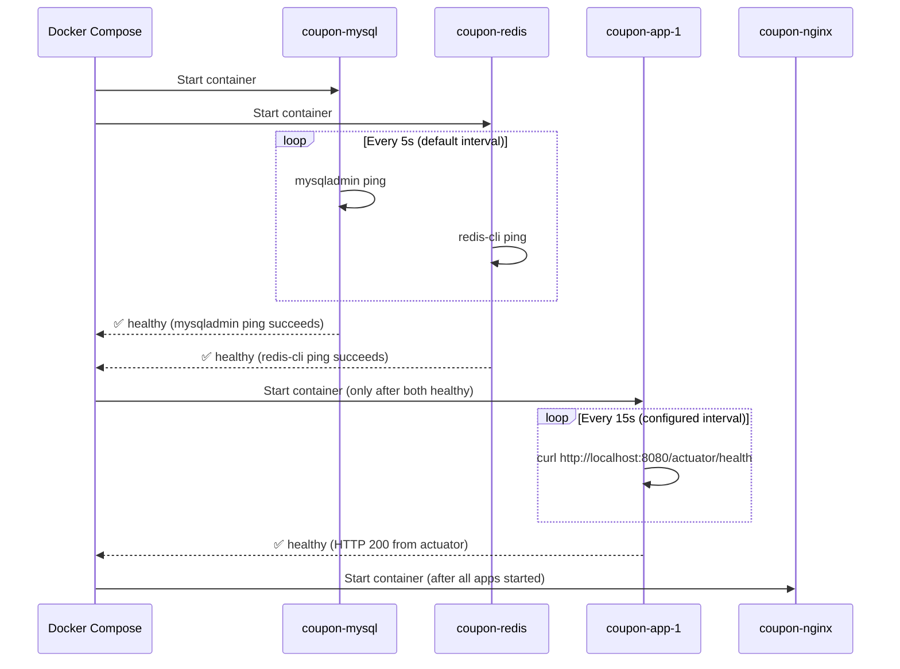
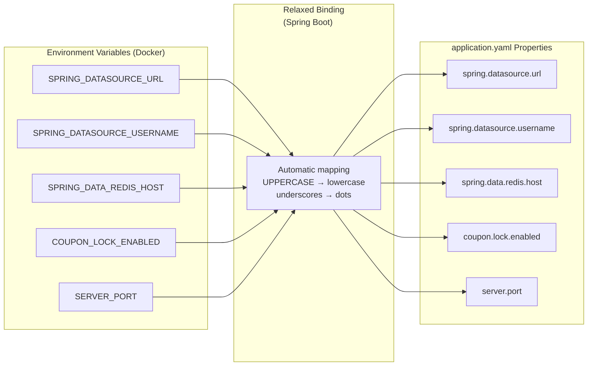
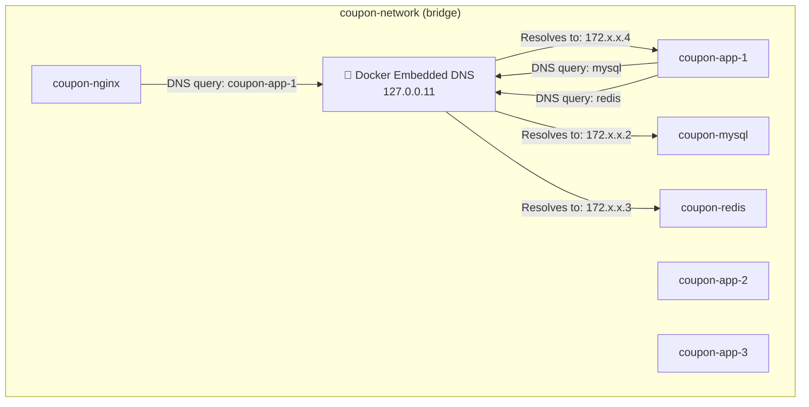
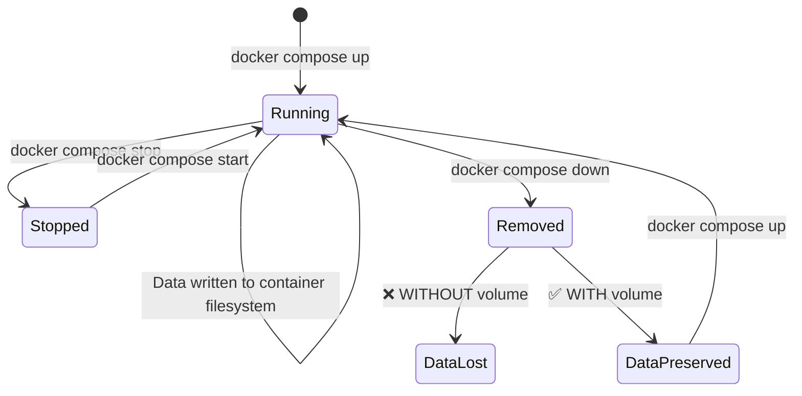
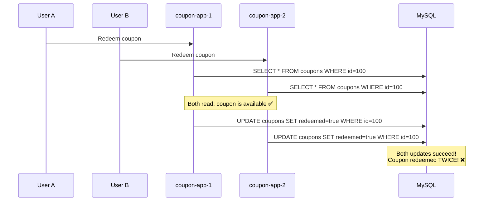
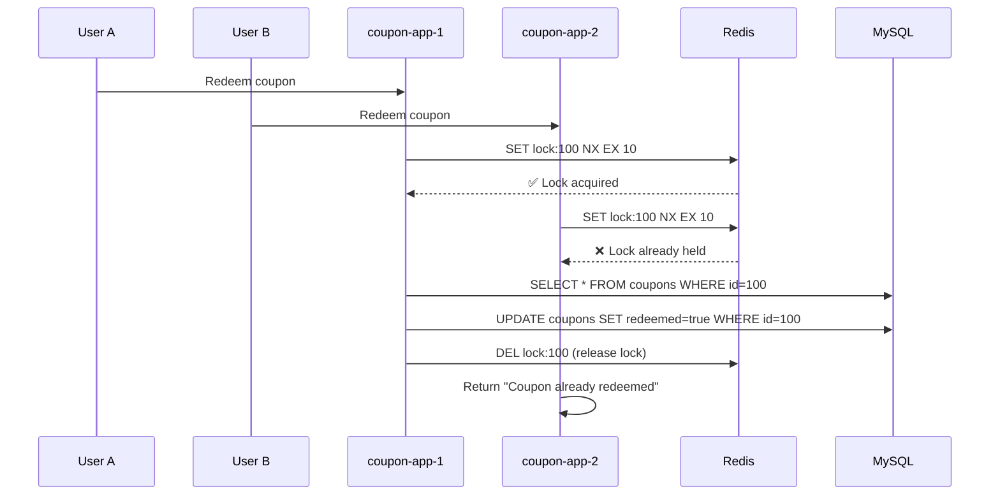

# Docker Compose for Microservices — Orchestrating a 6-Service Coupon System

> **Complete Tutorial** | 🕐 Estimated Reading Time: 40 minutes | 📊 Difficulty: Intermediate

---

## Table of Contents

1. [Introduction / Overview](#1-introduction--overview)
2. [Prerequisites](#2-prerequisites)
3. [Learning Objectives](#3-learning-objectives)
4. [The 6-Service Architecture — Six Containers, One Network](#4-the-6-service-architecture--six-containers-one-network)
5. [The Dockerfile — Multi-Stage Build](#5-the-dockerfile--multi-stage-build)
6. [Docker Compose — Full Configuration](#6-docker-compose--full-configuration)
7. [Deep Dive: Each Docker Concept](#7-deep-dive-each-docker-concept)
   - [7.1 Service Dependencies with Health Checks](#71-service-dependencies-with-health-checks)
   - [7.2 Health Check Strategies](#72-health-check-strategies)
   - [7.3 Environment Variable Configuration](#73-environment-variable-configuration)
   - [7.4 Container Networking — DNS Resolution](#74-container-networking--dns-resolution)
   - [7.5 Volumes — Data Persistence](#75-volumes--data-persistence)
8. [Running the System](#8-running-the-system)
9. [Service Configuration Comparison](#9-service-configuration-comparison)
10. [Toggling the Distributed Lock](#10-toggling-the-distributed-lock)
11. [Docker Commands Reference](#11-docker-commands-reference)
12. [Real-World Use Cases](#12-real-world-use-cases)
13. [Best Practices](#13-best-practices)
14. [Anti-Patterns](#14-anti-patterns)
15. [Performance Considerations](#15-performance-considerations)
16. [Security Considerations](#16-security-considerations)
17. [Testing Strategies](#17-testing-strategies)
18. [Migration Guide — From Manual Docker to Compose](#18-migration-guide--from-manual-docker-to-compose)
19. [Troubleshooting / Common Pitfalls](#19-troubleshooting--common-pitfalls)
20. [Summary / Key Takeaways](#20-summary--key-takeaways)
21. [Practice Exercises with Solutions](#21-practice-exercises-with-solutions)
22. [Test Your Understanding](#22-test-your-understanding)
23. [Common Interview Questions](#23-common-interview-questions)
24. [Question Bank for Knowledge Reinforcement](#24-question-bank-for-knowledge-reinforcement)
25. [Further Reading / Resources](#25-further-reading--resources)
26. [Self-Assessment Checklist](#26-self-assessment-checklist)

---

## 1. Introduction / Overview

Imagine you're running a coupon redemption system in production. Your architecture needs:

- **MySQL** to store coupon data and redemption records
- **Redis** for caching and distributed locking
- **Three Spring Boot instances** to handle concurrent traffic
- **Nginx** to load balance across those instances

That's **six services** that must work together seamlessly. Now imagine trying to start them all manually — opening six terminals, running six commands, remembering the right flags, and hoping the startup order works out. Then imagine your database container crashes and you lose all your data because you forgot a volume.

This is the problem **Docker Compose** solves.

> 💡 **The Core Idea:** Docker Compose transforms a complex 6-service microservices architecture into a **single-command setup**. One file defines everything — images, networks, volumes, health checks, and dependencies. One command starts it all.

The coupon redemption system we'll explore runs six services in production:

| Service | Container Name | Purpose |
|---------|---------------|---------|
| MySQL | `coupon-mysql` | Primary database for coupon data |
| Redis | `coupon-redis` | Caching + distributed locking |
| Spring Boot Instance 1 | `coupon-app-1` | Application logic |
| Spring Boot Instance 2 | `coupon-app-2` | Application logic |
| Spring Boot Instance 3 | `coupon-app-3` | Application logic |
| Nginx | `coupon-nginx` | Load balancer / reverse proxy |

This tutorial covers every Docker concept the project demonstrates:

- 🏗️ **Building efficient container images** with multi-stage Dockerfiles
- 🩺 **Orchestrating dependent services** with health checks
- 🔧 **Wiring environment variables** using Spring Boot's relaxed binding
- 🌐 **Container networking** with Docker's internal DNS
- 💾 **Persistent volumes** for data durability
- 🐛 **Practical debugging commands**

By the end, you'll understand not just *how* to write a `docker-compose.yml` file, but *why* each piece exists and how they work together to create a production-grade orchestration setup.

---

## 2. Prerequisites

Before diving into this tutorial, you should have:

### Technical Prerequisites

| Prerequisite | Level Required | Notes |
|-------------|---------------|-------|
| Docker | Basic | Install Docker Desktop (Windows/Mac) or Docker Engine (Linux) |
| Docker Compose | Basic | Included with Docker Desktop; standalone install on Linux |
| Java / Spring Boot | Intermediate | Understanding of `application.yaml`, Spring Boot annotations |
| MySQL | Basic | Understanding of databases, schemas, users |
| Redis | Basic | Understanding of caching concepts, `redis-cli` |
| Nginx | Basic | Understanding of reverse proxy / load balancing concepts |
| YAML | Basic | Understanding of YAML syntax and indentation |

### Environment Setup

```bash
# Verify Docker is installed
docker --version

# Verify Docker Compose is installed
docker compose version

# Verify Docker daemon is running
docker info
```

> ⚠️ **Note:** Docker Compose V2 (the `docker compose` command with a space) is the modern standard. The legacy `docker-compose` (hyphenated) is deprecated. This tutorial uses V2 syntax throughout.

### Conceptual Prerequisites

- **What is containerization?** — Understanding that containers package an application with its dependencies
- **What is a microservice?** — Understanding the pattern of splitting an application into independently deployable services
- **What is a load balancer?** — Understanding how traffic is distributed across multiple instances

---

## 3. Learning Objectives

By the end of this tutorial, you will be able to:

| # | Objective | Skill Level |
|---|-----------|-------------|
| 1 | Explain the architecture of a multi-service Docker Compose setup | 🟢 Understand |
| 2 | Write a multi-stage Dockerfile that separates build from runtime | 🟡 Apply |
| 3 | Configure `depends_on` with `condition: service_healthy` for ordered startup | 🟡 Apply |
| 4 | Implement health checks with `start_period` for graceful startup | 🟡 Apply |
| 5 | Wire environment variables using Spring Boot's relaxed binding | 🟡 Apply |
| 6 | Explain Docker's internal DNS resolution on bridge networks | 🟢 Understand |
| 7 | Configure named volumes for data persistence | 🟡 Apply |
| 8 | Use bind mounts for initialization scripts | 🟡 Apply |
| 9 | Run and debug a multi-service system with Docker Compose commands | 🟡 Apply |
| 10 | Toggle application features (like distributed locks) via environment variables | 🟢 Understand |
| 11 | Diagnose and troubleshoot common Docker Compose issues | 🟠 Analyze |
| 12 | Apply security and performance best practices to Compose configurations | 🟠 Analyze |

---

## 4. The 6-Service Architecture — Six Containers, One Network

The coupon redemption system is a classic example of a **containerized microservices architecture**. Let's visualize how all six services fit together.



### Key Architectural Insights

**1. Service Discovery via DNS**

Each service has a container name that resolves via Docker's internal DNS:

| Container Name | Service | Internal DNS Name |
|---------------|---------|-------------------|
| `coupon-mysql` | MySQL server | `mysql` |
| `coupon-redis` | Redis server | `redis` |
| `coupon-app-1` | Spring Boot instance 1 | `coupon-app-1` |
| `coupon-app-2` | Spring Boot instance 2 | `coupon-app-2` |
| `coupon-app-3` | Spring Boot instance 3 | `coupon-app-3` |
| `coupon-nginx` | Nginx load balancer | `nginx` |

> 💡 **Key Insight:** Inside the Docker network, services reference each other by **service name**, not IP address. This is Docker's built-in service discovery. The application uses `jdbc:mysql://mysql:3306/coupon_db` — not `localhost` and not a hardcoded IP.

**2. Port Mapping Strategy**

| Container | Internal Port | Host Port | Purpose |
|-----------|--------------|-----------|---------|
| MySQL | 3306 | 3306 | Direct DB access for debugging |
| Redis | 6379 | 6379 | Direct Redis access for debugging |
| Spring Boot apps | 8080 | 8081, 8082, 8083 | Host access to individual instances |
| Nginx | 80 | 80 | Public entry point |

> ⚠️ **Note:** The three Spring Boot instances map to host ports 8081, 8082, and 8083 — but internally they all run on port 8080. This is a common pattern: the host port is unique per instance, but the container port stays consistent.

**3. Traffic Flow**

```
Client → Nginx (port 80) → Spring Boot instances (port 8080) → MySQL (3306) / Redis (6379)
```

The client only ever talks to Nginx. Nginx distributes requests across the three Spring Boot instances. Each Spring Boot instance talks to MySQL and Redis.

---

## 5. The Dockerfile — Multi-Stage Build

The heart of efficient containerization is the **multi-stage Dockerfile**. Let's examine the one used for the Spring Boot application.

### The Complete Dockerfile

```dockerfile
# Stage 1: Build the application
FROM gradle:8-jdk26-alpine AS build
WORKDIR /app
COPY build.gradle settings.gradle ./
COPY gradle ./gradle
COPY src ./src
RUN gradle bootJar --no-daemon

# Stage 2: Minimal runtime image
FROM eclipse-temurin:26-jre-alpine
RUN apk add --no-cache curl
WORKDIR /app
COPY --from=build /app/build/libs/*.jar app.jar
EXPOSE 8080
ENTRYPOINT ["java", "-jar", "app.jar"]
```

### Why Multi-Stage?



### Stage 1 — Build

```dockerfile
FROM gradle:8-jdk26-alpine AS build
```

- Uses `gradle:8-jdk26-alpine` — a **complete build environment** with Gradle and JDK 26
- This image includes the compiler, build tools, and everything needed to compile Java code

```dockerfile
WORKDIR /app
COPY build.gradle settings.gradle ./
COPY gradle ./gradle
COPY src ./src
```

- Copies only the files Gradle needs: build configuration + source code
- The `gradle` directory contains the Gradle wrapper files

```dockerfile
RUN gradle bootJar --no-daemon
```

- Runs the Gradle `bootJar` task to produce a **fat JAR** (executable JAR with embedded Tomcat)
- `--no-daemon` prevents a long-running Gradle daemon process in the build container

### Stage 2 — Runtime

```dockerfile
FROM eclipse-temurin:26-jre-alpine
```

- Uses `eclipse-temurin:26-jre-alpine` — a **minimal JRE** (no compiler, no build tools)
- Alpine Linux base keeps the image small

```dockerfile
RUN apk add --no-cache curl
```

- Installs `curl` for Docker health checks (~1MB)
- The `--no-cache` flag prevents caching of package indexes, keeping the image lean

```dockerfile
COPY --from=build /app/build/libs/*.jar app.jar
```

- Copies **only the JAR** from the build stage
- All build tools (Gradle, JDK compiler) are discarded

```dockerfile
EXPOSE 8080
ENTRYPOINT ["java", "-jar", "app.jar"]
```

- `EXPOSE` documents the port (doesn't actually publish it)
- `ENTRYPOINT` defines the command that runs when the container starts

### Image Size Comparison

| Approach | Image Size | Why |
|----------|-----------|-----|
| Single-stage (JDK + build tools) | ~800MB | Includes compiler, Gradle, all build dependencies |
| Multi-stage (JRE only) | ~180MB | Only runtime JRE + application JAR + curl |

> 💡 **Key Insight:** The multi-stage build reduces the image size by **~77%** — from ~800MB to ~180MB. This means faster pulls, faster deployments, and less disk usage across your infrastructure.

### The `.dockerignore` File

```dockerignore
.git
.gitattributes
.gitignore
.gradle
build
*.md
.DS_Store
```

> ⚠️ **Why this matters:** Without `.dockerignore`, Docker sends the **entire project directory** (including `.git`, `build`, `node_modules`) to the Docker daemon as the **build context**. This slows down builds and can accidentally include sensitive files.

| File/Directory | Why Exclude |
|---------------|-------------|
| `.git` | Version control history — large, unnecessary for build |
| `.gradle` | Gradle cache — machine-specific |
| `build` | Build output — regenerated during build |
| `*.md` | Documentation — not needed at runtime |
| `.DS_Store` | macOS metadata files |

---

## 6. Docker Compose — Full Configuration

Now let's examine the complete `docker-compose.yml` file that orchestrates all six services.

```yaml
services:
  mysql:
    image: mysql:8.0
    container_name: coupon-mysql
    environment:
      MYSQL_ROOT_PASSWORD: root
      MYSQL_DATABASE: coupon_db
      MYSQL_USER: coupon_user
      MYSQL_PASSWORD: coupon_pass
    ports:
      - "3306:3306"
    volumes:
      - mysql_data:/var/lib/mysql
      - ./mysql-init:/docker-entrypoint-initdb.d
    networks:
      - coupon-network
    healthcheck:
      test: ["CMD", "mysqladmin", "ping", "-h", "localhost"]
      timeout: 20s
      retries: 10

  redis:
    image: redis:7-alpine
    container_name: coupon-redis
    ports:
      - "6379:6379"
    volumes:
      - redis_data:/data
    networks:
      - coupon-network
    healthcheck:
      test: ["CMD", "redis-cli", "ping"]
      timeout: 10s
      retries: 5

  coupon-app-1:
    build:
      context: ./coupon-service
      dockerfile: Dockerfile
    container_name: coupon-app-1
    environment:
      SPRING_APPLICATION_NAME: coupon-app-1
      SPRING_DATASOURCE_URL: jdbc:mysql://mysql:3306/coupon_db
      SPRING_DATASOURCE_USERNAME: coupon_user
      SPRING_DATASOURCE_PASSWORD: coupon_pass
      SPRING_DATA_REDIS_HOST: redis
      SPRING_DATA_REDIS_PORT: 6379
      COUPON_LOCK_ENABLED: "true"
      COUPON_INSTANCE_NAME: coupon-app-1
      SERVER_PORT: 8080
    ports:
      - "8081:8080"
    depends_on:
      mysql:
        condition: service_healthy
      redis:
        condition: service_healthy
    healthcheck:
      test: ["CMD", "curl", "-f", "http://localhost:8080/actuator/health"]
      interval: 15s
      timeout: 5s
      retries: 10
      start_period: 60s

  coupon-app-2:
    build:
      context: ./coupon-service
      dockerfile: Dockerfile
    container_name: coupon-app-2
    environment:
      SPRING_APPLICATION_NAME: coupon-app-2
      SPRING_DATASOURCE_URL: jdbc:mysql://mysql:3306/coupon_db
      SPRING_DATASOURCE_USERNAME: coupon_user
      SPRING_DATASOURCE_PASSWORD: coupon_pass
      SPRING_DATA_REDIS_HOST: redis
      SPRING_DATA_REDIS_PORT: 6379
      COUPON_LOCK_ENABLED: "true"
      COUPON_INSTANCE_NAME: coupon-app-2
      SERVER_PORT: 8080
    ports:
      - "8082:8080"
    depends_on:
      mysql:
        condition: service_healthy
      redis:
        condition: service_healthy
    healthcheck:
      test: ["CMD", "curl", "-f", "http://localhost:8080/actuator/health"]
      interval: 15s
      timeout: 5s
      retries: 10
      start_period: 60s

  coupon-app-3:
    build:
      context: ./coupon-service
      dockerfile: Dockerfile
    container_name: coupon-app-3
    environment:
      SPRING_APPLICATION_NAME: coupon-app-3
      SPRING_DATASOURCE_URL: jdbc:mysql://mysql:3306/coupon_db
      SPRING_DATASOURCE_USERNAME: coupon_user
      SPRING_DATASOURCE_PASSWORD: coupon_pass
      SPRING_DATA_REDIS_HOST: redis
      SPRING_DATA_REDIS_PORT: 6379
      COUPON_LOCK_ENABLED: "true"
      COUPON_INSTANCE_NAME: coupon-app-3
      SERVER_PORT: 8080
    ports:
      - "8083:8080"
    depends_on:
      mysql:
        condition: service_healthy
      redis:
        condition: service_healthy
    healthcheck:
      test: ["CMD", "curl", "-f", "http://localhost:8080/actuator/health"]
      interval: 15s
      timeout: 5s
      retries: 10
      start_period: 60s

  nginx:
    build:
      context: ./nginx
      dockerfile: Dockerfile
    container_name: coupon-nginx
    ports:
      - "80:80"
    depends_on:
      - coupon-app-1
      - coupon-app-2
      - coupon-app-3

volumes:
  mysql_data:
  redis_data:

networks:
  coupon-network:
    driver: bridge
```

### Configuration Breakdown

| Section | Purpose |
|---------|---------|
| `services` | Defines each containerized service |
| `volumes` | Declares named volumes for persistent data |
| `networks` | Defines the bridge network connecting all services |

### Service-by-Service Analysis

**MySQL Service:**
- Uses the official `mysql:8.0` image
- Sets root password, creates `coupon_db` database and `coupon_user` user
- Maps port 3306 for external access
- Uses a named volume for data persistence
- Bind-mounts `./mysql-init` for initialization scripts
- Health check: `mysqladmin ping`

**Redis Service:**
- Uses the lightweight `redis:7-alpine` image
- Maps port 6379
- Uses a named volume for data persistence
- Health check: `redis-cli ping`

**Spring Boot Services (×3):**
- Built from the multi-stage Dockerfile
- Each has a unique `container_name` and host port mapping
- Environment variables configure the application
- `depends_on` with `service_healthy` ensures ordered startup
- Health check: `curl` to actuator endpoint

**Nginx Service:**
- Built from a custom Dockerfile in `./nginx`
- Maps port 80
- Depends on all three app instances

---

## 7. Deep Dive: Each Docker Concept

### 7.1 Service Dependencies with Health Checks

One of the most critical concepts in Docker Compose is **managing service startup order**. Let's explore why simple `depends_on` isn't enough.

```yaml
depends_on:
  mysql:
    condition: service_healthy
  redis:
    condition: service_healthy
```

#### Why Not Just `depends_on: - mysql`?

Without `condition: service_healthy`, Docker Compose starts the app as soon as the MySQL **container starts** — not when MySQL is **ready to accept connections**.

> ⚠️ **The Problem:** MySQL can take 10–30 seconds to initialize on first run. If the Spring Boot app starts before MySQL is ready, the app's connection pool initialization fails, and you get errors like:
> ```
> Communications link failure
> The last packet sent successfully to the server was 0 milliseconds ago.
> ```

#### The Health Check Solution



The health check ensures:

1. ✅ MySQL container starts
2. ✅ `mysqladmin ping` succeeds (MySQL is accepting connections)
3. ✅ Only then does the app container start

#### Health Check Configuration Options

| Option | Default | Description |
|--------|---------|-------------|
| `test` | None (required) | The command to run inside the container |
| `interval` | 30s | How often to run the health check |
| `timeout` | 30s | How long to wait before considering the check failed |
| `retries` | 3 | Consecutive failures before marking unhealthy |
| `start_period` | 0s | Grace period before health checks count as failures |

### 7.2 Health Check Strategies

#### `start_period` — Graceful Startup

```yaml
healthcheck:
  test: ["CMD", "curl", "-f", "http://localhost:8080/actuator/health"]
  interval: 15s
  timeout: 5s
  retries: 10
  start_period: 60s
```

> 💡 **Key Insight:** `start_period: 60s` gives the Spring Boot application up to 60 seconds to start before Docker considers health checks "failed". Without this, a slow startup (JVM warmup, JPA schema generation, connection pool initialization) triggers unnecessary restarts.

**Why Spring Boot needs a long `start_period`:**

| Startup Phase | Typical Duration | What Happens |
|--------------|-----------------|--------------|
| JVM startup | 1-3s | JVM initializes, class loading begins |
| Spring context | 5-15s | Bean creation, auto-configuration |
| JPA schema generation | 2-10s | Hibernate validates/creates tables |
| Connection pool init | 1-5s | HikariCP establishes connections |
| Actuator endpoint ready | 0-2s | Health endpoint becomes available |

**Total: 10-35s** — well within the 60s `start_period`.

#### Health Check Comparison

| Service | Health Check Command | Interval | Timeout | Retries | Start Period |
|---------|---------------------|----------|---------|---------|--------------|
| MySQL | `mysqladmin ping -h localhost` | 30s (default) | 20s | 10 | 0s |
| Redis | `redis-cli ping` | 30s (default) | 10s | 5 | 0s |
| Spring Boot | `curl -f http://localhost:8080/actuator/health` | 15s | 5s | 10 | 60s |

**Why different strategies?**

- **MySQL/Redis:** Fast to start, so no `start_period` needed. But they need more retries because first-time initialization (especially MySQL) can take a while.
- **Spring Boot:** Slow to start (JVM + Spring context), so a generous `start_period` is critical. Once started, health checks run frequently (15s) to detect issues quickly.

### 7.3 Environment Variable Configuration

Spring Boot's **relaxed binding** is a powerful feature that maps environment variables to `application.yaml` properties automatically.

```yaml
environment:
  SPRING_APPLICATION_NAME: coupon-app-1
  SPRING_DATASOURCE_URL: jdbc:mysql://mysql:3306/coupon_db
  SPRING_DATASOURCE_USERNAME: coupon_user
  SPRING_DATASOURCE_PASSWORD: coupon_pass
  SPRING_DATA_REDIS_HOST: redis
  SPRING_DATA_REDIS_PORT: 6379
  COUPON_LOCK_ENABLED: "true"
  COUPON_INSTANCE_NAME: coupon-app-1
  SERVER_PORT: 8080
```

#### How Relaxed Binding Works



#### The Mapping Rules

| Environment Variable | application.yaml Property | Rule Applied |
|---------------------|--------------------------|--------------|
| `SPRING_APPLICATION_NAME` | `spring.application.name` | Uppercase → lowercase, underscore → dot |
| `SPRING_DATASOURCE_URL` | `spring.datasource.url` | Uppercase → lowercase, underscore → dot |
| `SPRING_DATASOURCE_USERNAME` | `spring.datasource.username` | Uppercase → lowercase, underscore → dot |
| `SPRING_DATASOURCE_PASSWORD` | `spring.datasource.password` | Uppercase → lowercase, underscore → dot |
| `SPRING_DATA_REDIS_HOST` | `spring.data.redis.host` | Uppercase → lowercase, underscore → dot |
| `SPRING_DATA_REDIS_PORT` | `spring.data.redis.port` | Uppercase → lowercase, underscore → dot |
| `COUPON_LOCK_ENABLED` | `coupon.lock.enabled` | Uppercase → lowercase, underscore → dot |
| `COUPON_INSTANCE_NAME` | `coupon.instance-name` | Uppercase → lowercase, underscore → dash |
| `SERVER_PORT` | `server.port` | Uppercase → lowercase, underscore → dot |

> 💡 **Key Insight:** This is why the **same JAR** works in development (reading `application.yaml`) and in Docker (reading environment variables) — **no code changes needed**. The environment variables override the YAML defaults at runtime.

#### Example: application.yaml

```yaml
spring:
  application:
    name: coupon-service
  datasource:
    url: jdbc:mysql://localhost:3306/coupon_db
    username: local_user
    password: local_pass
  data:
    redis:
      host: localhost
      port: 6379

coupon:
  lock:
    enabled: true
  instance-name: local-instance

server:
  port: 8080
```

When deployed in Docker, the environment variables **override** these defaults. The same code runs locally against localhost and in Docker against the containerized services.

### 7.4 Container Networking — DNS Resolution

All services share the `coupon-network` bridge network. Docker Compose sets up DNS resolution where each container is reachable by its **service name**.

```yaml
networks:
  coupon-network:
    driver: bridge
```

#### How Docker DNS Works



#### In the Application

| Component | Connection String | Why Not localhost? |
|-----------|------------------|-------------------|
| Database URL | `jdbc:mysql://mysql:3306/coupon_db` | `localhost` inside a container refers to the container itself |
| Redis host | `redis` | Same reason — each container has its own network namespace |
| Nginx upstream | `server coupon-app-1:8080` | Nginx needs to reach the app containers by name |

> ⚠️ **Critical Concept:** Inside a container, `localhost` refers to **that container**, not the host machine. To reach another container, you must use its service name (which Docker DNS resolves to the container's IP on the bridge network).

#### Network Isolation

The bridge network provides **isolation**:

- Containers on `coupon-network` can communicate with each other
- Containers NOT on `coupon-network` cannot reach these services (unless ports are published)
- Published ports (e.g., `8081:8080`) are accessible from the host

### 7.5 Volumes — Data Persistence

Volumes are essential for **data durability** in containerized applications.

```yaml
volumes:
  mysql_data:
  redis_data:

services:
  mysql:
    volumes:
      - mysql_data:/var/lib/mysql
      - ./mysql-init:/docker-entrypoint-initdb.d
```

#### The Persistence Problem



| Scenario | Without Volume | With Volume |
|----------|---------------|-------------|
| Container restart | ✅ Data survives | ✅ Data survives |
| Container rebuild | ❌ Data lost | ✅ Data survives |
| `docker compose down` | ❌ Data lost | ✅ Data survives |
| `docker compose down -v` | ❌ Data lost | ❌ Data lost (volume removed) |

#### Named Volumes vs. Bind Mounts

| Feature | Named Volume | Bind Mount |
|---------|-------------|------------|
| Location | Managed by Docker (`/var/lib/docker/volumes/`) | Any path on host |
| Syntax | `mysql_data:/var/lib/mysql` | `./mysql-init:/docker-entrypoint-initdb.d` |
| Backup | `docker run --rm -v mysql_data:/data alpine tar czf /data/backup.tar.gz` | Standard file backup |
| Use Case | Persistent application data | Configuration, init scripts, source code |
| Performance | Optimized by Docker | Native filesystem performance |

#### MySQL Init Scripts

The `mysql-init` directory is bind-mounted into `/docker-entrypoint-initdb.d`. MySQL executes any `.sql` files in this directory on **first startup**:

```sql
-- mysql-init/init.sql
GRANT ALL PRIVILEGES ON coupon_db.* TO 'coupon_user'@'%';
FLUSH PRIVILEGES;
```

> 💡 **Key Insight:** Init scripts run **only on first startup** (when the data directory is empty). If the volume already has data, these scripts are skipped. This is why the `mysql_data` volume and the init scripts work together: the volume persists data, and the init scripts set up the initial state.

---

## 8. Running the System

Now let's explore all the commands you'll use to manage this system.

### Build and Start

```bash
# Build and start all services
docker compose up --build -d
```

| Flag | Purpose |
|------|---------|
| `--build` | Rebuild images before starting containers |
| `-d` | Detached mode (run in background) |

### Check Status

```bash
# Check status of all services
docker compose ps
```

Example output:
```
NAME            IMAGE                    COMMAND                  SERVICE        STATUS              PORTS
coupon-mysql    mysql:8.0                "docker-entrypoint.s…"   mysql          running (healthy)   0.0.0.0:3306->3306/tcp
coupon-redis    redis:7-alpine           "docker-entrypoint.s…"   redis          running (healthy)   0.0.0.0:6379->6379/tcp
coupon-app-1    coupon-service           "java -jar app.jar"      coupon-app-1   running (healthy)   0.0.0.0:8081->8080/tcp
coupon-app-2    coupon-service           "java -jar app.jar"      coupon-app-2   running (healthy)   0.0.0.0:8082->8080/tcp
coupon-app-3    coupon-service           "java -jar app.jar"      coupon-app-3   running (healthy)   0.0.0.0:8083->8080/tcp
coupon-nginx    coupon-nginx             "nginx -g 'daemon of…"   nginx          running             0.0.0.0:80->80/tcp
```

### View Logs

```bash
# View logs for all services
docker compose logs -f

# View logs for a specific service
docker compose logs -f coupon-app-1
```

| Flag | Purpose |
|------|---------|
| `-f` | Follow (stream) logs in real-time |

### Execute Commands in Containers

```bash
# Connect to MySQL
docker exec -it coupon-mysql mysql -u coupon_user -p coupon_db

# Connect to Redis
docker exec -it coupon-redis redis-cli
```

| Flag | Purpose |
|------|---------|
| `-i` | Interactive (keep STDIN open) |
| `-t` | Allocate a pseudo-TTY |

### Stop and Clean Up

```bash
# Stop all services (containers remain)
docker compose down

# Stop and remove volumes (clean database)
docker compose down -v

# Rebuild a specific service
docker compose up --build -d coupon-app-1
```

| Command | What It Does | Data Impact |
|---------|-------------|-------------|
| `docker compose stop` | Stops containers | ✅ Data preserved |
| `docker compose down` | Stops and removes containers + network | ✅ Data preserved (volumes remain) |
| `docker compose down -v` | Stops, removes containers + network + volumes | ❌ Data deleted |

---

## 9. Service Configuration Comparison

Each Spring Boot instance is **identical except for two environment variables**:

| Configuration | coupon-app-1 | coupon-app-2 | coupon-app-3 |
|--------------|-------------|-------------|-------------|
| `SPRING_APPLICATION_NAME` | `coupon-app-1` | `coupon-app-2` | `coupon-app-3` |
| `COUPON_INSTANCE_NAME` | `coupon-app-1` | `coupon-app-2` | `coupon-app-3` |
| Host port | 8081 | 8082 | 8083 |
| Container port | 8080 | 8080 | 8080 |
| Dockerfile | Same | Same | Same |
| JAR | Same | Same | Same |
| Database URL | Same | Same | Same |
| Redis host | Same | Same | Same |

> 💡 **Key Insight:** Same Dockerfile, same JAR, different configuration. This is the essence of **containerized microservices** — one build artifact, many runtime configurations.

### Why Three Instances?

The three instances provide:

1. **High Availability** — If one instance crashes, the other two continue serving traffic
2. **Load Distribution** — Nginx distributes requests across all three
3. **Zero-Downtime Deployments** — Update instances one at a time
4. **Race Condition Demonstration** — Multiple instances competing for the same coupon redemption

---

## 10. Toggling the Distributed Lock

The coupon system uses a **distributed lock** to prevent race conditions when multiple users try to redeem the same coupon simultaneously.

### The Race Condition Problem



### The Lock Solution

With the distributed lock enabled (`COUPON_LOCK_ENABLED=true`), Redis coordinates access:



### Toggling the Lock

```yaml
# docker-compose.yml
services:
  coupon-app-1:
    environment:
      COUPON_LOCK_ENABLED: "false"  # Disable lock on this instance
```

Or without editing the file:

```bash
COUPON_LOCK_ENABLED=false docker compose up -d coupon-app-1
```

> 💡 **Key Insight:** When lock is disabled, the `NoLockStrategy` is used (always returns `true`). The application runs the **same code path** — but without coordination. Race conditions become visible immediately.

### Lock Strategy Comparison

| Strategy | Lock Enabled | Lock Disabled |
|----------|-------------|---------------|
| Class | `RedisLockStrategy` | `NoLockStrategy` |
| Behavior | Acquires Redis lock before redemption | Always returns `true` (no lock) |
| Race conditions | ✅ Prevented | ❌ Possible |
| Performance | Slight overhead (Redis round-trip) | No overhead |
| Use case | Production | Testing, demonstration |

---

## 11. Docker Commands Reference

Here's a complete reference of Docker commands used throughout this tutorial:

| Command | Purpose |
|---------|---------|
| `docker compose up --build -d` | Build and start all services in background |
| `docker compose ps` | Show status of all services |
| `docker compose logs -f` | Stream logs from all services |
| `docker compose logs -f coupon-app-1` | Stream logs from a specific service |
| `docker exec -it coupon-mysql mysql -u coupon_user -p coupon_db` | Open MySQL shell |
| `docker exec -it coupon-redis redis-cli` | Open Redis CLI |
| `docker compose down` | Stop and remove containers + network |
| `docker compose down -v` | Stop, remove containers + network + volumes |
| `docker compose up --build -d coupon-app-1` | Rebuild and restart a specific service |
| `docker compose config` | Validate and view the resolved configuration |
| `docker compose top` | Show running processes in containers |
| `docker inspect coupon-app-1` | View detailed container information |
| `docker network inspect coupon-network` | View network details and connected containers |
| `docker volume ls` | List all volumes |
| `docker image ls` | List all images |

---

## 12. Real-World Use Cases

The patterns demonstrated in this coupon system apply to many real-world scenarios:

### 1. E-Commerce Checkout System

```
Client → Nginx → 3× Checkout Service → PostgreSQL + Redis
```

- **Similarities:** Multiple app instances, load balancer, database, cache
- **Key difference:** Payment processing adds external API calls

### 2. Content Management Platform

```
Client → Nginx → 3× CMS API → MongoDB + Elasticsearch
```

- **Similarities:** Multi-instance stateless services behind a load balancer
- **Key difference:** Search service adds complexity

### 3. Real-Time Notification Service

```
Client → Nginx → 3× Notification Service → RabbitMQ + Redis
```

- **Similarities:** Service orchestration, health checks, environment config
- **Key difference:** Message queue replaces direct database dependency

### 4. Analytics Pipeline

```
Ingest → 3× Analytics Service → ClickHouse + Redis
```

- **Similarities:** Multi-instance processing, data layer separation
- **Key difference:** Batch vs. real-time processing considerations

### 5. SaaS Multi-Tenant Application

```
Client → Nginx → 3× API Service → MySQL (per-tenant schemas) + Redis
```

- **Similarities:** Load balancing, database, caching
- **Key difference:** Tenant isolation adds security complexity

### When to Use Docker Compose vs. Alternatives

| Scenario | Docker Compose | Kubernetes | Docker Swarm |
|----------|---------------|------------|--------------|
| Local development | ✅ Best choice | ❌ Overkill | ❌ Overkill |
| Small production (1-10 services) | ✅ Good choice | ⚠️ Possible | ✅ Good choice |
| Large production (10+ services) | ❌ Limited scaling | ✅ Best choice | ⚠️ Limited |
| Auto-scaling | ❌ Not supported | ✅ Native | ⚠️ Limited |
| Self-healing | ⚠️ Basic (restart policies) | ✅ Advanced | ✅ Good |
| Rolling updates | ⚠️ Manual | ✅ Native | ✅ Native |
| Learning curve | 🟢 Low | 🔴 High | 🟡 Medium |

---

## 13. Best Practices

### Dockerfile Best Practices

✅ **Use multi-stage builds** — Separate build from runtime to minimize image size

```dockerfile
# ✅ GOOD: Multi-stage build
FROM gradle:8-jdk26-alpine AS build
# ... build steps ...
FROM eclipse-temurin:26-jre-alpine
COPY --from=build /app/build/libs/*.jar app.jar
```

```dockerfile
# ❌ BAD: Single-stage build (bloated image)
FROM gradle:8-jdk26-alpine
# ... build steps ...
# Runtime image includes JDK, Gradle, build tools — ~800MB
```

✅ **Use `.dockerignore`** — Keep build context lean and avoid sending sensitive files

✅ **Pin image versions** — Use `mysql:8.0` not `mysql:latest`

```yaml
# ✅ GOOD: Pinned version
image: mysql:8.0

# ❌ BAD: Floating tag
image: mysql:latest
```

✅ **Use Alpine variants where possible** — Smaller images, faster pulls

✅ **Install only what's needed at runtime** — `curl` for health checks, nothing else

### Docker Compose Best Practices

✅ **Use health checks with `start_period`** — Especially for slow-starting applications

✅ **Use `condition: service_healthy`** — Not just `depends_on` for critical dependencies

✅ **Use named volumes for persistent data** — Never store database data in container filesystem

✅ **Use environment variables for configuration** — Never hardcode values in the application

✅ **Use custom networks** — Don't rely on the default network; define explicit networks

✅ **Set `container_name` explicitly** — Makes debugging and `docker exec` easier

✅ **Use `restart` policies** — Add resilience for production:

```yaml
services:
  coupon-app-1:
    restart: unless-stopped
```

✅ **Validate configuration** — Always run `docker compose config` to validate

### Environment Variable Best Practices

✅ **Use Spring Boot relaxed binding** — Environment variables map to properties automatically

✅ **Quote boolean values** — `"true"` not `true` (YAML might parse as boolean)

✅ **Group related variables** — Use YAML anchors for repeated configuration:

```yaml
x-app-environment: &app-environment
  SPRING_DATASOURCE_URL: jdbc:mysql://mysql:3306/coupon_db
  SPRING_DATASOURCE_USERNAME: coupon_user
  SPRING_DATASOURCE_PASSWORD: coupon_pass
  SPRING_DATA_REDIS_HOST: redis
  SPRING_DATA_REDIS_PORT: 6379

services:
  coupon-app-1:
    environment:
      <<: *app-environment
      COUPON_INSTANCE_NAME: coupon-app-1
```

---

## 14. Anti-Patterns

### ❌ Anti-Pattern 1: Ignoring Health Checks

```yaml
# ❌ BAD: No health checks
services:
  mysql:
    image: mysql:8.0
  coupon-app-1:
    build: ./coupon-service
    depends_on:
      - mysql
```

**Problem:** The app starts before MySQL is ready → connection failures, crashes, flaky behavior.

**Solution:** Add health checks and use `condition: service_healthy`.

### ❌ Anti-Pattern 2: Storing Data in Container Filesystem

```yaml
# ❌ BAD: No volume for database
services:
  mysql:
    image: mysql:8.0
```

**Problem:** All data is lost when the container is removed. `docker compose down` destroys everything.

**Solution:** Use named volumes.

### ❌ Anti-Pattern 3: Hardcoding IP Addresses

```yaml
# ❌ BAD: Hardcoded IP
environment:
  SPRING_DATASOURCE_URL: jdbc:mysql://172.18.0.2:3306/coupon_db
```

**Problem:** IPs change when containers restart or the network is recreated.

**Solution:** Use service names — Docker DNS handles resolution.

### ❌ Anti-Pattern 4: Using `latest` Tags

```yaml
# ❌ BAD: Unpinned version
image: mysql:latest
```

**Problem:** Non-reproducible builds. A `latest` tag can change at any time, breaking your system.

**Solution:** Pin specific versions.

### ❌ Anti-Pattern 5: Exposing All Ports to Host

```yaml
# ❌ BAD: Exposing internal ports unnecessarily
services:
  mysql:
    ports:
      - "3306:3306"
  redis:
    ports:
      - "6379:6379"
```

**Problem:** Unnecessary attack surface. Internal services don't need host port exposure.

**Solution:** Only expose ports that need external access (e.g., Nginx port 80). For debugging, use `docker exec` instead.

### ❌ Anti-Pattern 6: Putting Secrets in Compose Files

```yaml
# ❌ BAD: Plaintext secrets
environment:
  MYSQL_ROOT_PASSWORD: root
  SPRING_DATASOURCE_PASSWORD: coupon_pass
```

**Problem:** Secrets are visible in the file, in version control, and in `docker inspect` output.

**Solution:** Use environment files (`.env`), Docker secrets, or a secrets manager.

### ❌ Anti-Pattern 7: One Giant Compose File

```yaml
# ❌ BAD: Everything in one file
services:
  mysql: ...
  redis: ...
  coupon-app-1: ...
  coupon-app-2: ...
  coupon-app-3: ...
  nginx: ...
  monitoring: ...
  logging: ...
  # 20 more services...
```

**Problem:** Hard to maintain, hard to scale, hard to understand.

**Solution:** Split into multiple compose files (e.g., `docker-compose.yml` for core, `docker-compose.monitoring.yml` for observability) and use `docker compose -f` to combine them.

### ❌ Anti-Pattern 8: No Restart Policy

```yaml
# ❌ BAD: No restart policy
services:
  coupon-app-1:
    build: ./coupon-service
```

**Problem:** If the app crashes, it stays down until manually restarted.

**Solution:** Add `restart: unless-stopped` or `restart: on-failure`.

---

## 15. Performance Considerations

### Image Size Optimization

| Strategy | Impact | Example |
|----------|--------|---------|
| Multi-stage builds | ~77% reduction | 800MB → 180MB |
| Alpine base images | ~50% reduction vs. full distros | `eclipse-temurin:26-jre-alpine` vs. `eclipse-temurin:26-jre` |
| Minimal runtime deps | ~1MB per tool | Only install `curl`, not a full shell toolkit |
| `.dockerignore` | Faster builds | Smaller build context = faster transfer |

### Startup Performance

| Factor | Impact | Optimization |
|--------|--------|-------------|
| JVM warmup | 1-3s | Use `-XX:TieredStopAtLevel=1` for faster startup (dev only) |
| Spring context | 5-15s | Lazy initialization (`spring.main.lazy-initialization=true`) |
| JPA schema generation | 2-10s | Use `validate` mode in production instead of `create`/`update` |
| Connection pool | 1-5s | Configure `spring.datasource.hikari.initialization-fail-timeout` |

### Runtime Performance

| Consideration | Best Practice |
|--------------|---------------|
| Resource limits | Set `mem_limit` and `cpus` for each service |
| Log rotation | Configure `logging.driver` with rotation options |
| Health check frequency | Balance between detection speed and overhead |
| Network | Use bridge networks (default) — avoid `host` unless necessary |

```yaml
# Resource limits example
services:
  coupon-app-1:
    deploy:
      resources:
        limits:
          cpus: "1.0"
          memory: 512M
        reservations:
          cpus: "0.5"
          memory: 256M
```

### Health Check Overhead

| Service | Check Frequency | Overhead |
|---------|----------------|----------|
| MySQL | Every 30s | Negligible (`mysqladmin ping` is lightweight) |
| Redis | Every 30s | Negligible (`redis-cli ping` is lightweight) |
| Spring Boot | Every 15s | Small HTTP request to actuator endpoint |

> 💡 **Key Insight:** Health checks add minimal overhead but provide critical orchestration value. The trade-off is worth it.

---

## 16. Security Considerations

### Secrets Management

> ⚠️ **Warning:** The example uses plaintext passwords (`root`, `coupon_pass`). This is acceptable for **local development** but **never** for production.

**Production-grade approaches:**

| Approach | Description | Complexity |
|----------|-------------|------------|
| `.env` file | Store secrets in `.env` (gitignored), reference with `${VAR}` | 🟢 Low |
| Docker secrets | Native Docker secrets for Swarm mode | 🟡 Medium |
| Vault / HashiCorp | External secrets management | 🔴 High |
| Cloud secret managers | AWS Secrets Manager, GCP Secret Manager, Azure Key Vault | 🔴 High |

```yaml
# Using .env file (gitignored)
services:
  mysql:
    environment:
      MYSQL_ROOT_PASSWORD: ${MYSQL_ROOT_PASSWORD}
      MYSQL_DATABASE: ${MYSQL_DATABASE}
```

### Network Security

| Practice | Implementation |
|----------|---------------|
| Minimize exposed ports | Only expose Nginx (port 80) to the host |
| Use internal networks | Separate networks for internal vs. external services |
| Network isolation | Don't put all services on the default network |
| Firewall rules | Restrict host port access at the firewall level |

### Image Security

| Practice | Implementation |
|----------|---------------|
| Use official images | `mysql:8.0`, `redis:7-alpine` from Docker Hub |
| Pin versions | Avoid `latest` tags |
| Scan images | `docker scan` or Trivy, Clair, Anchore |
| Minimal base images | Alpine variants reduce attack surface |
| Run as non-root | Create a non-root user in the Dockerfile |

```dockerfile
# ✅ GOOD: Run as non-root
FROM eclipse-temurin:26-jre-alpine
RUN addgroup -S appgroup && adduser -S appuser -G appgroup
USER appuser
COPY --from=build /app/build/libs/*.jar app.jar
ENTRYPOINT ["java", "-jar", "app.jar"]
```

### Container Security

| Practice | Implementation |
|----------|---------------|
| Read-only filesystem | `read_only: true` in compose |
| Drop capabilities | `cap_drop: [ALL]` |
| No privileged mode | Never use `privileged: true` |
| Resource limits | Prevent DoS via memory/CPU exhaustion |

```yaml
services:
  coupon-app-1:
    read_only: true
    cap_drop:
      - ALL
    security_opt:
      - no-new-privileges:true
```

### Database Security

| Practice | Implementation |
|----------|---------------|
| Strong passwords | Never use `root`/`root` in production |
| Least privilege | Create dedicated users with minimal permissions |
| Network isolation | Don't expose MySQL port to the host |
| Encryption | Enable TLS for database connections |
| Backups | Regular automated backups of volumes |

---

## 17. Testing Strategies

### Health Check Validation

```bash
# Verify all services are healthy
docker compose ps

# Check a specific service's health
docker inspect --format='{{.State.Health.Status}}' coupon-app-1
```

### Integration Testing

```bash
# Test the full stack
curl http://localhost:80/api/coupons/1

# Test individual instances
curl http://localhost:8081/actuator/health
curl http://localhost:8082/actuator/health
curl http://localhost:8083/actuator/health
```

### Load Testing

```bash
# Simple load test with curl (sequential)
for i in $(seq 1 100); do
  curl -s http://localhost:80/api/coupons/1/redeem > /dev/null
done

# Using a proper load testing tool (e.g., Apache Bench)
ab -n 1000 -c 100 http://localhost:80/api/coupons/1
```

### Race Condition Testing

```bash
# Disable the lock on one instance
COUPON_LOCK_ENABLED=false docker compose up -d coupon-app-1

# Send concurrent requests
# Use a tool like `hey` or a simple script
for i in $(seq 1 10); do
  curl -s http://localhost:80/api/coupons/1/redeem &
done
wait
```

### Test Matrix

| Test | Command | Expected Result |
|------|---------|-----------------|
| All services healthy | `docker compose ps` | All show `healthy` |
| Nginx load balancing | `curl http://localhost:80` | Requests distributed across instances |
| Database persistence | Restart MySQL, check data | Data survives restart |
| Init script execution | Fresh volume, check grants | `coupon_user` has privileges |
| Health check failure | Stop MySQL, check app | App marked unhealthy |
| Lock race condition | Concurrent requests | Only one redemption succeeds (with lock) |

---

## 18. Migration Guide — From Manual Docker to Compose

If you're currently running containers manually with `docker run`, here's how to migrate to Docker Compose.

### Step 1: Inventory Your Containers

```bash
# List all running containers
docker ps

# List all images
docker images

# List all volumes
docker volume ls

# List all networks
docker network ls
```

### Step 2: Map `docker run` to Compose

| `docker run` Flag | Compose Equivalent |
|-------------------|-------------------|
| `-d` | `docker compose up -d` |
| `--name` | `container_name:` |
| `-p 8081:8080` | `ports: ["8081:8080"]` |
| `-e VAR=value` | `environment: VAR: value` |
| `-v volume:/path` | `volumes: [volume:/path]` |
| `--network` | `networks:` |
| `--restart` | `restart:` |
| `--health-cmd` | `healthcheck: test:` |

### Step 3: Create the Compose File

```yaml
# Before: Manual docker run commands
docker run -d --name coupon-mysql -e MYSQL_ROOT_PASSWORD=root \
  -p 3306:3306 -v mysql_data:/var/lib/mysql mysql:8.0

docker run -d --name coupon-redis -p 6379:6379 \
  -v redis_data:/data redis:7-alpine

docker run -d --name coupon-app-1 -p 8081:8080 \
  -e SPRING_DATASOURCE_URL=jdbc:mysql://localhost:3306/coupon_db \
  coupon-service:latest
```

```yaml
# After: Docker Compose
services:
  mysql:
    image: mysql:8.0
    container_name: coupon-mysql
    environment:
      MYSQL_ROOT_PASSWORD: root
    ports:
      - "3306:3306"
    volumes:
      - mysql_data:/var/lib/mysql

  redis:
    image: redis:7-alpine
    container_name: coupon-redis
    ports:
      - "6379:6379"
    volumes:
      - redis_data:/data

  coupon-app-1:
    image: coupon-service:latest
    container_name: coupon-app-1
    ports:
      - "8081:8080"
    environment:
      SPRING_DATASOURCE_URL: jdbc:mysql://mysql:3306/coupon_db

volumes:
  mysql_data:
  redis_data:
```

### Step 4: Migrate Data (If Needed)

```bash
# Backup from old container
docker run --rm -v mysql_data:/data -v $(pwd):/backup alpine \
  tar czf /backup/mysql-backup.tar.gz -C /data .

# Restore to new volume
docker run --rm -v new_mysql_data:/data -v $(pwd):/backup alpine \
  tar xzf /backup/mysql-backup.tar.gz -C /data
```

### Step 5: Validate and Switch

```bash
# Validate the compose file
docker compose config

# Start the new setup
docker compose up -d

# Verify everything works
docker compose ps
```

### Common Migration Pitfalls

| Pitfall | Solution |
|---------|----------|
| Hardcoded IPs in config | Replace with service names |
| `localhost` references | Replace with service names |
| Missing volumes | Add named volumes for persistent data |
| Missing health checks | Add health checks for dependency ordering |
| Different network names | Define a custom network in compose |

---

## 19. Troubleshooting / Common Pitfalls

### Pitfall 1: Container Starts Before Database is Ready

**Symptom:**
```
Communications link failure
The last packet sent successfully to the server was 0 milliseconds ago.
```

**Cause:** App starts before MySQL is ready to accept connections.

**Solution:**
```yaml
depends_on:
  mysql:
    condition: service_healthy
```

### Pitfall 2: `localhost` Doesn't Work

**Symptom:**
```
Connection refused: localhost:3306
```

**Cause:** Inside a container, `localhost` refers to the container itself, not the host or other containers.

**Solution:** Use service names:
```yaml
SPRING_DATASOURCE_URL: jdbc:mysql://mysql:3306/coupon_db
```

### Pitfall 3: Data Lost After `docker compose down`

**Symptom:** All database data disappears after restart.

**Cause:** No volume configured for the database.

**Solution:**
```yaml
volumes:
  - mysql_data:/var/lib/mysql
```

### Pitfall 4: Health Check Never Becomes Healthy

**Symptom:** Container shows `unhealthy` status.

**Debug:**
```bash
# Check health check logs
docker inspect --format='{{json .State.Health}}' coupon-app-1

# Check container logs
docker logs coupon-app-1
```

**Common causes:**
- `curl` not installed in the container
- Actuator endpoint not exposed
- Wrong port in health check
- `start_period` too short

### Pitfall 5: Port Already in Use

**Symptom:**
```
Error response from daemon: driver failed programming external connectivity
Bind for 0.0.0.0:8081 failed: port is already allocated
```

**Solution:**
```bash
# Find what's using the port
netstat -ano | findstr :8081

# Or on Linux
lsof -i :8081

# Change the host port in compose
ports:
  - "8084:8080"
```

### Pitfall 6: Build Context Too Large

**Symptom:** Builds take forever, Docker daemon uses lots of memory.

**Cause:** No `.dockerignore` — entire project directory sent as build context.

**Solution:** Add `.dockerignore`:
```dockerignore
.git
.gradle
build
node_modules
*.md
```

### Pitfall 7: Environment Variables Not Taking Effect

**Symptom:** App uses default config instead of environment variables.

**Debug:**
```bash
# Check what environment variables the container has
docker exec coupon-app-1 env

# Check the resolved compose config
docker compose config
```

**Common causes:**
- Wrong variable name (relaxed binding has specific rules)
- Variable overridden by `application.yaml` with higher precedence
- Typo in variable name

### Pitfall 8: Nginx Can't Reach App Containers

**Symptom:** Nginx returns `502 Bad Gateway`.

**Debug:**
```bash
# Check Nginx error logs
docker logs coupon-nginx

# Verify app containers are running
docker compose ps

# Test connectivity from Nginx container
docker exec coupon-nginx curl http://coupon-app-1:8080/actuator/health
```

**Common causes:**
- App containers not on the same network
- Wrong upstream name in Nginx config
- App not ready when Nginx starts

### Pitfall 9: MySQL Init Scripts Not Running

**Symptom:** `coupon_user` doesn't have expected privileges.

**Cause:** Init scripts only run on **first startup** (empty data directory).

**Solution:**
```bash
# Remove the volume to re-run init scripts
docker compose down -v
docker compose up -d
```

### Pitfall 10: `docker compose` vs `docker-compose`

**Symptom:** `docker-compose: command not found`

**Cause:** Legacy V1 command not installed.

**Solution:** Use V2 syntax: `docker compose` (with space). Or install the standalone binary.

---

## 20. Summary / Key Takeaways

Let's recap everything we've learned:

### The Six Services

| Service | Container | Role |
|---------|-----------|------|
| MySQL | `coupon-mysql` | Data persistence |
| Redis | `coupon-redis` | Caching + distributed locking |
| Spring Boot ×3 | `coupon-app-1/2/3` | Application logic |
| Nginx | `coupon-nginx` | Load balancing |

### The Core Concepts

| Concept | Key Takeaway |
|---------|-------------|
| **Multi-stage Dockerfiles** | Separate build from runtime → 77% smaller images (800MB → 180MB) |
| **Health checks** | `depends_on` + `condition: service_healthy` ensures correct startup order |
| **`start_period`** | Gives slow-starting apps (JVM, Spring) a grace period before health checks count as failures |
| **Relaxed binding** | Environment variables map to `application.yaml` properties automatically — zero code changes |
| **Docker DNS** | Services reach each other by name, not IP — no hardcoded addresses |
| **Named volumes** | Data survives restarts, rebuilds, and `docker compose down` |
| **Init scripts** | MySQL runs `.sql` files in `/docker-entrypoint-initdb.d` on first startup |
| **Environment config** | Same JAR, different configuration — the essence of containerized microservices |
| **Distributed locks** | Redis-based locking prevents race conditions; toggleable via environment variable |

### The One Command

```bash
docker compose up --build -d
```

Six services. One command. That's the power of Docker Compose.

---

## 21. Practice Exercises with Solutions

### Exercise 1: Add a Fourth Application Instance

**Task:** Add a fourth Spring Boot instance (`coupon-app-4`) to the Docker Compose configuration. It should:
- Use the same Dockerfile
- Have container name `coupon-app-4`
- Map host port 8084 to container port 8080
- Have `COUPON_INSTANCE_NAME=coupon-app-4`
- Depend on healthy MySQL and Redis
- Have the same health check as the other instances

**Solution:**

```yaml
coupon-app-4:
  build:
    context: ./coupon-service
    dockerfile: Dockerfile
  container_name: coupon-app-4
  environment:
    SPRING_APPLICATION_NAME: coupon-app-4
    SPRING_DATASOURCE_URL: jdbc:mysql://mysql:3306/coupon_db
    SPRING_DATASOURCE_USERNAME: coupon_user
    SPRING_DATASOURCE_PASSWORD: coupon_pass
    SPRING_DATA_REDIS_HOST: redis
    SPRING_DATA_REDIS_PORT: 6379
    COUPON_LOCK_ENABLED: "true"
    COUPON_INSTANCE_NAME: coupon-app-4
    SERVER_PORT: 8080
  ports:
    - "8084:8080"
  depends_on:
    mysql:
      condition: service_healthy
    redis:
      condition: service_healthy
  healthcheck:
    test: ["CMD", "curl", "-f", "http://localhost:8080/actuator/health"]
    interval: 15s
    timeout: 5s
    retries: 10
    start_period: 60s
```

**Verification:**
```bash
docker compose up -d
docker compose ps  # Should show coupon-app-4 as healthy
curl http://localhost:8084/actuator/health  # Should return {"status":"UP"}
```

---

### Exercise 2: Fix the Race Condition

**Task:** You notice that coupons are being redeemed multiple times. The distributed lock appears to be disabled. Write the commands to:
1. Verify the current lock status on all instances
2. Enable the lock on all instances
3. Verify the fix

**Solution:**

```bash
# Step 1: Check current lock status
docker exec coupon-app-1 env | grep COUPON_LOCK
docker exec coupon-app-2 env | grep COUPON_LOCK
docker exec coupon-app-3 env | grep COUPON_LOCK

# Step 2: Enable the lock in docker-compose.yml
# Change COUPON_LOCK_ENABLED to "true" for all instances

# Step 3: Recreate the containers with the new configuration
docker compose up -d

# Step 4: Verify the fix
docker exec coupon-app-1 env | grep COUPON_LOCK
# Should output: COUPON_LOCK_ENABLED=true

# Step 5: Test with concurrent requests
for i in $(seq 1 10); do
  curl -s http://localhost:80/api/coupons/1/redeem &
done
wait
# Only one request should succeed
```

**Explanation:** The `COUPON_LOCK_ENABLED` environment variable controls which lock strategy Spring Boot uses. When `true`, the `RedisLockStrategy` coordinates access via Redis. When `false`, the `NoLockStrategy` allows concurrent access, causing race conditions.

---

### Exercise 3: Debug a Failing Health Check

**Task:** The `coupon-app-1` container shows `unhealthy` status. Diagnose and fix the issue.

**Given:**
```bash
docker compose ps
# Output: coupon-app-1 ... unhealthy

docker inspect --format='{{json .State.Health}}' coupon-app-1
# Output shows: "FailingStreak": 10, "Log": [{"ExitCode": 127, "Output": "sh: curl: not found"}]
```

**Solution:**

**Diagnosis:** The health check command `curl -f http://localhost:8080/actuator/health` fails with exit code 127 (`command not found`). The `curl` binary is not installed in the container.

**Root Cause:** The Dockerfile doesn't install `curl` in the runtime stage:

```dockerfile
# ❌ BAD: Missing curl installation
FROM eclipse-temurin:26-jre-alpine
WORKDIR /app
COPY --from=build /app/build/libs/*.jar app.jar
EXPOSE 8080
ENTRYPOINT ["java", "-jar", "app.jar"]
```

**Fix:** Add `curl` installation to the Dockerfile:

```dockerfile
# ✅ GOOD: Install curl for health checks
FROM eclipse-temurin:26-jre-alpine
RUN apk add --no-cache curl
WORKDIR /app
COPY --from=build /app/build/libs/*.jar app.jar
EXPOSE 8080
ENTRYPOINT ["java", "-jar", "app.jar"]
```

**Rebuild and verify:**
```bash
docker compose up --build -d coupon-app-1
docker compose ps  # Should show healthy
```

---

### Exercise 4: Implement a Backup Strategy

**Task:** Create a backup strategy for the MySQL data. Write a script that:
1. Creates a backup of the `mysql_data` volume
2. Stores it in a timestamped file
3. Can be restored

**Solution:**

```bash
#!/bin/bash
# backup-mysql.sh

# Create backup directory
BACKUP_DIR="./backups"
mkdir -p "$BACKUP_DIR"

# Generate timestamp
TIMESTAMP=$(date +%Y%m%d_%H%M%S)
BACKUP_FILE="$BACKUP_DIR/mysql_backup_$TIMESTAMP.tar.gz"

# Backup the volume using a temporary container
docker run --rm \
  -v mysql_data:/data \
  -v "$(pwd)/$BACKUP_DIR":/backup \
  alpine \
  tar czf "/backup/mysql_backup_$TIMESTAMP.tar.gz" -C /data .

echo "✅ Backup created: $BACKUP_FILE"
```

**Restore script:**

```bash
#!/bin/bash
# restore-mysql.sh

BACKUP_FILE="$1"

if [ -z "$BACKUP_FILE" ]; then
  echo "Usage: ./restore-mysql.sh <backup-file>"
  exit 1
fi

# Stop services that use the volume
docker compose stop coupon-app-1 coupon-app-2 coupon-app-3

# Restore the volume
docker run --rm \
  -v mysql_data:/data \
  -v "$(pwd)/$BACKUP_FILE":/backup/backup.tar.gz \
  alpine \
  tar xzf /backup/backup.tar.gz -C /data

# Restart services
docker compose start coupon-app-1 coupon-app-2 coupon-app-3

echo "✅ Restore complete"
```

---

### Exercise 5: Add a Monitoring Service

**Task:** Add a simple monitoring service to the compose file that checks the health of all services. Use `docker compose` to add a `healthcheck` service that runs periodically.

**Solution:**

```yaml
services:
  healthcheck:
    image: alpine:3.19
    container_name: coupon-healthcheck
    networks:
      - coupon-network
    depends_on:
      coupon-app-1:
        condition: service_healthy
      coupon-app-2:
        condition: service_healthy
      coupon-app-3:
        condition: service_healthy
      nginx:
        condition: service_started
    command: >
      sh -c "
      echo 'All services are healthy!' &&
      while true; do
        sleep 60;
        echo 'Health check at '$(date);
        wget -qO- http://nginx/health || echo 'Nginx unreachable';
      done
      "
```

**Verification:**
```bash
docker compose up -d
docker compose logs -f healthcheck
# Should show periodic health checks
```

---

## 22. Test Your Understanding

Answer these questions to check your understanding:

1. **Q:** Why does the Spring Boot app use `jdbc:mysql://mysql:3306/coupon_db` instead of `jdbc:mysql://localhost:3306/coupon_db`?

   <details>
   <summary>Click for answer</summary>

   **A:** Inside a container, `localhost` refers to the container itself, not the host or other containers. The service name `mysql` is resolved by Docker's internal DNS to the MySQL container's IP address on the bridge network.
   </details>

2. **Q:** What is the difference between `depends_on: - mysql` and `depends_on: mysql: condition: service_healthy`?

   <details>
   <summary>Click for answer</summary>

   **A:** `depends_on: - mysql` only waits for the MySQL container to *start*. `condition: service_healthy` waits for MySQL to pass its health check, meaning it's actually ready to accept connections.
   </details>

3. **Q:** What does `start_period: 60s` do in a health check configuration?

   <details>
   <summary>Click for answer</summary>

   **A:** It gives the container a 60-second grace period after startup before health check failures count toward the `retries` limit. This prevents slow-starting applications (like Spring Boot with JVM warmup) from being marked unhealthy prematurely.
   </details>

4. **Q:** How does Spring Boot's relaxed binding map `SPRING_DATASOURCE_URL` to a configuration property?

   <details>
   <summary>Click for answer</summary>

   **A:** Relaxed binding converts uppercase to lowercase and underscores to dots: `SPRING_DATASOURCE_URL` → `spring.datasource.url`. This allows environment variables to override `application.yaml` properties without code changes.
   </details>

5. **Q:** What happens to MySQL data when you run `docker compose down` without `-v`?

   <details>
   <summary>Click for answer</summary>

   **A:** The data is preserved. `docker compose down` removes containers and networks but leaves named volumes intact. Only `docker compose down -v` removes volumes and deletes the data.
   </details>

6. **Q:** When do MySQL init scripts in `/docker-entrypoint-initdb.d` run?

   <details>
   <summary>Click for answer</summary>

   **A:** They run only on the first startup when the data directory is empty. If the volume already contains data, the init scripts are skipped.
   </details>

7. **Q:** What is the purpose of the `.dockerignore` file?

   <details>
   <summary>Click for answer</summary>

   **A:** It excludes files and directories from the Docker build context, keeping the context lean and fast. Without it, Docker sends the entire project directory (including `.git`, `build`, etc.) to the Docker daemon.
   </details>

8. **Q:** Why does the multi-stage Dockerfile produce a smaller image?

   <details>
   <summary>Click for answer</summary>

   **A:** Stage 1 (build) uses a full JDK + Gradle image to compile the application. Stage 2 (runtime) uses a minimal JRE image and copies only the compiled JAR. Build tools are discarded, reducing the image from ~800MB to ~180MB.
   </details>

9. **Q:** What is the difference between a named volume and a bind mount?

   <details>
   <summary>Click for answer</summary>

   **A:** A named volume (`mysql_data:/var/lib/mysql`) is managed by Docker and stored in Docker's data directory. A bind mount (`./mysql-init:/docker-entrypoint-initdb.d`) maps a host directory directly into the container. Named volumes are preferred for persistent data; bind mounts are useful for configuration and init scripts.
   </details>

10. **Q:** How does the `COUPON_LOCK_ENABLED` environment variable affect the application's behavior?

    <details>
    <summary>Click for answer</summary>

    **A:** When `true`, the application uses `RedisLockStrategy` which coordinates coupon redemption via Redis distributed locks, preventing race conditions. When `false`, it uses `NoLockStrategy` which always returns `true` (no locking), making race conditions visible.
    </details>

---

## 23. Common Interview Questions

1. **Q:** Explain the difference between Docker Compose and Kubernetes.

   **A:** Docker Compose is designed for single-host orchestration — defining and running multi-container applications on one machine. Kubernetes is a container orchestration platform for multi-host, production-scale deployments with features like auto-scaling, self-healing, rolling updates, and service discovery across clusters. Compose is simpler and ideal for development and small deployments; Kubernetes is more powerful but has a much higher learning curve.

2. **Q:** Why use multi-stage builds in Docker?

   **A:** Multi-stage builds separate the build environment from the runtime environment. The build stage includes compilers, build tools, and dependencies needed to compile the application. The runtime stage includes only what's needed to run it. This dramatically reduces image size (e.g., 800MB → 180MB), which means faster pulls, less disk usage, and a smaller attack surface.

3. **Q:** How do you ensure a service starts only after its dependencies are ready?

   **A:** Use `depends_on` with `condition: service_healthy`. This requires the dependency to have a health check configured. Docker Compose waits for the dependency to pass its health check before starting the dependent service. Without `condition: service_healthy`, `depends_on` only waits for the container to start, not for the service inside to be ready.

4. **Q:** What is Spring Boot's relaxed binding and why is it useful in Docker?

   **A:** Relaxed binding is Spring Boot's ability to map environment variables to configuration properties with flexible naming rules. `SPRING_DATASOURCE_URL` maps to `spring.datasource.url`. This is useful in Docker because the same JAR can run locally (reading `application.yaml`) and in containers (reading environment variables) without code changes.

5. **Q:** How does service discovery work in Docker Compose?

   **A:** Docker Compose creates a user-defined bridge network. Docker's embedded DNS server (at 127.0.0.11) resolves service names to container IP addresses. Services can reach each other using service names (e.g., `mysql`, `redis`) instead of hardcoded IPs. This is automatic and requires no additional configuration.

6. **Q:** What happens to data when a container is removed?

   **A:** Without a volume, all data in the container's writable layer is lost when the container is removed. With a named volume, data persists independently of the container lifecycle — it survives restarts, rebuilds, and `docker compose down`. Only `docker compose down -v` removes the volume and its data.

7. **Q:** Explain the purpose of `start_period` in Docker health checks.

   **A:** `start_period` provides a grace period after container startup during which health check failures don't count toward the retry limit. This is critical for applications with slow startup times (JVM warmup, Spring context initialization, connection pool setup) that would otherwise be marked unhealthy before they're ready.

8. **Q:** How would you handle secrets in a Docker Compose setup?

   **A:** Options include: (1) `.env` files (gitignored) referenced with `${VAR}` syntax, (2) Docker secrets (native to Swarm mode), (3) external secret managers like HashiCorp Vault, or (4) cloud-native secret managers. Never hardcode secrets in `docker-compose.yml` files that go into version control.

9. **Q:** What is the difference between `EXPOSE` and `ports` in Docker?

   **A:** `EXPOSE` in a Dockerfile is documentation — it declares which ports the application listens on but doesn't publish them. `ports` in Docker Compose actually publishes ports to the host, making them accessible from outside the container network. `EXPOSE` is informational; `ports` is functional.

10. **Q:** How do you debug a container that's marked unhealthy?

    **A:** (1) Check health check logs: `docker inspect --format='{{json .State.Health}}' <container>`, (2) Check container logs: `docker logs <container>`, (3) Verify the health check command works inside the container: `docker exec <container> curl -f http://localhost:8080/actuator/health`, (4) Check if required tools (like `curl`) are installed in the image, (5) Verify the service is actually listening on the expected port.

---

## 24. Question Bank for Knowledge Reinforcement

### Beginner Level (Questions 1-17)

1. **Q:** What is Docker Compose used for?
   **A:** Docker Compose is a tool for defining and running multi-container Docker applications. It uses a YAML file to configure services, networks, and volumes, and can start everything with a single command.

2. **Q:** What file does Docker Compose use by default for configuration?
   **A:** `docker-compose.yml` (or `compose.yaml` in newer versions).

3. **Q:** What command starts all services defined in a compose file?
   **A:** `docker compose up -d`

4. **Q:** What does the `-d` flag do in `docker compose up -d`?
   **A:** It runs the containers in detached mode (background), so the terminal is freed up.

5. **Q:** What is a container name in Docker Compose?
   **A:** A unique identifier for a container, set with `container_name:`. It's used for DNS resolution and `docker exec` commands.

6. **Q:** What is the default network driver in Docker Compose?
   **A:** The `bridge` driver, which creates an isolated network on the host.

7. **Q:** What command shows the status of all services?
   **A:** `docker compose ps`

8. **Q:** What command shows logs from a specific service?
   **A:** `docker compose logs -f <service-name>`

9. **Q:** What is a Docker volume?
   **A:** A persistent storage mechanism that survives container lifecycle. Data in volumes is stored outside the container's writable layer.

10. **Q:** What is the difference between `docker compose down` and `docker compose down -v`?
    **A:** `down` removes containers and networks but keeps volumes. `down -v` also removes volumes, deleting all persistent data.

11. **Q:** What is a health check in Docker?
    **A:** A command that Docker runs periodically inside a container to determine if the service is healthy. The result is used for status reporting and dependency ordering.

12. **Q:** What does `EXPOSE 8080` do in a Dockerfile?
    **A:** It documents that the application listens on port 8080. It doesn't publish the port to the host — that requires `ports` in compose or `-p` in `docker run`.

13. **Q:** What is the purpose of the `ENTRYPOINT` instruction in a Dockerfile?
    **A:** It defines the command that runs when the container starts. For example, `ENTRYPOINT ["java", "-jar", "app.jar"]` runs the Java application.

14. **Q:** What is a fat JAR in Spring Boot?
    **A:** An executable JAR that contains the application code plus all dependencies (including an embedded web server like Tomcat), making it self-contained and runnable with `java -jar`.

15. **Q:** What is Redis used for in the coupon system?
    **A:** Caching and distributed locking. It stores frequently accessed data and coordinates access to shared resources across multiple application instances.

16. **Q:** What is Nginx's role in the architecture?
    **A:** It acts as a load balancer / reverse proxy, distributing incoming HTTP requests across the three Spring Boot instances.

17. **Q:** What is the `mysqladmin ping` command used for?
    **A:** It's a MySQL client command that checks if the MySQL server is running and accepting connections. It's used as the health check for the MySQL container.

### Intermediate Level (Questions 18-34)

18. **Q:** Why is `condition: service_healthy` important in `depends_on`?
    **A:** It ensures the dependent service starts only after the dependency passes its health check, meaning the dependency is actually ready to accept connections — not just started.

19. **Q:** What is the difference between `depends_on` and health checks?
    **A:** `depends_on` controls startup order. Health checks determine if a service is actually ready. They work together: `depends_on` with `condition: service_healthy` uses health check results to determine when to start dependent services.

20. **Q:** How does Spring Boot's relaxed binding convert `SPRING_DATA_REDIS_HOST`?
    **A:** It converts to `spring.data.redis.host` — uppercase to lowercase, underscores to dots.

21. **Q:** Why does the application use `mysql` instead of `localhost` in the database URL?
    **A:** Because inside a container, `localhost` refers to the container itself. The service name `mysql` is resolved by Docker's DNS to the MySQL container's IP on the bridge network.

22. **Q:** What is the purpose of the `start_period` in health checks?
    **A:** It provides a grace period after container startup during which health check failures don't count toward the retry limit. This accommodates slow-starting applications.

23. **Q:** What happens when a health check fails `retries` times consecutively?
    **A:** The container is marked as `unhealthy`. Depending on the restart policy, it may be restarted.

24. **Q:** What is the difference between a named volume and a bind mount?
    **A:** Named volumes are managed by Docker and stored in Docker's data directory. Bind mounts map a host directory directly into the container. Named volumes are preferred for persistent data; bind mounts are useful for configuration files and init scripts.

25. **Q:** When do MySQL init scripts in `/docker-entrypoint-initdb.d` execute?
    **A:** Only on first startup when the data directory is empty. If the volume already has data, init scripts are skipped.

26. **Q:** What is the purpose of the `.dockerignore` file?
    **A:** It excludes files and directories from the Docker build context, reducing the amount of data sent to the Docker daemon and preventing sensitive files from being included.

27. **Q:** Why is the multi-stage Dockerfile more efficient than a single-stage one?
    **A:** It separates the build environment (full JDK + Gradle) from the runtime environment (minimal JRE). Only the compiled JAR is copied to the runtime image, reducing size from ~800MB to ~180MB.

28. **Q:** What is the `--no-daemon` flag in `gradle bootJar --no-daemon`?
    **A:** It prevents Gradle from starting a long-running daemon process in the build container, which is appropriate for one-shot builds in containers.

29. **Q:** How does the `COUPON_LOCK_ENABLED` variable control the lock strategy?
    **A:** When `true`, Spring Boot uses `RedisLockStrategy` (Redis-based distributed locking). When `false`, it uses `NoLockStrategy` which always returns `true` (no locking).

30. **Q:** What is the purpose of `apk add --no-cache curl` in the Dockerfile?
    **A:** It installs `curl` (needed for health checks) using Alpine's package manager without caching package indexes, keeping the image small.

31. **Q:** Why do the three Spring Boot instances map to different host ports (8081, 8082, 8083)?
    **A:** Because they all use container port 8080, but the host can only have one process bound to a given port. Different host ports allow direct access to each instance from the host.

32. **Q:** What is the purpose of the `coupon-network` bridge network?
    **A:** It provides an isolated network where all services can communicate with each other using service names via Docker's internal DNS.

33. **Q:** What does `docker compose config` do?
    **A:** It validates the compose file and displays the resolved configuration with all variables substituted and defaults applied.

34. **Q:** How would you check if a specific container is healthy?
    **A:** `docker inspect --format='{{.State.Health.Status}}' <container-name>` or `docker compose ps` to see all services' health status.

### Advanced Level (Questions 35-50)

35. **Q:** Explain the complete startup sequence of the coupon system.
    **A:** (1) Docker Compose creates the `coupon-network` bridge network and named volumes. (2) MySQL and Redis containers start (they have no dependencies). (3) MySQL runs init scripts on first startup and passes health checks when `mysqladmin ping` succeeds. (4) Redis passes health checks when `redis-cli ping` returns PONG. (5) Once both are healthy, the three Spring Boot instances start. (6) Each app initializes its Spring context, connects to MySQL/Redis, and passes health checks when the actuator endpoint returns HTTP 200. (7) Nginx starts after all three apps are started (using simple `depends_on`). (8) The system is ready to serve traffic through Nginx on port 80.

36. **Q:** What are the trade-offs of using `condition: service_healthy` vs. simple `depends_on`?
    **A:** `service_healthy` ensures correct readiness but adds complexity: every dependency needs a health check, and startup is delayed until all dependencies are healthy. Simple `depends_on` is faster but can cause race conditions where the app starts before dependencies are ready. The trade-off is correctness vs. simplicity.

37. **Q:** How would you implement zero-downtime deployments with this architecture?
    **A:** (1) Build new images. (2) Update one instance at a time: `docker compose up -d --no-deps coupon-app-1`, wait for it to become healthy, then update `coupon-app-2`, then `coupon-app-3`. (3) Nginx continues routing traffic to the healthy instances during the rolling update. (4) Roll back by redeploying the previous image if issues arise.

38. **Q:** What happens if the Redis container becomes unhealthy while the apps are running?
    **A:** The apps continue running (they're already started) but may experience errors when trying to use Redis for caching or locking. The distributed lock would fail, potentially causing race conditions. The apps' health checks (which only check the actuator endpoint) would still pass, so the apps would appear healthy despite degraded functionality.

39. **Q:** How would you add a new service (e.g., a monitoring dashboard) to this architecture?
    **A:** Add a new service definition to `docker-compose.yml` with its image, network (`coupon-network`), and any dependencies. If it needs to query the apps, add `depends_on` with `condition: service_healthy`. If it needs external access, add `ports`. Then run `docker compose up -d`.

40. **Q:** Explain how Docker's embedded DNS resolves service names.
    **A:** Docker runs an embedded DNS server at 127.0.0.11 inside each container on a user-defined network. When a container makes a DNS query for a service name (e.g., `mysql`), the embedded DNS server resolves it to the container's IP address on that network. This happens automatically — no manual DNS configuration needed.

41. **Q:** What are the security implications of exposing MySQL port 3306 to the host?
    **A:** It makes the database accessible from the host network, potentially from other machines if the host is on a network. This increases the attack surface. Best practice is to not expose internal service ports and instead use `docker exec` for debugging.

42. **Q:** How would you handle database schema migrations in this setup?
    **A:** Options: (1) Use Flyway or Liquibase in the Spring Boot app — migrations run automatically on startup. (2) Use a separate migration service that runs before the apps start. (3) Use MySQL init scripts for initial schema only. Flyway/Liquibase is the recommended approach for production.

43. **Q:** What is the difference between `restart: unless-stopped` and `restart: on-failure`?
    **A:** `unless-stopped` restarts the container whenever it stops, unless it was explicitly stopped by the user. `on-failure` only restarts when the container exits with a non-zero exit code (indicating an error). `unless-stopped` is more resilient but may mask issues; `on-failure` is more targeted.

44. **Q:** How does the multi-stage build reduce the attack surface of the final image?
    **A:** The runtime image contains only the JRE, the application JAR, and `curl`. It doesn't include compilers, build tools, source code, or package managers that could be exploited. Fewer components = smaller attack surface.

45. **Q:** Explain how you would scale the application horizontally beyond three instances.
    **A:** Options: (1) Add more service definitions (coupon-app-4, coupon-app-5, etc.) — manual but simple. (2) Use `docker compose up --scale coupon-app=5` — but this conflicts with `container_name` (which requires unique names). (3) Migrate to Kubernetes or Docker Swarm for native auto-scaling. For Compose, the manual approach with YAML anchors is most practical.

46. **Q:** What happens to the init scripts if you run `docker compose down -v` and then `docker compose up`?
    **A:** The `-v` flag removes the volumes, so the MySQL data directory is empty on next startup. The init scripts in `/docker-entrypoint-initdb.d` run again, re-creating the database, user, and grants.

47. **Q:** How would you implement logging and log aggregation for this system?
    **A:** Options: (1) Use Docker's logging driver (e.g., `json-file` with rotation, or `fluentd`/`gelf` for aggregation). (2) Add a log aggregation service (ELK stack, Loki, etc.) to the compose file. (3) Use a cloud logging service. Configure `logging` in each service definition.

48. **Q:** What is the purpose of `SPRING_APPLICATION_NAME` in the environment variables?
    **A:** It sets `spring.application.name`, which is used for service identification in Spring Cloud, distributed tracing, and actuator endpoints. Each instance has a unique name to distinguish it in logs and metrics.

49. **Q:** How would you test the race condition scenario in this system?
    **A:** (1) Disable the lock: `COUPON_LOCK_ENABLED=false docker compose up -d coupon-app-1`. (2) Send concurrent redemption requests for the same coupon through Nginx (which distributes across instances). (3) Observe that multiple requests succeed (race condition). (4) Re-enable the lock and repeat — only one request should succeed.

50. **Q:** What are the limitations of Docker Compose for production use?
    **A:** (1) Single-host only — no multi-node clustering. (2) No auto-scaling. (3) Limited self-healing (basic restart policies only). (4) No built-in rolling updates or canary deployments. (5) No native secrets management. (6) Manual service discovery (DNS-based, no load-balanced service abstraction). For these features, Kubernetes or Docker Swarm are better suited.

---

## 25. Further Reading / Resources

### Official Documentation

| Resource | URL |
|----------|-----|
| Docker Compose Documentation | https://docs.docker.com/compose/ |
| Docker Compose File Reference | https://docs.docker.com/compose/compose-file/ |
| Dockerfile Reference | https://docs.docker.com/engine/reference/builder/ |
| Docker Networking | https://docs.docker.com/network/ |
| Docker Volumes | https://docs.docker.com/storage/volumes/ |
| Spring Boot Externalized Configuration | https://docs.spring.io/spring-boot/docs/current/reference/html/features.html#features.external-config |
| Spring Boot Actuator | https://docs.spring.io/spring-boot/docs/current/reference/html/actuator.html |
| MySQL Docker Image | https://hub.docker.com/_/mysql |
| Redis Docker Image | https://hub.docker.com/_/redis |
| Nginx Docker Image | https://hub.docker.com/_/nginx |

### Related Concepts

| Topic | Why It Matters |
|-------|---------------|
| Kubernetes | The production-grade successor to Compose for large-scale orchestration |
| Docker Swarm | Docker's native clustering solution |
| Service Mesh (Istio, Linkerd) | Advanced service-to-service communication |
| Distributed Locking | Redis Redlock, ZooKeeper, etcd-based locking |
| Spring Cloud | Microservices patterns for Spring Boot |
| CI/CD with Docker | Building and deploying Docker images in pipelines |

### Project Source Code

The complete code for the coupon redemption system is available on GitHub:
- **Repository:** https://github.com/codefarm0/coupon-redemption-system

### Community Resources

- Docker Community Forums: https://forums.docker.com/
- Stack Overflow (docker-compose tag): https://stackoverflow.com/questions/tagged/docker-compose
- Spring Boot Community: https://spring.io/community

---

## 26. Self-Assessment Checklist

Use this checklist to evaluate your understanding after completing this tutorial:

### Architecture Understanding

- [ ] I can explain the role of each of the 6 services in the coupon system
- [ ] I understand how Docker's internal DNS resolves service names
- [ ] I can explain the traffic flow: Client → Nginx → Apps → MySQL/Redis
- [ ] I understand why `localhost` doesn't work for cross-container communication

### Dockerfile Skills

- [ ] I can write a multi-stage Dockerfile for a Spring Boot application
- [ ] I understand why multi-stage builds produce smaller images
- [ ] I can create an effective `.dockerignore` file
- [ ] I understand the purpose of `EXPOSE` and `ENTRYPOINT`

### Docker Compose Skills

- [ ] I can write a complete `docker-compose.yml` for a multi-service application
- [ ] I can configure health checks with appropriate `interval`, `timeout`, `retries`, and `start_period`
- [ ] I understand the difference between simple `depends_on` and `condition: service_healthy`
- [ ] I can configure named volumes for data persistence
- [ ] I can configure bind mounts for init scripts
- [ ] I can define custom bridge networks

### Spring Boot Integration

- [ ] I understand Spring Boot's relaxed binding
- [ ] I can map environment variables to `application.yaml` properties
- [ ] I understand how the same JAR works in dev and Docker environments
- [ ] I understand how `COUPON_LOCK_ENABLED` controls the lock strategy

### Operations Skills

- [ ] I can start, stop, and manage the system with Docker Compose commands
- [ ] I can view logs for all services or a specific service
- [ ] I can execute commands inside running containers with `docker exec`
- [ ] I can diagnose and fix common health check failures
- [ ] I understand the data persistence implications of `down` vs. `down -v`

### Advanced Concepts

- [ ] I can explain the race condition problem and how distributed locks solve it
- [ ] I understand the security considerations for production deployments
- [ ] I can identify common anti-patterns in Docker Compose configurations
- [ ] I understand the limitations of Docker Compose vs. Kubernetes

### Score Your Confidence

| Area | 🟢 Confident | 🟡 Somewhat Confident | 🔴 Need More Practice |
|------|-------------|----------------------|----------------------|
| Architecture | ☐ | ☐ | ☐ |
| Dockerfiles | ☐ | ☐ | ☐ |
| Docker Compose | ☐ | ☐ | ☐ |
| Spring Boot Integration | ☐ | ☐ | ☐ |
| Operations | ☐ | ☐ | ☐ |
| Advanced Concepts | ☐ | ☐ | ☐ |

---

## Quick Recap

> **The One-Command Architecture:** Six services — MySQL, Redis, three Spring Boot instances, and Nginx — all orchestrated by a single `docker-compose.yml` file and started with `docker compose up --build -d`.

> **The Three Pillars:**
> 1. **Multi-stage Dockerfiles** — Build with full JDK, run with minimal JRE (800MB → 180MB)
> 2. **Health checks** — `depends_on` + `condition: service_healthy` ensures correct startup order
> 3. **Environment variables** — Spring Boot's relaxed binding enables zero-code-change deployments

> **The Golden Rule:** Inside a container, `localhost` refers to the container itself. Use service names (`mysql`, `redis`, `coupon-app-1`) for cross-container communication.

---

*Last Updated: 2026-08-14*
*Based on the original article by Arvind Kumar — Docker Compose for Microservices: Orchestrating a 6-Service Coupon System*