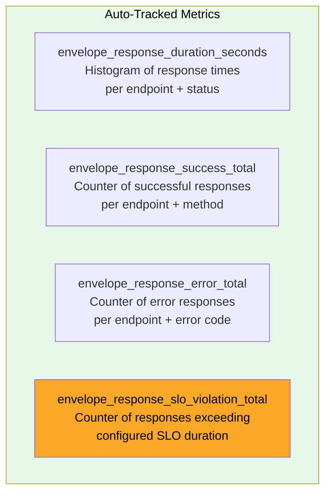
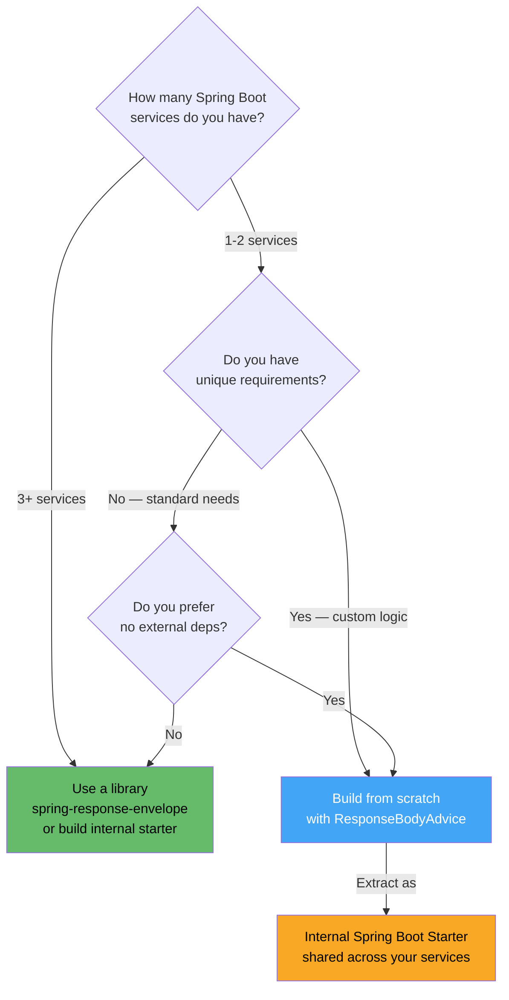
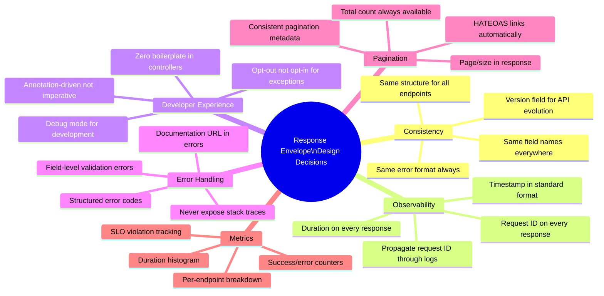

# Eliminating API Response Boilerplate in Spring Boot: A Complete Guide to Response Envelopes

> *Every Spring Boot project eventually develops its own response wrapper pattern — written slightly differently each time, inconsistent across services, and multiplied across every endpoint. The question isn't whether you need a standard response envelope. It's whether you should keep writing it from scratch.*


---

## The Problem Is Bigger Than It Looks

When you first add response wrapping to a Spring Boot API, it seems like a small task. Create a generic wrapper class, add it to a few endpoints, done. The actual scope only becomes visible as the project grows:

```java
// What you write for endpoint 1
@GetMapping("/users/{id}")
public ResponseWrapper<User> getUser(@PathVariable Long id) {
   User user = userService.findById(id);
   return ResponseWrapper.<User>builder()
       .success(true)
       .data(user)
       .timestamp(Instant.now())
       .requestId(UUID.randomUUID().toString())
       .path("/api/users/" + id)
       .method("GET")
       .duration(System.currentTimeMillis() - startTime)
       .build();
}

// What you write for endpoint 2... and endpoint 3... and endpoint 50
// Each slightly different. Each missing something the last one had.
// Then someone adds pagination. Then someone adds error codes.
// Then two teams disagree on field names.
// Then a new developer joins and writes it a completely different way.
```

This isn't a code quality problem — it's an architectural missing piece. The response envelope pattern solves a real consistency requirement, and it deserves a first-class solution rather than an ad-hoc one copied and modified across every controller.

This guide covers:
1. Building a production-grade response envelope from scratch (so you understand every piece)
2. Using the `spring-response-envelope` library when you want it solved for you
3. The design decisions that matter regardless of which approach you choose

---

## Building It From Scratch: Understanding the Foundation

Before reaching for a library, it's worth understanding what a well-designed response envelope system actually requires. This knowledge makes you a better consumer of any library that handles it for you.

### The Response Envelope Model

```java
// The core envelope — what every response should carry
@JsonInclude(JsonInclude.Include.NON_NULL)
public class ApiResponse<T> {

   private final boolean success;
   private final T data;
   private final String message;
   private final ApiError error;
   private final ResponseMetadata metadata;
   private final PaginationInfo pagination;
   private final Map<String, String> links;

   // Private constructor — use static factory methods
   private ApiResponse(Builder<T> builder) {
       this.success    = builder.success;
       this.data       = builder.data;
       this.message    = builder.message;
       this.error      = builder.error;
       this.metadata   = builder.metadata;
       this.pagination = builder.pagination;
       this.links      = builder.links;
   }

   // Factory methods for the two core cases
   public static <T> ApiResponse<T> success(T data, ResponseMetadata metadata) {
       return new Builder<T>()
           .success(true)
           .data(data)
           .metadata(metadata)
           .build();
   }

   public static <T> ApiResponse<T> error(ApiError error, ResponseMetadata metadata) {
       return new Builder<T>()
           .success(false)
           .error(error)
           .metadata(metadata)
           .build();
   }

   // Builder omitted for brevity
}

@JsonInclude(JsonInclude.Include.NON_NULL)
public record ResponseMetadata(
   Instant timestamp,
   String requestId,
   String path,
   String method,
   Long durationMs,
   String apiVersion,
   String deprecationWarning
) {}

@JsonInclude(JsonInclude.Include.NON_NULL)
public record ApiError(
   String code,
   String message,
   String details,
   List<FieldError> fieldErrors,
   String documentationUrl
) {}

@JsonInclude(JsonInclude.Include.NON_NULL)
public record PaginationInfo(
   int page,
   int size,
   long totalElements,
   int totalPages,
   boolean first,
   boolean last
) {}
```

### The ResponseBodyAdvice Approach

The cleanest way to apply response wrapping without touching every controller is `ResponseBodyAdvice` — Spring's built-in mechanism for post-processing controller return values before serialization:

```java
// The annotation that marks endpoints for wrapping
@Target({ElementType.METHOD, ElementType.TYPE})
@Retention(RetentionPolicy.RUNTIME)
@Documented
public @interface ResponseEnvelope {
   String version() default "v1";
   String successMessage() default "";
   int httpStatus() default 200;
   boolean includeDuration() default true;
   String deprecationWarning() default "";
   String[] customMetadata() default {};
}

// The annotation that opts out of wrapping
@Target({ElementType.METHOD, ElementType.TYPE})
@Retention(RetentionPolicy.RUNTIME)
@Documented
public @interface IgnoreEnvelope {
   String reason() default "";
}
```

```java
@ControllerAdvice
@Slf4j
public class ResponseEnvelopeAdvice
       implements ResponseBodyAdvice<Object> {

   private final RequestIdProvider requestIdProvider;
   private final MetricsCollector metricsCollector;

   @Override
   public boolean supports(MethodParameter returnType,
                           Class<? extends HttpMessageConverter<?>> converterType) {
       // Apply to methods/classes annotated with @ResponseEnvelope
       // unless @IgnoreEnvelope is also present

       if (returnType.hasMethodAnnotation(IgnoreEnvelope.class) ||
           returnType.getDeclaringClass().isAnnotationPresent(IgnoreEnvelope.class)) {
           return false;
       }

       return returnType.hasMethodAnnotation(ResponseEnvelope.class) ||
              returnType.getDeclaringClass().isAnnotationPresent(ResponseEnvelope.class);
   }

   @Override
   public Object beforeBodyWrite(
           Object body,
           MethodParameter returnType,
           MediaType selectedContentType,
           Class<? extends HttpMessageConverter<?>> selectedConverterType,
           ServerHttpRequest request,
           ServerHttpResponse response) {

       // Don't double-wrap if it's already an ApiResponse
       if (body instanceof ApiResponse) return body;

       // Retrieve the annotation (method takes precedence over class)
       ResponseEnvelope annotation = Optional
           .ofNullable(returnType.getMethodAnnotation(ResponseEnvelope.class))
           .orElseGet(() -> returnType.getDeclaringClass()
               .getAnnotation(ResponseEnvelope.class));

       ResponseMetadata metadata = buildMetadata(request, annotation);

       // Handle pagination automatically
       if (body instanceof Page<?> page) {
           return buildPagedResponse(page, metadata);
       }

       return ApiResponse.success(body, metadata);
   }

   private ResponseMetadata buildMetadata(
           ServerHttpRequest request,
           ResponseEnvelope annotation) {

       Long startTime = (Long) ((ServletServerHttpRequest) request)
           .getServletRequest()
           .getAttribute("requestStartTime");

       Long duration = startTime != null
           ? System.currentTimeMillis() - startTime
           : null;

       return new ResponseMetadata(
           Instant.now(),
           requestIdProvider.getCurrentRequestId(),
           request.getURI().getPath(),
           request.getMethod().name(),
           duration,
           annotation.version(),
           annotation.deprecationWarning().isEmpty()
               ? null
               : annotation.deprecationWarning()
       );
   }

   private <T> ApiResponse<T> buildPagedResponse(
           Page<T> page, ResponseMetadata metadata) {

       PaginationInfo pagination = new PaginationInfo(
           page.getNumber(),
           page.getSize(),
           page.getTotalElements(),
           page.getTotalPages(),
           page.isFirst(),
           page.isLast()
       );

       // Build HATEOAS-style links
       Map<String, String> links = buildPaginationLinks(metadata.path(), page);

       return ApiResponse.<T>builder()
           .success(true)
           .data(page.getContent())
           .metadata(metadata)
           .pagination(pagination)
           .links(links)
           .build();
   }
}
```

### Request Timing: The Filter Layer

Duration measurement must start before the controller executes. A filter is the right place:

```java
@Component
@Order(Ordered.HIGHEST_PRECEDENCE)
public class RequestTimingFilter extends OncePerRequestFilter {

   private static final String START_TIME_ATTR = "requestStartTime";
   private static final String REQUEST_ID_ATTR = "requestId";
   private static final String REQUEST_ID_HEADER = "X-Request-ID";
   private static final String REQUEST_ID_MDC_KEY = "requestId";

   @Override
   protected void doFilterInternal(HttpServletRequest request,
                                   HttpServletResponse response,
                                   FilterChain chain)
           throws ServletException, IOException {

       long startTime = System.currentTimeMillis();
       request.setAttribute(START_TIME_ATTR, startTime);

       // Generate or propagate request ID
       String requestId = Optional
           .ofNullable(request.getHeader(REQUEST_ID_HEADER))
           .filter(id -> !id.isBlank())
           .orElse("req_" + UUID.randomUUID().toString().replace("-", "").substring(0, 16));

       request.setAttribute(REQUEST_ID_ATTR, requestId);
       response.setHeader(REQUEST_ID_HEADER, requestId);

       // MDC allows request ID to appear in every log line
       MDC.put(REQUEST_ID_MDC_KEY, requestId);

       try {
           chain.doFilter(request, response);
       } finally {
           long duration = System.currentTimeMillis() - startTime;
           log.debug("Request completed: {} {} → {}ms",
               request.getMethod(), request.getRequestURI(), duration);
           MDC.remove(REQUEST_ID_MDC_KEY);
       }
   }
}
```

### Global Exception Handling: The Other Half

The success path is only half the problem. The error path needs equally consistent treatment:

```java
@RestControllerAdvice
@Slf4j
public class GlobalExceptionHandler {

   private final RequestIdProvider requestIdProvider;

   @ExceptionHandler(EntityNotFoundException.class)
   public ResponseEntity<ApiResponse<Void>> handleEntityNotFound(
           EntityNotFoundException ex, HttpServletRequest request) {

       log.warn("Entity not found: {}", ex.getMessage());

       ApiError error = new ApiError(
           "ERR_BIZ_002",
           "Entity Not Found",
           ex.getMessage(),
           null,
           buildDocUrl("ERR_BIZ_002")
       );

       return ResponseEntity
           .status(HttpStatus.NOT_FOUND)
           .body(ApiResponse.error(error, buildMetadata(request)));
   }

   @ExceptionHandler(MethodArgumentNotValidException.class)
   public ResponseEntity<ApiResponse<Void>> handleValidationException(
           MethodArgumentNotValidException ex, HttpServletRequest request) {

       List<FieldError> fieldErrors = ex.getBindingResult()
           .getFieldErrors().stream()
           .map(fe -> new FieldError(
               fe.getField(),
               fe.getDefaultMessage(),
               fe.getRejectedValue() != null
                   ? fe.getRejectedValue().toString()
                   : null,
               fe.getCode()
           ))
           .toList();

       ApiError error = new ApiError(
           "ERR_VAL_001",
           "Validation Error",
           "Request validation failed for " + fieldErrors.size() + " field(s)",
           fieldErrors,
           buildDocUrl("ERR_VAL_001")
       );

       log.warn("Validation failed: {} field errors", fieldErrors.size());

       return ResponseEntity
           .status(HttpStatus.BAD_REQUEST)
           .body(ApiResponse.error(error, buildMetadata(request)));
   }

   @ExceptionHandler(Exception.class)
   public ResponseEntity<ApiResponse<Void>> handleUnexpectedException(
           Exception ex, HttpServletRequest request) {

       // Log the full stack trace for unexpected exceptions
       log.error("Unexpected error processing {} {}",
           request.getMethod(), request.getRequestURI(), ex);

       ApiError error = new ApiError(
           "ERR_SYS_001",
           "Internal Server Error",
           "An unexpected error occurred. Use requestId for support.",
           null,
           buildDocUrl("ERR_SYS_001")
       );

       return ResponseEntity
           .status(HttpStatus.INTERNAL_SERVER_ERROR)
           .body(ApiResponse.error(error, buildMetadata(request)));
   }

   private ResponseMetadata buildMetadata(HttpServletRequest request) {
       Long startTime = (Long) request.getAttribute("requestStartTime");
       return new ResponseMetadata(
           Instant.now(),
           requestIdProvider.getCurrentRequestId(),
           request.getRequestURI(),
           request.getMethod(),
           startTime != null ? System.currentTimeMillis() - startTime : null,
           "v1",
           null
       );
   }
}
```

---

## Using Spring Response Envelope Library

If you want all of the above handled for you, the `spring-response-envelope` library provides it as a starter. Understanding the implementation above makes you a much more effective user of any library.

### Setup

```xml
<!-- Maven -->
<dependency>
   <groupId>io.github.overrridee</groupId>
   <artifactId>spring-response-envelope</artifactId>
   <version>0.2.1</version>
</dependency>
```

```groovy
// Gradle
implementation 'io.github.overrridee:spring-response-envelope:0.2.1'
```

**Requirements:** Java 21+, Spring Boot 3.5+

### Basic Usage: The Common Cases

```java
// Single endpoint
@RestController
@RequestMapping("/api/users")
public class UserController {

   @GetMapping("/{id}")
   @ResponseEnvelope
   public User getUser(@PathVariable Long id) {
       return userService.findById(id); // Return plain User — library wraps it
   }
}
```

**Response:**
```json
{
 "success": true,
 "data": {
   "id": 42,
   "name": "John Doe",
   "email": "john@example.com"
 },
 "timestamp": "2024-04-10T14:30:00Z",
 "requestId": "req_lq8x2k_abc123",
 "path": "/api/users/42",
 "method": "GET",
 "duration": 145,
 "apiVersion": "v1"
}
```

```java
// Class-level — applies to all methods in controller
@RestController
@RequestMapping("/api/orders")
@ResponseEnvelope(version = "v2")
public class OrderController {

   @GetMapping("/{id}")
   public Order getOrder(@PathVariable Long id) {
       return orderService.findById(id);
   }

   @GetMapping
   public List<Order> getAllOrders() {
       return orderService.findAll();
   }

   @PostMapping
   @ResponseEnvelope(
       version = "v2",
       successMessage = "Order created successfully",
       httpStatus = 201,
       customMetadata = {"region:eu-west-1", "service:order-service"}
   )
   public Order createOrder(@Valid @RequestBody CreateOrderRequest request) {
       return orderService.create(request);
   }

   // Opt out of wrapping for binary responses
   @GetMapping("/export")
   @IgnoreEnvelope(reason = "CSV binary response")
   public ResponseEntity<byte[]> exportOrders() {
       byte[] csv = orderService.exportToCsv();
       return ResponseEntity.ok()
           .contentType(MediaType.parseMediaType("text/csv"))
           .body(csv);
   }
}
```

### Pagination: Zero Additional Code

```java
@GetMapping
@ResponseEnvelope
public Page<Product> getProducts(
       @RequestParam(defaultValue = "") String search,
       Pageable pageable) {
   return productService.search(search, pageable);
}
```

**Response — pagination metadata and HATEOAS links generated automatically:**

```json
{
 "success": true,
 "data": {
   "content": [
     { "id": 1, "name": "Widget Pro", "price": 29.99 },
     { "id": 2, "name": "Gadget Max", "price": 49.99 }
   ]
 },
 "pagination": {
   "page": 0,
   "size": 20,
   "totalElements": 150,
   "totalPages": 8,
   "first": true,
   "last": false
 },
 "links": {
   "self":  "/api/products?search=&page=0&size=20",
   "next":  "/api/products?search=&page=1&size=20",
   "last":  "/api/products?search=&page=7&size=20"
 },
 "timestamp": "2024-04-10T14:30:00Z",
 "requestId": "req_abc123",
 "duration": 67
}
```

### Error Responses: Consistent Structure Automatically

```java
@GetMapping("/{id}")
@ResponseEnvelope
public User getUser(@PathVariable Long id) {
   // Library's EntityNotFoundException produces a well-structured 404
   return userService.findById(id)
       .orElseThrow(() -> new EntityNotFoundException("User", id));
}
```

**404 Response:**

```json
{
 "success": false,
 "message": "User not found with id: 999",
 "timestamp": "2024-04-10T14:30:00Z",
 "requestId": "req_xyz789",
 "path": "/api/users/999",
 "method": "GET",
 "duration": 23,
 "errors": {
   "code": "ERR_BIZ_002",
   "message": "Entity Not Found",
   "details": "The requested User with identifier '999' does not exist in the system",
   "documentationUrl": "https://docs.example.com/errors/ERR_BIZ_002"
 }
}
```

```java
@PostMapping
@ResponseEnvelope
public User createUser(@Valid @RequestBody CreateUserRequest request) {
   return userService.create(request);
}
```

**Validation failure response:**

```json
{
 "success": false,
 "message": "Validation failed",
 "errors": {
   "code": "ERR_VAL_001",
   "message": "Validation Error",
   "fieldErrors": [
     {
       "field": "email",
       "message": "must be a valid email address",
       "rejectedValue": "not-an-email",
       "code": "Email"
     },
     {
       "field": "name",
       "message": "must not be blank",
       "rejectedValue": "",
       "code": "NotBlank"
     }
   ]
 }
}
```

---

## Full Configuration Reference

```yaml
response-envelope:
 enabled: true

 default-config:
   include-timestamp: true
   include-request-id: true
   include-path: true
   include-method: true
   include-duration: true
   timestamp-format: ISO_8601          # ISO_8601 | UNIX_EPOCH | UNIX_EPOCH_MILLIS
   request-id-header: X-Request-ID    # Header name for incoming/outgoing request IDs
   propagate-request-id: true          # Echo request ID back in response header
   default-version: v1
   timezone: UTC

 error-config:
   include-stacktrace: false           # Never enable in production
   include-exception-class: true       # Include exception class name in error response
   show-detailed-messages: true        # User-facing error messages
   documentation-url-pattern: "https://docs.yourdomain.com/errors/{code}"
   error-source: your-service-name     # Identifies which service produced the error

 metrics:
   enabled: true
   slo-duration: 500                   # Milliseconds — violations trigger counter
   prefix: envelope_response           # Metric name prefix
```

---

## Metrics Integration

With metrics enabled, Micrometer automatically tracks these meters:



```yaml
# Prometheus scrape config
management:
 endpoints:
   web:
     exposure:
       include: prometheus, health
 metrics:
   export:
     prometheus:
       enabled: true
```

**Grafana alert for SLO violations:**

```yaml
# Alert when SLO violation rate exceeds threshold
- alert: ApiSloViolation
 expr: rate(envelope_response_slo_violation_total[5m]) > 0.05
 for: 2m
 annotations:
   summary: "API SLO violation rate above 5% — check slow endpoints"
   runbook: "https://runbooks.yourdomain.com/api-slo-violation"
```

---

## Advanced Patterns

### API Versioning With Per-Version Behavior

```java
// V1: Simple response
@RestController
@RequestMapping("/api/v1/products")
@ResponseEnvelope(version = "v1")
public class ProductV1Controller {

   @GetMapping("/{id}")
   public ProductV1Dto getProduct(@PathVariable Long id) {
       return productService.findByIdV1(id);
   }
}

// V2: Richer response with HATEOAS links and additional metadata
@RestController
@RequestMapping("/api/v2/products")
@ResponseEnvelope(version = "v2", includeLinks = true)
public class ProductV2Controller {

   @GetMapping("/{id}")
   public ProductV2Dto getProduct(@PathVariable Long id) {
       return productService.findByIdV2(id);
   }
}
```

```json
// V1 response
{
 "success": true,
 "data": { "id": 1, "name": "Widget", "price": 29.99 },
 "apiVersion": "v1"
}

// V2 response — richer
{
 "success": true,
 "data": {
   "id": 1,
   "name": "Widget",
   "price": 29.99,
   "inventory": 142,
   "categories": ["electronics", "accessories"]
 },
 "links": {
   "self":     "/api/v2/products/1",
   "category": "/api/v2/categories/electronics",
   "reviews":  "/api/v2/products/1/reviews"
 },
 "apiVersion": "v2"
}
```

### Deprecation Handling

```java
@RestController
@RequestMapping("/api")
public class MigrationController {

   // Old endpoint — mark as deprecated to push clients to migrate
   @GetMapping("/v1/users")
   @ResponseEnvelope(
       version = "v1",
       deprecationWarning = "Endpoint deprecated. Migrate to /api/v2/users by 2026-12-01. See migration guide at https://docs.example.com/migration/v1-to-v2"
   )
   public List<UserV1Dto> getUsersV1() {
       return userService.findAllV1();
   }

   // New endpoint — clean
   @GetMapping("/v2/users")
   @ResponseEnvelope(version = "v2")
   public Page<UserV2Dto> getUsersV2(Pageable pageable) {
       return userService.findAllV2(pageable);
   }
}
```

The deprecation warning is injected into response headers, enabling clients to detect and log it:

```
X-Deprecation-Warning: Endpoint deprecated. Migrate to /api/v2/users by 2026-12-01...
```

### Debug Mode for Development Environments

```java
@Profile("development")
@GetMapping("/debug/{id}")
@ResponseEnvelope(debugMode = true)
public Order getOrderDebug(@PathVariable Long id) {
   return orderService.findById(id);
}
```

**Debug response includes additional diagnostic fields:**

```json
{
 "success": true,
 "data": { "id": 1, ... },
 "metadata": {
   "requestId": "req_abc123",
   "duration": 145,
   "debug": {
     "clientIp": "192.168.1.100",
     "userAgent": "PostmanRuntime/7.37.0",
     "queryString": "include=items",
     "serverId": "app-pod-7d9f8b",
     "jvmMemoryUsedMb": 412
   }
 }
}
```

---

## Custom Metadata and Field Extensions

```java
// Custom metadata per endpoint — for cross-cutting context
@GetMapping("/{id}")
@ResponseEnvelope
@EnvelopeField(name = "correlationId", value = "#{T(org.slf4j.MDC).get('correlationId')}")
@EnvelopeField(name = "region", value = "eu-west-1")
@EnvelopeField(name = "dataCenter", value = "${app.datacenter:unknown}")
public User getUser(@PathVariable Long id) {
   return userService.findById(id);
}
```

**Response includes custom fields:**

```json
{
 "success": true,
 "data": { "id": 42, "name": "John Doe" },
 "timestamp": "2024-04-10T14:30:00Z",
 "requestId": "req_abc123",
 "correlationId": "saga-xyz-789",
 "region": "eu-west-1",
 "dataCenter": "aws-eu-west-1a"
}
```

---

## Microservices: The Case for Library-Wide Standardization

In a microservices environment, consistent response formats across services are what make API consumers' lives bearable. Without them, every service integration requires custom parsing logic.

```mermaid
flowchart TD
   subgraph WITHOUT [Without Standard Envelope]
       US1[User Service\nreturns flat object]
       OS1[Order Service\nreturns {data: ..., meta: ...}]
       PS1[Payment Service\nreturns {result: ..., status: ...}]
       GW1[API Gateway\nneeds custom parsing\nfor each service]

       US1 --> GW1
       OS1 --> GW1
       PS1 --> GW1

       style GW1 fill:#ef5350,color:#fff
   end

   subgraph WITH [With Standard Envelope]
       US2[User Service\n@ResponseEnvelope v1]
       OS2[Order Service\n@ResponseEnvelope v1]
       PS2[Payment Service\n@ResponseEnvelope v1]
       GW2[API Gateway\nuniform parsing\nfor all services]

       US2 --> GW2
       OS2 --> GW2
       PS2 --> GW2

       style GW2 fill:#66bb6a,color:#000
   end
```

```java
// User Service
@RestController
@RequestMapping("/api/users")
@ResponseEnvelope(version = "v1")
public class UserController { /* zero boilerplate */ }

// Order Service
@RestController
@RequestMapping("/api/orders")
@ResponseEnvelope(version = "v1")
public class OrderController { /* same format, zero boilerplate */ }

// Payment Service
@RestController
@RequestMapping("/api/payments")
@ResponseEnvelope(version = "v1")
public class PaymentController { /* same format, zero boilerplate */ }
```

Every service returns the same envelope structure. Request IDs propagate automatically. Error codes follow the same scheme. Frontend and API gateway teams write parsing logic once.

---

## When to Roll Your Own vs. Use a Library



**Build from scratch when:**
- You have unique response format requirements that don't match standard patterns
- You want zero third-party dependencies
- You're building a platform where the response format is itself a product decision

**Use a library when:**
- You need it working today, not after a two-day implementation
- Your requirements match what the library provides
- You have multiple services that need the same behavior

**Build an internal starter when:**
- You started from scratch and now have multiple services that need it
- You want the library approach but with full control over defaults

---

## Testing Wrapped Responses

Regardless of your approach, testing the envelope behavior is essential:

```java
@WebMvcTest(UserController.class)
class UserControllerEnvelopeTest {

   @Autowired
   private MockMvc mockMvc;

   @MockBean
   private UserService userService;

   @Test
   void getUser_wrapsResponseInEnvelope() throws Exception {
       User user = new User(42L, "John Doe", "john@example.com");
       given(userService.findById(42L)).willReturn(Optional.of(user));

       mockMvc.perform(get("/api/users/42"))
           .andExpect(status().isOk())
           // Envelope structure
           .andExpect(jsonPath("$.success").value(true))
           .andExpect(jsonPath("$.data.id").value(42))
           .andExpect(jsonPath("$.data.name").value("John Doe"))
           // Metadata fields
           .andExpect(jsonPath("$.timestamp").exists())
           .andExpect(jsonPath("$.requestId").exists())
           .andExpect(jsonPath("$.duration").exists())
           .andExpect(jsonPath("$.apiVersion").value("v1"))
           // No error field on success
           .andExpect(jsonPath("$.errors").doesNotExist());
   }

   @Test
   void getUser_notFound_returnsStructuredError() throws Exception {
       given(userService.findById(999L)).willReturn(Optional.empty());

       mockMvc.perform(get("/api/users/999"))
           .andExpect(status().isNotFound())
           .andExpect(jsonPath("$.success").value(false))
           .andExpect(jsonPath("$.errors.code").value("ERR_BIZ_002"))
           .andExpect(jsonPath("$.errors.message").exists())
           .andExpect(jsonPath("$.requestId").exists())
           // No data field on error
           .andExpect(jsonPath("$.data").doesNotExist());
   }

   @Test
   void createUser_validationFailure_returnsFieldErrors() throws Exception {
       String invalidRequest = """
           { "email": "not-valid", "name": "" }
           """;

       mockMvc.perform(post("/api/users")
               .contentType(MediaType.APPLICATION_JSON)
               .content(invalidRequest))
           .andExpect(status().isBadRequest())
           .andExpect(jsonPath("$.success").value(false))
           .andExpect(jsonPath("$.errors.code").value("ERR_VAL_001"))
           .andExpect(jsonPath("$.errors.fieldErrors").isArray())
           .andExpect(jsonPath("$.errors.fieldErrors[*].field")
               .value(hasItems("email", "name")));
   }

   @Test
   void getUsers_paginated_includesPaginationMetadata() throws Exception {
       Page<User> page = new PageImpl<>(
           List.of(new User(1L, "Alice", "alice@example.com")),
           PageRequest.of(0, 20),
           100L
       );
       given(userService.findAll(any(Pageable.class))).willReturn(page);

       mockMvc.perform(get("/api/users?page=0&size=20"))
           .andExpect(status().isOk())
           .andExpect(jsonPath("$.pagination.page").value(0))
           .andExpect(jsonPath("$.pagination.size").value(20))
           .andExpect(jsonPath("$.pagination.totalElements").value(100))
           .andExpect(jsonPath("$.pagination.totalPages").value(5))
           .andExpect(jsonPath("$.links.self").exists())
           .andExpect(jsonPath("$.links.next").exists());
   }
}
```

---

## Summary: The Design Decisions That Matter

Whether you build this pattern from scratch or use a library, the same design decisions determine whether the result is genuinely useful or just shifting boilerplate around:



The response envelope pattern isn't optional for production APIs — it's what makes your API observable, debuggable, and consumable at scale. The only real question is whether you implement it consistently or accidentally, once or fifty times.
~~~markdown~~~