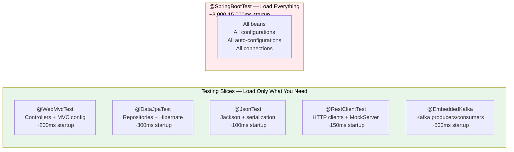
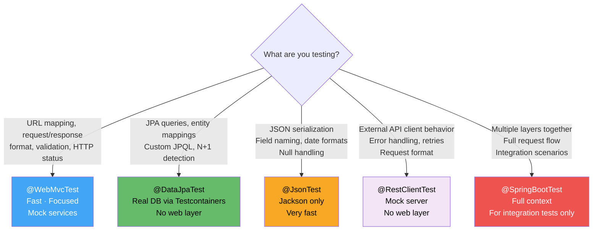
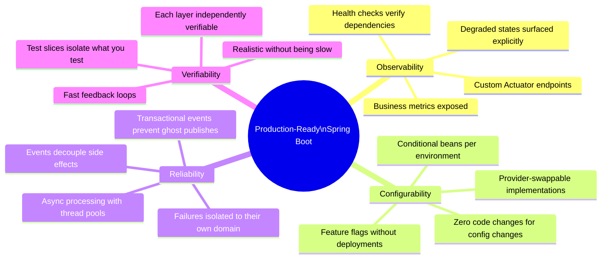

# Advanced Spring Boot: Five Techniques That Separate Production Engineers From Tutorial Developers

> *Every Spring Boot developer knows `@RestController` and `@Service`. The engineers who build systems that are observable, maintainable, and genuinely production-ready know what comes after that — and it's not just more of the same patterns at larger scale.*

---

## Why "Basic" Spring Boot Eventually Fails You

Basic Spring Boot gets you surprisingly far. The auto-configuration, the embedded server, the opinionated defaults — all of it allows teams to ship working software quickly. That's the point, and it works.

The gap appears when you move from "working in development" to "operating in production." In production, you don't just need your application to run — you need to know *how well* it's running, *why* it's behaving a certain way, *how to test* its individual layers in isolation, and *how to configure* it differently across environments without maintaining separate codebases.

The five techniques in this guide address exactly that gap. They're not exotic framework features — they're the production-readiness layer that lives just above what most tutorials cover, and they're what experienced Spring Boot engineers reach for instinctively when building systems that need to last.

---

## Technique 1: Custom Actuator Endpoints — Business Observability

### The Limitation of Default Actuator

Spring Boot Actuator's default endpoints tell you whether the application is alive. `/health` tells you if the database is reachable. `/metrics` gives you JVM statistics. `/info` shows build metadata.

None of this tells you whether the application is *working well* from a business perspective. The database might be UP, memory might be healthy, and your application might simultaneously have 500 stuck background jobs, a cache that hasn't refreshed in six hours, and a payment processor integration that's silently failing for a specific payment method.

Default Actuator: **operational observability**.
Custom Actuator endpoints: **business observability**.

### Building a Production-Grade Custom Endpoint

```java
@Component
@Endpoint(id = "businessHealth")
public class BusinessHealthEndpoint {

   private final OrderRepository orderRepository;
   private final PaymentGatewayClient paymentGateway;
   private final CacheManager cacheManager;
   private final BackgroundJobService jobService;

   public BusinessHealthEndpoint(
           OrderRepository orderRepository,
           PaymentGatewayClient paymentGateway,
           CacheManager cacheManager,
           BackgroundJobService jobService) {
       this.orderRepository  = orderRepository;
       this.paymentGateway   = paymentGateway;
       this.cacheManager     = cacheManager;
       this.jobService       = jobService;
   }

   // @ReadOperation maps to HTTP GET — safe, idempotent reads
   @ReadOperation
   public Map<String, Object> businessStatus() {
       return Map.of(
           "orders",          orderMetrics(),
           "payments",        paymentMetrics(),
           "cache",           cacheMetrics(),
           "backgroundJobs",  jobMetrics(),
           "timestamp",       Instant.now().toString()
       );
   }

   // @ReadOperation with selector — GET /actuator/businessHealth/{section}
   @ReadOperation
   public Map<String, Object> sectionStatus(@Selector String section) {
       return switch (section) {
           case "orders"   -> orderMetrics();
           case "payments" -> paymentMetrics();
           case "cache"    -> cacheMetrics();
           case "jobs"     -> jobMetrics();
           default         -> Map.of("error", "Unknown section: " + section);
       };
   }

   // @WriteOperation maps to HTTP POST — for triggering actions
   // Example: manually clear a stuck state, trigger a cache refresh
   @WriteOperation
   public Map<String, Object> triggerCacheRefresh(@Selector String cacheName) {
       Cache cache = cacheManager.getCache(cacheName);
       if (cache == null) {
           return Map.of("success", false, "error", "Cache not found: " + cacheName);
       }
       cache.clear();
       return Map.of(
           "success", true,
           "cache",   cacheName,
           "clearedAt", Instant.now().toString()
       );
   }

   // @DeleteOperation maps to HTTP DELETE
   @DeleteOperation
   public void clearAllCaches() {
       cacheManager.getCacheNames().forEach(name -> {
           Cache cache = cacheManager.getCache(name);
           if (cache != null) cache.clear();
       });
   }

   private Map<String, Object> orderMetrics() {
       return Map.of(
           "pendingCount",    orderRepository.countByStatus(OrderStatus.PENDING),
           "processingCount", orderRepository.countByStatus(OrderStatus.PROCESSING),
           "failedToday",     orderRepository.countFailedToday(),
           "avgProcessingMs", orderRepository.averageProcessingTimeMs()
       );
   }

   private Map<String, Object> paymentMetrics() {
       PaymentGatewayStats stats = paymentGateway.getStats();
       return Map.of(
           "successRateLast5Min",  stats.getSuccessRate(),
           "avgLatencyMs",         stats.getAverageLatencyMs(),
           "circuitBreakerState",  stats.getCircuitBreakerState(),
           "failedTransactions",   stats.getFailedTransactionsCount()
       );
   }

   private Map<String, Object> cacheMetrics() {
       return cacheManager.getCacheNames().stream()
           .collect(Collectors.toMap(
               name -> name,
               name -> {
                   Cache cache = cacheManager.getCache(name);
                   if (cache instanceof CaffeineCache caffeineCache) {
                       com.github.benmanes.caffeine.cache.stats.CacheStats stats =
                           caffeineCache.getNativeCache().stats();
                       return Map.of(
                           "hitRate",    stats.hitRate(),
                           "size",       caffeineCache.getNativeCache().estimatedSize(),
                           "evictions",  stats.evictionCount()
                       );
                   }
                   return Map.of("info", "Stats not available");
               }
           ));
   }

   private Map<String, Object> jobMetrics() {
       return Map.of(
           "activeJobs",  jobService.getActiveJobCount(),
           "stuckJobs",   jobService.getStuckJobCount(),
           "completedToday", jobService.getCompletedTodayCount(),
           "oldestActiveJobAgeMinutes", jobService.getOldestActiveJobAgeMinutes()
       );
   }
}
```

### Exposing the Endpoint

```yaml
# application.yml
management:
 endpoints:
   web:
     exposure:
       include: health, metrics, info, businessHealth, prometheus
     base-path: /actuator
 endpoint:
   businessHealth:
     cache:
       time-to-live: 10s  # Cache endpoint responses to avoid DB hammering
 # Security: restrict actuator to management port in production
 server:
   port: 8081
```

### Securing Custom Endpoints

```java
@Configuration
@EnableWebSecurity
public class ActuatorSecurityConfig {

   @Bean
   @Order(1)
   public SecurityFilterChain actuatorSecurity(HttpSecurity http) throws Exception {
       http
           .securityMatcher(EndpointRequest.toAnyEndpoint())
           .authorizeHttpRequests(auth -> auth
               // Read-only endpoints accessible to monitoring systems
               .requestMatchers(EndpointRequest.to(
                   HealthEndpoint.class, InfoEndpoint.class,
                   MetricsEndpoint.class, BusinessHealthEndpoint.class
               )).hasRole("MONITORING")
               // Write operations require operator role
               .requestMatchers(EndpointRequest.toAnyEndpoint())
                   .hasRole("OPERATOR")
               .anyRequest().denyAll()
           )
           .httpBasic(Customizer.withDefaults());

       return http.build();
   }
}
```

### Output and Value

```json
// GET /actuator/businessHealth
{
 "orders": {
   "pendingCount": 247,
   "processingCount": 12,
   "failedToday": 3,
   "avgProcessingMs": 340
 },
 "payments": {
   "successRateLast5Min": 0.994,
   "avgLatencyMs": 180,
   "circuitBreakerState": "CLOSED",
   "failedTransactions": 2
 },
 "cache": {
   "products": { "hitRate": 0.87, "size": 4521, "evictions": 142 },
   "userSessions": { "hitRate": 0.92, "size": 892, "evictions": 31 }
 },
 "backgroundJobs": {
   "activeJobs": 4,
   "stuckJobs": 0,
   "completedToday": 1847,
   "oldestActiveJobAgeMinutes": 2
 }
}
```

When `stuckJobs` is non-zero, or `circuitBreakerState` is OPEN, or `failedToday` is climbing — your monitoring system fires an alert with context, not just "application is UP." This is the difference between operational observability and business observability.

---

## Technique 2: Conditional Bean Creation — Environment-Adaptive Configuration

### The Problem With Environment-Specific Code

Without conditional beans, environment-specific behavior requires one of two bad options:

```java
// BAD OPTION 1: Runtime if-else — logic scattered through application code
@Service
public class NotificationService {
   @Value("${app.environment}")
   private String environment;

   public void sendAlert(String message) {
       if ("production".equals(environment)) {
           pagerDutyClient.alert(message);
       } else if ("staging".equals(environment)) {
           slackClient.sendToTestChannel(message);
       } else {
           // Development — just log
           log.info("ALERT (dev mode): {}", message);
       }
   }
}
```

```java
// BAD OPTION 2: Separate application contexts — massive duplication
// Application.java (production)
// ApplicationDev.java (development)
// ApplicationStaging.java (staging)
// Now you have three codebases to maintain
```

Conditional beans solve this at the configuration layer — the environment-specific decision is made once, at startup, and the rest of the code works against the interface without knowing which implementation is active.

### The Full Conditional Toolkit

```java
@Configuration
public class InfrastructureConfiguration {

   // ─── Property-based conditions ───────────────────────────────────────

   @Bean
   @ConditionalOnProperty(name = "payment.gateway", havingValue = "stripe")
   public PaymentGateway stripeGateway(StripeProperties props) {
       return new StripeGatewayAdapter(props.getApiKey(), props.getWebhookSecret());
   }

   @Bean
   @ConditionalOnProperty(name = "payment.gateway", havingValue = "paypal")
   public PaymentGateway paypalGateway(PayPalProperties props) {
       return new PayPalGatewayAdapter(props.getClientId(), props.getClientSecret());
   }

   // Fallback when property is missing — the default
   @Bean
   @ConditionalOnMissingBean(PaymentGateway.class)
   public PaymentGateway mockPaymentGateway() {
       log.warn("No payment gateway configured — using mock. Do not use in production.");
       return new MockPaymentGateway();
   }

   // ─── Profile-based conditions ─────────────────────────────────────────

   @Bean
   @Profile("production")
   public EmailService sesEmailService(AWSCredentials credentials) {
       return new AmazonSESEmailService(credentials);
   }

   @Bean
   @Profile({"development", "test"})
   public EmailService greenMailEmailService(GreenMailProperties props) {
       // In-memory SMTP server — captures emails without sending
       return new GreenMailEmailService(props.getPort());
   }

   // ─── Class presence conditions ────────────────────────────────────────

   @Bean
   @ConditionalOnClass(name = "io.micrometer.core.instrument.MeterRegistry")
   public MetricsCollector micrometerMetricsCollector(MeterRegistry registry) {
       return new MicrometerMetricsCollector(registry);
   }

   @Bean
   @ConditionalOnMissingClass("io.micrometer.core.instrument.MeterRegistry")
   public MetricsCollector noopMetricsCollector() {
       return new NoopMetricsCollector();
   }

   // ─── Bean existence conditions ────────────────────────────────────────

   @Bean
   @ConditionalOnBean(CacheManager.class)
   public CachedProductService cachedProductService(
           ProductRepository repo, CacheManager cacheManager) {
       return new CachedProductService(repo, cacheManager);
   }

   @Bean
   @ConditionalOnMissingBean(CacheManager.class)
   public ProductService uncachedProductService(ProductRepository repo) {
       return new DirectProductService(repo);
   }
}
```

### Custom Conditions for Domain-Specific Logic

When the built-in annotations aren't expressive enough, build your own:

```java
// Custom condition annotation — declarative and readable
@Target({ElementType.TYPE, ElementType.METHOD})
@Retention(RetentionPolicy.RUNTIME)
@Documented
@Conditional(OnFeatureFlagCondition.class)
public @interface ConditionalOnFeatureFlag {
   String flag();
   boolean expectedValue() default true;
}

// The condition implementation
public class OnFeatureFlagCondition extends SpringBootCondition {

   @Override
   public ConditionOutcome getMatchOutcome(
           ConditionContext context, AnnotatedTypeMetadata metadata) {

       Map<String, Object> attributes = metadata
           .getAnnotationAttributes(ConditionalOnFeatureFlag.class.getName());

       String flag          = (String)  attributes.get("flag");
       boolean expectedValue = (boolean) attributes.get("expectedValue");

       Environment env = context.getEnvironment();
       String propertyKey = "features." + flag + ".enabled";

       boolean flagEnabled = env.getProperty(propertyKey, Boolean.class, false);

       if (flagEnabled == expectedValue) {
           return ConditionOutcome.match(
               ConditionMessage.forCondition(ConditionalOnFeatureFlag.class)
                   .found("feature flag").items(flag + "=" + flagEnabled)
           );
       }

       return ConditionOutcome.noMatch(
           ConditionMessage.forCondition(ConditionalOnFeatureFlag.class)
               .because("Feature flag '" + flag + "' is " + flagEnabled +
                        ", expected " + expectedValue)
       );
   }
}

// Usage — expressive and self-documenting
@Bean
@ConditionalOnFeatureFlag(flag = "new-checkout-flow")
public CheckoutService modernCheckoutService(...) {
   return new ModernCheckoutService(...);
}

@Bean
@ConditionalOnFeatureFlag(flag = "new-checkout-flow", expectedValue = false)
public CheckoutService legacyCheckoutService(...) {
   return new LegacyCheckoutService(...);
}
```

```yaml
# application.yml
features:
 new-checkout-flow:
   enabled: true  # Toggle without code deployment

payment:
 gateway: stripe  # Switch payment providers without code changes
```

### Verifying Which Beans Loaded

```java
// In tests or startup diagnostics — confirm which beans are active
@SpringBootTest
class ConditionalBeansTest {

   @Autowired
   private ApplicationContext context;

   @Test
   void verifyActivePaymentGateway() {
       // With payment.gateway=stripe, this should be StripeGatewayAdapter
       PaymentGateway gateway = context.getBean(PaymentGateway.class);
       assertThat(gateway).isInstanceOf(StripeGatewayAdapter.class);
   }

   @Test
   void verifyMockGatewayNotPresent() {
       assertThatThrownBy(() -> context.getBean(MockPaymentGateway.class))
           .isInstanceOf(NoSuchBeanDefinitionException.class);
   }
}
```

---

## Technique 3: Application Events and Listeners — Decoupled, Extensible Architecture

### Why Direct Service Calls Create Hidden Coupling

The naive approach to cross-cutting concerns creates fragile service coupling:

```java
// FRAGILE: OrderService directly knows about every side effect
@Service
public class OrderService {

   private final OrderRepository orderRepository;
   private final EmailService emailService;           // now coupled
   private final InventoryService inventoryService;   // now coupled
   private final AnalyticsService analyticsService;   // now coupled
   private final LoyaltyService loyaltyService;       // now coupled
   private final AuditService auditService;           // now coupled

   public Order createOrder(CreateOrderRequest request) {
       Order order = orderRepository.save(new Order(request));

       // Every side effect is synchronous and blocks the response
       emailService.sendConfirmation(order);          // If this fails, order "fails"
       inventoryService.reserve(order.getItems());    // If this fails, order "fails"
       analyticsService.recordOrderCreated(order);    // If this fails, order "fails"
       loyaltyService.awardPoints(order);             // If this fails, order "fails"
       auditService.logOrderCreated(order);           // If this fails, order "fails"

       return order;
   }
}
```

Adding a new side effect — say, webhook notifications for enterprise customers — requires modifying `OrderService`. Every side effect is synchronous, so an email service failure causes an order creation failure. All five services must be mocked in every `OrderService` test.

### The Event-Driven Alternative

```java
// Domain event — rich with all context listeners might need
public class OrderCreatedEvent extends ApplicationEvent {

   private final Order order;
   private final CustomerProfile customer;
   private final String requestId;
   private final Instant occurredAt;

   public OrderCreatedEvent(Object source, Order order,
                            CustomerProfile customer, String requestId) {
       super(source);
       this.order      = order;
       this.customer   = customer;
       this.requestId  = requestId;
       this.occurredAt = Instant.now();
   }

   public Order getOrder()               { return order;      }
   public CustomerProfile getCustomer()  { return customer;   }
   public String getRequestId()          { return requestId;  }
   public Instant getOccurredAt()        { return occurredAt; }
}

// Publisher — OrderService is now clean and focused
@Service
@RequiredArgsConstructor
public class OrderService {

   private final OrderRepository orderRepository;
   private final ApplicationEventPublisher eventPublisher;
   // No direct dependencies on email, inventory, analytics, loyalty, audit

   @Transactional
   public Order createOrder(CreateOrderRequest request, CustomerProfile customer) {
       Order order = orderRepository.save(Order.from(request, customer));

       // Publish — fire and forget (or fire and confirm with async listeners)
       eventPublisher.publishEvent(
           new OrderCreatedEvent(this, order, customer, request.getRequestId())
       );

       return order;
       // OrderService doesn't care what happens after this
       // Adding new side effects requires zero changes here
   }
}
```

### Synchronous vs. Asynchronous Listeners

```java
@Component
@RequiredArgsConstructor
@Slf4j
public class OrderEventListeners {

   private final EmailService emailService;
   private final InventoryService inventoryService;
   private final AnalyticsService analyticsService;
   private final LoyaltyService loyaltyService;
   private final AuditService auditService;

   // SYNCHRONOUS: runs in the same thread, same transaction
   // Use for: things that MUST happen before the transaction commits
   // Risk: failure here rolls back the order creation
   @EventListener
   @Transactional(propagation = Propagation.MANDATORY)
   public void reserveInventory(OrderCreatedEvent event) {
       log.info("Reserving inventory for order {}", event.getOrder().getId());
       inventoryService.reserve(
           event.getOrder().getId(),
           event.getOrder().getItems()
       );
   }

   // ASYNCHRONOUS: runs in a separate thread after transaction commits
   // Use for: side effects that should NOT block the response or roll back the order
   @EventListener
   @Async("orderEventExecutor")
   public void sendConfirmationEmail(OrderCreatedEvent event) {
       try {
           emailService.sendOrderConfirmation(
               event.getCustomer().getEmail(),
               event.getOrder()
           );
       } catch (Exception e) {
           // Email failure should NOT affect order creation — log and move on
           log.error("Failed to send confirmation email for order {}: {}",
               event.getOrder().getId(), e.getMessage(), e);
       }
   }

   @EventListener
   @Async("orderEventExecutor")
   public void recordAnalytics(OrderCreatedEvent event) {
       analyticsService.recordOrderCreated(
           event.getOrder(),
           event.getCustomer(),
           event.getOccurredAt()
       );
   }

   @EventListener
   @Async("orderEventExecutor")
   public void awardLoyaltyPoints(OrderCreatedEvent event) {
       if (event.getCustomer().isLoyaltyMember()) {
           loyaltyService.awardPoints(
               event.getCustomer().getId(),
               event.getOrder().getTotalAmount()
           );
       }
   }

   // AUDIT: always runs synchronously in the transaction
   // Audit records must be consistent with the order record
   @EventListener
   @Order(Ordered.HIGHEST_PRECEDENCE) // Runs first among synchronous listeners
   public void auditOrderCreation(OrderCreatedEvent event) {
       auditService.recordEvent(
           AuditEvent.builder()
               .type("ORDER_CREATED")
               .entityId(event.getOrder().getId().toString())
               .actorId(event.getCustomer().getId().toString())
               .requestId(event.getRequestId())
               .timestamp(event.getOccurredAt())
               .build()
       );
   }
}
```

```java
// Dedicated thread pool for order event processing
@Configuration
@EnableAsync
public class AsyncConfiguration {

   @Bean(name = "orderEventExecutor")
   public Executor orderEventExecutor() {
       ThreadPoolTaskExecutor executor = new ThreadPoolTaskExecutor();
       executor.setCorePoolSize(5);
       executor.setMaxPoolSize(20);
       executor.setQueueCapacity(200);
       executor.setThreadNamePrefix("order-event-");
       // If the queue fills, reject gracefully — don't block the main thread
       executor.setRejectedExecutionHandler(new ThreadPoolExecutor.CallerRunsPolicy());
       executor.setWaitForTasksToCompleteOnShutdown(true);
       executor.setAwaitTerminationSeconds(30);
       executor.initialize();
       return executor;
   }
}
```

### Transactional Events: The Reliable Pattern

For listeners that must only run if the triggering transaction committed successfully:

```java
@Component
@RequiredArgsConstructor
@Slf4j
public class TransactionalOrderEventListeners {

   private final KafkaTemplate<String, OrderCreatedEvent> kafkaTemplate;

   // PHASE: AFTER_COMMIT — runs ONLY if transaction committed
   // Perfect for: publishing to message brokers, external API calls
   // Prevents: publishing events for orders that were rolled back
   @TransactionalEventListener(phase = TransactionPhase.AFTER_COMMIT)
   @Async("orderEventExecutor")
   public void publishToKafka(OrderCreatedEvent event) {
       log.info("Publishing order.created event to Kafka: orderId={}",
           event.getOrder().getId());
       kafkaTemplate.send("orders.created",
           event.getOrder().getId().toString(),
           event);
   }

   // PHASE: AFTER_ROLLBACK — runs ONLY if transaction rolled back
   // Perfect for: compensating actions, alerting, cleanup
   @TransactionalEventListener(phase = TransactionPhase.AFTER_ROLLBACK)
   public void handleOrderCreationFailure(OrderCreatedEvent event) {
       log.warn("Order creation rolled back: orderId={}, requestId={}",
           event.getOrder().getId(), event.getRequestId());
       // Send alert, release any pre-allocated resources, etc.
   }

   // PHASE: BEFORE_COMMIT — runs before commit, within the transaction
   // Perfect for: last-chance validation, pre-commit audit entries
   @TransactionalEventListener(phase = TransactionPhase.BEFORE_COMMIT)
   public void preCommitValidation(OrderCreatedEvent event) {
       // Any exception here will cause the transaction to roll back
       validateOrderForCommit(event.getOrder());
   }
}
```

### Event Architecture Decision Matrix

```mermaid
flowchart TD
   Q1{Does failure here\nshould roll back\nthe order?}

   Q1 -->|Yes| SYNC[Synchronous @EventListener\nwith MANDATORY propagation]
   Q1 -->|No| Q2{Must it happen\nbefore the response\nreturns?}

   Q2 -->|Yes| SYNC_NOROLLBACK[Synchronous @EventListener\ncatch exceptions internally]
   Q2 -->|No| Q3{Must it run ONLY\nif transaction\ncommitted?}

   Q3 -->|Yes| TEL[@TransactionalEventListener\nphase=AFTER_COMMIT\n+ @Async]
   Q3 -->|No| ASYNC[@EventListener\n+ @Async]

   style SYNC fill:#ef5350,color:#fff
   style SYNC_NOROLLBACK fill:#f9a825,color:#000
   style TEL fill:#42a5f5,color:#fff
   style ASYNC fill:#66bb6a,color:#000
```

---

## Technique 4: Custom Health Indicators — Real Production Readiness

### What Default Health Checks Miss

The default Spring Boot health check tells you: is the database reachable? Is there enough disk space? Is the JVM running?

It does not tell you: is the payment provider circuit breaker open? Is the background job queue backlogged? Has the API key for the SMS provider expired? Is the external pricing service returning stale data?

```java
// Comprehensive health indicator for an external payment provider
@Component
public class PaymentProviderHealthIndicator implements HealthIndicator {

   private final PaymentGatewayClient paymentGateway;
   private final CircuitBreakerRegistry circuitBreakerRegistry;
   private final MeterRegistry meterRegistry;

   public PaymentProviderHealthIndicator(
           PaymentGatewayClient paymentGateway,
           CircuitBreakerRegistry circuitBreakerRegistry,
           MeterRegistry meterRegistry) {
       this.paymentGateway       = paymentGateway;
       this.circuitBreakerRegistry = circuitBreakerRegistry;
       this.meterRegistry        = meterRegistry;
   }

   @Override
   public Health health() {
       Health.Builder builder = new Health.Builder();

       // Check 1: Circuit breaker state
       CircuitBreaker cb = circuitBreakerRegistry.circuitBreaker("payment-gateway");
       CircuitBreaker.State cbState = cb.getState();

       builder.withDetail("circuitBreakerState", cbState.name());

       if (cbState == CircuitBreaker.State.OPEN) {
           return builder
               .down()
               .withDetail("reason", "Circuit breaker is OPEN — payment gateway unreachable")
               .withDetail("failureRate",
                   String.format("%.1f%%", cb.getMetrics().getFailureRate()))
               .withDetail("nextRetryIn",
                   cb.getState().name() + " — waiting for half-open transition")
               .build();
       }

       // Check 2: Actual connectivity (lightweight ping)
       try {
           long startTime = System.currentTimeMillis();
           PaymentGatewayPingResult ping = paymentGateway.ping();
           long latencyMs = System.currentTimeMillis() - startTime;

           builder.withDetail("latencyMs", latencyMs);
           builder.withDetail("apiVersion", ping.getApiVersion());
           builder.withDetail("region",     ping.getRegion());

           if (latencyMs > 2000) {
               // Degraded — responding but slowly
               return builder
                   .status(Status.valueOf("DEGRADED"))
                   .withDetail("reason", "High latency: " + latencyMs + "ms (threshold: 2000ms)")
                   .build();
           }

       } catch (Exception e) {
           return builder
               .down()
               .withDetail("reason", "Ping failed: " + e.getMessage())
               .withDetail("exceptionType", e.getClass().getSimpleName())
               .build();
       }

       // Check 3: Recent success rate from metrics
       Counter successCounter = meterRegistry.find("payment.transactions")
           .tag("result", "success").counter();
       Counter failureCounter = meterRegistry.find("payment.transactions")
           .tag("result", "failure").counter();

       if (successCounter != null && failureCounter != null) {
           double total   = successCounter.count() + failureCounter.count();
           double successRate = total > 0 ? successCounter.count() / total : 1.0;
           builder.withDetail("successRate5Min",
               String.format("%.1f%%", successRate * 100));

           if (successRate < 0.95) {
               return builder
                   .status(Status.valueOf("DEGRADED"))
                   .withDetail("reason",
                       String.format("Success rate below threshold: %.1f%% < 95%%",
                           successRate * 100))
                   .build();
           }
       }

       return builder.up()
           .withDetail("status", "Payment gateway fully operational")
           .build();
   }
}
```

### Composite Health: Aggregating Multiple Checks

```java
// Background job system health — multiple dimensions
@Component("backgroundJobHealth")
public class BackgroundJobHealthIndicator implements HealthIndicator {

   private final JobRepository jobRepository;
   private final JobExecutorPool jobExecutorPool;

   private static final int STUCK_JOB_THRESHOLD_MINUTES = 30;
   private static final int QUEUE_DEPTH_WARNING_THRESHOLD = 100;
   private static final int QUEUE_DEPTH_CRITICAL_THRESHOLD = 500;

   @Override
   public Health health() {
       int stuckJobCount = jobRepository.countStuckJobs(
           Instant.now().minus(STUCK_JOB_THRESHOLD_MINUTES, ChronoUnit.MINUTES)
       );
       int queueDepth     = jobRepository.countPendingJobs();
       int activeWorkers  = jobExecutorPool.getActiveWorkerCount();
       int maxWorkers     = jobExecutorPool.getMaxWorkerCount();
       double workerUtil  = maxWorkers > 0 ? (double) activeWorkers / maxWorkers : 0;

       Health.Builder builder = Health.up()
           .withDetail("stuckJobs",         stuckJobCount)
           .withDetail("queueDepth",        queueDepth)
           .withDetail("activeWorkers",     activeWorkers)
           .withDetail("maxWorkers",        maxWorkers)
           .withDetail("workerUtilization", String.format("%.0f%%", workerUtil * 100));

       if (stuckJobCount > 0) {
           return builder
               .down()
               .withDetail("reason",
                   stuckJobCount + " jobs stuck for >" + STUCK_JOB_THRESHOLD_MINUTES + " minutes")
               .build();
       }

       if (queueDepth > QUEUE_DEPTH_CRITICAL_THRESHOLD) {
           return builder
               .down()
               .withDetail("reason",
                   "Queue critically overloaded: " + queueDepth + " pending jobs")
               .build();
       }

       if (queueDepth > QUEUE_DEPTH_WARNING_THRESHOLD || workerUtil > 0.9) {
           return builder
               .status(Status.valueOf("DEGRADED"))
               .withDetail("reason", queueDepth > QUEUE_DEPTH_WARNING_THRESHOLD
                   ? "Queue depth elevated: " + queueDepth
                   : "Worker pool near capacity: " + String.format("%.0f%%", workerUtil * 100))
               .build();
       }

       return builder.build();
   }
}
```

### Registering a Custom Status Ordering

Spring Boot needs to know how to order your custom statuses in aggregate health:

```java
@Configuration
public class HealthConfiguration {

   // Tell Spring Boot how to order custom statuses
   // DOWN > DEGRADED > OUT_OF_SERVICE > UNKNOWN > UP
   @Bean
   public StatusAggregator statusAggregator() {
       return new SimpleStatusAggregator(
           Status.DOWN,
           new Status("DEGRADED"),
           Status.OUT_OF_SERVICE,
           Status.UNKNOWN,
           Status.UP
       );
   }
}
```

### Health Check Output

```json
// GET /actuator/health
{
 "status": "DEGRADED",
 "components": {
   "db": { "status": "UP" },
   "diskSpace": { "status": "UP" },
   "paymentProvider": {
     "status": "DEGRADED",
     "details": {
       "circuitBreakerState": "CLOSED",
       "latencyMs": 2340,
       "reason": "High latency: 2340ms (threshold: 2000ms)",
       "successRate5Min": "97.2%"
     }
   },
   "backgroundJobHealth": {
     "status": "UP",
     "details": {
       "stuckJobs": 0,
       "queueDepth": 34,
       "workerUtilization": "45%"
     }
   }
 }
}
```

Your load balancer receives this 200 response (UP is the aggregate because DEGRADED doesn't fail the check). Your alerting system fires a warning on `paymentProvider.status == DEGRADED`. Your on-call engineer sees the exact latency value and knows immediately where to look — without a single manual investigation step.

---

## Technique 5: Testing Slices — Fast, Focused, Reliable Tests

### Why `@SpringBootTest` Everywhere Is a Problem

`@SpringBootTest` loads the complete application context. For a large application, that means:

- Loading all beans — services, repositories, controllers, listeners, health indicators, scheduled tasks
- Establishing database connections
- Starting embedded servers
- Initializing all auto-configurations

For a test that verifies a single controller method maps a URL correctly, this is enormous overhead. A test suite where every test uses `@SpringBootTest` can take minutes to run. Developers stop running tests frequently. Feedback loops lengthen.



### @WebMvcTest: Testing Controllers in Isolation

```java
@WebMvcTest(OrderController.class)
class OrderControllerTest {

   @Autowired
   private MockMvc mockMvc;

   @Autowired
   private ObjectMapper objectMapper;

   // @WebMvcTest does NOT load services — mock them
   @MockBean
   private OrderService orderService;

   @MockBean
   private CustomerService customerService;

   @Test
   void createOrder_withValidRequest_returns201WithOrderId() throws Exception {
       // Given
       CreateOrderRequest request = new CreateOrderRequest(
           List.of(new OrderItem("prod-1", 2)),
           new PaymentDetails("4242424242424242", "12/26", "123")
       );

       Order createdOrder = Order.builder()
           .id(UUID.fromString("550e8400-e29b-41d4-a716-446655440000"))
           .status(OrderStatus.CONFIRMED)
           .total(new BigDecimal("49.98"))
           .build();

       given(orderService.createOrder(any(CreateOrderRequest.class), any()))
           .willReturn(createdOrder);

       // When + Then
       mockMvc.perform(post("/api/orders")
               .contentType(MediaType.APPLICATION_JSON)
               .content(objectMapper.writeValueAsString(request))
               .header("X-Customer-Id", "cust-123"))
           .andExpect(status().isCreated())
           .andExpect(header().string("Location",
               containsString("/api/orders/550e8400-e29b-41d4-a716-446655440000")))
           .andExpect(jsonPath("$.orderId")
               .value("550e8400-e29b-41d4-a716-446655440000"))
           .andExpect(jsonPath("$.status").value("CONFIRMED"))
           .andExpect(jsonPath("$.total").value(49.98));
   }

   @Test
   void createOrder_withMissingItems_returns400WithValidationErrors() throws Exception {
       CreateOrderRequest invalidRequest = new CreateOrderRequest(
           Collections.emptyList(), // Empty items — should fail validation
           new PaymentDetails("4242424242424242", "12/26", "123")
       );

       mockMvc.perform(post("/api/orders")
               .contentType(MediaType.APPLICATION_JSON)
               .content(objectMapper.writeValueAsString(invalidRequest))
               .header("X-Customer-Id", "cust-123"))
           .andExpect(status().isBadRequest())
           .andExpect(jsonPath("$.errors[*].field").value(hasItem("items")))
           .andExpect(jsonPath("$.errors[*].message")
               .value(hasItem("Order must contain at least one item")));

       // Service should never be called for invalid requests
       verifyNoInteractions(orderService);
   }

   @Test
   void createOrder_withoutCustomerHeader_returns401() throws Exception {
       mockMvc.perform(post("/api/orders")
               .contentType(MediaType.APPLICATION_JSON)
               .content("{}"))
           .andExpect(status().isUnauthorized());
   }
}
```

### @DataJpaTest: Testing Repository Queries

```java
@DataJpaTest
@AutoConfigureTestDatabase(replace = AutoConfigureTestDatabase.Replace.NONE) // Use real DB
@Testcontainers
class OrderRepositoryTest {

   @Container
   static PostgreSQLContainer<?> postgres = new PostgreSQLContainer<>("postgres:15")
       .withDatabaseName("test_db")
       .withUsername("test")
       .withPassword("test");

   @DynamicPropertySource
   static void configureProperties(DynamicPropertyRegistry registry) {
       registry.add("spring.datasource.url", postgres::getJdbcUrl);
       registry.add("spring.datasource.username", postgres::getUsername);
       registry.add("spring.datasource.password", postgres::getPassword);
   }

   @Autowired
   private OrderRepository orderRepository;

   @Autowired
   private TestEntityManager entityManager;

   @Test
   void findByCustomerIdAndStatus_returnsMatchingOrders() {
       // Given
       Customer customer = entityManager.persist(
           Customer.builder().id(UUID.randomUUID()).email("test@example.com").build()
       );

       Order confirmedOrder = entityManager.persist(
           Order.builder()
               .customerId(customer.getId())
               .status(OrderStatus.CONFIRMED)
               .total(new BigDecimal("99.99"))
               .createdAt(Instant.now().minus(1, ChronoUnit.HOURS))
               .build()
       );

       entityManager.persist(
           Order.builder()
               .customerId(customer.getId())
               .status(OrderStatus.CANCELLED)  // Different status
               .total(new BigDecimal("49.99"))
               .createdAt(Instant.now().minus(2, ChronoUnit.HOURS))
               .build()
       );

       entityManager.flush();

       // When
       List<Order> result = orderRepository.findByCustomerIdAndStatus(
           customer.getId(), OrderStatus.CONFIRMED
       );

       // Then
       assertThat(result).hasSize(1);
       assertThat(result.get(0).getId()).isEqualTo(confirmedOrder.getId());
       assertThat(result.get(0).getTotal()).isEqualByComparingTo("99.99");
   }

   @Test
   void countStuckJobs_returnsOnlyJobsOlderThanThreshold() {
       Instant cutoff = Instant.now().minus(30, ChronoUnit.MINUTES);

       // This job is stuck (older than cutoff)
       entityManager.persist(Order.builder()
           .status(OrderStatus.PROCESSING)
           .createdAt(Instant.now().minus(45, ChronoUnit.MINUTES))
           .build());

       // This job is recent (not stuck)
       entityManager.persist(Order.builder()
           .status(OrderStatus.PROCESSING)
           .createdAt(Instant.now().minus(10, ChronoUnit.MINUTES))
           .build());

       entityManager.flush();

       assertThat(orderRepository.countStuckJobs(cutoff)).isEqualTo(1);
   }
}
```

### @JsonTest: Testing Serialization Contracts

```java
@JsonTest
class OrderDtoJsonTest {

   @Autowired
   private JacksonTester<OrderResponseDto> json;

   @Test
   void serialization_formatsMoneyWithTwoDecimalPlaces() throws Exception {
       OrderResponseDto dto = OrderResponseDto.builder()
           .orderId(UUID.fromString("550e8400-e29b-41d4-a716-446655440000"))
           .status(OrderStatus.CONFIRMED)
           .total(new BigDecimal("99.9"))  // Single decimal — should serialize as 99.90
           .createdAt(Instant.parse("2026-05-17T10:30:00Z"))
           .build();

       JsonContent<OrderResponseDto> result = json.write(dto);

       assertThat(result)
           .extractingJsonPathStringValue("$.orderId")
           .isEqualTo("550e8400-e29b-41d4-a716-446655440000");

       assertThat(result)
           .extractingJsonPathStringValue("$.status")
           .isEqualTo("CONFIRMED");

       // Money formatting: should always have exactly two decimal places
       assertThat(result)
           .extractingJsonPathStringValue("$.total")
           .isEqualTo("99.90");

       // Timestamps: should serialize as ISO-8601
       assertThat(result)
           .extractingJsonPathStringValue("$.createdAt")
           .isEqualTo("2026-05-17T10:30:00Z");

       // Security: sensitive fields should never be serialized
       assertThat(result).doesNotHaveJsonPath("$.paymentDetails");
       assertThat(result).doesNotHaveJsonPath("$.internalNotes");
   }

   @Test
   void deserialization_handlesNullOptionalFields() throws Exception {
       String json = """
           {
             "orderId": "550e8400-e29b-41d4-a716-446655440000",
             "status": "CONFIRMED",
             "total": "99.90"
           }
           """;

       OrderResponseDto dto = this.json.parseObject(json);

       assertThat(dto.getOrderId())
           .isEqualTo(UUID.fromString("550e8400-e29b-41d4-a716-446655440000"));
       assertThat(dto.getCreatedAt()).isNull(); // Optional field — should not throw
   }
}
```

### @RestClientTest: Testing HTTP Clients

```java
@RestClientTest(PaymentGatewayClient.class)
class PaymentGatewayClientTest {

   @Autowired
   private PaymentGatewayClient client;

   @Autowired
   private MockRestServiceServer server;

   @Autowired
   private ObjectMapper objectMapper;

   @Test
   void processPayment_withValidCard_returnsApprovedResult() throws Exception {
       // Given
       PaymentGatewayResponse mockResponse = PaymentGatewayResponse.builder()
           .transactionId("txn-abc-123")
           .status("APPROVED")
           .authCode("AUTH789")
           .build();

       server.expect(requestTo("https://api.paymentgateway.com/v2/charge"))
             .andExpect(method(HttpMethod.POST))
             .andExpect(header("Authorization", startsWith("Bearer ")))
             .andExpect(jsonPath("$.amount").value(99.90))
             .andRespond(withSuccess(
                 objectMapper.writeValueAsString(mockResponse),
                 MediaType.APPLICATION_JSON
             ));

       // When
       PaymentResult result = client.charge(
           new ChargeRequest("4242424242424242", "12/26", "123",
                             new BigDecimal("99.90"), "USD")
       );

       // Then
       assertThat(result.isSuccess()).isTrue();
       assertThat(result.getTransactionId()).isEqualTo("txn-abc-123");
       assertThat(result.getAuthCode()).isEqualTo("AUTH789");
       server.verify();
   }

   @Test
   void processPayment_whenGatewayReturns429_throwsRateLimitException() {
       server.expect(requestTo("https://api.paymentgateway.com/v2/charge"))
             .andRespond(withStatus(HttpStatus.TOO_MANY_REQUESTS)
                 .header("Retry-After", "30")
                 .body("{\"error\": \"Rate limit exceeded\"}"));

       assertThatThrownBy(() -> client.charge(
               new ChargeRequest("4242424242424242", "12/26", "123",
                                 new BigDecimal("99.90"), "USD")
           ))
           .isInstanceOf(RateLimitException.class)
           .hasMessageContaining("Rate limit")
           .extracting("retryAfterSeconds")
           .isEqualTo(30);
   }
}
```

### Test Architecture: When to Use Each Slice



---

## Putting It Together: A Production-Readiness Mindset

These five techniques share a common thread: they're all about building systems that are **observable, configurable, reliable, and verifiable** — the four properties that distinguish applications that are pleasant to operate from ones that become operational nightmares as they grow.



The jump from "it works" to "it operates well" is not a single refactoring. It's a collection of patterns applied consistently, at the right layers, with the right tool for each concern. These five techniques are where that journey starts.