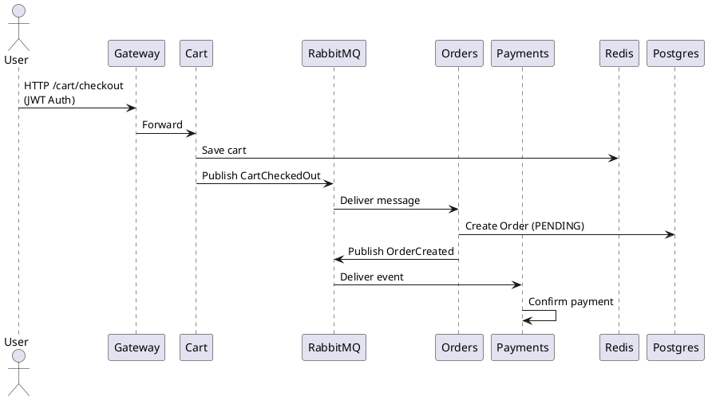

# 🛍️ Comprehensive Tutorial: E‑Commerce Microservices with Microsoft Aspire

---

## 1. Why Microsoft Aspire?

[Microsoft Aspire](https://learn.microsoft.com/dotnet/aspire) is a new distributed application framework in .NET 8 for orchestrating **microservices + infrastructure** together. Instead of juggling `docker-compose.yml`, Kubernetes YAML, and hard‑wired configs, you:

- Declare **services + resources in C# (AppHost)**.  
- Aspire automatically runs services + containers side by side.  
- Injects **connection strings / secrets** (no more "hardcoded localhost:5432").  
- Integrates **OpenTelemetry** by default.  
- Shows a **dashboard** with service health, logs, and endpoints.  
- Works perfectly on **Linux, Windows, macOS** (via Docker).  

---

## 2. System Architecture

### High‑Level

```
User → Gateway API (JWT Auth with Entra ID)
        │
        ├─► Products Service (Postgres)
        ├─► Cart Service (Redis)
        │       └─► Publishes RabbitMQ Checkout Event
        ├─► Orders Service (Consumes from RabbitMQ + Postgres)
        │       └─► Publishes OrderCreated (optional)
        └─► Payments Service (Consumes events)

Infrastructure:
- Postgres, Redis, RabbitMQ, RedisInsight
- Monitoring = Tempo (traces), Loki (logs), Prometheus (metrics), Grafana dashboards
```

### Event‑Driven Checkout Flow (ASCII)

```
User → Gateway (Validates JWT with Entra ID)
        │
        ▼
      Cart API (/checkout)
        │ Save cart to Redis
        │ Publish "CartCheckedOut" event → RabbitMQ
        ▼
  RabbitMQ Broker ───► Orders Worker consumes
                         |
                         ▼
                     Postgres (Order added)
                         |
                         └──► Publish "OrderCreated" event
                                 │
                                 ▼
                          Payments Worker consumes
                          → processes → PaymentConfirmed
```

### Event Flow Diagram (PlantUML)


---

## 3. Setting Up Aspire Solution

### Step 1. Install Aspire Templates
```bash
dotnet new install Microsoft.Aspire.ProjectTemplates
```

### Step 2. Create Solution
```bash
dotnet new aspire-app -n EcommerceApp
cd EcommerceApp
```

This creates:
- **AppHost** project (infra + orchestration)
- **Service projects** (add your ASP.NET APIs here)

---

## 4. Define Infrastructure in AppHost

`AppHost/Program.cs`
```csharp
var builder = DistributedApplication.CreateBuilder(args);

// Infra
var postgres = builder.AddPostgres("postgres").WithImage("postgres", "14");
var redis = builder.AddRedis("redis").WithImage("redis", "7");
var rabbit = builder.AddContainer("rabbitmq","rabbitmq:3-management")
                    .WithEndpoint(5672).WithEndpoint(15672);

// Observability stack
var tempo = builder.AddContainer("tempo","grafana/tempo:latest").WithEndpoint(4318);
var loki  = builder.AddContainer("loki","grafana/loki:2.9.0").WithEndpoint(3100);
var prom  = builder.AddContainer("prometheus","prom/prometheus:latest").WithEndpoint(9090);
var graf  = builder.AddContainer("grafana","grafana/grafana:latest").WithEndpoint(3000);

// Microservices
var gateway  = builder.AddProject<Projects.Gateway>("gateway")
                      .WithReference(postgres).WithReference(redis).WithReference(rabbit);

var products = builder.AddProject<Projects.Products>("products")
                      .WithReference(postgres);

var cart     = builder.AddProject<Projects.Cart>("cart")
                      .WithReference(redis).WithReference(rabbit);

var orders   = builder.AddProject<Projects.Orders>("orders")
                      .WithReference(postgres).WithReference(rabbit);

var payments = builder.AddProject<Projects.Payments>("payments").WithReference(rabbit);

builder.Build().Run();
```

---

## 5. Microservices Implementations (ASP.NET Web API)

All services are **.NET 8 Web APIs**. Aspire injects connection strings via environment variables.

---

### 5.1 Gateway Service (ASP.NET Core + Entra ID)

**Program.cs**
```csharp
var builder = WebApplication.CreateBuilder(args);

builder.Services.AddControllers();
builder.Services.AddAuthentication("Bearer").AddJwtBearer(opts =>
{
    opts.Authority = $"https://login.microsoftonline.com/{builder.Configuration["ENTRA_TENANT_ID"]}/v2.0";
    opts.Audience  = builder.Configuration["ENTRA_CLIENT_ID"];
});

builder.Services.AddHttpClient();
builder.Services.AddOpenTelemetry().WithTracing(tracer =>
    tracer.AddAspNetCoreInstrumentation()
          .AddHttpClientInstrumentation()
          .AddOtlpExporter());

var app = builder.Build();
app.UseAuthentication();
app.UseAuthorization();
app.MapControllers();
app.Run();
```

**GatewayController.cs**
```csharp
[ApiController]
[Route("[controller]")]
public class GatewayController : ControllerBase
{
    private readonly HttpClient _http;
    public GatewayController(IHttpClientFactory f){_http=f.CreateClient();}

    [HttpGet("products")]
    [Authorize]
    public async Task<IActionResult> Products()
    {
        var json = await _http.GetStringAsync("http://products/products");
        return Content(json,"application/json");
    }
}
```

---

### 5.2 Products Service (EF Core + Postgres)

**Product.cs**
```csharp
public class Product { public int Id{get;set;} public string Name{get;set;} public double Price{get;set;} public int Stock{get;set;} }
```

**ProductsDbContext.cs**
```csharp
public class ProductsDbContext : DbContext
{
    public ProductsDbContext(DbContextOptions opt):base(opt){}
    public DbSet<Product> Products {get;set;}
}
```

**ProductsController.cs**
```csharp
[ApiController]
[Route("[controller]")]
public class ProductsController : ControllerBase
{
    private readonly ProductsDbContext _db;
    public ProductsController(ProductsDbContext db){_db=db;}

    [HttpGet] public IEnumerable<Product> All() => _db.Products.ToList();

    [HttpPost]
    public Product Add(Product p){ _db.Products.Add(p); _db.SaveChanges(); return p; }
}
```

---

### 5.3 Cart Service (Redis + RabbitMQ Publisher)

**CartController.cs**
```csharp
[ApiController]
[Route("[controller]")]
public class CartController : ControllerBase
{
    private readonly IDatabase _redis;
    private readonly IModel _rabbit;

    public CartController(IConnectionMultiplexer mux, IConnection rabbitConn)
    {
        _redis = mux.GetDatabase();
        _rabbit = rabbitConn.CreateModel();
        _rabbit.QueueDeclare("cart-checked-out",true,false,false,null);
    }

    [HttpPost("add")]
    public async Task<IActionResult> Add(string userId,string productId)
    {
        await _redis.SetAddAsync($"cart:{userId}", productId);
        return Ok();
    }

    [HttpGet("{userId}")]
    public async Task<IEnumerable<string>> Get(string userId)
    {
        var items = await _redis.SetMembersAsync($"cart:{userId}");
        return items.Select(i=>i.ToString());
    }

    [HttpPost("checkout")]
    public IActionResult Checkout(string userId)
    {
        var evt = new {UserId=userId, Timestamp=DateTime.UtcNow};
        var body = Encoding.UTF8.GetBytes(JsonConvert.SerializeObject(evt));
        _rabbit.BasicPublish("", "cart-checked-out", null, body);
        return Accepted(new {Message="Checkout accepted"});
    }
}
```

---

### 5.4 Orders Service (RabbitMQ Consumer + Postgres)

**Order.cs**
```csharp
public class Order { public int Id{get;set;} public string UserId{get;set;} public string Status{get;set;}="PENDING"; }
```

**OrdersDbContext.cs**
```csharp
public class OrdersDbContext : DbContext
{
    public OrdersDbContext(DbContextOptions opt):base(opt){}
    public DbSet<Order> Orders {get;set;}
}
```

**OrderWorker.cs**
```csharp
public class OrderWorker : BackgroundService
{
    private readonly IModel _channel;
    private readonly IServiceProvider _sp;
    public OrderWorker(IConnection conn, IServiceProvider sp)
    {
        _channel=conn.CreateModel();
        _channel.QueueDeclare("cart-checked-out",true,false,false,null);
        _sp=sp;
    }

    protected override Task ExecuteAsync(CancellationToken st)
    {
        var consumer=new EventingBasicConsumer(_channel);
        consumer.Received += async (s,e) =>
        {
            var json = Encoding.UTF8.GetString(e.Body.ToArray());
            var ev=JsonConvert.DeserializeObject<CartCheckoutEvent>(json);
            using var scope=_sp.CreateScope();
            var db=scope.ServiceProvider.GetRequiredService<OrdersDbContext>();
            var order=new Order{UserId=ev.UserId,Status="PENDING"};
            db.Orders.Add(order);
            await db.SaveChangesAsync();
        };
        _channel.BasicConsume("cart-checked-out",true,consumer);
        return Task.CompletedTask;
    }
}
public class CartCheckoutEvent{public string UserId{get;set;} public DateTime Timestamp{get;set;}}
```

---

### 5.5 Payments Service (Consumer)

Consumes optional `order-created` events and simulates payment success.

---

## 6. Observability (OpenTelemetry)

Each service configures OpenTelemetry in `Program.cs`:

```csharp
builder.Services.AddOpenTelemetry()
 .WithTracing(t => t.AddAspNetCoreInstrumentation()
                    .AddHttpClientInstrumentation()
                    .AddOtlpExporter(opt => opt.Endpoint=new Uri("http://tempo:4318")));
```

Aspire injects proper environment values when referencing Tempo.

---

## 7. RedisInsight GUI

- Runs at [http://localhost:8001](http://localhost:8001)  
- Inspect `cart:<userId>` keys to debug carts.  

---

## 8. Running

### Start environment
```bash
dotnet run --project AppHost
```

Aspire starts:
- Postgres, Redis, RabbitMQ, Grafana stack containers  
- Gateway/Products/Cart/Orders/Payments projects  
- Shows health dashboard locally  

### Teardown
```bash
dotnet run --project AppHost -- shutdown
```

---

## 9. Demo Flow

1. Authenticate via Gateway with Entra ID JWT.  
2. Add product → persisted in Postgres.  
3. Add item to cart → stored in Redis (verify in RedisInsight).  
4. Checkout → publishes event into RabbitMQ.  
5. Orders service consumes, creates `PENDING` order in Postgres.  
6. Payments service consumes `OrderCreated`, marks PAID.  
7. View **traces** in Grafana Tempo, **logs** in Loki, **metrics** in Prometheus.  

---

## 🎓 Conclusion

With **Microsoft Aspire**, we have:  
✅ Gateway, Products, Cart, Orders, Payments microservices  
✅ Infrastructure (Postgres, Redis, RabbitMQ, Grafana stack) orchestrated in C#, not YAML  
✅ Event‑driven RabbitMQ flows for checkout → order → payment  
✅ JWT Auth via Microsoft Entra ID  
✅ Full telemetry via OpenTelemetry, surfaced in Grafana  
✅ RedisInsight GUI for cart debugging  
✅ Works on **Linux, macOS, Windows**, because Aspire + Docker = cross‑platform  

This comprehensive tutorial shows end‑to‑end how Aspire simplifies building cloud‑native microservices while running perfectly locally with Docker 🚀