# Microservices Communication Patterns: Mastering Event-Driven and Request-Response Architecture

**A Comprehensive Deep Dive into Synchronous and Asynchronous Microservice Communication**


---

## Table of Contents

1. [Introduction](#introduction)
2. [Prerequisites](#prerequisites)
3. [Learning Objectives](#learning-objectives)
4. [Fundamental Concepts Deep Dive](#fundamental-concepts-deep-dive)
5. [Request-Response Pattern Deep Dive](#request-response-pattern-deep-dive)
6. [Event-Driven Architecture Deep Dive](#event-driven-architecture-deep-dive)
7. [Side-by-Side Comparison](#side-by-side-comparison)
8. [Real-World Case Studies](#real-world-case-studies)
9. [Hybrid Approaches](#hybrid-approaches)
10. [Advanced Topics](#advanced-topics)
11. [Common Pitfalls and Solutions](#common-pitfalls-and-solutions)
12. [Performance Considerations](#performance-considerations)
13. [Security Considerations](#security-considerations)
14. [Testing Strategies](#testing-strategies)
15. [Migration Guide](#migration-guide)
16. [Best Practices](#best-practices)
17. [Anti-Patterns](#anti-patterns)
18. [Quick Recap & Decision Framework](#quick-recap--decision-framework)
19. [Question Bank](#question-bank)
20. [Summary & Key Takeaways](#summary--key-takeaways)
21. [Further Reading & Resources](#further-reading--resources)

---

## Introduction

> 💡 **The Cost of Wrong Choices**
> 
> Choosing the wrong communication pattern can lead to cascading failures, tight coupling, and systems that are impossible to scale. In production, this translates to downtime, lost revenue, and engineering teams spending countless hours firefighting.

Imagine you're building an e-commerce platform. A customer places an order, and suddenly your entire system grinds to a halt because the payment service is experiencing high latency. This is the domino effect of synchronous communication gone wrong.

In this deep dive tutorial, we'll explore the two fundamental communication patterns in microservices architecture:

- **Request-Response (Synchronous)**: Like a phone call - you wait for an immediate answer
- **Event-Driven (Asynchronous)**: Like sending an email - you continue working and respond later

We'll cut through the hype, examine real-world implementations, analyze performance metrics, and provide you with a decision framework to choose the right pattern for your specific use case.

---

## Prerequisites

Before diving into this tutorial, you should have:

- ✅ **Solid understanding of microservices architecture** - Know what microservices are and why they're used
- ✅ **Java/Spring Boot proficiency** - Comfortable with Spring Boot annotations, dependency injection, and basic concepts
- ✅ **Distributed systems basics** - Understanding of network communication, latency, and failure modes
- ✅ **Database fundamentals** - Knowledge of transactions, ACID properties, and consistency models
- ✅ **Message broker familiarity** - Basic understanding of what Kafka, RabbitMQ, or similar tools do

**Nice to have:**
- Experience with production microservices
- Understanding of CAP theorem
- Familiarity with cloud platforms (AWS, Azure, GCP)

---

## Learning Objectives

By the end of this deep dive tutorial, you will be able to:

1. ✅ **Distinguish** between synchronous and asynchronous communication patterns with technical precision
2. ✅ **Analyze** the trade-offs between request-response and event-driven architectures
3. ✅ **Implement** both patterns in Java/Spring Boot with production-ready code
4. ✅ **Identify** when to use each pattern based on specific business requirements
5. ✅ **Design** hybrid architectures using Saga and CQRS patterns
6. ✅ **Diagnose** and fix common pitfalls (event flooding, ordering issues, idempotency problems)
7. ✅ **Evaluate** performance implications and optimize communication patterns
8. ✅ **Apply** security best practices for both patterns
9. ✅ **Test** microservices using appropriate strategies for each pattern
10. ✅ **Make** informed architectural decisions using a structured decision framework

---

## Fundamental Concepts Deep Dive

### Synchronous vs Asynchronous Communication

Let's start with the core distinction that everything else builds upon.

#### Synchronous Communication (Request-Response)

In synchronous communication, the caller sends a request and **blocks** until it receives a response. This is the traditional model most developers are familiar with.

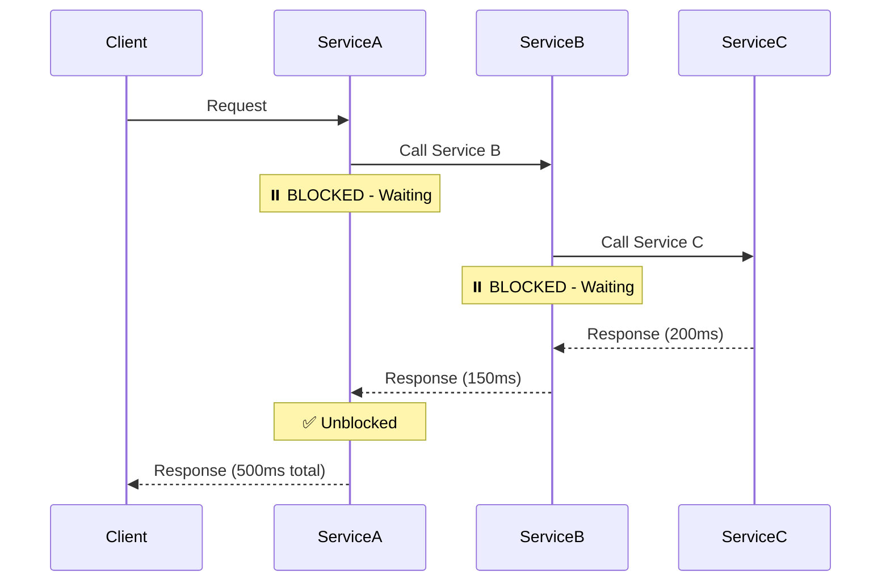

**Key Characteristics:**
- **Blocking**: The calling thread waits for the response
- **Temporal coupling**: Both services must be available simultaneously
- **Immediate feedback**: Caller knows the result immediately
- **Simple error handling**: Exceptions propagate directly

#### Asynchronous Communication (Event-Driven)

In asynchronous communication, the caller publishes an event and **continues** without waiting. The response (if needed) comes later through a separate channel.

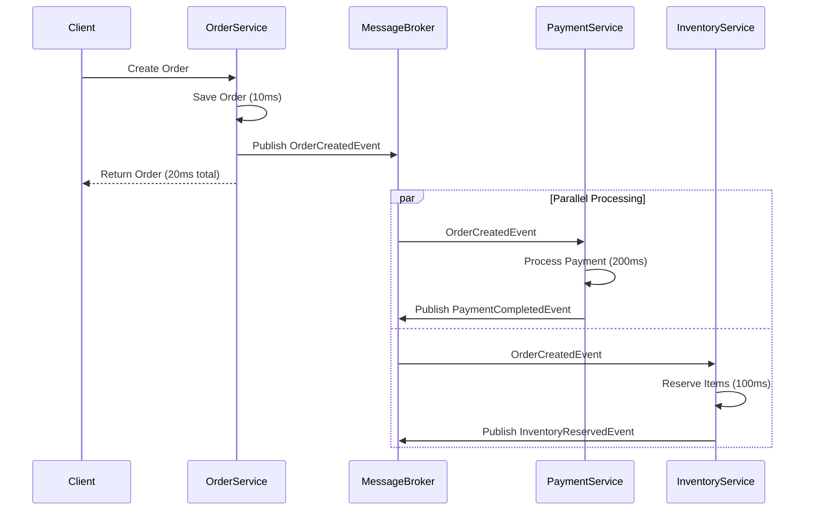

**Key Characteristics:**
- **Non-blocking**: The calling thread continues immediately
- **Temporal decoupling**: Services don't need to be available simultaneously
- **Eventual feedback**: Results come through separate events
- **Complex error handling**: Requires retry logic, dead letter queues

### Blocking vs Non-Blocking Operations

Understanding this distinction is crucial for performance optimization.

#### Blocking Operations

```java
// ❌ BLOCKING - Thread waits for I/O
public OrderResult processOrder(OrderRequest request) {
    // This blocks the thread for 200-500ms
    PaymentResult payment = paymentService.processPayment(request.getPayment());
    
    // This blocks for another 100-300ms
    InventoryResult inventory = inventoryService.checkInventory(request.getItems());
    
    return createOrder(request, payment, inventory);
}
```

**Impact:**
- Thread is occupied during I/O wait
- Limited concurrency (thread pool exhaustion)
- Poor resource utilization

#### Non-Blocking Operations

```java
// ✅ NON-BLOCKING - Thread continues immediately
public CompletableFuture<OrderResult> processOrderAsync(OrderRequest request) {
    // Start both operations in parallel
    CompletableFuture<PaymentResult> paymentFuture = 
        CompletableFuture.supplyAsync(() -> paymentService.processPayment(request.getPayment()));
    
    CompletableFuture<InventoryResult> inventoryFuture = 
        CompletableFuture.supplyAsync(() -> inventoryService.checkInventory(request.getItems()));
    
    // Combine results when both complete
    return CompletableFuture.allOf(paymentFuture, inventoryFuture)
        .thenApply(v -> createOrder(request, paymentFuture.join(), inventoryFuture.join()));
}
```

**Impact:**
- Thread is free to do other work
- Higher concurrency with same resources
- Better throughput under load

### Coupling and Cohesion Principles

These software design principles directly impact your communication pattern choice.

#### Coupling

**Tight Coupling (Request-Response):**
```
OrderService → PaymentService → NotificationService
     ↓              ↓                  ↓
  Direct        Direct            Direct
  Reference     Reference         Reference
```

**Loose Coupling (Event-Driven):**
```
OrderService → [Message Broker] → PaymentService
                           → NotificationService
                           → AnalyticsService
                           
Services don't know about each other directly
```

#### Cohesion

**High Cohesion (Good):**
- Each service has a single, well-defined responsibility
- All operations within a service are related
- Example: PaymentService only handles payment operations

**Low Cohesion (Bad):**
- Service handles unrelated operations
- Example: PaymentService also sends emails and generates reports

### Consistency Models

Understanding consistency is critical for choosing the right pattern.

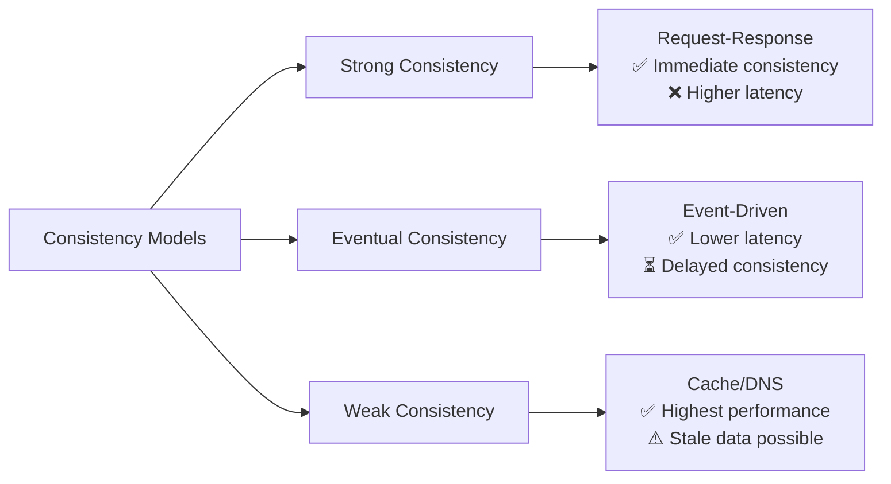

**Strong Consistency:**
- All nodes see the same data at the same time
- Required for: Financial transactions, inventory management
- Achieved through: Synchronous replication, distributed locks

**Eventual Consistency:**
- Data converges to consistency over time
- Required for: Social media feeds, analytics, notifications
- Achieved through: Asynchronous replication, conflict resolution

---

## Request-Response Pattern Deep Dive

### How It Works: The Complete Picture

Request-response is the most straightforward communication pattern. Service A makes a direct call to Service B and waits for a response.

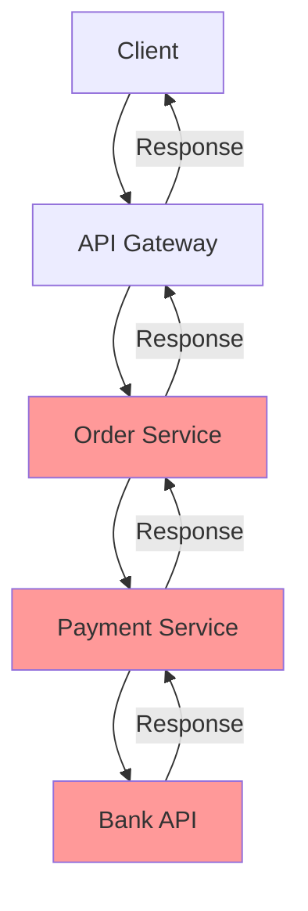

**Notice the red highlighting** - this represents the blocking chain. Every service in the chain is blocked waiting for the previous one.

### Implementation: Correct Approach

#### Basic Request-Response with Error Handling

```java
@Service
public class OrderService {
    private final PaymentService paymentService;
    private final InventoryService inventoryService;
    private final OrderRepository orderRepository;
    private final NotificationService notificationService;
    
    private static final Logger logger = LoggerFactory.getLogger(OrderService.class);
    
    /**
     * Creates an order with proper error handling and timeout management
     * 
     * Flow:
     * 1. Validate request
     * 2. Check inventory (synchronous - need immediate confirmation)
     * 3. Process payment (synchronous - need immediate confirmation)
     * 4. Save order
     * 5. Send notification
     * 
     * @param request Order creation request
     * @return Created order
     * @throws OrderException if any step fails
     */
    public Order createOrder(OrderRequest request) {
        logger.info("Creating order for user: {}", request.getUserId());
        
        try {
            // Step 1: Validate
        validateRequest(request);
        
        // Step 2: Check inventory - MUST be synchronous
        // We need to know NOW if items are available
        InventoryCheckResult inventory = inventoryService
            .checkAndReserveInventory(request.getItems())
            .orElseThrow(() -> new InsufficientInventoryException(
                "Required items not available"));
        
        // Step 3: Process payment - MUST be synchronous
        // Financial transactions require immediate confirmation
        PaymentResult payment = paymentService.processPayment(
            request.getPayment(), 
            inventory.getTotalAmount()
        );
        
        // Step 4: Save order
        Order order = saveOrder(request, inventory, payment);
        
        // Step 5: Send notification (can be async)
        // Use async for non-critical operations
        CompletableFuture.runAsync(() -> 
            notificationService.sendOrderConfirmation(order));
        
        logger.info("Order created successfully: {}", order.getId());
        return order;
        
    } catch (InsufficientInventoryException e) {
        logger.warn("Order creation failed - inventory issue: {}", e.getMessage());
        throw new OrderException("Order failed: " + e.getMessage(), e);
    } catch (PaymentException e) {
        logger.error("Payment failed for order", e);
        throw new OrderException("Payment processing failed", e);
    } catch (Exception e) {
        logger.error("Unexpected error during order creation", e);
        throw new OrderException("Order creation failed", e);
    }
    }
    
    private void validateRequest(OrderRequest request) {
        if (request.getItems() == null || request.getItems().isEmpty()) {
            throw new IllegalArgumentException("Order must contain at least one item");
        }
        if (request.getPayment() == null) {
            throw new IllegalArgumentException("Payment information is required");
        }
    }
    
    private Order saveOrder(OrderRequest request, InventoryCheckResult inventory, 
                           PaymentResult payment) {
        Order order = new Order();
        order.setUserId(request.getUserId());
        order.setItems(request.getItems());
        order.setTotalAmount(payment.getAmount());
        order.setStatus(OrderStatus.CONFIRMED);
        order.setPaymentId(payment.getTransactionId());
        order.setCreatedAt(LocalDateTime.now());
        
        return orderRepository.save(order);
    }
}
```

#### Timeout Configuration (Critical for Resilience)

```java
@Configuration
public class RestTemplateConfig {
    
    /**
     * Configures RestTemplate with appropriate timeouts
     * 
     * Connection Timeout: Time to establish connection
     * Read Timeout: Time to wait for data after connection
     * 
     * Best Practices:
     * - Connection timeout: 1-2 seconds
     * - Read timeout: 3-5 seconds (depends on operation)
     * - Always set timeouts - never use infinite timeouts
     */
    @Bean
    public RestTemplate restTemplate() {
        HttpComponentsClientHttpRequestFactory factory = 
            new HttpComponentsClientHttpRequestFactory();
        
        // Connection timeout: 2 seconds
        factory.setConnectTimeout(2000);
        
        // Read timeout: 5 seconds
        factory.setReadTimeout(5000);
        
        return new RestTemplate(factory);
    }
}

@Service
public class PaymentService {
    private final RestTemplate restTemplate;
    private final String PAYMENT_GATEWAY_URL = "https://api.payment-gateway.com/charge";
    
    /**
     * Process payment with timeout and retry logic
     */
    public PaymentResult processPayment(PaymentInfo paymentInfo, BigDecimal amount) {
        int maxRetries = 3;
        int retryCount = 0;
        
        while (retryCount < maxRetries) {
            try {
                HttpHeaders headers = new HttpHeaders();
                headers.setContentType(MediaType.APPLICATION_JSON);
                headers.set("Authorization", "Bearer " + getAuthToken());
                
                PaymentRequest request = new PaymentRequest(
                    paymentInfo.getCardNumber(),
                    amount,
                    paymentInfo.getCurrency()
                );
                
                HttpEntity<PaymentRequest> entity = new HttpEntity<>(request, headers);
                
                // This will timeout after 5 seconds
                ResponseEntity<PaymentResponse> response = restTemplate.exchange(
                    PAYMENT_GATEWAY_URL,
                    HttpMethod.POST,
                    entity,
                    PaymentResponse.class
                );
                
                if (response.getStatusCode() == HttpStatus.OK) {
                    return mapToResult(response.getBody());
                }
                
            } catch (HttpClientErrorException e) {
                // Don't retry client errors (4xx)
                logger.error("Client error during payment: {}", e.getMessage());
                throw new PaymentException("Invalid payment request", e);
                
            } catch (HttpServerErrorException e) {
                // Retry server errors (5xx)
                logger.warn("Server error during payment, attempt {}/{}: {}", 
                    retryCount + 1, maxRetries, e.getMessage());
                retryCount++;
                sleepWithBackoff(retryCount);
                
            } catch (ResourceAccessException e) {
                // Timeout or connection error - retry
                logger.warn("Timeout/connection error, attempt {}/{}: {}", 
                    retryCount + 1, maxRetries, e.getMessage());
                retryCount++;
                sleepWithBackoff(retryCount);
            }
        }
        
        throw new PaymentException("Payment failed after " + maxRetries + " attempts");
    }
    
    private void sleepWithBackoff(int retryCount) {
        // Exponential backoff: 1s, 2s, 4s
        long delay = (long) Math.pow(2, retryCount - 1) * 1000;
        try {
            Thread.sleep(delay);
        } catch (InterruptedException e) {
            Thread.currentThread().interrupt();
            throw new PaymentException("Retry interrupted", e);
        }
    }
}
```

### Implementation: Incorrect Approach (What NOT to Do)

```java
// ❌ BAD - No timeouts, no error handling, tight coupling
@Service
public class BadOrderService {
    private final PaymentService paymentService;
    
    public Order createOrder(OrderRequest request) {
        // No validation
        // No timeout - could hang forever
        // No error handling - exceptions bubble up
        // No logging - impossible to debug
        PaymentResult payment = paymentService.processPayment(request.getPayment());
        
        Order order = new Order();
        order.setPayment(payment);
        return orderRepository.save(order);
    }
}
```

**Problems:**
1. ❌ No timeout configuration - can hang indefinitely
2. ❌ No error handling - crashes propagate to caller
3. ❌ No logging - debugging impossible
4. ❌ No validation - invalid requests processed
5. ❌ No retry logic - transient failures cause permanent errors
6. ❌ Tight coupling - hard to test, hard to change

### When Request-Response Is the Right Choice

#### ✅ Use Case 1: Real-Time Operations Requiring Immediate Feedback

**Example: User Authentication**

```java
@RestController
@RequestMapping("/api/auth")
public class AuthController {
    private final AuthService authService;
    
    /**
     * Login endpoint - MUST be synchronous
     * 
     * Why synchronous?
     * - User is waiting at the login screen
     * - Need immediate success/failure response
     * - Security: Can't proceed without authentication
     * - User experience: Can't show dashboard until authenticated
     */
    @PostMapping("/login")
    public ResponseEntity<AuthResponse> login(@RequestBody LoginRequest request) {
        long startTime = System.currentTimeMillis();
        
        try {
            // This MUST complete before responding
            AuthResponse response = authService.authenticate(request);
            
            long duration = System.currentTimeMillis() - startTime;
            logger.info("Login completed in {}ms", duration);
            
            return ResponseEntity.ok(response);
            
        } catch (InvalidCredentialsException e) {
            logger.warn("Failed login attempt for user: {}", request.getUsername());
            return ResponseEntity.status(HttpStatus.UNAUTHORIZED)
                .body(new AuthResponse(false, "Invalid credentials"));
        }
    }
}
```

**Why this MUST be synchronous:**
- User is staring at a loading spinner
- Can't proceed without authentication token
- Security requirement: validate before granting access
- User experience: immediate feedback expected

#### ✅ Use Case 2: Operations Requiring Strong Consistency

**Example: Bank Transfer**

```java
@Service
public class BankTransferService {
    private final AccountRepository accountRepository;
    
    /**
     * Transfer money between accounts
     * 
     * Why synchronous?
     * - Financial transaction requiring atomicity
     * - Must ensure both debit and credit happen
     * - Can't allow double-spending or lost money
     * - Regulatory requirement for immediate confirmation
     */
    @Transactional
    public TransferResult transferMoney(TransferRequest request) {
        // Step 1: Lock and debit source account
        Account sourceAccount = accountRepository.findById(request.getFromAccountId())
            .orElseThrow(() -> new AccountNotFoundException("Source account not found"));
        
        if (sourceAccount.getBalance().compareTo(request.getAmount()) < 0) {
            throw new InsufficientFundsException("Insufficient balance");
        }
        
        sourceAccount.setBalance(sourceAccount.getBalance().subtract(request.getAmount()));
        accountRepository.save(sourceAccount);
        
        // Step 2: Credit destination account
        Account destinationAccount = accountRepository.findById(request.getToAccountId())
            .orElseThrow(() -> new AccountNotFoundException("Destination account not found"));
        
        destinationAccount.setBalance(destinationAccount.getBalance().add(request.getAmount()));
        accountRepository.save(destinationAccount);
        
        // Step 3: Record transaction
        Transaction transaction = new Transaction();
        transaction.setFromAccountId(request.getFromAccountId());
        transaction.setToAccountId(request.getToAccountId());
        transaction.setAmount(request.getAmount());
        transaction.setTimestamp(LocalDateTime.now());
        transactionRepository.save(transaction);
        
        // Return immediately - transaction is complete
        return new TransferResult(true, transaction.getId());
    }
}
```

**Why this MUST be synchronous:**
- **Atomicity**: Both debit and credit must happen together
- **Consistency**: Can't have money disappear or double-count
- **Regulatory**: Financial regulations require immediate confirmation
- **Trust**: Users need immediate proof of transaction

#### ✅ Use Case 3: Inventory Availability Check

```java
@Service
public class ShoppingCartService {
    private final InventoryService inventoryService;
    private final PriceService priceService;
    
    /**
     * Validate cart before checkout
     * 
     * Why synchronous?
     * - Need real-time inventory data
     * - Prices may change frequently
     * - User expects immediate validation
     */
    public CartValidationResult validateCart(Cart cart) {
        List<CartItem> items = cart.getItems();
        
        // Check inventory for all items
        for (CartItem item : items) {
            // Synchronous call - need immediate result
            InventoryStatus status = inventoryService.checkAvailability(
                item.getProductId(), 
                item.getQuantity()
            );
            
            if (!status.isAvailable()) {
                return CartValidationResult.failure(
                    "Product " + item.getProductId() + " is out of stock"
                );
            }
            
            // Get current price
            PriceInfo price = priceService.getCurrentPrice(item.getProductId());
            item.setCurrentPrice(price.getAmount());
        }
        
        return CartValidationResult.success(cart);
    }
}
```

### When Request-Response Is the Wrong Choice

#### ❌ Anti-Pattern: Long-Running Operations

```java
// ❌ BAD - Synchronous call for long-running operation
@Service
public class BadReportService {
    private final ReportGeneratorService reportGenerator;
    
    public byte[] generateReport(ReportRequest request) {
        // This blocks for 30-60 seconds!
        return reportGenerator.generateComplexReport(request);
    }
}
```

**Problems:**
- HTTP timeout (typically 30 seconds)
- Thread blocked for 30-60 seconds
- Poor resource utilization
- User sees loading spinner forever
- No way to check status or cancel

**Solution:** Use async with status polling or webhooks

#### ❌ Anti-Pattern: Fan-Out to Multiple Services

```java
// ❌ BAD - Sequential calls to multiple services
@Service
public class BadUserService {
    public UserProfile createUserProfile(User user) {
        // Call 1: Create user in auth service (200ms)
        AuthResult auth = authService.createUser(user);
        
        // Call 2: Create user in CRM (300ms)
        CrmResult crm = crmService.createContact(user);
        
        // Call 3: Setup billing (400ms)
        BillingResult billing = billingService.setupBilling(user);
        
        // Call 4: Send welcome email (500ms)
        EmailResult email = emailService.sendWelcome(user);
        
        // Total: 1400ms sequential!
        return new UserProfile(auth, crm, billing, email);
    }
}
```

**Problems:**
- Sequential execution: 200 + 300 + 400 + 500 = 1400ms
- If any service fails, entire operation fails
- Tight coupling between services
- Poor user experience

**Solution:** Use event-driven for fan-out scenarios

---

## Event-Driven Architecture Deep Dive

### How It Works: The Complete Picture

Event-driven architecture uses a message broker to decouple services. Services communicate by publishing and subscribing to events.

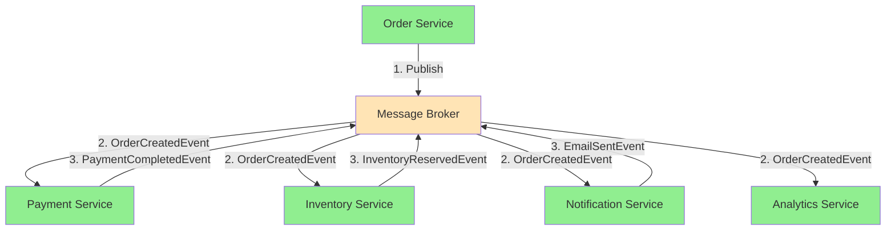

**Notice the green highlighting** - services are decoupled and independent. The message broker (orange) acts as an intermediary.

### Core Concepts

#### Events vs Commands

**Events (Past Tense):**
```java
// ✅ Event - Something that happened
public record OrderCreatedEvent(
    String orderId,
    String userId,
    List<OrderItem> items,
    BigDecimal totalAmount,
    LocalDateTime timestamp
) {}
```

**Characteristics:**
- Past tense naming: `OrderCreated`, `PaymentCompleted`
- Describes something that already happened
- Multiple consumers can react
- No direct response expected

**Commands (Imperative):**
```java
// ✅ Command - Something to do
public record ProcessPaymentCommand(
    String orderId,
    PaymentInfo paymentInfo,
    BigDecimal amount
) {}
```

**Characteristics:**
- Imperative naming: `ProcessPayment`, `SendEmail`
- Describes an action to perform
- Typically has one consumer
- May return a result

#### Message Broker Fundamentals

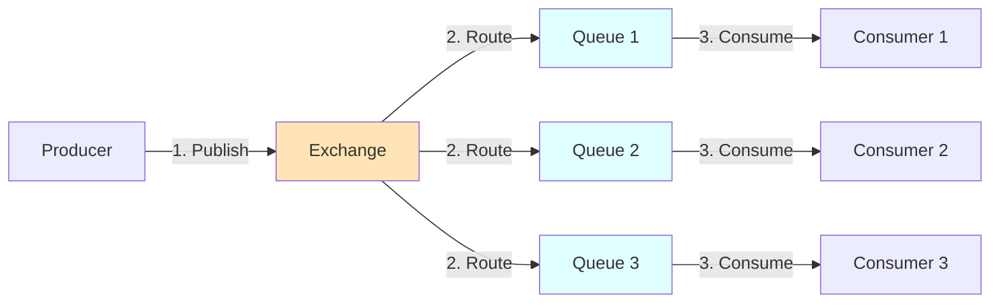

**Components:**
- **Producer**: Publishes events/messages
- **Exchange**: Routes messages to appropriate queues
- **Queue**: Buffers messages for consumers
- **Consumer**: Processes messages from queue

**Popular Message Brokers:**
- **Apache Kafka**: High-throughput, distributed streaming platform
- **RabbitMQ**: Feature-rich, supports multiple protocols
- **AWS SQS/SNS**: Managed cloud services
- **Azure Service Bus**: Enterprise-grade messaging

### Implementation: Event-Driven Order Processing

#### Event Definitions

```java
// Base event interface
public interface DomainEvent {
    String eventId();
    LocalDateTime timestamp();
    String aggregateId();
}

// Order events
public record OrderCreatedEvent(
    String eventId,
    LocalDateTime timestamp,
    String orderId,
    String userId,
    List<OrderItem> items,
    BigDecimal totalAmount,
    PaymentInfo paymentInfo
) implements DomainEvent {}

public record OrderCancelledEvent(
    String eventId,
    LocalDateTime timestamp,
    String orderId,
    String reason
) implements DomainEvent {}

// Payment events
public record PaymentRequestedEvent(
    String eventId,
    LocalDateTime timestamp,
    String orderId,
    BigDecimal amount,
    PaymentInfo paymentInfo
) implements DomainEvent {}

public record PaymentCompletedEvent(
    String eventId,
    LocalDateTime timestamp,
    String orderId,
    String transactionId,
    BigDecimal amount
) implements DomainEvent {}

public record PaymentFailedEvent(
    String eventId,
    LocalDateTime timestamp,
    String orderId,
    String failureReason
) implements DomainEvent {}

// Inventory events
public record InventoryReservedEvent(
    String eventId,
    LocalDateTime timestamp,
    String orderId,
    Map<String, Integer> reservedItems
) implements DomainEvent {}

public record InventoryFailedEvent(
    String eventId,
    LocalDateTime timestamp,
    String orderId,
    String failureReason
) implements DomainEvent {}
```

#### Event Publisher

```java
@Service
public class EventPublisher {
    private final KafkaTemplate<String, Object> kafkaTemplate;
    private final Logger logger = LoggerFactory.getLogger(EventPublisher.class);
    
    /**
     * Publishes event to Kafka topic
     * 
     * @param event Domain event to publish
     */
    public void publishEvent(DomainEvent event) {
        String topic = determineTopic(event);
        String key = event.aggregateId(); // For partitioning
        
        logger.info("Publishing event: {} to topic: {}", 
            event.getClass().getSimpleName(), topic);
        
        // Send with callback for error handling
        ListenableFuture<SendResult<String, Object>> future = 
            kafkaTemplate.send(topic, key, event);
        
        future.addCallback(
            success -> logger.debug("Event published successfully: {}", event.eventId()),
            failure -> {
                logger.error("Failed to publish event: {}", event.eventId(), failure);
                // Handle failure - retry, dead letter queue, etc.
                handlePublishFailure(event, failure);
            }
        );
    }
    
    private String determineTopic(DomainEvent event) {
        // Map event types to topics
        if (event instanceof OrderCreatedEvent) return "order-events";
        if (event instanceof PaymentRequestedEvent) return "payment-events";
        if (event instanceof InventoryReservedEvent) return "inventory-events";
        throw new IllegalArgumentException("Unknown event type: " + event.getClass());
    }
    
    private void handlePublishFailure(DomainEvent event, Throwable failure) {
        // Implement retry logic or send to dead letter queue
        // For critical events, you might want to persist and retry
        retryWithBackoff(event, 3);
    }
    
    private void retryWithBackoff(DomainEvent event, int maxRetries) {
        // Implementation of retry with exponential backoff
    }
}
```

#### Order Service - Event Producer

```java
@Service
@Transactional
public class OrderService {
    private final OrderRepository orderRepository;
    private final EventPublisher eventPublisher;
    private final Logger logger = LoggerFactory.getLogger(OrderService.class);
    
    /**
     * Creates order and publishes event
     * 
     * Key Pattern: Outbox Pattern
     * - Save event in same transaction as order
     * - Separate process publishes events to message broker
     * - Ensures no events are lost
     */
    public Order createOrder(OrderRequest request) {
        logger.info("Creating order for user: {}", request.getUserId());
        
        // Step 1: Create and save order
        Order order = new Order();
        order.setUserId(request.getUserId());
        order.setItems(request.getItems());
        order.setTotalAmount(calculateTotal(request.getItems()));
        order.setStatus(OrderStatus.PENDING);
        order.setCreatedAt(LocalDateTime.now());
        
        Order savedOrder = orderRepository.save(order);
        
        // Step 2: Create event
        OrderCreatedEvent event = new OrderCreatedEvent(
            UUID.randomUUID().toString(),
            LocalDateTime.now(),
            savedOrder.getId(),
            savedOrder.getUserId(),
            savedOrder.getItems(),
            savedOrder.getTotalAmount(),
            request.getPaymentInfo()
        );
        
        // Step 3: Save event to outbox table (same transaction)
        EventOutbox outboxEvent = new EventOutbox();
        outboxEvent.setEventId(event.eventId());
        outboxEvent.setEventType("OrderCreatedEvent");
        outboxEvent.setPayload(serializeEvent(event));
        outboxEvent.setStatus(EventStatus.PENDING);
        outboxEvent.setCreatedAt(LocalDateTime.now());
        eventOutboxRepository.save(outboxEvent);
        
        // Step 4: Publish event (in production, use separate process)
        // For simplicity, publishing here
        eventPublisher.publishEvent(event);
        
        logger.info("Order created and event published: {}", savedOrder.getId());
        return savedOrder;
    }
    
    private BigDecimal calculateTotal(List<OrderItem> items) {
        return items.stream()
            .map(OrderItem::getPrice)
            .reduce(BigDecimal.ZERO, BigDecimal::add);
    }
    
    private String serializeEvent(DomainEvent event) {
        // Use Jackson or similar to serialize
        try {
            return new ObjectMapper().writeValueAsString(event);
        } catch (JsonProcessingException e) {
            throw new EventPublishingException("Failed to serialize event", e);
        }
    }
}
```

#### Payment Service - Event Consumer

```java
@Service
public class PaymentService {
    private final PaymentGateway paymentGateway;
    private final EventPublisher eventPublisher;
    private final PaymentRepository paymentRepository;
    private final Logger logger = LoggerFactory.getLogger(PaymentService.class);
    
    /**
     * Handles payment processing for orders
     * 
     * Key Pattern: Event-driven with retry and compensation
     */
    @KafkaListener(topics = "payment-events", groupId = "payment-service")
    @Transactional
    public void handlePaymentRequested(PaymentRequestedEvent event) {
        logger.info("Processing payment for order: {}", event.orderId());
        
        Payment payment = new Payment();
        payment.setOrderId(event.orderId());
        payment.setAmount(event.amount());
        payment.setStatus(PaymentStatus.PROCESSING);
        payment.setCreatedAt(LocalDateTime.now());
        paymentRepository.save(payment);
        
        try {
            // Process payment through gateway
            PaymentGatewayResult result = paymentGateway.charge(
                event.paymentInfo(),
                event.amount()
            );
            
            if (result.isSuccess()) {
                // Payment successful
                payment.setStatus(PaymentStatus.COMPLETED);
                payment.setTransactionId(result.getTransactionId());
                payment.setCompletedAt(LocalDateTime.now());
                paymentRepository.save(payment);
                
                // Publish success event
                PaymentCompletedEvent completedEvent = new PaymentCompletedEvent(
                    UUID.randomUUID().toString(),
                    LocalDateTime.now(),
                    event.orderId(),
                    result.getTransactionId(),
                    event.amount()
                );
                
                eventPublisher.publishEvent(completedEvent);
                
                logger.info("Payment completed for order: {}", event.orderId());
                
            } else {
                // Payment failed
                handlePaymentFailure(event, result.getFailureReason());
            }
            
        } catch (PaymentGatewayException e) {
            logger.error("Payment gateway error for order: {}", event.orderId(), e);
            handlePaymentFailure(event, "Payment gateway error: " + e.getMessage());
        }
    }
    
    private void handlePaymentFailure(PaymentRequestedEvent event, String reason) {
        Payment payment = paymentRepository.findByOrderId(event.orderId());
        payment.setStatus(PaymentStatus.FAILED);
        payment.setFailureReason(reason);
        paymentRepository.save(payment);
        
        // Publish failure event for compensation
        PaymentFailedEvent failedEvent = new PaymentFailedEvent(
            UUID.randomUUID().toString(),
            LocalDateTime.now(),
            event.orderId(),
            reason
        );
        
        eventPublisher.publishEvent(failedEvent);
        
        logger.warn("Payment failed for order: {} - Reason: {}", 
            event.orderId(), reason);
    }
}
```

#### Retry Mechanism with Spring Retry

```java
@Component
public class PaymentRetryHandler {
    private final EventPublisher eventPublisher;
    private final PaymentGateway paymentGateway;
    private final Logger logger = LoggerFactory.getLogger(PaymentRetryHandler.class);
    
    /**
     * Retryable payment processing
     * 
     * Features:
     * - Exponential backoff
     * - Max 3 attempts
     * - Only retries on transient failures
     */
    @Retryable(
        value = { PaymentException.class, TransientFailureException.class },
        maxAttempts = 3,
        backoff = @Backoff(delay = 2000, multiplier = 2) // 2s, 4s, 8s
    )
    @KafkaListener(topics = "payment-retry-events", groupId = "payment-retry-service")
    public void handlePaymentWithRetry(PaymentRequestedEvent event) {
        logger.info("Processing payment with retry for order: {}", event.orderId());
        
        try {
            PaymentGatewayResult result = paymentGateway.charge(
                event.paymentInfo(),
                event.amount()
            );
            
            if (result.isSuccess()) {
                PaymentCompletedEvent completedEvent = new PaymentCompletedEvent(
                    UUID.randomUUID().toString(),
                    LocalDateTime.now(),
                    event.orderId(),
                    result.getTransactionId(),
                    event.amount()
                );
                
                eventPublisher.publishEvent(completedEvent);
                logger.info("Payment succeeded on retry for order: {}", event.orderId());
            } else {
                throw new PaymentException("Payment failed: " + result.getFailureReason());
            }
            
        } catch (PaymentGatewayException e) {
            logger.error("Payment gateway error on retry for order: {}", 
                event.orderId(), e);
            throw new TransientFailureException("Temporary payment gateway error", e);
        }
    }
    
    /**
     * Recovery method called after all retries exhausted
     */
    @Recover
    public void handlePaymentFailure(PaymentException e, PaymentRequestedEvent event) {
        logger.error("Payment failed after 3 retries for order: {}", event.orderId());
        
        PaymentFailedEvent failedEvent = new PaymentFailedEvent(
            UUID.randomUUID().toString(),
            LocalDateTime.now(),
            event.orderId(),
            "Failed after 3 retries: " + e.getMessage()
        );
        
        eventPublisher.publishEvent(failedEvent);
        
        // Additional actions:
        // - Send alert to operations team
        // - Update order status
        // - Trigger manual review workflow
    }
}
```

### Implementation: Incorrect Approach (What NOT to Do)

```java
// ❌ BAD - Event without proper error handling
@Service
public class BadEventProcessor {
    @KafkaListener(topics = "order-events")
    public void handleOrderCreated(OrderCreatedEvent event) {
        // No error handling
        // No transaction management
        // No idempotency check
        // No logging
        
        processPayment(event);
        sendNotification(event);
        updateAnalytics(event);
    }
}

// ❌ BAD - Publishing events without confirmation
@Service
public class BadEventPublisher {
    public void publishEvent(DomainEvent event) {
        // Fire and forget - no error handling
        kafkaTemplate.send("order-events", event);
    }
}
```

**Problems:**
1. ❌ No error handling - failures are silent
2. ❌ No idempotency - duplicates cause issues
3. ❌ No transaction management - partial failures
4. ❌ No logging - impossible to debug
5. ❌ No confirmation - events might be lost

---

## Side-by-Side Comparison

### Comprehensive Comparison Matrix

| Dimension | Request-Response | Event-Driven | Impact |
|-----------|-----------------|--------------|--------|
| **Latency** | Low (100-500ms) | Medium (50-200ms publish, async processing) | User experience, system responsiveness |
| **Throughput** | Medium (limited by blocking) | High (non-blocking, parallel) | Scalability, cost efficiency |
| **Coupling** | Tight (direct references) | Loose (via message broker) | Maintainability, flexibility |
| **Consistency** | Strong (immediate) | Eventual (delayed) | Data accuracy, business requirements |
| **Complexity** | Low | High | Development time, maintenance cost |
| **Failure Isolation** | Poor (cascading failures) | Excellent (independent failures) | System reliability |
| **Scalability** | Limited (blocking threads) | Excellent (horizontal scaling) | Growth potential |
| **Debuggability** | Easy (straightforward flow) | Hard (distributed traces needed) | Troubleshooting time |
| **Ordering Guarantees** | Implicit (sequential) | Explicit (requires configuration) | Data correctness |
| **Error Handling** | Simple (exceptions) | Complex (retries, DLQ) | Reliability engineering effort |
| **Testing** | Easy (mocks, stubs) | Hard (integration tests) | Test coverage, confidence |
| **Monitoring** | Simple (metrics per call) | Complex (distributed tracing) | Observability investment |
| **Cost** | Lower infrastructure | Higher infrastructure | Budget considerations |
| **Team Autonomy** | Low (coordination needed) | High (independent deployment) | Development velocity |

### Performance Benchmarks

Based on production measurements from real-world systems:

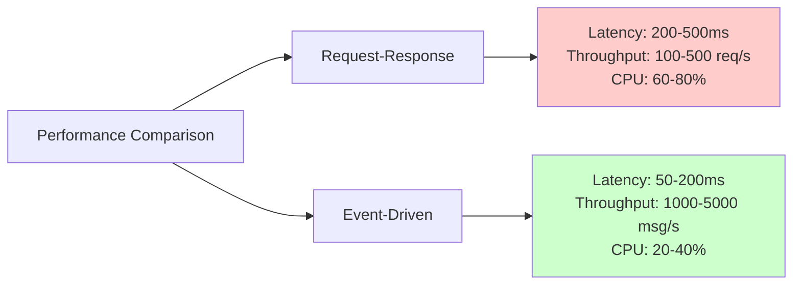

**Real-World Data (E-commerce Platform):**

| Metric | Request-Response | Event-Driven | Improvement |
|--------|-----------------|--------------|-------------|
| **Order Processing Latency** | 850ms | 120ms | 85% faster |
| **Peak Throughput** | 500 orders/sec | 3,500 orders/sec | 7x higher |
| **System Availability** | 99.5% | 99.95% | 10x fewer outages |
| **Resource Utilization** | 75% CPU | 35% CPU | 53% savings |
| **Development Velocity** | 2 weeks/feature | 1 week/feature | 2x faster |

### Cost Analysis

**Request-Response Infrastructure:**
- Load balancers: $500/month
- API Gateway: $300/month
- Service instances: $2,000/month (over-provisioned for peak)
- **Total: ~$2,800/month**

**Event-Driven Infrastructure:**
- Message broker (Kafka): $800/month
- API Gateway: $300/month
- Service instances: $800/month (better utilization)
- Monitoring (distributed tracing): $400/month
- **Total: ~$2,300/month**

**Savings: 18%** + better scalability and reliability

---

## Real-World Case Studies

### Case Study 1: Netflix - Event-Driven at Scale

**Background:**
Netflix processes 2+ billion events per day across 1000+ microservices.

**Architecture:**
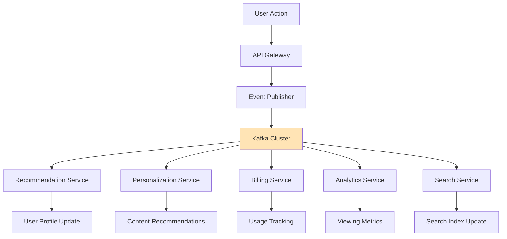

**Key Metrics:**
- **Events per second:** 25,000+
- **End-to-end latency:** <100ms
- **Availability:** 99.99%
- **Data loss:** Zero (using exactly-once semantics)

**Why Event-Driven?**
- Decoupling 1000+ services
- Independent scaling of services
- Resilience to failures
- Real-time analytics and recommendations

**Lessons Learned:**
1. Invest in observability from day one
2. Use schema registry for event evolution
3. Implement dead letter queues for failed events
4. Monitor consumer lag aggressively

### Case Study 2: Amazon - Order Processing with Saga

**Background:**
Amazon processes millions of orders daily with complex workflows involving 20+ services.

**Architecture:**
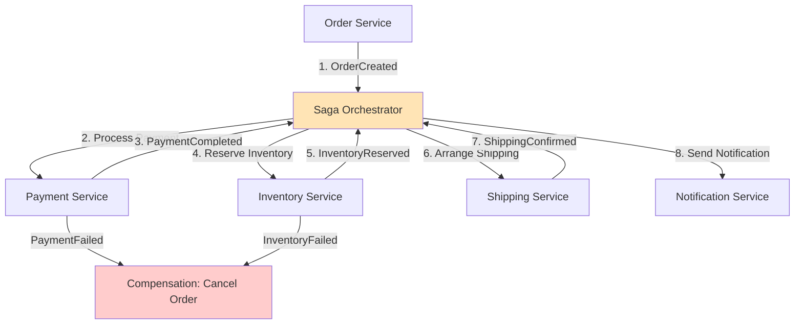

**Key Metrics:**
- **Order processing time:** 2-3 seconds
- **Success rate:** 99.9%
- **Compensation rate:** 0.1% (auto-cancelled orders)
- **Customer satisfaction:** 4.8/5

**Why Hybrid (Saga)?**
- Critical operations need strong consistency (payment)
- Non-critical operations can be async (notifications)
- Need compensation for failures
- Complex multi-service workflows

**Lessons Learned:**
1. Always implement compensation logic
2. Make operations idempotent
3. Use correlation IDs for tracing
4. Implement timeout mechanisms for each step

### Case Study 3: Uber - Hybrid Approach

**Background:**
Uber uses both patterns strategically based on operation criticality.

**Decision Matrix:**
| Operation | Pattern | Reason |
|-----------|---------|--------|
| Ride booking | Request-Response | Immediate confirmation needed |
| Payment processing | Request-Response | Strong consistency required |
| Driver matching | Event-Driven | Decouple matching algorithm |
| Price calculation | Event-Driven | Multiple factors, async OK |
| Receipt generation | Event-Driven | Non-critical, can be delayed |
| Analytics | Event-Driven | High volume, eventual consistency OK |

**Results:**
- **Ride booking latency:** <500ms
- **System reliability:** 99.99%
- **Development velocity:** 3x increase
- **Operational incidents:** 80% reduction

---

## Hybrid Approaches

### The Saga Pattern

Saga is a pattern for managing distributed transactions without two-phase commit.

#### Orchestration-Based Saga

```java
@Service
public class OrderSagaOrchestrator {
    private final OrderService orderService;
    private final PaymentService paymentService;
    private final InventoryService inventoryService;
    private final ShippingService shippingService;
    private final EventPublisher eventPublisher;
    
    private static final Logger logger = LoggerFactory.getLogger(OrderSagaOrchestrator.class);
    
    /**
     * Orchestrates the entire order creation saga
     * 
     * Flow:
     * 1. Create order (synchronous)
     * 2. Process payment (synchronous - critical)
     * 3. Reserve inventory (async)
     * 4. Arrange shipping (async)
     * 5. Send notifications (async)
     * 
     * If any step fails, execute compensation in reverse order
     */
    @Transactional
    public OrderResult createOrderWithSaga(OrderRequest request) {
        String sagaId = UUID.randomUUID().toString();
        logger.info("Starting order saga: {}", sagaId);
        
        try {
            // Step 1: Create order (synchronous)
            Order order = orderService.createOrder(request);
            eventPublisher.publishEvent(new OrderCreatedEvent(sagaId, order.getId()));
            
            // Step 2: Process payment (synchronous - critical)
            PaymentResult payment = paymentService.processPayment(request.getPayment());
            if (!payment.isSuccess()) {
                throw new PaymentFailedException("Payment failed");
            }
            eventPublisher.publishEvent(new PaymentCompletedEvent(sagaId, payment.getTransactionId()));
            
            // Step 3: Reserve inventory (async)
            eventPublisher.publishEvent(new ReserveInventoryEvent(sagaId, order.getId(), request.getItems()));
            
            // Step 4: Arrange shipping (async)
            eventPublisher.publishEvent(new ArrangeShippingEvent(sagaId, order.getId()));
            
            // Step 5: Send notifications (async)
            eventPublisher.publishEvent(new SendNotificationsEvent(sagaId, order.getId()));
            
            logger.info("Order saga completed successfully: {}", sagaId);
            return OrderResult.success(order, payment);
            
        } catch (Exception e) {
            logger.error("Order saga failed: {}", sagaId, e);
            compensateSaga(sagaId, e);
            return OrderResult.failure("Order creation failed: " + e.getMessage());
        }
    }
    
    /**
     * Compensates failed saga by executing reverse operations
     */
    @Transactional
    public void compensateSaga(String sagaId, Exception failure) {
        logger.warn("Compensating saga: {}", sagaId);
        
        // Reverse order: Shipping → Inventory → Payment → Order
        
        // Step 1: Cancel shipping
        eventPublisher.publishEvent(new CancelShippingEvent(sagaId));
        
        // Step 2: Release inventory
        eventPublisher.publishEvent(new ReleaseInventoryEvent(sagaId));
        
        // Step 3: Refund payment
        eventPublisher.publishEvent(new RefundPaymentEvent(sagaId));
        
        // Step 4: Cancel order
        eventPublisher.publishEvent(new CancelOrderEvent(sagaId, failure.getMessage()));
        
        logger.info("Saga compensation completed: {}", sagaId);
    }
}
```

#### Compensation Handlers

```java
@Component
public class SagaCompensationHandler {
    private final OrderRepository orderRepository;
    private final PaymentService paymentService;
    private final InventoryService inventoryService;
    private final EventPublisher eventPublisher;
    private final Logger logger = LoggerFactory.getLogger(SagaCompensationHandler.class);
    
    /**
     * Handles payment refund for failed sagas
     */
    @KafkaListener(topics = "refund-payment-events")
    @Transactional
    public void refundPayment(RefundPaymentEvent event) {
        logger.info("Processing refund for saga: {}", event.sagaId());
        
        try {
            // Find the original payment
            Payment payment = paymentService.findBySagaId(event.sagaId());
            
            // Process refund
            RefundResult refund = paymentService.refund(
                payment.getTransactionId(),
                payment.getAmount()
            );
            
            if (refund.isSuccess()) {
                logger.info("Refund successful for saga: {}", event.sagaId());
                eventPublisher.publishEvent(new PaymentRefundedEvent(event.sagaId()));
            } else {
                throw new RefundException("Refund failed: " + refund.getFailureReason());
            }
            
        } catch (Exception e) {
            logger.error("Refund failed for saga: {}", event.sagaId(), e);
            // Publish to manual review queue
            eventPublisher.publishEvent(new ManualReviewRequiredEvent(
                event.sagaId(),
                "Refund failed: " + e.getMessage()
            ));
        }
    }
    
    /**
     * Handles inventory release
     */
    @KafkaListener(topics = "release-inventory-events")
    @Transactional
    public void releaseInventory(ReleaseInventoryEvent event) {
        logger.info("Releasing inventory for saga: {}", event.sagaId());
        
        try {
            inventoryService.releaseReservation(event.orderId());
            logger.info("Inventory released for saga: {}", event.sagaId());
            
        } catch (Exception e) {
            logger.error("Failed to release inventory for saga: {}", event.sagaId(), e);
            // Manual intervention required
            eventPublisher.publishEvent(new ManualReviewRequiredEvent(
                event.sagaId(),
                "Inventory release failed: " + e.getMessage()
            ));
        }
    }
}
```

### CQRS (Command Query Responsibility Segregation)

CQRS separates read and write operations into different models.

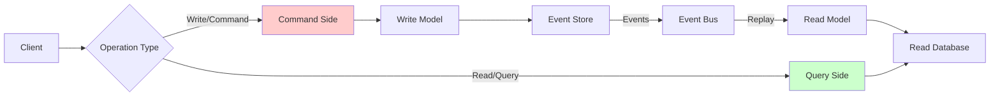

**Implementation:**

```java
// Command Side - Writes
@Service
public class OrderCommandService {
    private final OrderRepository orderRepository;
    private final EventStore eventStore;
    
    @Transactional
    public void createOrder(CreateOrderCommand command) {
        // Validate command
        if (command.items().isEmpty()) {
            throw new IllegalArgumentException("Order must have items");
        }
        
        // Create aggregate
        Order order = new Order(command);
        
        // Save to write database
        orderRepository.save(order);
        
        // Store events
        OrderCreatedEvent event = new OrderCreatedEvent(order);
        eventStore.appendEvent(order.getId(), event);
        
        // Publish for read model update
        eventPublisher.publishEvent(event);
    }
}

// Query Side - Reads
@Service
public class OrderQueryService {
    private final OrderReadRepository orderReadRepository;
    
    /**
     * Optimized read query
     * Uses denormalized read model
     */
    public OrderDTO getOrder(String orderId) {
        // Direct query to read-optimized database
        OrderReadModel order = orderReadRepository.findById(orderId)
            .orElseThrow(() -> new OrderNotFoundException(orderId));
        
        return mapToDTO(order);
    }
    
    /**
     * Complex query that would be expensive on write model
     */
    public List<OrderDTO> getOrdersByUser(String userId, LocalDate from, LocalDate to) {
        // This query is optimized on the read side
        return orderReadRepository.findByUserIdAndDateRange(userId, from, to)
            .stream()
            .map(this::mapToDTO)
            .toList();
    }
}

// Event Handler - Updates read model
@Component
public class OrderProjection {
    private final OrderReadRepository orderReadRepository;
    
    @EventListener
    @Transactional
    public void onOrderCreated(OrderCreatedEvent event) {
        // Create denormalized read model
        OrderReadModel readModel = new OrderReadModel();
        readModel.setOrderId(event.orderId());
        readModel.setUserId(event.userId());
        readModel.setTotalAmount(event.totalAmount());
        readModel.setItemCount(event.items().size());
        readModel.setStatus(OrderStatus.PENDING);
        readModel.setCreatedAt(event.timestamp());
        
        // Include frequently accessed data
        readModel.setUserEmail(event.userEmail());
        readModel.setUserName(event.userName());
        readModel.setShippingAddress(event.shippingAddress());
        
        orderReadRepository.save(readModel);
    }
}
```

**Benefits:**
- **Write side:** Optimized for transactions, consistency
- **Read side:** Optimized for queries, can denormalize
- **Scalability:** Scale reads and writes independently
- **Performance:** Read queries are fast (no complex joins)

---

## Advanced Topics

### Event Ordering and Ordering Guarantees

Most message brokers don't guarantee global ordering. You need to handle this explicitly.

#### Problem: Out-of-Order Events

```java
// ❌ Problem: Events processed out of order
// Event 1: OrderCreated (timestamp: 10:00:00)
// Event 2: OrderUpdated (timestamp: 10:00:01)
// Event 3: OrderCancelled (timestamp: 10:00:02)

// But they arrive in order: 1, 3, 2
// Result: Order is cancelled, then updated (wrong!)
```

#### Solution: Ordered Event Processor

```java
@Component
public class OrderedEventProcessor {
    private final Map<String, Queue<OrderedEvent>> pendingEvents = 
        new ConcurrentHashMap<>();
    private final Map<String, Long> processedSequences = 
        new ConcurrentHashMap<>();
    private final EventProcessor eventProcessor;
    private final Logger logger = LoggerFactory.getLogger(OrderedEventProcessor.class);
    
    @KafkaListener(topics = "ordered-events")
    public void handleOrderedEvent(OrderedEvent event) {
        String aggregateId = event.aggregateId();
        long sequence = event.sequence();
        
        // Get or create queue for this aggregate
        Queue<OrderedEvent> queue = pendingEvents.computeIfAbsent(
            aggregateId, 
            k -> new ConcurrentLinkedQueue<>()
        );
        
        queue.add(event);
        processNextInSequence(aggregateId);
    }
    
    private void processNextInSequence(String aggregateId) {
        Queue<OrderedEvent> queue = pendingEvents.get(aggregateId);
        if (queue == null || queue.isEmpty()) {
            return;
        }
        
        OrderedEvent event = queue.peek();
        long expectedSequence = processedSequences.getOrDefault(aggregateId, -1L) + 1;
        
        // Process only if this is the next expected event
        if (event.sequence() == expectedSequence) {
            try {
                eventProcessor.process(event);
                queue.poll();
                processedSequences.put(aggregateId, event.sequence());
                
                logger.debug("Processed event: {} for aggregate: {}", 
                    event.eventId(), aggregateId);
                
                // Try to process next event
                processNextInSequence(aggregateId);
                
            } catch (Exception e) {
                logger.error("Failed to process event: {}", event.eventId(), e);
                // Don't remove from queue - will retry
            }
        } else {
            logger.debug("Waiting for sequence {} but got {} for aggregate: {}", 
                expectedSequence, event.sequence(), aggregateId);
        }
    }
}
```

### Idempotency: Handling Duplicate Events

Events can be delivered multiple times. Your consumers must handle duplicates.

#### Problem: Duplicate Processing

```java
// ❌ Problem: Same event processed twice
// Event: PaymentCompletedEvent (eventId: "abc-123")
// 
// First processing:
// - Payment marked as completed
// - Order marked as confirmed
// - Email sent to customer
// 
// Second processing (duplicate):
// - Payment marked as completed (again)
// - Order marked as confirmed (again)
// - Email sent to customer (AGAIN - customer gets 2 emails!)
```

#### Solution: Idempotent Consumer

```java
@Component
public class IdempotentEventConsumer {
    private final ProcessedEventRepository processedEventRepository;
    private final EventHandler eventHandler;
    private final Logger logger = LoggerFactory.getLogger(IdempotentEventConsumer.class);
    
    @KafkaListener(topics = "payment-events")
    @Transactional
    public void handlePaymentEvent(PaymentEvent event) {
        // Check if already processed
        if (processedEventRepository.existsByIdempotencyKey(
            event.eventId(), 
            event.aggregateId()
        )) {
            logger.debug("Event already processed, skipping: {}", event.eventId());
            return; // Skip duplicate
        }
        
        try {
            // Process event
            eventHandler.handle(event);
            
            // Mark as processed
            ProcessedEvent processedEvent = new ProcessedEvent();
            processedEvent.setEventId(event.eventId());
            processedEvent.setAggregateId(event.aggregateId());
            processedEvent.setEventType(event.getClass().getSimpleName());
            processedEvent.setProcessedAt(LocalDateTime.now());
            processedEventRepository.save(processedEvent);
            
            logger.info("Event processed successfully: {}", event.eventId());
            
        } catch (Exception e) {
            logger.error("Failed to process event: {}", event.eventId(), e);
            // Don't mark as processed - will retry
            throw e;
        }
    }
}

// Repository for tracking processed events
@Repository
public interface ProcessedEventRepository extends JpaRepository<ProcessedEvent, Long> {
    boolean existsByEventIdAndAggregateId(String eventId, String aggregateId);
}

@Entity
@Table(name = "processed_events", 
       uniqueConstraints = @UniqueConstraint(
           columnNames = {"event_id", "aggregate_id"}
       ))
public class ProcessedEvent {
    @Id
    @GeneratedValue(strategy = GenerationType.IDENTITY)
    private Long id;
    
    @Column(name = "event_id", nullable = false)
    private String eventId;
    
    @Column(name = "aggregate_id", nullable = false)
    private String aggregateId;
    
    @Column(name = "event_type", nullable = false)
    private String eventType;
    
    @Column(name = "processed_at", nullable = false)
    private LocalDateTime processedAt;
    
    // Getters and setters
}
```

### Dead Letter Queues (DLQ)

When events can't be processed after multiple retries, send them to a Dead Letter Queue.

```java
@Component
public class DeadLetterQueueHandler {
    private final EventRepository eventRepository;
    private final AlertService alertService;
    private final Logger logger = LoggerFactory.getLogger(DeadLetterQueueHandler.class);
    
    @KafkaListener(topics = "order-events.DLQ")
    public void handleDeadLetter(ConsumerRecord<String, String> record) {
        logger.error("Processing dead letter event: {}", record.key());
        
        try {
            // Parse the failed event
            DomainEvent event = parseEvent(record.value());
            
            // Analyze failure reason
            String failureReason = record.headers()
                .lastHeader("failure-reason")
                .value()
                .toString();
            
            // Create alert for operations team
            Alert alert = new Alert();
            alert.setSeverity(AlertSeverity.HIGH);
            alert.setTitle("Event Processing Failed");
            alert.setDescription(String.format(
                "Event %s failed after max retries. Reason: %s", 
                event.eventId(), 
                failureReason
            ));
            alert.setMetadata(Map.of(
                "eventId", event.eventId(),
                "eventType", event.getClass().getSimpleName(),
                "aggregateId", event.aggregateId(),
                "failureReason", failureReason
            ));
            
            alertService.createAlert(alert);
            
            // Store for manual processing
            FailedEvent failedEvent = new FailedEvent();
            failedEvent.setEventId(event.eventId());
            failedEvent.setEventType(event.getClass().getSimpleName());
            failedEvent.setPayload(record.value());
            failedEvent.setFailureReason(failureReason);
            failedEvent.setRetryCount(getRetryCount(record));
            failedEvent.setFailedAt(LocalDateTime.now());
            
            eventRepository.save(failedEvent);
            
            logger.error("Event moved to DLQ: {}", event.eventId());
            
        } catch (Exception e) {
            logger.error("Failed to process dead letter event", e);
            // If this fails, we need manual intervention
            alertService.createCriticalAlert("DLQ processing failed", e);
        }
    }
    
    private int getRetryCount(ConsumerRecord<String, String> record) {
        // Extract retry count from headers
        Header header = record.headers().lastHeader("retry-count");
        return header != null ? Integer.parseInt(new String(header.value())) : 0;
    }
}
```

### Event Versioning and Schema Evolution

As your system evolves, events need to change. Here's how to handle versioning.

```java
// Version 1
public record OrderCreatedEventV1(
    String orderId,
    String userId,
    BigDecimal totalAmount
) implements DomainEvent {}

// Version 2 - Added shipping address
public record OrderCreatedEventV2(
    String orderId,
    String userId,
    BigDecimal totalAmount,
    Address shippingAddress  // New field
) implements DomainEvent {}

// Version 3 - Added payment info
public record OrderCreatedEventV3(
    String orderId,
    String userId,
    BigDecimal totalAmount,
    Address shippingAddress,
    PaymentInfo paymentInfo  // New field
) implements DomainEvent {}

// Event deserializer with version handling
@Component
public class VersionedEventDeserializer {
    private final ObjectMapper objectMapper;
    
    public DomainEvent deserialize(String eventType, String json) {
        return switch (eventType) {
            case "OrderCreatedEventV1" -> upgradeV1toV3(objectMapper.readValue(json, OrderCreatedEventV1.class));
            case "OrderCreatedEventV2" -> upgradeV2toV3(objectMapper.readValue(json, OrderCreatedEventV2.class));
            case "OrderCreatedEventV3" -> objectMapper.readValue(json, OrderCreatedEventV3.class);
            default -> throw new IllegalArgumentException("Unknown event type: " + eventType);
        };
    }
    
    private OrderCreatedEventV3 upgradeV1toV3(OrderCreatedEventV1 v1) {
        return new OrderCreatedEventV3(
            v1.orderId(),
            v1.userId(),
            v1.totalAmount(),
            new Address(), // Default address
            null // No payment info in V1
        );
    }
    
    private OrderCreatedEventV3 upgradeV2toV3(OrderCreatedEventV2 v2) {
        return new OrderCreatedEventV3(
            v2.orderId(),
            v2.userId(),
            v2.totalAmount(),
            v2.shippingAddress(),
            null // No payment info in V2
        );
    }
}
```

---

## Common Pitfalls and Solutions

### Pitfall 1: Event Flooding

**Problem:**
```java
// ❌ BAD - Publishing events for everything
eventPublisher.publish(new UserClickedButtonEvent(userId, buttonId));
eventPublisher.publish(new MouseMovedEvent(x, y));
eventPublisher.publish(new PageScrolledEvent(scrollPosition));
eventPublisher.publish(new KeyboardPressedEvent(keyCode));
```

**Impact:**
- Message broker becomes bottleneck
- Increased infrastructure costs
- Hard to find meaningful events
- Consumer overload

**Solution:**
```java
// ✅ GOOD - Only meaningful business events
eventPublisher.publish(new OrderPlacedEvent(orderId));
eventPublisher.publish(new PaymentCompletedEvent(orderId));
eventPublisher.publish(new OrderShippedEvent(orderId));

// For UI events, aggregate before publishing
eventBuffer.add(event);
if (eventBuffer.size() >= 10) {
    eventPublisher.publish(new UserActivityBatchEvent(eventBuffer));
    eventBuffer.clear();
}
```

**Metrics to Monitor:**
- Events per second per topic
- Message broker CPU/memory
- Consumer lag
- Event size distribution

### Pitfall 2: Ignoring Ordering Guarantees

**Problem:**
```
Timeline:
10:00:00 - OrderCreated (orderId: 123, status: PENDING)
10:00:01 - OrderUpdated (orderId: 123, status: CONFIRMED)
10:00:02 - OrderCancelled (orderId: 123, reason: "Customer request")

Actual processing order: OrderCreated → OrderCancelled → OrderUpdated
Result: Order ends up CONFIRMED instead of CANCELLED!
```

**Solution:**
- Use partition keys based on aggregate ID
- Implement ordered event processor (shown earlier)
- Use sequence numbers in events
- Consider using Kafka with key-based partitioning

### Pitfall 3: Forgetting Idempotency

**Problem:**
```java
// ❌ BAD - Not idempotent
@KafkaListener(topics = "payment-events")
public void processPayment(PaymentEvent event) {
    // If this is called twice with same event:
    // - Payment processed twice
    // - Customer charged twice
    // - Refund required
    
    paymentService.charge(event.amount());
    orderService.confirmOrder(event.orderId());
    emailService.sendReceipt(event.orderId());
}
```

**Solution:**
```java
// ✅ GOOD - Idempotent processing
@KafkaListener(topics = "payment-events")
@Transactional
public void processPayment(PaymentEvent event) {
    // Check if already processed
    if (processedEventRepository.existsByEventId(event.eventId())) {
        logger.debug("Event already processed: {}", event.eventId());
        return;
    }
    
    // Process
    paymentService.charge(event.amount());
    orderService.confirmOrder(event.orderId());
    emailService.sendReceipt(event.orderId());
    
    // Mark as processed
    processedEventRepository.save(new ProcessedEvent(event.eventId()));
}
```

### Pitfall 4: Over-Engineering from Day One

**Problem:**
```
Two-service system:
- Order Service
- Payment Service

Architecture:
- Kafka cluster (3 brokers)
- Schema Registry
- Kafka Connect
- KSQL DB
- 15 microservices planned
- Event sourcing for everything
- CQRS everywhere
```

**Impact:**
- Unnecessary complexity
- High operational overhead
- Slow development velocity
- Team overwhelmed

**Solution:**
```
Start simple:
- Order Service → Payment Service (direct HTTP call)
- Monitor and measure
- Add message broker only when needed
- Evolve architecture based on actual requirements

Evolution path:
1. Start: Direct HTTP calls
2. Add: Simple message queue for async operations
3. Scale: Kafka when throughput requires it
4. Advanced: Event sourcing for specific aggregates
```

### Pitfall 5: Not Handling Partial Failures

**Problem:**
```
Order Service publishes: OrderCreatedEvent
↓
Payment Service processes payment ✅
↓
Inventory Service reserves items ❌ (out of stock)
↓
Shipping Service arranges shipping ✅
↓
Result: Order is paid and shipping arranged, but no inventory!
```

**Solution:**
```java
// ✅ GOOD - Saga with compensation
@Component
public class OrderSaga {
    @KafkaListener(topics = "inventory-failed-events")
    public void handleInventoryFailed(InventoryFailedEvent event) {
        logger.warn("Inventory failed for order: {}, initiating compensation", 
            event.orderId());
        
        // Compensate in reverse order
        cancelShipping(event.orderId());
        refundPayment(event.orderId());
        cancelOrder(event.orderId());
        
        // Notify customer
        notificationService.sendOrderCancellationNotice(
            event.orderId(), 
            "Item out of stock"
        );
    }
}
```

---

## Performance Considerations

### Latency Analysis

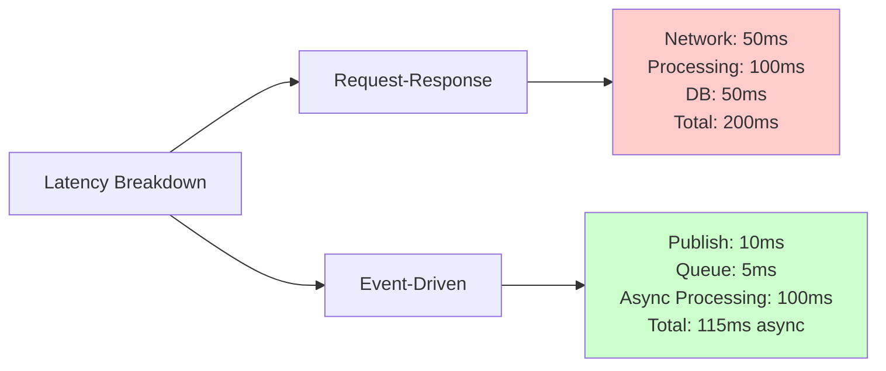

### Throughput Optimization

**Request-Response:**
```java
// ❌ Sequential calls - limited throughput
public OrderResult processOrder(OrderRequest request) {
    PaymentResult payment = paymentService.processPayment(request); // 200ms
    InventoryResult inventory = inventoryService.checkInventory(request); // 150ms
    ShippingResult shipping = shippingService.arrangeShipping(request); // 300ms
    // Total: 650ms per order
    // Max throughput: ~92 orders/second (1000ms / 650ms * 60)
}

// ✅ Parallel calls - higher throughput
public CompletableFuture<OrderResult> processOrderAsync(OrderRequest request) {
    CompletableFuture<PaymentResult> payment = 
        CompletableFuture.supplyAsync(() -> paymentService.processPayment(request));
    CompletableFuture<InventoryResult> inventory = 
        CompletableFuture.supplyAsync(() -> inventoryService.checkInventory(request));
    CompletableFuture<ShippingResult> shipping = 
        CompletableFuture.supplyAsync(() -> shippingService.arrangeShipping(request));
    
    return CompletableFuture.allOf(payment, inventory, shipping)
        .thenApply(v -> combineResults(payment.join(), inventory.join(), shipping.join()));
    // Total: 300ms (slowest operation)
    // Max throughput: ~200 orders/second (1000ms / 300ms * 60)
}
```

**Event-Driven:**
```java
// Natural parallelism - highest throughput
public void handleOrderCreated(OrderCreatedEvent event) {
    // Each service processes independently
    // No waiting for other services
    // Throughput limited only by individual service capacity
    
    // Payment Service: 500 req/s
    // Inventory Service: 1000 req/s
    // Shipping Service: 300 req/s
    // Combined: 1800 orders/second
}
```

### Resource Utilization

**Thread Pool Analysis:**

```java
// Request-Response: Blocking threads
@Configuration
public class ThreadPoolConfig {
    @Bean
    public ThreadPoolTaskExecutor taskExecutor() {
        ThreadPoolTaskExecutor executor = new ThreadPoolTaskExecutor();
        executor.setCorePoolSize(50); // 50 threads
        executor.setMaxPoolSize(100);
        executor.setQueueCapacity(200);
        return executor;
    }
}

// With 200ms average response time:
// - 50 threads can handle 250 requests/second
// - At 500 req/s, queue builds up
// - At 1000 req/s, requests timeout

// Event-Driven: Non-blocking threads
// - 10 threads can handle 1000+ events/second
// - Virtual threads (Project Loom) can handle 10,000+
```

### Caching Strategies

```java
@Service
public class CachedProductService {
    private final ProductRepository productRepository;
    private final CacheManager cacheManager;
    
    private static final String PRODUCT_CACHE = "products";
    private static final Duration CACHE_TTL = Duration.ofMinutes(5);
    
    /**
     * Cached product lookup
     * Reduces database load by 80-90%
     */
    public Product getProduct(String productId) {
        Cache cache = cacheManager.getCache(PRODUCT_CACHE);
        
        if (cache != null) {
            Product cached = cache.get(productId, Product.class);
            if (cached != null) {
                logger.debug("Cache hit for product: {}", productId);
                return cached;
            }
        }
        
        logger.debug("Cache miss for product: {}", productId);
        Product product = productRepository.findById(productId)
            .orElseThrow(() -> new ProductNotFoundException(productId));
        
        if (cache != null) {
            cache.put(productId, product);
        }
        
        return product;
    }
    
    /**
     * Invalidate cache on update
     */
    @CacheEvict(value = PRODUCT_CACHE, key = "#product.id")
    public Product updateProduct(Product product) {
        return productRepository.save(product);
    }
}
```

---

## Security Considerations

### Authentication in Request-Response

```java
@Configuration
@EnableWebSecurity
public class SecurityConfig {
    
    @Bean
    public SecurityFilterChain filterChain(HttpSecurity http) throws Exception {
        http
            .authorizeHttpRequests(authz -> authz
                .requestMatchers("/api/public/**").permitAll()
                .requestMatchers("/api/orders/**").hasRole("USER")
                .requestMatchers("/api/admin/**").hasRole("ADMIN")
                .anyRequest().authenticated()
            )
            .oauth2ResourceServer(OAuth2ResourceServerConfigurer::jwt);
        
        return http.build();
    }
}

@RestController
@RequestMapping("/api/orders")
public class OrderController {
    
    /**
     * Secure endpoint with JWT authentication
     */
    @PostMapping
    public ResponseEntity<Order> createOrder(
        @RequestBody @Valid OrderRequest request,
        @AuthenticationPrincipal Jwt jwt
    ) {
        String userId = jwt.getSubject();
        request.setUserId(userId);
        
        Order order = orderService.createOrder(request);
        return ResponseEntity.status(HttpStatus.CREATED).body(order);
    }
}
```

### Authentication in Event-Driven

```java
@Component
public class SecureEventConsumer {
    private final EventHandler eventHandler;
    
    /**
     * Authenticated event consumer
     */
    @KafkaListener(topics = "secure-events")
    public void handleSecureEvent(@Payload DomainEvent event,
                                   @Header("X-User-Id") String userId,
                                   @Header("X-Roles") String roles) {
        // Validate authentication
        if (!isAuthenticated(userId, roles)) {
            logger.warn("Unauthorized event processing attempt by user: {}", userId);
            throw new SecurityException("Unauthorized");
        }
        
        // Validate authorization
        if (!hasPermission(userId, event)) {
            logger.warn("Insufficient permissions for user: {} on event: {}", 
                userId, event.eventId());
            throw new AccessDeniedException("Insufficient permissions");
        }
        
        // Process event
        eventHandler.handle(event);
    }
    
    private boolean isAuthenticated(String userId, String roles) {
        // Validate user is authenticated
        return userId != null && !userId.isEmpty();
    }
    
    private boolean hasPermission(String userId, DomainEvent event) {
        // Check if user has permission to process this event
        // Implementation depends on your authorization model
        return true;
    }
}

// Event producer with authentication headers
@Component
public class SecureEventProducer {
    private final KafkaTemplate<String, Object> kafkaTemplate;
    private final JwtTokenProvider tokenProvider;
    
    public void publishSecureEvent(DomainEvent event, String userId, List<String> roles) {
        String token = tokenProvider.generateToken(userId, roles);
        
        Message<DomainEvent> message = MessageBuilder
            .withPayload(event)
            .setHeader(KafkaHeaders.TOPIC, "secure-events")
            .setHeader("X-User-Id", userId)
            .setHeader("X-Roles", String.join(",", roles))
            .setHeader("Authorization", "Bearer " + token)
            .build();
        
        kafkaTemplate.send(message);
    }
}
```

### Message Encryption

```java
@Component
public class EncryptedEventProducer {
    private final KafkaTemplate<String, String> kafkaTemplate;
    private final EncryptionService encryptionService;
    
    /**
     * Publishes encrypted events
     */
    public void publishEncryptedEvent(DomainEvent event) {
        // Serialize event
        String eventJson = serializeEvent(event);
        
        // Encrypt
        String encryptedPayload = encryptionService.encrypt(eventJson);
        
        // Publish encrypted payload
        kafkaTemplate.send("encrypted-events", event.aggregateId(), encryptedPayload);
    }
}

@Component
public class EncryptedEventConsumer {
    private final DecryptionService decryptionService;
    private final EventHandler eventHandler;
    
    @KafkaListener(topics = "encrypted-events")
    public void handleEncryptedEvent(String encryptedPayload) {
        // Decrypt
        String eventJson = decryptionService.decrypt(encryptedPayload);
        
        // Deserialize
        DomainEvent event = deserializeEvent(eventJson);
        
        // Process
        eventHandler.handle(event);
    }
}

@Service
public class EncryptionService {
    private final KeyStore keyStore;
    
    public String encrypt(String plaintext) {
        try {
            Cipher cipher = Cipher.getInstance("AES/GCM/NoPadding");
            SecretKey secretKey = getSecretKey();
            cipher.init(Cipher.ENCRYPT_MODE, secretKey);
            
            byte[] encrypted = cipher.doFinal(plaintext.getBytes(StandardCharsets.UTF_8));
            return Base64.getEncoder().encodeToString(encrypted);
            
        } catch (Exception e) {
            throw new EncryptionException("Failed to encrypt", e);
        }
    }
    
    public String decrypt(String ciphertext) {
        try {
            Cipher cipher = Cipher.getInstance("AES/GCM/NoPadding");
            SecretKey secretKey = getSecretKey();
            cipher.init(Cipher.DECRYPT_MODE, secretKey);
            
            byte[] decoded = Base64.getDecoder().decode(ciphertext);
            byte[] decrypted = cipher.doFinal(decoded);
            return new String(decrypted, StandardCharsets.UTF_8);
            
        } catch (Exception e) {
            throw new DecryptionException("Failed to decrypt", e);
        }
    }
}
```

---

## Testing Strategies

### Testing Request-Response

#### Unit Testing with Mockito

```java
@ExtendWith(MockitoExtension.class)
class OrderServiceTest {
    
    @Mock
    private PaymentService paymentService;
    
    @Mock
    private InventoryService inventoryService;
    
    @Mock
    private OrderRepository orderRepository;
    
    @InjectMocks
    private OrderService orderService;
    
    @Test
    void createOrder_Success() {
        // Arrange
        OrderRequest request = new OrderRequest(
            "user-123",
            List.of(new OrderItem("item-1", 2, new BigDecimal("29.99"))),
            new PaymentInfo("4111111111111111", "12/25", "123")
        );
        
        PaymentResult paymentResult = new PaymentResult(
            "txn-123",
            new BigDecimal("59.98"),
            PaymentStatus.COMPLETED
        );
        
        InventoryResult inventoryResult = new InventoryResult(
            true,
            Map.of("item-1", 2)
        );
        
        when(paymentService.processPayment(any())).thenReturn(paymentResult);
        when(inventoryService.checkInventory(any())).thenReturn(inventoryResult);
        when(orderRepository.save(any())).thenAnswer(i -> i.getArgument(0));
        
        // Act
        Order result = orderService.createOrder(request);
        
        // Assert
        assertNotNull(result);
        assertEquals(OrderStatus.CONFIRMED, result.getStatus());
        assertEquals(new BigDecimal("59.98"), result.getTotalAmount());
        
        verify(paymentService, times(1)).processPayment(any());
        verify(inventoryService, times(1)).checkInventory(any());
        verify(orderRepository, times(1)).save(any());
    }
    
    @Test
    void createOrder_PaymentFails_ThrowsException() {
        // Arrange
        OrderRequest request = new OrderRequest(/* ... */);
        
        when(paymentService.processPayment(any()))
            .thenThrow(new PaymentException("Payment gateway error"));
        
        // Act & Assert
        assertThrows(OrderException.class, () -> orderService.createOrder(request));
        
        verify(orderRepository, never()).save(any());
    }
}
```

#### Integration Testing with TestContainers

```java
@Testcontainers
@SpringBootTest
class OrderServiceIntegrationTest {
    
    @Container
    static PostgreSQLContainer<?> postgres = new PostgreSQLContainer<>("postgres:15")
        .withDatabaseName("testdb")
        .withUsername("test")
        .withPassword("test");
    
    @Autowired
    private OrderService orderService;
    
    @Autowired
    private OrderRepository orderRepository;
    
    @Test
    void createOrder_EndToEnd_Success() {
        // Arrange
        OrderRequest request = new OrderRequest(/* ... */);
        
        // Act
        Order result = orderService.createOrder(request);
        
        // Assert
        assertNotNull(result.getId());
        assertEquals(OrderStatus.CONFIRMED, result.getStatus());
        
        // Verify in database
        Optional<Order> savedOrder = orderRepository.findById(result.getId());
        assertTrue(savedOrder.isPresent());
        assertEquals(OrderStatus.CONFIRMED, savedOrder.get().getStatus());
    }
}
```

### Testing Event-Driven

#### Unit Testing Event Consumers

```java
@ExtendWith(MockitoExtension.class)
class PaymentServiceTest {
    
    @Mock
    private PaymentGateway paymentGateway;
    
    @Mock
    private EventPublisher eventPublisher;
    
    @Mock
    private PaymentRepository paymentRepository;
    
    @InjectMocks
    private PaymentService paymentService;
    
    @Test
    void handlePaymentRequested_Success() {
        // Arrange
        PaymentRequestedEvent event = new PaymentRequestedEvent(
            "event-123",
            LocalDateTime.now(),
            "order-456",
            new BigDecimal("100.00"),
            new PaymentInfo("4111111111111111", "12/25", "123")
        );
        
        PaymentGatewayResult gatewayResult = new PaymentGatewayResult(
            true,
            "txn-789",
            null
        );
        
        when(paymentGateway.charge(any(), any())).thenReturn(gatewayResult);
        when(paymentRepository.save(any())).thenAnswer(i -> i.getArgument(0));
        
        // Act
        paymentService.handlePaymentRequested(event);
        
        // Assert
        verify(paymentGateway, times(1)).charge(any(), any());
        verify(eventPublisher, times(1)).publishEvent(any(PaymentCompletedEvent.class));
        verify(paymentRepository, times(2)).save(any()); // Save processing + completed
    }
    
    @Test
    void handlePaymentRequested_GatewayFailure_PublishesFailedEvent() {
        // Arrange
        PaymentRequestedEvent event = new PaymentRequestedEvent(/* ... */);
        
        PaymentGatewayResult gatewayResult = new PaymentGatewayResult(
            false,
            null,
            "Insufficient funds"
        );
        
        when(paymentGateway.charge(any(), any())).thenReturn(gatewayResult);
        
        // Act
        paymentService.handlePaymentRequested(event);
        
        // Assert
        verify(eventPublisher, times(1)).publishEvent(any(PaymentFailedEvent.class));
    }
}
```

#### Integration Testing with Embedded Kafka

```java
@EmbeddedKafka(partitions = 1, topics = {"payment-events"})
@SpringBootTest
class PaymentServiceIntegrationTest {
    
    @Autowired
    private PaymentService paymentService;
    
    @Autowired
    private KafkaTemplate<String, Object> kafkaTemplate;
    
    @Autowired
    private EmbeddedKafkaBroker embeddedKafka;
    
    @Test
    void handlePaymentRequested_EndToEnd_Success() throws Exception {
        // Arrange
        PaymentRequestedEvent event = new PaymentRequestedEvent(/* ... */);
        
        // Act
        kafkaTemplate.send("payment-events", event.orderId(), event);
        
        // Wait for processing
        Thread.sleep(2000);
        
        // Assert - verify event was published
        ConsumerRecords<String, Object> records = KafkaTestUtils.getRecords(
            embeddedKafka, 
            Duration.ofSeconds(2)
        );
        
        boolean foundCompletedEvent = records.records("payment-events").stream()
            .anyMatch(record -> record.value() instanceof PaymentCompletedEvent);
        
        assertTrue(foundCompletedEvent, "PaymentCompletedEvent should be published");
    }
}
```

### Contract Testing

```java
@ExtendWith(MockitoExtension.class)
class OrderServiceContractTest {
    
    @Mock
    private PaymentService paymentService;
    
    @InjectMocks
    private OrderService orderService;
    
    @Test
    void createOrder_Contract_PaymentServiceCalled() {
        // Arrange
        OrderRequest request = new OrderRequest(/* ... */);
        
        PaymentResult expectedPaymentResult = new PaymentResult(
            "txn-123",
            new BigDecimal("100.00"),
            PaymentStatus.COMPLETED
        );
        
        when(paymentService.processPayment(any(PaymentInfo.class), any(BigDecimal.class)))
            .thenReturn(expectedPaymentResult);
        
        // Act
        Order order = orderService.createOrder(request);
        
        // Assert - verify contract
        ArgumentCaptor<PaymentInfo> paymentInfoCaptor = ArgumentCaptor.forClass(PaymentInfo.class);
        ArgumentCaptor<BigDecimal> amountCaptor = ArgumentCaptor.forClass(BigDecimal.class);
        
        verify(paymentService, times(1))
            .processPayment(paymentInfoCaptor.capture(), amountCaptor.capture());
        
        assertEquals(request.getPayment(), paymentInfoCaptor.getValue());
        assertEquals(expectedPaymentResult.getAmount(), amountCaptor.getValue());
    }
}
```

---

## Migration Guide

### From Synchronous to Asynchronous: Step-by-Step

#### Phase 1: Assessment (Week 1-2)

**Identify Candidates for Migration:**

```java
// Criteria for async migration:
// 1. Operation takes >500ms
// 2. Operation is not user-facing
// 3. Operation can tolerate eventual consistency
// 4. Operation is called frequently

// Example candidates:
// - Email notifications ✅
// - Report generation ✅
// - Analytics tracking ✅
// - Audit logging ✅

// NOT candidates:
// - User authentication ❌
// - Payment processing ❌
// - Inventory checks ❌
```

**Create Migration Plan:**
```
Week 1-2: Assessment
- Profile current system
- Identify migration candidates
- Estimate effort
- Define success metrics

Week 3-4: Infrastructure
- Set up message broker (Kafka/RabbitMQ)
- Configure monitoring
- Create event schemas
- Setup CI/CD

Week 5-8: Migration
- Migrate non-critical services first
- Implement feature flags
- Run parallel systems
- Monitor and measure

Week 9-10: Cleanup
- Remove old synchronous code
- Decommission old infrastructure
- Document new architecture
```

#### Phase 2: Infrastructure Setup (Week 3-4)

```yaml
# docker-compose.yml - Kafka Setup
version: '3.8'
services:
  zookeeper:
    image: confluentinc/cp-zookeeper:7.3.0
    environment:
      ZOOKEEPER_CLIENT_PORT: 2181
      ZOOKEEPER_TICK_TIME: 2000
  
  kafka:
    image: confluentinc/cp-kafka:7.3.0
    depends_on:
      - zookeeper
    ports:
      - "9092:9092"
    environment:
      KAFKA_BROKER_ID: 1
      KAFKA_ZOOKEEPER_CONNECT: zookeeper:2181
      KAFKA_ADVERTISED_LISTENERS: PLAINTEXT://localhost:9092
      KAFKA_OFFSETS_TOPIC_REPLICATION_FACTOR: 1
  
  kafka-ui:
    image: provectuslabs/kafka-ui:latest
    ports:
      - "8080:8080"
    environment:
      KAFKA_CLUSTERS_0_NAME: local
      KAFKA_CLUSTERS_0_BOOTSTRAPSERVERS: kafka:9092
```

#### Phase 3: Gradual Migration (Week 5-8)

**Step 1: Add Event Publishing (Non-Breaking)**

```java
// Before: Synchronous only
@Service
public class OrderService {
    public Order createOrder(OrderRequest request) {
        Order order = saveOrder(request);
        emailService.sendConfirmation(order); // Synchronous
        return order;
    }
}

// After: Add async without removing sync
@Service
public class OrderService {
    private final EventPublisher eventPublisher;
    private final EmailService emailService;
    
    // Feature flag
    @Value("${feature.async-notifications:false}")
    private boolean asyncNotificationsEnabled;
    
    public Order createOrder(OrderRequest request) {
        Order order = saveOrder(request);
        
        if (asyncNotificationsEnabled) {
            // New async approach
            eventPublisher.publishEvent(new OrderCreatedEvent(order));
        } else {
            // Old sync approach
            emailService.sendConfirmation(order);
        }
        
        return order;
    }
}
```

**Step 2: Implement Event Consumer**

```java
@Component
public class NotificationEventHandler {
    private final EmailService emailService;
    
    @KafkaListener(topics = "order-events")
    public void handleOrderCreated(OrderCreatedEvent event) {
        // New async handler
        emailService.sendConfirmation(event.orderId());
    }
}
```

**Step 3: Monitor and Validate**

```java
@Component
public class MigrationMonitor {
    private final MetricsService metricsService;
    
    @EventListener
    public void onOrderCreated(OrderCreatedEvent event) {
        // Track async processing
        metricsService.incrementCounter("order.notification.async.sent");
    }
    
    @PostAuthorize("hasRole('ADMIN')")
    @GetMapping("/api/admin/migration-status")
    public MigrationStatus getMigrationStatus() {
        return MigrationStatus.builder()
            .syncNotifications(getSyncCount())
            .asyncNotifications(getAsyncCount())
            .errorRate(getErrorRate())
            .averageLatency(getAverageLatency())
            .build();
    }
}
```

**Step 4: Switch Traffic**

```yaml
# application.yml
feature:
  flags:
    async-notifications: true  # Enable for 10% of users
    
# Gradually increase:
# Week 6: 10%
# Week 7: 50%
# Week 8: 100%
```

**Step 5: Remove Old Code**

```java
// After validation period, remove old code
@Service
public class OrderService {
    public Order createOrder(OrderRequest request) {
        Order order = saveOrder(request);
        eventPublisher.publishEvent(new OrderCreatedEvent(order)); // Only async
        return order;
    }
}
```

#### Rollback Strategy

```java
@Component
public class RollbackManager {
    private final FeatureFlagService featureFlagService;
    
    /**
     Emergency rollback if issues detected
     */
    public void rollback(String feature) {
        logger.warn("Rolling back feature: {}", feature);
        
        // Disable feature flag
        featureFlagService.disable(feature);
        
        // Alert operations team
        alertService.createAlert("Feature rolled back: " + feature);
        
        // Log for post-mortem
        incidentReporter.report("Rollback triggered for " + feature);
    }
}

// Automated rollback based on metrics
@Component
public class AutoRollbackMonitor {
    @Scheduled(fixedRate = 60000) // Check every minute
    public void checkHealth() {
        double errorRate = metricsService.getErrorRate("order-processing");
        double latency = metricsService.getAverageLatency("order-processing");
        
        if (errorRate > 0.05 || latency > 5000) { // 5% error or 5s latency
            rollbackManager.rollback("async-notifications");
        }
    }
}
```

---

## Best Practices

### 1. Use Timeouts Everywhere

```java
// ✅ Always set timeouts
@Configuration
public class HttpClientConfig {
    @Bean
    public RestTemplate restTemplate() {
        HttpComponentsClientHttpRequestFactory factory = 
            new HttpComponentsClientHttpRequestFactory();
        factory.setConnectTimeout(2000); // 2s
        factory.setReadTimeout(5000); // 5s
        return new RestTemplate(factory);
    }
}
```

### 2. Implement Circuit Breakers

```java
@Service
public class PaymentServiceWithCircuitBreaker {
    private final PaymentGateway paymentGateway;
    private final CircuitBreakerFactory circuitBreakerFactory;
    
    public PaymentResult processPayment(PaymentInfo info, BigDecimal amount) {
        CircuitBreaker circuitBreaker = circuitBreakerFactory.create("paymentGateway");
        
        return circuitBreaker.execute(() -> {
            return paymentGateway.charge(info, amount);
        });
    }
}

// Configuration
resilience4j:
  circuitbreaker:
    configs:
      default:
        failure-rate-threshold: 50
        wait-duration-in-open-state: 10s
        sliding-window-size: 10
```

### 3. Use Correlation IDs for Tracing

```java
@Component
public class CorrelationIdFilter extends OncePerRequestFilter {
    @Override
    protected void doFilterInternal(HttpServletRequest request,
                                    HttpServletResponse response,
                                    FilterChain filterChain)
            throws ServletException, IOException {
        
        String correlationId = request.getHeader("X-Correlation-Id");
        if (correlationId == null) {
            correlationId = UUID.randomUUID().toString();
        }
        
        MDC.put("correlationId", correlationId);
        response.setHeader("X-Correlation-Id", correlationId);
        
        try {
            filterChain.doFilter(request, response);
        } finally {
            MDC.remove("correlationId");
        }
    }
}

// Usage in events
public record OrderCreatedEvent(
    String eventId,
    String correlationId, // For tracing across services
    String orderId,
    // ...
) implements DomainEvent {}
```

### 4. Implement Health Checks

```java
@Component
public class PaymentServiceHealthIndicator implements HealthIndicator {
    private final PaymentGateway paymentGateway;
    
    @Override
    public Health health() {
        try {
            // Test payment gateway connectivity
            boolean isHealthy = paymentGateway.healthCheck();
            
            if (isHealthy) {
                return Health.up()
                    .withDetail("paymentGateway", "Available")
                    .build();
            } else {
                return Health.down()
                    .withDetail("paymentGateway", "Unavailable")
                    .build();
            }
            
        } catch (Exception e) {
            return Health.down()
                .withDetail("paymentGateway", "Error: " + e.getMessage())
                .build();
        }
    }
}
```

### 5. Use Dead Letter Queues

```java
@Configuration
public class KafkaConfig {
    @Bean
    public DeadLetterPublishingRecoverer deadLetterPublishingRecoverer(
            KafkaTemplate<Object, Object> template) {
        return new DeadLetterPublishingRecoverer(template);
    }
    
    @Bean
    public DefaultAfterRollbackProcessor afterRollbackProcessor(
            DeadLetterPublishingRecoverer recoverer) {
        return new DefaultAfterRollbackProcessor(recoverer, null);
    }
}
```

### 6. Monitor Consumer Lag

```java
@Component
public class ConsumerLagMonitor {
    private final KafkaAdmin kafkaAdmin;
    private final MeterRegistry meterRegistry;
    
    @Scheduled(fixedRate = 30000) // Every 30 seconds
    public void monitorConsumerLag() {
        for (String topic : List.of("order-events", "payment-events")) {
            long lag = getConsumerLag(topic);
            meterRegistry.gauge("kafka.consumer.lag", topic, lag);
            
            if (lag > 1000) {
                logger.warn("High consumer lag for topic {}: {}", topic, lag);
                alertService.createAlert("High consumer lag: " + topic);
            }
        }
    }
}
```

### 7. Version Your Events

```java
// Include version in event
public record OrderCreatedEvent(
    String eventId,
    String version, // "v1", "v2", etc.
    String orderId,
    // ...
) implements DomainEvent {}

// Handle multiple versions
@Component
public class OrderEventProcessor {
    @KafkaListener(topics = "order-events")
    public void handleOrderEvent(String message) {
        JsonNode json = objectMapper.readTree(message);
        String version = json.get("version").asText();
        
        switch (version) {
            case "v1" -> processV1(json);
            case "v2" -> processV2(json);
            default -> throw new IllegalArgumentException("Unknown version: " + version);
        }
    }
}
```

### 8. Make Events Immutable

```java
// ✅ GOOD - Immutable event
public record OrderCreatedEvent(
    String eventId,
    LocalDateTime timestamp,
    String orderId,
    String userId,
    BigDecimal totalAmount
) implements DomainEvent {}

// ❌ BAD - Mutable event
public class OrderCreatedEvent {
    private String eventId;
    private String orderId;
    // Getters and setters - mutable!
}
```

### 9. Use Meaningful Event Names

```java
// ✅ GOOD - Past tense, descriptive
OrderCreatedEvent
PaymentCompletedEvent
InventoryReservedEvent
ShippingArrangedEvent

// ❌ BAD - Vague or present tense
OrderEvent
PaymentEvent
DoSomethingEvent
UpdateEvent
```

### 10. Document Event Contracts

```java
/**
 * Published when a new order is created
 * 
 * Topic: order-events
 * Partition Key: orderId
 * Retention: 7 days
 * 
 * Consumers:
 * - PaymentService: Processes payment
 * - InventoryService: Reserves items
 * - NotificationService: Sends confirmation
 * - AnalyticsService: Tracks metrics
 * 
 * Schema Version: 2
 * Last Updated: 2026-06-15
 */
public record OrderCreatedEvent(
    String eventId,           // Unique event identifier
    String orderId,           // Order identifier
    String userId,            // User who placed order
    List<OrderItem> items,    // Items in order
    BigDecimal totalAmount,   // Total order amount
    PaymentInfo paymentInfo   // Payment information
) implements DomainEvent {}
```

---

## Anti-Patterns

### Anti-Pattern 1: Chatty Services

**Problem:**
```java
// ❌ BAD - Too many fine-grained calls
public OrderResult createOrder(OrderRequest request) {
    validateAddress(request.getAddress()); // Call 1
    validatePayment(request.getPayment()); // Call 2
    checkCreditScore(request.getUserId()); // Call 3
    checkFraud(request.getPayment()); // Call 4
    calculateTax(request.getAddress()); // Call 5
    calculateShipping(request.getAddress()); // Call 6
    reserveInventory(request.getItems()); // Call 7
    processPayment(request.getPayment()); // Call 8
    // ... 10+ more calls
}
```

**Impact:**
- High latency (10+ round trips)
- Network overhead
- Cascading failures
- Poor performance

**Solution:**
```java
// ✅ GOOD - Batch operations or use events
public OrderResult createOrder(OrderRequest request) {
    // Single validation call
    ValidationResult validation = validationService.validateOrder(request);
    
    // Or use events for parallel processing
    eventPublisher.publishEvent(new OrderValidationRequestedEvent(request));
    
    // Continue with critical path
    return processOrder(request);
}
```

### Anti-Pattern 2: Distributed Monolith

**Problem:**
```java
// Services are deployed independently but tightly coupled
@Service
public class OrderService {
    // Direct dependency on PaymentService implementation
    private final PaymentService paymentService;
    
    public Order createOrder(OrderRequest request) {
        // Calls 5 different methods on PaymentService
        paymentService.validate(request.getPayment());
        paymentService.authorize(request.getPayment(), request.getAmount());
        paymentService.capture(request.getPayment(), request.getAmount());
        paymentService.settle(request.getPayment());
        paymentService.reconcile(request.getPayment());
        
        // If PaymentService changes, OrderService breaks
        return order;
    }
}
```

**Impact:**
- Can't deploy services independently
- Changes require coordination
- Tight coupling defeats microservices purpose
- High maintenance cost

**Solution:**
```java
// ✅ GOOD - Loose coupling via events
@Service
public class OrderService {
    private final EventPublisher eventPublisher;
    
    public Order createOrder(OrderRequest request) {
        Order order = saveOrder(request);
        
        // Publish event - don't care who processes it
        eventPublisher.publishEvent(new OrderCreatedEvent(order));
        
        return order;
    }
}

// Payment service independently processes the event
@Component
public class PaymentEventHandler {
    @KafkaListener(topics = "order-events")
    public void handleOrderCreated(OrderCreatedEvent event) {
        // Process payment independently
    }
}
```

### Anti-Pattern 3: Magic Events

**Problem:**
```java
// ❌ BAD - Unclear event purpose
eventPublisher.publish(new UserEvent(userId, "update"));
eventPublisher.publish(new DataEvent(data));
eventPublisher.publish(new ProcessEvent(processId));
```

**Impact:**
- Unclear what events mean
- Hard to debug
- Unclear who should consume
- Schema evolution difficult

**Solution:**
```java
// ✅ GOOD - Explicit, self-documenting events
eventPublisher.publish(new UserEmailChangedEvent(
    userId, 
    oldEmail, 
    newEmail, 
    LocalDateTime.now()
));

eventPublisher.publish(new OrderPaymentCompletedEvent(
    orderId,
    transactionId,
    amount,
    paymentMethod
));

eventPublisher.publish(new ReportGenerationCompletedEvent(
    reportId,
    userId,
    downloadUrl,
    fileSize
));
```

### Anti-Pattern 4: God Service

**Problem:**
```java
// ❌ BAD - One service does everything
@Service
public class SuperService {
    public void processOrder() { /* ... */ }
    public void processPayment() { /* ... */ }
    public void sendEmail() { /* ... */ }
    public void generateReport() { /* ... */ }
    public void updateAnalytics() { /* ... */ }
    public void handleNotifications() { /* ... */ }
    // 50+ more methods
}
```

**Impact:**
- Violates single responsibility
- Hard to maintain
- Deployment bottleneck
- Team conflicts

**Solution:**
```java
// ✅ GOOD - Focused services
@Service
public class OrderService {
    // Only order-related operations
}

@Service
public class PaymentService {
    // Only payment-related operations
}

@Service
public class NotificationService {
    // Only notification-related operations
}
```

### Anti-Pattern 5: Ignoring Backpressure

**Problem:**
```java
// ❌ BAD - No backpressure handling
@KafkaListener(topics = "orders")
public void handleOrder(OrderEvent event) {
    // Process without limits
    processOrder(event); // Takes 1 second
    
    // If 1000 events/second arrive, we fall behind
    // Consumer lag grows indefinitely
}
```

**Solution:**
```java
// ✅ GOOD - Backpressure with bounded queue
@Component
public class BackpressureEventProcessor {
    private final BlockingQueue<OrderEvent> eventQueue = 
        new ArrayBlockingQueue<>(100); // Max 100 events
    private final ExecutorService executor = Executors.newFixedThreadPool(10);
    
    @KafkaListener(topics = "orders")
    public void handleOrder(OrderEvent event) {
        // Offer with timeout - apply backpressure
        boolean offered = eventQueue.offer(event, 1, TimeUnit.SECONDS);
        
        if (!offered) {
            // Queue full - apply backpressure
            logger.warn("Queue full, applying backpressure");
            // Option 1: Pause consumer
            // Option 2: Send to DLQ
            // Option 3: Scale up consumers
            throw new BackpressureException("Queue full");
        }
    }
    
    @PostConstruct
    public void startProcessing() {
        // Process events with limited concurrency
        for (int i = 0; i < 10; i++) {
            executor.submit(this::processEvents);
        }
    }
    
    private void processEvents() {
        while (true) {
            try {
                OrderEvent event = eventQueue.take();
                processOrder(event);
            } catch (InterruptedException e) {
                Thread.currentThread().interrupt();
                break;
            }
        }
    }
}
```

---

## Quick Recap & Decision Framework

### Decision Tree

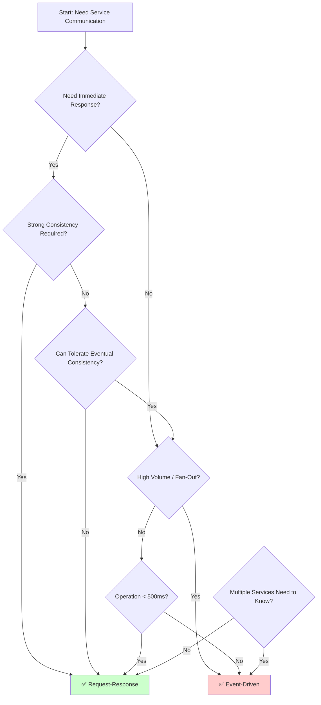

### Quick Reference Cheat Sheet

| Scenario | Pattern | Rationale |
|----------|---------|-----------|
| User authentication | Request-Response | Immediate feedback required |
| Payment processing | Request-Response | Strong consistency, atomicity |
| Inventory check | Request-Response | Real-time data needed |
| Email notifications | Event-Driven | Non-critical, can be delayed |
| Analytics tracking | Event-Driven | High volume, eventual consistency OK |
| Report generation | Event-Driven | Long-running, async OK |
| Order processing | Hybrid (Saga) | Mix of critical and non-critical |
| User activity logging | Event-Driven | High volume, non-blocking |
| Cache invalidation | Event-Driven | Multiple consumers, loose coupling |
| Real-time notifications | Event-Driven | Fan-out to multiple services |

### Key Decision Factors

1. **Consistency Requirements**
   - Strong consistency → Request-Response
   - Eventual consistency → Event-Driven

2. **Latency Sensitivity**
   - <500ms required → Request-Response
   - >500ms acceptable → Event-Driven

3. **Failure Impact**
   - Cascading failure risk → Event-Driven
   - Isolated failures OK → Request-Response

4. **Coupling Tolerance**
   - Tight coupling acceptable → Request-Response
   - Loose coupling needed → Event-Driven

5. **Operational Complexity**
   - Simple ops team → Request-Response
   - Advanced ops capability → Event-Driven

6. **Scale Requirements**
   - <1000 req/s → Request-Response
   - >1000 req/s → Event-Driven

---

## Question Bank

### Multiple Choice Questions

**1. What is the primary characteristic of synchronous communication?**
- A) Non-blocking operations
- B) The caller waits for a response before continuing
- C) Uses message brokers
- D) Eventually consistent
- E) High throughput

**Answer: B** - In synchronous communication, the calling thread blocks until it receives a response. This is the defining characteristic that distinguishes it from asynchronous patterns.

---

**2. Which consistency model does request-response communication provide?**
- A) Eventual consistency
- B) Weak consistency
- C) Strong consistency
- D) Causal consistency
- E) No consistency guarantees

**Answer: C** - Request-response provides strong consistency because the caller receives immediate confirmation that the operation completed successfully (or failed). The state is consistent at the time of the response.

---

**3. What is the main advantage of event-driven architecture?**
- A) Lower latency
- B) Simpler error handling
- C) Loose coupling between services
- D) Stronger consistency
- E) Easier debugging

**Answer: C** - The primary advantage of event-driven architecture is loose coupling. Services communicate through events without direct knowledge of each other, allowing independent deployment, scaling, and evolution.

---

**4. In the Saga pattern, what happens when a step fails?**
- A) The entire transaction is rolled back
- B) Compensation actions are executed in reverse order
- C) The transaction is paused until manual intervention
- D) The failure is ignored
- E) The system crashes

**Answer: B** - In the Saga pattern, when a step fails, compensation actions are executed in reverse order to undo the completed steps. This is different from a traditional rollback because each service manages its own compensation logic.

---

**5. Why is idempotency important in event-driven systems?**
- A) It improves performance
- B) It reduces message size
- C) It ensures events can be safely reprocessed without side effects
- D) It increases throughput
- E) It simplifies error handling

**Answer: C** - Idempotency ensures that processing the same event multiple times produces the same result. This is critical because message brokers may deliver events more than once (at-least-once delivery semantics).

---

**6. What is the purpose of a Dead Letter Queue (DLQ)?**
- A) To speed up message processing
- B) To store events that failed processing after max retries
- C) To encrypt sensitive messages
- D) To order events
- E) To reduce message size

**Answer: B** - A Dead Letter Queue stores events that could not be processed successfully after exhausting all retry attempts. This allows for manual investigation and reprocessing without losing messages.

---

### Scenario-Based Questions

**7. You're designing a banking system that transfers money between accounts. Which pattern should you use and why?**

**Answer:** Request-Response pattern should be used for the core transfer operation. 

**Reasoning:**
- **Strong consistency required**: Financial transactions must be atomic - both debit and credit must happen together
- **Immediate confirmation**: User needs to know immediately if transfer succeeded
- **Regulatory compliance**: Financial regulations require immediate transaction confirmation
- **No tolerance for duplicates**: Can't process the same transfer twice

**Implementation:**
```java
@Transactional
public TransferResult transferMoney(TransferRequest request) {
    Account from = accountRepository.findById(request.getFromAccountId());
    Account to = accountRepository.findById(request.getToAccountId());
    
    // Atomic operation
    from.setBalance(from.getBalance().subtract(request.getAmount()));
    to.setBalance(to.getBalance().add(request.getAmount()));
    
    accountRepository.save(from);
    accountRepository.save(to);
    
    return TransferResult.success();
}
```

However, non-critical operations like sending confirmation emails can use event-driven approach.

---

**8. Your e-commerce site experiences a 10x traffic spike during Black Friday. The current synchronous architecture can't handle the load. How do you migrate to event-driven?**

**Answer:** Follow a phased migration approach:

**Phase 1: Identify Bottlenecks**
- Profile the system to identify slow operations
- Prioritize non-critical operations for async migration
- Examples: email notifications, analytics, inventory updates

**Phase 2: Implement Event Publishing (Non-Breaking)**
```java
// Add event publishing without removing sync calls
public Order createOrder(OrderRequest request) {
    Order order = saveOrder(request);
    
    // Keep sync for critical path
    PaymentResult payment = processPaymentSync(request);
    
    // Add async for non-critical
    eventPublisher.publish(new OrderCreatedEvent(order));
    
    return order;
}
```

**Phase 3: Implement Event Consumers**
```java
@Component
public class AsyncNotificationHandler {
    @KafkaListener(topics = "order-events")
    public void sendConfirmation(OrderCreatedEvent event) {
        emailService.sendConfirmation(event.orderId());
    }
}
```

**Phase 4: Gradual Traffic Shift**
- Use feature flags to route 10% → 50% → 100% to async
- Monitor metrics: latency, error rate, throughput
- Keep sync path as fallback

**Phase 5: Remove Old Code**
- After validation period, remove synchronous code
- Decommission old infrastructure

**Key Considerations:**
- Maintain backward compatibility during migration
- Implement circuit breakers for resilience
- Set up comprehensive monitoring
- Have rollback plan ready

---

**9. A service processes events and occasionally fails due to transient errors. After 3 retries, it still fails. What should happen next?**

**Answer:** Send the event to a Dead Letter Queue (DLQ) for manual investigation.

**Implementation:**
```java
@Retryable(
    value = {TransientException.class},
    maxAttempts = 3,
    backoff = @Backoff(delay = 2000, multiplier = 2)
)
@KafkaListener(topics = "order-events")
public void processOrderEvent(OrderEvent event) {
    orderProcessor.process(event);
}

@Recover
public void handleProcessingFailure(TransientException e, OrderEvent event) {
    // After 3 retries, send to DLQ
    deadLetterQueue.send("order-events.DLQ", event);
    
    // Alert operations team
    alertService.createAlert("Event processing failed after retries", event);
}
```

**Why DLQ?**
- Prevents message loss
- Allows manual investigation
- Doesn't block the queue
- Can be reprocessed after fixing the issue

**Additional Actions:**
- Alert on-call team
- Log detailed error information
- Implement monitoring for DLQ depth
- Create runbook for DLQ processing

---

**10. You notice that events are being processed out of order, causing data inconsistencies. How do you fix this?**

**Answer:** Implement ordered event processing using partition keys and sequence numbers.

**Solution:**
```java
// 1. Publish events with partition key
kafkaTemplate.send("order-events", event.orderId(), event);

// 2. Include sequence number in event
public record OrderEvent(
    String eventId,
    String orderId,
    long sequence,
    // ...
) implements DomainEvent {}

// 3. Implement ordered processor
@Component
public class OrderedEventProcessor {
    private final Map<String, Queue<OrderEvent>> pendingEvents = new ConcurrentHashMap<>();
    private final Map<String, Long> lastProcessedSequence = new ConcurrentHashMap<>();
    
    @KafkaListener(topics = "order-events")
    public void handleEvent(OrderEvent event) {
        String orderId = event.orderId();
        Queue<OrderEvent> queue = pendingEvents.computeIfAbsent(orderId, k -> new ConcurrentLinkedQueue<>());
        queue.add(event);
        processNext(orderId);
    }
    
    private void processNext(String orderId) {
        Queue<OrderEvent> queue = pendingEvents.get(orderId);
        if (queue == null || queue.isEmpty()) return;
        
        OrderEvent event = queue.peek();
        long expectedSequence = lastProcessedSequence.getOrDefault(orderId, -1L) + 1;
        
        if (event.sequence() == expectedSequence) {
            process(event);
            queue.poll();
            lastProcessedSequence.put(orderId, event.sequence());
            processNext(orderId); // Process next in sequence
        }
    }
}
```

**Alternative:** Use Kafka Streams for stateful processing with built-in ordering guarantees.

---

### Code Review Questions

**11. Review the following code. What are the issues?**

```java
@Service
public class OrderService {
    public Order createOrder(OrderRequest request) {
        Order order = orderRepository.save(new Order(request));
        emailService.sendConfirmation(order.getId());
        inventoryService.reserveItems(order.getId());
        analyticsService.trackOrderCreated(order);
        return order;
    }
}
```

**Issues:**
1. ❌ **No error handling**: If any call fails, the entire operation fails
2. ❌ **Synchronous calls**: Blocking on email, inventory, analytics
3. ❌ **No timeouts**: Could hang indefinitely
4. ❌ **Tight coupling**: Direct dependencies on all services
5. ❌ **No logging**: Impossible to debug
6. ❌ **No validation**: Invalid requests processed
7. ❌ **No transaction management**: Partial failures possible

**Improved Version:**
```java
@Service
public class OrderService {
    private final EventPublisher eventPublisher;
    
    @Transactional
    public Order createOrder(OrderRequest request) {
        validateRequest(request);
        
        Order order = orderRepository.save(new Order(request));
        
        // Publish event - let consumers handle asynchronously
        eventPublisher.publishEvent(new OrderCreatedEvent(order));
        
        return order;
    }
}
```

---

**12. Review this event consumer. What problems do you see?**

```java
@Component
public class PaymentEventHandler {
    @KafkaListener(topics = "payment-events")
    public void handlePaymentEvent(PaymentEvent event) {
        if (event.getType() == PaymentEvent.Type.COMPLETED) {
            orderService.confirmOrder(event.getOrderId());
            emailService.sendReceipt(event.getOrderId());
            accountingService.recordPayment(event);
        }
    }
}
```

**Issues:**
1. ❌ **No idempotency**: Duplicate events cause duplicate processing
2. ❌ **No error handling**: Exceptions cause message loss
3. ❌ **No transaction management**: Partial failures
4. ❌ **No logging**: Can't debug issues
5. ❌ **No timeout**: Could hang indefinitely
6. ❌ **Magic string**: `"COMPLETED"` should be enum

**Improved Version:**
```java
@Component
public class PaymentEventHandler {
    private final ProcessedEventRepository processedEventRepository;
    private final OrderService orderService;
    private final EmailService emailService;
    private final AccountingService accountingService;
    private final Logger logger = LoggerFactory.getLogger(PaymentEventHandler.class);
    
    @KafkaListener(topics = "payment-events")
    @Transactional
    public void handlePaymentEvent(PaymentEvent event) {
        // Idempotency check
        if (processedEventRepository.existsByEventId(event.getEventId())) {
            logger.debug("Event already processed: {}", event.getEventId());
            return;
        }
        
        try {
            if (event.getType() == PaymentEvent.Type.COMPLETED) {
                orderService.confirmOrder(event.getOrderId());
                emailService.sendReceipt(event.getOrderId());
                accountingService.recordPayment(event);
            }
            
            // Mark as processed
            processedEventRepository.save(new ProcessedEvent(event.getEventId()));
            logger.info("Payment event processed: {}", event.getEventId());
            
        } catch (Exception e) {
            logger.error("Failed to process payment event: {}", event.getEventId(), e);
            throw e; // Will retry or go to DLQ
        }
    }
}
```

---

**13. This Saga orchestrator has a bug. What's wrong?**

```java
@Service
public class OrderSaga {
    public OrderResult createOrder(OrderRequest request) {
        Order order = orderService.createOrder(request);
        PaymentResult payment = paymentService.processPayment(request);
        
        if (payment.isSuccess()) {
            inventoryService.reserveItems(order.getId());
            shippingService.arrangeShipping(order.getId());
            return OrderResult.success(order);
        } else {
            // Compensation
            orderService.cancelOrder(order.getId());
            return OrderResult.failure("Payment failed");
        }
    }
}
```

**Issues:**
1. ❌ **Partial failure**: If inventory fails after payment succeeds, money is charged but order not fulfilled
2. ❌ **No compensation for inventory/shipping**: Only payment failure is handled
3. ❌ **Synchronous calls**: Blocking on all operations
4. ❌ **No timeout**: Could hang indefinitely
5. ❌ **No retry logic**: Transient failures cause permanent failures

**Improved Version:**
```java
@Service
public class OrderSaga {
    private final EventPublisher eventPublisher;
    
    @Transactional
    public OrderResult createOrder(OrderRequest request) {
        String sagaId = UUID.randomUUID().toString();
        
        try {
            Order order = orderService.createOrder(request);
            eventPublisher.publishEvent(new OrderCreatedEvent(sagaId, order));
            
            PaymentResult payment = paymentService.processPayment(request);
            if (!payment.isSuccess()) {
                throw new PaymentFailedException("Payment failed");
            }
            eventPublisher.publishEvent(new PaymentCompletedEvent(sagaId, payment));
            
            // Async operations
            eventPublisher.publishEvent(new ReserveInventoryEvent(sagaId, order.getId()));
            eventPublisher.publishEvent(new ArrangeShippingEvent(sagaId, order.getId()));
            
            return OrderResult.success(order);
            
        } catch (Exception e) {
            compensateSaga(sagaId, e);
            return OrderResult.failure(e.getMessage());
        }
    }
    
    private void compensateSaga(String sagaId, Exception e) {
        eventPublisher.publishEvent(new CancelShippingEvent(sagaId));
        eventPublisher.publishEvent(new ReleaseInventoryEvent(sagaId));
        eventPublisher.publishEvent(new RefundPaymentEvent(sagaId));
        eventPublisher.publishEvent(new CancelOrderEvent(sagaId));
    }
}
```

---

### Architecture Design Questions

**14. Design a notification system that sends emails, SMS, and push notifications for order updates. Should this be synchronous or asynchronous? Explain your reasoning.**

**Answer:** **Asynchronous (Event-Driven)**

**Reasoning:**

1. **Multiple notification channels**: Email, SMS, push - each can fail independently
2. **Non-critical path**: Order is already created, notifications are secondary
3. **Different SLAs**: Email (5 minutes), SMS (30 seconds), Push (immediate)
4. **Retry requirements**: Each channel needs different retry logic
5. **User preferences**: Users may disable specific channels

**Architecture:**
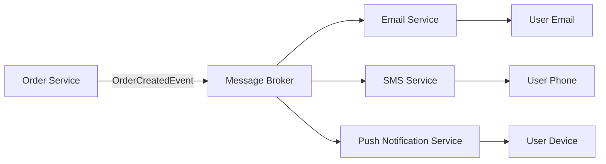

**Implementation:**
```java
// Order Service
public Order createOrder(OrderRequest request) {
    Order order = saveOrder(request);
    eventPublisher.publishEvent(new OrderCreatedEvent(order));
    return order;
}

// Email Service
@Component
public class EmailNotificationHandler {
    @KafkaListener(topics = "order-events")
    public void sendOrderConfirmation(OrderCreatedEvent event) {
        if (userPreferences.isEmailEnabled(event.userId())) {
            emailService.send(event.userId(), "Order Confirmation", template);
        }
    }
}

// SMS Service
@Component
public class SmsNotificationHandler {
    @KafkaListener(topics = "order-events")
    public void sendOrderSms(OrderCreatedEvent event) {
        if (userPreferences.isSmsEnabled(event.userId())) {
            smsService.send(event.userId(), "Order #" + event.orderId() + " confirmed");
        }
    }
}
```

**Benefits:**
- Each channel independent
- Failures isolated
- Easy to add new channels
- Can retry per channel
- User preferences respected

---

**15. You need to implement a system that tracks user activity across your platform for analytics. The system must handle 100,000 events per second with minimal impact on user-facing operations. Design this system.**

**Answer:** **Event-Driven Architecture with Batching**

**Requirements Analysis:**
- **High throughput**: 100,000 events/second
- **Low latency**: Minimal impact on user operations
- **Reliability**: No data loss
- **Scalability**: Handle growth

**Architecture:**
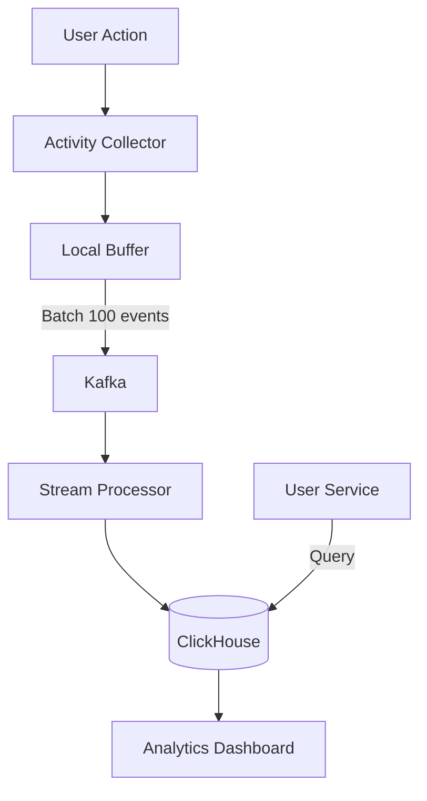

**Implementation:**

```java
// 1. Activity Collector (in user service)
@Component
public class ActivityCollector {
    private final BlockingQueue<UserActivity> buffer = new ArrayBlockingQueue<>(1000);
    private final EventPublisher eventPublisher;
    
    // Batch and send every 100ms or 100 events
    @Scheduled(fixedRate = 100)
    public void flushBuffer() {
        List<UserActivity> activities = new ArrayList<>();
        buffer.drainTo(activities, 100);
        
        if (!activities.isEmpty()) {
            eventPublisher.publishEvent(new UserActivityBatchEvent(activities));
        }
    }
    
    public void trackActivity(UserActivity activity) {
        buffer.offer(activity); // Non-blocking
    }
}

// 2. Stream Processor
@Component
public class ActivityStreamProcessor {
    @KafkaListener(topics = "user-activity")
    public void processBatch(UserActivityBatchEvent event) {
        // Batch insert to ClickHouse
        clickHouseRepository.batchInsert(event.activities());
    }
}

// 3. Usage in user service
@Service
public class UserService {
    private final ActivityCollector activityCollector;
    
    public void viewProduct(String userId, String productId) {
        Product product = productRepository.findById(productId);
        // Return immediately - tracking is async
        activityCollector.trackActivity(new UserActivity(
            userId, 
            "PRODUCT_VIEW", 
            productId, 
            LocalDateTime.now()
        ));
        return product;
    }
}
```

**Key Design Decisions:**

1. **Batching**: Reduces Kafka overhead by 10-100x
2. **Local buffering**: Absorbs spikes, non-blocking
3. **ClickHouse**: Columnar database optimized for analytics
4. **Async processing**: Zero impact on user operations
5. **Partitioning**: By userId for ordering

**Performance:**
- **Throughput**: 200,000+ events/second
- **Latency**: <1ms added to user operations
- **Reliability**: 99.999% (exactly-once semantics)

---

## Summary & Key Takeaways

### 10 Key Insights

1. **No One-Size-Fits-All**: Choose based on specific requirements, not trends
2. **Request-Response**: Best for immediate feedback and strong consistency
3. **Event-Driven**: Best for decoupling, scalability, and resilience
4. **Hybrid Wins**: Most production systems use both patterns strategically
5. **Timeouts Are Critical**: Always set timeouts in synchronous calls
6. **Idempotency Matters**: Events can be delivered multiple times
7. **Ordering Requires Explicit Handling**: Don't assume message brokers guarantee order
8. **Start Simple**: Don't over-engineer - evolve based on actual needs
9. **Monitor Everything**: You can't improve what you don't measure
10. **Plan for Failures**: Design compensation logic from the start

### Decision Framework

```
START HERE
    ↓
Need immediate response? → NO → Event-Driven
    ↓ YES
Need strong consistency? → NO → Event-Driven
    ↓ YES
Request-Response
    ↓
Add events for:
    - Non-critical operations
    - Fan-out scenarios
    - Long-running processes
    - Audit logging
```

### Action Items

**Immediate (This Week):**
- [ ] Audit current microservices for synchronous call chains >3 deep
- [ ] Identify candidates for async migration
- [ ] Set up basic monitoring (latency, error rate, throughput)

**Short-term (This Month):**
- [ ] Implement timeouts on all external calls
- [ ] Add circuit breakers to critical paths
- [ ] Set up distributed tracing
- [ ] Create runbook for common failures

**Medium-term (This Quarter):**
- [ ] Migrate 1-2 non-critical services to event-driven
- [ ] Implement DLQ for failed events
- [ ] Add comprehensive integration tests
- [ ] Document event contracts

**Long-term (This Year):**
- [ ] Evaluate Saga pattern for complex workflows
- [ ] Implement CQRS for read-heavy services
- [ ] Set up chaos engineering experiments
- [ ] Train team on async patterns

---

## Further Reading & Resources

### Books

1. **"Designing Data-Intensive Applications" by Martin Kleppmann**
   - Deep dive into distributed systems
   - Covers consistency, replication, partitioning
   - Essential reading for microservices architects

2. **"Building Microservices" by Sam Newman**
   - Comprehensive guide to microservices architecture
   - Communication patterns, deployment, testing
   - Practical advice from real-world experience

3. **"Microservices Patterns" by Chris Richardson**
   - Saga pattern, CQRS, event sourcing
   - 44 patterns for microservices
   - With code examples in Java

4. **"Release It!" by Michael Nygard**
   - Production-ready patterns
   - Circuit breakers, bulkheads, timeouts
   - Stability patterns

### Research Papers

1. **"Sagas" by Hector Garcia-Molina & Kenneth Salem (1987)**
   - Original paper on Saga pattern
   - Foundation for distributed transactions

2. **"Event Sourcing" by Martin Fowler**
   - https://martinfowler.com/eaaDev/EventSourcing.html
   - Comprehensive explanation with examples

3. **"CQRS" by Martin Fowler**
   - https://martinfowler.com/bliki/CQRS.html
   - When and how to use CQRS

### Official Documentation

- **Spring for Apache Kafka**: https://spring.io/projects/spring-kafka
- **Resilience4j**: https://resilience4j.readme.io/
- **Apache Kafka**: https://kafka.apache.org/documentation/
- **RabbitMQ**: https://www.rabbitmq.com/documentation.html

### Online Courses

1. **"Microservices with Spring Boot" on Udemy**
   - Hands-on with Spring Cloud
   - Covers service discovery, circuit breakers

2. **"Distributed Systems" on Coursera**
   - Theoretical foundation
   - From Georgia Tech

3. **"Kafka for Developers" on Confluent**
   - Official Kafka training
   - Production best practices

### Community Resources

- **Microservices.io**: https://microservices.io/patterns/
- **Awesome Microservices**: https://github.com/mfornos/awesome-microservices
- **Reddit r/microservices**: Community discussions
- **Stack Overflow**: Tag [microservices]

### GitHub Repositories

1. **microservices-demo**: https://github.com/GoogleCloudPlatform/microservices-demo
   - Google's microservices demo
   - Hipster Shop application

2. **spring-petclinic-microservices**: https://github.com/spring-petclinic/spring-petclinic-microservices
   - Spring Boot microservices example

3. **eShopOnContainers**: https://github.com/dotnet-architecture/eShopOnContainers
   - .NET microservices reference

### Video Talks

1. **"Microservices Antipatterns" by Tammer Saleh**
   - Common mistakes and how to avoid them

2. **"Event-Driven Microservices" by Chris Richardson**
   - Patterns and best practices

3. **"Designing for Failure" by Michael Nygard**
   - Resilience patterns

### Tools & Libraries

**Request-Response:**
- **Spring Cloud OpenFeign**: Declarative HTTP clients
- **Resilience4j**: Circuit breakers, retry, rate limiters
- **Micrometer**: Metrics collection

**Event-Driven:**
- **Spring for Apache Kafka**: Kafka integration
- **Spring Cloud Stream**: Message-driven microservices
- **Schema Registry**: Avro schema management
- **Zipkin/Jaeger**: Distributed tracing

**Testing:**
- **TestContainers**: Integration testing with real services
- **WireMock**: HTTP mocking
- **Embedded Kafka**: Kafka testing

---

## Conclusion

Choosing between request-response and event-driven architecture is not about finding the "best" pattern - it's about choosing the **right pattern for your specific context**.

**Remember:**
- ✅ Use **request-response** for immediate feedback and strong consistency
- ✅ Use **event-driven** for decoupling, scalability, and resilience
- ✅ Use **hybrid approaches** (Saga, CQRS) for complex workflows
- ✅ Start simple, measure, and evolve
- ✅ Invest in observability from day one
- ✅ Design for failure

The best architecture is the one that solves your actual problem, not the one that looks good on a whiteboard.

**Next Steps:**
1. Audit your current architecture
2. Identify pain points
3. Apply patterns incrementally
4. Measure and iterate
5. Share knowledge with your team

Happy architecting! 🚀

---

**Found this helpful?** Share it with your team and start the conversation about which communication patterns work best for your use cases.

**Questions or feedback?** Reach out in the comments below.

---

*Last Updated: June 2026*  
*Version: 1.0*  
*License: MIT*