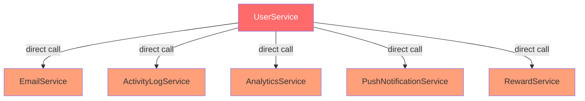
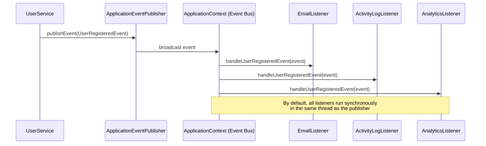
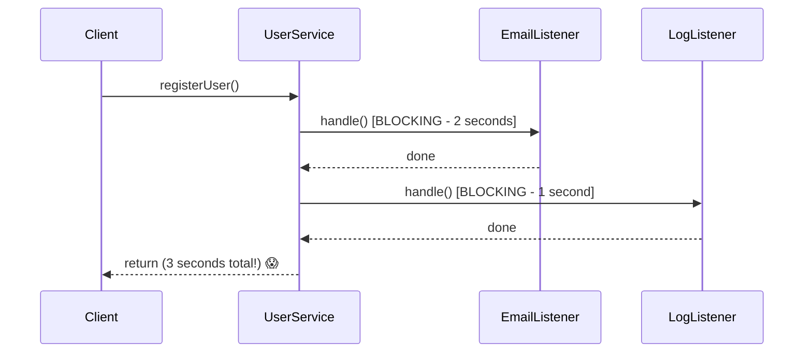
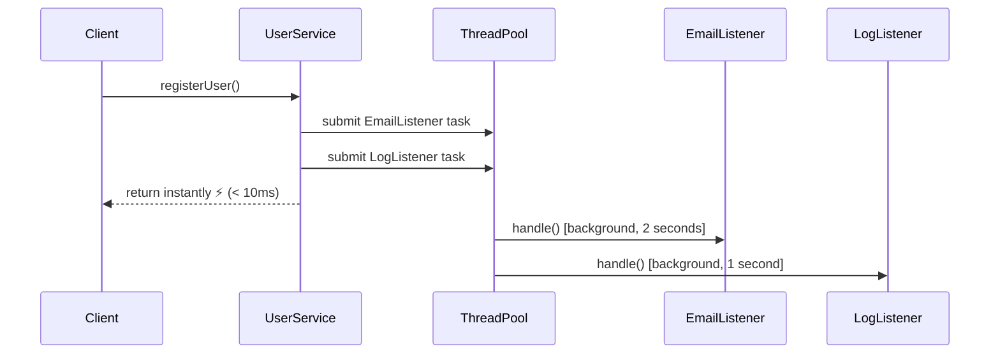
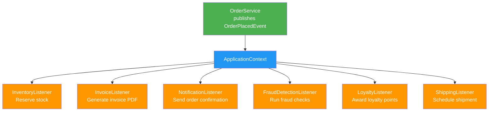
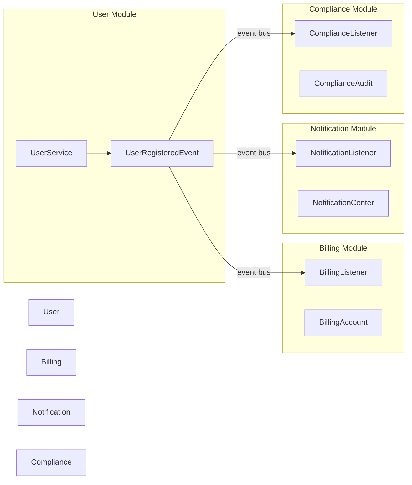
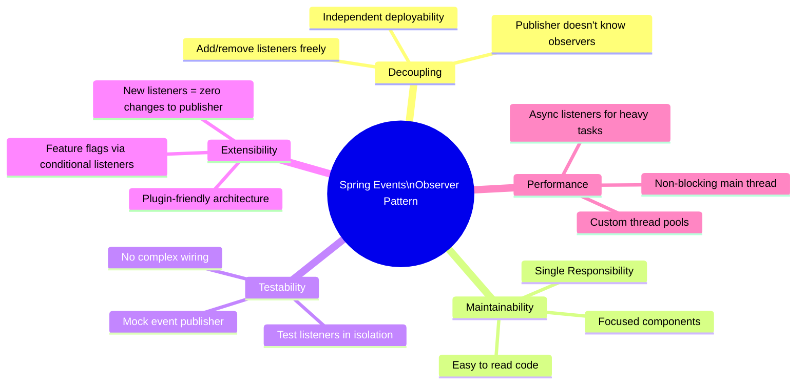
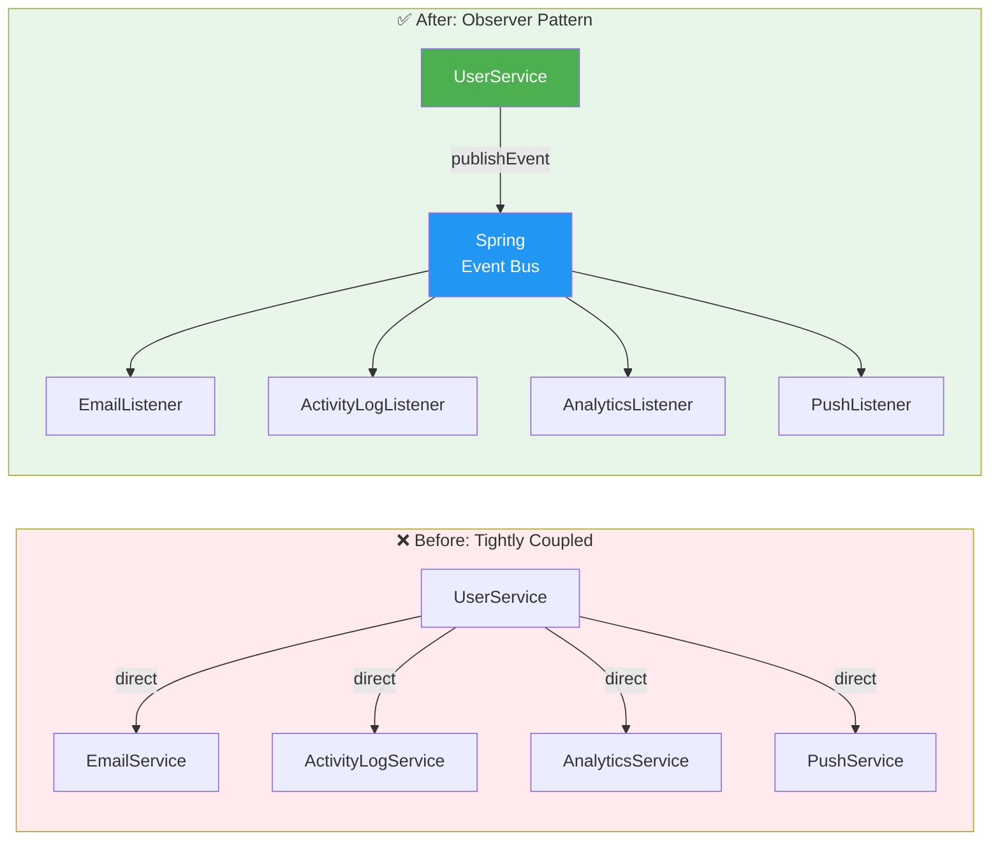

# 🔍 Observer Pattern with Spring Boot — A Comprehensive Tutorial

> **Level:** Beginner to Intermediate | **Framework:** Spring Boot 3.x | **Language:** Java 17+

---

## 📚 Table of Contents

1. [What is the Observer Pattern?](#1-what-is-the-observer-pattern)
2. [Core Concepts & Terminology](#2-core-concepts--terminology)
3. [The Problem: Tight Coupling in Action](#3-the-problem-tight-coupling-in-action)
4. [Spring's Event Mechanism: Your Observer Toolkit](#4-springs-event-mechanism-your-observer-toolkit)
5. [Step-by-Step Implementation](#5-step-by-step-implementation)
   - 5.1 Project Setup
   - 5.2 Defining a Custom Event
   - 5.3 Publishing the Event
   - 5.4 Creating Event Listeners (Observers)
   - 5.5 Running & Testing
6. [Asynchronous Events with @Async](#6-asynchronous-events-with-async)
7. [Advanced Patterns & Techniques](#7-advanced-patterns--techniques)
8. [Real-World Use Cases](#8-real-world-use-cases)
9. [Error Handling Strategies](#9-error-handling-strategies)
10. [Benefits, Best Practices & Common Pitfalls](#10-benefits-best-practices--common-pitfalls)
11. [Summary & Architecture Diagram](#11-summary--architecture-diagram)

---

## 1. What is the Observer Pattern?

The **Observer Pattern** is one of the classic Gang of Four (GoF) **behavioral design patterns**. It defines a **one-to-many dependency** between objects: when one object (the *Subject* or *Publisher*) changes state, all its dependents (*Observers* or *Subscribers*) are automatically notified and updated.

### The Core Idea

> "Define a one-to-many dependency between objects so that when one object changes state, all its dependents are notified and updated automatically."
> — *GoF Design Patterns*

Think of it like a **newspaper subscription**:
- The newspaper (Subject) doesn't know *who* subscribes.
- Subscribers (Observers) get notified whenever a new edition is published.
- Subscribers can be added or removed without changing the newspaper's internal logic.

### Pattern Structure (UML)

```
┌─────────────────────┐         ┌──────────────────────┐
│      Subject        │         │      Observer         │
│─────────────────────│         │──────────────────────│
│ + registerObserver()│◄────────│ + update(event)       │
│ + removeObserver()  │         └──────────────────────┘
│ + notifyObservers() │                   △
└─────────────────────┘         ┌─────────┴──────────┐
         △                      │                    │
         │            ConcreteObserverA    ConcreteObserverB
ConcreteSubject
```

### Everyday Analogies

| Analogy | Subject | Observer |
|---|---|---|
| YouTube | Channel | Subscribers |
| Stock Market | Stock Price Feed | Traders/Brokers |
| Social Media | Post | Followers |
| Spring Boot | Event Publisher | Event Listeners |

---

## 2. Core Concepts & Terminology

Before diving into code, understand these building blocks:

| Term | Spring Equivalent | Role |
|---|---|---|
| **Subject / Publisher** | `ApplicationEventPublisher` | Fires the event |
| **Event** | `ApplicationEvent` subclass | Carries the data payload |
| **Observer / Listener** | `@EventListener` method | Reacts to the event |
| **Event Bus** | Spring's `ApplicationContext` | Routes events to listeners |

### How Spring Wires It All Together

```
[Service publishes event]
         │
         ▼
ApplicationEventPublisher.publishEvent(event)
         │
         ▼
ApplicationContext (acts as Event Bus)
         │
    ┌────┴────────────────────────┐
    ▼                             ▼
@EventListener A          @EventListener B
(EmailListener)          (AnalyticsListener)
```

---

## 3. The Problem: Tight Coupling in Action

### The Scenario

A new user registers on your platform. You need to:
1. Send a welcome email
2. Log the activity
3. Update analytics counters
4. Send a push notification
5. Award a signup bonus

### ❌ The Naïve (Tightly Coupled) Approach

```java
// UserService.java — THE PROBLEMATIC VERSION
@Service
public class UserService {

    // Injecting EVERY downstream service directly
    private final EmailService emailService;
    private final ActivityLogService activityLogService;
    private final AnalyticsService analyticsService;
    private final PushNotificationService pushService;
    private final RewardService rewardService;

    public UserService(EmailService emailService,
                       ActivityLogService activityLogService,
                       AnalyticsService analyticsService,
                       PushNotificationService pushService,
                       RewardService rewardService) {
        this.emailService = emailService;
        this.activityLogService = activityLogService;
        this.analyticsService = analyticsService;
        this.pushService = pushService;
        this.rewardService = rewardService;
    }

    public User registerUser(String username, String email) {
        // Core responsibility: create and save the user
        User newUser = new User(username, email);
        userRepository.save(newUser);

        // ⚠️ Non-core: directly orchestrating side effects
        emailService.sendWelcomeEmail(newUser.getEmail(), newUser.getUsername());
        activityLogService.logUserRegistration(newUser.getUsername());
        analyticsService.updateUserRegisteredCount();
        pushService.sendWelcomePush(newUser.getId());
        rewardService.awardSignupBonus(newUser.getId());

        return newUser;
    }
}
```

### Why This Is a Problem



**Problems with this approach:**

| Problem | Description |
|---|---|
| **Violates SRP** | UserService handles registration *AND* orchestrates 5 side effects |
| **High Coupling** | Every new requirement means modifying UserService |
| **Hard to Test** | Must mock all 5 services to test user creation |
| **Fragile** | One failed email call could crash the whole registration |
| **Scalability** | 10 new requirements = 10 new injections into UserService |

---

## 4. Spring's Event Mechanism: Your Observer Toolkit

Spring's `ApplicationContext` ships with a built-in event publishing system — no external libraries needed.

### Key Components

#### 4.1 `ApplicationEvent`
The base class for all custom events. Your custom event extends this:

```java
public class MyCustomEvent extends ApplicationEvent {
    public MyCustomEvent(Object source) {
        super(source); // 'source' = the bean that published the event
    }
}
```

> **Tip (Spring 4.2+):** You don't *have* to extend `ApplicationEvent`. Any POJO can be published as an event. But extending it gives you metadata like the source object and timestamp.

#### 4.2 `ApplicationEventPublisher`
An interface Spring auto-injects. Call `publishEvent()` to broadcast the event:

```java
@Autowired
private ApplicationEventPublisher eventPublisher;

eventPublisher.publishEvent(new MyCustomEvent(this));
```

#### 4.3 `@EventListener`
Annotate any Spring-managed bean's method to make it an observer:

```java
@EventListener
public void onMyEvent(MyCustomEvent event) {
    // React to the event here
}
```

### How Spring Routes Events (Internals)



---

## 5. Step-by-Step Implementation

### 5.1 Project Setup

**Maven `pom.xml` (Spring Boot 3.x):**

```xml
<dependencies>
    <dependency>
        <groupId>org.springframework.boot</groupId>
        <artifactId>spring-boot-starter</artifactId>
    </dependency>
    <!-- For web applications -->
    <dependency>
        <groupId>org.springframework.boot</groupId>
        <artifactId>spring-boot-starter-web</artifactId>
    </dependency>
    <!-- For testing -->
    <dependency>
        <groupId>org.springframework.boot</groupId>
        <artifactId>spring-boot-starter-test</artifactId>
        <scope>test</scope>
    </dependency>
</dependencies>
```

**Project Structure:**

```
src/main/java/com/example/observer/
├── ObserverPatternApplication.java
├── model/
│   └── User.java
├── events/
│   └── UserRegisteredEvent.java
├── service/
│   └── UserService.java
└── listener/
    ├── EmailServiceListener.java
    ├── ActivityLogServiceListener.java
    └── AnalyticsServiceListener.java
```

### 5.2 Defining the User Model

```java
// model/User.java
package com.example.observer.model;

public class User {
    private Long id;
    private String username;
    private String email;

    public User(String username, String email) {
        this.username = username;
        this.email = email;
    }

    // Getters and setters
    public String getUsername() { return username; }
    public String getEmail() { return email; }
    public Long getId() { return id; }
    public void setId(Long id) { this.id = id; }
}
```

### 5.3 Defining a Custom Event

The event acts as the **data payload** — it carries all information observers need.

```java
// events/UserRegisteredEvent.java
package com.example.observer.events;

import org.springframework.context.ApplicationEvent;
import java.time.LocalDateTime;

public class UserRegisteredEvent extends ApplicationEvent {

    private final String username;
    private final String email;
    private final LocalDateTime registeredAt;

    public UserRegisteredEvent(Object source, String username, String email) {
        super(source);
        this.username = username;
        this.email = email;
        this.registeredAt = LocalDateTime.now(); // enrich the event with a timestamp
    }

    public String getUsername() { return username; }
    public String getEmail() { return email; }
    public LocalDateTime getRegisteredAt() { return registeredAt; }

    @Override
    public String toString() {
        return "UserRegisteredEvent{username='" + username + 
               "', email='" + email + 
               "', registeredAt=" + registeredAt + "}";
    }
}
```

> **Why enrich the event?** Pack the event with everything listeners might need. Avoid making listeners call back into the publisher — that reintroduces coupling.

### 5.4 Publishing the Event

UserService's only jobs now: **create the user** and **publish the event**.

```java
// service/UserService.java
package com.example.observer.service;

import com.example.observer.events.UserRegisteredEvent;
import com.example.observer.model.User;
import org.springframework.context.ApplicationEventPublisher;
import org.springframework.stereotype.Service;

@Service
public class UserService {

    private final ApplicationEventPublisher eventPublisher;

    // Constructor injection — best practice over @Autowired field injection
    public UserService(ApplicationEventPublisher eventPublisher) {
        this.eventPublisher = eventPublisher;
    }

    public User registerUser(String username, String email) {
        // ✅ Single Responsibility: create and persist the user
        User newUser = new User(username, email);
        // userRepository.save(newUser); // in a real app
        System.out.println("✅ User '" + username + "' registered successfully.");

        // ✅ Publish the event — zero knowledge of what happens next
        eventPublisher.publishEvent(
            new UserRegisteredEvent(this, newUser.getUsername(), newUser.getEmail())
        );

        return newUser;
    }
}
```

### 5.5 Creating Event Listeners (Observers)

Each listener is an independent, focused Spring component. They don't know about each other.

```java
// listener/EmailServiceListener.java
package com.example.observer.listener;

import com.example.observer.events.UserRegisteredEvent;
import org.springframework.context.event.EventListener;
import org.springframework.stereotype.Component;

@Component
public class EmailServiceListener {

    @EventListener
    public void handleUserRegisteredEvent(UserRegisteredEvent event) {
        System.out.println("[📧 EmailService] Sending welcome email to '"
            + event.getUsername() + "' at " + event.getEmail());
        // Real implementation: emailClient.send(...)
    }
}
```

```java
// listener/ActivityLogServiceListener.java
package com.example.observer.listener;

import com.example.observer.events.UserRegisteredEvent;
import org.springframework.context.event.EventListener;
import org.springframework.stereotype.Component;

@Component
public class ActivityLogServiceListener {

    @EventListener
    public void handleUserRegisteredEvent(UserRegisteredEvent event) {
        System.out.println("[📋 ActivityLog] Logging registration for '"
            + event.getUsername() + "' at " + event.getRegisteredAt());
        // Real implementation: logRepository.save(new LogEntry(...))
    }
}
```

```java
// listener/AnalyticsServiceListener.java
package com.example.observer.listener;

import com.example.observer.events.UserRegisteredEvent;
import org.springframework.context.event.EventListener;
import org.springframework.stereotype.Component;

@Component
public class AnalyticsServiceListener {

    @EventListener
    public void handleUserRegisteredEvent(UserRegisteredEvent event) {
        System.out.println("[📊 Analytics] Incrementing registered user count.");
        // Real implementation: metricsService.increment("user.registered")
    }
}
```

### 5.6 Running & Testing

```java
// ObserverPatternApplication.java
@SpringBootApplication
@EnableAsync // needed for async listeners (Section 6)
public class ObserverPatternApplication implements CommandLineRunner {

    private final UserService userService;

    public ObserverPatternApplication(UserService userService) {
        this.userService = userService;
    }

    public static void main(String[] args) {
        SpringApplication.run(ObserverPatternApplication.class, args);
    }

    @Override
    public void run(String... args) throws Exception {
        System.out.println("--- 🚀 Starting User Registration Simulation ---");
        userService.registerUser("john.doe", "john.doe@example.com");
        System.out.println();
        userService.registerUser("jane.smith", "jane.smith@example.com");
        System.out.println("--- ✅ Simulation Complete ---");
    }
}
```

**Expected Console Output:**

```
--- 🚀 Starting User Registration Simulation ---
✅ User 'john.doe' registered successfully.
[📧 EmailService] Sending welcome email to 'john.doe' at john.doe@example.com
[📋 ActivityLog] Logging registration for 'john.doe' at 2026-03-26T10:15:30
[📊 Analytics] Incrementing registered user count.

✅ User 'jane.smith' registered successfully.
[📧 EmailService] Sending welcome email to 'jane.smith' at jane.smith@example.com
[📋 ActivityLog] Logging registration for 'jane.smith' at 2026-03-26T10:15:30
[📊 Analytics] Incrementing registered user count.
--- ✅ Simulation Complete ---
```

---

## 6. Asynchronous Events with `@Async`

By default, Spring fires all `@EventListener` methods **synchronously** in the same thread as the publisher. If a listener does heavy work (sends email, writes to disk), it blocks the registration response.

### The Problem with Synchronous Listeners



### ✅ The Async Solution

**Step 1: Enable async support**

```java
@SpringBootApplication
@EnableAsync // ← Add this
public class ObserverPatternApplication { ... }
```

**Step 2: Annotate slow listeners with `@Async`**

```java
@Component
public class EmailServiceListener {

    @Async           // ← Runs in a separate thread pool
    @EventListener
    public void handleUserRegisteredEvent(UserRegisteredEvent event) {
        // Simulate slow email sending (2 seconds)
        Thread.sleep(2000);
        System.out.println("[📧 EmailService - Async] Email sent to " + event.getEmail());
    }
}
```

### With `@Async` — Non-Blocking Flow



### Configuring a Custom Thread Pool

For production, always configure a custom thread pool instead of relying on the default:

```java
@Configuration
@EnableAsync
public class AsyncConfig {

    @Bean(name = "eventListenerTaskExecutor")
    public Executor taskExecutor() {
        ThreadPoolTaskExecutor executor = new ThreadPoolTaskExecutor();
        executor.setCorePoolSize(5);         // minimum threads always alive
        executor.setMaxPoolSize(20);         // maximum threads under load
        executor.setQueueCapacity(500);      // tasks queued before rejecting
        executor.setThreadNamePrefix("EventListener-");
        executor.setRejectedExecutionHandler(new ThreadPoolExecutor.CallerRunsPolicy());
        executor.initialize();
        return executor;
    }
}
```

Use it specifically:

```java
@Async("eventListenerTaskExecutor")
@EventListener
public void handleUserRegisteredEvent(UserRegisteredEvent event) { ... }
```

---

## 7. Advanced Patterns & Techniques

### 7.1 Conditional Event Listening with `condition`

Only fire a listener when a condition on the event is true:

```java
@EventListener(condition = "#event.email.endsWith('.edu')")
public void handleStudentRegistration(UserRegisteredEvent event) {
    System.out.println("Student registered with .edu email: " + event.getEmail());
    // Send student-specific welcome content
}
```

### 7.2 Event Ordering with `@Order`

Control the execution order of synchronous listeners:

```java
@Component
public class OrderedListeners {

    @Order(1) // Runs first
    @EventListener
    public void validateUser(UserRegisteredEvent event) {
        System.out.println("1. Validating user data...");
    }

    @Order(2)
    @EventListener
    public void sendEmail(UserRegisteredEvent event) {
        System.out.println("2. Sending email...");
    }

    @Order(3) // Runs last
    @EventListener
    public void updateAnalytics(UserRegisteredEvent event) {
        System.out.println("3. Updating analytics...");
    }
}
```

### 7.3 Transactional Event Listeners with `@TransactionalEventListener`

Sometimes you want a listener to fire only *after* a database transaction commits (not before):

```java
import org.springframework.transaction.event.TransactionalEventListener;
import org.springframework.transaction.event.TransactionPhase;

@Component
public class TransactionalEmailListener {

    // Only fires AFTER the DB transaction commits successfully
    @TransactionalEventListener(phase = TransactionPhase.AFTER_COMMIT)
    public void handleUserRegisteredEvent(UserRegisteredEvent event) {
        System.out.println("[📧 Transactional Email] Sending email after commit for: "
            + event.getUsername());
    }
}
```

**Available Transaction Phases:**

| Phase | When it fires |
|---|---|
| `AFTER_COMMIT` | After successful transaction commit ✅ (most common) |
| `AFTER_ROLLBACK` | After transaction rollback (for cleanup) |
| `AFTER_COMPLETION` | After commit OR rollback |
| `BEFORE_COMMIT` | Just before commit |

### 7.4 Publishing Multiple Events from One Action

```java
public User registerUser(String username, String email) {
    User newUser = new User(username, email);
    // save user...

    // Publish primary event
    eventPublisher.publishEvent(new UserRegisteredEvent(this, username, email));

    // Publish a separate audit event
    eventPublisher.publishEvent(new AuditEvent(this, "USER_REGISTERED", username));

    return newUser;
}
```

### 7.5 POJO Events (Spring 4.2+)

You don't even need to extend `ApplicationEvent`:

```java
// A plain POJO as an event
public class OrderPlacedEvent {
    private final String orderId;
    private final double amount;

    public OrderPlacedEvent(String orderId, double amount) {
        this.orderId = orderId;
        this.amount = amount;
    }

    public String getOrderId() { return orderId; }
    public double getAmount() { return amount; }
}

// Publish it
eventPublisher.publishEvent(new OrderPlacedEvent("ORD-001", 99.99));

// Listen to it
@EventListener
public void onOrderPlaced(OrderPlacedEvent event) {
    System.out.println("Order placed: " + event.getOrderId());
}
```

---

## 8. Real-World Use Cases

### 8.1 E-Commerce Order Processing



### 8.2 User Account Lifecycle Events

```java
// A richer event hierarchy using inheritance
public abstract class UserEvent extends ApplicationEvent {
    protected final User user;
    public UserEvent(Object source, User user) {
        super(source);
        this.user = user;
    }
    public User getUser() { return user; }
}

public class UserRegisteredEvent extends UserEvent { ... }
public class UserUpdatedEvent extends UserEvent { ... }
public class UserDeletedEvent extends UserEvent { ... }
public class UserLoggedInEvent extends UserEvent { ... }

// A single listener can handle ALL user events
@EventListener
public void onAnyUserEvent(UserEvent event) {
    auditService.log(event.getUser().getId(), event.getClass().getSimpleName());
}
```

### 8.3 Microservices-Style Decoupling (Within a Monolith)

Even in a monolith, you can organize code like microservices using events:



### 8.4 Common Real-World Scenarios

| Trigger Event | Typical Listeners |
|---|---|
| `UserRegisteredEvent` | Email, Analytics, Audit Log, Push Notification, Reward |
| `OrderPlacedEvent` | Inventory, Invoice, Shipping, Fraud Check, Loyalty Points |
| `PaymentCompletedEvent` | Receipt Email, Order Fulfillment, Revenue Reporting |
| `FileUploadedEvent` | Virus Scan, Thumbnail Generation, Indexing, CDN Push |
| `PasswordChangedEvent` | Security Alert Email, Session Invalidation, Audit |
| `ProductPublishedEvent` | Search Index Update, RSS Feed, Social Share, Cache Invalidation |

---

## 9. Error Handling Strategies

### 9.1 Synchronous Error Propagation

By default, a synchronous listener exception **rolls back to the publisher**:

```java
// ⚠️ If this throws, the exception bubbles up to UserService.registerUser()
@EventListener
public void handleEvent(UserRegisteredEvent event) {
    throw new RuntimeException("Email service is down!"); // Propagates!
}
```

**Solution — Isolate listener errors:**

```java
@EventListener
public void handleEvent(UserRegisteredEvent event) {
    try {
        emailClient.send(event.getEmail());
    } catch (Exception e) {
        // Log and continue — don't crash the publisher
        log.error("Failed to send email for user {}: {}", event.getUsername(), e.getMessage());
        // Optionally: deadLetterQueue.push(event)
    }
}
```

### 9.2 Async Error Handling

With `@Async`, exceptions don't propagate to the publisher. Implement `AsyncUncaughtExceptionHandler`:

```java
@Configuration
@EnableAsync
public class AsyncConfig implements AsyncConfigurer {

    @Override
    public AsyncUncaughtExceptionHandler getAsyncUncaughtExceptionHandler() {
        return (throwable, method, params) -> {
            System.err.println("Async error in method: " + method.getName());
            System.err.println("Exception: " + throwable.getMessage());
            // alertingService.sendAlert(throwable);
        };
    }
}
```

### 9.3 Dead Letter / Retry Pattern

For critical listeners (like sending invoices), implement retry logic:

```java
@Component
public class InvoiceListener {

    @Async
    @EventListener
    @Retryable(value = Exception.class, maxAttempts = 3, backoff = @Backoff(delay = 1000))
    public void handleOrderPlaced(OrderPlacedEvent event) {
        invoiceService.generate(event.getOrderId());
    }

    @Recover
    public void recoverFromFailure(Exception ex, OrderPlacedEvent event) {
        log.error("All retries failed for order: " + event.getOrderId());
        deadLetterQueue.push(event);
    }
}
```

*(Requires `spring-retry` dependency)*

---

## 10. Benefits, Best Practices & Common Pitfalls

### ✅ Benefits Summary



### ✅ Best Practices

1. **Pack the event with all needed data** — avoid listeners calling back into the publisher.
2. **Name events in past tense** — `UserRegisteredEvent`, not `RegisterUserEvent`. Events describe what *happened*.
3. **Keep listeners lightweight** — delegate heavy logic to dedicated services.
4. **Use `@TransactionalEventListener`** for anything touching the DB after a commit.
5. **Use `@Async` + custom thread pool** for I/O-bound listeners (email, HTTP calls).
6. **Define event hierarchies** for shared handling across event types.
7. **Always handle errors in listeners** — especially async ones.

### ❌ Common Pitfalls

| Pitfall | Problem | Fix |
|---|---|---|
| Listener calls back into the publisher | Re-introduces coupling | Put all needed data in the event |
| Heavy sync listener | Blocks the publisher's thread | Use `@Async` |
| No error handling in listener | Silent failures | Wrap in try-catch, log errors |
| Publishing before transaction commits | Listener operates on uncommitted data | Use `@TransactionalEventListener(AFTER_COMMIT)` |
| Circular event publishing | Infinite loop | Design event hierarchy carefully |
| Fat events with too much data | Tight coupling via payload | Send minimal, focused data |

---

## 11. Summary & Architecture Diagram

### Before vs After: The Big Picture



### Full Application Lifecycle Diagram

```mermaid
flowchart TD
    A([App Starts]) --> B[Spring Context Initializes]
    B --> C[Scans @Component, @Service beans]
    C --> D[Registers @EventListener methods]
    D --> E([Ready for Requests])

    E --> F[HTTP POST /users/register]
    F --> G[UserService.registerUser]
    G --> H[Create & Save User to DB]
    H --> I[eventPublisher.publishEvent\nUserRegisteredEvent]

    I --> J{Sync or Async?}

    J -->|Synchronous| K[Same thread]
    K --> L[EmailListener.handle]
    K --> M[LogListener.handle]
    K --> N[AnalyticsListener.handle]
    L & M & N --> O([Return User to Controller])

    J -->|@Async| P[Dispatch to Thread Pool]
    P --> Q[Return User to Controller immediately]
    P --> R[EmailListener - background thread]
    P --> S[LogListener - background thread]
    P --> T[AnalyticsListener - background thread]

    style A fill:#4CAF50,color:#fff
    style E fill:#2196F3,color:#fff
    style I fill:#FF9800,color:#fff
    style J fill:#9C27B0,color:#fff
    style O fill:#4CAF50,color:#fff
    style Q fill:#4CAF50,color:#fff
```

---

## 🎓 Key Takeaways

- The **Observer Pattern** decouples the event source from event consumers — the publisher doesn't know who's listening.
- Spring's **`ApplicationEventPublisher`** + **`@EventListener`** is the idiomatic Spring implementation of this pattern.
- Use **`@Async`** to prevent slow listeners from blocking your main thread.
- Use **`@TransactionalEventListener`** when listeners depend on committed database state.
- Design events as **rich data payloads** — name them in past tense, include everything listeners need.
- This pattern shines in any scenario where **one action triggers multiple independent reactions**.

---
