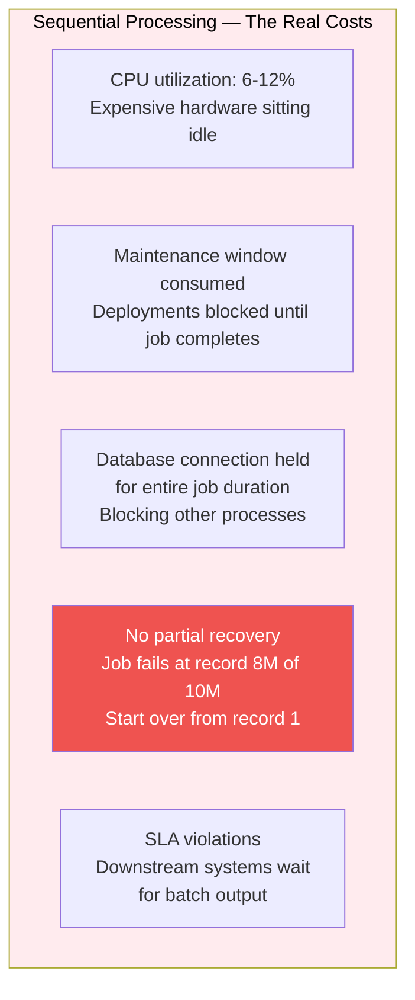
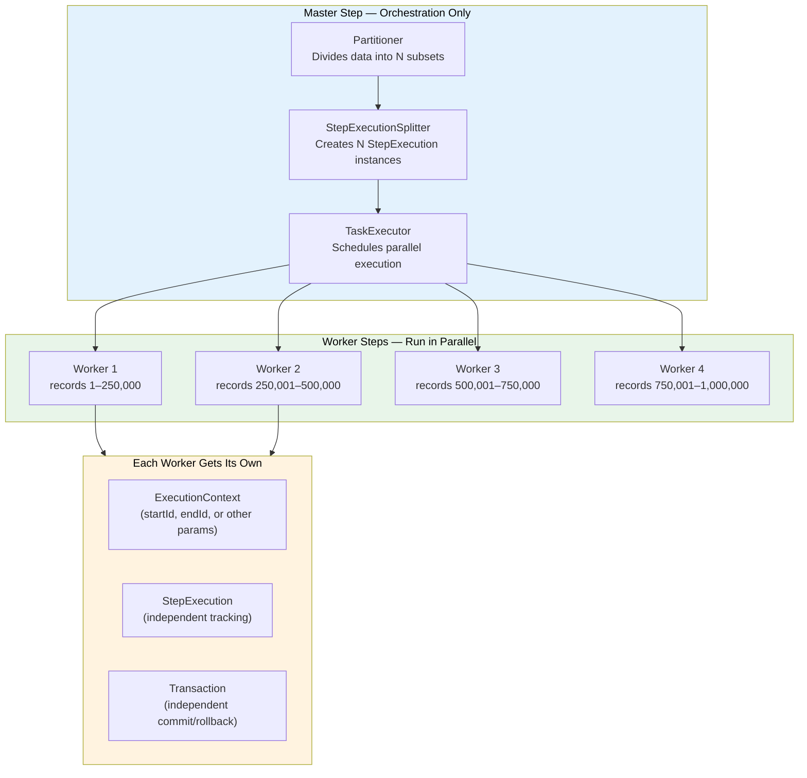
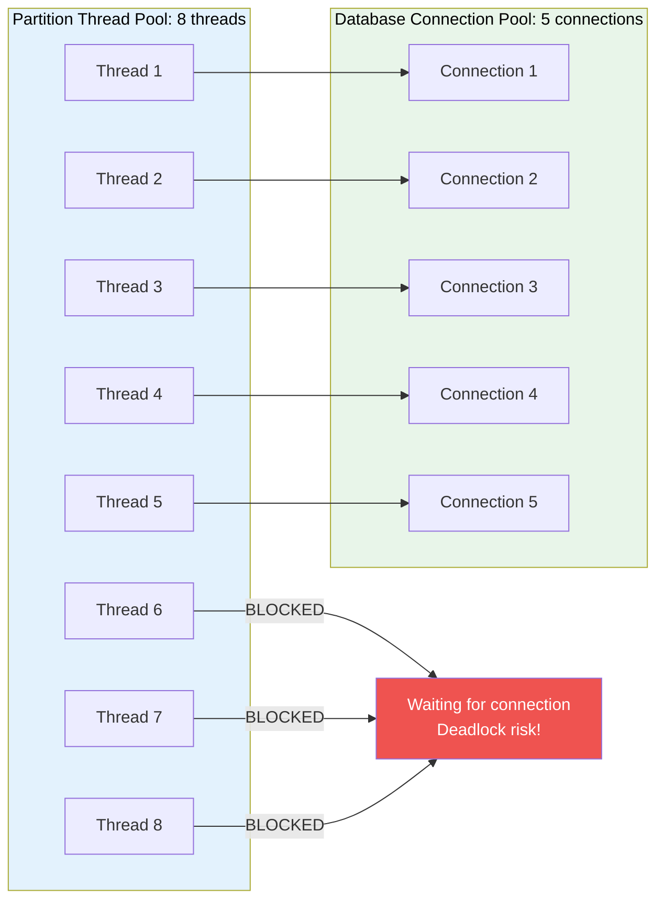
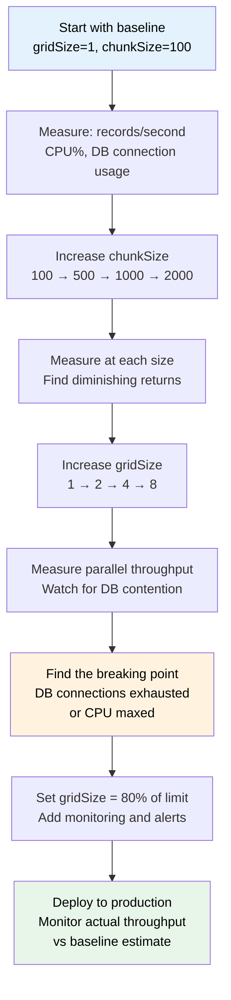
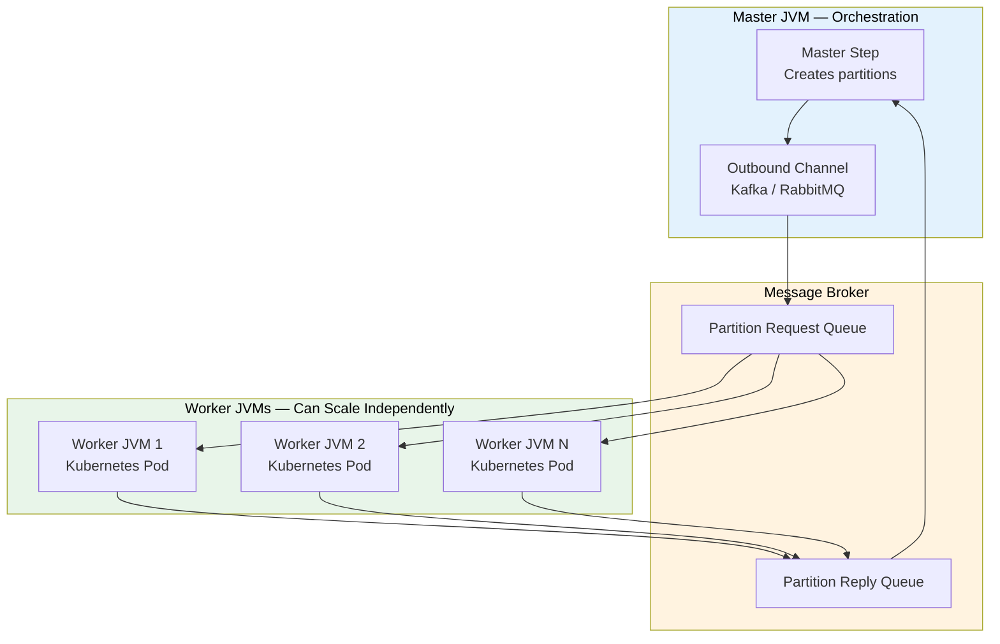
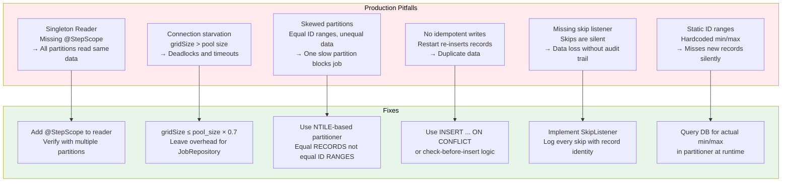

# Spring Batch Partitioning and Parallel Processing: A Complete Production Guide

> *Sequential batch processing is the silent killer of enterprise systems. A job that takes 8 hours while your server's CPU sits at 12% utilization isn't a database problem or a code quality problem — it's an architecture problem. Partitioning is the fix, and getting it right in production requires understanding considerably more than the basics.*


---

## Why Sequential Processing Is Worse Than It Looks

The cost of sequential batch processing compounds in ways that aren't obvious until you're operating at scale.

Consider a job processing 10 million customer records sequentially. Each record takes 2ms to read, process, and write. That's 20,000 seconds — over 5.5 hours — for a task that a modern server with 16 cores could complete in under 25 minutes with proper parallelization.

But the hidden costs are worse than the time:



Partitioning addresses all five. It parallelizes the CPU work, reduces wall-clock time, allows partial recovery from failure (only failed partitions need to restart), and gives you granular monitoring visibility into which portion of work is slow.

---

## How Spring Batch Partitioning Works

The architecture has two layers that are important to understand before writing any code:



The critical design principle: **the worker step knows nothing about partitioning.** It reads from whatever range its `ExecutionContext` specifies, processes what it finds, and writes the results. The master step handles all orchestration. This separation makes worker steps individually testable, restartable, and reusable.

---

## Building the Full Implementation

### Step 1: The Partitioner — The Brain of the Operation

The partitioner is the only component that must understand your data distribution. Everything else is generic.

```java
@Component
@Slf4j
public class CustomerIdRangePartitioner implements Partitioner {

   private final JdbcTemplate jdbcTemplate;

   public CustomerIdRangePartitioner(JdbcTemplate jdbcTemplate) {
       this.jdbcTemplate = jdbcTemplate;
   }

   @Override
   public Map<String, ExecutionContext> partition(int gridSize) {
       // Query actual data distribution — never hardcode min/max
       // Static ranges silently break when data changes
       Map<String, Object> bounds = jdbcTemplate.queryForMap(
           "SELECT MIN(id) as min_id, MAX(id) as max_id " +
           "FROM customers WHERE status = 'PENDING_PROCESSING'"
       );

       long minId = ((Number) bounds.get("min_id")).longValue();
       long maxId = ((Number) bounds.get("max_id")).longValue();
       long totalRecords = maxId - minId + 1;

       log.info("Partitioning {} records (id {} to {}) into {} partitions",
           totalRecords, minId, maxId, gridSize);

       long targetSize = (totalRecords + gridSize - 1) / gridSize; // Ceiling division

       Map<String, ExecutionContext> partitions = new LinkedHashMap<>();
       long start = minId;
       int partitionNumber = 0;

       while (start <= maxId) {
           long end = Math.min(start + targetSize - 1, maxId);

           ExecutionContext context = new ExecutionContext();
           context.putLong("startId", start);
           context.putLong("endId", end);
           context.putString("partitionId", "partition_" + partitionNumber);
           context.putLong("expectedRecords", end - start + 1);

           String partitionName = String.format("partition_%04d", partitionNumber);
           partitions.put(partitionName, context);

           log.debug("Created {} for ids {} to {} ({} records)",
               partitionName, start, end, end - start + 1);

           start = end + 1;
           partitionNumber++;
       }

       return partitions;
   }
}
```

**Why query the database instead of hardcoding ranges?** Production data is never static. If your job ran yesterday with IDs 1–1,000,000 and today there are 1,100,000 records, a hardcoded range silently misses 100,000 records. Always derive bounds from the actual data.

### Step 2: The Partition-Aware Reader

The reader must use its partition's `ExecutionContext` to scope its query. Spring Batch injects the context through `StepScope`:

```java
@Bean
@StepScope
public JdbcPagingItemReader<Customer> customerReader(
       DataSource dataSource,
       @Value("#{stepExecutionContext['startId']}") Long startId,
       @Value("#{stepExecutionContext['endId']}") Long endId,
       @Value("#{stepExecutionContext['partitionId']}") String partitionId) {

   log.info("Initializing reader for {} (ids {} to {})", partitionId, startId, endId);

   SqlPagingQueryProviderFactoryBean queryProvider = new SqlPagingQueryProviderFactoryBean();
   queryProvider.setDataSource(dataSource);
   queryProvider.setSelectClause(
       "SELECT id, name, email, status, last_updated, account_balance, region"
   );
   queryProvider.setFromClause("FROM customers");
   queryProvider.setWhereClause(
       "WHERE id >= :startId AND id <= :endId AND status = 'PENDING_PROCESSING'"
   );
   queryProvider.setSortKeys(Map.of("id", Order.ASCENDING));

   JdbcPagingItemReader<Customer> reader = new JdbcPagingItemReader<>();
   reader.setDataSource(dataSource);
   reader.setQueryProvider(queryProvider.getObject()); // handle checked exception
   reader.setParameterValues(Map.of("startId", startId, "endId", endId));
   reader.setPageSize(500);  // Chunk size for JDBC paging
   reader.setRowMapper(new CustomerRowMapper());
   reader.setSaveState(true); // Enable restart capability

   return reader;
}
```

**`@StepScope` is non-negotiable for partitioned readers.** Without it, Spring creates a singleton reader that all partitions share — which means all partitions read the same data (typically partition_0000's range). `@StepScope` creates a new reader instance per partition execution, each with its own context values.

### Step 3: The Processor

```java
@Bean
@StepScope
public ItemProcessor<Customer, ProcessedCustomer> customerProcessor(
       @Value("#{stepExecutionContext['partitionId']}") String partitionId,
       CreditScoringService creditScoringService,
       RegionalPricingService pricingService) {

   return customer -> {
       // Processor logic is partition-unaware — just transforms one record
       // The @StepScope binding handles the partitioning
       try {
           CreditScore score = creditScoringService.score(customer);
           RegionalPrice price = pricingService.getPricing(
               customer.getRegion(),
               customer.getAccountBalance()
           );

           return ProcessedCustomer.builder()
               .customerId(customer.getId())
               .creditScore(score.getValue())
               .riskCategory(score.getRiskCategory())
               .applicablePrice(price.getMonthlyFee())
               .processedAt(Instant.now())
               .partitionId(partitionId)  // Useful for debugging
               .build();

       } catch (CreditScoringException e) {
           // Skip records with scoring errors — log for review
           log.warn("Credit scoring failed for customer {}, skipping: {}",
               customer.getId(), e.getMessage());
           return null; // Spring Batch skips null returns from processors
       }
   };
}
```

### Step 4: The Writer

```java
@Bean
@StepScope
public JdbcBatchItemWriter<ProcessedCustomer> customerWriter(DataSource dataSource) {
   return new JdbcBatchItemWriterBuilder<ProcessedCustomer>()
       .dataSource(dataSource)
       .sql("""
           INSERT INTO processed_customers
               (customer_id, credit_score, risk_category, applicable_price,
                processed_at, partition_id, batch_job_id)
           VALUES
               (:customerId, :creditScore, :riskCategory, :applicablePrice,
                :processedAt, :partitionId, :batchJobId)
           ON CONFLICT (customer_id) DO UPDATE SET
               credit_score = EXCLUDED.credit_score,
               risk_category = EXCLUDED.risk_category,
               applicable_price = EXCLUDED.applicable_price,
               processed_at = EXCLUDED.processed_at
           """)
       .beanMapped()
       .build();
}
```

**Idempotent writes are essential for partitioned jobs.** If a partition fails midway through and restarts, it will attempt to write records it already wrote. `INSERT ... ON CONFLICT DO UPDATE` (PostgreSQL) or `MERGE` (SQL Server/Oracle) ensures restarts are safe.

### Step 5: Assembling the Job

```java
@Configuration
@EnableBatchProcessing
@Slf4j
public class CustomerBatchJobConfiguration {

   @Bean
   public ThreadPoolTaskExecutor partitionTaskExecutor(BatchProperties batchProps) {
       ThreadPoolTaskExecutor executor = new ThreadPoolTaskExecutor();
       executor.setCorePoolSize(batchProps.getPartitionThreads());
       executor.setMaxPoolSize(batchProps.getPartitionThreads());
       // Queue capacity = 0 means: block the master thread if all workers are busy
       // Prevents creating more partitions than there are threads
       executor.setQueueCapacity(0);
       executor.setThreadNamePrefix("partition-worker-");
       executor.setWaitForTasksToCompleteOnShutdown(true);
       executor.setAwaitTerminationSeconds(60);
       executor.initialize();
       return executor;
   }

   @Bean
   public Step masterStep(
           JobRepository jobRepository,
           CustomerIdRangePartitioner partitioner,
           Step workerStep,
           ThreadPoolTaskExecutor partitionTaskExecutor,
           BatchProperties batchProps) {

       return new StepBuilder("masterStep", jobRepository)
           .partitioner(workerStep.getName(), partitioner)
           .step(workerStep)
           .gridSize(batchProps.getGridSize())
           .taskExecutor(partitionTaskExecutor)
           .build();
   }

   @Bean
   public Step workerStep(
           JobRepository jobRepository,
           PlatformTransactionManager transactionManager,
           JdbcPagingItemReader<Customer> customerReader,
           ItemProcessor<Customer, ProcessedCustomer> customerProcessor,
           JdbcBatchItemWriter<ProcessedCustomer> customerWriter,
           BatchProperties batchProps) {

       return new StepBuilder("workerStep", jobRepository)
           .<Customer, ProcessedCustomer>chunk(batchProps.getChunkSize(), transactionManager)
           .reader(customerReader)
           .processor(customerProcessor)
           .writer(customerWriter)
           // Skip configuration: handle transient failures gracefully
           .faultTolerant()
           .skip(RecoverableDataAccessException.class)
           .skipLimit(100)                               // Max skips per partition
           .retry(TransientDataAccessException.class)
           .retryLimit(3)
           .listener(new PartitionStepExecutionListener())
           .build();
   }

   @Bean
   public Job customerProcessingJob(
           JobRepository jobRepository,
           Step masterStep,
           JobExecutionListener jobListener) {

       return new JobBuilder("customerProcessingJob", jobRepository)
           .incrementer(new RunIdIncrementer())
           .listener(jobListener)
           .start(masterStep)
           .build();
   }
}
```

---

## Partitioner Strategies for Real-World Data

### Range-Based Partitioning (Uniform Data)

Best for auto-increment IDs or evenly distributed timestamps:

```java
// Simple range — suitable when data is uniformly distributed
public Map<String, ExecutionContext> partition(int gridSize) {
   long range = (maxId - minId) / gridSize;
   // ... create equal ID ranges
}
```

### Histogram-Based Partitioning (Skewed Data)

The most critical real-world scenario: what happens when your data is not uniformly distributed? If 80% of records have IDs in the range 1–100,000 and 20% are spread across 100,001–1,000,000, equal ID ranges will create wildly unequal work distribution:

```java
@Component
public class HistogramPartitioner implements Partitioner {

   private final JdbcTemplate jdbcTemplate;

   @Override
   public Map<String, ExecutionContext> partition(int gridSize) {
       // Use database histogram/NTILE to create balanced partitions
       // Each partition gets approximately equal RECORD COUNT, not equal ID RANGE
       List<Long> boundaries = jdbcTemplate.queryForList(
           """
           SELECT boundary_id FROM (
               SELECT id AS boundary_id,
                      NTILE(:gridSize) OVER (ORDER BY id) AS bucket,
                      LEAD(NTILE(:gridSize) OVER (ORDER BY id)) OVER (ORDER BY id) AS next_bucket
               FROM customers
               WHERE status = 'PENDING_PROCESSING'
           ) t
           WHERE bucket != next_bucket OR next_bucket IS NULL
           ORDER BY boundary_id
           """,
           Long.class,
           gridSize
       );

       Map<String, ExecutionContext> partitions = new LinkedHashMap<>();
       long start = getMinId();

       for (int i = 0; i < boundaries.size(); i++) {
           long end = boundaries.get(i);
           ExecutionContext ctx = new ExecutionContext();
           ctx.putLong("startId", start);
           ctx.putLong("endId", end);
           partitions.put(String.format("partition_%04d", i), ctx);
           start = end + 1;
       }

       return partitions;
   }
}
```

**Why histogram partitioning matters:** with equal ID ranges on skewed data, some worker threads complete in 30 seconds while one thread processes 70% of the records for 20 minutes. Your job's completion time is determined by the slowest partition. Histogram partitioning ensures all partitions finish in approximately the same time.

### Column-Value Partitioning

When you want natural business groupings:

```java
@Component
public class RegionBasedPartitioner implements Partitioner {

   private final JdbcTemplate jdbcTemplate;

   @Override
   public Map<String, ExecutionContext> partition(int gridSize) {
       // Partition by region — each region processed independently
       List<String> regions = jdbcTemplate.queryForList(
           "SELECT DISTINCT region FROM customers WHERE status = 'PENDING_PROCESSING' ORDER BY region",
           String.class
       );

       // If more regions than gridSize, group smaller regions together
       Map<String, ExecutionContext> partitions = new LinkedHashMap<>();

       if (regions.size() <= gridSize) {
           // Simple: one partition per region
           for (int i = 0; i < regions.size(); i++) {
               ExecutionContext ctx = new ExecutionContext();
               ctx.put("regions", List.of(regions.get(i)));
               ctx.putString("partitionId", "region_" + regions.get(i));
               partitions.put("partition_" + regions.get(i), ctx);
           }
       } else {
           // Distribute regions across gridSize partitions by record count
           Map<String, Long> regionCounts = getRegionRecordCounts();
           List<List<String>> grouped = balanceRegionGroups(regions, regionCounts, gridSize);

           for (int i = 0; i < grouped.size(); i++) {
               ExecutionContext ctx = new ExecutionContext();
               ctx.put("regions", grouped.get(i));
               ctx.putString("partitionId", "group_" + i);
               partitions.put(String.format("partition_%04d", i), ctx);
           }
       }

       return partitions;
   }
}
```

### File-Based Partitioning

For jobs that process file input rather than database records:

```java
@Component
public class MultiFilePartitioner implements Partitioner {

   private final Resource[] inputFiles;

   @Override
   public Map<String, ExecutionContext> partition(int gridSize) {
       Map<String, ExecutionContext> partitions = new LinkedHashMap<>();

       // One partition per file — natural parallelization boundary
       for (int i = 0; i < inputFiles.length; i++) {
           ExecutionContext ctx = new ExecutionContext();
           ctx.putString("fileName", inputFiles[i].getFilename());
           ctx.putString("filePath", inputFiles[i].getURI().toString());
           ctx.putLong("fileSize", inputFiles[i].contentLength());
           partitions.put(String.format("partition_%04d", i), ctx);
       }

       return partitions;
   }
}

@Bean
@StepScope
public FlatFileItemReader<CustomerRecord> fileReader(
       @Value("#{stepExecutionContext['filePath']}") String filePath) {

   return new FlatFileItemReaderBuilder<CustomerRecord>()
       .name("customerFileReader")
       .resource(new FileSystemResource(filePath))
       .delimited()
       .names("id", "name", "email", "amount")
       .targetType(CustomerRecord.class)
       .build();
}
```

---

## Thread Pool Configuration: The Numbers That Matter

The most common production mistake is mismatching thread pool size with database connection pool size:



**The rule:** `gridSize ≤ database_connection_pool_size - overhead_connections`

Reserve connections for: the Spring Batch `JobRepository` writes, monitoring queries, potential admin connections. In practice:

```
gridSize = connection_pool_size × 0.7
```

```java
@Configuration
@ConfigurationProperties(prefix = "batch")
@Data
public class BatchProperties {

   // Grid size: number of parallel partitions
   // Must be ≤ (database.hikari.maximum-pool-size × 0.7)
   private int gridSize = 4;

   // Chunk size: records per transaction per partition
   // Larger chunks = fewer transactions = faster (to a point)
   // Too large = more memory, longer rollback on failure
   private int chunkSize = 500;

   // Thread pool size — usually same as gridSize
   // Can be larger if you want queued partitions
   private int partitionThreads = 4;
}
```

```yaml
# application.yml — coordinated configuration
batch:
 grid-size: 8
 chunk-size: 500
 partition-threads: 8

spring:
 datasource:
   hikari:
     maximum-pool-size: 15    # 8 workers + 4 overhead + 3 buffer
     minimum-idle: 8          # Keep worker connections warm
     connection-timeout: 30000
     idle-timeout: 600000

 batch:
   job:
     enabled: false           # Don't auto-run on startup
   jdbc:
     initialize-schema: always
```

---

## Monitoring and Observability

A partitioned job running 8 threads in parallel is significantly harder to monitor than a sequential job. You need visibility into each partition's progress independently:

```java
@Component
@Slf4j
public class PartitionStepExecutionListener implements StepExecutionListener {

   private final MeterRegistry meterRegistry;

   @Override
   public void beforeStep(StepExecution stepExecution) {
       String partitionId = stepExecution.getExecutionContext()
           .getString("partitionId", "unknown");

       log.info("Partition {} starting: id range {} to {}",
           partitionId,
           stepExecution.getExecutionContext().getLong("startId", 0),
           stepExecution.getExecutionContext().getLong("endId", 0)
       );

       meterRegistry.counter("batch.partition.started",
           "job", stepExecution.getJobExecution().getJobInstance().getJobName(),
           "partition", partitionId
       ).increment();
   }

   @Override
   public ExitStatus afterStep(StepExecution stepExecution) {
       String partitionId = stepExecution.getExecutionContext()
           .getString("partitionId", "unknown");

       long duration = Duration.between(
           stepExecution.getStartTime().toInstant(),
           stepExecution.getEndTime().toInstant()
       ).toMillis();

       log.info("""
           Partition {} completed: status={}, read={}, written={}, skipped={}, duration={}ms
           """,
           partitionId,
           stepExecution.getExitStatus().getExitCode(),
           stepExecution.getReadCount(),
           stepExecution.getWriteCount(),
           stepExecution.getSkipCount(),
           duration
       );

       // Track per-partition metrics
       Tags tags = Tags.of(
           "job", stepExecution.getJobExecution().getJobInstance().getJobName(),
           "partition", partitionId,
           "status", stepExecution.getExitStatus().getExitCode()
       );

       meterRegistry.counter("batch.partition.completed", tags).increment();
       meterRegistry.gauge("batch.partition.read_count", tags,
           stepExecution, StepExecution::getReadCount);
       meterRegistry.gauge("batch.partition.write_count", tags,
           stepExecution, StepExecution::getWriteCount);
       meterRegistry.timer("batch.partition.duration", tags)
           .record(duration, TimeUnit.MILLISECONDS);

       if (stepExecution.getSkipCount() > 0) {
           log.warn("Partition {} had {} skips — review skip log",
               partitionId, stepExecution.getSkipCount());
       }

       return stepExecution.getExitStatus();
   }
}
```

```java
// Job-level listener for overall completion metrics
@Component
@Slf4j
public class BatchJobExecutionListener implements JobExecutionListener {

   @Override
   public void beforeJob(JobExecution jobExecution) {
       log.info("Starting job: {} (id: {})",
           jobExecution.getJobInstance().getJobName(),
           jobExecution.getJobId()
       );
   }

   @Override
   public void afterJob(JobExecution jobExecution) {
       long totalRead    = 0;
       long totalWritten = 0;
       long totalSkipped = 0;
       int  failedPartitions = 0;

       for (StepExecution step : jobExecution.getStepExecutions()) {
           totalRead    += step.getReadCount();
           totalWritten += step.getWriteCount();
           totalSkipped += step.getSkipCount();
           if (step.getExitStatus().equals(ExitStatus.FAILED)) {
               failedPartitions++;
           }
       }

       long durationMs = Duration.between(
           jobExecution.getStartTime().toInstant(),
           jobExecution.getEndTime().toInstant()
       ).toMillis();

       double throughput = totalRead > 0
           ? (double) totalRead / (durationMs / 1000.0)
           : 0;

       log.info("""
           Job completed: status={}, duration={}ms, throughput={:.0f} records/sec
           Read: {}, Written: {}, Skipped: {}, Failed partitions: {}
           """,
           jobExecution.getExitStatus().getExitCode(),
           durationMs,
           throughput,
           totalRead, totalWritten, totalSkipped, failedPartitions
       );
   }
}
```

**Prometheus alert rules for batch jobs:**

```yaml
groups:
 - name: spring_batch
   rules:
     - alert: BatchPartitionFailed
       expr: increase(batch_partition_completed_total{status="FAILED"}[5m]) > 0
       for: 0m
       annotations:
         summary: "Batch partition failed — check logs for partition id"

     - alert: BatchJobRunningLong
       expr: time() - batch_job_start_time_seconds > 7200  # 2 hours
       for: 5m
       annotations:
         summary: "Batch job has been running for over 2 hours"

     - alert: BatchThroughputLow
       expr: rate(batch_partition_read_count[10m]) < 100
       for: 5m
       annotations:
         summary: "Batch throughput below 100 records/min — potential bottleneck"
```

---

## Fault Tolerance and Restart Capability

Production batch jobs encounter transient failures. Partitioning makes fault tolerance both more important (more things can fail) and easier to implement (failures are isolated to individual partitions):

```java
@Bean
public Step workerStep(JobRepository jobRepository,
                      PlatformTransactionManager txManager,
                      JdbcPagingItemReader<Customer> reader,
                      ItemProcessor<Customer, ProcessedCustomer> processor,
                      JdbcBatchItemWriter<ProcessedCustomer> writer) {

   return new StepBuilder("workerStep", jobRepository)
       .<Customer, ProcessedCustomer>chunk(500, txManager)
       .reader(reader)
       .processor(processor)
       .writer(writer)
       .faultTolerant()
       // Skippable exceptions — record is skipped, job continues
       .skip(DataIntegrityViolationException.class)  // Bad data
       .skip(ValidationException.class)              // Business validation failure
       .skipLimit(1000)                              // Max skips per partition
       // Retryable exceptions — attempt the record again before skipping
       .retry(TransientDataAccessException.class)    // DB connection blip
       .retry(OptimisticLockingFailureException.class) // Concurrent write conflict
       .retryLimit(3)
       // Listener captures every skip for audit
       .listener(new SkipListener<Customer, ProcessedCustomer>() {
           @Override
           public void onSkipInRead(Throwable t) {
               log.error("Skipped record during read: {}", t.getMessage());
               auditService.recordSkip("READ_ERROR", null, t.getMessage());
           }

           @Override
           public void onSkipInProcess(Customer item, Throwable t) {
               log.error("Skipped customer {} during processing: {}",
                   item.getId(), t.getMessage());
               auditService.recordSkip("PROCESS_ERROR", item.getId(), t.getMessage());
           }

           @Override
           public void onSkipInWrite(ProcessedCustomer item, Throwable t) {
               log.error("Skipped customer {} during write: {}",
                   item.getCustomerId(), t.getMessage());
               auditService.recordSkip("WRITE_ERROR", item.getCustomerId(), t.getMessage());
           }
       })
       .build();
}
```

### Restart-From-Failure

When a partitioned job fails, Spring Batch records the state of each partition in `BATCH_STEP_EXECUTION`. On restart, only failed partitions re-execute — completed partitions are skipped:

```java
// Triggering a restart — Spring Batch handles which partitions need re-running
@Service
public class BatchJobLauncher {

   private final JobLauncher jobLauncher;
   private final JobExplorer jobExplorer;
   private final Job customerProcessingJob;

   public JobExecution restartFailedJob(Long jobExecutionId) throws Exception {
       JobExecution failed = jobExplorer.getJobExecution(jobExecutionId);

       if (failed == null || !failed.getStatus().isUnsuccessful()) {
           throw new IllegalStateException("No failed execution found for id: " + jobExecutionId);
       }

       // Use same parameters — Spring Batch recognizes this as a restart
       JobParameters params = failed.getJobParameters();
       return jobLauncher.run(customerProcessingJob, params);
   }
}
```

---

## Performance Tuning: Finding Your Optimal Configuration

The optimal configuration depends on your specific hardware, database, and data characteristics. Here's the systematic approach:



**Typical results by hardware tier:**

| Environment | gridSize | chunkSize | Throughput Gain vs Sequential |
|---|---|---|---|
| 4-core dev server, 10-conn DB | 3 | 500 | 2.5–3x |
| 8-core app server, 20-conn DB | 6 | 1000 | 5–6x |
| 16-core server, 50-conn DB | 12 | 1000 | 8–10x |
| Kubernetes (4 pods × 4 cores) | 16 | 500 | 12–15x |

**Signs you've gone too far:**

```
- DB CPU > 80% while app CPU is low: DB is bottleneck, reduce gridSize
- Connection timeout errors: grid > pool size, reduce gridSize or increase pool
- Memory errors (OOM): chunkSize too large, reduce chunk and increase grid
- Diminishing throughput returns: law of diminishing returns in effect
```

---

## Remote Partitioning for Massive Scale

For truly large datasets where a single JVM isn't enough, Spring Batch supports remote partitioning — workers run in separate processes, coordinated via a message broker:



```java
// Master configuration for remote partitioning
@Bean
public Step remotePartitioningMasterStep(
       JobRepository jobRepository,
       Partitioner partitioner,
       MessagingTemplate messagingTemplate) {

   return new RemotePartitioningMasterStepBuilder("masterStep", jobRepository)
       .partitioner("workerStep", partitioner)
       .gridSize(64)  // Can scale to many more workers now
       .outputChannel(messagingTemplate.defaultDestination())
       .pollInterval(Duration.ofMillis(500))
       .timeout(Duration.ofMinutes(60))
       .build();
}
```

Remote partitioning is appropriate when:
- Single JVM can't achieve required throughput
- Workers need to be in different geographic regions
- You need to scale workers up/down elastically based on queue depth

---

## Common Production Pitfalls and Their Fixes



---

## The Complete Configuration Reference

```yaml
# Full production configuration
spring:
 batch:
   job:
     enabled: false
   jdbc:
     initialize-schema: always

 datasource:
   url: jdbc:postgresql://localhost:5432/batchdb
   hikari:
     maximum-pool-size: 20      # Must accommodate gridSize + overhead
     minimum-idle: 10
     connection-timeout: 30000
     leak-detection-threshold: 60000

batch:
 grid-size: 12                  # 12 parallel partitions
 chunk-size: 500                # 500 records per transaction
 partition-threads: 12          # One thread per partition
 skip-limit: 1000               # Max skips per partition before failure
 retry-limit: 3                 # Retry transient errors this many times

management:
 endpoints:
   web:
     exposure:
       include: health, metrics, prometheus, batch
 metrics:
   tags:
     application: batch-service
     environment: production
```

---

## Summary: The Path From 8 Hours to 45 Minutes

The economics of partitioning are straightforward once you see the numbers:

| Scenario | Job Duration | CPU Utilization | Recovery on Failure |
|---|---|---|---|
| Sequential, 10M records | 5.5 hours | 8% | Restart from record 1 |
| Partitioned × 4 | 1.5 hours | 30% | Restart failed partition only |
| Partitioned × 8 | 50 minutes | 55% | Restart failed partition only |
| Partitioned × 12 | 35 minutes | 75% | Restart failed partition only |

The path to 35-minute jobs isn't complicated, but it requires getting each piece right:

1. **Partitioner queries actual data** — never hardcodes ranges
2. **Reader has `@StepScope`** — one instance per partition, not shared
3. **gridSize matches connection pool** — no starvation or deadlocks
4. **Histogram partitioning for skewed data** — equal work per partition
5. **Idempotent writer** — restarts are safe and correct
6. **SkipListener captures every skip** — no silent data loss
7. **Per-partition metrics** — you can see exactly which partition is slow

Start with `gridSize=4` and measure. Scale to your hardware's capacity. The 8-hour batch job that the business has accepted as unavoidable is almost always a 45-minute job waiting to be unlocked.